<div align="center">

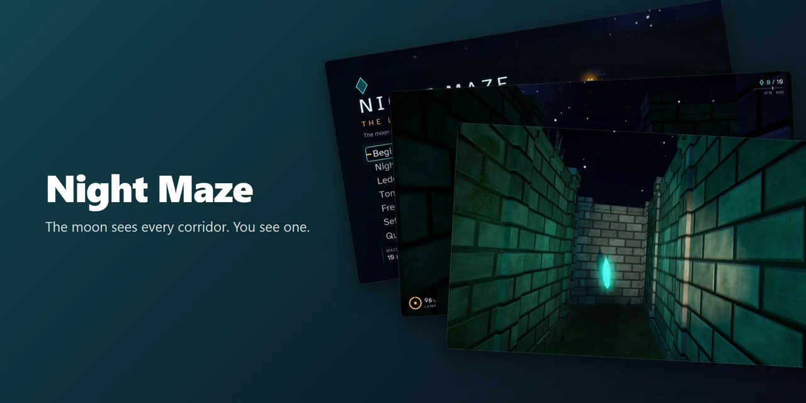

<h1>Night Maze</h1>

**A first person maze game in C++20 and OpenGL 4.1: a stone maze at night, one flashlight, crystals to find, and a shadow that hunts by sound and is burned away by the light.**

[](https://github.com/Shironex/night-maze/releases/latest)
[](https://github.com/Shironex/night-maze/actions/workflows/ci.yml)
[](LICENSE)

[Play it](#play-it) · [The launcher](https://github.com/Shironex/night-maze-launcher) · [Changelog](CHANGELOG.md) · [Build it](#build-from-source)

> The moon sees every corridor. You see one.

</div>

> [!WARNING]
> Night Maze is a university project that I keep working on to learn OpenGL. It changes a lot, and things will break here and there. Expect rough edges and breaking changes between versions.

---

## What is Night Maze?

You stand in a stone maze at night with a flashlight. Crystals are scattered through the corridors, each one a small sliver of the moon. Collect enough of them and the gate at the far end sinks into the ground. Walk through it and the round is over.

The battery of the flashlight runs down while the light is on, and every crystal charges it a little. You are not alone in the maze: a shadow wanders through it. It hears you when you sprint, pull a lever, pick something up or even walk close by, and it comes to the place of the noise. If it sees you it runs at you. While your light is on it, it stands still, and a long enough beam burns it away for a while, at the price of battery. If it reaches you it does not hurt you: it carries you back to the start, and the round begins again. So being quiet and saving the lamp both pay.

No clock runs against you. If you only want to walk the maze, the switch "Calm night" in the main menu takes the shadow out of it.

The story is told as a campaign of five nights, each in a bigger maze than the one before. When a campaign begins, a short intro tells where the crystals come from: five cards of text over pictures of the maze. Any key skips it. Free play, with a difficulty, a calm night and a seed of your choice, is still in the main menu, and so is Tonight's hedge, one maze a day that is the same for every player.

I write the game to learn how real time graphics work, so most of what is on the screen is written by hand on top of OpenGL: the lighting, the shadows, the fog, the glow. There is no game engine underneath.

## Play it

1. Download the launcher from its [latest release](https://github.com/Shironex/night-maze-launcher/releases/latest). Windows 10 or 11, 64 bit, only for now.
2. Run the installer. It is not signed with a paid certificate, so Windows shows "Windows protected your PC". Click "More info", then "Run anyway".
3. The [launcher](https://github.com/Shironex/night-maze-launcher) downloads the game, keeps it up to date and starts it.

The game needs a graphics card and driver with OpenGL 4.1.

Windows is what ships. I last ran the game on a Mac around version 0.9.0. Since then the code is only compiled and unit tested on macOS by a GitHub runner, so I do not know whether the newest version works there.

## Screenshots

<table>
  <tr>
    <td width="50%">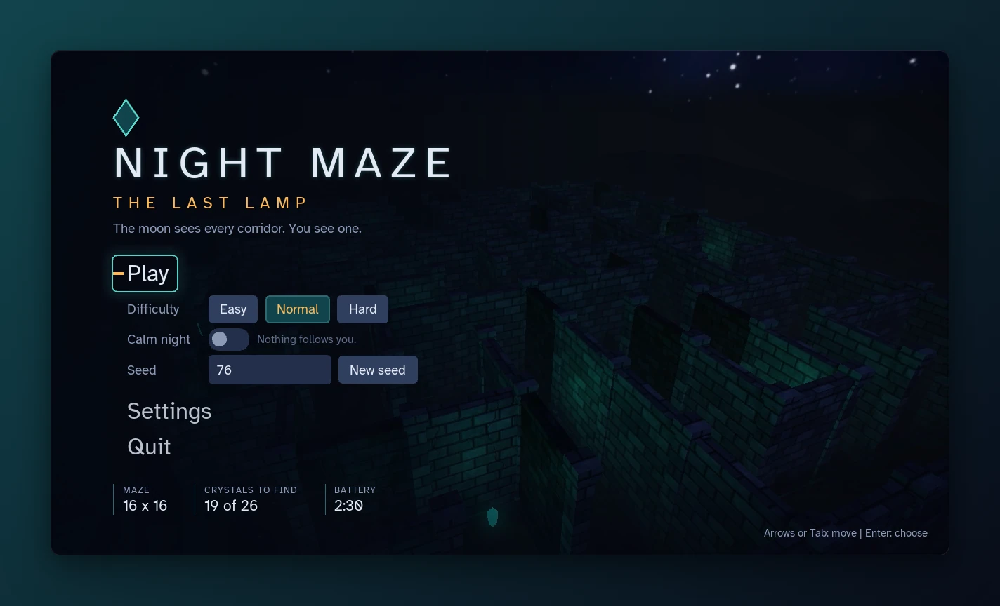</td>
    <td width="50%">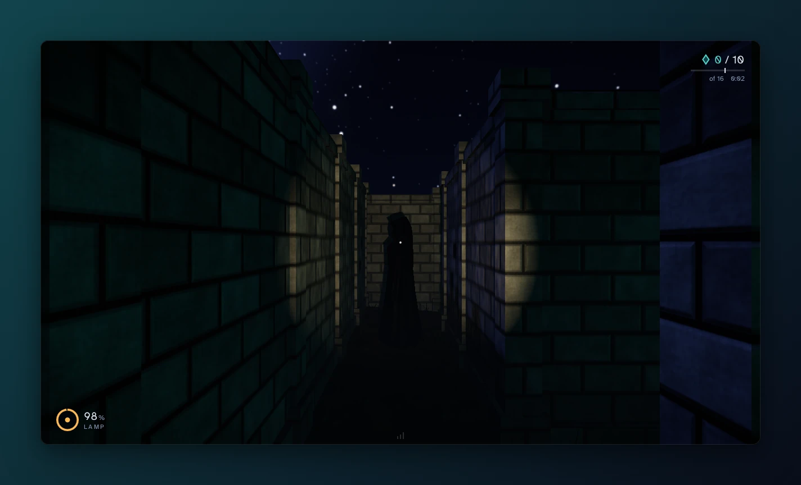</td>
  </tr>
  <tr>
    <td align="center"><sub>The main menu with Begin, Nights and Free play, over a video loop recorded from the game.</sub></td>
    <td align="center"><sub>The shadow at the end of a corridor. It stands still while the light is on it.</sub></td>
  </tr>
  <tr>
    <td width="50%">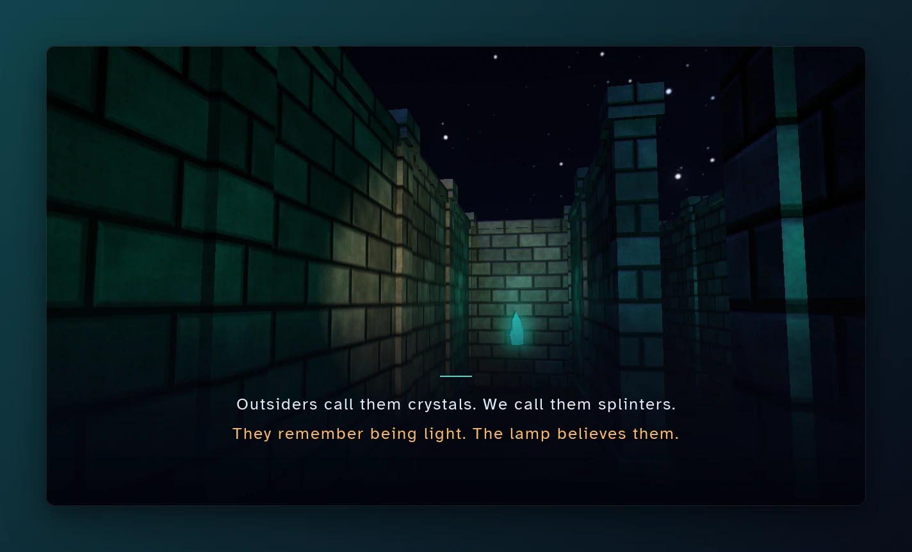</td>
    <td width="50%">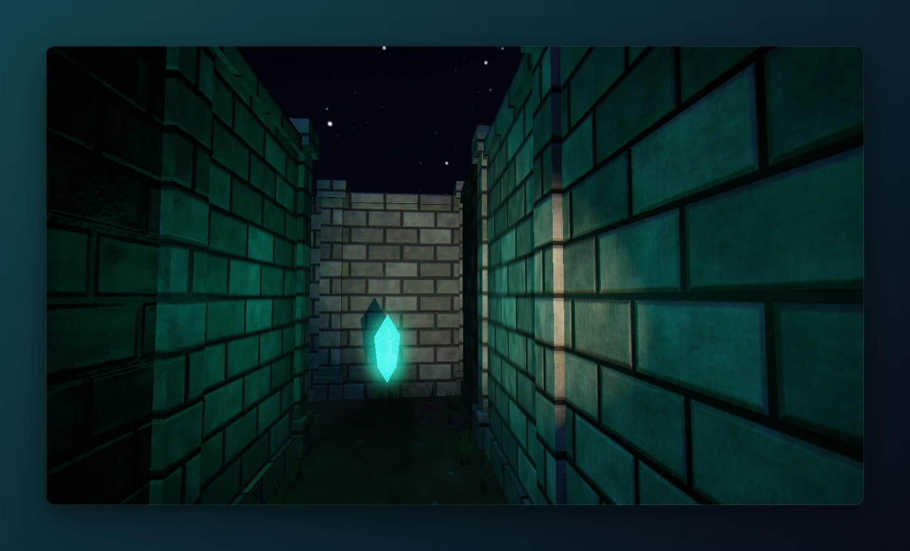</td>
  </tr>
  <tr>
    <td align="center"><sub>The third of the five cards of the intro, over a walk through the maze.</sub></td>
    <td align="center"><sub>A crystal glows in front of the wall at the end of a corridor.</sub></td>
  </tr>
  <tr>
    <td width="50%">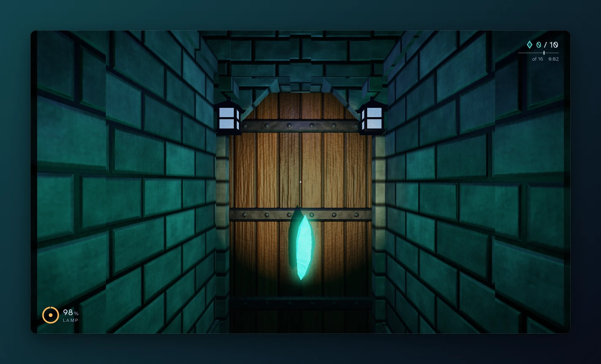</td>
    <td width="50%">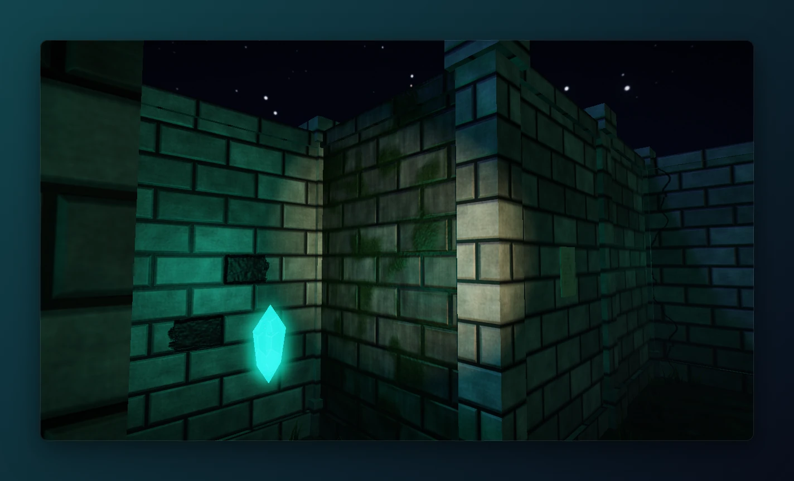</td>
  </tr>
  <tr>
    <td align="center"><sub>The gatehouse at the exit, its gate still closed, a lantern on each side and a crystal in front.</sub></td>
    <td align="center"><sub>Stones missing, moss and cracks. The seed decides which walls are worn.</sub></td>
  </tr>
  <tr>
    <td width="50%">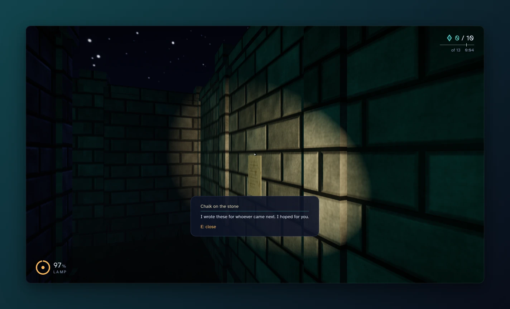</td>
    <td width="50%">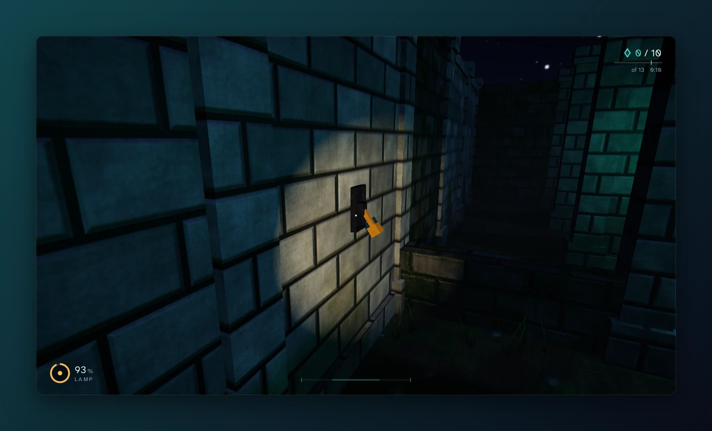</td>
  </tr>
  <tr>
    <td align="center"><sub>A note on the wall, read with E. This one is a line of the story.</sub></td>
    <td align="center"><sub>A lever, just pulled: the mossy wall beside it sinks and opens a shortcut.</sub></td>
  </tr>
  <tr>
    <td width="50%">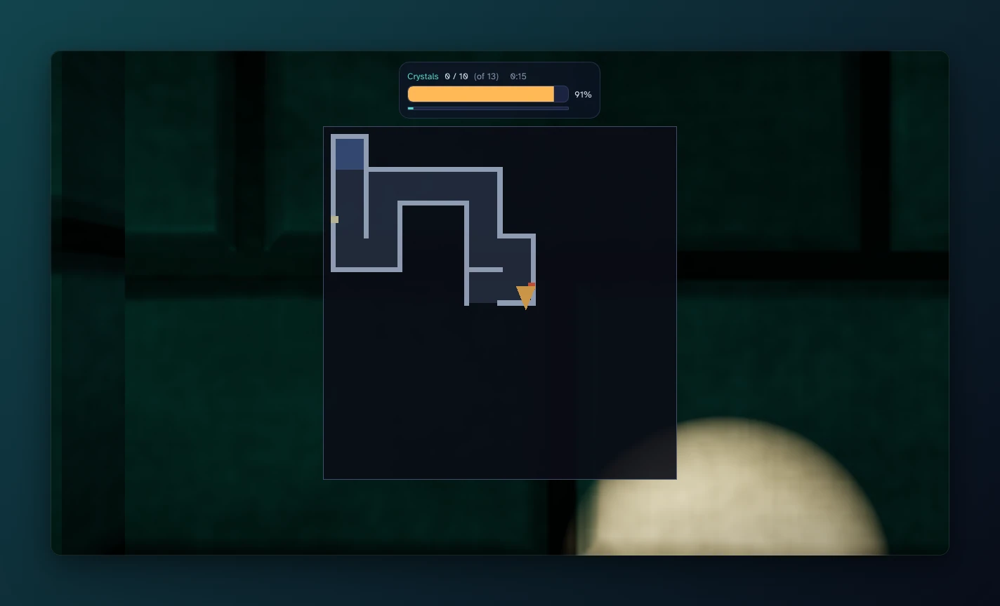</td>
    <td width="50%">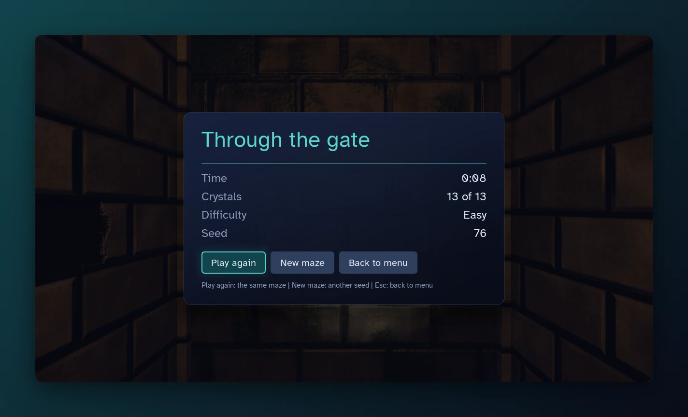</td>
  </tr>
  <tr>
    <td align="center"><sub>The map while M is held: the corridors seen so far and a note.</sub></td>
    <td align="center"><sub>The end of a round: the time, the crystals, the difficulty and the seed.</sub></td>
  </tr>
</table>

Every picture is the game window as it is, at 1280 x 720. The corridor and the worn walls are taken by the menu camera, which shows the game without the HUD. The intro card is the intro itself. The others are from a round and from the menus.

## What is in the game

| Feature | What it does |
| --- | --- |
| Mazes from a seed | Every maze is generated from a number. The same seed and difficulty always give the same maze, with the crystals, flasks, levers, notes, sheep and worn walls in the same places. The main menu offers a random seed, and you can type your own. |
| Three difficulty levels | In free play, Easy, Normal and Hard change the size of the maze, the number of crystals and flasks, how many crystals the gate asks for and how long the battery lasts (table below). |
| Flashlight and battery | F switches the flashlight on and off. The battery only drains while the light is on, and each crystal gives back a quarter of it. Under 20 % the light flickers, the bar turns red and a slow pulse starts. At zero the light goes out until you find a crystal. |
| Crystals and the gate | A crystal is drawn as a sliver of the moon, pale and bright inside a dark rind, in one piece or in three (the game's words still say "crystals"). The gate opens by itself once you carry enough crystals: you never need all of them. The exit is the cell farthest from the start, counted in steps. Walking through the open gate ends the round with "Through the gate": your time, your crystals, the difficulty and the seed. |
| Campaign | Five nights from the main menu: First Frost, The Shepherds' Gates, Lamp's Back, What the Moon Misses and The Last Lamp, in mazes from 10 x 10 to 22 x 22 with a shorter battery each night. Each night has a title card, a line of the story when you win it, and the next one waits behind "Next night". "Nights" lists them with your best times, and a finished campaign ends with a card of four lines. The first night has no shadow. The numbers are not balanced by many players yet. |
| The Lamplighter's Gate | The exit is a gatehouse with three lanterns, cold and blue while the gate is shut and warm when it opens. A brass bell hangs in its roof. Once the gate is open the bell tolls every 6 seconds, swinging with each toll, louder the nearer you are. The map has a small tick that points to the open gate and a lantern in the exit cell. |
| The shadow | A dark hooded figure starts far from you in every maze. It wanders slowly and it hears you: a sprint from 14 m, a lever from 10, a pickup from 8 and a walk from 6, measured along the corridors. It goes to the place of a noise, and when it sees you along a straight row or column of the maze (up to 12 m) it chases you at 4 m per second: faster than you walk (3), slower than you sprint (5.5). After 6 seconds without finding you it gives up and wanders again. It stands still for the first 8 seconds of a round and for as long as the beam of your flashlight is on it. Hold the beam on it for 2.5 seconds and it is burned away (the night in its hood shows it: the stars there flare brighter as it burns): it goes to a far cell for 20 seconds, and the battery drains three times as fast meanwhile. A low hum warns you from 14 m of walking distance, and it alerts with a cold sound when it notices you. If it reaches you, the screen fades out, you are back at the start and the round begins again: crystals back, battery full, and one line on the screen that says what happened. The map never shows it. |
| Calm night | A switch in the free play menu, kept with your settings. A calm night has no shadow, on every difficulty. The notes then leave out the lines about it, and the intro changes one line and leaves its corridor empty. The campaign ignores the switch. |
| Intro | When a campaign begins, the game plays five cards of text, six seconds each, over pictures it takes live in one fixed maze, with wind and a far bell, and then the title card of night 1 follows. Any key or mouse button skips it. The game itself opens with the main menu, and Continue and the list of nights never play the intro. |
| Levers | A maze has up to two levers, each a shepherd's crook on a board with a rope into the turf. Pull one with E and a wall somewhere else sinks into the ground, which opens a shortcut. That wall carries an iron ring, so you can tell it from the others. |
| Notes and a story | Six notes are chalked on the walls of every maze, drawn as chalk marks: a lamp for a line of story and an arrow for a hint. Two hints point towards the gate and two towards the nearest crystal, and the arrow leans the way it points (up, down, left or right, as seen on the wall). The two other notes carry a line of story. The story has 24 lines, read in order: when you finish a maze, the next one carries on where you stopped, also after you close the game. Eight of the lines are about the shadow. A calm night skips them, which leaves 16. |
| Stamina and tea | Sprinting empties a thin bar in about six seconds. Run it empty and you are winded: no sprint until the bar is half full again. A flask of tea fills the bar and makes sprinting free for 20 seconds. Every maze with a dead end to spare also has one heartstone, a larger sliver in the dead end farthest from the start. It counts as three crystals and fills the battery, but it is heavy: no sprint for 30 seconds. A maze has one, two or three flasks, and each lies in a dead end, the dead ends far from the start first. |
| The map | Hold M and the map opens in the middle of the screen. It shows only the corridors you have already seen. While you hold it you stand still and cannot look around, and the battery keeps draining. |
| Worn walls | Some walls are cracked, mossy or have stones missing, and some are crowned with twigs of stone or broken, with a coping stone gone. Which ones is decided by the seed. The walls near the start are whole. |
| The stile | Every night starts at a stile in the wall of the start cell: stone steps up to a notch and an oak post with an empty iron hook. It is only to look at, it cannot be climbed. |
| Stone sheep | Three stone sheep stand in dead ends and corners of a maze, four from 16 x 16 and five from 22 x 22. They all face the gate. The map does not show them. |
| Tonight's hedge | An entry in the main menu: free play on Normal, with the date as the seed, so every player gets the same maze that day. The shadow is always there. The game keeps your best time of the day and on how many days you won. |
| The lamplighter's ledger | "Ledger" in the main menu and the pause menu lists the 24 lines of the story under the night that tells them: the lines whose note you opened, and blanks for the others. |
| The village | After a won night the camera rises over the gate and turns to a village on the far ridge. Each night you win lights more of its windows and lamps, and after the fifth night the view stays a little longer before the ending card. |
| Sound | Twenty-three sounds, made by a script: the flashlight switch (on, off, empty), the low battery pulse, a crystal, a heartstone, a flask, a lever, the gate and the bell of the gate, your steps, the breathing of a winded player, the wind of the maze, the hum, the steps, the alert and the burning away of the shadow, two soft notes when it has caught you, and the wind and the bell of the intro. Most of them sound in a stone room, a short echo. The main menu has a theme, a piece of music of about 73 seconds that loops. Four sliders: the main volume, the effects, the ambient sound (the wind) and the music, which starts at 60. Music plays in the menus only. |
| HUD | Instruments in the corners: a ring for the lamp, the crystals against the number the gate needs, the time, a stamina line, three ticks that show how loud you are (in a maze with a shadow), short sentences for the tea, the open gate and an empty battery, the name of the night, and a prompt that names the key. It grows with the size of the window. |
| Keys | The Controls part of the settings screen lets you pick a key for each of the nine actions. A key that is already in use swaps with the one you choose. The prompts in the game name your keys. |
| Menus and settings | A main menu over a video loop recorded from the game, with the campaign, the list of nights, the ledger, Tonight's hedge, free play (difficulty, calm night and seed), a pause menu, the round end screen and a settings screen: mouse sensitivity, field of view, volumes, fullscreen, window size and keys. The settings are kept in a text file. |

| Level | Maze | Crystals | Gate opens at | Flasks of tea | Battery |
| --- | --- | --- | --- | --- | --- |
| Easy | 10 x 10 cells | 13 | 10 | 1 | 3:00 |
| Normal | 16 x 16 cells | 26 | 19 | 2 | 2:30 |
| Hard | 22 x 22 cells | 40 | 32 | 3 | 2:00 |

[CHANGELOG.md](CHANGELOG.md) has the details for every version.

## Controls

These are the keys at the start. You can change them in the settings.

| Key | Action |
| --- | --- |
| Mouse | Look around |
| W, A, S, D | Walk |
| Left Shift | Sprint, while there is stamina |
| F | Flashlight on and off |
| E or left click | Use what you look at: pull a lever, read a note, close a note |
| Hold M | Show the map; you stand still while you read it |
| R | Start the round again on the same maze |
| Esc | Pause and resume; on the settings screen, go back |
| Any key or mouse button | Skip the intro |

In the menus: arrow keys or Tab to move, Enter to choose.

Debug keys, not meant for play: the key left of 1 (`) shows the debug window, N switches to free flight (Space up, Left Shift down), F2 switches the menu camera.

## How it is drawn

Everything here is in `src/gfx`, `src/game`, `src/assets` and `assets/shaders`.

| Technique | In this game |
| --- | --- |
| Lighting | Blinn-Phong per fragment. The moon is a directional light, the flashlight a spot light, and the sixteen crystals nearest to the eye each carry a point light. |
| Shadow maps | Two: one for the moon and one for the flashlight, softened with percentage closer filtering. |
| Normal mapping | In tangent space, on the walls, the ground and the models. The tangents are computed when a model is loaded. |
| HDR and tone mapping | The scene is drawn into a 16 bit float buffer and brought to the screen with ACES tone mapping. The colours are kept linear until the last step. |
| Bloom | A bright pass and a blur at half resolution, added back to the picture: the glow of the crystals. |
| Fog | Distance fog that is thicker near the ground, computed after the scene from its depth buffer. |
| Vignette | The corners of the picture are darkened a little. |
| Skybox | A cube map of the night sky with stars and a painted moon. |
| Reflections | Puddles and crystals mirror the sky: they sample the cube map of the skybox (environment mapping), not the scene around them. |
| Grass | A geometry shader turns every point into a tuft of three blades that move in the wind. |
| Terrain | The ground is built from a height map, so the floor of the corridors is gently uneven. |
| Models | OBJ models, made in Blender by the scripts in `tools/blender` and read by a loader of my own. |

## Built with

C++20 and OpenGL 4.1 (core profile), built with CMake 3.24 or newer. CMake downloads the libraries at configure time, except GLAD.

| Part | What |
| --- | --- |
| Window and input | [GLFW](https://www.glfw.org/) 3.4 |
| Math | [GLM](https://github.com/g-truc/glm) 1.0.3 |
| OpenGL loader | [GLAD](https://github.com/Dav1dde/glad) 2.0.8, generated and kept in `external/glad` |
| Menus | [RmlUi](https://github.com/mikke89/RmlUi) 6.3 with [FreeType](https://freetype.org/) 2.14.3: the menus are HTML and CSS style documents in `assets/ui` |
| HUD and debug window | [Dear ImGui](https://github.com/ocornut/imgui) 1.92.9b (docking branch) |
| Images | [stb_image](https://github.com/nothings/stb) 2.30 |
| Sound | [miniaudio](https://miniaud.io/) 0.11.25 |
| Menu video | The decoders of the operating system: Media Foundation on Windows |
| Tests | [doctest](https://github.com/doctest/doctest) 2.5.3, more than 1000 test cases for the code that needs no window |
| Checks | clang-format and clang-tidy, and a CI run on every push to `main` |

## Build from source

You need CMake 3.24 or newer, a C++20 compiler and git (CMake downloads the libraries). On Windows I use the Visual Studio Build Tools 2022 and run these from its developer shell:

```sh
cmake --preset release
cmake --build --preset release
ctest --test-dir build/release -C Release --output-on-failure
```

The game is then `build/release/Release/night_maze.exe`. Run it from the repository root.

`make` wraps the same steps (plain `make` lists the targets):

| Command | What it does |
| --- | --- |
| `make run` | Builds the Debug version and starts it |
| `make release` | Builds the Release version |
| `make test` | Builds the Debug version and runs the unit tests |
| `make check` | Everything I run before a commit: the format check, both builds, the unit tests of both, clang-tidy |

`make check` needs GNU make and the developer shell of Visual Studio, which brings clang-format, clang-tidy and Ninja.

The full steps, the prerequisites and what `make check` does are in [docs/building.md](docs/building.md).

## Repository layout

| Folder | What is in it |
| --- | --- |
| `src/` | The game and its engine code: `core`, `gfx`, `scene`, `assets`, `game`, `audio`, `video`, `ui`, `debug` |
| `assets/` | Shaders, textures, models, skybox, menu documents, fonts, sounds and the menu video. All of it ships with the game |
| `tests/` | Unit tests |
| `tools/` | Scripts that make assets (sounds, the menu loop, Blender scripts), the release notes and the README pictures |
| `docs/` | The architecture overview, the build guide, the asset notes and the decision records, all in English, plus course material in Polish |

The launcher that installs and updates the game has its own repository: [night-maze-launcher](https://github.com/Shironex/night-maze-launcher).

## Docs and the story

The docs are in English: an [architecture overview](docs/architecture.md), a [build guide](docs/building.md), notes on the [assets](docs/assets.md), and short [decision records](docs/decisions/README.md) on why something is done the way it is. [docs/README.md](docs/README.md) is the index. The course material, `docs/PRD.pdf` and `docs/syllabus.md`, is in Polish. My own long study notes are not in this repository.

The story behind the game is in [docs/story/the-last-lamp.md](docs/story/the-last-lamp.md), in English under a short Polish note. It is a design draft: the lines on the notes, the shadow and the title of the round end screen come from it, and much of the rest of it is not in the game.

Plans, not promises: more music.

## Showcase images

The pictures in this README come out of the game itself and are framed with [@noctcore/showcase-kit](https://github.com/noctcore/showcase-kit), the same way as the pictures of the launcher. These commands rebuild them:

```sh
cmake --preset release
cmake --build --preset release
python tools/capture_showcase.py   # the game window, into showcase-out/raw/
pnpm install
pnpm showcase                      # frames and banner, into docs/showcase/
```

The kit cannot start a native game, so the capture is a script of mine. It starts the Release build in a 1280 x 720 window, with fixed seeds, in a folder of its own (your settings are not touched), and saves what the window shows. The views without a HUD come from the menu camera, set with command line switches. Some views from a round are reached with switches too: `--start-cell <column>,<row>` and `--start-yaw <degrees>` put the player somewhere in the first round, `--collect-all` starts it with every crystal collected, so the gate is open, and `--intro` plays the intro. Every run that plays a round has `--calm`, a calm night for that run only, so nothing catches the player in the middle of a picture. The one run that shows the shadow leaves it out and starts three cells away from it, with the light on it. The other views from a round need a few key presses and mouse turns. The script sends them only while the game window is the active one, so leave the mouse and the keyboard alone while it runs. It needs Python 3, ffmpeg on `PATH` and Windows.

`pnpm showcase` only reads those pictures: from the same raw pictures it wrote the same files, byte for byte, every time I ran it on my PC. It needs Node 22, pnpm 10 and the Chromium of Playwright, downloaded once with `pnpm exec playwright install chromium`. The game itself is not a still picture (the crystals turn, a clock runs in the HUD), so a new capture is never identical to the last one.

The pictures live in `docs/showcase/` and not under `assets/`, because everything under `assets/` is packed into the game.

## Licence

The code is MIT, see [LICENSE](LICENSE). The assets are not covered by it: the models, textures, sounds, video, user interface art and story text under `assets/` and `docs/story/`, and the pictures of this README under `docs/showcase/`, remain all rights reserved, and reusing them needs my permission. Third-party libraries and fonts keep their own licences, listed in [THIRD-PARTY-NOTICES.txt](THIRD-PARTY-NOTICES.txt).
