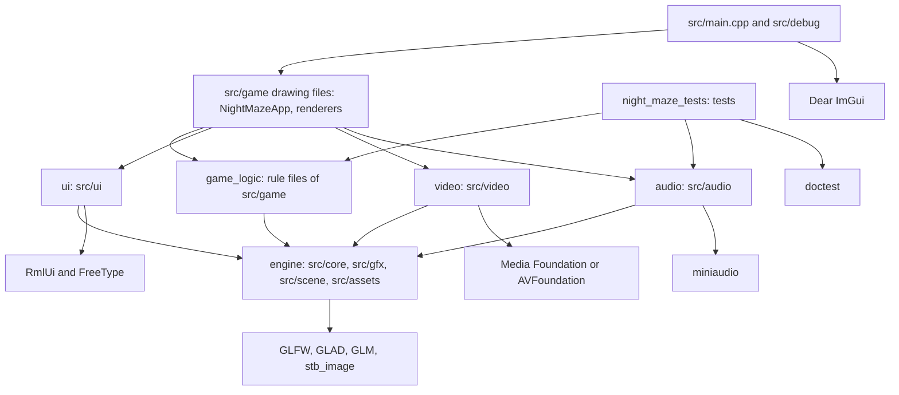
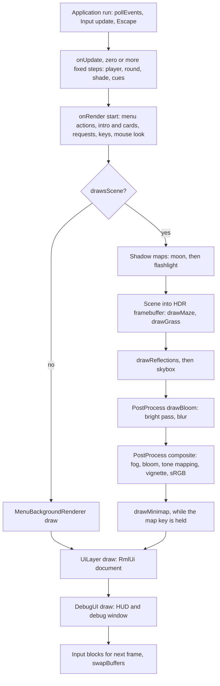

# Architecture

This page is a map of the code for someone who has just cloned the repository: where things live, what depends on what, and what happens in one frame. How to build and run is in `docs/building.md`.

Night Maze is a first person game written in C++20 on OpenGL 4.1. The launcher that installs and updates it lives in its own repository, `Shironex/night-maze-launcher`.

## 1. Targets and directories

`CMakeLists.txt` defines five static libraries and two programs. Third party code is declared in `cmake/Dependencies.cmake`.

| Target | Sources | Purpose | Links |
|---|---|---|---|
| `engine` | `src/core`, `src/gfx`, `src/scene`, `src/assets` | window, input, clock, OpenGL wrappers, camera and collision math, file loaders | `glad`, `glfw`, GLM, `stb_image` |
| `game_logic` | the rule files of `src/game` | everything about the game that is plain data and math | `engine` |
| `ui` | `src/ui` | owns RmlUi and draws the menu documents | `engine`, `rmlui_backend` |
| `video` | `src/video` | plays a video file into a texture with the decoder of the operating system | `engine`, Media Foundation or AVFoundation |
| `audio` | `src/audio` | plays sounds through miniaudio | `engine`, `miniaudio` |
| `night_maze` | `src/main.cpp`, the drawing files of `src/game`, `src/debug` | the game | all five, `imgui` |
| `night_maze_tests` | `tests`, plus `src/debug/Search.cpp` and `src/video/VideoClock.cpp` | unit tests | `game_logic`, `audio`, `doctest` |

The dependencies go one way. `engine` knows nothing above it. `ui`, `video` and `audio` sit beside each other on top of `engine` and know nothing about the game: the game tells them which document to show, which file to play, which sound to start. They are separate libraries so that `game_logic` and the tests do not link RmlUi, the media libraries of a system or a sound device. Nothing includes `src/debug` except `src/main.cpp`.

Inside `engine` the folders are layered too: `src/core` includes only itself, `src/gfx` uses `src/core`, `src/assets` uses both, and `src/scene` is math on GLM alone.

The folder `src/game` is split between two targets. The files that need no window are in `game_logic`. The files that draw (`NightMazeApp`, the `*Renderer` classes, `PostProcess`, `ShadowMap`, `Skybox`, `LightRig`) are in the executable.

What runs without a window or an OpenGL context: all of `game_logic`, the math in `src/scene`, the file loaders and shader text functions in `engine`, and the audio engine when it is made with `audio::AudioOutput::None`. The 49 test files in `tests` cover that. The `src/gfx` classes and everything that draws have no unit tests.

The libraries and where they enter:

| Library | Version | Used by |
|---|---|---|
| GLAD | generated, in `external/glad` | `engine` (OpenGL function loader) |
| GLFW | 3.4 | `engine` (window, context, input) |
| GLM | 1.0.3 | `engine` and everything above |
| stb_image | pinned commit | `engine`, private to `src/assets/ImageLoader.cpp` |
| RmlUi | 6.3, with FreeType 2.14.3 | `ui` |
| miniaudio | 0.11.25 | `audio` |
| Dear ImGui | 1.92.9b, docking branch | `night_maze` only |
| doctest | 2.5.3 | `night_maze_tests` only |

Directory map:

- `src/core`: `Application`, `Window`, `Input`, `Time`, logging, `GL_CHECK`, paths and file reading.
- `src/gfx`: RAII wrappers of OpenGL objects, the shader loader with its `#include` step, colour space helpers.
- `src/scene`: `Camera`, `Transform`, colliders, ray casts, lights as plain data, light space matrices for shadows.
- `src/assets`: OBJ and image loaders, tangents, `AssetCache`.
- `src/game`: the rules and the renderers of Night Maze, and the application class.
- `src/debug`: Dear ImGui code: the debug window, its seven categories in `src/debug/categories`, and the HUD.
- `assets/shaders` (GLSL, shared parts in `assets/shaders/common`, full screen passes in `assets/shaders/post`), `assets/ui` (RML documents and one style sheet), `assets/models`, `assets/textures`, `assets/skybox`, `assets/audio`, `assets/video`, `assets/fonts`.
- `tests`: doctest files, each named after what it tests.
- `tools`: scripts that produce assets and releases. `tools/blender` builds the models and textures, `tools/make_sounds.py` the sounds, `tools/record_menu_loop.py` the menu video, `tools/capture_showcase.py` the README pictures, `tools/build-notices.mjs` and `tools/release-notes.mjs` serve the release.

## 2. Layers

An arrow means "includes and links".

## 3. The application skeleton

`core::Application` (`src/core/Application.hpp`) owns the `Window`, the `Input` snapshot and the `Time` clock, and runs the loop. A program derives from it and fills in `onUpdate(fixedDt)`, `onRender(alpha)` and, if it wants, `onEscapePressed()`.

The loop uses a fixed timestep. `core::Time` collects the real time of each frame (clamped to 0.25 s) and `run()` calls `onUpdate` once for every `Time::FIXED_DT` (1/120 s) that fits, so zero or more times per frame. `onRender` runs once and receives `alpha`, how far the frame lies between two steps. The game draws the player and the shade at a position blended between the last two steps. One rule follows: anything that is true for one frame (`wasKeyPressed`, a mouse delta) is read in `onRender`, never in `onUpdate`.

`game::NightMazeApp` (`src/game/NightMazeApp.hpp`) is the game. It owns, as plain members, the shader programs, the `AssetCache`, the renderers, the two shadow maps, `PostProcess`, the settings, the current `MazeWorld`, `Round`, `Player` and camera, the current `GameMode`, the `ui::UiLayer` and the `audio::AudioEngine`. Member order is construction order, and some of it matters: the settings file is read before the first maze is built, and the UI layer exists before the debug UI so that Dear ImGui can chain its GLFW callbacks onto the ones of RmlUi.

`src/main.cpp` holds the only class that knows both the game and the debug code: `DebugNightMazeApp` derives from `NightMazeApp`, owns `debug::DebugUI`, and draws it after the frame of the game. It hands the debug window a `debug::DebugContext`, a struct of references rebuilt every frame.

The classes in `src/gfx` (`Shader`, `Buffer`, `VertexArray`, `Mesh`, `Texture2D`, `Cubemap`, `Framebuffer`, `UniformBuffer`) follow one rule: the constructor creates the OpenGL object, the destructor deletes it, copying is deleted and moving is allowed. `FrameTexture` and `ComparisonSampler` can be neither copied nor moved. All of them need a live context, so they are members of the application and die before the window does.

## 4. One frame

Update, for each fixed step (`NightMazeApp::onUpdate`). It returns early unless `updatesRound(mode)` is true, so the round stands still under every menu.

1. Build a `PlayerInput` from the bound keys and call `Player::update` (movement, collision, stamina). `advanceFootsteps` may ask for a step sound.
2. Take a `soundSnapshot`, call `updateRound` (battery, crystals, flasks, gate, exit), then play what `roundStepCues` returns, plus the low battery pulse and the winded breath when their clocks are due.
3. Call `updateRoundShade`, then the hum and the steps of the shade. If it caught the player, a fade starts and `carryPlayerBack` restarts the round at black.
4. If the round is won, `finishRound` writes the progress and sends `RoundWon` or `CampaignWon`.

Render, once (`NightMazeApp::onRender`, then `DebugNightMazeApp::onRender`):

1. Take the clicked menu actions and changed controls from the UI layer, advance the intro or a story card, handle a lost focus, switch the wind loop, and apply requests of the debug window (new maze, restart, terrain, grass, puddles).
2. Read the once per frame keys (flashlight, restart, noclip, map) and the mouse look.
3. If `drawsScene` is false (a menu over the video or the still picture), draw `MenuBackgroundRenderer` and the UI and stop.
4. Blend the eye position, build the view and projection matrices, cast the picking ray (`pickForFrame`, `handleInteraction`).
5. Shadow maps: `drawMoonShadowMap` and `drawFlashlightShadowMap` draw the shadow casters with `assets/shaders/shadow_depth.vert` into two depth textures.
6. Scene, into the HDR framebuffer (`PostProcess::beginScene`): `LightRig::upload` fills the uniform buffer of the lights, `drawMaze` draws terrain, walls, gate, flasks, shade, crystals, levers and notes with `assets/shaders/lit.frag` (or `assets/shaders/gouraud.frag`, or `assets/shaders/textured.frag` in the unlit and debug views), then `drawGrass` uses `assets/shaders/grass.geom`.
7. Reflections: `drawReflections` draws the crystals and the puddles with `assets/shaders/reflect.frag`, which samples the sky cubemap. The skybox itself comes last (`assets/shaders/skybox.frag`).
8. Bloom: `PostProcess::drawBloom` runs `assets/shaders/post/bright.frag` and then `assets/shaders/post/blur.frag` back and forth over half size targets.
9. Composite: `PostProcess::composite` draws to the window with `assets/shaders/post/composite.frag`. Fog, bloom, exposure, tone mapping, vignette and sRGB encoding all happen in this one pass.
10. The map, while its key is held: `drawMinimap` (`assets/shaders/post/minimap.frag`, then `assets/shaders/post/minimap_overlay.frag`).
11. UI layers: `UiLayer::draw` (RmlUi), then `DebugUI::draw` (the HUD and the debug window), then the input blocks for the next frame are set and the buffers are swapped.

## 5. The game state machine

`src/game/GameState.hpp` holds one enum of screens, `GameMode`, one enum of events, `GameEvent`, and the pure function `nextMode(mode, event)`. The application keeps one `GameMode`, sends events through `handleGameEvent`, and asks predicates such as `updatesRound`, `isMenuOpen`, `showsHud` and `drawsScene` instead of deciding per screen. An event that means nothing on a screen changes nothing.

| Mode | What it is | Leaves on |
|---|---|---|
| `Intro` | five cards over live pictures, first start only | `IntroFinished`, `Escape` to `MainMenu` |
| `MainMenu` | first screen | `StartNight`, `AskNewCampaign`, `OpenNights`, `OpenFreePlay`, `OpenSettings`, `Quit` |
| `FreePlay` | difficulty, calm night, seed | `Play` to `Playing`; `BackToMenu`, `Escape` |
| `Nights` | list of the five nights | `StartNight` to `NightCard`; `BackToMenu`, `Escape` |
| `NewCampaign` | question before a finished campaign is replaced | `StartNight`; `BackToMenu`, `Escape` |
| `NightCard` | title card of a night | `CardFinished`, `Escape` to `Playing` |
| `Playing` | the round runs | `Escape`, `FocusLost` to `Paused`; `RoundWon` to `RoundEnd`; `CampaignWon` to `EndingCard` |
| `Paused` | pause menu over the round | `Resume`, `Restart`, `Escape` to `Playing`; `OpenSettings`; `BackToMenu` |
| `RoundEnd` | result of a won round | `Restart`, `NewMaze` to `Playing`; `BackToMenu`, `Escape` |
| `EndingCard` | four lines after the last night | `CardFinished`, `Escape` to `MainMenu` |
| `SettingsFromMenu`, `SettingsFromPause` | the same document, remembering where back leads | `CloseSettings`, `Escape` |
| `Quitting` | the window closes | nothing |

Free play is one maze of a chosen difficulty and seed. The campaign is five nights with their own numbers, in `src/game/Campaign.hpp`.

## 6. The rules layer

The rules are in `game_logic`, each in a header and source pair with a test file of the same name:

- Maze: `src/game/Maze.hpp`, `MazeGenerator.hpp`, `MazeLayout.hpp`, `Terrain.hpp`. `MazeWorld.hpp` puts them together.
- Placement from the seed: `buildMazeWorld` calls the generator and then `Exit.hpp`, `Crystals.hpp`, `Flasks.hpp`, `Interactables.hpp` (levers and notes) and `WallVariants.hpp`. The same seed gives the same maze and the same objects on every system.
- Round: `src/game/Round.hpp` (`startRound`, `updateRound`), with `Interaction.hpp` for picking and `Discovery.hpp` for what the map shows.
- Player and stamina: `src/game/Player.hpp`.
- Enemy: `src/game/Shade.hpp`.
- Campaign, intro and difficulty: `Campaign.hpp`, `Intro.hpp`, `Difficulty.hpp`.
- Settings and input: `Settings.hpp`, `KeyBindings.hpp`, `StartOptions.hpp` (the command line).
- Sound: `SoundCues.hpp` decides which sound belongs to what happened.
- Look: `Lighting.hpp`, `Shadows.hpp`, `Bloom.hpp`, `Fog.hpp`, `Vignette.hpp`, `Minimap.hpp`: settings structs and the math the renderers use.

They share one pattern. State is plain structs. Behaviour is free functions that take the state and a step length and touch no window, file or clock. Randomness comes only from the seed. Where the application needs to know what a step did, it takes a snapshot before the step and compares after it: `soundSnapshot` and `roundStepCues` turn a step of the round into a list of sounds, and the round never learns that sound exists. Repeating sounds use small clock structs (`LowBatteryPulse`, `StepClock`) advanced by the same fixed step.

## 7. The UI layers

RmlUi draws everything a player meets outside a round: the menus, the settings screen and the story cards. The documents are `assets/ui/*.rml` with the style sheet `assets/ui/menu.rcss`. `ui::UiLayer` shows one document at a time and reports by name: an element with `data-action` puts its name on a list (`takeActions`), a control with `data-setting` reports its new value (`takeChanges`). `NightMazeApp::handleMenuActions` maps a name to a `GameEvent` with `eventForAction`, or to a command such as a difficulty or a key to rebind. `showScreen` picks the document for the current mode.

Dear ImGui draws the debug window (key left of 1) and the HUD of a round: counters, bars, crosshair, prompt and the card of a note. The HUD is in `src/debug/Hud.cpp` because only that folder may include ImGui.

Input routing:

- `core::Input` is a snapshot polled once per frame. It has two neutral flags, `setKeyboardBlocked` and `setMouseBlocked`. `src/main.cpp` sets them at the end of a frame from `DebugUI::wantsKeyboard`, `DebugUI::wantsMouse` and `UiLayer::wantsKeyboard`, so typing in a text field does not move the player. They take effect in the next frame.
- The debug panels lie on top of the menu, so they get the mouse first: `UiLayer::setMouseEnabled` is switched off while ImGui wants it.
- The game reads the keys of a round only while `updatesRound` is true, and moves the player only while the cursor is captured. `showScreen` captures it for a round and releases it for a menu.
- Rebinding a key goes through `UiLayer::setKeyCapture` and `takeCapturedKey`. The rules of what may be bound are in `KeyBindings.hpp`.

## 8. Audio

`audio::AudioEngine` (`src/audio/AudioEngine.hpp`) wraps miniaudio behind a pointer, so no other file sees its header. The game hands it a list of files once (`load`) and afterwards names a sound by its index. A one shot is `play(index, volume)`. A loop is `setLoop(index, on, fadeSeconds)`, which the game calls every frame for the wind of the maze. Each sound belongs to one of two groups, `Effects` or `Ambient`, and each group has its own volume under the master volume. Without a sound device every call does nothing. The 19 sounds are listed once, in the table of `src/game/SoundCues.cpp`. The WAV files in `assets/audio` are generated by `tools/make_sounds.py`, not recorded.

## 9. Settings and files on disk

The game finds `assets` next to its own executable (`core::assetPath`): the build copies the folder there on Windows and links it on macOS.

Player settings are a `game::GameSettings` struct: mouse sensitivity, field of view, fullscreen, window size, difficulty, three volumes, key bindings, the calm night switch, whether the intro was seen, and the campaign progress with its best times. `parseSettings` and `formatSettings` turn it into text and back. The application reads and writes the file `night-maze-settings.txt`, one `name = value` per line, in the working directory of the process. Lines it cannot read are skipped and the setting keeps its default. Dear ImGui keeps its `imgui.ini` in the same place.

What the launcher expects from a game build is what `.github/workflows/release.yml` produces: a Windows x64 Release build with the static MSVC runtime, zipped with `assets` and `THIRD-PARTY-NOTICES.txt`, with a version taken from `project(NightMaze VERSION ...)` that matches the tag. The launcher starts the game in its own data folder, which is why the settings path is relative: the file survives when the game is replaced.

## 10. Where to start reading

- Add a setting: the field and its name in `src/game/Settings.hpp` and `src/game/Settings.cpp`, the control in `assets/ui/settings.rml`, then `fillSettingsDocument` and `handleControlChanges` in `src/game/NightMazeApp.cpp`.
- Add a sound cue: the enum entry, the count and the table row in `src/game/SoundCues.hpp` and `src/game/SoundCues.cpp`, the sound in `tools/make_sounds.py`, and one `playCue` call in `src/game/NightMazeApp.cpp`.
- Add a pickup: follow the flask. Placement in `src/game/Flasks.cpp`, state and collection in `src/game/Round.cpp`, drawing in `src/game/GameplayRenderer.cpp`.
- Add a debug control: a reference in `src/debug/DebugContext.hpp`, filled in `src/main.cpp`, and the widget in one file of `src/debug/categories`. Keep `controlCount` in `src/debug/Categories.hpp` right.
- Add a menu screen: a mode, its events and predicates in `src/game/GameState.cpp`, a document in `assets/ui` next to `assets/ui/pause.rml`, then `showScreen` and a fill function in `src/game/NightMazeApp.cpp`.

In every case there is a test file to extend first: `tests/SettingsTests.cpp`, `tests/SoundCueTests.cpp`, `tests/FlaskTests.cpp`, `tests/RoundTests.cpp`, `tests/GameStateTests.cpp`.
