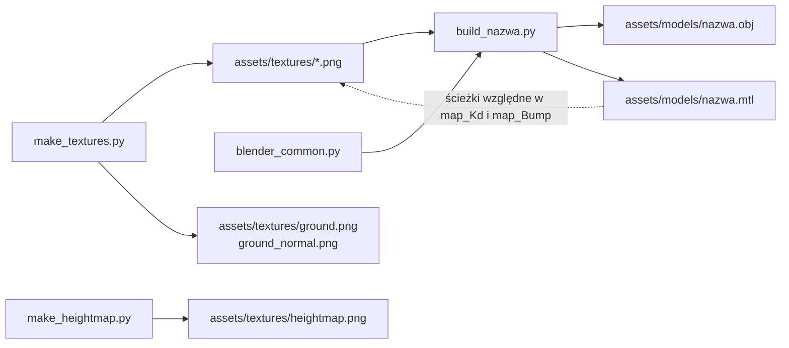
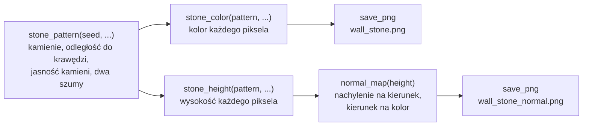
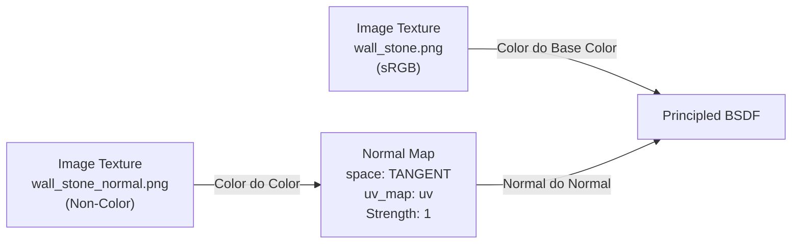

# Blender: od skryptu do pliku OBJ

Przewodnik po tym, jak powstają modele i tekstury gry. Modeli nie rysuję ręcznie w Blenderze:
każdy powstaje ze skryptu w Pythonie, który Blender wykonuje bez okna (headless) i który na
końcu zapisuje plik OBJ. Polecenia dla Windowsa z sekcji 3 zostały uruchomione w konfiguracji:

| Element | Wersja |
|---|---|
| Blender | 5.2.1 LTS |
| Python wbudowany w Blendera | 3.13.13 |
| numpy wbudowane w Blendera | 2.3.4 |
| System | Windows 11 |

Polecenia dla macOS (sekcja 3) **nie były jeszcze uruchomione na Macu**.

Stan: skrypty, osiem modeli, czternaście tekstur i mapa wysokości terenu są w repozytorium. Dwa
modele kamienne (ściana i słup) i tekstury kamienia ściany pochodzą z M2 + M3 i M4: obraz
koloru i, od drugiej części M4, **mapa normalnych** (normal map). M5
(rozgrywka) dołożyło trzy modele, dwa kryształy i bramę, oraz cztery tekstury: obraz koloru
i mapę normalnych kryształu i to samo dla drewna bramy. Pierwsza część M6 (skybox) dołożyła
skrypt `make_skybox.py` i sześć obrazów nieba w osobnym katalogu `assets/skybox/`: to nie są
tekstury modeli, tylko ściany tekstury sześciennej (sekcja 7.7). Druga część M6 (teren)
**usunęła płytkę podłogi**: model `floor_tile`, jego skrypt `build_floor_tile.py` i obie
tekstury `floor_stone`. Podłoże jest dziś terenem liczonym w kodzie gry z **mapy wysokości**
(heightmap), którą pisze nowy skrypt `make_heightmap.py` (sekcja 7.9), a jego teksturę
i mapę normalnych (`ground.png`, `ground_normal.png`) generuje `make_textures.py` (sekcja
7.8). Teren opisuje [`../modules/renderer/terrain.md`](../modules/renderer/terrain.md),
a powody zmiany notatki [`../decisions/gentle-terrain-under-maze.md`](../decisions/gentle-terrain-under-maze.md)
i [`../decisions/floor-tiles-retired.md`](../decisions/floor-tiles-retired.md).
Istnieje też kod C++, który wczytuje pliki OBJ i MTL: własny parser `assets::loadObj`
([`../modules/assets/obj-loader.md`](../modules/assets/obj-loader.md)). Jego testy wczytują
dwa modele kamienne i sprawdzają ich liczby i wymiary z sekcji 8. Modeli z M5 testy loadera
nie wczytują. Gra używa wszystkich tych plików: przy starcie wczytuje osiem modeli, czternaście
tekstur i mapę wysokości, z kamiennych modeli buduje labirynt, z pozostałych kryształy, bramę
przy wyjściu, dźwignie i kartki (M8, część 2: sekcja 8.3), a z mapy wysokości teren pod nimi
([`../modules/assets/asset-cache.md`](../modules/assets/asset-cache.md),
[`../modules/game/maze-rendering.md`](../modules/game/maze-rendering.md),
[`../modules/game/gameplay.md`](../modules/game/gameplay.md)). Sekcja 5 opisuje
dokładnie, co jest w plikach, i była podstawą do napisania parsera. Co mapa normalnych robi
w shaderze, opisuje [`../modules/gfx/normal-mapping.md`](../modules/gfx/normal-mapping.md):
ten przewodnik mówi tylko, skąd bierze się jej plik (sekcja 7.2) i linia w pliku `.mtl`
(sekcje 5.3 i 7.3).

## 1. Skrypt jest źródłem, plik OBJ jest wynikiem



Dwie strzałki na dole są nowe w M6 i nie prowadzą do żadnego modelu: mapę wysokości i teksturę
podłoża gra wczytuje sama, po nazwach plików, bez pliku `.obj` i `.mtl` (sekcje 7.8 i 7.9).

W katalogu [`tools/blender/`](../../tools/blender/) leżą **źródła (source)**: skrypty. W
katalogach [`assets/models/`](../../assets/models/) i [`assets/textures/`](../../assets/textures/)
leży **wynik (output)**: pliki `.obj`, `.mtl` i `.png`. Od pierwszej części M6 jest trzeci
katalog wyników, [`assets/skybox/`](../../assets/skybox/), z sześcioma obrazami nieba. Zasada jest taka sama jak przy kodzie
C++ i pliku wykonywalnym: zmieniam źródło i generuję wynik od nowa. **Plików wynikowych nie
poprawiam ręcznie**, bo następne uruchomienie skryptu nadpisze poprawkę.

Różnica względem programu: wynik jest zapisany w repozytorium. Dzięki temu grę da się zbudować
i uruchomić bez instalowania Blendera.

Dlaczego skrypty, a nie modelowanie myszą:

- **Da się to wytłumaczyć.** Ściana to trzy prostopadłościany o wymiarach zapisanych jako
  stałe. Na obronie pokazuję linię, z której bierze się każdy wierzchołek. Pliku `.blend`
  nie da się przeczytać.
- **Wymiary są dokładne.** Komórka labiryntu ma 2 m, a ściana 3 m, co do szóstego miejsca po
  przecinku, bo to liczby wpisane w kod, a nie przeciągnięcia myszą.
- **Wynik jest powtarzalny.** To samo polecenie daje te same bajty. Dwa uruchomienia pod rząd
  na Windowsie dały identyczne pliki `.obj`, `.mtl` i `.png`. Po dodaniu map normalnych
  powtórzyłem pomiar (2026-10-05): skróty wszystkich dziesięciu plików wynikowych (4 PNG,
  3 OBJ, 3 MTL) były po dwóch kolejnych uruchomieniach skryptów identyczne. Ten pomiar
  dotyczy plików z M4. Dla dziesięciu plików dodanych w M5 (kryształy, brama i ich tekstury)
  takiego pomiaru nie ma: powtarzalność wynika tam z budowy skryptów (stałe wymiary w kodzie,
  losowość tylko ze stałych ziaren, sekcja 7.4), a nie z porównania skrótów.
- **Historia zmian jest czytelna.** `git diff` skryptu pokazuje, że cokół urósł z 0.25 do
  0.30 m. Różnicy dwóch plików binarnych nie pokazuje nic.
- **Eksport nie zależy od pamięci.** Opcje eksportu są zapisane w jednym miejscu
  (`export_obj`), więc nie da się raz zapomnieć o triangulacji albo o zamianie osi.

Pliki skryptów:

| Plik | Co robi |
|---|---|
| [`blender_common.py`](../../tools/blender/blender_common.py) | wspólne funkcje: czyszczenie sceny, budowanie prostopadłościanu, UV (rzut pudełkowy `box_project_uvs` i, od M5, rzut na płaszczyznę ściany `face_project_uvs`), materiał z teksturą i mapą normalnych, eksport, rendery kontrolne |
| [`make_textures.py`](../../tools/blender/make_textures.py) | generuje siedem obrazów koloru (`wall_stone.png`, `ground.png`, `gate_wood.png`, `crystal.png`, od M8 także `lever_iron.png`, `lever_brass.png` i `note_paper.png`) i do każdego mapę normalnych o tej samej nazwie z końcówką `_normal`. Do M6 drugim obrazem był `floor_stone.png` |
| [`build_wall_straight.py`](../../tools/blender/build_wall_straight.py) | model odcinka ściany |
| [`build_wall_pillar.py`](../../tools/blender/build_wall_pillar.py) | model słupa |
| [`build_crystal.py`](../../tools/blender/build_crystal.py) | dwa modele kryształów w jednym skrypcie: `crystal_a` i `crystal_b` (sekcja 8.1) |
| [`build_gate.py`](../../tools/blender/build_gate.py) | model bramy przy wyjściu (sekcja 8.2) |
| [`build_lever.py`](../../tools/blender/build_lever.py) | od M8, część 2: dwa modele dźwigni w jednym skrypcie, `lever` (płytka) i `lever_handle` (rączka) (sekcja 8.3) |
| [`build_note.py`](../../tools/blender/build_note.py) | od M8, część 2: model kartki na ścianie (sekcja 8.3) |
| [`make_skybox.py`](../../tools/blender/make_skybox.py) | od M6: generuje sześć ścian nieba, `px.png`, `nx.png`, `py.png`, `ny.png`, `pz.png` i `nz.png`, do `assets/skybox/` (sekcja 7.7) |
| [`make_heightmap.py`](../../tools/blender/make_heightmap.py) | od M6: generuje mapę wysokości terenu, `heightmap.png`, do `assets/textures/` (sekcja 7.9) |
| [`make_all.py`](../../tools/blender/make_all.py) | uruchamia wszystko po kolei: najpierw tekstury, potem modele w kolejności ściana, słup, kryształy, brama, dźwignia, kartka, potem niebo, na końcu mapę wysokości |
| [`.gitignore`](../../tools/blender/.gitignore) | pomija katalog `__pycache__`, który Python tworzy przy imporcie modułów |

## 2. Konwencje

Konwencje pochodzą z PRD, sekcja 9. Każda ma powód:

| Konwencja | Wartość | Dlaczego |
|---|---|---|
| Układ współrzędnych gry | prawoskrętny, Y w górę, -Z do przodu | taki sam jak w kamerze i macierzach gry ([`../modules/scene/README.md`](../modules/scene/README.md)). Model wczytany z pliku nie wymaga wtedy żadnego dodatkowego obrotu |
| Jednostka | 1 jednostka = 1 metr | prędkość kamery i rozmiary labiryntu są w metrach, więc model ma od razu właściwą wielkość |
| Komórka labiryntu | 2 x 2 m, ściany 3 m | z tych liczb wynikają wymiary dwóch modeli kamiennych i długość bramy |
| Początek układu modelu (origin) | środek podstawy, spód modelu to y = 0 | model stawiam samym przesunięciem o (x, y, z), bez liczenia połowy wysokości. Od M6 `y` to wysokość podłoża pod modelem, a nie zero ([`../modules/renderer/terrain.md`](../modules/renderer/terrain.md)). Jedno odstępstwo, `crystal_b`, opisuję pod tabelą |
| Trójkąty | wszystkie ściany modelu są trójkątami | OpenGL w profilu Core rysuje trójkąty. Parser nie musi dzielić wielokątów |
| Normalne | jedna na ścianę, cieniowanie płaskie (flat shading) | twarde krawędzie pasują do stylu low-poly. Od M4 liczy się z nich oświetlenie |
| Mapy normalnych | przestrzeń styczna, konwencja OpenGL: zielony kanał to +Y, czyli "w górę obrazu" | zgadza się z UV, w których `v` rośnie w górę, i z loaderem obrazów, który oddaje dolny wiersz jako pierwszy. Mapa w konwencji DirectX (zielony to -Y) pokazałaby poziome fugi jako grzbiety (sekcja 7.2) |
| UV | 1 jednostka UV = 2 m na każdej ścianie modeli kamiennych i bramy | stała gęstość tekseli (texel density): kamień ma wszędzie tę samą wielkość. Kryształy mają własną gęstość (sekcja 6). UV terenu nie pochodzi ze skryptu: liczy je gra, 1 jednostka UV = 4 m |
| Przekształcenia i modyfikatory | zapisane w wierzchołkach | plik nie niesie macierzy, więc pozycje w pliku są pozycjami modelu |
| Nazwy | `snake_case` | jeden styl dla plików, obiektów i materiałów. Nazwa pliku, nazwa po `o` i nazwa skryptu są takie same |
| Tekstury | PNG, rozmiar będący potęgą dwójki, 8 bitów na kanał, RGB | PNG nie traci jakości, a rozmiar 512 dzieli się na połowy aż do 1 piksela, co jest potrzebne mipmapom |
| Ścieżki do tekstur w `.mtl` | względne, z ukośnikami `/` | ten sam plik działa na Windowsie i na macOS, niezależnie od miejsca repozytorium na dysku |

Odstępstwo od konwencji początku układu: w modelu `crystal_b` (trzy odłamki) początek układu
to środek podstawy **głównego**, najwyższego odłamka, a nie środek całego modelu. Dwa mniejsze
odłamki odchylają się na boki, każdy na inną odległość, więc pudełko otaczające model nie jest
symetryczne względem początku: x od -0.179 do 0.217, z od -0.151 do 0.119 (w metrach,
w układzie gry, odczytane z linii `v` pliku). Gra obraca kryształ wokół osi Y przechodzącej
przez początek układu, czyli wokół głównego odłamka, a nie wokół środka pudełka. Model
`crystal_a` jest symetryczny i tego nie ma.

Blender ma inny układ niż gra: też prawoskrętny, ale **Z w górę**. Geometria w skryptach jest
zapisana w układzie Blendera, a zamianę robi eksporter (sekcja 4). Dlatego w skryptach wysokość
to trzecia liczba, a w pliku `.obj` druga.

## 3. Uruchamianie

Wszystkie polecenia wykonuję w katalogu głównym repozytorium. Skrypty same znajdują katalog
`assets/` na podstawie własnego położenia, więc działają też z innego katalogu roboczego
(sprawdzone na Windowsie).

### Windows (PowerShell)

Blender nie jest dodany do `PATH`, więc podaję pełną ścieżkę. Znak `&` jest w PowerShellu
operatorem wywołania: bez niego ścieżka w cudzysłowie byłaby zwykłym napisem.

Wszystko naraz:

```powershell
& "C:\Program Files\Blender Foundation\Blender 5.2\blender.exe" --background --factory-startup --python tools/blender/make_all.py
```

Wszystko naraz i do tego rendery kontrolne:

```powershell
& "C:\Program Files\Blender Foundation\Blender 5.2\blender.exe" --background --factory-startup --python tools/blender/make_all.py -- --shots
```

Jeden skrypt (same tekstury albo jeden model):

```powershell
& "C:\Program Files\Blender Foundation\Blender 5.2\blender.exe" --background --factory-startup --python tools/blender/make_textures.py
& "C:\Program Files\Blender Foundation\Blender 5.2\blender.exe" --background --factory-startup --python tools/blender/build_wall_straight.py -- --shots
& "C:\Program Files\Blender Foundation\Blender 5.2\blender.exe" --background --factory-startup --python tools/blender/make_skybox.py
& "C:\Program Files\Blender Foundation\Blender 5.2\blender.exe" --background --factory-startup --python tools/blender/make_heightmap.py
```

### macOS (jeszcze nie uruchomione na Macu)

Zwykle program leży w `/Applications/Blender.app/Contents/MacOS/Blender`:

```sh
/Applications/Blender.app/Contents/MacOS/Blender --background --factory-startup --python tools/blender/make_all.py
/Applications/Blender.app/Contents/MacOS/Blender --background --factory-startup --python tools/blender/make_all.py -- --shots
```

Do sprawdzenia na Macu:

1. Czy powyższe polecenie kończy się bez błędu w tej samej wersji Blendera (5.2.1).
2. Czy `git status` po uruchomieniu nie pokazuje zmian w `assets/`. Pliki `.obj` i `.mtl`
   powinny wyjść identyczne. Dla plików `.png` tego nie wiem: zależy to od tego, czy numpy
   i biblioteka zapisująca PNG dają na obu systemach te same bajty. Dotyczy to zwłaszcza
   map normalnych: ich piksele przechodzą przez więcej działań zmiennoprzecinkowych (drugie
   rozmycie, różnice, pierwiastek przy normalizacji), więc różnica w ostatnim bicie ma
   więcej okazji, żeby po zaokrągleniu zmienić bajt. Ten punkt jest też na liście w
   [`build-macos.md`](build-macos.md).
3. Czy rendery kontrolne powstają także bez okna.

### Co znaczą argumenty

| Argument | Znaczenie |
|---|---|
| `--background` | bez okna. Blender wykonuje skrypt i kończy pracę |
| `--factory-startup` | ustawienia fabryczne zamiast moich prywatnych: bez dodatków i bez własnego pliku startowego. Dzięki temu wynik nie zależy od konfiguracji Blendera na danym komputerze |
| `--python plik.py` | skrypt do wykonania |
| `--` | koniec argumentów Blendera. Wszystko dalej Blender ignoruje i zostawia skryptowi w `sys.argv` |
| `--shots` | argument moich skryptów: zapisz rendery kontrolne |

### Rendery kontrolne (review renders)

Z argumentem `--shots` każdy skrypt modelu zapisuje dwa obrazy 960 x 720 z różnych stron do
katalogu tymczasowego systemu i wypisuje ich ścieżki. Na Windowsie jest to
`C:\Users\<nazwa>\AppData\Local\Temp\night_maze_review\`, pliki `wall_straight_1.png`,
`wall_straight_2.png` i tak dalej. Rendery **nigdy nie trafiają do repozytorium**: służą tylko
do obejrzenia modelu po zmianie skryptu.

Render robi silnik Workbench (ten sam, który rysuje podgląd w oknie Blendera) z kolorem
z tekstury i oświetleniem "studio", które cieniuje ściany zależnie od kierunku. Workbench
bierze obraz z **aktywnego** węzła obrazu materiału i nie stosuje mapy normalnych, więc
render pokazuje kształt i obraz koloru, a reliefu nie (sekcja 7.3). Relief ogląda się w
grze. Kamerę skrypt dodaje dopiero po eksporcie. Kolejność jest ważna: eksport zapisuje całą scenę,
więc kamera dodana wcześniej trafiłaby do pliku `.obj`.

## 4. Opcje eksportu

Eksport to jedno wywołanie operatora `bpy.ops.wm.obj_export` w funkcji `export_obj` w
[`blender_common.py`](../../tools/blender/blender_common.py). Ustawiam jawnie każdą opcję, która
wpływa na plik, także wtedy, gdy wartość jest domyślna w Blenderze 5.2. Inna wersja Blendera
może mieć inne wartości domyślne, a wtedy plik zmieniłby się po cichu.

| Parametr | Wartość | Znaczenie |
|---|---|---|
| `filepath` | `assets/models/<nazwa>.obj` | plik wynikowy. Plik `.mtl` powstaje obok, pod tą samą nazwą |
| `up_axis` | `'Y'` | która oś gry wskazuje w górę |
| `forward_axis` | `'NEGATIVE_Z'` | która oś gry wskazuje do przodu. Razem z `up_axis` daje zamianę punktu Blendera (x, y, z) na punkt gry (x, z, -y) |
| `global_scale` | `1.0` | bez skalowania: 1 jednostka Blendera to 1 metr |
| `apply_transform` | `True` | położenie, obrót i skala obiektu są wliczone w pozycje wierzchołków |
| `apply_modifiers` | `True` | modyfikatory są wliczone w siatkę. Moje modele ich nie mają, opcja zabezpiecza przyszłe |
| `export_eval_mode` | `'DAG_EVAL_VIEWPORT'` | którą wersję obiektu brać, gdy modyfikator ma inne ustawienia dla podglądu i dla renderu |
| `export_selected_objects` | `False` | eksportuję całą scenę. Jest w niej tylko model, bo skrypt zaczyna od pustej sceny |
| `export_triangulated_mesh` | `True` | każdy czworokąt jest zapisany jako dwa trójkąty |
| `export_uv` | `True` | linie `vt` |
| `export_normals` | `True` | linie `vn` |
| `export_materials` | `True` | plik `.mtl` oraz linie `mtllib` i `usemtl` |
| `export_pbr_extensions` | `False` | bez rozszerzeń PBR w `.mtl`. Włączona w próbie dopisała linie `Pr`, `Pm`, `Ps`, `Pc`, `Pcr`, `aniso` i `anisor`, a pominęła `Ns` i `Ka` |
| `path_mode` | `'RELATIVE'` | ścieżka tekstury w `.mtl` liczona względem katalogu pliku `.mtl` |
| `export_colors` | `False` | bez kolorów wierzchołków. Włączona w próbie dopisała trzy liczby na końcu każdej linii `v` |
| `export_animation` | `False` | jeden plik. Włączona w próbie zapisała osobną parę plików na każdą klatkę, z numerem klatki w nazwie |
| `export_curves_as_nurbs` | `False` | dotyczy krzywych, których w modelach nie ma. Nie sprawdzałem, co zmienia |
| `export_object_groups` | `False` | obiekt zaczyna linia `o`. Włączona w próbie zapisała zamiast niej linię `g` |
| `export_material_groups` | `False` | bez linii `g` przed `usemtl`. Włączona w próbie dopisała `g <obiekt>_<materiał>` |
| `export_vertex_groups` | `False` | bez linii `g` z nazwą grupy wierzchołków. Modele nie mają takich grup |
| `export_smooth_groups` | `False` | bez numerowanych grup wygładzania. Linia `s 0` jest w pliku tak czy inaczej |

"W próbie" znaczy: wyeksportowałem jednorazowo próbny kwadrat z daną opcją włączoną i
przeczytałem plik. Tych plików nie ma w repozytorium.

Dwie rzeczy, które wyszły dopiero przy czytaniu wyniku:

- Tryb `'RELATIVE'` zapisuje na Windowsie `../textures/wall_stone.png`, z ukośnikami `/`, czyli
  dokładnie to, czego chcę. Domyślny tryb `'AUTO'` zapisał w próbie ścieżkę bezwzględną
  zaczynającą się od `C:/Users/...`.
- Blender **nie zapisuje linii `Kd`**, gdy kolor materiału pochodzi z tekstury (materiał bez
  tekstury dostał w próbie `Kd 0.800000 0.800000 0.800000`). Konwencja
  projektu wymaga jej w każdym materiale, więc funkcja `add_diffuse_color` dopisuje po
  eksporcie linię `Kd 1.000000 1.000000 1.000000` przed linią `map_Kd`. Biały kolor pomnożony
  przez teksturę zostawia teksturę bez zmian. To poprawka w skrypcie, a nie ręczna: działa
  przy każdym uruchomieniu.

Trzecia doszła z mapami normalnych: linię `map_Bump` eksporter zapisuje **sam**, bez żadnej
nowej opcji eksportu, gdy do wejścia `Normal` węzła `Principled BSDF` dochodzi łańcuch
z węzłem `Normal Map` (sekcja 7.3). Żadna z opcji w tabeli wyżej nie zmieniła się przy
dodawaniu map normalnych, a pliki `.obj` wyszły identyczne co do bajta z poprzednimi.

## 5. Co jest w plikach

### 5.1 Plik `.obj`

Początek i koniec pliku [`assets/models/wall_pillar.obj`](../../assets/models/wall_pillar.obj),
najprostszego modelu kamiennego. Cały plik ma 82 linie (24 linie `v`, 6 linii `vn`, 16 linii
`vt`, 30 linii `f`). Wielokropek oznacza pominięte linie tego samego rodzaju, w pliku go nie
ma. Do M6 przykładem była tu płytka podłogi `floor_tile.obj`, cała w siedemnastu liniach:
usunął ją teren.

```text
# Blender 5.2.1 LTS
# www.blender.org
mtllib wall_pillar.mtl
o wall_pillar
v -0.200000 0.000000 0.200000
v 0.200000 0.000000 0.200000
v -0.200000 0.000000 -0.200000
v 0.200000 0.000000 -0.200000
v -0.200000 0.350000 0.200000
...
vn -1.0000 -0.0000 -0.0000
vn 1.0000 -0.0000 -0.0000
vn -0.0000 -0.0000 1.0000
vn -0.0000 -0.0000 -1.0000
vn -0.0000 1.0000 -0.0000
vn -0.0000 -1.0000 -0.0000
vt 0.100000 0.175000
vt -0.100000 0.000000
vt 0.100000 0.000000
...
s 0
usemtl wall_stone
f 5/1/1 3/2/1 1/3/1
f 4/3/2 6/4/2 2/2/2
...
f 22/5/5 24/16/5 23/6/5
```

| Linia | Znaczenie |
|---|---|
| `# ...` | komentarz. Dwie pierwsze linie pliku podają wersję Blendera |
| `mtllib wall_pillar.mtl` | nazwa pliku z materiałami, względem katalogu pliku `.obj` |
| `o wall_pillar` | początek obiektu o tej nazwie. W każdym pliku jest jeden obiekt |
| `v x y z` | pozycja wierzchołka w metrach, sześć miejsc po przecinku |
| `vn x y z` | normalna, cztery miejsca po przecinku. Jedna na każdy kierunek ściany, a nie na wierzchołek |
| `vt u v` | współrzędne tekstury. Mogą być ujemne i większe od 1 |
| `s 0` | grupy wygładzania wyłączone. Występuje raz, zawsze jako `s 0` (nie `s off`) |
| `usemtl wall_stone` | materiał dla wszystkich następnych linii `f` |
| `f a/b/c a/b/c a/b/c` | trójkąt: trzy narożniki, każdy jako trzy indeksy `pozycja/uv/normalna` |

Fakty ważne dla parsera, sprawdzone na plikach modeli kamiennych (w M2 + M3 na trzech, razem
z płytką podłogi. Dla ściany i słupa obowiązują bez zmian, ich pliki się nie zmieniły):

- Występują tylko linie `#`, `mtllib`, `o`, `v`, `vn`, `vt`, `s`, `usemtl` i `f`. Linii `g` nie
  ma. Kolejność jest zawsze taka jak wyżej: komentarze, `mtllib`, `o`, wszystkie `v`,
  wszystkie `vn`, wszystkie `vt`, `s 0`, `usemtl`, wszystkie `f`. **Linie `vn` są przed `vt`**,
  choć w indeksach linii `f` kolejność jest odwrotna: uv jest w środku.
- Każda linia `f` ma dokładnie trzy narożniki, a każdy narożnik komplet trzech indeksów.
- Indeksy liczą się **od 1**, nie od 0, i są dodatnie (format dopuszcza też ujemne, liczone od
  końca, ale Blender ich nie pisze).
- Trzy listy mają różne długości: w `wall_straight.obj` są 24 pozycje, 24 pary uv i 6
  normalnych. Narożnik `5/1/1` nie jest więc gotowym wierzchołkiem dla OpenGL. Bufor
  wierzchołków ma jeden wspólny indeks, więc parser musi dla każdej trójki `a/b/c` złożyć
  wierzchołek z trzech list.
- Wszystkie trzy narożniki trójkąta mają ten sam indeks normalnej: to jest właśnie cieniowanie
  płaskie.
- Narożniki są podane przeciwnie do ruchu wskazówek zegara, patrząc z zewnątrz modelu.
  Sprawdziłem to liczbowo: iloczyn wektorowy dwóch krawędzi każdego trójkąta wskazuje w tę
  samą stronę co jego normalna.
- W normalnych pojawia się `-0.0000`. To zwykłe zero ze znakiem minus.
- Liczby mają kropkę dziesiętną i nie mają wykładnika. Pola dzieli jedna spacja.
- Końce linii to sam znak LF, także w pliku zapisanym na Windowsie, a plik kończy się znakiem
  nowej linii.

Trzy pliki z M5 (`crystal_a.obj`, `crystal_b.obj`, `gate.obj`) pisze ten sam eksporter z tymi
samymi opcjami. Sprawdziłem je skryptem w Pythonie, który czyta plik linia po linii
(2026-10-05): te same rodzaje linii w tej samej kolejności, same trójkąty z kompletem trzech
indeksów w narożniku, jeden indeks normalnej na trójkąt i narożniki przeciwnie do ruchu
wskazówek zegara. Jedna rzecz jest w nich nowa: ściany są skośne, więc normalne nie są już
samymi zerami i jedynkami (na przykład `vn 0.8600 -0.1173 -0.4965` w `crystal_a.obj`).
Cztery miejsca po przecinku mają tu skutek: `gate.obj` ma 11 linii `vn`, choć brama ma tylko
9 kierunków ścian, bo ten sam kierunek skosu okucia został zapisany raz jako
`-0.0000 0.5547 0.8321`, a raz jako `-0.0000 0.5547 0.8320` (i tak samo skos zwrócony w dół).
Parserowi to nie przeszkadza: bierze normalną o tym indeksie, który stoi w linii `f`.

### 5.2 Jak Z w górę stało się Y w górę

W skrypcie [`build_wall_pillar.py`](../../tools/blender/build_wall_pillar.py) podstawa słupa
to prostopadłościan od `(-0.2, -0.2, 0.0)` do `(0.2, 0.2, 0.35)`, zapisany w układzie
Blendera (`TRIM_HALF_WIDTH = 0.2`, `BASE_HEIGHT = 0.35`). Funkcja `add_box` dopisuje jego
osiem rogów w stałej kolejności, a eksporter zamienia punkt (x, y, z) na (x, z, -y). Cztery
dolne rogi:

| Narożnik w skrypcie (Blender) | Linia w pliku (gra) |
|---|---|
| `(-0.2, -0.2, 0)` | `v -0.200000 0.000000 0.200000` |
| `(0.2, -0.2, 0)` | `v 0.200000 0.000000 0.200000` |
| `(-0.2, 0.2, 0)` | `v -0.200000 0.000000 -0.200000` |
| `(0.2, 0.2, 0)` | `v 0.200000 0.000000 -0.200000` |

Cztery górne rogi podstawy mają w skrypcie trzecią liczbę 0.35, a w pliku drugą: piąta linia
`v` to `-0.200000 0.350000 0.200000`. Wysokość (trzecia liczba w Blenderze) trafiła na drugie
miejsce. Oś Y Blendera stała się osią
Z gry z przeciwnym znakiem. Znak musi się zmienić, bo oba układy są prawoskrętne: sama zamiana
dwóch osi miejscami dałaby układ lewoskrętny, czyli lustrzane odbicie modelu. Ta sama zamiana
dotyczy normalnych: wierzch podstawy patrzy w Blenderze w +Z, a w pliku jego normalna to piąta
linia `vn`, `-0.0000 1.0000 -0.0000`, czyli +Y.

To samo widać w ścianie. Linie z [`assets/models/wall_straight.obj`](../../assets/models/wall_straight.obj):

```text
v -1.000000 0.000000 0.140000
v 1.000000 0.000000 0.140000
...
v 1.000000 3.000000 -0.140000
```

Druga liczba biegnie od 0 do 3: to wysokość ściany. Pierwsza od -1 do 1: długość. Trzecia od
-0.14 do 0.14: grubość.

### 5.3 Plik `.mtl`

Cały plik [`assets/models/wall_straight.mtl`](../../assets/models/wall_straight.mtl):

```text
# Blender 5.2.1 LTS MTL File: 'None'
# www.blender.org

newmtl wall_stone
Ns 250.000000
Ka 1.000000 1.000000 1.000000
Ks 0.500000 0.500000 0.500000
Ke 0.000000 0.000000 0.000000
Ni 1.500000
d 1.000000
illum 2
Kd 1.000000 1.000000 1.000000
map_Kd ../textures/wall_stone.png
map_Bump -bm 1.000000 ../textures/wall_stone_normal.png
```

| Linia | Znaczenie | Czy jej potrzebuję |
|---|---|---|
| `# ... MTL File: 'None'` | komentarz. W tym miejscu Blender wpisuje zapewne nazwę pliku `.blend`, a scena ze skryptu nie jest zapisana w żadnym pliku | nie |
| pusta linia | odstęp przed materiałem | nie |
| `newmtl wall_stone` | początek materiału o tej nazwie. Do niej odwołuje się `usemtl` w pliku `.obj` | tak |
| `Ns` | wykładnik połysku (shininess) | nie: oświetlenie z M4 bierze połysk z ustawień gry, wspólnych dla całego labiryntu |
| `Ka` | kolor światła otoczenia (ambient) | nie, z tego samego powodu |
| `Ks` | kolor odbłysku (specular) | nie, z tego samego powodu |
| `Ke` | kolor emisji | nie |
| `Ni` | współczynnik załamania światła | nie |
| `d` | nieprzezroczystość (dissolve), 1 to pełna | nie |
| `illum 2` | numer modelu oświetlenia w formacie MTL | nie |
| `Kd 1.000000 1.000000 1.000000` | kolor rozproszony (diffuse). Dopisuje go mój skrypt (sekcja 4) | tak |
| `map_Kd ../textures/wall_stone.png` | tekstura koloru rozproszonego. Ścieżka względem katalogu pliku `.mtl` | tak |
| `map_Bump -bm 1.000000 ../textures/wall_stone_normal.png` | mapa normalnych. `-bm` (bump multiplier) to siła mapy: Blender wpisuje tu pole `Strength` węzła `Normal Map`, domyślnie 1. Ścieżka względem katalogu pliku `.mtl` | tak. Liczbę po `-bm` parser sprawdza i pomija |

Wartości `Ns`, `Ka`, `Ks`, `Ke`, `Ni`, `d` i `illum` to domyślne ustawienia materiału w
Blenderze. Niczego w nich nie ustawiam. Parser musi umieć **pominąć linię, której nie zna**.

Linia nazywa się `map_Bump`, choć wskazuje mapę normalnych, a nie mapę wypukłości (bump map,
szary obraz wysokości): format MTL nie ma osobnej linii dla map normalnych i eksportery
używają tej. Jest ostatnią linią materiału, po `map_Kd`. Dodanie map normalnych zmieniło
w każdym z trzech istniejących wtedy plików `.mtl` dokładnie tę jedną linię (dopisało ją). Jak parser ją czyta
i jakie inne pisownie przyjmuje, opisuje
[`../modules/assets/obj-loader.md`](../modules/assets/obj-loader.md), sekcje 2.3 i 5.7.

Pliki `wall_straight.mtl` i `wall_pillar.mtl` są identyczne co do bajta: oba definiują materiał
`wall_stone` z tą samą teksturą i tą samą mapą normalnych. Żaden z tych obrazów nie jest
wczytywany do karty dwa razy: pilnuje tego pamięć podręczna assetów
([`../modules/assets/asset-cache.md`](../modules/assets/asset-cache.md)).

Trzy pliki `.mtl` z M5 mają te same linie i te same wartości domyślne, a różnią się tylko
nazwą materiału i dwiema ścieżkami:

| Plik | `newmtl` | `map_Kd` | `map_Bump -bm 1.000000` |
|---|---|---|---|
| [`crystal_a.mtl`](../../assets/models/crystal_a.mtl) | `crystal` | `../textures/crystal.png` | `../textures/crystal_normal.png` |
| [`crystal_b.mtl`](../../assets/models/crystal_b.mtl) | `crystal` | `../textures/crystal.png` | `../textures/crystal_normal.png` |
| [`gate.mtl`](../../assets/models/gate.mtl) | `gate_wood` | `../textures/gate_wood.png` | `../textures/gate_wood_normal.png` |

`crystal_a.mtl` i `crystal_b.mtl` są identyczne co do bajta (porównane poleceniem `diff`
2026-10-05), tak jak dwa pliki ściany. Świecenia kryształu w pliku `.mtl` nie ma: linia `Ke`
ma same zera, a blask dodaje gra w shaderze
([`../modules/game/gameplay.md`](../modules/game/gameplay.md), sekcja 4).

## 6. UV i gęstość tekseli

**Gęstość tekseli (texel density)** to liczba pikseli tekstury przypadająca na metr
powierzchni. Na modelach kamiennych i na bramie jest stała: jedno powtórzenie tekstury zajmuje
2 m, a tekstura ma 512 pikseli, czyli wychodzi 256 pikseli na metr na każdej ich ścianie.
Gdyby ściana i słup miały różną gęstość, te same kamienie byłyby na słupie większe albo
mniejsze niż na ścianie obok.

Teren ma własną gęstość, ustaloną w kodzie gry, a nie w skrypcie: jedno powtórzenie tekstury
podłoża zajmuje **4 m** (stała `game::GROUND_TEXTURE_SPAN` w `src/game/Terrain.hpp`), więc
obraz 512 x 512 daje tam 128 pikseli na metr, połowę tego co na ścianach. Teren nie ma pliku
`.obj`, więc żadna z funkcji UV z tej sekcji go nie dotyczy: współrzędne tekstury liczy
`game::buildTerrainMesh` z pozycji wierzchołka
([`../modules/renderer/terrain.md`](../modules/renderer/terrain.md)).

Kryształy tej liczby nie trzymają: na nich jedno powtórzenie tekstury zajmuje **0.5 m**, a nie
2 m (stała `METRES_PER_UV_UNIT = 0.5` w `build_crystal.py`, osobna od stałej o tej samej nazwie
i wartości `2.0` w `blender_common.py`). Wychodzi 1024 piksele na metr, cztery razy gęściej.
Powód stoi w komentarzu skryptu: kryształ ma 0.5 m wysokości, a jego ścianka około 0.1 m
szerokości, więc przy 2 m na powtórzenie ścianka pokazałaby tylko kilka rozmytych pikseli
obrazu. Kryształ nie styka się z kamieniem tą samą teksturą, więc różna gęstość nie daje
szwu. Skutki są dwa: reguła "1 jednostka UV = 2 m" z sekcji 2 dotyczy trzech z pięciu
modeli (ściany, słupa i bramy), a jednostka wysokości w mapie normalnych kryształu to 1 / 1024 m, a nie 1 / 256 m
(sekcja 7.6).

### 6.1 Rzut pudełkowy: `box_project_uvs`

UV modeli kamiennych i bramy liczy funkcja `box_project_uvs`. To **rzut pudełkowy (box
projection)**: każda ściana modelu kamiennego jest prostopadła do jednej osi, więc patrzę na
nią wzdłuż tej osi, a dwie pozostałe współrzędne dzielę przez 2 m. O tym, która to oś,
decyduje największa co do wartości bezwzględnej składowa normalnej ściany. W układzie gry
wychodzi:

| Ściana patrzy w | u | v |
|---|---|---|
| +Z | x / 2 | y / 2 |
| -Z | -x / 2 | y / 2 |
| +X | -z / 2 | y / 2 |
| -X | z / 2 | y / 2 |
| +Y (góra) | x / 2 | -z / 2 |
| -Y (spód) | x / 2 | z / 2 |

Co z tego wynika:

- Na ścianach pionowych `v` to wysokość podzielona przez 2, więc tekstura stoi prosto, a
  spód modelu (y = 0) to `v = 0`. Ściana o wysokości 3 m ma `v` od 0 do 1.5: tekstura powtarza
  się półtora raza.
- Ściana o długości 2 m ma `u` od -0.5 do 0.5, czyli dokładnie jedno powtórzenie. Ujemne
  wartości są poprawne: przy `GL_REPEAT` liczy się tylko część ułamkowa.
- Znak przy `u` jest inny po dwóch przeciwnych stronach, żeby `u` rosło w prawo dla kogoś, kto
  patrzy na ścianę z zewnątrz. Bez tego tekstura po jednej stronie byłaby lustrzanym odbiciem.
  Na samym obrazie kamienia tego nie widać, ale napis albo strzałka wyszłyby odwrócone. Od
  kiedy są mapy normalnych, ma to skutek widoczny także na kamieniu: na ścianie z teksturą
  w odbiciu lustrzanym mapa normalnych pokazałaby pionowe fugi jako grzbiety. Dzięki tej
  zamianie znaku żaden trójkąt dwóch modeli kamiennych nie ma odbitej tekstury, co
  sprawdzają testy loadera (`mirroredTriangleCount == 0`), i wierzchołek nie musi
  przechowywać znaku skrętności stycznej
  ([`../modules/gfx/normal-mapping.md`](../modules/gfx/normal-mapping.md), sekcja 2.9).
  Trzech modeli z M5 testy loadera nie wczytują. Policzyłem dla nich to samo skryptem
  w Pythonie na plikach `.obj` (2026-10-05, znak pola trójkąta w UV): żaden z 24, 66 i 70
  trójkątów nie ma odbitej tekstury.
- UV zależy tylko od pozycji punktu, a nie od tego, który to model. Dwa odcinki ściany
  postawione obok siebie (przesunięte o 2 m, czyli o całe powtórzenie) mają więc wzór, który
  przechodzi z jednego w drugi bez szwu.
- Nic nie jest rozciągnięte. Sprawdziłem liczbowo: dla każdej krawędzi każdego trójkąta
  modeli kamiennych (pomiar z M2 + M3, wtedy trzech, razem z płytką podłogi) długość w metrach
  podzielona przez długość w UV daje dokładnie 2.

**Brama jest wyjątkiem od "dokładnie 2".** Jej okucia mają skośne krawędzie (sekcja 8.2),
a rzut pudełkowy patrzy na skośną ściankę wzdłuż osi, nie prostopadle do niej, więc widzi ją
krótszą, niż jest. Skos ma 0.03 m wysokości i 0.02 m głębokości, czyli naprawdę
`sqrt(0.03^2 + 0.02^2) = 0.036` m, a w UV dostaje tylko wysokość 0.03 m. Tekstura jest tam
rozciągnięta około 1.2 raza (0.036 / 0.03). W pliku `gate.obj` widać to tak: z 210 krawędzi
trójkątów (70 trójkątów po 3) 186 daje iloraz 2 (po zaokrągleniu do trzech miejsc), a 24, czyli krótkie krawędzie dwunastu
skośnych ścianek, daje 2.40. Zostawiłem to celowo: skos ma 3 cm, a dzięki rzutowi "od przodu"
dostaje te same wiersze tekstury co okucie, czyli żelazo, a nie drewno.

### 6.2 Rzut na płaszczyznę ściany: `face_project_uvs`

Ścianki kryształu są skośne w obu kierunkach, więc rzut pudełkowy rozciągnąłby je wszystkie.
Dla nich M5 dodało w `blender_common.py` funkcję `face_project_uvs(mesh, metres_per_uv_unit)`:
każda ściana jest rzutowana na **własną** płaszczyznę.

```python
    for polygon in mesh.polygons:
        normal = polygon.normal
        # The height direction with its part along the normal removed lies in the face.
        up = Vector((0.0, 0.0, 1.0)) - normal * normal.z
        if up.length < 0.000001:
            # A horizontal face has no height direction. Blender Y is used instead.
            up = Vector((0.0, 1.0, 0.0))
        up.normalize()
        # right, up and the normal form a right-handed set, like x, y and z.
        right = up.cross(normal)

        for loop_index in polygon.loop_indices:
            position = mesh.vertices[mesh.loops[loop_index].vertex_index].co
            u = position.dot(right)
            v = position.dot(up)
            uv_layer.data[loop_index].uv = (u / metres_per_uv_unit, v / metres_per_uv_unit)
```

| Linia | Co robi |
|---|---|
| `up = Vector((0.0, 0.0, 1.0)) - normal * normal.z` | kierunek "w górę" leżący **w** ścianie. Biorę oś wysokości Blendera (0, 0, 1) i odejmuję od niej tę część, która idzie wzdłuż normalnej. `normal.z` to iloczyn skalarny normalnej z (0, 0, 1), czyli długość tej części. To, co zostaje, jest prostopadłe do normalnej, więc leży w płaszczyźnie ściany |
| `if up.length < 0.000001:` | ściana pozioma (spód odłamka w `crystal_b`) ma normalną równoległą do osi wysokości, więc po odjęciu zostaje wektor zerowy. Wtedy za "górę" biorę oś Y Blendera |
| `up.normalize()` | sprowadzenie do długości 1, żeby `v` wychodziło w metrach |
| `right = up.cross(normal)` | iloczyn wektorowy daje kierunek prostopadły do obu, czyli drugi kierunek w ścianie. Kolejność `up`, potem `normal` sprawia, że `right`, `up` i normalna tworzą układ prawoskrętny, tak jak x, y i z: `right` wskazuje w prawo dla kogoś, kto patrzy na ścianę z zewnątrz |
| `position.dot(right)`, `position.dot(up)` | położenie narożnika zmierzone wzdłuż obu kierunków, w metrach. Iloczyn skalarny z wektorem długości 1 to długość rzutu na ten wektor |
| dzielenie przez `metres_per_uv_unit` | metry na jednostki UV. Kryształy podają tu 0.5 |

Co z tego wynika:

- Oba kierunki leżą w ścianie, są do siebie prostopadłe i mają długość 1, więc odległości na
  ścianie przechodzą do UV bez zmiany proporcji. Policzyłem to na plikach `crystal_a.obj`
  i `crystal_b.obj` tak jak dla kamienia: dla każdej krawędzi każdego trójkąta długość
  w metrach podzielona przez długość w UV daje 0.5.
- `right` jest liczone tak samo dla każdej ściany, więc tekstura nigdzie nie jest lustrzanym
  odbiciem.
- UV zależy tu od ściany, a nie tylko od pozycji punktu. Na krawędzi między dwiema ściankami
  wzór tekstury się **nie** kontynuuje: każda ścianka pokazuje własny wycinek obrazu. Na
  kamieniu byłby to błąd, na krysztale wygląda jak osobno oszlifowane ścianki.
- Funkcja nazywa mapę UV `uv`, tak jak `box_project_uvs`, więc `assign_textured_material`
  działa z obiema bez zmiany (sekcja 7.3).

### 6.3 UV należy do narożnika

UV jest zapisane dla narożnika ściany (w Blenderze: loop), a nie dla wierzchołka. Ten sam
wierzchołek prostopadłościanu należy do trzech ścian i na każdej ma inne UV. Czubek odłamka
kryształu należy do sześciu ścianek i na każdej ma inne.

## 7. Tekstury

Tekstury generuje [`make_textures.py`](../../tools/blender/make_textures.py) samym numpy, bez
malowania. Wszystkie osiem ma 512 x 512 pikseli, 8 bitów na kanał, RGB bez kanału alfa. Dwie
tekstury kamienia ściany opisują tabela niżej i sekcje 7.1 do 7.4, drewno bramy sekcja 7.5,
kryształ sekcja 7.6, a podłoże terenu sekcja 7.8. Dziewiąty plik w `assets/textures/`,
`heightmap.png`, nie jest teksturą i powstaje z innego skryptu (sekcja 7.9).

| Plik | Co zawiera | Wzór | Kamień | Fuga (joint) | Ziarno losowe (seed) |
|---|---|---|---|---|---|
| `wall_stone.png` | kolor | szare bloki w wiązaniu wozówkowym (running bond): co drugi rząd przesunięty o pół bloku | 128 x 64 px, czyli 0.5 x 0.25 m | 6 px | 11 |
| `wall_stone_normal.png` | mapa normalnych | ten sam wzór co `wall_stone.png` | jak wyżej | jak wyżej | 11 |

Do M6 tabela miała jeszcze dwa wiersze: `floor_stone.png` i `floor_stone_normal.png`,
kwadratowe płyty 0.5 x 0.5 m z ziarnem 23 (`FLOOR_SEED`), robione tymi samymi funkcjami co
ściana. Plików i stałej już nie ma: podłoże ma dziś własny wzór (sekcja 7.8).

Rząd bloków ma 0.25 m, tyle samo co cokół ściany, więc cokół to dokładnie jeden rząd, a w 3 m
ściany mieści się równo dwanaście rzędów.

Cztery tekstury z M5:

| Plik | Co zawiera | Wzór | Element | Ziarno losowe (seed) |
|---|---|---|---|---|
| `gate_wood.png` | kolor | osiem pionowych desek w ciepłym brązie, dwa poziome ciemne okucia z nitem na każdej desce | deska 64 px, czyli 0.25 m. Szpara 4 px. Okucie 40 px wysokości | 37 (`GATE_SEED`) |
| `gate_wood_normal.png` | mapa normalnych | ten sam wzór co `gate_wood.png` | jak wyżej | 37 |
| `crystal.png` | kolor | 28 nieregularnych jasnoturkusowych komórek z jaśniejszymi żyłkami na granicach | komórka wokół losowego punktu | 41 (`CRYSTAL_SEED`) |
| `crystal_normal.png` | mapa normalnych | ten sam wzór co `crystal.png` | jak wyżej | 41 |

Dwie tekstury z drugiej części M6 (sekcja 7.8):

| Plik | Co zawiera | Wzór | Element | Ziarno losowe (seed) |
|---|---|---|---|---|
| `ground.png` | kolor | ubita ziemia w ciepłym brązie, miękkie plamy mchu i 48 małych szarych kamieni | kamień o promieniu od 4 do 11 px. Na terenie piksel to 1 / 128 m, więc od około 3 do 9 cm | 67 (`GROUND_SEED`) |
| `ground_normal.png` | mapa normalnych | ten sam wzór co `ground.png` | jak wyżej | 67 |

Obraz koloru i jego mapa normalnych powstają z **jednego wzoru**: tych samych kamieni, tych
samych fug i tego samego szumu. Dlatego relief leży dokładnie tam, gdzie obraz go pokazuje.
Skrypt jest podzielony na trzy kroki:



| Funkcja | Wejście | Wynik |
|---|---|---|
| `blur(values, radius)` | tablica 512 x 512 | ta sama tablica rozmyta: każdy piksel uśredniony z sąsiadami do `radius` pikseli, najpierw wzdłuż jednej osi, potem drugiej, z zawijaniem przez brzegi (`np.roll`) |
| `smooth_noise(rng, radius)` | generator losowy | szum od 0 do 1, który się kafelkuje: losowa wartość na piksel, rozmyta przez `blur` i rozciągnięta z powrotem do pełnego zakresu |
| `stone_pattern(seed, stone_width, stone_height, running_bond, stone_variation)` | ziarno i rozmiar kamienia | słownik z tym, co wspólne dla obu obrazów (sekcja 7.1) |
| `stone_color(pattern, joint_width, rim_width, stone_color, joint_color)` | wzór i kolory | tablica 512 x 512 x 3 kolorów od 0 do 1 |
| `stone_height(pattern, joint_width, bevel_width, joint_depth, tilt, bump_depth, grain_depth)` | wzór i głębokości | tablica 512 x 512 wysokości (sekcja 7.2) |
| `normal_map(height)` | wysokości | tablica 512 x 512 x 3 kolorów od 0 do 1: mapa normalnych |
| `save_png(color, file_name)` | kolory od 0 do 1 | plik PNG w `assets/textures` |
| `build()` | nic | woła powyższe dla ściany, potem funkcje podłoża, drewna i kryształu, i zapisuje osiem plików |

Funkcje dodane w M5 (opis w sekcjach 7.5 i 7.6):

| Funkcja | Wejście | Wynik |
|---|---|---|
| `blur_along(values, radius, axis)` | tablica 512 x 512 | to samo co `blur`, ale tylko wzdłuż jednej osi: oś 0 to y (w górę obrazu), oś 1 to x |
| `stretch(values)` | tablica | ta sama tablica przesunięta i przeskalowana tak, żeby jej wartości szły od 0 do 1 |
| `smooth_step(t)` | liczby od 0 do 1 | krzywa `3t^2 - 2t^3`, zapisana jako `t * t * (3.0 - 2.0 * t)` |
| `wood_pattern(seed, plank_width, band_centres, band_half_height)` | ziarno, szerokość deski, wiersze okuć | słownik z tym, co wspólne dla obu obrazów bramy |
| `wood_color(pattern, gap_width, rim_width, rivet_radius, wood_color, gap_color, iron_color)` | wzór i kolory | tablica 512 x 512 x 3 kolorów od 0 do 1 |
| `wood_height(pattern, gap_width, bevel_width, gap_depth, grain_depth, band_rise, rivet_radius, rivet_rise)` | wzór i głębokości | tablica 512 x 512 wysokości |
| `crystal_pattern(seed, cell_count)` | ziarno i liczba komórek | słownik z tym, co wspólne dla obu obrazów kryształu |
| `crystal_color(pattern, vein_width, crystal_color, vein_color)` | wzór i kolory | tablica 512 x 512 x 3 kolorów od 0 do 1 |
| `crystal_height(pattern, bevel_width, vein_depth, tilt, bump_depth)` | wzór i głębokości | tablica 512 x 512 wysokości |

Funkcje dodane w drugiej części M6 (opis w sekcji 7.8):

| Funkcja | Wejście | Wynik |
|---|---|---|
| `ground_pattern(seed, stone_count, min_radius, max_radius)` | ziarno, liczba kamieni i zakres ich promieni w pikselach | słownik z tym, co wspólne dla obu obrazów podłoża |
| `ground_color(pattern, earth_color, moss_color, stone_color)` | wzór i kolory | tablica 512 x 512 x 3 kolorów od 0 do 1 |
| `ground_height(pattern, stone_rise, moss_rise, bump_depth, grain_depth)` | wzór i wysokości | tablica 512 x 512 wysokości |

Podział jest ten sam co dla kamienia: jedna funkcja wzoru, z niej obraz koloru i pole
wysokości, a z pola wysokości mapa normalnych przez tę samą funkcję `normal_map`. Kod kamienia
(`stone_pattern`, `stone_color`, `stone_height`, `normal_map`, `save_png`) nie zmienił się
w M5 i cztery pliki PNG kamienia nie są oznaczone w `git status` jako zmienione.

### 7.1 Wzór i obraz koloru

`stone_pattern` liczy dla każdego piksela to, czego potrzebują oba obrazy:

1. Do którego kamienia piksel należy (`row`, `column`) i gdzie w nim leży (`inside_x`,
   `inside_y`). Przy `running_bond=True` nieparzyste rzędy są przesunięte o pół kamienia.
2. Jak daleko ma do najbliższej krawędzi swojego kamienia (`edge_distance`), w pikselach.
3. Jedną losową jasność na kamień (`stone_brightness`).
4. Dwa szumy od 0 do 1: duże miękkie plamy (`patches`, rozmycie o promieniu 12 pikseli)
   i drobne ziarno (`grain`, promień 1).

Zwraca też sam generator (`"rng"`), żeby `stone_height` mogła wylosować dalsze liczby o tych
samych kamieniach. Kolejność trzech losowań (jasność, plamy, ziarno) decyduje o tym, które
liczby losowe dostaje każde z nich, więc jej zmiana zmieniłaby wszystkie tekstury.

`stone_color` robi z wzoru obraz koloru:

1. Jasność kamienia mnoży przez oba szumy.
2. Przy krawędzi kamień jest ciemniejszy (`rim`, od 0 na krawędzi do 1 po `rim_width`
   pikselach). To udaje zaokrąglenie krawędzi bez żadnego światła.
3. Piksele najbliżej krawędzi (`edge_distance < joint_width // 2`) to fuga: dostają ciemny
   kolor fugi z samym ziarnem. Dwa sąsiednie kamienie dają razem pełną szerokość fugi.

Obraz koloru powstał, zanim gra miała oświetlenie, więc cały kontrast był wtedy w samym
obrazie: ciemne fugi, ciemniejsze brzegi kamieni i wyraźne różnice jasności między kamieniami.
**Tak zostało.** Dodanie map normalnych nie zmieniło obrazów koloru ani o bajt: `stone_color`
wykonuje te same działania na tych samych liczbach losowych co dawna funkcja `stone_texture`,
z której wydzieliłem `stone_pattern`. Z tego wynika znane ograniczenie: przy włączonych mapach
normalnych fugi są przyciemnione **dwa razy**, raz farbą w obrazie koloru i raz światłem,
które na skosach fugi pada pod innym kątem. Efekt jest niewielki, ale jest
([`../modules/gfx/normal-mapping.md`](../modules/gfx/normal-mapping.md), sekcja 2.12).
Do M6 tymi samymi trzema funkcjami powstawała druga tekstura kamienia, płyty podłogi
(kwadraty w prostej siatce, ciepły brąz). Dziś `stone_pattern`, `stone_color` i `stone_height`
są wołane tylko dla ściany, a podłoże ma własną trójkę funkcji (sekcja 7.8).

### 7.2 Pole wysokości i mapa normalnych

Mapa normalnych zapisuje dla każdego teksela **kierunek**, w który zwrócona jest tam
powierzchnia. Skrypt nie wymyśla kierunków wprost. Najpierw buduje **pole wysokości** (height
field): jedną liczbę na piksel, mówiącą, jak daleko piksel wystaje z płaszczyzny ściany.
Potem z nachylenia tego pola liczy kierunki. Tak jest prościej, bo wysokość łatwo opisać
("fuga jest o centymetr głębiej niż lico kamienia"), a kierunek wynika z niej sam.

**Wysokość: `stone_height`.** Jednostką jest rozmiar jednego piksela tekstury, czyli
1 / 256 m na modelach (sekcja 6). Różnica wysokości 1 między sąsiednimi pikselami to więc
skos 45 stopni. Na wysokość składają się cztery rzeczy:

| Składnik | Jak powstaje | Parametr |
|---|---|---|
| profil kamienia | 0 w fudze (te same piksele, które obraz koloru maluje jako fugę), potem gładki wzrost na szerokości `bevel_width` pikseli, potem 1 na licu. Krzywa `3t^2 - 2t^3` (smoothstep) zaczyna się i kończy płasko, więc skos nie ma ostrego załamania na żadnym końcu | `joint_depth`: o ile lico wystaje przed fugę |
| pochylenie kamienia | każdy kamień jest lekko przekrzywiony, każdy inaczej: dwa losowe nachylenia na kamień, wzdłuż x i wzdłuż y | `tilt`: największa różnica wysokości między przeciwległymi krawędziami kamienia |
| duże miękkie nierówności | szum `patches` z obrazu koloru, rozmyty drugi raz, wyśrodkowany na zerze | `bump_depth` |
| drobne ziarno | szum `grain` z obrazu koloru, rozmyty drugi raz, wyśrodkowany na zerze | `grain_depth` |

Złożenie to ostatnia linia funkcji:

```python
    return profile * (joint_depth + lean + bumps) + grain
```

Lico z pochyleniem i nierównościami jest **pomnożone przez profil**, więc wszystko to zanika
w stronę fugi: dwa sąsiednie kamienie spotykają się na tej samej wysokości (0) i powierzchnia
nie ma uskoku. Ziarno jest dodane na końcu i pokrywa wszystko, razem z zaprawą w fudze.

Losowe nachylenia kamieni są losowane **po** liczbach obrazu koloru, z tego samego generatora:

```python
    rng = pattern["rng"]
    stone_count = (pattern["rows"], pattern["columns"])
    tilt_x = rng.uniform(-tilt, tilt, stone_count)[row, column]
    tilt_y = rng.uniform(-tilt, tilt, stone_count)[row, column]
```

Dzięki tej kolejności nowe losowania nie przesunęły liczb, z których powstaje obraz koloru.

**Drugie rozmycie i po co ono jest.** Oba szumy są przed użyciem rozmywane jeszcze raz:

```python
    bumps = bump_depth * (blur(pattern["patches"], BUMP_BLUR_RADIUS) - 0.5)
    grain = grain_depth * (blur(pattern["grain"], GRAIN_BLUR_RADIUS) - 0.5)
```

Stałe `BUMP_BLUR_RADIUS = 8` i `GRAIN_BLUR_RADIUS = 1` to promienie w pikselach. Powód: mapa
normalnych pokazuje **nachylenie** wysokości, a nie samą wysokość. Szum rozmyty raz jest
gładki jako wysokość, ale jego nachylenie jest poszarpane: przy przejściu o jeden piksel
średnia traci jedną losową wartość i zyskuje inną, więc różnica między sąsiadami skacze
losowo. Na ścianie wyglądało to jak tkanina. Po drugim rozmyciu nachylenie jest gładkie.
Odjęcie 0.5 środkuje szum na zerze, więc podnosi i obniża powierzchnię o tyle samo. Głębokości
`bump_depth=6.0` i `grain_depth=0.5` wyglądają na duże, ale to zakres szumu sprzed drugiego
rozmycia: po nim większość powierzchni rusza się o ułamek piksela.

**Z wysokości na kierunek: `normal_map`.**

```python
    slope_x = (np.roll(height, -1, axis=1) - np.roll(height, 1, axis=1)) / 2.0
    slope_y = (np.roll(height, -1, axis=0) - np.roll(height, 1, axis=0)) / 2.0

    normal = np.stack([-slope_x, -slope_y, np.ones((SIZE, SIZE))], axis=-1)
    normal = normal / np.linalg.norm(normal, axis=-1, keepdims=True)

    # From -1..1 to 0..1. A flat surface (0, 0, 1) becomes (0.5, 0.5, 1.0), which save_png
    # rounds to the bytes (128, 128, 255).
    return normal * 0.5 + 0.5
```

| Linia | Co robi |
|---|---|
| `slope_x = (np.roll(height, -1, axis=1) - np.roll(height, 1, axis=1)) / 2.0` | nachylenie wzdłuż x metodą **różnic centralnych** (central differences): wysokość prawego sąsiada minus wysokość lewego, podzielone przez ich odległość, czyli 2 piksele. `np.roll` przesuwa całą tablicę o jeden piksel, a to, co wypada za brzeg, wraca z przeciwnej strony: sąsiadem piksela przy prawym brzegu jest piksel przy lewym. Dlatego mapa się kafelkuje |
| `slope_y = ... axis=0 ...` | to samo wzdłuż y. Oś 0 tablicy to wiersze, a wiersz 0 jest **dolnym** wierszem obrazu, więc +y to "w górę obrazu" |
| `np.stack([-slope_x, -slope_y, np.ones(...)], axis=-1)` | normalna powierzchni `z = height(x, y)` to `(-dh/dx, -dh/dy, 1)`. Minusy: tam, gdzie wysokość rośnie w stronę +x, powierzchnia jest odchylona do tyłu, w stronę -x |
| `normal / np.linalg.norm(...)` | sprowadzenie każdego wektora do długości 1 |
| `return normal * 0.5 + 0.5` | zapis kierunku jako koloru: każda składowa z zakresu od -1 do 1 trafia do zakresu od 0 do 1 |

**Kodowanie i konwencja.** Wynik jest w **przestrzeni stycznej** (tangent space): +X to
kierunek, w którym rośnie `u` (w prawo na obrazie), +Y kierunek, w którym rośnie `v` (w górę
obrazu), +Z wskazuje z powierzchni na zewnątrz. Wzór zapisu to `rgb = n * 0.5 + 0.5`, więc
płaska powierzchnia `(0, 0, 1)` ma kolor `(0.5, 0.5, 1.0)`, a po zaokrągleniu w `save_png`
bajty **(128, 128, 255)**. Stąd jasnoniebieski wygląd każdej mapy normalnych: większość
tekseli jest prawie płaska.

Zielony kanał idzie za **konwencją OpenGL**: +Y to góra obrazu. Skrypt nie potrzebuje do tego
żadnej zamiany znaku, bo wiersz 0 tablicy jest dolnym wierszem obrazu i tam też jest `v = 0`.
Programy trzymające się konwencji DirectX zapisują w zielonym kanale -Y. Taka mapa pokazałaby
u mnie każdą poziomą fugę jako grzbiet. Że pliki są w dobrej konwencji, sprawdza test loadera
obrazów na prawdziwym pliku `wall_stone_normal.png`
([`../modules/assets/images.md`](../modules/assets/images.md), sekcja 5.7), a teorię i skutki
pomyłki opisuje
[`../modules/gfx/normal-mapping.md`](../modules/gfx/normal-mapping.md) (sekcje 2.4 do 2.6).

**Parametry w `build()`:**

| Tekstura | `joint_width` | `bevel_width` | `joint_depth` | `tilt` | `bump_depth` | `grain_depth` |
|---|---|---|---|---|---|---|
| ściana | 6 | 5 | 2.5 | 1.5 | 6.0 | 0.5 |

`joint_width` jest tą samą liczbą co dla obrazu koloru, żeby fuga reliefu pokrywała się z fugą
namalowaną. Głębokość fugi ściany, 2.5 piksela po 1 / 256 m, to około 1 cm. (Usunięta w M6
tekstura podłogi miała fugi szersze i płytsze: `joint_width=8`, `joint_depth=2.0`.) Na ścianie
każda strona bloku ma więc 3 piksele fugi
i 5 pikseli skosu wznoszącego się do lica: na tych liczbach opiera się test konwencji.

### 7.3 Materiał w Blenderze i linia `map_Bump`

Samo istnienie pliku PNG nie wystarcza, żeby trafił do pliku `.mtl`: eksporter pisze tylko to,
co jest podłączone w materiale. Robi to funkcja `assign_textured_material(model,
material_name, texture_file, normal_map_file)` w
[`blender_common.py`](../../tools/blender/blender_common.py). Każdy z czterech skryptów modeli
woła ją z dwiema nazwami plików (`build_crystal.py` dwa razy, raz na model), na przykład:

```python
    common.assign_textured_material(
        model, "wall_stone", "wall_stone.png", "wall_stone_normal.png"
    )
```

Funkcja buduje w materiale dwa łańcuchy węzłów (nodes):



Część dotycząca mapy normalnych:

```python
    normal_image_node = nodes.new("ShaderNodeTexImage")
    normal_image_node.image = bpy.data.images.load(os.path.join(TEXTURES_DIR, normal_map_file))
    # The picture holds directions, not colors, so Blender must not convert it from sRGB.
    normal_image_node.image.colorspace_settings.name = "Non-Color"
    normal_map_node = nodes.new("ShaderNodeNormalMap")
    # Tangent space of the UV map that box_project_uvs or face_project_uvs creates.
    normal_map_node.space = "TANGENT"
    normal_map_node.uv_map = "uv"
    links.new(normal_image_node.outputs["Color"], normal_map_node.inputs["Color"])
    links.new(normal_map_node.outputs["Normal"], surface.inputs["Normal"])

    # The review renders (Workbench) show the picture of the active image node. Without
    # this line that would be the node created last: the normal map.
    nodes.active = image_node
```

| Linia | Co robi i dlaczego |
|---|---|
| `nodes.new("ShaderNodeTexImage")` i `.image = bpy.data.images.load(...)` | drugi węzeł `Image Texture`, z plikiem mapy normalnych z `assets/textures` |
| `colorspace_settings.name = "Non-Color"` | obraz zawiera kierunki, nie kolory, więc Blender nie może go przeliczać z sRGB na wartości liniowe. Przeliczenie wykrzywiłoby kierunki |
| `nodes.new("ShaderNodeNormalMap")` | węzeł `Normal Map`: zamienia kolor na kierunek. Jego pole `Strength` zostaje domyślne, 1 |
| `space = "TANGENT"`, `uv_map = "uv"` | mapa jest w przestrzeni stycznej mapy UV o nazwie `uv`, tej, którą tworzy `box_project_uvs` albo `face_project_uvs` |
| dwa wywołania `links.new` | `Color` obrazu do `Color` węzła `Normal Map`, a jego `Normal` do wejścia `Normal` węzła `Principled BSDF` (zmienna `surface`) |
| `nodes.active = image_node` | rendery kontrolne Workbench pokazują obraz **aktywnego** węzła obrazu. Bez tej linii aktywny byłby węzeł utworzony ostatnio, czyli mapa normalnych, i rendery kontrolne byłyby niebieskie |

Dla takiego łańcucha eksporter OBJ Blendera 5.2.1 dopisuje do materiału linię

```text
map_Bump -bm 1.000000 ../textures/wall_stone_normal.png
```

Liczba po `-bm` to pole `Strength` węzła `Normal Map`. Ścieżka jest względna z tego samego
powodu co w `map_Kd`: opcja `path_mode='RELATIVE'` (sekcja 4). Gra tej liczby nie używa
(sekcja 5.3), więc zmiana `Strength` w skrypcie zmieniłaby plik `.mtl`, a obrazu w grze nie.
Siłę reliefu ustawia się parametrami `stone_height` i ponownym wygenerowaniem tekstur.

### 7.4 Kafelkowanie, powtarzalność, zapis

Dlaczego tekstury się **kafelkują (tile)**, czyli lewy brzeg pasuje do prawego, a dolny do
górnego:

- Rozmiary kamieni dzielą 512 bez reszty, więc na brzegu obrazu nie ma uciętego kamienia.
- Liczba rzędów ściany (8) jest parzysta, więc przesunięcie co drugiego rzędu zgadza się także
  między górnym a dolnym brzegiem.
- Blok przesuniętego rzędu, który przechodzi przez prawy brzeg, jest tym samym blokiem co
  kawałek przy lewym brzegu: numer kolumny liczę modulo liczba kolumn, więc obie połówki mają
  tę samą jasność i to samo pochylenie.
- Szum jest wygładzany uśrednianiem z sąsiadami, a `np.roll` przenosi to, co wypada za jeden
  brzeg, na brzeg przeciwny. Piksel przy brzegu jest więc uśredniany z pikselami z drugiej
  strony obrazu. Dotyczy to obu rozmyć.
- Nachylenie w `normal_map` też jest liczone przez `np.roll`, więc normalna piksela przy
  brzegu uwzględnia sąsiada z przeciwnego brzegu. Mapa normalnych kafelkuje się tak samo jak
  obraz koloru.

Dla obrazów koloru sprawdziłem to, składając z każdej tekstury obraz 2 x 2 i oglądając go:
szwów nie widać. Dla map normalnych sprawdzeniem są zrzuty ekranu z gry (2026-10-05), na
których relief przechodzi między sąsiednimi odcinkami ściany (i, wtedy jeszcze, między płytami
podłogi) bez widocznego szwu.

Tekstury z M5 kafelkują się z tych samych powodów, z dwiema różnicami:

- Drewno: szerokość deski (64 px) dzieli 512 bez reszty, słoje i szumy są rozmywane przez
  `np.roll`, a okucia leżą daleko od górnego i dolnego brzegu (wiersze od 76 do 116 i od 332
  do 372), więc ich odległości nie trzeba liczyć przez brzeg.
- Kryształ: odległość piksela od punktu komórki jest liczona **krótszą drogą przez brzeg**
  (`(x - points[index, 0] + SIZE / 2) % SIZE - SIZE / 2`). Punkt przy prawym brzegu jest więc
  blisko pikseli przy lewym i jego komórka przechodzi przez brzeg bez szwu.

Dla tych czterech tekstur nie składałem obrazu 2 x 2: kafelkowanie wynika tu z kodu, a nie
z oglądania. To samo dotyczy obu tekstur podłoża z M6 (sekcja 7.8) i mapy wysokości (sekcja
7.9).

Dlaczego wynik jest powtarzalny: jedyne źródło losowości to `np.random.default_rng(seed)` ze
stałym ziarnem. Zmiana ziarna daje inny układ jasnych i ciemnych kamieni i inne pochylenia.
Zmierzone na Windowsie 2026-10-05, przed M5: dwa kolejne uruchomienia skryptów dały identyczne
skróty wszystkich dziesięciu istniejących wtedy plików wynikowych. Tekstury z M5 biorą
losowość z tego samego źródła (`GATE_SEED = 37`, `CRYSTAL_SEED = 41`), a skrypty modeli z M5
nie losują niczego, więc ich wynik też powinien być powtarzalny. To wniosek z budowy
skryptów: dla dziesięciu plików z M5 nikt nie porównał skrótów z dwóch uruchomień.
**Na macOS skrypty nie były uruchamiane**, więc nie wiem, czy tam wychodzą te same bajty
(sekcja 3).

Obraz zapisuje Blender (`image.save()`), a nie osobna biblioteka. Dwa szczegóły:

- Blender trzyma obraz od **dolnego** wiersza. Wiersz 0 tablicy to dół obrazu i `v = 0`. Na tym
  opiera się konwencja zielonego kanału z sekcji 7.2.
- Zaokrąglenie do 256 poziomów robię sam (`np.round(color * 255.0) / 255.0`), żeby bajty
  w pliku nie zależały od sposobu zaokrąglania w Blenderze. To tu składowa 0.5 płaskiej
  normalnej staje się bajtem 128 (`0.5 * 255 = 127.5`, zaokrąglone do 128).

### 7.5 Drewno bramy: `wood_pattern`, `wood_color`, `wood_height`

Brama to pionowe deski spięte poziomymi żelaznymi okuciami (bands), z jednym nitem (rivet) na
każdej desce. Na bramie tekstura ma 256 pikseli na metr (sekcja 6), więc deska 64 px to
0.25 m, a osiem desek wypełnia dokładnie 2 m bramy.

**Wzór: `wood_pattern`.** Dla każdego piksela liczy:

1. Do której deski należy (`column = x // plank_width`) i jak daleko ma do bliższej krawędzi
   swojej deski (`edge_distance`). Deski są pionowe, więc liczy się tylko x.
2. Jedną losową jasność na deskę (`plank_brightness`, od 0.82 do 1.12).
3. Jak głęboko leży w okuciu (`band_depth`): połowa wysokości okucia minus odległość środka
   piksela od linii środkowej najbliższego okucia. Wartość dodatnia znaczy "w okuciu", zero
   i mniej "poza nim". Środki okuć to wiersze 96 i 352 (`GATE_BAND_CENTRES`), a połowa
   wysokości to 20 px (`GATE_BAND_HALF_HEIGHT`).
4. Odległość od najbliższego nitu (`rivet_distance`). Nit leży na środku szerokości każdej
   deski, na linii środkowej każdego okucia, więc jego odległość to pierwiastek z sumy
   kwadratów odległości w poziomie od środka deski i w pionie od środka okucia.
5. Słoje (`streaks`): losowa wartość na piksel, rozmyta daleko wzdłuż y (promień 48 px)
   i tylko trochę wzdłuż x (promień 1 px), potem rozciągnięta do zakresu od 0 do 1. Długie
   rozmycie w jednym kierunku i krótkie w drugim zamienia losowe piksele w pionowe smugi.
6. Dwa szumy jak w kamieniu: `patches` (promień 6) i `grain` (promień 1).

Losowania idą w kolejności: jasność desek, słoje, plamy, ziarno. `wood_height` niczego już
nie losuje, więc słownik drewna nie zawiera generatora (inaczej niż słownik kamienia).

**Dlaczego wiersze 96 i 352.** Jedno powtórzenie tekstury ma 2 m, a brama 2.75 m, więc na
bramie widać teksturę 1.375 raza i dolne okucie pojawia się dwa razy. Wiersz 96 to
`96 / 256 = 0.375` m, wiersz 352 to `1.375` m, a powtórzony wiersz 96 to `2.375` m. Na tych
samych trzech wysokościach `build_gate.py` podnosi geometrię okuć (`BAND_CENTRES`, sekcja
8.2). Obie pary liczb są wpisane ręcznie w dwóch plikach i muszą się zgadzać: komentarze
w obu skryptach odsyłają do siebie nawzajem.

**Kolor: `wood_color`.**

1. Jasność deski mnożę przez słoje (`0.74 + 0.52 * streaks`) i przez drobne ziarno.
2. Przy szparze deska jest ciemniejsza (`rim`), tak jak kamień przy fudze.
3. Piksele najbliżej krawędzi deski (`edge_distance < gap_width // 2`, czyli 2 px z każdej
   strony) to szpara: prawie czarny kolor `gap_color` z samym ziarnem.
4. Okucie (`band_depth > 0.0`) zakrywa deski i szpary. Dostaje kolor żelaza `iron_color`,
   miękkie plamy (wygląd kutego metalu) i ciemniejszy brzeg na 3 pikselach, który oddziela
   je od drewna.
5. Nit jest jaśniejszy od okucia: 1.5 raza na środku, spadając do 1 na promieniu
   `rivet_radius` (6 px, około 2.3 cm).

Parametry w `build()`: `gap_width=4`, `rim_width=5`, `rivet_radius=6`, drewno
`(0.50, 0.33, 0.19)`, szpara `(0.10, 0.07, 0.05)`, żelazo `(0.24, 0.25, 0.28)`.

**Wysokość: `wood_height`.** Jednostką jest piksel tekstury, na bramie 1 / 256 m.

| Składnik | Jak powstaje | Parametr w `build()` |
|---|---|---|
| profil deski | 0 w szparze, gładki wzrost (`smooth_step`) na `bevel_width` pikselach, potem 1 na licu | `gap_width=4`, `bevel_width=4`, `gap_depth=2.5`: szpara ma około 1 cm głębokości |
| rowki słojów | `streaks` rozmyte jeszcze raz w poprzek słojów (`blur_along(..., 1, axis=1)`), wyśrodkowane na zerze. Powód ten sam co przy drugim rozmyciu kamienia: nachylenie musi być gładkie | `grain_depth=3.0` |
| drobne ziarno | `grain` rozmyte drugi raz, ze stałą głębokością 0.5 wpisaną w funkcji | brak |
| okucie | leży na licu desek (wysokość `gap_depth`) i wznosi się przez 3 piksele od swojej krawędzi. Do tego miękkie wgniecenia z szumu `patches` | `band_rise=1.0` |
| nit | kopułka: górna połowa kuli spłaszczona do wysokości `rivet_rise`, czyli `rivet_rise * sqrt(1 - (d / r)^2)` dla odległości `d` od środka nitu i promienia `r` | `rivet_radius=6`, `rivet_rise=2.5` |

Złożenie:

```python
    wood = profile * (gap_depth + grooves) + fine
    ...
    iron = gap_depth + band_profile * (band_rise + dents) + fine
    ...
    return np.where(band_depth > 0.0, iron, wood)
```

`np.where` wybiera dla każdego piksela wysokość żelaza tam, gdzie jest okucie, i wysokość
drewna wszędzie indziej. Okucie w mapie normalnych wznosi się tylko o 1 piksel (około 4 mm),
bo prawdziwe wystawanie okucia, 2 cm, jest w **geometrii** modelu. Mapa dodaje do niej tylko
zaokrąglenie krawędzi, wgniecenia i nity.

### 7.6 Kryształ: `crystal_pattern`, `crystal_color`, `crystal_height`

Obraz kryształu jest podzielony na **komórki wokół losowych punktów**: każdy piksel należy do
tego punktu, do którego ma najbliżej. Taki podział nazywa się diagramem Woronoja (Voronoi
diagram). Komórki wyglądają jak ścianki wewnątrz kryształu, a granice między nimi stają się
żyłkami.

**Wzór: `crystal_pattern(seed, cell_count)`**, wołany z `cell_count=28`:

1. Losuje 28 punktów na obrazie (`rng.uniform(0.0, SIZE, (cell_count, 2))`).
2. Przechodzi po punktach jeden po drugim i dla każdego piksela utrzymuje odległość do
   najbliższego punktu (`nearest`) i do drugiego najbliższego (`second`), razem z numerami
   obu (`cell` i `neighbour`) i przesunięciem piksela względem punktu swojej komórki
   (`offset_x`, `offset_y`). Gdy nowy punkt jest bliżej niż dotychczasowy najbliższy, stary
   najbliższy spada na drugie miejsce. Gdy pokonuje tylko drugiego, zastępuje jego.
   Odległości są liczone krótszą drogą przez brzeg (sekcja 7.4).
3. Liczy odległość piksela od granicy swojej komórki (`border_distance`). Granica między
   dwiema komórkami to prosta, na której oba punkty są tak samo daleko. Odległość piksela od
   niej to `(second^2 - nearest^2) / (2 * gap)`, gdzie `gap` to odległość między oboma
   punktami. Wzór wynika z tego, że różnica kwadratów odległości od dwóch punktów rośnie
   liniowo wzdłuż odcinka, który je łączy.
4. Losuje jedną jasność na komórkę (`cell_brightness`, od 0.82 do 1.0) i dwa szumy (`patches`
   o promieniu 12, `grain` o promieniu 1).

Słownik zawiera też generator (`"rng"`) i liczbę komórek, bo `crystal_height` losuje dalej
pochylenia komórek, po liczbach obrazu koloru, tak jak `stone_height`.

**Kolor: `crystal_color`.** Jasność komórki mnożę przez oba szumy, ale słabo
(`0.92 + 0.08 * patches`, `0.97 + 0.03 * grain`), i przez kolor `(0.60, 0.90, 0.86)`: jasny
turkus. Żyłka ma wartość 1 na granicy komórek i zanika do 0 na `vein_width=3` pikselach
(`smooth_step`), a kolor piksela jest mieszany w stronę jaśniejszego `(0.80, 0.97, 0.95)`:
`color + vein * (vein_color - color)`. Przy `vein = 0` zostaje kolor komórki, przy `vein = 1` kolor żyłki. Obraz jest celowo
jasny i mało kontrastowy: blask i turkusowe światło dodaje gra
([`../modules/game/gameplay.md`](../modules/game/gameplay.md), sekcja 4).

**Wysokość: `crystal_height`.** Jednostką jest piksel tekstury, czyli na krysztale 1 / 1024 m
(sekcja 6), nie 1 / 256 m.

| Składnik | Jak powstaje | Parametr w `build()` |
|---|---|---|
| profil komórki | 0 na granicy komórki, gładki wzrost na `bevel_width` pikselach, potem 1 na licu | `bevel_width=6`, `vein_depth=1.0`: żyłka jest o 1 piksel, około 1 mm, głębiej niż lico |
| pochylenie komórki | każda komórka to mała pochylona płaszczyzna, każda inaczej: dwa losowe nachylenia na komórkę, pomnożone przez przesunięcie piksela względem punktu komórki (`tilt_x * offset_x + tilt_y * offset_y`) | `tilt=0.06`: największe nachylenie to 0.06 piksela wysokości na piksel, czyli około 3.4 stopnia |
| duże miękkie nierówności | `patches` rozmyte drugi raz (`BUMP_BLUR_RADIUS`), wyśrodkowane na zerze | `bump_depth=4.0` |

```python
    return profile * (vein_depth + lean + bumps)
```

Wszystko jest pomnożone przez profil, więc zanika w stronę granicy i dwie sąsiednie komórki
spotykają się na tej samej wysokości (0), tak jak kamienie w fudze. Pochylone komórki łapią
światło po kolei, gdy kryształ się obraca. Drobnego ziarna w wysokości kryształu nie ma:
powierzchnia ma być gładka.

Znana usterka, zostawiona jako kosmetyczna: w `crystal_normal.png` jest kilka załamań
(creases) o szerokości jednego piksela, czyli cienkich kresek, na których kierunek normalnej
skacze. Przyczyny nie ustalałem i pliku nie poprawiałem.

### 7.7 Niebo: `make_skybox.py`

Od pierwszej części M6 jest jeszcze jeden skrypt, który pisze obrazy, ale nie tekstury
modeli: [`make_skybox.py`](../../tools/blender/make_skybox.py) generuje sześć ścian
**tekstury sześciennej** (cube map) z nocnym niebem do katalogu
[`assets/skybox/`](../../assets/skybox/). Co to jest tekstura sześcienna, jak gra ją czyta
i cała matematyka obrazu (kierunek dla każdego piksela, tło, Droga Mleczna, gwiazdy,
księżyc, szum, dithering) są w
[`../modules/renderer/skybox.md`](../modules/renderer/skybox.md), sekcje 2.8, 2.9 i 5.7. Tu
jest tylko to, co trzeba wiedzieć, żeby skrypt uruchomić i zmienić.

| Plik | Ściana | Rozmiar |
|---|---|---|
| `px.png`, `nx.png` | +X i -X (prawa i lewa dla kamery patrzącej wzdłuż -Z) | 1024 x 1024, RGB, 8 bitów na kanał |
| `py.png`, `ny.png` | +Y i -Y (góra i dół) | jak wyżej |
| `pz.png`, `nz.png` | +Z i -Z (tył i przód) | jak wyżej |

Uruchomienie samego nieba (Windows, potem macOS):

```powershell
& "C:\Program Files\Blender Foundation\Blender 5.2\blender.exe" --background --factory-startup --python tools/blender/make_skybox.py
```

```sh
/Applications/Blender.app/Contents/MacOS/Blender --background --factory-startup --python tools/blender/make_skybox.py
```

`make_all.py` woła `make_skybox.build()` na samym końcu, po teksturach i modelach: niebo
nie zależy od żadnego z nich i żaden model go nie używa. Argument `--shots` nieba nie
dotyczy: funkcja `build()` tego skryptu nie przyjmuje parametru i nie robi renderów.

Czym ten skrypt różni się od `make_textures.py`:

| | `make_textures.py` | `make_skybox.py` |
|---|---|---|
| katalog wyniku | `assets/textures/` (`TEXTURES_DIR`) | `assets/skybox/` (`SKYBOX_DIR`, nowa stała w `blender_common.py`) |
| rozmiar | 512 x 512 | 1024 x 1024 (`SIZE`) |
| współrzędna, z której liczony jest piksel | położenie na obrazie | **kierunek** w układzie gry, w którym piksel jest widziany |
| czy obraz się kafelkuje | tak, lewy brzeg pasuje do prawego | nie. Zamiast tego sześć obrazów pasuje do siebie na krawędziach sześcianu |
| który wiersz tablicy jest pierwszy | dolny wiersz obrazu | **górny** wiersz obrazu |
| jak gra wczytuje plik | z odwróceniem wierszy | bez odwracania (`assets::RowOrder::TopFirst`) |
| układ współrzędnych Blendera | nie występuje | nie występuje: skrypt liczy od razu w układzie gry (Y w górę, -Z do przodu) |

Blender służy tu tylko do zapisania plików PNG. Jedna linia funkcji `save_face` wymaga
wyjaśnienia: `rgba = rgba[::-1]` odwraca wiersze tablicy przed oddaniem jej Blenderowi.
Blender trzyma obraz w pamięci od dolnego wiersza, a tablice skryptu mają górny wiersz jako
pierwszy, więc bez tego odwrócenia pliki wyszłyby do góry nogami. W pliku PNG górny wiersz
tablicy jest górnym wierszem obrazu.

Stałe, które zmienia się najczęściej:

| Stała | Wartość | Co zmienia |
|---|---|---|
| `SIZE` | `1024` | bok ściany w pikselach. Dwa razy większy to cztery razy większe pliki i cztery razy dłuższe liczenie |
| `SKY_SEED` | `53` | ziarno generatora: inne daje inne gwiazdy, inne chmury Drogi Mlecznej i inne plamy na księżycu |
| `MOON_LIGHT_YAW_DEGREES`, `MOON_LIGHT_PITCH_DEGREES` | `25.0`, `-50.0` | kierunek światła księżyca. Tarcza jest malowana w kierunku przeciwnym |
| `MOON_RADIUS_DEGREES` | `2.2` | promień tarczy |
| `STAR_COUNT`, `MILKY_WAY_STAR_COUNT` | `2600`, `1900` | liczba gwiazd na całym niebie i dodatkowych wzdłuż pasa |
| `ZENITH_COLOR`, `HORIZON_COLOR` | `(0.010, 0.016, 0.045)`, `(0.034, 0.050, 0.098)` | kolor tła prosto w górę i przy horyzoncie |

**Dwie liczby w dwóch plikach.** `MOON_LIGHT_YAW_DEGREES` i `MOON_LIGHT_PITCH_DEGREES` są
kopią wartości domyślnych `moonYawDegrees` i `moonPitchDegrees` struktury
`game::LightingSettings` z `src/game/Lighting.hpp`. Kto zmienia jedną parę, zmienia drugą,
uruchamia ten skrypt i potem testy. Test `the moon is painted where the default moon light
comes from` z `tests/SkyboxTests.cpp` łapie niezgodność, ale dopiero wtedy, gdy kierunek
przesunie się o więcej niż promień tarczy, czyli o około 2 stopnie
([`../modules/renderer/skybox.md`](../modules/renderer/skybox.md), sekcja 2.9).

Po wygenerowaniu nowych plików:

1. `git status`: zmienić się powinno tylko sześć plików w `assets/skybox/`.
2. Testy (`ctest`): pięć przypadków `SkyboxTests.cpp` czyta te pliki i sprawdza rozmiar,
   miejsce księżyca, gradient tła i zgodność ścian na dwunastu krawędziach sześcianu.
3. Na Windowsie skopiować assety obok programu
   (`cmake --build --preset debug --target copy_assets`) i obejrzeć niebo w grze.

Stan sprawdzenia: sześć plików w repozytorium powstało tym skryptem na Windowsie. Ich
rozmiar i format odczytałem z nagłówków PNG (1024 x 1024, RGB, 8 bitów), razem zajmują
5 278 627 bajtów. **Powtarzalności nie zmierzono**: nikt nie uruchomił skryptu dwa razy
i nie porównał plików, chociaż budowa skryptu (jeden generator z ziarnem `SKY_SEED`, używany
w stałej kolejności) powinna ją dawać. Czasu działania skryptu nie zapisano. Na Macu
skrypt nie był uruchamiany.

### 7.8 Podłoże terenu: `ground_pattern`, `ground_color`, `ground_height`

Druga część M6 zastąpiła płyty podłogi terenem i razem z nimi teksturę: zamiast kamiennych
płyt jest **ubita ziemia z plamami mchu i małymi kamieniami wciśniętymi w grunt**. Pliki
`ground.png` i `ground_normal.png` powstają w tej samej funkcji `build()` co reszta tekstur,
w miejscu, w którym dawniej powstawała podłoga, i tą samą drogą: jeden wzór, z niego obraz
koloru i pole wysokości, a z pola wysokości mapa normalnych przez `normal_map` (sekcja 7.2).
Ani jeden z tych plików nie trafia do pliku `.mtl`: gra wczytuje je po nazwach w klasie
`game::TerrainRenderer` ([`../modules/renderer/terrain.md`](../modules/renderer/terrain.md)).

**Gęstość.** Teren powtarza teksturę co 4 m, więc piksel ma tam 1 / 128 m, a nie 1 / 256 m jak
na ścianach (sekcja 6). Wszystkie rozmiary w pikselach z tej sekcji trzeba więc dzielić przez
128, żeby dostać metry.

**Wzór: `ground_pattern(seed, stone_count, min_radius, max_radius)`**, wołany z `seed=67`,
`stone_count=48`, `min_radius=4.0`, `max_radius=11.0`:

1. Losuje dla każdego z 48 kamieni środek (`centres_x`, `centres_y`, gdziekolwiek na obrazie),
   promień (od 4 do 11 pikseli) i jasność (od 0.75 do 1.05).
2. Losuje miękki szum `outline` (`smooth_noise` o promieniu 5), który wpycha i wypycha brzeg
   każdego kamienia, żeby żaden nie był idealnym kołem.
3. Przechodzi po kamieniach i dla każdego piksela liczy odległość od środka kamienia
   **krótszą drogą przez brzeg** (`np.minimum(offset, SIZE - offset)` na każdej osi), a z niej
   głębokość w kamieniu: `depth = 1.0 - distance / (radius * (0.75 + 0.5 * outline))`.
   Wychodzi 1 w środku kamienia, 0 na jego brzegu i liczba ujemna poza nim. Promień zmienia
   się z szumem od 0.75 do 1.25 swojej wartości. Tam, gdzie dwa kamienie na siebie nachodzą,
   wygrywa ten, w którym piksel leży głębiej (`nearer = depth > stone_depth`), i od niego piksel
   bierze jasność.
4. Mech rośnie plamami: szeroki szum (`smooth_noise` o promieniu 24) jest rozmyty drugi raz
   (`blur(..., 16)`) i rozciągnięty do zakresu od 0 do 1 (`stretch`), a mchem jest tylko jego
   górna część: `smooth_step(clip((moss_noise - 0.50) / 0.20, 0, 1))`. Poniżej 0.5 mchu nie
   ma, powyżej 0.7 jest pełny, a między nimi brzeg plamy jest gładką rampą, a nie kreską.
   Drugie rozmycie ma tu inny powód niż w sekcji 7.2: jedno rozmycie po kwadracie pikseli
   zostawia plamy o prostych krawędziach, drugie je zaokrągla (tak mówi komentarz w kodzie).
5. Losuje dwa szumy jak w kamieniu: `patches` (promień 14) i `grain` (promień 1).

Wynik to słownik z pięcioma tablicami: `stone_depth`, `stone_brightness`, `moss`, `patches`
i `grain`. Generatora w nim nie ma: `ground_height` niczego już nie losuje (tak jak drewno,
inaczej niż kamień ściany i kryształ).

**Kolor: `ground_color`.**

1. Ziemia: kolor `earth_color` razy jasność z obu szumów,
   `(0.80 + 0.40 * patches) * (0.88 + 0.24 * grain)`.
2. Mech: kolor `moss_color` z własnym, trochę mocniejszym ziarnem (`0.80 + 0.40 * grain`).
   Piksel jest mieszany od ziemi w stronę mchu: `color + moss * (moss_shade - color)`. Przy
   `moss = 0` zostaje ziemia, przy `moss = 1` sam mech.
3. Kamienie leżą na wierzchu obu (`stone_depth > 0`): jasność kamienia razy ciemniejszy brzeg
   (`0.72 + 0.28 * rim`, gdzie `rim` rośnie od 0 na brzegu do 1 w połowie głębokości) razy
   ziarno. Ciemny brzeg udaje zaokrąglenie bez światła, tak jak brzeg kamieni ściany.

Parametry w `build()`: ziemia `(0.44, 0.36, 0.27)`, mech `(0.30, 0.42, 0.22)`, kamień
`(0.50, 0.48, 0.44)`. To wartości sRGB: od pierwszej części M7 gra wczytuje ten obraz jako
teksturę sRGB (`GL_SRGB8`), karta dekoduje go do wartości liniowych przy odczycie, a ostatni
przebieg klatki koduje wynik z powrotem, więc bez oświetlenia ekran pokazuje dokładnie te
liczby. Kolory są dość jasne celowo: noc ma wychodzić ze światła, a nie z ciemnego obrazu.
Tak mówi dziś komentarz w `build()`. Do M6 gra rysowała bez korekcji gamma i ten sam
komentarz tłumaczył jasne kolory właśnie tym
([`../modules/gfx/color-space.md`](../modules/gfx/color-space.md), notatka
[`../decisions/gamma-linear-pipeline.md`](../decisions/gamma-linear-pipeline.md), która
zastąpiła [`../decisions/no-gamma-until-m7.md`](../decisions/no-gamma-until-m7.md)).
Samych obrazów pierwsza część M7 nie zmieniła: w skryptach `make_textures.py` i
`make_skybox.py` zmieniły się tylko komentarze.

**Wysokość: `ground_height`.** Jednostką jest piksel tekstury, na terenie 1 / 128 m.

| Składnik | Jak powstaje | Parametr w `build()` |
|---|---|---|
| kamień | kopułka: `smooth_step` z głębokości w kamieniu, od 0 na brzegu do 1 w środku, więc kamień styka się z ziemią bez ostrego załamania | `stone_rise=4.0`: środek kamienia wystaje o 4 piksele, około 3 cm |
| mech | poduszka: sama tablica `moss`, od 0 do 1 | `moss_rise=1.5`: około 1.2 cm |
| duże miękkie nierówności ziemi | `patches` rozmyte drugi raz (`BUMP_BLUR_RADIUS`), wyśrodkowane na zerze | `bump_depth=8.0` |
| drobne ziarno | `grain` rozmyte drugi raz (`GRAIN_BLUR_RADIUS`), wyśrodkowane na zerze | `grain_depth=0.6` |

```python
    return stone_rise * dome + moss_rise * pattern["moss"] + bumps + grain
```

Inaczej niż w kamieniu ściany nic tu nie jest mnożone przez profil: podłoże nie ma fug,
w których wszystko musiałoby zanikać, więc cztery składniki są po prostu dodane. Drugie
rozmycie szumów ma ten sam powód co w sekcji 7.2: mapa normalnych pokazuje nachylenie, a szum
rozmyty raz ma nachylenie poszarpane.

**Dlaczego się kafelkuje.** Odległości od kamieni są liczone przez brzeg (punkt 3), a wszystkie
szumy i oba rozmycia używają `np.roll` (sekcja 7.4). Nic w tym wzorze nie zależy od siatki,
która musiałaby dzielić 512 bez reszty.

**Relief w dwóch skalach.** Ta mapa normalnych opisuje nierówności o wielkości centymetrów na
powierzchni trójkątów terenu. Pagórki o wielkości metrów to osobna rzecz: prawdziwa geometria
z mapy wysokości (sekcja 7.9). W shaderze normalna z `ground_normal.png` jest składana
z normalną i styczną wierzchołka terenu tak samo jak na ścianie
([`../modules/gfx/normal-mapping.md`](../modules/gfx/normal-mapping.md)).

**Stan sprawdzenia.** Oba pliki mają 512 x 512 pikseli, RGB, 8 bitów (odczytane z nagłówków
PNG, 359 005 i 345 156 bajtów). Testy loadera obrazów wczytują oba i sprawdzają rozmiar,
liczbę kanałów oraz to, że większość tekseli mapy normalnych jest płaska
([`../modules/assets/images.md`](../modules/assets/images.md), sekcja 5.7). Powtarzalności
(dwa uruchomienia, te same skróty) i kafelkowania przez złożenie obrazu 2 x 2 nie mierzyłem.
Na Macu skrypt nie był uruchamiany.

### 7.9 Mapa wysokości terenu: `make_heightmap.py`

**Mapa wysokości (heightmap)** to obraz czytany jako liczby: jasność piksela jest wysokością
podłoża w tym miejscu. Czarny (0) to najniższy grunt, biały (255) najwyższy. Ile to metrów,
decyduje gra (`game::Terrain` mnoży wartość przez wysokość w metrach), więc sam obraz nic
o metrach nie wie. Skrypt [`make_heightmap.py`](../../tools/blender/make_heightmap.py) pisze
jeden plik, `assets/textures/heightmap.png`: 256 x 256 pikseli, 8 bitów na kanał, szary obraz
zapisany jako RGB z trzema równymi kanałami (32 137 bajtów). Cała matematyka terenu, czyli
co gra robi z tymi liczbami, jest w
[`../modules/renderer/terrain.md`](../modules/renderer/terrain.md). Tu jest sam skrypt.

Uruchomienie samej mapy wysokości (Windows, potem macOS):

```powershell
& "C:\Program Files\Blender Foundation\Blender 5.2\blender.exe" --background --factory-startup --python tools/blender/make_heightmap.py
```

```sh
/Applications/Blender.app/Contents/MacOS/Blender --background --factory-startup --python tools/blender/make_heightmap.py
```

`make_all.py` woła `make_heightmap.build()` jako ostatni krok, po niebie: tak jak niebo, mapa
wysokości nie zależy od niczego wcześniej. Argument `--shots` jej nie dotyczy.

**Orientacja obrazu.** Obraz to ląd widziany z góry: lewa strona to zachód (-X), prawa wschód
(+X), **górny wiersz to północ (-Z)**, dolny południe (+Z). Gra kładzie ten obraz na podłożu
raz za razem, jak teksturę z powtarzaniem (jedno powtórzenie to `game::HEIGHTMAP_SPAN`, 48 m),
więc lewy brzeg musi przechodzić w prawy, a górny w dolny
([`../decisions/heightmap-tiled-in-world-metres.md`](../decisions/heightmap-tiled-in-world-metres.md)).

**Stałe.**

| Stała | Wartość | Co zmienia |
|---|---|---|
| `SIZE` | `256` | bok obrazu w pikselach |
| `HEIGHTMAP_SEED` | `53` | ziarno generatora: inne daje inne pagórki |
| `BASE_CELLS` | `4` | liczba komórek siatki pierwszej oktawy w poprzek obrazu. 4 komórki dają pagórki szerokie na ćwierć obrazu, czyli 12 m, gdy obraz pokrywa 48 m |
| `OCTAVE_COUNT` | `3` | ile oktaw jest sumowanych |
| `OCTAVE_GAIN` | `0.45` | każda następna oktawa ma tyle razy mniejszą wysokość |
| `FILE_NAME` | `"heightmap.png"` | nazwa pliku w `assets/textures/` |

**Szum wartości (value noise): `value_noise(rng, cells)`.** Pomysł: losowe liczby na rzadkiej
siatce, gładko zmieszane między jej punktami. Jedna taka warstwa to kilka szerokich wzniesień.

```python
    lattice = rng.random((cells, cells))

    # Where the middle of every pixel lies on the grid: from 0 to cells.
    position = (np.arange(SIZE) + 0.5) / SIZE * cells
    cell = np.floor(position).astype(np.int64)
    inside = smooth_step(position - cell)

    low = cell % cells
    high = (cell + 1) % cells
```

| Linia | Co robi |
|---|---|
| `lattice = rng.random((cells, cells))` | jedna losowa liczba od 0 do 1 na każdy punkt siatki `cells` x `cells` |
| `position = (np.arange(SIZE) + 0.5) / SIZE * cells` | gdzie na siatce leży **środek** każdego piksela: liczba od 0 do `cells`. Ta sama tablica służy dla kolumn i dla wierszy, bo obraz jest kwadratowy |
| `cell = np.floor(position)` | numer komórki siatki, w której leży piksel |
| `inside = smooth_step(position - cell)` | położenie piksela w komórce, od 0 do 1, przepuszczone przez krzywą `3t^2 - 2t^3`. Krzywa zaczyna się i kończy płasko, więc na granicy komórek wysokość nie ma załamania |
| `low = cell % cells`, `high = (cell + 1) % cells` | numery dwóch punktów siatki po obu stronach piksela. Reszta z dzielenia sprawia, że **po ostatnim punkcie siatki następuje znowu pierwszy**: stąd kafelkowanie |

Dalej funkcja wybiera dla każdego piksela cztery liczby z rogów jego komórki (`np.ix_` łączy
każdy indeks wiersza z każdym indeksem kolumny, co daje tablicę 256 x 256) i miesza je:
najpierw wzdłuż x w dwóch wierszach (`top`, `bottom`), potem wzdłuż y między wierszami. To
mieszanie dwuliniowe (bilinear), tyle że wagi idą po krzywej smoothstep zamiast po prostej.

**Oktawy: `height_field()`.**

```python
    rng = np.random.default_rng(HEIGHTMAP_SEED)

    heights = np.zeros((SIZE, SIZE))
    cells = BASE_CELLS
    gain = 1.0
    for _ in range(OCTAVE_COUNT):
        heights += gain * value_noise(rng, cells)
        cells *= 2
        gain *= OCTAVE_GAIN

    return (heights - heights.min()) / (heights.max() - heights.min())
```

Oktawa to ta sama rzecz z dwa razy gęstszą siatką i mniejszą wysokością: mniejsze garby na
wierzchu większych. Trzy oktawy mają 4, 8 i 16 komórek w poprzek obrazu i wagi 1, 0.45
i 0.2025 (`0.45 * 0.45`). Każda liczba komórek jest całkowita, więc każda oktawa kafelkuje się
osobno i ich suma też. Jeden generator obsługuje wszystkie oktawy w stałej kolejności, więc to
samo ziarno daje ten sam obraz przy każdym uruchomieniu. Ostatnia linia rozciąga wynik do
pełnego zakresu: najniższy piksel staje się 0, najwyższy 1. Dzięki temu wysokości w metrach,
przez które gra mnoży, są naprawdę osiągane. W gotowym pliku wartości pikseli idą od 0 do 255
(sprawdzone skryptem, który dekoduje PNG).

**Zapis: `save_png(heights, file_name)`.**

| Krok | Co robi i dlaczego |
|---|---|
| `levels = np.round(heights * 255.0) / 255.0` | zaokrąglenie do 256 poziomów robi skrypt, żeby bajty w pliku nie zależały od sposobu zaokrąglania w Blenderze (jak w sekcji 7.4) |
| `rgba[..., :3] = levels[::-1, :, np.newaxis]` | `[::-1]` odwraca kolejność wierszy: Blender trzyma obraz od dolnego wiersza, a wiersz 0 tablicy ma być **górnym** wierszem obrazu. `np.newaxis` wpisuje tę samą wartość do czerwonego, zielonego i niebieskiego |
| `bpy.data.images.new(file_name, SIZE, SIZE, alpha=False)` | obraz bez kanału alfa. Czwarta wartość tablicy zostaje 1 i nie trafia do pliku |
| `image.filepath_raw = os.path.join(common.TEXTURES_DIR, file_name)` | plik ląduje w `assets/textures/`, obok tekstur, choć teksturą nie jest |

Blender służy tu tylko do zapisania pliku PNG, tak jak w `make_skybox.py`.

**Jak gra czyta ten plik.** Funkcja `loadHeightmap` w `src/game/NightMazeApp.cpp` woła
`assets::loadImage` z `assets::RowOrder::TopFirst`, czyli **bez odwracania wierszy**: górny
wiersz obrazu, północ, ma być pierwszy. Potem `game::heightmapFromImage` bierze z każdego
piksela pierwszy kanał (czerwony, w szarym obrazie równy jasności) i dzieli go przez 255.
Tekstury modeli idą inną drogą (z odwróceniem wierszy, przez `assets::AssetCache`). Mapa
wysokości pamięci podręcznej nie dotyka i nie staje się teksturą na karcie: zostaje tablicą
liczb w pamięci procesora, z której gra liczy wysokości wierzchołków terenu. Gdy pliku nie da
się wczytać, podłoże jest płaskie, a błąd trafia do logu.

| | `make_textures.py` | `make_skybox.py` | `make_heightmap.py` |
|---|---|---|---|
| rozmiar | 512 x 512 | 1024 x 1024 | 256 x 256 |
| co znaczy piksel | kolor albo kierunek normalnej | kolor nieba w danym kierunku | wysokość podłoża |
| czy obraz się kafelkuje | tak | nie, pasują do siebie krawędzie sześciu ścian | tak |
| który wiersz tablicy jest pierwszy | dolny wiersz obrazu | górny | górny (po odwróceniu w `save_png`) |
| jak gra wczytuje plik | z odwróceniem wierszy, przez `AssetCache` | bez odwracania, w `game::Skybox` | bez odwracania, w `loadHeightmap` |
| czy trafia na kartę graficzną | tak, jako tekstura 2D | tak, jako tekstura sześcienna | nie: zostaje tablicą liczb |

Po wygenerowaniu nowego pliku:

1. `git status`: zmienić się powinien tylko `assets/textures/heightmap.png`.
2. Testy (`ctest`): przypadek `the heightmap of the game loads and gives gentle ground inside
   the default maze` z `tests/TerrainTests.cpp` czyta ten plik i pilnuje, żeby pod domyślnym
   labiryntem różnica między najniższym a najwyższym gruntem została między 0.3 a 0.5 m. Inne
   ziarno może ten test złamać: wtedy trzeba wybrać inne ziarno albo świadomie zmienić granice.
3. Na Windowsie skopiować assety obok programu
   (`cmake --build --preset debug --target copy_assets`) i przejść się po labiryncie.

Stan sprawdzenia: plik w repozytorium powstał tym skryptem na Windowsie. Rozmiar, liczbę
kanałów i zakres wartości odczytałem z samego pliku. **Powtarzalności nie zmierzono** (nikt
nie porównał skrótów z dwóch uruchomień) i nikt nie złożył obrazu 2 x 2, żeby obejrzeć szew:
kafelkowanie wynika z kodu. Na Macu skrypt nie był uruchamiany.

## 8. Lista assetów

Wymiary są w układzie gry i zostały odczytane z linii `v` gotowych plików.

| Model | Skrypt | x | y | z | Trójkąty | Tekstura | Mapa normalnych |
|---|---|---|---|---|---|---|---|
| `wall_straight` | `build_wall_straight.py` | od -1 do 1 | od 0 do 3 | od -0.14 do 0.14 | 30 | `wall_stone.png` | `wall_stone_normal.png` |
| `wall_pillar` | `build_wall_pillar.py` | od -0.2 do 0.2 | od 0 do 3.15 | od -0.2 do 0.2 | 30 | `wall_stone.png` | `wall_stone_normal.png` |
| `crystal_a` | `build_crystal.py` | od -0.105 do 0.105 | od 0 do 0.5 | od -0.091 do 0.091 | 24 | `crystal.png` | `crystal_normal.png` |
| `crystal_b` | `build_crystal.py` | od -0.179 do 0.217 | od 0 do 0.5 | od -0.151 do 0.119 | 66 | `crystal.png` | `crystal_normal.png` |
| `gate` | `build_gate.py` | od -1 do 1 | od 0 do 2.75 | od -0.06 do 0.06 | 70 | `gate_wood.png` | `gate_wood_normal.png` |
| `lever` | `build_lever.py` | od -0.08 do 0.08 | od -0.15 do 0.15 | od 0 do 0.07 | 52 | `lever_iron.png` | `lever_iron_normal.png` |
| `lever_handle` | `build_lever.py` | od -0.035 do 0.035 | od -0.035 do 0.035 | od 0 do 0.2 | 20 | `lever_brass.png` | `lever_brass_normal.png` |
| `note` | `build_note.py` | od -0.15 do 0.15 | od -0.2 do 0.2 | od 0.004 do 0.012 | 10 | `note_paper.png` | `note_paper_normal.png` |

Wymiary kartki są ze stałych skryptu (arkusz 0,30 x 0,40 m, tył 4 mm i przód 12 mm od ściany), a 10 trójkątów to pięć widocznych ścian pudełka po dwa trójkąty (policzone z kodu skryptu, nie z pliku). Wymiary i trójkąty dźwigni po przeróbce modelu zostaną dopisane.

Liczba linii `v` (pozycji) w plikach z M5: `crystal_a.obj` 14, `crystal_b.obj` 39, `gate.obj`
56. To nie jest liczba wierzchołków w grze: loader składa wierzchołek z trójki indeksów
`pozycja/uv/normalna`, a na płasko cieniowanym modelu ta sama pozycja występuje na kilku
ścianach z różnymi normalnymi
([`../modules/assets/obj-loader.md`](../modules/assets/obj-loader.md)).

Po M5 w repozytorium było dwadzieścia plików wynikowych: sześć `.obj`, sześć `.mtl` i osiem
`.png` (cztery obrazy koloru i cztery mapy normalnych, każdy 512 x 512, RGB). Dziesięć z nich
istniało po M4. Mapy normalnych nie zmieniły wtedy geometrii: liczby trójkątów i wymiary
modeli kamiennych zostały te same co przedtem, a ich pliki `.obj` identyczne co do bajta. M5
nie zmieniło żadnego z tych dziesięciu plików, dołożyło dziesięć nowych.

Druga część M6 usunęła cztery z tych plików (`floor_tile.obj`, `floor_tile.mtl`,
`floor_stone.png`, `floor_stone_normal.png`) i dołożyła trzy (`ground.png`,
`ground_normal.png`, `heightmap.png`). Dziś jest więc dziewiętnaście plików: pięć `.obj`, pięć
`.mtl`, osiem tekstur 512 x 512 i mapa wysokości 256 x 256. Tekstur podłoża i mapy wysokości
nie ma w tabeli wyżej, bo nie należą do żadnego modelu:

| Plik | Skrypt | Rozmiar | Kto go czyta w grze |
|---|---|---|---|
| `ground.png` | `make_textures.py` | 512 x 512, RGB | `game::TerrainRenderer`, przez `assets::AssetCache` |
| `ground_normal.png` | `make_textures.py` | 512 x 512, RGB | `game::TerrainRenderer`, przez `assets::AssetCache` |
| `heightmap.png` | `make_heightmap.py` | 256 x 256, RGB z trzema równymi kanałami | `loadHeightmap` w `src/game/NightMazeApp.cpp`, poza pamięcią podręczną |

Po M8, części 2 (selekcja, dźwignie i kartki) pliki wynikowe to: osiem `.obj`, osiem `.mtl`, czternaście tekstur 512 x 512 i mapa wysokości, razem trzydzieści jeden. Doszły trzy modele (`lever`, `lever_handle`, `note`) i sześć tekstur: `lever_iron`, `lever_brass` i `note_paper`, każda z mapą normalnych (sekcja 8.3). Trzy modele wczytuje `game::InteractableRenderer` przez `assets::AssetCache::model`. Kod loaderów się nie zmienił.

Pierwsza część M6 dołożyła sześć plików innego rodzaju: obrazy nieba w `assets/skybox/`
(1024 x 1024, RGB, razem 5 278 627 bajtów). Nie należą do żadnego modelu i nie ma ich w
żadnym pliku `.mtl`: gra wczytuje je wprost, po nazwach (sekcja 7.7).

**`wall_straight`**: odcinek ściany wzdłuż osi X. Trzy prostopadłościany jeden na drugim:

| Część | Wysokość (y) | Grubość (z) |
|---|---|---|
| cokół (plinth) | od 0 do 0.25 | 0.28 |
| korpus (body) | od 0.25 do 2.85 | 0.20 |
| nakrywa (coping) | od 2.85 do 3.0 | 0.28 |

Wszystkie trzy mają tę samą długość, więc oba końce (x = -1 i x = 1) są płaskie i odcinek
dochodzi równo do słupa. Pominięte są ściany, których nigdy nie widać: spód cokołu (leży na
podłodze) oraz spód i góra korpusu (zakryte przez cokół i nakrywę). Stąd 30 trójkątów zamiast
36.

**`wall_pillar`**: kwadratowy słup stawiany w węzłach siatki, tam gdzie spotykają się odcinki
ścian. Zasłania ich końce.

| Część | Wysokość (y) | Przekrój |
|---|---|---|
| podstawa (base) | od 0 do 0.35 | 0.4 x 0.4 |
| trzon (shaft) | od 0.35 do 2.90 | 0.3 x 0.3 |
| głowica (cap) | od 2.90 do 3.15 | 0.4 x 0.4 |

Trzon (0.3 m) jest szerszy od najgrubszej części ściany (0.28 m), więc koniec odcinka chowa
się w słupie. Słup jest o 0.15 m wyższy od ściany, a jego poziome ściany (0.35, 2.90 i 3.15)
leżą na innych wysokościach niż poziome ściany odcinka (0.25, 2.85 i 3.0). Żadne dwie nie
leżą w jednej płaszczyźnie, więc nie migoczą (sekcja 10).

**`floor_tile`** (usunięty w drugiej części M6): był płaskim kwadratem 2 x 2 m na wysokości
y = 0, z dwóch trójkątów, jedna płyta na komórkę labiryntu. Zastąpił go teren: jedna siatka
pod całym labiryntem i wokół niego, liczona w kodzie z mapy wysokości
([`../modules/renderer/terrain.md`](../modules/renderer/terrain.md),
[`../decisions/floor-tiles-retired.md`](../decisions/floor-tiles-retired.md)). Ściana, słup
i brama stoją dziś na nierównym gruncie: gra obniża każdy model do najniższego punktu podłoża
pod jego podstawą, więc spód cokołu i podstawy słupa nadal nie jest widoczny i pominięte
ściany modeli pozostają pominięte słusznie.

### 8.1 Kryształy: `build_crystal.py`

Jeden skrypt buduje dwa modele, bo oba składają się z tego samego elementu: **odłamka
(shard)**. Odłamek to sześciokątny słupek między dwoma poziomymi pierścieniami wierzchołków,
z ostrzem na górze. Sześć boków (`SIDES = 6`) ma kryształ kwarcu. W skrypcie nie ma żadnej
losowości: wszystkie liczby są wpisane w kod.

**Krok 1: pierścień, `add_ring(vertices, centre, radius, turn)`.** Dopisuje sześć narożników
poziomego sześciokąta wokół punktu `centre`:

```python
    for corner in range(SIDES):
        angle = math.radians(turn + corner * 360.0 / SIDES)
        vertices.append(
            (centre_x + radius * math.cos(angle), centre_y + radius * math.sin(angle), centre_z)
        )
```

Narożnik numer `corner` leży pod kątem `turn + corner * 60` stopni, w odległości `radius` od
środka: `cos` daje składową x, `sin` składową y (w układzie Blendera to płaszczyzna pozioma).
Rosnący kąt znaczy kolejność przeciwną do ruchu wskazówek zegara, patrząc z góry. `turn`
obraca cały pierścień, żeby dwa odłamki nie stały ściankami w tę samą stronę.

**Krok 2: odłamek, `add_shard`.** Pełna sygnatura:
`add_shard(vertices, faces, bottom, bottom_radius, top, top_radius, tip, foot=None, turn=0.0)`.
Funkcja dopisuje dolny pierścień (indeksy `lower` do `lower + 5`), górny pierścień (`upper` do
`upper + 5`) i czubek `tip`, a potem ściany:

| Ściany | Ile | Narożniki | Uwagi |
|---|---|---|---|
| bok słupka | 6 czworokątów | `(lower + corner, lower + following, upper + following, upper + corner)` | `following = (corner + 1) % SIDES`: po ostatnim narożniku znów pierwszy. Czworokąt jest płaski, bo oba pierścienie są poziome i obrócone o ten sam kąt, więc jego dolna i górna krawędź są równoległe |
| ścianka górnego ostrza | 6 trójkątów | `(upper + corner, upper + following, tip_index)` | wszystkie schodzą się w czubku |
| płaski spód (gdy nie ma `foot`) | 1 sześciokąt | dolny pierścień w odwrotnej kolejności | odwrotna kolejność sprawia, że ściana patrzy w dół |
| ścianka dolnego ostrza (gdy jest `foot`) | 6 trójkątów | `(lower + following, lower + corner, foot_index)` | patrzą w dół i na zewnątrz |

Narożniki każdej ściany idą przeciwnie do ruchu wskazówek zegara, patrząc z zewnątrz, więc
normalne wskazują na zewnątrz. Przesunięcie `top` i `tip` w bok względem `bottom` pochyla
odłamek. Eksporter dzieli potem każdy czworokąt na dwa trójkąty, a sześciokąt na cztery.

**Krok 3: `crystal_a`**, jeden prosty odłamek stojący na dolnym ostrzu:

| Parametr | Wartość (x, y, z w układzie Blendera, metry) |
|---|---|
| `foot` | `(0, 0, 0)`: dolny czubek, początek układu modelu |
| `bottom`, `bottom_radius` | `(0, 0, 0.12)`, promień 0.075 |
| `top`, `top_radius` | `(0, 0, 0.34)`, promień 0.105: u góry odłamek jest trochę szerszy |
| `tip` | `(0, 0, 0.5)`: górny czubek. Górne ostrze (0.16 m) jest dłuższe od dolnego (0.12 m) |

Wychodzi 14 pozycji (dwa pierścienie po 6, dwa czubki) i `12 + 6 + 6 = 24` trójkąty.
Szerokość 0.21 m to dwa promienie górnego pierścienia, a głębokość 0.182 m to
`2 * 0.105 * sin(60 stopni)`: sześciokąt jest węższy w poprzek boków niż w poprzek narożników.

**Krok 4: `crystal_b`**, trzy odłamki rosnące z jednego miejsca na podłodze i odchylone od
siebie. Każdy ma płaski spód na wysokości 0. Przy podłodze nachodzą na siebie, co ukrywa
miejsce, w którym jeden się kończy, a drugi zaczyna.

| Odłamek | `bottom`, promień | `top`, promień | `tip` | `turn` |
|---|---|---|---|---|
| główny | `(0, 0, 0)`, 0.085 | `(0.02, 0.015, 0.36)`, 0.07 | `(0.03, 0.02, 0.5)` | 0 |
| średni | `(0.1, -0.04, 0)`, 0.06 | `(0.17, -0.07, 0.22)`, 0.05 | `(0.2, -0.085, 0.33)` | 20 |
| mały | `(-0.08, 0.06, 0)`, 0.05 | `(-0.14, 0.11, 0.15)`, 0.042 | `(-0.165, 0.13, 0.24)` | 40 |

Wychodzi `3 * 13 = 39` pozycji i `3 * (12 + 6 + 4) = 66` trójkątów. Tylko główny odłamek sięga
pełnych 0.5 m. Jego podstawa leży w punkcie (0, 0, 0), stąd niesymetryczne pudełko opisane
w sekcji 2.

**Krok 5: `finish(name, vertices, faces, shots)`**, wspólne zakończenie obu modeli:

```python
    model = common.create_mesh_object(name, vertices, faces)
    common.face_project_uvs(model.data, METRES_PER_UV_UNIT)
    common.assign_textured_material(model, "crystal", "crystal.png", "crystal_normal.png")
    common.export_obj(name)
```

| Wywołanie | Co robi |
|---|---|
| `create_mesh_object` | siatka z list, cieniowanie płaskie (`shade_flat`): jedna normalna na ścianę, twarde krawędzie między ściankami |
| `face_project_uvs(model.data, METRES_PER_UV_UNIT)` | UV z rzutu każdej ściany na jej własną płaszczyznę, 0.5 m na powtórzenie tekstury (sekcje 6 i 6.2) |
| `assign_textured_material(model, "crystal", ...)` | materiał `crystal` z obrazem koloru i mapą normalnych. Oba modele dostają materiał o tej samej nazwie, stąd identyczne pliki `.mtl` (sekcja 5.3) |
| `export_obj(name)` | pliki `crystal_a.obj` i `.mtl` albo `crystal_b.obj` i `.mtl`, z opcjami z sekcji 4 |

Z argumentem `--shots` dochodzą dwa rendery kontrolne każdego modelu, z boku i z góry,
wycelowane w punkt `(0, 0, 0.25)`, czyli w połowę wysokości. Funkcja `build(shots)` woła po
kolei `build_crystal_a` i `build_crystal_b`, a każda z nich zaczyna od `reset_scene()`, żeby
pierwszy model nie trafił do pliku drugiego.

**Na czym polega gra.** Oba modele mają 0.5 m wysokości, od y = 0 do y = 0.5, a początek
układu leży na dole. Tę samą liczbę ma stała `CRYSTAL_HEIGHT = 0.5F` w
[`src/game/Crystals.hpp`](../../src/game/Crystals.hpp): gra liczy z niej środek kryształu
(`CRYSTAL_HEIGHT / 2`) i miejsce światła punktowego nad czubkiem. Stała nie jest czytana
z pliku modelu, więc zmiana wysokości w skrypcie wymaga zmiany tej stałej. Gra losuje dla
każdego kryształu jeden z dwóch modeli (`CRYSTAL_VARIANT_COUNT = 2`), zawiesza go nad podłożem
i obraca wokół osi Y ([`../modules/game/gameplay.md`](../modules/game/gameplay.md), sekcja 5).

### 8.2 Brama: `build_gate.py`

Brama zamyka jedną stronę komórki wyjścia, między dwoma słupami, w miejscu odcinka ściany.
Jest zbudowana **tak jak `wall_straight`**: wzdłuż osi X od -1 do 1, początek układu na
podłodze, na środku podstawy. Dzięki temu gra stawia ją tą samą funkcją co ścianę,
`game::wallModelMatrix` z [`src/game/MazeWorld.cpp`](../../src/game/MazeWorld.cpp): przesunięcie
do środka odcinka i, dla odcinka wzdłuż Z, obrót o 90 stopni wokół Y. W tym skrypcie też nie
ma losowości.

Stałe (metry, układ Blendera: X to szerokość, Y grubość, Z wysokość):

| Stała | Wartość | Znaczenie |
|---|---|---|
| `HALF_LENGTH` | `1.0` | brama ma 2 m, tyle co bok komórki. Oba końce chowają się w słupach |
| `HEIGHT` | `2.75` | niżej niż ściana (3 m), na wysokości, na której słup nie ma poziomej ściany (te leżą na 0.35, 2.90 i 3.15): dwie poziome ściany na jednej wysokości mogłyby migotać (sekcja 10) |
| `PLANK_HALF_THICKNESS` | `0.04` | deski mają 0.08 m grubości |
| `BAND_HALF_THICKNESS` | `0.06` | okucia wystają o 0.02 m z każdej strony, razem brama ma 0.12 m grubości |
| `BAND_CENTRES` | `(0.375, 1.375, 2.375)` | wysokości środków trzech okuć, te same, na których tekstura maluje żelazo (sekcja 7.5) |
| `BAND_HALF_HEIGHT` | `20 / 256` | połowa wysokości okucia: 20 pikseli tekstury przy 256 pikselach na metr, czyli 0.078 m |
| `BAND_SLANT` | `0.03` | wysokość skośnej krawędzi okucia |

**Krok 1: deski.** Jeden prostopadłościan na całą bramę, bez spodu, który leży na podłodze:

```python
    common.add_box(
        vertices,
        faces,
        (-HALF_LENGTH, -PLANK_HALF_THICKNESS, 0.0),
        (HALF_LENGTH, PLANK_HALF_THICKNESS, HEIGHT),
        skip=("-z",),
    )
```

Osobne deski są namalowane w teksturze i wytłoczone w mapie normalnych, a nie zbudowane
z geometrii. To 8 pozycji i 5 ścian, czyli 10 trójkątów.

**Krok 2: okucia, `add_band(vertices, faces, centre)`.** Każde okucie to wypukły pasek po obu
stronach bramy (`side` równe -1 i +1). Przekrój paska widziany z końca ma cztery narożniki:

| Nr | Punkt (y, z) | Gdzie |
|---|---|---|
| 0 | `(wood_y, bottom)` | na desce, dolna krawędź okucia |
| 1 | `(iron_y, bottom + BAND_SLANT)` | pełna grubość, po dolnym skosie |
| 2 | `(iron_y, top - BAND_SLANT)` | pełna grubość, przed górnym skosem |
| 3 | `(wood_y, top)` | z powrotem na desce, górna krawędź okucia |

Te same cztery narożniki powstają na lewym końcu (`x = -HALF_LENGTH`, indeksy od `first` do
`first + 3`) i na prawym (`first + 4` do `first + 7`). Pasek ma pięć ścian: dolny skos,
płaskie lico, górny skos i dwa końce. Ich narożniki są wypisane przeciwnie do ruchu wskazówek
zegara dla strony zwróconej w -Y. Strona +Y jest lustrzanym odbiciem, a odbicie odwraca
kierunek obiegu, więc dla niej kolejność narożników jest odwracana
(`tuple(reversed(corners))`). Bez tego normalne tej strony wskazywałyby do środka bramy.

Trzy okucia po dwa paski po 8 pozycji i 5 ścian dają 48 pozycji i 60 trójkątów. Razem
z deskami: 56 pozycji i 70 trójkątów.

**Dlaczego krawędzie okucia są skośne.** Skos ma 0.03 m wysokości na 0.02 m głębokości, więc
jest bardziej stromy niż 45 stopni (około 56 stopni od poziomu). Rzut pudełkowy wybiera oś po
największej składowej normalnej, więc traktuje taką ściankę jak przód bramy i daje jej
wiersze tekstury z żelazem. Pozioma krawędź byłaby teksturowana "z góry", czyli wycinkiem
z dołu obrazu, na którym jest drewno. Ceną jest rozciągnięcie tekstury na skosie opisane
w sekcji 6.1.

**Krok 3: UV, materiał, eksport.**

```python
    model = common.create_mesh_object(NAME, vertices, faces)
    common.box_project_uvs(model.data)
    common.assign_textured_material(model, "gate_wood", "gate_wood.png", "gate_wood_normal.png")
    common.export_obj(NAME)
```

Ta sama kolejność co w skryptach ściany i słupa: siatka z cieniowaniem płaskim, rzut
pudełkowy z 2 m na powtórzenie, materiał `gate_wood`, eksport do `gate.obj` i `gate.mtl`.
Na przodzie bramy `u` idzie od -0.5 do 0.5 (jedno powtórzenie, osiem desek), a `v` od 0 do
1.375.

**Na czym polega gra.** Brama jest cieńsza (0.12 m) niż trzon słupa (0.3 m), więc jej końce
chowają się w słupach tak jak końce ściany. Gdy brama się otwiera, gra obniża ją pod powierzchnię terenu,
odejmując od wysokości odcinka aż do `GATE_SINK_DEPTH = 3.3` m, więcej niż 2.75 m wysokości
modelu ([`../modules/game/gameplay.md`](../modules/game/gameplay.md), sekcje 2 i 5).

### 8.3 Dźwignia i kartka: `build_lever.py` i `build_note.py`

Trzy modele z "M8, część 2: selekcja, dźwignie i kartki": `lever` (płytka dźwigni), `lever_handle`
(rączka) i `note` (kartka). Wiszą na ścianie, więc mają **wspólną konwencję**, inną niż ściana i
brama:

- początek układu leży **w środku tyłu** modelu, w punkcie przymocowanym do ściany,
- tył leży w płaszczyźnie `z = 0` (układ gry; w kartce płaszczyzna `z = 0` to powierzchnia ściany, a tył arkusza stoi 4 mm przed nią), a model wystaje wzdłuż **+Z**, czyli od ściany do
  wnętrza komórki. To model rzeczy wiszącej na ścianie **północnej**; na pozostałe strony komórki gra
  obraca go wokół osi pionowej (`mountModelMatrix` w `src/game/Interaction.cpp`),
- w Blenderze oś głębi jest odwrócona: oś `+Z` gry to oś `-Y` Blendera (eksporter zamienia punkt
  Blendera `(x, y, z)` na punkt gry `(x, z, -y)`, sekcja 5.2), dlatego w obu skryptach każda głębia
  jest zapisana ze znakiem minus przed współrzędną Y.

**Dlaczego rączka jest osobnym modelem.** `game::drawModel` rysuje wszystkie części modelu jedną
macierzą. Płytka wisi nieruchomo, a rączka obraca się wokół osi, więc rączka musi mieć własną
macierz, a to znaczy własny model. Początek `lever_handle` jest osią obrotu rączki. Rączka jest
jedną macierzą na dźwignię (`leverHandleMatrix`), płytka drugą (`mountModelMatrix`). Opis rysowania:
[`../modules/game/interactables.md`](../modules/game/interactables.md).

**Dwa materiały dźwigni.** Płytka to ciemne żelazo (`lever_iron.png`, `lever_iron_normal.png`), rączka
to jasny mosiądz (`lever_brass.png`, `lever_brass_normal.png`), żeby rączkę dało się odróżnić od
płytki, a oba od kamiennej ściany. Wymiary (ze skryptu i z plików `.obj`):
płytka ma 0,16 x 0,30 m i 0,02 m grubości, na jej froncie stoi rama z czterech listew po 0,02 m
(front listew 0,04 m od ściany), a w środku obudowa osi 0,06 x 0,08 m, której front jest 0,07 m od
ściany (52 trójkąty). Rączka to pręt 0,03 x 0,03 m i 0,14 m długości od osi oraz gałka 0,07 x 0,07 m
od 0,13 do 0,20 m od osi (20 trójkątów). Stała zależna od modelu w kodzie gry to `LEVER_PIVOT_DEPTH`
(0,05 m) w `src/game/Interaction.hpp`: oś obrotu leży w obudowie, która sięga od 0,02 do 0,07 m.
Kąty rączki to -55 i +55 stopni (`LEVER_HANDLE_UP_DEGREES`, `LEVER_HANDLE_DOWN_DEGREES`): przy 55
stopniach gałka leży w pozycji górnej około 0,09 do 0,18 m nad osią, a płytka kończy się na 0,15 m.
Skrypt sprawdza (`check_pick_box`), że płytka i rączka w skrajnym położeniu mieszczą się w
pudełku wskazywania 0,3 x 0,4 x 0,25 m; gałka sięga w głąb dokładnie do 0,25 m, gdy wskazuje prosto
ze ściany.

**UV dźwigni: 0,5 m na jednostkę.** Skrypt używa `common.face_project_uvs(model.data,
METRES_PER_UV_UNIT)` ze stałą `METRES_PER_UV_UNIT = 0.5` (sekcja 6.2). Jedno powtórzenie tekstury
obejmuje więc 0,5 m, a nie 2 m jak na ścianach. Komentarz w skrypcie podaje powód: przy 2 m na
powtórzenie niewielka płytka dźwigni pokazywałaby tylko mały, rozmyty róg obrazu. Rzut pudełkowy
(`box_project_uvs`) dałby dla tych pudełek to samo, ale tylko z gęstością ścian. Obie tekstury
dźwigni kafelkują się jak tekstury ściany.

**Kartka: `note.obj`.** Cienkie pudełko: arkusz papieru 0,30 m szeroki i 0,40 m wysoki
(`HALF_WIDTH = 0.15`, `HALF_HEIGHT = 0.20`), którego tył leży 4 mm od ściany (`BACK_DISTANCE =
0.004`, żeby nie migotał razem ze ścianą: z-fighting), a przód 12 mm od ściany
(`FRONT_DISTANCE = 0.012`), więc arkusz ma 8 mm grubości. Prawdziwy papier jest dużo cieńszy, ale
wtedy nie byłoby widać jego krawędzi z boku. Skrypt pomija ścianę tyłu (`skip=("+y",)`), której nikt
nie widzi. Arkusz mieści się w pudełku wskazywania kartki z `src/game/Interactables.hpp`.

**UV kartki: cały obraz raz.** `note_uvs` nie używa pomocników z `blender_common`, które powtarzają
teksturę co kilka metrów. Przód arkusza dostaje cały obraz dokładnie raz (`u` i `v` to położenie na
arkuszu jako ułamek od 0 do 1), a każda z czterech krawędzi cienki pasek (`EDGE_STRIP = 0.02`, około
10 z 512 pikseli). Obraz jest kwadratowy, a arkusz nie, więc obraz jest pokazany nieco węższy, niż
go namalowano, a linie atramentu zostają poziome. Z tego wynika, że **`note_paper.png` nie jest
kafelkowany**: jego linie atramentu nie muszą się łączyć na krawędziach. Szum papieru nadal się
zawija, bo pochodzi z tych samych pomocników co szum innych tekstur.

**Tekstury: `make_textures.py`.** Doszły funkcje `metal_pattern`, `metal_color`, `metal_height`
(żelazo i mosiądz), `paper_pattern`, `paper_color`, `paper_height` (papier) oraz
`build_lever_textures` i `build_note_textures` (wołane z `build_interactable_textures`). Wszystkie
**czternaście** tekstur gry ma 512 x 512 pikseli, 8 bitów na kanał, RGB (było osiem). Linie atramentu
kartki są rysowane na obrazie ze stałymi z komentarzami w skrypcie (marginesy, odstęp 40 pikseli,
osiem odstępów, losowy koniec linii od 55 procent szerokości do pełnej); jeden piksel to około 0,6 mm
na szerokość i 0,8 mm na wysokość arkusza.

**Jak były uruchamiane.** Oba skrypty uruchamia się tak samo jak pozostałe (sekcja 3), z korzenia
repozytorium, w tej samej konfiguracji co w tabeli na początku (Blender 5.2.1):

```text
blender --background --factory-startup --python tools/blender/build_lever.py
blender --background --factory-startup --python tools/blender/build_note.py
```

Z `-- --shots` na końcu każdy zapisuje też rendery kontrolne do folderu tymczasowego (sekcja 3).
`build_lever.py` pisze `lever.obj`, `lever.mtl`, `lever_handle.obj` i `lever_handle.mtl`,
`build_note.py` pisze `note.obj` i `note.mtl`. Oba są dopisane do `make_all.py` (import i wywołanie
`build(shots)`), więc `make_all.py` buduje także je. **Uruchomił je agent, który pisał kod** (zgłoszone
przez autora, nie powtarzałem): pliki są w repozytorium jako nieśledzone w chwili pisania tego
rozdziału. Wygląd dźwigni nie jest ostateczny.

## 9. Blender MCP

Blenderem można też sterować na żywo z Claude Code, przez oficjalny serwer MCP z Blender Lab
(źródła: <https://projects.blender.org/lab/blender_mcp>). Uwaga na nazwę: pakiet `blender-mcp`
w PyPI to inny projekt, innego autora. Oficjalny serwer też instaluje program o nazwie
`blender-mcp`, więc o tym, który to serwer, decyduje źródło instalacji: katalog ze sklonowanego
repozytorium (`pip install C:/blsrc/mcp`), a nie nazwa pakietu z PyPI.

**Zapisane w repozytorium assety pochodzą zawsze ze skryptów z sekcji 3**, bez względu na to,
czy to połączenie działa. Połączenie na żywo, dalej nazywane mostem (bridge), służy do
oglądania modelu i szybkich prób. Cokolwiek tam ustalę (wymiar, kolor, proporcje), muszę
wpisać z powrotem do skryptu i wygenerować pliki od nowa. Inaczej zmiana istnieje tylko w
otwartym Blenderze i znika razem z nim.

### Windows

Instalacja serwera:

```powershell
git clone --depth 1 https://projects.blender.org/lab/blender_mcp.git C:/blsrc
python -m pip install C:/blsrc/mcp
```

Krótka ścieżka `C:/blsrc` jest konieczna. W głęboko zagnieżdżonym katalogu instalacja
przekracza limit 260 znaków ścieżki w Windowsie i kończy się mylącym komunikatem "No such file
or directory".

Zbudowanie i zainstalowanie dodatku (add-on) do Blendera (`blender` oznacza tu pełną ścieżkę
z sekcji 3):

```powershell
blender --command extension build --source-dir C:/blsrc/addon/blender_mcp_addon --output-dir C:/blsrc
blender --command extension install-file --repo user_default --enable C:/blsrc/mcp-1.0.0.zip
```

Dodatek nasłuchuje na `127.0.0.1:9876` i startuje razem z Blenderem. Dwa warunki:

- Blender musi być uruchomiony (zwykły, z oknem).
- W preferencjach Blendera musi być włączone "Allow Online Access". Bez tego dodatek **po
  cichu się nie uruchamia**: nie ma żadnego komunikatu o błędzie.

Rejestracja serwera w Claude Code:

```powershell
claude mcp add blender --scope local -- C:/Users/<nazwa>/AppData/Local/Programs/Python/Python313/Scripts/blender-mcp.exe
```

`--scope local` oznacza: tylko ten projekt i tylko ten komputer. Celowo nie ma tego wpisu w
pliku `.mcp.json` w repozytorium, bo ścieżka do programu jest inna na komputerze z Windowsem
i na Macu. Narzędzia serwera pojawiają się dopiero w nowej sesji Claude Code.

### macOS: do zrobienia

Na Macu most nie jest jeszcze skonfigurowany. Lista kroków:

1. Sklonować repozytorium serwera i zainstalować pakiet z katalogu `mcp` przez `pip`.
2. Zbudować dodatek poleceniem `extension build` i zainstalować go poleceniem
   `extension install-file`, używając programu
   `/Applications/Blender.app/Contents/MacOS/Blender`.
3. Włączyć "Allow Online Access" w preferencjach Blendera i uruchomić Blendera.
4. Znaleźć ścieżkę do programu `blender-mcp` na Macu i zarejestrować serwer poleceniem
   `claude mcp add blender --scope local -- <ścieżka>`.
5. Otworzyć nową sesję Claude Code i sprawdzić, czy narzędzia są widoczne.

## 10. Pułapki

| Pułapka | Co się dzieje | Jak tego unikam |
|---|---|---|
| Ręczna poprawka w pliku `.obj`, `.mtl` albo `.png` | następne uruchomienie skryptu ją nadpisuje | zmieniam skrypt i generuję od nowa |
| Scena fabryczna Blendera | zawiera sześcian, kamerę i światło, które trafiłyby do pliku | `reset_scene()` na początku każdego skryptu |
| Kamera dodana przed eksportem | `export_selected_objects=False` eksportuje całą scenę | rendery kontrolne są zawsze po `export_obj` |
| `path_mode='AUTO'` | w `.mtl` ląduje ścieżka bezwzględna z nazwą użytkownika, plik działa tylko na jednym komputerze | `path_mode='RELATIVE'` |
| Brak `Kd` w `.mtl` | Blender pomija `Kd`, gdy kolor pochodzi z tekstury | `add_diffuse_color` dopisuje białe `Kd` |
| Mapa normalnych wczytana jako sRGB | Blender przeliczyłby "kolory" mapy na wartości liniowe i wykrzywił kierunki | `colorspace_settings.name = "Non-Color"` na obrazie mapy |
| Mapa normalnych jako aktywny węzeł obrazu | rendery kontrolne Workbench pokazują niebieską mapę zamiast kamienia | `nodes.active = image_node` po zbudowaniu obu łańcuchów |
| Zielony kanał w konwencji DirectX | poziome fugi wyglądają jak grzbiety, bo -Y i +Y są zamienione | skrypt liczy nachylenie w tablicy, w której wiersz 0 jest dołem obrazu, i nie odwraca znaku. Test na pliku pilnuje wyniku |
| Szum rozmyty tylko raz jako wysokość | nachylenie jest poszarpane i ściana wygląda jak tkanina | drugie rozmycie w `stone_height` (sekcja 7.2) |
| `Strength` węzła `Normal Map` | zmienia tylko liczbę po `-bm` w `.mtl`, której gra nie czyta | siłę reliefu zmieniam parametrami `stone_height` |
| Fuga reliefu obok fugi namalowanej | inna `joint_width` w `stone_color` i w `stone_height` rozsuwa obie fugi | ta sama liczba w obu wywołaniach w `build()`. To samo dotyczy `gap_width` i `rivet_radius` drewna |
| Okucie w teksturze na innej wysokości niż w geometrii | żelazo namalowane obok wypukłego paska | `GATE_BAND_CENTRES` i `GATE_BAND_HALF_HEIGHT` w `make_textures.py` odpowiadają `BAND_CENTRES` i `BAND_HALF_HEIGHT` w `build_gate.py`. Zmieniam zawsze oba pliki |
| Rzut pudełkowy na skośnej ścianie | tekstura jest rozciągnięta, a na ścianie bliższej poziomu dostaje wycinek "z góry" | kryształy używają `face_project_uvs`. Skosy okuć bramy są bardziej strome niż 45 stopni i mają znane rozciągnięcie 1.2 raza (sekcja 6.1) |
| Wysokość kryształu w dwóch miejscach | światło i środek kryształu w grze nie trafiają w model | 0.5 m w `build_crystal.py` i `CRYSTAL_HEIGHT` w `src/game/Crystals.hpp` zmieniam razem |
| Import modułu pomocniczego | Blender nie dodaje katalogu skryptu do ścieżki modułów, `import blender_common` się nie udaje | `sys.path.append(...)` na początku każdego skryptu |
| Katalog `__pycache__` | Python tworzy go w `tools/blender/` przy imporcie | wpis w `tools/blender/.gitignore` |
| Indeksy od 1 | indeksy w liniach `f` zaczynają się od 1, tablice w C++ od 0 | parser odejmuje 1 |
| Trzy indeksy na narożnik | OpenGL ma jeden indeks na wierzchołek | parser składa wierzchołek z pozycji, uv i normalnej dla każdej trójki |
| `v = 0` to dół obrazu | w konwencji OBJ i OpenGL `v` rośnie w górę, a plik PNG zaczyna się od górnego wiersza | kod wczytujący obraz musi odwrócić kolejność wierszy. Na kamieniu błędu prawie nie widać, na teksturze z napisem od razu |
| UV poza zakresem od 0 do 1 | z `GL_CLAMP_TO_EDGE` tekstura rozmazałaby się w pasy | tekstury tych modeli wymagają `GL_REPEAT` |
| Ściany w jednej płaszczyźnie (z-fighting) | dwie ściany na tej samej głębi migoczą, bo test głębi raz wybiera jedną, raz drugą | wysokości słupa są inne niż wysokości ściany (sekcja 8) |
| Końce linii | pliki mają LF. Git na Windowsie z włączonym `core.autocrlf=true` zamieniłby je przy pobraniu na CRLF | parser powinien odcinać znak `\r` z końca linii |
| Inna wersja Blendera | zmienia komentarz w pierwszej linii plików, a może też formatowanie liczb | generuję tą samą wersją (5.2.1) na obu komputerach |
| Przestrzeń kolorów | kolory w PNG obrazów koloru i w obrazach nieba są zapisane w sRGB. Do M6 gra traktowała je jak liniowe | rozwiązane w pierwszej części M7: obrazy koloru i niebo są wczytywane jako tekstury sRGB (`gfx::ColorSpace::Srgb`), a mapy normalnych jako dane liniowe (`gfx::ColorSpace::Linear`), bo zawierają kierunki i mają być czytane bez przeliczania. Skrypty nie musiały się zmienić: wybór należy do kodu, który wczytuje plik ([`../modules/gfx/color-space.md`](../modules/gfx/color-space.md)). Komentarz w `make_skybox.py` mówi dziś, że kolory nieba są wartościami sRGB dobranymi na oko dla gotowego obrazu i że gra wczytuje ściany jako teksturę sześcienną sRGB |
| Ściana nieba poprawiona ręcznie albo wygenerowana osobno | krawędź sześcianu przestaje pasować i na niebie widać szew | wszystkie sześć ścian powstaje w jednym uruchomieniu `make_skybox.py`, z tego samego ziarna. Test granic w `tests/SkyboxTests.cpp` pilnuje wyniku |
| Kierunek księżyca w dwóch plikach | tarcza na niebie stoi gdzie indziej niż źródło światła na ścianach | `MOON_LIGHT_YAW_DEGREES` i `MOON_LIGHT_PITCH_DEGREES` w `make_skybox.py` zmieniam razem z wartościami domyślnymi w `src/game/Lighting.hpp` |
| Ściana nieba wczytana jak tekstura 2D | odwrócenie wierszy stawia każdą ścianę do góry nogami | gra wczytuje te pliki z `assets::RowOrder::TopFirst`, a skrypt pisze je górnym wierszem pierwszym |
| Mapa wysokości wczytana jak tekstura 2D | odwrócenie wierszy zamienia północ z południem: pagórki stoją gdzie indziej, niż pokazuje obraz | gra wczytuje `heightmap.png` z `assets::RowOrder::TopFirst`, a skrypt pisze górny wiersz jako pierwszy (sekcja 7.9) |
| Mapa wysokości, która się nie kafelkuje | gra powtarza obraz co 48 m, więc na granicy powtórzeń powstałby uskok terenu | punkt siatki szumu po ostatnim jest znowu pierwszym (`% cells`), a liczba komórek każdej oktawy jest całkowita |
| Inne ziarno mapy wysokości | grunt pod labiryntem może wyjść bardziej albo mniej stromy | test w `tests/TerrainTests.cpp` pilnuje różnicy wysokości pod domyślnym labiryntem (od 0.3 do 0.5 m) |
| Gęstość tekstury podłoża | `ground.png` ma na terenie 128 pikseli na metr, nie 256: rozmiary w pikselach znaczą dwa razy więcej centymetrów niż na ścianie | liczba metrów na powtórzenie jest w grze (`GROUND_TEXTURE_SPAN = 4`), a komentarz przy `SIZE` w `make_textures.py` o tym przypomina |
| Rendery w repozytorium | obrazy kontrolne zaśmiecałyby historię | zapis tylko do katalogu tymczasowego |

## 11. Jak dodać nowy model

1. Skopiuj [`build_wall_pillar.py`](../../tools/blender/build_wall_pillar.py) jako
   `build_<nazwa>.py`. Nazwa w `snake_case`.
2. Zmień stałą `NAME`, komentarz na górze pliku i stałe z wymiarami. Wymiary w metrach, w
   układzie Blendera: Z to wysokość, spód modelu to z = 0, środek podstawy w punkcie (0, 0, 0).
3. Zbuduj geometrię. Prostopadłościany dodaje `common.add_box`. Ściany, których nigdy nie
   widać, wypisz w `skip`. Inny kształt to własna lista wierzchołków i ścian, tak jak w
   [`build_crystal.py`](../../tools/blender/build_crystal.py): narożniki każdej ściany
   przeciwnie do ruchu wskazówek zegara, patrząc z zewnątrz.
4. Zostaw kolejność wywołań: `create_mesh_object`, `box_project_uvs`,
   `assign_textured_material`, `export_obj`, a na końcu opcjonalnie `render_review_shots`.
   Rzut pudełkowy pasuje do ścian prostopadłych do osi. Model ze skośnymi ścianami woła
   zamiast niego `face_project_uvs` z własną liczbą metrów na powtórzenie, tak jak
   [`build_crystal.py`](../../tools/blender/build_crystal.py).
5. Jeśli model potrzebuje nowej tekstury, dodaj w funkcji `build` w
   [`make_textures.py`](../../tools/blender/make_textures.py) wywołania `stone_pattern`,
   `stone_color` i `save_png` dla obrazu koloru oraz `stone_height`, `normal_map` i `save_png`
   dla mapy normalnych, z tym samym wzorem i tą samą `joint_width`. Rozmiary kamieni muszą
   dzielić 512 bez reszty. Tekstura, która nie jest kamieniem, potrzebuje własnej trójki
   funkcji wzoru, koloru i wysokości, tak jak drewno, kryształ i podłoże (sekcje 7.5, 7.6 i 7.8). Obie
   nazwy plików podaj potem w `assign_textured_material`.
6. Dopisz `import` i wywołanie `build(shots)` w
   [`make_all.py`](../../tools/blender/make_all.py).
7. Uruchom skrypt z `-- --shots` i obejrzyj rendery.
8. Otwórz plik `.obj` jako tekst: sprawdź, czy wysokość jest w drugiej liczbie linii `v` i czy
   wymiary się zgadzają. W pliku `.mtl` sprawdź `Kd` i względne ścieżki w `map_Kd`
   i `map_Bump`.
9. Uruchom skrypt drugi raz i sprawdź, że `git status` nie pokazuje nowych zmian: wynik ma
   być powtarzalny.
10. Dopisz model do tabeli w sekcji 8 tego dokumentu.

Tą drogą doszły w M5 kryształy i brama. Kroku 9 nikt dla nich jeszcze nie wykonał
(sekcja 7.4). Usunięcie modelu to te same kroki w drugą stronę, co pokazała płytka podłogi
w M6: zniknęły skrypt, `import` i wywołanie w `make_all.py`, pliki `.obj`, `.mtl` i `.png`,
wywołania w `build()` skryptu tekstur, przypadek testowy loadera i wiersz tabeli w sekcji 8.

## 12. Powiązane dokumenty

- Układ współrzędnych gry: [`../modules/scene/README.md`](../modules/scene/README.md)
- Kryształy, brama i reszta rozgrywki w grze:
  [`../modules/game/gameplay.md`](../modules/game/gameplay.md)
- Parser plików OBJ i MTL: [`../modules/assets/obj-loader.md`](../modules/assets/obj-loader.md)
- Mapy normalnych w grze (przestrzeń styczna, styczne, shader):
  [`../modules/gfx/normal-mapping.md`](../modules/gfx/normal-mapping.md)
- Niebo w grze (tekstura sześcienna, matematyka obrazu, testy plików nieba):
  [`../modules/renderer/skybox.md`](../modules/renderer/skybox.md)
- Teren w grze (mapa wysokości, wzór wysokości, siatka, tekstura podłoża):
  [`../modules/renderer/terrain.md`](../modules/renderer/terrain.md)
- Testy map normalnych na prawdziwych plikach:
  [`../modules/assets/images.md`](../modules/assets/images.md)
- Dźwignie i kartki w grze (rysowanie, macierze montażu i rączki):
  [`../modules/game/interactables.md`](../modules/game/interactables.md)
- Struktura repozytorium: [`project-structure.md`](project-structure.md)
- Skąd program bierze katalog `assets`: [`../modules/core/paths.md`](../modules/core/paths.md)
- Dokumentacja Blendera, API Pythona: <https://docs.blender.org/api/current/>
- Opis formatu OBJ i MTL: <https://paulbourke.net/dataformats/obj/> oraz
  <https://paulbourke.net/dataformats/mtl/>
