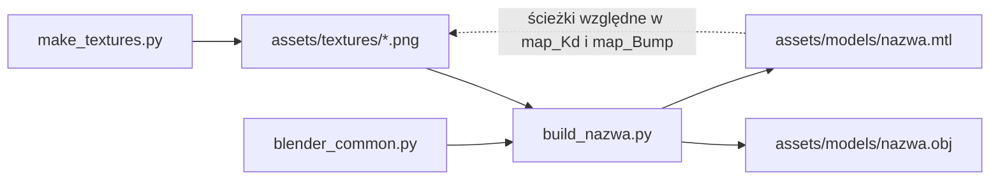
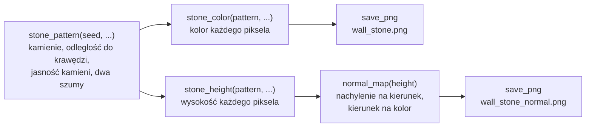
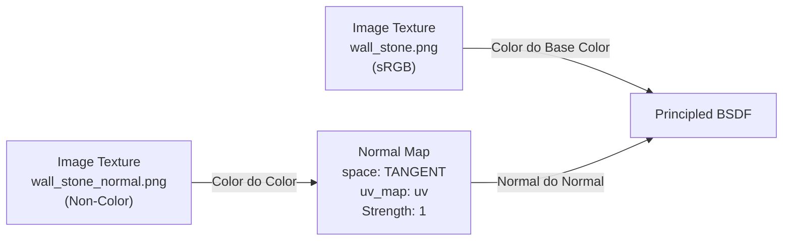

# Blender: od skryptu do pliku OBJ

Przewodnik po tym, jak powstają modele i tekstury gry. Modeli nie rysuję ręcznie w Blenderze:
każdy powstaje ze skryptu w Pythonie, który Blender wykonuje bez okna (headless) i który na
końcu zapisuje plik OBJ. Polecenia dla Windowsa z sekcji 3 zostały uruchomione w konfiguracji:

| Element | Wersja |
|---|---|
| Blender | 5.2.1 LTS |
| Python wbudowany w Blendera | 3.13.13 |
| numpy wbudowane w Blendera | 2.3.4 |
| System | Windows 11 |

Polecenia dla macOS (sekcja 3) **nie były jeszcze uruchomione na Macu**.

Stan: skrypty, trzy modele i cztery tekstury są w repozytorium: dwa obrazy koloru i, od
drugiej części M4, dwie **mapy normalnych** (normal maps), po jednej do każdego obrazu koloru.
Istnieje też kod C++, który wczytuje pliki OBJ i MTL: własny parser `assets::loadObj`
([`../modules/assets/obj-loader.md`](../modules/assets/obj-loader.md)). Jego testy wczytują
wszystkie trzy modele i sprawdzają liczby i wymiary z sekcji 8. Gra te pliki rysuje: przy
starcie wczytuje trzy modele i cztery tekstury i buduje z nich labirynt
([`../modules/assets/asset-cache.md`](../modules/assets/asset-cache.md),
[`../modules/game/maze-rendering.md`](../modules/game/maze-rendering.md)). Sekcja 5 opisuje
dokładnie, co jest w plikach, i była podstawą do napisania parsera. Co mapa normalnych robi
w shaderze, opisuje [`../modules/gfx/normal-mapping.md`](../modules/gfx/normal-mapping.md):
ten przewodnik mówi tylko, skąd bierze się jej plik (sekcja 7.2) i linia w pliku `.mtl`
(sekcje 5.3 i 7.3).

## 1. Skrypt jest źródłem, plik OBJ jest wynikiem



W katalogu [`tools/blender/`](../../tools/blender/) leżą **źródła (source)**: skrypty. W
katalogach [`assets/models/`](../../assets/models/) i [`assets/textures/`](../../assets/textures/)
leży **wynik (output)**: pliki `.obj`, `.mtl` i `.png`. Zasada jest taka sama jak przy kodzie
C++ i pliku wykonywalnym: zmieniam źródło i generuję wynik od nowa. **Plików wynikowych nie
poprawiam ręcznie**, bo następne uruchomienie skryptu nadpisze poprawkę.

Różnica względem programu: wynik jest zapisany w repozytorium. Dzięki temu grę da się zbudować
i uruchomić bez instalowania Blendera.

Dlaczego skrypty, a nie modelowanie myszą:

- **Da się to wytłumaczyć.** Ściana to trzy prostopadłościany o wymiarach zapisanych jako
  stałe. Na obronie pokazuję linię, z której bierze się każdy wierzchołek. Pliku `.blend`
  nie da się przeczytać.
- **Wymiary są dokładne.** Komórka labiryntu ma 2 m, a ściana 3 m, co do szóstego miejsca po
  przecinku, bo to liczby wpisane w kod, a nie przeciągnięcia myszą.
- **Wynik jest powtarzalny.** To samo polecenie daje te same bajty. Dwa uruchomienia pod rząd
  na Windowsie dały identyczne pliki `.obj`, `.mtl` i `.png`. Po dodaniu map normalnych
  powtórzyłem pomiar (2026-10-05): skróty wszystkich dziesięciu plików wynikowych (4 PNG,
  3 OBJ, 3 MTL) były po dwóch kolejnych uruchomieniach skryptów identyczne.
- **Historia zmian jest czytelna.** `git diff` skryptu pokazuje, że cokół urósł z 0.25 do
  0.30 m. Różnicy dwóch plików binarnych nie pokazuje nic.
- **Eksport nie zależy od pamięci.** Opcje eksportu są zapisane w jednym miejscu
  (`export_obj`), więc nie da się raz zapomnieć o triangulacji albo o zamianie osi.

Pliki skryptów:

| Plik | Co robi |
|---|---|
| [`blender_common.py`](../../tools/blender/blender_common.py) | wspólne funkcje: czyszczenie sceny, budowanie prostopadłościanu, UV, materiał z teksturą i mapą normalnych, eksport, rendery kontrolne |
| [`make_textures.py`](../../tools/blender/make_textures.py) | generuje obrazy koloru `wall_stone.png` i `floor_stone.png` oraz ich mapy normalnych `wall_stone_normal.png` i `floor_stone_normal.png` |
| [`build_wall_straight.py`](../../tools/blender/build_wall_straight.py) | model odcinka ściany |
| [`build_wall_pillar.py`](../../tools/blender/build_wall_pillar.py) | model słupa |
| [`build_floor_tile.py`](../../tools/blender/build_floor_tile.py) | model płyty podłogi |
| [`make_all.py`](../../tools/blender/make_all.py) | uruchamia wszystko po kolei: najpierw tekstury, potem modele |
| [`.gitignore`](../../tools/blender/.gitignore) | pomija katalog `__pycache__`, który Python tworzy przy imporcie modułów |

## 2. Konwencje

Konwencje pochodzą z PRD, sekcja 9. Każda ma powód:

| Konwencja | Wartość | Dlaczego |
|---|---|---|
| Układ współrzędnych gry | prawoskrętny, Y w górę, -Z do przodu | taki sam jak w kamerze i macierzach gry ([`../modules/scene/README.md`](../modules/scene/README.md)). Model wczytany z pliku nie wymaga wtedy żadnego dodatkowego obrotu |
| Jednostka | 1 jednostka = 1 metr | prędkość kamery i rozmiary labiryntu są w metrach, więc model ma od razu właściwą wielkość |
| Komórka labiryntu | 2 x 2 m, ściany 3 m | z tych liczb wynikają wymiary wszystkich trzech modeli |
| Początek układu modelu (origin) | środek podstawy, podłoga to y = 0 | model stawiam przesunięciem o (x, 0, z), bez liczenia połowy wysokości |
| Trójkąty | wszystkie ściany modelu są trójkątami | OpenGL w profilu Core rysuje trójkąty. Parser nie musi dzielić wielokątów |
| Normalne | jedna na ścianę, cieniowanie płaskie (flat shading) | twarde krawędzie pasują do stylu low-poly. Od M4 liczy się z nich oświetlenie |
| Mapy normalnych | przestrzeń styczna, konwencja OpenGL: zielony kanał to +Y, czyli "w górę obrazu" | zgadza się z UV, w których `v` rośnie w górę, i z loaderem obrazów, który oddaje dolny wiersz jako pierwszy. Mapa w konwencji DirectX (zielony to -Y) pokazałaby poziome fugi jako grzbiety (sekcja 7.2) |
| UV | 1 jednostka UV = 2 m na każdej ścianie | stała gęstość tekseli (texel density): kamień ma wszędzie tę samą wielkość (sekcja 6) |
| Przekształcenia i modyfikatory | zapisane w wierzchołkach | plik nie niesie macierzy, więc pozycje w pliku są pozycjami modelu |
| Nazwy | `snake_case` | jeden styl dla plików, obiektów i materiałów. Nazwa pliku, nazwa po `o` i nazwa skryptu są takie same |
| Tekstury | PNG, rozmiar będący potęgą dwójki, 8 bitów na kanał, RGB | PNG nie traci jakości, a rozmiar 512 dzieli się na połowy aż do 1 piksela, co jest potrzebne mipmapom |
| Ścieżki do tekstur w `.mtl` | względne, z ukośnikami `/` | ten sam plik działa na Windowsie i na macOS, niezależnie od miejsca repozytorium na dysku |

Blender ma inny układ niż gra: też prawoskrętny, ale **Z w górę**. Geometria w skryptach jest
zapisana w układzie Blendera, a zamianę robi eksporter (sekcja 4). Dlatego w skryptach wysokość
to trzecia liczba, a w pliku `.obj` druga.

## 3. Uruchamianie

Wszystkie polecenia wykonuję w katalogu głównym repozytorium. Skrypty same znajdują katalog
`assets/` na podstawie własnego położenia, więc działają też z innego katalogu roboczego
(sprawdzone na Windowsie).

### Windows (PowerShell)

Blender nie jest dodany do `PATH`, więc podaję pełną ścieżkę. Znak `&` jest w PowerShellu
operatorem wywołania: bez niego ścieżka w cudzysłowie byłaby zwykłym napisem.

Wszystko naraz:

```powershell
& "C:\Program Files\Blender Foundation\Blender 5.2\blender.exe" --background --factory-startup --python tools/blender/make_all.py
```

Wszystko naraz i do tego rendery kontrolne:

```powershell
& "C:\Program Files\Blender Foundation\Blender 5.2\blender.exe" --background --factory-startup --python tools/blender/make_all.py -- --shots
```

Jeden skrypt (same tekstury albo jeden model):

```powershell
& "C:\Program Files\Blender Foundation\Blender 5.2\blender.exe" --background --factory-startup --python tools/blender/make_textures.py
& "C:\Program Files\Blender Foundation\Blender 5.2\blender.exe" --background --factory-startup --python tools/blender/build_wall_straight.py -- --shots
```

### macOS (jeszcze nie uruchomione na Macu)

Zwykle program leży w `/Applications/Blender.app/Contents/MacOS/Blender`:

```sh
/Applications/Blender.app/Contents/MacOS/Blender --background --factory-startup --python tools/blender/make_all.py
/Applications/Blender.app/Contents/MacOS/Blender --background --factory-startup --python tools/blender/make_all.py -- --shots
```

Do sprawdzenia na Macu:

1. Czy powyższe polecenie kończy się bez błędu w tej samej wersji Blendera (5.2.1).
2. Czy `git status` po uruchomieniu nie pokazuje zmian w `assets/`. Pliki `.obj` i `.mtl`
   powinny wyjść identyczne. Dla plików `.png` tego nie wiem: zależy to od tego, czy numpy
   i biblioteka zapisująca PNG dają na obu systemach te same bajty. Dotyczy to zwłaszcza
   map normalnych: ich piksele przechodzą przez więcej działań zmiennoprzecinkowych (drugie
   rozmycie, różnice, pierwiastek przy normalizacji), więc różnica w ostatnim bicie ma
   więcej okazji, żeby po zaokrągleniu zmienić bajt. Ten punkt jest też na liście w
   [`build-macos.md`](build-macos.md).
3. Czy rendery kontrolne powstają także bez okna.

### Co znaczą argumenty

| Argument | Znaczenie |
|---|---|
| `--background` | bez okna. Blender wykonuje skrypt i kończy pracę |
| `--factory-startup` | ustawienia fabryczne zamiast moich prywatnych: bez dodatków i bez własnego pliku startowego. Dzięki temu wynik nie zależy od konfiguracji Blendera na danym komputerze |
| `--python plik.py` | skrypt do wykonania |
| `--` | koniec argumentów Blendera. Wszystko dalej Blender ignoruje i zostawia skryptowi w `sys.argv` |
| `--shots` | argument moich skryptów: zapisz rendery kontrolne |

### Rendery kontrolne (review renders)

Z argumentem `--shots` każdy skrypt modelu zapisuje dwa obrazy 960 x 720 z różnych stron do
katalogu tymczasowego systemu i wypisuje ich ścieżki. Na Windowsie jest to
`C:\Users\<nazwa>\AppData\Local\Temp\night_maze_review\`, pliki `wall_straight_1.png`,
`wall_straight_2.png` i tak dalej. Rendery **nigdy nie trafiają do repozytorium**: służą tylko
do obejrzenia modelu po zmianie skryptu.

Render robi silnik Workbench (ten sam, który rysuje podgląd w oknie Blendera) z kolorem
z tekstury i oświetleniem "studio", które cieniuje ściany zależnie od kierunku. Workbench
bierze obraz z **aktywnego** węzła obrazu materiału i nie stosuje mapy normalnych, więc
render pokazuje kształt i obraz koloru, a reliefu nie (sekcja 7.3). Relief ogląda się w
grze. Kamerę skrypt dodaje dopiero po eksporcie. Kolejność jest ważna: eksport zapisuje całą scenę,
więc kamera dodana wcześniej trafiłaby do pliku `.obj`.

## 4. Opcje eksportu

Eksport to jedno wywołanie operatora `bpy.ops.wm.obj_export` w funkcji `export_obj` w
[`blender_common.py`](../../tools/blender/blender_common.py). Ustawiam jawnie każdą opcję, która
wpływa na plik, także wtedy, gdy wartość jest domyślna w Blenderze 5.2. Inna wersja Blendera
może mieć inne wartości domyślne, a wtedy plik zmieniłby się po cichu.

| Parametr | Wartość | Znaczenie |
|---|---|---|
| `filepath` | `assets/models/<nazwa>.obj` | plik wynikowy. Plik `.mtl` powstaje obok, pod tą samą nazwą |
| `up_axis` | `'Y'` | która oś gry wskazuje w górę |
| `forward_axis` | `'NEGATIVE_Z'` | która oś gry wskazuje do przodu. Razem z `up_axis` daje zamianę punktu Blendera (x, y, z) na punkt gry (x, z, -y) |
| `global_scale` | `1.0` | bez skalowania: 1 jednostka Blendera to 1 metr |
| `apply_transform` | `True` | położenie, obrót i skala obiektu są wliczone w pozycje wierzchołków |
| `apply_modifiers` | `True` | modyfikatory są wliczone w siatkę. Moje modele ich nie mają, opcja zabezpiecza przyszłe |
| `export_eval_mode` | `'DAG_EVAL_VIEWPORT'` | którą wersję obiektu brać, gdy modyfikator ma inne ustawienia dla podglądu i dla renderu |
| `export_selected_objects` | `False` | eksportuję całą scenę. Jest w niej tylko model, bo skrypt zaczyna od pustej sceny |
| `export_triangulated_mesh` | `True` | każdy czworokąt jest zapisany jako dwa trójkąty |
| `export_uv` | `True` | linie `vt` |
| `export_normals` | `True` | linie `vn` |
| `export_materials` | `True` | plik `.mtl` oraz linie `mtllib` i `usemtl` |
| `export_pbr_extensions` | `False` | bez rozszerzeń PBR w `.mtl`. Włączona w próbie dopisała linie `Pr`, `Pm`, `Ps`, `Pc`, `Pcr`, `aniso` i `anisor`, a pominęła `Ns` i `Ka` |
| `path_mode` | `'RELATIVE'` | ścieżka tekstury w `.mtl` liczona względem katalogu pliku `.mtl` |
| `export_colors` | `False` | bez kolorów wierzchołków. Włączona w próbie dopisała trzy liczby na końcu każdej linii `v` |
| `export_animation` | `False` | jeden plik. Włączona w próbie zapisała osobną parę plików na każdą klatkę, z numerem klatki w nazwie |
| `export_curves_as_nurbs` | `False` | dotyczy krzywych, których w modelach nie ma. Nie sprawdzałem, co zmienia |
| `export_object_groups` | `False` | obiekt zaczyna linia `o`. Włączona w próbie zapisała zamiast niej linię `g` |
| `export_material_groups` | `False` | bez linii `g` przed `usemtl`. Włączona w próbie dopisała `g <obiekt>_<materiał>` |
| `export_vertex_groups` | `False` | bez linii `g` z nazwą grupy wierzchołków. Modele nie mają takich grup |
| `export_smooth_groups` | `False` | bez numerowanych grup wygładzania. Linia `s 0` jest w pliku tak czy inaczej |

"W próbie" znaczy: wyeksportowałem jednorazowo próbny kwadrat z daną opcją włączoną i
przeczytałem plik. Tych plików nie ma w repozytorium.

Dwie rzeczy, które wyszły dopiero przy czytaniu wyniku:

- Tryb `'RELATIVE'` zapisuje na Windowsie `../textures/wall_stone.png`, z ukośnikami `/`, czyli
  dokładnie to, czego chcę. Domyślny tryb `'AUTO'` zapisał w próbie ścieżkę bezwzględną
  zaczynającą się od `C:/Users/...`.
- Blender **nie zapisuje linii `Kd`**, gdy kolor materiału pochodzi z tekstury (materiał bez
  tekstury dostał w próbie `Kd 0.800000 0.800000 0.800000`). Konwencja
  projektu wymaga jej w każdym materiale, więc funkcja `add_diffuse_color` dopisuje po
  eksporcie linię `Kd 1.000000 1.000000 1.000000` przed linią `map_Kd`. Biały kolor pomnożony
  przez teksturę zostawia teksturę bez zmian. To poprawka w skrypcie, a nie ręczna: działa
  przy każdym uruchomieniu.

Trzecia doszła z mapami normalnych: linię `map_Bump` eksporter zapisuje **sam**, bez żadnej
nowej opcji eksportu, gdy do wejścia `Normal` węzła `Principled BSDF` dochodzi łańcuch
z węzłem `Normal Map` (sekcja 7.3). Żadna z opcji w tabeli wyżej nie zmieniła się przy
dodawaniu map normalnych, a pliki `.obj` wyszły identyczne co do bajta z poprzednimi.

## 5. Co jest w plikach

### 5.1 Plik `.obj`

Cały plik [`assets/models/floor_tile.obj`](../../assets/models/floor_tile.obj):

```text
# Blender 5.2.1 LTS
# www.blender.org
mtllib floor_tile.mtl
o floor_tile
v -1.000000 0.000000 1.000000
v 1.000000 0.000000 1.000000
v 1.000000 0.000000 -1.000000
v -1.000000 0.000000 -1.000000
vn -0.0000 1.0000 -0.0000
vt 0.500000 -0.500000
vt -0.500000 0.500000
vt -0.500000 -0.500000
vt 0.500000 0.500000
s 0
usemtl floor_stone
f 2/1/1 4/2/1 1/3/1
f 2/1/1 3/4/1 4/2/1
```

| Linia | Znaczenie |
|---|---|
| `# ...` | komentarz. Dwie pierwsze linie pliku podają wersję Blendera |
| `mtllib floor_tile.mtl` | nazwa pliku z materiałami, względem katalogu pliku `.obj` |
| `o floor_tile` | początek obiektu o tej nazwie. W każdym pliku jest jeden obiekt |
| `v x y z` | pozycja wierzchołka w metrach, sześć miejsc po przecinku |
| `vn x y z` | normalna, cztery miejsca po przecinku. Jedna na każdy kierunek ściany, a nie na wierzchołek |
| `vt u v` | współrzędne tekstury. Mogą być ujemne i większe od 1 |
| `s 0` | grupy wygładzania wyłączone. Występuje raz, zawsze jako `s 0` (nie `s off`) |
| `usemtl floor_stone` | materiał dla wszystkich następnych linii `f` |
| `f a/b/c a/b/c a/b/c` | trójkąt: trzy narożniki, każdy jako trzy indeksy `pozycja/uv/normalna` |

Fakty ważne dla parsera, sprawdzone na wszystkich trzech plikach:

- Występują tylko linie `#`, `mtllib`, `o`, `v`, `vn`, `vt`, `s`, `usemtl` i `f`. Linii `g` nie
  ma. Kolejność jest zawsze taka jak wyżej: komentarze, `mtllib`, `o`, wszystkie `v`,
  wszystkie `vn`, wszystkie `vt`, `s 0`, `usemtl`, wszystkie `f`. **Linie `vn` są przed `vt`**,
  choć w indeksach linii `f` kolejność jest odwrotna: uv jest w środku.
- Każda linia `f` ma dokładnie trzy narożniki, a każdy narożnik komplet trzech indeksów.
- Indeksy liczą się **od 1**, nie od 0, i są dodatnie (format dopuszcza też ujemne, liczone od
  końca, ale Blender ich nie pisze).
- Trzy listy mają różne długości: w `wall_straight.obj` są 24 pozycje, 24 pary uv i 6
  normalnych. Narożnik `5/1/1` nie jest więc gotowym wierzchołkiem dla OpenGL. Bufor
  wierzchołków ma jeden wspólny indeks, więc parser musi dla każdej trójki `a/b/c` złożyć
  wierzchołek z trzech list.
- Wszystkie trzy narożniki trójkąta mają ten sam indeks normalnej: to jest właśnie cieniowanie
  płaskie.
- Narożniki są podane przeciwnie do ruchu wskazówek zegara, patrząc z zewnątrz modelu.
  Sprawdziłem to liczbowo: iloczyn wektorowy dwóch krawędzi każdego trójkąta wskazuje w tę
  samą stronę co jego normalna.
- W normalnych pojawia się `-0.0000`. To zwykłe zero ze znakiem minus.
- Liczby mają kropkę dziesiętną i nie mają wykładnika. Pola dzieli jedna spacja.
- Końce linii to sam znak LF, także w pliku zapisanym na Windowsie, a plik kończy się znakiem
  nowej linii.

### 5.2 Jak Z w górę stało się Y w górę

W skrypcie [`build_floor_tile.py`](../../tools/blender/build_floor_tile.py) narożniki płyty są
zapisane w układzie Blendera. Eksporter zamienia punkt (x, y, z) na (x, z, -y):

| Narożnik w skrypcie (Blender) | Linia w pliku (gra) |
|---|---|
| `(-1, -1, 0)` | `v -1.000000 0.000000 1.000000` |
| `(1, -1, 0)` | `v 1.000000 0.000000 1.000000` |
| `(1, 1, 0)` | `v 1.000000 0.000000 -1.000000` |
| `(-1, 1, 0)` | `v -1.000000 0.000000 -1.000000` |

Wysokość (trzecia liczba w Blenderze) trafiła na drugie miejsce. Oś Y Blendera stała się osią
Z gry z przeciwnym znakiem. Znak musi się zmienić, bo oba układy są prawoskrętne: sama zamiana
dwóch osi miejscami dałaby układ lewoskrętny, czyli lustrzane odbicie modelu. Ta sama zamiana
dotyczy normalnych: w Blenderze płyta patrzy w +Z, w pliku jest `vn -0.0000 1.0000 -0.0000`,
czyli +Y.

To samo widać w ścianie. Linie z [`assets/models/wall_straight.obj`](../../assets/models/wall_straight.obj):

```text
v -1.000000 0.000000 0.140000
v 1.000000 0.000000 0.140000
...
v 1.000000 3.000000 -0.140000
```

Druga liczba biegnie od 0 do 3: to wysokość ściany. Pierwsza od -1 do 1: długość. Trzecia od
-0.14 do 0.14: grubość.

### 5.3 Plik `.mtl`

Cały plik [`assets/models/wall_straight.mtl`](../../assets/models/wall_straight.mtl):

```text
# Blender 5.2.1 LTS MTL File: 'None'
# www.blender.org

newmtl wall_stone
Ns 250.000000
Ka 1.000000 1.000000 1.000000
Ks 0.500000 0.500000 0.500000
Ke 0.000000 0.000000 0.000000
Ni 1.500000
d 1.000000
illum 2
Kd 1.000000 1.000000 1.000000
map_Kd ../textures/wall_stone.png
map_Bump -bm 1.000000 ../textures/wall_stone_normal.png
```

| Linia | Znaczenie | Czy jej potrzebuję |
|---|---|---|
| `# ... MTL File: 'None'` | komentarz. W tym miejscu Blender wpisuje zapewne nazwę pliku `.blend`, a scena ze skryptu nie jest zapisana w żadnym pliku | nie |
| pusta linia | odstęp przed materiałem | nie |
| `newmtl wall_stone` | początek materiału o tej nazwie. Do niej odwołuje się `usemtl` w pliku `.obj` | tak |
| `Ns` | wykładnik połysku (shininess) | nie: oświetlenie z M4 bierze połysk z ustawień gry, wspólnych dla całego labiryntu |
| `Ka` | kolor światła otoczenia (ambient) | nie, z tego samego powodu |
| `Ks` | kolor odbłysku (specular) | nie, z tego samego powodu |
| `Ke` | kolor emisji | nie |
| `Ni` | współczynnik załamania światła | nie |
| `d` | nieprzezroczystość (dissolve), 1 to pełna | nie |
| `illum 2` | numer modelu oświetlenia w formacie MTL | nie |
| `Kd 1.000000 1.000000 1.000000` | kolor rozproszony (diffuse). Dopisuje go mój skrypt (sekcja 4) | tak |
| `map_Kd ../textures/wall_stone.png` | tekstura koloru rozproszonego. Ścieżka względem katalogu pliku `.mtl` | tak |
| `map_Bump -bm 1.000000 ../textures/wall_stone_normal.png` | mapa normalnych. `-bm` (bump multiplier) to siła mapy: Blender wpisuje tu pole `Strength` węzła `Normal Map`, domyślnie 1. Ścieżka względem katalogu pliku `.mtl` | tak. Liczbę po `-bm` parser sprawdza i pomija |

Wartości `Ns`, `Ka`, `Ks`, `Ke`, `Ni`, `d` i `illum` to domyślne ustawienia materiału w
Blenderze. Niczego w nich nie ustawiam. Parser musi umieć **pominąć linię, której nie zna**.

Linia nazywa się `map_Bump`, choć wskazuje mapę normalnych, a nie mapę wypukłości (bump map,
szary obraz wysokości): format MTL nie ma osobnej linii dla map normalnych i eksportery
używają tej. Jest ostatnią linią materiału, po `map_Kd`. Dodanie map normalnych zmieniło
w każdym z trzech plików `.mtl` dokładnie tę jedną linię (dopisało ją). Jak parser ją czyta
i jakie inne pisownie przyjmuje, opisuje
[`../modules/assets/obj-loader.md`](../modules/assets/obj-loader.md), sekcje 2.3 i 5.7.

Pliki `wall_straight.mtl` i `wall_pillar.mtl` są identyczne co do bajta: oba definiują materiał
`wall_stone` z tą samą teksturą i tą samą mapą normalnych. Żaden z tych obrazów nie jest
wczytywany do karty dwa razy: pilnuje tego pamięć podręczna assetów
([`../modules/assets/asset-cache.md`](../modules/assets/asset-cache.md)).

## 6. UV i gęstość tekseli

**Gęstość tekseli (texel density)** to liczba pikseli tekstury przypadająca na metr
powierzchni. U mnie jest stała: jedno powtórzenie tekstury zajmuje 2 m, a tekstura ma 512
pikseli, czyli wychodzi 256 pikseli na metr na każdej ścianie każdego modelu. Gdyby ściana
i słup miały różną gęstość, te same kamienie byłyby na słupie większe albo mniejsze niż na
ścianie obok.

UV liczy funkcja `box_project_uvs`. To **rzut pudełkowy (box projection)**: każda ściana modelu
jest prostopadła do jednej osi, więc patrzę na nią wzdłuż tej osi, a dwie pozostałe
współrzędne dzielę przez 2 m. W układzie gry wychodzi:

| Ściana patrzy w | u | v |
|---|---|---|
| +Z | x / 2 | y / 2 |
| -Z | -x / 2 | y / 2 |
| +X | -z / 2 | y / 2 |
| -X | z / 2 | y / 2 |
| +Y (góra) | x / 2 | -z / 2 |
| -Y (spód) | x / 2 | z / 2 |

Co z tego wynika:

- Na ścianach pionowych `v` to wysokość podzielona przez 2, więc tekstura stoi prosto, a
  podłoga (y = 0) to `v = 0`. Ściana o wysokości 3 m ma `v` od 0 do 1.5: tekstura powtarza
  się półtora raza.
- Ściana o długości 2 m ma `u` od -0.5 do 0.5, czyli dokładnie jedno powtórzenie. Ujemne
  wartości są poprawne: przy `GL_REPEAT` liczy się tylko część ułamkowa.
- Znak przy `u` jest inny po dwóch przeciwnych stronach, żeby `u` rosło w prawo dla kogoś, kto
  patrzy na ścianę z zewnątrz. Bez tego tekstura po jednej stronie byłaby lustrzanym odbiciem.
  Na samym obrazie kamienia tego nie widać, ale napis albo strzałka wyszłyby odwrócone. Od
  kiedy są mapy normalnych, ma to skutek widoczny także na kamieniu: na ścianie z teksturą
  w odbiciu lustrzanym mapa normalnych pokazałaby pionowe fugi jako grzbiety. Dzięki tej
  zamianie znaku żaden trójkąt trzech modeli nie ma odbitej tekstury, co sprawdzają testy
  loadera (`mirroredTriangleCount == 0`), i wierzchołek nie musi przechowywać znaku
  skrętności stycznej
  ([`../modules/gfx/normal-mapping.md`](../modules/gfx/normal-mapping.md), sekcja 2.9).
- UV zależy tylko od pozycji punktu, a nie od tego, który to model. Dwa odcinki ściany
  postawione obok siebie (przesunięte o 2 m, czyli o całe powtórzenie) mają więc wzór, który
  przechodzi z jednego w drugi bez szwu.
- Nic nie jest rozciągnięte. Sprawdziłem liczbowo: dla każdej krawędzi każdego trójkąta
  długość w metrach podzielona przez długość w UV daje dokładnie 2.

UV jest zapisane dla narożnika ściany (w Blenderze: loop), a nie dla wierzchołka. Ten sam
wierzchołek prostopadłościanu należy do trzech ścian i na każdej ma inne UV.

## 7. Tekstury

Tekstury generuje [`make_textures.py`](../../tools/blender/make_textures.py) samym numpy, bez
malowania. Wszystkie cztery mają 512 x 512 pikseli, 8 bitów na kanał, RGB bez kanału alfa.

| Plik | Co zawiera | Wzór | Kamień | Fuga (joint) | Ziarno losowe (seed) |
|---|---|---|---|---|---|
| `wall_stone.png` | kolor | szare bloki w wiązaniu wozówkowym (running bond): co drugi rząd przesunięty o pół bloku | 128 x 64 px, czyli 0.5 x 0.25 m | 6 px | 11 |
| `wall_stone_normal.png` | mapa normalnych | ten sam wzór co `wall_stone.png` | jak wyżej | jak wyżej | 11 |
| `floor_stone.png` | kolor | kwadratowe płyty w prostej siatce, ciemniejsze i cieplejsze od ściany | 128 x 128 px, czyli 0.5 x 0.5 m | 8 px | 23 |
| `floor_stone_normal.png` | mapa normalnych | ten sam wzór co `floor_stone.png` | jak wyżej | jak wyżej | 23 |

Rząd bloków ma 0.25 m, tyle samo co cokół ściany, więc cokół to dokładnie jeden rząd, a w 3 m
ściany mieści się równo dwanaście rzędów.

Obraz koloru i jego mapa normalnych powstają z **jednego wzoru**: tych samych kamieni, tych
samych fug i tego samego szumu. Dlatego relief leży dokładnie tam, gdzie obraz go pokazuje.
Skrypt jest podzielony na trzy kroki:



| Funkcja | Wejście | Wynik |
|---|---|---|
| `blur(values, radius)` | tablica 512 x 512 | ta sama tablica rozmyta: każdy piksel uśredniony z sąsiadami do `radius` pikseli, najpierw wzdłuż jednej osi, potem drugiej, z zawijaniem przez brzegi (`np.roll`) |
| `smooth_noise(rng, radius)` | generator losowy | szum od 0 do 1, który się kafelkuje: losowa wartość na piksel, rozmyta przez `blur` i rozciągnięta z powrotem do pełnego zakresu |
| `stone_pattern(seed, stone_width, stone_height, running_bond, stone_variation)` | ziarno i rozmiar kamienia | słownik z tym, co wspólne dla obu obrazów (sekcja 7.1) |
| `stone_color(pattern, joint_width, rim_width, stone_color, joint_color)` | wzór i kolory | tablica 512 x 512 x 3 kolorów od 0 do 1 |
| `stone_height(pattern, joint_width, bevel_width, joint_depth, tilt, bump_depth, grain_depth)` | wzór i głębokości | tablica 512 x 512 wysokości (sekcja 7.2) |
| `normal_map(height)` | wysokości | tablica 512 x 512 x 3 kolorów od 0 do 1: mapa normalnych |
| `save_png(color, file_name)` | kolory od 0 do 1 | plik PNG w `assets/textures` |
| `build()` | nic | woła powyższe dla ściany i dla podłogi i zapisuje cztery pliki |

### 7.1 Wzór i obraz koloru

`stone_pattern` liczy dla każdego piksela to, czego potrzebują oba obrazy:

1. Do którego kamienia piksel należy (`row`, `column`) i gdzie w nim leży (`inside_x`,
   `inside_y`). Przy `running_bond=True` nieparzyste rzędy są przesunięte o pół kamienia.
2. Jak daleko ma do najbliższej krawędzi swojego kamienia (`edge_distance`), w pikselach.
3. Jedną losową jasność na kamień (`stone_brightness`).
4. Dwa szumy od 0 do 1: duże miękkie plamy (`patches`, rozmycie o promieniu 12 pikseli)
   i drobne ziarno (`grain`, promień 1).

Zwraca też sam generator (`"rng"`), żeby `stone_height` mogła wylosować dalsze liczby o tych
samych kamieniach. Kolejność trzech losowań (jasność, plamy, ziarno) decyduje o tym, które
liczby losowe dostaje każde z nich, więc jej zmiana zmieniłaby wszystkie tekstury.

`stone_color` robi z wzoru obraz koloru:

1. Jasność kamienia mnoży przez oba szumy.
2. Przy krawędzi kamień jest ciemniejszy (`rim`, od 0 na krawędzi do 1 po `rim_width`
   pikselach). To udaje zaokrąglenie krawędzi bez żadnego światła.
3. Piksele najbliżej krawędzi (`edge_distance < joint_width // 2`) to fuga: dostają ciemny
   kolor fugi z samym ziarnem. Dwa sąsiednie kamienie dają razem pełną szerokość fugi.

Obraz koloru powstał, zanim gra miała oświetlenie, więc cały kontrast był wtedy w samym
obrazie: ciemne fugi, ciemniejsze brzegi kamieni i wyraźne różnice jasności między kamieniami.
**Tak zostało.** Dodanie map normalnych nie zmieniło obrazów koloru ani o bajt: `stone_color`
wykonuje te same działania na tych samych liczbach losowych co dawna funkcja `stone_texture`,
z której wydzieliłem `stone_pattern`. Z tego wynika znane ograniczenie: przy włączonych mapach
normalnych fugi są przyciemnione **dwa razy**, raz farbą w obrazie koloru i raz światłem,
które na skosach fugi pada pod innym kątem. Efekt jest niewielki, ale jest
([`../modules/gfx/normal-mapping.md`](../modules/gfx/normal-mapping.md), sekcja 2.12).
Podłoga różni się od ściany kolorem (ciepły brąz zamiast szarości), jasnością i wzorem
(kwadraty w prostej siatce zamiast podłużnych bloków z przesunięciem).

### 7.2 Pole wysokości i mapa normalnych

Mapa normalnych zapisuje dla każdego teksela **kierunek**, w który zwrócona jest tam
powierzchnia. Skrypt nie wymyśla kierunków wprost. Najpierw buduje **pole wysokości** (height
field): jedną liczbę na piksel, mówiącą, jak daleko piksel wystaje z płaszczyzny ściany.
Potem z nachylenia tego pola liczy kierunki. Tak jest prościej, bo wysokość łatwo opisać
("fuga jest o centymetr głębiej niż lico kamienia"), a kierunek wynika z niej sam.

**Wysokość: `stone_height`.** Jednostką jest rozmiar jednego piksela tekstury, czyli
1 / 256 m na modelach (sekcja 6). Różnica wysokości 1 między sąsiednimi pikselami to więc
skos 45 stopni. Na wysokość składają się cztery rzeczy:

| Składnik | Jak powstaje | Parametr |
|---|---|---|
| profil kamienia | 0 w fudze (te same piksele, które obraz koloru maluje jako fugę), potem gładki wzrost na szerokości `bevel_width` pikseli, potem 1 na licu. Krzywa `3t^2 - 2t^3` (smoothstep) zaczyna się i kończy płasko, więc skos nie ma ostrego załamania na żadnym końcu | `joint_depth`: o ile lico wystaje przed fugę |
| pochylenie kamienia | każdy kamień jest lekko przekrzywiony, każdy inaczej: dwa losowe nachylenia na kamień, wzdłuż x i wzdłuż y | `tilt`: największa różnica wysokości między przeciwległymi krawędziami kamienia |
| duże miękkie nierówności | szum `patches` z obrazu koloru, rozmyty drugi raz, wyśrodkowany na zerze | `bump_depth` |
| drobne ziarno | szum `grain` z obrazu koloru, rozmyty drugi raz, wyśrodkowany na zerze | `grain_depth` |

Złożenie to ostatnia linia funkcji:

```python
    return profile * (joint_depth + lean + bumps) + grain
```

Lico z pochyleniem i nierównościami jest **pomnożone przez profil**, więc wszystko to zanika
w stronę fugi: dwa sąsiednie kamienie spotykają się na tej samej wysokości (0) i powierzchnia
nie ma uskoku. Ziarno jest dodane na końcu i pokrywa wszystko, razem z zaprawą w fudze.

Losowe nachylenia kamieni są losowane **po** liczbach obrazu koloru, z tego samego generatora:

```python
    rng = pattern["rng"]
    stone_count = (pattern["rows"], pattern["columns"])
    tilt_x = rng.uniform(-tilt, tilt, stone_count)[row, column]
    tilt_y = rng.uniform(-tilt, tilt, stone_count)[row, column]
```

Dzięki tej kolejności nowe losowania nie przesunęły liczb, z których powstaje obraz koloru.

**Drugie rozmycie i po co ono jest.** Oba szumy są przed użyciem rozmywane jeszcze raz:

```python
    bumps = bump_depth * (blur(pattern["patches"], BUMP_BLUR_RADIUS) - 0.5)
    grain = grain_depth * (blur(pattern["grain"], GRAIN_BLUR_RADIUS) - 0.5)
```

Stałe `BUMP_BLUR_RADIUS = 8` i `GRAIN_BLUR_RADIUS = 1` to promienie w pikselach. Powód: mapa
normalnych pokazuje **nachylenie** wysokości, a nie samą wysokość. Szum rozmyty raz jest
gładki jako wysokość, ale jego nachylenie jest poszarpane: przy przejściu o jeden piksel
średnia traci jedną losową wartość i zyskuje inną, więc różnica między sąsiadami skacze
losowo. Na ścianie wyglądało to jak tkanina. Po drugim rozmyciu nachylenie jest gładkie.
Odjęcie 0.5 środkuje szum na zerze, więc podnosi i obniża powierzchnię o tyle samo. Głębokości
`bump_depth=6.0` i `grain_depth=0.5` wyglądają na duże, ale to zakres szumu sprzed drugiego
rozmycia: po nim większość powierzchni rusza się o ułamek piksela.

**Z wysokości na kierunek: `normal_map`.**

```python
    slope_x = (np.roll(height, -1, axis=1) - np.roll(height, 1, axis=1)) / 2.0
    slope_y = (np.roll(height, -1, axis=0) - np.roll(height, 1, axis=0)) / 2.0

    normal = np.stack([-slope_x, -slope_y, np.ones((SIZE, SIZE))], axis=-1)
    normal = normal / np.linalg.norm(normal, axis=-1, keepdims=True)

    # From -1..1 to 0..1. A flat surface (0, 0, 1) becomes (0.5, 0.5, 1.0), which save_png
    # rounds to the bytes (128, 128, 255).
    return normal * 0.5 + 0.5
```

| Linia | Co robi |
|---|---|
| `slope_x = (np.roll(height, -1, axis=1) - np.roll(height, 1, axis=1)) / 2.0` | nachylenie wzdłuż x metodą **różnic centralnych** (central differences): wysokość prawego sąsiada minus wysokość lewego, podzielone przez ich odległość, czyli 2 piksele. `np.roll` przesuwa całą tablicę o jeden piksel, a to, co wypada za brzeg, wraca z przeciwnej strony: sąsiadem piksela przy prawym brzegu jest piksel przy lewym. Dlatego mapa się kafelkuje |
| `slope_y = ... axis=0 ...` | to samo wzdłuż y. Oś 0 tablicy to wiersze, a wiersz 0 jest **dolnym** wierszem obrazu, więc +y to "w górę obrazu" |
| `np.stack([-slope_x, -slope_y, np.ones(...)], axis=-1)` | normalna powierzchni `z = height(x, y)` to `(-dh/dx, -dh/dy, 1)`. Minusy: tam, gdzie wysokość rośnie w stronę +x, powierzchnia jest odchylona do tyłu, w stronę -x |
| `normal / np.linalg.norm(...)` | sprowadzenie każdego wektora do długości 1 |
| `return normal * 0.5 + 0.5` | zapis kierunku jako koloru: każda składowa z zakresu od -1 do 1 trafia do zakresu od 0 do 1 |

**Kodowanie i konwencja.** Wynik jest w **przestrzeni stycznej** (tangent space): +X to
kierunek, w którym rośnie `u` (w prawo na obrazie), +Y kierunek, w którym rośnie `v` (w górę
obrazu), +Z wskazuje z powierzchni na zewnątrz. Wzór zapisu to `rgb = n * 0.5 + 0.5`, więc
płaska powierzchnia `(0, 0, 1)` ma kolor `(0.5, 0.5, 1.0)`, a po zaokrągleniu w `save_png`
bajty **(128, 128, 255)**. Stąd jasnoniebieski wygląd każdej mapy normalnych: większość
tekseli jest prawie płaska.

Zielony kanał idzie za **konwencją OpenGL**: +Y to góra obrazu. Skrypt nie potrzebuje do tego
żadnej zamiany znaku, bo wiersz 0 tablicy jest dolnym wierszem obrazu i tam też jest `v = 0`.
Programy trzymające się konwencji DirectX zapisują w zielonym kanale -Y. Taka mapa pokazałaby
u mnie każdą poziomą fugę jako grzbiet. Że pliki są w dobrej konwencji, sprawdza test loadera
obrazów na prawdziwym pliku `wall_stone_normal.png`
([`../modules/assets/images.md`](../modules/assets/images.md), sekcja 5.7), a teorię i skutki
pomyłki opisuje
[`../modules/gfx/normal-mapping.md`](../modules/gfx/normal-mapping.md) (sekcje 2.4 do 2.6).

**Parametry w `build()`:**

| Tekstura | `joint_width` | `bevel_width` | `joint_depth` | `tilt` | `bump_depth` | `grain_depth` |
|---|---|---|---|---|---|---|
| ściana | 6 | 5 | 2.5 | 1.5 | 6.0 | 0.5 |
| podłoga | 8 | 6 | 2.0 | 1.5 | 6.0 | 0.5 |

`joint_width` jest tą samą liczbą co dla obrazu koloru, żeby fuga reliefu pokrywała się z fugą
namalowaną. Głębokość fugi ściany, 2.5 piksela po 1 / 256 m, to około 1 cm. Podłoga ma fugi
szersze i płytsze (około 0.8 cm). Na ścianie każda strona bloku ma więc 3 piksele fugi
i 5 pikseli skosu wznoszącego się do lica: na tych liczbach opiera się test konwencji.

### 7.3 Materiał w Blenderze i linia `map_Bump`

Samo istnienie pliku PNG nie wystarcza, żeby trafił do pliku `.mtl`: eksporter pisze tylko to,
co jest podłączone w materiale. Robi to funkcja `assign_textured_material(model,
material_name, texture_file, normal_map_file)` w
[`blender_common.py`](../../tools/blender/blender_common.py). Każdy z trzech skryptów modeli
woła ją z dwiema nazwami plików, na przykład:

```python
    common.assign_textured_material(
        model, "wall_stone", "wall_stone.png", "wall_stone_normal.png"
    )
```

Funkcja buduje w materiale dwa łańcuchy węzłów (nodes):



Część dotycząca mapy normalnych:

```python
    normal_image_node = nodes.new("ShaderNodeTexImage")
    normal_image_node.image = bpy.data.images.load(os.path.join(TEXTURES_DIR, normal_map_file))
    # The picture holds directions, not colors, so Blender must not convert it from sRGB.
    normal_image_node.image.colorspace_settings.name = "Non-Color"
    normal_map_node = nodes.new("ShaderNodeNormalMap")
    # Tangent space of the UV map that box_project_uvs creates.
    normal_map_node.space = "TANGENT"
    normal_map_node.uv_map = "uv"
    links.new(normal_image_node.outputs["Color"], normal_map_node.inputs["Color"])
    links.new(normal_map_node.outputs["Normal"], surface.inputs["Normal"])

    # The review renders (Workbench) show the picture of the active image node. Without
    # this line that would be the node created last: the normal map.
    nodes.active = image_node
```

| Linia | Co robi i dlaczego |
|---|---|
| `nodes.new("ShaderNodeTexImage")` i `.image = bpy.data.images.load(...)` | drugi węzeł `Image Texture`, z plikiem mapy normalnych z `assets/textures` |
| `colorspace_settings.name = "Non-Color"` | obraz zawiera kierunki, nie kolory, więc Blender nie może go przeliczać z sRGB na wartości liniowe. Przeliczenie wykrzywiłoby kierunki |
| `nodes.new("ShaderNodeNormalMap")` | węzeł `Normal Map`: zamienia kolor na kierunek. Jego pole `Strength` zostaje domyślne, 1 |
| `space = "TANGENT"`, `uv_map = "uv"` | mapa jest w przestrzeni stycznej mapy UV o nazwie `uv`, tej, którą tworzy `box_project_uvs` |
| dwa wywołania `links.new` | `Color` obrazu do `Color` węzła `Normal Map`, a jego `Normal` do wejścia `Normal` węzła `Principled BSDF` (zmienna `surface`) |
| `nodes.active = image_node` | rendery kontrolne Workbench pokazują obraz **aktywnego** węzła obrazu. Bez tej linii aktywny byłby węzeł utworzony ostatnio, czyli mapa normalnych, i rendery kontrolne byłyby niebieskie |

Dla takiego łańcucha eksporter OBJ Blendera 5.2.1 dopisuje do materiału linię

```text
map_Bump -bm 1.000000 ../textures/wall_stone_normal.png
```

Liczba po `-bm` to pole `Strength` węzła `Normal Map`. Ścieżka jest względna z tego samego
powodu co w `map_Kd`: opcja `path_mode='RELATIVE'` (sekcja 4). Gra tej liczby nie używa
(sekcja 5.3), więc zmiana `Strength` w skrypcie zmieniłaby plik `.mtl`, a obrazu w grze nie.
Siłę reliefu ustawia się parametrami `stone_height` i ponownym wygenerowaniem tekstur.

### 7.4 Kafelkowanie, powtarzalność, zapis

Dlaczego tekstury się **kafelkują (tile)**, czyli lewy brzeg pasuje do prawego, a dolny do
górnego:

- Rozmiary kamieni dzielą 512 bez reszty, więc na brzegu obrazu nie ma uciętego kamienia.
- Liczba rzędów ściany (8) jest parzysta, więc przesunięcie co drugiego rzędu zgadza się także
  między górnym a dolnym brzegiem.
- Blok przesuniętego rzędu, który przechodzi przez prawy brzeg, jest tym samym blokiem co
  kawałek przy lewym brzegu: numer kolumny liczę modulo liczba kolumn, więc obie połówki mają
  tę samą jasność i to samo pochylenie.
- Szum jest wygładzany uśrednianiem z sąsiadami, a `np.roll` przenosi to, co wypada za jeden
  brzeg, na brzeg przeciwny. Piksel przy brzegu jest więc uśredniany z pikselami z drugiej
  strony obrazu. Dotyczy to obu rozmyć.
- Nachylenie w `normal_map` też jest liczone przez `np.roll`, więc normalna piksela przy
  brzegu uwzględnia sąsiada z przeciwnego brzegu. Mapa normalnych kafelkuje się tak samo jak
  obraz koloru.

Dla obrazów koloru sprawdziłem to, składając z każdej tekstury obraz 2 x 2 i oglądając go:
szwów nie widać. Dla map normalnych sprawdzeniem są zrzuty ekranu z gry (2026-10-05), na
których relief przechodzi między sąsiednimi odcinkami ściany i między płytami podłogi bez
widocznego szwu.

Dlaczego wynik jest powtarzalny: jedyne źródło losowości to `np.random.default_rng(seed)` ze
stałym ziarnem. Zmiana ziarna daje inny układ jasnych i ciemnych kamieni i inne pochylenia.
Zmierzone na Windowsie 2026-10-05: dwa kolejne uruchomienia skryptów dały identyczne skróty
wszystkich dziesięciu plików wynikowych. **Na macOS skrypty nie były uruchamiane**, więc nie
wiem, czy tam wychodzą te same bajty (sekcja 3).

Obraz zapisuje Blender (`image.save()`), a nie osobna biblioteka. Dwa szczegóły:

- Blender trzyma obraz od **dolnego** wiersza. Wiersz 0 tablicy to dół obrazu i `v = 0`. Na tym
  opiera się konwencja zielonego kanału z sekcji 7.2.
- Zaokrąglenie do 256 poziomów robię sam (`np.round(color * 255.0) / 255.0`), żeby bajty
  w pliku nie zależały od sposobu zaokrąglania w Blenderze. To tu składowa 0.5 płaskiej
  normalnej staje się bajtem 128 (`0.5 * 255 = 127.5`, zaokrąglone do 128).

## 8. Lista assetów

Wymiary są w układzie gry i zostały odczytane z linii `v` gotowych plików.

| Model | Skrypt | x | y | z | Trójkąty | Tekstura | Mapa normalnych |
|---|---|---|---|---|---|---|---|
| `wall_straight` | `build_wall_straight.py` | od -1 do 1 | od 0 do 3 | od -0.14 do 0.14 | 30 | `wall_stone.png` | `wall_stone_normal.png` |
| `wall_pillar` | `build_wall_pillar.py` | od -0.2 do 0.2 | od 0 do 3.15 | od -0.2 do 0.2 | 30 | `wall_stone.png` | `wall_stone_normal.png` |
| `floor_tile` | `build_floor_tile.py` | od -1 do 1 | 0 | od -1 do 1 | 2 | `floor_stone.png` | `floor_stone_normal.png` |

Razem w repozytorium jest dziesięć plików wynikowych: trzy `.obj`, trzy `.mtl` i cztery `.png`
(dwa obrazy koloru i dwie mapy normalnych, każdy 512 x 512, RGB). Mapy normalnych nie zmieniły
geometrii: liczby trójkątów i wymiary są te same co przedtem, a pliki `.obj` identyczne co do
bajta.

**`wall_straight`**: odcinek ściany wzdłuż osi X. Trzy prostopadłościany jeden na drugim:

| Część | Wysokość (y) | Grubość (z) |
|---|---|---|
| cokół (plinth) | od 0 do 0.25 | 0.28 |
| korpus (body) | od 0.25 do 2.85 | 0.20 |
| nakrywa (coping) | od 2.85 do 3.0 | 0.28 |

Wszystkie trzy mają tę samą długość, więc oba końce (x = -1 i x = 1) są płaskie i odcinek
dochodzi równo do słupa. Pominięte są ściany, których nigdy nie widać: spód cokołu (leży na
podłodze) oraz spód i góra korpusu (zakryte przez cokół i nakrywę). Stąd 30 trójkątów zamiast
36.

**`wall_pillar`**: kwadratowy słup stawiany w węzłach siatki, tam gdzie spotykają się odcinki
ścian. Zasłania ich końce.

| Część | Wysokość (y) | Przekrój |
|---|---|---|
| podstawa (base) | od 0 do 0.35 | 0.4 x 0.4 |
| trzon (shaft) | od 0.35 do 2.90 | 0.3 x 0.3 |
| głowica (cap) | od 2.90 do 3.15 | 0.4 x 0.4 |

Trzon (0.3 m) jest szerszy od najgrubszej części ściany (0.28 m), więc koniec odcinka chowa
się w słupie. Słup jest o 0.15 m wyższy od ściany, a jego poziome ściany (0.35, 2.90 i 3.15)
leżą na innych wysokościach niż poziome ściany odcinka (0.25, 2.85 i 3.0). Żadne dwie nie
leżą w jednej płaszczyźnie, więc nie migoczą (sekcja 10).

**`floor_tile`**: płaski kwadrat 2 x 2 m na wysokości y = 0, zwrócony w górę (normalna +Y),
dwa trójkąty. Jedna płyta na komórkę labiryntu.

## 9. Blender MCP

Blenderem można też sterować na żywo z Claude Code, przez oficjalny serwer MCP z Blender Lab
(źródła: <https://projects.blender.org/lab/blender_mcp>). Uwaga na nazwę: pakiet `blender-mcp`
w PyPI to inny projekt, innego autora. Oficjalny serwer też instaluje program o nazwie
`blender-mcp`, więc o tym, który to serwer, decyduje źródło instalacji: katalog ze sklonowanego
repozytorium (`pip install C:/blsrc/mcp`), a nie nazwa pakietu z PyPI.

**Zapisane w repozytorium assety pochodzą zawsze ze skryptów z sekcji 3**, bez względu na to,
czy to połączenie działa. Połączenie na żywo, dalej nazywane mostem (bridge), służy do
oglądania modelu i szybkich prób. Cokolwiek tam ustalę (wymiar, kolor, proporcje), muszę
wpisać z powrotem do skryptu i wygenerować pliki od nowa. Inaczej zmiana istnieje tylko w
otwartym Blenderze i znika razem z nim.

### Windows

Instalacja serwera:

```powershell
git clone --depth 1 https://projects.blender.org/lab/blender_mcp.git C:/blsrc
python -m pip install C:/blsrc/mcp
```

Krótka ścieżka `C:/blsrc` jest konieczna. W głęboko zagnieżdżonym katalogu instalacja
przekracza limit 260 znaków ścieżki w Windowsie i kończy się mylącym komunikatem "No such file
or directory".

Zbudowanie i zainstalowanie dodatku (add-on) do Blendera (`blender` oznacza tu pełną ścieżkę
z sekcji 3):

```powershell
blender --command extension build --source-dir C:/blsrc/addon/blender_mcp_addon --output-dir C:/blsrc
blender --command extension install-file --repo user_default --enable C:/blsrc/mcp-1.0.0.zip
```

Dodatek nasłuchuje na `127.0.0.1:9876` i startuje razem z Blenderem. Dwa warunki:

- Blender musi być uruchomiony (zwykły, z oknem).
- W preferencjach Blendera musi być włączone "Allow Online Access". Bez tego dodatek **po
  cichu się nie uruchamia**: nie ma żadnego komunikatu o błędzie.

Rejestracja serwera w Claude Code:

```powershell
claude mcp add blender --scope local -- C:/Users/<nazwa>/AppData/Local/Programs/Python/Python313/Scripts/blender-mcp.exe
```

`--scope local` oznacza: tylko ten projekt i tylko ten komputer. Celowo nie ma tego wpisu w
pliku `.mcp.json` w repozytorium, bo ścieżka do programu jest inna na komputerze z Windowsem
i na Macu. Narzędzia serwera pojawiają się dopiero w nowej sesji Claude Code.

### macOS: do zrobienia

Na Macu most nie jest jeszcze skonfigurowany. Lista kroków:

1. Sklonować repozytorium serwera i zainstalować pakiet z katalogu `mcp` przez `pip`.
2. Zbudować dodatek poleceniem `extension build` i zainstalować go poleceniem
   `extension install-file`, używając programu
   `/Applications/Blender.app/Contents/MacOS/Blender`.
3. Włączyć "Allow Online Access" w preferencjach Blendera i uruchomić Blendera.
4. Znaleźć ścieżkę do programu `blender-mcp` na Macu i zarejestrować serwer poleceniem
   `claude mcp add blender --scope local -- <ścieżka>`.
5. Otworzyć nową sesję Claude Code i sprawdzić, czy narzędzia są widoczne.

## 10. Pułapki

| Pułapka | Co się dzieje | Jak tego unikam |
|---|---|---|
| Ręczna poprawka w pliku `.obj`, `.mtl` albo `.png` | następne uruchomienie skryptu ją nadpisuje | zmieniam skrypt i generuję od nowa |
| Scena fabryczna Blendera | zawiera sześcian, kamerę i światło, które trafiłyby do pliku | `reset_scene()` na początku każdego skryptu |
| Kamera dodana przed eksportem | `export_selected_objects=False` eksportuje całą scenę | rendery kontrolne są zawsze po `export_obj` |
| `path_mode='AUTO'` | w `.mtl` ląduje ścieżka bezwzględna z nazwą użytkownika, plik działa tylko na jednym komputerze | `path_mode='RELATIVE'` |
| Brak `Kd` w `.mtl` | Blender pomija `Kd`, gdy kolor pochodzi z tekstury | `add_diffuse_color` dopisuje białe `Kd` |
| Mapa normalnych wczytana jako sRGB | Blender przeliczyłby "kolory" mapy na wartości liniowe i wykrzywił kierunki | `colorspace_settings.name = "Non-Color"` na obrazie mapy |
| Mapa normalnych jako aktywny węzeł obrazu | rendery kontrolne Workbench pokazują niebieską mapę zamiast kamienia | `nodes.active = image_node` po zbudowaniu obu łańcuchów |
| Zielony kanał w konwencji DirectX | poziome fugi wyglądają jak grzbiety, bo -Y i +Y są zamienione | skrypt liczy nachylenie w tablicy, w której wiersz 0 jest dołem obrazu, i nie odwraca znaku. Test na pliku pilnuje wyniku |
| Szum rozmyty tylko raz jako wysokość | nachylenie jest poszarpane i ściana wygląda jak tkanina | drugie rozmycie w `stone_height` (sekcja 7.2) |
| `Strength` węzła `Normal Map` | zmienia tylko liczbę po `-bm` w `.mtl`, której gra nie czyta | siłę reliefu zmieniam parametrami `stone_height` |
| Fuga reliefu obok fugi namalowanej | inna `joint_width` w `stone_color` i w `stone_height` rozsuwa obie fugi | ta sama liczba w obu wywołaniach w `build()` |
| Import modułu pomocniczego | Blender nie dodaje katalogu skryptu do ścieżki modułów, `import blender_common` się nie udaje | `sys.path.append(...)` na początku każdego skryptu |
| Katalog `__pycache__` | Python tworzy go w `tools/blender/` przy imporcie | wpis w `tools/blender/.gitignore` |
| Indeksy od 1 | indeksy w liniach `f` zaczynają się od 1, tablice w C++ od 0 | parser odejmuje 1 |
| Trzy indeksy na narożnik | OpenGL ma jeden indeks na wierzchołek | parser składa wierzchołek z pozycji, uv i normalnej dla każdej trójki |
| `v = 0` to dół obrazu | w konwencji OBJ i OpenGL `v` rośnie w górę, a plik PNG zaczyna się od górnego wiersza | kod wczytujący obraz musi odwrócić kolejność wierszy. Na kamieniu błędu prawie nie widać, na teksturze z napisem od razu |
| UV poza zakresem od 0 do 1 | z `GL_CLAMP_TO_EDGE` tekstura rozmazałaby się w pasy | tekstury tych modeli wymagają `GL_REPEAT` |
| Ściany w jednej płaszczyźnie (z-fighting) | dwie ściany na tej samej głębi migoczą, bo test głębi raz wybiera jedną, raz drugą | wysokości słupa są inne niż wysokości ściany (sekcja 8) |
| Końce linii | pliki mają LF. Git na Windowsie z włączonym `core.autocrlf=true` zamieniłby je przy pobraniu na CRLF | parser powinien odcinać znak `\r` z końca linii |
| Inna wersja Blendera | zmienia komentarz w pierwszej linii plików, a może też formatowanie liczb | generuję tą samą wersją (5.2.1) na obu komputerach |
| Przestrzeń barw | kolory w PNG obrazów koloru są zapisane w sRGB, a gra traktuje je jak liniowe | odłożone do M7 ([`../decisions/no-gamma-until-m7.md`](../decisions/no-gamma-until-m7.md)). Map normalnych to nie dotyczy: zawierają kierunki i mają być czytane bez przeliczania, tak jak czyta je gra |
| Rendery w repozytorium | obrazy kontrolne zaśmiecałyby historię | zapis tylko do katalogu tymczasowego |

## 11. Jak dodać nowy model

1. Skopiuj [`build_wall_pillar.py`](../../tools/blender/build_wall_pillar.py) jako
   `build_<nazwa>.py`. Nazwa w `snake_case`.
2. Zmień stałą `NAME`, komentarz na górze pliku i stałe z wymiarami. Wymiary w metrach, w
   układzie Blendera: Z to wysokość, podłoga to z = 0, środek podstawy w punkcie (0, 0, 0).
3. Zbuduj geometrię. Prostopadłościany dodaje `common.add_box`. Ściany, których nigdy nie
   widać, wypisz w `skip`. Inny kształt to własna lista wierzchołków i ścian, tak jak w
   [`build_floor_tile.py`](../../tools/blender/build_floor_tile.py): narożniki każdej ściany
   przeciwnie do ruchu wskazówek zegara, patrząc z zewnątrz.
4. Zostaw kolejność wywołań: `create_mesh_object`, `box_project_uvs`,
   `assign_textured_material`, `export_obj`, a na końcu opcjonalnie `render_review_shots`.
   Rzut pudełkowy pasuje do ścian prostopadłych do osi. Model ze skośnymi ścianami będzie
   potrzebował innego sposobu liczenia UV.
5. Jeśli model potrzebuje nowej tekstury, dodaj w funkcji `build` w
   [`make_textures.py`](../../tools/blender/make_textures.py) wywołania `stone_pattern`,
   `stone_color` i `save_png` dla obrazu koloru oraz `stone_height`, `normal_map` i `save_png`
   dla mapy normalnych, z tym samym wzorem i tą samą `joint_width`. Rozmiary kamieni muszą
   dzielić 512 bez reszty. Obie nazwy plików podaj potem w `assign_textured_material`.
6. Dopisz `import` i wywołanie `build(shots)` w
   [`make_all.py`](../../tools/blender/make_all.py).
7. Uruchom skrypt z `-- --shots` i obejrzyj rendery.
8. Otwórz plik `.obj` jako tekst: sprawdź, czy wysokość jest w drugiej liczbie linii `v` i czy
   wymiary się zgadzają. W pliku `.mtl` sprawdź `Kd` i względne ścieżki w `map_Kd`
   i `map_Bump`.
9. Uruchom skrypt drugi raz i sprawdź, że `git status` nie pokazuje nowych zmian: wynik ma
   być powtarzalny.
10. Dopisz model do tabeli w sekcji 8 tego dokumentu.

## 12. Powiązane dokumenty

- Układ współrzędnych gry: [`../modules/scene/README.md`](../modules/scene/README.md)
- Parser plików OBJ i MTL: [`../modules/assets/obj-loader.md`](../modules/assets/obj-loader.md)
- Mapy normalnych w grze (przestrzeń styczna, styczne, shader):
  [`../modules/gfx/normal-mapping.md`](../modules/gfx/normal-mapping.md)
- Testy obu map normalnych na prawdziwych plikach:
  [`../modules/assets/images.md`](../modules/assets/images.md)
- Struktura repozytorium: [`project-structure.md`](project-structure.md)
- Skąd program bierze katalog `assets`: [`../modules/core/paths.md`](../modules/core/paths.md)
- Dokumentacja Blendera, API Pythona: <https://docs.blender.org/api/current/>
- Opis formatu OBJ i MTL: <https://paulbourke.net/dataformats/obj/> oraz
  <https://paulbourke.net/dataformats/mtl/>
