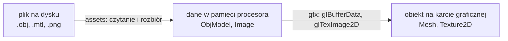
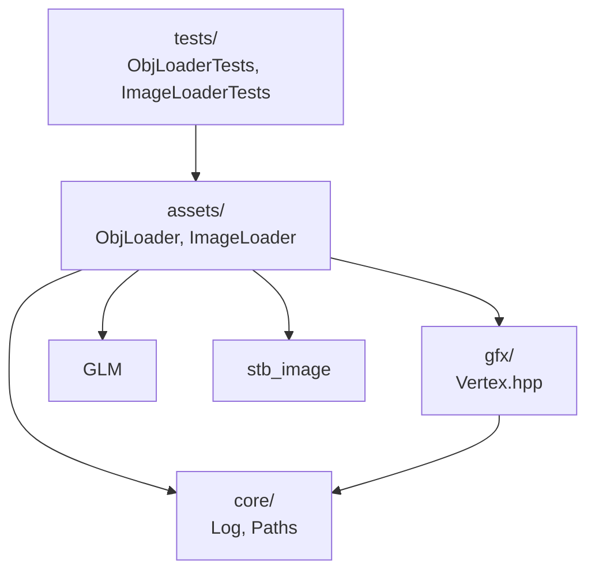

# Moduł assets: z pliku na dysku do danych w pamięci

Kamień milowy: M2 + M3. Temat wykładu: 4 (Wczytywanie OBJ) i część tematu 5 (Tekstury: wczytanie obrazu).
Kod: [`src/assets/`](../../../src/assets/), pliki wejściowe w [`assets/`](../../../assets/), testy w [`tests/`](../../../tests/).

Moduł `gfx` umie wysłać na kartę graficzną to, co dostanie: tablicę wierzchołków, tablicę indeksów, tablicę pikseli. Nie wie, skąd te tablice pochodzą. Do tej pory pochodziły z kodu: kostka jest wpisana liczba po liczbie w `NightMazeApp.cpp`. Moduł `assets` jest drugim źródłem: **czyta pliki** z katalogu `assets/` (modele `.obj` z materiałami `.mtl`, obrazy `.png`) i zamienia je na zwykłe dane w pamięci procesora.

Uwaga na dwie różne rzeczy o tej samej nazwie:

| Nazwa | Co to jest |
|---|---|
| katalog `assets/` w korzeniu repozytorium | **pliki danych**: modele, tekstury, shadery. Nie są kompilowane. Krok budowania umieszcza katalog obok programu ([`../core/paths.md`](../core/paths.md)) |
| katalog `src/assets/` i przestrzeń nazw `assets` | **kod C++**, który te pliki czyta. Ten dokument jest o nim |

**Stan.** Moduł ma dwa loadery: modeli OBJ i obrazów. Oba są częścią biblioteki `engine` i mają testy jednostkowe. **Program ich jeszcze nie woła**: `NightMazeApp` nadal rysuje kostkę. Pamięci podręcznej assetów (asset cache), którą PRD przewiduje w tej warstwie, jeszcze nie ma: dojdzie razem z rysowaniem modeli. Ten plik jest wstępem do modułu: indeks dokumentów i plików, wspólna zasada i miejsce w warstwach.

## 1. Dokumenty modułu

| Dokument | Temat wykładu | Co opisuje | Funkcje i pliki |
|---|---|---|---|
| [`obj-loader.md`](obj-loader.md) | 4. Wczytywanie OBJ | format OBJ i MTL linia po linii, trzy listy indeksów a jeden indeks OpenGL, mapa trójek, indeksy ujemne, triangulacja wachlarzem, kierunek nawijania, układ współrzędnych, czytanie liczb niezależnie od locale, zgłaszanie błędów z numerem linii, testy na prawdziwych modelach gry | `parseObj`, `parseMtl`, `loadObj`, `ObjModel` |
| [`images.md`](images.md) | 5. Tekstury | wczytanie pliku obrazu do tablicy pikseli: loader obrazów oparty na bibliotece stb_image | `loadImage`, `Image` |

Każdy dokument tematyczny ma te same dziesięć sekcji co dokumenty pozostałych modułów: Po co to jest, Teoria, Jak to działa w OpenGL, Shadery, Kod w projekcie, Panel ImGui, Pułapki, Ćwiczenia, Pytania kontrolne, Źródła.

Proponowana kolejność czytania: [`../../guides/blender.md`](../../guides/blender.md) (skąd są pliki i co w nich jest), ten plik, [`obj-loader.md`](obj-loader.md), potem [`../gfx/mesh.md`](../gfx/mesh.md) (dokąd trafiają wierzchołki i indeksy), [`images.md`](images.md) i [`../gfx/textures.md`](../gfx/textures.md) (dokąd trafiają piksele). Wcześniej warto znać [`../gfx/buffers-vao.md`](../gfx/buffers-vao.md) i [`../gfx/indexed-drawing.md`](../gfx/indexed-drawing.md): czym jest wierzchołek, indeks i bufor.

## 2. Indeks: plik kodu, dokument

| Plik kodu | Co zawiera | Dokument |
|---|---|---|
| [`src/assets/ObjLoader.hpp`](../../../src/assets/ObjLoader.hpp), [`.cpp`](../../../src/assets/ObjLoader.cpp) | struktury `ObjPart`, `ObjMaterial`, `ObjModel`, funkcje `parseObj` (tekst OBJ), `parseMtl` (tekst MTL) i `loadObj` (plik OBJ razem z plikami MTL, rozwiązanie ścieżek) | [`obj-loader.md`](obj-loader.md), sekcja 5 |
| [`src/assets/ImageLoader.hpp`](../../../src/assets/ImageLoader.hpp), [`.cpp`](../../../src/assets/ImageLoader.cpp) | struktura `Image` i funkcja `loadImage` | [`images.md`](images.md) |
| [`src/gfx/Vertex.hpp`](../../../src/gfx/Vertex.hpp) | struktura `gfx::Vertex`, którą loader OBJ wypełnia. Należy do `gfx/`, ale jest wspólnym formatem obu modułów | [`../gfx/mesh.md`](../gfx/mesh.md), sekcja 5.2 |
| [`tests/ObjLoaderTests.cpp`](../../../tests/ObjLoaderTests.cpp) | 18 przypadków testowych loadera OBJ | [`obj-loader.md`](obj-loader.md), sekcja 5.9 |
| [`tests/ImageLoaderTests.cpp`](../../../tests/ImageLoaderTests.cpp) | testy loadera obrazów | [`images.md`](images.md) |
| [`assets/models/`](../../../assets/models/), [`assets/textures/`](../../../assets/textures/) | pliki wejściowe: trzy modele z materiałami i dwie tekstury | [`../../guides/blender.md`](../../guides/blender.md), sekcje 5, 7 i 8 |

## 3. Wspólna zasada: wynik to dane procesora, bez OpenGL

Loader **nie tworzy żadnego obiektu OpenGL**. Zwraca zwykłe struktury z wektorami: wierzchołki, indeksy, piksele. Obiekt na karcie graficznej (siatkę, teksturę) tworzy z nich dopiero klasa z modułu `gfx`.

| Krok | Moduł | Wymaga kontekstu OpenGL | Da się testować bez okna |
|---|---|---|---|
| plik na dane | `assets` | nie | tak |
| dane na obiekt karty | `gfx` | tak | nie |

Po co ten podział:

1. **Testy.** Program testowy nie tworzy okna. Rozbiór pliku to najbardziej podatna na błędy część (indeksy od 1, trzy listy, końce linii), a dzięki podziałowi właśnie ona jest sprawdzana testami jednostkowymi. `gfx::Mesh` wymaga kontekstu i testu jednostkowego nie ma.
2. **Jedno zadanie na klasę.** `gfx::Mesh` nie wie, co to plik OBJ, a loader nie wie, co to VAO. Każdą z tych rzeczy tłumaczę osobno.
3. **Dane zostają dostępne.** Wczytany model można obejrzeć (liczba wierzchołków, pudełko otaczające), zanim trafi na kartę, albo użyć go bez rysowania.

Loadery **nie rzucają wyjątków** przy złym pliku. Brakujący albo uszkodzony plik to zwykła sytuacja przy pracy nad assetami: loader zwraca `false`, podaje tekst powodu i wypisuje błąd raz przez `core::logError`. To ten sam styl co `gfx::Shader::reload`, które też zwraca `bool`, zostawia poprzedni stan i zapisuje powód.

Oba loadery plików mają ten sam kształt, więc wystarczy nauczyć się go raz:

| Funkcja | Wynik | Błąd |
|---|---|---|
| `bool loadObj(path, ObjModel& model, std::string& error)` | `true` i wypełniony `model` | `false`, powód w `error`, `model` bez zmian |
| `bool loadImage(path, Image& image, std::string& error)` | `true` i wypełniony `image` | `false`, powód w `error`, `image` bez zmian |

## 4. Miejsce w warstwach

Strzałka znaczy "zna i dołącza nagłówki". Diagram pokazuje stan faktyczny: jedynymi użytkownikami modułu są dziś testy. `game/` dołączy go w następnym kroku, gdy zacznie rysować modele.

Zasady dla `assets`:

1. `assets/` stoi **nad** `gfx/` i `core/`: może dołączać ich nagłówki. Z `gfx/` loader OBJ dołącza tylko `gfx/Vertex.hpp`, nagłówek bez OpenGL. Z `core/` dołącza `core/Log.hpp` (logowanie błędu) i `core/Paths.hpp` (`core::pathText` do komunikatów).
2. `assets/` **nie woła OpenGL** i nie dołącza GLAD ani GLFW.
3. `gfx/` i `core/` nie znają `assets/`. `gfx::Mesh` przyjmuje `std::span<const Vertex>` i nie wie, czy dane przyszły z pliku, czy z tablicy w kodzie.
4. `assets/` nie zna `scene/`, `game/` ani `debug/`. Nic w nim nie jest specyficzne dla Night Maze: loader OBJ wczyta model z dowolnego programu, o ile ten trzyma się obsługiwanej części formatu.
5. O tym, **który** plik wczytać, decyduje wołający. Loader dostaje gotową ścieżkę. Zbudowanie jej przez `core::assetPath` to sprawa gry, tak jak przy shaderach.

W [`CMakeLists.txt`](../../../CMakeLists.txt) pliki `src/assets/*` należą do biblioteki statycznej `engine`, razem z `core`, `gfx` i `scene`. Program testowy dostaje je przez `game_logic`, która linkuje `engine`. Granicy między `assets/` a resztą `engine` nie pilnuje więc linker, tylko dyscyplina dyrektyw `#include`.

PRD (sekcja 6) umieszcza w tej warstwie jeszcze `AssetCache`: pamięć podręczną, która pilnuje, żeby ten sam plik był wczytany raz. Tej klasy jeszcze nie ma. Loader OBJ jest na nią przygotowany: ścieżki tekstur zwraca uporządkowane, więc dwa modele z tą samą teksturą podają identyczną ścieżkę ([`obj-loader.md`](obj-loader.md), sekcja 5.7).

## 5. Pytania kontrolne

Pytania z odpowiedziami do formatów i kodu są w sekcji 9 dokumentów tematycznych. Trzy pytania dotyczące treści tego pliku:

1. **Czym różni się `assets/` od `src/assets/`?**
   Pierwszy to katalog z plikami danych (modele, tekstury, shadery), które program czyta w czasie działania. Drugi to kod C++ w przestrzeni nazw `assets`, który te pliki rozbiera na dane.

2. **Dlaczego loader nie tworzy od razu obiektu OpenGL?**
   Bo wtedy wymagałby okna i kontekstu, a nie dałoby się go testować w programie testowym. Loader zwraca dane procesora (`ObjModel`, `Image`), a obiekt na karcie tworzy z nich klasa `gfx` (`Mesh`, `Texture2D`). Rozbiór pliku i wysyłanie na kartę to dwa osobne zadania.

3. **Od czego zależy moduł `assets` i co zależy od niego?**
   Dołącza `gfx/Vertex.hpp`, `core/Log.hpp`, `core/Paths.hpp`, GLM i bibliotekę stb_image. Nie dołącza GLAD ani GLFW. Dziś dołączają go tylko testy. `core/` i `gfx/` go nie znają.

## 6. Źródła

- PRD ([`../../PRD.pdf`](../../PRD.pdf)): sekcja 6 (warstwa `assets/`: ObjLoader, ImageLoader, AssetCache), sekcja 9 (konwencje modeli).
- Przewodnik po assetach: [`../../guides/blender.md`](../../guides/blender.md).
- Dokument biblioteki: [`../../libraries/stb_image.md`](../../libraries/stb_image.md).
- Szczegółowe źródła do każdego zagadnienia są w sekcji 10 dokumentów tematycznych.
