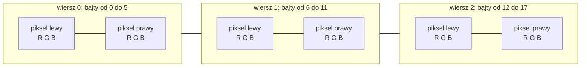
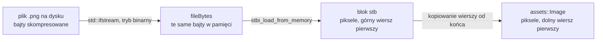
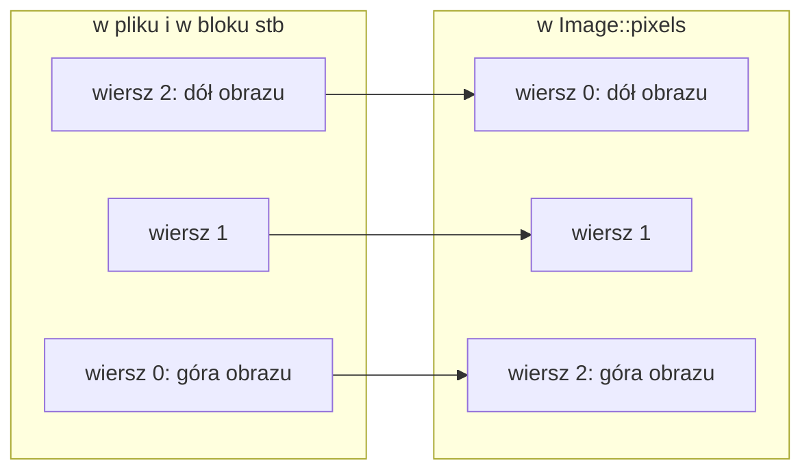

# Moduł assets: wczytywanie obrazów

Kamień milowy: M2 + M3, zaktualizowany w M4 (doszły dwa pliki map normalnych i dwa testy na nich), w M5 (cztery nowe pliki PNG kryształu i bramy, kod loadera bez zmian) w pierwszej części M6 (typ `RowOrder` i czwarty parametr `loadImage` dla ścian nieba, jeden nowy test) i w drugiej części M6 (tekstury podłoża `ground.png` i `ground_normal.png` zamiast `floor_stone`, trzeci wołający: mapa wysokości terenu, kod loadera bez zmian). Temat wykładu: 5 (Tekstury), część po stronie procesora, a od M6 także 8 (Tekstura sześcienna).
Kod: [`src/assets/ImageLoader.hpp`](../../../src/assets/ImageLoader.hpp), [`src/assets/ImageLoader.cpp`](../../../src/assets/ImageLoader.cpp), testy w [`tests/ImageLoaderTests.cpp`](../../../tests/ImageLoaderTests.cpp), biblioteka dekodująca w [`external/stb/stb_image.c`](../../../external/stb/stb_image.c).

Część modułu `assets`. Wstęp do całego modułu jest w [`README.md`](README.md). Ten dokument opisuje drogę od pliku PNG na dysku do tablicy bajtów w pamięci programu. Co dzieje się z tą tablicą dalej, czyli jak powstaje z niej tekstura na karcie graficznej, opisuje [`../gfx/textures.md`](../gfx/textures.md). Bibliotekę, która dekoduje plik, opisuje [`../../libraries/stb_image.md`](../../libraries/stb_image.md). Skąd biorą się same pliki PNG, opisuje [`../../guides/blender.md`](../../guides/blender.md), sekcja 7.

**Stan na dziś:** loader jest napisany i sprawdzony testami jednostkowymi. Gra go woła w trzech miejscach: `assets::AssetCache::texture` wczytuje nim każdy plik tekstury raz i tworzy z wyniku `gfx::Texture2D`, od pierwszej części M6 `game::Skybox` wczytuje nim sześć ścian nieba, a od drugiej części M6 funkcja `loadHeightmap` w `src/game/NightMazeApp.cpp` wczytuje nim mapę wysokości terenu (sekcja 5.6). Na Windowsie (MSVC 19.44, 2026-10-05) kod kompiluje się bez ostrzeżeń, testy przechodzą, a tekstury w grze mają na zrzutach ekranu właściwą orientację. **Na macOS ten kod nie był jeszcze budowany.**

Od drugiej części M4 ten sam loader, bez żadnej zmiany w kodzie, wczytuje też **mapy normalnych** (normal maps): `wall_stone_normal.png` i, wtedy, `floor_stone_normal.png` (od drugiej części M6 na jej miejscu jest `ground_normal.png`). Dla loadera to zwykłe obrazy RGB 512 x 512. Zmieniły się tylko testy: doszły dwa przypadki, które czytają te pliki i sprawdzają ich zawartość (sekcja 5.7). Kolejność wierszy z sekcji 2.3 ma dla map normalnych dodatkowe znaczenie, opisane w sekcji 2.6.

W M5 doszły cztery pliki: `crystal.png`, `crystal_normal.png`, `gate_wood.png` i `gate_wood_normal.png`, też RGB 512 x 512 (odczytane z nagłówków plików). Gra wczytuje więc osiem obrazów. Kod loadera się nie zmienił, a testy nadal czytają tylko cztery pliki kamienia: nowe pliki nie mają własnych przypadków testowych.

W pierwszej części M6 (skybox) kod loadera zmienił się pierwszy raz od M2 + M3. Doszedł typ `assets::RowOrder` i czwarty parametr `loadImage`, który pozwala **nie odwracać** wierszy: tak wczytywane są ściany tekstury sześciennej (sekcja 2.7). Wartość domyślna zostawia dotychczasowe zachowanie, więc tekstury 2D wczytują się jak przedtem. Doszło też sześć plików `assets/skybox/*.png` (RGB, 1024 x 1024) i jeden przypadek testowy. Zgłoszone dla Windowsa (2026-10-05): build Debug i Release bez ostrzeżeń, 221 przypadków i 85175 asercji w całym programie testowym (stan po pierwszej części M6).

W drugiej części M6 (teren) kod loadera się nie zmienił, zmieniły się pliki i wołający. Zniknęły `floor_stone.png` i `floor_stone_normal.png` (płytki podłogi zastąpił teren), doszły `ground.png` i `ground_normal.png`, też RGB 512 x 512, więc gra nadal wczytuje osiem tekstur. Dwa przypadki testowe, które czytały pliki podłogi, czytają teraz pliki podłoża (sekcja 5.7). Dziewiąty plik w `assets/textures/`, `heightmap.png` (RGB, 256 x 256), nie jest teksturą: `loadHeightmap` wczytuje go z `RowOrder::TopFirst` i zamienia na tablicę wysokości ([`../renderer/terrain.md`](../renderer/terrain.md)). Stan po tej zmianie (2026-10-05, Windows, Debug i Release): 256 przypadków i 101232 asercje w całym programie testowym. W pierwszej części M7 kod loadera znów się nie zmienił, ale zmieniło się to, co dzieje się z bajtami dalej: osiem tekstur trafia na kartę z przestrzenią kolorów wybraną przez wołającego (cztery obrazy koloru jako sRGB, cztery mapy normalnych jako dane liniowe), a sześć obrazów nieba jako sRGB (pułapka 9). Zgłoszone dla Windowsa po pierwszej części M7 (2026-10-05): bramka `make check` przechodzi, 269 przypadków testowych i 102103 asercje w Debug i Release, a po drugiej części M7 276 i 102139.

## 1. Po co to jest

Tekstura to obraz naklejony na trójkąty. Zanim trafi na kartę graficzną, obraz musi znaleźć się w pamięci programu jako zwykła tablica bajtów. Plik PNG taką tablicą nie jest: jest skompresowany, ma nagłówek, sumy kontrolne i wiersze zapisane od góry. Loader obrazów robi z pliku to, czego potrzebuje OpenGL:

| Wejście | Wyjście |
|---|---|
| ścieżka do pliku, na przykład `assets/textures/wall_stone.png` | struktura `assets::Image`: szerokość, wysokość, liczba kanałów i bajty pikseli, **dolny wiersz pierwszy** (albo górny, gdy wołający o to poprosi: sekcja 2.7) |

Całość to jedna struktura, jeden typ wyliczeniowy i jedna funkcja:

```cpp
bool loadImage(const std::filesystem::path& path, Image& image, std::string& error,
               RowOrder rowOrder = RowOrder::BottomFirst);
```

W tym pliku nie ma ani jednego wywołania OpenGL. To celowy podział: wczytanie pliku nie wymaga okna ani karty graficznej, więc da się je sprawdzić testem jednostkowym. Klasa `gfx::Texture2D` z kolei nie wie nic o plikach: dostaje gotowe bajty. Oba kawałki spotkają się dopiero w kodzie gry.

## 2. Teoria

### 2.1 Obraz rastrowy: piksele, kanały, bajty

**Obraz rastrowy** (raster image) to prostokątna siatka **pikseli**. Każdy piksel to kilka liczb, po jednej na **kanał** (channel):

| Liczba kanałów | Co zawiera piksel | Nazwa |
|---|---|---|
| 1 | jasność | odcienie szarości |
| 2 | jasność i przezroczystość | szarość z alfą |
| 3 | czerwony, zielony, niebieski | RGB |
| 4 | czerwony, zielony, niebieski, przezroczystość | RGBA |

W teksturach gry każdy kanał to jeden bajt, czyli liczba od 0 do 255 (8 bitów na kanał). 0 to brak danej barwy, 255 to pełna.

W pamięci piksele leżą **wierszami**, jeden wiersz za drugim, a w wierszu piksel za pikselem, od lewej do prawej. Kanały jednego piksela leżą obok siebie. Obraz 2 x 3 w formacie RGB to 18 bajtów:



Trzy wzory, które trzeba umieć:

- rozmiar wiersza w bajtach: `szerokość * kanały`,
- rozmiar całego obrazu: `szerokość * wysokość * kanały`,
- pierwszy bajt piksela w kolumnie `x` i wierszu `y`: `(y * szerokość + x) * kanały`.

Dla tekstur gry: 512 x 512 pikseli po 3 bajty to 786432 bajty, czyli 768 KB na jedną teksturę, choć plik `wall_stone.png` zajmuje na dysku mniej.

### 2.2 Plik a piksele: dekodowanie

Plik PNG przechowuje te same piksele **skompresowane bezstratnie**: po rozpakowaniu dostaję dokładnie te bajty, które zapisał program graficzny. Zamiana pliku na tablicę pikseli to **dekodowanie** (decoding). Nie piszę dekodera sam: robi to biblioteka stb_image ([`../../libraries/stb_image.md`](../../libraries/stb_image.md)). Powód jest prosty: format PNG to algorytm deflate, filtry wierszy i sumy kontrolne, czyli kilkaset linii kodu, który nie ma nic wspólnego z grafiką 3D i którego nie pokazuje wykład.

Droga danych w loaderze ma więc dwa kroki i dwie różne tablice bajtów:



### 2.3 Który wiersz jest pierwszy

To jest jedyne miejsce w loaderze, w którym można się pomylić bez żadnego komunikatu o błędzie.

- **Pliki obrazów** (PNG, JPEG, PNM) zapisują wiersze **od góry**: pierwszy wiersz w pliku to górna krawędź obrazu. Tak rysują ekrany i tak czyta się tekst.
- **OpenGL** traktuje pierwszy wiersz danych tekstury jako **dolną** krawędź: współrzędna tekstury `v = 0` to dół, `v = 1` to góra ([`../gfx/textures.md`](../gfx/textures.md), sekcja 2.1).
- **Format OBJ** i Blender używają tej samej konwencji co OpenGL: `v` rośnie w górę ([`obj-loader.md`](obj-loader.md)). Współrzędne UV modeli są więc gotowe dla OpenGL i **nie wolno ich zmieniać**.

Skoro model i OpenGL zgadzają się ze sobą, a nie zgadza się tylko plik obrazu, poprawkę robię w jednym miejscu: przy wczytywaniu obrazu. Loader odwraca kolejność wierszy, tak że pierwszy wiersz w `Image::pixels` jest dolnym wierszem obrazu.



Odwracana jest tylko kolejność **wierszy**. Piksele wewnątrz wiersza zostają na miejscu: lewy piksel jest nadal pierwszy. Odwrócenie także tej kolejności dałoby obraz obrócony o 180 stopni, a nie odbity w pionie.

Dlaczego nie zrobić tego w shaderze (`1.0 - v`)? Obraz wyszedłby taki sam, także dla UV spoza zakresu od 0 do 1: przy zawijaniu `GL_REPEAT` liczy się część ułamkowa współrzędnej, a część ułamkowa `1 - v` to dokładnie `1` minus część ułamkowa `v`. Powody są więc inne, organizacyjne:

- **Jedno miejsce zamiast wielu.** Odwrócenie w shaderze trzeba by powtórzyć w każdym shaderze, który próbkuje teksturę z pliku, i pamiętać o nim przy każdym nowym.
- **Jedna konwencja dla wszystkich tekstur.** Tekstury, które OpenGL wypełnia sam (obraz narysowany do bufora ramki, temat 10), mają wiersz 0 na dole. Gdyby tekstury z plików były trzymane do góry nogami, shader musiałby wiedzieć, skąd pochodzi tekstura, żeby wiedzieć, czy odwracać.
- **Dane w pamięci zgadzają się z rysunkiem.** Kto czyta `Image::pixels` w C++, ma ten sam układ co shader: wiersz 0 to `v = 0`.

Odwrócenie raz, przy wczytaniu, nie kosztuje też nic w czasie rysowania.

Od kiedy są mapy normalnych, doszedł czwarty powód, już nie organizacyjny: odwrócenie obrazu mapy normalnych w shaderze przez `1 - v` wymagałoby jeszcze zmiany znaku zielonego kanału, a odwrócenie wierszy w loaderze nie wymaga niczego (sekcja 2.6).

### 2.4 Ścieżki ze znakami spoza ASCII

Na Windowsie nazwa pliku to tekst w UTF-16 (znaki szerokie). Stare funkcje C (`fopen`) przyjmują nazwę jako `char*` w **lokalnej stronie kodowej**, która mieści tylko część znaków: na polskim Windowsie strona 1250 ma polskie litery, ale nie ma na przykład znaków japońskich. Ścieżka ze znakiem spoza strony kodowej nie da się wtedy w ogóle zapisać ([`../core/paths.md`](../core/paths.md), sekcja 2.6).

Biblioteka stb_image otwiera pliki właśnie przez `fopen_s`. Loader omija ten problem: plik otwiera strumieniem `std::ifstream`, któremu podaje obiekt `std::filesystem::path`. Na Windowsie `path` trzyma znaki szerokie, a strumień ma konstruktor, który ich używa, więc każda nazwa działa. stb dostaje już nie nazwę, tylko bajty. Na macOS nazwy plików to UTF-8 i problem nie istnieje, ale ten sam kod działa tam bez zmian.

### 2.5 Błąd bez wyjątku

Brak pliku z teksturą nie jest powodem, żeby zatrzymać program: gra może narysować obiekt bez tekstury i wypisać błąd. Loader zachowuje się więc tak jak `gfx::Shader` przy błędzie w shaderze ([`../gfx/shader-class.md`](../gfx/shader-class.md)) i dokładnie tak jak `assets::loadObj` ([`obj-loader.md`](obj-loader.md)):

- nie rzuca wyjątku,
- zwraca `false`,
- wypisuje błąd **raz** przez `core::logError`,
- ten sam tekst zostawia w parametrze `error`, żeby wołający mógł go pokazać na przykład w panelu debug,
- nie zmienia parametru `image`.

### 2.6 Kolejność wierszy a zielony kanał mapy normalnych

Mapa normalnych to obraz, w którym trzy kanały piksela nie są kolorem, tylko kierunkiem: czerwony to składowa x, zielony y, niebieski z, każda przeliczona z zakresu od -1 do 1 na bajt od 0 do 255 (`bajt = (składowa * 0.5 + 0.5) * 255`). Kierunek jest zapisany względem samego obrazu: x to "w prawo na obrazie", y to "w górę obrazu", z to "z powierzchni na zewnątrz". Płaski teksel `(0, 0, 1)` ma bajty `(128, 128, 255)`. Pełny opis jest w [`../gfx/normal-mapping.md`](../gfx/normal-mapping.md), sekcje 2.3 do 2.5.

Dla loadera wynika z tego jedno pytanie: **czy odwrócenie wierszy psuje zielony kanał?** Nie, i właśnie dlatego wszystko się zgadza bez żadnej poprawki:

| Ogniwo | Co ustala |
|---|---|
| skrypt tekstur ([`../../guides/blender.md`](../../guides/blender.md), sekcja 7.2) | liczy nachylenie w tablicy, w której wiersz 0 jest **dolnym** wierszem obrazu. Zielony kanał znaczy więc "w górę obrazu" (konwencja OpenGL, +Y w górę) |
| plik PNG | zapisuje ten sam obraz od górnego wiersza. Treść pikseli się nie zmienia, zmienia się tylko kolejność wierszy w pliku |
| `loadImage` | odwraca kolejność wierszy z powrotem: wiersz 0 w `Image::pixels` jest znów dolnym wierszem obrazu, czyli `v = 0` |
| UV modeli | `v` rośnie w górę ściany ([`obj-loader.md`](obj-loader.md), sekcja 2.8) |

Loader przestawia **wiersze**, a bajtów w pikselach nie dotyka. Obraz na ścianie stoi więc tak, jak go skrypt policzył, a "w górę obrazu" znaczy "tam, gdzie rośnie `v`". Zielony kanał nie wymaga zmiany znaku w żadnym miejscu: ani w skrypcie, ani w loaderze, ani w shaderze.

Pomyłka w tym łańcuchu nie daje żadnego błędu, tylko odwrócony relief: fugi, które powinny być wgłębieniami, wyglądałyby jak grzbiety. Na zwykłej teksturze kamienia odwrócenie wierszy prawie nie rzuca się w oczy (pułapka 1), na mapie normalnych widać je pod każdym światłem. Dlatego konwencję sprawdza osobny test na prawdziwym pliku (sekcja 5.7).

### 2.7 Kiedy wierszy nie odwracać: `RowOrder` i ściany tekstury sześciennej

Odwracanie wierszy z sekcji 2.3 jest dobre dla każdej tekstury 2D. Od pierwszej części M6 gra ma też obrazy, dla których jest błędem: sześć ścian nieba, czyli tekstury sześciennej (cube map). Teoria jest w [`../renderer/skybox.md`](../renderer/skybox.md), sekcja 2.4. Tutaj wystarczy jedno zdanie: OpenGL nadal bierze pierwszy wiersz danych jako współrzędną 0, ale na ścianie tekstury sześciennej współrzędna `t = 0` oznacza **górę** obrazu, a nie dół. Plik PNG zaczyna się od górnego wiersza, więc ściany trzeba podać karcie tak, jak leżą w pliku.

| | Tekstura 2D | Ściana tekstury sześciennej |
|---|---|---|
| pierwszy wiersz danych to | `v = 0`, dół obrazu | `t = 0`, **góra** obrazu |
| pierwszy wiersz pliku | góra obrazu | góra obrazu |
| co robi loader | odwraca wiersze | kopiuje wiersze bez zmiany kolejności |
| wartość `RowOrder` | `BottomFirst` (domyślna) | `TopFirst` |

Loader dostał więc czwarty parametr, typ wyliczeniowy `assets::RowOrder`. Dwie inne drogi byłyby gorsze:

- **Osobna funkcja dla ścian nieba.** Powtórzyłaby cały `loadImage` (otwarcie pliku, trzy sprawdzenia, dekodowanie, zwolnienie bloku) dla różnicy jednego wyrażenia.
- **Odwrócenie z powrotem u wołającego.** `game::Skybox` mogłoby wczytać obraz domyślnie i odwrócić wiersze jeszcze raz. To dwa przejścia po 3 MB na ścianę i dwa miejsca, które muszą o sobie wiedzieć.

Wartością domyślną jest `BottomFirst`, więc żadne z dotychczasowych wywołań loadera się nie zmieniło: `AssetCache::texture` nadal pisze `loadImage(key, image, error)`.

Skutek dla każdego, kto czyta `Image::pixels`: struktura `Image` **nie pamięta**, w jakiej kolejności ją wypełniono. To, czy wiersz 0 jest dołem, czy górą, wie tylko ten, kto wołał loader. W grze jest dwóch wołających z `TopFirst`. `loadSkyCubemap` w `src/game/Skybox.cpp` od razu oddaje bajty klasie `gfx::Cubemap`, która właśnie takiej kolejności wymaga ([`../gfx/cubemap.md`](../gfx/cubemap.md), sekcja 2.5). `loadHeightmap` w `src/game/NightMazeApp.cpp` od razu oddaje obraz funkcji `game::heightmapFromImage`, dla której górny wiersz obrazu to północny brzeg lądu ([`../renderer/terrain.md`](../renderer/terrain.md)).

## 3. Jak to działa w OpenGL

Ta sekcja nie ma zastosowania: loader obrazów nie woła OpenGL. Plik `ImageLoader.cpp` nie dołącza `<glad/gl.h>` ani niczego z `gfx/`. Wywołania OpenGL, które przyjmują wynik loadera (`glTexImage2D` i reszta), są w [`../gfx/textures.md`](../gfx/textures.md), sekcja 3.

Jedno ustalenie z tamtego dokumentu wpływa na loader: OpenGL chce dolnego wiersza jako pierwszego (sekcja 2.3) i wierszy bez dopełnienia, o ile ustawi się `GL_UNPACK_ALIGNMENT` na 1. `Image::pixels` ma dokładnie taki układ.

## 4. Shadery

Ta sekcja nie ma zastosowania: loader nie ma shaderów i żaden shader nie widzi jego danych bezpośrednio. Shader próbkuje teksturę, która z tych danych powstanie ([`../gfx/textures.md`](../gfx/textures.md), sekcja 4).

## 5. Kod w projekcie

### 5.1 Pliki

| Plik | Co zawiera |
|---|---|
| [`src/assets/ImageLoader.hpp`](../../../src/assets/ImageLoader.hpp) | struktura `assets::Image`, typ wyliczeniowy `assets::RowOrder` (od M6), deklaracja `assets::loadImage`. Dołącza tylko `<filesystem>`, `<string>` i `<vector>` |
| [`src/assets/ImageLoader.cpp`](../../../src/assets/ImageLoader.cpp) | stała `KEEP_FILE_CHANNELS`, funkcje pomocnicze `readBinaryFile` i `fail`, implementacja `loadImage`. Jedyny plik projektu, który dołącza `<stb_image.h>` |
| [`external/stb/stb_image.c`](../../../external/stb/stb_image.c) | dwie linie, które kompilują implementację stb_image do biblioteki `stb_image` ([`../../libraries/stb_image.md`](../../libraries/stb_image.md), sekcja 2) |
| [`tests/ImageLoaderTests.cpp`](../../../tests/ImageLoaderTests.cpp) | 10 przypadków testowych (sekcja 5.7) |

Oba pliki z `src/assets/` są na liście źródeł biblioteki `engine` w [`CMakeLists.txt`](../../../CMakeLists.txt). Zależności: `core/Log.hpp` (wypisanie błędu), `core/Paths.hpp` (`core::pathText`, czyli ścieżka jako tekst UTF-8 do komunikatu), stb_image i biblioteka standardowa. Nic z GLAD, GLFW, GLM, `gfx/`, `scene/` ani `game/`.

### 5.2 Nagłówek: struktura `Image`, typ `RowOrder` i funkcja `loadImage`

```cpp
struct Image {
    /// Width in pixels.
    int width = 0;
    /// Height in pixels.
    int height = 0;
    /// Bytes per pixel, as stored in the file: 1 (grey), 2 (grey and alpha), 3 (RGB) or
    /// 4 (RGBA).
    int channels = 0;
    /// width * height * channels bytes, bottom row first (or top row first when the
    /// picture was loaded with RowOrder::TopFirst).
    std::vector<unsigned char> pixels;
};
```

| Element | Dlaczego tak |
|---|---|
| `struct` z publicznymi polami | to same dane, bez reguł, których trzeba by pilnować funkcjami. Tak samo wyglądają `scene::Transform` i `scene::Camera` |
| `int width`, `int height`, `int channels` | typ `int`, bo takiego używa stb_image i takiego chce `gfx::Texture2D` (a w końcu `glTexImage2D`, gdzie `GLsizei` to też `int`) |
| wartości początkowe 0 | pusty obiekt `Image` jest poprawnym "brakiem obrazu": rozmiar 0 i pusty wektor |
| `std::vector<unsigned char> pixels` | wektor sam zwalnia pamięć i zna swój rozmiar. `unsigned char` to jeden bajt o wartościach od 0 do 255. Zwykły `char` mógłby mieć znak, a wtedy 255 byłoby liczbą ujemną |

```cpp
/// Which row of the picture comes first in Image::pixels.
enum class RowOrder {
    /// The bottom row first: the rows of the file in reverse order. For 2D textures,
    /// where OpenGL takes the first row it is given as texture coordinate v = 0, the
    /// bottom edge.
    BottomFirst,
    /// The top row first: the rows as they are in the file, no flip. For the faces of
    /// a cube map. A cube map is not read with (u, v) but with a direction, and its
    /// rules say that on each face the coordinate t = 0 is the TOP of the picture (the
    /// convention comes from RenderMan, where the origin of a picture is its top left
    /// corner). OpenGL still takes the first row it is given as t = 0, so for a face
    /// that row has to be the top one. A face loaded bottom row first would be shown
    /// upside down, and it would not fit its neighbours.
    TopFirst,
};
```

| Wartość | Znaczenie |
|---|---|
| `BottomFirst` | dolny wiersz pierwszy: wiersze pliku w odwrotnej kolejności. Dla tekstur 2D (sekcja 2.3). Stoi jako pierwsza, ale to nie jej numer czyni ją domyślną, tylko wartość domyślna parametru niżej |
| `TopFirst` | górny wiersz pierwszy: wiersze tak, jak w pliku. Dla ścian tekstury sześciennej (sekcja 2.7) |

`enum class`, a nie parametr `bool flipRows`: wywołanie `loadImage(path, image, error, RowOrder::TopFirst)` mówi w miejscu użycia, co dostanie wołający, a `loadImage(path, image, error, false)` wymagałoby zajrzenia do nagłówka.

```cpp
/// Reads an image file and decodes it into pixels. The channel count of the file is kept.
/// The path may contain any characters, also non ASCII ones on Windows. rowOrder says
/// which row of the picture comes first in the result: the bottom one unless asked
/// otherwise, which is right for every 2D texture.
///
/// Returns true and fills image on success. On failure (the file cannot be opened, it is
/// empty, it is not an image the decoder knows) it logs the error once, puts the same text
/// into error, leaves image unchanged and returns false. It does not throw.
bool loadImage(const std::filesystem::path& path, Image& image, std::string& error,
               RowOrder rowOrder = RowOrder::BottomFirst);
```

| Parametr | Znaczenie |
|---|---|
| `const std::filesystem::path& path` | plik do wczytania. Typ `path`, a nie `std::string`, żeby nazwa nie przechodziła przez stronę kodową (sekcja 2.4) |
| `Image& image` | tu trafia wynik. Referencja niestała: funkcja wypełnia obiekt wołającego. Przy błędzie zostaje nietknięty |
| `std::string& error` | tu trafia tekst błędu. Po udanym wczytaniu jest czyszczony |
| `RowOrder rowOrder = RowOrder::BottomFirst` | który wiersz obrazu ma być pierwszy w wyniku. Parametr z **wartością domyślną**: wywołanie z trzema argumentami kompiluje się jak przed M6 i dostaje odwracanie. Wartość domyślna stoi tylko w deklaracji w nagłówku, w definicji w pliku `.cpp` już jej nie ma |
| wynik `bool` | `true` to sukces. Wołający pisze `if (!assets::loadImage(...))` |

Ten sam kształt (wynik `bool`, dane i błąd przez referencje) ma `assets::loadObj`. W module `assets` obie funkcje wczytujące zachowują się jednakowo.

Funkcja **nie zmienia liczby kanałów**. Tekstury gry są zapisane jako RGB, więc wynik ma 3 kanały. Plik w odcieniach szarości dałby 1 albo 2 kanały, a takich `gfx::Texture2D` nie przyjmuje (sekcja 7, pułapka 5).

### 5.3 `readBinaryFile`: plik do pamięci

```cpp
bool readBinaryFile(const std::filesystem::path& path, std::vector<unsigned char>& bytes) {
    // The stream takes the path object itself, not a string made from it. On Windows the
    // path holds wide characters and the stream opens the file through them, so a letter
    // outside the local code page is not damaged. std::ios::binary switches off the
    // translation of line endings, which would corrupt image data on Windows.
    std::ifstream file(path, std::ios::binary);
    if (!file.is_open()) {
        return false;
    }

    // An istreambuf_iterator reads the file one char at a time, and an iterator made
    // without a stream marks the end of the file. assign copies everything between the
    // two into the vector.
    bytes.assign(std::istreambuf_iterator<char>(file), std::istreambuf_iterator<char>());
    return true;
}
```

| Linia | Co robi i dlaczego |
|---|---|
| `std::ifstream file(path, std::ios::binary);` | otwiera plik do czytania. Strumień dostaje **obiekt `path`**, a nie tekst z niego zrobiony: to jest cała obsługa nazw spoza ASCII. Strumień sam zamknie plik w destruktorze |
| `std::ios::binary` | **tryb binarny**. W trybie tekstowym biblioteka na Windowsie zamienia przy czytaniu parę bajtów `\r\n` na `\n` i kończy czytanie na bajcie 26 (Ctrl+Z). Dla tekstu to pomoc, dla obrazu zniszczenie danych. Każdy plik PNG zaczyna się od ośmiu bajtów `89 50 4E 47 0D 0A 1A 0A`: są w nich celowo i para `\r\n` (`0D 0A`), i bajt 26 (`1A`), żeby plik uszkodzony przez tryb tekstowy dało się od razu rozpoznać. Zmierzone na Windowsie: bez `std::ios::binary` obie tekstury gry kończą się błędem `cannot be decoded ... (unknown image type)` i 2 z 7 przypadków testowych nie przechodzą. Na macOS oba tryby działają tak samo, więc błąd wyszedłby tylko na Windowsie |
| `if (!file.is_open())` | pliku nie ma albo nie wolno go czytać. Funkcja zwraca `false`, a komunikat buduje wołający |
| `std::istreambuf_iterator<char>(file)` | **iterator**, który czyta ze strumienia po jednym znaku (bajcie), bez żadnego przetwarzania |
| `std::istreambuf_iterator<char>()` | iterator utworzony bez strumienia oznacza "koniec pliku". Para iteratorów opisuje zakres "od teraz do końca" |
| `bytes.assign(początek, koniec)` | zastępuje zawartość wektora wszystkim z tego zakresu. Każdy `char` jest przy tym zamieniany na `unsigned char` o tym samym wzorze bitów |

Shader jest czytany podobną funkcją `readTextFile` w `Shader.cpp`, ale tam plik jest tekstem i trafia do `std::string`. Tu potrzebne są surowe bajty jako `unsigned char`, bo takich chce stb_image, więc wektor wypełniam wprost, bez rzutowania wskaźników.

### 5.4 `fail`: jedna linia na błąd

```cpp
bool fail(std::string& error, const std::string& message) {
    error = message;
    core::logError(error);
    return false;
}
```

Każda gałąź błędu w `loadImage` ma do zrobienia to samo: zapisać tekst, wypisać go i zwrócić `false`. Funkcja pomocnicza robi te trzy rzeczy, więc gałąź błędu to jedna linia `return fail(error, "...");`. Dzięki temu nie da się zapomnieć o wypisaniu błędu w jednej z gałęzi ani wypisać go dwa razy.

### 5.5 `loadImage` linia po linii

**Krok 1: wczytanie pliku i trzy sprawdzenia.**

```cpp
    std::vector<unsigned char> fileBytes;
    if (!readBinaryFile(path, fileBytes)) {
        return fail(error, "Image file cannot be opened: " + core::pathText(path));
    }
    if (fileBytes.empty()) {
        return fail(error, "Image file is empty: " + core::pathText(path));
    }
    // stb_image takes the size of the data as an int.
    if (fileBytes.size() > static_cast<std::size_t>(std::numeric_limits<int>::max())) {
        return fail(error, "Image file is too large: " + core::pathText(path));
    }
```

| Sprawdzenie | Po co |
|---|---|
| plik się nie otworzył | najczęstszy błąd: literówka w nazwie albo brak kopii katalogu `assets` obok programu |
| plik jest pusty | stb też by go odrzucił, ale z ogólnym komunikatem. Tu komunikat mówi wprost, co jest nie tak |
| plik jest większy niż największy `int` | stb przyjmuje rozmiar jako `int`. Rzutowanie większej liczby dałoby wartość ujemną. `std::numeric_limits<int>::max()` to największa wartość typu `int` (ponad 2 miliardy), więc w praktyce ta gałąź nie wykona się nigdy, ale rzutowanie bez sprawdzenia byłoby błędem czekającym na okazję |

`core::pathText(path)` zamienia ścieżkę na tekst UTF-8 do komunikatu ([`../core/paths.md`](../core/paths.md), sekcja 5.7).

**Krok 2: dekodowanie.**

```cpp
    int width = 0;
    int height = 0;
    int channels = 0;
    stbi_uc* decoded = stbi_load_from_memory(fileBytes.data(), static_cast<int>(fileBytes.size()),
                                             &width, &height, &channels, KEEP_FILE_CHANNELS);
    if (decoded == nullptr) {
        // stbi_failure_reason gives a short text such as "unknown image type".
        return fail(error, "Image file cannot be decoded: " + core::pathText(path) + " (" +
                               stbi_failure_reason() + ")");
    }
```

Funkcja biblioteki dostaje bajty pliku i ich liczbę, a przez trzy wskaźniki oddaje szerokość, wysokość i liczbę kanałów. Zwraca wskaźnik na blok pikseli, który sama przydzieliła, albo `nullptr`. Parametry omawia [`../../libraries/stb_image.md`](../../libraries/stb_image.md), sekcja 3.1. `KEEP_FILE_CHANNELS` to nazwana stała o wartości 0: "nie przeliczaj kanałów". `stbi_uc` to `unsigned char`.

Od tej chwili w pamięci są **dwie** tablice: `fileBytes` (skompresowany plik) i `decoded` (piksele). Pierwsza zniknie sama na końcu funkcji, drugą trzeba zwolnić ręcznie.

**Krok 3: rozmiary.**

```cpp
    const std::size_t rowSize =
        static_cast<std::size_t>(width) * static_cast<std::size_t>(channels);
    const auto rowCount = static_cast<std::size_t>(height);
```

`rowSize` to liczba bajtów jednego wiersza (sekcja 2.1). Rzutowanie na `std::size_t` stoi **przed** mnożeniem: iloczyn trzech liczb `int` liczony w `int` mógłby się przepełnić dla bardzo dużego obrazu, a iloczyn liczony w `std::size_t` (64 bity) nie. Rzutowania są też potrzebne, żeby kompilator nie ostrzegał o mieszaniu liczb ze znakiem i bez znaku. `auto` w drugiej linii to ten sam typ `std::size_t`: nazwa typu stoi już w rzutowaniu po prawej stronie, a clang-tidy (reguła `modernize-use-auto`) każe jej wtedy nie powtarzać.

**Krok 4: obiekt wyniku.**

```cpp
    Image loaded;
    loaded.width = width;
    loaded.height = height;
    loaded.channels = channels;
    loaded.pixels.resize(rowSize * rowCount);
```

Wynik powstaje w zmiennej **lokalnej**, a nie od razu w parametrze `image`. Parametr zostanie zmieniony dopiero w ostatnim kroku, jednym przypisaniem. `resize` przydziela wektorowi dokładnie tyle bajtów, ile ma obraz.

**Krok 5: kopiowanie z odwróceniem wierszy (albo bez).**

```cpp
    for (std::size_t row = 0; row < rowCount; ++row) {
        const std::size_t sourceRow = rowOrder == RowOrder::BottomFirst ? rowCount - 1 - row : row;
        const stbi_uc* source = decoded + sourceRow * rowSize;
        std::copy_n(source, rowSize,
                    loaded.pixels.begin() + static_cast<std::ptrdiff_t>(row * rowSize));
    }
```

To jest sedno pliku. Piksele i tak trzeba skopiować z bloku biblioteki do wektora, więc kopiuję je wiersz po wierszu **w odwrotnej kolejności** i odwrócenie nie kosztuje osobnego przejścia. Od M6 kolejność zależy od parametru `rowOrder`: jedna linia wybiera numer wiersza źródła, reszta pętli jest wspólna.

| Element | Znaczenie |
|---|---|
| `row` | numer wiersza w **wyniku**, od 0 (dół obrazu przy `BottomFirst`, góra przy `TopFirst`) |
| `rowOrder == RowOrder::BottomFirst ? rowCount - 1 - row : row` | numer odpowiadającego wiersza w **źródle**, wybrany operatorem warunkowym. Przy `BottomFirst` to `rowCount - 1 - row`: dla `row = 0` ostatni wiersz pliku, dla ostatniego `row` wiersz 0. Przy `TopFirst` to po prostu `row`: wiersze idą w kolejności pliku |
| `decoded + sourceRow * rowSize` | wskaźnik na pierwszy bajt tego wiersza źródła: początek bloku plus tyle bajtów, ile zajmują wiersze przed nim |
| `std::copy_n(źródło, ile, cel)` | kopiuje `ile` elementów. Tu: cały wiersz, `rowSize` bajtów, w niezmienionej kolejności |
| `loaded.pixels.begin() + ...` | iterator na pierwszy bajt wiersza `row` w wyniku. Do iteratora dodaje się liczbę ze znakiem (`std::ptrdiff_t`), stąd rzutowanie |

Przykład dla obrazka testowego 2 x 3 RGB (`rowSize` = 6, `rowCount` = 3) przy domyślnym `BottomFirst`:

| `row` (wynik) | wiersz źródła | bajty źródła | bajty wyniku |
|---|---|---|---|
| 0 | 2 | od 12 do 17 | od 0 do 5 |
| 1 | 1 | od 6 do 11 | od 6 do 11 |
| 2 | 0 | od 0 do 5 | od 12 do 17 |

Środkowy wiersz obrazu o nieparzystej wysokości zostaje na swoim miejscu, co widać w tabeli. Przy `TopFirst` tabela jest trywialna: wiersz źródła równa się `row`, a bajty wyniku są kopią bajtów źródła.

**Krok 6: sprzątanie i oddanie wyniku.**

```cpp
    stbi_image_free(decoded);

    // Moving hands the pixel vector over without copying its bytes a second time.
    image = std::move(loaded);
    error.clear();
    return true;
```

| Linia | Co robi |
|---|---|
| `stbi_image_free(decoded);` | zwalnia blok biblioteki. Od tej linii wskaźnik `decoded` jest nieważny, ale piksele są już w wektorze |
| `image = std::move(loaded);` | **przeniesienie** ([`../gfx/README.md`](../gfx/README.md), sekcja 2.3): wektor w `image` przejmuje pamięć wektora z `loaded`, bez kopiowania 786432 bajtów drugi raz |
| `error.clear();` | po sukcesie tekst błędu jest pusty, także wtedy, gdy wołający podał napis z wcześniejszego nieudanego wywołania |

Między `stbi_load_from_memory` a `stbi_image_free` nie ma żadnego `return`, więc blok biblioteki jest zwalniany na każdej drodze przez funkcję.

### 5.6 Jak wołać loader

W grze `loadImage` wołają trzy miejsca. Pierwsze, dla wszystkich tekstur 2D, to `assets::AssetCache::texture` w [`src/assets/AssetCache.cpp`](../../../src/assets/AssetCache.cpp). Fragment od wczytania pliku do utworzenia tekstury:

```cpp
    // loadImage logs its own error.
    Image image;
    std::string error;
    if (!loadImage(key, image, error)) {
        m_failedPaths.push_back(key);
        return nullptr;
    }

    // The constructor logs an error and leaves the texture not valid when the picture
    // has a channel count it does not accept (grey pictures have 1 or 2 channels).
    gfx::Texture2D texture(image.width, image.height, image.channels, image.pixels.data(),
                           colorSpace);
    if (!texture.isValid()) {
        core::logError("Texture cannot be used: " + core::pathText(key));
        m_failedPaths.push_back(key);
        return nullptr;
    }
```

| Linia | Znaczenie |
|---|---|
| `Image image;` i `std::string error;` | dwa parametry wyjściowe loadera. `error` nie jest tu potem czytany: `loadImage` samo wypisuje błąd przez `core::logError`, co mówi komentarz nad nimi |
| `if (!loadImage(key, image, error))` | `key` to ścieżka pliku po uporządkowaniu (`lexically_normal`). Wynik `false` oznacza brak pliku albo plik, którego biblioteka nie umie zdekodować |
| `m_failedPaths.push_back(key); return nullptr;` | pamięć podręczna zapamiętuje, że ten plik się nie wczytał, i nie próbuje ponownie. Wołający dostaje pusty wskaźnik i używa białej tekstury zastępczej ([`asset-cache.md`](asset-cache.md), sekcja 2) |
| `gfx::Texture2D texture(image.width, image.height, image.channels, image.pixels.data(), colorSpace);` | cztery pola `Image` to cztery pierwsze argumenty konstruktora tekstury. Piąty, `colorSpace` (od M7), nie pochodzi z obrazu: plik PNG nie mówi, czy jego bajty są kolorem, czy kierunkami, więc podaje go wołający `AssetCache::texture` ([`asset-cache.md`](asset-cache.md), sekcja 5.6). `pixels.data()` to wskaźnik na pierwszy bajt, czyli na dolny wiersz obrazu, tak jak chce OpenGL (sekcja 2) |
| `if (!texture.isValid())` | loader oddaje obraz o dowolnej liczbie kanałów, a `Texture2D` przyjmuje tylko 3 albo 4. Obraz w skali szarości (1 albo 2 kanały) wczytuje się więc poprawnie, a odrzuca go dopiero tekstura |

Zmienna `image` ginie na końcu funkcji `texture`: OpenGL ma już własną kopię pikseli ([`../gfx/textures.md`](../gfx/textures.md), sekcja 5.6), więc bajty w pamięci procesora nie są dalej potrzebne. `NightMazeApp`, `MazeRenderer` ani `GameplayRenderer` nie czytają plików obrazów same.

Drugie miejsce doszło w pierwszej części M6: funkcja `loadSkyCubemap` w [`src/game/Skybox.cpp`](../../../src/game/Skybox.cpp) wczytuje sześć ścian nieba, z pominięciem pamięci podręcznej (ta robi z obrazów obiekty `Texture2D`, a niebo potrzebuje samych bajtów dla `gfx::Cubemap`):

```cpp
        // RowOrder::TopFirst: no row flip. A face of a cube map has its top row first,
        // unlike a 2D texture (the reason is at assets::RowOrder).
        if (!assets::loadImage(path, images[face], error, assets::RowOrder::TopFirst)) {
            // loadImage has logged which file failed and why.
            return {};
        }
```

Cała funkcja jest omówiona w [`../renderer/skybox.md`](../renderer/skybox.md), sekcja 5.4.

Trzecie miejsce doszło w drugiej części M6: funkcja `loadHeightmap` w [`src/game/NightMazeApp.cpp`](../../../src/game/NightMazeApp.cpp) wczytuje mapę wysokości terenu, też z pominięciem pamięci podręcznej (mapa wysokości nie staje się teksturą na karcie, zostaje tablicą liczb):

```cpp
Heightmap loadHeightmap() {
    const std::filesystem::path path = core::assetPath(HEIGHTMAP_FILE);
    assets::Image image;
    std::string error;
    // RowOrder::TopFirst: no row flip. The top row of the picture is the north edge of
    // the land (game::Heightmap), so it has to come first.
    if (!assets::loadImage(path, image, error, assets::RowOrder::TopFirst)) {
        // loadImage has logged which file failed and why.
        return {};
    }
    core::logInfo("Loaded heightmap: " + core::pathText(path));
    return heightmapFromImage(image);
}
```

| Fragment | Co robi |
|---|---|
| `core::assetPath(HEIGHTMAP_FILE)` | ścieżka do `assets/textures/heightmap.png` obok programu |
| `assets::RowOrder::TopFirst` | bez odwracania: wiersz 0 wyniku to górny wiersz obrazu, a `game::Heightmap` umawia się, że wiersz 0 to północ (-Z) |
| `return {};` po błędzie | pusta `Heightmap`, czyli jedna wartość 0: płaskie podłoże. Błąd jest w logu, gra działa dalej |
| `heightmapFromImage(image)` | bierze pierwszy bajt każdego piksela (czerwony, w szarym obrazie równy jasności) i dzieli przez 255. Obraz `Image` ginie po wyjściu z funkcji, zostaje tablica `float` |

To są dwa jedyne wywołania z czwartym argumentem w całym programie: ściany nieba i mapa wysokości. Skutek uboczny pominięcia pamięci podręcznej: panel Assets nie pokazuje `heightmap.png` ani na liście `Textures`, ani na liście `Failed to load`, bo obie listy należą do `AssetCache`.

### 5.7 Testy

[`tests/ImageLoaderTests.cpp`](../../../tests/ImageLoaderTests.cpp), 10 przypadków, 63 asercje (przed mapami normalnych: 7 i 35, przed `RowOrder`: 9 i 57). Jak czytać i uruchamiać testy: [`../../libraries/doctest.md`](../../libraries/doctest.md).

| Przypadek testowy | Co sprawdza |
|---|---|
| `the tiling textures of the game load with the size and channels they were made with` | prawdziwe pliki `wall_stone.png` i `ground.png`: 512 x 512, 3 kanały, 786432 bajty, pusty tekst błędu. Do M6 przypadek nazywał się `the stone textures of the game load...` i czytał `floor_stone.png` zamiast `ground.png` |
| `the normal maps of the game load, and most of their texels are flat` | nowy. Prawdziwe pliki `wall_stone_normal.png` i `ground_normal.png` (do M6 `floor_stone_normal.png`): 512 x 512, 3 kanały, pusty tekst błędu. Średnia całego obrazu: czerwony i zielony w granicach 2% od 128, niebieski powyżej 245 |
| `the wall normal map follows the OpenGL convention: a joint is a groove` | nowy. Na `wall_stone_normal.png`: zielony kanał na skosie pod poziomą fugą jest powyżej 150, a nad fugą poniżej 106. Czerwony kanał na skosie po lewej stronie pionowej fugi jest powyżej 150, a po prawej poniżej 106. Najmniejszy niebieski bajt całego obrazu jest większy od 128 |
| `the rows are flipped: the first row in memory is the bottom row of the file` | obrazek 2 x 3 zapisany przez sam test: wynik ma dokładnie te same piksele z wierszami w odwrotnej kolejności |
| `with RowOrder::TopFirst the rows are not flipped: they stay as in the file` | nowy w M6. Ten sam obrazek 2 x 3 wczytany z czwartym argumentem `assets::RowOrder::TopFirst`: wynik ma dokładnie te bajty, które test zapisał do pliku, górny wiersz pierwszy. Razem z poprzednim przypadkiem przypina oba zachowania parametru |
| `a path with letters outside ASCII can be loaded` | ten sam obrazek pod nazwą z polskimi literami i jednym znakiem japońskim |
| `a missing file is reported and leaves the image unchanged` | wynik `false`, w tekście błędu `cannot be opened` i nazwa pliku, obiekt `Image` z wcześniejszą zawartością nietknięty |
| `a file that is not an image is reported` | plik `assets/shaders/color.vert` podany jako obraz: `false`, w tekście błędu `cannot be decoded` i nazwa `color.vert`. Do M4 test podawał tu `basic.vert`, plik usunięty w M5 razem z kostką: zmieniła się tylko nazwa pliku, liczba asercji została ta sama |
| `an empty file is reported` | plik o długości 0: `false` i `is empty` |
| `a successful load clears the error text of an earlier failure` | po sukcesie `error` jest pusty |

**Skąd test zna katalog `assets`.** Test nie może zależeć od katalogu, z którego został uruchomiony. `CMakeLists.txt` wkompilowuje w program testowy bezwzględną ścieżkę katalogu `assets` z repozytorium jako makro:

```cmake
target_compile_definitions(night_maze_tests PRIVATE
    NIGHT_MAZE_ASSETS_DIR="${CMAKE_SOURCE_DIR}/assets"
)
```

W pliku testu makro zamienia się na napis, z którego funkcja pomocnicza `assetsDirectory()` robi ścieżkę (`return NIGHT_MAZE_ASSETS_DIR;` przy typie wyniku `std::filesystem::path`). Program gry tak nie robi (szuka katalogu `assets` obok własnego pliku wykonywalnego, [`../core/paths.md`](../core/paths.md)), bo ma działać także po przeniesieniu na inny komputer. Test jest zawsze uruchamiany z repozytorium, więc ścieżka wkompilowana na stałe mu wystarcza. Z tego samego makra korzystają testy loadera OBJ.

**Średnia kanału: `channelAverage`.** Oba nowe przypadki korzystają z jednej funkcji pomocniczej z anonimowej przestrzeni nazw pliku testów:

```cpp
double channelAverage(const assets::Image& image, int channel, int firstColumn, int firstRow,
                      int columnCount, int rowCount) {
    double sum = 0.0;
    for (int row = firstRow; row < firstRow + rowCount; ++row) {
        for (int column = firstColumn; column < firstColumn + columnCount; ++column) {
            const std::size_t pixel =
                static_cast<std::size_t>(row) * static_cast<std::size_t>(image.width) +
                static_cast<std::size_t>(column);
            sum += image.pixels[pixel * static_cast<std::size_t>(image.channels) +
                                static_cast<std::size_t>(channel)];
        }
    }
    return sum / (static_cast<double>(columnCount) * static_cast<double>(rowCount));
}
```

Zwraca średnią wartość (od 0 do 255) jednego kanału w prostokącie obrazu. Numer piksela to `row * width + column`, a numer bajtu to numer piksela razy liczba kanałów plus numer kanału (0 czerwony, 1 zielony, 2 niebieski): to wzór z sekcji 2.1 i pułapki 6 w użyciu. `row = 0` to pierwszy wiersz w pamięci, czyli **dolny** wiersz obrazu. Rzutowania na `std::size_t` przed mnożeniem są tu z tego samego powodu co w loaderze (pytanie 8).

**Test "większość tekseli jest płaska".** Lica kamieni są prawie płaskie, a dwa skosy każdej fugi są odchylone w przeciwne strony, więc ich odchylenia znoszą się w średniej. Średni kolor całej mapy powinien być bliski `(128, 128, 255)`. Średnia daleka od tej wartości znaczyłaby, że mapa przechyla światło na każdej ścianie w jedną stronę, na przykład przez błąd znaku albo złe zaokrąglenie przy zapisie. `doctest::Approx(128.0).epsilon(0.02)` dopuszcza odchyłkę względną 2%, czyli około 2,5 poziomu jasności. Niebieski nie może dojść do 255, bo skosy i nierówności go obniżają, stąd warunek "powyżej 245".

**Test konwencji: fuga jest wgłębieniem.** To jest sprawdzenie całego łańcucha z sekcji 2.6 na prawdziwym pliku. Najważniejszy fragment:

```cpp
    constexpr int BLOCK_MIDDLE_FIRST_COLUMN = 24;
    constexpr int BLOCK_MIDDLE_COLUMN_COUNT = 80;
    constexpr int TOP_BEVEL_ROW = 58;   // below the joint between the rows 63 and 64
    constexpr int BOTTOM_BEVEL_ROW = 5; // above the joint at the bottom of the picture
    const double greenBelowJoint = channelAverage(image, 1, BLOCK_MIDDLE_FIRST_COLUMN,
                                                  TOP_BEVEL_ROW, BLOCK_MIDDLE_COLUMN_COUNT, 1);
    const double greenAboveJoint = channelAverage(image, 1, BLOCK_MIDDLE_FIRST_COLUMN,
                                                  BOTTOM_BEVEL_ROW, BLOCK_MIDDLE_COLUMN_COUNT, 1);
    CHECK(greenBelowJoint > 150.0);
    CHECK(greenAboveJoint < 106.0);
```

Skąd te liczby. Blok ściany ma w teksturze 128 x 64 piksele. Dolny rząd bloków zajmuje wiersze od 0 do 63 (licząc od dołu, bo loader oddaje dolny wiersz jako pierwszy), a jego pierwszy blok kolumny od 0 do 127. Każdy bok bloku ma 3 piksele fugi, a potem 5 pikseli skosu wznoszącego się do lica ([`../../guides/blender.md`](../../guides/blender.md), sekcja 7.2).

| Miejsce | Wiersz albo kolumna | Co to jest | W którą stronę jest zwrócone | Oczekiwany kanał |
|---|---|---|---|---|
| skos **pod** poziomą fugą (między wierszami 63 i 64) | wiersz 58 | górna krawędź bloku | w górę, y dodatnie | zielony powyżej 128 (test: powyżej 150) |
| skos **nad** fugą na dole obrazu | wiersz 5 | dolna krawędź następnego bloku | w dół, y ujemne | zielony poniżej 128 (test: poniżej 106) |
| skos **po lewej** stronie pionowej fugi (między kolumnami 127 i 128) | kolumna 122 | prawa krawędź bloku | w prawo, x dodatnie | czerwony powyżej 128 (test: powyżej 150) |
| skos **po prawej** stronie fugi przy lewym brzegu obrazu | kolumna 5 | lewa krawędź bloku | w lewo, x ujemne | czerwony poniżej 128 (test: poniżej 106) |

Średnia jest brana ze środkowych 80 kolumn bloku (dla zielonego) albo ze środkowych 32 wierszy (dla czerwonego), żeby nie zahaczyć o skosy przy rogach bloku. Progi 150 i 106 leżą daleko od 128, więc drobny szum reliefu nie może odwrócić wyniku.

Co test by wykrył: mapę w konwencji DirectX (zielony to -Y) albo grzbiet zamiast wgłębienia (odwrócony znak wysokości w skrypcie), bo wtedy obie pary nierówności wyszłyby odwrotnie. Wykryłby też **brak odwracania wierszy w loaderze**: wiersz 58 byłby wtedy liczony od góry obrazu i trafiał w inne miejsce reliefu. Ostatnia część testu przechodzi po wszystkich bajtach niebieskich (co trzeci bajt, zaczynając od indeksu 2) i sprawdza, że każdy jest większy od 128: każdy teksel wskazuje z powierzchni na zewnątrz, żaden do środka.

Czego ten test **nie** mówi: że relief dobrze wygląda w grze. To zależy jeszcze od stycznych w wierzchołkach i od shadera ([`../gfx/normal-mapping.md`](../gfx/normal-mapping.md)). Na zrzutach ekranu z Windowsa (2026-10-05) fugi czytają się jako wgłębienia na ścianach, słupkach i podłodze.

**Obrazek testowy.** Test odwracania nie używa PNG. Zapisanie PNG wymagałoby kompresji i sum kontrolnych, czyli kodera w teście. Zamiast tego test zapisuje plik w formacie **PPM** (odmiana binarna, nagłówek `P6`): trzy linie tekstu (znacznik formatu, szerokość i wysokość, największa wartość) i potem surowe bajty pikseli, górny wiersz pierwszy. stb_image czyta ten format. Odwracanie wierszy dzieje się w loaderze **po** dekodowaniu, więc nie zależy od formatu pliku: jeśli działa dla PPM, działa dla PNG.

Obrazek ma 2 x 3 piksele i każdy piksel inny, więc test wykrywa zarówno złą kolejność wierszy, jak i odwrócenie kolejności w wierszu. Szerokość różna od wysokości wykrywa zamianę tych dwóch liczb.

**Nazwa spoza ASCII.** Nazwa pliku w teście jest zapisana w literale `u8"..."` kodami znaków (nazwy uniwersalne znaków: ukośnik wsteczny, litera `u` i numer znaku), a nie literami wpisanymi wprost. Dzięki temu wynik nie zależy od tego, w jakim kodowaniu kompilator czyta plik źródłowy. Znak japoński jest tam celowo: komputer, na którym test był uruchamiany, ma stronę kodową 1250, w której polskie litery istnieją, więc same polskie litery niczego by nie dowiodły.

**Linie `[error]` w wyjściu testów.** Trzy przypadki celowo wywołują błąd, a loader wypisuje go przez `core::logError`. W wyjściu programu testowego widać więc trzy linie `[error] Image file ...`. To nie są nieudane testy: wynik podaje ostatnia linia raportu doctest.

**Wynik.** Na Windowsie (MSVC 19.44, 2026-10-05) wszystkie 9 przypadków i 57 asercji tego pliku przechodziło po M5 (cały program testowy: 215 przypadków i 85098 asercji w Debug i w Release). Po pierwszej części M6 plik ma 10 przypadków i 63 asercje, a dla całego programu zgłoszono 221 przypadków i 85175 asercji w obu konfiguracjach. Po drugiej części M6 plik ma nadal 10 przypadków i 63 asercje (dwa przypadki czytają pliki podłoża zamiast plików podłogi), a cały program miał wtedy 256 przypadków i 101232 asercje (po pierwszej części M7 zgłoszone jest 269 przypadków i 102103 asercje, po drugiej 276 i 102139, w tym pliku bez zmian). Plik `heightmap.png` czyta przypadek `the heightmap of the game loads and gives gentle ground inside the default maze` z `tests/TerrainTests.cpp`. Sześć plików nieba czyta osobny plik testów, `tests/SkyboxTests.cpp` ([`../renderer/skybox.md`](../renderer/skybox.md), sekcja 5.8). Na macOS testy nie były jeszcze uruchamiane. Oba nowe testy czytają pliki PNG zapisane na Windowsie: jeśli skrypt tekstur uruchomiony na Macu da inne bajty, testy nadal powinny przechodzić (progi mają duży zapas), ale tego nikt nie sprawdził.

Czego testy **nie** sprawdzają: plików PNG z kanałem alfa (w repozytorium nie ma jeszcze takiej tekstury), plików JPEG i tego, jak obraz wygląda na ekranie. To ostatnie sprawdza się dopiero razem z teksturą ([`../gfx/textures.md`](../gfx/textures.md), sekcje 5.9 i 5.10): na zrzutach ekranu z gry na Windowsie (z M2 + M3) tekstury ścian i ówczesnej podłogi nie są odwrócone ani odbite. Na teksturze podłoża z M6 odwrócenia nie dałoby się zobaczyć: ziemia, mech i kamienie nie mają góry ani dołu.

## 6. Panel ImGui

Loader nie ma własnego panelu: wczytanie obrazu dzieje się raz, przy starcie, i nie ma stanu do zmieniania. Jego wynik widać pośrednio w panelu **Assets** ([`asset-cache.md`](asset-cache.md), sekcja 6): pod nagłówkiem `Textures` jest nazwa pliku każdej wczytanej tekstury, jej rozmiar w pikselach (pola `width` i `height` z `Image`, zapamiętane przez `Texture2D`) i miniatura. Od M5 lista ma osiem pozycji: cztery obrazy koloru (kamień ściany, podłoże terenu, które w M6 zastąpiło kamień podłogi, kryształ, drewno bramy) i cztery mapy normalnych. Mapy wysokości `heightmap.png` na liście nie ma: nie przechodzi przez pamięć podręczną (sekcja 5.6). Miniatury map ściany i podłoża są jasnoniebieskie (większość tekseli jest bliska `(128, 128, 255)`, co dla tych dwóch plików sprawdza test). Map kryształu i drewna żaden test nie czyta. Miniatura jest też widocznym sprawdzeniem odwracania wierszy: panel rysuje ją z odwróconymi współrzędnymi `uv0 = (0, 1)` i `uv1 = (1, 0)`, bo w pamięci karty dolny wiersz jest pierwszy, a ImGui rysuje od góry ([`../gfx/textures.md`](../gfx/textures.md), sekcja 6). Plik, którego nie dało się wczytać, trafia na listę `Failed to load` w tym samym panelu, a w konsoli jest linia `[error] Image file ...`.

## 7. Pułapki

1. **Obraz do góry nogami.** Pominięcie odwracania wierszy nie daje żadnego błędu. Na teksturze kamienia prawie tego nie widać, bo wzór jest podobny w obu kierunkach. Widać to dopiero na teksturze z napisem albo strzałką. Dlatego odwracanie ma własny test na znanych pikselach.
2. **Podwójne odwrócenie.** Loader odwraca wiersze sam. Gdyby ktoś dodatkowo włączył w stb przełącznik `stbi_set_flip_vertically_on_load` albo odwrócił `v` w shaderze, obraz wróciłby do złej orientacji. Odwrócenie ma być w jednym miejscu.
3. **Tryb tekstowy.** `std::ifstream file(path);` bez `std::ios::binary` działa na macOS i psuje dane na Windowsie (sekcja 5.3). Objaw zmierzony na Windowsie: poprawny plik PNG jest zgłaszany jako `unknown image type`. Na macOS ten sam kod działa, więc błąd widać tylko na jednym systemie.
4. **Ścieżka jako `std::string`.** `path.string()` na Windowsie zamienia nazwę na lokalną stronę kodową i rzuca wyjątek, gdy znaku tam nie ma. Loader nigdzie nie zamienia ścieżki na tekst przed otwarciem pliku, a do komunikatów używa `core::pathText`.
5. **Liczba kanałów inna niż 3 albo 4.** Loader zostawia kanały pliku. PNG zapisany w programie graficznym jako "grayscale" ma 1 kanał. `gfx::Texture2D` takiego obrazu nie przyjmie: wypisze błąd i tekstura nie powstanie. Tekstury gry trzeba zapisywać jako RGB albo RGBA.
6. **Zakładanie, że kanałów jest zawsze 3.** Kod, który liczy pozycję piksela jako `(y * width + x) * 3`, przestanie działać dla pierwszego pliku z kanałem alfa. Zawsze `* image.channels`.
7. **Wiersz 0 to dół.** Kto czyta `Image::pixels` we własnym kodzie, musi pamiętać, że przy domyślnym `RowOrder::BottomFirst` wiersz 0 to dolny wiersz obrazu, a nie górny, jak w programie graficznym. Mapa wysokości terenu jest takim kodem i dlatego `loadHeightmap` w `NightMazeApp.cpp` wczytuje ją z `RowOrder::TopFirst`: górny wiersz ma być północą. Test konwencji mapy normalnych jest pierwszym takim kodem w projekcie: jego numery wierszy liczą się od dołu.
8. **Użycie `image` po nieudanym wczytaniu.** Funkcja nie zmienia `image` przy błędzie. Jeśli obiekt był pusty, zostaje pusty: szerokość 0 i `pixels.data()` bez danych. Wynik `loadImage` trzeba sprawdzić przed utworzeniem tekstury.
9. **Kolory w sRGB.** Bajty w pliku PNG z obrazem koloru są zapisane w przestrzeni sRGB. Loader oddaje je bez zmian: nie wie i nie musi wiedzieć, czym jest obraz. Od pierwszej części M7 decyduje o tym kod, który z bajtów tworzy teksturę: obraz koloru trafia na kartę jako tekstura sRGB (`gfx::ColorSpace::Srgb`, format `GL_SRGB8`), którą karta dekoduje do wartości liniowych przy odczycie, a mapa normalnych jako dane liniowe (`ColorSpace::Linear`, `GL_RGB8`), bo jej bajty to kierunki i żadne przeliczenie z sRGB nie może ich dotknąć ([`../gfx/textures.md`](../gfx/textures.md), sekcja 2.10, [`../gfx/color-space.md`](../gfx/color-space.md)). Pułapka jest po stronie wołającego: zła przestrzeń nie daje żadnego błędu, tylko wyblakły kolor albo przekrzywione normalne. Mapa wysokości `heightmap.png` w ogóle nie trafia na kartę: `loadHeightmap` czyta jej bajty na procesorze jako liczby, bez dekodowania z sRGB.
10. **Brak kopii `assets` na Windowsie.** Program czyta `assets` obok pliku `.exe`, a tam leży kopia robiona podczas budowania ([`../core/paths.md`](../core/paths.md), sekcja 5.8). Nowa tekstura dodana do repozytorium nie istnieje dla programu, dopóki kopia nie zostanie odświeżona. Testów to nie dotyczy: czytają katalog z repozytorium.
11. **Mapa normalnych z innego programu.** Mapa wypalona w programie trzymającym się konwencji DirectX ma w zielonym kanale -Y. Loader wczyta ją bez błędu, a relief w grze wyjdzie odwrócony w pionie. Loader nie ma jak tego wykryć: to tylko bajty. Poprawką byłoby odwrócenie zielonego kanału w pliku (`255 - g`), nie w loaderze.
12. **Zła wartość `RowOrder`.** Tekstura 2D wczytana z `TopFirst` jest do góry nogami, ściana tekstury sześciennej wczytana z domyślnym `BottomFirst` też. Żadna z pomyłek nie daje błędu ani ostrzeżenia. Dla tekstur 2D chroni wartość domyślna parametru, dla nieba jedna linia w `src/game/Skybox.cpp`, której żaden test nie widzi (testy plików nieba wczytują je same).
13. **`Image` nie pamięta kolejności wierszy.** Funkcja, która dostaje `Image` i zakłada "wiersz 0 to dół", pomyli się dla obrazu wczytanego z `TopFirst`. Pułapka 7 dotyczy więc obrazów wczytanych domyślnie.

## 8. Ćwiczenia

Zmiany w `ImageLoader.cpp` sprawdzaj testami: zbuduj projekt i uruchom `ctest --test-dir build/debug -C Debug --output-on-failure`. Po każdym ćwiczeniu wycofaj zmianę (`git checkout src/assets`).

1. **Bez odwracania.** W pętli kopiującej, w linii z `sourceRow`, zamień `rowCount - 1 - row` na `row`. Który test przestaje przechodzić? Dlaczego test na prawdziwych teksturach przechodzi dalej?
2. **Odwrócenie w złą stronę.** Zamiast kolejności wierszy odwróć kolejność bajtów całego obrazu (na przykład `std::reverse` na całym wektorze). Zapisz na kartce, jak wyglądałby wtedy obrazek testowy: gdzie trafia piksel lewy górny i co stało się z kolejnością R, G, B?
3. **Tryb tekstowy.** Usuń `std::ios::binary`. Uruchom testy na Windowsie. Co się zmieniło i w którym kroku loadera wychodzi błąd? (Na macOS nie zmieni się nic. Dlaczego?)
4. **Rozmiary na kartce.** Obraz ma 300 x 200 pikseli i 4 kanały. Ile bajtów ma wiersz, a ile cały obraz? W którym bajcie `Image::pixels` zaczyna się piksel z lewego **górnego** rogu obrazu?
5. **Wymuszone kanały.** Zmień `KEEP_FILE_CHANNELS` na 4 i przypisz `loaded.channels = 4`. Który test przestaje przechodzić i jaką wartość ma teraz czwarty bajt każdego piksela tekstury ściany? Co by się zepsuło, gdybyś zmienił tylko stałą, a `loaded.channels` zostawił?
6. **Wyciek.** Usuń linię `stbi_image_free(decoded);`. Testy nadal przechodzą. Ile bajtów wycieka przy każdym wywołaniu dla tekstury ściany i dlaczego żaden test tego nie widzi?
7. **Własny komunikat.** Dopisz test, który podaje jako ścieżkę katalog `assets/textures` zamiast pliku. Zanim go uruchomisz, przewidź, która gałąź błędu się wykona na Windowsie.
8. **Bez odwracania, a mapa normalnych.** Powtórz ćwiczenie 1 (zamień `rowCount - 1 - row` na `row`) i uruchom testy. Oprócz testu odwracania przestaje przechodzić test konwencji mapy normalnych. Która z jego nierówności zawodzi i dlaczego test "większość tekseli jest płaska" przechodzi dalej? (Średnia całego obrazu nie zależy od kolejności wierszy.)
9. **Piksel na kartce.** Policz ręcznie, pod którym indeksem w `Image::pixels` leży zielony bajt piksela z kolumny 24 i wiersza 58 mapy `wall_stone_normal.png`. (`(58 * 512 + 24) * 3 + 1 = 89161`.)

## 9. Pytania kontrolne

1. **Co zwraca loader obrazów i w jakim układzie?**
   Strukturę `Image`: szerokość, wysokość, liczbę kanałów i wektor bajtów. Piksele leżą wierszami bez przerw, kanały piksela obok siebie, a pierwszy wiersz to dół obrazu.

2. **Dlaczego wiersze są odwracane i dlaczego właśnie w loaderze?**
   Pliki obrazów zapisują górny wiersz jako pierwszy, a OpenGL traktuje pierwszy wiersz jako dolny (`v = 0`). Format OBJ ma tę samą konwencję co OpenGL, więc UV modeli są dobre i jedyną rzeczą do poprawienia jest obraz. Odwrócenie w shaderze (`1 - v`) dałoby ten sam obraz, ale trzeba by je powtarzać w każdym shaderze, a tekstury wypełniane przez sam OpenGL mają wiersz 0 na dole, więc shader musiałby rozróżniać, skąd jest tekstura. Poprawka w jednym miejscu, przy wczytaniu, daje wszystkim teksturom jedną konwencję.

3. **Jak pętla odwraca wiersze?**
   Dla wiersza `row` wyniku bierze wiersz `rowCount - 1 - row` źródła i kopiuje go w całości (`std::copy_n`, `rowSize` bajtów). Kolejność pikseli w wierszu się nie zmienia. Numer wiersza źródła stoi w zmiennej `sourceRow`: przy `RowOrder::TopFirst` jest nim samo `row` i wiersze nie są odwracane.

4. **Dlaczego nie użyto przełącznika `stbi_set_flip_vertically_on_load`?**
   To ukryty stan globalny biblioteki: zmienia wynik wszystkich następnych wywołań w programie. Jawna pętla jest w tym samym pliku, widać ją i ma własny test.

5. **Jak loader radzi sobie z nazwami plików spoza ASCII na Windowsie?**
   Otwiera plik przez `std::ifstream` z obiektem `std::filesystem::path`, który trzyma znaki szerokie, i przekazuje bibliotece gotowe bajty (`stbi_load_from_memory`). Funkcje stb otwierające plik po nazwie używają `fopen_s` i lokalnej strony kodowej, więc są wyłączone makrem `STBI_NO_STDIO`.

6. **Po co `std::ios::binary`?**
   Bez niego Windows zamienia przy czytaniu pary `\r\n` na `\n` i kończy plik na bajcie 26, co niszczy dane binarne. Na macOS różnicy nie ma, więc błąd byłby widoczny tylko na jednym systemie.

7. **Co się dzieje, gdy pliku nie ma?**
   Funkcja zwraca `false`, wypisuje raz linię `[error]`, wpisuje ten sam tekst do `error` i nie zmienia `image`. Nie rzuca wyjątku.

8. **Dlaczego rozmiary są liczone w `std::size_t`, skoro szerokość i wysokość to `int`?**
   Iloczyn szerokości, wysokości i liczby kanałów może przekroczyć zakres `int`. Rzutowanie przed mnożeniem przenosi obliczenie do typu 64 bitowego bez znaku, którym i tak indeksuje się wektor.

9. **Kto zwalnia pamięć zdekodowanego obrazu?**
   Blok zwrócony przez stb zwalnia `stbi_image_free`, wołane po skopiowaniu pikseli. Wektor `pixels` zwalnia się sam w destruktorze `Image`.

10. **Dlaczego loader nie tworzy od razu tekstury?**
    Żeby nie zależał od OpenGL. Bez okna i kontekstu da się go wołać w teście jednostkowym, a `gfx::Texture2D` nie musi wiedzieć nic o plikach.

11. **Ile pamięci zajmuje wczytana tekstura ściany i dlaczego więcej niż plik?**
    512 * 512 * 3 = 786432 bajty. Plik PNG jest skompresowany, a tablica pikseli nie.

12. **Czy loader traktuje mapę normalnych inaczej niż obraz koloru?**
    Nie. To ten sam plik PNG z trzema kanałami i ta sama funkcja `loadImage`, bez żadnej flagi. Różnica jest dopiero w shaderze, który czyta bajty jako kierunek, a nie kolor.

13. **Dlaczego odwracanie wierszy nie psuje zielonego kanału mapy normalnych?**
    Bo loader zmienia tylko kolejność wierszy, a bajtów w pikselach nie dotyka. Skrypt zapisał w zielonym kanale kierunek "w górę obrazu", a po odwróceniu wierszy góra obrazu jest tam, gdzie `v` rośnie. Zielony kanał znaczy więc "w stronę rosnącego `v`", czyli konwencja OpenGL, i żadna zmiana znaku nie jest potrzebna.

14. **Jak test sprawdza, że fuga mapy normalnych jest wgłębieniem, a nie grzbietem?**
    Czyta prawdziwy plik `wall_stone_normal.png` i porównuje zielony kanał na dwóch skosach przy poziomej fudze: skos pod fugą (górna krawędź bloku) jest zwrócony w górę i ma zielony powyżej 128, skos nad fugą jest zwrócony w dół i ma zielony poniżej 128. To samo dla czerwonego kanału przy fudze pionowej. Mapa w konwencji DirectX albo grzbiet zamiast wgłębienia dałyby wynik odwrotny.

15. **Do czego służy `RowOrder` i kto używa wartości `TopFirst`?**
    Mówi loaderowi, który wiersz obrazu ma być pierwszy w `Image::pixels`. Domyślne `BottomFirst` odwraca wiersze dla tekstur 2D. `TopFirst` zostawia kolejność pliku. Używają go dwa miejsca: `game::Skybox` dla sześciu ścian tekstury sześciennej, na których `t = 0` to góra obrazu, i `loadHeightmap` dla mapy wysokości terenu, w której górny wiersz to północ.

16. **Skąd wiadomo, w jakiej kolejności są wiersze w danym obiekcie `Image`?**
    Z samej struktury nie wiadomo: nie ma w niej pola na kolejność. Wie to wołający, który wybrał `RowOrder`. Dlatego obraz wczytany z `TopFirst` jest od razu oddawany temu, kto takiej kolejności wymaga (klasie `gfx::Cubemap` albo funkcji `game::heightmapFromImage`), i nigdzie dalej nie wędruje.

## 10. Źródła

- LearnOpenGL, rozdział "Textures" (<https://learnopengl.com/Getting-started/Textures>), części "Loading and creating textures" i "stb_image.h": wczytanie obrazu biblioteką stb i uwaga o odwróconej osi y.
- Komentarz na początku `stb_image.h`: <https://github.com/nothings/stb/blob/2c980bb59875b0d32144a71867fbdebb2f77cd20/stb_image.h> (opis `stbi_load_from_memory`, kolejność wierszy i kanałów, makra konfiguracji).
- cppreference: `std::basic_ifstream` (<https://en.cppreference.com/w/cpp/io/basic_ifstream/basic_ifstream>, konstruktor z `std::filesystem::path`), `std::istreambuf_iterator` (<https://en.cppreference.com/w/cpp/iterator/istreambuf_iterator>), `std::copy_n` (<https://en.cppreference.com/w/cpp/algorithm/copy_n>).
- Opis formatu PPM (Netpbm): <https://netpbm.sourceforge.net/doc/ppm.html>.
- Specyfikacja PNG (W3C): <https://www.w3.org/TR/png/> (dla ciekawych: kolejność wierszy i kompresja).
- Dokumenty w tym repozytorium: [`README.md`](README.md) (moduł `assets`), [`obj-loader.md`](obj-loader.md) (drugi loader, ta sama obsługa błędów), [`../gfx/textures.md`](../gfx/textures.md) (co dzieje się z pikselami dalej), [`../../libraries/stb_image.md`](../../libraries/stb_image.md), [`../core/paths.md`](../core/paths.md) (ścieżki i znaki szerokie), [`../../guides/blender.md`](../../guides/blender.md) (skąd są tekstury i mapy normalnych, sekcja 7), [`../gfx/normal-mapping.md`](../gfx/normal-mapping.md) (co shader robi z mapą normalnych).
