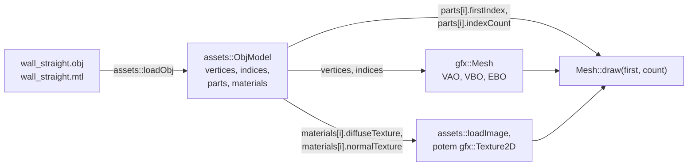

# Moduł assets: wczytywanie modeli OBJ

Kamień milowy: M2 + M3, zaktualizowany w M4 (mapy normalnych: linia `map_Bump` w pliku MTL i styczne liczone po wczytaniu) i w M5 (trzy nowe modele rozgrywki, kod loadera bez zmian). M6 usunął płytkę podłogi `floor_tile.obj` razem z jej testem (podłoże to dziś teren z mapy wysokości, budowany w kodzie), więc przykładem w tym dokumencie jest słupek `wall_pillar.obj`. Temat wykładu: 4 (Wczytywanie OBJ).
Kod: [`src/assets/ObjLoader.hpp`](../../../src/assets/ObjLoader.hpp), [`src/assets/ObjLoader.cpp`](../../../src/assets/ObjLoader.cpp), testy w [`tests/ObjLoaderTests.cpp`](../../../tests/ObjLoaderTests.cpp), pliki wejściowe w [`assets/models/`](../../../assets/models/). Styczne liczy osobny plik, [`src/assets/Tangents.cpp`](../../../src/assets/Tangents.cpp), omówiony linia po linii w [`../gfx/normal-mapping.md`](../gfx/normal-mapping.md) (sekcje od 5.5 do 5.7).

Część modułu `assets`. Wstęp do modułu jest w [`README.md`](README.md). Skąd biorą się pliki `.obj` i `.mtl` i jakie mają konwencje, opisuje [`../../guides/blender.md`](../../guides/blender.md). Dokąd trafia wynik, opisują [`../gfx/mesh.md`](../gfx/mesh.md) (siatka na karcie) i [`asset-cache.md`](asset-cache.md) (kto woła loader i co robi z materiałami).

**Stan.** Loader jest częścią biblioteki `engine` i ma 19 przypadków testowych, w tym wczytanie dwóch prawdziwych modeli gry (do M6 było ich 20 i trzy modele: przypadek płytki podłogi zniknął razem z jej plikiem). Program go woła: `assets::AssetCache::model` wczytuje nim przy starcie pięć modeli, tworzy z wyniku siatki `gfx::Mesh`, tekstury i mapy normalnych. O dwa modele labiryntu (ścianę i słupek) prosi `game::MazeRenderer`, a o trzy modele rozgrywki z M5 (kryształy `crystal_a.obj` i `crystal_b.obj` oraz bramę `gate.obj`) prosi `game::GameplayRenderer`. Oba rysują je tą samą funkcją `game::drawModel`, programem `textured` albo jednym z dwóch programów oświetlających (sekcje 3 i 4). Podłoża loader nie dotyczy: teren jest siatką liczoną w kodzie z mapy wysokości (`game::buildTerrainMesh`, [`../renderer/terrain.md`](../renderer/terrain.md)), a nie plikiem OBJ. Testy czytają tylko dwa modele kamienne: modele z M5 wczytuje ten sam kod, ale własnych przypadków testowych nie mają (sekcja 5.9). Od drugiej części M4 loader czyta z pliku MTL także linię mapy normalnych (`map_Bump`) i na końcu `parseObj` liczy dla każdego wierzchołka **styczną** (tangent), której w pliku OBJ nie ma. Wczytane modele pokazuje panel Assets (sekcja 6). Parser jest napisany ręcznie, bez biblioteki Assimp ani żadnej innej: zrozumienie formatu jest celem tego tematu.

## 1. Po co to jest

W M1 program rysował kostkę o 24 wierzchołkach wpisanych ręcznie w kod (dziś jej nie ma). Dla ściany z cokołem i nakrywą (60 wierzchołków) to już byłoby pisanie setek liczb, a każda zmiana kształtu wymagałaby przeliczania ich od nowa. Modele powstają więc w programie do modelowania (u mnie: ze skryptów Blendera) i są zapisywane do **pliku**, a gra czyta ten plik przy starcie.

Loader robi jedną rzecz: zamienia tekst pliku OBJ (i towarzyszącego pliku MTL) na dane w pamięci procesora:

- tablicę wierzchołków `gfx::Vertex` (pozycja, normalna i współrzędna tekstury z pliku oraz styczna policzona z nich po wczytaniu),
- tablicę indeksów, po trzy na trójkąt,
- listę części: który zakres indeksów ma który materiał,
- listę materiałów: nazwa, kolor, ścieżka do pliku tekstury i ścieżka do pliku mapy normalnych.

Nie tworzy żadnego obiektu OpenGL i nie wczytuje obrazów. Dzięki temu działa bez okna i da się go sprawdzić testami jednostkowymi.

## 2. Teoria

### 2.1 Co musi opisać plik z modelem

Model to **siatka trójkątów** (triangle mesh). Żeby ją narysować z teksturą, trzeba znać:

| Dane | Po co |
|---|---|
| pozycje punktów | kształt |
| które punkty tworzą które trójkąty, w jakiej kolejności | powierzchnia i jej strona przednia |
| normalne | oświetlenie (tematy 6 i 7) |
| współrzędne tekstury | który fragment obrazu leży na którym trójkącie (temat 5) |
| materiał | jaka tekstura i jaki kolor |

Formatów jest wiele (OBJ, glTF, FBX, PLY). **Wavefront OBJ** jest z nich najprostszy: zwykły tekst, jedna informacja w jednej linii, bez animacji, bez hierarchii, bez kamer. Da się go przeczytać w edytorze i napisać do niego parser w jeden wieczór, dlatego jest tematem wykładu.

### 2.2 Format OBJ linia po linii

Plik [`assets/models/wall_pillar.obj`](../../../assets/models/wall_pillar.obj), słupek z trzech prostopadłościanów (podstawa, trzon, głowica). To najprostszy model, który gra dziś wczytuje i który ma własny test. Cały plik ma 82 linie: 24 linie `v`, 6 linii `vn`, 16 linii `vt` i 30 linii `f`. Niżej są prawdziwe linie w kolejności z pliku, a miejsca, w których pominąłem linie tego samego rodzaju, oznacza wielokropek (w pliku go nie ma):

```text
# Blender 5.2.1 LTS
# www.blender.org
mtllib wall_pillar.mtl
o wall_pillar
v -0.200000 0.000000 0.200000
v 0.200000 0.000000 0.200000
v -0.200000 0.000000 -0.200000
v 0.200000 0.000000 -0.200000
v -0.200000 0.350000 0.200000
v 0.200000 0.350000 0.200000
v -0.200000 0.350000 -0.200000
v 0.200000 0.350000 -0.200000
...
vn -1.0000 -0.0000 -0.0000
vn 1.0000 -0.0000 -0.0000
vn -0.0000 -0.0000 1.0000
vn -0.0000 -0.0000 -1.0000
vn -0.0000 1.0000 -0.0000
vn -0.0000 -1.0000 -0.0000
vt 0.100000 0.175000
vt -0.100000 0.000000
vt 0.100000 0.000000
vt -0.100000 0.175000
...
s 0
usemtl wall_stone
f 5/1/1 3/2/1 1/3/1
f 4/3/2 6/4/2 2/2/2
f 2/3/3 5/4/3 1/2/3
...
f 5/1/1 7/4/1 3/2/1
f 4/3/2 8/1/2 6/4/2
...
```

Pierwszych osiem linii `v` to osiem rogów podstawy: kwadrat 0,4 na 0,4 m, od `y = 0` do `y = 0,35`. Sześć linii `vn` to sześć kierunków osi: `-X`, `+X`, `+Z`, `-Z`, `+Y`, `-Y` (zapis `-0.0000` to zero ze znakiem, tak je pisze eksporter). Pierwsza linia `f` stoi w linii 53 pliku, a druga połowa tego samego prostokąta, `f 5/1/1 7/4/1 3/2/1`, w linii 68: Blender zapisuje najpierw po jednym trójkącie z każdego prostokąta, a potem drugie trójkąty w tej samej kolejności.

Każda linia zaczyna się **słowem kluczowym** (keyword), po którym idą pola oddzielone spacjami.

| Linia | Znaczenie | Co robi z nią parser |
|---|---|---|
| `# ...` | komentarz, do końca linii | pomija |
| `mtllib wall_pillar.mtl` | nazwa pliku z materiałami, względem katalogu pliku OBJ | zapamiętuje nazwę. Plik otwiera dopiero `loadObj` |
| `o wall_pillar` | początek obiektu o tej nazwie | pomija: cały plik staje się jedną siatką |
| `v x y z` | pozycja (vertex), trzy liczby | dopisuje do listy pozycji |
| `vn x y z` | normalna (vertex normal) | dopisuje do listy normalnych |
| `vt u v` | współrzędna tekstury (vertex texture) | dopisuje do listy uv |
| `s 0` | grupa wygładzania (smoothing group) wyłączona | pomija: normalne biorę z linii `vn` takie, jakie są |
| `usemtl wall_stone` | materiał dla wszystkich następnych linii `f` | zapamiętuje jako bieżący materiał |
| `f a/b/c a/b/c a/b/c` | ściana (face): narożniki, każdy jako indeksy `pozycja/uv/normalna` | buduje wierzchołki i trójkąty (sekcje 2.4 i 2.6) |

Trzy rzeczy, które trzeba zapamiętać o liniach `f`:

- **Indeksy liczą się od 1.** `5/1/1` to piąta pozycja, pierwsza para uv, pierwsza normalna. W C++ tablice liczą się od 0, więc parser odejmuje 1.
- **Kolejność w narożniku to pozycja, uv, normalna**, choć w tym pliku linie `vn` stoją przed liniami `vt`. Kolejność linii w pliku nie ma związku z kolejnością pól w narożniku.
- **Narożnik może mieć mniej pól.** Format dopuszcza cztery postacie:

| Postać | Co zawiera | Kto tak pisze |
|---|---|---|
| `a/b/c` | pozycja, uv, normalna | Blender z moimi opcjami eksportu |
| `a//c` | pozycja i normalna, bez uv (dwa ukośniki pod rząd) | modele bez tekstury |
| `a/b` | pozycja i uv, bez normalnej | modele bez oświetlenia |
| `a` | sama pozycja | najprostsze pliki |

Parser obsługuje wszystkie cztery. Brakujące uv albo normalna stają się zerami.

Format ma więcej słów kluczowych (krzywe, powierzchnie, linie `l`, punkty `p`, grupy `g`). Tych, których nie potrzebuję, parser nie rozumie i pomija (sekcja 5.8).

### 2.3 Format MTL

Plik OBJ nie zawiera kolorów ani tekstur. Odsyła do **biblioteki materiałów** (material library), osobnego pliku tekstowego. Cały plik [`assets/models/wall_straight.mtl`](../../../assets/models/wall_straight.mtl):

```text
# Blender 5.2.1 LTS MTL File: 'None'
# www.blender.org

newmtl wall_stone
Ns 250.000000
Ka 1.000000 1.000000 1.000000
Ks 0.500000 0.500000 0.500000
Ke 0.000000 0.000000 0.000000
Ni 1.500000
d 1.000000
illum 2
Kd 1.000000 1.000000 1.000000
map_Kd ../textures/wall_stone.png
map_Bump -bm 1.000000 ../textures/wall_stone_normal.png
```

| Linia | Znaczenie | Parser |
|---|---|---|
| `newmtl wall_stone` | początek materiału o tej nazwie. Następne linie go opisują, aż do kolejnego `newmtl` | tworzy nowy materiał |
| `Kd r g b` | kolor rozproszony (diffuse), trzy liczby od 0 do 1 | zapisuje w `diffuseColor` |
| `map_Kd ścieżka` | tekstura koloru rozproszonego, ścieżka względem katalogu pliku MTL | zapisuje w `diffuseTexture` |
| `map_Bump -bm 1.000000 ścieżka` | mapa normalnych (normal map), ścieżka względem katalogu pliku MTL. `-bm` to mnożnik wypukłości (bump multiplier), czyli siła mapy | zapisuje ścieżkę w `normalTexture`. Liczbę po `-bm` sprawdza i pomija |
| `Ns`, `Ka`, `Ks`, `Ke`, `Ni`, `d`, `illum` | połysk, kolor otoczenia, odbłysk, emisja, załamanie, przezroczystość, model oświetlenia | pomija. Oświetlenie z M4 ich nie potrzebuje: jasność i wykładnik odblasku są wspólne dla całego labiryntu i pochodzą z ustawień `game::LightingSettings` (panel Lights), a nie z pliku MTL |

Powiązanie między plikami jest przez **nazwę**: linia `usemtl wall_stone` w pliku OBJ wskazuje materiał `newmtl wall_stone` w pliku MTL.

**Linia mapy normalnych.** Format MTL powstał, zanim mapy normalnych weszły do użycia. Ma za to linię dla **mapy wypukłości** (bump map): szarego obrazu wysokości, z którego program renderujący sam liczy nachylenie powierzchni. Eksportery używają tej samej linii dla map normalnych, bo obie służą do tego samego: zmieniają normalną bez zmiany kształtu. Specyfikacja zapisuje ją słowem `bump`, a w plikach spotyka się cztery pisownie. Parser przyjmuje wszystkie:

| Słowo kluczowe | Kto tak pisze |
|---|---|
| `map_Bump` | Blender 5.2.1 (moje pliki) i wiele innych eksporterów |
| `map_bump` | to samo małymi literami |
| `bump` | postać ze specyfikacji Wavefront |
| `norm` | rozszerzenie formatu dla materiałów PBR, w którym `norm` oznacza wprost mapę normalnych |

Przed nazwą pliku może stać opcja `-bm liczba`. W specyfikacji to mnożnik wartości mapy wypukłości. Blender wpisuje tam pole `Strength` węzła `Normal Map` materiału, domyślnie 1, z sześcioma cyframi po kropce ([`../../guides/blender.md`](../../guides/blender.md), sekcja 5). Parser sprawdza, że po `-bm` stoi liczba, i **nie używa jej**: gra nie ma ustawienia siły mapy i zawsze stosuje mapę normalnych w pełnej sile. Co mapa normalnych zawiera i jak shader jej używa, opisuje [`../gfx/normal-mapping.md`](../gfx/normal-mapping.md).

Trzy ścieżki, dwa punkty odniesienia:

```text
assets/models/wall_straight.obj     mtllib wall_straight.mtl
                                    -> assets/models/wall_straight.mtl
assets/models/wall_straight.mtl     map_Kd ../textures/wall_stone.png
                                    -> assets/textures/wall_stone.png
assets/models/wall_straight.mtl     map_Bump -bm 1.000000 ../textures/wall_stone_normal.png
                                    -> assets/textures/wall_stone_normal.png
```

Nazwa z `mtllib` jest liczona od katalogu pliku OBJ, a ścieżki z `map_Kd` i `map_Bump` od katalogu pliku MTL. Nigdy od katalogu roboczego programu.

### 2.4 Trzy listy indeksów a jeden indeks OpenGL

To jest najważniejsza myśl całego tematu.

Plik OBJ ma **trzy osobne listy**: pozycji, uv i normalnych. Narożnik ściany wybiera po jednym elemencie z każdej, trzema niezależnymi indeksami. Listy mają różne długości: w `wall_straight.obj` są 24 pozycje, 24 pary uv i tylko 6 normalnych (po jednej na kierunek: lewo, prawo, przód, tył, góra, dół). To oszczędny zapis: normalna "w górę" jest w pliku raz, choć używa jej wiele narożników.

OpenGL ma **jeden indeks na wierzchołek**. Indeks w buforze indeksów wybiera cały wierzchołek naraz: pozycję, normalną i uv spod tego samego numeru ([`../gfx/indexed-drawing.md`](../gfx/indexed-drawing.md), sekcja 2.1). Nie da się powiedzieć karcie "pozycja numer 5, ale normalna numer 2".

Parser musi więc **przepakować** dane: dla każdej różnej trójki `(pozycja, uv, normalna)` użytej w pliku utworzyć jeden wierzchołek wyjściowy, złożony z trzech list. Dwa narożniki o tej samej trójce dostają ten sam wierzchołek, a narożniki różniące się choćby jednym indeksem dostają różne.

Żeby wiedzieć, czy trójka już była, parser prowadzi **mapę**: klucz to trójka indeksów, wartość to numer wierzchołka wyjściowego. Przykład na słupku: pierwsza linia `f` pliku (linia 53) i szesnasta (linia 68). Razem są zachodnią ścianą podstawy, prostokątem z dwóch trójkątów. Między nimi stoi czternaście linii `f` innych prostokątów. Każdy ich narożnik jest nową trójką, więc zajmują wierzchołki od 3 do 44:

| Narożnik w pliku | Trójka (pozycja, uv, normalna) | Czy jest w mapie | Wierzchołek wyjściowy | Mapa po tym kroku |
|---|---|---|---|---|
| `5/1/1` | (5, 1, 1) | nie | nowy: **0** | (5,1,1) → 0 |
| `3/2/1` | (3, 2, 1) | nie | nowy: **1** | + (3,2,1) → 1 |
| `1/3/1` | (1, 3, 1) | nie | nowy: **2** | + (1,3,1) → 2 |
| czternaście linii `f` | 42 różne trójki | nie | nowe: od **3** do **44** | + 42 wpisy |
| `5/1/1` | (5, 1, 1) | **tak** | istniejący: **0** | bez zmian |
| `7/4/1` | (7, 4, 1) | nie | nowy: **45** | + (7,4,1) → 45 |
| `3/2/1` | (3, 2, 1) | **tak** | istniejący: **1** | bez zmian |

Wynik dla tego prostokąta: 4 wierzchołki (0, 1, 2 i 45) i indeksy `0, 1, 2` oraz `0, 45, 1`. Sześć narożników, cztery różne trójki. Wierzchołek 0 to pozycja `(-0.2, 0.35, 0.2)` (piąta linia `v`), uv `(0.1, 0.175)` (pierwsza linia `vt`) i normalna `(-1, 0, 0)`. Tak samo jest z każdym z piętnastu prostokątów słupka: pierwszy trójkąt daje trzy wierzchołki, drugi jeden nowy. Stąd `15 * 4 = 60` wierzchołków i `30 * 3 = 90` indeksów całego modelu, co sprawdza test (sekcja 5.9).

(W tabeli indeksy są zapisane tak jak w pliku, od 1. W kodzie kluczem mapy są indeksy już przeliczone na liczone od 0: sekcja 5.5.)

Liczby dla pięciu modeli gry, policzone osobnym skryptem z samych linii `f`. Dla dwóch modeli kamiennych potwierdzają je testy. Dla trzech modeli z M5 skrypt jest jedynym źródłem: powtarza regułę loadera (jeden wierzchołek na każdą różną trójkę `pozycja/uv/normalna`), ale testu, który by te liczby sprawdzał, nie ma:

| Model | Linie `v` | Linie `vt` | Linie `vn` | Narożniki (3 na trójkąt) | Różne trójki, czyli wierzchołki wyjściowe |
|---|---|---|---|---|---|
| `wall_straight.obj` | 24 | 24 | 6 | 90 | 60 |
| `wall_pillar.obj` | 24 | 16 | 6 | 90 | 60 |
| `crystal_a.obj` | 14 | 20 | 18 | 72 | 60 |
| `crystal_b.obj` | 39 | 144 | 37 | 198 | 144 |
| `gate.obj` | 56 | 60 | 11 | 210 | 148 |

Ściana ma 24 pozycje, ale 60 wierzchołków: róg prostopadłościanu należy do kilku ścian o różnych normalnych, więc ta sama pozycja występuje w kilku trójkach. To samo zjawisko co w każdym prostopadłościanie z osobnymi normalnymi ścian: 8 rogów, 24 wierzchołki. Najmocniej widać je na krysztale `crystal_a.obj`: 14 pozycji i 60 wierzchołków, bo każdy trójkąt ma jedną normalną dla wszystkich trzech narożników (cieniowanie płaskie, 18 linii `vn` na 24 trójkąty), więc wierzchołek mogą dzielić tylko trójkąty leżące w jednej płaszczyźnie. Odwrotnie też bywa: 90 narożników daje tylko 60 wierzchołków, bo dwa trójkąty jednego prostokąta mają dwa narożniki wspólne.

### 2.5 Indeksy ujemne

Specyfikacja OBJ dopuszcza indeksy ujemne, czyli **względne**: `-1` to element zdefiniowany jako ostatni **przed tą linią**, `-2` przedostatni i tak dalej. Pozwala to dopisywać fragmenty do pliku bez przeliczania numerów:

```text
v 0 0 0
v 1 0 0
v 0 1 0
f -3 -2 -1      # to samo co f 1 2 3
v 0 0 5
v 1 0 5
v 0 1 5
f -3 -2 -1      # to samo co f 4 5 6: lista urosła
```

Blender ich nie pisze, ale inne narzędzia tak. Ważne jest "przed tą linią": liczy się długość listy w chwili czytania ściany, a nie długość na końcu pliku. Przeliczenie jest proste: dla listy o `n` elementach indeks `-k` to element o numerze `n - k`, licząc od 0.

### 2.6 Wielokąty i wachlarz trójkątów

Linia `f` może mieć więcej niż trzy narożniki: czworokąt (quad), pięciokąt. OpenGL w profilu Core rysuje tylko trójkąty (prymitywu `GL_QUADS` tam nie ma), więc wielokąt trzeba podzielić: to **triangulacja** (triangulation).

Najprostsza metoda to **wachlarz** (triangle fan): pierwszy narożnik łączę z każdą kolejną parą sąsiadów.

```text
wielokąt 0 1 2 3 4           trójkąty: (0,1,2)  (0,2,3)  (0,3,4)

      3
    /   \                    każdy trójkąt zaczyna się w narożniku 0,
  4       2                  a dwa pozostałe to sąsiedzi na obwodzie
  |       |
  0 ----- 1
```

Wielokąt o `n` narożnikach daje `n - 2` trójkątów. Wszystkie obiegają swoje narożniki w tę samą stronę co cały wielokąt, więc kierunek nawijania się nie zmienia. Wachlarz jest poprawny dla wielokątów **wypukłych** (convex) i płaskich. Dla wklęsłego (na przykład w kształcie litery L) część trójkątów wyszłaby poza kształt: taki przypadek wymaga algorytmu "obcinania uszu" (ear clipping), którego nie implementuję.

Moje modele są eksportowane już jako trójkąty (opcja `export_triangulated_mesh`), więc wachlarz wykonuje się dla nich "na pusto": trójkąt przechodzi przez pętlę raz. Obsługa czworokątów jest po to, żeby plik z innego narzędzia nie kończył się błędem.

### 2.7 Kierunek nawijania i normalne

Plik OBJ podaje narożniki ściany w kolejności **przeciwnej do ruchu wskazówek zegara**, gdy patrzę na ścianę z zewnątrz. To ta sama konwencja co domyślny "przód" w OpenGL ([`../gfx/indexed-drawing.md`](../gfx/indexed-drawing.md), sekcja 2.2), więc parser zapisuje indeksy w kolejności z pliku i niczego nie odwraca.

Normalna jest w pliku osobną informacją i **nie wynika z kolejności narożników**: plik może podać dowolną. W poprawnym modelu zgadza się z nimi: iloczyn wektorowy dwóch krawędzi trójkąta wskazuje w tę samą stronę. Dla pierwszego trójkąta słupka (pozycje `5`, `3`, `1`) krawędzie to `(0, -0.35, -0.4)` i `(0, -0.35, 0)`, a ich iloczyn wektorowy to `(-0.14, 0, 0)`: kierunek `-X`, taki jak normalna numer 1. Do M6 sprawdzał to test płytki podłogi. Dziś żaden test nie sprawdza nawinięcia modeli OBJ, a tę samą własność dla siatki terenu sprawdza przypadek `every triangle of the mesh faces up, and its texture is not mirrored` w [`tests/TerrainTests.cpp`](../../../tests/TerrainTests.cpp).

Moje modele mają **cieniowanie płaskie** (flat shading): wszystkie trzy narożniki trójkąta mają ten sam indeks normalnej. Przy cieniowaniu gładkim (smooth shading) każdy narożnik miałby własną, uśrednioną normalną. Dla parsera to bez różnicy: bierze z listy to, co wskazuje indeks. Nie liczy normalnych sam, nie uśrednia ich, nie normalizuje i nie przetwarza grup wygładzania z linii `s`. Gdy plik nie ma linii `vn`, wierzchołki mają normalną zerową.

### 2.8 Układ współrzędnych i związek z eksportem z Blendera

Format OBJ nie mówi, która oś jest górą ani jaka jest jednostka. To umowa między eksporterem a programem. Loader **niczego nie przelicza**: pozycje z pliku trafiają do wierzchołków bez zmian. Cała zgodność jest ustalona po stronie eksportu ([`../../guides/blender.md`](../../guides/blender.md), sekcje 2 i 4):

| Ustalenie | Wartość | Kto za to odpowiada |
|---|---|---|
| góra | +Y | opcja eksportu `up_axis='Y'` |
| przód | -Z | opcja eksportu `forward_axis='NEGATIVE_Z'` |
| jednostka | 1 to 1 metr | `global_scale=1.0` |
| początek układu modelu | środek podstawy, spód modelu w y = 0 | skrypt modelu |
| `v = 0` w teksturze | **dolny** wiersz obrazu | konwencja OBJ, taka sama jak w OpenGL |

Ostatni wiersz ma konsekwencję poza loaderem modeli. Pliki PNG zapisują obraz od **górnego** wiersza, a współrzędna `v` rośnie od dołu. Odwrócenie trzeba zrobić w jednym miejscu, przy wczytywaniu obrazu, a nie w loaderze OBJ: to sprawa loadera obrazów ([`images.md`](images.md)). Loader OBJ zostawia `v` takie, jakie jest w pliku.

### 2.9 Liczby w tekście i ustawienia regionalne

Plik zawiera liczby jako tekst: `-0.140000`. Zamiana tekstu na `float` wygląda na trywialną, ale ma pułapkę: **ustawienia regionalne** (locale). W Polsce separatorem dziesiętnym jest przecinek. Funkcje `atof`, `strtof`, `std::stof` i `sscanf` czytają liczbę według **globalnego locale programu**. Gdy jest nim polskie, oczekują `0,14`, a tekst `0.14` czytają jako `0` i zatrzymują się na kropce. Program sam z siebie startuje z locale "C" (z kropką), ale wystarczy, że jakaś biblioteka wywoła `setlocale(LC_ALL, "")`, i model nagle staje się płaski.

Plik modelu ma zawsze kropkę, niezależnie od komputera. Parser musi więc czytać liczby **niezależnie od locale**. Jak to robi i dlaczego nie przez `std::from_chars`, mówi sekcja 5.4.

## 3. Jak to działa w OpenGL

Loader nie woła żadnej funkcji `gl*`. `ObjLoader.hpp` i `ObjLoader.cpp` nie dołączają GLAD. Wynik jest zaprojektowany tak, żeby dało się go oddać karcie bez żadnej przeróbki:



| Pole `ObjModel` | Dokąd trafia w OpenGL |
|---|---|
| `vertices` (`std::vector<gfx::Vertex>`) | bufor wierzchołków: `glBufferData(GL_ARRAY_BUFFER, ...)`, 44 bajty na wierzchołek (11 liczb `float`: pozycja, normalna, uv, styczna) |
| `indices` (`std::vector<std::uint32_t>`) | bufor indeksów: `glBufferData(GL_ELEMENT_ARRAY_BUFFER, ...)`, rysowany jako `GL_UNSIGNED_INT` |
| `parts[i].firstIndex`, `parts[i].indexCount` | argumenty `glDrawElements`: liczba indeksów i przesunięcie (`firstIndex * 4` bajtów) |
| `materials[i].diffuseTexture` | ścieżka pliku, z którego powstaje tekstura `gfx::Texture2D`, wiązana z jednostką 0 przed narysowaniem części |
| `materials[i].normalTexture` | ścieżka pliku, z którego powstaje druga tekstura `gfx::Texture2D`: mapa normalnych, wiązana z jednostką 1 przed narysowaniem części |
| `materials[i].diffuseColor` | wartość uniformu `uTint` w `textured.frag` i `lit.frag` |
| `mirroredTriangleCount` | nie trafia do OpenGL: `loadObj` wypisuje z niego ostrzeżenie (sekcja 5.7) |

Całe to połączenie jest w jednej funkcji, `assets::AssetCache::model` ([`asset-cache.md`](asset-cache.md), sekcja 5). Loader jest tam wołany tak:

```cpp
    // loadObj logs its own error.
    ObjModel source;
    std::string error;
    if (!loadObj(key, source, error)) {
        m_failedPaths.push_back(key);
        return nullptr;
    }
```

Dwa pierwsze wiersze tabeli to jedno wywołanie konstruktora, `gfx::Mesh(source.vertices, source.indices)` ([`../gfx/mesh.md`](../gfx/mesh.md), sekcja 5.7): `std::vector` zamienia się na `std::span` sam. Części z `source.parts` są przepisywane do struktur `assets::ModelPart`, każda z kolorem, teksturą i mapą normalnych swojego materiału, a `ObjModel` ginie na końcu funkcji: karta ma już własną kopię danych. Cztery rzeczy, które pamięć podręczna dokłada do wyniku loadera: model bez żadnej ściany jest odrzucany z własnym komunikatem, część bez tekstury albo z teksturą, której nie dało się wczytać, dostaje białą teksturę zastępczą, część bez mapy normalnych (albo z mapą, której nie dało się wczytać) dostaje płaską mapę zastępczą, a plik, który raz się nie wczytał, nie jest czytany ponownie.

## 4. Shadery

Loader nie ma własnego shadera, ale wczytane modele rysuje para [`assets/shaders/textured.vert`](../../../assets/shaders/textured.vert) i [`textured.frag`](../../../assets/shaders/textured.frag), opisana linia po linii w [`../gfx/textures.md`](../gfx/textures.md) (sekcja 4), a przy włączonym oświetleniu pary `lit.*` i `gouraud.*`. Każde pole wyniku loadera ma w shaderach swoje miejsce:

| Dane z pliku | Pole wyniku loadera | Gdzie w shaderze |
|---|---|---|
| linie `v` | `Vertex::position` | `layout(location = 0) in vec3 aPosition;` |
| linie `vn` | `Vertex::normal` | `layout(location = 1) in vec3 aNormal;` |
| linie `vt` | `Vertex::uv` | `layout(location = 2) in vec2 aUv;` |
| brak linii: policzone z pozycji i uv trójkątów | `Vertex::tangent` | `layout(location = 3) in vec3 aTangent;` (w `textured.vert` i `lit.vert`, `gouraud.vert` jej nie czyta) |
| `Kd` z pliku MTL | `ObjMaterial::diffuseColor` | `uniform vec3 uTint;` |
| `map_Kd` z pliku MTL | `ObjMaterial::diffuseTexture` | `uniform sampler2D uTexture;` (tekstura związana z jednostką, której numer jest w samplerze) |
| `map_Bump` z pliku MTL | `ObjMaterial::normalTexture` | `uniform sampler2D uNormalMap;` w pliku dołączanym `common/normal_map.glsl` (druga jednostka teksturująca) |

Numery atrybutów są ustalone w `gfx/Vertex.hpp`: pozycja 0, normalna 1, uv 2, styczna 3 ([`../gfx/mesh.md`](../gfx/mesh.md), sekcja 2.4). Para `color.vert` i `color.frag` (linie pudełek kolizji) do modeli się nie nadaje: czyta samą pozycję, a kolor dostaje z uniformu, więc normalnej i uv nie ma jak użyć.

Od M4 normalne z pliku **służą do oświetlenia**. Programy `lit` i `gouraud` deklarują atrybuty z tymi samymi numerami co `textured.vert` i liczą z normalnej, ile światła pada na powierzchnię ([`../renderer/lighting-gouraud-phong.md`](../renderer/lighting-gouraud-phong.md), wzory w [`../scene/lights.md`](../scene/lights.md)). Loader nie zmienił się przy tym ani o linię: normalne z linii `vn` były w wierzchołkach od początku. Z tego wynika nowe wymaganie wobec modeli, którego wcześniej nie było widać: normalna musi wskazywać na zewnątrz bryły, bo ściana z odwróconą normalną jest oświetlona od złej strony (długość poprawia sam shader, który normalizuje normalną). Program `textured` nadal umie normalne tylko pokazać jako kolor, w trybie podglądu `Normals as colour`. Same normalne z pliku widać w nim przy odznaczonym polu `Normal mapping` albo w trybie `Gouraud`: w pozostałych przypadkach podgląd pokazuje je z dołożonym reliefem z mapy normalnych ([`../gfx/normal-mapping.md`](../gfx/normal-mapping.md), sekcja 5.9). Drugi tryb, `UVs as colour`, pokazuje tak samo współrzędne z linii `vt`. Oba są sposobem na obejrzenie na ekranie tego, co loader wczytał.

Druga część M4 dołożyła **mapy normalnych** i tym razem loader się zmienił, w dwóch miejscach. Czyta linię `map_Bump` (sekcje 2.3 i 5.7), a po ostatniej linii pliku OBJ liczy styczne (sekcja 5.7). Styczna jest potrzebna, bo mapa normalnych zapisuje kierunki względem powierzchni, a shader musi wiedzieć, jak ta powierzchnia leży w świecie: normalna mówi, gdzie jest "na zewnątrz", a styczna, w którą stronę na powierzchni rośnie współrzędna `u` ([`../gfx/normal-mapping.md`](../gfx/normal-mapping.md), sekcje 2.3 i 2.10). Przy włączonym przełączniku `Normal mapping` i trybie oświetlenia innym niż `Gouraud` widok `Normals as colour` pokazuje normalne odczytane z mapy, a nie te z linii `vn`: żeby obejrzeć same dane z pliku, trzeba przełącznik wyłączyć.

## 5. Kod w projekcie

### 5.1 Pliki

| Plik | Co zawiera |
|---|---|
| [`src/assets/ObjLoader.hpp`](../../../src/assets/ObjLoader.hpp) | struktury `ObjPart`, `ObjMaterial`, `ObjModel`, deklaracje `parseObj`, `parseMtl`, `loadObj` |
| [`src/assets/ObjLoader.cpp`](../../../src/assets/ObjLoader.cpp) | stałe, funkcje pomocnicze do cięcia tekstu i czytania liczb, struktura `ObjParser`, definicje trzech funkcji publicznych |
| [`tests/ObjLoaderTests.cpp`](../../../tests/ObjLoaderTests.cpp) | 19 przypadków testowych |
| [`src/gfx/Vertex.hpp`](../../../src/gfx/Vertex.hpp) | struktura wierzchołka, którą loader wypełnia ([`../gfx/mesh.md`](../gfx/mesh.md), sekcja 5.2) |
| [`src/assets/Tangents.hpp`](../../../src/assets/Tangents.hpp), [`Tangents.cpp`](../../../src/assets/Tangents.cpp) | `computeTangents` i `countMirroredTriangles`, które `parseObj` woła na końcu. Omówione w [`../gfx/normal-mapping.md`](../gfx/normal-mapping.md), sekcje od 5.5 do 5.7 |

Pliki `src/assets/ObjLoader.*` i `src/assets/Tangents.*` są na liście źródeł biblioteki `engine` w [`CMakeLists.txt`](../../../CMakeLists.txt). Dołączane nagłówki projektu: `gfx/Vertex.hpp` w nagłówku, `assets/Tangents.hpp`, `core/Log.hpp` i `core/Paths.hpp` w pliku `.cpp`. Nic z GLAD ani GLFW.

Podział na trzy funkcje ma jeden powód: **testowalność**.

| Funkcja | Wejście | Czyta pliki | Loguje |
|---|---|---|---|
| `parseObj` | tekst OBJ (`std::string_view`) | nie | nie |
| `parseMtl` | tekst MTL (`std::string_view`) | nie | nie |
| `loadObj` | ścieżka pliku OBJ | tak: plik OBJ i pliki MTL | tak, raz przy błędzie |

Dwie pierwsze są **czystymi funkcjami**: ten sam tekst daje zawsze ten sam wynik i nic poza wynikiem się nie zmienia. Test podaje im napis wpisany w kod i sprawdza wynik, bez plików tymczasowych.

### 5.2 Struktury wyniku

```cpp
struct ObjPart {
    /// Name given by the usemtl line. Empty for faces that come before any usemtl line.
    std::string material;
    std::uint32_t firstIndex = 0;
    std::uint32_t indexCount = 0;
};
```

Część (part) to ciąg trójkątów o jednym materiale: `indexCount` indeksów, zaczynając od indeksu numer `firstIndex`. Te dwie liczby to wprost argumenty `gfx::Mesh::draw(firstIndex, indexCount)`.

```cpp
struct ObjMaterial {
    std::string name;
    glm::vec3 diffuseColor{1.0F};
    std::filesystem::path diffuseTexture;
    std::filesystem::path normalTexture;
};
```

(Komentarze z pliku są tu pominięte.)

- `diffuseColor` ma domyślnie wartość białą `(1, 1, 1)`. Blender pomija linię `Kd`, gdy kolor pochodzi z tekstury ([`../../guides/blender.md`](../../guides/blender.md), sekcja 4). Biały kolor pomnożony przez teksturę zostawia teksturę bez zmian, więc materiał bez `Kd` wygląda rozsądnie.
- `diffuseTexture` jest pusta, gdy materiał nie ma linii `map_Kd`. Sprawdza się to przez `diffuseTexture.empty()`. Po `parseMtl` zawiera ścieżkę tak, jak stoi w pliku (`../textures/wall_stone.png`). Po `loadObj` zawiera ścieżkę do pliku obrazu, liczoną od katalogu pliku MTL i uporządkowaną (sekcja 5.7).
- `normalTexture` to mapa normalnych z linii `map_Bump` (albo jednej z trzech pozostałych pisowni, sekcja 2.3). Zachowuje się dokładnie jak `diffuseTexture`: pusta, gdy materiał takiej linii nie ma, po `parseMtl` ścieżka tak, jak stoi w pliku (`../textures/wall_stone_normal.png`), po `loadObj` ścieżka do pliku obrazu. Liczby z opcji `-bm` w strukturze nie ma: parser jej nie przechowuje.

```cpp
struct ObjModel {
    std::vector<gfx::Vertex> vertices;
    std::vector<std::uint32_t> indices;
    std::vector<ObjPart> parts;
    std::vector<std::string> materialLibraries;
    std::vector<ObjMaterial> materials;
    std::size_t unknownLineCount = 0;
    std::size_t mirroredTriangleCount = 0;
};
```

(Komentarze z pliku są tu pominięte.)

| Pole | Kto wypełnia | Zawartość |
|---|---|---|
| `vertices` | `parseObj` | jeden wierzchołek na każdą różną trójkę indeksów, w kolejności pierwszego wystąpienia. Pole `tangent` każdego wierzchołka jest wypełniane na samym końcu, przez `computeTangents` |
| `indices` | `parseObj` | trzy indeksy na trójkąt, w kolejności z pliku |
| `parts` | `parseObj` | zakresy indeksów według materiału, w kolejności z pliku. Razem pokrywają wszystkie indeksy |
| `materialLibraries` | `parseObj` | nazwy z linii `mtllib`, tak jak w pliku |
| `materials` | `loadObj` | materiały ze wszystkich bibliotek. Po samym `parseObj` lista jest pusta, bo ta funkcja nie otwiera plików |
| `unknownLineCount` | `parseObj` | liczba linii o nieznanym słowie kluczowym |
| `mirroredTriangleCount` | `parseObj` | liczba trójkątów, na których tekstura leży w odbiciu lustrzanym (`countMirroredTriangles`). Na takich trójkątach mapa normalnych pokazałaby relief do góry nogami. Dla dwóch modeli kamiennych: 0, co sprawdzają testy. Dla kryształów i bramy też 0, ale policzone tylko skryptem (sekcja 5.9) |

Wszystkie trzy struktury to zwykłe dane z publicznymi polami, jak struktury warstwy `scene`: kopiują się, nie mają związku z OpenGL.

### 5.3 Sposób zgłaszania błędów

Wszystkie trzy funkcje mają ten sam kształt:

```cpp
bool parseObj(std::string_view text, ObjModel& model, std::string& error);
bool parseMtl(std::string_view text, std::vector<ObjMaterial>& materials, std::string& error);
bool loadObj(const std::filesystem::path& path, ObjModel& model, std::string& error);
```

| Wynik | `model` (albo `materials`) | `error` |
|---|---|---|
| `true` | wypełniony | bez zmian |
| `false` | **bez zmian**: taki, jaki był przed wywołaniem | powód, dla parserów zaczynający się od `line N: ` |

To ten sam styl co w `gfx::Shader` ([`../gfx/shader-class.md`](../gfx/shader-class.md)): żadnych wyjątków, wynik do sprawdzenia i tekst powodu. Funkcje pomocnicze `Shader.cpp` mają identyczny kształt (`compileShader(..., std::string& error)`). Zły plik modelu nie jest sytuacją wyjątkową: zdarza się przy każdej pomyłce w eksporcie, a program ma wtedy wypisać, co jest nie tak, i działać dalej.

"Bez zmian przy błędzie" jest zrobione tak samo jak w `Shader::reload`: wynik powstaje w zmiennej lokalnej i dopiero na samym końcu, gdy wszystko się udało, jest przenoszony do parametru wyjściowego (`model = std::move(...)`).

Parser zatrzymuje się na **pierwszej** złej linii. Numer linii liczy się od 1, jak w edytorze tekstu, i obejmuje linie puste i komentarze.

Jedyny wyjątek, który teoretycznie może wylecieć, to `std::bad_alloc` przy braku pamięci. Tego nie obsługuję nigdzie w projekcie.

### 5.4 Narzędzia do tekstu i liczb

Funkcje pomocnicze stoją w anonimowej przestrzeni nazw w `ObjLoader.cpp`. Wszystkie pracują na `std::string_view`: to **widok** na cudzy tekst (wskaźnik i długość), bez kopiowania. Odcinanie początku widoku (`remove_prefix`) przesuwa wskaźnik i nie rusza samego tekstu.

**Stałe:**

```cpp
constexpr std::string_view BLANKS = " \t\r";
constexpr char COMMENT_START = '#';
constexpr char INDEX_SEPARATOR = '/';
constexpr std::size_t MAX_CORNER_FIELDS = 3;
constexpr std::size_t COLOR_COMPONENTS = 3;
constexpr std::size_t MIN_FACE_CORNERS = 3;
constexpr std::string_view BUMP_MULTIPLIER_OPTION = "-bm";
constexpr std::uint32_t NO_INDEX = std::numeric_limits<std::uint32_t>::max();
```

(Komentarze z pliku są tu pominięte.)

`BUMP_MULTIPLIER_OPTION` to opcja linii mapy normalnych w pliku MTL (sekcja 2.3). Jest stałą, a nie napisem wpisanym w środek funkcji, żeby miała nazwę i jedno miejsce.

`BLANKS` to znaki rozdzielające pola: spacja, tabulator i `\r`. Znak `\r` (carriage return) jest tu z powodu końców linii Windowsa: plik zapisany w tym systemie kończy każdą linię parą `\r\n`. Po cięciu na `\n` na końcu linii zostaje `\r`, który trzeba potraktować jak spację. Bez tego nazwa materiału brzmiałaby `stone\r` i nie pasowała do żadnego `newmtl`. Moje pliki mają same `\n`, ale Git na Windowsie z ustawieniem `core.autocrlf=true` potrafi je zamienić przy pobraniu.

**`takeLine`** odcina od tekstu pierwszą linię:

```cpp
std::string_view takeLine(std::string_view& rest) {
    const std::size_t end = rest.find('\n');
    if (end == std::string_view::npos) {
        // No more line breaks: everything that is left is the last line.
        const std::string_view line = rest;
        rest = {};
        return line;
    }
    const std::string_view line = rest.substr(0, end);
    rest.remove_prefix(end + 1);
    return line;
}
```

`find` zwraca pozycję znaku albo specjalną wartość `npos`, gdy go nie ma. Gałąź `npos` obsługuje **plik bez znaku nowej linii na końcu**: ostatnia linia to po prostu wszystko, co zostało. `rest` jest referencją, więc funkcja zmienia widok wołającego: po wywołaniu `rest` zaczyna się od następnej linii.

**`withoutComment`** obcina linię na pierwszym znaku `#`. `substr(0, npos)` zwraca całość, więc linia bez komentarza przechodzi bez zmian. Komentarz może więc stać też na końcu linii z danymi.

**`takeToken`** odcina następne pole:

```cpp
std::string_view takeToken(std::string_view& rest) {
    const std::size_t first = rest.find_first_not_of(BLANKS);
    if (first == std::string_view::npos) {
        rest = {};
        return {};
    }
    rest.remove_prefix(first);

    // npos (no blank found) makes substr take everything that is left.
    const std::size_t length = rest.find_first_of(BLANKS);
    const std::string_view token = rest.substr(0, length);
    rest.remove_prefix(token.size());
    return token;
}
```

Najpierw pomija wszystkie znaki z `BLANKS` (dowolnie wiele spacji i tabulatorów, także na początku linii), potem bierze znaki do następnego takiego znaku. Gdy pól już nie ma, zwraca pusty widok. Dzięki temu `v   0\t0  0   ` czyta się tak samo jak `v 0 0 0`.

**`trim`** zwraca tekst bez znaków z `BLANKS` na obu końcach. Służy do nazw, które są "resztą linii" i mogą zawierać spacje w środku: nazwa materiału, nazwa pliku.

**`parseFloat`**: tekst na liczbę, niezależnie od locale (sekcja 2.9).

```cpp
bool parseFloat(std::string_view token, float& value) {
    if (token.empty()) {
        return false;
    }
    std::istringstream stream{std::string(token)};
    stream.imbue(std::locale::classic());
    stream >> value;
    // The whole field must have been used: "1.5abc" is not a number. After a successful
    // read that stops at the end of the text, peek() finds nothing more to read.
    return !stream.fail() && stream.peek() == std::istringstream::traits_type::eof();
}
```

| Linia | Co robi |
|---|---|
| `std::istringstream stream{std::string(token)}` | strumień czytający z kopii pola. Kopia jest potrzebna, bo strumień chce `std::string`, a nie widoku |
| `stream.imbue(std::locale::classic())` | **najważniejsza linia**: ustawia strumieniowi locale "klasyczne", czyli locale języka C z kropką dziesiętną. Każdy strumień ma własne locale, więc globalne ustawienie programu przestaje mieć znaczenie |
| `stream >> value` | czyta liczbę. Rozumie znak, część ułamkową i wykładnik (`1e-3`) |
| `!stream.fail()` | odczyt się udał |
| `stream.peek() == ...eof()` | po liczbie nie zostało nic. Bez tego warunku `1.5abc` i `0,5` (czytane jako `0`) uchodziłyby za liczby |

**Dlaczego nie `std::from_chars`.** Funkcja `std::from_chars` z nagłówka `<charconv>` jest stworzona dokładnie do tego: nie patrzy na locale, nie alokuje pamięci, nie rzuca wyjątków. Dla liczb całkowitych jest wszędzie. Z przeciążeniami dla `float` i `double` jest gorzej: biblioteka standardowa używana na macOS (libc++) ma je dopiero od wersji LLVM 20 (tak podaje jej tabela stanu C++17, wiersz P0067R5), a projekt jest budowany na Macu kompilatorem Apple clang 17. **Nie potwierdziłem, czy biblioteka dostarczana z tym kompilatorem je ma**: ten kod powstał na Windowsie, gdzie MSVC ma oba przeciążenia. Wybrałem więc sposób, który na pewno działa w obu bibliotekach: strumień z klasycznym locale. Kosztem jest szybkość (strumień i kopia napisu na każdą liczbę), bez znaczenia dla modeli o kilkudziesięciu wierzchołkach. Punkt do sprawdzenia jest na liście w [`../../guides/build-macos.md`](../../guides/build-macos.md).

**`parseInteger`**: tu `std::from_chars` wystarcza.

```cpp
bool parseInteger(std::string_view token, long long& value) {
    const char* const begin = token.data();
    const char* const end = begin + token.size();
    const std::from_chars_result result = std::from_chars(begin, end, value);
    // ec is the default (no error) on success, ptr is where the reading stopped.
    return result.ec == std::errc() && result.ptr == end;
}
```

`std::from_chars` dostaje początek i koniec tekstu oraz zmienną na wynik. Zwraca strukturę z dwoma polami: `ec` (kod błędu: pusty przy sukcesie, `invalid_argument` gdy tekst nie jest liczbą, `result_out_of_range` gdy liczba nie mieści się w typie) i `ptr` (miejsce, w którym skończyła czytać). Warunek `ptr == end` znaczy to samo co `peek() == eof` wyżej: całe pole zostało zużyte, więc `3a` i `3.5` nie są liczbami całkowitymi. Typ `long long` ma znak, bo indeksy mogą być ujemne.

**`takeFloats`** dostaje `std::span<float>`, czyli widok na tablicę liczb, i czyta tyle kolejnych pól, ile elementów ma ten widok. Zwraca `false`, gdy pola brakuje albo nie jest liczbą. Pola po nich zostawia nietknięte: dlatego czwarta współrzędna w linii `v` (albo kolory wierzchołków, które Blender dopisuje przy pewnej opcji eksportu) są ignorowane.

**`lineError`** składa komunikat: `line 12: v needs three numbers`.

### 5.5 Indeks, narożnik i mapa trójek

**`resolveIndex`** zamienia indeks zapisany w pliku na indeks liczony od 0:

```cpp
bool resolveIndex(std::string_view text, std::size_t count, std::uint32_t& index) {
    long long written = 0;
    if (!parseInteger(text, written)) {
        return false;
    }

    // Signed arithmetic, so that a negative index needs no special cases.
    const auto size = static_cast<long long>(count);
    const long long zeroBased = written > 0 ? written - 1 : size + written;
    // written == 0 gives zeroBased == size and is rejected here too: 0 is not a valid
    // index in an OBJ file.
    if (zeroBased < 0 || zeroBased >= size) {
        return false;
    }
    index = static_cast<std::uint32_t>(zeroBased);
    return true;
}
```

`count` to liczba elementów listy **w tej chwili**. Jedna linia obsługuje obie reguły formatu:

| W pliku (`written`) | Lista ma 4 elementy (`size`) | `zeroBased` | Wynik |
|---|---|---|---|
| `1` | | `1 - 1 = 0` | pierwszy element |
| `4` | | `4 - 1 = 3` | ostatni element |
| `5` | | `4`, nie jest mniejsze od `size` | błąd: poza listą |
| `-1` | | `4 + (-1) = 3` | ostatni element |
| `-4` | | `4 + (-4) = 0` | pierwszy element |
| `-5` | | `-1`, ujemne | błąd: przed początkiem |
| `0` | | `4 + 0 = 4`, nie jest mniejsze od `size` | błąd: indeksu 0 nie ma |

Rachunek jest na liczbach ze znakiem, żeby odejmowanie nie mogło się przekręcić. Dopiero sprawdzony wynik jest rzutowany na typ bez znaku.

**Struktura `ObjParser`** trzyma stan czytania jednego pliku:

```cpp
struct ObjParser {
    std::vector<glm::vec3> positions;
    std::vector<glm::vec2> uvs;
    std::vector<glm::vec3> normals;

    std::map<CornerKey, std::uint32_t> vertexOfCorner;

    std::string currentMaterial;

    std::vector<std::uint32_t> faceCorners;

    ObjModel model;
```

(Komentarze i deklaracje funkcji są tu pominięte.)

| Pole | Rola |
|---|---|
| `positions`, `uvs`, `normals` | trzy listy z pliku, w kolejności linii `v`, `vt`, `vn`. To dane **wejściowe**: po zakończeniu parsowania są wyrzucane |
| `vertexOfCorner` | mapa z sekcji 2.4: trójka indeksów na numer wierzchołka wyjściowego |
| `currentMaterial` | nazwa z ostatniej linii `usemtl`, pusta przed pierwszą |
| `faceCorners` | numery wierzchołków wyjściowych bieżącej ściany. Pole, a nie zmienna lokalna, żeby jego pamięć była używana ponownie dla każdej ściany |
| `model` | budowany wynik |

Struktura jest lokalna dla pliku `.cpp` (anonimowa przestrzeń nazw) i żyje tylko przez czas jednego wywołania `parseObj`. To nie jest stan globalny.

Klucz mapy:

```cpp
using CornerKey = std::array<std::uint32_t, MAX_CORNER_FIELDS>;
```

Tablica trzech liczb: `{pozycja, uv, normalna}`, już liczonych od 0. `std::map` wymaga, żeby klucze dało się porównywać operatorem `<`, a `std::array` ma go wbudowanego (porównuje element po elemencie, jak słowa w słowniku), więc nie trzeba pisać niczego własnego. `std::unordered_map` byłaby szybsza dla dużych modeli, ale wymagałaby własnej funkcji skrótu dla tablicy. Dla 60 wierzchołków różnicy nie ma, a `std::map` nie wymaga dodatkowego kodu.

Ponieważ kluczem są indeksy **po przeliczeniu**, narożnik `-1` i narożnik `3` (przy trzech pozycjach) dają ten sam klucz i ten sam wierzchołek.

Brak uv albo normalnej oznacza w kluczu stała `NO_INDEX`: największa wartość typu `std::uint32_t` (ponad cztery miliardy), której prawdziwy indeks nie osiągnie. Narożnik `5` i narożnik `5/1` mają więc różne klucze i są różnymi wierzchołkami: pierwszy ma uv zerowe, drugi z pliku.

**`readCorner`** zamienia tekst jednego narożnika na numer wierzchołka wyjściowego. Trzy kroki. Pierwszy: podział na pola przy ukośnikach.

```cpp
    std::array<std::string_view, MAX_CORNER_FIELDS> fields;
    std::size_t fieldCount = 0;
    std::string_view rest = corner;
    while (true) {
        if (fieldCount == MAX_CORNER_FIELDS) {
            message = "face corner '" + std::string(corner) + "' has more than three indices";
            return false;
        }
        const std::size_t separator = rest.find(INDEX_SEPARATOR);
        fields[fieldCount] = rest.substr(0, separator);
        ++fieldCount;
        if (separator == std::string_view::npos) {
            break;
        }
        rest.remove_prefix(separator + 1);
    }
```

| Narożnik | `fields[0]` | `fields[1]` | `fields[2]` |
|---|---|---|---|
| `7/3/2` | `7` | `3` | `2` |
| `7//2` | `7` | pusty | `2` |
| `7/3` | `7` | `3` | pusty (pętla skończyła się wcześniej) |
| `7` | `7` | pusty | pusty |
| `7/3/2/9` | błąd przy czwartym polu | | |

Puste pole w środku (`7//2`) i pole, do którego pętla nie doszła (`7/3`), wyglądają potem tak samo: pusty widok. Dlatego wszystkie cztery postacie obsługuje jeden kod.

Drugi krok: przeliczenie indeksów.

```cpp
    CornerKey key{NO_INDEX, NO_INDEX, NO_INDEX};
    // The position is required. The list sizes are the ones at this line of the file:
    // an index may only refer to an element defined above the face.
    if (!resolveIndex(fields[0], positions.size(), key[0])) {
```

Pozycja jest obowiązkowa: puste `fields[0]` nie jest liczbą, więc `resolveIndex` zwraca `false`. Uv i normalna są przeliczane tylko wtedy, gdy pole nie jest puste (`!fields[1].empty() && !resolveIndex(...)`), inaczej w kluczu zostaje `NO_INDEX`. Do `resolveIndex` trafia `positions.size()` z tej chwili: stąd reguła "przed tą linią" dla indeksów ujemnych i stąd błąd, gdy ściana odwołuje się do pozycji zdefiniowanej niżej w pliku.

Komunikat błędu podaje narożnik i długość listy, na przykład `face corner '4' has a bad position index (3 positions defined so far)`.

Trzeci krok: mapa.

```cpp
    // Has this exact combination been used before? Then the vertex exists already.
    const auto found = vertexOfCorner.find(key);
    if (found != vertexOfCorner.end()) {
        vertexIndex = found->second;
        return true;
    }

    // A new combination: build the vertex from the three lists. A missing uv or normal
    // stays at zero, the default of gfx::Vertex.
    gfx::Vertex vertex;
    vertex.position = positions[key[0]];
    if (key[1] != NO_INDEX) {
        vertex.uv = uvs[key[1]];
    }
    if (key[2] != NO_INDEX) {
        vertex.normal = normals[key[2]];
    }

    vertexIndex = static_cast<std::uint32_t>(model.vertices.size());
    model.vertices.push_back(vertex);
    vertexOfCorner.emplace(key, vertexIndex);
    return true;
```

`find` zwraca iterator na znaleziony wpis albo `end()`, gdy klucza nie ma. `found->second` to wartość wpisu, czyli numer wierzchołka. Nowy wierzchołek dostaje numer równy dotychczasowej liczbie wierzchołków (pierwszy to 0), jest dopisywany na koniec tablicy i zapamiętywany w mapie. To jest w kodzie dokładnie tabela z sekcji 2.4.

Indeksowanie `positions[key[0]]` jest bezpieczne, bo `resolveIndex` sprawdził zakres. Z tego samego powodu każdy indeks w `model.indices` wskazuje istniejący wierzchołek: numery pochodzą wyłącznie z tej funkcji.

### 5.6 Ściana, wachlarz i części

**`readPosition`, `readUv`, `readNormal`** są prawie identyczne:

```cpp
bool ObjParser::readPosition(std::string_view rest, std::string& message) {
    // A fourth number (w) or vertex colours after the three are ignored.
    std::array<float, gfx::POSITION_COMPONENTS> values{};
    if (!takeFloats(rest, values)) {
        message = "v needs three numbers";
        return false;
    }
    positions.emplace_back(values[0], values[1], values[2]);
    return true;
}
```

Liczby trafiają najpierw do małej tablicy `std::array<float, 3>` (jej rozmiar to stała `gfx::POSITION_COMPONENTS`, ta sama, której `Mesh` używa przy opisie atrybutu), a `std::array` zamienia się na `std::span<float>` sam. Dopiero gdy wszystkie trzy się udały, `emplace_back` buduje z nich `glm::vec3` na końcu listy. Linia `vt` wymaga dwóch liczb, `vn` trzech. Normalna jest zapisywana tak, jak stoi w pliku: parser nie zmienia jej długości.

**`readFace`**:

```cpp
    faceCorners.clear();
    for (std::string_view corner = takeToken(rest); !corner.empty(); corner = takeToken(rest)) {
        std::uint32_t vertexIndex = 0;
        if (!readCorner(corner, vertexIndex, message)) {
            return false;
        }
        faceCorners.push_back(vertexIndex);
    }
    if (faceCorners.size() < MIN_FACE_CORNERS) {
        message = "f needs at least three corners";
        return false;
    }
```

Pętla bierze pole po polu, aż `takeToken` zwróci pusty widok. Każde pole to jeden narożnik. `clear()` opróżnia wektor, ale zostawia jego pamięć.

```cpp
    // The first face after a change of material starts a new part. An usemtl line that
    // no face follows therefore creates nothing.
    if (model.parts.empty() || model.parts.back().material != currentMaterial) {
        ObjPart part;
        part.material = currentMaterial;
        part.firstIndex = static_cast<std::uint32_t>(model.indices.size());
        model.parts.push_back(part);
    }
```

Części powstają **przy ścianach, a nie przy liniach `usemtl`**. Linia `usemtl` tylko zmienia `currentMaterial`. Nowa część zaczyna się wtedy, gdy przychodzi ściana, a ostatnia część ma inny materiał niż bieżący (albo części jeszcze nie ma). Z tej jednej reguły wynika wszystko:

| Sytuacja w pliku | Wynik |
|---|---|
| `usemtl A`, ściany, `usemtl B`, ściany | dwie części |
| ściany przed pierwszym `usemtl` | część z pustą nazwą materiału |
| `usemtl A`, od razu `usemtl B`, ściany | jedna część `B`: `A` nie miało ścian |
| `usemtl A` na końcu pliku, bez ścian | nic |
| `usemtl A`, ściany, znowu `usemtl A`, ściany | jedna część: materiał się nie zmienił |
| `A`, `B`, znowu `A` | trzy części: parser nie przestawia trójkątów, żeby połączyć pierwszą z trzecią |

`firstIndex` to liczba indeksów zapisanych do tej pory, czyli numer pierwszego indeksu nowej części.

```cpp
    // Triangle fan: a polygon with the corners 0, 1, 2, ..., n - 1 becomes the triangles
    // (0, 1, 2), (0, 2, 3), ..., (0, n - 2, n - 1). Every triangle keeps the winding of
    // the polygon. A triangle (n = 3) goes through the loop once and is copied as it is.
    for (std::size_t i = 1; i + 1 < faceCorners.size(); ++i) {
        model.indices.push_back(faceCorners[0]);
        model.indices.push_back(faceCorners[i]);
        model.indices.push_back(faceCorners[i + 1]);
    }
    model.parts.back().indexCount =
        static_cast<std::uint32_t>(model.indices.size()) - model.parts.back().firstIndex;
    return true;
```

Wachlarz z sekcji 2.6. Dla trójkąta (`size() == 3`) pętla wykonuje się dla `i = 1` i kończy, bo `2 + 1 < 3` jest fałszem. Dla czworokąta wykonuje się dla `i = 1` i `i = 2`: trójkąty `(0, 1, 2)` i `(0, 2, 3)`. Warunek jest zapisany jako `i + 1 < size`, a nie `i < size - 1`, żeby nie odejmować od liczby bez znaku.

Na końcu długość bieżącej części jest liczona na nowo: wszystko od jej początku do końca tablicy indeksów. Czworokąt dodaje więc do części 6 indeksów, a nie 4.

### 5.7 `parseObj`, `parseMtl` i `loadObj`

**`parseObj`** to pętla po liniach i rozdzielnia według słowa kluczowego:

```cpp
    while (!rest.empty()) {
        ++lineNumber;
        // Work on the line without its comment. takeToken skips the blanks, including
        // the '\r' of a Windows line ending.
        std::string_view line = withoutComment(takeLine(rest));
        const std::string_view keyword = takeToken(line);

        std::string message;
        bool ok = true;
        if (keyword.empty() || keyword == "o" || keyword == "g" || keyword == "s") {
            // Nothing to do. An empty keyword is a blank line or a line with only a
            // comment. o, g and s (object name, group name, smoothing group) are known and
            // not needed: the whole file becomes one mesh, and normals are taken from the
            // vn lines as they are.
        } else if (keyword == "v") {
            ok = parser.readPosition(line, message);
        } else if (keyword == "vt") {
            ok = parser.readUv(line, message);
        } else if (keyword == "vn") {
            ok = parser.readNormal(line, message);
        } else if (keyword == "f") {
            ok = parser.readFace(line, message);
        } else if (keyword == "usemtl") {
```

Po `takeToken(line)` zmienna `line` zawiera już tylko pola po słowie kluczowym. Dalsze gałęzie:

| Słowo kluczowe | Co się dzieje |
|---|---|
| puste albo `o`, `g`, `s` | pierwsza gałąź: nic. Puste słowo to linia pusta albo sam komentarz, a `o`, `g` i `s` są znane i pomijane celowo |
| `v`, `vt`, `vn`, `f` | odpowiednia funkcja `read...` |
| `usemtl` | reszta linii po `trim` staje się `currentMaterial`. Pusta nazwa to błąd |
| `mtllib` | reszta linii po `trim` jest dopisywana do `materialLibraries`. Pusta nazwa to błąd. Cała reszta linii to **jedna** nazwa pliku, więc może zawierać spacje |
| cokolwiek innego | pomijane, ale licznik `unknownLineCount` rośnie o 1 |

Po każdej linii: gdy `ok` jest fałszem, funkcja zapisuje `lineError(lineNumber, message)` do `error` i wraca z `false`.

Porównanie `keyword == "v"` porównuje **całe** słowo, więc `vt` i `vn` nie są mylone z `v`.

Po ostatniej linii, już za pętlą, dochodzą styczne:

```cpp
    // An OBJ file has no tangents, so they are computed now that all triangles are known.
    // The count of mirrored triangles tells the caller whether the tangents are enough
    // for a normal map (see ObjModel::mirroredTriangleCount).
    computeTangents(parser.model.vertices, parser.model.indices);
    parser.model.mirroredTriangleCount =
        countMirroredTriangles(parser.model.vertices, parser.model.indices);

    model = std::move(parser.model);
    return true;
}
```

| Linia | Co robi |
|---|---|
| `computeTangents(parser.model.vertices, parser.model.indices);` | wypełnia pole `tangent` każdego wierzchołka. Dla każdego trójkąta liczy z jego krawędzi i z różnic współrzędnych uv kierunek, w którym na powierzchni rośnie `u`, dodaje go do trzech wierzchołków trójkąta, a na końcu każdą sumę robi prostopadłą do normalnej wierzchołka i sprowadza do długości 1. `std::vector` zamienia się na `std::span` sam, tak jak przy `gfx::Mesh` |
| `parser.model.mirroredTriangleCount = countMirroredTriangles(...)` | liczy trójkąty z teksturą w odbiciu lustrzanym i zapisuje wynik w modelu. Niczego nie poprawia: to pomiar, z którego `loadObj` robi ostrzeżenie |
| `model = std::move(parser.model);` | dopiero teraz wynik trafia do parametru wołającego (sekcja 5.3) |

**Dlaczego dopiero na końcu.** Styczna wierzchołka zależy od **wszystkich** trójkątów, które go używają, a w trakcie czytania pliku nie wiadomo, czy następna linia `f` nie użyje go jeszcze raz. Po ostatniej linii lista trójkątów jest zamknięta. **Dlaczego w `parseObj`, a nie w `loadObj`.** Żeby wynik parsera był kompletny także w testach, które podają tekst wpisany w kod i plików nie czytają. **Dlaczego w ogóle na procesorze przy wczytaniu.** Format OBJ nie ma linii dla stycznych, więc ktoś musi je policzyć, a liczy się je raz na model, nie co klatkę. Uzasadnienie i rozważane możliwości są w notatce [`../../decisions/tangents-on-load.md`](../../decisions/tangents-on-load.md).

Styczne **nie dodają wierzchołków**: powstają dla wierzchołków, które już istnieją, więc liczby z sekcji 2.4 są liczbami po całym `parseObj` (ściana i słupek po 60 wierzchołków i 90 indeksów). Model bez linii `vt` też dostaje styczne o długości 1, tyle że o przypadkowym kierunku w płaszczyźnie powierzchni: nie ma wtedy żadnego "kierunku rosnącego `u`". Wzór, przykład liczbowy na ścianie i obie funkcje linia po linii są w [`../gfx/normal-mapping.md`](../gfx/normal-mapping.md) (sekcje 2.7 do 2.9 i 5.5 do 5.7).

**`parseMtl`** ma tę samą pętlę, ale tylko cztery rodzaje linii:

| Słowo | Co się dzieje |
|---|---|
| `newmtl` | nowy materiał o nazwie z reszty linii. Pusta nazwa to błąd |
| `Kd` | trzy liczby do `diffuseColor` ostatniego materiału. Przed pierwszym `newmtl` to błąd |
| `map_Kd` | reszta linii jako ścieżka do `diffuseTexture` ostatniego materiału. Przed pierwszym `newmtl` albo bez nazwy to błąd |
| `map_Bump`, `map_bump`, `bump`, `norm` | linia mapy normalnych: opcjonalne `-bm liczba`, potem reszta linii jako ścieżka do `normalTexture` ostatniego materiału. Przed pierwszym `newmtl`, bez nazwy pliku albo z `-bm` bez liczby to błąd |
| wszystko inne | pomijane bez liczenia |

Rozdzielnia:

```cpp
        } else if (keyword == "Kd" || keyword == "map_Kd" || isNormalMapKeyword(keyword)) {
            if (parsed.empty()) {
                error = lineError(lineNumber, std::string(keyword) + " before the first newmtl");
                return false;
            }
            ObjMaterial& material = parsed.back();
            if (isNormalMapKeyword(keyword)) {
                std::string message;
                if (!readNormalMap(line, material.normalTexture, message)) {
                    error = lineError(lineNumber, std::string(keyword) + " " + message);
                    return false;
                }
            } else if (keyword == "Kd") {
```

Wszystkie trzy rodzaje linii opisują **ostatni** materiał, więc mają wspólny warunek: jakiś materiał musi już istnieć (`parsed.empty()` znaczy, że nie było jeszcze żadnego `newmtl`). Komunikat błędu zaczyna się od słowa kluczowego **tak, jak stoi w pliku**: dla linii `norm` bez nazwy pliku brzmi `line 2: norm needs a file name`, a nie `map_Bump ...`. Dzięki temu da się go znaleźć w pliku przez zwykłe wyszukiwanie.

**`isNormalMapKeyword`** rozpoznaje cztery pisownie:

```cpp
bool isNormalMapKeyword(std::string_view keyword) {
    return keyword == "map_Bump" || keyword == "map_bump" || keyword == "bump" || keyword == "norm";
}
```

Porównanie rozróżnia wielkość liter i obejmuje całe słowo, więc `map_Bump` i `map_bump` są wymienione osobno, a `MAP_BUMP` albo `bumpy` nie pasują i takie linie są pomijane jak każde nieznane słowo pliku MTL.

**`readNormalMap`** czyta pola po słowie kluczowym:

```cpp
bool readNormalMap(std::string_view rest, std::filesystem::path& path, std::string& message) {
    // Look at the first field without losing rest: only "-bm" is taken away from it.
    std::string_view afterFirstField = rest;
    if (takeToken(afterFirstField) == BUMP_MULTIPLIER_OPTION) {
        float multiplier = 0.0F;
        if (!parseFloat(takeToken(afterFirstField), multiplier)) {
            message = "-bm needs a number";
            return false;
        }
        // The number is not used: the game has no setting for the strength of a map.
        rest = afterFirstField;
    }

    // The path is the rest of the line, so it may contain spaces. Other options in front
    // of the file name are not supported, as for map_Kd.
    const std::string_view fileName = trim(rest);
    if (fileName.empty()) {
        message = "needs a file name";
        return false;
    }
    path = pathFromText(fileName);
    return true;
}
```

| Linia | Co robi |
|---|---|
| `std::string_view afterFirstField = rest;` | kopia widoku (wskaźnik i długość, nie tekst). `takeToken` zmienia widok, który dostaje, więc pierwsze pole jest odcinane od kopii, a `rest` zostaje całe |
| `if (takeToken(afterFirstField) == BUMP_MULTIPLIER_OPTION)` | czy pierwszym polem jest `-bm`. Gdy nie jest, `rest` nadal zawiera to pole: jest początkiem nazwy pliku i nie może przepaść |
| `parseFloat(takeToken(afterFirstField), multiplier)` | następne pole musi być liczbą. Brak pola (pusty widok) i tekst niebędący liczbą dają ten sam błąd: `-bm needs a number`. Ta sama funkcja czyta współrzędne w pliku OBJ, więc i tu nie zależy od locale (sekcja 5.4) |
| `rest = afterFirstField;` | dopiero po udanym odczycie liczby `rest` przeskakuje za opcję. Zmienna `multiplier` nie jest potem używana |
| `const std::string_view fileName = trim(rest);` | reszta linii bez spacji na końcach to nazwa pliku, razem ze spacjami w środku |
| `if (fileName.empty())` | linia `map_Bump` bez niczego albo `map_Bump -bm 1.0` bez nazwy: błąd `needs a file name` |
| `path = pathFromText(fileName);` | ścieżka z tekstu UTF-8 (niżej) |

Przykłady:

| Linia w pliku | Wynik |
|---|---|
| `map_Bump -bm 1.000000 ../textures/wall_stone_normal.png` | `normalTexture` równe `../textures/wall_stone_normal.png` |
| `map_Bump stone_normal.png` | `stone_normal.png`: opcja jest nieobowiązkowa |
| `bump -bm 0.5 b.png` | `b.png`: liczba 0,5 jest sprawdzona i pominięta |
| tabulator i dwie spacje: `map_Bump<TAB>-bm  2  my maps/old stone n.png` | `my maps/old stone n.png` |
| `map_Bump` | błąd `line N: map_Bump needs a file name` |
| `norm -bm 1.0` | błąd `line N: norm needs a file name` |
| `map_Bump -bm n.png` | błąd `line N: map_Bump -bm needs a number`: po `-bm` stoi `n.png`, które nie jest liczbą |
| `map_Bump -bm 1.0 n.png` przed pierwszym `newmtl` | błąd `line N: map_Bump before the first newmtl` |

Inne opcje specyfikacji przed nazwą pliku (na przykład `-s`, `-o`, `-imfchan`) nie są obsługiwane, tak jak przy `map_Kd`: trafiłyby do nazwy pliku.

Materiały zbiera w lokalnym wektorze `parsed` i dopiero na końcu **dopisuje** je do parametru `materials`. Dopisuje, a nie zastępuje, bo model może mieć kilka linii `mtllib` i wszystkie materiały trafiają do jednej listy.

Ścieżka z pliku staje się obiektem `std::filesystem::path` w funkcji `pathFromText`:

```cpp
std::filesystem::path pathFromText(std::string_view text) {
    const std::u8string utf8(text.begin(), text.end());
    return {utf8};
}
```

Tekst pliku traktuję jako UTF-8. Konstruktor `path` z typu `std::u8string` mówi to wprost (`return {utf8};` buduje zwracaną ścieżkę z tego napisu). Konstruktor ze zwykłego `std::string` użyłby na Windowsie strony kodowej systemu i nazwa pliku z polskimi literami zostałaby odczytana źle. To odwrotność funkcji `core::pathText` ([`../core/paths.md`](../core/paths.md)).

**`loadObj`** składa całość. Robotę wykonuje pomocnicza `loadObjFiles`, a `loadObj` dodaje logowanie:

```cpp
bool loadObj(const std::filesystem::path& path, ObjModel& model, std::string& error) {
    if (!loadObjFiles(path, model, error)) {
        // The one place that logs, so that every failure appears in the log exactly once.
        core::logError(error);
        return false;
    }
```

Jedno miejsce z `core::logError` na cały moduł: każdy błąd pojawia się w konsoli dokładnie raz. Po udanym wczytaniu funkcja wypisuje jeszcze do dwóch ostrzeżeń (`core::logWarn`):

```cpp
    if (model.unknownLineCount > 0) {
        core::logWarn(core::pathText(path) + ": skipped " + std::to_string(model.unknownLineCount) +
                      " line(s) with an unknown keyword");
    }
    if (model.mirroredTriangleCount > 0) {
        core::logWarn(core::pathText(path) + ": " + std::to_string(model.mirroredTriangleCount) +
                      " triangle(s) have a mirrored texture, a normal map is upside down there");
    }
    return true;
}
```

Drugie ostrzeżenie dotyczy map normalnych. Wierzchołek przechowuje samą styczną, bez **znaku skrętności** (handedness), a shader buduje trzeci wektor bazy jako `cross(N, T)`. To daje dobry wynik tylko tam, gdzie tekstura nie jest odbita lustrzanie. Model z odbitymi trójkątami **wczytuje się** (to nie jest błąd pliku), ale mapa normalnych pokazałaby na nich wgłębienia jako wypukłości, więc loader mówi o tym w logu. Żaden z dwóch modeli kamiennych nie ma takich trójkątów, co sprawdzają testy (sekcja 5.9). Dla kryształów i bramy wynika to z przeliczenia skryptem (ta sama sekcja), a nie z testu. W grze ta linia nie powinna się więc pojawiać. Dlaczego odbicie psuje relief i dlaczego modele go nie mają, tłumaczy [`../gfx/normal-mapping.md`](../gfx/normal-mapping.md), sekcja 2.9.

Kroki `loadObjFiles`:

| # | Krok | Błąd |
|---|---|---|
| 1 | `readFile(path, objText)`: cały plik do napisu | `OBJ file cannot be opened: <ścieżka>` |
| 2 | `parseObj(objText, loaded, parseError)` | `<ścieżka>: line N: ...` |
| 3 | dla każdej nazwy z `materialLibraries`: `mtlPath = objDirectory / nazwa`, wczytanie i `parseMtl` | `MTL file cannot be opened: <ścieżka> (named by <plik OBJ>)` albo `<plik MTL>: line N: ...` |
| 4 | dla każdego materiału z teksturą: `(mtlDirectory / diffuseTexture).lexically_normal()`, i to samo osobno dla `normalTexture`, gdy materiał ma mapę normalnych | brak |
| 5 | każda część z niepustą nazwą materiału musi mieć materiał na liście | `<ścieżka>: material 'x' is used but not defined in any material library` |
| 6 | `model = std::move(loaded)` | |

Szczegóły:

- **`readFile`** otwiera plik w trybie binarnym (`std::ios::binary`): bajty przychodzą takie, jakie są w pliku, na każdym systemie. W trybie tekstowym Windows sam zamieniałby `\r\n` na `\n`, a macOS nie. Wolę jedno zachowanie i obsługę `\r` w parserze.
- **`path.parent_path()`** to katalog pliku. Operator `/` klasy `path` łączy katalog z nazwą względną.
- **`lexically_normal()`** porządkuje ścieżkę "na papierze", bez pytania systemu plików: usuwa kroki `..` razem z poprzedzającym katalogiem. `assets/models/../textures/wall_stone.png` staje się `assets/textures/wall_stone.png`. Dwa modele wskazujące tę samą teksturę dostają dzięki temu **identyczną** ścieżkę, co pozwala pamięci podręcznej assetów wczytać obraz raz ([`asset-cache.md`](asset-cache.md), sekcja 2). Dotyczy to obu ścieżek materiału: `wall_stone.png` i `wall_stone_normal.png` są wspólne dla ściany i słupka. Ścieżka jest bezwzględna tylko wtedy, gdy bezwzględna była ścieżka podana do `loadObj`.
- **Istnienie pliku tekstury ani pliku mapy normalnych nie jest sprawdzane.** Zgłasza to kod, który otwiera obraz, tak jak `core::assetPath` nie sprawdza istnienia pliku.
- **Krok 5** dotyczy tylko części z nazwą. Model bez `mtllib` i bez `usemtl` wczytuje się poprawnie, z pustą listą materiałów i jedną częścią o pustej nazwie.
- **Brakujący plik MTL jest błędem**, a nie ostrzeżeniem. Model bez materiałów narysowałby się bez tekstury i wyglądałby na błąd shadera. Wolę jasny komunikat przy wczytaniu.

### 5.8 Co parser pomija, a czego nie umie

| Rzecz | Zachowanie |
|---|---|
| `#`, linie puste, `o`, `g`, `s` | pomijane celowo, nieliczone |
| inne słowa kluczowe OBJ (`l`, `p`, `vp`, `curv`, ...) | pomijane, liczone w `unknownLineCount`, jedno ostrzeżenie w logu |
| inne słowa kluczowe MTL (`Ns`, `Ka`, `Ks`, `map_Ks`, ...) | pomijane, nieliczone |
| czwarta liczba w `v` (`w`, kolory), trzecia w `vt` | ignorowana |
| linia `vt` z jedną liczbą | **błąd** (specyfikacja dopuszcza samo `u`, ja wymagam dwóch) |
| opcje przed nazwą pliku w `map_Kd` (`-s 2 2 1 plik.png`) | **nieobsługiwane**: cała reszta linii jest brana jako nazwa pliku |
| opcja `-bm liczba` w linii mapy normalnych | rozpoznawana: liczba jest sprawdzana i **pomijana**, gra stosuje mapę zawsze w pełnej sile |
| inne opcje przed nazwą pliku w linii mapy normalnych, `-bm` po innej opcji | **nieobsługiwane**: trafiają do nazwy pliku |
| słowo kluczowe mapy normalnych pisane inaczej niż `map_Bump`, `map_bump`, `bump`, `norm` (na przykład `MAP_BUMP`, `map_Kn`) | pomijane jak nieznana linia MTL: materiał nie ma wtedy mapy normalnych |
| kilka plików w jednej linii `mtllib` | **nieobsługiwane**: reszta linii to jedna nazwa |
| znak `#` w nazwie pliku albo materiału | obcina nazwę, bo `#` zawsze zaczyna komentarz |
| kontynuacja linii znakiem `\` na końcu | **nieobsługiwana** |
| wielokąty wklęsłe | dzielone wachlarzem, wynik może być błędny (sekcja 2.6) |
| grupy wygładzania, liczenie normalnych | brak: normalne tylko z linii `vn` |
| styczne (tangents) | nie ma ich w pliku: loader liczy je sam na końcu `parseObj` (sekcja 5.7) |
| znak skrętności stycznej (czwarta składowa) | brak: trójkąty z odbitą teksturą są tylko liczone (`mirroredTriangleCount`) i zgłaszane ostrzeżeniem |
| kilka obiektów (`o`) w pliku | wszystkie trafiają do jednej siatki |
| znacznik BOM na początku pliku | nieobsługiwany: pierwsza linia miałaby nieznane słowo kluczowe |

### 5.9 Jak to zostało sprawdzone

Testy jednostkowe w doctest ([`../../libraries/doctest.md`](../../libraries/doctest.md)), plik [`tests/ObjLoaderTests.cpp`](../../../tests/ObjLoaderTests.cpp): 19 przypadków testowych, 1492 asercje (przed mapami normalnych: 18 i 804, od map normalnych do M6: 20 i 1576, z przypadkiem płytki podłogi, który M6 usunął razem z plikiem `floor_tile.obj`). Same funkcje liczące styczne mają osobny plik testów, [`tests/TangentTests.cpp`](../../../tests/TangentTests.cpp) (9 przypadków, 177 asercji), opisany w [`../gfx/normal-mapping.md`](../gfx/normal-mapping.md), sekcja 5.10.

Uruchomienie samych testów loadera (Windows, build w `build/debug`):

```powershell
.\build\debug\Debug\night_maze_tests.exe --source-file=*ObjLoaderTests*
```

Testy parserów podają tekst wpisany w kod:

| Przypadek testowy | Co sprawdza |
|---|---|
| `parseObj: identical position/uv/normal triples share one vertex` | kwadrat z dwóch trójkątów: 6 narożników, 4 wierzchołki, indeksy `0, 1, 2, 0, 2, 3`, zawartość wierzchołków |
| `...the same position with another uv or normal is another vertex` | te same pozycje z innym uv albo normalną: 6 wierzchołków |
| `...the four forms of a face corner` | `v/vt/vn`, `v//vn`, `v/vt`, `v`: brakujące pola są zerami. Narożnik bez uv i z uv to różne wierzchołki |
| `...negative indices count back from the end of the list so far` | `-1` to ostatni element. Indeks ujemny i dodatni tego samego elementu dają jeden wierzchołek. Druga ściana po dopisaniu pozycji wskazuje nowe pozycje |
| `...a polygon is split into a fan of triangles` | czworokąt: `0, 1, 2, 0, 2, 3`. Pięciokąt: trzy trójkąty |
| `...the tangents are computed from the positions and the uvs` | nowy. Kwadrat z teksturą leżącą prosto: styczna każdego wierzchołka to `(1, 0, 0)`, zero odbitych trójkątów. Model bez linii `vt`: styczne mają długość 1 i są prostopadłe do normalnej. Kwadrat z odwróconym `u` (`1 - u`): `mirroredTriangleCount == 2` |
| `...line endings, blanks and comments` | CRLF (i brak `\r` w nazwie materiału), tabulatory i powtórzone spacje, brak końca ostatniej linii, komentarze także po danych, pusty tekst |
| `...numbers` | znak, ułamek, `-0.0000`, wykładnik `1e-3` i `2.5E2`, nadmiarowe liczby |
| `...every run of faces after usemtl is one part` | dwa materiały i ich zakresy `(0, 6)` i `(6, 3)`, czworokąt w zakresie, ściany przed `usemtl`, `usemtl` bez ścian, powtórzony materiał, powrót materiału, nazwa ze spacją |
| `...mtllib names are collected, other keywords are skipped` | dwie nazwy `mtllib` (jedna ze spacją), `o`, `g`, `s` nieliczone, `l` i `curv` policzone: 2 |
| `...a bad line is reported with its line number` | indeks poza listą, indeks 0, indeks ujemny za daleko, zły indeks uv i normalnej, odwołanie do pozycji zdefiniowanej niżej, indeks niebędący liczbą całkowitą (`x`, `3.5`, `3a`, liczba 20-cyfrowa), brak pozycji, cztery pola, mniej niż trzy narożniki, zła liczba (`abc`, `1.5x`, `--1`, `0,5`), za mało liczb, `usemtl` i `mtllib` bez nazwy, numer linii przy CRLF i liniach pustych |
| `...a failed parse leaves the model of the caller unchanged` | model wypełniony wcześniej nie zmienia się po nieudanym wywołaniu |
| `parseMtl: newmtl, Kd and map_Kd` | materiał w postaci z Blendera, kilka materiałów z CRLF i bez końca linii, domyślny biały kolor, ścieżka ze spacjami, dopisywanie do listy, pusty tekst. Doszło: materiał bez linii mapy normalnych ma puste `normalTexture` |
| `parseMtl: the normal map line` | nowy. Linia w postaci z Blendera (`map_Bump -bm 1.000000 ...`, ścieżka zachowana tak, jak stoi w pliku), bez opcji, trzy pozostałe pisownie (`map_bump`, `bump -bm 0.5`, `norm`), CRLF z tabulatorem i ścieżką ze spacjami, materiał z mapą normalnych i bez `map_Kd`, linia przed pierwszym `newmtl`, brak nazwy pliku (także po `-bm 1.0`), `-bm` bez liczby. Każdy błąd z dokładnym tekstem komunikatu |
| `parseMtl: a bad line is reported with its line number` | `Kd` i `map_Kd` przed `newmtl`, zła liczba, za mało liczb, brak nazwy, nic nie jest dopisane po błędzie |

Testy `loadObj` czytają pliki. Dwa pierwsze wczytują **prawdziwe modele gry** z katalogu `assets/models` repozytorium: dwa modele kamienne z M2 + M3 (trzeci, płytkę podłogi, usunął M6). Modeli z M5 (`crystal_a.obj`, `crystal_b.obj`, `gate.obj`) żaden przypadek nie wczytuje, o czym niżej. Ścieżkę do katalogu `assets` program testowy dostaje od CMake jako definicję kompilacji `NIGHT_MAZE_ASSETS_DIR`, więc test nie zależy od katalogu, z którego jest uruchamiany.

| Model | Wierzchołki | Indeksy | Trójkąty | Pudełko otaczające (min, max) | Materiał | Tekstura | Mapa normalnych |
|---|---|---|---|---|---|---|---|
| `wall_straight.obj` | 60 | 90 | 30 | `(-1, 0, -0.14)`, `(1, 3, 0.14)` | `wall_stone` | `assets/textures/wall_stone.png` | `assets/textures/wall_stone_normal.png` |
| `wall_pillar.obj` | 60 | 90 | 30 | `(-0.2, 0, -0.2)`, `(0.2, 3.15, 0.2)` | `wall_stone` | `assets/textures/wall_stone.png` | `assets/textures/wall_stone_normal.png` |

To są wartości zmierzone przez testy na Windowsie. Liczby wierzchołków i indeksów są takie same jak przed mapami normalnych: styczne nie dodają wierzchołków. Liczby wierzchołków zgadzają się z liczbą różnych trójek policzoną niezależnie, skryptem czytającym same linie `f` (sekcja 2.4). Dla każdego modelu test sprawdza też: każdy indeks jest mniejszy od liczby wierzchołków, każda normalna ma długość 1 (loader ich nie normalizuje, więc to pomiar pliku), jest dokładnie jedna część obejmująca wszystkie indeksy, `Kd` jest białe, `unknownLineCount` wynosi 0, a ścieżka tekstury jest równa `assets/textures/<nazwa>.png` i **plik istnieje**. Przypadek płytki podłogi sprawdzał dodatkowo normalne `(0, 1, 0)` i nawinięcie przeciwne do ruchu wskazówek zegara przy patrzeniu z góry. Tego testu już nie ma: nawinięcie i kierunek tekstury sprawdza dla siatki terenu plik [`tests/TerrainTests.cpp`](../../../tests/TerrainTests.cpp) ([`../renderer/terrain.md`](../renderer/terrain.md)).

Co doszło do tych przypadków razem z mapami normalnych (wspólna funkcja `loadGameModel` w pliku testów dostała czwarty parametr, nazwę pliku mapy normalnych):

| Sprawdzenie | Dla których modeli | Po co |
|---|---|---|
| `normalTexture` jest równe `assets/textures/<nazwa>_normal.png` i plik istnieje | oba | linia `map_Bump` jest czytana i ścieżka liczona jak dla `map_Kd` |
| każda styczna ma długość 1 i iloczyn skalarny z normalną równy 0 | oba | wynik `computeTangents` jest czystą parą wektorów dla shadera |
| na każdej ścianie pionowej (`abs(normal.y) < 0.5`) `cross(normal, tangent)` jest równe `(0, 1, 0)` | oba | wektor, który shader zbuduje jako trzeci, wskazuje w górę, tam gdzie rośnie `v`. Styczna w złą stronę dałaby "w dół" i zamieniła fugi mapy normalnych w grzbiety |
| `mirroredTriangleCount == 0`, policzone przez loader i drugi raz wprost w teście (`assets::countMirroredTriangles`) | oba | żadna ściana nie ma tekstury w odbiciu lustrzanym, więc wierzchołek nie potrzebuje znaku skrętności |
| styczna to `+X` na ścianie przedniej (normalna `+Z`), `-X` na tylnej, `-Z` na końcu zwróconym w `+X` i `+Z` na końcu zwróconym w `-X` | `wall_straight.obj` | styczna wskazuje zawsze "w prawo" dla kogoś, kto patrzy na ścianę z zewnątrz |

Do M6 tabela miała jeszcze wiersz płytki podłogi: styczna `(1, 0, 0)` i `cross(normal, tangent)` równe `(0, 0, -1)`, bo na podłodze `u` rośnie wzdłuż `+X`, a `v` wzdłuż `-Z`. Teren ma tę samą konwencję UV i własne testy ([`../renderer/terrain.md`](../renderer/terrain.md)).

Trzeci i czwarty wiersz wyglądają na sprzeczne z tym, co robi `box_project_uvs` w skrypcie Blendera: ta funkcja odwraca `u` na przeciwległych ścianach bryły ([`../../guides/blender.md`](../../guides/blender.md), sekcja 6). To odwrócenie nie jest odbiciem lustrzanym tekstury. Jest dokładnie tym, co sprawia, że tekstura czyta się poprawnie z zewnątrz po obu stronach ściany, i dlatego licznik odbitych trójkątów wynosi 0.

**Modele z M5 bez testów.** Kryształy i brama przechodzą przez ten sam `loadObj`, ale plik testów ich nie wymienia. Żeby w dokumentach nie stały liczby wymyślone, policzyłem je skryptem w Pythonie, który czyta plik `.obj` i powtarza dwie reguły loadera: wierzchołek wyjściowy to każda różna trójka `pozycja/uv/normalna` z linii `f` (sekcja 2.4), a trójkąt jest odbity, gdy `dot(cross(N, T), B) < 0` dla sumy normalnych jego narożników oraz stycznej i bitangenty policzonych z pozycji i uv (tak jak `countMirroredTriangles`). Pudełka otaczające to najmniejsze i największe współrzędne linii `v`.

| Model | Wierzchołki | Indeksy | Trójkąty | Pudełko otaczające (min, max) | Materiał | Tekstura | Mapa normalnych | Odbite trójkąty |
|---|---|---|---|---|---|---|---|---|
| `crystal_a.obj` | 60 | 72 | 24 | `(-0.105, 0, -0.091)`, `(0.105, 0.5, 0.091)` | `crystal` | `crystal.png` | `crystal_normal.png` | 0 |
| `crystal_b.obj` | 144 | 198 | 66 | `(-0.179, 0, -0.151)`, `(0.217, 0.5, 0.119)` | `crystal` | `crystal.png` | `crystal_normal.png` | 0 |
| `gate.obj` | 148 | 210 | 70 | `(-1, 0, -0.06)`, `(1, 2.75, 0.06)` | `gate_wood` | `gate_wood.png` | `gate_wood_normal.png` | 0 |

To jest wynik skryptu, a nie pomiar loadera: programu ani testów przy pisaniu tego dokumentu nie uruchamiałem. Wszystkie linie `f` tych trzech plików są trójkątami, każdy plik ma jedną linię `usemtl`, a pliki MTL mają te same linie co pliki kamienia (`Kd` białe, `map_Kd` i `map_Bump -bm 1.000000` ze ścieżką `../textures/...`). Czego skrypt nie sprawdza: długości normalnych, kierunku stycznych na ściankach i tego, czy relief czyta się w grze poprawnie. Skąd są te pliki i jakie mają konwencje (kryształ ma początek układu w podstawie, brama jest zbudowana jak ściana), opisuje [`../../guides/blender.md`](../../guides/blender.md).

Pozostałe dwa przypadki:

| Przypadek testowy | Co sprawdza |
|---|---|
| `loadObj: material libraries and texture paths of files written by the test` | pliki zapisane przez test w katalogu tymczasowym systemu: dwa `mtllib` (jeden w podkatalogu), `map_Kd` i `map_Bump` z `../../` rozwiązane względem katalogu pliku MTL, materiał bez mapy normalnych z pustym `normalTexture`, model bez materiałów, brakujący plik MTL, niezdefiniowany materiał, zła linia w OBJ i w MTL zgłoszona z nazwą pliku i numerem linii |
| `loadObj: a file that does not exist is reported, not thrown` | brak pliku: `false`, komunikat z nazwą, model pusty |

Testy błędów `loadObj` celowo wywołują logowanie, więc w wyjściu programu testowego pojawiają się linie `[error] ...`. To nie są niepowodzenia testów.

**Wyniki.** Windows 11, MSVC 19.44, `/W4 /permissive-`, 2026-10-05, stan po M5: build Debug i Release bez ostrzeżeń, 20 przypadków i 1576 asercji tego pliku przechodzi (cały program testowy: 215 przypadków i 85098 asercji w Debug i w Release). Stan dzisiejszy, po usunięciu płytki podłogi w M6 (2026-10-05, Debug): 19 przypadków i 1492 asercje tego pliku, a cały program testowy ma 256 przypadków i 101232 asercje w Debug i w Release. **Na macOS kod nie był kompilowany ani uruchamiany.** Otwarte punkty (czytanie liczb przez strumień w libc++, ścieżki z `std::u8string`, ostrzeżenia clang) są na liście w [`../../guides/build-macos.md`](../../guides/build-macos.md).

**Czego testy nie obejmują:** działania przy globalnym locale innym niż "C" (uzasadnienie w sekcji 5.4 opiera się na dokumentacji `imbue`, a nie na teście z polskim locale), bardzo dużych plików i szybkości. Ostrzeżenia o odbitych trójkątach, które wypisuje `loadObj`, żaden test nie wywołuje: testy sprawdzają sam licznik.

## 6. Panel ImGui

Wynik loadera pokazuje panel **Assets** (kod: [`src/debug/panels/AssetsPanel.cpp`](../../../src/debug/panels/AssetsPanel.cpp)). PRD w sekcji 3 wymienia dla tematu 4 pokaz "Lista załadowanych modeli": to część tego panelu pod nagłówkiem `Models`. Panel linia po linii i scenariusz pokazu są w [`asset-cache.md`](asset-cache.md), sekcja 6. Tu jest to, co dotyczy loadera:

| Element panelu | Skąd pochodzi | Co pokazuje dla modeli gry |
|---|---|---|
| nazwa pliku modelu, pełna ścieżka w podpowiedzi | `LoadedModel::path` | `wall_straight.obj`, `wall_pillar.obj`, `crystal_a.obj`, `crystal_b.obj`, `gate.obj`, w kolejności wczytania (najpierw dwie prośby `MazeRenderer`, potem trzy `GameplayRenderer`). Terenu na tej liście nie ma: nie jest modelem z pliku |
| `... vertices, ... triangles` | liczba elementów `ObjModel::vertices` i jedna trzecia liczby `ObjModel::indices`, zapamiętane przy wczytaniu | 60 i 30 dla ściany, 60 i 30 dla słupka, 60 i 24 dla `crystal_a`, 144 i 66 dla `crystal_b`, 148 i 70 dla bramy: te same liczby co w tabelach z sekcji 5.9. Liczby trzech ostatnich modeli wynikają ze skryptu i z kodu panelu, nikt ich jeszcze nie odczytał z ekranu |
| `part '...': ... triangles, ...` | `ObjPart::material`, `ObjPart::indexCount` podzielone przez 3, nazwa pliku z `ObjMaterial::diffuseTexture` | jedna część na model, materiał `wall_stone`, `crystal` albo `gate_wood` i plik tekstury. Część bez własnej tekstury ma napis `no texture (white)` |
| `normal map: ...` pod każdą częścią | nazwa pliku z `ObjMaterial::normalTexture` | `wall_stone_normal.png`, `crystal_normal.png` albo `gate_wood_normal.png`. Część bez własnej mapy normalnych ma napis `none (flat)` |
| lista `View mode` | uniform `uViewMode` shadera | normalne albo współrzędne z linii `vt` jako kolor. Normalne są tymi z linii `vn` tylko przy wyłączonym polu `Normal mapping` albo w trybie oświetlenia `Gouraud`: inaczej widok pokazuje normalne z mapy |
| pole wyboru `Normal mapping` | `game::LightingSettings::normalMapping` | włącza i wyłącza użycie map normalnych. Opis w [`asset-cache.md`](asset-cache.md), sekcja 6, scenariusz pokazu w [`../gfx/normal-mapping.md`](../gfx/normal-mapping.md), sekcja 6 |
| lista pod nagłówkiem `Failed to load` | ścieżki, dla których `loadObj` albo `loadImage` zwróciło `false` | pusta, gdy wszystko się wczytało. Nagłówek pojawia się tylko wtedy, gdy jest co pokazać |

Liczby z drugiego i trzeciego wiersza to wniosek z kodu panelu i z wyników testów loadera. Samych wartości w panelu nikt jeszcze nie odczytał z ekranu. Na Windowsie (2026-10-05) sprawdzone jest na zrzutach ekranu, że modele rysują się z teksturami we właściwej orientacji, że oba tryby podglądu działają, że brak pliku tekstury daje białą teksturę zastępczą i jedną linię `[error]`, a po dodaniu map normalnych także to, że fugi czytają się jako wgłębienia na ścianach wzdłuż X, na ścianach wzdłuż Z, na słupku i na podłodze (czyli styczne i kierunek `cross(N, T)` są dobre na każdej ścianie modeli). Widżetów panelu, w tym pola `Normal mapping`, nikt jeszcze nie klikał ręcznie. Braku pliku mapy normalnych nikt jeszcze nie wywołał: to punkt otwarty listy w [`../../guides/build-windows.md`](../../guides/build-windows.md). Na macOS nie sprawdzono niczego.

## 7. Pułapki

1. **Indeksy od 1.** `f 1 2 3` to trzy pierwsze pozycje, a w C++ to elementy 0, 1 i 2. Zapomniane `- 1` przesuwa cały model o jeden wierzchołek i kończy się czytaniem poza tablicą przy ostatnim. Parser robi to w jednym miejscu (`resolveIndex`), a indeks 0 odrzuca jako błąd.
2. **Trzy listy różnej długości.** Nie wolno założyć, że pozycja numer 5 idzie w parze z normalną numer 5. W `wall_straight.obj` są 24 pozycje i 6 normalnych. Wierzchołek powstaje dopiero z trójki indeksów narożnika (sekcja 2.4).
3. **Indeksy pliku wysłane wprost do OpenGL.** Najczęstszy błąd pierwszego loadera: tablica pozycji jako bufor wierzchołków, a indeksy pozycji z linii `f` jako bufor indeksów. Kształt wychodzi dobry, a tekstury i normalne złe, bo uv i normalne mają inne indeksy.
4. **Kolejność pól w narożniku.** `a/b/c` to pozycja, **uv**, normalna, choć w pliku z Blendera linie `vn` stoją przed `vt`.
5. **Końce linii CRLF.** Bez obsługi `\r` ostatnie pole każdej linii ma na końcu niewidoczny znak: `usemtl stone\r` nie pasuje do `newmtl stone`, a liczba `0.14\r` nie jest liczbą. Błąd pojawia się tylko na plikach z Windowsa, czyli "u mnie działa".
6. **Przecinek dziesiętny z locale.** `atof` i `std::stof` zależą od globalnego locale. Przy polskim `0.14` czyta się jako `0`. Model robi się płaski albo znika, bez żadnego komunikatu. Parser czyta liczby strumieniem z klasycznym locale (sekcja 5.4).
7. **Indeksy ujemne.** Liczą się od końca listy **w chwili czytania ściany**. Przeliczanie ich po wczytaniu całego pliku daje złe elementy w pliku, w którym ściany przeplatają się z wierzchołkami.
8. **Czworokąty.** Plik z innego narzędzia może mieć linie `f` z czterema narożnikami. Loader, który czyta zawsze trzy, po cichu gubi połowę każdej ściany. Parser dzieli wielokąty wachlarzem, ale tylko wypukłe wychodzą na pewno dobrze.
9. **Tekstura do góry nogami.** `v = 0` to dół obrazu, a plik PNG zaczyna się od górnego wiersza. To nie jest błąd loadera OBJ: format OBJ ma tę samą konwencję co OpenGL (`v` rośnie w górę), więc parser przepisuje `vt` do `Vertex::uv` bez zmian, a jedyną rzeczą niezgodną jest kolejność wierszy w pliku obrazu. Poprawkę robi więc `assets::loadImage`, które kopiuje wiersze w odwrotnej kolejności ([`images.md`](images.md), sekcja 2). Zamiana `v` na `1 - v` w loaderze OBJ albo w shaderze dałaby **ten sam obraz**, także dla UV spoza zakresu od 0 do 1, których moje modele mają dużo (na przykład `-0.5` i `1.5` w `wall_straight.obj`): przy zawijaniu `GL_REPEAT` liczy się tylko część ułamkowa współrzędnej, a `1 - v` to odbicie lustrzane i przesunięcie o całą liczbę powtórzeń, więc zawijanie niczego tu nie psuje. Powody, żeby odwracać obraz, a nie współrzędne, są inne. Odwrócenie wierszy robi się raz, na procesorze, przy wczytaniu. Wszyscy odbiorcy tekstury (każdy shader, a także `ImGui::Image` w panelu) mają jedną konwencję i żaden nie musi pamiętać o poprawce. Zgadza się to z opisem pola `gfx::Vertex::uv` ("v = 0 is the bottom row of the image"). Prawdziwa pułapka to **podwójna poprawka**: odwrócony obraz i dodatkowo `1 - v` gdziekolwiek dają znów teksturę do góry nogami.
10. **Ścieżka tekstury względem złego katalogu.** `map_Kd` jest względem pliku MTL, `mtllib` względem pliku OBJ. Otwieranie ich względem katalogu roboczego działa tylko wtedy, gdy program startuje z jednego konkretnego miejsca ([`../core/paths.md`](../core/paths.md)).
11. **`v` a `vt` i `vn`.** Sprawdzanie tylko pierwszego znaku linii (`line[0] == 'v'`) wrzuca normalne i uv do listy pozycji. Trzeba porównywać całe słowo kluczowe.
12. **Brak znaku nowej linii na końcu pliku.** Pętla "czytaj do `\n`" gubi ostatnią linię, czyli ostatni trójkąt. `takeLine` ma na to osobną gałąź.
13. **Ta sama tekstura wczytana dwa razy.** `wall_straight.mtl` i `wall_pillar.mtl` wskazują ten sam plik PNG. Loader zwraca dla obu identyczną, uporządkowaną ścieżkę, ale sam niczego nie zapamiętuje: o to, żeby obraz trafił na kartę raz, dba kod, który z loadera korzysta. Robi to `assets::AssetCache`, dla którego ta uporządkowana ścieżka jest kluczem ([`asset-cache.md`](asset-cache.md), sekcja 2).
14. **`-0.0000` w normalnych.** To zwykłe zero ze znakiem minus. Czyta się poprawnie i w porównaniach jest równe `0.0`.
15. **Spacje w nazwach.** Nazwa materiału i nazwa pliku to reszta linii, nie jedno pole. `map_Kd old stone.png` cięte na pola dałoby plik `old`.
16. **Poprawny plik, którego nie da się narysować.** Plik OBJ bez ani jednej linii `f` jest dla `loadObj` poprawny: funkcja zwraca `true` i pusty model. Loader nie ocenia, czy wynik się do czegoś nadaje. Odrzuca go dopiero `AssetCache::model`, z komunikatem `Model has no faces: ...`.
17. **Loader nie sprawdza, czy plik tekstury istnieje.** `ObjMaterial::diffuseTexture` to tylko ścieżka zbudowana z tekstu. Model z literówką w `map_Kd` wczytuje się bez błędu, a brak pliku wychodzi dopiero przy wczytywaniu obrazu: w grze część jest wtedy rysowana białą teksturą i w konsoli jest jedna linia `[error]` (zmierzone na Windowsie). To samo dotyczy `normalTexture`: literówka w `map_Bump` kończy się płaską mapą zastępczą, czyli ścianą bez reliefu (wniosek z kodu `AssetCache::model`, jeszcze niesprawdzony na ekranie).
18. **`-bm` wzięte za nazwę pliku.** Blender pisze `map_Bump -bm 1.000000 ../textures/wall_stone_normal.png`. Parser, który bierze "resztę linii" jako ścieżkę, tak jak dla `map_Kd`, szukałby pliku o nazwie `-bm 1.000000 ../textures/wall_stone_normal.png`. Dlatego linia mapy normalnych ma własną funkcję `readNormalMap`, która najpierw zdejmuje opcję.
19. **Siła mapy z pliku jest ignorowana.** Zmiana pola `Strength` węzła `Normal Map` w Blenderze zmienia liczbę po `-bm` w pliku MTL i nic poza tym: gra nie czyta tej liczby. Relief zmienia się tylko przez nowe wygenerowanie tekstur ([`../../guides/blender.md`](../../guides/blender.md)).
20. **Styczne liczone przed końcem pliku.** Styczna wierzchołka jest sumą po wszystkich jego trójkątach. Policzona po pierwszej linii `f` byłaby styczną jednego trójkąta. Dlatego `computeTangents` stoi za pętlą po liniach.
21. **Odbita tekstura a styczna bez znaku.** Model, którego UV są na części ścian odbiciem lustrzanym (częste przy modelach symetrycznych, gdzie połowa jest kopią drugiej), wczyta się, ale mapa normalnych pokaże tam relief odwrócony. Loader tego nie naprawia, tylko liczy takie trójkąty i ostrzega. Naprawą byłaby czwarta składowa stycznej ze znakiem ([`../gfx/normal-mapping.md`](../gfx/normal-mapping.md), sekcja 2.9).
22. **Inna pisownia słowa kluczowego.** `map_Bump` i `map_bump` to dla parsera dwa różne napisy i oba są na liście. Pisownia spoza listy czterech (sekcja 2.3) nie daje błędu: linia jest pomijana i materiał po cichu nie ma mapy normalnych. Widać to w panelu Assets jako `normal map: none (flat)`.

## 8. Ćwiczenia

Testy uruchamia `ctest --test-dir build/debug -C Debug --output-on-failure`. Po każdym ćwiczeniu wycofaj zmiany (`git checkout src tests assets`).

1. **Mapa trójek na kartce.** Dla pliku poniżej wypisz tabelę jak w sekcji 2.4. Ile wierzchołków i jakie indeksy? Potem sprawdź testem wzorowanym na pierwszym przypadku z `ObjLoaderTests.cpp`.

   ```text
   v 0 0 0
   v 1 0 0
   v 1 1 0
   v 0 1 0
   vn 0 0 1
   vn 0 1 0
   f 1//1 2//1 3//1
   f 1//1 3//2 4//1
   ```

   Odpowiedź: 5 wierzchołków, indeksy `0, 1, 2, 0, 3, 4`. Narożnik `3//2` ma tę samą pozycję co `3//1`, ale inną normalną.
2. **Bez mapy.** Zakomentuj w `readCorner` pięć linii, które szukają klucza w mapie (od `const auto found` do zamykającej klamry instrukcji `if`). Uruchom testy. Które przypadki przestają przechodzić i ile wierzchołków ma teraz `wall_straight.obj`? Czy model narysowałby się poprawnie? (Tak: 90 wierzchołków zamiast 60, tylko więcej pamięci.)
3. **Bez `- 1`.** Zmień w `resolveIndex` wyrażenie `written - 1` na `written`. Które testy zgłaszają błąd i jaki komunikat dostaje `wall_pillar.obj`?
4. **CRLF.** Usuń `\r` ze stałej `BLANKS`. Który podprzypadek przestaje przechodzić i jaki jest komunikat błędu? Dlaczego błąd dotyczy liczby, a nie nazwy materiału?
5. **Zepsuj model.** W kopii `wall_pillar.obj` zmień pierwszą linię `f`, `f 5/1/1 3/2/1 1/3/1`, na `f 5/1/1 3/2/1 25/3/1`. Jaki komunikat wypisze `loadObj`? Z której linii pliku?
6. **Czworokąt.** W kopii `wall_pillar.obj` zamień dwie linie `f` zachodniej ściany podstawy (`f 5/1/1 3/2/1 1/3/1` i `f 5/1/1 7/4/1 3/2/1`) na jedną z czterema narożnikami, tak żeby model miał nadal 60 wierzchołków i 90 indeksów. W jakiej kolejności muszą iść narożniki? (Dookoła prostokąta, przeciwnie do ruchu wskazówek zegara dla kogoś, kto patrzy na ścianę z zewnątrz: `f 5/1/1 7/4/1 3/2/1 1/3/1`. Wachlarz daje z niej trójkąty `5, 7, 3` i `5, 3, 1`.)
7. **Dwa materiały.** Dopisz do kopii `wall_straight.obj` linię `usemtl gate_wood` przed ostatnimi dziesięcioma liniami `f` i do pliku MTL materiał `gate_wood`. Ile części ma model i jakie są ich `firstIndex` i `indexCount`? (Dwie: `(0, 60)` i `(60, 30)`.)
8. **Locale.** Napisz mały test, który przed `parseObj` woła `std::setlocale(LC_ALL, "pl_PL.UTF-8")` (na Windowsie `"Polish"`) i sprawdza, że `v 0.5 0 0` daje `x == 0.5`. Potem zamień tymczasowo `parseFloat` na wersję z `std::strtof` i porównaj. Przywróć locale `"C"` na końcu testu.
9. **Nowe słowo kluczowe.** Dodaj do `parseMtl` obsługę `Ks` (kolor odbłysku) jako pola `specularColor` w `ObjMaterial` i test. Które istniejące testy trzeba poprawić? (Żadnego: dotąd linia była pomijana.)
10. **Linia mapy normalnych bez `readNormalMap`.** Zmień tymczasowo gałąź mapy normalnych w `parseMtl` tak, żeby brała całą resztę linii jako ścieżkę (jak gałąź `map_Kd`). Które podprzypadki `parseMtl: the normal map line` przestają przechodzić i jaką ścieżkę dostaje materiał ściany? Co pokazałby wtedy panel Assets? (Ścieżkę zaczynającą się od `-bm 1.000000`: plik nie istnieje, część dostaje płaską mapę zastępczą, a w logu jest linia `[error]`.)
11. **Odbita tekstura.** W kopii `wall_pillar.obj` zamień w liniach `vt` znak przy każdym `u` (pierwsza liczba). Wczytaj model przez `loadObj` w małym teście. Ile wynosi `mirroredTriangleCount` i jaka linia pojawia się w logu? (Oczekiwane: 30, czyli wszystkie trójkąty, i ostrzeżenie `... 30 triangle(s) have a mirrored texture, a normal map is upside down there`. Po zmianie przykładu z płytki na słupek nie uruchamiałem tego ćwiczenia.)
12. **Siła mapy.** Zmień w `wall_straight.mtl` liczbę po `-bm` na `0.250000` i uruchom testy oraz grę. Co się zmieniło? (Nic: liczba jest sprawdzana i pomijana.) Potem zamień ją na `abc`. Jaki komunikat wypisze `loadObj` i co się stanie ze ścianami? (`...wall_straight.mtl: line 14: map_Bump -bm needs a number`, model się nie wczytuje, ściany nie są rysowane.)

## 9. Pytania kontrolne

1. **Co zwraca loader OBJ i czego nie robi?**
   Strukturę `ObjModel`: tablicę wierzchołków `gfx::Vertex` (ze stycznymi policzonymi po wczytaniu), tablicę indeksów, listę części (materiał, pierwszy indeks, liczba indeksów), listę materiałów (nazwa, kolor `Kd`, ścieżka tekstury z `map_Kd`, ścieżka mapy normalnych z `map_Bump`) i dwa liczniki: nieznanych linii i trójkątów z odbitą teksturą. Nie tworzy obiektów OpenGL, nie wczytuje obrazów i nie sprawdza, czy pliki tekstur istnieją.

2. **Co oznaczają linie `v`, `vt`, `vn` i `f`?**
   Pozycję (trzy liczby), współrzędną tekstury (dwie), normalną (trzy) i ścianę. Narożnik ściany to do trzech indeksów oddzielonych ukośnikami: pozycja, uv, normalna. Indeksy liczą się od 1.

3. **Dlaczego nie można wysłać danych z pliku OBJ wprost do buforów OpenGL?**
   Bo OBJ ma trzy osobne listy z trzema niezależnymi indeksami na narożnik, a OpenGL ma jeden indeks, który wybiera pozycję, normalną i uv naraz. Trzeba utworzyć jeden wierzchołek dla każdej różnej trójki indeksów.

4. **Jak parser rozpoznaje, że wierzchołek już istnieje?**
   Prowadzi `std::map`, w której kluczem jest trójka indeksów (po przeliczeniu na liczone od 0), a wartością numer wierzchołka wyjściowego. Dla każdego narożnika szuka klucza: gdy jest, bierze zapisany numer, gdy nie ma, składa nowy wierzchołek z trzech list, dopisuje go i zapamiętuje.

5. **Dlaczego `wall_straight.obj` ma 24 pozycje, a wynik 60 wierzchołków?**
   Bo jedna pozycja występuje w kilku trójkach: róg prostopadłościanu należy do kilku ścian o różnych normalnych i różnych uv. Różnych trójek jest 60. Z drugiej strony 90 narożników to tylko 60 wierzchołków, bo dwa trójkąty prostokąta mają dwa narożniki wspólne.

6. **Jakie postacie może mieć narożnik ściany i co się dzieje z brakującymi polami?**
   `a/b/c`, `a//c`, `a/b` i `a`. Brakujące uv albo normalna są w wierzchołku zerami, a w kluczu mapy stałą `NO_INDEX`, więc narożnik bez uv nie zlewa się z narożnikiem z uv.

7. **Jak działają indeksy ujemne?**
   Liczą się od końca listy w chwili czytania ściany: `-1` to element zdefiniowany ostatnio. Dla listy o `n` elementach indeks `-k` to element `n - k`, licząc od 0. Parser liczy to w `resolveIndex` jednym wyrażeniem: `written > 0 ? written - 1 : size + written`.

8. **Jak parser dzieli czworokąt i dlaczego kierunek nawijania zostaje?**
   Wachlarzem: narożniki `0, 1, 2, 3` dają trójkąty `(0, 1, 2)` i `(0, 2, 3)`. Każdy obiega narożniki w tej samej kolejności co wielokąt. Wielokąt o `n` narożnikach daje `n - 2` trójkątów. Metoda jest poprawna dla wielokątów wypukłych.

9. **Skąd wiadomo, która strona trójkąta jest przednia?**
   Z kolejności narożników: przeciwnie do ruchu wskazówek zegara, patrząc z zewnątrz. To konwencja OBJ i domyślna konwencja OpenGL, więc parser zachowuje kolejność z pliku. Normalna jest osobną daną i parser jej nie liczy ani nie poprawia.

10. **Co to jest część (`ObjPart`) i kiedy powstaje nowa?**
    Zakres indeksów o jednym materiale: `firstIndex` i `indexCount`, czyli argumenty rysowania zakresu. Nowa część powstaje przy pierwszej ścianie po zmianie materiału, a nie przy samej linii `usemtl`, więc `usemtl` bez ścian nie tworzy niczego.

11. **Względem czego liczone są ścieżki z `mtllib`, `map_Kd` i `map_Bump`?**
    `mtllib` względem katalogu pliku OBJ, `map_Kd` i `map_Bump` względem katalogu pliku MTL. `loadObj` łączy je operatorem `/` i porządkuje przez `lexically_normal()`, które usuwa kroki `..`.

12. **Jak parser czyta liczby i dlaczego nie przez `atof` albo `std::stof`?**
    Liczby zmiennoprzecinkowe czyta `std::istringstream` z ustawionym klasycznym locale (`imbue(std::locale::classic())`), a całkowite `std::from_chars`. `atof` i `std::stof` zależą od globalnego locale programu: przy polskim oczekują przecinka i `0.14` czytają jako `0`. Oba sposoby sprawdzają też, czy całe pole zostało zużyte.

13. **Dlaczego liczby zmiennoprzecinkowe nie są czytane przez `std::from_chars`?**
    Bo biblioteka standardowa używana na macOS (libc++) ma jego przeciążenia dla `float` dopiero od LLVM 20 i nie mam potwierdzenia, że są w wersji dostarczanej z kompilatorem, którym projekt jest budowany na Macu. Strumień z klasycznym locale działa w obu bibliotekach. Wersja dla liczb całkowitych jest dostępna wszędzie.

14. **Jak loader zgłasza błąd?**
    Zwraca `false`, wpisuje powód do parametru `error` (dla parserów z numerem linii: `line 6: ...`) i zostawia model wołającego bez zmian. Nie rzuca wyjątków. `loadObj` dodatkowo wypisuje błąd raz przez `core::logError` i poprzedza go ścieżką pliku.

15. **Co parser robi z linią, której nie zna?**
    Pomija ją. Linie `o`, `g`, `s`, komentarze i linie puste pomija celowo. Inne nieznane słowa kluczowe liczy w `unknownLineCount`, a `loadObj` wypisuje jedno ostrzeżenie z tą liczbą. W pliku MTL wszystko poza `newmtl`, `Kd`, `map_Kd` i linią mapy normalnych jest pomijane bez liczenia.

16. **Po co obsługa `\r`, skoro moje pliki mają same `\n`?**
    Bo Git na Windowsie może zamienić końce linii na `\r\n` przy pobraniu, a pliki z innych narzędzi bywają tak zapisane. Bez tego nazwa materiału i ostatnia liczba każdej linii miałyby na końcu niewidoczny znak.

17. **Czym mój loader różni się od Assimp?**
    Assimp to biblioteka czytająca kilkadziesiąt formatów do wspólnej struktury sceny (węzły, siatki, materiały, animacje) i umiejąca je przetwarzać: triangulować, liczyć normalne i styczne, łączyć wierzchołki. Mój loader czyta jeden format i sześć słów kluczowych pliku OBJ, w kilkuset liniach, które umiem wytłumaczyć. Z przetwarzania robi tylko dwie rzeczy: dzieli wielokąty wachlarzem i liczy styczne. Nie liczy normalnych, nie obsługuje animacji, hierarchii ani wielokątów wklęsłych.

18. **Dlaczego parsowanie jest oddzielone od czytania plików?**
    Żeby dało się je testować bez plików i bez okna: `parseObj` i `parseMtl` dostają tekst i zwracają dane, więc test podaje napis wpisany w kod. Pliki, katalogi i logowanie są tylko w `loadObj`.

19. **Kto w programie woła `loadObj` i co dzieje się z wynikiem?**
    `assets::AssetCache::model`, raz dla każdego pliku. Z `vertices` i `indices` powstaje `gfx::Mesh`, części są przepisywane do `ModelPart` z kolorem `Kd`, teksturą i mapą normalnych swojego materiału, a sam `ObjModel` ginie na końcu funkcji. Rysują `MazeRenderer` (labirynt) i `GameplayRenderer` (kryształy i brama), oba przez `game::drawModel`, programem `textured`, `lit` albo `gouraud`, zależnie od trybu oświetlenia i podglądu.

20. **Dlaczego orientację tekstury poprawia loader obrazów, a nie `1 - v` w loaderze OBJ albo w shaderze?**
    Wynik na ekranie byłby ten sam, także dla UV spoza zakresu od 0 do 1: przy `GL_REPEAT` liczy się część ułamkowa, a `1 - v` to odbicie i przesunięcie o całe powtórzenia. Powody są organizacyjne: odwrócenie wierszy robi się raz przy wczytaniu, każdy odbiorca tekstury ma tę samą konwencję (`v = 0` na dole, jak w OBJ i w OpenGL), a współrzędne z pliku modelu zostają nietknięte.

21. **Gdzie w shaderze lądują linie `v`, `vn`, `vt`, `Kd`, `map_Kd` i `map_Bump`?**
    `v`, `vn` i `vt` to atrybuty wierzchołka numer 0, 1 i 2 (`aPosition`, `aNormal`, `aUv` w `textured.vert`). `Kd` to uniform `uTint`, przez który mnożony jest kolor tekstury. `map_Kd` to plik tekstury wiązanej z jednostką, której numer ma sampler `uTexture`. `map_Bump` to plik mapy normalnych wiązanej z drugą jednostką, której numer ma sampler `uNormalMap`. Atrybut numer 3, `aTangent`, nie ma swojej linii w pliku: loader liczy go sam.

22. **Jak wygląda linia mapy normalnych w pliku MTL i co parser robi z każdą jej częścią?**
    `map_Bump -bm 1.000000 ../textures/wall_stone_normal.png`. Słowo kluczowe może być też zapisane jako `map_bump`, `bump` albo `norm`. Opcja `-bm` z liczbą (siła mapy) jest nieobowiązkowa: gdy jest, liczba musi być liczbą, ale jej wartość jest pomijana. Reszta linii to ścieżka względem katalogu pliku MTL, zapisywana w `ObjMaterial::normalTexture`.

23. **Dlaczego linia nazywa się `map_Bump`, skoro wskazuje mapę normalnych?**
    Bo format MTL zna tylko mapy wypukłości, czyli szare obrazy wysokości, a nie ma osobnej linii dla map normalnych. Eksportery, w tym Blender, używają tej samej linii dla obu. Parser nie zagląda do obrazu i zawsze traktuje wskazany plik jako mapę normalnych.

24. **Skąd biorą się styczne, skoro w pliku OBJ ich nie ma, i dlaczego są liczone na końcu `parseObj`?**
    Liczy je `assets::computeTangents` z pozycji i współrzędnych uv każdego trójkąta: styczna to kierunek na powierzchni, w którym rośnie `u`. Wynik dla wierzchołka jest sumą po wszystkich trójkątach, które go używają, zrobioną prostopadłą do normalnej i sprowadzoną do długości 1. Dlatego liczenie musi poczekać, aż znane są wszystkie trójkąty, czyli do końca pliku. Nowych wierzchołków przy tym nie przybywa.

25. **Co to jest `mirroredTriangleCount` i co loader robi, gdy jest większe od zera?**
    Liczba trójkątów, na których tekstura leży w odbiciu lustrzanym. Na takich trójkątach wektor `cross(N, T)`, który shader bierze za kierunek rosnącego `v`, wskazuje w przeciwną stronę i mapa normalnych pokazuje relief odwrócony. Loader wczytuje model i wypisuje jedno ostrzeżenie. Dla dwóch modeli kamiennych licznik wynosi 0, co sprawdzają testy, a dla kryształów i bramy 0 wychodzi z przeliczenia skryptem (sekcja 5.9), więc wierzchołek nie przechowuje znaku skrętności.

## 10. Źródła

- Specyfikacja formatu OBJ firmy Wavefront (dodatek B1 dokumentacji Advanced Visualizer), kopia archiwalna: <https://paulbourke.net/dataformats/obj/>. Indeksy od 1, indeksy ujemne, postacie narożnika.
- Specyfikacja formatu MTL firmy Wavefront, kopia archiwalna: <https://paulbourke.net/dataformats/mtl/>. `newmtl`, `Kd`, `map_Kd` i jego opcje, linia `bump` z opcją `-bm` (mnożnik mapy wypukłości). Pisownie `map_Bump` i `norm` nie pochodzą ze specyfikacji, tylko z praktyki eksporterów.
- LearnOpenGL, rozdziały "Assimp" i "Model" (<https://learnopengl.com/Model-Loading/Assimp>, <https://learnopengl.com/Model-Loading/Model>): to samo zadanie rozwiązane gotową biblioteką, dla porównania.
- Tabela stanu C++17 biblioteki libc++, wiersz P0067R5 (<https://libcxx.llvm.org/Status/Cxx17.html>): `std::from_chars` dla liczb całkowitych od wersji 7, dla `float` i `double` od wersji 20.
- cppreference: `std::from_chars` (<https://en.cppreference.com/w/cpp/utility/from_chars>), `std::locale::classic` (<https://en.cppreference.com/w/cpp/locale/locale/classic>), `std::basic_ios::imbue` (<https://en.cppreference.com/w/cpp/io/basic_ios/imbue>), `std::string_view` (<https://en.cppreference.com/w/cpp/string/basic_string_view>), `std::filesystem::path::lexically_normal` (<https://en.cppreference.com/w/cpp/filesystem/path/lexically_normal>).
- Dokumenty w tym repozytorium: [`README.md`](README.md), [`../../guides/blender.md`](../../guides/blender.md) (skąd są pliki, sekcja 5: co w nich jest), [`../gfx/normal-mapping.md`](../gfx/normal-mapping.md) (mapy normalnych i styczne), [`../../decisions/tangents-on-load.md`](../../decisions/tangents-on-load.md), [`../gfx/mesh.md`](../gfx/mesh.md), [`../gfx/indexed-drawing.md`](../gfx/indexed-drawing.md), [`../core/paths.md`](../core/paths.md), [`../../libraries/doctest.md`](../../libraries/doctest.md).
