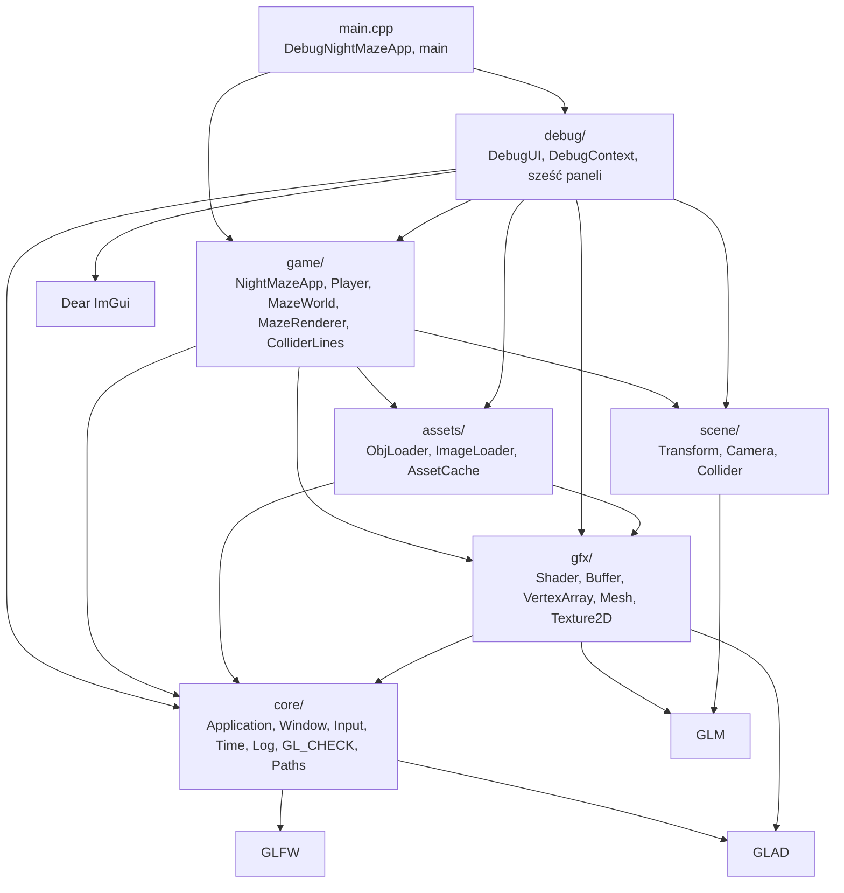
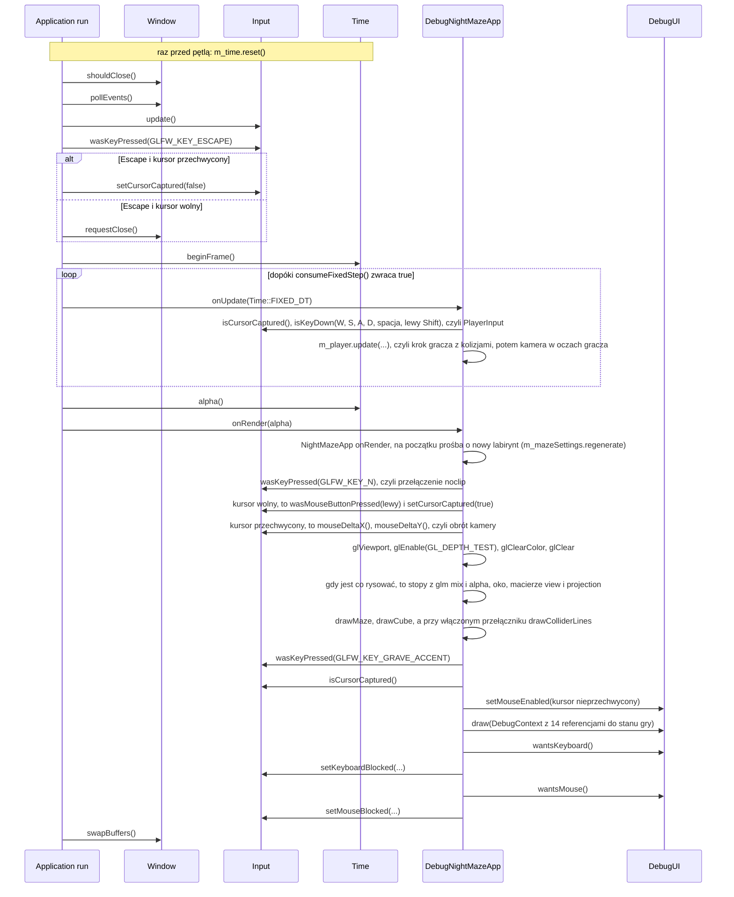
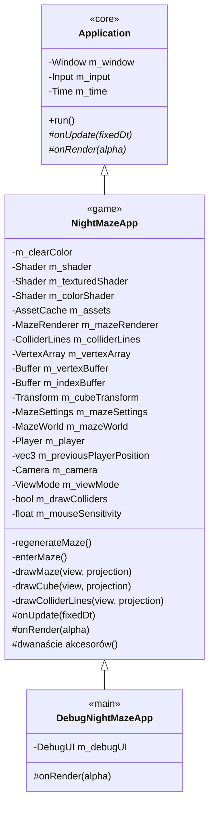

# Moduł core: fundament programu

Kamień milowy: M0, uzupełniany w M1 (mysz, ścieżki do assetów, pierwszy użytkownik stałego kroku i myszy: kamera) i w M2 + M3 (klasa `NightMazeApp` rysuje labirynt i prowadzi gracza). Temat wykładu: 1 (Pierwszy program OpenGL).
Kod: [`src/core/`](../../../src/core/), [`src/game/NightMazeApp.hpp`](../../../src/game/NightMazeApp.hpp), [`src/game/NightMazeApp.cpp`](../../../src/game/NightMazeApp.cpp), [`src/main.cpp`](../../../src/main.cpp).

Zanim narysuję cokolwiek w OpenGL, muszę mieć trzy rzeczy: okno systemowe, kontekst OpenGL (context) związany z tym oknem oraz pętlę, która co klatkę odbiera zdarzenia, przesuwa symulację i rysuje obraz. Moduł `core` dostarcza dokładnie to i nic więcej: klasę `Window` (okno GLFW z kontekstem OpenGL 4.1 Core i funkcjami załadowanymi przez GLAD), klasę `Application` (pętla główna ze stałym krokiem symulacji), `Input` (stan klawiatury i myszy), `Time` (zegar klatki), `Log` (komunikaty na konsolę), makro `GL_CHECK` (wykrywanie błędów OpenGL w buildzie Debug) i funkcje `executableDir`, `assetPath` oraz `pathText` z `Paths` (ścieżki do plików z `assets/`, liczone od położenia programu, i zamiana ścieżki na tekst). To jest realizacja tematu 1 wykładu, "Pierwszy program OpenGL": po M0 program otwiera okno, czyści je kolorem nocnego nieba i pokazuje FPS. Wszystkie późniejsze moduły (`gfx`, `renderer`, `scene`, `game`) stoją na tej warstwie, a ona sama nie wie o żadnym z nich.

Moduł jest opisany w pięciu dokumentach tematycznych. Ten plik jest ich wspólnym wstępem: pokazuje, jak części pasują do siebie, opisuje klatkę jako całość i to, jak program dziedziczy po `core::Application`. Jest też dokumentem klasy `game::NightMazeApp` (na niego wskazuje komentarz na górze `NightMazeApp.hpp` i `NightMazeApp.cpp`): sekcja 6 przechodzi przez tę klasę linia po linii, a sekcja 7 tłumaczy kolejność jej pól.

## 1. Dokumenty modułu

| Dokument | Co opisuje | Klasy i pliki |
|---|---|---|
| [`window-context.md`](window-context.md) | okno, inicjalizacja GLFW, hinty kontekstu, ładowanie GLAD, vsync, rozmiar okna a rozmiar framebuffera, logowanie | `Window`, `Log` |
| [`main-loop.md`](main-loop.md) | pętla główna, zegar klatki, stały krok czasowy z akumulatorem, ograniczenie 0,25 s, `alpha`, uśredniony FPS | `Application`, `Time` |
| [`input.md`](input.md) | klawiatura i mysz: odpytywanie, stan ciągły i zbocze, `KEY_COUNT`, przesunięcie myszy, przechwycenie kursora, blokada klawiatury i myszy na czas pracy z panelem | `Input` |
| [`gl-check.md`](gl-check.md) | makro `GL_CHECK`, model błędów `glGetError`, różnica Debug i Release | `GlCheck` |
| [`paths.md`](paths.md) | ścieżki do assetów: katalog roboczy a katalog programu, `_NSGetExecutablePath` i `GetModuleFileNameW`, `std::filesystem::path`, znaki szerokie na Windowsie | `Paths` |

Każdy z pięciu dokumentów jest samodzielną jednostką nauki i ma te same dziesięć sekcji: Po co to jest, Teoria, Jak to działa w OpenGL, Shadery, Kod w projekcie, Panel ImGui, Pułapki, Ćwiczenia, Pytania kontrolne, Źródła.

Proponowana kolejność czytania: ten plik, potem `window-context.md`, `main-loop.md`, `input.md`, `gl-check.md`, `paths.md`.

## 2. Indeks: plik kodu, dokument

| Plik kodu | Co zawiera | Dokument |
|---|---|---|
| [`src/core/Window.hpp`](../../../src/core/Window.hpp), [`.cpp`](../../../src/core/Window.cpp) | RAII na okno GLFW i kontekst OpenGL 4.1 Core, ładowanie GLAD | [`window-context.md`](window-context.md) |
| [`src/core/Log.hpp`](../../../src/core/Log.hpp), [`.cpp`](../../../src/core/Log.cpp) | `logInfo`, `logWarn`, `logError` | [`window-context.md`](window-context.md), sekcja 5.5 |
| [`src/core/Application.hpp`](../../../src/core/Application.hpp), [`.cpp`](../../../src/core/Application.cpp) | klasa bazowa programu: posiada `Window`, `Input`, `Time`, prowadzi pętlę | [`main-loop.md`](main-loop.md), dziedziczenie w tym pliku (sekcja 6) |
| [`src/core/Time.hpp`](../../../src/core/Time.hpp), [`.cpp`](../../../src/core/Time.cpp) | czas klatki, akumulator stałego kroku, uśredniony FPS | [`main-loop.md`](main-loop.md) |
| [`src/core/Input.hpp`](../../../src/core/Input.hpp), [`.cpp`](../../../src/core/Input.cpp) | migawka stanu klawiatury i myszy: `isKeyDown`, `wasKeyPressed`, `setKeyboardBlocked`, `isMouseButtonDown`, `wasMouseButtonPressed`, `mouseDeltaX`, `mouseDeltaY`, `setMouseBlocked`, `setCursorCaptured` | [`input.md`](input.md) |
| [`src/core/GlCheck.hpp`](../../../src/core/GlCheck.hpp), [`.cpp`](../../../src/core/GlCheck.cpp) | makro `GL_CHECK` i funkcja `checkGlErrors` | [`gl-check.md`](gl-check.md) |
| [`src/core/Paths.hpp`](../../../src/core/Paths.hpp), [`.cpp`](../../../src/core/Paths.cpp) | `executableDir` i `assetPath`: ścieżki do plików z `assets/` względem pliku wykonywalnego. Jedyny kod w `src/` z gałęziami `#if` dla macOS i Windows. Woła je konstruktor `NightMazeApp` przy wczytywaniu sześciu plików shaderów i konstruktor `game::MazeRenderer` przy wczytywaniu trzech modeli. `pathText`: ścieżka jako tekst UTF-8, dla `gfx::Shader`, `assets::AssetCache` i paneli "Shaders" oraz "Assets" | [`paths.md`](paths.md) |
| [`src/game/NightMazeApp.hpp`](../../../src/game/NightMazeApp.hpp), [`.cpp`](../../../src/game/NightMazeApp.cpp) | gra: dziedziczy po `core::Application`. Posiada trzy programy shaderów, pamięć assetów (`assets::AssetCache`), `MazeRenderer`, `ColliderLines`, obiekty OpenGL kostki, labirynt (`MazeSettings`, `MazeWorld`), gracza (`Player`) i kamerę (`scene::Camera`). W stałym kroku przesuwa gracza, co klatkę obsługuje prośbę o nowy labirynt, klawisz N i mysz, ustawia viewport, włącza test głębi, czyści ekran i rysuje labirynt, kostkę oraz, na życzenie, linie pudełek kolizji | ten plik (sekcje 6 i 7), ruch gracza w [`../game/player.md`](../game/player.md), labirynt w świecie i jego rysowanie w [`../game/maze-rendering.md`](../game/maze-rendering.md), obrót myszą w [`../scene/camera-controls.md`](../scene/camera-controls.md), linie pudełek w [`../scene/collision.md`](../scene/collision.md), czyszczenie w [`window-context.md`](window-context.md), sekcja 3.2, macierze w [`../scene/camera.md`](../scene/camera.md), sekcja 5.7 |
| [`src/main.cpp`](../../../src/main.cpp) | klasa `DebugNightMazeApp` (gra plus nakładka debug) i `main`: tworzy aplikację, woła `run()`, łapie wyjątki | ten plik (sekcje 5 i 6), nakładka w [`../debug-ui.md`](../debug-ui.md) |

W [`CMakeLists.txt`](../../../CMakeLists.txt) pliki `src/core/*` tworzą, razem z `src/assets/*`, `src/gfx/*` i `src/scene/*`, bibliotekę statyczną `engine`. Część `game/`, która nie potrzebuje okna (`Maze`, `MazeGenerator`, `MazeLayout`, `MazeWorld`, `Player`), tworzy bibliotekę `game_logic`, żeby mogły ją linkować także testy. Program `night_maze` to `main.cpp`, `debug/` i reszta `game/` (`NightMazeApp`, `MazeRenderer`, `ColliderLines`, `ShaderUniforms.hpp`): linkuje obie biblioteki i ImGui. `engine` ma publiczne definicje `GLFW_INCLUDE_NONE` (GLFW nie dołącza systemowego nagłówka OpenGL, robi to GLAD) i `GL_SILENCE_DEPRECATION` (macOS oznacza cały OpenGL jako przestarzały i bez tej definicji zasypuje build ostrzeżeniami).

## 3. Warstwy

Architektura projektu (PRD, sekcja 6) ma warstwy z zależnościami w jedną stronę. Strzałka znaczy "zna i dołącza nagłówki":



Sześć rzeczy do zapamiętania:

1. `core/` nie zna ani `gfx/`, ani `game/`, ani `debug/`, ani ImGui. Biblioteka `engine` linkuje tylko `glad`, `glfw` i nagłówki GLM (`glm::glm-header-only`). Samo `core/` z GLM nie korzysta: dołączają je warstwy `scene/` i `gfx/`.
2. `game/` zna `core/`, `gfx/` i `scene/`, ale nie zna `debug/`.
3. `debug/` może zależeć od wszystkiego, ale nic nie może zależeć od `debug/`. Panele dołączają nagłówki z `game/` (na przykład `game/Player.hpp` w panelu "Camera" i `game/MazeWorld.hpp` w panelu "Maze"), bo pokazują i edytują stan gry. W drugą stronę zależności nie ma: żaden plik w `game/` nie dołącza niczego z `debug/`. Jedynym plikiem, który tworzy obiekty obu warstw i łączy je ze sobą, jest `main.cpp`.
4. `gfx/` (opakowania obiektów OpenGL: klasy `Shader`, `Buffer`, `VertexArray`, `Mesh` i `Texture2D`) zna tylko `core/`, GLAD i GLM (typy w setterach `Shader`). Używa go `game/` (rysowanie), `assets/` (pamięć assetów tworzy siatki i tekstury) i `debug/` (panel "Shaders" woła `Shader::reload()`, panel "Assets" pokazuje tekstury). Opis warstwy: [`../gfx/README.md`](../gfx/README.md).
5. `scene/` (struktury `Transform` i `Camera`: macierze modelu, widoku i rzutowania) to sama matematyka na GLM. Może zależeć od `core/` i `gfx/`, dziś dołącza tylko GLM. Do `scene/` należą też pudełka kolizji (`Aabb`, `moveAndSlide`). Używa go `game/`: `NightMazeApp` ma kamerę i transform kostki, obraca kamerę myszą i co klatkę wysyła macierze do shaderów, `Player` przesuwa się przez `moveAndSlide`, a `MazeWorld` liczy macierze modelu przez `Transform`. Używa go też `debug/`: panel "Camera" edytuje pola kamery. Opis warstwy: [`../scene/README.md`](../scene/README.md).
6. `assets/` (loadery plików i `AssetCache`) zna `core/` (logowanie, ścieżki) i `gfx/` (siatka i tekstura na karcie). Same loadery zwracają dane bez OpenGL, a `AssetCache` robi z nich obiekty `gfx`. Opis warstwy: [`../assets/README.md`](../assets/README.md).

Ta reguła tłumaczy dwie decyzje opisane niżej: dlaczego nakładka debug jest podpinana w `main.cpp` (sekcja 6) i dlaczego `core::Input` dostaje od `main.cpp` neutralne flagi "klawiatura zablokowana" i "mysz zablokowana", zamiast samemu pytać ImGui ([`input.md`](input.md), sekcje 5.6 i 5.10).

## 4. Klatka jako całość

Jeden obrót pętli głównej w działającym programie, czyli w obiekcie klasy `DebugNightMazeApp`. Szczegóły każdego kroku są w dokumentach tematycznych, tutaj chodzi o kolejność:



| Krok | Kod | Dokument |
|---|---|---|
| Start zegara, raz przed pętlą (nie należy do obrotu) | `m_time.reset()` | [`main-loop.md`](main-loop.md), sekcja 5.4 |
| Zdarzenia systemu | `m_window.pollEvents()` | [`window-context.md`](window-context.md) |
| Migawka klawiatury i myszy, Escape (zwalnia przechwycony kursor albo zamyka program) | `m_input.update()`, `wasKeyPressed(GLFW_KEY_ESCAPE)`, `isCursorCaptured()` | [`input.md`](input.md), sekcja 5.7 |
| Pomiar czasu, kroki symulacji | `m_time.beginFrame()`, `consumeFixedStep()`, `onUpdate` | [`main-loop.md`](main-loop.md) |
| Symulacja: krok gracza | `NightMazeApp::onUpdate`: zapamiętanie poprzedniej pozycji gracza, przy przechwyconym kursorze `isKeyDown` dla sześciu klawiszy wpisane do `PlayerInput`, `m_player.update(...)` z listą `m_mazeWorld.colliders`, na końcu kamera w oczach gracza | sekcja 6.5, [`../game/player.md`](../game/player.md), sekcja 5 |
| Nowy labirynt, jeśli panel o niego poprosił | początek `NightMazeApp::onRender`: `m_mazeSettings.regenerate`, `regenerateMaze()` | sekcje 6.4 i 6.6, [`../game/maze-rendering.md`](../game/maze-rendering.md), sekcja 5 |
| Klawisz N | `wasKeyPressed(NOCLIP_KEY)` przełącza `m_player.noclip` | sekcja 6.6, [`../game/player.md`](../game/player.md), sekcja 5 |
| Mysz kamery | kliknięcie w scenę przechwytuje kursor, przy przechwyconym kursorze przesunięcie myszy obraca kamerę | [`input.md`](input.md), sekcja 5.9, [`../scene/camera-controls.md`](../scene/camera-controls.md), sekcja 5 |
| Rysowanie gry: stan i tło | `NightMazeApp::onRender`: `glViewport`, `glEnable(GL_DEPTH_TEST)`, `glClearColor`, `glClear` (kolor i głębia) w `GL_CHECK` | [`window-context.md`](window-context.md), [`gl-check.md`](gl-check.md) |
| Rysowanie gry: scena | pominięte, gdy framebuffer ma szerokość albo wysokość 0. Inaczej pozycja stóp z `glm::mix` i `alpha`, oko o `Player::EYE_HEIGHT` wyżej, macierze `view` i `projection` liczone raz, potem `drawMaze`, `drawCube` i, gdy `m_drawColliders` jest prawdą, `drawColliderLines`. Każda z trzech funkcji pomija swoją część, gdy jej program shaderów nie jest poprawny | sekcje 6.6 i 6.7, [`../scene/camera.md`](../scene/camera.md), sekcja 5.7 |
| Przełącznik paneli, mysz dla ImGui i panele | `wasKeyPressed(GLFW_KEY_GRAVE_ACCENT)`, `m_debugUI.setMouseEnabled(!input().isCursorCaptured())`, `m_debugUI.draw(...)` | [`../debug-ui.md`](../debug-ui.md), sekcja 5.6 |
| Blokada klawiatury na następną klatkę | `input().setKeyboardBlocked(m_debugUI.wantsKeyboard())` | [`input.md`](input.md), sekcja 5.6 |
| Blokada myszy na następną klatkę | `input().setMouseBlocked(m_debugUI.wantsMouse())` | [`input.md`](input.md), sekcja 5.10 |
| Zamiana buforów | `m_window.swapBuffers()` | [`window-context.md`](window-context.md) |

## 5. Od `main` do pierwszej klatki

```cpp
int main() {
    try {
        DebugNightMazeApp app;
        app.run();
    } catch (const std::exception& error) {
        // Startup failures (no window, no OpenGL 4.1) arrive here as exceptions.
        core::logError(std::string("Fatal: ") + error.what());
        return EXIT_FAILURE;
    }
    return EXIT_SUCCESS;
}
```

`app` jest zwykłą zmienną lokalną wewnątrz bloku `try`. Konstruktor może rzucić `std::runtime_error` (brak GLFW, brak kontekstu 4.1, nieudany GLAD) i wtedy `catch` wypisuje powód oraz zwraca kod błędu. Przy normalnym wyjściu z `run()` destruktor `app` uruchamia się na końcu bloku `try` i sprząta ImGui, okno oraz GLFW. Nie ma tu ani jednego `new`, ani jednej zmiennej globalnej. Czym jest `DebugNightMazeApp`, wyjaśnia następna sekcja.

## 6. Jak program dziedziczy po `core::Application`

### 6.1 Dwa haki klasy bazowej

`Application` implementuje wzorzec **metody szablonowej** (template method): klasa bazowa ustala niezmienny szkielet klatki w `run()`, a klasa pochodna wypełnia dwa "haki":

```cpp
virtual void onUpdate(double fixedDt) = 0;
virtual void onRender(double alpha) = 0;
```

`= 0` oznacza funkcję czysto wirtualną: `Application` jest klasą abstrakcyjną i nie da się utworzyć jej obiektu. `NightMazeApp` nadpisuje obie funkcje (słowo `override` każe kompilatorowi sprawdzić, że sygnatura naprawdę zgadza się z bazową). Dostęp do okna, wejścia i zegara klasa pochodna ma przez chronione akcesory `window()`, `input()`, `time()`, a same pola są prywatne, więc pochodna nie może ich podmienić ani zniszczyć. `window()` i `input()` zwracają zwykłe referencje, a `time()` referencję `const`: klasa pochodna może zegar czytać, ale nie może wołać `reset()`, `beginFrame()` ani `consumeFixedStep()`, bo zegar ustawia i przesuwa wyłącznie `run()`.

### 6.2 Klasa `NightMazeApp`: co posiada i co udostępnia

```cpp
/// The game itself: a generated maze of textured walls, pillars and floor tiles, and a
/// player who walks through it in first person without passing through the walls. The
/// mouse turns the camera, the keyboard moves the player. A coloured cube floats above
/// the far corner cell as a marker of the future exit.
///
/// It knows nothing about the debug UI: main.cpp derives from this class and draws the
/// debug panels on top of the frame.
class NightMazeApp : public core::Application {
```

Klasa jest miejscem, w którym spotykają się wszystkie warstwy: shadery i siatki z `gfx/`, modele i tekstury z `assets/`, kamera i kolizje z `scene/`, labirynt i gracz z `game/`. Sama zawiera mało logiki. Jej zadaniem jest **kolejność**: co powstaje po czym (sekcje 6.3 i 7), co dzieje się w stałym kroku (sekcja 6.5), a co raz na klatkę (sekcje 6.6 i 6.7).

Stan gry jest prywatny. Klasa pochodna (`DebugNightMazeApp` z `main.cpp`) dostaje go przez dwanaście chronionych akcesorów. Każdy zwraca referencję do jednego pola, więc panel edytuje oryginał, a nie kopię:

| Akcesor | Typ wyniku | Pole | Kto z niego korzysta |
|---|---|---|---|
| `clearColor()` | `std::array<float, 3>&` | `m_clearColor` | panel "Renderer" |
| `shader()` | `gfx::Shader&` | `m_shader` (program kostki, `basic.*`) | panel "Shaders" |
| `texturedShader()` | `gfx::Shader&` | `m_texturedShader` (program labiryntu, `textured.*`) | panel "Shaders" |
| `colorShader()` | `gfx::Shader&` | `m_colorShader` (program linii pudełek, `color.*`) | panel "Shaders" |
| `camera()` | `scene::Camera&` | `m_camera` | panele "Camera" i "Maze" |
| `mouseSensitivity()` | `float&` | `m_mouseSensitivity` | panel "Camera" |
| `player()` | `Player&` | `m_player` | panele "Camera", "Maze" i "Collision" |
| `mazeSettings()` | `MazeSettings&` | `m_mazeSettings` | panel "Maze" |
| `mazeWorld()` | `const MazeWorld&` | `m_mazeWorld` | panele "Maze" i "Collision" |
| `assets()` | `assets::AssetCache&` | `m_assets` | panel "Assets" |
| `viewMode()` | `ViewMode&` | `m_viewMode` | panel "Assets" |
| `drawColliders()` | `bool&` | `m_drawColliders` | panel "Collision" |

Jedyny akcesor z `const` to `mazeWorld()`:

```cpp
/// The maze in play, read only: the debug UI draws its plan and counts its boxes.
const MazeWorld& mazeWorld() const { return m_mazeWorld; }
```

Panel nie może zmienić labiryntu, w którym gracz właśnie stoi. Może tylko zapisać prośbę w `MazeSettings`, a o tym, kiedy labirynt zostanie wymieniony, decyduje gra (sekcja 6.6). Jak te referencje trafiają do paneli, opisuje [`../debug-ui.md`](../debug-ui.md), sekcja 5.

### 6.3 Konstruktor

```cpp
NightMazeApp::NightMazeApp()
    : core::Application(INITIAL_WIDTH, INITIAL_HEIGHT, "Night Maze"),
      m_shader(core::assetPath(VERTEX_SHADER_FILE), core::assetPath(FRAGMENT_SHADER_FILE)),
      m_texturedShader(core::assetPath(TEXTURED_VERTEX_SHADER_FILE),
                       core::assetPath(TEXTURED_FRAGMENT_SHADER_FILE)),
      m_colorShader(core::assetPath(COLOR_VERTEX_SHADER_FILE),
                    core::assetPath(COLOR_FRAGMENT_SHADER_FILE)),
      m_mazeRenderer(m_assets),
      // The sizes are in bytes: number of elements times the size of one element.
      m_vertexBuffer(GL_ARRAY_BUFFER, VERTICES.data(), VERTICES.size() * sizeof(float)),
      m_indexBuffer(GL_ELEMENT_ARRAY_BUFFER, INDICES.data(), INDICES.size() * sizeof(GLuint)),
      m_mazeWorld(
          buildMazeWorld(m_mazeSettings.width, m_mazeSettings.height, m_mazeSettings.seed)) {
    // m_vertexBuffer is still bound to GL_ARRAY_BUFFER (m_indexBuffer uses another binding
    // point). Each call below records that buffer in m_vertexArray for one attribute.
    m_vertexArray.setFloatAttribute(POSITION_ATTRIBUTE, POSITION_COMPONENTS, VERTEX_STRIDE,
                                    POSITION_OFFSET);
    m_vertexArray.setFloatAttribute(COLOR_ATTRIBUTE, COLOR_COMPONENTS, VERTEX_STRIDE, COLOR_OFFSET);

    m_cubeTransform.rotationDegrees = {CUBE_ROTATION_X_DEGREES, CUBE_ROTATION_Y_DEGREES, 0.0F};

    // The first maze was built in the initializer list, because MazeWorld cannot be
    // created empty. What is left is the same as after every later regeneration.
    enterMaze();
}
```

| Element listy | Znaczenie |
|---|---|
| `core::Application(INITIAL_WIDTH, INITIAL_HEIGHT, "Night Maze")` | klasa bazowa tworzy okno 1280 x 720 i kontekst OpenGL. `INITIAL_WIDTH` i `INITIAL_HEIGHT` to stałe `constexpr` w anonimowej przestrzeni nazw pliku `.cpp`: mają nazwy (żadnych magicznych liczb) i są niewidoczne poza tym plikiem |
| `m_shader(...)`, `m_texturedShader(...)`, `m_colorShader(...)` | trzy programy, każdy z pary plików z `assets/shaders/`. `core::assetPath` zamienia nazwę względną na ścieżkę obok pliku wykonywalnego ([`paths.md`](paths.md)). Nieudane wczytanie nie rzuca wyjątku: program jest wtedy niepoprawny, a jego część klatki nie jest rysowana (sekcja 6.7) |
| (brak `m_assets`) | pola `m_assets` nie ma na liście, więc działa jego konstruktor domyślny: tworzy białą teksturę 1 x 1. Powstaje mimo to w swojej kolejności, między `m_colorShader` a `m_mazeRenderer`, bo o kolejności decydują deklaracje (sekcja 7) |
| `m_mazeRenderer(m_assets)` | prosi pamięć assetów o trzy modele labiryntu. `m_assets` już istnieje, bo jest zadeklarowane wyżej ([`../game/maze-rendering.md`](../game/maze-rendering.md), sekcja 5) |
| (brak `m_colliderLines` i `m_vertexArray`) | konstruktory domyślne: `ColliderLines` wysyła na kartę siatkę krawędzi sześcianu, `VertexArray` tworzy i wiąże VAO kostki |
| `m_vertexBuffer(...)`, `m_indexBuffer(...)` | dane kostki na karcie ([`../gfx/indexed-drawing.md`](../gfx/indexed-drawing.md), sekcja 5) |
| `m_mazeWorld(buildMazeWorld(...))` | pierwszy labirynt: rozmiar i ziarno z `m_mazeSettings`, którego wartości domyślne to 10 x 10 komórek i ziarno 1 (`DEFAULT_MAZE_WIDTH`, `DEFAULT_MAZE_HEIGHT`, `DEFAULT_MAZE_SEED`). `m_mazeSettings` jest zadeklarowane tuż nad `m_mazeWorld`, więc w tej chwili ma już swoje wartości |

**Dlaczego labirynt powstaje na liście, a nie w ciele konstruktora.** `MazeWorld` ma tylko konstruktor `explicit MazeWorld(Maze generatedMaze)`, a `Maze` nie ma konstruktora domyślnego (labirynt bez rozmiaru nie ma sensu). Pola bez konstruktora domyślnego nie da się "zostawić pustego i wypełnić później": musi dostać wartość na liście inicjalizacyjnej. Dlatego ciało konstruktora woła już tylko `enterMaze()`, czyli to samo, co dzieje się po każdej późniejszej wymianie labiryntu.

Ciało konstruktora robi trzy rzeczy: opisuje dwa atrybuty kostki (wymaga to, żeby bufor wierzchołków kostki był nadal związany, sekcja 7), ustawia obrót kostki (25 stopni wokół osi x i 35 wokół osi y, [`../scene/transforms.md`](../scene/transforms.md), sekcja 5.4) i woła `enterMaze()`.

### 6.4 `regenerateMaze` i `enterMaze`

```cpp
void NightMazeApp::regenerateMaze() {
    // generateMaze throws for a size outside 1 to Maze::MAX_SIZE. The request comes from
    // a panel, where any number can be typed, so it is brought into the range here and
    // written back for the panel to show.
    m_mazeSettings.width = std::clamp(m_mazeSettings.width, 1, Maze::MAX_SIZE);
    m_mazeSettings.height = std::clamp(m_mazeSettings.height, 1, Maze::MAX_SIZE);

    // Replaces the maze, the model matrices and the collision boxes in one assignment.
    m_mazeWorld = buildMazeWorld(m_mazeSettings.width, m_mazeSettings.height, m_mazeSettings.seed);
    enterMaze();
}
```

| Linia | Znaczenie |
|---|---|
| `std::clamp(m_mazeSettings.width, 1, Maze::MAX_SIZE)` | `generateMaze` rzuca `std::invalid_argument` dla rozmiaru spoza zakresu od 1 do `Maze::MAX_SIZE` (256). Wyjątek w środku klatki zakończyłby program w `main`, więc gra sama sprowadza prośbę do zakresu i zapisuje wynik z powrotem, żeby panel pokazał to, co naprawdę zostało użyte. Suwaki panelu "Maze" mają węższy zakres (od 2 do 40) i same przycinają wpisaną wartość, ale gra nie polega na tym, co robi panel |
| `m_mazeWorld = buildMazeWorld(...)` | jedno przypisanie wymienia siatkę, listy ścian i słupków, macierze modelu i pudełka kolizji. Nie ma chwili, w której część danych jest stara, a część nowa |
| `enterMaze();` | reszta pracy jest wspólna z konstruktorem |

```cpp
void NightMazeApp::enterMaze() {
    // The marker cube floats above the far corner cell, the place of the future exit.
    m_cubeTransform.position =
        m_mazeWorld.exitPosition + glm::vec3{0.0F, CUBE_HEIGHT_ABOVE_FLOOR, 0.0F};

    // The player goes to the start. After a regeneration the old position may be inside
    // a wall of the new maze, or outside of it.
    m_player.position = m_mazeWorld.startPosition;
    // Both positions at once: otherwise the next frame would be drawn from a point
    // between the old place and the new one, a visible swoop through the walls.
    m_previousPlayerPosition = m_player.position;

    m_camera.position = m_player.eyePosition();
    m_camera.yawDegrees = m_mazeWorld.startYawDegrees;
    m_camera.pitchDegrees = LEVEL_PITCH_DEGREES;
}
```

| Linia | Znaczenie |
|---|---|
| `m_cubeTransform.position = m_mazeWorld.exitPosition + glm::vec3{0.0F, CUBE_HEIGHT_ABOVE_FLOOR, 0.0F};` | kostka z M1 jest znacznikiem przyszłego wyjścia: jej środek wisi 4,5 m nad środkiem komórki w przeciwległym narożniku. `CUBE_HEIGHT_ABOVE_FLOOR = 4.5F`, czyli wyraźnie nad ścianami (3 m) i słupkami (3,15 m). Dla labiryntu 10 x 10 to punkt `(19, 4,5, 19)`. Obrót kostki zostaje taki, jaki ustawił konstruktor |
| `m_player.position = m_mazeWorld.startPosition;` | stopy gracza na środku komórki (0, 0), czyli w `(1, 0, 1)` |
| `m_previousPlayerPosition = m_player.position;` | obie pozycje pary do interpolacji naraz. Gdyby poprzednia została stara, najbliższa klatka byłaby narysowana z punktu między starym a nowym miejscem |
| `m_camera.position = m_player.eyePosition();` | oko 1,7 m nad stopami: `(1, 1,7, 1)` |
| `m_camera.yawDegrees = m_mazeWorld.startYawDegrees;` | gracz patrzy w pierwszy otwarty bok komórki startowej |
| `m_camera.pitchDegrees = LEVEL_PITCH_DEGREES;` | wzrok poziomo (`0.0F`) |

**Czego `enterMaze` nie rusza.** Tryb noclip, trzy prędkości gracza, tryb widoku (`m_viewMode`), przełącznik rysowania pudełek (`m_drawColliders`) i czułość myszy zostają takie, jakie były. Wymiana labiryntu przestawia tylko pozycję gracza, pozycję poprzednią, pozycję kamery, yaw i pitch. Skutek: po wymianie labiryntu w trybie noclip gracz dalej lata, tylko z nowego miejsca.

Skąd biorą się `startPosition`, `startYawDegrees` i `exitPosition`, opisuje [`../game/maze-rendering.md`](../game/maze-rendering.md), sekcja 5.

### 6.5 `onUpdate`: jeden stały krok

```cpp
void NightMazeApp::onUpdate(double fixedDt) {
    // Remember where the player was before this step. It is done in every step, also
    // when the player does not move, so that onRender never blends with an old position.
    m_previousPlayerPosition = m_player.position;

    // The keys reach the player only while the cursor is captured: one click in the scene
    // switches on both mouse look and movement, Escape switches both off. Without the
    // capture the struct stays as it is created: nothing is held.
    PlayerInput wanted;
    if (input().isCursorCaptured()) {
        wanted.forward = input().isKeyDown(GLFW_KEY_W);
        wanted.backward = input().isKeyDown(GLFW_KEY_S);
        wanted.left = input().isKeyDown(GLFW_KEY_A);
        wanted.right = input().isKeyDown(GLFW_KEY_D);
        wanted.up = input().isKeyDown(GLFW_KEY_SPACE);
        // Left Shift has one meaning per mode: sprint when walking, down when flying.
        // The player uses the field that belongs to its mode and ignores the other.
        wanted.down = input().isKeyDown(GLFW_KEY_LEFT_SHIFT);
        wanted.sprint = input().isKeyDown(GLFW_KEY_LEFT_SHIFT);
    }

    // The step runs also with nothing held: it is what brings the feet back to the floor
    // after noclip was switched off in a panel.
    m_player.update(wanted, m_camera.yawDegrees, m_camera.pitchDegrees, static_cast<float>(fixedDt),
                    m_mazeWorld.colliders);

    // Walking never changes the height, with one exception: the step right after noclip
    // was switched off in mid-air, which puts the feet back on the floor. That is a jump
    // and not a movement, so it must not be blended: without this line one frame would
    // be drawn from a point part of the way down.
    if (!m_player.noclip) {
        m_previousPlayerPosition.y = m_player.position.y;
    }

    // The camera stands where the eyes of the player are. onRender does not draw from
    // this position directly (it blends two steps), but the debug UI shows it.
    m_camera.position = m_player.eyePosition();
}
```

Tutaj jest kolejność części i podział pracy między aplikację a gracza. Sam ruch (kierunki, normalizacja, prędkości, `moveAndSlide`) opisuje [`../game/player.md`](../game/player.md), sekcja 5.

| Część | Co robi aplikacja | Dlaczego tutaj |
|---|---|---|
| `m_previousPlayerPosition = m_player.position;` | zapamiętuje pozycję sprzed kroku, w każdym kroku, także bez ruchu | para (poprzednia, bieżąca) do interpolacji w `onRender` ([`main-loop.md`](main-loop.md), sekcja 5.5) |
| `PlayerInput wanted;` i siedem pól | tłumaczy klawisze na pola logiczne. `isKeyDown` to stan ciągły, bezpieczny w `onUpdate` ([`input.md`](input.md), sekcja 5.5). Bez przechwyconego kursora struktura zostaje taka, jak ją stworzono: wszystkie pola fałszywe | gracz nie wie nic o klawiaturze, więc test może "trzymać klawisz", ustawiając pole. Lewy Shift trafia do dwóch pól naraz (`down` i `sprint`), a gracz czyta to, które należy do jego trybu |
| `m_player.update(...)` | jeden krok gracza: kąty kamery, czas kroku jako `float` i lista pudełek `m_mazeWorld.colliders`. Krok wykonuje się **zawsze**, także z pustym wejściem | właśnie ten krok stawia stopy z powrotem na podłodze po wyłączeniu noclip, również wtedy, gdy noclip wyłączono w panelu przy wolnym kursorze |
| `if (!m_player.noclip) { ... }` | wyrównuje wysokość poprzedniej pozycji do bieżącej | chodzenie nie zmienia wysokości, poza jednym krokiem: pierwszym po wyłączeniu noclip w powietrzu. To skok, nie ruch, więc nie może być interpolowany |
| `m_camera.position = m_player.eyePosition();` | kamera staje w oczach gracza | `onRender` z tej pozycji nie rysuje (miesza dwa kroki), ale panel "Camera" ją pokazuje |

`fixedDt` jest typu `double` (tak liczy zegar), a gracz liczy na `float`, stąd `static_cast<float>(fixedDt)`. `m_mazeWorld.colliders` to `std::vector<scene::Aabb>`, a parametr `Player::update` to `std::span<const scene::Aabb>`: wektor zamienia się na widok bez kopiowania.

### 6.6 `onRender`: jedna klatka

Funkcja ma trzy etapy: obsługa zdarzeń, które opisują jedną klatkę, przygotowanie stanu OpenGL i narysowanie sceny.

**Etap 1: prośba o labirynt, klawisz N, mysz.**

```cpp
void NightMazeApp::onRender(double alpha) {
    // A new maze asked for by the debug UI is built here, at the start of a frame and
    // outside of the fixed steps, so no step ever sees a half replaced maze.
    if (m_mazeSettings.regenerate) {
        m_mazeSettings.regenerate = false;
        regenerateMaze();
    }

    // The noclip key. wasKeyPressed is true for one frame, so it is read here, once per
    // frame, and not in onUpdate, which runs zero or more times per frame.
    if (input().wasKeyPressed(NOCLIP_KEY)) {
        m_player.noclip = !m_player.noclip;
    }
```

| Linia | Znaczenie |
|---|---|
| `if (m_mazeSettings.regenerate)` | flagę ustawia panel "Maze" w trakcie `DebugUI::draw`, czyli **po** tym, jak `NightMazeApp::onRender` skończyło rysować tę klatkę. Gra odczytuje ją więc na początku **następnej** klatki. Kroki symulacji tej następnej klatki wykonały się już wcześniej (pętla woła `onUpdate` przed `onRender`, [`main-loop.md`](main-loop.md), sekcja 5.2), jeszcze na starym labiryncie i w całości. Żaden krok nie widzi labiryntu wymienionego w połowie, bo wymiana dzieje się poza krokami |
| `m_mazeSettings.regenerate = false;` | flaga jest jednorazowa: gasi ją ten, kto ją obsłużył |
| `input().wasKeyPressed(NOCLIP_KEY)` | `NOCLIP_KEY` to `GLFW_KEY_N`. Zbocze jest prawdą przez jedną klatkę, więc wolno je czytać tylko raz na klatkę ([`input.md`](input.md), sekcja 5.5). Warunku `isCursorCaptured()` tu nie ma: N działa także przy wolnym kursorze. Nie działa tylko wtedy, gdy klawiaturę ma ImGui (blokada z `main.cpp`), na przykład podczas wpisywania ziarna |
| `m_player.noclip = !m_player.noclip;` | to samo pole przełącza pole wyboru w panelu "Collision" |

Dalej idzie obrót myszą: kliknięcie w scenę przechwytuje kursor, a przy przechwyconym kursorze przesunięcie myszy razy `m_mouseSensitivity` trafia do `m_camera.rotate`. Ten fragment nie zmienił się od M1 i jest opisany linia po linii w [`../scene/camera-controls.md`](../scene/camera-controls.md), sekcja 5.

**Etap 2: stan OpenGL i tło.** `glViewport` z rozmiaru framebuffera, `glEnable(GL_DEPTH_TEST)`, `glClearColor` i `glClear` dla koloru i głębi, wszystko w `GL_CHECK`. Potem strażnik rozmiaru:

```cpp
    if (framebuffer.width == 0 || framebuffer.height == 0) {
        return;
    }
```

Zminimalizowane okno może mieć framebuffer 0 x 0. Proporcje wyszłyby wtedy `0 / 0`, czyli `NaN`, a `glm::perspective` kończy program asercją w buildzie Debug. W takiej klatce i tak nie ma czego rysować. Opis tych wywołań: [`window-context.md`](window-context.md), sekcja 3.2, i [`../scene/camera.md`](../scene/camera.md), sekcja 5.7.

**Etap 3: oko, dwie macierze i trzy części sceny.**

```cpp
    const glm::vec3 feet =
        glm::mix(m_previousPlayerPosition, m_player.position, static_cast<float>(alpha));
    const glm::vec3 eye = feet + glm::vec3{0.0F, Player::EYE_HEIGHT, 0.0F};

    // The two matrices that are the same for everything drawn in this frame.
    const glm::mat4 view = m_camera.viewMatrix(eye);
    const glm::mat4 projection = m_camera.projectionMatrix(aspectRatio);

    drawMaze(view, projection);
    drawCube(view, projection);
    if (m_drawColliders) {
        drawColliderLines(view, projection);
    }
}
```

| Linia | Znaczenie |
|---|---|
| `glm::mix(m_previousPlayerPosition, m_player.position, static_cast<float>(alpha))` | pozycja stóp między dwoma krokami symulacji ([`main-loop.md`](main-loop.md), sekcje 2.4 i 5.5). `m_player.position` nie jest zmieniane: rysowanie tylko czyta stan symulacji |
| `feet + glm::vec3{0.0F, Player::EYE_HEIGHT, 0.0F}` | oko jest stałe 1,7 m nad stopami, więc zmieszanie stóp i pójście w górę daje ten sam punkt co zmieszanie dwóch pozycji oczu |
| `m_camera.viewMatrix(eye)`, `m_camera.projectionMatrix(aspectRatio)` | obie macierze liczę **raz** i przekazuję do trzech funkcji. Są takie same dla wszystkiego, co jest rysowane w tej klatce, ale każdy z trzech programów ma własne uniformy `uView` i `uProjection`, które trzeba ustawić osobno |
| `drawMaze`, `drawCube`, `drawColliderLines` | kolejność: labirynt, kostka, na końcu linie. O tym, co zasłania co, decyduje test głębi, a nie kolejność rysowania. Linie są nakładką do szukania błędów, więc idą na końcu |
| `if (m_drawColliders)` | pole przełącza panel "Collision". Domyślnie `false` |

### 6.7 Trzy części sceny

Każda z trzech funkcji ma tę samą budowę: sprawdza, czy jej program jest poprawny, wybiera go (`use()`), ustawia `uView` i `uProjection`, a potem rysuje. Kolejność `use()` przed setterami jest obowiązkowa, bo uniform należy do programu, który jest właśnie używany ([`../gfx/uniforms.md`](../gfx/uniforms.md), sekcja 7). Nazwy uniformów (`VIEW_UNIFORM`, `PROJECTION_UNIFORM` i pozostałe) są w jednym miejscu, w [`src/game/ShaderUniforms.hpp`](../../../src/game/ShaderUniforms.hpp) ([`../gfx/uniforms.md`](../gfx/uniforms.md), sekcja 5).

```cpp
void NightMazeApp::drawMaze(const glm::mat4& view, const glm::mat4& projection) const {
    // Without a shader program there is nothing to draw with. The load error was logged
    // once, when the shader was created, and the rest of the frame is still drawn.
    if (!m_texturedShader.isValid()) {
        return;
    }

    // The uniforms belong to the program in use, so use() comes before the setters.
    m_texturedShader.use();
    m_texturedShader.setMat4(VIEW_UNIFORM, view);
    m_texturedShader.setMat4(PROJECTION_UNIFORM, projection);
    // The enum values are the numbers textured.frag compares uViewMode with.
    m_texturedShader.setInt(VIEW_MODE_UNIFORM, static_cast<int>(m_viewMode));

    m_mazeRenderer.draw(m_texturedShader, m_mazeWorld);
}
```

`drawMaze` ustawia to, co jest wspólne dla całego labiryntu: dwie macierze i tryb widoku (0 obraz, 1 normalne jako kolor, 2 współrzędne tekstury jako kolor). Resztę, czyli `uTexture` oraz `uModel` i `uTint` dla każdego obiektu, ustawia `MazeRenderer::draw` ([`../game/maze-rendering.md`](../game/maze-rendering.md), sekcja 5). Shader `textured.frag` jest opisany w [`../gfx/textures.md`](../gfx/textures.md), sekcja 4.

```cpp
void NightMazeApp::drawCube(const glm::mat4& view, const glm::mat4& projection) const {
    if (!m_shader.isValid()) {
        return;
    }

    // The uniforms belong to the program in use, so use() comes before setMat4.
    m_shader.use();
    m_shader.setMat4(MODEL_UNIFORM, m_cubeTransform.matrix());
    m_shader.setMat4(VIEW_UNIFORM, view);
    m_shader.setMat4(PROJECTION_UNIFORM, projection);

    m_vertexArray.bind();
```

`drawCube` to kod rysujący z M1, przeniesiony do własnej funkcji: program `basic`, trzy macierze, VAO kostki i `glDrawElements` ([`../gfx/indexed-drawing.md`](../gfx/indexed-drawing.md), sekcja 5). `m_vertexArray.bind()` jest tu konieczne w każdej klatce, bo `drawMaze` zostawia związane VAO ostatniej narysowanej siatki.

```cpp
void NightMazeApp::drawColliderLines(const glm::mat4& view, const glm::mat4& projection) const {
    if (!m_colorShader.isValid()) {
        return;
    }

    m_colorShader.use();
    m_colorShader.setMat4(VIEW_UNIFORM, view);
    m_colorShader.setMat4(PROJECTION_UNIFORM, projection);

    // The depth test stays on: a line behind a wall is hidden by it, which shows where
    // each box really is. The box of the player is drawn at the simulation position (the
    // last fixed step), the camera at a blend of two steps, so while moving the box runs
    // ahead of the camera by a fraction of one step.
    m_colliderLines.draw(m_colorShader, m_mazeWorld.colliders, MAZE_COLLIDER_COLOR);
    // draw takes a list of boxes. A span made of a pointer and a count of 1 is a list
    // with this one box in it.
    const scene::Aabb playerBox = m_player.box();
    m_colliderLines.draw(m_colorShader, std::span<const scene::Aabb>(&playerBox, 1),
                         PLAYER_COLLIDER_COLOR);
}
```

| Linia | Znaczenie |
|---|---|
| `m_colliderLines.draw(m_colorShader, m_mazeWorld.colliders, MAZE_COLLIDER_COLOR)` | wszystkie pudełka labiryntu na żółto (`{1.0F, 0.85F, 0.1F}`). To ta sama lista, którą dostaje `Player::update`, więc widać dokładnie to, z czym gracz się zderza |
| `const scene::Aabb playerBox = m_player.box();` | pudełko gracza z jego pozycji symulacyjnej (ostatni stały krok). Kamera jest rysowana z punktu między dwoma krokami, więc w ruchu pudełko wyprzedza kamerę o ułamek kroku |
| `std::span<const scene::Aabb>(&playerBox, 1)` | `draw` przyjmuje listę pudełek. Widok zbudowany ze wskaźnika i liczby 1 to lista z jednym elementem, bez tworzenia wektora |
| `PLAYER_COLLIDER_COLOR` | zielony (`{0.2F, 1.0F, 0.4F}`) |

Test głębi zostaje włączony, więc linia za ścianą jest przez nią zasłonięta. Jak `ColliderLines` rysuje jedno pudełko i co robi shader `color`, opisuje [`../scene/collision.md`](../scene/collision.md), sekcje 4 i 5.

**Co jest sprawdzone.** Na Windowsie (2026-10-05, MSVC 19.44, build Debug) program startuje wewnątrz labiryntu bez linii `[error]` i bez linii `GL_`, a na zrzutach ekranu sprawdzone zostały: widok startowy z teksturami, widok z góry w trybie noclip z żółtymi pudełkami na ścianach i słupkach oraz oba tryby widoku do szukania błędów. Chodzenia prawdziwymi klawiszami, klawisza N, obrotu myszą w labiryncie i przycisków wymiany labiryntu nikt jeszcze ręcznie nie sprawdził: to otwarte pozycje listy kontrolnej w [`../../guides/build-windows.md`](../../guides/build-windows.md). Na macOS ten kod nie był ani budowany, ani uruchamiany.

### 6.8 Trzy poziomy dziedziczenia

W programie są trzy klasy, każda w innej warstwie:



W nawiasach ostrych jest warstwa: `core::Application`, `game::NightMazeApp` i `DebugNightMazeApp` z `main.cpp`. Gwiazdka oznacza funkcję czysto wirtualną.

```cpp
class DebugNightMazeApp final : public game::NightMazeApp {
protected:
    void onRender(double alpha) override {
        game::NightMazeApp::onRender(alpha);

        // The key left of 1 (` and ~ on a US keyboard) shows or hides the debug panels.
        if (input().wasKeyPressed(GLFW_KEY_GRAVE_ACCENT)) {
            m_debugUI.toggleVisible();
        }
        // While the cursor is captured the mouse belongs to the camera. The hidden cursor
        // still has a position that moves with the mouse, so the panels must ignore it,
        // otherwise it would hover and click them unseen.
        m_debugUI.setMouseEnabled(!input().isCursorCaptured());
        // The context is rebuilt every frame: it only holds references, so it is cheap.
        m_debugUI.draw(debug::DebugContext{
            .time = time(),
            .window = window(),
            .clearColor = clearColor(),
            .shader = shader(),
            .camera = camera(),
            .mouseSensitivity = mouseSensitivity(),
            .texturedShader = texturedShader(),
            .colorShader = colorShader(),
            .player = player(),
            .mazeSettings = mazeSettings(),
            .mazeWorld = mazeWorld(),
            .assets = assets(),
            .viewMode = viewMode(),
            .drawColliders = drawColliders(),
        });

        // ImGui now knows whether it is using the keyboard (a text field is being edited
        // or a widget is active) and the mouse (the cursor is over a panel or a widget is
        // being dragged). Block each device for the game from the next frame on, so typing
        // does not trigger Escape, the panel toggle or player movement, and working with
        // a panel does not click or look around in the scene.
        input().setKeyboardBlocked(m_debugUI.wantsKeyboard());
        input().setMouseBlocked(m_debugUI.wantsMouse());
    }

private:
    // Members are destroyed before base classes, so ImGui shuts down while the window
    // and its OpenGL context (owned by core::Application) still exist.
    debug::DebugUI m_debugUI{window()};
};
```

**Dlaczego nakładka debug jest w `main.cpp`, a nie w grze.** Zgodnie z regułą warstw `debug/` może zależeć od wszystkiego, ale nic nie może zależeć od `debug/`. Ktoś jednak musi na końcu każdej klatki zawołać `DebugUI::draw`. Gdyby robiło to `game::NightMazeApp`, gra dołączałaby `debug/DebugUI.hpp` i reguła byłaby złamana. Rozwiązaniem jest miejsce stojące **ponad** obiema warstwami: `main.cpp`. To jedyny plik, który tworzy obiekty obu warstw, i tam skleja je klasa `DebugNightMazeApp`. Zysk jest praktyczny: wersję gry bez paneli dostaję, pisząc w `main` po prostu `game::NightMazeApp app;`, bez dotykania kodu gry.

Szczegóły tej klasy, o które można zostać zapytanym:

- `game::NightMazeApp::onRender(alpha);` to wywołanie **z kwalifikacją nazwą klasy**. Wyłącza ono mechanizm wirtualny i woła dokładnie wersję bazową (rysowanie gry). Samo `onRender(alpha)` wywołałoby wirtualnie tę samą funkcję, czyli nieskończoną rekurencję.
- Kolejność w `onRender`: najpierw gra obsługuje prośbę o nowy labirynt, klawisz N i mysz kamery i rysuje scenę, potem `main.cpp` mówi ImGui, czy wolno mu używać myszy (`setMouseEnabled`: nie, gdy kursor jest przechwycony przez kamerę), panele lądują na wierzchu, a na końcu `main.cpp` przekazuje do `core::Input` informację, czy ImGui używa klawiatury i czy używa myszy.
- Przełącznik paneli to klawisz `~` (na lewo od `1`, w GLFW `GLFW_KEY_GRAVE_ACCENT`). Sprawdzam go przez `wasKeyPressed` w `onRender`, czyli dokładnie raz na klatkę (dlaczego nie w `onUpdate`: [`input.md`](input.md), sekcja 5.5).
- Linia `setMouseEnabled` i dwie ostatnie linie `onRender` to całe powiązanie klawiatury i myszy gry z ImGui. `core/` nie wie, kto i dlaczego blokuje wejście, a `debug/` nie wie, co gra zrobi z tą informacją ani dlaczego ma zignorować mysz. Pełny opis: [`input.md`](input.md), sekcje 5.6, 5.10 i 5.11.
- `final` zabrania dalszego dziedziczenia po tej klasie. Anonimowa przestrzeń nazw sprawia, że klasa jest widoczna tylko w `main.cpp`.
- Klasa nie ma własnego konstruktora. Kompilator generuje domyślny: buduje część bazową (`NightMazeApp`), a potem pole `m_debugUI` z inicjalizatora przy deklaracji, `{window()}`.
- `clearColor()` to chroniony akcesor w `NightMazeApp` zwracający referencję do prywatnego `m_clearColor`. Tak samo działa pozostałych jedenaście (tabela w sekcji 6.2). Gra udostępnia swój stan klasie pochodnej, nie wiedząc, kto i po co go użyje.
- Czternaście pól `DebugContext` to dwa akcesory klasy bazowej (`time()`, `window()`) i dwanaście akcesorów gry. Inicjalizatory desygnowane muszą stać w kolejności deklaracji pól w strukturze, dlatego `.texturedShader` jest dopiero po `.mouseSensitivity` ([`../debug-ui.md`](../debug-ui.md), sekcja 5).
- `shader()`, `texturedShader()` i `colorShader()` zwracają `gfx::Shader&`, przez które panel "Shaders" woła `reload()` na wszystkich trzech programach ([`../gfx/shader-hot-reload.md`](../gfx/shader-hot-reload.md), sekcja 6).

Dwie rzeczy warte uwagi w samej klasie bazowej:

- Destruktor bazowy jest wirtualny (`virtual ~Application() = default;`). Każda klasa z funkcjami wirtualnymi, po której się dziedziczy, powinna go mieć, bo inaczej usunięcie obiektu pochodnego przez wskaźnik na bazę nie wywołałoby destruktora pochodnej.
- Kopiowanie jest zablokowane (`= delete`) w `Application` i w `Window`. Kopia `Window` miałaby ten sam `m_handle` i oba destruktory próbowałyby zniszczyć to samo okno (podwójne zwolnienie).

Dzięki temu podziałowi warstwa `engine` nadaje się też do zadań laboratoryjnych: wystarczy nowa klasa pochodna z własnym `onUpdate` i `onRender`.

## 7. Kolejność pól, od której zależy poprawność

W C++ pola klasy są **konstruowane w kolejności deklaracji** w klasie (nie w kolejności na liście inicjalizacyjnej konstruktora) i **niszczone w kolejności odwrotnej**. W tym projekcie dwa miejsca polegają na tej regule.

**`Application`:**

```cpp
// Order matters: members are constructed top to bottom, and Input needs the window.
Window m_window;
Input m_input;
Time m_time;
```

```cpp
Application::Application(int width, int height, const std::string& title)
    : m_window(width, height, title), m_input(m_window.nativeHandle()) {}
```

`m_input` potrzebuje uchwytu okna, więc `m_window` musi powstać pierwsze. Gdybym zamienił deklaracje miejscami, `m_input` zostałoby skonstruowane **przed** `m_window`, a `m_window.nativeHandle()` odczytałoby pole obiektu, który jeszcze nie istnieje (niezdefiniowane zachowanie, w praktyce śmieciowy wskaźnik). Kompilator w najlepszym razie ostrzeże o niezgodnej kolejności na liście inicjalizacyjnej. Przy niszczeniu kolejność jest odwrotna: `m_time`, `m_input`, a `m_window` na końcu, więc okno i GLFW znikają jako ostatnie.

**`DebugNightMazeApp` (w `main.cpp`):**

```cpp
// Members are destroyed before base classes, so ImGui shuts down while the window
// and its OpenGL context (owned by core::Application) still exist.
debug::DebugUI m_debugUI{window()};
```

Tu działa druga część tej samej reguły: najpierw konstruowana jest **część bazowa** obiektu (od najgłębszej klasy bazowej), potem pola klasy pochodnej, a niszczenie idzie dokładnie odwrotnie: **pola są niszczone przed klasami bazowymi**.

| Konstrukcja (z góry na dół) | Niszczenie (z góry na dół) |
|---|---|
| `Application::m_window` (GLFW, okno, kontekst, GLAD) | `DebugNightMazeApp::m_debugUI` (zamknięcie ImGui, okno i kontekst jeszcze żyją) |
| `Application::m_input` | `NightMazeApp::m_mouseSensitivity`, `m_drawColliders`, `m_viewMode`, `m_camera`, `m_previousPlayerPosition`, `m_player` (zwykłe dane, nic do zwolnienia) |
| `Application::m_time` | `NightMazeApp::m_mazeWorld`, `m_mazeSettings`, `m_cubeTransform` (wektory i liczby, bez OpenGL) |
| `NightMazeApp::m_clearColor` | `NightMazeApp::m_indexBuffer`, `m_vertexBuffer` (`glDeleteBuffers`), `m_vertexArray` (`glDeleteVertexArrays`) |
| `NightMazeApp::m_shader`, `m_texturedShader`, `m_colorShader` (kompilacja i linkowanie, potrzebują kontekstu) | `NightMazeApp::m_colliderLines` (siatka krawędzi: VAO i dwa bufory) |
| `NightMazeApp::m_assets` (biała tekstura 1 x 1 i jej sampler) | `NightMazeApp::m_mazeRenderer` (nic nie posiada: trzy wskaźniki do modeli z pamięci assetów) |
| `NightMazeApp::m_mazeRenderer` (wczytuje przez `m_assets` trzy modele i ich tekstury: siatki i tekstury powstają na karcie) | `NightMazeApp::m_assets` (siatki modeli, potem tekstury, na końcu biała tekstura) |
| `NightMazeApp::m_colliderLines` (siatka 8 wierzchołków i 24 indeksów) | `NightMazeApp::m_colorShader`, `m_texturedShader`, `m_shader` (`glDeleteProgram`) |
| `NightMazeApp::m_vertexArray` (`glGenVertexArrays`, `glBindVertexArray`) | `NightMazeApp::m_clearColor` |
| `NightMazeApp::m_vertexBuffer` (`glGenBuffers`, `glBufferData`) | `Application::m_time` |
| `NightMazeApp::m_indexBuffer` (`glGenBuffers`, `glBufferData`, zapisany w związanym VAO) | `Application::m_input` |
| `NightMazeApp::m_cubeTransform`, `m_mazeSettings`, `m_mazeWorld` (generowanie labiryntu, bez OpenGL), `m_player`, `m_previousPlayerPosition` (kopia pozycji gracza, dlatego po nim), `m_camera`, `m_viewMode`, `m_drawColliders`, `m_mouseSensitivity` | `Application::m_window` (okno, kontekst, `glfwTerminate`) |
| ciało konstruktora `NightMazeApp` (opis atrybutów kostki, obrót kostki, `enterMaze()`) | |
| `DebugNightMazeApp::m_debugUI` (potrzebuje okna i kontekstu) | |

Dlatego `m_debugUI{window()}` jest bezpieczne (cała część bazowa, a więc i okno, już istnieje), a destruktor `DebugUI`, który zwalnia obiekty OpenGL backendu ImGui, ma jeszcze żywy kontekst. Ta sama zasada dotyczy pól `NightMazeApp` posiadających zasoby OpenGL: trzech programów shaderów, `m_assets` (siatki modeli i tekstury), `m_colliderLines` (siatka linii) oraz `m_vertexArray`, `m_vertexBuffer` i `m_indexBuffer` kostki. Jako pola klasy pochodnej od `Application` powstają po oknie i są niszczone przed nim, więc każde `glGen*`, `glCreate*` i `glDelete*` ma żywy kontekst. `m_mazeRenderer` zasobów nie posiada: trzyma wskaźniki do modeli, których właścicielem jest `m_assets`, i dlatego musi być zadeklarowany po nim (ginie wcześniej, więc nigdy nie wskazuje na usunięty model).

**`NightMazeApp` (w `NightMazeApp.hpp`):**

```cpp
    // OpenGL objects. They are members of a class derived from core::Application, so they
    // are created after the window and its OpenGL context, and destroyed before them.
    //
    // Order: members are constructed top to bottom, and the constructor body runs after
    // all of them.
    //   1. The three shader programs. They bind no buffer, so their place does not matter.
    //   2. m_assets, m_mazeRenderer (it loads the models through m_assets, so it comes
    //      after it) and m_colliderLines. The last two create meshes, and creating a mesh
    //      binds its own vertex array and buffers. They stand BEFORE the cube on purpose:
    //      the cube relies on its buffer still being bound when the constructor body
    //      runs, and a mesh created after it would take that binding away.
    //   3. m_vertexArray: its constructor binds it, so the two buffers below are created
    //      while it is the bound vertex array.
    //   4. m_vertexBuffer: stays bound to GL_ARRAY_BUFFER, and that is how the attribute
    //      setup in the constructor body tells the vertex array which buffer to read from.
    //   5. m_indexBuffer: binding it to GL_ELEMENT_ARRAY_BUFFER records it in the bound
    //      vertex array. It uses a different binding point, so m_vertexBuffer stays bound.
    gfx::Shader m_shader;
    gfx::Shader m_texturedShader;
    gfx::Shader m_colorShader;
    assets::AssetCache m_assets;
    MazeRenderer m_mazeRenderer;
    ColliderLines m_colliderLines;
    gfx::VertexArray m_vertexArray;
    gfx::Buffer m_vertexBuffer;
    gfx::Buffer m_indexBuffer;
```

Tu kolejność deklaracji decyduje o tym, co jest związane w OpenGL w chwili tworzenia kolejnego pola. Wiązanie (binding) to stan globalny kontekstu: w każdej chwili jest jeden związany VAO i jeden bufor w celu `GL_ARRAY_BUFFER`, a każde nowe wiązanie zastępuje poprzednie.

| Krok | Pole | Co zostaje związane po jego konstrukcji |
|---|---|---|
| 1 | trzy programy shaderów | nic, co dotyczy buforów: shader nie wiąże ani VAO, ani bufora |
| 2 | `m_assets` | tekstura (biała 1 x 1), żadnego bufora |
| 2 | `m_mazeRenderer` | VAO i bufory ostatniego wczytanego modelu (każda siatka `gfx::Mesh` wiąże przy tworzeniu własny VAO i własne bufory) |
| 2 | `m_colliderLines` | VAO i bufory siatki krawędzi sześcianu |
| 3 | `m_vertexArray` | VAO kostki |
| 4 | `m_vertexBuffer` | VAO kostki, bufor wierzchołków kostki w `GL_ARRAY_BUFFER` |
| 5 | `m_indexBuffer` | to samo, a bufor indeksów zapisany w VAO kostki (cel `GL_ELEMENT_ARRAY_BUFFER` należy do VAO) |
| potem | pola bez OpenGL (`m_cubeTransform` ... `m_mouseSensitivity`) | bez zmian: `buildMazeWorld` to czysta matematyka |
| na końcu | ciało konstruktora: `setFloatAttribute` dwa razy | atrybuty kostki zapisują w VAO kostki bufor, który jest właśnie związany, czyli bufor wierzchołków kostki |

**Dlaczego nowe pola stoją przed kostką.** Kostka z M1 jest zbudowana "na raty": VAO i bufory powstają na liście inicjalizacyjnej, a opis atrybutów dopiero w ciele konstruktora, i ten opis polega na tym, że VAO kostki i jej bufor wierzchołków są nadal związane. Każde pole tworzące siatkę, które stanęłoby **po** `m_indexBuffer`, związałoby własny VAO i własny bufor. Ciało konstruktora zapisałoby wtedy atrybuty kostki w cudzym VAO i z cudzym buforem: kostka nie miałaby opisanych atrybutów, a ostatnia siatka dostałaby błędny opis. Kompilator tego nie wykryje i OpenGL nie zgłosi błędu. Dlatego `m_assets`, `m_mazeRenderer` i `m_colliderLines` stoją przed `m_vertexArray`, a komentarz w nagłówku mówi o tym wprost. Klasa `gfx::Mesh` tego problemu nie ma, bo opisuje atrybuty we własnym konstruktorze, od razu po utworzeniu swoich buforów ([`../gfx/mesh.md`](../gfx/mesh.md), sekcja 5).

Druga zależność w tej samej grupie: `m_mazeRenderer` po `m_assets`, bo jego konstruktor dostaje `m_assets` przez referencję i od razu z niego korzysta.

Szczegóły kostki: [`../gfx/indexed-drawing.md`](../gfx/indexed-drawing.md), sekcja 5. Gdyby natomiast ktoś trzymał obiekt z zasobami GL dłużej niż `Application` (na przykład jako zmienną globalną albo lokalną w `main` zadeklarowaną przed `app`), jego destruktor wołałby `glDelete*` bez kontekstu.

Trzecie miejsce w tej klasie, gdzie liczy się kolejność, nie dotyczy OpenGL:

```cpp
    Player m_player;
    // Position of the player before the last fixed step. onRender draws from a point
    // between this one and m_player.position. It starts equal to the position of the
    // player, so the frames before the first step are drawn from where the player stands.
    // Declared after m_player, because members are initialized top to bottom.
    glm::vec3 m_previousPlayerPosition = m_player.position;
```

Inicjalizator `= m_player.position` czyta pole innego pola, więc `m_player` musi być zadeklarowany wyżej. Tak samo `m_mazeWorld` (budowany z `m_mazeSettings`) stoi pod `m_mazeSettings`.

**Pułapka do tej sekcji.** Obiekt z zasobami OpenGL żyjący dłużej niż `Window` woła funkcje `gl*` bez kontekstu. Podobnie zmiana kolejności pól w `Application` psuje konstrukcję `Input`. Dotyczy to dziś wprost ośmiu pól `NightMazeApp` z zasobami OpenGL. Trzecia odmiana tej samej pułapki: pole tworzące siatkę dopisane pod polami kostki psuje opis jej atrybutów (wyżej).

## 8. Różnice między systemami w jednym miejscu

| Temat | macOS | Windows |
|---|---|---|
| Najwyższy OpenGL | 4.1 Core | zwykle 4.6 |
| Wersja w panelu po prośbie o 4.1 | 4.1 | często wyższa (sterownik oddaje nowszy, zgodny kontekst) |
| Framebuffer a okno | 2 razy większy na Retinie | zwykle równe |
| Ostrzeżenia o przestarzałym OpenGL | tak, wyciszane przez `GL_SILENCE_DEPRECATION` | nie |
| Debug callback (4.3) | niedostępny | dostępny, ale nie używam go, żeby kod był jeden |
| Vsync | zwykle respektowany | może być nadpisany w ustawieniach sterownika |

## 9. Pytania kontrolne: gdzie są

Pytania z odpowiedziami są w sekcji 9 każdego dokumentu tematycznego. Razem tworzą zestaw do tematu 1.

| Dokument | Czego dotyczą pytania |
|---|---|
| [`window-context.md`](window-context.md), sekcja 9 | kontekst i `glfwMakeContextCurrent`, `gladLoadGL(glfwGetProcAddress)`, hinty, ręczne `glfwTerminate()` przed `throw`, `reinterpret_cast` przy `glGetString`, rozmiar okna a framebuffera, vsync, `std::flush` w logach |
| [`main-loop.md`](main-loop.md), sekcja 9 | kolejność kroków pętli, stały krok z akumulatorem, spirala śmierci, `alpha()`, `std::chrono::duration<double>`, uśredniony FPS, zero kroków w klatce |
| [`input.md`](input.md), sekcja 9 | `KEY_COUNT` i `static_assert`, `isKeyDown` a `wasKeyPressed`, zakaz `wasKeyPressed` w `onUpdate`, blokada klawiatury i jej opóźnienie, brak fałszywego zbocza po odblokowaniu, odpytywanie myszy, przesunięcie i problem pierwszego odczytu, tryby kursora, surowy ruch myszy, Escape a przechwycony kursor |
| [`gl-check.md`](gl-check.md), sekcja 9 | działanie `GL_CHECK`, dlaczego makro, pętla `glGetError`, Debug a Release, błąd przypisany nie temu wywołaniu |
| [`paths.md`](paths.md), sekcja 9 | katalog roboczy, dlaczego nie `argv[0]`, dwa wywołania systemowe za `#if`, `canonical`, `GetModuleFileNameW` i znaki szerokie, `operator/` zamiast sklejania napisów |
| ten plik, niżej | kolejność pól i niszczenia, miejsce `DebugUI` w architekturze, klasa `NightMazeApp` |

Pytania dotyczące treści tego pliku:

1. **Dlaczego kolejność pól `m_window`, `m_input`, `m_time` ma znaczenie?**
   Pola powstają w kolejności deklaracji, a `Input` potrzebuje uchwytu z już istniejącego `Window`. Niszczenie idzie odwrotnie, więc okno i kontekst znikają na końcu, po wszystkim, co z nich korzysta (w tym po `DebugUI`, które jest polem klasy pochodnej w `main.cpp`, a pola giną przed klasami bazowymi).

2. **Dlaczego `DebugUI` jest polem klasy w `main.cpp`, a nie w `game::NightMazeApp`?**
   Bo `game/` nie może zależeć od `debug/` (warstwy z PRD). `main.cpp` to jedyne miejsce, które łączy obie warstwy: `DebugNightMazeApp` dziedziczy po grze, w `onRender` woła najpierw `game::NightMazeApp::onRender(alpha)`, a potem rysuje panele i przekazuje do `core::Input` flagi blokady klawiatury i myszy.

3. **Dlaczego `m_assets`, `m_mazeRenderer` i `m_colliderLines` są zadeklarowane przed polami kostki?**
   Bo każde z nich tworzy siatki, a tworzenie siatki wiąże jej własny VAO i bufory. Opis atrybutów kostki stoi w ciele konstruktora i zakłada, że VAO i bufor wierzchołków kostki są nadal związane. Pole z siatką zadeklarowane po kostce zabrałoby to wiązanie.

4. **Dlaczego pierwszy labirynt powstaje na liście inicjalizacyjnej konstruktora?**
   `MazeWorld` nie ma konstruktora domyślnego, bo zawiera `Maze`, który wymaga rozmiaru. Pole bez konstruktora domyślnego musi dostać wartość na liście. Ciało konstruktora woła już tylko `enterMaze()`.

5. **Co dokładnie zmienia `enterMaze`, a czego nie?**
   Ustawia pozycję kostki nad komórką wyjścia, pozycję gracza i pozycję poprzednią na start, pozycję kamery na oczy gracza, yaw na otwarty bok komórki startowej i pitch na 0. Nie zmienia trybu noclip, prędkości, trybu widoku, rysowania pudełek ani czułości myszy.

6. **Dlaczego prośba o nowy labirynt jest obsługiwana na początku `onRender`, a nie w panelu?**
   Panel tylko zapisuje dane (`MazeSettings::regenerate`). Gdyby sam wymieniał labirynt, robiłby to w środku klatki, po narysowaniu sceny ze starego labiryntu, a warstwa `debug/` decydowałaby o stanie gry. Na początku `onRender` wymiana dzieje się poza krokami symulacji i przed rysowaniem, więc klatka jest w całości z nowego labiryntu.

7. **Dlaczego klawisz N jest czytany w `onRender`, a W, S, A, D w `onUpdate`?**
   N to zbocze (`wasKeyPressed`): jest prawdą przez jedną klatkę, a `onUpdate` wykonuje się od zera do wielu razy na klatkę, więc naciśnięcie mogłoby przepaść albo zadziałać kilka razy. Klawisze ruchu to stan ciągły (`isKeyDown`), a ruch zależy od czasu, który płynie stałymi krokami.

8. **Dlaczego macierze `view` i `projection` są liczone raz, a ustawiane trzy razy?**
   Liczone raz, bo kamera jest jedna dla całej klatki. Ustawiane trzy razy, bo uniformy należą do programu, a programy są trzy: każdy ma własne `uView` i `uProjection`.

## 10. Źródła

- LearnOpenGL, rozdziały "Creating a window" (<https://learnopengl.com/Getting-started/Creating-a-window>) i "Hello Window" (<https://learnopengl.com/Getting-started/Hello-Window>).
- Glenn Fiedler, "Fix Your Timestep!", Gaffer on Games: <https://gafferongames.com/post/fix_your_timestep/>.
- Dokumenty bibliotek w tym repozytorium: [`../../libraries/glfw.md`](../../libraries/glfw.md), [`../../libraries/glad.md`](../../libraries/glad.md), [`../../libraries/imgui.md`](../../libraries/imgui.md).
- Szczegółowe źródła do każdego zagadnienia są w sekcji 10 dokumentów tematycznych.
