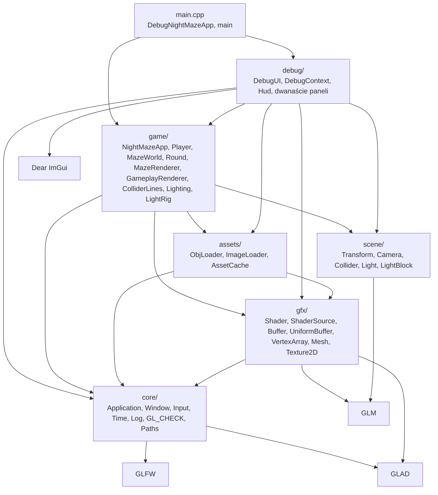
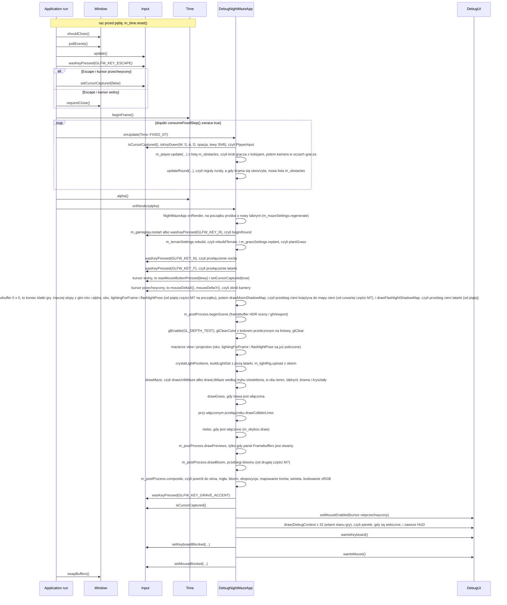

# Moduł core: fundament programu

Kamień milowy: M0, uzupełniany w M1 (mysz, ścieżki do assetów, pierwszy użytkownik stałego kroku i myszy: kamera) w M2 + M3 (klasa `NightMazeApp` rysuje labirynt i prowadzi gracza) w M4 (klasa `NightMazeApp` buduje co klatkę światła, wybiera program labiryntu według trybu oświetlenia i ustawia przełącznik mapowania normalnych `uNormalMapEnabled`) i w M5 (klasa `NightMazeApp` prowadzi rundę: w stałym kroku woła `updateRound`, co klatkę obsługuje klawisz R, rysuje kryształy i bramę, a kostka z M1 i znaczniki świateł z M4 zniknęły) i w M6 (niebo jako ostatnia część klatki, a w drugiej części M6 teren z mapy wysokości i trawa: klasa `NightMazeApp` wczytuje mapę wysokości, buduje labirynt na terenie, obsługuje prośby o nową skalę wysokości i nową gęstość trawy i rysuje teren oraz trawę szóstym programem) i w pierwszej części M7 (klasa `NightMazeApp` rysuje scenę do framebuffera HDR przez `game::PostProcess`, a ostatni krok klatki, przebieg składający, przenosi obraz do okna z ekspozycją, mapowaniem tonów i kodowaniem sRGB. Doszły dwa programy shaderów, siódmy i ósmy) i w drugiej części M7 (bloom: `onRender` woła przed przebiegiem składającym `PostProcess::drawBloom`, doszły dziewiąty i dziesiąty program, `bright` i `blur`) i w trzeciej części M7 (mgła i winieta: `onRender` buduje strukturę `SceneView` z odwrotnością `projection * view` i pozycją oka i podaje ją przebiegowi składającemu jako czwarty argument, bez nowego programu). Temat wykładu: 1 (Pierwszy program OpenGL).
Kod: [`src/core/`](../../../src/core/), [`src/game/NightMazeApp.hpp`](../../../src/game/NightMazeApp.hpp), [`src/game/NightMazeApp.cpp`](../../../src/game/NightMazeApp.cpp), [`src/main.cpp`](../../../src/main.cpp).

Zanim narysuję cokolwiek w OpenGL, muszę mieć trzy rzeczy: okno systemowe, kontekst OpenGL (context) związany z tym oknem oraz pętlę, która co klatkę odbiera zdarzenia, przesuwa symulację i rysuje obraz. Moduł `core` dostarcza dokładnie to i nic więcej: klasę `Window` (okno GLFW z kontekstem OpenGL 4.1 Core i funkcjami załadowanymi przez GLAD), klasę `Application` (pętla główna ze stałym krokiem symulacji), `Input` (stan klawiatury i myszy), `Time` (zegar klatki), `Log` (komunikaty na konsolę), makro `GL_CHECK` (wykrywanie błędów OpenGL w buildzie Debug) i funkcje `executableDir`, `assetPath` oraz `pathText` z `Paths` (ścieżki do plików z `assets/`, liczone od położenia programu, i zamiana ścieżki na tekst). To jest realizacja tematu 1 wykładu, "Pierwszy program OpenGL": po M0 program otwiera okno, czyści je ciemnym granatem i pokazuje FPS. Wszystkie późniejsze moduły (`gfx`, `renderer`, `scene`, `game`) stoją na tej warstwie, a ona sama nie wie o żadnym z nich.

Moduł jest opisany w pięciu dokumentach tematycznych. Ten plik jest ich wspólnym wstępem: pokazuje, jak części pasują do siebie, opisuje klatkę jako całość i to, jak program dziedziczy po `core::Application`. Jest też dokumentem klasy `game::NightMazeApp` (na niego wskazuje komentarz na górze `NightMazeApp.hpp` i `NightMazeApp.cpp`): sekcja 6 przechodzi przez tę klasę linia po linii, a sekcja 7 tłumaczy kolejność jej pól.

## 1. Dokumenty modułu

| Dokument | Co opisuje | Klasy i pliki |
|---|---|---|
| [`window-context.md`](window-context.md) | okno, inicjalizacja GLFW, hinty kontekstu, ładowanie GLAD, vsync, rozmiar okna a rozmiar framebuffera, logowanie | `Window`, `Log` |
| [`main-loop.md`](main-loop.md) | pętla główna, zegar klatki, stały krok czasowy z akumulatorem, ograniczenie 0,25 s, `alpha`, uśredniony FPS | `Application`, `Time` |
| [`input.md`](input.md) | klawiatura i mysz: odpytywanie, stan ciągły i zbocze, `KEY_COUNT`, przesunięcie myszy, przechwycenie kursora, blokada klawiatury i myszy na czas pracy z panelem | `Input` |
| [`gl-check.md`](gl-check.md) | makro `GL_CHECK`, model błędów `glGetError`, różnica Debug i Release | `GlCheck` |
| [`paths.md`](paths.md) | ścieżki do assetów: katalog roboczy a katalog programu, `_NSGetExecutablePath` i `GetModuleFileNameW`, `std::filesystem::path`, znaki szerokie na Windowsie | `Paths` |

Każdy z pięciu dokumentów jest samodzielną jednostką nauki i ma te same dziesięć sekcji: Po co to jest, Teoria, Jak to działa w OpenGL, Shadery, Kod w projekcie, Panel ImGui, Pułapki, Ćwiczenia, Pytania kontrolne, Źródła.

Proponowana kolejność czytania: ten plik, potem `window-context.md`, `main-loop.md`, `input.md`, `gl-check.md`, `paths.md`.

## 2. Indeks: plik kodu, dokument

| Plik kodu | Co zawiera | Dokument |
|---|---|---|
| [`src/core/Window.hpp`](../../../src/core/Window.hpp), [`.cpp`](../../../src/core/Window.cpp) | RAII na okno GLFW i kontekst OpenGL 4.1 Core, ładowanie GLAD | [`window-context.md`](window-context.md) |
| [`src/core/Log.hpp`](../../../src/core/Log.hpp), [`.cpp`](../../../src/core/Log.cpp) | `logInfo`, `logWarn`, `logError` | [`window-context.md`](window-context.md), sekcja 5.5 |
| [`src/core/Application.hpp`](../../../src/core/Application.hpp), [`.cpp`](../../../src/core/Application.cpp) | klasa bazowa programu: posiada `Window`, `Input`, `Time`, prowadzi pętlę | [`main-loop.md`](main-loop.md), dziedziczenie w tym pliku (sekcja 6) |
| [`src/core/Time.hpp`](../../../src/core/Time.hpp), [`.cpp`](../../../src/core/Time.cpp) | czas klatki, akumulator stałego kroku, uśredniony FPS | [`main-loop.md`](main-loop.md) |
| [`src/core/Input.hpp`](../../../src/core/Input.hpp), [`.cpp`](../../../src/core/Input.cpp) | migawka stanu klawiatury i myszy: `isKeyDown`, `wasKeyPressed`, `setKeyboardBlocked`, `isMouseButtonDown`, `wasMouseButtonPressed`, `mouseDeltaX`, `mouseDeltaY`, `cursorPosition` (od M8, części 2), `setMouseBlocked`, `setCursorCaptured` | [`input.md`](input.md) |
| [`src/core/GlCheck.hpp`](../../../src/core/GlCheck.hpp), [`.cpp`](../../../src/core/GlCheck.cpp) | makro `GL_CHECK` i funkcja `checkGlErrors` | [`gl-check.md`](gl-check.md) |
| [`src/core/Paths.hpp`](../../../src/core/Paths.hpp), [`.cpp`](../../../src/core/Paths.cpp) | `executableDir` i `assetPath`: ścieżki do plików z `assets/` względem pliku wykonywalnego. Jedyny kod w `src/` z gałęziami `#if` dla macOS i Windows. Woła je konstruktor `NightMazeApp` przy wczytywaniu dwudziestu plików shaderów (pięć par, trzy pliki programu trawy, pięć plików czterech programów przebiegów po scenie i, od czwartej części M7, dwa pliki programu głębi mapy cieni) i, przez funkcję `loadHeightmap`, mapy wysokości terenu, konstruktor `game::MazeRenderer` przy wczytywaniu dwóch modeli labiryntu (ściana i słupek), konstruktor `game::GameplayRenderer` przy wczytywaniu trzech modeli rundy (dwa kryształy i brama), konstruktor `game::TerrainRenderer` przy wczytywaniu dwóch tekstur gruntu i konstruktor `game::Skybox` przy wczytywaniu sześciu obrazów nieba. `pathText`: ścieżka jako tekst UTF-8, dla `gfx::Shader`, `assets::AssetCache` i paneli "Shaders" oraz "Assets" | [`paths.md`](paths.md) |
| [`src/game/NightMazeApp.hpp`](../../../src/game/NightMazeApp.hpp), [`.cpp`](../../../src/game/NightMazeApp.cpp) | gra: dziedziczy po `core::Application`. Posiada czternaście programów shaderów (od M8, części 1, także `reflect`; od pierwszej części M7 także `composite` i `preview`, od drugiej `bright` i `blur`, od czwartej `shadow_depth`, od szóstej `minimap` i `minimap_overlay`; piąta część liczby nie zmieniła), od szóstej części M7 także `MinimapRenderer` z ustawieniami `MinimapSettings` (mapa labiryntu w rogu okna, klawisz M), pamięć assetów (`assets::AssetCache`), `MazeRenderer`, `GameplayRenderer`, od M6 `TerrainRenderer` i `GrassRenderer`, `ColliderLines`, `LightRig`, od M6 niebo (`Skybox` z ustawieniami `SkyboxSettings`), od M7 `PostProcess` z ustawieniami `PostProcessSettings` (framebuffer HDR sceny i przebiegi po scenie), od czwartej części M7 mapę cieni księżyca (`ShadowMap` z ustawieniami `ShadowSettings` i przestrzenią światła `scene::LightSpace`), od piątej części M7 drugą taką trójkę dla latarki (`m_flashlightShadowMap`, `m_flashlightShadow`, `m_flashlightLightSpace`), mapę wysokości i ustawienia terenu (`Heightmap`, `TerrainSettings`), ustawienia trawy (`GrassSettings`), labirynt (`MazeSettings`, `MazeWorld`, od M6 razem z terenem, na którym stoi), liczby reguł i stan rundy (`GameplaySettings`, `Round`), listę przeszkód rundy, gracza (`Player`), kamerę (`scene::Camera`) i ustawienia oświetlenia (`LightingSettings`). W stałym kroku przesuwa gracza i woła reguły rundy (`updateRound`), co klatkę obsługuje prośbę o nowy labirynt, prośbę o nową rundę i klawisz R, prośby o nową skalę wysokości terenu i nową gęstość trawy, klawisze N i F oraz mysz, od czwartej części M7 rysuje najpierw mapę cieni księżyca (`drawMoonShadowMap`), potem wiąże framebuffer sceny (`beginScene`, razem z viewportem), włącza test głębi, czyści ten framebuffer, buduje i wysyła światła i rysuje teren i labirynt razem z kryształami i bramą (z oświetleniem albo bez), trawę, na życzenie linie pudełek i kul kolizji, potem niebo ([`../renderer/skybox.md`](../renderer/skybox.md)), a na końcu przenosi obraz do okna przebiegiem składającym ([`../renderer/post-process.md`](../renderer/post-process.md)) | ten plik (sekcje 6 i 7), reguły rundy, kryształy, brama i HUD w [`../game/gameplay.md`](../game/gameplay.md), ruch gracza w [`../game/player.md`](../game/player.md), labirynt w świecie i jego rysowanie w [`../game/maze-rendering.md`](../game/maze-rendering.md), obrót myszą w [`../scene/camera-controls.md`](../scene/camera-controls.md), linie pudełek w [`../scene/collision.md`](../scene/collision.md), czyszczenie w [`window-context.md`](window-context.md), sekcja 3.2, macierze w [`../scene/camera.md`](../scene/camera.md), sekcja 5.7, latarka, klawisz F i zestaw świateł w [`../game/flashlight.md`](../game/flashlight.md), rodzaje świateł w [`../scene/lights.md`](../scene/lights.md), cztery tryby oświetlenia w [`../renderer/lighting-gouraud-phong.md`](../renderer/lighting-gouraud-phong.md), bufor świateł w [`../gfx/uniform-buffers.md`](../gfx/uniform-buffers.md), cienie księżyca w [`../renderer/shadows.md`](../renderer/shadows.md) |
| [`src/main.cpp`](../../../src/main.cpp) | klasa `DebugNightMazeApp` (gra plus nakładka debug i HUD) i `main`: tworzy aplikację, woła `run()`, łapie wyjątki | ten plik (sekcje 5 i 6), nakładka w [`../debug-ui.md`](../debug-ui.md) |

W [`CMakeLists.txt`](../../../CMakeLists.txt) pliki `src/core/*` tworzą, razem z `src/assets/*`, `src/gfx/*` i `src/scene/*`, bibliotekę statyczną `engine`. Część `game/`, która nie potrzebuje okna (`Bloom`, `Crystals`, `Exit`, `Fog`, `Grass`, `Lighting`, `Maze`, `MazeGenerator`, `MazeLayout`, `MazeWorld`, `Player`, `Round`, `Shadows`, `Terrain`, `Vignette`), tworzy bibliotekę `game_logic`, żeby mogły ją linkować także testy. Program `night_maze` to `main.cpp`, `debug/` i reszta `game/` (`NightMazeApp`, `MazeRenderer`, `GameplayRenderer`, `TerrainRenderer`, `GrassRenderer`, `ModelDraw`, `ColliderLines`, `LightRig`, `Skybox`, `PostProcess`, od czwartej części M7 `ShadowMap`, `ShaderUniforms.hpp`): linkuje obie biblioteki i ImGui. `engine` ma publiczne definicje `GLFW_INCLUDE_NONE` (GLFW nie dołącza systemowego nagłówka OpenGL, robi to GLAD) i `GL_SILENCE_DEPRECATION` (macOS oznacza cały OpenGL jako przestarzały i bez tej definicji zasypuje build ostrzeżeniami).

## 3. Warstwy

Architektura projektu (PRD, sekcja 6) ma warstwy z zależnościami w jedną stronę. Strzałka znaczy "zna i dołącza nagłówki":



Sześć rzeczy do zapamiętania:

1. `core/` nie zna ani `gfx/`, ani `game/`, ani `debug/`, ani ImGui. Biblioteka `engine` linkuje tylko `glad`, `glfw` i nagłówki GLM (`glm::glm-header-only`). Samo `core/` z GLM nie korzysta: dołączają je warstwy `scene/` i `gfx/`.
2. `game/` zna `core/`, `gfx/` i `scene/`, ale nie zna `debug/`.
3. `debug/` może zależeć od wszystkiego, ale nic nie może zależeć od `debug/`. Panele dołączają nagłówki z `game/` (na przykład `game/Player.hpp` w panelu "Camera" i `game/MazeWorld.hpp` w panelu "Maze"), bo pokazują i edytują stan gry. Tak samo HUD (`debug/Hud.cpp`) dołącza `game/Round.hpp`: należy do gry, ale leży w `debug/`, bo tylko tam wolno dołączać ImGui. W drugą stronę zależności nie ma: żaden plik w `game/` nie dołącza niczego z `debug/`. Jedynym plikiem, który tworzy obiekty obu warstw i łączy je ze sobą, jest `main.cpp`.
4. `gfx/` (opakowania obiektów OpenGL: klasy `Shader`, `Buffer`, `UniformBuffer`, `VertexArray`, `Mesh` i `Texture2D`, a do tego funkcje `ShaderSource` rozwijające `#include` w plikach shaderów) zna tylko `core/`, GLAD i GLM (typy w setterach `Shader`). Używa go `game/` (rysowanie), `assets/` (pamięć assetów tworzy siatki i tekstury) i `debug/` (panel "Shaders" woła `Shader::reload()`, panel "Assets" pokazuje tekstury). Opis warstwy: [`../gfx/README.md`](../gfx/README.md).
5. `scene/` (struktury `Transform` i `Camera`: macierze modelu, widoku i rzutowania) to sama matematyka na GLM. Może zależeć od `core/` i `gfx/`, dziś dołącza tylko GLM. Do `scene/` należą też pudełka kolizji (`Aabb`, `moveAndSlide`), od M5 kule (`Sphere` i dwa testy `overlaps`), a od M4 światła jako zwykłe dane (`Light.hpp`: trzy rodzaje świateł i `LightSet`) oraz ich układ bajtów dla karty (`LightBlock.hpp`), nadal tylko na GLM. Używa go `game/`: `NightMazeApp` ma kamerę, obraca ją myszą i co klatkę wysyła macierze do shaderów, `Player` przesuwa się przez `moveAndSlide`, `MazeWorld` i `GameplayRenderer` liczą macierze modelu przez `Transform`, `updateRound` sprawdza zebranie kryształu i wejście do wyjścia testami `overlaps`, a `buildLightSet` składa `scene::LightSet`. Używa go też `debug/`: panel "Camera" edytuje pola kamery, a panel "Lights" czyta stałą `scene::MAX_POINT_LIGHTS`. Opis warstwy: [`../scene/README.md`](../scene/README.md).
6. `assets/` (loadery plików i `AssetCache`) zna `core/` (logowanie, ścieżki) i `gfx/` (siatka i tekstura na karcie). Same loadery zwracają dane bez OpenGL, a `AssetCache` robi z nich obiekty `gfx`. Opis warstwy: [`../assets/README.md`](../assets/README.md).

Ta reguła tłumaczy dwie decyzje opisane niżej: dlaczego nakładka debug jest podpinana w `main.cpp` (sekcja 6) i dlaczego `core::Input` dostaje od `main.cpp` neutralne flagi "klawiatura zablokowana" i "mysz zablokowana", zamiast samemu pytać ImGui ([`input.md`](input.md), sekcje 5.6 i 5.10).

## 4. Klatka jako całość

Jeden obrót pętli głównej w działającym programie, czyli w obiekcie klasy `DebugNightMazeApp`. Szczegóły każdego kroku są w dokumentach tematycznych, tutaj chodzi o kolejność:



| Krok | Kod | Dokument |
|---|---|---|
| Start zegara, raz przed pętlą (nie należy do obrotu) | `m_time.reset()` | [`main-loop.md`](main-loop.md), sekcja 5.4 |
| Zdarzenia systemu | `m_window.pollEvents()` | [`window-context.md`](window-context.md) |
| Migawka klawiatury i myszy, Escape (zwalnia przechwycony kursor albo zamyka program) | `m_input.update()`, `wasKeyPressed(GLFW_KEY_ESCAPE)`, `isCursorCaptured()` | [`input.md`](input.md), sekcja 5.7 |
| Pomiar czasu, kroki symulacji | `m_time.beginFrame()`, `consumeFixedStep()`, `onUpdate` | [`main-loop.md`](main-loop.md) |
| Symulacja: krok gracza | `NightMazeApp::onUpdate`: zapamiętanie poprzedniej pozycji gracza, przy przechwyconym kursorze `isKeyDown` dla sześciu klawiszy wpisane do `PlayerInput`, `m_player.update(...)` z listą `m_obstacles` i, od M6, z terenem `m_mazeWorld.terrain` (wysokość stóp), potem kamera w oczach gracza | sekcja 6.5, [`../game/player.md`](../game/player.md), sekcja 5 |
| Symulacja: krok rundy | `NightMazeApp::onUpdate`: `updateRound(...)` z pozycją gracza po ruchu, z przełącznikiem latarki przez referencję i z `fixedDt`, a gdy `gateBlocks` zmieniło wynik, nowa lista `m_obstacles` z `roundObstacles` | sekcja 6.5, [`../game/gameplay.md`](../game/gameplay.md) |
| Nowy labirynt, jeśli panel o niego poprosił | początek `NightMazeApp::onRender`: `m_mazeSettings.regenerate`, `regenerateMaze()` | sekcje 6.4 i 6.6, [`../game/maze-rendering.md`](../game/maze-rendering.md), sekcja 5 |
| Nowa runda na tym samym labiryncie | `m_gameplay.restart` (przycisk `Restart round (key R)` panelu "Gameplay") albo `wasKeyPressed(RESTART_KEY)`: `beginRound()` | sekcje 6.4 i 6.6, [`../game/gameplay.md`](../game/gameplay.md) |
| Nowa skala wysokości terenu albo nowa gęstość trawy, jeśli panel o nie poprosił (M6) | `m_terrainSettings.rebuild`: `rebuildTerrain()`. `m_grassSettings.replant`: `plantGrass()` | sekcje 6.4 i 6.6, [`../renderer/terrain.md`](../renderer/terrain.md), [`../renderer/grass-geometry.md`](../renderer/grass-geometry.md) |
| Klawisz N | `wasKeyPressed(NOCLIP_KEY)` przełącza `m_player.noclip` | sekcja 6.6, [`../game/player.md`](../game/player.md), sekcja 5 |
| Klawisz F | `wasKeyPressed(FLASHLIGHT_KEY)` przełącza `m_lighting.flashlightOn` | sekcja 6.6, [`../game/flashlight.md`](../game/flashlight.md) |
| Klawisz F2 (M9, część 1) | `wasKeyPressed(MENU_CAMERA_KEY)` w `updateMenuCameraSwitch` przełącza `m_menuCamera.enabled`: gra pokazuje samą siebie | [`../game/menu-camera.md`](../game/menu-camera.md), sekcja 5.4 |
| Mysz kamery | kliknięcie w scenę przechwytuje kursor, przy przechwyconym kursorze przesunięcie myszy obraca kamerę | [`input.md`](input.md), sekcja 5.9, [`../scene/camera-controls.md`](../scene/camera-controls.md), sekcja 5 |
| Rysowanie gry: cel, stan i tło | `NightMazeApp::onRender`: strażnik rozmiaru 0 x 0, od czwartej części M7 przebieg cieni księżyca (wiersz niżej), potem `m_postProcess.beginScene(framebuffer)` (wiąże framebuffer HDR sceny i ustawia `glViewport`), `glEnable(GL_DEPTH_TEST)`, `glClearColor` z kolorem przeliczonym z sRGB na liniowy, `glClear` (kolor i głębia) w `GL_CHECK` | [`window-context.md`](window-context.md), [`gl-check.md`](gl-check.md), [`../gfx/framebuffers.md`](../gfx/framebuffers.md), [`../renderer/post-process.md`](../renderer/post-process.md) |
| Rysowanie gry: mapa cieni latarki (piąta część M7) | `drawFlashlightShadowMap(frameLighting, flashlight)`, zaraz po przebiegu księżyca: liczy `m_flashlightLightSpace` (`scene::spotLightSpace` z pozycji i kierunku ręki, zewnętrznego kąta stożka i zasięgu latarki), a gdy cienie latarki są włączone, latarka świeci w tej klatce i program `shadow_depth` jest poprawny, rysuje te same obiekty co przebieg księżyca (`drawShadowCasters`), wiąże mapę w jednostce 4 (`FLASHLIGHT_SHADOW_TEXTURE_UNIT`) i, tylko gdy pokazana jest zakładka `Flashlight` panelu Shadows, rysuje podgląd | [`../renderer/shadows.md`](../renderer/shadows.md), sekcja 2.20 |
| Rysowanie gry: mapa cieni księżyca (czwarta część M7) | `drawMoonShadowMap()`, wołane między strażnikiem rozmiaru a `beginScene`: liczy `m_moonLightSpace` (`scene::directionalLightSpace` z pudełka `shadowCasterBounds(m_mazeWorld.terrain)` i kierunku `moonDirection(m_lighting)`), a przy włączonych cieniach rysuje teren, labirynt, bramę i kryształy programem `shadow_depth` do tekstury głębi (`drawShadowCasters`), wiąże ją w jednostce teksturującej 3 (`MOON_SHADOW_TEXTURE_UNIT`) i, tylko gdy panel Shadows jest otwarty, rysuje jej podgląd | sekcja 6.6, [`../renderer/shadows.md`](../renderer/shadows.md), sekcja 2.18 |
| Rysowanie gry: oko, poza latarki, macierze, światła | od piątej części M7 pierwsze trzy rzeczy stoją na początku `onRender`, przed przebiegami cieni: pozycja stóp z `glm::mix` i `alpha`, oko o `Player::EYE_HEIGHT` wyżej, `lightingForFrame(...)` (kopia ustawień z baterią i pulsowaniem) i `flashlightPose(frameLighting, eye, m_camera.forward(), m_camera.right())` (latarka w ręce, jedna poza dla światła i dla jego mapy cieni). Dalej macierze `view` i `projection` liczone raz, `crystalLightPositions(m_round)`, `buildLightSet(frameLighting, flashlight, crystalLights)` i `m_lightRig.upload(lights, eye)`: światła klatki trafiają do bufora uniformów, w każdym trybie oświetlenia. Upload dostaje nadal oko, nie rękę: połysk jest liczony dla miejsca, z którego robiony jest obraz | sekcja 6.6, [`../scene/camera.md`](../scene/camera.md), sekcja 5.7, [`../game/flashlight.md`](../game/flashlight.md), [`../gfx/uniform-buffers.md`](../gfx/uniform-buffers.md) |
| Rysowanie gry: scena | `drawMaze` (wybiera `drawUnlitMaze` albo `drawLitMaze`, a każda z nich rysuje teren przez `m_terrainRenderer`, labirynt przez `m_mazeRenderer` i zaraz po nim bramę i kryształy przez `m_gameplayRenderer`), `drawGrass` (trawa, gdy jest włączona), gdy `m_drawColliders` jest prawdą, `drawColliderLines`, a po nich, gdy niebo jest włączone, `m_skybox.draw`. Każda część jest pomijana, gdy jej program shaderów nie jest poprawny. Wszystko to trafia do framebuffera sceny, nie do okna | sekcje 6.6 i 6.7, [`../renderer/lighting-gouraud-phong.md`](../renderer/lighting-gouraud-phong.md), [`../renderer/terrain.md`](../renderer/terrain.md), [`../renderer/grass-geometry.md`](../renderer/grass-geometry.md), [`../renderer/skybox.md`](../renderer/skybox.md) |
| Rysowanie gry: po scenie (M7) | `m_postProcess.drawPreviews(...)` tylko przy `m_postProcessSettings.previews` (panel Framebuffers jest otwarty), potem, od drugiej części M7, `m_postProcess.drawBloom(m_brightPassShader, m_blurShader, m_previewShader, compositeSettings)` (przebieg jasności i rozmycie w trzech celach o połowie rozmiaru sceny), potem, od trzeciej części M7, budowa `SceneView` (odwrotność `projection * view` i pozycja oka, potrzebne mgle), potem `m_postProcess.composite(m_compositeShader, compositeSettings, framebuffer, sceneView)`: framebuffer okna staje się znowu celem, a jeden trójkąt na cały ekran przenosi obraz sceny z mgłą (od trzeciej części M7), poświatą bloomu, ekspozycją, mapowaniem tonów, winietą (od trzeciej części M7) i kodowaniem sRGB | sekcja 6.6, [`../renderer/post-process.md`](../renderer/post-process.md) |
| Przełącznik paneli, mysz dla ImGui, panele i HUD | `wasKeyPressed(GLFW_KEY_GRAVE_ACCENT)`, `m_debugUI.setMouseEnabled(!input().isCursorCaptured())`, `m_debugUI.draw(...)`: panele tylko wtedy, gdy są widoczne, HUD (`debug::drawHud`) w każdej klatce | [`../debug-ui.md`](../debug-ui.md), sekcja 5.6 |
| Blokada klawiatury na następną klatkę | `input().setKeyboardBlocked(m_debugUI.wantsKeyboard())` | [`input.md`](input.md), sekcja 5.6 |
| Blokada myszy na następną klatkę | `input().setMouseBlocked(m_debugUI.wantsMouse())` | [`input.md`](input.md), sekcja 5.10 |
| Zamiana buforów | `m_window.swapBuffers()` | [`window-context.md`](window-context.md) |

## 5. Od `main` do pierwszej klatki

> Uwaga (2026-10-06, M9 część 1): `main` ma dziś sygnaturę `int main(int argc, char** argv)`, czyta przełączniki (`game::parseStartOptions`) przed otwarciem okna i przekazuje wynik do `DebugNightMazeApp app(start.options)`. Opis: [`menu-camera.md`](../game/menu-camera.md), sekcje 2.9 i 5.6.

```cpp
int main() {
    try {
        DebugNightMazeApp app;
        app.run();
    } catch (const std::exception& error) {
        // Startup failures (no window, no OpenGL 4.1) arrive here as exceptions.
        core::logError(std::string("Fatal: ") + error.what());
        return EXIT_FAILURE;
    }
    return EXIT_SUCCESS;
}
```

`app` jest zwykłą zmienną lokalną wewnątrz bloku `try`. Konstruktor może rzucić `std::runtime_error` (brak GLFW, brak kontekstu 4.1, nieudany GLAD) i wtedy `catch` wypisuje powód oraz zwraca kod błędu. Przy normalnym wyjściu z `run()` destruktor `app` uruchamia się na końcu bloku `try` i sprząta ImGui, okno oraz GLFW. Nie ma tu ani jednego `new`, ani jednej zmiennej globalnej. Czym jest `DebugNightMazeApp`, wyjaśnia następna sekcja.

## 6. Jak program dziedziczy po `core::Application`

### 6.1 Dwa haki klasy bazowej

`Application` implementuje wzorzec **metody szablonowej** (template method): klasa bazowa ustala niezmienny szkielet klatki w `run()`, a klasa pochodna wypełnia dwa "haki":

> Uwaga (2026-10-06, M9 część 1): fragment `onUpdate` poniżej pochodzi sprzed kamery menu. Dziś, gdy tryb menu jest włączony, `onUpdate` po zapamiętaniu poprzedniej pozycji gracza dodaje krok do `m_round.animationSeconds` i **wraca**: gracz, `updateRound` i bateria stoją. Opis: [`menu-camera.md`](../game/menu-camera.md), sekcja 2.10.

```cpp
virtual void onUpdate(double fixedDt) = 0;
virtual void onRender(double alpha) = 0;
```

`= 0` oznacza funkcję czysto wirtualną: `Application` jest klasą abstrakcyjną i nie da się utworzyć jej obiektu. `NightMazeApp` nadpisuje obie funkcje (słowo `override` każe kompilatorowi sprawdzić, że sygnatura naprawdę zgadza się z bazową). Dostęp do okna, wejścia i zegara klasa pochodna ma przez chronione akcesory `window()`, `input()`, `time()`, a same pola są prywatne, więc pochodna nie może ich podmienić ani zniszczyć. `window()` i `input()` zwracają zwykłe referencje, a `time()` referencję `const`: klasa pochodna może zegar czytać, ale nie może wołać `reset()`, `beginFrame()` ani `consumeFixedStep()`, bo zegar ustawia i przesuwa wyłącznie `run()`.

### 6.2 Klasa `NightMazeApp`: co posiada i co udostępnia

```cpp
/// The game itself: a generated maze of textured walls and pillars at night, standing
/// on gently uneven ground that rises into hills around it (a heightmap terrain), and
/// a player who walks through it in first person without passing through the walls.
/// The mouse turns the camera, the keyboard moves the player. The maze is lit by the
/// moon, by the flashlight of the player and by the glowing crystals. Grass grows along
/// the walls, and above them is the night sky, a skybox.
///
/// The moon casts shadows. Before the scene, everything that casts one is drawn from
/// the direction of the moon into a depth texture (game::ShadowMap), and the lit
/// programs look every fragment up in it.
///
/// The scene is not drawn into the window directly. It is drawn into an HDR framebuffer
/// (game::PostProcess). Its bright parts are blurred into a glow (bloom), and a last
/// pass brings the picture to the window with fog near the ground, that glow, exposure,
/// tone mapping, a vignette and gamma correction.
///
/// A round: the player collects crystals, each one charges the battery of the
/// flashlight, and when enough of them are collected the gate of the exit opens.
/// Walking through it wins the round. The rules are in game/Round.hpp, this class feeds
/// them the position of the player and draws their state.
///
/// It knows nothing about the debug UI: main.cpp derives from this class and draws the
/// debug panels and the HUD on top of the frame.
class NightMazeApp : public core::Application {
```

Pierwszy akapit komentarza zmienił się w M6: płytek podłogi już nie ma, labirynt stoi na łagodnie nierównym terenie z mapy wysokości, który wokół niego przechodzi we wzgórza, wzdłuż ścian rośnie trawa, a nad nimi jest niebo. Akapit o framebufferze HDR doszedł w pierwszej części M7: scena nie jest rysowana prosto do okna, tylko do framebuffera HDR, a ostatni przebieg przenosi ten obraz do okna z ekspozycją, mapowaniem tonów i korekcją gamma. Druga i trzecia część dopisały do niego bloom, mgłę i winietę ([`../renderer/post-process.md`](../renderer/post-process.md)). Akapit przed nim, o cieniach, doszedł w czwartej części M7 (cienie księżyca, 2026-10-05): przed sceną wszystko, co rzuca cień, jest rysowane z kierunku księżyca do tekstury głębi (`game::ShadowMap`), a programy z oświetleniem sprawdzają w niej każdy fragment ([`../renderer/shadows.md`](../renderer/shadows.md)).

Klasa jest miejscem, w którym spotykają się wszystkie warstwy: shadery, siatki i bufor uniformów z `gfx/`, modele i tekstury z `assets/`, kamera, kolizje i światła z `scene/`, labirynt, gracz, runda i ustawienia oświetlenia z `game/`. Sama zawiera mało logiki. Jej zadaniem jest **kolejność**: co powstaje po czym (sekcje 6.3 i 7), co dzieje się w stałym kroku (sekcja 6.5), a co raz na klatkę (sekcje 6.6 i 6.7). Trzeci akapit komentarza mówi to samo o rundzie: reguły są w `game/Round.hpp` (zwykłe funkcje bez OpenGL, z testami), a ta klasa tylko podaje im pozycję gracza i rysuje ich stan. Same reguły opisuje [`../game/gameplay.md`](../game/gameplay.md), sekcja 2.

Do M4 klasa trzymała też kostkę z M1 (własny VAO, dwa bufory, program `basic`) i rysowała ją nad narożną komórką jako znacznik przyszłego wyjścia. W M5 kostka zniknęła razem z programem `basic`: wyjście ma teraz bramę, a ręcznie pisane dane wierzchołków zostały w projekcie tylko w [`src/game/ColliderLines.cpp`](../../../src/game/ColliderLines.cpp).

Stan gry jest prywatny. Klasa pochodna (`DebugNightMazeApp` z `main.cpp`) dostaje go przez dwadzieścia sześć chronionych akcesorów (cztery doszły w pierwszej części M7), tu pogrupowanych według tego, co udostępniają. Każdy poza jednym zwraca referencję do jednego pola, więc panel edytuje oryginał, a nie kopię. Wyjątkiem jest `grassTuftCount()`, który zwraca liczbę:

| Akcesor | Typ wyniku | Pole | Kto z niego korzysta |
|---|---|---|---|
| `clearColor()` | `std::array<float, 3>&` | `m_clearColor` (wartość sRGB, `onRender` przelicza ją na liniową) | panel "Renderer" |
| `texturedShader()` | `gfx::Shader&` | `m_texturedShader` (program sceny bez oświetlenia i widoków do szukania błędów, `textured.*`) | panel "Shaders" |
| `colorShader()` | `gfx::Shader&` | `m_colorShader` (program linii pudełek i kul kolizji, `color.*`) | panel "Shaders" |
| `litShader()` | `gfx::Shader&` | `m_litShader` (program sceny z oświetleniem liczonym dla fragmentu: tryby Phong i Blinn-Phong, `lit.*`) | panel "Shaders" |
| `gouraudShader()` | `gfx::Shader&` | `m_gouraudShader` (program sceny z oświetleniem liczonym dla wierzchołka: tryb Gouraud, `gouraud.*`) | panel "Shaders" |
| `skyboxShader()` | `gfx::Shader&` | `m_skyboxShader` (program nieba, `skybox.*`) | panel "Shaders" |
| `grassShader()` | `gfx::Shader&` | `m_grassShader` (program trawy z shaderem geometrii: `grass.vert`, `grass.geom`, `grass.frag`) | panel "Shaders" |
| `compositeShader()` | `gfx::Shader&` | `m_compositeShader` (program przebiegu składającego: `post/composite.vert` i `post/composite.frag`) | panel "Shaders" |
| `previewShader()` | `gfx::Shader&` | `m_previewShader` (program podglądów załączników: `post/composite.vert` i `post/preview.frag`) | panel "Shaders" |
| `brightPassShader()` (druga część M7) | `gfx::Shader&` | `m_brightPassShader` (przebieg jasności bloomu: `post/composite.vert` i `post/bright.frag`) | panel "Shaders" |
| `blurShader()` (druga część M7) | `gfx::Shader&` | `m_blurShader` (rozmycie bloomu: `post/composite.vert` i `post/blur.frag`) | panel "Shaders" |
| `shadowDepthShader()` (czwarta część M7) | `gfx::Shader&` | `m_shadowDepthShader` (program przebiegu głębi map cieni: `shadow_depth.vert` i `shadow_depth.frag`) | panel "Shaders" |
| `moonShadowSettings()` (czwarta część M7) | `ShadowSettings&` | `m_moonShadow` (włącznik cieni księżyca, rozdzielczość mapy, dwie części biasu, filtr sprzętowy, PCF i jego promień, siła cienia, przełącznik podglądu) | panel "Shadows", a pole `preview` zeruje co klatkę `DebugUI::draw` |
| `moonShadowMap()` (czwarta część M7) | `const ShadowMap&` | `m_moonShadowMap` (framebuffer mapy cieni i framebuffer jej podglądu, tylko do odczytu) | panel "Shadows" |
| `moonLightSpace()` (czwarta część M7) | `const scene::LightSpace&` | `m_moonLightSpace` (macierz widoku i rzutowania księżyca z tej klatki oraz rozmiar jego pudełka w metrach, tylko do odczytu) | panel "Shadows" |
| `postProcessSettings()` | `PostProcessSettings&` | `m_postProcessSettings` (ekspozycja, krzywa mapowania tonów, przełącznik podglądów, zakres podglądu głębi, od drugiej części M7 ustawienia bloomu w polu `bloom`, a od trzeciej ustawienia mgły i winiety w polach `fog` i `vignette`) | panel "Framebuffers", a pole `previews` zeruje co klatkę `DebugUI::draw` |
| `postProcess()` | `const PostProcess&` | `m_postProcess` (framebuffer sceny, od drugiej części M7 trzy cele bloomu, i cztery framebuffery podglądów, tylko do odczytu) | panel "Framebuffers" |
| `terrainSettings()` | `TerrainSettings&` | `m_terrainSettings` (skala wysokości, przełącznik `wireframe` i flaga `rebuild`) | panel "Terrain" |
| `grassSettings()` | `GrassSettings&` | `m_grassSettings` (włącznik, gęstość, wysokość źdźbeł, siła wiatru i flaga `replant`) | panel "Grass" |
| `grassTuftCount()` | `std::size_t` (wartość) | żadne: wynik `m_grassRenderer.tuftCount()` | panel "Grass" (wypisuje liczbę kępek) |
| `skyboxSettings()` | `SkyboxSettings&` | `m_skyboxSettings` (włącznik i jasność nieba) | panel "Renderer" |
| `lighting()` | `LightingSettings&` | `m_lighting` (tryb oświetlenia i ustawienia wszystkich świateł) | panele "Lights" i "Renderer" (lista `Lighting` zmienia pole `mode`) |
| `camera()` | `scene::Camera&` | `m_camera` | panele "Camera" i "Maze" |
| `mouseSensitivity()` | `float&` | `m_mouseSensitivity` | panel "Camera" |
| `player()` | `Player&` | `m_player` | panele "Camera", "Maze" i "Collision" |
| `mazeSettings()` | `MazeSettings&` | `m_mazeSettings` | panel "Maze" |
| `mazeWorld()` | `const MazeWorld&` | `m_mazeWorld` | panele "Maze" i "Collision", a od M6 "Terrain" (czyta pole `terrain`) |
| `gameplaySettings()` | `GameplaySettings&` | `m_gameplay` (liczby reguł rundy i flaga `restart`) | panel "Gameplay" i HUD (czyta próg słabej baterii) |
| `round()` | `Round&` | `m_round` (stan rundy) | HUD oraz panele "Gameplay", "Maze", "Collision" i "Lights" |
| `assets()` | `assets::AssetCache&` | `m_assets` | panel "Assets" |
| `viewMode()` | `ViewMode&` | `m_viewMode` | panel "Assets" |
| `drawColliders()` | `bool&` | `m_drawColliders` | panel "Collision" |

Akcesorów z `const` jest pięć: `grassTuftCount()`, który i tak zwraca kopię liczby, `postProcess()` (panel czyta rozmiar, formaty i obrazy, niczego nie zmienia), od czwartej części M7 `moonShadowMap()` i `moonLightSpace()` (panel Shadows też tylko czyta) i `mazeWorld()`:

```cpp
/// The maze in play, read only: the debug UI draws its plan and counts its boxes.
const MazeWorld& mazeWorld() const { return m_mazeWorld; }
```

Panel nie może zmienić labiryntu, w którym gracz właśnie stoi. Może tylko zapisać prośbę w `MazeSettings`, a o tym, kiedy labirynt zostanie wymieniony, decyduje gra (sekcja 6.6).

Dwa akcesory z M5:

```cpp
    /// The numbers of the rules of a round and the request for a restart, exposed so
    /// the debug UI can edit them live.
    GameplaySettings& gameplaySettings() { return m_gameplay; }

    /// The round in play, exposed so the HUD can show it and the debug UI can set the
    /// charge of the battery.
    Round& round() { return m_round; }
```

`round()` nie ma `const`, choć prawie wszyscy tylko czytają rundę: panel "Gameplay" ma suwak `Battery`, który zapisuje pole `Round::battery`. Pozostałe panele i HUD dostają od `DebugUI::draw` referencję `const`. Nową rundę panel zamawia tak samo jak nowy labirynt, flagą: `GameplaySettings::restart` (sekcja 6.6).

Cztery akcesory z drugiej części M6:

```cpp
    /// Shader program of the grass (with a geometry stage), exposed for the same reason.
    gfx::Shader& grassShader() { return m_grassShader; }

    /// The height scale and the wireframe switch of the terrain, exposed so the debug UI
    /// can edit them live.
    TerrainSettings& terrainSettings() { return m_terrainSettings; }

    /// The switch, the density, the blade height and the wind of the grass, exposed so
    /// the debug UI can edit them live.
    GrassSettings& grassSettings() { return m_grassSettings; }

    /// How many tufts of grass are on the graphics card, for the debug UI.
    std::size_t grassTuftCount() const { return m_grassRenderer.tuftCount(); }
```

Trzy pierwsze działają jak wszystkie wcześniejsze. Czwarty jest inny: gra nie ma pola z liczbą kępek (trzyma ją `GrassRenderer`, który wie, ile punktów wysłał na kartę), więc akcesor pyta o nią i zwraca wartość. Samego terenu nowy akcesor nie udostępnia: teren jest polem `MazeWorld::terrain`, więc panel "Terrain" dostaje go przez istniejące `mazeWorld()`. Skalę wysokości i gęstość trawy panele zamawiają flagami `TerrainSettings::rebuild` i `GrassSettings::replant` (sekcja 6.6).

Cztery akcesory z pierwszej części M7:

```cpp
    /// Shader program of the composite pass (the HDR picture to the window), exposed
    /// for the same reason.
    gfx::Shader& compositeShader() { return m_compositeShader; }

    /// Shader program of the attachment previews of the debug UI, exposed for the same
    /// reason.
    gfx::Shader& previewShader() { return m_previewShader; }

    /// Shader program of the bright pass of the bloom, exposed for the same reason.
    gfx::Shader& brightPassShader() { return m_brightPassShader; }

    /// Shader program of the blur passes of the bloom, exposed for the same reason.
    gfx::Shader& blurShader() { return m_blurShader; }

    /// The exposure, the tone mapping and the preview switch of the composite pass and
    /// the settings of the bloom, the fog and the vignette, exposed so the debug UI can
    /// edit them live.
    PostProcessSettings& postProcessSettings() { return m_postProcessSettings; }

    /// The framebuffers of the frame, read only: the debug UI shows their sizes, their
    /// formats and pictures of their attachments.
    const PostProcess& postProcess() const { return m_postProcess; }
```

Cztery pierwsze są jak pozostałe akcesory programów: dzięki nim przycisk "Reload shaders" przeładowuje też `composite`, `preview` i, od drugiej części M7, `bright` i `blur`. Piąty daje panelowi "Framebuffers" suwak ekspozycji, listę krzywych, zakres podglądu głębi, kontrolki bloomu i, od trzeciej części M7, kontrolki mgły i winiety (sam akcesor się nie zmienił, zmienił się jego komentarz). Szósty jest `const`: panel pokazuje rozmiary i formaty framebuffera sceny i celów bloomu oraz cztery obrazy podglądu, ale samych framebufferów nie rusza.

Cztery akcesory z czwartej części M7 (cienie księżyca, 2026-10-05):

```cpp
    /// Shader program of the depth pass of the shadow maps, exposed for the same reason.
    gfx::Shader& shadowDepthShader() { return m_shadowDepthShader; }

    /// The settings of the shadows of the moon (switch, resolution, bias, PCF,
    /// strength), exposed so the debug UI can edit them live.
    ShadowSettings& moonShadowSettings() { return m_moonShadow; }

    /// The shadow map of the moon, read only: the debug UI shows its size, its format
    /// and its preview picture.
    const ShadowMap& moonShadowMap() const { return m_moonShadowMap; }

    /// The view and the projection the shadow map of the moon was drawn with in the
    /// last frame, read only: the debug UI shows how much ground the map covers.
    const scene::LightSpace& moonLightSpace() const { return m_moonLightSpace; }
```

(Cztery następne akcesory, `flashlightShadowSettings()`, `flashlightShadowMap()`, `flashlightLightSpace()` i `flashlightShadowDrawn()`, doszły w piątej części M7 i mają ten sam kształt: dwa pierwsze zwracają ustawienia i mapę latarki, trzeci jej przestrzeń światła, czwarty `bool` z wartością `m_flashlightShadowDrawn`. Akcesorów jest więc od piątej części trzydzieści sześć.)

W nagłówku stoją między `blurShader()` a `postProcessSettings()`. Pierwszy jest jak pozostałe akcesory programów: przycisk "Reload shaders" przeładowuje dzięki niemu także `shadow_depth`. Drugi daje panelowi "Shadows" jego kontrolki. Dwa ostatnie są `const`: panel pokazuje rozmiar i format mapy, jej obraz podglądu i to, ile gruntu mapa obejmuje, ale niczego w nich nie zmienia. "The last frame" w komentarzu czwartego znaczy tu klatkę narysowaną przed chwilą: `drawMoonShadowMap` liczy `m_moonLightSpace` na początku rysowania gry, a panele są rysowane po powrocie z `NightMazeApp::onRender`. Co panel z nimi robi: [`../renderer/shadows.md`](../renderer/shadows.md), sekcja 6.

Jak te referencje trafiają do paneli, opisuje [`../debug-ui.md`](../debug-ui.md), sekcja 5.

**Kolor tła.** Pole i jego wartość startowa:

```cpp
    // The colour every frame starts with: a very dark blue, darker than the ambient
    // light on the stone. The sky is drawn over it wherever no wall is, so it shows
    // only when the skybox is switched off or its pictures could not be loaded. It is
    // close to the colour of the sky straight above, so switching the skybox off does
    // not change the mood of the scene. An sRGB value, as the colour picker of the
    // debug UI shows it: onRender converts it to linear for the HDR buffer.
    std::array<float, 3> m_clearColor{0.022F, 0.033F, 0.088F};
```

Historia liczb: do M3 `{0.02F, 0.03F, 0.08F}`, od M4 `{0.01F, 0.015F, 0.04F}`, od pierwszej części M7 `{0.022F, 0.033F, 0.088F}`. Zasada z komentarza została ta sama: tło ma być ciemniejsze niż kamień oświetlony samym światłem otoczenia (`LightingSettings::ambient` to dziś `{0.105F, 0.135F, 0.225F}`), żeby ściany odcinały się od tła także tam, gdzie nie dociera żadne inne światło. Zmieniło się znaczenie liczb: od M7 to **wartość sRGB**, taka, jaką pokazuje próbnik koloru w panelu, a `onRender` przelicza ją na wartość liniową (`gfx::srgbToLinear`), zanim poda ją do `glClearColor`, bo bufor sceny trzyma kolory liniowe. Po przeliczeniu to około `(0,0017, 0,0026, 0,0083)`. Dlaczego wpisywane kolory są przeliczane i gdzie jeszcze: [`../gfx/color-space.md`](../gfx/color-space.md). Kolor nadal da się zmienić w panelu "Renderer".

**Pole stanu z M4: `m_lighting`.**

```cpp
    // The lighting: how the scene is shaded and the settings of every light. The lights
    // of a frame are built from it in onRender.
    LightingSettings m_lighting;
```

To zwykła struktura z wartościami domyślnymi nocnej sceny (tryb `BlinnPhong`, latarka włączona), bez OpenGL. Stoi między `m_camera` a `m_viewMode`. Jej pola opisuje [`../game/flashlight.md`](../game/flashlight.md). Od M5 jedno jej pole zmienia też sama gra: `flashlightOn` włącza `beginRound` (sekcja 6.4), a wyłącza `updateRound`, gdy bateria jest pusta (sekcja 6.5).

**Pola stanu z M5: `m_gameplay`, `m_round`, `m_obstacles`.**

```cpp
    // The numbers of the rules (edited by the debug UI) and the round in play. The round
    // is simulation state: onUpdate advances it in fixed steps. It starts empty and is
    // filled by beginRound in the constructor.
    GameplaySettings m_gameplay;
    Round m_round;

    // What the player cannot walk through in this round: the boxes of the maze, plus the
    // box of the gate while it is closed (game::roundObstacles). A copy that is rebuilt
    // only when it changes: at the start of a round, when the gate opens and when the
    // terrain is built again with another height scale (the boxes move up or down).
    std::vector<scene::Aabb> m_obstacles;
```

| Pole | Co to jest | Kto je zmienia |
|---|---|---|
| `m_gameplay` | liczby reguł, które da się zmieniać w biegu (`requiredFraction`, `batteryLifetimeSeconds`, `batteryPerCrystal`, `lowBatteryThreshold`, `pickupRadius`, `batteryDrains`), i flaga `restart` | panel "Gameplay", a flagę `restart` gasi `onRender` |
| `m_round` | stan jednej rozgrywki: kryształy i to, które są zebrane, liczniki, brama, bateria, dwa zegary. To stan **symulacji**, tak jak gracz | `beginRound` (cały, przez przypisanie), `updateRound` w każdym stałym kroku, suwak `Battery` panelu "Gameplay" |
| `m_obstacles` | lista pudełek, przez które gracz nie przejdzie: pudełka labiryntu i, dopóki brama jest zamknięta, pudełko bramy na końcu | `beginRound`, `onUpdate` w kroku, w którym brama się otworzyła, i od M6 `rebuildTerrain` (pudełka przesuwają się w górę albo w dół razem z gruntem) |

Wszystkie trzy to zwykłe dane bez OpenGL. `m_round` zaczyna jako pusta struktura (konstruktor domyślny: zero kryształów) i dostaje prawdziwą zawartość dopiero w ciele konstruktora, w `beginRound`. `m_obstacles` jest **kopią**: `MazeWorld::colliders` trzyma tylko przeszkody, które nigdy się nie zmieniają (ściany i słupki), a brama przestaje być przeszkodą w trakcie rundy, więc lista dla gracza musi być osobna. Kopię buduję dwa razy na rundę (na jej początku i gdy brama się otwiera), a nie w każdym kroku. Od M6 jest trzeci przypadek, wymieniony w komentarzu: przebudowa terenu z inną skalą wysokości (`rebuildTerrain`, sekcja 6.4), po której pudełka stoją na innej wysokości.

**Pola stanu z drugiej części M6: `m_heightmap`, `m_terrainSettings`, `m_grassSettings`, `m_playerWasFlying`.**

```cpp
    // The request for the next maze (edited by the debug UI).
    MazeSettings m_mazeSettings;

    // The heightmap of the terrain, read from its picture once at start-up, and the
    // settings of the terrain (edited by the debug UI). Both are declared before
    // m_mazeWorld, because the first maze is built from them in the initializer list.
    Heightmap m_heightmap;
    TerrainSettings m_terrainSettings;

    // The maze in play, standing on its terrain.
    MazeWorld m_mazeWorld;

    // The settings of the grass (edited by the debug UI). The tufts themselves are not
    // kept: they are placed, copied to the graphics card and forgotten.
    GrassSettings m_grassSettings;
```

| Pole | Co to jest | Kto je zmienia |
|---|---|---|
| `m_heightmap` | mapa wysokości jako liczby od 0 do 1 (`game::Heightmap`), wczytana raz z `assets/textures/heightmap.png`. Zwykłe dane procesora, bez tekstury na karcie. Gdy pliku nie da się wczytać, jest to płaska mapa z jedną wartością 0 | nikt po konstruktorze: każdy nowy labirynt i każda nowa skala wysokości czytają ją od nowa |
| `m_terrainSettings` | `heightScale` (start 1), `wireframe` (start `false`) i flaga `rebuild` | panel "Terrain", a flagę `rebuild` gasi `onRender`. `regenerateMaze` i `rebuildTerrain` przycinają `heightScale` do zakresu od 0 do `MAX_HEIGHT_SCALE` |
| `m_grassSettings` | `enabled`, `density`, `bladeHeight`, `windStrength` i flaga `replant` | panel "Grass", a flagę `replant` gasi `onRender`. `plantGrass` przycina `density` do zakresu od 0 do `MAX_GRASS_DENSITY` |
| `m_playerWasFlying` | czy gracz był w trybie noclip w poprzednim stałym kroku. Stoi tuż pod `m_previousPlayerPosition` | `onUpdate` (sekcja 6.5) |

**Dlaczego `m_heightmap` i `m_terrainSettings` stoją przed `m_mazeWorld`.** Pola powstają w kolejności deklaracji, a pierwszy labirynt jest budowany na liście inicjalizacyjnej wyrażeniem `buildMazeWorld(..., m_heightmap, m_terrainSettings.heightScale)`. Oba pola muszą więc w tej chwili już istnieć i mieć swoje wartości. Gdyby stały niżej, konstruktor czytałby je przed ich konstrukcją: pusty wektor mapy wysokości, którego jeszcze nie ma, to niezdefiniowane zachowanie, a nie "płaski teren". To ta sama reguła, przez którą `m_mazeSettings` stoi nad `m_mazeWorld` (sekcja 7). `m_grassSettings` może stać niżej, bo trawa jest sadzona dopiero w ciele konstruktora (`uploadGround`), gdy wszystkie pola już istnieją.

Kępek trawy klasa nie przechowuje. `plantGrass` dostaje od `placeGrass` wektor, wysyła go na kartę i wektor znika na końcu funkcji: po stronie procesora nikt ich potem nie czyta (trawa nie ma kolizji), a przy każdej zmianie i tak są wybierane od nowa z ziarna labiryntu.

**Pola stanu z czwartej części M7 (cienie księżyca): `m_moonShadow`, `m_moonLightSpace`, `m_moonShadowDrawn`.**

```cpp
    // The shadows of the moon: their settings (edited by the debug UI), the view and
    // the projection of the moon in this frame, and whether the shadow pass has filled
    // the map in this frame. The last two are set by drawMoonShadowMap in every frame.
    ShadowSettings m_moonShadow;
    scene::LightSpace m_moonLightSpace;
    bool m_moonShadowDrawn = false;
```

| Pole | Co to jest | Kto je zmienia |
|---|---|---|
| `m_moonShadow` | ustawienia cieni księżyca (`game::ShadowSettings`): `enabled` (start `true`), `resolution` (start `High`, czyli 2048 x 2048), `constantBias` 0,02 m, `slopeBias` 0,12 m, `hardwareFilter` i `pcf` (oba `true`), `pcfRadius` 1, `strength` 1 i `preview` | panel "Shadows", a pole `preview` zeruje co klatkę `DebugUI::draw` (panel ustawia je z powrotem, gdy jest otwarty) |
| `m_moonLightSpace` | widok i rzut ortograficzny księżyca (`scene::LightSpace`): dwie macierze i rozmiar pudełka w metrach | `drawMoonShadowMap`, w każdej klatce, także przy wyłączonych cieniach |
| `m_moonShadowDrawn` | czy przebieg cieni wypełnił mapę w tej klatce. `false`, gdy cienie są wyłączone, program `shadow_depth` jest niepoprawny albo framebuffera mapy nie udało się utworzyć. Trafia do shaderów jako `uMoonShadowEnabled` | `drawMoonShadowMap`, w każdej klatce |

Wszystkie trzy to zwykłe dane bez OpenGL i stoją między `m_lighting` a `m_viewMode`. Zasoby OpenGL cieni ma osobne pole, `m_moonShadowMap` (sekcja 7). Całość opisuje [`../renderer/shadows.md`](../renderer/shadows.md). Od piątej części M7 jest drugi taki zestaw dla latarki: `ShadowSettings m_flashlightShadow` (start: `flashlightShadowDefaults()`, czyli rozdzielczość `Low` 1024, `constantBias` 0,01 m i `slopeBias` 0,13 m, reszta jak u księżyca), `scene::LightSpace m_flashlightLightSpace` i `bool m_flashlightShadowDrawn`, ustawiane przez `drawFlashlightShadowMap` w każdej klatce, oraz zasób OpenGL `ShadowMap m_flashlightShadowMap`.

### 6.3 Konstruktor

> Uwaga (2026-10-06, M9 część 1): konstruktor ma dziś parametr `const StartOptions& options = {}` (ziarno pierwszego labiryntu i ustawienia kamery menu) i po `beginRound()` buduje ścieżkę kamery menu. Opis: [`menu-camera.md`](../game/menu-camera.md), sekcja 5.5.

```cpp
NightMazeApp::NightMazeApp()
    : core::Application(INITIAL_WIDTH, INITIAL_HEIGHT, "Night Maze"),
      m_texturedShader(core::assetPath(TEXTURED_VERTEX_SHADER_FILE),
                       core::assetPath(TEXTURED_FRAGMENT_SHADER_FILE)),
      m_colorShader(core::assetPath(COLOR_VERTEX_SHADER_FILE),
                    core::assetPath(COLOR_FRAGMENT_SHADER_FILE)),
      m_litShader(core::assetPath(LIT_VERTEX_SHADER_FILE),
                  core::assetPath(LIT_FRAGMENT_SHADER_FILE)),
      m_gouraudShader(core::assetPath(GOURAUD_VERTEX_SHADER_FILE),
                      core::assetPath(GOURAUD_FRAGMENT_SHADER_FILE)),
      m_skyboxShader(core::assetPath(SKYBOX_VERTEX_SHADER_FILE),
                     core::assetPath(SKYBOX_FRAGMENT_SHADER_FILE)),
      // The geometry shader is the third argument, although it runs second: it is the
      // optional one.
      m_grassShader(core::assetPath(GRASS_VERTEX_SHADER_FILE),
                    core::assetPath(GRASS_FRAGMENT_SHADER_FILE),
                    core::assetPath(GRASS_GEOMETRY_SHADER_FILE)),
      m_compositeShader(core::assetPath(FULLSCREEN_VERTEX_SHADER_FILE),
                        core::assetPath(COMPOSITE_FRAGMENT_SHADER_FILE)),
      m_previewShader(core::assetPath(FULLSCREEN_VERTEX_SHADER_FILE),
                      core::assetPath(PREVIEW_FRAGMENT_SHADER_FILE)),
      m_brightPassShader(core::assetPath(FULLSCREEN_VERTEX_SHADER_FILE),
                         core::assetPath(BRIGHT_PASS_FRAGMENT_SHADER_FILE)),
      m_blurShader(core::assetPath(FULLSCREEN_VERTEX_SHADER_FILE),
                   core::assetPath(BLUR_FRAGMENT_SHADER_FILE)),
      m_shadowDepthShader(core::assetPath(SHADOW_DEPTH_VERTEX_SHADER_FILE),
                          core::assetPath(SHADOW_DEPTH_FRAGMENT_SHADER_FILE)),
      m_mazeRenderer(m_assets),
      m_gameplayRenderer(m_assets),
      m_terrainRenderer(m_assets),
      m_heightmap(loadHeightmap()),
      m_mazeWorld(buildMazeWorld(m_mazeSettings.width, m_mazeSettings.height, m_mazeSettings.seed,
                                 m_heightmap, m_terrainSettings.heightScale)) {
    // The two lit programs and the grass program read the lights from the uniform buffer
    // of m_lightRig. Each program is told once: the shader repeats it by itself after
    // a reload.
    m_lightRig.connect(m_litShader);
    m_lightRig.connect(m_gouraudShader);
    m_lightRig.connect(m_grassShader);

    // The first maze was built in the initializer list, because MazeWorld cannot be
    // created empty. What is left is the same as after every later regeneration.
    uploadGround();
    beginRound();
}
```

| Element listy | Znaczenie |
|---|---|
| `core::Application(INITIAL_WIDTH, INITIAL_HEIGHT, "Night Maze")` | klasa bazowa tworzy okno 1280 x 720 i kontekst OpenGL. `INITIAL_WIDTH` i `INITIAL_HEIGHT` to stałe `constexpr` w anonimowej przestrzeni nazw pliku `.cpp`: mają nazwy (żadnych magicznych liczb) i są niewidoczne poza tym plikiem |
| `m_texturedShader(...)`, `m_colorShader(...)`, `m_litShader(...)`, `m_gouraudShader(...)`, `m_skyboxShader(...)` | pięć programów, każdy z pary plików z `assets/shaders/` (`textured`, `color`, `lit`, `gouraud`, a od M6 `skybox`). Nazwy plików to dziesięć z dwudziestu pięciu stałych `constexpr const char*` z nazwami shaderów na górze pliku `.cpp` (trzy następne należą do trawy, pięć do przebiegów po scenie, dwie, od czwartej części M7, do programu głębi mapy cieni, trzy, od szóstej, do minimapy, a dwie ostatnie, od M8, części 1, do programu `reflect`, wiersze niżej). `core::assetPath` zamienia nazwę względną na ścieżkę obok pliku wykonywalnego ([`paths.md`](paths.md)). Programy `lit` i `gouraud` (a także `grass` i `reflect`) dołączają wspólny plik `common/lighting.glsl`, którego konstruktor tu nie wymienia: znajduje go sam loader shaderów ([`../gfx/shader-includes.md`](../gfx/shader-includes.md)). Nieudane wczytanie nie rzuca wyjątku: program jest wtedy niepoprawny, a jego część klatki nie jest rysowana (sekcja 6.7) |
| `m_grassShader(vert, frag, geom)` | szósty program, jedyny z trzema plikami: między shaderem wierzchołków a shaderem fragmentów pracuje shader geometrii `grass.geom`. Kolejność argumentów nie jest kolejnością etapów: plik geometrii jest **trzeci**, bo w konstruktorze `gfx::Shader` jest parametrem opcjonalnym (pusta ścieżka domyślna znaczy "bez etapu geometrii"), a parametry z wartością domyślną muszą stać na końcu. Mówi o tym komentarz nad polem. Program dołącza `common/lighting.glsl` tak jak `lit` ([`../gfx/shader-class.md`](../gfx/shader-class.md), [`../renderer/grass-geometry.md`](../renderer/grass-geometry.md)) |
| `m_brightPassShader(...)`, `m_blurShader(...)` | dziewiąty i dziesiąty program, z drugiej części M7: dwa kroki bloomu. Ten sam shader wierzchołków co dwa poprzednie, własne shadery fragmentów `post/bright.frag` (przebieg jasności) i `post/blur.frag` (rozmycie Gaussa). Rysuje nimi `PostProcess::drawBloom` ([`../renderer/post-process.md`](../renderer/post-process.md), sekcje 4.6, 4.7 i 5.11) |
| `m_shadowDepthShader(...)` | jedenasty program, z czwartej części M7 (cienie księżyca): rysuje scenę z kierunku światła do mapy cieni, same głębie. Ma własną parę plików, `shaders/shadow_depth.vert` i `shaders/shadow_depth.frag` (stałe `SHADOW_DEPTH_VERTEX_SHADER_FILE` i `SHADOW_DEPTH_FRAGMENT_SHADER_FILE`). Shader wierzchołków czyta tylko pozycję i ma te same trzy uniformy macierzy co `lit.vert`, a shader fragmentów jest pusty. Nie dołącza żadnego pliku z `common/` i nie jest łączony z buforem świateł ([`../renderer/shadows.md`](../renderer/shadows.md), sekcja 4) |
| `m_compositeShader(...)`, `m_previewShader(...)` | siódmy i ósmy program, z pierwszej części M7. Nie rysują sceny: każdy rysuje jeden trójkąt na cały cel. Oba mają **ten sam** shader wierzchołków, `shaders/post/composite.vert` (stała `FULLSCREEN_VERTEX_SHADER_FILE`), a różnią się shaderem fragmentów: `post/composite.frag` przenosi obraz HDR sceny do okna, `post/preview.frag` robi obrazy załączników framebuffera dla panelu Framebuffers. Oba dołączają pliki z `shaders/common/` ścieżką względną `../common/...` ([`../renderer/post-process.md`](../renderer/post-process.md)) |
| (brak `m_assets`) | pola `m_assets` nie ma na liście, więc działa jego konstruktor domyślny: tworzy białą teksturę 1 x 1 i płaską mapę normalnych 1 x 1. Powstaje mimo to w swojej kolejności, między ostatnim programem (dziś `m_shadowDepthShader`) a `m_mazeRenderer`, bo o kolejności decydują deklaracje (sekcja 7) |
| `m_mazeRenderer(m_assets)` | prosi pamięć assetów o dwa modele labiryntu, ścianę i słupek (do M5 trzy: trzecim była płytka podłogi, którą w M6 zastąpił teren). `m_assets` już istnieje, bo jest zadeklarowane wyżej ([`../game/maze-rendering.md`](../game/maze-rendering.md), sekcja 5) |
| `m_gameplayRenderer(m_assets)` | prosi tę samą pamięć assetów o trzy modele rundy: `models/crystal_a.obj`, `models/crystal_b.obj` i `models/gate.obj`. Model, którego nie udało się wczytać, daje pusty wskaźnik i po prostu nie jest rysowany ([`../game/gameplay.md`](../game/gameplay.md), sekcja 5) |
| `m_terrainRenderer(m_assets)` | prosi tę samą pamięć assetów o dwie tekstury gruntu, `textures/ground.png` i `textures/ground_normal.png`. Gdy któraś się nie wczyta, bierze białą teksturę albo płaską mapę normalnych. Siatka terenu jest na razie pusta: dostanie dane w `uploadGround()` w ciele konstruktora ([`../renderer/terrain.md`](../renderer/terrain.md)) |
| (brak `m_grassRenderer`) | konstruktor domyślny: pusta siatka punktów (`GL_POINTS`), bez kępek. Też wypełnia ją `uploadGround()` |
| `m_heightmap(loadHeightmap())` | wczytuje mapę wysokości funkcją z anonimowej przestrzeni nazw (niżej). Stoi na liście po klasach rysujących, bo tak są zadeklarowane pola, i przed `m_mazeWorld`, które jej potrzebuje |
| (brak `m_colliderLines`, `m_lightRig`, `m_skybox`, `m_postProcess` i, od czwartej części M7, `m_moonShadowMap` oraz, od piątej, `m_flashlightShadowMap`) | konstruktory domyślne. `PostProcess` tworzy w swoim tylko pusty obiekt tablicy wierzchołków dla trójkąta na cały ekran, a framebuffer sceny powstaje dopiero w pierwszym `beginScene`, gdy znany jest rozmiar okna. `ShadowMap` tworzy w swoim obiekt samplera z porównaniem (`gfx::ComparisonSampler`) i pusty obiekt tablicy wierzchołków dla trójkąta podglądu, a framebuffer mapy powstaje dopiero w pierwszym `beginDepthPass`, gdy znana jest rozdzielczość. Pozostałe (`Skybox` wczytuje w swoim sześć obrazów nieba i tworzy teksturę sześcienną oraz siatkę sześcianu, [`../renderer/skybox.md`](../renderer/skybox.md), sekcja 5.4): `ColliderLines` wysyła na kartę dwie małe siatki linii (krawędzie sześcianu o boku 1 i okrąg o promieniu 1), `LightRig` tworzy bufor uniformów na światła (rozmiar struktury `scene::LightBlockData`, punkt wiązania `LIGHT_BLOCK_BINDING_POINT`, czyli 1). Od M5 `LightRig` nie ma już żadnej siatki |
| `m_mazeWorld(buildMazeWorld(..., m_heightmap, m_terrainSettings.heightScale))` | pierwszy labirynt, od M6 od razu na terenie: przeciążenie `buildMazeWorld` z mapą wysokości i skalą buduje `game::Terrain` i stawia na nim ściany, słupki, bramę, start i wyjście (`placeOnTerrain`). Rozmiar i ziarno z `m_mazeSettings`, którego wartości domyślne to 10 x 10 komórek i ziarno 1 (`DEFAULT_MAZE_WIDTH`, `DEFAULT_MAZE_HEIGHT`, `DEFAULT_MAZE_SEED`). `m_mazeSettings`, `m_heightmap` i `m_terrainSettings` są zadeklarowane nad `m_mazeWorld`, więc w tej chwili mają już swoje wartości. Od M5 `buildMazeWorld` wybiera też komórkę wyjścia, stawia bramę i rozmieszcza kryształy (pola `exitCell`, `gate`, `gateBox`, `exitZone`, `crystals`), więc każdy nowy labirynt przychodzi od razu z tym, czego potrzebuje runda. W M4 były tu pozycje świateł w ślepych zaułkach: dziś światła wiszą nad kryształami, a ich pozycje liczy co klatkę `crystalLightPositions` z rundy (sekcja 6.6) |
| (brak `m_terrainSettings`, `m_grassSettings`, `m_gameplay`, `m_round`, `m_obstacles` i pozostałych) | wartości z deklaracji: `m_terrainSettings` ma skalę wysokości 1, `m_grassSettings` gęstość 2,5, `m_gameplay` ma domyślne liczby reguł, `m_round` i `m_obstacles` są puste do `beginRound()` |

**Dlaczego labirynt powstaje na liście, a nie w ciele konstruktora.** `MazeWorld` ma tylko konstruktor `explicit MazeWorld(Maze generatedMaze)`, a `Maze` nie ma konstruktora domyślnego (labirynt bez rozmiaru nie ma sensu). Pola bez konstruktora domyślnego nie da się "zostawić pustego i wypełnić później": musi dostać wartość na liście inicjalizacyjnej. Dlatego na ciało konstruktora zostają już tylko `uploadGround()` i `beginRound()`, czyli to samo, co dzieje się po każdej późniejszej wymianie labiryntu.

**`loadHeightmap`: mapa wysokości poza pamięcią assetów.**

```cpp
// Reads the heightmap picture. When it cannot be loaded the ground is flat: the error is
// in the log and the game is still playable.
Heightmap loadHeightmap() {
    const std::filesystem::path path = core::assetPath(HEIGHTMAP_FILE);
    assets::Image image;
    std::string error;
    // RowOrder::TopFirst: no row flip. The top row of the picture is the north edge of
    // the land (game::Heightmap), so it has to come first.
    if (!assets::loadImage(path, image, error, assets::RowOrder::TopFirst)) {
        // loadImage has logged which file failed and why.
        return {};
    }
    core::logInfo("Loaded heightmap: " + core::pathText(path));
    return heightmapFromImage(image);
}
```

| Fragment | Znaczenie |
|---|---|
| `core::assetPath(HEIGHTMAP_FILE)` | `HEIGHTMAP_FILE` to `"textures/heightmap.png"`, stała na górze pliku obok nazw shaderów |
| `assets::loadImage(..., assets::RowOrder::TopFirst)` | zwykły loader obrazów, ale **bez** odwracania wierszy: górny wiersz obrazu to północna krawędź terenu, więc ma być pierwszy. Tekstury modeli są wczytywane z odwróceniem ([`../assets/images.md`](../assets/images.md)) |
| `return {};` | nieudane wczytanie nie rzuca wyjątku i nie kończy programu. Pusta klamra to domyślna `Heightmap`: jedna wartość 0, czyli płaski grunt. Błąd z nazwą pliku zalogował już `loadImage` |
| `core::logInfo(...)` | jedna linia `[info]` przy udanym wczytaniu. Po to plik dołącza `core/Log.hpp` |
| `heightmapFromImage(image)` | zamienia pierwszy kanał każdego piksela na liczbę od 0 do 1 (`game/Terrain.hpp`). Obraz `image` znika na końcu funkcji: zostają same liczby |

Mapa wysokości nie przechodzi przez `assets::AssetCache`, bo pamięć assetów robi z obrazów **tekstury na karcie**, a tej mapy karta nigdy nie dostaje: wysokości są czytane na procesorze i zamieniane na wierzchołki. Skutek widoczny w programie: panel "Assets" jej nie pokazuje.

Ciało konstruktora robi trzy rzeczy: łączy trzy programy z buforem świateł, wysyła na kartę teren i trawę (`uploadGround()`, sekcja 6.4) i woła `beginRound()`. Do M4 opisywało tu jeszcze atrybuty kostki i ustawiało jej obrót. Po usunięciu kostki w ciele nie ma ani jednego wywołania, które zależałoby od tego, co jest akurat związane w OpenGL.

**Trzy wywołania `m_lightRig.connect(...)`.**

```cpp
void LightRig::connect(gfx::Shader& shader) const {
    shader.bindUniformBlock(LIGHT_BLOCK_NAME, m_lightBuffer.bindingPoint(),
                            m_lightBuffer.sizeInBytes());
}
```

| Pytanie | Odpowiedź |
|---|---|
| Co robi jedno wywołanie | mówi programowi, że jego blok uniformów `LightBlock` ma czytać dane z punktu wiązania, pod którym `m_lightRig` trzyma swój bufor. Samych świateł jeszcze nie wysyła: to robi `upload` w każdej klatce |
| Dlaczego trzy razy | powiązanie bloku z punktem wiązania jest stanem **programu**, a programy, które czytają światła, są trzy: `lit`, `gouraud` i, od M6, `grass` (jego shader fragmentów dołącza `common/lighting.glsl`). Bufor jest jeden i wszystkie czytają z niego to samo |
| Dlaczego tylko raz, w konstruktorze, a nie co klatkę | `gfx::Shader` zapamiętuje tę prośbę i powtarza ją sam na nowym programie po każdym `reload()` (komentarz w kodzie). Bez tego przycisk "Reload shaders" zostawiałby program z oświetleniem bez świateł |
| Dlaczego parametr to `gfx::Shader&` bez `const` | shader zapisuje u siebie zapamiętaną prośbę, więc się zmienia. `connect` jest przy tym funkcją `const` klasy `LightRig`: sam `LightRig` się nie zmienia |
| Dlaczego nie ma `connect` dla `textured`, `color` i `skybox` | te programy nie mają bloku `LightBlock`. Komentarz w `LightRig.hpp` mówi, że program bez bloku zostałby pominięty, ale kod nawet nie próbuje |
| Dlaczego to stoi w ciele, a nie na liście inicjalizacyjnej | to wywołania funkcji na gotowych polach, nie konstrukcja pola. `m_lightRig`, `m_litShader`, `m_gouraudShader` i `m_grassShader` istnieją już wszystkie, gdy ciało się zaczyna |

Mechanizm (blok uniformów, punkt wiązania, `glUniformBlockBinding`, dlaczego nie `layout(binding = N)`) opisuje [`../gfx/uniform-buffers.md`](../gfx/uniform-buffers.md).

### 6.4 `regenerateMaze`, `rebuildTerrain`, `uploadGround`, `plantGrass` i `beginRound`

```cpp
void NightMazeApp::regenerateMaze() {
    // generateMaze throws for a size outside 1 to Maze::MAX_SIZE. The request comes from
    // a panel, where any number can be typed, so it is brought into the range here and
    // written back for the panel to show.
    m_mazeSettings.width = std::clamp(m_mazeSettings.width, 1, Maze::MAX_SIZE);
    m_mazeSettings.height = std::clamp(m_mazeSettings.height, 1, Maze::MAX_SIZE);

    // The height scale can be typed into its slider too.
    m_terrainSettings.heightScale =
        std::clamp(m_terrainSettings.heightScale, MIN_HEIGHT_SCALE, MAX_HEIGHT_SCALE);

    // Replaces the maze, its terrain, the model matrices, the collision boxes, the exit
    // and the crystals in one assignment. A new maze is a new round.
    m_mazeWorld = buildMazeWorld(m_mazeSettings.width, m_mazeSettings.height, m_mazeSettings.seed,
                                 m_heightmap, m_terrainSettings.heightScale);
    uploadGround();
    beginRound();
}
```

| Linia | Znaczenie |
|---|---|
| `std::clamp(m_mazeSettings.width, 1, Maze::MAX_SIZE)` | `generateMaze` rzuca `std::invalid_argument` dla rozmiaru spoza zakresu od 1 do `Maze::MAX_SIZE` (256). Wyjątek w środku klatki zakończyłby program w `main`, więc gra sama sprowadza prośbę do zakresu i zapisuje wynik z powrotem, żeby panel pokazał to, co naprawdę zostało użyte. Suwaki panelu "Maze" mają węższy zakres (od 2 do 40) i same przycinają wpisaną wartość, ale gra nie polega na tym, co robi panel |
| `std::clamp(m_terrainSettings.heightScale, MIN_HEIGHT_SCALE, MAX_HEIGHT_SCALE)` | od M6: skala wysokości też przychodzi z panelu, więc też jest sprowadzana do zakresu, od 0 (`MIN_HEIGHT_SCALE`, stała w tym pliku) do `MAX_HEIGHT_SCALE` (2,5, stała z `Terrain.hpp`). Górna granica chroni kolizje: [`../renderer/terrain.md`](../renderer/terrain.md) |
| `m_mazeWorld = buildMazeWorld(..., m_heightmap, m_terrainSettings.heightScale)` | jedno przypisanie wymienia siatkę, teren, listy ścian i słupków, macierze modelu, pudełka kolizji, wyjście z bramą i kryształy. Nie ma chwili, w której część danych jest stara, a część nowa |
| `uploadGround();` | od M6: nowy świat ma nowy teren, więc jego siatka i trawa muszą trafić na kartę (niżej). Stoi przed `beginRound()`, ale kolejność tych dwóch wywołań nie ma znaczenia: pierwsze dotyczy karty graficznej, drugie stanu rundy i gracza |
| `beginRound();` | nowy labirynt to nowa runda. Reszta pracy jest wspólna z konstruktorem i z klawiszem R. Bez tego wywołania `m_round` trzymałoby kryształy starego labiryntu, a `m_obstacles` jego pudełka |

Trzy funkcje z drugiej części M6 stoją w pliku między `regenerateMaze` a `beginRound`:

```cpp
void NightMazeApp::rebuildTerrain() {
    m_terrainSettings.heightScale =
        std::clamp(m_terrainSettings.heightScale, MIN_HEIGHT_SCALE, MAX_HEIGHT_SCALE);

    // The world: a new terrain, and the walls, the gate, the start and the exit on it.
    placeOnTerrain(m_mazeWorld, m_heightmap, m_terrainSettings.heightScale);

    // What copied heights out of the world. The crystals keep their state (collected or
    // not), only their resting places move. The obstacle list is a copy of the boxes.
    restCrystalsOnGround(m_round, m_mazeWorld);
    m_obstacles = roundObstacles(m_mazeWorld, m_round);

    // A walking player stands on the new ground at once, in both positions, so the next
    // frame is not drawn from a point between the old height and the new one. A flying
    // player is left where it is.
    if (!m_player.noclip) {
        m_player.position.y =
            m_mazeWorld.terrain.heightAt(m_player.position.x, m_player.position.z);
        m_previousPlayerPosition.y = m_player.position.y;
        m_camera.position = m_player.eyePosition();
    }

    uploadGround();
}

void NightMazeApp::uploadGround() {
    // The triangles are built on the CPU (plain data, covered by tests) and copied to
    // the graphics card in one piece.
    m_terrainRenderer.upload(buildTerrainMesh(m_mazeWorld.terrain));
    // The grass stands on the terrain, so new ground means new places for it.
    plantGrass();
}

void NightMazeApp::plantGrass() {
    m_grassSettings.density = std::clamp(m_grassSettings.density, 0.0F, MAX_GRASS_DENSITY);
    const std::vector<GrassTuft> tufts = placeGrass(m_mazeWorld, m_grassSettings.density);
    m_grassRenderer.upload(tufts);
}
```

`rebuildTerrain` to odpowiedź na suwak `Height scale`: ten sam labirynt, ta sama runda, inna skala wysokości. Różni się od `regenerateMaze` tym, że **nie zaczyna nowej rundy**, więc musi sama poprawić wszystko, co skopiowało sobie wysokości ze świata:

| Linia | Znaczenie |
|---|---|
| `placeOnTerrain(m_mazeWorld, m_heightmap, heightScale)` | buduje teren świata od nowa i stawia na nim to, co do świata należy: ściany, słupki i bramę (zatopione do najniższego gruntu pod sobą), ich macierze i pudełka, pozycję startu, wyjście i strefę wyjścia. Nic nie przesuwa się w bok: zmienia się tylko `y` |
| `restCrystalsOnGround(m_round, m_mazeWorld)` | kryształy rundy trzymają własne pozycje spoczynku (`Round::crystals`), skopiowane ze świata przy `startRound`. Tu dostają nową wysokość. To, które są zebrane, się nie zmienia |
| `m_obstacles = roundObstacles(m_mazeWorld, m_round)` | lista przeszkód jest kopią pudełek świata (sekcja 6.2), więc po zmianie pudełek trzeba ją zbudować od nowa. Bez tej linii gracz zderzałby się z pudełkami na starej wysokości |
| `if (!m_player.noclip) { ... }` | idący gracz staje od razu na nowym gruncie: `heightAt` w jego miejscu, i to w **obu** pozycjach pary do interpolacji, żeby następna klatka nie była narysowana z punktu między starą a nową wysokością. Kamera idzie za nim. Gracz w locie zostaje tam, gdzie jest |
| `uploadGround();` | nowy teren na kartę, a z nim trawa |

`uploadGround` łączy dwie rzeczy, które zawsze dzieją się razem: `buildTerrainMesh` buduje wierzchołki i indeksy terenu na procesorze (zwykłe dane, sprawdzane testami), `TerrainRenderer::upload` kopiuje je na kartę, a `plantGrass` sadzi trawę od nowa, bo każda kępka stoi na wysokości terenu. Woła ją konstruktor, `regenerateMaze` i `rebuildTerrain`.

`plantGrass` przycina gęstość do zakresu od 0 do `MAX_GRASS_DENSITY` (8), woła `placeGrass` (miejsca kępek z ziarna labiryntu: ten sam świat i gęstość dają zawsze te same kępki) i wysyła wynik do `GrassRenderer`. Wektor `tufts` jest zmienną lokalną i znika na końcu funkcji. Woła ją `uploadGround` i, osobno, `onRender` po zmianie suwaka `Density` (sekcja 6.6): wtedy teren zostaje, a wymieniane są same punkty trawy.

> Uwaga (2026-10-06, M9 część 1): fragment `onUpdate` poniżej pochodzi sprzed kamery menu. Dziś, gdy tryb menu jest włączony, `onUpdate` po zapamiętaniu poprzedniej pozycji gracza dodaje krok do `m_round.animationSeconds` i **wraca**: gracz, `updateRound` i bateria stoją. Opis: [`menu-camera.md`](../game/menu-camera.md), sekcja 2.10.

```cpp
void NightMazeApp::beginRound() {
    // The state of the round: every crystal back, a full battery, the gate closed.
    m_round = startRound(m_mazeWorld, m_gameplay);
    m_obstacles = roundObstacles(m_mazeWorld, m_round);
    // A round starts with the light on, also after one that ended in the dark.
    m_lighting.flashlightOn = true;

    // The player goes to the start, feet on the ground there. After a regeneration the
    // old position may be inside a wall of the new maze, or outside of it.
    m_player.position = m_mazeWorld.startPosition;
    // Both positions at once: otherwise the next frame would be drawn from a point
    // between the old place and the new one, a visible swoop through the walls.
    m_previousPlayerPosition = m_player.position;

    m_camera.position = m_player.eyePosition();
    m_camera.yawDegrees = m_mazeWorld.startYawDegrees;
    m_camera.pitchDegrees = LEVEL_PITCH_DEGREES;
}
```

| Linia | Znaczenie |
|---|---|
| `m_round = startRound(m_mazeWorld, m_gameplay);` | nowy stan rundy w jednym przypisaniu: każdy kryształ z `MazeWorld::crystals` z powrotem na miejscu, pełna bateria, brama zamknięta, oba zegary na 0. Liczba kryształów potrzebnych do otwarcia bramy jest liczona tutaj z `m_gameplay.requiredFraction`. Dla labiryntu startowego (10 x 10, ziarno 1) to 13 kryształów, z których 10 otwiera bramę |
| `m_obstacles = roundObstacles(m_mazeWorld, m_round);` | lista przeszkód tej rundy: kopia `m_mazeWorld.colliders` i pudełko zamkniętej bramy (`MazeWorld::gateBox`) jako ostatnie. Musi stać **po** linii wyżej, bo `roundObstacles` pyta rundę, czy brama blokuje drogę |
| `m_lighting.flashlightOn = true;` | runda zaczyna się z włączoną latarką, także wtedy, gdy poprzednia skończyła się w ciemności z pustą baterią. To jedyne pole `m_lighting`, które `beginRound` rusza |
| `m_player.position = m_mazeWorld.startPosition;` | stopy gracza na środku komórki (0, 0), na gruncie. Od M6 `startPosition.y` to wysokość terenu w tym punkcie: dla labiryntu startowego przy skali 1 pozycja to `(1, 0,124, 1)`. Do M5 było `(1, 0, 1)` |
| `m_previousPlayerPosition = m_player.position;` | obie pozycje pary do interpolacji naraz. Gdyby poprzednia została stara, najbliższa klatka byłaby narysowana z punktu między starym a nowym miejscem |
| `m_camera.position = m_player.eyePosition();` | oko 1,7 m nad stopami: `(1, 1,824, 1)` |
| `m_camera.yawDegrees = m_mazeWorld.startYawDegrees;` | gracz patrzy w pierwszy otwarty bok komórki startowej |
| `m_camera.pitchDegrees = LEVEL_PITCH_DEGREES;` | wzrok poziomo (`0.0F`) |

**Kto woła `beginRound`.** Trzy miejsca, wymienione w komentarzu w nagłówku: konstruktor (pierwszy labirynt), `regenerateMaze` (każdy następny) i początek `onRender`, gdy gracz nacisnął R albo panel "Gameplay" ustawił flagę `restart` (sekcja 6.6). W dwóch pierwszych labirynt jest nowy, w trzecim ten sam: `beginRound` czyta `m_mazeWorld` i go nie zmienia, więc kryształy wracają dokładnie na te same miejsca.

**Czego `beginRound` nie rusza.** Tryb noclip, trzy prędkości gracza, tryb widoku (`m_viewMode`), przełącznik rysowania kształtów kolizji (`m_drawColliders`), czułość myszy, liczby reguł w `m_gameplay` i wszystkie ustawienia oświetlenia poza przełącznikiem latarki (tryb, kolory, moce) zostają takie, jakie były. Nowa runda wymienia stan rundy i listę przeszkód, włącza latarkę i przestawia pozycję gracza, pozycję poprzednią, pozycję kamery, yaw i pitch. Skutek: po wymianie labiryntu w trybie noclip gracz dalej lata, tylko z nowego miejsca, a suwaki panelu "Gameplay" nie wracają do wartości domyślnych.

Do M4 ta funkcja nazywała się `enterMaze` i poza graczem i kamerą ustawiała tylko kostkę nad komórką wyjścia.

Skąd biorą się `startPosition` i `startYawDegrees`, opisuje [`../game/maze-rendering.md`](../game/maze-rendering.md), sekcja 5, a co dokładnie robią `startRound` i `roundObstacles`, [`../game/gameplay.md`](../game/gameplay.md), sekcja 5.

### 6.5 `onUpdate`: jeden stały krok

> Uwaga (2026-10-06, M9 część 1): fragment `onUpdate` poniżej pochodzi sprzed kamery menu. Dziś, gdy tryb menu jest włączony, `onUpdate` po zapamiętaniu poprzedniej pozycji gracza dodaje krok do `m_round.animationSeconds` i **wraca**: gracz, `updateRound` i bateria stoją. Opis: [`menu-camera.md`](../game/menu-camera.md), sekcja 2.10.

```cpp
void NightMazeApp::onUpdate(double fixedDt) {
    // Remember where the player was before this step. It is done in every step, also
    // when the player does not move, so that onRender never blends with an old position.
    m_previousPlayerPosition = m_player.position;

    // The keys reach the player only while the cursor is captured: one click in the scene
    // switches on both mouse look and movement, Escape switches both off. Without the
    // capture the struct stays as it is created: nothing is held.
    PlayerInput wanted;
    if (input().isCursorCaptured()) {
        wanted.forward = input().isKeyDown(GLFW_KEY_W);
        wanted.backward = input().isKeyDown(GLFW_KEY_S);
        wanted.left = input().isKeyDown(GLFW_KEY_A);
        wanted.right = input().isKeyDown(GLFW_KEY_D);
        wanted.up = input().isKeyDown(GLFW_KEY_SPACE);
        // Left Shift has one meaning per mode: sprint when walking, down when flying.
        // The player uses the field that belongs to its mode and ignores the other.
        wanted.down = input().isKeyDown(GLFW_KEY_LEFT_SHIFT);
        wanted.sprint = input().isKeyDown(GLFW_KEY_LEFT_SHIFT);
    }

    // The step runs also with nothing held: it is what brings the feet back to the
    // ground after noclip was switched off in a panel.
    m_player.update(wanted, m_camera.yawDegrees, m_camera.pitchDegrees, static_cast<float>(fixedDt),
                    m_obstacles, m_mazeWorld.terrain);

    // Walking changes the height all the time, because the ground is uneven, and that
    // change is blended in onRender like the movement itself: the eyes then glide over
    // the ground instead of moving up and down in steps. One change must not be
    // blended: the step right after noclip was switched off in mid-air, which drops the
    // feet to the ground. That is a jump and not a movement. Without these lines one
    // frame would be drawn from a point part of the way down.
    if (m_playerWasFlying && !m_player.noclip) {
        m_previousPlayerPosition.y = m_player.position.y;
    }
    m_playerWasFlying = m_player.noclip;

    // The camera stands where the eyes of the player are. onRender does not draw from
    // this position directly (it blends two steps), but the debug UI shows it.
    m_camera.position = m_player.eyePosition();

    // The rules of the round, with the position the player has after this step: the
    // battery, the crystals within reach, the gate and the exit. The switch of the
    // flashlight goes in by reference, because an empty battery turns it off.
    const bool gateBlockedBefore = gateBlocks(m_mazeWorld, m_round);
    updateRound(m_round, m_mazeWorld, m_gameplay, m_player.position, m_lighting.flashlightOn,
                static_cast<float>(fixedDt));
    // The gate has just opened (the only change a step can make here): its box leaves
    // the obstacle list, and the way into the exit cell is free.
    if (gateBlocks(m_mazeWorld, m_round) != gateBlockedBefore) {
        m_obstacles = roundObstacles(m_mazeWorld, m_round);
    }
}
```

Tutaj jest kolejność części i podział pracy między aplikację, gracza i rundę. Sam ruch (kierunki, normalizacja, prędkości, `moveAndSlide`) opisuje [`../game/player.md`](../game/player.md), sekcja 5, a reguły rundy [`../game/gameplay.md`](../game/gameplay.md), sekcja 2.

| Część | Co robi aplikacja | Dlaczego tutaj |
|---|---|---|
| `m_previousPlayerPosition = m_player.position;` | zapamiętuje pozycję sprzed kroku, w każdym kroku, także bez ruchu | para (poprzednia, bieżąca) do interpolacji w `onRender` ([`main-loop.md`](main-loop.md), sekcja 5.5) |
| `PlayerInput wanted;` i siedem pól | tłumaczy klawisze na pola logiczne. `isKeyDown` to stan ciągły, bezpieczny w `onUpdate` ([`input.md`](input.md), sekcja 5.5). Bez przechwyconego kursora struktura zostaje taka, jak ją stworzono: wszystkie pola fałszywe | gracz nie wie nic o klawiaturze, więc test może "trzymać klawisz", ustawiając pole. Lewy Shift trafia do dwóch pól naraz (`down` i `sprint`), a gracz czyta to, które należy do jego trybu |
| `m_player.update(...)` | jeden krok gracza: kąty kamery, czas kroku jako `float`, lista pudełek `m_obstacles` (ściany, słupki i zamknięta brama) i, od M6, teren `m_mazeWorld.terrain`, z którego gracz po ruchu odczytuje wysokość stóp (`Terrain::heightAt`). Krok wykonuje się **zawsze**, także z pustym wejściem | właśnie ten krok stawia stopy z powrotem na gruncie po wyłączeniu noclip, również wtedy, gdy noclip wyłączono w panelu przy wolnym kursorze |
| `if (m_playerWasFlying && !m_player.noclip) { ... }` | wyrównuje wysokość poprzedniej pozycji do bieżącej, ale tylko w jednym kroku: pierwszym kroku chodzenia po locie | do M5 warunek brzmiał `if (!m_player.noclip)` i działał w każdym kroku chodzenia, bo podłoga była płaska i wysokość stóp się nie zmieniała. Od M6 grunt jest nierówny: wysokość zmienia się w każdym kroku i **ma** być interpolowana w `onRender` razem z x i z, inaczej oczy szłyby po gruncie schodkami co stały krok. Jedyna zmiana wysokości, której mieszać nie wolno, to spadek stóp na grunt po wyłączeniu noclip w powietrzu: to skok, nie ruch |
| `m_playerWasFlying = m_player.noclip;` | zapamiętuje tryb z tego kroku dla następnego | po to jest nowe pole: sam `m_player.noclip` mówi, jak jest teraz, a warunek pyta o zmianę z lotu na chodzenie |
| `m_camera.position = m_player.eyePosition();` | kamera staje w oczach gracza | `onRender` z tej pozycji nie rysuje (miesza dwa kroki), ale panel "Camera" ją pokazuje |
| `const bool gateBlockedBefore = gateBlocks(m_mazeWorld, m_round);` | zapamiętuje, czy brama blokowała drogę **przed** krokiem rundy | żeby po kroku dało się poznać zmianę bez zaglądania do środka `updateRound` |
| `updateRound(m_round, m_mazeWorld, m_gameplay, m_player.position, m_lighting.flashlightOn, static_cast<float>(fixedDt))` | jeden krok reguł: zegary, opadanie otwartej bramy, zużycie baterii, zbieranie kryształów w zasięgu, otwarcie bramy, wygrana | stoi **po** ruchu gracza, bo reguły mają widzieć pozycję po tym kroku (komentarz). Dostaje `fixedDt`, więc bateria ubywa o tyle samo na krok przy każdej liczbie klatek na sekundę ([`main-loop.md`](main-loop.md)) |
| `m_lighting.flashlightOn` jako argument | parametr to `bool&`: funkcja czyta przełącznik (bateria ubywa tylko przy włączonej latarce) i ustawia go na `false`, gdy bateria jest pusta | pustej baterii nie da się włączyć ani klawiszem F, ani polem wyboru w panelu "Lights": najbliższy krok znów ją wyłącza |
| `if (gateBlocks(...) != gateBlockedBefore) { m_obstacles = roundObstacles(...); }` | gdy wynik `gateBlocks` się zmienił, buduje listę przeszkód od nowa, już bez pudełka bramy | jedyna zmiana, jaką krok może tu zrobić, to otwarcie bramy (komentarz): pole `Round::gateOpen` w trakcie rundy nigdy nie wraca do `false`. Od następnego kroku gracz przechodzi przez miejsce bramy |

`fixedDt` jest typu `double` (tak liczy zegar), a gracz i runda liczą na `float`, stąd dwa razy `static_cast<float>(fixedDt)`. `m_obstacles` to `std::vector<scene::Aabb>`, a parametr `Player::update` to `std::span<const scene::Aabb>`: wektor zamienia się na widok bez kopiowania.

**Opóźnienie o jeden krok, którego nie widać.** Pudełko bramy znika z listy pod koniec kroku, w którym gracz zebrał ostatni potrzebny kryształ, więc ruch tego samego kroku liczył się jeszcze z zamkniętą bramą. To jeden stały krok (`Time::FIXED_DT`), a kryształy nigdy nie leżą w komórce wyjścia, więc gracz zwykle jest wtedy daleko od bramy.

**Runda idzie także przy wolnym kursorze.** `updateRound` nie stoi za warunkiem `isCursorCaptured()`. Po naciśnięciu Escape gracz przestaje się ruszać, ale zegar rundy płynie dalej, a bateria ubywa, jeśli latarka jest włączona. Gra nie ma pauzy.

### 6.6 `onRender`: jedna klatka

Funkcja ma trzy etapy: obsługa zdarzeń, które opisują jedną klatkę, przygotowanie stanu OpenGL i narysowanie sceny. Trzeci etap urósł w M4 (przed rysowaniem buduje i wysyła światła) i zmienił się w M5: światła przechodzą najpierw przez rundę (bateria, pulsowanie, pozycje nad kryształami), a rysowanie miało wtedy tylko dwie części, scenę i linie kolizji. M6 dołożył dwie następne, trawę i niebo, a do etapu pierwszego dwie prośby paneli: o nową skalę wysokości terenu i o nową gęstość trawy.

**Etap 1: prośba o labirynt, prośba o nową rundę i klawisz R, prośby o teren i trawę, klawisze N i F, mysz.**

> Uwaga (2026-10-06, M9 część 1): fragment `onRender` poniżej pochodzi sprzed kamery menu i jest skrócony. Dziś `onRender` woła na początku `updateMenuCameraSwitch()`, a macierze, kierunek latarki i podglądy bufora głębi bierze z kopii kamery `frameCamera` (kamera gracza albo poza kamery menu), a oko `eye` bywa podmienione na oko kamery menu. Klawisze R, N, F i M, obrót myszą i wskazywanie mają warunek `!menuCamera`, `frameLighting` nie jest `const` (w trybie menu latarka jest ustawiana osobno), a minimapa nie jest rysowana. Opis: [`menu-camera.md`](../game/menu-camera.md), sekcja 5.4.

```cpp
void NightMazeApp::onRender(double alpha) {
    // A new maze asked for by the debug UI is built here, at the start of a frame and
    // outside of the fixed steps, so no step ever sees a half replaced maze.
    if (m_mazeSettings.regenerate) {
        m_mazeSettings.regenerate = false;
        regenerateMaze();
    }

    // A new round on the same maze, asked for with the restart key or by the debug UI.
    // It is started here for the same reason: between two fixed steps, never inside one.
    // wasKeyPressed is true for one frame, so the key is read once per frame.
    if (m_gameplay.restart || input().wasKeyPressed(RESTART_KEY)) {
        m_gameplay.restart = false;
        beginRound();
    }

    // A new height scale of the terrain or a new density of the grass, asked for by the
    // debug UI. Both are handled here for the same reason as a new maze. A maze that
    // was regenerated in this frame is already built with the new numbers: doing it
    // again costs a little time once and changes nothing.
    if (m_terrainSettings.rebuild) {
        m_terrainSettings.rebuild = false;
        rebuildTerrain();
    }
    if (m_grassSettings.replant) {
        m_grassSettings.replant = false;
        plantGrass();
    }

    // The noclip key. wasKeyPressed is true for one frame, so it is read here, once per
    // frame, and not in onUpdate, which runs zero or more times per frame.
    if (input().wasKeyPressed(NOCLIP_KEY)) {
        m_player.noclip = !m_player.noclip;
    }

    // The flashlight key, read once per frame for the same reason. Like the noclip key
    // it works whether or not the cursor is captured. With an empty battery the key
    // still sets the switch, but the next fixed step turns it off again
    // (game::updateRound), and no frame is drawn with the light of an empty battery
    // (game::lightingForFrame).
    if (input().wasKeyPressed(FLASHLIGHT_KEY)) {
        m_lighting.flashlightOn = !m_lighting.flashlightOn;
    }
```

| Linia | Znaczenie |
|---|---|
| `if (m_mazeSettings.regenerate)` | flagę ustawia panel "Maze" w trakcie `DebugUI::draw`, czyli **po** tym, jak `NightMazeApp::onRender` skończyło rysować tę klatkę. Gra odczytuje ją więc na początku **następnej** klatki. Kroki symulacji tej następnej klatki wykonały się już wcześniej (pętla woła `onUpdate` przed `onRender`, [`main-loop.md`](main-loop.md), sekcja 5.2), jeszcze na starym labiryncie i w całości. Żaden krok nie widzi labiryntu wymienionego w połowie, bo wymiana dzieje się poza krokami |
| `m_mazeSettings.regenerate = false;` | flaga jest jednorazowa: gasi ją ten, kto ją obsłużył |
| `if (m_gameplay.restart \|\| input().wasKeyPressed(RESTART_KEY))` | dwie drogi do tego samego: flaga `GameplaySettings::restart`, którą ustawia przycisk `Restart round (key R)` panelu "Gameplay", albo klawisz R (`RESTART_KEY` to `GLFW_KEY_R`). Flaga działa jak `regenerate`: panel ją zapisuje pod koniec klatki, gra czyta ją na początku następnej. Powód miejsca jest ten sam co dla labiryntu: runda zaczyna się między dwoma stałymi krokami, nigdy w środku kroku |
| `m_gameplay.restart = false;` | gaszenie flagi. Linia wykonuje się także wtedy, gdy powodem był klawisz, co nic nie psuje |
| `beginRound();` | nowa runda na **tym samym** labiryncie (sekcja 6.4). R działa w każdym stanie rundy, także po wygranej (karta `You escaped` podpowiada `R: play again`) i także w środku gry. Tak jak N i F nie wymaga przechwyconego kursora i nie działa, gdy klawiaturę ma ImGui |
| kolejność dwóch pierwszych bloków | gdy w jednej klatce przyjdą obie prośby, najpierw powstaje nowy labirynt (z własnym `beginRound`), a potem runda zaczyna się jeszcze raz na nim. Wynik jest ten sam co po samej wymianie labiryntu |
| `if (m_terrainSettings.rebuild)` | od M6: flagę ustawia suwak `Height scale` panelu "Terrain". Działa jak `regenerate`: panel zapisuje ją pod koniec klatki, gra czyta na początku następnej, gasi i woła `rebuildTerrain()` (sekcja 6.4). Miejsce jest to samo z tego samego powodu: przebudowa zmienia pudełka kolizji i wysokość gracza, więc musi się zdarzyć między stałymi krokami, a nie w środku jednego |
| `if (m_grassSettings.replant)` | od M6: flagę ustawia suwak `Density` panelu "Grass". Gra woła `plantGrass()`: nowe miejsca kępek i nowy bufor punktów. Trawa nie ma kolizji, więc symulacji to nie dotyczy, ale wymiana bufora w środku rysowania paneli byłaby wymianą po narysowaniu tej klatki, czyli i tak widoczną dopiero w następnej |
| obie flagi po `regenerate` | komentarz mówi wprost, co się dzieje, gdy w jednej klatce przyjdzie też prośba o labirynt: `regenerateMaze` zbudował już świat z nową skalą i posadził trawę z nową gęstością (`uploadGround`), a flagi `rebuild` i `replant` wykonają tę samą pracę drugi raz. Kosztuje to trochę czasu jeden raz i niczego nie zmienia, więc kod nie ma na to osobnego warunku |
| `input().wasKeyPressed(NOCLIP_KEY)` | `NOCLIP_KEY` to `GLFW_KEY_N`. Zbocze jest prawdą przez jedną klatkę, więc wolno je czytać tylko raz na klatkę ([`input.md`](input.md), sekcja 5.5). Warunku `isCursorCaptured()` tu nie ma: N działa także przy wolnym kursorze. Nie działa tylko wtedy, gdy klawiaturę ma ImGui (blokada z `main.cpp`), na przykład podczas wpisywania ziarna |
| `m_player.noclip = !m_player.noclip;` | to samo pole przełącza pole wyboru w panelu "Collision" |
| `input().wasKeyPressed(FLASHLIGHT_KEY)` | `FLASHLIGHT_KEY` to `GLFW_KEY_F`, stała `constexpr int` w anonimowej przestrzeni nazw pliku, tuż pod `NOCLIP_KEY`. To też zbocze, więc stoi w `onRender` z tego samego powodu co N. Tak samo nie ma warunku `isCursorCaptured()`: F działa przy wolnym kursorze, a nie działa tylko wtedy, gdy klawiaturę ma ImGui (`core::Input` odpowiada wtedy `false`) |
| `m_lighting.flashlightOn = !m_lighting.flashlightOn;` | odwraca jedno pole `bool` w ustawieniach oświetlenia. To samo pole przełącza pole wyboru `Flashlight on (key F)` w panelu "Lights". Skutek widać jeszcze w tej samej klatce, bo światła są budowane niżej w tym samym `onRender` ([`../game/flashlight.md`](../game/flashlight.md)) |
| F przy pustej baterii | klawisz nie sprawdza baterii: ustawia przełącznik na `true`. Dwa miejsca pilnują, żeby nic z tego nie wynikło (komentarz): `lightingForFrame` rysuje klatkę z latarką wyłączoną, gdy bateria jest pusta, a najbliższy stały krok (`updateRound`) ustawia przełącznik z powrotem na `false`. Reguły baterii: [`../game/gameplay.md`](../game/gameplay.md), sekcja 2 |

Dalej idzie obrót myszą: kliknięcie w scenę przechwytuje kursor, a przy przechwyconym kursorze przesunięcie myszy razy `m_mouseSensitivity` trafia do `m_camera.rotate`. Ten fragment nie zmienił się od M1, stoi po obsłudze klawiszy i jest opisany linia po linii w [`../scene/camera-controls.md`](../scene/camera-controls.md), sekcja 5.

**Etap 2: mapa cieni, cel rysowania, stan OpenGL i tło.** Od pierwszej części M7 ten etap zaczyna się od strażnika rozmiaru i od wyboru celu, a dopiero potem czyści. Od czwartej części M7 (cienie księżyca, 2026-10-05) między strażnikiem a wyborem celu stoi pierwszy przebieg klatki, przebieg cieni:

```cpp
    const core::Size framebuffer = window().framebufferSize();

    if (framebuffer.width == 0 || framebuffer.height == 0) {
        return;
    }

    // (tu: oko, kamera, promień wyboru, światła klatki)
    drawMoonShadowMap();
    drawFlashlightShadowMap(frameLighting, flashlight);

    if (!m_postProcess.beginScene(framebuffer)) {
        return;
    }

    GL_CHECK(glEnable(GL_DEPTH_TEST));

    const glm::vec3 clearColor =
        gfx::srgbToLinear(glm::vec3{m_clearColor[0], m_clearColor[1], m_clearColor[2]});
    GL_CHECK(glClearColor(clearColor.r, clearColor.g, clearColor.b, 1.0F));
    GL_CHECK(glClear(GL_COLOR_BUFFER_BIT | GL_DEPTH_BUFFER_BIT));
```

(Komentarze z kodu są tu pominięte.) Uwaga (2026-10-06): od piątej części M7 po `drawMoonShadowMap()` stoi `drawFlashlightShadowMap(frameLighting, flashlight)`, drugi przebieg cieni, a oba przebiegi stoją w kodzie dopiero po obliczeniu oka, kamery, promienia wyboru, listy ścian klatki i pozy latarki (zob. [`window-context.md`](window-context.md), sekcja 3.2).

| Linia | Znaczenie |
|---|---|
| strażnik `0 x 0` | zminimalizowane okno może mieć framebuffer 0 x 0. Nie ma wtedy czego rysować ani do czego: tekstury o rozmiarze 0 nie da się podpiąć do framebuffera. Proporcje wyszłyby `0 / 0`, czyli `NaN`, a `glm::perspective` kończy program asercją w buildzie Debug. Do M6 strażnik stał **po** czyszczeniu ekranu. Teraz stoi przed wszystkim: cała klatka gry jest pomijana, a framebuffer sceny zachowuje ostatni rozmiar i jest użyty ponownie, gdy okno wróci. Panele ImGui rysują się mimo to, bo `DebugNightMazeApp::onRender` woła je po powrocie z tej funkcji |
| `drawMoonShadowMap()` | (M7, część czwarta) przebieg cieni księżyca, pierwszy przebieg klatki (od piątej części M7 drugim jest `drawFlashlightShadowMap`, a oko, kopia ustawień i poza latarki są policzone jeszcze przed nimi). Programy z oświetleniem czytają mapę cieni, gdy rysują scenę, więc mapa musi być gotowa wcześniej. Funkcja wiąże własny framebuffer i ustawia własny viewport (rozmiar mapy, 2048 x 2048 albo 1024 x 1024), dlatego stoi **przed** `beginScene`, które zaraz potem wiąże framebuffer sceny i ustawia viewport od nowa. Strażnik 0 x 0 stoi nad nią, więc przy zminimalizowanym oknie mapa też nie jest rysowana. Co funkcja robi w środku: akapit pod tabelą |
| `m_postProcess.beginScene(framebuffer)` | od tej linii wywołania rysujące nie trafiają do okna, tylko do framebuffera HDR sceny (tekstura koloru `GL_RGBA16F` i tekstura głębi). Gdy rozmiar okna się zmienił, framebuffer jest tu tworzony od nowa. To samo wywołanie ustawia `glViewport` na jego rozmiar, dlatego linii `glViewport` w `onRender` już nie ma. Wynik `false` (sterownik odmówił utworzenia framebuffera, błąd jest w logu) kończy klatkę ([`../gfx/framebuffers.md`](../gfx/framebuffers.md), [`../renderer/post-process.md`](../renderer/post-process.md)) |
| `glEnable(GL_DEPTH_TEST)` | co klatkę, nie raz: przebieg składający na końcu poprzedniej klatki wyłączył test głębi i tak go zostawił. Od czwartej części M7 jest jeszcze jeden powód: przebieg cieni sam włącza test (`ShadowMap::beginDepthPass`), ale podgląd mapy cieni, rysowany tylko przy otwartym panelu Shadows, wyłącza go z powrotem (`ShadowMap::drawPreview`) |
| `gfx::srgbToLinear(...)` i `glClearColor` | kolor tła jest wartością sRGB (sekcja 6.2), a bufor sceny trzyma kolory liniowe, więc jest przeliczany przed podaniem do OpenGL |
| `glClear(...)` | czyści dwie tekstury framebuffera sceny, bo to on jest związany. Buforów okna nikt już nie czyści: przebieg składający zamalowuje każdy piksel okna jednym trójkątem |

Opis samych wywołań: [`window-context.md`](window-context.md), sekcja 3.2, i [`../scene/camera.md`](../scene/camera.md), sekcja 5.7.

**Przebieg cieni: `drawMoonShadowMap` i `drawShadowCasters` (czwarta część M7).** Kroki w kolejności kodu:

| Krok | Znaczenie |
|---|---|
| `m_moonLightSpace = scene::directionalLightSpace(shadowCasterBounds(m_mazeWorld.terrain), moonDirection(m_lighting));` | pudełko rzutu ortograficznego wokół całego terenu, widziane z kierunku światła księżyca. Liczone od nowa w każdej klatce, tylko z terenu i dwóch kątów księżyca, **nigdy z kamery**: mapa obejmuje więc w każdej klatce ten sam grunt i cienie stoją w miejscu, gdy gracz idzie. Liczone także przy wyłączonych cieniach, bo panel Shadows pokazuje rozmiar pudełka |
| `m_moonShadowDrawn = false;` i dwa wczesne powroty | bez cieni zostaje klatka, w której pole `m_moonShadow.enabled` jest wyłączone, program `shadow_depth` jest niepoprawny albo `m_moonShadowMap.beginDepthPass(shadowMapSize(m_moonShadow.resolution))` zwróciło `false` (framebuffera mapy nie udało się utworzyć) |
| `beginDepthPass(...)` | wiąże framebuffer mapy (sama tekstura głębi, bez koloru), ustawia viewport na jej rozmiar, włącza test głębi i czyści głębię do 1 |
| `drawShadowCasters(m_moonLightSpace)` | wybiera program `shadow_depth`, ustawia `uView` i `uProjection` na macierze **światła** (`lightSpace.view`, `lightSpace.projection`) i woła te same trzy klasy co scena: `m_terrainRenderer.draw` (zawsze z wypełnionymi trójkątami, stała `NO_WIREFRAME`), `m_mazeRenderer.draw` i `m_gameplayRenderer.draw`. Brama stoi więc w mapie tak głęboko, jak opadła, a kryształy tam, gdzie właśnie się unoszą. Trawy tu nie ma: przyjmuje cień, ale go nie rzuca |
| `m_moonShadowDrawn = true;` | od tej chwili programy z oświetleniem wolno uczyć czytania mapy |
| `m_moonShadowMap.bindForSampling(MOON_SHADOW_TEXTURE_UNIT, m_moonShadow.hardwareFilter)` | tekstura głębi i sampler z porównaniem idą raz na klatkę do jednostki teksturującej 3 i zostają tam, gdy rysowana jest scena. Modele używają jednostek 0 i 1, przebieg składający 0 do 2 |
| `if (m_moonShadow.preview) { m_moonShadowMap.drawPreview(m_previewShader, m_moonLightSpace); }` | obraz mapy 256 x 256 dla panelu Shadows, tylko gdy panel jest otwarty na zakładce `Moon` (od piątej części `drawPreview` dostaje też przestrzeń światła, żeby wybrać tryb obrazu) |

Funkcja zostawia związany framebuffer mapy albo podglądu i ich viewport. Dlatego zaraz po niej musi stać `beginScene`. Klasy rysujące nie wiedzą, że rysują do mapy cieni: dostają inny program i tyle. Ustawiają przy tym uniformy, których program głębi nie ma (samplery, `uTint`, `uEmissive`): `Shader::set*` woła wtedy `glUniform*` z lokalizacją -1, a OpenGL takie wywołanie po cichu pomija. Teoria, shadery i klasa `ShadowMap`: [`../renderer/shadows.md`](../renderer/shadows.md), sekcje 2.18 i 5.

**Etap 3: oko, dwie macierze, światła i części sceny.**

> Uwaga (2026-10-06, M9 część 1): fragment `onRender` poniżej pochodzi sprzed kamery menu i jest skrócony. Dziś `onRender` woła na początku `updateMenuCameraSwitch()`, a macierze, kierunek latarki i podglądy bufora głębi bierze z kopii kamery `frameCamera` (kamera gracza albo poza kamery menu), a oko `eye` bywa podmienione na oko kamery menu. Klawisze R, N, F i M, obrót myszą i wskazywanie mają warunek `!menuCamera`, `frameLighting` nie jest `const` (w trybie menu latarka jest ustawiana osobno), a minimapa nie jest rysowana. W fragmencie brakuje też rzeczy z M7, części 5 i z M8: wskazywania promieniem (`pickForFrame`, `handleInteraction`) i listy ścian klatki `m_wallMatrices` przed oboma przebiegami cieni, przebiegu cieni latarki, przebiegu odbić `drawReflections` (po `drawGrass`, przed niebem) i linii wskazywania `drawPickLines`. Opis: [`menu-camera.md`](../game/menu-camera.md), sekcja 5.4, i [`window-context.md`](window-context.md), sekcja 3.2.

```cpp
    const glm::vec3 feet =
        glm::mix(m_previousPlayerPosition, m_player.position, static_cast<float>(alpha));
    const glm::vec3 eye = feet + glm::vec3{0.0F, Player::EYE_HEIGHT, 0.0F};

    // The two matrices that are the same for everything drawn in this frame.
    const glm::mat4 view = m_camera.viewMatrix(eye);
    const glm::mat4 projection = m_camera.projectionMatrix(aspectRatio);

    // The lights of this frame. They are built here, after the mouse has turned the
    // camera and from the same eye the view matrix uses: the flashlight then sits
    // exactly where the picture is taken from, and its cone stays in the middle of the
    // screen. From m_camera.position (the last fixed step) it would trail behind while
    // the player moves. The copy to the graphics card happens once, and the two lit
    // programs and the grass program read it.
    //
    // The round changes two things for this frame only: a low battery dims the
    // flashlight (an empty one switches it off) and the crystal lights pulse. That
    // happens in a copy, so the settings the debug UI shows stay as they were set. The
    // point lights hang above the crystals that are still there.
    const LightingSettings frameLighting = lightingForFrame(m_lighting, m_round, m_gameplay);
    const std::vector<glm::vec3> crystalLights = crystalLightPositions(m_round);
    const scene::LightSet lights =
        buildLightSet(frameLighting, flashlight, crystalLights);
    m_lightRig.upload(lights, eye);

    drawMaze(view, projection);
    drawGrass(view, projection);
    if (m_drawColliders) {
        drawColliderLines(view, projection);
    }

    // The sky comes LAST, after everything that writes depth. (...)
    if (m_skyboxSettings.enabled) {
        m_skybox.draw(m_skyboxShader, view, projection, m_skyboxSettings, m_viewMode);
    }

    // The pictures of the attachments, only while the debug UI shows them.
    if (m_postProcessSettings.previews) {
        m_postProcess.drawPreviews(m_previewShader, m_postProcessSettings, m_camera.nearPlane,
                                   m_camera.farPlane);
    }

    // The two debug views show data as colours (a normal, a texture coordinate), not
    // light. An exposure or a tone mapping curve would change those numbers, and
    // a bloom would make the bright ones glow, a fog would mix its colour into them and
    // a vignette would darken them towards the corners, so all five are switched off
    // for them, in a copy: the settings the debug UI shows stay.
    PostProcessSettings compositeSettings = m_postProcessSettings;
    if (m_viewMode != ViewMode::Textured) {
        compositeSettings.exposure = NEUTRAL_EXPOSURE;
        compositeSettings.toneMapping = ToneMapping::None;
        compositeSettings.bloom.enabled = false;
        compositeSettings.fog.enabled = false;
        compositeSettings.vignette.enabled = false;
    }

    // The bloom: the bright parts of the finished scene, blurred in targets of half the
    // size. It is called in every frame, also with the bloom switched off: it then
    // draws nothing and tells the composite pass so.
    m_postProcess.drawBloom(m_brightPassShader, m_blurShader, m_previewShader, compositeSettings);

    // The fog of the last pass finds the place in the world every pixel shows. For that
    // it needs the way back from the screen to the world: the inverse of the two
    // matrices the scene was drawn with, multiplied in the order a vertex shader applies
    // them (the view first, then the projection), and the eye they were built for.
    const SceneView sceneView{.inverseViewProjection = glm::inverse(projection * view), .eye = eye};

    // The last pass: back to the window, and the HDR picture goes into it with the fog,
    // the bloom, exposure, tone mapping, the vignette and the sRGB encoding. The debug
    // UI is drawn after this function returns (main.cpp), straight into the window.
    m_postProcess.composite(m_compositeShader, compositeSettings, framebuffer, sceneView);
}
```

(Komentarz nad blokiem nieba jest tu skrócony. W całości, z omówieniem, jest w [`../renderer/skybox.md`](../renderer/skybox.md), sekcja 5.6. Między niebem a podglądami stoi w kodzie jeszcze komentarz mówiący, że scena jest w tym miejscu kompletna i że późniejsze przebiegi, liczone z gotowej sceny, mają miejsce właśnie tu, przed przebiegiem składającym.)

| Linia | Znaczenie |
|---|---|
| `glm::mix(m_previousPlayerPosition, m_player.position, static_cast<float>(alpha))` | pozycja stóp między dwoma krokami symulacji ([`main-loop.md`](main-loop.md), sekcje 2.4 i 5.5). `m_player.position` nie jest zmieniane: rysowanie tylko czyta stan symulacji. Od M6 mieszane są naprawdę wszystkie trzy współrzędne: wysokość stóp idzie za gruntem z kroku na krok i jest mieszana tak samo jak x i z (komentarz w kodzie nad tą linią), więc oczy suną po nierównym gruncie płynnie. Wyjątek, spadek po wyłączeniu noclip, załatwia `onUpdate` (sekcja 6.5) |
| `feet + glm::vec3{0.0F, Player::EYE_HEIGHT, 0.0F}` | oko jest stałe 1,7 m nad stopami, więc zmieszanie stóp i pójście w górę daje ten sam punkt co zmieszanie dwóch pozycji oczu |
| `m_camera.viewMatrix(eye)`, `m_camera.projectionMatrix(aspectRatio)` | obie macierze liczę **raz** i przekazuję do funkcji rysujących. Są takie same dla wszystkiego, co jest rysowane w tej klatce, ale każdy program ma własne uniformy `uView` i `uProjection`, które trzeba ustawić osobno |
| `lightingForFrame(m_lighting, m_round, m_gameplay)` | zwraca **kopię** ustawień oświetlenia na tę jedną klatkę. W kopii latarka jest wyłączona, gdy bateria jest pusta, jej moc jest pomnożona przez migotanie słabej baterii (`flashlightFlicker`), a moc świateł punktowych przez pulsowanie kryształów (`crystalPulse`). `m_lighting` zostaje nietknięte, więc suwaki panelu "Lights" pokazują to, co ustawił użytkownik, a nie wartość drgającą z klatki na klatkę |
| `crystalLightPositions(m_round)` | pozycje świateł punktowych tej chwili: po jednym nad każdym kryształem, który nie jest jeszcze zebrany, razem z jego kołysaniem. Zebrany kryształ traci światło, bo nie trafia na tę listę. To `std::vector<glm::vec3>` budowany w każdej klatce: kryształów jest najwyżej 16 (`scene::MAX_POINT_LIGHTS`) |
| `buildLightSet(frameLighting, flashlight, crystalLights)` | składa z ustawień `scene::LightSet`, czyli światła tej klatki jako zwykłe dane: księżyc, latarkę w pozycji i z kierunkiem pozy `flashlight` (`game::FlashlightPose`, od piątej części M7 ręka zamiast oka, sygnatura nie ma już parametrów `eye` i `viewDirection`) i światła punktowe w podanych pozycjach. Dostaje kopię z linii wyżej, nie `m_lighting`. Funkcja nie wie, skąd są pozycje: w M4 były to ślepe zaułki policzone przy budowie labiryntu, dziś kryształy rundy. Jest w bibliotece `game_logic`, bez OpenGL, i ma testy ([`../game/flashlight.md`](../game/flashlight.md)) |
| czas w tych trzech liniach | wszystko, co się samo rusza, czyta `m_round.animationSeconds`, a ten zegar przesuwa `updateRound` w stałych krokach. `onRender` niczego tu nie odlicza i nie używa `alpha`: animacja kryształów i migotanie zmieniają się więc co krok symulacji, nie co klatkę |
| dlaczego tutaj | komentarz mówi wprost: po obrocie myszą (etap 1) i z tego samego oka co macierz widoku. Latarka stoi wtedy dokładnie w punkcie, z którego robiony jest obraz, i jej stożek zostaje w środku ekranu. Z `m_camera.position`, czyli z oczu po ostatnim stałym kroku, zostawałaby w ruchu za obrazem. To wynika z kodu: zachowania stożka w ruchu nikt jeszcze nie sprawdził ręcznie |
| `m_lightRig.upload(lights, eye)` | pakuje światła i pozycję oka do struktury o układzie bajtów zgodnym z blokiem `LightBlock` w shaderze i kopiuje ją do bufora uniformów. Jedno kopiowanie na klatkę, a czytają je trzy programy: `lit`, `gouraud` i, od M6, `grass` ([`../gfx/uniform-buffers.md`](../gfx/uniform-buffers.md)) |
| brak warunku przy liniach wyżej | światła są budowane i wysyłane w **każdej** klatce, także w trybie `Unlit`, w którym żaden program ich nie czyta. Kod jest dzięki temu prosty, a koszt to jedno małe kopiowanie |
| `drawMaze(view, projection)` | teren, labirynt, brama i kryształy, z oświetleniem albo bez (sekcja 6.7) |
| `drawGrass(view, projection)` | od M6: trawa, własnym programem z shaderem geometrii (sekcja 6.7). Stoi po `drawMaze`, ale obraz od tej kolejności nie zależy: trawa pisze głębię jak wszystko inne |
| `drawColliderLines` | kolejność: scena i trawa, potem linie. O tym, co zasłania co, decyduje test głębi, a nie kolejność rysowania. Linie są nakładką do szukania błędów, więc idą po scenie |
| `if (m_skyboxSettings.enabled) { m_skybox.draw(...); }` | od pierwszej części M6 ostatnie wywołanie rysujące **sceny**: niebo. Od M7 po nim idą jeszcze przebiegi, które scenę już tylko czytają (wiersze niżej). Rysowane na największej głębi z testem `GL_LEQUAL`, więc wypełnia tylko piksele, na których nic nie narysowano. Tu kolejność **ma** znaczenie, ale dla kosztu, a nie dla obrazu: gdy nieprzezroczysta geometria (ściany, teren ze wzgórzami, trawa) jest już w buforze głębi, test głębi odrzuca zasłonięte fragmenty nieba, a tam, gdzie karta robi ten test przed shaderem fragmentów, nie są one w ogóle cieniowane ([`../renderer/skybox.md`](../renderer/skybox.md), sekcja 2.7) |
| `if (m_drawColliders)` | pole przełącza pole wyboru `Draw collision shapes` w panelu "Collision". Domyślnie `false` |
| `if (m_postProcessSettings.previews) { m_postProcess.drawPreviews(...); }` | (M7) dwa małe obrazy załączników framebuffera sceny, koloru i głębi, rysowane do własnych małych framebufferów. Flagę ustawia panel Framebuffers, gdy jest otwarty, a `DebugUI::draw` zeruje ją na początku każdej klatki, więc przy ukrytych albo zwiniętych panelach te dwa przebiegi nie są wykonywane. `nearPlane` i `farPlane` kamery są potrzebne, żeby zamienić głębię na metry |
| kopia `compositeSettings` | (M7) widoki do szukania błędów (normalne, UV) pokazują **dane** jako kolory, a nie światło. Ekspozycja i krzywa mapowania tonów zmieniłyby te liczby, więc dla nich obie są wyłączane: ekspozycja 1 (`NEUTRAL_EXPOSURE`), krzywa `None`. Od drugiej części M7 wyłączany jest też bloom, a od trzeciej mgła i winieta (`compositeSettings.fog.enabled = false;`, `compositeSettings.vignette.enabled = false;`): mgła domieszałaby do danych swój kolor, a winieta przyciemniłaby je ku rogom. Razem pięć rzeczy, jak mówi komentarz ("all five"). Dzieje się to w kopii, tak jak przy `lightingForFrame`: panel nadal pokazuje to, co ustawił użytkownik |
| `compositeSettings.bloom.enabled = false;` i `m_postProcess.drawBloom(...)` | (M7, część druga) bloom: poświata wokół tego, co w buforze sceny jest jaśniejsze od progu. `drawBloom` dostaje kopię ustawień, więc w widoku do szukania błędów nie rysuje nic. Jest wołane w każdej klatce, także przy wyłączonym bloomie: wtedy od razu wraca i zapisuje, że poświaty w tej klatce nie ma, a przebieg składający jej nie dodaje. Trzy cele o połowie rozmiaru sceny, przebieg jasności i od 2 do 20 przebiegów rozmycia opisuje [`../renderer/post-process.md`](../renderer/post-process.md), sekcje 2.11 do 2.15 i 5.11 |
| `const SceneView sceneView{.inverseViewProjection = glm::inverse(projection * view), .eye = eye};` | (M7, część trzecia) dwie rzeczy, których mgła potrzebuje, żeby z piksela i jego głębi odtworzyć miejsce w świecie: odwrotność iloczynu `projection * view` (te same dwie macierze, którymi klatka rysowała scenę, w kolejności, w jakiej stosuje je shader wierzchołków) i pozycja oka, od której mgła mierzy odległość. `SceneView` to struktura z `PostProcess.hpp` z dwoma polami, `glm::mat4 inverseViewProjection{1.0F}` i `glm::vec3 eye{0.0F}`. Odwrotność jest liczona raz na klatkę, na procesorze, także przy wyłączonej mgle ([`../renderer/post-process.md`](../renderer/post-process.md), sekcje 2.19 i 5.7) |
| `m_postProcess.composite(m_compositeShader, compositeSettings, framebuffer, sceneView)` | (M7) ostatnie wywołanie `NightMazeApp::onRender`: framebuffer okna znowu jest celem (z `glViewport` na jego rozmiar), a jeden trójkąt czyta teksturę koloru sceny i zapisuje ją z ekspozycją, mapowaniem tonów i kodowaniem sRGB. Od drugiej części M7 dodaje przed ekspozycją poświatę bloomu. Od trzeciej części dostaje czwarty argument, `sceneView`, i robi dwie rzeczy więcej: przed poświatą domieszkuje mgłę (czyta do tego teksturę głębi sceny), a po mapowaniu tonów, przed kodowaniem, przyciemnia rogi winietą. Kolejność kroków: scena, mgła, bloom, ekspozycja, mapowanie tonów, winieta, kodowanie sRGB. Wyłącza test głębi i zostawia go wyłączony. Po powrocie z funkcji ImGui rysuje panele i HUD prosto do okna, już bez żadnego przeliczania ([`../renderer/post-process.md`](../renderer/post-process.md)) |
| czego już nie ma | do M4 między tymi dwoma wywołaniami stały `drawLightMarkers` (małe sześciany w miejscach świateł punktowych) i `drawCube` (kostka z M1). Widocznym źródłem światła punktowego jest teraz sam kryształ, który świeci własnym kolorem przez uniform `uEmissive` ([`../game/gameplay.md`](../game/gameplay.md), sekcja 4) |

### 6.7 Części sceny

Funkcji rysujących są cztery, a piąta, `drawMaze`, tylko wybiera jedną z dwóch. W jednej klatce wykonują się najwyżej trzy: jedna z pary `drawUnlitMaze` i `drawLitMaze`, od M6 `drawGrass` (gdy trawa jest włączona) oraz, na życzenie, `drawColliderLines`. Niebo, ostatnia część sceny, nie ma tu własnej funkcji: `onRender` woła wprost `m_skybox.draw` (sekcja 6.6). Tak samo przebiegi po scenie z M7: `onRender` woła wprost `m_postProcess.drawPreviews` i `m_postProcess.composite`. Od czwartej części M7 klasa ma jeszcze parę `drawMoonShadowMap` i `drawShadowCasters`: nie rysują do sceny, tylko do mapy cieni, przed `beginScene` (sekcja 6.6), więc do tych czterech ich nie liczę. `drawShadowCasters` jest `const` jak pozostałe, `drawMoonShadowMap` nie jest, bo zapisuje `m_moonLightSpace` i `m_moonShadowDrawn`. Deklaracje czterech funkcji sceny w nagłówku:

```cpp
    /// The parts of a frame. Each one selects its own shader program and sets its
    /// uniforms. drawMaze draws the terrain and the maze together with the crystals and
    /// the gate, and has two ways to do it: without lighting (the textured program, also
    /// used for the debug views of the normals and the texture coordinates) and with
    /// lighting. drawGrass draws the grass with its own program.
    void drawMaze(const glm::mat4& view, const glm::mat4& projection) const;
    void drawUnlitMaze(const glm::mat4& view, const glm::mat4& projection) const;
    void drawLitMaze(const glm::mat4& view, const glm::mat4& projection) const;
    void drawGrass(const glm::mat4& view, const glm::mat4& projection) const;
    void drawColliderLines(const glm::mat4& view, const glm::mat4& projection) const;
```

Wszystkie są `const`: rysowanie nie zmienia stanu gry. Trzy z czterech rysujących (wszystkie poza `drawGrass`, która macierze i rysowanie oddaje klasie `GrassRenderer`, a od czwartej części M7 sama woła tylko `isValid()`, `use()` i `setShadowUniforms`) mają tę samą budowę: sprawdza, czy jej program jest poprawny, wybiera go (`use()`), ustawia `uView` i `uProjection`, a potem rysuje. Kolejność `use()` przed setterami jest obowiązkowa, bo uniform należy do programu, który jest właśnie używany ([`../gfx/uniforms.md`](../gfx/uniforms.md), sekcja 7). Nazwy uniformów (`VIEW_UNIFORM`, `PROJECTION_UNIFORM` i pozostałe) są w jednym miejscu, w [`src/game/ShaderUniforms.hpp`](../../../src/game/ShaderUniforms.hpp) ([`../gfx/uniforms.md`](../gfx/uniforms.md), sekcja 5).

**Wybór: `drawMaze`.**

```cpp
void NightMazeApp::drawMaze(const glm::mat4& view, const glm::mat4& projection) const {
    // The two debug views (normals and texture coordinates as colours) only exist in the
    // textured program, and they show data, not light. So they are drawn without
    // lighting whatever the lighting mode is. The view of the normals still follows the
    // lighting in one thing: it shows the normals the chosen mode shades with.
    if (m_lighting.mode == LightingMode::Unlit || m_viewMode != ViewMode::Textured) {
        drawUnlitMaze(view, projection);
    } else {
        drawLitMaze(view, projection);
    }
}
```

| `m_lighting.mode` | `m_viewMode` | Która funkcja | Program |
|---|---|---|---|
| `Unlit` | dowolny | `drawUnlitMaze` | `textured` |
| `Gouraud`, `Phong` albo `BlinnPhong` | `Normals` albo `Uvs` (widok do szukania błędów) | `drawUnlitMaze` | `textured` |
| `Gouraud` | `Textured` | `drawLitMaze` | `gouraud` |
| `Phong` albo `BlinnPhong` | `Textured` | `drawLitMaze` | `lit` |

Operator `||` czyta się "albo jedno, albo drugie": wystarczy jeden z dwóch warunków, żeby scena poszła bez oświetlenia. Nazwa `drawMaze` została z czasów, gdy w scenie był sam labirynt: dziś obie gałęzie rysują też teren (od M6, jako pierwszy), bramę i kryształy. Widoki normalnych i współrzędnych tekstury istnieją tylko w programie `textured` (uniform `uViewMode`) i pokazują dane, a nie światło, więc mają pierwszeństwo przed trybem oświetlenia. Ten podział i same shadery opisuje [`../renderer/lighting-gouraud-phong.md`](../renderer/lighting-gouraud-phong.md).

**Bez oświetlenia: `drawUnlitMaze`.** To dawne ciało `drawMaze` z M2 + M3, przeniesione do własnej funkcji. Razem z mapami normalnych doszła w nim jedna linia, ustawienie `uNormalMapEnabled`, w M5 ostatnie wywołanie, `m_gameplayRenderer.draw`, a w M6 pierwsze wywołanie rysujące, `m_terrainRenderer.draw`:

```cpp
void NightMazeApp::drawUnlitMaze(const glm::mat4& view, const glm::mat4& projection) const {
    // Without a shader program there is nothing to draw with. The load error was logged
    // once, when the shader was created, and the rest of the frame is still drawn.
    if (!m_texturedShader.isValid()) {
        return;
    }

    // The uniforms belong to the program in use, so use() comes before the setters.
    m_texturedShader.use();
    m_texturedShader.setMat4(VIEW_UNIFORM, view);
    m_texturedShader.setMat4(PROJECTION_UNIFORM, projection);
    // The enum values are the numbers textured.frag compares uViewMode with.
    m_texturedShader.setInt(VIEW_MODE_UNIFORM, static_cast<int>(m_viewMode));
    // Only the view of the normals reads it: that view shows the normals the lighting
    // would use, so with normal mapping the ones from the normal maps.
    m_texturedShader.setInt(NORMAL_MAP_ENABLED_UNIFORM, usesNormalMap(m_lighting) ? 1 : 0);

    // The ground first, then what stands on it. The order does not change the picture
    // (the depth test sorts it out), it only follows the way the scene is built.
    m_terrainRenderer.draw(m_texturedShader, m_terrainSettings.wireframe);
    m_mazeRenderer.draw(m_texturedShader, m_mazeWorld, m_wallMatrices);
    // The crystals and the gate, with the same program: they show up in the debug
    // views like the walls do. (In the picture without lighting the crystals may be
    // left to the reflection pass, see drawGateAndCrystals.)
    drawGateAndCrystals(m_texturedShader);
    // The levers and the notes. The highlight of the picked one shows in the picture
    // without lighting. The two debug views show data and ignore it.
    drawInteractables(m_texturedShader);
}
```

Uwaga (2026-10-06): do M8, części 1 ta funkcja kończyła się wywołaniami `m_mazeRenderer.draw(m_texturedShader, m_mazeWorld)` i `m_gameplayRenderer.draw(...)`. Dziś ściany dostają listę macierzy klatki (`m_wallMatrices`), bramę i kryształy rysuje `drawGateAndCrystals`, a dźwignie i kartki `drawInteractables` (M8, część 2).

`drawUnlitMaze` ustawia to, co jest wspólne dla całej sceny: dwie macierze, tryb widoku (0 obraz, 1 normalne jako kolor, 2 współrzędne tekstury jako kolor) i przełącznik mapowania normalnych. Ten ostatni to `usesNormalMap(m_lighting) ? 1 : 0`: uniform typu `bool` ustawia się liczbą całkowitą, a w programie `textured` czyta go tylko widok normalnych, który dzięki temu pokazuje normalne, jakimi cieniowałby wybrany tryb oświetlenia (z map normalnych albo z siatki, [`../gfx/normal-mapping.md`](../gfx/normal-mapping.md), sekcja 4.3). Resztę, czyli `uTexture` i `uNormalMap`, obie tekstury i `uTint` dla każdej części oraz `uModel` dla każdego obiektu, ustawia `MazeRenderer::draw` ([`../game/maze-rendering.md`](../game/maze-rendering.md), sekcja 5), a dla bramy i kryształów `GameplayRenderer::draw`. Oba wywołania dostają ten sam program, już wybrany i z ustawionymi macierzami, więc brama i kryształy pokazują się w widokach normalnych i współrzędnych tekstury tak samo jak ściany. Shader `textured.frag` jest opisany w [`../gfx/textures.md`](../gfx/textures.md), sekcja 4.

**Z oświetleniem: `drawLitMaze`.**

```cpp
void NightMazeApp::drawLitMaze(const glm::mat4& view, const glm::mat4& projection) const {
    // Gouraud has a program of its own (the light is computed in its vertex shader).
    // Phong and Blinn-Phong share the other one and differ in one uniform.
    const gfx::Shader& shader =
        m_lighting.mode == LightingMode::Gouraud ? m_gouraudShader : m_litShader;
    if (!shader.isValid()) {
        return;
    }

    shader.use();
    shader.setMat4(VIEW_UNIFORM, view);
    shader.setMat4(PROJECTION_UNIFORM, projection);
    // The material of the stone, which the ground shares. The lights themselves are not
    // set here: they are in the uniform buffer that onRender filled before this call.
    // The enum values are the numbers common/lighting.glsl compares uSpecularModel with.
    shader.setInt(SPECULAR_MODEL_UNIFORM, static_cast<int>(specularModelOf(m_lighting.mode)));
    shader.setFloat(SPECULAR_STRENGTH_UNIFORM, m_lighting.specularStrength);
    shader.setFloat(SHININESS_UNIFORM, m_lighting.shininess);
    // Normal mapping, the switch of the lit program (1 on, 0 off). The Gouraud program
    // has no such uniform, and usesNormalMap is false for it anyway.
    shader.setInt(NORMAL_MAP_ENABLED_UNIFORM, usesNormalMap(m_lighting) ? 1 : 0);
    // The two shadow maps (the moon and the flashlight). Set in every frame, also with
    // the shadows off.
    setShadowUniformsOf(shader);

    // The ground first, then what stands on it, as in drawUnlitMaze.
    m_terrainRenderer.draw(shader, m_terrainSettings.wireframe);
    m_mazeRenderer.draw(shader, m_mazeWorld, m_wallMatrices);
    // The crystals and the gate, with the same program and so the same lighting mode.
    // The crystals glow in the colour of their lights. (The crystals may be left to the
    // reflection pass, see drawGateAndCrystals.)
    drawGateAndCrystals(shader);
    // The levers and the notes, lit like the walls they hang on.
    drawInteractables(shader);
}
```

| Linia | Znaczenie |
|---|---|
| `const gfx::Shader& shader = m_lighting.mode == LightingMode::Gouraud ? m_gouraudShader : m_litShader;` | operator warunkowy wybiera jeden z dwóch programów i daje do niego referencję, bez kopiowania (shadera nie da się skopiować). Dalszy kod jest dzięki temu jeden dla obu programów |
| `if (!shader.isValid()) { return; }` | ten sam strażnik co wszędzie: bez programu ta część klatki nie jest rysowana, reszta tak |
| `shader.setMat4(VIEW_UNIFORM, view)`, `shader.setMat4(PROJECTION_UNIFORM, projection)` | te same dwie macierze co w pozostałych funkcjach |
| `shader.setInt(SPECULAR_MODEL_UNIFORM, static_cast<int>(specularModelOf(m_lighting.mode)))` | który wzór na połysk: 0 dla Phonga, 1 dla Blinna-Phonga. `specularModelOf` tłumaczy tryb oświetlenia na `game::SpecularModel` (dla trybu `Gouraud` zwraca wzór Phonga) |
| `shader.setFloat(SPECULAR_STRENGTH_UNIFORM, ...)`, `shader.setFloat(SHININESS_UNIFORM, ...)` | dwie liczby materiału z ustawień, edytowane w grupie `Highlight (specular)` panelu "Lights". Komentarz w kodzie mówi o materiale kamienia, który dzieli z nim grunt, ale te same dwie liczby obowiązują też dla bramy i kryształów, bo są rysowane tym samym programem zaraz potem |
| `shader.setInt(NORMAL_MAP_ENABLED_UNIFORM, usesNormalMap(m_lighting) ? 1 : 0)` | przełącznik mapowania normalnych programu `lit`: 1, gdy pole `Normal mapping` z panelu "Assets" jest zaznaczone i tryb jest inny niż `Gouraud` (`game::usesNormalMap`, [`../game/flashlight.md`](../game/flashlight.md), sekcja 5.2). Program `gouraud` tego uniformu nie ma: ustawienie jest po cichu ignorowane |
| `setShadowUniformsOf(shader)` (od piątej części M7, które woła `setShadowUniforms` dwa razy: `setShadowUniforms(shader, MOON_SHADOW_UNIFORMS, MOON_SHADOW_TEXTURE_UNIT, m_moonShadowDrawn, m_moonShadow, m_moonLightSpace)` i to samo z `FLASHLIGHT_SHADOW_UNIFORMS`, jednostką 4 i polami `m_flashlight...`; mapa latarki ma ósmy uniform, pozycję światła) | (M7, część czwarta) siedem zwykłych uniformów mapy cieni księżyca z pliku `common/shadows.glsl`: numer jednostki teksturującej samplera (3), włącznik (`m_moonShadowDrawn`, a nie samo pole `enabled`), macierz `projection * view` księżyca, dwie części biasu przeliczone z metrów na jednostki głębi, promień PCF i siła cienia. Funkcja jest w `src/game/ShadowMap.cpp`. Jest wołana w każdej klatce, także przy wyłączonych cieniach: po przeładowaniu shaderów każdy uniform wraca do 0, a sampler cienia zostawiony w jednostce 0 dzieliłby ją z teksturą koloru, czego OpenGL przy rysowaniu nie przyjmuje (komentarz przy deklaracji w `ShadowMap.hpp`). Macierz cienia nie jest w bloku `LightBlock`: sampler nie może być polem bloku uniformów, więc liczby mapy zostają obok jej samplera ([`../renderer/shadows.md`](../renderer/shadows.md)) |
| czego tu nie ma | żadnego światła. Światła są w buforze uniformów, który `onRender` wypełnił przed tym wywołaniem. Ta funkcja ustawia tylko zwykłe uniformy programu |
| `m_terrainRenderer.draw(shader, m_terrainSettings.wireframe)` | od M6: teren, jedna duża siatka z teksturą gruntu, tym samym programem co ściany, więc w tym samym trybie oświetlenia i z tymi samymi widokami diagnostycznymi. Drugi argument to pole `Wireframe` panelu "Terrain": przy `true` `TerrainRenderer` przełącza na czas tego jednego wywołania `glPolygonMode` na linie i wraca do wypełniania, więc ściany rysowane zaraz potem zostają pełne. Teren idzie pierwszy, ale komentarz mówi wprost, że kolejność nie zmienia obrazu (rozstrzyga test głębi), tylko idzie za tym, jak scena jest zbudowana ([`../renderer/terrain.md`](../renderer/terrain.md)) |
| `m_mazeRenderer.draw(shader, m_mazeWorld, m_wallMatrices)` | ta sama klasa i ta sama pętla po obiektach co bez oświetlenia. `MazeRenderer` dostaje program w argumencie i nie wie, który to |
| `drawGateAndCrystals(shader)` (od M8, części 1; wcześniej `m_gameplayRenderer.draw(...)`: bramę rysuje `drawGate`, kryształy `drawCrystals`, ale tylko gdy nie rysuje ich przebieg odbić, `crystalsReflect()`) | brama (dopóki choć trochę wystaje nad grunt) i każdy niezebrany kryształ, tym samym programem, więc w tym samym trybie oświetlenia co ściany. Pozycje bierze z `m_mazeWorld` i `m_round`, niczego nie posiada |
| `crystalEmissive()` | kolor, którym kryształ świeci sam z siebie. To prywatna funkcja klasy: zwraca `crystalGlow(gfx::srgbToLinear(m_lighting.pointColor), m_round.animationSeconds)`, czyli kolor świateł punktowych przeliczony z sRGB na liniowy razy pulsowanie z zegara animacji. Trafia do uniformu `uEmissive`. Bierze kolor z `m_lighting`, a nie z kopii `frameLighting` z `onRender`, bo pulsowanie dokłada sama funkcja `crystalGlow`. Tę samą funkcję woła `drawUnlitMaze` i, od czwartej części M7, `drawShadowCasters` (program głębi nie ma `uEmissive`, więc tam wartość jest pomijana) |

Wzory, shadery `lit.*` i `gouraud.*` oraz różnicę między liczeniem światła dla wierzchołka i dla fragmentu opisuje [`../renderer/lighting-gouraud-phong.md`](../renderer/lighting-gouraud-phong.md), rodzaje świateł i plik `common/lighting.glsl` [`../scene/lights.md`](../scene/lights.md), mapy normalnych i plik `common/normal_map.glsl` [`../gfx/normal-mapping.md`](../gfx/normal-mapping.md), a `GameplayRenderer`, animację kryształów, opadanie bramy i `uEmissive` [`../game/gameplay.md`](../game/gameplay.md), sekcje 4 i 5.

**Światła nie widać: widać tylko to, co oświetla.** W M4 w miejscu każdego światła punktowego stał mały sześcian w płaskim kolorze, rysowany osobną funkcją programem `color`. W M5 tej funkcji nie ma: źródłem światła, które widać, jest kryształ, a ponieważ ma świecić także tam, gdzie nie pada na niego żadne światło, dostaje własny składnik koloru (`uEmissive`). Kryształ jest więc częścią zwykłej, oświetlonej sceny, a nie osobną nakładką.

**Trawa: `drawGrass` (M6).**

```cpp
void NightMazeApp::drawGrass(const glm::mat4& view, const glm::mat4& projection) const {
    if (!m_grassSettings.enabled) {
        return;
    }

    // The grass has one program for every lighting mode. It is lit per fragment in the
    // three lit modes (with Gouraud too: a tuft has no vertices in any buffer that
    // light could be computed at), and shown at full brightness in the mode Unlit.
    const bool lit = m_lighting.mode != LightingMode::Unlit;
    // The clock of the wind: the seconds since GLFW was started. It only has to keep
    // growing, so it does not stop when the round is won and does not jump when one is
    // restarted.
    const auto windSeconds = static_cast<float>(glfwGetTime());

    // The grass lies in the shadows of the moon and of the flashlight like the ground,
    // so its program gets the uniforms of the two shadow maps too. A uniform is written
    // into the program in use, hence use() here: GrassRenderer::draw calls it again,
    // which changes nothing.
    if (m_grassShader.isValid()) {
        m_grassShader.use();
        setShadowUniformsOf(m_grassShader);
    }
    m_grassRenderer.draw(m_grassShader, view, projection, m_grassSettings, windSeconds, lit,
                         m_viewMode);
}
```

| Linia | Znaczenie |
|---|---|
| `if (!m_grassSettings.enabled) { return; }` | pole `Enabled` panelu "Grass". Wyłączona trawa to brak jednego wywołania rysującego: punkty zostają na karcie |
| `const bool lit = m_lighting.mode != LightingMode::Unlit;` | trawa ma **jeden** program dla wszystkich czterech trybów oświetlenia i jeden przełącznik `uLit`. W trybach `Gouraud`, `Phong` i `Blinn-Phong` jest oświetlana dla fragmentu, także w `Gouraud`: źdźbła powstają w shaderze geometrii i nie mają w żadnym buforze wierzchołków, dla których dałoby się policzyć światło wcześniej. W trybie `Unlit` jest rysowana z pełną jasnością, jak reszta sceny |
| `static_cast<float>(glfwGetTime())` | zegar wiatru: sekundy od startu GLFW. Ma tylko rosnąć, więc nie jest to zegar rundy: nie staje po wygranej i nie skacze po restarcie (komentarz). To jedyne miejsce w `src/`, które woła `glfwGetTime`: zegar klatki `core::Time` mierzy czas przez `std::chrono::steady_clock`, a nie przez GLFW. Inaczej niż animacja kryształów (`m_round.animationSeconds`, co stały krok) wiatr zmienia się więc **co klatkę** |
| `if (m_grassShader.isValid()) { m_grassShader.use(); setShadowUniforms(...); }` | (M7, część czwarta) trawa przyjmuje cień księżyca tak jak grunt, więc jej program dostaje te same siedem uniformów mapy cieni co `lit` i `gouraud` (od piątej części M7 przez `setShadowUniformsOf`, więc razem z uniformami mapy latarki). Uniform zapisuje się w programie, który jest właśnie używany, stąd `use()` już tutaj: `GrassRenderer::draw` woła je potem drugi raz, co niczego nie zmienia (komentarz). Trawa sama cienia nie rzuca ([`../renderer/shadows.md`](../renderer/shadows.md), sekcja 2.16) |
| `m_grassRenderer.draw(...)` | resztę robi `GrassRenderer`: sprawdza, czy są kępki i czy program jest poprawny, woła `use()`, ustawia macierze i uniformy trawy i rysuje wszystkie punkty jednym wywołaniem. Tryb widoku `m_viewMode` idzie tam jako argument, bo `grass.frag` ma własne widoki diagnostyczne. Do trzeciej części M7 w tej funkcji nie było przez to ani `isValid()`, ani `use()`: dziś są, w bloku cieni z wiersza wyżej ([`../renderer/grass-geometry.md`](../renderer/grass-geometry.md)) |

Trawa nie zależy od wyboru w `drawMaze`: jest rysowana zawsze swoim programem, niezależnie od tego, czy labirynt poszedł programem `textured`, `gouraud` czy `lit`.

**Linie kolizji: `drawColliderLines`.**

```cpp
void NightMazeApp::drawColliderLines(const glm::mat4& view, const glm::mat4& projection) const {
    if (!m_colorShader.isValid()) {
        return;
    }

    m_colorShader.use();
    m_colorShader.setMat4(VIEW_UNIFORM, view);
    m_colorShader.setMat4(PROJECTION_UNIFORM, projection);

    // The depth test stays on: a line behind a wall is hidden by it, which shows where
    // each box really is. The box of the player is drawn at the simulation position (the
    // last fixed step), the camera at a blend of two steps, so while moving the box runs
    // ahead of the camera by a fraction of one step.
    m_colliderLines.draw(m_colorShader, m_mazeWorld.colliders, MAZE_COLLIDER_COLOR);
    // draw takes a list of boxes. A span made of a pointer and a count of 1 is a list
    // with this one box in it.
    const scene::Aabb playerBox = m_player.box();
    m_colliderLines.draw(m_colorShader, std::span<const scene::Aabb>(&playerBox, 1),
                         PLAYER_COLLIDER_COLOR);

    // The gate, while it is an obstacle, and the zone behind it that wins the round.
    if (gateBlocks(m_mazeWorld, m_round)) {
        m_colliderLines.draw(m_colorShader, std::span<const scene::Aabb>(&m_mazeWorld.gateBox, 1),
                             GATE_COLLIDER_COLOR);
    }
    m_colliderLines.draw(m_colorShader, std::span<const scene::Aabb>(&m_mazeWorld.exitZone, 1),
                         EXIT_ZONE_COLOR);

    // The spheres of the pickup test: the reach of the player and, around every crystal
    // that is still there, the sphere the reach has to overlap. They stay on the
    // resting place of the crystal while the crystal itself bobs.
    const scene::Sphere reach = playerReach(m_player.position);
    m_colliderLines.drawSpheres(m_colorShader, std::span<const scene::Sphere>(&reach, 1),
                                PLAYER_COLLIDER_COLOR);
    std::vector<scene::Sphere> pickupSpheres;
    for (const RoundCrystal& crystal : m_round.crystals) {
        if (!crystal.collected) {
            pickupSpheres.push_back(
                {.center = crystalCenter(crystal.restPosition), .radius = m_gameplay.pickupRadius});
        }
    }
    m_colliderLines.drawSpheres(m_colorShader, pickupSpheres, PICKUP_COLLIDER_COLOR);
}
```

Pięć kolorów to stałe `constexpr glm::vec3` na górze pliku `.cpp`. Te same kolory wymienia legenda w panelu "Collision" (`Yellow: walls, pillars. Green: player. Orange: gate. Cyan: crystal pickup. Magenta: exit zone.`).

| Linia | Znaczenie |
|---|---|
| `m_colliderLines.draw(m_colorShader, m_mazeWorld.colliders, MAZE_COLLIDER_COLOR)` | wszystkie stałe pudełka labiryntu (ściany i słupki) na żółto (`{1.0F, 0.85F, 0.1F}`). Tu idzie `m_mazeWorld.colliders`, a nie `m_obstacles`: brama jest rysowana osobno i w innym kolorze |
| `const scene::Aabb playerBox = m_player.box();` | pudełko gracza z jego pozycji symulacyjnej (ostatni stały krok). Kamera jest rysowana z punktu między dwoma krokami, więc w ruchu pudełko wyprzedza kamerę o ułamek kroku |
| `std::span<const scene::Aabb>(&playerBox, 1)` | `draw` przyjmuje listę pudełek. Widok zbudowany ze wskaźnika i liczby 1 to lista z jednym elementem, bez tworzenia wektora |
| `PLAYER_COLLIDER_COLOR` | zielony (`{0.2F, 1.0F, 0.4F}`), dla pudełka gracza i dla kuli jego zasięgu |
| `if (gateBlocks(m_mazeWorld, m_round)) { ... GATE_COLLIDER_COLOR ... }` | pudełko bramy na pomarańczowo (`{1.0F, 0.45F, 0.1F}`), tylko dopóki brama jest przeszkodą. Ten sam warunek decyduje o tym, czy pudełko jest na liście `m_obstacles`, więc linie znikają dokładnie wtedy, gdy da się przejść, choć model bramy opada jeszcze przez `GATE_OPEN_SECONDS` |
| `m_colliderLines.draw(..., &m_mazeWorld.exitZone, 1), EXIT_ZONE_COLOR)` | strefa wyjścia na purpurowo (`{1.0F, 0.3F, 0.9F}`), zawsze. To nie przeszkoda, tylko pudełko, którego dotknięcie przy otwartej bramie wygrywa rundę |
| `const scene::Sphere reach = playerReach(m_player.position);` | kula, którą gracz "sięga" po kryształy i po wyjście: środek 0,9 m nad stopami, promień 0,3 m. Liczona tą samą funkcją, której używa `updateRound`, i z tej samej pozycji symulacyjnej |
| `m_colliderLines.drawSpheres(...)` | kula jako trzy okręgi (jeden leżący, dwa stojące), z jednej wspólnej siatki okręgu |
| pętla po `m_round.crystals` | dla każdego **niezebranego** kryształu kula zbierania: środek w `crystalCenter(crystal.restPosition)`, promień `m_gameplay.pickupRadius` (suwak `Pickup radius`), kolor cyjan (`{0.2F, 0.9F, 1.0F}`). Kula stoi w miejscu spoczynku kryształu i nie kołysze się razem z modelem. Wektor powstaje w każdej klatce, w której linie są włączone: to nakładka do szukania błędów, a kryształów jest najwyżej 16 |

Test głębi zostaje włączony, więc linia za ścianą jest przez nią zasłonięta. Jak `ColliderLines` rysuje jedno pudełko i jedną kulę oraz co robi shader `color`, opisuje [`../scene/collision.md`](../scene/collision.md), sekcje 4 i 5.

**Co jest sprawdzone.** Sprzed M4 (Windows, 2026-10-05, MSVC 19.44, build Debug): na zrzutach ekranu sprawdzone zostały widok startowy z teksturami, widok z góry w trybie noclip z żółtymi pudełkami na ścianach i słupkach oraz oba tryby widoku do szukania błędów. Tamte zrzuty pokazują scenę bez oświetlenia.

M4, po dodaniu oświetlenia (Windows, 2026-10-05, MSVC 19.44, RTX 4070 Ti SUPER, sterownik NVIDIA 610.74): build Debug i Release przechodził bez ostrzeżeń, testy przechodziły w obu, clang-format i clang-tidy niczego nie zgłaszały, a gra startowała bez linii `[error]` i bez linii `GL_`. Na zrzutach ekranu sprawdzone zostały: widok startowy, cztery tryby oświetlenia z trzech punktów widzenia, scena z wyłączoną latarką, światło w ślepym zaułku (tam wtedy stały światła punktowe), strony ścian oświetlone i nieoświetlone przez księżyc oraz błąd wewnątrz `common/lighting.glsl` pokazany z nazwą pliku, podczas gdy poprzedni program rysował dalej. Po dodaniu map normalnych (ten sam dzień i sprzęt) na zrzutach ekranu fugi czytają się jako rowki na ścianach, słupku i podłodze ([`../gfx/normal-mapping.md`](../gfx/normal-mapping.md), sekcja 5.11).

M5 (Windows, 2026-10-05): kod jest kompletny, ale kamień milowy nie jest zamknięty. Build Debug i Release przechodzi bez ostrzeżeń, 215 przypadków testowych i 85098 asercji przechodzi w obu. Obraz został sprawdzony na zrzutach ekranu robionych przez tymczasowe haki w kodzie, które potem usunięto.

M6 (Windows, 2026-10-05): kod nieba, terenu i trawy jest kompletny, kamień milowy nie jest zamknięty. Zgłoszone przez wykonawcę: build Debug i Release bez ostrzeżeń, clang-format bez uwag, obraz sprawdzony na zrzutach ekranu robionych przez tymczasowe haki, które potem usunięto. Sam uruchomiłem wtedy zbudowane programy testowe: 256 przypadków testowych i 101232 asercje przechodziły w Debug i w Release. Wysokość stóp gracza na starcie (0,124 m) przeliczyłem z pliku mapy wysokości skryptem, który powtarza wzór terenu. Nikt nie sprawdził ręcznie niczego interaktywnego z M6: chodzenia po nierównym gruncie, suwaków paneli "Terrain" i "Grass", pola `Wireframe` ani płynności wysokości oczu w ruchu (interpolację wysokości pokrywają tylko testy jednostkowe gracza i terenu). Na macOS nic z M6 nie było budowane ani uruchamiane.

M7, część pierwsza: bufor HDR i gamma (Windows, 2026-10-05): kod framebuffera sceny, przebiegu składającego i podglądów jest kompletny, pozostałych części M7 wtedy nie było. Bloom doszedł w części drugiej, mgła i winieta w trzeciej, a cienie księżyca w czwartej (ostatnie zdania tego akapitu). Zgłoszone przez wykonawcę, sam tego nie uruchamiałem: bramka `make check` przechodzi (formatowanie, testy Debug i Release, clang-tidy), zero ostrzeżeń, 269 przypadków testowych i 102103 asercje w obu konfiguracjach, a po drugiej części M7 276 i 102139, po trzeciej 294 i 102412, po czwartej 310 i 103751, w buildzie Debug brak błędów OpenGL przy podglądach, zmianie rozmiaru okna na 1400 x 800 oraz minimalizacji (0 x 0) i przywróceniu. Nikt nie klikał nowych kontrolek myszą i nie zmieniał rozmiaru okna przeciąganiem. Na macOS nic z tego nie było budowane ani uruchamiane. Lista do sprawdzenia: [`../../guides/build-windows.md`](../../guides/build-windows.md). M7, część druga: bloom (Windows, 2026-10-05), też zgłoszone przez wykonawcę: bramka `make check` przechodzi, zero ostrzeżeń, 276 przypadków testowych i 102139 asercji w obu konfiguracjach, poświata kryształów i księżyca na zrzutach ekranu. W tym module zmieniło się jedno: `onRender` woła przed przebiegiem składającym `m_postProcess.drawBloom(...)`, a klasa ma dwa kolejne programy shaderów. M7, część trzecia: mgła i winieta (Windows, 2026-10-05), też zgłoszone przez wykonawcę, sam tego nie uruchamiałem: bramka `make check` przechodzi (formatowanie, buildy Debug i Release, testy w obu, clang-tidy), zero ostrzeżeń, 294 przypadki testowe i 102412 asercji w obu konfiguracjach (doszło 18 przypadków i 273 asercje w `tests/FogTests.cpp` i `tests/VignetteTests.cpp`). Z oboma efektami wyłączonymi obraz jest identyczny co do piksela z obrazem z drugiej części, a oba widoki do szukania błędów są identyczne z widokami z drugiej części przy ustawieniach startowych (mgła i winieta włączone). Niczego nie kliknięto myszą, na macOS nic nie było budowane ani uruchamiane. W tym module zmieniły się trzy miejsca `onRender`: kopia ustawień wyłącza dla widoków do szukania błędów także mgłę i winietę, przed przebiegiem składającym powstaje `SceneView`, a `composite` dostaje ją jako czwarty argument. Nowego programu shaderów, framebuffera ani akcesora ta część nie dodała. Po niej mgła i winieta były gotowe, minimapy i cieni jeszcze nie było. M7, część czwarta: cienie księżyca (Windows, 2026-10-05), też zgłoszone przez wykonawcę, sam tego nie uruchamiałem: bramka `make check` przechodzi (formatowanie, buildy Debug i Release, testy w obu, clang-tidy), 310 przypadków testowych i 103751 asercji (doszło 16 przypadków i 1339 asercji, wszystkie w `tests/ShadowTests.cpp`). Z wyłączonymi cieniami i intensywnością księżyca ustawioną z powrotem na 0,12 obraz jest poza paskiem HUD identyczny co do piksela z obrazem sprzed tej części (w trybie Phong różnica wynosi najwyżej 1/255), a build Debug nie zalogował błędów OpenGL przy mapie 2048 i 1024. Nie sprawdzone: zmiana rozdzielczości mapy w biegu i kontrolki panelu Shadows myszą, przeładowanie shaderów przy jedenastu programach, macOS (nic nie było budowane ani uruchamiane). W tym module zmieniło się: rysowanie w `onRender` zaczyna się od `drawMoonShadowMap()`, klasa ma jedenasty program (`m_shadowDepthShader`), pole `m_moonShadowMap`, trzy pola stanu cieni i cztery akcesory, a `drawLitMaze` i `drawGrass` ustawiają uniformy mapy cieni. Cień rzuca tylko księżyc: latarka i światła kryształów cieni nie rzucają (cień latarki jest planowany), minimapy nie ma. Stan całego M7: [`../../guides/m7-status.md`](../../guides/m7-status.md).

Nikt jeszcze nie sprawdził ręcznie: chodzenia prawdziwymi klawiszami, klawisza N, klawisza F (także przy pustej baterii), klawisza R i przycisku `Restart round (key R)`, suwaków panelu "Gameplay", przejścia przez otwartą bramę, zbierania kryształów, karty wygranej, migotania latarki na ekranie, HUD przy ukrytych panelach, obrotu myszą w labiryncie, tego, czy stożek latarki trzyma się środka ekranu w ruchu, listy `Lighting`, widżetów panelu "Lights", pola wyboru `Normal mapping` w panelu "Assets" i przycisków wymiany labiryntu. To otwarte pozycje listy kontrolnej w [`../../guides/build-windows.md`](../../guides/build-windows.md). Na macOS kod M4 i M5 nie był ani budowany, ani uruchamiany.

### 6.8 Trzy poziomy dziedziczenia

W programie są trzy klasy, każda w innej warstwie:

> Uwaga (2026-10-06, M9 część 1): fragment `onRender` poniżej pochodzi sprzed kamery menu i jest skrócony. Dziś `onRender` woła na początku `updateMenuCameraSwitch()`, a macierze, kierunek latarki i podglądy bufora głębi bierze z kopii kamery `frameCamera` (kamera gracza albo poza kamery menu), a oko `eye` bywa podmienione na oko kamery menu. Klawisze R, N, F i M, obrót myszą i wskazywanie mają warunek `!menuCamera`, `frameLighting` nie jest `const` (w trybie menu latarka jest ustawiana osobno), a minimapa nie jest rysowana. Opis: [`menu-camera.md`](../game/menu-camera.md), sekcja 5.4.



```mermaid
classDiagram
    class Application {
        <<core>>
        -Window m_window
        -Input m_input
        -Time m_time
        +run()
        #onUpdate(fixedDt)*
        #onRender(alpha)*
    }
    class NightMazeApp {
        <<game>>
        -m_clearColor
        -Shader m_texturedShader
        -Shader m_colorShader
        -Shader m_litShader
        -Shader m_gouraudShader
        -Shader m_skyboxShader
        -Shader m_grassShader
        -Shader m_compositeShader
        -Shader m_previewShader
        -Shader m_brightPassShader
        -Shader m_blurShader
        -Shader m_shadowDepthShader
        -AssetCache m_assets
        -MazeRenderer m_mazeRenderer
        -GameplayRenderer m_gameplayRenderer
        -TerrainRenderer m_terrainRenderer
        -GrassRenderer m_grassRenderer
        -ColliderLines m_colliderLines
        -LightRig m_lightRig
        -Skybox m_skybox
        -PostProcess m_postProcess
        -ShadowMap m_moonShadowMap
        -ShadowMap m_flashlightShadowMap
        -MazeSettings m_mazeSettings
        -Heightmap m_heightmap
        -TerrainSettings m_terrainSettings
        -MazeWorld m_mazeWorld
        -GrassSettings m_grassSettings
        -GameplaySettings m_gameplay
        -Round m_round
        -vector~Aabb~ m_obstacles
        -Player m_player
        -vec3 m_previousPlayerPosition
        -bool m_playerWasFlying
        -Camera m_camera
        -LightingSettings m_lighting
        -ShadowSettings m_moonShadow
        -LightSpace m_moonLightSpace
        -bool m_moonShadowDrawn
        -ShadowSettings m_flashlightShadow
        -LightSpace m_flashlightLightSpace
        -bool m_flashlightShadowDrawn
        -ViewMode m_viewMode
        -bool m_drawColliders
        -SkyboxSettings m_skyboxSettings
        -PostProcessSettings m_postProcessSettings
        -float m_mouseSensitivity
        -regenerateMaze()
        -rebuildTerrain()
        -uploadGround()
        -plantGrass()
        -beginRound()
        -drawMoonShadowMap()
        -drawFlashlightShadowMap(frameLighting, flashlight)
        -setShadowUniformsOf(shader)
        -drawShadowCasters(lightSpace)
        -drawMaze(view, projection)
        -drawUnlitMaze(view, projection)
        -drawLitMaze(view, projection)
        -drawGrass(view, projection)
        -drawColliderLines(view, projection)
        #onUpdate(fixedDt)
        #onRender(alpha)
        #trzydzieści sześć akcesorów()
    }
    class DebugNightMazeApp {
        <<main>>
        -DebugUI m_debugUI
        #onRender(alpha)
    }
    Application <|-- NightMazeApp
    NightMazeApp <|-- DebugNightMazeApp
```

W nawiasach ostrych jest warstwa: `core::Application`, `game::NightMazeApp` i `DebugNightMazeApp` z `main.cpp`. Gwiazdka oznacza funkcję czysto wirtualną.

```cpp
class DebugNightMazeApp final : public game::NightMazeApp {
protected:
    void onRender(double alpha) override {
        game::NightMazeApp::onRender(alpha);

        // The key left of 1 (` and ~ on a US keyboard) shows or hides the debug panels.
        if (input().wasKeyPressed(GLFW_KEY_GRAVE_ACCENT)) {
            m_debugUI.toggleVisible();
        }
        // While the cursor is captured the mouse belongs to the camera. The hidden cursor
        // still has a position that moves with the mouse, so the panels must ignore it,
        // otherwise it would hover and click them unseen.
        m_debugUI.setMouseEnabled(!input().isCursorCaptured());
        // The context is rebuilt every frame: it only holds references, so it is cheap.
        m_debugUI.draw(debug::DebugContext{
            .time = time(),
            .window = window(),
            .clearColor = clearColor(),
            .camera = camera(),
            .mouseSensitivity = mouseSensitivity(),
            .texturedShader = texturedShader(),
            .colorShader = colorShader(),
            .player = player(),
            .mazeSettings = mazeSettings(),
            .mazeWorld = mazeWorld(),
            .assets = assets(),
            .viewMode = viewMode(),
            .drawColliders = drawColliders(),
            .litShader = litShader(),
            .gouraudShader = gouraudShader(),
            .lighting = lighting(),
            .gameplay = gameplaySettings(),
            .round = round(),
            .skyboxShader = skyboxShader(),
            .skybox = skyboxSettings(),
            .grassShader = grassShader(),
            .terrain = terrainSettings(),
            .grass = grassSettings(),
            .grassTuftCount = grassTuftCount(),
            .compositeShader = compositeShader(),
            .previewShader = previewShader(),
            .postProcessSettings = postProcessSettings(),
            .postProcess = postProcess(),
            .brightPassShader = brightPassShader(),
            .blurShader = blurShader(),
            .shadowDepthShader = shadowDepthShader(),
            .moonShadowSettings = moonShadowSettings(),
            .moonShadowMap = moonShadowMap(),
            .moonLightSpace = moonLightSpace(),
        });

        // ImGui now knows whether it is using the keyboard (a text field is being edited
        // or a widget is active) and the mouse (the cursor is over a panel or a widget is
        // being dragged). Block each device for the game from the next frame on, so typing
        // does not trigger Escape, the panel toggle or player movement, and working with
        // a panel does not click or look around in the scene.
        input().setKeyboardBlocked(m_debugUI.wantsKeyboard());
        input().setMouseBlocked(m_debugUI.wantsMouse());
    }

private:
    // Members are destroyed before base classes, so ImGui shuts down while the window
    // and its OpenGL context (owned by core::Application) still exist.
    debug::DebugUI m_debugUI{window()};
};
```

**Dlaczego nakładka debug jest w `main.cpp`, a nie w grze.** Zgodnie z regułą warstw `debug/` może zależeć od wszystkiego, ale nic nie może zależeć od `debug/`. Ktoś jednak musi na końcu każdej klatki zawołać `DebugUI::draw`. Gdyby robiło to `game::NightMazeApp`, gra dołączałaby `debug/DebugUI.hpp` i reguła byłaby złamana. Rozwiązaniem jest miejsce stojące **ponad** obiema warstwami: `main.cpp`. To jedyny plik, który tworzy obiekty obu warstw, i tam skleja je klasa `DebugNightMazeApp`. Zysk jest praktyczny: wersję gry bez paneli dostaję, pisząc w `main` po prostu `game::NightMazeApp app;`, bez dotykania kodu gry.

Szczegóły tej klasy, o które można zostać zapytanym:

- `game::NightMazeApp::onRender(alpha);` to wywołanie **z kwalifikacją nazwą klasy**. Wyłącza ono mechanizm wirtualny i woła dokładnie wersję bazową (rysowanie gry). Samo `onRender(alpha)` wywołałoby wirtualnie tę samą funkcję, czyli nieskończoną rekurencję.
- Kolejność w `onRender`: najpierw gra obsługuje prośbę o nowy labirynt, prośbę o nową rundę, prośby o nową skalę wysokości terenu i nową gęstość trawy, klawisze R, N i F oraz mysz kamery, buduje światła i rysuje scenę, potem `main.cpp` mówi ImGui, czy wolno mu używać myszy (`setMouseEnabled`: nie, gdy kursor jest przechwycony przez kamerę), panele i HUD lądują na wierzchu, a na końcu `main.cpp` przekazuje do `core::Input` informację, czy ImGui używa klawiatury i czy używa myszy.
- Przełącznik paneli to klawisz na lewo od `1` (na klawiaturze US z napisami `` ` `` i `~`, w GLFW `GLFW_KEY_GRAVE_ACCENT`). Sprawdzam go przez `wasKeyPressed` w `onRender`, czyli dokładnie raz na klatkę (dlaczego nie w `onUpdate`: [`input.md`](input.md), sekcja 5.5).
- Ten klawisz chowa **panele**, nie HUD. `DebugUI::draw` rysuje panele tylko przy `m_visible`, a `drawHud(context.round, context.gameplay)` woła zawsze, zaraz po nich: HUD należy do gry, nie do narzędzi (komentarz w `DebugUI.cpp`). Gra sama HUD narysować nie może, bo `game/` nie dołącza ImGui, więc funkcja `debug::drawHud` leży w `src/debug/`, a dane dostaje przez te same dwa pola kontekstu co panele. Skutek uboczny tego podziału: `game::NightMazeApp` uruchomione bez `DebugNightMazeApp` nie miałoby ani paneli, ani HUD. Co HUD pokazuje: [`../game/gameplay.md`](../game/gameplay.md), sekcja 6.
- Linia `setMouseEnabled` i dwie ostatnie linie `onRender` to całe powiązanie klawiatury i myszy gry z ImGui. `core/` nie wie, kto i dlaczego blokuje wejście, a `debug/` nie wie, co gra zrobi z tą informacją ani dlaczego ma zignorować mysz. Pełny opis: [`input.md`](input.md), sekcje 5.6, 5.10 i 5.11.
- `final` zabrania dalszego dziedziczenia po tej klasie. Anonimowa przestrzeń nazw sprawia, że klasa jest widoczna tylko w `main.cpp`.
- Klasa nie ma własnego konstruktora. Kompilator generuje domyślny: buduje część bazową (`NightMazeApp`), a potem pole `m_debugUI` z inicjalizatora przy deklaracji, `{window()}`.
- `clearColor()` to chroniony akcesor w `NightMazeApp` zwracający referencję do prywatnego `m_clearColor`. Tak samo działa trzydzieści z pozostałych trzydziestu jeden (tabela w sekcji 6.2, stan sprzed piątej części M7). Dwa, `grassTuftCount()` i od piątej części `flashlightShadowDrawn()`, zwracają wartość. Gra udostępnia swój stan klasie pochodnej, nie wiedząc, kto i po co go użyje.
- Trzydzieści osiem pól `DebugContext` to dwa akcesory klasy bazowej (`time()`, `window()`) i trzydzieści sześć akcesorów gry. Cztery ostatnie linie doszły w piątej części M7 (cień latarki): `flashlightShadowSettings()`, `flashlightShadowMap()`, `flashlightLightSpace()` i `flashlightShadowDrawn()`. Cztery przed nimi doszły w czwartej części M7 (cienie księżyca): `shadowDepthShader()`, `moonShadowSettings()`, `moonShadowMap()` i `moonLightSpace()`. Dwie przed nimi doszły w drugiej części M7: `brightPassShader()` i `blurShader()`. Cztery przed nimi doszły w pierwszej części M7: `compositeShader()`, `previewShader()`, `postProcessSettings()` i `postProcess()`. Sześć linii przed nimi doszło w M6: `skyboxShader()` i `skyboxSettings()` w pierwszej części, a `grassShader()`, `terrainSettings()`, `grassSettings()` i `grassTuftCount()` w drugiej. Inicjalizatory desygnowane muszą stać w kolejności deklaracji pól w strukturze, dlatego `.texturedShader` jest dopiero po `.mouseSensitivity`, trzy linie z M4 (`.litShader`, `.gouraudShader`, `.lighting`) stoją po `.drawColliders`, choć w nagłówku gry ich akcesory są zaraz po `colorShader()`, a dwie linie z M5 (`.gameplay`, `.round`) tuż przed sześcioma liniami z M6. Linia `.shader = shader()` zniknęła razem z programem kostki ([`../debug-ui.md`](../debug-ui.md), sekcja 5). Liczba trzydzieści osiem jest stanem z piątej części M7: po minimapie i M8, części 1, było 45 pól, a po M8, części 2 (selekcja, dźwignie i kartki) **47**: doszły `pick` (ostatni wynik wskazywania, tylko do odczytu) i `pickDebug` (przełączniki widoku wskazywania), oba z akcesorów `pick()` i `pickDebug()` klasy gry. `core::Input` ma od tej części `cursorPosition()` ([`input.md`](input.md)).
- `texturedShader()`, `colorShader()`, `litShader()`, `gouraudShader()`, `skyboxShader()`, `grassShader()`, `compositeShader()`, `previewShader()`, `brightPassShader()`, `blurShader()` i, od czwartej części M7, `shadowDepthShader()`, a od szóstej `minimapShader()` i `minimapOverlayShader()` zwracają `gfx::Shader&`, przez które panel "Shaders" woła `reload()` na wszystkich czternastu programach (`SHADER_COUNT = 14` w `DebugUI.cpp`, od M8, części 1; trzynaście do tej części) ([`../gfx/shader-hot-reload.md`](../gfx/shader-hot-reload.md), sekcja 6).
- `lighting()` zwraca `LightingSettings&`. `DebugUI::draw` daje całą strukturę panelowi "Lights", panelowi "Renderer" tylko jej pole `mode`, a panelowi "Assets" pole `normalMapping` ([`../debug-ui.md`](../debug-ui.md), sekcja 5.2).

Dwie rzeczy warte uwagi w samej klasie bazowej:

- Destruktor bazowy jest wirtualny (`virtual ~Application() = default;`). Każda klasa z funkcjami wirtualnymi, po której się dziedziczy, powinna go mieć, bo inaczej usunięcie obiektu pochodnego przez wskaźnik na bazę nie wywołałoby destruktora pochodnej.
- Kopiowanie jest zablokowane (`= delete`) w `Application` i w `Window`. Kopia `Window` miałaby ten sam `m_handle` i oba destruktory próbowałyby zniszczyć to samo okno (podwójne zwolnienie).

Dzięki temu podziałowi warstwa `engine` nadaje się też do zadań laboratoryjnych: wystarczy nowa klasa pochodna z własnym `onUpdate` i `onRender`.

## 7. Kolejność pól, od której zależy poprawność

W C++ pola klasy są **konstruowane w kolejności deklaracji** w klasie (nie w kolejności na liście inicjalizacyjnej konstruktora) i **niszczone w kolejności odwrotnej**. W tym projekcie dwa miejsca polegają na tej regule.

**`Application`:**

```cpp
// Order matters: members are constructed top to bottom, and Input needs the window.
Window m_window;
Input m_input;
Time m_time;
```

```cpp
Application::Application(int width, int height, const std::string& title)
    : m_window(width, height, title), m_input(m_window.nativeHandle()) {}
```

`m_input` potrzebuje uchwytu okna, więc `m_window` musi powstać pierwsze. Gdybym zamienił deklaracje miejscami, `m_input` zostałoby skonstruowane **przed** `m_window`, a `m_window.nativeHandle()` odczytałoby pole obiektu, który jeszcze nie istnieje (niezdefiniowane zachowanie, w praktyce śmieciowy wskaźnik). Kompilator w najlepszym razie ostrzeże o niezgodnej kolejności na liście inicjalizacyjnej. Przy niszczeniu kolejność jest odwrotna: `m_time`, `m_input`, a `m_window` na końcu, więc okno i GLFW znikają jako ostatnie.

**`DebugNightMazeApp` (w `main.cpp`):**

```cpp
// Members are destroyed before base classes, so ImGui shuts down while the window
// and its OpenGL context (owned by core::Application) still exist.
debug::DebugUI m_debugUI{window()};
```

Tu działa druga część tej samej reguły: najpierw konstruowana jest **część bazowa** obiektu (od najgłębszej klasy bazowej), potem pola klasy pochodnej, a niszczenie idzie dokładnie odwrotnie: **pola są niszczone przed klasami bazowymi**.

| Konstrukcja (z góry na dół) | Niszczenie (z góry na dół) |
|---|---|
| `Application::m_window` (GLFW, okno, kontekst, GLAD) | `DebugNightMazeApp::m_debugUI` (zamknięcie ImGui, okno i kontekst jeszcze żyją) |
| `Application::m_input` | `NightMazeApp::m_mouseSensitivity`, `m_postProcessSettings`, `m_skyboxSettings`, `m_drawColliders`, `m_viewMode`, `m_moonShadowDrawn`, `m_moonLightSpace`, `m_moonShadow`, `m_flashlightShadowDrawn`, `m_flashlightLightSpace`, `m_flashlightShadow`, `m_lighting`, `m_camera`, `m_playerWasFlying`, `m_previousPlayerPosition`, `m_player` (zwykłe dane, nic do zwolnienia) |
| `Application::m_time` | `NightMazeApp::m_obstacles`, `m_round`, `m_gameplay`, `m_grassSettings`, `m_mazeWorld` (razem z terenem jako danymi), `m_terrainSettings`, `m_heightmap`, `m_mazeSettings` (wektory i liczby, bez OpenGL) |
| `NightMazeApp::m_clearColor` | `NightMazeApp::m_moonShadowMap` (od czwartej części M7: framebuffer mapy cieni z teksturą głębi, framebuffer jej podglądu, obiekt samplera z porównaniem i obiekt tablicy wierzchołków), potem `m_postProcess` (obiekt tablicy wierzchołków trójkąta, dwa framebuffery podglądów i framebuffer sceny, każdy ze swoimi teksturami), potem `m_skybox` (tekstura sześcienna nieba z samplerem i siatka sześcianu), potem `m_lightRig` (bufor uniformów: `glDeleteBuffers`) |
| `NightMazeApp::m_texturedShader`, `m_colorShader`, `m_litShader`, `m_gouraudShader`, `m_skyboxShader`, `m_grassShader`, `m_compositeShader`, `m_previewShader`, `m_brightPassShader`, `m_blurShader`, `m_shadowDepthShader` (kompilacja i linkowanie, potrzebują kontekstu) | `NightMazeApp::m_colliderLines` (dwie siatki linii, każda to VAO i dwa bufory), potem `m_grassRenderer` (siatka punktów trawy) i `m_terrainRenderer` (siatka terenu. Tekstur gruntu nie zwalnia: należą do `m_assets`) |
| `NightMazeApp::m_assets` (biała tekstura 1 x 1 i jej sampler) | `NightMazeApp::m_gameplayRenderer` (nic nie posiada: trzy wskaźniki do modeli z pamięci assetów) |
| `NightMazeApp::m_mazeRenderer` (wczytuje przez `m_assets` dwa modele labiryntu i ich tekstury: siatki i tekstury powstają na karcie) | `NightMazeApp::m_mazeRenderer` (nic nie posiada: dwa wskaźniki do modeli z pamięci assetów) |
| `NightMazeApp::m_gameplayRenderer` (wczytuje przez `m_assets` dwa modele kryształów i model bramy z ich teksturami) | `NightMazeApp::m_assets` (siatki modeli, potem tekstury, na końcu biała tekstura) |
| `NightMazeApp::m_terrainRenderer` (wczytuje przez `m_assets` dwie tekstury gruntu, siatka terenu jeszcze pusta), `m_grassRenderer` (pusta siatka punktów), potem `m_colliderLines` (siatka krawędzi sześcianu: 8 wierzchołków i 24 indeksy, siatka okręgu: 32 wierzchołki i 64 indeksy) | `NightMazeApp::m_shadowDepthShader`, `m_blurShader`, `m_brightPassShader`, `m_previewShader`, `m_compositeShader`, `m_grassShader`, `m_skyboxShader`, `m_gouraudShader`, `m_litShader`, `m_colorShader`, `m_texturedShader` (`glDeleteProgram`) |
| `NightMazeApp::m_lightRig` (bufor uniformów na światła: `glGenBuffers`, `glBufferData`, `glBindBufferBase`), potem `m_skybox` (sześć obrazów nieba z dysku, tekstura sześcienna, siatka sześcianu), potem `m_postProcess` (tylko pusty obiekt tablicy wierzchołków, framebuffery powstają w pierwszej klatce), potem `m_moonShadowMap` (obiekt samplera z porównaniem i pusty obiekt tablicy wierzchołków, framebuffer mapy powstaje w pierwszej klatce z cieniami) | `NightMazeApp::m_clearColor` |
| `NightMazeApp::m_mazeSettings`, `m_heightmap` (wczytanie `heightmap.png` z dysku, bez OpenGL), `m_terrainSettings`, `m_mazeWorld` (generowanie labiryntu, wyjścia i kryształów, budowa terenu z mapy wysokości i postawienie na nim ścian, bez OpenGL), `m_grassSettings`, `m_gameplay`, `m_round` i `m_obstacles` (oba jeszcze puste), `m_player`, `m_previousPlayerPosition` (kopia pozycji gracza, dlatego po nim), `m_playerWasFlying`, `m_camera`, `m_lighting`, `m_moonShadow`, `m_moonLightSpace`, `m_moonShadowDrawn`, `m_viewMode`, `m_drawColliders`, `m_skyboxSettings`, `m_postProcessSettings`, `m_mouseSensitivity` | `Application::m_time` |
| ciało konstruktora `NightMazeApp` (trzy razy `m_lightRig.connect(...)`, potem `uploadGround()`, które wysyła na kartę siatkę terenu i punkty trawy, i `beginRound()`, które wypełnia `m_round` i `m_obstacles`) | `Application::m_input` |
| `DebugNightMazeApp::m_debugUI` (potrzebuje okna i kontekstu) | `Application::m_window` (okno, kontekst, `glfwTerminate`) |

Obie kolumny czyta się osobno, z góry na dół: wiersz nie łączy pola z lewej z polem z prawej.

Dlatego `m_debugUI{window()}` jest bezpieczne (cała część bazowa, a więc i okno, już istnieje), a destruktor `DebugUI`, który zwalnia obiekty OpenGL backendu ImGui, ma jeszcze żywy kontekst. Ta sama zasada dotyczy pól `NightMazeApp` posiadających zasoby OpenGL: czternastu programów shaderów, `m_assets` (siatki modeli i tekstury), `m_terrainRenderer` (siatka terenu), `m_grassRenderer` (siatka punktów trawy), `m_colliderLines` (dwie siatki linii), `m_lightRig` (bufor uniformów), `m_skybox` (tekstura sześcienna i siatka sześcianu) od M7 `m_postProcess` (framebuffery z teksturami i obiekt tablicy wierzchołków) i, od czwartej części M7, `m_moonShadowMap` (framebuffer mapy cieni, framebuffer jej podglądu, obiekt samplera i obiekt tablicy wierzchołków), a od piątej części `m_flashlightShadowMap` (te same zasoby dla latarki). Jako pola klasy pochodnej od `Application` powstają po oknie i są niszczone przed nim, więc każde `glGen*`, `glCreate*` i `glDelete*` ma żywy kontekst. `m_mazeRenderer` i `m_gameplayRenderer` zasobów nie posiadają: trzymają wskaźniki do modeli, których właścicielem jest `m_assets`, i dlatego muszą być zadeklarowane po nim (giną wcześniej, więc nigdy nie wskazują na usunięty model). `m_terrainRenderer` jest mieszany: siatkę terenu posiada sam, a dwie tekstury gruntu to wskaźniki do `m_assets`, więc też musi stać po nim.

**`NightMazeApp` (w `NightMazeApp.hpp`):**

```cpp
    // OpenGL objects. They are members of a class derived from core::Application, so they
    // are created after the window and its OpenGL context, and destroyed before them.
    //
    // Order: members are constructed top to bottom. The renderers of the maze, the
    // round and the terrain ask m_assets for their models and textures in their
    // constructors, so they come after it.
    gfx::Shader m_texturedShader;
    gfx::Shader m_colorShader;
    gfx::Shader m_litShader;
    gfx::Shader m_gouraudShader;
    gfx::Shader m_skyboxShader;
    gfx::Shader m_grassShader;
    gfx::Shader m_compositeShader;
    gfx::Shader m_previewShader;
    gfx::Shader m_brightPassShader;
    gfx::Shader m_blurShader;
    // Draws depth only, from the view of a light: the program of the shadow pass.
    gfx::Shader m_shadowDepthShader;
    assets::AssetCache m_assets;
    MazeRenderer m_mazeRenderer;
    GameplayRenderer m_gameplayRenderer;
    TerrainRenderer m_terrainRenderer;
    GrassRenderer m_grassRenderer;
    ColliderLines m_colliderLines;
    LightRig m_lightRig;
    Skybox m_skybox;
    // The HDR framebuffer of the scene and the passes after the scene.
    PostProcess m_postProcess;
    // The depth texture the scene is drawn into from the direction of the moon.
    ShadowMap m_moonShadowMap;
```

Komentarz wymienia dziś jedną zależność, i to ona jest w tej grupie jedyną, od której zależy poprawność:

| Pole | Co robi jego konstruktor | Od czego zależy jego miejsce |
|---|---|---|
| czternaście programów shaderów | kompiluje i linkuje program z pary plików, a program trawy z trzech. Pięć programów przebiegów po scenie, `composite`, `preview`, `bright`, `blur` (M7) i `minimap_overlay` (szósta część M7), dzieli jeden plik shadera wierzchołków. `shadow_depth` (czwarta część M7), `minimap` (szósta) i `reflect` (M8, część 1) mają własne pary plików | od niczego w tej klasie: potrzebuje tylko kontekstu, a ten daje klasa bazowa |
| `m_assets` | tworzy białą teksturę 1 x 1 | musi stać **przed** trzema rendererami, które o coś go proszą |
| `m_mazeRenderer`, `m_gameplayRenderer`, `m_terrainRenderer` | dostają `m_assets` przez referencję i od razu proszą o swoje pliki: pierwszy o dwa modele (ściana i słupek), drugi o trzy (dwa kryształy i brama), trzeci o dwie tekstury gruntu | **po** `m_assets`. Pole zadeklarowane wyżej dostałoby referencję do obiektu, który jeszcze nie powstał. Działa to też w drugą stronę: giną przed `m_assets`, więc ich wskaźniki nigdy nie wskazują na usunięty model |
| `m_grassRenderer` (M6) | tworzy pustą siatkę punktów | od niczego: nie korzysta z `m_assets` (trawa nie ma tekstury) ani z programu `grass`, który dostaje dopiero w argumencie `draw` |
| `m_colliderLines` | wysyła na kartę siatkę krawędzi sześcianu i siatkę okręgu | od niczego: siatki są jego własne |
| `m_lightRig` | tworzy bufor uniformów i przypina go do punktu wiązania 1 (cel `GL_UNIFORM_BUFFER`) | od niczego. Programy, które z niego czytają, są łączone z nim dopiero w ciele konstruktora, a ciało wykonuje się po wszystkich polach |
| `m_skybox` (M6) | wczytuje sześć obrazów nieba loaderem obrazów, tworzy z nich teksturę sześcienną i siatkę sześcianu | od niczego: nie korzysta z `m_assets` (czyta pliki sam) ani z programu `skybox`, który dostaje dopiero w argumencie `draw` |
| `m_postProcess` (M7) | tworzy pusty obiekt tablicy wierzchołków (`gfx::VertexArray`) dla trójkąta na cały ekran. Osiem framebufferów (sceny, trzech celów bloomu i czterech podglądów) zaczyna jako obiekty nieważne i powstaje w `beginScene`, `drawPreviews` i `drawBloom` | od niczego: programy `composite`, `preview`, `bright` i `blur` dostaje w argumentach, a rozmiar okna w `beginScene` |
| `m_flashlightShadowMap` (M7, część piąta) | to samo co `m_moonShadowMap` poniżej, drugi egzemplarz tej samej klasy, stoi zaraz po nim w deklaracji | od niczego |
| `m_moonShadowMap` (M7, część czwarta) | tworzy obiekt samplera z porównaniem (`gfx::ComparisonSampler`) i pusty obiekt tablicy wierzchołków dla trójkąta podglądu. Dwa framebuffery (mapa cieni i jej podgląd 256 x 256) zaczynają jako obiekty nieważne i powstają w `beginDepthPass` i `drawPreview` | od niczego: programy `shadow_depth` i `preview` dostaje w argumentach albo przez klasę gry, a rozdzielczość w `beginDepthPass` |

**Czego ta lista już nie wymaga.** Do M4 pod tymi polami stały trzy pola kostki z M1: `gfx::VertexArray` i dwa `gfx::Buffer`. Kostka była zbudowana "na raty": VAO i bufory powstawały na liście inicjalizacyjnej, a opis atrybutów dopiero w ciele konstruktora, i ten opis polegał na tym, że VAO kostki i jej bufor wierzchołków były nadal związane. Wiązanie (binding) to stan globalny kontekstu: w każdej chwili jest jeden związany VAO i jeden bufor w celu `GL_ARRAY_BUFFER`, a każde nowe wiązanie zastępuje poprzednie. Każde pole tworzące siatkę, dopisane pod polami kostki, zabrałoby jej to wiązanie, a kompilator ani OpenGL nie zgłosiłyby błędu. Komentarz w nagłówku miał wtedy pięć punktów o kolejności. Po usunięciu kostki w M5 ta pułapka zniknęła z klasy: wszystkie siatki projektu to dziś `gfx::Mesh`, który opisuje atrybuty we własnym konstruktorze, od razu po utworzeniu swoich buforów ([`../gfx/mesh.md`](../gfx/mesh.md), sekcja 5), więc nie zostawia niczego "na później" i nie zależy od tego, co powstanie po nim. Sama reguła wiązań obowiązuje dalej, tylko nie ma już w `NightMazeApp` kodu, który by na niej polegał.

Gdyby natomiast ktoś trzymał obiekt z zasobami GL dłużej niż `Application` (na przykład jako zmienną globalną albo lokalną w `main` zadeklarowaną przed `app`), jego destruktor wołałby `glDelete*` bez kontekstu.

Drugie miejsce w tej klasie, gdzie liczy się kolejność, nie dotyczy OpenGL:

> Uwaga (2026-10-06, M9 część 1): fragment `onUpdate` poniżej pochodzi sprzed kamery menu. Dziś, gdy tryb menu jest włączony, `onUpdate` po zapamiętaniu poprzedniej pozycji gracza dodaje krok do `m_round.animationSeconds` i **wraca**: gracz, `updateRound` i bateria stoją. Opis: [`menu-camera.md`](../game/menu-camera.md), sekcja 2.10.

```cpp
    Player m_player;
    // Position of the player before the last fixed step. onRender draws from a point
    // between this one and m_player.position. It starts equal to the position of the
    // player, so the frames before the first step are drawn from where the player stands.
    // Declared after m_player, because members are initialized top to bottom.
    glm::vec3 m_previousPlayerPosition = m_player.position;
```

Inicjalizator `= m_player.position` czyta pole innego pola, więc `m_player` musi być zadeklarowany wyżej. Tak samo `m_mazeWorld` (budowany z `m_mazeSettings`) stoi pod `m_mazeSettings`.

Pola rundy (`m_gameplay`, `m_round`, `m_obstacles`) stoją pod `m_mazeWorld`, bo opisują rundę na tym labiryncie, ale ich miejsce nie decyduje o poprawności: żadne nie ma inicjalizatora czytającego inne pole. `m_round` i `m_obstacles` zaczynają puste i dostają zawartość w `beginRound()`, czyli w ciele konstruktora, gdy `m_mazeWorld`, `m_gameplay`, `m_player`, `m_camera` i `m_lighting` już istnieją. To jest powód, dla którego `beginRound` jest zwykłą funkcją wołaną w ciele, a nie wyrażeniem na liście inicjalizacyjnej: czyta dwa pola i zapisuje sześć (`m_round`, `m_obstacles`, `m_lighting`, `m_player`, `m_previousPlayerPosition`, `m_camera`).

Miejsce `m_lighting` (między `m_camera` a `m_viewMode`) nie ma takiego znaczenia: struktura nie czyta żadnego innego pola i nie dotyka OpenGL. Liczy się tylko to, że `m_lightRig`, `m_litShader`, `m_gouraudShader` i `m_grassShader` istnieją, zanim ciało konstruktora zawoła `connect`, a to jest prawdą dla każdej kolejności pól, bo ciało wykonuje się po wszystkich.

**Pułapka do tej sekcji.** Obiekt z zasobami OpenGL żyjący dłużej niż `Window` woła funkcje `gl*` bez kontekstu. Podobnie zmiana kolejności pól w `Application` psuje konstrukcję `Input`. Dotyczy to wprost dziewiętnastu pól `NightMazeApp` z zasobami OpenGL w stanie po piątej części M7 (jedenaście programów, `m_assets`, `m_terrainRenderer`, `m_grassRenderer`, `m_colliderLines`, `m_lightRig`, `m_skybox`, `m_postProcess` i, od czwartej części M7, `m_moonShadowMap`, od piątej `m_flashlightShadowMap`). Trzecia odmiana tej samej pułapki: renderer zadeklarowany nad `m_assets` dostaje w konstruktorze referencję do pamięci assetów, która jeszcze nie istnieje (wyżej). Czwarta, z M6: `m_heightmap` albo `m_terrainSettings` zadeklarowane pod `m_mazeWorld` byłyby czytane na liście inicjalizacyjnej przed własną konstrukcją (sekcja 6.2).

## 8. Różnice między systemami w jednym miejscu

| Temat | macOS | Windows |
|---|---|---|
| Najwyższy OpenGL | 4.1 Core | zwykle 4.6 |
| Wersja w panelu po prośbie o 4.1 | 4.1 | często wyższa (sterownik oddaje nowszy, zgodny kontekst) |
| Framebuffer a okno | 2 razy większy na Retinie | zwykle równe |
| Ostrzeżenia o przestarzałym OpenGL | tak, wyciszane przez `GL_SILENCE_DEPRECATION` | nie |
| Debug callback (4.3) | niedostępny | dostępny, ale nie używam go, żeby kod był jeden |
| Vsync | zwykle respektowany | może być nadpisany w ustawieniach sterownika |

## 9. Pytania kontrolne: gdzie są

Pytania z odpowiedziami są w sekcji 9 każdego dokumentu tematycznego. Razem tworzą zestaw do tematu 1.

| Dokument | Czego dotyczą pytania |
|---|---|
| [`window-context.md`](window-context.md), sekcja 9 | kontekst i `glfwMakeContextCurrent`, `gladLoadGL(glfwGetProcAddress)`, hinty, ręczne `glfwTerminate()` przed `throw`, `reinterpret_cast` przy `glGetString`, rozmiar okna a framebuffera, vsync, `std::flush` w logach |
| [`main-loop.md`](main-loop.md), sekcja 9 | kolejność kroków pętli, stały krok z akumulatorem, spirala śmierci, `alpha()`, `std::chrono::duration<double>`, uśredniony FPS, zero kroków w klatce |
| [`input.md`](input.md), sekcja 9 | `KEY_COUNT` i `static_assert`, `isKeyDown` a `wasKeyPressed`, zakaz `wasKeyPressed` w `onUpdate`, blokada klawiatury i jej opóźnienie, brak fałszywego zbocza po odblokowaniu, odpytywanie myszy, przesunięcie i problem pierwszego odczytu, tryby kursora, surowy ruch myszy, Escape a przechwycony kursor |
| [`gl-check.md`](gl-check.md), sekcja 9 | działanie `GL_CHECK`, dlaczego makro, pętla `glGetError`, Debug a Release, błąd przypisany nie temu wywołaniu |
| [`paths.md`](paths.md), sekcja 9 | katalog roboczy, dlaczego nie `argv[0]`, dwa wywołania systemowe za `#if`, `canonical`, `GetModuleFileNameW` i znaki szerokie, `operator/` zamiast sklejania napisów |
| ten plik, niżej | kolejność pól i niszczenia, miejsce `DebugUI` w architekturze, klasa `NightMazeApp` |

Pytania dotyczące treści tego pliku:

1. **Dlaczego kolejność pól `m_window`, `m_input`, `m_time` ma znaczenie?**
   Pola powstają w kolejności deklaracji, a `Input` potrzebuje uchwytu z już istniejącego `Window`. Niszczenie idzie odwrotnie, więc okno i kontekst znikają na końcu, po wszystkim, co z nich korzysta (w tym po `DebugUI`, które jest polem klasy pochodnej w `main.cpp`, a pola giną przed klasami bazowymi).

2. **Dlaczego `DebugUI` jest polem klasy w `main.cpp`, a nie w `game::NightMazeApp`?**
   Bo `game/` nie może zależeć od `debug/` (warstwy z PRD). `main.cpp` to jedyne miejsce, które łączy obie warstwy: `DebugNightMazeApp` dziedziczy po grze, w `onRender` woła najpierw `game::NightMazeApp::onRender(alpha)`, a potem rysuje panele i przekazuje do `core::Input` flagi blokady klawiatury i myszy.

3. **Dlaczego `m_mazeRenderer` i `m_gameplayRenderer` są zadeklarowane po `m_assets`?**
   Bo ich konstruktory dostają `m_assets` przez referencję i od razu proszą o modele, a pola powstają w kolejności deklaracji. Przy niszczeniu kolejność jest odwrotna: oba renderery giną przed pamięcią assetów, więc ich wskaźniki do modeli nigdy nie wskazują na usunięty obiekt. Do M4 lista miała jeszcze jedną zależność (pola tworzące siatkę musiały stać przed kostką z M1), która zniknęła razem z kostką.

4. **Dlaczego pierwszy labirynt powstaje na liście inicjalizacyjnej konstruktora?**
   `MazeWorld` nie ma konstruktora domyślnego, bo zawiera `Maze`, który wymaga rozmiaru. Pole bez konstruktora domyślnego musi dostać wartość na liście. W ciele konstruktora zostają trzy wywołania `m_lightRig.connect(...)`, `uploadGround()` i `beginRound()`.

5. **Co dokładnie zmienia `beginRound`, a czego nie?**
   Przypisuje nowy stan rundy (`startRound`: wszystkie kryształy na miejscu, pełna bateria, brama zamknięta, zegary na 0), buduje listę przeszkód (`roundObstacles`), włącza latarkę, ustawia pozycję gracza i pozycję poprzednią na start, pozycję kamery na oczy gracza, yaw na otwarty bok komórki startowej i pitch na 0. Nie zmienia labiryntu, trybu noclip, prędkości, trybu widoku, rysowania kształtów kolizji, czułości myszy, liczb reguł w `m_gameplay` ani pozostałych ustawień oświetlenia. Wołają ją konstruktor, `regenerateMaze` i `onRender` po klawiszu R albo fladze `restart`.

6. **Dlaczego prośba o nowy labirynt i prośba o nową rundę są obsługiwane na początku `onRender`, a nie w panelu?**
   Panel tylko zapisuje dane (`MazeSettings::regenerate`). Gdyby sam wymieniał labirynt, robiłby to w środku klatki, po narysowaniu sceny ze starego labiryntu, a warstwa `debug/` decydowałaby o stanie gry. Na początku `onRender` wymiana dzieje się poza krokami symulacji i przed rysowaniem, więc klatka jest w całości z nowego labiryntu. Flaga `GameplaySettings::restart` działa tak samo i z tego samego powodu: runda zaczyna się między dwoma stałymi krokami, nigdy w środku kroku.

7. **Dlaczego klawisze R, N i F są czytane w `onRender`, a W, S, A, D w `onUpdate`?**
   R, N i F to zbocza (`wasKeyPressed`): są prawdą przez jedną klatkę, a `onUpdate` wykonuje się od zera do wielu razy na klatkę, więc naciśnięcie mogłoby przepaść albo zadziałać kilka razy. Klawisze ruchu to stan ciągły (`isKeyDown`), a ruch zależy od czasu, który płynie stałymi krokami. R woła `beginRound()`, N przełącza `m_player.noclip`, F przełącza `m_lighting.flashlightOn`. Wszystkie trzy działają też przy wolnym kursorze, a nie działają, gdy klawiaturę ma ImGui.

8. **Dlaczego macierze `view` i `projection` są liczone raz, a ustawiane kilka razy?**
   Liczone raz, bo kamera jest jedna dla całej klatki. Ustawiane w każdej funkcji rysującej, bo uniformy należą do programu, a każdy program ma własne `uView` i `uProjection`. Programów jest dziś jedenaście, a macierzy kamery potrzebują w jednej klatce najwyżej cztery różne (jeden program sceny, przy włączonej trawie `grass`, przy włączonych liniach kolizji `color` i, przy włączonym niebie, `skybox`), więc macierze kamery są ustawiane najwyżej cztery razy: raz w `drawUnlitMaze` albo `drawLitMaze`, raz w `GrassRenderer::draw`, raz w `drawColliderLines` i raz w `Skybox::draw`. Od czwartej części M7 te same dwie nazwy, `uView` i `uProjection`, ustawia jeszcze `drawShadowCasters` w programie `shadow_depth`, ale tam są to macierze księżyca, nie kamery. Cztery programy przebiegów po scenie tych macierzy nie mają. `MazeRenderer` i `GameplayRenderer` dostają program już z macierzami i ustawiają tylko `uModel` i uniformy materiału.

9. **Jakie pola i funkcje doszły w `NightMazeApp` z oświetleniem (M4) i w jakiej kolejności stoją?**
   Programy `m_litShader` i `m_gouraudShader` zaraz po dwóch wcześniejszych, `m_lightRig` po `m_colliderLines` (posiada bufor uniformów), `m_lighting` po `m_camera` (zwykłe dane). Konstruktor woła dwa razy `m_lightRig.connect(...)`, po razie dla każdego programu z oświetleniem. `onRender` czyta klawisz F, buduje `buildLightSet(...)` z interpolowanego oka i `m_camera.forward()`, woła `m_lightRig.upload(lights, eye)`, a `drawMaze` wybiera `drawUnlitMaze` albo `drawLitMaze`. Doszły trzy akcesory: `litShader()`, `gouraudShader()`, `lighting()`. Funkcja `drawLightMarkers` z M4 została usunięta w M5, a `buildLightSet` dostaje dziś kopię ustawień z `lightingForFrame` i pozycje z `crystalLightPositions`.

10. **Od czego zależy, którym programem rysowany jest labirynt?**
    Od dwóch pól: `m_lighting.mode` i `m_viewMode`. Tryb `Unlit` albo widok inny niż `Textured` daje `drawUnlitMaze` i program `textured`. W pozostałych przypadkach `drawLitMaze` bierze `m_gouraudShader` dla trybu `Gouraud` i `m_litShader` dla trybów `Phong` i `BlinnPhong`, które różnią się tylko wartością uniformu `uSpecularModel`.

11. **Dlaczego światła są budowane w `onRender`, po macierzach, a nie w `onUpdate`?**
    Latarka ma stać w punkcie, z którego rysowana jest klatka, i świecić tam, gdzie patrzy kamera po obrocie myszą z tej klatki. Tym punktem jest interpolowane oko, które istnieje tylko w `onRender`. Z pozycji po ostatnim stałym kroku stożek zostawałby w ruchu za obrazem.

12. **Co doszło w `NightMazeApp` z rozgrywką (M5) i gdzie stoi w klatce?**
    Pola `m_gameplayRenderer` (po `m_mazeRenderer`, bo też czyta `m_assets`), `m_gameplay`, `m_round` i `m_obstacles` (po `m_mazeWorld`), funkcja `beginRound` w miejsce `enterMaze` i akcesory `gameplaySettings()` oraz `round()`. W stałym kroku: gracz rusza się względem `m_obstacles`, potem `updateRound` dostaje jego nową pozycję, przełącznik latarki przez referencję i `fixedDt`, a gdy `gateBlocks` zmieniło wynik, lista przeszkód jest budowana od nowa. Raz na klatkę: flaga `restart` albo klawisz R wołają `beginRound`, `lightingForFrame` i `crystalLightPositions` przygotowują światła, a `m_gameplayRenderer.draw` rysuje bramę i kryształy tym samym programem co labirynt.

13. **Dlaczego reguły rundy są wołane w `onUpdate`, a nie w `onRender`?**
    Runda jest stanem symulacji, tak jak gracz: bateria ubywa z czasem, a zebranie kryształu zależy od pozycji gracza po kroku. W stałym kroku wynik nie zależy od liczby klatek na sekundę i da się go sprawdzić testem bez okna (`tests/RoundTests.cpp` woła `updateRound` z własnym czasem kroku). W `onRender` zostaje tylko to, co dotyczy jednej klatki: zbocza klawiszy i rysowanie.

14. **Dlaczego klawisz chowający panele nie chowa HUD?**
    `DebugUI::draw` rysuje panele tylko wtedy, gdy `m_visible` jest prawdą, a `drawHud` woła zawsze. HUD jest częścią gry, a w `src/debug/` leży tylko dlatego, że tam jest ImGui, którego `game/` nie może dołączać.

15. **Co doszło w `NightMazeApp` z terenem i trawą (druga część M6) i gdzie stoi w klatce?**
    Pola `m_grassShader` (szósty program, z trzema plikami), `m_terrainRenderer` i `m_grassRenderer` (po `m_gameplayRenderer`, pierwszy też czyta `m_assets`), `m_heightmap` i `m_terrainSettings` (przed `m_mazeWorld`), `m_grassSettings` (po nim) i `m_playerWasFlying` (po `m_previousPlayerPosition`). Funkcje `rebuildTerrain`, `uploadGround`, `plantGrass` i `drawGrass` oraz cztery akcesory. Konstruktor wczytuje mapę wysokości (`loadHeightmap`), buduje labirynt od razu na terenie, łączy z buforem świateł trzeci program i woła `uploadGround()`. W stałym kroku gracz dostaje teren i odczytuje z niego wysokość stóp. Raz na klatkę: flagi `rebuild` i `replant` na początku `onRender`, teren jako pierwsze wywołanie w `drawUnlitMaze` i `drawLitMaze`, a `drawGrass` między `drawMaze` a liniami kolizji.

16. **Dlaczego `m_heightmap` i `m_terrainSettings` muszą być zadeklarowane przed `m_mazeWorld`?**
    Bo pierwszy labirynt powstaje na liście inicjalizacyjnej z wyrażenia `buildMazeWorld(..., m_heightmap, m_terrainSettings.heightScale)`, a pola są konstruowane w kolejności deklaracji, nie w kolejności na liście. Pole zadeklarowane niżej byłoby w tej chwili jeszcze nieskonstruowane, a czytanie go to niezdefiniowane zachowanie. Kompilator ostrzega o tym co najwyżej wtedy, gdy kolejność na liście różni się od kolejności deklaracji.

17. **Czym `rebuildTerrain` różni się od `regenerateMaze` i co musi poprawić sama?**
    `regenerateMaze` buduje nowy świat i zaczyna nową rundę, więc `beginRound` ustawia wszystko od zera. `rebuildTerrain` zostawia labirynt i rundę: woła `placeOnTerrain` na istniejącym świecie, a potem poprawia to, co skopiowało sobie wysokości: pozycje spoczynku kryształów (`restCrystalsOnGround`), listę przeszkód (`roundObstacles`) i wysokość idącego gracza w obu pozycjach pary do interpolacji. Na końcu `uploadGround()` wysyła nową siatkę i sadzi trawę.

18. **Dlaczego warunek po `m_player.update` zmienił się z `!m_player.noclip` na `m_playerWasFlying && !m_player.noclip`?**
    Na płaskiej podłodze chodzenie nie zmieniało wysokości, więc wyrównywanie poprzedniej wysokości do bieżącej w każdym kroku niczego nie psuło. Na nierównym gruncie wysokość zmienia się w każdym kroku i ma być interpolowana jak x i z: stary warunek kasowałby tę interpolację i oczy szłyby schodkami. Nowy warunek trafia tylko w pierwszy krok chodzenia po locie, czyli w spadek stóp na grunt, który jest skokiem i mieszany być nie może.

19. **Skąd trawa bierze czas i dlaczego nie z zegara rundy?**
    Z `glfwGetTime()`, zamienionego na `float` w `drawGrass`. Wiatr ma tylko płynąć: zegar rundy staje po wygranej i wraca do zera po restarcie, więc trawa by zamierała albo skakała. Skutek uboczny: wiatr zmienia się co klatkę, a nie co stały krok.

20. **Co doszło w `NightMazeApp` z cieniami księżyca (czwarta część M7) i gdzie stoi w klatce?**
    Pola `m_shadowDepthShader` (jedenasty program, po `m_blurShader`), `m_moonShadowMap` (po `m_postProcess`, posiada zasoby OpenGL) oraz `m_moonShadow`, `m_moonLightSpace` i `m_moonShadowDrawn` (po `m_lighting`, zwykłe dane). Funkcje `drawMoonShadowMap` i `drawShadowCasters` oraz cztery akcesory. W klatce: przebieg cieni jest pierwszym przebiegiem, po strażniku 0 x 0 i przed `beginScene`, a `drawLitMaze` i `drawGrass` ustawiają potem uniformy mapy cieni funkcją `setShadowUniforms`. Konstruktor zmienił się o jedną pozycję listy inicjalizacyjnej. W piątej części M7 doszły analogicznie `m_flashlightShadowMap` (zasób OpenGL, po `m_moonShadowMap`) oraz `m_flashlightShadow`, `m_flashlightLightSpace` i `m_flashlightShadowDrawn` (zwykłe dane, po `m_moonShadowDrawn`), funkcje `drawFlashlightShadowMap` i `setShadowUniformsOf` oraz cztery kolejne akcesory. Zmieniła się też kolejność w `onRender`: oko, kopia ustawień i poza latarki są liczone przed przebiegami cieni.

21. **Dlaczego przebieg cieni stoi przed `beginScene`, a nie po nim?**
    Z dwóch powodów. Programy z oświetleniem czytają mapę cieni, gdy rysują scenę, więc mapa musi być wtedy kompletna. A przebieg cieni wiąże własny framebuffer i ustawia viewport na rozmiar mapy: `beginScene` wołane po nim wiąże framebuffer sceny i ustawia viewport z powrotem, więc scena nie musi niczego po cieniach sprzątać.

## 10. Źródła

- LearnOpenGL, rozdziały "Creating a window" (<https://learnopengl.com/Getting-started/Creating-a-window>) i "Hello Window" (<https://learnopengl.com/Getting-started/Hello-Window>).
- Glenn Fiedler, "Fix Your Timestep!", Gaffer on Games: <https://gafferongames.com/post/fix_your_timestep/>.
- Dokumenty bibliotek w tym repozytorium: [`../../libraries/glfw.md`](../../libraries/glfw.md), [`../../libraries/glad.md`](../../libraries/glad.md), [`../../libraries/imgui.md`](../../libraries/imgui.md).
- Szczegółowe źródła do każdego zagadnienia są w sekcji 10 dokumentów tematycznych.
