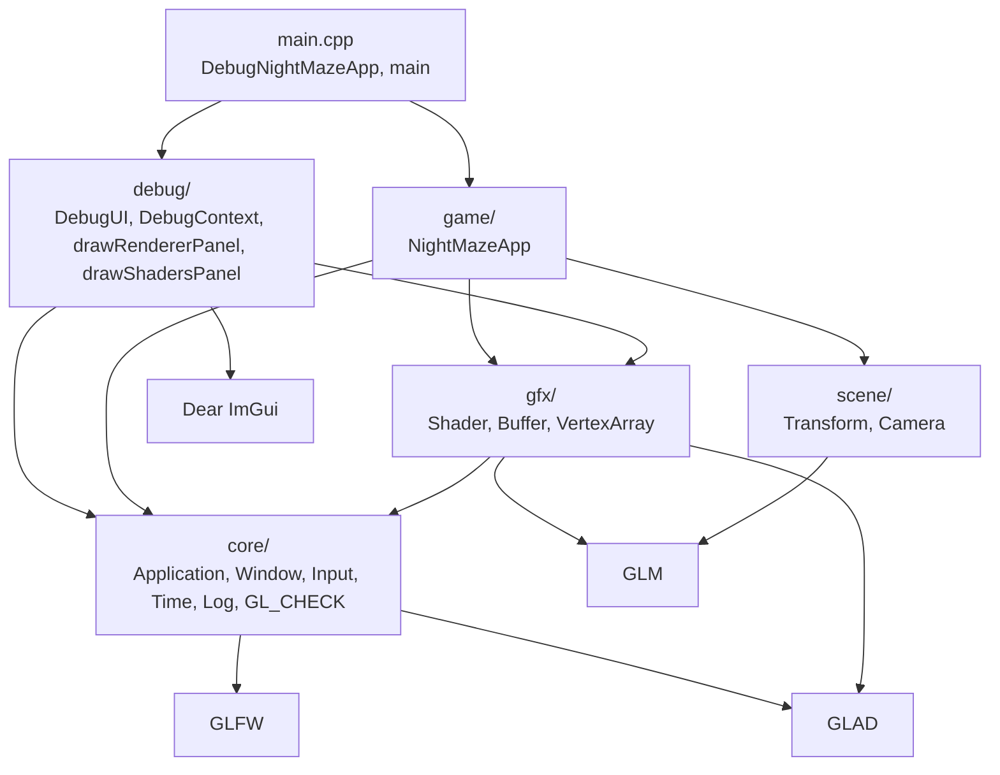
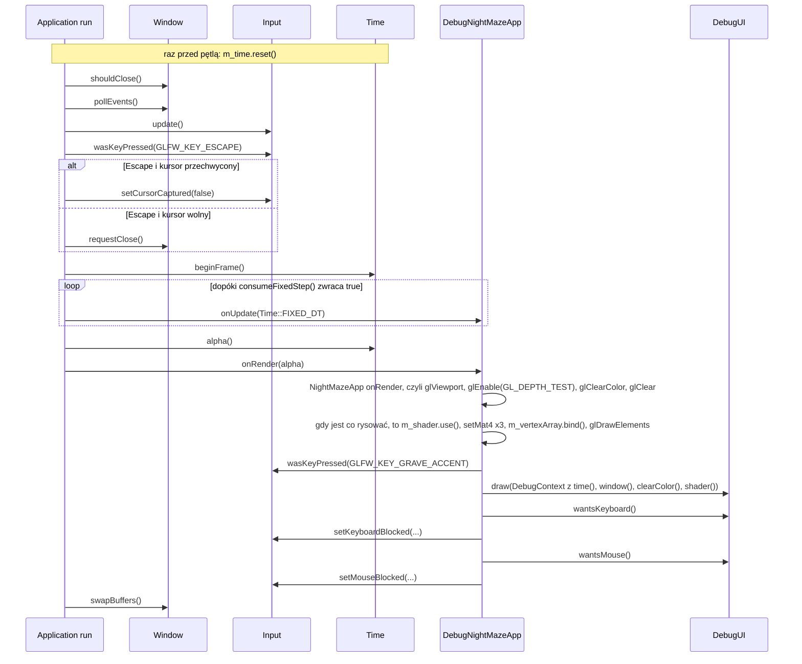
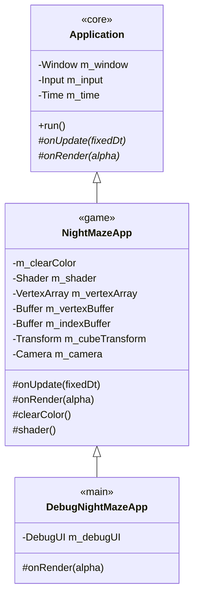

# Moduł core: fundament programu

Kamień milowy: M0, uzupełniany w M1 (mysz, ścieżki do assetów). Temat wykładu: 1 (Pierwszy program OpenGL).
Kod: [`src/core/`](../../../src/core/), [`src/game/NightMazeApp.cpp`](../../../src/game/NightMazeApp.cpp), [`src/main.cpp`](../../../src/main.cpp).

Zanim narysuję cokolwiek w OpenGL, muszę mieć trzy rzeczy: okno systemowe, kontekst OpenGL (context) związany z tym oknem oraz pętlę, która co klatkę odbiera zdarzenia, przesuwa symulację i rysuje obraz. Moduł `core` dostarcza dokładnie to i nic więcej: klasę `Window` (okno GLFW z kontekstem OpenGL 4.1 Core i funkcjami załadowanymi przez GLAD), klasę `Application` (pętla główna ze stałym krokiem symulacji), `Input` (stan klawiatury i myszy), `Time` (zegar klatki), `Log` (komunikaty na konsolę), makro `GL_CHECK` (wykrywanie błędów OpenGL w buildzie Debug) i funkcje `executableDir`, `assetPath` oraz `pathText` z `Paths` (ścieżki do plików z `assets/`, liczone od położenia programu, i zamiana ścieżki na tekst). To jest realizacja tematu 1 wykładu, "Pierwszy program OpenGL": po M0 program otwiera okno, czyści je kolorem nocnego nieba i pokazuje FPS. Wszystkie późniejsze moduły (`gfx`, `renderer`, `scene`, `game`) stoją na tej warstwie, a ona sama nie wie o żadnym z nich.

Moduł jest opisany w pięciu dokumentach tematycznych. Ten plik jest ich wspólnym wstępem: pokazuje, jak części pasują do siebie, opisuje klatkę jako całość i to, jak program dziedziczy po `core::Application`.

## 1. Dokumenty modułu

| Dokument | Co opisuje | Klasy i pliki |
|---|---|---|
| [`window-context.md`](window-context.md) | okno, inicjalizacja GLFW, hinty kontekstu, ładowanie GLAD, vsync, rozmiar okna a rozmiar framebuffera, logowanie | `Window`, `Log` |
| [`main-loop.md`](main-loop.md) | pętla główna, zegar klatki, stały krok czasowy z akumulatorem, ograniczenie 0,25 s, `alpha`, uśredniony FPS | `Application`, `Time` |
| [`input.md`](input.md) | klawiatura i mysz: odpytywanie, stan ciągły i zbocze, `KEY_COUNT`, przesunięcie myszy, przechwycenie kursora, blokada klawiatury i myszy na czas pracy z panelem | `Input` |
| [`gl-check.md`](gl-check.md) | makro `GL_CHECK`, model błędów `glGetError`, różnica Debug i Release | `GlCheck` |
| [`paths.md`](paths.md) | ścieżki do assetów: katalog roboczy a katalog programu, `_NSGetExecutablePath` i `GetModuleFileNameW`, `std::filesystem::path`, znaki szerokie na Windowsie | `Paths` |

Każdy z pięciu dokumentów jest samodzielną jednostką nauki i ma te same dziesięć sekcji: Po co to jest, Teoria, Jak to działa w OpenGL, Shadery, Kod w projekcie, Panel ImGui, Pułapki, Ćwiczenia, Pytania kontrolne, Źródła.

Proponowana kolejność czytania: ten plik, potem `window-context.md`, `main-loop.md`, `input.md`, `gl-check.md`, `paths.md`.

## 2. Indeks: plik kodu, dokument

| Plik kodu | Co zawiera | Dokument |
|---|---|---|
| [`src/core/Window.hpp`](../../../src/core/Window.hpp), [`.cpp`](../../../src/core/Window.cpp) | RAII na okno GLFW i kontekst OpenGL 4.1 Core, ładowanie GLAD | [`window-context.md`](window-context.md) |
| [`src/core/Log.hpp`](../../../src/core/Log.hpp), [`.cpp`](../../../src/core/Log.cpp) | `logInfo`, `logWarn`, `logError` | [`window-context.md`](window-context.md), sekcja 5.5 |
| [`src/core/Application.hpp`](../../../src/core/Application.hpp), [`.cpp`](../../../src/core/Application.cpp) | klasa bazowa programu: posiada `Window`, `Input`, `Time`, prowadzi pętlę | [`main-loop.md`](main-loop.md), dziedziczenie w tym pliku (sekcja 6) |
| [`src/core/Time.hpp`](../../../src/core/Time.hpp), [`.cpp`](../../../src/core/Time.cpp) | czas klatki, akumulator stałego kroku, uśredniony FPS | [`main-loop.md`](main-loop.md) |
| [`src/core/Input.hpp`](../../../src/core/Input.hpp), [`.cpp`](../../../src/core/Input.cpp) | migawka stanu klawiatury i myszy: `isKeyDown`, `wasKeyPressed`, `setKeyboardBlocked`, `isMouseButtonDown`, `wasMouseButtonPressed`, `mouseDeltaX`, `mouseDeltaY`, `setMouseBlocked`, `setCursorCaptured` | [`input.md`](input.md) |
| [`src/core/GlCheck.hpp`](../../../src/core/GlCheck.hpp), [`.cpp`](../../../src/core/GlCheck.cpp) | makro `GL_CHECK` i funkcja `checkGlErrors` | [`gl-check.md`](gl-check.md) |
| [`src/core/Paths.hpp`](../../../src/core/Paths.hpp), [`.cpp`](../../../src/core/Paths.cpp) | `executableDir` i `assetPath`: ścieżki do plików z `assets/` względem pliku wykonywalnego. Jedyny kod w `src/` z gałęziami `#if` dla macOS i Windows. Woła je konstruktor `NightMazeApp` przy wczytywaniu shaderów. `pathText`: ścieżka jako tekst UTF-8, dla `gfx::Shader` i panelu "Shaders" | [`paths.md`](paths.md) |
| [`src/game/NightMazeApp.hpp`](../../../src/game/NightMazeApp.hpp), [`.cpp`](../../../src/game/NightMazeApp.cpp) | gra: dziedziczy po `core::Application`, posiada shader, tablicę wierzchołków, bufor wierzchołków i bufor indeksów oraz `scene::Transform` kostki i `scene::Camera`. Co klatkę ustawia viewport, włącza test głębi, czyści ekran, wysyła trzy macierze i rysuje kostkę | ten plik (sekcje 6 i 7), czyszczenie w [`window-context.md`](window-context.md), sekcja 3.2, rysowanie w [`../gfx/README.md`](../gfx/README.md), sekcja 6, macierze w [`../scene/transforms-camera.md`](../scene/transforms-camera.md), sekcja 5.9 |
| [`src/main.cpp`](../../../src/main.cpp) | klasa `DebugNightMazeApp` (gra plus nakładka debug) i `main`: tworzy aplikację, woła `run()`, łapie wyjątki | ten plik (sekcje 5 i 6), nakładka w [`../debug-ui.md`](../debug-ui.md) |

W [`CMakeLists.txt`](../../../CMakeLists.txt) pliki `src/core/*` tworzą, razem z `src/gfx/*` i `src/scene/*`, bibliotekę statyczną `engine`, a `main.cpp`, `game/` i `debug/` tworzą program `night_maze`, który ją linkuje. `engine` ma publiczne definicje `GLFW_INCLUDE_NONE` (GLFW nie dołącza systemowego nagłówka OpenGL, robi to GLAD) i `GL_SILENCE_DEPRECATION` (macOS oznacza cały OpenGL jako przestarzały i bez tej definicji zasypuje build ostrzeżeniami).

## 3. Warstwy

Architektura projektu (PRD, sekcja 6) ma warstwy z zależnościami w jedną stronę. Strzałka znaczy "zna i dołącza nagłówki":



Pięć rzeczy do zapamiętania:

1. `core/` nie zna ani `gfx/`, ani `game/`, ani `debug/`, ani ImGui. Biblioteka `engine` linkuje tylko `glad`, `glfw` i nagłówki GLM (`glm::glm-header-only`). Samo `core/` z GLM nie korzysta: dołączają je warstwy `scene/` i `gfx/`.
2. `game/` zna `core/`, `gfx/` i `scene/`, ale nie zna `debug/`.
3. `debug/` może zależeć od wszystkiego, ale nic nie może zależeć od `debug/`. Jedynym plikiem, który zna jednocześnie `game/` i `debug/`, jest `main.cpp`.
4. `gfx/` (opakowania obiektów OpenGL, na dziś klasy `Shader`, `Buffer` i `VertexArray`) zna tylko `core/`, GLAD i GLM (typ macierzy w `Shader::setMat4`). Używa go `game/` (rysowanie) i `debug/` (panel "Shaders" woła `Shader::reload()`). Opis warstwy: [`../gfx/README.md`](../gfx/README.md).
5. `scene/` (struktury `Transform` i `Camera`: macierze modelu, widoku i rzutowania) to sama matematyka na GLM. Może zależeć od `core/` i `gfx/`, dziś dołącza tylko GLM. Używa go `game/`: `NightMazeApp` ma kamerę i transform kostki i co klatkę wysyła ich macierze do shadera. Opis warstwy: [`../scene/README.md`](../scene/README.md).

Ta reguła tłumaczy dwie decyzje opisane niżej: dlaczego nakładka debug jest podpinana w `main.cpp` (sekcja 6) i dlaczego `core::Input` dostaje od `main.cpp` neutralne flagi "klawiatura zablokowana" i "mysz zablokowana", zamiast samemu pytać ImGui ([`input.md`](input.md), sekcje 5.6 i 5.10).

## 4. Klatka jako całość

Jeden obrót pętli głównej w działającym programie, czyli w obiekcie klasy `DebugNightMazeApp`. Szczegóły każdego kroku są w dokumentach tematycznych, tutaj chodzi o kolejność:



| Krok | Kod | Dokument |
|---|---|---|
| Start zegara, raz przed pętlą (nie należy do obrotu) | `m_time.reset()` | [`main-loop.md`](main-loop.md), sekcja 5.4 |
| Zdarzenia systemu | `m_window.pollEvents()` | [`window-context.md`](window-context.md) |
| Migawka klawiatury i myszy, Escape (zwalnia przechwycony kursor albo zamyka program) | `m_input.update()`, `wasKeyPressed(GLFW_KEY_ESCAPE)`, `isCursorCaptured()` | [`input.md`](input.md), sekcja 5.7 |
| Pomiar czasu, kroki symulacji | `m_time.beginFrame()`, `consumeFixedStep()`, `onUpdate` | [`main-loop.md`](main-loop.md) |
| Rysowanie gry: stan i tło | `NightMazeApp::onRender`: `glViewport`, `glEnable(GL_DEPTH_TEST)`, `glClearColor`, `glClear` (kolor i głębia) w `GL_CHECK` | [`window-context.md`](window-context.md), [`gl-check.md`](gl-check.md) |
| Rysowanie gry: kostka | pominięte, gdy framebuffer ma wysokość 0 albo `m_shader.isValid()` jest fałszem. Inaczej `m_shader.use()`, trzy razy `m_shader.setMat4(...)` z macierzami z `m_cubeTransform` i `m_camera`, `m_vertexArray.bind()`, `glDrawElements` | [`../gfx/README.md`](../gfx/README.md), sekcja 6, [`../scene/transforms-camera.md`](../scene/transforms-camera.md), sekcja 5.9 |
| Przełącznik paneli i panele | `wasKeyPressed(GLFW_KEY_GRAVE_ACCENT)`, `m_debugUI.draw(...)` | [`../debug-ui.md`](../debug-ui.md) |
| Blokada klawiatury na następną klatkę | `input().setKeyboardBlocked(m_debugUI.wantsKeyboard())` | [`input.md`](input.md), sekcja 5.6 |
| Blokada myszy na następną klatkę | `input().setMouseBlocked(m_debugUI.wantsMouse())` | [`input.md`](input.md), sekcja 5.10 |
| Zamiana buforów | `m_window.swapBuffers()` | [`window-context.md`](window-context.md) |

## 5. Od `main` do pierwszej klatki

```cpp
int main() {
    try {
        DebugNightMazeApp app;
        app.run();
    } catch (const std::exception& error) {
        // Startup failures (no window, no OpenGL 4.1) arrive here as exceptions.
        core::logError(std::string("Fatal: ") + error.what());
        return EXIT_FAILURE;
    }
    return EXIT_SUCCESS;
}
```

`app` jest zwykłą zmienną lokalną wewnątrz bloku `try`. Konstruktor może rzucić `std::runtime_error` (brak GLFW, brak kontekstu 4.1, nieudany GLAD) i wtedy `catch` wypisuje powód oraz zwraca kod błędu. Przy normalnym wyjściu z `run()` destruktor `app` uruchamia się na końcu bloku `try` i sprząta ImGui, okno oraz GLFW. Nie ma tu ani jednego `new`, ani jednej zmiennej globalnej. Czym jest `DebugNightMazeApp`, wyjaśnia następna sekcja.

## 6. Jak program dziedziczy po `core::Application`

`Application` implementuje wzorzec **metody szablonowej** (template method): klasa bazowa ustala niezmienny szkielet klatki w `run()`, a klasa pochodna wypełnia dwa "haki":

```cpp
virtual void onUpdate(double fixedDt) = 0;
virtual void onRender(double alpha) = 0;
```

`= 0` oznacza funkcję czysto wirtualną: `Application` jest klasą abstrakcyjną i nie da się utworzyć jej obiektu. `NightMazeApp` nadpisuje obie funkcje (słowo `override` każe kompilatorowi sprawdzić, że sygnatura naprawdę zgadza się z bazową). Dostęp do okna, wejścia i zegara klasa pochodna ma przez chronione akcesory `window()`, `input()`, `time()`, a same pola są prywatne, więc pochodna nie może ich podmienić ani zniszczyć. `window()` i `input()` zwracają zwykłe referencje, a `time()` referencję `const`: klasa pochodna może zegar czytać, ale nie może wołać `reset()`, `beginFrame()` ani `consumeFixedStep()`, bo zegar ustawia i przesuwa wyłącznie `run()`.

```cpp
NightMazeApp::NightMazeApp()
    : core::Application(INITIAL_WIDTH, INITIAL_HEIGHT, "Night Maze"),
      m_shader(core::assetPath(VERTEX_SHADER_FILE), core::assetPath(FRAGMENT_SHADER_FILE)),
      // The sizes are in bytes: number of elements times the size of one element.
      m_vertexBuffer(GL_ARRAY_BUFFER, VERTICES.data(), VERTICES.size() * sizeof(float)),
      m_indexBuffer(GL_ELEMENT_ARRAY_BUFFER, INDICES.data(), INDICES.size() * sizeof(GLuint)) {
    // m_vertexBuffer is still bound to GL_ARRAY_BUFFER (m_indexBuffer uses another binding
    // point). Each call below records that buffer in m_vertexArray for one attribute.
    m_vertexArray.setFloatAttribute(POSITION_ATTRIBUTE, POSITION_COMPONENTS, VERTEX_STRIDE,
                                    POSITION_OFFSET);
    m_vertexArray.setFloatAttribute(COLOR_ATTRIBUTE, COLOR_COMPONENTS, VERTEX_STRIDE, COLOR_OFFSET);

    m_cubeTransform.rotationDegrees = {CUBE_ROTATION_X_DEGREES, CUBE_ROTATION_Y_DEGREES, 0.0F};
```

Pierwszy element listy inicjalizacyjnej przekazuje rozmiar i tytuł do klasy bazowej, która tworzy okno i kontekst OpenGL. `INITIAL_WIDTH` i `INITIAL_HEIGHT` to stałe `constexpr` w anonimowej przestrzeni nazw pliku `.cpp`: mają nazwy (żadnych magicznych liczb) i są niewidoczne poza tym plikiem. Pozostała część konstruktora przygotowuje rysowanie kostki: wczytuje shader, wysyła dane wierzchołków i indeksy na kartę, ustawia obrót kostki i opisuje ich układ. Z punktu widzenia modułu `core` ważne jest tu tylko to, że te obiekty są **polami klasy pochodnej** i powstają po oknie (sekcja 7). Co robi każda linia, opisują [`../gfx/shaders.md`](../gfx/shaders.md) (sekcja 5.10) i [`../gfx/buffers-vao.md`](../gfx/buffers-vao.md) (sekcja 5.7).

**Trzy poziomy dziedziczenia.** W programie są trzy klasy, każda w innej warstwie:



W nawiasach ostrych jest warstwa: `core::Application`, `game::NightMazeApp` i `DebugNightMazeApp` z `main.cpp`. Gwiazdka oznacza funkcję czysto wirtualną.

```cpp
class DebugNightMazeApp final : public game::NightMazeApp {
protected:
    void onRender(double alpha) override {
        game::NightMazeApp::onRender(alpha);

        // The key left of 1 (` and ~ on a US keyboard) shows or hides the debug panels.
        if (input().wasKeyPressed(GLFW_KEY_GRAVE_ACCENT)) {
            m_debugUI.toggleVisible();
        }
        // The context is rebuilt every frame: it only holds references, so it is cheap.
        m_debugUI.draw(debug::DebugContext{
            .time = time(),
            .window = window(),
            .clearColor = clearColor(),
            .shader = shader(),
        });

        // ImGui now knows whether it is using the keyboard (a text field is being edited
        // or a widget is active) and the mouse (the cursor is over a panel or a widget is
        // being dragged). Block each device for the game from the next frame on, so typing
        // does not trigger Escape, the panel toggle or player movement, and working with
        // a panel does not click or look around in the scene.
        input().setKeyboardBlocked(m_debugUI.wantsKeyboard());
        input().setMouseBlocked(m_debugUI.wantsMouse());
    }

private:
    // Members are destroyed before base classes, so ImGui shuts down while the window
    // and its OpenGL context (owned by core::Application) still exist.
    debug::DebugUI m_debugUI{window()};
};
```

**Dlaczego nakładka debug jest w `main.cpp`, a nie w grze.** Zgodnie z regułą warstw `debug/` może zależeć od wszystkiego, ale nic nie może zależeć od `debug/`. Ktoś jednak musi na końcu każdej klatki zawołać `DebugUI::draw`. Gdyby robiło to `game::NightMazeApp`, gra dołączałaby `debug/DebugUI.hpp` i reguła byłaby złamana. Rozwiązaniem jest miejsce stojące **ponad** obiema warstwami: `main.cpp`. To jedyny plik, który zna jednocześnie `game/` i `debug/`, i tam skleja je klasa `DebugNightMazeApp`. Zysk jest praktyczny: wersję gry bez paneli dostaję, pisząc w `main` po prostu `game::NightMazeApp app;`, bez dotykania kodu gry.

Szczegóły tej klasy, o które można zostać zapytanym:

- `game::NightMazeApp::onRender(alpha);` to wywołanie **z kwalifikacją nazwą klasy**. Wyłącza ono mechanizm wirtualny i woła dokładnie wersję bazową (rysowanie gry). Samo `onRender(alpha)` wywołałoby wirtualnie tę samą funkcję, czyli nieskończoną rekurencję.
- Kolejność w `onRender`: najpierw gra rysuje scenę, potem panele lądują na wierzchu, a na końcu `main.cpp` przekazuje do `core::Input` informację, czy ImGui używa klawiatury i czy używa myszy.
- Przełącznik paneli to klawisz `~` (na lewo od `1`, w GLFW `GLFW_KEY_GRAVE_ACCENT`). Sprawdzam go przez `wasKeyPressed` w `onRender`, czyli dokładnie raz na klatkę (dlaczego nie w `onUpdate`: [`input.md`](input.md), sekcja 5.5).
- Dwie ostatnie linie `onRender` to całe powiązanie klawiatury i myszy gry z ImGui. `core/` nie wie, kto i dlaczego blokuje wejście, a `debug/` nie wie, co gra zrobi z tą informacją. Pełny opis: [`input.md`](input.md), sekcje 5.6 i 5.10.
- `final` zabrania dalszego dziedziczenia po tej klasie. Anonimowa przestrzeń nazw sprawia, że klasa jest widoczna tylko w `main.cpp`.
- Klasa nie ma własnego konstruktora. Kompilator generuje domyślny: buduje część bazową (`NightMazeApp`), a potem pole `m_debugUI` z inicjalizatora przy deklaracji, `{window()}`.
- `clearColor()` to chroniony akcesor w `NightMazeApp` zwracający referencję do prywatnego `m_clearColor`. Gra udostępnia swój stan klasie pochodnej, nie wiedząc, kto i po co go użyje.
- `shader()` działa tak samo dla prywatnego `m_shader`: zwraca `gfx::Shader&`, przez które panel "Shaders" woła `reload()` ([`../gfx/shaders.md`](../gfx/shaders.md), sekcja 6.2).

Dwie rzeczy warte uwagi w samej klasie bazowej:

- Destruktor bazowy jest wirtualny (`virtual ~Application() = default;`). Każda klasa z funkcjami wirtualnymi, po której się dziedziczy, powinna go mieć, bo inaczej usunięcie obiektu pochodnego przez wskaźnik na bazę nie wywołałoby destruktora pochodnej.
- Kopiowanie jest zablokowane (`= delete`) w `Application` i w `Window`. Kopia `Window` miałaby ten sam `m_handle` i oba destruktory próbowałyby zniszczyć to samo okno (podwójne zwolnienie).

Dzięki temu podziałowi warstwa `engine` nadaje się też do zadań laboratoryjnych: wystarczy nowa klasa pochodna z własnym `onUpdate` i `onRender`.

## 7. Kolejność pól, od której zależy poprawność

W C++ pola klasy są **konstruowane w kolejności deklaracji** w klasie (nie w kolejności na liście inicjalizacyjnej konstruktora) i **niszczone w kolejności odwrotnej**. W tym projekcie dwa miejsca polegają na tej regule.

**`Application`:**

```cpp
// Order matters: members are constructed top to bottom, and Input needs the window.
Window m_window;
Input m_input;
Time m_time;
```

```cpp
Application::Application(int width, int height, const std::string& title)
    : m_window(width, height, title), m_input(m_window.nativeHandle()) {}
```

`m_input` potrzebuje uchwytu okna, więc `m_window` musi powstać pierwsze. Gdybym zamienił deklaracje miejscami, `m_input` zostałoby skonstruowane **przed** `m_window`, a `m_window.nativeHandle()` odczytałoby pole obiektu, który jeszcze nie istnieje (niezdefiniowane zachowanie, w praktyce śmieciowy wskaźnik). Kompilator w najlepszym razie ostrzeże o niezgodnej kolejności na liście inicjalizacyjnej. Przy niszczeniu kolejność jest odwrotna: `m_time`, `m_input`, a `m_window` na końcu, więc okno i GLFW znikają jako ostatnie.

**`DebugNightMazeApp` (w `main.cpp`):**

```cpp
// Members are destroyed before base classes, so ImGui shuts down while the window
// and its OpenGL context (owned by core::Application) still exist.
debug::DebugUI m_debugUI{window()};
```

Tu działa druga część tej samej reguły: najpierw konstruowana jest **część bazowa** obiektu (od najgłębszej klasy bazowej), potem pola klasy pochodnej, a niszczenie idzie dokładnie odwrotnie: **pola są niszczone przed klasami bazowymi**.

| Konstrukcja (z góry na dół) | Niszczenie (z góry na dół) |
|---|---|
| `Application::m_window` (GLFW, okno, kontekst, GLAD) | `DebugNightMazeApp::m_debugUI` (zamknięcie ImGui, okno i kontekst jeszcze żyją) |
| `Application::m_input` | `NightMazeApp::m_camera`, `NightMazeApp::m_cubeTransform` (zwykłe dane, nic do zwolnienia) |
| `Application::m_time` | `NightMazeApp::m_indexBuffer` (`glDeleteBuffers`) |
| `NightMazeApp::m_clearColor` | `NightMazeApp::m_vertexBuffer` (`glDeleteBuffers`) |
| `NightMazeApp::m_shader` (kompilacja i linkowanie, potrzebuje kontekstu) | `NightMazeApp::m_vertexArray` (`glDeleteVertexArrays`) |
| `NightMazeApp::m_vertexArray` (`glGenVertexArrays`, `glBindVertexArray`) | `NightMazeApp::m_shader` (`glDeleteProgram`) |
| `NightMazeApp::m_vertexBuffer` (`glGenBuffers`, `glBufferData`) | `NightMazeApp::m_clearColor` |
| `NightMazeApp::m_indexBuffer` (`glGenBuffers`, `glBufferData`, zapisany w związanym VAO) | `Application::m_time` |
| `NightMazeApp::m_cubeTransform`, `NightMazeApp::m_camera` (zwykłe dane, bez OpenGL) | `Application::m_input` |
| ciało konstruktora `NightMazeApp` (opis atrybutów, obrót kostki) | `Application::m_window` (okno, kontekst, `glfwTerminate`) |
| `DebugNightMazeApp::m_debugUI` (potrzebuje okna i kontekstu) | |

Dlatego `m_debugUI{window()}` jest bezpieczne (cała część bazowa, a więc i okno, już istnieje), a destruktor `DebugUI`, który zwalnia obiekty OpenGL backendu ImGui, ma jeszcze żywy kontekst. Ta sama zasada dotyczy pól `NightMazeApp` posiadających zasoby OpenGL: `m_shader`, `m_vertexArray`, `m_vertexBuffer` i `m_indexBuffer`. Jako pola klasy pochodnej od `Application` powstają po oknie i są niszczone przed nim, więc każde `glGen*`, `glCreate*` i `glDelete*` ma żywy kontekst. To samo będzie dotyczyć tekstur i kolejnych buforów.

**`NightMazeApp` (w `NightMazeApp.hpp`):**

```cpp
gfx::Shader m_shader;
gfx::VertexArray m_vertexArray;
gfx::Buffer m_vertexBuffer;
gfx::Buffer m_indexBuffer;
```

Tu kolejność deklaracji decyduje o tym, co jest związane w OpenGL w chwili tworzenia kolejnego pola. Konstruktor `m_vertexArray` wiąże nowy VAO, więc bufor indeksów, tworzony dwa pola dalej, zapisuje się właśnie w nim. Bufor wierzchołków jest wciąż związany z `GL_ARRAY_BUFFER`, gdy ciało konstruktora opisuje atrybuty, bo bufor indeksów używa innego celu. Szczegóły: [`../gfx/buffers-vao.md`](../gfx/buffers-vao.md), sekcja 5.7. Gdyby natomiast ktoś trzymał obiekt z zasobami GL dłużej niż `Application` (na przykład jako zmienną globalną albo lokalną w `main` zadeklarowaną przed `app`), jego destruktor wołałby `glDelete*` bez kontekstu.

**Pułapka do tej sekcji.** Obiekt z zasobami OpenGL żyjący dłużej niż `Window` woła funkcje `gl*` bez kontekstu. Podobnie zmiana kolejności pól w `Application` psuje konstrukcję `Input`. Dotyczy to dziś wprost czterech pól `gfx` w `NightMazeApp`.

## 8. Różnice między systemami w jednym miejscu

| Temat | macOS | Windows |
|---|---|---|
| Najwyższy OpenGL | 4.1 Core | zwykle 4.6 |
| Wersja w panelu po prośbie o 4.1 | 4.1 | często wyższa (sterownik oddaje nowszy, zgodny kontekst) |
| Framebuffer a okno | 2 razy większy na Retinie | zwykle równe |
| Ostrzeżenia o przestarzałym OpenGL | tak, wyciszane przez `GL_SILENCE_DEPRECATION` | nie |
| Debug callback (4.3) | niedostępny | dostępny, ale nie używam go, żeby kod był jeden |
| Vsync | zwykle respektowany | może być nadpisany w ustawieniach sterownika |

## 9. Pytania kontrolne: gdzie są

Pytania z odpowiedziami są w sekcji 9 każdego dokumentu tematycznego. Razem tworzą zestaw do tematu 1.

| Dokument | Czego dotyczą pytania |
|---|---|
| [`window-context.md`](window-context.md), sekcja 9 | kontekst i `glfwMakeContextCurrent`, `gladLoadGL(glfwGetProcAddress)`, hinty, ręczne `glfwTerminate()` przed `throw`, `reinterpret_cast` przy `glGetString`, rozmiar okna a framebuffera, vsync, `std::flush` w logach |
| [`main-loop.md`](main-loop.md), sekcja 9 | kolejność kroków pętli, stały krok z akumulatorem, spirala śmierci, `alpha()`, `std::chrono::duration<double>`, uśredniony FPS, zero kroków w klatce |
| [`input.md`](input.md), sekcja 9 | `KEY_COUNT` i `static_assert`, `isKeyDown` a `wasKeyPressed`, zakaz `wasKeyPressed` w `onUpdate`, blokada klawiatury i jej opóźnienie, brak fałszywego zbocza po odblokowaniu, odpytywanie myszy, przesunięcie i problem pierwszego odczytu, tryby kursora, surowy ruch myszy, Escape a przechwycony kursor |
| [`gl-check.md`](gl-check.md), sekcja 9 | działanie `GL_CHECK`, dlaczego makro, pętla `glGetError`, Debug a Release, błąd przypisany nie temu wywołaniu |
| [`paths.md`](paths.md), sekcja 9 | katalog roboczy, dlaczego nie `argv[0]`, dwa wywołania systemowe za `#if`, `canonical`, `GetModuleFileNameW` i znaki szerokie, `operator/` zamiast sklejania napisów |
| ten plik, niżej | kolejność pól i niszczenia, miejsce `DebugUI` w architekturze |

Dwa pytania dotyczące treści tego pliku:

1. **Dlaczego kolejność pól `m_window`, `m_input`, `m_time` ma znaczenie?**
   Pola powstają w kolejności deklaracji, a `Input` potrzebuje uchwytu z już istniejącego `Window`. Niszczenie idzie odwrotnie, więc okno i kontekst znikają na końcu, po wszystkim, co z nich korzysta (w tym po `DebugUI`, które jest polem klasy pochodnej w `main.cpp`, a pola giną przed klasami bazowymi).

2. **Dlaczego `DebugUI` jest polem klasy w `main.cpp`, a nie w `game::NightMazeApp`?**
   Bo `game/` nie może zależeć od `debug/` (warstwy z PRD). `main.cpp` to jedyne miejsce znające obie warstwy: `DebugNightMazeApp` dziedziczy po grze, w `onRender` woła najpierw `game::NightMazeApp::onRender(alpha)`, a potem rysuje panele i przekazuje do `core::Input` flagi blokady klawiatury i myszy.

## 10. Źródła

- LearnOpenGL, rozdziały "Creating a window" (<https://learnopengl.com/Getting-started/Creating-a-window>) i "Hello Window" (<https://learnopengl.com/Getting-started/Hello-Window>).
- Glenn Fiedler, "Fix Your Timestep!", Gaffer on Games: <https://gafferongames.com/post/fix_your_timestep/>.
- Dokumenty bibliotek w tym repozytorium: [`../../libraries/glfw.md`](../../libraries/glfw.md), [`../../libraries/glad.md`](../../libraries/glad.md), [`../../libraries/imgui.md`](../../libraries/imgui.md).
- Szczegółowe źródła do każdego zagadnienia są w sekcji 10 dokumentów tematycznych.
