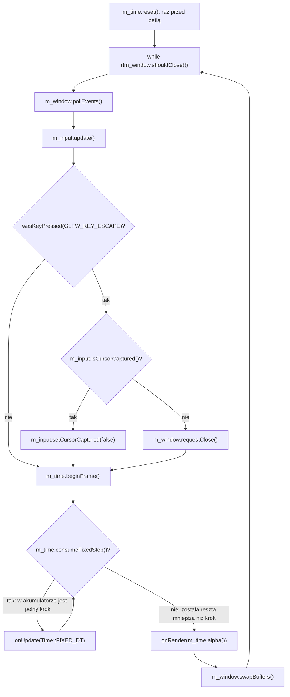

# Moduł core: pętla główna i czas

Kamień milowy: M0. Temat wykładu: 1 (Pierwszy program OpenGL).
Kod: [`src/core/Application.hpp`](../../../src/core/Application.hpp), [`src/core/Application.cpp`](../../../src/core/Application.cpp), [`src/core/Time.hpp`](../../../src/core/Time.hpp), [`src/core/Time.cpp`](../../../src/core/Time.cpp), pierwszy użytkownik stałego kroku i `alpha`: [`src/game/NightMazeApp.cpp`](../../../src/game/NightMazeApp.cpp).

Część modułu `core`. Wstęp do całego modułu, diagram klas i opis dziedziczenia po `core::Application` są w [`README.md`](README.md). Pozostałe części: [`window-context.md`](window-context.md) (okno i kontekst), [`input.md`](input.md) (klawiatura i mysz), [`gl-check.md`](gl-check.md) (błędy OpenGL).

## 1. Po co to jest

Program czasu rzeczywistego nie kończy się po jednym przebiegu: działa w pętli, która w każdym obrocie odbiera zdarzenia, przesuwa symulację i rysuje klatkę. `core::Application::run` jest tą pętlą, a `core::Time` jest jej zegarem. Razem rozwiązują problem, który wraca w każdym późniejszym kamieniu milowym: klatki trwają różnie długo (inny monitor, inny komputer, vsync włączony albo nie), a ruch gracza i kolizje mają działać zawsze tak samo. Rozwiązaniem jest stały krok czasowy (fixed timestep): symulacja idzie krokami o stałej długości, a rysowanie odbywa się raz na klatkę, niezależnie od tego, ile kroków się zmieściło. Dodatkowo `Time` liczy uśredniony FPS i czas klatki dla panelu Renderer.

## 2. Teoria

### 2.1 Pętla gry

Każdy program czasu rzeczywistego to pętla, która powtarza cztery kroki: zdarzenia, symulacja, rysowanie, zamiana buforów. W moim projekcie wygląda to tak (kod: [`Application::run`](../../../src/core/Application.cpp)):



Ten sam obrót pętli z podziałem na obiekty (łącznie z nakładką debug) pokazuje diagram sekwencji w [`README.md`](README.md), sekcja 4.

### 2.2 Stały krok czasowy (fixed timestep) i akumulator

**Problem.** Klatki nie trwają tyle samo. Jeśli fizykę liczę jako `pozycja += prędkość * dt` ze zmiennym `dt`, to wynik zależy od liczby klatek na sekundę: przy niskim FPS kroki są duże i postać potrafi przelecieć przez cienką ścianę (kolizja sprawdzana jest tylko w punktach końcowych kroku), a ta sama rozgrywka na dwóch komputerach daje różne wyniki.

**Rozwiązanie.** Symulacja zawsze robi krok o tej samej długości `FIXED_DT`, a czas rzeczywisty tylko decyduje, **ile** takich kroków wykonać w danej klatce. Do tego służy **akumulator** (accumulator): licznik czasu, który "wpłynął" z zegara, ale nie został jeszcze "wydany" na symulację.

```
akumulator += czas_klatki
dopóki akumulator >= FIXED_DT:
    symuluj(FIXED_DT)
    akumulator -= FIXED_DT
alpha = akumulator / FIXED_DT
```

U mnie `FIXED_DT = 1.0 / 120.0`, czyli 8,33 ms (120 kroków na sekundę). Przykład dla klatek po 20 ms (50 FPS):

| Klatka | Akumulator po `beginFrame` | Liczba kroków | Reszta w akumulatorze | `alpha()` |
|---|---|---|---|---|
| 1 | 20,00 ms | 2 (16,67 ms) | 3,33 ms | 0,4 |
| 2 | 23,33 ms | 2 (16,67 ms) | 6,67 ms | 0,8 |
| 3 | 26,67 ms | 3 (25,00 ms) | 1,67 ms | 0,2 |

Widać trzy ważne rzeczy. Po pierwsze, liczba kroków na klatkę nie jest stała (2, 2, 3), ale w dłuższym czasie symulacja dostaje dokładnie tyle czasu, ile upłynęło naprawdę. Po drugie, reszta nie przepada, tylko przechodzi do następnej klatki. Po trzecie, przy bardzo szybkich klatkach (na przykład 2 ms bez vsync) akumulator przez kilka klatek nie osiąga 8,33 ms i wtedy kroków jest **zero**: `onUpdate` w ogóle nie zostaje wywołane, a klatka i tak jest rysowana.

### 2.3 Spirala śmierci i ograniczenie 0,25 s

Jeśli jedna klatka potrwa bardzo długo (pułapka w debuggerze, przeciąganie okna, doczytywanie zasobów), akumulator dostanie na przykład 5 sekund, czyli 600 zaległych kroków. Wykonanie ich też zajmuje czas, więc następna klatka znów jest długa, znów trzeba nadrabiać i program nigdy nie wychodzi z zaległości. To jest **spirala śmierci** (spiral of death).

Lekarstwo: czas klatki przekazywany do symulacji ograniczam z góry stałą `MAX_FRAME_TIME = 0.25`. Najgorszy przypadek to `0,25 / (1/120) = 30` kroków w jednej klatce. Cena jest świadoma: po takim przestoju gra "gubi" czas i przez chwilę płynie wolniej niż zegar ścienny, ale pozostaje sterowalna zamiast się zawiesić.

### 2.4 alpha, czyli interpolacja między krokami

Po pętli kroków w akumulatorze zostaje reszta z przedziału `[0, FIXED_DT)`. `alpha = reszta / FIXED_DT` należy więc do `[0, 1)` i mówi, jak daleko bieżąca klatka jest między ostatnim wykonanym krokiem a następnym, jeszcze niewykonanym. Renderer może dzięki temu rysować stan wygładzony:

```
stan_rysowany = stan_poprzedni * (1 - alpha) + stan_bieżący * alpha
```

Bez interpolacji ruch przy 120 krokach na sekundę i monitorze 144 Hz lekko "szarpie", bo niektóre klatki pokazują ten sam stan symulacji dwa razy. Pierwszym stanem, który jest interpolowany, jest pozycja kamery: `NightMazeApp::onUpdate` przesuwa ją stałym krokiem, a `NightMazeApp::onRender` rysuje z punktu między pozycją sprzed ostatniego kroku a pozycją bieżącą (sekcja 5.5). Przykład na liczbach, klatka po klatce, jest w [`../scene/transforms-camera.md`](../scene/transforms-camera.md), sekcja 2.12.

Interpolacja wymaga dwóch rzeczy od kodu symulacji: musi pamiętać stan **sprzed** ostatniego kroku i musi zapisywać go na początku każdego kroku. Jej ceną jest obraz spóźniony o najwyżej jeden krok (8,33 ms), bo rysowany jest punkt między dwoma ostatnimi stanami, a nie stan najnowszy.

## 3. Jak to działa w OpenGL

Sama pętla nie woła żadnej funkcji `gl*`. Jej związek z OpenGL to kolejność, w jakiej dopuszcza do głosu kod, który je woła:

| Miejsce w pętli | Co dzieje się po stronie OpenGL i okna |
|---|---|
| `m_window.pollEvents()` | nic w OpenGL. GLFW odbiera zdarzenia systemu (klawisze, zmiana rozmiaru, krzyżyk) |
| `onUpdate(Time::FIXED_DT)` | nic w OpenGL. Symulacja nie rysuje. Dziś: ruch kamery |
| `onRender(m_time.alpha())` | jedyne miejsce w pętli, w którym wolno wołać `gl*`. Dziś: `glViewport`, `glEnable(GL_DEPTH_TEST)`, `glClearColor`, `glClear`, wysłanie trzech macierzy i rysowanie kostki (`glDrawElements`) w `NightMazeApp::onRender`, a potem backend ImGui ([`window-context.md`](window-context.md), sekcja 3.2) |
| `m_window.swapBuffers()` | `glfwSwapBuffers`: tylny bufor trafia na ekran. Przy vsync to wywołanie **czeka** na odświeżenie monitora |

Ostatni wiersz tłumaczy, skąd bierze się czas klatki mierzony przez `Time`. Przy włączonym vsync (`glfwSwapInterval(1)`) większość czasu klatki to czekanie wewnątrz `glfwSwapBuffers`, dlatego FPS trzyma się częstotliwości monitora. Pętla nie ma własnego ogranicznika ani usypiania: bez vsync kręci się tak szybko, jak pozwala procesor i karta.

## 4. Shadery

Ta część modułu nie ma shaderów i żadnej wartości do nich nie przekazuje. `alpha` i `fixedDt` to zwykłe argumenty funkcji C++. Do shadera trafia dopiero ich skutek: macierz widoku policzona dla oka wyznaczonego z `alpha` (sekcja 5.5).

## 5. Kod w projekcie

### 5.1 Pliki

| Plik | Co zawiera |
|---|---|
| [`src/core/Application.hpp`](../../../src/core/Application.hpp) | klasa bazowa programu: pola `m_window`, `m_input`, `m_time`, czysto wirtualne `onUpdate` i `onRender`, chronione akcesory |
| [`src/core/Application.cpp`](../../../src/core/Application.cpp) | konstruktor i `run()`, czyli cała pętla |
| [`src/core/Time.hpp`](../../../src/core/Time.hpp) | stałe `FIXED_DT`, `MAX_FRAME_TIME`, `FPS_REFRESH_INTERVAL`, deklaracja klasy `Time` |
| [`src/core/Time.cpp`](../../../src/core/Time.cpp) | konstruktor, `reset`, `beginFrame`, `consumeFixedStep`, `alpha` |

### 5.2 `Application::run` linia po linii

```cpp
void Application::run() {
    // Start measuring here, so the first frame does not include the start-up time.
    m_time.reset();

    while (!m_window.shouldClose()) {
        m_window.pollEvents();
        m_input.update();
        // Escape first gives a captured cursor back, and closes the window only when
        // the cursor is not captured.
        if (m_input.wasKeyPressed(GLFW_KEY_ESCAPE)) {
            if (m_input.isCursorCaptured()) {
                m_input.setCursorCaptured(false);
            } else {
                m_window.requestClose();
            }
        }

        // Simulation: as many fixed steps as fit into the time that has passed.
        m_time.beginFrame();
        while (m_time.consumeFixedStep()) {
            onUpdate(Time::FIXED_DT);
        }

        // Rendering: once per frame.
        onRender(m_time.alpha());
        m_window.swapBuffers();
    }
}
```

| Linia | Dlaczego tak i dlaczego w tym miejscu |
|---|---|
| `m_time.reset();` | Jedyna linia przed pętlą, wykonuje się raz. Zegar zaczyna mierzyć dopiero tutaj, więc pierwsza klatka nie zawiera czasu startu programu (sekcja 5.4) |
| `while (!m_window.shouldClose())` | Pętla trwa, dopóki nikt nie poprosił o zamknięcie okna: ani system (krzyżyk), ani `requestClose()` |
| `m_window.pollEvents();` | Najpierw zdarzenia, bo od nich zależy stan klawiszy czytany w następnej linii |
| `m_input.update();` | Migawka klawiatury i myszy, dokładnie raz na obrót pętli ([`input.md`](input.md)) |
| `if (m_input.wasKeyPressed(GLFW_KEY_ESCAPE))` | Obsługa Escape. Sprawdzenie stoi **przed** pętlą kroków, czyli wykonuje się raz na klatkę. Gdy klawiatura jest zablokowana (ImGui używa jej samo), `wasKeyPressed` zwraca `false` i Escape nie robi nic ([`input.md`](input.md), sekcja 5.6) |
| `if (m_input.isCursorCaptured()) { m_input.setCursorCaptured(false); }` | Jeśli kursor jest przechwycony, Escape tylko go zwalnia i program działa dalej. Kursor przechwytuje kamera po kliknięciu w scenę ([`input.md`](input.md), sekcje 5.7 i 5.9). Zwolnienie stoi przed pętlą kroków i przed `onRender`, więc w klatce z Escape kamera już się nie rusza ani nie obraca |
| `else { m_window.requestClose(); }` | Kursor nie jest przechwycony, więc Escape zamyka program. Tylko ustawia flagę. Bieżąca klatka wykona się do końca, a pętla zakończy się przy następnym sprawdzeniu warunku |
| `m_time.beginFrame();` | Pomiar czasu od poprzedniej klatki i dopisanie go do akumulatora |
| `while (m_time.consumeFixedStep()) { onUpdate(Time::FIXED_DT); }` | Od zera do 30 kroków symulacji. Argumentem jest zawsze ta sama stała, nigdy czas zmierzony. Dziś każdy krok przesuwa kamerę (sekcja 5.5) |
| `onRender(m_time.alpha());` | Jedno rysowanie na klatkę, z informacją, jak daleko jesteśmy między krokami. `NightMazeApp::onRender` używa jej do wyznaczenia pozycji oka (sekcja 5.5) |
| `m_window.swapBuffers();` | Pokazanie klatki. Stoi w klasie bazowej, żeby żadna klasa pochodna nie mogła o nim zapomnieć |

`Application.cpp` dołącza `<GLFW/glfw3.h>` tylko dla stałej `GLFW_KEY_ESCAPE`. `onUpdate` i `onRender` to funkcje czysto wirtualne wypełniane przez klasę pochodną (wzorzec metody szablonowej, zob. [`README.md`](README.md), sekcja 6).

### 5.3 Kolejność pól w `Application`

```cpp
// Order matters: members are constructed top to bottom, and Input needs the window.
Window m_window;
Input m_input;
Time m_time;
```

```cpp
Application::Application(int width, int height, const std::string& title)
    : m_window(width, height, title), m_input(m_window.nativeHandle()) {}
```

Pola powstają w kolejności deklaracji, a `m_input` potrzebuje uchwytu z już istniejącego okna. `m_time` nie ma na liście inicjalizacyjnej, więc budowane jest konstruktorem domyślnym `Time()`, który zapamiętuje chwilę swojego powstania (`run()` i tak ustawia ją na nowo przez `reset()`, sekcja 5.4). Pełne omówienie tej reguły, razem z kolejnością niszczenia i polem `m_debugUI` z `main.cpp`, jest w [`README.md`](README.md), sekcja 7.

### 5.4 `Time`: zegar klatki

```cpp
void Time::beginFrame() {
    const Clock::time_point now = Clock::now();
    // duration<double> converts the clock's native ticks to seconds as a double.
    const double realDelta = std::chrono::duration<double>(now - m_lastFrameStart).count();
    m_lastFrameStart = now;

    // The FPS display uses the real, unclamped time.
    m_fpsElapsed += realDelta;
    m_fpsFrameCount += 1;
    if (m_fpsElapsed >= FPS_REFRESH_INTERVAL) {
        m_fps = m_fpsFrameCount / m_fpsElapsed;
        m_frameTimeMs = 1000.0 * m_fpsElapsed / m_fpsFrameCount;
        m_fpsElapsed = 0.0;
        m_fpsFrameCount = 0;
    }

    // The simulation uses the clamped time.
    m_deltaSeconds = std::min(realDelta, MAX_FRAME_TIME);
    m_accumulator += m_deltaSeconds;
}
```

**`std::chrono::duration<double>(...).count()` krok po kroku:**

1. `Clock` to `std::chrono::steady_clock` (alias `using Clock = std::chrono::steady_clock;` w klasie). `now` i `m_lastFrameStart` to punkty w czasie (`time_point`).
2. Różnica dwóch punktów to **odcinek czasu** (`duration`) w natywnych jednostkach zegara: liczba całkowita "tyknięć", zwykle nanosekund.
3. `std::chrono::duration<double>` to odcinek czasu, w którym liczba jest typu `double`, a jednostką (drugi, domyślny parametr szablonu) jest **sekunda**. Utworzenie go z odcinka w nanosekundach przelicza jednostki. Konwersja na typ zmiennoprzecinkowy jest dozwolona bez `duration_cast`, bo nie gubi części ułamkowej.
4. `.count()` wyjmuje z obiektu gołą liczbę, czyli sekundy jako `double`, na przykład `0.016667`.

Dlaczego `steady_clock`: jest **monotoniczny**, nigdy się nie cofa. `system_clock` może skoczyć (synchronizacja czasu, zmiana strefy), co dałoby ujemny lub ogromny czas klatki.

**Dwa czasy z jednego pomiaru.** FPS liczę z czasu prawdziwego (`realDelta`), bo ma pokazywać rzeczywistą wydajność. Symulacja dostaje czas ograniczony (`std::min(realDelta, MAX_FRAME_TIME)`), bo ma być odporna na przestoje (sekcja 2.3). Ten ograniczony czas jest też dostępny przez `deltaSeconds()`.

**Akumulator i `alpha()`.**

```cpp
bool Time::consumeFixedStep() {
    if (m_accumulator < FIXED_DT) {
        return false;
    }
    m_accumulator -= FIXED_DT;
    return true;
}

double Time::alpha() const {
    return m_accumulator / FIXED_DT;
}
```

`consumeFixedStep` robi dwie rzeczy naraz: odpowiada, czy został pełny krok, i jeśli tak, to od razu go "wydaje". Dzięki temu w `Application::run` mieści się w warunku pętli: `while (m_time.consumeFixedStep()) { onUpdate(Time::FIXED_DT); }`. Gwarancja `alpha()` w `[0, 1)` obowiązuje dopiero **po** tej pętli, gdy w akumulatorze została reszta mniejsza niż krok.

**Uśredniony FPS.**

```cpp
m_fpsElapsed += realDelta;
m_fpsFrameCount += 1;
if (m_fpsElapsed >= FPS_REFRESH_INTERVAL) {
    m_fps = m_fpsFrameCount / m_fpsElapsed;
    m_frameTimeMs = 1000.0 * m_fpsElapsed / m_fpsFrameCount;
    m_fpsElapsed = 0.0;
    m_fpsFrameCount = 0;
}
```

Gdybym pokazywał `1 / dt` z pojedynczej klatki, liczba skakałaby tak szybko, że byłaby nieczytelna. Zamiast tego zliczam klatki i ich łączny czas, a co `FPS_REFRESH_INTERVAL = 0.5` s publikuję średnią. Skutek uboczny: przez pierwsze pół sekundy `fps()` zwraca `0.0`. FPS i czas klatki to ta sama informacja (`czas_ms = 1000 / FPS`), ale czas klatki jest lepszą miarą kosztu: spadek ze 120 do 60 FPS to 8,3 ms więcej, a z 60 do 30 FPS to 16,7 ms więcej.

**Stałe.** Wszystkie trzy są `static constexpr double` w klasie `Time`: `FIXED_DT = 1.0 / 120.0`, `MAX_FRAME_TIME = 0.25`, `FPS_REFRESH_INTERVAL = 0.5`. `static` znaczy, że należą do klasy, a nie do obiektu (stąd zapis `Time::FIXED_DT` w `Application::run`), a `constexpr`, że są znane w czasie kompilacji.

**Pierwsza klatka i `reset()`.**

```cpp
Time::Time() : m_lastFrameStart(Clock::now()) {}

void Time::reset() {
    m_lastFrameStart = Clock::now();
}
```

Konstruktor `Time` ustawia `m_lastFrameStart` jeszcze w trakcie budowania `Application`, czyli **przed** resztą programu: po nim powstają pola klas pochodnych (ImGui, a w kolejnych kamieniach milowych shadery i zasoby). Gdyby pierwszy `beginFrame` liczył czas od konstruktora, cały czas ładowania zostałby zmierzony jako jedna długa klatka. Skutki byłyby dwa: symulacja wykonałaby na starcie do 30 kroków nadrabiających (`MAX_FRAME_TIME` ogranicza ten czas do 0,25 s, ale go nie usuwa), a pierwsza średnia FPS byłaby zaniżona, bo `realDelta` nie jest ograniczane.

Dlatego `Application::run` zaczyna się od `m_time.reset();`. `reset()` ustawia `m_lastFrameStart` na bieżącą chwilę, więc pierwszy `beginFrame` mierzy tylko czas od wejścia do `run()` (czyli pierwsze `pollEvents` i `m_input.update()`). `reset()` nie rusza akumulatora ani liczników FPS: przed pętlą są one jeszcze zerami z inicjalizatorów w klasie. Konstruktor nadal inicjalizuje `m_lastFrameStart`, żeby pole nigdy nie było niezainicjalizowane, nawet gdyby ktoś użył `Time` bez `reset()`.

`reset()` jest publiczne, ale klasa pochodna go nie zawoła: `Application::time()` zwraca `const Time&`, a `reset()` nie jest funkcją `const`. Zegar ustawia i przesuwa wyłącznie `run()`.

### 5.5 Pierwszy użytkownik: ruch kamery

`game::NightMazeApp` wypełnia obie funkcje wirtualne i korzysta z obu parametrów. Pełny opis sterowania kamerą jest w [`../scene/transforms-camera.md`](../scene/transforms-camera.md), sekcja 5.11. Tutaj tylko to, co dotyczy pętli.

Początek i koniec `NightMazeApp::onUpdate`:

```cpp
// Remember where the camera was before this step. It is done in every step, also
// when the camera does not move, so that onRender never blends with an old position.
m_previousCameraPosition = m_camera.position;
```

```cpp
// Distance of one step: metres per second times seconds.
m_camera.position += direction * (m_moveSpeed * static_cast<float>(fixedDt));
```

Oraz w `NightMazeApp::onRender`:

```cpp
// The simulation moves the camera in fixed steps, and this frame is drawn at some
// moment between two of them: alpha (0 to 1) tells how far. Drawing from a point
// between the position before the last step and the position after it keeps the
// movement smooth at any frame rate. m_camera.position itself is not changed.
const glm::vec3 eye =
    glm::mix(m_previousCameraPosition, m_camera.position, static_cast<float>(alpha));
```

| Fragment | Związek z pętlą |
|---|---|
| `m_previousCameraPosition = m_camera.position;` | pierwsza linia każdego kroku. Po ostatnim kroku klatki para (poprzednia, bieżąca) opisuje dokładnie ten krok, do którego odnosi się `alpha` |
| `m_moveSpeed * static_cast<float>(fixedDt)` | droga jednego kroku. `fixedDt` to zawsze `Time::FIXED_DT`, więc 120 kroków daje dokładnie `m_moveSpeed` metrów na sekundę, przy każdym FPS |
| `glm::mix(m_previousCameraPosition, m_camera.position, static_cast<float>(alpha))` | wzór z sekcji 2.4: `poprzednia * (1 - alpha) + bieżąca * alpha` |

Jak ten kod zachowuje się w trzech rodzajach klatek z sekcji 2.2:

| Klatka | Co robi `onUpdate` | Co rysuje `onRender` |
|---|---|---|
| zero kroków | nie jest wołane: obie pozycje zostają z poprzedniej klatki | ten sam odcinek, większe `alpha`: oko przesuwa się dalej. Ruch jest płynny także w klatkach bez symulacji |
| jeden krok | zapamiętuje pozycję, przesuwa kamerę | punkt na odcinku tego kroku |
| kilka kroków | każdy nadpisuje poprzednią pozycję | punkt na odcinku **ostatniego** kroku |

Obrót kamery myszą nie jest w `onUpdate`, tylko na początku `onRender`: przesunięcie myszy to dane jednej klatki, tak samo jak zbocze klawisza ([`input.md`](input.md), sekcje 2.8 i 5.5).

## 6. Panel ImGui

Panel **Renderer** (kod: [`RendererPanel.cpp`](../../../src/debug/panels/RendererPanel.cpp)) pokazuje dwie wartości z `core::Time`:

| Element | Źródło | Czego uczy obserwacja |
|---|---|---|
| `FPS` | `Time::fps()` | Przy vsync wartość trzyma się częstotliwości monitora (60, 120). Odświeża się co 0,5 s, przez pierwsze pół sekundy pokazuje 0 |
| `Frame time` | `Time::frameTimeMs()` | Odwrotność FPS w milisekundach. To w tej jednostce warto myśleć o koszcie efektów |

Pozostałe elementy panelu opisuje [`window-context.md`](window-context.md), sekcja 6. Parametry stałego kroku (`FIXED_DT`, `deltaSeconds()`, `alpha()`) nie mają jeszcze swojego panelu: dodanie go jest ćwiczeniem w [`../debug-ui.md`](../debug-ui.md), sekcja 5.5.

## 7. Pułapki

1. **Spirala śmierci.** Bez `MAX_FRAME_TIME` pauza w debuggerze albo przeciąganie okna (system potrafi wtedy wstrzymać `glfwPollEvents`) skończyłyby się setkami zaległych kroków. Z ograniczeniem to najwyżej 30 kroków.
2. **Vsync nie jest gwarancją.** Sterownik na Windowsie może wymusić włączenie albo wyłączenie vsync w swoim panelu. Kod nie może zakładać 60 klatek, i właśnie dlatego symulacja ma własny stały krok.
3. **Zero kroków w klatce.** Przy bardzo szybkich klatkach `onUpdate` nie jest wołane wcale. Kod, który musi wykonać się w każdej klatce (obsługa jednorazowych naciśnięć, rysowanie), nie może stać w `onUpdate`.
4. **`wasKeyPressed` w `onUpdate`.** Gubi naciśnięcia albo wykonuje akcję kilka razy, bo `onUpdate` wykonuje się od zera do wielu razy na klatkę ([`input.md`](input.md), sekcja 5.5).
5. **Zmienny `dt` w symulacji.** Do `onUpdate` trafia zawsze `Time::FIXED_DT`. Użycie w symulacji `time().deltaSeconds()` zamiast parametru `fixedDt` przywraca zależność od FPS, czyli problem, który stały krok miał usunąć.
6. **`alpha()` czytane przed pętlą kroków.** Przed `while (m_time.consumeFixedStep())` akumulator może zawierać kilka pełnych kroków, więc wynik może być większy niż 1. Zakres `[0, 1)` obowiązuje dopiero po pętli.
7. **FPS równe 0 na starcie.** To nie błąd: pierwsza średnia jest publikowana po 0,5 s.
8. **Czas startu policzony jako klatka.** Zegar, który bierze pierwszy znacznik czasu w konstruktorze i nigdy go nie odświeża, wlicza całe ładowanie programu do pierwszej klatki: symulacja robi na starcie serię kroków nadrabiających, a pierwszy odczyt FPS jest zaniżony. Stąd `m_time.reset();` na początku `Application::run`. Kto dopisuje długą operację **wewnątrz** pętli (na przykład doczytanie zasobu w `onRender`), nadal dostanie długą klatkę, bo `reset()` jest wołane tylko raz.

9. **Interpolacja bez zapamiętanego stanu poprzedniego.** `alpha` ma sens tylko dla pary stanów "przed ostatnim krokiem" i "po nim". Stan poprzedni trzeba zapisywać na początku **każdego** kroku, także wtedy, gdy nic się nie rusza. Zapisywany tylko przy ruchu zostawia po zatrzymaniu starą wartość i obraz drga w rytmie `alpha`.
10. **Stan zmieniony poza krokiem.** Wartość interpolowana zmieniona z innego miejsca niż `onUpdate` (na przykład pozycja kamery wpisana w panelu) do najbliższego kroku ma starą wartość "poprzednią". W klatce bez kroku rysowany jest wtedy punkt pośredni. Dla kamery trwa to najwyżej jeden krok i jest opisane w [`../scene/transforms-camera.md`](../scene/transforms-camera.md), sekcja 5.11.
11. **Dane jednej klatki w `onUpdate`.** Przesunięcie myszy, tak jak `wasKeyPressed`, opisuje jedną klatkę. Obrót kamery liczony w `onUpdate` zależałby od FPS ([`input.md`](input.md), sekcja 2.8).

## 8. Ćwiczenia

1. **Licznik kroków.** W `NightMazeApp` dodaj pole `int m_stepsThisFrame = 0;`, zwiększaj je w `onUpdate`, a w `NightMazeApp::onRender` wypisz przez `core::logInfo` razem z `alpha` i wyzeruj. Sprawdź, jakie wartości widać przy vsync, a jakie bez (ćwiczenie 1 w [`window-context.md`](window-context.md)). Potem wstaw na początku `onRender` sztuczne opóźnienie `std::this_thread::sleep_for(std::chrono::milliseconds(500))` i sprawdź, czy liczba kroków przekracza 30. Wycofaj zmiany.
2. **Tabela na kartce.** Wypełnij ręcznie tabelę z sekcji 2.2 dla monitora 144 Hz (klatka 6,94 ms) dla pięciu kolejnych klatek: akumulator po `beginFrame`, liczba kroków, reszta, `alpha`. W której klatce kroków jest zero? Porównaj z wynikiem ćwiczenia 1, jeśli masz taki monitor.
3. **Bez ograniczenia.** Zmień tymczasowo `MAX_FRAME_TIME` z `0.25` na `10.0`, zbuduj, uruchom z licznikiem z ćwiczenia 1 i przez kilka sekund przeciągaj okno za pasek tytułu. Zapisz największą liczbę kroków w jednej klatce i wyjaśnij, skąd się wzięła. Przywróć `0.25`.

4. **Bez `reset()`.** W `DebugNightMazeApp` w `main.cpp` dodaj konstruktor, który tylko czeka: `DebugNightMazeApp() { std::this_thread::sleep_for(std::chrono::milliseconds(200)); }` (udaje ładowanie zasobów). Z licznikiem z ćwiczenia 1 sprawdź liczbę kroków w pierwszej klatce. Potem zakomentuj `m_time.reset();` w `Application::run`, zbuduj i sprawdź ponownie. Ile kroków przybyło i dlaczego akurat tyle (podpowiedź: 0,2 s podzielone przez `FIXED_DT`)? Wycofaj zmiany.5. **Bez interpolacji.** W `NightMazeApp::onRender` zamień `m_camera.viewMatrix(eye)` na `m_camera.viewMatrix(m_camera.position)`. W panelu Camera ustaw `Move speed` na 20, kliknij w scenę i leć bokiem (D) obok kostki. Porównaj płynność krawędzi kostki z wersją oryginalną, najlepiej na monitorze o odświeżaniu innym niż 60 albo 120 Hz albo przy wyłączonym vsync. Wyjaśnij różnicę tabelą z [`../scene/transforms-camera.md`](../scene/transforms-camera.md), sekcja 2.12. Wycofaj zmianę.
6. **Krok 10 razy na sekundę.** Zmień tymczasowo `FIXED_DT` na `1.0 / 10.0` i leć kamerą. Czy ruch nadal jest płynny i dlaczego? Potem dodatkowo wyłącz interpolację jak w ćwiczeniu 5 i opisz, co widać. O ile sekund obraz jest teraz spóźniony względem symulacji? Przywróć `1.0 / 120.0`.

## 9. Pytania kontrolne

1. **Wymień kroki jednego obrotu pętli w `Application::run` we właściwej kolejności.**
   `pollEvents`, `m_input.update()`, sprawdzenie Escape, `m_time.beginFrame()`, pętla `consumeFixedStep` z `onUpdate(Time::FIXED_DT)`, `onRender(m_time.alpha())`, `swapBuffers`.

2. **Wyjaśnij stały krok czasowy z akumulatorem.**
   Czas klatki dodaję do akumulatora. Dopóki jest w nim co najmniej `FIXED_DT` (1/120 s), wykonuję krok symulacji i odejmuję `FIXED_DT`. Reszta przechodzi na następną klatkę. Symulacja jest deterministyczna i niezależna od FPS.

3. **Co to jest spirala śmierci i jak jej zapobiegam?**
   Długa klatka wymaga wielu kroków nadrabiających, co wydłuża kolejną klatkę i tak w kółko. Ograniczam czas klatki dla symulacji do `MAX_FRAME_TIME = 0.25` s, czyli najwyżej 30 kroków.

4. **Co oznacza `alpha()` i jaki ma zakres?**
   To reszta akumulatora podzielona przez `FIXED_DT`, w zakresie `[0, 1)`. Mówi, jak daleko klatka jest między dwoma krokami symulacji. Służy do interpolacji stanu przy rysowaniu: `NightMazeApp::onRender` liczy pozycję oka jako `glm::mix(m_previousCameraPosition, m_camera.position, alpha)`.

5. **Co zwraca `std::chrono::duration<double>(now - m_lastFrameStart).count()`?**
   Różnica punktów czasu to odcinek w tyknięciach zegara. `duration<double>` przelicza go na sekundy jako `double`, a `.count()` wyjmuje samą liczbę. Zegar to `steady_clock`, bo jest monotoniczny.

6. **Ile razy na klatkę wołane jest `onUpdate`, a ile `onRender`?**
   `onRender` dokładnie raz. `onUpdate` od zera (klatka krótsza niż reszta potrzebna do pełnego kroku) do 30 razy (klatka ograniczona do 0,25 s).

7. **Dlaczego FPS liczę z czasu nieograniczonego, a symulację karmię ograniczonym?**
   FPS ma pokazywać prawdziwą wydajność, więc bierze `realDelta`. Symulacja ma być odporna na przestoje, więc dostaje `std::min(realDelta, MAX_FRAME_TIME)`.

8. **Dlaczego FPS jest uśredniany przez 0,5 s?**
   `1 / dt` z jednej klatki skacze zbyt szybko, żeby dało się to czytać. Zliczam klatki i ich łączny czas, a średnią publikuję co `FPS_REFRESH_INTERVAL`.

9. **Dlaczego `consumeFixedStep` jest warunkiem pętli `while`, a nie zwykłym `if`?**
   Bo w jednej klatce może się zmieścić więcej niż jeden krok. Funkcja jednocześnie sprawdza, czy został pełny krok, i odejmuje go z akumulatora, więc pętla kończy się sama, gdy zostaje reszta mniejsza niż `FIXED_DT`.

10. **Po co `m_time.reset();` na początku `Application::run`, skoro konstruktor `Time` już zapisuje czas?**
    Konstruktor `Time` działa w trakcie budowania `Application`, przed resztą programu (pola klas pochodnych, ImGui, później shadery i zasoby). Bez `reset()` pierwszy `beginFrame` zmierzyłby całe ładowanie jako jedną klatkę: do 30 kroków symulacji na starcie i zaniżona pierwsza średnia FPS. `reset()` ustawia `m_lastFrameStart` na chwilę wejścia do `run()`. Klasa pochodna nie może go zawołać, bo `time()` zwraca `const Time&`.
11. **Co się dzieje z ruchem kamery w klatce, w której nie zmieścił się żaden krok?**
    `onUpdate` nie jest wołane, więc pozycja poprzednia i bieżąca zostają te same co w poprzedniej klatce. Rośnie tylko `alpha`, więc oko przesuwa się dalej wzdłuż tego samego odcinka. Dzięki temu ruch jest płynny także przy FPS wyższym niż 120.

12. **Dlaczego ruch kamery jest w `onUpdate`, a obrót myszą w `onRender`?**
    Ruch zależy od czasu trzymania klawisza, a czas symulacji płynie stałymi krokami: stan klawisza (`isKeyDown`) jest taki sam w każdym kroku klatki. Przesunięcie myszy opisuje jedną klatkę i musi zostać zastosowane dokładnie raz, a `onUpdate` wykonuje się od zera do wielu razy na klatkę.

## 10. Źródła

- Glenn Fiedler, "Fix Your Timestep!", Gaffer on Games: <https://gafferongames.com/post/fix_your_timestep/> (akumulator, spirala śmierci, interpolacja z `alpha`).
- LearnOpenGL, rozdział "Hello Window" (<https://learnopengl.com/Getting-started/Hello-Window>): pętla renderowania, `glfwPollEvents`, `glfwSwapBuffers`.
- Dokumentacja GLFW: <https://www.glfw.org/docs/latest/> (opis `glfwSwapBuffers`, `glfwSwapInterval`, `glfwPollEvents`).
- Dokument biblioteki w tym repozytorium: [`../../libraries/glfw.md`](../../libraries/glfw.md).
- Janusz Ganczarski, "OpenGL. Podstawy programowania grafiki 3D" (rozdziały o pierwszym programie).
- "OpenGL. Księga eksperta" (rozdziały wprowadzające: pierwszy program, pętla renderowania).
