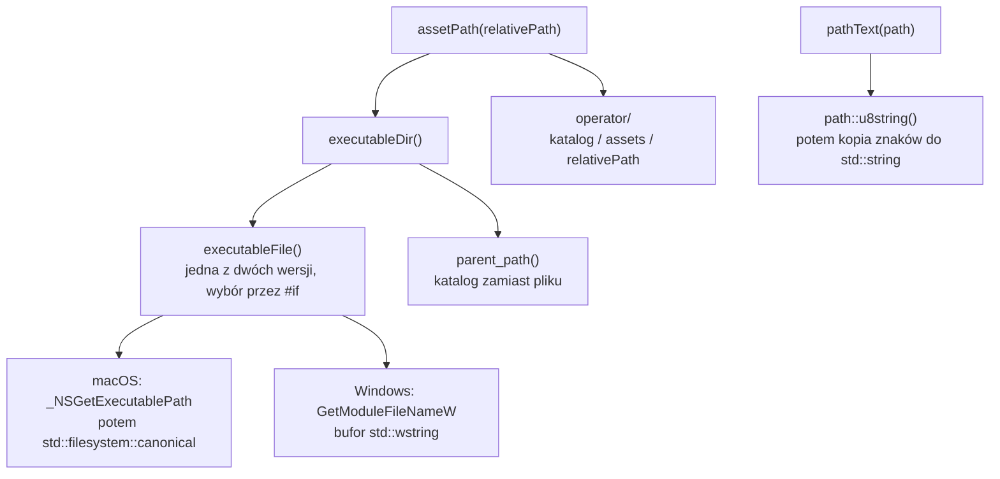

# Moduł core: ścieżki do assetów

Kamień milowy: M1. Temat wykładu: 1 (moduł `core`), pierwszy użytkownik należy do tematu 2 (Programowalny potok).
Kod: [`src/core/Paths.hpp`](../../../src/core/Paths.hpp), [`src/core/Paths.cpp`](../../../src/core/Paths.cpp), użycie w [`src/game/NightMazeApp.cpp`](../../../src/game/NightMazeApp.cpp), krok budowania w [`CMakeLists.txt`](../../../CMakeLists.txt).

Część modułu `core`. Wstęp do całego modułu jest w [`README.md`](README.md). Pozostałe części: [`window-context.md`](window-context.md) (okno i kontekst), [`main-loop.md`](main-loop.md) (pętla i czas), [`input.md`](input.md) (klawiatura i mysz), [`gl-check.md`](gl-check.md) (błędy OpenGL).

**Zmiana z 2026-10-06 (M9, część 3).** `core/Files.*` ma od tej zmiany także `core::readTextFile` i `core::writeTextFile` (cały tekst, bez zmiany końców linii; fałsz, gdy plik się nie otwiera lub nie wszystkie bajty zapisano; nic nie logują). Plik ustawień `night-maze-settings.txt` jest czytany i pisany **względem katalogu roboczego**, a nie przez `core::assetPath` ([`../game/settings.md`](../game/settings.md), sekcja 2.2); `.gitignore` go ignoruje.

## 1. Po co to jest

Program wczytuje pliki z dysku: shadery, modele i tekstury. Wszystkie mają leżeć w katalogu `assets/`. Pytanie brzmi: jak program ma ten katalog znaleźć. Najprostsza odpowiedź, czyli ścieżka względna (relative path) `"assets/shaders/lit.vert"`, działa tylko wtedy, gdy program został uruchomiony z "właściwego" miejsca. Ten sam plik `.exe` uruchomiony z terminala, z IDE i dwuklikiem dostaje trzy różne katalogi robocze (working directory), a ścieżka względna jest liczona właśnie od katalogu roboczego. To ta sama historia co z plikiem `imgui.ini`, który raz powstaje w katalogu repozytorium, a raz obok programu ([`../../guides/build-windows.md`](../../guides/build-windows.md), sekcja 7). Dla `imgui.ini` skutkiem jest tylko inny układ paneli. Dla shaderów, modeli i tekstur skutkiem byłby program, który niczego nie rysuje.

Dlatego szukam assetów **względem pliku wykonywalnego**, a nie względem katalogu roboczego. Dwie funkcje w `core`:

- `core::executableDir()` zwraca bezwzględną ścieżkę katalogu, w którym leży uruchomiony program,
- `core::assetPath("shaders/lit.vert")` zwraca `executableDir() / "assets" / "shaders/lit.vert"`.

Trzecia funkcja, `core::pathText(path)`, nie szuka niczego: zamienia ścieżkę na tekst w UTF-8, żeby dało się ją wypisać w logu i pokazać w panelu debug (sekcja 5.7).

PRD (sekcja 6) wymienia "ścieżki do assetów" jako jedną z odpowiedzialności warstwy `core`.

Stan na dziś: w repozytorium jest katalog [`assets/`](../../../assets/) z pięcioma podkatalogami: `fonts/` (czcionka paneli z licencją), `shaders/` (dwadzieścia pięć plików etapów shaderów, siedemnaście w katalogu głównym i osiem w `post/`, które razem tworzą czternaście programów: `textured`, `color`, `lit`, `gouraud`, `skybox`, `shadow_depth` i `reflect`, każdy jako `.vert` i `.frag`, `grass` jako `.vert`, `.geom` i `.frag`, oraz programy z `post/`, z których pięć dzieli plik `post/composite.vert`; do tego pięć plików dołączanych w `common/`: `lighting.glsl`, `normal_map.glsl`, `shadows.glsl`, `color.glsl` i `depth.glsl`, czyli trzydzieści plików w sumie; do M6 plików było trzynaście i dwa dołączane), `models/` (osiem modeli `.obj` z plikami `.mtl`: ściana i słupek labiryntu, dwa kryształy, brama oraz, od M8, części 2, płytka i uchwyt dźwigni i kartka. Płytkę podłogi, szósty model do M5, usunął M6, gdy podłogę zastąpił teren), `textures/` (piętnaście plików `.png`: siedem tekstur koloru, siedem map normalnych i mapa wysokości terenu `heightmap.png`) i `skybox/` (sześć ścian nieba). Para `basic.vert` i `basic.frag`, od której ten moduł zaczynał w M1, została usunięta w M5 razem z kostką. `core::assetPath` ma siedmiu użytkowników: konstruktor `game::NightMazeApp` buduje tak ścieżki dwudziestu pięciu plików shaderów (dwadzieścia dziewięć wywołań dla czternastu programów, bo plik `post/composite.vert` jest użyty pięć razy) i, w funkcji `loadHeightmap`, ścieżkę mapy wysokości, konstruktor `game::MazeRenderer` ścieżki dwóch modeli labiryntu, konstruktor `game::GameplayRenderer` ścieżki trzech modeli rundy, konstruktor `game::InteractableRenderer` ścieżki trzech modeli dźwigni i kartki, konstruktor `game::TerrainRenderer` ścieżki dwóch tekstur gruntu, konstruktor `game::Skybox` ścieżki sześciu obrazów nieba, a motyw paneli w `src/debug/Theme.cpp` ścieżkę pliku czcionki. Ścieżek tekstur **modeli** nikt nie buduje przez `assetPath`: wynikają z linii `map_Kd` i `map_Bump` w pliku `.mtl` i są liczone względem katalogu tego pliku (sekcja 5.8). Tekstury gruntu są pierwszymi, których nazwy stoją w kodzie, bo teren nie jest modelem z pliku i nie ma pliku `.mtl`. Tak samo jest z plikami z `common/`: nazwę podaje linia `#include` w shaderze, a ścieżka jest liczona względem katalogu pliku shadera (sekcja 5.8). `core::pathText` wołają `gfx::Shader`, loadery i `assets::AssetCache` (komunikaty w konsoli) oraz okno debugowania (zakładki Diagnostics / Frame and shaders i Diagnostics / Assets: nazwy plików). Build umieszcza `assets` obok pliku wykonywalnego: na macOS jako dowiązanie symboliczne do katalogu w repozytorium, na Windowsie jako kopię, którą robi i odświeża target `copy_assets` (sekcja 5.8).

## 2. Teoria

### 2.1 Katalog roboczy

Każdy proces ma **katalog roboczy** (current working directory): katalog, od którego system liczy wszystkie ścieżki względne podane przez ten proces. Proces dziedziczy go po tym, kto go uruchomił. W C++ można go odczytać przez `std::filesystem::current_path()`.

| Sposób uruchomienia | Katalog roboczy |
|---|---|
| `./build/debug/night_maze` wpisane w katalogu repozytorium | katalog repozytorium |
| `./night_maze` wpisane w `build/debug` | `build/debug` |
| dwuklik na pliku programu na Windowsie | katalog z plikiem `.exe` |
| IDE (F5) | to, co ustawiono w konfiguracji uruchamiania |

Program nie ma wpływu na to, skąd zostanie uruchomiony, więc nie może zakładać, że katalog roboczy to katalog repozytorium.

### 2.2 Ścieżka bezwzględna i względna

- **Ścieżka bezwzględna** (absolute path) zaczyna się od korzenia systemu plików (`/Users/...` na macOS, `C:\Users\...` na Windowsie) i wskazuje to samo miejsce niezależnie od katalogu roboczego.
- **Ścieżka względna** (relative path) nie ma korzenia i system dokleja ją do katalogu roboczego.

`executableDir()` zawsze zwraca ścieżkę bezwzględną, więc `assetPath(...)` też jest bezwzględna, o ile argument jest względny (sekcja 7, pułapka 2).

### 2.3 Dlaczego nie `argv[0]`

Pierwszy argument funkcji `main`, `argv[0]`, zwyczajowo zawiera nazwę programu, więc kusi, żeby z niego wyciągnąć katalog. To nie działa, bo `argv[0]` jest tylko napisem, który podał proces uruchamiający. Zmierzone na macOS małym programem testowym:

| Jak uruchomiono | `argv[0]` |
|---|---|
| `../bin/raw` z sąsiedniego katalogu | `../bin/raw` (ścieżka względna, znów zależna od katalogu roboczego) |
| `./rawlink` (dowiązanie symboliczne do programu) | `./rawlink` (ścieżka dowiązania, nie pliku) |
| `raw`, znalezione przez zmienną `PATH` | `raw` (sama nazwa, bez żadnego katalogu) |

Do tego proces uruchamiający może wpisać do `argv[0]` dowolny tekst, a standard C++ pozwala nawet na pusty napis. Trzeba więc zapytać system operacyjny.

### 2.4 Pytanie do systemu operacyjnego

Biblioteka standardowa C++ (w tym `std::filesystem`) nie ma funkcji "gdzie jest plik wykonywalny". Każdy system ma własne wywołanie:

| System | Funkcja | Nagłówek |
|---|---|---|
| macOS | `_NSGetExecutablePath` | `<mach-o/dyld.h>` |
| Windows | `GetModuleFileNameW` | `<windows.h>` |

To jedyne miejsce w `src/`, w którym kod rozgałęzia się na systemy dyrektywą preprocesora `#if`. Preprocesor (opisany przy makrze `GL_CHECK`, [`gl-check.md`](gl-check.md), sekcja 2.2) zostawia kompilatorowi tylko jedną gałąź: na Macu kompilator w ogóle nie widzi kodu dla Windows i odwrotnie. Makro `__APPLE__` definiuje sam kompilator na systemach Apple, a `_WIN32` na Windowsie (także 64 bitowym). **Zmiana z 2026-10-06 (M9, część 4):** to przestało być jedyne miejsce. Dekoder wideo ma kod zależny od systemu w dwóch plikach: `src/video/VideoDecoderWindows.cpp` (całe ciało w `#ifdef _WIN32`) i `src/video/VideoDecoderApple.mm` (osobny plik Objective-C++ dla macOS, nigdy nie skompilowany), za jednym interfejsem `video/VideoDecoder.hpp` ([`../video/README.md`](../video/README.md)). `Paths.cpp` pozostaje jedynym plikiem **rdzenia** (`core`) z takim rozgałęzieniem.

### 2.5 `std::filesystem::path`

`std::filesystem::path` (nagłówek `<filesystem>`, C++17) to obiekt przechowujący ścieżkę. Sam z siebie nie dotyka dysku: to "napis, który wie, że jest ścieżką". Używam trzech jego operacji i jednej funkcji:

| Operacja | Co robi | Czy czyta dysk |
|---|---|---|
| `a / b` (`operator/`) | skleja dwie części ścieżki, wstawiając między nie separator właściwy dla systemu | nie |
| `p.parent_path()` | zwraca ścieżkę bez ostatniego elementu: dla `/a/b/night_maze` daje `/a/b` | nie |
| `std::filesystem::path(napis)` | tworzy ścieżkę z napisu wąskiego (`char`) albo szerokiego (`wchar_t`) | nie |
| `std::filesystem::canonical(p)` | zwraca ścieżkę bezwzględną do prawdziwego pliku: rozwija dowiązania symboliczne oraz elementy `.` i `..` | tak, plik musi istnieć |

**Dlaczego nigdy nie sklejam ścieżek jako napisów.** Zapis `dir + "/assets/" + name` ma trzy wady. Separatorem na Windowsie jest `\`, a na macOS `/` (Windows zwykle akceptuje też `/`, ale wtedy w jednej ścieżce mieszają się oba). Łatwo o podwójny albo brakujący separator, gdy jedna z części już go ma albo nie ma. I najważniejsze: na Windowsie natywna ścieżka składa się ze znaków szerokich, więc sklejanie przez `std::string` wymusza konwersję, która może zepsuć znaki spoza ASCII (sekcja 2.6). `operator/` załatwia wszystkie trzy sprawy, z jednym zastrzeżeniem: wstawia separator systemu tylko **między** sklejanymi częściami, a ukośników wewnątrz części nie zmienia. Nazwa względna `shaders/basic.vert` zachowuje więc swój `/` także na Windowsie i pełna ścieżka wygląda tam tak: `...\build\debug\Debug\assets\shaders/basic.vert` (zmierzone w komunikacie błędu shadera). Windows przyjmuje taką ścieżkę bez zastrzeżeń. PRD wymaga budowania ścieżek wyłącznie przez `std::filesystem`.

### 2.6 Znaki szerokie na Windowsie

Windows przechowuje nazwy plików w UTF-16, a jego funkcje systemowe występują parami: wersja z końcówką `A` przyjmuje i zwraca `char` w lokalnej stronie kodowej (ANSI code page), a wersja z końcówką `W` używa `wchar_t` (znak szeroki, wide character, na Windowsie 16 bitów). Strona kodowa ma tylko 256 znaków i zależy od ustawień systemu, więc ścieżka z literami spoza niej nie da się w niej zapisać. To nie jest przypadek teoretyczny: katalog użytkownika często zawiera imię, na przykład `C:\Users\Łukasz\...`, a program leży właśnie gdzieś pod nim.

Dlatego wołam `GetModuleFileNameW`, trzymam wynik w `std::wstring` (napis ze znaków `wchar_t`) i buduję `std::filesystem::path` prosto z niego. Na Windowsie `path` przechowuje ścieżkę wewnętrznie właśnie jako `wchar_t`, więc po drodze nie ma żadnej konwersji. Na macOS ścieżki są napisami `char` w UTF-8 i problem nie występuje.

## 3. Jak to działa w OpenGL

Ta część modułu nie ma związku z OpenGL: nie woła żadnej funkcji `gl*` ani GLFW. Rozmawia z systemem operacyjnym i z biblioteką standardową:

| Wywołanie | System | Co robi |
|---|---|---|
| `_NSGetExecutablePath(buf, &bufsize)` | macOS | Kopiuje ścieżkę programu do bufora i zwraca 0. Gdy bufor jest za mały, zwraca -1 i wpisuje do `bufsize` wymagany rozmiar (razem z kończącym zerem). Zwraca "jakąś" ścieżkę do programu, niekoniecznie prawdziwą: może to być dowiązanie symboliczne |
| `GetModuleFileNameW(hModule, lpFilename, nSize)` | Windows | Dla `hModule` równego `nullptr` wpisuje do bufora pełną ścieżkę programu bieżącego procesu. Zwraca liczbę zapisanych znaków bez kończącego zera. Gdy bufor jest za mały, obcina napis, zwraca `nSize` i ustawia błąd `ERROR_INSUFFICIENT_BUFFER`. Przy niepowodzeniu zwraca 0 |
| `std::filesystem::canonical(p)` | oba (używane w gałęzi macOS) | Rozwija dowiązania i `..`, zwraca ścieżkę bezwzględną. Rzuca `std::filesystem::filesystem_error`, gdy plik nie istnieje |

## 4. Shadery

Ta część modułu nie ma shaderów, ale to przez nią program je znajduje: trzynaście plików leży w `assets/shaders/`, a `game::NightMazeApp` pyta o ich położenie przez `core::assetPath` (sekcja 5.8). Dwa pliki dołączane, `assets/shaders/common/lighting.glsl` i `assets/shaders/common/normal_map.glsl`, są znajdowane inaczej: względem pliku shadera, który je dołącza (sekcja 5.8). Same shadery opisuje [`../gfx/shaders.md`](../gfx/shaders.md).

## 5. Kod w projekcie

### 5.1 Pliki

| Plik | Co zawiera |
|---|---|
| [`src/core/Paths.hpp`](../../../src/core/Paths.hpp) | deklaracje `core::executableDir`, `core::assetPath` i `core::pathText`. Dołącza tylko `<filesystem>` i `<string>` |
| [`src/core/Paths.cpp`](../../../src/core/Paths.cpp) | stała `ASSETS_DIRECTORY`, pomocnicza `executableFile` w dwóch wersjach (macOS, Windows) i trzy funkcje publiczne |

Oba pliki są na liście źródeł biblioteki `engine` w [`CMakeLists.txt`](../../../CMakeLists.txt). To wolne funkcje (free functions) w przestrzeni nazw `core`: nie ma klasy, nie ma stanu, nie ma zmiennych globalnych i nic nie jest zapamiętywane między wywołaniami.



`pathText` stoi na diagramie osobno: nie woła pozostałych funkcji i nie pyta systemu o nic.

### 5.2 Nagłówek

```cpp
/// Absolute path of the directory that contains the running executable.
/// Throws std::runtime_error if the operating system cannot report it.
std::filesystem::path executableDir();

/// Path of a file in the assets directory that lies next to the executable, for example
/// assetPath("shaders/lit.vert"). It does not check that the file exists: the code
/// that opens the file reports that.
std::filesystem::path assetPath(const std::filesystem::path& relativePath);

/// A path as UTF-8 text, for log messages and for labels in the debug UI. It works for
/// every path on both systems and does not depend on the code page of Windows.
std::string pathText(const std::filesystem::path& path);
```

- `executableDir` i `assetPath` zwracają `std::filesystem::path` przez wartość. Wołający dostaje własny obiekt i może go od razu przekazać dalej, na przykład do `std::ifstream`.
- `assetPath` przyjmuje `const std::filesystem::path&`. Literał `"shaders/lit.vert"` zamienia się na `path` niejawnie, więc wywołanie `assetPath("shaders/lit.vert")` działa bez dodatkowego zapisu.
- `pathText` idzie w drugą stronę: dostaje `path`, zwraca `std::string`. Stąd `<string>` w nagłówku.
- Nagłówek nie dołącza ani `<windows.h>`, ani `<mach-o/dyld.h>`. Nagłówki systemowe są tylko w pliku `.cpp`, więc nie "wyciekają" do plików, które dołączają `core/Paths.hpp` (sekcja 7, pułapka 5).
- `std::filesystem::filesystem_error`, który może rzucić `canonical`, dziedziczy po `std::runtime_error` (przez `std::system_error`), więc zdanie "Throws std::runtime_error" jest prawdziwe także dla niego. Wyjątek doleci do `catch (const std::exception&)` w `main`.

### 5.3 Nagłówki systemowe i `#if`

```cpp
// The C++ standard library cannot tell where the executable is, so each operating system
// needs its own call. This is the only platform specific code in the file.
#if defined(__APPLE__)
#include <mach-o/dyld.h>

#include <cstdint>
#elif defined(_WIN32)
// Keep windows.h small, and stop it from defining the min and max macros, which break
// std::min and std::max. The header is included only here, never in a .hpp file.
#define WIN32_LEAN_AND_MEAN
#define NOMINMAX
#include <windows.h>
#else
#error "core/Paths.cpp supports macOS and Windows only"
#endif
```

- `#if defined(__APPLE__)`, `#elif defined(_WIN32)`, `#else`: preprocesor wybiera dokładnie jedną gałąź.
- `<mach-o/dyld.h>` deklaruje `_NSGetExecutablePath`. `<cstdint>` daje typ `std::uint32_t`, którego ta funkcja używa dla rozmiaru bufora.
- `WIN32_LEAN_AND_MEAN` każe nagłówkowi `<windows.h>` pominąć rzadko używane części (krótsza kompilacja, mniej nazw). `NOMINMAX` zabrania mu definiowania makr `min` i `max`, które psują `std::min` i `std::max` z biblioteki standardowej. Oba makra muszą być zdefiniowane **przed** `#include <windows.h>`, inaczej nie mają skutku.
- `#error` przerywa kompilację z podanym komunikatem. Projekt wspiera macOS i Windows. Zamiast pisać gałąź dla Linuksa, której nie mam jak przetestować, wolę czytelny błąd kompilacji.

### 5.4 Stała `ASSETS_DIRECTORY`

```cpp
// Name of the directory with shaders, models and textures, next to the executable.
constexpr const char* ASSETS_DIRECTORY = "assets";
```

Nazwa katalogu jest w jednym miejscu i ma nazwę, zamiast być literałem w środku wyrażenia. `constexpr` oznacza stałą znaną w czasie kompilacji. Stała stoi w anonimowej przestrzeni nazw, więc jest widoczna tylko w `Paths.cpp`.

### 5.5 `executableFile` na macOS

```cpp
// Full path of the executable file on macOS.
std::filesystem::path executableFile() {
    // The first call has no buffer (size 0), so it fails on purpose and writes the size
    // it needs, including the terminating zero, into size.
    std::uint32_t size = 0;
    _NSGetExecutablePath(nullptr, &size);

    // The second call gets a buffer of exactly that size and returns 0 on success.
    std::string buffer(size, '\0');
    if (_NSGetExecutablePath(buffer.data(), &size) != 0) {
        throw std::runtime_error("Failed to read the executable path (_NSGetExecutablePath)");
    }

    // The reported path may go through a symbolic link or contain ".." parts. canonical
    // resolves both and returns the absolute path of the real file. c_str() stops at the
    // terminating zero that the system wrote into the buffer.
    return std::filesystem::canonical(buffer.c_str());
}
```

| Linia | Co robi |
|---|---|
| `std::uint32_t size = 0;` | Rozmiar bufora. Funkcja systemowa chce dokładnie tego typu, przez wskaźnik, bo sama do niego pisze |
| `_NSGetExecutablePath(nullptr, &size);` | Pierwsze wywołanie, celowo z rozmiarem 0. Bufor jest "za mały", więc funkcja zwraca -1 i wpisuje do `size` potrzebny rozmiar. Wyniku nie sprawdzam: wiem, że to niepowodzenie, chodzi tylko o `size` |
| `std::string buffer(size, '\0');` | Napis o długości `size`, wypełniony zerami. Pamięć leży na stercie i zwalnia się sama (RAII). Dzięki temu nie zakładam żadnej maksymalnej długości ścieżki |
| `_NSGetExecutablePath(buffer.data(), &size) != 0` | Drugie wywołanie z buforem właściwego rozmiaru. `buffer.data()` daje wskaźnik `char*` do pamięci napisu. Wynik różny od 0 to błąd, więc rzucam wyjątek |
| `std::filesystem::canonical(buffer.c_str())` | `buffer` ma długość `size`, czyli ścieżkę plus kończące zero. `c_str()` daje `const char*`, a `path` zbudowany ze wskaźnika czyta do pierwszego zera, więc zero nie trafia do ścieżki. `canonical` zamienia wynik na prawdziwą ścieżkę bezwzględną |

Dlaczego `canonical` jest potrzebne, widać w pomiarze (program testowy uruchomiony na trzy sposoby, `<S>` to katalog testu):

| Jak uruchomiono | Co zwraca `_NSGetExecutablePath` | Po `canonical` i `parent_path()` |
|---|---|---|
| `../bin/raw` z katalogu `<S>/other` | `<S>/other/../bin/raw` | `<S>/bin` |
| `./rawlink` (dowiązanie w `<S>/other` do `<S>/bin/raw`) | `<S>/other/rawlink` | `<S>/bin` |
| `raw` znalezione przez `PATH` | `<S>/bin/raw` | `<S>/bin` |

W drugim wierszu bez `canonical` katalogiem programu byłby `<S>/other`, czyli katalog dowiązania, a `assets/` leży obok prawdziwego pliku.

### 5.6 `executableFile` na Windowsie

Gałąź powstała na Macu według dokumentacji Microsoftu. Na Windowsie została skompilowana i uruchomiona 2026-10-05: MSVC 19.44 pod `/W4 /permissive-` nie zgłasza w `Paths.cpp` żadnego ostrzeżenia, a program znajduje shadery uruchomiony z katalogu repozytorium, z katalogu roboczego `C:\` i z katalogu z polskimi literami w nazwie (sekcja 5.9 i [`../../guides/build-windows.md`](../../guides/build-windows.md), sekcja 11).

```cpp
// Longest path Windows can report, in wide characters, including the terminating zero.
// MAX_PATH (260) is not a hard limit on current Windows, so one buffer of the documented
// maximum is used instead of growing a small buffer in a loop.
constexpr DWORD MAX_LONG_PATH_LENGTH = 32768;

// Full path of the executable file on Windows.
std::filesystem::path executableFile() {
    // Wide characters (UTF-16), so a user name with non ASCII letters is not damaged.
    // The buffer lives on the heap: 32768 wide characters are 64 KB, too much for the stack.
    std::wstring buffer(MAX_LONG_PATH_LENGTH, L'\0');

    // nullptr as the module means the executable of the current process. The function
    // returns the number of characters written, without the terminating zero.
    const DWORD length = GetModuleFileNameW(nullptr, buffer.data(), MAX_LONG_PATH_LENGTH);
    if (length == 0) {
        throw std::runtime_error("Failed to read the executable path (GetModuleFileNameW)");
    }
    // A result equal to the buffer size means the path did not fit and was cut off.
    if (length >= MAX_LONG_PATH_LENGTH) {
        throw std::runtime_error("The executable path is too long (GetModuleFileNameW)");
    }

    // Cut the string down to the characters that were written. The path is built from the
    // wide string directly, without converting it to narrow characters.
    buffer.resize(length);
    return {buffer};
}
```

| Linia | Co robi |
|---|---|
| `constexpr DWORD MAX_LONG_PATH_LENGTH = 32768;` | `DWORD` to 32 bitowa liczba bez znaku z `<windows.h>`, typ parametru `nSize` i typ wyniku funkcji. Stara stała `MAX_PATH` (260 znaków) nie jest już twardą granicą: Windows obsługuje ścieżki do około 32767 znaków. Bufor ma 32768, czyli maksimum plus kończące zero |
| `std::wstring buffer(MAX_LONG_PATH_LENGTH, L'\0');` | Napis ze znaków szerokich, wypełniony zerami. `L'\0'` to literał znaku szerokiego. Bufor jest na stercie: 32768 znaków po 2 bajty to 64 KB, za dużo na zmienną lokalną na stosie |
| `GetModuleFileNameW(nullptr, buffer.data(), MAX_LONG_PATH_LENGTH)` | `nullptr` jako moduł oznacza program bieżącego procesu. `buffer.data()` daje `wchar_t*`. Trzeci argument to rozmiar bufora w znakach |
| `if (length == 0)` | Zero oznacza niepowodzenie funkcji |
| `if (length >= MAX_LONG_PATH_LENGTH)` | Gdy ścieżka się nie mieści, funkcja obcina ją i zwraca rozmiar bufora (oraz ustawia `ERROR_INSUFFICIENT_BUFFER`). Poprawny wynik jest zawsze mniejszy od rozmiaru bufora, więc wystarczy porównać wynik i nie trzeba wołać `GetLastError`. Obciętej ścieżki nie wolno użyć, stąd wyjątek |
| `buffer.resize(length);` | Skracam napis do znaków faktycznie zapisanych. Bez tego `path` dostałby ścieżkę z tysiącami znaków zerowych na końcu |
| `return {buffer};` | Ścieżka zbudowana wprost z `std::wstring`, bez przejścia przez `char` (sekcja 2.6). Nawiasy klamrowe w `return` budują wartość typu zwracanego przez funkcję, czyli `std::filesystem::path`, z podanego argumentu: to samo co `return std::filesystem::path(buffer);`, tylko bez powtarzania nazwy typu, która stoi już w nagłówku funkcji (taki zapis proponuje sprawdzenie `modernize-return-braced-init-list` z clang-tidy, włączone w tym projekcie razem z grupą `modernize-*`) |

Wybrałem jeden duży bufor zamiast pętli powiększającej mały bufor, bo jest prostszy do wytłumaczenia: jedno wywołanie, dwa warunki. Koszt to 64 KB przydzielone na chwilę przy każdym wywołaniu.

Gałąź Windows nie woła `canonical`: `GetModuleFileNameW` zwraca pełną ścieżkę pliku, z którego załadowano program.

### 5.7 Funkcje publiczne

```cpp
std::filesystem::path executableDir() {
    return executableFile().parent_path();
}

std::filesystem::path assetPath(const std::filesystem::path& relativePath) {
    // operator/ joins path parts with the separator of the current system.
    return executableDir() / ASSETS_DIRECTORY / relativePath;
}
```

- `executableDir` odcina nazwę pliku: z `/.../build/debug/night_maze` zostaje `/.../build/debug`. Ta funkcja jest już wspólna dla obu systemów, bo różnice zamknęła `executableFile`.
- `assetPath` skleja trzy części operatorem `/`. Wyrażenie liczy się od lewej: najpierw `executableDir() / ASSETS_DIRECTORY` (tu `const char*` zamienia się na `path`), potem wynik `/ relativePath`. Dla `assetPath("shaders/x")` w programie testowym leżącym w `<S>/bin` wynik to `<S>/bin/assets/shaders/x`.
- `assetPath` **nie sprawdza**, czy plik istnieje. To celowe: funkcja tylko buduje ścieżkę. Błąd "nie ma pliku" zgłosi kod, który plik otwiera, bo tylko on wie, co z tym zrobić i jaki komunikat wypisać.
- Każde wywołanie pyta system od nowa. Nie zapamiętuję wyniku w zmiennej statycznej: to byłby ukryty stan globalny, a pytanie jest tanie i zadawane tylko przy wczytywaniu plików, nie co klatkę.

Trzecia funkcja publiczna zamienia ścieżkę na tekst:

```cpp
// u8string() gives UTF-8 on every system, and its characters (char8_t) are copied one by
// one into a std::string. path::string() is not used: on Windows it converts to the local
// code page and throws when a letter of the path does not exist there.
std::string pathText(const std::filesystem::path& path) {
    const std::u8string utf8 = path.u8string();
    std::string text(utf8.begin(), utf8.end());
    return text;
}
```

- Najprostsze `path.string()` ma na Windowsie wadę (sekcja 7, pułapka 7): zamienia znaki szerokie na lokalną stronę kodową i **rzuca wyjątek**, gdy jakiegoś znaku w niej nie ma. Tekst ścieżki trafia do komunikatów o błędach, a komunikat o błędzie nie może sam być źródłem wyjątku (konstruktor `gfx::Shader` obiecuje, że nie rzuca).
- `u8string()` zwraca UTF-8, w którym da się zapisać każdą ścieżkę. W C++20 jego typem jest `std::u8string` (napis ze znaków `char8_t`), a nie `std::string`, stąd druga linia: konstruktor `std::string` z parą iteratorów (początek i koniec napisu `utf8`) kopiuje znaki jeden po drugim, zamieniając każdy `char8_t` na `char` o tej samej wartości bajtu.
- Drugi zysk: ImGui oczekuje tekstu w UTF-8, więc wynik da się pokazać w panelu bez dalszych zamian.
- Funkcja jest w `core`, a nie w `gfx`, bo potrzebuje jej kilka warstw: `gfx::Shader` składa z niej komunikaty błędów ([`../gfx/shader-class.md`](../gfx/shader-class.md), sekcja 5.5), loadery i `assets::AssetCache` wypisują nią ścieżki modeli i tekstur (`"Loaded model: "`, `"Loaded texture: "`), a zakładki Diagnostics / Frame and shaders i Diagnostics / Assets okna debugowania z `debug/` pokazują nazwy plików ([`../gfx/shader-hot-reload.md`](../gfx/shader-hot-reload.md), sekcja 6, [`../assets/asset-cache.md`](../assets/asset-cache.md), sekcja 6). Jedna funkcja w najniższej warstwie zastępuje kilka kopii tych samych trzech linii.
- Wołający może podać część ścieżki: `core::pathText(path.filename())` daje samą nazwę pliku, na przykład `lit.vert`.

### 5.8 Użytkownicy i katalog `assets` obok programu

**Wywołanie.** W [`src/game/NightMazeApp.cpp`](../../../src/game/NightMazeApp.cpp) nazwy plików są stałymi w anonimowej przestrzeni nazw, a ścieżki powstają na liście inicjalizacyjnej konstruktora:

```cpp
// Shader files, relative to the assets directory. The scene without lighting is drawn
// with the first pair, the lines of the collision boxes and spheres with the second, the
// scene with lighting per fragment with the third, with lighting per vertex with the
// fourth and the sky with the fifth. The grass has three files: between its vertex and
// its fragment shader runs a geometry shader.
constexpr const char* TEXTURED_VERTEX_SHADER_FILE = "shaders/textured.vert";
constexpr const char* TEXTURED_FRAGMENT_SHADER_FILE = "shaders/textured.frag";
constexpr const char* COLOR_VERTEX_SHADER_FILE = "shaders/color.vert";
constexpr const char* COLOR_FRAGMENT_SHADER_FILE = "shaders/color.frag";
constexpr const char* LIT_VERTEX_SHADER_FILE = "shaders/lit.vert";
constexpr const char* LIT_FRAGMENT_SHADER_FILE = "shaders/lit.frag";
constexpr const char* GOURAUD_VERTEX_SHADER_FILE = "shaders/gouraud.vert";
constexpr const char* GOURAUD_FRAGMENT_SHADER_FILE = "shaders/gouraud.frag";
constexpr const char* SKYBOX_VERTEX_SHADER_FILE = "shaders/skybox.vert";
constexpr const char* SKYBOX_FRAGMENT_SHADER_FILE = "shaders/skybox.frag";
constexpr const char* GRASS_VERTEX_SHADER_FILE = "shaders/grass.vert";
constexpr const char* GRASS_GEOMETRY_SHADER_FILE = "shaders/grass.geom";
constexpr const char* GRASS_FRAGMENT_SHADER_FILE = "shaders/grass.frag";

// The heightmap of the terrain, relative to the assets directory: a grey picture made
// by tools/blender/make_heightmap.py.
constexpr const char* HEIGHTMAP_FILE = "textures/heightmap.png";
```

```cpp
      m_texturedShader(core::assetPath(TEXTURED_VERTEX_SHADER_FILE),
                       core::assetPath(TEXTURED_FRAGMENT_SHADER_FILE)),
      m_colorShader(core::assetPath(COLOR_VERTEX_SHADER_FILE),
                    core::assetPath(COLOR_FRAGMENT_SHADER_FILE)),
      m_litShader(core::assetPath(LIT_VERTEX_SHADER_FILE),
                  core::assetPath(LIT_FRAGMENT_SHADER_FILE)),
      m_gouraudShader(core::assetPath(GOURAUD_VERTEX_SHADER_FILE),
                      core::assetPath(GOURAUD_FRAGMENT_SHADER_FILE)),
      m_skyboxShader(core::assetPath(SKYBOX_VERTEX_SHADER_FILE),
                     core::assetPath(SKYBOX_FRAGMENT_SHADER_FILE)),
      // The geometry shader is the third argument, although it runs second: it is the
      // optional one.
      m_grassShader(core::assetPath(GRASS_VERTEX_SHADER_FILE),
                    core::assetPath(GRASS_FRAGMENT_SHADER_FILE),
                    core::assetPath(GRASS_GEOMETRY_SHADER_FILE)),
      m_compositeShader(core::assetPath(FULLSCREEN_VERTEX_SHADER_FILE),
                        core::assetPath(COMPOSITE_FRAGMENT_SHADER_FILE)),
      m_previewShader(core::assetPath(FULLSCREEN_VERTEX_SHADER_FILE),
                      core::assetPath(PREVIEW_FRAGMENT_SHADER_FILE)),
```

Listing pokazuje stan po pierwszej części M7: szesnaście stałych i siedemnaście wywołań `assetPath` dla ośmiu programów. Druga część M7 (bloom) dopisała dwie stałe, `BRIGHT_PASS_FRAGMENT_SHADER_FILE` (`shaders/post/bright.frag`) i `BLUR_FRAGMENT_SHADER_FILE` (`shaders/post/blur.frag`), i dwa pola, `m_brightPassShader` i `m_blurShader`, zbudowane tak samo jak dwa ostatnie w listingu. Po niej było osiemnaście stałych i dwadzieścia jeden wywołań `assetPath` dla dziesięciu programów. Czwarta część M7 (cienie księżyca, 2026-10-05) dopisała dwie następne stałe, `SHADOW_DEPTH_VERTEX_SHADER_FILE` (`shaders/shadow_depth.vert`) i `SHADOW_DEPTH_FRAGMENT_SHADER_FILE` (`shaders/shadow_depth.frag`), i pole `m_shadowDepthShader`, zbudowane z własnej pary plików. Po czwartej części M7 było więc dwadzieścia stałych i dwadzieścia trzy wywołania `assetPath` dla jedenastu programów, a po M8, części 1 jest dwadzieścia pięć stałych i dwadzieścia dziewięć wywołań dla czternastu programów (szósta część M7 dodała trzy stałe minimapy, a M8, część 1 dwie stałe programu `reflect`). Stan z czwartej części M7 to sześć par (pięć z M2 do M6 i program głębi mapy cieni), trzy pliki programu trawy (M6) i, z M7, cztery programy przebiegów po scenie, które dzielą jeden plik shadera wierzchołków (`shaders/post/composite.vert`, stała `FULLSCREEN_VERTEX_SHADER_FILE`, użyta cztery razy) i mają własne shadery fragmentów w podkatalogu `shaders/post/`. Ten sam plik woła `assetPath` jeszcze raz, w funkcji `loadHeightmap`, dla mapy wysokości terenu: `core::assetPath(HEIGHTMAP_FILE)` idzie tam wprost do `assets::loadImage`, bez pamięci assetów ([`README.md`](README.md), sekcja 6.3).

Drugi użytkownik to [`src/game/MazeRenderer.cpp`](../../../src/game/MazeRenderer.cpp), który tak samo buduje ścieżki dwóch modeli i podaje je pamięci assetów (do M5 trzech: trzecim była płytka podłogi, usunięta w M6):

```cpp
// Model files, relative to the assets directory.
constexpr const char* WALL_MODEL_FILE = "models/wall_straight.obj";
constexpr const char* PILLAR_MODEL_FILE = "models/wall_pillar.obj";
```

```cpp
MazeRenderer::MazeRenderer(assets::AssetCache& assets)
    : m_wall(assets.model(core::assetPath(WALL_MODEL_FILE))),
      m_pillar(assets.model(core::assetPath(PILLAR_MODEL_FILE))) {}
```

Trzeci użytkownik doszedł w M5. [`src/game/GameplayRenderer.cpp`](../../../src/game/GameplayRenderer.cpp) robi to samo dla trzech modeli rundy:

```cpp
constexpr const char* CRYSTAL_A_MODEL_FILE = "models/crystal_a.obj";
constexpr const char* CRYSTAL_B_MODEL_FILE = "models/crystal_b.obj";
constexpr const char* GATE_MODEL_FILE = "models/gate.obj";
```

```cpp
GameplayRenderer::GameplayRenderer(assets::AssetCache& assets)
    : m_crystals{assets.model(core::assetPath(CRYSTAL_A_MODEL_FILE)),
                 assets.model(core::assetPath(CRYSTAL_B_MODEL_FILE))},
      m_gate(assets.model(core::assetPath(GATE_MODEL_FILE))) {}
```

Oba renderery dostają tę samą pamięć assetów, więc wszystkie modele (dziś osiem) i ich tekstury żyją w jednym miejscu.

Dwóch użytkowników doszło w M6. [`src/game/Skybox.cpp`](../../../src/game/Skybox.cpp) buduje w pętli ścieżki sześciu obrazów nieba (`core::assetPath(FACE_FILES[face])`) i czyta je sam, bez pamięci assetów ([`../renderer/skybox.md`](../renderer/skybox.md)). [`src/game/TerrainRenderer.cpp`](../../../src/game/TerrainRenderer.cpp) prosi pamięć assetów o dwie tekstury gruntu:

```cpp
constexpr const char* GROUND_TEXTURE_FILE = "textures/ground.png";
constexpr const char* GROUND_NORMAL_MAP_FILE = "textures/ground_normal.png";
```

```cpp
    const gfx::Texture2D* texture = assets.texture(core::assetPath(file), colorSpace);
```

Szóstym użytkownikiem jest motyw paneli: `loadFont` w [`src/debug/Theme.cpp`](../../../src/debug/Theme.cpp) woła `core::assetPath(core::TEXT_FONT_FILE)`. Od M9, części 2 stała `TEXT_FONT_FILE` i funkcja `core::readBinaryFile` leżą w [`src/core/Files.hpp`](../../../src/core/Files.hpp) i [`Files.cpp`](../../../src/core/Files.cpp) (część `engine`), bo ten sam plik czcionki rysuje menu. Siódmym użytkownikiem `assetPath` jest `ui::AssetFileInterface`, przez który RmlUi czyta dokumenty, style i czcionkę z katalogu `assets` ([`../ui/README.md`](../ui/README.md)).

**Tekstury modeli: ścieżka z pliku, nie z kodu.** W kodzie nie ma nazwy żadnej tekstury modelu, także tekstur kryształów i bramy. Wyjątkiem od M6 są dwie tekstury gruntu z bloku wyżej: teren powstaje w kodzie z mapy wysokości, nie ma pliku `.obj` ani `.mtl`, więc nazwy jego tekstur muszą stać w `TerrainRenderer.cpp`. Plik `wall_straight.mtl` zawiera linię `map_Kd ../textures/wall_stone.png`, a loader liczy tę ścieżkę względem katalogu pliku `.mtl` ([`src/assets/ObjLoader.cpp`](../../../src/assets/ObjLoader.cpp)):

```cpp
        // Texture paths are relative to the directory of the MTL file. lexically_normal
        // removes the ".." steps on paper, without asking the file system:
        // assets/models/../textures/wall_stone.png becomes assets/textures/wall_stone.png.
        const std::filesystem::path mtlDirectory = mtlPath.parent_path();
        for (ObjMaterial& material : materials) {
            if (!material.diffuseTexture.empty()) {
                material.diffuseTexture =
                    (mtlDirectory / material.diffuseTexture).lexically_normal();
            }
            if (!material.normalTexture.empty()) {
                material.normalTexture = (mtlDirectory / material.normalTexture).lexically_normal();
            }
```

Druga instrukcja `if` robi to samo dla mapy normalnych z linii `map_Bump -bm 1.000000 ../textures/wall_stone_normal.png` tego samego pliku `.mtl` ([`../gfx/normal-mapping.md`](../gfx/normal-mapping.md), sekcja 5.3): obie ścieżki mają ten sam punkt odniesienia.

To inna zasada niż w `assetPath`, ale ten sam cel: ścieżka nie zależy od katalogu roboczego. Model został znaleziony przez `assetPath`, więc jego ścieżka jest bezwzględna, a wszystko, co model wskazuje, jest liczone od niej. `lexically_normal` usuwa kroki `..` na samym tekście ścieżki, bez pytania systemu plików (inaczej niż `canonical` z sekcji 5.5, które wymaga istniejącego pliku). Dzięki temu ściana i słupek, które wskazują tę samą teksturę, dostają identyczny tekst ścieżki, a pamięć assetów wczytuje ją raz. To samo dotyczy dwóch modeli kryształów: `crystal_a.mtl` i `crystal_b.mtl` wskazują `../textures/crystal.png` ([`../assets/asset-cache.md`](../assets/asset-cache.md), sekcja 5, [`../assets/obj-loader.md`](../assets/obj-loader.md), sekcja 5).

**Pliki dołączane do shaderów: ścieżka z linii `#include`.** Trzeci przypadek tej samej zasady doszedł w M4. W kodzie C++ nie ma nazwy pliku `common/lighting.glsl`: wymieniają ją linie `#include "common/lighting.glsl"` w `lit.frag` i `gouraud.vert`. Tak samo jest z drugim plikiem dołączanym, `common/normal_map.glsl` (linie `#include` w `lit.frag` i `textured.frag`). Kod wczytujący shader liczy tę nazwę względem katalogu pliku shadera ([`src/gfx/Shader.cpp`](../../../src/gfx/Shader.cpp), funkcja `compileShader`):

```cpp
    const std::filesystem::path includeDirectory = path.parent_path();
    const IncludeReader readInclude = [&includeDirectory](const std::string& name,
                                                          std::string& text) {
        return readTextFile(includeDirectory / name, text);
    };
```

`path` to ścieżka shadera zbudowana przez `assetPath`, więc jest bezwzględna, a `parent_path()` i `operator/` (sekcja 2.5) dają bezwzględną ścieżkę pliku dołączanego: `<katalog programu>/assets/shaders/common/lighting.glsl`. Tu nie ma `lexically_normal`, bo nazwa nie zawiera kroków `..`. Katalogiem odniesienia jest zawsze katalog pliku shadera, także dla linii `#include` wewnątrz pliku dołączanego. Resztę opisuje [`../gfx/shader-includes.md`](../gfx/shader-includes.md) (sekcja 5.8).

Nazwy są względne i zapisane z ukośnikiem `/`, który `std::filesystem::path` rozumie na obu systemach. Dla programu w `<repo>/build/debug/night_maze` wynikiem jest `<repo>/build/debug/assets/shaders/lit.vert`. Na Windowsie wynikiem jest `<repo>\build\debug\Debug\assets\shaders/lit.vert`, z jednym zwykłym ukośnikiem w środku (sekcja 2.5).

**Wyjątek.** `executableDir` może rzucić `std::runtime_error`. Dzieje się to wtedy w trakcie konstruowania pola `m_texturedShader` (pierwszego, które woła `assetPath`), czyli wewnątrz konstruktora aplikacji wołanego w bloku `try` funkcji `main`. Część bazowa (`core::Application` z oknem) jest już zbudowana, więc C++ niszczy ją poprawnie, a `catch (const std::exception&)` w `main` wypisuje `[error] Fatal: ...` i zwraca kod błędu. Brak samego pliku shadera wyjątkiem **nie** jest: zgłasza go `gfx::Shader` linią `[error]` i program działa dalej ([`../gfx/shader-class.md`](../gfx/shader-class.md), sekcja 5.8).

**Skąd `assets` obok programu.** `assetPath` szuka katalogu `assets` w katalogu pliku wykonywalnego, czyli w `build/debug`, a pliki leżą w repozytorium, w `<repo>/assets`. Łączy je blok w [`CMakeLists.txt`](../../../CMakeLists.txt), inny dla każdego systemu:

| System | Mechanizm CMake | Polecenie | Skutek |
|---|---|---|---|
| macOS | polecenie `POST_BUILD` targetu `night_maze`, wykonywane po zlinkowaniu programu | `cmake -E create_symlink <repo>/assets <katalog programu>/assets` | `build/debug/assets` jest **dowiązaniem symbolicznym** do katalogu w repozytorium. Program czyta zawsze aktualne pliki, bez budowania |
| Windows | osobny target `copy_assets`, należący do targetu domyślnego (`ALL`) i niezależny od `night_maze` | `cmake -E copy_directory <repo>/assets <katalog programu>/assets` | obok `night_maze.exe` leży **kopia** katalogu. Program czyta kopię. Kopię odświeża `cmake --build --preset debug --target copy_assets` (także przy działającym programie) oraz każde pełne `cmake --build --preset debug` (tylko przy zamkniętym programie) |

Target `copy_assets` nie zależy od programu: nie ma między nimi linii `add_dependencies`, a katalog docelowy tworzy samo polecenie `copy_directory`. To ma znaczenie przy działającym programie. Windows blokuje plik `.exe` działającego programu, a pełny build z generatorem Visual Studio próbuje go wtedy zlinkować i kończy się błędem `LINK : fatal error LNK1168`, także gdy żaden plik C++ się nie zmienił (zmierzone). Samo `--target copy_assets` programu nie dotyka.

Dlaczego dwie gałęzie, dlaczego różne mechanizmy i co robi każda linia tego bloku, opisuje [`../../guides/project-structure.md`](../../guides/project-structure.md) (sekcja 3.1, blok 7).

Dwa różne dowiązania nie powinny się mylić. Dowiązanie **do programu** (pułapka 9) rozwija `canonical` w `executableFile`, żeby katalogiem programu był katalog prawdziwego pliku. Dowiązanie **`assets`** jest zwykłym elementem ścieżki: `assetPath` go nie rozwija, robi to system operacyjny w chwili otwierania pliku. Dlatego w komunikatach błędów widać ścieżkę przez `build/debug/assets`, a nie przez `<repo>/assets`.

### 5.9 Jak to zostało sprawdzone

Na macOS gałąź sprawdziłem najpierw małym programem testowym poza repozytorium, który dołącza `src/core/Paths.cpp` i wypisuje wynik obu funkcji. Uruchomiony z własnego katalogu, z katalogu `/`, przez ścieżkę z `..`, przez dowiązanie symboliczne i przez `PATH` za każdym razem wypisał ten sam katalog prawdziwego pliku.

Po dodaniu shaderów sprawdziłem sam program `night_maze`: uruchomiony z katalogu repozytorium i z katalogu `/tmp` wczytał shadery bez żadnej linii `[error]`. Sprawdziłem też krok budowania: dowiązanie `build/debug/assets` i `build/release/assets` wskazuje ścieżkę bezwzględną `<repo>/assets`, ponowne wykonanie kroku przy istniejącym dowiązaniu kończy się powodzeniem, a `make clean` usuwa dowiązanie razem z katalogiem `build/`, nie ruszając plików w `<repo>/assets`.

`pathText` sprawdziłem na macOS małym programem poza repozytorium: dla ścieżki `katalog/zażółć/basic.vert` zwraca 29 bajtów (polskie litery zajmują w UTF-8 po dwa bajty), a dla `filename()` tej ścieżki napis `basic.vert`. Pomiar jest z M1, stąd nazwa pliku, którego dziś w repozytorium już nie ma: funkcja pliku nie otwiera, więc nazwa nie ma znaczenia dla wyniku.

Na Windowsie (2026-10-05, MSVC 19.44) sprawdziłem program `night_maze`, bez osobnego programu testowego. Tabela jest z M1, gdy program rysował samą kostkę programem `basic` (usuniętym w M5), dlatego wymienia tamte pliki:

| Próba | Wynik |
|---|---|
| kompilacja `Paths.cpp` pod `/W4 /permissive-` (gałąź `_WIN32`) | zero ostrzeżeń |
| start z katalogu repozytorium | kostka na ekranie, żadnej linii `[error]` |
| start z katalogu roboczego `C:\` | to samo |
| start z kopii `build\debug\Debug` w katalogu z polskimi literami (`...\Temp\nm-Żółw\`) | to samo: `GetModuleFileNameW` i `path` ze znaków szerokich działają dla ścieżki spoza ASCII |
| kopia `assets` po buildzie Debug i Release | ówczesne `assets\shaders\basic.vert` i `basic.frag` obok każdego z programów |
| `pathText` w komunikacie błędu shadera | ówczesne `<repo>\build\debug\Debug\assets\shaders/basic.frag` |

Po dodaniu labiryntu (M2 + M3, 2026-10-05) program uruchomiony z katalogu repozytorium startował bez linii `[error]`: znajdował ówczesne sześć plików shaderów, trzy modele i dwie tekstury. Uruchomienia z innego katalogu roboczego i z katalogu z polskimi literami nie powtarzałem dla modeli i tekstur.

Po dodaniu oświetlenia (M4, 2026-10-05, MSVC 19.44, sterownik NVIDIA 610.74) program startował bez linii `[error]` i bez linii `GL_`: znajdował ówczesne dziesięć plików shaderów i plik `common/lighting.glsl`, dołączany przez dwa z nich. Uruchomienia z innego katalogu roboczego i z katalogu z polskimi literami nie powtarzałem także dla tej wersji.

Po dodaniu rozgrywki (M5, Windows, 2026-10-05) build Debug i Release przechodzi bez ostrzeżeń, a obraz z kryształami i bramą został sprawdzony na zrzutach ekranu: bez znalezionych shaderów, modeli i tekstur tego obrazu by nie było. Osobnej próby ścieżek dla M5 nie robiłem. Uruchomienia z innego katalogu roboczego i z katalogu z polskimi literami nie powtarzałem także dla M5, a na macOS M5 nie było ani budowane, ani uruchamiane.

Niesprawdzone na Windowsie: `pathText` dla ścieżki z polskimi literami (w komunikacie błędu i w panelu), uruchomienie dwuklikiem i z IDE oraz ćwiczenie 1 z sekcji 8. To otwarte punkty listy kontrolnej w [`../../guides/build-windows.md`](../../guides/build-windows.md), sekcja 11.

## 6. Okno debugowania (dawniej panel ImGui)

Ścieżki nie mają własnego panelu, ale widać je w dwóch panelach. W zakładce Diagnostics / Frame and shaders ([`../gfx/shader-hot-reload.md`](../gfx/shader-hot-reload.md), sekcja 6) każdy z czternastu programów ma jedną linię z nazwami swoich plików, na przykład `lit.vert + lit.frag: OK` albo, dla programu trawy z shaderem geometrii, `grass.vert + grass.geom + grass.frag: OK`, a podpowiedź (tooltip) po najechaniu kursorem na tę linię pokazuje pełne ścieżki zbudowane przez `core::assetPath`, po jednej w linii. Etykiet `Vertex:` i `Fragment:`, które były w panelu do M2 + M3, już nie ma. Pliku dołączanego (na przykład `common/lighting.glsl`) w linii programu ani w podpowiedzi nie widać: jego nazwa pojawia się w panelu dopiero w tekście błędu, gdy pomyłka jest w nim ([`../gfx/shader-includes.md`](../gfx/shader-includes.md), sekcja 6). W zakładce Diagnostics / Assets ([`../assets/asset-cache.md`](../assets/asset-cache.md), sekcja 6) tak samo pokazane są pliki modeli i tekstur, a lista `Failed to load` wymienia te, których nie udało się wczytać. Wszystkie te teksty powstają przez `core::pathText`. Skutkiem błędnej ścieżki shadera jest linia `[error] Shader file cannot be opened: <pełna ścieżka>` w konsoli i ten sam tekst w panelu, a w oknie brak tej części sceny, którą rysuje dany program (terenu i labiryntu z kryształami i bramą w danym trybie oświetlenia, trawy, linii kolizji albo nieba). Dla programu `shadow_depth` skutek jest inny: scena jest cała, tylko bez cieni księżyca (`drawMoonShadowMap` pomija wtedy przebieg cieni). Mapy wysokości zakładkę Diagnostics / Assets nie pokazuje, bo nie przechodzi przez pamięć assetów: skutkiem błędnej ścieżki jest linia błędu loadera obrazów w konsoli i płaski grunt. Błędna nazwa w linii `#include` daje inny komunikat, `Shader include failed: <pełna ścieżka shadera>`, z nazwą brakującego pliku w drugiej linii.

## 7. Pułapki

1. **Ścieżka względna "działa u mnie".** `"assets/shaders/x.vert"` działa przy uruchomieniu z katalogu, w którym leży `assets/`, i przestaje działać z każdego innego. Błąd wychodzi dopiero u kogoś, kto uruchomił program inaczej (IDE, dwuklik). Dlatego ścieżki do assetów mają iść przez `core::assetPath`.
2. **Argument bezwzględny w `assetPath`.** `operator/` ma regułę: jeśli prawa strona jest ścieżką bezwzględną, **zastępuje** lewą. `assetPath("/etc/passwd")` zwróci więc `/etc/passwd`, a nie plik w `assets/`. Argument ma być względny, bez ukośnika na początku.
3. **`argv[0]` jako położenie programu.** To tylko napis od procesu uruchamiającego: bywa względny, bywa samą nazwą, bywa dowiązaniem (sekcja 2.3).
4. **Sklejanie ścieżek jak napisów.** `dir + "/" + name` albo `dir + "\\" + name` wiąże kod z jednym systemem i na Windowsie wymusza konwersję do `char` (sekcja 2.5).
5. **`<windows.h>` w nagłówku.** Ten nagłówek definiuje tysiące nazw i makr (bez `NOMINMAX` także `min` i `max`), które potem psują niewinny kod w plikach dołączających mój nagłówek. Dlatego jest tylko w `Paths.cpp`, w gałęzi `_WIN32`.
6. **Wersja `A` zamiast `W`.** `GetModuleFileNameA` zwraca `char` w lokalnej stronie kodowej i gubi znaki, których w niej nie ma. Program działałby u mnie, a nie u kogoś z polską literą w nazwie użytkownika.
7. **`path::string()` na Windowsie.** `string()` zamienia ścieżkę na `char` i może zgubić znaki spoza strony kodowej (albo rzucić wyjątek). Do otwierania plików przekazuję sam obiekt `path` (`std::ifstream` przyjmuje `std::filesystem::path`), a `string()` zostawiam do komunikatów w logu w ćwiczeniach. Kod, który nie może rzucić wyjątku, zamienia ścieżkę na tekst przez `u8string()`: tak robi `core::pathText` (sekcja 5.7).
8. **`MAX_PATH`.** Bufor na 260 znaków wygląda w poradnikach jak norma, ale dłuższe ścieżki istnieją. Za mały bufor nie daje błędu wprost: funkcja zwraca obciętą ścieżkę i rozmiar bufora, więc bez sprawdzenia wyniku program szukałby assetów w nieistniejącym katalogu.
9. **Dowiązanie symboliczne do programu.** Bez `canonical` katalogiem programu byłby katalog dowiązania (sekcja 5.5). Z `canonical` jest nim katalog prawdziwego pliku i tam musi leżeć `assets/`.
10. **`canonical` czyta dysk.** W odróżnieniu od `operator/` i `parent_path()` wymaga, żeby plik istniał, i rzuca wyjątek, gdy go nie ma. Dla ścieżki działającego programu plik istnieje, ale tej funkcji nie należy używać "na zapas" dla ścieżek plików, których może nie być.
11. **Katalog programu to nie katalog repozytorium.** `executableDir()` wskazuje `build/debug` (na Windowsie z generatorem Visual Studio `build\debug\Debug`), a nie korzeń repozytorium. Katalog `assets/` musi więc trafić obok programu podczas budowania. Robi to build (sekcja 5.8). Program skopiowany ręcznie w inne miejsce bez katalogu `assets` nie znajdzie shaderów.
12. **Kopia na Windowsie się starzeje.** Program czyta tam kopię katalogu `assets`, a nie pliki z repozytorium. Po zmianie shadera trzeba ją odświeżyć: `cmake --build --preset debug --target copy_assets`. Pełne `cmake --build --preset debug` też to robi, ale przy działającym programie kończy się błędem linkera `LNK1168` (sekcja 5.8). Budowanie samego targetu `night_maze` (możliwe przy F5 w Visual Studio) kopii nie odświeża ([`../../guides/build-windows.md`](../../guides/build-windows.md), sekcja 7). Na macOS problemu nie ma, bo dowiązanie zawsze prowadzi do aktualnych plików.
13. **Usuwanie przez dowiązanie.** `build/debug/assets` na macOS to dowiązanie do prawdziwego katalogu. Polecenie, które wchodzi w dowiązania (na przykład `rm -rf build/debug/assets/`, z ukośnikiem na końcu), usunęłoby pliki z repozytorium. `make clean` używa `cmake -E rm -rf build`, które usuwa samo dowiązanie.

## 8. Ćwiczenia

1. **Katalog programu a katalog roboczy.** W `src/main.cpp` dołącz tymczasowo `"core/Paths.hpp"` i `<filesystem>`, a na początku bloku `try` w `main` dopisz `core::logInfo("exe: " + core::executableDir().string());` oraz `core::logInfo("cwd: " + std::filesystem::current_path().string());`. Zbuduj i uruchom program dwa razy: z katalogu repozytorium (`./build/debug/night_maze`) i z katalogu `build/debug` (`./night_maze`). Która linia się zmienia, a która nie? Wycofaj zmiany.
2. **Dowiązanie.** Z kodem z ćwiczenia 1 utwórz w katalogu domowym dowiązanie symboliczne do programu (`ln -s "$PWD/build/debug/night_maze" ~/nm`) i uruchom `~/nm`. Jaki katalog wypisuje `exe`? Zakomentuj tymczasowo `canonical` (zwracając `std::filesystem::path(buffer.c_str())`), zbuduj i powtórz. Wyjaśnij różnicę, przywróć kod i usuń dowiązanie.
3. **`assetPath` bez pliku.** Z kodem z ćwiczenia 1 dopisz `core::logInfo(core::assetPath("shaders/nie_ma.vert").string());`. Program wypisuje ścieżkę, choć takiego pliku nie ma. Wskaż w kodzie, dlaczego nie ma błędu. Potem w `NightMazeApp.cpp` zmień tymczasowo `LIT_VERTEX_SHADER_FILE` na tę nazwę i zobacz, kto i jaką linią zgłasza brak pliku. Wycofaj zmiany.
4. **Argument bezwzględny.** W tym samym miejscu wypisz `core::assetPath("/tmp/x").string()`. Wyjaśnij wynik regułą `operator/` z sekcji 7. Wycofaj zmiany.
5. **Dowiązanie `assets`.** Wykonaj `ls -l build/debug/assets` i `ls build/debug/assets/shaders`. Dokąd prowadzi dowiązanie i czy ścieżka jest bezwzględna? W `assets/shaders/color.frag` zamień tymczasowo `vec4(uColor, 1.0)` na `vec4(1.0, 0.0, 0.0, 1.0)`, uruchom program bez budowania i włącz `Draw collision shapes` w zakładce Diagnostics / Collision and picking. Dlaczego zmiana jest widoczna? Wycofaj zmianę.
6. **Na kartce.** Dla programu w `/Users/a/night-maze/build/debug/night_maze` zapisz wynik `executableFile()`, `executableDir()` i `assetPath("models/gate.obj")`.

## 9. Pytania kontrolne

1. **Dlaczego nie wystarczy ścieżka względna `"assets/shaders/x.vert"`?**
   Ścieżka względna jest liczona od katalogu roboczego procesu, a ten zależy od sposobu uruchomienia (terminal, IDE, dwuklik). Program działałby tylko uruchomiony z jednego konkretnego katalogu.

2. **Co to jest katalog roboczy i skąd proces go ma?**
   To katalog, od którego system liczy ścieżki względne procesu. Proces dziedziczy go po tym, kto go uruchomił. W C++ odczytuje go `std::filesystem::current_path()`.

3. **Dlaczego nie biorę katalogu programu z `argv[0]`?**
   `argv[0]` to napis podany przez proces uruchamiający. Bywa ścieżką względną, samą nazwą (gdy program znaleziono przez `PATH`), ścieżką dowiązania albo czymkolwiek innym. System operacyjny zna prawdziwe położenie pliku, więc pytam jego.

4. **Jakie funkcje systemowe podają położenie programu i dlaczego są za `#if`?**
   Na macOS `_NSGetExecutablePath` z `<mach-o/dyld.h>`, na Windowsie `GetModuleFileNameW` z `<windows.h>`. Biblioteka standardowa nie ma odpowiednika, a każda z tych funkcji istnieje tylko na swoim systemie, więc preprocesor musi zostawić kompilatorowi jedną gałąź.

5. **Po co dwa wywołania `_NSGetExecutablePath`?**
   Pierwsze, z rozmiarem 0, celowo się nie udaje i wpisuje do `size` potrzebny rozmiar bufora. Drugie dostaje bufor dokładnie tej wielkości. Dzięki temu nie zakładam maksymalnej długości ścieżki.

6. **Co robi `std::filesystem::canonical` i dlaczego jest w gałęzi macOS?**
   Rozwija dowiązania symboliczne oraz `.` i `..` i zwraca bezwzględną ścieżkę prawdziwego pliku. `_NSGetExecutablePath` może zwrócić ścieżkę dowiązania albo ścieżkę z `..` w środku, a `assets/` leży obok prawdziwego pliku.

7. **Dlaczego `GetModuleFileNameW`, a nie wersja `A`, i dlaczego bufor to `std::wstring`?**
   Windows trzyma nazwy plików w UTF-16. Wersja `A` zamienia je na lokalną stronę kodową i gubi znaki spoza niej, na przykład polskie litery w nazwie użytkownika. Wersja `W` oddaje `wchar_t`, a `std::filesystem::path` na Windowsie przechowuje właśnie takie znaki, więc nie ma konwersji.

8. **Jak kod rozpoznaje, że ścieżka nie zmieściła się w buforze na Windowsie?**
   `GetModuleFileNameW` zwraca wtedy rozmiar bufora (i ustawia `ERROR_INSUFFICIENT_BUFFER`), a przy sukcesie liczbę mniejszą od rozmiaru. Warunek `length >= MAX_LONG_PATH_LENGTH` rzuca wyjątek. Wynik 0 oznacza niepowodzenie samej funkcji.

9. **Dlaczego bufor ma 32768 znaków, a nie `MAX_PATH`?**
   `MAX_PATH` (260) nie jest twardą granicą na obecnym Windowsie, ścieżki mogą mieć do około 32767 znaków. Jeden bufor o tym rozmiarze (plus zero) wystarcza zawsze i jest prostszy niż pętla powiększająca bufor. Leży na stercie, bo to 64 KB.

10. **Dlaczego ścieżki sklejam operatorem `/`, a nie dodawaniem napisów?**
    `operator/` wstawia separator właściwy dla systemu, nie dubluje go i nie wymaga konwersji znaków szerokich na wąskie. Napisy z `"/"` albo `"\\"` wiążą kod z jednym systemem.

11. **Co zwróci `assetPath` dla pliku, którego nie ma?**
    Normalną ścieżkę. Funkcja tylko ją buduje i nie zagląda na dysk. Brak pliku zgłasza kod, który go otwiera.

12. **Dlaczego `<windows.h>` jest tylko w `Paths.cpp` i po co `WIN32_LEAN_AND_MEAN` oraz `NOMINMAX`?** (Dopisek z 2026-10-06, M9 część 4: od tej części `<windows.h>` jest też w `src/video/VideoDecoderWindows.cpp`, z tymi samymi `WIN32_LEAN_AND_MEAN` i `NOMINMAX`, a nigdy w pliku `.hpp`; w `core/` nadal tylko w `Paths.cpp`.)
    Nagłówek wprowadza ogromną liczbę nazw i makr. W pliku `.hpp` trafiłby do każdego pliku, który ten nagłówek dołącza. `WIN32_LEAN_AND_MEAN` pomija rzadko używane części, `NOMINMAX` zabrania definiowania makr `min` i `max`, które kolidują z `std::min` i `std::max`.

13. **Kto dziś woła `executableDir` i `assetPath`?**
    Siedem miejsc. Konstruktor `game::NightMazeApp` buduje przez `assetPath` ścieżki dwudziestu pięciu plików shaderów (dwadzieścia dziewięć wywołań) i przekazuje je do czternastu obiektów `gfx::Shader`, a jego funkcja pomocnicza `loadHeightmap` ścieżkę mapy wysokości. Pliki dołączane z `common/` nie przechodzą przez `assetPath`: `gfx::Shader` liczy ich ścieżki względem katalogu pliku shadera. Konstruktor `game::MazeRenderer` buduje tak ścieżki dwóch modeli labiryntu, a konstruktor `game::GameplayRenderer` ścieżki dwóch modeli kryształów i modelu bramy: oba przekazują je do `assets::AssetCache`. Tak samo robi od M8, części 2 konstruktor `game::InteractableRenderer` dla trzech modeli dźwigni i kartki (płytka i uchwyt dźwigni oraz kartka). Konstruktor `game::TerrainRenderer` buduje ścieżki dwóch tekstur gruntu, też dla pamięci assetów, a konstruktor `game::Skybox` ścieżki sześciu obrazów nieba, które czyta sam. Siódmym miejscem jest motyw paneli (`src/debug/Theme.cpp`), który buduje tak ścieżkę pliku czcionki. Ścieżki tekstur modeli nie przechodzą przez `assetPath`: loader liczy je względem katalogu pliku `.mtl`. `executableDir` jest wołane tylko pośrednio, z `assetPath`.

14. **Skąd katalog `assets` bierze się obok programu i czym różnią się systemy?**
    Z bloku w `CMakeLists.txt`. Na macOS polecenie `POST_BUILD` po zlinkowaniu `night_maze` tworzy dowiązanie symboliczne do `<repo>/assets`, więc program widzi zmiany w plikach od razu. Na Windowsie katalog kopiuje target `copy_assets` (dowiązania wymagają tam trybu dewelopera albo uprawnień administratora), więc program czyta kopię i po zmianie shadera trzeba ją najpierw odświeżyć: `cmake --build --preset debug --target copy_assets`. Target nie zależy od programu, więc działa także wtedy, gdy program jest uruchomiony, a pełny build skończyłby się błędem `LNK1168`.

15. **Po co jest `pathText` i dlaczego używa `u8string()`, a nie `string()`?**
    Zamienia ścieżkę na tekst do logu i do panelu debug. Na Windowsie `string()` zamienia ścieżkę na lokalną stronę kodową i rzuca wyjątek, gdy znaku nie da się w niej zapisać. `u8string()` daje UTF-8, który mieści każdą ścieżkę i jest tym, czego oczekuje ImGui. Wynik ma typ `std::u8string`, więc kopiuję jego znaki do `std::string`.

## 10. Źródła

- Apple, strona podręcznika `dyld(3)` (w terminalu na macOS: `man 3 dyld`), opis `_NSGetExecutablePath`: zwracana wartość, rozmiar bufora, uwaga o dowiązaniach symbolicznych.
- Microsoft Learn, `GetModuleFileNameW`: <https://learn.microsoft.com/en-us/windows/win32/api/libloaderapi/nf-libloaderapi-getmodulefilenamew> (parametry, zwracana wartość, obcięcie i `ERROR_INSUFFICIENT_BUFFER`).
- Microsoft Learn, "Maximum Path Length Limitation": <https://learn.microsoft.com/en-us/windows/win32/fileio/maximum-file-path-limitation> (`MAX_PATH` i ścieżki do 32767 znaków).
- cppreference, biblioteka `std::filesystem`: <https://en.cppreference.com/w/cpp/filesystem> (strony `path`, `path::operator/`, `path::parent_path`, `path::u8string`, `canonical`, `current_path`).
- Przewodniki w tym repozytorium: [`../../guides/build-windows.md`](../../guides/build-windows.md) (sekcja 7 o katalogu roboczym, sekcja 11 z listą kontrolną), [`../../guides/project-structure.md`](../../guides/project-structure.md) (sekcja 4.3 o `imgui.ini`).
- PRD ([`../../PRD.pdf`](../../PRD.pdf)), sekcja 6: odpowiedzialności warstwy `core`.
