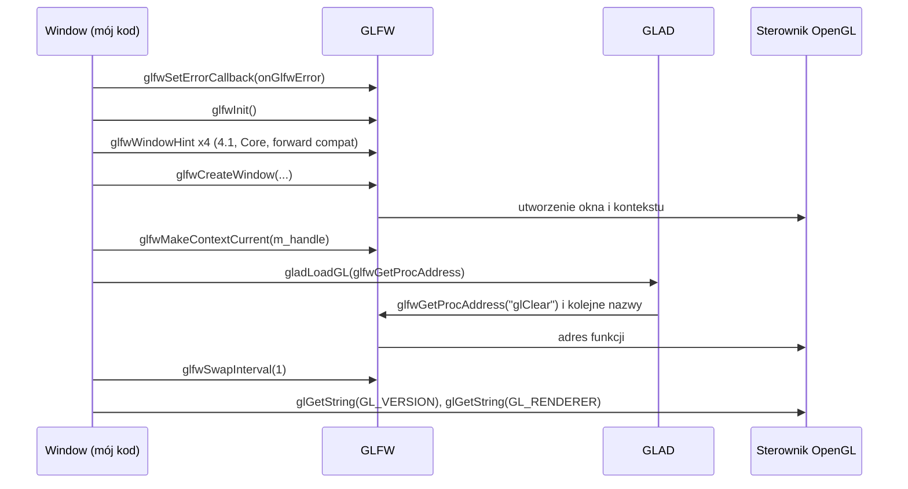

# Moduł core: okno i kontekst OpenGL

Kamień milowy: M0. Temat wykładu: 1 (Pierwszy program OpenGL).
Kod: [`src/core/Window.hpp`](../../../src/core/Window.hpp), [`src/core/Window.cpp`](../../../src/core/Window.cpp), [`src/core/Log.hpp`](../../../src/core/Log.hpp), [`src/core/Log.cpp`](../../../src/core/Log.cpp), a wywołania OpenGL jednej klatki w [`src/game/NightMazeApp.cpp`](../../../src/game/NightMazeApp.cpp).

Część modułu `core`. Wstęp do całego modułu, diagram warstw i klatka jako całość są w [`README.md`](README.md). Pozostałe części: [`main-loop.md`](main-loop.md) (pętla i czas), [`input.md`](input.md) (klawiatura), [`gl-check.md`](gl-check.md) (błędy OpenGL). Samą bibliotekę okienkową opisuje [`../../libraries/glfw.md`](../../libraries/glfw.md), a loader funkcji [`../../libraries/glad.md`](../../libraries/glad.md).

## 1. Po co to jest

OpenGL sam nie umie otworzyć okna ani utworzyć kontekstu: to zadanie systemu operacyjnego. Klasa `core::Window` zamyka w jednym obiekcie całą drogę od "nic nie ma" do "mogę wołać funkcje `gl*`": inicjalizację GLFW, hinty kontekstu 4.1 Core, utworzenie okna, ustawienie kontekstu jako bieżącego, załadowanie adresów funkcji przez GLAD i włączenie vsync. Destruktor zwalnia to wszystko w odwrotnej kolejności (RAII). Bez tej klasy żadna inna część programu nie ma na czym pracować: `Input` potrzebuje uchwytu okna, ImGui potrzebuje okna i kontekstu, a każde wywołanie `gl*` potrzebuje załadowanych wskaźników funkcji. `Log` jest tu opisany przy okazji, bo to `Window` jako pierwsze z niego korzysta (wypisuje wersję OpenGL i nazwę karty oraz błędy GLFW).

## 2. Teoria

### 2.1 Kontekst OpenGL i maszyna stanów

OpenGL nie jest biblioteką obiektów, tylko **maszyną stanów** (state machine). Wywołanie `glClearColor(...)` niczego nie rysuje: zapisuje kolor w stanie, a dopiero `glClear(...)` z niego korzysta. Cały ten stan (kolor czyszczenia, viewport, związane bufory, programy shaderów, tekstury) żyje w **kontekście** (context). Trzy konsekwencje, które trzeba umieć powiedzieć na obronie:

1. Bez kontekstu nie ma OpenGL. Kontekst tworzy system operacyjny razem z oknem, dlatego potrzebuję biblioteki okienkowej (GLFW), bo sam OpenGL nie umie otworzyć okna.
2. Kontekst jest **bieżący (current) dla wątku**. Każda funkcja `gl*` trafia do kontekstu ustawionego jako bieżący w wątku, który ją woła. Stąd `glfwMakeContextCurrent` zaraz po utworzeniu okna.
3. Funkcje OpenGL mieszkają w sterowniku karty graficznej. Ich adresy poznaję dopiero w trakcie działania programu i to jest praca loadera (GLAD).

**Profil Core** (core profile) to OpenGL bez starego API (bez `glBegin`/`glEnd`, bez stałego potoku, fixed-function pipeline). **Forward compatible** oznacza dodatkowo, że usunięte jest też wszystko, co w danej wersji oznaczono jako przestarzałe (deprecated). macOS udostępnia OpenGL 3.2 i nowszy wyłącznie jako Core i forward compatible, a najwyższa wersja to 4.1, dlatego 4.1 Core jest wspólnym mianownikiem całego projektu (PRD, sekcja 4).

### 2.2 Podwójne buforowanie i vsync

Okno ma dwa bufory koloru: **przedni** (front buffer), który widać na ekranie, i **tylny** (back buffer), do którego rysuję. Gdybym rysował prosto na ekran, widać byłoby obraz w trakcie powstawania (migotanie). Dlatego klatkę buduję w tylnym buforze, a na końcu zamieniam bufory (`glfwSwapBuffers`).

**Vsync** (synchronizacja pionowa) to czekanie z zamianą buforów na odświeżenie monitora. `glfwSwapInterval(1)` znaczy: jedna zamiana na jedno odświeżenie. Bez tego (`0`) zamiana następuje natychmiast, FPS rośnie do setek lub tysięcy, karta pracuje na 100%, a na ekranie może pojawić się rozdarcie obrazu (tearing), bo monitor wyświetla fragmenty dwóch różnych klatek.

### 2.3 Rozmiar okna a rozmiar framebuffera

GLFW podaje dwa różne rozmiary tego samego okna:

- **rozmiar okna** (window size) we współrzędnych ekranu (screen coordinates), czyli w jednostkach, w których system układa okna i podaje pozycję myszy,
- **rozmiar framebuffera** (framebuffer size) w pikselach, czyli tyle, ile naprawdę jest do zamalowania.

Na zwykłym monitorze obie liczby są równe. Na ekranie o wysokiej gęstości (Retina) jednej jednostce ekranu odpowiadają dwa piksele w każdym wymiarze, więc okno 1280 x 720 ma framebuffer 2560 x 1440. OpenGL pracuje na pikselach, dlatego wszystko, co trafia do `glViewport`, musi pochodzić z rozmiaru framebuffera. Od pierwszej części M7 z tej samej liczby powstaje też rozmiar własnego framebuffera sceny (`game::PostProcess::beginScene`), więc na Retinie bufor HDR ma mieć 2560 x 1440, a nie 1280 x 720. W kodzie rozróżnienie jest w nazwach metod: `Window::framebufferSize()` i `Window::windowSize()`, a obie zwracają strukturę `core::Size` (dwa pola `int`: `width` i `height`).

## 3. Jak to działa w OpenGL

### 3.1 Uruchomienie: konstruktor `Window`

Kolejność wywołań w [`Window.cpp`](../../../src/core/Window.cpp) jest wymuszona przez zależności, nie jest kwestią gustu:



| Krok | Wywołanie | Co ustawia lub tworzy | Dlaczego w tym miejscu |
|---|---|---|---|
| 1 | `glfwSetErrorCallback(onGlfwError)` | funkcję wołaną przez GLFW przy każdym błędzie | To jedna z niewielu funkcji GLFW, które wolno wołać przed `glfwInit`, dzięki czemu zobaczę też powód nieudanej inicjalizacji |
| 2 | `glfwInit()` | stan biblioteki GLFW | Bez tego żadna inna funkcja GLFW nie działa |
| 3 | `glfwWindowHint(...)` cztery razy | "życzenia" wobec następnego okna | Hinty dotyczą okna tworzonego **po** nich, więc muszą być przed `glfwCreateWindow` |
| 4 | `glfwCreateWindow(width, height, title.c_str(), nullptr, nullptr)` | okno i kontekst OpenGL | Dwa ostatnie argumenty: monitor (`nullptr` to tryb okienkowy) i kontekst do współdzielenia zasobów (`nullptr` to brak) |
| 5 | `glfwMakeContextCurrent(m_handle)` | kontekst bieżący dla wątku | Od tej chwili funkcje `gl*` mają dokąd trafić |
| 6 | `gladLoadGL(glfwGetProcAddress)` | wskaźniki na funkcje OpenGL | Wymaga bieżącego kontekstu, bo pyta sterownik o adresy |
| 7 | `glfwSwapInterval(1)` | vsync | Dotyczy bieżącego kontekstu, więc po kroku 5 |
| 8 | `glGetString(GL_VERSION)`, `glGetString(GL_RENDERER)` | nic, tylko odczyt | Pierwsze prawdziwe wywołania OpenGL, możliwe dopiero po kroku 6 |

Hinty kontekstu:

```cpp
glfwWindowHint(GLFW_CONTEXT_VERSION_MAJOR, 4);
glfwWindowHint(GLFW_CONTEXT_VERSION_MINOR, 1);
glfwWindowHint(GLFW_OPENGL_PROFILE, GLFW_OPENGL_CORE_PROFILE);
glfwWindowHint(GLFW_OPENGL_FORWARD_COMPAT, GLFW_TRUE);
```

Wersja w hintach to **minimum**, a nie wartość dokładna. Na Windowsie sterownik może oddać kontekst nowszy (na przykład 4.6), bo jest on zgodny z 4.1 Core. Dlatego panel Renderer może pokazywać na Windowsie wersję wyższą niż 4.1 i to nie jest błąd. Nie każdy sterownik tak robi: na moim PC sterownik NVIDII oddał dokładnie wersję, o którą prosi program (`GL_VERSION: 4.1.0 NVIDIA 610.74`). Zabezpieczeniem przed przypadkowym użyciem funkcji z 4.2+ jest GLAD wygenerowany dla 4.1 Core: takich funkcji po prostu nie ma w nagłówku i kod się nie skompiluje (zob. [`../../libraries/glad.md`](../../libraries/glad.md)).

### 3.2 Jedna klatka

Początek każdej klatki jest w [`NightMazeApp::onRender`](../../../src/game/NightMazeApp.cpp):

```cpp
const core::Size framebuffer = window().framebufferSize();

if (framebuffer.width == 0 || framebuffer.height == 0) {
    return;
}

if (!m_postProcess.beginScene(framebuffer)) {
    return;
}

GL_CHECK(glEnable(GL_DEPTH_TEST));

const glm::vec3 clearColor =
    gfx::srgbToLinear(glm::vec3{m_clearColor[0], m_clearColor[1], m_clearColor[2]});
GL_CHECK(glClearColor(clearColor.r, clearColor.g, clearColor.b, 1.0F));
GL_CHECK(glClear(GL_COLOR_BUFFER_BIT | GL_DEPTH_BUFFER_BIT));
```

| Wywołanie | Rodzaj | Co robi |
|---|---|---|
| `if (framebuffer.width == 0 \|\| framebuffer.height == 0) return;` | nic w OpenGL | Zminimalizowane okno może mieć framebuffer 0 x 0. Nie ma wtedy czego rysować ani do czego: tekstury o rozmiarze 0 nie da się podpiąć do framebuffera, a proporcje obrazu wyszłyby 0 / 0. Cała klatka jest pomijana. Do pierwszej części M7 ten warunek stał po czyszczeniu ekranu |
| `m_postProcess.beginScene(framebuffer)` | ustawia stan | Od pierwszej części M7 scena nie trafia prosto do okna. To wywołanie wiąże framebuffer HDR sceny (`glBindFramebuffer`) i ustawia `glViewport(0, 0, w, h)` na jego rozmiar, równy rozmiarowi framebuffera okna. `glViewport` określa prostokąt bufora (w pikselach, początek w lewym dolnym rogu), na który mapowane są współrzędne znormalizowane (NDC) z zakresu od -1 do 1. Oba wywołania stoją w `gfx::Framebuffer::bind` ([`../gfx/framebuffers.md`](../gfx/framebuffers.md)). Gdy framebuffera nie udało się utworzyć, funkcja zwraca fałsz i klatka jest pomijana |
| `glEnable(GL_DEPTH_TEST)` | ustawia stan | Włącza test głębi: fragment trafia do bufora tylko wtedy, gdy jest bliżej kamery niż to, co już tam jest. Potrzebny od chwili, gdy na ekranie jest bryła ([`../scene/camera.md`](../scene/camera.md), sekcje 3 i 5.7) |
| `glClearColor(r, g, b, a)` | ustawia stan | Zapamiętuje kolor czyszczenia. Niczego nie rysuje. Kolor z panelu jest wartością sRGB, a bufor sceny trzyma wartości liniowe, więc linia wyżej przelicza go przez `gfx::srgbToLinear` ([`../gfx/color-space.md`](../gfx/color-space.md)) |
| `glClear(GL_COLOR_BUFFER_BIT \| GL_DEPTH_BUFFER_BIT)` | wykonuje | Wypełnia bufor koloru zapamiętanym kolorem, a bufor głębi wartością 1 ("najdalej"). Czyszczony jest framebuffer, który jest związany: od M7 dwie tekstury framebuffera sceny, a nie bufory okna. Argument to maska bitowa, dwie flagi połączone bitowym "lub". Później dojdzie `GL_STENCIL_BUFFER_BIT` |
| `m_postProcess.composite(...)` | wykonuje | Ostatni krok `NightMazeApp::onRender`: wiąże z powrotem framebuffer okna (`Framebuffer::bindDefault`, z `glViewport` na rozmiar framebuffera okna) i jednym trójkątem przenosi do niego obraz sceny z ekspozycją, mapowaniem tonów i kodowaniem sRGB. Od drugiej części M7 dodaje po drodze poświatę bloomu, a od trzeciej także domieszkuje mgłę liczoną z głębi sceny i przyciemnia rogi obrazu winietą ([`../renderer/post-process.md`](../renderer/post-process.md)) |
| `m_debugUI.draw(...)` | wykonuje | Wołane już poza grą, w `DebugNightMazeApp::onRender` w [`main.cpp`](../../../src/main.cpp), po powrocie z `NightMazeApp::onRender`: rysuje panele ImGui na wierzchu (opis w [`../debug-ui.md`](../debug-ui.md)) |
| `glfwSwapBuffers(m_handle)` | wykonuje | Wołane w `Application::run` po `onRender`: zamienia bufory, przy vsync czeka na odświeżenie monitora |

Po tych czterech wywołaniach `onRender` wysyła do bufora uniformów światła klatki, a potem rysuje scenę w częściach: labirynt z bramą i kryształami (z oświetleniem albo bez) i, na życzenie, linie pudełek i kul kolizji. Do M4 były jeszcze dwie części, znaczniki świateł punktowych i kostka z M1 nad komórką wyjścia: obie usunięto w M5. Każda część to `glUseProgram`, macierze przez `glUniformMatrix4fv`, `glBindVertexArray` (wszystko przez klasy `gfx`) i `glDrawElements`. Kolejność i kod tej części klatki opisuje [`README.md`](README.md), sekcje 6.6 i 6.7, a drogę od danych do pikseli [`../gfx/README.md`](../gfx/README.md), sekcja 6.

Viewport ustawiam w każdej klatce, a nie raz przy starcie, i biorę go z `glfwGetFramebufferSize`. Dzięki temu bez żadnego callbacku obsługuję zmianę rozmiaru okna oraz ekrany Retina (sekcja 7). Makro `GL_CHECK` wokół każdego wywołania opisuje [`gl-check.md`](gl-check.md).

### 3.3 Zamknięcie: destruktor `Window`

```cpp
Window::~Window() {
    glfwDestroyWindow(m_handle);
    glfwTerminate();
}
```

`glfwDestroyWindow` niszczy okno razem z jego kontekstem OpenGL, a `glfwTerminate` zwalnia stan biblioteki. Wszystko, co używa kontekstu (ImGui, a później shadery, bufory i tekstury), musi zostać zwolnione **wcześniej**. O to dba kolejność niszczenia pól opisana w [`README.md`](README.md), sekcja 7.

Moduł `core` nie tworzy żadnych obiektów OpenGL (żadnych `glGen*`, żadnych `glBind*`). Jedyny zasób to kontekst. Obiekty OpenGL tworzy warstwa `gfx`: program shaderów (`gfx::Shader`), bufory (`gfx::Buffer`) i tablicę wierzchołków (`gfx::VertexArray`), zob. [`../gfx/README.md`](../gfx/README.md).

## 4. Shadery

Ta część modułu nie ma własnych shaderów: `glClear` nie przechodzi przez potok programowalny, więc do wyczyszczenia ekranu nie potrzeba ani shadera wierzchołków, ani fragmentów. Shadery projektu (cztery pary plików w `assets/shaders/`: `textured`, `color`, `lit` i `gouraud`, wszystkie `#version 410 core`, oraz dwa wspólne pliki dołączane, `common/lighting.glsl` i `common/normal_map.glsl`) rysują po wyczyszczeniu ekranu scenę bez oświetlenia, linie pudełek i kul kolizji oraz scenę z oświetleniem ([`../gfx/shaders.md`](../gfx/shaders.md), [`../renderer/lighting-gouraud-phong.md`](../renderer/lighting-gouraud-phong.md)). Własne shadery ma też backend ImGui (zob. [`../debug-ui.md`](../debug-ui.md), sekcja 4).

## 5. Kod w projekcie

### 5.1 Pliki

| Plik | Co zawiera |
|---|---|
| [`src/core/Window.hpp`](../../../src/core/Window.hpp) | struktura `Size`, deklaracja klasy `Window`, deklaracja wyprzedzająca `struct GLFWwindow;` |
| [`src/core/Window.cpp`](../../../src/core/Window.cpp) | konstruktor (cała inicjalizacja), destruktor, cienkie metody opakowujące GLFW, pomocnicze `onGlfwError` i `glString` |
| [`src/core/Log.hpp`](../../../src/core/Log.hpp), [`.cpp`](../../../src/core/Log.cpp) | `logInfo`, `logWarn`, `logError` |
| [`src/game/NightMazeApp.cpp`](../../../src/game/NightMazeApp.cpp) | użycie `framebufferSize()` na początku `onRender`: rozmiar trafia do `m_postProcess.beginScene` i `composite`, które ustawiają `glViewport`, potem czyszczenie framebuffera sceny |

### 5.2 `Window`: trudne miejsca

**Deklaracja wyprzedzająca zamiast nagłówka GLFW.** W `Window.hpp` jest tylko `struct GLFWwindow;`. Do zadeklarowania wskaźnika `GLFWwindow*` kompilator nie musi znać zawartości struktury, więc nagłówek GLFW dołączam dopiero w `.cpp`. Każdy plik, który dołącza `Window.hpp`, kompiluje się szybciej i nie zależy od kolejności nagłówków GLAD i GLFW.

**Kolejność `#include` w `Window.cpp`.** Najpierw `<glad/gl.h>`, potem `<GLFW/glfw3.h>`. GLAD deklaruje API OpenGL, a definicja `GLFW_INCLUDE_NONE` z CMake sprawia, że GLFW nie próbuje dołączyć systemowego nagłówka OpenGL, który kłóciłby się z GLAD.

**Ręczne `glfwTerminate()` przed `throw`.**

```cpp
m_handle = glfwCreateWindow(width, height, title.c_str(), nullptr, nullptr);
if (m_handle == nullptr) {
    // The destructor does not run when a constructor throws, so clean up here.
    glfwTerminate();
    throw std::runtime_error("Failed to create a window with an OpenGL 4.1 Core context");
}
```

Reguła C++: obiekt uznaje się za istniejący dopiero wtedy, gdy jego konstruktor **zakończył się**. Jeśli konstruktor rzuci wyjątek, destruktor tego obiektu **nie zostanie wywołany** (niszczone są tylko pola, które zdążyły powstać, czyli tu dwa puste `std::string`). `glfwInit()` już się jednak udało, więc gdybym po prostu rzucił wyjątek, biblioteka GLFW zostałaby zainicjalizowana na zawsze. Dlatego sprzątam ręcznie dokładnie to, co do tej pory zdążyło powstać:

| Miejsce błędu | Co już istnieje | Sprzątanie przed `throw` |
|---|---|---|
| `glfwInit()` zwraca błąd | nic | nic: według dokumentacji GLFW nieudane `glfwInit` samo woła `glfwTerminate` |
| `glfwCreateWindow` zwraca `nullptr` | stan GLFW | `glfwTerminate()` |
| `gladLoadGL` zwraca 0 | stan GLFW i okno | `glfwDestroyWindow(m_handle)`, potem `glfwTerminate()` |

Wyjątek z konstruktora wędruje przez konstruktory `Application`, `NightMazeApp` i `DebugNightMazeApp` aż do `catch` w `main` ([`README.md`](README.md), sekcja 5).

**`gladLoadGL(glfwGetProcAddress)`.**

```cpp
if (gladLoadGL(glfwGetProcAddress) == 0) {
```

W nagłówku GLAD nazwa `glClear` to makro: `#define glClear glad_glClear`, a `glad_glClear` to **wskaźnik na funkcję**, który na starcie jest pusty. `gladLoadGL` wypełnia wszystkie takie wskaźniki. Sam GLAD nie wie jednak, jak na danym systemie zapytać sterownik o adres (na Windowsie robi się to inaczej niż na macOS), więc dostaje ode mnie funkcję, która to potrafi. Argument `glfwGetProcAddress` jest napisany **bez nawiasów**: to nie jest wywołanie, tylko przekazanie adresu funkcji. GLAD woła ją potem wiele razy z nazwami typu `"glClear"`. Typy pasują bez rzutowania, bo GLAD oczekuje `GLADapiproc (*)(const char* name)`, a `glfwGetProcAddress` ma sygnaturę `GLFWglproc glfwGetProcAddress(const char* procname)` i oba typy zwracane to `void (*)(void)`.

Wartość zwracana to zakodowana wersja OpenGL (`major * 10000 + minor`) albo `0`, gdy ładowanie się nie udało. Wywołanie musi nastąpić po `glfwMakeContextCurrent`, bo `glfwGetProcAddress` pyta **bieżący** kontekst. Każde `gl*` wykonane przed `gladLoadGL` to skok pod pusty wskaźnik, czyli natychmiastowy crash.

**`reinterpret_cast<const char*>` na wyniku `glGetString`.**

```cpp
std::string glString(GLenum name) {
    const GLubyte* text = glGetString(name);
    if (text == nullptr) {
        return "unknown";
    }
    return reinterpret_cast<const char*>(text);
}
```

`glGetString` zwraca `const GLubyte*`, a `GLubyte` to `unsigned char`. `std::string` buduje się z `const char*`. Dla C++ `unsigned char*` i `char*` to wskaźniki na **różne, niespokrewnione typy**: nie ma między nimi konwersji niejawnej i `static_cast` też jej nie wykona. Zostaje `reinterpret_cast`, który mówi kompilatorowi: "ten sam adres potraktuj jako wskaźnik innego typu". Zwykle to niebezpieczny rzut, ale tutaj jest poprawny z dwóch powodów: `char` ma w C++ specjalne prawo do oglądania bajtów dowolnego obiektu, a pod adresem leży zwykły tekst ASCII zakończony zerem. Warunek `text == nullptr` jest konieczny, bo `glGetString` zwraca `NULL` przy błędzie, a zbudowanie `std::string` z pustego wskaźnika to niezdefiniowane zachowanie. Funkcja siedzi w anonimowej przestrzeni nazw, więc jest widoczna tylko w tym pliku.

### 5.3 Callback błędów GLFW

```cpp
void onGlfwError(int code, const char* description) {
    logError("GLFW error " + std::to_string(code) + ": " + description);
}
```

GLFW woła tę funkcję za każdym razem, gdy któraś z jego funkcji zawiedzie, i podaje kod błędu oraz czytelny opis. Funkcja jest w anonimowej przestrzeni nazw (widoczna tylko w `Window.cpp`) i tylko przekazuje komunikat do `logError`. Dzięki niej przy nieudanym starcie w konsoli są dwie linie: najpierw `[error] GLFW error ...` z prawdziwą przyczyną, a potem `[error] Fatal: ...` z wyjątku złapanego w `main`.

### 5.4 Pozostałe metody `Window`

Wszystkie są jednolinijkowymi opakowaniami funkcji GLFW. Istnieją po to, żeby reszta programu nie musiała dołączać nagłówka GLFW ani znać uchwytu okna.

| Metoda | Funkcja GLFW | Uwagi |
|---|---|---|
| `shouldClose()` | `glfwWindowShouldClose(m_handle) == GLFW_TRUE` | Flagę ustawia system (krzyżyk okna) albo `requestClose()`. To warunek pętli głównej |
| `requestClose()` | `glfwSetWindowShouldClose(m_handle, GLFW_TRUE)` | Niczego nie zamyka od razu: pętla kończy się po bieżącej klatce |
| `pollEvents()` | `glfwPollEvents()` | Odbiera zdarzenia systemu i aktualizuje stan klawiszy zapamiętany w GLFW |
| `swapBuffers()` | `glfwSwapBuffers(m_handle)` | Zamiana bufora tylnego z przednim |
| `framebufferSize()` | `glfwGetFramebufferSize(m_handle, &size.width, &size.height)` | Piksele, dla `glViewport` |
| `windowSize()` | `glfwGetWindowSize(m_handle, &size.width, &size.height)` | Współrzędne ekranu, te same jednostki co pozycja myszy |
| `nativeHandle()` | zwraca `m_handle` | Dla kodu, który musi rozmawiać z GLFW bezpośrednio: `Input` i backend ImGui |
| `glVersion()`, `glRenderer()` | zwracają napisy zapamiętane w konstruktorze | `const std::string&`, bez kopiowania i bez wołania OpenGL co klatkę |

Funkcje GLFW zwracające rozmiar oddają wynik przez dwa wskaźniki na `int` (styl C), stąd `&size.width, &size.height`. Metody zwracające rozmiar są `const`, bo nie zmieniają obiektu `Window`.

### 5.5 `Log`

Trzy funkcje: `logInfo` pisze na `std::cout`, `logWarn` i `logError` na `std::cerr`, każda z prefiksem (`[info]`, `[warn]`, `[error]`). Parametr to `std::string_view`, czyli "widok" na cudzy tekst bez kopiowania, do którego pasuje zarówno literał, jak i `std::string`. Każda linia kończy się zapisem `'\n' << std::flush`: znak nowej linii, a potem jawne **opróżnienie bufora** strumienia (flush), więc komunikat pojawia się natychmiast i nie przepada, gdy program zaraz potem się wysypie albo wyjście jest przekierowane do pliku. `std::endl` robi dokładnie te same dwie rzeczy naraz, ale zapis rozdzielony pokazuje wprost, że opróżnianie jest zamierzone (clang-tidy ostrzega przed `std::endl` w sprawdzeniu `performance-avoid-endl`, bo zwykle ktoś używa go tylko jako nowej linii i nieświadomie płaci za flush).

Kto z niego korzysta w M0: `Window` (wersja OpenGL, nazwa karty, błędy GLFW), `checkGlErrors` (błędy OpenGL, zob. [`gl-check.md`](gl-check.md)) i `main` (wyjątek ze startu).

## 6. Panel ImGui

Panel **Renderer** (kod: [`RendererPanel.cpp`](../../../src/debug/panels/RendererPanel.cpp)) pokazuje dane z klasy `Window`. Klawisz **`~`** (na lewo od `1`) chowa i pokazuje panele (HUD gry z M5 zostaje na ekranie). Sam moduł `core` ani gra nie wiedzą o panelu: dane dostaje on z `main.cpp` ([`README.md`](README.md), sekcja 6).

| Element | Źródło | Czego uczy obserwacja |
|---|---|---|
| `Framebuffer` | `Window::framebufferSize()` | Rozmiar w pikselach. Na ekranie Retina dwa razy większy niż `Window` |
| `Window` | `Window::windowSize()` | Rozmiar we współrzędnych ekranu. Zmiana rozmiaru okna zmienia obie wartości na żywo |
| `OpenGL` | `Window::glVersion()` | Wersja oddana przez sterownik: na macOS zaczyna się od 4.1, na Windowsie może być wyższa |
| `GPU` | `Window::glRenderer()` | Która karta rysuje. Na laptopie z dwiema kartami od razu widać, czy nie została wybrana zintegrowana |
| `Clear color` | `NightMazeApp::m_clearColor` (przez `clearColor()`) | Wartość edytowalna. Startuje jako bardzo ciemny granat (`{0.022F, 0.033F, 0.088F}`, wartość sRGB, do pierwszej części M7 `{0.01F, 0.015F, 0.04F}`), do M5 kolor nieba. Od pierwszej części M6 niebo rysuje skybox, więc skutek zmiany widać dopiero po odznaczeniu pola `Skybox` w tym samym panelu ([`../renderer/skybox.md`](../renderer/skybox.md), sekcja 6). Zmiana jest wtedy widoczna w następnej klatce, bo `glClearColor` jest wołane co klatkę (od M7 z kolorem przeliczonym na liniowy): dobry dowód, że OpenGL to stan odczytywany w momencie `glClear` |

Elementy `FPS` i `Frame time` tego samego panelu opisuje [`main-loop.md`](main-loop.md), sekcja 6. Od M4 panel ma jeszcze drugą wartość edytowalną, listę `Lighting` z trybem oświetlenia, która nie dotyczy okna ani kontekstu: opisuje ją [`../debug-ui.md`](../debug-ui.md), sekcja 5.3.

## 7. Pułapki

1. **Czarny ekran albo crash na pierwszym `gl*`.** Najczęstsze przyczyny: brak `glfwMakeContextCurrent`, wywołanie `gl*` przed `gladLoadGL` (pusty wskaźnik na funkcję), brak `glfwSwapBuffers` (obraz zostaje w tylnym buforze), brak `glClear` (w buforze są śmieci z poprzednich klatek).
2. **Retina: rozmiar framebuffera to nie rozmiar okna.** Na macOS okno 1280 x 720 ma framebuffer 2560 x 1440. `glViewport` przyjmuje **piksele**, więc musi dostać `framebufferSize()`. Z `windowSize()` obraz zajmie lewą dolną ćwiartkę okna. To samo dotyczy rozmiaru framebuffera sceny i przebiegu składającego: oba dostają `framebufferSize()`. Na macOS pierwsza część M7 nie była jeszcze uruchamiana, więc zachowanie bufora HDR na Retinie jest niesprawdzone. Pozycja myszy jest z kolei we współrzędnych okna. Na Windowsie obie wartości zwykle są równe, więc błąd wychodzi dopiero na Macu.
3. **Wymagania kontekstu na macOS.** Maksymalnie 4.1, wyłącznie profil Core. Prośba o 4.2+ albo o profil zgodności (compatibility) kończy się `nullptr` z `glfwCreateWindow`. Hint `GLFW_OPENGL_FORWARD_COMPAT` był obowiązkowy w GLFW do wersji 3.3 (bez niego okno się nie tworzyło). GLFW 3.4, którego używam, już go nie sprawdza, ale kontekst na macOS i tak jest forward compatible, więc zostawiam hint: dokumentuje zamiar i sprawia, że Windows zachowuje się tak samo surowo jak Mac.
4. **Brak debug callbacku.** `glDebugMessageCallback` to OpenGL 4.3. Wiele poradników go używa, na macOS to się nie skompiluje (GLAD 4.1 nie ma tej funkcji). Stąd `GL_CHECK` ([`gl-check.md`](gl-check.md)).
5. **Vsync nie jest gwarancją.** Sterownik na Windowsie może wymusić włączenie albo wyłączenie vsync w swoim panelu. Kod nie może zakładać 60 klatek, i właśnie dlatego symulacja ma własny stały krok ([`main-loop.md`](main-loop.md)).
6. **Kolejność niszczenia.** Obiekt z zasobami OpenGL żyjący dłużej niż `Window` woła funkcje `gl*` bez kontekstu ([`README.md`](README.md), sekcja 7).
7. **Wyjątek z konstruktora bez sprzątania.** Dopisując do konstruktora `Window` kolejny krok, który może się nie udać, trzeba przed `throw` zwolnić wszystko, co powstało wcześniej. Destruktor tego nie zrobi (sekcja 5.2).

Tabela różnic między macOS a Windowsem jest w [`README.md`](README.md), sekcja 8.

## 8. Ćwiczenia

1. **Vsync.** W `Window.cpp` zmień `glfwSwapInterval(1)` na `glfwSwapInterval(0)` i zbuduj program. Zapisz FPS i czas klatki z panelu Renderer przed zmianą i po niej. Wyjaśnij własnymi słowami, skąd różnica i dlaczego mimo tysięcy FPS symulacja nadal robiłaby 120 kroków na sekundę. Na koniec przywróć `1`.
2. **Retina.** Na Macu zamień w `NightMazeApp::onRender` `framebufferSize()` na `windowSize()` i zobacz, gdzie ląduje obraz (dla wyraźnego efektu ustaw jasny `Clear color`). Wyjaśnij, dlaczego na Windowsie ta sama zmiana zwykle niczego nie psuje.
3. **Ścieżka błędu.** W `Window.cpp` zmień hint `GLFW_CONTEXT_VERSION_MINOR` z `1` na `6` i uruchom program na Macu. Przeczytaj obie linie `[error]` w konsoli i wskaż w kodzie, skąd pochodzi każda z nich (callback `onGlfwError`, `catch` w `main`). Sprawdź kod wyjścia programu (`echo $?`). Przywróć `1`.

## 9. Pytania kontrolne

1. **Co to jest kontekst OpenGL i dlaczego `glfwMakeContextCurrent` musi być przed `gladLoadGL`?**
   Kontekst to cały stan OpenGL związany z oknem. Funkcje `gl*` trafiają do kontekstu bieżącego w danym wątku, a GLAD pyta o adresy funkcji właśnie bieżący kontekst, więc bez niego nie ma kogo zapytać.

2. **Co robi `gladLoadGL(glfwGetProcAddress)` i dlaczego `glfwGetProcAddress` jest bez nawiasów?**
   Wypełnia wskaźniki na funkcje OpenGL adresami ze sterownika. `glfwGetProcAddress` przekazuję jako wskaźnik na funkcję (nie wołam jej), a GLAD woła ją dla każdej nazwy. Zwraca 0 przy niepowodzeniu.

3. **Jakie hinty ustawiam przed `glfwCreateWindow` i po co?**
   Wersję 4.1 (`CONTEXT_VERSION_MAJOR`, `MINOR`), profil Core (`OPENGL_PROFILE`) i zgodność w przód (`OPENGL_FORWARD_COMPAT`). 4.1 Core to maksimum na macOS, więc wspólny mianownik obu platform.

4. **Dlaczego w konstruktorze `Window` jest ręczne `glfwTerminate()` przed `throw`?**
   Bo gdy konstruktor rzuca wyjątek, destruktor tego obiektu się nie wykona. Trzeba ręcznie zwolnić to, co już powstało: po nieudanym oknie stan GLFW, po nieudanym GLAD okno i stan GLFW.

5. **Po co `reinterpret_cast<const char*>` przy `glGetString`?**
   `glGetString` zwraca `const GLubyte*` (`unsigned char`), a `std::string` wymaga `const char*`. To niespokrewnione typy wskaźnikowe, więc potrzebny jest `reinterpret_cast`. Jest bezpieczny, bo to tekst ASCII zakończony zerem. Wcześniej sprawdzam `nullptr`.

6. **Czym różni się rozmiar okna od rozmiaru framebuffera i którego używa `glViewport`?**
   Rozmiar okna jest we współrzędnych ekranu, framebuffer w pikselach. Na Retinie framebuffer jest dwa razy większy. `glViewport` działa w pikselach, więc bierze `glfwGetFramebufferSize`.

7. **Co robi `glfwSwapInterval(1)` i dlaczego stoi po `glfwMakeContextCurrent`?**
   Włącza vsync: zamiana buforów czeka na jedno odświeżenie monitora. Ustawienie dotyczy bieżącego kontekstu, więc kontekst musi już być bieżący.

8. **Dlaczego w `Window.hpp` jest `struct GLFWwindow;` zamiast `#include <GLFW/glfw3.h>`?**
   Do wskaźnika wystarcza deklaracja wyprzedzająca. Nagłówek GLFW dołącza tylko `Window.cpp`, więc pliki korzystające z `Window.hpp` kompilują się szybciej i nie zależą od kolejności nagłówków GLAD i GLFW.

9. **Dlaczego funkcje logujące po `'\n'` wysyłają jeszcze `std::flush`?**
   Sam `'\n'` zostawia tekst w buforze strumienia. `std::flush` opróżnia bufor, więc komunikat jest widoczny od razu i nie ginie, gdy program zaraz potem się wysypie albo wyjście jest przekierowane do pliku. `std::endl` to to samo co `'\n'` i `std::flush` razem.

## 10. Źródła

- LearnOpenGL, rozdziały "Creating a window" (<https://learnopengl.com/Getting-started/Creating-a-window>) i "Hello Window" (<https://learnopengl.com/Getting-started/Hello-Window>). Wstęp o maszynie stanów: "OpenGL" (<https://learnopengl.com/Getting-started/OpenGL>).
- docs.gl (<https://docs.gl>), strony funkcji `glViewport`, `glClearColor`, `glClear`, `glGetString` dla OpenGL 4.
- Dokumentacja GLFW: <https://www.glfw.org/docs/latest/> (przewodniki o oknach i kontekście, opis `glfwInit`, `glfwTerminate`, `glfwGetProcAddress`, `glfwGetFramebufferSize`).
- Dokumenty bibliotek w tym repozytorium: [`../../libraries/glfw.md`](../../libraries/glfw.md), [`../../libraries/glad.md`](../../libraries/glad.md).
- Janusz Ganczarski, "OpenGL. Podstawy programowania grafiki 3D" (rozdziały o pierwszym programie i kontekście renderingu).
- "OpenGL. Księga eksperta" (rozdziały wprowadzające: pierwszy program, maszyna stanów).
