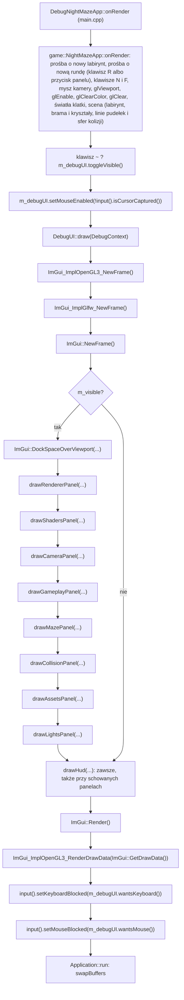
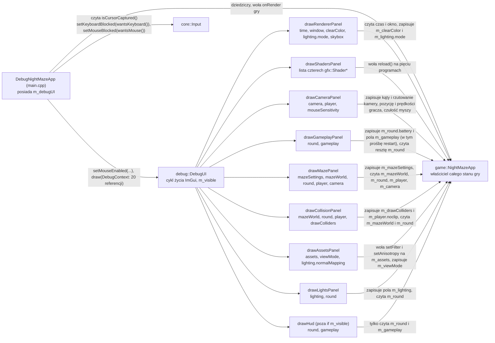

# Moduł debug: panele ImGui

Kamień milowy: M0 (nakładka i panel Renderer), M1 (panele Shaders i Camera, `DebugContext`, mysz), M2 + M3 (panele Maze, Collision i Assets, czternaście pól `DebugContext`, układ domyślny paneli). Po M2 + M3 doszedł motyw paneli: własne kolory i odstępy, czcionka z pliku z polskimi literami, skala ekranu i układ domyślny w jednym pliku (sekcje 5.7 i 5.8). M4 (oświetlenie) dodał siódmy panel Lights, listę `Lighting` w panelu Renderer, dwa programy w panelu Shaders (było ich wtedy pięć), trzy pola `DebugContext` (razem siedemnaście) i układ, w którym panel Camera startuje zwinięty. M4 (mapy normalnych): pole wyboru `Normal mapping` i linie `normal map:` w panelu Assets, trzeci parametr `drawAssetsPanel`. M5 (rozgrywka): ósmy panel Gameplay, HUD gry rysowany przez `debug::drawHud` także wtedy, gdy panele są schowane (sekcja 5.9), cztery programy w panelu Shaders po usunięciu kostki z M1, osiemnaście pól `DebugContext` (ubyło `shader`, doszły `gameplay` i `round`), nowe parametry paneli Maze, Collision i Lights oraz układ, w którym panele Camera i Gameplay startują zwinięte obok siebie. M6, część pierwsza (skybox): pole `Skybox` i suwak `Sky brightness` w panelu Renderer (piąty parametr `drawRendererPanel`), piąty program w panelu Shaders, dwadzieścia pól `DebugContext` (doszły `skyboxShader` i `skybox`) i wyższy panel Renderer w układzie domyślnym (284 zamiast 230), przez co panel Lights pod nim się przewija. Kod: [`src/debug/`](../../src/debug/) oraz [`src/main.cpp`](../../src/main.cpp), gdzie nakładka jest podpinana do gry.
Teoria samej biblioteki (tryb natychmiastowy, backendy, docking) jest w [`../libraries/imgui.md`](../libraries/imgui.md). Ten dokument opisuje, jak ImGui jest wpięte w **mój** projekt i jak dodać nowy panel.

## 1. Po co to jest

Grafiki 3D nie da się wygodnie debugować `printf`em: chcę widzieć liczby (FPS, rozmiar framebuffera, wersję sterownika) i zmieniać parametry w działającym programie, bez przebudowywania. Moduł `debug` daje do tego nakładkę z panelami Dear ImGui rysowaną na wierzchu sceny. Nie realizuje osobnego tematu wykładu, ale obsługuje wszystkie piętnaście: każdy temat dostaje w panelu przełącznik, którym na obronie pokażę efekt "przed i po" (PRD, sekcje 3 i 10). Dziś istnieje osiem paneli: **Renderer**, pokazujący dane z tematu 1 (FPS, czas klatki) przełącznik tematu 7 (lista `Lighting`: bez oświetlenia, Gouraud, Phong, Blinn-Phong) i, od pierwszej części M6, przełącznik tematu 8 (pole `Skybox` z suwakiem `Sky brightness`), **Shaders**, pokaz tematu 2 (przycisk "Reload shaders" dla pięciu programów), **Camera**, pokaz tematu 3 (pozycja gracza, kąty, FOV, płaszczyzny przycinania, czułość myszy, trzy prędkości gracza), **Gameplay** (stan rundy, przycisk nowej rundy, suwak baterii i liczby reguł gry), **Maze** (rozmiar i ziarno labiryntu, przyciski "Regenerate" i "Random seed", plan z góry z kryształami, bramą i strefą wyjścia), **Collision**, pokaz tematu 14 (rysowanie pudełek i sfer kolizji, tryb noclip), **Assets**, pokaz tematów 4 i 5 (tryb widoku, pole wyboru `Normal mapping`, filtr tekstur, anizotropia, lista modeli i tekstur), i **Lights**, pokaz tematu 6 (światło otoczenia, księżyc, latarka, światła punktowe nad kryształami, połysk). PRD nie ma panelu o nazwie Assets: w sekcji 3 wymienia dla tematu 4 pokaz "Lista załadowanych modeli", a dla tematu 5 "Podgląd tekstur, toggle normal map". Panel Assets niesie oba pokazy, razem z przełącznikiem map normalnych: polem wyboru `Normal mapping` pod listą `View mode` ([`gfx/normal-mapping.md`](gfx/normal-mapping.md), sekcja 6). Od M5 moduł rysuje jeszcze jedną rzecz, która nie jest panelem ani narzędziem: **HUD gry** (licznik kryształów, czas, pasek baterii, karta wygranej). Mieszka tutaj tylko dlatego, że tu jest ImGui (sekcja 5.9).

## 2. Teoria

**Tryb natychmiastowy (immediate mode) w jednym akapicie.** W klasycznym GUI tworzy się obiekty widżetów, które żyją między klatkami. W ImGui nie ma obiektów: co klatkę wołam funkcje typu `ImGui::Text(...)`, a biblioteka z tych wywołań buduje listę trójkątów do narysowania. Panel jest więc zwykłą funkcją wykonywaną co klatkę, a dane, które pokazuje, należą do mojego kodu, nie do ImGui. Szczegóły: [`../libraries/imgui.md`](../libraries/imgui.md).

**Trzy części ImGui w projekcie:**

| Część | Plik biblioteki | Rola |
|---|---|---|
| Rdzeń | `imgui.cpp` i pokrewne | Logika widżetów, układ, docking. Nie zna ani GLFW, ani OpenGL |
| Backend platformy (platform backend) | `imgui_impl_glfw.cpp` | Przekazuje do ImGui mysz, klawiaturę, rozmiar okna i czas z GLFW |
| Backend renderera (renderer backend) | `imgui_impl_opengl3.cpp` | Zamienia listy rysowania ImGui na wywołania OpenGL |

**Klatka ImGui wewnątrz mojej klatki.** ImGui rysuję zawsze na samym końcu klatki, po scenie, żeby panele były na wierzchu. Pilnuje tego `DebugNightMazeApp::onRender` w `main.cpp`, które najpierw woła rysowanie gry, a dopiero potem `DebugUI::draw`:



**Docking.** Używam gałęzi `docking` biblioteki (tag przypięty w [`cmake/Dependencies.cmake`](../../cmake/Dependencies.cmake)). Pozwala ona przyczepiać panele do krawędzi okna i do siebie nawzajem, łączyć je w zakładki i zapamiętać układ. To ważne na obronie: przy kilku panelach chcę jednym ruchem ustawić sobie widok dla danego tematu.

## 3. Jak to działa w OpenGL

Mój kod w `src/debug` nie woła bezpośrednio żadnej funkcji `gl*`. Całą rozmowę z OpenGL prowadzi backend renderera, ale trzeba wiedzieć, co robi, bo działa na **tym samym kontekście** co reszta programu.

### 3.1 Inicjalizacja (`DebugUI::DebugUI`)

```cpp
IMGUI_CHECKVERSION();
ImGui::CreateContext();
ImGui::GetIO().ConfigFlags |= ImGuiConfigFlags_DockingEnable;

ImGui_ImplGlfw_InitForOpenGL(window.nativeHandle(), true);
ImGui_ImplOpenGL3_Init("#version 410");

applyTheme(ImGui_ImplGlfw_GetContentScaleForWindow(window.nativeHandle()));
loadFont(m_fontBytes);
```

| Linia | Co robi |
|---|---|
| `IMGUI_CHECKVERSION()` | Sprawdza, czy nagłówki i skompilowana biblioteka są w tej samej wersji (rozmiary struktur). Chroni przed trudnymi do znalezienia błędami po aktualizacji |
| `ImGui::CreateContext()` | Tworzy kontekst **ImGui** (cały jego stan). To nie jest kontekst OpenGL, zbieżność nazw jest przypadkowa |
| `ConfigFlags \|= ImGuiConfigFlags_DockingEnable` | Włącza docking. `\|=` dodaje jeden bit do istniejących flag, nie kasując pozostałych |
| `ImGui_ImplGlfw_InitForOpenGL(handle, true)` | Podłącza backend platformy do mojego okna (o argumencie `true` niżej) |
| `ImGui_ImplOpenGL3_Init("#version 410")` | Podłącza backend renderera i zapamiętuje wersję GLSL dla jego shaderów |
| `applyTheme(ImGui_ImplGlfw_GetContentScaleForWindow(window.nativeHandle()))` | Ustawia kolory, odstępy i rozmiar czcionki paneli, przemnożone przez skalę ekranu (1 przy 100%, 1,5 przy 150% na Windowsie, zawsze 1 na macOS). Sekcja 5.8 |
| `loadFont(m_fontBytes)` | Wczytuje czcionkę paneli z `assets/fonts`. Bajty pliku zostają w polu `m_fontBytes`, bo ImGui trzyma do nich tylko wskaźnik. Sekcja 5.8.5 |

Fragment jest pokazany bez komentarzy, które stoją w pliku. Motyw i czcionka są ustawiane **po** obu backendach i **przed** pierwszą klatką: funkcja skali należy do backendu GLFW, a czcionki trzeba dodać, zanim `ImGui::NewFrame()` zacznie ich używać.

**Argument `true` w `ImGui_ImplGlfw_InitForOpenGL`.** To parametr `install_callbacks`. Z wartością `true` backend sam rejestruje w GLFW swoje funkcje zwrotne (callbacki): klawiszy, znaków, przycisków myszy, kółka, pozycji kursora, wejścia kursora w okno i fokusu okna. GLFW przechowuje tylko **jeden** callback danego typu na okno, a funkcja `glfwSet...Callback` zwraca poprzednio ustawiony. Backend zapamiętuje te poprzednie i woła je ze swoich callbacków, czyli buduje łańcuch (chaining): moje ewentualne wcześniejsze callbacki nadal by działały. Moduł `core` nie ustawia żadnych callbacków wejścia (`Input` odpytuje `glfwGetKey`, `glfwGetMouseButton` i `glfwGetCursorPos`), więc nic się nie gryzie. Z wartością `false` musiałbym sam zarejestrować callbacki i ręcznie przekazywać każde zdarzenie do funkcji `ImGui_ImplGlfw_...Callback`.

Obiekty OpenGL backendu (program shaderów, bufory wierzchołków i indeksów, tekstura czcionki) nie powstają w `Init`, tylko leniwie, przy pierwszym `ImGui_ImplOpenGL3_NewFrame()`.

Backend OpenGL korzysta z własnego, małego loadera funkcji dołączonego do ImGui, więc nie potrzebuje GLAD (stąd w CMake cel `imgui` linkuje tylko `glfw`). W programie działają zatem dwa loadery, które pytają ten sam sterownik o te same adresy. To nie jest konflikt.

### 3.2 Klatka (`DebugUI::draw`)

```cpp
ImGui_ImplOpenGL3_NewFrame();
ImGui_ImplGlfw_NewFrame();
ImGui::NewFrame();

if (m_visible) {
    ImGui::DockSpaceOverViewport(0, ImGui::GetMainViewport(),
                                 ImGuiDockNodeFlags_PassthruCentralNode);

    drawRendererPanel(context.time, context.window, context.clearColor, context.lighting.mode,
                      context.skybox);

    constexpr int SHADER_COUNT = 5;
    const std::array<gfx::Shader*, SHADER_COUNT> shaders = {
        &context.texturedShader, &context.colorShader, &context.litShader,
        &context.gouraudShader, &context.skyboxShader};
    drawShadersPanel(shaders);

    drawCameraPanel(context.camera, context.player, context.mouseSensitivity);
    drawGameplayPanel(context.round, context.gameplay);
    drawMazePanel(context.mazeSettings, context.mazeWorld, context.round, context.player,
                  context.camera);
    drawCollisionPanel(context.mazeWorld, context.round, context.player, context.drawColliders);
    drawAssetsPanel(context.assets, context.viewMode, context.lighting.normalMapping);
    drawLightsPanel(context.lighting, context.round);
}

drawHud(context.round, context.gameplay);

ImGui::Render();
ImGui_ImplOpenGL3_RenderDrawData(ImGui::GetDrawData());
```

| Wywołanie | Co robi |
|---|---|
| `ImGui_ImplOpenGL3_NewFrame()` | Przy pierwszym wywołaniu tworzy obiekty OpenGL backendu, później praktycznie nic |
| `ImGui_ImplGlfw_NewFrame()` | Wpisuje do ImGui rozmiar okna, skalę framebuffera i czas od poprzedniej klatki (z `glfwGetTime`) |
| `ImGui::NewFrame()` | Przetwarza zebrane zdarzenia wejścia i otwiera nową klatkę. Dopiero po tym wolno wołać widżety. Tutaj ImGui ustala, nad którym panelem jest kursor, i liczy `WantCaptureKeyboard` oraz `WantCaptureMouse` (sekcja 5.6) |
| `ImGui::Render()` | Zamyka klatkę i zamienia wywołania widżetów na listy rysowania (wierzchołki, indeksy, prostokąty przycinania). **Jeszcze nic nie rysuje** |
| `ImGui_ImplOpenGL3_RenderDrawData(...)` | Wysyła te listy do OpenGL |

Fragment jest tu pokazany bez komentarzy i z wcięciem o jeden poziom mniejszym niż w pliku. Osiem wywołań paneli omawia sekcja 5.2, a wywołanie `drawHud`, które stoi **poza** blokiem `if (m_visible)`, sekcja 5.9. Kolejność wywołań nie jest kolejnością na ekranie: `drawLightsPanel` jest ostatnim panelem, a panel Lights staje w lewej kolumnie, bo o miejscu decyduje stała z `PanelLayout.hpp` (sekcja 5.7). Kolejność wywołań nie decyduje też o tym, co leży na wierzchu: HUD jest wołany po panelach, a jego pasek leży pod nimi (sekcja 5.9).

`RenderDrawData` robi po kolei: zapamiętuje bieżący stan OpenGL, ustawia własny (włączone mieszanie kolorów `GL_BLEND` i test nożycowy `GL_SCISSOR_TEST`, wyłączony test głębi `GL_DEPTH_TEST` i odrzucanie ścian), ustawia viewport na cały framebuffer i macierz rzutu prostokątnego, tworzy tymczasowe VAO, wgrywa wierzchołki do buforów, rysuje przez `glDrawElements` i na końcu **przywraca zapamiętany stan**. Dzięki temu ImGui nie psuje ustawień renderera sceny, na przykład w późniejszych kamieniach milowych nie wyłączy mi testu głębi na stałe.

Jeden element stanu jest przywracany warunkowo: bieżący program shaderów. Backend zapamiętuje go na początku (`GL_CURRENT_PROGRAM`), a na końcu przywraca tylko wtedy, gdy ten program jeszcze istnieje (w źródle: `if (last_program == 0 || glIsProgram(last_program)) glUseProgram(last_program);`). Ma to znaczenie dla panelu Shaders, którego przycisk usuwa stare programy gry w środku klatki ImGui ([`gfx/shader-hot-reload.md`](gfx/shader-hot-reload.md), sekcja 6.3).

Związek z Retiną: backend platformy podaje ImGui rozmiar okna we współrzędnych ekranu oraz skalę `framebuffer / okno`. ImGui układa panele we współrzędnych okna (te same jednostki co pozycja myszy), a backend renderera mnoży je przez skalę przy rysowaniu. Dlatego panele są ostre i klikalne na ekranie 2x bez żadnego kodu z mojej strony (tak wynika z kodu backendu, na Macu z nowym motywem nikt tego jeszcze nie uruchomił). Na Windowsie jest odwrotnie: okno i framebuffer mają ten sam rozmiar, a o powiększenie paneli przy skali 150% dba mój kod (sekcja 5.8.4).

**`DockSpaceOverViewport(0, ImGui::GetMainViewport(), ImGuiDockNodeFlags_PassthruCentralNode)`.** Funkcja tworzy niewidzialne okno ImGui rozciągnięte na cały główny viewport (całe moje okno) i umieszcza w nim obszar dokowania (dockspace). Od tej chwili panel przeciągnięty do krawędzi okna "przykleja się" do niej.

| Argument | Wartość | Znaczenie |
|---|---|---|
| `dockspace_id` | `0` | ImGui samo nadaje identyfikator obszaru |
| `viewport` | `ImGui::GetMainViewport()` | Obszar pokrywa główne okno programu |
| `flags` | `ImGuiDockNodeFlags_PassthruCentralNode` | Środek obszaru jest przezroczysty i przepuszcza mysz |

Obszar dokowania ma **węzeł centralny** (central node): to miejsce, które zostaje, gdy panele zajmą krawędzie. Domyślnie ImGui zamalowuje pusty węzeł centralny jednolitym tłem i przechwytuje w nim kliknięcia. Skutek: scena 3D znika pod szarym prostokątem. Flaga `PassthruCentralNode` wyłącza to tło i przepuszcza wejście, więc przez środek widać scenę (w M0 był to sam kolor czyszczenia, dziś labirynt), a panele zajmują tylko tyle miejsca, ile im dam.

**Dlaczego klatka ImGui działa także wtedy, gdy UI jest ukryte.** Po naciśnięciu klawisza `~` `m_visible` jest `false`, pomijam tylko dockspace i panele, ale `NewFrame`, `drawHud`, `Render` i `RenderDrawData` wykonują się dalej. Powody:

1. Callbacki backendu są zainstalowane przez cały czas i dokładają zdarzenia do kolejki ImGui. Kolejkę opróżnia `ImGui::NewFrame()`. Gdybym przestał je wołać, zdarzenia zbierałyby się i zostałyby przetworzone hurtem po ponownym pokazaniu paneli.
2. `ImGui_ImplGlfw_NewFrame()` liczy czas od poprzedniego wywołania. Po przerwie ImGui dostałoby jedną "klatkę" trwającą na przykład 20 sekund, co psuje animacje i odmierzanie czasu w bibliotece.
3. Kod jest prostszy: `NewFrame` i `Render` zawsze występują w parze, nie ma dwóch ścieżek do pomylenia.
4. Koszt jest mały: bez paneli `Render` buduje listy tylko dla okien HUD.
5. Od M5 klatka ImGui jest potrzebna grze także przy schowanych panelach: w niej rysowany jest HUD (sekcja 5.9). Do M4 klatka bez paneli była pusta i ten punkt nie istniał.

### 3.3 Zamknięcie (`DebugUI::~DebugUI`)

```cpp
ImGui_ImplOpenGL3_Shutdown();
ImGui_ImplGlfw_Shutdown();
ImGui::DestroyContext();
```

Kolejność odwrotna do inicjalizacji. `ImGui_ImplOpenGL3_Shutdown` usuwa obiekty OpenGL backendu, więc **kontekst OpenGL musi jeszcze istnieć**. `ImGui_ImplGlfw_Shutdown` przywraca w GLFW poprzednie callbacki, więc okno też musi istnieć. Gwarantuje to reguła C++ opisana w [`core/README.md`](core/README.md), sekcja 7: **pola są niszczone przed klasami bazowymi**. `m_debugUI` jest polem `DebugNightMazeApp`, a okno należy do klasy bazowej `core::Application`, więc ImGui zamyka się, gdy okno i kontekst jeszcze istnieją.

## 4. Shadery

Moduł `debug` nie ma własnych plików shaderów. Shadery ma backend renderera: napis `"#version 410"` przekazany do `ImGui_ImplOpenGL3_Init` jest doklejany jako pierwsza linia jego wbudowanego shadera wierzchołków i fragmentów, które backend kompiluje i linkuje przy pierwszej klatce. Wersja musi pasować do kontekstu: OpenGL 4.1 to GLSL 4.10, a domyślne w wielu przykładach `"#version 130"` nie skompiluje się w profilu Core na macOS. Shadery pisane przeze mnie (pięć par plików w `assets/shaders/`: `textured`, `color`, `lit`, `gouraud` i `skybox`, oraz wspólny plik `common/lighting.glsl`, dołączany przez programy `lit` i `gouraud`) należą do gry, a nie do modułu `debug`, ale moduł ma dla nich panel **Shaders** z przyciskiem przeładowania (sekcja 6 i [`gfx/shader-hot-reload.md`](gfx/shader-hot-reload.md), sekcja 6). PRD (sekcja 10) opisuje ten panel jako listę programów i tak dziś działa: panel dostaje listę pięciu programów i pokazuje jedną linię dla każdego (a pod nią tekst błędu, gdy wczytanie się nie udało).

Backend ma też własne obiekty samplerów. W wersji z katalogu budowania (1.92.9b) wszystko, co rysuje, w tym podglądy tekstur z panelu Assets, jest czytane przez jego sampler z filtrem liniowym i zawijaniem `GL_CLAMP_TO_EDGE`, a nie przez sampler mojej tekstury ([`../libraries/imgui.md`](../libraries/imgui.md), sekcja 3). Dlatego filtr wybrany w panelu Assets widać w scenie, a nie w podglądach. HUD z M5 też nie ma shaderów: to dwa zwykłe okna ImGui z tekstem i paskiem postępu, rysowane tym samym programem backendu co panele.

## 5. Kod w projekcie

### 5.1 Pliki

| Plik | Co zawiera |
|---|---|
| [`src/debug/DebugUI.hpp`](../../src/debug/DebugUI.hpp), [`.cpp`](../../src/debug/DebugUI.cpp) | Klasa `DebugUI`: cykl życia ImGui (RAII), zastosowanie motywu i wczytanie czcionki w konstruktorze, bajty czcionki (`m_fontBytes`), klatka ImGui, dockspace, wywołanie paneli i HUD, widoczność paneli, `wantsKeyboard()`, `wantsMouse()`, `setMouseEnabled()` |
| [`src/debug/Theme.hpp`](../../src/debug/Theme.hpp), [`.cpp`](../../src/debug/Theme.cpp) | Motyw paneli: funkcja `colorFromBytes`, dziesięć stałych kolorów ze znaczeniem (tekst błędu `ERROR_TEXT_COLOR`, sześć kolorów planu od `PLAN_WALL_COLOR` do `PLAN_EXIT_COLOR` i trzy kolory HUD), `applyTheme` (kolory, metryki, skala ekranu) i `loadFont` (czcionka z `assets/fonts`). Sekcja 5.8 |
| [`src/debug/PanelLayout.hpp`](../../src/debug/PanelLayout.hpp), [`.cpp`](../../src/debug/PanelLayout.cpp) | Układ domyślny: struktura `PanelPlacement` (miejsce, rozmiar i to, czy panel startuje zwinięty), osiem stałych z miejscami paneli i funkcja `placePanelOnFirstUse`. Sekcja 5.7 |
| [`src/debug/Hud.hpp`](../../src/debug/Hud.hpp), [`.cpp`](../../src/debug/Hud.cpp) | Funkcja `drawHud`: HUD gry, czyli pasek u góry okna (kryształy, czas, bateria, podpowiedź) i karta wygranej `You escaped`. Nie jest panelem: klawisz `~` go nie chowa. Architektura w sekcji 5.9, a to, co pokazuje i dlaczego: [`game/gameplay.md`](game/gameplay.md), sekcja 6 |
| [`assets/fonts/`](../../assets/fonts/) | Plik czcionki `AtkinsonHyperlegible-Regular.ttf`, jej licencja `OFL.txt` i `README.md` ze źródłem i wersją. Cudzy materiał, nie kod |
| [`src/debug/DebugContext.hpp`](../../src/debug/DebugContext.hpp) | Struktura `DebugContext`: referencje do wszystkiego, co panele mogą w tej klatce odczytać albo edytować. Sam nagłówek, bez pliku `.cpp` |
| [`src/debug/panels/RendererPanel.hpp`](../../src/debug/panels/RendererPanel.hpp), [`.cpp`](../../src/debug/panels/RendererPanel.cpp) | Funkcja `drawRendererPanel`: panel "Renderer" (statystyki klatki, dane sterownika, kolor czyszczenia, lista `Lighting` z trybem oświetlenia, od M6 pole `Skybox` i suwak `Sky brightness`). Sekcja 5.3 |
| [`src/debug/panels/ShadersPanel.hpp`](../../src/debug/panels/ShadersPanel.hpp), [`.cpp`](../../src/debug/panels/ShadersPanel.cpp) | Funkcja `drawShadersPanel`: panel "Shaders" (jeden przycisk "Reload shaders" dla wszystkich programów, a dla każdego programu jedna linia z nazwami jego dwóch plików i wynikiem ostatniego wczytania, pod nią tekst błędu). Opis linia po linii: [`gfx/shader-hot-reload.md`](gfx/shader-hot-reload.md), sekcja 6 |
| [`src/debug/panels/LightsPanel.hpp`](../../src/debug/panels/LightsPanel.hpp), [`.cpp`](../../src/debug/panels/LightsPanel.cpp) | Funkcja `drawLightsPanel`: panel "Lights" (światło otoczenia i cztery zwijane grupy: księżyc, latarka, światła punktowe, połysk). Opis linia po linii: [`scene/lights.md`](scene/lights.md), sekcja 6 |
| [`src/debug/panels/CameraPanel.hpp`](../../src/debug/panels/CameraPanel.hpp), [`.cpp`](../../src/debug/panels/CameraPanel.cpp) | Funkcja `drawCameraPanel`: panel "Camera" (tryb, pozycja stóp gracza, oko, yaw, pitch, FOV, bliska i daleka płaszczyzna, czułość myszy, trzy prędkości gracza). Opis linia po linii: [`scene/camera-controls.md`](scene/camera-controls.md), sekcja 6 |
| [`src/debug/panels/GameplayPanel.hpp`](../../src/debug/panels/GameplayPanel.hpp), [`.cpp`](../../src/debug/panels/GameplayPanel.cpp) | Funkcja `drawGameplayPanel`: panel "Gameplay" (stan rundy, przycisk `Restart round (key R)`, suwak `Battery`, pole `Battery drains` i pięć suwaków z liczbami reguł). Szkielet i droga danych: sekcja 5.5, znaczenie każdej kontrolki: [`game/gameplay.md`](game/gameplay.md), sekcja 6 |
| [`src/debug/panels/MazePanel.hpp`](../../src/debug/panels/MazePanel.hpp), [`.cpp`](../../src/debug/panels/MazePanel.cpp) | Funkcja `drawMazePanel`: panel "Maze" (rozmiar, ziarno, "Regenerate", "Random seed", liczba kryształów i komórka wyjścia, plan labiryntu z góry z graczem, kryształami, bramą i strefą wyjścia). Opis linia po linii: [`game/maze-generator.md`](game/maze-generator.md), sekcja 6 |
| [`src/debug/panels/CollisionPanel.hpp`](../../src/debug/panels/CollisionPanel.hpp), [`.cpp`](../../src/debug/panels/CollisionPanel.cpp) | Funkcja `drawCollisionPanel`: panel "Collision" (rysowanie pudełek i sfer, noclip, liczby pudełek i sfer zbierania, pudełko gracza). Opis linia po linii: [`scene/collision.md`](scene/collision.md), sekcja 6 |
| [`src/debug/panels/AssetsPanel.hpp`](../../src/debug/panels/AssetsPanel.hpp), [`.cpp`](../../src/debug/panels/AssetsPanel.cpp) | Funkcja `drawAssetsPanel`: panel "Assets" (tryb widoku, przełącznik mapowania normalnych, filtr, anizotropia, modele z teksturą i mapą normalnych każdej części, tekstury z podglądem, lista nieudanych wczytań). Opis linia po linii: [`assets/asset-cache.md`](assets/asset-cache.md), sekcja 6 |
| [`src/main.cpp`](../../src/main.cpp) | Klasa `DebugNightMazeApp`: posiada `DebugUI`, obsługuje klawisz `~`, wyłącza mysz w ImGui na czas przechwycenia kursora, co klatkę buduje `DebugContext` i woła `draw` (panele i HUD) po narysowaniu gry, przekazuje do `core::Input` blokadę klawiatury i myszy |
| [`cmake/Dependencies.cmake`](../../cmake/Dependencies.cmake) | Pobranie ImGui i definicja celu `imgui` (ImGui nie ma własnego CMake) |
| [`CMakeLists.txt`](../../CMakeLists.txt) | Pliki `src/debug/*` są częścią programu `night_maze`, nie biblioteki `engine` |

### 5.2 Architektura: kto co posiada



Osiem paneli to osiem wolnych funkcji bez stanu, a HUD jest dziewiątą. Każda strzałka do gry idzie przez referencję z `DebugContext`: panel nie zna klasy `NightMazeApp`, zna tylko typy danych, które dostał (`scene::Camera`, `game::Player`, `game::MazeSettings`, `game::MazeWorld`, `assets::AssetCache`, `game::ViewMode`, `game::LightingSettings`, `game::LightingMode`, `game::GameplaySettings`, `game::Round`, `gfx::Shader`).

**Dlaczego `DebugUI` należy do klasy w `main.cpp`, a nie do gry.** W architekturze projektu (PRD, sekcja 6) `debug/` zależy od wszystkich warstw, ale **nic nie zależy od `debug/`**. Gdyby `game::NightMazeApp` miało pole `DebugUI`, plik gry dołączałby `debug/DebugUI.hpp` i gra nie dałaby się zbudować bez paneli. Dlatego sklejenie odbywa się piętro wyżej:

```cpp
class DebugNightMazeApp final : public game::NightMazeApp {
protected:
    void onRender(double alpha) override {
        game::NightMazeApp::onRender(alpha);

        // The key left of 1 (` and ~ on a US keyboard) shows or hides the debug panels.
        if (input().wasKeyPressed(GLFW_KEY_GRAVE_ACCENT)) {
            m_debugUI.toggleVisible();
        }
        // While the cursor is captured the mouse belongs to the camera. The hidden cursor
        // still has a position that moves with the mouse, so the panels must ignore it,
        // otherwise it would hover and click them unseen.
        m_debugUI.setMouseEnabled(!input().isCursorCaptured());
        // The context is rebuilt every frame: it only holds references, so it is cheap.
        m_debugUI.draw(debug::DebugContext{
            .time = time(),
            .window = window(),
            .clearColor = clearColor(),
            .camera = camera(),
            .mouseSensitivity = mouseSensitivity(),
            .texturedShader = texturedShader(),
            .colorShader = colorShader(),
            .player = player(),
            .mazeSettings = mazeSettings(),
            .mazeWorld = mazeWorld(),
            .assets = assets(),
            .viewMode = viewMode(),
            .drawColliders = drawColliders(),
            .litShader = litShader(),
            .gouraudShader = gouraudShader(),
            .lighting = lighting(),
            .gameplay = gameplaySettings(),
            .round = round(),
        });

        // ImGui now knows whether it is using the keyboard (a text field is being edited
        // or a widget is active) and the mouse (the cursor is over a panel or a widget is
        // being dragged). Block each device for the game from the next frame on, so typing
        // does not trigger Escape, the panel toggle or player movement, and working with
        // a panel does not click or look around in the scene.
        input().setKeyboardBlocked(m_debugUI.wantsKeyboard());
        input().setMouseBlocked(m_debugUI.wantsMouse());
    }

private:
    // Members are destroyed before base classes, so ImGui shuts down while the window
    // and its OpenGL context (owned by core::Application) still exist.
    debug::DebugUI m_debugUI{window()};
};
```

`main.cpp` to jedyny plik, który dołącza zarówno `game/NightMazeApp.hpp`, jak i `debug/DebugUI.hpp` (oraz `debug/DebugContext.hpp`). Klasa dziedziczy po grze, nadpisuje `onRender`, woła w nim wersję gry (`game::NightMazeApp::onRender(alpha)`, z nazwą klasy, żeby ominąć mechanizm wirtualny i nie wpaść w rekurencję), potem mówi ImGui, czy wolno mu używać myszy, buduje `DebugContext` i dorysowuje panele oraz HUD, a na końcu przekazuje do `core::Input` informację, czy ImGui używa klawiatury i czy używa myszy (sekcja 5.6). Gra ze swojej strony udostępnia tylko szesnaście chronionych akcesorów (`clearColor()`, `texturedShader()`, `colorShader()`, `litShader()`, `gouraudShader()`, `lighting()`, `camera()`, `mouseSensitivity()`, `player()`, `mazeSettings()`, `mazeWorld()`, `gameplaySettings()`, `round()`, `assets()`, `viewMode()`, `drawColliders()`, tabela w [`core/README.md`](core/README.md), sekcja 6) i nie wie, kto z nich skorzysta. Kierunek zależności wygląda więc tak: `main.cpp` zna `game` i `debug`. `debug` zna `core`, `gfx`, `scene`, `assets` i typy danych z `game` (panel Shaders dołącza `gfx/Shader.hpp`, panel Camera `scene/Camera.hpp` i `game/Player.hpp`, panele Maze i Collision `game/MazeWorld.hpp`, `game/MazeLayout.hpp`, `game/Player.hpp` i `game/Round.hpp`, panel Gameplay i plik `Hud.cpp` samo `game/Round.hpp`, panel Assets `assets/AssetCache.hpp` i `game/MazeRenderer.hpp` dla wyliczenia `ViewMode`, panel Renderer `game/Lighting.hpp` dla wyliczenia `LightingMode`, panel Lights `game/Lighting.hpp`, `game/Round.hpp` i `scene/Light.hpp`). Także `DebugUI.cpp` dołącza `game/Lighting.hpp`, bo sięga do pola `context.lighting.mode` i potrzebuje do tego pełnej definicji struktury. `game` zna `core`, `gfx`, `scene` i `assets`, ale niczego z `debug`. Zależność jest więc jednostronna: panele znają dane gry, gra nie zna paneli. Komentarz w `main.cpp` ("the only place where the game meets the debug UI") mówi to samo: to jedyne miejsce, które tworzy obiekty obu warstw i je łączy.

Trzy decyzje, które trzeba umieć uzasadnić:

1. **`DebugUI` to RAII na ImGui.** Konstruktor inicjalizuje, destruktor zamyka, kopiowanie jest zablokowane (`= delete`), bo kontekst ImGui jest jeden. Nie da się zapomnieć o `Shutdown`.
2. **Panel to wolna funkcja, nie klasa.** `drawRendererPanel` nie ma własnego stanu (tak samo pozostałych siedem funkcji paneli i `drawHud`). Wszystko, co pokazuje i edytuje, dostaje w argumentach. Zgodnie z zasadą "dane zamiast kodu" (PRD, sekcja 6) stan należy do właściciela: kolor tła jest polem `game::NightMazeApp::m_clearColor`, a panel tylko go edytuje przez referencję.
3. **`const` mówi, co panel może zmienić.** W sygnaturze panelu Renderer `const core::Time&` i `const core::Window&` są tylko do odczytu. `std::array<float, 3>& clearColor` i `game::LightingMode& lightingMode` bez `const` to dwie rzeczy, które panel modyfikuje. Z samej sygnatury widać, co jest przełącznikiem. Tak samo czyta się pozostałe sygnatury:

   | Sygnatura | Tylko do odczytu | Edytowalne |
   |---|---|---|
   | `drawShadersPanel(std::span<gfx::Shader* const> shaders)` | sama lista (wskaźników nie da się przestawić) | shadery, na które wskazują: przycisk woła `reload()` |
   | `drawCameraPanel(scene::Camera& camera, game::Player& player, float& mouseSensitivity)` | nic | kąty i rzutowanie kamery, pozycja i prędkości gracza, czułość |
   | `drawGameplayPanel(game::Round& round, game::GameplaySettings& settings)` | z rundy wszystko poza baterią: panel tylko to wypisuje (typ tego nie pilnuje, niżej) | `round.battery` (suwak `Battery`) i wszystkie pola `settings`: liczby reguł, `batteryDrains` i prośba `restart` |
   | `drawMazePanel(game::MazeSettings& settings, const game::MazeWorld& world, const game::Round& round, const game::Player& player, const scene::Camera& camera)` | labirynt w grze, runda (kryształy i stan bramy), gracz i kamera (rysowane na planie) | prośba o następny labirynt |
   | `drawCollisionPanel(const game::MazeWorld& world, const game::Round& round, game::Player& player, bool& drawColliders)` | labirynt i runda (liczenie pudełek, pudełka bramy i sfer zbierania) | `player.noclip` i przełącznik rysowania |
   | `drawAssetsPanel(assets::AssetCache& assets, game::ViewMode& viewMode, bool& normalMapping)` | nic | filtr i anizotropia wszystkich tekstur, tryb widoku, przełącznik mapowania normalnych (pole `normalMapping` struktury `LightingSettings`: panel dostaje referencję do jednego `bool`, a nie całą strukturę) |
   | `drawLightsPanel(game::LightingSettings& lighting, const game::Round& round)` | runda (ile kryształów jeszcze świeci, czy bateria jest pusta) | kolory, natężenia, kąty i zasięgi wszystkich świateł, dwie liczby połysku |
   | `drawHud(const game::Round& round, const game::GameplaySettings& settings)` (nie panel, sekcja 5.9) | wszystko: HUD tylko pokazuje | nic |

   Jedna sygnatura mówi mniej, niż bym chciał: `drawGameplayPanel` dostaje `game::Round&` bez `const`, choć zmienia w rundzie jedno pole, ładunek baterii. Powodem jest suwak `ImGui::SliderFloat("Battery", &round.battery, ...)`, który pisze przez wskaźnik: dzięki niemu migotanie słabej baterii i ciemność pustej da się obejrzeć bez czekania trzech minut. Że reszta rundy jest tylko wypisywana, mówi komentarz w `GameplayPanel.hpp` i podział w pliku `.cpp`: funkcja pomocnicza `drawRoundState` bierze `const game::Round&`, a referencję bez `const` dostaje tylko `drawBattery`.

   Ta sama umowa obowiązuje w polach `DebugContext` (niżej).

**`DebugContext`: jedna struktura zamiast listy parametrów.** `DebugUI::draw` ma jeden parametr:

```cpp
void draw(const DebugContext& context);
```

a wszystko, co panele pokazują i edytują, jest zebrane w strukturze z [`DebugContext.hpp`](../../src/debug/DebugContext.hpp):

```cpp
struct DebugContext {
    /// Frame clock, read only: FPS and frame time.
    const core::Time& time;
    /// Window, read only: sizes and OpenGL driver info.
    const core::Window& window;
    /// Clear color (red, green, blue in the range 0 to 1), editable: the background
    /// where the sky is not drawn.
    std::array<float, 3>& clearColor;
    /// Camera of the game, editable: angles and projection.
    scene::Camera& camera;
    /// Mouse look sensitivity in degrees per screen coordinate unit, editable.
    float& mouseSensitivity;
    /// Shader program of the scene without lighting (textured models), editable: the
    /// Shaders panel reloads it.
    gfx::Shader& texturedShader;
    /// Shader program of the lines of the collision boxes and spheres, editable:
    /// reloaded like texturedShader.
    gfx::Shader& colorShader;
    /// The player, editable: position, speeds and the noclip mode.
    game::Player& player;
    /// Request for the next maze, editable: size, seed and the "regenerate" flag.
    game::MazeSettings& mazeSettings;
    /// The maze in play, read only: its plan and its collision boxes.
    const game::MazeWorld& mazeWorld;
    /// Loaded models and textures, editable: the Assets panel changes the filtering.
    assets::AssetCache& assets;
    /// What the textured shader shows (picture, normals or UVs), editable.
    game::ViewMode& viewMode;
    /// Whether the collision boxes and spheres are drawn as lines, editable.
    bool& drawColliders;
    /// Shader program of the lit scene, lighting per fragment, editable: reloaded like
    /// texturedShader.
    gfx::Shader& litShader;
    /// Shader program of the lit scene, lighting per vertex, editable: reloaded like
    /// texturedShader.
    gfx::Shader& gouraudShader;
    /// The lighting mode, the settings of every light and the normal mapping switch,
    /// editable.
    game::LightingSettings& lighting;
    /// The numbers of the rules of a round and the request for a restart, editable.
    game::GameplaySettings& gameplay;
    /// The round in play: the HUD and the panels show it. Editable for one thing, the
    /// charge of the battery (the Gameplay panel).
    game::Round& round;
    /// Shader program of the sky, editable: reloaded like texturedShader.
    gfx::Shader& skyboxShader;
    /// The switch and the brightness of the sky, editable.
    game::SkyboxSettings& skybox;
};
```

Dwadzieścia pól w kolejności deklaracji i ich właściciele:

| # | Pole | Typ | Skąd pochodzi (`main.cpp`) | Kto czyta albo pisze |
|---|---|---|---|---|
| 1 | `time` | `const core::Time&` | `time()`, pole `core::Application` | Renderer (odczyt) |
| 2 | `window` | `const core::Window&` | `window()`, pole `core::Application` | Renderer (odczyt) |
| 3 | `clearColor` | `std::array<float, 3>&` | `clearColor()`, `m_clearColor` | Renderer (edycja) |
| 4 | `camera` | `scene::Camera&` | `camera()`, `m_camera` | Camera (edycja), Maze (odczyt) |
| 5 | `mouseSensitivity` | `float&` | `mouseSensitivity()`, `m_mouseSensitivity` | Camera (edycja) |
| 6 | `texturedShader` | `gfx::Shader&` | `texturedShader()`, `m_texturedShader` (scena bez oświetlenia) | Shaders (`reload()`) |
| 7 | `colorShader` | `gfx::Shader&` | `colorShader()`, `m_colorShader` (linie pudełek i sfer kolizji) | Shaders (`reload()`) |
| 8 | `player` | `game::Player&` | `player()`, `m_player` | Camera i Collision (edycja), Maze (odczyt) |
| 9 | `mazeSettings` | `game::MazeSettings&` | `mazeSettings()`, `m_mazeSettings` | Maze (edycja) |
| 10 | `mazeWorld` | `const game::MazeWorld&` | `mazeWorld()`, `m_mazeWorld` | Maze i Collision (odczyt) |
| 11 | `assets` | `assets::AssetCache&` | `assets()`, `m_assets` | Assets (`setFilter`, `setAnisotropy`, listy) |
| 12 | `viewMode` | `game::ViewMode&` | `viewMode()`, `m_viewMode` | Assets (edycja) |
| 13 | `drawColliders` | `bool&` | `drawColliders()`, `m_drawColliders` | Collision (edycja) |
| 14 | `litShader` | `gfx::Shader&` | `litShader()`, `m_litShader` (scena z oświetleniem liczonym dla fragmentu) | Shaders (`reload()`) |
| 15 | `gouraudShader` | `gfx::Shader&` | `gouraudShader()`, `m_gouraudShader` (scena z oświetleniem liczonym dla wierzchołka) | Shaders (`reload()`) |
| 16 | `lighting` | `game::LightingSettings&` | `lighting()`, `m_lighting` | Lights (edycja wszystkich pól poza `mode` i `normalMapping`), Renderer (edycja pola `mode`), Assets (edycja pola `normalMapping`) |
| 17 | `gameplay` | `game::GameplaySettings&` | `gameplaySettings()`, `m_gameplay` | Gameplay (edycja), HUD (odczyt progu słabej baterii) |
| 18 | `round` | `game::Round&` | `round()`, `m_round` | Gameplay (odczyt, edycja jednego pola `battery`), Maze, Collision, Lights i HUD (odczyt) |
| 19 | `skyboxShader` | `gfx::Shader&` | `skyboxShader()`, `m_skyboxShader` (niebo) | Shaders (`reload()`) |
| 20 | `skybox` | `game::SkyboxSettings&` | `skyboxSettings()`, `m_skyboxSettings` | Renderer (edycja pól `enabled` i `brightness`) |

Kolejność pól to historia: pierwsze pięć pochodzi z M0 i M1, osiem następnych doszło w M2 + M3, trzy w M4, dwa w M5, a dwa ostatnie w pierwszej części M6, i wszystkie były dopisywane **na końcu**. Dlatego shadery są rozrzucone po strukturze (pola 6, 7, 14, 15 i 19) i nie stoją obok siebie. Do M4 pól z M0 i M1 było sześć: czwartym było `shader`, program kostki z M1. W M5 kostka zniknęła z gry razem z programem `basic`, więc zniknęło też pole, akcesor gry i linia w `main.cpp`, a numery następnych pól przesunęły się o jeden. Komentarz przy polu `colorShader` mówi dziś o jednym użytkowniku tego programu: liniach pudełek i sfer kolizji (znaczniki świateł z M4, które też nim rysowałem, zostały usunięte). Pole `lighting` obsługuje trzy panele: z mapami normalnych nie doszło nowe pole kontekstu, tylko nowe pole struktury `LightingSettings`, które `DebugUI::draw` podaje panelowi Assets jako `context.lighting.normalMapping`. Dwa pola z M5 obsługują razem pięć odbiorców: cztery panele i HUD. Kolejność ma skutek w `main.cpp`: inicjalizatory desygnowane muszą iść w kolejności deklaracji pól, więc linia `.litShader = litShader(),` stoi po `.drawColliders = drawColliders(),`, a nie obok `.colorShader = colorShader(),` (pułapka 15). Pole `moveSpeed` z M1 zniknęło wcześniej: prędkości są dziś trzy i należą do gracza (`player.walkSpeed`, `player.sprintSpeed`, `player.flySpeed`), więc przychodzą razem z polem `player`.

Powód jest praktyczny. Gdyby `draw` brało każdą wartość osobno (`draw(time, window, clearColor, shader)`), każdy nowy panel z nowymi danymi wydłużałby listę parametrów w trzech miejscach naraz: w deklaracji w `DebugUI.hpp`, w definicji w `DebugUI.cpp` i w wywołaniu w `main.cpp`. Ze strukturą sygnatura `draw` się nie zmienia: dochodzi jedno pole w `DebugContext` i jedna linia w `main.cpp`. Tak doszedł w M1 panel Shaders: jedno pole i jedna linia, bez zmiany w `DebugUI.hpp`. Trzy panele z M2 + M3 dołożyły osiem pól i osiem linii, oświetlenie z M4 trzy pola i trzy linie, rozgrywka z M5 dwa pola i dwie linie (dla panelu Gameplay, trzech starszych paneli i HUD), a niebo z M6 znów dwa pola i dwie linie (program dla panelu Shaders i ustawienia dla panelu Renderer). Sygnatura `draw` w `DebugUI.hpp` jest przez cały ten czas ta sama. Rzeczy, które trzeba umieć wyjaśnić:

1. **Dlaczego referencje.** Struktura niczego nie posiada i niczego nie kopiuje. Każde pole wskazuje na obiekt, którego właścicielem jest aplikacja: `time` i `window` to pola `core::Application`, `clearColor` to `game::NightMazeApp::m_clearColor`, a pozostałe siedemnaście to pola tej samej klasy (tabela wyżej). Kopia `m_clearColor` w strukturze byłaby bezużyteczna, bo panel edytowałby kopię, a `glClearColor` dalej dostawałby oryginał. Referencja zamiast wskaźnika oznacza też, że pole nie może być puste: nie ma `nullptr` do sprawdzania.
2. **Dlaczego jest budowana co klatkę.** `main.cpp` tworzy obiekt tymczasowy `debug::DebugContext{...}` bezpośrednio w wywołaniu `draw`. Koszt to dwadzieścia referencji, czyli dwadzieścia adresów. W zamian nie ma żadnego stanu do przechowywania i pilnowania: `DebugUI` nie zapamiętuje kontekstu, a `DebugNightMazeApp` nie ma dodatkowego pola.
3. **Czas życia (lifetime).** Obiekt tymczasowy żyje do końca pełnego wyrażenia, czyli do średnika po wywołaniu `draw`. To wystarcza, bo panele używają go tylko w trakcie `draw`. Struktury nie wolno zachować na później (na przykład w polu klasy): przeżyłaby klatkę, w której powstała, a jej referencje mogłyby wskazywać na obiekty już zniszczone.
4. **Dlaczego inicjalizatory desygnowane (designated initializers, C++20).** Zapis `.time = time()` nazywa pole, do którego trafia wartość, więc wywołanie czyta się bez zaglądania do definicji struktury. Pola referencyjnego nie da się pominąć: referencja musi zostać zainicjalizowana, więc brak pola na liście jest błędem kompilacji, a nie cichą wartością domyślną (sekcja 7, pułapki 14 i 15).
5. **Dlaczego panel nadal dostaje jawne parametry.** `DebugUI::draw` woła `drawRendererPanel(context.time, context.window, context.clearColor, context.lighting.mode, context.skybox)`, `drawCameraPanel(context.camera, context.player, context.mouseSensitivity)` i tak dalej, a nie `drawRendererPanel(context)`. Dzięki temu sygnatura panelu dalej mówi, co dokładnie czyta i co edytuje (decyzja 3 wyżej). Panel biorący cały `DebugContext` miałby dostęp do wszystkiego i z jego sygnatury nic by nie wynikało. Ta sama zasada działa o poziom niżej: panel Renderer dostaje `context.lighting.mode`, czyli jedno pole struktury `LightingSettings`, a nie całą strukturę. Zmienia tryb oświetlenia i nie ma jak ruszyć kolorów ani natężeń świateł, które należą do panelu Lights.
6. **`const DebugContext&` nie robi z pól stałych.** `draw` bierze kontekst przez `const&`, a mimo to panel zmienia kolor tła. To nie jest obejście `const`. Stałość obiektu dotyczy jego własnych pól, a polem jest tu **referencja**, nie tablica. Referencji i tak nie da się przestawić na inny obiekt, więc `const` na strukturze niczego w niej nie zmienia, i nie przechodzi na obiekt, na który referencja wskazuje. O tym, czy przez pole wolno pisać, decyduje wyłącznie typ pola: `const core::Time&` i `const game::MazeWorld&` są tylko do odczytu, `std::array<float, 3>&`, `gfx::Shader&`, `scene::Camera&`, `game::Player&`, `game::LightingSettings&`, `game::GameplaySettings&`, `game::Round&`, `float&` i `bool&` są edytowalne, niezależnie od tego, czy sama struktura jest `const`. Tak samo zachowuje się wskaźnik: w stałym obiekcie pole `float* p` staje się `float* const p` (nie można przestawić wskaźnika), ale `*p = 1.0F` nadal się kompiluje.

Nagłówki `DebugContext.hpp`, `DebugUI.hpp`, `Hud.hpp` i osiem nagłówków paneli nie dołączają ani `imgui.h`, ani nagłówków `core`, `gfx`, `scene`, `game` i `assets`: wystarczają im deklaracje wyprzedzające (forward declarations), bo używają tych typów tylko przez referencję albo wskaźnik. `DebugContext.hpp` deklaruje tak wszystkie swoje typy: `class AssetCache;` w `assets`, `class Time;` i `class Window;` w `core`, `enum class ViewMode;`, `struct GameplaySettings;`, `struct LightingSettings;`, `struct MazeSettings;`, `struct MazeWorld;`, `struct Player;`, `struct Round;` i `struct SkyboxSettings;` w `game`, `class Shader;` w `gfx` i `struct Camera;` w `scene`. Wyliczenie `enum class` da się zadeklarować z wyprzedzeniem, bo jego typ bazowy jest znany (domyślnie `int`). Tak samo `RendererPanel.hpp` deklaruje `enum class LightingMode;`, `LightsPanel.hpp` `struct LightingSettings;` i `struct Round;`, a `GameplayPanel.hpp` i `Hud.hpp` po dwie: `struct GameplaySettings;` i `struct Round;`. Jedyne dołączenia w tych nagłówkach to `<array>` (w `DebugContext.hpp` i `RendererPanel.hpp`, dla `std::array<float, 3>`), `<span>` (w `ShadersPanel.hpp`) i `<vector>` (w `DebugUI.hpp`, dla pola `m_fontBytes` z bajtami czcionki). Słowo `struct` albo `class` w deklaracji zgadza się z definicją (`struct Camera`, `struct Player`, `class AssetCache`). `DebugUI.hpp` deklaruje `class Window;` (dla konstruktora) i `struct DebugContext;` (dla `draw`). Pełną definicję `DebugContext` dołączają tylko `DebugUI.cpp`, które czyta pola, i `main.cpp`, które strukturę buduje. W tych jedenastu nagłówkach ImGui nie ma, więc `main.cpp`, które dołącza `DebugUI.hpp` i `DebugContext.hpp`, nie zależy od tej biblioteki. Wyjątkiem są dwa nagłówki wewnętrzne modułu, `Theme.hpp` i `PanelLayout.hpp`: pokazują typy ImGui (`ImVec4`, `ImVec2`), więc dołączają `<imgui.h>`. Dołączają je tylko pliki `.cpp` z `src/debug/`, które i tak używają ImGui, więc reguła "reszta projektu nie zna ImGui" zostaje prawdziwa.

**Lista shaderów: tablica wskaźników widziana jako `std::span`.** Jedno z ośmiu wywołań paneli w `DebugUI::draw` wymaga wyjaśnienia:

```cpp
        // The Shaders panel takes a list, so that a new program is one more entry here
        // and no change in the panel. The array holds pointers, because a reference
        // cannot be an element of an array.
        constexpr int SHADER_COUNT = 5;
        const std::array<gfx::Shader*, SHADER_COUNT> shaders = {
            &context.texturedShader, &context.colorShader, &context.litShader,
            &context.gouraudShader, &context.skyboxShader};
        drawShadersPanel(shaders);
```

| Fragment | Znaczenie |
|---|---|
| `constexpr int SHADER_COUNT = 5;` | liczba programów gry: `textured`, `color`, `lit`, `gouraud` i `skybox`. Nazwana stała zamiast gołej piątki w typie tablicy |
| `std::array<gfx::Shader*, SHADER_COUNT>` | tablica pięciu **wskaźników**. Tablicy referencji w C++ nie ma (referencja nie jest obiektem, nie ma adresu ani rozmiaru), więc lista obiektów, których nie posiadam, to lista wskaźników |
| `&context.texturedShader` | adres obiektu, na który wskazuje pole referencyjne, czyli adres `NightMazeApp::m_texturedShader`. Żaden z pięciu nie może być pusty |
| `const std::array<...> shaders` | stała jest tablica (jej pięć wskaźników), a nie shadery |
| kolejność elementów | w tej kolejności panel wypisuje programy, od góry do dołu: `textured`, `color`, `lit`, `gouraud`, `skybox` |
| `drawShadersPanel(shaders)` | parametr ma typ `std::span<gfx::Shader* const>`: widok na ciąg stałych wskaźników do niestałych shaderów. `std::array` zamienia się na `std::span` bez kopiowania. `const` stoi po gwiazdce, więc dotyczy wskaźnika: panel nie może podmienić elementu listy, ale może zawołać `reload()` na shaderze |

Kolejny program to jeden wpis więcej w tej tablicy (i większe `SHADER_COUNT`), bez zmiany w panelu. Tak doszły w M4 programy `lit` i `gouraud`: dwa wpisy, `SHADER_COUNT` z 3 na 5, a kod pętli w `ShadersPanel.cpp` został ten sam. W M5 lista skróciła się tą samą drogą: zniknął wpis programu kostki, `SHADER_COUNT` spadło z 5 na 4, a panel znów się nie zmienił. W pierwszej części M6 doszedł wpis programu nieba: `SHADER_COUNT` wróciło do 5, też bez zmiany w panelu. Liczba elementów w klamrach nie jest sprawdzana względem `SHADER_COUNT` w jedną stronę: za dużo elementów to błąd kompilacji, ale za mało zostawia na końcu tablicy wskaźnik pusty (`nullptr`), który panel wyłuskuje w każdej klatce (`drawShaderStatus(*shader)`). Dlatego stałą i listę zmieniam zawsze razem.

### 5.3 Panel Renderer linia po linii

```cpp
namespace {

// The entries of the list, in the order of the enum game::LightingMode: the number of
// the chosen entry is the value of the enum. ImGui wants the entries in one string, each
// ended by a zero character.
constexpr const char* LIGHTING_MODE_ITEMS = "Unlit\0Gouraud\0Phong\0Blinn-Phong\0";

// Range of the slider of the sky brightness. 1 shows the sky pictures as they are, 0 is
// a black sky. The pictures are dark, so the range goes well above 1.
constexpr float MIN_SKY_BRIGHTNESS = 0.0F;
constexpr float MAX_SKY_BRIGHTNESS = 3.0F;

} // namespace

void drawRendererPanel(const core::Time& time, const core::Window& window,
                       std::array<float, 3>& clearColor, game::LightingMode& lightingMode,
                       game::SkyboxSettings& skybox) {
    // The place and the size of the panel the first time the program runs: the top left
    // corner of the window (the constant is in PanelLayout.hpp). The call counts only when
    // imgui.ini has no entry for this panel yet. After that the user decides where the
    // panel is.
    placePanelOnFirstUse(RENDERER_PLACEMENT);
    // Begin returns false when the panel is collapsed or hidden behind another tab.
    // End must be called in both cases.
    if (ImGui::Begin("Renderer")) {
        ImGui::Text("FPS: %.1f", time.fps());
        ImGui::Text("Frame time: %.2f ms", time.frameTimeMs());

        const core::Size framebuffer = window.framebufferSize();
        const core::Size windowSize = window.windowSize();
        ImGui::Text("Framebuffer: %d x %d px", framebuffer.width, framebuffer.height);
        ImGui::Text("Window: %d x %d", windowSize.width, windowSize.height);

        ImGui::Separator();
        ImGui::TextWrapped("OpenGL: %s", window.glVersion().c_str());
        ImGui::TextWrapped("GPU: %s", window.glRenderer().c_str());

        ImGui::Separator();
        // ColorEdit3 reads and writes three floats through the pointer.
        ImGui::ColorEdit3("Clear color", clearColor.data());

        // How the maze is shaded. Combo works on the number of the chosen entry and
        // returns true in the frame in which the user picked another one. Gouraud
        // computes the light per vertex, Phong and Blinn-Phong per fragment.
        int lightingModeIndex = static_cast<int>(lightingMode);
        if (ImGui::Combo("Lighting", &lightingModeIndex, LIGHTING_MODE_ITEMS)) {
            lightingMode = static_cast<game::LightingMode>(lightingModeIndex);
        }

        // The sky. Switched off, the clear colour above is the background again.
        // Checkbox and SliderFloat write through the pointers they are given.
        ImGui::Checkbox("Skybox", &skybox.enabled);
        ImGui::SetItemTooltip("The night sky (a cube map). The painted moon stands where the\n"
                              "default moon light comes from and does not follow the Moon\n"
                              "sliders of the Lights panel.");
        ImGui::SliderFloat("Sky brightness", &skybox.brightness, MIN_SKY_BRIGHTNESS,
                           MAX_SKY_BRIGHTNESS);
    }
    ImGui::End();
}
```

- `placePanelOnFirstUse(RENDERER_PLACEMENT)` ustawia miejsce, rozmiar i stan zwinięcia **następnego** okna, czyli tego, które zaraz otworzy `Begin`, ale tylko wtedy, gdy ImGui nie ma dla tego okna zapisanych danych w `imgui.ini`. Stała `RENDERER_PLACEMENT` i funkcja są w `PanelLayout.hpp` i `PanelLayout.cpp`, wspólnych dla ośmiu paneli (sekcja 5.7). Plik panelu ma dziś trzy własne stałe, `LIGHTING_MODE_ITEMS` oraz `MIN_SKY_BRIGHTNESS` i `MAX_SKY_BRIGHTNESS`, w anonimowej przestrzeni nazw: są widoczne tylko w tym pliku.
- `ImGui::Begin("Renderer")` otwiera okno ImGui o tym tytule. Tytuł jest jednocześnie **identyfikatorem**: po nim ImGui pamięta pozycję i dokowanie panelu. Zwraca `false`, gdy panel jest zwinięty albo schowany za inną zakładką, i wtedy pomijam zawartość (oszczędność pracy).
- `ImGui::End()` stoi **poza** `if` i wykonuje się zawsze. Każde `Begin` musi mieć swoje `End`, niezależnie od zwróconej wartości.
- `ImGui::Text` działa jak `printf`: `%.1f` to liczba z jedną cyfrą po przecinku, `%d` liczba całkowita, `%s` napis w stylu C, dlatego przy `std::string` potrzebne jest `.c_str()`.
- `ImGui::TextWrapped` zawija długi tekst (nazwa karty graficznej bywa długa).
- `ImGui::ColorEdit3("Clear color", clearColor.data())` dostaje wskaźnik na pierwszy z trzech `float`ów (`.data()` zwraca `float*`) i przez ten wskaźnik **czyta i zapisuje** kolor. Nie ma tu żadnego "zdarzenia zmiany": w następnej klatce `NightMazeApp::onRender` po prostu przekaże do `glClearColor` już zmienione wartości. Kolor startowy to dziś `{0.01F, 0.015F, 0.04F}`, bardzo ciemny granat (pole `m_clearColor` w `NightMazeApp.hpp`). Do M5 był to kolor nieba. Od pierwszej części M6 niebo rysuje `game::Skybox`, więc kolor czyszczenia widać tylko wtedy, gdy pole `Skybox` niżej jest odznaczone albo obrazy nieba się nie wczytały. Jest celowo bliski kolorowi zenitu na obrazach, żeby wyłączenie nieba nie zmieniało nastroju sceny.

**Lista `Lighting`: tryb oświetlenia labiryntu.** To jedyna nowa kontrolka panelu w M4 i jedyny w całym programie przełącznik między cieniowaniem Gourauda, Phonga i Blinna-Phonga (pokaz tematu 7). Stała nad funkcją i trzy linie w bloku `if`:

| Linia | Co robi |
|---|---|
| `constexpr const char* LIGHTING_MODE_ITEMS = "Unlit\0Gouraud\0Phong\0Blinn-Phong\0";` | pozycje listy w **jednym** napisie. Każda kończy się znakiem zerowym `\0`, a po ostatnim jawnym `\0` kompilator dopisuje jeszcze zero kończące literał. ImGui czyta pozycje, aż trafi na dwa zera z rzędu ([`../libraries/imgui.md`](../libraries/imgui.md), sekcja 3.11) |
| `int lightingModeIndex = static_cast<int>(lightingMode);` | `ImGui::Combo` pracuje na **numerze** wybranej pozycji typu `int`, a pole gry ma typ `enum class game::LightingMode`. Wyliczenie z `class` nie zamienia się na `int` samo, stąd jawne rzutowanie. Zmienna lokalna powstaje w każdej klatce od nowa z bieżącej wartości pola, więc lista zawsze pokazuje to, co jest w grze |
| `ImGui::Combo("Lighting", &lightingModeIndex, LIGHTING_MODE_ITEMS)` | rysuje listę rozwijaną z etykietą `Lighting`. Dostaje adres numeru i zapisuje przez niego nowy numer, gdy użytkownik wybierze inną pozycję. Zwraca `true` tylko w tej klatce, w której wybór się zmienił |
| `lightingMode = static_cast<game::LightingMode>(lightingModeIndex);` | numer wraca do wyliczenia i przez referencję trafia do `NightMazeApp::m_lighting.mode`. Przypisanie stoi w `if`, więc wykonuje się tylko przy zmianie |

**Dlaczego kolejność pozycji musi zgadzać się z wyliczeniem.** Numer pozycji na liście staje się wartością wyliczenia bez żadnej tablicy pośredniej. Wyliczenie w [`src/game/Lighting.hpp`](../../src/game/Lighting.hpp) wygląda tak:

```cpp
enum class LightingMode {
    Unlit = 0,  ///< no lighting: the texture as it is (the textured program)
    Gouraud,    ///< lighting computed for every vertex and blended across the triangle
    Phong,      ///< lighting computed for every fragment, highlight from the reflected ray
    BlinnPhong, ///< lighting computed for every fragment, highlight from the halfway vector
};
```

| Pozycja listy | Numer | Wartość `game::LightingMode` | Którym programem gra rysuje labirynt, bramę i kryształy |
|---|---|---|---|
| `Unlit` | 0 | `Unlit` | `textured` (bez oświetlenia) |
| `Gouraud` | 1 | `Gouraud` | `gouraud` (oświetlenie liczone w shaderze wierzchołków) |
| `Phong` | 2 | `Phong` | `lit` z `uSpecularModel` równym 0 |
| `Blinn-Phong` | 3 | `BlinnPhong` | `lit` z `uSpecularModel` równym 1. To tryb startowy (`LightingSettings::mode`) |

Pierwsza wartość ma jawne `= 0`, następne rosną o jeden. Gdyby ktoś dopisał nowy tryb w środku wyliczenia albo zamienił dwa napisy w `LIGHTING_MODE_ITEMS`, lista pokazywałaby jedną nazwę, a gra włączałaby inny tryb, bez błędu kompilacji i bez ostrzeżenia. Komentarze w obu plikach mówią o tej umowie wprost. Ten sam wzór ma lista `View mode` w panelu Assets.

Panel nie wybiera programu i nie woła niczego w OpenGL: zmienia jedną wartość, a o tym, czym rysować, decyduje `NightMazeApp::drawMaze` w następnej klatce ([`renderer/lighting-gouraud-phong.md`](renderer/lighting-gouraud-phong.md)). Jeden szczegół, który warto znać przed pokazem: gdy w panelu Assets wybrany jest widok `Normals as colour` albo `UVs as colour`, labirynt jest rysowany programem `textured` w każdym trybie oświetlenia, więc zmiana na liście `Lighting` nie zmienia wtedy sposobu cieniowania. Jeden ślad zostaje w widoku normalnych: pokazuje on normalne, którymi cieniowałby wybrany tryb, czyli normalne siatki w trybach `Unlit` i `Gouraud`, a normalne z map w trybach `Phong` i `Blinn-Phong` przy zaznaczonym `Normal mapping` (pułapka 33).

**Pole `Skybox` i suwak `Sky brightness`: niebo.** Dwie kontrolki z pierwszej części M6, pokaz tematu 8 (PRD, sekcja 3: "toggle skybox"). Stoją na końcu bloku `if`, pod listą `Lighting`:

| Linia | Co robi |
|---|---|
| `constexpr float MIN_SKY_BRIGHTNESS = 0.0F;`, `MAX_SKY_BRIGHTNESS = 3.0F;` | zakres suwaka jako nazwane stałe w anonimowej przestrzeni nazw. 1 pokazuje obrazy nieba takie, jakie są w plikach, 0 to czarne niebo. Zakres wychodzi ponad 1, bo obrazy są ciemne |
| parametr `game::SkyboxSettings& skybox` | piąty parametr funkcji: referencja do `NightMazeApp::m_skyboxSettings`. Nagłówek panelu ma dla tego typu deklarację wyprzedzającą `struct SkyboxSettings;`, a plik `.cpp` dołącza `game/Skybox.hpp` |
| `ImGui::Checkbox("Skybox", &skybox.enabled);` | pole wyboru pisze przez wskaźnik prosto do pola `enabled`. Wyniku `Checkbox` (prawda w klatce zmiany) kod nie potrzebuje: nie ma nic do zrobienia w chwili przełączenia, bo `onRender` czyta pole w każdej klatce |
| `ImGui::SetItemTooltip(...)` | podpowiedź dla **ostatnio narysowanego** widżetu, czyli dla pola `Skybox`. Trzy linie tekstu połączone znakami `\n`: namalowany księżyc stoi tam, skąd leci domyślne światło księżyca, i nie podąża za suwakami `Moon` panelu Lights |
| `ImGui::SliderFloat("Sky brightness", &skybox.brightness, MIN_SKY_BRIGHTNESS, MAX_SKY_BRIGHTNESS);` | suwak pisze przez wskaźnik do pola `brightness`, które `Skybox::draw` wysyła do uniformu `uBrightness` |

Panel nadal nie woła niczego w OpenGL: zmienia dwie wartości, a o tym, czy i jak rysować niebo, decyduje koniec `NightMazeApp::onRender` w następnej klatce ([`renderer/skybox.md`](renderer/skybox.md), sekcje 5.6 i 6). Z niebem zmieniło się znaczenie kontrolki `Clear color` nad nimi: kolor czyszczenia widać już tylko przy odznaczonym polu `Skybox`.

Stan sprawdzenia: cztery tryby były obejrzane na zrzutach ekranu z Windowsa w M4 (2026-10-05), z trzech punktów widzenia. Samej listy nikt jeszcze nie klikał myszą. Pola `Skybox` i suwaka `Sky brightness` też nikt jeszcze nie dotknął myszą: niebo było oglądane na zrzucie ekranu przy wartościach startowych.

### 5.4 Gdzie moduł jest wywoływany

Wszystkie sześć miejsc jest w `DebugNightMazeApp` w [`main.cpp`](../../src/main.cpp):

- Tworzenie: inicjalizator pola przy deklaracji, `debug::DebugUI m_debugUI{window()};`. Wykonuje się po zbudowaniu całej części bazowej, więc okno i kontekst już istnieją.
- Przełączanie: `if (input().wasKeyPressed(GLFW_KEY_GRAVE_ACCENT)) { m_debugUI.toggleVisible(); }` w `onRender`, czyli dokładnie raz na klatkę. Dlaczego nie w `onUpdate`, wyjaśnia [`core/input.md`](core/input.md), sekcja 5.5.
- Mysz dla ImGui: `m_debugUI.setMouseEnabled(!input().isCursorCaptured());` tuż przed `draw` (sekcja 5.6).
- Rysowanie: `m_debugUI.draw(debug::DebugContext{...});` z osiemnastoma polami (sekcja 5.2), po powrocie z `game::NightMazeApp::onRender`. To jedno wywołanie rysuje i panele, i HUD.
- Blokada klawiatury gry: przedostatnia linia `onRender`, `input().setKeyboardBlocked(m_debugUI.wantsKeyboard());` (sekcja 5.6).
- Blokada myszy gry: ostatnia linia `onRender`, `input().setMouseBlocked(m_debugUI.wantsMouse());` (sekcja 5.6).

### 5.5 Jak dodać nowy panel

Przykład: panel "Timing" pokazujący parametry stałego kroku. Kod poniżej jest wzorem do ćwiczenia, nie ma go w repozytorium.

**Krok 1. Nagłówek** `src/debug/panels/TimingPanel.hpp`. Komentarz na górze z odnośnikiem do dokumentu, deklaracje wyprzedzające zamiast `#include`, funkcja w przestrzeni nazw `debug`:

```cpp
// "Timing" debug panel: fixed step parameters.
// See docs/modules/debug-ui.md
#pragma once

namespace core {
class Time;
} // namespace core

namespace debug {

/// Draws the "Timing" panel. Called by DebugUI::draw, inside the ImGui frame.
void drawTimingPanel(const core::Time& time);

} // namespace debug
```

**Krok 2. Miejsce na pierwsze uruchomienie.** W [`PanelLayout.hpp`](../../src/debug/PanelLayout.hpp), pod ośmioma istniejącymi stałymi, dopisz dziewiątą. Tu zaczyna się kłopot, którego w M4 jeszcze nie było: w oknie 1280 x 720 **nie ma już wolnego prostokąta**. Kolumny i dolny rząd zajmuje sześć paneli, a cały pas nad dolnym rzędem należy do paneli Camera i Gameplay, które po rozwinięciu zajmują go od lewej kolumny do prawej (sekcja 5.7). Dziewiąty panel musi więc na coś nachodzić. W ćwiczeniu stawiam go tuż nad panelem Shaders, w prawym dolnym rogu widocznej sceny:

```cpp
inline constexpr PanelPlacement TIMING_PLACEMENT{
    .corner = BOTTOM_LEFT,
    .offset = {SHADERS_LEFT, BOTTOM_ROW_HEIGHT + 2.0F * PANEL_GAP},
    .size = {SHADERS_WIDTH, 120.0F},
};
```

Po podstawieniu: róg `BOTTOM_LEFT`, więc `offset` liczy się od lewej i od dolnej krawędzi okna. Lewa krawędź panelu to `SHADERS_LEFT` = 672, prawa 672 + 292 = 964. Dół panelu to `720 - (280 + 2 * 8) = 424`, góra `424 - 120 = 304`. Przy starcie prostokąt nie nachodzi na żaden panel: dolny rząd zaczyna się w y 432, prawa kolumna w x 972, a paski tytułów paneli Camera i Gameplay kończą się w y 30. Nachodzi natomiast na **rozwinięty** panel Gameplay (x od 640 do 964, y od 8 do 424) i zasłania część sceny. W ćwiczeniu to wystarcza. Prawdziwy dziewiąty panel wymagałby przeliczenia układu, na przykład zwężenia panelu Gameplay, i poprawienia komentarza "No two rectangles overlap". Pole `collapsed` pomijam, więc ma wartość domyślną `false` i panel startuje rozwinięty. Panel, na który w oknie nie ma już miejsca, dostaje `.collapsed = true`, tak jak Camera i Gameplay.

**Krok 3. Implementacja** `src/debug/panels/TimingPanel.cpp`. Zawsze ten sam szkielet: miejsce na pierwsze uruchomienie, `if (ImGui::Begin(...)) { ... }` i `ImGui::End()` poza `if`:

```cpp
#include "debug/panels/TimingPanel.hpp"

#include "core/Time.hpp"
#include "debug/PanelLayout.hpp"

#include <imgui.h>

namespace debug {

void drawTimingPanel(const core::Time& time) {
    placePanelOnFirstUse(TIMING_PLACEMENT);
    if (ImGui::Begin("Timing")) {
        ImGui::Text("Fixed step: %.3f ms", 1000.0 * core::Time::FIXED_DT);
        ImGui::Text("Delta: %.3f ms", 1000.0 * time.deltaSeconds());
        ImGui::Text("Alpha: %.2f", time.alpha());
    }
    ImGui::End();
}

} // namespace debug
```

**Krok 4. CMake.** Dopisz oba pliki do listy `add_executable(night_maze ...)` w [`CMakeLists.txt`](../../CMakeLists.txt), obok `AssetsPanel`, `CameraPanel`, `CollisionPanel`, `GameplayPanel`, `LightsPanel`, `MazePanel`, `RendererPanel` i `ShadersPanel`, w kolejności alfabetycznej. Bez tego linker zgłosi brak symbolu `drawTimingPanel`.

**Krok 5. Wywołanie.** W [`DebugUI.cpp`](../../src/debug/DebugUI.cpp) dodaj `#include "debug/panels/TimingPanel.hpp"` i wywołanie wewnątrz `if (m_visible)`, po `DockSpaceOverViewport`, jako ostatnie w bloku:

```cpp
drawAssetsPanel(context.assets, context.viewMode, context.lighting.normalMapping);
drawLightsPanel(context.lighting, context.round);
drawTimingPanel(context.time);
```

Wywołanie `drawHud` stoi niżej, już za klamrą zamykającą `if (m_visible)`. Panel dopisany tam, obok HUD, nie dałby się schować klawiszem `~`.

Panel dostaje tylko te pola kontekstu, których potrzebuje, nigdy całego `context`. Miejsce z kroku 2 dobieram tak, żeby nowy panel przy starcie nie przykrył żadnego z istniejących (tabela w sekcji 5.7).

**Krok 6. Dane.** Ten przykład korzysta z `context.time`, które jest już w `DebugContext`. Jeśli panel potrzebuje nowych danych, trzeba je doprowadzić tą samą drogą co kolor tła, w pięciu miejscach:

1. pole w klasie będącej właścicielem (dziś `game::NightMazeApp`, wzór: `m_clearColor`),
2. chroniony akcesor w tej klasie (wzór: `clearColor()`),
3. jedno pole w `DebugContext` w [`DebugContext.hpp`](../../src/debug/DebugContext.hpp), z komentarzem, czy jest tylko do odczytu, czy edytowalne (nowe pole dopisuję na końcu struktury),
4. jedna linia w `debug::DebugContext{...}` w `DebugNightMazeApp::onRender` w `main.cpp`, w tej samej kolejności co pola struktury,
5. przekazanie pola do panelu w `DebugUI::draw`, na przykład `drawTimingPanel(context.time, context.nowePole)`.

Sygnatura `DebugUI::draw` się nie zmienia. Kod w `game/` nadal nie dołącza niczego z `debug/`. Dane tylko do odczytu mają w strukturze i w sygnaturze panelu typ `const&`, edytowalne zwykłą referencję.

Prawdziwy przykład kroku 6 jest już w repozytorium: panel **Collision** i jego przełącznik rysowania kształtów kolizji. Te same pięć miejsc w jego wypadku:

| # | Miejsce | Kod |
|---|---|---|
| 1 | pole właściciela, [`NightMazeApp.hpp`](../../src/game/NightMazeApp.hpp) | `bool m_drawColliders = false;` |
| 2 | chroniony akcesor, tamże | `bool& drawColliders() { return m_drawColliders; }` |
| 3 | pole kontekstu, [`DebugContext.hpp`](../../src/debug/DebugContext.hpp) | `bool& drawColliders;`, dopisane wtedy na końcu struktury (dziś pole 13 z 18) |
| 4 | linia w [`main.cpp`](../../src/main.cpp) | `.drawColliders = drawColliders(),`, po linii `.viewMode = viewMode(),` |
| 5 | przekazanie do panelu, [`DebugUI.cpp`](../../src/debug/DebugUI.cpp) | `drawCollisionPanel(context.mazeWorld, context.round, context.player, context.drawColliders);` |

Panel zmienia jedną wartość `bool`, a skutek widać w następnej klatce: `NightMazeApp::onRender` sprawdza `m_drawColliders` i woła albo nie woła `drawColliderLines`. Panel nie rysuje pudełek ani sfer sam i nie woła żadnej funkcji `gl*`.

Drugi prawdziwy przykład to panel **Shaders**, którego przycisk nie zmienia liczby, tylko woła funkcję obiektu:

| # | Miejsce | Kod |
|---|---|---|
| 1 | pola właściciela, [`NightMazeApp.hpp`](../../src/game/NightMazeApp.hpp) | `gfx::Shader m_texturedShader;`, `gfx::Shader m_colorShader;`, `gfx::Shader m_litShader;`, `gfx::Shader m_gouraudShader;` (pola istnieją, bo gra nimi rysuje) |
| 2 | chronione akcesory, tamże | `gfx::Shader& texturedShader() { return m_texturedShader; }` i trzy analogiczne |
| 3 | pola kontekstu, [`DebugContext.hpp`](../../src/debug/DebugContext.hpp) | `gfx::Shader& texturedShader;`, `gfx::Shader& colorShader;`, `gfx::Shader& litShader;`, `gfx::Shader& gouraudShader;` i deklaracja wyprzedzająca `class Shader;` w przestrzeni nazw `gfx` |
| 4 | linie w [`main.cpp`](../../src/main.cpp) | `.texturedShader = texturedShader(),` i `.colorShader = colorShader(),`, a dalej, po ośmiu innych polach, `.litShader = litShader(),` i `.gouraudShader = gouraudShader(),` |
| 5 | przekazanie do panelu, [`DebugUI.cpp`](../../src/debug/DebugUI.cpp) | tablica czterech wskaźników i `drawShadersPanel(shaders);` (sekcja 5.2) |

Pola są edytowalne (bez `const`), bo przycisk panelu woła `reload()`, a ta funkcja wykonuje wywołania OpenGL. Sam panel nadal nie woła żadnej funkcji `gl*`.

**Najświeższy pełny przykład: panel Gameplay (M5).** To pierwszy panel, który przeszedł wszystkie siedem kroków po ustaleniu wspólnego układu, więc pokazuje je w prawdziwym kodzie:

| Krok | Co powstało |
|---|---|
| 1. Nagłówek | [`GameplayPanel.hpp`](../../src/debug/panels/GameplayPanel.hpp): deklaracje wyprzedzające `struct GameplaySettings;` i `struct Round;` w `game`, żadnego `#include`, jedna funkcja `void drawGameplayPanel(game::Round& round, game::GameplaySettings& settings);`. Komentarz na górze wskazuje dokument gry (`// See docs/modules/game/gameplay.md`), bo tam jest opis reguł |
| 2. Miejsce | `GAMEPLAY_PLACEMENT` w `PanelLayout.hpp`, z dwiema nowymi stałymi zależnymi: `GAMEPLAY_LEFT = BOTTOM_ROW_LEFT + CAMERA_WIDTH + PANEL_GAP` i `GAMEPLAY_WIDTH = REFERENCE_WIDTH - GAMEPLAY_LEFT - RIGHT_COLUMN_WIDTH - 2.0F * PANEL_GAP`. Wysokość to `CAMERA_HEIGHT`, a `.collapsed = true`: panel startuje zwinięty obok panelu Camera (sekcja 5.7) |
| 3. Implementacja | [`GameplayPanel.cpp`](../../src/debug/panels/GameplayPanel.cpp): `placePanelOnFirstUse(GAMEPLAY_PLACEMENT);`, `if (ImGui::Begin("Gameplay")) { ... }`, `ImGui::End();` poza `if`. Zakresy suwaków to nazwane stałe w anonimowej przestrzeni nazw (od `MIN_BATTERY` do `MAX_PICKUP_RADIUS`), a treść jest podzielona na trzy funkcje pomocnicze: `drawRoundState`, `drawBattery` i `drawRules` |
| 4. CMake | dwie linie `src/debug/panels/GameplayPanel.cpp` i `.hpp` w `add_executable(night_maze ...)`, między `CollisionPanel` a `LightsPanel` |
| 5. Wywołanie | `#include "debug/panels/GameplayPanel.hpp"` i `drawGameplayPanel(context.round, context.gameplay);` w `DebugUI::draw`, po `drawCameraPanel` |
| 6. Dane | dwa nowe pola kontekstu, tabela niżej |
| 7. Dokumentacja | opis kontrolek w [`game/gameplay.md`](game/gameplay.md), sekcja 6, wiersz w tabelach sekcji 5.7 i sekcji 6 tego dokumentu |

Krok 6 dla tego panelu, w tych samych pięciu miejscach:

| # | Miejsce | Kod |
|---|---|---|
| 1 | pola właściciela, [`NightMazeApp.hpp`](../../src/game/NightMazeApp.hpp) | `GameplaySettings m_gameplay;` i `Round m_round;` (pola istnieją, bo gra według nich prowadzi rundę) |
| 2 | chronione akcesory, tamże | `GameplaySettings& gameplaySettings() { return m_gameplay; }` i `Round& round() { return m_round; }` |
| 3 | pola kontekstu, [`DebugContext.hpp`](../../src/debug/DebugContext.hpp) | `game::GameplaySettings& gameplay;` i `game::Round& round;` na końcu struktury, z deklaracjami wyprzedzającymi `struct GameplaySettings;` i `struct Round;` |
| 4 | linie w [`main.cpp`](../../src/main.cpp) | `.gameplay = gameplaySettings(),` i `.round = round(),` jako dwie ostatnie |
| 5 | przekazanie, [`DebugUI.cpp`](../../src/debug/DebugUI.cpp) | `drawGameplayPanel(context.round, context.gameplay);`, a te same dwa pola dostają też `drawHud`, `drawMazePanel`, `drawCollisionPanel` i `drawLightsPanel` (każda funkcja tylko to, czego potrzebuje) |

Trzy rzeczy, które ten panel pokazuje, a przykład "Timing" nie:

1. **Przycisk, który tylko prosi.** `if (ImGui::Button("Restart round (key R)")) { settings.restart = true; }` nie zaczyna rundy. Ustawia flagę w `GameplaySettings`, a gra czyta ją na początku następnej klatki (`NightMazeApp::onRender`: `if (m_gameplay.restart || input().wasKeyPressed(RESTART_KEY))`), zeruje i woła `beginRound()`. To ten sam wzór co flaga `regenerate` panelu Maze (pułapka 20): stan gry zmienia się między krokami symulacji, nigdy w środku klatki ImGui.
2. **Jedno pole edytowalne w strukturze, którą panel poza tym tylko czyta.** Suwak `Battery` pisze do `round.battery`, więc panel dostaje `game::Round&` bez `const`, a co za tym idzie bez `const` jest też pole `DebugContext::round`. To jedyny powód: komentarz przy polu mówi "Editable for one thing, the charge of the battery". Pozostali odbiorcy tego pola (Maze, Collision, Lights, HUD) biorą `const game::Round&`.
3. **Suwaki, które działają od następnego kroku.** Liczby reguł to zwykłe pola `GameplaySettings`. Gra czyta je w każdym stałym kroku, więc zmiana suwaka nie wymaga żadnej flagi ani nowej rundy (tak mówi komentarz w `GameplayPanel.hpp`, a które pole czyta która funkcja gry, opisuje [`game/gameplay.md`](game/gameplay.md), sekcja 5).

Trzeci wzór to dane, które przychodzą **razem ze swoim obiektem**. Panel Camera edytuje trzy prędkości gracza, ale w `DebugContext` nie ma pól `walkSpeed`, `sprintSpeed` ani `flySpeed`: jest jedno pole `player`, a panel sięga po `player.walkSpeed`. Osobne pole w kontekście dostaje tylko to, co nie należy do żadnego przekazywanego obiektu, na przykład `mouseSensitivity` (opisuje sterowanie, a nie kamerę ani gracza) albo `viewMode` i `drawColliders` (ustawienia rysowania aplikacji). Najdalej ten wzór idzie w panelu Lights: kilkanaście kontrolek edytuje pola jednej struktury `game::LightingSettings`, a kontekst ma dla nich jedno pole `lighting`. Włącznik latarki (`lighting.flashlightOn`) jest przy tym drugim, po `player.noclip`, przykładem wartości, którą zmienia i panel, i klawisz gry (F, [`game/flashlight.md`](game/flashlight.md)). Trzecim jest nowa runda: prosi o nią przycisk panelu Gameplay (flagą `restart`) i klawisz R.

**Krok 7. Sprawdzenie i dokumentacja.** Zbuduj, uruchom, zadokuj panel do krawędzi, uruchom ponownie i sprawdź, że układ się zachował. Skasuj `imgui.ini` z katalogu roboczego i sprawdź, że przy pierwszym uruchomieniu panel staje w swoim miejscu i niczego nie przykrywa. Dopisz panel do sekcji 6 dokumentu modułu, którego dotyczy (tam też wskazuje komentarz `// See docs/...` na górze obu plików panelu), do tabeli w sekcji 5.7 tego dokumentu oraz do kolumny "Przełącznik w ImGui" w [`../syllabus.md`](../syllabus.md).

Zasady, których się trzymam przy panelach: unikalny tytuł w `Begin` (dwa panele o tym samym tytule zlałyby się w jedno okno), żadnych zmiennych globalnych i `static` na stan, żadnych wywołań `gl*` w panelu.

### 5.6 Klawiatura i mysz: gra czy ImGui

Ten sam klawisz i to samo kliknięcie widzą dwaj odbiorcy. ImGui dostaje wejście przez callbacki backendu GLFW, a gra czyta je przez `core::Input`, czyli prosto z GLFW. Bez dodatkowego mechanizmu Escape wciśnięty po to, żeby anulować edycję pola w panelu, zamknąłby program, klawisz `~` wpisany w pole schowałby panele, a przeciąganie suwaka w panelu byłoby dla gry zwykłym ruchem myszy.

Moduł `debug` dokłada do rozwiązania dwie funkcje:

```cpp
bool DebugUI::wantsKeyboard() const {
    return ImGui::GetIO().WantCaptureKeyboard;
}

bool DebugUI::wantsMouse() const {
    const ImGuiIO& io = ImGui::GetIO();
    // With the mouse switched off ImGui still sets WantCaptureMouse while a button is
    // held down and the hidden cursor is at the position of a panel. Nothing in the panel
    // reacts, but the caller would block the mouse for the game, so the answer is no.
    if ((io.ConfigFlags & ImGuiConfigFlags_NoMouse) != 0) {
        return false;
    }
    return io.WantCaptureMouse;
}
```

`ImGui::GetIO()` zwraca strukturę `ImGuiIO`, przez którą ImGui wymienia dane z programem. Pole `WantCaptureKeyboard` jest ustawiane przez samą bibliotekę i znaczy: "używam teraz klawiatury, aplikacja powinna zignorować klawisze". ImGui ustawia je, gdy aktywny jest **dowolny widżet** (edycja pola, przeciąganie suwaka albo wartości, trzymany przycisk, przesuwane okno panelu) albo otwarte jest okno modalne, a nie tylko w polach tekstowych. Aktywny widżet może bowiem sam używać klawiszy: Escape anuluje edycję, Tab przechodzi do następnego pola, Ctrl, Shift i Alt zmieniają zachowanie przeciągania.

Pole `WantCaptureMouse` znaczy to samo dla myszy: "używam teraz myszy, aplikacja powinna zignorować kliknięcia i ruch". Warunek jest inny niż przy klawiaturze. ImGui ustawia je, gdy kursor jest **nad oknem ImGui** (panelem) albo gdy trwa przeciąganie rozpoczęte na widżecie, nawet jeśli kursor wyjechał już poza panel. Przezroczysty węzeł centralny obszaru dokowania (`PassthruCentralNode`, sekcja 3.2) nie liczy się jako okno pod kursorem, więc nad sceną pole jest fałszywe i mysz należy do gry.

`wantsMouse()` zwraca to pole z jednym wyjątkiem, opisanym niżej: przy myszy wyłączonej przez `setMouseEnabled(false)` odpowiedź zawsze brzmi "nie".

Obie funkcje są `const` i niczego nie zmieniają. `DebugUI` nie wie, co wołający zrobi z odpowiedzią, i nie dołącza niczego z `game/`. Wartości przekazuje dalej `main.cpp`:

```cpp
input().setKeyboardBlocked(m_debugUI.wantsKeyboard());
input().setMouseBlocked(m_debugUI.wantsMouse());
```

Dopóki blokada klawiatury jest ustawiona, `core::Input::isKeyDown` i `wasKeyPressed` zwracają `false` dla każdego klawisza. Dopóki ustawiona jest blokada myszy, `isMouseButtonDown` i `wasMouseButtonPressed` zwracają `false` dla każdego przycisku, a `mouseDeltaX` i `mouseDeltaY` zwracają 0. Trzy rzeczy, które trzeba umieć wyjaśnić:

1. **Kierunek zależności zostaje nienaruszony.** `core/` nie dołącza ImGui: dostaje dwie neutralne flagi, "klawiatura zablokowana" i "mysz zablokowana", i nie wie, kto je ustawił. `debug/` nie zna gry. Oba końce skleja `main.cpp`.
2. **Wartości są odczytywane po `draw`.** ImGui aktualizuje `WantCaptureKeyboard` i `WantCaptureMouse` w `ImGui::NewFrame()`, a ten jest wołany wewnątrz `draw`. Odczyt przed `draw` dałby wartości o klatkę starsze.
3. **Blokada działa od następnej klatki.** Pytania o klawisze w bieżącej klatce (Escape w `Application::run`, `~` na początku `onRender`) padły przed tymi liniami. Dlaczego to opóźnienie nie szkodzi i dlaczego po zdjęciu blokady nie pojawia się fałszywe "właśnie wciśnięty", opisuje [`core/input.md`](core/input.md), sekcje 5.6 i 5.10.

Blokada dotyczy także samego przełącznika paneli: podczas edycji pola klawisz `~` trafia do pola, a nie do `toggleVisible()`. Tak samo klawisze gry R, F i N: gra pyta o nie przez `input().wasKeyPressed`, więc przy aktywnym widżecie ich nie widzi.

HUD z M5 niczego w tym mechanizmie nie zmienia: jego okna mają flagę `ImGuiWindowFlags_NoInputs`, więc kursor nad paskiem HUD nie ustawia `WantCaptureMouse`, a HUD nie ma widżetu, który mógłby stać się aktywny i ustawić `WantCaptureKeyboard` (sekcja 5.9).

Odbiorcą blokady myszy jest kamera: dzięki blokadzie kliknięcie w panel nie przechwytuje kursora, a przeciąganie suwaka nie jest dla gry ruchem myszy ([`scene/camera-controls.md`](scene/camera-controls.md), sekcja 5.3).

**W drugą stronę: `setMouseEnabled`, czyli ImGui bez myszy przy przechwyconym kursorze.** Po kliknięciu w scenę kamera przechwytuje kursor (`GLFW_CURSOR_DISABLED`). Kursor znika, ale nadal ma pozycję: wirtualną, zmieniającą się z każdym ruchem myszy. Backend GLFW biblioteki ImGui w tym trybie pomija tylko zmianę kształtu kursora, a pozycję i kliknięcia przekazuje do ImGui jak zwykle (historia zmian w `imgui_impl_glfw.cpp`, wpis z 2023-07-18: ignorowanie myszy przy `GLFW_CURSOR_DISABLED` zostało wycofane, a użytkownik "może ustawić `ImGuiConfigFlags_NoMouse`, jeśli chce"). Bez dodatkowego kodu niewidoczny kursor najeżdżałby na panele: ImGui zgłaszałoby `WantCaptureMouse`, blokada zerowałaby przesunięcie myszy i obrót kamery by zamierał, a kliknięcie trafiałoby w niewidoczny widżet.

```cpp
void DebugUI::setMouseEnabled(bool enabled) {
    // ConfigFlags is a set of bits. With the NoMouse bit set, ImGui treats no panel as
    // being under the cursor when it starts a frame, so nothing is hovered or clicked.
    ImGuiIO& io = ImGui::GetIO();
    if (enabled) {
        io.ConfigFlags &= ~ImGuiConfigFlags_NoMouse;
    } else {
        io.ConfigFlags |= ImGuiConfigFlags_NoMouse;
    }
}
```

| Linia | Znaczenie |
|---|---|
| `ImGuiIO& io = ImGui::GetIO();` | referencja do struktury wymiany danych z ImGui. Bez `const`, bo zmieniam w niej flagi |
| `io.ConfigFlags &= ~ImGuiConfigFlags_NoMouse;` | zdejmuje jeden bit. `~` odwraca maskę (wszystkie bity poza tym jednym), `&=` zostawia tylko bity obecne w obu, więc pozostałe flagi (na przykład `DockingEnable`) zostają nietknięte |
| `io.ConfigFlags \|= ImGuiConfigFlags_NoMouse;` | ustawia ten bit, tak samo jak `DockingEnable` w konstruktorze |

W `main.cpp`, przed `draw`:

```cpp
// While the cursor is captured the mouse belongs to the camera. The hidden cursor
// still has a position that moves with the mouse, so the panels must ignore it,
// otherwise it would hover and click them unseen.
m_debugUI.setMouseEnabled(!input().isCursorCaptured());
```

**Co dokładnie robi `ImGuiConfigFlags_NoMouse`** (sprawdzone w źródle ImGui 1.92, `imgui.cpp`, funkcja `UpdateHoveredWindowAndCaptureFlags`, wołana z `ImGui::NewFrame()`):

1. Flaga jest czytana w `NewFrame`. Gdy jest ustawiona, ImGui po wyszukaniu okna pod kursorem **kasuje wynik**: w tej klatce żaden panel nie jest "pod kursorem". Skoro żadne okno nie jest najechane, żaden widżet nie może zostać podświetlony ani kliknięty i nie pojawia się żadna podpowiedź.
2. Pozycja myszy **nie jest** kasowana (komentarz w źródle mówi to wprost) i backend nadal ją dostarcza. Flaga odcina skutki, nie dane.
3. `WantCaptureMouse` nie jest przez tę flagę zerowane bezwarunkowo. Samo najechanie go już nie ustawia, ale gdy przycisk myszy zostanie wciśnięty w chwili, gdy niewidoczny kursor jest nad panelem, ImGui uznaje to kliknięcie za swoje (własność kliknięcia ustala przed skasowaniem okna pod kursorem) i trzyma `WantCaptureMouse` tak długo, jak przycisk jest wciśnięty. Żaden widżet przy tym nie reaguje. Zmierzone: z flagą `NoMouse`, kursorem nad panelem i wciśniętym przyciskiem pole ma wartość `true`, a żadna wartość w panelu się nie zmienia.

Z punktu 3 wynika warunek w `wantsMouse()`: przy wyłączonej myszy funkcja zwraca `false` bez pytania ImGui. Inaczej każde kliknięcie podczas sterowania kamerą, które przypadkiem wypadłoby "nad" panelem, zamrażałoby obrót na czas trzymania przycisku.

**W której klatce to działa.** `setMouseEnabled` stoi przed `draw`, a flaga jest czytana w `NewFrame` wewnątrz `draw`, więc zmiana obowiązuje **w tej samej klatce**, bez opóźnienia. Cała kolejność zdarzeń:

| Klatka | `Application::run`, przed `onRender` | `NightMazeApp::onRender` | `main.cpp` przed `draw` | ImGui w `draw` | Blokada na następną klatkę |
|---|---|---|---|---|---|
| N: kliknięcie w scenę | `m_input.update()` widzi wciśnięty przycisk | kursor wolny, mysz niezablokowana (kursor był nad sceną): `setCursorCaptured(true)` | `setMouseEnabled(false)` | `NoMouse` już działa: nic nie jest najechane | `wantsMouse()` to `false`: mysz odblokowana |
| N+1 | przesunięcie myszy wyzerowane po zmianie trybu kursora | kursor przechwycony: `rotate(0, 0)` | `setMouseEnabled(false)` | bez myszy | odblokowana |
| N+2 i dalej | zwykłe przesunięcie | kamera się obraca | `setMouseEnabled(false)` | bez myszy | odblokowana |
| M: Escape | `wasKeyPressed(GLFW_KEY_ESCAPE)`: `setCursorCaptured(false)`, kursor wraca | kursor wolny: brak obrotu. Przechwyci ponownie tylko przy nowym kliknięciu | `setMouseEnabled(true)` | mysz działa od tej klatki | według `WantCaptureMouse` |

Nie ma klatki, w której mysz mają oba systemy naraz, ani takiej, w której nie ma jej żaden: w klatce N flaga zostaje ustawiona, zanim ImGui zdąży zobaczyć kliknięcie jako swoje, a w klatce M `Application::run` zwalnia kursor przed `onRender`, więc `main.cpp` włącza mysz ImGui w tej samej klatce, w której kursor wraca. Zostaje jedno znane opóźnienie, niezwiązane z przechwyceniem: blokada myszy dla gry spóźnia się o klatkę ([`core/input.md`](core/input.md), pułapka 11).

Dlaczego funkcja jest w `DebugUI`, a wywołanie w `main.cpp`: `core/` nie może znać ImGui, więc `Application::run` nie może przestawiać flagi samo przy zwalnianiu kursora. `debug/` nie może znać gry, więc `DebugUI` nie pyta, czy kamera coś przechwyciła: dostaje gotowe "włącz" albo "wyłącz". Regułę zna tylko `main.cpp`.

### 5.7 Układ domyślny: `PanelLayout`, `ImGuiCond_FirstUseEver` i `imgui.ini`

Miejsce, rozmiar i stan zwinięcia wszystkich ośmiu paneli przy pierwszym uruchomieniu są zapisane w **jednym** pliku, [`PanelLayout.hpp`](../../src/debug/PanelLayout.hpp). Każdy panel woła przed `Begin` jedną funkcję z jedną stałą, na przykład `placePanelOnFirstUse(RENDERER_PLACEMENT);` (kod panelu Renderer w sekcji 5.3). Wcześniej (M2 + M3) każdy plik panelu miał własną parę stałych z pozycją w pikselach liczoną od lewego górnego rogu. Miało to dwie wady: prostokątów nie dało się porównać bez otwierania sześciu plików, a w oknie większym niż 1280 x 720 prawa kolumna zostawała w środku okna.

**Jak opisane jest miejsce panelu.** Panel jest przyczepiony do jednego z czterech rogów okna:

```cpp
/// Where one panel appears and how big it is the first time the program runs.
///
/// A panel sticks to one corner of the window. All numbers are in pixels of a
/// REFERENCE_WIDTH x REFERENCE_HEIGHT window at 100 % display scaling.
struct PanelPlacement {
    /// The corner of the window the panel sticks to: one of the four constants below.
    ImVec2 corner;
    /// Distance from that corner of the window to the same corner of the panel.
    ImVec2 offset;
    /// Width and height of the panel.
    ImVec2 size;
    /// True: the panel starts folded to its title bar and opens with a click on the arrow
    /// in that bar. For a panel the window has no free room for.
    bool collapsed = false;
};
```

```cpp
// The corners of the window: x is 0 at the left edge and 1 at the right edge, y is 0 at
// the top edge and 1 at the bottom edge. All four are named, although the present layout
// puts no panel in the bottom right corner.
inline constexpr ImVec2 TOP_LEFT{0.0F, 0.0F};
inline constexpr ImVec2 TOP_RIGHT{1.0F, 0.0F};
inline constexpr ImVec2 BOTTOM_LEFT{0.0F, 1.0F};
inline constexpr ImVec2 BOTTOM_RIGHT{1.0F, 1.0F};
```

| Pole | Znaczenie |
|---|---|
| `corner` | róg okna, do którego panel jest przyczepiony. Zapisany jako para liczb 0 albo 1: `x = 0` to lewa krawędź, `x = 1` prawa, `y = 0` górna, `y = 1` dolna. Nazwane są wszystkie cztery rogi, choć dzisiejszy układ nie stawia żadnego panelu w prawym dolnym (`BOTTOM_RIGHT`) |
| `offset` | odległość od tego rogu okna do **tego samego** rogu panelu. Dla `TOP_RIGHT` i `{8, 8}` prawy górny róg panelu stoi 8 jednostek od prawej i 8 od górnej krawędzi okna |
| `size` | szerokość i wysokość panelu. Dla panelu zwiniętego to rozmiar, do którego się rozwinie |
| `collapsed` | `true`: panel startuje zwinięty (collapsed) do samego paska tytułu i rozwija się po kliknięciu strzałki w tym pasku. Pole ma inicjalizator `= false`, więc stałe sześciu paneli go nie wymieniają, a wymieniają je tylko `CAMERA_PLACEMENT` i `GAMEPLAY_PLACEMENT`. Inicjalizator domyślny pola nie odbiera strukturze statusu agregatu (od C++14), dlatego inicjalizatory desygnowane działają dalej |

Liczby są podane dla okna odniesienia 1280 x 720 przy skali ekranu 100%. To rozmiar startowy okna gry (`INITIAL_WIDTH`, `INITIAL_HEIGHT` w `NightMazeApp.cpp`).

**Wymiary układu.** Wszystkie liczby są nazwanymi stałymi, a wymiary zależne są z nich liczone:

```cpp
// The layout is drawn up for the window the game starts with (INITIAL_WIDTH and
// INITIAL_HEIGHT in game/NightMazeApp.cpp).
inline constexpr float REFERENCE_WIDTH = 1280.0F;
inline constexpr float REFERENCE_HEIGHT = 720.0F;

// Free space between a panel and the edge of the window, and between two panels.
inline constexpr float PANEL_GAP = 8.0F;

// Left column: Renderer above Lights. Together they fill the height of the window. The
// Renderer panel is exactly as tall as its contents. The Lights panel gets what is left,
// which is a little less than its contents (with its Moon group folded), so it scrolls.
inline constexpr float LEFT_COLUMN_WIDTH = 336.0F;
inline constexpr float RENDERER_HEIGHT = 284.0F;
inline constexpr float LIGHTS_HEIGHT = REFERENCE_HEIGHT - RENDERER_HEIGHT - 3.0F * PANEL_GAP;

// Right column: Maze above Assets. Together they fill the height of the window. The
// lists of the Assets panel are long, so that panel always scrolls: it gets what is left.
inline constexpr float RIGHT_COLUMN_WIDTH = 300.0F;
inline constexpr float MAZE_HEIGHT = 480.0F;
inline constexpr float ASSETS_HEIGHT = REFERENCE_HEIGHT - MAZE_HEIGHT - 3.0F * PANEL_GAP;

// Bottom edge between the two columns: Collision and Shaders side by side, equally tall.
// Together they are as wide as the space between the columns. The scene stays visible
// above them, with the middle of the window, where the flashlight shines, well clear.
inline constexpr float BOTTOM_ROW_LEFT = LEFT_COLUMN_WIDTH + 2.0F * PANEL_GAP;
inline constexpr float BOTTOM_ROW_HEIGHT = 280.0F;
inline constexpr float COLLISION_WIDTH = 312.0F;
inline constexpr float SHADERS_LEFT = BOTTOM_ROW_LEFT + COLLISION_WIDTH + PANEL_GAP;
inline constexpr float SHADERS_WIDTH =
    REFERENCE_WIDTH - SHADERS_LEFT - RIGHT_COLUMN_WIDTH - 2.0F * PANEL_GAP;

// Camera and Gameplay: the seventh and the eighth panel. Two columns and a bottom row
// have room for six, so these two start folded to their title bars, side by side at the
// top edge between the columns. Unfolded each reaches down to the bottom row and covers
// its part of the scene and no other panel. Camera is a little shorter than its
// contents, so it scrolls. Gameplay may start folded because the HUD shows the state of
// the round all the time: the panel is for changing the rules.
inline constexpr float CAMERA_WIDTH = 280.0F;
inline constexpr float CAMERA_HEIGHT = REFERENCE_HEIGHT - BOTTOM_ROW_HEIGHT - 3.0F * PANEL_GAP;
inline constexpr float GAMEPLAY_LEFT = BOTTOM_ROW_LEFT + CAMERA_WIDTH + PANEL_GAP;
inline constexpr float GAMEPLAY_WIDTH =
    REFERENCE_WIDTH - GAMEPLAY_LEFT - RIGHT_COLUMN_WIDTH - 2.0F * PANEL_GAP;
```

Jak te stałe zmieniały się między kamieniami milowymi i dlaczego. Tabela kończy się na M5. Pierwsza część M6 zmieniła dwie stałe: `RENDERER_HEIGHT` z `230.0F` na `284.0F`, bo panel Renderer dostał dwa wiersze (pole `Skybox` i suwak `Sky brightness`), i przez nią `LIGHTS_HEIGHT`, które jest liczone jako reszta kolumny: `720 - 284 - 3 * 8 = 412` zamiast 466. Panel Lights jest przez to o 54 jednostki niższy od swojej zawartości i się przewija, co komentarz w kodzie mówi wprost. Pozostałe stałe mają dziś wartości z kolumny M5:

| Stała | M2 + M3 | M4 | M5 | Powód |
|---|---|---|---|---|
| `RENDERER_HEIGHT` | `240.0F` | `230.0F` | bez zmian | w M4 panel dostał jeden wiersz więcej (lista `Lighting`), a zapas na drugą linię nazwy karty graficznej zniknął: każda jednostka wysokości oddana panelowi Renderer jest odebrana panelowi Lights pod nim |
| `LIGHTS_HEIGHT` | nie było | `720 - 230 - 3 * 8 = 466` | bez zmian | reszta wysokości lewej kolumny. W tym miejscu stał wcześniej panel Camera |
| `BOTTOM_ROW_HEIGHT` | `COLLISION_HEIGHT = 272.0F` i osobne `SHADERS_HEIGHT = 336.0F` | jedna stała `272.0F` dla obu paneli | `280.0F` | w M4 panel Shaders zaczął pokazywać jedną linię na program zamiast czterech, więc zmieścił się w wysokości panelu Collision. W M5 rząd urósł o 8 jednostek. Kod nie mówi dlaczego. W tym samym kamieniu milowym zmieniła się treść panelu Collision (dłuższa legenda kolorów, inne linie z liczbami), a na zrzucie ekranu wykonawcy panel o wysokości 280 pokazuje całą treść bez paska przewijania |
| `CAMERA_WIDTH` | panel miał szerokość kolumny, `336.0F` | `280.0F` | bez zmian | od M4 panel stoi poza kolumną, nad sceną. Węższy zasłania jej mniej |
| `CAMERA_HEIGHT` | `720 - 240 - 3 * 8 = 456` | `720 - 272 - 3 * 8 = 424` | `720 - 280 - 3 * 8 = 416` | wysokość rozwiniętego panelu: od górnej krawędzi okna do dolnego rzędu, z odstępami. Liczona z `BOTTOM_ROW_HEIGHT`, więc po zmianie wysokości dolnego rzędu w M5 skróciła się sama i panel Camera nadal na niego nie nachodzi |
| `GAMEPLAY_LEFT` | nie było | nie było | `352 + 280 + 8 = 640` | lewa krawędź nowego panelu: prawa krawędź panelu Camera plus odstęp |
| `GAMEPLAY_WIDTH` | nie było | nie było | `1280 - 640 - 300 - 2 * 8 = 324` | reszta szerokości między kolumnami. Liczona tak samo jak `SHADERS_WIDTH`, więc prawa krawędź panelu Gameplay wypada tam, gdzie prawa krawędź panelu Shaders |

**Osiem stałych z miejscami paneli:**

```cpp
// The eight panels. No two rectangles overlap in a window of the reference size.
inline constexpr PanelPlacement RENDERER_PLACEMENT{
    .corner = TOP_LEFT,
    .offset = {PANEL_GAP, PANEL_GAP},
    .size = {LEFT_COLUMN_WIDTH, RENDERER_HEIGHT},
};
inline constexpr PanelPlacement LIGHTS_PLACEMENT{
    .corner = TOP_LEFT,
    .offset = {PANEL_GAP, RENDERER_HEIGHT + 2.0F * PANEL_GAP},
    .size = {LEFT_COLUMN_WIDTH, LIGHTS_HEIGHT},
};
inline constexpr PanelPlacement CAMERA_PLACEMENT{
    .corner = TOP_LEFT,
    .offset = {BOTTOM_ROW_LEFT, PANEL_GAP},
    .size = {CAMERA_WIDTH, CAMERA_HEIGHT},
    .collapsed = true,
};
inline constexpr PanelPlacement GAMEPLAY_PLACEMENT{
    .corner = TOP_LEFT,
    .offset = {GAMEPLAY_LEFT, PANEL_GAP},
    .size = {GAMEPLAY_WIDTH, CAMERA_HEIGHT},
    .collapsed = true,
};
inline constexpr PanelPlacement MAZE_PLACEMENT{
    .corner = TOP_RIGHT,
    .offset = {PANEL_GAP, PANEL_GAP},
    .size = {RIGHT_COLUMN_WIDTH, MAZE_HEIGHT},
};
inline constexpr PanelPlacement ASSETS_PLACEMENT{
    .corner = TOP_RIGHT,
    .offset = {PANEL_GAP, MAZE_HEIGHT + 2.0F * PANEL_GAP},
    .size = {RIGHT_COLUMN_WIDTH, ASSETS_HEIGHT},
};
inline constexpr PanelPlacement COLLISION_PLACEMENT{
    .corner = BOTTOM_LEFT,
    .offset = {BOTTOM_ROW_LEFT, PANEL_GAP},
    .size = {COLLISION_WIDTH, BOTTOM_ROW_HEIGHT},
};
inline constexpr PanelPlacement SHADERS_PLACEMENT{
    .corner = BOTTOM_LEFT,
    .offset = {SHADERS_LEFT, PANEL_GAP},
    .size = {SHADERS_WIDTH, BOTTOM_ROW_HEIGHT},
};
```

Zapis `.corner = TOP_LEFT` to inicjalizator desygnowany, ten sam mechanizm C++20 co przy `DebugContext` (sekcja 5.2). `inline constexpr` w nagłówku znaczy: stała znana w czasie kompilacji, której definicja może stać w nagłówku dołączanym przez kilka plików `.cpp` bez błędu linkera o wielokrotnej definicji.

Po podstawieniu liczb, dla okna 1280 x 720 (jednostką są współrzędne okna ImGui, te same co pozycja myszy, z początkiem w lewym górnym rogu i osią y w dół):

| Panel | Stała | Róg | `offset` (x, y) | `size` (szer., wys.) | Zajmuje x od do | Zajmuje y od do | Start |
|---|---|---|---|---|---|---|---|
| Renderer | `RENDERER_PLACEMENT` | `TOP_LEFT` | 8, 8 | 336, 284 | 8 do 344 | 8 do 292 | rozwinięty |
| Lights | `LIGHTS_PLACEMENT` | `TOP_LEFT` | 8, 300 | 336, 412 | 8 do 344 | 300 do 712 | rozwinięty, z paskiem przewijania |
| Camera | `CAMERA_PLACEMENT` | `TOP_LEFT` | 352, 8 | 280, 416 | 352 do 632 | 8 do 424 (po rozwinięciu) | **zwinięty**: sam pasek tytułu |
| Gameplay | `GAMEPLAY_PLACEMENT` | `TOP_LEFT` | 640, 8 | 324, 416 | 640 do 964 | 8 do 424 (po rozwinięciu) | **zwinięty**: sam pasek tytułu |
| Maze | `MAZE_PLACEMENT` | `TOP_RIGHT` | 8, 8 | 300, 480 | 972 do 1272 | 8 do 488 | rozwinięty |
| Assets | `ASSETS_PLACEMENT` | `TOP_RIGHT` | 8, 496 | 300, 216 | 972 do 1272 | 496 do 712 | rozwinięty |
| Collision | `COLLISION_PLACEMENT` | `BOTTOM_LEFT` | 352, 8 | 312, 280 | 352 do 664 | 432 do 712 | rozwinięty |
| Shaders | `SHADERS_PLACEMENT` | `BOTTOM_LEFT` | 672, 8 | 292, 280 | 672 do 964 | 432 do 712 | rozwinięty |

Skąd te liczby (wszystko liczone ze stałych, nic z pomiaru. Rachunek powtórzyłem krótkim skryptem w Pythonie, który podstawia te same wzory):

| Wielkość | Rachunek | Wynik |
|---|---|---|
| góra panelu Lights | `RENDERER_HEIGHT + 2 * PANEL_GAP` = 284 + 16 | 300 (dół panelu Renderer to 8 + 284 = 292, więc odstęp wynosi 8) |
| wysokość panelu Lights | `LIGHTS_HEIGHT` = 720 - 284 - 3 * 8 | 412, dół w 300 + 412 = 712 |
| lewa krawędź paneli Camera i Collision | `BOTTOM_ROW_LEFT` = 336 + 2 * 8 | 352 (prawa krawędź lewej kolumny to 8 + 336 = 344, odstęp 8) |
| wysokość paneli Camera i Gameplay | `CAMERA_HEIGHT` = 720 - 280 - 3 * 8 | 416, dół w 8 + 416 = 424 |
| prawa krawędź panelu Camera | 352 + `CAMERA_WIDTH` = 352 + 280 | 632 |
| lewa krawędź panelu Gameplay | `GAMEPLAY_LEFT` = 352 + 280 + 8 | 640 (odstęp od panelu Camera 8) |
| szerokość panelu Gameplay | `GAMEPLAY_WIDTH` = 1280 - 640 - 300 - 2 * 8 | 324, prawa krawędź w 640 + 324 = 964 (odstęp od prawej kolumny 8) |
| góra dolnego rzędu | róg `BOTTOM_LEFT`: dół okna 720 minus `PANEL_GAP` 8 daje dół panelu 712, minus `BOTTOM_ROW_HEIGHT` 280 | 432 (dół rozwiniętych paneli Camera i Gameplay to 424, odstęp 8) |
| prawa krawędź panelu Collision | 352 + `COLLISION_WIDTH` = 352 + 312 | 664 |
| lewa krawędź panelu Shaders | `SHADERS_LEFT` = 352 + 312 + 8 | 672 |
| szerokość panelu Shaders | `SHADERS_WIDTH` = 1280 - 672 - 300 - 2 * 8 | 292, prawa krawędź w 672 + 292 = 964 |
| lewa krawędź prawej kolumny | róg `TOP_RIGHT`: prawa krawędź okna 1280 minus 8 daje 1272, minus `RIGHT_COLUMN_WIDTH` 300 | 972 (odstęp od panelu Shaders 8) |
| góra panelu Assets | `MAZE_HEIGHT + 2 * PANEL_GAP` = 480 + 16 | 496, wysokość `ASSETS_HEIGHT` = 720 - 480 - 24 = 216, dół w 712 |

**Dlaczego żadne dwa prostokąty się nie nakładają.** Dwa prostokąty nachodzą na siebie tylko wtedy, gdy ich przedziały pokrywają się jednocześnie na osi x i na osi y (to ten sam test co dla pudełek kolizji, [`scene/collision.md`](scene/collision.md), sekcja 2). Okno dzieli się na trzy pionowe pasy, które na osi x się nie stykają: lewa kolumna (x od 8 do 344), środek (od 352 do 964) i prawa kolumna (od 972 do 1272). Wystarczy więc sprawdzić pary wewnątrz każdego pasa:

| Pas | Para | Dlaczego się nie nakłada |
|---|---|---|
| lewa kolumna | Renderer i Lights | na osi y: 8 do 238 i 246 do 712 |
| prawa kolumna | Maze i Assets | na osi y: 8 do 488 i 496 do 712 |
| środek | Collision i Shaders | na osi x: 352 do 664 i 672 do 964 |
| środek | Camera i Gameplay (oba rozwinięte) | na osi x: 352 do 632 i 640 do 964 |
| środek | Camera albo Gameplay (rozwinięty) i dolny rząd | na osi y: 8 do 424 i 432 do 712 |

Panele Camera i Gameplay sprawdzam w stanie rozwiniętym, bo to większe prostokąty: zwinięte zajmują tylko swoje górne paski. Komentarz nad stałymi w kodzie ("No two rectangles overlap in a window of the reference size") mówi więc prawdę także po kliknięciu obu strzałek. Dotyczy on paneli: dwa okna HUD nie mają stałej w `PanelLayout.hpp` i z panelami mogą się nakładać (sekcja 5.9).

Między panelami i przy krawędziach okna jest 8 jednostek odstępu (`PANEL_GAP`). Scena jest widoczna w środku górnej części okna, od x 352 do 964 i od y 8 do 424 (612 na 416 jednostek), z wyjątkiem dwóch pasków tytułów przy górnej krawędzi tego prostokąta: panelu Camera (280 jednostek szerokości) i panelu Gameplay (324), z odstępem 8 między nimi. Razem zajmują całą jego szerokość. Pasek ma wysokość równą wysokości czcionki plus dwa razy `FramePadding.y`, czyli 16 + 2 * 3 = 22 jednostki (wzór z `imgui.cpp`: `TitleBarHeight = g.FontSize + g.Style.FramePadding.y * 2.0f`), więc kończy się w y 8 + 22 = 30. Pod paskami, od y 46, wisi na środku pasek HUD (`HUD_TOP_OFFSET`, sekcja 5.9). Po rozwinięciu panelu Camera wolna zostaje prawa część prostokąta sceny (x od 640 do 964), po rozwinięciu panelu Gameplay lewa (x od 352 do 632), a po rozwinięciu obu między kolumnami nie widać sceny wcale, poza odstępami o szerokości 8. To cena ośmiu paneli w oknie 1280 x 720 i powód, dla którego oba startują zwinięte.

**Co mieści swoją zawartość.** Tabela z M2 + M3 miała w tym miejscu kolumnę ze zmierzonymi wysokościami zawartości (Renderer 202, Camera 452, Maze 478, Assets 714, Collision 271, Shaders 334, pomiar z 2026-10-05). Od tamtej pory treść albo rozmiar zmieniły się w każdym panelu, a nowego pomiaru wysokości nie mam. Podaję więc to, co mówią komentarze w `PanelLayout.hpp`, to, co da się policzyć, i to, co widać na zrzutach ekranu wykonawcy z M5 (Windows, 2026-10-05, stany ustawione tymczasowymi wstawkami, których już nie ma):

| Panel | Co mówi kod | Uwaga |
|---|---|---|
| Renderer | "The Renderer panel is exactly as tall as its contents" | zgadza się z rachunkiem: stare 202 plus trzy wiersze po 27 (16 czcionki + 2 * 3 `FramePadding.y` + 5 `ItemSpacing.y`), czyli lista `Lighting` z M4 oraz pole `Skybox` i suwak `Sky brightness` z M6, daje 283 przy wysokości 284. Tego rachunku nikt nie potwierdził pomiarem ani zrzutem ekranu po M6. Zapasu nie ma: nazwa karty graficznej, która na innym komputerze zawinie się do dwóch linii, da pasek przewijania |
| Lights | "The Lights panel gets what is left, which is a little less than its contents (with its Moon group folded), so it scrolls" | do M5 panel miał 466 jednostek i mieścił zawartość przy zwiniętej grupie `Moon (directional)`. Od pierwszej części M6 ma 412, o 54 mniej (dwa wiersze oddane panelowi Renderer), więc przewija się także przy zwiniętej grupie. Po jej rozwinięciu przewija się bardziej (komentarz w `LightsPanel.cpp`). W M5 liczba wierszy się nie zmieniła: linia z liczbą świateł ma inną treść, a podpowiedź przy pustej baterii nie zajmuje miejsca w panelu |
| Camera | "Camera is a little shorter than its contents, so it scrolls" | rozwinięty panel ma pasek przewijania. Wysokość spadła w M5 z 424 do 416, więc przewija się o 8 jednostek więcej |
| Gameplay | "Gameplay may start folded because the HUD shows the state of the round all the time" | 324 na 416. Wysokość zawartości nie była mierzona. Na zrzucie rozwinięty panel pokazuje wszystkie kontrolki bez paska przewijania, a pod ostatnim suwakiem zostaje wolne miejsce |
| Maze | stała bez zmian (300 na 480) | w M5 doszła jedna linia tekstu (`Crystals: ..., exit in cell ...`), czyli 16 czcionki + 5 `ItemSpacing.y` = 21 jednostek. Stary pomiar 478 plus 21 daje 499, więcej niż 480: z rachunku wynika pasek przewijania, i widać go na zrzucie. Pasek zabiera planowi 12 jednostek szerokości (`SCROLLBAR_SIZE`), więc plan jest też odrobinę mniejszy |
| Collision | "Collision and Shaders side by side, equally tall" | 312 na 280. Treść jest inna niż przy pomiarze 271 (legenda pięciu kolorów, dwie linie liczb zamiast trzech), więc stara liczba nie obowiązuje. Na zrzucie cała treść mieści się bez przewijania |
| Assets | "that panel always scrolls" | stała bez zmian (300 na 216), treść dużo dłuższa niż przy pomiarze 714: od M4 pole wyboru `Normal mapping` z zawijaną notatką i linie `normal map:`, a od M5 sześć modeli i osiem tekstur z podglądami zamiast trzech i czterech. Bez przewijania widać listę `View mode`, pole `Normal mapping` z notatką, listę `Filter` i suwak `Anisotropy` (tak jest na zrzucie), a obie listy zasobów leżą niżej |
| Shaders | "Collision and Shaders side by side, equally tall" | przycisk i pięć linii, po jednej na program. Bez błędów treść jest dużo niższa niż 280. Tekst błędu wydłuża panel i wtedy może pojawić się przewijanie |

**Funkcja, która z tego korzysta** ([`PanelLayout.cpp`](../../src/debug/PanelLayout.cpp)):

```cpp
void placePanelOnFirstUse(const PanelPlacement& placement) {
    // The main viewport is the window of the program. WorkPos is its top left corner and
    // WorkSize its size, in the same units as the mouse position.
    const ImGuiViewport* viewport = ImGui::GetMainViewport();

    // How much bigger than the reference layout the panels are drawn. The display scale
    // (stored in the style by applyTheme) makes room for the bigger font. The two ratios
    // stop the layout from growing past the window: a 1280 x 720 window at 150 % scaling
    // keeps the layout of 100 %, and the panels scroll instead of covering each other.
    const float displayScale = ImGui::GetStyle().FontScaleDpi;
    const float layoutScale = std::min({displayScale, viewport->WorkSize.x / REFERENCE_WIDTH,
                                        viewport->WorkSize.y / REFERENCE_HEIGHT});

    // The corner of the window the panel sticks to, in screen coordinates.
    const ImVec2 windowCorner{viewport->WorkPos.x + placement.corner.x * viewport->WorkSize.x,
                              viewport->WorkPos.y + placement.corner.y * viewport->WorkSize.y};

    // The offset points into the window: to the right and down from a left or top edge
    // (corner 0, direction +1), to the left and up from a right or bottom edge (corner 1,
    // direction -1).
    const ImVec2 inwards{1.0F - 2.0F * placement.corner.x, 1.0F - 2.0F * placement.corner.y};
    const ImVec2 panelCorner{windowCorner.x + inwards.x * placement.offset.x * layoutScale,
                             windowCorner.y + inwards.y * placement.offset.y * layoutScale};

    // The third argument is the pivot: the point of the panel that is put at the given
    // position, with the same 0 to 1 meaning as the corner. With the pivot equal to the
    // corner, a panel at the right edge is placed by its right corner, so its width does
    // not have to be subtracted here.
    ImGui::SetNextWindowPos(panelCorner, ImGuiCond_FirstUseEver, placement.corner);
    ImGui::SetNextWindowSize({placement.size.x * layoutScale, placement.size.y * layoutScale},
                             ImGuiCond_FirstUseEver);
    // A folded panel shows only its title bar. The size above is the one it opens to.
    ImGui::SetNextWindowCollapsed(placement.collapsed, ImGuiCond_FirstUseEver);
}
```

| Fragment | Co robi |
|---|---|
| `ImGui::GetMainViewport()` | główny viewport ImGui to okno programu. `WorkPos` to jego lewy górny róg, `WorkSize` rozmiar, oba we współrzędnych okna (nie w pikselach framebuffera) |
| `ImGui::GetStyle().FontScaleDpi` | skala ekranu, którą `applyTheme` zapisało w stylu (sekcja 5.8): 1 przy 100%, 1,5 przy 150%. Funkcja nie dostaje skali w argumencie i nie ma zmiennej globalnej: czyta ją stamtąd, gdzie trzyma ją ImGui |
| `std::min({displayScale, ..., ...})` | `std::min` z listą w klamrach zwraca najmniejszą z trzech liczb. Układ rośnie ze skalą ekranu, żeby zmieściła się większa czcionka, ale nigdy bardziej, niż okno jest większe od okna odniesienia |
| `windowCorner` | róg okna we współrzędnych ekranu: `corner` równe 0 daje początek, a 1 daje początek plus cały rozmiar |
| `inwards` | kierunek "do środka okna". Wzór `1 - 2 * corner` daje `+1` dla rogu 0 (od lewej krawędzi idę w prawo) i `-1` dla rogu 1 (od prawej krawędzi idę w lewo) |
| `panelCorner` | miejsce, w którym ma stanąć odpowiedni róg panelu: róg okna przesunięty do środka o `offset` razy skala układu |
| `ImGui::SetNextWindowPos(panelCorner, ImGuiCond_FirstUseEver, placement.corner)` | trzeci argument to **pivot**: punkt panelu, który ma trafić w podaną pozycję, w tych samych jednostkach 0 do 1. Pivot `(1, 1)` znaczy "ustaw panel tak, żeby jego prawy dolny róg był w tym punkcie", więc nie muszę sam odejmować rozmiaru panelu |
| `ImGui::SetNextWindowSize({...}, ImGuiCond_FirstUseEver)` | rozmiar panelu razy skala układu. Dla panelu zwiniętego to rozmiar, który dostanie po rozwinięciu |
| `ImGui::SetNextWindowCollapsed(placement.collapsed, ImGuiCond_FirstUseEver)` | stan zwinięcia: `true` zostawia z panelu sam pasek tytułu. Funkcja jest wołana dla **każdego** panelu, także z wartością `false`, więc nie ma tu żadnego `if`: sześć paneli dostaje "rozwinięty", a Camera i Gameplay "zwinięty" |

Wszystkie trzy funkcje `SetNextWindow...` dotyczą **następnego** okna, czyli tego, które zaraz otworzy `Begin`. Warunek `ImGuiCond_FirstUseEver` znaczy: zastosuj tylko wtedy, gdy ImGui nie ma dla tego okna zapisanych danych w `imgui.ini`. Od pierwszego uruchomienia o miejscu panelu decyduje użytkownik.

**Panel zwinięty: co to znaczy w kodzie.** Zwinięcie to zwykła funkcja okna ImGui: strzałka po lewej stronie paska tytułu (albo dwuklik w pasek) zwija okno do paska i rozwija je z powrotem. Trzy skutki:

1. `ImGui::Begin("Camera")` zwraca dla zwiniętego panelu `false`, więc `drawCameraPanel` pomija całą zawartość (żaden suwak nie jest budowany), a `ImGui::End()` wykonuje się jak zawsze. Tak samo `ImGui::Begin("Gameplay")` w `drawGameplayPanel`. To ta sama gałąź, o której mówi komentarz przy `Begin` w każdym panelu.
2. Stan zwinięcia jest zapisywany w `imgui.ini` razem z pozycją i rozmiarem, jako linia `Collapsed=0` albo `Collapsed=1` we wpisie okna (funkcja `WindowSettingsHandler_WriteAll` w `imgui.cpp`). Po rozwinięciu panelu Camera i ponownym uruchomieniu programu panel jest więc rozwinięty: `ImGuiCond_FirstUseEver` już nie zadziała, bo wpis istnieje.
3. Dlaczego akurat Camera i Gameplay. Dwie kolumny i dolny rząd mają miejsce na sześć paneli, a paneli jest osiem (komentarz nad `CAMERA_WIDTH`). W M4 dawne miejsce panelu Camera w lewej kolumnie zajął panel Lights, a Camera stanął tam, gdzie zwinięty zasłania najmniej: przy górnej krawędzi, tuż obok lewej kolumny. W M5 obok niego, po prawej, stanął Gameplay. Ten panel może startować zwinięty z innego powodu niż Camera: stan rundy cały czas pokazuje HUD, a panel służy do zmieniania reguł, czyli do pokazu, nie do gry.

Rozwijania paneli Camera i Gameplay kliknięciem nikt jeszcze nie sprawdził ręcznie: to, że rozwinięte prostokąty nie nachodzą na inne panele, wynika z rachunku wyżej, a oba rozwinięte panele widać na zrzucie ekranu wykonawcy, na którym stan zwinięcia ustawiła tymczasowa wstawka.

**Skala układu na liczbach.** `layoutScale` to najmniejsza z trzech liczb: skali ekranu, `szerokość okna / 1280` i `wysokość okna / 720`.

| Okno | Skala ekranu | `layoutScale` | Skutek |
|---|---|---|---|
| 1280 x 720 | 1 | min(1, 1, 1) = 1 | układ z tabeli wyżej |
| 1560 x 860 | 1 | min(1, 1,22, 1,19) = 1 | te same rozmiary paneli, ale prawa kolumna stoi przy prawej krawędzi, a dolny rząd przy dolnej, bo pozycje są liczone od rogów |
| 1920 x 1080 | 1,5 | min(1,5, 1,5, 1,5) = 1,5 | wszystko 1,5 raza większe: taki sam obraz jak przy 100% w oknie 1280 x 720 |
| 1280 x 720 | 1,5 | min(1,5, 1, 1) = 1 | prostokąty paneli jak przy 100%, ale czcionka jest 1,5 raza większa, więc zawartość się nie mieści: panele dostają paski przewijania i część etykiet jest ucięta z prawej. Panele nadal się nie zasłaniają. Lekarstwem jest większe okno |
| 960 x 540 | 1 | min(1, 0,75, 0,75) = 0,75 | układ zmniejszony do okna, panele się przewijają |

Cztery rzeczy, które z tego wynikają:

1. **To pozycje, nie dokowanie.** Panele startują jako okna pływające. Pozycja jest liczona **raz**, w pierwszej klatce, z rozmiaru okna w tej chwili. Po późniejszej zmianie rozmiaru okna programu panele zostają tam, gdzie były. Zadokowanie robi się ręcznie, przeciągając panel za pasek tytułu.
2. **`imgui.ini` wygrywa.** ImGui zapisuje pozycję, rozmiar, stan zwinięcia i dokowanie każdego okna w pliku `imgui.ini` w katalogu roboczym programu. `ImGuiCond_FirstUseEver` działa tylko dla okna, którego w tym pliku nie ma. Plik jest w [`.gitignore`](../../.gitignore), więc każda kopia repozytorium ma własny. Skutek praktyczny: `imgui.ini` zapisany przez starszą wersję programu trzyma panele na starych miejscach. Dla przejścia z M4 na M5 wynika z kodu łagodny skutek (nikt go nie oglądał na ekranie): stary plik ma wpisy siedmiu paneli, więc zostają one w układzie z M4, z dolnym rzędem o wysokości 272 (góra w y 440), a wpisu `[Window][Gameplay]` nie ma, więc nowy panel staje według `GAMEPLAY_PLACEMENT`, zwinięty. Rozwinięty sięga do y 424 i na stare panele nie nachodzi. Dla wcześniejszego przejścia, na układ z M4, skutek był gorszy: stary plik ma wpis `[Window][Camera]` z miejscem w lewej kolumnie i ze stanem "rozwinięty", a wpisu `[Window][Lights]` nie ma, więc panel Lights stawał według `LIGHTS_PLACEMENT` (y od 246 do 712), prawie dokładnie na panelu Camera ze starego wpisu (y od 256 do 712, ta sama kolumna), a panel Shaders zostawał wyższy od panelu Collision. Żeby zobaczyć układ domyślny, trzeba skasować `imgui.ini` z katalogu roboczego przed uruchomieniem.
3. **Układ jest w jednym pliku, ale nikt go nie sprawdza.** Stałe zależne (`LIGHTS_HEIGHT`, `CAMERA_HEIGHT`, `ASSETS_HEIGHT`, `SHADERS_WIDTH`, `GAMEPLAY_LEFT`, `GAMEPLAY_WIDTH`) są liczone z pozostałych, więc kolumny zawsze wypełniają okno odniesienia. Tego, czy zawartość mieści się w panelu, kod nie wie: po zmianie czcionki, odstępów albo treści panelu trzeba to zmierzyć od nowa.
4. **Rozmiary wewnątrz paneli nie są skalowane przez ten kod.** `layoutScale` dotyczy tylko prostokątów paneli. Stałe w pikselach z plików paneli (podgląd tekstury 128 na 128, kropka gracza i kropki kryształów na planie) zostają takie same przy każdej skali ekranu. HUD skaluje swoje stałe sam i inną liczbą: mnoży je przez skalę ekranu (`FontScaleDpi`), a nie przez `layoutScale` (sekcja 5.9).

Stan sprawdzenia ma trzy części i nie wolno ich mieszać.

**Układ sprzed M4, bez panelu Lights (Windows, 2026-10-05, skala ekranu 100%).** Po skasowaniu `imgui.ini` układ w oknie 1280 x 720 został obejrzany na zrzucie ekranu: panele się nie zasłaniały, żaden nie wychodził poza okno, pięć z sześciu pokazywało całą zawartość. Układ w większym oknie (pierwsza klatka w oknie 1560 x 860 i 1700 x 940, ustawionym tymczasową zmianą stałych rozmiaru startowego) też został obejrzany: panele stały przy rogach. Wysokości zawartości zostały zmierzone tymczasową wstawką, która ustawiała wysokość panelu na 0 (ImGui dopasowuje wtedy wysokość do zawartości), i odczytane z zapisanego `imgui.ini`. Skala 150% była tylko **symulowana** tymczasowym mnożnikiem w kodzie (ten komputer ma skalę 100%): wiersze tabeli dla skali 1,5 w oknie 1280 x 720 zgadzały się ze zrzutem, wiersz dla 1920 x 1080 jest wnioskiem z kodu. Funkcja `placePanelOnFirstUse` od tamtej pory dostała jedną linię (`SetNextWindowCollapsed`), a rachunek pozycji i skali się nie zmienił, więc tabela ze skalą układu obowiązuje dalej.

**Układ siedmiu paneli (M4, historia).** Na Windowsie 2026-10-05 (MSVC 19.44, RTX 4070 Ti SUPER, sterownik NVIDIA 610.74) kod z M4 budował się w Debug i Release bez ostrzeżeń, gra startowała bez linii `[error]` i bez linii `GL_`, a widok startowy był obejrzany na zrzucie ekranu. Tamten układ miał dolny rząd o wysokości 272 i jeden zwinięty panel.

**Układ ośmiu paneli (M5).** Zgłoszone przez wykonawcę dla Windowsa (2026-10-05): build Debug i Release bez ostrzeżeń, 215 przypadków testowych i 85098 asercji przechodzi w obu konfiguracjach, a obraz był sprawdzany na zrzutach ekranu robionych przez tymczasowe wstawki, które zostały potem usunięte (widok startowy z HUD, widok ze schowanymi panelami, oba panele rozwinięte, karta wygranej). Prostokąty z tabeli, brak nakładania i wolny obszar sceny są policzone ze stałych, a nie zmierzone. Wysokości zawartości nie były mierzone (tabela "Co mieści swoją zawartość" podaje komentarze z kodu, rachunek i to, co widać na zrzutach). Nikt nie sprawdził ręcznie: rozwinięcia paneli Camera i Gameplay kliknięciem, układu ośmiu paneli w większym oknie ani przy skali 150%. Na macOS nic z kodu M5 nie było budowane ani uruchamiane ([`../guides/build-macos.md`](../guides/build-macos.md)). Kamień milowy M5 ma kompletny kod na Windowsie i nie jest zamknięty.

### 5.8 Motyw: kolory, metryki, czcionka i skala ekranu

Do tej zmiany panele wyglądały tak, jak daje je biblioteka: ciemny styl `ImGui::StyleColorsDark()` i wbudowana czcionka bitmapowa o wysokości 13 pikseli, bez większości polskich liter. Teraz mają własny motyw, zgodny z nastrojem gry z PRD (kamienny labirynt nocą, chłodne światło księżyca, ciepła plama latarki, świecące kryształy), i czcionkę z pliku. Cały kod jest w parze plików [`Theme.hpp`](../../src/debug/Theme.hpp) i [`Theme.cpp`](../../src/debug/Theme.cpp). Zasada nadrzędna: panele są narzędziem pokazu na obronie, na projektorze, więc **czytelność wygrywa z klimatem**.

#### 5.8.1 Jak ImGui trzyma wygląd

Wygląd wszystkich okien i widżetów opisuje jedna struktura, `ImGuiStyle`, którą zwraca `ImGui::GetStyle()`. Należy do kontekstu ImGui. Ma dwie części:

| Część | Co to jest | Przykład |
|---|---|---|
| tabela kolorów `Colors` | tablica wartości `ImVec4` (czerwony, zielony, niebieski, alfa, każda liczba od 0 do 1), indeksowana wyliczeniem `ImGuiCol_`. W naszej wersji ma 63 pozycje (`ImGuiCol_COUNT`) | `style.Colors[ImGuiCol_WindowBg]` to tło panelu |
| metryki | zwykłe pola `float` i `ImVec2`: odstępy, zaokrąglenia, grubości, rozmiar czcionki | `style.FramePadding`, `style.WindowRounding`, `style.FontSizeBase` |

Widżet nie ma własnego koloru. Rysując się, sięga do tabeli po pozycję odpowiadającą jego roli i stanowi: suwak w spoczynku bierze `ImGuiCol_FrameBg`, pod kursorem `ImGuiCol_FrameBgHovered`, a przeciągany `ImGuiCol_FrameBgActive`. Zmiana jednej pozycji tabeli zmienia więc wszystkie widżety tego rodzaju we wszystkich panelach naraz. Dlatego motyw to jedna funkcja wołana raz, a nie kod w każdym panelu.

Z tego samego powodu **tekst ma jeden kolor**, `ImGuiCol_Text`, niezależnie od tego, na czym leży. Nie da się powiedzieć "ciemny tekst na jasnym przycisku". Skutek dla palety: każde tło, na którym stoi tekst (panel, przycisk, suwak, pasek tytułu, pozycja listy), musi być ciemne, także w stanie "pod kursorem".

Kolor da się też zmienić na chwilę, dla kilku widżetów: `ImGui::PushStyleColor(ImGuiCol_Text, kolor)` odkłada bieżącą wartość na stos i ustawia nową, a `ImGui::PopStyleColor()` ją przywraca. Tak powstaje czerwony tekst błędu w panelach Shaders i Assets.

#### 5.8.2 Paleta

Kolory są zapisywane tak, jak podaje się je zwykle, liczbami od 0 do 255. Na `ImVec4` zamienia je mała funkcja z [`Theme.hpp`](../../src/debug/Theme.hpp):

```cpp
/// Makes an ImGui colour from red, green and blue written as whole numbers from 0 to 255,
/// the way colours are usually written down. ImGui wants floats from 0 to 1.
/// alpha is the opacity: 1 hides what is behind, 0 is invisible.
constexpr ImVec4 colorFromBytes(int red, int green, int blue, float alpha = 1.0F) {
    constexpr float BYTE_MAX = 255.0F;
    return {static_cast<float>(red) / BYTE_MAX, static_cast<float>(green) / BYTE_MAX,
            static_cast<float>(blue) / BYTE_MAX, alpha};
}
```

`constexpr` przy funkcji znaczy, że kompilator może ją policzyć w czasie kompilacji, więc wynik da się przypisać stałej `constexpr`. Dzielenie jest na liczbach `float` (po `static_cast`), bo `226 / 255` na liczbach całkowitych dałoby 0.

Stałe palety stoją w anonimowej przestrzeni nazw [`Theme.cpp`](../../src/debug/Theme.cpp):

```cpp
// ---- Palette: a stone maze at night ---------------------------------------------------
// Red, green and blue from 0 to 255. Text is always MOONLIGHT, so every background that
// text is drawn on is dark enough for a contrast of at least 7 to 1 (table in the
// document). The one exception is the small handle of a slider, which the digits of the
// value cross.

// Text: the pale, slightly blue white of moonlight.
constexpr ImVec4 MOONLIGHT = colorFromBytes(226, 234, 246);
// Greyed out text (hints, disabled entries): moonlight behind a cloud.
constexpr ImVec4 MOON_DIM = colorFromBytes(140, 154, 182);

// How much of a panel hides the scene behind it. A little of the scene shows through.
constexpr float PANEL_OPACITY = 0.94F;
// Tooltips and opened lists lie on top of panels and must not mix with their text.
constexpr float POPUP_OPACITY = 0.97F;

// Background of a panel: deep night navy.
constexpr ImVec4 NIGHT = colorFromBytes(14, 20, 38, PANEL_OPACITY);
// Background of tooltips and of opened lists: a darker night.
constexpr ImVec4 NIGHT_DEEP = colorFromBytes(9, 13, 26, POPUP_OPACITY);
// Title bar of a panel that is not focused, and the tab of a hidden docked panel.
constexpr ImVec4 NIGHT_RAISED = colorFromBytes(22, 31, 56);

// Resting widgets (sliders, number fields, checkboxes, tabs): muted slate.
constexpr ImVec4 SLATE = colorFromBytes(36, 47, 74);
// Resting things that are clicked (buttons, list entries, scrollbar grab): lighter slate.
constexpr ImVec4 SLATE_LIGHT = colorFromBytes(48, 62, 94);
// Resting handle of a slider, hovered scrollbar grab: the brightest slate.
constexpr ImVec4 SLATE_BRIGHT = colorFromBytes(92, 112, 156);
// Soft outline of panels and popups: the brightest slate, mostly transparent.
constexpr ImVec4 SOFT_BORDER = colorFromBytes(92, 112, 156, 0.45F);

// A widget under the mouse: the dark, warm edge of the flashlight patch. It is dark,
// not bright, because the pale text is drawn on top of it.
constexpr ImVec4 EMBER = colorFromBytes(78, 54, 22);
// A widget that is being pressed or dragged: a slightly brighter ember.
constexpr ImVec4 EMBER_BRIGHT = colorFromBytes(98, 66, 20);
// Small bright marks without text on them (check mark, line over the selected tab,
// dragged scrollbar): the amber of the flashlight.
constexpr ImVec4 AMBER = colorFromBytes(255, 184, 84);
// The handle of a slider while it is dragged: a darker amber, because the digits of the
// value are drawn across the handle and must stay readable.
constexpr ImVec4 AMBER_DEEP = colorFromBytes(172, 110, 28);

// Sparing accent (keyboard focus frame, plots, links, dragged splitter): crystal cyan.
constexpr ImVec4 CRYSTAL = colorFromBytes(86, 214, 202);
// Title bar of the focused panel, selected tab, ticked checkbox: deep crystal teal.
constexpr ImVec4 CRYSTAL_DEEP = colorFromBytes(18, 68, 76);
// Separator lines: dim crystal teal.
constexpr ImVec4 CRYSTAL_DIM = colorFromBytes(44, 104, 112);

// Overlays that tint a whole area: crystal over a place where a panel can be docked,
// crystal over selected text, night over everything behind a modal window.
constexpr ImVec4 CRYSTAL_OVERLAY = colorFromBytes(86, 214, 202, 0.35F);
constexpr ImVec4 NIGHT_OVERLAY = colorFromBytes(9, 13, 26, 0.55F);
// A barely visible lighter stripe for every second row of a table.
constexpr ImVec4 MOON_STRIPE = colorFromBytes(226, 234, 246, 0.04F);
// Nothing at all: for parts that should not be drawn.
constexpr ImVec4 INVISIBLE = colorFromBytes(0, 0, 0, 0.0F);
```

Ta sama paleta jako tabela. Kontrast jest policzony wzorem z WCAG (niżej), dla tekstu `MOONLIGHT` na danym kolorze albo dla danego koloru na tle panelu `NIGHT`:

| Stała | R, G, B (szesnastkowo) | Alfa | Rola | Kontrast |
|---|---|---|---|---|
| `MOONLIGHT` | 226, 234, 246 (`#E2EAF6`) | 1 | cały tekst, kursor w polu tekstowym | 15,12 na `NIGHT` |
| `MOON_DIM` | 140, 154, 182 (`#8C9AB6`) | 1 | tekst wyszarzony (`TextDisabled`). Panele go nie używają, używa go HUD: liczba wszystkich kryształów i czas rundy | 6,46 na `NIGHT` |
| `NIGHT` | 14, 20, 38 (`#0E1426`) | 0,94 | tło panelu, puste miejsce dokowania | tekst: 15,12 |
| `NIGHT_DEEP` | 9, 13, 26 (`#090D1A`) | 0,97 | tło podpowiedzi i rozwiniętej listy | tekst: 15,99 |
| `NIGHT_RAISED` | 22, 31, 56 (`#161F38`) | 1 | pasek tytułu panelu bez fokusu, zakładka w tle, nagłówek tabeli | tekst: 13,47 |
| `SLATE` | 36, 47, 74 (`#242F4A`) | 1 | widżet w spoczynku: suwak, pole liczbowe, pole wyboru, zakładka | tekst: 10,97 |
| `SLATE_LIGHT` | 48, 62, 94 (`#303E5E`) | 1 | przycisk, pozycja listy, uchwyt paska przewijania, róg zmiany rozmiaru | tekst: 8,77 |
| `SLATE_BRIGHT` | 92, 112, 156 (`#5C709C`) | 1 | uchwyt suwaka w spoczynku, uchwyt paska przewijania pod kursorem | tekst: 4,08 (wyjątek, niżej) |
| `SOFT_BORDER` | 92, 112, 156 | 0,45 | obwódka paneli i okienek | nie dotyczy |
| `EMBER` | 78, 54, 22 (`#4E3616`) | 1 | widżet **pod kursorem** (suwak, przycisk, pozycja listy, zakładka) | tekst: 9,30 |
| `EMBER_BRIGHT` | 98, 66, 20 (`#624214`) | 1 | widżet **wciśnięty albo przeciągany** | tekst: 7,51 |
| `AMBER` | 255, 184, 84 (`#FFB854`) | 1 | małe jasne znaki bez tekstu: ptaszek pola wyboru, kreska nad wybraną zakładką, przeciągany pasek przewijania i separator | 10,67 na `NIGHT` |
| `AMBER_DEEP` | 172, 110, 28 (`#AC6E1C`) | 1 | uchwyt przeciąganego suwaka | tekst: 3,47 (wyjątek, niżej) |
| `CRYSTAL` | 86, 214, 202 (`#56D6CA`) | 1 | akcent: ramka fokusu klawiatury, wykresy, odnośniki, separator pod kursorem | 10,35 na `NIGHT` |
| `CRYSTAL_DEEP` | 18, 68, 76 (`#12444C`) | 1 | pasek tytułu panelu **z fokusem**, wybrana zakładka, zaznaczone pole wyboru | tekst: 8,86 |
| `CRYSTAL_DIM` | 44, 104, 112 (`#2C6870`) | 1 | kreski separatorów | 2,90 na `NIGHT` (to linia, nie tekst) |
| `CRYSTAL_OVERLAY` | 86, 214, 202 | 0,35 | podgląd miejsca dokowania, zaznaczony tekst | nie dotyczy |
| `NIGHT_OVERLAY` | 9, 13, 26 | 0,55 | przyciemnienie wszystkiego za oknem modalnym | nie dotyczy |
| `MOON_STRIPE` | 226, 234, 246 | 0,04 | co drugi wiersz tabeli | nie dotyczy |
| `INVISIBLE` | 0, 0, 0 | 0 | części, których nie rysuję (tło paska przewijania, cień obwódki) | nie dotyczy |

Dziesięć stałych ma znaczenie samo w sobie i panele albo HUD sięgają po nie po nazwie, więc stoją w nagłówku [`Theme.hpp`](../../src/debug/Theme.hpp). Trzy pierwsze są sprzed M5, siedem doszło z rozgrywką:

```cpp
/// Text of a failed load (Shaders and Assets panels): a soft red that stays readable on
/// the dark panel background.
inline constexpr ImVec4 ERROR_TEXT_COLOR = colorFromBytes(255, 150, 138);

/// Walls on the plan of the Maze panel: pale stone in moonlight.
inline constexpr ImVec4 PLAN_WALL_COLOR = colorFromBytes(176, 190, 216);

/// The player on the plan of the Maze panel: the warm light of the flashlight.
inline constexpr ImVec4 PLAN_PLAYER_COLOR = colorFromBytes(255, 184, 84);

/// Crystals on the plan of the Maze panel, and everything about crystals in the HUD: the
/// cyan the crystals glow in.
inline constexpr ImVec4 PLAN_CRYSTAL_COLOR = colorFromBytes(86, 214, 202);
inline constexpr ImVec4 HUD_CRYSTAL_COLOR = PLAN_CRYSTAL_COLOR;

/// A crystal that is already collected, on the plan: only a dim trace of where it was.
inline constexpr ImVec4 PLAN_COLLECTED_COLOR = colorFromBytes(44, 104, 112);

/// The gate on the plan while it is closed: the brown of its wood, made light enough to
/// stand out from the walls. An open gate is drawn like a collected crystal.
inline constexpr ImVec4 PLAN_GATE_COLOR = colorFromBytes(214, 142, 82);

/// The exit zone on the plan: a soft green, the colour of "this way out".
inline constexpr ImVec4 PLAN_EXIT_COLOR = colorFromBytes(132, 220, 140);

/// The battery bar of the HUD: the warm light of the flashlight while there is charge,
/// the soft red of an error once it is low.
inline constexpr ImVec4 HUD_BATTERY_COLOR = PLAN_PLAYER_COLOR;
inline constexpr ImVec4 HUD_BATTERY_LOW_COLOR = ERROR_TEXT_COLOR;
```

Trzy z nowych stałych nie mają własnych liczb, tylko nazywają istniejący kolor drugim imieniem: `HUD_CRYSTAL_COLOR` to `PLAN_CRYSTAL_COLOR`, `HUD_BATTERY_COLOR` to `PLAN_PLAYER_COLOR`, a `HUD_BATTERY_LOW_COLOR` to `ERROR_TEXT_COLOR`. Kod HUD mówi dzięki temu, co kolor znaczy u niego (bateria, kryształy), a zmiana koloru latarki na planie zmienia też pasek baterii. Liczby `PLAN_CRYSTAL_COLOR` i `PLAN_COLLECTED_COLOR` są te same co stałych palety `CRYSTAL` i `CRYSTAL_DIM` z `Theme.cpp`, a `PLAN_PLAYER_COLOR` te same co `AMBER`. Są wpisane drugi raz, bo paleta stoi w anonimowej przestrzeni nazw pliku `.cpp` i nagłówek jej nie widzi.

Kontrast w tabeli jest policzony wzorem WCAG z następnego akapitu, na nieprzezroczystym kolorze `NIGHT`, tym samym, na którym liczona jest reszta palety. Liczby dla siedmiu stałych z M5 policzyłem skryptem w Pythonie, który podstawia ten wzór. Skrypt odtwarza też stare wartości z tej tabeli (8,70, 9,77 i 10,67), więc liczy tak samo jak one:

| Stała | R, G, B (szesnastkowo) | Gdzie | Kontrast na `NIGHT` |
|---|---|---|---|
| `ERROR_TEXT_COLOR` | 255, 150, 138 (`#FF968A`) | tekst błędu w panelu Shaders, lista `Failed to load` w panelu Assets | 8,70 |
| `PLAN_WALL_COLOR` | 176, 190, 216 (`#B0BED8`) | ściany na planie w panelu Maze | 9,77 |
| `PLAN_PLAYER_COLOR` | 255, 184, 84 (`#FFB854`) | kropka gracza i kreska kierunku na planie: gracz niesie latarkę, więc ma jej kolor | 10,67 |
| `PLAN_CRYSTAL_COLOR` | 86, 214, 202 (`#56D6CA`) | wypełniona kropka kryształu, który jeszcze leży, na planie | 10,35 |
| `PLAN_COLLECTED_COLOR` | 44, 104, 112 (`#2C6870`) | pusty okrąg w miejscu zebranego kryształu i linia otwartej bramy na planie | 2,90 (celowo słaby: to ślad, a nie informacja do czytania) |
| `PLAN_GATE_COLOR` | 214, 142, 82 (`#D68E52`) | linia zamkniętej bramy na planie, grubsza od ścian (3 piksele zamiast 1) | 6,85 (tuż poniżej progu 7, ale to gruba linia, nie tekst) |
| `PLAN_EXIT_COLOR` | 132, 220, 140 (`#84DC8C`) | obrys strefy wyjścia na planie | 10,99 |
| `HUD_CRYSTAL_COLOR` | jak `PLAN_CRYSTAL_COLOR` | słowo `Crystals` i podpowiedź o otwartej bramie na pasku HUD, tytuł karty `You escaped` | 10,35, ale tło HUD jest inne (niżej) |
| `HUD_BATTERY_COLOR` | jak `PLAN_PLAYER_COLOR` | wypełnienie paska baterii, linia `R: play again` na karcie | 10,67, tło HUD niżej |
| `HUD_BATTERY_LOW_COLOR` | jak `ERROR_TEXT_COLOR` | wypełnienie paska słabej baterii, podpowiedź o pustej baterii | 8,70, tło HUD niżej |

Przed tą zmianą czerwień błędu była zapisana dwa razy, w dwóch plikach paneli, jako `{1.0F, 0.4F, 0.4F, 1.0F}`. Na nowym tle dawałaby kontrast 6,40, poniżej progu. Kolory planu były stałymi `IM_COL32` w `MazePanel.cpp` (szary i jaskrawa zieleń).

**Skąd te liczby: kontrast według WCAG.** Kontrast dwóch kolorów to iloraz `(L1 + 0,05) / (L2 + 0,05)`, gdzie `L1` to luminancja względna jaśniejszego koloru, a `L2` ciemniejszego. Wynik jest między 1 (ten sam kolor) a 21 (czerń i biel). Luminancję liczy się w dwóch krokach:

1. każdą składową `c` z zakresu 0 do 1 zamienia się z zapisu sRGB na wartość liniową: `c / 12,92` dla `c` do 0,04045, a powyżej `((c + 0,055) / 1,055)` do potęgi 2,4,
2. `L = 0,2126 * R + 0,7152 * G + 0,0722 * B` (zielony waży najwięcej, bo oko jest na niego najczulsze).

Przykład dla tekstu na tle panelu: `MOONLIGHT` ma `L = 0,817`, `NIGHT` ma `L = 0,007`, więc kontrast to `0,867 / 0,057 = 15,1`. Próg, który przyjąłem, to **7 do 1** (poziom AAA w WCAG dla zwykłego tekstu).

**Tło panelu jest lekko przezroczyste**, więc prawdziwe tło tekstu zależy od sceny. Najgorszy przypadek to biel za panelem (ściana bez tekstury jest biała): 94% koloru `NIGHT` i 6% bieli daje w przybliżeniu kolor 28, 34, 51, a kontrast tekstu spada z 15,12 do 13,05. Dla tekstu błędu z 8,70 do 7,51, dla ścian planu z 9,77 do 8,43. Tekst zostaje powyżej 7. Kolory planu z M5 spadają tak samo: kryształ z 10,35 do 8,93, strefa wyjścia z 10,99 do 9,48, brama z 6,85 do 5,91.

**Tło HUD jest dużo bardziej przezroczyste, więc próg 7 nie jest tam gwarantowany.** Oba okna HUD rysują tło tym samym kolorem `NIGHT`, ale z własną alfą: `ImGui::SetNextWindowBgAlpha` podmienia alfę tła następnego okna (w `imgui.cpp` wartość alfy koloru jest zastępowana, a nie mnożona). Pasek ma `HUD_OPACITY = 0.72F`, karta `CARD_OPACITY = 0.9F`. Policzyłem tym samym skryptem dwa skrajne przypadki, czarną i białą scenę za oknem. Mieszanie jest liczone tak jak w akapicie wyżej, na zapisanych składowych koloru (72% `NIGHT` i 28% bieli to w przybliżeniu 82, 86, 99):

| Kolor na HUD | Pasek, za nim czerń | Pasek, za nim biel | Karta, za nią czerń | Karta, za nią biel |
|---|---|---|---|---|
| tekst `MOONLIGHT` (liczby, czas na karcie) | 15,84 | 6,06 | 15,39 | 11,55 |
| `HUD_CRYSTAL_COLOR` | 10,85 | 4,15 | 10,54 | 7,91 |
| `HUD_BATTERY_COLOR` | 11,18 | 4,28 | 10,86 | 8,16 |
| `HUD_BATTERY_LOW_COLOR` | 9,12 | 3,49 | 8,86 | 6,65 |
| `MOON_DIM` (`TextDisabled`: liczba wszystkich kryształów, czas na pasku) | 6,77 | 2,59 | nie występuje | nie występuje |

Wniosek: karta trzyma próg 7 prawie zawsze (wyjątkiem jest czerwień na białym tle, 6,65, ale na karcie czerwieni nie ma), a pasek tylko na ciemnej scenie. Gra dzieje się nocą i kolor czyszczenia jest prawie czarny, więc zwykle obowiązuje lewa kolumna. Gdy za paskiem znajdzie się jasno oświetlona ściana, kontrast spada w stronę prawej. To rachunek dla dwóch skrajnych teł, a nie pomiar na ekranie: nikt nie mierzył kontrastu paska na prawdziwej klatce gry.

**Dwa świadome wyjątki od progu 7:**

- **Uchwyt suwaka.** ImGui rysuje wartość suwaka na jego środku, a uchwyt przesuwa się pod cyframi. Tam, gdzie cyfra leży na uchwycie, kontrast wynosi 4,08 (`SLATE_BRIGHT`) albo 3,47 (`AMBER_DEEP`, przy przeciąganiu). Uchwyt musi być wyraźnie jaśniejszy od tła suwaka, bo inaczej nie byłoby go widać, więc te dwa wymagania się wykluczają. Standardowy styl ImGui ma tę samą cechę. Jasny `AMBER` (kontrast z tekstem około 1,4) dla uchwytu odrzuciłem właśnie z tego powodu.
- **Tekst wyszarzony.** `MOON_DIM` (6,46) i widżety w bloku `BeginDisabled` (kolory mnożone przez `DISABLED_ALPHA`, tekst wychodzi wtedy na około 3,9) są celowo słabsze: mają wyglądać na nieaktywne.

**Przypisanie kolorów do tabeli ImGui** (początek funkcji, reszta w pliku):

```cpp
// Fills the colour table of the style. Every entry is set, so that no colour of the
// stock style is left over.
void applyColors(ImGuiStyle& style) {
    // Colors is an array with one ImVec4 for every value of the enum ImGuiCol_.
    ImVec4* colors = style.Colors;

    colors[ImGuiCol_Text] = MOONLIGHT;
    colors[ImGuiCol_TextDisabled] = MOON_DIM;
    colors[ImGuiCol_TextLink] = CRYSTAL;
    colors[ImGuiCol_TextSelectedBg] = CRYSTAL_OVERLAY;
    colors[ImGuiCol_InputTextCursor] = MOONLIGHT;

    // Backgrounds and outlines.
    colors[ImGuiCol_WindowBg] = NIGHT;
    colors[ImGuiCol_ChildBg] = INVISIBLE;
    colors[ImGuiCol_PopupBg] = NIGHT_DEEP;
    colors[ImGuiCol_MenuBarBg] = NIGHT_RAISED;
    colors[ImGuiCol_Border] = SOFT_BORDER;
    colors[ImGuiCol_BorderShadow] = INVISIBLE;

    // Title bars: only the focused panel gets the crystal accent.
    colors[ImGuiCol_TitleBg] = NIGHT_RAISED;
    colors[ImGuiCol_TitleBgActive] = CRYSTAL_DEEP;
    colors[ImGuiCol_TitleBgCollapsed] = NIGHT_RAISED;

    // Widgets with a frame: slate at rest, ember under the mouse, brighter ember when used.
    colors[ImGuiCol_FrameBg] = SLATE;
    colors[ImGuiCol_FrameBgHovered] = EMBER;
    colors[ImGuiCol_FrameBgActive] = EMBER_BRIGHT;
    colors[ImGuiCol_CheckboxSelectedBg] = CRYSTAL_DEEP;
    colors[ImGuiCol_CheckMark] = AMBER;
    colors[ImGuiCol_SliderGrab] = SLATE_BRIGHT;
    colors[ImGuiCol_SliderGrabActive] = AMBER_DEEP;

    colors[ImGuiCol_Button] = SLATE_LIGHT;
    colors[ImGuiCol_ButtonHovered] = EMBER;
    colors[ImGuiCol_ButtonActive] = EMBER_BRIGHT;

    // Header colours are used by the entries of an opened list (Combo) and by the title
    // bars of foldable groups (CollapsingHeader).
    colors[ImGuiCol_Header] = SLATE_LIGHT;
    colors[ImGuiCol_HeaderHovered] = EMBER;
    colors[ImGuiCol_HeaderActive] = EMBER_BRIGHT;
```

`style.Colors` to zwykła tablica, więc `ImVec4* colors = style.Colors;` daje wskaźnik na jej pierwszy element, a `colors[ImGuiCol_Text]` to element o numerze równym wartości wyliczenia. Dalej funkcja ustawia w ten sam sposób pozostałe grupy: paski przewijania, linie, róg zmiany rozmiaru, zakładki, dokowanie, wykresy, tabele, przeciąganie i nawigację klawiaturą. Ustawia **wszystkie** pozycje, także te, których panele dziś nie używają: inaczej po dodaniu pierwszej tabeli albo wykresu wyskoczyłby standardowy niebieski.

Trzy kolory `Header` mają dwóch użytkowników, i komentarz wymienia obu: pozycje otwartej listy (`Combo`) oraz paski tytułów zwijanych grup (`CollapsingHeader`), których używa panel Lights. Zwinięta grupa ma więc w spoczynku ten sam kolor `SLATE_LIGHT` co przycisk.

Reguła stanów, którą warto umieć powiedzieć jednym zdaniem: **łupek (slate) w spoczynku, żar (ember) pod kursorem, jaśniejszy żar przy użyciu, kryształ dla fokusu i zaznaczenia.**

| Stan widżetu | Przycisk | Suwak, pole | Pole wyboru | Pozycja listy, pasek zwijanej grupy |
|---|---|---|---|---|
| spoczynek | `SLATE_LIGHT` | `SLATE`, uchwyt `SLATE_BRIGHT` | `SLATE` (puste), `CRYSTAL_DEEP` z ptaszkiem `AMBER` (zaznaczone) | `SLATE_LIGHT`, gdy wybrana |
| pod kursorem | `EMBER` | `EMBER` | `EMBER` | `EMBER` |
| wciśnięty, przeciągany | `EMBER_BRIGHT` | `EMBER_BRIGHT`, uchwyt `AMBER_DEEP` | `EMBER_BRIGHT` | `EMBER_BRIGHT` |
| wyłączony (`BeginDisabled`) | wszystkie kolory z alfą razy 0,45 | tak samo | tak samo | tak samo |

#### 5.8.3 Metryki

```cpp
// ---- Metrics, in pixels at 100 % display scaling ---------------------------------------

// Height of the text. The built-in font of ImGui is 13 pixels high.
constexpr float FONT_SIZE = 16.0F;

// Free space between the edge of a panel and its contents.
constexpr ImVec2 WINDOW_PADDING{10.0F, 10.0F};
// Free space between the edge of a widget (button, slider) and its text.
constexpr ImVec2 FRAME_PADDING{8.0F, 3.0F};
// Distance between two widgets: to the next one in a line, and to the next line.
constexpr ImVec2 ITEM_SPACING{8.0F, 5.0F};
// Distance between the parts of one widget, for example a slider and its label.
constexpr ImVec2 ITEM_INNER_SPACING{6.0F, 4.0F};

// Radius of the corners of panels.
constexpr float WINDOW_ROUNDING = 8.0F;
// Radius of the corners of widgets, popups, tabs and scrollbars.
constexpr float WIDGET_ROUNDING = 5.0F;
// Thickness of the outline of panels and popups.
constexpr float BORDER_SIZE = 1.0F;
// Width of a scrollbar.
constexpr float SCROLLBAR_SIZE = 12.0F;
// Smallest width of the handle of a slider.
constexpr float GRAB_MIN_SIZE = 12.0F;

// Opacity of widgets inside ImGui::BeginDisabled: low enough to tell them apart at once.
constexpr float DISABLED_ALPHA = 0.45F;
```

```cpp
// Sets paddings, spacings, roundings and sizes: softer and a little roomier than stock.
void applyMetrics(ImGuiStyle& style) {
    style.WindowPadding = WINDOW_PADDING;
    style.FramePadding = FRAME_PADDING;
    style.ItemSpacing = ITEM_SPACING;
    style.ItemInnerSpacing = ITEM_INNER_SPACING;

    style.WindowRounding = WINDOW_ROUNDING;
    style.ChildRounding = WIDGET_ROUNDING;
    style.PopupRounding = WIDGET_ROUNDING;
    style.FrameRounding = WIDGET_ROUNDING;
    style.GrabRounding = WIDGET_ROUNDING;
    style.TabRounding = WIDGET_ROUNDING;
    style.ScrollbarRounding = WIDGET_ROUNDING;

    style.WindowBorderSize = BORDER_SIZE;
    style.PopupBorderSize = BORDER_SIZE;
    style.ScrollbarSize = SCROLLBAR_SIZE;
    style.GrabMinSize = GRAB_MIN_SIZE;

    style.DisabledAlpha = DISABLED_ALPHA;
}
```

| Stała | Wartość | Pole `ImGuiStyle` | Wartość standardowa ImGui | Po co zmiana |
|---|---|---|---|---|
| `FONT_SIZE` | 16 | `FontSizeBase` | 13 (wbudowana czcionka) | czytelność na projektorze |
| `WINDOW_PADDING` | 10, 10 | `WindowPadding` | 8, 8 | więcej powietrza przy krawędzi panelu |
| `FRAME_PADDING` | 8, 3 | `FramePadding` | 4, 3 | szersze przyciski i pola. W pionie bez zmian, bo każdy piksel wysokości mnoży się przez liczbę wierszy panelu Camera |
| `ITEM_SPACING` | 8, 5 | `ItemSpacing` | 8, 4 | odstęp między wierszami |
| `ITEM_INNER_SPACING` | 6, 4 | `ItemInnerSpacing` | 4, 4 | odstęp między suwakiem a jego etykietą |
| `WINDOW_ROUNDING` | 8 | `WindowRounding` | 0 | zaokrąglone rogi paneli |
| `WIDGET_ROUNDING` | 5 | `ChildRounding`, `PopupRounding`, `FrameRounding`, `GrabRounding`, `TabRounding`, `ScrollbarRounding` | od 0 do 9, zależnie od pola | jeden promień dla wszystkich małych elementów |
| `BORDER_SIZE` | 1 | `WindowBorderSize`, `PopupBorderSize` | 1 | wpisane jawnie, żeby obwódka nie zależała od wartości standardowej |
| `SCROLLBAR_SIZE` | 12 | `ScrollbarSize` | 14 | węższy pasek, więcej miejsca na treść |
| `GRAB_MIN_SIZE` | 12 | `GrabMinSize` | 12 | wpisane jawnie, bo od szerokości uchwytu zależy, ile cyfr zasłania |
| `DISABLED_ALPHA` | 0,45 | `DisabledAlpha` | 0,6 | wyszarzony suwak `Anisotropy` ma być widać od razu |

Wartości standardowe w tej tabeli pochodzą z konstruktora `ImGuiStyle` w pobranym źródle (`imgui.cpp`). Wysokość jednego wiersza z suwakiem wychodzi z metryk tak: wysokość czcionki plus dwa razy `FramePadding.y`, plus `ItemSpacing.y` do następnego wiersza. Od tych liczb zależą wysokości paneli w sekcji 5.7.

#### 5.8.4 `applyTheme` i skala ekranu

```cpp
void applyTheme(float scale) {
    // A display that reports no usable scale is treated as 100 %.
    const float usedScale = scale > 0.0F ? scale : 1.0F;

    // The style holds everything about the look: a table of colours and the metrics.
    ImGuiStyle& style = ImGui::GetStyle();
    // Start from the stock dark style, so that an entry added by a later version of
    // ImGui gets a sensible dark colour and not black.
    ImGui::StyleColorsDark(&style);
    applyColors(style);
    applyMetrics(style);

    // ScaleAllSizes multiplies every metric set above by the scale. It does not touch the
    // font: FontScaleDpi does that. The final text height is FontSizeBase * FontScaleDpi.
    style.ScaleAllSizes(usedScale);
    style.FontSizeBase = FONT_SIZE;
    style.FontScaleDpi = usedScale;
}
```

| Linia | Co robi |
|---|---|
| `const float usedScale = scale > 0.0F ? scale : 1.0F;` | zabezpieczenie: komentarz w backendzie GLFW ostrzega, że niektóre wirtualne monitory zgłaszają skalę 0. Skala 0 wyzerowałaby wszystkie rozmiary |
| `ImGuiStyle& style = ImGui::GetStyle();` | referencja do stylu bieżącego kontekstu. Bez `const`, bo go zmieniam |
| `ImGui::StyleColorsDark(&style);` | zaczynam od standardowej ciemnej tabeli kolorów. Moja funkcja i tak nadpisuje wszystkie 63 pozycje, ale po podniesieniu wersji ImGui nowa pozycja wyliczenia dostanie sensowny ciemny kolor, a nie przypadkowy |
| `applyColors(style); applyMetrics(style);` | paleta i metryki z sekcji 5.8.2 i 5.8.3 |
| `style.ScaleAllSizes(usedScale);` | mnoży wszystkie metryki przez skalę i obcina do pełnych pikseli. **Nie rusza czcionki.** Operacja jest stratna (zaokrąglenie), dlatego wołam ją raz, na świeżo ustawionych wartościach |
| `style.FontSizeBase = FONT_SIZE;` | rozmiar tekstu przed skalowaniem, w ImGui 1.92 pole stylu, a nie argument przy wczytywaniu czcionki |
| `style.FontScaleDpi = usedScale;` | mnożnik czcionki od gęstości ekranu. Ostateczna wysokość tekstu to `FontSizeBase * FontScaleMain * FontScaleDpi` (`FontScaleMain` zostaje równe 1) |

**Skąd bierze się skala.** W konstruktorze `DebugUI` (sekcja 3.1) stoi `applyTheme(ImGui_ImplGlfw_GetContentScaleForWindow(window.nativeHandle()));`. Ta funkcja backendu GLFW robi na dwóch systemach dwie różne rzeczy i to jest sedno:

| System | Jak system obsługuje gęsty ekran | Co zwraca funkcja | Kto powiększa panele |
|---|---|---|---|
| Windows | okno ma tyle samo pikseli co framebuffer. Przy skali 150% program dostaje po prostu mniejsze fizycznie piksele i sam ma narysować wszystko większe | `x_scale` z `glfwGetWindowContentScale`: 1 przy 100%, 1,5 przy 150% | mój kod: `ScaleAllSizes` i `FontScaleDpi` |
| macOS | okno 1280 x 720 "punktów" ma framebuffer 2560 x 1440 pikseli (Retina). ImGui układa panele w punktach, a backend rysuje je w gęstszych pikselach | zawsze 1 (w źródle backendu: platformy Apple używają `FramebufferScale`) | ImGui: skala `framebuffer / okno` z `ImGui_ImplGlfw_NewFrame`, bez mojego kodu |

Gdybym zamiast funkcji backendu zawołał sam `glfwGetWindowContentScale`, na Retinie dostałbym 2 i panele byłyby powiększone **dwa razy**: raz przez mój kod, drugi raz przez skalę framebuffera.

Czego ten kod nie robi: skala jest czytana raz, przy starcie. Po przeciągnięciu okna na monitor o innej skali panele zostają w starej. ImGui ma na to pole `io.ConfigDpiScaleFonts`, ale opisuje je jako eksperymentalne i skaluje ono tylko czcionkę, bez odstępów, więc go nie włączam.

#### 5.8.5 Czcionka

Plik: [`assets/fonts/AtkinsonHyperlegible-Regular.ttf`](../../assets/fonts/AtkinsonHyperlegible-Regular.ttf), czcionka Atkinson Hyperlegible w wersji 1.006, 54 348 bajtów, na licencji SIL Open Font License 1.1 (plik [`OFL.txt`](../../assets/fonts/OFL.txt) obok, źródło i suma kontrolna w [`README.md`](../../assets/fonts/README.md) tego katalogu). Wybrałem ją z trzech powodów: została zaprojektowana dla osób słabowidzących, więc znaki łatwe do pomylenia (I, l, 1, O, 0) mają wyraźnie różne kształty (zero jest przekreślone), ma wszystkie polskie litery, i jest jednym małym plikiem statycznym z jedną grubością.

```cpp
// ---- Font ------------------------------------------------------------------------------

// The font file, relative to the assets directory. Licence: assets/fonts/OFL.txt.
constexpr const char* FONT_FILE = "fonts/AtkinsonHyperlegible-Regular.ttf";

// ImGui refuses (with an assertion) data of 100 bytes or less: no font file is that small.
constexpr std::size_t SMALLEST_FONT_FILE = 101;

// The first four bytes of every TrueType font file: the number 1.0 written as two
// 16 bit halves.
constexpr std::array<unsigned char, 4> TRUETYPE_SIGNATURE{0x00, 0x01, 0x00, 0x00};

// Size 0 tells ImGui to take the size of the text from the style (FontSizeBase).
constexpr float SIZE_FROM_STYLE = 0.0F;
```

```cpp
// Reads a whole file into bytes. Returns false when the file cannot be opened.
bool readBinaryFile(const std::filesystem::path& path, std::vector<unsigned char>& bytes) {
    // The stream takes the path object itself, so on Windows a letter outside the local
    // code page is not damaged (same reason as in assets/ImageLoader.cpp).
    std::ifstream file(path, std::ios::binary);
    if (!file.is_open()) {
        return false;
    }
    bytes.assign(std::istreambuf_iterator<char>(file), std::istreambuf_iterator<char>());
    return true;
}
```

```cpp
// True when the bytes can be handed to ImGui: their number is above its lower limit and
// fits the int it takes the size in, and they start like a TrueType font. In a debug
// build ImGui stops the program with an assertion when it is given something else, for
// example an empty file or a text file saved under the name of the font.
bool looksLikeFont(const std::vector<unsigned char>& bytes) {
    if (bytes.size() < SMALLEST_FONT_FILE ||
        bytes.size() > static_cast<std::size_t>(std::numeric_limits<int>::max())) {
        return false;
    }
    // std::equal compares the four bytes of the signature with the first four of the file.
    return std::equal(TRUETYPE_SIGNATURE.begin(), TRUETYPE_SIGNATURE.end(), bytes.begin());
}
```

```cpp
void loadFont(std::vector<unsigned char>& fontBytes) {
    ImFontAtlas* fonts = ImGui::GetIO().Fonts;
    const std::filesystem::path path = core::assetPath(FONT_FILE);

    if (readBinaryFile(path, fontBytes) && looksLikeFont(fontBytes)) {
        // By default ImGui takes the bytes over and frees them with its own allocator.
        // They belong to a std::vector, so ImGui must only use them, not free them.
        ImFontConfig config;
        config.FontDataOwnedByAtlas = false;
        // No glyph ranges: since ImGui 1.92 a letter is drawn into the font texture the
        // first time it is used, so the Polish letters need no extra setup.
        const ImFont* font = fonts->AddFontFromMemoryTTF(
            fontBytes.data(), static_cast<int>(fontBytes.size()), SIZE_FROM_STYLE, &config);
        if (font != nullptr) {
            return;
        }
    }

    core::logError("Panel font cannot be loaded, using the built-in font: " + core::pathText(path));
    // ImGui holds no pointer to the bytes after a failure, so they can be dropped.
    fontBytes.clear();
    // The built-in font that can be scaled, so the display scale still works.
    fonts->AddFontDefaultVector();
}
```

| Linia | Co robi |
|---|---|
| `ImFontAtlas* fonts = ImGui::GetIO().Fonts;` | atlas czcionek: obiekt ImGui, który trzyma wczytane czcionki i teksturę z ich znakami |
| `core::assetPath(FONT_FILE)` | ścieżka do pliku w katalogu `assets` obok programu ([`core/paths.md`](core/paths.md)). Nie zależy od katalogu roboczego |
| `readBinaryFile(path, fontBytes)` | cały plik do wektora bajtów. Strumień dostaje obiekt `path`, a nie napis, więc na Windowsie ścieżka z literą spoza strony kodowej otwiera się poprawnie. To ten sam wzór co w `assets::loadImage` ([`assets/images.md`](assets/images.md), sekcje 2.4 i 5.3) |
| `looksLikeFont(fontBytes)` | trzy warunki: więcej niż 100 bajtów (ImGui ma asercję `font_data_size > 100`), rozmiar mieści się w `int`, pierwsze cztery bajty to `00 01 00 00`, czyli początek każdego pliku TrueType |
| `config.FontDataOwnedByAtlas = false;` | **kto zwalnia bajty.** Domyślnie `AddFontFromMemoryTTF` przejmuje wskaźnik i przy niszczeniu atlasu zwalnia go własną funkcją. Moje bajty należą do `std::vector`, który zwolni je sam: dwa zwolnienia tej samej pamięci to uszkodzenie sterty. Z `false` ImGui tylko czyta |
| `fonts->AddFontFromMemoryTTF(fontBytes.data(), static_cast<int>(fontBytes.size()), SIZE_FROM_STYLE, &config)` | rejestruje czcionkę z pamięci. Rozmiar 0 znaczy "weź z `style.FontSizeBase`". Zwraca wskaźnik na czcionkę albo `nullptr`, gdy dane nie są czcionką |
| `core::logError(...)` | jedna linia `[error]` z pełną ścieżką pliku, którego nie udało się użyć |
| `fontBytes.clear();` | po porażce ImGui nie trzyma wskaźnika na bajty (wycofuje wpis), więc nie ma po co ich trzymać |
| `fonts->AddFontDefaultVector();` | czcionka wbudowana w ImGui w wersji skalowalnej. Program działa dalej, tylko bez polskich liter |

**Dlaczego z pamięci, a nie `AddFontFromFileTTF`.** Sprawdziłem w źródle pobranej wersji (`imgui.cpp`, funkcja `ImFileOpen`), że ImGui otwiera plik poprawnie także na Windowsie: zamienia nazwę z UTF-8 na znaki szerokie i woła `_wfopen`. Ścieżka z polską literą nie byłaby więc problemem. Problemem jest brak pliku: `AddFontFromFileTTF` domyślnie kończy się wtedy makrem `IM_ASSERT_USER_ERROR(0, "Could not load font file!")`, czyli w buildzie Debug **asercją, która zatrzymuje program**. Brak czcionki paneli debug nie może zamykać gry. W źródle jest flaga, która tę asercję wyłącza (`ImFontFlags_NoLoadError`, ustawiana w polu `ImFontConfig::Flags`), ale to pole stoi w `imgui.h` w części opisanej jako wewnętrzna, z komentarzem "don't use just yet", więc na niej nie polegam. Czytając plik sam, decyduję o tym, co się dzieje, gdy go nie ma, używając tylko publicznego API.

**Gdzie żyją bajty.** Skoro ImGui tylko trzyma wskaźnik, bajty muszą istnieć tak długo jak atlas, czyli do `ImGui::DestroyContext()` (komentarz przy polu `FontDataOwnedByAtlas` w `imgui.h` mówi to wielkimi literami: od wersji 1.92 dane muszą przetrwać cały czas życia atlasu, bo znaki są rysowane do tekstury dopiero wtedy, gdy są potrzebne). Dlatego wektor jest polem `DebugUI`:

```cpp
    // The bytes of the panel font file. ImGui only keeps a pointer to them, so they live
    // here. The body of the destructor destroys the ImGui context first and the members
    // are destroyed after it, so the bytes outlive every use of the pointer.
    std::vector<unsigned char> m_fontBytes;
```

Kolejność niszczenia obiektu w C++: najpierw wykonuje się ciało destruktora, potem niszczone są pola. Ciało `~DebugUI` woła `ImGui::DestroyContext()`, więc atlas znika, zanim zniknie wektor. Zmienna `static` w `Theme.cpp` też by zadziałała, ale byłaby stanem globalnym, którego w tym module nie ma.

**Polskie litery bez dodatkowego kodu.** W ImGui przed wersją 1.92 trzeba było przy wczytywaniu czcionki podać zakresy znaków (glyph ranges), a wszystkie znaki były rysowane do tekstury z góry. W wersji 1.92 system czcionek jest dynamiczny: backend zgłasza flagę `ImGuiBackendFlags_RendererHasTextures` (nasz backend OpenGL3 ją ustawia), a znak trafia do tekstury w chwili pierwszego użycia. Dlatego wywołanie nie ma argumentu z zakresami, a rozmiar czcionki można zmienić polem stylu bez przebudowywania czegokolwiek. Poradniki pisane dla starszych wersji pokazują tu inny kod.

**Co przechodzi przez tę funkcję, a co nie** (zmierzone na Windowsie, build Debug):

| Sytuacja | Wynik |
|---|---|
| plik jest na miejscu | panele w czcionce Atkinson Hyperlegible, bez żadnej linii w konsoli |
| pliku nie ma (usunięty z kopii `assets` obok programu) | jedna linia `[error] Panel font cannot be loaded, using the built-in font: ...`, panele w czcionce wbudowanej, program działa |
| plik o tej nazwie nie jest czcionką (300 przypadkowych bajtów) | to samo: odrzuca go `looksLikeFont` |
| plik zaczyna się jak TrueType, ale jest uszkodzony dalej | niesprawdzone. Z kodu ImGui wynika: w Release `AddFontFromMemoryTTF` zwraca `nullptr` i działa czcionka wbudowana, w Debug może zadziałać asercja wewnątrz ImGui |

Sprawdzenie sygnatury dopisałem po pomiarze: bez niego plik z przypadkowymi bajtami kończył się w buildzie Debug asercją ImGui `stbtt_GetFontOffsetForIndex(): FontData is incorrect`.

#### 5.8.6 Stan sprawdzenia motywu

Ta lista opisuje sprawdzenie motywu z dnia, w którym powstał, czyli sprzed M4: paneli było wtedy sześć, a programów shaderów trzy. Motyw (kolory, metryki, czcionka) nie zmienił się od tamtej pory. Co jest sprawdzone po dodaniu panelu Lights, mówią sekcje 5.7 i 6.

Zmierzone na Windowsie (2026-10-05, MSVC 19.44, RTX 4070 Ti SUPER, ekran 1920 x 1080 przy skali 100%), na zrzutach ekranu:

- ówczesne panele (stan sprzed M4, bez Lights) w nowym motywie w oknie 1280 x 720 i w większym oknie, środek obszaru dokowania przezroczysty (widać scenę),
- polskie litery: tekst `Zażółć gęślą jaźń` oraz komplet małych i wielkich liter z ogonkami, a także podpowiedź z napisem zawierającym `Żółw`, wypisane tymczasową wstawką w kodzie (z literału `u8` z kodami znaków, więc bez zależności od kodowania pliku źródłowego),
- prawdziwy tekst błędu w panelu Shaders (zepsuty plik `color.frag` w kopii `assets`) i prawdziwy wpis `Failed to load` w panelu Assets (zmieniona nazwa tekstury), oba na tle sceny z białymi ścianami, czyli w najgorszym przypadku dla kontrastu,
- stany widżetów (spoczynek, pod kursorem, wciśnięty, wyłączony), wybrana zakładka, lista z wybraną pozycją i wykres: narysowane tymczasową wstawką, która podstawiała kolor stanu przez `PushStyleColor`. To sprawdza kolory, a nie samo najeżdżanie myszą,
- czcionka zastępcza przy braku pliku i przy pliku, który nie jest czcionką,
- jedna prawdziwa podpowiedź: na jednym ze zrzutów kursor stał akurat nad nazwą modelu w panelu Assets i widać ciemne okienko z pełną ścieżką pliku,
- skala 150% **symulowana** mnożnikiem w kodzie: czcionka i odstępy rosną, tekst jest ostry.

Wszystkie tymczasowe wstawki są usunięte. Niesprawdzone: prawdziwe najeżdżanie i klikanie myszą w nowym motywie, prawdziwy ekran ze skalą 150% (ten komputer ma skalę 100%, systemowe DPI 96, więc funkcja `ImGui_ImplGlfw_GetContentScaleForWindow` daje tu 1), przenoszenie okna między monitorami, wygląd zadokowanych paneli z zakładkami, obraz z projektora, cały macOS (czcionka, Retina, budowanie pod clang).

### 5.9 HUD gry: `drawHud`

HUD (head-up display) to informacja dla gracza rysowana na wierzchu sceny przez całą rundę: licznik kryształów, czas, pasek baterii, podpowiedź, a po wygranej karta `You escaped`. Co te liczby znaczą dla gry i skąd się biorą, opisuje [`game/gameplay.md`](game/gameplay.md), sekcja 6. Tutaj jest architektura: gdzie HUD mieszka, kiedy jest rysowany i dlaczego nie przeszkadza ani grze, ani panelom.

#### 5.9.1 Dlaczego HUD jest w `src/debug`, skoro należy do gry

HUD rysuję biblioteką ImGui, bo projekt nie ma innego sposobu na tekst na ekranie. ImGui zna tylko moduł `debug`: kod w `game/` nie może dołączać `imgui.h`, bo wtedy gra zależałaby od biblioteki paneli (sekcja 5.2). Dlatego funkcja stoi w [`Hud.hpp`](../../src/debug/Hud.hpp) i [`Hud.cpp`](../../src/debug/Hud.cpp), w przestrzeni nazw `debug`, a komentarz w nagłówku mówi to wprost: "It lives in src/debug only because this is where ImGui is: the game itself must not include ImGui".

```cpp
void drawHud(const game::Round& round, const game::GameplaySettings& settings);
```

Oba parametry są `const`: HUD niczego nie zmienia, tylko pokazuje. Z rundy czyta `state`, `collectedCount`, `requiredCount`, rozmiar listy `crystals`, `elapsedSeconds`, `battery` i `gateOpen`, a z ustawień jedno pole, `lowBatteryThreshold` (próg, poniżej którego pasek baterii zmienia kolor). Nagłówek deklaruje oba typy z wyprzedzeniem i nie dołącza niczego. `Hud.cpp` dołącza `debug/Theme.hpp` (kolory) i `game/Round.hpp`.

Skutek tego miejsca trzeba znać: HUD rysuje `DebugUI`, a `DebugUI` należy do `DebugNightMazeApp` w `main.cpp`. Program, który uruchomiłby samą klasę `game::NightMazeApp`, nie miałby HUD wcale. Dziś takiego programu nie ma.

#### 5.9.2 Kiedy jest rysowany: poza `if (m_visible)`

```cpp
        drawLightsPanel(context.lighting, context.round);
    }

    // The HUD belongs to the game and not to the tools, so it is drawn whether or not
    // the panels are visible.
    drawHud(context.round, context.gameplay);

    // Render turns the widgets into draw lists, the backend sends them to OpenGL.
    ImGui::Render();
```

Wywołanie stoi w `DebugUI::draw` po klamrze zamykającej blok paneli i przed `ImGui::Render()`. Wynikają z tego trzy rzeczy:

1. **Klawisz `~` (`GLFW_KEY_GRAVE_ACCENT`) chowa panele, a HUD zostaje.** `toggleVisible()` zmienia tylko `m_visible`, a `drawHud` tej zmiennej nie czyta. Komentarz przy `toggleVisible` w `DebugUI.hpp`: "The HUD of the game is not a panel: it stays". Nie ma klawisza, który chowa HUD.
2. **HUD jest wewnątrz klatki ImGui**, między `ImGui::NewFrame()` a `ImGui::Render()`, jak każdy widżet (pułapka 4). Dlatego klatka ImGui musi się wykonywać także przy schowanych panelach (sekcja 3.2).
3. **Kolejność wywołań nie decyduje o tym, co leży na wierzchu.** HUD jest wołany po panelach, a jego pasek mimo to leży pod nimi (sekcja 5.9.5).

#### 5.9.3 Dwa okna i ich flagi

`drawHud` rysuje dwa okna ImGui. Oba są tylko obrazkiem: nie mają paska tytułu, nie da się ich kliknąć, przesunąć ani zadokować.

```cpp
void drawHud(const game::Round& round, const game::GameplaySettings& settings) {
    const float scale = ImGui::GetStyle().FontScaleDpi;

    drawStatus(round, settings, scale);
    if (round.state == game::RoundState::Won) {
        drawWinCard(round, scale);
    }
}
```

| Okno | Funkcja | Nazwa w `Begin` | Kiedy | Flagi |
|---|---|---|---|---|
| pasek u góry | `drawStatus` | `"Game HUD"` | w każdej klatce, także po wygranej | `STATUS_WINDOW_FLAGS` |
| karta wygranej | `drawWinCard` | `"You escaped"` | tylko gdy `round.state == game::RoundState::Won` | `CARD_WINDOW_FLAGS` |

Nazwy z `Begin` nie widać na ekranie (okno nie ma paska tytułu), ale ImGui po niej rozróżnia okna, więc musi być inna niż tytuł każdego panelu.

```cpp
constexpr ImGuiWindowFlags PICTURE_WINDOW_FLAGS =
    ImGuiWindowFlags_NoDecoration | ImGuiWindowFlags_AlwaysAutoResize | ImGuiWindowFlags_NoInputs |
    ImGuiWindowFlags_NoNav | ImGuiWindowFlags_NoFocusOnAppearing |
    ImGuiWindowFlags_NoSavedSettings | ImGuiWindowFlags_NoDocking | ImGuiWindowFlags_NoMove;

constexpr ImGuiWindowFlags STATUS_WINDOW_FLAGS =
    PICTURE_WINDOW_FLAGS | ImGuiWindowFlags_NoBringToFrontOnFocus;
constexpr ImGuiWindowFlags CARD_WINDOW_FLAGS = PICTURE_WINDOW_FLAGS;
```

Flagi okna to bity jednej liczby, łączone operatorem `|` (tak samo jak `ConfigFlags` w sekcji 5.6). Fragment jest pokazany bez komentarzy, które stoją w pliku. Co robi każda:

| Flaga | Co robi | Po co w HUD |
|---|---|---|
| `ImGuiWindowFlags_NoDecoration` | w `imgui.h` to cztery flagi naraz: bez paska tytułu, bez zmiany rozmiaru, bez paska przewijania i bez zwijania | okno ma wyglądać jak napis na ekranie, nie jak panel |
| `ImGuiWindowFlags_AlwaysAutoResize` | okno w każdej klatce ma dokładnie rozmiar swojej zawartości | pasek sam rośnie o linię, gdy pojawia się podpowiedź, i nie ma żadnej stałej z rozmiarem okna |
| `ImGuiWindowFlags_NoInputs` | w `imgui.h` to `NoMouseInputs`, `NoNavInputs` i `NoNavFocus` razem: mysz przechodzi przez okno, a nawigacja klawiaturą go nie widzi | kliknięcie w miejscu paska trafia do gry (sekcja 5.9.4) |
| `ImGuiWindowFlags_NoNav` | nawigacja klawiaturą ImGui omija okno. Obie jej części są już w `NoInputs`, flaga jest wpisana jawnie | to samo, powiedziane wprost |
| `ImGuiWindowFlags_NoFocusOnAppearing` | okno, które się pojawia, nie zabiera fokusu | karta wygranej nie odbiera fokusu panelowi, w którym właśnie przeciągam suwak |
| `ImGuiWindowFlags_NoSavedSettings` | nic o tym oknie nie trafia do `imgui.ini` | pozycję i tak ustawia kod w każdej klatce, a plik nie zbiera wpisów, które nic nie znaczą |
| `ImGuiWindowFlags_NoDocking` | okna nie da się zadokować w obszarze dokowania | HUD nie może stać się zakładką obok panelu |
| `ImGuiWindowFlags_NoMove` | okno stoi tam, gdzie postawił je kod | bez myszy i tak nie dałoby się go przeciągnąć, flaga mówi to jawnie |
| `ImGuiWindowFlags_NoBringToFrontOnFocus` (tylko pasek) | okno nigdy nie przechodzi na wierzch | pasek zostaje pod panelami (sekcja 5.9.5) |

Co stoi w obu oknach, linia po linii:

| Okno | Linia | Widżet i kolor |
|---|---|---|
| pasek | `Crystals`, `N / M`, `(of K)` i czas `m:ss` w jednej linii: zebrane, potrzebne, wszystkie | `TextColored` w `HUD_CRYSTAL_COLOR`, potem przez `SameLine` zwykły `Text` i dwa razy `TextDisabled` (kolor `MOON_DIM`) |
| pasek | pasek baterii i procent | `ProgressBar` o szerokości `BATTERY_BAR_WIDTH` z pustym napisem, obok `Text("%.0f%%", ...)` |
| pasek | `The gate is open. Find the exit.` | `TextColored` w `HUD_CRYSTAL_COLOR`, tylko gdy runda trwa i `round.gateOpen` |
| pasek | `Battery empty. Find a crystal.` | `TextColored` w `HUD_BATTERY_LOW_COLOR`, tylko gdy runda trwa i `round.battery <= 0.0F` |
| karta | `You escaped` | `TextColored` w `HUD_CRYSTAL_COLOR`, czcionką powiększoną `CARD_TITLE_SCALE` razy |
| karta | kreska, `Time: m:ss`, `Crystals: N of M` | `Separator` i dwa razy `Text` |
| karta | `R: play again` | `TextColored` w `HUD_BATTERY_COLOR` |

Dwie podpowiedzi to dwa osobne `if`, nie `if` i `else`, więc przy otwartej bramie i pustej baterii pokazują się obie, jedna pod drugą. Komentarze w kodzie mówią o "jednej linii podpowiedzi": opisują zwykły przypadek.

**Kolor paska baterii.** `ProgressBar` nie ma parametru z kolorem: wypełnienie bierze z tabeli stylu, z pozycji `ImGuiCol_PlotHistogram`. Dlatego `drawBatteryBar` podmienia tę pozycję na czas jednego widżetu:

```cpp
    const bool low = round.battery < settings.lowBatteryThreshold;
    ImGui::PushStyleColor(ImGuiCol_PlotHistogram, low ? HUD_BATTERY_LOW_COLOR : HUD_BATTERY_COLOR);
    ImGui::ProgressBar(round.battery, {BATTERY_BAR_WIDTH * scale, 0.0F}, "");
    ImGui::PopStyleColor();
```

To ten sam mechanizm `PushStyleColor` i `PopStyleColor` co przy czerwonym tekście błędu (sekcja 5.8.1). Pierwszy argument `ProgressBar` to ułamek od 0 do 1, a `round.battery` jest właśnie taką liczbą. Wysokość 0 w rozmiarze znaczy "weź zwykłą wysokość widżetu z ramką", czyli czcionkę plus dwa razy `FramePadding.y` (tak liczy ją `ProgressBar` w `imgui_widgets.cpp`). Trzeci argument to napis rysowany na pasku: pusty, bo procent stoi obok, zwykłym tekstem. Gdyby stał na pasku, jasny tekst leżałby na jasnym bursztynie (pułapka 25).

**Tytuł karty większą czcionką.** `ImGui::PushFont(nullptr, ImGui::GetStyle().FontSizeBase * CARD_TITLE_SCALE);` zmienia rozmiar tekstu do pasującego `ImGui::PopFont()`. `nullptr` znaczy "ta sama czcionka", a rozmiar podaję bez skali ekranu, bo ImGui 1.92 mnoży go przez `FontScaleDpi` samo (komentarz w kodzie). Nie trzeba wczytywać drugiej czcionki: znaki w nowym rozmiarze trafiają do tekstury przy pierwszym użyciu (sekcja 5.8.5).

#### 5.9.4 Brak wejścia: HUD nie zmienia `wantsMouse()` ani `wantsKeyboard()`

Gra oddaje mysz i klawiaturę panelom na podstawie dwóch pól ImGui (sekcja 5.6). HUD nie może na nie wpływać, bo wisi nad sceną przez cały czas: gdyby liczył się jako "okno pod kursorem", kliknięcie w górnej części sceny nie przechwytywałoby kursora.

- **Mysz.** `ImGuiWindowFlags_NoInputs` zawiera `ImGuiWindowFlags_NoMouseInputs`. Funkcja ImGui, która szuka okna pod kursorem (`FindHoveredWindowEx` w `imgui.cpp`), pomija okna z tą flagą. Kursor nad paskiem HUD jest więc dla ImGui kursorem nad tym, co leży pod paskiem: nad sceną, czyli nad przezroczystym środkiem obszaru dokowania, albo nad panelem. `WantCaptureMouse` zachowuje się tak, jakby HUD nie było.
- **Klawiatura.** `WantCaptureKeyboard` ustawia aktywny widżet. HUD ma same napisy, kreskę i pasek postępu: żadnego z nich nie da się uaktywnić, a przez `NoInputs` okno nie dostaje też fokusu nawigacji.

To wynika z kodu ImGui i z flag. Kliknięcia w miejscu paska HUD nikt jeszcze nie sprawdził ręcznie.

#### 5.9.5 Miejsce na ekranie i kolejność na wierzchu

**Miejsce.** Oba okna są ustawiane w każdej klatce, z warunkiem `ImGuiCond_Always` (panele mają `ImGuiCond_FirstUseEver`, sekcja 5.7), więc po zmianie rozmiaru okna programu HUD od razu wraca na środek:

```cpp
    const ImVec2 top = windowPoint(TOP_CENTER);
    ImGui::SetNextWindowPos({top.x, top.y + HUD_TOP_OFFSET * scale}, ImGuiCond_Always, TOP_CENTER);
    ImGui::SetNextWindowBgAlpha(HUD_OPACITY);
```

`windowPoint` zamienia część okna (x i y od 0 do 1) na punkt głównego viewportu, tak samo jak `placePanelOnFirstUse` liczy róg okna. Trzeci argument `SetNextWindowPos` to znany z sekcji 5.7 pivot: `TOP_CENTER`, czyli `(0.5, 0)`, każe postawić w podanym punkcie środek górnej krawędzi okna HUD. Dzięki temu pasek jest wyśrodkowany bez znajomości swojej szerokości, którą ImGui ustala samo (`AlwaysAutoResize`). Karta robi to samo z punktem `CENTER`, czyli `(0.5, 0.5)`, i pivotem `CENTER`: jej środek stoi w środku okna.

| Stała w `Hud.cpp` | Wartość | Znaczenie |
|---|---|---|
| `HUD_TOP_OFFSET` | `46.0F` | odległość paska od górnej krawędzi okna. Paski tytułów zwiniętych paneli Camera i Gameplay kończą się w y 8 + 22 = 30 (sekcja 5.7), więc pasek HUD zaczyna się 16 jednostek pod nimi |
| `BATTERY_BAR_WIDTH` | `230.0F` | szerokość paska baterii. Od niej zależy szerokość całego okna paska |
| `HUD_OPACITY`, `CARD_OPACITY` | `0.72F`, `0.9F` | alfa tła obu okien, podawana do `SetNextWindowBgAlpha`. Karta zasłania więcej, bo ma być czytana, a runda za nią jest skończona. Skutek dla kontrastu: sekcja 5.8.2 |
| `CARD_TITLE_SCALE` | `1.8F` | ile razy tytuł karty jest większy od zwykłego tekstu |
| `CARD_PADDING` | `{28.0F, 20.0F}` | odstęp tekstu karty od jej krawędzi, większy niż w panelu. Ustawiany przez `PushStyleVar(ImGuiStyleVar_WindowPadding, ...)` przed `Begin`, bo `Begin` czyta tę metrykę |
| `TIME_TEXT_SIZE` | `16` | rozmiar tablicy znaków na czas zapisany jako `m:ss`. `std::snprintf` nigdy nie pisze poza podany rozmiar |

Stałe są w pikselach przy skali ekranu 100% i `drawHud` mnoży je przez `ImGui::GetStyle().FontScaleDpi`, czyli przez skalę ekranu zapisaną w stylu przez `applyTheme`. To inna liczba niż `layoutScale` paneli (sekcja 5.7), która bywa mniejsza od skali ekranu. Wyjątkiem jest rozmiar czcionki tytułu: tę jedną wartość ImGui skaluje samo.

`HUD_TOP_OFFSET` i wysokość paska tytułu nie są w kodzie powiązane: pierwsze to stała w `Hud.cpp`, drugie wynika z `PANEL_GAP` w `PanelLayout.hpp` i z metryk w `Theme.cpp`. Po zmianie rozmiaru czcionki albo odstępów 46 trzeba poprawić ręcznie (pułapka 38).

**Co leży na wierzchu.** ImGui trzyma okna na liście uporządkowanej od tyłu do przodu. O miejscu na tej liście decydują trzy reguły (sprawdzone w źródle naszej wersji, `imgui.cpp`):

1. Nowe okno trafia na **przód** listy, a okno z flagą `NoBringToFrontOnFocus` na jej **tył** (funkcja `CreateNewWindow`).
2. Okno, które dostaje fokus (na przykład kliknięty panel), przechodzi na przód, chyba że ma flagę `NoBringToFrontOnFocus` (funkcja `FocusWindow`).
3. Poza tym kolejność się nie zmienia. W szczególności nie zależy od kolejności wywołań `Begin` w klatce.

| Okno | Gdzie powstaje | Co się dzieje potem | Skutek |
|---|---|---|---|
| pasek HUD | na tyle listy, w pierwszej klatce programu | nigdy nie przechodzi na przód | każdy panel, który na niego najdzie, go zasłania. Tak ma być: komentarz w kodzie mówi, że panel rozwinięty nad paskiem jest właśnie używany i pasek nie może zasłaniać jego widżetów |
| karta wygranej | na przodzie listy, w klatce pierwszej wygranej od startu programu | nie da się jej kliknąć (`NoInputs`), więc sama na przód już nie wróci. Panel kliknięty później przechodzi przed nią | przy pierwszej wygranej karta leży na wszystkich panelach. Panel kliknięty potem zasłania ją tam, gdzie na nią nachodzi |

Na zrzutach ekranu wykonawcy (Windows, 2026-10-05) widać oba skutki naraz: przy rozwiniętych panelach Camera i Gameplay pasek HUD jest prawie cały pod nimi (wystaje tylko w odstępie między panelami), a karta `You escaped` leży na obu.

**Znane ograniczenia** (oba wynikają z flag wyżej, żadne nie jest błędem w rachunku układu):

- **Pasek HUD znika pod rozwiniętym panelem.** Rozwinięte panele Camera i Gameplay zajmują razem całą szerokość między kolumnami (x od 352 do 632 i od 640 do 964, y od 8 do 424), a pasek wisi na środku, od y 46. Kto gra z rozwiniętym panelem Gameplay, nie widzi baterii na HUD. Stan rundy widać wtedy w samym panelu (`Round`, `Crystals`, `Gate`, suwak `Battery`), a klawisz `~` chowa panele i odsłania pasek.
- **Karta wygranej może zostać zasłonięta.** Panel kliknięty po pojawieniu się karty przechodzi przed nią. Z reguł wyżej wynika też coś, czego nikt nie oglądał na ekranie: okno karty powstaje raz, przy pierwszej wygranej, i zachowuje swoje miejsce na liście. Jeśli po pierwszej wygranej kliknę jakiś panel (choćby przycisk `Restart round (key R)` w panelu Gameplay), to przy następnej wygranej w tym samym uruchomieniu karta pojawi się **pod** tym panelem, o ile na siebie nachodzą. W układzie domyślnym karta stoi na środku okna, nad sceną, więc nachodzi na rozwinięte panele Camera i Gameplay. Na zrzucie jej dolna krawędź wypada tuż nad dolnym rzędem paneli. Lekarstwo jest to samo: klawisz `~` albo zwinięcie panelu. Klawisz R działa niezależnie od tego, czy kartę widać.

## 6. Panel ImGui

Jest osiem paneli i HUD gry, który panelem nie jest (opis na końcu tej sekcji). Tabele niżej są skrótem: kod każdego panelu linia po linii jest w dokumencie, na który wskazuje komentarz na górze jego plików. Pierwszy to **Renderer** (kod linia po linii w sekcji 5.3):

| Element | Rodzaj | Czego uczy |
|---|---|---|
| `FPS`, `Frame time` | odczyt | Dwie postaci tej samej informacji. Wartości odświeżają się co 0,5 s (uśrednianie w `core::Time`) |
| `Framebuffer`, `Window` | odczyt | Różnica między pikselami a współrzędnymi ekranu. Warto zmienić rozmiar okna i przenieść je między monitorami o różnej gęstości |
| `OpenGL`, `GPU` | odczyt | Jaki kontekst naprawdę dał sterownik i która karta rysuje |
| `Clear color` | edycja | Zmiana stanu OpenGL widoczna natychmiast, ale od M6 tylko przy odznaczonym polu `Skybox`: z niebem żaden piksel nie zostaje w kolorze czyszczenia. Kliknięcie w kwadrat koloru otwiera próbnik. Start: bardzo ciemny granat, bliski kolorowi zenitu na obrazach nieba |
| `Lighting` | lista (`Unlit`, `Gouraud`, `Phong`, `Blinn-Phong`) | Pokaz tematu 7: ta sama scena i te same światła bez oświetlenia, z oświetleniem liczonym dla wierzchołka i dla fragmentu, z dwoma wzorami na połysk. Start: `Blinn-Phong`. Teoria i shadery: [`renderer/lighting-gouraud-phong.md`](renderer/lighting-gouraud-phong.md) |
| `Skybox` | pole wyboru | Pokaz tematu 8: tekstura sześcienna jako niebo. Odznaczone, zostawia tło w kolorze `Clear color`. Start: zaznaczone. Podpowiedź po najechaniu mówi, że namalowany księżyc nie podąża za suwakami `Moon` panelu Lights. Teoria, shadery i scenariusz pokazu: [`renderer/skybox.md`](renderer/skybox.md) |
| `Sky brightness` | suwak od 0 do 3 | Mnożnik koloru nieba w shaderze fragmentów (`uBrightness`). 0 to czarne niebo, 1 to obrazy takie, jakie są w plikach. Powyżej 1 tarcza księżyca zaczyna się przepalać do bieli, bo framebuffer obcina wartości do 1 (bufor HDR dopiero w M7). Start: 1 |

Drugi to **Shaders**, pokaz tematu 2. Pełny opis, kod linia po linii i scenariusz pokazu na obronie są w [`gfx/shader-hot-reload.md`](gfx/shader-hot-reload.md), sekcja 6. Jak w komunikacie błędu pojawia się nazwa dołączonego pliku: [`gfx/shader-includes.md`](gfx/shader-includes.md):

| Element | Rodzaj | Czego uczy |
|---|---|---|
| `Reload shaders` | przycisk | Wczytywanie na żywo: pliki wszystkich pięciu programów są czytane, kompilowane i linkowane od nowa w działającym programie. Plik dołączany przez kilka programów (`common/lighting.glsl`) czyta od nowa każdy z nich. Program, którego przeładowanie się nie udało, działa dalej w poprzedniej wersji |
| `textured.vert + textured.frag: OK` (jedna linia na program, pięć linii, ostatnia to `skybox.vert + skybox.frag`) | odczyt | Z których dwóch plików powstał program i że ostatnie wczytanie się udało. W linii są same nazwy plików. Podpowiedź po najechaniu kursorem pokazuje obie pełne ścieżki, jedną pod drugą |
| `lit.vert + lit.frag: FAILED, the previous program stays in use` | odczyt, na czerwono | Nieudane przeładowanie programu, który wcześniej działał: `isValid()` jest prawdą, gra rysuje dalej poprzednią wersją |
| `... FAILED, there is no program to draw with` | odczyt, na czerwono | Nieudane **pierwsze** wczytanie: `isValid()` jest fałszem i część sceny rysowana tym programem znika |
| tekst błędu pod linią `FAILED` | odczyt, na czerwono | Treść `lastError()`: dziennik sterownika, w którym numer pliku źródłowego jest zamieniony na jego nazwę, na przykład `common/lighting.glsl(63) : error C0000: ...`. Czerwień to stała motywu `ERROR_TEXT_COLOR` (sekcja 5.8.2) |

Przed M4 panel pokazywał dla każdego programu cztery linie: osobno oba pliki, stan programu i wynik ostatniego wczytania. Z pięcioma programami byłoby to dwadzieścia linii, a dziś jest pięć. Informacja jest ta sama: nazwy obu plików, wynik ostatniego wczytania i to, czy jest czym rysować.

Trzeci to **Camera**, pokaz tematu 3. Przy pierwszym uruchomieniu panel jest **zwinięty** do paska tytułu przy górnej krawędzi okna, na prawo od lewej kolumny: strzałka w pasku go rozwija (sekcja 5.7). Linia pomocy w panelu wymienia klawisze kamery i gracza, a klawiszy F i R w niej nie ma: są w etykietach `Flashlight on (key F)` i `Restart round (key R)`. Kod linia po linii, znaczenie każdej kontrolki i scenariusz pokazu na obronie są w [`scene/camera-controls.md`](scene/camera-controls.md), sekcja 6:

| Element | Rodzaj | Czego uczy |
|---|---|---|
| linia pomocy | odczyt | Sterowanie: kliknięcie w scenę przechwytuje mysz, Escape ją oddaje, chodzenie (W A S D, lewy Shift to sprint), noclip pod klawiszem N (W A S D wzdłuż kierunku patrzenia, spacja w górę, lewy Shift w dół) |
| `Mode` | odczyt | `walking` albo `noclip (free flight)` |
| `Player feet` | edycja (trzy pola przeciągane) | Pozycja gracza. Kamera nie ma własnej pozycji do edycji: po każdym kroku staje w oczach gracza |
| `Eye` | odczyt | Pozycja kamery: 1,7 m nad stopami |
| `Yaw`, `Pitch` | edycja (suwaki) | Kierunek patrzenia z dwóch kątów, zawijanie yaw, ograniczenie pitch do 89 stopni |
| `FOV` | edycja (suwak) | Kąt widzenia jako zoom |
| `Near plane`, `Far plane` | edycja (suwaki) | Płaszczyzny przycinania: co jest bliżej albo dalej, znika |
| `Mouse sensitivity` | edycja (suwak) | Stopnie na jednostkę ruchu myszy |
| `Walk speed`, `Sprint speed`, `Fly speed` | edycja (suwaki) | Trzy prędkości gracza w metrach na sekundę |

Czwarty to **Gameplay**, panel reguł rozgrywki z M5. Tak jak Camera startuje **zwinięty**, obok niego po prawej (sekcja 5.7): stan rundy pokazuje przez cały czas HUD, a panel służy do zmieniania reguł na pokazie. Znaczenie każdej liczby i scenariusz pokazu: [`game/gameplay.md`](game/gameplay.md), sekcja 6. Szkielet panelu i droga danych: sekcja 5.5:

| Element | Rodzaj | Co pokazuje albo zmienia |
|---|---|---|
| `Round: playing, 12.3 s` albo `Round: won, ...` | odczyt | Stan rundy (`RoundState`, stanu przegranej nie ma) i czas od jej początku |
| `Crystals: N collected, N needed, N in the maze` | odczyt | Zebrane, potrzebne do otwarcia bramy i wszystkie |
| `Gate: closed`, `Gate: opening, N%` albo `Gate: open` | odczyt | Brama: zamknięta, w trakcie opuszczania (`gateProgress` w procentach) albo otwarta |
| `Restart round (key R)` | przycisk | Ustawia flagę `GameplaySettings::restart`. Gra zaczyna nową rundę na tym samym labiryncie na początku następnej klatki. To samo robi klawisz R |
| `Battery` | suwak (od 0 do 1) | Ładunek baterii latarki, jedyne pole rundy, które panel zmienia. Pozwala obejrzeć migotanie słabej baterii i ciemność pustej bez czekania |
| `Battery drains` | pole wyboru (przy starcie zaznaczone) | Czy bateria się rozładowuje. Odznaczone zatrzymuje ładunek tam, gdzie ustawił go suwak |
| `Crystals needed` | suwak (od 0,05 do 1, start 0,70) | Jaka część kryształów otwiera bramę |
| `Battery lifetime` | suwak (od 5 do 600 s, start 180) | Na ile sekund świecenia starcza pełna bateria |
| `Recharge` | suwak (od 0 do 1, start 0,25) | Ile ładunku oddaje jeden zebrany kryształ, jako część pełnej baterii |
| `Flicker below` | suwak (od 0 do 0,5, start 0,20) | Ładunek, poniżej którego latarka migocze, a pasek baterii na HUD zmienia kolor. Zero wyłącza migotanie |
| `Pickup radius` | suwak (od 0,1 do 2 m, start 0,60) | Promień sfery zbierania kryształu |

Wszystkie suwaki mają flagę `ImGuiSliderFlags_AlwaysClamp`, więc także wartość wpisana z klawiatury (Ctrl i kliknięcie) zostaje w zakresie. Zakresy to nazwane stałe na górze `GameplayPanel.cpp`, a wartości startowe to inicjalizatory pól `game::GameplaySettings`.

Piąty to **Maze**. Kod linia po linii i rysowanie planu: [`game/maze-generator.md`](game/maze-generator.md), sekcja 6. Droga prośby od panelu do nowego labiryntu: [`game/maze-rendering.md`](game/maze-rendering.md), sekcja 5:

| Element | Rodzaj | Czego uczy |
|---|---|---|
| `Width`, `Height` | edycja (suwaki całkowite, od 2 do 40 komórek) | Rozmiar następnego labiryntu. Sama zmiana suwaka niczego nie przebudowuje |
| `Seed` | edycja (pole liczbowe z przyciskami plus i minus) | Ziarno generatora: ten sam rozmiar i ziarno dają ten sam labirynt |
| `Regenerate` | przycisk | Ustawia flagę prośby. Gra buduje labirynt na początku następnej klatki |
| `Random seed` | przycisk | Losuje ziarno z `std::random_device` i od razu prosi o nowy labirynt |
| `In play`, `Walls`, `pillars` | odczyt | Labirynt, który jest właśnie w grze: rozmiar, ziarno, liczba ścian i słupków |
| `Crystals: N, exit in cell (x, z)` | odczyt | Ile kryształów ma ten labirynt i w której komórce jest wyjście. Dla labiryntu startowego (10 x 10, ziarno 1): 13 kryształów, wyjście w komórce (6, 5). Ile z nich otwiera bramę, to reguła rundy z panelu Gameplay |
| plan | rysunek | Ściany z góry w kolorze bladego kamienia, północ u góry, bursztynowa kropka gracza i kreska kierunku patrzenia. Od M5 także: zielony obrys strefy wyjścia, brama jako gruba linia (w kolorze drewna, dopóki blokuje przejście, i przygaszona po otwarciu) oraz kryształy (turkusowa kropka dla leżącego, przygaszony okrąg w miejscu zebranego). Kolory to stałe motywu od `PLAN_WALL_COLOR` do `PLAN_EXIT_COLOR` (sekcja 5.8.2) |

Szósty to **Collision**, pokaz tematu 14. Kod linia po linii i scenariusz pokazu: [`scene/collision.md`](scene/collision.md), sekcja 6:

| Element | Rodzaj | Czego uczy |
|---|---|---|
| `Draw collision shapes` | pole wyboru | Rysuje kształty kolizji liniami. Legenda pod polem: `Yellow: walls, pillars. Green: player. Orange: gate. Cyan: crystal pickup. Magenta: exit zone.` Pudełka są rysowane jako krawędzie, sfery zbierania jako trzy okręgi |
| `Noclip (key N)` | pole wyboru | To samo pole co klawisz N: lot bez kolizji |
| `Boxes: N walls, N pillars, N gate` | odczyt | Ile pudełek ma labirynt. Brama liczy się jako jedno pudełko, dopóki blokuje przejście (`game::gateBlocks`), potem jako zero |
| `All boxes: N, pickup spheres: N` | odczyt | Ile pudełek gracz sprawdza w każdym kroku (ściany, słupki i zamknięta brama) i ile sfer zbierania zostało: po jednej na każdy niezebrany kryształ |
| grubość pudełka ściany | odczyt | Pudełko kolizji ściany (0,30 m) jest grubsze niż widoczna ściana (0,20 m) |
| `Player box`, `min`, `max` | odczyt | Dwa narożniki pudełka gracza, liczone z jego pozycji w każdej klatce |

Siódmy to **Assets**, pokaz tematów 4 i 5. Kod linia po linii i scenariusz pokazu dla każdej kontrolki: [`assets/asset-cache.md`](assets/asset-cache.md), sekcja 6:

| Element | Rodzaj | Czego uczy |
|---|---|---|
| `View mode` | lista (`Textured`, `Normals as colour`, `UVs as colour`) | Co wpisuje shader fragmentów: obraz, normalne albo współrzędne tekstury. Widok normalnych pokazuje normalną faktycznie użytą do cieniowania: z map normalnych albo z siatki |
| `Normal mapping` | pole wyboru (przy starcie zaznaczone) z notatką pod spodem | Mapowanie normalnych: te same ściany z reliefem i bez. Działa w trybach `Phong` i `Blinn-Phong` (panel Renderer) i w widoku `Normals as colour`. Tryb `Gouraud` liczy światło w wierzchołkach i z mapy normalnych nie skorzysta |
| `Filter` | lista (`Nearest`, `Bilinear`, `Trilinear`) | Filtrowanie wszystkich tekstur naraz |
| `Anisotropy` | suwak (wyszarzony, gdy sterownik nie ma rozszerzenia) | Filtrowanie anizotropowe na powierzchniach widzianych pod płaskim kątem |
| `Models` | odczyt | Wczytane modele (od M5 sześć: podłoga, ściana, słupek, dwa kryształy i brama): plik, liczba wierzchołków i trójkątów, części z materiałami. Pod każdą częścią linia `normal map:` z nazwą pliku mapy normalnych albo `none (flat)`, gdy część korzysta z płaskiej mapy zastępczej |
| `Textures` | odczyt z podglądem | Wczytane tekstury: plik, rozmiar, obrazek 128 x 128. W grze jest ich od M5 osiem: cztery obrazy koloru (kamień ściany i podłogi, kryształ, drewno bramy) i cztery mapy normalnych (`wall_stone_normal.png`, `floor_stone_normal.png`, `crystal_normal.png`, `gate_wood_normal.png`). Podgląd mapy normalnych jest jasnoniebieski, bo większość tekseli to kierunek bliski `(0, 0, 1)`, czyli kolor `(128, 128, 255)` |
| `Failed to load` | odczyt (tylko gdy coś się nie wczytało) | Pliki, których nie udało się wczytać, na czerwono (ta sama stała `ERROR_TEXT_COLOR` co w panelu Shaders) |

Ósmy to **Lights**, pokaz tematu 6. Kod linia po linii, znaczenie każdej kontrolki i scenariusz pokazu na obronie są w [`scene/lights.md`](scene/lights.md), sekcja 6. Wszystkie kontrolki piszą do pól jednej struktury, `game::LightingSettings` ([`game/flashlight.md`](game/flashlight.md)), a gra buduje z niej światła następnej klatki, więc każdą zmianę widać od razu:

| Element | Rodzaj | Co zmienia |
|---|---|---|
| `Ambient` | kolor | Światło otoczenia: dociera do każdej powierzchni, także tam, gdzie nie świeci żadne źródło |
| grupa `Moon (directional)` | zwijany nagłówek, przy starcie **zwinięty** | Księżyc, światło kierunkowe |
| `Moon yaw`, `Moon pitch` | suwaki (od 0 do 360 stopni i od -90 do -5 stopni) | Kierunek, w którym leci światło księżyca |
| `Moon colour`, `Moon intensity` | kolor i suwak (od 0 do 2) | Barwa i natężenie |
| grupa `Flashlight (spot)` | zwijany nagłówek, przy starcie rozwinięty | Latarka, reflektor w oku gracza |
| `Flashlight on (key F)` | pole wyboru | To samo pole co klawisz F. Przy pustej baterii gra wyłącza latarkę z powrotem w następnym kroku, więc pola nie da się zostawić zaznaczonego. Mówi o tym podpowiedź po najechaniu kursorem: `The battery is empty: collect a crystal first.` |
| `Beam colour`, `Beam intensity` | kolor i suwak (od 0 do 10) | Barwa i natężenie wiązki |
| `Cone` | dwa pola przeciągane w jednym widżecie (`inner` i `outer`, od 1 do 60 stopni) | Połówkowe kąty stożka: wewnętrzny i zewnętrzny. Widżet pilnuje, żeby pierwszy nie przekroczył drugiego |
| `Beam range` | suwak (od 2 do 60 m) | Zasięg latarki |
| grupa `Point lights (crystals)` | zwijany nagłówek, przy starcie rozwinięty | Światła punktowe nad kryształami, edytowane wszystkie naraz. Do M4 grupa nazywała się inaczej, bo światła wisiały w ślepych zaułkach |
| `Lit: N of M crystals (at most 16)` | odczyt | Ile kryształów jeszcze świeci (niezebrane) i ile jest wszystkich. Zebrany kryształ traci światło. Dla labiryntu startowego 10 x 10 z ziarnem 1 na początku rundy: 13 z 13 |
| `Point colour`, `Point intensity`, `Point radius` | kolor i dwa suwaki (od 0 do 10 i od 0,5 do 12 m) | Barwa, natężenie i zasięg każdego z nich. Kolor jest też kolorem, którym świecą same kryształy (`game::crystalGlow`) |
| grupa `Highlight (specular)` | zwijany nagłówek, przy starcie rozwinięty | Połysk kamienia |
| `Strength`, `Shininess` | suwaki (od 0 do 2 i od 1 do 256, drugi logarytmiczny) | Jasność połysku i wykładnik we wzorze: większy daje mniejszy i ostrzejszy błysk |

Panel dostaje też `const game::Round&`, ale czyta z niego tylko trzy rzeczy: rozmiar listy `crystals`, `collectedCount` i `battery` (dla podpowiedzi przy polu latarki). Widżety, których w poprzednich panelach nie było (`CollapsingHeader`, `DragFloatRange2`), opisuje [`../libraries/imgui.md`](../libraries/imgui.md), sekcja 3.13.

**HUD gry** nie jest panelem, ale rysuje go ten sam moduł. Architektura (flagi okien, kolejność, brak wejścia) jest w sekcji 5.9, a opis z punktu widzenia gracza w [`game/gameplay.md`](game/gameplay.md), sekcja 6:

| Element | Gdzie | Co pokazuje |
|---|---|---|
| `Crystals  N / M (of K)` i czas `m:ss` | pasek u góry, na środku | Zebrane i potrzebne kryształy, liczba wszystkich, czas rundy |
| pasek baterii z procentem | pasek u góry | Ładunek baterii latarki: bursztynowy, a poniżej progu `Flicker below` czerwony |
| `The gate is open. Find the exit.` | pasek u góry | Podpowiedź po otwarciu bramy |
| `Battery empty. Find a crystal.` | pasek u góry | Podpowiedź przy pustej baterii |
| karta `You escaped` z czasem, kryształami i linią `R: play again` | środek okna | Wygrana runda |

PRD (sekcja 10) wymienia tryb noclip przy panelu Camera. W kodzie przełącznik jest w panelu Collision (bo wyłącza kolizje) i pod klawiszem N, a panel Camera pokazuje tylko bieżący tryb.

Stan sprawdzenia paneli ma cztery części.

**Sprzed M4 (Windows, 2026-10-05).** Na zrzutach ekranu sprawdzone są plan w panelu Maze (zgodny z widokiem z góry), podglądy tekstur w panelu Assets (nieodwrócone) oraz skutki obu trybów widoku, czterech ustawień filtrowania i brakującej tekstury. Te stany zostały ustawione tymczasowym kodem, którego już nie ma. Po zmianie motywu sprawdzone są na zrzutach: ówczesny układ paneli (bez Lights) przy pierwszym uruchomieniu, kolory i czcionka, polskie litery, tekst błędu w panelach Shaders i Assets w ich ówczesnej postaci oraz czcionka zastępcza (sekcja 5.8.6).

**M4 (Windows, 2026-10-05, MSVC 19.44, RTX 4070 Ti SUPER, sterownik NVIDIA 610.74), historia.** Build Debug i Release przechodził bez ostrzeżeń, testy przechodziły w obu, clang-format i clang-tidy niczego nie zgłaszały, a gra startowała bez linii `[error]` i bez linii `GL_`. Na zrzutach ekranu sprawdzone były: widok startowy, cztery tryby oświetlenia z trzech punktów widzenia, scena z wyłączoną latarką, światło punktowe na końcu korytarza (wisiało wtedy w zaułku bez wyjścia, dziś światła wiszą nad kryształami), strony ścian oświetlone i nieoświetlone przez księżyc oraz błąd wewnątrz `common/lighting.glsl` pokazany z nazwą pliku, podczas gdy poprzedni program rysował dalej.

**Mapy normalnych (Windows, 2026-10-05, ten sam sprzęt).** Skutek przełącznika jest sprawdzony na zrzutach ekranu (stanu pola nie ustawiało kliknięcie w panelu): fugi jako rowki przy włączonym mapowaniu, zrzuty trybów `Gouraud` i `Unlit` identyczne co do piksela przy włączonym i wyłączonym ([`gfx/normal-mapping.md`](gfx/normal-mapping.md), sekcja 5.11). **Pola wyboru `Normal mapping` nikt nie kliknął ręcznie i nikt nie obejrzał ręcznie ostatecznego układu domyślnego panelu Assets z tym polem i notatką na miejscu.** Rozmiar panelu w `PanelLayout.hpp` się nie zmienił (300 x 216), a treści przybyło, więc więcej jej leży poniżej dolnej krawędzi i wymaga przewinięcia.

**M5 (Windows, 2026-10-05), zgłoszone przez wykonawcę.** Build Debug i Release bez ostrzeżeń, 215 przypadków testowych i 85098 asercji przechodzi w obu konfiguracjach. Obraz był sprawdzany na zrzutach ekranu robionych przez tymczasowe wstawki w kodzie, które zostały potem usunięte: widok startowy z ośmioma panelami i HUD, ten sam widok ze schowanymi panelami (HUD zostaje), rozwinięte panele Camera i Gameplay, słaba i pusta bateria, karta wygranej, plan z kryształami, bramą i wyjściem. Stanów tych nie ustawiało klikanie w panele. O clang-format, clang-tidy, sterowniku i karcie graficznej dla M5 nic nie zostało zgłoszone, więc niczego o nich nie twierdzę. Kamień milowy ma kompletny kod na Windowsie i **nie jest zamknięty**.

**Samych kontrolek nikt jeszcze nie klikał.** Dotyczy to starych paneli (przyciski `Regenerate` i `Random seed`, listy `View mode` i `Filter`, suwak `Anisotropy`, pola wyboru panelu Collision, klawisz N), wszystkiego, co doszło w M4 (lista `Lighting`, każdy widżet panelu Lights, klawisz F, rozwinięcie panelu Camera, przycisk `Reload shaders`, pole wyboru `Normal mapping`), i wszystkiego z M5: klawisza R, klawisza F przy pustej baterii, przycisku `Restart round (key R)`, suwaków i pola wyboru panelu Gameplay, rozwinięcia tego panelu, HUD przy schowanych panelach, karty wygranej i migotania oglądanego na żywo. Lista do ręcznego przejścia jest w [`../guides/build-windows.md`](../guides/build-windows.md). Na macOS nic z kodu M4 ani M5 nie było ani budowane, ani uruchamiane.

Zachowanie całej nakładki:

- Gdy kursor jest przechwycony przez kamerę (po kliknięciu w scenę), panele są widoczne i pokazują bieżące wartości, ale nie reagują na mysz: ani na najechanie, ani na kliknięcie (sekcja 5.6). Żeby użyć panelu, trzeba najpierw nacisnąć Escape.

- Klawisz **`~`** (grawis, grave accent, na lewo od `1`, w kodzie `GLFW_KEY_GRAVE_ACCENT`) chowa i pokazuje wszystkie panele (start: widoczne, `m_visible = true`). HUD gry nie jest panelem i zostaje na ekranie (sekcja 5.9). PRD ([`../PRD.pdf`](../PRD.pdf)) nadal podaje w tym miejscu pierwszy klawisz funkcyjny (z górnego rzędu klawiatury). Klawisz został zmieniony celowo i obowiązuje to, co jest w kodzie.
- Gdy aktywny jest widżet panelu (edycja pola, przeciąganie wartości), gra nie widzi klawiatury: Escape nie zamyka programu, `~` nie chowa paneli, N nie przełącza noclip, F nie przełącza latarki, a R nie zaczyna nowej rundy (sekcja 5.6). Dotyczy to na przykład wpisywania ziarna w panelu Maze. Przy wolnym kursorze i bez aktywnego widżetu N, F i R działają.
- Panel można przeciągnąć za pasek tytułu i **zadokować** do krawędzi okna. Środek zostaje przezroczysty dzięki `PassthruCentralNode`.
- Układ paneli ImGui zapisuje w pliku `imgui.ini` w **katalogu roboczym** programu. Plik jest w `.gitignore`, bo to ustawienie lokalne. Skasowanie go przywraca układ domyślny: osiem paneli w miejscach z tabeli w sekcji 5.7, z panelami Camera i Gameplay zwiniętymi. HUD nie ma wpisu w tym pliku (`NoSavedSettings`). W M1 panele nie miały pozycji startowych i przy pierwszym uruchomieniu otwierały się jeden na drugim. Stary `imgui.ini` nadal trzyma panele w starych miejscach i rozmiarach: plik sprzed M4 stawia panel Camera pod panelem Lights, a plik z M4 trzyma dolny rząd o 8 jednostek niższy niż dziś, więc po przejściu na nowszą wersję najprościej go skasować.
- W `imgui.ini` jest też stan zwinięcia każdego panelu (linia `Collapsed=`). Panel Camera albo Gameplay rozwinięty raz zostaje rozwinięty przy następnych uruchomieniach, a każdy inny panel zwinięty ręcznie zostaje zwinięty. Stan czterech zwijanych grup wewnątrz panelu Lights do pliku **nie** trafia: we wpisie okna są tylko pozycja, rozmiar, zwinięcie i dokowanie. Po każdym starcie grupy wracają więc do stanu z kodu: `Moon (directional)` zwinięta, trzy pozostałe rozwinięte.
- Wygląd paneli (kolory, odstępy, czcionka) nie jest zapisywany w `imgui.ini`. Ustawia go kod przy każdym starcie (sekcja 5.8).

## 7. Pułapki

1. **Scena zniknęła pod szarym tłem.** Brak flagi `ImGuiDockNodeFlags_PassthruCentralNode` w `DockSpaceOverViewport`: pusty węzeł centralny jest zamalowany i zasłania scenę.
2. **Shadery ImGui się nie kompilują, paneli nie widać.** Zła wersja GLSL w `ImGui_ImplOpenGL3_Init`. Dla kontekstu 4.1 Core ma być `"#version 410"`.
3. **`Begin` bez `End`.** `ImGui::End()` wstawione do środka `if (ImGui::Begin(...))` powoduje asercję po zwinięciu panelu. `End` zawsze poza `if`.
4. **Widżety poza klatką.** Każde `ImGui::...` rysujące coś musi być między `ImGui::NewFrame()` a `ImGui::Render()`. Dlatego panele wołam tylko z `DebugUI::draw`.
5. **Kolejność niszczenia.** `DebugUI` zniszczone po oknie woła OpenGL i GLFW bez kontekstu. Pole `m_debugUI` musi pozostać polem klasy pochodnej od `core::Application` (dziś `DebugNightMazeApp`), bo pola giną przed klasami bazowymi (zob. [`core/README.md`](core/README.md), sekcja 7).
6. **Własny callback GLFW ustawiony po utworzeniu `DebugUI`.** `glfwSetKeyCallback` i pokrewne **podmieniają** callback zainstalowany przez backend, więc ImGui przestaje dostawać dany rodzaj zdarzeń. Własne callbacki trzeba ustawić przed konstruktorem `DebugUI` (wtedy backend je połączy w łańcuch) albo samemu wołać poprzedni callback zwrócony przez `glfwSet...Callback`.
7. **Gra i ImGui reagowałyby na tę samą mysz.** Bez linii `input().setMouseBlocked(m_debugUI.wantsMouse());` każdy kod gry pytający `core::Input` o mysz widziałby też kliknięcia i ruch przeznaczone dla panelu: przeciąganie suwaka obracałoby jednocześnie kamerę, a kliknięcie w panel byłoby kliknięciem w scenę. Flaga blokady myszy temu zapobiega (sekcja 5.6). Warunek jest jeden: gra musi pytać o mysz przez `input()`, a nie bezpośrednio przez GLFW.
8. **`imgui.ini` zależy od katalogu roboczego.** Uruchomienie z IDE i z terminala może dać dwa różne układy, bo plik ląduje w innym katalogu. Ten sam plik sprawia, że miejsca z `PanelLayout.hpp` "nie działają": `ImGuiCond_FirstUseEver` dotyczy tylko okna, którego w pliku jeszcze nie ma (sekcja 5.7).
9. **Małe panele na Windowsie przy skalowaniu 150% lub 200%.** Na macOS skalę Retiny obsługuje para rozmiar okna i framebuffer. Na Windowsie framebuffer i okno mają ten sam rozmiar w pikselach, więc czcionka ImGui pozostaje mała, dopóki sam jej nie przeskaluję. Robi to `applyTheme` (sekcja 5.8.4). Zostają dwa ograniczenia: okno gry nadal startuje jako 1280 x 720 pikseli, więc przy skali 150% powiększona zawartość nie mieści się w panelach bez powiększenia okna (sekcja 5.7), a skala jest czytana tylko raz, przy starcie.
10. **Błąd OpenGL przypisany nie temu, kto zawinił.** Backend ImGui nie używa mojego `GL_CHECK`. Gdyby zostawił flagę błędu, zgłosi ją pierwszy `GL_CHECK` w następnej klatce (zwykle `glViewport`).

11. **"Klawisz `~` nie chowa paneli".** Aktywny widżet ImGui blokuje klawiaturę gry, więc przełącznik nie reaguje, dopóki trwa edycja albo przeciąganie. To zamierzone. Wystarczy zakończyć edycję (Enter, Escape albo kliknięcie poza polem).
12. **`setKeyboardBlocked` albo `setMouseBlocked` zapomniane w nowym programie.** Blokady nie są częścią `DebugUI::draw`, tylko osobnymi liniami w `main.cpp`. Program, który posiada `DebugUI`, ale nie przekazuje `wantsKeyboard()` i `wantsMouse()` do `core::Input`, wraca do starego zachowania: Escape w polu tekstowym zamyka program, a gra widzi mysz używaną przez panel. To samo dotyczy `setMouseEnabled`: program, który przechwytuje kursor, musi wołać ją sam przed `draw` (pułapka 13).
13. **Przechwycony kursor nie odcina ImGui od myszy.** W trybie `GLFW_CURSOR_DISABLED` backend GLFW nie zmienia kształtu kursora, ale pozycję kursora (wtedy wirtualną) nadal przekazuje do ImGui. Niewidoczny kursor może więc znaleźć się nad panelem, ustawić `WantCaptureMouse` i zamrozić obrót kamery albo kliknąć niewidoczny widżet. Rozwiązanie jest w kodzie: `main.cpp` woła `m_debugUI.setMouseEnabled(!input().isCursorCaptured());` przed `draw`, co ustawia flagę `ImGuiConfigFlags_NoMouse`, a `wantsMouse()` przy tej fladze zwraca `false` (sekcja 5.6). Sama flaga bez tego drugiego warunku nie wystarcza: ImGui nadal zgłasza `WantCaptureMouse`, dopóki trzymany jest przycisk wciśnięty "nad" panelem.
14. **Nowe pole w `DebugContext` bez linii w `main.cpp`.** Pole jest referencją, a referencja musi być zainicjalizowana. Pominięcie go w `debug::DebugContext{...}` kończy się błędem kompilacji (clang: `reference member of type ... uninitialized`). To zamierzona ochrona: nie da się zapomnieć o podaniu danych. Zadziała tylko dla pól referencyjnych. Pole będące zwykłą wartością (na przykład `bool`) pominięte na liście dostałoby po cichu zero.
15. **Kolejność inicjalizatorów desygnowanych inna niż kolejność pól.** C++20 wymaga, żeby desygnatory szły w kolejności deklaracji pól (inaczej niż w C99). Kompilatory traktują to różnie: Apple clang z flagami tego projektu (`-Wall -Wextra -Wpedantic`) przyjmuje złą kolejność bez słowa (ostrzega dopiero z `-Wreorder-init-list`), a GCC i MSVC zgłaszają błąd. Kod, który buduje się na Macu, może więc nie zbudować się na Windowsie. Linie w `main.cpp` piszę zawsze w kolejności pól z `DebugContext.hpp`.
16. **`DebugContext` zachowany na później.** Struktura zapisana w polu klasy albo w zmiennej żyjącej dłużej niż klatka trzyma referencje do obiektów, które mogą już nie istnieć (wiszące referencje, dangling references). Kontekst buduję co klatkę i używam go tylko w trakcie `draw`.
17. **"Przecież `context` jest `const`, a panel coś zmienia".** To poprawne i zamierzone: `const` na strukturze nie przechodzi przez pole referencyjne (sekcja 5.2). Chcąc zabronić edycji, zmieniam typ pola na `const ...&`, a nie sposób przekazania struktury.
18. **Panel, którego przycisk wykonuje wywołania OpenGL.** Przycisk "Reload shaders" woła `Shader::reload()` między `ImGui::NewFrame()` a `ImGui::Render()`, czyli w środku klatki ImGui. To bezpieczne, bo ImGui w tym czasie nie woła OpenGL, a backend w `RenderDrawData` sam ustawia swój stan i nie przywraca programu, który został usunięty ([`gfx/shader-hot-reload.md`](gfx/shader-hot-reload.md), sekcja 6.3). Nie wynika z tego, że panel może robić w OpenGL cokolwiek: funkcja wołana z panelu nie powinna zostawiać zmienionych powiązań (programu, VAO, buforów, tekstur), a sam panel nadal nie woła `gl*` bezpośrednio.
19. **Panel dodany bez pozycji startowej.** Bez wywołania `placePanelOnFirstUse` nowy panel otwiera się w domyślnym miejscu ImGui i przykrywa panel Renderer albo scenę. Miejsce trzeba też dobrać tak, żeby nie nachodziło na pozostałe (tabela w sekcji 5.7), licząc panele Camera i Gameplay jako rozwinięte. Od M5 w oknie 1280 x 720 nie ma już wolnego prostokąta, więc dziewiąty panel wymaga przeliczenia układu (sekcja 5.5, krok 2).
20. **Panel, który sam zmienia stan gry w środku klatki.** Panel Maze nie woła `buildMazeWorld`. Ustawia flagę w `MazeSettings`, a gra wymienia labirynt na początku następnej klatki. Gdyby panel robił to sam, scena tej klatki byłaby już narysowana ze starego labiryntu, a panele Maze i Collision rysowane po nim pokazywałyby nowy. Ten sam wzór ma przycisk `Restart round (key R)` panelu Gameplay: ustawia flagę `GameplaySettings::restart`, a rundę zaczyna gra.
21. **Pole `const` w kontekście, a panel chce pisać.** `mazeWorld` jest `const game::MazeWorld&`. Próba zmiany labiryntu z panelu nie skompiluje się i tak ma być: jedyną drogą do nowego labiryntu jest `mazeSettings`.
22. **Bajty czcionki zwolnione dwa razy albo za wcześnie.** `AddFontFromMemoryTTF` domyślnie przejmuje wskaźnik i sam go zwalnia. Podanie mu `vector.data()` bez `config.FontDataOwnedByAtlas = false` kończy się zwolnieniem tej samej pamięci przez ImGui i przez wektor. Z `false` jest odwrotne ryzyko: wektor lokalny w funkcji zniknąłby przed atlasem, a ImGui 1.92 czyta dane czcionki przez cały czas działania (rysuje znaki dopiero przy pierwszym użyciu). Dlatego bajty są polem `DebugUI` (sekcja 5.8.5).
23. **`AddFontFromFileTTF` i brak pliku.** Ta funkcja przy braku pliku domyślnie wywołuje asercję ImGui, która w buildzie Debug zatrzymuje program. Flaga, która to wyłącza (`ImFontFlags_NoLoadError`), nie jest jeszcze częścią publicznego API. Stąd własne czytanie pliku i `AddFontFromMemoryTTF`.
24. **Kod czcionek ze starego poradnika.** Przed ImGui 1.92 podawało się rozmiar w pikselach i zakresy znaków przy wczytywaniu, a skalę ustawiało polem `io.FontGlobalScale`. W 1.92 rozmiar to `style.FontSizeBase`, skala to `style.FontScaleMain` i `style.FontScaleDpi`, a zakresy są niepotrzebne. Część starych nazw nadal istnieje jako przestarzałe, więc stary kod może się skompilować, ale omija nowy mechanizm.
25. **Jasne tło "pod kursorem".** Naturalny pomysł na ciepły akcent to jasny bursztyn pod kursorem. Tekst ma jednak jeden kolor (`ImGuiCol_Text`), więc na jasnym przycisku byłby nieczytelny. Jasny `AMBER` trafia tylko tam, gdzie nie ma tekstu, a tła stanów są ciemne (`EMBER`, `EMBER_BRIGHT`).
26. **`ScaleAllSizes` wołane drugi raz.** Funkcja mnoży bieżące wartości i zaokrągla je w dół, więc dwa wywołania ze skalą 1,5 dają skalę 2,25 z błędami zaokrągleń. Przy zmianie skali trzeba najpierw ustawić metryki od nowa (`applyMetrics`), a dopiero potem skalować.
27. **Skala z `glfwGetWindowContentScale` na Macu.** Na Retinie zwraca 2, a ImGui i tak rysuje w gęstszych pikselach framebuffera. Użyta jako skala motywu powiększyłaby panele dwukrotnie. Funkcja backendu `ImGui_ImplGlfw_GetContentScaleForWindow` zwraca na platformach Apple 1.
28. **Polska litera wpisana wprost w kodzie panelu.** ImGui oczekuje tekstu w UTF-8, a to, jakie bajty kompilator zapisze dla literału z polskimi literami, zależy od kodowania pliku i od strony kodowej komputera. MSVC bez opcji `/utf-8` (projekt jej nie ustawia) czyta plik bez znacznika BOM w lokalnej stronie kodowej. Zmierzyłem to małym programem poza repozytorium (MSVC 19.44, strona kodowa 1250, plik w UTF-8 bez BOM): zwykły literał `"Zażółć gęślą jaźń ĄĆĘŁŃÓŚŹŻ"` zachował bajty pliku bez zmian (45 bajtów, poprawne UTF-8), czyli działałby, ale tylko dlatego, że kompilator niczego nie przeliczał. Literał `u8"..."` z tymi samymi literami wyszedł zepsuty: 90 bajtów, bo każdy bajt UTF-8 został potraktowany jako osobna litera strony 1250 i zakodowany jeszcze raz. Na komputerze z inną stroną kodową wynik może być inny. Pewne są dwie drogi: literał `u8` z kodami znaków (`\u017C` zamiast `ż`), którego użyłem w tymczasowym napisie testowym i który wyświetlił się poprawnie, tak jak w teście loadera obrazów ([`assets/images.md`](assets/images.md), sekcja 5.7), albo opcja `/utf-8` dla całego projektu. Wszystkie napisy paneli są dziś po angielsku, w ASCII, a polskie litery pojawiają się tylko w ścieżkach plików, które `core::pathText` oddaje w UTF-8.
29. **Nazwa stałej, która jest makrem Windowsa.** Kolor "nic" (alfa 0) prosi się o nazwę `TRANSPARENT`. Nagłówki Windowsa definiują jednak makro o tej nazwie (`#define TRANSPARENT 1` w `wingdi.h`), a makro podmienia tekst, zanim kompilator zobaczy deklarację. `Theme.cpp` tych nagłówków nie dołącza, ale stała o takiej nazwie byłaby pułapką dla pierwszego pliku, który je dołączy. Dlatego stała nazywa się `INVISIBLE`.
30. **Lista `Combo` w innej kolejności niż wyliczenie.** Napis `LIGHTING_MODE_ITEMS` i `enum class game::LightingMode` to dwa miejsca, które muszą mieć tę samą kolejność, bo numer pozycji jest rzutowany wprost na wartość wyliczenia (sekcja 5.3). Nowy tryb dopisany tylko w jednym z nich przesuwa wszystkie następne: panel pokazuje `Phong`, a gra rysuje czymś innym. Kompilator tego nie widzi. Brak ostatniego `\0` w napisie też się skompiluje: ImGui szuka końca listy po dwóch zerach z rzędu, więc po ostatniej pozycji czytałoby wtedy bajty spoza napisu.
31. **"Panel Camera zniknął", "nie ma panelu Gameplay" albo "Lights leży na Camera".** Pierwsze dwa to zwinięte panele: ich paski tytułów stoją obok siebie przy górnej krawędzi, na prawo od panelu Renderer. Drugie to stary `imgui.ini` z wpisem panelu Camera w lewej kolumnie (sekcja 5.7). We wszystkich trzech wypadkach kod działa poprawnie.
32. **Panel Lights "zapomina", że grupa była rozwinięta.** Stan nagłówków `CollapsingHeader` żyje tylko w pamięci ImGui do końca działania programu. Flaga `ImGuiTreeNodeFlags_DefaultOpen` (albo jej brak) ustala stan przy każdym starcie od nowa.
33. **Zmiana na liście `Lighting` "nic nie robi".** Przy widoku `Normals as colour` albo `UVs as colour` z panelu Assets labirynt (z bramą i kryształami) jest zawsze rysowany programem `textured`, bez oświetlenia. Trzeba wrócić do widoku `Textured`. Wyjątek: widok normalnych pokazuje normalne siatki w trybie `Gouraud`, a normalne z map w pozostałych trybach (przy zaznaczonym `Normal mapping`).
34. **Pole `Normal mapping` "nic nie robi".** W trybie `Gouraud` i w trybie `Unlit` przy widoku `Textured` obraz się nie zmienia: pierwszy liczy światło w wierzchołkach, drugi nie ma światła wcale. Efekt widać w trybach `Phong` i `Blinn-Phong` oraz w widoku `Normals as colour`. Mówi to notatka pod polem.
35. **Pasek HUD "zniknął".** Leży pod rozwiniętym panelem Camera albo Gameplay. To zamierzone: okno paska ma flagę `ImGuiWindowFlags_NoBringToFrontOnFocus` i nigdy nie przechodzi przed panel (sekcja 5.9.5). Wystarczy zwinąć panel albo schować panele klawiszem `~`. Stan rundy widać też w panelu Gameplay.
36. **Kontrolek nieba "nie ma".** Stary plik `imgui.ini` trzyma panel Renderer w wysokości sprzed pierwszej części M6 (230), a pole `Skybox` i suwak `Sky brightness` leżą pod jego dolną krawędzią. Układ z kodu (`RENDERER_HEIGHT = 284.0F`) działa tylko przy pierwszym uruchomieniu bez wpisu w pliku. Lekarstwo: przewinąć panel, powiększyć go albo usunąć `imgui.ini`.
37. **`Clear color` "nic nie robi".** Przy zaznaczonym polu `Skybox` niebo zamalowuje każdy piksel, na którym nie ma ściany, więc koloru czyszczenia nie widać. Kontrolka działa: wystarczy odznaczyć `Skybox`.
38. **Suwaki `Moon` nie ruszają księżyca na niebie.** Tarcza jest częścią obrazu nieba i stoi w domyślnym kierunku światła. Suwaki `Moon yaw` i `Moon pitch` panelu Lights zmieniają tylko światło na ścianach ([`renderer/skybox.md`](renderer/skybox.md), sekcja 2.9).
36. **Karta `You escaped` jest zasłonięta albo nie widać jej wcale.** Karta nie ma flagi z pułapki 35, ale ma `NoInputs`, więc nie da się jej kliknąć i wyciągnąć na wierzch. Panel kliknięty po jej pojawieniu się przechodzi przed nią. Z kodu ImGui wynika też przypadek, którego nikt nie oglądał na ekranie: przy drugiej wygranej w tym samym uruchomieniu karta może pojawić się od razu pod panelem klikniętym po pierwszej (sekcja 5.9.5). Runda jest wtedy wygrana mimo niewidocznej karty: mówi o tym linia `Round: won` w panelu Gameplay, a klawisz R działa.
37. **"Klawisz `~` nie chowa licznika kryształów".** I nie ma chować: HUD należy do gry, a nie do narzędzi, więc `drawHud` stoi poza `if (m_visible)`. Kto chce zrzut ekranu samej sceny, musi tymczasowo zakomentować wywołanie `drawHud` w `DebugUI::draw`.
38. **Pasek HUD nachodzi na paski tytułów paneli po zmianie czcionki albo odstępów.** `HUD_TOP_OFFSET` (46 w `Hud.cpp`) jest dobrany ręcznie do dzisiejszego paska tytułu: `PANEL_GAP` 8 plus 22 jednostki wysokości, plus 16 zapasu. Nic w kodzie nie liczy tej stałej z `PanelLayout.hpp` ani z `Theme.cpp`, więc po zmianie `FONT_SIZE`, `FRAME_PADDING` albo `PANEL_GAP` trzeba ją poprawić samemu. Paskowi to nie szkodzi (to panele zasłaniają jego, nie on je), ale górna linia HUD chowa się wtedy pod paskami tytułów.
39. **Przycisk dodany do HUD nie reaguje.** Okna HUD mają `ImGuiWindowFlags_NoInputs`: mysz przez nie przechodzi, więc żaden widżet w nich nie zostanie najechany ani kliknięty. Kontrolka, w którą da się kliknąć, należy do panelu (tak powstał przycisk `Restart round (key R)` w panelu Gameplay), a w HUD jest tylko napis z nazwą klawisza.
40. **`game::Round&` bez `const` w panelu Gameplay to nie zaproszenie.** Panel dostaje rundę do zapisu z jednego powodu, suwaka `Battery`. Kompilator pozwoli mu zmienić także licznik kryształów albo stan rundy, ale gra liczy je sama w każdym kroku (`game::updateRound`) i liczby zapisane z panelu rozeszłyby się z listą kryształów. Podział na funkcje w `GameplayPanel.cpp` pilnuje tego ręcznie: wszystko poza baterią wypisuje `drawRoundState(const game::Round& round)`.

## 8. Ćwiczenia

1. **Nowy panel.** Wykonaj kroki z sekcji 5.5 i dodaj panel "Timing". Zadokuj go pod panelem Renderer, zamknij program i sprawdź w `imgui.ini`, co zostało zapisane.
2. **Bez `PassthruCentralNode`.** Zamień flagę na `ImGuiDockNodeFlags_None`, odznacz pole `Skybox` (z niebem koloru czyszczenia nie widać), ustaw jaskrawy `Clear color` i zobacz, co dzieje się ze środkiem okna. Wyjaśnij, czym jest węzeł centralny.
3. **Przełącznik.** Dodaj do `game::NightMazeApp` pole `bool` z chronionym akcesorem, doprowadź je przez nowe pole `DebugContext` do panelu Renderer (krok 6 z sekcji 5.5) jako `ImGui::Checkbox` i użyj go w `NightMazeApp::onRender`, na przykład do pominięcia `glClear`. Zaobserwuj, co zostaje na ekranie, gdy bufor nie jest czyszczony, a panel się porusza.
4. **Demo ImGui.** W `DebugUI::draw`, wewnątrz `if (m_visible)`, dopisz tymczasowo `ImGui::ShowDemoWindow();`. Aby się zlinkowało, dodaj `${imgui_SOURCE_DIR}/imgui_demo.cpp` do celu `imgui` w `cmake/Dependencies.cmake`. Przejrzyj dostępne widżety, a potem wycofaj obie zmiany.

5. **Kto ma klawiaturę.** Kliknij z wciśniętym Ctrl w jedną ze składowych `Clear color`, żeby przejść w tryb wpisywania, i naciśnij kolejno `~` oraz Escape. Zapisz, co się stało z panelami, z polem i z programem. Potem zakomentuj w `main.cpp` linię `input().setKeyboardBlocked(m_debugUI.wantsKeyboard());`, zbuduj i powtórz. Wyjaśnij różnicę, wskazując, w której funkcji `core::Input` zapada decyzja. Przywróć linię.
6. **Kto ma mysz.** Na końcu `DebugNightMazeApp::onRender` w `main.cpp` dopisz tymczasowo (z nagłówkiem `"core/Log.hpp"`, który jest już dołączony) `if (m_debugUI.wantsMouse()) { core::logInfo("ImGui has the mouse"); }`. Przesuwaj kursor nad panelem Renderer, nad pustym środkiem okna i zacznij przeciągać wartość `Clear color`, wyjeżdżając kursorem poza panel. Zapisz, kiedy komunikat się pojawia. Wycofaj zmianę.
7. **Kontekst pod lupą.** W `main.cpp` usuń tymczasowo linię `.clearColor = clearColor(),` z `debug::DebugContext{...}`, zbuduj i przeczytaj błąd kompilatora. Przywróć linię, a potem zamień miejscami linie `.window` i `.clearColor` i zbuduj ponownie: zapisz, czy twój kompilator to zgłosił (sekcja 7, pułapka 15). Na koniec w `DebugContext.hpp` dopisz tymczasowo `const` do pola `clearColor` (`const std::array<float, 3>& clearColor;`) i sprawdź, w której linii którego pliku kompilacja się zatrzymuje. Wyjaśnij dlaczego akurat tam. Wycofaj wszystkie zmiany.
8. **Przechwycony kursor bez `setMouseEnabled`.** Zakomentuj w `main.cpp` linię `m_debugUI.setMouseEnabled(!input().isCursorCaptured());`, zbuduj, rozwiń panel Camera strzałką w jego pasku tytułu i zadokuj go przy prawej krawędzi okna, kliknij w scenę i kręć myszą powoli w prawo. Kiedy obrót się zatrzymuje? Co się dzieje, gdy wtedy klikniesz? Przywróć linię, a zamiast tego usuń warunek z `DebugUI::wantsMouse()` (zostaw samo `return io.WantCaptureMouse;`) i sprawdź, co dzieje się z obrotem, gdy podczas sterowania kamerą przytrzymasz lewy przycisk myszy. Wyjaśnij oba wyniki punktami z sekcji 5.6 i wycofaj zmiany.
9. **Nowa kontrolka kamery.** Dodaj do panelu Camera przycisk `Reset view`, który przywraca yaw 0, pitch 0 i domyślne FOV. Nie potrzebujesz nowego pola w `DebugContext`: dlaczego? Zrób to bez gołych liczb w panelu (podpowiedź: `camera = scene::Camera{};` przywraca wszystkie wartości domyślne struktury). Ta linia zmienia też `camera.position` na `(0, 0, 3)`. Dlaczego gracz mimo to zostaje na miejscu, a pozycja kamery wraca do jego oczu najpóźniej po jednym kroku symulacji (podpowiedź: ostatnia linia `NightMazeApp::onUpdate`)?
10. **Układ domyślny.** Zamknij program, skasuj `imgui.ini` z katalogu, z którego go uruchamiasz, i uruchom ponownie. Porównaj pozycje paneli z tabelą w sekcji 5.7. Potem przesuń panel Maze, zamknij program i znajdź w nowym `imgui.ini` wpis `[Window][Maze]`.
11. **Kontrast na kartce.** Zmień w `Theme.cpp` stałą `EMBER` na jasny bursztyn `colorFromBytes(255, 184, 84)`, zbuduj i najedź kursorem na przycisk `Regenerate`. Policz wzorem z sekcji 5.8.2 kontrast tekstu `MOONLIGHT` (luminancja 0,817) na tym tle (luminancja 0,562) i porównaj z progiem 7. Wyjaśnij, dlaczego nie da się tego naprawić zmianą koloru tekstu tylko dla przycisku pod kursorem. Wycofaj zmianę.
12. **Program bez czcionki.** Zmień nazwę pliku `AtkinsonHyperlegible-Regular.ttf` w katalogu `assets/fonts` **obok programu** (na Windowsie w kopii `build\debug\Debug\assets\fonts`, na macOS to dowiązanie do katalogu w repozytorium, więc po ćwiczeniu sprawdź `git status`). Uruchom program i zapisz: co pojawia się w konsoli, czym różnią się panele i co stałoby się z polską literą w podpowiedzi ze ścieżką. Potem wskaż w `loadFont` linie, które wykonały się w tym uruchomieniu. Przywróć nazwę.
13. **Większy tekst.** Zmień `FONT_SIZE` na `20.0F`, skasuj `imgui.ini`, zbuduj i uruchom. Które panele przestały mieścić zawartość? Wyjaśnij, dlaczego `layoutScale` z sekcji 5.7 tego nie naprawiło (podpowiedź: z czego jest liczone). Wycofaj zmianę.
14. **Zwinięty panel w pliku.** Skasuj `imgui.ini`, uruchom program i zamknij go bez dotykania paneli. Znajdź w nowym pliku wpis `[Window][Camera]` i odczytaj linie `Pos=`, `Size=` i `Collapsed=`. Porównaj je z tabelą w sekcji 5.7. Potem uruchom program, rozwiń panel Camera, zamknij program i sprawdź, która linia się zmieniła. Na koniec zmień w `PanelLayout.hpp` `.collapsed = true` na `false`, zbuduj i uruchom **bez** kasowania pliku: dlaczego nic się nie zmieniło? Wycofaj zmianę.
15. **Kolejność na liście.** Zamień w `RendererPanel.cpp` miejscami napisy `Gouraud` i `Phong` w `LIGHTING_MODE_ITEMS`, zbuduj i wybierz na liście `Lighting` pozycję `Gouraud`. Którym programem gra rysuje teraz labirynt i po czym to poznać w scenie (podpowiedź: [`renderer/lighting-gouraud-phong.md`](renderer/lighting-gouraud-phong.md))? Wyjaśnij, dlaczego kompilator nie zgłosił błędu. Wycofaj zmianę.
16. **HUD i klawisz `~`.** Uruchom grę, naciśnij `~` i sprawdź, co zostało na ekranie. Potem przenieś w `DebugUI::draw` linię `drawHud(context.round, context.gameplay);` do wnętrza bloku `if (m_visible)`, zbuduj i powtórz. Wyjaśnij, dlaczego w obu wersjach `ImGui::NewFrame()` i `ImGui::Render()` muszą zostać poza tym blokiem. Wycofaj zmianę.
17. **HUD, który zabiera mysz.** Usuń w `Hud.cpp` flagę `ImGuiWindowFlags_NoInputs` z `PICTURE_WINDOW_FLAGS` i dopisz w `main.cpp` tymczasowy komunikat z ćwiczenia 6. Zbuduj, najedź kursorem na pasek HUD i kliknij w niego. Zapisz, kiedy pojawia się komunikat i czy kliknięcie przechwytuje kursor. Wyjaśnij wynik funkcją `wantsMouse()` i sekcją 5.9.4. Wycofaj obie zmiany.
18. **Kto leży na wierzchu.** Rozwiń panel Gameplay i zobacz, co stało się z paskiem HUD. Potem usuń w `Hud.cpp` flagę `ImGuiWindowFlags_NoBringToFrontOnFocus` ze `STATUS_WINDOW_FLAGS`, zbuduj i powtórz z rozwiniętym panelem. Co leży na wierzchu zaraz po starcie, a co po kliknięciu w panel? Wyjaśnij oba wyniki trzema regułami z sekcji 5.9.5 i powiedz, dlaczego wybrałem wersję z flagą. Wycofaj zmianę.
19. **Suwak bez `const`.** Zmień w `GameplayPanel.hpp` i `GameplayPanel.cpp` pierwszy parametr `drawGameplayPanel` na `const game::Round& round`, zbuduj i przeczytaj błąd kompilatora: w której linii i dlaczego akurat tam? Co trzeba by zmienić w `DebugContext`, żeby pole `round` mogło być `const`, i co wtedy straci pokaz? Wycofaj zmianę.

## 9. Pytania kontrolne

1. **Czym jest tryb natychmiastowy i co z niego wynika dla panelu?**
   Interfejs jest opisywany wywołaniami funkcji w każdej klatce, bez trwałych obiektów widżetów. Panel jest funkcją wołaną co klatkę, a jego dane należą do mojego kodu.

2. **Jaką rolę mają dwa backendy?**
   Backend GLFW dostarcza ImGui wejście, rozmiar okna i czas. Backend OpenGL3 rysuje listy przygotowane przez ImGui. Rdzeń biblioteki nie zna ani GLFW, ani OpenGL.

3. **Co oznacza `true` w `ImGui_ImplGlfw_InitForOpenGL(window.nativeHandle(), true)`?**
   Backend sam instaluje callbacki GLFW i woła z nich callbacki ustawione wcześniej (łańcuch). Z `false` musiałbym przekazywać zdarzenia ręcznie.

4. **Dlaczego `"#version 410"`?**
   To wersja GLSL shaderów backendu. Kontekst to OpenGL 4.1 Core, czyli GLSL 4.10. Starsze wersje nie skompilują się w profilu Core na macOS.

5. **Co robi `DockSpaceOverViewport` i po co `PassthruCentralNode`?**
   Tworzy obszar dokowania na całe okno, żeby panele dało się przyczepiać do krawędzi. Flaga sprawia, że pusty środek nie jest zamalowany i przepuszcza mysz, więc widać scenę.

6. **Dlaczego klatka ImGui wykonuje się także przy ukrytym UI?**
   Żeby ImGui dalej opróżniało kolejkę zdarzeń i miało poprawny czas między klatkami. Pomijane są tylko dockspace i panele. Od M5 jest też trzeci powód: w tej klatce rysowany jest HUD gry, którego klawisz `~` nie chowa.

7. **Czym różni się `ImGui::Render()` od `ImGui_ImplOpenGL3_RenderDrawData(...)`?**
   `Render` tylko buduje listy rysowania w pamięci. Dopiero `RenderDrawData` wykonuje wywołania OpenGL.

8. **Dlaczego ImGui rysuję na końcu klatki i czy psuje to stan OpenGL?**
   Na końcu, żeby panele były nad sceną. Backend zapamiętuje stan przed rysowaniem i przywraca go po, więc ustawienia renderera zostają nienaruszone.

9. **Dlaczego `ImGui::End()` jest poza `if (ImGui::Begin(...))`?**
   `Begin` zwraca `false` dla panelu zwiniętego lub zasłoniętego, ale okno i tak zostało otwarte, więc `End` musi być wywołane zawsze.

10. **Dlaczego `DebugUI` musi zostać zniszczone przed oknem i co to gwarantuje?**
    Zamknięcie backendów usuwa obiekty OpenGL i przywraca callbacki GLFW, więc potrzebuje żywego kontekstu i okna. Gwarantuje to C++: pola klasy (`DebugNightMazeApp::m_debugUI`) są niszczone przed jej klasami bazowymi, a okno jest polem `core::Application`.

11. **Jak kolor z panelu trafia do OpenGL?**
    `ColorEdit3` zapisuje przez wskaźnik do `NightMazeApp::m_clearColor` (referencję daje akcesor `clearColor()`). W następnej klatce `NightMazeApp::onRender` woła `glClearColor` z nowymi wartościami, a `glClear` ich używa.

12. **Dlaczego gra nie posiada `DebugUI` i gdzie w takim razie ono żyje?**
    `game/` nie może zależeć od `debug/`. `DebugUI` jest polem `DebugNightMazeApp` w `main.cpp`, jedynym pliku, który tworzy obiekty obu warstw. Klasa dziedziczy po grze i po jej `onRender` dorysowuje panele.

13. **Jak program rozstrzyga, czy klawisz trafia do gry, czy do panelu?**
    `DebugUI::wantsKeyboard()` zwraca `ImGui::GetIO().WantCaptureKeyboard`, czyli informację, że aktywny jest jakiś widżet ImGui. `DebugNightMazeApp::onRender` przekazuje ją po `draw` do `input().setKeyboardBlocked(...)`. Od następnej klatki `isKeyDown` i `wasKeyPressed` zwracają `false`, więc Escape nie zamyka programu, a `~` nie chowa paneli. `core/` nie zna ImGui: dostaje tylko neutralną flagę.

14. **Którym klawiszem chowam panele i dlaczego obsługa stoi w `onRender`?**
    Klawiszem `~` na lewo od `1` (`GLFW_KEY_GRAVE_ACCENT`). `wasKeyPressed` to zbocze liczone raz na klatkę, a `onRender` wykonuje się dokładnie raz na klatkę, w odróżnieniu od `onUpdate`.

15. **Jak program rozstrzyga, czy mysz trafia do gry, czy do panelu, i czym warunek różni się od klawiatury?**
    `DebugUI::wantsMouse()` zwraca `ImGui::GetIO().WantCaptureMouse` (albo `false`, gdy mysz ImGui jest wyłączona), a `main.cpp` przekazuje to do `input().setMouseBlocked(...)`. Od następnej klatki `core::Input` odpowiada grze, że żaden przycisk nie jest wciśnięty, a przesunięcie myszy wynosi 0. Przy klawiaturze liczy się aktywny widżet, przy myszy wystarczy kursor nad panelem (albo trwające przeciąganie). Przezroczysty środek obszaru dokowania nie blokuje myszy.

16. **Czym jest `DebugContext` i dlaczego `DebugUI::draw` bierze strukturę, a nie osobne parametry?**
    To zwykła struktura referencji do obiektów aplikacji: wszystko, co panele mogą w tej klatce odczytać albo edytować. `main.cpp` buduje ją co klatkę inicjalizatorami desygnowanymi i przekazuje do `draw`. Dzięki niej nowe dane dla panelu to jedno pole w strukturze i jedna linia w `main.cpp`, a sygnatura `draw` zostaje ta sama. Struktura niczego nie posiada i nie może przeżyć klatki. Panele nadal dostają jawne parametry, żeby z ich sygnatur było widać, co czytają i co edytują.

17. **`DebugUI::draw` bierze `const DebugContext&`. Jak to możliwe, że panel zmienia kolor tła?**
    `const` na strukturze dotyczy jej pól, a polem jest referencja `std::array<float, 3>&`. Stałość nie przechodzi przez referencję na obiekt, na który ona wskazuje, więc przez to pole wolno pisać. Pola `const core::Time&` i `const core::Window&` są tylko do odczytu, bo `const` jest w ich typie. O edytowalności decyduje typ pola, nie stałość struktury.

18. **Jak panel Shaders dostaje pięć programów gry?**
    `game::NightMazeApp` ma chronione akcesory `texturedShader()`, `colorShader()`, `litShader()`, `gouraudShader()` i `skyboxShader()`, `DebugContext` pięć pól `gfx::Shader&`, a `main.cpp` pięć linii. `DebugUI::draw` buduje z nich `std::array<gfx::Shader*, SHADER_COUNT>` ze stałą `SHADER_COUNT = 5` i przekazuje do `drawShadersPanel(std::span<gfx::Shader* const>)`. Tablica wskaźników, bo tablicy referencji nie ma. Sygnatura `DebugUI::draw` została ta sama, a gra nadal nie dołącza niczego z `debug/`. Pola nie mają `const`, bo przycisk panelu woła `reload()`. W M4 programów też było pięć: piąty rysował kostkę z M1 i zniknął razem z nią w M5. Dzisiejszy piąty to program nieba z pierwszej części M6.
19. **Jak panel Camera dostaje kamerę, gracza i czułość myszy?**
    Tą samą drogą co kolor tła i shader. `game::NightMazeApp` ma pola `m_camera`, `m_player` i `m_mouseSensitivity` oraz chronione akcesory `camera()`, `player()` i `mouseSensitivity()`. `main.cpp` wpisuje je do trzech pól `DebugContext`, a `DebugUI::draw` woła `drawCameraPanel(context.camera, context.player, context.mouseSensitivity)`. Trzy prędkości są polami gracza, więc przychodzą razem z nim. Panel edytuje pola przez referencje. Gra nie dołącza niczego z `debug/`.

20. **Co się dzieje z panelami, gdy kamera przechwyci kursor, i dlaczego potrzebny jest do tego osobny kod?**
    Panele przestają reagować na mysz. Backend GLFW ImGui przekazuje pozycję kursora także w trybie `GLFW_CURSOR_DISABLED`, więc niewidoczny kursor najeżdżałby na panele i klikał w nie. `main.cpp` woła przed `draw` `m_debugUI.setMouseEnabled(!input().isCursorCaptured())`, co ustawia `ImGuiConfigFlags_NoMouse`: ImGui w `NewFrame` kasuje wtedy informację o oknie pod kursorem. Flaga działa w tej samej klatce, w której została ustawiona.

21. **Dlaczego `wantsMouse()` zwraca `false`, gdy mysz ImGui jest wyłączona, skoro flaga `NoMouse` już jest ustawiona?**
    Bo `NoMouse` nie zeruje `WantCaptureMouse` w każdym przypadku. Przycisk wciśnięty, gdy niewidoczny kursor jest nad panelem, ImGui nadal uznaje za swoje kliknięcie i zgłasza `WantCaptureMouse`, dopóki przycisk jest trzymany. `main.cpp` zablokowałby wtedy grze mysz i obrót kamery by zamarł.

21. **Co robi `ImGuiCond_FirstUseEver` i dlaczego po skopiowaniu repozytorium ze starym `imgui.ini` część paneli stoi w złym miejscu?**
    Warunek każe zastosować pozycję i rozmiar tylko dla okna, o którym ImGui nie ma zapisanych danych. Dane są w `imgui.ini` w katalogu roboczym. Panel, który ma tam wpis, zostaje tam, gdzie był. Panel bez wpisu staje według swojej stałej `..._PLACEMENT` z `PanelLayout.hpp`, którą przekazuje do `placePanelOnFirstUse`.

22. **Dlaczego lista shaderów to tablica wskaźników, a nie referencji, i co znaczy `std::span<gfx::Shader* const>`?**
    Referencja nie jest obiektem, więc nie może być elementem tablicy. `std::span<gfx::Shader* const>` to widok na ciąg stałych wskaźników do niestałych shaderów: listy nie da się zmienić, shadery tak.

23. **Dlaczego w `main.cpp` linie `.litShader` i `.gouraudShader` nie stoją obok `.texturedShader` i `.colorShader`?**
    Inicjalizatory desygnowane muszą iść w kolejności deklaracji pól struktury, a nowe pola `DebugContext` były dopisywane na końcu. Dwa pierwsze programy doszły w M2 + M3, dwa następne w M4, po ośmiu innych polach. Z tego samego powodu `.gameplay` i `.round` z M5 są dwiema ostatnimi liniami.

24. **Który panel może zmienić labirynt?**
    Żaden bezpośrednio. Pole `mazeWorld` jest `const`. Panel Maze zapisuje rozmiar, ziarno i flagę `regenerate` w `mazeSettings`, a gra buduje labirynt na początku następnej klatki.

25. **Gdzie ImGui trzyma wygląd paneli i dlaczego motyw to jedna funkcja wołana raz?**
    W strukturze `ImGuiStyle` kontekstu: tabela kolorów `Colors` indeksowana wyliczeniem `ImGuiCol_` i metryki (odstępy, zaokrąglenia, rozmiar czcionki). Widżet nie ma własnego koloru, tylko czyta pozycję tabeli odpowiadającą swojej roli i stanowi. `applyTheme` wypełnia tabelę i metryki w konstruktorze `DebugUI` i odtąd wszystkie panele rysują się w tym stylu.

26. **Dlaczego tło widżetu pod kursorem jest ciemnym brązem, a nie jasnym bursztynem z palety?**
    Bo tekst ma jeden kolor, `ImGuiCol_Text`, niezależnie od tła. Jasny tekst `MOONLIGHT` na jasnym bursztynie miałby kontrast około 1,4. Na `EMBER` ma 9,3, a na `EMBER_BRIGHT` 7,5, czyli powyżej przyjętego progu 7. Jasny bursztyn jest tylko na elementach bez tekstu: ptaszku pola wyboru i kresce nad wybraną zakładką.

27. **Jak liczę kontrast i ile wynosi dla tekstu na tle panelu?**
    Wzorem WCAG: `(L1 + 0,05) / (L2 + 0,05)`, gdzie `L` to luminancja względna, liczona z liniowych składowych z wagami 0,2126, 0,7152 i 0,0722. Tekst `MOONLIGHT` na `NIGHT` daje 15,1. Z białą ścianą prześwitującą przez tło panelu (alfa 0,94) spada do 13,1.

28. **Kto jest właścicielem bajtów czcionki i jak długo muszą żyć?**
    Pole `DebugUI::m_fontBytes`, czyli `std::vector`. ImGui dostaje wskaźnik z `FontDataOwnedByAtlas = false`, więc ich nie zwalnia. Muszą istnieć do `ImGui::DestroyContext()`, bo ImGui 1.92 rysuje znaki do tekstury dopiero przy pierwszym użyciu. Gwarantuje to kolejność niszczenia: ciało destruktora (z `DestroyContext`) wykonuje się przed zniszczeniem pól.

29. **Dlaczego czcionka jest czytana przez własny kod, a nie przez `AddFontFromFileTTF`?**
    Nie z powodu polskich liter w ścieżce: ImGui otwiera plik przez `_wfopen` po zamianie nazwy z UTF-8. Powodem jest brak pliku: `AddFontFromFileTTF` domyślnie wywołuje wtedy asercję, która w buildzie Debug zatrzymuje program, a flaga wyłączająca tę asercję nie jest jeszcze publiczna. Własne czytanie pozwala zalogować jeden błąd i użyć czcionki wbudowanej.

30. **Co się dzieje przy skali ekranu 150% na Windowsie, a co na Retinie?**
    Na Windowsie `ImGui_ImplGlfw_GetContentScaleForWindow` zwraca 1,5, a `applyTheme` mnoży przez to metryki (`ScaleAllSizes`) i czcionkę (`FontScaleDpi`). Na macOS ta sama funkcja zwraca 1, bo gęsty ekran obsługuje framebuffer dwa razy większy od okna i ImGui rysuje ostrzej bez mojego kodu. To drugie nie było jeszcze sprawdzone na Macu.

31. **Jak panel trafia do prawego dolnego rogu okna o dowolnym rozmiarze?**
    `placePanelOnFirstUse` liczy róg głównego viewportu, przesuwa go do środka o `offset` i woła `SetNextWindowPos` z pivotem równym temu rogowi. Pivot `(1, 1)` każe ustawić panel jego prawym dolnym rogiem w podanym punkcie. Dzieje się to raz, w pierwszej klatce, i tylko gdy `imgui.ini` nie ma wpisu panelu.

32. **Ile jest paneli, gdzie stoją w oknie 1280 x 720 i dlaczego dwa z nich startują zwinięte?**
    Osiem. Lewa kolumna: Renderer (336 x 284) nad Lights (336 x 412, z paskiem przewijania). Prawa kolumna: Maze (300 x 480) nad Assets (300 x 216). Dolny rząd między kolumnami: Collision (312 x 280) i Shaders (292 x 280). Dwie kolumny i dolny rząd mieszczą sześć paneli, więc siódmy i ósmy, Camera (280 x 416 po rozwinięciu) i Gameplay (324 x 416), stoją obok siebie przy górnej krawędzi między kolumnami i startują zwinięte do pasków tytułów: stałe `CAMERA_PLACEMENT` i `GAMEPLAY_PLACEMENT` mają `.collapsed = true`, a `placePanelOnFirstUse` przekazuje to pole do `ImGui::SetNextWindowCollapsed(placement.collapsed, ImGuiCond_FirstUseEver)`. Rozwinięte sięgają do y 424, a dolny rząd zaczyna się w y 432, więc nie zasłaniają żadnego panelu, tylko scenę i pasek HUD. Gameplay może startować zwinięty, bo stan rundy pokazuje HUD.

33. **Jak lista `Lighting` w panelu Renderer zmienia tryb oświetlenia i co musi się zgadzać, żeby działała poprawnie?**
    `DebugUI::draw` przekazuje do panelu `context.lighting.mode`, czyli referencję do pola `NightMazeApp::m_lighting.mode`. Panel rzutuje wyliczenie na `int`, podaje adres tej liczby do `ImGui::Combo` razem z napisem `"Unlit\0Gouraud\0Phong\0Blinn-Phong\0"`, a gdy `Combo` zwróci `true`, rzutuje numer z powrotem na `game::LightingMode`. Kolejność pozycji w napisie musi być taka jak kolejność wartości wyliczenia, bo numer pozycji staje się wartością bez żadnej tablicy pośredniej. W następnej klatce `NightMazeApp::drawMaze` wybiera według tej wartości program `textured`, `gouraud` albo `lit`, i tym samym programem rysuje bramę i kryształy.

34. **Co z układu paneli ImGui pamięta między uruchomieniami, a czego nie?**
    W `imgui.ini` (katalog roboczy) są dla każdego okna pozycja, rozmiar, stan zwinięcia i dokowanie. Panel Camera albo Gameplay rozwinięty raz zostaje więc rozwinięty. Nie ma tam stanu nagłówków `CollapsingHeader` z panelu Lights ani wyglądu paneli: grupy wracają po starcie do stanu z kodu, a motyw ustawia `applyTheme`. Nie ma tam też okien HUD: mają flagę `NoSavedSettings`, a ich miejsce kod ustawia w każdej klatce.

35. **Czym HUD różni się od panelu i dlaczego mimo to jest w module `debug`?**
    Panel jest narzędziem: da się go schować, przesunąć, zadokować i kliknąć. HUD jest częścią gry: dwa okna bez paska tytułu, bez wejścia, ustawiane przez kod w każdej klatce. Rysuję go ImGui, a `game/` nie może dołączać ImGui, więc funkcja `debug::drawHud` stoi w `src/debug/Hud.cpp`. Dostaje `const game::Round&` i `const game::GameplaySettings&`, czyli tylko czyta.

36. **Dlaczego klawisz `~` chowa panele, a HUD zostaje?**
    `toggleVisible()` zmienia pole `m_visible`, a w `DebugUI::draw` od tego pola zależy tylko blok z dockspace i ośmioma panelami. Wywołanie `drawHud(context.round, context.gameplay)` stoi za tym blokiem, przed `ImGui::Render()`, więc wykonuje się w każdej klatce.

37. **Dlaczego HUD nie zabiera grze myszy ani klawiatury?**
    Oba okna mają flagę `ImGuiWindowFlags_NoInputs`. ImGui pomija takie okno, gdy szuka okna pod kursorem, więc kursor nad paskiem nie ustawia `WantCaptureMouse` i `wantsMouse()` odpowiada tak, jakby HUD nie było. W HUD nie ma też widżetu, który mógłby stać się aktywny, więc nie ustawia `WantCaptureKeyboard`.

38. **Co leży na wierzchu: panel, pasek HUD czy karta wygranej?**
    Pasek HUD ma flagę `NoBringToFrontOnFocus`: powstaje na tyle listy okien i nigdy nie przechodzi na przód, więc każdy panel go zasłania. Karta tej flagi nie ma: jako nowe okno powstaje na przodzie, na panelach. Nie da się jej jednak kliknąć, więc panel kliknięty później przechodzi przed nią. Kolejność wywołań w `DebugUI::draw` nie ma na to wpływu.

39. **Dlaczego pole `round` w `DebugContext` nie jest `const`, skoro prawie wszyscy tylko je czytają?**
    Z jednego powodu: suwak `Battery` w panelu Gameplay pisze do `round.battery` przez wskaźnik. Maze, Collision, Lights i HUD biorą z tego pola `const game::Round&`. O edytowalności decyduje typ pola kontekstu, a każda funkcja zawęża go w swojej sygnaturze do tego, czego potrzebuje.

40. **Jak przycisk `Restart round (key R)` zaczyna nową rundę?**
    Nie zaczyna jej sam. Ustawia `settings.restart = true` w `game::GameplaySettings`, a `NightMazeApp::onRender` na początku następnej klatki sprawdza tę flagę razem z klawiszem R, zeruje ją i woła `beginRound()`. Stan gry zmienia się więc między krokami symulacji, a nie w środku klatki ImGui. To ten sam wzór co flaga `regenerate` panelu Maze.

36. **Jakie kontrolki nieba ma panel Renderer i dlaczego po ich dodaniu panel Lights się przewija?**
    Pole wyboru `Skybox` (`SkyboxSettings::enabled`) i suwak `Sky brightness` od 0 do 3 (`SkyboxSettings::brightness`), oba piszące przez wskaźnik do pól `NightMazeApp::m_skyboxSettings`. Dwa nowe wiersze podniosły `RENDERER_HEIGHT` z 230 do 284, a `LIGHTS_HEIGHT` jest liczone jako reszta kolumny, więc spadło z 466 do 412 i jest mniejsze od zawartości panelu.

37. **Dlaczego po aktualizacji programu nowych kontrolek może nie być widać?**
    Rozmiar startowy z `PanelLayout.hpp` działa tylko wtedy, gdy `imgui.ini` nie ma wpisu panelu (`ImGuiCond_FirstUseEver`). Stary plik pamięta panel Renderer o wysokości 230, a kontrolki nieba leżą niżej. Trzeba panel przewinąć, powiększyć albo usunąć `imgui.ini`.

## 10. Źródła

- Dokument biblioteki w tym repozytorium: [`../libraries/imgui.md`](../libraries/imgui.md).
- Czcionki i skala w naszej wersji ImGui, lokalnie po pierwszej konfiguracji: `build/debug/_deps/imgui-src/docs/FONTS.md` (dynamiczne czcionki od 1.92, wczytywanie z pamięci, własność danych, DPI), `build/debug/_deps/imgui-src/imgui.h` (struktury `ImGuiStyle`, `ImFontConfig`, `ImFontAtlas`, wyliczenie `ImGuiCol_`), `build/debug/_deps/imgui-src/backends/imgui_impl_glfw.cpp` (funkcja `ImGui_ImplGlfw_GetContentScaleForWindow`) i `build/debug/_deps/imgui-src/examples/example_glfw_opengl3/main.cpp` (wzór: `ScaleAllSizes` i `FontScaleDpi`).
- Czcionka Atkinson Hyperlegible: <https://github.com/google/fonts/tree/main/ofl/atkinsonhyperlegible> (plik i licencja), opis źródła i wersji w [`../../assets/fonts/README.md`](../../assets/fonts/README.md).
- SIL Open Font License 1.1: <https://openfontlicense.org>.
- WCAG 2.2, definicje "contrast ratio" i "relative luminance": <https://www.w3.org/TR/WCAG22/>.
- Dear ImGui, repozytorium: <https://github.com/ocornut/imgui> (pliki `imgui.h`, `backends/imgui_impl_glfw.cpp`, `backends/imgui_impl_opengl3.cpp` oraz przykład `example_glfw_opengl3`).
- Dear ImGui, wiki: <https://github.com/ocornut/imgui/wiki> (strony "Getting Started" i "Docking").
- Dokumenty modułu `core`, z którymi ten moduł się styka: [`core/README.md`](core/README.md) (warstwy, kolejność niszczenia), [`core/input.md`](core/input.md) (blokada klawiatury).
- Dokument panelu Shaders: [`gfx/shader-hot-reload.md`](gfx/shader-hot-reload.md), sekcja 6.
- Dokument panelu Camera i sterowania kamerą: [`scene/camera-controls.md`](scene/camera-controls.md), sekcje 5 i 6.
- Dokumenty trzech paneli z M2 + M3: [`game/maze-generator.md`](game/maze-generator.md), sekcja 6 (Maze), [`scene/collision.md`](scene/collision.md), sekcja 6 (Collision), [`assets/asset-cache.md`](assets/asset-cache.md), sekcja 6 (Assets).
- Dokumenty oświetlenia z M4: [`scene/lights.md`](scene/lights.md), sekcja 6 (panel Lights linia po linii), [`renderer/lighting-gouraud-phong.md`](renderer/lighting-gouraud-phong.md) (cztery tryby z listy `Lighting` i wybór programu), [`game/flashlight.md`](game/flashlight.md) (struktura `LightingSettings`, latarka i klawisz F), [`gfx/shader-includes.md`](gfx/shader-includes.md) (nazwa pliku w tekście błędu w panelu Shaders).
- Stan okna w `imgui.ini` w naszej wersji ImGui: `build/debug/_deps/imgui-src/imgui.cpp`, funkcje `WindowSettingsHandler_ReadLine` i `WindowSettingsHandler_WriteAll` (linia `Collapsed=`), oraz w tym samym pliku wzór na wysokość paska tytułu (`TitleBarHeight`).
- Źródła ImGui dokładnie w naszej wersji, lokalnie po pierwszej konfiguracji: `build/debug/_deps/imgui-src/imgui.cpp` (funkcja `UpdateHoveredWindowAndCaptureFlags`: flaga `ImGuiConfigFlags_NoMouse`, `WantCaptureMouse`) i `build/debug/_deps/imgui-src/backends/imgui_impl_glfw.cpp` (historia zmian na górze pliku, funkcja `ImGui_ImplGlfw_UpdateMouseCursor`).
- Dokument rozgrywki z M5: [`game/gameplay.md`](game/gameplay.md), sekcja 6 (HUD i panel Gameplay od strony gry), sekcja 2 (reguły, które zmieniają suwaki) i sekcja 7 (znane ograniczenia).
- Okna HUD w naszej wersji ImGui, lokalnie po pierwszej konfiguracji: `build/debug/_deps/imgui-src/imgui.h` (wyliczenie `ImGuiWindowFlags_`: z czego składają się `NoDecoration` i `NoInputs`) oraz `build/debug/_deps/imgui-src/imgui.cpp` (funkcje `CreateNewWindow`, `FocusWindow` i `FindHoveredWindowEx`: miejsce nowego okna na liście, przechodzenie na przód i pomijanie okien bez myszy).
- Dokumentacja GLFW: <https://www.glfw.org/docs/latest/> (przewodnik o wejściu: callbacki klawiatury i myszy).
- docs.gl (<https://docs.gl>): `glBlendFunc`, `glScissor`, `glDrawElements`, czyli funkcje, na których opiera się backend.
- LearnOpenGL nie ma rozdziału o ImGui. Pomocne tło: "Hello Window" (<https://learnopengl.com/Getting-started/Hello-Window>) i "Blending" (<https://learnopengl.com/Advanced-OpenGL/Blending>).
- Janusz Ganczarski, "OpenGL. Podstawy programowania grafiki 3D" oraz "OpenGL. Księga eksperta": tło do mieszania kolorów, testu nożycowego i rzutu prostokątnego, których używa backend.
