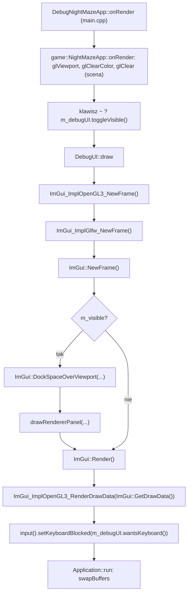
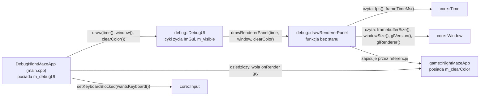

# Moduł debug: panele ImGui

Kamień milowy: M0. Kod: [`src/debug/`](../../src/debug/) oraz [`src/main.cpp`](../../src/main.cpp), gdzie nakładka jest podpinana do gry.
Teoria samej biblioteki (tryb natychmiastowy, backendy, docking) jest w [`../libraries/imgui.md`](../libraries/imgui.md). Ten dokument opisuje, jak ImGui jest wpięte w **mój** projekt i jak dodać nowy panel.

## 1. Po co to jest

Grafiki 3D nie da się wygodnie debugować `printf`em: chcę widzieć liczby (FPS, rozmiar framebuffera, wersję sterownika) i zmieniać parametry w działającym programie, bez przebudowywania. Moduł `debug` daje do tego nakładkę z panelami Dear ImGui rysowaną na wierzchu sceny. Nie realizuje osobnego tematu wykładu, ale obsługuje wszystkie piętnaście: każdy temat dostaje w panelu przełącznik, którym na obronie pokażę efekt "przed i po" (PRD, sekcje 3 i 10). W M0 istnieje jeden panel, **Renderer**, pokazujący dane z tematu 1 (FPS, czas klatki).

## 2. Teoria

**Tryb natychmiastowy (immediate mode) w jednym akapicie.** W klasycznym GUI tworzy się obiekty widżetów, które żyją między klatkami. W ImGui nie ma obiektów: co klatkę wołam funkcje typu `ImGui::Text(...)`, a biblioteka z tych wywołań buduje listę trójkątów do narysowania. Panel jest więc zwykłą funkcją wykonywaną co klatkę, a dane, które pokazuje, należą do mojego kodu, nie do ImGui. Szczegóły: [`../libraries/imgui.md`](../libraries/imgui.md).

**Trzy części ImGui w projekcie:**

| Część | Plik biblioteki | Rola |
|---|---|---|
| Rdzeń | `imgui.cpp` i pokrewne | Logika widżetów, układ, docking. Nie zna ani GLFW, ani OpenGL |
| Backend platformy (platform backend) | `imgui_impl_glfw.cpp` | Przekazuje do ImGui mysz, klawiaturę, rozmiar okna i czas z GLFW |
| Backend renderera (renderer backend) | `imgui_impl_opengl3.cpp` | Zamienia listy rysowania ImGui na wywołania OpenGL |

**Klatka ImGui wewnątrz mojej klatki.** ImGui rysuję zawsze na samym końcu klatki, po scenie, żeby panele były na wierzchu. Pilnuje tego `DebugNightMazeApp::onRender` w `main.cpp`, które najpierw woła rysowanie gry, a dopiero potem `DebugUI::draw`:



**Docking.** Używam gałęzi `docking` biblioteki (tag przypięty w [`cmake/Dependencies.cmake`](../../cmake/Dependencies.cmake)). Pozwala ona przyczepiać panele do krawędzi okna i do siebie nawzajem, łączyć je w zakładki i zapamiętać układ. To ważne na obronie: przy kilku panelach chcę jednym ruchem ustawić sobie widok dla danego tematu.

## 3. Jak to działa w OpenGL

Mój kod w `src/debug` nie woła bezpośrednio żadnej funkcji `gl*`. Całą rozmowę z OpenGL prowadzi backend renderera, ale trzeba wiedzieć, co robi, bo działa na **tym samym kontekście** co reszta programu.

### 3.1 Inicjalizacja (`DebugUI::DebugUI`)

```cpp
IMGUI_CHECKVERSION();
ImGui::CreateContext();
ImGui::GetIO().ConfigFlags |= ImGuiConfigFlags_DockingEnable;
ImGui::StyleColorsDark();

ImGui_ImplGlfw_InitForOpenGL(window.nativeHandle(), true);
ImGui_ImplOpenGL3_Init("#version 410");
```

| Linia | Co robi |
|---|---|
| `IMGUI_CHECKVERSION()` | Sprawdza, czy nagłówki i skompilowana biblioteka są w tej samej wersji (rozmiary struktur). Chroni przed trudnymi do znalezienia błędami po aktualizacji |
| `ImGui::CreateContext()` | Tworzy kontekst **ImGui** (cały jego stan). To nie jest kontekst OpenGL, zbieżność nazw jest przypadkowa |
| `ConfigFlags \|= ImGuiConfigFlags_DockingEnable` | Włącza docking. `\|=` dodaje jeden bit do istniejących flag, nie kasując pozostałych |
| `ImGui::StyleColorsDark()` | Ciemny motyw |
| `ImGui_ImplGlfw_InitForOpenGL(handle, true)` | Podłącza backend platformy do mojego okna (o argumencie `true` niżej) |
| `ImGui_ImplOpenGL3_Init("#version 410")` | Podłącza backend renderera i zapamiętuje wersję GLSL dla jego shaderów |

**Argument `true` w `ImGui_ImplGlfw_InitForOpenGL`.** To parametr `install_callbacks`. Z wartością `true` backend sam rejestruje w GLFW swoje funkcje zwrotne (callbacki): klawiszy, znaków, przycisków myszy, kółka, pozycji kursora, wejścia kursora w okno i fokusu okna. GLFW przechowuje tylko **jeden** callback danego typu na okno, a funkcja `glfwSet...Callback` zwraca poprzednio ustawiony. Backend zapamiętuje te poprzednie i woła je ze swoich callbacków, czyli buduje łańcuch (chaining): moje ewentualne wcześniejsze callbacki nadal by działały. W M0 moduł `core` nie ustawia żadnych callbacków wejścia (`Input` odpytuje `glfwGetKey`), więc nic się nie gryzie. Z wartością `false` musiałbym sam zarejestrować callbacki i ręcznie przekazywać każde zdarzenie do funkcji `ImGui_ImplGlfw_...Callback`.

Obiekty OpenGL backendu (program shaderów, bufory wierzchołków i indeksów, tekstura czcionki) nie powstają w `Init`, tylko leniwie, przy pierwszym `ImGui_ImplOpenGL3_NewFrame()`.

Backend OpenGL korzysta z własnego, małego loadera funkcji dołączonego do ImGui, więc nie potrzebuje GLAD (stąd w CMake cel `imgui` linkuje tylko `glfw`). W programie działają zatem dwa loadery, które pytają ten sam sterownik o te same adresy. To nie jest konflikt.

### 3.2 Klatka (`DebugUI::draw`)

```cpp
ImGui_ImplOpenGL3_NewFrame();
ImGui_ImplGlfw_NewFrame();
ImGui::NewFrame();

if (m_visible) {
    ImGui::DockSpaceOverViewport(0, ImGui::GetMainViewport(),
                                 ImGuiDockNodeFlags_PassthruCentralNode);

    drawRendererPanel(time, window, clearColor);
}

ImGui::Render();
ImGui_ImplOpenGL3_RenderDrawData(ImGui::GetDrawData());
```

| Wywołanie | Co robi |
|---|---|
| `ImGui_ImplOpenGL3_NewFrame()` | Przy pierwszym wywołaniu tworzy obiekty OpenGL backendu, później praktycznie nic |
| `ImGui_ImplGlfw_NewFrame()` | Wpisuje do ImGui rozmiar okna, skalę framebuffera i czas od poprzedniej klatki (z `glfwGetTime`) |
| `ImGui::NewFrame()` | Przetwarza zebrane zdarzenia wejścia i otwiera nową klatkę. Dopiero po tym wolno wołać widżety |
| `ImGui::Render()` | Zamyka klatkę i zamienia wywołania widżetów na listy rysowania (wierzchołki, indeksy, prostokąty przycinania). **Jeszcze nic nie rysuje** |
| `ImGui_ImplOpenGL3_RenderDrawData(...)` | Wysyła te listy do OpenGL |

`RenderDrawData` robi po kolei: zapamiętuje bieżący stan OpenGL, ustawia własny (włączone mieszanie kolorów `GL_BLEND` i test nożycowy `GL_SCISSOR_TEST`, wyłączony test głębi `GL_DEPTH_TEST` i odrzucanie ścian), ustawia viewport na cały framebuffer i macierz rzutu prostokątnego, tworzy tymczasowe VAO, wgrywa wierzchołki do buforów, rysuje przez `glDrawElements` i na końcu **przywraca zapamiętany stan**. Dzięki temu ImGui nie psuje ustawień renderera sceny, na przykład w późniejszych kamieniach milowych nie wyłączy mi testu głębi na stałe.

Związek z Retiną: backend platformy podaje ImGui rozmiar okna we współrzędnych ekranu oraz skalę `framebuffer / okno`. ImGui układa panele we współrzędnych okna (te same jednostki co pozycja myszy), a backend renderera mnoży je przez skalę przy rysowaniu. Dlatego panele są ostre i klikalne na ekranie 2x bez żadnego kodu z mojej strony.

**`DockSpaceOverViewport(0, ImGui::GetMainViewport(), ImGuiDockNodeFlags_PassthruCentralNode)`.** Funkcja tworzy niewidzialne okno ImGui rozciągnięte na cały główny viewport (całe moje okno) i umieszcza w nim obszar dokowania (dockspace). Od tej chwili panel przeciągnięty do krawędzi okna "przykleja się" do niej.

| Argument | Wartość | Znaczenie |
|---|---|---|
| `dockspace_id` | `0` | ImGui samo nadaje identyfikator obszaru |
| `viewport` | `ImGui::GetMainViewport()` | Obszar pokrywa główne okno programu |
| `flags` | `ImGuiDockNodeFlags_PassthruCentralNode` | Środek obszaru jest przezroczysty i przepuszcza mysz |

Obszar dokowania ma **węzeł centralny** (central node): to miejsce, które zostaje, gdy panele zajmą krawędzie. Domyślnie ImGui zamalowuje pusty węzeł centralny jednolitym tłem i przechwytuje w nim kliknięcia. Skutek: scena 3D znika pod szarym prostokątem. Flaga `PassthruCentralNode` wyłącza to tło i przepuszcza wejście, więc przez środek widać scenę (w M0: kolor czyszczenia), a panele zajmują tylko tyle miejsca, ile im dam.

**Dlaczego klatka ImGui działa także wtedy, gdy UI jest ukryte.** Po naciśnięciu klawisza `~` `m_visible` jest `false`, pomijam tylko dockspace i panele, ale `NewFrame`, `Render` i `RenderDrawData` wykonują się dalej. Powody:

1. Callbacki backendu są zainstalowane przez cały czas i dokładają zdarzenia do kolejki ImGui. Kolejkę opróżnia `ImGui::NewFrame()`. Gdybym przestał je wołać, zdarzenia zbierałyby się i zostałyby przetworzone hurtem po ponownym pokazaniu paneli.
2. `ImGui_ImplGlfw_NewFrame()` liczy czas od poprzedniego wywołania. Po przerwie ImGui dostałoby jedną "klatkę" trwającą na przykład 20 sekund, co psuje animacje i odmierzanie czasu w bibliotece.
3. Kod jest prostszy: `NewFrame` i `Render` zawsze występują w parze, nie ma dwóch ścieżek do pomylenia.
4. Koszt jest pomijalny: bez żadnego okna `Render` tworzy puste listy i backend nie ma czego rysować.

### 3.3 Zamknięcie (`DebugUI::~DebugUI`)

```cpp
ImGui_ImplOpenGL3_Shutdown();
ImGui_ImplGlfw_Shutdown();
ImGui::DestroyContext();
```

Kolejność odwrotna do inicjalizacji. `ImGui_ImplOpenGL3_Shutdown` usuwa obiekty OpenGL backendu, więc **kontekst OpenGL musi jeszcze istnieć**. `ImGui_ImplGlfw_Shutdown` przywraca w GLFW poprzednie callbacki, więc okno też musi istnieć. Gwarantuje to reguła C++ opisana w [`core/README.md`](core/README.md), sekcja 7: **pola są niszczone przed klasami bazowymi**. `m_debugUI` jest polem `DebugNightMazeApp`, a okno należy do klasy bazowej `core::Application`, więc ImGui zamyka się, gdy okno i kontekst jeszcze istnieją.

## 4. Shadery

Moduł `debug` nie ma własnych plików shaderów. Shadery ma backend renderera: napis `"#version 410"` przekazany do `ImGui_ImplOpenGL3_Init` jest doklejany jako pierwsza linia jego wbudowanego shadera wierzchołków i fragmentów, które backend kompiluje i linkuje przy pierwszej klatce. Wersja musi pasować do kontekstu: OpenGL 4.1 to GLSL 4.10, a domyślne w wielu przykładach `"#version 130"` nie skompiluje się w profilu Core na macOS. Pierwsze shadery pisane przeze mnie pojawią się w M1, a wraz z nimi w późniejszych kamieniach milowych panel z listą programów i przyciskiem przeładowania (PRD, sekcja 10).

## 5. Kod w projekcie

### 5.1 Pliki

| Plik | Co zawiera |
|---|---|
| [`src/debug/DebugUI.hpp`](../../src/debug/DebugUI.hpp), [`.cpp`](../../src/debug/DebugUI.cpp) | Klasa `DebugUI`: cykl życia ImGui (RAII), klatka ImGui, dockspace, wywołanie paneli, widoczność, `wantsKeyboard()` |
| [`src/debug/panels/RendererPanel.hpp`](../../src/debug/panels/RendererPanel.hpp), [`.cpp`](../../src/debug/panels/RendererPanel.cpp) | Funkcja `drawRendererPanel`: panel "Renderer" |
| [`src/main.cpp`](../../src/main.cpp) | Klasa `DebugNightMazeApp`: posiada `DebugUI`, obsługuje klawisz `~`, woła `draw` po narysowaniu gry, przekazuje do `core::Input` blokadę klawiatury |
| [`cmake/Dependencies.cmake`](../../cmake/Dependencies.cmake) | Pobranie ImGui i definicja celu `imgui` (ImGui nie ma własnego CMake) |
| [`CMakeLists.txt`](../../CMakeLists.txt) | Pliki `src/debug/*` są częścią programu `night_maze`, nie biblioteki `engine` |

### 5.2 Architektura: kto co posiada



**Dlaczego `DebugUI` należy do klasy w `main.cpp`, a nie do gry.** W architekturze projektu (PRD, sekcja 6) `debug/` zależy od wszystkich warstw, ale **nic nie zależy od `debug/`**. Gdyby `game::NightMazeApp` miało pole `DebugUI`, plik gry dołączałby `debug/DebugUI.hpp` i gra nie dałaby się zbudować bez paneli. Dlatego sklejenie odbywa się piętro wyżej:

```cpp
class DebugNightMazeApp final : public game::NightMazeApp {
protected:
    void onRender(double alpha) override {
        game::NightMazeApp::onRender(alpha);

        // The key left of 1 (` and ~ on a US keyboard) shows or hides the debug panels.
        if (input().wasKeyPressed(GLFW_KEY_GRAVE_ACCENT)) {
            m_debugUI.toggleVisible();
        }
        m_debugUI.draw(time(), window(), clearColor());

        // ImGui now knows whether it is using the keyboard (a text field is being edited
        // or a widget is active). If so, block the game's keyboard from the next frame
        // on, so typing does not trigger Escape, the panel toggle or player movement.
        input().setKeyboardBlocked(m_debugUI.wantsKeyboard());
    }

private:
    debug::DebugUI m_debugUI{window()};
};
```

`main.cpp` to jedyny plik, który dołącza zarówno `game/NightMazeApp.hpp`, jak i `debug/DebugUI.hpp`. Klasa dziedziczy po grze, nadpisuje `onRender`, woła w nim wersję gry (`game::NightMazeApp::onRender(alpha)`, z nazwą klasy, żeby ominąć mechanizm wirtualny i nie wpaść w rekurencję), potem dorysowuje panele, a na końcu przekazuje do `core::Input` informację, czy ImGui używa klawiatury (sekcja 5.6). Gra ze swojej strony udostępnia tylko chroniony akcesor `clearColor()` i nie wie, kto z niego skorzysta. Kierunek zależności wygląda więc tak: `main.cpp` zna `game` i `debug`, `debug` zna `core`, `game` zna `core`, a `game` i `debug` nie znają się nawzajem.

Trzy decyzje, które trzeba umieć uzasadnić:

1. **`DebugUI` to RAII na ImGui.** Konstruktor inicjalizuje, destruktor zamyka, kopiowanie jest zablokowane (`= delete`), bo kontekst ImGui jest jeden. Nie da się zapomnieć o `Shutdown`.
2. **Panel to wolna funkcja, nie klasa.** `drawRendererPanel` nie ma własnego stanu. Wszystko, co pokazuje i edytuje, dostaje w argumentach. Zgodnie z zasadą "dane zamiast kodu" (PRD, sekcja 6) stan należy do właściciela: kolor tła jest polem `game::NightMazeApp::m_clearColor`, a panel tylko go edytuje przez referencję.
3. **`const` mówi, co panel może zmienić.** `const core::Time&` i `const core::Window&` są tylko do odczytu. `std::array<float, 3>& clearColor` bez `const` to jedyna rzecz, którą panel modyfikuje. Z samej sygnatury widać, co jest przełącznikiem.

Nagłówki `DebugUI.hpp` i `RendererPanel.hpp` nie dołączają ani `imgui.h`, ani nagłówków `core`: wystarczają im deklaracje wyprzedzające `class Time;` i `class Window;`, bo używają tych typów tylko przez referencję. ImGui jest dołączane wyłącznie w plikach `.cpp`, więc reszta projektu nie zależy od tej biblioteki.

### 5.3 Panel Renderer linia po linii

```cpp
void drawRendererPanel(const core::Time& time, const core::Window& window,
                       std::array<float, 3>& clearColor) {
    if (ImGui::Begin("Renderer")) {
        ImGui::Text("FPS: %.1f", time.fps());
        ImGui::Text("Frame time: %.2f ms", time.frameTimeMs());

        const core::Size framebuffer = window.framebufferSize();
        const core::Size windowSize = window.windowSize();
        ImGui::Text("Framebuffer: %d x %d px", framebuffer.width, framebuffer.height);
        ImGui::Text("Window: %d x %d", windowSize.width, windowSize.height);

        ImGui::Separator();
        ImGui::TextWrapped("OpenGL: %s", window.glVersion().c_str());
        ImGui::TextWrapped("GPU: %s", window.glRenderer().c_str());

        ImGui::Separator();
        ImGui::ColorEdit3("Clear color", clearColor.data());
    }
    ImGui::End();
}
```

- `ImGui::Begin("Renderer")` otwiera okno ImGui o tym tytule. Tytuł jest jednocześnie **identyfikatorem**: po nim ImGui pamięta pozycję i dokowanie panelu. Zwraca `false`, gdy panel jest zwinięty albo schowany za inną zakładką, i wtedy pomijam zawartość (oszczędność pracy).
- `ImGui::End()` stoi **poza** `if` i wykonuje się zawsze. Każde `Begin` musi mieć swoje `End`, niezależnie od zwróconej wartości.
- `ImGui::Text` działa jak `printf`: `%.1f` to liczba z jedną cyfrą po przecinku, `%d` liczba całkowita, `%s` napis w stylu C, dlatego przy `std::string` potrzebne jest `.c_str()`.
- `ImGui::TextWrapped` zawija długi tekst (nazwa karty graficznej bywa długa).
- `ImGui::ColorEdit3("Clear color", clearColor.data())` dostaje wskaźnik na pierwszy z trzech `float`ów (`.data()` zwraca `float*`) i przez ten wskaźnik **czyta i zapisuje** kolor. Nie ma tu żadnego "zdarzenia zmiany": w następnej klatce `NightMazeApp::onRender` po prostu przekaże do `glClearColor` już zmienione wartości.

### 5.4 Gdzie moduł jest wywoływany

Wszystkie cztery miejsca są w `DebugNightMazeApp` w [`main.cpp`](../../src/main.cpp):

- Tworzenie: inicjalizator pola przy deklaracji, `debug::DebugUI m_debugUI{window()};`. Wykonuje się po zbudowaniu całej części bazowej, więc okno i kontekst już istnieją.
- Przełączanie: `if (input().wasKeyPressed(GLFW_KEY_GRAVE_ACCENT)) { m_debugUI.toggleVisible(); }` w `onRender`, czyli dokładnie raz na klatkę. Dlaczego nie w `onUpdate`, wyjaśnia [`core/input.md`](core/input.md), sekcja 5.5.
- Rysowanie: `m_debugUI.draw(time(), window(), clearColor());`, po powrocie z `game::NightMazeApp::onRender`.
- Blokada klawiatury gry: ostatnia linia `onRender`, `input().setKeyboardBlocked(m_debugUI.wantsKeyboard());` (sekcja 5.6).

### 5.5 Jak dodać nowy panel

Przykład: panel "Timing" pokazujący parametry stałego kroku. Kod poniżej jest wzorem do ćwiczenia, nie ma go w repozytorium.

**Krok 1. Nagłówek** `src/debug/panels/TimingPanel.hpp`. Komentarz na górze z odnośnikiem do dokumentu, deklaracje wyprzedzające zamiast `#include`, funkcja w przestrzeni nazw `debug`:

```cpp
// "Timing" debug panel: fixed step parameters.
// See docs/modules/debug-ui.md
#pragma once

namespace core {
class Time;
} // namespace core

namespace debug {

/// Draws the "Timing" panel. Called by DebugUI::draw, inside the ImGui frame.
void drawTimingPanel(const core::Time& time);

} // namespace debug
```

**Krok 2. Implementacja** `src/debug/panels/TimingPanel.cpp`. Zawsze ten sam szkielet: `if (ImGui::Begin(...)) { ... }` i `ImGui::End()` poza `if`:

```cpp
#include "debug/panels/TimingPanel.hpp"

#include "core/Time.hpp"

#include <imgui.h>

namespace debug {

void drawTimingPanel(const core::Time& time) {
    if (ImGui::Begin("Timing")) {
        ImGui::Text("Fixed step: %.3f ms", 1000.0 * core::Time::FIXED_DT);
        ImGui::Text("Delta: %.3f ms", 1000.0 * time.deltaSeconds());
        ImGui::Text("Alpha: %.2f", time.alpha());
    }
    ImGui::End();
}

} // namespace debug
```

**Krok 3. CMake.** Dopisz oba pliki do listy `add_executable(night_maze ...)` w [`CMakeLists.txt`](../../CMakeLists.txt), obok `RendererPanel`. Bez tego linker zgłosi brak symbolu `drawTimingPanel`.

**Krok 4. Wywołanie.** W [`DebugUI.cpp`](../../src/debug/DebugUI.cpp) dodaj `#include "debug/panels/TimingPanel.hpp"` i wywołanie wewnątrz `if (m_visible)`, po `DockSpaceOverViewport`:

```cpp
drawRendererPanel(time, window, clearColor);
drawTimingPanel(time);
```

**Krok 5. Dane.** Ten przykład korzysta z `time`, które `DebugUI::draw` już dostaje. Jeśli panel potrzebuje nowych danych, trzeba je doprowadzić tą samą drogą co kolor tła: pole w klasie będącej właścicielem (dziś `game::NightMazeApp`), chroniony akcesor w tej klasie (wzór: `clearColor()`), nowy parametr `DebugUI::draw` (w `.hpp` i `.cpp`) i nowy argument w wywołaniu w `DebugNightMazeApp::onRender` w `main.cpp`. Kod w `game/` nadal nie dołącza niczego z `debug/`. Dane tylko do odczytu przekazuję przez `const&`, edytowalne przez zwykłą referencję.

**Krok 6. Sprawdzenie i dokumentacja.** Zbuduj, uruchom, zadokuj panel do krawędzi, uruchom ponownie i sprawdź, że układ się zachował. Dopisz panel do sekcji 6 dokumentu modułu, którego dotyczy, oraz do kolumny "Przełącznik w ImGui" w [`../syllabus.md`](../syllabus.md).

Zasady, których się trzymam przy panelach: unikalny tytuł w `Begin` (dwa panele o tym samym tytule zlałyby się w jedno okno), żadnych zmiennych globalnych i `static` na stan, żadnych wywołań `gl*` w panelu.

### 5.6 Klawiatura: gra czy ImGui

Ten sam klawisz widzą dwaj odbiorcy. ImGui dostaje naciśnięcia przez callbacki backendu GLFW, a gra czyta je przez `core::Input`, czyli prosto z GLFW. Bez dodatkowego mechanizmu Escape wciśnięty po to, żeby anulować edycję pola w panelu, zamknąłby program, a klawisz `~` wpisany w pole schowałby panele.

Moduł `debug` dokłada do rozwiązania jedną funkcję:

```cpp
bool DebugUI::wantsKeyboard() const {
    return ImGui::GetIO().WantCaptureKeyboard;
}
```

`ImGui::GetIO()` zwraca strukturę `ImGuiIO`, przez którą ImGui wymienia dane z programem. Pole `WantCaptureKeyboard` jest ustawiane przez samą bibliotekę i znaczy: "używam teraz klawiatury, aplikacja powinna zignorować klawisze". ImGui ustawia je, gdy aktywny jest **dowolny widżet** (edycja pola, przeciąganie suwaka albo wartości, trzymany przycisk, przesuwane okno panelu) albo otwarte jest okno modalne, a nie tylko w polach tekstowych. Aktywny widżet może bowiem sam używać klawiszy: Escape anuluje edycję, Tab przechodzi do następnego pola, Ctrl, Shift i Alt zmieniają zachowanie przeciągania.

Funkcja jest `const` i niczego nie zmienia. `DebugUI` nie wie, co wołający zrobi z odpowiedzią, i nie dołącza niczego z `game/`. Wartość przekazuje dalej `main.cpp`:

```cpp
input().setKeyboardBlocked(m_debugUI.wantsKeyboard());
```

Dopóki blokada jest ustawiona, `core::Input::isKeyDown` i `wasKeyPressed` zwracają `false` dla każdego klawisza. Trzy rzeczy, które trzeba umieć wyjaśnić:

1. **Kierunek zależności zostaje nienaruszony.** `core/` nie dołącza ImGui: dostaje neutralną flagę "klawiatura zablokowana" i nie wie, kto ją ustawił. `debug/` nie zna gry. Oba końce skleja `main.cpp`.
2. **Wartość jest odczytywana po `draw`.** ImGui aktualizuje `WantCaptureKeyboard` w `ImGui::NewFrame()`, a ten jest wołany wewnątrz `draw`. Odczyt przed `draw` dałby wartość o klatkę starszą.
3. **Blokada działa od następnej klatki.** Pytania o klawisze w bieżącej klatce (Escape w `Application::run`, `~` na początku `onRender`) padły przed tą linią. Dlaczego to opóźnienie nie szkodzi i dlaczego po zdjęciu blokady nie pojawia się fałszywe "właśnie wciśnięty", opisuje [`core/input.md`](core/input.md), sekcja 5.6.

Blokada dotyczy także samego przełącznika paneli: podczas edycji pola klawisz `~` trafia do pola, a nie do `toggleVisible()`. Mysz nie jest jeszcze objęta tym mechanizmem (sekcja 7, pułapka 7).

## 6. Panel ImGui

W M0 jest jeden panel, **Renderer**:

| Element | Rodzaj | Czego uczy |
|---|---|---|
| `FPS`, `Frame time` | odczyt | Dwie postaci tej samej informacji. Wartości odświeżają się co 0,5 s (uśrednianie w `core::Time`) |
| `Framebuffer`, `Window` | odczyt | Różnica między pikselami a współrzędnymi ekranu. Warto zmienić rozmiar okna i przenieść je między monitorami o różnej gęstości |
| `OpenGL`, `GPU` | odczyt | Jaki kontekst naprawdę dał sterownik i która karta rysuje |
| `Clear color` | edycja | Zmiana stanu OpenGL widoczna natychmiast. Kliknięcie w kwadrat koloru otwiera próbnik |

Zachowanie całej nakładki:

- Klawisz **`~`** (grawis, grave accent, na lewo od `1`, w kodzie `GLFW_KEY_GRAVE_ACCENT`) chowa i pokazuje wszystkie panele (start: widoczne, `m_visible = true`). PRD ([`../PRD.pdf`](../PRD.pdf)) nadal podaje w tym miejscu pierwszy klawisz funkcyjny (z górnego rzędu klawiatury). Klawisz został zmieniony celowo i obowiązuje to, co jest w kodzie.
- Gdy aktywny jest widżet panelu (edycja pola, przeciąganie wartości), gra nie widzi klawiatury: Escape nie zamyka programu, a `~` nie chowa paneli (sekcja 5.6).
- Panel można przeciągnąć za pasek tytułu i **zadokować** do krawędzi okna. Środek zostaje przezroczysty dzięki `PassthruCentralNode`.
- Układ paneli ImGui zapisuje w pliku `imgui.ini` w **katalogu roboczym** programu. Plik jest w `.gitignore`, bo to ustawienie lokalne. Skasowanie go przywraca układ domyślny.

## 7. Pułapki

1. **Scena zniknęła pod szarym tłem.** Brak flagi `ImGuiDockNodeFlags_PassthruCentralNode` w `DockSpaceOverViewport`: pusty węzeł centralny jest zamalowany i zasłania scenę.
2. **Shadery ImGui się nie kompilują, paneli nie widać.** Zła wersja GLSL w `ImGui_ImplOpenGL3_Init`. Dla kontekstu 4.1 Core ma być `"#version 410"`.
3. **`Begin` bez `End`.** `ImGui::End()` wstawione do środka `if (ImGui::Begin(...))` powoduje asercję po zwinięciu panelu. `End` zawsze poza `if`.
4. **Widżety poza klatką.** Każde `ImGui::...` rysujące coś musi być między `ImGui::NewFrame()` a `ImGui::Render()`. Dlatego panele wołam tylko z `DebugUI::draw`.
5. **Kolejność niszczenia.** `DebugUI` zniszczone po oknie woła OpenGL i GLFW bez kontekstu. Pole `m_debugUI` musi pozostać polem klasy pochodnej od `core::Application` (dziś `DebugNightMazeApp`), bo pola giną przed klasami bazowymi (zob. [`core/README.md`](core/README.md), sekcja 7).
6. **Własny callback GLFW ustawiony po utworzeniu `DebugUI`.** `glfwSetKeyCallback` i pokrewne **podmieniają** callback zainstalowany przez backend, więc ImGui przestaje dostawać dany rodzaj zdarzeń. Własne callbacki trzeba ustawić przed konstruktorem `DebugUI` (wtedy backend je połączy w łańcuch) albo samemu wołać poprzedni callback zwrócony przez `glfwSet...Callback`.
7. **Gra i ImGui reagują na tę samą mysz.** Klawiatura jest rozdzielona (sekcja 5.6), ale mysz jeszcze nie: `core::Input` nie obsługuje myszy, a nikt nie sprawdza `ImGui::GetIO().WantCaptureMouse`. W M0 to nie przeszkadza, bo gra nie reaguje na mysz. Przy kamerze FPS w M1 trzeba będzie dodać analogiczny mechanizm, inaczej przeciąganie suwaka w panelu obracałoby jednocześnie kamerę.
8. **`imgui.ini` zależy od katalogu roboczego.** Uruchomienie z IDE i z terminala może dać dwa różne układy, bo plik ląduje w innym katalogu.
9. **Małe panele na Windowsie przy skalowaniu 150% lub 200%.** Na macOS skalę Retiny obsługuje para rozmiar okna i framebuffer. Na Windowsie framebuffer i okno mają ten sam rozmiar w pikselach, więc czcionka ImGui pozostaje mała, dopóki sam jej nie przeskaluję.
10. **Błąd OpenGL przypisany nie temu, kto zawinił.** Backend ImGui nie używa mojego `GL_CHECK`. Gdyby zostawił flagę błędu, zgłosi ją pierwszy `GL_CHECK` w następnej klatce (zwykle `glViewport`).

11. **"Klawisz `~` nie chowa paneli".** Aktywny widżet ImGui blokuje klawiaturę gry, więc przełącznik nie reaguje, dopóki trwa edycja albo przeciąganie. To zamierzone. Wystarczy zakończyć edycję (Enter, Escape albo kliknięcie poza polem).
12. **`setKeyboardBlocked` zapomniane w nowym programie.** Blokada nie jest częścią `DebugUI::draw`, tylko osobną linią w `main.cpp`. Program, który posiada `DebugUI`, ale nie przekazuje `wantsKeyboard()` do `core::Input`, wraca do starego zachowania: Escape w polu tekstowym zamyka program.

## 8. Ćwiczenia

1. **Nowy panel.** Wykonaj kroki z sekcji 5.5 i dodaj panel "Timing". Zadokuj go pod panelem Renderer, zamknij program i sprawdź w `imgui.ini`, co zostało zapisane.
2. **Bez `PassthruCentralNode`.** Zamień flagę na `ImGuiDockNodeFlags_None`, ustaw jaskrawy `Clear color` i zobacz, co dzieje się ze środkiem okna. Wyjaśnij, czym jest węzeł centralny.
3. **Przełącznik.** Dodaj do `game::NightMazeApp` pole `bool` z chronionym akcesorem, doprowadź je do panelu Renderer (krok 5 z sekcji 5.5) jako `ImGui::Checkbox` i użyj go w `NightMazeApp::onRender`, na przykład do pominięcia `glClear`. Zaobserwuj, co zostaje na ekranie, gdy bufor nie jest czyszczony, a panel się porusza.
4. **Demo ImGui.** W `DebugUI::draw`, wewnątrz `if (m_visible)`, dopisz tymczasowo `ImGui::ShowDemoWindow();`. Aby się zlinkowało, dodaj `${imgui_SOURCE_DIR}/imgui_demo.cpp` do celu `imgui` w `cmake/Dependencies.cmake`. Przejrzyj dostępne widżety, a potem wycofaj obie zmiany.

5. **Kto ma klawiaturę.** Kliknij z wciśniętym Ctrl w jedną ze składowych `Clear color`, żeby przejść w tryb wpisywania, i naciśnij kolejno `~` oraz Escape. Zapisz, co się stało z panelami, z polem i z programem. Potem zakomentuj w `main.cpp` linię `input().setKeyboardBlocked(m_debugUI.wantsKeyboard());`, zbuduj i powtórz. Wyjaśnij różnicę, wskazując, w której funkcji `core::Input` zapada decyzja. Przywróć linię.

## 9. Pytania kontrolne

1. **Czym jest tryb natychmiastowy i co z niego wynika dla panelu?**
   Interfejs jest opisywany wywołaniami funkcji w każdej klatce, bez trwałych obiektów widżetów. Panel jest funkcją wołaną co klatkę, a jego dane należą do mojego kodu.

2. **Jaką rolę mają dwa backendy?**
   Backend GLFW dostarcza ImGui wejście, rozmiar okna i czas. Backend OpenGL3 rysuje listy przygotowane przez ImGui. Rdzeń biblioteki nie zna ani GLFW, ani OpenGL.

3. **Co oznacza `true` w `ImGui_ImplGlfw_InitForOpenGL(window.nativeHandle(), true)`?**
   Backend sam instaluje callbacki GLFW i woła z nich callbacki ustawione wcześniej (łańcuch). Z `false` musiałbym przekazywać zdarzenia ręcznie.

4. **Dlaczego `"#version 410"`?**
   To wersja GLSL shaderów backendu. Kontekst to OpenGL 4.1 Core, czyli GLSL 4.10. Starsze wersje nie skompilują się w profilu Core na macOS.

5. **Co robi `DockSpaceOverViewport` i po co `PassthruCentralNode`?**
   Tworzy obszar dokowania na całe okno, żeby panele dało się przyczepiać do krawędzi. Flaga sprawia, że pusty środek nie jest zamalowany i przepuszcza mysz, więc widać scenę.

6. **Dlaczego klatka ImGui wykonuje się także przy ukrytym UI?**
   Żeby ImGui dalej opróżniało kolejkę zdarzeń i miało poprawny czas między klatkami. Pomijane są tylko dockspace i panele, koszt pustej klatki jest pomijalny.

7. **Czym różni się `ImGui::Render()` od `ImGui_ImplOpenGL3_RenderDrawData(...)`?**
   `Render` tylko buduje listy rysowania w pamięci. Dopiero `RenderDrawData` wykonuje wywołania OpenGL.

8. **Dlaczego ImGui rysuję na końcu klatki i czy psuje to stan OpenGL?**
   Na końcu, żeby panele były nad sceną. Backend zapamiętuje stan przed rysowaniem i przywraca go po, więc ustawienia renderera zostają nienaruszone.

9. **Dlaczego `ImGui::End()` jest poza `if (ImGui::Begin(...))`?**
   `Begin` zwraca `false` dla panelu zwiniętego lub zasłoniętego, ale okno i tak zostało otwarte, więc `End` musi być wywołane zawsze.

10. **Dlaczego `DebugUI` musi zostać zniszczone przed oknem i co to gwarantuje?**
    Zamknięcie backendów usuwa obiekty OpenGL i przywraca callbacki GLFW, więc potrzebuje żywego kontekstu i okna. Gwarantuje to C++: pola klasy (`DebugNightMazeApp::m_debugUI`) są niszczone przed jej klasami bazowymi, a okno jest polem `core::Application`.

11. **Jak kolor z panelu trafia do OpenGL?**
    `ColorEdit3` zapisuje przez wskaźnik do `NightMazeApp::m_clearColor` (referencję daje akcesor `clearColor()`). W następnej klatce `NightMazeApp::onRender` woła `glClearColor` z nowymi wartościami, a `glClear` ich używa.

12. **Dlaczego gra nie posiada `DebugUI` i gdzie w takim razie ono żyje?**
    `game/` nie może zależeć od `debug/`. `DebugUI` jest polem `DebugNightMazeApp` w `main.cpp`, jedynym pliku znającym obie warstwy. Klasa dziedziczy po grze i po jej `onRender` dorysowuje panele.

13. **Jak program rozstrzyga, czy klawisz trafia do gry, czy do panelu?**
    `DebugUI::wantsKeyboard()` zwraca `ImGui::GetIO().WantCaptureKeyboard`, czyli informację, że aktywny jest jakiś widżet ImGui. `DebugNightMazeApp::onRender` przekazuje ją po `draw` do `input().setKeyboardBlocked(...)`. Od następnej klatki `isKeyDown` i `wasKeyPressed` zwracają `false`, więc Escape nie zamyka programu, a `~` nie chowa paneli. `core/` nie zna ImGui: dostaje tylko neutralną flagę.

14. **Którym klawiszem chowam panele i dlaczego obsługa stoi w `onRender`?**
    Klawiszem `~` na lewo od `1` (`GLFW_KEY_GRAVE_ACCENT`). `wasKeyPressed` to zbocze liczone raz na klatkę, a `onRender` wykonuje się dokładnie raz na klatkę, w odróżnieniu od `onUpdate`.

## 10. Źródła

- Dokument biblioteki w tym repozytorium: [`../libraries/imgui.md`](../libraries/imgui.md).
- Dear ImGui, repozytorium: <https://github.com/ocornut/imgui> (pliki `imgui.h`, `backends/imgui_impl_glfw.cpp`, `backends/imgui_impl_opengl3.cpp` oraz przykład `example_glfw_opengl3`).
- Dear ImGui, wiki: <https://github.com/ocornut/imgui/wiki> (strony "Getting Started" i "Docking").
- Dokumenty modułu `core`, z którymi ten moduł się styka: [`core/README.md`](core/README.md) (warstwy, kolejność niszczenia), [`core/input.md`](core/input.md) (blokada klawiatury).
- Dokumentacja GLFW: <https://www.glfw.org/docs/latest/> (przewodnik o wejściu: callbacki klawiatury i myszy).
- docs.gl (<https://docs.gl>): `glBlendFunc`, `glScissor`, `glDrawElements`, czyli funkcje, na których opiera się backend.
- LearnOpenGL nie ma rozdziału o ImGui. Pomocne tło: "Hello Window" (<https://learnopengl.com/Getting-started/Hello-Window>) i "Blending" (<https://learnopengl.com/Advanced-OpenGL/Blending>).
- Janusz Ganczarski, "OpenGL. Podstawy programowania grafiki 3D" oraz "OpenGL. Księga eksperta": tło do mieszania kolorów, testu nożycowego i rzutu prostokątnego, których używa backend.
