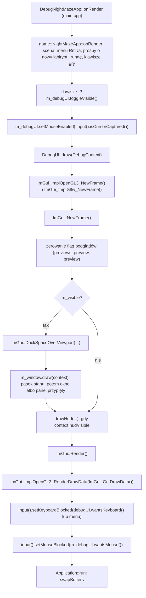
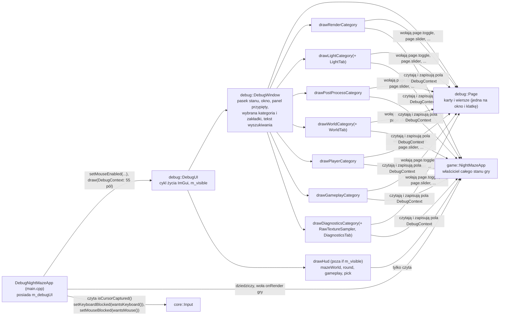

# Moduł debug: okno debug ImGui

Kamień milowy: M0 (nakładka z jednym panelem) do M9 (kamera menu). **Stan z 2026-10-06:** trzynaście osobnych paneli Dear ImGui zastąpiło **jedno okno debug** z paskiem ikon o siedmiu kategoriach, kartami ustawień, wyszukiwarką, przypinaniem i paskiem stanu. Ten dokument opisuje to okno. Co się zmieniło, w jakich commitach i co z dawnych paneli jeszcze wyjaśnia dzisiejszy kod, jest w sekcji "Historia" na końcu. Decyzja o oknie i jej odstępstwa: [`../decisions/debug-window-redesign.md`](../decisions/debug-window-redesign.md).

Kod: [`src/debug/`](../../src/debug/) (22 pliki, plus 14 w [`categories/`](../../src/debug/categories/)) oraz [`src/main.cpp`](../../src/main.cpp), gdzie nakładka jest podpięta do gry. Teoria samej biblioteki (tryb natychmiastowy, backendy, docking) jest w [`../libraries/imgui.md`](../libraries/imgui.md). Ten dokument opisuje, jak ImGui jest wpięte w **mój** projekt i jak dodać wiersz, kartę, zakładkę albo kategorię.

**Trzy rodzaje dowodów trzymam osobno** (tak jak w [`../guides/build-windows.md`](../guides/build-windows.md), sekcja o oknie debug):

1. **Zgłoszone przez bramkę (2026-10-06):** program testowy Debug na gałęzi okna kończy się wynikiem **526 przypadków testowych i 219214 asercji** (wcześniej 519 i 219195: różnica to siedem przypadków i 19 asercji w `tests/SearchTests.cpp`). Wynik podał koordynator prac z wyjścia doctest. Pisząc ten dokument, nie uruchamiałem ani testów, ani gry.
2. **Widziane na zrzucie ekranu przez agenta (2026-10-06), nie przez właściciela:** autor kodu oglądał własny build Debug na Windows 11 (ekran 100 procent, RTX 4070 Ti SUPER, OpenGL 4.1) i sterował nim prawdziwą myszą i klawiaturą. Lista widzianego i niewidzianego jest w sekcji 5.17.
3. **Nieoglądane przez nikogo albo otwarte dla właściciela:** macOS, skala ekranu inna niż 100 procent, zadokowany albo zmieniony panel przypięty i kilka innych rzeczy (lista w sekcji 5.17 i w [`../guides/build-windows.md`](../guides/build-windows.md)).

Liczby w tym dokumencie pochodzą z kodu na `f6c6cd5` (policzone albo przepisane), z notatki przekazania od autora kodu albo z wyniku bramki. Tam, gdzie liczba jest wyliczona przeze mnie, mówię o tym.

## 1. Po co to jest

Grafiki 3D nie da się wygodnie debugować `printf`em: chcę widzieć liczby (FPS, rozmiar framebuffera, wersję sterownika) i zmieniać parametry w działającym programie, bez przebudowywania. Moduł `debug` daje do tego nakładkę rysowaną przez Dear ImGui na wierzchu sceny. Nie realizuje osobnego tematu wykładu, ale obsługuje wszystkie piętnaście: każdy temat dostaje w oknie przełącznik, którym na obronie pokażę efekt "przed i po" (PRD, sekcje 3 i 10).

Do M9 były to trzynaście osobnych paneli. Od 2026-10-06 jest **jedno okno** przy prawej krawędzi okna gry. Po lewej ma pionowy **pasek ikon** (rail) z siedmioma kategoriami, obok nagłówek z nazwą kategorii, polem wyszukiwania i przyciskiem przypięcia, pod nim zakładki (w trzech kategoriach) i **karty** z **wierszami** ustawień. Kategorie i tematy, które pokazują:

| Kategoria | Zakładki | Co tam jest | Tematy wykładu |
|---|---|---|---|
| Render | brak | lista `Lighting`, niebo (`Skybox`, `Sky brightness`), kolor czyszczenia, tryb widoku, mapowanie normalnych, filtr i anizotropia tekstur | 5, 7, 8 |
| Light | Lights, Shadows | światło otoczenia, księżyc, latarka, światła punktowe nad kryształami, połysk, cienie księżyca i latarki z obrazami map | 6, 11 |
| Post process | brak | ekspozycja, mapowanie tonów, bloom, mgła, winieta, rozmiary framebufferów i cztery obrazy podglądu | 10 |
| World | Maze, Terrain and grass, Reflections | następny labirynt i plan z góry, teren i trawa, kryształy i kałuże z odbiciem nieba | 9, 12, 13 |
| Player | brak | pozycja, noclip, kamera, prędkości, kamera menu | 3, 14 |
| Gameplay | brak | stan rundy, bateria, reguły rundy, minimapa | (gra) |
| Diagnostics | Frame and shaders, Collision and picking, Assets | FPS i dane sterownika, przeładowanie shaderów, kolizje i promień wskazywania, modele i tekstury | 1, 2, 4, 5, 14 |

Temat 14 jest rozdzielony: rysowanie kształtów kolizji i odczyty są w Diagnostics, a przełącznik `Noclip` w Player. Pasek stanu w prawym górnym rogu pokazuje stale nazwę gry, ekran, FPS, czas klatki i ziarno labiryntu. Okno **startuje ukryte**, klawisz `~` je pokazuje (sekcja 5.10).

Od M5 moduł rysuje jeszcze jedną rzecz, która nie jest oknem ani narzędziem: **HUD gry** (licznik kryształów, czas, pasek baterii, podpowiedzi, celownik, karta kartki). Mieszka tutaj tylko dlatego, że tu jest ImGui (sekcja 5.13).

## 2. Teoria

**Tryb natychmiastowy (immediate mode) w jednym akapicie.** W klasycznym GUI tworzy się obiekty widżetów, które żyją między klatkami. W ImGui nie ma obiektów: co klatkę wołam funkcje typu `ImGui::Text(...)`, a biblioteka z tych wywołań buduje listę trójkątów do narysowania. Okno jest więc zwykłą funkcją wykonywaną co klatkę, a dane, które pokazuje, należą do mojego kodu, nie do ImGui. Szczegóły: [`../libraries/imgui.md`](../libraries/imgui.md).

**Trzy części ImGui w projekcie:**

| Część | Plik biblioteki | Rola |
|---|---|---|
| Rdzeń | `imgui.cpp` i pokrewne | Logika widżetów, układ, docking. Nie zna ani GLFW, ani OpenGL |
| Backend platformy (platform backend) | `imgui_impl_glfw.cpp` | Przekazuje do ImGui mysz, klawiaturę, rozmiar okna i czas z GLFW |
| Backend renderera (renderer backend) | `imgui_impl_opengl3.cpp` | Zamienia listy rysowania ImGui na wywołania OpenGL |

**Klatka ImGui wewnątrz mojej klatki.** ImGui rysuję zawsze na samym końcu klatki, po scenie, żeby okno było na wierzchu. Pilnuje tego `DebugNightMazeApp::onRender` w `main.cpp`, które najpierw woła rysowanie gry, a dopiero potem `DebugUI::draw`:



**Widżet narysowany ręcznie w trybie natychmiastowym.** Okno ma własne widżety (przełącznik w kształcie pigułki, suwak z kreskami, ikony). Wzór jest zawsze ten sam i warto go rozumieć, bo to sedno sekcji 5.5: (1) rezerwuję prostokąt i pytam ImGui o mysz i klawiaturę funkcją, która **niczego nie rysuje** (`ImGui::InvisibleButton`, `ImGui::Dummy`), (2) odczytuję wynik (kliknięto, najechano, aktywny), (3) rysuję wygląd na liście rysowania okna (`ImGui::GetWindowDrawList()->AddRectFilled(...)`), wybierając kolor z wyniku z punktu 2. ImGui robi więc to, co trudne (obsługa wejścia, identyfikatory, nawigacja klawiaturą), a ja robię to, co moje (kształt i kolory). Lista rysowania (`ImDrawList`) to zwykła lista poleceń "narysuj wypełniony prostokąt, okrąg, linię, tekst" w współrzędnych ekranu, które ImGui na końcu klatki zamienia na trójkąty.

**Identyfikatory.** ImGui rozpoznaje widżet po identyfikatorze (ID), który liczy z tekstu etykiety i z **stosu identyfikatorów** (`PushID`, `PopID`). Dwa widżety o tej samej etykiecie w tym samym miejscu stosu to jeden widżet dla ImGui. Dlatego wiersz `Page` robi `PushID(label)`, a karta `PushID(place)` (sekcja 5.5): suwak w każdym wierszu nazywa się `##bar`, a mimo to wiersze się nie mieszają. Napis zaczynający się od `##` jest identyfikatorem, którego ImGui nie wyświetla.

**Docking.** Używam gałęzi `docking` biblioteki (tag przypięty w [`cmake/Dependencies.cmake`](../../cmake/Dependencies.cmake)). Pozwala ona przyczepiać okna do krawędzi okna programu i do siebie nawzajem, łączyć je w zakładki i zapamiętać układ. Przy trzynastu panelach to był główny powód jej użycia: chciałem jednym ruchem ustawić sobie widok dla danego tematu. **Od 2026-10-06 docking zostaje tylko dla jednej rzeczy: panelu przypiętego** (sekcja 5.9). Główne okno debug ma flagę `NoDocking`, `NoMove` i `NoResize`: jego miejsce i rozmiar liczy kod w każdej klatce (sekcja 5.4). `DockSpaceOverViewport` nadal tworzy niewidzialny obszar dokowania, więc przypięty panel da się przyczepić do krawędzi.

**Dlaczego jedno okno zamiast trzynastu.** To decyzja właściciela (2026-10-06): jedno okno po prawej, pasek ikon, bursztynowy i morski, wyszukiwanie i przypinanie, tekst 14 px ([`../decisions/debug-window-redesign.md`](../decisions/debug-window-redesign.md)). Z mojej analizy: wyszukiwanie znajduje suwak po nazwie bez pamiętania, który panel go ma, a koniec z rzędami zwiniętych pasków tytułu zdejmuje z HUD konieczność stania pod nimi ([`../decisions/hud-always-at-the-top-edge.md`](../decisions/hud-always-at-the-top-edge.md)).

## 3. Jak to działa w OpenGL

Mój kod w `src/debug` nie woła bezpośrednio żadnej funkcji `gl*` (wyjątek: `RawTextureSampler`, sekcja 5.14). Całą rozmowę z OpenGL prowadzi backend renderera, ale trzeba wiedzieć, co robi, bo działa na **tym samym kontekście** co reszta programu.

### 3.1 Inicjalizacja (`DebugUI::DebugUI`)

Fragment pliku [`src/debug/DebugUI.cpp`](../../src/debug/DebugUI.cpp):

```cpp
IMGUI_CHECKVERSION();
ImGui::CreateContext();
ImGui::GetIO().ConfigFlags |= ImGuiConfigFlags_DockingEnable;

// Platform backend: feeds GLFW input and window size into ImGui.
// true = install GLFW callbacks (ImGui chains to callbacks that were set before).
ImGui_ImplGlfw_InitForOpenGL(window.nativeHandle(), true);
// Renderer backend: draws ImGui with OpenGL. The string is the GLSL version of its shaders.
ImGui_ImplOpenGL3_Init("#version 410");

// The look of the debug UI. The content scale is 1 at 100 % display scaling and 1.5 at
// 150 % on Windows: the theme multiplies its sizes and the font by it. On macOS the
// function returns 1, because a Retina display is handled by the framebuffer being
// larger than the window, and ImGui follows that on its own.
applyTheme(ImGui_ImplGlfw_GetContentScaleForWindow(window.nativeHandle()));
loadFont(m_fontBytes);
```

| Linia | Co robi |
|---|---|
| `IMGUI_CHECKVERSION()` | Sprawdza, czy nagłówki i skompilowana biblioteka są w tej samej wersji (rozmiary struktur). Chroni przed trudnymi do znalezienia błędami po aktualizacji |
| `ImGui::CreateContext()` | Tworzy kontekst **ImGui** (cały jego stan). To nie jest kontekst OpenGL, zbieżność nazw jest przypadkowa |
| `ConfigFlags \|= ImGuiConfigFlags_DockingEnable` | Włącza docking. `\|=` dodaje jeden bit do istniejących flag, nie kasując pozostałych |
| `ImGui_ImplGlfw_InitForOpenGL(handle, true)` | Podłącza backend platformy do mojego okna (o argumencie `true` niżej) |
| `ImGui_ImplOpenGL3_Init("#version 410")` | Podłącza backend renderera i zapamiętuje wersję GLSL dla jego shaderów |
| `applyTheme(ImGui_ImplGlfw_GetContentScaleForWindow(window.nativeHandle()))` | Ustawia kolory, odstępy i rozmiar czcionki okna, przemnożone przez skalę ekranu (1 przy 100%, 1,5 przy 150% na Windowsie, zawsze 1 na macOS). Sekcja 5.12 |
| `loadFont(m_fontBytes)` | Wczytuje czcionkę z `assets/fonts`. Bajty pliku zostają w polu `m_fontBytes`, bo ImGui trzyma do nich tylko wskaźnik. Sekcja 5.12 |

Motyw i czcionka są ustawiane **po** obu backendach i **przed** pierwszą klatką: funkcja skali należy do backendu GLFW, a czcionki trzeba dodać, zanim `ImGui::NewFrame()` zacznie ich używać.

**Argument `true` w `ImGui_ImplGlfw_InitForOpenGL`.** To parametr `install_callbacks`. Z wartością `true` backend sam rejestruje w GLFW swoje funkcje zwrotne (callbacki): klawiszy, znaków, przycisków myszy, kółka, pozycji kursora, wejścia kursora w okno i fokusu okna. GLFW przechowuje tylko **jeden** callback danego typu na okno, a funkcja `glfwSet...Callback` zwraca poprzednio ustawiony. Backend zapamiętuje te poprzednie i woła je ze swoich callbacków, czyli buduje łańcuch (chaining): moje ewentualne wcześniejsze callbacki nadal by działały. Moduł `core` nie ustawia żadnych callbacków wejścia (`Input` odpytuje `glfwGetKey`, `glfwGetMouseButton` i `glfwGetCursorPos`), więc nic się nie gryzie. Z wartością `false` musiałbym sam zarejestrować callbacki i ręcznie przekazywać każde zdarzenie do funkcji `ImGui_ImplGlfw_...Callback`.

Obiekty OpenGL backendu (program shaderów, bufory wierzchołków i indeksów, tekstura czcionki) nie powstają w `Init`, tylko leniwie, przy pierwszym `ImGui_ImplOpenGL3_NewFrame()`.

Backend OpenGL korzysta z własnego, małego loadera funkcji dołączonego do ImGui, więc nie potrzebuje GLAD (stąd w CMake cel `imgui` linkuje tylko `glfw`). W programie działają zatem dwa loadery, które pytają ten sam sterownik o te same adresy. To nie jest konflikt.

### 3.2 Klatka (`DebugUI::draw`)

Fragment pliku [`src/debug/DebugUI.cpp`](../../src/debug/DebugUI.cpp):

```cpp
void DebugUI::draw(const DebugContext& context) {
    // An ImGui frame is started every frame, also when hidden, so that ImGui keeps
    // consuming input events and its internal timing stays correct.
    ImGui_ImplOpenGL3_NewFrame();
    ImGui_ImplGlfw_NewFrame();
    ImGui::NewFrame();

    // The preview pictures of the framebuffer attachments are drawn by the game only
    // while the card that shows them is drawn (the Post process category). That card
    // sets the flag again below. With the debug UI hidden nobody does, and the game
    // stops drawing the pictures.
    context.postProcessSettings.previews = false;
    // The same for the preview pictures of the two shadow maps (the Light category).
    context.moonShadowSettings.preview = false;
    context.flashlightShadowSettings.preview = false;

    if (m_visible) {
        // An invisible dock area that covers the whole window, so the pinned panel of
        // the debug window can be docked to its edges. PassthruCentralNode keeps the
        // middle transparent: the scene shows through.
        ImGui::DockSpaceOverViewport(0, ImGui::GetMainViewport(),
                                     ImGuiDockNodeFlags_PassthruCentralNode);

        // The debug window: every debug control and every readout, in seven
        // categories.
        m_window.draw(context);
    }

    // The HUD belongs to the game and not to the tools, so it is drawn whether or not
    // the debug UI is visible.
    // The game says when: not under a menu, where it would lie on top of the buttons,
    // and not in the picture of the menu camera, which shows no round.
    if (context.hudVisible) {
        drawHud(context.mazeWorld, context.round, context.gameplay, context.pick);
    }

    // Render turns the widgets into draw lists, the backend sends them to OpenGL.
    ImGui::Render();
    ImGui_ImplOpenGL3_RenderDrawData(ImGui::GetDrawData());
}
```

| Wywołanie | Co robi |
|---|---|
| `ImGui_ImplOpenGL3_NewFrame()` | Przy pierwszym wywołaniu tworzy obiekty OpenGL backendu, później praktycznie nic |
| `ImGui_ImplGlfw_NewFrame()` | Wpisuje do ImGui rozmiar okna, skalę framebuffera i czas od poprzedniej klatki (z `glfwGetTime`) |
| `ImGui::NewFrame()` | Przetwarza zebrane zdarzenia wejścia i otwiera nową klatkę. Dopiero po tym wolno wołać widżety. Tutaj ImGui ustala, nad którym oknem jest kursor, i liczy `WantCaptureKeyboard` oraz `WantCaptureMouse` (sekcja 5.11) |
| trzy linie `... = false;` | Zerują flagi podglądów: niżej |
| `ImGui::DockSpaceOverViewport(...)` | Niewidzialny obszar dokowania na całe okno, **tylko gdy debug UI jest widoczne** (niżej) |
| `m_window.draw(context)` | Pasek stanu, a potem główne okno albo panel przypięty. To jedyne wywołanie, które zastąpiło trzynaście wywołań paneli |
| `drawHud(...)` | HUD, gdy `context.hudVisible`. Stoi **poza** blokiem `if (m_visible)` (sekcja 5.13) |
| `ImGui::Render()` | Zamyka klatkę i zamienia wywołania widżetów na listy rysowania (wierzchołki, indeksy, prostokąty przycinania). **Jeszcze nic nie rysuje** |
| `ImGui_ImplOpenGL3_RenderDrawData(...)` | Wysyła te listy do OpenGL |

**Kategorie dostają cały `DebugContext`.** Dawne panele dostawały jawne parametry (`drawRendererPanel(context.time, ...)`), żeby sygnatura mówiła, co funkcja edytuje. Funkcje kategorii mają jednolitą sygnaturę `drawXCategory(Page& page, const DebugContext& context, ...)` (sekcja 5.7): kategoria sięga po to, czego potrzebuje, a o tym, co wolno edytować, decyduje typ pola (`const ...&` albo `...&`, sekcja 5.2). Cena: z samej sygnatury nie widać, których pól kategoria dotyka. Zamiast tego jest komentarz w jej nagłówku (na przykład `RenderCategory.hpp`: "It edits, through the context: the lighting mode, ...").

**Trzy flagi podglądów.** Gra rysuje obrazy podglądu (cztery obrazy Post process, dwie mapy cieni) tylko wtedy, gdy odpowiednie pole jest prawdą: `PostProcessSettings::previews`, `ShadowSettings::preview` księżyca i `ShadowSettings::preview` latarki. To mała umowa między trzema miejscami. `DebugUI::draw` zeruje je na początku **każdej** klatki. Ustawia je z powrotem tylko ten wiersz kategorii, który pokazuje obrazy: blok z czterema obrazami (Post process, karta Previews) i blok z obrazem mapy cieni danego światła (Light, zakładka Shadows). Gdy okno jest ukryte, kategoria nie jest rysowana, flaga zostaje fałszem i gra przestaje płacić za dodatkowe przebiegi. To samo, gdy kategoria jest inna albo karta nie jest widoczna (jest przewinięta poza okno). Dotyczy to tylko **obrazu podglądu**: sama mapa cieni jest rysowana w każdej klatce, dopóki cienie są włączone, niezależnie od tego, czy ktoś patrzy. Kolejność w klatce: gra rysuje **przed** `DebugUI::draw` (`main.cpp`), więc flaga ustawiona w tej klatce działa od następnej. Stąd napis `(no picture yet)` w pierwszej klatce po otwarciu karty. Pisanie przez `const DebugContext&` jest dozwolone z tego samego powodu co edycja koloru tła: pole jest referencją bez `const` (sekcja 5.2, punkt 6). **Zmiana wobec dawnych paneli:** zakładka Shadows pokazuje księżyc i latarkę obok siebie, więc obie flagi `preview` są ustawiane w tej samej klatce (dawny panel miał po jednej zakładce na światło i prosił o jedną mapę naraz).

**Miejsce w klatce.** `DebugUI::draw` jest wołane po powrocie z `NightMazeApp::onRender`, a ta funkcja kończy się przebiegiem składającym, który wiąże z powrotem framebuffer okna. ImGui rysuje więc **prosto do okna**, na gotowym, zakodowanym już obrazie sceny. Kolory okna nie przechodzą przez ekspozycję, mapowanie tonów ani kodowanie sRGB: `GL_FRAMEBUFFER_SRGB` jest wyłączone, więc liczby z motywu trafiają na ekran takie, jakie są ([`../decisions/srgb-encode-in-shader.md`](../decisions/srgb-encode-in-shader.md)).

`RenderDrawData` robi po kolei: zapamiętuje bieżący stan OpenGL, ustawia własny (włączone mieszanie kolorów `GL_BLEND` i test nożycowy `GL_SCISSOR_TEST`, wyłączony test głębi `GL_DEPTH_TEST` i odrzucanie ścian), ustawia viewport na cały framebuffer i macierz rzutu prostokątnego, tworzy tymczasowe VAO, wgrywa wierzchołki do buforów, rysuje przez `glDrawElements` i na końcu **przywraca zapamiętany stan**. Dzięki temu ImGui nie psuje ustawień renderera sceny.

Jeden element stanu jest przywracany warunkowo: bieżący program shaderów. Backend zapamiętuje go na początku (`GL_CURRENT_PROGRAM`), a na końcu przywraca tylko wtedy, gdy ten program jeszcze istnieje (w źródle: `if (last_program == 0 || glIsProgram(last_program)) glUseProgram(last_program);`). Ma to znaczenie dla przycisku `Reload shaders` (Diagnostics, zakładka Frame and shaders, karta Shaders), który usuwa stare programy gry w środku klatki ImGui ([`gfx/shader-hot-reload.md`](gfx/shader-hot-reload.md), sekcja 6.3).

Związek z Retiną: backend platformy podaje ImGui rozmiar okna we współrzędnych ekranu oraz skalę `framebuffer / okno`. ImGui układa okna we współrzędnych okna (te same jednostki co pozycja myszy), a backend renderera mnoży je przez skalę przy rysowaniu. Dlatego okno jest ostre i klikalne na ekranie 2x bez żadnego kodu z mojej strony (tak wynika z kodu backendu, na Macu z tym oknem nikt tego jeszcze nie uruchomił). Na Windowsie jest odwrotnie: okno i framebuffer mają ten sam rozmiar, a o powiększenie przy skali 150% dba mój kod (sekcja 5.12).

**`DockSpaceOverViewport(0, ImGui::GetMainViewport(), ImGuiDockNodeFlags_PassthruCentralNode)`.** Funkcja tworzy niewidzialne okno ImGui rozciągnięte na cały główny viewport (całe moje okno) i umieszcza w nim obszar dokowania (dockspace). Od tej chwili okno przeciągnięte do krawędzi "przykleja się" do niej. Dziś korzysta z tego tylko panel przypięty.

| Argument | Wartość | Znaczenie |
|---|---|---|
| `dockspace_id` | `0` | ImGui samo nadaje identyfikator obszaru |
| `viewport` | `ImGui::GetMainViewport()` | Obszar pokrywa główne okno programu |
| `flags` | `ImGuiDockNodeFlags_PassthruCentralNode` | Środek obszaru jest przezroczysty i przepuszcza mysz |

Obszar dokowania ma **węzeł centralny** (central node): to miejsce, które zostaje, gdy okna zajmą krawędzie. Domyślnie ImGui zamalowuje pusty węzeł centralny jednolitym tłem i przechwytuje w nim kliknięcia. Skutek: scena 3D znika pod szarym prostokątem. Flaga `PassthruCentralNode` wyłącza to tło i przepuszcza wejście, więc przez środek widać scenę.

**Dlaczego klatka ImGui działa także wtedy, gdy UI jest ukryte.** Po naciśnięciu klawisza `~` `m_visible` jest `false`, pomijam tylko dockspace i okno, ale `NewFrame`, `drawHud`, `Render` i `RenderDrawData` wykonują się dalej. Powody:

1. Callbacki backendu są zainstalowane przez cały czas i dokładają zdarzenia do kolejki ImGui. Kolejkę opróżnia `ImGui::NewFrame()`. Gdybym przestał je wołać, zdarzenia zbierałyby się i zostałyby przetworzone hurtem po ponownym pokazaniu okna.
2. `ImGui_ImplGlfw_NewFrame()` liczy czas od poprzedniego wywołania. Po przerwie ImGui dostałoby jedną "klatkę" trwającą na przykład 20 sekund, co psuje animacje i odmierzanie czasu w bibliotece.
3. Kod jest prostszy: `NewFrame` i `Render` zawsze występują w parze, nie ma dwóch ścieżek do pomylenia.
4. Koszt jest mały: bez okna `Render` buduje listy tylko dla okien HUD.
5. Od M5 klatka ImGui jest potrzebna grze także przy ukrytym oknie: w niej rysowany jest HUD (sekcja 5.13). **Od 2026-10-06 okno jest ukryte od startu**, więc ta ścieżka jest teraz tą, którą program przechodzi najczęściej.

### 3.3 Zamknięcie (`DebugUI::~DebugUI`)

Fragment pliku [`src/debug/DebugUI.cpp`](../../src/debug/DebugUI.cpp):

```cpp
DebugUI::~DebugUI() {
    // Reverse order of initialization.
    ImGui_ImplOpenGL3_Shutdown();
    ImGui_ImplGlfw_Shutdown();
    ImGui::DestroyContext();
}
```

Kolejność odwrotna do inicjalizacji. `ImGui_ImplOpenGL3_Shutdown` usuwa obiekty OpenGL backendu, więc **kontekst OpenGL musi jeszcze istnieć**. `ImGui_ImplGlfw_Shutdown` przywraca w GLFW poprzednie callbacki, więc okno też musi istnieć. Gwarantuje to reguła C++ opisana w [`core/README.md`](core/README.md), sekcja 7: **pola są niszczone przed klasami bazowymi**. `m_debugUI` jest polem `DebugNightMazeApp`, a okno należy do klasy bazowej `core::Application`, więc ImGui zamyka się, gdy okno i kontekst jeszcze istnieją. Ta sama reguła dotyczy pola `DebugUI::m_window`: `DebugWindow` ma w sobie `RawTextureSampler`, czyli obiekt OpenGL (sekcja 5.14), więc musi zginąć, gdy kontekst OpenGL jeszcze jest. Pola `DebugUI` giną w odwrotnej kolejności deklaracji: najpierw `m_fontBytes`, potem `m_window`, a ciało destruktora (które niszczy kontekst ImGui) wykonuje się przed nimi wszystkimi.

## 4. Shadery

Moduł `debug` nie ma własnych plików shaderów. Shadery ma backend renderera: napis `"#version 410"` przekazany do `ImGui_ImplOpenGL3_Init` jest doklejany jako pierwsza linia jego wbudowanego shadera wierzchołków i fragmentów, które backend kompiluje i linkuje przy pierwszej klatce. Wersja musi pasować do kontekstu: OpenGL 4.1 to GLSL 4.10, a domyślne w wielu przykładach `"#version 130"` nie skompiluje się w profilu Core na macOS. Shadery pisane przeze mnie (w `assets/shaders/`) należą do gry, a nie do modułu `debug`, ale okno ma dla nich kartę `Shaders` z przyciskiem przeładowania (Diagnostics, zakładka Frame and shaders, sekcja 5.16 i [`gfx/shader-hot-reload.md`](gfx/shader-hot-reload.md), sekcja 6). PRD (sekcja 10) opisuje to jako listę programów i tak dziś działa: karta dostaje listę **czternastu** programów (`SHADER_COUNT` w `DiagnosticsCategory.cpp`) i pokazuje dla każdego nazwę, wynik wczytania (`OK` albo `FAILED`), nazwy plików i tekst błędu.

Backend ma też własne obiekty samplerów. W wersji z katalogu budowania (1.92.9b) wszystko, co rysuje, w tym podglądy tekstur z kategorii Diagnostics, jest czytane przez jego sampler z filtrem liniowym i zawijaniem `GL_CLAMP_TO_EDGE`, a nie przez sampler mojej tekstury ([`../libraries/imgui.md`](../libraries/imgui.md), sekcja 3). Dlatego filtr wybrany w kategorii Render widać w scenie, a nie w podglądach (tooltip wiersza `Filter` mówi to wprost). Jest od tego jeden wyjątek: podgląd tekstury sRGB w Diagnostics, zakładka Assets, jest czytany przez **mój** obiekt samplera, wpięty na czas jednego obrazu przez `debug::RawTextureSampler` (sekcja 5.14). HUD z M5 też nie ma shaderów: to zwykłe okna ImGui z tekstem i paskiem postępu, rysowane tym samym programem backendu co okno debug.

## 5. Kod w projekcie

### 5.1 Pliki

| Plik | Co zawiera |
|---|---|
| [`src/debug/DebugUI.hpp`](../../src/debug/DebugUI.hpp), [`.cpp`](../../src/debug/DebugUI.cpp) | Klasa `DebugUI`: cykl życia ImGui (RAII), zastosowanie motywu i wczytanie czcionki w konstruktorze, bajty czcionki (`m_fontBytes`), obiekt `DebugWindow` (`m_window`), klatka ImGui, dockspace, wywołanie okna i HUD, widoczność (`m_visible`, startuje `false`), `wantsKeyboard()`, `wantsMouse()`, `setMouseEnabled()` |
| [`src/debug/DebugWindow.hpp`](../../src/debug/DebugWindow.hpp), [`.cpp`](../../src/debug/DebugWindow.cpp) | Klasa `DebugWindow`: powłoka. Pasek stanu, główne okno (pasek ikon, nagłówek, pole wyszukiwania, przycisk przypięcia, zakładki, karty), panel przypięty i `switch`, który woła funkcje kategorii. Trzyma wybraną kategorię, wybrane zakładki, tekst wyszukiwania, licznik trafień, flagę przypięcia i `RawTextureSampler` |
| [`src/debug/Categories.hpp`](../../src/debug/Categories.hpp) | `enum class Category`, struktura `CategoryInfo` (nazwa, opis, ikona, liczba kontrolek, zakładki), tabela `CATEGORIES` i `static_assert(totalControlCount() == 114)`. Same dane, bez wywołań ImGui |
| [`src/debug/Widgets.hpp`](../../src/debug/Widgets.hpp), [`.cpp`](../../src/debug/Widgets.cpp) | Zestaw widżetów: funkcje `displayScale`, `pillToggle`, `iconButton`, `segmentedButtons`, `tooltipCard` i klasa `Page` (karty i wiersze: `toggle`, `slider`, `sliderInt`, `combo`, `color`, `buttons`, `stat`, `note`, `beginRow`, `beginBlock`). Sekcja 5.5 |
| [`src/debug/Icons.hpp`](../../src/debug/Icons.hpp), [`.cpp`](../../src/debug/Icons.cpp) | `enum class Icon` (12 ikon), `drawIcon` i `drawLogo`. Ikony są rysowane przez `ImDrawList` na siatce 24 jednostek klasą `Pen`. Bez czcionki ikon i bez nowej biblioteki. Sekcja 5.6 |
| [`src/debug/Search.hpp`](../../src/debug/Search.hpp), [`.cpp`](../../src/debug/Search.cpp) | `matchesSearch(text, query)` i `hasSearchWords(query)`: zwykły kod na `std::string_view`, bez ImGui. Kompilowany też do programu testowego. Sekcja 5.8 |
| [`src/debug/Pictures.hpp`](../../src/debug/Pictures.hpp), [`.cpp`](../../src/debug/Pictures.cpp) | `drawFramebufferPicture`: podpis, obraz framebuffera (odwrócony w pionie), obrys, napis `(not drawn)` albo `(no picture yet)`, podpowiedź. Używana przez cztery podglądy, dwie mapy cieni i minimapę |
| [`src/debug/MazePlan.hpp`](../../src/debug/MazePlan.hpp), [`.cpp`](../../src/debug/MazePlan.cpp) | `drawMazePlan(world, round, player, camera, width)`: plan labiryntu z góry (z dawnego panelu Maze, bez zmian poza szerokością podawaną argumentem) |
| [`src/debug/categories/RenderCategory.cpp`](../../src/debug/categories/RenderCategory.cpp), [`LightCategory.cpp`](../../src/debug/categories/LightCategory.cpp), [`PostProcessCategory.cpp`](../../src/debug/categories/PostProcessCategory.cpp), [`WorldCategory.cpp`](../../src/debug/categories/WorldCategory.cpp), [`PlayerCategory.cpp`](../../src/debug/categories/PlayerCategory.cpp), [`GameplayCategory.cpp`](../../src/debug/categories/GameplayCategory.cpp), [`DiagnosticsCategory.cpp`](../../src/debug/categories/DiagnosticsCategory.cpp) (każdy z nagłówkiem `.hpp`) | Po jednej funkcji na kategorię: `drawRenderCategory(page, context)`, `drawLightCategory(page, context, LightTab)` i tak dalej. Trzy kategorie z zakładkami biorą `enum class` zakładki (`LightTab`, `WorldTab`, `DiagnosticsTab`). Sekcja 5.7 |
| [`src/debug/Theme.hpp`](../../src/debug/Theme.hpp), [`.cpp`](../../src/debug/Theme.cpp) | Motyw: funkcja `colorFromBytes`, tokeny okna (`FONT_SIZE`, `TEXT_COLOR`, `CARD_COLOR`, `ACCENT_COLOR` i inne), kolory ze znaczeniem w grze (plan, HUD, błąd), `applyTheme` (kolory, metryki, skala ekranu) i `loadFont`. Sekcja 5.12 |
| [`src/debug/Hud.hpp`](../../src/debug/Hud.hpp), [`.cpp`](../../src/debug/Hud.cpp) | `drawHud` i `hudReservedHeight`: HUD gry. Nie jest oknem debug: klawisz `~` go nie chowa. Sekcja 5.13, a to, co pokazuje i dlaczego: [`game/gameplay.md`](game/gameplay.md), sekcja 6 |
| [`assets/fonts/`](../../assets/fonts/) | Plik czcionki `AtkinsonHyperlegible-Regular.ttf`, jej licencja `OFL.txt` i `README.md` ze źródłem i wersją. Cudzy materiał, nie kod |
| [`src/debug/RawTextureSampler.hpp`](../../src/debug/RawTextureSampler.hpp), [`.cpp`](../../src/debug/RawTextureSampler.cpp) | Klasa `RawTextureSampler`: obiekt samplera OpenGL z wyłączonym dekodowaniem sRGB i dwie funkcje, `begin` i `end`. Sekcja 5.14 |
| [`src/debug/DebugContext.hpp`](../../src/debug/DebugContext.hpp) | Struktura `DebugContext`: referencje do wszystkiego, co okno może w tej klatce odczytać albo edytować. 55 pól (51 do 2026-10-07, potem cztery pola dźwięku). Sam nagłówek, bez pliku `.cpp` |
| [`tests/SearchTests.cpp`](../../tests/SearchTests.cpp) | Siedem przypadków testowych dla `matchesSearch` i `hasSearchWords` |
| [`src/main.cpp`](../../src/main.cpp) | Klasa `DebugNightMazeApp`: posiada `DebugUI`, obsługuje klawisz `~`, wyłącza mysz w ImGui na czas przechwycenia kursora, co klatkę buduje `DebugContext` i woła `draw` po narysowaniu gry, przekazuje do `core::Input` blokadę klawiatury i myszy |
| [`cmake/Dependencies.cmake`](../../cmake/Dependencies.cmake) | Pobranie ImGui i definicja celu `imgui` (ImGui nie ma własnego CMake) |
| [`CMakeLists.txt`](../../CMakeLists.txt) | Pliki `src/debug/*` są częścią programu `night_maze`, nie biblioteki `engine`. Do programu testowego `night_maze_tests` należą tylko `src/debug/Search.cpp` i `Search.hpp` (plus `tests/SearchTests.cpp`) |

Liczby plików z `CMakeLists.txt`: 22 pliki bezpośrednio w `src/debug/` (dziesięć par `.hpp` i `.cpp` oraz dwa same nagłówki, `DebugContext.hpp` i `Categories.hpp`: dokładnie 22 wpisy na liście źródeł w `CMakeLists.txt`) i 14 w `src/debug/categories/` (siedem par). Przed zmianą było 12 plików i 26 w `panels/` (według notatki przekazania).


### 5.2 Architektura: kto co posiada



Siedem kategorii to siedem wolnych funkcji bez stanu, HUD jest ósmą. Stan, jaki moduł trzyma, jest w dwóch miejscach: w `DebugWindow` (wybrana kategoria, wybrana zakładka każdej kategorii, tekst wyszukiwania, licznik trafień, flaga przypięcia) i w jego polu `m_rawTextureSampler` (sekcja 5.14), podawanym kategorii Diagnostics przez referencję. Każda strzałka do gry idzie przez referencję z `DebugContext`: kategoria nie zna klasy `NightMazeApp`, zna tylko typy danych, które dostała (`scene::Camera`, `game::Player`, `game::MazeSettings`, `game::LightingSettings`, `game::PostProcessSettings`, `game::ShadowSettings` i inne).

**Dlaczego `DebugUI` należy do klasy w `main.cpp`, a nie do gry.** W architekturze projektu (PRD, sekcja 6) `debug/` zależy od wszystkich warstw, ale **nic nie zależy od `debug/`**. Gdyby `game::NightMazeApp` miało pole `DebugUI`, plik gry dołączałby `debug/DebugUI.hpp` i gra nie dałaby się zbudować bez okna debug. Dlatego sklejenie odbywa się piętro wyżej, w `DebugNightMazeApp` (`main.cpp`). Najważniejszy fragment jej `onRender`, z komentarzami z pliku:

Fragment pliku [`src/main.cpp`](../../src/main.cpp):

```cpp
// The key left of 1 (` and ~ on a US keyboard) shows or hides the debug panels,
// on every screen of the game: the keyboard is blocked only while a text field
// is being edited. While a round is played the cursor is captured for mouse
// look, so showing the panels gives it back for them. A click into the scene
// captures it again (NightMazeApp::handleInteraction).
if (input().wasKeyPressed(GLFW_KEY_GRAVE_ACCENT)) {
    m_debugUI.toggleVisible();
    if (m_debugUI.isVisible()) {
        input().setCursorCaptured(false);
    }
}
// While the cursor is captured the mouse belongs to the camera. The hidden cursor
// still has a position that moves with the mouse, so the panels must ignore it,
// otherwise it would hover and click them unseen.
m_debugUI.setMouseEnabled(!input().isCursorCaptured());
```

Klasa dziedziczy po grze, nadpisuje `onRender`, woła w nim wersję gry (`game::NightMazeApp::onRender(alpha)`, z nazwą klasy, żeby ominąć mechanizm wirtualny i nie wpaść w rekurencję), potem obsługuje tyldę, mówi ImGui, czy wolno mu używać myszy, buduje `DebugContext` i dorysowuje okno oraz HUD, a na końcu przekazuje do `core::Input` informację, czy ImGui używa klawiatury i czy używa myszy (sekcja 5.11). `main.cpp` jest jedynym plikiem, który dołącza zarówno `game/NightMazeApp.hpp`, jak i `debug/DebugUI.hpp` (oraz `debug/DebugContext.hpp`). Kierunek zależności: `main.cpp` zna `game` i `debug`. `debug` zna `core`, `gfx`, `scene`, `assets` i typy danych z `game`. `game` zna `core`, `gfx`, `scene` i `assets`, ale niczego z `debug`. Zależność jest jednostronna: okno zna dane gry, gra nie zna okna. Komentarz w `main.cpp` ("This is the only place where the game meets the debug UI") mówi to samo.

Trzy decyzje, które trzeba umieć uzasadnić:

1. **`DebugUI` to RAII na ImGui.** Konstruktor inicjalizuje, destruktor zamyka, kopiowanie jest zablokowane (`= delete`), bo kontekst ImGui jest jeden. Nie da się zapomnieć o `Shutdown`.
2. **Kategoria to wolna funkcja, nie klasa.** `drawRenderCategory(Page&, const DebugContext&)` nie ma własnego stanu. Wszystko, co pokazuje i edytuje, bierze z kontekstu, a stan należy do właściciela: kolor tła jest polem `game::NightMazeApp::m_clearColor`, a kategoria tylko go edytuje przez referencję. Zasada "dane zamiast kodu" (PRD, sekcja 6).
3. **`const` mówi, co kategoria może zmienić** (sekcja o `DebugContext` niżej). Zmiana wobec dawnych paneli: sygnatura nie wylicza już pól, bo kategoria dostaje cały kontekst. Zamiast tego każdy nagłówek kategorii ma w komentarzu zdanie "It edits, through the context: ...", a typ każdego pola w `DebugContext` rozstrzyga o prawie zapisu.

**`DebugContext`: jedna struktura zamiast listy parametrów.** `DebugUI::draw` ma jeden parametr, `const DebugContext& context`, a wszystko, co okno pokazuje i edytuje, jest zebrane w strukturze z [`DebugContext.hpp`](../../src/debug/DebugContext.hpp). **Ma 55 pól** (policzone w pliku; było 51, a 2026-10-07 dopisano na końcu cztery pola dźwięku: `audio`, `lastCueName`, `cuesPlayed` i `masterVolume`, które czyta karta Audio w Diagnostics; wcześniej 50 i `gameMode`, `game::GameMode`, z którego pasek stanu czyta nazwę ekranu). Wszystkie, w kolejności deklaracji:

| # | Pole | Typ | Dostęp | Kto go używa |
|---|---|---|---|---|
| 1 | `time` | `const core::Time&` | odczyt | Diagnostics, pasek stanu |
| 2 | `window` | `const core::Window&` | odczyt | Diagnostics |
| 3 | `clearColor` | `std::array<float, 3>&` | edycja | Render |
| 4 | `camera` | `scene::Camera&` | edycja | World, Player |
| 5 | `mouseSensitivity` | `float&` | edycja | Player |
| 6 | `texturedShader` | `gfx::Shader&` | edycja | Diagnostics |
| 7 | `colorShader` | `gfx::Shader&` | edycja | Diagnostics |
| 8 | `player` | `game::Player&` | edycja | World, Player, Diagnostics |
| 9 | `mazeSettings` | `game::MazeSettings&` | edycja | World |
| 10 | `mazeWorld` | `const game::MazeWorld&` | odczyt | World, Diagnostics, pasek stanu, DebugUI::draw, HUD |
| 11 | `assets` | `assets::AssetCache&` | edycja | Render, Diagnostics |
| 12 | `viewMode` | `game::ViewMode&` | edycja | Render |
| 13 | `drawColliders` | `bool&` | edycja | Diagnostics |
| 14 | `litShader` | `gfx::Shader&` | edycja | Diagnostics |
| 15 | `gouraudShader` | `gfx::Shader&` | edycja | Diagnostics |
| 16 | `lighting` | `game::LightingSettings&` | edycja | Render, Light |
| 17 | `gameplay` | `game::GameplaySettings&` | edycja | Gameplay, DebugUI::draw, HUD |
| 18 | `round` | `game::Round&` | edycja | Light, World, Gameplay, Diagnostics, DebugUI::draw, HUD |
| 19 | `skyboxShader` | `gfx::Shader&` | edycja | Diagnostics |
| 20 | `skybox` | `game::SkyboxSettings&` | edycja | Render |
| 21 | `grassShader` | `gfx::Shader&` | edycja | Diagnostics |
| 22 | `terrain` | `game::TerrainSettings&` | edycja | World |
| 23 | `grass` | `game::GrassSettings&` | edycja | World |
| 24 | `grassTuftCount` | `std::size_t` | kopia wartości | World |
| 25 | `compositeShader` | `gfx::Shader&` | edycja | Diagnostics |
| 26 | `previewShader` | `gfx::Shader&` | edycja | Diagnostics |
| 27 | `postProcessSettings` | `game::PostProcessSettings&` | edycja | Post process, DebugUI::draw |
| 28 | `postProcess` | `const game::PostProcess&` | odczyt | Post process |
| 29 | `brightPassShader` | `gfx::Shader&` | edycja | Diagnostics |
| 30 | `blurShader` | `gfx::Shader&` | edycja | Diagnostics |
| 31 | `shadowDepthShader` | `gfx::Shader&` | edycja | Diagnostics |
| 32 | `moonShadowSettings` | `game::ShadowSettings&` | edycja | Light, DebugUI::draw |
| 33 | `moonShadowMap` | `const game::ShadowMap&` | odczyt | Light |
| 34 | `moonLightSpace` | `const scene::LightSpace&` | odczyt | Light |
| 35 | `flashlightShadowSettings` | `game::ShadowSettings&` | edycja | Light, DebugUI::draw |
| 36 | `flashlightShadowMap` | `const game::ShadowMap&` | odczyt | Light |
| 37 | `flashlightLightSpace` | `const scene::LightSpace&` | odczyt | Light |
| 38 | `flashlightShadowDrawn` | `bool` | kopia wartości | Light |
| 39 | `minimapShader` | `gfx::Shader&` | edycja | Diagnostics |
| 40 | `minimapOverlayShader` | `gfx::Shader&` | edycja | Diagnostics |
| 41 | `minimapSettings` | `game::MinimapSettings&` | edycja | Gameplay |
| 42 | `minimap` | `const game::MinimapRenderer&` | odczyt | Gameplay |
| 43 | `reflectShader` | `gfx::Shader&` | edycja | Diagnostics |
| 44 | `environment` | `game::EnvironmentSettings&` | edycja | World |
| 45 | `puddleCount` | `std::size_t` | kopia wartości | World |
| 46 | `pick` | `const game::PickState&` | odczyt | Diagnostics, DebugUI::draw, HUD |
| 47 | `pickDebug` | `game::PickDebugSettings&` | edycja | Diagnostics |
| 48 | `menuCamera` | `game::MenuCameraSettings&` | edycja | Player |
| 49 | `hudVisible` | `bool` | kopia wartości | DebugUI::draw |
| 50 | `menuCameraLoopSeconds` | `float` | kopia wartości | Player |
| 51 | `gameMode` | `game::GameMode` | kopia wartości | pasek stanu |
| 52 | `audio` | `const audio::AudioEngine&` | odczyt | Diagnostics (karta Audio) |
| 53 | `lastCueName` | `const char*` | kopia wartości | Diagnostics (karta Audio) |
| 54 | `cuesPlayed` | `int` | kopia wartości | Diagnostics (karta Audio) |
| 55 | `masterVolume` | `float` | kopia wartości | Diagnostics (karta Audio) |

Kolejność pól to historia (każde nowe pole było dopisywane **na końcu**), dlatego shadery (pola 6, 7, 14, 15, 19, 21, 25, 26, 29, 30, 31, 39, 40 i 43) są rozrzucone po strukturze. Dziewięć pól to wartości, nie referencje (sześć do 2026-10-07): `grassTuftCount` i `puddleCount` (liczby), `flashlightShadowDrawn` i `hudVisible` (`bool`), `menuCameraLoopSeconds` (`float`), `gameMode` (wyliczenie) oraz od 2026-10-07 `lastCueName` (wskaźnik na tekst z tablicy dźwięków, która żyje tyle co program), `cuesPlayed` (`int`) i `masterVolume` (`float`). Gra nie trzyma ich w polu, do którego dałoby się zrobić referencję: akcesor zwraca wartość, a okno tylko ją pokazuje, więc kopia niczego nie psuje. Kopia `m_clearColor` w strukturze byłaby bezużyteczna, bo okno edytowałoby kopię, a `glClearColor` dalej dostawałby oryginał.

Powód jednej struktury jest praktyczny. Gdyby `draw` brało każdą wartość osobno, każda nowa kontrolka z nowymi danymi wydłużałaby listę parametrów w trzech miejscach naraz: w deklaracji w `DebugUI.hpp`, w definicji w `DebugUI.cpp` i w wywołaniu w `main.cpp`. Ze strukturą sygnatura `draw` się nie zmienia: dochodzi jedno pole w `DebugContext` i jedna linia w `main.cpp`. Rzeczy, które trzeba umieć wyjaśnić:

1. **Dlaczego referencje.** Struktura niczego nie posiada i, poza sześcioma wartościami z listy wyżej, niczego nie kopiuje. Każde pole wskazuje na obiekt, którego właścicielem jest aplikacja. Referencja zamiast wskaźnika oznacza też, że pole nie może być puste: nie ma `nullptr` do sprawdzania.
2. **Dlaczego jest budowana co klatkę.** `main.cpp` tworzy obiekt tymczasowy `debug::DebugContext{...}` bezpośrednio w wywołaniu `draw`. Koszt to 55 pól: adresy i dziewięć kopii wartości. W zamian nie ma żadnego stanu do przechowywania i pilnowania.
3. **Czas życia (lifetime).** Obiekt tymczasowy żyje do końca pełnego wyrażenia, czyli do średnika po wywołaniu `draw`. To wystarcza, bo okno używa go tylko w trakcie `draw`. Struktury nie wolno zachować na później (na przykład w polu klasy): przeżyłaby klatkę, w której powstała, a jej referencje mogłyby wskazywać na obiekty już zniszczone.
4. **Dlaczego inicjalizatory desygnowane (designated initializers, C++20).** Zapis `.time = time()` nazywa pole, do którego trafia wartość, więc wywołanie czyta się bez zaglądania do definicji struktury. Pola referencyjnego nie da się pominąć: referencja musi zostać zainicjalizowana, więc brak pola na liście jest błędem kompilacji, a nie cichą wartością domyślną. Desygnatory muszą iść w kolejności deklaracji (pułapka 15).
5. **`const DebugContext&` nie robi z pól stałych.** `draw` bierze kontekst przez `const&`, a mimo to kategoria zmienia kolor tła. To nie jest obejście `const`. Stałość obiektu dotyczy jego własnych pól, a polem jest tu **referencja**. Referencji i tak nie da się przestawić na inny obiekt, więc `const` na strukturze niczego w niej nie zmienia i nie przechodzi na obiekt, na który referencja wskazuje. O tym, czy przez pole wolno pisać, decyduje wyłącznie typ pola: `const core::Time&`, `const game::MazeWorld&`, `const game::PostProcess&`, `const game::ShadowMap&` i `const scene::LightSpace&` są tylko do odczytu, `std::array<float, 3>&`, `gfx::Shader&`, `game::ShadowSettings&`, `scene::Camera&`, `game::Player&` i podobne są edytowalne, niezależnie od tego, czy sama struktura jest `const`. Tak samo zachowuje się wskaźnik: w stałym obiekcie pole `float* p` staje się `float* const p` (nie można przestawić wskaźnika), ale `*p = 1.0F` nadal się kompiluje.
6. **Jedna sygnatura mówi mniej, niż bym chciał.** Pole `round` ma typ `game::Round&` bez `const`, choć okno zmienia w rundzie jedno pole, ładunek baterii (wiersz `Battery`, kategoria Gameplay). Kompilator pozwoli kategorii zmienić też stan rundy albo licznik kryształów, a gra liczy je sama w każdym kroku. Że reszta rundy jest tylko wypisywana, mówi komentarz w `GameplayCategory.hpp` i fakt, że wiersze `page.stat` niczego nie zapisują.

Nagłówki `DebugContext.hpp`, `Hud.hpp` i nagłówki kategorii nie dołączają ani `imgui.h`, ani nagłówków `core`, `gfx`, `scene`, `game` i `assets`: wystarczają im deklaracje wyprzedzające (forward declarations), bo używają tych typów tylko przez referencję albo wskaźnik. **Z `DebugUI.hpp` jest inaczej, i to jest różnica wobec dawnych paneli** (sprawdzona w kodzie na `f6c6cd5`): `DebugUI.hpp` dołącza `debug/DebugWindow.hpp` (pole `DebugWindow m_window` przez wartość wymaga pełnej definicji), ten dołącza `debug/Categories.hpp` (dla `Category` i `CATEGORY_COUNT`) i `debug/RawTextureSampler.hpp` (pole przez wartość, plus `<glad/gl.h>` dla `GLuint`), a `Categories.hpp` dołącza `debug/Icons.hpp` (pole `Icon icon` w `CategoryInfo`), który dołącza **`<imgui.h>`** (typy `ImDrawList` i `ImVec2` w sygnaturach `drawIcon`). `main.cpp` dołącza `DebugUI.hpp`, więc **widzi ImGui pośrednio**. Dawniej `DebugUI.hpp` dołączał tylko `RawTextureSampler.hpp` i `main.cpp` nie widział ImGui.

**Sprzeczność kodu z komentarzami (nie poprawiałem kodu).** Komentarz w `Icons.hpp` ("Only the .cpp files of src/debug include it, so the rest of the project still does not depend on ImGui") i tak samo w `Widgets.hpp` i `Theme.hpp` nie zgadza się z łańcuchem wyżej: `Icons.hpp` dołączają `Categories.hpp` i przez nie `DebugWindow.hpp` i `DebugUI.hpp`, czyli także `main.cpp`. Opis `Categories.hpp` ("Plain data, no ImGui calls") jest prawdziwy co do wywołań, ale plik ciągnie ImGui przez `Icons.hpp`. Skutek jest łagodny (to tylko czas kompilacji i widoczność typów, `main.cpp` nie używa ImGui), ale reguła "reszta projektu nie zna ImGui" jest dziś prawdziwa dla `game/`, `core/`, `gfx/`, `scene/` i `assets/`, a **nie** dla `main.cpp`. Poprawka po stronie kodu: przenieść `enum class Icon` do nagłówka bez ImGui albo deklarować `drawIcon` bez typów ImGui. Zostawiam to koordynatorowi.

### 5.3 Powłoka: `DebugWindow`

Plik: [`DebugWindow.hpp`](../../src/debug/DebugWindow.hpp), [`.cpp`](../../src/debug/DebugWindow.cpp). Klasa ma jedną publiczną metodę, `draw(const DebugContext&)`:

Fragment pliku [`src/debug/DebugWindow.cpp`](../../src/debug/DebugWindow.cpp):

```cpp
void DebugWindow::draw(const DebugContext& context) {
    drawStatusStrip(context);
    // Pinned, the window gives way to a small panel with one category in it.
    if (m_pinned) {
        drawPinnedPanel(context);
    } else {
        drawMainWindow(context);
    }
}
```

Pasek stanu rysuje się zawsze. Potem albo okno, albo panel przypięty, nigdy oba. Pola stanu:

| Pole | Typ | Znaczenie |
|---|---|---|
| `m_rawTextureSampler` | `RawTextureSampler` | sampler podglądów tekstur sRGB, podawany Diagnostics. Obiekt OpenGL, więc `DebugWindow` musi zginąć przed kontekstem |
| `m_category` | `Category` | wybrana kategoria (start: `Render`) |
| `m_tabs` | `std::array<int, CATEGORY_COUNT>` | wybrana zakładka **każdej** kategorii, więc kategoria otwiera się na zakładce, na której ją zostawiono |
| `m_search` | `std::array<char, 64>` | tekst pola wyszukiwania: znaki zakończone zerem, bo ImGui edytuje je w miejscu |
| `m_matchCount` | `int` | ile wierszy pokazało wyszukiwanie w **poprzedniej** klatce (nagłówek wypisuje liczbę, a karty rysują się po nim) |
| `m_pinned` | `bool` | prawda, gdy kategoria jest przypięta jako mały panel |

**Z czego składa się okno.** Od zewnątrz do wnętrza: okno `"Debug window"` (bez paska tytułu, bez wypełnienia) zawiera dwa okna potomne (child windows), `"rail"` (pasek ikon) i `"main"` (część prawa). Okno potomne to okno w oknie, z własnym przycinaniem, przewijaniem i tłem. `"main"` zawiera nagłówek, zakładki i trzecie okno potomne, `"cards"`, które przewija się, gdy karty są wyższe od okna. Każda **karta** to czwarty poziom: okno potomne o nazwie tytułu karty (sekcja 5.5). Hierarchia:

```text
Debug window            (okno: NoTitleBar, NoMove, NoResize, NoDocking, ...)
  rail                  (child 56 px: logo, siedem przycisków ikon, napis NIGHT MAZE)
  main                  (child z odstępem 14 x 12)
    nagłówek            (tytuł, "N controls" albo "N matches", lupa, pole, pin)
    zakładki            (segmentedButtons, tylko gdy kategoria je ma i nie ma szukania)
    cards               (child, przewijane)
      karta Fog         (child z obrysem, AutoResizeY)
        wiersz Fog      (etykieta + pigułka)
        wiersz Density  (etykieta + wartość + suwak)
      karta Vignette
```

**Kod: `drawMainWindow`.** Najpierw miejsce i rozmiar (sekcja 5.4), potem struktura okien:

Fragment pliku [`src/debug/DebugWindow.cpp`](../../src/debug/DebugWindow.cpp):

```cpp
    // No padding: the rail reaches the edges of the window. The right part has its own.
    ImGui::PushStyleVar(ImGuiStyleVar_WindowPadding, {0.0F, 0.0F});
    // Begin returns false when the window cannot be seen. End must be called in both
    // cases. The name is never shown: ImGui tells windows apart by it.
    const bool open = ImGui::Begin("Debug window", nullptr, MAIN_WINDOW_FLAGS);
    ImGui::PopStyleVar();
    if (open) {
        drawRail();
        // The rail and the right part stand side by side without a gap.
        ImGui::SameLine(0.0F, 0.0F);

        // The right part is a child window with its own padding. Size 0 means "all the
        // room that is left". AlwaysUseWindowPadding: a child window without an outline
        // would otherwise get no padding.
        ImGui::PushStyleVar(ImGuiStyleVar_WindowPadding,
                            {MAIN_PADDING.x * scale, MAIN_PADDING.y * scale});
        const bool mainOpen =
            ImGui::BeginChild("main", {0.0F, 0.0F}, ImGuiChildFlags_AlwaysUseWindowPadding,
                              ImGuiWindowFlags_NoScrollbar | ImGuiWindowFlags_NoScrollWithMouse);
        ImGui::PopStyleVar();
        if (mainOpen) {
            drawHeader();
            const bool searching = hasSearchWords(m_search.data());
            // The search shows the rows of every category, so the tabs of the chosen
            // one would mean nothing.
            if (!searching) {
                drawTabs();
            }
            m_matchCount = drawCards(context, m_search.data());
        }
        ImGui::EndChild();
    }
    ImGui::End();
```

| Fragment | Co robi |
|---|---|
| `PushStyleVar(ImGuiStyleVar_WindowPadding, {0, 0})` przed `Begin` | `Begin` czyta odstęp w chwili wywołania, więc zmiana musi być przed nim, a `PopStyleVar` zaraz po. Pasek ikon dochodzi dzięki temu do krawędzi okna |
| `Begin("Debug window", nullptr, MAIN_WINDOW_FLAGS)` | zwraca `false`, gdy okno jest niewidoczne. `End` trzeba zawołać w obu przypadkach (pułapka 3). Nazwa nigdy nie jest widoczna: ImGui rozpoznaje po niej okna |
| `drawRail()` i `SameLine(0, 0)` | pasek ikon, a część prawa stoi obok niego bez odstępu |
| `BeginChild("main", {0, 0}, ImGuiChildFlags_AlwaysUseWindowPadding, ...)` | rozmiar 0 znaczy "całe pozostałe miejsce". `AlwaysUseWindowPadding`: okno potomne bez obrysu nie dostałoby odstępu, a tu jest potrzebny (14 x 12) |
| `drawHeader()` | tytuł, liczba kontrolek, pole wyszukiwania, pin |
| `searching` i `drawTabs()` | zakładki są ukryte, gdy trwa szukanie: pokazuje ono wiersze wszystkich kategorii, więc zakładki jednej nic by nie znaczyły |
| `m_matchCount = drawCards(...)` | rysuje karty i zwraca liczbę pokazanych wierszy |

**Pasek ikon: `drawRail`.** Okno potomne `"rail"` ma stałą szerokość 56 px i pełną wysokość okna. Wewnątrz, na liście rysowania okna, stoi cienka linia na jego prawej krawędzi, logo (`drawLogo`, kryształ w kolorze `ACCENT_COLOR`) i siedem przycisków:

Fragment pliku [`src/debug/DebugWindow.cpp`](../../src/debug/DebugWindow.cpp):

```cpp
        float y = (RAIL_PADDING + LOGO_SIZE + LOGO_GAP) * scale;
        for (int i = 0; i < CATEGORY_COUNT; ++i) {
            const auto category = static_cast<Category>(i);
            const CategoryInfo& info = categoryInfo(category);
            ImGui::SetCursorPos({(railSize.x - buttonSize) / 2.0F, y});
            // While the user searches, the page shows rows of every category, so no
            // icon is marked. A click on an icon ends the search and opens the category.
            const bool current = !searching && category == m_category;
            if (iconButton(info.name, info.icon, current, buttonSize)) {
                m_category = category;
                m_search[0] = '\0';
            }
            tooltipCard(info.name, info.description);
            y += buttonSize + RAIL_BUTTON_GAP * scale;
        }
```

`SetCursorPos` ustawia kursor układu ImGui (miejsce, w którym stanie następny widżet) w współrzędnych liczonych od lewego górnego rogu okna potomnego, więc przyciski stoją w środku paska. `iconButton` (sekcja 5.5) zwraca `true` w klatce kliknięcia. Kliknięcie robi dwie rzeczy: ustawia `m_category` i **czyści pole wyszukiwania** (`m_search[0] = '\0'`), czyli kończy szukanie. W trakcie szukania żadna ikona nie jest zaznaczona (`current = !searching && ...`), bo strona pokazuje wiersze wszystkich kategorii. `tooltipCard(info.name, info.description)` pokazuje po chwili nazwę i jedno zdanie opisu z `Categories.hpp`. Na końcu `drawWordmark` pisze w dół paska napis `NIGHT` i `MAZE`, po jednej literze w linii (czcionką 10 px, kolor `TEXT_FAINT_COLOR`), o ile starcza miejsca: to ozdoba, więc przy za niskim pasku jest pomijana.

**Nagłówek: `drawHeader`.** Z lewej tytuł (nazwa kategorii albo `Search`, czcionką 16 px: `drawTitle` robi `PushFont(nullptr, TITLE_FONT_SIZE)`, `nullptr` oznacza tę samą czcionkę, a rozmiar jest podany bez skali ekranu, bo ImGui 1.92 mnoży go przez `FontScaleDpi` samo) i szary napis `N controls` (z `CategoryInfo::controlCount`) albo `N matches` (z `m_matchCount`). Z prawej, dosunięte do krawędzi: lupa (ikona `Search`), pole `InputTextWithHint("##search", "Search all settings", ...)` o szerokości 176 px i przycisk przypięcia. Pole ma flagę `EscapeClearsAll`: Esc opróżnia tekst, co kończy szukanie (sekcja 5.8). Dosunięcie do prawej to wzór używany w całym module: `SameLine()`, potem `GetContentRegionAvail().x` (wolne miejsce w linii), potem `SetCursorPosX(GetCursorPosX() + wolne - szerokość)`.

**Zakładki: `drawTabs`.** Kategoria bez zakładek (`tabCount == 0`) nic nie rysuje. Dla pozostałych `std::span` widzi pierwsze `tabCount` nazw z tablicy w `CategoryInfo` (bez kopiowania), a `segmentedButtons("tabs", names, &tabOf(m_category))` rysuje rząd przycisków, z których dokładnie jeden jest wybrany (sekcja 5.5). Zapisuje numer zakładki wprost do `m_tabs`.

**Karty: `drawCards`.** Tu zaczyna się strona:

Fragment pliku [`src/debug/DebugWindow.cpp`](../../src/debug/DebugWindow.cpp):

```cpp
int DebugWindow::drawCards(const DebugContext& context, std::string_view search) const {
    int shownRows = 0;
    // The cards stand in a child window that takes the rest of the height and scrolls
    // when they are taller than it. NavFlattened: the keyboard moves between the header
    // and the cards as if they were in one window.
    if (ImGui::BeginChild("cards", {0.0F, 0.0F}, ImGuiChildFlags_NavFlattened)) {
        const float scale = displayScale();
        // Room for two columns? Each needs MIN_COLUMN_WIDTH, and the table that holds
        // them puts its cell padding on both sides of each column.
        const float columnWidth =
            ImGui::GetContentRegionAvail().x / 2.0F - 2.0F * ImGui::GetStyle().CellPadding.x;
        const bool wide = columnWidth >= MIN_COLUMN_WIDTH * scale;

        Page page(search, wide);
        if (page.searching()) {
            // The search is a filter, not a second list of settings: every category
            // draws itself as always, and the page leaves out the rows that do not
            // match. So a new row can be found without any further work.
            for (int i = 0; i < CATEGORY_COUNT; ++i) {
                drawCategory(static_cast<Category>(i), page, context);
            }
            if (page.shownRows() == 0) {
                ImGui::TextDisabled("Nothing matches. Try a shorter word.");
            }
        } else {
            drawCategory(m_category, page, context);
        }
        shownRows = page.shownRows();
    }
    ImGui::EndChild();
    return shownRows;
}
```

1. `BeginChild("cards", {0, 0}, ImGuiChildFlags_NavFlattened)`: okno potomne zajmuje resztę wysokości i przewija się, gdy karty są wyższe. `NavFlattened` pozwala nawigacji klawiaturą przechodzić między nagłówkiem a kartami, jakby były w jednym oknie.
2. `wide`: czy starcza miejsca na dwie kolumny kart (reguła w sekcji 5.4).
3. `Page page(search, wide)`: obiekt strony na jedną klatkę i jedno okno.
4. Bez szukania: `drawCategory(m_category, page, context)`. Z szukaniem: **ta sama funkcja siedem razy**, dla każdej kategorii, na jednej stronie. Strona sama pomija wiersze, które nie pasują (sekcja 5.8). Wiersz dodany w przyszłości jest więc znajdowany bez żadnej dodatkowej pracy.
5. Zwracana liczba to `page.shownRows()`.

**`switch` w `drawCategory`.** Wybiera funkcję kategorii. Trzy kategorie z zakładkami dostają dodatkowo wybraną zakładkę rzutowaną z `int` na `enum class` (`static_cast<LightTab>(tabOf(category))`), Diagnostics także `m_rawTextureSampler`:

Fragment pliku [`src/debug/DebugWindow.cpp`](../../src/debug/DebugWindow.cpp):

```cpp
void DebugWindow::drawCategory(Category category, Page& page, const DebugContext& context) const {
    switch (category) {
    case Category::Render:
        drawRenderCategory(page, context);
        break;
    case Category::Light:
        drawLightCategory(page, context, static_cast<LightTab>(tabOf(category)));
        break;
    case Category::PostProcess:
        drawPostProcessCategory(page, context);
        break;
    case Category::World:
        drawWorldCategory(page, context, static_cast<WorldTab>(tabOf(category)));
        break;
    case Category::Player:
        drawPlayerCategory(page, context);
        break;
    case Category::Gameplay:
        drawGameplayCategory(page, context);
        break;
    case Category::Diagnostics:
        drawDiagnosticsCategory(page, context, m_rawTextureSampler,
                                static_cast<DiagnosticsTab>(tabOf(category)));
        break;
    }
}
```

### 5.4 Układ, rozmiar i położenie okna

Nic w głównym oknie nie jest zapamiętywane w `imgui.ini`: flaga `NoSavedSettings`, a miejsce i rozmiar liczy kod **w każdej klatce** z warunkiem `ImGuiCond_Always`. Dzięki temu okno podąża za zmianą rozmiaru okna gry. Stałe są w pikselach przy skali 100 procent i mnoży je `displayScale()`.

Fragment pliku [`src/debug/DebugWindow.cpp`](../../src/debug/DebugWindow.cpp):

```cpp
    // The main viewport is the window of the game. WorkPos is its top left corner and
    // WorkSize its size, in the same units as the mouse position.
    const ImGuiViewport* viewport = ImGui::GetMainViewport();
    const float right = viewport->WorkPos.x + viewport->WorkSize.x - margin;
    const float bottom = viewport->WorkPos.y + viewport->WorkSize.y - margin;

    const float top = topBelowHud();
    const float width =
        std::min(WINDOW_WIDTH * scale, viewport->WorkSize.x * MAX_WINDOW_WIDTH_SHARE);
    const float height = std::max(bottom - top, MIN_WINDOW_HEIGHT * scale);

    // ImGuiCond_Always: the place and the size are set again in every frame, so the
    // window follows when the game window is resized.
    ImGui::SetNextWindowPos({right - width, top}, ImGuiCond_Always);
    ImGui::SetNextWindowSize({width, height}, ImGuiCond_Always);
```

Górę liczy funkcja pomocnicza, wspólna dla okna i panelu przypiętego:

Fragment pliku [`src/debug/DebugWindow.cpp`](../../src/debug/DebugWindow.cpp):

```cpp
float topBelowHud() {
    return ImGui::GetMainViewport()->WorkPos.y + hudReservedHeight() +
           WINDOW_MARGIN * displayScale();
}
```

| Wielkość | Wartość | Skąd |
|---|---|---|
| Prawa krawędź okna | prawa krawędź okna gry minus 12 px (`WINDOW_MARGIN`) | `WorkPos.x + WorkSize.x - margin` |
| Szerokość | `min(620 px * skala, połowa szerokości okna gry)` (`WINDOW_WIDTH`, `MAX_WINDOW_WIDTH_SHARE` = 0,5) | lewa połowa obrazu zawsze zostaje wolna |
| Góra | `topBelowHud()` = `hudReservedHeight()` + 12 px | około 142 px przy skali 100 procent (policzone: 130 + 12, sekcja 5.13) |
| Dół | dolna krawędź okna gry minus 12 px | |
| Wysokość | `max(dół - góra, 160 px * skala)` (`MIN_WINDOW_HEIGHT`) | w bardzo niskim oknie gry okno sięga poniżej dolnej krawędzi zamiast zwinąć się w linię |
| Pasek ikon | 56 px (`RAIL_WIDTH`), przyciski 36 px (`RAIL_BUTTON_SIZE`), odstęp 4 px | |
| Część prawa | odstęp 14 x 12 px (`MAIN_PADDING`) | |

**Pasek stanu** to osobne, małe okno `"Debug status"` w prawym górnym rogu, 12 px od krawędzi. Jego flagi (`STATUS_WINDOW_FLAGS`) są takie jak flagi HUD: bez dekoracji, rozmiar z zawartości, bez wejścia, bez fokusu. Pozycja używa **pivotu** (trzeci argument `SetNextWindowPos`): punkt `(1, 0)` oznacza prawy górny róg okna, więc pasek rośnie w lewo. Zawartość: `NIGHT MAZE`, ekran (`Main menu`, `Playing`, `Paused`, `Round end`, `Quitting`, `Settings (from menu)` i `Settings (from pause)`, z `screenName(context.gameMode)`; funkcja ma wszystkie siedem wartości `GameMode` bez `default`, a `Unknown` dostaje tylko liczba, która nie jest ekranem. Nazwy obu ekranów ustawień dodał commit `5c2d60f` (2026-10-07), a flaga `/w14062` w CMake sprawia, że brak nazwy nowego ekranu jest ostrzeżeniem kompilatora), FPS, czas klatki w ms i `seed N`, rozdzielone małymi kropkami (`drawStatusDot`). Liczby, które się zmieniają, są w kolorze `SECONDARY_COLOR`.

**Dwie kolumny kart albo jedna.** `drawCards` liczy `columnWidth = wolne miejsce / 2 - 2 * CellPadding.x` i wybiera dwie kolumny, gdy `columnWidth >= MIN_COLUMN_WIDTH * skala` (250 px). Dwie kolumny to tabela `BeginTable("columns", 2, ImGuiTableFlags_SizingStretchSame)` otwierana przez `page.beginColumns()`. **Przypadek 1280 x 720:** okno ma 620 px (połowa 1280 to 640), część prawa ma około 536 px szerokości wewnątrz, kolumna około 260 px, więc **dwie kolumny**. **Przypadek 1100 x 700:** okno ma 550 px (połowa z 1100), część prawa około 466 px, kolumna około 225 px, mniej niż 250, więc **jedna kolumna**. Liczby wewnątrz okna policzyłem z szerokości okna, paska 56 px i odstępu 14 px po obu stronach, bez paska przewijania i z domyślnym odstępem komórek tabeli, więc są przybliżeniem. Widziane na zrzucie ekranu przez agenta (2026-10-06), nie przez właściciela: przy 1100 x 700 okno ma 550 px, a karty stoją w jednej kolumnie (oglądane kategorie: Light, Post process, World, Gameplay, Diagnostics). W trakcie szukania zawsze jedna kolumna (`beginColumns` nic wtedy nie robi).

**Panel przypięty** startuje w tym samym miejscu (prawa krawędź, poniżej HUD), ma 320 x 460 px przy pierwszym użyciu i dalej należy do użytkownika (sekcja 5.9).

### 5.5 Zestaw widżetów: karty, wiersze i widżety rysowane ręcznie

Plik: [`Widgets.hpp`](../../src/debug/Widgets.hpp), [`.cpp`](../../src/debug/Widgets.cpp). Wszystkie rozmiary w tym pliku są w pikselach przy skali 100 procent i mnoży je `displayScale()`, czyli `ImGuiStyle::FontScaleDpi` ustawione przez `applyTheme`. Wszystkie kolory biorą się z tokenów w `Theme.hpp` (sekcja 5.12). Zestaw ma pięć funkcji (`displayScale`, `pillToggle`, `iconButton`, `segmentedButtons`, `tooltipCard`) i klasę `Page`.

#### 5.5.1 Przełącznik w kształcie pigułki: `pillToggle`

Fragment pliku [`src/debug/Widgets.cpp`](../../src/debug/Widgets.cpp):

```cpp
bool pillToggle(const char* id, bool* value) {
    const float scale = displayScale();
    const float width = TOGGLE_WIDTH * scale;
    const float height = TOGGLE_HEIGHT * scale;
    // The widget is as high as every other widget of a row, so the rows line up. The
    // pill is drawn in the middle of that height.
    const float rowHeight = ImGui::GetFrameHeight();
    const ImVec2 position = ImGui::GetCursorScreenPos();

    // InvisibleButton handles the mouse and the keyboard for an area and draws nothing.
    // It returns true in the frame in which it was clicked. EnableNav: it can also be
    // reached with the keyboard, which an invisible button cannot by default.
    const bool clicked = ImGui::InvisibleButton(id, {width, rowHeight}, ImGuiButtonFlags_EnableNav);
    if (clicked) {
        *value = !*value;
    }

    const ImVec2 pillMin{position.x, position.y + (rowHeight - height) / 2.0F};
    const ImVec2 pillMax{pillMin.x + width, pillMin.y + height};
    ImVec4 pillColor = TRACK_COLOR;
    if (*value) {
        pillColor = ACCENT_COLOR;
    } else if (ImGui::IsItemHovered()) {
        pillColor = TRACK_HOVER_COLOR;
    }
    // A rounding of half the height turns the ends of the rectangle into half circles.
    ImDrawList* drawList = ImGui::GetWindowDrawList();
    drawList->AddRectFilled(pillMin, pillMax, packed(pillColor), height / 2.0F);

    // The knob: on the right and dark when on (it lies on amber), on the left when off.
    const float knobRadius = height / 2.0F - TOGGLE_KNOB_GAP * scale;
    const float knobOffset = TOGGLE_KNOB_GAP * scale + knobRadius;
    const ImVec2 knobCenter{*value ? pillMax.x - knobOffset : pillMin.x + knobOffset,
                            (pillMin.y + pillMax.y) / 2.0F};
    drawList->AddCircleFilled(knobCenter, knobRadius,
                              packed(*value ? ON_ACCENT_COLOR : TEXT_DIM_COLOR));
    return clicked;
}
```

Wzór z sekcji 2 w czystej postaci: najpierw widżet bez wyglądu, potem wygląd narysowany ręcznie.

| Linia | Co robi |
|---|---|
| `const float rowHeight = ImGui::GetFrameHeight();` | wysokość zwykłego widżetu z ramką: czcionka plus dwa razy `FramePadding.y`, czyli 14 + 2 * 4 = **22 px** (policzone z motywu). Przełącznik zajmuje tyle wysokości, co każdy inny widżet wiersza, żeby wiersze były równe. Sama pigułka ma 18 px i stoi pośrodku |
| `const ImVec2 position = ImGui::GetCursorScreenPos();` | gdzie ImGui postawi następny widżet, w współrzędnych ekranu. Od tego punktu liczę kształt |
| `ImGui::InvisibleButton(id, {width, rowHeight}, ImGuiButtonFlags_EnableNav)` | przycisk bez wyglądu: rezerwuje prostokąt 32 x 22, obsługuje mysz i zwraca `true` w klatce kliknięcia. `EnableNav` pozwala dojść do niego klawiaturą, czego niewidzialny przycisk domyślnie nie umie |
| `if (clicked) { *value = !*value; }` | stan należy do wołającego: funkcja dostaje wskaźnik i go odwraca |
| `ImGui::IsItemHovered()` | czy kursor jest nad **ostatnim** widżetem, czyli nad tym przyciskiem. Kolor pigułki: bursztyn, gdy włączona, jaśniejszy tor pod kursorem, gdy wyłączona, zwykły tor w spoczynku |
| `drawList->AddRectFilled(pillMin, pillMax, kolor, height / 2.0F)` | wypełniony prostokąt. Zaokrąglenie równe połowie wysokości zamienia jego końce w półkola: to jest pigułka |
| `knobRadius = height / 2 - TOGGLE_KNOB_GAP * scale` | promień gałki: połowa wysokości minus odstęp 3 px, czyli 6 px |
| `knobCenter` | gałka stoi po prawej, gdy włączone, po lewej, gdy wyłączone, na wysokości środka pigułki. `knobOffset` = odstęp + promień = 9 px od krawędzi |
| `AddCircleFilled(knobCenter, knobRadius, ...)` | gałka. Ciemna (`ON_ACCENT_COLOR`), gdy leży na bursztynie, szara (`TEXT_DIM_COLOR`), gdy leży na torze |

`packed(...)` to funkcja pomocnicza w pliku: `ImGui::GetColorU32(kolor)` zamienia `ImVec4` na 32-bitową liczbę, której chce lista rysowania, i **uwzględnia przezroczystość stylu**, więc widżet w bloku `BeginDisabled` (wiersz wyszarzony przez `disableNextRow`) blednie tak jak widżety biblioteki.

#### 5.5.2 Suwak z kreskami: `hiddenSlider` i `drawTickBar`

Suwak jest najtrudniejszym widżetem zestawu, bo ma zachować wszystko, co umie suwak ImGui (przeciąganie, klawiaturę, granice, wpisywanie liczby przez Ctrl i kliknięcie), a wyglądać jak dwanaście kresek. Rozwiązanie: **użyć zwykłego `ImGui::SliderScalar`, ale ukryć jego wygląd, a narysować własny nad nim.**

Fragment pliku [`src/debug/Widgets.cpp`](../../src/debug/Widgets.cpp):

```cpp
bool hiddenSlider(ImGuiDataType dataType, void* value, const void* min, const void* max,
                  const char* format, bool logarithmic, float width, bool* typing) {
    // Whether the slider was a text field in the frame before. ImGui only tells after
    // the widget is drawn, and the colours have to be chosen before, so the answer is
    // kept from one frame to the next in the storage of the window: a small table of
    // values that ImGui keeps for every window, looked up by an id.
    ImGuiStorage* storage = ImGui::GetStateStorage();
    const ImGuiID typingKey = ImGui::GetID("typing");
    *typing = storage->GetBool(typingKey);

    // PushStyleColor changes a colour of the style until the matching PopStyleColor.
    constexpr int HIDDEN_COLOR_COUNT = 7;
    if (!*typing) {
        ImGui::PushStyleColor(ImGuiCol_Text, INVISIBLE);
        ImGui::PushStyleColor(ImGuiCol_FrameBg, INVISIBLE);
        ImGui::PushStyleColor(ImGuiCol_FrameBgHovered, INVISIBLE);
        ImGui::PushStyleColor(ImGuiCol_FrameBgActive, INVISIBLE);
        ImGui::PushStyleColor(ImGuiCol_SliderGrab, INVISIBLE);
        ImGui::PushStyleColor(ImGuiCol_SliderGrabActive, INVISIBLE);
        ImGui::PushStyleColor(ImGuiCol_Border, INVISIBLE);
    }

    // AlwaysClamp: a typed value outside the limits is forced back between them.
    ImGuiSliderFlags flags = ImGuiSliderFlags_AlwaysClamp;
    if (logarithmic) {
        flags |= ImGuiSliderFlags_Logarithmic;
    }
    ImGui::SetNextItemWidth(width);
    // SliderScalar is the slider for a number of any type: the type is named by the
    // second argument and the value and the limits are passed as plain pointers.
    const bool changed = ImGui::SliderScalar("##bar", dataType, value, min, max, format, flags);

    if (!*typing) {
        ImGui::PopStyleColor(HIDDEN_COLOR_COUNT);
    }
    // WantTextInput is true while a text field is being edited. Together with "this
    // widget is the active one" it means: this slider is the text field.
    storage->SetBool(typingKey, ImGui::IsItemActive() && ImGui::GetIO().WantTextInput);
    return changed;
}
```

| Fragment | Co robi |
|---|---|
| `ImGuiStorage* storage = ImGui::GetStateStorage();` | `ImGuiStorage` to mała tablica wartości, którą ImGui trzyma dla każdego okna, szukana po identyfikatorze. Służy tu jako pamięć jednego bitu między klatkami |
| `*typing = storage->GetBool(typingKey);` | czy ten suwak był w poprzedniej klatce polem tekstowym. ImGui mówi, że suwak jest polem tekstowym, dopiero po jego narysowaniu, a kolory trzeba wybrać **przed** narysowaniem, więc używam odpowiedzi z klatki wcześniej |
| siedem `PushStyleColor(..., INVISIBLE)` | tekst, trzy tła ramki, dwa kolory uchwytu i obrys stają się przezroczyste: suwak jest "ślepy" i nic po nim nie widać. Dokładnie siedem, bo `PopStyleColor(HIDDEN_COLOR_COUNT)` musi zdjąć tyle samo, ile położono |
| `if (!*typing)` | gdy suwak jest polem tekstowym (Ctrl i kliknięcie), nic nie jest ukryte i nic nie jest rysowane na wierzchu: użytkownik widzi pole i wpisywaną liczbę |
| `ImGuiSliderFlags_AlwaysClamp` | wartość wpisana z klawiatury poza zakresem jest wtłaczana między `min` i `max`. **Zawsze**, we wszystkich suwakach okna |
| `ImGuiSliderFlags_Logarithmic` | tylko gdy wołający poprosił: małe wartości dostają połowę paska. Wymaga `min` większego od 0 |
| `SetNextItemWidth(width)` | szerokość następnego widżetu: 58 px |
| `ImGui::SliderScalar("##bar", dataType, value, min, max, format, flags)` | suwak dla liczby **dowolnego typu**: typ nazywa drugi argument (`ImGuiDataType_Float` albo `ImGuiDataType_S32`), a wartość i granice podaje się jako wskaźniki bez typu. Dlatego jedna funkcja obsługuje `slider` i `sliderInt` |
| `storage->SetBool(typingKey, IsItemActive() && io.WantTextInput)` | `WantTextInput` jest prawdą, gdy edytowane jest pole tekstowe. Razem z "ten widżet jest aktywny" znaczy: ten suwak jest polem tekstowym. Odpowiedź czeka na następną klatkę |

Kreski rysuje druga funkcja, **po** `hiddenSlider`, nad tym samym prostokątem:

Fragment pliku [`src/debug/Widgets.cpp`](../../src/debug/Widgets.cpp):

```cpp
void drawTickBar(float part, float scale) {
    const ImVec2 min = ImGui::GetItemRectMin();
    const ImVec2 max = ImGui::GetItemRectMax();
    const bool lively = ImGui::IsItemHovered() || ImGui::IsItemActive();

    const float gap = SLIDER_TICK_GAP * scale;
    const float tickWidth = (max.x - min.x - gap * static_cast<float>(SLIDER_TICK_COUNT - 1)) /
                            static_cast<float>(SLIDER_TICK_COUNT);
    const float tickHeight = SLIDER_TICK_HEIGHT * scale;
    // The ticks stand in the middle of the height of the widget.
    const float top = (min.y + max.y - tickHeight) / 2.0F;
    // lround rounds to the nearest whole number: 0.5 of twelve ticks lights six.
    const int filledTicks =
        static_cast<int>(std::lround(part * static_cast<float>(SLIDER_TICK_COUNT)));

    const ImU32 filledColor = packed(ACCENT_COLOR);
    const ImU32 emptyColor = packed(lively ? TRACK_HOVER_COLOR : TRACK_COLOR);
    ImDrawList* drawList = ImGui::GetWindowDrawList();
    for (int tick = 0; tick < SLIDER_TICK_COUNT; ++tick) {
        const float left = min.x + static_cast<float>(tick) * (tickWidth + gap);
        drawList->AddRectFilled({left, top}, {left + tickWidth, top + tickHeight},
                                tick < filledTicks ? filledColor : emptyColor,
                                SLIDER_TICK_ROUNDING * scale);
    }
}
```

`ImGui::GetItemRectMin()` i `GetItemRectMax()` zwracają prostokąt **ostatniego** widżetu, czyli ukrytego suwaka, więc kreski leżą dokładnie na nim, a mysz nadal trafia w suwak.

**Rachunek, krok po kroku (przy skali 100 procent).** Pasek ma 58 px, kresek jest dwanaście (`SLIDER_TICK_COUNT`), odstęp 2 px (`SLIDER_TICK_GAP`). Szerokość kreski: `(58 - 2 * 11) / 12` = **3 px** (jedenaście odstępów między dwunastoma kreskami). Wysokość 12 px (`SLIDER_TICK_HEIGHT`), zaokrąglenie 2 px. `part` to część zakresu pod wartością, od 0 do 1, z `filledPart`: `(wartość - min) / (max - min)`, a przy skali logarytmicznej `log(wartość / min) / log(max / min)`, przycięte do przedziału 0 do 1. Liczba zapalonych kresek to `lround(part * 12)`. **Przykład (policzony ręcznie):** suwak od 0 do 2 z wartością 0,5 daje `part` = 0,25, czyli `lround(3)` = 3 kreski w bursztynie i dziewięć w kolorze toru. Wartość 0,04 dałaby `lround(0,24)` = 0 kresek: suwak nie pokazuje różnic mniejszych niż pół kreski, a dokładną liczbę podaje tekst obok.

**Wiersz suwaka (`Page::slider`):**

Fragment pliku [`src/debug/Widgets.cpp`](../../src/debug/Widgets.cpp):

```cpp
bool Page::slider(const char* label, float* value, float min, float max, const char* format,
                  const char* help, bool logarithmic) {
    const float scale = displayScale();
    const float barWidth = SLIDER_BAR_WIDTH * scale;
    const float valueWidth = SLIDER_VALUE_WIDTH * scale;
    if (!beginRow(label, help, valueWidth + ImGui::GetStyle().ItemInnerSpacing.x + barWidth)) {
        return false;
    }
    const ImVec2 valuePosition = reserveValueColumn(scale);
    bool typing = false;
    const bool changed = hiddenSlider(ImGuiDataType_Float, value, &min, &max, format, logarithmic,
                                      barWidth, &typing);
    if (!typing) {
        drawTickBar(filledPart(*value, min, max, logarithmic), scale);
    }
    // The value as text, written with the format of the caller, after the slider has
    // changed it.
    std::array<char, VALUE_TEXT_SIZE> text{};
    std::snprintf(text.data(), text.size(), format, static_cast<double>(*value));
    drawRightAlignedText(valuePosition, valueWidth, text.data());
    endRow();
    return changed;
}
```

Kolejność: wiersz (`beginRow`) rezerwuje etykietę po lewej i zostawia kursor tam, gdzie ma stanąć sterowanie. `reserveValueColumn` rezerwuje kolumnę 62 px na liczbę (`Dummy`) i zapamiętuje jej początek, a suwak staje obok (`SameLine`). Liczbę, napisaną formatem wołającego (`"%.2f m"` i podobne), rysuje `drawRightAlignedText` **po** suwaku, żeby pokazywała wartość z tej klatki, już po zmianie. `std::snprintf` nigdy nie pisze poza rozmiar bufora. Podczas wpisywania z klawiatury (`typing`) kresek nie rysuję. Wiersz ma więc od lewej: etykietę, wartość (wyrównaną do prawej), kreski.

#### 5.5.3 Podpowiedź w kształcie karty: `tooltipCard`

Fragment pliku [`src/debug/Widgets.cpp`](../../src/debug/Widgets.cpp):

```cpp
void tooltipCard(const char* title, const char* text) {
    // ForTooltip: the mouse has to rest on the widget for a moment, so the cards do not
    // flash up while the mouse only passes over the rows.
    if (!ImGui::IsItemHovered(ImGuiHoveredFlags_ForTooltip)) {
        return;
    }
    const float scale = displayScale();
    // PushStyleVar changes a metric of the style until the matching PopStyleVar. It has
    // to be set before BeginTooltip, which reads the padding.
    ImGui::PushStyleVar(ImGuiStyleVar_WindowPadding,
                        {TOOLTIP_PADDING.x * scale, TOOLTIP_PADDING.y * scale});
    if (ImGui::BeginTooltip()) {
        // Text that reaches this distance from the left edge continues on the next line.
        ImGui::PushTextWrapPos(TOOLTIP_TEXT_WIDTH * scale);
        ImGui::TextUnformatted(title);
        if (text != nullptr) {
            ImGui::PushStyleColor(ImGuiCol_Text, TEXT_DIM_COLOR);
            ImGui::TextUnformatted(text);
            ImGui::PopStyleColor();
        }
        ImGui::PopTextWrapPos();
        ImGui::EndTooltip();
    }
    ImGui::PopStyleVar();
}
```

| Fragment | Co robi |
|---|---|
| `IsItemHovered(ImGuiHoveredFlags_ForTooltip)` | wymaga, żeby kursor chwilę stał na widżecie. Karty nie migają, gdy mysz tylko przejeżdża nad wierszami. Odnosi się do **ostatniego** widżetu, więc `tooltipCard` woła się zaraz po nim |
| `PushStyleVar(ImGuiStyleVar_WindowPadding, ...)` przed `BeginTooltip` | `BeginTooltip` czyta odstęp w chwili wywołania, więc zmiana musi być wcześniej. Odstęp 12 x 10 |
| `PushTextWrapPos(TOOLTIP_TEXT_WIDTH * scale)` | tekst, który sięga tej odległości od lewej krawędzi, zawija się do następnej linii: karta ma około 290 px szerokości |
| tytuł, potem opis | tytuł w kolorze tekstu, opis (gdy `text != nullptr`) w cichszym kolorze `TEXT_DIM_COLOR` |
| `if (ImGui::BeginTooltip()) { ... EndTooltip(); }` | `EndTooltip` tylko wtedy, gdy `BeginTooltip` zwróciło prawdę. `PopStyleVar` stoi poza `if`, bo `PushStyleVar` było bezwarunkowe |

Wiersz podpina tę kartę **dwa razy**: do etykiety i do sterowania (`beginRow` i `endRow`). Dawniej tooltipy dawało `SetItemTooltip` przy wybranych kontrolkach. Teraz **każdy wiersz ma tooltip**: dawne teksty zostały słowo w słowo (bez łamań linii, a "Lights panel" i "Renderer panel" zamienione na nazwy kategorii), a wiersze, które ich nie miały, dostały krótki nowy (według notatki przekazania).

#### 5.5.4 Karta: `beginCard`, `openCard`, `endCard`

**Karta** to okno potomne (`BeginChild`) z obrysem, tłem `CARD_COLOR` i wysokością dopasowaną do zawartości:

Fragment pliku [`src/debug/Widgets.cpp`](../../src/debug/Widgets.cpp):

```cpp
bool Page::openCard() {
    if (m_cardOpen) {
        return m_cardVisible;
    }
    m_cardOpen = true;
    const float scale = displayScale();

    // The place is part of the id of the card, so cards with the same title in two
    // places are still two cards for ImGui. That matters in the search results, where
    // the cards of all places stand in one window.
    ImGui::PushID(m_place);
    // A card is a child window: a window inside a window, with its own background and
    // outline. Size 0 means "as wide as the room that is left", and AutoResizeY makes
    // it as high as its contents. NavFlattened lets the keyboard move from the rows of
    // one card to the rows of the next, as if they were in one window. Borders draws
    // the outline and gives the card its padding.
    ImGui::PushStyleColor(ImGuiCol_ChildBg, CARD_COLOR);
    ImGui::PushStyleVar(ImGuiStyleVar_WindowPadding,
                        {CARD_PADDING.x * scale, CARD_PADDING.y * scale});
    m_cardVisible = ImGui::BeginChild(m_cardTitle, {0.0F, 0.0F},
                                      ImGuiChildFlags_Borders | ImGuiChildFlags_AutoResizeY |
                                          ImGuiChildFlags_NavFlattened);
    ImGui::PopStyleVar();
    ImGui::PopStyleColor();
    if (!m_cardVisible) {
        return false;
    }

    // The header: the title in capital letters and the quieter colour.
    std::array<char, TITLE_TEXT_SIZE> title{};
    std::snprintf(title.data(), title.size(), "%s", m_cardTitle);
    for (char& character : title) {
        character = static_cast<char>(std::toupper(static_cast<unsigned char>(character)));
    }
    ImGui::PushStyleColor(ImGuiCol_Text, TEXT_DIM_COLOR);
    ImGui::TextUnformatted(title.data());
    ImGui::PopStyleColor();

    // In the search results the cards of all categories stand below each other, so the
    // header also says where the card comes from, at its right edge.
    if (m_searching) {
        const float placeWidth = ImGui::CalcTextSize(m_place).x;
        ImGui::SameLine();
        const float room = ImGui::GetContentRegionAvail().x;
        if (placeWidth <= room) {
            ImGui::SetCursorPosX(ImGui::GetCursorPosX() + room - placeWidth);
            ImGui::PushStyleColor(ImGuiCol_Text, TEXT_FAINT_COLOR);
            ImGui::TextUnformatted(m_place);
            ImGui::PopStyleColor();
        } else {
            // No room beside the title: the place is left out. NewLine ends the line
            // that SameLine kept open.
            ImGui::NewLine();
        }
    }
    return true;
}
```

| Fragment | Co robi |
|---|---|
| `if (m_cardOpen) { return m_cardVisible; }` | karta otwiera się **raz**, przez pierwszy wiersz, który jest pokazany. Następne wiersze tylko pytają o wynik |
| `ImGui::PushID(m_place)` | miejsce (`"Light / Shadows"`) wchodzi do identyfikatora karty. W wynikach wyszukiwania karty ze wszystkich miejsc stoją w jednym oknie, a dwie o tym samym tytule musiałyby się zlać |
| `PushStyleColor(ImGuiCol_ChildBg, CARD_COLOR)` | okno potomne nie ma w motywie własnego tła (`ChildBg` jest przezroczyste), więc karta ustawia je sobie sama. Dwa `Pop...` zaraz po `BeginChild`, bo `BeginChild` czyta kolor i odstęp w chwili wywołania |
| `ImGuiChildFlags_Borders \| AutoResizeY \| NavFlattened` | `Borders` rysuje obrys i daje odstęp, `AutoResizeY` robi kartę tak wysoką, jak jej zawartość, `NavFlattened` pozwala klawiaturze przechodzić do następnej karty |
| `m_cardVisible = ImGui::BeginChild(m_cardTitle, {0, 0}, ...)` | rozmiar 0 znaczy "tak szeroka, jak wolne miejsce w kolumnie". Zwraca `false`, gdy karta jest przewinięta poza okno: wtedy nic nie wolno do niej rysować |
| nagłówek | tytuł wielkimi literami (`std::toupper` na kopii) w kolorze `TEXT_DIM_COLOR` |
| `if (m_searching)` | w wynikach szukania nagłówek pokazuje też miejsce, przy prawej krawędzi, kolorem `TEXT_FAINT_COLOR`, o ile się mieści |

`Page::beginCard(title)` niczego nie rysuje: zapamiętuje tytuł i zeruje stan karty. Dzięki temu **karta bez żadnego pasującego wiersza w ogóle nie powstaje**. `endCard` robi `EndChild` tylko wtedy, gdy karta była otwarta (`EndChild` zawsze, gdy `BeginChild` było wołane, także gdy zwróciło `false`), po czym `PopID`. Odstęp do następnej karty to `ItemSpacing.y` w chwili `EndChild`, więc `endCard` ustawia go na `CARD_GAP` (10 px) na czas tego wywołania.

#### 5.5.5 Wiersz: `beginRow`, `endRow`

Fragment pliku [`src/debug/Widgets.cpp`](../../src/debug/Widgets.cpp):

```cpp
bool Page::beginRow(const char* label, const char* help, float controlWidth) {
    // The request to grey the row out counts for this row, shown or not.
    const bool disabled = m_disableNextRow;
    m_disableNextRow = false;
    if (!passes(label, help)) {
        return false;
    }
    ++m_shownRows;
    if (!openCard()) {
        return false;
    }
    m_rowLabel = label;
    m_rowHelp = help;
    m_rowDisabled = disabled;
    // BeginDisabled fades everything up to EndDisabled (in endRow) and makes it ignore
    // input. It is called after the card is open: what it starts has to end inside the
    // same window.
    if (m_rowDisabled) {
        ImGui::BeginDisabled();
    }
    // The label is part of the id of everything in the row, so the controls of two rows
    // can have the same hidden name ("##bar").
    ImGui::PushID(label);

    const ImGuiStyle& style = ImGui::GetStyle();
    const float rowWidth = ImGui::GetContentRegionAvail().x;
    const float rowHeight = ImGui::GetFrameHeight();
    // The label gets what the control leaves. A label that is too long is cut off at
    // the end of its column (PushClipRect): its tooltip still shows all of it.
    const float labelWidth = std::max(rowWidth - controlWidth - style.ItemSpacing.x, 0.0F);
    const ImVec2 position = ImGui::GetCursorScreenPos();
    ImDrawList* drawList = ImGui::GetWindowDrawList();
    drawList->PushClipRect(position, {position.x + labelWidth, position.y + rowHeight}, true);
    drawList->AddText({position.x, position.y + style.FramePadding.y}, packed(TEXT_COLOR), label);
    drawList->PopClipRect();
    // The draw list does not move the cursor. Dummy reserves the column of the label
    // and is the widget the tooltip of the label belongs to.
    ImGui::Dummy({labelWidth, rowHeight});
    tooltipCard(label, help);
    ImGui::SameLine();
    return true;
}
```

Wiersz to etykieta po lewej i sterowanie dosunięte do prawej:

1. **Prośba o wyszarzenie** (`disableNextRow`) dotyczy jednego wiersza, pokazanego albo nie: `m_disableNextRow` jest zerowane od razu.
2. **`passes(label, help)`** decyduje, czy wiersz jest pokazany (sekcja 5.8). Pominięty wiersz zwraca `false`: wołający nie wolno nic rysować i **nie wolno wołać `endRow`**.
3. **`++m_shownRows`** liczy wiersze (liczba trafień).
4. **`openCard()`** otwiera kartę, jeśli to jej pierwszy wiersz.
5. **`BeginDisabled()`** wyszarza wszystko do `EndDisabled` w `endRow` i wyłącza wejście. Woła się po otwarciu karty, bo to, co zaczyna, musi skończyć się w tym samym oknie.
6. **`PushID(label)`**: etykieta jest częścią identyfikatora wszystkiego w wierszu, więc sterowania dwóch wierszy mogą mieć tę samą ukrytą nazwę (`##bar`).
7. **Etykieta:** `labelWidth = rowWidth - controlWidth - ItemSpacing.x`. Etykieta rysowana jest przez listę rysowania, **przycięta** do swojej kolumny (`PushClipRect` i `PopClipRect`): za długa jest po prostu ucięta, a jej tooltip pokazuje całość. Lista rysowania nie przesuwa kursora, więc `Dummy({labelWidth, rowHeight})` rezerwuje kolumnę etykiety i jest widżetem, do którego należy tooltip etykiety.
8. **`SameLine()`**: kursor staje obok, w miejscu sterowania, `controlWidth` px przed prawą krawędzią karty.

`endRow` podpina ten sam tooltip do sterowania (ostatni widżet), zdejmuje `PushID` i kończy `EndDisabled`. Reszta wierszy to cienkie nakładki na `beginRow`:

| Funkcja | Szerokość sterowania | Sterowanie |
|---|---|---|
| `toggle(label, &bool, help)` | 32 px | `pillToggle("##toggle", value)` |
| `slider(label, &float, min, max, format, help, logarithmic)` | 62 + odstęp + 58 px | `hiddenSlider` i `drawTickBar` |
| `sliderInt(label, &int, min, max, format, help)` | jak wyżej | to samo z `ImGuiDataType_S32` |
| `combo(label, &index, items, help)` | 142 px | `ImGui::Combo("##combo", index, items)`: pozycje w jednym napisie rozdzielone zerami (`"Nearest\0Bilinear\0"`), numer pozycji jest wartością wyliczenia |
| `color(label, rgb, help)` | 58 + odstęp + wysokość wiersza | `ColorEdit3("##color", rgb, NoInputs \| NoLabel)`: sam kwadrat, który otwiera próbnik. Wartość jako `#rrggbb` napisana obok (`std::lround` z kanału 0 do 1 na 0 do 255) |
| `buttons(label, first, second, help)` | własny układ | jeden albo dwa przyciski, pierwszy wypełniony bursztynem z ciemnym tekstem. Zwraca 0, 1 albo 2. `label` nie jest rysowany: to tytuł tooltipa i to, czego szuka wyszukiwarka, razem z napisami przycisków |
| `stat(label, format, ...)` | cała szerokość | wiersz tylko do odczytu: etykieta po lewej w `TEXT_DIM_COLOR`, wartość po prawej w `SECONDARY_COLOR`. Wartość za długa na jedną linię przechodzi pod etykietę. Szablon z pakietem parametrów formatuje przez `std::snprintf` do bufora 256 znaków |
| `note(text)` | cała szerokość | akapit w `TEXT_DIM_COLOR`, **niewidoczny w wynikach szukania** |
| `beginRow(label, help, width)` | podana | dowolny widżet ImGui, na przykład `DragFloat3` (Player feet), `InputScalar` (Seed), `DragFloatRange2` (Cone), `DragFloat` (Time offset) |
| `beginBlock(keywords)` | cała szerokość | miejsce na obraz, listę albo plan. `keywords` to słowa, po których szuka wyszukiwarka |

Wiersze `stat` i `buttons` nie używają `beginRow`, bo nie mają układu "etykieta i sterowanie": `statText` i `buttons` wołają `passes` i `openCard` same.

#### 5.5.6 Przyciski ikon i zakładki: `iconButton`, `segmentedButtons`

`iconButton(id, icon, selected, size)` to ten sam wzór co pigułka: `InvisibleButton` o boku `size`, potem na liście rysowania zaokrąglone tło (`ACCENT_SOFT_COLOR` dla zaznaczonego, `CONTROL_COLOR` pod kursorem) i ikona (`drawIcon`) o boku połowy przycisku, w kolorze bursztynowym, gdy zaznaczony, w kolorze tekstu pod kursorem, w cichym w spoczynku. Zaokrąglenie to 28 procent boku.

`segmentedButtons(id, names, &current)` to rząd zwykłych `ImGui::Button`, których kolory są podmieniane na czas jednego przycisku: zaznaczony dostaje `ACCENT_COLOR` z ciemnym tekstem `ON_ACCENT_COLOR`, pozostałe `CONTROL_COLOR` i cichy tekst. Cztery `PushStyleColor` i cztery `PopStyleColor` na przycisk (stała `PUSHED_COLOR_COUNT`). `PushID(id)` na początku i `PopID` na końcu sprawiają, że dwa rzędy przycisków o tych samych napisach nie dostają tych samych identyfikatorów. Kliknięcie innego przycisku zapisuje jego numer do `*current` i zwraca `true`.

### 5.6 Ikony rysowane w kodzie

Plik: [`Icons.hpp`](../../src/debug/Icons.hpp), [`.cpp`](../../src/debug/Icons.cpp). Dwanaście ikon (`enum class Icon`: Render, Light, PostProcess, World, Player, Gameplay, Diagnostics dla paska oraz Search, Pin, Expand, Previous, Next dla nagłówka) i logo to **kilka linii na listę rysowania**: bez czcionki ikon, bez plików obrazów i bez nowej zależności. Każda ikona jest zaprojektowana na siatce 24 x 24 jednostek, jak w większości zestawów ikon, a współrzędne w kodzie są w tych jednostkach.

**Klasa `Pen`** (pióro) zamienia jednostki siatki na piksele i trzyma kolor oraz grubość, więc kod ikony to same kształty:

Fragment pliku [`src/debug/Icons.cpp`](../../src/debug/Icons.cpp):

```cpp
class Pen {
public:
    Pen(ImDrawList* drawList, const ImVec2& topLeft, float size, ImU32 color)
        : m_drawList(drawList),
          m_origin(topLeft),
          m_unit(size / GRID_SIZE),
          m_color(color),
          m_thickness(std::max(LINE_THICKNESS * m_unit, MIN_LINE_PIXELS)) {}

    // The lines that follow are drawn this many times as thick as usual.
    void setThicknessFactor(float factor) {
        m_thickness = std::max(LINE_THICKNESS * m_unit * factor, MIN_LINE_PIXELS);
    }

    // A straight line between two points of the grid.
    void line(const ImVec2& from, const ImVec2& to) const {
        m_drawList->AddLine(toScreen(from), toScreen(to), m_color, m_thickness);
    }

    // A line through all the points, one after the other. closed joins the last point
    // to the first one.
    void polyline(std::span<const ImVec2> points, bool closed) const {
        // The path of a draw list is a list of points that is collected first and
        // drawn as one line by PathStroke, with clean joints at the corners.
        for (const ImVec2& point : points) {
            m_drawList->PathLineTo(toScreen(point));
        }
        m_drawList->PathStroke(m_color, closed ? ImDrawFlags_Closed : ImDrawFlags_None,
                               m_thickness);
    }

    // The outline of a circle.
    void circle(const ImVec2& center, float radius) const {
        // The fourth argument is the number of straight pieces: 0 lets ImGui choose.
        m_drawList->AddCircle(toScreen(center), radius * m_unit, m_color, 0, m_thickness);
    }

    // The outline of a rectangle with rounded corners.
    void roundedRect(const ImVec2& min, const ImVec2& max, float rounding) const {
        m_drawList->AddRect(toScreen(min), toScreen(max), m_color, rounding * m_unit,
                            ImDrawFlags_None, m_thickness);
    }

    // A curve from one point to another. The two control points say in which direction
    // the curve leaves its start and arrives at its end (a cubic Bezier curve).
    void curve(const ImVec2& from, const ImVec2& control1, const ImVec2& control2,
               const ImVec2& to) const {
        m_drawList->AddBezierCubic(toScreen(from), toScreen(control1), toScreen(control2),
                                   toScreen(to), m_color, m_thickness);
    }

private:
    // A point of the grid as a point on the screen.
    ImVec2 toScreen(const ImVec2& point) const {
        return {m_origin.x + point.x * m_unit, m_origin.y + point.y * m_unit};
    }

    ImDrawList* m_drawList;
    ImVec2 m_origin;
    // Pixels per grid unit.
    float m_unit;
    ImU32 m_color;
    float m_thickness;
};
```

| Element | Co robi |
|---|---|
| `m_unit = size / GRID_SIZE` | ile pikseli ma jedna jednostka siatki. Ikona o boku 18 px ma jednostkę 0,75 px |
| `m_thickness = max(LINE_THICKNESS * m_unit, MIN_LINE_PIXELS)` | grubość 1,7 jednostki, ale nie mniej niż 1 px: cieńsza linia robi się szara i rozmyta. Linie rosną razem z ikoną, więc ikona wygląda tak samo przy każdej skali ekranu |
| `line(from, to)` | `AddLine` między dwoma punktami siatki |
| `polyline(points, closed)` | `PathLineTo` dla każdego punktu i jeden `PathStroke`. Ścieżka (path) listy rysowania zbiera punkty i rysuje je jako **jedną** linię z czystymi złączami w narożnikach (osobne `AddLine` zostawiałyby szczeliny). `closed` łączy ostatni punkt z pierwszym |
| `circle`, `roundedRect` | obrysy, z promieniem i zaokrągleniem w jednostkach siatki |
| `curve(from, c1, c2, to)` | krzywa Béziera trzeciego stopnia (`AddBezierCubic`): dwa punkty kontrolne mówią, w którą stronę krzywa wychodzi i z której przychodzi |
| `toScreen(point)` | `origin + punkt * m_unit` |

**Przykład: ikona Player (głowa i ramiona).** Dwa kształty: okrąg i dwie krzywe:

Fragment pliku [`src/debug/Icons.cpp`](../../src/debug/Icons.cpp):

```cpp
void drawPlayer(const Pen& pen) {
    pen.circle({12.0F, 8.0F}, 3.5F);
    pen.curve({5.0F, 20.0F}, {5.0F, 16.0F}, {8.0F, 14.0F}, {12.0F, 14.0F});
    pen.curve({12.0F, 14.0F}, {16.0F, 14.0F}, {19.0F, 16.0F}, {19.0F, 20.0F});
}
```

Okrąg ma środek w (12, 8) i promień 3,5 jednostki: to głowa. Dwie krzywe Béziera biegną od (5, 20) przez punkty kontrolne (5, 16) i (8, 14) do (12, 14), a potem od (12, 14) przez (16, 14) i (19, 16) do (19, 20): to linia ramion, łuk w górę i z powrotem w dół.

**Przykład: ikona Pin (pinezka).** Zamknięta łamana z sześciu punktów (główka) i jedna linia (igła):

Fragment pliku [`src/debug/Icons.cpp`](../../src/debug/Icons.cpp):

```cpp
void drawPin(const Pen& pen) {
    constexpr std::array<ImVec2, 6> HEAD = {ImVec2{9.0F, 3.0F},  ImVec2{15.0F, 3.0F},
                                            ImVec2{14.0F, 9.0F}, ImVec2{17.0F, 12.0F},
                                            ImVec2{7.0F, 12.0F}, ImVec2{10.0F, 9.0F}};
    pen.polyline(HEAD, true);
    pen.line({12.0F, 12.0F}, {12.0F, 20.0F});
}
```

`drawIcon` to `switch` po `enum class Icon`, który woła funkcję kształtu; `Pen` jest tworzony raz na wywołanie. Pozostałe ikony: ekran na stojaku (Render), latarka (Light), dwa suwaki (PostProcess), mały labirynt (World), kryształ (Gameplay), linia bicia serca (Diagnostics), lupa (Search), cztery narożniki (Expand), dwie strzałki (Previous i Next). `drawLogo` rysuje kryształ trochę wyższy niż ikona Gameplay, z cieńszymi (75 procent) liniami wewnętrznymi (`setThicknessFactor`).

### 5.7 Jak napisać plik kategorii

Kategoria to jedna funkcja, która **opisuje swoje karty wywołaniami `Page`**, od góry do dołu. Najprostszy przykład to cała kategoria Render ([`RenderCategory.cpp`](../../src/debug/categories/RenderCategory.cpp)):

Fragment pliku [`src/debug/categories/RenderCategory.cpp`](../../src/debug/categories/RenderCategory.cpp):

```cpp
void drawRenderCategory(Page& page, const DebugContext& context) {
    page.setPlace("Render");
    page.beginColumns();
    drawScene(page, context);
    page.nextColumn();
    drawTextures(page, context);
    page.endColumns();
}
```

| Linia | Znaczenie |
|---|---|
| `page.setPlace("Render")` | gdzie należą karty, które nastąpią. Wyszukiwarka szuka też w tej nazwie, a wyniki pokazują ją w nagłówku karty. Dla kategorii z zakładkami miejsce zawiera i zakładkę: `"Light / Shadows"` |
| `page.beginColumns()` | początek dwóch kolumn. W wąskim oknie i w wynikach szukania nic nie robi |
| `drawScene(page, context)` | funkcja pomocnicza w pliku: jedna karta |
| `page.nextColumn()` | karty od tej linii stoją w prawej kolumnie |
| `page.endColumns()` | koniec tabeli |

A tak wygląda jedna karta, wycięta z `drawScene` (z komentarzami z pliku):

Fragment pliku [`src/debug/categories/RenderCategory.cpp`](../../src/debug/categories/RenderCategory.cpp):

```cpp
page.beginCard("Scene");

// A list works on the number of the chosen entry, so the enum is turned into a
// number and back. combo returns true in the frame in which the user picked
// another entry.
int lightingModeIndex = static_cast<int>(context.lighting.mode);
if (page.combo("Lighting", &lightingModeIndex, LIGHTING_MODE_ITEMS,
               "How the maze is shaded. Unlit: the textures as they are. Gouraud: the "
               "light is computed for every vertex. Phong and Blinn-Phong: for every "
               "pixel, with two formulas for the highlight.")) {
    context.lighting.mode = static_cast<game::LightingMode>(lightingModeIndex);
}

// The sky. Switched off, the clear colour below is the background again.
page.toggle("Skybox", &context.skybox.enabled,
            "The night sky (a cube map). The painted moon stands where the default "
            "moon light comes from and does not follow the Moon sliders of the Light "
            "category.");
page.slider("Sky brightness", &context.skybox.brightness, MIN_SKY_BRIGHTNESS,
            MAX_SKY_BRIGHTNESS, "%.3f",
            "How bright the sky is drawn. 1 leaves its pictures as they are, 0 is "
            "a black sky.");
// data() is the address of the three floats of the array.
page.color("Clear colour", context.clearColor.data(),
           "The background where the sky is not drawn.");

page.endCard();
```

Z tego fragmentu wynikają zasady, które obowiązują w każdym pliku kategorii:

1. **Para `beginCard` i `endCard` wokół wierszy.** Tytuł karty musi być unikalny w swoim miejscu.
2. **Wiersz to jedno wywołanie.** `page.toggle("Skybox", &context.skybox.enabled, "opis")` pokazuje etykietę, pigułkę i tooltip, sam rozstrzyga o wyszukiwaniu i wyszarzeniu i zwraca `true` w klatce zmiany. Zwykle wynik jest ignorowany, bo wskaźnik już zapisał wartość.
3. **Lista (`combo`) pracuje na numerze pozycji.** `LIGHTING_MODE_ITEMS` i `enum class game::LightingMode` muszą mieć tę samą kolejność, bo `static_cast<game::LightingMode>(lightingModeIndex)` rzutuje numer wprost na wyliczenie (pułapka 30).
4. **Efekt uboczny zostaje po stronie gry.** Wiersze nigdy nie wołają kodu gry w środku klatki: ustawiają flagę prośby (`settings.regenerate = true`, `terrain.rebuild`, `grass.replant`, `environment.replacePuddles`), a gra wykonuje ją na początku następnej klatki. Wyjątek to wiersze, które wołają **metodę właściciela danych**, na przykład `assets.setFilter(...)` albo `shader->reload()`.
5. **Wiersz wyłączony na tej maszynie** to `page.disableNextRow(true)` przed wierszem. W Render robi to wiersz `Anisotropy`, gdy sterownik nie oferuje filtrowania anizotropowego, a pod nim stoi `page.note(...)` z wyjaśnieniem.
6. **Kategoria z zakładkami** bierze `enum class` zakładki i rysuje tylko jej karty, a w trakcie szukania wszystkie. Cały kod rozgałęzienia z `LightCategory.cpp`:

Fragment pliku [`src/debug/categories/LightCategory.cpp`](../../src/debug/categories/LightCategory.cpp):

```cpp
void drawLightCategory(Page& page, const DebugContext& context, LightTab tab) {
    // While the user searches, the rows of both tabs can be found.
    const bool all = page.searching();
    if (all || tab == LightTab::Lights) {
        drawLightsTab(page, context);
    }
    if (all || tab == LightTab::Shadows) {
        drawShadowsTab(page, context);
    }
}
```

   `page.searching()` jest prawdą, gdy trwa szukanie. Wtedy `drawLightsTab` **i** `drawShadowsTab` rysują się na tej samej stronie, a strona pomija wiersze, które nie pasują.
7. **Obrazy (framebufferów) w bloku.** `page.beginBlock("shadow map picture depth preview")` otwiera kartę dla czegoś, co nie jest wierszem, i mówi wyszukiwarce, po jakich słowach to znaleźć. W bloku wolno wołać dowolne funkcje ImGui. Tak robi `drawShadowPicture`, która ustawia `view.settings.preview = true`, a potem woła `drawFramebufferPicture`.

**Jak dodać...**

| Co | Kroki |
|---|---|
| **Wiersz** | W odpowiedniej funkcji karty jedno wywołanie `page.slider(...)` albo inne. Pole, które wiersz edytuje, musi być osiągalne z `DebugContext` (nowe pole to jedno pole w `DebugContext.hpp` i jedna linia `.nowe = nowe(),` w `main.cpp`, w kolejności deklaracji). **Zwiększ `controlCount` kategorii w `Categories.hpp`**: `static_assert` sprawdza tylko sumę wszystkich kategorii (114), nie każdą z osobna, więc zła liczba jednej kategorii przy zachowanej sumie przejdzie niezauważona. Dopisz do tej liczby `114` w `static_assert`, jeśli zmienia się suma |
| **Kartę** | `page.beginCard("Tytuł")`, wiersze, `page.endCard()` w funkcji pomocniczej, a w funkcji kategorii (albo zakładki) wywołanie jej w odpowiedniej kolumnie. Tytuł unikalny w miejscu |
| **Zakładkę** | Wartość w `enum class XTab`, nazwa w `tabs` i zwiększone `tabCount` wpisu kategorii w `CATEGORIES` (maksymalnie `MAX_TAB_COUNT` = 3: przy czwartej trzeba podnieść stałą, bo `std::array` ma ten rozmiar), funkcja `drawFooTab` ze swoim `setPlace("Kategoria / Zakładka")` i gałąź `if (all \|\| tab == XTab::Foo)` w funkcji kategorii |
| **Kategorię** | Wartość w `enum class Category` (kolejność jest kolejnością paska), wpis w `CATEGORIES` (nazwa, opis, ikona, `controlCount`, zakładki) i zwiększone `CATEGORY_COUNT`, nowa ikona w `enum class Icon` i `drawIcon` (albo istniejąca), plik w `categories/` z funkcją `drawXCategory`, dopisany do `CMakeLists.txt`, nowy `case` w `DebugWindow::drawCategory`, poprawiony `static_assert` na sumę kontrolek. Reszta (pasek, nagłówek, wyszukiwanie, panel przypięty) działa bez zmian |

### 5.8 Wyszukiwanie

Pole w nagłówku okna szuka wierszy we **wszystkich siedmiu kategoriach naraz**. Cały mechanizm to trzy elementy: funkcja dopasowania (czysta, z testami), `Page::passes` (decyduje o jednym wierszu) i `DebugWindow::drawCards` (rysuje wszystkie kategorie na jednej stronie).

**Funkcja dopasowania** to zwykły kod na `std::string_view`, bez ImGui, więc można ją testować jednostkowo. Funkcje z [`Search.cpp`](../../src/debug/Search.cpp) (stała `WORD_SEPARATOR` to spacja):

Fragment pliku [`src/debug/Search.cpp`](../../src/debug/Search.cpp):

```cpp
char lowerCase(char character) {
    return static_cast<char>(std::tolower(static_cast<unsigned char>(character)));
}
```

Fragment pliku [`src/debug/Search.cpp`](../../src/debug/Search.cpp):

```cpp
bool containsWord(std::string_view text, std::string_view word) {
    // std::ranges::search looks for the second range inside the first one and compares
    // the characters with the function it is given. It returns the place it found, as
    // a range of its own, and an empty range when there is no such place.
    const auto sameLetter = [](char left, char right) {
        return lowerCase(left) == lowerCase(right);
    };
    return !std::ranges::search(text, word, sameLetter).empty();
}
```

Fragment pliku [`src/debug/Search.cpp`](../../src/debug/Search.cpp):

```cpp
bool matchesSearch(std::string_view text, std::string_view query) {
    // Walks over the query word by word. start is where the next word begins.
    std::size_t start = 0;
    while (start < query.size()) {
        // The end of the word: the next space, or the end of the query (npos).
        const std::size_t end = query.find(WORD_SEPARATOR, start);
        const std::string_view word = query.substr(start, end - start);
        // Two spaces in a row give an empty word, which is skipped.
        if (!word.empty() && !containsWord(text, word)) {
            return false;
        }
        if (end == std::string_view::npos) {
            break;
        }
        start = end + 1;
    }
    return true;
}
```

Fragment pliku [`src/debug/Search.cpp`](../../src/debug/Search.cpp):

```cpp
bool hasSearchWords(std::string_view query) {
    // find_first_not_of returns npos when every character is a space.
    return query.find_first_not_of(WORD_SEPARATOR) != std::string_view::npos;
}
```

| Fragment | Co robi |
|---|---|
| `lowerCase` | `std::tolower` bierze znak jako liczbę **bez znaku**: litera spoza ASCII jako ujemny `char` byłaby niezdefiniowanym zachowaniem, stąd rzutowanie na `unsigned char`, a wynik z powrotem na `char` |
| `std::ranges::search(text, word, sameLetter)` | szuka drugiego zakresu wewnątrz pierwszego, porównując znaki podaną funkcją. Zwraca znaleziony odcinek jako zakres, a pusty, gdy nie ma. `.empty()` odpowiada więc "nie znaleziono". Funkcja `sameLetter` porównuje litery bez względu na wielkość |
| pętla w `matchesSearch` | idzie po zapytaniu słowo po słowie: `start` to początek słowa, `end` to następna spacja albo koniec (`std::string_view::npos`). `substr(start, end - start)`: przy `npos` długość jest ogromna, a `substr` ją przycina do końca. Dwie spacje z rzędu dają puste słowo, które jest pomijane |
| `return false` w środku | **jedno** słowo, którego brak, przesądza o wyniku: wszystkie słowa muszą być w tekście. Kolejność słów nie ma znaczenia |
| `hasSearchWords` | `find_first_not_of(' ')` zwraca `npos`, gdy wszystkie znaki są spacjami albo napis jest pusty. Zapytanie bez słowa pasuje do **każdego** tekstu |

**Jak wiersz trafia do funkcji: `Page::passes`.**

Fragment pliku [`src/debug/Widgets.cpp`](../../src/debug/Widgets.cpp):

```cpp
bool Page::passes(const char* label, const char* help) const {
    if (!m_searching) {
        return true;
    }
    // Everything the row can be found by, in one line of text.
    std::array<char, SEARCH_TEXT_SIZE> text{};
    std::snprintf(text.data(), text.size(), "%s %s %s %s", m_place, m_cardTitle, label,
                  help != nullptr ? help : "");
    return matchesSearch(text.data(), m_search);
}
```

Wiersz składa **jedną linię tekstu**: `miejsce + tytuł karty + etykieta + tekst pomocy`, przez `std::snprintf` do bufora 1024 znaków, i pyta `matchesSearch`. Bez szukania odpowiedź to zawsze "tak". Skutki:

- **Miejsce** zawiera nazwę kategorii i zakładki, więc słowo `shader` znajduje całą kartę `Frame` w zakładce `Frame and shaders` (kategoria Diagnostics), mimo że żaden z jej wierszy nie ma tego słowa w etykiecie.
- **Tytuł karty** też się liczy: `fog` znajduje wiersze karty `Fog`.
- **Tekst pomocy** (tooltip) też: `bias` znajduje wiersze `Resolution` obu kart cieni, bo ich pomoc o tym mówi (to widział agent, niżej).
- Wiersz `stat` szuka po etykiecie i **wartości** (`passes(label, value)`), więc `OpenGL` znajdzie linię o karcie graficznej po nazwie karty. Wiersz `buttons` po etykiecie i napisach przycisków. Blok po słowach kluczowych z `beginBlock`. **Akapit `note` nie jest pokazywany** w wynikach.

**Co robi `drawCards` przy szukaniu.** Gdy `page.searching()`, woła `drawCategory` dla każdej z siedmiu kategorii (wraz z wszystkimi zakładkami, bo kategorie sprawdzają `page.searching()`), kolumny są wyłączone, zakładki ukryte, nagłówek karty pokazuje miejsce przy prawej krawędzi, a nagłówek okna `Search` i `N matches` (liczba z poprzedniej klatki, `m_matchCount`). Gdy `page.shownRows() == 0`, strona pisze `Nothing matches. Try a shorter word.`. Wiersze w wynikach **działają**: można zmienić wartość z wyników (tooltip pola szukania tak mówi). Esc w polu opróżnia je (`ImGuiInputTextFlags_EscapeClearsAll`), a kliknięcie ikony na pasku kończy szukanie i otwiera kategorię. Dopóki pole jest edytowane, gra nie dostaje klawiszy (`wantsKeyboard()`), więc Esc nie otwiera menu pauzy.

**Testy** ([`tests/SearchTests.cpp`](../../tests/SearchTests.cpp), siedem przypadków, 19 asercji według różnicy w wyniku bramki):

| Przypadek testowy | Co sprawdza |
|---|---|
| "an empty search matches every text" | `""`, `"   "` pasują do każdego tekstu, także pustego |
| "a word is found anywhere in the text, also inside a longer word" | `bias`, `shad` (część słowa `Shadows`), a `fog` nie |
| "upper and lower case letters count as the same" | `FOG` i `Density` |
| "every word of the search has to be found, in any order" | `bias flashlight` i `flashlight bias` pasują, `bias moon` nie |
| "spaces around and between the words do not count" | `"  seed   maze "` pasuje, `"  seed   grass "` nie |
| "a search word longer than the text is not found" | `Foggy` nie znajduje `Fog`, `fog` nie znajduje `""` |
| "a search is going on only when the query has a word" | `hasSearchWords` dla `""`, `"   "`, `"bias"`, `"  bias "` |

**Przykład policzony ręcznie.** Wiersz `Slope bias` karty `Flashlight shadows` w miejscu `Light / Shadows` składa linię `Light / Shadows Flashlight shadows Slope bias <tekst pomocy>`. Zapytanie `bias flashlight`: słowo `bias` jest w linii, słowo `flashlight` też (tytuł karty), więc wiersz pasuje. Zapytanie `bias fog`: słowa `fog` nie ma w linii tego wiersza, więc nie pasuje (wiersz musi zawierać **wszystkie** słowa). Zapytanie `zzz` nie pasuje do niczego.

**Co widział agent** (2026-10-06, nie właściciel): `bias` pokazał sześć wierszy w dwóch kartach cieni (wiersze `Resolution` przez tekst pomocy), `shader` pokazał wiersz `Grass` przez jego tekst pomocy, całą kartę `Frame` przez nazwę zakładki `Frame and shaders` i kartę `Shaders` z listą, `fog density` dwa wiersze, `zzz` napis `Nothing matches. Try a shorter word.`, a po Esc okno wróciło do kategorii.

### 5.9 Panel przypięty i klawisz `~`

Przycisk pinezki w nagłówku ustawia `m_pinned = true`. Odtąd `draw` pokazuje zamiast okna **panel przypięty**: zwykłe okno ImGui z **jedną** kategorią, która stoi w oknie i podczas gry nie zasłania obrazu.

Fragment pliku [`src/debug/DebugWindow.cpp`](../../src/debug/DebugWindow.cpp):

```cpp
void DebugWindow::drawPinnedPanel(const DebugContext& context) {
    const float scale = displayScale();
    const float margin = WINDOW_MARGIN * scale;
    const ImGuiViewport* viewport = ImGui::GetMainViewport();
    const CategoryInfo& info = categoryInfo(m_category);

    // Where the panel appears the first time it is used: at the right edge, below the
    // HUD, like the window. ImGuiCond_FirstUseEver: only while ImGui has no place for
    // it in imgui.ini. After that the user decides: the panel can be moved, resized and
    // docked to an edge of the game window, and ImGui remembers it.
    const ImVec2 size{PINNED_WIDTH * scale, PINNED_HEIGHT * scale};
    ImGui::SetNextWindowPos(
        {viewport->WorkPos.x + viewport->WorkSize.x - margin - size.x, topBelowHud()},
        ImGuiCond_FirstUseEver);
    ImGui::SetNextWindowSize(size, ImGuiCond_FirstUseEver);

    // The title bar shows the name of the category. Everything after "###" is the name
    // ImGui tells the window apart by: it stays the same when the category changes, so
    // the panel keeps its place.
    std::array<char, PINNED_TITLE_SIZE> title{};
    std::snprintf(title.data(), title.size(), "%s###Pinned debug panel", info.name);

    // The second argument adds a close button to the title bar. ImGui sets the bool to
    // false when it is clicked: that unpins the category, like the button in the panel.
    bool keepPinned = true;
    if (ImGui::Begin(title.data(), &keepPinned, ImGuiWindowFlags_NoCollapse)) {
        drawPinnedHeader();
        drawTabs();
        // No search in the small panel: it shows its one category.
        drawCards(context, "");
    }
    ImGui::End();
    if (!keepPinned) {
        m_pinned = false;
    }
}
```

| Fragment | Co robi |
|---|---|
| `SetNextWindowPos(..., ImGuiCond_FirstUseEver)` i `SetNextWindowSize(...)` | miejsce (prawa krawędź, poniżej HUD) i rozmiar 320 x 460 px **tylko przy pierwszym użyciu**, dopóki `imgui.ini` nie ma wpisu o oknie. Potem decyduje użytkownik |
| `snprintf(title, "%s###Pinned debug panel", info.name)` | tytuł pokazuje nazwę kategorii. Wszystko po `###` to nazwa, po której ImGui rozpoznaje okno, więc nie zmienia się razem z kategorią i okno **zachowuje miejsce** |
| `Begin(title, &keepPinned, ImGuiWindowFlags_NoCollapse)` | drugi argument dodaje do paska tytułu przycisk zamknięcia. ImGui ustawia `keepPinned` na `false`, gdy się go kliknie, co odpina kategorię, tak jak przycisk w nagłówku |
| `drawPinnedHeader()` | dwie strzałki (poprzednia i następna kategoria, `neighbourCategory` zawija z ostatniej na pierwszą przez `(indeks + krok + CATEGORY_COUNT) % CATEGORY_COUNT`), liczba kontrolek i przycisk rozwinięcia przy prawej krawędzi (`m_pinned = false`) |
| `drawTabs()` | zakładki, gdy kategoria je ma |
| `drawCards(context, "")` | karty kategorii **bez wyszukiwania**: pusty napis zamiast tekstu pola |

Panel jest zwykłym oknem ImGui, więc **można go przesuwać, zmieniać mu rozmiar i dokować** do krawędzi okna gry (dlatego `DockSpaceOverViewport` zostaje), a ImGui zapamiętuje to w `imgui.ini`. To jedyna rzecz z okna debug, która trafia do tego pliku. Ma jedną kolumnę kart, chyba że użytkownik rozciągnie go szeroko (ta sama reguła 250 px na kolumnę, sekcja 5.4). Gdy kursor jest przechwycony przez kamerę, panel widać, ale nie da się w niego kliknąć (`setMouseEnabled(false)`, sekcja 5.11): kliknięcie w scenę przechwytuje kursor i zostawia panel na ekranie jako podgląd.

**Co robi `~`.** Klawisz (`GLFW_KEY_GRAVE_ACCENT`) wywołuje `DebugUI::toggleVisible()`, które odwraca `m_visible`. Gdy `m_visible` jest prawdą, `DebugUI::draw` woła `m_window.draw(context)`, a to rysuje pasek stanu i albo okno, albo panel przypięty. Gdy jest fałszem, **nie widać żadnego z trzech** (pasek stanu, okno, panel), a klatka ImGui dalej się wykonuje (sekcja 3.2). `~` chowa więc i pokazuje to, co jest aktywne: panel przypięty też. Gdy `~` **pokazuje** okno, `main.cpp` oddaje kursor (`input().setCursorCaptured(false)`), bo przy przechwyconym kursorze nie dałoby się kliknąć w okno. Klawisz działa na każdym ekranie gry (menu główne, gra, pauza), a blokada klawiatury z sekcji 5.11 wyłącza go tylko na czas edycji pola tekstowego, w tym pola wyszukiwania.

**Co widział agent** (2026-10-06, nie właściciel): kategoria Light jako mały panel po prawej, kliknięcie w scenę przechwyciło kursor (kropka celownika, ukryty kursor) przy dalej widocznym panelu, `~` schował i pokazał panel, następna strzałka przeniosła go do Post process, a przycisk rozwinięcia przywrócił okno. **Nikt nie widział:** panelu zadokowanego do krawędzi i panelu o zmienionym rozmiarze.

### 5.10 Pasek stanu i start ukryty

**Pasek stanu** (`drawStatusStrip`, sekcja 5.4) jest częścią debug UI: pokazuje się i chowa razem z oknem. Czyta `context.time` (FPS i czas klatki), `context.mazeWorld.seed` i `context.gameMode` (nazwa ekranu: `Main menu`, `Playing`, `Paused`, `Round end`; wartość `Quitting` daje napis `Quitting`). FPS i czas klatki są też w Diagnostics, w karcie `Frame`.

**Start ukryty.** `DebugUI::m_visible` zaczyna od `false` (było `true`):

Fragment pliku [`src/debug/DebugUI.hpp`](../../src/debug/DebugUI.hpp):

```cpp
    // The debug UI starts hidden: the game opens with its main menu, and the window
    // would cover a part of it. The debug key (main.cpp) shows it.
    bool m_visible = false;
```

Powód z komentarza w kodzie: gra otwiera się menu głównym, które okno przykryłoby w prawej części. **To wybór koordynatora prac przy kodzie, nie decyzja właściciela z listy sześciu punktów** (zapisano w [`../decisions/debug-window-redesign.md`](../decisions/debug-window-redesign.md), dodatek, i **jest do potwierdzenia przez właściciela**). Skutki: `main.cpp` się nie zmienił, `~` pokazuje okno, a pokazanie oddaje kursor. Kamera menu chowa debug UI w klatce włączenia i przywraca zapamiętany stan w klatce wyłączenia (sekcja 5.15), więc po wyłączeniu kamery menu wraca stan, który był przed jej włączeniem, czyli domyślnie ukryte okno. Dlatego instrukcje w dokumentach modułów mówią "naciśnij `~`, potem...".

### 5.11 Klawiatura i mysz: gra czy ImGui

Ten sam klawisz i to samo kliknięcie widzą dwaj odbiorcy. ImGui dostaje wejście przez callbacki backendu GLFW, a gra czyta je przez `core::Input`, czyli prosto z GLFW. Bez dodatkowego mechanizmu Esc wciśnięty po to, żeby opróżnić pole wyszukiwania albo anulować edycję pola, otworzyłby menu pauzy, klawisz `~` wpisany w pole schowałby okno, a przeciąganie suwaka byłoby dla gry zwykłym ruchem myszy.

Moduł `debug` dokłada do rozwiązania dwie funkcje:

Fragment pliku [`src/debug/DebugUI.cpp`](../../src/debug/DebugUI.cpp):

```cpp
bool DebugUI::wantsKeyboard() const {
    return ImGui::GetIO().WantCaptureKeyboard;
}
```

Fragment pliku [`src/debug/DebugUI.cpp`](../../src/debug/DebugUI.cpp):

```cpp
bool DebugUI::wantsMouse() const {
    const ImGuiIO& io = ImGui::GetIO();
    // With the mouse switched off ImGui still sets WantCaptureMouse while a button is
    // held down and the hidden cursor is at the position of the debug window. Nothing in
    // the window reacts, but the caller would block the mouse for the game, so the answer
    // is no.
    if ((io.ConfigFlags & ImGuiConfigFlags_NoMouse) != 0) {
        return false;
    }
    return io.WantCaptureMouse;
}
```

`ImGui::GetIO()` zwraca strukturę `ImGuiIO`, przez którą ImGui wymienia dane z programem. Pole `WantCaptureKeyboard` jest ustawiane przez samą bibliotekę i znaczy: "używam teraz klawiatury, aplikacja powinna zignorować klawisze". ImGui ustawia je, gdy aktywny jest **dowolny widżet** (edycja pola, przeciąganie suwaka albo wartości, trzymany przycisk, pole wyszukiwania, przesuwane okno przypiętego panelu) albo otwarte jest okno modalne, a nie tylko w polach tekstowych. Aktywny widżet może bowiem sam używać klawiszy: Esc anuluje edycję albo (w polu wyszukiwania, dzięki fladze `EscapeClearsAll`) opróżnia je, Tab przechodzi do następnego pola tekstowego, Ctrl, Shift i Alt zmieniają zachowanie przeciągania, a **Ctrl i kliknięcie na suwaku zamienia go w pole tekstowe**, w które można wpisać wartość. Nawigacja klawiaturą ImGui (`NavEnableKeyboard`) jest wyłączona, tak jak była przy panelach.

Pole `WantCaptureMouse` znaczy to samo dla myszy: "używam teraz myszy, aplikacja powinna zignorować kliknięcia i ruch". Warunek jest inny niż przy klawiaturze. ImGui ustawia je, gdy kursor jest **nad oknem ImGui** (oknem debug albo panelem przypiętym) albo gdy trwa przeciąganie rozpoczęte na widżecie, nawet jeśli kursor wyjechał już poza panel. Przezroczysty węzeł centralny obszaru dokowania (`PassthruCentralNode`, sekcja 3.2) nie liczy się jako okno pod kursorem, więc nad sceną pole jest fałszywe i mysz należy do gry. Okno debug stoi przy prawej krawędzi i nie zakrywa lewej połowy obrazu, więc tam mysz od razu należy do gry.

`wantsMouse()` zwraca to pole z jednym wyjątkiem, opisanym niżej: przy myszy wyłączonej przez `setMouseEnabled(false)` odpowiedź zawsze brzmi "nie".

Obie funkcje są `const` i niczego nie zmieniają. `DebugUI` nie wie, co wołający zrobi z odpowiedzią, i nie dołącza niczego z `game/`. Wartości przekazuje dalej `main.cpp`:

Fragment pliku [`src/main.cpp`](../../src/main.cpp):

```cpp
input().setKeyboardBlocked(m_debugUI.wantsKeyboard() || menuUi().wantsKeyboard());
input().setMouseBlocked(m_debugUI.wantsMouse());
```

Dopóki blokada klawiatury jest ustawiona, `core::Input::isKeyDown` i `wasKeyPressed` zwracają `false` dla każdego klawisza. Dopóki ustawiona jest blokada myszy, `isMouseButtonDown` i `wasMouseButtonPressed` zwracają `false` dla każdego przycisku, a `mouseDeltaX` i `mouseDeltaY` zwracają 0. Trzy rzeczy, które trzeba umieć wyjaśnić:

1. **Kierunek zależności zostaje nienaruszony.** `core/` nie dołącza ImGui: dostaje dwie neutralne flagi, "klawiatura zablokowana" i "mysz zablokowana", i nie wie, kto je ustawił. `debug/` nie zna gry. Oba końce skleja `main.cpp`.
2. **Wartości są odczytywane po `draw`.** ImGui aktualizuje `WantCaptureKeyboard` i `WantCaptureMouse` w `ImGui::NewFrame()`, a ten jest wołany wewnątrz `draw`. Odczyt przed `draw` dałby wartości o klatkę starsze.
3. **Blokada działa od następnej klatki.** Pytania o klawisze w bieżącej klatce (Escape w `Application::run`, `~` na początku `onRender`) padły przed tymi liniami. Dlaczego to opóźnienie nie szkodzi i dlaczego po zdjęciu blokady nie pojawia się fałszywe "właśnie wciśnięty", opisuje [`core/input.md`](core/input.md), sekcje 5.6 i 5.10.

Blokada dotyczy także samego przełącznika okna: podczas edycji pola (także pola wyszukiwania) klawisz `~` trafia do pola, a nie do `toggleVisible()`. Tak samo klawisze gry R, F i N: gra pyta o nie przez `input().wasKeyPressed`, więc przy aktywnym widżecie ich nie widzi.

HUD z M5 i pasek stanu niczego w tym mechanizmie nie zmieniają: ich okna mają flagę `ImGuiWindowFlags_NoInputs`, więc kursor nad nimi nie ustawia `WantCaptureMouse`, a nie mają widżetu, który mógłby stać się aktywny i ustawić `WantCaptureKeyboard` (sekcja 5.13).

Odbiorcą blokady myszy jest kamera: dzięki blokadzie kliknięcie w okno debug nie przechwytuje kursora, a przeciąganie suwaka nie jest dla gry ruchem myszy ([`scene/camera-controls.md`](scene/camera-controls.md), sekcja 5.3).

**W drugą stronę: `setMouseEnabled`, czyli ImGui bez myszy przy przechwyconym kursorze.** Po kliknięciu w scenę kamera przechwytuje kursor (`GLFW_CURSOR_DISABLED`). Kursor znika, ale nadal ma pozycję: wirtualną, zmieniającą się z każdym ruchem myszy. Backend GLFW biblioteki ImGui w tym trybie pomija tylko zmianę kształtu kursora, a pozycję i kliknięcia przekazuje do ImGui jak zwykle (historia zmian w `imgui_impl_glfw.cpp`, wpis z 2023-07-18: ignorowanie myszy przy `GLFW_CURSOR_DISABLED` zostało wycofane, a użytkownik "może ustawić `ImGuiConfigFlags_NoMouse`, jeśli chce"). Bez dodatkowego kodu niewidoczny kursor najeżdżałby na okno: ImGui zgłaszałoby `WantCaptureMouse`, blokada zerowałaby przesunięcie myszy i obrót kamery by zamierał, a kliknięcie trafiałoby w niewidoczny widżet. Panel przypięty, który został na ekranie po kliknięciu w scenę, można więc czytać, ale nie można w niego kliknąć, dopóki kursor jest przechwycony.

Fragment pliku [`src/debug/DebugUI.cpp`](../../src/debug/DebugUI.cpp):

```cpp
void DebugUI::setMouseEnabled(bool enabled) {
    // ConfigFlags is a set of bits. With the NoMouse bit set, ImGui treats no window as
    // being under the cursor when it starts a frame, so nothing is hovered or clicked.
    ImGuiIO& io = ImGui::GetIO();
    if (enabled) {
        io.ConfigFlags &= ~ImGuiConfigFlags_NoMouse;
    } else {
        io.ConfigFlags |= ImGuiConfigFlags_NoMouse;
    }
}
```

| Linia | Znaczenie |
|---|---|
| `ImGuiIO& io = ImGui::GetIO();` | referencja do struktury wymiany danych z ImGui. Bez `const`, bo zmieniam w niej flagi |
| `io.ConfigFlags &= ~ImGuiConfigFlags_NoMouse;` | zdejmuje jeden bit. `~` odwraca maskę (wszystkie bity poza tym jednym), `&=` zostawia tylko bity obecne w obu, więc pozostałe flagi (na przykład `DockingEnable`) zostają nietknięte |
| `io.ConfigFlags \|= ImGuiConfigFlags_NoMouse;` | ustawia ten bit, tak samo jak `DockingEnable` w konstruktorze |

W `main.cpp`, przed `draw`, stoi (fragment w sekcji 5.2) wywołanie `m_debugUI.setMouseEnabled(!input().isCursorCaptured());`.

**Co dokładnie robi `ImGuiConfigFlags_NoMouse`** (sprawdzone w źródle ImGui 1.92, `imgui.cpp`, funkcja `UpdateHoveredWindowAndCaptureFlags`, wołana z `ImGui::NewFrame()`):

1. Flaga jest czytana w `NewFrame`. Gdy jest ustawiona, ImGui po wyszukaniu okna pod kursorem **kasuje wynik**: w tej klatce żadne okno nie jest "pod kursorem". Skoro żadne okno nie jest najechane, żaden widżet nie może zostać podświetlony ani kliknięty i nie pojawia się żadna podpowiedź.
2. Pozycja myszy **nie jest** kasowana (komentarz w źródle mówi to wprost) i backend nadal ją dostarcza. Flaga odcina skutki, nie dane.
3. `WantCaptureMouse` nie jest przez tę flagę zerowane bezwarunkowo. Samo najechanie go już nie ustawia, ale gdy przycisk myszy zostanie wciśnięty w chwili, gdy niewidoczny kursor jest nad oknem, ImGui uznaje to kliknięcie za swoje (własność kliknięcia ustala przed skasowaniem okna pod kursorem) i trzyma `WantCaptureMouse` tak długo, jak przycisk jest wciśnięty. Żaden widżet przy tym nie reaguje. Zmierzone: z flagą `NoMouse`, kursorem nad oknem i wciśniętym przyciskiem pole ma wartość `true`, a żadna wartość w oknie się nie zmienia (pomiar z czasów paneli, mechanizm ImGui się nie zmienił).

Z punktu 3 wynika warunek w `wantsMouse()`: przy wyłączonej myszy funkcja zwraca `false` bez pytania ImGui. Inaczej każde kliknięcie podczas sterowania kamerą, które przypadkiem wypadłoby "nad" oknem, zamrażałoby obrót na czas trzymania przycisku.

**W której klatce to działa.** `setMouseEnabled` stoi przed `draw`, a flaga jest czytana w `NewFrame` wewnątrz `draw`, więc zmiana obowiązuje **w tej samej klatce**, bez opóźnienia. Cała kolejność zdarzeń:

| Klatka | `main.cpp` przed `draw` | ImGui w `draw` | Blokada na następną klatkę |
|---|---|---|---|
| N: kliknięcie w scenę | `NightMazeApp::handleInteraction` przechwyciło kursor, potem `setMouseEnabled(false)` | `NoMouse` już działa: nic nie jest najechane | `wantsMouse()` to `false`: mysz odblokowana |
| N+1 i dalej | `setMouseEnabled(false)` | bez myszy, kamera się obraca | odblokowana |
| M: `~` pokazuje okno | `wasKeyPressed(GLFW_KEY_GRAVE_ACCENT)`: `toggleVisible()`, `setCursorCaptured(false)`, potem `setMouseEnabled(true)` | mysz działa od tej klatki | według `WantCaptureMouse` |

Nie ma klatki, w której mysz mają oba systemy naraz, ani takiej, w której nie ma jej żaden: w klatce N flaga zostaje ustawiona, zanim ImGui zdąży zobaczyć kliknięcie jako swoje, a w klatce M kursor wraca w tej samej linii kodu, która pokazuje okno, więc ImGui dostaje mysz w tej samej klatce. (Dawniej kursor zwalniał też Escape. Od M9, części 2, Escape pauzuje grę, a kursor wraca przez menu pauzy albo przez `~`.) Zostaje jedno znane opóźnienie, niezwiązane z przechwyceniem: blokada myszy dla gry spóźnia się o klatkę ([`core/input.md`](core/input.md), pułapka 11).

Dlaczego funkcja jest w `DebugUI`, a wywołanie w `main.cpp`: `core/` nie może znać ImGui, więc `Application::run` nie może przestawiać flagi samo przy zwalnianiu kursora. `debug/` nie może znać gry, więc `DebugUI` nie pyta, czy kamera coś przechwyciła: dostaje gotowe "włącz" albo "wyłącz". Regułę zna tylko `main.cpp`.

**Pole wyszukiwania a klawisze gry.** Pole w nagłówku jest zwykłym polem tekstowym ImGui. Gdy jest edytowane, `WantCaptureKeyboard` jest prawdą, więc `core::Input` zwraca `false` dla każdego klawisza (R, F, N, `~`, Esc): wpisanie litery `r` w pole nie zaczyna nowej rundy, a Esc opróżnia pole i **nie** otwiera pauzy. Blokada działa od następnej klatki, jak zawsze.

### 5.12 Motyw: tokeny, metryki, czcionka i skala ekranu

Cały kod jest w parze plików [`Theme.hpp`](../../src/debug/Theme.hpp) i [`Theme.cpp`](../../src/debug/Theme.cpp). Zasada nadrzędna: **jeden wygląd**. Widżety rysowane ręcznie (`Widgets.cpp`, `Icons.cpp`, `DebugWindow.cpp`) biorą każdy kolor z **tokenów** w `Theme.hpp`, a widżety stockowe ImGui (pole tekstowe, lista, próbnik) biorą go z tabeli stylu, którą `applyTheme` wypełnia **z tych samych tokenów**. Dlatego okno ma jedną paletę: bursztyn latarki dla tego, co działa albo jest włączone, morski (teal) kryształów dla tego, co jest tylko pokazywane, na nocnym granacie.

#### 5.12.1 Jak ImGui trzyma wygląd

Wygląd wszystkich okien i widżetów opisuje jedna struktura, `ImGuiStyle`, którą zwraca `ImGui::GetStyle()`. Należy do kontekstu ImGui. Ma dwie części:

| Część | Co to jest | Przykład |
|---|---|---|
| tabela kolorów `Colors` | tablica wartości `ImVec4` (czerwony, zielony, niebieski, alfa, każda liczba od 0 do 1), indeksowana wyliczeniem `ImGuiCol_`. W naszej wersji ma 63 pozycje (`ImGuiCol_COUNT`) | `style.Colors[ImGuiCol_WindowBg]` to tło okna |
| metryki | zwykłe pola `float` i `ImVec2`: odstępy, zaokrąglenia, grubości, rozmiar czcionki | `style.FramePadding`, `style.WindowRounding`, `style.FontSizeBase` |

Widżet nie ma własnego koloru. Rysując się, sięga do tabeli po pozycję odpowiadającą jego roli i stanowi: suwak w spoczynku bierze `ImGuiCol_FrameBg`, pod kursorem `ImGuiCol_FrameBgHovered`, a przeciągany `ImGuiCol_FrameBgActive`. Zmiana jednej pozycji tabeli zmienia więc wszystkie widżety tego rodzaju we wszystkich kartach naraz. Dlatego motyw to jedna funkcja wołana raz, a nie kod w każdym panelu.

Z tego samego powodu **tekst ma jeden kolor**, `ImGuiCol_Text`, niezależnie od tego, na czym leży. Nie da się powiedzieć "ciemny tekst na jasnym przycisku". Skutek dla palety: każde tło, na którym stoi tekst (okno, karta, przycisk, pole, pasek tytułu, pozycja listy), musi być ciemne, także w stanie "pod kursorem".

Kolor da się też zmienić na chwilę, dla kilku widżetów: `ImGui::PushStyleColor(ImGuiCol_Text, kolor)` odkłada bieżącą wartość na stos i ustawia nową, a `ImGui::PopStyleColor()` ją przywraca. Tak powstaje czerwony tekst błędu w karcie `Shaders` i w karcie `Failed to load` (Diagnostics).


**Dwie rzeczy, które okno robi inaczej niż stock.** Po pierwsze, widżety okna (pigułka, kreski suwaka, ikony) w ogóle nie czytają tabeli kolorów ImGui: biorą kolory wprost z tokenów w `Theme.hpp` (sekcja 5.12.2). Po drugie, tekst nadal ma jeden kolor w tabeli, ale **kolor tekstu da się zmienić na jeden widżet** przez `PushStyleColor(ImGuiCol_Text, ...)`: tak robią przycisk w kolorze bursztynu (ciemny tekst), wybrana zakładka i napisy w cichszych kolorach.

#### 5.12.2 Tokeny kolorów

Fragment pliku [`src/debug/Theme.hpp`](../../src/debug/Theme.hpp):

```cpp
// ---- Tokens of the debug window --------------------------------------------------------
// The widgets drawn by hand (Widgets.cpp, Icons.cpp, DebugWindow.cpp) take every colour
// from this list, so the window has one look: the amber of the flashlight for what acts
// or is switched on, the teal of the crystals for what is only shown, on night navy.

/// Height of the text of the debug window in pixels at 100 % display scaling. One size
/// for everything. The built-in font of ImGui is 13 pixels high.
inline constexpr float FONT_SIZE = 14.0F;

/// Text: the pale, slightly blue white of moonlight.
inline constexpr ImVec4 TEXT_COLOR = colorFromBytes(226, 234, 246);
/// Quieter text (labels of read only lines, hints, units): moonlight behind a cloud.
inline constexpr ImVec4 TEXT_DIM_COLOR = colorFromBytes(140, 154, 182);
/// The quietest text that is still meant to be read (the path of a card in the search
/// results, an icon of the rail at rest).
inline constexpr ImVec4 TEXT_FAINT_COLOR = colorFromBytes(104, 118, 150);

/// Background of a card: one step lighter than the night navy of the window.
inline constexpr ImVec4 CARD_COLOR = colorFromBytes(19, 27, 51);
/// Background of a widget on a card (number field, list, button): one more step lighter.
inline constexpr ImVec4 CONTROL_COLOR = colorFromBytes(26, 36, 65);
/// The thin outline of windows, cards and widgets: slate, mostly transparent.
inline constexpr ImVec4 LINE_COLOR = colorFromBytes(92, 112, 156, 0.3F);

/// The action colour: the amber of the flashlight. A switch that is on, the filled part
/// of a slider, the chosen category, the chosen tab.
inline constexpr ImVec4 ACCENT_COLOR = colorFromBytes(255, 184, 84);
/// A faint amber wash behind something chosen (the icon of the current category).
inline constexpr ImVec4 ACCENT_SOFT_COLOR = colorFromBytes(255, 184, 84, 0.14F);
/// Text and marks drawn on top of the action colour: dark, because pale text on bright
/// amber cannot be read.
inline constexpr ImVec4 ON_ACCENT_COLOR = colorFromBytes(14, 20, 38);
/// The second colour: the teal of the crystals. Values that are only shown, and the
/// frame of the keyboard focus.
inline constexpr ImVec4 SECONDARY_COLOR = colorFromBytes(86, 214, 202);

/// The empty part of a slider and a switch that is off.
inline constexpr ImVec4 TRACK_COLOR = colorFromBytes(46, 61, 104);
/// The same under the mouse.
inline constexpr ImVec4 TRACK_HOVER_COLOR = colorFromBytes(66, 87, 143);
```

| Token | RGB | Rola |
|---|---|---|
| `FONT_SIZE` | 14 (px) | rozmiar tekstu okna przy skali 100 procent (stockowa czcionka ImGui ma 13, dawne panele miały 16) |
| `TEXT_COLOR` | 226, 234, 246 | tekst: blada, lekko niebieska biel światła księżyca |
| `TEXT_DIM_COLOR` | 140, 154, 182 | cichszy tekst: etykiety wierszy tylko do odczytu, wskazówki, jednostki. W tabeli stylu to `ImGuiCol_TextDisabled` |
| `TEXT_FAINT_COLOR` | 104, 118, 150 | najcichszy tekst, który ma być jeszcze czytany: ścieżka karty w wynikach szukania, nazwy plików pod programem shadera, kropki paska stanu, napis `NIGHT MAZE` na pasku ikon |
| `CARD_COLOR` | 19, 27, 51 | tło karty: o stopień jaśniejsze niż granat okna |
| `CONTROL_COLOR` | 26, 36, 65 | tło widżetu na karcie (pole, lista, przycisk): o jeszcze jeden stopień jaśniejsze |
| `LINE_COLOR` | 92, 112, 156, alfa 0,3 | cienki obrys okien, kart i widżetów (dawniej alfa 0,45) |
| `ACCENT_COLOR` | 255, 184, 84 | kolor działania: włączony przełącznik, wypełniona część suwaka, wybrana kategoria, wybrana zakładka |
| `ACCENT_SOFT_COLOR` | 255, 184, 84, alfa 0,14 | blada plama bursztynu za zaznaczoną ikoną |
| `ON_ACCENT_COLOR` | 14, 20, 38 | ciemny tekst i znaki na bursztynie: jasny tekst na jasnym bursztynie byłby nieczytelny |
| `SECONDARY_COLOR` | 86, 214, 202 | drugi kolor, teal kryształów: wartości tylko pokazywane (FPS, odczyty `stat`) i ramka fokusu klawiatury |
| `TRACK_COLOR` | 46, 61, 104 | pusta część suwaka, wyłączony przełącznik, tło pola pod kursorem |
| `TRACK_HOVER_COLOR` | 66, 87, 143 | to samo pod kursorem, a w stylu tło pola podczas edycji |

`colorFromBytes(r, g, b, alfa)` zamienia liczby 0 do 255 na `ImVec4` z liczbami 0 do 1, których chce ImGui (`constexpr`, więc tokeny są stałymi czasu kompilacji). Kolory z znaczeniem w grze (plan labiryntu, HUD, tekst błędu `ERROR_TEXT_COLOR`) są poniżej w tym samym pliku i nie zmieniły się. W `Theme.cpp` zniknęły `MOONLIGHT`, `MOON_DIM` i `SOFT_BORDER` (zastąpione tokenami), a `AMBER` i `CRYSTAL` są teraz aliasami `ACCENT_COLOR` i `SECONDARY_COLOR`. Tabela stylu: `FrameBg` to `CONTROL_COLOR`, pod kursorem `TRACK_COLOR`, aktywne `TRACK_HOVER_COLOR` (było: slate, ember, jasny ember), `Button` to `CONTROL_COLOR` (było `SLATE_LIGHT`), pod kursorem nadal ciemny ember, `Header` (pozycje listy) to `TRACK_COLOR`, `TRACK_HOVER_COLOR` i jasny ember, `Border` to `LINE_COLOR`.

**Kontrast (policzone przeze mnie z wartości w kodzie, 2026-10-06; nikt tego nie mierzył na ekranie).** Wzór WCAG 2.2: kontrast = (L1 + 0,05) / (L2 + 0,05), gdzie L to względna luminancja koloru (kanały sRGB zamienione na liniowe: `c / 12,92` dla `c <= 0,03928`, w przeciwnym razie `((c + 0,055) / 1,055)^2,4`, potem `0,2126 R + 0,7152 G + 0,0722 B`), a L1 jest jaśniejszej z dwóch luminancji. Próg dla zwykłego tekstu to 4,5. Liczone dla kolorów **nieprzezroczystych** (karta i widżety są nieprzezroczyste, tło okna ma alfa 0,94 i trochę prześwituje scena, tego nie uwzględniam):

| Tekst na tle | Kontrast | Uwaga |
|---|---|---|
| `TEXT_COLOR` na `CARD_COLOR` | 14,07 | etykiety wierszy |
| `TEXT_COLOR` na `CONTROL_COLOR` | 12,63 | pole, lista |
| `TEXT_DIM_COLOR` na `CARD_COLOR` | 6,02 | odczyty, opisy w tooltipach |
| `TEXT_DIM_COLOR` na `CONTROL_COLOR` | 5,40 | |
| `ON_ACCENT_COLOR` na `ACCENT_COLOR` | 10,67 | przycisk wypełniony, wybrana zakładka |
| `SECONDARY_COLOR` na `CARD_COLOR` | 9,63 | wartości odczytów |
| `ACCENT_COLOR` na `CARD_COLOR` | 9,93 | kreski suwaka, przełącznik |
| `TEXT_COLOR` na `TRACK_COLOR` | 8,74 | pole pod kursorem |
| `TEXT_COLOR` na `TRACK_HOVER_COLOR` | 5,79 | pole podczas edycji |
| `TEXT_FAINT_COLOR` na `CARD_COLOR` | **3,75** | **poniżej 4,5**: znana granica (niżej) |

**Znana granica:** `TEXT_FAINT_COLOR` na karcie ma 3,75, czyli nie spełnia progu 4,5 dla zwykłego tekstu. Używają go cztery miejsca: ścieżka karty w wynikach szukania, nazwy plików pod programem shadera, kropki paska stanu i napis na pasku ikon. To najcichsze, pomocnicze informacje, ale **to jest decyzja do przejrzenia przez właściciela**, nie sprawdzona na ekranie. Poza tym komentarz przy `TEXT_FAINT_COLOR` w `Theme.hpp` mówi też o "icon of the rail at rest", a kod (`iconButton`) rysuje ikonę w spoczynku kolorem `TEXT_DIM_COLOR`, nie `TEXT_FAINT_COLOR`.

#### 5.12.3 Metryki

Odstępy, zaokrąglenia i grubości w `Theme.cpp`, w pikselach przy skali 100 procent (`applyMetrics`, potem `ScaleAllSizes`):

| Metryka | Teraz | Dawniej (według notatki przekazania) |
|---|---|---|
| `WindowPadding` | 12, 12 | 10, 10 |
| `FramePadding` | 8, 4 | 8, 3 |
| `ItemSpacing` | 8, 6 | 8, 5 |
| `ItemInnerSpacing` | 6, 4 | bez zmian |
| `WindowRounding` | 14 | 8 |
| `ChildRounding` (karta) | 12 | 5 |
| `PopupRounding` (tooltip, lista) | 9 | 5 |
| `FrameRounding`, `GrabRounding`, `TabRounding`, `ScrollbarRounding` | 7 | 5 |
| `ChildBorderSize`, `FrameBorderSize` | 1 | nowe (było bez obrysu) |
| `ScrollbarSize` | 8 | 12 |
| `GrabMinSize` | 10 | 12 |
| `DisabledAlpha` | 0,45 | bez zmian |

Z tych liczb wynika rozmiar wiersza (komentarze przy stałych w kodzie): widżet z ramką ma `14 + 2 * 4` = **22 px** wysokości, a wiersz z odstępem **28 px** (22 + 6).

#### 5.12.4 `applyTheme` i skala ekranu

Fragment pliku [`src/debug/Theme.cpp`](../../src/debug/Theme.cpp):

```cpp
void applyTheme(float scale) {
    // A display that reports no usable scale is treated as 100 %.
    const float usedScale = scale > 0.0F ? scale : 1.0F;

    // The style holds everything about the look: a table of colours and the metrics.
    ImGuiStyle& style = ImGui::GetStyle();
    // Start from the stock dark style, so that an entry added by a later version of
    // ImGui gets a sensible dark colour and not black.
    ImGui::StyleColorsDark(&style);
    applyColors(style);
    applyMetrics(style);

    // ScaleAllSizes multiplies every metric set above by the scale. It does not touch the
    // font: FontScaleDpi does that. The final text height is FontSizeBase * FontScaleDpi.
    style.ScaleAllSizes(usedScale);
    style.FontSizeBase = FONT_SIZE;
    style.FontScaleDpi = usedScale;
}
```

| Linia | Co robi |
|---|---|
| `const float usedScale = scale > 0.0F ? scale : 1.0F;` | zabezpieczenie: komentarz w backendzie GLFW ostrzega, że niektóre wirtualne monitory zgłaszają skalę 0. Skala 0 wyzerowałaby wszystkie rozmiary |
| `ImGuiStyle& style = ImGui::GetStyle();` | referencja do stylu bieżącego kontekstu. Bez `const`, bo go zmieniam |
| `ImGui::StyleColorsDark(&style);` | zaczynam od standardowej ciemnej tabeli kolorów. Moja funkcja i tak nadpisuje wszystkie 63 pozycje, ale po podniesieniu wersji ImGui nowa pozycja wyliczenia dostanie sensowny ciemny kolor, a nie przypadkowy |
| `applyColors(style); applyMetrics(style);` | paleta i metryki z sekcji 5.12.2 i 5.12.3 |
| `style.ScaleAllSizes(usedScale);` | mnoży wszystkie metryki przez skalę i obcina do pełnych pikseli. **Nie rusza czcionki.** Operacja jest stratna (zaokrąglenie), dlatego wołam ją raz, na świeżo ustawionych wartościach |
| `style.FontSizeBase = FONT_SIZE;` | rozmiar tekstu przed skalowaniem, w ImGui 1.92 pole stylu, a nie argument przy wczytywaniu czcionki |
| `style.FontScaleDpi = usedScale;` | mnożnik czcionki od gęstości ekranu. Ostateczna wysokość tekstu to `FontSizeBase * FontScaleMain * FontScaleDpi` (`FontScaleMain` zostaje równe 1) |

**Skąd bierze się skala.** W konstruktorze `DebugUI` (sekcja 3.1) stoi `applyTheme(ImGui_ImplGlfw_GetContentScaleForWindow(window.nativeHandle()));`. Ta funkcja backendu GLFW robi na dwóch systemach dwie różne rzeczy i to jest sedno:

| System | Jak system obsługuje gęsty ekran | Co zwraca funkcja | Kto powiększa okno |
|---|---|---|---|
| Windows | okno ma tyle samo pikseli co framebuffer. Przy skali 150% program dostaje po prostu mniejsze fizycznie piksele i sam ma narysować wszystko większe | `x_scale` z `glfwGetWindowContentScale`: 1 przy 100%, 1,5 przy 150% | mój kod: `ScaleAllSizes` i `FontScaleDpi` (a widżety zestawu mnożą swoje stałe przez `displayScale()`, czyli to samo `FontScaleDpi`) |
| macOS | okno 1280 x 720 "punktów" ma framebuffer 2560 x 1440 pikseli (Retina). ImGui układa okna w punktach, a backend rysuje je w gęstszych pikselach | zawsze 1 (w źródle backendu: platformy Apple używają `FramebufferScale`) | ImGui: skala `framebuffer / okno` z `ImGui_ImplGlfw_NewFrame`, bez mojego kodu |

Gdybym zamiast funkcji backendu zawołał sam `glfwGetWindowContentScale`, na Retinie dostałbym 2 i okno byłoby powiększone **dwa razy**: raz przez mój kod, drugi raz przez skalę framebuffera.

Czego ten kod nie robi: skala jest czytana raz, przy starcie. Po przeciągnięciu okna gry na monitor o innej skali okno debug zostaje w starej. ImGui ma na to pole `io.ConfigDpiScaleFonts`, ale opisuje je jako eksperymentalne i skaluje ono tylko czcionkę, bez odstępów, więc go nie włączam.

#### 5.12.5 Czcionka

Plik: [`assets/fonts/AtkinsonHyperlegible-Regular.ttf`](../../assets/fonts/AtkinsonHyperlegible-Regular.ttf), czcionka Atkinson Hyperlegible w wersji 1.006, 54 348 bajtów, na licencji SIL Open Font License 1.1 (plik [`OFL.txt`](../../assets/fonts/OFL.txt) obok, źródło i suma kontrolna w [`README.md`](../../assets/fonts/README.md) tego katalogu). Wybrałem ją z trzech powodów: została zaprojektowana dla osób słabowidzących, więc znaki łatwe do pomylenia (I, l, 1, O, 0) mają wyraźnie różne kształty (zero jest przekreślone), ma wszystkie polskie litery, i jest jednym małym plikiem statycznym z jedną grubością.

Fragment pliku [`src/debug/Theme.cpp`](../../src/debug/Theme.cpp):

```cpp
// ---- Font ------------------------------------------------------------------------------

// The font file is core::TEXT_FONT_FILE: the menu of the game uses the same one.

// ImGui refuses (with an assertion) data of 100 bytes or less: no font file is that small.
constexpr std::size_t SMALLEST_FONT_FILE = 101;

// The first four bytes of every TrueType font file: the number 1.0 written as two
// 16 bit halves.
constexpr std::array<unsigned char, 4> TRUETYPE_SIGNATURE{0x00, 0x01, 0x00, 0x00};

// Size 0 tells ImGui to take the size of the text from the style (FontSizeBase).
constexpr float SIZE_FROM_STYLE = 0.0F;
```

Fragment pliku [`src/debug/Theme.cpp`](../../src/debug/Theme.cpp):

```cpp
bool looksLikeFont(const std::vector<unsigned char>& bytes) {
    if (bytes.size() < SMALLEST_FONT_FILE ||
        bytes.size() > static_cast<std::size_t>(std::numeric_limits<int>::max())) {
        return false;
    }
    // std::equal compares the four bytes of the signature with the first four of the file.
    return std::equal(TRUETYPE_SIGNATURE.begin(), TRUETYPE_SIGNATURE.end(), bytes.begin());
}
```

Fragment pliku [`src/debug/Theme.cpp`](../../src/debug/Theme.cpp):

```cpp
void loadFont(std::vector<unsigned char>& fontBytes) {
    ImFontAtlas* fonts = ImGui::GetIO().Fonts;
    const std::filesystem::path path = core::assetPath(core::TEXT_FONT_FILE);

    if (core::readBinaryFile(path, fontBytes) && looksLikeFont(fontBytes)) {
        // By default ImGui takes the bytes over and frees them with its own allocator.
        // They belong to a std::vector, so ImGui must only use them, not free them.
        ImFontConfig config;
        config.FontDataOwnedByAtlas = false;
        // No glyph ranges: since ImGui 1.92 a letter is drawn into the font texture the
        // first time it is used, so the Polish letters need no extra setup.
        const ImFont* font = fonts->AddFontFromMemoryTTF(
            fontBytes.data(), static_cast<int>(fontBytes.size()), SIZE_FROM_STYLE, &config);
        if (font != nullptr) {
            return;
        }
    }

    core::logError("Panel font cannot be loaded, using the built-in font: " + core::pathText(path));
    // ImGui holds no pointer to the bytes after a failure, so they can be dropped.
    fontBytes.clear();
    // The built-in font that can be scaled, so the display scale still works.
    fonts->AddFontDefaultVector();
}
```

| Linia | Co robi |
|---|---|
| `ImFontAtlas* fonts = ImGui::GetIO().Fonts;` | atlas czcionek: obiekt ImGui, który trzyma wczytane czcionki i teksturę z ich znakami |
| `core::assetPath(FONT_FILE)` | ścieżka do pliku w katalogu `assets` obok programu ([`core/paths.md`](core/paths.md)). Nie zależy od katalogu roboczego |
| `core::readBinaryFile(path, fontBytes)` | cały plik do wektora bajtów. Strumień dostaje obiekt `path`, a nie napis, więc na Windowsie ścieżka z literą spoza strony kodowej otwiera się poprawnie. To ten sam wzór co w `assets::loadImage` ([`assets/images.md`](assets/images.md), sekcje 2.4 i 5.3) |
| `looksLikeFont(fontBytes)` | trzy warunki: więcej niż 100 bajtów (ImGui ma asercję `font_data_size > 100`), rozmiar mieści się w `int`, pierwsze cztery bajty to `00 01 00 00`, czyli początek każdego pliku TrueType |
| `config.FontDataOwnedByAtlas = false;` | **kto zwalnia bajty.** Domyślnie `AddFontFromMemoryTTF` przejmuje wskaźnik i przy niszczeniu atlasu zwalnia go własną funkcją. Moje bajty należą do `std::vector`, który zwolni je sam: dwa zwolnienia tej samej pamięci to uszkodzenie sterty. Z `false` ImGui tylko czyta |
| `fonts->AddFontFromMemoryTTF(fontBytes.data(), static_cast<int>(fontBytes.size()), SIZE_FROM_STYLE, &config)` | rejestruje czcionkę z pamięci. Rozmiar 0 znaczy "weź z `style.FontSizeBase`". Zwraca wskaźnik na czcionkę albo `nullptr`, gdy dane nie są czcionką |
| `core::logError(...)` | jedna linia `[error]` z pełną ścieżką pliku, którego nie udało się użyć |
| `fontBytes.clear();` | po porażce ImGui nie trzyma wskaźnika na bajty (wycofuje wpis), więc nie ma po co ich trzymać |
| `fonts->AddFontDefaultVector();` | czcionka wbudowana w ImGui w wersji skalowalnej. Program działa dalej, tylko bez polskich liter |

**Dlaczego z pamięci, a nie `AddFontFromFileTTF`.** Sprawdziłem w źródle pobranej wersji (`imgui.cpp`, funkcja `ImFileOpen`), że ImGui otwiera plik poprawnie także na Windowsie: zamienia nazwę z UTF-8 na znaki szerokie i woła `_wfopen`. Ścieżka z polską literą nie byłaby więc problemem. Problemem jest brak pliku: `AddFontFromFileTTF` domyślnie kończy się wtedy makrem `IM_ASSERT_USER_ERROR(0, "Could not load font file!")`, czyli w buildzie Debug **asercją, która zatrzymuje program**. Brak czcionki paneli debug nie może zamykać gry. W źródle jest flaga, która tę asercję wyłącza (`ImFontFlags_NoLoadError`, ustawiana w polu `ImFontConfig::Flags`), ale to pole stoi w `imgui.h` w części opisanej jako wewnętrzna, z komentarzem "don't use just yet", więc na niej nie polegam. Czytając plik sam, decyduję o tym, co się dzieje, gdy go nie ma, używając tylko publicznego API.

**Gdzie żyją bajty.** Skoro ImGui tylko trzyma wskaźnik, bajty muszą istnieć tak długo jak atlas, czyli do `ImGui::DestroyContext()` (komentarz przy polu `FontDataOwnedByAtlas` w `imgui.h` mówi to wielkimi literami: od wersji 1.92 dane muszą przetrwać cały czas życia atlasu, bo znaki są rysowane do tekstury dopiero wtedy, gdy są potrzebne). Dlatego wektor jest polem `DebugUI` (`m_fontBytes`):

Fragment pliku [`src/debug/DebugUI.hpp`](../../src/debug/DebugUI.hpp):

```cpp
    // The bytes of the panel font file. ImGui only keeps a pointer to them, so they live
    // here. The body of the destructor destroys the ImGui context first and the members
    // are destroyed after it, so the bytes outlive every use of the pointer.
    std::vector<unsigned char> m_fontBytes;
```

Kolejność niszczenia obiektu w C++: najpierw wykonuje się ciało destruktora, potem niszczone są pola. Ciało `~DebugUI` woła `ImGui::DestroyContext()`, więc atlas znika, zanim zniknie wektor. Zmienna `static` w `Theme.cpp` też by zadziałała, ale byłaby stanem globalnym, którego w tym module nie ma.

**Polskie litery bez dodatkowego kodu.** W ImGui przed wersją 1.92 trzeba było przy wczytywaniu czcionki podać zakresy znaków (glyph ranges), a wszystkie znaki były rysowane do tekstury z góry. W wersji 1.92 system czcionek jest dynamiczny: backend zgłasza flagę `ImGuiBackendFlags_RendererHasTextures` (nasz backend OpenGL3 ją ustawia), a znak trafia do tekstury w chwili pierwszego użycia. Dlatego wywołanie nie ma argumentu z zakresami, a rozmiar czcionki można zmienić polem stylu bez przebudowywania czegokolwiek. Poradniki pisane dla starszych wersji pokazują tu inny kod.

**Co przechodzi przez tę funkcję, a co nie** (zmierzone na Windowsie, build Debug):

| Sytuacja | Wynik |
|---|---|
| plik jest na miejscu | okno w czcionce Atkinson Hyperlegible, bez żadnej linii w konsoli |
| pliku nie ma (usunięty z kopii `assets` obok programu) | jedna linia `[error] Panel font cannot be loaded, using the built-in font: ...`, okno w czcionce wbudowanej, program działa |
| plik o tej nazwie nie jest czcionką (300 przypadkowych bajtów) | to samo: odrzuca go `looksLikeFont` |
| plik zaczyna się jak TrueType, ale jest uszkodzony dalej | niesprawdzone. Z kodu ImGui wynika: w Release `AddFontFromMemoryTTF` zwraca `nullptr` i działa czcionka wbudowana, w Debug może zadziałać asercja wewnątrz ImGui |

Sprawdzenie sygnatury dopisałem po pomiarze: bez niego plik z przypadkowymi bajtami kończył się w buildzie Debug asercją ImGui `stbtt_GetFontOffsetForIndex(): FontData is incorrect`.


**Rozmiar tekstu: 14 px dla okna, 16 px dla HUD.** `style.FontSizeBase = FONT_SIZE;` w `applyTheme` ustawia **14** (stała `FONT_SIZE` w `Theme.hpp`, było 16). Tytuł okna ma 16 px (`TITLE_FONT_SIZE` w `DebugWindow.cpp`), napis `NIGHT MAZE` na pasku ikon 10 px. HUD czyta się podczas gry z większej odległości niż pracuje się z oknem, więc **zachowuje 16 px**: `drawHud` robi `ImGui::PushFont(nullptr, HUD_FONT_SIZE)` na czas całego rysowania (sekcja 5.13). `PushFont(nullptr, rozmiar)` w ImGui 1.92 zmienia **rozmiar** tej samej czcionki do pasującego `PopFont`, a rozmiar podaje się bez skali ekranu, bo ImGui mnoży go przez `FontScaleDpi` samo. Nie trzeba wczytywać drugiej czcionki: znaki w nowym rozmiarze trafiają do tekstury przy pierwszym użyciu.

### 5.13 HUD gry: `drawHud`

HUD (head-up display) to informacja dla gracza rysowana na wierzchu sceny przez całą rundę: licznik kryształów, czas, pasek baterii, podpowiedzi, celownik, karta kartki, a po wygranej karta `You escaped`. Co te liczby znaczą dla gry i skąd się biorą, opisuje [`game/gameplay.md`](game/gameplay.md), sekcja 6. Tutaj jest architektura: gdzie HUD mieszka, kiedy jest rysowany i dlaczego nie przeszkadza ani grze, ani oknu debug.

#### 5.13.1 Dlaczego HUD jest w `src/debug`, skoro należy do gry

HUD rysuję biblioteką ImGui, bo projekt nie ma innego sposobu na tekst na ekranie. ImGui zna tylko moduł `debug`: kod w `game/` nie może dołączać `imgui.h`, bo wtedy gra zależałaby od biblioteki okna (sekcja 5.2). Dlatego funkcja stoi w [`Hud.hpp`](../../src/debug/Hud.hpp) i [`Hud.cpp`](../../src/debug/Hud.cpp), w przestrzeni nazw `debug`, a komentarz w nagłówku mówi to wprost ("It lives in src/debug only because this is where ImGui is: the game itself must not include ImGui").

Fragment pliku [`src/debug/Hud.hpp`](../../src/debug/Hud.hpp):

```cpp
void drawHud(const game::MazeWorld& world, const game::Round& round,
             const game::GameplaySettings& settings, const game::PickState& pick);
```

Parametry są `const`: HUD niczego nie zmienia, tylko pokazuje. **Od 2026-10-06 funkcja ma cztery parametry**: ostatni, `panelsVisible`, zniknął razem z regułą, która go potrzebowała (sekcja 5.13.5). Dopisana jest druga funkcja, `float hudReservedHeight()`. Z rundy HUD czyta `state`, `collectedCount`, `requiredCount`, rozmiar listy `crystals`, `elapsedSeconds`, `battery`, `gateOpen` i `noteOpen`, ze `settings` jedno pole, `lowBatteryThreshold`, a z `pick` wynik wskazywania. Skutek tego miejsca: HUD rysuje `DebugUI`, więc program, który uruchomiłby samą klasę `game::NightMazeApp`, nie miałby HUD wcale. Dziś takiego programu nie ma.

#### 5.13.2 Kiedy jest rysowany: poza `if (m_visible)`

Wywołanie stoi w `DebugUI::draw` (sekcja 3.2) **po** bloku okna i przed `ImGui::Render()`:

Fragment pliku [`src/debug/DebugUI.cpp`](../../src/debug/DebugUI.cpp):

```cpp
if (context.hudVisible) {
    drawHud(context.mazeWorld, context.round, context.gameplay, context.pick);
}
```

1. **Klawisz `~` chowa okno, a HUD zostaje.** `toggleVisible()` zmienia tylko `m_visible`. Komentarz przy `toggleVisible` w `DebugUI.hpp`: "The HUD of the game is not part of it: it stays".
2. **O tym, czy HUD jest rysowany, mówi gra:** `context.hudVisible` to `NightMazeApp::hudVisible()`, czyli `showsHud(m_mode) && !m_menuCamera.enabled`. HUD widać więc tylko na ekranie `Playing` i nie w trybie kamery menu (powód: ImGui rysuje po RmlUi, więc HUD w pauzie leżałby na przyciskach menu, [`ui/README.md`](ui/README.md)). Karta `You escaped` i podpowiedź `R: play again` nie mogą się pojawić, bo wynik pokazuje dokument RmlUi, a kod w `Hud.cpp` zostaje bez zmian.
3. **HUD jest wewnątrz klatki ImGui**, między `ImGui::NewFrame()` a `ImGui::Render()`, jak każdy widżet (pułapka 4). Dlatego klatka ImGui musi się wykonywać także przy ukrytym oknie (sekcja 3.2).
4. **Kolejność wywołań nie decyduje o tym, co leży na wierzchu** (sekcja 5.13.5).

#### 5.13.3 Okna HUD i ich flagi

HUD to cztery okna ImGui i jeden rysunek na liście rysowania tła (celownik). Wszystkie okna są tylko obrazkiem: nie mają paska tytułu, nie da się ich kliknąć, przesunąć ani zadokować. `drawHud` ustawia na czas rysowania rozmiar tekstu HUD (16 px, `HUD_FONT_SIZE`):

Fragment pliku [`src/debug/Hud.cpp`](../../src/debug/Hud.cpp):

```cpp
void drawHud(const game::MazeWorld& world, const game::Round& round,
             const game::GameplaySettings& settings, const game::PickState& pick) {
    const float scale = ImGui::GetStyle().FontScaleDpi;

    // The same font as the debug window, in the size of the HUD, for everything below.
    // nullptr keeps the font. The size is given without the display scale: ImGui
    // multiplies it by FontScaleDpi itself.
    ImGui::PushFont(nullptr, HUD_FONT_SIZE);

    drawStatus(round, settings, scale);
    drawCrosshair(pick, scale);
    drawPrompt(pick);
    if (round.noteOpen) {
        drawNoteCard(world, round, scale);
    }
    if (round.state == game::RoundState::Won) {
        drawWinCard(round, scale);
    }

    ImGui::PopFont();
}
```

| Okno | Funkcja | Nazwa w `Begin` | Kiedy | Flagi |
|---|---|---|---|---|
| pasek u góry | `drawStatus` | `"Game HUD"` | w każdej klatce, w której HUD jest rysowany | `STATUS_WINDOW_FLAGS` |
| podpowiedź klawisza | `drawPrompt` | `"Interaction prompt"` | gdy wskazana jest dźwignia albo kartka | `STATUS_WINDOW_FLAGS` |
| karta kartki | `drawNoteCard` | `"Note"` | gdy `round.noteOpen` | `CARD_WINDOW_FLAGS` |
| karta wygranej | `drawWinCard` | `"You escaped"` | gdy `round.state == game::RoundState::Won` | `CARD_WINDOW_FLAGS` |

Nazwy z `Begin` nie widać na ekranie (okno nie ma paska tytułu), ale ImGui po niej rozróżnia okna, więc musi być inna niż nazwa każdego okna debug (`"Debug window"`, `"Debug status"`, panel przypięty).

Fragment pliku [`src/debug/Hud.cpp`](../../src/debug/Hud.cpp):

```cpp
constexpr ImGuiWindowFlags PICTURE_WINDOW_FLAGS =
    ImGuiWindowFlags_NoDecoration | ImGuiWindowFlags_AlwaysAutoResize | ImGuiWindowFlags_NoInputs |
    ImGuiWindowFlags_NoNav | ImGuiWindowFlags_NoFocusOnAppearing |
    ImGuiWindowFlags_NoSavedSettings | ImGuiWindowFlags_NoDocking | ImGuiWindowFlags_NoMove;

// The strip at the top also stays behind the debug UI (NoBringToFrontOnFocus): a pinned
// panel that is dragged over it is being worked with, and the strip must not cover its
// widgets. The card has no such flag: ImGui puts a new window in front of the ones that
// are already there, so the card starts on top of the debug window. A window that is
// clicked afterwards comes in front of it, like in front of any other window.
constexpr ImGuiWindowFlags STATUS_WINDOW_FLAGS =
    PICTURE_WINDOW_FLAGS | ImGuiWindowFlags_NoBringToFrontOnFocus;
constexpr ImGuiWindowFlags CARD_WINDOW_FLAGS = PICTURE_WINDOW_FLAGS;
```

Flagi okna to bity jednej liczby, łączone operatorem `|` (tak samo jak `ConfigFlags` w sekcji 5.11). Co robi każda:

| Flaga | Co robi | Po co w HUD |
|---|---|---|
| `ImGuiWindowFlags_NoDecoration` | w `imgui.h` to cztery flagi naraz: bez paska tytułu, bez zmiany rozmiaru, bez paska przewijania i bez zwijania | okno ma wyglądać jak napis na ekranie, nie jak okno |
| `ImGuiWindowFlags_AlwaysAutoResize` | okno w każdej klatce ma dokładnie rozmiar swojej zawartości | pasek sam rośnie o linię, gdy pojawia się podpowiedź, i nie ma żadnej stałej z rozmiarem okna |
| `ImGuiWindowFlags_NoInputs` | w `imgui.h` to `NoMouseInputs`, `NoNavInputs` i `NoNavFocus` razem: mysz przechodzi przez okno, a nawigacja klawiaturą go nie widzi | kliknięcie w miejscu paska trafia do gry (sekcja 5.13.4) |
| `ImGuiWindowFlags_NoNav` | nawigacja klawiaturą ImGui omija okno. Obie jej części są już w `NoInputs`, flaga jest wpisana jawnie | to samo, powiedziane wprost |
| `ImGuiWindowFlags_NoFocusOnAppearing` | okno, które się pojawia, nie zabiera fokusu | karta wygranej nie odbiera fokusu oknu, w którym właśnie przeciągam suwak |
| `ImGuiWindowFlags_NoSavedSettings` | nic o tym oknie nie trafia do `imgui.ini` | pozycję i tak ustawia kod w każdej klatce |
| `ImGuiWindowFlags_NoDocking` | okna nie da się zadokować w obszarze dokowania | HUD nie może stać się zakładką obok panelu przypiętego |
| `ImGuiWindowFlags_NoMove` | okno stoi tam, gdzie postawił je kod | bez myszy i tak nie dałoby się go przeciągnąć, flaga mówi to jawnie |
| `ImGuiWindowFlags_NoBringToFrontOnFocus` (tylko pasek i podpowiedź) | okno nigdy nie przechodzi na wierzch | pasek zostaje pod panelem przypiętym przeciągniętym nad niego (sekcja 5.13.5) |

**Pasek stanu okna debug** (`"Debug status"`) ma **ten sam zestaw flag** co pasek HUD (`STATUS_WINDOW_FLAGS` w `DebugWindow.cpp`, zdefiniowany tam osobno, nie wspólnie): to też tylko obrazek bez wejścia.

Co stoi w pasku i na kartach, linia po linii:

| Okno | Linia | Widżet i kolor |
|---|---|---|
| pasek | `Crystals`, `N / M`, `(of K)` i czas `m:ss` w jednej linii: zebrane, potrzebne, wszystkie | `TextColored` w `HUD_CRYSTAL_COLOR`, potem przez `SameLine` zwykły `Text` i dwa razy `TextDisabled` (kolor `TEXT_DIM_COLOR`) |
| pasek | pasek baterii i procent | `ProgressBar` o szerokości `BATTERY_BAR_WIDTH` z pustym napisem, obok `Text("%.0f%%", ...)` |
| pasek | `The gate is open. Find the exit.` | `TextColored` w `HUD_CRYSTAL_COLOR`, tylko gdy runda trwa i `round.gateOpen` |
| pasek | `Battery empty. Find a crystal.` | `TextColored` w `HUD_BATTERY_LOW_COLOR`, tylko gdy runda trwa i `round.battery <= 0.0F` |
| karta wygranej | `You escaped` | `TextColored` w `HUD_CRYSTAL_COLOR`, czcionką powiększoną `CARD_TITLE_SCALE` razy (**`HUD_FONT_SIZE * CARD_TITLE_SCALE`**) |
| karta wygranej | kreska, `Time: m:ss`, `Crystals: N of M` | `Separator` i dwa razy `Text` |
| karta wygranej | `R: play again` | `TextColored` w `HUD_BATTERY_COLOR` |

Dwie podpowiedzi to dwa osobne `if`, nie `if` i `else`, więc przy otwartej bramie i pustej baterii pokazują się obie, jedna pod drugą.

**Kolor paska baterii.** `ProgressBar` nie ma parametru z kolorem: wypełnienie bierze z tabeli stylu, z pozycji `ImGuiCol_PlotHistogram`. Dlatego `drawBatteryBar` podmienia tę pozycję na czas jednego widżetu (`PushStyleColor` i `PopStyleColor`), a trzeci argument `ProgressBar` (napis na pasku) jest pusty, bo procent stoi obok zwykłym tekstem: jasny tekst na jasnym bursztynie byłby nieczytelny (pułapka 25).

#### 5.13.4 Brak wejścia: HUD nie zmienia `wantsMouse()` ani `wantsKeyboard()`

Gra oddaje mysz i klawiaturę oknu na podstawie dwóch pól ImGui (sekcja 5.11). HUD nie może na nie wpływać, bo wisi nad sceną przez cały czas: gdyby liczył się jako "okno pod kursorem", kliknięcie w górnej części sceny nie przechwytywałoby kursora.

- **Mysz.** `ImGuiWindowFlags_NoInputs` zawiera `ImGuiWindowFlags_NoMouseInputs`. Funkcja ImGui, która szuka okna pod kursorem (`FindHoveredWindowEx` w `imgui.cpp`), pomija okna z tą flagą. Kursor nad paskiem HUD jest więc dla ImGui kursorem nad tym, co leży pod paskiem.
- **Klawiatura.** `WantCaptureKeyboard` ustawia aktywny widżet. HUD ma same napisy, kreskę i pasek postępu: żadnego z nich nie da się uaktywnić, a przez `NoInputs` okno nie dostaje też fokusu nawigacji.

To wynika z kodu ImGui i z flag. Kliknięcia w miejscu paska HUD nikt jeszcze nie sprawdził ręcznie.

#### 5.13.5 Miejsce na ekranie: zawsze przy górnej krawędzi

**Miejsce.** Okna HUD są ustawiane w każdej klatce, z warunkiem `ImGuiCond_Always`, więc po zmianie rozmiaru okna programu HUD od razu wraca na miejsce:

Fragment pliku [`src/debug/Hud.cpp`](../../src/debug/Hud.cpp):

```cpp
    const ImVec2 top = windowPoint(TOP_CENTER);
    ImGui::SetNextWindowPos({top.x, top.y + HUD_TOP_OFFSET * scale}, ImGuiCond_Always, TOP_CENTER);
    ImGui::SetNextWindowBgAlpha(HUD_OPACITY);
```

`windowPoint` zamienia część okna (x i y od 0 do 1) na punkt głównego viewportu. Trzeci argument `SetNextWindowPos` to **pivot**: `TOP_CENTER`, czyli `(0,5; 0)`, każe postawić w podanym punkcie środek górnej krawędzi okna HUD. Dzięki temu pasek jest wyśrodkowany bez znajomości swojej szerokości, którą ImGui ustala samo (`AlwaysAutoResize`). **Od 2026-10-06 odległość od górnej krawędzi to zawsze `HUD_TOP_OFFSET` = 16 px (przy skali 100 procent)**, bo zniknęły rzędy zwiniętych pasków tytułu, pod które HUD się dawniej odsuwał. Zniknęły też `FOLDED_ROW_COUNT`, `foldedRowsHeight` i skok HUD przy każdym naciśnięciu `~` (z 166 pikseli na 16 przy widocznych panelach). Notatki: [`../decisions/hud-always-at-the-top-edge.md`](../decisions/hud-always-at-the-top-edge.md), a historia reguły w [`../decisions/hud-at-top-edge-when-panels-hidden.md`](../decisions/hud-at-top-edge-when-panels-hidden.md).

| Stała w `Hud.cpp` | Wartość | Znaczenie |
|---|---|---|
| `HUD_TOP_OFFSET` | `16.0F` | odległość paska od górnej krawędzi okna. Zawsze ta sama |
| `HUD_FONT_SIZE` | `16.0F` | rozmiar tekstu HUD: większy niż `FONT_SIZE` = 14 w motywie, bo HUD czyta się podczas gry z większej odległości |
| `BATTERY_BAR_WIDTH` | `230.0F` | szerokość paska baterii. Od niej zależy szerokość całego okna paska |
| `HUD_OPACITY`, `CARD_OPACITY` | `0.72F`, `0.9F` | alfa tła okien, podawana do `SetNextWindowBgAlpha`. Karta zasłania więcej, bo ma być czytana, a runda za nią jest skończona |
| `CARD_TITLE_SCALE` | `1.8F` | ile razy tytuł karty jest większy od zwykłego tekstu HUD |
| `CARD_PADDING` | `{28.0F, 20.0F}` | odstęp tekstu karty od jej krawędzi, większy niż w oknie debug. Ustawiany przez `PushStyleVar(ImGuiStyleVar_WindowPadding, ...)` przed `Begin`, bo `Begin` czyta tę metrykę |
| `TIME_TEXT_SIZE` | `16` | rozmiar tablicy znaków na czas zapisany jako `m:ss`. `std::snprintf` nigdy nie pisze poza podany rozmiar |

Stałe są w pikselach przy skali ekranu 100% i `drawHud` mnoży je przez `ImGui::GetStyle().FontScaleDpi`. Rozmiar czcionki podaje się bez skali, bo ImGui skaluje go samo.

**Ile miejsca okno debug zostawia HUD: `hudReservedHeight()`.** Okno zaczyna się poniżej miejsca, które pasek HUD **może** zająć, a nie poniżej tego, ile zajmuje w tej klatce. Dzięki temu okno nie porusza się, gdy pojawia się linia podpowiedzi:

Fragment pliku [`src/debug/Hud.cpp`](../../src/debug/Hud.cpp):

```cpp
float hudReservedHeight() {
    const float scale = ImGui::GetStyle().FontScaleDpi;
    const ImGuiStyle& style = ImGui::GetStyle();

    // The strip is a window with four lines in it: the counter, the battery bar and
    // two hints. A line of text is as high as the font, and the bar is a widget: the
    // font plus the frame padding above and below.
    constexpr float TEXT_LINE_COUNT = 3.0F;
    constexpr float GAP_COUNT = 3.0F;
    const float textLine = HUD_FONT_SIZE * scale;
    const float bar = textLine + 2.0F * style.FramePadding.y;
    const float strip = 2.0F * style.WindowPadding.y + TEXT_LINE_COUNT * textLine + bar +
                        GAP_COUNT * style.ItemSpacing.y;
    return HUD_TOP_OFFSET * scale + strip;
}
```

Rachunek **policzony ręcznie** dla skali 100 procent i wartości motywu (`FramePadding.y` = 4, `WindowPadding.y` = 12, `ItemSpacing.y` = 6): linia tekstu `HUD_FONT_SIZE * scale` = 16, pasek (widżet) = 16 + 2 * 4 = 24, pasek HUD to okno z trzema liniami tekstu (licznik i dwie podpowiedzi), paskiem baterii i trzema odstępami: `2 * 12 + 3 * 16 + 24 + 3 * 6` = 114. Do tego `HUD_TOP_OFFSET` = 16, razem **130**. `topBelowHud()` w `DebugWindow.cpp` dodaje margines 12 i daje **142 px**, od których zaczyna się okno (i nowy panel przypięty). Wysokości `hudReservedHeight()` nie mierzę w klatce: liczę ją ze stałych, więc kto doda linię do HUD, musi poprawić ten wzór (sekcja "Kiedy wrócić" w notatce o HUD). Widziane na zrzucie ekranu przez agenta (2026-10-06): przy baterii zero (HUD z podpowiedzią `Battery empty. Find a crystal.`) HUD i okno nie nachodzą na siebie.

**Co leży na wierzchu.** ImGui trzyma okna na liście uporządkowanej od tyłu do przodu. O miejscu na tej liście decydują trzy reguły (sprawdzone w źródle naszej wersji, `imgui.cpp`):

1. Nowe okno trafia na **przód** listy, a okno z flagą `NoBringToFrontOnFocus` na jej **tył** (funkcja `CreateNewWindow`).
2. Okno, które dostaje fokus (na przykład kliknięty panel), przechodzi na przód, chyba że ma flagę `NoBringToFrontOnFocus` (funkcja `FocusWindow`).
3. Poza tym kolejność się nie zmienia. W szczególności nie zależy od kolejności wywołań `Begin` w klatce.

| Okno | Gdzie powstaje | Co się dzieje potem | Skutek |
|---|---|---|---|
| pasek HUD i podpowiedź | na tyle listy, w pierwszej klatce, w której HUD jest rysowany | nigdy nie przechodzą na przód | panel przypięty, który na nie najdzie, je zasłania. Tak ma być: komentarz w kodzie mówi, że panel przeciągnięty nad paskiem jest właśnie używany i pasek nie może zasłaniać jego widżetów |
| karty (wygranej, kartki) | na przodzie listy, w klatce pierwszego pokazania | nie da się ich kliknąć (`NoInputs`), więc same na przód nie wrócą. Okno kliknięte później przechodzi przed nie | przy pierwszym pokazaniu karta leży na oknie debug. Okno kliknięte potem zasłania ją tam, gdzie na nią nachodzi |

Główne okno debug **nie nachodzi** na HUD, bo zaczyna się poniżej jego rezerwy. Nachodzić może tylko panel przypięty, który użytkownik sam przesunął. **Pasek stanu** okna debug (prawy górny róg) i pasek HUD (środek góry) mogą się zetknąć w bardzo wąskim oknie gry (nikt tego nie sprawdzał).

#### 5.13.6 Celownik, podpowiedź i karta kartki (M8, część 2)

Od M8, części 2 HUD rysuje trzy rzeczy więcej, wszystkie z wyniku wskazywania (`game::PickState`) i rundy. Jak ten wynik powstaje: [`scene/picking.md`](scene/picking.md).

| Element | Kiedy | Jak jest rysowany |
|---|---|---|
| **celownik**: kropka o promieniu 2 px i pierścień o promieniu 8 px (grubość 1,5 px), wszystko mnożone przez skalę ekranu | tylko gdy `pick.hasRay` i `pick.centered`, czyli kursor jest przechwycony. Przy wolnym kursorze nie ma go: kursor sam pokazuje punkt | `ImGui::GetBackgroundDrawList()`: kształty w współrzędnych ekranu rysowane **za** wszystkimi oknami ImGui, więc celownik nigdy nie zasłania okna debug ani karty. Szarobiała kropka (`HUD_CROSSHAIR_COLOR`); gdy działanie to `PullLever` albo `ReadNote`, kropka i pierścień w ciepłym kolorze latarki (`HUD_CROSSHAIR_ACTIVE_COLOR`, ten sam co `PLAN_PLAYER_COLOR`) |
| **podpowiedź klawisza** (`E: pull lever` albo `E: read note`, tekst z `game::interactionPrompt`) | gdy działanie to `PullLever` albo `ReadNote` | okno `Interaction prompt` z flagami `STATUS_WINDOW_FLAGS`, przezroczystość tła `PROMPT_OPACITY` = 0,55. Miejsce: punkt `PROMPT_PLACE` = (0,5; 0,9) okna, czyli dół okna pośrodku (karta kartki stoi wyżej, w `BELOW_CENTER` = (0,5; 0,74)) |
| **karta kartki**: tytuł `A note on the wall` (`HUD_NOTE_COLOR`), linia, tekst z `game::openNoteText`, na dole `E: close` | gdy `round.noteOpen` | okno `Note` z flagami `CARD_WINDOW_FLAGS`, wyśrodkowane w poziomie i na wysokości 0,74 okna (`BELOW_CENTER`), pod środkiem, żeby celownik i scena przed graczem zostały wolne. Tekst jest pobierany w każdej klatce (podpowiedź o kryształach zmienia się po zebraniu kryształu) i przekazywany jako argument `"%s"`, nigdy jako format |

Z kodu wynika też zachowanie, którego łatwo nie zauważyć: gdy karta kartki jest otwarta, działanie jest `CloseNote`, więc **podpowiedź i pierścień (oraz podświetlenie obiektu) znikają** nawet przy wzroku na dźwigni. Funkcja `pointsAtSomethingUsable` dopuszcza tylko `PullLever` i `ReadNote`. Wszystkie trzy elementy mają flagi bez wejścia (celownik w ogóle nie jest oknem), więc `wantsMouse()` ani `wantsKeyboard()` się od nich nie zmieniają (sekcja 5.13.4). Nikt z właścicieli nie sprawdził tego ręcznie. Agent, który pisał kod, widział na zrzutach ekranu: pierścień celownika i podpowiedź `E: pull lever`, kartę z linijkami tekstu i `E: close` oraz jej zniknięcie po odejściu od kartki (widziane na zrzucie ekranu przez agenta (2026-10-06), nie przez właściciela). Podpowiedź zasłaniała wtedy wskazywany obiekt, więc została przesunięta na dół okna pośrodku (`PROMPT_PLACE`).

### 5.14 `RawTextureSampler`: podgląd tekstury sRGB taki jak plik (M7)

Pliki: [`src/debug/RawTextureSampler.hpp`](../../src/debug/RawTextureSampler.hpp), [`src/debug/RawTextureSampler.cpp`](../../src/debug/RawTextureSampler.cpp). Komentarz `// See docs/...` na górze obu wskazuje ten dokument. Użytkownik jest jeden: karta `Textures` w kategorii Diagnostics, zakładka Assets.

#### 5.14.1 Problem

Do M6 podgląd tekstury (wtedy w panelu Assets, dziś w Diagnostics, zakładka Assets) powstawał tak: `ImGui::Image` dostawało identyfikator tekstury, backend ImGui czytał ją swoim shaderem i wpisywał odczytane liczby prosto do okna. Bajty pliku trafiały na ekran bez zmiany, więc podgląd wyglądał jak plik.

Od pierwszej części M7 tekstury koloru są teksturami **sRGB** (`GL_SRGB8`, [`gfx/color-space.md`](gfx/color-space.md)). Karta przy każdym odczycie takiej tekstury zamienia jej bajty na wartości liniowe. Scena to potem odwraca: ostatni przebieg klatki koduje obraz z powrotem do sRGB. ImGui tego nie robi: rysuje po przebiegu składającym, prosto do okna, i wpisuje to, co odczytało. Podgląd dostałby więc wartości liniowe pokazane tak, jakby były zakodowane, czyli **za ciemne**. Przykład: bajt 128 w pliku (połowa skali) to po zdekodowaniu około 0,216, a 0,216 zapisane do okna to bajt 55.

Są trzy miejsca, w których dałoby się to naprawić: w shaderze ImGui (nie mój kod), w samej teksturze (druga kopia bez sRGB, dwa razy więcej pamięci) albo w **sposobie odczytu**. Kod wybiera trzecie: na czas jednego obrazu podmienia obiekt samplera na taki, który dekodowanie pomija.

#### 5.14.2 Rozszerzenie `GL_EXT_texture_sRGB_decode`

Wyłączenie dekodowania sRGB przy odczycie nie należy do rdzenia OpenGL 4.1. Daje je rozszerzenie `GL_EXT_texture_sRGB_decode`: parametr `GL_TEXTURE_SRGB_DECODE_EXT` tekstury albo samplera, z wartościami `GL_DECODE_EXT` (domyślna) i `GL_SKIP_DECODE_EXT`. Z drugą wartością tekstura sRGB jest czytana tak, jakby miała zwykły format `GL_RGB8`: bajty wychodzą bez zmiany. Dla tekstur, które nie są sRGB, parametr nie ma żadnego skutku.

```cpp
// The extension and its two constants. The GLAD loader of this project was generated
// without extensions, so its header does not declare them. They are plain numbers from
// the extension specification and are passed to a core function (glSamplerParameteri).
// They may be used only after the extension was found at runtime.
constexpr const char* SRGB_DECODE_EXTENSION = "GL_EXT_texture_sRGB_decode";
constexpr GLenum TEXTURE_SRGB_DECODE = 0x8A48; // GL_TEXTURE_SRGB_DECODE_EXT
constexpr GLint SKIP_DECODE = 0x8A4A;          // GL_SKIP_DECODE_EXT

// The texture unit the OpenGL backend of ImGui draws its pictures with.
constexpr GLuint IMGUI_TEXTURE_UNIT = 0;
```

| Linia | Znaczenie |
|---|---|
| `SRGB_DECODE_EXTENSION` | nazwa, o którą pytam sterownik funkcją `gfx::hasExtension` ([`gfx/textures.md`](gfx/textures.md)) |
| `TEXTURE_SRGB_DECODE = 0x8A48`, `SKIP_DECODE = 0x8A4A` | dwie stałe rozszerzenia wpisane ręcznie. GLAD tego projektu jest wygenerowany dla 4.1 Core **bez rozszerzeń** ([`../libraries/glad.md`](../libraries/glad.md)), więc w `<glad/gl.h>` ich nie ma. To zwykłe liczby ze specyfikacji rozszerzenia. Nie potrzebują żadnej nowej funkcji: idą do `glSamplerParameteri`, które jest w rdzeniu od 3.3. Ten sam zabieg stosuje `Texture2D` dla anizotropii |
| "only after the extension was found at runtime" | sterownik, który rozszerzenia nie zna, na nieznaną stałą odpowiada błędem `GL_INVALID_ENUM`. Dlatego stałe są używane tylko po udanym `hasExtension` |
| `IMGUI_TEXTURE_UNIT = 0` | backend ImGui rysuje swoje obrazy przez jednostkę teksturującą 0, więc na niej trzeba podmienić sampler |

#### 5.14.3 Nagłówek

Fragment pliku [`src/debug/RawTextureSampler.hpp`](../../src/debug/RawTextureSampler.hpp):

```cpp
class RawTextureSampler {
public:
    /// Asks the driver for the extension and creates the sampler object when it is
    /// there.
    RawTextureSampler();
    ~RawTextureSampler();

    RawTextureSampler(const RawTextureSampler&) = delete;
    RawTextureSampler& operator=(const RawTextureSampler&) = delete;

    /// True when the driver offers the extension, so begin and end have an effect.
    bool isSupported() const { return m_sampler != 0; }

    /// From here on the pictures added to the current ImGui window are read without
    /// sRGB decoding. Call it right before ImGui::Image, inside a window.
    void begin() const;

    /// Back to the sampler ImGui draws everything else with. Call it right after the
    /// picture.
    void end() const;

private:
    // Name (id) of the sampler object. 0 means "the extension is missing".
    GLuint m_sampler = 0;
};
```

| Element | Dlaczego tak |
|---|---|
| konstruktor i destruktor | RAII jak w klasach `gfx`: obiekt posiada jeden obiekt samplera OpenGL. Klasa leży w `debug/`, a nie w `gfx/`, bo jej jedynym zadaniem jest współpraca z listą rysowania ImGui |
| `= delete` dla kopiowania | kopia trzymałaby ten sam identyfikator i dwa destruktory usuwałyby jeden sampler. Przenoszenia też nie ma: obiekt jest polem `DebugUI` i nigdzie nie wędruje |
| `isSupported()` | `m_sampler` równe 0 znaczy "rozszerzenia nie ma". Jedno pole niesie obie informacje |
| `begin()` i `end()` są `const` | nie zmieniają obiektu, tylko dopisują polecenia do listy rysowania ImGui |
| długi komentarz nad klasą (tu pominięty) | mówi to samo co sekcja 5.14.1 i dodaje jedno zdanie o czasie życia: obiekt musi zginąć przed oknem |

Nagłówek dołącza `<glad/gl.h>` (dla `GLuint`) i nic z ImGui.

#### 5.14.4 Konstruktor i destruktor

Fragment pliku [`src/debug/RawTextureSampler.cpp`](../../src/debug/RawTextureSampler.cpp):

```cpp
RawTextureSampler::RawTextureSampler() {
    if (!gfx::hasExtension(SRGB_DECODE_EXTENSION)) {
        return;
    }
    GL_CHECK(glGenSamplers(1, &m_sampler));
    // The same reading as the sampler ImGui uses for its pictures (linear filter,
    // clamped to the edge), with one difference: no sRGB decoding. The setting is
    // ignored for textures that are not sRGB.
    GL_CHECK(glSamplerParameteri(m_sampler, GL_TEXTURE_MIN_FILTER, GL_LINEAR));
    GL_CHECK(glSamplerParameteri(m_sampler, GL_TEXTURE_MAG_FILTER, GL_LINEAR));
    GL_CHECK(glSamplerParameteri(m_sampler, GL_TEXTURE_WRAP_S, GL_CLAMP_TO_EDGE));
    GL_CHECK(glSamplerParameteri(m_sampler, GL_TEXTURE_WRAP_T, GL_CLAMP_TO_EDGE));
    GL_CHECK(glSamplerParameteri(m_sampler, TEXTURE_SRGB_DECODE, SKIP_DECODE));
}
```

Fragment pliku [`src/debug/RawTextureSampler.cpp`](../../src/debug/RawTextureSampler.cpp):

```cpp
RawTextureSampler::~RawTextureSampler() {
    // OpenGL silently ignores the id 0.
    GL_CHECK(glDeleteSamplers(1, &m_sampler));
}
```

| Linia | Znaczenie |
|---|---|
| `if (!gfx::hasExtension(...)) { return; }` | bez rozszerzenia konstruktor kończy się od razu. `m_sampler` zostaje zerem, `isSupported()` zwraca fałsz, a `begin` i `end` nic nie robią. Program działa dalej, tylko podglądy są ciemniejsze niż pliki. Żadnego komunikatu w logu kod przy tym nie wypisuje |
| `glGenSamplers` | obiekt samplera: zestaw parametrów odczytu oddzielony od tekstury ([`gfx/textures.md`](gfx/textures.md), sekcja 2.8). Związany z jednostką zastępuje parametry każdej tekstury czytanej przez tę jednostkę |
| cztery linie filtra i zawijania | to samo, co ma sampler backendu ImGui (filtr liniowy, `GL_CLAMP_TO_EDGE`), żeby podgląd różnił się od dotychczasowego **tylko** dekodowaniem |
| `glSamplerParameteri(m_sampler, TEXTURE_SRGB_DECODE, SKIP_DECODE)` | jedyna linia, dla której klasa istnieje: przy odczycie przez ten sampler karta nie dekoduje sRGB |
| destruktor | `glDeleteSamplers` z identyfikatorem 0 jest po cichu ignorowane, więc obiekt bez samplera nie wymaga osobnego przypadku |

Mipmap sampler nie używa (`GL_LINEAR` jako filtr pomniejszenia), choć tekstury je mają: podgląd 128 x 128 z tekstury 512 albo 1024 jest więc czytany z poziomu 0. Tak samo czytał go wcześniej sampler ImGui.

#### 5.14.5 `begin`, `end` i wywołanie zwrotne w liście rysowania

Tu jest jedyna trudna rzecz tej klasy. ImGui **nie rysuje** w chwili, gdy karta woła `ImGui::Image`. Zbiera polecenia rysowania w listach i wykonuje je dopiero w `ImGui_ImplOpenGL3_RenderDrawData`, na końcu klatki (sekcja 3.2). Zawołanie `glBindSampler` wprost w kodzie karty nic by nie dało: do czasu prawdziwego rysowania backend ustawiłby własny stan. Trzeba więc wstawić **własne polecenie do listy**, dokładnie przed obrazem. Do tego służy `ImDrawList::AddCallback`.

Fragment pliku [`src/debug/RawTextureSampler.cpp`](../../src/debug/RawTextureSampler.cpp):

```cpp
void bindSampler(const ImDrawList* /*drawList*/, const ImDrawCmd* command) {
    const GLuint sampler = *static_cast<const GLuint*>(command->UserCallbackData);
    GL_CHECK(glBindSampler(IMGUI_TEXTURE_UNIT, sampler));
}
```

Fragment pliku [`src/debug/RawTextureSampler.cpp`](../../src/debug/RawTextureSampler.cpp):

```cpp
void RawTextureSampler::begin() const {
    if (!isSupported()) {
        return;
    }
    // ImGui does not draw while the windows are built: it collects draw commands and
    // runs them at the end of the frame. A callback is a command of our own in that
    // list. With a size as the third argument ImGui copies the bytes it is given, so
    // the callback does not depend on this object or on the local variable.
    GLuint sampler = m_sampler;
    ImGui::GetWindowDrawList()->AddCallback(bindSampler, &sampler, sizeof(sampler));
}
```

Fragment pliku [`src/debug/RawTextureSampler.cpp`](../../src/debug/RawTextureSampler.cpp):

```cpp
void RawTextureSampler::end() const {
    if (!isSupported()) {
        return;
    }
    // The backend offers a callback that binds its own linear sampler again.
    ImGui::GetWindowDrawList()->AddCallback(ImGui::GetPlatformIO().DrawCallback_SetSamplerLinear,
                                            nullptr);
}
```

| Linia | Znaczenie |
|---|---|
| `bindSampler(const ImDrawList*, const ImDrawCmd* command)` | sygnatura, jakiej ImGui wymaga od wywołania zwrotnego. Pierwszy parametr nie jest używany, stąd nazwa w komentarzu. Funkcja stoi w anonimowej przestrzeni nazw |
| `command->UserCallbackData` | wskaźnik na dane polecenia. Rzutuję go na `const GLuint*` i odczytuję identyfikator samplera |
| `glBindSampler(IMGUI_TEXTURE_UNIT, sampler)` | od tej chwili jednostka 0 czyta tekstury moim samplerem. Wykonuje się **w środku** rysowania ImGui, między jego wywołaniami `glDrawElements` |
| `ImGui::GetWindowDrawList()` | lista rysowania okna, które jest właśnie budowane (karta `Textures`). Dlatego komentarz w nagłówku każe wołać `begin` wewnątrz okna |
| `AddCallback(bindSampler, &sampler, sizeof(sampler))` | trzeci argument, rozmiar, zmienia znaczenie drugiego. Bez rozmiaru ImGui zapamiętałoby sam **wskaźnik**, a ten wskazuje zmienną lokalną `sampler`, która przestaje istnieć po wyjściu z `begin`, na długo przed rysowaniem. Z rozmiarem ImGui **kopiuje** wskazane bajty do własnego bufora listy i podaje wywołaniu wskaźnik na kopię. Wywołanie nie zależy więc ani od zmiennej lokalnej, ani od samego obiektu `RawTextureSampler` |
| `GLuint sampler = m_sampler;` | kopia do zmiennej lokalnej bez `const`: `AddCallback` bierze `void*`, a funkcja `begin` jest `const`, więc adres pola miałby typ `const GLuint*` |
| `DrawCallback_SetSamplerLinear` | gotowe wywołanie zwrotne backendu, wystawione w `ImGuiPlatformIO`. Sprawdziłem w źródle backendu z katalogu budowania (`imgui_impl_opengl3.cpp`, wersja 1.92.9b): ustawia bieżący sampler backendu na jego własny sampler liniowy i woła `glBindSampler(0, ...)`. Po `end` wszystko, co ImGui rysuje dalej, jest więc czytane jak zawsze |
| `if (!isSupported()) return;` w obu | bez rozszerzenia do listy nic nie trafia i podgląd rysuje się po staremu, tyle że z dekodowaniem |

Kolejność na liście rysowania okna Assets dla jednej tekstury sRGB wygląda więc tak: polecenie `bindSampler`, prostokąt z obrazem, polecenie `DrawCallback_SetSamplerLinear`. Po zakończeniu całego rysowania backend przywraca sampler, który zastał na jednostce 0 przed swoją pracą, tak jak resztę stanu (sekcja 3.2).

#### 5.14.6 Użycie w karcie `Textures`

Fragment pliku [`src/debug/categories/DiagnosticsCategory.cpp`](../../src/debug/categories/DiagnosticsCategory.cpp):

```cpp
const bool isSrgb = loaded.texture.colorSpace() == gfx::ColorSpace::Srgb;
ImGui::TextDisabled("%d x %d px, %s", loaded.texture.width(), loaded.texture.height(),
                    isSrgb ? "sRGB" : "linear");

// ImGui identifies a texture by a number it hands to its renderer: for the
// OpenGL backend that is the id of the texture object. The cast only widens
// the number to the integer type ImGui uses.
//
// uv0 is the texture coordinate of the top left corner of the picture and
// uv1 of the bottom right one. In OpenGL v = 0 is the BOTTOM row, so the
// top left corner is (0, 1) and the bottom right one (1, 0). With the
// defaults, (0, 0) and (1, 1), the preview would be upside down.
//
// The preview is drawn by ImGui with its own sampler, always with a linear
// filter, so it does not react to the filter chosen in the Render category.
//
// An sRGB texture read by ImGui would give linear values, and ImGui writes
// what it reads straight into the window: the picture would be too dark.
// Between begin and end it is read without the decoding, so the preview
// shows the bytes of the file.
const auto textureId = static_cast<ImTextureID>(loaded.texture.id());
if (isSrgb) {
    rawSampler.begin();
}
ImGui::Image(textureId, {previewSize, previewSize}, {0.0F, 1.0F}, {1.0F, 0.0F});
if (isSrgb) {
    rawSampler.end();
}
```

(Fragment pomija zawarte w nim komentarze o współrzędnych `uv`; w pliku są w całości.)

| Linia | Znaczenie |
|---|---|
| `loaded.texture.colorSpace()` | tekstura pamięta, z jaką przestrzenią kolorów została utworzona (`gfx::Texture2D::colorSpace`). Kod niczego nie zgaduje z nazwy pliku |
| dopisek `sRGB` albo `linear` | nowa część linii z rozmiarem. `sRGB`: obraz koloru, dekodowany do wartości liniowych, gdy czyta go shader. `linear`: dane czytane tak, jak są zapisane (mapa normalnych). Na obronie to najszybszy dowód, że format jest wybierany dla każdej tekstury osobno |
| `if (isSrgb)` wokół `begin` i `end` | mapy normalnych nie są teksturami sRGB, więc ich podgląd idzie zwykłym samplerem ImGui, jak do M6. Parametr i tak byłby dla nich bez skutku |
| `ImGui::Image(...)` | bez zmian: te same współrzędne `uv`, które odwracają obraz w pionie ([`assets/asset-cache.md`](assets/asset-cache.md), sekcja 6) |

`drawTextures` (funkcja w pliku) dostaje `const RawTextureSampler& rawSampler`, a `DiagnosticsCategory.hpp` deklarację wyprzedzającą klasy. Kategoria nadal jest wolną funkcją bez stanu: sampler posiada `DebugWindow`, który podaje go przez `drawDiagnosticsCategory`.

Podglądy w kategorii **Post process** tego mechanizmu nie potrzebują. Ich tekstury mają zwykły format `GL_RGBA8`, a kodowanie do sRGB robi wcześniej shader `post/preview.frag`, więc ImGui dostaje gotowe liczby ([`renderer/post-process.md`](renderer/post-process.md)).

#### 5.14.7 Czas życia: pole `DebugWindow`

Fragment pliku [`src/debug/DebugWindow.hpp`](../../src/debug/DebugWindow.hpp):

```cpp
    // The sampler the Diagnostics category shows sRGB textures with. It owns an OpenGL
    // object, so this window has to be destroyed while the OpenGL context exists.
    RawTextureSampler m_rawTextureSampler;
```

Obiekt potrzebuje kontekstu OpenGL przy tworzeniu (`glGetStringi`, `glGenSamplers`) i przy niszczeniu (`glDeleteSamplers`). Oba warunki spełnia jako pole `DebugWindow`, które jest polem `DebugUI`, które jest polem `DebugNightMazeApp`: powstaje po oknie gry i ginie przed nim (sekcja 3.3 i [`core/README.md`](core/README.md), sekcja 7). Do 2026-10-06 sampler był polem samego `DebugUI`; przeniósł się razem z jedynym użytkownikiem. Pole `m_window` nie stoi na liście inicjalizacyjnej konstruktora `DebugUI`, więc działa konstruktor domyślny `DebugWindow` (a w nim konstruktor samplera) przed ciałem konstruktora `DebugUI`, czyli jeszcze przed `ImGui::CreateContext()`. To w porządku: konstruktor samplera woła tylko OpenGL, a ImGui dotykają dopiero `begin` i `end`. Przy niszczeniu jest odwrotnie: ciało destruktora `DebugUI` zamyka ImGui, a pola giną po nim, więc sampler jest usuwany, gdy ImGui już nie ma, a okno gry jeszcze jest.

#### 5.14.8 Co zostało sprawdzone

- **Zgłoszone dla Windowsa (2026-10-05, sterownik NVIDII, w czasach panelu Assets):** podglądy były identyczne co do piksela z podglądami sprzed zmiany. To znaczy, że rozszerzenie tam jest i że sampler robi to, co ma. Kod samplera nie zmienił się przy przejściu na okno debug.
- **Widziane na zrzucie ekranu przez agenta (2026-10-06), nie przez właściciela:** w Diagnostics, zakładka Assets, lista modeli i podglądy tekstur.
- **Niesprawdzone:** zachowanie na sterowniku **bez** rozszerzenia. Z kodu wynika, że podglądy tekstur sRGB będą wtedy ciemniejsze niż pliki, a nic poza tym się nie zmieni. Nikt tego nie zmierzył na żadnej maszynie.
- **macOS:** nie wiadomo, czy sterownik Apple wystawia `GL_EXT_texture_sRGB_decode` w profilu 4.1 Core. To otwarta pozycja w [`../guides/build-macos.md`](../guides/build-macos.md).
- Testu jednostkowego nie ma: klasa woła OpenGL i ImGui.

### 5.15 Kamera menu: okno debug i HUD się chowają (M9, część 1)

Kod: [`src/main.cpp`](../../src/main.cpp), [`src/debug/DebugUI.cpp`](../../src/debug/DebugUI.cpp), [`DebugContext.hpp`](../../src/debug/DebugContext.hpp), [`categories/PlayerCategory.cpp`](../../src/debug/categories/PlayerCategory.cpp). Pełny opis trybu: [`game/menu-camera.md`](game/menu-camera.md).

**Dwa pola `DebugContext`.** `game::MenuCameraSettings& menuCamera` (edytowalne: włącznik, ujęcie, prędkość, wysokość oczu, przesunięcie czasu) i `float menuCameraLoopSeconds` (tylko do odczytu, karta `Menu camera` w kategorii Player wypisuje `One loop: %.0f s`).

**Chowanie okna (`main.cpp`).** `DebugNightMazeApp::onRender` po wywołaniu klasy bazowej porównuje `menuCameraSettings().enabled` z zapamiętanym `m_menuCameraWasOn`. W klatce, w której tryb się włączył, zapamiętuje `m_panelsVisibleBeforeMenuCamera = m_debugUI.isVisible()` i woła `setVisible(false)`. W klatce, w której się wyłączył, woła `setVisible(m_panelsVisibleBeforeMenuCamera)`. Klawisz tyldy jest obsługiwany **po** tym porównaniu, więc w trakcie trybu nadal pokazuje i chowa okno (ustawienia kamery trzeba zmieniać w kategorii Player), ale po wyłączeniu trybu wraca stan zapamiętany przy włączeniu, a nie ten z tyldy. (Nazwa pola w `main.cpp` mówi jeszcze o "panels": to komentarz i nazwa z czasów paneli, kod nie został zmieniony.) Skoro okno startuje ukryte, domyślnie wraca ukryte.

**HUD.** Rysowany tylko wtedy, gdy `context.hudVisible`, a w trybie kamery menu `hudVisible()` jest fałszem (sekcja 5.13.2). Klatka ImGui nadal się wykonuje (sekcja 3.2).

**Co sprawdzono.** Zgłoszone przez autora kamery menu: HUD, minimapa i panele nie są widoczne na klatkach z `--menu-camera`. **Nie sprawdzono na ekranie:** klawisza F2, powrotu okna po wyłączeniu, kontrolek karty `Menu camera` w nowym oknie i tyldy w trakcie trybu (lista otwarta: [`../guides/build-windows.md`](../guides/build-windows.md)). Testu jednostkowego nie ma (kod ImGui).

### 5.16 Gdzie jest każda kontrolka: 114 kontrolek z trzynastu paneli

**Kontrolka** to wszystko, co edytuje wartość albo uruchamia akcję; przycisk liczy się jako jedna, `DragFloat3` i `DragFloatRange2` jako jedna. Zakresy, przycinanie, skale logarytmiczne i efekty uboczne (`rebuild`, `replant`, `replacePuddles`, `regenerate`, przycinanie dalekiej płaszczyzny, przycinanie indeksu PCF, pętla przeładowania czternastu programów) przeniesiono bez zmian (według notatki przekazania; zakresy każdej kontrolki są w dokumentach funkcji, sekcja 6 każdego z nich). `Categories.hpp` trzyma liczby kontrolek **ręcznie**, a `static_assert(totalControlCount() == 114)` sprawdza **tylko sumę**.

| Kategoria | Kontrolek | Zakładki | Skąd |
|---|---:|---|---|
| Render | 8 | brak | Renderer 4, Assets 4 |
| Light | 34 | Lights, Shadows | Lights 18, Shadows 16 |
| Post process | 15 | brak | Framebuffers 15 |
| World | 22 | Maze, Terrain and grass, Reflections | Maze 7, Terrain 2, Grass 4, Environment 9 |
| Player | 16 | brak | Camera 15, Collision 1 |
| Gameplay | 15 | brak | Gameplay 9, Framebuffers 6 |
| Diagnostics | 4 | Frame and shaders, Collision and picking, Assets | Shaders 1, Collision 3 |
| **7 kategorii** | **114** | | **13 paneli** |

Suma: 8 + 34 + 15 + 22 + 16 + 15 + 4 = 114 (policzone). Dawny panel, kontrolki i nowe miejsce (kategoria / zakładka / karta):

| Dawny panel | Kontrolek | Nowe miejsce (kategoria / zakładka / karta) | Odczyty (tylko do odczytu) przeniesiono do |
|---|---:|---|---|
| Renderer | 4 | Render / Scene: `Lighting`, `Skybox`, `Sky brightness`, `Clear colour` (było `Clear color`) | Diagnostics / Frame and shaders / Frame: `FPS`, `Frame time`, `Framebuffer`, `Window`, `OpenGL`, `GPU`. FPS i czas klatki także w pasku stanu |
| Shaders | 1 | Diagnostics / Frame and shaders / Shaders: `Reload shaders` | ta sama karta: 14 programów, każdy z nazwą (rdzeń nazwy pliku shadera fragmentów), `OK` albo `FAILED`, nazwami plików i tekstem błędu. Pełne ścieżki w tooltipie |
| Camera | 15 | Player / Position: `Player feet`. Player / View: `Yaw`, `Pitch`, `FOV`, `Near plane`, `Far plane`. Player / Movement: `Mouse sensitivity`, `Walk speed`, `Sprint speed`, `Fly speed`. Player / Menu camera: `Menu camera (F2)`, `Shot`, `Speed`, `Eye height`, `Time offset` | Player / Position: `Mode`, `Eye`, akapit o sterowaniu. Player / Menu camera: `One loop`. Akapit o kamerze menu jest tooltipem jej przełącznika |
| Gameplay | 9 | Gameplay / Round: `Restart round (key R)`, `Pull all levers`. Gameplay / Battery: `Battery`, `Battery drains`. Gameplay / Rules: `Crystals needed`, `Battery lifetime`, `Recharge`, `Flicker below`, `Pickup radius` | Gameplay / Round: `Round`, `Crystals`, `Gate`, `Levers`, `Note card` |
| Terrain | 2 | World / Terrain and grass / Terrain: `Height scale`, `Wireframe` | ta sama karta: `Grid`, `Triangles`, `Height` |
| Grass | 4 | World / Terrain and grass / Grass: `Grass` (było `Enabled`), `Density`, `Blade height`, `Wind strength` | ta sama karta: `Tufts` |
| Framebuffers | 21 | Post process / Tone mapping: `Exposure`, `Tone mapping`. / Bloom: `Bloom`, `Blur iterations`, `Threshold`, `Intensity`. / Fog: `Fog`, `Density`, `Base height`, `Height falloff`, `Fog colour`. / Vignette: `Vignette`, `Strength`, `Radius`. / Previews: `Depth range`. Gameplay / Minimap: `Minimap`, `Reveal all`, `Size`, `Margin`, `Corner`, `Opacity` | Post process / Previews: `Scene framebuffer`, `Bloom targets`, cztery obrazy (2 x 2). Gameplay / Minimap: linia `Framebuffer` i obraz |
| Shadows | 16 | Light / Shadows / `Moon shadows` i `Flashlight shadows`, po osiem: `Shadows`, `Resolution`, `Constant bias`, `Slope bias`, `Hardware 2 x 2 filter`, `PCF`, `Kernel`, `Strength` | te same karty: `Map`, `Covers`, `One texel`. Karty `Moon shadow map` i `Flashlight shadow map`: obrazy |
| Environment | 9 | World / Reflections / Crystals: `Environment mapping`, `Sky share`, `Refract / reflect`, `Refraction ratio`, `Glow`. / Puddles: `Puddles`, `Share of cells`, `Reflectivity`, `Fresnel` | karta Puddles: `Puddles` (liczba) |
| Maze | 7 | World / Maze / Next maze: `Width`, `Height`, `Seed`, `Levers`, `Notes`, `Regenerate`, `Random seed` | World / Maze / In play: cztery linie. World / Maze / Plan: plan i legenda kolorów |
| Collision | 4 | Diagnostics / Collision and picking / Debug drawing: `Draw collision shapes`, `Draw pick boxes and ray`, `Freeze the drawn ray`. Player / Position: `Noclip (key N)` | Diagnostics / Collision and picking: `Collision boxes` (pięć linii), `Last picking ray` (pięć linii), obie legendy kolorów jako notatki |
| Assets | 4 | Render / Textures and normals: `View mode`, `Normal mapping`, `Filter`, `Anisotropy` | Diagnostics / Assets: `Models`, `Textures` (podglądy 128 px), `Failed to load` |
| Lights | 18 | Light / Lights: `Ambient` (1). `Moon` (4): `Moon yaw`, `Moon pitch`, `Moon colour`, `Moon intensity`. `Flashlight` (8): `Flashlight on (key F)`, `Beam colour`, `Beam intensity`, `Cone`, `Beam range`, `Hand right`, `Hand down`, `Converge at`. `Crystal lights` (3): `Point colour`, `Point intensity`, `Point radius`. `Highlight` (2): `Strength`, `Shininess` | karta Crystal lights: `Lit` |
| **13 paneli** | **114** | | |

Sprawdzenie wobec kodu (wiersze `page.` w plikach kategorii, policzone przeze mnie z `git show HEAD`): kontrolki każdej kategorii zgadzają się z tabelą, a `static_assert` w `Categories.hpp` daje sumę 114.

**Małe zmiany w tym, co kontrolka pokazuje (nie w tym, co edytuje)**, według notatki przekazania:

- Formaty wartości skrócone w dwóch miejscach, żeby wartość mieściła się w kolumnie: `Mouse sensitivity` `"%.2f"` (było `"%.2f deg/unit"`), `Crystals needed` `"%.2f"` (było `"%.2f of all"`). Jednostka jest w tooltipie.
- `Cone`: oba pola pokazują `"%.1f deg"` (było `"inner %.1f deg"` i `"outer %.1f deg"`), tooltip mówi, które jest które.
- Lista `Shot` kamery menu to napis rozdzielony zerami z `static_assert(game::MENU_SHOT_COUNT == 2)` (była tablica).
- Grupy `CollapsingHeader` dawnego panelu Lights są kartami. Grupa `Moon` nie startuje już zwinięta.
- Dwukolumnowe tabele wewnątrz paneli Framebuffers, Shadows i Environment zniknęły (strona ma kolumny).
- Każdy wiersz ma tooltip. Stare teksty `SetItemTooltip` zostały słowo w słowo, bez łamań linii.
- `Sky brightness`: stary suwak nie miał `AlwaysClamp`, więc wartość wpisana przez Ctrl i kliknięcie mogła wyjść poza zakres od 0 do 6. Każdy suwak zestawu przycina, więc już nie może. Zakres paska bez zmian.
- Przełącznik latarki ma zawsze tooltip. Przy pustej baterii jest to stary tekst `The battery is empty: collect a crystal first.`.

**Gdzie jest każdy odczyt (nic nie zniknęło).** Zebrane w tabeli wyżej w ostatniej kolumnie: ogólna zasada to karta z kontrolkami tej samej rzeczy (odczyty `Terrain` przy `Height scale`, odczyty `Shadows` przy ich ustawieniach), a odczyty ogólne (FPS, sterownik) stoją w Diagnostics / Frame and shaders / Frame.

### 5.17 Co sprawdzono i czego nie

**Zgłoszone przez bramkę (2026-10-06):** 526 przypadków testowych i 219214 asercji (program testowy Debug na gałęzi okna). Testy dotyczą tylko `matchesSearch` i `hasSearchWords` (siedem przypadków) oraz nowej domyślnej wartości rogu minimapy. **Reszty nie obejmuje żaden test jednostkowy:** kod ImGui (zestaw widżetów, okno, ikony, panel przypięty) nie ma testów, bo potrzebuje kontekstu ImGui.

**Widziane na zrzucie ekranu przez agenta (2026-10-06), nie przez właściciela** (autor kodu, jego build Debug, Windows 11, ekran 100 procent, RTX 4070 Ti SUPER, OpenGL 4.1, mysz i klawiatura sterowane skryptem):

- 1280 x 720, `--play`: debug UI ukryte na starcie (HUD przy górnej krawędzi, minimapa w lewym dolnym rogu). Po `~`: pasek stanu w prawym górnym rogu, okno przy prawej krawędzi poniżej HUD, HUD się nie przesunął.
- Wszystkie siedem kategorii i każda zakładka: Render, Light (Lights i Shadows z obiema mapami cieni), Post process (z czterema podglądami), World (Maze z planem, Terrain and grass, Reflections), Player, Gameplay (z obrazem framebuffera minimapy), Diagnostics (Frame and shaders, Collision and picking, Assets z listą modeli i podglądami tekstur).
- Szukanie: `bias`, `shader`, `fog density`, `zzz` (opisane w sekcji 5.8) i powrót okna do kategorii po Esc.
- Kontrolki, które uruchomiono i których **skutek widać na obrazie lub odczycie**: Render: `Skybox` wyłączony (gwiazdy zniknęły), `Sky brightness` na 6. Light: latarka wyłączona i włączona, `Moon intensity` na 2. Post process: `Fog` wyłączona, `Exposure` na 8. World: `Wireframe` (grunt jako linie), `Height scale` na 2,5. Player: `FOV` na 120, `Noclip` (linia `Mode` mówi noclip). Gameplay: minimapa wyłączona i włączona, `Battery` na 0 (HUD pokazuje 0 procent i podpowiedź `Battery empty. Find a crystal.`, latarka ciemna, HUD i okno nie nachodzą na siebie). Diagnostics: `Draw collision shapes` (żółte linie). Diagnostics nie ma suwaka.
- Klawiatura: Ctrl i kliknięcie na `Yaw` zamieniło suwak w pole tekstowe, `45` zostało przyjęte, Tab przeszedł do `Pitch`, `999` zostało tam przycięte do 89,0.
- Przypięcie: kategoria Light jako mały panel po prawej, kliknięcie w scenę przechwyciło kursor (kropka celownika, ukryty kursor) przy dalej widocznym panelu, `~` schował i pokazał go, następna strzałka przeszła do Post process, przycisk rozwinięcia przywrócił okno.
- Menu główne (start bez `--play`): debug UI ukryte, po `~` okno leży nad prawą częścią karty menu, a pasek stanu mówi `Main menu`. Menu pauzy (Esc w rundzie): to samo, pasek mówi `Paused`.
- 1100 x 700: okno ma 550 px, karty w jednej kolumnie (Light, Post process, World, Gameplay, Diagnostics oglądane).

**Nikt nie oglądał:** macOS; skala ekranu inna niż 100 procent; panel przypięty zadokowany albo ze zmienionym rozmiarem; okienko próbnika koloru; otwarta lista `Combo`; nieudane przeładowanie shadera w nowej liście; karta `Failed to load`; ekran wyniku rundy z oknem debug; wyszarzony wiersz `Anisotropy` (ten sterownik oferuje anizotropię); build Release na ekranie; gamepad. Suwak przeciągnięto w lewo tylko raz (`Battery`).

**Lista otwarta dla właściciela:** [`../guides/build-windows.md`](../guides/build-windows.md) (sekcja o oknie debug) i [`../guides/build-macos.md`](../guides/build-macos.md) (sekcja w całości otwarta).

### 5.18 Znane ograniczenia

Ograniczenia wprost z kodu i z listy odstępstw od makiety (makiety nie ma w repozytorium, listę podał koordynator prac), uporządkowane od tych, które właściciel może chcieć zmienić:

1. **Okno startuje ukryte.** Wybór koordynatora, nie punkt decyzji właściciela, do potwierdzenia (sekcja 5.10).
2. **Brak wyskakujących okienek z ikoną koła zębatego** przy wierszach: każda kontrolka jest w wierszu, a dłuższy opis w tooltipie.
3. **Obie mapy cieni są proszone o obraz w tej samej klatce** (zakładka Shadows pokazuje księżyc i latarkę obok siebie). Dawny panel prosił o jedną naraz. Koszt: jeden dodatkowy przebieg podglądu, gdy zakładka jest otwarta.
4. **Wartość suwaka wpisuje się przez Ctrl i kliknięcie** (mechanizm `SliderScalar`), nie ma osobnego pola. Na macOS nikt nie sprawdził, czy system zgłasza Ctrl i kliknięcie jako prawy przycisk.
5. **Nie ma czcionki pogrubionej ani czcionki ikon.** Jedna czcionka w jednym rozmiarze (14 px), tytuł okna 16 px, napis na pasku ikon 10 px. Ikony są liniami rysowanymi w kodzie.
6. **`Sky brightness` przycina wpisaną wartość do zakresu od 0 do 6** (stary suwak tego nie robił).
7. **`controlCount` w `Categories.hpp` jest liczony ręcznie**, a `static_assert` sprawdza tylko sumę (114).
8. **`NavEnableKeyboard` jest wyłączone** (jak przy panelach): strzałkami nie da się chodzić po wierszach. Tab przechodzi między polami tekstowymi.
9. **Najwyżej trzy zakładki na kategorię** (`MAX_TAB_COUNT` = 3: `std::array` ma ten rozmiar). Pole wyszukiwania ma 64 znaki (`SEARCH_TEXT_SIZE`), a linia, w której szuka wiersz, 1024 znaki: dłuższy tekst pomocy jest ucinany i słowa z jego końca nie zostaną znalezione.
10. **Kontrast `TEXT_FAINT_COLOR` na karcie to 3,75** (policzone, poniżej 4,5), nigdy nie mierzony na ekranie. Komentarz przy tym tokenie w `Theme.hpp` mówi o ikonie paska w spoczynku, a kod używa dla niej `TEXT_DIM_COLOR`.
11. **Łańcuch `#include` ciągnie ImGui do `main.cpp`** (sekcja 5.2), wbrew komentarzom w `Icons.hpp`, `Widgets.hpp` i `Theme.hpp`.
12. **Komentarze w kodzie nadal mówią "panel".** W dwudziestu jeden plikach poza `src/debug/` (według noty przekazania): `src/main.cpp`, `src/game/NightMazeApp.hpp` i `.cpp`, `EnvironmentMapping.hpp`, `Grass.hpp`, `Interactables.hpp`, `Interaction.hpp`, `Lighting.hpp` i `.cpp`, `MazeWorld.hpp`, `Minimap.hpp`, `PostProcess.hpp`, `Shadows.hpp`, `Skybox.hpp`, `Terrain.hpp`, `src/core/Files.hpp`, `src/core/Input.hpp`, `src/scene/Transform.hpp`, `src/assets/AssetCache.hpp`, `src/ui/UiLayer.hpp` i `assets/shaders/common/normal_map.glsl`. Czytają "the Lights panel", "the Framebuffers panel" i tak dalej: nazwy to dziś kategorie i karty. Nazwa pola `m_panelsVisibleBeforeMenuCamera` w `main.cpp` też pochodzi z czasów paneli. Kod nie został zmieniony.
13. **Rezerwa HUD jest liczona, nie mierzona** (`hudReservedHeight()`, sekcja 5.13.5). Kto doda linię do HUD, poprawia wzór. W bardzo wąskim oknie gry pasek stanu i pasek HUD mogą się zetknąć (nikt tego nie sprawdzał).
14. **Kod ImGui nie ma testów jednostkowych** (zestaw widżetów, okno, ikony, panel przypięty). Testowane jest tylko wyszukiwanie.
15. **Okno nie da się przesunąć ani zadokować** (zamierzone: miejsce liczy kod w każdej klatce). Przesuwać i dokować można tylko panel przypięty, a to **nie było sprawdzone** (sekcja 5.9).

## 6. Okno debug: siedem kategorii

Skrót tego, co stoi w każdej kategorii: karty, kontrolki i to, co kontrolka powoduje. Pełne zakresy i sens każdej wartości są w dokumentach funkcji (odnośniki przy kategoriach). Pełna lista 114 kontrolek z dawnym panelem: sekcja 5.16. Gdzie zaczyna się dany plik: `src/debug/categories/<Nazwa>Category.cpp`.

### 6.1 Render

Plik [`RenderCategory.cpp`](../../src/debug/categories/RenderCategory.cpp), dwie karty w dwóch kolumnach, bez zakładek.

| Karta | Kontrolki | Co robi |
|---|---|---|
| Scene | `Lighting` (lista: `Unlit`, `Gouraud`, `Phong`, `Blinn-Phong`), `Skybox`, `Sky brightness` (0 do 6, format `%.3f`), `Clear colour` | tryb oświetlenia ([`renderer/lighting-gouraud-phong.md`](renderer/lighting-gouraud-phong.md)), niebo ([`renderer/skybox.md`](renderer/skybox.md)), kolor tła, gdzie niebo nie jest rysowane (wartość sRGB). Przy włączonym `Skybox` kolor tła nie jest widoczny |
| Textures and normals | `View mode` (`Textured`, `Normals as colour`, `UVs as colour`), `Normal mapping`, `Filter` (`Nearest`, `Bilinear`, `Trilinear`), `Anisotropy` | tryb widoku programu `textured`, mapowanie normalnych ([`gfx/normal-mapping.md`](gfx/normal-mapping.md)), filtr i anizotropia wszystkich tekstur przez `AssetCache::setFilter` i `setAnisotropy` ([`assets/asset-cache.md`](assets/asset-cache.md)). Wiersz `Anisotropy` jest wyszarzony z notą, gdy sterownik jej nie oferuje |

### 6.2 Light

Plik [`LightCategory.cpp`](../../src/debug/categories/LightCategory.cpp). Zakładki `Lights` i `Shadows` (`enum class LightTab`).

| Zakładka / karta | Kontrolki | Uwagi |
|---|---|---|
| Lights / Ambient | `Ambient` (kolor) | światło otoczenia |
| Lights / Moon | `Moon yaw`, `Moon pitch`, `Moon colour`, `Moon intensity` | kąty obracają też cienie księżyca. Tarcza księżyca na niebie nie rusza się (pułapka 39) |
| Lights / Flashlight | `Flashlight on (key F)`, `Beam colour`, `Beam intensity`, `Cone` (`DragFloatRange2`: dwa pola, wewnętrzny kąt nie większy od zewnętrznego), `Beam range`, `Hand right`, `Hand down`, `Converge at` | tooltip przełącznika przy pustej baterii: "The battery is empty: collect a crystal first." ([`game/flashlight.md`](game/flashlight.md)) |
| Lights / Crystal lights | `Point colour`, `Point intensity`, `Point radius`, odczyt `Lit` | `Lit` mówi, ile kryształów jeszcze świeci |
| Lights / Highlight | `Strength`, `Shininess` | połysk |
| Shadows / Moon shadows i Flashlight shadows | po osiem: `Shadows`, `Resolution`, `Constant bias`, `Slope bias`, `Hardware 2 x 2 filter`, `PCF`, `Kernel`, `Strength`, plus odczyty `Map`, `Covers`, `One texel` | te same wiersze dla dwóch świateł obok siebie. `Kernel` działa tylko przy włączonym `PCF`, ale nie jest wyszarzony (pułapka 48) |
| Shadows / Moon shadow map i Flashlight shadow map | obraz mapy | obraz jest proszony **tylko wtedy, gdy blok jest rysowany** (sekcja 3.2). Dwie mapy naraz |

Dokumenty: [`scene/lights.md`](scene/lights.md), [`renderer/shadows.md`](renderer/shadows.md).

### 6.3 Post process

Plik [`PostProcessCategory.cpp`](../../src/debug/categories/PostProcessCategory.cpp), bez zakładek, dwie kolumny.

| Karta | Kontrolki |
|---|---|
| Tone mapping | `Exposure`, `Tone mapping` (`None (clamp)`, `Reinhard`, `ACES (fitted)`) |
| Bloom | `Bloom`, `Blur iterations` (całkowity), `Threshold`, `Intensity` |
| Fog | `Fog`, `Density`, `Base height`, `Height falloff`, `Fog colour` (wartość sRGB) |
| Vignette | `Vignette`, `Strength`, `Radius` |
| Previews | `Depth range`, odczyty `Scene framebuffer` i `Bloom targets`, cztery obrazy: `HDR colour`, `Depth`, `Bright pass`, `Bloom` |

Obrazy ustawiają `PostProcessSettings::previews` w klatce, w której blok jest rysowany. Dokument: [`renderer/post-process.md`](renderer/post-process.md).

### 6.4 World

Plik [`WorldCategory.cpp`](../../src/debug/categories/WorldCategory.cpp). Zakładki `Maze`, `Terrain and grass`, `Reflections` (`enum class WorldTab`).

| Zakładka / karta | Kontrolki | Efekt uboczny |
|---|---|---|
| Maze / Next maze | `Width`, `Height`, `Seed`, `Levers`, `Notes`, `Regenerate`, `Random seed` | `Regenerate` ustawia `settings.regenerate`, gra buduje nowy labirynt i nową rundę na początku następnej klatki. `Random seed` losuje ziarno przez `std::random_device`, a potem ustawia `regenerate` ([`game/maze-generator.md`](game/maze-generator.md)) |
| Maze / In play | cztery odczyty | labirynt w grze |
| Maze / Plan | plan z góry (`drawMazePlan`) i legenda | gracz, kamera, kryształy, dźwignie, kartki, brama, wyjście |
| Terrain and grass / Terrain | `Height scale`, `Wireframe`, odczyty `Grid`, `Triangles`, `Height` | `Height scale` ustawia `rebuild`: teren buduje się od nowa i przestawia świat ([`renderer/terrain.md`](renderer/terrain.md)) |
| Terrain and grass / Grass | `Grass`, `Density`, `Blade height`, `Wind strength`, odczyt `Tufts` | `Density` ustawia `replant` ([`renderer/grass-geometry.md`](renderer/grass-geometry.md)) |
| Reflections / Crystals | `Environment mapping`, `Sky share`, `Refract / reflect`, `Refraction ratio`, `Glow` | [`renderer/env-mapping.md`](renderer/env-mapping.md) |
| Reflections / Puddles | `Puddles`, `Share of cells`, `Reflectivity`, `Fresnel`, odczyt `Puddles` | `Share of cells` ustawia `replacePuddles` |

### 6.5 Player

Plik [`PlayerCategory.cpp`](../../src/debug/categories/PlayerCategory.cpp), bez zakładek, dwie kolumny.

| Karta | Kontrolki i odczyty |
|---|---|
| Position | `Player feet` (`DragFloat3` w wierszu ogólnym `beginRow`), `Noclip (key N)`, odczyty `Mode`, `Eye` i akapit o sterowaniu |
| View | `Yaw`, `Pitch`, `FOV`, `Near plane` (skala logarytmiczna), `Far plane` (zawsze co najmniej 0,1 m za bliską płaszczyzną: `std::max` po suwakach) |
| Movement | `Mouse sensitivity`, `Walk speed`, `Sprint speed`, `Fly speed` |
| Menu camera | `Menu camera (F2)`, `Shot`, `Speed`, `Eye height`, `Time offset` (`DragFloat` bez granic), odczyt `One loop` |

Dokumenty: [`scene/camera-controls.md`](scene/camera-controls.md), [`game/player.md`](game/player.md), [`game/menu-camera.md`](game/menu-camera.md).

### 6.6 Gameplay

Plik [`GameplayCategory.cpp`](../../src/debug/categories/GameplayCategory.cpp), bez zakładek.

| Karta | Kontrolki i odczyty |
|---|---|
| Round | przyciski `Restart round (key R)` i `Pull all levers`; odczyty `Round`, `Crystals`, `Gate`, `Levers`, `Note card` |
| Battery | `Battery` (jedyne pole rundy, które okno edytuje), `Battery drains` |
| Rules | `Crystals needed`, `Battery lifetime`, `Recharge`, `Flicker below`, `Pickup radius` |
| Minimap | `Minimap`, `Reveal all`, `Size`, `Margin`, `Corner` (`Top left`, `Top right`, `Bottom left`, `Bottom right`), `Opacity`; odczyt `Framebuffer` i obraz mapy |

Dokumenty: [`game/gameplay.md`](game/gameplay.md), [`renderer/minimap.md`](renderer/minimap.md).

### 6.7 Diagnostics

Plik [`DiagnosticsCategory.cpp`](../../src/debug/categories/DiagnosticsCategory.cpp). Zakładki `Frame and shaders`, `Collision and picking`, `Assets` (`enum class DiagnosticsTab`). Prawie wszystko to odczyty.

| Zakładka / karta | Zawartość |
|---|---|
| Frame and shaders / Frame | `FPS`, `Frame time`, `Framebuffer`, `Window`, `OpenGL`, `GPU` |
| Frame and shaders / Audio (2026-10-07) | tylko odczyty, zero kontrolek: `Device` (urządzenie, częstotliwość, kanały, liczba wczytanych dźwięków albo powód ciszy), `Last cue`, `Cues played`, `Master volume` (liczba z ustawień i współczynnik silnika, zmienia się ją na ekranie ustawień). Opis: [`audio/README.md`](audio/README.md) |
| Frame and shaders / Shaders | przycisk `Reload shaders` (woła `reload()` na czternastu programach), lista programów: nazwa, `OK` albo `FAILED`, pliki, tekst błędu, pełne ścieżki w tooltipie ([`gfx/shader-hot-reload.md`](gfx/shader-hot-reload.md)) |
| Collision and picking / Debug drawing | `Draw collision shapes`, `Draw pick boxes and ray`, `Freeze the drawn ray`, legendy kolorów jako notatki |
| Collision and picking / Collision boxes | pięć odczytów o pudełkach, pudełko gracza ([`scene/collision.md`](scene/collision.md)) |
| Collision and picking / Last picking ray | pięć odczytów o ostatnim promieniu wskazywania ([`scene/picking.md`](scene/picking.md)) |
| Assets / Models, Textures, Failed to load | lista modeli, tekstury z podglądem 128 px (`RawTextureSampler`, sekcja 5.14), nieudane wczytania |

## 7. Pułapki

1. **Scena zniknęła pod szarym tłem.** Brak flagi `ImGuiDockNodeFlags_PassthruCentralNode` w `DockSpaceOverViewport`: pusty węzeł centralny jest zamalowany i zasłania scenę.
2. **Shadery ImGui się nie kompilują, okna nie widać.** Zła wersja GLSL w `ImGui_ImplOpenGL3_Init`. Dla kontekstu 4.1 Core ma być `"#version 410"`.
3. **`Begin` bez `End`, `BeginChild` bez `EndChild`.** `End` i `EndChild` woła się zawsze, także gdy `Begin` albo `BeginChild` zwróciło `false`. `ImGui::End()` wstawione do środka `if (ImGui::Begin(...))` powoduje asercję po zwinięciu okna. Wyjątek stanowią `BeginTable` i `BeginTooltip`: ich `End` tylko po prawdzie.
4. **Widżety poza klatką.** Każde `ImGui::...` rysujące coś musi być między `ImGui::NewFrame()` a `ImGui::Render()`. Dlatego okno wołam tylko z `DebugUI::draw`.
5. **Kolejność niszczenia.** `DebugUI` zniszczone po oknie woła OpenGL i GLFW bez kontekstu. Pole `m_debugUI` musi pozostać polem klasy pochodnej od `core::Application`, bo pola giną przed klasami bazowymi (zob. [`core/README.md`](core/README.md), sekcja 7). To dotyczy też `DebugWindow` z jego `RawTextureSampler`.
6. **Własny callback GLFW ustawiony po utworzeniu `DebugUI`.** `glfwSetKeyCallback` i pokrewne **podmieniają** callback zainstalowany przez backend, więc ImGui przestaje dostawać dany rodzaj zdarzeń. Własne callbacki trzeba ustawić przed konstruktorem `DebugUI`.
7. **Gra i ImGui reagowałyby na tę samą mysz.** Bez linii `input().setMouseBlocked(m_debugUI.wantsMouse());` przeciąganie suwaka obracałoby jednocześnie kamerę.
8. **`imgui.ini` zależy od katalogu roboczego.** Od 2026-10-06 trafia do niego **tylko panel przypięty** (jego miejsce, rozmiar, stan dokowania). Główne okno ma `NoSavedSettings`. Uruchomienie z IDE i z terminala może dać dwa różne miejsca panelu przypiętego.
9. **Małe okno na Windowsie przy skalowaniu 150% lub 200%.** Na macOS skalę Retiny obsługuje para rozmiar okna i framebuffer. Na Windowsie framebuffer i okno mają ten sam rozmiar w pikselach, więc czcionka ImGui pozostaje mała, dopóki sam jej nie przeskaluję: robi to `applyTheme` przez `FontScaleDpi` (sekcja 5.12.4). **Nikt nie widział okna przy skali innej niż 100 procent.**
10. **Błąd OpenGL przypisany nie temu, kto zawinił.** Backend ImGui nie używa mojego `GL_CHECK`. Gdyby zostawił flagę błędu, zgłosi ją pierwszy `GL_CHECK` w następnej klatce (zwykle `glViewport`).
11. **"Klawisz `~` nie chowa okna".** Aktywny widżet ImGui blokuje klawiaturę gry, więc przełącznik nie reaguje, dopóki trwa edycja (także pola wyszukiwania) albo przeciąganie. To zamierzone: zakończ edycję (Enter, Esc albo kliknięcie poza polem).
12. **`setKeyboardBlocked` albo `setMouseBlocked` zapomniane w nowym programie.** Blokady nie są częścią `DebugUI::draw`, tylko osobnymi liniami w `main.cpp`.
13. **Przechwycony kursor nie odcina ImGui od myszy.** W trybie `GLFW_CURSOR_DISABLED` backend GLFW przekazuje pozycję wirtualnego kursora do ImGui. Dlatego `setMouseEnabled(!input().isCursorCaptured())` przed `draw`.
14. **Nowe pole w `DebugContext` bez linii w `main.cpp`.** Pole jest referencją, a referencja musi być zainicjalizowana: błąd kompilacji, nie cicha wartość domyślna.
15. **Kolejność inicjalizatorów desygnowanych inna niż kolejność pól.** C++20 wymaga kolejności deklaracji. Dlatego `.gameMode = gameMode(),` stoi **na końcu** listy w `main.cpp`, tak jak pole na końcu struktury.
16. **`DebugContext` zachowany na później.** Struktura trzyma referencje do obiektów, które mogą już nie istnieć. Budowana co klatkę, nigdy nie przechowywana.
17. **"Przecież `context` jest `const`, a kategoria coś zmienia".** To poprawne: `const` na strukturze nie przechodzi przez pole referencyjne. Chcąc zabronić edycji, zmieniam typ pola na `const ...&`.
18. **Wiersz, którego przycisk wykonuje wywołania OpenGL.** `Reload shaders` woła `Shader::reload()` w środku klatki ImGui. To bezpieczne, bo ImGui w tym czasie nie woła OpenGL, a backend przywraca program shaderów tylko wtedy, gdy ten jeszcze istnieje (sekcja 3.2).
19. **`endRow` po `beginRow`, które zwróciło `false`.** Pominięty wiersz nic nie rysuje i nie otwiera `PushID`, więc `endRow` zdjąłby cudzy identyfikator ze stosu. Zawsze `if (page.beginRow(...)) { ...; page.endRow(); }`.
20. **Karta o tytule, który już jest w tym miejscu.** Tytuł karty jest nazwą okna potomnego i częścią identyfikatora, więc dwie karty o tym samym tytule w tym samym `setPlace` stają się jedną kartą dla ImGui. Tytuł ma być unikalny w miejscu.
21. **Zła liczba `controlCount`.** `static_assert(totalControlCount() == 114)` sprawdza tylko sumę. Gdy dodam wiersz do jednej kategorii i odejmę od innej, suma się zgadza, a nagłówek kategorii kłamie. Liczbę każdej kategorii aktualizuję ręcznie, w tym samym commicie co wiersz.
22. **Lista `combo` w innej kolejności niż wyliczenie.** `LIGHTING_MODE_ITEMS` i `enum class game::LightingMode` to dwa miejsca, które muszą mieć tę samą kolejność, bo numer pozycji jest rzutowany wprost na wyliczenie. Podobnie `MENU_SHOT_ITEMS` i `game::MENU_SHOT_COUNT` (`static_assert` pilnuje tu liczby).
23. **`stat` z `std::string` jako argumentem.** Wartość idzie do `std::snprintf` jako lista argumentów C: `std::string` nie wolno, trzeba `.c_str()`. Tekst dłuższy niż 256 znaków jest ucinany.
24. **Wiersz "nie znajduje się" w szukaniu.** Szuka się po miejscu, tytule karty, etykiecie i tekście pomocy. Akapit `note` nie jest pokazywany w wynikach. Blok (`beginBlock`) znajduje się tylko po słowach kluczowych, które podałem. Wiersz bez `help` ma mniej słów, po których można go znaleźć.
25. **Suwak "znikł" albo "nie ma kresek".** Siedem `PushStyleColor` w `hiddenSlider` musi mieć siedem `PopStyleColor` (stała `HIDDEN_COLOR_COUNT`). Gdy suwak jest polem tekstowym (Ctrl i kliknięcie), kolory nie są ukrywane i kresek się nie rysuje: to nie błąd.
26. **Wartość wpisana poza zakresem.** Każdy suwak zestawu ma `AlwaysClamp`: wpisana liczba jest przycinana do zakresu. Dotyczy też `Sky brightness` (0 do 6), który dawniej tego nie miał.
27. **Tooltip się nie pojawia.** `tooltipCard` odnosi się do **ostatniego** widżetu i wymaga, żeby kursor chwilę na nim stał (`ForTooltip`). Wołam go zaraz po widżecie, nie później.
28. **Okno nie podąża za rozmiarem okna gry.** Warunek `ImGuiCond_FirstUseEver` zamiast `ImGuiCond_Always`. Główne okno ma `Always`, panel przypięty `FirstUseEver`: tylko dlatego panel można przesuwać.
29. **Panel przypięty "zapomina" miejsce przy zmianie kategorii.** Gdyby tytuł nie miał części `###Pinned debug panel`, ImGui uznawałby każdą kategorię za nowe okno. Po `###` stoi stała nazwa okna.
30. **Nazwa stałej, która jest makrem Windowsa.** Kolor "nic" (alfa 0) prosi się o nazwę `TRANSPARENT`, a nagłówki Windowsa definiują makro o tej nazwie (`wingdi.h`). Dlatego stała nazywa się `INVISIBLE` (w `Theme.cpp` i w `Widgets.cpp`).
31. **Polska litera wpisana wprost w kodzie.** ImGui oczekuje UTF-8, a bajty, które kompilator zapisze dla literału, zależą od kodowania pliku i strony kodowej. Teksty okna są po angielsku, a literały z ogonkami powinny iść przez `u8` albo kody znaków.
32. **Bajty czcionki zwolnione dwa razy albo za wcześnie.** `AddFontFromMemoryTTF` domyślnie przejmuje wskaźnik. Bez `config.FontDataOwnedByAtlas = false` ImGui i `std::vector` zwolniłyby tę samą pamięć.
33. **`AddFontFromFileTTF` i brak pliku.** Przy braku pliku domyślnie asercja ImGui zatrzymuje program w Debug. Stąd własne wczytanie pliku i `looksLikeFont`.
34. **Kod czcionek ze starego poradnika.** Przed ImGui 1.92 podawało się rozmiar i zakresy znaków przy wczytywaniu, a skalę `io.FontGlobalScale`. W 1.92 rozmiar to `style.FontSizeBase`, a skala `FontScaleDpi`.
35. **Jasne tło "pod kursorem".** Tekst ma jeden kolor, więc jasny bursztyn pod kursorem nie ma dokąd ułożyć tekstu. Jasny `ACCENT_COLOR` trafia tylko tam, gdzie tekst jest ciemny (`ON_ACCENT_COLOR`), a stany pod kursorem pól i przycisków są ciemne.
36. **`ScaleAllSizes` wołane drugi raz.** Funkcja mnoży bieżące wartości i zaokrągla, więc dwa wywołania ze skalą 1,5 dają 2,25 z błędami. Skala jest ustawiana raz, po `applyMetrics`.
37. **Skala z `glfwGetWindowContentScale` na Macu.** Na Retinie zwraca 2, a ImGui i tak rysuje w gęstszych pikselach. Dlatego `ImGui_ImplGlfw_GetContentScaleForWindow`.
38. **Zmiana na liście `Lighting` "nic nie robi".** Przy widoku `Normals as colour` albo `UVs as colour` labirynt jest rysowany programem `textured`, bez oświetlenia. Wrócić do `Textured`.
39. **Suwaki `Moon yaw` i `Moon pitch` nie ruszają księżyca na niebie.** Tarcza jest częścią obrazu nieba i stoi w domyślnym kierunku światła. Suwaki zmieniają światło na ścianach i kierunek cieni ([`../decisions/painted-moon-fixed-direction.md`](../decisions/painted-moon-fixed-direction.md)).
40. **Pole `Normal mapping` "nic nie robi".** W trybie `Gouraud` i przy `Unlit` z widokiem `Textured` obraz się nie zmienia: pierwszy liczy światło w wierzchołkach, drugi nie ma światła. Efekt widać w `Phong`, `Blinn-Phong` i w widoku `Normals as colour`.
41. **`Clear colour` "nic nie robi".** Przy zaznaczonym `Skybox` niebo zamalowuje każdy piksel bez ściany. Odznacz `Skybox`.
42. **`Height scale` przestawia świat, a nie tylko obraz.** Skala wysokości nie jest uniformem: każda zmiana buduje teren od nowa na procesorze i przestawia ściany, bramę, kryształy, pudełka kolizji i gracza (`rebuild`).
43. **`Blade height` i `Wind strength` nie zmieniają liczby `Tufts`.** To uniformy shadera geometrii. Liczbę kępek zmienia tylko `Density` (przez `replant`).
44. **Liczba źdźbeł w karcie Grass kłamie po zmianie shadera.** `BLADES_PER_TUFT` w `WorldCategory.cpp` jest ręczną kopią `BLADE_COUNT` z `grass.geom`. Po zmianie w shaderze (i `Reload shaders`) obraz się zmieni, a napis nie.
45. **Linia `Height` w karcie Terrain to nie zakres wysokości pod labiryntem.** `minHeight()` i `maxHeight()` obejmują całą siatkę, ze wzgórzami na marginesie.
46. **Podglądy w Post process i Shadows do góry nogami.** Tekstura framebuffera ma wiersz `v = 0` na dole, a ImGui liczy `uv` od lewego górnego rogu. `drawFramebufferPicture` podaje `uv0 = (0, 1)` i `uv1 = (1, 0)`.
47. **Tekstura głębi podana wprost do `ImGui::Image`.** Obraz wychodzi czerwony: tekstura głębi ma dane tylko w kanale czerwonym. Dlatego okno pokazuje teksturę `GL_RGBA8` z osobnego małego przebiegu podglądu.
48. **Zamiast obrazu mapy cieni stoi `(not drawn)`.** Pole `Shadows` jest odznaczone (albo, dla latarki, latarka jest zgaszona klawiszem F lub pustą baterią). `(no picture yet)` w pierwszej klatce po otwarciu karty to opóźnienie o jedną klatkę (sekcja 3.2). Lista `Kernel` "nic nie robi", gdy `PCF` jest odznaczone: shader dostaje wtedy promień 0.
49. **Kolor z próbnika wysłany do OpenGL bez przeliczenia.** Próbnik (`ColorEdit3`) pokazuje wartości sRGB, a scena liczy na liniowych. Nowa kontrolka koloru potrzebuje jednego `gfx::srgbToLinear` po stronie gry (tak jak `Clear colour`, `Fog colour`).
50. **`glBindSampler` zawołane wprost w kodzie karty.** Nic nie zmienia w podglądzie: ImGui rysuje dopiero na końcu klatki. Zmiana stanu OpenGL dla jednego obrazu musi być poleceniem w liście rysowania (`ImDrawList::AddCallback`).
51. **`AddCallback` ze wskaźnikiem na zmienną lokalną i bez rozmiaru.** ImGui zapamiętuje sam wskaźnik, a wywołanie biegnie długo po tym, jak zmienna przestała istnieć. Z rozmiarem ImGui kopiuje bajty.
52. **`RawTextureSampler::begin` bez `end`.** Sampler zostałby na jednostce 0 dla wszystkiego, co ImGui rysuje później w tej klatce.
53. **Stała rozszerzenia użyta bez sprawdzenia.** `GL_TEXTURE_SRGB_DECODE_EXT` to liczba wpisana ręcznie. Sterownik bez rozszerzenia odpowie `GL_INVALID_ENUM`. Dlatego konstruktor najpierw pyta `gfx::hasExtension`.
54. **Podglądy tekstur ciemniejsze niż pliki.** Objaw braku `GL_EXT_texture_sRGB_decode` (`isSupported()` zwraca fałsz). Scena jest przy tym poprawna. Nikt tego nie widział na żadnej maszynie.
55. **"Okna nie ma po starcie".** Okno **startuje ukryte**: naciśnij `~`. Kto przeczytał starszą instrukcję ("panele są widoczne"), szuka błędu, którego nie ma. Po pokazaniu okna kursor jest zwolniony.
56. **HUD wygląda większy niż okno.** To zamierzone: HUD ma 16 px (`HUD_FONT_SIZE`), okno 14 px (`FONT_SIZE`).
57. **Okno nie mieści się w niskim oknie gry.** Wysokość okna to `max(dół - góra, 160 px)`, więc w bardzo niskim oknie gry sięga poniżej dolnej krawędzi. Górę wyznacza rezerwa HUD (142 px przy skali 100 procent).
58. **Karta `You escaped` jest zasłonięta.** Karty nie mają flagi `NoBringToFrontOnFocus`, ale mają `NoInputs`, więc nie da się ich kliknąć i wyciągnąć na wierzch. Okno kliknięte po pojawieniu się karty przechodzi przed nią.
59. **"Klawisz `~` nie chowa licznika kryształów".** I nie ma chować: HUD należy do gry, nie do narzędzi, więc `drawHud` stoi poza `if (m_visible)`.
60. **Przycisk dodany do HUD nie reaguje.** Okna HUD mają `ImGuiWindowFlags_NoInputs`: mysz przez nie przechodzi. Kontrolka, w którą da się kliknąć, należy do okna debug.
61. **Dodanie linii podpowiedzi do HUD bez poprawienia `hudReservedHeight()`.** Okno debug zacznie się za wysoko i nachodzi na HUD. Wzór liczy trzy linie tekstu i pasek baterii.

## 8. Ćwiczenia

1. **Nowy wiersz.** Dodaj w karcie `Vignette` przełącznik, który zmienia `vignette.enabled` drugi raz (kopia istniejącego wiersza o nowej etykiecie `Vignette (copy)`). Zbuduj, znajdź go szukaniem `copy` i wyjaśnij, dlaczego szukanie znalazło go bez żadnej innej zmiany. Zwiększ `controlCount` kategorii i sprawdź, co mówi `static_assert`.
2. **Zła liczba.** Zwiększ `controlCount` Render o 1 i zbuduj. Co mówi kompilator? Potem zmniejsz `controlCount` Gameplay o 1 i zbuduj. Dlaczego tym razem nie ma błędu, a nagłówek obu kategorii jest nieprawdziwy? Wycofaj zmiany.
3. **Bez `PassthruCentralNode`.** Zamień flagę na `ImGuiDockNodeFlags_None`, pokaż okno `~` i zobacz, co dzieje się ze środkiem okna. Wyjaśnij, czym jest węzeł centralny.
4. **Kreski suwaka.** Zmień `SLIDER_TICK_COUNT` na 8 i policz ręcznie szerokość kreski przy pasku 58 px i odstępie 2 px. Porównaj z tym, co widzisz. Ile kresek świeci przy `part` = 0,5?
5. **Pigułka.** Zamień w `pillToggle` strony gałki (lewo, gdy włączone). Co jest w kodzie, a czego nie widać na ekranie, dopóki nie przeciągniesz myszą nad pigułką?
6. **Nowa ikona.** Dodaj do `Icon` wartość `Test` z narysowanym trójkątem (`polyline` z trzema punktami, `closed` prawda) i podepnij ją do tymczasowego przycisku w nagłówku. Wyjaśnij, po co siatka 24 jednostek i co robi `m_unit`.
7. **Nowa kategoria.** Dodaj kategorię `Timing` z jedną kartą i jednym odczytem `stat("FPS", ...)`. Wypisz wszystkie pliki i miejsca, które musiałeś zmienić (sekcja 5.7). Co trzeba zmienić w `CATEGORY_COUNT` i `static_assert`?
8. **Szukanie.** Dopisz do `tests/SearchTests.cpp` przypadek: zapytanie `"  FOG   density "` pasuje do `"Post process Fog Density"`. Uruchom testy. Potem dopisz przypadek, którego **oczekujesz**, że się nie powiedzie (`"fog moon"` w tym samym tekście) i wyjaśnij, czemu `CHECK_FALSE` przejdzie.
9. **Panel przypięty.** Przypnij kategorię, przesuń panel, zamknij program i znajdź w `imgui.ini` wpis okna panelu przypiętego (jego nazwa zawiera `Pinned debug panel`: sprawdź w pliku, czy ImGui zapisał ją z `###`). Czy w pliku jest cokolwiek o głównym oknie? Dlaczego nie?
10. **Rezerwa HUD.** Zmień `HUD_FONT_SIZE` na 20, zbuduj i zmierz, o ile przesunął się początek okna debug. Porównaj z wynikiem rachunku z sekcji 5.13.5 (wzór: `2 * 12 + 3 * 20 + (20 + 8) + 3 * 6 + 16`, plus 12 marginesu).
11. **Klawiatura.** Pokaż okno, kliknij w pole szukania i naciśnij `r`, `~`, Esc. Zapisz, co się stało z grą, z polem i z oknem (sekcja 5.11). Co robi Ctrl i kliknięcie na suwaku `Sky brightness` i co się dzieje po wpisaniu `99`?
12. **Kolumny.** Zmień `MIN_COLUMN_WIDTH` na 200, uruchom w oknie 1100 x 700 i policz, czy kolumna ma teraz miejsce na dwie kolumny (wynik z sekcji 5.4: około 225 px na kolumnę).
13. **Kontrast.** Policz wzorem z sekcji 5.12.2 kontrast `TEXT_FAINT_COLOR` na `CONTROL_COLOR` (26, 36, 65). Czy spełnia próg 4,5? Zaproponuj jaśniejszą wartość, która spełnia próg na `CARD_COLOR`, i sprawdź ją rachunkiem.
14. **Start ukryty.** Zmień `m_visible` w `DebugUI.hpp` na `true`, uruchom bez `--play` i zobacz, co okno robi z menu głównym. Wycofaj. Dlaczego koordynator wybrał ukryte okno i która decyzja jest do potwierdzenia przez właściciela?
15. **Czcionka.** Zmień nazwę pliku `AtkinsonHyperlegible-Regular.ttf` w katalogu `assets/fonts` obok programu, uruchom i zapisz, co wypisuje log. Przywróć plik. Dlaczego program nie zatrzymuje się asercją?
16. **Większy tekst.** Zmień `FONT_SIZE` na 20, uruchom w 1280 x 720 i opisz, co przestało się mieścić w kartach i czy HUD się zmienił (podpowiedź: `HUD_FONT_SIZE`). Wycofaj.
17. **Podgląd z dekodowaniem.** W `DiagnosticsCategory.cpp` zakomentuj oba wywołania `rawSampler.begin()` i `rawSampler.end()`, zbuduj i porównaj podgląd `wall_stone.png` z plikiem w przeglądarce obrazów. Dlaczego podgląd mapy normalnych się nie zmienia?
18. **Flaga podglądów.** Włącz kategorię Post process, potem schowaj okno `~`. W debuggerze albo linią `core::logInfo` w `NightMazeApp::onRender` sprawdź, czy gra dalej rysuje podglądy. Która linia `DebugUI::draw` o tym decyduje?

## 9. Pytania kontrolne

1. **Co zastąpiło trzynaście paneli i kiedy?** Jedno okno debug (`DebugWindow`) z paskiem ikon o siedmiu kategoriach, 2026-10-06, w dwunastu commitach od `5b6a38f` do `f6c6cd5`. Decyzja właściciela: jedno okno po prawej, pasek ikon, bursztynowy i morski, wyszukiwanie i przypinanie, tekst 14 px.
2. **Z jakich warstw składa się okno?** Okno `Debug window`, w nim okna potomne `rail` (pasek ikon) i `main` (nagłówek, zakładki, okno potomne `cards`), a w `cards` karty, z których każda jest oknem potomnym z wierszami. Obok osobne okna: pasek stanu `Debug status` i, po przypięciu, panel przypięty.
3. **Dlaczego klatka ImGui jest wykonywana także przy ukrytym oknie?** Bo kolejka zdarzeń backendu i czas `NewFrame` muszą dalej działać, bo `NewFrame` i `Render` są parą (jedna ścieżka kodu) i bo od M5 w tej klatce rysuje się HUD. Od 2026-10-06 okno startuje ukryte, więc to jest ścieżka najczęstsza.
4. **Co to jest widżet narysowany ręcznie w trybie natychmiastowym?** Prostokąt zarezerwowany funkcją, która nic nie rysuje (`InvisibleButton`), wynik wejścia odczytany z ImGui (kliknięto, najechano) i wygląd narysowany na `ImDrawList`. Tak zrobiona jest pigułka, kreski suwaka i przyciski ikon.
5. **Jak działa `pillToggle`?** `InvisibleButton` 32 x 22 px zwraca kliknięcie i odwraca `*value`. Potem `AddRectFilled` z zaokrągleniem równym połowie wysokości (18 px) rysuje pigułkę w kolorze zależnym od stanu i najechania, a `AddCircleFilled` gałkę po prawej (włączone) albo po lewej.
6. **Jak suwak ma kreski, a nadal pozwala wpisać liczbę?** Zwykły `SliderScalar` z siedmioma kolorami ukrytymi (`INVISIBLE`) obsługuje wejście, granice i wpisywanie. Nad nim `drawTickBar` rysuje dwanaście kresek. Gdy suwak jest polem tekstowym (Ctrl i kliknięcie), kolory nie są ukrywane i kresek się nie rysuje. Stan "jest polem tekstowym" pamięta `ImGuiStorage` okna między klatkami.
7. **Ile kresek świeci przy wartości 0,5 na zakresie od 0 do 2?** `part` = 0,25, `lround(0,25 * 12)` = 3 kreski.
8. **Dlaczego karta jest otwierana leniwie?** Żeby karta bez żadnego pasującego wiersza w ogóle nie powstała (w wynikach szukania). `beginCard` tylko zapamiętuje tytuł, a pierwszy pokazany wiersz woła `openCard`.
9. **Co robi `Page::passes`?** Składa jedną linię `miejsce + tytuł karty + etykieta + tekst pomocy` i pyta `matchesSearch`. Bez szukania odpowiedź to zawsze "tak".
10. **Jak działa `matchesSearch`?** Dzieli zapytanie na słowa po spacjach, dla każdego sprawdza, czy występuje w tekście bez względu na wielkość liter (`std::ranges::search` z porównaniem po `lowerCase`). Wszystkie słowa muszą być w tekście, w dowolnej kolejności. Puste zapytanie pasuje do wszystkiego.
11. **Dlaczego szukanie nie ma osobnej listy wierszy?** Bo `drawCards` woła **te same** funkcje kategorii na jednej stronie, a strona pomija wiersze, które nie pasują. Nowy wiersz jest więc znajdowany bez dodatkowej pracy.
12. **Co robi przycisk pinezki?** Ustawia `m_pinned`, a `draw` pokazuje zamiast okna panel przypięty: zwykłe okno ImGui z jedną kategorią (320 x 460 px przy pierwszym użyciu), które można przesuwać, zmieniać mu rozmiar i dokować, a ImGui zapamiętuje to w `imgui.ini`.
13. **Dlaczego tytuł panelu przypiętego ma `###`?** Wszystko po `###` to nazwa, po której ImGui rozpoznaje okno, więc nazwa nie zmienia się z kategorią i okno zachowuje miejsce.
14. **Co robi klawisz `~`?** Odwraca `DebugUI::m_visible`. Gdy pokazuje okno, `main.cpp` zwalnia kursor. Chowa i pokazuje to, co jest aktywne: okno albo panel przypięty, razem z paskiem stanu. HUD zostaje.
15. **Gdzie okno staje i jak duże jest?** Przy prawej krawędzi okna gry, 12 px od niej, o szerokości `min(620 px * skala, połowa okna gry)`, od `hudReservedHeight() + 12` (około 142 px) do dolnego marginesu 12 px, nie niższe niż 160 px.
16. **Kiedy karty stoją w dwóch kolumnach?** Gdy każda z dwóch kolumn ma co najmniej 250 px. W oknie 1280 x 720 (okno debug 620 px) tak, w 1100 x 700 (550 px) jedna kolumna.
17. **Dlaczego HUD ma 16 px, a okno 14 px?** HUD jest czytany podczas gry z większej odległości. `drawHud` robi `PushFont(nullptr, HUD_FONT_SIZE)`, a motyw ustawia `FontSizeBase` na 14.
18. **Gdzie stoi HUD i dlaczego już nie skacze?** Zawsze 16 px od górnej krawędzi. Okno debug zaczyna się poniżej `hudReservedHeight()`, więc nie ma rzędów pasków, pod które HUD musiałby się odsuwać, i nie ma skoku przy `~`.
19. **Ile pól ma `DebugContext` i które doszło ostatnie?** 55. Ostatnie to `masterVolume` (od 2026-10-07; wcześniej, przy 51 polach, było to `gameMode`, z którego pasek stanu czyta nazwę ekranu). Cztery ostatnie pola (`audio`, `lastCueName`, `cuesPlayed`, `masterVolume`) czyta karta Audio.
20. **Dlaczego funkcja kategorii dostaje cały `DebugContext`, a nie jawne parametry?** Dla jednolitej sygnatury (`drawXCategory(Page&, const DebugContext&, ...)`), co ułatwia dodawanie wierszy. Cena: z sygnatury nie widać, których pól kategoria dotyka. Zamiast tego komentarz w nagłówku kategorii i typ pola (`const` albo nie).
21. **Dlaczego `static_assert(totalControlCount() == 114)` nie wystarcza?** Sprawdza tylko sumę, więc zła liczba jednej kategorii przy dobrej sumie przejdzie. Dlatego `controlCount` każdej kategorii aktualizuję ręcznie.
22. **Które kontrolki dawnego panelu Lights znajdziesz i gdzie?** W Light / Lights: karty `Ambient` (1), `Moon` (4), `Flashlight` (8), `Crystal lights` (3 i odczyt `Lit`), `Highlight` (2). Razem 18.
23. **Gdzie jest `Noclip`?** W Player / Position (nie w Diagnostics, choć dawny panel Collision miał go razem z rysowaniem kształtów).
24. **Gdzie jest `Reload shaders`?** Diagnostics / Frame and shaders / Shaders. Woła `reload()` na czternastu programach, a program, któremu się nie uda, zachowuje poprzednią wersję.
25. **Które flagi podglądów ustawia okno i kiedy?** `PostProcessSettings::previews` ustawia blok z czterema obrazami (Post process / Previews), `ShadowSettings::preview` blok z obrazem mapy danego światła (Light / Shadows). `DebugUI::draw` zeruje wszystkie trzy co klatkę. Obie mapy cieni są proszone w tej samej klatce, bo zakładka pokazuje je obok siebie.
26. **Co dzieje się, gdy w polu wyszukiwania napiszesz `r`?** `WantCaptureKeyboard` jest prawdą, więc `core::Input` zwraca `false` dla każdego klawisza: nowa runda się nie zaczyna. Esc opróżnia pole i nie otwiera pauzy.
27. **Co daje Ctrl i kliknięcie na suwaku?** Suwak staje się polem tekstowym. Wpisana wartość jest przycinana do zakresu (`AlwaysClamp`), także w `Sky brightness`.
28. **Dlaczego okno startuje ukryte i czyj to wybór?** Gra otwiera się menu głównym, które okno przykryłoby w prawej części. To wybór koordynatora prac, nie punkt decyzji właściciela, i **czeka na potwierdzenie właściciela**.
29. **Dlaczego `RawTextureSampler` jest polem `DebugWindow`?** Bo jedynym użytkownikiem jest kategoria Diagnostics, którą woła `DebugWindow`. Obiekt OpenGL musi zginąć przed kontekstem, a pola `DebugUI` giną przed klasą bazową, która posiada okno gry.
30. **Co jest znaną granicą motywu?** `TEXT_FAINT_COLOR` na karcie ma kontrast 3,75, poniżej progu 4,5 (policzone, nie sprawdzone na ekranie). Używają go ścieżka karty w wynikach szukania, nazwy plików pod programem shadera, kropki paska stanu i napis na pasku ikon.

## 10. Źródła

- Dokument biblioteki w tym repozytorium: [`../libraries/imgui.md`](../libraries/imgui.md).
- Notatki o decyzjach: [`../decisions/debug-window-redesign.md`](../decisions/debug-window-redesign.md) (jedno okno, dodatek z odstępstwami i wyborem koordynatora), [`../decisions/hud-always-at-the-top-edge.md`](../decisions/hud-always-at-the-top-edge.md) (HUD zawsze przy górnej krawędzi), [`../decisions/hud-at-top-edge-when-panels-hidden.md`](../decisions/hud-at-top-edge-when-panels-hidden.md) (zastąpiona, historia), [`../decisions/minimap-default-corner-bottom-left.md`](../decisions/minimap-default-corner-bottom-left.md) (róg minimapy), [`../decisions/srgb-encode-in-shader.md`](../decisions/srgb-encode-in-shader.md).
- Czcionki i skala w naszej wersji ImGui, lokalnie po pierwszej konfiguracji: `build/debug/_deps/imgui-src/docs/FONTS.md` (dynamiczne czcionki od 1.92, wczytywanie z pamięci, własność danych, DPI), `build/debug/_deps/imgui-src/imgui.h` (struktury `ImGuiStyle`, `ImFontConfig`, `ImFontAtlas`, `ImDrawList`, wyliczenia `ImGuiChildFlags_`, `ImGuiSliderFlags_`, `ImGuiHoveredFlags_`).
- Czcionka Atkinson Hyperlegible: <https://github.com/google/fonts/tree/main/ofl/atkinsonhyperlegible> (plik i licencja), opis źródła i wersji w [`../../assets/fonts/README.md`](../../assets/fonts/README.md). SIL Open Font License 1.1: <https://openfontlicense.org>.
- WCAG 2.2, definicje "contrast ratio" i "relative luminance": <https://www.w3.org/TR/WCAG22/>.
- Dear ImGui, repozytorium: <https://github.com/ocornut/imgui> (pliki `imgui.h`, `backends/imgui_impl_glfw.cpp`, `backends/imgui_impl_opengl3.cpp` oraz przykład `example_glfw_opengl3`) i wiki: <https://github.com/ocornut/imgui/wiki> (strony "Getting Started" i "Docking").
- Źródła ImGui dokładnie w naszej wersji: `imgui.cpp` (funkcja `UpdateHoveredWindowAndCaptureFlags`: flaga `ImGuiConfigFlags_NoMouse`, `WantCaptureMouse`; funkcje `CreateNewWindow`, `FocusWindow`, `FindHoveredWindowEx`), `imgui_widgets.cpp` (`SliderScalar`, `InvisibleButton`), `backends/imgui_impl_glfw.cpp` (historia zmian o `GLFW_CURSOR_DISABLED`).
- Dokumenty modułu `core`, z którymi ten moduł się styka: [`core/README.md`](core/README.md) (warstwy, kolejność niszczenia), [`core/input.md`](core/input.md) (blokada klawiatury).
- Dokumenty funkcji pokazanych w oknie: [`gfx/shader-hot-reload.md`](gfx/shader-hot-reload.md) (karta `Shaders`), [`scene/camera-controls.md`](scene/camera-controls.md) i [`game/player.md`](game/player.md) (Player), [`game/maze-generator.md`](game/maze-generator.md) (World / Maze), [`scene/collision.md`](scene/collision.md) i [`scene/picking.md`](scene/picking.md) (Diagnostics), [`assets/asset-cache.md`](assets/asset-cache.md) i [`gfx/normal-mapping.md`](gfx/normal-mapping.md) (Render, Diagnostics / Assets), [`scene/lights.md`](scene/lights.md) i [`game/flashlight.md`](game/flashlight.md) (Light / Lights), [`renderer/shadows.md`](renderer/shadows.md) (Light / Shadows), [`renderer/post-process.md`](renderer/post-process.md) i [`gfx/framebuffers.md`](gfx/framebuffers.md) (Post process), [`renderer/terrain.md`](renderer/terrain.md), [`renderer/grass-geometry.md`](renderer/grass-geometry.md), [`renderer/env-mapping.md`](renderer/env-mapping.md) (World), [`game/gameplay.md`](game/gameplay.md) i [`renderer/minimap.md`](renderer/minimap.md) (Gameplay, HUD), [`game/menu-camera.md`](game/menu-camera.md), [`game/game-states.md`](game/game-states.md).
- Rozszerzenie `GL_EXT_texture_sRGB_decode`, specyfikacja: <https://registry.khronos.org/OpenGL/extensions/EXT/EXT_texture_sRGB_decode.txt> (stałe `GL_TEXTURE_SRGB_DECODE_EXT` = `0x8A48`, `GL_SKIP_DECODE_EXT` = `0x8A4A`).
- Dokumentacja GLFW: <https://www.glfw.org/docs/latest/> (przewodnik o wejściu: callbacki klawiatury i myszy).
- docs.gl (<https://docs.gl>): `glBlendFunc`, `glScissor`, `glDrawElements`, `glBindSampler`, czyli funkcje, na których opiera się backend i `RawTextureSampler`.
- Janusz Ganczarski, "OpenGL. Podstawy programowania grafiki 3D" oraz "OpenGL. Księga eksperta": tło do mieszania kolorów, testu nożycowego i rzutu prostokątnego, których używa backend.

## Historia

Ten dokument opisywał do 2026-10-06 **trzynaście osobnych paneli** Dear ImGui (Renderer, Shaders, Camera, Gameplay, Terrain, Grass, Framebuffers, Shadows, Environment, Maze, Collision, Assets, Lights), układanych przez `PanelLayout`, z ręcznie liczonymi rzędami zwiniętych pasków tytułu (`FOLDED_ROW_COUNT`), pod które odsuwał się HUD. **Zastąpiło je jedno okno debug** (2026-10-06, decyzja właściciela: [`../decisions/debug-window-redesign.md`](../decisions/debug-window-redesign.md)), w dwunastu commitach (`git log --oneline 7f8be4d..f6c6cd5`):

| Commit | Co |
|---|---|
| `5b6a38f` | motyw: tokeny, tekst 14 px |
| `4286701` | zestaw widżetów, ikony, test wyszukiwania |
| `171095d` | powłoka okna: pasek ikon, pasek stanu |
| `baed5f0` | kategoria Render |
| `7b43f00` | kategoria Player (kamera i gracz) |
| `7ef83e1` | kategoria Gameplay i minimapa |
| `227d56a` | kategoria Post process z podglądami |
| `8b9763e` | kategoria World (labirynt, teren, trawa, odbicia) |
| `ac33896` | kategoria Light (światła i cienie) |
| `0ea1682` | kategoria Diagnostics, usunięcie ostatnich paneli |
| `22a1e2f` | wyszukiwanie we wszystkich kategoriach, panel przypięty |
| `f6c6cd5` | HUD zawsze przy górnej krawędzi, minimapa w lewym dolnym rogu, usunięcie `PanelLayout` |

**Co zniknęło:** katalog `src/debug/panels/` (26 plików), `PanelLayout.hpp` i `.cpp`, `FOLDED_ROW_COUNT` i `foldedRowsHeight`, `placePanelOnFirstUse`, argument `panelsVisible` funkcji `drawHud`, `imgui.ini` jako magazyn układu trzynastu paneli (zostaje w nim tylko panel przypięty), `SetItemTooltip` jako sposób robienia podpowiedzi (jest `tooltipCard`). **Co zostało z historii i nadal wyjaśnia dzisiejszy kod:** docking (tylko dla panelu przypiętego), sposób wpięcia ImGui w klatkę (sekcje 2 i 3), `DebugContext` jako jedna struktura referencji, blokada klawiatury i myszy, `RawTextureSampler`, HUD, motyw i czcionka.

**Jak rosło `DebugContext` i liczba paneli** (z poprzedniego brzmienia tego dokumentu):

| Część | Panel dodany | Pól `DebugContext` |
|---|---|---:|
| M0 | Renderer (struktury `DebugContext` jeszcze nie było) | 0 |
| M1 | Shaders, Camera (powstaje `DebugContext`) | 6 w M0 i M1 razem, według poprzedniego brzmienia tego dokumentu |
| M2 + M3 | Maze, Collision, Assets | 14 |
| M4 | Lights | 17 |
| M5 | Gameplay, HUD | 18 |
| M6, część 1 (skybox) | bez panelu | 20 |
| M6, część 2 (teren, trawa) | Terrain, Grass | 24 |
| M7, część 1 (HDR, gamma) | Framebuffers | 28 |
| M7, część 2 (bloom) | bez panelu | 30 |
| M7, część 3 (mgła, winieta) | bez panelu | 30 |
| M7, część 4 (cienie księżyca) | Shadows | 34 |
| M7, część 5 (cień latarki) | bez panelu | 38 |
| M7, część 6 (minimapa) | bez panelu | 42 |
| M8, część 1 (environment mapping) | Environment | 45 |
| M8, część 2 (selekcja) | bez panelu | 47 |
| M9, część 1 (kamera menu) | bez panelu | 49 |
| M9, część 2 (menu w RmlUi) | bez panelu | 50 |
| 2026-10-06 (okno debug) | zastąpiło trzynaście paneli | 51 |
| 2026-10-07 (karta Audio) | cztery pola dźwięku | 55 |

Liczby pól pochodzą z poprzedniego brzmienia tego dokumentu, z wyjątkiem dwóch ostatnich wierszy (51 i 55, policzone w `DebugContext.hpp`). Dokument mówił, że `DebugContext` powstał w M1 i że do M4 pól z M0 i M1 było sześć (w tym `shader` z M1, usunięty w M5); wiersz M0 nie ma własnej liczby.
