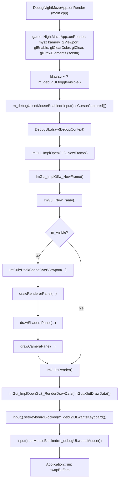
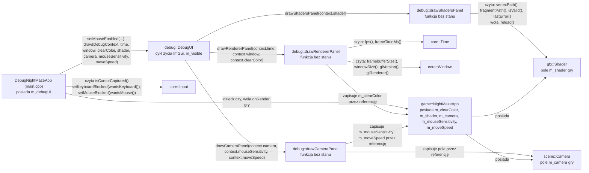

# Moduł debug: panele ImGui

Kamień milowy: M0 (nakładka i panel Renderer), M1 (panele Shaders i Camera, `DebugContext`, mysz). Kod: [`src/debug/`](../../src/debug/) oraz [`src/main.cpp`](../../src/main.cpp), gdzie nakładka jest podpinana do gry.
Teoria samej biblioteki (tryb natychmiastowy, backendy, docking) jest w [`../libraries/imgui.md`](../libraries/imgui.md). Ten dokument opisuje, jak ImGui jest wpięte w **mój** projekt i jak dodać nowy panel.

## 1. Po co to jest

Grafiki 3D nie da się wygodnie debugować `printf`em: chcę widzieć liczby (FPS, rozmiar framebuffera, wersję sterownika) i zmieniać parametry w działającym programie, bez przebudowywania. Moduł `debug` daje do tego nakładkę z panelami Dear ImGui rysowaną na wierzchu sceny. Nie realizuje osobnego tematu wykładu, ale obsługuje wszystkie piętnaście: każdy temat dostaje w panelu przełącznik, którym na obronie pokażę efekt "przed i po" (PRD, sekcje 3 i 10). Dziś istnieją trzy panele: **Renderer**, pokazujący dane z tematu 1 (FPS, czas klatki), **Shaders**, pokaz tematu 2 (przycisk "Reload shaders"), i **Camera**, pokaz tematu 3 (pozycja, kąty, FOV, płaszczyzny przycinania, czułość myszy, prędkość ruchu).

## 2. Teoria

**Tryb natychmiastowy (immediate mode) w jednym akapicie.** W klasycznym GUI tworzy się obiekty widżetów, które żyją między klatkami. W ImGui nie ma obiektów: co klatkę wołam funkcje typu `ImGui::Text(...)`, a biblioteka z tych wywołań buduje listę trójkątów do narysowania. Panel jest więc zwykłą funkcją wykonywaną co klatkę, a dane, które pokazuje, należą do mojego kodu, nie do ImGui. Szczegóły: [`../libraries/imgui.md`](../libraries/imgui.md).

**Trzy części ImGui w projekcie:**

| Część | Plik biblioteki | Rola |
|---|---|---|
| Rdzeń | `imgui.cpp` i pokrewne | Logika widżetów, układ, docking. Nie zna ani GLFW, ani OpenGL |
| Backend platformy (platform backend) | `imgui_impl_glfw.cpp` | Przekazuje do ImGui mysz, klawiaturę, rozmiar okna i czas z GLFW |
| Backend renderera (renderer backend) | `imgui_impl_opengl3.cpp` | Zamienia listy rysowania ImGui na wywołania OpenGL |

**Klatka ImGui wewnątrz mojej klatki.** ImGui rysuję zawsze na samym końcu klatki, po scenie, żeby panele były na wierzchu. Pilnuje tego `DebugNightMazeApp::onRender` w `main.cpp`, które najpierw woła rysowanie gry, a dopiero potem `DebugUI::draw`:



**Docking.** Używam gałęzi `docking` biblioteki (tag przypięty w [`cmake/Dependencies.cmake`](../../cmake/Dependencies.cmake)). Pozwala ona przyczepiać panele do krawędzi okna i do siebie nawzajem, łączyć je w zakładki i zapamiętać układ. To ważne na obronie: przy kilku panelach chcę jednym ruchem ustawić sobie widok dla danego tematu.

## 3. Jak to działa w OpenGL

Mój kod w `src/debug` nie woła bezpośrednio żadnej funkcji `gl*`. Całą rozmowę z OpenGL prowadzi backend renderera, ale trzeba wiedzieć, co robi, bo działa na **tym samym kontekście** co reszta programu.

### 3.1 Inicjalizacja (`DebugUI::DebugUI`)

```cpp
IMGUI_CHECKVERSION();
ImGui::CreateContext();
ImGui::GetIO().ConfigFlags |= ImGuiConfigFlags_DockingEnable;
ImGui::StyleColorsDark();

ImGui_ImplGlfw_InitForOpenGL(window.nativeHandle(), true);
ImGui_ImplOpenGL3_Init("#version 410");
```

| Linia | Co robi |
|---|---|
| `IMGUI_CHECKVERSION()` | Sprawdza, czy nagłówki i skompilowana biblioteka są w tej samej wersji (rozmiary struktur). Chroni przed trudnymi do znalezienia błędami po aktualizacji |
| `ImGui::CreateContext()` | Tworzy kontekst **ImGui** (cały jego stan). To nie jest kontekst OpenGL, zbieżność nazw jest przypadkowa |
| `ConfigFlags \|= ImGuiConfigFlags_DockingEnable` | Włącza docking. `\|=` dodaje jeden bit do istniejących flag, nie kasując pozostałych |
| `ImGui::StyleColorsDark()` | Ciemny motyw |
| `ImGui_ImplGlfw_InitForOpenGL(handle, true)` | Podłącza backend platformy do mojego okna (o argumencie `true` niżej) |
| `ImGui_ImplOpenGL3_Init("#version 410")` | Podłącza backend renderera i zapamiętuje wersję GLSL dla jego shaderów |

**Argument `true` w `ImGui_ImplGlfw_InitForOpenGL`.** To parametr `install_callbacks`. Z wartością `true` backend sam rejestruje w GLFW swoje funkcje zwrotne (callbacki): klawiszy, znaków, przycisków myszy, kółka, pozycji kursora, wejścia kursora w okno i fokusu okna. GLFW przechowuje tylko **jeden** callback danego typu na okno, a funkcja `glfwSet...Callback` zwraca poprzednio ustawiony. Backend zapamiętuje te poprzednie i woła je ze swoich callbacków, czyli buduje łańcuch (chaining): moje ewentualne wcześniejsze callbacki nadal by działały. Moduł `core` nie ustawia żadnych callbacków wejścia (`Input` odpytuje `glfwGetKey`, `glfwGetMouseButton` i `glfwGetCursorPos`), więc nic się nie gryzie. Z wartością `false` musiałbym sam zarejestrować callbacki i ręcznie przekazywać każde zdarzenie do funkcji `ImGui_ImplGlfw_...Callback`.

Obiekty OpenGL backendu (program shaderów, bufory wierzchołków i indeksów, tekstura czcionki) nie powstają w `Init`, tylko leniwie, przy pierwszym `ImGui_ImplOpenGL3_NewFrame()`.

Backend OpenGL korzysta z własnego, małego loadera funkcji dołączonego do ImGui, więc nie potrzebuje GLAD (stąd w CMake cel `imgui` linkuje tylko `glfw`). W programie działają zatem dwa loadery, które pytają ten sam sterownik o te same adresy. To nie jest konflikt.

### 3.2 Klatka (`DebugUI::draw`)

```cpp
ImGui_ImplOpenGL3_NewFrame();
ImGui_ImplGlfw_NewFrame();
ImGui::NewFrame();

if (m_visible) {
    ImGui::DockSpaceOverViewport(0, ImGui::GetMainViewport(),
                                 ImGuiDockNodeFlags_PassthruCentralNode);

    drawRendererPanel(context.time, context.window, context.clearColor);
    drawShadersPanel(context.shader);
    drawCameraPanel(context.camera, context.mouseSensitivity, context.moveSpeed);
}

ImGui::Render();
ImGui_ImplOpenGL3_RenderDrawData(ImGui::GetDrawData());
```

| Wywołanie | Co robi |
|---|---|
| `ImGui_ImplOpenGL3_NewFrame()` | Przy pierwszym wywołaniu tworzy obiekty OpenGL backendu, później praktycznie nic |
| `ImGui_ImplGlfw_NewFrame()` | Wpisuje do ImGui rozmiar okna, skalę framebuffera i czas od poprzedniej klatki (z `glfwGetTime`) |
| `ImGui::NewFrame()` | Przetwarza zebrane zdarzenia wejścia i otwiera nową klatkę. Dopiero po tym wolno wołać widżety. Tutaj ImGui ustala, nad którym panelem jest kursor, i liczy `WantCaptureKeyboard` oraz `WantCaptureMouse` (sekcja 5.6) |
| `ImGui::Render()` | Zamyka klatkę i zamienia wywołania widżetów na listy rysowania (wierzchołki, indeksy, prostokąty przycinania). **Jeszcze nic nie rysuje** |
| `ImGui_ImplOpenGL3_RenderDrawData(...)` | Wysyła te listy do OpenGL |

`RenderDrawData` robi po kolei: zapamiętuje bieżący stan OpenGL, ustawia własny (włączone mieszanie kolorów `GL_BLEND` i test nożycowy `GL_SCISSOR_TEST`, wyłączony test głębi `GL_DEPTH_TEST` i odrzucanie ścian), ustawia viewport na cały framebuffer i macierz rzutu prostokątnego, tworzy tymczasowe VAO, wgrywa wierzchołki do buforów, rysuje przez `glDrawElements` i na końcu **przywraca zapamiętany stan**. Dzięki temu ImGui nie psuje ustawień renderera sceny, na przykład w późniejszych kamieniach milowych nie wyłączy mi testu głębi na stałe.

Jeden element stanu jest przywracany warunkowo: bieżący program shaderów. Backend zapamiętuje go na początku (`GL_CURRENT_PROGRAM`), a na końcu przywraca tylko wtedy, gdy ten program jeszcze istnieje (w źródle: `if (last_program == 0 || glIsProgram(last_program)) glUseProgram(last_program);`). Ma to znaczenie dla panelu Shaders, którego przycisk usuwa stary program gry w środku klatki ImGui ([`gfx/shaders.md`](gfx/shaders.md), sekcja 6.3).

Związek z Retiną: backend platformy podaje ImGui rozmiar okna we współrzędnych ekranu oraz skalę `framebuffer / okno`. ImGui układa panele we współrzędnych okna (te same jednostki co pozycja myszy), a backend renderera mnoży je przez skalę przy rysowaniu. Dlatego panele są ostre i klikalne na ekranie 2x bez żadnego kodu z mojej strony.

**`DockSpaceOverViewport(0, ImGui::GetMainViewport(), ImGuiDockNodeFlags_PassthruCentralNode)`.** Funkcja tworzy niewidzialne okno ImGui rozciągnięte na cały główny viewport (całe moje okno) i umieszcza w nim obszar dokowania (dockspace). Od tej chwili panel przeciągnięty do krawędzi okna "przykleja się" do niej.

| Argument | Wartość | Znaczenie |
|---|---|---|
| `dockspace_id` | `0` | ImGui samo nadaje identyfikator obszaru |
| `viewport` | `ImGui::GetMainViewport()` | Obszar pokrywa główne okno programu |
| `flags` | `ImGuiDockNodeFlags_PassthruCentralNode` | Środek obszaru jest przezroczysty i przepuszcza mysz |

Obszar dokowania ma **węzeł centralny** (central node): to miejsce, które zostaje, gdy panele zajmą krawędzie. Domyślnie ImGui zamalowuje pusty węzeł centralny jednolitym tłem i przechwytuje w nim kliknięcia. Skutek: scena 3D znika pod szarym prostokątem. Flaga `PassthruCentralNode` wyłącza to tło i przepuszcza wejście, więc przez środek widać scenę (w M0: kolor czyszczenia), a panele zajmują tylko tyle miejsca, ile im dam.

**Dlaczego klatka ImGui działa także wtedy, gdy UI jest ukryte.** Po naciśnięciu klawisza `~` `m_visible` jest `false`, pomijam tylko dockspace i panele, ale `NewFrame`, `Render` i `RenderDrawData` wykonują się dalej. Powody:

1. Callbacki backendu są zainstalowane przez cały czas i dokładają zdarzenia do kolejki ImGui. Kolejkę opróżnia `ImGui::NewFrame()`. Gdybym przestał je wołać, zdarzenia zbierałyby się i zostałyby przetworzone hurtem po ponownym pokazaniu paneli.
2. `ImGui_ImplGlfw_NewFrame()` liczy czas od poprzedniego wywołania. Po przerwie ImGui dostałoby jedną "klatkę" trwającą na przykład 20 sekund, co psuje animacje i odmierzanie czasu w bibliotece.
3. Kod jest prostszy: `NewFrame` i `Render` zawsze występują w parze, nie ma dwóch ścieżek do pomylenia.
4. Koszt jest pomijalny: bez żadnego okna `Render` tworzy puste listy i backend nie ma czego rysować.

### 3.3 Zamknięcie (`DebugUI::~DebugUI`)

```cpp
ImGui_ImplOpenGL3_Shutdown();
ImGui_ImplGlfw_Shutdown();
ImGui::DestroyContext();
```

Kolejność odwrotna do inicjalizacji. `ImGui_ImplOpenGL3_Shutdown` usuwa obiekty OpenGL backendu, więc **kontekst OpenGL musi jeszcze istnieć**. `ImGui_ImplGlfw_Shutdown` przywraca w GLFW poprzednie callbacki, więc okno też musi istnieć. Gwarantuje to reguła C++ opisana w [`core/README.md`](core/README.md), sekcja 7: **pola są niszczone przed klasami bazowymi**. `m_debugUI` jest polem `DebugNightMazeApp`, a okno należy do klasy bazowej `core::Application`, więc ImGui zamyka się, gdy okno i kontekst jeszcze istnieją.

## 4. Shadery

Moduł `debug` nie ma własnych plików shaderów. Shadery ma backend renderera: napis `"#version 410"` przekazany do `ImGui_ImplOpenGL3_Init` jest doklejany jako pierwsza linia jego wbudowanego shadera wierzchołków i fragmentów, które backend kompiluje i linkuje przy pierwszej klatce. Wersja musi pasować do kontekstu: OpenGL 4.1 to GLSL 4.10, a domyślne w wielu przykładach `"#version 130"` nie skompiluje się w profilu Core na macOS. Shadery pisane przeze mnie (`assets/shaders/basic.vert` i `basic.frag`) należą do gry, a nie do modułu `debug`, ale moduł ma dla nich panel **Shaders** z przyciskiem przeładowania (sekcja 6 i [`gfx/shaders.md`](gfx/shaders.md), sekcja 6). PRD (sekcja 10) opisuje ten panel jako listę programów. Dziś program jest jeden, więc panel pokazuje jeden, bez listy.

## 5. Kod w projekcie

### 5.1 Pliki

| Plik | Co zawiera |
|---|---|
| [`src/debug/DebugUI.hpp`](../../src/debug/DebugUI.hpp), [`.cpp`](../../src/debug/DebugUI.cpp) | Klasa `DebugUI`: cykl życia ImGui (RAII), klatka ImGui, dockspace, wywołanie paneli, widoczność, `wantsKeyboard()`, `wantsMouse()`, `setMouseEnabled()` |
| [`src/debug/DebugContext.hpp`](../../src/debug/DebugContext.hpp) | Struktura `DebugContext`: referencje do wszystkiego, co panele mogą w tej klatce odczytać albo edytować. Sam nagłówek, bez pliku `.cpp` |
| [`src/debug/panels/RendererPanel.hpp`](../../src/debug/panels/RendererPanel.hpp), [`.cpp`](../../src/debug/panels/RendererPanel.cpp) | Funkcja `drawRendererPanel`: panel "Renderer" |
| [`src/debug/panels/ShadersPanel.hpp`](../../src/debug/panels/ShadersPanel.hpp), [`.cpp`](../../src/debug/panels/ShadersPanel.cpp) | Funkcja `drawShadersPanel`: panel "Shaders" (pliki programu, przycisk "Reload shaders", ostatni błąd). Opis linia po linii: [`gfx/shaders.md`](gfx/shaders.md), sekcja 6 |
| [`src/debug/panels/CameraPanel.hpp`](../../src/debug/panels/CameraPanel.hpp), [`.cpp`](../../src/debug/panels/CameraPanel.cpp) | Funkcja `drawCameraPanel`: panel "Camera" (pozycja, yaw, pitch, FOV, bliska i daleka płaszczyzna, czułość myszy, prędkość ruchu). Opis linia po linii: [`scene/transforms-camera.md`](scene/transforms-camera.md), sekcja 6 |
| [`src/main.cpp`](../../src/main.cpp) | Klasa `DebugNightMazeApp`: posiada `DebugUI`, obsługuje klawisz `~`, wyłącza mysz w ImGui na czas przechwycenia kursora, co klatkę buduje `DebugContext` i woła `draw` po narysowaniu gry, przekazuje do `core::Input` blokadę klawiatury i myszy |
| [`cmake/Dependencies.cmake`](../../cmake/Dependencies.cmake) | Pobranie ImGui i definicja celu `imgui` (ImGui nie ma własnego CMake) |
| [`CMakeLists.txt`](../../CMakeLists.txt) | Pliki `src/debug/*` są częścią programu `night_maze`, nie biblioteki `engine` |

### 5.2 Architektura: kto co posiada



**Dlaczego `DebugUI` należy do klasy w `main.cpp`, a nie do gry.** W architekturze projektu (PRD, sekcja 6) `debug/` zależy od wszystkich warstw, ale **nic nie zależy od `debug/`**. Gdyby `game::NightMazeApp` miało pole `DebugUI`, plik gry dołączałby `debug/DebugUI.hpp` i gra nie dałaby się zbudować bez paneli. Dlatego sklejenie odbywa się piętro wyżej:

```cpp
class DebugNightMazeApp final : public game::NightMazeApp {
protected:
    void onRender(double alpha) override {
        game::NightMazeApp::onRender(alpha);

        // The key left of 1 (` and ~ on a US keyboard) shows or hides the debug panels.
        if (input().wasKeyPressed(GLFW_KEY_GRAVE_ACCENT)) {
            m_debugUI.toggleVisible();
        }
        // While the cursor is captured the mouse belongs to the camera. The hidden cursor
        // still has a position that moves with the mouse, so the panels must ignore it,
        // otherwise it would hover and click them unseen.
        m_debugUI.setMouseEnabled(!input().isCursorCaptured());
        // The context is rebuilt every frame: it only holds references, so it is cheap.
        m_debugUI.draw(debug::DebugContext{
            .time = time(),
            .window = window(),
            .clearColor = clearColor(),
            .shader = shader(),
            .camera = camera(),
            .mouseSensitivity = mouseSensitivity(),
            .moveSpeed = moveSpeed(),
        });

        // ImGui now knows whether it is using the keyboard (a text field is being edited
        // or a widget is active) and the mouse (the cursor is over a panel or a widget is
        // being dragged). Block each device for the game from the next frame on, so typing
        // does not trigger Escape, the panel toggle or player movement, and working with
        // a panel does not click or look around in the scene.
        input().setKeyboardBlocked(m_debugUI.wantsKeyboard());
        input().setMouseBlocked(m_debugUI.wantsMouse());
    }

private:
    debug::DebugUI m_debugUI{window()};
};
```

`main.cpp` to jedyny plik, który dołącza zarówno `game/NightMazeApp.hpp`, jak i nagłówki z `debug/` (`debug/DebugContext.hpp` i `debug/DebugUI.hpp`). Klasa dziedziczy po grze, nadpisuje `onRender`, woła w nim wersję gry (`game::NightMazeApp::onRender(alpha)`, z nazwą klasy, żeby ominąć mechanizm wirtualny i nie wpaść w rekurencję), potem mówi ImGui, czy wolno mu używać myszy, buduje `DebugContext` i dorysowuje panele, a na końcu przekazuje do `core::Input` informację, czy ImGui używa klawiatury i czy używa myszy (sekcja 5.6). Gra ze swojej strony udostępnia tylko chronione akcesory `clearColor()`, `shader()`, `camera()`, `mouseSensitivity()` i `moveSpeed()` i nie wie, kto z nich skorzysta. Kierunek zależności wygląda więc tak: `main.cpp` zna `game` i `debug`, `debug` zna `core`, `gfx` i `scene` (panel Shaders dołącza `gfx/Shader.hpp`, panel Camera dołącza `scene/Camera.hpp`), `game` zna `core`, `gfx` i `scene`, a `game` i `debug` nie znają się nawzajem.

Trzy decyzje, które trzeba umieć uzasadnić:

1. **`DebugUI` to RAII na ImGui.** Konstruktor inicjalizuje, destruktor zamyka, kopiowanie jest zablokowane (`= delete`), bo kontekst ImGui jest jeden. Nie da się zapomnieć o `Shutdown`.
2. **Panel to wolna funkcja, nie klasa.** `drawRendererPanel` nie ma własnego stanu (tak samo `drawShadersPanel` i `drawCameraPanel`). Wszystko, co pokazuje i edytuje, dostaje w argumentach. Zgodnie z zasadą "dane zamiast kodu" (PRD, sekcja 6) stan należy do właściciela: kolor tła jest polem `game::NightMazeApp::m_clearColor`, a panel tylko go edytuje przez referencję.
3. **`const` mówi, co panel może zmienić.** `const core::Time&` i `const core::Window&` są tylko do odczytu. `std::array<float, 3>& clearColor` bez `const` to jedyna rzecz, którą panel modyfikuje. Z samej sygnatury widać, co jest przełącznikiem. Tak samo `drawShadersPanel(gfx::Shader& shader)` bierze shader bez `const`, bo jego przycisk woła `reload()`, a `drawCameraPanel(scene::Camera& camera, float& mouseSensitivity, float& moveSpeed)` bierze trzy referencje bez `const`, bo edytuje wszystkie trzy. Ta sama umowa obowiązuje w polach `DebugContext` (niżej).

**`DebugContext`: jedna struktura zamiast listy parametrów.** `DebugUI::draw` ma jeden parametr:

```cpp
void draw(const DebugContext& context);
```

a wszystko, co panele pokazują i edytują, jest zebrane w strukturze z [`DebugContext.hpp`](../../src/debug/DebugContext.hpp):

```cpp
struct DebugContext {
    /// Frame clock, read only: FPS and frame time.
    const core::Time& time;
    /// Window, read only: sizes and OpenGL driver info.
    const core::Window& window;
    /// Background color (red, green, blue in the range 0 to 1), editable.
    std::array<float, 3>& clearColor;
    /// Shader program the game draws with, editable: the Shaders panel reloads it.
    gfx::Shader& shader;
    /// Camera of the game, editable: position, angles and projection.
    scene::Camera& camera;
    /// Mouse look sensitivity in degrees per screen coordinate unit, editable.
    float& mouseSensitivity;
    /// Camera movement speed in metres per second, editable.
    float& moveSpeed;
};
```

Powód jest praktyczny. Gdyby `draw` brało każdą wartość osobno (`draw(time, window, clearColor, shader)`), każdy nowy panel z nowymi danymi wydłużałby listę parametrów w trzech miejscach naraz: w deklaracji w `DebugUI.hpp`, w definicji w `DebugUI.cpp` i w wywołaniu w `main.cpp`. Ze strukturą sygnatura `draw` się nie zmienia: dochodzi jedno pole w `DebugContext` i jedna linia w `main.cpp`. Tak właśnie doszedł panel Shaders: pole `shader` i linia `.shader = shader(),`, bez zmiany w `DebugUI.hpp`. Panel Camera dołożył trzy pola (`camera`, `mouseSensitivity`, `moveSpeed`) i trzy linie. Rzeczy, które trzeba umieć wyjaśnić:

1. **Dlaczego referencje.** Struktura niczego nie posiada i niczego nie kopiuje. Każde pole wskazuje na obiekt, którego właścicielem jest aplikacja: `time` i `window` to pola `core::Application`, `clearColor` to `game::NightMazeApp::m_clearColor`, `shader` to `m_shader`, `camera` to `m_camera`, `mouseSensitivity` to `m_mouseSensitivity`, a `moveSpeed` to `m_moveSpeed` tej samej klasy. Kopia `m_clearColor` w strukturze byłaby bezużyteczna, bo panel edytowałby kopię, a `glClearColor` dalej dostawałby oryginał. Referencja zamiast wskaźnika oznacza też, że pole nie może być puste: nie ma `nullptr` do sprawdzania.
2. **Dlaczego jest budowana co klatkę.** `main.cpp` tworzy obiekt tymczasowy `debug::DebugContext{...}` bezpośrednio w wywołaniu `draw`. Koszt to siedem referencji, czyli siedem adresów. W zamian nie ma żadnego stanu do przechowywania i pilnowania: `DebugUI` nie zapamiętuje kontekstu, a `DebugNightMazeApp` nie ma dodatkowego pola.
3. **Czas życia (lifetime).** Obiekt tymczasowy żyje do końca pełnego wyrażenia, czyli do średnika po wywołaniu `draw`. To wystarcza, bo panele używają go tylko w trakcie `draw`. Struktury nie wolno zachować na później (na przykład w polu klasy): przeżyłaby klatkę, w której powstała, a jej referencje mogłyby wskazywać na obiekty już zniszczone.
4. **Dlaczego inicjalizatory desygnowane (designated initializers, C++20).** Zapis `.time = time()` nazywa pole, do którego trafia wartość, więc wywołanie czyta się bez zaglądania do definicji struktury. Pola referencyjnego nie da się pominąć: referencja musi zostać zainicjalizowana, więc brak pola na liście jest błędem kompilacji, a nie cichą wartością domyślną (sekcja 7, pułapki 14 i 15).
5. **Dlaczego panel nadal dostaje jawne parametry.** `DebugUI::draw` woła `drawRendererPanel(context.time, context.window, context.clearColor)`, `drawShadersPanel(context.shader)` i `drawCameraPanel(context.camera, context.mouseSensitivity, context.moveSpeed)`, a nie `drawRendererPanel(context)`. Dzięki temu sygnatura panelu dalej mówi, co dokładnie czyta i co edytuje (decyzja 3 wyżej). Panel biorący cały `DebugContext` miałby dostęp do wszystkiego i z jego sygnatury nic by nie wynikało.
6. **`const DebugContext&` nie robi z pól stałych.** `draw` bierze kontekst przez `const&`, a mimo to panel zmienia kolor tła. To nie jest obejście `const`. Stałość obiektu dotyczy jego własnych pól, a polem jest tu **referencja**, nie tablica. Referencji i tak nie da się przestawić na inny obiekt, więc `const` na strukturze niczego w niej nie zmienia, i nie przechodzi na obiekt, na który referencja wskazuje. O tym, czy przez pole wolno pisać, decyduje wyłącznie typ pola: `const core::Time&` jest tylko do odczytu, `std::array<float, 3>&`, `gfx::Shader&`, `scene::Camera&` i `float&` są edytowalne, niezależnie od tego, czy sama struktura jest `const`. Tak samo zachowuje się wskaźnik: w stałym obiekcie pole `float* p` staje się `float* const p` (nie można przestawić wskaźnika), ale `*p = 1.0F` nadal się kompiluje.

Nagłówki `DebugContext.hpp`, `DebugUI.hpp`, `RendererPanel.hpp`, `ShadersPanel.hpp` i `CameraPanel.hpp` nie dołączają ani `imgui.h`, ani nagłówków `core`, `gfx` i `scene`: wystarczają im deklaracje wyprzedzające (forward declarations), bo używają tych typów tylko przez referencję. `DebugContext.hpp` i `RendererPanel.hpp` deklarują `class Time;` i `class Window;` w przestrzeni nazw `core`, `DebugContext.hpp` i `ShadersPanel.hpp` deklarują `class Shader;` w przestrzeni nazw `gfx`, `DebugContext.hpp` i `CameraPanel.hpp` deklarują `struct Camera;` w przestrzeni nazw `scene` (słowo `struct`, bo tak jest zdefiniowana kamera: deklaracja powinna zgadzać się z definicją), a `DebugUI.hpp` deklaruje `class Window;` (dla konstruktora) i `struct DebugContext;` (dla `draw`). Pełną definicję `DebugContext` dołączają tylko `DebugUI.cpp`, które czyta pola, i `main.cpp`, które strukturę buduje. ImGui jest dołączane wyłącznie w plikach `.cpp`, więc reszta projektu nie zależy od tej biblioteki.

### 5.3 Panel Renderer linia po linii

```cpp
void drawRendererPanel(const core::Time& time, const core::Window& window,
                       std::array<float, 3>& clearColor) {
    if (ImGui::Begin("Renderer")) {
        ImGui::Text("FPS: %.1f", time.fps());
        ImGui::Text("Frame time: %.2f ms", time.frameTimeMs());

        const core::Size framebuffer = window.framebufferSize();
        const core::Size windowSize = window.windowSize();
        ImGui::Text("Framebuffer: %d x %d px", framebuffer.width, framebuffer.height);
        ImGui::Text("Window: %d x %d", windowSize.width, windowSize.height);

        ImGui::Separator();
        ImGui::TextWrapped("OpenGL: %s", window.glVersion().c_str());
        ImGui::TextWrapped("GPU: %s", window.glRenderer().c_str());

        ImGui::Separator();
        ImGui::ColorEdit3("Clear color", clearColor.data());
    }
    ImGui::End();
}
```

- `ImGui::Begin("Renderer")` otwiera okno ImGui o tym tytule. Tytuł jest jednocześnie **identyfikatorem**: po nim ImGui pamięta pozycję i dokowanie panelu. Zwraca `false`, gdy panel jest zwinięty albo schowany za inną zakładką, i wtedy pomijam zawartość (oszczędność pracy).
- `ImGui::End()` stoi **poza** `if` i wykonuje się zawsze. Każde `Begin` musi mieć swoje `End`, niezależnie od zwróconej wartości.
- `ImGui::Text` działa jak `printf`: `%.1f` to liczba z jedną cyfrą po przecinku, `%d` liczba całkowita, `%s` napis w stylu C, dlatego przy `std::string` potrzebne jest `.c_str()`.
- `ImGui::TextWrapped` zawija długi tekst (nazwa karty graficznej bywa długa).
- `ImGui::ColorEdit3("Clear color", clearColor.data())` dostaje wskaźnik na pierwszy z trzech `float`ów (`.data()` zwraca `float*`) i przez ten wskaźnik **czyta i zapisuje** kolor. Nie ma tu żadnego "zdarzenia zmiany": w następnej klatce `NightMazeApp::onRender` po prostu przekaże do `glClearColor` już zmienione wartości.

### 5.4 Gdzie moduł jest wywoływany

Wszystkie sześć miejsc jest w `DebugNightMazeApp` w [`main.cpp`](../../src/main.cpp):

- Tworzenie: inicjalizator pola przy deklaracji, `debug::DebugUI m_debugUI{window()};`. Wykonuje się po zbudowaniu całej części bazowej, więc okno i kontekst już istnieją.
- Przełączanie: `if (input().wasKeyPressed(GLFW_KEY_GRAVE_ACCENT)) { m_debugUI.toggleVisible(); }` w `onRender`, czyli dokładnie raz na klatkę. Dlaczego nie w `onUpdate`, wyjaśnia [`core/input.md`](core/input.md), sekcja 5.5.
- Mysz dla ImGui: `m_debugUI.setMouseEnabled(!input().isCursorCaptured());` tuż przed `draw` (sekcja 5.6).
- Rysowanie: `m_debugUI.draw(debug::DebugContext{...});` z polami `.time = time()`, `.window = window()`, `.clearColor = clearColor()`, `.shader = shader()`, `.camera = camera()`, `.mouseSensitivity = mouseSensitivity()` i `.moveSpeed = moveSpeed()`, po powrocie z `game::NightMazeApp::onRender`.
- Blokada klawiatury gry: przedostatnia linia `onRender`, `input().setKeyboardBlocked(m_debugUI.wantsKeyboard());` (sekcja 5.6).
- Blokada myszy gry: ostatnia linia `onRender`, `input().setMouseBlocked(m_debugUI.wantsMouse());` (sekcja 5.6).

### 5.5 Jak dodać nowy panel

Przykład: panel "Timing" pokazujący parametry stałego kroku. Kod poniżej jest wzorem do ćwiczenia, nie ma go w repozytorium.

**Krok 1. Nagłówek** `src/debug/panels/TimingPanel.hpp`. Komentarz na górze z odnośnikiem do dokumentu, deklaracje wyprzedzające zamiast `#include`, funkcja w przestrzeni nazw `debug`:

```cpp
// "Timing" debug panel: fixed step parameters.
// See docs/modules/debug-ui.md
#pragma once

namespace core {
class Time;
} // namespace core

namespace debug {

/// Draws the "Timing" panel. Called by DebugUI::draw, inside the ImGui frame.
void drawTimingPanel(const core::Time& time);

} // namespace debug
```

**Krok 2. Implementacja** `src/debug/panels/TimingPanel.cpp`. Zawsze ten sam szkielet: `if (ImGui::Begin(...)) { ... }` i `ImGui::End()` poza `if`:

```cpp
#include "debug/panels/TimingPanel.hpp"

#include "core/Time.hpp"

#include <imgui.h>

namespace debug {

void drawTimingPanel(const core::Time& time) {
    if (ImGui::Begin("Timing")) {
        ImGui::Text("Fixed step: %.3f ms", 1000.0 * core::Time::FIXED_DT);
        ImGui::Text("Delta: %.3f ms", 1000.0 * time.deltaSeconds());
        ImGui::Text("Alpha: %.2f", time.alpha());
    }
    ImGui::End();
}

} // namespace debug
```

**Krok 3. CMake.** Dopisz oba pliki do listy `add_executable(night_maze ...)` w [`CMakeLists.txt`](../../CMakeLists.txt), obok `CameraPanel`, `RendererPanel` i `ShadersPanel`, w kolejności alfabetycznej. Bez tego linker zgłosi brak symbolu `drawTimingPanel`.

**Krok 4. Wywołanie.** W [`DebugUI.cpp`](../../src/debug/DebugUI.cpp) dodaj `#include "debug/panels/TimingPanel.hpp"` i wywołanie wewnątrz `if (m_visible)`, po `DockSpaceOverViewport`:

```cpp
drawRendererPanel(context.time, context.window, context.clearColor);
drawShadersPanel(context.shader);
drawCameraPanel(context.camera, context.mouseSensitivity, context.moveSpeed);
drawTimingPanel(context.time);
```

Panel dostaje tylko te pola kontekstu, których potrzebuje, nigdy całego `context`.

**Krok 5. Dane.** Ten przykład korzysta z `context.time`, które jest już w `DebugContext`. Jeśli panel potrzebuje nowych danych, trzeba je doprowadzić tą samą drogą co kolor tła, w pięciu miejscach:

1. pole w klasie będącej właścicielem (dziś `game::NightMazeApp`, wzór: `m_clearColor`),
2. chroniony akcesor w tej klasie (wzór: `clearColor()`),
3. jedno pole w `DebugContext` w [`DebugContext.hpp`](../../src/debug/DebugContext.hpp), z komentarzem, czy jest tylko do odczytu, czy edytowalne (nowe pole dopisuję na końcu struktury),
4. jedna linia w `debug::DebugContext{...}` w `DebugNightMazeApp::onRender` w `main.cpp`, w tej samej kolejności co pola struktury,
5. przekazanie pola do panelu w `DebugUI::draw`, na przykład `drawTimingPanel(context.time, context.nowePole)`.

Sygnatura `DebugUI::draw` się nie zmienia. Kod w `game/` nadal nie dołącza niczego z `debug/`. Dane tylko do odczytu mają w strukturze i w sygnaturze panelu typ `const&`, edytowalne zwykłą referencję.

Prawdziwy przykład kroku 5 jest już w repozytorium: panel **Shaders**. Te same pięć miejsc w jego wypadku:

| # | Miejsce | Kod |
|---|---|---|
| 1 | pole właściciela, [`NightMazeApp.hpp`](../../src/game/NightMazeApp.hpp) | `gfx::Shader m_shader;` (pole istniało wcześniej, bo gra nim rysuje) |
| 2 | chroniony akcesor, tamże | `gfx::Shader& shader() { return m_shader; }` |
| 3 | pole kontekstu, [`DebugContext.hpp`](../../src/debug/DebugContext.hpp) | `gfx::Shader& shader;` i deklaracja wyprzedzająca `class Shader;` w przestrzeni nazw `gfx` |
| 4 | linia w [`main.cpp`](../../src/main.cpp) | `.shader = shader(),` po `.clearColor = clearColor(),` |
| 5 | przekazanie do panelu, [`DebugUI.cpp`](../../src/debug/DebugUI.cpp) | `drawShadersPanel(context.shader);` |

Pole jest edytowalne (bez `const`), bo przycisk panelu woła `shader.reload()`. Różnica wobec koloru tła: panel nie zmienia tu liczby, tylko woła funkcję obiektu, a ta wykonuje wywołania OpenGL. Sam panel nadal nie woła żadnej funkcji `gl*`.

Drugi prawdziwy przykład to panel **Camera**, który potrzebował trzech nowych danych naraz:

| # | Miejsce | Kod |
|---|---|---|
| 1 | pola właściciela, [`NightMazeApp.hpp`](../../src/game/NightMazeApp.hpp) | `scene::Camera m_camera;` (istniało wcześniej), `float m_mouseSensitivity = DEFAULT_MOUSE_SENSITIVITY;`, `float m_moveSpeed = DEFAULT_MOVE_SPEED;` |
| 2 | chronione akcesory, tamże | `scene::Camera& camera() { return m_camera; }`, `float& mouseSensitivity() { return m_mouseSensitivity; }`, `float& moveSpeed() { return m_moveSpeed; }` |
| 3 | pola kontekstu, [`DebugContext.hpp`](../../src/debug/DebugContext.hpp) | `scene::Camera& camera;`, `float& mouseSensitivity;`, `float& moveSpeed;` i deklaracja wyprzedzająca `struct Camera;` w przestrzeni nazw `scene` |
| 4 | linie w [`main.cpp`](../../src/main.cpp) | `.camera = camera(),`, `.mouseSensitivity = mouseSensitivity(),`, `.moveSpeed = moveSpeed(),` po `.shader = shader(),` |
| 5 | przekazanie do panelu, [`DebugUI.cpp`](../../src/debug/DebugUI.cpp) | `drawCameraPanel(context.camera, context.mouseSensitivity, context.moveSpeed);` |

Akcesory są trzy, a nie jeden zwracający "ustawienia kamery": każdy oddaje dokładnie jedno pole i z jego nazwy widać, co panel dostaje. Czułość i prędkość nie są polami `scene::Camera`, bo opisują sterowanie, a nie kamerę, więc nie mogą przyjść razem z nią. Ten panel, tak jak Renderer, zmienia same liczby: skutek widać w następnej klatce, gdy gra policzy z nich macierze.

**Krok 6. Sprawdzenie i dokumentacja.** Zbuduj, uruchom, zadokuj panel do krawędzi, uruchom ponownie i sprawdź, że układ się zachował. Dopisz panel do sekcji 6 dokumentu modułu, którego dotyczy, oraz do kolumny "Przełącznik w ImGui" w [`../syllabus.md`](../syllabus.md).

Zasady, których się trzymam przy panelach: unikalny tytuł w `Begin` (dwa panele o tym samym tytule zlałyby się w jedno okno), żadnych zmiennych globalnych i `static` na stan, żadnych wywołań `gl*` w panelu.

### 5.6 Klawiatura i mysz: gra czy ImGui

Ten sam klawisz i to samo kliknięcie widzą dwaj odbiorcy. ImGui dostaje wejście przez callbacki backendu GLFW, a gra czyta je przez `core::Input`, czyli prosto z GLFW. Bez dodatkowego mechanizmu Escape wciśnięty po to, żeby anulować edycję pola w panelu, zamknąłby program, klawisz `~` wpisany w pole schowałby panele, a przeciąganie suwaka w panelu byłoby dla gry zwykłym ruchem myszy.

Moduł `debug` dokłada do rozwiązania dwie funkcje:

```cpp
bool DebugUI::wantsKeyboard() const {
    return ImGui::GetIO().WantCaptureKeyboard;
}

bool DebugUI::wantsMouse() const {
    const ImGuiIO& io = ImGui::GetIO();
    // With the mouse switched off ImGui still sets WantCaptureMouse while a button is
    // held down and the hidden cursor is at the position of a panel. Nothing in the panel
    // reacts, but the caller would block the mouse for the game, so the answer is no.
    if ((io.ConfigFlags & ImGuiConfigFlags_NoMouse) != 0) {
        return false;
    }
    return io.WantCaptureMouse;
}
```

`ImGui::GetIO()` zwraca strukturę `ImGuiIO`, przez którą ImGui wymienia dane z programem. Pole `WantCaptureKeyboard` jest ustawiane przez samą bibliotekę i znaczy: "używam teraz klawiatury, aplikacja powinna zignorować klawisze". ImGui ustawia je, gdy aktywny jest **dowolny widżet** (edycja pola, przeciąganie suwaka albo wartości, trzymany przycisk, przesuwane okno panelu) albo otwarte jest okno modalne, a nie tylko w polach tekstowych. Aktywny widżet może bowiem sam używać klawiszy: Escape anuluje edycję, Tab przechodzi do następnego pola, Ctrl, Shift i Alt zmieniają zachowanie przeciągania.

Pole `WantCaptureMouse` znaczy to samo dla myszy: "używam teraz myszy, aplikacja powinna zignorować kliknięcia i ruch". Warunek jest inny niż przy klawiaturze. ImGui ustawia je, gdy kursor jest **nad oknem ImGui** (panelem) albo gdy trwa przeciąganie rozpoczęte na widżecie, nawet jeśli kursor wyjechał już poza panel. Przezroczysty węzeł centralny obszaru dokowania (`PassthruCentralNode`, sekcja 3.2) nie liczy się jako okno pod kursorem, więc nad sceną pole jest fałszywe i mysz należy do gry.

`wantsMouse()` zwraca to pole z jednym wyjątkiem, opisanym niżej: przy myszy wyłączonej przez `setMouseEnabled(false)` odpowiedź zawsze brzmi "nie".

Obie funkcje są `const` i niczego nie zmieniają. `DebugUI` nie wie, co wołający zrobi z odpowiedzią, i nie dołącza niczego z `game/`. Wartości przekazuje dalej `main.cpp`:

```cpp
input().setKeyboardBlocked(m_debugUI.wantsKeyboard());
input().setMouseBlocked(m_debugUI.wantsMouse());
```

Dopóki blokada klawiatury jest ustawiona, `core::Input::isKeyDown` i `wasKeyPressed` zwracają `false` dla każdego klawisza. Dopóki ustawiona jest blokada myszy, `isMouseButtonDown` i `wasMouseButtonPressed` zwracają `false` dla każdego przycisku, a `mouseDeltaX` i `mouseDeltaY` zwracają 0. Trzy rzeczy, które trzeba umieć wyjaśnić:

1. **Kierunek zależności zostaje nienaruszony.** `core/` nie dołącza ImGui: dostaje dwie neutralne flagi, "klawiatura zablokowana" i "mysz zablokowana", i nie wie, kto je ustawił. `debug/` nie zna gry. Oba końce skleja `main.cpp`.
2. **Wartości są odczytywane po `draw`.** ImGui aktualizuje `WantCaptureKeyboard` i `WantCaptureMouse` w `ImGui::NewFrame()`, a ten jest wołany wewnątrz `draw`. Odczyt przed `draw` dałby wartości o klatkę starsze.
3. **Blokada działa od następnej klatki.** Pytania o klawisze w bieżącej klatce (Escape w `Application::run`, `~` na początku `onRender`) padły przed tymi liniami. Dlaczego to opóźnienie nie szkodzi i dlaczego po zdjęciu blokady nie pojawia się fałszywe "właśnie wciśnięty", opisuje [`core/input.md`](core/input.md), sekcje 5.6 i 5.10.

Blokada dotyczy także samego przełącznika paneli: podczas edycji pola klawisz `~` trafia do pola, a nie do `toggleVisible()`.

Odbiorcą blokady myszy jest kamera: dzięki blokadzie kliknięcie w panel nie przechwytuje kursora, a przeciąganie suwaka nie jest dla gry ruchem myszy ([`scene/transforms-camera.md`](scene/transforms-camera.md), sekcja 5.11).

**W drugą stronę: `setMouseEnabled`, czyli ImGui bez myszy przy przechwyconym kursorze.** Po kliknięciu w scenę kamera przechwytuje kursor (`GLFW_CURSOR_DISABLED`). Kursor znika, ale nadal ma pozycję: wirtualną, zmieniającą się z każdym ruchem myszy. Backend GLFW biblioteki ImGui w tym trybie pomija tylko zmianę kształtu kursora, a pozycję i kliknięcia przekazuje do ImGui jak zwykle (historia zmian w `imgui_impl_glfw.cpp`, wpis z 2023-07-18: ignorowanie myszy przy `GLFW_CURSOR_DISABLED` zostało wycofane, a użytkownik "może ustawić `ImGuiConfigFlags_NoMouse`, jeśli chce"). Bez dodatkowego kodu niewidoczny kursor najeżdżałby na panele: ImGui zgłaszałoby `WantCaptureMouse`, blokada zerowałaby przesunięcie myszy i obrót kamery by zamierał, a kliknięcie trafiałoby w niewidoczny widżet.

```cpp
void DebugUI::setMouseEnabled(bool enabled) {
    // ConfigFlags is a set of bits. With the NoMouse bit set, ImGui treats no panel as
    // being under the cursor when it starts a frame, so nothing is hovered or clicked.
    ImGuiIO& io = ImGui::GetIO();
    if (enabled) {
        io.ConfigFlags &= ~ImGuiConfigFlags_NoMouse;
    } else {
        io.ConfigFlags |= ImGuiConfigFlags_NoMouse;
    }
}
```

| Linia | Znaczenie |
|---|---|
| `ImGuiIO& io = ImGui::GetIO();` | referencja do struktury wymiany danych z ImGui. Bez `const`, bo zmieniam w niej flagi |
| `io.ConfigFlags &= ~ImGuiConfigFlags_NoMouse;` | zdejmuje jeden bit. `~` odwraca maskę (wszystkie bity poza tym jednym), `&=` zostawia tylko bity obecne w obu, więc pozostałe flagi (na przykład `DockingEnable`) zostają nietknięte |
| `io.ConfigFlags \|= ImGuiConfigFlags_NoMouse;` | ustawia ten bit, tak samo jak `DockingEnable` w konstruktorze |

W `main.cpp`, przed `draw`:

```cpp
// While the cursor is captured the mouse belongs to the camera. The hidden cursor
// still has a position that moves with the mouse, so the panels must ignore it,
// otherwise it would hover and click them unseen.
m_debugUI.setMouseEnabled(!input().isCursorCaptured());
```

**Co dokładnie robi `ImGuiConfigFlags_NoMouse`** (sprawdzone w źródle ImGui 1.92, `imgui.cpp`, funkcja `UpdateHoveredWindowAndCaptureFlags`, wołana z `ImGui::NewFrame()`):

1. Flaga jest czytana w `NewFrame`. Gdy jest ustawiona, ImGui po wyszukaniu okna pod kursorem **kasuje wynik**: w tej klatce żaden panel nie jest "pod kursorem". Skoro żadne okno nie jest najechane, żaden widżet nie może zostać podświetlony ani kliknięty i nie pojawia się żadna podpowiedź.
2. Pozycja myszy **nie jest** kasowana (komentarz w źródle mówi to wprost) i backend nadal ją dostarcza. Flaga odcina skutki, nie dane.
3. `WantCaptureMouse` nie jest przez tę flagę zerowane bezwarunkowo. Samo najechanie go już nie ustawia, ale gdy przycisk myszy zostanie wciśnięty w chwili, gdy niewidoczny kursor jest nad panelem, ImGui uznaje to kliknięcie za swoje (własność kliknięcia ustala przed skasowaniem okna pod kursorem) i trzyma `WantCaptureMouse` tak długo, jak przycisk jest wciśnięty. Żaden widżet przy tym nie reaguje. Zmierzone: z flagą `NoMouse`, kursorem nad panelem i wciśniętym przyciskiem pole ma wartość `true`, a żadna wartość w panelu się nie zmienia.

Z punktu 3 wynika warunek w `wantsMouse()`: przy wyłączonej myszy funkcja zwraca `false` bez pytania ImGui. Inaczej każde kliknięcie podczas sterowania kamerą, które przypadkiem wypadłoby "nad" panelem, zamrażałoby obrót na czas trzymania przycisku.

**W której klatce to działa.** `setMouseEnabled` stoi przed `draw`, a flaga jest czytana w `NewFrame` wewnątrz `draw`, więc zmiana obowiązuje **w tej samej klatce**, bez opóźnienia. Cała kolejność zdarzeń:

| Klatka | `Application::run`, przed `onRender` | `NightMazeApp::onRender` | `main.cpp` przed `draw` | ImGui w `draw` | Blokada na następną klatkę |
|---|---|---|---|---|---|
| N: kliknięcie w scenę | `m_input.update()` widzi wciśnięty przycisk | kursor wolny, mysz niezablokowana (kursor był nad sceną): `setCursorCaptured(true)` | `setMouseEnabled(false)` | `NoMouse` już działa: nic nie jest najechane | `wantsMouse()` to `false`: mysz odblokowana |
| N+1 | przesunięcie myszy wyzerowane po zmianie trybu kursora | kursor przechwycony: `rotate(0, 0)` | `setMouseEnabled(false)` | bez myszy | odblokowana |
| N+2 i dalej | zwykłe przesunięcie | kamera się obraca | `setMouseEnabled(false)` | bez myszy | odblokowana |
| M: Escape | `wasKeyPressed(GLFW_KEY_ESCAPE)`: `setCursorCaptured(false)`, kursor wraca | kursor wolny: brak obrotu. Przechwyci ponownie tylko przy nowym kliknięciu | `setMouseEnabled(true)` | mysz działa od tej klatki | według `WantCaptureMouse` |

Nie ma klatki, w której mysz mają oba systemy naraz, ani takiej, w której nie ma jej żaden: w klatce N flaga zostaje ustawiona, zanim ImGui zdąży zobaczyć kliknięcie jako swoje, a w klatce M `Application::run` zwalnia kursor przed `onRender`, więc `main.cpp` włącza mysz ImGui w tej samej klatce, w której kursor wraca. Zostaje jedno znane opóźnienie, niezwiązane z przechwyceniem: blokada myszy dla gry spóźnia się o klatkę ([`core/input.md`](core/input.md), pułapka 11).

Dlaczego funkcja jest w `DebugUI`, a wywołanie w `main.cpp`: `core/` nie może znać ImGui, więc `Application::run` nie może przestawiać flagi samo przy zwalnianiu kursora. `debug/` nie może znać gry, więc `DebugUI` nie pyta, czy kamera coś przechwyciła: dostaje gotowe "włącz" albo "wyłącz". Regułę zna tylko `main.cpp`.

## 6. Panel ImGui

Są trzy panele. Pierwszy to **Renderer**:

| Element | Rodzaj | Czego uczy |
|---|---|---|
| `FPS`, `Frame time` | odczyt | Dwie postaci tej samej informacji. Wartości odświeżają się co 0,5 s (uśrednianie w `core::Time`) |
| `Framebuffer`, `Window` | odczyt | Różnica między pikselami a współrzędnymi ekranu. Warto zmienić rozmiar okna i przenieść je między monitorami o różnej gęstości |
| `OpenGL`, `GPU` | odczyt | Jaki kontekst naprawdę dał sterownik i która karta rysuje |
| `Clear color` | edycja | Zmiana stanu OpenGL widoczna natychmiast. Kliknięcie w kwadrat koloru otwiera próbnik |

Drugi to **Shaders**, pokaz tematu 2. Pełny opis, kod linia po linii i scenariusz pokazu na obronie są w [`gfx/shaders.md`](gfx/shaders.md), sekcja 6:

| Element | Rodzaj | Czego uczy |
|---|---|---|
| `Vertex`, `Fragment` | odczyt | Z których dwóch plików powstał program. Podpowiedź po najechaniu kursorem pokazuje pełną ścieżkę |
| `Program` | odczyt | `valid` albo `not valid`: czy jest zlinkowany program, którym można rysować |
| `Reload shaders` | przycisk | Wczytywanie na żywo: pliki są czytane, kompilowane i linkowane od nowa w działającym programie |
| `Last load` | odczyt | `OK` albo `failed` z tekstem błędu na czerwono (nazwa pliku i dziennik sterownika) |

Trzeci to **Camera**, pokaz tematu 3. Kod linia po linii, znaczenie każdej kontrolki i scenariusz pokazu na obronie są w [`scene/transforms-camera.md`](scene/transforms-camera.md), sekcja 6:

| Element | Rodzaj | Czego uczy |
|---|---|---|
| linia pomocy | odczyt | Sterowanie: kliknięcie w scenę przechwytuje mysz, Escape ją oddaje, W A S D, spacja, lewy Shift |
| `Position` | edycja (trzy pola przeciągane) | Macierz widoku: kamera w prawo, obraz w lewo |
| `Yaw`, `Pitch` | edycja (suwaki) | Kierunek patrzenia z dwóch kątów, zawijanie yaw, ograniczenie pitch do 89 stopni |
| `FOV` | edycja (suwak) | Kąt widzenia jako zoom |
| `Near plane`, `Far plane` | edycja (suwaki) | Płaszczyzny przycinania: co jest bliżej albo dalej, znika |
| `Mouse sensitivity`, `Move speed` | edycja (suwaki) | Ustawienia sterowania: stopnie na jednostkę ruchu myszy, metry na sekundę |

PRD (sekcja 10) wymienia dla tego panelu także tryb noclip. Nie ma go, bo nie ma jeszcze kolizji (M2).

Zachowanie całej nakładki:

- Gdy kursor jest przechwycony przez kamerę (po kliknięciu w scenę), panele są widoczne i pokazują bieżące wartości, ale nie reagują na mysz: ani na najechanie, ani na kliknięcie (sekcja 5.6). Żeby użyć panelu, trzeba najpierw nacisnąć Escape.

- Klawisz **`~`** (grawis, grave accent, na lewo od `1`, w kodzie `GLFW_KEY_GRAVE_ACCENT`) chowa i pokazuje wszystkie panele (start: widoczne, `m_visible = true`). PRD ([`../PRD.pdf`](../PRD.pdf)) nadal podaje w tym miejscu pierwszy klawisz funkcyjny (z górnego rzędu klawiatury). Klawisz został zmieniony celowo i obowiązuje to, co jest w kodzie.
- Gdy aktywny jest widżet panelu (edycja pola, przeciąganie wartości), gra nie widzi klawiatury: Escape nie zamyka programu, a `~` nie chowa paneli (sekcja 5.6).
- Panel można przeciągnąć za pasek tytułu i **zadokować** do krawędzi okna. Środek zostaje przezroczysty dzięki `PassthruCentralNode`.
- Układ paneli ImGui zapisuje w pliku `imgui.ini` w **katalogu roboczym** programu. Plik jest w `.gitignore`, bo to ustawienie lokalne. Skasowanie go przywraca układ domyślny.

## 7. Pułapki

1. **Scena zniknęła pod szarym tłem.** Brak flagi `ImGuiDockNodeFlags_PassthruCentralNode` w `DockSpaceOverViewport`: pusty węzeł centralny jest zamalowany i zasłania scenę.
2. **Shadery ImGui się nie kompilują, paneli nie widać.** Zła wersja GLSL w `ImGui_ImplOpenGL3_Init`. Dla kontekstu 4.1 Core ma być `"#version 410"`.
3. **`Begin` bez `End`.** `ImGui::End()` wstawione do środka `if (ImGui::Begin(...))` powoduje asercję po zwinięciu panelu. `End` zawsze poza `if`.
4. **Widżety poza klatką.** Każde `ImGui::...` rysujące coś musi być między `ImGui::NewFrame()` a `ImGui::Render()`. Dlatego panele wołam tylko z `DebugUI::draw`.
5. **Kolejność niszczenia.** `DebugUI` zniszczone po oknie woła OpenGL i GLFW bez kontekstu. Pole `m_debugUI` musi pozostać polem klasy pochodnej od `core::Application` (dziś `DebugNightMazeApp`), bo pola giną przed klasami bazowymi (zob. [`core/README.md`](core/README.md), sekcja 7).
6. **Własny callback GLFW ustawiony po utworzeniu `DebugUI`.** `glfwSetKeyCallback` i pokrewne **podmieniają** callback zainstalowany przez backend, więc ImGui przestaje dostawać dany rodzaj zdarzeń. Własne callbacki trzeba ustawić przed konstruktorem `DebugUI` (wtedy backend je połączy w łańcuch) albo samemu wołać poprzedni callback zwrócony przez `glfwSet...Callback`.
7. **Gra i ImGui reagowałyby na tę samą mysz.** Bez linii `input().setMouseBlocked(m_debugUI.wantsMouse());` każdy kod gry pytający `core::Input` o mysz widziałby też kliknięcia i ruch przeznaczone dla panelu: przeciąganie suwaka obracałoby jednocześnie kamerę, a kliknięcie w panel byłoby kliknięciem w scenę. Flaga blokady myszy temu zapobiega (sekcja 5.6). Warunek jest jeden: gra musi pytać o mysz przez `input()`, a nie bezpośrednio przez GLFW.
8. **`imgui.ini` zależy od katalogu roboczego.** Uruchomienie z IDE i z terminala może dać dwa różne układy, bo plik ląduje w innym katalogu.
9. **Małe panele na Windowsie przy skalowaniu 150% lub 200%.** Na macOS skalę Retiny obsługuje para rozmiar okna i framebuffer. Na Windowsie framebuffer i okno mają ten sam rozmiar w pikselach, więc czcionka ImGui pozostaje mała, dopóki sam jej nie przeskaluję.
10. **Błąd OpenGL przypisany nie temu, kto zawinił.** Backend ImGui nie używa mojego `GL_CHECK`. Gdyby zostawił flagę błędu, zgłosi ją pierwszy `GL_CHECK` w następnej klatce (zwykle `glViewport`).

11. **"Klawisz `~` nie chowa paneli".** Aktywny widżet ImGui blokuje klawiaturę gry, więc przełącznik nie reaguje, dopóki trwa edycja albo przeciąganie. To zamierzone. Wystarczy zakończyć edycję (Enter, Escape albo kliknięcie poza polem).
12. **`setKeyboardBlocked` albo `setMouseBlocked` zapomniane w nowym programie.** Blokady nie są częścią `DebugUI::draw`, tylko osobnymi liniami w `main.cpp`. Program, który posiada `DebugUI`, ale nie przekazuje `wantsKeyboard()` i `wantsMouse()` do `core::Input`, wraca do starego zachowania: Escape w polu tekstowym zamyka program, a gra widzi mysz używaną przez panel. To samo dotyczy `setMouseEnabled`: program, który przechwytuje kursor, musi wołać ją sam przed `draw` (pułapka 13).
13. **Przechwycony kursor nie odcina ImGui od myszy.** W trybie `GLFW_CURSOR_DISABLED` backend GLFW nie zmienia kształtu kursora, ale pozycję kursora (wtedy wirtualną) nadal przekazuje do ImGui. Niewidoczny kursor może więc znaleźć się nad panelem, ustawić `WantCaptureMouse` i zamrozić obrót kamery albo kliknąć niewidoczny widżet. Rozwiązanie jest w kodzie: `main.cpp` woła `m_debugUI.setMouseEnabled(!input().isCursorCaptured());` przed `draw`, co ustawia flagę `ImGuiConfigFlags_NoMouse`, a `wantsMouse()` przy tej fladze zwraca `false` (sekcja 5.6). Sama flaga bez tego drugiego warunku nie wystarcza: ImGui nadal zgłasza `WantCaptureMouse`, dopóki trzymany jest przycisk wciśnięty "nad" panelem.
14. **Nowe pole w `DebugContext` bez linii w `main.cpp`.** Pole jest referencją, a referencja musi być zainicjalizowana. Pominięcie go w `debug::DebugContext{...}` kończy się błędem kompilacji (clang: `reference member of type ... uninitialized`). To zamierzona ochrona: nie da się zapomnieć o podaniu danych. Zadziała tylko dla pól referencyjnych. Pole będące zwykłą wartością (na przykład `bool`) pominięte na liście dostałoby po cichu zero.
15. **Kolejność inicjalizatorów desygnowanych inna niż kolejność pól.** C++20 wymaga, żeby desygnatory szły w kolejności deklaracji pól (inaczej niż w C99). Kompilatory traktują to różnie: Apple clang z flagami tego projektu (`-Wall -Wextra -Wpedantic`) przyjmuje złą kolejność bez słowa (ostrzega dopiero z `-Wreorder-init-list`), a GCC i MSVC zgłaszają błąd. Kod, który buduje się na Macu, może więc nie zbudować się na Windowsie. Linie w `main.cpp` piszę zawsze w kolejności pól z `DebugContext.hpp`.
16. **`DebugContext` zachowany na później.** Struktura zapisana w polu klasy albo w zmiennej żyjącej dłużej niż klatka trzyma referencje do obiektów, które mogą już nie istnieć (wiszące referencje, dangling references). Kontekst buduję co klatkę i używam go tylko w trakcie `draw`.
17. **"Przecież `context` jest `const`, a panel coś zmienia".** To poprawne i zamierzone: `const` na strukturze nie przechodzi przez pole referencyjne (sekcja 5.2). Chcąc zabronić edycji, zmieniam typ pola na `const ...&`, a nie sposób przekazania struktury.
18. **Panel, którego przycisk wykonuje wywołania OpenGL.** Przycisk "Reload shaders" woła `Shader::reload()` między `ImGui::NewFrame()` a `ImGui::Render()`, czyli w środku klatki ImGui. To bezpieczne, bo ImGui w tym czasie nie woła OpenGL, a backend w `RenderDrawData` sam ustawia swój stan i nie przywraca programu, który został usunięty ([`gfx/shaders.md`](gfx/shaders.md), sekcja 6.3). Nie wynika z tego, że panel może robić w OpenGL cokolwiek: funkcja wołana z panelu nie powinna zostawiać zmienionych powiązań (programu, VAO, buforów, tekstur), a sam panel nadal nie woła `gl*` bezpośrednio.

## 8. Ćwiczenia

1. **Nowy panel.** Wykonaj kroki z sekcji 5.5 i dodaj panel "Timing". Zadokuj go pod panelem Renderer, zamknij program i sprawdź w `imgui.ini`, co zostało zapisane.
2. **Bez `PassthruCentralNode`.** Zamień flagę na `ImGuiDockNodeFlags_None`, ustaw jaskrawy `Clear color` i zobacz, co dzieje się ze środkiem okna. Wyjaśnij, czym jest węzeł centralny.
3. **Przełącznik.** Dodaj do `game::NightMazeApp` pole `bool` z chronionym akcesorem, doprowadź je przez nowe pole `DebugContext` do panelu Renderer (krok 5 z sekcji 5.5) jako `ImGui::Checkbox` i użyj go w `NightMazeApp::onRender`, na przykład do pominięcia `glClear`. Zaobserwuj, co zostaje na ekranie, gdy bufor nie jest czyszczony, a panel się porusza.
4. **Demo ImGui.** W `DebugUI::draw`, wewnątrz `if (m_visible)`, dopisz tymczasowo `ImGui::ShowDemoWindow();`. Aby się zlinkowało, dodaj `${imgui_SOURCE_DIR}/imgui_demo.cpp` do celu `imgui` w `cmake/Dependencies.cmake`. Przejrzyj dostępne widżety, a potem wycofaj obie zmiany.

5. **Kto ma klawiaturę.** Kliknij z wciśniętym Ctrl w jedną ze składowych `Clear color`, żeby przejść w tryb wpisywania, i naciśnij kolejno `~` oraz Escape. Zapisz, co się stało z panelami, z polem i z programem. Potem zakomentuj w `main.cpp` linię `input().setKeyboardBlocked(m_debugUI.wantsKeyboard());`, zbuduj i powtórz. Wyjaśnij różnicę, wskazując, w której funkcji `core::Input` zapada decyzja. Przywróć linię.
6. **Kto ma mysz.** Na końcu `DebugNightMazeApp::onRender` w `main.cpp` dopisz tymczasowo (z nagłówkiem `"core/Log.hpp"`, który jest już dołączony) `if (m_debugUI.wantsMouse()) { core::logInfo("ImGui has the mouse"); }`. Przesuwaj kursor nad panelem Renderer, nad pustym środkiem okna i zacznij przeciągać wartość `Clear color`, wyjeżdżając kursorem poza panel. Zapisz, kiedy komunikat się pojawia. Wycofaj zmianę.
7. **Kontekst pod lupą.** W `main.cpp` usuń tymczasowo linię `.clearColor = clearColor(),` z `debug::DebugContext{...}`, zbuduj i przeczytaj błąd kompilatora. Przywróć linię, a potem zamień miejscami linie `.window` i `.clearColor` i zbuduj ponownie: zapisz, czy twój kompilator to zgłosił (sekcja 7, pułapka 15). Na koniec w `DebugContext.hpp` dopisz tymczasowo `const` do pola `clearColor` (`const std::array<float, 3>& clearColor;`) i sprawdź, w której linii którego pliku kompilacja się zatrzymuje. Wyjaśnij dlaczego akurat tam. Wycofaj wszystkie zmiany.8. **Przechwycony kursor bez `setMouseEnabled`.** Zakomentuj w `main.cpp` linię `m_debugUI.setMouseEnabled(!input().isCursorCaptured());`, zbuduj, zadokuj panel Camera przy prawej krawędzi okna, kliknij w scenę i kręć myszą powoli w prawo. Kiedy obrót się zatrzymuje? Co się dzieje, gdy wtedy klikniesz? Przywróć linię, a zamiast tego usuń warunek z `DebugUI::wantsMouse()` (zostaw samo `return io.WantCaptureMouse;`) i sprawdź, co dzieje się z obrotem, gdy podczas sterowania kamerą przytrzymasz lewy przycisk myszy. Wyjaśnij oba wyniki punktami z sekcji 5.6 i wycofaj zmiany.
9. **Nowa kontrolka kamery.** Dodaj do panelu Camera przycisk `Reset`, który przywraca pozycję `(0, 0, 3)`, yaw 0 i pitch 0. Nie potrzebujesz nowego pola w `DebugContext`: dlaczego? Zrób to bez gołych liczb w panelu (podpowiedź: `camera = scene::Camera{};` przywraca wszystkie wartości domyślne struktury, także FOV).

## 9. Pytania kontrolne

1. **Czym jest tryb natychmiastowy i co z niego wynika dla panelu?**
   Interfejs jest opisywany wywołaniami funkcji w każdej klatce, bez trwałych obiektów widżetów. Panel jest funkcją wołaną co klatkę, a jego dane należą do mojego kodu.

2. **Jaką rolę mają dwa backendy?**
   Backend GLFW dostarcza ImGui wejście, rozmiar okna i czas. Backend OpenGL3 rysuje listy przygotowane przez ImGui. Rdzeń biblioteki nie zna ani GLFW, ani OpenGL.

3. **Co oznacza `true` w `ImGui_ImplGlfw_InitForOpenGL(window.nativeHandle(), true)`?**
   Backend sam instaluje callbacki GLFW i woła z nich callbacki ustawione wcześniej (łańcuch). Z `false` musiałbym przekazywać zdarzenia ręcznie.

4. **Dlaczego `"#version 410"`?**
   To wersja GLSL shaderów backendu. Kontekst to OpenGL 4.1 Core, czyli GLSL 4.10. Starsze wersje nie skompilują się w profilu Core na macOS.

5. **Co robi `DockSpaceOverViewport` i po co `PassthruCentralNode`?**
   Tworzy obszar dokowania na całe okno, żeby panele dało się przyczepiać do krawędzi. Flaga sprawia, że pusty środek nie jest zamalowany i przepuszcza mysz, więc widać scenę.

6. **Dlaczego klatka ImGui wykonuje się także przy ukrytym UI?**
   Żeby ImGui dalej opróżniało kolejkę zdarzeń i miało poprawny czas między klatkami. Pomijane są tylko dockspace i panele, koszt pustej klatki jest pomijalny.

7. **Czym różni się `ImGui::Render()` od `ImGui_ImplOpenGL3_RenderDrawData(...)`?**
   `Render` tylko buduje listy rysowania w pamięci. Dopiero `RenderDrawData` wykonuje wywołania OpenGL.

8. **Dlaczego ImGui rysuję na końcu klatki i czy psuje to stan OpenGL?**
   Na końcu, żeby panele były nad sceną. Backend zapamiętuje stan przed rysowaniem i przywraca go po, więc ustawienia renderera zostają nienaruszone.

9. **Dlaczego `ImGui::End()` jest poza `if (ImGui::Begin(...))`?**
   `Begin` zwraca `false` dla panelu zwiniętego lub zasłoniętego, ale okno i tak zostało otwarte, więc `End` musi być wywołane zawsze.

10. **Dlaczego `DebugUI` musi zostać zniszczone przed oknem i co to gwarantuje?**
    Zamknięcie backendów usuwa obiekty OpenGL i przywraca callbacki GLFW, więc potrzebuje żywego kontekstu i okna. Gwarantuje to C++: pola klasy (`DebugNightMazeApp::m_debugUI`) są niszczone przed jej klasami bazowymi, a okno jest polem `core::Application`.

11. **Jak kolor z panelu trafia do OpenGL?**
    `ColorEdit3` zapisuje przez wskaźnik do `NightMazeApp::m_clearColor` (referencję daje akcesor `clearColor()`). W następnej klatce `NightMazeApp::onRender` woła `glClearColor` z nowymi wartościami, a `glClear` ich używa.

12. **Dlaczego gra nie posiada `DebugUI` i gdzie w takim razie ono żyje?**
    `game/` nie może zależeć od `debug/`. `DebugUI` jest polem `DebugNightMazeApp` w `main.cpp`, jedynym pliku znającym obie warstwy. Klasa dziedziczy po grze i po jej `onRender` dorysowuje panele.

13. **Jak program rozstrzyga, czy klawisz trafia do gry, czy do panelu?**
    `DebugUI::wantsKeyboard()` zwraca `ImGui::GetIO().WantCaptureKeyboard`, czyli informację, że aktywny jest jakiś widżet ImGui. `DebugNightMazeApp::onRender` przekazuje ją po `draw` do `input().setKeyboardBlocked(...)`. Od następnej klatki `isKeyDown` i `wasKeyPressed` zwracają `false`, więc Escape nie zamyka programu, a `~` nie chowa paneli. `core/` nie zna ImGui: dostaje tylko neutralną flagę.

14. **Którym klawiszem chowam panele i dlaczego obsługa stoi w `onRender`?**
    Klawiszem `~` na lewo od `1` (`GLFW_KEY_GRAVE_ACCENT`). `wasKeyPressed` to zbocze liczone raz na klatkę, a `onRender` wykonuje się dokładnie raz na klatkę, w odróżnieniu od `onUpdate`.

15. **Jak program rozstrzyga, czy mysz trafia do gry, czy do panelu, i czym warunek różni się od klawiatury?**
    `DebugUI::wantsMouse()` zwraca `ImGui::GetIO().WantCaptureMouse` (albo `false`, gdy mysz ImGui jest wyłączona), a `main.cpp` przekazuje to do `input().setMouseBlocked(...)`. Od następnej klatki `core::Input` odpowiada grze, że żaden przycisk nie jest wciśnięty, a przesunięcie myszy wynosi 0. Przy klawiaturze liczy się aktywny widżet, przy myszy wystarczy kursor nad panelem (albo trwające przeciąganie). Przezroczysty środek obszaru dokowania nie blokuje myszy.

16. **Czym jest `DebugContext` i dlaczego `DebugUI::draw` bierze strukturę, a nie osobne parametry?**
    To zwykła struktura referencji do obiektów aplikacji: wszystko, co panele mogą w tej klatce odczytać albo edytować. `main.cpp` buduje ją co klatkę inicjalizatorami desygnowanymi i przekazuje do `draw`. Dzięki niej nowe dane dla panelu to jedno pole w strukturze i jedna linia w `main.cpp`, a sygnatura `draw` zostaje ta sama. Struktura niczego nie posiada i nie może przeżyć klatki. Panele nadal dostają jawne parametry, żeby z ich sygnatur było widać, co czytają i co edytują.

17. **`DebugUI::draw` bierze `const DebugContext&`. Jak to możliwe, że panel zmienia kolor tła?**
    `const` na strukturze dotyczy jej pól, a polem jest referencja `std::array<float, 3>&`. Stałość nie przechodzi przez referencję na obiekt, na który ona wskazuje, więc przez to pole wolno pisać. Pola `const core::Time&` i `const core::Window&` są tylko do odczytu, bo `const` jest w ich typie. O edytowalności decyduje typ pola, nie stałość struktury.

18. **Co trzeba było zmienić, żeby panel Shaders dostał shader gry, i czego zmieniać nie trzeba było?**
    Doszedł chroniony akcesor `shader()` w `game::NightMazeApp`, pole `gfx::Shader& shader` w `DebugContext`, linia `.shader = shader(),` w `main.cpp` i wywołanie `drawShadersPanel(context.shader)` w `DebugUI::draw`. Sygnatura `DebugUI::draw` została ta sama, a gra nadal nie dołącza niczego z `debug/`. Pole nie ma `const`, bo przycisk panelu woła `reload()`.
19. **Jak panel Camera dostaje kamerę i ustawienia sterowania?**
    Tą samą drogą co kolor tła i shader. `game::NightMazeApp` ma pola `m_camera`, `m_mouseSensitivity` i `m_moveSpeed` oraz chronione akcesory `camera()`, `mouseSensitivity()` i `moveSpeed()`. `main.cpp` wpisuje je do trzech pól `DebugContext`, a `DebugUI::draw` woła `drawCameraPanel(context.camera, context.mouseSensitivity, context.moveSpeed)`. Panel edytuje pola przez referencje. Gra nie dołącza niczego z `debug/`.

20. **Co się dzieje z panelami, gdy kamera przechwyci kursor, i dlaczego potrzebny jest do tego osobny kod?**
    Panele przestają reagować na mysz. Backend GLFW ImGui przekazuje pozycję kursora także w trybie `GLFW_CURSOR_DISABLED`, więc niewidoczny kursor najeżdżałby na panele i klikał w nie. `main.cpp` woła przed `draw` `m_debugUI.setMouseEnabled(!input().isCursorCaptured())`, co ustawia `ImGuiConfigFlags_NoMouse`: ImGui w `NewFrame` kasuje wtedy informację o oknie pod kursorem. Flaga działa w tej samej klatce, w której została ustawiona.

21. **Dlaczego `wantsMouse()` zwraca `false`, gdy mysz ImGui jest wyłączona, skoro flaga `NoMouse` już jest ustawiona?**
    Bo `NoMouse` nie zeruje `WantCaptureMouse` w każdym przypadku. Przycisk wciśnięty, gdy niewidoczny kursor jest nad panelem, ImGui nadal uznaje za swoje kliknięcie i zgłasza `WantCaptureMouse`, dopóki przycisk jest trzymany. `main.cpp` zablokowałby wtedy grze mysz i obrót kamery by zamarł.

## 10. Źródła

- Dokument biblioteki w tym repozytorium: [`../libraries/imgui.md`](../libraries/imgui.md).
- Dear ImGui, repozytorium: <https://github.com/ocornut/imgui> (pliki `imgui.h`, `backends/imgui_impl_glfw.cpp`, `backends/imgui_impl_opengl3.cpp` oraz przykład `example_glfw_opengl3`).
- Dear ImGui, wiki: <https://github.com/ocornut/imgui/wiki> (strony "Getting Started" i "Docking").
- Dokumenty modułu `core`, z którymi ten moduł się styka: [`core/README.md`](core/README.md) (warstwy, kolejność niszczenia), [`core/input.md`](core/input.md) (blokada klawiatury).
- Dokument panelu Shaders: [`gfx/shaders.md`](gfx/shaders.md), sekcja 6.
- Dokument panelu Camera i sterowania kamerą: [`scene/transforms-camera.md`](scene/transforms-camera.md), sekcje 5.11 i 6.
- Źródła ImGui dokładnie w naszej wersji, lokalnie po pierwszej konfiguracji: `build/debug/_deps/imgui-src/imgui.cpp` (funkcja `UpdateHoveredWindowAndCaptureFlags`: flaga `ImGuiConfigFlags_NoMouse`, `WantCaptureMouse`) i `build/debug/_deps/imgui-src/backends/imgui_impl_glfw.cpp` (historia zmian na górze pliku, funkcja `ImGui_ImplGlfw_UpdateMouseCursor`).
- Dokumentacja GLFW: <https://www.glfw.org/docs/latest/> (przewodnik o wejściu: callbacki klawiatury i myszy).
- docs.gl (<https://docs.gl>): `glBlendFunc`, `glScissor`, `glDrawElements`, czyli funkcje, na których opiera się backend.
- LearnOpenGL nie ma rozdziału o ImGui. Pomocne tło: "Hello Window" (<https://learnopengl.com/Getting-started/Hello-Window>) i "Blending" (<https://learnopengl.com/Advanced-OpenGL/Blending>).
- Janusz Ganczarski, "OpenGL. Podstawy programowania grafiki 3D" oraz "OpenGL. Księga eksperta": tło do mieszania kolorów, testu nożycowego i rzutu prostokątnego, których używa backend.
