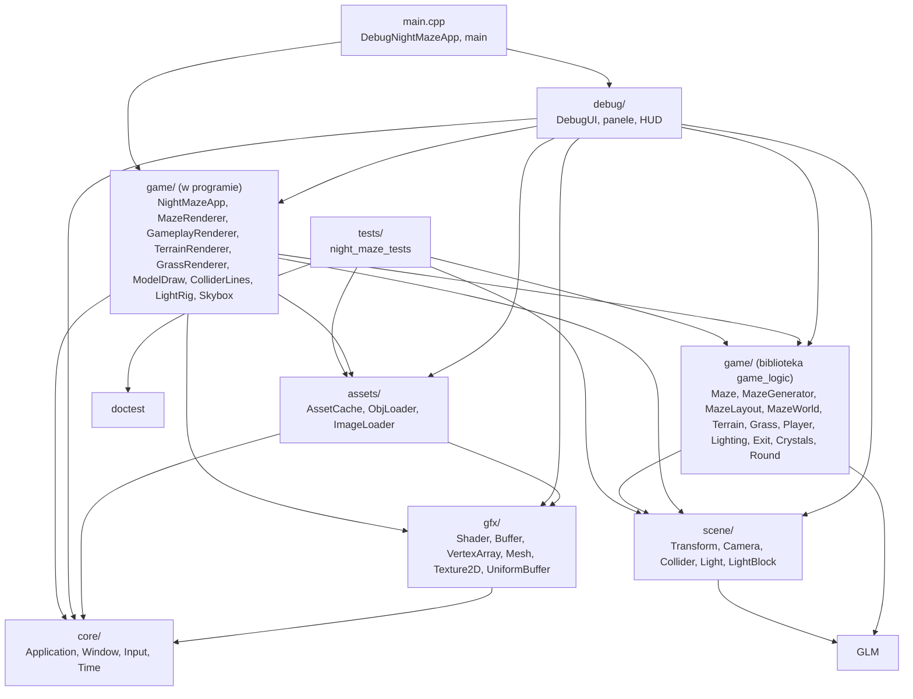

# Moduł game: logika Night Maze

Kamień milowy: M2 + M3 (labirynt, gracz, rysowanie labiryntu), M4 (światła gry: księżyc, latarka, światła punktowe, tryby cieniowania), M5 (rozgrywka: kryształy, bateria latarki, brama, wyjście, runda), M6 (niebo, teren z mapy wysokości pod labiryntem i trawa z shadera geometrii). Temat wykładu: żaden wprost, moduł korzysta z tematów 3, 4, 5, 6, 7 i 14 i jest miejscem, w którym spotykają się one w jednej klatce.
Kod: [`src/game/`](../../../src/game/), testy w [`tests/`](../../../tests/).

Warstwy `core`, `gfx` i `scene` są narzędziami: okno, obiekty OpenGL, matematyka sceny. Nie wiedzą, w jaką grę gramy. Wszystko, co jest **specyficzne dla Night Maze**, leży w module `game`: labirynt, jego generator, układ ścian w świecie, gracz, rysowanie labiryntu, od M4 światła gry z latarką, od M5 wyjście z bramą, kryształy i reguły rundy, a od M6 teren, na którym labirynt stoi, i miejsca kępek trawy (PRD, sekcja 6).

Na dziś moduł ma dwie części o bardzo różnym charakterze:

| Część | Pliki | Czego potrzebuje | Gdzie jest kompilowana |
|---|---|---|---|
| aplikacja i rysowanie | `NightMazeApp.hpp/.cpp`, `MazeRenderer.*`, `GameplayRenderer.*`, `ModelDraw.*`, `ColliderLines.*`, `LightRig.*`, `Skybox.*`, `TerrainRenderer.*` i `GrassRenderer.*` (wszystkie trzy od M6), `ShaderUniforms.hpp` | okna, kontekstu OpenGL, klawiatury i myszy | wprost w programie `night_maze` |
| logika bez okna | `Maze.*`, `MazeGenerator.*`, `MazeLayout.*`, `MazeWorld.*`, `Player.*`, `Lighting.*`, `Exit.*`, `Crystals.*`, `Round.*`, od M6 `Terrain.*` i `Grass.*` | tylko biblioteki standardowej, GLM, nagłówków `scene/` (`Collider`, `Transform`, `Camera`, `Light`) i, od M6 w `Terrain.*`, dwóch nagłówków `engine` bez OpenGL: `gfx/Vertex.hpp` i `assets/ImageLoader.hpp` (oraz funkcji `assets::computeTangents`) | biblioteka statyczna `game_logic` |

**Stan na dziś, uczciwie.** Obie części są połączone i program pokazuje **rundę**: startuje nocą wewnątrz oteksturowanego i oświetlonego labiryntu 10 na 10 komórek (ziarno 1), który od M6 stoi na łagodnie nierównym terenie przechodzącym wokół we wzgórza, z kępkami trawy wzdłuż ścian i nocnym niebem nad nimi, gracz chodzi po nim z kolizjami albo lata w trybie noclip i świeci latarką (klawisz F), której bateria się wyczerpuje. W labiryncie wisi 13 świecących kryształów: każdy ma nad sobą światło punktowe, a zebrany doładowuje baterię. Po zebraniu 10 z nich otwiera się brama, która zamyka wyjście w komórce (6, 5), najdalszej od startu. Wejście w strefę wyjścia kończy rundę wygraną, klawisz R zaczyna ją od nowa. Stan rundy pokazuje pasek HUD u góry ekranu (kryształy, czas, bateria) i karta `You escaped` po wygranej. Pusta bateria oznacza tylko ciemność: runda trwa dalej, stanu przegranej nie ma. Kostki z M1, która do M4 unosiła się nad przeciwległym rogiem jako znacznik wyjścia, i kostek oznaczających światła punktowe już nie ma. M5 jest na Windowsie kompletny w kodzie i **nie jest zamknięty** (bez tagu wersji). Według zgłoszenia autora kodu z 2026-10-05: build Debug i Release przechodzi bez ostrzeżeń, po M5 112 przypadków testowych logiki gry przechodziło w obu konfiguracjach (w ramach 215 przypadków i 85098 asercji całego programu testowego; dziś, po drugiej części M6, program testowy ma 256 przypadków i 101232 asercje, uruchomione 2026-10-05 w Debug i Release), a obraz był sprawdzony na zrzutach ekranu zrobionych przez tymczasowe zaczepy w kodzie, które potem usunięto. M6 (niebo, teren, trawa) też jest kompletny w kodzie na Windowsie i nie jest zamknięty. Otwarte: nic z M5 ani z M6 nie było budowane ani uruchamiane na macOS i nikt jeszcze nie testował ręcznie (chodzenia po nierównym gruncie, suwaków paneli Terrain i Grass, klawisza R, klawisza F przy pustej baterii, przycisku restartu, suwaków panelu Gameplay, przejścia przez otwartą bramę, zbierania, karty wygranej, migotania latarki na ekranie, paska HUD przy schowanych panelach). Kamienie milowe M2 + M3 i M4 też nie są zamknięte: chodzenia prawdziwymi klawiszami, klawiszy N i F, regeneracji labiryntu i widżetów paneli (w tym pola wyboru `Normal mapping` w panelu Assets) nikt jeszcze nie sprawdził ręcznie, a na macOS kod z M2 + M3 i z M4 nie był budowany ani uruchamiany. Mapy normalnych z drugiej części M4 są w kodzie: ściany i słupki mają pod światłem liczonym na fragment fugi i nierówności, a od M6 podłoże (teren z własną teksturą i mapą normalnych, który zastąpił płytki podłogi) kamienie i wyboje ([`../gfx/normal-mapping.md`](../gfx/normal-mapping.md)). Przeciwnika, który goni gracza, w kodzie nie ma: jest zaplanowany na czas po M5 ([`../../decisions/enemy-after-m5.md`](../../decisions/enemy-after-m5.md)).

Ten plik jest wstępem i indeksem dokumentów modułu.

## 1. Dokumenty modułu

| Dokument | Co opisuje | Typy i pliki |
|---|---|---|
| [`maze-generator.md`](maze-generator.md) | zapis labiryntu (siatka komórek, ściany na krawędziach), labirynt doskonały, algorytm recursive backtracker krok po kroku z przykładem, wersja iteracyjna, liczby losowe takie same na każdym systemie (`std::mt19937`, własna funkcja `randomBelow`, błąd reszty z dzielenia), układ w świecie (komórki, ściany, słupki, pudełka kolizji), testy z labiryntem wzorcowym, panel Maze z planem (od M5 z kryształami, bramą i strefą wyjścia) | `Maze`, `Direction`, `MazeCell`, `isDeadEnd`, `generateMaze`, `randomBelow`, `WallSegment`, `wallSegmentOn`, `wallSegments`, `pillarPositions`, `mazeColliders`, panel Maze (`drawMazePanel`) |
| [`maze-rendering.md`](maze-rendering.md) | labirynt w świecie i jego rysowanie: od siatki przez rozmieszczenie do macierzy modelu, dlaczego macierze są liczone raz, obrót ścian wzdłuż Z o 90 stopni, jedno wywołanie rysujące na obiekt i jego koszt, start, wyjście i brama jako pola `MazeWorld`, wspólne funkcje rysowania modelu, uniform `uEmissive` i dlaczego jest zerowany co klatkę, regeneracja przez `MazeSettings`, od M6 labirynt na terenie (ściany, słupki i brama opuszczone na najniższy grunt pod sobą) i przebudowa terenu po zmianie skali wysokości | `MazeSettings`, `MazeWorld`, `buildMazeWorld`, `placeOnTerrain`, `groundHeightAt`, `FOOTPRINT_MARGIN`, `wallModelMatrix`, `yawTowards`, `ViewMode`, `MazeRenderer`, `setModelSamplers`, `drawModel`, `drawMesh`, `NightMazeApp::regenerateMaze`, `rebuildTerrain`, `uploadGround`, `beginRound`, `drawMaze` |
| [`flashlight.md`](flashlight.md) | światła gry: latarka jako reflektor w oku kamery i dlaczego powstaje w `onRender` z interpolowanego oka, klawisz F, ustawienia wszystkich świateł w jednej strukturze, ustawienia jednej klatki (słaba bateria, puls kryształów), światła punktowe nad kryształami, budowanie świateł klatki i wysyłanie ich na kartę, testy | `LightingSettings`, `lightingForFrame`, `flashlightFlicker`, `crystalLightPositions`, `buildLightSet`, `LightRig` |
| [`player.md`](player.md) | gracz: stopy, pudełko i oczy, wejście jako struktura, chodzenie a noclip, dlaczego chód jest poziomy, prędkości i normalizacja, użycie `moveAndSlide` na liście przeszkód rundy, kula zasięgu jako drugi kształt gracza, stały krok i interpolacja, od M6 wysokość stóp czytana z terenu (`Terrain::heightAt`), powrót na grunt, klawisze (w tym R: restart rundy), testy | `PlayerInput`, `Player`, `Player::update`, `playerReach`, `NightMazeApp::onUpdate`, `beginRound` |
| [`gameplay.md`](gameplay.md) (od M5) | rozgrywka: wyjście jako komórka najdalsza od startu (przeszukiwanie wszerz), brama i strefa wyjścia, liczba i miejsca kryształów, ich ruch, blask i światła, bateria latarki i migotanie, reguły rundy krok po kroku, rysowanie bramy i kryształów, pasek HUD i panel Gameplay, testy | `passageDistances`, `farthestCell`, `placeExit`, `exitZone`, `crystalCountFor`, `placeCrystals`, `GameplaySettings`, `Round`, `startRound`, `updateRound`, `roundObstacles`, `GameplayRenderer`, `drawHud`, `drawGameplayPanel` |

Trzy rzeczy z katalogu `src/game/` mają dokumenty poza tym katalogiem, pod nazwami technik z PRD: niebo w [`../renderer/skybox.md`](../renderer/skybox.md), teren (`Terrain.*`, `TerrainRenderer.*`) w [`../renderer/terrain.md`](../renderer/terrain.md), a trawa (`Grass.*`, `GrassRenderer.*`) w [`../renderer/grass-geometry.md`](../renderer/grass-geometry.md). Dlaczego tak, wyjaśnia [`../renderer/README.md`](../renderer/README.md).

Każdy z pięciu dokumentów ma pełne dziesięć sekcji, tak jak dokumenty modułów `core`, `gfx` i `scene`. PRD (sekcja 7) przewidywało dla modułu dokument `gameplay.md`: powstał razem z kodem rozgrywki w M5. Cztery decyzje właściciela projektu dotyczące rozgrywki mają własne zapisy: [`../../decisions/exit-farthest-cell.md`](../../decisions/exit-farthest-cell.md) (wyjście to komórka najdalsza w przejściach, a nie przeciwległy róg), [`../../decisions/crystal-count-and-gate-threshold.md`](../../decisions/crystal-count-and-gate-threshold.md) (liczba kryształów rośnie z labiryntem: jeden na 8 komórek, najwyżej 16, a brama otwiera się przy około 70 procentach z nich, do zmiany w panelu Gameplay), [`../../decisions/battery-darkness-no-loss.md`](../../decisions/battery-darkness-no-loss.md) (pusta bateria to tylko ciemność) i [`../../decisions/enemy-after-m5.md`](../../decisions/enemy-after-m5.md) (przeciwnik dopiero po M5).

Klasa `NightMazeApp` należy do katalogu `src/game/`, ale jej opis jest rozłożony na dokumenty tematów, które realizuje: klatka jako całość w [`../core/README.md`](../core/README.md), macierze w [`../scene/camera.md`](../scene/camera.md), obrót kamery myszą w [`../scene/camera-controls.md`](../scene/camera-controls.md), ruch gracza w [`player.md`](player.md), labirynt w [`maze-rendering.md`](maze-rendering.md), runda (`beginRound`, wywołanie `updateRound`, klawisz R) w [`gameplay.md`](gameplay.md), światła klatki i klawisz F w [`flashlight.md`](flashlight.md), wybór programu według trybu cieniowania w [`../renderer/lighting-gouraud-phong.md`](../renderer/lighting-gouraud-phong.md). Do M4 aplikacja rysowała też kostkę z M1 własnymi buforami: w M5 została usunięta, a przykładem buforów i rysowania indeksowanego jest dziś `gfx::Mesh` ([`../gfx/indexed-drawing.md`](../gfx/indexed-drawing.md)). Dwa pliki z `src/game/` mają dokumenty w innych modułach, bo realizują ich tematy: `ColliderLines.*` (rysowanie pudełek i kul kolizji) w [`../scene/collision.md`](../scene/collision.md), a `ShaderUniforms.hpp` (nazwy uniformów) w [`../gfx/uniforms.md`](../gfx/uniforms.md).

Proponowana kolejność czytania: [`../scene/collision.md`](../scene/collision.md) (pudełka AABB, bo układ labiryntu je produkuje, i kule, którymi gracz zbiera kryształy), ten plik, [`maze-generator.md`](maze-generator.md), [`maze-rendering.md`](maze-rendering.md), [`player.md`](player.md), [`gameplay.md`](gameplay.md), a obok [`../../libraries/doctest.md`](../../libraries/doctest.md) (jak czytać i uruchamiać testy). [`flashlight.md`](flashlight.md) czyta się po [`../scene/lights.md`](../scene/lights.md), który daje teorię świateł, i najlepiej przed `gameplay.md`, bo bateria i kryształy zmieniają światła klatki. Przed `maze-rendering.md` warto znać [`../assets/asset-cache.md`](../assets/asset-cache.md) (skąd biorą się modele).

## 2. Indeks: plik kodu, dokument

| Plik kodu | Co zawiera | Dokument |
|---|---|---|
| [`src/game/Maze.hpp`](../../../src/game/Maze.hpp), [`.cpp`](../../../src/game/Maze.cpp) | typ `Direction` (North, East, South, West), stałe `DIRECTION_COUNT` i `ALL_DIRECTIONS`, funkcje `opposite`, `columnStep`, `rowStep`, struktura `MazeCell` (od M5), klasa `Maze`: `width`, `height`, `contains`, `hasWall`, `removeWall`, stała `MAX_SIZE`, funkcja `isDeadEnd` (od M5 tutaj, wcześniej w `Lighting.*`) | [`maze-generator.md`](maze-generator.md), sekcje 5.2 i 5.3 |
| [`src/game/MazeGenerator.hpp`](../../../src/game/MazeGenerator.hpp), [`.cpp`](../../../src/game/MazeGenerator.cpp) | `randomBelow` (losowa liczba poniżej granicy, taka sama na każdym systemie), `generateMaze` (labirynt doskonały z rozmiaru i ziarna) | [`maze-generator.md`](maze-generator.md), sekcje 5.4 i 5.5 |
| [`src/game/MazeLayout.hpp`](../../../src/game/MazeLayout.hpp), [`.cpp`](../../../src/game/MazeLayout.cpp) | stałe `CELL_SIZE`, `WALL_LENGTH`, `WALL_HEIGHT`, `PILLAR_SIZE`, `WALL_VISUAL_THICKNESS`, `WALL_COLLISION_THICKNESS`, `PILLAR_HEIGHT`, typy `WallAxis` i `WallSegment`, funkcje `cellCenter`, `wallSegmentOn` (od M5), `wallSegments`, `pillarPositions`, `wallBox`, `pillarBox`, `colliderBoxes` (od M6), `mazeColliders` | [`maze-generator.md`](maze-generator.md), sekcje 5.6 i 5.7 |
| [`src/game/NightMazeApp.hpp`](../../../src/game/NightMazeApp.hpp), [`.cpp`](../../../src/game/NightMazeApp.cpp) | aplikacja: okno, sześć programów shaderów (`textured`, `color`, `lit`, `gouraud`, od M6 `skybox` i `grass`, ten ostatni z shaderem geometrii), pamięć podręczna assetów, niebo (`Skybox`), mapa wysokości i teren (`m_heightmap`, `m_terrainSettings`, `m_terrainRenderer`, `rebuildTerrain`, `uploadGround`), trawa (`m_grassSettings`, `m_grassRenderer`, `plantGrass`, `drawGrass`), labirynt, runda (`m_gameplay`, `m_round`, `m_obstacles`, `beginRound`), gracz, kamera, ustawienia świateł i `LightRig`, sterowanie (w tym klawisze N, F i R), wybór programu według trybu cieniowania | [`../core/README.md`](../core/README.md) i dokumenty wymienione w sekcji 1 |
| [`src/game/MazeWorld.hpp`](../../../src/game/MazeWorld.hpp), [`.cpp`](../../../src/game/MazeWorld.cpp) | stałe labiryntu domyślnego, struktury `MazeSettings` i `MazeWorld` (od M5 z polami `exitCell`, `exitPosition`, `hasGate`, `gate`, `gateBox`, `exitZone`, `crystals`), od M6 pole `terrain`, stała `FOOTPRINT_MARGIN`, funkcje `yawTowards`, `wallModelMatrix`, `groundHeightAt`, `placeOnTerrain` i dwa przeciążenia `buildMazeWorld` (na płasko i na terenie z mapy wysokości) | [`maze-rendering.md`](maze-rendering.md), sekcje od 5.2 do 5.5 |
| [`src/game/MazeRenderer.hpp`](../../../src/game/MazeRenderer.hpp), [`.cpp`](../../../src/game/MazeRenderer.cpp) | wyliczenie `ViewMode`, klasa `MazeRenderer` z funkcją `draw` | [`maze-rendering.md`](maze-rendering.md), sekcja 5.6 |
| [`src/game/ModelDraw.hpp`](../../../src/game/ModelDraw.hpp), [`.cpp`](../../../src/game/ModelDraw.cpp) (od M5) | wolne funkcje `setModelSamplers`, `drawModel` i od M6 `drawMesh` (jedna siatka z dwiema teksturami, dla terenu): wspólna część rysowania dla `MazeRenderer`, `GameplayRenderer` i `TerrainRenderer`, stałe `TEXTURE_UNIT` i `NORMAL_MAP_UNIT` | [`maze-rendering.md`](maze-rendering.md), sekcja 5.6 |
| [`src/game/GameplayRenderer.hpp`](../../../src/game/GameplayRenderer.hpp), [`.cpp`](../../../src/game/GameplayRenderer.cpp) (od M5) | klasa `GameplayRenderer`: rysuje bramę (zapadającą się po otwarciu) i niezebrane kryształy (unoszące się i obracające), ustawia `uEmissive` | [`gameplay.md`](gameplay.md), sekcja 5 |
| [`src/game/Exit.hpp`](../../../src/game/Exit.hpp), [`.cpp`](../../../src/game/Exit.cpp) (od M5) | stałe `UNREACHABLE` i `EXIT_ZONE_HALF_SIZE`, struktura `ExitPlacement`, funkcje `passageDistances` (przeszukiwanie wszerz), `farthestCell`, `placeExit`, `exitZone` | [`gameplay.md`](gameplay.md), sekcje 2 i 5 |
| [`src/game/Crystals.hpp`](../../../src/game/Crystals.hpp), [`.cpp`](../../../src/game/Crystals.cpp) (od M5) | stałe kryształów (`CELLS_PER_CRYSTAL`, `CRYSTAL_VARIANT_COUNT`, wymiary, ruch, puls, blask), struktura `CrystalSpawn`, funkcje `crystalCountFor`, `placeCrystals`, `crystalRestPosition`, `crystalCenter`, `crystalLightPosition`, `crystalBobPosition`, `crystalSpinDegrees`, `crystalPulse`, `crystalGlow` | [`gameplay.md`](gameplay.md), sekcje 2 i 5 |
| [`src/game/Round.hpp`](../../../src/game/Round.hpp), [`.cpp`](../../../src/game/Round.cpp) (od M5) | stałe `GATE_OPEN_SECONDS`, `GATE_SINK_DEPTH`, `PLAYER_REACH_HEIGHT`, `PLAYER_REACH_RADIUS`, struktury `GameplaySettings`, `RoundCrystal`, `Round`, wyliczenie `RoundState`, funkcje `requiredCrystalCount`, `startRound`, `playerReach`, `updateRound`, `gateBlocks`, `gateVisible`, `gateSinkDepth`, `roundObstacles`, `flashlightFlicker`, `lightingForFrame`, `crystalLightPositions` | [`gameplay.md`](gameplay.md), sekcje 2 i 5. Kula zasięgu i lista przeszkód także w [`player.md`](player.md), światła klatki także w [`flashlight.md`](flashlight.md) |
| [`src/game/Lighting.hpp`](../../../src/game/Lighting.hpp), [`.cpp`](../../../src/game/Lighting.cpp) | typy `LightingMode` i `SpecularModel`, funkcje `specularModelOf` i `usesNormalMap`, struktura `LightingSettings`, funkcja `buildLightSet` | [`flashlight.md`](flashlight.md), sekcja 5. Typy trybu także w [`../renderer/lighting-gouraud-phong.md`](../renderer/lighting-gouraud-phong.md), sekcja 5 |
| [`src/game/LightRig.hpp`](../../../src/game/LightRig.hpp), [`.cpp`](../../../src/game/LightRig.cpp) | klasa `LightRig`: bufor uniformów świateł (`connect`, `upload`). Od M5 nic nie rysuje | [`flashlight.md`](flashlight.md), sekcja 5 |
| [`src/game/Player.hpp`](../../../src/game/Player.hpp), [`.cpp`](../../../src/game/Player.cpp) | struktury `PlayerInput` i `Player`: stałe, pola, `box`, `eyePosition`, `update` | [`player.md`](player.md), sekcje od 5.2 do 5.5 |
| [`src/game/ColliderLines.hpp`](../../../src/game/ColliderLines.hpp), [`.cpp`](../../../src/game/ColliderLines.cpp) | klasa `ColliderLines`: sześcian jednostkowy i okrąg jednostkowy z linii, rysowanie pudełek kolizji (`draw`) i od M5 kul (`drawSpheres`) | [`../scene/collision.md`](../scene/collision.md), sekcja 5 |
| [`src/game/Skybox.hpp`](../../../src/game/Skybox.hpp), [`.cpp`](../../../src/game/Skybox.cpp) (od M6) | niebo: struktura `SkyboxSettings`, klasa `Skybox`, która wczytuje sześć obrazów z `assets/skybox/`, trzyma teksturę sześcienną i siatkę sześcianu i rysuje je na końcu klatki programem `skybox`. Część programu `night_maze`, bez testu jednostkowego | [`../renderer/skybox.md`](../renderer/skybox.md), sekcja 5 |
| [`src/game/Terrain.hpp`](../../../src/game/Terrain.hpp), [`.cpp`](../../../src/game/Terrain.cpp) (od M6) | teren jako dane: stałe siatki i rzeźby, struktury `TerrainSettings`, `Heightmap` i `TerrainMeshData`, funkcje `heightmapFromImage`, `distanceOutsideMaze`, `terrainRelief`, `buildTerrainMesh`, klasa `Terrain` (`heightAt`, `lowestHeightUnder`, `gridPoint`, `gridNormal`). Część `game_logic` | [`../renderer/terrain.md`](../renderer/terrain.md) |
| [`src/game/TerrainRenderer.hpp`](../../../src/game/TerrainRenderer.hpp), [`.cpp`](../../../src/game/TerrainRenderer.cpp) (od M6) | klasa `TerrainRenderer`: siatka terenu na karcie, dwie tekstury podłoża, rysowanie funkcją `drawMesh`, tryb siatki przez `glPolygonMode`. Część programu `night_maze` | [`../renderer/terrain.md`](../renderer/terrain.md) |
| [`src/game/Grass.hpp`](../../../src/game/Grass.hpp), [`.cpp`](../../../src/game/Grass.cpp) (od M6) | miejsca kępek trawy jako dane: stałe, struktury `GrassTuft` i `GrassSettings`, funkcja `placeGrass` (punkty wzdłuż ścian i na wzgórzach, z ziarna labiryntu). Część `game_logic` | [`../renderer/grass-geometry.md`](../renderer/grass-geometry.md) |
| [`src/game/GrassRenderer.hpp`](../../../src/game/GrassRenderer.hpp), [`.cpp`](../../../src/game/GrassRenderer.cpp) (od M6) | klasa `GrassRenderer`: jeden wierzchołek na kępkę, rysowany jako `GL_POINTS` programem `grass`, którego shader geometrii robi z punktu źdźbła. Część programu `night_maze` | [`../renderer/grass-geometry.md`](../renderer/grass-geometry.md) |
| [`src/game/ShaderUniforms.hpp`](../../../src/game/ShaderUniforms.hpp) | nazwy uniformów wszystkich shaderów w jednym miejscu, od M4 także nazwa bloku `LightBlock` i numer jego punktu wiązania, od M5 `EMISSIVE_UNIFORM`, od M6 uniformy nieba i trawy | [`../gfx/uniforms.md`](../gfx/uniforms.md), sekcja 5 |
| [`src/debug/panels/MazePanel.hpp`](../../../src/debug/panels/MazePanel.hpp), [`.cpp`](../../../src/debug/panels/MazePanel.cpp) | panel Maze (plik leży w `src/debug/`, ale dotyczy labiryntu): prośba o nowy labirynt i plan z góry, od M5 z kryształami, bramą i strefą wyjścia | [`maze-generator.md`](maze-generator.md), sekcja 6 |
| [`src/debug/panels/GameplayPanel.hpp`](../../../src/debug/panels/GameplayPanel.hpp), [`.cpp`](../../../src/debug/panels/GameplayPanel.cpp), [`src/debug/Hud.hpp`](../../../src/debug/Hud.hpp), [`.cpp`](../../../src/debug/Hud.cpp) (od M5) | panel Gameplay (`drawGameplayPanel`: stan rundy, restart, liczby reguł) i pasek HUD z kartą wygranej (`drawHud`). Pliki leżą w `src/debug/`, ale dotyczą rundy | [`gameplay.md`](gameplay.md), sekcja 6 |
| [`tests/MazeTests.cpp`](../../../tests/MazeTests.cpp), [`MazeGeneratorTests.cpp`](../../../tests/MazeGeneratorTests.cpp), [`MazeLayoutTests.cpp`](../../../tests/MazeLayoutTests.cpp) | testy jednostkowe logiki labiryntu (31 przypadków testowych: 8, 11 i 12) | [`maze-generator.md`](maze-generator.md), sekcja 5.8, [`../../libraries/doctest.md`](../../libraries/doctest.md) |
| [`tests/SkyboxTests.cpp`](../../../tests/SkyboxTests.cpp) (od M6) | testy sześciu plików nieba: rozmiary, reguła wyboru ściany, miejsce księżyca względem domyślnego światła z `LightingSettings`, gradient tła, zgodność na krawędziach sześcianu (5 przypadków) | [`../renderer/skybox.md`](../renderer/skybox.md), sekcja 5.8 |
| [`tests/TerrainTests.cpp`](../../../tests/TerrainTests.cpp) (od M6) | testy terenu (27 przypadków): mapa wysokości, wzór wysokości, `heightAt` na trójkącie siatki, siatka do narysowania, labirynt, kryształy i gracz na nierównym gruncie | [`../renderer/terrain.md`](../renderer/terrain.md), a część o labiryncie, rundzie i graczu także w [`maze-rendering.md`](maze-rendering.md), [`gameplay.md`](gameplay.md) i [`player.md`](player.md), sekcje o testach |
| [`tests/GrassTests.cpp`](../../../tests/GrassTests.cpp) (od M6) | testy miejsc kępek trawy (9 przypadków) | [`../renderer/grass-geometry.md`](../renderer/grass-geometry.md) |
| [`tests/MazeWorldTests.cpp`](../../../tests/MazeWorldTests.cpp) | testy `MazeWorld` (8 przypadków) | [`maze-rendering.md`](maze-rendering.md), sekcja 5.9 |
| [`tests/PlayerTests.cpp`](../../../tests/PlayerTests.cpp) | testy gracza na płaskim gruncie (13 przypadków) | [`player.md`](player.md), sekcja 5.9 |
| [`tests/LightingTests.cpp`](../../../tests/LightingTests.cpp) | testy ustawień świateł, `usesNormalMap` i `buildLightSet` (10 przypadków). Test `isDeadEnd` przeszedł w M5 do `MazeTests.cpp`, a testy świateł w zaułkach zniknęły razem z nimi | [`flashlight.md`](flashlight.md), sekcja 5 |
| [`tests/ExitTests.cpp`](../../../tests/ExitTests.cpp) (od M5) | testy wyjścia: odległości w przejściach, najdalsza komórka, brama, strefa wyjścia, `wallSegmentOn` (11 przypadków) | [`gameplay.md`](gameplay.md), sekcja 5 |
| [`tests/CrystalTests.cpp`](../../../tests/CrystalTests.cpp) (od M5) | testy kryształów: liczba, miejsca, ruch, puls, blask (14 przypadków) | [`gameplay.md`](gameplay.md), sekcja 5 |
| [`tests/RoundTests.cpp`](../../../tests/RoundTests.cpp) (od M5) | testy rundy: zbieranie, bateria, brama, wygrana, migotanie, światła klatki (25 przypadków) | [`gameplay.md`](gameplay.md), sekcja 5 |

## 3. Miejsce w warstwach i dwa targety

Strzałka znaczy "zna i dołącza nagłówki". Diagram pokazuje stan faktyczny. Wobec diagramu z [`../scene/README.md`](../scene/README.md) pokazuje dodatkowo program testowy `night_maze_tests`, podział `game/` na dwie części i warstwę `assets/`. Strzałka od aplikacji do logiki istnieje: `NightMazeApp` dołącza `game/MazeWorld.hpp`, `game/Player.hpp`, `game/Lighting.hpp` i od M5 `game/Round.hpp`, a `GameplayRenderer` dołącza `game/Crystals.hpp`, `game/MazeWorld.hpp` i `game/Round.hpp`. Strzałki od `debug/` do `game/` też: panele i HUD dołączają `game/Player.hpp`, `game/MazeWorld.hpp`, `game/MazeLayout.hpp`, `game/MazeRenderer.hpp` (ten ostatni dla wyliczenia `ViewMode`), `game/Lighting.hpp` (panele Lights i Renderer) i od M5 `game/Round.hpp` (HUD, panel Gameplay i trzy panele, które pokazują stan rundy: Maze, Collision, Lights). W drugą stronę strzałki nie ma: nic w `game/` nie dołącza `debug/`.

Zasady warstwy `game`:

1. `game/` może zależeć od `scene/`, `gfx/`, `core/` i GLM. Nie zna `debug/` ani ImGui: panele sięgają do gry, nigdy odwrotnie.
2. Pliki logiki (`Maze`, `MazeGenerator`, `MazeLayout`, `MazeWorld`, `Terrain`, `Grass`, `Player`, `Lighting`, `Exit`, `Crystals`, `Round`) są jeszcze ostrzejsze: dołączają tylko bibliotekę standardową, GLM, siebie nawzajem i nagłówki `scene/` bez OpenGL (`Collider.hpp`, `Transform.hpp`, `Camera.hpp`, `Light.hpp`). Od M6 `Terrain` dołącza jeszcze trzy nagłówki `engine`, które też nie dotykają OpenGL: `gfx/Vertex.hpp` (sama struktura wierzchołka), `assets/ImageLoader.hpp` (struktura `Image`) i `assets/Tangents.hpp` (styczne liczone na procesorze). Żadnego OpenGL, okna, wejścia ani czasu. To warunek, żeby dało się je testować bez okna. Dla rundy znaczy to, że test potrafi rozegrać całą rundę (zebrać kryształy, otworzyć bramę, wygrać) bez jednej klatki obrazu: czas przychodzi do `updateRound` jako parametr `stepSeconds`, a nie z zegara.
3. Nic poniżej (`core/`, `gfx/`, `scene/`) nie zna `game/`.

**Dlaczego logika jest osobną biblioteką.** Do tej pory wszystkie pliki z `src/game/` były kompilowane wprost w programie `night_maze`. Program testowy jest jednak drugim, osobnym programem, a jeden program nie może dołączyć kodu, który jest częścią innego programu. Kod wspólny dla obu musi więc być biblioteką. W [`CMakeLists.txt`](../../../CMakeLists.txt) są teraz trzy nasze targety z kodem gry i silnika oraz program testowy:

| Target | Rodzaj | Zawiera | Linkuje |
|---|---|---|---|
| `engine` | biblioteka statyczna | `src/assets/*`, `src/core/*`, `src/gfx/*`, `src/scene/*` (w tym `Collider`) | zależności zewnętrzne opisane w [`../../guides/project-structure.md`](../../guides/project-structure.md) |
| `game_logic` | biblioteka statyczna | `src/game/Crystals.*`, `Exit.*`, `Grass.*` (od M6), `Lighting.*`, `Maze.*`, `MazeGenerator.*`, `MazeLayout.*`, `MazeWorld.*`, `Player.*`, `Round.*`, `Terrain.*` (od M6) | `engine` (`PUBLIC`) |
| `night_maze` | program | `src/main.cpp`, `src/game/NightMazeApp.*`, `MazeRenderer.*`, `GameplayRenderer.*`, `ModelDraw.*`, `ColliderLines.*`, `LightRig.*`, od M6 `Skybox.*`, `TerrainRenderer.*` i `GrassRenderer.*`, `ShaderUniforms.hpp`, `src/debug/*` (w tym od M5 `Hud.*` i `panels/GameplayPanel.*`, od M6 `panels/TerrainPanel.*` i `panels/GrassPanel.*`) | `engine`, `game_logic`, `imgui` |
| `night_maze_tests` | program | `tests/*.cpp` (19 plików z testami i `main.cpp`, od M5 także `CrystalTests.cpp`, `ExitTests.cpp`, `RoundTests.cpp`, od M6 `SkyboxTests.cpp`, `TerrainTests.cpp` i `GrassTests.cpp`) | `game_logic`, `doctest::doctest` |

`NightMazeApp` i siedem klas rysujących (`MazeRenderer`, `GameplayRenderer`, `TerrainRenderer`, `GrassRenderer`, `ColliderLines`, `LightRig`, `Skybox`) razem ze wspólnym `ModelDraw` zostają w programie: potrzebują okna i kontekstu OpenGL, więc test i tak nie mógłby ich uruchomić. `game_logic` linkuje `engine` jako `PUBLIC`, bo nagłówki `game/Exit.hpp`, `game/Lighting.hpp`, `game/MazeLayout.hpp`, `game/MazeWorld.hpp`, `game/Player.hpp`, `game/Round.hpp` i od M6 `game/Terrain.hpp` dołączają nagłówki `engine` (`scene/Collider.hpp`, `scene/Light.hpp`, od M6 `gfx/Vertex.hpp` i `assets/ImageLoader.hpp`) i GLM: każdy, kto dołączy taki nagłówek, potrzebuje ścieżek nagłówków `engine`. Opis targetów linia po linii: [`../../guides/project-structure.md`](../../guides/project-structure.md), sekcja 3.1.

Granica targetu pilnuje zasady 2: gdyby plik logiki dołączył ImGui, `game_logic` nie zna tej ścieżki nagłówków i kompilacja by się nie udała. Nie pilnuje natomiast, żeby logika nie wołała OpenGL, bo `engine`, które linkuje, zawiera GLAD. Tu obowiązuje dyscyplina dyrektyw `#include`.

## 4. Konwencje wspólne dla modułu

| Ustalenie | Wartość | Gdzie opisane |
|---|---|---|
| jednostka | 1 jednostka to 1 metr | [`../scene/README.md`](../scene/README.md), sekcja 5 |
| kompas | North to -Z, East to +X, South to +Z, West to -X, tak jak yaw kamery | [`maze-generator.md`](maze-generator.md), sekcja 2.2 |
| siatka | kolumna `x` rośnie w stronę +X, wiersz `z` w stronę +Z, komórka `(0, 0)` jest w rogu północno-zachodnim | [`maze-generator.md`](maze-generator.md), sekcja 2.1 |
| położenie labiryntu | zaczyna się w początku układu świata i rośnie w stronę +X i +Z. Funkcje układu dają plan na `y = 0` | [`maze-generator.md`](maze-generator.md), sekcja 2.7 |
| wysokość (od M6) | podłoże to teren z mapy wysokości, najniższy grunt jest w `y = 0`. Ściany, słupki i brama stoją na najniższym gruncie pod swoim obrysem, a start, wyjście, kryształy i stopy gracza na gruncie w swoim punkcie (`Terrain::heightAt`). Nic nie przesuwa się w bok | [`maze-rendering.md`](maze-rendering.md), sekcja 2.8, [`../renderer/terrain.md`](../renderer/terrain.md) |
| losowość | zawsze z ziarna, przez `std::mt19937` i `randomBelow`, bez rozkładów z biblioteki standardowej. Dotyczy labiryntu, od M5 kryształów i od M6 trawy (każde ma osobny generator z ziarna labiryntu plus własne stałe przesunięcie) | [`maze-generator.md`](maze-generator.md), sekcja 2.6, [`gameplay.md`](gameplay.md), sekcja 5, [`../../decisions/deterministic-random.md`](../../decisions/deterministic-random.md) |
| komórka jako wartość | `MazeCell{x, z}`: kolumna i wiersz, `(0, 0)` to róg północno-zachodni. Start to zawsze `(0, 0)` | [`maze-generator.md`](maze-generator.md), sekcja 5.2 |
| stałe i zmienne | to, co wynika z labiryntu i nie zmienia się w rundzie, jest w `MazeWorld` (gdzie jest wyjście, brama, kryształy). To, co się zmienia, w `Round` (co zebrane, czy brama otwarta, bateria, czas) | [`maze-rendering.md`](maze-rendering.md), sekcja 5.3, [`gameplay.md`](gameplay.md), sekcja 5 |
| błędy | zły argument to wyjątek (`std::invalid_argument`, `std::out_of_range`), nie cichy błędny wynik | [`maze-generator.md`](maze-generator.md), sekcje 5.3 i 5.4 |

## 5. Pytania kontrolne

Pytania z odpowiedziami do labiryntu, generatora i układu są w [`maze-generator.md`](maze-generator.md), sekcja 9, do rysowania labiryntu w [`maze-rendering.md`](maze-rendering.md), sekcja 9, do gracza w [`player.md`](player.md), sekcja 9, a do rundy w [`gameplay.md`](gameplay.md), sekcja 9. Cztery pytania dotyczące treści tego pliku:

1. **Co należy do modułu `game`, a co do `scene`?**
   Do `game` to, co istnieje tylko w Night Maze: labirynt, jego wymiary, generator, gracz, ustawienia świateł tej gry (księżyc, latarka, światła nad kryształami), a od M5 wyjście z bramą, kryształy i reguły rundy. Do `scene` to, co przyda się w każdym programie 3D: transformacje, kamera, pudełka i kule kolizji, struktury świateł i ich matematyka. Pudełko AABB jest w `scene`, a to, że ściana labiryntu ma pudełko 2 na 3 na 0,3 m, jest w `game`. Tak samo test "kula nachodzi na kulę" jest w `scene`, a to, że kula zbierania wokół kryształu ma promień 0,6 m, jest w `game`.

2. **Dlaczego pliki labiryntu są w bibliotece `game_logic`, a `NightMazeApp` w programie?**
   Testy są osobnym programem i mogą dołączyć tylko kod z biblioteki, więc logika, którą chcę testować, musi być biblioteką. `NightMazeApp` potrzebuje okna i kontekstu OpenGL, których test nie ma, więc zostaje w programie.

3. **Czego nie wolno dołączać w plikach logiki i dlaczego?**
   OpenGL (GLAD), GLFW, `core/Window`, wejścia, ImGui. Kod, który ich nie dotyka, daje się uruchomić w teście bez okna i daje ten sam wynik na każdym komputerze.

4. **Dlaczego reguły rundy (`Round.*`) są w `game_logic`, a rysowanie kryształów i bramy (`GameplayRenderer.*`) w programie?**
   Z tego samego powodu co `MazeWorld` i `MazeRenderer`. Reguły to dane i funkcje bez OpenGL: test podaje pozycję gracza i długość kroku i sprawdza, co się stało z kryształami, baterią i bramą. Rysowanie wymaga kontekstu OpenGL. Podział pilnuje też kierunku: renderer czyta `Round`, a `Round` nic nie wie o tym, że ktoś ją rysuje.

## 6. Źródła

- PRD ([`../../PRD.pdf`](../../PRD.pdf)): sekcja 2 (mechaniki gry), sekcja 6 (podział na warstwy, zawartość `game/`), sekcja 7 (lista dokumentów modułu `game`).
- Dokumenty w tym repozytorium: [`maze-generator.md`](maze-generator.md), [`maze-rendering.md`](maze-rendering.md), [`player.md`](player.md), [`gameplay.md`](gameplay.md), [`flashlight.md`](flashlight.md), [`../scene/collision.md`](../scene/collision.md), [`../scene/lights.md`](../scene/lights.md), [`../../libraries/doctest.md`](../../libraries/doctest.md), [`../../guides/project-structure.md`](../../guides/project-structure.md) (targety i katalogi).
- Decyzje dotyczące rozgrywki: [`../../decisions/exit-farthest-cell.md`](../../decisions/exit-farthest-cell.md), [`../../decisions/crystal-count-and-gate-threshold.md`](../../decisions/crystal-count-and-gate-threshold.md), [`../../decisions/battery-darkness-no-loss.md`](../../decisions/battery-darkness-no-loss.md), [`../../decisions/enemy-after-m5.md`](../../decisions/enemy-after-m5.md).
- Szczegółowe źródła do algorytmu i liczb losowych są w sekcji 10 dokumentu [`maze-generator.md`](maze-generator.md).
