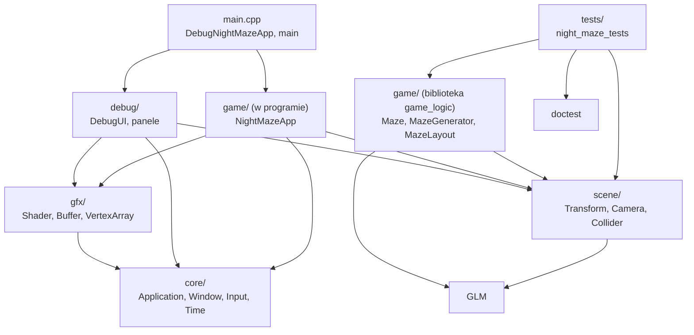

# Moduł game: logika Night Maze

Kamień milowy: M2 + M3 (pierwsze pliki logiki gry). Temat wykładu: żaden wprost, moduł korzysta z tematów 3 i 14 i dostarcza dane do tematów 4 i 5.
Kod: [`src/game/`](../../../src/game/), testy w [`tests/`](../../../tests/).

Warstwy `core`, `gfx` i `scene` są narzędziami: okno, obiekty OpenGL, matematyka sceny. Nie wiedzą, w jaką grę gramy. Wszystko, co jest **specyficzne dla Night Maze**, leży w module `game`: labirynt, jego generator, układ ścian w świecie, a później gracz, latarka, kryształy i stany gry (PRD, sekcja 6).

Na dziś moduł ma dwie części o bardzo różnym charakterze:

| Część | Pliki | Czego potrzebuje | Gdzie jest kompilowana |
|---|---|---|---|
| aplikacja | `NightMazeApp.hpp/.cpp` | okna, kontekstu OpenGL, klawiatury i myszy | wprost w programie `night_maze` |
| logika bez okna | `Maze.*`, `MazeGenerator.*`, `MazeLayout.*` | tylko biblioteki standardowej, GLM i `scene/Collider.hpp` | biblioteka statyczna `game_logic` |

**Stan na dziś, uczciwie.** Logika labiryntu istnieje i ma testy, ale `NightMazeApp` jeszcze jej nie używa: program nadal rysuje kostkę i lata kamerą bez kolizji. Połączenie obu części (rysowanie labiryntu, gracz z kolizjami, panel Maze) to następny krok kamienia milowego M2 + M3.

Ten plik jest wstępem i indeksem dokumentów modułu.

## 1. Dokumenty modułu

| Dokument | Co opisuje | Typy i pliki |
|---|---|---|
| [`maze-generator.md`](maze-generator.md) | zapis labiryntu (siatka komórek, ściany na krawędziach), labirynt doskonały, algorytm recursive backtracker krok po kroku z przykładem, wersja iteracyjna, liczby losowe takie same na każdym systemie (`std::mt19937`, własna funkcja `randomBelow`, błąd reszty z dzielenia), układ w świecie (komórki, ściany, słupki, pudełka kolizji), testy z labiryntem wzorcowym | `Maze`, `Direction`, `generateMaze`, `randomBelow`, `WallSegment`, `wallSegments`, `pillarPositions`, `mazeColliders` |

Dokument ma pełne dziesięć sekcji, tak jak dokumenty modułów `core`, `gfx` i `scene`. Kolejne dokumenty modułu przewiduje PRD (sekcja 7): `player.md`, `flashlight.md`, `gameplay.md`. Powstaną razem z kodem.

Klasa `NightMazeApp` należy do katalogu `src/game/`, ale jej opis jest rozłożony na dokumenty tematów, które realizuje: klatka jako całość w [`../core/README.md`](../core/README.md), rysowanie kostki w [`../gfx/indexed-drawing.md`](../gfx/indexed-drawing.md), macierze w [`../scene/camera.md`](../scene/camera.md), sterowanie kamerą w [`../scene/camera-controls.md`](../scene/camera-controls.md).

Proponowana kolejność czytania: [`../scene/collision.md`](../scene/collision.md) (pudełka AABB, bo układ labiryntu je produkuje), ten plik, [`maze-generator.md`](maze-generator.md), a obok [`../../libraries/doctest.md`](../../libraries/doctest.md) (jak czytać i uruchamiać testy).

## 2. Indeks: plik kodu, dokument

| Plik kodu | Co zawiera | Dokument |
|---|---|---|
| [`src/game/Maze.hpp`](../../../src/game/Maze.hpp), [`.cpp`](../../../src/game/Maze.cpp) | typ `Direction` (North, East, South, West), stałe `DIRECTION_COUNT` i `ALL_DIRECTIONS`, funkcje `opposite`, `columnStep`, `rowStep`, klasa `Maze`: `width`, `height`, `contains`, `hasWall`, `removeWall`, stała `MAX_SIZE` | [`maze-generator.md`](maze-generator.md), sekcje 5.2 i 5.3 |
| [`src/game/MazeGenerator.hpp`](../../../src/game/MazeGenerator.hpp), [`.cpp`](../../../src/game/MazeGenerator.cpp) | `randomBelow` (losowa liczba poniżej granicy, taka sama na każdym systemie), `generateMaze` (labirynt doskonały z rozmiaru i ziarna) | [`maze-generator.md`](maze-generator.md), sekcje 5.4 i 5.5 |
| [`src/game/MazeLayout.hpp`](../../../src/game/MazeLayout.hpp), [`.cpp`](../../../src/game/MazeLayout.cpp) | stałe `CELL_SIZE`, `WALL_LENGTH`, `WALL_HEIGHT`, `WALL_THICKNESS`, `PILLAR_SIZE`, `PILLAR_HEIGHT`, typy `WallAxis` i `WallSegment`, funkcje `cellCenter`, `wallSegments`, `pillarPositions`, `wallBox`, `pillarBox`, `mazeColliders` | [`maze-generator.md`](maze-generator.md), sekcje 5.6 i 5.7 |
| [`src/game/NightMazeApp.hpp`](../../../src/game/NightMazeApp.hpp), [`.cpp`](../../../src/game/NightMazeApp.cpp) | aplikacja: okno, kostka, kamera, sterowanie. Nie używa jeszcze labiryntu | [`../core/README.md`](../core/README.md) i dokumenty wymienione w sekcji 1 |
| [`tests/MazeTests.cpp`](../../../tests/MazeTests.cpp), [`MazeGeneratorTests.cpp`](../../../tests/MazeGeneratorTests.cpp), [`MazeLayoutTests.cpp`](../../../tests/MazeLayoutTests.cpp) | testy jednostkowe logiki labiryntu (29 przypadków testowych) | [`maze-generator.md`](maze-generator.md), sekcja 5.8, [`../../libraries/doctest.md`](../../libraries/doctest.md) |

## 3. Miejsce w warstwach i dwa targety

Strzałka znaczy "zna i dołącza nagłówki". Diagram pokazuje stan faktyczny. Dwie rzeczy są w nim nowe wobec diagramu z [`../scene/README.md`](../scene/README.md): program testowy `night_maze_tests` i podział `game/` na dwie części. Strzałki od `NightMazeApp` do logiki labiryntu jeszcze nie ma, bo aplikacja jej nie dołącza.

Zasady warstwy `game`:

1. `game/` może zależeć od `scene/`, `gfx/`, `core/` i GLM. Nie zna `debug/` ani ImGui: panele sięgają do gry, nigdy odwrotnie.
2. Pliki logiki (`Maze`, `MazeGenerator`, `MazeLayout`) są jeszcze ostrzejsze: dołączają tylko bibliotekę standardową, GLM i `scene/Collider.hpp`. Żadnego OpenGL, okna, wejścia ani czasu. To warunek, żeby dało się je testować bez okna.
3. Nic poniżej (`core/`, `gfx/`, `scene/`) nie zna `game/`.

**Dlaczego logika jest osobną biblioteką.** Do tej pory wszystkie pliki z `src/game/` były kompilowane wprost w programie `night_maze`. Program testowy jest jednak drugim, osobnym programem, a jeden program nie może dołączyć kodu, który jest częścią innego programu. Kod wspólny dla obu musi więc być biblioteką. W [`CMakeLists.txt`](../../../CMakeLists.txt) są teraz trzy nasze targety z kodem gry i silnika oraz program testowy:

| Target | Rodzaj | Zawiera | Linkuje |
|---|---|---|---|
| `engine` | biblioteka statyczna | `src/core/*`, `src/gfx/*`, `src/scene/*` (w tym `Collider`) | `glad`, `glfw`, `glm::glm-header-only` |
| `game_logic` | biblioteka statyczna | `src/game/Maze.*`, `MazeGenerator.*`, `MazeLayout.*` | `engine` (`PUBLIC`) |
| `night_maze` | program | `src/main.cpp`, `src/game/NightMazeApp.*`, `src/debug/*` | `engine`, `game_logic`, `imgui` |
| `night_maze_tests` | program | `tests/*.cpp` | `game_logic`, `doctest::doctest` |

`NightMazeApp` zostaje w programie: potrzebuje okna i kontekstu OpenGL, więc test i tak nie mógłby jej uruchomić. `game_logic` linkuje `engine` jako `PUBLIC`, bo nagłówek `game/MazeLayout.hpp` dołącza `scene/Collider.hpp` i GLM: każdy, kto dołączy ten nagłówek, potrzebuje ścieżek nagłówków `engine`. Opis targetów linia po linii: [`../../guides/project-structure.md`](../../guides/project-structure.md), sekcja 3.1.

Granica targetu pilnuje zasady 2: gdyby plik logiki dołączył ImGui, `game_logic` nie zna tej ścieżki nagłówków i kompilacja by się nie udała. Nie pilnuje natomiast, żeby logika nie wołała OpenGL, bo `engine`, które linkuje, zawiera GLAD. Tu obowiązuje dyscyplina dyrektyw `#include`.

## 4. Konwencje wspólne dla modułu

| Ustalenie | Wartość | Gdzie opisane |
|---|---|---|
| jednostka | 1 jednostka to 1 metr | [`../scene/README.md`](../scene/README.md), sekcja 5 |
| kompas | North to -Z, East to +X, South to +Z, West to -X, tak jak yaw kamery | [`maze-generator.md`](maze-generator.md), sekcja 2.2 |
| siatka | kolumna `x` rośnie w stronę +X, wiersz `z` w stronę +Z, komórka `(0, 0)` jest w rogu północno-zachodnim | [`maze-generator.md`](maze-generator.md), sekcja 2.1 |
| położenie labiryntu | zaczyna się w początku układu świata, podłoga w `y = 0` | [`maze-generator.md`](maze-generator.md), sekcja 2.7 |
| losowość | zawsze z ziarna, przez `std::mt19937` i `randomBelow`, bez rozkładów z biblioteki standardowej | [`maze-generator.md`](maze-generator.md), sekcja 2.6, [`../../decisions/deterministic-random.md`](../../decisions/deterministic-random.md) |
| błędy | zły argument to wyjątek (`std::invalid_argument`, `std::out_of_range`), nie cichy błędny wynik | [`maze-generator.md`](maze-generator.md), sekcje 5.3 i 5.4 |

## 5. Pytania kontrolne

Pytania z odpowiedziami do labiryntu, generatora i układu są w [`maze-generator.md`](maze-generator.md), sekcja 9. Trzy pytania dotyczące treści tego pliku:

1. **Co należy do modułu `game`, a co do `scene`?**
   Do `game` to, co istnieje tylko w Night Maze: labirynt, jego wymiary, generator, później gracz i kryształy. Do `scene` to, co przyda się w każdym programie 3D: transformacje, kamera, pudełka kolizji. Pudełko AABB jest w `scene`, a to, że ściana labiryntu ma pudełko 2 na 3 na 0,2 m, jest w `game`.

2. **Dlaczego pliki labiryntu są w bibliotece `game_logic`, a `NightMazeApp` w programie?**
   Testy są osobnym programem i mogą dołączyć tylko kod z biblioteki, więc logika, którą chcę testować, musi być biblioteką. `NightMazeApp` potrzebuje okna i kontekstu OpenGL, których test nie ma, więc zostaje w programie.

3. **Czego nie wolno dołączać w plikach logiki i dlaczego?**
   OpenGL (GLAD), GLFW, `core/Window`, wejścia, ImGui. Kod, który ich nie dotyka, daje się uruchomić w teście bez okna i daje ten sam wynik na każdym komputerze.

## 6. Źródła

- PRD ([`../../PRD.pdf`](../../PRD.pdf)): sekcja 2 (mechaniki gry), sekcja 6 (podział na warstwy, zawartość `game/`), sekcja 7 (lista dokumentów modułu `game`).
- Dokumenty w tym repozytorium: [`maze-generator.md`](maze-generator.md), [`../scene/collision.md`](../scene/collision.md), [`../../libraries/doctest.md`](../../libraries/doctest.md), [`../../guides/project-structure.md`](../../guides/project-structure.md) (targety i katalogi).
- Szczegółowe źródła do algorytmu i liczb losowych są w sekcji 10 dokumentu [`maze-generator.md`](maze-generator.md).
