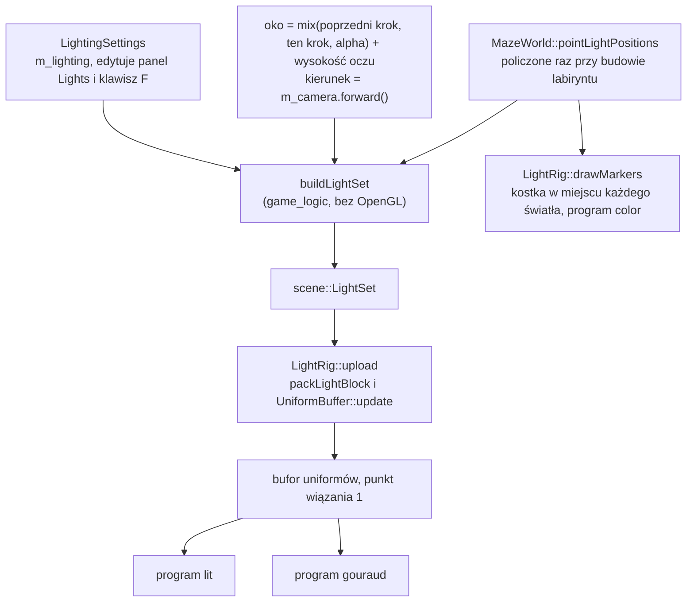

# Moduł game: latarka i światła gry

Kamień milowy: M4 (część "oświetlenie"). Tematy wykładu w użyciu: 6 (światła) i 7 (tryb cieniowania).
Kod: [`src/game/Lighting.hpp`](../../../src/game/Lighting.hpp), [`src/game/Lighting.cpp`](../../../src/game/Lighting.cpp), [`src/game/LightRig.hpp`](../../../src/game/LightRig.hpp), [`src/game/LightRig.cpp`](../../../src/game/LightRig.cpp), użycie w [`src/game/NightMazeApp.cpp`](../../../src/game/NightMazeApp.cpp) i [`src/game/MazeWorld.cpp`](../../../src/game/MazeWorld.cpp), testy [`tests/LightingTests.cpp`](../../../tests/LightingTests.cpp).

Część modułu `game`. Wstęp do modułu jest w [`README.md`](README.md). Ten dokument jest **o tym, jakie światła ma gra i jak co klatkę trafiają na kartę**. Teoria świateł i wzory są w [`../scene/lights.md`](../scene/lights.md), cieniowanie Gourauda i Phonga w [`../renderer/lighting-gouraud-phong.md`](../renderer/lighting-gouraud-phong.md), a układ bajtów bloku uniformów w [`../gfx/uniform-buffers.md`](../gfx/uniform-buffers.md). Przydają się też [`player.md`](player.md) (oko gracza, stały krok i interpolacja) i [`maze-generator.md`](maze-generator.md) (siatka komórek i ściany).

**Stan na dziś:** gra ma trzy źródła światła: księżyc, latarkę gracza i światła punktowe w ślepych zaułkach labiryntu. Latarka jest włączona od startu, klawisz F ją przełącza. Zmierzone na Windowsie 2026-10-05 (MSVC 19.44, RTX 4070 Ti SUPER, sterownik NVIDII 610.74): build Debug i Release bez ostrzeżeń, 149 przypadków testowych i 61240 asercji w obu konfiguracjach (w tym 16 przypadków tego dokumentu), start gry bez linii `[error]` i `GL_`. Na zrzutach ekranu sprawdzone: widok startowy z plamą latarki w środku ekranu, latarka wyłączona, ślepy zaułek ze swoim światłem i kostką. **Klawisza F nikt jeszcze nie nacisnął ręcznie.** To, że stożek zostaje w środku ekranu podczas ruchu, wynika z kodu (sekcja 2.2) i nie było oglądane. **Na macOS ten kod nie był ani budowany, ani uruchamiany.**

Czego nie ma: **baterii** latarki (PRD ją przewiduje, dojdzie w M5 razem z rozgrywką), **kryształów** (ich miejsce zajmują dziś światła w zaułkach: notatka [`../../decisions/dead-end-lights.md`](../../decisions/dead-end-lights.md)), tekstury "cookie" latarki z PRD i **cieni** (M7).

## 1. Po co to jest

`scene::LightSet` ([`../scene/lights.md`](../scene/lights.md), sekcja 5.2) opisuje światła jednej klatki, ale nie mówi, skąd je wziąć. To jest praca tego modułu:

| Pytanie | Odpowiedź w kodzie |
|---|---|
| jakie światła ma gra i z jakimi ustawieniami | struktura `game::LightingSettings` |
| gdzie stoją światła punktowe | `game::isDeadEnd`, `game::deadEndLightPositions`, pole `MazeWorld::pointLightPositions` |
| gdzie jest latarka w tej klatce | oko i kierunek patrzenia z `NightMazeApp::onRender` |
| jak z tego powstaje `LightSet` | `game::buildLightSet` |
| jak `LightSet` trafia na kartę i co widać w miejscu światła | klasa `game::LightRig` |
| jak gracz włącza latarkę | klawisz F w `onRender`, pole wyboru w panelu Lights |

Kod jest podzielony tak samo jak reszta modułu `game` ([`README.md`](README.md)):

| Plik | Biblioteka | Potrzebuje OpenGL | Testy |
|---|---|---|---|
| `Lighting.hpp`, `Lighting.cpp` | `game_logic` | nie: same dane i matematyka | 16 przypadków |
| `LightRig.hpp`, `LightRig.cpp` | program `night_maze` | tak: bufor uniformów i siatka | brak |



## 2. Teoria

### 2.1 Latarka to reflektor przyczepiony do kamery

Latarka jest światłem typu reflektor ([`../scene/lights.md`](../scene/lights.md), sekcje 2.1 i 2.6). Od zwykłego reflektora różni ją jedno: **nie ma własnej pozycji ani kierunku**. W każdej klatce dostaje pozycję oka i kierunek patrzenia kamery. Gracz "trzyma ją przy oku".

Skutki tego wyboru:

- Plama światła jest zawsze w środku ekranu, a oś stożka pokrywa się z osią patrzenia.
- Kierunek do światła i kierunek do oka to dla latarki ten sam wektor. Upraszcza to wzory odbłysku i tłumaczy, dlaczego tryby `Phong` i `Blinn-Phong` różnią się mało wzdłuż korytarza ([`../renderer/lighting-gouraud-phong.md`](../renderer/lighting-gouraud-phong.md), sekcja 2.6).
- Gracz nigdy nie widzi własnego cienia ani boku stożka. Stożek widać tylko jako koło na tym, na co pada.

Prawdziwą latarkę trzyma się w ręce, niżej i z boku. Przesunięcie jej względem oka dałoby ładniejszy obraz (widać by było, że plama nie jest dokładnie w środku), ale wymagałoby decyzji, gdzie jest ręka. Na dziś latarka jest w oku.

### 2.2 Dlaczego latarka powstaje w `onRender`, a nie w `onUpdate`

Gra ma dwa zegary ([`../core/main-loop.md`](../core/main-loop.md)): symulacja idzie stałym krokiem (`onUpdate`, 120 razy na sekundę), a obraz jest rysowany tak często, jak pozwala karta (`onRender`). Klatka wypada **między** dwoma krokami, więc `onRender` nie rysuje z pozycji gracza po ostatnim kroku, tylko z punktu pośredniego:

```text
oko = mix(pozycja przed ostatnim krokiem, pozycja po nim, alpha) + wysokość oczu
```

Macierz widoku jest budowana z tego oka ([`player.md`](player.md), sekcja o interpolacji). Obrót kamery myszą też jest robiony w `onRender`, raz na klatkę.

Latarka ma być dokładnie tam, skąd robiony jest obraz. Musi więc dostać **to samo oko i ten sam kierunek, z których powstała macierz widoku tej klatki**. Gdyby powstawała w `onUpdate` z `m_camera.position` (pozycja po ostatnim kroku):

- przy ruchu byłaby przesunięta względem oka o ułamek kroku: do 2,5 cm przy chodzeniu (3 m/s razy 1/120 s) i do 4,6 cm przy sprincie. Na dalekiej ścianie tego nie widać, ale na ścianie tuż przed nosem plama drgałaby względem środka ekranu, inaczej w każdej klatce, bo `alpha` jest w każdej klatce inne;
- przy obrocie myszą spóźniałaby się o klatkę: `onUpdate` biegnie przed obrotem kamery w `onRender`.

Dlatego cały zestaw świateł jest budowany w `onRender`, po obrocie kamery i po policzeniu oka. Uczciwie: tego, że stożek stoi w środku ekranu podczas ruchu, **nie oglądałem**. Wynika to z tego, że `buildLightSet` i `viewMatrix` dostają tę samą zmienną `eye` (sekcja 5.6).

### 2.3 Ślepe zaułki jako miejsca świateł

**Ślepy zaułek** (dead end) to komórka labiryntu ze ścianą z dokładnie trzech stron: jedno wejście, żadnego dalszego przejścia.

```text
   +--+--+--+--+
   |S |        |      S: komórka startowa (0, 0). Jest ślepym zaułkiem,
   +  +  +--+  +         ale światła nie dostaje.
   |  |     |* |
   +  +--+  +--+      *: ślepe zaułki (3, 1) i (0, 3): tu wiszą światła.
   |     |     |
   +--+  +--+  +
   |*          |
   +--+--+--+--+
```

To labirynt wzorcowy 4 na 4 z ziarna 1, ten sam, którego używają testy generatora ([`maze-generator.md`](maze-generator.md)).

Reguły wyboru:

| Reguła | Dlaczego |
|---|---|
| światło wisi w **każdym** ślepym zaułku | labirynt doskonały ma ich dużo i są rozrzucone po całej planszy, więc światła też. Zaułek jest miejscem, do którego gracz wchodzi i musi zawrócić: światło widoczne z daleka mówi "tu coś jest" |
| **komórka startowa jest pomijana** | gracz stoi tam z latarką. Światło punktowe tuż nad głową zalewałoby pierwszą klatkę i zasłaniało działanie latarki |
| kolejność **wierszami**: rząd po rzędzie, w rzędzie komórka po komórce | kolejność musi być stała, bo z niej wynika wybór przy nadmiarze i kolejność w tablicy shadera |
| najwyżej **16** świateł | tyle ma tablica `uPoints` w shaderze (`scene::MAX_POINT_LIGHTS`) |
| przy nadmiarze wybór **równomierny**: numer `i` wyniku to zaułek numer `i * liczba / 16` | pierwsze 16 z listy leżałoby w górnych rzędach, a dół labiryntu byłby ciemny |
| **nic nie jest losowe** | ten sam labirynt ma zawsze te same światła, na każdym systemie |

**Wybór równomierny na liczbach.** Dla 40 zaułków i 16 miejsc `i * 40 / 16` (dzielenie całkowite, zaokrągla w dół) daje kolejno 0, 2, 5, 7, 10, 12, 15, 17, 20, 22, 25, 27, 30, 32, 35, 37. Krok wynosi 2,5, więc numery się nie powtarzają (krok jest większy od 1) i sięgają prawie do końca listy.

Labirynt startowy (10 na 10, ziarno 1) ma **11** świateł: mieści się w limicie, więc wybór równomierny w nim nie działa. Liczbę przypina test i pokazuje ją panel Lights.

Światło wisi **1,4 m nad środkiem komórki** (`POINT_LIGHT_HEIGHT`): poniżej oczu gracza (1,7 m) i mniej więcej w połowie wysokości ściany (3 m), więc oświetla i podłogę, i ściany zaułka.

### 2.4 Światła kryształów, których jeszcze nie ma

PRD przewiduje, że światłami punktowymi labiryntu będą **kryształy**, które gracz zbiera ("tłumienie dobrane tak, żeby oświetlały ok. 1,5 komórki labiryntu"). Kryształy to M5. Żeby temat 6 dało się pokazać już teraz, w ich miejscu stoją światła w zaułkach z tymi samymi parametrami: kolor turkusowy, promień 3 m, czyli półtorej komórki. Każde jest oznaczone małą świecącą kostką. Decyzję, jej koszt i warunki powrotu opisuje notatka [`../../decisions/dead-end-lights.md`](../../decisions/dead-end-lights.md).

### 2.5 Kostka w miejscu światła

Światło nie jest rzeczą, którą widać: widać tylko to, na co świeci. Sam turkusowy blask na ścianach zaułka nie mówi, gdzie jest źródło. Dlatego w miejscu każdego światła punktowego rysowana jest mała kostka (bok 0,14 m) w kolorze światła, **bez oświetlenia**: programem `color`, który maluje wszystko jednym kolorem. Kostka "świeci w ciemności", bo jej kolor nie zależy od żadnego światła.

To typowy chwyt z rozdziałów o oświetleniu: źródło światła jako osobny obiekt rysowany innym, prostszym shaderem.

## 3. Jak to działa w OpenGL

`Lighting.hpp` i `Lighting.cpp` nie dołączają GLAD i nie wołają żadnej funkcji `gl*`. OpenGL jest tylko w `LightRig`:

| Funkcja | Wywołania OpenGL (przez klasy `gfx`) | Kiedy |
|---|---|---|
| konstruktor `LightRig` | `glGenBuffers`, `glBindBuffer(GL_UNIFORM_BUFFER)`, `glBufferData` (928 bajtów, bez danych: zawartość jest nieokreślona do pierwszego `upload`), `glBindBufferBase(GL_UNIFORM_BUFFER, 1, ...)`. Potem siatka kostki: VAO, bufor wierzchołków i bufor indeksów | raz, przy starcie |
| `connect(shader)` | `glGetUniformBlockIndex`, `glUniformBlockBinding`, `glGetActiveUniformBlockiv` | raz na program (`lit`, `gouraud`), a potem po każdym przeładowaniu, już bez udziału `LightRig` |
| `upload(lights, eye)` | `glBindBuffer(GL_UNIFORM_BUFFER)`, `glBufferSubData` (928 bajtów) | raz na klatkę |
| `drawMarkers(...)` | `glUniform3fv` dla `uColor` raz, a dla każdej kostki `glUniformMatrix4fv` dla `uModel`, `glBindVertexArray`, `glDrawElements(GL_TRIANGLES, 36, ...)` | raz na klatkę, gdy tryb jest inny niż `Unlit`: 11 kostek w labiryncie startowym |

Każde wywołanie jest opakowane w `GL_CHECK`. Co robią wywołania bufora uniformów i dlaczego blok trzeba łączyć z punktem wiązania z C++, omawia [`../gfx/uniform-buffers.md`](../gfx/uniform-buffers.md).

**Światła są wysyłane w każdej klatce, także w trybie `Unlit`.** `onRender` nie pyta o tryb przed `buildLightSet` i `upload`. To 928 bajtów na klatkę: koszt jest pomijalny, a kod nie ma jednego rozgałęzienia więcej.

## 4. Shadery

Ten moduł nie ma własnych shaderów. Dotyka dwóch istniejących:

**Latarka w `common/lighting.glsl`.** To gałąź `if (uSpotCone.z > 0.5)` funkcji `computeLighting`: pozycja `uSpotPosition`, oś `uSpotDirection`, stożek `uSpotCone`, tłumienie `uSpotAttenuation`. Kod linia po linii jest w [`../scene/lights.md`](../scene/lights.md), sekcja 4.6. Wszystko, co ten dokument opisuje po stronie C++, kończy się w tych czterech `vec4`.

**Kostki świateł: program `color`.** Para `color.vert` i `color.frag` rysuje wszystko jednym kolorem z uniformu `uColor`. Powstała dla linii pudełek kolizji i jest omówiona w [`../scene/collision.md`](../scene/collision.md), sekcja 4. Kostki świateł używają jej bez zmian: `drawMarkers` ustawia `uColor` na kolor świateł punktowych i `uModel` dla każdej kostki. Shader wierzchołków czyta tylko atrybut pozycji, więc kostka nie potrzebuje normalnych ani współrzędnych tekstury.

## 5. Kod w projekcie

### 5.1 Pliki

| Plik | Co zawiera |
|---|---|
| [`src/game/Lighting.hpp`](../../../src/game/Lighting.hpp) | typy `LightingMode` i `SpecularModel`, struktura `LightingSettings`, stała `POINT_LIGHT_HEIGHT`, deklaracje `specularModelOf`, `isDeadEnd`, `deadEndLightPositions`, `buildLightSet` |
| [`src/game/Lighting.cpp`](../../../src/game/Lighting.cpp) | definicje tych czterech funkcji |
| [`src/game/LightRig.hpp`](../../../src/game/LightRig.hpp), [`.cpp`](../../../src/game/LightRig.cpp) | klasa `LightRig`: bufor uniformów świateł i kostka znacznika |
| [`src/game/MazeWorld.hpp`](../../../src/game/MazeWorld.hpp), [`.cpp`](../../../src/game/MazeWorld.cpp) | pole `pointLightPositions`, wypełniane w `buildMazeWorld` |
| [`src/game/NightMazeApp.hpp`](../../../src/game/NightMazeApp.hpp), [`.cpp`](../../../src/game/NightMazeApp.cpp) | pola `m_lighting` i `m_lightRig`, klawisz F, budowanie i wysyłanie świateł co klatkę, `drawLightMarkers` |
| [`src/game/ShaderUniforms.hpp`](../../../src/game/ShaderUniforms.hpp) | `LIGHT_BLOCK_NAME`, `LIGHT_BLOCK_BINDING_POINT`, `COLOR_UNIFORM`, `MODEL_UNIFORM` |
| [`tests/LightingTests.cpp`](../../../tests/LightingTests.cpp) | 16 przypadków testowych (sekcja 5.8) |

### 5.2 `LightingSettings`: wszystko, co da się zmienić w biegu

Typy `LightingMode` i `SpecularModel` oraz funkcję `specularModelOf` z początku pliku omawia [`../renderer/lighting-gouraud-phong.md`](../renderer/lighting-gouraud-phong.md), sekcja 5.2: należą do tematu 7. Tutaj reszta struktury.

```cpp
struct LightingSettings {
    /// How the maze is shaded.
    LightingMode mode = LightingMode::BlinnPhong;

    /// Light that reaches every surface: low, so that corners no light shines into are
    /// dark but not black. A cold blue, like the night sky.
    glm::vec3 ambient{0.035F, 0.045F, 0.075F};
```

Struktura to **same dane z wartościami startowymi**: nie ma funkcji ani stanu ukrytego. Panel Lights dostaje do niej referencję i edytuje pola, gra czyta ją co klatkę. Wartości wpisane w strukturze są sceną nocną, w której gra startuje.

| Pole | Wartość startowa | Znaczenie |
|---|---|---|
| `mode` | `BlinnPhong` | tryb cieniowania (lista `Lighting` w panelu Renderer) |
| `ambient` | `(0,035, 0,045, 0,075)` | światło otoczenia: słabe, zimne, niebieskawe. Kąty bez światła są ciemne, ale nie czarne |

```cpp
    float moonYawDegrees = 25.0F;
    float moonPitchDegrees = -50.0F;
    /// A cool, dim blue-white.
    glm::vec3 moonColor{0.55F, 0.65F, 1.0F};
    float moonIntensity = 0.3F;
```

| Pole | Wartość startowa | Znaczenie |
|---|---|---|
| `moonYawDegrees`, `moonPitchDegrees` | 25 i -50 stopni | kierunek, w którym światło księżyca **leci**, jako dwa kąty w konwencji kamery (`scene::directionFromAngles`). Pitch ujemny: w dół. Yaw celowo nie jest wielokrotnością 45 stopni: ściany patrzą w cztery strony i każda dostaje inną część światła ([`../scene/lights.md`](../scene/lights.md), tabela w sekcji 2.3) |
| `moonColor`, `moonIntensity` | zimny niebieskawy, 0,3 | księżyc jest słaby: ma dać kształt ścianom, a nie oświetlić labirynt |

Komentarz w pliku mówi wprost: cieni nie ma do M7, więc księżyc oświetla także ściany i podłogę stojące w cieniu innej ściany.

```cpp
    /// The flashlight, a spot light at the eye of the player. Key F switches it.
    bool flashlightOn = true;
    /// A warm white.
    glm::vec3 flashlightColor{1.0F, 0.9F, 0.72F};
    float flashlightIntensity = 1.6F;
    /// Half angles of the cone in degrees, see scene::SpotLight.
    float flashlightInnerDegrees = 13.0F;
    float flashlightOuterDegrees = 21.0F;
    /// How far the flashlight reaches, in metres (scene::attenuationForRadius).
    float flashlightRange = 16.0F;
```

| Pole | Wartość startowa | Znaczenie |
|---|---|---|
| `flashlightOn` | `true` | latarka świeci od startu. Przełącza ją klawisz F i pole wyboru w panelu |
| `flashlightColor` | ciepła biel `(1, 0,9, 0,72)` | kontrast z zimnym księżycem i turkusowymi światłami: trzy światła da się odróżnić po kolorze |
| `flashlightIntensity` | 1,6 | powyżej 1: środek plamy na jasnej ścianie blisko gracza jest lekko prześwietlony |
| `flashlightInnerDegrees`, `flashlightOuterDegrees` | 13 i 21 stopni | połówki kąta stożka. Między nimi 8 stopni miękkiego brzegu |
| `flashlightRange` | 16 m | zasięg: w tej odległości zostaje 5 procent jasności. 16 m to osiem komórek |

Pozycji i kierunku latarki **nie ma** w ustawieniach: nie są ustawieniem, tylko wynikiem tego, gdzie stoi i dokąd patrzy gracz.

```cpp
    glm::vec3 pointColor{0.2F, 0.9F, 0.8F};
    float pointIntensity = 2.0F;
    /// How far one of them reaches, in metres: one and a half cells.
    float pointRadius = 3.0F;

    float specularStrength = 0.25F;
    float shininess = 32.0F;
};
```

| Pole | Wartość startowa | Znaczenie |
|---|---|---|
| `pointColor`, `pointIntensity`, `pointRadius` | turkus, 2,0, 3 m | **wspólne dla wszystkich** świateł punktowych. Różni je tylko miejsce. Promień 3 m to półtorej komórki |
| `specularStrength` | 0,25 | siła odbłysku. Kamień jest szorstki, więc odbłysk jest słaby |
| `shininess` | 32 | wykładnik odbłysku |

Dwa ostatnie pola nie trafiają do `LightSet`: opisują materiał, a nie światło. `NightMazeApp::drawLitMaze` wysyła je jako zwykłe uniformy.

### 5.3 `isDeadEnd`

```cpp
constexpr int DEAD_END_WALL_COUNT = 3;
```

```cpp
bool isDeadEnd(const Maze& maze, int x, int z) {
    int wallCount = 0;
    for (const Direction side : ALL_DIRECTIONS) {
        if (maze.hasWall(x, z, side)) {
            ++wallCount;
        }
    }
    return wallCount == DEAD_END_WALL_COUNT;
}
```

| Linia | Znaczenie |
|---|---|
| `for (const Direction side : ALL_DIRECTIONS)` | cztery strony komórki: North, East, South, West ([`maze-generator.md`](maze-generator.md)) |
| `maze.hasWall(x, z, side)` | czy komórka ma ścianę z tej strony. Rzuca `std::out_of_range` dla komórki spoza labiryntu, więc `isDeadEnd` też |
| `return wallCount == DEAD_END_WALL_COUNT;` | **dokładnie** trzy. Cztery ściany (komórka zamknięta ze wszystkich stron, na przykład świeżo utworzony labirynt albo labirynt 1 na 1) to nie zaułek: nie ma do niego wejścia |

### 5.4 `deadEndLightPositions`

```cpp
std::vector<glm::vec3> deadEndLightPositions(const Maze& maze, int skipColumn, int skipRow) {
    // Every dead end, row after row.
    std::vector<glm::vec3> deadEnds;
    for (int z = 0; z < maze.height(); ++z) {
        for (int x = 0; x < maze.width(); ++x) {
            const bool skipped = x == skipColumn && z == skipRow;
            if (!skipped && isDeadEnd(maze, x, z)) {
                deadEnds.push_back(cellCenter(x, z) + glm::vec3{0.0F, POINT_LIGHT_HEIGHT, 0.0F});
            }
        }
    }

    const auto maximum = static_cast<std::size_t>(scene::MAX_POINT_LIGHTS);
    if (deadEnds.size() <= maximum) {
        return deadEnds;
    }

    // Too many: keep maximum of them, spread evenly over the list. With 40 dead ends
    // and 16 lights, i * 40 / 16 gives 0, 2, 5, 7, 10 and so on: whole number division
    // rounds down, and the numbers never repeat because the step is larger than 1.
    std::vector<glm::vec3> chosen;
    chosen.reserve(maximum);
    for (std::size_t i = 0; i < maximum; ++i) {
        chosen.push_back(deadEnds[i * deadEnds.size() / maximum]);
    }
    return chosen;
}
```

| Linia | Znaczenie |
|---|---|
| pętla zewnętrzna po `z`, wewnętrzna po `x` | kolejność wierszami: najpierw cały rząd 0, potem rząd 1. Stąd w labiryncie wzorcowym zaułek `(3, 1)` jest przed `(0, 3)` |
| `const bool skipped = x == skipColumn && z == skipRow;` | komórka do pominięcia. Jest parametrem, a nie stałą: funkcja nie musi wiedzieć, która komórka jest startem. Testy podają `-1, -1`, czyli komórkę, której nie ma, żeby nic nie pominąć |
| `cellCenter(x, z) + glm::vec3{0.0F, POINT_LIGHT_HEIGHT, 0.0F}` | środek komórki na podłodze (z `MazeLayout`) podniesiony o 1,4 m. Komórka ma 2 m, więc zaułek `(3, 1)` daje `(7, 1,4, 3)` |
| `if (deadEnds.size() <= maximum) return deadEnds;` | zwykły przypadek: wszystkie zaułki mieszczą się w tablicy shadera |
| `chosen.reserve(maximum);` | jedna alokacja na 16 elementów zamiast kilku przy dopisywaniu |
| `deadEnds[i * deadEnds.size() / maximum]` | wybór równomierny (sekcja 2.3). Wszystko jest typu `std::size_t`, więc dzielenie jest całkowite. Największy indeks to `15 * n / 16`, zawsze mniejszy od `n` |

Funkcja zwraca same pozycje, a nie światła: kolor, intensywność i promień są wspólne i dochodzą dopiero w `buildLightSet`.

**Kto ją woła.** `buildMazeWorld` w `MazeWorld.cpp`, raz przy budowie labiryntu:

```cpp
    // The start cell gets no light of its own: the player stands there with a flashlight.
    world.pointLightPositions = deadEndLightPositions(maze, START_COLUMN, START_ROW);
```

Pozycje świateł są częścią `MazeWorld`, tak jak macierze modelu ścian i pudełka kolizji: liczone raz, czytane co klatkę, wymieniane w całości przy nowym labiryncie ([`maze-rendering.md`](maze-rendering.md)). Po `Regenerate` w panelu Maze światła przenoszą się więc razem z zaułkami bez żadnego dodatkowego kodu.

### 5.5 `buildLightSet`: światła jednej klatki

```cpp
scene::LightSet buildLightSet(const LightingSettings& settings, const glm::vec3& eye,
                              const glm::vec3& viewDirection,
                              std::span<const glm::vec3> pointPositions) {
    scene::LightSet lights;
    lights.ambient = settings.ambient;

    lights.directional = {
        .direction = scene::directionFromAngles(settings.moonYawDegrees, settings.moonPitchDegrees),
        .color = settings.moonColor,
        .intensity = settings.moonIntensity,
    };
```

| Linia | Znaczenie |
|---|---|
| parametry | ustawienia (z panelu), oko i kierunek patrzenia (z kamery tej klatki), pozycje świateł punktowych (z labiryntu). Trzy źródła danych, jedna funkcja, zero stanu: ten sam zestaw argumentów daje zawsze ten sam wynik |
| `std::span<const glm::vec3>` | widok na ciąg pozycji bez kopiowania: przyjmie `std::vector`, tablicę albo pustą listę `{}` (tak wołają ją testy) |
| `lights.directional = {...}` | księżyc: dwa kąty zamienione na wektor ([`../scene/lights.md`](../scene/lights.md), sekcja 5.5), kolor i intensywność przepisane |

```cpp
    // The flashlight is held at the eye and points where the player looks.
    lights.spot = {
        .position = eye,
        .direction = viewDirection,
        .color = settings.flashlightColor,
        .intensity = settings.flashlightIntensity,
        .attenuation = scene::attenuationForRadius(settings.flashlightRange),
        // A cone cannot be wider inside than outside. The panel keeps the two angles in
        // order, this line keeps them in order whoever sets them.
        .innerConeDegrees =
            std::min(settings.flashlightInnerDegrees, settings.flashlightOuterDegrees),
        .outerConeDegrees = settings.flashlightOuterDegrees,
    };
    lights.spotEnabled = settings.flashlightOn;
```

| Linia | Znaczenie |
|---|---|
| `.position = eye`, `.direction = viewDirection` | **cała latarka**: reflektor w oku, wzdłuż kierunku patrzenia |
| `.attenuation = scene::attenuationForRadius(settings.flashlightRange)` | zasięg w metrach zamieniony na trzy współczynniki tłumienia |
| `std::min(inner, outer)` | stożek wewnętrzny nie może być szerszy od zewnętrznego. Panel tego pilnuje widżetem `DragFloatRange2`, ale ustawienia może zmienić także inny kod, więc funkcja pilnuje sama |
| `lights.spotEnabled = settings.flashlightOn;` | przełącznik idzie osobno od ustawień: zgaszona latarka zachowuje kolor, kąty i zasięg |

```cpp
    const scene::Attenuation pointAttenuation = scene::attenuationForRadius(settings.pointRadius);
    const std::size_t pointCount =
        std::min(pointPositions.size(), static_cast<std::size_t>(scene::MAX_POINT_LIGHTS));
    for (std::size_t i = 0; i < pointCount; ++i) {
        lights.points[i] = {
            .position = pointPositions[i],
            .color = settings.pointColor,
            .intensity = settings.pointIntensity,
            .attenuation = pointAttenuation,
        };
    }
    lights.pointCount = static_cast<int>(pointCount);
    return lights;
}
```

| Linia | Znaczenie |
|---|---|
| `pointAttenuation` policzone raz przed pętlą | wszystkie światła punktowe mają ten sam promień, więc te same współczynniki |
| `std::min(pointPositions.size(), ... MAX_POINT_LIGHTS)` | tablica `points` ma 16 miejsc. `deadEndLightPositions` nigdy nie zwraca więcej, ale ta funkcja nie zakłada, skąd pochodzi lista: pozycje ponad limit są ignorowane |
| ciało pętli | każde światło dostaje swoją pozycję i wspólne ustawienia |
| `lights.pointCount = static_cast<int>(pointCount);` | licznik w typie `int`, bo taki typ ma `uPointCount` w shaderze |

### 5.6 Użycie w `NightMazeApp`

**Klawisz F.**

```cpp
// Key that switches the flashlight on and off.
constexpr int FLASHLIGHT_KEY = GLFW_KEY_F;
```

```cpp
    // The flashlight key, read once per frame for the same reason. Like the noclip key
    // it works whether or not the cursor is captured.
    if (input().wasKeyPressed(FLASHLIGHT_KEY)) {
        m_lighting.flashlightOn = !m_lighting.flashlightOn;
    }
```

| Element | Znaczenie |
|---|---|
| `wasKeyPressed` | prawda tylko w klatce, w której klawisz został wciśnięty (zbocze). Trzymanie F nie miga latarką |
| w `onRender`, nie w `onUpdate` | `onUpdate` biegnie zero albo więcej razy na klatkę. W klatce z dwoma krokami latarka przełączyłaby się dwa razy, czyli wcale, a w klatce bez kroku naciśnięcie by przepadło. To ten sam powód co dla klawisza N ([`player.md`](player.md)) |
| brak warunku o przechwyconym kursorze | F działa także przy wolnym kursorze, tak jak N. **Nie działa, gdy klawiaturę ma ImGui** (edytowane pole tekstowe albo aktywny widżet): `core::Input` odpowiada wtedy fałszem na każde pytanie o klawisz ([`../core/input.md`](../core/input.md)) |
| `m_lighting.flashlightOn` | to samo pole, które edytuje pole wyboru `Flashlight on (key F)` w panelu Lights. Klawisz i panel nie mogą się rozjechać, bo stan jest jeden |

**Budowanie i wysyłanie świateł.**

```cpp
    const glm::vec3 feet =
        glm::mix(m_previousPlayerPosition, m_player.position, static_cast<float>(alpha));
    const glm::vec3 eye = feet + glm::vec3{0.0F, Player::EYE_HEIGHT, 0.0F};

    // The two matrices that are the same for everything drawn in this frame.
    const glm::mat4 view = m_camera.viewMatrix(eye);
    const glm::mat4 projection = m_camera.projectionMatrix(aspectRatio);

    // The lights of this frame. They are built here, after the mouse has turned the
    // camera and from the same eye the view matrix uses: the flashlight then sits
    // exactly where the picture is taken from, and its cone stays in the middle of the
    // screen. From m_camera.position (the last fixed step) it would trail behind while
    // the player moves. The copy to the graphics card happens once, and both lit
    // programs read it.
    const scene::LightSet lights =
        buildLightSet(m_lighting, eye, m_camera.forward(), m_mazeWorld.pointLightPositions);
    m_lightRig.upload(lights, eye);

    drawMaze(view, projection);
    // Without lighting there are no lights to mark.
    if (m_lighting.mode != LightingMode::Unlit) {
        drawLightMarkers(view, projection);
    }
```

| Linia | Znaczenie |
|---|---|
| `eye` | interpolowane oko: ta sama zmienna idzie do `viewMatrix`, do `buildLightSet` (pozycja latarki) i do `upload` (pozycja kamery dla odbłysku). To jest gwarancja z sekcji 2.2 |
| `m_camera.forward()` | kierunek patrzenia po obrocie myszą z tej samej klatki (obrót jest wcześniej w `onRender`) |
| `m_mazeWorld.pointLightPositions` | wektor zamienia się sam na `std::span` |
| `m_lightRig.upload(lights, eye);` | jedno kopiowanie na kartę, **przed** rysowaniem. Oba programy oświetlenia czytają ten sam bufor |
| `if (m_lighting.mode != LightingMode::Unlit)` | kostki świateł tylko wtedy, gdy są światła do oznaczenia. Warunek pyta o tryb, a nie o podgląd z panelu Assets: przy podglądzie normalnych kostki zostają |

```cpp
void NightMazeApp::drawLightMarkers(const glm::mat4& view, const glm::mat4& projection) const {
    if (!m_colorShader.isValid()) {
        return;
    }

    m_colorShader.use();
    m_colorShader.setMat4(VIEW_UNIFORM, view);
    m_colorShader.setMat4(PROJECTION_UNIFORM, projection);

    // One small cube in the colour of the point lights at the place of each of them.
    m_lightRig.drawMarkers(m_colorShader, m_mazeWorld.pointLightPositions, m_lighting.pointColor);
}
```

Ten sam schemat co `drawColliderLines`: program `color`, dwie macierze klatki, potem klasa rysująca ustawia resztę. Kostki mają kolor `m_lighting.pointColor`, więc zmiana `Point colour` w panelu zmienia jednocześnie światło i jego znacznik. Intensywność i promień na kostkę nie wpływają.

**Konstruktor.**

```cpp
    // The two lit programs read the lights from the uniform buffer of m_lightRig. Each
    // program is told once: the shader repeats it by itself after a reload.
    m_lightRig.connect(m_litShader);
    m_lightRig.connect(m_gouraudShader);
```

Programy `basic`, `textured` i `color` nie mają bloku `LightBlock` i nie są łączone.

### 5.7 `LightRig`: strona OpenGL

```cpp
class LightRig {
public:
    LightRig();

    void connect(gfx::Shader& shader) const;

    void upload(const scene::LightSet& lights, const glm::vec3& cameraPosition) const;

    void drawMarkers(const gfx::Shader& shader, std::span<const glm::vec3> positions,
                     const glm::vec3& color) const;

private:
    gfx::UniformBuffer m_lightBuffer;
    gfx::Mesh m_markerCube;
};
```

(Komentarze z nagłówka są tu pominięte.) Klasa ma dwa pola, oba są obiektami OpenGL opakowanymi w klasy `gfx`: bufor uniformów i siatkę. Nie ma destruktora ani konstruktorów przenoszących: wystarczą te, które kompilator tworzy z pól. Musi zostać zniszczona przed oknem, jak każdy właściciel obiektów OpenGL, i jest: to pole `NightMazeApp` ([`../core/README.md`](../core/README.md)).

**Kostka znacznika.**

```cpp
constexpr std::array<gfx::Vertex, CORNER_COUNT> MARKER_CORNERS = {
    gfx::Vertex{.position = {-0.5F, -0.5F, -0.5F}}, // 0
    gfx::Vertex{.position = {0.5F, -0.5F, -0.5F}},  // 1
    gfx::Vertex{.position = {0.5F, -0.5F, 0.5F}},   // 2
    gfx::Vertex{.position = {-0.5F, -0.5F, 0.5F}},  // 3
    gfx::Vertex{.position = {-0.5F, 0.5F, -0.5F}},  // 4
    gfx::Vertex{.position = {0.5F, 0.5F, -0.5F}},   // 5
    gfx::Vertex{.position = {0.5F, 0.5F, 0.5F}},    // 6
    gfx::Vertex{.position = {-0.5F, 0.5F, 0.5F}},   // 7
};
```

```cpp
constexpr std::array<std::uint32_t, FACE_COUNT * INDICES_PER_FACE> MARKER_INDICES = {
    0, 1, 2, 2, 3, 0, // bottom
    4, 5, 6, 6, 7, 4, // top
    0, 1, 5, 5, 4, 0, // z = -0.5
    3, 2, 6, 6, 7, 3, // z = +0.5
    0, 3, 7, 7, 4, 0, // x = -0.5
    1, 2, 6, 6, 5, 1, // x = +0.5
};

// Side of a marker cube in metres.
constexpr float MARKER_SIZE = 0.14F;
```

| Element | Znaczenie |
|---|---|
| 8 wierzchołków zamiast 24 | kostka z M1 ma 24 wierzchołki, bo każda ściana ma własny kolor ([`../gfx/indexed-drawing.md`](../gfx/indexed-drawing.md)). Tu kolor jest jeden i normalne nie są potrzebne, więc narożnik może być wspólny dla trzech ścian |
| tylko `.position` | pozostałe pola `gfx::Vertex` (normalna, uv) zostają zerowe. Program `color` ich nie czyta |
| sześcian o boku 1 wokół zera | rozmiar i miejsce nadaje macierz modelu. Środek w zerze: pozycja kostki jest pozycją światła |
| 36 indeksów | 6 ścian, 2 trójkąty na ścianę, 3 indeksy na trójkąt |
| kierunek nawijania dowolny | gra nie usuwa tylnych ścian (w kodzie nie ma `glEnable(GL_CULL_FACE)`), więc kolejność wierzchołków trójkąta nie ma znaczenia |
| `MARKER_SIZE = 0.14F` | 14 cm: widoczna z końca korytarza, a nie zasłania zaułka |

**Konstruktor i `connect`.**

```cpp
LightRig::LightRig()
    : m_lightBuffer(sizeof(scene::LightBlockData), LIGHT_BLOCK_BINDING_POINT),
      m_markerCube(MARKER_CORNERS, MARKER_INDICES) {}

void LightRig::connect(gfx::Shader& shader) const {
    shader.bindUniformBlock(LIGHT_BLOCK_NAME, m_lightBuffer.bindingPoint(),
                            m_lightBuffer.sizeInBytes());
}
```

| Linia | Znaczenie |
|---|---|
| `m_lightBuffer(sizeof(scene::LightBlockData), LIGHT_BLOCK_BINDING_POINT)` | bufor uniformów o rozmiarze struktury (928 bajtów), przypięty do punktu wiązania 1 |
| `m_markerCube(MARKER_CORNERS, MARKER_INDICES)` | siatka kostki wysłana na kartę. Trzeciego parametru nie ma, więc prymityw to domyślne `GL_TRIANGLES` |
| `shader.bindUniformBlock(LIGHT_BLOCK_NAME, ...)` | mówi programowi: blok o nazwie `LightBlock` czytaj z punktu wiązania 1. Trzeci argument to rozmiar w bajtach, który `Shader` porównuje z rozmiarem zgłoszonym przez sterownik |
| `gfx::Shader& shader` bez `const` | `bindUniformBlock` zapamiętuje prośbę w obiekcie `Shader`, żeby powtórzyć ją po przeładowaniu, więc zmienia jego stan |

Utworzenie siatki wiąże jej VAO i bufory. Dlatego `m_lightRig` stoi w `NightMazeApp` **przed** polami kostki z M1, która polega na swoim buforze związanym w chwili wejścia do ciała konstruktora ([`../core/README.md`](../core/README.md)).

**`upload`.**

```cpp
void LightRig::upload(const scene::LightSet& lights, const glm::vec3& cameraPosition) const {
    // The struct has exactly the bytes the block of the shader expects (the asserts in
    // scene/LightBlock.hpp), so it is copied as it is.
    const scene::LightBlockData block = scene::packLightBlock(lights, cameraPosition);
    m_lightBuffer.update(&block, sizeof(block));
}
```

Dwa kroki: `packLightBlock` układa światła w strukturę o układzie bajtów bloku `std140`, a `update` kopiuje te bajty na kartę. Oba są omówione w [`../gfx/uniform-buffers.md`](../gfx/uniform-buffers.md). Funkcja jest `const`: zmienia zawartość bufora na karcie, a nie pola obiektu.

**`drawMarkers`.**

```cpp
void LightRig::drawMarkers(const gfx::Shader& shader, std::span<const glm::vec3> positions,
                           const glm::vec3& color) const {
    shader.setVec3(COLOR_UNIFORM, color);

    for (const glm::vec3& position : positions) {
        // The cube is centred on its origin, so its position is the place of the light.
        scene::Transform transform;
        transform.position = position;
        transform.scale = glm::vec3{MARKER_SIZE};

        shader.setMat4(MODEL_UNIFORM, transform.matrix());
        m_markerCube.draw();
    }
}
```

| Linia | Znaczenie |
|---|---|
| `shader.setVec3(COLOR_UNIFORM, color);` | kolor raz, przed pętlą: jest wspólny. Wołający musiał wcześniej zrobić `use()` i ustawić `uView` i `uProjection` |
| `scene::Transform transform;` | macierz modelu z pozycji i skali ([`../scene/transforms.md`](../scene/transforms.md)). Bez obrotu |
| `transform.scale = glm::vec3{MARKER_SIZE};` | równa skala 0,14 na wszystkich osiach: sześcian o boku 1 staje się kostką 14 cm |
| `shader.setMat4(MODEL_UNIFORM, transform.matrix());` i `m_markerCube.draw();` | jedna siatka, wiele macierzy: ta sama zasada co przy ścianach i pudełkach kolizji. Macierz jest liczona w każdej klatce dla każdej kostki: przy 16 kostkach to bez znaczenia |

Kostka przechodzi test głębi jak każda inna geometria: ściana przed nią ją zasłania. **Światła** ściana nie zasłania (brak cieni), więc bywa, że widać blask na podłodze, a kostki nie.

### 5.8 Jak to zostało sprawdzone

Testy jednostkowe w `tests/LightingTests.cpp`, 16 przypadków:

| Przypadek testowy | Co sprawdza | Wynik |
|---|---|---|
| `a cell is a dead end when it has exactly three walls` | labirynt 2 na 1: wszystkie ściany, potem jedno przejście, potem drugie otwarcie | cztery ściany to nie zaułek. Po jednym przejściu obie komórki są zaułkami. Drugie otwarcie zamienia komórkę w korytarz |
| `golden maze: 4 x 4 cells from seed 1 has lights in its two dead ends` | labirynt wzorcowy z sekcji 2.3 | trzy zaułki razem ze startem, dwa światła: `(7, 1,4, 3)` i `(1, 1,4, 7)`, w tej kolejności. `POINT_LIGHT_HEIGHT` równe 1,4 |
| `without a skipped cell every dead end gets a light` | ten sam labirynt, pominięta komórka `(-1, -1)` | trzy światła, pierwsze nad komórką startową |
| `a maze never gets more point lights than the shader has room for` | labirynt 31 na 20 z ziarna 5 (ma więcej niż 17 zaułków) | dokładnie 16 pozycji, `z` nigdy nie maleje (kolejność wierszami), ostatnia leży w dolnej połowie labiryntu, żadna się nie powtarza |
| `the same maze always gets the same lights` | dwa wywołania dla tego samego labiryntu | identyczne listy |
| `a maze world carries the light positions of its maze` | `buildMazeWorld(4, 4, 1)` | pole `pointLightPositions` ma te same dwie pozycje, nad startem nie ma żadnej |
| `the default maze has this many point lights` | labirynt startowy 10 na 10, ziarno 1 | 11 |
| `the lighting starts as a night scene shaded with Blinn-Phong` | domyślne `LightingSettings` | tryb `BlinnPhong`, latarka włączona, kąt wewnętrzny mniejszy od zewnętrznego, promień 3, księżyc świeci w dół |
| `the numbers of the lighting modes are the entries of the list in the panel` | wartości `LightingMode` | 0, 1, 2, 3 |
| `Gouraud and Phong use the Phong highlight, Blinn-Phong its own` | `specularModelOf` i wartości `SpecularModel` | Phong, Phong, BlinnPhong. Liczby 0 i 1 |
| `buildLightSet takes the ambient light and the moon from the settings` | yaw 90, pitch -90 | kierunek `(0, -1, 0)`, kolor i intensywność przepisane, zero świateł punktowych |
| `the flashlight sits at the eye and points where the camera looks` | oko `(3, 1,7, 5)`, kierunek `(1, 0, 0)`, zasięg 10 | pozycja i kierunek reflektora równe podanym, 5 procent jasności w 10 m |
| `switching the flashlight off keeps its settings` | `flashlightOn = false` | `spotEnabled` fałszywe, intensywność bez zmian |
| `the inner cone of the flashlight is never wider than the outer cone` | kąty 40 i 15 | oba wychodzą 15 |
| `every point light gets the shared colour, intensity and radius` | dwie pozycje, promień 4 | oba światła mają wspólny kolor i intensywność, 5 procent jasności w 4 m |
| `buildLightSet ignores positions past the largest number of point lights` | 20 pozycji | `pointCount` równe 16 |

Wyniki na Windowsie (MSVC 19.44, 2026-10-05): wszystkie 16 przypadków przechodzi w Debug i Release, w ramach 149 przypadków i 61240 asercji całego programu testowego.

**Czego testy nie sprawdzają.** Wszystkiego, co jest w `NightMazeApp` i `LightRig`: klawisza F, tego, że `buildLightSet` dostaje interpolowane oko, kolejności `upload` przed rysowaniem, kostek znaczników. Ten kod wymaga okna. Obraz jest sprawdzony na zrzutach ekranu z Windowsa (lista w nagłówku dokumentu), a klawisz F i ruch z latarką są otwartymi pozycjami listy kontrolnej w [`../../guides/build-windows.md`](../../guides/build-windows.md).

## 6. Panel ImGui

Latarka nie ma własnego panelu. PRD nie przewiduje go: kąty latarki są w opisie panelu **Lights**. Kod panelu i wszystkie jego kontrolki omawia [`../scene/lights.md`](../scene/lights.md), sekcja 6. Tu to, co dotyczy świateł gry:

| Panel | Kontrolka | Pole | Co widać |
|---|---|---|---|
| Lights, grupa `Flashlight (spot)` | `Flashlight on (key F)` | `flashlightOn` | to samo pole co klawisz F: po naciśnięciu F pole wyboru zmienia stan |
| | `Beam colour`, `Beam intensity` | `flashlightColor`, `flashlightIntensity` | kolor i jasność plamy |
| | `Cone` | `flashlightInnerDegrees`, `flashlightOuterDegrees` | rozmiar plamy i szerokość miękkiego brzegu |
| | `Beam range` | `flashlightRange` | jak daleko w korytarz sięga światło |
| Lights, grupa `Point lights (dead ends)` | tekst `In this maze: 11 (at most 16)` | `world.pointLightPositions.size()` | liczba świateł w aktualnym labiryncie |
| | `Point colour`, `Point intensity`, `Point radius` | `pointColor`, `pointIntensity`, `pointRadius` | wszystkie światła naraz. Kolor zmienia też kostki |
| Maze | `Regenerate`, `Seed`, `Width`, `Height` | `MazeSettings` | nowy labirynt ma inne zaułki: światła i kostki się przenoszą, liczba w panelu Lights się zmienia |
| Maze | plan z góry | odczyt | zaułki na planie to komórki z trzema ścianami: da się je policzyć i porównać z liczbą świateł (bez komórki startowej) |
| Renderer | lista `Lighting` | `mode` | w trybie `Unlit` kostki znikają |
| Camera | `Yaw`, `Pitch` | kamera | latarka idzie za kamerą także wtedy, gdy kąty zmienia suwak, a nie mysz |

### 6.1 Scenariusz pokazu na obronie

**Kroków nikt jeszcze nie wykonał ręcznie.** Wynikają z kodu i testów. Na zrzutach ekranu z Windowsa widać stan z kroków 1 i 2 oraz zaułek z kroku 4.

1. **Latarka w oku.** Start gry. Plama jest w środku ekranu. Obracam myszą: plama zostaje w środku, przesuwa się po ścianach. Mówię: reflektor dostaje co klatkę oko i kierunek kamery, te same, z których powstaje macierz widoku.
2. **Klawisz F.** Naciskam F: latarka gaśnie, zostaje księżyc i turkusowe światła. Pokazuję, że pole `Flashlight on (key F)` w panelu Lights się odznaczyło. Naciskam jeszcze raz.
3. **Ruch.** Idę i przesuwam się w bok blisko ściany, patrząc na plamę. Ma stać w środku ekranu bez drgania. Mówię o dwóch zegarach i o tym, dlaczego światła powstają w `onRender`.
4. **Zaułki.** Naciskam N (noclip), wzlatuję nad labirynt i patrzę w dół. Liczę turkusowe kostki: 11. Porównuję z planem w panelu Maze i z linią `In this maze: 11 (at most 16)`. Pokazuję, że nad komórką startową kostki nie ma.
5. **Nowy labirynt.** W panelu Maze zmieniam `Seed` i naciskam `Regenerate`. Kostki są w innych miejscach, liczba w panelu Lights się zmienia. Mówię: pozycje są częścią `MazeWorld` i wymieniają się razem z nim.
6. **Limit 16.** Ustawiam `Width` i `Height` na 30 i `Regenerate`. Panel pokazuje `In this maze: 16 (at most 16)`. Z góry widać, że kostki są rozłożone po całym labiryncie, a nie tylko w górnych rzędach. Mówię o wyborze `i * liczba / 16`.
7. **Testy.** `ctest --test-dir build/debug -C Debug --output-on-failure`. Mówię, że pozycje świateł labiryntu wzorcowego i liczba 11 są przypięte testami.

## 7. Pułapki

1. **Latarka z pozycji symulacji.** `buildLightSet(m_lighting, m_camera.position, ...)` zamiast `eye` kompiluje się i wygląda dobrze, gdy gracz stoi. Przy ruchu plama drga względem środka ekranu. `m_camera.position` to pozycja po ostatnim kroku, a klatka jest rysowana z punktu między krokami.
2. **Klawisz czytany w `onUpdate`.** `wasKeyPressed` opisuje klatkę, a `onUpdate` biegnie zero albo kilka razy na klatkę. Latarka przełączałaby się losowo: czasem wcale, czasem dwa razy.
3. **F przy aktywnym polu panelu.** Gdy w panelu edytowane jest pole (na przykład `Seed`), `core::Input` blokuje klawiaturę dla gry i F nie przełącza latarki. To celowe: inaczej wpisanie litery w pole tekstowe sterowałoby grą.
4. **`upload` po rysowaniu.** Bufor wypełniony po `drawMaze` daje światła z poprzedniej klatki: latarka spóźnia się o klatkę przy obrocie. Kolejność w `onRender` jest: zbuduj, wyślij, rysuj.
5. **Zapomniane `connect`.** Program oświetlenia, którego bloku nie połączono z punktem wiązania 1, zostaje przy punkcie 0, do którego nie jest przypięty żaden bufor. Specyfikacja OpenGL mówi, że wynik jest wtedy niezdefiniowany ([`../gfx/uniform-buffers.md`](../gfx/uniform-buffers.md), pułapki). Nowy program oświetlenia wymaga jednej linii `m_lightRig.connect(...)` w konstruktorze.
6. **Komórka startowa ze światłem.** Wywołanie `deadEndLightPositions(maze, -1, -1)` w `buildMazeWorld` dałoby światło punktowe 30 cm pod oczami gracza na starcie: pierwsza klatka byłaby zalana turkusem.
7. **Zmiana kolejności przeglądania komórek.** Zamiana pętli (najpierw `x`, potem `z`) nie psuje obrazu, ale zmienia kolejność świateł i wybór przy nadmiarze. Trzy testy przestają przechodzić. Kolejność wierszami jest częścią umowy.
8. **Więcej niż 16 zaułków.** Część zaułków jest ciemna i nie ma kostki. To limit tablicy w shaderze, a nie błąd wyboru. Panel pokazuje `In this maze: 16 (at most 16)`.
9. **Labirynt bez zaułków poza startem.** Labirynt 1 na 1 ma cztery ściany i zero zaułków, a 2 na 1 ma dwa zaułki, z których jeden to start. Lista bywa pusta albo jednoelementowa i kod to obsługuje: pętle po prostu nie wykonują się.
10. **Kostka to nie światło.** Zasłonięta kostka nie znaczy zasłoniętego światła: blask przechodzi przez ściany, bo cieni nie ma. I odwrotnie: kostka nie świeci na nic, jest tylko pomalowana.
11. **Kostki w trybie `Unlit` i w podglądach.** W `Unlit` kostek nie ma. W podglądzie normalnych albo UV (panel Assets) przy trybie innym niż `Unlit` kostki są, chociaż labirynt jest rysowany bez światła.
12. **Prześwietlona ściana przed nosem.** Tłumienie w odległości bliskiej zera wynosi 1, a intensywność latarki to 1,6: ściana tuż przed graczem jest obcinana do bieli. To skutek braku HDR, nie błąd.
13. **Latarka nie ma baterii.** PRD opisuje baterię jako element rozgrywki. Dziś latarka świeci bez końca. Kto czyta PRD i szuka w kodzie pola baterii, nie znajdzie go: to M5.
14. **macOS, niesprawdzone.** Nic z tego nie było uruchamiane na Macu. Klawisz F idzie przez GLFW tak samo jak N, więc różnic nie oczekuję, ale to przewidywanie, nie pomiar.

## 8. Ćwiczenia

Po ćwiczeniu, które zmienia kod, wycofaj zmianę (`git checkout src`).

1. **Zaułki na kartce.** Narysuj labirynt 3 na 3 z jednym długim korytarzem w kształcie węża (bez rozgałęzień). Ile ma ślepych zaułków? Ile świateł dostanie, gdy start jest w jednym z końców? (Odpowiedź: 2 i 1.)
2. **Wybór równomierny na kartce.** Labirynt ma 20 zaułków poza startem. Wypisz numery 16 wybranych. Których czterech brakuje? (Odpowiedź: wybrane 0, 1, 2, 3, 5, 6, 7, 8, 10, 11, 12, 13, 15, 16, 17, 18. Brakuje 4, 9, 14, 19.)
3. **Pozycja na kartce.** Zaułek to komórka `(5, 2)`. Gdzie wisi jego światło? (Odpowiedź: `(11, 1,4, 5)`.)
4. **Latarka z opóźnieniem.** W `onRender` zamień `eye` na `m_camera.position` w wywołaniu `buildLightSet` (tylko tam). Zbuduj, podejdź do ściany na pół metra i przesuwaj się w bok ze sprintem. Co robi plama? Wycofaj.
5. **Klawisz w złym miejscu.** Przenieś blok z `FLASHLIGHT_KEY` do `onUpdate`. Naciśnij F kilkanaście razy. Ile razy latarka się przełączyła? Wycofaj.
6. **Światło nad startem.** W `buildMazeWorld` zamień argumenty `START_COLUMN, START_ROW` na `-1, -1`. Co widać w pierwszej klatce i który test przestał przechodzić? Wycofaj.
7. **Latarka w ręce.** W `buildLightSet` przesuń pozycję reflektora: `.position = eye + glm::vec3{0.0F, -0.3F, 0.0F}`. Podejdź blisko do ściany. Gdzie jest teraz plama względem środka ekranu i dlaczego jej przesunięcie zależy od odległości? Wycofaj.
8. **Większa kostka.** Zmień `MARKER_SIZE` na `0.5F`. Wejdź do zaułka i stań pod kostką. Czy ściany kostki są oświetlone przez latarkę? Dlaczego nie?
9. **Kostki zawsze.** Usuń warunek `if (m_lighting.mode != LightingMode::Unlit)`. Przełącz na `Unlit`. Co mówią kostki bez świateł i dlaczego warunek tam jest?
10. **Drugi kolor.** Zmień `buildLightSet` tak, żeby co drugie światło punktowe było czerwone. Ile linii trzeba zmienić i dlaczego kostki nadal są wszystkie turkusowe?

## 9. Pytania kontrolne

1. **Jakie źródła światła ma gra?**
   Księżyc (kierunkowe), latarkę gracza (reflektor) i do 16 świateł punktowych w ślepych zaułkach labiryntu. Do tego stałe światło otoczenia.

2. **Czym latarka różni się od zwykłego reflektora?**
   Nie ma własnej pozycji ani kierunku. Co klatkę dostaje pozycję oka i kierunek patrzenia kamery.

3. **Dlaczego światła są budowane w `onRender`, a nie w `onUpdate`?**
   Klatka jest rysowana z oka interpolowanego między dwoma krokami symulacji, a kamera obraca się w `onRender`. Latarka musi dostać to samo oko i ten sam kierunek co macierz widoku, inaczej plama drgałaby względem środka ekranu.

4. **Skąd pewność, że latarka i macierz widoku używają tego samego oka?**
   Obie dostają tę samą zmienną lokalną `eye` w `onRender`.

5. **Dlaczego klawisz F jest czytany w `onRender`?**
   `wasKeyPressed` jest prawdą przez jedną klatkę. `onUpdate` biegnie zero albo więcej razy na klatkę, więc naciśnięcie mogłoby przepaść albo zadziałać dwa razy.

6. **Kiedy F nie działa?**
   Gdy klawiaturę ma ImGui: `core::Input` odpowiada wtedy fałszem. Przechwycenie kursora nie ma znaczenia.

7. **Co to jest ślepy zaułek w kodzie?**
   Komórka, dla której `hasWall` jest prawdą dla dokładnie trzech z czterech stron.

8. **Dlaczego komórka startowa nie dostaje światła?**
   Gracz stoi tam z latarką. Światło punktowe nad głową zalałoby pierwszą klatkę.

9. **Co się dzieje, gdy zaułków jest więcej niż 16?**
   Zostaje 16 wybranych równomiernie z listy uporządkowanej wierszami: numer `i` wyniku to zaułek `i * liczba / 16`. Dzięki temu światła są w całym labiryncie.

10. **Dlaczego limit wynosi 16?**
    Tyle ma tablica `uPoints` w shaderze i tablica w `scene::LightSet`. Blok uniformów ma stały rozmiar.

11. **Czy wybór świateł jest losowy?**
    Nie. Ten sam labirynt daje zawsze te same światła w tej samej kolejności.

12. **Gdzie są przechowywane pozycje świateł punktowych i kiedy są liczone?**
    W polu `MazeWorld::pointLightPositions`, liczone raz w `buildMazeWorld`. Przy nowym labiryncie cały `MazeWorld` jest wymieniany.

13. **Co robi `buildLightSet`?**
    Zamienia ustawienia, oko, kierunek patrzenia i listę pozycji na `scene::LightSet`: księżyc z dwóch kątów, latarkę w oku, światła punktowe ze wspólnym kolorem, intensywnością i tłumieniem.

14. **Dlaczego `buildLightSet` jest w bibliotece `game_logic`, a `LightRig` w programie?**
    `buildLightSet` to dane i matematyka bez OpenGL, więc da się go testować. `LightRig` posiada bufor uniformów i siatkę, które wymagają kontekstu.

15. **Co robi `LightRig::upload`?**
    Pakuje `LightSet` i pozycję oka do struktury o układzie `std140` i kopiuje jej 928 bajtów do bufora uniformów. Raz na klatkę, przed rysowaniem.

16. **Co robi `LightRig::connect` i ile razy trzeba go wołać?**
    Łączy blok `LightBlock` programu z punktem wiązania bufora. Raz na program: `Shader` sam powtarza połączenie po przeładowaniu.

17. **Po co kostki w miejscach świateł i czym są rysowane?**
    Światła samego nie widać. Kostka pokazuje źródło. Rysuje ją program `color` jednym kolorem, bez oświetlenia, więc wygląda, jakby świeciła.

18. **Dlaczego kostka ma 8 wierzchołków, a kostka z M1 24?**
    Kostka z M1 ma inny kolor na każdej ścianie, więc narożnik musi być osobnym wierzchołkiem dla każdej z trzech ścian. Znacznik ma jeden kolor i nie potrzebuje normalnych.

19. **Czy światła są wysyłane na kartę w trybie `Unlit`?**
    Tak, w każdej klatce. Program `textured` ich nie czyta. Kostek w tym trybie nie ma.

20. **Czego z opisu latarki w PRD jeszcze nie ma?**
    Baterii (M5) i tekstury "cookie". Jest stożek wewnętrzny i zewnętrzny z miękkim brzegiem.

## 10. Źródła

- LearnOpenGL, "Light casters" (<https://learnopengl.com/Lighting/Light-casters>): reflektor i przykład latarki przyczepionej do kamery.
- LearnOpenGL, "Multiple lights" (<https://learnopengl.com/Lighting/Multiple-lights>): wiele świateł punktowych i rysowanie źródła światła jako osobnej kostki prostym shaderem.
- LearnOpenGL, "Advanced GLSL" (<https://learnopengl.com/Advanced-OpenGL/Advanced-GLSL>): bufory uniformów.
- Glenn Fiedler, "Fix Your Timestep!" (<https://gafferongames.com/post/fix_your_timestep/>): stały krok i interpolacja, z której bierze się oko klatki.
- Dokumentacja GLFW, "Input guide" (<https://www.glfw.org/docs/latest/input_guide.html>): klawisze.
- Dokumenty w tym repozytorium: [`../scene/lights.md`](../scene/lights.md) (teoria, struktury świateł, `common/lighting.glsl`, panel Lights), [`../renderer/lighting-gouraud-phong.md`](../renderer/lighting-gouraud-phong.md) (tryby cieniowania), [`../gfx/uniform-buffers.md`](../gfx/uniform-buffers.md) (`packLightBlock`, `UniformBuffer`, `bindUniformBlock`), [`maze-rendering.md`](maze-rendering.md) (`MazeWorld`), [`maze-generator.md`](maze-generator.md) (komórki i ściany), [`player.md`](player.md) (oko, interpolacja, klawisz N), [`../core/main-loop.md`](../core/main-loop.md) (stały krok), [`../core/input.md`](../core/input.md) (`wasKeyPressed`, blokada klawiatury), [`../scene/collision.md`](../scene/collision.md) (shadery `color`), notatka [`../../decisions/dead-end-lights.md`](../../decisions/dead-end-lights.md).
