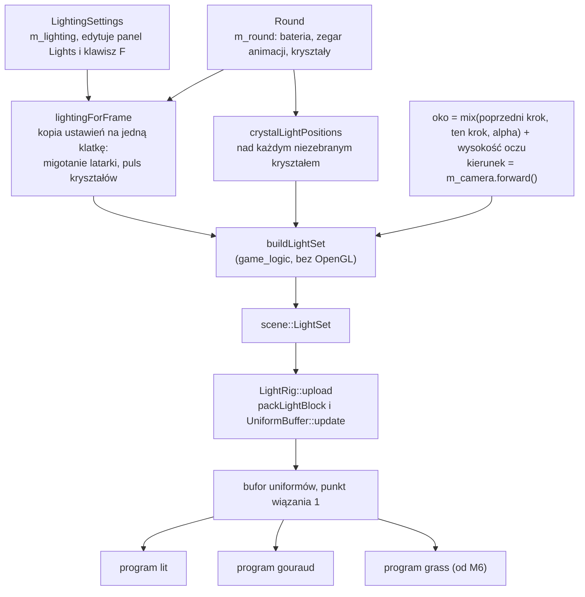

# Moduł game: latarka i światła gry

Kamień milowy: M4 (część "oświetlenie"), rozbudowany w M5 o baterię latarki i światła kryształów. Tematy wykładu w użyciu: 6 (światła) i 7 (tryb cieniowania).
Kod: [`src/game/Lighting.hpp`](../../../src/game/Lighting.hpp), [`src/game/Lighting.cpp`](../../../src/game/Lighting.cpp), [`src/game/LightRig.hpp`](../../../src/game/LightRig.hpp), [`src/game/LightRig.cpp`](../../../src/game/LightRig.cpp), część oświetleniowa [`src/game/Round.hpp`](../../../src/game/Round.hpp), [`src/game/Round.cpp`](../../../src/game/Round.cpp) i [`src/game/Crystals.cpp`](../../../src/game/Crystals.cpp), użycie w [`src/game/NightMazeApp.cpp`](../../../src/game/NightMazeApp.cpp), testy [`tests/LightingTests.cpp`](../../../tests/LightingTests.cpp) i [`tests/RoundTests.cpp`](../../../tests/RoundTests.cpp).

Część modułu `game`. Wstęp do modułu jest w [`README.md`](README.md). Ten dokument jest **o tym, jakie światła ma gra i jak co klatkę trafiają na kartę**. Teoria świateł i wzory są w [`../scene/lights.md`](../scene/lights.md), cieniowanie Gourauda i Phonga w [`../renderer/lighting-gouraud-phong.md`](../renderer/lighting-gouraud-phong.md), a układ bajtów bloku uniformów w [`../gfx/uniform-buffers.md`](../gfx/uniform-buffers.md). Zasady rundy (kryształy, brama, bateria jako część rozgrywki, HUD) opisuje [`gameplay.md`](gameplay.md): tutaj jest z nich tylko to, czego potrzebuje latarka i światła punktowe. Przydają się też [`player.md`](player.md) (oko gracza, stały krok i interpolacja) i [`maze-generator.md`](maze-generator.md) (siatka komórek i ściany).

**Stan na dziś:** gra ma trzy źródła światła: księżyc, latarkę gracza i światła punktowe nad kryształami, których gracz jeszcze nie zebrał. Latarka jest włączona na początku każdej rundy, klawisz F ją przełącza. Od M5 latarka ma **baterię**: bateria ubywa tylko wtedy, gdy latarka świeci, poniżej progu światło migocze, a pusta bateria gasi latarkę do chwili zebrania kryształu.

M5 jest gotowy w kodzie na Windowsie i **nie jest zamknięty**, tak samo M6. Od drugiej części M6 światła z bufora uniformów czyta trzeci program, `grass` (trawa), a pod światłami leży teren zamiast płytek podłogi: ustawień świateł ani ich budowy to nie zmieniło. Zgłoszone dla Windowsa 2026-10-05 po M5: build Debug i Release bez ostrzeżeń, 215 przypadków testowych i 85098 asercji przechodzi w obu konfiguracjach (po drugiej części M6 256 przypadków i 101232 asercje, po pierwszej części M7 zgłoszone 269 i 102103, po drugiej 276 i 102139, po trzeciej 294 i 102412, po czwartej 310 i 103751) (w tym wtedy 10 przypadków z `tests/LightingTests.cpp`, dziś 11, i 25 z `tests/RoundTests.cpp`), obraz był sprawdzony na zrzutach ekranu robionych przez tymczasowe zaczepy w kodzie, które potem usunięto. Otwarte: **nic z M5 ani z M6 nie było budowane ani uruchamiane na macOS** i **nikt jeszcze nie testował ręcznie**: klawisza F przy pustej baterii, migotania widzianego na ekranie, zbierania kryształów, klawisza R, suwaków panelu Gameplay. To, że stożek latarki zostaje w środku ekranu podczas ruchu, wynika z kodu (sekcja 2.2) i nie było oglądane.

Z części M4 zostaje w mocy to, co wtedy sprawdzono na zrzutach ekranu z Windowsa: widok startowy z plamą latarki w środku ekranu i scena ze zgaszoną latarką.

Czego nie ma: stanu przegranej (pusta bateria oznacza tylko ciemność, runda trwa dalej: notatka [`../../decisions/battery-darkness-no-loss.md`](../../decisions/battery-darkness-no-loss.md)), tekstury "cookie" latarki z PRD i **cieni latarki oraz świateł kryształów** (cień latarki jest planowany w dalszej części M7, sekcja 2.1). Cienie rzuca od czwartej części M7 tylko księżyc.

**Czwarta część M7 (cienie księżyca, 2026-10-05)** zmieniła w tym module cztery rzeczy. Księżyc rzuca cienie: jego mapę cieni i całą technikę opisuje [`../renderer/shadows.md`](../renderer/shadows.md). Intensywność startowa księżyca wzrosła z 0,12 do 0,2, żeby miejsce oświetlone księżycem dało się odróżnić od cienia ściany (sekcja 5.2). Doszła funkcja `game::moonDirection`, z której kierunek księżyca biorą i światła klatki, i mapa cieni (sekcja 5.5). Dwa komentarze w `Lighting.hpp` (światło otoczenia i księżyc) mają nową treść. **Latarka i światła kryształów cieni nie rzucają**: ich światło nadal przechodzi przez ściany. Blok uniformów świateł (`LightBlock`, 928 bajtów) się nie zmienił: macierz mapy cieni jedzie do shaderów zwykłymi uniformami, obok swojego samplera ([`../scene/lights.md`](../scene/lights.md)). `tests/LightingTests.cpp` nadal ma 11 przypadków: przypadek o `moonDirection` stoi w `tests/ShadowTests.cpp`. Zgłoszone dla Windowsa, 2026-10-05: bramka `make check` przechodzi, 310 przypadków i 103751 asercji. Na macOS nic z tego nie było budowane ani uruchamiane.

**Pierwsza część M7 (bufor HDR i gamma, 2026-10-05)** zmieniła w tym module trzy rzeczy: `buildLightSet` przelicza cztery kolory ustawień z sRGB na wartości liniowe (sekcja 5.5), wartości startowe świateł zostały dobrane od nowa do potoku HDR (sekcja 5.2), a `tests/LightingTests.cpp` ma jedenasty przypadek (sekcja 5.8). Zgłoszone dla Windowsa: bramka `make check` przechodzi, 269 przypadków i 102103 asercje w Debug i Release, a po drugiej części M7 276 i 102139, po trzeciej 294 i 102412, po czwartej 310 i 103751. Nowego wyglądu sceny nikt nie porównywał jeszcze ręcznie ze starym, a na macOS nic z tego nie było budowane. Teoria: [`../gfx/color-space.md`](../gfx/color-space.md), przebieg składający: [`../renderer/post-process.md`](../renderer/post-process.md).

## 1. Po co to jest

`scene::LightSet` ([`../scene/lights.md`](../scene/lights.md), sekcja 5.2) opisuje światła jednej klatki, ale nie mówi, skąd je wziąć. To jest praca tego modułu:

| Pytanie | Odpowiedź w kodzie |
|---|---|
| jakie światła ma gra i z jakimi ustawieniami | struktura `game::LightingSettings` |
| gdzie wiszą światła punktowe | `game::crystalLightPositions`: nad każdym kryształem rundy, który nie jest jeszcze zebrany |
| gdzie jest latarka w tej klatce | oko i kierunek patrzenia z `NightMazeApp::onRender` |
| co bateria i puls kryształów zmieniają w tej jednej klatce | `game::lightingForFrame`, `game::flashlightFlicker`, `game::crystalPulse` |
| jak z tego powstaje `LightSet` | `game::buildLightSet` |
| jak `LightSet` trafia na kartę | klasa `game::LightRig` |
| jak gracz włącza latarkę i kiedy gra ją gasi | klawisz F w `onRender`, pole wyboru w panelu Lights, `game::updateRound` przy pustej baterii |

Kod jest podzielony tak samo jak reszta modułu `game` ([`README.md`](README.md)):

| Plik | Biblioteka | Potrzebuje OpenGL | Testy |
|---|---|---|---|
| `Lighting.hpp`, `Lighting.cpp` | `game_logic` | nie: same dane i matematyka | 11 przypadków w `tests/LightingTests.cpp` |
| `Round.hpp`, `Round.cpp` (tu: bateria, migotanie, światła klatki) | `game_logic` | nie | 25 przypadków w `tests/RoundTests.cpp`, z czego 11 dotyczy baterii i świateł (sekcja 5.8) |
| `Crystals.hpp`, `Crystals.cpp` (tu: pozycja światła, puls, blask) | `game_logic` | nie | 14 przypadków w `tests/CrystalTests.cpp`, omówione w [`gameplay.md`](gameplay.md) |
| `LightRig.hpp`, `LightRig.cpp` | program `night_maze` | tak: bufor uniformów | brak |



## 2. Teoria

### 2.1 Latarka to reflektor przyczepiony do kamery

Latarka jest światłem typu reflektor ([`../scene/lights.md`](../scene/lights.md), sekcje 2.1 i 2.6). Od zwykłego reflektora różni ją jedno: **nie ma własnej pozycji ani kierunku**. W każdej klatce dostaje pozycję oka i kierunek patrzenia kamery. Gracz "trzyma ją przy oku".

Skutki tego wyboru:

- Plama światła jest zawsze w środku ekranu, a oś stożka pokrywa się z osią patrzenia.
- Kierunek do światła i kierunek do oka to dla latarki ten sam wektor. Upraszcza to wzory odbłysku i tłumaczy, dlaczego tryby `Phong` i `Blinn-Phong` różnią się mało wzdłuż korytarza ([`../renderer/lighting-gouraud-phong.md`](../renderer/lighting-gouraud-phong.md), sekcja 2.6).
- Gracz nigdy nie widzi własnego cienia ani boku stożka. Stożek widać tylko jako koło na tym, na co pada.

Prawdziwą latarkę trzyma się w ręce, niżej i z boku. Przesunięcie jej względem oka dałoby ładniejszy obraz (widać by było, że plama nie jest dokładnie w środku), ale wymagałoby decyzji, gdzie jest ręka. Na dziś latarka jest w oku.

**Planowane (nie ma tego w kodzie).** Decyzja właściciela projektu z 2026-10-05: latarka dostanie własną mapę cieni z rzutem perspektywicznym, a światło przeniesie się z oka do ręki, trochę w prawo i poniżej oka. Powód jest prosty: światło dokładnie w oku nie pokazuje własnych cieni, bo każdy cień chowa się za rzeczą, która go rzuca. Notatka: [`../../decisions/flashlight-in-hand.md`](../../decisions/flashlight-in-hand.md), plan w [`../renderer/shadows.md`](../renderer/shadows.md), sekcja 2.20. **Dziś latarka jest w oku i nie rzuca żadnych cieni**: wszystko w tym dokumencie opisuje ten stan.

### 2.2 Dlaczego latarka powstaje w `onRender`, a nie w `onUpdate`

Gra ma dwa zegary ([`../core/main-loop.md`](../core/main-loop.md)): symulacja idzie stałym krokiem (`onUpdate`, 120 razy na sekundę), a obraz jest rysowany tak często, jak pozwala karta (`onRender`). Klatka wypada **między** dwoma krokami, więc `onRender` nie rysuje z pozycji gracza po ostatnim kroku, tylko z punktu pośredniego:

```text
oko = mix(pozycja przed ostatnim krokiem, pozycja po nim, alpha) + wysokość oczu
```

Macierz widoku jest budowana z tego oka ([`player.md`](player.md), sekcja o interpolacji). Obrót kamery myszą też jest robiony w `onRender`, raz na klatkę.

Latarka ma być dokładnie tam, skąd robiony jest obraz. Musi więc dostać **to samo oko i ten sam kierunek, z których powstała macierz widoku tej klatki**. Gdyby powstawała w `onUpdate` z `m_camera.position` (pozycja po ostatnim kroku):

- przy ruchu byłaby przesunięta względem oka o ułamek kroku: do 2,5 cm przy chodzeniu (3 m/s razy 1/120 s) i do 4,6 cm przy sprincie. Na dalekiej ścianie tego nie widać, ale na ścianie tuż przed nosem plama drgałaby względem środka ekranu, inaczej w każdej klatce, bo `alpha` jest w każdej klatce inne;
- przy obrocie myszą spóźniałaby się o klatkę: `onUpdate` biegnie przed obrotem kamery w `onRender`.

Dlatego cały zestaw świateł jest budowany w `onRender`, po obrocie kamery i po policzeniu oka. Uczciwie: tego, że stożek stoi w środku ekranu podczas ruchu, **nie oglądałem**. Wynika to z tego, że `buildLightSet` i `viewMatrix` dostają tę samą zmienną `eye` (sekcja 5.6).

### 2.3 Bateria: czego latarka potrzebuje od rundy

Od M5 latarka ma baterię. Pełne zasady rundy (ile kryształów, kiedy otwiera się brama, co pokazuje HUD) są w [`gameplay.md`](gameplay.md), sekcja 2. Latarka potrzebuje z nich pięciu rzeczy:

| Reguła | Liczba startowa | Gdzie w kodzie |
|---|---|---|
| ładunek to jedna liczba od 0 (pusta) do 1 (pełna) | 1 na początku rundy | pole `Round::battery` |
| bateria ubywa **tylko wtedy, gdy latarka jest włączona** | pełna bateria wystarcza na 180 s świecenia | `GameplaySettings::batteryLifetimeSeconds`, funkcja `drainBattery` w `Round.cpp` |
| zebrany kryształ oddaje część ładunku | 0,25, czyli 45 s świecenia | `GameplaySettings::batteryPerCrystal`, funkcja `collectCrystals` |
| ładunek nigdy nie wychodzi poza zakres od 0 do 1 | | `std::clamp` w `drainBattery`, `std::min` w `collectCrystals` |
| poniżej progu światło migocze, przy zerze gaśnie | próg 0,2, czyli ostatnie 36 s świecenia | `GameplaySettings::lowBatteryThreshold`, funkcja `flashlightFlicker` |

Bateria ubywa równo: w każdym stałym kroku, w którym latarka świeci, znika `krok / czas życia` ładunku. Krok trwa 1/120 s, więc przy 180 s jeden krok zabiera 1/21600 baterii. Zgaszona latarka nie zużywa nic: kto idzie przy świetle księżyca i kryształów, oszczędza baterię.

**Pusta bateria to tylko ciemność.** Runda trwa dalej, nie ma stanu przegranej (`RoundState` ma dwie wartości: `Playing` i `Won`). Gracz zostaje ze światłem księżyca i kryształów i może dojść do najbliższego kryształu, który odda 0,25 ładunku. Uzasadnienie decyzji: [`../../decisions/battery-darkness-no-loss.md`](../../decisions/battery-darkness-no-loss.md).

Dwie rzeczy łatwo pomylić:

- **Zebranie kryształu nie włącza latarki.** Kryształ ładuje baterię, a przełącznik zostaje tam, gdzie był. Po pustej baterii przełącznik jest wyłączony (sekcja 5.6), więc gracz musi nacisnąć F.
- **Nowa runda włącza latarkę.** `beginRound` ustawia pełną baterię i `flashlightOn = true`, także wtedy, gdy poprzednia runda skończyła się w ciemności albo gracz sam zgasił światło.

### 2.4 Migotanie słabej baterii

Poniżej progu latarka nie gaśnie od razu, tylko zaczyna migotać: co chwilę przygasa, coraz głębiej, im mniej ładunku zostało. To ostrzeżenie widoczne w samym świetle, bez patrzenia na pasek baterii.

Wzór (`flashlightFlicker`) daje **mnożnik jasności** od 0 do 1:

```text
bateria <= 0                  mnożnik = 0
bateria >= próg               mnożnik = 1

słabość  = 1 - bateria / próg                 0 na progu, 1 tuż przed zerem
fala     = sin(23 * t) * sin(7,3 * t)         t: sekundy zegara animacji
przygas  = max(fala, 0)
mnożnik  = 1 - 0,85 * słabość * przygas
```

Co robi każda część:

| Część | Znaczenie |
|---|---|
| `sin(23 * t) * sin(7,3 * t)` | iloczyn dwóch sinusów o prędkościach 23 i 7,3 radiana na sekundę (około 3,7 i 1,2 wahnięcia na sekundę). Każdy sinus jest między -1 a 1, więc iloczyn też. Prędkości nie są swoimi wielokrotnościami, więc fala rośnie i opada w chwilach, które wyglądają na nieregularne |
| `max(fala, 0)` | ujemna połowa fali jest odcięta. Przez mniej więcej połowę czasu przygaszenia nie ma i latarka świeci równo, przez drugą połowę przygasa |
| `słabość` | skala głębokości: na samym progu przygaszenia mają głębokość zero (migotanie zaczyna się niezauważalnie), tuż przed zerem są najgłębsze |
| `0,85` (`FLICKER_DEPTH`) | najgłębsze przygaszenie zabiera 85 procent światła. Dopóki jest jakikolwiek ładunek, mnożnik nie spada więc poniżej 0,15: latarka nigdy nie gaśnie całkiem od samego migotania |

Przykład na liczbach przy progu 0,2: dla baterii 0,1 słabość wynosi 0,5 i najgłębsze przygaszenie daje mnożnik `1 - 0,85 * 0,5 = 0,575`. Dla baterii 0,02 słabość to 0,9 i mnożnik spada do `1 - 0,85 * 0,9 = 0,235`.

**Nic tu nie jest losowe.** Ten sam ładunek i ta sama chwila dają zawsze ten sam mnożnik, więc wzór ma test jednostkowy. Wrażenie nieregularności bierze się z dwóch niewspółmiernych prędkości, a nie z generatora liczb losowych.

**Mnożnik trafia do intensywności, nie do ustawień.** `lightingForFrame` mnoży przez niego `flashlightIntensity` w **kopii** ustawień, zrobionej na jedną klatkę (sekcja 5.3). Suwak `Beam intensity` w panelu Lights pokazuje cały czas wartość ustawioną przez użytkownika.

### 2.5 Światła punktowe nad kryształami

PRD przewiduje, że światłami punktowymi labiryntu są **kryształy**, które gracz zbiera ("tłumienie dobrane tak, żeby oświetlały ok. 1,5 komórki labiryntu"). Od M5 tak jest. W M4 kryształów jeszcze nie było i ich miejsce zajmowały światła w ślepych zaułkach, oznaczone małymi świecącymi kostkami: to rozwiązanie jest zastąpione (historię opisuje notatka [`../../decisions/dead-end-lights.md`](../../decisions/dead-end-lights.md)).

Reguły dzisiejsze:

| Reguła | Dlaczego |
|---|---|
| światło wisi nad **każdym kryształem, który nie jest zebrany** | kryształ jest celem gracza: światło widoczne z daleka mówi, dokąd iść |
| **zebrany kryształ traci światło** | labirynt ciemnieje w miarę zbierania. Światło nie jest dekoracją, tylko częścią stanu rundy |
| światło wisi **0,15 m nad czubkiem** kryształu (`CRYSTAL_LIGHT_CLEARANCE`) | musi być poza siatką. Światło w środku zamkniętej siatki świeci na jej ściany od tyłu i nie oświetla żadnej |
| światło **unosi się razem z kryształem** | kryształ porusza się w górę i w dół o 0,08 m raz na 3 s (`crystalBobPosition`), a światło jest liczone od jego chwilowej podstawy |
| wszystkie światła **pulsują razem** | `crystalPulse` daje mnożnik od 0,7 do 1 raz na 2,4 s, a `lightingForFrame` mnoży przez niego `pointIntensity`. Przy startowej intensywności 0,9 (do M6 2,0) jasność chodzi więc między 0,63 a 0,9 |
| najwyżej **16** świateł | tyle ma tablica `uPoints` w shaderze (`scene::MAX_POINT_LIGHTS`). Limitu pilnuje liczba kryształów: `crystalCountFor` nigdy nie daje więcej niż 16 |

**Wysokość na liczbach.** Podstawa kryształu spoczywa 0,9 m nad gruntem w środku komórki (`CRYSTAL_FLOAT_HEIGHT`), kryształ ma 0,5 m (`CRYSTAL_HEIGHT`), nad czubkiem jest 0,15 m odstępu. Światło w spoczynku wisi więc `0,9 + 0,5 + 0,15 = 1,55 m` nad gruntem swojej komórki, a z unoszeniem między 1,47 a 1,63 m: poniżej oczu gracza (1,7 m nad jego stopami) i mniej więcej w połowie wysokości ściany (3 m), więc oświetla i grunt, i ściany. Od M6 wysokości liczą się od terenu, a nie od zera: `crystalRestPosition` dostaje wysokość gruntu w środku komórki ([`gameplay.md`](gameplay.md), sekcja 2.9), więc światło idzie w górę i w dół razem z kryształem.

Labirynt wzorcowy 4 na 4 z ziarna 1 (ten sam, którego używają testy generatora, [`maze-generator.md`](maze-generator.md)) ma dwa kryształy:

```text
   +--+--+--+--+
   |S |        |      S: komórka startowa (0, 0), E: komórka wyjścia (3, 1).
   +  +  +--+  +         W żadnej z nich kryształu nie ma.
   |  |2    |E |
   +  +--+  +--+      1: kryształ w komórce (0, 3), światło w spoczynku w (1, 1,55, 7)
   |     |     |      2: kryształ w komórce (1, 1), światło w spoczynku w (3, 1,55, 3)
   +--+  +--+  +
   |1          |
   +--+--+--+--+
```

Gdzie stoją kryształy i ile ich jest (jeden na 8 komórek, najwyżej 16, najpierw ślepe zaułki), opisuje [`gameplay.md`](gameplay.md), sekcja 2, i notatka [`../../decisions/crystal-count-and-gate-threshold.md`](../../decisions/crystal-count-and-gate-threshold.md). Ten dokument bierze listę kryształów jako daną. Labirynt startowy (10 na 10, ziarno 1) ma **13** kryształów, więc na początku rundy 13 świateł punktowych.

### 2.6 Co widać w miejscu światła

Światło nie jest rzeczą, którą widać: widać tylko to, na co świeci. Sam turkusowy blask na ścianach nie mówi, gdzie jest źródło. W M4 źródło pokazywała mała kostka rysowana programem `color`. Od M5 **widocznym źródłem światła punktowego jest sam kryształ**: model rysowany przez `GameplayRenderer` tym samym programem co ściany.

Jest z tym jeden kłopot. Światło kryształu wisi nad jego czubkiem, więc oświetla tylko te ścianki kryształu, które patrzą w górę. Ścianki boczne i dolne dostają z własnego światła niewiele albo nic i bez dodatkowego zabiegu źródło światła byłoby najciemniejszą rzeczą w okolicy. Dlatego shadery mają uniform `uEmissive`: **światło, które powierzchnia oddaje sama z siebie**, niezależne od jakiegokolwiek światła sceny. Dla kryształów ma kolor świateł punktowych (`crystalGlow`), dla całej reszty jest czarny.

Składnik emisyjny **niczego dookoła nie oświetla**: zmienia tylko kolor fragmentów samego kryształu. Blask na ścianach wokół kryształu pochodzi z jego światła punktowego. To dwa osobne mechanizmy, które wyglądają jak jedna rzecz, bo mają ten sam kolor i pulsują tym samym mnożnikiem. Wzór i kod shadera: [`../scene/lights.md`](../scene/lights.md), sekcja 2.2, i [`../renderer/lighting-gouraud-phong.md`](../renderer/lighting-gouraud-phong.md), sekcja 4.2.

## 3. Jak to działa w OpenGL

`Lighting`, `Round` i `Crystals` nie dołączają GLAD i nie wołają żadnej funkcji `gl*`. OpenGL jest tylko w `LightRig`:

| Funkcja | Wywołania OpenGL (przez klasy `gfx`) | Kiedy |
|---|---|---|
| konstruktor `LightRig` | `glGenBuffers`, `glBindBuffer(GL_UNIFORM_BUFFER)`, `glBufferData` (928 bajtów, bez danych: zawartość jest nieokreślona do pierwszego `upload`), `glBindBufferBase(GL_UNIFORM_BUFFER, 1, ...)` | raz, przy starcie |
| `connect(shader)` | `glGetUniformBlockIndex`, `glUniformBlockBinding`, `glGetActiveUniformBlockiv` | raz na program (`lit`, `gouraud`, od M6 `grass`), a potem po każdym przeładowaniu, już bez udziału `LightRig` |
| `upload(lights, eye)` | `glBindBuffer(GL_UNIFORM_BUFFER)`, `glBufferSubData` (928 bajtów) | raz na klatkę |

Każde wywołanie jest opakowane w `GL_CHECK`. Co robią wywołania bufora uniformów i dlaczego blok trzeba łączyć z punktem wiązania z C++, omawia [`../gfx/uniform-buffers.md`](../gfx/uniform-buffers.md).

**Światła są wysyłane w każdej klatce, także w trybie `Unlit`.** `onRender` nie pyta o tryb przed `buildLightSet` i `upload`. To 928 bajtów na klatkę: koszt jest pomijalny, a kod nie ma jednego rozgałęzienia więcej.

**Bateria, migotanie i puls nie mają własnych wywołań OpenGL.** Zmieniają liczby, które i tak jadą w tych 928 bajtach: intensywność latarki, jej przełącznik, intensywność i pozycje świateł punktowych oraz ich liczbę.

## 4. Shadery

Ten moduł nie ma własnych shaderów. Dotyka istniejących w dwóch miejscach:

**Latarka w `common/lighting.glsl`.** To gałąź `if (uSpotCone.z > 0.5)` funkcji `computeLighting`: pozycja `uSpotPosition`, oś `uSpotDirection`, stożek `uSpotCone`, tłumienie `uSpotAttenuation`. Kod linia po linii jest w [`../scene/lights.md`](../scene/lights.md), sekcja 4.6. Wszystko, co ten dokument opisuje po stronie C++, kończy się w tych czterech `vec4` i w `uSpotColor`.

Bateria nie zmieniła w shaderze ani jednej linii. Migotanie to mniejsza liczba w `uSpotColor.a` (intensywność), pusta bateria to zero w `uSpotCone.z` (przełącznik), puls kryształów to mniejsza liczba w `uPoints[i].color.a`, a zebrany kryształ to o jeden mniejsze `uPointCount`. Shader liczy tak samo jak w M4, tylko z innymi danymi.

Czwarta część M7 zmieniła w `computeLighting` tylko gałąź księżyca: jego dwa składniki są dodatkowo zapamiętywane w polach `moonDiffuse` i `moonSpecular` wyniku, żeby shader wołający mógł je odjąć tam, gdzie punkt leży w cieniu księżyca. Gałęzi latarki i pętli świateł punktowych ta zmiana nie dotknęła: światło latarki i kryształów nie jest nigdy przyciemniane przez cień ([`../scene/lights.md`](../scene/lights.md), [`../renderer/shadows.md`](../renderer/shadows.md), sekcja 2.14).

**Blask kryształów: uniform `uEmissive`.** Trzy shadery fragmentów (`lit.frag`, `gouraud.frag`, `textured.frag`) mają od M5 uniform `uEmissive` (sekcja 2.6). To zwykły uniform poza blokiem świateł, ustawiany przez klasy rysujące: `MazeRenderer::draw` daje czerń, `GameplayRenderer::draw` czerń dla bramy i `crystalGlow(...)` dla kryształów. Shadery z nim omawia linia po linii [`../renderer/lighting-gouraud-phong.md`](../renderer/lighting-gouraud-phong.md), sekcje 4.2 i 4.4, a to, kto i kiedy go ustawia, [`gameplay.md`](gameplay.md), sekcja 4.

## 5. Kod w projekcie

### 5.1 Pliki

| Plik | Co zawiera |
|---|---|
| [`src/game/Lighting.hpp`](../../../src/game/Lighting.hpp) | typy `LightingMode` i `SpecularModel`, struktura `LightingSettings`, deklaracje `specularModelOf`, `usesNormalMap`, od czwartej części M7 `moonDirection`, `buildLightSet` |
| [`src/game/Lighting.cpp`](../../../src/game/Lighting.cpp) | definicje tych czterech funkcji |
| [`src/game/Round.hpp`](../../../src/game/Round.hpp), [`.cpp`](../../../src/game/Round.cpp) | pole `Round::battery`, liczby baterii w `GameplaySettings`, funkcje `updateRound` (zużycie, ładowanie, wymuszone wyłączenie), `flashlightFlicker`, `lightingForFrame`, `crystalLightPositions`. Resztę pliku omawia [`gameplay.md`](gameplay.md) |
| [`src/game/Crystals.hpp`](../../../src/game/Crystals.hpp), [`.cpp`](../../../src/game/Crystals.cpp) | `crystalLightPosition`, `crystalBobPosition`, `crystalPulse`, `crystalGlow` i ich stałe. Resztę pliku omawia [`gameplay.md`](gameplay.md) |
| [`src/game/LightRig.hpp`](../../../src/game/LightRig.hpp), [`.cpp`](../../../src/game/LightRig.cpp) | klasa `LightRig`: bufor uniformów świateł |
| [`src/game/NightMazeApp.hpp`](../../../src/game/NightMazeApp.hpp), [`.cpp`](../../../src/game/NightMazeApp.cpp) | pola `m_lighting`, `m_round`, `m_gameplay` i `m_lightRig`, klawisz F, `beginRound`, budowanie i wysyłanie świateł co klatkę |
| [`src/game/ShaderUniforms.hpp`](../../../src/game/ShaderUniforms.hpp) | `LIGHT_BLOCK_NAME`, `LIGHT_BLOCK_BINDING_POINT`, `EMISSIVE_UNIFORM` |
| [`tests/LightingTests.cpp`](../../../tests/LightingTests.cpp) | 11 przypadków testowych (sekcja 5.8) |
| [`tests/RoundTests.cpp`](../../../tests/RoundTests.cpp) | 25 przypadków, z czego 11 o baterii i światłach (sekcja 5.8) |

### 5.2 `LightingSettings`: wszystko, co da się zmienić w biegu

Typy `LightingMode` i `SpecularModel` oraz funkcję `specularModelOf` z początku pliku omawia [`../renderer/lighting-gouraud-phong.md`](../renderer/lighting-gouraud-phong.md), sekcja 5.2: należą do tematu 7. Tutaj reszta struktury.

```cpp
/// Everything about the lighting that can be changed while the game runs. The debug UI
/// edits these fields, and the game builds the lights of a frame from them
/// (buildLightSet). The values here are the defaults of the night scene.
///
/// COLOUR SPACE: the four colours are sRGB values, the numbers a colour picker shows
/// and the screen displays. buildLightSet converts them to linear colours for the
/// shaders. The intensities multiply the linear colour and may make it brighter than 1:
/// the scene is drawn into an HDR buffer, and the composite pass (game::PostProcess)
/// brings the result back into the range of the screen. The defaults are tuned for that
/// pipeline together with PostProcessSettings::exposure and its tone mapping.
struct LightingSettings {
    /// How the maze is shaded.
    LightingMode mode = LightingMode::BlinnPhong;

    /// Light that reaches every surface: low, so that corners no light shines into are
    /// dark but not black. A cold blue, like the night sky. As an sRGB value it looks
    /// like a lot, but only a tenth to a fifth of each number is left as linear light.
    glm::vec3 ambient{0.105F, 0.135F, 0.225F};
```

Struktura to **same dane z wartościami startowymi**: nie ma funkcji ani stanu ukrytego. Panel Lights dostaje do niej referencję i edytuje pola, gra czyta ją co klatkę. Wartości wpisane w strukturze są sceną nocną, w której gra startuje.

**Akapit `COLOUR SPACE` (pierwsza część M7).** Cztery kolory struktury (`ambient`, `moonColor`, `flashlightColor`, `pointColor`) są wartościami **sRGB**: liczbami, które pokazuje próbnik koloru i które wyświetla ekran. Shadery liczą na wartościach liniowych, więc `buildLightSet` przelicza je raz (sekcja 5.5). Intensywności są zwykłymi mnożnikami: mnożą już liniowy kolor i mogą wypchnąć go powyżej 1. To nie błąd: scena jest rysowana do bufora HDR, a w zakres ekranu sprowadza ją przebieg składający. Dlatego wartości startowe świateł są dobrane **razem** z ekspozycją (1,0) i krzywą mapowania tonów (ACES) z `PostProcessSettings`: zmiana jednego bez drugiego zmienia wygląd nocy.

Zdanie komentarza o świetle otoczenia da się sprawdzić rachunkiem (policzone): 0,105 w sRGB to 0,0108 wartości liniowej, czyli 10 % samej liczby, 0,135 to 0,0163 (12 %), a 0,225 to 0,0414 (18 %). "A tenth to a fifth of each number" zgadza się więc z liczbami. Do trzeciej części M7 komentarz mówił "about a hundredth of it", co było prawdą tylko względem bieli (0,0108 to około jednej setnej z 1), nie względem wpisanej liczby: czwarta część M7 poprawiła to zdanie.

| Pole | Wartość startowa | Znaczenie |
|---|---|---|
| `mode` | `BlinnPhong` | tryb cieniowania (lista `Lighting` w panelu Renderer) |
| `ambient` | `(0,105, 0,135, 0,225)` jako sRGB, po przeliczeniu `(0,0108, 0,0163, 0,0414)`. Do M6 `(0,035, 0,045, 0,075)`, wtedy używane bez przeliczenia | światło otoczenia: słabe, zimne, niebieskawe. Kąty bez światła są ciemne, ale nie czarne |

```cpp
    float moonYawDegrees = 25.0F;
    float moonPitchDegrees = -50.0F;
    /// A cool, dim blue-white. The intensity is low on purpose (it is night), but high
    /// enough that a surface in the moon light is clearly brighter than one in the
    /// shadow of a wall, which only has the ambient light: about five times on level
    /// ground.
    glm::vec3 moonColor{0.55F, 0.65F, 1.0F};
    float moonIntensity = 0.2F;
```

| Pole | Wartość startowa | Znaczenie |
|---|---|---|
| `moonYawDegrees`, `moonPitchDegrees` | 25 i -50 stopni | kierunek, w którym światło księżyca **leci**, jako dwa kąty w konwencji kamery (`scene::directionFromAngles`). Pitch ujemny: w dół. Yaw celowo nie jest wielokrotnością 45 stopni: ściany patrzą w cztery strony i każda dostaje inną część światła ([`../scene/lights.md`](../scene/lights.md), tabela w sekcji 2.3) |
| `moonColor`, `moonIntensity` | zimny niebieskawy `(0,55, 0,65, 1,0)`, po przeliczeniu `(0,263, 0,380, 1,0)`, intensywność 0,2 (do M6 0,3, w trzech pierwszych częściach M7 0,12), czyli światło `(0,0527, 0,0760, 0,2)` | księżyc jest słaby: ma dać kształt ścianom, a nie oświetlić labirynt. Od czwartej części M7 ma też być widać, gdzie kończy się jego cień |

**Dlaczego 0,2, a nie 0,12 (czwarta część M7).** Odkąd księżyc rzuca cienie, w cieniu ściany zostaje samo światło otoczenia, a obok, na otwartym gruncie, dochodzi do niego księżyc. Granicę cienia widać tylko wtedy, gdy te dwie jasności wyraźnie się różnią. Komentarz mówi "about five times on level ground". Rachunek (policzone, wartości liniowe, płaski grunt z normalną w górę, dla której czynnik Lamberta przy pitch -50 stopni to `sin(50°) = 0,766`): księżyc daje `(0,263, 0,380, 1,0) * 0,2 * 0,766 = (0,0403, 0,0582, 0,153)`, światło otoczenia to `(0,0108, 0,0163, 0,0414)`, więc miejsce w świetle jest od 4,6 do 4,7 razy jaśniejsze od miejsca w cieniu (w kanałach: 4,73, 4,56, 4,70). "Około pięć razy" z komentarza to zaokrąglenie w górę. Dla dawnego 0,12 wychodziło około 3,2 razy (policzone dla 0,12). To stosunek wartości liniowych przed ekspozycją i krzywą mapowania tonów: na ekranie różnica wygląda inaczej i nikt jej nie mierzył.

**Komentarz nad kątami księżyca też się zmienił.** Do trzeciej części M7 kończył się zdaniem "There are no shadows before M7, so the moon also lights walls and ground that stand in the shade of another wall". Dziś w tym miejscu stoi: "The moon casts shadows: its shadow map is fitted to the land from this direction (game/Shadows.hpp)". Dwa kąty z ustawień mają więc od czwartej części M7 drugiego odbiorcę: oprócz światła księżyca w shaderach wyznaczają też kierunek, z którego rysowana jest mapa cieni ([`../renderer/shadows.md`](../renderer/shadows.md), sekcje 2.2 i 2.3). Oba biorą kierunek z jednej funkcji `moonDirection` (sekcja 5.5). Cienie rzuca **tylko księżyc**: latarka i światła kryształów nadal świecą przez ściany.

```cpp
    /// The flashlight, a spot light at the eye of the player. Key F switches it. An
    /// empty battery switches it off and keeps it off (game::updateRound).
    bool flashlightOn = true;
    /// A warm white.
    glm::vec3 flashlightColor{1.0F, 0.9F, 0.72F};
    float flashlightIntensity = 1.3F;
    /// Half angles of the cone in degrees, see scene::SpotLight.
    float flashlightInnerDegrees = 13.0F;
    float flashlightOuterDegrees = 21.0F;
    /// How far the flashlight reaches, in metres (scene::attenuationForRadius).
    float flashlightRange = 16.0F;
```

| Pole | Wartość startowa | Znaczenie |
|---|---|---|
| `flashlightOn` | `true` | **przełącznik**, a nie odpowiedź na pytanie "czy latarka świeci". Przełącza go klawisz F i pole wyboru w panelu, `beginRound` ustawia go na `true`, a `updateRound` na `false`, dopóki bateria jest pusta. To, czy klatka jest rysowana z latarką, zależy jeszcze od ładunku (sekcja 5.3) |
| `flashlightColor` | ciepła biel `(1, 0,9, 0,72)`, po przeliczeniu `(1, 0,787, 0,477)` | kontrast z zimnym księżycem i turkusowymi światłami kryształów: trzy światła da się odróżnić po kolorze |
| `flashlightIntensity` | 1,3 (do M6 1,6) | powyżej 1: światło w osi stożka tuż przy graczu ma w czerwonym kanale wartość 1,3, czyli więcej niż biel. Do M6 było to obcinane do 1, dziś zostaje w buforze HDR i o wyglądzie środka plamy decyduje krzywa mapowania tonów. Przy słabej baterii klatka jest rysowana z tą liczbą pomnożoną przez mnożnik migotania, ale samo pole się nie zmienia |
| `flashlightInnerDegrees`, `flashlightOuterDegrees` | 13 i 21 stopni | połówki kąta stożka. Między nimi 8 stopni miękkiego brzegu |
| `flashlightRange` | 16 m | zasięg: w tej odległości zostaje 5 procent jasności. 16 m to osiem komórek |

Pozycji i kierunku latarki **nie ma** w ustawieniach: nie są ustawieniem, tylko wynikiem tego, gdzie stoi i dokąd patrzy gracz. Ładunku baterii też tu nie ma: to stan rundy (`Round::battery`), a nie ustawienie światła.

```cpp
    /// The point lights of the crystals: one hangs just above every crystal that has not
    /// been collected yet. They all share these settings. A cyan-teal: the colour the
    /// crystals glow in (their emissive colour is derived from it).
    glm::vec3 pointColor{0.2F, 0.9F, 0.8F};
    float pointIntensity = 0.9F;
    /// How far one of them reaches, in metres: one and a half cells.
    float pointRadius = 3.0F;

    /// The shiny highlight of the stone. Strength: how bright it is compared with the
    /// light that makes it. Stone is rough, so it is weak.
    float specularStrength = 0.25F;
    /// Shininess: the exponent of the highlight formula. A larger number makes the
    /// highlight smaller and sharper. 32 is a common middle value.
    float shininess = 32.0F;

    /// Normal mapping: the normal of every fragment is read from the normal map of the
    /// material instead of being taken from the mesh, which gives the flat walls joints
    /// and the ground stones and bumps under the lights. See usesNormalMap for where it applies.
    bool normalMapping = true;
};
```

| Pole | Wartość startowa | Znaczenie |
|---|---|---|
| `pointColor` | turkus `(0,2, 0,9, 0,8)`, po przeliczeniu `(0,033, 0,787, 0,604)` | kolor świateł kryształów **i** kolor, którym kryształy same świecą: `crystalGlow` liczy z niego wartość uniformu `uEmissive` |
| `pointIntensity` | 0,9 (do M6 2,0) | jasność świateł punktowych. Klatka jest rysowana z tą liczbą pomnożoną przez puls (od 0,7 do 1). Na blask samych kryształów **nie wpływa**: `crystalGlow` bierze tylko kolor |
| `pointRadius` | 3 m | zasięg jednego światła: półtorej komórki |
| `specularStrength` | 0,25 | siła odbłysku. Kamień jest szorstki, więc odbłysk jest słaby |
| `shininess` | 32 | wykładnik odbłysku |
| `normalMapping` | `true` | mapowanie normalnych (normal mapping): normalna każdego fragmentu pochodzi z mapy normalnych materiału, a nie z siatki. Przełącza je pole wyboru `Normal mapping` w panelu **Assets** |

Kolor, intensywność i promień są **wspólne dla wszystkich** świateł punktowych. Różni je tylko miejsce.

Trzy ostatnie pola nie trafiają do `LightSet`: opisują materiał i sposób cieniowania, a nie światło. `NightMazeApp::drawLitMaze` wysyła je jako zwykłe uniformy (`normalMapping` nie wprost, tylko przez funkcję `usesNormalMap`, niżej). Te same dwie liczby odbłysku dostają też kryształy i drewniana brama, bo `drawLitMaze` rysuje je tym samym programem zaraz po labiryncie: osobnych ustawień materiału dla drewna i kryształu nie ma.

**`usesNormalMap`: gdzie mapowanie normalnych naprawdę działa.** Samo pole nie wystarcza, bo jeden z czterech trybów cieniowania nie umie z mapy skorzystać. Deklaracja z komentarzem z `Lighting.hpp`:

```cpp
/// True when the normals come from the normal maps with these settings: normal mapping
/// is switched on and the lighting mode is not Gouraud.
///
/// A normal map holds a normal per texel, so it needs lighting per fragment (Phong and
/// Blinn-Phong). Gouraud computes the light at the vertices only and cannot use it. The
/// mode Unlit has no lighting at all, but the debug view "Normals as colour" shows the
/// normals of the maps in it, so the answer is true there.
bool usesNormalMap(const LightingSettings& settings);
```

Definicja z `Lighting.cpp`:

```cpp
bool usesNormalMap(const LightingSettings& settings) {
    return settings.normalMapping && settings.mode != LightingMode::Gouraud;
}
```

| `normalMapping` | Tryb | `usesNormalMap` | Dlaczego |
|---|---|---|---|
| `true` | `Phong`, `Blinn-Phong` | prawda | światło liczone na fragment: każdy fragment może dostać własną normalną z tekstury |
| `true` | `Gouraud` | fałsz | światło liczone w wierzchołkach, 4 na ścianę muru: teksel między nimi nie ma jak wziąć udziału ([`../gfx/normal-mapping.md`](../gfx/normal-mapping.md), sekcja 2.11) |
| `true` | `Unlit` | prawda | światła nie ma, ale podgląd `Normals as colour` pokazuje w tym trybie normalne z map |
| `false` | dowolny | fałsz | wyłączone wszędzie |

Wynik trafia do shaderów jako uniform `uNormalMapEnabled` (1 albo 0): ustawiają go `drawLitMaze` i `drawUnlitMaze` ([`maze-rendering.md`](maze-rendering.md)). Funkcja jest w bibliotece `game_logic`, a nie w `NightMazeApp`, żeby tę regułę dało się sprawdzić testem bez okna (sekcja 5.8).

### 5.3 `lightingForFrame` i `flashlightFlicker`: ustawienia jednej klatki

Panel Lights edytuje `m_lighting`. Bateria i puls kryształów zmieniają jasność świateł w każdej klatce. Gdyby robiły to wprost w `m_lighting`, suwaki w panelu jeździłyby same, a mnożniki nakładałyby się klatka po klatce. Dlatego jest funkcja, która robi **kopię** ustawień na jedną klatkę (`Round.cpp`):

```cpp
LightingSettings lightingForFrame(const LightingSettings& settings, const Round& round,
                                  const GameplaySettings& gameplay) {
    LightingSettings frame = settings;
    frame.flashlightOn = settings.flashlightOn && round.battery > 0.0F;
    frame.flashlightIntensity *= flashlightFlicker(round.battery, round.animationSeconds, gameplay);
    frame.pointIntensity *= crystalPulse(round.animationSeconds);
    return frame;
}
```

| Linia | Znaczenie |
|---|---|
| `const LightingSettings& settings` | ustawienia z panelu przychodzą jako `const`: funkcja nie ma jak ich zmienić |
| `LightingSettings frame = settings;` | kopia całej struktury. Wszystko, czego niżej nie ruszam (tryb, księżyc, kąty stożka, promienie), przechodzi bez zmian |
| `frame.flashlightOn = settings.flashlightOn && round.battery > 0.0F;` | klatka jest rysowana z latarką tylko wtedy, gdy przełącznik jest włączony **i** w baterii coś jest. To druga blokada pustej baterii, obok tej w `updateRound` (sekcja 5.6) |
| `frame.flashlightIntensity *= flashlightFlicker(...)` | migotanie: mnożnik od 0 do 1 z sekcji 2.4. Przy baterii powyżej progu to mnożenie przez 1 |
| `frame.pointIntensity *= crystalPulse(round.animationSeconds);` | puls kryształów: mnożnik od 0,7 do 1, wspólny dla wszystkich świateł punktowych |
| `round.animationSeconds` | zegar wszystkiego, co rusza się samo. Rośnie w każdym stałym kroku, także po wygranej, więc światła pulsują dalej za kartą `You escaped` |

Zwracana struktura idzie prosto do `buildLightSet` i po tej jednej klatce znika.

```cpp
float flashlightFlicker(float battery, float seconds, const GameplaySettings& settings) {
    if (battery <= 0.0F) {
        return 0.0F;
    }
    // Also covers a threshold of 0 (no flicker at all), so the division below is safe.
    if (battery >= settings.lowBatteryThreshold) {
        return 1.0F;
    }

    // How weak the battery is: 0 at the threshold, 1 when it is empty.
    const float weakness = 1.0F - battery / settings.lowBatteryThreshold;

    // Each sine is between -1 and 1, and so is their product. The negative half is cut
    // off: half of the time the light is steady, the other half it dips.
    const float wave =
        std::sin(FLICKER_FAST_SPEED * seconds) * std::sin(FLICKER_SLOW_SPEED * seconds);
    const float dip = std::max(wave, 0.0F);

    // weakness, dip and FLICKER_DEPTH are all between 0 and 1, so the result is too.
    return 1.0F - FLICKER_DEPTH * weakness * dip;
}
```

| Linia | Znaczenie |
|---|---|
| `if (battery <= 0.0F) return 0.0F;` | pusta bateria: zero światła. `<=`, a nie `==`: funkcja ma dać zero także dla liczby ujemnej, którą ktoś mógłby jej podać |
| `if (battery >= settings.lowBatteryThreshold) return 1.0F;` | powyżej progu latarka świeci równo. Ten sam warunek chroni dzielenie niżej: przy progu 0 (suwak `Flicker below` na zerze) każda dodatnia bateria tu wychodzi i do dzielenia przez zero nie dochodzi |
| `weakness = 1.0F - battery / settings.lowBatteryThreshold` | 0 na progu, 1 przy pustej baterii |
| `std::sin(FLICKER_FAST_SPEED * seconds) * std::sin(FLICKER_SLOW_SPEED * seconds)` | fala z sekcji 2.4. Stałe 23 i 7,3 są w anonimowej przestrzeni nazw `Round.cpp` |
| `std::max(wave, 0.0F)` | odcięcie ujemnej połowy |
| `return 1.0F - FLICKER_DEPTH * weakness * dip;` | trzy czynniki z zakresu od 0 do 1, więc wynik też jest od 0 do 1. `FLICKER_DEPTH` to 0,85 |

### 5.4 `crystalLightPositions`: gdzie wiszą światła punktowe

```cpp
std::vector<glm::vec3> crystalLightPositions(const Round& round) {
    std::vector<glm::vec3> positions;
    for (std::size_t i = 0; i < round.crystals.size(); ++i) {
        const RoundCrystal& crystal = round.crystals[i];
        if (crystal.collected) {
            continue;
        }
        const glm::vec3 base =
            crystalBobPosition(crystal.restPosition, static_cast<int>(i), round.animationSeconds);
        positions.push_back(crystalLightPosition(base));
    }
    return positions;
}
```

| Linia | Znaczenie |
|---|---|
| pętla po `round.crystals` | kryształy rundy w kolejności `MazeWorld::crystals`. Kolejność jest stała, więc kolejność świateł w tablicy shadera też |
| `if (crystal.collected) continue;` | zebrany kryształ nie daje światła. Lista skraca się z każdym zebranym kryształem, a pozostałe światła przesuwają się w niej o jedno miejsce: shaderowi to obojętne, bo sumuje wszystkie |
| `crystalBobPosition(crystal.restPosition, static_cast<int>(i), round.animationSeconds)` | podstawa kryształu w tej chwili: miejsce spoczynku przesunięte w górę albo w dół o najwyżej 0,08 m. Numer `i` przesuwa fazę ruchu, żeby kryształy nie unosiły się wszystkie razem. Numer jest numerem **w rundzie**, a nie na liście wynikowej, więc zebranie jednego kryształu nie zmienia ruchu pozostałych |
| `crystalLightPosition(base)` | 0,65 m nad podstawą: wysokość kryształu plus odstęp |

Druga funkcja jest w `Crystals.cpp`:

```cpp
glm::vec3 crystalLightPosition(const glm::vec3& basePosition) {
    return basePosition + glm::vec3{0.0F, CRYSTAL_HEIGHT + CRYSTAL_LIGHT_CLEARANCE, 0.0F};
}
```

Ta sama funkcja `crystalBobPosition` z tym samym numerem i tym samym zegarem ustawia model kryształu w `GameplayRenderer::draw`. Światło i model nie mogą się więc rozjechać: oba liczą podstawę tym samym wzorem.

Funkcja zwraca same pozycje, a nie światła: kolor, intensywność i promień są wspólne i dochodzą dopiero w `buildLightSet`. Wynik jest liczony **w każdej klatce** (w `onRender`), bo pozycje się ruszają. W M4 pozycje świateł były polem `MazeWorld`, liczonym raz przy budowie labiryntu. Dziś `MazeWorld` trzyma tylko komórki kryształów (`crystals`), a to, które jeszcze świecą i gdzie dokładnie, jest stanem rundy.

Po `Regenerate` w panelu Maze powstaje nowy `MazeWorld` z nowymi kryształami i `beginRound` zaczyna na nim nową rundę, więc światła przenoszą się razem z kryształami bez żadnego dodatkowego kodu.

### 5.5 `buildLightSet`: światła jednej klatki

```cpp
scene::LightSet buildLightSet(const LightingSettings& settings, const glm::vec3& eye,
                              const glm::vec3& viewDirection,
                              std::span<const glm::vec3> pointPositions) {
    // The colours of the settings are sRGB values: they are picked on the screen. The
    // shaders compute with linear light, so this function is the one place where the
    // four colours are converted. The intensities are plain factors and stay as they
    // are.
    scene::LightSet lights;
    lights.ambient = gfx::srgbToLinear(settings.ambient);

    lights.directional = {
        .direction = moonDirection(settings),
        .color = gfx::srgbToLinear(settings.moonColor),
        .intensity = settings.moonIntensity,
    };
```

**Przeliczenie kolorów (pierwsza część M7).** Komentarz na początku funkcji mówi wszystko: kolory ustawień są wybierane na ekranie, więc są wartościami sRGB, a shadery liczą na świetle liniowym. Ta funkcja jest **jedynym** miejscem, w którym cztery kolory świateł są przeliczane: `gfx::srgbToLinear` z `gfx/ColorSpace.hpp` (plik dołącza go od M7), raz dla światła otoczenia, raz dla księżyca, raz dla latarki i raz dla wspólnego koloru świateł punktowych. Intensywności nie są kolorami i zostają bez zmian. Jedno miejsce to ochrona przed dwoma klasycznymi błędami: kolorem nieprzeliczonym wcale (światło za jasne i wyblakłe) i przeliczonym dwa razy (za ciemne). `LightRig`, blok uniformów i shader dostają już wartości liniowe i nic o sRGB nie wiedzą. Funkcję i jej wzór opisuje [`../gfx/color-space.md`](../gfx/color-space.md).

| Linia | Znaczenie |
|---|---|
| parametry | ustawienia (kopia na jedną klatkę z `lightingForFrame`, sekcja 5.3), oko i kierunek patrzenia (z kamery tej klatki), pozycje świateł punktowych (z `crystalLightPositions`, sekcja 5.4). Trzy źródła danych, jedna funkcja, zero stanu: ten sam zestaw argumentów daje zawsze ten sam wynik. Funkcja nie wie, skąd pochodzą pozycje: komentarz w `Lighting.hpp` mówi to wprost ("The function does not know where they come from") |
| `std::span<const glm::vec3>` | widok na ciąg pozycji bez kopiowania: przyjmie `std::vector`, tablicę albo pustą listę `{}` (tak wołają ją testy) |
| `lights.ambient = gfx::srgbToLinear(settings.ambient)` | światło otoczenia jako wartość liniowa: `(0,105, 0,135, 0,225)` staje się `(0,0108, 0,0163, 0,0414)` |
| `lights.directional = {...}` | księżyc: dwa kąty zamienione na wektor przez `moonDirection` (niżej; samą zamianę opisuje [`../scene/lights.md`](../scene/lights.md), sekcja 5.5), kolor przeliczony na liniowy, intensywność przepisana |

**`moonDirection` (czwarta część M7).** Do trzeciej części M7 w polu `.direction` stało wprost wywołanie `scene::directionFromAngles(...)`. Dziś to osobna funkcja. Deklaracja z komentarzem z `Lighting.hpp`:

```cpp
/// The direction the light of the moon TRAVELS in, with length 1, from the two angles of
/// the settings (scene::directionFromAngles). The lights of a frame and the shadow map
/// of the moon both take it from here, so they can never disagree.
glm::vec3 moonDirection(const LightingSettings& settings);
```

Definicja z `Lighting.cpp`:

```cpp
glm::vec3 moonDirection(const LightingSettings& settings) {
    return scene::directionFromAngles(settings.moonYawDegrees, settings.moonPitchDegrees);
}
```

Funkcja ma dwóch odbiorców: `buildLightSet` (kierunek światła w shaderach) i `NightMazeApp::drawMoonShadowMap`, która w każdej klatce woła `scene::directionalLightSpace(shadowCasterBounds(m_mazeWorld.terrain), moonDirection(m_lighting))`, czyli ustawia pudełko mapy cieni z tego samego kierunku. Gdyby każde z tych miejsc liczyło wektor samo, po zmianie jednego z nich cień padałby w inną stronę, niż świeci światło, bez żadnego błędu kompilacji. Jedna różnica jest warta zapamiętania: `buildLightSet` dostaje **kopię ustawień na jedną klatkę** z `lightingForFrame`, a mapa cieni czyta `m_lighting` wprost. Kątów księżyca `lightingForFrame` nie zmienia (rusza tylko latarkę i światła punktowe, sekcja 5.3), więc oba wywołania dają ten sam wektor. Zgodność pilnuje przypadek `the moon direction of the settings is the one the lights are built with` w `tests/ShadowTests.cpp`: dla kątów 140 i -30 stopni kierunek z `moonDirection` ma długość 1 i jest równy `lights.directional.direction` z `buildLightSet`.

```cpp
    // The flashlight is held at the eye and points where the player looks.
    lights.spot = {
        .position = eye,
        .direction = viewDirection,
        .color = gfx::srgbToLinear(settings.flashlightColor),
        .intensity = settings.flashlightIntensity,
        .attenuation = scene::attenuationForRadius(settings.flashlightRange),
        // A cone cannot be wider inside than outside. The panel keeps the two angles in
        // order, this line keeps them in order whoever sets them.
        .innerConeDegrees =
            std::min(settings.flashlightInnerDegrees, settings.flashlightOuterDegrees),
        .outerConeDegrees = settings.flashlightOuterDegrees,
    };
    lights.spotEnabled = settings.flashlightOn;
```

| Linia | Znaczenie |
|---|---|
| `.position = eye`, `.direction = viewDirection` | **cała latarka**: reflektor w oku, wzdłuż kierunku patrzenia |
| `.attenuation = scene::attenuationForRadius(settings.flashlightRange)` | zasięg w metrach zamieniony na trzy współczynniki tłumienia |
| `std::min(inner, outer)` | stożek wewnętrzny nie może być szerszy od zewnętrznego. Panel tego pilnuje widżetem `DragFloatRange2`, ale ustawienia może zmienić także inny kod, więc funkcja pilnuje sama |
| `lights.spotEnabled = settings.flashlightOn;` | przełącznik idzie osobno od ustawień: zgaszona latarka zachowuje kolor, kąty i zasięg |

```cpp
    const scene::Attenuation pointAttenuation = scene::attenuationForRadius(settings.pointRadius);
    const glm::vec3 pointColor = gfx::srgbToLinear(settings.pointColor);
    const std::size_t pointCount =
        std::min(pointPositions.size(), static_cast<std::size_t>(scene::MAX_POINT_LIGHTS));
    for (std::size_t i = 0; i < pointCount; ++i) {
        lights.points[i] = {
            .position = pointPositions[i],
            .color = pointColor,
            .intensity = settings.pointIntensity,
            .attenuation = pointAttenuation,
        };
    }
    lights.pointCount = static_cast<int>(pointCount);
    return lights;
}
```

| Linia | Znaczenie |
|---|---|
| `pointAttenuation` policzone raz przed pętlą | wszystkie światła punktowe mają ten sam promień, więc te same współczynniki |
| `pointColor` policzone raz przed pętlą | wspólny kolor przeliczony z sRGB na liniowy jeden raz, a nie szesnaście razy w pętli (trzy potęgi na przeliczenie). `(0,2, 0,9, 0,8)` staje się `(0,033, 0,787, 0,604)` |
| `std::min(pointPositions.size(), ... MAX_POINT_LIGHTS)` | tablica `points` ma 16 miejsc. Kryształów nigdy nie jest więcej (`crystalCountFor` przycina ich liczbę do `scene::MAX_POINT_LIGHTS`), ale ta funkcja nie zakłada, skąd pochodzi lista: pozycje ponad limit są ignorowane |
| ciało pętli | każde światło dostaje swoją pozycję i wspólne ustawienia |
| `lights.pointCount = static_cast<int>(pointCount);` | licznik w typie `int`, bo taki typ ma `uPointCount` w shaderze |

### 5.6 Użycie w `NightMazeApp`

**Klawisz F.**

```cpp
// Key that switches the flashlight on and off.
constexpr int FLASHLIGHT_KEY = GLFW_KEY_F;
```

```cpp
    // The flashlight key, read once per frame for the same reason. Like the noclip key
    // it works whether or not the cursor is captured. With an empty battery the key
    // still sets the switch, but the next fixed step turns it off again
    // (game::updateRound), and no frame is drawn with the light of an empty battery
    // (game::lightingForFrame).
    if (input().wasKeyPressed(FLASHLIGHT_KEY)) {
        m_lighting.flashlightOn = !m_lighting.flashlightOn;
    }
```

| Element | Znaczenie |
|---|---|
| `wasKeyPressed` | prawda tylko w klatce, w której klawisz został wciśnięty (zbocze). Trzymanie F nie miga latarką |
| w `onRender`, nie w `onUpdate` | `onUpdate` biegnie zero albo więcej razy na klatkę. W klatce z dwoma krokami latarka przełączyłaby się dwa razy, czyli wcale, a w klatce bez kroku naciśnięcie by przepadło. To ten sam powód co dla klawisza N ([`player.md`](player.md)) |
| brak warunku o przechwyconym kursorze | F działa także przy wolnym kursorze, tak jak N i R. **Nie działa, gdy klawiaturę ma ImGui** (edytowane pole tekstowe albo aktywny widżet): `core::Input` odpowiada wtedy fałszem na każde pytanie o klawisz ([`../core/input.md`](../core/input.md)) |
| `m_lighting.flashlightOn` | to samo pole, które edytuje pole wyboru `Flashlight on (key F)` w panelu Lights. Klawisz i panel nie mogą się rozjechać, bo stan jest jeden |
| brak warunku o baterii | klawisz nie pyta o ładunek. Pustą baterię obsługują dwa inne miejsca, niżej |

**Wymuszone wyłączenie przy pustej baterii.** `onUpdate` przekazuje przełącznik do zasad rundy przez referencję:

```cpp
    // The rules of the round, with the position the player has after this step: the
    // battery, the crystals within reach, the gate and the exit. The switch of the
    // flashlight goes in by reference, because an empty battery turns it off.
    const bool gateBlockedBefore = gateBlocks(m_mazeWorld, m_round);
    updateRound(m_round, m_mazeWorld, m_gameplay, m_player.position, m_lighting.flashlightOn,
                static_cast<float>(fixedDt));
```

Fragmenty `updateRound` (`Round.cpp`), które dotyczą latarki, w kolejności wykonania:

```cpp
    if (round.state == RoundState::Playing) {
        round.elapsedSeconds += stepSeconds;
        drainBattery(round, settings, flashlightOn, stepSeconds);

        const scene::Sphere reach = playerReach(feetPosition);
        collectCrystals(round, settings, reach);
```

```cpp
    // An empty battery switches the light off and keeps it off, in every state of the
    // round and whoever switched it on. It comes after the pickups on purpose: a crystal
    // collected in the very step the battery ran out saves the light.
    if (round.battery <= 0.0F) {
        flashlightOn = false;
    }
```

| Krok | Co robi | Szczegół |
|---|---|---|
| `drainBattery` | odejmuje `stepSeconds / lifetime`, gdy `flashlightOn` i `settings.batteryDrains` są prawdą, potem przycina ładunek do zakresu od 0 do 1 | przycięcie jest wykonywane w każdym kroku trwającej rundy, także przy zgaszonej latarce: komentarz w kodzie przypomina, że panel może wpisać do baterii dowolną liczbę. Czas życia jest podnoszony do co najmniej 1 s (`MIN_BATTERY_LIFETIME_SECONDS`), żeby nie dzielić przez zero |
| `collectCrystals` | każdy kryształ w zasięgu gracza: `collected = true`, licznik w górę, `battery = min(battery + batteryPerCrystal, 1)` | ładowanie nie patrzy na przełącznik: kryształ ładuje także przy zgaszonej latarce |
| `if (round.battery <= 0.0F) flashlightOn = false;` | przełącznik idzie w dół, dopóki bateria jest pusta | stoi **po** zbieraniu i **poza** blokiem `if (round.state == RoundState::Playing)`. Po zbieraniu: kryształ zebrany w tym samym kroku, w którym bateria się skończyła, ratuje światło. Poza blokiem: działa także po wygranej |

Szczegóły `drainBattery` i `collectCrystals` linia po linii są w [`gameplay.md`](gameplay.md), sekcja 5.

**Co się dzieje po naciśnięciu F przy pustej baterii.** Pętla programu (`core::Application`, [`../core/main-loop.md`](../core/main-loop.md)) w każdej klatce najpierw woła `onUpdate` zero albo więcej razy, a potem raz `onRender`. Stąd kolejność:

| Chwila | Co się dzieje | Przełącznik | Czy klatka ma latarkę |
|---|---|---|---|
| klatka K, `onRender`, odczyt klawisza | `m_lighting.flashlightOn` zmienia się z `false` na `true` | włączony | |
| klatka K, `onRender`, niżej w tej samej funkcji | `lightingForFrame` liczy `flashlightOn && battery > 0`: wychodzi fałsz | włączony | **nie** |
| klatka K, po `onRender` gry | `main.cpp` rysuje panele: pole `Flashlight on (key F)` jest w tej klatce zaznaczone | włączony | |
| następne klatki bez kroku symulacji (zdarzają się, gdy klatek jest więcej niż 120 na sekundę) | znowu `lightingForFrame` | włączony | **nie** |
| pierwszy stały krok po naciśnięciu | `updateRound` widzi `battery <= 0` i ustawia przełącznik na `false` | wyłączony | nie |

Przełącznik jest więc włączony najwyżej do następnego stałego kroku (kroki idą co 1/120 s), a **żadna klatka nie jest w tym czasie rysowana z latarką**: pilnuje tego `lightingForFrame`, a dodatkowo `flashlightFlicker`, który dla pustej baterii daje mnożnik 0. To samo dotyczy pola wyboru w panelu: zaznaczone, odznacza się samo w następnym kroku. Jeden wyjątek wynika z kolejności w `updateRound`: jeśli w tym pierwszym kroku gracz akurat zbiera kryształ, bateria ma już 0,25 w chwili sprawdzenia i przełącznik zostaje włączony.

Uczciwie: tego zachowania **nikt nie oglądał na ekranie**. Wynika z kolejności w kodzie i z testu `an empty battery switches the flashlight off and keeps it off`, który sprawdza obie blokady osobno.

**Budowanie i wysyłanie świateł.**

```cpp
    const glm::vec3 feet =
        glm::mix(m_previousPlayerPosition, m_player.position, static_cast<float>(alpha));
    const glm::vec3 eye = feet + glm::vec3{0.0F, Player::EYE_HEIGHT, 0.0F};

    // The two matrices that are the same for everything drawn in this frame.
    const glm::mat4 view = m_camera.viewMatrix(eye);
    const glm::mat4 projection = m_camera.projectionMatrix(aspectRatio);

    // The lights of this frame. They are built here, after the mouse has turned the
    // camera and from the same eye the view matrix uses: the flashlight then sits
    // exactly where the picture is taken from, and its cone stays in the middle of the
    // screen. From m_camera.position (the last fixed step) it would trail behind while
    // the player moves. The copy to the graphics card happens once, and the two lit
    // programs and the grass program read it.
    //
    // The round changes two things for this frame only: a low battery dims the
    // flashlight (an empty one switches it off) and the crystal lights pulse. That
    // happens in a copy, so the settings the debug UI shows stay as they were set. The
    // point lights hang above the crystals that are still there.
    const LightingSettings frameLighting = lightingForFrame(m_lighting, m_round, m_gameplay);
    const std::vector<glm::vec3> crystalLights = crystalLightPositions(m_round);
    const scene::LightSet lights =
        buildLightSet(frameLighting, eye, m_camera.forward(), crystalLights);
    m_lightRig.upload(lights, eye);

    drawMaze(view, projection);
    if (m_drawColliders) {
        drawColliderLines(view, projection);
    }
```

| Linia | Znaczenie |
|---|---|
| `eye` | interpolowane oko: ta sama zmienna idzie do `viewMatrix`, do `buildLightSet` (pozycja latarki) i do `upload` (pozycja kamery dla odbłysku). To jest gwarancja z sekcji 2.2 |
| `lightingForFrame(m_lighting, m_round, m_gameplay)` | kopia ustawień z migotaniem i pulsem tej klatki (sekcja 5.3). `m_lighting` zostaje nietknięte |
| `crystalLightPositions(m_round)` | pozycje świateł nad niezebranymi kryształami w tej chwili (sekcja 5.4) |
| `buildLightSet(frameLighting, ...)` | dostaje **kopię**, a nie `m_lighting`. Podanie tu `m_lighting` skompilowałoby się i dało latarkę bez baterii i kryształy bez pulsu |
| `m_camera.forward()` | kierunek patrzenia po obrocie myszą z tej samej klatki (obrót jest wcześniej w `onRender`) |
| `crystalLights` | wektor zamienia się sam na `std::span` |
| `m_lightRig.upload(lights, eye);` | jedno kopiowanie na kartę, **przed** rysowaniem. Oba programy oświetlenia czytają ten sam bufor |
| `drawMaze(view, projection);` | labirynt, a zaraz po nim brama i kryształy, tym samym programem ([`../renderer/lighting-gouraud-phong.md`](../renderer/lighting-gouraud-phong.md), sekcja 5.4). Osobnego rysowania znaczników świateł już nie ma |

**Co stoi przed tym fragmentem od czwartej części M7.** Pierwszym przebiegiem `onRender` jest dziś `drawMoonShadowMap()`: zanim powstaną światła klatki, scena jest rysowana z kierunku księżyca do mapy cieni. Ten przebieg nie potrzebuje `LightSet` ani oka: bierze `moonDirection(m_lighting)` i granice terenu, więc kolejność "najpierw mapa cieni, potem światła" niczego nie psuje. Programy `lit`, `gouraud` i `grass` czytają potem dwie rzeczy: światła z bufora uniformów (jak dotąd) i mapę cieni księżyca z jednostki teksturującej 3 (`MOON_SHADOW_TEXTURE_UNIT`). Pozycja i kierunek latarki nie biorą w przebiegu cieni żadnego udziału.

Zegar animacji i bateria są stanem symulacji: zmieniają się w stałych krokach. Klatka czyta je takie, jakie są po ostatnim kroku, bez interpolacji. Dla pulsu trwającego 2,4 s i unoszenia trwającego 3 s krok 1/120 s jest dużo drobniejszy niż ruch, który widać.

**Nowa runda.**

```cpp
void NightMazeApp::beginRound() {
    // The state of the round: every crystal back, a full battery, the gate closed.
    m_round = startRound(m_mazeWorld, m_gameplay);
    m_obstacles = roundObstacles(m_mazeWorld, m_round);
    // A round starts with the light on, also after one that ended in the dark.
    m_lighting.flashlightOn = true;
```

`startRound` zwraca świeże `Round`, w którym `battery` ma wartość domyślną 1, a każdy kryształ `collected = false`. Linia z `flashlightOn` jest potrzebna osobno, bo przełącznik nie należy do rundy, tylko do ustawień światła, i po pustej baterii zostałby wyłączony. `beginRound` biegnie w trzech sytuacjach: w konstruktorze dla pierwszego labiryntu, po `Regenerate` w panelu Maze i po klawiszu R albo przycisku `Restart round (key R)` w panelu Gameplay. Reszta funkcji (pozycja gracza, kamera) jest omówiona w [`gameplay.md`](gameplay.md).

**Konstruktor.**

```cpp
    // The two lit programs and the grass program read the lights from the uniform buffer
    // of m_lightRig. Each program is told once: the shader repeats it by itself after
    // a reload.
    m_lightRig.connect(m_litShader);
    m_lightRig.connect(m_gouraudShader);
    m_lightRig.connect(m_grassShader);
```

Programy `textured`, `color` i `skybox` nie mają bloku `LightBlock` i nie są łączone. Trzeci połączony program, `grass`, doszedł w M6: `grass.frag` dołącza ten sam plik `common/lighting.glsl` co `lit.frag`, więc trawę oświetlają dokładnie te same światła co ściany, z tego samego bufora. Trawa bierze z wyniku `computeLighting` tylko część rozproszoną, z normalną ustawioną na stałe w górę, i jest liczona na fragment we wszystkich trzech trybach z oświetleniem, także w trybie `Gouraud`. W trybie `Unlit` uniform `uLit` wyłącza jej światło ([`../renderer/grass-geometry.md`](../renderer/grass-geometry.md), [`../../decisions/grass-lit-with-up-normal.md`](../../decisions/grass-lit-with-up-normal.md)).

### 5.7 `LightRig`: strona OpenGL

```cpp
class LightRig {
public:
    LightRig();

    void connect(gfx::Shader& shader) const;

    void upload(const scene::LightSet& lights, const glm::vec3& cameraPosition) const;

private:
    gfx::UniformBuffer m_lightBuffer;
};
```

(Komentarze z nagłówka są tu pominięte.) Klasa ma jedno pole: bufor uniformów opakowany w klasę `gfx`. W M4 miała jeszcze siatkę kostki i funkcję, która rysowała ją w miejscu każdego światła. Od M5 źródło światła pokazuje kryształ rysowany przez `game::GameplayRenderer` (sekcja 2.6), więc w `LightRig` zostało tylko wysyłanie danych. Klasa nie ma destruktora ani konstruktorów przenoszących: wystarczą te, które kompilator tworzy z pola. Musi zostać zniszczona przed oknem, jak każdy właściciel obiektów OpenGL, i jest: to pole `NightMazeApp` ([`../core/README.md`](../core/README.md)).

**Konstruktor i `connect`.**

```cpp
LightRig::LightRig() : m_lightBuffer(sizeof(scene::LightBlockData), LIGHT_BLOCK_BINDING_POINT) {}

void LightRig::connect(gfx::Shader& shader) const {
    shader.bindUniformBlock(LIGHT_BLOCK_NAME, m_lightBuffer.bindingPoint(),
                            m_lightBuffer.sizeInBytes());
}
```

| Linia | Znaczenie |
|---|---|
| `m_lightBuffer(sizeof(scene::LightBlockData), LIGHT_BLOCK_BINDING_POINT)` | bufor uniformów o rozmiarze struktury (928 bajtów), przypięty do punktu wiązania 1 |
| `shader.bindUniformBlock(LIGHT_BLOCK_NAME, ...)` | mówi programowi: blok o nazwie `LightBlock` czytaj z punktu wiązania 1. Trzeci argument to rozmiar w bajtach, który `Shader` porównuje z rozmiarem zgłoszonym przez sterownik |
| `gfx::Shader& shader` bez `const` | `bindUniformBlock` zapamiętuje prośbę w obiekcie `Shader`, żeby powtórzyć ją po przeładowaniu, więc zmienia jego stan |

**`upload`.**

```cpp
void LightRig::upload(const scene::LightSet& lights, const glm::vec3& cameraPosition) const {
    // The struct has exactly the bytes the block of the shader expects (the asserts in
    // scene/LightBlock.hpp), so it is copied as it is.
    const scene::LightBlockData block = scene::packLightBlock(lights, cameraPosition);
    m_lightBuffer.update(&block, sizeof(block));
}
```

Dwa kroki: `packLightBlock` układa światła w strukturę o układzie bajtów bloku `std140`, a `update` kopiuje te bajty na kartę. Oba są omówione w [`../gfx/uniform-buffers.md`](../gfx/uniform-buffers.md). Funkcja jest `const`: zmienia zawartość bufora na karcie, a nie pola obiektu.

**Światła kryształu ściana nie zasłania** (światła punktowe nie mają cieni: od czwartej części M7 cienie rzuca tylko księżyc), a kryształ tak: przechodzi test głębi jak każda inna geometria. Bywa więc, że widać turkusowy blask na podłodze, a kryształu, który go daje, nie.

### 5.8 Jak to zostało sprawdzone

Testy jednostkowe w `tests/LightingTests.cpp`, 11 przypadków:

| Przypadek testowy | Co sprawdza | Wynik |
|---|---|---|
| `the lighting starts as a night scene shaded with Blinn-Phong` | domyślne `LightingSettings` | tryb `BlinnPhong`, latarka włączona, kąt wewnętrzny mniejszy od zewnętrznego, promień 3, księżyc świeci w dół |
| `the numbers of the lighting modes are the entries of the list in the panel` | wartości `LightingMode` | 0, 1, 2, 3 |
| `Gouraud and Phong use the Phong highlight, Blinn-Phong its own` | `specularModelOf` i wartości `SpecularModel` | Phong, Phong, BlinnPhong. Liczby 0 i 1 |
| `normal mapping is on by default and applies to every mode except Gouraud` | domyślne `LightingSettings`, potem `usesNormalMap` dla czterech trybów przy włączonym i wyłączonym polu | pole startuje jako `true`. Włączone: prawda dla `Phong`, `BlinnPhong` i `Unlit`, fałsz dla `Gouraud`. Wyłączone: fałsz dla wszystkich czterech |
| `buildLightSet takes the ambient light and the moon from the settings` | yaw 90, pitch -90 | kierunek `(0, -1, 0)`, kolory równe `gfx::srgbToLinear` kolorów z ustawień (od M7), intensywność przepisana, zero świateł punktowych |
| `the flashlight sits at the eye and points where the camera looks` | oko `(3, 1,7, 5)`, kierunek `(1, 0, 0)`, zasięg 10 | pozycja i kierunek reflektora równe podanym, kolor równy `gfx::srgbToLinear(settings.flashlightColor)`, 5 procent jasności w 10 m |
| `switching the flashlight off keeps its settings` | `flashlightOn = false` | `spotEnabled` fałszywe, intensywność bez zmian |
| `the inner cone of the flashlight is never wider than the outer cone` | kąty 40 i 15 | oba wychodzą 15 |
| `every point light gets the shared colour, intensity and radius` | dwie pozycje, promień 4 | oba światła mają wspólny kolor (przeliczony na liniowy) i intensywność, 5 procent jasności w 4 m |
| `buildLightSet ignores positions past the largest number of point lights` | 20 pozycji | `pointCount` równe 16 |
| `buildLightSet converts the colours from sRGB to linear and leaves the rest` (M7) | otoczenie i księżyc ustawione na szarość 0,5, intensywność księżyca 0,5, latarka biała, światło punktowe czarne | otoczenie i kolor księżyca wychodzą `0,21404` (połowa w sRGB to około jednej piątej światła), intensywność zostaje 0,5 (to mnożnik, nie kolor), biel zostaje 1, czerń 0: biel i czerń są tymi samymi liczbami w obu przestrzeniach |

W M4 plik miał 17 przypadków. Siedem dotyczyło świateł w ślepych zaułkach i zniknęło razem z tym kodem. Funkcja `isDeadEnd` została (korzysta z niej rozstawianie kryształów), przeniesiona do `game/Maze.hpp`, a jej test jest w [`tests/MazeTests.cpp`](../../../tests/MazeTests.cpp).

Bateria i światła klatki mają testy w `tests/RoundTests.cpp` (11 z 25 przypadków tego pliku):

| Przypadek testowy | Co sprawdza | Wynik |
|---|---|---|
| `the battery drains only while the flashlight is on` | bateria na 100 s: 10 s ze zgaszoną latarką, 10 s z włączoną, 10 s z `batteryDrains = false` | 1, potem około 0,9, potem bez zmiany |
| `an empty battery switches the flashlight off and keeps it off` | bateria na 2 s, 3 s świecenia. Potem przełącznik ustawiony ręcznie na `true` i jeden krok. Potem `lightingForFrame` z włączonym przełącznikiem | ładunek dokładnie 0, przełącznik fałszywy, runda dalej `Playing`. Po kroku przełącznik znów fałszywy. Klatka bez latarki |
| `a crystal recharges the battery by a quarter, up to full` | kryształ przy baterii 0 i przy 0,9 | 0,25 i przełącznik **nadal wyłączony** (kryształ nie włącza latarki, ale po nim da się ją włączyć). Przy 0,9 ładunek staje na 1 |
| `a crystal collected in the step the battery runs out keeps the light on` | ładunek mniejszy niż zużycie jednego kroku, gracz pod kryształem | 0,25, przełącznik włączony |
| `a battery value from outside is brought back between 0 and 1` | bateria ustawiona na 1,7 i na -0,4 | 1 i 0 |
| `the flashlight is steady above the low-battery threshold and dark when empty` | `flashlightFlicker` w 200 chwilach | 1 dla baterii 1, 0,5 i dokładnie na progu. 0 dla baterii 0 i -0,1 |
| `a low battery flickers: the factor stays in 0 to 1, dips, and repeats exactly` | baterie 0,1 i 0,01 w 2000 chwil co 5 ms | mnożnik zawsze od 0 do 1, słabsza bateria nigdy nie jest jaśniejsza, najgłębsze przygaszenie poniżej 0,7 i poniżej 0,3, zawsze powyżej 0, ponad ćwierć chwil z pełną jasnością, powtórne wywołanie daje tę samą liczbę |
| `a threshold of zero means no flicker at all` | próg 0 | 1 dla baterii 0,001, 0 dla pustej |
| `the lighting of a frame dims the flashlight and the crystals, not the settings` | `lightingForFrame` przy pełnej baterii, przy baterii 0,02 w środku przygaszenia i przy wyłączonym przełączniku | intensywność latarki bez zmian, potem pomnożona przez mnożnik migotania. Intensywność punktowa pomnożona przez `crystalPulse`. Reszta pól skopiowana. Wyłączony przełącznik zostaje wyłączony |
| `every crystal that is left carries a light, a collected one does not` | labirynt wzorcowy, dwa kryształy zbierane po kolei | dwa światła, pierwsze 1,55 m nad środkiem komórki, każde nad swoim kryształem w granicach unoszenia. Potem jedno, potem pusta lista |
| `a large maze never has more crystal lights than the shader has room for` | labirynt 40 na 40 z ziarna 11 | 16 kryształów i 16 świateł |

Funkcje `crystalLightPosition`, `crystalPulse` i `crystalGlow` mają własne przypadki w `tests/CrystalTests.cpp`, opisane w [`gameplay.md`](gameplay.md).

Wyniki dla Windowsa 2026-10-05: wszystkie te przypadki przechodzą w Debug i Release, w ramach 256 przypadków i 101232 asercji całego programu testowego z drugiej części M6 (po M5 było to 215 i 85098). Po pierwszej części M7, z jedenastym przypadkiem tego pliku, zgłoszone jest 269 przypadków i 102103 asercje w Debug i Release, a po drugiej części M7 276 i 102139, po trzeciej 294 i 102412, po czwartej 310 i 103751.

**Czego testy nie sprawdzają.** Wszystkiego, co jest w `NightMazeApp` i `LightRig`: klawisza F, tego, że `buildLightSet` dostaje interpolowane oko i kopię z `lightingForFrame`, kolejności `upload` przed rysowaniem, linii `flashlightOn = true` w `beginRound`. Ten kod wymaga okna. Migotania, pulsu i gasnącego światła zebranego kryształu **nikt jeszcze nie oglądał w działającej grze ręcznie**: to otwarte pozycje listy kontrolnej w [`../../guides/build-windows.md`](../../guides/build-windows.md).

## 6. Panel ImGui

Latarka nie ma własnego panelu. PRD nie przewiduje go: kąty latarki są w opisie panelu **Lights**. Kod panelu i wszystkie jego kontrolki omawia [`../scene/lights.md`](../scene/lights.md), sekcja 6. Bateria ma kontrolki w panelu **Gameplay** i pasek w HUD: oba opisuje [`gameplay.md`](gameplay.md), sekcja 6. Tu to, co dotyczy świateł gry:

| Panel | Kontrolka | Pole | Co widać |
|---|---|---|---|
| Lights, grupa `Flashlight (spot)` | `Flashlight on (key F)` | `flashlightOn` | to samo pole co klawisz F: po naciśnięciu F pole wyboru zmienia stan. Przy pustej baterii najechanie na pole pokazuje podpowiedź `The battery is empty: collect a crystal first.`, a zaznaczenie znika w następnym kroku symulacji |
| | `Beam colour`, `Beam intensity` | `flashlightColor`, `flashlightIntensity` | kolor i jasność plamy. Migotanie słabej baterii **nie rusza** suwaka `Beam intensity`: działa na kopii ustawień |
| | `Cone` | `flashlightInnerDegrees`, `flashlightOuterDegrees` | rozmiar plamy i szerokość miękkiego brzegu |
| | `Beam range` | `flashlightRange` | jak daleko w korytarz sięga światło |
| Lights, grupa `Point lights (crystals)` | tekst `Lit: 13 of 13 crystals (at most 16)` | `round.crystals.size()` i `round.collectedCount` | ile kryształów jeszcze świeci i ile ich jest w labiryncie. Pierwsza liczba maleje o jeden z każdym zebranym kryształem |
| | `Point colour` | `pointColor` | kolor wszystkich świateł punktowych i jednocześnie kolor blasku samych kryształów |
| | `Point intensity`, `Point radius` | `pointIntensity`, `pointRadius` | wszystkie światła naraz. Puls nie rusza suwaka. Na blask samych kryształów te dwa suwaki nie wpływają |
| Gameplay | suwak `Battery` | `Round::battery` | ładunek ustawiany ręcznie: poniżej progu latarka migocze, przy zerze gaśnie |
| Gameplay | pole wyboru `Battery drains` | `GameplaySettings::batteryDrains` | odznaczone zatrzymuje zużycie: wygodne do oglądania migotania przy stałym ładunku |
| Gameplay | suwaki `Battery lifetime`, `Recharge`, `Flicker below` | `batteryLifetimeSeconds`, `batteryPerCrystal`, `lowBatteryThreshold` | trzy liczby baterii z sekcji 2.3 |
| Gameplay | przycisk `Restart round (key R)` | `GameplaySettings::restart` | nowa runda: pełna bateria, latarka włączona, wszystkie kryształy i ich światła z powrotem |
| HUD | pasek baterii z procentami, napis `Battery empty. Find a crystal.` | odczyt `Round::battery` | pasek robi się czerwony poniżej progu migotania |
| Maze | `Regenerate`, `Seed`, `Width`, `Height` | `MazeSettings` | nowy labirynt ma inne kryształy: światła się przenoszą, liczby w panelu Lights się zmieniają, zaczyna się nowa runda |
| Maze | plan z góry | odczyt | kryształy są na planie kropkami (zebrane: przygaszonym kółkiem), więc da się je policzyć i porównać z linią `Lit: ...` |
| Renderer | lista `Lighting` | `mode` | w trybie `Unlit` światła nie działają, ale kryształy są rysowane i nadal wyróżniają się własnym blaskiem |
| Assets | pole wyboru `Normal mapping` | `normalMapping` | fugi i nierówności ścian pod latarką pojawiają się i znikają (tryby `Phong` i `Blinn-Phong`). W trybie `Gouraud` nic się nie zmienia: `usesNormalMap` jest tam fałszywe. Opis panelu jest w [`../assets/asset-cache.md`](../assets/asset-cache.md), a scenariusz pokazu w [`../gfx/normal-mapping.md`](../gfx/normal-mapping.md), sekcja 6 |
| Camera | `Yaw`, `Pitch` | kamera | latarka idzie za kamerą także wtedy, gdy kąty zmienia suwak, a nie mysz |

### 6.1 Scenariusz pokazu na obronie

**Kroków nikt jeszcze nie wykonał ręcznie.** Wynikają z kodu i testów. Kroki od 1 do 3 opisują zachowanie z M4, kroki od 4 do 9 to M5.

1. **Latarka w oku.** Start gry. Plama jest w środku ekranu. Obracam myszą: plama zostaje w środku, przesuwa się po ścianach. Mówię: reflektor dostaje co klatkę oko i kierunek kamery, te same, z których powstaje macierz widoku.
2. **Klawisz F.** Naciskam F: latarka gaśnie, zostaje księżyc i turkusowe światła kryształów. Pokazuję, że pole `Flashlight on (key F)` w panelu Lights się odznaczyło. Naciskam jeszcze raz.
3. **Ruch.** Idę i przesuwam się w bok blisko ściany, patrząc na plamę. Ma stać w środku ekranu bez drgania. Mówię o dwóch zegarach i o tym, dlaczego światła powstają w `onRender`.
4. **Kryształy jako światła.** Naciskam N (noclip), wzlatuję nad labirynt i patrzę w dół. Liczę turkusowe kryształy: 13. Porównuję z planem w panelu Maze i z linią `Lit: 13 of 13 crystals (at most 16)`. Pokazuję, że w komórce startowej i w komórce wyjścia kryształu nie ma. Mówię: światło wisi 0,15 m nad czubkiem każdego kryształu i unosi się razem z nim.
5. **Zebrany kryształ gaśnie.** Wyłączam noclip, podchodzę do kryształu. Kryształ znika, jego światło też, linia w panelu pokazuje `Lit: 12 of 13 crystals (at most 16)`, pasek baterii w HUD rośnie. Mówię: lista świateł jest liczona co klatkę z kryształów, które zostały.
6. **Migotanie.** W panelu Gameplay odznaczam `Battery drains` i ustawiam `Battery` na 0,10. Latarka przygasa nieregularnie. Ustawiam 0,02: przygaszenia są głębsze. Pokazuję, że suwak `Beam intensity` w panelu Lights stoi w miejscu. Mówię o iloczynie dwóch sinusów i o kopii ustawień.
7. **Pusta bateria.** Ustawiam `Battery` na 0. Latarka gaśnie, pole `Flashlight on (key F)` się odznacza, HUD pokazuje `Battery empty. Find a crystal.`. Naciskam F: nic się nie zapala. Najeżdżam na pole wyboru: podpowiedź mówi dlaczego. Runda trwa dalej. Zbieram kryształ: bateria ma 25 procent, ale jest nadal ciemno. Naciskam F: latarka świeci. Mówię: kryształ ładuje baterię, a przełącznik należy do gracza.
8. **Nowa runda.** Gaszę latarkę klawiszem F i naciskam R. Kryształy i ich światła wracają, bateria jest pełna, latarka świeci.
9. **Nowy labirynt i limit 16.** W panelu Maze zmieniam `Seed` i naciskam `Regenerate`: kryształy są w innych miejscach. Ustawiam `Width` i `Height` na 30 i `Regenerate`: panel pokazuje `Lit: 16 of 16 crystals (at most 16)`. Mówię: liczba kryształów jest przycięta do rozmiaru tablicy świateł w shaderze.
10. **Testy.** `ctest --test-dir build/debug -C Debug --output-on-failure`. Mówię, że zużycie baterii, obie blokady pustej baterii, wzór migotania i lista świateł są przypięte testami bez okna.

## 7. Pułapki

1. **Latarka z pozycji symulacji.** `buildLightSet(frameLighting, m_camera.position, ...)` zamiast `eye` kompiluje się i wygląda dobrze, gdy gracz stoi. Przy ruchu plama drga względem środka ekranu. `m_camera.position` to pozycja po ostatnim kroku, a klatka jest rysowana z punktu między krokami.
2. **Klawisz czytany w `onUpdate`.** `wasKeyPressed` opisuje klatkę, a `onUpdate` biegnie zero albo kilka razy na klatkę. Latarka przełączałaby się losowo: czasem wcale, czasem dwa razy.
3. **F przy aktywnym polu panelu.** Gdy w panelu edytowane jest pole (na przykład `Seed`), `core::Input` blokuje klawiaturę dla gry i F nie przełącza latarki. To celowe: inaczej wpisanie litery w pole tekstowe sterowałoby grą.
4. **`upload` po rysowaniu.** Bufor wypełniony po `drawMaze` daje światła z poprzedniej klatki: latarka spóźnia się o klatkę przy obrocie. Kolejność w `onRender` jest: zbuduj, wyślij, rysuj.
5. **Zapomniane `connect`.** Program oświetlenia, którego bloku nie połączono z punktem wiązania 1, zostaje przy punkcie 0, do którego nie jest przypięty żaden bufor. Specyfikacja OpenGL mówi, że wynik jest wtedy niezdefiniowany ([`../gfx/uniform-buffers.md`](../gfx/uniform-buffers.md), pułapki). Nowy program oświetlenia wymaga jednej linii `m_lightRig.connect(...)` w konstruktorze.
6. **Migotanie zapisane w ustawieniach.** Mnożenie `m_lighting.flashlightIntensity` zamiast kopii nakładałoby mnożnik klatka po klatce: intensywność spadałaby do zera w ułamku sekundy i nie wracała, a suwak w panelu jechałby w dół sam. Dlatego `lightingForFrame` bierze ustawienia jako `const` i zwraca kopię.
7. **`m_lighting` zamiast `frameLighting` w `buildLightSet`.** Jedno słowo. Program się kompiluje, a latarka świeci równo do ostatniej chwili i kryształy nie pulsują. Test tego nie złapie, bo ta linia jest w `NightMazeApp`.
8. **Przełącznik to nie "latarka świeci".** `flashlightOn` bywa prawdą przy pustej baterii (do następnego kroku po naciśnięciu F). Kto chce wiedzieć, czy klatka ma latarkę, pyta `lightingForFrame(...).flashlightOn` albo `LightSet::spotEnabled`.
9. **Dwie blokady pustej baterii.** `updateRound` gasi przełącznik, `lightingForFrame` nie rysuje latarki przy zerowym ładunku. Usunięcie jednej z nich nie zmienia obrazu w zwykłej grze, więc łatwo uznać ją za zbędną. Pierwsza jest po to, żeby przełącznik i pole w panelu mówiły prawdę. Druga po to, żeby między naciśnięciem F a następnym krokiem `LightSet::spotEnabled` (a za nim `uSpotCone.z` w shaderze) też mówiły prawdę. Sam obraz ma jeszcze trzecie zabezpieczenie: `flashlightFlicker` daje dla pustej baterii mnożnik 0, więc nawet "włączona" latarka miałaby zerową intensywność.
10. **Wyłączenie przed zbieraniem.** Przeniesienie `if (round.battery <= 0.0F)` nad `collectCrystals` gasi latarkę graczowi, który dobiegł do kryształu w ostatnim kroku baterii. Test `a crystal collected in the step the battery runs out keeps the light on` przestaje przechodzić.
11. **Kryształ nie włącza latarki.** Po pustej baterii i zebraniu kryształu jest nadal ciemno, dopóki gracz nie naciśnie F. To zachowanie zapisane w teście, nie błąd.
12. **R włącza latarkę.** `beginRound` ustawia `flashlightOn = true` zawsze, także gdy gracz sam zgasił światło przed restartem.
13. **Więcej niż 16 świateł.** Nie zdarza się: `crystalCountFor` przycina liczbę kryształów do `scene::MAX_POINT_LIGHTS`. Gdyby ktoś podniósł limit kryształów bez powiększenia tablicy w shaderze, `buildLightSet` po cichu pominie pozycje ponad 16: kryształy z końca listy będą świecić własnym blaskiem, ale nie oświetlą ścian.
14. **Światło w środku siatki.** Światło punktowe ustawione w środku kryształu (bez `CRYSTAL_LIGHT_CLEARANCE`) świeci na jego ścianki od tyłu: `dot(N, L)` jest ujemny i kryształ nie dostaje ze swojego światła nic.
15. **Blask to nie światło.** `uEmissive` zmienia tylko kolor samego kryształu. Niczego nie oświetla. I odwrotnie: `Point intensity` ustawione na 0 gasi blask na ścianach, a kryształy świecą dalej, bo `crystalGlow` bierze tylko `pointColor`.
16. **Zasłonięty kryształ, widoczne światło.** Ściana zasłania model kryształu (test głębi), a jego światła nie: światła punktowe nie mają cieni. Blask na podłodze za ścianą jest skutkiem braku cieni tych świateł, nie błędem pozycji. Tak samo latarka świeci przez ściany. Cienie rzuca tylko księżyc (od czwartej części M7), więc w jednym kadrze bywa widać i cień ściany od księżyca, i turkusowy blask, który przez tę samą ścianę przeszedł.
17. **Kryształy w trybie `Unlit` i w podglądach.** Są rysowane zawsze: `drawUnlitMaze` też woła `GameplayRenderer::draw`. W trybie `Unlit` kryształ jest jaśniejszy od ścian o swój blask (`texel * uTint * (1 + uEmissive)`). W podglądach normalnych i UV z panelu Assets blasku nie ma: `textured.frag` używa `uEmissive` tylko w zwykłym obrazie.
18. **Prześwietlona ściana przed nosem.** Tłumienie w odległości bliskiej zera wynosi 1, a intensywność latarki to 1,3: jasna ściana tuż przed graczem dostaje wartości powyżej 1. Do M6 (intensywność 1,6, bez HDR) były obcinane do bieli. Od pierwszej części M7 zostają w buforze HDR, a krzywa ACES zgina je ku bieli zamiast obcinać, więc rysunek tekstury powinien zostać widoczny (tak wynika ze wzoru krzywej, nikt nie porównał tego jeszcze na ekranie). Kto przełączy `Tone mapping` na `None (clamp)` w panelu Framebuffers, zobaczy dawne obcięcie.
19. **Zegar animacji stoi, gdy stoi symulacja.** Puls i migotanie biorą czas z `Round::animationSeconds`, który rośnie w stałych krokach. Klatka bez kroku rysuje te same wartości co poprzednia.
20. **macOS i test ręczny, niesprawdzone.** Nic z M5 nie było uruchamiane na Macu ani przeklikane ręcznie na Windowsie. Klawisz F idzie przez GLFW tak samo jak N, więc różnic nie oczekuję, ale to przewidywanie, nie pomiar.
21. **Kolor ustawień wysłany bez przeliczenia albo przeliczony dwa razy.** Kolory w `LightingSettings` są wartościami sRGB. Kod, który zbuduje `scene::LightSet` ręcznie, z pominięciem `buildLightSet`, wyśle do shadera liczby sRGB jako liniowe i światło wyjdzie za jasne i wyblakłe. Odwrotnie, `gfx::srgbToLinear` zawołane jeszcze raz na wyniku `buildLightSet` da światło za ciemne. Reguła: przeliczenie jest w jednym miejscu.

## 8. Ćwiczenia

Po ćwiczeniu, które zmienia kod, wycofaj zmianę (`git checkout src`).

1. **Bateria na kartce.** Bateria wystarcza na 180 s. Gracz świeci 100 s, zbiera kryształ, świeci jeszcze 60 s. Ile ładunku zostało? Czy latarka migocze? (Odpowiedź: `1 - 100/180 = 0,444`, po krysztale 0,694, po kolejnych 60 s 0,361. Nie: próg to 0,2.)
2. **Migotanie na kartce.** Próg 0,2, bateria 0,05. Jaka jest słabość i jaki najmniejszy mnożnik jasności może wyjść? Z jaką intensywnością jest wtedy rysowana latarka o ustawieniu startowym 1,3? (Odpowiedź: 0,75, mnożnik `1 - 0,85 * 0,75 = 0,3625`, intensywność około 0,47.)
3. **Pozycja światła na kartce.** Kryształ stoi w komórce `(5, 2)`. Gdzie wisi jego światło w spoczynku i w jakim zakresie wysokości się porusza? (Odpowiedź: `(11, 1,55, 5)`, od 1,47 do 1,63 m.)
4. **Latarka z opóźnieniem.** W `onRender` zamień `eye` na `m_camera.position` w wywołaniu `buildLightSet` (tylko tam). Zbuduj, podejdź do ściany na pół metra i przesuwaj się w bok ze sprintem. Co robi plama? Wycofaj.
5. **Klawisz w złym miejscu.** Przenieś blok z `FLASHLIGHT_KEY` do `onUpdate`. Naciśnij F kilkanaście razy. Ile razy latarka się przełączyła? Wycofaj.
6. **Bez kopii.** W `onRender` podaj do `buildLightSet` `m_lighting` zamiast `frameLighting`. Ustaw w panelu Gameplay `Battery` na 0,05. Co się zmieniło w latarce i w kryształach? Co się stanie przy `Battery` równym 0 i dlaczego latarka mimo wszystko gaśnie? (Wskazówka: `updateRound`.) Wycofaj.
7. **Jedna blokada mniej.** W `lightingForFrame` usuń `&& round.battery > 0.0F`. Czy na ekranie coś się zmieniło przy pustej baterii? Dlaczego nie? Który test przestał przechodzić? (Wskazówka: `flashlightFlicker` dla pustej baterii.) Wycofaj.
8. **Latarka w ręce.** W `buildLightSet` przesuń pozycję reflektora: `.position = eye + glm::vec3{0.0F, -0.3F, 0.0F}`. Podejdź blisko do ściany. Gdzie jest teraz plama względem środka ekranu i dlaczego jej przesunięcie zależy od odległości? Wycofaj.
9. **Światło w krysztale.** W `Crystals.hpp` zmień `CRYSTAL_LIGHT_CLEARANCE` na `-0.4F` (światło 0,1 m nad podstawą, w środku siatki). Jak wyglądają ściany dookoła, a jak sam kryształ? Który test przestał przechodzić? Wycofaj.
10. **Drugi kolor.** Zmień `buildLightSet` tak, żeby co drugie światło punktowe było czerwone. Ile linii trzeba zmienić i dlaczego kryształy nadal świecą wszystkie na turkusowo?

## 9. Pytania kontrolne

1. **Jakie źródła światła ma gra?**
   Księżyc (kierunkowe), latarkę gracza (reflektor) i do 16 świateł punktowych nad kryształami, które nie są jeszcze zebrane. Do tego stałe światło otoczenia.

2. **Czym latarka różni się od zwykłego reflektora?**
   Nie ma własnej pozycji ani kierunku. Co klatkę dostaje pozycję oka i kierunek patrzenia kamery.

3. **Dlaczego światła są budowane w `onRender`, a nie w `onUpdate`?**
   Klatka jest rysowana z oka interpolowanego między dwoma krokami symulacji, a kamera obraca się w `onRender`. Latarka musi dostać to samo oko i ten sam kierunek co macierz widoku, inaczej plama drgałaby względem środka ekranu.

4. **Skąd pewność, że latarka i macierz widoku używają tego samego oka?**
   Obie dostają tę samą zmienną lokalną `eye` w `onRender`.

5. **Dlaczego klawisz F jest czytany w `onRender`?**
   `wasKeyPressed` jest prawdą przez jedną klatkę. `onUpdate` biegnie zero albo więcej razy na klatkę, więc naciśnięcie mogłoby przepaść albo zadziałać dwa razy.

6. **Kiedy F nie działa?**
   Gdy klawiaturę ma ImGui: `core::Input` odpowiada wtedy fałszem. Przechwycenie kursora nie ma znaczenia. Przy pustej baterii F ustawia przełącznik, ale latarka się nie zapala.

7. **Jak działa bateria latarki?**
   Ładunek to liczba od 0 do 1 w `Round::battery`. Ubywa tylko wtedy, gdy latarka jest włączona: pełna bateria wystarcza na 180 s. Każdy zebrany kryształ oddaje 0,25, a ładunek jest przycinany do zakresu od 0 do 1.

8. **Co się dzieje, gdy bateria jest pusta?**
   `updateRound` ustawia przełącznik latarki na `false` w każdym kroku, dopóki ładunek wynosi 0. Runda trwa dalej: nie ma stanu przegranej, jest tylko ciemno. Po zebraniu kryształu gracz włącza latarkę klawiszem F.

9. **Co się stanie po naciśnięciu F przy pustej baterii?**
   Przełącznik jest włączony do następnego stałego kroku, w którym `updateRound` go wyłącza. Żadna klatka nie jest w tym czasie rysowana z latarką, bo `lightingForFrame` wymaga jeszcze `battery > 0`.

10. **Dlaczego wyłączenie latarki stoi w `updateRound` po zbieraniu kryształów?**
    Żeby kryształ zebrany w tym samym kroku, w którym bateria doszła do zera, uratował światło: ładunek ma już wtedy 0,25.

11. **Jak liczone jest migotanie?**
    Poniżej progu 0,2 mnożnik jasności to `1 - 0,85 * słabość * max(sin(23 t) * sin(7,3 t), 0)`, gdzie słabość rośnie od 0 na progu do 1 przy pustej baterii. Nic nie jest losowe: nieregularność daje iloczyn dwóch sinusów o niewspółmiernych prędkościach.

12. **Dlaczego migotanie nie zmienia suwaka `Beam intensity`?**
    `lightingForFrame` mnoży intensywność w kopii ustawień zrobionej na jedną klatkę. `m_lighting`, które pokazuje panel, przychodzi do funkcji jako `const`.

13. **Gdzie wiszą światła punktowe i kiedy są liczone?**
    0,15 m nad czubkiem każdego niezebranego kryształu, czyli w spoczynku 1,55 m nad środkiem komórki. Liczy je `crystalLightPositions` w każdej klatce, bo kryształy się unoszą i ubywa ich w trakcie rundy.

14. **Dlaczego światło nie jest w środku kryształu?**
    Światło wewnątrz zamkniętej siatki pada na jej ścianki od tyłu: iloczyn skalarny normalnej i kierunku do światła jest ujemny i ścianki zostają ciemne.

15. **Dlaczego limit świateł punktowych wynosi 16 i kto go pilnuje?**
    Tyle ma tablica `uPoints` w shaderze i tablica w `scene::LightSet`: blok uniformów ma stały rozmiar. Pilnuje go liczba kryształów (`crystalCountFor` daje najwyżej 16), a `buildLightSet` dodatkowo ignoruje pozycje ponad limit.

16. **Co robi `buildLightSet`?**
    Zamienia ustawienia, oko, kierunek patrzenia i listę pozycji na `scene::LightSet`: księżyc z dwóch kątów, latarkę w oku, światła punktowe ze wspólnym kolorem, intensywnością i tłumieniem. Od pierwszej części M7 przelicza przy tym cztery kolory ustawień z sRGB na wartości liniowe (`gfx::srgbToLinear`), a intensywności zostawia. Nie wie, skąd pochodzą pozycje.

17. **Dlaczego `buildLightSet` i `lightingForFrame` są w bibliotece `game_logic`, a `LightRig` w programie?**
    Pierwsze dwie to dane i matematyka bez OpenGL, więc da się je testować. `LightRig` posiada bufor uniformów, który wymaga kontekstu.

18. **Co robi `LightRig::upload`?**
    Pakuje `LightSet` i pozycję oka do struktury o układzie `std140` i kopiuje jej 928 bajtów do bufora uniformów. Raz na klatkę, przed rysowaniem.

19. **Co robi `LightRig::connect` i ile razy trzeba go wołać?**
    Łączy blok `LightBlock` programu z punktem wiązania bufora. Raz na program: `Shader` sam powtarza połączenie po przeładowaniu.

20. **Co widać w miejscu światła punktowego?**
    Kryształ. Jego model rysuje `GameplayRenderer` tym samym programem co ściany, z uniformem `uEmissive` ustawionym na `crystalGlow(...)`, więc świeci własnym kolorem niezależnie od świateł sceny. W M4 źródło pokazywała kostka rysowana programem `color`.

21. **Czy blask kryształu oświetla ściany?**
    Nie. `uEmissive` zmienia tylko kolor fragmentów kryształu. Ściany oświetla światło punktowe, które wisi nad kryształem i ma ten sam kolor.

22. **Czy światła są wysyłane na kartę w trybie `Unlit`?**
    Tak, w każdej klatce. Program `textured` ich nie czyta.

23. **Co się dzieje ze światłem i latarką przy nowej rundzie?**
    `beginRound` tworzy świeżą rundę (pełna bateria, wszystkie kryształy na miejscu, więc wszystkie światła) i ustawia `flashlightOn` na `true`.

24. **Czego z opisu latarki w PRD jeszcze nie ma?**
    Tekstury "cookie". Jest stożek wewnętrzny i zewnętrzny z miękkim brzegiem i bateria.

25. **Dlaczego kolory w `LightingSettings` są wartościami sRGB, a nie liniowymi?**
    Bo wybiera się je na ekranie, próbnikiem koloru w panelu Lights, a ekran i próbnik pokazują sRGB. Struktura trzyma to, co widzi człowiek, a `buildLightSet` przelicza to raz na to, czego potrzebuje rachunek światła.

26. **Dlaczego intensywności nie są przeliczane tak jak kolory?**
    Intensywność nie jest kolorem, tylko mnożnikiem ilości światła. Dwa razy większa intensywność ma dać dwa razy więcej światła, więc mnoży kolor już liniowy.

27. **Intensywność latarki to 1,3. Co się dzieje z wartością powyżej 1?**
    Zostaje w buforze HDR sceny (`GL_RGBA16F`) taka, jaka wyszła. W zakres ekranu sprowadza ją mapowanie tonów w przebiegu składającym. Do M6 framebuffer okna obcinał ją do 1.

## 10. Źródła

- LearnOpenGL, "Light casters" (<https://learnopengl.com/Lighting/Light-casters>): reflektor i przykład latarki przyczepionej do kamery.
- LearnOpenGL, "Multiple lights" (<https://learnopengl.com/Lighting/Multiple-lights>): wiele świateł punktowych.
- LearnOpenGL, "Advanced GLSL" (<https://learnopengl.com/Advanced-OpenGL/Advanced-GLSL>): bufory uniformów.
- Glenn Fiedler, "Fix Your Timestep!" (<https://gafferongames.com/post/fix_your_timestep/>): stały krok i interpolacja, z której bierze się oko klatki.
- Dokumentacja GLFW, "Input guide" (<https://www.glfw.org/docs/latest/input_guide.html>): klawisze.
- Dokumenty w tym repozytorium: [`gameplay.md`](gameplay.md) (zasady rundy, kryształy, bateria jako część rozgrywki, HUD i panel Gameplay), [`../scene/lights.md`](../scene/lights.md) (teoria, struktury świateł, `common/lighting.glsl`, panel Lights, składnik emisyjny), [`../renderer/lighting-gouraud-phong.md`](../renderer/lighting-gouraud-phong.md) (tryby cieniowania, `uEmissive` w shaderach), [`../gfx/uniform-buffers.md`](../gfx/uniform-buffers.md) (`packLightBlock`, `UniformBuffer`, `bindUniformBlock`), [`maze-rendering.md`](maze-rendering.md) (`MazeWorld`), [`maze-generator.md`](maze-generator.md) (komórki i ściany), [`player.md`](player.md) (oko, interpolacja, klawisz N), [`../core/main-loop.md`](../core/main-loop.md) (stały krok), [`../core/input.md`](../core/input.md) (`wasKeyPressed`, blokada klawiatury).
- Notatki decyzyjne: [`../../decisions/battery-darkness-no-loss.md`](../../decisions/battery-darkness-no-loss.md) (pusta bateria to ciemność, nie przegrana), [`../../decisions/crystal-count-and-gate-threshold.md`](../../decisions/crystal-count-and-gate-threshold.md) (ile kryształów, a więc ile świateł). Notatka [`../../decisions/dead-end-lights.md`](../../decisions/dead-end-lights.md) opisuje rozwiązanie z M4 (światła w ślepych zaułkach), które M5 zastąpił.
