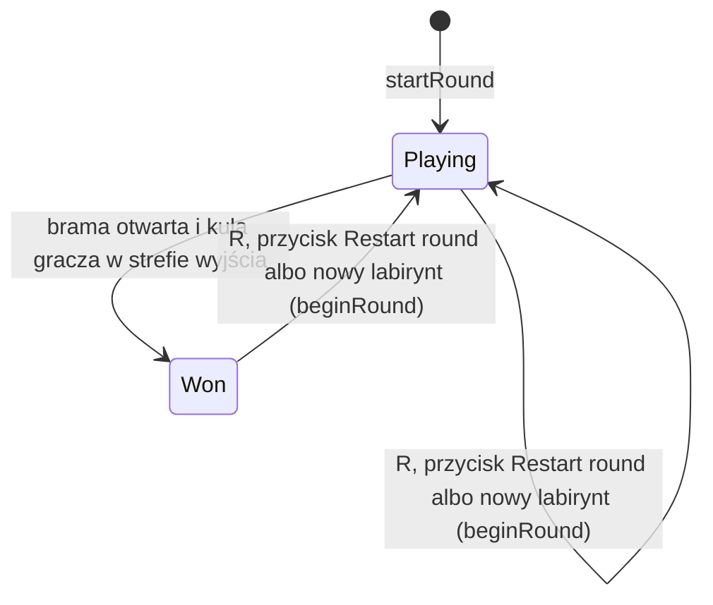
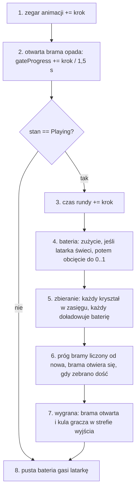

# Moduł game: rozgrywka (runda, wyjście, kryształy, bateria)

Kamień milowy: M5. Tematy wykładu w użyciu: 6 (światła punktowe: wiszą nad kryształami), 14 (kolizje: kule do zbierania i do strefy wyjścia), 3 i 4 (macierze modelu i modele OBJ kryształów i bramy).
Kod: [`src/game/Exit.hpp`](../../../src/game/Exit.hpp), [`src/game/Exit.cpp`](../../../src/game/Exit.cpp), [`src/game/Crystals.hpp`](../../../src/game/Crystals.hpp), [`src/game/Crystals.cpp`](../../../src/game/Crystals.cpp), [`src/game/Round.hpp`](../../../src/game/Round.hpp), [`src/game/Round.cpp`](../../../src/game/Round.cpp), [`src/game/GameplayRenderer.hpp`](../../../src/game/GameplayRenderer.hpp), [`src/game/GameplayRenderer.cpp`](../../../src/game/GameplayRenderer.cpp), [`src/game/ModelDraw.hpp`](../../../src/game/ModelDraw.hpp), [`src/game/ModelDraw.cpp`](../../../src/game/ModelDraw.cpp), użycie w [`src/game/MazeWorld.cpp`](../../../src/game/MazeWorld.cpp) i [`src/game/NightMazeApp.cpp`](../../../src/game/NightMazeApp.cpp), HUD w [`src/debug/Hud.cpp`](../../../src/debug/Hud.cpp), panel w [`src/debug/categories/GameplayCategory.cpp`](../../../src/debug/categories/GameplayCategory.cpp), testy [`tests/ExitTests.cpp`](../../../tests/ExitTests.cpp), [`tests/CrystalTests.cpp`](../../../tests/CrystalTests.cpp), [`tests/RoundTests.cpp`](../../../tests/RoundTests.cpp).

Część modułu `game`. Wstęp do modułu jest w [`README.md`](README.md). Ten dokument jest **o regułach gry: co to jest runda, gdzie jest wyjście, skąd biorą się kryształy, jak działa bateria i co z tego widać na ekranie**. Stoi na pięciu innych: [`maze-generator.md`](maze-generator.md) (siatka `Maze`, kierunki, `randomBelow`, układ w świecie), [`maze-rendering.md`](maze-rendering.md) (`MazeWorld`, `MazeRenderer`, rysowanie modelu), [`flashlight.md`](flashlight.md) (latarka i `buildLightSet`), [`../scene/collision.md`](../scene/collision.md) (AABB, kule, `moveAndSlide`) i [`player.md`](player.md) (gracz, stały krok, noclip).

**M9, część 1 (2026-10-06): runda stoi w trybie kamery menu.** Gdy tryb jest włączony (klawisz F2, `--menu-camera`), `NightMazeApp::onUpdate` **nie woła** `updateRound` ani `m_player.update`: gracz stoi, bateria nie spada, kryształy nie są zbierane, `elapsedSeconds` nie rośnie, odkrywanie minimapy stoi, a brama i ściany po dźwigniach, które opadały w chwili włączenia, **zatrzymują się w połowie opadania** (ich postęp liczy `updateRound`) i dokończą po wyłączeniu. Jedyne, co idzie dalej, to `m_round.animationSeconds` (jedna linia w `onUpdate`), więc kryształy się kołyszą, a ich światła pulsują. Latarka w tym trybie jest ustawiana osobno (włączona dla spaceru, wyłączona dla przelotu, jasność z ustawień, bez migotania i bez wpływu baterii). Reguły rundy się nie zmieniły. Opis: [`menu-camera.md`](menu-camera.md), sekcje 2.10 i 5.4.

**Stan na dziś (2026-10-05):** kod M5 jest kompletny na Windowsie, a kamień **nie jest zamknięty** i nie ma tagu wersji. Zgłoszone dla Windowsa po M5: build Debug i Release bez ostrzeżeń, 215 przypadków testowych i 85098 asercji w obu konfiguracjach (w tym 50 przypadków z trzech plików tego dokumentu; po drugiej części M6 cały program testowy miał 256 przypadków i 101232 asercje, uruchomione 2026-10-05 w Debug i Release, a po pierwszej części M7 zgłoszone jest 269 przypadków i 102103 asercje, po drugiej 276 i 102139, po trzeciej 294 i 102412, po czwartej 310 i 103751), obraz sprawdzony na zrzutach ekranu robionych przez tymczasowe zaczepy w kodzie, które potem usunięto. **Otwarte:** nic z M5 nie było budowane ani uruchamiane na macOS i **nikt jeszcze nie grał ręcznie**: klawisz R, klawisz F przy pustej baterii, przycisk `Restart round (key R)`, suwaki kategorii Gameplay, przejście przez otwartą bramę, zbieranie, karta `You escaped`, migotanie na ekranie i HUD przy schowanych panelach wynikają z kodu i z testów, a nie z oglądania.

**Co zmienił M6 (teren).** Labirynt stoi na terenie z mapy wysokości ([`../renderer/terrain.md`](../renderer/terrain.md)), więc rzeczy rundy dostały wysokość: `crystalRestPosition` i `exitZone` biorą wysokość gruntu jako drugi parametr, kryształy unoszą się 0,9 m nad gruntem w środku swojej komórki, strefa wyjścia stoi na gruncie, a brama jest opuszczona na najniższy grunt pod sobą, tak jak ściany. Doszła funkcja `restCrystalsOnGround` (po zmianie skali wysokości terenu). HUD stoi niżej, pod rzędami zwiniętych pasków paneli (w M6 dwoma, od pierwszej części M7 trzema, od czwartej czterema). Liczby w przykładach tego dokumentu, w których `y` wynosi 0 albo jest liczone od zera, dotyczą płaskiego gruntu: tak budują świat testy tych trzech plików (przeciążenie `buildMazeWorld` bez mapy wysokości). Kod M6 jest kompletny na Windowsie, a kamień nie jest zamknięty: macOS i testy ręczne są otwarte.

Czego nie ma: **stanu przegranej** (decyzja właściciela, sekcja 2.1), **przeciwnika**, który goni gracza (chcę go później, ale w M5 nie ma ani linii jego kodu: notatka [`../../decisions/enemy-after-m5.md`](../../decisions/enemy-after-m5.md)), dźwięku, menu startowego, tekstury "cookie" latarki i **cieni świateł kryształów**. Cień rzucają od czwartej części M7 księżyc, a od piątej latarka. Minimapa, której w M5 nie było poza planem w zakładce World / Maze, jest od szóstej części M7 w rogu okna ([`../renderer/minimap.md`](../renderer/minimap.md)); stan, z którego ona korzysta (które komórki gracz odkrył), leży w `Round::discovery`.

**Pierwsza część M7 (bufor HDR i gamma, 2026-10-05)** zmieniła w tym module blask kryształów: `CRYSTAL_GLOW_STRENGTH` wzrosło z 1 do 2,5, `crystalGlow` dostaje kolor liniowy, a przelicza go nowa funkcja `NightMazeApp::crystalEmissive()` (sekcje 2.9, 4.3, 4.4 i 5). Reguły rundy, kryształy, brama i bateria zostały bez zmian. HUD stoi o jeden pasek tytułu niżej, bo doszedł trzeci rząd zwiniętych pasków paneli (kategoria Post process, `FOLDED_ROW_COUNT` równe 3). Poświaty wokół kryształów (bloom) w tamtej części jeszcze nie było.

**Druga część M7 (bloom, 2026-10-05)** dodała tę poświatę i zmieniła w tym module jedną liczbę: `CRYSTAL_GLOW_STRENGTH` wzrosło z 2,5 do 4,0, żeby blask pomnożony przez teksturę kryształu zostawał powyżej progu bloomu także w najciemniejszej chwili pulsu (sekcje 2.9 i 5, decyzja [`../../decisions/crystal-glow-raised-for-bloom.md`](../../decisions/crystal-glow-raised-for-bloom.md)). Sam efekt (przebieg jasności, rozmycie, dodanie do sceny) nie należy do tego modułu: opisuje go [`../renderer/post-process.md`](../renderer/post-process.md). Reguły rundy i testy kryształów zostały bez zmian. Zgłoszone dla Windowsa: 276 przypadków testowych i 102139 asercji w Debug i Release, a po trzeciej części M7 294 i 102412, po czwartej 310 i 103751, poświata kryształu na zrzutach ekranu w obu skrajnych chwilach pulsu. Skutek uboczny: kryształy są bledsze także przy wyłączonym bloomie.

**Czwarta część M7 (cienie księżyca, 2026-10-05)** nie zmieniła żadnej reguły rundy ani żadnego z trzech plików testów tego dokumentu. Zmieniła trzy rzeczy wokół nich. Po pierwsze, brama i kryształy **rzucają cień księżyca**: `GameplayRenderer::draw` jest wołane w każdej klatce drugi raz, z programem głębi `shadow_depth`, z funkcji `NightMazeApp::drawShadowCasters`, więc brama stoi w mapie cieni tak nisko, jak opadła, a każdy kryształ tam, gdzie się w tej chwili unosi (sekcja 3). Jako rzeczy rysowane programem `lit` albo `gouraud` brama i kryształy także cień **przyjmują**; własny blask kryształu (`uEmissive`) nie jest przez cień przyciemniany. Po drugie, HUD stoi o jeszcze jeden pasek tytułu niżej: doszedł czwarty rząd zwiniętych pasków paneli (zakładka Light / Shadows, `FOLDED_ROW_COUNT` równe 4, sekcja 6). Po trzecie, paneli jest dwanaście. Całą technikę opisuje [`../renderer/shadows.md`](../renderer/shadows.md). Zgłoszone dla Windowsa, 2026-10-05: bramka `make check` przechodzi, 310 przypadków testowych i 103751 asercji (16 nowych przypadków, wszystkie w `tests/ShadowTests.cpp`). Nowego położenia HUD i cieni bramy oraz kryształów nikt nie oglądał ręcznie, a na macOS nic z tego nie było budowane.

**Piąta część M7 (cień latarki, 2026-10-06)** też nie zmieniła żadnej reguły rundy. Brama i kryształy rzucają teraz cień także w świetle latarki: `GameplayRenderer::draw` jest wołane z `drawShadowCasters` jeszcze raz, dla mapy cieni latarki (sekcja 3). Pusta bateria, która gasi latarkę, gasi też jej przebieg cieni (`drawFlashlightShadowMap` pyta o `frameLighting.flashlightOn`). Zgłoszone: 329 przypadków testowych i 104306 asercji, żaden z nowych nie dotyczy reguł rundy.

**Szósta część M7 (minimapa, 2026-10-06)** dodała do rundy jedno pole i dwa wywołania, bez zmiany żadnej dotychczasowej reguły. `Round::discovery` (`game::Discovery`, [`src/game/Discovery.hpp`](../../../src/game/Discovery.hpp)) to jeden znacznik na komórkę labiryntu: czy gracz ją odkrył. `startRound` robi nową siatkę o rozmiarze labiryntu i od razu odkrywa komórkę startu z korytarzami, które z niej wychodzą (`discoverAround` z `MazeWorld::startPosition`), żeby pierwsza klatka już miała mapę. `updateRound` woła `discoverAround` z pozycją stóp **po** kroku, w każdym kroku stałym, także po wygranej i w trybie noclip (liczą się tylko `x` i `z`). Reguła odkrywania (komórka gracza i linia prosta w czterech kierunkach aż do ściany) i cała minimapa są opisane w [`../renderer/minimap.md`](../renderer/minimap.md). Nowa runda (klawisz R, nowy labirynt) zeruje odkrycie, bo `startRound` składa całą `Round` od nowa. Zgłoszone: 414 przypadków testowych i 138711 asercji, z nich 19 przypadków jest w `tests/DiscoveryTests.cpp`, a sześć z tych dotyczy rundy (`a round starts with what can be seen from the start cell`, `a round that was not started has nothing discovered`, `walking discovers cells, and a new round forgets them`, `a step outside the maze discovers nothing`, `the discovery goes on after the round is won` i `the round of a maze of one cell knows its only cell from the start`). Nikt nie oglądał minimapy.
**M8, część 2 (selekcja, dźwignie i kartki, 2026-10-06)** dodała do rundy stan dźwigni i kartek i **wspólne opadanie** ściany i bramy. `Round` ma pięć nowych pól stanu: `interactables` (które dźwignie są pociągnięte), `wallProgress` (jak głęboko opadła ściana każdej dźwigni), `maze` (własna kopia labiryntu rundy, `std::optional<Maze>`) oraz `noteOpen` i `noteIndex` (karta kartki). `GameplaySettings` ma flagę prośby `pullAllLevers`. Opadanie bramy zostało wydzielone do dwóch małych funkcji, `sinkProgressAfter` i `sinkDepth`, z których korzysta teraz także ściana otwarta dźwignią (sekcja 2.16). Reguły bramy się nie zmieniły: ta sama liczba 1,5 s i ta sama głębokość 3,3 m, tylko policzone w jednym miejscu. Całość opisuje sekcja 2.16, a wskazywanie promieniem, dźwignie i kartki jako obiekty świata [`../scene/picking.md`](../scene/picking.md) i [`interactables.md`](interactables.md). Zgłoszone przez autora kodu: bramka `make check` przechodzi, 466 przypadków i 152264 asercji w Debug i Release (wcześniej 445 i 150296), z czego 21 nowych przypadków jest w `tests/InteractionTests.cpp`. Ja bramki nie uruchamiałem. Zachowanie w działającej grze widział agent, który pisał kod, na zrzutach ekranu: widziane na zrzucie ekranu przez agenta (2026-10-06), nie przez właściciela. Ręcznie właściciel jeszcze tego nie sprawdził, a macOS jest otwarty.

**Zmiana z 2026-10-06 po pierwszym obejrzeniu obrazu (HUD).** Pasek stanu stoi przy górnej krawędzi okna, gdy panele debug są schowane klawiszem `~`, a pod rzędami pasków tytułu, gdy są widoczne (decyzja właściciela, [`../../decisions/hud-at-top-edge-when-panels-hidden.md`](../../decisions/hud-at-top-edge-when-panels-hidden.md); `drawHud` dostaje `panelsVisible`, sekcja 6). **Zastąpione 2026-10-06:** HUD stoi zawsze przy górnej krawędzi, `panelsVisible` i `FOLDED_ROW_COUNT` zniknęły ([`../../decisions/hud-always-at-the-top-edge.md`](../../decisions/hud-always-at-the-top-edge.md)). Reguły rundy się nie zmieniły. Bramka scalonego drzewa po tej zmianie i poprawkach kałuż: 467 przypadków i 158006 asercji (zgłoszone przez bramkę; przed poprawkami kałuż 466 i 152264, a liczby w akapicie wyżej opisują stan po części 2 M8).

**Stan z 2026-10-06 (M9, część 2).** Karta `You escaped` z HUD i podpowiedź `R: play again` nie pojawiają się już na ekranie: HUD jest rysowany tylko na ekranie `Playing` (`hudVisible`), a wygrana rundy (`RoundState::Won`) wysyła zdarzenie `RoundWon` i gra przechodzi na ekran wyniku, który pokazuje dokument RmlUi z czasem i kryształami (`assets/ui/round_end.rml`, `NightMazeApp::fillRoundEndDocument`). Kod karty w `Hud.cpp` zostaje, ale nie jest osiągalny. Na ekranie wyniku runda stoi (`updatesRound` jest fałszem), a zegar animacji idzie dalej. Klawisz R zaczyna rundę od nowa tylko w grze, a restart z menu pauzy i z ekranu wyniku to przycisk `Restart`. Zdania niżej o karcie i o R w każdym stanie rundy opisują stan sprzed tej części. [`game-states.md`](game-states.md).


## 1. Po co to jest

Do M4 program był labiryntem do zwiedzania: ściany, gracz, światła. M5 robi z niego grę. PRD opisuje pętlę rozgrywki tak: gracz idzie korytarzem, widzi poświatę kryształu, zbiera go (bateria rośnie, licznik rośnie), po zebraniu odpowiedniej liczby kryształów otwiera się wyjście i trzeba do niego dojść. Ten moduł odpowiada na pytania, które z tej pętli wynikają:

| Pytanie | Odpowiedź w kodzie |
|---|---|
| gdzie jest wyjście | `game::passageDistances`, `game::farthestCell`, `game::placeExit` (`Exit.*`) |
| co zamyka wyjście i kiedy przestaje | brama: `MazeWorld::gate`, `MazeWorld::gateBox`, `game::gateBlocks`, `game::roundObstacles` |
| kiedy runda jest wygrana | `game::exitZone` i test kuli z pudełkiem w `game::updateRound` |
| ile jest kryształów i gdzie | `game::crystalCountFor`, `game::placeCrystals` (`Crystals.*`) |
| jak kryształ się rusza i świeci | `crystalBobPosition`, `crystalSpinDegrees`, `crystalPulse`, `crystalGlow`, `crystalLightPosition` |
| jak gracz zbiera kryształ | `game::playerReach` i test dwóch kul w `collectCrystals` (`Round.cpp`) |
| ile kryształów otwiera bramę | `game::requiredCrystalCount` |
| jak działa bateria latarki | `drainBattery`, `game::flashlightFlicker`, `game::lightingForFrame` |
| co się zmienia w ciągu rundy, a co nie | struktura `game::Round` (zmienia się) i `game::MazeWorld` (nie zmienia się) |
| kto rysuje kryształy i bramę | klasa `game::GameplayRenderer`, funkcje `game::drawModel` i `game::setModelSamplers` |
| co gracz widzi o rundzie | `debug::drawHud` (pasek i karta wygranej), kategoria Gameplay |

Kod jest podzielony tak samo jak reszta modułu `game` ([`README.md`](README.md)):

| Plik | Biblioteka | Potrzebuje OpenGL | Testy |
|---|---|---|---|
| `Exit.hpp`, `Exit.cpp` | `game_logic` | nie: same dane i matematyka | 11 przypadków |
| `Crystals.hpp`, `Crystals.cpp` | `game_logic` | nie | 14 przypadków |
| `Round.hpp`, `Round.cpp` | `game_logic` | nie | 25 przypadków |
| `GameplayRenderer.*`, `ModelDraw.*` | program `night_maze` | tak: tekstury, uniformy, rysowanie | brak |
| `src/debug/Hud.*`, `src/debug/categories/GameplayCategory.*` | program `night_maze` | pośrednio, przez ImGui | brak |

Najważniejsza decyzja tego podziału: **wszystkie reguły są w bibliotece bez okna**. Test potrafi zbudować labirynt, zebrać kryształy, otworzyć bramę i wygrać rundę, nie tworząc ani okna, ani kontekstu OpenGL (sekcja 5.12).

```mermaid
flowchart TD
    Build["buildMazeWorld<br>raz na labirynt"] --> World["MazeWorld<br>exitCell, gate, gateBox, exitZone, crystals"]
    World --> Start["startRound<br>przy każdej nowej rundzie"]
    Settings["GameplaySettings<br>m_gameplay, edytuje kategorię Gameplay] --> Start
    Start --> Round["Round<br>m_round"]
    Round --> Update["updateRound<br>w onUpdate, 120 razy na sekundę"]
    Player["pozycja gracza po kroku"] --> Update
    Settings --> Update
    Update --> Round
    Round --> Obstacles["roundObstacles<br>m_obstacles: ściany, słupki, zamknięta brama"]
    Round --> Lights["lightingForFrame, crystalLightPositions<br>światła klatki w onRender"]
    Round --> Draw["GameplayRenderer::draw<br>brama i kryształy"]
    Round --> Hud["drawHud, okno debugowania: Gameplay, World, Diagnostics, Light"]
```

## 2. Teoria

### 2.1 Runda i jej stany

**Runda** to jedno przejście przez jeden labirynt: od chwili, w której gracz staje w komórce startowej z pełną baterią, do chwili, w której wchodzi do strefy wyjścia. Labirynt (`MazeWorld`) w czasie rundy się nie zmienia. Wszystko, co się zmienia, jest w jednej strukturze `Round`: które kryształy są zebrane, czy brama jest otwarta, ile ma bateria, ile czasu minęło. Dzięki temu "zacznij od nowa" to jedno przypisanie: `m_round = startRound(...)`.

Runda ma dwa stany (`enum class RoundState`):



| Stan | Znaczenie | Co wtedy działa |
|---|---|---|
| `Playing` | gracz jest w labiryncie | czas rundy biegnie, bateria się zużywa, kryształy da się zbierać, brama może się otworzyć |
| `Won` | gracz wszedł przez otwartą bramę do strefy wyjścia | czas rundy, bateria i kryształy zostają takie, jakie były w chwili wygranej. Animacje biegną dalej |

**Stanu "przegrana" nie ma i to jest decyzja, nie brak.** PRD mówi o dojściu do wyjścia, "zanim bateria się skończy", co sugeruje porażkę przy pustej baterii. Właściciel projektu zdecydował 2026-10-05 inaczej: pusta bateria oznacza tylko ciemność. Runda trwa, gracz idzie dalej przy świetle księżyca i kryształów, a pierwszy zebrany kryształ oddaje mu latarkę. Uzasadnienie i koszt tej decyzji są w notatce [`../../decisions/battery-darkness-no-loss.md`](../../decisions/battery-darkness-no-loss.md). W kodzie widać ją w trzech miejscach: typ `RoundState` ma dwie wartości, komentarz przy nim mówi "There is no lost", a test `an empty battery switches the flashlight off and keeps it off` sprawdza, że po wyczerpaniu baterii stan to nadal `Playing`.

### 2.2 Jeden krok reguł i jego kolejność

Reguły idą tym samym zegarem co gracz: stałym krokiem `core::Time::FIXED_DT`, czyli 1/120 s ([`../core/main-loop.md`](../core/main-loop.md)). W każdym kroku `NightMazeApp::onUpdate` najpierw przesuwa gracza, a potem woła `updateRound` z pozycją, którą gracz ma **po** tym kroku. Funkcja robi zawsze to samo, w tej kolejności:



Dlaczego taka kolejność:

| Krok | Dlaczego tu |
|---|---|
| 1 i 2 przed pytaniem o stan | mają działać także po wygranej: kryształy za kartą `You escaped` dalej się kołyszą, a brama, która w chwili wygranej jeszcze opadała, opada do końca |
| 4 przed 5 | bateria najpierw traci, potem zyskuje. Odwrotnie kryształ zebrany przy 99 procentach dobiłby do 100, a potem krok zabrałby swoją część: wynik różniłby się o jeden krok zużycia. Mała rzecz, ale kolejność jest jedna i testy ją przypinają |
| 6 po 5 | brama otwiera się w tym samym kroku, w którym zebrano ostatni potrzebny kryształ |
| 7 po 6 | w labiryncie bez kryształów brama jest otwarta od startu, a w labiryncie jednej komórki gracz stoi w strefie wyjścia: wygrana wypada wtedy w pierwszym kroku |
| 8 na samym końcu, **po zbieraniu** | celowo. Jeśli bateria doszła do zera w kroku 4, a w kroku 5 gracz zebrał kryształ, to w kroku 8 bateria ma już 0,25 i latarka **nie gaśnie**. Kryształ zebrany dokładnie w kroku, w którym bateria się skończyła, ratuje światło. Gdyby gaszenie stało zaraz po kroku 4, gracz zobaczyłby zgaśnięcie i musiałby nacisnąć F, chociaż w tej samej 1/120 sekundy dostał doładowanie |
| 8 poza warunkiem o stanie | pustą baterię da się ustawić suwakiem `Battery` także po wygranej. Zasada "pusta bateria nie świeci" nie ma wyjątków |

Krok 8 przypina test `a crystal collected in the step the battery runs out keeps the light on`: bateria 0,00001 (mniej, niż zużywa jeden krok), gracz pod kryształem, po kroku bateria równa 0,25 i latarka włączona.

**Gdzie to jest wołane i dlaczego tam.** `updateRound` biegnie w `onUpdate`, bo reguły są symulacją: mają dawać ten sam wynik przy 30 i przy 300 klatkach na sekundę. Bateria zużywana "raz na klatkę" kończyłaby się szybciej na szybszym komputerze.

**Nowa runda i nowy labirynt powstają w `onRender`, nie w `onUpdate`.** Pętla główna jednej klatki wygląda tak: zero albo więcej kroków `onUpdate`, potem jeden `onRender`. Prośby o restart i o nowy labirynt są obsługiwane na samym początku `onRender`, czyli **między** krokami, nigdy w środku kroku. Żaden krok nie widzi więc labiryntu wymienionego w połowie ani rundy, której połowa pól jest stara, a połowa nowa. Drugi powód jest ten sam co dla klawiszy N i F ([`flashlight.md`](flashlight.md), część o klawiszu F): `wasKeyPressed` opisuje jedną klatkę, a `onUpdate` biegnie w klatce zero albo kilka razy, więc klawisz R czytany w `onUpdate` czasem by przepadł, a czasem zadziałał dwa razy.

### 2.3 Dwa zegary rundy

`Round` ma dwa liczniki sekund. Oba rosną o ten sam krok, ale nie zawsze oba:

| Pole | Kiedy rośnie | Do czego służy |
|---|---|---|
| `elapsedSeconds` | tylko w stanie `Playing` | **wynik**: czas pokazywany w HUD i na karcie wygranej. Zatrzymuje się w chwili wygranej |
| `animationSeconds` | w każdym kroku, także po wygranej | **ruch**: kołysanie i obrót kryształów, puls ich świateł, migotanie latarki |

Jeden zegar by nie wystarczył. Gdyby animacje czytały `elapsedSeconds`, scena za kartą `You escaped` zamarłaby w chwili wygranej. Gdyby wynik czytał `animationSeconds`, czas na karcie rósłby dalej, kiedy gracz na nią patrzy. Przypina to test `the time of the round stops at the win, the animation clock goes on`.

Oba zegary startują od zera w `startRound`, więc po restarcie kryształy zaczynają ruch od tej samej fazy. To część powtarzalności: ta sama runda z tymi samymi ruchami gracza daje ten sam obraz.

### 2.4 Wyjście: najdalsza komórka i przeszukiwanie wszerz

**Reguła (decyzja właściciela z 2026-10-05):** wyjściem jest komórka **najdalsza od startu, licząc w przejściach**, a nie komórka w przeciwległym rogu. Notatka: [`../../decisions/exit-farthest-cell.md`](../../decisions/exit-farthest-cell.md). "W przejściach" znaczy: ile razy trzeba przejść z komórki do sąsiedniej komórki, idąc korytarzami. Odległość w linii prostej nic w labiryncie nie mówi: komórka za ścianą może być o 2 m i o kilkadziesiąt przejść.

Do liczenia takich odległości służy **przeszukiwanie wszerz** (breadth first search, BFS). Pomysł: zwiedzam labirynt "falą". Najpierw start (odległość 0), potem wszystkie komórki o jedno przejście od startu, potem wszystkie o dwa przejścia i tak dalej. Potrzebne są dwie rzeczy:

- **tablica odległości**, jedna liczba na komórkę. Na początku wszędzie stoi `UNREACHABLE`, czyli -1: "jeszcze tu nie byłem";
- **kolejka** komórek, do których już doszedłem, ale których sąsiadów jeszcze nie obejrzałem. Kolejka (queue) to lista, do której dopisuje się na końcu, a zabiera z początku: kto pierwszy przyszedł, ten pierwszy wychodzi.

Algorytm:

1. Wpisz 0 w komórce startowej i wstaw ją do kolejki.
2. Weź pierwszą komórkę z kolejki. Nazwijmy ją bieżącą, jej odległość to `d`.
3. Dla każdej z czterech stron bieżącej komórki (kolejność `North`, `East`, `South`, `West`): jeśli jest tam ściana, pomiń. Jeśli za otworem nie ma komórki (otwór w zewnętrznej granicy), pomiń. Jeśli sąsiad ma już wpisaną odległość, pomiń. W przeciwnym razie wpisz mu `d + 1` i dopisz go na koniec kolejki.
4. Wracaj do kroku 2, dopóki kolejka nie jest pusta.

**Przykład.** Labirynt 2 na 2 w kształcie litery U (ten sam, co w teście `the distance follows the passages, not the straight line`): przejścia `(0,0)` do `(0,1)`, `(0,1)` do `(1,1)`, `(1,1)` do `(1,0)`. Komórka `(1,0)` sąsiaduje ze startem przez ścianę.

```text
   +--+--+
   |S |  |      S: start (0, 0)
   +  +  +
   |     |
   +--+--+
```

| Krok | Bieżąca komórka (jej `d`) | Co się dzieje | Kolejka po kroku (zabrane w nawiasie) |
|---|---|---|---|
| start | | `(0,0)` dostaje 0 | `(0,0)` |
| 1 | `(0,0)`, 0 | północ, wschód i zachód: ściany. Południe: `(0,1)` dostaje 1 | `((0,0))`, `(0,1)` |
| 2 | `(0,1)`, 1 | północ: `(0,0)` ma już odległość. Wschód: `(1,1)` dostaje 2 | `((0,0), (0,1))`, `(1,1)` |
| 3 | `(1,1)`, 2 | północ: `(1,0)` dostaje 3. Zachód: `(0,1)` ma już odległość | `((0,0), (0,1), (1,1))`, `(1,0)` |
| 4 | `(1,0)`, 3 | południe: `(1,1)` ma już odległość. Reszta to ściany | wszystko zabrane: koniec |

Wynik: `(1,0)` jest o 3 przejścia od startu, chociaż leży tuż obok. To ona jest najdalsza.

**Dlaczego pierwsza wizyta daje najkrótszą drogę.** Kolejka oddaje komórki w kolejności, w jakiej do niej trafiły, a trafiają do niej falami: najpierw wszystkie z odległością 1, dopiero po nich wszystkie z odległością 2 i tak dalej. Odległości zabieranych komórek nigdy więc nie maleją. Załóżmy, że do komórki K istnieje droga długości 5. Przedostatnia komórka tej drogi ma odległość 4, więc zostanie zabrana z kolejki przed każdą komórką o odległości 5 lub większej i to ona wpisze K liczbę 5. Żadna późniejsza, dłuższa droga już tej liczby nie zmieni, bo krok 3 pomija sąsiada, który ma odległość. Stąd warunek "już odwiedzony" w kodzie ma komentarz "along a way that was not longer".

W labiryncie doskonałym ([`maze-generator.md`](maze-generator.md), sekcja 2.3) między dwiema komórkami jest dokładnie jedna droga, więc "najkrótsza" i "jedyna" to to samo. BFS jest tu mimo to dobrym wyborem: jest prosty, liczy odległości do wszystkich komórek naraz i działa także na labiryncie zbudowanym ręcznie w teście, który doskonały być nie musi.

**Koszt.** Każda komórka trafia do kolejki najwyżej raz i każda jej strona jest oglądana raz, więc pracy jest tyle, ile komórek razy cztery. Dla labiryntu 10 na 10 to 400 sprawdzeń, dla największego, jaki przyjmuje `Maze` (256 na 256), około 262 tysięcy. Liczone jest to raz, przy budowie labiryntu.

**Kolejka jako wektor z przesuwanym indeksem.** W kodzie kolejka to zwykły `std::vector<MazeCell>` o nazwie `reached` i liczba `next`: indeks pierwszej komórki, której jeszcze nie zabrano. "Zabierz z początku" to po prostu `++next`. Wektor tylko rośnie, niczego się z niego nie usuwa ani nie przesuwa. Jest to tańsze niż `std::queue` i wystarcza, bo każda komórka trafia do kolejki najwyżej raz, więc wektor nigdy nie ma więcej elementów niż labirynt komórek. W tabeli wyżej "zabrane" to komórki na lewo od `next`.

**Labirynt wzorcowy.** Labirynt 4 na 4 z ziarna 1 (ten sam, którego używają testy generatora) z odległościami policzonymi przez BFS:

```text
   +--+--+--+--+         odległości od S:
   |S |        |
   +  +  +--+==+            0  11  12  13
   |  |     |E |            1  10   9  14
   +  +--+  +--+            2   3   8   7
   |     |     |            5   4   5   6
   +--+  +--+  +
   |           |         E: wyjście (3, 1), 14 przejść od startu
   +--+--+--+--+         ==: brama na północnej stronie komórki wyjścia
```

Droga od startu to jeden długi korytarz: w dół zachodnią stroną, dolnym rzędem na wschód, w górę wschodnią stroną, środkiem z powrotem na zachód i górnym rzędem do końca. Jedyne rozgałęzienie jest w `(1, 3)`: w lewo ślepy zaułek `(0, 3)` z odległością 5. Test `golden maze: 4 x 4 cells from seed 1 has its exit in the dead end (3, 1)` przypina cztery z tych liczb (5, 6, 11 i 14) oraz komórkę wyjścia. Róg przeciwległy do startu, `(3, 3)`, ma odległość tylko 6: stara reguła "wyjście w przeciwległym rogu" dawałaby w tym labiryncie drogę ponad dwa razy krótszą.

**Remis.** Kilka komórek może mieć tę samą największą odległość. `farthestCell` przegląda tablicę **wierszami** (rząd 0 od zachodu do wschodu, potem rząd 1) i zmienia kandydata tylko przy odległości **ściśle większej**. Wygrywa więc pierwsza taka komórka w kolejności wierszy. Ważne jest to, że wynik nie zależy od kolejności, w jakiej BFS odwiedzał komórki: ta kolejność wynika z kolejności kierunków i mogłaby się kiedyś zmienić, a wyjście ma zostać tam, gdzie było. Test `of two cells at the same distance the first one in row order is the farthest` pokazuje przypadek, w którym BFS dochodzi najpierw do wschodniej komórki, a wygrywa zachodnia.

**Komórka nieosiągalna.** Wygenerowany labirynt takich nie ma. Labirynt zbudowany ręcznie może mieć: jej odległość zostaje `UNREACHABLE` (-1), a ponieważ -1 nie jest większe od 0, taka komórka nigdy nie zostanie wyjściem. Gdy niczego nie da się osiągnąć, najdalszą komórką jest sam start.

### 2.5 Dlaczego wyjście zawsze wypada w ślepym zaułku

Ślepy zaułek to komórka ze ścianą z dokładnie trzech stron: jedno wejście, żadnego dalszego przejścia (`game::isDeadEnd` w `Maze.*`).

Twierdzenie: w labiryncie doskonałym o więcej niż jednej komórce najdalsza komórka jest ślepym zaułkiem. Dowód jest krótki. Weźmy najdalszą komórkę K z odległością `d`. Ma ona wejście, którym przyszła droga od startu. Gdyby miała **drugie** przejście, prowadziłoby ono do jakiejś komórki M. W labiryncie doskonałym do M jest tylko jedna droga i musi ona iść przez K (inaczej byłyby dwie drogi do M: jedna przez K, druga nie, a to znaczy pętlę). Wtedy M ma odległość `d + 1`, czyli jest dalej niż K. Sprzeczność: K miała być najdalsza. Więc K ma dokładnie jedno przejście.

Z tego wynikają trzy wygodne rzeczy:

- komórka wyjścia ma **jedną** otwartą stronę, więc jedna brama zamyka ją całkowicie;
- wyjście jest "pokojem na końcu korytarza", a nie miejscem, obok którego się przechodzi;
- gracz nie może dojść do strefy wyjścia inaczej niż przez bramę.

Test `the exit of a generated maze is a dead end, not the start, with a gate on its open side` sprawdza to dla 25 ziaren labiryntu 9 na 6.

### 2.6 Brama: przeszkoda i obraz to dwie różne rzeczy

Brama stoi w poprzek jedynej otwartej strony komórki wyjścia, dokładnie na granicy komórek: tam, gdzie stałby segment ściany, gdyby ta strona była zamknięta. Dlatego jest opisana tym samym typem co ściana (`WallSegment`: środek przy podłodze i oś) i korzysta z tych samych funkcji:

| Co | Skąd | Liczby dla labiryntu wzorcowego |
|---|---|---|
| miejsce i oś | `wallSegmentOn(x, z, strona)` | komórka `(3, 1)`, strona północna: środek `(7, 0, 2)`, oś `AlongX` |
| pudełko kolizji | `wallBox(gate)`: takie samo jak pudełko ściany | od `(6, 0, 1,85)` do `(8, 3, 2,15)`: 2 m długości, 0,3 m grubości, 3 m wysokości |
| macierz modelu | `wallModelMatrix(gate)`: przesunięcie, a dla osi `AlongZ` jeszcze obrót o 90 stopni wokół Y | sama translacja |

W labiryncie startowym (10 na 10, ziarno 1) wyjście to komórka `(6, 5)`, a brama zamyka jej wschodnią stronę: środek `(14, 0, 11)`, oś `AlongZ`.

Model bramy (`gate.obj`) jest zbudowany w tej samej konwencji co model ściany: leży wzdłuż X od -1 do 1, a jego początek układu jest w środku podstawy. Jest od ściany niższy i cieńszy (2,75 m wysokości i 0,12 m grubości, a ściana ma 3 m wysokości i korpus grubości 0,2 m), ale **pudełko kolizji jest dokładnie pudełkiem ściany**. Powód jest ten sam co przy ścianach ([`maze-rendering.md`](maze-rendering.md), część o wymiarach modeli i pudełkach kolizji): pudełko grubości słupka sprawia, że gracz sunący wzdłuż bramy nie zahacza o słupki po jej bokach.

**Brama ma dwa stany, które zmieniają się w różnych chwilach:**

| Pytanie | Funkcja | Kiedy prawda |
|---|---|---|
| czy brama **zatrzymuje** gracza | `gateBlocks` | labirynt ma bramę i `gateOpen` jest fałszem |
| czy bramę trzeba **rysować** | `gateVisible` | labirynt ma bramę i `gateProgress` jest mniejsze od 1 |

Gdy gracz zbiera ostatni potrzebny kryształ, `gateOpen` staje się prawdą **od razu** i pudełko bramy znika z listy przeszkód w tym samym kroku. Model jest wtedy jeszcze na pełnej wysokości i dopiero zaczyna opadać w ziemię. Opadanie trwa `GATE_OPEN_SECONDS`, czyli 1,5 s (180 kroków, pierwszy z nich to krok **po** otwarciu), i jest opisane jedną liczbą `gateProgress` od 0 do 1:

```text
gateProgress += krok / 1,5 s          (obcięte do 1)
obniżenie = gateProgress * GATE_SINK_DEPTH = gateProgress * 3,3 m
```

Prędkość to 3,3 / 1,5 = 2,2 m/s. `GATE_SINK_DEPTH` wynosi 3,3 m, czyli więcej niż wysokość modelu (2,75 m) i więcej niż wysokość słupków (3,15 m, do nich odnosi się komentarz przy stałej). Od M6 zamknięta brama stoi już na najniższym gruncie pod swoim obrysem (komentarz stałej: "The closed gate already stands on the lowest ground under it"), więc obniżenie liczy się od tego poziomu. Górna krawędź modelu schodzi poniżej tego poziomu po 2,75 / 3,3 * 1,5 = 1,25 s. Przez ostatnie ćwierć sekundy brama jest jeszcze rysowana, ale cała pod powierzchnią terenu, który ją zasłania dzięki testowi głębi (do M5 zasłaniały ją płytki podłogi). Zapas głębokości gwarantuje, że przy `gateProgress` równym 1 nic nie wystaje, a wtedy `gateVisible` zwraca fałsz i brama przestaje być rysowana w ogóle.

**Dwie wspólne funkcje (od M8, części 2).** Wzory z ramki wyżej są w kodzie dwiema funkcjami w `Round.cpp`: `sinkProgressAfter(progress, stepSeconds)` zwraca `min(progress + stepSeconds / GATE_OPEN_SECONDS, 1)`, a `sinkDepth(progress)` zwraca `progress * GATE_SINK_DEPTH`. `updateRound` woła pierwszą dla `gateProgress`, a `gateSinkDepth` drugą. Te same dwie funkcje obsługują ścianę, którą otworzyła dźwignia (sekcja 2.16): ściana opada w tym samym czasie i na tę samą głębokość co brama, bez drugiego zestawu stałych. `GATE_SINK_DEPTH` (3,3 m) jest większe niż wysokość ściany (`WALL_HEIGHT`, 3,0 m) i słupka (`PILLAR_HEIGHT`, 3,15 m), więc ściana opuszczona o pełną głębokość leży całkowicie pod najniższym gruntem pod sobą (test `the sink formulas reach the full depth in 1.5 s and stop there` sprawdza `GATE_SINK_DEPTH > WALL_HEIGHT`).

Dlaczego przeszkoda znika od razu, a nie po opadnięciu: komentarz w `Round.hpp` mówi, że brama otwiera się, gdy kryształ jest zbierany gdzieś indziej w labiryncie, więc zanim gracz do niej dojdzie, zwykle już opadnie. "Zwykle", bo to **nie jest gwarantowane**: opisuję je jako pułapkę 3 w sekcji 7.

### 2.7 Ile kryształów dostaje labirynt

**Reguła (decyzja właściciela z 2026-10-05):** liczba kryształów rośnie z labiryntem, jeden na 8 komórek, najwyżej 16. Notatka: [`../../decisions/crystal-count-and-gate-threshold.md`](../../decisions/crystal-count-and-gate-threshold.md).

Wzór z `crystalCountFor`:

```text
liczba = (komórki + 4) / 8        dzielenie całkowite
liczba = obetnij(liczba, 1, 16)
```

**Sztuczka z zaokrąglaniem.** Dzielenie liczb całkowitych w C++ obcina część ułamkową, czyli zaokrągla w dół: `100 / 8` to 12, chociaż dokładny wynik to 12,5. Żeby zaokrąglić **do najbliższej**, dodaję przed dzieleniem połowę dzielnika (`CELLS_PER_CRYSTAL / 2`, czyli 4). Wynik dokładny przesuwa się wtedy o 0,5, a obcięcie robi resztę: 12,5 + 0,5 = 13,0, obcięte do 13. Dla 12,0 wychodzi 12,5, obcięte do 12. Bez liczb zmiennoprzecinkowych i bez `std::round`.

| Labirynt | Komórki | Dokładnie | `(n + 4) / 8` | Po obcięciu do 1..16 |
|---|---|---|---|---|
| 1 na 1 | 1 | 0,125 | 0 | 1 (ale patrz niżej) |
| 2 na 2 | 4 | 0,5 | 1 | 1 |
| 4 na 4 (wzorcowy) | 16 | 2,0 | 2 | 2 |
| 9 na 7 | 63 | 7,875 | 8 | 8 |
| 10 na 10 (startowy) | 100 | 12,5 | 13 | **13** |
| 12 na 10 | 120 | 15,0 | 15 | 15 |
| | 123 | 15,375 | 15 | 15 |
| | 124 | 15,5 | 16 | **16**: od tej liczby komórek działa limit |
| 40 na 40 | 1600 | 200 | 200 | 16 |

Limit 16 jest osiągany od **124 komórek** (na przykład 12 na 11 to 132 komórki, a 11 na 11 to 121 i daje jeszcze 15). Każdy większy labirynt ma dokładnie 16 kryształów, więc w dużym labiryncie kryształy są rzadsze.

**Skąd 16.** Każdy kryształ niesie światło punktowe, a tablica świateł punktowych w shaderze i w `scene::LightSet` ma 16 miejsc (`scene::MAX_POINT_LIGHTS`, [`../scene/lights.md`](../scene/lights.md)). Kryształ bez światła byłby w ciemnym labiryncie prawie niewidoczny i łamałby regułę "idź do poświaty". Limit liczby kryształów jest więc limitem bloku uniformów, a nie strojeniem trudności.

**Skąd dolna granica 1 i kiedy kryształów jest mniej.** `crystalCountFor` zwraca co najmniej 1, ale `placeCrystals` nie może postawić kryształu w komórce startowej ani w komórce wyjścia. Labirynt jednej komórki i labirynt dwóch komórek nie mają żadnej wolnej komórki i dostają zero kryształów. Labirynt trzech komórek w rzędzie dostaje jeden. Te przypadki są w sekcji 7.

### 2.8 Gdzie stoją kryształy

Reguły wyboru komórek:

| Reguła | Dlaczego |
|---|---|
| nigdy komórka startowa | gracz zebrałby kryształ, nie ruszając się z miejsca |
| nigdy komórka wyjścia | jest za bramą: kryształu potrzebnego do otwarcia bramy nie dałoby się zebrać |
| najwyżej jeden kryształ na komórkę | każda komórka jest na liście kandydatów raz |
| **najpierw ślepe zaułki**, w kolejności wymieszanej ziarnem | zaułek jest miejscem, do którego warto wejść tylko wtedy, gdy coś tam jest. Kryształ zamienia "zmarnowany" korytarz w cel |
| gdy zaułków zabraknie, pozostałe komórki, też wymieszane ziarnem | mały labirynt ma mało zaułków |
| wszystko wynika z ziarna labiryntu | ten sam labirynt ma zawsze te same kryształy, na każdym systemie i kompilatorze |

Algorytm `placeCrystals` krok po kroku:

1. **Dwie listy.** Przejdź wszystkie komórki wierszami (rząd 0 od zachodu do wschodu, potem rząd 1). Pomiń start i wyjście. Ślepy zaułek dopisz do listy `deadEnds`, każdą inną komórkę do listy `otherCells`. Kolejność **przed** mieszaniem jest częścią wyniku: mieszanie zamienia miejsca, więc inna kolejność wejściowa dałaby inne kryształy z tego samego ziarna.
2. **Generator.** Utwórz `std::mt19937` z ziarnem `seed + CRYSTAL_SEED_OFFSET`, gdzie przesunięcie to 1000003.
3. **Mieszanie.** Wymieszaj `deadEnds`, potem `otherCells`, tym samym generatorem.
4. **Jedna lista kandydatów:** wszystkie zaułki, a za nimi wszystkie pozostałe komórki.
5. **Ile.** Weź `crystalCountFor(komórki)`, ale nie więcej, niż jest kandydatów.
6. **Warianty.** Dla każdego z pierwszych tylu kandydatów wylosuj wariant modelu (0 albo 1) i zapisz parę komórka plus wariant.

**Dlaczego osobne ziarno.** Generator labiryntu startuje z ziarna `seed`. Gdyby generator kryształów startował z tego samego, dostawałby dokładnie te same liczby, którymi kuto korytarze. Nie byłby to błąd, ale wybór kryształów byłby powiązany z kształtem labiryntu w sposób, którego nikt nie zaplanował. Dodanie stałej daje inny, niezależny ciąg. Wartość 1000003 nie ma znaczenia: każda liczba różna od zera by wystarczyła. Dodawanie liczb bez znaku zawija się przy 2 do potęgi 32 i jest w C++ dobrze określone, więc ziarno bliskie największej wartości też działa.

**Mieszanie Fishera-Yatesa.** To sposób na ustawienie listy w losowej kolejności tak, żeby każda kolejność była jednakowo prawdopodobna. Idę od końca listy:

```text
lista ma n elementów
dla last = n, n-1, ..., 2:
    chosen = losowa liczba od 0 do last - 1
    zamień elementy na miejscach last - 1 i chosen
```

Ostatnie miejsce dostaje jeden ze wszystkich elementów (może ten, który już tam stoi). Przedostatnie dostaje jeden z tych, które zostały. I tak dalej, aż miejsce 0 zostaje z tym, co zostało. Dla listy `A B C D` i wylosowanych liczb 1, 2, 0:

| `last` | Losowane z | `chosen` | Zamiana | Lista po |
|---|---|---|---|---|
| 4 | 0..3 | 1 | miejsca 3 i 1 | `A D C B` |
| 3 | 0..2 | 2 | miejsca 2 i 2 (nic) | `A D C B` |
| 2 | 0..1 | 0 | miejsca 1 i 0 | `D A C B` |

Liczba możliwych przebiegów to 4 razy 3 razy 2, czyli 24, tyle samo co ustawień czterech elementów, i każdy przebieg daje inne ustawienie. Stąd równe szanse.

**Dlaczego napisane ręcznie, a nie `std::shuffle`.** Standard C++ ustala dokładnie, jakie liczby produkuje `std::mt19937`, ale **nie** ustala, jak `std::shuffle` i rozkłady (`std::uniform_int_distribution`) z nich korzystają. Biblioteka standardowa MSVC i biblioteka clanga robią to inaczej, więc to samo ziarno dałoby inne kryształy na Windowsie i na macOS. Dlatego mieszanie jest pętlą napisaną w projekcie, a losowa liczba z zakresu pochodzi z `game::randomBelow`, tej samej funkcji, której używa generator labiryntu ([`maze-generator.md`](maze-generator.md), sekcje 2.6 i 5.4). Decyzja jest opisana w [`../../decisions/deterministic-random.md`](../../decisions/deterministic-random.md).

**Labirynt wzorcowy.** 16 komórek daje 2 kryształy. Ślepe zaułki to `(0, 0)` (start), `(3, 1)` (wyjście) i `(0, 3)`. Wolny jest tylko jeden:

```text
   +--+--+--+--+
   |S |        |      1: pierwszy kryształ, w jedynym wolnym zaułku (0, 3), wariant 0
   +  +  +--+==+
   |  |2    |E |      2: drugi kryształ: zaułki się skończyły, więc stoi w jednej
   +  +--+  +--+         z pozostałych komórek, wybranej przez ziarno: (1, 1), wariant 1
   |     |     |
   +--+  +--+  +
   |1          |
   +--+--+--+--+
```

Te dwie komórki i oba warianty przypina test `golden maze: 4 x 4 cells from seed 1 has exactly these two crystals`. Jego komentarz mówi wprost, po co: złe liczby oznaczają, że rozmieszczenie się zmieniło albo że różni się na tym kompilatorze.

### 2.9 Ruch i blask kryształu

Kryształ ma dwa modele (`crystal_a.obj` i `crystal_b.obj`, `CRYSTAL_VARIANT_COUNT` równe 2). Oba mają 0,5 m wysokości i początek układu w podstawie. Wszystkie ruchy są funkcjami **czasu**, a nie stanem: nie ma pola "aktualna wysokość kryształu", jest wzór, który dla sekundy `t` zwraca wysokość. Dzięki temu ruch nie zależy od liczby klatek i da się go testować jedną linią.

**Miejsce spoczynku.** Podstawa kryształu wisi 0,9 m nad gruntem w środku komórki (`CRYSTAL_FLOAT_HEIGHT`). Wysokość gruntu to od M6 drugi parametr `crystalRestPosition`: runda podaje w nim `groundHeightAt(world, cell)`, czyli `Terrain::heightAt` w środku komórki. Dla komórki `(3, 1)` na gruncie o wysokości 0:

| Punkt | Wzór | Wynik |
|---|---|---|
| podstawa (`crystalRestPosition`) | środek komórki + wysokość gruntu + 0,9 m w górę | `(7, 0,9, 3)` |
| środek kryształu (`crystalCenter`) | podstawa + połowa wysokości (0,25 m) | `(7, 1,15, 3)` |
| czubek | podstawa + 0,5 m | `(7, 1,4, 3)` |
| światło (`crystalLightPosition`) | podstawa + 0,5 m + 0,15 m | `(7, 1,55, 3)` |

Na gruncie o wysokości 0,25 m wszystkie cztery punkty są o 0,25 m wyżej: podstawa w `(7, 1,15, 3)` (tak sprawdza to test). Kryształ wisi więc zawsze tak samo wysoko **nad gruntem swojej komórki**, a nie nad zerem.

Środek kryształu jest 1,15 m nad gruntem: trochę powyżej środka ciała gracza (0,9 m nad jego stopami) i poniżej oczu (1,7 m), więc kryształ widać bez patrzenia w dół.

**Część cyklu.** Trzy ruchy korzystają z jednej funkcji pomocniczej `cyclePhase(sekundy, długość cyklu, przesunięcie)`. Zwraca ona liczbę od 0 do 1: jaka część cyklu minęła.

```text
cykle = sekundy / długość cyklu + przesunięcie
faza  = cykle - floor(cykle)            sama część po przecinku
```

3,25 cyklu wygląda tak samo jak 0,25 cyklu, więc część całkowita jest odrzucana.

**Kołysanie (`crystalBobPosition`).** Kryształ unosi się i opada o 0,08 m wokół miejsca spoczynku, raz na 3 s:

```text
faza = cyclePhase(t, 3 s, numer * 0,382)
wysokość = spoczynek + 0,08 * sin(faza * 2 pi)
```

Sinus przechodzi płynnie od -1 do 1 i z powrotem raz na pełny obrót kąta, a przy końcach zwalnia. Kryształ zwalnia więc na górze i na dole, jak spławik na wodzie. Dla kryształu numer 0: w chwili 0 jest w spoczynku, po 0,75 s (ćwierć cyklu) na górze (+0,08 m), po 1,5 s znów w spoczynku, po 2,25 s na dole.

**Obrót (`crystalSpinDegrees`).** Kryształ obraca się wokół osi pionowej o 40 stopni na sekundę, czyli pełny obrót w 360 / 40 = 9 s. Wynik to `faza * 360` i zawsze mieści się od 0 do 360 (bez 360): po 1 s kąt 40, po 4,5 s kąt 180, po 10 s znów 40 (400 stopni to pełny obrót i 40).

**Przesunięcie fazy: `PHASE_STEP` równe 0,382.** Gdyby wszystkie kryształy zaczynały ruch w tej samej chwili, unosiłyby się i obracały razem jak na defiladzie. Każdy kryształ jest więc przesunięty względem poprzedniego na liście o 0,382 cyklu. Dla ośmiu pierwszych kryształów fazy startowe to 0, 0,382, 0,764, 0,146, 0,528, 0,91, 0,292 i 0,674.

Dlaczego akurat 0,382, a nie na przykład 0,5 albo 0,25? Przy 0,5 kryształy 0, 2, 4 i dalsze miałyby tę samą fazę: byłyby tylko dwie grupy. Przy 0,25 cztery grupy, przy 1/3 trzy. Liczba 0,382 nie jest prostym ułamkiem, więc kolejne fazy długo nie trafiają w siebie: wśród 16 kryształów (tyle może być najwyżej) żadne dwa nie mają tej samej. Najbliżej siebie są kryształy odległe na liście o 13 miejsc (13 razy 0,382 to 4,966, czyli różnica faz 0,034 cyklu). Liczba 0,382 to w przybliżeniu 1 minus odwrotność złotej liczby (0,618): taki krok rozkłada punkty na okręgu możliwie równomiernie, i tak samo rozkłada je natura w słoneczniku.

**Puls (`crystalPulse`).** Jasność świateł kryształów faluje raz na 2,4 s:

```text
faza = cyclePhase(t, 2,4 s, 0)
przyciemnienie = 0,5 + 0,5 * sin(faza * 2 pi)         od 0 do 1
puls = 1 - 0,3 * przyciemnienie                        od 0,7 do 1
```

Sinus biegnie od -1 do 1. Połowa sinusa plus pół biegnie od 0 do 1. Pomnożone przez głębokość 0,3 (`CRYSTAL_PULSE_DEPTH`) i odjęte od 1 daje zakres **od 0,7 do 1**: światło nigdy nie gaśnie, tylko "oddycha". Trzy punkty kontrolne z testów: w chwili 0 puls wynosi 0,85 (środek), po 0,6 s jest najsłabszy (0,7), po 1,8 s najmocniejszy (1,0). Puls nie ma przesunięcia fazy: **wszystkie kryształy pulsują razem**. To celowe, bo intensywność świateł punktowych jest w grze jedna dla wszystkich ([`flashlight.md`](flashlight.md), opis `LightingSettings`): przy domyślnej wartości 2,0 światła mają w klatce od 1,4 do 2,0.

**Światło nad czubkiem i dlaczego musi być poza siatką.** Światło punktowe kryształu wisi 0,15 m nad jego czubkiem (`CRYSTAL_LIGHT_CLEARANCE`) i kołysze się razem z nim. Naturalniej byłoby je włożyć do środka kryształu, ale to nie działa. Siatka kryształu jest zamknięta, a jej normalne patrzą na zewnątrz. Światło w środku świeci na każdą ścianę **od tyłu**: kąt między normalną a kierunkiem do światła jest większy niż 90 stopni, cosinus jest ujemny i prawo Lamberta daje zero ([`../scene/lights.md`](../scene/lights.md), sekcja 2.3). Kryształ ze światłem w środku nie oświetlałby żadnej swojej ściany. Światło nad czubkiem oświetla za to górne ściany kryształu i wszystko wokół.

**Własny blask (`crystalGlow`).** Światło nad czubkiem ma drugą wadę: oświetla kryształ tylko z jednej strony. Boki i spód byłyby prawie czarne, a źródło poświaty byłoby najciemniejszą rzeczą w swoim kącie. Dlatego kryształ dodatkowo **świeci sam**:

```text
blask = kolor świateł punktowych * CRYSTAL_GLOW_STRENGTH * puls(t)
```

`CRYSTAL_GLOW_STRENGTH` wynosi od drugiej części M7 4,0 (w pierwszej części 2,5, do M6 1), a "kolor świateł punktowych" jest we wzorze kolorem **liniowym**. Rachunek krok po kroku dla domyślnego koloru:

| Krok | Wartość |
|---|---|
| `pointColor` w ustawieniach, wartość sRGB | `(0,2, 0,9, 0,8)` |
| po `gfx::srgbToLinear` | `(0,033, 0,787, 0,604)` |
| razy `CRYSTAL_GLOW_STRENGTH` (4,0), puls 1 | `(0,132, 3,150, 2,415)` |
| przy pulsie 0,85 | `(0,113, 2,677, 2,053)` |
| przy najsłabszym pulsie 0,7 (`1 - CRYSTAL_PULSE_DEPTH`) | `(0,093, 2,205, 1,691)` |

Dla porównania, przy sile 2,5 z pierwszej części M7 te trzy wiersze brzmiały `(0,083, 1,969, 1,510)`, `(0,070, 1,673, 1,283)` i `(0,058, 1,378, 1,057)`.

W zieleni i błękicie blask jest więc **zawsze powyżej 1**, czyli jaśniejszy niż biel. To zamierzone, a komentarz przy stałej mówi dlaczego: scena jest rysowana do bufora HDR, w którym kolor może być jaśniejszy niż biel, a świecący kryształ jest jedyną rzeczą w labiryncie, która taka ma być. Mapowanie tonów w przebiegu składającym sprowadza go w zakres ekranu bez zamieniania kryształu w płaską plamę, więc ścianki dalej da się rozróżnić. Ten sam komentarz mówi, po czym kryształy znajduje bloom, czyli efekt, który od drugiej części M7 dodaje poświatę wokół tego, co w buforze jest jaśniejsze od progu (startowo 0,8). Stąd wartość 4,0: blask jest w shaderze mnożony przez teksturę kryształu, która według komentarza zabiera ponad połowę, a to, co zostaje, ma być powyżej progu także przy pulsie 0,7. Jasność (luminancja) blasku z ostatniego wiersza tabeli to 1,72, więc tekstura może zabrać do 53 procent, zanim piksel spadnie pod próg. Przy sile 2,5 było to 1,07 i 26 procent: poświata znikała w rytm pulsu ([`../renderer/post-process.md`](../renderer/post-process.md), sekcja 2.15). Do M6, bez HDR, wartość powyżej 1 była obcinana, dlatego stała wynosiła 1. Blask trafia do shaderów jako uniform `uEmissive` (sekcja 4) i jest dodawany do światła rozproszonego, więc nie zależy od żadnego światła sceny: kryształ jest widoczny także w najciemniejszym kącie i przy zgaszonej latarce. Blask pulsuje tym samym pulsem co światło, więc siatka i poświata wokół niej jaśnieją razem.

### 2.10 Próg bramy

**Reguła (ta sama decyzja co liczba kryształów):** brama otwiera się po zebraniu około 70 procent kryształów labiryntu. Ułamek jest ustawieniem (`GameplaySettings::requiredFraction`, suwak `Crystals needed`).

Wzór z `requiredCrystalCount(total, fraction)`:

```text
jeśli total <= 0: wynik 0
potrzeba = sufit(fraction * total - 0,001)
wynik = obetnij(potrzeba, 1, total)
```

Sufit (`std::ceil`) zaokrągla **w górę**: 9,1 kryształu to 10 kryształów, bo 9 to mniej niż 70 procent.

| Kryształów | `0,7 * total` | Potrzeba |
|---|---|---|
| 13 (labirynt startowy) | 9,1 | **10** |
| 16 (limit) | 11,2 | 12 |
| 10 | 7,0 | 7 |
| 2 (labirynt wzorcowy) | 1,4 | 2 |
| 1 | 0,7 | 1 |
| 0 | | 0: brama otwarta od startu |

**Po co `ROUNDING_GUARD` równe 0,001.** Zaokrąglanie w górę jest wrażliwe na błędy liczb zmiennoprzecinkowych w jednym miejscu: tam, gdzie wynik powinien być **dokładnie** liczbą całkowitą. Typ `float` nie umie zapisać większości ułamków dziesiętnych dokładnie, zapisuje najbliższą liczbę, którą umie. Na przykład `0.3F` to naprawdę 0,300000012, odrobinę za dużo. Pomnożone przez 50 daje 15,000001 zamiast 15, a sufit z 15,000001 to **16**. Jeden kryształ za dużo z powodu błędu rzędu jednej milionowej. Odjęcie 0,001 przed zaokrągleniem cofa wynik pod liczbę całkowitą: sufit z 14,999001 to 15.

Odjęta wartość musi być większa od błędu (rzędu milionowych) i dużo mniejsza od najmniejszego uczciwego kroku wyniku. Suwak ułamka chodzi co 0,01, więc iloczyn zmienia się skokami co najmniej 0,01: dziesięć razy więcej niż 0,001. Żaden wynik, który naprawdę jest powyżej liczby całkowitej, nie zostanie przez tę poprawkę obcięty.

Uczciwie o liczbach z gry: `0.7F` to naprawdę 0,69999999 (odrobinę za **mało**), a `0.7F * 10` w arytmetyce `float` wychodzi dokładnie 7,0, więc dla wartości domyślnej poprawka nic nie zmienia. Przeliczenie wszystkich ułamków od 0,01 do 1,00 co 0,01 i wszystkich liczb kryształów od 1 do 16 (tyle jest najwyżej) w arytmetyce `float` pokazuje, że dla żadnej pary wynik z poprawką nie różni się od wyniku bez niej. To rachunek zrobiony poza programem, nie test w repozytorium. Błąd pojawia się dopiero przy większych liczbach, na przykład `0.15F * 100` albo `0.3F * 50`. Poprawka jest więc zabezpieczeniem na wypadek zmiany limitu kryształów albo kroku suwaka, a nie łataniem błędu, który dziś występuje. Komentarz w `Round.cpp` podaje dlatego jako przykład `0.3F * 50`.

**Obcięcie do 1..total.** Dolna granica 1: nawet przy ułamku 0 (albo ujemnym) trzeba zebrać jeden kryształ, inaczej brama byłaby otwarta od startu i runda nie miałaby sensu. Górna granica `total`: ułamek 2,0 nie może wymagać 26 kryształów z 13. Jedyny przypadek z wynikiem 0 to labirynt bez kryształów.

**Liczone w każdym kroku.** `updateRound` wylicza próg od nowa w każdym kroku, bo suwak `Crystals needed` można przesunąć w środku rundy. Obniżenie progu poniżej liczby zebranych kryształów otwiera bramę natychmiast. **Otwarta brama zostaje otwarta:** podniesienie progu z powrotem zmienia tylko liczbę pokazywaną w HUD. W kodzie `gateOpen` jest ustawiane na prawdę i nigdy na fałsz. Test `the required count follows the fraction during a round, an open gate stays open` gra to na labiryncie startowym: 5 zebranych przy progu 10, ułamek zmieniony na 0,3 (3,9, więc próg 4) otwiera bramę, ułamek 1,0 podnosi próg do 13 i brama zostaje otwarta.

### 2.11 Zbieranie: test dwóch kul

PRD wymaga "zbierania po kolizji sferycznej". Kula jest tu naturalna: pytanie brzmi "czy gracz jest dość blisko", obojętnie z której strony. Dwie kule nachodzą na siebie, gdy odległość ich środków jest mniejsza od sumy promieni. Samą matematykę (porównywanie kwadratów zamiast pierwiastka, punkt pudełka najbliższy kuli) opisuje [`../scene/collision.md`](../scene/collision.md). Tutaj to, jakie kule gra porównuje:

| Kula | Środek | Promień |
|---|---|---|
| **zasięg gracza** (`playerReach`) | stopy + 0,9 m w górę (`PLAYER_REACH_HEIGHT`): środek ciała o wysokości 1,8 m | 0,3 m (`PLAYER_REACH_RADIUS`): połowa szerokości ciała |
| **kula zbierania** kryształu | `crystalCenter(restPosition)`: środek kryształu **w spoczynku**, 1,15 m nad gruntem w środku komórki | `GameplaySettings::pickupRadius`, domyślnie 0,6 m |

**Kula zbierania się nie kołysze.** Kryształ, który widać, chodzi w górę i w dół o 8 cm, ale kula zbierania stoi w miejscu spoczynku. Dzięki temu odległość, na którą trzeba podejść, nie zależy od chwili: gracz nie zbiera kryształu "przypadkiem, bo akurat opadł".

**Na jaką odległość trzeba podejść.** Środki kul są na różnych wysokościach: 0,9 m i 1,15 m, różnica 0,25 m. Suma promieni to 0,3 + 0,6 = 0,9 m. Z twierdzenia Pitagorasa odległość środków to pierwiastek z (pozioma do kwadratu + 0,25 do kwadratu), więc kule nachodzą na siebie, gdy:

```text
pozioma^2 + 0,25^2 < 0,9^2
pozioma < pierwiastek(0,81 - 0,0625) = pierwiastek(0,7475) = około 0,865 m
```

Gracz zbiera kryształ, gdy jego stopy są bliżej niż około **0,86 m** od środka komórki, licząc w poziomie. To mniej niż suma promieni (0,9 m), właśnie przez różnicę wysokości.

Rachunek zakłada płaski grunt. Od M6 stopy gracza stoją na gruncie tam, gdzie gracz jest, a kryształ nad gruntem w środku komórki, więc do różnicy 0,25 m dochodzi różnica wysokości gruntu między tymi dwoma miejscami. Pod labiryntem grunt jest łagodny (w labiryncie startowym przy skali 1 największe nachylenie między sąsiednimi punktami siatki to około 0,08 m na metr, policzone skryptem z mapy wysokości), więc zasięg zmienia się o pojedyncze centymetry. Ze środka komórki kryształ jest zbierany zawsze: różnica wysokości wynosi tam dokładnie 0,25 m.

Co to znaczy w komórce 2 na 2 m:

| Gdzie stoi gracz | Odległość po podłodze | Zbiera? |
|---|---|---|
| w środku komórki | 0 | tak |
| wciśnięty w róg komórki. Ciało nie zbliży się do linii ściany bardziej niż na 0,45 m (pół pudełka ściany 0,15 m plus pół ciała 0,3 m), więc najdalej jest `(0,55, 0,55)` od środka | 0,55 razy pierwiastek z 2, czyli 0,78 m | tak |
| 0,9 m w bok od środka (w stronę otwartego przejścia) | 0,9 m | nie: brakuje 4 cm |
| w środku sąsiedniej komórki | 2 m | nie |

Wniosek: kto wszedł do komórki z kryształem i dotknął którejkolwiek jej ściany, ten kryształ zebrał. Nie da się "minąć" kryształu, idąc przez jego komórkę wzdłuż ściany. Wszystkie cztery wiersze są w teście `a crystal is collected from the middle of its cell, not from the next cell`.

**Styk to nie nakładanie.** `scene::overlaps` używa ostrej nierówności, tak samo jak dla pudełek: kule, które się tylko stykają, nie nachodzą na siebie.

**Wygrana: kula z pudełkiem.** Strefa wyjścia to pudełko 1 na 1 m w środku komórki wyjścia (`EXIT_ZONE_HALF_SIZE` równe 0,5 m w każdą stronę od środka), wysokie jak ściany (3 m). Dla komórki `(3, 1)`: od `(6,5, 0, 2,5)` do `(7,5, 3, 3,5)`. Runda jest wygrana, gdy brama jest otwarta i kula zasięgu gracza nachodzi na to pudełko. Test kuli z pudełkiem szuka punktu pudełka najbliższego środkowi kuli i pyta, czy jest bliżej niż promień. Od M6 strefa stoi na gruncie w środku komórki (drugi parametr `exitZone`): od tej wysokości do 3 m nad nią. Środek kuli jest 0,9 m nad stopami gracza, czyli między dołem a górą strefy także wtedy, gdy grunt pod graczem jest trochę niżej albo wyżej niż w środku komórki, więc liczy się tylko odległość w poziomie: gracz wygrywa, gdy jego stopy są bliżej niż 0,3 m od krawędzi strefy, czyli bliżej niż 0,8 m od środka komórki wzdłuż osi.

Dlaczego strefa jest mniejsza od komórki: gracz ma wejść **do środka**, za bramę, a nie musnąć granicę. Liczby: gracz oparty o zamkniętą bramę od zewnątrz ma stopy 0,45 m przed linią bramy, czyli 1,45 m od środka komórki wyjścia. Do krawędzi strefy brakuje mu 0,95 m, a zasięg to 0,3 m. Nie wygra przez bramę. Test `the player cannot reach the exit zone from in front of the closed gate` to sprawdza, a test `the round is won in the exit zone, but only while the gate is open` dodaje przypadek graniczny: stopy 0,85 m przed środkiem, brakuje 5 cm.

**Dlaczego mimo to kod pyta o `gateOpen`.** Przy kolizjach gracz dochodzi do strefy tylko po otwarciu bramy, więc warunek wygląda na zbędny. Nie jest: w trybie noclip (klawisz N) gracz przelatuje przez zamkniętą bramę. Bez pytania o flagę noclip wygrywałby rundę bez zebrania kryształów.

### 2.12 Bateria

Bateria to jedna liczba od 0 (pusta) do 1 (pełna) w polu `Round::battery`.

**Zużycie.** W każdym kroku, w którym latarka jest włączona, bateria traci tę samą część:

```text
bateria -= krok / czas życia
```

Przy domyślnych wartościach to (1/120 s) / 180 s, czyli 1/21600 na krok (około 0,0000463). Pełna bateria wystarcza więc na **21600 kroków, czyli 180 sekund (3 minuty) świecenia**. Zużycie jest liniowe: po minucie zostaje 2/3, po dwóch 1/3.

| Reguła | Kod | Dlaczego |
|---|---|---|
| bateria traci **tylko, gdy latarka świeci** | warunek `flashlightOn` w `drainBattery` | zgaszenie latarki (F) jest sposobem oszczędzania: gracz wybiera między widzeniem a zapasem |
| czas życia nigdy poniżej 1 s | `MIN_BATTERY_LIFETIME_SECONDS` i `std::max` | dzielenie przez zero albo przez liczbę ujemną dałoby nieskończoność albo ładowanie. Suwak w panelu zaczyna się od 5 s, ale ustawienia może zmienić także inny kod |
| wynik obcięty do 0..1 w każdym kroku | `std::clamp` po odjęciu | pusta bateria to dokładnie 0, nigdy liczba ujemna. Obcięcie pilnuje też wartości wpisanej z zewnątrz (test wpisuje 1,7 i -0,4) |
| wyłącznik zużycia | `GameplaySettings::batteryDrains` | przełącznik do testowania w panelu: bateria stoi tam, gdzie postawił ją suwak |

**Doładowanie.** Każdy zebrany kryształ dodaje 0,25 (`batteryPerCrystal`), czyli 45 sekund świecenia, ale bateria nie przekracza 1:

```text
bateria = min(bateria + 0,25, 1)
```

Kryształ zebrany przy 0,9 daje 1,0, a nie 1,15: nadwyżka przepada. To zachęca do zbierania kryształów wtedy, gdy bateria jest niska, a nie wszystkich po kolei od razu.

Budżet labiryntu startowego: pełna bateria (180 s) plus 13 kryształów po 45 s to razem najwyżej 765 s światła, jeśli żadne doładowanie nie przepadnie.

**Pusta bateria.** Gdy bateria dojdzie do 0, `updateRound` ustawia przełącznik latarki (`LightingSettings::flashlightOn`) na fałsz, w każdym kroku, dopóki bateria jest pusta. Klawisz F i pole wyboru w zakładce Light / Lights nadal mogą ustawić przełącznik na prawdę, ale najbliższy krok (najpóźniej 1/120 s później) znów go wyłączy. Kryształ **nie włącza** latarki sam: doładowuje baterię, a gracz naciska F. Po doładowaniu przełącznik już zostaje tam, gdzie go ustawiono.

Jest jeszcze drugie zabezpieczenie, dla obrazu: `lightingForFrame` (sekcja 2.14) gasi latarkę w klatce, gdy bateria jest pusta, niezależnie od przełącznika. Między naciśnięciem F a najbliższym krokiem może wypaść klatka i bez tego gracz zobaczyłby jeden błysk światła z pustej baterii.

### 2.13 Migotanie przy słabej baterii

Poniżej progu `lowBatteryThreshold` (domyślnie 0,2, czyli ostatnie 36 sekund) latarka migocze. Funkcja `flashlightFlicker(bateria, sekundy, ustawienia)` zwraca mnożnik jasności od 0 do 1:

```text
jeśli bateria <= 0:        wynik 0
jeśli bateria >= próg:     wynik 1
słabość = 1 - bateria / próg                     0 na progu, 1 przy pustej
fala    = sin(23 * t) * sin(7,3 * t)             od -1 do 1
spadek  = max(fala, 0)                           ujemna połowa odcięta
wynik   = 1 - 0,85 * słabość * spadek
```

Element po elemencie:

| Element | Znaczenie |
|---|---|
| `słabość` | jak bardzo bateria jest poniżej progu. Na progu 0 (migotania nie ma), przy pustej 1 (migotanie najgłębsze). Przy baterii 0,1 i progu 0,2 wynosi 0,5 |
| dwie prędkości: 23 i 7,3 radiana na sekundę | około 3,7 i 1,2 pełnego wahnięcia na sekundę (prędkość podzielona przez 2 pi) |
| **iloczyn** dwóch sinusów | jeden sinus migałby równo jak kierunkowskaz. Iloczyn szybkiego i wolnego daje szybkie drganie, którego siła rośnie i maleje w rytmie wolnego. Prędkości nie są swoimi wielokrotnościami (23 / 7,3 to około 3,15), więc wzór długo się nie powtarza i oko odbiera go jako nieregularny |
| odcięcie ujemnej połowy | iloczyn jest dodatni mniej więcej przez połowę czasu. Przez drugą połowę `spadek` wynosi 0 i latarka świeci **równo**. Bez odcięcia (na przykład z wartością bezwzględną) światło drgałoby bez przerwy. Tak wygląda to jak latarka, która przygasa "napadami" |
| `FLICKER_DEPTH` równe 0,85 | najgłębszy spadek zabiera 85 procent światła. Dopóki w baterii coś jest, wynik nie spada poniżej 0,15: latarka przygasa, ale nie gaśnie całkiem |
| zakres wyniku | `słabość`, `spadek` i 0,85 są między 0 a 1, więc ich iloczyn też, a wynik mieści się między 0,15 a 1 |

Kilka wartości dla progu 0,2:

| `t` w sekundach | `sin(23 t)` | `sin(7,3 t)` | fala | Mnożnik przy baterii 0,1 | Mnożnik przy baterii 0,02 |
|---|---|---|---|---|---|
| 0,00 | 0,000 | 0,000 | 0,000 | 1,000 | 1,000 |
| 0,05 | 0,913 | 0,357 | 0,326 | 0,862 | 0,751 |
| 0,10 | 0,746 | 0,667 | 0,497 | 0,789 | 0,620 |
| 0,15 | -0,304 | 0,889 | -0,270 | 1,000 | 1,000 |
| 0,20 | -0,994 | 0,994 | -0,988 | 1,000 | 1,000 |
| 0,30 | 0,578 | 0,814 | 0,471 | 0,800 | 0,640 |
| 0,50 | -0,875 | -0,487 | 0,426 | 0,819 | 0,674 |

W wierszach 0,15 i 0,20 fala jest ujemna: światło jest pełne. W wierszu 0,50 oba sinusy są ujemne, więc ich iloczyn jest dodatni i latarka przygasa. Słabsza bateria (ostatnia kolumna) w tej samej chwili nigdy nie jest jaśniejsza.

**Nic tu nie jest losowe.** Migotanie wygląda na przypadkowe, ale to czysta funkcja dwóch liczb: ta sama bateria i ta sama chwila dają zawsze ten sam mnożnik. Zalety: nie ma generatora, którego stan trzeba by przechowywać i zerować przy restarcie, wynik nie zależy od liczby klatek, a test może sprawdzić konkretną wartość. Czas pochodzi z zegara animacji, więc migotanie działa także po wygranej (na baterii zamrożonej w chwili wygranej).

**Próg 0.** Suwak `Flicker below` schodzi do 0 i to wyłącza migotanie: warunek `bateria >= próg` jest wtedy prawdą dla każdej niepustej baterii i funkcja wraca z wynikiem 1, zanim dojdzie do dzielenia przez próg.

### 2.14 Runda zmienia światła klatki, ale nie ustawienia

Runda wpływa na światła w trzech miejscach: słaba bateria przyciemnia latarkę, pusta ją gasi, a światła kryształów pulsują. Najprościej byłoby wpisać te zmiany do `m_lighting`. To byłby błąd: `m_lighting` to **ustawienia**, które pokazuje i edytuje zakładkę Light / Lights. Gdyby migotanie mnożyło `flashlightIntensity` w ustawieniach, suwak `Beam intensity` skakałby sam, a po kilku klatkach z mnożnikiem poniżej 1 wartość zjechałaby do zera i już nie wróciła (mnożenie się kumuluje).

Dlatego `lightingForFrame` robi **kopię** ustawień, zmienia trzy pola w kopii i ją zwraca:

```text
kopia.flashlightOn        = ustawienie && bateria > 0
kopia.flashlightIntensity = ustawienie * flashlightFlicker(bateria, zegar animacji)
kopia.pointIntensity      = ustawienie * crystalPulse(zegar animacji)
```

Z tej kopii `onRender` buduje światła klatki (`buildLightSet`, opisane w [`flashlight.md`](flashlight.md)). Oryginał zostaje nietknięty. Kopia struktury z kilkunastoma liczbami raz na klatkę nic nie kosztuje.

Pozycje świateł punktowych też wynikają z rundy: `crystalLightPositions` zwraca punkt nad czubkiem każdego **niezebranego** kryształu, w jego aktualnym miejscu kołysania. Zebrany kryształ znika z listy, więc traci światło w tej samej klatce, w której przestaje być rysowany.

### 2.15 Restart: co runda zeruje, a czego nie

Nową rundę na tym samym labiryncie zaczyna klawisz R albo przycisk `Restart round (key R)` w kategorii Gameplay. Nowy labirynt (przyciski `Regenerate` i `Random seed` w zakładce World / Maze) też zaczyna nową rundę. Wszystkie trzy drogi kończą się w `NightMazeApp::beginRound`.

**Prośba i wykonanie.** Panel nie zaczyna rundy sam. Ustawia flagę `GameplaySettings::restart`, a gra czyta ją na początku następnego `onRender`, zaczyna rundę i zeruje flagę. To ten sam wzorzec co `MazeSettings::regenerate` ([`maze-rendering.md`](maze-rendering.md), część o regeneracji): panel tylko zapisuje dane, a o chwili decyduje gra. Dokładna kolejność: panele są rysowane **po** `onRender` gry (w `main.cpp`), więc kliknięcie w klatce N ustawia flagę pod koniec tej klatki, a runda zaczyna się w klatce N+1, po jej krokach `onUpdate` i przed rysowaniem. Klawisz R działa w tej samej klatce, w której został naciśnięty.

| Co | Po restarcie |
|---|---|
| kryształy | wszystkie z powrotem, w tych samych komórkach i wariantach (wynikają z `MazeWorld`, a nie z rundy) |
| liczniki, brama | 0 zebranych, brama zamknięta, `gateProgress` równe 0 |
| bateria | pełna |
| oba zegary | 0 |
| odkrycie minimapy (`Round::discovery`, od szóstej części M7) | nowa siatka, odkryta tylko komórka startu i korytarze z niej |
| dźwignie (`Round::interactables`, `Round::wallProgress`, od M8, części 2) | żadna nie jest pociągnięta, każdy `wallProgress` równy 0, uchwyt znów u góry |
| labirynt rundy (`Round::maze`) | świeża kopia `MazeWorld::maze`: każda ściana wraca, także w odkrywaniu i na minimapie. `MazeWorld::maze` nigdy się nie zmienia |
| karta kartki (`noteOpen`) | zamknięta (`startRound` robi świeży stan), także przy regeneracji labiryntu |
| wynik wskazywania (`m_pick`, `m_shownPick`) | `beginRound` zeruje oba (`pickNothing`), więc restart usuwa też zamrożony promień |
| stan | `Playing` |
| lista przeszkód `m_obstacles` | zbudowana od nowa: brama znów jest przeszkodą |
| przełącznik latarki | **włączony**, także po rundzie skończonej w ciemności |
| gracz | w komórce startowej, obie pozycje (bieżąca i poprzednia) naraz, żeby klatka nie była rysowana z punktu między starym a nowym miejscem |
| kamera | kąt startowy labiryntu, wzrok poziomo |

Czego restart **nie** zmienia:

| Co | Dlaczego warto to wiedzieć |
|---|---|
| tryb noclip (`m_player.noclip`) | gracz, który wygrał albo oszukiwał w noclipie, zaczyna nową rundę nadal w noclipie. Stopy wracają na grunt, bo pozycja startowa leży na gruncie (`MazeWorld::startPosition`) |
| ustawienia oświetlenia poza przełącznikiem latarki | tryb cieniowania, kolory, zasięgi, mapowanie normalnych zostają |
| ustawienia rozgrywki (`m_gameplay`) | próg, czas życia baterii, doładowanie, próg migotania, promień zbierania i `batteryDrains` zostają takie, jak ustawił panel. Runda zaczyna się z **aktualnym** progiem |
| prędkości gracza, czułość myszy, podgląd, rysowanie brył kolizji | to ustawienia narzędzi, nie stan rundy |
| labirynt | ten sam `MazeWorld`. Nowy labirynt to `Regenerate` |

### 2.16 Dźwignie, otwarta ściana i kartki w regułach rundy (M8, część 2)

Ta sekcja opisuje to, co dźwignie i kartki zmieniają w **stanie i regułach rundy**. Gdzie stoją na ścianach i jak je narysowano, opisuje [`interactables.md`](interactables.md), a jak są wskazywane promieniem [`../scene/picking.md`](../scene/picking.md).

**Decyzja właściciela (2026-10-06):** dźwignia otwiera skrót, obniżając jeden wewnętrzny segment ściany, a kartka pokazuje krótką podpowiedź na karcie HUD. Wszystko poniżej to **wybory implementacji**, każdy sprawdzony w kodzie.

**Pociągnięcie: `pullRoundLever(round, world, index)`.** Pierwsze pociągnięcie dźwigni robi trzy rzeczy naraz, w tej samej chwili:

| Co | Jak w kodzie | Skutek |
|---|---|---|
| ściana znika z labiryntu rundy | `round.maze->removeWall(...)` na kopii rundy, po obu stronach ściany | odkrywanie (`discoverAround`) i minimapa widzą korytarz za ścianą od następnego kroku |
| pudełko ściany wypada z przeszkód | `roundObstacles` pomija pudełka ścian, których dźwignia jest pociągnięta (`openedWallFlags`) | gracz może przejść, a promień wskazywania nie jest już zasłaniany |
| ściana zaczyna opadać | `updateRound` zwiększa `wallProgress[i]` funkcją `sinkProgressAfter` | model opada o `sinkDepth(wallProgress)` w ciągu 1,5 s |

Funkcja zwraca `true`, gdy to pociągnięcie otworzyło ścianę, i `false`, gdy dźwignia była już pociągnięta. Numer spoza listy dźwigni rzuca `std::out_of_range` (rzuca go `pullLever`; test `pulling a lever opens its wall once: obstacles, maze of the round, sinking`). Po `true` wołający musi zbudować listę przeszkód od nowa: robi to `NightMazeApp` (`m_obstacles = roundObstacles(...)`).

**Reguła bramy, powtórzona dla ściany.** Brama przestaje być przeszkodą w chwili otwarcia, choć model jeszcze opada (sekcja 2.6). Ściana dźwigni robi tak samo: **przez 1,5 s gracz może przejść przez ścianę, którą jeszcze widać**. To wybór implementacji, nie decyzja właściciela. Uzasadnienie i alternatywy: [`../../decisions/opened-wall-stops-blocking-at-pull.md`](../../decisions/opened-wall-stops-blocking-at-pull.md).

**Własna kopia labiryntu.** `startRound` robi `round.maze = world.maze`. Odkrywanie i minimapa czytają ściany przez `roundMaze(world, round)`, czyli przez kopię rundy (albo, dla rundy niestartowanej, przez `world.maze`). `world.maze` nigdy się nie zmienia, więc nowa runda na tym samym labiryncie ma znowu każdą ścianę. Dlaczego kopia, a nie zmiana świata: [`../../decisions/round-keeps-own-maze-copy.md`](../../decisions/round-keeps-own-maze-copy.md). Pole jest `std::optional`, bo `Maze` nie ma konstruktora domyślnego, a `Round` musi się dać zbudować pusty.

**Macierze ścian w tej rundzie: `roundWallMatrices`.** Funkcja kopiuje `world.wallMatrices` i dla każdej pociągniętej dźwigni liczy macierz od nowa z segmentu obniżonego o `sinkDepth(wallProgress[i])` (`wallModelMatrix`), tak jak `GameplayRenderer` obniża bramę. Lista ma rozmiar i kolejność `world.walls`. Ściana opuszczona do końca **zostaje na liście rysowania**, pod gruntem: teren ją zasłania, a wycinanie jej z listy wymagałoby drugiej listy do utrzymania. Znane ograniczenia: kępki trawy obok otwartej ściany zostają, a słupek, który kończył tylko otwartą ścianę, stoi sam.

**Kolejność pudełek.** `roundObstacles` korzysta z tego, że `world.colliders` ma najpierw pudełka wszystkich ścian (w kolejności `world.walls`), a potem słupki. Pudełko numer `i` poniżej liczby ścian należy do ściany numer `i`. `MazeWorld::leverWalls` mówi, którą ścianę otwiera dźwignia numer `k`: ten sam numer znajduje ścianę w `walls`, jej pudełko w `colliders` i jej macierz w `wallMatrices`.

**Uchwyt dźwigni: `leverHandleProgress`.** Zwraca 0 przed pociągnięciem i rośnie do 1 w `LEVER_PULL_SECONDS` (0,3 s) po nim. Runda nie przechowuje osobnego licznika: wartość jest liczona z `wallProgress` (czas od pociągnięcia to `wallProgress * GATE_OPEN_SECONDS`). Dźwignia, której runda nie ma, daje 0.

**Prośba "Pull all levers".** Przycisk w kategorii Gameplay ustawia pole `GameplaySettings::pullAllLevers`, a `NightMazeApp::onRender` czyta flagę między krokami, zeruje ją i woła **funkcję** `game::pullAllLevers(round, world)` (to dwie różne rzeczy o tej samej nazwie: pole flagi i funkcja). Funkcja zwraca liczbę ścian, które się otworzyły; gdy jest większa od 0, gra buduje listę przeszkód od nowa.

**Kartka.** `readNote(round, world, index)` ustawia `noteOpen` i `noteIndex` (numer spoza listy jest ignorowany), `closeNote` zamyka kartę. Tekst daje `openNoteText(world, round)`: liczony przy każdym pytaniu, bo podpowiedź o kryształach liczy tylko kryształy, których jeszcze nie zebrano (test `the card of a crystal hint counts only the crystals that are left`). Karta zamyka się w czterech sytuacjach, bez żadnego zegara:

| Kiedy | Gdzie w kodzie |
|---|---|
| gracz naciska E albo klika, gdy karta jest otwarta | `interactionFor` daje `CloseNote` przed wszystkim innym |
| gracz oddali się od kartki o więcej niż `NOTE_READ_DISTANCE` (3,0 m), liczone po ziemi (x i z) | `closeNoteFarAway` w `updateRound` |
| runda zostaje wygrana | `updateRound` woła `closeNote` w chwili wygranej: karta wygranej zajmuje jej miejsce |
| nowa runda | `startRound` robi świeży stan (restart i regeneracja też) |

Dźwignia i kartka działają **tylko w rundzie `Playing`**: `interactionFor` daje `None` dla rundy wygranej. Test `a won round has nothing to interact with and closes the card` sprawdza tylko tę pierwszą część (wynik `interactionFor` dla wygranej rundy), nie samo zamknięcie karty. Zamknięcie przy wygranej wynika z kodu `updateRound` i nie ma własnego testu.

## 3. Jak to działa w OpenGL

`Exit.*`, `Crystals.*` i `Round.*` nie dołączają GLAD i nie wołają żadnej funkcji `gl*`: to dane i matematyka. OpenGL jest w dwóch miejscach: w `GameplayRenderer::draw` (przez funkcje z `ModelDraw.*` i klasy `gfx`) oraz w liniach brył kolizji.

Rundę rysuje **ten sam program** co labirynt i w tym samym przejściu: `drawUnlitMaze` i `drawLitMaze` wołają najpierw `m_mazeRenderer.draw(...)`, a zaraz potem `drawGateAndCrystals(...)` (do M8, części 1, było to `m_gameplayRenderer.draw(...)`) z tym samym obiektem `gfx::Shader`. Od M8, części 1, kryształy rysuje program `reflect` w przebiegu `drawReflections`, gdy efekt jest włączony i widok to `Textured` ([`../renderer/env-mapping.md`](../renderer/env-mapping.md), sekcja 2.13), a funkcja `drawGateAndCrystals` rysuje wtedy tylko bramę. Poza tym nie ma nowego bufora ani nowego stanu OpenGL.

**Drugie rysowanie do mapy cieni (czwarta część M7).** Od czwartej części M7 `m_gameplayRenderer.draw(...)` jest wołane w klatce dwa razy. Pierwszy raz, przed sceną, w `NightMazeApp::drawShadowCasters`: `m_gameplayRenderer.draw(m_shadowDepthShader, m_mazeWorld, m_round, crystalEmissive())`, z programem `shadow_depth` i macierzami księżyca zamiast kamery, do tekstury głębi mapy cieni. Drugi raz tak jak dotąd, w `drawUnlitMaze` albo `drawLitMaze`. Uwaga (2026-10-06): dziś `drawShadowCasters` jest wołane dla dwóch map (księżyca i, od piątej części M7, latarki), więc teren i obiekty rundy trafiają do mapy cieni dwa razy na klatkę, a sam `GameplayRenderer::draw` wchodzi do sceny przez `drawGateAndCrystals`. Klasa nie ma dla cieni osobnej ścieżki: liczy te same macierze modelu z tego samego stanu rundy, więc w mapie cieni brama jest opuszczona dokładnie tak jak na obrazie, a kryształy są w tej samej fazie unoszenia i obrotu. Program głębi nie ma samplerów, `uTint`, `uNormalMatrix` ani `uEmissive`: te uniformy są ustawiane tak samo i ignorowane (`glGetUniformLocation` zwraca -1, a `glUniform*` z lokalizacją -1 nic nie robi i nie zgłasza błędu). Przebieg cieni jest pomijany, gdy cienie są wyłączone w zakładce Light / Shadows albo program `shadow_depth` się nie skompilował ([`../renderer/shadows.md`](../renderer/shadows.md), sekcja 2.18).

| Funkcja | Wywołania OpenGL (przez klasy `gfx`) | Kiedy |
|---|---|---|
| konstruktor `GameplayRenderer` | żadnych własnych. Prosi `assets::AssetCache` o trzy modele. Pamięć podręczna przy pierwszej prośbie wczytuje plik i tworzy siatkę i tekstury ([`../assets/asset-cache.md`](../assets/asset-cache.md)) | raz, przy starcie |
| `setModelSamplers(shader)` | dwa razy `glUniform1i`: `uTexture` dostaje 0, `uNormalMap` dostaje 1 | raz na klatkę, na początku `draw` |
| brama: `shader.setVec3(EMISSIVE_UNIFORM, czerń)` i `drawModel` | `glUniform3fv` dla `uEmissive`, potem dla jedynej części modelu: `glActiveTexture` i `glBindTexture` dla mapy normalnych (jednostka 1) i dla tekstury koloru (jednostka 0), `glUniform3fv` dla `uTint`, `glUniformMatrix4fv` dla `uModel`, `glUniformMatrix3fv` dla `uNormalMatrix`, `glBindVertexArray`, `glDrawElements` | raz na klatkę, dopóki `gateVisible` jest prawdą |
| kryształy: `shader.setVec3(EMISSIVE_UNIFORM, blask)` raz, potem `drawModel` dla każdego | `glUniform3fv` dla `uEmissive` raz. Dla każdego niezebranego kryształu to samo co dla bramy: dwie tekstury, `uTint`, `uModel`, `uNormalMatrix`, jedno `glDrawElements` | raz na klatkę |

Każde wywołanie jest opakowane w `GL_CHECK` ([`../core/gl-check.md`](../core/gl-check.md)).

**Ile to wywołań rysujących.** Każdy z trzech modeli ma jeden materiał (jedna linia `usemtl` w pliku `.obj`), czyli jedną część, więc jeden obiekt to jedno `glDrawElements`. Labirynt startowy na początku rundy: 13 kryształów i brama, razem 14 wywołań ponad to, co rysuje `MazeRenderer`. Liczba maleje z każdym zebranym kryształem i o jedno po opadnięciu bramy. Przy limicie 16 kryształów to najwyżej 17. Te liczby dotyczą **jednego** wywołania `GameplayRenderer::draw`, czyli jednego przebiegu. Od czwartej części M7 przy włączonych cieniach księżyca funkcja biegnie w klatce dwa razy (przebieg cieni i przebieg sceny), więc `glDrawElements` rzeczy rundy jest w klatce dwa razy tyle: 28 na początku rundy w labiryncie startowym, najwyżej 34.

**Jeden model, jedna macierz.** `drawModel` przyjmuje listę macierzy (`std::span<const glm::mat4>`), bo `MazeRenderer` rysuje nią wszystkie ściany labiryntu jednym wywołaniem funkcji. Kryształ i brama mają po jednej macierzy, więc dostają zakres jednoelementowy: wskaźnik na macierz i liczbę 1. Macierzy kryształów nie da się policzyć raz jak macierzy ścian: zmieniają się w każdej klatce (kołysanie i obrót), więc są liczone w `draw`. Przy 16 kryształach to 16 macierzy na klatkę.

**Opadająca brama i test głębi.** Brama nie jest przycinana ani chowana żadnym specjalnym stanem. Jej macierz modelu ma po prostu coraz mniejsze y, więc dół modelu wchodzi pod grunt. Teren jest rysowany wcześniej (`TerrainRenderer`, do M5 były to płytki podłogi rysowane przez `MazeRenderer`), ale kolejność nie ma znaczenia: test głębi (`GL_DEPTH_TEST`, włączany w `onRender`) odrzuca fragmenty bramy, które leżą dalej od kamery niż powierzchnia terenu. Dopóki kamera jest nad gruntem, część bramy pod nim jest zasłonięta.

**Brak przezroczystości.** Kryształy są nieprzezroczyste: shadery piszą alfę 1 i mieszanie kolorów (blending) nie jest włączane. "Świecenie" kryształu to jasny kolor z `uEmissive`, a nie poświata wokół niego. Poświatę jako efekt obrazu (bloom) dodaje od drugiej części M7 osobny przebieg po scenie: bierze z bufora HDR to, co jaśniejsze od progu, rozmywa i dodaje z powrotem ([`../renderer/post-process.md`](../renderer/post-process.md)). Kryształ nadal jest nieprzezroczystą siatką, a poświata nie należy do jego geometrii: jest policzona z gotowego obrazu. Skutek: gdy ściana zasłania kryształ do połowy, poświata widocznej połowy rozlewa się także na tę ścianę, a kryształ zasłonięty w całości nie ma poświaty wcale.

**Światła kryształów** nie mają tu własnych wywołań: `crystalLightPositions` zwraca listę pozycji, `buildLightSet` robi z niej światła punktowe, a `LightRig::upload` wysyła cały zestaw jednym `glBufferSubData` do bufora uniformów, tak jak w M4 ([`flashlight.md`](flashlight.md), [`../gfx/uniform-buffers.md`](../gfx/uniform-buffers.md)).

**Linie brył kolizji.** `drawColliderLines` (program `color`, prymityw `GL_LINES`) dostało w M5 cztery nowe rzeczy: pudełko bramy, pudełko strefy wyjścia, kulę zasięgu gracza i kule zbierania. Kula jest rysowana jako trzy okręgi. Kod `ColliderLines::drawSpheres` opisuje [`../scene/collision.md`](../scene/collision.md).

**HUD** rysuje ImGui swoim własnym programem i swoimi buforami, w `ImGui_ImplOpenGL3_RenderDrawData`, po całej scenie ([`../debug-ui.md`](../debug-ui.md)).

## 4. Shadery

M5 nie dodało żadnego pliku shadera. Dodało **jeden uniform** w trzech istniejących shaderach fragmentów: `uEmissive`, czyli światło, które powierzchnia oddaje sama z siebie (emisja). W C++ jego nazwa to stała `EMISSIVE_UNIFORM` w [`src/game/ShaderUniforms.hpp`](../../../src/game/ShaderUniforms.hpp).

Po co: model Phonga z wykładu opisuje powierzchnię, która tylko **odbija** światło. Kryształ ma wyglądać jak **źródło** światła. Jego własne światło punktowe wisi poza siatką i oświetla ją z jednej strony (sekcja 2.9), więc bez emisji źródło poświaty byłoby ciemniejsze od ściany, na którą świeci. W M4 źródło światła pokazywała mała kostka malowana programem `color` jednym płaskim kolorem. Emisja jest lepsza, bo kryształ zachowuje teksturę i cieniowanie: jego ścianki dalej da się rozróżnić.

### 4.1 `lit.frag`: światło na fragment

```glsl
// Light the surface gives off by itself, as a colour that multiplies the colour of the
// surface. Black (0, 0, 0) for everything that only reflects light: walls, ground,
// pillars, the gate. The crystals glow with it: the point light of a crystal hangs
// outside its mesh and lights its faces only from one side, and without a glow of its
// own the source of the light would be the darkest thing around it.
uniform vec3 uEmissive;
```

```glsl
    vec3 surface = texture(uTexture, vUv).rgb * uTint;
    fragColor = vec4(surface * (diffuse + uEmissive) + specular, 1.0);
```

Do trzeciej części M7 w tej linii stały wprost `lighting.diffuse` i `lighting.specular`. Od czwartej części M7 (cienie księżyca, 2026-10-05) `diffuse` i `specular` to te same dwie wartości pomniejszone o zacieniony udział księżyca (`max(lighting.diffuse - lighting.moonDiffuse * shadow, 0.0)` i to samo dla odbłysku, kilka linii wyżej w `main`). Emisji cień nie dotyka: `uEmissive` jest dodawane po odjęciu, więc kryształ w cieniu ściany świeci tak samo jak poza nim ([`../renderer/shadows.md`](../renderer/shadows.md), sekcja 2.14).

| Element | Znaczenie |
|---|---|
| `uniform vec3 uEmissive;` | kolor (czerwony, zielony, niebieski). Jeden na wywołanie rysujące, ustawiany z C++ |
| `surface` | kolor powierzchni: teksel razy kolor materiału. Bez zmian względem M4 |
| `diffuse + uEmissive` | emisja **dołącza do światła rozproszonego** (`diffuse` to `lighting.diffuse` po odjęciu zacienionego udziału księżyca). Suma jest mnożona przez kolor powierzchni, więc kryształ świeci swoją teksturą: jasne miejsca tekstury świecą mocniej, ciemne słabiej |
| `+ specular` | odbłysk bez zmian: emisja go nie dotyka |
| czerń `(0, 0, 0)` | dodanie zera nic nie zmienia: ściany, podłoże, słupki i brama są liczone dokładnie tym samym wzorem co przed M5 |

Wzór na liczbach. Weźmy fragment kryształu w kącie, do którego nie dochodzi żadne światło poza otoczeniem: `lighting.diffuse` to wtedy mniej więcej światło otoczenia, od pierwszej części M7 jako wartość liniowa `(0,011, 0,016, 0,041)`. Bez emisji kolor fragmentu to teksel razy te liczby: prawie czerń. Z emisją `(0,070, 1,673, 1,283)` (puls 0,85, wartość z sekcji 2.9) suma w nawiasie to `(0,081, 1,690, 1,324)`: w zieleni i w niebieskim fragment jest jaśniejszy niż jego własna tekstura w pełnym białym świetle. Taka wartość mieści się w buforze HDR, a na ekran sprowadza ją mapowanie tonów. Kryształ świeci na turkusowo niezależnie od tego, gdzie stoi. (Do M6, z siłą blasku 1 i bez przeliczania kolorów, suma wynosiła `(0,205, 0,81, 0,755)`.)

Emisja **nie oświetla niczego innego**. To tylko składnik koloru fragmentów kryształu. Ściany wokół kryształu oświetla jego światło punktowe z bloku świateł, liczone w `computeLighting` ([`../scene/lights.md`](../scene/lights.md), sekcja 4). Dlatego kryształ ma obie rzeczy naraz: emisję (żeby sam był jasny) i światło punktowe (żeby rozjaśniał otoczenie).

### 4.2 `gouraud.frag`: światło na wierzchołek

```glsl
    vec3 surface = texture(uTexture, vUv).rgb * uTint;
    fragColor = vec4(surface * (diffuse + uEmissive) + specular, 1.0);
```

Tu też od czwartej części M7 stoją lokalne `diffuse` i `specular`: `max(vDiffuseLight - vMoonDiffuseLight * shadow, 0.0)` i `max(vSpecularLight - vMoonSpecularLight * shadow, 0.0)`, policzone dwie linie wyżej. Do trzeciej części M7 w linii stały wprost `vDiffuseLight` i `vSpecularLight`.

Ten sam wzór. Różnica jest tylko w tym, skąd pochodzi światło: `vDiffuseLight` i `vSpecularLight` policzył shader wierzchołków w wierzchołkach, a rasteryzator rozłożył je po trójkącie ([`../renderer/lighting-gouraud-phong.md`](../renderer/lighting-gouraud-phong.md)). Emisja jest stała dla całego obiektu, więc wynik byłby ten sam, gdyby dodać ją w wierzchołku. Jest dodawana we fragmencie: oba programy mają wtedy tę samą linię, a `gouraud.vert` nie potrzebuje nowego uniformu.

### 4.3 `textured.frag`: bez oświetlenia

```glsl
// Light the surface gives off by itself (the glow of the crystals), as in lit.frag.
// Black for everything else. Only the normal picture (view 0) uses it.
uniform vec3 uEmissive;
```

```glsl
        vec3 texel = texture(uTexture, vUv).rgb;
        fragColor = vec4(texel * uTint * (vec3(1.0) + uEmissive), 1.0);
```

Program `textured` rysuje scenę w trybie `Unlit` i w podglądach z zakładki Diagnostics / Assets. Nie ma w nim światła, więc nie ma do czego emisji dodać. Komentarz w shaderze tłumaczy wybór: bez oświetlenia powierzchnia jest pokazywana z pełną jasnością, "jakby oświetlało ją białe światło o sile 1". Emisja jest dodawana do tego umownego światła: `vec3(1.0) + uEmissive`. Dla ścian (emisja czarna) mnożnik to `(1, 1, 1)` i wzór jest taki jak przed M5. Dla kryształu mnożnik to przy pulsie 1 `(1,083, 2,969, 2,510)` (do M6, z siłą blasku 1 i kolorem nieprzeliczonym, było to na przykład `(1,17, 1,765, 1,68)`): kryształ jest jaśniejszy od swojej tekstury także w trybie `Unlit`.

Dwa ograniczenia tego shadera (oba w sekcji 7):

- mnożnik większy od 1 wypycha jasne teksele ponad 1. Do M6 kolor zapisywany do bufora był obcinany do 1 i jasne miejsca kryształu w trybie `Unlit` mogły wyjść jako płaska plama. Od pierwszej części M7 wartość zostaje w buforze HDR, a o tym, jak wygląda na ekranie, decyduje krzywa mapowania tonów (przy `None (clamp)` obcięcie wraca);
- emisji używa **tylko zwykły obraz** (`uViewMode` równe 0). Podglądy `Normals as colour` i `UVs as colour` pokazują dane, a nie światło, i `uEmissive` w nich nie występuje. Kryształy są w nich rysowane jak każda inna geometria.

### 4.4 Kto ustawia `uEmissive`

| Kto | Wartość | Dlaczego |
|---|---|---|
| `TerrainRenderer::draw` (od M6) | czerń, przed terenem | ziemia sama nie świeci. Ta funkcja jest wołana pierwsza w klatce, więc to ona zdejmuje blask kryształów zostawiony przez poprzednią klatkę |
| `MazeRenderer::draw` | czerń, przed ścianami i słupkami | uniform trzyma wartość między wywołaniami rysującymi **i między klatkami**. Poprzednia klatka skończyła na kryształach, więc bez tej linii ściany następnej klatki świeciłyby na turkusowo |
| `GameplayRenderer::draw`, przed bramą | czerń | drewno nie świeci |
| `GameplayRenderer::draw`, przed kryształami | wynik `NightMazeApp::crystalEmissive()`, czyli `crystalGlow(gfx::srgbToLinear(m_lighting.pointColor), m_round.animationSeconds)`, wołane w `drawLitMaze` albo `drawUnlitMaze` | jedna wartość dla wszystkich kryształów: pulsują razem. Kolor liniowy, zwykle powyżej 1 w zieleni i błękicie |

Blask jest liczony z `m_lighting.pointColor`, czyli z **ustawień**, a nie z kopii klatki: kolor w obu jest ten sam, a puls jest już w `crystalGlow`. Od pierwszej części M7 kolor ustawień (wartość sRGB) jest najpierw przeliczany na liniowy w `crystalEmissive()`, tą samą funkcją, którą `buildLightSet` przelicza go dla świateł, więc siatka świeci w kolorze światła wokół niej (sekcja 5). Intensywność świateł punktowych (`Point intensity`) na blask siatki nie wpływa, zmienia tylko to, jak mocno kryształ oświetla otoczenie.

Po przeładowaniu shadera na gorąco wszystkie uniformy programu wracają do zera, czyli emisja do czerni. Nic się wtedy nie psuje, bo obie klasy ustawiają `uEmissive` w każdej klatce.

Shadery wierzchołków nie dostały dla rozgrywki żadnej zmiany: kryształ i brama przechodzą przez nie tak samo jak ściana, z własną macierzą `uModel` i własną `uNormalMatrix`.

## 5. Kod w projekcie

### 5.1 Pliki

| Plik | Co zawiera |
|---|---|
| [`src/game/Exit.hpp`](../../../src/game/Exit.hpp), [`.cpp`](../../../src/game/Exit.cpp) | stałe `UNREACHABLE` i `EXIT_ZONE_HALF_SIZE`, struktura `ExitPlacement`, funkcje `passageDistances`, `farthestCell`, `placeExit`, `exitZone` |
| [`src/game/Crystals.hpp`](../../../src/game/Crystals.hpp), [`.cpp`](../../../src/game/Crystals.cpp) | stałe kryształów, struktura `CrystalSpawn`, funkcje `crystalCountFor`, `placeCrystals`, `crystalRestPosition` (od M6 z wysokością gruntu), `crystalCenter`, `crystalLightPosition`, `crystalBobPosition`, `crystalSpinDegrees`, `crystalPulse`, `crystalGlow` |
| [`src/game/Round.hpp`](../../../src/game/Round.hpp), [`.cpp`](../../../src/game/Round.cpp) | stałe bramy i zasięgu gracza, struktury `GameplaySettings`, `RoundCrystal`, `Round`, typ `RoundState`, funkcje `requiredCrystalCount`, `startRound`, `playerReach`, `updateRound`, `gateBlocks`, `gateVisible`, `gateSinkDepth`, `roundObstacles`, `flashlightFlicker`, `lightingForFrame`, `crystalLightPositions` |
| [`src/game/MazeLayout.hpp`](../../../src/game/MazeLayout.hpp), [`.cpp`](../../../src/game/MazeLayout.cpp) | `wallSegmentOn`: segment na wybranej stronie komórki (nowa funkcja publiczna, używa jej brama) |
| [`src/game/MazeWorld.hpp`](../../../src/game/MazeWorld.hpp), [`.cpp`](../../../src/game/MazeWorld.cpp) | pola `exitCell`, `exitPosition`, `hasGate`, `gate`, `gateBox`, `exitZone`, `crystals`, funkcja `wallModelMatrix`, wypełnianie w `buildMazeWorld` |
| [`src/game/GameplayRenderer.hpp`](../../../src/game/GameplayRenderer.hpp), [`.cpp`](../../../src/game/GameplayRenderer.cpp) | klasa, która rysuje bramę i kryształy |
| [`src/game/ModelDraw.hpp`](../../../src/game/ModelDraw.hpp), [`.cpp`](../../../src/game/ModelDraw.cpp) | `setModelSamplers` i `drawModel`, wspólne dla `MazeRenderer` i `GameplayRenderer` |
| [`src/game/NightMazeApp.hpp`](../../../src/game/NightMazeApp.hpp), [`.cpp`](../../../src/game/NightMazeApp.cpp) | pola `m_gameplay`, `m_round`, `m_obstacles`, `m_gameplayRenderer`, funkcje `beginRound`, `regenerateMaze`, klawisz R, wywołanie `updateRound`, światła klatki, linie brył |
| [`src/debug/Hud.hpp`](../../../src/debug/Hud.hpp), [`.cpp`](../../../src/debug/Hud.cpp) | `debug::drawHud`: pasek stanu i karta wygranej (sekcja 6) |
| [`src/debug/categories/GameplayCategory.hpp`](../../../src/debug/categories/GameplayCategory.hpp), [`.cpp`](../../../src/debug/categories/GameplayCategory.cpp) | `debug::drawGameplayCategory` (sekcja 6) |
| [`tests/ExitTests.cpp`](../../../tests/ExitTests.cpp), [`tests/CrystalTests.cpp`](../../../tests/CrystalTests.cpp), [`tests/RoundTests.cpp`](../../../tests/RoundTests.cpp) | 11, 14 i 25 przypadków testowych (sekcja 5.12) |

Modele i tekstury: `assets/models/crystal_a.obj`, `crystal_b.obj`, `gate.obj` (każdy z plikiem `.mtl`), `assets/textures/crystal.png`, `crystal_normal.png`, `gate_wood.png`, `gate_wood_normal.png`. Powstają ze skryptów `tools/blender/build_crystal.py` i `build_gate.py` ([`../../guides/blender.md`](../../guides/blender.md)).

### 5.2 `passageDistances`: przeszukiwanie wszerz

```cpp
// Position of a cell in a list that holds the rows one after another, like in Maze.
std::size_t cellIndex(const Maze& maze, MazeCell cell) {
    return static_cast<std::size_t>(cell.z) * static_cast<std::size_t>(maze.width()) +
           static_cast<std::size_t>(cell.x);
}
```

Tablica odległości jest jednowymiarowa: rzędy leżą jeden za drugim, więc komórka `(x, z)` ma indeks `z * szerokość + x`. W labiryncie 4 na 4 komórka `(3, 1)` ma indeks 1 razy 4 plus 3, czyli 7. Rzutowania na `std::size_t` są przed mnożeniem, żeby iloczyn był liczony w typie indeksu.

```cpp
std::vector<int> passageDistances(const Maze& maze, MazeCell start) {
    if (!maze.contains(start.x, start.z)) {
        throw std::out_of_range("passageDistances: the start cell is outside the maze");
    }

    std::vector<int> distances(static_cast<std::size_t>(maze.width()) *
                                   static_cast<std::size_t>(maze.height()),
                               UNREACHABLE);

    std::vector<MazeCell> reached;
    reached.push_back(start);
    distances[cellIndex(maze, start)] = 0;
```

(Komentarze z pliku są tu pominięte: ich treść to sekcja 2.4.)

| Linia | Znaczenie |
|---|---|
| `if (!maze.contains(...)) throw` | start spoza labiryntu to błąd wołającego. Bez tej linii `cellIndex` dałby indeks poza tablicą |
| `std::vector<int> distances(rozmiar, UNREACHABLE)` | jedna liczba na komórkę, na początku wszędzie -1 |
| `reached` | kolejka jako wektor (sekcja 2.4). Zaczyna od samego startu |
| `distances[...] = 0` | start jest o zero przejść od siebie |

```cpp
    for (std::size_t next = 0; next < reached.size(); ++next) {
        const MazeCell current = reached[next];
        const int currentDistance = distances[cellIndex(maze, current)];

        for (const Direction direction : ALL_DIRECTIONS) {
            // A wall on this side: no passage.
            if (maze.hasWall(current.x, current.z, direction)) {
                continue;
            }
            const MazeCell neighbour{.x = current.x + columnStep(direction),
                                     .z = current.z + rowStep(direction)};
            // An opening in the outer border leads out of the maze, not to a cell.
            if (!maze.contains(neighbour.x, neighbour.z)) {
                continue;
            }
            // Already reached, along a way that was not longer.
            if (distances[cellIndex(maze, neighbour)] != UNREACHABLE) {
                continue;
            }
            distances[cellIndex(maze, neighbour)] = currentDistance + 1;
            reached.push_back(neighbour);
        }
    }
    return distances;
}
```

| Linia | Znaczenie |
|---|---|
| `for (next = 0; next < reached.size(); ++next)` | pętla po kolejce. `reached.size()` jest czytane w każdym obrocie, a wektor rośnie w trakcie pętli: to jest zamierzone. Pętla kończy się, gdy `next` dogoni koniec, czyli gdy kolejka jest pusta |
| `const MazeCell current = reached[next];` | **kopia**, nie referencja. `push_back` niżej może przenieść pamięć wektora i referencja do jego elementu przestałaby być ważna |
| `maze.hasWall(...)` i `continue` | ściana: tędy nie ma przejścia |
| `columnStep`, `rowStep` | o ile zmienia się kolumna i rząd przy kroku w danym kierunku ([`maze-generator.md`](maze-generator.md), sekcja 5.2) |
| `!maze.contains(neighbour...)` | generator nie robi otworów w granicy, ale labirynt z testu może je mieć. Otwór w granicy prowadzi na zewnątrz, a nie do komórki |
| `!= UNREACHABLE` i `continue` | sąsiad ma już odległość, wpisaną wcześniej, czyli nie większą |
| `currentDistance + 1` i `push_back` | pierwsza wizyta: odległość o jeden większa i miejsce na końcu kolejki |

Osobnej tablicy "odwiedzone" nie ma: tę rolę gra sama tablica odległości (wartość inna niż -1 znaczy "odwiedzona").

### 5.3 `farthestCell`, `placeExit`, `wallSegmentOn`, `exitZone`

```cpp
MazeCell farthestCell(const Maze& maze, MazeCell start) {
    const std::vector<int> distances = passageDistances(maze, start);

    MazeCell farthest = start;
    int farthestDistance = 0;
    for (int z = 0; z < maze.height(); ++z) {
        for (int x = 0; x < maze.width(); ++x) {
            const MazeCell cell{.x = x, .z = z};
            const int distance = distances[cellIndex(maze, cell)];
            if (distance > farthestDistance) {
                farthest = cell;
                farthestDistance = distance;
            }
        }
    }
    return farthest;
}
```

| Linia | Znaczenie |
|---|---|
| `farthest = start`, `farthestDistance = 0` | odpowiedź na wypadek, gdy niczego dalszego nie ma: labirynt jednej komórki albo start zamknięty ścianami |
| pętla po `z`, w niej po `x` | kolejność wierszy: część umowy o remisach (sekcja 2.4) |
| `distance > farthestDistance` | **ściśle** większe: z dwóch komórek o tej samej odległości zostaje wcześniejsza. Komórka nieosiągalna (-1) nigdy nie przejdzie tego warunku |

```cpp
ExitPlacement placeExit(const Maze& maze, MazeCell start) {
    ExitPlacement placement;
    placement.cell = farthestCell(maze, start);

    for (const Direction side : ALL_DIRECTIONS) {
        if (!maze.hasWall(placement.cell.x, placement.cell.z, side)) {
            placement.hasGate = true;
            placement.gate = wallSegmentOn(placement.cell.x, placement.cell.z, side);
            break;
        }
    }
    return placement;
}
```

| Linia | Znaczenie |
|---|---|
| `ExitPlacement` | trzy pola: `cell`, `hasGate` (startuje jako fałsz) i `gate` (segment) |
| pętla po `ALL_DIRECTIONS` z `break` | brama staje na **pierwszej** otwartej stronie w kolejności `North`, `East`, `South`, `West`. W wygenerowanym labiryncie komórka wyjścia jest zaułkiem, więc otwarta strona jest jedna i kolejność nie ma znaczenia. Ma znaczenie dla labiryntu zbudowanego ręcznie |
| brak otwartej strony | `hasGate` zostaje fałszem. Dzieje się tak tylko w labiryncie jednej komórki. Pole `gate` ma wtedy wartość domyślną i nic nie znaczy |

`wallSegmentOn(x, z, strona)` jest w `MazeLayout.*`. Zwraca segment na wybranej krawędzi komórki i **nie pyta, czy labirynt ma tam ścianę**: brama potrzebuje segmentu właśnie tam, gdzie ściany nie ma. Dla komórki `(2, 1)`, która zajmuje x od 4 do 6 m i z od 2 do 4 m:

| Strona | Środek segmentu | Oś |
|---|---|---|
| `North` | `(5, 0, 2)` | `AlongX` |
| `South` | `(5, 0, 4)` | `AlongX` |
| `West` | `(4, 0, 3)` | `AlongZ` |
| `East` | `(6, 0, 3)` | `AlongZ` |

Tę samą funkcję woła teraz `wallSegments` dla zwykłych ścian, więc brama i ściany nie mogą się rozjechać o milimetr: liczy je ten sam kod.

```cpp
scene::Aabb exitZone(MazeCell cell, float groundHeight) {
    // The box stands on the ground, its centre is half of its height above that.
    const glm::vec3 center =
        cellCenter(cell.x, cell.z) + glm::vec3{0.0F, groundHeight + WALL_HEIGHT / 2.0F, 0.0F};
    return scene::Aabb::fromCenter(center,
                                   {EXIT_ZONE_HALF_SIZE, WALL_HEIGHT / 2.0F, EXIT_ZONE_HALF_SIZE});
}
```

Pudełko ze środka i połówek rozmiarów: środek komórki podniesiony o wysokość gruntu i o 1,5 m, połówki `(0,5, 1,5, 0,5)`. Dla komórki `(3, 1)` ze środkiem `(7, 0, 3)` i gruntu na wysokości 0 wychodzi od `(6,5, 0, 2,5)` do `(7,5, 3, 3,5)`, a na gruncie o wysokości 0,25 m od `(6,5, 0,25, 2,5)` do `(7,5, 3,25, 3,5)`: całe pudełko stoi wyżej (obie pary liczb sprawdza test). `groundHeight` to od M6 drugi parametr: podaje go `placeOnTerrain` jako `world.exitPosition.y`, czyli `Terrain::heightAt` w środku komórki. Funkcja dostaje liczbę, a nie teren, więc `Exit.*` nie zależy od `Terrain`. Wysokość 3 m sprawia, że kula zasięgu gracza stojącego na gruncie obok (środek 0,9 m nad stopami) jest w pionie zawsze wewnątrz.

### 5.4 Stałe kryształów i `crystalCountFor`

| Stała | Wartość | Znaczenie |
|---|---|---|
| `CELLS_PER_CRYSTAL` | 8 | jeden kryształ na tyle komórek |
| `CRYSTAL_VARIANT_COUNT` | 2 | liczba modeli kryształu |
| `CRYSTAL_HEIGHT` | 0,5 m | wysokość modeli od podstawy do czubka |
| `CRYSTAL_FLOAT_HEIGHT` | 0,9 m | wysokość podstawy nad gruntem w spoczynku |
| `CRYSTAL_BOB_AMPLITUDE`, `CRYSTAL_BOB_SECONDS` | 0,08 m, 3 s | kołysanie |
| `CRYSTAL_SPIN_DEGREES_PER_SECOND` | 40 | obrót: pełny w 9 s |
| `CRYSTAL_LIGHT_CLEARANCE` | 0,15 m | odstęp światła od czubka |
| `CRYSTAL_PULSE_DEPTH`, `CRYSTAL_PULSE_SECONDS` | 0,3, 2,4 s | puls światła |
| `CRYSTAL_GLOW_STRENGTH` | 4,0 (w pierwszej części M7: 2,5, do M6: 1) | siła własnego blasku względem liniowego koloru światła |
| `CRYSTAL_SEED_OFFSET` (w `.cpp`) | 1000003 | przesunięcie ziarna generatora kryształów |
| `PHASE_STEP` (w `.cpp`) | 0,382 | przesunięcie fazy między kolejnymi kryształami |

Komentarz przy `CRYSTAL_GLOW_STRENGTH` w dzisiejszym brzmieniu:

```cpp
/// How strongly a crystal glows by itself, compared with the (linear) colour of its
/// light (see crystalGlow). Above 1 on purpose: the scene is drawn into an HDR buffer,
/// where a colour may be brighter than white, and a glowing crystal is the one thing in
/// the maze that should be. The tone mapping of the composite pass brings it back into
/// the range of the screen without turning the crystal into one flat patch, so its
/// facets can still be told apart. The bloom finds the crystals by this: the glow is
/// multiplied by the texture of the crystal, which takes away more than half of it, and
/// what is left has to stay above the bloom threshold (BloomSettings::threshold) also
/// at the dim end of the pulse, or the halo would blink instead of breathe.
constexpr float CRYSTAL_GLOW_STRENGTH = 4.0F;
```

Do M6 stała wynosiła 1, a komentarz tłumaczył to obcinaniem: mocniejszy blask zamieniał cały kryształ w jedną płaską plamę najjaśniejszego koloru, jaki ekran umie pokazać. Bufor HDR zniósł to ograniczenie (rachunek w sekcji 2.9). Ostatnie zdanie komentarza zmieniło się w drugiej części M7 razem z liczbą: w pierwszej części mówiło o bloomie jako o przyszłym efekcie i stała wynosiła 2,5. Dziś bloom jest zbudowany, a zdanie tłumaczy, skąd 4,0: poświata ma "oddychać, a nie mrugać". Zdania o teksturze, która zabiera ponad połowę blasku, nie sprawdzałem pomiarem.

```cpp
int crystalCountFor(int cellCount) {
    // Whole number division rounds down. Adding half of the divisor first makes it round
    // to the nearest: (100 + 4) / 8 = 13 for 12.5, (96 + 4) / 8 = 12 for 12.
    const int rounded = (cellCount + CELLS_PER_CRYSTAL / 2) / CELLS_PER_CRYSTAL;
    return std::clamp(rounded, 1, scene::MAX_POINT_LIGHTS);
}
```

Dwie linie, obie omówione w sekcji 2.7. `std::clamp(wartość, dół, góra)` zwraca wartość obciętą do przedziału.

### 5.5 `shuffleCells` i `placeCrystals`

```cpp
void shuffleCells(std::vector<MazeCell>& cells, std::mt19937& generator) {
    // Going from the back: the last place gets one of all the cells, the place before
    // it one of the cells that are left, and so on. Place 0 keeps the cell that remains.
    for (std::size_t last = cells.size(); last > 1; --last) {
        const auto chosen =
            static_cast<std::size_t>(randomBelow(generator, static_cast<std::uint32_t>(last)));
        std::swap(cells[last - 1], cells[chosen]);
    }
}
```

| Linia | Znaczenie |
|---|---|
| `std::mt19937& generator` przez referencję | mieszanie zużywa liczby generatora. Dzięki referencji drugie mieszanie i losowanie wariantów dostają **dalsze** liczby tego samego ciągu, a nie te same od początku |
| `for (last = cells.size(); last > 1; --last)` | `last` to liczba elementów, które jeszcze nie mają ustalonego miejsca. Pętla nie wykona się dla listy pustej i jednoelementowej, więc `randomBelow` nigdy nie dostanie zakresu 0 (rzuciłby wyjątek) |
| `randomBelow(generator, last)` | liczba od 0 do `last - 1`, wszędzie taka sama ([`maze-generator.md`](maze-generator.md), sekcja 5.4) |
| `std::swap(cells[last - 1], cells[chosen])` | wybrany element idzie na ostatnie nieustalone miejsce. Gdy `chosen` równa się `last - 1`, element zamienia się sam ze sobą |

Początek `placeCrystals` sprawdza, czy start i wyjście są komórkami labiryntu (`std::out_of_range`), a potem buduje dwie listy:

```cpp
    std::vector<MazeCell> deadEnds;
    std::vector<MazeCell> otherCells;
    for (int z = 0; z < maze.height(); ++z) {
        for (int x = 0; x < maze.width(); ++x) {
            const MazeCell cell{.x = x, .z = z};
            if (cell == start || cell == exit) {
                continue;
            }
            if (isDeadEnd(maze, x, z)) {
                deadEnds.push_back(cell);
            } else {
                otherCells.push_back(cell);
            }
        }
    }

    std::mt19937 generator(seed + CRYSTAL_SEED_OFFSET);
    shuffleCells(deadEnds, generator);
    shuffleCells(otherCells, generator);
```

| Linia | Znaczenie |
|---|---|
| `cell == start` | `MazeCell` ma `operator==` napisany przez kompilator (`= default`): dwie komórki są równe, gdy obie liczby się zgadzają |
| `isDeadEnd(maze, x, z)` | dokładnie trzy ściany. Funkcja jest od M5 w `Maze.*`, bo korzysta z niej już nie tylko oświetlenie |
| `seed + CRYSTAL_SEED_OFFSET` | oba składniki są typu `std::uint32_t`: suma zawija się przy 2 do potęgi 32 bez niezdefiniowanego zachowania |
| dwa wywołania `shuffleCells` w tej kolejności | kolejność jest częścią wyniku: zamiana tych dwóch linii dałaby inne kryształy |

```cpp
    std::vector<MazeCell> candidates = deadEnds;
    candidates.insert(candidates.end(), otherCells.begin(), otherCells.end());

    const int cellCount = maze.width() * maze.height();
    const std::size_t count =
        std::min(static_cast<std::size_t>(crystalCountFor(cellCount)), candidates.size());

    std::vector<CrystalSpawn> crystals;
    crystals.reserve(count);
    for (std::size_t i = 0; i < count; ++i) {
        const auto variant = static_cast<int>(
            randomBelow(generator, static_cast<std::uint32_t>(CRYSTAL_VARIANT_COUNT)));
        crystals.push_back({.cell = candidates[i], .variant = variant});
    }
    return crystals;
```

| Linia | Znaczenie |
|---|---|
| `candidates.insert(end, ...)` | dokleja drugą listę za pierwszą: każdy zaułek stoi przed każdą inną komórką. Komórka jest na liście raz, więc nie dostanie dwóch kryształów |
| `std::min(crystalCountFor(...), candidates.size())` | mały labirynt może mieć mniej wolnych komórek niż wynosi liczba ze wzoru. Wtedy kryształów jest tyle, ile kandydatów, aż do zera |
| `randomBelow(generator, 2)` | wariant 0 albo 1, losowany **po** mieszaniu, w kolejności kryształów |
| `{.cell = ..., .variant = ...}` | inicjalizacja z nazwami pól (C++20) |

Wynik to lista `CrystalSpawn` (komórka i wariant). Nie ma w niej pozycji ani stanu "zebrany": pozycję liczy `crystalRestPosition`, a stan należy do rundy.

### 5.6 Ruch i blask w kodzie

```cpp
float cyclePhase(float seconds, float cycleSeconds, float offset) {
    const float cycles = seconds / cycleSeconds + offset;
    // Only the part after the decimal point matters: 3.25 cycles look like 0.25.
    return cycles - std::floor(cycles);
}
```

`std::floor` zaokrągla w dół do liczby całkowitej, więc różnica to część po przecinku, zawsze od 0 do 1.

```cpp
glm::vec3 crystalBobPosition(const glm::vec3& restPosition, int index, float seconds) {
    const float phase =
        cyclePhase(seconds, CRYSTAL_BOB_SECONDS, static_cast<float>(index) * PHASE_STEP);
    const float lift = CRYSTAL_BOB_AMPLITUDE * std::sin(phase * FULL_TURN_RADIANS);
    return restPosition + glm::vec3{0.0F, lift, 0.0F};
}

float crystalSpinDegrees(int index, float seconds) {
    const float turnSeconds = FULL_TURN_DEGREES / CRYSTAL_SPIN_DEGREES_PER_SECOND;
    return cyclePhase(seconds, turnSeconds, static_cast<float>(index) * PHASE_STEP) *
           FULL_TURN_DEGREES;
}

float crystalPulse(float seconds) {
    const float phase = cyclePhase(seconds, CRYSTAL_PULSE_SECONDS, 0.0F);
    const float dimmed = 0.5F + 0.5F * std::sin(phase * FULL_TURN_RADIANS);
    return 1.0F - CRYSTAL_PULSE_DEPTH * dimmed;
}

glm::vec3 crystalGlow(const glm::vec3& lightColor, float seconds) {
    return lightColor * CRYSTAL_GLOW_STRENGTH * crystalPulse(seconds);
}
```

| Element | Znaczenie |
|---|---|
| `index` | numer kryształu na liście rundy. Razy `PHASE_STEP` daje przesunięcie w cyklach |
| `phase * FULL_TURN_RADIANS` | część cyklu zamieniona na kąt w radianach: cały cykl to 2 pi (`glm::two_pi<float>()`) |
| `lift` | od -0,08 do 0,08 m. Zmienia się tylko y: test sprawdza, że x i z zostają dokładnie takie same |
| `turnSeconds` | 360 / 40 = 9 s na pełny obrót. Obrót jest liczony z fazy, a nie jako `40 * sekundy`, żeby kąt nie rósł bez końca |
| `crystalPulse` bez `index` | wszystkie kryształy pulsują razem |
| `crystalGlow` | kolor razy siła razy puls. `glm::vec3` razy `float` mnoży każdą składową. Od pierwszej części M7 komentarz w nagłówku zastrzega, że `lightColor` jest kolorem **liniowym** (przelicza go wołający) i że wynik, też liniowy, może być jaśniejszy niż 1. Sama funkcja niczego nie przelicza |

Trzy krótkie funkcje pozycji (`crystalRestPosition`, `crystalCenter`, `crystalLightPosition`) dodają do punktu przesunięcie w górę o `CRYSTAL_FLOAT_HEIGHT`, o połowę `CRYSTAL_HEIGHT` i o `CRYSTAL_HEIGHT + CRYSTAL_LIGHT_CLEARANCE` (liczby w sekcji 2.9). Pierwsza z nich dostała w M6 drugi parametr:

```cpp
glm::vec3 crystalRestPosition(MazeCell cell, float groundHeight) {
    return cellCenter(cell.x, cell.z) + glm::vec3{0.0F, groundHeight + CRYSTAL_FLOAT_HEIGHT, 0.0F};
}
```

`groundHeight` to wysokość gruntu w środku komórki. Komentarz w nagłówku mówi, dlaczego jest liczbą: "It is passed in, so this function needs no terrain". `Crystals.*` nie dołącza `Terrain.hpp`, a teren zna dopiero ten, kto funkcję woła (`startRound` i `restCrystalsOnGround` w `Round.cpp`). `crystalCenter` i `crystalLightPosition` liczą od podstawy, więc wysokość gruntu dostają razem z nią.

### 5.7 Co doszło w `MazeWorld`

`MazeWorld` to labirynt ustawiony w świecie, liczony raz na labirynt, a od M6 jeszcze raz przy każdej zmianie skali wysokości terenu ([`maze-rendering.md`](maze-rendering.md)). M5 dopisało do niego wszystko o wyjściu i kryształach, co **nie zmienia się w czasie rundy**:

| Pole | Typ | Skąd |
|---|---|---|
| `exitCell` | `MazeCell` | `placeExit(maze, START_CELL).cell` |
| `exitPosition` | `glm::vec3` | `cellCenter` komórki wyjścia, z `y` równym wysokości gruntu w tym miejscu (`groundHeightAt`) |
| `exitZone` | `scene::Aabb` | `exitZone(world.exitCell, world.exitPosition.y)`: strefa stojąca na gruncie |
| `hasGate` | `bool` | fałsz tylko w labiryncie jednej komórki |
| `gate` | `WallSegment` | segment bramy, od M6 opuszczony na najniższy grunt pod swoim obrysem (`lowerToGround`) |
| `gateBox` | `scene::Aabb` | `wallBox(world.gate)`: pudełko ściany w tym miejscu, liczone po opuszczeniu |
| `crystals` | `std::vector<CrystalSpawn>` | `placeCrystals(maze, seed, START_CELL, exit.cell)` |

Od M6 te pola powstają w dwóch miejscach. `buildMazeWorld` ustala plan: komórkę wyjścia, to, czy jest brama, jej segment i komórki kryształów:

```cpp
    // The exit and its gate.
    const ExitPlacement exit = placeExit(maze, START_CELL);
    world.exitCell = exit.cell;
    world.hasGate = exit.hasGate;
    if (exit.hasGate) {
        world.gate = exit.gate;
    }

    // The crystals: never in the start cell (the player would collect one without
    // moving) and never in the exit cell (it is behind the gate).
    world.crystals = placeCrystals(maze, seed, START_CELL, exit.cell);
```

A `placeOnTerrain` nadaje im wysokość, razem ze ścianami i słupkami:

```cpp
    // The start and the exit stand on the ground at the centre of their cells.
    world.startPosition = cellCenter(START_CELL.x, START_CELL.z);
    world.startPosition.y = groundHeightAt(world, START_CELL);
    world.exitPosition = cellCenter(world.exitCell.x, world.exitCell.z);
    world.exitPosition.y = groundHeightAt(world, world.exitCell);
    world.exitZone = exitZone(world.exitCell, world.exitPosition.y);

    if (world.hasGate) {
        lowerToGround(terrain, world.gate);
        world.gateBox = wallBox(world.gate);
    }
```

Brama jest opuszczana tą samą funkcją `lowerToGround` co każda ściana: na najniższy grunt pod obrysem jej pudełka poszerzonym o `FOOTPRINT_MARGIN`, żeby pod jej deskami nie było szczeliny. Jej pudełko jest liczone po opuszczeniu, więc brama i jej pudełko stoją na tej samej wysokości. Start, środek wyjścia i strefa wyjścia biorą wysokość gruntu w środku komórki. Całość opisuje [`maze-rendering.md`](maze-rendering.md), sekcje 2.8 i 5.5.

Dwie rzeczy są tu ważne.

**Brama nie jest na liście `colliders`.** `MazeWorld::colliders` to przeszkody, które nie zmieniają się nigdy: pudełka ścian, a po nich pudełka słupków. Brama przestaje być przeszkodą w czasie rundy, więc gdyby była na tej liście, trzeba by ją z niej wyjmować i "stały" labirynt przestałby być stały. Listę przeszkód rundy buduje `roundObstacles` (sekcja 5.10). Test `a maze world carries the exit, the gate box and the exit zone of its maze` sprawdza, że brama nie jest ani ścianą, ani stałą przeszkodą, i że po obu jej końcach stoją słupki.

**`START_CELL`** to stała `MazeCell{0, 0}` w `MazeWorld.hpp` (do M8, części 1, w `MazeWorld.cpp`; przeniesiona, bo używają jej `puddlesOnGround` i testy kałuż): komórka w północno-zachodnim rogu. Ta sama stała wyznacza pozycję startową gracza, początek BFS i komórkę bez kryształu.

`wallModelMatrix(segment)` była funkcją lokalną pliku, a jest publiczna, bo woła ją teraz także `GameplayRenderer` dla bramy.

### 5.8 `GameplaySettings`, `Round`, `startRound`, `requiredCrystalCount`

```cpp
struct GameplaySettings {
    float requiredFraction = 0.7F;
    float batteryLifetimeSeconds = 180.0F;
    float batteryPerCrystal = 0.25F;
    float lowBatteryThreshold = 0.2F;
    float pickupRadius = 0.6F;
    bool batteryDrains = true;
    bool restart = false;
};
```

(Komentarze z nagłówka pominięte.) Struktura to same dane z wartościami startowymi, jak `LightingSettings` i `MazeSettings`: kategoria Gameplay dostaje do niej referencję i edytuje pola, reguły czytają ją w każdym kroku.

| Pole | Start | Znaczenie | Sekcja |
|---|---|---|---|
| `requiredFraction` | 0,7 | jaka część kryształów otwiera bramę | 2.10 |
| `batteryLifetimeSeconds` | 180 | na ile sekund świecenia starcza pełna bateria | 2.12 |
| `batteryPerCrystal` | 0,25 | ile baterii oddaje jeden kryształ | 2.12 |
| `lowBatteryThreshold` | 0,2 | poniżej tej wartości latarka migocze | 2.13 |
| `pickupRadius` | 0,6 m | promień kuli zbierania | 2.11 |
| `batteryDrains` | prawda | fałsz zatrzymuje zużycie (do testów w panelu) | 2.12 |
| `restart` | fałsz | prośba o nową rundę, zerowana przez grę | 2.15 |

```cpp
struct RoundCrystal {
    glm::vec3 restPosition{0.0F};
    int variant = 0;
    bool collected = false;
};

struct Round {
    RoundState state = RoundState::Playing;
    std::vector<RoundCrystal> crystals;
    int collectedCount = 0;
    int requiredCount = 0;
    bool gateOpen = false;
    float gateProgress = 0.0F;
    float battery = 1.0F;
    float elapsedSeconds = 0.0F;
    float animationSeconds = 0.0F;
};
```

| Pole | Znaczenie |
|---|---|
| `crystals` | kryształy w kolejności `MazeWorld::crystals`. Każdy pamięta miejsce spoczynku, wariant i to, czy jest zebrany. Zebrany kryształ **zostaje na liście** z flagą: numer kryształu (a z nim faza ruchu pozostałych) się nie zmienia, a plan w zakładce World / Maze może pokazać ślad po nim |
| `collectedCount` | liczba zebranych: licznik, żeby nie liczyć flag w każdej klatce |
| `requiredCount` | próg bramy, odświeżany w każdym kroku |
| `gateOpen`, `gateProgress` | dwa stany bramy z sekcji 2.6 |
| `battery`, `elapsedSeconds`, `animationSeconds` | sekcje 2.12 i 2.3 |

```cpp
int requiredCrystalCount(int total, float fraction) {
    if (total <= 0) {
        return 0;
    }
    const auto needed =
        static_cast<int>(std::ceil(fraction * static_cast<float>(total) - ROUNDING_GUARD));
    // At least one crystal, also for a fraction of 0, and never more than there are.
    return std::clamp(needed, 1, total);
}
```

| Linia | Znaczenie |
|---|---|
| `if (total <= 0) return 0;` | bez tej linii `std::clamp(needed, 1, 0)` miałby dolną granicę większą od górnej, czyli niezdefiniowane zachowanie |
| `std::ceil(... - ROUNDING_GUARD)` | sufit z poprawką 0,001 (sekcja 2.10) |
| `std::clamp(needed, 1, total)` | co najmniej 1, najwyżej tyle, ile jest |

```cpp
Round startRound(const MazeWorld& world, const GameplaySettings& settings) {
    Round round;
    round.crystals.reserve(world.crystals.size());
    for (const CrystalSpawn& spawn : world.crystals) {
        round.crystals.push_back(
            {.restPosition = crystalRestPosition(spawn.cell, groundHeightAt(world, spawn.cell)),
             .variant = spawn.variant});
    }
    round.requiredCount =
        requiredCrystalCount(static_cast<int>(round.crystals.size()), settings.requiredFraction);

    // Nothing to collect: the gate does not wait for anything.
    round.gateOpen = round.requiredCount == 0;
    // No gate at all: the way is as open as it will ever be, there is nothing to sink.
    if (!world.hasGate) {
        round.gateOpen = true;
        round.gateProgress = 1.0F;
    }
    return round;
}
```

| Linia | Znaczenie |
|---|---|
| `Round round;` | wartości domyślne pól są już świeżą rundą: `Playing`, zero zebranych, pełna bateria, zegary na zerze. Funkcja dopisuje tylko to, co zależy od labiryntu |
| pętla po `world.crystals` | komórka zamieniona na pozycję w świecie, raz na rundę. `collected` zostaje fałszem. Od M6 `crystalRestPosition` dostaje `groundHeightAt(world, spawn.cell)`: wysokość terenu w środku komórki, więc kryształ wisi 0,9 m nad gruntem, a nie nad zerem |
| `round.gateOpen = round.requiredCount == 0;` | labirynt bez kryształów: nie ma na co czekać, brama jest otwarta od startu (i zaczyna opadać w pierwszym kroku) |
| `if (!world.hasGate)` | labirynt bez bramy: droga jest otwarta, a `gateProgress` równe 1 mówi "nie ma czego rysować ani opuszczać" |

**`restCrystalsOnGround` (od M6).** Runda trzyma pozycje spoczynkowe kryształów jako **kopie** policzone w `startRound`. Gdy suwak `Height scale` w zakładce World / Terrain and grass zmieni grunt, labirynt dostaje nowe wysokości (`placeOnTerrain`), ale te kopie zostałyby stare. Poprawia je osobna funkcja:

```cpp
void restCrystalsOnGround(Round& round, const MazeWorld& world) {
    // The crystals of a round are in the order of MazeWorld::crystals. The smaller of
    // the two sizes guards against a round that belongs to another world.
    const std::size_t count = std::min(round.crystals.size(), world.crystals.size());
    for (std::size_t i = 0; i < count; ++i) {
        const MazeCell cell = world.crystals[i].cell;
        round.crystals[i].restPosition = crystalRestPosition(cell, groundHeightAt(world, cell));
    }
}
```

| Linia | Znaczenie |
|---|---|
| `std::min(round.crystals.size(), world.crystals.size())` | kryształy rundy leżą w kolejności `MazeWorld::crystals`, więc indeks `i` w obu listach to ten sam kryształ. Mniejszy z dwóch rozmiarów chroni przed czytaniem poza listą, gdyby ktoś podał rundę z innego labiryntu |
| `round.crystals[i].restPosition = crystalRestPosition(cell, groundHeightAt(world, cell));` | ten sam wzór co w `startRound`, z nowym gruntem. Zmienia się tylko `restPosition` |

Pole `collected`, licznik `collectedCount`, bateria, brama i zegary zostają nietknięte: runda trwa dalej, zmienia się tylko wysokość, na której wiszą kryształy. Funkcję woła `NightMazeApp::rebuildTerrain` zaraz po `placeOnTerrain` i tuż przed złożeniem od nowa listy przeszkód ([`maze-rendering.md`](maze-rendering.md), sekcja 5.7). Dlaczego skala wysokości przebudowuje świat, a nie jest uniformem shadera, wyjaśnia [`../../decisions/height-scale-rebuilds-terrain.md`](../../decisions/height-scale-rebuilds-terrain.md).

### 5.9 `updateRound` i jej dwie funkcje pomocnicze

```cpp
void drainBattery(Round& round, const GameplaySettings& settings, bool flashlightOn,
                  float stepSeconds) {
    if (flashlightOn && settings.batteryDrains) {
        const float lifetime =
            std::max(settings.batteryLifetimeSeconds, MIN_BATTERY_LIFETIME_SECONDS);
        round.battery -= stepSeconds / lifetime;
    }
    // The debug UI can write any number into the battery, so both ends are held here.
    round.battery = std::clamp(round.battery, 0.0F, 1.0F);
}
```

Obcięcie stoi **poza** warunkiem: działa także przy zgaszonej latarce i przy wyłączonym zużyciu, więc wartość wpisana z zewnątrz jest poprawiana w najbliższym kroku rundy w stanie `Playing`.

```cpp
void collectCrystals(Round& round, const GameplaySettings& settings, const scene::Sphere& reach) {
    for (RoundCrystal& crystal : round.crystals) {
        if (crystal.collected) {
            continue;
        }
        const scene::Sphere pickup{.center = crystalCenter(crystal.restPosition),
                                   .radius = settings.pickupRadius};
        if (scene::overlaps(reach, pickup)) {
            crystal.collected = true;
            ++round.collectedCount;
            round.battery = std::min(round.battery + settings.batteryPerCrystal, 1.0F);
        }
    }
}
```

| Linia | Znaczenie |
|---|---|
| `if (crystal.collected) continue;` | zebranego kryształu nie da się zebrać drugi raz: stanie w miejscu nie nabija licznika ani baterii |
| `pickup` | kula budowana w locie z miejsca **spoczynku** i promienia z ustawień. Nie jest przechowywana, więc zmiana suwaka `Pickup radius` działa od następnego kroku |
| `scene::overlaps(reach, pickup)` | test dwóch kul ([`../scene/collision.md`](../scene/collision.md)) |
| pętla bez `break` | gracz może w jednym kroku zebrać kilka kryształów, jeśli kule kilku z nich sięgają do niego (możliwe przy dużym promieniu) |

Test jest robiony dla każdego niezebranego kryształu w każdym kroku: najwyżej 16 porównań po kilka mnożeń. Żadnej struktury przyspieszającej nie trzeba.

```cpp
void updateRound(Round& round, const MazeWorld& world, const GameplaySettings& settings,
                 const glm::vec3& feetPosition, bool& flashlightOn, float stepSeconds) {
    // These two run in every step, also after the round is won: the crystals keep
    // bobbing, and a gate that was still sinking when the round ended finishes.
    round.animationSeconds += stepSeconds;
    if (round.gateOpen) {
        round.gateProgress = std::min(round.gateProgress + stepSeconds / GATE_OPEN_SECONDS, 1.0F);
    }

    // A won round is over: its time, its battery and its crystals stay as they were at
    // the moment of the win.
    if (round.state == RoundState::Playing) {
        round.elapsedSeconds += stepSeconds;
        drainBattery(round, settings, flashlightOn, stepSeconds);

        const scene::Sphere reach = playerReach(feetPosition);
        collectCrystals(round, settings, reach);

        // The number needed is computed again in every step, because the debug UI can
        // change the fraction in the middle of a round. An open gate stays open.
        round.requiredCount = requiredCrystalCount(static_cast<int>(round.crystals.size()),
                                                   settings.requiredFraction);
        if (round.collectedCount >= round.requiredCount) {
            round.gateOpen = true;
        }

        // The way out. The zone lies behind the gate, so with collisions the player
        // gets there only after the gate has opened. The open flag is asked for all the
        // same: in noclip mode the player flies through a closed gate, and that must
        // not win.
        if (round.gateOpen && scene::overlaps(reach, world.exitZone)) {
            round.state = RoundState::Won;
        }
    }

    // An empty battery switches the light off and keeps it off, in every state of the
    // round and whoever switched it on. It comes after the pickups on purpose: a crystal
    // collected in the very step the battery ran out saves the light.
    if (round.battery <= 0.0F) {
        flashlightOn = false;
    }
}
```

| Linia | Znaczenie |
|---|---|
| parametry | runda (zmieniana), labirynt i ustawienia (czytane), pozycja stóp po ruchu tego kroku, przełącznik latarki **przez referencję**, długość kroku |
| `bool& flashlightOn` | funkcja czyta przełącznik (czy bateria ma tracić) i może go wyłączyć. Referencja do zwykłego `bool`, a nie do `LightingSettings`: reguły nie muszą znać ustawień oświetlenia, a test podaje własną zmienną |
| `stepSeconds / GATE_OPEN_SECONDS` | (1/120) / 1,5, czyli 1/180 na krok. `std::min(..., 1.0F)` zatrzymuje postęp dokładnie na 1 |
| `if (round.gateOpen)` przed zbieraniem | w kroku, w którym brama się otwiera, postęp jeszcze nie rośnie: opadanie zaczyna się w kroku następnym. Test sprawdza, że zaraz po otwarciu `gateProgress` wynosi 0 |
| `playerReach(feetPosition)` raz | ta sama kula służy do zbierania i do testu wygranej |
| `collectedCount >= requiredCount` | "co najmniej tyle". Flaga jest tylko ustawiana, nigdzie nie wraca do fałszu |
| `scene::overlaps(reach, world.exitZone)` | przeciążenie dla kuli i pudełka |
| `round.battery <= 0.0F` | po obcięciu bateria nie jest ujemna, więc `<=` znaczy w praktyce "równa zero". Zapis z `<=` jest odporny na przypadek, w którym obcięcie się nie wykonało (stan `Won` i wartość wpisana z zewnątrz) |

`playerReach` to jedna linia: kula o środku 0,9 m nad stopami i promieniu 0,3 m.

### 5.10 Brama, migotanie i światła klatki

```cpp
bool gateBlocks(const MazeWorld& world, const Round& round) {
    return world.hasGate && !round.gateOpen;
}

bool gateVisible(const MazeWorld& world, const Round& round) {
    return world.hasGate && round.gateProgress < 1.0F;
}

float gateSinkDepth(const Round& round) {
    return round.gateProgress * GATE_SINK_DEPTH;
}

std::vector<scene::Aabb> roundObstacles(const MazeWorld& world, const Round& round) {
    std::vector<scene::Aabb> obstacles = world.colliders;
    if (gateBlocks(world, round)) {
        obstacles.push_back(world.gateBox);
    }
    return obstacles;
}
```

| Funkcja | Znaczenie |
|---|---|
| `gateBlocks`, `gateVisible` | dwa pytania z sekcji 2.6. Oba zaczynają od `world.hasGate`: w labiryncie bez bramy pola `gate` i `gateBox` nic nie znaczą i nie wolno ich czytać |
| `gateSinkDepth` | od 0 do 3,3 m, liniowo z postępem |
| `roundObstacles` | **kopia** listy stałych przeszkód, a na jej końcu pudełko bramy, dopóki brama blokuje. Kopia zamiast dopisywania do `world.colliders`: labirynt zostaje nietknięty |

Kopiowanie całej listy (w labiryncie startowym to pudełka wszystkich ścian i słupków) byłoby marnotrawstwem w każdym kroku. Dlatego `NightMazeApp` trzyma wynik w polu `m_obstacles` i buduje go od nowa tylko wtedy, gdy się zmienia: na początku rundy, w chwili otwarcia bramy (sekcja 5.11) i, od drugiej części M6, po przebudowie terenu z inną skalą wysokości (`rebuildTerrain`: pudełka przesuwają się wtedy w pionie).

`flashlightFlicker` jest zapisem wzoru z sekcji 2.13 linia w linię: dwa wczesne `return` (pusta bateria daje 0, bateria na progu lub powyżej daje 1), potem `weakness`, `wave`, `dip` i wynik. Stałe `FLICKER_FAST_SPEED` (23), `FLICKER_SLOW_SPEED` (7,3) i `FLICKER_DEPTH` (0,85) są w anonimowej przestrzeni nazw w `Round.cpp`. Kolejność dwóch `return` ma znaczenie: przy progu 0 i pustej baterii pierwszy warunek daje 0 (latarka ciemna), a dopiero dla niepustej drugi daje 1.

```cpp
LightingSettings lightingForFrame(const LightingSettings& settings, const Round& round,
                                  const GameplaySettings& gameplay) {
    LightingSettings frame = settings;
    frame.flashlightOn = settings.flashlightOn && round.battery > 0.0F;
    frame.flashlightIntensity *= flashlightFlicker(round.battery, round.animationSeconds, gameplay);
    frame.pointIntensity *= crystalPulse(round.animationSeconds);
    return frame;
}

std::vector<glm::vec3> crystalLightPositions(const Round& round) {
    std::vector<glm::vec3> positions;
    for (std::size_t i = 0; i < round.crystals.size(); ++i) {
        const RoundCrystal& crystal = round.crystals[i];
        if (crystal.collected) {
            continue;
        }
        const glm::vec3 base =
            crystalBobPosition(crystal.restPosition, static_cast<int>(i), round.animationSeconds);
        positions.push_back(crystalLightPosition(base));
    }
    return positions;
}
```

| Linia | Znaczenie |
|---|---|
| `LightingSettings frame = settings;` | kopia (sekcja 2.14). Parametr jest `const`, więc funkcja nie może zmienić oryginału nawet przez pomyłkę |
| `settings.flashlightOn && round.battery > 0.0F` | zgaszony przełącznik zostaje zgaszony, a pusta bateria gasi latarkę w klatce niezależnie od przełącznika |
| `*=` | mnożenie pól kopii, co klatkę od wartości z ustawień, więc nic się nie kumuluje |
| `static_cast<int>(i)` | numer kryształu na **pełnej** liście, razem z zebranymi. Ten sam numer dostaje `GameplayRenderer`, więc światło kołysze się dokładnie z tym kryształem, nad którym wisi |
| `if (crystal.collected) continue;` | zebrany kryształ nie daje światła |

Lista ma najwyżej tyle pozycji, ile jest kryształów, czyli najwyżej 16: `buildLightSet` i tak obcina do `MAX_POINT_LIGHTS`, ale tu nie ma czego obcinać.

### 5.11 Użycie w `NightMazeApp`, `GameplayRenderer` i `ModelDraw`

**Pola.**

```cpp
    GameplaySettings m_gameplay;
    Round m_round;

    std::vector<scene::Aabb> m_obstacles;
```

`m_round` powstaje pusta (domyślny `Round`) i jest wypełniana przez `beginRound` w konstruktorze. `m_obstacles` to kopia przeszkód dla gracza, budowana tylko wtedy, gdy się zmienia.

**`beginRound` i `regenerateMaze`.**

> Uwaga (2026-10-06, M9 część 1): fragment `onUpdate` poniżej pochodzi sprzed kamery menu. Dziś, gdy tryb menu jest włączony, `onUpdate` po zapamiętaniu poprzedniej pozycji gracza dodaje krok do `m_round.animationSeconds` i **wraca**: gracz, `updateRound` i bateria stoją. Opis: [`menu-camera.md`](menu-camera.md), sekcja 2.10.

```cpp
void NightMazeApp::beginRound() {
    // The state of the round: every crystal back, a full battery, the gate closed.
    m_round = startRound(m_mazeWorld, m_gameplay);
    m_obstacles = roundObstacles(m_mazeWorld, m_round);
    // A round starts with the light on, also after one that ended in the dark.
    m_lighting.flashlightOn = true;

    m_player.position = m_mazeWorld.startPosition;
    m_previousPlayerPosition = m_player.position;

    m_camera.position = m_player.eyePosition();
    m_camera.yawDegrees = m_mazeWorld.startYawDegrees;
    m_camera.pitchDegrees = LEVEL_PITCH_DEGREES;
}
```

| Linia | Znaczenie |
|---|---|
| `m_round = startRound(...)` | cała runda wymieniona jednym przypisaniem: stara lista kryształów, liczniki i zegary znikają razem |
| `m_obstacles = roundObstacles(...)` | zaraz po rundzie, bo zależy od `gateOpen` nowej rundy |
| `m_lighting.flashlightOn = true;` | jedyne pole ustawień oświetlenia, które runda zmienia |
| obie pozycje gracza naraz | inaczej pierwsza klatka byłaby rysowana z punktu między starym miejscem a startem: widoczny przelot przez ściany |
| kamera | pozycja oczu, kąt w stronę pierwszego otwartego przejścia komórki startowej, wzrok poziomo |

Funkcja biegnie w trzech sytuacjach: w konstruktorze (pierwszy labirynt powstaje na liście inicjalizacyjnej, bo `MazeWorld` nie da się utworzyć pustego), na końcu `regenerateMaze` i po prośbie o restart. `regenerateMaze` obcina rozmiar z panelu do przedziału od 1 do `Maze::MAX_SIZE`, buduje nowy `MazeWorld` i woła `beginRound`: nowy labirynt to zawsze nowa runda.

**`onUpdate`: reguły po ruchu.**

```cpp
    m_player.update(wanted, m_camera.yawDegrees, m_camera.pitchDegrees, static_cast<float>(fixedDt),
                    m_obstacles);
```

> Uwaga (2026-10-06, M9 część 1): fragment `onUpdate` poniżej pochodzi sprzed kamery menu. Dziś, gdy tryb menu jest włączony, `onUpdate` po zapamiętaniu poprzedniej pozycji gracza dodaje krok do `m_round.animationSeconds` i **wraca**: gracz, `updateRound` i bateria stoją. Opis: [`menu-camera.md`](menu-camera.md), sekcja 2.10.

```cpp
    const bool gateBlockedBefore = gateBlocks(m_mazeWorld, m_round);
    updateRound(m_round, m_mazeWorld, m_gameplay, m_player.position, m_lighting.flashlightOn,
                static_cast<float>(fixedDt));
    // The gate has just opened (the only change a step can make here): its box leaves
    // the obstacle list, and the way into the exit cell is free.
    if (gateBlocks(m_mazeWorld, m_round) != gateBlockedBefore) {
        m_obstacles = roundObstacles(m_mazeWorld, m_round);
    }
```

| Linia | Znaczenie |
|---|---|
| `m_player.update(..., m_obstacles)` | gracz zderza się z listą rundy, a nie z `m_mazeWorld.colliders`: zamknięta brama jest na niej ostatnim pudełkiem |
| `gateBlockedBefore` | zapamiętane przed krokiem reguł |
| `m_player.position` | pozycja symulacji po kroku, a nie interpolowane oko: reguły należą do symulacji |
| `m_lighting.flashlightOn` | przełącznik z ustawień oświetlenia idzie do reguł przez referencję |
| `static_cast<float>(fixedDt)` | zegar gry liczy w `double`, reguły w `float` |
| `if (... != gateBlockedBefore)` | porównanie "przed" i "po" wykrywa chwilę otwarcia. Krok może zmienić `gateBlocks` tylko z prawdy na fałsz, więc lista jest wtedy budowana od nowa już bez bramy. Od następnego kroku gracz przez bramę przechodzi |

**`onRender`: prośby i światła.**

> Uwaga (2026-10-06, M9 część 1): fragment `onRender` poniżej pochodzi sprzed kamery menu i jest skrócony. Dziś `onRender` woła na początku `updateMenuCameraSwitch()`, a macierze, kierunek latarki i podglądy bufora głębi bierze z kopii kamery `frameCamera` (kamera gracza albo poza kamery menu), a oko `eye` bywa podmienione na oko kamery menu. Klawisze R, N, F i M, obrót myszą i wskazywanie mają warunek `!menuCamera`, `frameLighting` nie jest `const` (w trybie menu latarka jest ustawiana osobno), a minimapa nie jest rysowana. Opis: [`menu-camera.md`](menu-camera.md), sekcja 5.4.

```cpp
    if (m_gameplay.restart || input().wasKeyPressed(RESTART_KEY)) {
        m_gameplay.restart = false;
        beginRound();
    }
```

`RESTART_KEY` to `GLFW_KEY_R`. Flaga jest zerowana zawsze, także gdy powodem był klawisz. Blok stoi zaraz po obsłudze `m_mazeSettings.regenerate`, więc gdy w jednej klatce przyszły obie prośby, najpierw powstaje nowy labirynt (z rundą), a potem runda zaczyna się drugi raz: wynik jest ten sam. Klawisz R, tak jak F i N, działa niezależnie od tego, czy kursor jest przechwycony, ale nie wtedy, gdy klawiaturę ma ImGui ([`../core/input.md`](../core/input.md)).

> Uwaga (2026-10-06, M9 część 1): fragment `onRender` poniżej pochodzi sprzed kamery menu i jest skrócony. Dziś `onRender` woła na początku `updateMenuCameraSwitch()`, a macierze, kierunek latarki i podglądy bufora głębi bierze z kopii kamery `frameCamera` (kamera gracza albo poza kamery menu), a oko `eye` bywa podmienione na oko kamery menu. Klawisze R, N, F i M, obrót myszą i wskazywanie mają warunek `!menuCamera`, `frameLighting` nie jest `const` (w trybie menu latarka jest ustawiana osobno), a minimapa nie jest rysowana. Opis: [`menu-camera.md`](menu-camera.md), sekcja 5.4.

```cpp
    const LightingSettings frameLighting = lightingForFrame(m_lighting, m_round, m_gameplay);
    const std::vector<glm::vec3> crystalLights = crystalLightPositions(m_round);
    const scene::LightSet lights =
        buildLightSet(frameLighting, flashlight, crystalLights);
    m_lightRig.upload(lights, eye);
```

W M4 `buildLightSet` dostawało `m_lighting` i stałą listę pozycji z labiryntu. Teraz dostaje kopię klatki i listę z rundy. Sama funkcja się nie zmieniła w M5. Od piątej części M7 ma inną sygnaturę: zamiast oka i kierunku patrzenia dostaje gotową pozę latarki (`FlashlightPose`, [`flashlight.md`](flashlight.md)).

**`drawUnlitMaze` i `drawLitMaze`.** Obie kończą się tak samo:

```cpp
    m_mazeRenderer.draw(shader, m_mazeWorld);
    // The crystals and the gate, with the same program and so the same lighting mode.
    // The crystals glow in the colour of their lights.
    drawGateAndCrystals(shader); // od M8, części 1: brama, a kryształy tylko gdy ich nie rysuje przebieg odbić
```

Ostatni argument liczy od pierwszej części M7 osobna, prywatna funkcja klasy:

```cpp
glm::vec3 NightMazeApp::crystalEmissive() const {
    // The colour of the crystal lights is an sRGB value, like every colour of the
    // lighting settings. It is converted here the way buildLightSet converts it for
    // the lights, so the mesh glows in the colour of the light around it.
    return crystalGlow(gfx::srgbToLinear(m_lighting.pointColor), m_round.animationSeconds);
}
```

| Element | Znaczenie |
|---|---|
| po co osobna funkcja | do M6 oba miejsca (`drawUnlitMaze` i `drawLitMaze`) powtarzały to samo wyrażenie. Teraz wyrażenie ma dodatkowy krok, przeliczenie koloru, więc stoi raz |
| `gfx::srgbToLinear(m_lighting.pointColor)` | kolor z ustawień jest wartością sRGB, a `uEmissive` jest dodawane do światła liczonego liniowo. To jedno z miejsc, w których wpisany albo wybrany kolor jest przeliczany dokładnie raz ([`../gfx/color-space.md`](../gfx/color-space.md)) |
| "the way buildLightSet converts it" | światło punktowe nad kryształem i blask jego siatki wychodzą z tej samej liczby tą samą funkcją, więc mają ten sam odcień |
| `const` | funkcja czyta dwa pola i niczego nie zmienia |

(W `drawUnlitMaze` programem jest `m_texturedShader`.) Ponieważ kryształy i brama są rysowane programem, który przed chwilą narysował ściany, dostają za darmo wszystko, co ten program umie: tryb `Gouraud`, `Phong`, `Blinn-Phong` albo `Unlit`, mapowanie normalnych, podglądy normalnych i współrzędnych tekstury. Nie ma osobnej ścieżki "kryształy zawsze Phongiem".

**`GameplayRenderer`.**

```cpp
GameplayRenderer::GameplayRenderer(assets::AssetCache& assets)
    : m_crystals{assets.model(core::assetPath(CRYSTAL_A_MODEL_FILE)),
                 assets.model(core::assetPath(CRYSTAL_B_MODEL_FILE))},
      m_gate(assets.model(core::assetPath(GATE_MODEL_FILE))) {}
```

Klasa **nie posiada niczego**. Jej pola to trzy wskaźniki `const assets::LoadedModel*` na modele, które należą do pamięci podręcznej zasobów: tablica dwóch wskaźników na kryształy (numer wariantu jest indeksem tablicy) i wskaźnik na bramę. Model, którego nie udało się wczytać, daje `nullptr`: błąd jest w logu, a `drawModel` taki model po prostu pomija. Pamięć podręczna musi żyć dłużej niż ta klasa i żyje: w `NightMazeApp` pole `m_assets` stoi przed `m_gameplayRenderer`, a pola są niszczone w odwrotnej kolejności.

```cpp
    if (gateVisible(world, round)) {
        WallSegment loweredGate = world.gate;
        loweredGate.position.y -= gateSinkDepth(round);
        const glm::mat4 gateMatrix = wallModelMatrix(loweredGate);

        // Wood gives off no light.
        shader.setVec3(EMISSIVE_UNIFORM, glm::vec3{0.0F});
        drawModel(shader, m_gate, std::span<const glm::mat4>(&gateMatrix, 1));
    }
```

| Linia | Znaczenie |
|---|---|
| `WallSegment loweredGate = world.gate;` | kopia segmentu: labiryntu nie wolno zmieniać, a brama w labiryncie stoi zawsze w pozycji zamkniętej, czyli od M6 na najniższym gruncie pod swoim obrysem |
| `position.y -= gateSinkDepth(round)` | brama to "segment ściany, który się rusza": ta sama macierz co dla ściany w tym miejscu, tylko z obniżoną pozycją |
| `wallModelMatrix(loweredGate)` | translacja i ewentualny obrót o 90 stopni wokół Y. Obrót wokół osi pionowej nie przeszkadza przesunięciu w pionie |
| `std::span<const glm::mat4>(&gateMatrix, 1)` | zakres z jednego elementu: wskaźnik i liczba 1 |

```cpp
    shader.setVec3(EMISSIVE_UNIFORM, crystalGlow);
    for (std::size_t i = 0; i < round.crystals.size(); ++i) {
        const RoundCrystal& crystal = round.crystals[i];
        if (crystal.collected || crystal.variant < 0 || crystal.variant >= CRYSTAL_VARIANT_COUNT) {
            continue;
        }

        const int index = static_cast<int>(i);
        scene::Transform transform;
        transform.position =
            crystalBobPosition(crystal.restPosition, index, round.animationSeconds);
        transform.rotationDegrees = {0.0F, crystalSpinDegrees(index, round.animationSeconds), 0.0F};
        const glm::mat4 crystalMatrix = transform.matrix();

        drawModel(shader, m_crystals[static_cast<std::size_t>(crystal.variant)],
                  std::span<const glm::mat4>(&crystalMatrix, 1));
    }
```

| Linia | Znaczenie |
|---|---|
| `setVec3(EMISSIVE_UNIFORM, crystalGlow)` przed pętlą | jedna wartość dla wszystkich kryształów |
| sprawdzenie `variant` | kryształy z `placeCrystals` mają zawsze 0 albo 1, ale indeks jest sprawdzany, zanim trafi do tablicy |
| `scene::Transform` | macierz modelu z pozycji i kątów ([`../scene/transforms.md`](../scene/transforms.md)): pozycja to kołysząca się podstawa, obrót tylko wokół Y |
| brak skali | modele mają już właściwy rozmiar w metrach |

Kryształ obraca się wokół początku układu swojego modelu. Dla `crystal_a` to środek podstawy, więc kręci się w miejscu. Model `crystal_b` (kilka odłamków) ma początek układu w podstawie **głównego** odłamka i jego bryła jest przesunięta względem osi obrotu (x od -0,179 do 0,217 m), więc boczne odłamki zataczają mały okrąg. Kula zbierania i światło stoją na osi obrotu, czyli nad środkiem komórki.

**`ModelDraw`.** `setModelSamplers` i `drawModel` były wcześniej częścią `MazeRenderer`. Zostały wyjęte do osobnego pliku, żeby dwie klasy rysujące modele zgadzały się co do jednostek teksturujących i uniformów. Co dokładnie robią (kolejność wiązania tekstur, macierz normalnych liczona raz na obiekt) opisuje [`maze-rendering.md`](maze-rendering.md).

**Linie brył.** `drawColliderLines` rysuje w M5 także: pudełko bramy na pomarańczowo (tylko gdy `gateBlocks`), strefę wyjścia na purpurowo (zawsze), kulę zasięgu gracza na zielono i kule zbierania niezebranych kryształów na błękitno. Kule zbierania stoją w miejscu spoczynku, więc widać, jak kryształ kołysze się wewnątrz nieruchomej kuli.

### 5.12 Jak to zostało sprawdzone

Reguły są w bibliotece `game_logic`, do której program testowy `night_maze_tests` łączy się bez okna i bez OpenGL. Test gra rundę tak samo jak gra, tylko pozycję gracza podaje wprost:

```cpp
    const game::MazeWorld world = game::buildMazeWorld(4, 4, 1U);
    const game::GameplaySettings settings;
    game::Round round = game::startRound(world, settings);
    bool flashlightOn = false;
    game::updateRound(round, world, settings, feetUnder(round.crystals[0]), flashlightOn, STEP);
```

`STEP` to 1/120 s, a `feetUnder` zwraca punkt na podłodze pod kryształem. "Teleportowanie" gracza między krokami jest w teście uczciwe: `updateRound` nie zna prędkości ani ścian, zna tylko pozycję po kroku. Ściany są sprawą `Player::update` i mają własne testy ([`player.md`](player.md)).

**`tests/ExitTests.cpp`, 11 przypadków.**

| Przypadek testowy | Co sprawdza |
|---|---|
| `in a corridor the distance grows by one with every cell` | korytarz 3 na 1: odległości 0, 1, 2, a ze środka 1, 0, 1 |
| `a cell behind walls is unreachable, and an opening in the border leads nowhere` | komórka za ścianą ma `UNREACHABLE`, otwór w granicy nie prowadzi do komórki, najdalszą komórką jest wtedy start |
| `the distance follows the passages, not the straight line` | labirynt U z sekcji 2.4: sąsiad startu przez ścianę jest o 3 przejścia |
| `of two cells at the same distance the first one in row order is the farthest` | remis rozstrzyga kolejność wierszy, a nie kolejność przeszukiwania |
| `a start outside the maze is an error` | trzy funkcje rzucają `std::out_of_range` |
| `golden maze: 4 x 4 cells from seed 1 has its exit in the dead end (3, 1)` | cztery odległości, komórka wyjścia, pozycja `(7, 0, 2)` i oś bramy |
| `the exit of a generated maze is a dead end, not the start, with a gate on its open side` | 25 ziaren labiryntu 9 na 6: wyjście jest zaułkiem różnym od startu, żadna komórka nie jest dalej, brama stoi na otwartej stronie, wynik jest powtarzalny |
| `a maze of one cell has its exit in the start cell and no gate` | przypadek brzegowy |
| `wallSegmentOn gives the segment on each of the four sides of a cell` | tabela z sekcji 5.3 |
| `the exit zone is a 1 m square in the middle of the exit cell, as high as the walls` | narożniki strefy na gruncie o wysokości 0 i, od M6, na gruncie o wysokości 0,25 m: całe pudełko stoi o tyle wyżej |
| `a maze world carries the exit, the gate box and the exit zone of its maze` | pola `MazeWorld`, pudełko bramy, brama poza ścianami i stałymi przeszkodami, słupki po obu jej końcach |

**`tests/CrystalTests.cpp`, 14 przypadków.**

| Przypadek testowy | Co sprawdza |
|---|---|
| `a maze gets one crystal for every eight cells, between 1 and 16` | wzór: 100 daje 13, 96 daje 12, 11 daje 1, 12 daje 2, 128 i więcej daje 16 |
| `golden maze: 4 x 4 cells from seed 1 has exactly these two crystals` | komórki `(0, 3)` i `(1, 1)`, warianty 0 i 1: strażnik zgodności między kompilatorami |
| `the default maze has 13 crystals and its exit in the cell (6, 5)` | liczby labiryntu startowego i brama `(14, 0, 11)` wzdłuż Z |
| `crystals are in different cells, never in the start or the exit cell` | 30 ziaren labiryntu 9 na 7: po 8 kryształów, każdy w innej komórce |
| `the dead ends are filled before any other cell gets a crystal` | 30 ziaren: pierwsze kryształy są w zaułkach, dopiero dalsze w innych komórkach |
| `both crystal models are used` | labirynt 20 na 20, ziarno 3: wśród 16 kryształów są oba warianty |
| `the same maze and seed always give the same crystals, another seed gives others` | powtarzalność i zależność od ziarna |
| `a maze with too few free cells gets fewer crystals, down to none` | 1 komórka: zero, 2 komórki: zero, 3 komórki: jeden w środkowej |
| `a start or an exit outside the maze is an error` | `std::out_of_range` |
| `a crystal rests above the centre of its cell, its light just above its tip` | punkty z tabeli w sekcji 2.9, a od M6 także podstawa na gruncie o wysokości 0,25 m: `(7, 1,15, 3)` |
| `a crystal bobs straight up and down within its amplitude` | 600 chwil: tylko y, w granicach amplitudy, oba końce osiągane, kryształ 1 w innej fazie niż 0 |
| `a crystal turns 40 degrees per second and its angle stays below 360` | 40, 180, znów 40 po 10 s, zakres dla 500 chwil |
| `the pulse of the crystals stays between 70 and 100 percent` | zakres i powtarzalność |
| `the glow of a crystal has the colour of its light and pulses with it` | puls 0,85 w chwili 0, 0,7 i 1,0 w ćwiartkach cyklu, blask idzie za pulsem |

**`tests/RoundTests.cpp`, 25 przypadków,** w grupach:

| Grupa | Przypadki | Co razem dowodzą |
|---|---|---|
| ustawienia i próg | `the gameplay settings start with the agreed numbers`, `the gate needs 70 percent of the crystals, rounded up, and at least one`, `the required count stays between 1 and the number of crystals for any fraction` | wartości domyślne są przypięte (zmiana reguł bez zmiany testu się nie uda), próg dla 13, 16, 2, 1, 10, 20, 30 i 0 kryształów, obcięcie dla ułamków 0, 2 i -1 |
| start rundy | `a new round has every crystal, a full battery and a closed gate`, `the reach of the player is a sphere at the middle of the body` | świeża runda pole po polu, zamknięta brama jako ostatnia przeszkoda |
| zbieranie | `a crystal is collected from the middle of its cell, not from the next cell`, `a larger pickup radius reaches a crystal from further away` | odległości z tabeli w sekcji 2.11, brak podwójnego zbierania, działanie suwaka promienia |
| bateria | `the battery drains only while the flashlight is on`, `an empty battery switches the flashlight off and keeps it off`, `a crystal recharges the battery by a quarter, up to full`, `a crystal collected in the step the battery runs out keeps the light on`, `a battery value from outside is brought back between 0 and 1` | zużycie liniowe i tylko przy świetle, pusta bateria to dokładnie 0 i stan `Playing`, wymuszone gaszenie, doładowanie z limitem, kolejność kroków 5 i 8 |
| brama | `the gate stops blocking when enough crystals are collected and sinks in 1.5 s`, `the required count follows the fraction during a round, an open gate stays open` | przeszkoda znika od razu, postęp 0,5 po 90 krokach, dokładnie 1 po czasie, `GATE_SINK_DEPTH` większe od wysokości słupka |
| wygrana | `the round is won in the exit zone, but only while the gate is open`, `the player cannot reach the exit zone from in front of the closed gate`, `the time of the round stops at the win, the animation clock goes on` | noclip nie wygrywa przez zamkniętą bramę, granica strefy co do 5 cm, dwa zegary |
| małe labirynty | `a maze without crystals starts with its gate open`, `a maze of one cell has no gate, and standing in it wins the round` | przypadki brzegowe z sekcji 7 |
| migotanie | `the flashlight is steady above the low-battery threshold and dark when empty`, `a low battery flickers: the factor stays in 0 to 1, dips, and repeats exactly`, `a threshold of zero means no flicker at all` | zakres, głębsze spadki przy słabszej baterii, światło nigdy nie gaśnie przy niepustej baterii, ponad ćwierć chwil z pełną jasnością, brak losowości |
| światła klatki | `the lighting of a frame dims the flashlight and the crystals, not the settings`, `every crystal that is left carries a light, a collected one does not`, `a large maze never has more crystal lights than the shader has room for` | kopia zamiast zmiany ustawień, światło znika z zebranym kryształem, labirynt 40 na 40 ma dokładnie 16 świateł |

**`tests/TerrainTests.cpp`, część o rundzie (od M6).** Trzy pliki wyżej budują świat na płaskim gruncie. Rzeczy rundy na nierównym gruncie sprawdza osobny plik:

| Przypadek testowy | Co sprawdza |
|---|---|
| `the crystals of a round float above the ground of their cells` | labirynt 6 na 6 (ziarno 2) na nierównej mapie przy skali 2: każdy kryształ rundy ma `x` i `z` środka swojej komórki i `y` równe wysokości gruntu w tym punkcie plus `CRYSTAL_FLOAT_HEIGHT`. Podprzypadek `restCrystalsOnGround moves them to new ground and keeps what is collected`: po `placeOnTerrain` ze skalą 0 i `restCrystalsOnGround` wszystkie kryształy wiszą na 0,9 m, a zebrany kryształ i licznik zostają |
| `on uneven ground the walls, pillars and the gate are sunk until no gap shows` (podprzypadki o bramie i wyjściu) | brama opuszczona jak ściana razem z pudełkiem (`gateBox.min.y` równe `gate.position.y`, wysokość nadal `WALL_HEIGHT`, `x` i `z` bez zmian), a start, `exitPosition` i strefa wyjścia stoją na gruncie w środku komórki |

Wyniki dla Windowsa (2026-10-05): wszystkie 50 przypadków trzech plików i przypadki z `TerrainTests.cpp` przechodzą w Debug i Release, w ramach 256 przypadków i 101232 asercji całego programu testowego z drugiej części M6 (po M5 było to 215 przypadków i 85098 asercji, po pierwszej części M7 zgłoszone jest 269 przypadków i 102103 asercje, po drugiej 276 i 102139, po trzeciej 294 i 102412, po czwartej 310 i 103751).

**Czego testy nie sprawdzają.** Wszystkiego, co wymaga okna: `GameplayRenderer`, `ModelDraw`, uniformu `uEmissive`, klawisza R i flagi `restart`, tego, że `m_obstacles` jest odbudowywane w chwili otwarcia bramy, `beginRound`, `rebuildTerrain` (czyli tego, że aplikacja naprawdę woła `restCrystalsOnGround`), HUD i kategorii Gameplay. Obraz był oglądany na zrzutach ekranu z Windowsa. Gry ręcznej (lista w nagłówku dokumentu) nikt jeszcze nie wykonał: listy kontrolne testów ręcznych prowadzi [`../../guides/build-windows.md`](../../guides/build-windows.md).

### 5.13 Dźwignie i kartki w `Round` (M8, część 2)

| Element | Plik | Rola |
|---|---|---|
| `Round::interactables`, `wallProgress`, `maze`, `noteOpen`, `noteIndex` | `Round.hpp` | stan opisany w sekcji 2.16 |
| `GameplaySettings::pullAllLevers` | `Round.hpp` | flaga prośby z panelu |
| `LEVER_PULL_SECONDS` (0,3 s), `NOTE_READ_DISTANCE` (3,0 m) | `Round.hpp` | dwie nowe stałe rundy |
| `sinkProgressAfter`, `sinkDepth` | `Round.cpp` | wspólne opadanie bramy i ściany |
| `roundMaze`, `pullRoundLever`, `pullAllLevers`, `pulledLeverCount`, `openedWallFlags`, `roundWallMatrices`, `leverHandleProgress`, `readNote`, `closeNote`, `openNoteText` | `Round.cpp` | funkcje wolne, bez OpenGL |

`updateRound` dostała w tym kroku dwa dodatkowe zadania: opuszcza ściany pociągniętych dźwigni (długość pętli to mniejszy z dwóch rozmiarów list, na wypadek stanu zapisanego ręcznie) i zamyka kartę, gdy gracz odszedł. Odkrywanie czyta teraz `roundMaze(world, round)` zamiast `world.maze`. Testy tej części to 21 przypadków w `tests/InteractionTests.cpp`, opisane w [`../scene/picking.md`](../scene/picking.md). Dotyczące rundy: `a new round has no lever pulled, every wall standing and no note open`, `the sink formulas reach the full depth in 1.5 s and stop there`, `pulling a lever opens its wall once: obstacles, maze of the round, sinking`, `the handle of a lever swings down in 0.3 s after the pull`, `the view passes an opened wall, and a restart brings every wall back`, `pull all levers opens every wall and counts them`.

## 6. Okno debugowania i HUD (dawniej panele ImGui)

Rundę pokazują dwie rzeczy rysowane przez ImGui: **HUD**, który jest częścią gry i jest na ekranie zawsze, oraz **kategoria Gameplay okna debugowania**, która jest narzędziem i znika razem z oknem po naciśnięciu klawisza z akcentem (na lewo od 1). Trzy inne miejsca (World / Maze, Diagnostics / Collision and picking, Light / Lights) dostały po kilka linii o rundzie.

**Stan na 2026-10-06.** Panele (w tym panel Gameplay z `drawGameplayPanel` i `GAMEPLAY_PLACEMENT`) zastąpiło jedno okno debugowania, opisane w [`../debug-ui.md`](../debug-ui.md). Kontrolki rundy są teraz w kategorii **Gameplay** (karty Round, Battery, Rules, Minimap; funkcja `drawGameplayCategory` w [`src/debug/categories/GameplayCategory.cpp`](../../../src/debug/categories/GameplayCategory.cpp)). HUD zmienił się w dwóch sprawach: stoi **zawsze** 16 pikseli od górnej krawędzi (`drawHud` nie ma już argumentu `panelsVisible`, a `PanelLayout` i `FOLDED_ROW_COUNT` nie istnieją) i ma własny rozmiar tekstu 16 pikseli (`HUD_FONT_SIZE`), mimo że tekst okna debugowania ma 14. Okno debugowania zaczyna się pod miejscem, które HUD może zająć (`hudReservedHeight()`), więc oba się nie zasłaniają. Fragmenty kodu w sekcji 6.1 poniżej, które mówią o `panelsVisible` i rzędach pasków tytułu, pochodzą z czasu przed tą zmianą i są zachowane jako historia.

### 6.1 HUD: `debug::drawHud`

**Dlaczego HUD gry jest w `src/debug`.** Bo tam jest ImGui. Zasada projektu mówi, że kod w `src/game` nie dołącza ImGui ([`../debug-ui.md`](../debug-ui.md)): gra ma się dać zbudować i testować bez biblioteki interfejsu. HUD jest rysowany widżetami ImGui, więc mieszka obok paneli, chociaż narzędziem nie jest. Funkcja dostaje rundę i ustawienia jako `const`: tylko czyta.

`DebugUI::draw` woła go **poza** warunkiem `if (m_visible)`, po wszystkich panelach:

```cpp
    // The HUD belongs to the game and not to the tools, so it is drawn whether or not
    // the panels are visible.
    drawHud(context.round, context.gameplay);
```

**Okno, które jest tylko obrazkiem.** Pasek i karta to zwykłe okna ImGui z zestawem flag, które odbierają im wszystko, co okno zwykle umie:

| Flaga | Co wyłącza | Po co |
|---|---|---|
| `NoDecoration` | pasek tytułu, uchwyt zmiany rozmiaru, pasek przewijania | HUD ma wyglądać jak napis na obrazie, a nie jak okno |
| `AlwaysAutoResize` | stały rozmiar | okno jest w każdej klatce dokładnie tak duże jak zawartość: linia podpowiedzi pojawia się i znika, a okno rośnie i maleje samo |
| `NoInputs` | mysz | kliknięcie w HUD trafia do gry (przechwycenie kursora), HUD nigdy nie jest "pod kursorem" |
| `NoNav` | nawigację klawiaturą | klawiatura ImGui go omija |
| `NoFocusOnAppearing` | zabieranie fokusu | karta wygranej, pojawiając się, nie odbiera fokusu panelowi, w którym ktoś właśnie przesuwa suwak |
| `NoSavedSettings` | zapis do `imgui.ini` | pozycja wynika z kodu, nie ma czego pamiętać |
| `NoDocking` | dokowanie | HUD nie może zostać wciągnięty do obszaru dokowania paneli |
| `NoMove` | przesuwanie | stoi tam, gdzie postawił go kod |

Pasek ma jedną flagę więcej: `NoBringToFrontOnFocus`. Zostaje przez nią **za** panelami: panel rozwinięty na pasku jest tym, z czym ktoś pracuje, i pasek nie może zasłaniać jego widżetów. Karta tej flagi nie ma: ImGui stawia nowe okno przed istniejącymi, więc karta pojawia się na wierzchu.

**Pasek stanu (`drawStatus`).**

```cpp
    const ImVec2 top = windowPoint(TOP_CENTER);
    // The rows of title bars are measured with the real height of a bar, which follows
    // the font (foldedRowsHeight).
    // With the panels hidden there are no title bars to stay clear of: the HUD then stands
    // at the top edge, and not a quarter of the window down, over the middle of the
    // picture, where the flashlight shines.
    const float rowsAbove = panelsVisible ? foldedRowsHeight(FOLDED_ROW_COUNT, scale) : 0.0F;
    ImGui::SetNextWindowPos({top.x, top.y + rowsAbove + HUD_TOP_OFFSET * scale}, ImGuiCond_Always,
                            TOP_CENTER);
    ImGui::SetNextWindowBgAlpha(HUD_OPACITY);

    if (ImGui::Begin("Game HUD", nullptr, STATUS_WINDOW_FLAGS)) {
        ImGui::TextColored(HUD_CRYSTAL_COLOR, "Crystals");
        ImGui::SameLine();
        ImGui::Text("%d / %d", round.collectedCount, round.requiredCount);
        ImGui::SameLine();
        ImGui::TextDisabled("(of %d)", static_cast<int>(round.crystals.size()));
        ImGui::SameLine();
        ImGui::TextDisabled("  %s", timeText(round.elapsedSeconds).data());

        drawBatteryBar(round, settings, scale);
        drawHint(round);
    }
    ImGui::End();
```

| Linia | Znaczenie |
|---|---|
| `windowPoint(TOP_CENTER)` | punkt okna programu podany jako części jego rozmiaru: `(0,5, 0)` to środek górnej krawędzi. Liczony z `WorkPos` i `WorkSize` głównego obszaru widoku |
| (usunięte 2026-10-06, dziś HUD stoi zawsze `HUD_TOP_OFFSET` od krawędzi) `panelsVisible ? ... : 0.0F` (od 2026-10-06, decyzja właściciela: [`../../decisions/hud-at-top-edge-when-panels-hidden.md`](../../decisions/hud-at-top-edge-when-panels-hidden.md)) | `drawHud` dostaje od `DebugUI::draw` argument `panelsVisible` (`m_visible`). Przy widocznych panelach pasek stoi pod rzędami pasków, jak niżej, a przy schowanych klawiszem `~` **przy górnej krawędzi okna** (`HUD_TOP_OFFSET * scale`, 16 pikseli przy skali 100%), bo nie ma pasków, których miałby unikać. Przeskakuje więc przy każdym naciśnięciu `~`. Widziane na zrzutach przez agenta (autor poprawek, nie właściciel): przy schowanych panelach przy górnej krawędzi, przy widocznych pod pięcioma rzędami |
| (usunięte 2026-10-06) `foldedRowsHeight(FOLDED_ROW_COUNT, scale)` (od M6, tylko przy widocznych panelach) | wysokość rzędów zwiniętych pasków tytułu nad HUD. `FOLDED_ROW_COUNT` to od zakładki World / Reflections (M8, część 1) 5, w czwartej części M7 było 4 (`PanelLayout.hpp`; w M6 było 2, w trzech pierwszych częściach M7 3): w pierwszym rzędzie stoją paski paneli Camera i Gameplay, w drugim, od M6, Terrain i Grass, w trzecim, od pierwszej części M7, jeden szeroki pasek kategorii Post process, a w czwartym, od czwartej części M7, tak samo szeroki pasek zakładki Light / Shadows (`SHADOWS_PLACEMENT` z `foldedRowsBefore = 3`). Funkcja z `PanelLayout.cpp` zwraca `liczba rzędów * (ImGui::GetFrameHeight() + PANEL_GAP * scale)`: wysokość paska nie jest stałą w kodzie, tylko prawdziwą wysokością linii widżetów, która idzie za czcionką |
| `HUD_TOP_OFFSET * scale` | `HUD_TOP_OFFSET` to `2.0F * PANEL_GAP`, czyli 16 pikseli (razy skala ekranu): wolne miejsce nad pierwszym rzędem pasków plus dodatkowy odstęp między ostatnim rzędem a HUD, dzięki któremu pasek czyta się jako osobna rzecz. Do M5 stała wynosiła 46 pikseli i obejmowała jeden rząd pasków wpisany na sztywno. Według zgłoszenia autora kodu HUD stoi dziś około 30 pikseli niżej niż w M5 przy skali 100%: tyle zajmuje drugi rząd (pasek i odstęp 8 pikseli). Tej liczby nie mierzyłem. Trzeci rząd z pierwszej części M7 przesuwa HUD o jeszcze jeden taki krok w dół (wysokość paska tytułu plus odstęp), a czwarty rząd z czwartej części M7 o następny: to wynika ze wzoru, nikt tego nie mierzył na ekranie. Komentarz nad `HUD_TOP_OFFSET` w `Hud.cpp` wymienia cztery rzędy ("Camera and Gameplay, Terrain and Grass, Framebuffers, Shadows"): jest o jeden rząd za kodem (piąty to zakładka World / Reflections) i mówi nadal, że HUD stoi pod rzędami pasków, choć od 2026-10-06 dotyczy to tylko widocznych paneli. Liczbę rzędów naprawdę ustala `FOLDED_ROW_COUNT` |
| trzeci argument `TOP_CENTER` | punkt zaczepienia (pivot): ten punkt **okna HUD** trafia w podaną pozycję. `(0,5, 0)` to środek jego górnej krawędzi, więc pasek jest wyśrodkowany niezależnie od tego, jak szeroki akurat wyszedł |
| `ImGuiCond_Always` | pozycja ustawiana w każdej klatce: pasek zostaje na środku po zmianie rozmiaru okna |
| `SetNextWindowBgAlpha(HUD_OPACITY)` | tło przezroczyste w 28 procentach (krycie 0,72): scena prześwituje |
| `"Game HUD"` | nazwy nie widać (nie ma paska tytułu), ale ImGui rozróżnia okna po nazwie |
| `Crystals` w kolorze `HUD_CRYSTAL_COLOR` | turkus kryształów, ten sam co na planie w zakładce World / Maze (`PLAN_CRYSTAL_COLOR`) |
| `%d / %d` | **zebrane / potrzebne**. To liczba, która interesuje gracza: ile jeszcze do otwarcia bramy |
| `(of %d)` przygaszone | ile kryształów jest w labiryncie. Mniej ważne, więc `TextDisabled` |
| czas, przygaszony | czas rundy w formacie `minuty:sekundy` |

Pierwsza linia labiryntu startowego na początku rundy to `Crystals 0 / 10 (of 13)   0:00`.

**Format czasu (`timeText`).** Sekundy są obcinane do liczby całkowitej (część ułamkowa przepada), potem `snprintf` z formatem `%d:%02d` wypisuje minuty i dwie cyfry sekund z zerem z przodu: 95,4 s to `1:35`, 7 s to `0:07`. Godzin nie ma: po godzinie HUD pokaże `60:00`. Tekst trafia do `std::array<char, 16>` zwracanej przez wartość, bez alokacji i bez `std::string`.

**Pasek baterii (`drawBatteryBar`).**

```cpp
    const bool low = round.battery < settings.lowBatteryThreshold;
    ImGui::PushStyleColor(ImGuiCol_PlotHistogram, low ? HUD_BATTERY_LOW_COLOR : HUD_BATTERY_COLOR);
    ImGui::ProgressBar(round.battery, {BATTERY_BAR_WIDTH * scale, 0.0F}, "");
    ImGui::PopStyleColor();

    constexpr float PERCENT = 100.0F;
    ImGui::SameLine();
    ImGui::Text("%.0f%%", round.battery * PERCENT);
```

| Linia | Znaczenie |
|---|---|
| `low` | ten sam próg, poniżej którego latarka migocze: pasek czerwienieje dokładnie wtedy, gdy zaczyna się migotanie |
| `PushStyleColor(ImGuiCol_PlotHistogram, ...)` i `PopStyleColor()` | pasek postępu jest rysowany kolorem, który ImGui nazywa `PlotHistogram`. Zmiana obowiązuje do pasującego `Pop` |
| `HUD_BATTERY_COLOR`, `HUD_BATTERY_LOW_COLOR` | bursztyn latarki (ten sam kolor co gracz na planie) i miękka czerwień komunikatów o błędach. Stałe są w [`src/debug/Theme.hpp`](../../../src/debug/Theme.hpp) |
| `ProgressBar(battery, {230 * scale, 0}, "")` | wypełnienie od 0 do 1, szerokość 230 pikseli (to ona wyznacza szerokość całego paska HUD), wysokość 0 znaczy "wysokość linii tekstu", pusty napis na pasku |
| `%.0f%%` | procent obok paska. `%%` to znak procenta |

**Podpowiedź (`drawHint`).** Tylko w stanie `Playing`, najwyżej dwie linie:

| Warunek | Tekst | Kolor |
|---|---|---|
| `round.gateOpen` | `The gate is open. Find the exit.` | turkus kryształów |
| `round.battery <= 0.0F` | `Battery empty. Find a crystal.` | czerwień niskiej baterii |

To dwa osobne `if`, nie `else`: przy otwartej bramie i pustej baterii widać obie linie.

**Karta wygranej (`drawWinCard`).** Rysowana tylko w stanie `Won`, na środku okna (pozycja `(0,5, 0,5)` i taki sam punkt zaczepienia), z kryciem 0,9 i szerszym marginesem (`CARD_PADDING`, ustawiany przez `PushStyleVar` przed `Begin`, bo `Begin` czyta margines):

| Linia karty | Skąd |
|---|---|
| `You escaped`, czcionką 1,8 razy większą, w turkusie | `PushFont(nullptr, FontSizeBase * CARD_TITLE_SCALE)`: ta sama czcionka, większy rozmiar |
| kreska | `ImGui::Separator()` |
| `Time: m:ss` | `elapsedSeconds`, zatrzymany w chwili wygranej |
| `Crystals: zebrane of wszystkie` | tu mianownikiem jest liczba wszystkich kryształów, a nie próg: karta mówi, ile gracz zebrał z tego, co było |
| `R: play again`, w bursztynie | przypomnienie klawisza. To napis, a nie przycisk: HUD nie przyjmuje myszy |

Pasek stanu jest rysowany także po wygranej (bez podpowiedzi), więc za kartą dalej widać licznik i baterię.

### 6.2 Kategoria Gameplay: `debug::drawGameplayCategory` (dawniej panel Gameplay)

Sygnatura: `drawGameplayCategory(Page& page, const DebugContext& context)`. Runda jest edytowalna w **jednej** rzeczy (naładowanie baterii), ustawienia w całości. Kategoria nie startuje już zwinięta ani w żadnym zapamiętanym miejscu: okno startuje ukryte i stoi przy prawej krawędzi. Tabela niżej wylicza kontrolki, które były w panelu Gameplay (i w trzeciej zakładce panelu Framebuffers, dziś karta Minimap tej samej kategorii); w kategorii leżą w kartach **Round** (odczyty i dwa przyciski), **Battery** (suwak `Battery`, `Battery drains`), **Rules** (pięć suwaków) i **Minimap**. Formaty wartości dwóch suwaków skrócono, żeby wartość mieściła się w kolumnie: `Crystals needed` pokazuje `%.2f` (było `%.2f of all`).

| Widżet | Pole | Zakres | Co pokazuje albo zmienia |
|---|---|---|---|
| tekst `Round: playing, 12.3 s` albo `Round: won, ...` | `state`, `elapsedSeconds` | odczyt | stan i czas z jedną cyfrą po przecinku (HUD pokazuje pełne sekundy) |
| tekst `Crystals: %d collected, %d needed, %d in the maze` | `collectedCount`, `requiredCount`, rozmiar listy | odczyt | trzy liczby naraz |
| tekst `Gate: closed`, `Gate: opening, 40%` albo `Gate: open` | `gateOpen`, `gateProgress` | odczyt | trzy fazy bramy. `opening` trwa 1,5 s: widać w nim postęp opadania w procentach |
| przycisk `Restart round (key R)` | `settings.restart = true` | | prośba o nową rundę. Gra zaczyna ją w następnej klatce (sekcja 2.15) |
| przycisk `Pull all levers` (obok przycisku restartu) | `settings.pullAllLevers = true` | | prośba z M8, części 2: gra pociąga wszystkie dźwignie między krokami (sekcja 2.16). Restart zamyka ściany z powrotem |
| tekst `Levers: %d pulled of %d` | `pulledLeverCount(round)`, rozmiar `leverPulled` | odczyt | ile ścian jest otwartych |
| tekst `Note card: open` albo `closed` | `round.noteOpen` | odczyt | stan karty kartki |
| suwak `Battery` | `round.battery` | od 0 do 1, format `%.2f` | ręczne ustawienie baterii: żeby obejrzeć migotanie i ciemność bez czekania 3 minut |
| pole wyboru `Battery drains` | `settings.batteryDrains` | | odznaczone: bateria stoi tam, gdzie postawił ją suwak |
| suwak `Crystals needed` | `requiredFraction` | od 0,05 do 1, format `%.2f` (do 2026-10-06 `%.2f of all`) | próg bramy. Dół to 0,05, a nie 0: i tak potrzebny jest co najmniej jeden kryształ, więc mniejsze wartości niczego by nie zmieniały |
| suwak `Battery lifetime` | `batteryLifetimeSeconds` | od 5 do 600 s | od kilku sekund (bateria kończy się na oczach) do dziesięciu minut |
| suwak `Recharge` | `batteryPerCrystal` | od 0 do 1 | 0: kryształy nie ładują. 1: każdy ładuje do pełna |
| suwak `Flicker below` | `lowBatteryThreshold` | od 0 do 0,5 | próg migotania. 0 wyłącza migotanie |
| suwak `Pickup radius` | `pickupRadius` | od 0,1 do 2 m | promień kuli zbierania. Widać go na liniach brył kolizji |

Wszystkie suwaki mają flagę `ImGuiSliderFlags_AlwaysClamp`: wartość wpisana z klawiatury (Ctrl i kliknięcie) też jest obcinana do zakresu. Zmiany ustawień działają od następnego kroku symulacji, bez restartu rundy.

Dlaczego suwak `Battery` edytuje rundę, a nie ustawienia: bateria jest stanem, nie regułą. Bez tego suwaka pokazanie migotania na obronie wymagałoby 144 sekund chodzenia z włączoną latarką (od 100 do 20 procent).

### 6.3 Co o rundzie pokazują inne miejsca okna debugowania

| Dawny panel (dziś: miejsce) | Co doszło w M5 | Dokument |
|---|---|---|
| Maze (dziś World / Maze) | linia `Crystals: %d, exit in cell (%d, %d)`. Na planie z góry: strefa wyjścia jako zielony prostokąt, brama jako gruba linia (w kolorze drewna, gdy zamknięta, przygaszona po otwarciu), kryształy jako turkusowe kropki, a zebrany kryształ jako przygaszony pierścień | [`maze-generator.md`](maze-generator.md), sekcja 6 |
| Collision (dziś Diagnostics / Collision and picking) | pole `Draw collision shapes` z legendą kolorów (żółty: ściany i słupki, zielony: gracz, pomarańczowy: brama, błękitny: kule zbierania, purpurowy: strefa wyjścia), linie `Boxes: %d walls, %d pillars, %d gate` i `All boxes: %d, pickup spheres: %d`. Liczba przy `gate` zmienia się z 1 na 0 w chwili otwarcia bramy, a liczba kul maleje z każdym kryształem | [`../scene/collision.md`](../scene/collision.md), sekcja 6 |
| Maze (M8, część 2; dziś World / Maze) | dwa suwaki `Levers` i `Notes` (od 0 do 16, `AlwaysClamp`) i linia `Levers: %d, notes: %d` z liczbami, które labirynt naprawdę dostał. Na planie: kwadraty dźwigni (czerwone, przygaszone po pociągnięciu) i kartek (jasnożółte), a otwarta ściana jest **przygaszona**, nie wycięta (świat się nie zmienia). Minimapa, przeciwnie, otwartej ściany nie rysuje | [`interactables.md`](interactables.md) |
| Collision (M8, część 2; dziś Diagnostics / Collision and picking) | linia `Boxes: %d walls (%d opened by levers), %d pillars, %d gate`, sekcja `Last picking ray` i dwa pola wyboru | [`../scene/collision.md`](../scene/collision.md), [`../scene/picking.md`](../scene/picking.md) |
| Lights (dziś Light / Lights) | karta `Crystal lights` (dawniej grupa `Point lights (crystals)`) z linią `Lit: %d of %d crystals (at most %d)`. Pole `Flashlight on (key F)` ma przy pustej baterii podpowiedź `The battery is empty: collect a crystal first.` i samo się odznacza w najbliższym kroku | [`../scene/lights.md`](../scene/lights.md), sekcja 6 |

Układ okna debugowania (siedem kategorii zamiast trzynastu paneli) i motyw kolorów opisuje [`../debug-ui.md`](../debug-ui.md).

### 6.4 Scenariusz pokazu na obronie

**Kroków nikt jeszcze nie wykonał ręcznie.** Wynikają z kodu i z testów.

1. **Runda od początku.** Start gry. Na górze `Crystals 0 / 10 (of 13)`, czas `0:00`, bateria 100 procent. Mówię: runda to struktura `Round`, labirynt to `MazeWorld`, reguły biegną stałym krokiem w `onUpdate`.
2. **Wyjście z BFS.** W zakładce World / Maze pokazuję linię `Crystals: 13, exit in cell (6, 5)` i zielony prostokąt na planie. Mówię: to nie jest róg, tylko komórka najdalsza w przejściach, i zawsze ślepy zaułek. Rysuję na kartce przykład U z sekcji 2.4.
3. **Zbieranie.** W zakładce Diagnostics / Collision and picking włączam `Draw collision shapes`. Podchodzę do najbliższego kryształu: widać zieloną kulę gracza i błękitną kulę kryształu, kryształ kołysze się w nieruchomej kuli. Gdy kule na siebie zajdą, kryształ znika, licznik rośnie, gaśnie jego światło, na planie zostaje pierścień. Mówię o odległości 0,86 m.
4. **Bateria i migotanie.** Rozwijam kategorię Gameplay. Suwak `Battery` na 0,10: pasek w HUD jest czerwony, latarka migocze. Na 0,02: spadki są głębsze. Mówię: iloczyn dwóch sinusów, bez liczb losowych. Na 0: latarka gaśnie, w HUD `Battery empty. Find a crystal.`. Naciskam F: nic. Zbieram kryształ, naciskam F: świeci.
5. **Ustawienia a klatka.** W zakładce Light / Lights pokazuję, że suwak `Beam intensity` stoi w miejscu, chociaż latarka migocze. Mówię o kopii w `lightingForFrame`.
6. **Próg bramy.** Suwak `Crystals needed` w dół, aż `needed` spadnie do liczby zebranych. W panelu: `Gate: opening`, potem `Gate: open`. W HUD `The gate is open. Find the exit.`. W zakładce Diagnostics / Collision and picking liczba `gate` zmienia się z 1 na 0. Podnoszę suwak z powrotem: brama zostaje otwarta.
7. **Noclip nie wygrywa.** Restart (R). Naciskam N, lecę do komórki wyjścia przez zamkniętą bramę: nic się nie dzieje. Mówię, dlaczego `updateRound` pyta o `gateOpen`.
8. **Wygrana.** Obniżam próg, wchodzę do strefy: karta `You escaped` z czasem. Kryształy za kartą dalej się kołyszą, czas stoi. Mówię o dwóch zegarach. R zaczyna od nowa.
9. **Tryby cieniowania.** W kategorii Render przełączam `Lighting`: kryształy i brama zmieniają tryb razem ze ścianami, bo rysuje je ten sam program. W `Unlit` kryształy dalej są jaśniejsze (`uEmissive`).
10. **Testy.** `ctest --test-dir build/debug -C Debug --output-on-failure`. Mówię: cała runda jest grana w teście bez okna, a labirynt wzorcowy przypina wyjście i kryształy co do komórki.

## 7. Pułapki

Najpierw znane ograniczenia rozgrywki (od 1 do 16): rzeczy, które działają tak, jak napisano w kodzie, ale mogą zaskoczyć. Wszystko tu jest sprawdzone najwyżej na Windowsie: na macOS kod M5 nie był uruchamiany. Potem pułapki przy zmienianiu kodu (od 17 do 26).

1. **Labirynt jednej komórki: wygrana w pierwszym kroku.** Komórka jest jednocześnie startem i wyjściem, nie ma otwartej strony, więc nie ma bramy (`hasGate` fałszywe), nie ma też wolnej komórki na kryształ. `startRound` ustawia `gateOpen` na prawdę i `gateProgress` na 1, a gracz stoi w środku strefy wyjścia: pierwszy `updateRound` kończy rundę z czasem 1/120 s. Z zakładki World / Maze takiego labiryntu się nie dostanie, bo suwaki `Width` i `Height` zaczynają się od 2 (`MIN_MAZE_SIZE`). `regenerateMaze` przyjęłoby rozmiar 1, ale dochodzi on tylko z kodu albo z testu (`a maze of one cell has no gate, and standing in it wins the round`).
2. **Labirynt dwóch komórek: brama otwarta od startu.** Start i wyjście zajmują obie komórki, kryształów jest zero, próg wynosi 0, więc brama jest otwarta od pierwszej chwili i opada przez pierwsze 1,5 s. HUD pokazuje `Crystals 0 / 0 (of 0)` i od razu `The gate is open. Find the exit.`. To też przypadek tylko z kodu lub testu: najmniejszy labirynt z panelu to 2 na 2 (4 komórki, 1 kryształ, próg 1).
3. **Przez opadającą bramę da się przejść.** Pudełko bramy znika z przeszkód w kroku, w którym zebrano ostatni potrzebny kryształ, a model opada jeszcze 1,5 s. Komentarz w `Round.hpp` uzasadnia to tak: brama otwiera się, gdy kryształ jest zbierany gdzie indziej, więc zwykle opadnie przed dojściem gracza. **Zwykle, czyli bez gwarancji.** Ostatni potrzebny kryształ może stać blisko bramy: w komórce tuż przed nią (gdy ślepych zaułków zabrakło i kryształy trafiły do pozostałych komórek) albo w zaułku o dwie, trzy komórki dalej. W 1,5 s gracz przechodzi 4,5 m marszem i 8,25 m sprintem, czyli ponad dwie i ponad cztery komórki. Wtedy kamera przechodzi przez widoczny jeszcze model bramy. Wygrana jest liczona poprawnie (test `the time of the round stops at the win, the animation clock goes on` wygrywa właśnie przy opadającej bramie), cierpi tylko obraz. To samo dzieje się po obniżeniu suwaka `Crystals needed`, gdy gracz stoi przy bramie.
4. **Noclip zbiera przez ściany i nie wygrywa przez zamkniętą bramę.** Test dwóch kul nie wie nic o ścianach: w noclipie gracz przelatuje przez mury i zbiera każdy kryształ, którego kula sięga do jego kuli. Musi tylko lecieć nisko: kula zasięgu jest 0,9 m nad stopami, a środek kryształu na 1,15 m. Wygrana wymaga otwartej bramy także w noclipie, więc przelot do komórki wyjścia przed zebraniem kryształów nic nie daje. Noclip jest narzędziem i gra nie próbuje być w nim uczciwa.
5. **Brama jest ciemna w trybie `Gouraud`.** Tak zgłosił autor implementacji na podstawie zrzutów ekranu. Przyczyny nie mierzyłem. **Prawdopodobna:** cieniowanie Gourauda liczy światło tylko w wierzchołkach, a model bramy ma ich mało (56 pozycji na płycie 2 na 2,75 m). Plama latarki trafia zwykle w środek płyty, między wierzchołki. Wierzchołki leżą poza stożkiem albo na jego brzegu, dostają mało światła, a rasteryzator rozkłada tę małą wartość na całą płytę. Ten sam mechanizm dla ścian opisuje [`../renderer/lighting-gouraud-phong.md`](../renderer/lighting-gouraud-phong.md). W trybach `Phong` i `Blinn-Phong` światło jest liczone we fragmentach i problemu nie ma.
6. **Pasek HUD jest za oknami debugowania, a kartę wygranej można zakryć.** Pasek ma flagę `NoBringToFrontOnFocus` i jest zawsze za oknami ImGui. Okno debugowania zaczyna się pod miejscem, które pasek może zająć (`hudReservedHeight()`), więc go nie zasłania; zasłonić go może tylko przypięty panel, który użytkownik przeniesie. Karta `You escaped` stoi w środku okna i okno debugowania, które zajmuje prawą połowę, może ją częściowo przykryć. Schowanie okna klawiszem z akcentem odsłania wszystko. (Do 2026-10-06 rozwinięte panele Player i Gameplay stały tuż nad paskiem i zasłaniały go.)
7. **W trybie `Unlit` blask może się przepalić.** `textured.frag` mnoży kolor przez `1 + uEmissive`, czyli dla domyślnego koloru nawet przez około 3 w zieleni (do M6 przez 1,9). Do M6 każda wartość ponad 1 była obcinana i jasne partie kryształu traciły rysunek tekstury. Od pierwszej części M7 scena trafia do bufora HDR, który wartości ponad 1 przechowuje, a domyślna krzywa ACES zgina je ku bieli zamiast obcinać. Przepalenie wraca w dwóch przypadkach: przy `Tone mapping` ustawionym na `None (clamp)` i przy dużej ekspozycji. W trybach z oświetleniem suma `diffuse + uEmissive` też przekracza 1 (już sam blask ma w zieleni prawie 2), z tym samym zastrzeżeniem.
8. **Podglądy danych nie pokazują blasku.** W widokach `Normals as colour` i `UVs as colour` `uEmissive` nie jest używane. Kryształy i brama są w nich widoczne (rysuje je ten sam program), ale kryształ nie świeci i nie pulsuje. Dalej się kołysze i obraca.
9. **Kryształów nie będzie więcej niż 16.** Limit to `scene::MAX_POINT_LIGHTS`, czyli rozmiar tablicy świateł w bloku uniformów. Labirynt 40 na 40 (1600 komórek) ma tyle samo kryształów co labirynt 12 na 11: po jednym na 100 komórek zamiast na 8. Baterii może w nim zabraknąć między kryształami. Podniesienie limitu wymaga zmiany stałej w C++ i w `common/lighting.glsl` naraz ([`../gfx/uniform-buffers.md`](../gfx/uniform-buffers.md)).
10. **Duży `Pickup radius` zbiera przez ścianę.** Suwak sięga 2 m. Gracz przyciśnięty do ściany od strony sąsiedniej komórki ma stopy 1,45 m od środka komórki z kryształem, więc zbiera go przez mur już przy promieniu większym niż około 1,17 m (pierwiastek z 1,45 do kwadratu plus 0,25 do kwadratu, minus 0,3). Przy 2 m zbiera ze środka sąsiedniej komórki. Wartość domyślna 0,6 m tego nie umie: z sąsiedniej komórki brakuje ponad pół metra. Test dwóch kul nie sprawdza, czy między kulami jest ściana.
11. **Bateria traci także wtedy, gdy światła latarki nie widać.** Zużycie zależy tylko od przełącznika `flashlightOn`. W trybie `Unlit` i w podglądach danych scena jest rysowana bez świateł, a bateria i tak ubywa. Po wygranej zużycie stoi.
12. **Po wygranej gra się nie zatrzymuje.** `onUpdate` dalej porusza graczem, klawisze F i N działają, kamera się obraca. Zatrzymują się tylko czas rundy, zużycie baterii i zbieranie: kryształy, obok których gracz przejdzie po wygranej, zostają. Menu końca rundy z PRD (priorytet COULD) to na razie sama karta.
13. **Restart nie zeruje wszystkiego.** Tryb noclip, ustawienia oświetlenia (poza włączeniem latarki) i wszystkie suwaki kategorii Gameplay zostają (sekcja 2.15). Kto obniżył `Crystals needed` do 0,05 i nacisnął R, gra dalej z progiem 1.
14. **Obniżenia progu nie da się cofnąć w tej samej rundzie.** Otwarta brama zostaje otwarta. Przesunięcie suwaka `Crystals needed` w dół "na chwilę" otwiera bramę na stałe, do restartu.
15. **`Flicker below` równe 0 wyłącza też czerwony pasek.** Kolor paska baterii w HUD wynika z warunku `battery < lowBatteryThreshold`. Przy progu 0 nie jest on spełniony nigdy, nawet dla pustej baterii: pasek jest wtedy pusty i bursztynowy, a o pustej baterii mówi tylko linia podpowiedzi.
16. **Komórka wyjścia jest pusta.** Poza bramą nic nie oznacza wyjścia w scenie: gdy brama opadnie, komórka wyjścia wygląda jak każdy inny ślepy zaułek. Gdzie jest, mówią plan w zakładce World / Maze i purpurowe pudełko strefy przy włączonych liniach brył.
17. **Brama dopisana do `MazeWorld::colliders`.** Wygląda na prostsze, ale wtedy trzeba ją stamtąd wyjmować przy otwarciu, a `MazeWorld` przestaje być danymi tylko do czytania. Lista rundy powstaje w `roundObstacles`, a labirynt zostaje nietknięty.
18. **`m_obstacles` nieodbudowane.** Lista przeszkód gracza to kopia. Kto doda nową drogę zmiany `gateOpen` (na przykład przycisk "zamknij bramę") i nie odbuduje `m_obstacles`, dostanie bramę, która wygląda na otwartą i zatrzymuje, albo odwrotnie. Dziś odbudowa jest w dwóch miejscach: w `beginRound` i w `onUpdate` po zmianie `gateBlocks`.
19. **`Player::update` z `m_mazeWorld.colliders` zamiast `m_obstacles`.** Kompiluje się i wszystko działa, tylko zamknięta brama nikogo nie zatrzymuje. Gracz dochodzi do strefy i nie wygrywa (flaga `gateOpen`), co wygląda jak błąd strefy.
20. **Animacja wpisana do `m_lighting`.** `m_lighting.flashlightIntensity *= flicker` zamiast kopii w `lightingForFrame` mnoży wartość z ustawień w każdej klatce: po sekundzie migotania suwak `Beam intensity` jest przy zerze i latarka nie wraca.
21. **`std::shuffle` albo `std::uniform_int_distribution` "bo krócej".** Na jednym systemie wszystko działa, testy wzorcowe przechodzą po poprawieniu oczekiwanych liczb, a na drugim systemie te same ziarna dają inne kryształy. Test `golden maze: 4 x 4 cells from seed 1 has exactly these two crystals` jest po to, żeby to wyszło.
22. **Zmiana kolejności w `placeCrystals`.** Przeglądanie komórek kolumnami zamiast wierszami, mieszanie `otherCells` przed `deadEnds`, losowanie wariantów przed mieszaniem: żadna z tych zmian nie psuje reguł, ale każda zmienia kryształy wszystkich ziaren. Kolejność jest częścią umowy, tak jak kolejność kierunków w generatorze.
23. **Światło w środku kryształu.** `crystalLightPosition` zwracające środek siatki wygląda naturalnie i daje kryształ, którego żadna ściana nie jest oświetlona własnym światłem (sekcja 2.9). Światło musi być poza siatką.
24. **`uEmissive` ustawione raz.** Uniform trzyma wartość między klatkami. Usunięcie linii z czernią w `MazeRenderer::draw` sprawia, że od drugiej klatki cały labirynt świeci kolorem kryształów.
25. **Kula zbierania przyczepiona do kołyszącego się kryształu.** `crystalCenter(crystalBobPosition(...))` w `collectCrystals` zmienia zasięg zbierania w rytmie kołysania o kilka centymetrów i rozjeżdża kule rysowane (w miejscu spoczynku) z testowanymi.
26. **Zegar animacji typu `float`.** `animationSeconds` rośnie o 1/120 s na krok. `float` ma 24 bity dokładności, więc przy bardzo dużych wartościach krok przestaje się w nim mieścić: po około 73 godzinach jednej rundy bez restartu zegar przestałby rosnąć, a wcześniej szedłby nierówno. Restart i nowy labirynt zerują zegar, więc w praktyce to nie przeszkadza, ale to jest powód, dla którego dłuższe symulacje liczą czas w `double`.

## 8. Ćwiczenia

Ćwiczenia od 1 do 7 robi się na kartce. Pozostałe to zmiany w kodzie: po każdej zbuduj projekt (`cmake --build --preset debug`), uruchom testy (`ctest --test-dir build/debug -C Debug --output-on-failure`) albo program, a na końcu wycofaj zmianę. Odpowiedzi przy ćwiczeniach w kodzie wynikają z czytania kodu i testów: **nie mierzyłem ich** przez zbudowanie zmienionego programu.

1. **BFS na kartce.** Labirynt 3 na 2 ma przejścia: `(0,0)` do `(1,0)`, `(1,0)` do `(1,1)`, `(1,1)` do `(0,1)`, `(1,1)` do `(2,1)`, `(2,1)` do `(2,0)`. Start to `(0,0)`. Wypisz kolejkę krok po kroku i odległości wszystkich komórek. Która komórka jest wyjściem i czy jest ślepym zaułkiem? (Odpowiedź: odległości 0, 1, 2, potem 3 dla `(2,1)` i `(0,1)`, 4 dla `(2,0)`. Kolejka: `(0,0)`, `(1,0)`, `(1,1)`, `(2,1)`, `(0,1)`, `(2,0)`: wschód jest sprawdzany przed zachodem. Wyjście to `(2,0)`, zaułek.)
2. **Remis.** W labiryncie z ćwiczenia 1 zamurowano przejście `(2,1)` do `(2,0)`. Komórka `(2,0)` jest teraz nieosiągalna. Która komórka jest najdalsza? (Odpowiedź: `(0,1)` i `(2,1)` mają po 3. Obie leżą w rzędzie 1, wcześniejsza od zachodu to `(0,1)`.)
3. **Liczba kryształów i próg.** Policz kryształy i próg bramy (ułamek 0,7) dla labiryntów 6 na 5, 7 na 7 i 15 na 15. (Odpowiedź: 30 komórek daje 4 kryształy i próg 3. 49 komórek daje 6 i próg 5. 225 komórek daje 16 i próg 12.)
4. **Mieszanie na kartce.** Lista `A B C`, generator zwraca kolejno 0 i 1. Jaka jest lista po mieszaniu Fishera-Yatesa z sekcji 2.8? (Odpowiedź: przy `last` równym 3 zamiana miejsc 2 i 0 daje `C B A`. Przy `last` równym 2 wylosowano 1, miejsce 1 zamienia się samo ze sobą. Wynik `C B A`.)
5. **Odległość zbierania.** Suwak `Pickup radius` stoi na 1,0 m. Z jakiej odległości po ziemi gracz zbiera kryształ? (Odpowiedź: suma promieni 1,3 m, różnica wysokości 0,25 m, pierwiastek z 1,69 minus 0,0625 to około 1,28 m. Test `a larger pickup radius reaches a crystal from further away` używa odległości 1,2 m.)
6. **Bateria.** `Battery lifetime` równe 60 s. Ile baterii ubywa w jednym kroku? Ile zostaje po 30 s świecenia? Gracz zbiera wtedy kryształ, a zaraz potem drugi: ile ma po każdym? (Odpowiedź: 1/7200 na krok. Po 30 s zostaje 0,5. Po pierwszym krysztale 0,75, po drugim 1,0.)
7. **Migotanie i brama.** Bateria 0,05, próg 0,2, fala równa 0,5. Jaki jest mnożnik jasności i jaki najmniejszy możliwy przy tej baterii? Osobno: jak głęboko jest brama 0,5 s po otwarciu i ile jej wystaje? (Odpowiedź: słabość 0,75, mnożnik 1 minus 0,85 razy 0,75 razy 0,5, czyli około 0,68. Najmniejszy 0,36. Brama: postęp 1/3, obniżenie 1,1 m, nad podłogą zostaje 1,65 m.)
8. **Remis odwrotnie.** W `farthestCell` zamień `distance > farthestDistance` na `>=`. Który test powinien przestać przechodzić i dlaczego labirynt wzorcowy nie? (Wskazówka: test o remisie oczekuje pierwszej komórki w kolejności wierszy. Labirynt wzorcowy ma jedną komórkę o odległości 14.)
9. **Bez poprawki zaokrąglenia.** Ustaw `ROUNDING_GUARD` na `0.0F` i uruchom testy. Czy coś przestaje przechodzić? Potem dopisz do testu progu sprawdzenie `requiredCrystalCount(50, 0.3F) == 15` i uruchom jeszcze raz. (Oczekiwanie z przeliczenia w arytmetyce `float`: istniejące testy przechodzą, bo `0.7F` razy 10, 20 i 30 daje dokładnie 7, 14 i 21. Nowe sprawdzenie nie przechodzi: `0.3F * 50` to 15,000001, sufit 16.)
10. **Gaszenie przed zbieraniem.** W `updateRound` przenieś blok `if (round.battery <= 0.0F)` przed wywołanie `collectCrystals`. Który test opisuje różnicę? (Oczekiwanie: `a crystal collected in the step the battery runs out keeps the light on`.)
11. **Światło w środku kryształu.** W `crystalLightPosition` zwróć `crystalCenter(basePosition)`. Uruchom program w trybie `Phong`, zgaś latarkę i obejrzyj kryształ z bliska, potem ustaw `CRYSTAL_GLOW_STRENGTH` na `0.0F` i obejrzyj jeszcze raz. Co widać i który test przestał przechodzić?
12. **Defilada.** Zmień `PHASE_STEP` na `0.5F` i obejrzyj kilka kryształów naraz w noclipie znad labiryntu. Ile jest grup ruchu? Potem `0.0F`.
13. **Płytka brama.** Zmień `GATE_SINK_DEPTH` na `1.0F`. Otwórz bramę suwakiem `Crystals needed` i patrz na nią. Co się dzieje po 1,5 s i dlaczego? Który test pilnuje tej stałej? (Wskazówka: `gateVisible` pyta o postęp, a nie o to, czy coś wystaje.)
14. **Brama, która nie zatrzymuje.** W `onUpdate` podaj `Player::update` listę `m_mazeWorld.colliders` zamiast `m_obstacles`. Wejdź do komórki wyjścia przed zebraniem kryształów. Czy runda jest wygrana? Dlaczego nie?
15. **Świecący labirynt.** Usuń linię `shader.setVec3(EMISSIVE_UNIFORM, glm::vec3{0.0F});` z `MazeRenderer::draw`. Co widać od drugiej klatki i dlaczego pierwsza klatka jest jeszcze dobra?
16. **Zegar animacji po wygranej.** W `updateRound` przenieś `round.animationSeconds += stepSeconds;` do bloku `if (round.state == RoundState::Playing)`. Wygraj rundę (obniż próg suwakiem). Co robią kryształy za kartą i który test to wyłapuje?
17. **`std::shuffle`.** Zamień ciało `shuffleCells` na `std::shuffle(cells.begin(), cells.end(), generator);`. Czy test wzorcowy kryształów przechodzi na twoim systemie? Co by to znaczyło, gdyby przechodził na jednym systemie, a na drugim nie?
18. **Własny test.** Dopisz w `tests/RoundTests.cpp` przypadek dla labiryntu 3 na 1 z ziarna 0: jeden kryształ w komórce `(1, 0)`, próg 1. Zagraj rundę: krok pod kryształem (brama się otwiera), krok w komórce wyjścia (wygrana). Wzoruj się na `a maze without crystals starts with its gate open`.

## 9. Pytania kontrolne

1. **Co to jest runda i gdzie jest jej stan?**
   Jedno przejście przez jeden labirynt, od startu z pełną baterią do wejścia w strefę wyjścia. Cały zmienny stan jest w strukturze `Round` (pole `m_round`). Labirynt (`MazeWorld`) w czasie rundy się nie zmienia.

2. **Jakie stany ma runda i dlaczego nie ma przegranej?**
   `Playing` i `Won`. Przegranej nie ma z decyzji właściciela: pusta bateria oznacza tylko ciemność, runda trwa, a pierwszy zebrany kryształ oddaje światło.

3. **Co robi `updateRound` w jednym kroku i w jakiej kolejności?**
   Zegar animacji, opadanie otwartej bramy, a w stanie `Playing`: czas rundy, zużycie baterii, zbieranie kryształów, próg i otwarcie bramy, test wygranej. Na końcu, w każdym stanie, pusta bateria gasi latarkę.

4. **Dlaczego gaszenie latarki przy pustej baterii stoi po zbieraniu?**
   Kryształ zebrany w tym samym kroku, w którym bateria doszła do zera, doładowuje ją, zanim padnie pytanie o pustą baterię. Latarka wtedy nie gaśnie.

5. **Skąd jest wołane `updateRound` i dlaczego stamtąd?**
   Z `NightMazeApp::onUpdate`, po ruchu gracza, stałym krokiem 1/120 s. Reguły są symulacją: mają dawać ten sam wynik przy każdej liczbie klatek na sekundę.

6. **Dlaczego restart i nowy labirynt są obsługiwane w `onRender`?**
   `onRender` biegnie raz na klatkę, między krokami symulacji. Żaden krok nie widzi wtedy rundy ani labiryntu wymienionych w połowie, a klawisz R (`wasKeyPressed`, prawda przez jedną klatkę) jest czytany dokładnie raz.

7. **Po co dwa zegary w `Round`?**
   `elapsedSeconds` to wynik: rośnie tylko w stanie `Playing` i zatrzymuje się przy wygranej. `animationSeconds` napędza ruch i rośnie zawsze, żeby scena za kartą wygranej nie zamarła.

8. **Jak wybierane jest wyjście?**
   To komórka najdalsza od startu, licząc w przejściach. Odległości liczy przeszukiwanie wszerz (`passageDistances`), a `farthestCell` wybiera największą. Przy remisie wygrywa pierwsza komórka w kolejności wierszy.

9. **Jak działa przeszukiwanie wszerz?**
   Start dostaje odległość 0 i trafia do kolejki. Dopóki kolejka nie jest pusta, biorę z niej pierwszą komórkę i każdemu jej sąsiadowi, do którego jest przejście i który nie ma jeszcze odległości, wpisuję odległość o jeden większą i dopisuję go na koniec kolejki.

10. **Dlaczego pierwsza wizyta w komórce daje najkrótszą drogę?**
    Kolejka oddaje komórki w kolejności niemalejących odległości: wszystkie o odległości 1 przed wszystkimi o odległości 2. Komórka jest więc osiągana najpierw od sąsiada o najmniejszej możliwej odległości.

11. **Jak w kodzie wygląda kolejka BFS?**
    To `std::vector<MazeCell>` i indeks `next` pierwszej niezabranej komórki. Wektor tylko rośnie, a "zabranie z początku" to zwiększenie indeksu.

12. **Dlaczego wyjście wygenerowanego labiryntu jest zawsze ślepym zaułkiem?**
    Gdyby najdalsza komórka miała drugie przejście, prowadziłoby ono do komórki, do której jedyna droga idzie przez nią, czyli do komórki dalszej o jeden. Wtedy nie byłaby najdalsza.

13. **Czym jest brama w danych?**
    Segmentem ściany (`WallSegment`) na jedynej otwartej stronie komórki wyjścia, z pudełkiem kolizji `wallBox(gate)`. Rysowana jest modelem `gate.obj` z macierzą `wallModelMatrix`.

14. **Czym różnią się `gateBlocks` i `gateVisible`?**
    `gateBlocks` mówi, czy brama zatrzymuje gracza: do chwili otwarcia. `gateVisible` mówi, czy trzeba ją rysować: do końca opadania, czyli 1,5 s dłużej.

15. **Dlaczego brama nie jest na liście `MazeWorld::colliders`?**
    Ta lista zawiera przeszkody, które nigdy się nie zmieniają. Brama przestaje być przeszkodą w czasie rundy, więc listę dla gracza buduje `roundObstacles`: stałe przeszkody plus pudełko bramy, dopóki blokuje.

16. **Kiedy `m_obstacles` jest budowane od nowa?**
    W `beginRound` i w `onUpdate` w kroku, w którym `gateBlocks` zmieniło wartość, czyli w chwili otwarcia bramy.

17. **Ile kryształów dostaje labirynt?**
    Jeden na 8 komórek, zaokrąglone do najbliższej liczby całkowitej wzorem `(komórki + 4) / 8`, co najmniej 1 i najwyżej 16. Labirynt 10 na 10 dostaje 13. Limit 16 działa od 124 komórek.

18. **Skąd limit 16?**
    Każdy kryształ niesie światło punktowe, a tablica świateł punktowych w bloku uniformów ma 16 miejsc (`scene::MAX_POINT_LIGHTS`).

19. **Gdzie stoją kryształy?**
    Nigdy w komórce startowej ani w komórce wyjścia, najwyżej jeden na komórkę. Najpierw w ślepych zaułkach w kolejności wymieszanej ziarnem, a gdy ich zabraknie, w pozostałych komórkach, też wymieszanych.

20. **Dlaczego mieszanie jest napisane ręcznie, a nie przez `std::shuffle`?**
    Standard ustala liczby z `std::mt19937`, ale nie to, jak `std::shuffle` z nich korzysta. Różne biblioteki standardowe dałyby inne kryształy z tego samego ziarna. Ręczny Fisher-Yates z `randomBelow` daje wszędzie to samo.

21. **Po co `CRYSTAL_SEED_OFFSET`?**
    Żeby generator kryształów nie powtarzał liczb, którymi kuto labirynt. Ziarno kryształów to ziarno labiryntu plus 1000003.

22. **Ile kryształów otwiera bramę?**
    `requiredCrystalCount`: ułamek (domyślnie 0,7) razy liczba kryształów, zaokrąglone w górę, co najmniej 1 i najwyżej tyle, ile jest. Dla 13 kryształów to 10. Dla zera kryształów wynik to 0 i brama jest otwarta od startu.

23. **Po co `ROUNDING_GUARD`?**
    Zaokrąglanie w górę psuje się, gdy iloczyn, który powinien być liczbą całkowitą, wychodzi w `float` odrobinę większy (na przykład `0.3F * 50` to 15,000001). Odjęcie 0,001 przed sufitem temu zapobiega. Dla ułamków co 0,01 i najwyżej 16 kryształów poprawka dziś niczego nie zmienia: jest zabezpieczeniem.

24. **Jak gracz zbiera kryształ?**
    Testem dwóch kul. Kula zasięgu gracza ma środek 0,9 m nad stopami i promień 0,3 m. Kula zbierania ma środek w środku kryształu w spoczynku (1,15 m) i promień 0,6 m. Nachodzą na siebie, gdy stopy są bliżej niż około 0,86 m od środka komórki.

25. **Dlaczego kula zbierania nie kołysze się z kryształem?**
    Żeby odległość potrzebna do zebrania nie zależała od chwili.

26. **Kiedy runda jest wygrana i po co pytanie o `gateOpen`?**
    Gdy brama jest otwarta i kula zasięgu gracza nachodzi na pudełko strefy wyjścia (1 na 1 m w środku komórki). Flaga jest sprawdzana, bo w noclipie gracz przelatuje przez zamkniętą bramę.

27. **Jak szybko zużywa się bateria i co ją ładuje?**
    W każdym kroku z włączoną latarką ubywa `krok / czas życia`: przy 180 s pełna bateria starcza na 21600 kroków. Kryształ oddaje 0,25, ale bateria nie przekracza 1.

28. **Co się dzieje przy pustej baterii?**
    `updateRound` wyłącza przełącznik latarki w każdym kroku, a `lightingForFrame` gasi ją w klatce. Klawisz F i pole w panelu nie utrzymają światła. Runda trwa.

29. **Jak powstaje migotanie i czy jest losowe?**
    Poniżej progu jasność to `1 - 0,85 * słabość * max(sin(23 t) * sin(7,3 t), 0)`. Nie jest losowe: ta sama bateria i ta sama chwila dają ten sam wynik. Wygląda nieregularnie, bo prędkości dwóch sinusów nie są swoimi wielokrotnościami.

30. **Dlaczego `lightingForFrame` zwraca kopię?**
    `m_lighting` to ustawienia, które pokazuje zakładkę Light / Lights. Mnożenie ich przez migotanie i puls w każdej klatce przesuwałoby suwaki i kumulowało się. Kopia jest liczona co klatkę od wartości z ustawień.

31. **Po co `uEmissive`?**
    Światło kryształu wisi nad jego czubkiem, poza siatką, i oświetla go tylko z jednej strony. Emisja dodaje do światła rozproszonego stały kolor, więc kryształ jest jasny z każdej strony i w każdym kącie.

32. **Dlaczego światło kryształu nie jest w jego środku?**
    Siatka jest zamknięta, a normalne patrzą na zewnątrz. Światło w środku świeci na każdą ścianę od tyłu i prawo Lamberta daje zero.

33. **Jak `uEmissive` wchodzi do wzoru w trzech shaderach?**
    W `lit.frag` i `gouraud.frag`: `surface * (diffuse + uEmissive) + specular`. W `textured.frag`, tylko w zwykłym obrazie: `texel * uTint * (1 + uEmissive)`.

34. **Kto rysuje kryształy i bramę i jakim programem?**
    `GameplayRenderer::draw`, tym samym programem, którym `MazeRenderer` przed chwilą narysował labirynt. Dlatego mają ten sam tryb cieniowania i te same podglądy. Klasa nie posiada niczego: modele należą do pamięci podręcznej zasobów.

35. **Co zeruje restart, a czego nie?**
    Zeruje rundę (kryształy, liczniki, brama, bateria, zegary), odbudowuje przeszkody, włącza latarkę, stawia gracza i kamerę na starcie. Nie zmienia trybu noclip, ustawień oświetlenia poza przełącznikiem latarki ani ustawień z kategorii Gameplay.

36. **Dlaczego HUD jest w `src/debug` i czy znika z panelami?**
    Jest rysowany przez ImGui, a kod gry nie dołącza ImGui. Nie znika: `DebugUI::draw` woła `drawHud` poza warunkiem widoczności paneli.

37. **Jak test gra całą rundę bez okna?**
    Reguły są w bibliotece `game_logic` bez OpenGL. Test buduje `MazeWorld`, woła `startRound`, a potem `updateRound` z pozycją stóp podaną wprost, krok po kroku.

## 10. Źródła

- PRD projektu: [`../../PRD.pdf`](../../PRD.pdf), rozdział o rozgrywce (pętla rozgrywki, tabela mechanik: latarka z baterią i migotaniem, kryształy ze światłem punktowym i zbieraniem po kolizji sferycznej, brama i strefa wyjścia).
- Notatki decyzyjne: [`../../decisions/battery-darkness-no-loss.md`](../../decisions/battery-darkness-no-loss.md) (pusta bateria to ciemność, nie przegrana), [`../../decisions/crystal-count-and-gate-threshold.md`](../../decisions/crystal-count-and-gate-threshold.md) (jeden kryształ na 8 komórek, limit 16, próg 70 procent), [`../../decisions/exit-farthest-cell.md`](../../decisions/exit-farthest-cell.md) (wyjście w najdalszej komórce), [`../../decisions/deterministic-random.md`](../../decisions/deterministic-random.md) (`randomBelow` zamiast rozkładów biblioteki standardowej), [`../../decisions/enemy-after-m5.md`](../../decisions/enemy-after-m5.md) (przeciwnik po M5).
- Wikipedia, "Breadth-first search" (<https://en.wikipedia.org/wiki/Breadth-first_search>): przeszukiwanie wszerz i kolejka.
- Red Blob Games, "Introduction to the A* Algorithm" (<https://www.redblobgames.com/pathfinding/a-star/introduction.html>): pierwsza część pokazuje BFS na siatce z rysunkami fali.
- Wikipedia, "Fisher-Yates shuffle" (<https://en.wikipedia.org/wiki/Fisher%E2%80%93Yates_shuffle>): mieszanie i dowód równych szans.
- cppreference, `std::shuffle` (<https://en.cppreference.com/w/cpp/algorithm/random_shuffle>) i `std::mersenne_twister_engine` (<https://en.cppreference.com/w/cpp/numeric/random/mersenne_twister_engine>): co standard ustala, a czego nie.
- Christer Ericson, "Real-Time Collision Detection" (Morgan Kaufmann, 2005), rozdziały o kulach i o punkcie AABB najbliższym danemu punktowi.
- MDN, "3D collision detection" (<https://developer.mozilla.org/en-US/docs/Games/Techniques/3D_collision_detection>): kula z kulą i kula z AABB.
- LearnOpenGL, "Lighting maps" (<https://learnopengl.com/Lighting/Lighting-maps>): składnik emisji w modelu Phonga (tam jako mapa emisji, tu jako jeden kolor na obiekt).
- Glenn Fiedler, "Fix Your Timestep!" (<https://gafferongames.com/post/fix_your_timestep/>): stały krok, w którym biegną reguły.
- Dear ImGui, plik `imgui.h` i demo (<https://github.com/ocornut/imgui>): flagi okien, `SetNextWindowPos` z punktem zaczepienia, `ProgressBar`.
- Dokumenty w tym repozytorium: [`maze-generator.md`](maze-generator.md) (siatka, kierunki, `randomBelow`, `isDeadEnd`, zakładka World / Maze i plan), [`maze-rendering.md`](maze-rendering.md) (`MazeWorld`, `MazeRenderer`, `drawModel` i `setModelSamplers`), [`flashlight.md`](flashlight.md) (latarka, `LightingSettings`, `buildLightSet`, `LightRig`), [`player.md`](player.md) (gracz, noclip, stały krok i interpolacja), [`../scene/collision.md`](../scene/collision.md) (`Aabb`, `Sphere`, `overlaps`, `closestPoint`, linie brył, kategoria Player), [`../scene/lights.md`](../scene/lights.md) (światła punktowe, prawo Lamberta, zakładka Light / Lights), [`../renderer/lighting-gouraud-phong.md`](../renderer/lighting-gouraud-phong.md) (tryby cieniowania, `lit.frag` i `gouraud.frag`), [`../gfx/uniform-buffers.md`](../gfx/uniform-buffers.md) (blok świateł), [`../gfx/textures.md`](../gfx/textures.md) (`textured.frag`), [`../scene/transforms.md`](../scene/transforms.md) (`Transform`), [`../assets/asset-cache.md`](../assets/asset-cache.md) (modele z pamięci podręcznej), [`../core/main-loop.md`](../core/main-loop.md) (stały krok), [`../core/input.md`](../core/input.md) (`wasKeyPressed`, blokada klawiatury), [`../debug-ui.md`](../debug-ui.md) (panele, układ, motyw), [`../../guides/blender.md`](../../guides/blender.md) (skrypty modeli), [`../../guides/build-windows.md`](../../guides/build-windows.md) (budowanie i listy testów ręcznych).
