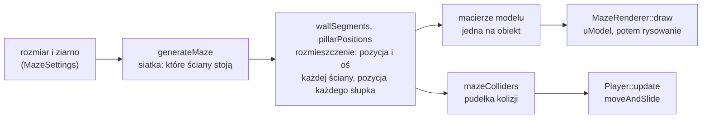
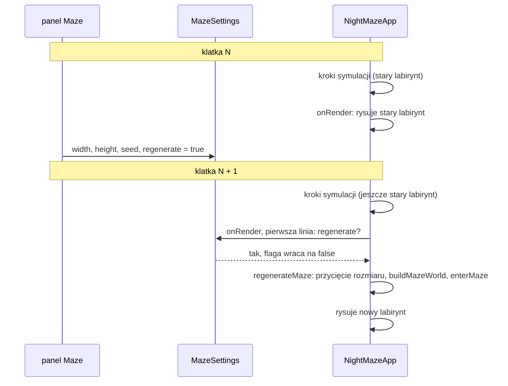

# Moduł game: labirynt w świecie i jego rysowanie

Kamień milowy: M2 + M3. Tematy wykładu: 3 (Przekształcenia przestrzeni: macierz modelu), 4 (Wczytywanie OBJ: rysowanie modelu) i 5 (Tekstury: użycie w klatce).
Kod: [`src/game/MazeWorld.hpp`](../../../src/game/MazeWorld.hpp), [`src/game/MazeWorld.cpp`](../../../src/game/MazeWorld.cpp), [`src/game/MazeRenderer.hpp`](../../../src/game/MazeRenderer.hpp), [`src/game/MazeRenderer.cpp`](../../../src/game/MazeRenderer.cpp), testy w [`tests/MazeWorldTests.cpp`](../../../tests/MazeWorldTests.cpp), użycie w [`src/game/NightMazeApp.cpp`](../../../src/game/NightMazeApp.cpp).

Część modułu `game`. Wstęp do modułu jest w [`README.md`](README.md). Ten dokument stoi na czterech innych: [`maze-generator.md`](maze-generator.md) (siatka `Maze`, generator, funkcje układu `wallSegments`, `pillarPositions`, `mazeColliders`), [`../scene/transforms.md`](../scene/transforms.md) (macierz modelu i struktura `Transform`), [`../assets/asset-cache.md`](../assets/asset-cache.md) (skąd biorą się modele i tekstury) oraz [`../gfx/textures.md`](../gfx/textures.md) (shadery `textured.vert` i `textured.frag`). Gracza, który po tym labiryncie chodzi, opisuje [`player.md`](player.md).

## 1. Po co to jest

Po poprzednich krokach kamienia milowego wszystko było gotowe osobno: generator dawał siatkę ścian (`game::Maze`), funkcje układu dawały pozycje ścian i słupków, loader dawał modele, a klasa tekstury obrazy na karcie. Brakowało ogniwa, które z tego robi **scenę**: mówi, gdzie w świecie stoi każdy obiekt, i rysuje go.

Tym ogniwem są dwa elementy:

| Element | Co robi | OpenGL | Biblioteka |
|---|---|---|---|
| `game::MazeWorld` i `buildMazeWorld` | z rozmiaru i ziarna liczy **wszystko, czego gra potrzebuje od labiryntu**: siatkę, listy ścian i słupków, macierze modelu każdego obiektu, pudełka kolizji, pozycję startu i wyjścia | nie | `game_logic` (testowalna) |
| `game::MazeRenderer` | rysuje `MazeWorld`: jedno wywołanie rysujące na obiekt, z modelem i teksturą z pamięci podręcznej assetów | tak | program `night_maze` |

Do tego dochodzi mała struktura `game::MazeSettings`: prośba o nowy labirynt, którą wypełnia panel Maze, a wykonuje aplikacja.

Podział jest taki sam jak w całym projekcie: dane i matematyka bez okna po jednej stronie (da się je przetestować), kod wymagający kontekstu OpenGL po drugiej.

**Stan na dziś, uczciwie.** Program startuje wewnątrz oteksturowanego labiryntu 10 na 10 komórek z ziarna 1. Na Windowsie (2026-10-05, MSVC 19.44, RTX 4070 Ti SUPER) build Debug i Release przechodzi bez ostrzeżeń, 8 przypadków testowych `MazeWorldTests.cpp` przechodzi w obu konfiguracjach, program startuje bez linii `[error]` i bez linii `GL_`, a na zrzutach ekranu sprawdzone są: widok startowy z teksturami ustawionymi poprawnie (nie do góry nogami i nie w lustrze) oraz widok z góry, na którym ściany zgadzają się z planem w panelu Maze. Przycisków `Regenerate` i `Random seed` nikt jeszcze nie kliknął ręcznie. Oświetlenia nie ma (to M4), więc scena jest równomiernie jasna. Na macOS kod nie był budowany ani uruchamiany.

## 2. Teoria

### 2.1 Od siatki do sceny: trzy kroki



1. **Siatka** (`Maze`) odpowiada na pytanie logiczne: czy komórka (x, z) ma ścianę po danej stronie. Nie ma w niej metrów.
2. **Rozmieszczenie** (placement) zamienia to na świat: segment ściany to pozycja środka jego podstawy i oś, wzdłuż której biegnie, a słupek to pozycja. Jedna komórka ma 2 na 2 m, labirynt zaczyna się w początku układu i rozciąga w stronę +X i +Z ([`maze-generator.md`](maze-generator.md), sekcja 2.7).
3. **Macierz modelu** zamienia rozmieszczenie na coś, co rozumie shader: macierz 4 x 4, która przenosi wierzchołki modelu z jego przestrzeni lokalnej do świata ([`../scene/transforms.md`](../scene/transforms.md), sekcja 2).

Z tego samego rozmieszczenia powstają też pudełka kolizji. To ważne: obraz i kolizje mają **jedno źródło**, więc ściana, którą widać, jest tą samą ścianą, która zatrzymuje gracza.

### 2.2 Jeden model, wiele macierzy

Labirynt 10 na 10 ma 121 segmentów ścian, ale plik `wall_straight.obj` jest jeden i na karcie graficznej leży jedna siatka ściany. Każdy segment to ta sama siatka narysowana z inną macierzą modelu. To samo dotyczy płytek podłogi i słupków.

| Model | Plik | Przestrzeń lokalna | Ile razy w labiryncie 10 na 10 |
|---|---|---|---|
| płytka podłogi | `models/floor_tile.obj` | kwadrat 2 x 2 m na wysokości 0, początek układu w środku | 100 (jedna na komórkę) |
| ściana | `models/wall_straight.obj` | leży wzdłuż osi X, od x = -1 do x = +1, wysokość 3 m, początek układu w środku podstawy | 121 |
| słupek | `models/wall_pillar.obj` | trzon 0,3 x 0,3 m, wysokość 3,15 m, początek układu w środku podstawy | 121 |

Skąd liczby 121 i 121. Labirynt doskonały o `w` kolumnach i `h` wierszach ma `w * h - 1` przejść ([`maze-generator.md`](maze-generator.md), sekcja 2.3). Wszystkich krawędzi komórek jest `w * (h + 1) + h * (w + 1)`, a ściana stoi na każdej, która nie jest przejściem:

```text
ściany  = w(h + 1) + h(w + 1) - (wh - 1) = wh + w + h + 1 = (w + 1)(h + 1)
słupki  = (w + 1)(h + 1)          każdy węzeł siatki ma słupek
```

Każdy węzeł ma słupek, bo węzeł wewnętrzny bez żadnej ściany oznaczałby cztery komórki połączone w kółko, a labirynt doskonały nie ma cykli. Dla 10 na 10 obie liczby to `11 * 11 = 121`.

### 2.3 Macierz modelu ściany: przesunięcie i obrót o 90 stopni

Płytka i słupek są symetryczne względem obrotu o ćwierć obrotu, więc wystarcza im samo **przesunięcie**: macierz, która do każdego wierzchołka dodaje pozycję obiektu.

Ściana ma kierunek. Model leży wzdłuż osi X, a połowa ścian labiryntu biegnie wzdłuż osi Z (to ściany zachodnie i wschodnie komórek). Dla nich macierz modelu zawiera dodatkowo **obrót o 90 stopni wokół osi Y**:

```text
M = T(pozycja) * R_y(90 stopni)          czytane od prawej: najpierw obrót, potem przesunięcie

R_y(90):   x' =  z
           y' =  y
           z' = -x
```

Koniec modelu w lokalnym `(1, 0, 0)` ląduje po obrocie w `(0, 0, -1)`: metr wzdłuż osi Z od środka ściany. Wysokość się nie zmienia. Kolejność ma znaczenie: obrót działa wokół początku układu modelu, więc trzeba obrócić ścianę "w miejscu" i dopiero potem ją przenieść. Odwrotna kolejność zatoczyłaby ścianą łuk wokół początku układu świata ([`../scene/transforms.md`](../scene/transforms.md), sekcja 2).

Model ściany jest symetryczny względem swojego środka, więc nie ma znaczenia, czy obrót jest o +90, czy o -90 stopni: oba ustawienia wyglądają tak samo. Dlatego wystarczają dwa ustawienia (wzdłuż X i wzdłuż Z), a nie cztery.

Normalne obracają się razem ze ścianą: shader wierzchołków mnoży je przez `mat3(uModel)`, czyli przez część macierzy bez przesunięcia. Jest to poprawne, dopóki skala jest jednakowa na wszystkich osiach, a tutaj wynosi 1 ([`../gfx/textures.md`](../gfx/textures.md), sekcja 4).

### 2.4 Dlaczego macierze są liczone raz

Labirynt się nie rusza. Macierz modelu ściany jest taka sama w każdej klatce, aż do wygenerowania nowego labiryntu. Liczenie jej w każdej klatce to 342 razy na klatkę: budowa macierzy jednostkowej, przesunięcie, trzy obroty (każdy z sinusem i kosinusem) i skala. Dlatego `buildMazeWorld` liczy wszystkie macierze **raz** i zapisuje je w trzech wektorach, a pętla rysowania tylko je czyta.

Zasada ogólna: to, co zależy tylko od poziomu, liczy się przy wczytaniu poziomu. To, co zależy od klatki (macierz widoku, pozycja gracza), liczy się w klatce.

To samo dotyczy pudełek kolizji: `mazeColliders` jest wołane raz, a gracz dostaje gotową listę 120 razy na sekundę.

### 2.5 Jedno wywołanie rysujące na obiekt i ile to kosztuje

**Wywołanie rysujące** (draw call) to jedno polecenie "narysuj te trójkąty", tutaj `glDrawElements`. W projekcie każdy obiekt labiryntu ma własne: ustawiam jego macierz modelu jako uniform i rysuję siatkę.

Labirynt domyślny:

| Co | Obiekty | Trójkąty na obiekt | Trójkąty razem |
|---|---|---|---|
| płytki podłogi | 100 | 2 | 200 |
| ściany | 121 | 30 | 3630 |
| słupki | 121 | 30 | 3630 |
| razem | 342 wywołania | | 7460 |

Każde z 342 wywołań to cztery funkcje OpenGL: wyszukanie położenia uniformu `uModel`, wysłanie macierzy, podpięcie VAO i samo rysowanie (sekcja 3). W buildzie Debug każdą z nich sprawdza jeszcze `glGetError` w makrze `GL_CHECK`.

Koszt wywołania rysującego nie leży w trójkątach, tylko w przejściu przez sterownik: każde wywołanie to praca procesora przed tym, zanim karta cokolwiek narysuje. Dla setek wywołań jest to niezauważalne. Dla dziesiątek tysięcy staje się wąskim gardłem. Suwaki w panelu Maze kończą się na 40 na 40 komórek, co daje `1600 + 1681 + 1681 = 4962` wywołania.

Dwie techniki, które zmniejszają liczbę wywołań, i dlaczego ich tu nie ma:

| Technika | Na czym polega | Dlaczego nie teraz |
|---|---|---|
| rysowanie instancjami (instancing, `glDrawElementsInstanced`) | jedno wywołanie rysuje ten sam model wiele razy, a macierze przychodzą jako atrybut zmieniany co instancję | wymaga dodatkowego bufora, atrybutu typu `mat4` zajmującego cztery numery i `glVertexAttribDivisor`. To temat spoza pierwszych wykładów |
| łączenie w jedną siatkę (static batching) | przy wczytaniu poziomu wszystkie ściany są przeliczane do świata i sklejane w jedną dużą siatkę | każda regeneracja budowałaby siatkę od nowa, a wersja z macierzami lepiej pokazuje temat 3 |

Wersja "jeden obiekt, jedna macierz, jedno wywołanie" jest najprostsza do wytłumaczenia linia po linii i przy tej skali wystarcza. Czasu samych wywołań nie mierzyłem. Jedyna obserwacja: na Windowsie program w konfiguracji Debug pokazywał na starcie około 1500 FPS (z synchronizacją pionową ustawioną tak, jak zostawił ją sterownik). To pojedynczy odczyt, a nie pomiar, i nie buduję na nim żadnych wniosków.

Kolejność pętli ma znaczenie także przy tej prostej wersji: tekstura i kolor materiału są ustawiane raz na model, a wewnątrz zmienia się tylko macierz (sekcja 5.6).

### 2.6 Start, wyjście i znacznik

- **Start**: środek komórki (0, 0), czyli północno-zachodni róg labiryntu, na wysokości podłogi: `(1, 0, 1)`.
- **Kierunek na starcie**: gracz ma patrzeć w korytarz, a nie w ścianę. Yaw wskazuje pierwszy bok komórki startowej, który nie ma ściany, sprawdzany w stałej kolejności północ, wschód, południe, zachód. Yaw kamery rośnie zgodnie z ruchem wskazówek zegara co 90 stopni (0 północ, 90 wschód, 180 południe, 270 zachód), tak samo jak kolejność kierunków w wyliczeniu `Direction`, więc kąt to numer kierunku razy 90.
- **Wyjście**: środek komórki w przeciwległym rogu, `(width - 1, height - 1)`. Dla 10 na 10 to `(19, 0, 19)`. Samego wyjścia jeszcze nie ma (to późniejszy kamień milowy). Jego miejsce oznacza kolorowa kostka z M1, która unosi się 4,5 m nad podłogą tej komórki, ponad ścianami (3 m) i słupkami (3,15 m).

W labiryncie wygenerowanym komórka (0, 0) ma od północy i zachodu ścianę zewnętrzną, więc otwarty bok to wschód albo południe. Wschód jest sprawdzany wcześniej, więc gdy otwarte są oba, gracz patrzy na wschód.

### 2.7 Regeneracja: prośba i wykonanie

Nowy labirynt może zamówić panel Maze. Panel jest rysowany **w środku klatki**, po scenie. Gdyby sam podmieniał labirynt, robiłby to w chwili, gdy reszta klatki mogła już korzystać ze starego. Dlatego panel tylko **zapisuje prośbę**, a aplikacja wykonuje ją w jednym, bezpiecznym miejscu:



Prośba to cztery pola: szerokość, wysokość, ziarno i flaga `regenerate`. Suwaki zmieniają tylko trzy liczby: dopóki nikt nie kliknie przycisku, labirynt w grze zostaje ten sam, a panel pokazuje obok siebie "zamówiony" i "w grze".

Wymiana labiryntu to jedno przypisanie całej struktury `MazeWorld`: siatka, macierze i pudełka zmieniają się razem. Żaden krok symulacji nie widzi stanu pośredniego, bo kroki klatki już się skończyły, gdy `onRender` się zaczyna.

Po wymianie trzeba jeszcze "wejść" do nowego labiryntu: przenieść kostkę nad nowe wyjście i postawić gracza na starcie. Stara pozycja gracza mogłaby wypaść w ścianie nowego labiryntu albo poza nim.

## 3. Jak to działa w OpenGL

`MazeWorld` nie woła OpenGL wcale. `MazeRenderer` nie woła go bezpośrednio: korzysta z klas `gfx::Shader`, `gfx::Texture2D` i `gfx::Mesh`. Poniżej jest to, co te klasy robią w jednej klatce dla labiryntu, w kolejności:

| Krok | Kod projektu | Wywołania OpenGL | Ile razy na klatkę (10 na 10) |
|---|---|---|---|
| 1 | `m_texturedShader.use()` | `glUseProgram` | 1 |
| 2 | `setMat4(VIEW_UNIFORM, ...)`, `setMat4(PROJECTION_UNIFORM, ...)` | `glGetUniformLocation`, `glUniformMatrix4fv` | po 1 |
| 3 | `setInt(VIEW_MODE_UNIFORM, ...)`, `setInt(TEXTURE_UNIFORM, 0)` | `glGetUniformLocation`, `glUniform1i` | po 1 |
| 4 | `part.texture->bind(TEXTURE_UNIT)` | `glActiveTexture`, `glBindTexture`, `glBindSampler` | 3 (raz na model: każdy ma jedną część) |
| 5 | `setVec3(TINT_UNIFORM, part.color)` | `glGetUniformLocation`, `glUniform3fv` | 3 |
| 6 | `setMat4(MODEL_UNIFORM, modelMatrix)` | `glGetUniformLocation`, `glUniformMatrix4fv` | 342 |
| 7 | `model->mesh.draw(part.firstIndex, part.indexCount)` | `glBindVertexArray`, `glDrawElements` | 342 |

Uwagi:

- Uniformy należą do programu, który jest w użyciu, więc `use()` stoi przed wszystkimi setterami ([`../gfx/uniforms.md`](../gfx/uniforms.md), sekcja 2).
- `uTexture` to sampler: przechowuje **numer jednostki teksturującej**, a nie teksturę. Wszystkie tekstury labiryntu są podpinane do jednostki 0 i sampler dostaje 0 ([`../gfx/textures.md`](../gfx/textures.md), sekcja 2).
- `glDrawElements` dostaje zakres indeksów części (pierwszy indeks i liczbę), a nie całą siatkę. Dla trzech modeli labiryntu część jest jedna i obejmuje całość ([`../gfx/mesh.md`](../gfx/mesh.md), sekcja 5).
- Test głębi jest włączony przez `onRender` przed rysowaniem, więc kolejność rysowania obiektów nie wpływa na obraz: bliższe ściany zasłaniają dalsze niezależnie od tego, która była pierwsza ([`../scene/camera.md`](../scene/camera.md), sekcja 3).
- Odrzucanie ścian tylnych (face culling) nie jest włączone: każdy trójkąt jest rysowany z obu stron.

## 4. Shadery

Labirynt rysuje para [`assets/shaders/textured.vert`](../../../assets/shaders/textured.vert) i [`assets/shaders/textured.frag`](../../../assets/shaders/textured.frag). Oba pliki linia po linii omawia [`../gfx/textures.md`](../gfx/textures.md), sekcja 4. Tutaj jest tylko to, co `MazeRenderer` i `NightMazeApp` im podają:

| Uniform | Stała w `ShaderUniforms.hpp` | Kto ustawia | Jak często | Wartość |
|---|---|---|---|---|
| `uView` | `VIEW_UNIFORM` | `NightMazeApp::drawMaze` | raz na klatkę | macierz widoku z interpolowanego oka |
| `uProjection` | `PROJECTION_UNIFORM` | `NightMazeApp::drawMaze` | raz na klatkę | macierz rzutowania |
| `uViewMode` | `VIEW_MODE_UNIFORM` | `NightMazeApp::drawMaze` | raz na klatkę | wartość `game::ViewMode`: 0, 1 albo 2 |
| `uTexture` | `TEXTURE_UNIFORM` | `MazeRenderer::draw` | raz na klatkę | 0: numer jednostki teksturującej |
| `uTint` | `TINT_UNIFORM` | `MazeRenderer::drawInstances` | raz na część modelu | kolor rozproszenia materiału (`Kd`) |
| `uModel` | `MODEL_UNIFORM` | `MazeRenderer::drawInstances` | raz na obiekt | macierz modelu z `MazeWorld` |

Tryb widoku to wyliczenie z `MazeRenderer.hpp`:

```cpp
enum class ViewMode {
    Textured = 0, ///< the texture multiplied by the colour of the material
    Normals = 1,  ///< the normal of the surface as a colour (a debug view, not lighting)
    Uvs = 2,      ///< the texture coordinate as a colour (a debug view)
};
```

Liczby są jawne, bo shader porównuje `uViewMode` z tymi samymi liczbami (`if (uViewMode == 1)`). Wyliczenie i shader muszą się zgadzać, a nic tego nie sprawdza automatycznie: to umowa zapisana w komentarzach po obu stronach. Przełącznik trybu jest w panelu Assets ([`../assets/asset-cache.md`](../assets/asset-cache.md), sekcja 6).

W tym kamieniu milowym nie ma oświetlenia: kolor fragmentu to tekstura razy kolor materiału. Normalne są już przekazywane do shadera fragmentów, ale służą tylko widokowi diagnostycznemu. Oświetlenie i mapy normalnych dochodzą w M4.

## 5. Kod w projekcie

### 5.1 Pliki

| Plik | Co zawiera |
|---|---|
| [`src/game/MazeWorld.hpp`](../../../src/game/MazeWorld.hpp) | stałe labiryntu domyślnego, struktury `MazeSettings` i `MazeWorld`, deklaracje `yawTowards` i `buildMazeWorld` |
| [`src/game/MazeWorld.cpp`](../../../src/game/MazeWorld.cpp) | funkcje pomocnicze `placedAt`, `wallMatrix`, `startYaw` i definicje dwóch funkcji publicznych |
| [`src/game/MazeRenderer.hpp`](../../../src/game/MazeRenderer.hpp), [`.cpp`](../../../src/game/MazeRenderer.cpp) | wyliczenie `ViewMode`, klasa `MazeRenderer` |
| [`tests/MazeWorldTests.cpp`](../../../tests/MazeWorldTests.cpp) | 8 przypadków testowych (sekcja 5.9) |
| [`src/game/NightMazeApp.hpp`](../../../src/game/NightMazeApp.hpp), [`.cpp`](../../../src/game/NightMazeApp.cpp) | właściciel: pola `m_mazeSettings`, `m_mazeWorld`, `m_mazeRenderer`, funkcje `regenerateMaze`, `enterMaze`, `drawMaze` |
| [`src/game/ShaderUniforms.hpp`](../../../src/game/ShaderUniforms.hpp) | nazwy uniformów ([`../gfx/uniforms.md`](../gfx/uniforms.md), sekcja 5) |

`MazeWorld.*` należą do biblioteki `game_logic`: nie dołączają niczego z `gfx/` ani GLAD. `MazeRenderer.*` należą do programu `night_maze`, razem z `NightMazeApp`, bo wymagają kontekstu OpenGL i nie da się ich uruchomić w teście.

### 5.2 `MazeSettings` i stałe labiryntu domyślnego

```cpp
/// The maze the game starts with: its size in cells and its seed.
constexpr int DEFAULT_MAZE_WIDTH = 10;
constexpr int DEFAULT_MAZE_HEIGHT = 10;
constexpr std::uint32_t DEFAULT_MAZE_SEED = 1;
```

```cpp
struct MazeSettings {
    /// Number of columns (cells along X) and of rows (cells along Z).
    int width = DEFAULT_MAZE_WIDTH;
    int height = DEFAULT_MAZE_HEIGHT;

    /// Seed of the generator: the same size and seed always give the same maze.
    std::uint32_t seed = DEFAULT_MAZE_SEED;

    /// True when a new maze was asked for and has not been built yet.
    bool regenerate = false;
};
```

| Pole | Znaczenie |
|---|---|
| `width`, `height` | rozmiar następnego labiryntu w komórkach. Typ `int`, bo taki przyjmuje `Maze` i taki edytuje `ImGui::SliderInt` |
| `seed` | ziarno. `std::uint32_t`, bo taki typ ma ziarno `std::mt19937` ([`maze-generator.md`](maze-generator.md), sekcja 2.6) |
| `regenerate` | flaga prośby (sekcja 2.7). Ustawia ją panel, zeruje aplikacja |

Zwykła struktura z wartościami domyślnymi: domyślnie utworzone `MazeSettings` opisuje labirynt, z którym gra startuje, i tak właśnie korzysta z niej konstruktor aplikacji.

### 5.3 Struktura `MazeWorld`

```cpp
struct MazeWorld {
    /// Takes the maze. Maze has no default constructor (a maze without a size makes no
    /// sense), so a MazeWorld cannot be created empty either. The other fields start
    /// empty: buildMazeWorld fills them.
    explicit MazeWorld(Maze generatedMaze) : maze(std::move(generatedMaze)) {}

    /// The grid of cells and walls.
    Maze maze;

    /// The seed the maze was generated from.
    std::uint32_t seed = 0;

    /// Every wall segment and the position of every pillar (see MazeLayout.hpp).
    std::vector<WallSegment> walls;
    std::vector<glm::vec3> pillars;

    /// Model matrices, one per object to draw: a floor tile for every cell, a wall model
    /// for every segment (same order as walls), a pillar model for every pillar.
    std::vector<glm::mat4> floorMatrices;
    std::vector<glm::mat4> wallMatrices;
    std::vector<glm::mat4> pillarMatrices;

    /// The obstacle list for the player: the box of every wall, then of every pillar.
    std::vector<scene::Aabb> colliders;

    /// Where the player starts: the centre of cell (0, 0), feet on the floor.
    glm::vec3 startPosition{0.0F};

    /// Camera yaw at the start, in degrees: towards the first open side of the start cell.
    float startYawDegrees = 0.0F;

    /// The centre of the far corner cell (width - 1, height - 1) at floor level: the
    /// place of the future exit.
    glm::vec3 exitPosition{0.0F};
};
```

| Pole | Kto z niego korzysta |
|---|---|
| `maze` | panel Maze (rozmiar), testy |
| `seed` | panel Maze (linia `In play`) |
| `walls`, `pillars` | panel Maze (plan z góry, liczniki), panel Collision (liczniki) |
| `floorMatrices`, `wallMatrices`, `pillarMatrices` | `MazeRenderer::draw` |
| `colliders` | `Player::update` przez `NightMazeApp::onUpdate`, rysowanie linii pudełek |
| `startPosition`, `startYawDegrees`, `exitPosition` | `NightMazeApp::enterMaze` |

Trzy rzeczy warte uwagi:

- **Konstruktor z `explicit` i `std::move`.** `Maze` nie ma konstruktora domyślnego, bo labirynt bez rozmiaru nie ma sensu. Struktura z takim polem też nie może powstać "pusta": musi dostać gotową siatkę. Parametr jest przyjmowany przez wartość i przenoszony do pola, więc wektor ścian wewnątrz `Maze` nie jest kopiowany. `explicit` zabrania cichej zamiany `Maze` na `MazeWorld`.
- **Kolejność w listach się zgadza.** `wallMatrices[i]` jest macierzą segmentu `walls[i]`, a `pillarMatrices[i]` słupka `pillars[i]`. W `colliders` najpierw idą pudełka wszystkich ścian, potem wszystkich słupków.
- **Po zbudowaniu tylko do odczytu.** Aplikacja udostępnia strukturę panelom przez akcesor zwracający `const MazeWorld&`. Nowy labirynt to nowa struktura, a nie poprawianie starej.

### 5.4 `yawTowards` i `startYaw`

```cpp
float yawTowards(Direction direction) {
    // The enum lists the directions clockwise starting with North (0, 1, 2, 3), the same
    // way yaw grows, so the number of the direction times 90 is the angle.
    return static_cast<float>(static_cast<int>(direction)) * QUARTER_TURN_DEGREES;
}
```

`Direction` to `enum class { North, East, South, West }`, czyli liczby 0, 1, 2, 3. Dwa rzutowania: pierwsze zamienia wyliczenie na `int` (silnie typowane wyliczenie nie robi tego samo), drugie `int` na `float`. `QUARTER_TURN_DEGREES` to `90.0F`. Wynik: 0, 90, 180, 270. Funkcja działa tylko dlatego, że kolejność w wyliczeniu jest taka sama jak kierunek wzrostu yaw. Przypina to test `yawTowards follows the compass of the camera`.

```cpp
float startYaw(const Maze& maze) {
    for (const Direction direction : ALL_DIRECTIONS) {
        if (!maze.hasWall(START_COLUMN, START_ROW, direction)) {
            return yawTowards(direction);
        }
    }
    return yawTowards(Direction::North);
}
```

`ALL_DIRECTIONS` to tablica czterech kierunków w stałej kolejności (północ, wschód, południe, zachód). Pętla zwraca yaw pierwszego boku bez ściany. Ostatnia linia obsługuje labirynt z jedną komórką: nie ma otwartego boku, więc gracz patrzy na północ. `START_COLUMN` i `START_ROW` to zera.

### 5.5 Macierze i `buildMazeWorld`

```cpp
// The wall model lies along the X axis. A quarter turn around Y lays it along Z.
constexpr glm::vec3 WALL_ALONG_Z_ROTATION{0.0F, QUARTER_TURN_DEGREES, 0.0F};

// Model matrix of an object that only stands somewhere: no rotation, no scale.
glm::mat4 placedAt(const glm::vec3& position) {
    scene::Transform transform;
    transform.position = position;
    return transform.matrix();
}

// Model matrix of one wall segment.
glm::mat4 wallMatrix(const WallSegment& segment) {
    scene::Transform transform;
    transform.position = segment.position;
    if (segment.axis == WallAxis::AlongZ) {
        transform.rotationDegrees = WALL_ALONG_Z_ROTATION;
    }
    return transform.matrix();
}
```

| Linia | Znaczenie |
|---|---|
| `scene::Transform transform;` | pozycja zero, obrót zero, skala 1: macierz jednostkowa, dopóki nic nie zmienię |
| `transform.position = position;` | samo przesunięcie. `Transform::matrix()` składa `translate * rotateY * rotateX * rotateZ * scale`, a przy zerowych kątach i skali 1 zostaje samo `translate` |
| `WALL_ALONG_Z_ROTATION{0.0F, QUARTER_TURN_DEGREES, 0.0F}` | kąty Eulera w stopniach wokół osi x, y, z: tylko y jest niezerowe |
| `if (segment.axis == WallAxis::AlongZ)` | ściany wzdłuż X zostają bez obrotu, ściany wzdłuż Z dostają ćwierć obrotu (sekcja 2.3) |

Macierze powstają przez tę samą strukturę `Transform`, której używa kostka: nie ma tu ręcznie wpisanych sinusów ani osobnego wzoru na obrót.

```cpp
MazeWorld buildMazeWorld(int width, int height, std::uint32_t seed) {
    MazeWorld world(generateMaze(width, height, seed));
    world.seed = seed;
    const Maze& maze = world.maze;

    world.walls = wallSegments(maze);
    world.pillars = pillarPositions(maze);
    world.colliders = mazeColliders(maze);

    // One floor tile per cell. The tile model is 2 x 2 m with its origin in the middle,
    // exactly one cell.
    for (int z = 0; z < maze.height(); ++z) {
        for (int x = 0; x < maze.width(); ++x) {
            world.floorMatrices.push_back(placedAt(cellCenter(x, z)));
        }
    }
    for (const WallSegment& segment : world.walls) {
        world.wallMatrices.push_back(wallMatrix(segment));
    }
    for (const glm::vec3& position : world.pillars) {
        world.pillarMatrices.push_back(placedAt(position));
    }

    world.startPosition = cellCenter(START_COLUMN, START_ROW);
    world.startYawDegrees = startYaw(maze);
    world.exitPosition = cellCenter(maze.width() - 1, maze.height() - 1);
    return world;
}
```

| Linia | Znaczenie |
|---|---|
| `MazeWorld world(generateMaze(width, height, seed));` | generuje siatkę i od razu oddaje ją strukturze. `generateMaze` rzuca `std::invalid_argument` dla rozmiaru poza zakresem od 1 do `Maze::MAX_SIZE`, więc `buildMazeWorld` też |
| `const Maze& maze = world.maze;` | krótsza nazwa dla siatki, która już należy do struktury |
| `wallSegments`, `pillarPositions`, `mazeColliders` | trzy funkcje układu z `MazeLayout` ([`maze-generator.md`](maze-generator.md), sekcje 5.6 i 5.7). `mazeColliders` liczy segmenty i słupki jeszcze raz we własnym zakresie: to drobne powtórzenie pracy, wykonywane raz na labirynt |
| podwójna pętla po `z` i `x` | płytki wiersz po wierszu: płytka komórki (x, z) ma indeks `z * width + x`. `cellCenter` daje środek komórki na wysokości podłogi, a model płytki ma początek układu w środku, więc pokrywa dokładnie jedną komórkę |
| pętla po `world.walls` | macierz dla każdego segmentu, w tej samej kolejności |
| pętla po `world.pillars` | słupek tylko stoi w swoim węźle |
| `world.exitPosition = cellCenter(maze.width() - 1, maze.height() - 1);` | przeciwległy róg. Dla labiryntu 1 na 1 to ta sama komórka co start |
| `return world;` | zwrot przez wartość. Kompilator przenosi strukturę (albo buduje ją od razu w miejscu docelowym), więc wektory nie są kopiowane |

### 5.6 `MazeRenderer`

```cpp
class MazeRenderer {
public:
    /// Asks the cache for the three models of the maze. A model that fails to load is
    /// logged by the cache and simply not drawn.
    explicit MazeRenderer(assets::AssetCache& assets);

    /// Draws the whole maze. shader is the textured program: it must be in use, with
    /// uView, uProjection and uViewMode already set. The function sets uTexture, and
    /// uModel and uTint for every object.
    void draw(const gfx::Shader& shader, const MazeWorld& world) const;

private:
    /// Draws one model once for every matrix in modelMatrices.
    static void drawInstances(const gfx::Shader& shader, const assets::LoadedModel* model,
                              std::span<const glm::mat4> modelMatrices);

    // Not owned. nullptr when the model could not be loaded.
    const assets::LoadedModel* m_floorTile;
    const assets::LoadedModel* m_wall;
    const assets::LoadedModel* m_pillar;
};
```

Klasa **niczego nie posiada**. Trzy wskaźniki pokazują na modele należące do pamięci podręcznej assetów, a macierze należą do `MazeWorld` podanego do `draw`. Dlatego nie ma destruktora ani zakazu kopiowania: nie ma czego zwalniać. Warunek poprawności jest jeden: pamięć podręczna musi żyć dłużej niż renderer. W `NightMazeApp` pilnuje tego kolejność pól (`m_assets` jest zadeklarowane przed `m_mazeRenderer`, więc powstaje wcześniej i ginie później).

Nagłówek nie dołącza `AssetCache.hpp`, `Shader.hpp` ani `MazeWorld.hpp`. Wystarczają mu deklaracje wyprzedzające (`class AssetCache;`, `struct LoadedModel;`, `class Shader;`, `struct MazeWorld;`), bo używa tych typów tylko przez wskaźnik albo referencję. Pełne nagłówki dołącza dopiero plik `.cpp`.

**Konstruktor.**

```cpp
// Model files, relative to the assets directory.
constexpr const char* FLOOR_TILE_MODEL_FILE = "models/floor_tile.obj";
constexpr const char* WALL_MODEL_FILE = "models/wall_straight.obj";
constexpr const char* PILLAR_MODEL_FILE = "models/wall_pillar.obj";

// The texture unit all textures of the maze are bound to. The sampler uniform gets the
// same number.
constexpr GLuint TEXTURE_UNIT = 0;
```

```cpp
MazeRenderer::MazeRenderer(assets::AssetCache& assets)
    : m_floorTile(assets.model(core::assetPath(FLOOR_TILE_MODEL_FILE))),
      m_wall(assets.model(core::assetPath(WALL_MODEL_FILE))),
      m_pillar(assets.model(core::assetPath(PILLAR_MODEL_FILE))) {}
```

`core::assetPath` zamienia ścieżkę względną na pełną, liczoną od katalogu `assets` obok pliku wykonywalnego ([`../core/paths.md`](../core/paths.md)). `AssetCache::model` wczytuje plik OBJ przy pierwszej prośbie i oddaje wskaźnik, który pozostaje ważny przez całe życie pamięci podręcznej, albo `nullptr`, gdy pliku nie da się wczytać ([`../assets/asset-cache.md`](../assets/asset-cache.md), sekcja 5). Modele są więc wczytywane raz, przy starcie programu. Regeneracja labiryntu ich nie dotyka.

**`draw`.**

```cpp
void MazeRenderer::draw(const gfx::Shader& shader, const MazeWorld& world) const {
    // The sampler reads the unit the textures are bound to below. It is set in every
    // frame and not once at start-up: after a shader reload all uniforms are back at 0.
    shader.setInt(TEXTURE_UNIFORM, static_cast<int>(TEXTURE_UNIT));

    drawInstances(shader, m_floorTile, world.floorMatrices);
    drawInstances(shader, m_wall, world.wallMatrices);
    drawInstances(shader, m_pillar, world.pillarMatrices);
}
```

| Linia | Znaczenie |
|---|---|
| `shader.setInt(TEXTURE_UNIFORM, static_cast<int>(TEXTURE_UNIT));` | sampler `uTexture` dostaje numer jednostki. Ustawiany w każdej klatce, a nie raz przy starcie: po przeładowaniu shaderów powstaje nowy program, w którym wszystkie uniformy mają wartość 0. Tutaj 0 jest akurat wartością poprawną, ale kod nie polega na tym zbiegu okoliczności |
| trzy wywołania `drawInstances` | podłoga, ściany, słupki. Wektor macierzy sam zamienia się na `std::span<const glm::mat4>` |

Funkcja zakłada, że program jest już w użyciu i ma ustawione `uView`, `uProjection` i `uViewMode`. Robi to `NightMazeApp::drawMaze` (sekcja 5.7). Podział jest celowy: to, co dotyczy całej klatki, ustawia aplikacja, a to, co dotyczy labiryntu, renderer.

**`drawInstances`.**

```cpp
void MazeRenderer::drawInstances(const gfx::Shader& shader, const assets::LoadedModel* model,
                                 std::span<const glm::mat4> modelMatrices) {
    // The load error is in the log. The rest of the maze is still drawn.
    if (model == nullptr) {
        return;
    }

    // The parts are the outer loop: the texture and the tint are set once per part, and
    // only the model matrix changes from one object to the next.
    for (const assets::ModelPart& part : model->parts) {
        part.texture->bind(TEXTURE_UNIT);
        shader.setVec3(TINT_UNIFORM, part.color);

        for (const glm::mat4& modelMatrix : modelMatrices) {
            shader.setMat4(MODEL_UNIFORM, modelMatrix);
            model->mesh.draw(part.firstIndex, part.indexCount);
        }
    }
}
```

| Linia | Znaczenie |
|---|---|
| `if (model == nullptr) { return; }` | model się nie wczytał: błąd jest w logu, a reszta labiryntu rysuje się normalnie. Brak pliku ściany nie zatrzymuje programu |
| `for (const assets::ModelPart& part : model->parts)` | **części są pętlą zewnętrzną**. Część to zakres indeksów siatki z jednym materiałem |
| `part.texture->bind(TEXTURE_UNIT);` | tekstura części i jej obiekt samplera na jednostkę 0. Wskaźnik nigdy nie jest pusty: część bez własnej tekstury pokazuje na białą teksturę zastępczą |
| `shader.setVec3(TINT_UNIFORM, part.color);` | kolor rozproszenia materiału. Dla trzech modeli labiryntu to biel `(1, 1, 1)`, która tekstury nie zmienia |
| `for (const glm::mat4& modelMatrix : modelMatrices)` | pętla wewnętrzna: wszystkie obiekty używające tego modelu |
| `shader.setMat4(MODEL_UNIFORM, modelMatrix);` | jedyna rzecz, która zmienia się między obiektami |
| `model->mesh.draw(part.firstIndex, part.indexCount);` | podpina VAO i woła `glDrawElements` dla zakresu indeksów części |

Dlaczego części na zewnątrz, a obiekty wewnątrz. Odwrotna kolejność też dałaby poprawny obraz, ale podpinałaby teksturę i ustawiała kolor przy każdym obiekcie: 342 razy zamiast 3. Zmiana tekstury jest droższa niż zmiana jednej macierzy, więc rysuje się "wszystko z tą teksturą, potem wszystko z następną". Funkcja jest `static`, bo nie czyta żadnego pola obiektu: dostaje model jako parametr.

Nazwa `drawInstances` nie oznacza rysowania instancjami w sensie OpenGL (`glDrawElementsInstanced`, sekcja 2.5). To zwykła pętla: jedno `glDrawElements` na macierz.

### 5.7 Użycie w `NightMazeApp`

**Pola i ich kolejność** (fragment, całość omawia [`../core/README.md`](../core/README.md), sekcja 5):

```cpp
    gfx::Shader m_shader;
    gfx::Shader m_texturedShader;
    gfx::Shader m_colorShader;
    assets::AssetCache m_assets;
    MazeRenderer m_mazeRenderer;
    ColliderLines m_colliderLines;
    gfx::VertexArray m_vertexArray;
    gfx::Buffer m_vertexBuffer;
    gfx::Buffer m_indexBuffer;
```

```cpp
    // The request for the next maze (edited by the debug UI) and the maze in play.
    MazeSettings m_mazeSettings;
    MazeWorld m_mazeWorld;
```

Dwie zależności kolejności, obie opisane w komentarzu nagłówka:

1. `m_assets` przed `m_mazeRenderer`: renderer w konstruktorze prosi pamięć podręczną o modele, więc musi ona już istnieć.
2. `m_assets`, `m_mazeRenderer` i `m_colliderLines` **przed** VAO i buforami kostki. Utworzenie siatki podpina jej własne VAO i bufory. Kostka z M1 polega na tym, że jej bufor wierzchołków jest nadal podpięty, gdy zaczyna się ciało konstruktora (tam opisuje atrybuty). Siatka utworzona po buforach kostki zabrałaby to podpięcie i atrybuty kostki zostałyby opisane na cudzym buforze.

`m_mazeWorld` stoi po `m_mazeSettings` i jest inicjalizowane w liście inicjalizacyjnej konstruktora, bo nie da się go utworzyć pustego:

```cpp
      m_mazeWorld(
          buildMazeWorld(m_mazeSettings.width, m_mazeSettings.height, m_mazeSettings.seed)) {
```

**Regeneracja.** Początek `onRender`:

```cpp
    // A new maze asked for by the debug UI is built here, at the start of a frame and
    // outside of the fixed steps, so no step ever sees a half replaced maze.
    if (m_mazeSettings.regenerate) {
        m_mazeSettings.regenerate = false;
        regenerateMaze();
    }
```

Flaga jest zerowana od razu, więc jedno kliknięcie to dokładnie jedna budowa. Blok stoi przed wszystkim innym w `onRender`: przed klawiszem N, przed obrotem myszą i przed rysowaniem.

```cpp
void NightMazeApp::regenerateMaze() {
    // generateMaze throws for a size outside 1 to Maze::MAX_SIZE. The request comes from
    // a panel, where any number can be typed, so it is brought into the range here and
    // written back for the panel to show.
    m_mazeSettings.width = std::clamp(m_mazeSettings.width, 1, Maze::MAX_SIZE);
    m_mazeSettings.height = std::clamp(m_mazeSettings.height, 1, Maze::MAX_SIZE);

    // Replaces the maze, the model matrices and the collision boxes in one assignment.
    m_mazeWorld = buildMazeWorld(m_mazeSettings.width, m_mazeSettings.height, m_mazeSettings.seed);
    enterMaze();
}
```

| Linia | Znaczenie |
|---|---|
| `std::clamp(m_mazeSettings.width, 1, Maze::MAX_SIZE)` | przycięcie do zakresu, który `Maze` przyjmuje (od 1 do 256). Panel ma własne, ciaśniejsze granice suwaków (od 2 do 40), ale aplikacja nie polega na panelu: ktokolwiek wypełni `MazeSettings`, nie doprowadzi do wyjątku. Przycięta wartość wraca do struktury, więc panel pokaże, co naprawdę zostało zbudowane |
| `m_mazeWorld = buildMazeWorld(...)` | przypisanie przenoszące: stare wektory są zwalniane, nowe przejmowane. Siatka, macierze i pudełka zmieniają się razem |
| `enterMaze();` | reszta pracy, wspólna ze startem programu |

```cpp
void NightMazeApp::enterMaze() {
    // The marker cube floats above the far corner cell, the place of the future exit.
    m_cubeTransform.position =
        m_mazeWorld.exitPosition + glm::vec3{0.0F, CUBE_HEIGHT_ABOVE_FLOOR, 0.0F};
```

`CUBE_HEIGHT_ABOVE_FLOOR` to `4.5F`. Kostka zachowuje swój obrót (25 stopni wokół osi x i 35 wokół y, ustawiony raz w konstruktorze), zmienia się tylko jej pozycja. Dalsza część `enterMaze` stawia gracza na starcie i ustawia kąty kamery: omawia ją [`player.md`](player.md), sekcja 5.8.

Co regeneracja zmienia, a czego nie:

| Zmienia | Zostawia |
|---|---|
| siatkę, listy ścian i słupków, macierze, pudełka kolizji | wczytane modele i tekstury (pamięć podręczna) |
| pozycję kostki | obrót kostki |
| pozycję gracza i poprzednią pozycję | tryb noclip i trzy prędkości gracza |
| yaw i pitch kamery | FOV, płaszczyzny, czułość myszy |
| | tryb widoku, filtr tekstur, rysowanie pudełek kolizji |

**Rysowanie.**

```cpp
void NightMazeApp::drawMaze(const glm::mat4& view, const glm::mat4& projection) const {
    // Without a shader program there is nothing to draw with. The load error was logged
    // once, when the shader was created, and the rest of the frame is still drawn.
    if (!m_texturedShader.isValid()) {
        return;
    }

    // The uniforms belong to the program in use, so use() comes before the setters.
    m_texturedShader.use();
    m_texturedShader.setMat4(VIEW_UNIFORM, view);
    m_texturedShader.setMat4(PROJECTION_UNIFORM, projection);
    // The enum values are the numbers textured.frag compares uViewMode with.
    m_texturedShader.setInt(VIEW_MODE_UNIFORM, static_cast<int>(m_viewMode));

    m_mazeRenderer.draw(m_texturedShader, m_mazeWorld);
}
```

`onRender` woła po kolei `drawMaze`, `drawCube` i, gdy włączone, `drawColliderLines`, każdą z tymi samymi macierzami widoku i rzutowania. Każda z trzech funkcji wybiera własny program i ustawia mu uniformy od zera, więc żadna nie zależy od tego, co zostawiła poprzednia.

### 5.8 Wymiary modeli a pudełka kolizji

Obraz i kolizje mają wspólne pozycje, ale nie wszystkie wymiary są identyczne. Warto to umieć wyjaśnić, gdy ktoś włączy rysowanie pudełek i zobaczy, że żółte linie nie leżą dokładnie na ścianie:

| Element | Grubość w modelu | Grubość pudełka kolizji |
|---|---|---|
| korpus ściany | 0,2 m (`WALL_VISUAL_THICKNESS`) | 0,3 m (`WALL_COLLISION_THICKNESS`) |
| cokół i nakrywa ściany | 0,28 m | 0,3 m |
| trzon słupka | 0,3 m | 0,3 m (`PILLAR_SIZE`) |
| podstawa i głowica słupka | 0,4 m | 0,3 m |

Pudełko ściany jest celowo tak grube jak słupek: lica pudełek ścian i słupków leżą wtedy w jednej płaszczyźnie i gracz sunący po ścianie nie zahacza o słupki ([`maze-generator.md`](maze-generator.md), sekcja 5.7, i [`../scene/collision.md`](../scene/collision.md), sekcja 7). Skutek uboczny: gracz zatrzymuje się 5 cm przed korpusem ściany, a podstawa słupka wystaje 5 cm poza jego pudełko.

### 5.9 Jak to zostało sprawdzone

Testy jednostkowe `tests/MazeWorldTests.cpp`:

| Przypadek testowy | Co sprawdza | Wynik |
|---|---|---|
| `the default maze is 10 by 10 cells with seed 1` | domyślne `MazeSettings` | 10, 10, 1, flaga fałszywa |
| `yawTowards follows the compass of the camera` | cztery kierunki | 0, 90, 180, 270 |
| `a maze world has one matrix per object and one box per wall and pillar` | labirynt 7 na 4, ziarno 9 | rozmiar i ziarno zapamiętane, listy takie jak z funkcji układu, 28 macierzy podłogi, po jednej macierzy na ścianę i słupek, pudełek tyle, ile ścian i słupków razem |
| `the same size and seed give the same maze world` | dwa razy 8 na 8, ziarno 42 | te same segmenty w tej samej kolejności, ten sam yaw startowy |
| `floor tiles and pillars are only moved to their place` | labirynt 3 na 2 | początek układu płytki ląduje w środku komórki (indeks 4 to komórka (1, 1)), narożnik `(1, 0, 1)` płytki w `(4, 0, 4)`, początek układu każdego słupka w jego pozycji |
| `a wall along X keeps the model as it is, a wall along Z turns it a quarter` | labirynt 4 na 4, ziarno 3, każdy segment | początek układu modelu w pozycji segmentu, góra zostaje górą, koniec modelu `(1, 0, 0)` ląduje metr dalej wzdłuż X albo metr wzdłuż Z (w dowolną stronę) |
| `the player starts in the first cell and looks down an open passage` | 20 ziaren, labirynt 6 na 5 | start w środku komórki (0, 0), wyjście w środku (5, 4), yaw to 90 albo 180 i wskazuje bok bez ściany |
| `a maze of one cell has no open side: the player looks north` | labirynt 1 na 1 | yaw 0, start i wyjście w tej samej komórce, 1 płytka, 4 ściany, 4 słupki |

Funkcja pomocnicza testów `transformPoint` mnoży macierz przez punkt w postaci `vec4` z `w = 1`. Jedynka sprawia, że przesunięcie zapisane w macierzy działa: tak samo liczy shader wierzchołków (`vec4(aPosition, 1.0)`).

Wyniki na Windowsie (MSVC 19.44, 2026-10-05): wszystkie przypadki przechodzą w Debug i Release, w ramach 87 przypadków i 60858 asercji całego programu testowego.

**Czego testy nie sprawdzają.** `MazeRenderer` i trzech funkcji `NightMazeApp`: wymagają kontekstu OpenGL. Sprawdzone na zrzutach ekranu z Windowsa: widok startowy ze środka labiryntu z poprawnie ustawionymi teksturami, widok z góry (tryb noclip) zgodny z planem w panelu Maze, żółte linie pudełek leżące na ścianach i słupkach, oba widoki diagnostyczne. Nie sprawdzone ręcznie: regeneracja przyciskami `Regenerate` i `Random seed`. Żaden test nie przypina yaw startowego labiryntu 10 na 10 z ziarna 1 (autor kodu podaje 180, południe, na podstawie uruchomienia).

## 6. Panel ImGui

Labirynt ma panel **Maze**: suwaki `Width` i `Height`, pole `Seed`, przyciski `Regenerate` i `Random seed`, linie `In play: ...` i `Walls: ..., pillars: ...` oraz plan labiryntu widziany z góry z kropką gracza. Kod panelu linia po linii, razem z rysowaniem planu, jest w [`maze-generator.md`](maze-generator.md), sekcja 6 (tam wskazuje nagłówek pliku `MazePanel.cpp`). PRD (sekcja 10) wymienia dla tego panelu jeszcze liczbę kryształów: kryształów w grze jeszcze nie ma, więc tego pola też nie.

Od strony tego dokumentu panel jest jedynym miejscem, które pisze do `MazeSettings`:

| Widżet | Co zapisuje | Kiedy coś się dzieje |
|---|---|---|
| `Width`, `Height` (od 2 do 40 komórek) | `settings.width`, `settings.height` | nic, dopóki nie padnie kliknięcie |
| `Seed` | `settings.seed` | nic, dopóki nie padnie kliknięcie |
| `Regenerate` | `settings.regenerate = true` | na początku następnej klatki |
| `Random seed` | losowe `settings.seed` i `settings.regenerate = true` | na początku następnej klatki |

Rysowanie labiryntu przełącza się w dwóch innych panelach: tryb widoku, filtr tekstur i anizotropię w panelu Assets ([`../assets/asset-cache.md`](../assets/asset-cache.md), sekcja 6), a linie pudełek kolizji w panelu Collision ([`../scene/collision.md`](../scene/collision.md), sekcja 6).

**Co pokazać na obronie** (tematy 3 i 4 od strony rysowania). Kroki z klikaniem nie były jeszcze wykonane ręcznie:

1. Program startuje w labiryncie. Mówię: 342 obiekty, trzy modele, każda ściana to ta sama siatka z inną macierzą modelu.
2. Naciskam N i lecę w górę (spacja). Z góry widać, że ściany biegną w dwóch kierunkach: połowa ma w macierzy obrót o 90 stopni wokół Y. Porównuję z planem w panelu Maze.
3. Pokazuję kostkę nad przeciwległym rogiem: `exitPosition` plus 4,5 m w górę. To ta sama kostka i ten sam shader co w M1.
4. Zmieniam `Width` na 4, `Height` na 4 i klikam `Regenerate`. Labirynt się zmienia, staję na starcie, kostka przenosi się nad nowy róg. Linia `In play` pokazuje nowy rozmiar, a liczniki `(4 + 1) * (4 + 1) = 25` ścian i 25 słupków.
5. Wpisuję poprzednie ziarno i rozmiar: wraca dokładnie ten sam labirynt (determinizm).
6. W panelu Assets przełączam `View mode` na `Normals as colour`: ściany wzdłuż X i wzdłuż Z mają różne kolory, czyli normalne obróciły się razem z modelem.

## 7. Pułapki

1. **Obrót i przesunięcie w złej kolejności.** Macierz `R * T` (najpierw przesunięcie, potem obrót) zatoczyłaby ścianą łuk wokół początku układu świata i wszystkie ściany wzdłuż Z stanęłyby w złych miejscach. `Transform::matrix()` składa `T * R * S`, więc obrót działa wokół środka modelu.
2. **Macierze liczone w pętli rysowania.** Działa, ale powtarza w każdej klatce pracę, której wynik się nie zmienia. Przeniesienie liczenia do `buildMazeWorld` zmienia też typ błędu: zła macierz jest widoczna w teście bez okna.
3. **Pętle w odwrotnej kolejności.** Obiekty na zewnątrz i części wewnątrz dają ten sam obraz, ale podpinają teksturę przy każdym obiekcie.
4. **`uTexture` ustawiony tylko raz przy starcie.** Po `Reload shaders` powstaje nowy program i jego uniformy wracają do wartości początkowych. Kod ustawia `uTexture`, `uTint` i `uViewMode` w każdej klatce, więc przeładowanie niczego nie psuje.
5. **Zmiana labiryntu w środku klatki.** Panel dostaje bieżący labirynt jako `const MazeWorld&`, więc nie może go podmienić, i to jest zamierzone. Gdyby mógł, wymiana następowałaby po narysowaniu sceny, a przed końcem klatki: scena na ekranie pochodziłaby ze starego labiryntu, plan w panelu z nowego, a gracz stałby jeszcze w starej pozycji. Flaga w `MazeSettings` przenosi wymianę na początek następnej klatki, w jedno miejsce.
6. **Przeniesienie gracza bez poprzedniej pozycji.** `enterMaze` ustawia `m_player.position` i `m_previousPlayerPosition` razem. Samo pierwsze przypisanie dałoby jedną klatkę narysowaną z punktu między starym a nowym miejscem: widoczny przelot przez ściany.
7. **Renderer przeżywający pamięć podręczną.** `MazeRenderer` trzyma gołe wskaźniki. Odwrócenie kolejności pól `m_assets` i `m_mazeRenderer` w klasie dałoby wskaźniki do obiektu, który jeszcze nie istnieje (przy budowie) i już nie istnieje (przy niszczeniu).
8. **Siatka utworzona po buforach kostki.** Każda nowa `gfx::Mesh` podpina własne VAO. Pole tworzące siatki, dopisane pod `m_indexBuffer`, zepsułoby opis atrybutów kostki, bez żadnego błędu kompilacji ani OpenGL: kostka po prostu by zniknęła albo wyglądała źle.
9. **`ViewMode` i `textured.frag` rozjechane.** Dodanie czwartego trybu w wyliczeniu bez gałęzi w shaderze daje zwykły obraz z teksturą (gałąź `else`). Zmiana kolejności wartości w wyliczeniu zamienia tryby miejscami. Liczby są jawne po obu stronach właśnie po to, żeby było to widać.
10. **Model, który się nie wczytał, znika po cichu.** Brak `wall_straight.obj` nie zatrzymuje programu: labirynt jest wtedy bez ścian na ekranie, ale **z** kolizjami, bo pudełka nie zależą od modelu. Jedynym śladem jest linia `[error]` w logu i wpis w panelu Assets.
11. **Pudełko kolizji to nie model.** Żółte linie są grubsze niż korpus ściany (0,3 wobec 0,2 m) i węższe niż podstawa słupka (0,3 wobec 0,4 m). To zamierzone (sekcja 5.8).
12. **Rozmiar spoza zakresu.** `buildMazeWorld` rzuca wyjątek dla rozmiaru 0 albo większego niż 256. `regenerateMaze` przycina rozmiar wcześniej. Konstruktor aplikacji nie przycina, bo podaje stałe domyślne.

## 8. Ćwiczenia

Ćwiczenia od 1 do 3 robi się na kartce. Pozostałe to zmiany w kodzie: po każdej zbuduj projekt (`cmake --build --preset debug`), uruchom testy albo program, a na końcu wycofaj zmianę (`git checkout src tests assets/shaders`). Ćwiczeń od 4 do 9 nie wykonywałem: opisy skutków wynikają z czytania kodu.

1. **Liczba obiektów.** Ile ścian, słupków i płytek ma labirynt 6 na 5? Ile wywołań rysujących? Odpowiedź: `7 * 6 = 42` ściany, 42 słupki, 30 płytek, razem 114.
2. **Macierz ściany.** Segment ma pozycję `(4, 0, 3)` i oś `AlongZ`. Gdzie w świecie lądują punkty modelu `(1, 0, 0)`, `(-1, 0, 0)` i `(0, 3, 0)`? Odpowiedź: `(4, 0, 2)`, `(4, 0, 4)` i `(4, 3, 3)`.
3. **Indeks płytki.** Który indeks w `floorMatrices` ma płytka komórki (3, 2) w labiryncie 10 na 10 i gdzie stoi jej środek? Odpowiedź: `2 * 10 + 3 = 23`, środek w `(7, 0, 5)`.
4. **Bez obrotu.** W `wallMatrix` usuń blok `if`. Który przypadek testowy przestaje przechodzić? Uruchom program i obejrzyj labirynt z góry.
5. **Zła kolejność.** W `wallMatrix` policz macierz ręcznie jako obrót razy przesunięcie (`glm::rotate(glm::mat4(1.0F), ...)`, potem `glm::translate` na wyniku) i porównaj wynik testu `a wall along X keeps the model as it is...` z oryginałem.
6. **Wyższa kostka.** Zmień `CUBE_HEIGHT_ABOVE_FLOOR` na `1.5F`. Skąd w labiryncie widać teraz kostkę, a skąd nie?
7. **Start patrzący w ścianę.** Zamień w `buildMazeWorld` wywołanie `startYaw(maze)` na `yawTowards(Direction::North)`. Który test to wykrywa i dlaczego pojedyncze ziarno by nie wystarczyło?
8. **Licznik wywołań.** Dodaj w `MazeRenderer::drawInstances` tymczasowy licznik zwiększany przy każdym `mesh.draw` i wypisz go raz przez `core::logInfo`. Sprawdź, czy dla labiryntu domyślnego wychodzi 342 i jak zmienia się po regeneracji do 40 na 40.
9. **Kolor zamiast tekstury.** W `drawInstances` zamień `part.texture->bind(TEXTURE_UNIT)` na podpięcie białej tekstury i ustaw `uTint` na `(0,5, 0,5, 1)`. Potrzebujesz do tego dostępu do pamięci podręcznej: co trzeba by zmienić w klasie i dlaczego obecna wersja go nie przechowuje?

## 9. Pytania kontrolne

1. **Jakie trzy kroki prowadzą od ziarna do obrazu ściany?**
   Generator daje siatkę (które ściany stoją). Funkcje układu dają rozmieszczenie: pozycję i oś każdego segmentu. `buildMazeWorld` zamienia rozmieszczenie na macierz modelu, którą renderer podaje shaderowi jako `uModel`.

2. **Ile siatek ściany leży na karcie graficznej w labiryncie ze 121 ścianami?**
   Jedna. Każda ściana to ta sama siatka narysowana z inną macierzą modelu.

3. **Czym różni się macierz modelu ściany wzdłuż X od ściany wzdłuż Z?**
   Pierwsza to samo przesunięcie. Druga to przesunięcie razy obrót o 90 stopni wokół osi Y: model leżący wzdłuż X zostaje obrócony w miejscu i dopiero potem przeniesiony.

4. **Dlaczego wystarczają dwa ustawienia ściany, a nie cztery?**
   Model jest symetryczny względem swojego środka, więc obrót o 90 i o 270 stopni wygląda tak samo, tak jak 0 i 180.

5. **Dlaczego macierze modelu są liczone w `buildMazeWorld`, a nie w pętli rysowania?**
   Labirynt się nie rusza, więc macierze zależą tylko od poziomu. Liczone raz, nie obciążają klatki, a do tego da się je sprawdzić testem bez okna.

6. **Ile wywołań rysujących ma labirynt domyślny i z czego wynika ta liczba?**
   342: 100 płytek, 121 ścian i 121 słupków. Ścian i słupków w labiryncie doskonałym jest po `(w + 1)(h + 1)`.

7. **Co kosztuje wywołanie rysujące i jak można zmniejszyć ich liczbę?**
   Pracę procesora w sterowniku przy każdym wywołaniu, niezależnie od liczby trójkątów. Liczbę wywołań zmniejsza rysowanie instancjami (jedno wywołanie, macierze jako atrybut na instancję) albo sklejenie nieruchomej geometrii w jedną siatkę. Projekt zostaje przy jednym wywołaniu na obiekt, bo przy setkach obiektów to wystarcza i jest najprostsze do wytłumaczenia.

8. **Dlaczego w `drawInstances` części modelu są pętlą zewnętrzną?**
   Żeby teksturę i kolor materiału ustawiać raz na część, a nie raz na obiekt. Między obiektami zmienia się tylko `uModel`.

9. **Co posiada `MazeRenderer`?**
   Nic. Ma trzy wskaźniki do modeli należących do pamięci podręcznej assetów i dostaje `MazeWorld` jako parametr. Pamięć podręczna musi żyć dłużej niż renderer.

10. **Jak przebiega regeneracja labiryntu od kliknięcia do obrazu?**
    Panel ustawia w `MazeSettings` rozmiar, ziarno i flagę. Na początku następnego `onRender` aplikacja zeruje flagę, przycina rozmiar, przypisuje do `m_mazeWorld` wynik `buildMazeWorld` i woła `enterMaze`, które przenosi kostkę i gracza. Potem klatka rysuje już nowy labirynt.

11. **Dlaczego panel nie buduje labiryntu sam?**
    Jest rysowany w środku klatki i ma do bieżącego labiryntu referencję tylko do odczytu. Wymiana w tym miejscu podmieniłaby dane używane w tej samej klatce. Flaga przenosi wymianę w jedno bezpieczne miejsce, poza kroki symulacji.

12. **Dokąd patrzy gracz na starcie?**
    W stronę pierwszego boku komórki (0, 0) bez ściany, w kolejności północ, wschód, południe, zachód. W labiryncie wygenerowanym to wschód (90) albo południe (180). Kąt to numer kierunku razy 90.

13. **Gdzie jest kostka z M1 i po co?**
    Unosi się 4,5 m nad środkiem komórki w przeciwległym rogu, jako znacznik przyszłego wyjścia. Jej dane, bufory i shader `basic` są takie same jak w M1, zmieniła się tylko pozycja.

14. **Dlaczego `MazeWorld` jest w bibliotece `game_logic`, a `MazeRenderer` w programie?**
    `MazeWorld` to dane i matematyka bez OpenGL, więc da się go zbudować w teście. `MazeRenderer` woła klasy `gfx`, które wymagają kontekstu OpenGL.

15. **Co się stanie, gdy plik modelu ściany zniknie?**
    Pamięć podręczna zapisze błąd w logu i odda `nullptr`, a `drawInstances` pominie ten model. Podłoga i słupki będą widoczne, ścian nie będzie na ekranie, ale ich pudełka kolizji nadal będą zatrzymywać gracza.

## 10. Źródła

- LearnOpenGL, rozdział "Transformations": <https://learnopengl.com/Getting-started/Transformations> (kolejność przesunięcia i obrotu) i "Coordinate Systems": <https://learnopengl.com/Getting-started/Coordinate-Systems> (wiele obiektów z jednej siatki, każdy z własną macierzą modelu).
- LearnOpenGL, rozdział "Instancing": <https://learnopengl.com/Advanced-OpenGL/Instancing> (koszt wywołań rysujących i rysowanie instancjami: technika, której projekt nie używa).
- LearnOpenGL, rozdział "Model": <https://learnopengl.com/Model-Loading/Model> (model jako siatki i materiały).
- Dokumentacja OpenGL, `glDrawElements`: <https://registry.khronos.org/OpenGL-Refpages/gl4/html/glDrawElements.xhtml>, `glDrawElementsInstanced`: <https://registry.khronos.org/OpenGL-Refpages/gl4/html/glDrawElementsInstanced.xhtml>.
- Jamis Buck, "Mazes for Programmers" (Pragmatic Bookshelf, 2015): labirynt doskonały jako drzewo rozpinające siatki (stąd liczba ścian).
- Dokumenty w tym repozytorium: [`maze-generator.md`](maze-generator.md) (siatka, generator, układ, panel Maze), [`player.md`](player.md) (gracz i `enterMaze`), [`../scene/transforms.md`](../scene/transforms.md) (`Transform`), [`../scene/collision.md`](../scene/collision.md) (pudełka i ich rysowanie), [`../assets/asset-cache.md`](../assets/asset-cache.md) (modele, tekstury, panel Assets), [`../gfx/textures.md`](../gfx/textures.md) (shadery `textured`), [`../gfx/mesh.md`](../gfx/mesh.md) (`Mesh::draw`), [`../gfx/uniforms.md`](../gfx/uniforms.md) (nazwy uniformów), [`../core/README.md`](../core/README.md) (`NightMazeApp` jako całość), [`../../guides/blender.md`](../../guides/blender.md) (wymiary modeli).
- PRD ([`../../PRD.pdf`](../../PRD.pdf)): sekcja 3 (tematy 3, 4 i 5), sekcja 10 (panel Maze).
