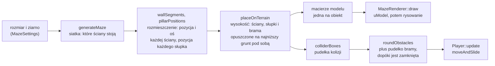
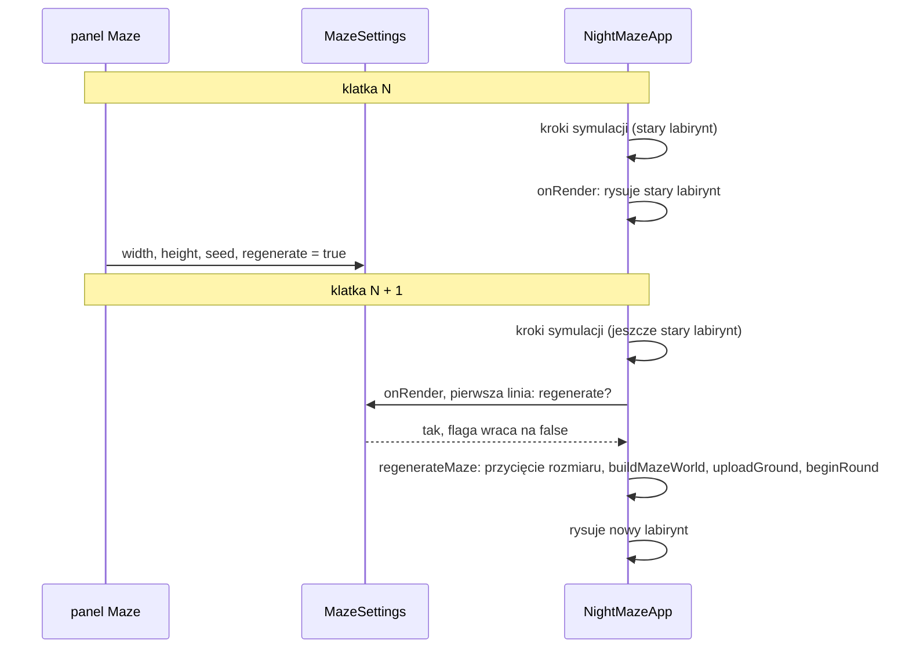

# Moduł game: labirynt w świecie i jego rysowanie

Kamień milowy: M2 + M3, w M4 doszły oświetlenie labiryntu (wybór programu, macierz normalnych na obiekt) i mapy normalnych (druga tekstura na jednostce 1, uniformy `uNormalMap` i `uNormalMapEnabled`), a w M5 wyjście, brama i kryształy jako pola `MazeWorld`, wspólne funkcje rysowania modelu w `ModelDraw` i uniform `uEmissive`. W drugiej części M6 labirynt stanął na terenie z mapy wysokości: z `MazeWorld` zniknęły płytki podłogi, doszły pole `terrain`, funkcja `placeOnTerrain` i drugie przeciążenie `buildMazeWorld`, a w `ModelDraw` funkcja `drawMesh`. Tematy wykładu: 3 (Przekształcenia przestrzeni: macierz modelu), 4 (Wczytywanie OBJ: rysowanie modelu) i 5 (Tekstury: użycie w klatce), a od M4 także 6 i 7 w użyciu.
Kod: [`src/game/MazeWorld.hpp`](../../../src/game/MazeWorld.hpp), [`src/game/MazeWorld.cpp`](../../../src/game/MazeWorld.cpp), [`src/game/MazeRenderer.hpp`](../../../src/game/MazeRenderer.hpp), [`src/game/MazeRenderer.cpp`](../../../src/game/MazeRenderer.cpp), [`src/game/ModelDraw.hpp`](../../../src/game/ModelDraw.hpp), [`src/game/ModelDraw.cpp`](../../../src/game/ModelDraw.cpp), testy w [`tests/MazeWorldTests.cpp`](../../../tests/MazeWorldTests.cpp), użycie w [`src/game/NightMazeApp.cpp`](../../../src/game/NightMazeApp.cpp).

Część modułu `game`. Wstęp do modułu jest w [`README.md`](README.md). Ten dokument stoi na czterech innych: [`maze-generator.md`](maze-generator.md) (siatka `Maze`, generator, funkcje układu `wallSegments`, `pillarPositions`, `mazeColliders`), [`../scene/transforms.md`](../scene/transforms.md) (macierz modelu i struktura `Transform`), [`../assets/asset-cache.md`](../assets/asset-cache.md) (skąd biorą się modele i tekstury) oraz [`../gfx/textures.md`](../gfx/textures.md) (shadery `textured.vert` i `textured.frag`). Gracza, który po tym labiryncie chodzi, opisuje [`player.md`](player.md), a rundę, która się w nim toczy (kryształy, bateria, brama, wyjście), [`gameplay.md`](gameplay.md). Sam teren (mapę wysokości, siatkę, wzór wysokości, `heightAt`, klasę `TerrainRenderer`) opisuje [`../renderer/terrain.md`](../renderer/terrain.md): tutaj jest tylko to, jak labirynt na nim staje.

## 1. Po co to jest

Po poprzednich krokach kamienia milowego wszystko było gotowe osobno: generator dawał siatkę ścian (`game::Maze`), funkcje układu dawały pozycje ścian i słupków, loader dawał modele, a klasa tekstury obrazy na karcie. Brakowało ogniwa, które z tego robi **scenę**: mówi, gdzie w świecie stoi każdy obiekt, i rysuje go.

Tym ogniwem są dwa elementy:

| Element | Co robi | OpenGL | Biblioteka |
|---|---|---|---|
| `game::MazeWorld` i `buildMazeWorld` | z rozmiaru i ziarna liczy **wszystko, czego gra potrzebuje od labiryntu**: siatkę, listy ścian i słupków, macierze modelu każdego obiektu, pudełka kolizji, pozycję startu, a od M5 komórkę wyjścia, bramę, strefę wyjścia i komórki kryształów. Od M6 także teren pod labiryntem i wysokość każdej z tych rzeczy (`placeOnTerrain`) | nie | `game_logic` (testowalna) |
| `game::MazeRenderer` | rysuje `MazeWorld`: jedno wywołanie rysujące na obiekt, z modelem i teksturą z pamięci podręcznej assetów | tak | program `night_maze` |
| `game::setModelSamplers` i `game::drawModel` (`ModelDraw.*`, od M5) | wspólna część rysowania modelu: numery jednostek teksturujących dla samplerów i pętla "część modelu, potem obiekty". Korzystają z niej `MazeRenderer` i `GameplayRenderer` (brama i kryształy) | tak | program `night_maze` |
| `game::drawMesh` (`ModelDraw.*`, od M6) | to samo dla jednej siatki, która nie pochodzi z pliku modelu: dwie tekstury, kolor, macierz modelu i macierz normalnych, jedno rysowanie. Korzysta z niej `TerrainRenderer` (podłoże) | tak | program `night_maze` |

Do tego dochodzi mała struktura `game::MazeSettings`: prośba o nowy labirynt, którą wypełnia panel Maze, a wykonuje aplikacja.

Podział jest taki sam jak w całym projekcie: dane i matematyka bez okna po jednej stronie (da się je przetestować), kod wymagający kontekstu OpenGL po drugiej.

**Stan na dziś, uczciwie.** Program startuje nocą wewnątrz oteksturowanego i oświetlonego labiryntu 10 na 10 komórek z ziarna 1, w którym od M5 toczy się runda: w labiryncie wisi 13 kryształów, a wyjście w komórce (6, 5) zamyka brama ([`gameplay.md`](gameplay.md)). Od M6 labirynt stoi na łagodnie nierównym terenie, który wokół niego przechodzi we wzgórza: płytek podłogi już nie ma, a ściany, słupki i brama są opuszczone na najniższy grunt pod sobą ([`../renderer/terrain.md`](../renderer/terrain.md), decyzje [`../../decisions/gentle-terrain-under-maze.md`](../../decisions/gentle-terrain-under-maze.md) i [`../../decisions/floor-tiles-retired.md`](../../decisions/floor-tiles-retired.md)). Teren, labirynt, bramę i kryształy rysuje jeden z trzech programów, zależnie od trybu cieniowania: `lit` (tryby `Phong` i `Blinn-Phong`, startowy), `gouraud` albo `textured` (tryb `Unlit` i oba podglądy diagnostyczne). Od czwartej części M7 (cienie księżyca, 2026-10-05) te same cztery rzeczy są w każdej klatce rysowane jeszcze raz, wcześniej, czwartym programem `shadow_depth` do mapy cieni księżyca (sekcje 2.5, 3 i 5.7, cała technika w [`../renderer/shadows.md`](../renderer/shadows.md)). M6 jest na Windowsie kompletny w kodzie i **nie jest zamknięty**: macOS i testy ręczne są otwarte, tagu wersji nie ma. Testy uruchomiłem 2026-10-05 na gotowych programach Debug i Release: wtedy 256 przypadków i 101232 asercje przechodziły w obu (po pierwszej części M7 zgłoszone: 269 i 102103, po drugiej 276 i 102139, po trzeciej 294 i 102412, po czwartej 310 i 103751), w tym 8 przypadków `MazeWorldTests.cpp` i przypadki `TerrainTests.cpp` o labiryncie na terenie (sekcja 5.9). Build bez ostrzeżeń i obraz terenu to zgłoszenie autora kodu z tego samego dnia: obraz był sprawdzony na zrzutach ekranu zrobionych przez tymczasowe zaczepy w kodzie, które potem usunięto. Otwarte: nic z M5 ani z M6 nie było budowane ani uruchamiane na macOS i nikt jeszcze nie testował ręcznie (przycisków `Regenerate` i `Random seed`, listy `Lighting`, pola wyboru `Normal mapping`, przejścia przez otwartą bramę, suwaka `Height scale`, chodzenia po nierównym gruncie). Z wcześniejszych kamieni milowych zostają sprawdzone na zrzutach ekranu z Windowsa (2026-10-05): widok startowy, cztery tryby cieniowania z trzech miejsc, tekstury ustawione poprawnie (nie do góry nogami i nie w lustrze), widok z góry, na którym ściany zgadzają się z planem w panelu Maze, oraz mapy normalnych (fugi czytają się jako rowki na ścianach wzdłuż X, wzdłuż Z, na słupku i na ówczesnych płytkach podłogi, które usunął M6). Mapy normalnych: `drawModel` podpina mapę normalnych każdej części do jednostki 1 (a `drawMesh` mapę normalnych podłoża), a o tym, czy shader z niej korzysta, decyduje `usesNormalMap` (sekcje 5.6 i 5.7, cała technika w [`../gfx/normal-mapping.md`](../gfx/normal-mapping.md)). Cienie: od czwartej części M7 (2026-10-05) teren, ściany, słupki, brama i kryształy rzucają i przyjmują **cień księżyca** w trybach `Gouraud`, `Phong` i `Blinn-Phong`. W trybie `Unlit` i w obu podglądach diagnostycznych cieni nie widać, bo program `textured` nie dołącza `common/shadows.glsl`. Światła kryształów cieni nie rzucają: ich światło nadal przechodzi przez ściany. Od piątej części M7 (2026-10-06) cień rzuca też latarka: teren, ściany, słupki, brama i kryształy idą do drugiej mapy cieni. Zgłoszone dla Windowsa, 2026-10-05: bramka `make check` przechodzi, build Debug nie zapisał błędów OpenGL przy mapie 2048 i 1024. Nie sprawdzone: przełączanie rozdzielczości i widżety panelu Shadows myszą, przeładowanie shaderów przy jedenastu programach, macOS. Od pierwszej części M7 labirynt jest rysowany do framebuffera HDR, jego tekstury koloru są teksturami sRGB dekodowanymi przy odczycie, a mapy normalnych zostały liniowe ([`../gfx/color-space.md`](../gfx/color-space.md), [`../renderer/post-process.md`](../renderer/post-process.md)).

## 2. Teoria

### 2.1 Od siatki do sceny: trzy kroki i wysokość



1. **Siatka** (`Maze`) odpowiada na pytanie logiczne: czy komórka (x, z) ma ścianę po danej stronie. Nie ma w niej metrów.
2. **Rozmieszczenie** (placement) zamienia to na świat: segment ściany to pozycja środka jego podstawy i oś, wzdłuż której biegnie, a słupek to pozycja. Jedna komórka ma 2 na 2 m, labirynt zaczyna się w początku układu i rozciąga w stronę +X i +Z ([`maze-generator.md`](maze-generator.md), sekcja 2.7).
3. **Macierz modelu** zamienia rozmieszczenie na coś, co rozumie shader: macierz 4 x 4, która przenosi wierzchołki modelu z jego przestrzeni lokalnej do świata ([`../scene/transforms.md`](../scene/transforms.md), sekcja 2).

Od M6 między krokiem 2 a 3 stoi jeszcze **wysokość**. Funkcje układu dają pozycje na `y = 0`, a labirynt stoi na terenie, który płaski nie jest. `placeOnTerrain` buduje teren i zmienia w każdej pozycji tylko `y`: ściana, słupek i brama schodzą na najniższy grunt pod swoim obrysem. Nic nie przesuwa się w bok, więc plan labiryntu widziany z góry jest dokładnie taki jak przed M6 (sekcja 2.8).

Z tego samego rozmieszczenia powstają też pudełka kolizji. To ważne: obraz i kolizje mają **jedno źródło**, więc ściana, którą widać, jest tą samą ścianą, która zatrzymuje gracza. Macierze i pudełka powstają przy tym z pozycji **już opuszczonych**, więc model ściany i jej pudełko schodzą razem. Od M5 gracz nie dostaje listy pudełek labiryntu wprost: `game::roundObstacles` dokłada do niej pudełko bramy, dopóki brama jest zamknięta ([`player.md`](player.md), sekcja 2, i [`gameplay.md`](gameplay.md), sekcja 5).

### 2.2 Jeden model, wiele macierzy

Labirynt 10 na 10 ma 121 segmentów ścian, ale plik `wall_straight.obj` jest jeden i na karcie graficznej leży jedna siatka ściany. Każdy segment to ta sama siatka narysowana z inną macierzą modelu. To samo dotyczy słupków.

| Model | Plik | Przestrzeń lokalna | Ile razy w labiryncie 10 na 10 |
|---|---|---|---|
| ściana | `models/wall_straight.obj` | leży wzdłuż osi X, od x = -1 do x = +1, wysokość 3 m, początek układu w środku podstawy | 121 |
| słupek | `models/wall_pillar.obj` | trzon 0,3 x 0,3 m, wysokość 3,15 m, początek układu w środku podstawy | 121 |

Skąd liczby 121 i 121. Labirynt doskonały o `w` kolumnach i `h` wierszach ma `w * h - 1` przejść ([`maze-generator.md`](maze-generator.md), sekcja 2.3). Wszystkich krawędzi komórek jest `w * (h + 1) + h * (w + 1)`, a ściana stoi na każdej, która nie jest przejściem:

```text
ściany  = w(h + 1) + h(w + 1) - (wh - 1) = wh + w + h + 1 = (w + 1)(h + 1)
słupki  = (w + 1)(h + 1)          każdy węzeł siatki ma słupek
```

Każdy węzeł ma słupek, bo węzeł wewnętrzny bez żadnej ściany oznaczałby cztery komórki połączone w kółko, a labirynt doskonały nie ma cykli. Dla 10 na 10 obie liczby to `11 * 11 = 121`.

Do M5 był trzeci model: płytka podłogi, kwadrat 2 x 2 m rysowany raz na komórkę (100 razy w labiryncie startowym). M6 ją usunął razem z plikiem modelu, skryptem i teksturami. Podłoże to dziś **jedna** siatka terenu, zbudowana w kodzie z mapy wysokości i rysowana jednym wywołaniem przez `TerrainRenderer` ([`../renderer/terrain.md`](../renderer/terrain.md), [`../../decisions/floor-tiles-retired.md`](../../decisions/floor-tiles-retired.md)). Zasada "jeden model, wiele macierzy" jej nie dotyczy: wierzchołki terenu są od razu w przestrzeni świata, a jego macierz modelu to macierz jednostkowa.

Od M5 tak samo rysowane są rzeczy rundy: brama (`models/gate.obj`, jedna sztuka) i kryształy (`models/crystal_a.obj` i `models/crystal_b.obj`, w labiryncie startowym 13 sztuk). To też "jeden model, osobna macierz na obiekt", z jedną różnicą: te obiekty się ruszają, więc ich macierze liczy co klatkę `GameplayRenderer::draw`, a nie raz `buildMazeWorld` (sekcja 2.4 i [`gameplay.md`](gameplay.md), sekcja 5).

### 2.3 Macierz modelu ściany: przesunięcie i obrót o 90 stopni

Słupek jest symetryczny względem obrotu o ćwierć obrotu, więc wystarcza mu samo **przesunięcie**: macierz, która do każdego wierzchołka dodaje pozycję obiektu.

Ściana ma kierunek. Model leży wzdłuż osi X, a połowa ścian labiryntu biegnie wzdłuż osi Z (to ściany zachodnie i wschodnie komórek). Dla nich macierz modelu zawiera dodatkowo **obrót o 90 stopni wokół osi Y**:

```text
M = T(pozycja) * R_y(90 stopni)          czytane od prawej: najpierw obrót, potem przesunięcie

R_y(90):   x' =  z
           y' =  y
           z' = -x
```

Koniec modelu w lokalnym `(1, 0, 0)` ląduje po obrocie w `(0, 0, -1)`: metr wzdłuż osi Z od środka ściany. Wysokość się nie zmienia. Kolejność ma znaczenie: obrót działa wokół początku układu modelu, więc trzeba obrócić ścianę "w miejscu" i dopiero potem ją przenieść. Odwrotna kolejność zatoczyłaby ścianą łuk wokół początku układu świata ([`../scene/transforms.md`](../scene/transforms.md), sekcja 2).

Model ściany jest symetryczny względem swojego środka, więc nie ma znaczenia, czy obrót jest o +90, czy o -90 stopni: oba ustawienia wyglądają tak samo. Dlatego wystarczają dwa ustawienia (wzdłuż X i wzdłuż Z), a nie cztery.

Normalne obracają się razem ze ścianą: shader wierzchołków mnoży je przez `mat3(uModel)`, czyli przez część macierzy bez przesunięcia. Jest to poprawne, dopóki skala jest jednakowa na wszystkich osiach, a tutaj wynosi 1 ([`../gfx/textures.md`](../gfx/textures.md), sekcja 4).

### 2.4 Dlaczego macierze są liczone raz

Labirynt się nie rusza. Macierz modelu ściany jest taka sama w każdej klatce, aż do wygenerowania nowego labiryntu albo zmiany skali wysokości terenu. Liczenie jej w każdej klatce to 242 razy na klatkę: budowa macierzy jednostkowej, przesunięcie, trzy obroty (każdy z sinusem i kosinusem) i skala. Dlatego `buildMazeWorld` (a dokładnie `placeOnTerrain`, którą woła na końcu) liczy wszystkie macierze **raz** i zapisuje je w dwóch wektorach, a pętla rysowania tylko je czyta.

Zasada ogólna: to, co zależy tylko od poziomu, liczy się przy wczytaniu poziomu. To, co zależy od klatki (macierz widoku, pozycja gracza), liczy się w klatce. Ta sama zasada działa w drugą stronę dla bramy i kryształów: brama zapada się w ziemię po otwarciu, a kryształy unoszą się i obracają, więc ich macierze zależą od czasu rundy i są liczone w klatce, w `GameplayRenderer::draw`. Macierz bramy liczy przy tym ta sama funkcja `wallModelMatrix`, która raz policzyła macierze ścian (sekcja 5.5).

To samo dotyczy pudełek kolizji: `colliderBoxes` jest wołane raz na teren, a gracz dostaje gotową listę 120 razy na sekundę. Lista gracza (`m_obstacles`) jest budowana od nowa na początku rundy, w chwili otwarcia bramy i po każdej przebudowie terenu (`rebuildTerrain`, sekcja 5.7).

Teren podlega tej samej zasadzie w większej skali: jego wysokości, wierzchołki i indeksy są liczone na procesorze raz na labirynt i raz na każdą zmianę skali wysokości, a klatka tylko rysuje gotową siatkę.

### 2.5 Jedno wywołanie rysujące na obiekt i ile to kosztuje

**Wywołanie rysujące** (draw call) to jedno polecenie "narysuj te trójkąty", tutaj `glDrawElements`. W projekcie każdy obiekt labiryntu ma własne: ustawiam jego macierz modelu jako uniform i rysuję siatkę.

Labirynt domyślny (do M5 zamiast terenu było 100 płytek podłogi po 2 trójkąty, czyli 342 wywołania i 7460 trójkątów):

| Co | Obiekty | Trójkąty na obiekt | Trójkąty razem |
|---|---|---|---|
| teren (od M6) | 1 siatka | 18432 (siatka 97 na 97 punktów, 96 na 96 kwadratów po 2 trójkąty) | 18432 |
| ściany | 121 | 30 | 3630 |
| słupki | 121 | 30 | 3630 |
| razem (teren i labirynt) | 243 wywołania | | 25692 |

Od M5 dochodzą rzeczy rundy, rysowane przez `GameplayRenderer` tą samą funkcją `drawModel`:

| Co | Obiekty | Trójkąty na obiekt | Kiedy |
|---|---|---|---|
| brama | 1 | 70 | dopóki choć część wystaje nad grunt (`gateVisible`): przez całą rundę przed otwarciem i jeszcze 1,5 s po nim |
| kryształy | 13 w labiryncie startowym, najwyżej 16 w dowolnym | 24 (`crystal_a`) albo 66 (`crystal_b`) | dopóki kryształ nie jest zebrany |

Na początku rundy w labiryncie startowym daje to `243 + 1 + 13 = 257` wywołań, a z każdym zebranym kryształem o jedno mniej. Trawa to osobny program i jedno wywołanie więcej, gdy jest włączona ([`../renderer/grass-geometry.md`](../renderer/grass-geometry.md)), a niebo kolejne ([`../renderer/skybox.md`](../renderer/skybox.md)): tych dwóch tutaj nie liczę. Liczby trójkątów modeli pochodzą z plików OBJ (linie `f`, wszystkie ściany są trójkątami), a liczba trójkątów terenu z `Terrain::triangleCount`. Sumy trójkątów kryształów nie podaję, bo zależy od tego, który z dwóch modeli wylosował każdy kryształ.

**Drugi raz do mapy cieni (czwarta część M7).** Wszystkie liczby powyżej liczą **jeden przebieg**: jedno przejście przez `TerrainRenderer::draw`, `MazeRenderer::draw` i `GameplayRenderer::draw`. Od czwartej części M7 klatka ma takie przejścia dwa. Pierwsze to przebieg cieni: `NightMazeApp::drawShadowCasters` woła te same trzy funkcje z programem `shadow_depth` i macierzami księżyca, do tekstury głębi. Drugie to scena, jak dotąd. Przy włączonych cieniach (ustawienie startowe) `glDrawElements` dla terenu i labiryntu jest więc w klatce `2 * 243 = 486`, a razem z rzeczami rundy na początku rundy w labiryncie startowym `2 * 257 = 514`. Trójkątów idzie przez kartę dwa razy tyle, ale w przebiegu cieni żaden fragment nie jest cieniowany: shader fragmentów `shadow_depth.frag` jest pusty, zapisywana jest sama głębia. Przebieg cieni znika z klatki, gdy cienie są wyłączone w panelu Shadows (albo program `shadow_depth` się nie skompilował): wtedy wracają liczby z tabel. Tryb `Unlit` go **nie** wyłącza: mapa jest rysowana także wtedy, gdy nikt jej nie czyta. Trawa do mapy cieni nie trafia (decyzja [`../../decisions/grass-casts-no-shadow.md`](../../decisions/grass-casts-no-shadow.md)).

Każde wywołanie rysujące to sześć funkcji OpenGL: dwa wyszukania położenia uniformu (`uModel` i `uNormalMatrix`), dwa wysłania macierzy, podpięcie VAO i samo rysowanie (sekcja 3). W buildzie Debug każdą z nich sprawdza jeszcze `glGetError` w makrze `GL_CHECK`.

Koszt wywołania rysującego nie leży w trójkątach, tylko w przejściu przez sterownik: każde wywołanie to praca procesora przed tym, zanim karta cokolwiek narysuje. Dla setek wywołań jest to niezauważalne. Dla dziesiątek tysięcy staje się wąskim gardłem. Suwaki w panelu Maze kończą się na 40 na 40 komórek, co daje `1681 + 1681 + 1 = 3363` wywołania dla labiryntu z terenem, a z bramą i 16 kryształami (więcej `crystalCountFor` nie daje) 3380. To liczba na jeden przebieg: z przebiegiem cieni z czwartej części M7 jest ich w klatce dwa razy tyle, 6760. Teren rośnie inaczej: wywołanie zostaje jedno, ale trójkątów przybywa. Na komórkę przypadają `4 * 4 * 2 = 32` trójkąty, a siatka obejmuje też 7 komórek marginesu z każdej strony, więc dla 40 na 40 to `(54 * 4)^2 * 2 = 93312` trójkątów. Stąd komentarz przy granicach suwaków w `MazePanel.cpp`: "about two per cell, and the terrain has 32 triangles per cell".

Dwie techniki, które zmniejszają liczbę wywołań, i dlaczego ich tu nie ma:

| Technika | Na czym polega | Dlaczego nie teraz |
|---|---|---|
| rysowanie instancjami (instancing, `glDrawElementsInstanced`) | jedno wywołanie rysuje ten sam model wiele razy, a macierze przychodzą jako atrybut zmieniany co instancję | wymaga dodatkowego bufora, atrybutu typu `mat4` zajmującego cztery numery i `glVertexAttribDivisor`. To temat spoza pierwszych wykładów |
| łączenie w jedną siatkę (static batching) | przy wczytaniu poziomu wszystkie ściany są przeliczane do świata i sklejane w jedną dużą siatkę | każda regeneracja budowałaby siatkę od nowa, a wersja z macierzami lepiej pokazuje temat 3. Teren jest właśnie taką jedną siatką budowaną od nowa przy każdej regeneracji, ale on nie powstaje z kopii jednego modelu |

Wersja "jeden obiekt, jedna macierz, jedno wywołanie" jest najprostsza do wytłumaczenia linia po linii i przy tej skali wystarcza. Czasu samych wywołań nie mierzyłem. Jedyna obserwacja: na Windowsie program w konfiguracji Debug pokazywał na starcie około 1500 FPS (z synchronizacją pionową ustawioną tak, jak zostawił ją sterownik). To pojedynczy odczyt z czasów płytek podłogi, a nie pomiar, i nie buduję na nim żadnych wniosków. Dla M6 autor kodu zgłosił w konfiguracji Release około 2000 FPS przy ustawieniach domyślnych przed dodaniem terenu i trawy i po nim, przy rozrzucie między uruchomieniami od 1438 do 2040, czyli większym niż jakakolwiek różnica.

Kolejność pętli ma znaczenie także przy tej prostej wersji: tekstura i kolor materiału są ustawiane raz na model, a wewnątrz zmienia się tylko macierz (sekcja 5.6). Dla ścian i słupków to dwa ustawienia na klatkę, a trzecie robi `drawMesh` dla terenu. Brama i każdy kryształ to osobne wywołanie `drawModel` z jedną macierzą, więc tam tekstury i kolor są ustawiane raz na obiekt: na początku rundy w labiryncie startowym razem `3 + 1 + 13 = 17` razy na klatkę.

### 2.6 Start, wyjście i brama

- **Start**: środek komórki (0, 0), czyli północno-zachodni róg labiryntu, stopami na gruncie. W planie to zawsze `x = 1`, `z = 1`, a wysokość to `heightAt(1, 1)`: w labiryncie startowym przy skali wysokości 1 wychodzi `(1; 0,124; 1)`, na płaskim terenie `(1, 0, 1)`. W kodzie to stała `START_CELL` w `MazeWorld.cpp`.
- **Kierunek na starcie**: gracz ma patrzeć w korytarz, a nie w ścianę. Yaw wskazuje pierwszy bok komórki startowej, który nie ma ściany, sprawdzany w stałej kolejności północ, wschód, południe, zachód. Yaw kamery rośnie zgodnie z ruchem wskazówek zegara co 90 stopni (0 północ, 90 wschód, 180 południe, 270 zachód), tak samo jak kolejność kierunków w wyliczeniu `Direction`, więc kąt to numer kierunku razy 90.
- **Wyjście**: komórka **najdalsza od startu, licząc w przejściach**, a nie w linii prostej i nie przeciwległy róg. Wybiera ją `game::placeExit` przeszukiwaniem wszerz (BFS) po przejściach labiryntu. Dla labiryntu startowego to komórka (6, 5), czyli środek w `x = 13`, `z = 11`, a `exitPosition` leży na gruncie w tym punkcie (około 0,40 m przy skali wysokości 1). Algorytm, remisy i uzasadnienie są w [`gameplay.md`](gameplay.md), sekcja 2, a sama decyzja w [`../../decisions/exit-farthest-cell.md`](../../decisions/exit-farthest-cell.md). Do M4 wyjściem był przeciwległy róg `(width - 1, height - 1)`, a jego miejsce oznaczała kostka z M1 unosząca się nad labiryntem. Kostki już nie ma.
- **Brama**: stoi na otwartym boku komórki wyjścia, dokładnie tam, gdzie stałby segment ściany, gdyby ten bok był zamknięty. Komórka wyjścia w labiryncie wygenerowanym jest ślepym zaułkiem, więc ma jeden otwarty bok i brama zamyka ją całkowicie. W labiryncie startowym brama stoi na wschodnim boku komórki (6, 5): w planie `x = 14`, `z = 11`, oś `AlongZ`. Jej `y` to najniższy grunt pod jej obrysem, tak jak dla ściany (około 0,36 m przy skali wysokości 1, gdy grunt w jej środku ma około 0,39 m). Brama jest opisana tym samym typem `WallSegment` co ściany, więc macierz modelu i pudełko kolizji liczą dla niej te same funkcje (`wallModelMatrix`, `wallBox`).
- **Strefa wyjścia**: pudełko 1 na 1 m w środku komórki wyjścia, wysokie jak ściany, stojące na gruncie w środku komórki. Wejście w nie przy otwartej bramie kończy rundę wygraną ([`gameplay.md`](gameplay.md), sekcja 2).

W labiryncie wygenerowanym komórka (0, 0) ma od północy i zachodu ścianę zewnętrzną, więc otwarty bok to wschód albo południe. Wschód jest sprawdzany wcześniej, więc gdy otwarte są oba, gracz patrzy na wschód.

Wysokości z tej listy (0,124, około 0,40, około 0,36 i 0,39 m) policzyłem skryptem z pliku `heightmap.png` według wzoru terenu. Pierwsza zgadza się z pomiarem autora kodu w grze (stopy gracza na starcie na 0,124 m), pozostałych trzech nikt w grze nie odczytał.

Labirynt z jedną komórką jest przypadkiem brzegowym: start i wyjście to ta sama komórka, nie ma ona otwartego boku, więc nie ma też bramy (`hasGate` jest fałszem), a kryształów jest zero.

### 2.7 Regeneracja: prośba i wykonanie

Nowy labirynt może zamówić panel Maze. Panel jest rysowany **w środku klatki**, po scenie. Gdyby sam podmieniał labirynt, robiłby to w chwili, gdy reszta klatki mogła już korzystać ze starego. Dlatego panel tylko **zapisuje prośbę**, a aplikacja wykonuje ją w jednym, bezpiecznym miejscu:



Prośba to cztery pola: szerokość, wysokość, ziarno i flaga `regenerate`. Suwaki zmieniają tylko trzy liczby: dopóki nikt nie kliknie przycisku, labirynt w grze zostaje ten sam, a panel pokazuje obok siebie "zamówiony" i "w grze".

Wymiana labiryntu to jedno przypisanie całej struktury `MazeWorld`: siatka, teren, macierze, pudełka, wyjście z bramą i kryształy zmieniają się razem. Żaden krok symulacji nie widzi stanu pośredniego, bo kroki klatki już się skończyły, gdy `onRender` się zaczyna.

Od M6 tą samą drogą idą dwie mniejsze prośby: `TerrainSettings::rebuild` (suwak `Height scale` w panelu Terrain) i `GrassSettings::replant` (suwak `Density` w panelu Grass). Panel ustawia flagę, a `onRender` na początku następnej klatki ją zeruje i woła `rebuildTerrain` albo `plantGrass` (sekcja 5.7).

Nowy labirynt to nowa runda. Po wymianie aplikacja woła `uploadGround` (siatka terenu i punkty trawy na kartę), a potem `beginRound`: wszystkie kryształy wracają na miejsca, bateria jest pełna, brama zamknięta, latarka włączona, a gracz staje na starcie. Stara pozycja gracza mogłaby wypaść w ścianie nowego labiryntu albo poza nim, a stary stan rundy (zebrane kryształy) w ogóle nie pasowałby do nowych kryształów. Ta sama funkcja zaczyna rundę od nowa na tym samym labiryncie (klawisz R): opisuje ją [`gameplay.md`](gameplay.md), sekcja 5, a jej część dotyczącą gracza [`player.md`](player.md), sekcja 5.8.

### 2.8 Wysokość: labirynt stoi na terenie (od M6)

Do M5 wszystko stało na `y = 0`: podłoga była płaska, więc wysokość nie była niczyim zmartwieniem. Od M6 podłoże to teren z mapy wysokości, łagodny pod labiryntem (w labiryncie startowym grunt ma od 0,085 do 0,461 m) i wyższy na zewnątrz. Każda rzecz labiryntu musi więc dostać swoją wysokość, a reguły są dwie:

| Co | Skąd bierze `y` | Dlaczego tak |
|---|---|---|
| ściana, słupek, brama | **najniższy grunt pod obrysem**: `Terrain::lowestHeightUnder` dla prostokąta pudełka kolizji poszerzonego o `FOOTPRINT_MARGIN = 0,05` m z każdej strony | ściana to prosty klocek na krzywym gruncie. Postawiona na wysokości swojego środka wisiałaby jednym końcem w powietrzu. Opuszczona na najniższy punkt tonie drugim końcem w ziemi, czego nie widać, a szczeliny pod nią nie ma nigdzie ([`../../decisions/walls-sunk-to-lowest-corner.md`](../../decisions/walls-sunk-to-lowest-corner.md)) |
| start, środek wyjścia, strefa wyjścia, kryształy | **grunt w środku komórki**: `Terrain::heightAt` przez `groundHeightAt` | to punkty, a nie długie klocki: stoją tam, gdzie stanie gracz |

Margines 0,05 m bierze się z modeli: podstawa słupka ma 0,4 m szerokości, a jego pudełko 0,3 m, więc model wystaje 0,05 m poza pudełko z każdej strony i też musi mieć grunt pod sobą.

`lowestHeightUnder` nie szuka minimum powierzchni dokładnie. Bierze najniższy **narożnik** każdego kwadratu siatki, którego prostokąt dotyka. To wystarcza: płaski trójkąt nigdy nie jest niższy niż jego najniższy narożnik, więc wynik jest co najwyżej trochę za niski, nigdy za wysoki. W labiryncie startowym przy skali 1 ściana tonie przez to najgłębszym końcem o najwyżej kilkanaście centymetrów (policzone skryptem dla wszystkich możliwych miejsc ścian: do około 0,18 m).

Dwie rzeczy się **nie** zmieniają i obie są przypięte testami w `tests/TerrainTests.cpp` (sekcja 5.9):

- **Nic nie rusza się w bok.** `x` i `z` ścian, słupków, bramy, pudełek i strefy wyjścia są takie same jak na płaskim terenie. Kolizje w płaszczyźnie poziomej działają więc dokładnie jak przed M6.
- **Wysokości pudełek są te same**: 3 m dla ściany i bramy, 3,15 m dla słupka. Pudełko zaczyna się tylko niżej albo wyżej. Dlaczego gracz stojący obok ściany zawsze dzieli z jej pudełkiem jakiś zakres wysokości i co ma do tego stała `MAX_HEIGHT_SCALE`, wyjaśnia [`../scene/collision.md`](../scene/collision.md), sekcja 2.13.

Skalę wysokości zmienia suwak `Height scale` w panelu Terrain. Zmiana nie generuje nowego labiryntu: `placeOnTerrain` jest wołana drugi raz na tym samym `MazeWorld`, a to, co skopiowało sobie wysokości (kryształy rundy, lista przeszkód, gracz), poprawia aplikacja w `rebuildTerrain` (sekcja 5.7, decyzja w [`../../decisions/height-scale-rebuilds-terrain.md`](../../decisions/height-scale-rebuilds-terrain.md)).

## 3. Jak to działa w OpenGL

`MazeWorld` nie woła OpenGL wcale. `MazeRenderer` i funkcje z `ModelDraw` nie wołają go bezpośrednio: korzystają z klas `gfx::Shader`, `gfx::Texture2D` i `gfx::Mesh`. Poniżej jest to, co te klasy robią w jednej klatce dla terenu i labiryntu (podłoże, ściany, słupki), w kolejności. Teren rysuje `TerrainRenderer::draw`, wołana tuż przed `MazeRenderer::draw` tym samym programem: woła `setModelSamplers`, zeruje `uEmissive` i rysuje swoją siatkę funkcją `drawMesh`, która robi te same kroki od 4a do 7 co `drawModel` dla jednej części i jednego obiektu. Tabela pokazuje tryb `Unlit` (program `textured`). Różnice dla programów oświetlenia i dla rzeczy rundy są pod nią:

| Krok | Kod projektu | Gdzie w kodzie | Wywołania OpenGL | Ile razy na klatkę (10 na 10) |
|---|---|---|---|---|
| 1 | `m_texturedShader.use()` | `drawUnlitMaze` | `glUseProgram` | 1 |
| 2 | `setMat4(VIEW_UNIFORM, ...)`, `setMat4(PROJECTION_UNIFORM, ...)` | `drawUnlitMaze` | `glGetUniformLocation`, `glUniformMatrix4fv` | po 1 |
| 3 | `setInt(VIEW_MODE_UNIFORM, ...)`, `setInt(NORMAL_MAP_ENABLED_UNIFORM, ...)` | `drawUnlitMaze` | `glGetUniformLocation`, `glUniform1i` | po 1 |
| 3a | `setInt(TEXTURE_UNIFORM, 0)`, `setInt(NORMAL_MAP_UNIFORM, 1)` | `setModelSamplers` | `glGetUniformLocation`, `glUniform1i` | po 2 (raz z `TerrainRenderer::draw`, raz z `MazeRenderer::draw`) |
| 3b | `setVec3(EMISSIVE_UNIFORM, glm::vec3{0.0F})` (od M5) | `TerrainRenderer::draw`, `MazeRenderer::draw` | `glGetUniformLocation`, `glUniform3fv` | 2 |
| 4a | `normalMap.bind(NORMAL_MAP_UNIT)` (teren), `part.normalMap->bind(NORMAL_MAP_UNIT)` (modele) | `drawMesh`, `drawModel` | `glActiveTexture(GL_TEXTURE1)`, `glBindTexture`, `glBindSampler` | 3 (raz dla terenu i raz na każdy z dwóch modeli: każdy ma jedną część) |
| 4b | `texture.bind(TEXTURE_UNIT)`, `part.texture->bind(TEXTURE_UNIT)` | `drawMesh`, `drawModel` | `glActiveTexture(GL_TEXTURE0)`, `glBindTexture`, `glBindSampler` | 3 |
| 5 | `setVec3(TINT_UNIFORM, ...)` | `drawMesh`, `drawModel` | `glGetUniformLocation`, `glUniform3fv` | 3 |
| 6 | `setMat4(MODEL_UNIFORM, modelMatrix)` | `drawMesh`, `drawModel` | `glGetUniformLocation`, `glUniformMatrix4fv` | 243 (1 teren, 121 ścian, 121 słupków) |
| 6a | `setMat3(NORMAL_MATRIX_UNIFORM, scene::normalMatrix(modelMatrix))` (od M4) | `drawMesh`, `drawModel` | `glGetUniformLocation`, `glUniformMatrix3fv` | 243 |
| 7 | `mesh.draw()` (teren), `model->mesh.draw(part.firstIndex, part.indexCount)` (modele) | `drawMesh`, `drawModel` | `glBindVertexArray`, `glDrawElements` | 243 |

**Rzeczy rundy (od M5).** Zaraz po labiryncie, tym samym programem, rysuje `GameplayRenderer::draw` ([`gameplay.md`](gameplay.md), sekcja 5). Powtarza krok 3a (trzecie `setModelSamplers` w klatce), ustawia `uEmissive` (czerń przed bramą, o ile brama jest widoczna, potem blask kryształów, czyli trzy albo cztery ustawienia tego uniformu na klatkę razem z krokiem 3b) i dla bramy oraz dla każdego niezebranego kryształu woła `drawModel` z jedną macierzą. Każde takie wywołanie to kroki od 4a do 7 wykonane po jednym razie. Na początku rundy w labiryncie startowym kroki 4a, 4b i 5 wykonują się więc `3 + 1 + 13 = 17` razy na klatkę, a kroki 6, 6a i 7 `243 + 1 + 13 = 257` razy.

**Tryb siatki terenu (od M6).** Gdy w panelu Terrain zaznaczone jest `Wireframe`, `TerrainRenderer::draw` otacza swoje jedno rysowanie parą `glPolygonMode(GL_FRONT_AND_BACK, GL_LINE)` i `glPolygonMode(GL_FRONT_AND_BACK, GL_FILL)`. Tryb wraca na wypełnianie przed końcem funkcji, więc ściany rysowane zaraz potem nie zamieniają się w linie ([`../renderer/terrain.md`](../renderer/terrain.md)).

**Przebieg cieni (od czwartej części M7).** Zanim powstanie obraz sceny, `NightMazeApp::drawMoonShadowMap` woła `drawShadowCasters`, a ta przechodzi przez te same kroki jeszcze raz, z innym programem i innym celem. Krok 1 to `m_shadowDepthShader.use()`, krok 2 to `uView` i `uProjection` ustawione na widok i rzut **księżyca** (`scene::LightSpace`), kroku 3 nie ma. Kroki od 3a do 7 są te same i wykonują się tyle samo razy co w tabeli i w akapicie o rzeczach rundy, bo wołane są te same funkcje: `m_terrainRenderer.draw(m_shadowDepthShader, NO_WIREFRAME)`, `m_mazeRenderer.draw(m_shadowDepthShader, m_mazeWorld)` i `m_gameplayRenderer.draw(m_shadowDepthShader, m_mazeWorld, m_round, crystalEmissive())`. Program `shadow_depth` ma tylko trzy uniformy: `uModel`, `uView` i `uProjection`. Kroki 3a, 3b, 5 i 6a (samplery, `uEmissive`, `uTint`, `uNormalMatrix`) trafiają więc w położenie -1 i są po cichu ignorowane, tak jak krok 6a w programie `textured` (niżej), a tekstury podpięte w krokach 4a i 4b nie są przez nikogo czytane. To świadoma cena: klasy rysujące nie mają osobnej ścieżki dla cieni, więc w mapie cieni wszystko stoi dokładnie tam, gdzie na obrazie. Teren jest w tym przebiegu rysowany zawsze wypełniony, także przy zaznaczonym `Wireframe` (stała `NO_WIREFRAME`): pary `glPolygonMode` tu nie ma. Cel przebiegu to framebuffer mapy cieni z samą teksturą głębi, 2048 na 2048 tekseli przy ustawieniach startowych, i własny viewport: `beginScene` zaraz potem podpina framebuffer sceny i ustawia jej viewport. Na koniec przebiegu `ShadowMap::bindForSampling` podpina teksturę głębi z samplerem porównującym do jednostki teksturującej 3 i zostawia aktywną jednostkę 0. Szczegóły: [`../renderer/shadows.md`](../renderer/shadows.md), sekcje 2.18 i 3.

**Uniformy mapy cieni w przebiegu sceny.** W trybach z oświetleniem `drawLitMaze` woła po przełączniku `uNormalMapEnabled` funkcję `setShadowUniforms`, która ustawia siedem uniformów mapy cieni księżyca (wiersz w tabeli sekcji 4): trzy przez `glUniform1i`, jeden przez `glUniformMatrix4fv` i trzy przez `glUniform1f`, każdy poprzedzony `glGetUniformLocation`. Raz na klatkę, także przy wyłączonych cieniach. W trybie `Unlit` tego kroku nie ma.

**Tryby z oświetleniem.** W trybach `Gouraud`, `Phong` i `Blinn-Phong` krok 1 wybiera program `gouraud` albo `lit`, a w kroku 3 zamiast `uViewMode` ustawiane są `uSpecularModel` (`glUniform1i`), `uSpecularStrength` i `uShininess` (`glUniform1f`). `uNormalMapEnabled` ustawiają obie funkcje. Kroki od 3a do 7 są identyczne: to te same funkcje `TerrainRenderer::draw`, `MazeRenderer::draw`, `drawMesh` i `drawModel`. Program `gouraud` nie ma ani `uNormalMap`, ani `uNormalMapEnabled`: oba ustawienia są dla niego ignorowane tak samo jak krok 6a dla `textured`, a mapa normalnych podpięta do jednostki 1 w kroku 4a po prostu nie jest przez nikogo czytana. Tabelę dla tych trybów ma [`../renderer/lighting-gouraud-phong.md`](../renderer/lighting-gouraud-phong.md), sekcja 3.

**Krok 6a w programie `textured`.** Ten program nie ma uniformu `uNormalMatrix`. `glGetUniformLocation` zwraca wtedy -1, a `glUniformMatrix3fv` z położeniem -1 jest po cichu ignorowane ([`../gfx/uniforms.md`](../gfx/uniforms.md)). `drawModel` i `drawMesh` nie muszą więc wiedzieć, którym programem rysują. Ceną jest jedna zbędna para wywołań na obiekt w każdej klatce w trybie `Unlit` (243 dla terenu i labiryntu).

Uwagi:

- Uniformy należą do programu, który jest w użyciu, więc `use()` stoi przed wszystkimi setterami ([`../gfx/uniforms.md`](../gfx/uniforms.md), sekcja 2).
- `uTexture` i `uNormalMap` to samplery: przechowują **numer jednostki teksturującej**, a nie teksturę. Obrazy kolorów labiryntu są podpinane do jednostki 0 i `uTexture` dostaje 0, mapy normalnych do jednostki 1 i `uNormalMap` dostaje 1 ([`../gfx/textures.md`](../gfx/textures.md), sekcja 2). Shader może przeczytać obie tekstury dla tego samego fragmentu tylko dlatego, że leżą na różnych jednostkach. Od czwartej części M7 programy `lit` i `gouraud` czytają jeszcze trzecią teksturę, mapę cieni księżyca, z jednostki 3 (`MOON_SHADOW_TEXTURE_UNIT` w `ShaderUniforms.hpp`): jednostki 0 i 1 zajmują modele, przebieg składający używa jednostek od 0 do 2, więc 3 jest pierwszą, której nikt inny nie podpina. Mapa jest podpinana raz na klatkę i zostaje tam przez całe rysowanie sceny.
- Mapa normalnych jest podpinana **pierwsza**, a obraz koloru drugi. `Texture2D::bind` zaczyna od `glActiveTexture`, więc po kroku 4b aktywna zostaje jednostka 0 (sekcja 5.6).
- `glDrawElements` dostaje zakres indeksów części (pierwszy indeks i liczbę), a nie całą siatkę. Dla dwóch modeli labiryntu, dla bramy i dla obu kryształów część jest jedna i obejmuje całość: każdy z pięciu plików OBJ ma jedną linię `usemtl`. Teren nie ma części: `drawMesh` woła `mesh.draw()` bez zakresu, czyli rysuje wszystkie indeksy ([`../gfx/mesh.md`](../gfx/mesh.md), sekcja 5).
- Test głębi jest włączony przez `onRender` przed rysowaniem, więc kolejność rysowania obiektów nie wpływa na obraz: bliższe ściany zasłaniają dalsze niezależnie od tego, która była pierwsza ([`../scene/camera.md`](../scene/camera.md), sekcja 3).
- Odrzucanie ścian tylnych (face culling) nie jest włączone: każdy trójkąt jest rysowany z obu stron. Teren widziany od spodu (lot w trybie noclip pod grunt) też jest więc widoczny.

## 4. Shadery

Labirynt, od M5 razem z nim bramę i kryształy, a od M6 także teren pod nimi, rysują trzy pary shaderów. Która, zależy od trybu cieniowania z panelu Renderer i od trybu widoku z panelu Assets (sekcja 5.7):

| Para | Kiedy rysuje labirynt | Dokument |
|---|---|---|
| [`textured.vert`](../../../assets/shaders/textured.vert), [`textured.frag`](../../../assets/shaders/textured.frag) | tryb `Unlit`, a przy każdym trybie także podglądy `Normals as colour` i `UVs as colour` | [`../gfx/textures.md`](../gfx/textures.md), sekcja 4 |
| [`lit.vert`](../../../assets/shaders/lit.vert), [`lit.frag`](../../../assets/shaders/lit.frag) | tryby `Phong` i `Blinn-Phong` (startowy) przy zwykłym widoku | [`../renderer/lighting-gouraud-phong.md`](../renderer/lighting-gouraud-phong.md), sekcja 4 |
| [`gouraud.vert`](../../../assets/shaders/gouraud.vert), [`gouraud.frag`](../../../assets/shaders/gouraud.frag) | tryb `Gouraud` przy zwykłym widoku | ten sam dokument |

Wszystkie trzy czytają tę samą siatkę `gfx::Mesh` z czterema atrybutami wierzchołka (pozycja, normalna, uv, styczna; `gouraud.vert` stycznej nie deklaruje) i mają te same nazwy uniformów dla tego, co ustawiają `MazeRenderer`, `TerrainRenderer`, `drawModel` i `drawMesh`, więc jedna funkcja `draw` obsługuje każdy z nich. Tutaj jest tylko to, co klasy rysujące, funkcje z `ModelDraw` i `NightMazeApp` im podają:

| Uniform | Stała w `ShaderUniforms.hpp` | Kto ustawia | Jak często | Wartość | W których programach istnieje |
|---|---|---|---|---|---|
| `uView` | `VIEW_UNIFORM` | `drawUnlitMaze` albo `drawLitMaze` | raz na klatkę | macierz widoku z interpolowanego oka | we wszystkich trzech |
| `uProjection` | `PROJECTION_UNIFORM` | `drawUnlitMaze` albo `drawLitMaze` | raz na klatkę | macierz rzutowania | we wszystkich trzech |
| `uViewMode` | `VIEW_MODE_UNIFORM` | `drawUnlitMaze` | raz na klatkę | wartość `game::ViewMode`: 0, 1 albo 2 | tylko `textured` |
| `uSpecularModel`, `uSpecularStrength`, `uShininess` | `SPECULAR_MODEL_UNIFORM`, `SPECULAR_STRENGTH_UNIFORM`, `SHININESS_UNIFORM` | `drawLitMaze` | raz na klatkę | wzór odbłysku (0 albo 1), jego siła i wykładnik | `lit`, `gouraud` |
| `uNormalMapEnabled` | `NORMAL_MAP_ENABLED_UNIFORM` | `drawUnlitMaze` i `drawLitMaze` | raz na klatkę | 1 albo 0: wynik `usesNormalMap(m_lighting)` | `lit`, `textured` (tam czyta go tylko podgląd normalnych). W `gouraud` nie istnieje |
| `uTexture` | `TEXTURE_UNIFORM` | `setModelSamplers`, wołana z `TerrainRenderer::draw`, z `MazeRenderer::draw` i z `GameplayRenderer::draw` | trzy razy na klatkę (po razie w każdej z nich) | 0: numer jednostki teksturującej obrazu koloru | we wszystkich trzech |
| `uNormalMap` | `NORMAL_MAP_UNIFORM` | `setModelSamplers` | trzy razy na klatkę | 1: numer jednostki teksturującej mapy normalnych | `lit`, `textured`. W `gouraud` nie istnieje i ustawienie jest ignorowane |
| `uEmissive` (od M5) | `EMISSIVE_UNIFORM` | `TerrainRenderer::draw`, `MazeRenderer::draw`, potem `GameplayRenderer::draw` | raz dla terenu, raz dla labiryntu, raz dla bramy (gdy jest widoczna), raz dla wszystkich kryształów | światło, które powierzchnia oddaje sama: czerń `(0, 0, 0)` dla ziemi, dla kamienia i dla drewna bramy, wynik `crystalEmissive()` (czyli `crystalGlow(...)` z koloru liniowego) dla kryształów | we wszystkich trzech (w `textured` czyta go tylko zwykły widok, `uViewMode == 0`) |
| `uTint` | `TINT_UNIFORM` | `drawModel`, `drawMesh` | raz na część modelu w każdym wywołaniu `drawModel`, raz dla terenu | kolor rozproszenia materiału (`Kd`), dla terenu biel `NO_TINT` | we wszystkich trzech |
| `uModel` | `MODEL_UNIFORM` | `drawModel`, `drawMesh` | raz na obiekt | macierz modelu: z `MazeWorld` dla labiryntu, liczona w klatce dla bramy i kryształów, macierz jednostkowa dla terenu | we wszystkich trzech |
| `uNormalMatrix` | `NORMAL_MATRIX_UNIFORM` | `drawModel`, `drawMesh` | raz na obiekt | `scene::normalMatrix(modelMatrix)` | `lit`, `gouraud`. W `textured` nie istnieje i ustawienie jest ignorowane |
| `uMoonShadowMap`, `uMoonShadowEnabled`, `uMoonShadowMatrix`, `uMoonShadowConstantBias`, `uMoonShadowSlopeBias`, `uMoonShadowPcfRadius`, `uMoonShadowStrength` (od czwartej części M7) | siedem nazw w jednej stałej `MOON_SHADOW_UNIFORMS` typu `ShadowUniformNames`, numer jednostki w stałej `MOON_SHADOW_TEXTURE_UNIT` | `setShadowUniforms` (`ShadowMap.cpp`), wołana z `drawLitMaze` | raz na klatkę, także przy wyłączonych cieniach | numer jednostki 3, przełącznik (1 tylko wtedy, gdy przebieg cieni wypełnił mapę w tej klatce), macierz `LightSpace::matrix()`, dwie części biasu przeliczone z metrów na różnicę zapisanych głębi, promień PCF, siła cienia przycięta do zakresu od 0 do 1 | `lit`, `gouraud` (deklaruje je `common/shadows.glsl`). W `textured` nie istnieją i nikt ich tam nie ustawia. Ten sam zestaw dostaje program `grass` w `drawGrass` |

**Czwarty program: `shadow_depth` (od czwartej części M7).** "We wszystkich trzech" w tabeli znaczy: w trzech programach, którymi labirynt trafia na obraz. Do mapy cieni rysuje go czwarta para, [`shadow_depth.vert`](../../../assets/shaders/shadow_depth.vert) i [`shadow_depth.frag`](../../../assets/shaders/shadow_depth.frag). Shader wierzchołków czyta z siatki tylko pozycję i ma te same trzy nazwy macierzy (`uModel`, `uView`, `uProjection`), dlatego `MazeRenderer`, `TerrainRenderer` i `GameplayRenderer` działają z nim bez zmian. Pozostałych uniformów z tabeli ten program nie ma: ich ustawienia są ignorowane. Opis linia po linii: [`../renderer/shadows.md`](../renderer/shadows.md), sekcja 4.

**`uEmissive` w shaderach.** W `lit.frag` i `gouraud.frag` blask dołącza do światła rozproszonego: `surface * (diffuse + uEmissive) + specular` (w `gouraud.frag` światło rozproszone i odbłysk przychodzą z shadera wierzchołków jako `vDiffuseLight` i `vSpecularLight`). Nie zależy od żadnego światła sceny, więc kryształ świeci także w najciemniejszym kącie. W `textured.frag` zwykły widok to `texel * uTint * (vec3(1.0) + uEmissive)`: bez oświetlenia powierzchnia jest pokazana tak, jakby padało na nią białe światło o sile 1, i blask jest do tego światła dodawany. Dla kamienia i dla ziemi `uEmissive` jest czernią, więc wszystkie trzy wzory dają dokładnie to, co przed M5. Skąd bierze się wartość dla kryształów i jak pulsuje, opisuje [`gameplay.md`](gameplay.md), sekcja 4.

Światła nie są w tej tabeli: programy `lit` i `gouraud` czytają je z bloku uniformów `LightBlock`, który `NightMazeApp::onRender` wypełnia raz na klatkę przed rysowaniem ([`flashlight.md`](flashlight.md), [`../gfx/uniform-buffers.md`](../gfx/uniform-buffers.md)). Od M6 ten sam blok czyta trzeci program, `grass`.

Tryb widoku to wyliczenie z `MazeRenderer.hpp`:

```cpp
enum class ViewMode {
    Textured = 0, ///< the texture multiplied by the colour of the material
    Normals = 1,  ///< the normal used for shading as a colour (a debug view, not lighting)
    Uvs = 2,      ///< the texture coordinate as a colour (a debug view)
};
```

Liczby są jawne, bo shader porównuje `uViewMode` z tymi samymi liczbami (`if (uViewMode == 1)`). Od M6 robią to trzy shadery fragmentów: `textured.frag`, `skybox.frag` i `grass.frag`. Wyliczenie i shader muszą się zgadzać, a nic tego nie sprawdza automatycznie: to umowa zapisana w komentarzach po obu stronach. Przełącznik trybu jest w panelu Assets ([`../assets/asset-cache.md`](../assets/asset-cache.md), sekcja 6).

Komentarz przy `Normals` mówi "the normal used for shading": podgląd pokazuje normalną, którą cieniowałby wybrany tryb. Przy włączonym mapowaniu normalnych i trybie innym niż `Gouraud` jest to normalna z mapy normalnych, w pozostałych przypadkach normalna siatki.

W programie `textured` nie ma oświetlenia: kolor fragmentu to tekstura razy kolor materiału (dla kryształów jeszcze razy `1 + uEmissive`), a normalne służą tylko widokowi diagnostycznemu. W programach `lit` i `gouraud` normalne siatki, przeniesione do przestrzeni świata macierzą normalnych, są podstawą rachunku światła ([`../scene/lights.md`](../scene/lights.md)). W programie `lit` normalną fragmentu może zastąpić ta z mapy normalnych: funkcja `surfaceNormal` z pliku `common/normal_map.glsl`, który dołączają `lit.frag` i `textured.frag` ([`../gfx/normal-mapping.md`](../gfx/normal-mapping.md), sekcja 4.1). Program `gouraud` liczy światło w wierzchołkach i map normalnych nie używa (tamże, sekcja 2.11).

## 5. Kod w projekcie

### 5.1 Pliki

| Plik | Co zawiera |
|---|---|
| [`src/game/MazeWorld.hpp`](../../../src/game/MazeWorld.hpp) | stałe labiryntu domyślnego, struktury `MazeSettings` i `MazeWorld`, deklaracje `yawTowards` i `wallModelMatrix`, od M6 stała `FOOTPRINT_MARGIN`, deklaracje `groundHeightAt` i `placeOnTerrain` oraz dwa przeciążenia `buildMazeWorld` |
| [`src/game/MazeWorld.cpp`](../../../src/game/MazeWorld.cpp) | stała `START_CELL`, funkcje pomocnicze `placedAt`, `startYaw` i od M6 `lowestGroundUnder` i `lowerToGround` oraz definicje funkcji publicznych |
| [`src/game/MazeRenderer.hpp`](../../../src/game/MazeRenderer.hpp), [`.cpp`](../../../src/game/MazeRenderer.cpp) | wyliczenie `ViewMode`, klasa `MazeRenderer` |
| [`src/game/ModelDraw.hpp`](../../../src/game/ModelDraw.hpp), [`.cpp`](../../../src/game/ModelDraw.cpp) | funkcje `setModelSamplers`, `drawModel` i od M6 `drawMesh`, stałe `TEXTURE_UNIT` i `NORMAL_MAP_UNIT` (sekcja 5.6) |
| [`src/game/GameplayRenderer.hpp`](../../../src/game/GameplayRenderer.hpp), [`.cpp`](../../../src/game/GameplayRenderer.cpp) | rysowanie bramy i kryształów tymi samymi funkcjami. Opis w [`gameplay.md`](gameplay.md), sekcja 5 |
| [`src/game/TerrainRenderer.hpp`](../../../src/game/TerrainRenderer.hpp), [`.cpp`](../../../src/game/TerrainRenderer.cpp) | rysowanie terenu funkcją `drawMesh`. Opis w [`../renderer/terrain.md`](../renderer/terrain.md) |
| [`src/game/Terrain.hpp`](../../../src/game/Terrain.hpp), [`.cpp`](../../../src/game/Terrain.cpp) | klasa `Terrain`, której obiekt jest polem `MazeWorld`. Opis tamże |
| [`tests/MazeWorldTests.cpp`](../../../tests/MazeWorldTests.cpp) | 8 przypadków testowych (sekcja 5.9) |
| [`tests/TerrainTests.cpp`](../../../tests/TerrainTests.cpp) | między innymi przypadki o labiryncie stojącym na terenie (sekcja 5.9) |
| [`src/game/NightMazeApp.hpp`](../../../src/game/NightMazeApp.hpp), [`.cpp`](../../../src/game/NightMazeApp.cpp) | właściciel: pola `m_mazeSettings`, `m_heightmap`, `m_terrainSettings`, `m_mazeWorld`, `m_mazeRenderer`, `m_gameplayRenderer`, `m_terrainRenderer`, funkcje `regenerateMaze`, `rebuildTerrain`, `uploadGround`, `plantGrass`, `beginRound`, `drawMaze`, `drawUnlitMaze`, `drawLitMaze`, a od czwartej części M7 `drawMoonShadowMap` i `drawShadowCasters`, które rysują labirynt do mapy cieni |
| [`src/game/ShaderUniforms.hpp`](../../../src/game/ShaderUniforms.hpp) | nazwy uniformów ([`../gfx/uniforms.md`](../gfx/uniforms.md), sekcja 5) |

`MazeWorld.*` należą do biblioteki `game_logic` i nie dołączają GLAD. Od M6 nagłówek dołącza `game/Terrain.hpp`, a ten dwa nagłówki warstwy `engine`, które same nie wołają OpenGL: `gfx/Vertex.hpp` (sama struktura wierzchołka) i `assets/ImageLoader.hpp` (struktura `Image`). Od M5 nagłówek dołącza `game/Crystals.hpp` (typ `CrystalSpawn`), a plik `.cpp` także `game/Exit.hpp` (funkcje `placeExit` i `exitZone`): oba też są w `game_logic`. `MazeRenderer.*`, `ModelDraw.*`, `GameplayRenderer.*` i `TerrainRenderer.*` należą do programu `night_maze`, razem z `NightMazeApp`, bo wymagają kontekstu OpenGL i nie da się ich uruchomić w teście.

### 5.2 `MazeSettings` i stałe labiryntu domyślnego

```cpp
/// The maze the game starts with: its size in cells and its seed.
constexpr int DEFAULT_MAZE_WIDTH = 10;
constexpr int DEFAULT_MAZE_HEIGHT = 10;
constexpr std::uint32_t DEFAULT_MAZE_SEED = 1;
```

```cpp
struct MazeSettings {
    /// Number of columns (cells along X) and of rows (cells along Z).
    int width = DEFAULT_MAZE_WIDTH;
    int height = DEFAULT_MAZE_HEIGHT;

    /// Seed of the generator: the same size and seed always give the same maze.
    std::uint32_t seed = DEFAULT_MAZE_SEED;

    /// True when a new maze was asked for and has not been built yet.
    bool regenerate = false;
};
```

| Pole | Znaczenie |
|---|---|
| `width`, `height` | rozmiar następnego labiryntu w komórkach. Typ `int`, bo taki przyjmuje `Maze` i taki edytuje `ImGui::SliderInt` |
| `seed` | ziarno. `std::uint32_t`, bo taki typ ma ziarno `std::mt19937` ([`maze-generator.md`](maze-generator.md), sekcja 2.6) |
| `regenerate` | flaga prośby (sekcja 2.7). Ustawia ją panel, zeruje aplikacja |

Zwykła struktura z wartościami domyślnymi: domyślnie utworzone `MazeSettings` opisuje labirynt, z którym gra startuje, i tak właśnie korzysta z niej konstruktor aplikacji.

### 5.3 Struktura `MazeWorld`

```cpp
struct MazeWorld {
    /// Takes the maze. Maze has no default constructor (a maze without a size makes no
    /// sense), so a MazeWorld cannot be created empty either. The other fields start
    /// empty: buildMazeWorld fills them.
    explicit MazeWorld(Maze generatedMaze) : maze(std::move(generatedMaze)) {}

    /// The grid of cells and walls.
    Maze maze;

    /// The seed the maze was generated from.
    std::uint32_t seed = 0;

    /// The ground the maze stands on, with the land around it. Flat until placeOnTerrain
    /// has run. Everything below that has a height takes it from here.
    Terrain terrain;

    /// Every wall segment and the position of every pillar (see MazeLayout.hpp). The y
    /// of each is the lowest ground under its footprint: a wall is a straight block on
    /// uneven ground, so it is sunk until no part of its base is above the ground and no
    /// gap shows under it.
    std::vector<WallSegment> walls;
    std::vector<glm::vec3> pillars;

    /// Model matrices, one per object to draw: a wall model for every segment (same
    /// order as walls) and a pillar model for every pillar.
    std::vector<glm::mat4> wallMatrices;
    std::vector<glm::mat4> pillarMatrices;

    /// The obstacles that never change: the box of every wall, then of every pillar. The
    /// gate is not in this list, because it stops being an obstacle when it opens: the
    /// obstacle list of a round is built by game::roundObstacles.
    std::vector<scene::Aabb> colliders;

    /// Where the player starts: the centre of cell (0, 0), feet on the ground.
    glm::vec3 startPosition{0.0F};
```

| Pole | Kto z niego korzysta |
|---|---|
| `maze` | panel Maze (rozmiar), testy |
| `seed` | panel Maze (linia `In play`) |
| `walls`, `pillars` | panel Maze (plan z góry, liczniki), panel Collision (liczniki) |
| `terrain` (od M6) | `placeOnTerrain` (buduje go i czyta z niego wysokości), `Player::update` (wysokość stóp), `buildTerrainMesh` w `uploadGround` (siatka do narysowania), `placeGrass` (wysokość kępek), panel Terrain (rozmiar siatki, liczba trójkątów, zakres wysokości) |
| `wallMatrices`, `pillarMatrices` | `MazeRenderer::draw` |
| `colliders` | `game::roundObstacles` (z niej powstaje lista przeszkód gracza) i rysowanie żółtych linii pudełek w `NightMazeApp::drawColliderLines` |
| `startPosition`, `startYawDegrees` | `NightMazeApp::beginRound` |
| `exitCell` (od M5) | panel Maze (linia `Crystals: ..., exit in cell (..., ...)`) |
| `exitPosition` (od M5 środek komórki `exitCell`, od M6 na wysokości gruntu) | `placeOnTerrain` bierze z niego wysokość dla `exitZone`. Poza tym tylko testy (`ExitTests.cpp`, `MazeWorldTests.cpp`, `RoundTests.cpp`, `TerrainTests.cpp`): gra używa `exitZone` |
| `hasGate`, `gate` (od M5) | `gateBlocks` i `gateVisible` (reguły rundy), `GameplayRenderer::draw` (macierz bramy), panel Maze (gruba linia na planie) |
| `gateBox` (od M5) | `roundObstacles` (przeszkoda, dopóki brama jest zamknięta), pomarańczowe linie w `drawColliderLines` |
| `exitZone` (od M5) | `updateRound` (wygrana), panel Maze (prostokąt na planie), linie w kolorze magenta w `drawColliderLines` |
| `crystals` (od M5) | `startRound` (z nich powstają kryształy rundy), panel Maze (licznik) |

Co znaczą nowe pola i jak powstają (BFS, wybór boku bramy, liczba i miejsca kryształów), opisuje [`gameplay.md`](gameplay.md), sekcje 2 i 5. Tutaj ważne jest jedno rozróżnienie: `MazeWorld` trzyma to, co wynika z labiryntu i **nie zmienia się w czasie rundy** (gdzie stoi brama, w których komórkach są kryształy). To, co się zmienia (czy brama jest otwarta, które kryształy są zebrane), jest w strukturze `game::Round`.

Do M5 struktura miała pole `floorMatrices` z macierzą płytki podłogi dla każdej komórki. W M6 zniknęło razem z płytkami, a w jego miejsce doszło pole `terrain`. Komentarze pól mówią teraz "on the ground" tam, gdzie mówiły "on the floor" albo "at floor level": `y` pozycji startu, wyjścia, ścian, słupków i bramy nie jest już zerem, tylko wysokością z terenu (sekcja 2.8).

W M4 struktura miała jeszcze pole `pointLightPositions` z pozycjami świateł w ślepych zaułkach. W M5 zniknęło: światła punktowe wiszą teraz nad niezebranymi kryształami i ich pozycje liczy co klatkę `crystalLightPositions` z rundy ([`gameplay.md`](gameplay.md)).

Pięć rzeczy wartych uwagi:

- **Konstruktor z `explicit` i `std::move`.** `Maze` nie ma konstruktora domyślnego, bo labirynt bez rozmiaru nie ma sensu. Struktura z takim polem też nie może powstać "pusta": musi dostać gotową siatkę. Parametr jest przyjmowany przez wartość i przenoszony do pola, więc wektor ścian wewnątrz `Maze` nie jest kopiowany. `explicit` zabrania cichej zamiany `Maze` na `MazeWorld`.
- **Kolejność w listach się zgadza.** `wallMatrices[i]` jest macierzą segmentu `walls[i]`, a `pillarMatrices[i]` słupka `pillars[i]`. W `colliders` najpierw idą pudełka wszystkich ścian, potem wszystkich słupków.
- **`colliders` to przeszkody, które nigdy się nie zmieniają.** Bramy na tej liście nie ma i nie ma jej też w `walls` ani w `wallMatrices`: brama przestaje być przeszkodą w chwili otwarcia, a ściany nie. Jej pudełko leży osobno w `gateBox`, a listę przeszkód rundy składa `roundObstacles`.
- **Dla paneli tylko do odczytu.** Aplikacja udostępnia strukturę panelom przez akcesor zwracający `const MazeWorld&`. Nowy labirynt to nowa struktura, a nie poprawianie starej. Od M6 jest jeden wyjątek po stronie aplikacji: zmiana skali wysokości woła `placeOnTerrain` na istniejącej strukturze (komentarz struktury: "and again when the height scale of the terrain changes").
- **`terrain` zaczyna jako płaski.** Konstruktor domyślny `Terrain` daje grunt na `y = 0` wszędzie. Pole ma sensowną wartość od pierwszej chwili, a prawdziwy teren wstawia `placeOnTerrain`. `Terrain` jest zwykłą klasą z danymi (wektor wysokości), więc `MazeWorld` nadal da się kopiować i przenosić.

### 5.4 `yawTowards` i `startYaw`

```cpp
float yawTowards(Direction direction) {
    // The enum lists the directions clockwise starting with North (0, 1, 2, 3), the same
    // way yaw grows, so the number of the direction times 90 is the angle.
    return static_cast<float>(static_cast<int>(direction)) * QUARTER_TURN_DEGREES;
}
```

`Direction` to `enum class { North, East, South, West }`, czyli liczby 0, 1, 2, 3. Dwa rzutowania: pierwsze zamienia wyliczenie na `int` (silnie typowane wyliczenie nie robi tego samo), drugie `int` na `float`. `QUARTER_TURN_DEGREES` to `90.0F`. Wynik: 0, 90, 180, 270. Funkcja działa tylko dlatego, że kolejność w wyliczeniu jest taka sama jak kierunek wzrostu yaw. Przypina to test `yawTowards follows the compass of the camera`.

```cpp
float startYaw(const Maze& maze) {
    for (const Direction direction : ALL_DIRECTIONS) {
        if (!maze.hasWall(START_CELL.x, START_CELL.z, direction)) {
            return yawTowards(direction);
        }
    }
    return yawTowards(Direction::North);
}
```

`ALL_DIRECTIONS` to tablica czterech kierunków w stałej kolejności (północ, wschód, południe, zachód). Pętla zwraca yaw pierwszego boku bez ściany. Ostatnia linia obsługuje labirynt z jedną komórką: nie ma otwartego boku, więc gracz patrzy na północ.

```cpp
// The start cell: the north-west corner of the maze.
constexpr MazeCell START_CELL{.x = 0, .z = 0};
```

`START_CELL` zastąpiła w M5 dwie osobne stałe z numerem kolumny i wiersza. `MazeCell` to para `{x, z}` z `Maze.hpp` ([`maze-generator.md`](maze-generator.md), sekcja 5.2). Jedna wartość zamiast dwóch liczb jest potrzebna, bo komórkę startową dostają teraz jako parametr `placeExit` (od niej liczone są odległości) i `placeCrystals` (w niej nie może stać kryształ).

### 5.5 Macierze i `buildMazeWorld`

```cpp
// The wall model lies along the X axis. A quarter turn around Y lays it along Z.
constexpr glm::vec3 WALL_ALONG_Z_ROTATION{0.0F, QUARTER_TURN_DEGREES, 0.0F};

// Model matrix of an object that only stands somewhere: no rotation, no scale.
glm::mat4 placedAt(const glm::vec3& position) {
    scene::Transform transform;
    transform.position = position;
    return transform.matrix();
}

glm::mat4 wallModelMatrix(const WallSegment& segment) {
    scene::Transform transform;
    transform.position = segment.position;
    if (segment.axis == WallAxis::AlongZ) {
        transform.rotationDegrees = WALL_ALONG_Z_ROTATION;
    }
    return transform.matrix();
}
```

`placedAt` stoi w anonimowej przestrzeni nazw pliku `.cpp`. `wallModelMatrix` jest od M5 funkcją **publiczną**, zadeklarowaną w `MazeWorld.hpp` (wcześniej była funkcją pomocniczą pliku). Powód stoi w komentarzu nagłówka:

```cpp
/// Model matrix of a wall segment: the wall model moved to the position of the segment
/// and, for a segment along Z, turned a quarter around the vertical axis. The gate uses
/// it too: its model follows the same convention as the wall model.
glm::mat4 wallModelMatrix(const WallSegment& segment);
```

Model bramy (`gate.obj`) jest zbudowany tak jak model ściany: wzdłuż osi X, od x = -1 do x = +1, z początkiem układu w środku podstawy. `GameplayRenderer::draw` bierze segment bramy z `MazeWorld`, obniża jego pozycję o głębokość zapadnięcia i podaje go tej samej funkcji. Dzięki temu reguła "ściana wzdłuż Z dostaje ćwierć obrotu" jest zapisana w jednym miejscu.

| Linia | Znaczenie |
|---|---|
| `scene::Transform transform;` | pozycja zero, obrót zero, skala 1: macierz jednostkowa, dopóki nic nie zmienię |
| `transform.position = position;` | samo przesunięcie. `Transform::matrix()` składa `translate * rotateY * rotateX * rotateZ * scale`, a przy zerowych kątach i skali 1 zostaje samo `translate` |
| `WALL_ALONG_Z_ROTATION{0.0F, QUARTER_TURN_DEGREES, 0.0F}` | kąty Eulera w stopniach wokół osi x, y, z: tylko y jest niezerowe |
| `if (segment.axis == WallAxis::AlongZ)` | ściany wzdłuż X zostają bez obrotu, ściany wzdłuż Z dostają ćwierć obrotu (sekcja 2.3) |

Macierze powstają przez tę samą strukturę `Transform`, której używają kryształy w `GameplayRenderer::draw` (tam z pozycją i kątem zależnymi od czasu): nie ma tu ręcznie wpisanych sinusów ani osobnego wzoru na obrót.

Od M6 budowa świata jest podzielona na dwie funkcje: `buildMazeWorld` ustala **plan** (co gdzie stoi, widziane z góry), a `placeOnTerrain` **wysokości** (teren i wszystko, co na nim stoi). Najpierw `buildMazeWorld`, w dwóch przeciążeniach:

```cpp
MazeWorld buildMazeWorld(int width, int height, std::uint32_t seed) {
    // A new heightmap is flat, so the height scale does not matter.
    return buildMazeWorld(width, height, seed, Heightmap{}, DEFAULT_HEIGHT_SCALE);
}

MazeWorld buildMazeWorld(int width, int height, std::uint32_t seed, const Heightmap& heightmap,
                         float heightScale) {
    MazeWorld world(generateMaze(width, height, seed));
    world.seed = seed;
    const Maze& maze = world.maze;

    // The plan of the maze: where things stand, seen from above.
    world.walls = wallSegments(maze);
    world.pillars = pillarPositions(maze);
    world.startYawDegrees = startYaw(maze);

    // The exit and its gate.
    const ExitPlacement exit = placeExit(maze, START_CELL);
    world.exitCell = exit.cell;
    world.hasGate = exit.hasGate;
    if (exit.hasGate) {
        world.gate = exit.gate;
    }

    // The crystals: never in the start cell (the player would collect one without
    // moving) and never in the exit cell (it is behind the gate).
    world.crystals = placeCrystals(maze, seed, START_CELL, exit.cell);

    // The heights: the terrain, and everything above standing on it.
    placeOnTerrain(world, heightmap, heightScale);
    return world;
}
```

| Linia | Znaczenie |
|---|---|
| pierwsze przeciążenie, trzy parametry | labirynt na płaskim gruncie. `Heightmap{}` to mapa z jedną wartością 0, więc każda wysokość wychodzi 0 niezależnie od skali. Tego przeciążenia używają testy sprzed M6 i każdy test, któremu teren nie jest potrzebny. Gra go nie woła |
| `MazeWorld world(generateMaze(width, height, seed));` | generuje siatkę i od razu oddaje ją strukturze. `generateMaze` rzuca `std::invalid_argument` dla rozmiaru poza zakresem od 1 do `Maze::MAX_SIZE`, więc `buildMazeWorld` też |
| `const Maze& maze = world.maze;` | krótsza nazwa dla siatki, która już należy do struktury |
| `world.walls = wallSegments(maze);`, `world.pillars = pillarPositions(maze);` | dwie funkcje układu z `MazeLayout` ([`maze-generator.md`](maze-generator.md), sekcje 5.6 i 5.7). Dają pozycje na `y = 0`. Do M5 stało tu jeszcze `world.colliders = mazeColliders(maze)`: pudełka powstają teraz w `placeOnTerrain`, z pozycji już opuszczonych |
| `world.startYawDegrees = startYaw(maze);` | kierunek patrzenia na starcie zależy tylko od planu. Pozycja startu ma wysokość, więc przeszła do `placeOnTerrain` |
| `const ExitPlacement exit = placeExit(maze, START_CELL);` (od M5) | wybór wyjścia: komórka najdalsza od startu w przejściach i brama na jej pierwszym otwartym boku (`Exit.cpp`, [`gameplay.md`](gameplay.md), sekcje 2 i 5). Wynik to mała struktura: komórka, flaga `hasGate` i segment bramy |
| `world.exitCell = exit.cell;`, `world.hasGate = exit.hasGate;`, `world.gate = exit.gate;` | plan wyjścia: komórka i segment bramy z `y = 0`. Środek wyjścia, strefę wyjścia i pudełko bramy liczy `placeOnTerrain`. Bez bramy (labirynt z jedną komórką) pole `gate` zostaje takie, jakie powstało, i nikt go nie czyta |
| `world.crystals = placeCrystals(maze, seed, START_CELL, exit.cell);` (od M5) | komórki kryształów i numer modelu każdego z nich, wylosowane z tego samego ziarna co labirynt. Komentarz podaje, dlaczego nigdy nie w komórce startowej (gracz zebrałby kryształ, nie ruszając się) ani w komórce wyjścia (jest za bramą). To same komórki, bez wysokości: wysokość kryształu liczy runda ([`gameplay.md`](gameplay.md), sekcja 5) |
| `placeOnTerrain(world, heightmap, heightScale);` (od M6) | ostatni krok: teren i wysokości wszystkiego powyżej |
| `return world;` | zwrot przez wartość. Kompilator przenosi strukturę (albo buduje ją od razu w miejscu docelowym), więc wektory nie są kopiowane |

Kolejność ma znaczenie w dwóch miejscach: `placeCrystals` potrzebuje komórki wyjścia, więc stoi po `placeExit`, a `placeOnTerrain` potrzebuje gotowych list ścian i słupków oraz komórki wyjścia i bramy, więc stoi na końcu.

**Wysokości: `placeOnTerrain`.** Stała i dwie funkcje pomocnicze z anonimowej przestrzeni nazw:

```cpp
/// How far the footprint of a wall, a pillar or the gate reaches past its collision box
/// on every side when the ground under it is looked up, in metres. The models are a
/// little wider than their boxes at the base (the foot of a pillar is 0.4 m wide, its
/// box 0.3 m), and the whole model has to be covered.
constexpr float FOOTPRINT_MARGIN = 0.05F;
```

```cpp
// The lowest ground under a box, looked at from above: its footprint, made wider by
// FOOTPRINT_MARGIN on every side.
float lowestGroundUnder(const Terrain& terrain, const scene::Aabb& box) {
    return terrain.lowestHeightUnder(box.min.x - FOOTPRINT_MARGIN, box.min.z - FOOTPRINT_MARGIN,
                                     box.max.x + FOOTPRINT_MARGIN, box.max.z + FOOTPRINT_MARGIN);
}

// Lowers a wall segment (or the gate) to the lowest ground under it. The footprint of
// its box does not depend on its height, so the box can be asked before the height is
// known.
void lowerToGround(const Terrain& terrain, WallSegment& segment) {
    segment.position.y = lowestGroundUnder(terrain, wallBox(segment));
}
```

| Linia | Znaczenie |
|---|---|
| `FOOTPRINT_MARGIN = 0.05F` | o ile obrys rzeczy sięga poza jej pudełko kolizji, gdy szukany jest grunt pod nią. Modele są przy podstawie szersze niż pudełka: podstawa słupka ma 0,4 m, pudełko 0,3 m (sekcja 5.8) |
| `terrain.lowestHeightUnder(box.min.x - FOOTPRINT_MARGIN, ...)` | prostokąt widziany z góry: `x` i `z` pudełka, poszerzone o margines z każdej strony. Wysokość pudełka (`y`) w ogóle nie jest czytana. Funkcja zwraca najniższy narożnik kwadratów siatki, których prostokąt dotyka ([`../renderer/terrain.md`](../renderer/terrain.md)) |
| `segment.position.y = lowestGroundUnder(terrain, wallBox(segment));` | pudełko ściany jest liczone z pozycji, której `y` jest jeszcze stare, i to nie szkodzi: komentarz mówi "the footprint of its box does not depend on its height". Zmienia się tylko `y` segmentu |

```cpp
float groundHeightAt(const MazeWorld& world, MazeCell cell) {
    const glm::vec3 center = cellCenter(cell.x, cell.z);
    return world.terrain.heightAt(center.x, center.z);
}
```

Wysokość gruntu w środku komórki. `cellCenter` daje `x` i `z` (jego `y` to 0 i nie jest czytane), a `heightAt` wysokość powierzchni dokładnie w tym punkcie. Funkcja jest publiczna, bo korzysta z niej także runda: `startRound` i `restCrystalsOnGround` stawiają nią kryształy ([`gameplay.md`](gameplay.md), sekcja 5).

```cpp
void placeOnTerrain(MazeWorld& world, const Heightmap& heightmap, float heightScale) {
    world.terrain = Terrain(world.maze.width(), world.maze.height(), heightmap, heightScale);
    const Terrain& terrain = world.terrain;

    // The walls and the pillars: only their height changes. The matrices and the boxes
    // are made again from the lowered positions, so the models and their collision
    // boxes stay together.
    world.wallMatrices.clear();
    for (WallSegment& segment : world.walls) {
        lowerToGround(terrain, segment);
        world.wallMatrices.push_back(wallModelMatrix(segment));
    }
    world.pillarMatrices.clear();
    for (glm::vec3& position : world.pillars) {
        position.y = lowestGroundUnder(terrain, pillarBox(position));
        world.pillarMatrices.push_back(placedAt(position));
    }
    world.colliders = colliderBoxes(world.walls, world.pillars);

    // The start and the exit stand on the ground at the centre of their cells.
    world.startPosition = cellCenter(START_CELL.x, START_CELL.z);
    world.startPosition.y = groundHeightAt(world, START_CELL);
    world.exitPosition = cellCenter(world.exitCell.x, world.exitCell.z);
    world.exitPosition.y = groundHeightAt(world, world.exitCell);
    world.exitZone = exitZone(world.exitCell, world.exitPosition.y);

    if (world.hasGate) {
        lowerToGround(terrain, world.gate);
        world.gateBox = wallBox(world.gate);
    }
}
```

| Linia | Znaczenie |
|---|---|
| `world.terrain = Terrain(world.maze.width(), world.maze.height(), heightmap, heightScale);` | nowy teren dla rozmiaru tego labiryntu: siatka wysokości obejmująca labirynt i margines wokół niego. Stary teren (płaski albo z poprzednią skalą) jest zastępowany |
| `world.wallMatrices.clear();` | funkcja może być wołana drugi raz na tym samym świecie, więc listy macierzy są czyszczone, a nie dopisywane. Przypina to test `placeOnTerrain can be called again...` ("The lists were replaced, not added to") |
| `for (WallSegment& segment : world.walls)` | referencja **bez** `const`: pętla zmienia `y` każdego segmentu, a potem z opuszczonej pozycji liczy jego macierz |
| `position.y = lowestGroundUnder(terrain, pillarBox(position));` | to samo dla słupka: jego obrys to kwadrat 0,3 m poszerzony do 0,4 m, czyli dokładnie podstawa modelu |
| `world.colliders = colliderBoxes(world.walls, world.pillars);` | pudełka z pozycji opuszczonych. `colliderBoxes` to od M6 część wspólna wyjęta z `mazeColliders` ([`maze-generator.md`](maze-generator.md), sekcja 5.7): przyjmuje gotowe listy zamiast siatki, więc model i jego pudełko mają jedno źródło wysokości |
| `world.startPosition.y = groundHeightAt(world, START_CELL);` | start w środku komórki (0, 0), stopami na gruncie |
| `world.exitPosition.y = groundHeightAt(world, world.exitCell);`, `world.exitZone = exitZone(world.exitCell, world.exitPosition.y);` | środek komórki wyjścia na gruncie i strefa wyjścia stojąca na tej wysokości: pudełko 1 na 1 m, od gruntu do wysokości ścian nad nim |
| `if (world.hasGate) { lowerToGround(terrain, world.gate); world.gateBox = wallBox(world.gate); }` | brama schodzi jak ściana, a jej pudełko jest liczone po opuszczeniu. Pudełko liczy `wallBox`, czyli ta sama funkcja co dla ścian: zamknięta brama zatrzymuje gracza dokładnie tak jak ściana w tym miejscu (2 na 3 na 0,3 m) |

Komentarz w nagłówku kończy się ostrzeżeniem: "Things that copy heights out of the world (the crystals and the obstacle list of a round, the player) have to be updated by the caller afterwards". `placeOnTerrain` poprawia tylko `MazeWorld`. Trzy kopie poza nim poprawia `NightMazeApp::rebuildTerrain` (sekcja 5.7).

Wszystko to jest liczone raz na labirynt i raz na każdą zmianę skali wysokości, tak jak macierze i pudełka.

### 5.6 `MazeRenderer` i `ModelDraw`

Do M4 całe rysowanie modelu było w klasie `MazeRenderer`, w jej prywatnej funkcji statycznej. W M5 doszła druga klasa rysująca modele, `GameplayRenderer` (brama i kryształy), więc wspólna część została wyjęta do dwóch wolnych funkcji w `ModelDraw.hpp` i `ModelDraw.cpp`: `setModelSamplers` i `drawModel`. Obie klasy zgadzają się dzięki temu co do numerów jednostek teksturujących i nazw uniformów, bo jest jedno miejsce, które je zna. W M6 doszła trzecia funkcja, `drawMesh`, dla trzeciej klasy rysującej, `TerrainRenderer`.

```cpp
class MazeRenderer {
public:
    /// Asks the cache for the two models of the maze. A model that fails to load is
    /// logged by the cache and simply not drawn.
    explicit MazeRenderer(assets::AssetCache& assets);

    /// Draws the whole maze. shader is the textured program or one of the two lit
    /// programs (lit, gouraud): it must be in use, with uView, uProjection and its own
    /// uniforms (uViewMode, uNormalMapEnabled, or the ones of the lighting) already set.
    /// The function sets the samplers and uEmissive (black: stone does not glow), and
    /// draws every object with game::drawModel, which sets the textures, uTint, uModel
    /// and uNormalMatrix.
    void draw(const gfx::Shader& shader, const MazeWorld& world) const;

private:
    // Not owned. nullptr when the model could not be loaded.
    const assets::LoadedModel* m_wall;
    const assets::LoadedModel* m_pillar;
};
```

Klasa **niczego nie posiada**. Dwa wskaźniki pokazują na modele należące do pamięci podręcznej assetów, a macierze należą do `MazeWorld` podanego do `draw`. Dlatego nie ma destruktora ani zakazu kopiowania: nie ma czego zwalniać. Warunek poprawności jest jeden: pamięć podręczna musi żyć dłużej niż renderer. W `NightMazeApp` pilnuje tego kolejność pól (`m_assets` jest zadeklarowane przed `m_mazeRenderer`, więc powstaje wcześniej i ginie później).

Nagłówek nie dołącza `AssetCache.hpp`, `Shader.hpp` ani `MazeWorld.hpp`. Wystarczają mu deklaracje wyprzedzające (`class AssetCache;`, `struct LoadedModel;`, `class Shader;`, `struct MazeWorld;`), bo używa tych typów tylko przez wskaźnik albo referencję. Pełne nagłówki dołącza dopiero plik `.cpp`.

**Konstruktor.**

```cpp
// Model files, relative to the assets directory.
constexpr const char* WALL_MODEL_FILE = "models/wall_straight.obj";
constexpr const char* PILLAR_MODEL_FILE = "models/wall_pillar.obj";
```

```cpp
MazeRenderer::MazeRenderer(assets::AssetCache& assets)
    : m_wall(assets.model(core::assetPath(WALL_MODEL_FILE))),
      m_pillar(assets.model(core::assetPath(PILLAR_MODEL_FILE))) {}
```

`core::assetPath` zamienia ścieżkę względną na pełną, liczoną od katalogu `assets` obok pliku wykonywalnego ([`../core/paths.md`](../core/paths.md)). `AssetCache::model` wczytuje plik OBJ przy pierwszej prośbie i oddaje wskaźnik, który pozostaje ważny przez całe życie pamięci podręcznej, albo `nullptr`, gdy pliku nie da się wczytać ([`../assets/asset-cache.md`](../assets/asset-cache.md), sekcja 5). Modele są więc wczytywane raz, przy starcie programu. Regeneracja labiryntu ich nie dotyka. Do M5 konstruktor prosił jeszcze o trzeci model, `models/floor_tile.obj`: pliku już nie ma, a podłoże rysuje `TerrainRenderer`.

**`draw`.**

```cpp
void MazeRenderer::draw(const gfx::Shader& shader, const MazeWorld& world) const {
    setModelSamplers(shader);
    // Stone gives off no light of its own. A uniform keeps its value from one draw call
    // to the next, and the crystals set this one, so it is set back in every frame.
    shader.setVec3(EMISSIVE_UNIFORM, glm::vec3{0.0F});

    drawModel(shader, m_wall, world.wallMatrices);
    drawModel(shader, m_pillar, world.pillarMatrices);
}
```

| Linia | Znaczenie |
|---|---|
| `setModelSamplers(shader);` | oba samplery programu dostają numery swoich jednostek teksturujących (funkcja niżej) |
| `shader.setVec3(EMISSIVE_UNIFORM, glm::vec3{0.0F});` (od M5) | `uEmissive` na czerń: kamień sam nie świeci. `glm::vec3{0.0F}` to wektor `(0, 0, 0)`. Dlaczego trzeba to robić w każdej klatce, wyjaśnia akapit pod tabelą |
| dwa wywołania `drawModel` | ściany, potem słupki. Wektor macierzy sam zamienia się na `std::span<const glm::mat4>` |

**Dlaczego `uEmissive` trzeba zerować w każdej klatce.** Uniform nie jest parametrem jednego wywołania rysującego. To zmienna **obiektu programu** na karcie graficznej: raz ustawiona, trzyma wartość, aż ktoś ustawi inną, także przez granicę klatki. W jednej klatce kolejność jest taka: `TerrainRenderer::draw` rysuje ziemię, `MazeRenderer::draw` rysuje kamień, potem `GameplayRenderer::draw` tym samym programem ustawia `uEmissive` na blask kryształów i rysuje kryształy. Po tej klatce w programie zostaje więc blask kryształów. Następna klatka zaczyna od ziemi i kamienia: gdyby `TerrainRenderer::draw` i `MazeRenderer::draw` nie ustawiły czerni, teren, ściany i słupki dostałyby `surface * (diffuse + blask)` i cały labirynt świeciłby kolorem kryształów. Każda z tych dwóch funkcji zeruje uniform sama (w `TerrainRenderer::draw` z komentarzem "Earth gives off no light of its own"), więc żadna nie zależy od tego, że druga była wołana wcześniej. Nie byłoby żadnego błędu OpenGL, tylko zły obraz. Zmiana trybu cieniowania też by nie pomogła: każdy z trzech programów pamięta własną wartość, więc "zarażony" byłby każdy program, którym choć raz narysowano kryształy. Odwrotny przypadek to nowy program po `Reload shaders`: jego uniformy zaczynają od zera, czyli akurat od czerni, ale kod na tym nie polega.

Funkcja zakłada, że program jest już w użyciu i ma ustawione `uView`, `uProjection` i własne uniformy: `uViewMode` w programie `textured`, uniformy odbłysku w programach `lit` i `gouraud`, a w `textured` i `lit` także przełącznik `uNormalMapEnabled`. Robią to `NightMazeApp::drawUnlitMaze` i `drawLitMaze` (sekcja 5.7). Podział jest celowy: to, co dotyczy całej klatki, ustawia aplikacja, a to, co dotyczy labiryntu, renderer. Parametr `shader` to referencja do **dowolnego** z trzech programów: renderer nie wie, którym rysuje.

**`setModelSamplers`** (`ModelDraw.cpp`).

```cpp
// The texture units of the models: the colour pictures are bound to the first one, the
// normal maps to the second. Each sampler uniform gets the number of its unit. A shader
// can read both textures for the same fragment only because they are on different units.
constexpr GLuint TEXTURE_UNIT = 0;
constexpr GLuint NORMAL_MAP_UNIT = 1;
```

Dwie stałe to dwie **jednostki teksturujące** ([`../gfx/textures.md`](../gfx/textures.md), sekcja 2.7). Jedna jednostka ma jedno wiązanie `GL_TEXTURE_2D`, więc dwie tekstury czytane w tym samym fragmencie (kolor i normalna) muszą leżeć na dwóch różnych. Stałe stoją w anonimowej przestrzeni nazw `ModelDraw.cpp` (do M4 były w `MazeRenderer.cpp`): poza tym plikiem nikt nie zna numerów jednostek. Trzecia jednostka, którą czytają programy oświetlenia, ma numer 3 i własną stałą `MOON_SHADOW_TEXTURE_UNIT` w `ShaderUniforms.hpp`: to mapa cieni księżyca, podpinana nie tutaj, tylko przez `ShadowMap::bindForSampling` raz na klatkę (od czwartej części M7). `drawModel` i `drawMesh` jej nie ruszają, bo podpinają tylko jednostki 0 i 1.

```cpp
void setModelSamplers(const gfx::Shader& shader) {
    shader.setInt(TEXTURE_UNIFORM, static_cast<int>(TEXTURE_UNIT));
    shader.setInt(NORMAL_MAP_UNIFORM, static_cast<int>(NORMAL_MAP_UNIT));
}
```

| Linia | Znaczenie |
|---|---|
| `shader.setInt(TEXTURE_UNIFORM, static_cast<int>(TEXTURE_UNIT));` | sampler `uTexture` dostaje numer jednostki obrazu koloru, czyli 0. `static_cast<int>` jest potrzebny, bo stała ma typ `GLuint` (bez znaku), a sampler ustawia się przez `glUniform1i`. Ustawiany w każdej klatce, a nie raz przy starcie: po przeładowaniu shaderów powstaje nowy program, w którym wszystkie uniformy mają wartość 0. Dla tego samplera 0 jest akurat wartością poprawną, ale kod nie polega na tym zbiegu okoliczności |
| `shader.setInt(NORMAL_MAP_UNIFORM, static_cast<int>(NORMAL_MAP_UNIT));` | sampler `uNormalMap` dostaje 1. Tu ustawianie co klatkę jest już konieczne: po przeładowaniu oba samplery miałyby wartość 0 i `uNormalMap` czytałby **obraz koloru** jako mapę normalnych. Szary kamień `(0,6, 0,6, 0,6)` po przeliczeniu `* 2 - 1` to kierunek pochylony w stronę stycznej i bitangenty, więc całe oświetlenie ścian byłoby przekrzywione, bez żadnego błędu OpenGL. Program `gouraud` tego uniformu nie ma: `glGetUniformLocation` zwraca -1 i wywołanie jest ignorowane |

Komentarz w nagłówku mówi "shader must be in use" i "Call it in every frame before drawModel and not once at start-up". Funkcję wołają `TerrainRenderer::draw`, `MazeRenderer::draw` i `GameplayRenderer::draw`, każda na swoim początku, więc w klatce wykonuje się trzy razy dla tego samego programu. Drugie i trzecie wywołanie niczego nie zmieniają (te same dwie liczby), ale dzięki nim żadna z trzech klas nie zależy od tego, że ktoś przed nią coś narysował.

**`drawModel`** (`ModelDraw.cpp`).

```cpp
void drawModel(const gfx::Shader& shader, const assets::LoadedModel* model,
               std::span<const glm::mat4> modelMatrices) {
    // The load error is in the log. The rest of the scene is still drawn.
    if (model == nullptr) {
        return;
    }

    // The parts are the outer loop: the textures and the tint are set once per part, and
    // only the model matrix changes from one object to the next.
    for (const assets::ModelPart& part : model->parts) {
        // The normal map first: bind() makes its unit the active one, and binding the
        // colour picture last leaves unit 0 active, as the rest of the program expects.
        // Never null: a part without a normal map has the flat one of the cache.
        part.normalMap->bind(NORMAL_MAP_UNIT);
        part.texture->bind(TEXTURE_UNIT);
        shader.setVec3(TINT_UNIFORM, part.color);

        for (const glm::mat4& modelMatrix : modelMatrices) {
            shader.setMat4(MODEL_UNIFORM, modelMatrix);
            // The lit programs turn the normals with a matrix of their own, derived
            // from the model matrix. It is computed here, on the CPU, once per object:
            // in the shader the inverse would be computed again for every vertex.
            shader.setMat3(NORMAL_MATRIX_UNIFORM, scene::normalMatrix(modelMatrix));
            model->mesh.draw(part.firstIndex, part.indexCount);
        }
    }
}
```

| Linia | Znaczenie |
|---|---|
| `std::span<const glm::mat4> modelMatrices` | widok na ciąg macierzy: przyjmuje cały `std::vector<glm::mat4>` (labirynt) albo jedną macierz podaną jako wskaźnik i liczba 1 (brama, kryształ), bez kopiowania |
| `if (model == nullptr) { return; }` | model się nie wczytał: błąd jest w logu, a reszta sceny rysuje się normalnie. Brak pliku ściany nie zatrzymuje programu |
| `for (const assets::ModelPart& part : model->parts)` | **części są pętlą zewnętrzną**. Część to zakres indeksów siatki z jednym materiałem |
| `part.normalMap->bind(NORMAL_MAP_UNIT);` | mapa normalnych części i jej obiekt samplera na jednostkę 1. Wskaźnik nigdy nie jest pusty: część bez własnej mapy (materiał bez linii `map_Bump` albo plik, którego nie dało się wczytać) pokazuje na **płaską mapę normalnych** pamięci podręcznej, teksturę 1 x 1 o tekselu `(128, 128, 255)`, z którą shader dostaje po prostu normalną siatki ([`../assets/asset-cache.md`](../assets/asset-cache.md)). Dzięki temu ani renderer, ani shader nie mają osobnej ścieżki "bez mapy". Wiązanie jest wykonywane także wtedy, gdy rysuje program `gouraud` albo mapowanie normalnych jest wyłączone: tekstura na jednostce, której żaden sampler nie czyta, nic nie psuje |
| `part.texture->bind(TEXTURE_UNIT);` | obraz koloru części i jego obiekt samplera na jednostkę 0. Wskaźnik nigdy nie jest pusty: część bez własnej tekstury pokazuje na białą teksturę zastępczą. **Kolejność dwóch wiązań jest celowa** (wyjaśnienie pod tabelą) |
| `shader.setVec3(TINT_UNIFORM, part.color);` | kolor rozproszenia materiału (`Kd` z pliku MTL). Dla obu modeli labiryntu to biel `(1, 1, 1)`, która tekstury nie zmienia. Od pierwszej części M7 komentarz w `ModelDraw.hpp` zaznacza jedno ograniczenie: `uTint` jest używany jako zwykły mnożnik na (liniowym) kolorze tekstury, **bez** przeliczenia z sRGB. Wszystkie modele gry mają białe `Kd`, a biel to 1 w każdej przestrzeni kolorów, więc dziś nic z tego nie wynika. Model z kolorowym `Kd` wymagałby `gfx::srgbToLinear` w tym miejscu ([`../gfx/color-space.md`](../gfx/color-space.md)) |
| `for (const glm::mat4& modelMatrix : modelMatrices)` | pętla wewnętrzna: wszystkie obiekty używające tego modelu |
| `shader.setMat4(MODEL_UNIFORM, modelMatrix);` | macierz modelu obiektu |
| `shader.setMat3(NORMAL_MATRIX_UNIFORM, scene::normalMatrix(modelMatrix));` (od M4) | macierz normalnych tego obiektu: odwrotność części 3 x 3 macierzy modelu, transponowana ([`../scene/transforms.md`](../scene/transforms.md), sekcja 5.6, teoria w [`../scene/lights.md`](../scene/lights.md), sekcja 2.7). Liczona na procesorze **w każdej klatce dla każdego obiektu**, inaczej niż macierze modelu, które są policzone raz. W programie `textured` uniform nie istnieje i wywołanie jest ignorowane. Razem z `uModel` to dwie rzeczy, które zmieniają się między obiektami |
| `model->mesh.draw(part.firstIndex, part.indexCount);` | podpina VAO i woła `glDrawElements` dla zakresu indeksów części |

**Dlaczego mapa normalnych pierwsza.** `Texture2D::bind(unit)` woła `glActiveTexture(GL_TEXTURE0 + unit)`, a dopiero potem `glBindTexture` ([`../gfx/textures.md`](../gfx/textures.md), sekcja 5). Jednostka aktywna jest stanem całego kontekstu i zostaje taka, jaką ustawiło ostatnie wywołanie. Gdyby mapa normalnych była podpinana druga, po narysowaniu modelu aktywna zostałaby jednostka 1. Komentarz mówi "as the rest of the program expects". Konkretnie w kodzie projektu zależy od tego jedno miejsce: konstruktor `gfx::Texture2D`, który woła `glBindTexture` na jednostce **aktywnej**, bez własnego `glActiveTexture`. Tekstura tworzona później (dziś wszystkie powstają przy starcie, przed pierwszą klatką) zastąpiłaby wtedy wiązanie mapy normalnych na jednostce 1 zamiast wiązania na jednostce 0. Reszta kodu rysującego woła `bind(unit)` z jawnym numerem i od jednostki aktywnej nie zależy. Zostawienie jednostki 0 jako aktywnej jest więc porządkiem, a nie warunkiem poprawności dzisiejszej klatki.

Dlaczego części na zewnątrz, a obiekty wewnątrz. Odwrotna kolejność też dałaby poprawny obraz, ale podpinałaby obie tekstury i ustawiała kolor przy każdym obiekcie: dla labiryntu 242 razy zamiast 2. Zmiana tekstury jest droższa niż zmiana jednej macierzy, więc rysuje się "wszystko z tą teksturą, potem wszystko z następną". Dla bramy i kryształów ta oszczędność nie działa: `GameplayRenderer::draw` woła `drawModel` osobno dla każdego obiektu, z jedną macierzą, więc tekstury są podpinane przy każdym z nich. Przy kilkunastu obiektach nie ma to znaczenia, a kod zostaje prosty.

`drawModel` jest wolną funkcją w przestrzeni nazw `game`, a nie metodą klasy: nie czyta żadnego stanu poza parametrami, a korzystają z niej dwie klasy, z których żadna nie jest "właścicielem" rysowania modelu. Funkcja nie ustawia `uEmissive`: to, czy model świeci, wie ten, kto ją woła.

Funkcja nie rysuje instancjami w sensie OpenGL (`glDrawElementsInstanced`, sekcja 2.5). To zwykła pętla: jedno `glDrawElements` na macierz i na część modelu.

**`drawMesh`** (`ModelDraw.cpp`, od M6).

```cpp
/// Draws a whole mesh once, with the given colour texture and normal map. For a mesh
/// that does not come from a model file, like the terrain. shader is prepared as for
/// drawModel. The function binds the two textures and sets uTint, uModel and
/// uNormalMatrix.
void drawMesh(const gfx::Shader& shader, const gfx::Mesh& mesh, const gfx::Texture2D& texture,
              const gfx::Texture2D& normalMap, const glm::vec3& tint, const glm::mat4& modelMatrix);
```

```cpp
void drawMesh(const gfx::Shader& shader, const gfx::Mesh& mesh, const gfx::Texture2D& texture,
              const gfx::Texture2D& normalMap, const glm::vec3& tint,
              const glm::mat4& modelMatrix) {
    // The same steps as for one part of a model and one object: the two textures on
    // their units (the colour picture last, see drawModel), the tint, the two matrices.
    normalMap.bind(NORMAL_MAP_UNIT);
    texture.bind(TEXTURE_UNIT);
    shader.setVec3(TINT_UNIFORM, tint);
    shader.setMat4(MODEL_UNIFORM, modelMatrix);
    shader.setMat3(NORMAL_MATRIX_UNIFORM, scene::normalMatrix(modelMatrix));
    mesh.draw();
}
```

`drawModel` zakłada model z pamięci podręcznej: strukturę `LoadedModel` z częściami, z których każda zna swoje tekstury i kolor. Teren takim modelem nie jest. Jego siatka powstaje w kodzie (`buildTerrainMesh`), a dwie tekstury zna `TerrainRenderer`. `drawMesh` przyjmuje więc te same składniki osobno, jako parametry:

| Linia | Znaczenie |
|---|---|
| `const gfx::Texture2D& texture`, `const gfx::Texture2D& normalMap` | referencje, a nie wskaźniki: wołający musi mieć obie tekstury. `TerrainRenderer` trzyma `ground.png` i `ground_normal.png` z pamięci podręcznej albo jej tekstury zastępcze (białą i płaską mapę normalnych) |
| `normalMap.bind(NORMAL_MAP_UNIT);`, `texture.bind(TEXTURE_UNIT);` | ta sama kolejność co w `drawModel` i z tego samego powodu: po obrazie koloru aktywna zostaje jednostka 0 |
| `shader.setVec3(TINT_UNIFORM, tint);` | kolor, przez który mnożona jest tekstura. Teren podaje biel (`NO_TINT`), bo ma kolory swojej tekstury |
| `shader.setMat4(MODEL_UNIFORM, modelMatrix);`, `shader.setMat3(NORMAL_MATRIX_UNIFORM, scene::normalMatrix(modelMatrix));` | te same dwa uniformy na obiekt. Teren podaje macierz jednostkową, bo jego wierzchołki są już w przestrzeni świata, a macierz normalnych z macierzy jednostkowej też jest jednostkowa |
| `mesh.draw();` | cała siatka, bez zakresu indeksów: siatka spoza pliku modelu nie ma części |

Komentarz w nagłówku `ModelDraw.hpp` opisuje podział: labirynt i rzeczy rundy to "a model from the asset cache, once per model matrix", teren to "one mesh of its own with two textures", a funkcje pliku są częścią wspólną, "so all three classes agree on the texture units and the uniforms". `drawMesh` nie woła `setModelSamplers` i nie ustawia `uEmissive`: robi to `TerrainRenderer::draw` przed nią.

### 5.7 Użycie w `NightMazeApp`

**Pola i ich kolejność** (fragment, całość omawia [`../core/README.md`](../core/README.md)):

```cpp
    // Order: members are constructed top to bottom. The renderers of the maze, the
    // round and the terrain ask m_assets for their models and textures in their
    // constructors, so they come after it.
    gfx::Shader m_texturedShader;
    gfx::Shader m_colorShader;
    gfx::Shader m_litShader;
    gfx::Shader m_gouraudShader;
    gfx::Shader m_skyboxShader;
    gfx::Shader m_grassShader;
    gfx::Shader m_compositeShader;
    gfx::Shader m_previewShader;
    gfx::Shader m_brightPassShader;
    gfx::Shader m_blurShader;
    // Draws depth only, from the view of a light: the program of the shadow pass.
    gfx::Shader m_shadowDepthShader;
    assets::AssetCache m_assets;
    MazeRenderer m_mazeRenderer;
    GameplayRenderer m_gameplayRenderer;
    TerrainRenderer m_terrainRenderer;
    GrassRenderer m_grassRenderer;
    ColliderLines m_colliderLines;
    LightRig m_lightRig;
    Skybox m_skybox;
    // The HDR framebuffer of the scene and the passes after the scene.
    PostProcess m_postProcess;
    // The depth texture the scene is drawn into from the direction of the moon.
    ShadowMap m_moonShadowMap;

    // The request for the next maze (edited by the debug UI).
    MazeSettings m_mazeSettings;

    // The heightmap of the terrain, read from its picture once at start-up, and the
    // settings of the terrain (edited by the debug UI). Both are declared before
    // m_mazeWorld, because the first maze is built from them in the initializer list.
    Heightmap m_heightmap;
    TerrainSettings m_terrainSettings;

    // The maze in play, standing on its terrain.
    MazeWorld m_mazeWorld;
```

Pierwszą zależność kolejności opisuje komentarz: `m_assets` stoi przed `m_mazeRenderer`, `m_gameplayRenderer` i `m_terrainRenderer`, bo te trzy klasy w konstruktorach proszą pamięć podręczną o modele i tekstury, więc musi ona już istnieć. `m_grassRenderer` niczego z niej nie bierze. Pięć programów po `m_grassShader` (cztery przebiegów po scenie z M7 i `m_shadowDepthShader` z czwartej części M7) oraz pola `m_postProcess` i `m_moonShadowMap` nie biorą udziału w tej zależności: stoją w listingu, bo listing jest przepisany z pliku. Druga zależność doszła w M6: `m_heightmap` i `m_terrainSettings` stoją przed `m_mazeWorld`, bo pierwszy labirynt jest budowany z nich w liście inicjalizacyjnej, a pola są inicjalizowane w kolejności deklaracji. Do M4 była jeszcze druga zależność, związana z buforami kostki z M1. Kostka została w M5 usunięta razem ze swoim VAO, buforami i shaderem, więc ta zależność zniknęła.

`m_mazeWorld` stoi po `m_mazeSettings` i jest inicjalizowane w liście inicjalizacyjnej konstruktora, bo nie da się go utworzyć pustego:

```cpp
      m_terrainRenderer(m_assets),
      m_heightmap(loadHeightmap()),
      m_mazeWorld(buildMazeWorld(m_mazeSettings.width, m_mazeSettings.height, m_mazeSettings.seed,
                                 m_heightmap, m_terrainSettings.heightScale)) {
```

`loadHeightmap()` czyta `textures/heightmap.png` funkcją `assets::loadImage` z `RowOrder::TopFirst` i zamienia obraz na `Heightmap`. Gdy pliku nie da się wczytać, zwraca mapę płaską: błąd jest w logu, a gra działa na płaskim gruncie. Mapa jest czytana raz, przy starcie, poza pamięcią podręczną assetów (panel Assets jej nie pokazuje): każdy następny labirynt i każda zmiana skali korzystają z tego samego `m_heightmap` ([`../renderer/terrain.md`](../renderer/terrain.md)).

Ciało konstruktora kończy się wywołaniami `uploadGround()` i `beginRound()`: pierwszy labirynt powstał w liście inicjalizacyjnej, a reszta (siatka terenu i trawa na kartę, runda, gracz na starcie) jest taka sama jak po każdej późniejszej regeneracji.

**Regeneracja.** Początek `onRender`:

```cpp
    // A new maze asked for by the debug UI is built here, at the start of a frame and
    // outside of the fixed steps, so no step ever sees a half replaced maze.
    if (m_mazeSettings.regenerate) {
        m_mazeSettings.regenerate = false;
        regenerateMaze();
    }
```

Flaga jest zerowana od razu, więc jedno kliknięcie to dokładnie jedna budowa. Blok stoi przed wszystkim innym w `onRender`: przed restartem rundy (klawisz R), przed prośbami o przebudowę terenu i o nową trawę (niżej), przed klawiszami N i F, przed obrotem myszą i przed rysowaniem.

```cpp
void NightMazeApp::regenerateMaze() {
    // generateMaze throws for a size outside 1 to Maze::MAX_SIZE. The request comes from
    // a panel, where any number can be typed, so it is brought into the range here and
    // written back for the panel to show.
    m_mazeSettings.width = std::clamp(m_mazeSettings.width, 1, Maze::MAX_SIZE);
    m_mazeSettings.height = std::clamp(m_mazeSettings.height, 1, Maze::MAX_SIZE);

    // The height scale can be typed into its slider too.
    m_terrainSettings.heightScale =
        std::clamp(m_terrainSettings.heightScale, MIN_HEIGHT_SCALE, MAX_HEIGHT_SCALE);

    // Replaces the maze, its terrain, the model matrices, the collision boxes, the exit
    // and the crystals in one assignment. A new maze is a new round.
    m_mazeWorld = buildMazeWorld(m_mazeSettings.width, m_mazeSettings.height, m_mazeSettings.seed,
                                 m_heightmap, m_terrainSettings.heightScale);
    uploadGround();
    beginRound();
}
```

| Linia | Znaczenie |
|---|---|
| `std::clamp(m_mazeSettings.width, 1, Maze::MAX_SIZE)` | przycięcie do zakresu, który `Maze` przyjmuje (od 1 do 256). Panel ma własne, ciaśniejsze granice suwaków (od 2 do 40), ale aplikacja nie polega na panelu: ktokolwiek wypełni `MazeSettings`, nie doprowadzi do wyjątku. Przycięta wartość wraca do struktury, więc panel pokaże, co naprawdę zostało zbudowane |
| `m_terrainSettings.heightScale = std::clamp(..., MIN_HEIGHT_SCALE, MAX_HEIGHT_SCALE)` (od M6) | to samo dla skali wysokości: do suwaka da się wpisać liczbę z klawiatury, więc aplikacja przycina ją do zakresu od 0 do 2,5 |
| `m_mazeWorld = buildMazeWorld(..., m_heightmap, m_terrainSettings.heightScale)` | przypisanie przenoszące: stare wektory są zwalniane, nowe przejmowane. Siatka, teren, macierze, pudełka, wyjście z bramą i kryształy zmieniają się razem. Gra woła zawsze przeciążenie z mapą wysokości |
| `uploadGround();` (od M6) | nowy teren trzeba jeszcze zamienić na siatkę na karcie, a trawę posadzić od nowa (funkcja niżej) |
| `beginRound();` | reszta pracy, wspólna ze startem programu i z restartem rundy: nowy labirynt zawsze zaczyna nową rundę |

`beginRound` zastąpiła w M5 funkcję, która do M4 tylko przenosiła kostkę nad wyjście i stawiała gracza na starcie. Dziś robi trzy rzeczy: buduje stan rundy (`m_round = startRound(m_mazeWorld, m_gameplay)`), składa listę przeszkód (`m_obstacles = roundObstacles(m_mazeWorld, m_round)`) i włącza latarkę, a potem stawia gracza na starcie i ustawia kąty kamery. Część o rundzie omawia [`gameplay.md`](gameplay.md), sekcja 5, część o graczu [`player.md`](player.md), sekcja 5.8.

**Przebudowa terenu i trawa (od M6).** Dwie prośby z paneli Terrain i Grass, obsługiwane w `onRender` zaraz po regeneracji i restarcie:

```cpp
    // A new height scale of the terrain or a new density of the grass, asked for by the
    // debug UI. Both are handled here for the same reason as a new maze. A maze that
    // was regenerated in this frame is already built with the new numbers: doing it
    // again costs a little time once and changes nothing.
    if (m_terrainSettings.rebuild) {
        m_terrainSettings.rebuild = false;
        rebuildTerrain();
    }
    if (m_grassSettings.replant) {
        m_grassSettings.replant = false;
        plantGrass();
    }
```

```cpp
void NightMazeApp::rebuildTerrain() {
    m_terrainSettings.heightScale =
        std::clamp(m_terrainSettings.heightScale, MIN_HEIGHT_SCALE, MAX_HEIGHT_SCALE);

    // The world: a new terrain, and the walls, the gate, the start and the exit on it.
    placeOnTerrain(m_mazeWorld, m_heightmap, m_terrainSettings.heightScale);

    // What copied heights out of the world. The crystals keep their state (collected or
    // not), only their resting places move. The obstacle list is a copy of the boxes.
    restCrystalsOnGround(m_round, m_mazeWorld);
    m_obstacles = roundObstacles(m_mazeWorld, m_round);

    // A walking player stands on the new ground at once, in both positions, so the next
    // frame is not drawn from a point between the old height and the new one. A flying
    // player is left where it is.
    if (!m_player.noclip) {
        m_player.position.y =
            m_mazeWorld.terrain.heightAt(m_player.position.x, m_player.position.z);
        m_previousPlayerPosition.y = m_player.position.y;
        m_camera.position = m_player.eyePosition();
    }

    uploadGround();
}

void NightMazeApp::uploadGround() {
    // The triangles are built on the CPU (plain data, covered by tests) and copied to
    // the graphics card in one piece.
    m_terrainRenderer.upload(buildTerrainMesh(m_mazeWorld.terrain));
    // The grass stands on the terrain, so new ground means new places for it.
    plantGrass();
}

void NightMazeApp::plantGrass() {
    m_grassSettings.density = std::clamp(m_grassSettings.density, 0.0F, MAX_GRASS_DENSITY);
    const std::vector<GrassTuft> tufts = placeGrass(m_mazeWorld, m_grassSettings.density);
    m_grassRenderer.upload(tufts);
}
```

| Linia | Znaczenie |
|---|---|
| `placeOnTerrain(m_mazeWorld, m_heightmap, m_terrainSettings.heightScale);` | ten sam labirynt, nowy teren: ściany, słupki, brama, start, wyjście i strefa wyjścia dostają nowe wysokości (sekcja 5.5). Siatka komórek, komórka wyjścia i komórki kryształów zostają |
| `restCrystalsOnGround(m_round, m_mazeWorld);` | kryształy rundy trzymają własne pozycje spoczynkowe, skopiowane przy `startRound`. Funkcja przelicza tylko je: to, które kryształy są zebrane, zostaje ([`gameplay.md`](gameplay.md), sekcja 5) |
| `m_obstacles = roundObstacles(m_mazeWorld, m_round);` | lista przeszkód gracza to kopia pudełek, więc po zmianie wysokości trzeba ją złożyć od nowa |
| `if (!m_player.noclip) { ... }` | gracz, który chodzi, staje od razu na nowym gruncie: `heightAt` w jego `x` i `z`. `m_previousPlayerPosition.y` dostaje tę samą wartość, żeby następna klatka nie była narysowana z punktu między starą a nową wysokością, a `m_camera.position` idzie za oczami. Gracz w trybie noclip zostaje tam, gdzie jest ([`player.md`](player.md), sekcja 5.8) |
| `uploadGround();` | nowa siatka terenu na kartę i trawa posadzona od nowa |
| `m_terrainRenderer.upload(buildTerrainMesh(m_mazeWorld.terrain));` | trójkąty powstają na procesorze (zwykłe dane, sprawdzane testami) i są kopiowane na kartę w całości. `gfx::Mesh` jest wypełniana raz, przy tworzeniu, więc `upload` tworzy nową siatkę, a przypisanie przenoszące usuwa bufory starej |
| `plantGrass();` | komentarz: "The grass stands on the terrain, so new ground means new places for it". Funkcja przycina gęstość, woła `placeGrass` i kopiuje punkty do `m_grassRenderer`. Samych kępek aplikacja nie trzyma ([`../renderer/grass-geometry.md`](../renderer/grass-geometry.md)) |

Runda trwa dalej: `rebuildTerrain` nie woła `beginRound`, więc nic nie jest zbierane od nowa ani zerowane. Komentarz przy prośbach wyjaśnia przypadek, w którym w jednej klatce przyszły regeneracja i przebudowa: labirynt jest już zbudowany z nowymi liczbami, a powtórzenie pracy "costs a little time once and changes nothing". Suwak `Height scale` ustawia flagę w każdej klatce, w której jego wartość się zmieniła, więc podczas przeciągania teren jest budowany od nowa co klatkę: 9409 wysokości, tyle samo wierzchołków ze stycznymi, 55296 indeksów i 243 macierze w labiryncie startowym. Czasu tej pracy nie mierzyłem.

Co regeneracja zmienia, a czego nie:

| Zmienia | Zostawia |
|---|---|
| siatkę, listy ścian i słupków, macierze, pudełka kolizji | wczytane modele i tekstury (pamięć podręczna), mapę wysokości (`m_heightmap`) |
| teren (rozmiar siatki idzie za rozmiarem labiryntu), jego siatkę na karcie i miejsca kępek trawy | skalę wysokości i przełącznik `Wireframe` (`TerrainSettings`), ustawienia trawy (`GrassSettings`) |
| komórkę wyjścia, bramę, strefę wyjścia, komórki kryształów | liczby reguł rundy (`GameplaySettings`: ile kryształów otwiera bramę, czas baterii i pozostałe) |
| stan rundy: wszystkie kryształy na miejscach, pełna bateria, zamknięta brama, zegary na zerze | |
| listę przeszkód gracza (`m_obstacles`) | |
| latarkę: jest włączana | pozostałe ustawienia świateł (`LightingSettings`) |
| pozycję gracza i poprzednią pozycję | tryb noclip i trzy prędkości gracza |
| yaw i pitch kamery | FOV, płaszczyzny, czułość myszy |
| | tryb widoku, filtr tekstur, rysowanie kształtów kolizji |

Restart rundy (klawisz R albo przycisk `Restart round (key R)` w panelu Gameplay) woła samo `beginRound`, bez `buildMazeWorld`: zmienia więc wszystko z lewej kolumny poza trzema pierwszymi wierszami.

**Rysowanie.**

```cpp
void NightMazeApp::drawMaze(const glm::mat4& view, const glm::mat4& projection) const {
    // The two debug views (normals and texture coordinates as colours) only exist in the
    // textured program, and they show data, not light. So they are drawn without
    // lighting whatever the lighting mode is. The view of the normals still follows the
    // lighting in one thing: it shows the normals the chosen mode shades with.
    if (m_lighting.mode == LightingMode::Unlit || m_viewMode != ViewMode::Textured) {
        drawUnlitMaze(view, projection);
    } else {
        drawLitMaze(view, projection);
    }
}

void NightMazeApp::drawUnlitMaze(const glm::mat4& view, const glm::mat4& projection) const {
    // Without a shader program there is nothing to draw with. The load error was logged
    // once, when the shader was created, and the rest of the frame is still drawn.
    if (!m_texturedShader.isValid()) {
        return;
    }

    // The uniforms belong to the program in use, so use() comes before the setters.
    m_texturedShader.use();
    m_texturedShader.setMat4(VIEW_UNIFORM, view);
    m_texturedShader.setMat4(PROJECTION_UNIFORM, projection);
    // The enum values are the numbers textured.frag compares uViewMode with.
    m_texturedShader.setInt(VIEW_MODE_UNIFORM, static_cast<int>(m_viewMode));
    // Only the view of the normals reads it: that view shows the normals the lighting
    // would use, so with normal mapping the ones from the normal maps.
    m_texturedShader.setInt(NORMAL_MAP_ENABLED_UNIFORM, usesNormalMap(m_lighting) ? 1 : 0);

    // The ground first, then what stands on it. The order does not change the picture
    // (the depth test sorts it out), it only follows the way the scene is built.
    m_terrainRenderer.draw(m_texturedShader, m_terrainSettings.wireframe);
    m_mazeRenderer.draw(m_texturedShader, m_mazeWorld);
    // The crystals and the gate, with the same program: they show up in the debug
    // views like the walls do.
    m_gameplayRenderer.draw(m_texturedShader, m_mazeWorld, m_round, crystalEmissive());
}
```

Od M4 `drawMaze` tylko **wybiera**, a rysują dwie funkcje. Od M5 każda z nich kończy się tak samo: po `m_mazeRenderer.draw` woła `m_gameplayRenderer.draw` z **tym samym programem**. Brama i kryształy dostają dzięki temu ten sam tryb cieniowania i te same podglądy diagnostyczne co ściany, bez żadnego dodatkowego wyboru. Od M6 przed `m_mazeRenderer.draw` stoi `m_terrainRenderer.draw` z tym samym programem, więc to samo dotyczy podłoża:

| Tryb `Lighting` (panel Renderer) | Tryb `View mode` (panel Assets) | Funkcja | Program |
|---|---|---|---|
| `Unlit` | dowolny | `drawUnlitMaze` | `textured` |
| `Gouraud`, `Phong`, `Blinn-Phong` | `Normals as colour` albo `UVs as colour` | `drawUnlitMaze` | `textured` |
| `Gouraud` | `Textured` | `drawLitMaze` | `gouraud` |
| `Phong`, `Blinn-Phong` | `Textured` | `drawLitMaze` | `lit` |

`drawUnlitMaze` to dawna treść `drawMaze` z M2 + M3 z trzema dodanymi rzeczami: przełącznikiem mapowania normalnych (M4), rysowaniem rzeczy rundy (M5) i rysowaniem terenu (M6):

| Linia | Znaczenie |
|---|---|
| `m_terrainRenderer.draw(m_texturedShader, m_terrainSettings.wireframe);` (od M6) | podłoże tym samym programem, przed ścianami. Komentarz: "The order does not change the picture (the depth test sorts it out), it only follows the way the scene is built". Drugi argument to przełącznik `Wireframe` z panelu Terrain |
| `m_gameplayRenderer.draw(m_texturedShader, m_mazeWorld, m_round, crystalEmissive())` (od M5, w tej postaci od pierwszej części M7) | brama i kryształy tym samym programem. Ostatni argument to blask kryształów na tę klatkę, liczony przez `NightMazeApp::crystalEmissive()` jako `crystalGlow` z koloru świateł punktowych przeliczonego z sRGB na liniowy: kolor świateł punktowych z ustawień (`m_lighting.pointColor`) razy siła blasku, przygaszony pulsem liczonym z zegara animacji rundy. Funkcja ustawi go jako `uEmissive` przed kryształami. Samą klasę i `crystalGlow` omawia [`gameplay.md`](gameplay.md), sekcje 4 i 5 |
| `m_texturedShader.setInt(NORMAL_MAP_ENABLED_UNIFORM, usesNormalMap(m_lighting) ? 1 : 0);` | przełącznik mapowania normalnych dla programu `textured`. W shaderze to `uniform bool uNormalMapEnabled`, a uniform typu `bool` ustawia się przez `glUniform1i`: 0 to fałsz, każda inna wartość to prawda. Czyta go tylko gałąź podglądu normalnych (`uViewMode == 1`). `usesNormalMap` ([`flashlight.md`](flashlight.md), sekcja 5) jest fałszywe w trybie `Gouraud`, więc podgląd `Normals as colour` pokazuje wtedy gładkie normalne siatki, a w trybach `Unlit`, `Phong` i `Blinn-Phong` (przy włączonym polu `Normal mapping`) normalne z map, z widocznymi fugami. To właśnie znaczy zdanie z komentarza `drawMaze`: podgląd idzie za trybem cieniowania w jednej rzeczy |

Podgląd pokazuje "tę samą normalną, której używa światło" pod jednym warunkiem: `textured.vert` przenosi normalną przez `mat3(uModel)`, a `lit.vert` przez `uNormalMatrix`. Dla macierzy modelu labiryntu (przesunięcie i obrót o 90 stopni, skala 1) i dla macierzy jednostkowej terenu oba wyniki są równe. Przy nierównej skali podgląd i oświetlenie by się rozjechały ([`../gfx/textures.md`](../gfx/textures.md), sekcja 4.1).

`drawLitMaze` wybiera `m_gouraudShader` albo `m_litShader`, ustawia te same dwie macierze, trzy uniformy odbłysku i ten sam przełącznik `uNormalMapEnabled` (program `gouraud` go nie ma i ustawienie jest ignorowane, a `usesNormalMap` i tak jest dla niego fałszywe) od czwartej części M7 ustawia też uniformy mapy cieni księżyca (`setShadowUniforms(shader, MOON_SHADOW_UNIFORMS, MOON_SHADOW_TEXTURE_UNIT, m_moonShadowDrawn, m_moonShadow, m_moonLightSpace)`, z komentarzem "Set in every frame, also with the shadows off") i woła to samo `m_terrainRenderer.draw`, to samo `m_mazeRenderer.draw`, a po nim to samo `m_gameplayRenderer.draw` z tym samym argumentem `crystalEmissive()`. Komentarz przy uniformach odbłysku mówi od M6 "The material of the stone, which the ground shares": ziemia dostaje tę samą siłę odbłysku i ten sam wykładnik co kamień: omawia ją [`../renderer/lighting-gouraud-phong.md`](../renderer/lighting-gouraud-phong.md), sekcja 5.

`onRender` zaczyna od czwartej części M7 od przebiegu cieni (`drawMoonShadowMap`, niżej), potem podpina framebuffer sceny (`beginScene`), buduje i wysyła światła klatki, a potem woła po kolei: `drawMaze` (teren, labirynt, rzeczy rundy), `drawGrass` (trawa własnym programem `grass`, o ile jest włączona), gdy włączone `drawColliderLines`, a na końcu, gdy włączone, niebo (`m_skybox.draw`). Wszystkie dostają te same macierze widoku i rzutowania. Niebo jest ostatnie, bo jest rysowane na największej głębi: przy nieprzezroczystej geometrii już zapisanej w buforze głębi karta może odrzucić zasłonięte fragmenty nieba wczesnym testem głębi, zanim uruchomi dla nich shader. Obraz byłby taki sam przy niebie narysowanym wcześniej ([`../renderer/skybox.md`](../renderer/skybox.md)). Każda z tych funkcji wybiera własny program i ustawia mu uniformy od zera, więc żadna nie zależy od tego, co zostawiła poprzednia. Do M4 między nimi stały jeszcze dwa kroki: kostki oznaczające światła punktowe i kostka z M1 nad wyjściem. Oba zostały w M5 usunięte: światła punktowe widać teraz po kryształach, nad którymi wiszą, a wyjście po bramie.

**Labirynt w mapie cieni (czwarta część M7).** Pierwszym przebiegiem klatki jest `drawMoonShadowMap`, a labirynt rysuje w nim ta funkcja:

```cpp
void NightMazeApp::drawShadowCasters(const scene::LightSpace& lightSpace) const {
    // The classes that draw the scene are used as they are, with another program and
    // the matrices of the light in place of the ones of the camera. So everything
    // stands in the shadow map exactly where it stands in the picture: the gate as far
    // as it has sunk, every crystal where it floats at this moment. The depth program
    // has no samplers, no tint and no glow: those uniforms are set all the same and
    // ignored, as every uniform a program does not have.
    m_shadowDepthShader.use();
    m_shadowDepthShader.setMat4(VIEW_UNIFORM, lightSpace.view);
    m_shadowDepthShader.setMat4(PROJECTION_UNIFORM, lightSpace.projection);

    // The terrain is always drawn filled here: the wireframe switch is a way to look
    // at the ground, and a ground of lines would cast a shadow of lines.
    constexpr bool NO_WIREFRAME = false;
    m_terrainRenderer.draw(m_shadowDepthShader, NO_WIREFRAME);
    m_mazeRenderer.draw(m_shadowDepthShader, m_mazeWorld);
    m_gameplayRenderer.draw(m_shadowDepthShader, m_mazeWorld, m_round, crystalEmissive());
    // The grass is left out. A blade is 4 cm wide at its root and thinner above, and
    // a texel of the map is about 3 cm, so its shadow would be a flicker of single
    // texels that moves with the wind, on ground the tuft itself hides. The grass still
    // RECEIVES shadows.
}
```

| Linia | Znaczenie |
|---|---|
| `m_shadowDepthShader.use()` i dwie macierze | ten sam wzór co w `drawUnlitMaze`: `use()` przed setterami, potem `uView` i `uProjection`. Różnica jest w wartościach: to widok i rzut ortograficzny księżyca z `m_moonLightSpace`, a nie kamery |
| `NO_WIREFRAME` | teren zawsze wypełniony. Przełącznik `Wireframe` jest sposobem oglądania gruntu, a grunt z linii rzucałby cień z linii |
| trzy wywołania `draw` | te same obiekty i te same funkcje co w `drawUnlitMaze` i `drawLitMaze`, w tej samej kolejności. Funkcja nie sprawdza `isValid()`: robi to wcześniej `drawMoonShadowMap`, która bez poprawnego programu albo przy wyłączonych cieniach w ogóle jej nie woła |
| `crystalEmissive()` | argument jest potrzebny sygnaturze `GameplayRenderer::draw`. Program głębi nie ma `uEmissive`, więc wartość przepada |
| komentarz o trawie | trawa cienia nie rzuca, ale go przyjmuje ([`../renderer/grass-geometry.md`](../renderer/grass-geometry.md)) |

To wyjątek od zdania "każda z tych funkcji wybiera własny program i ustawia mu uniformy od zera" tylko w jednym sensie: przebieg cieni zostawia po sobie podpięty framebuffer mapy cieni (albo jej podglądu) i jej viewport, więc `beginScene` **musi** stać po nim. Opis całego przebiegu (pudełko światła, framebuffer, sampler) ma [`../renderer/shadows.md`](../renderer/shadows.md), sekcja 5.

W obrębie `drawMaze` zależność od poprzednika jest jedna i celowa: `GameplayRenderer::draw` liczy na to, że program jest już w użyciu i ma ustawione uniformy klatki, bo dostaje go od funkcji, która właśnie narysowała nim labirynt. Samplery i `uEmissive` ustawia sobie sam.

### 5.8 Wymiary modeli a pudełka kolizji

Obraz i kolizje mają wspólne pozycje, ale nie wszystkie wymiary są identyczne. Warto to umieć wyjaśnić, gdy ktoś włączy rysowanie pudełek i zobaczy, że żółte linie nie leżą dokładnie na ścianie:

| Element | Grubość w modelu | Grubość pudełka kolizji |
|---|---|---|
| korpus ściany | 0,2 m (`WALL_VISUAL_THICKNESS`) | 0,3 m (`WALL_COLLISION_THICKNESS`) |
| cokół i nakrywa ściany | 0,28 m | 0,3 m |
| trzon słupka | 0,3 m | 0,3 m (`PILLAR_SIZE`) |
| podstawa i głowica słupka | 0,4 m | 0,3 m |
| brama (od M5) | 0,12 m, przy wysokości 2,75 m (wymiary odczytane z pliku `gate.obj`) | 0,3 m, przy wysokości 3 m (`gateBox` to wynik `wallBox`) |

Pudełko ściany jest celowo tak grube jak słupek: lica pudełek ścian i słupków leżą wtedy w jednej płaszczyźnie i gracz sunący po ścianie nie zahacza o słupki ([`maze-generator.md`](maze-generator.md), sekcja 5.7, i [`../scene/collision.md`](../scene/collision.md), sekcja 7). Skutek uboczny: gracz zatrzymuje się 5 cm przed korpusem ściany, a podstawa słupka wystaje 5 cm poza jego pudełko. Te same 5 cm to od M6 stała `FOOTPRINT_MARGIN`: o tyle poszerzany jest obrys pudełka, gdy `placeOnTerrain` szuka pod nim najniższego gruntu, żeby pod wystającą podstawą modelu też nie było szczeliny. Brama jest cieńsza i niższa od ściany, a pudełko ma takie samo jak ściana, więc gracz zatrzymuje się 9 cm przed jej deskami.

### 5.9 Jak to zostało sprawdzone

Testy jednostkowe `tests/MazeWorldTests.cpp`:

| Przypadek testowy | Co sprawdza | Wynik |
|---|---|---|
| `the default maze is 10 by 10 cells with seed 1` | domyślne `MazeSettings` | 10, 10, 1, flaga fałszywa |
| `yawTowards follows the compass of the camera` | cztery kierunki | 0, 90, 180, 270 |
| `a maze world has one matrix and one box per wall and pillar` | labirynt 7 na 4, ziarno 9 | rozmiar i ziarno zapamiętane, listy takie jak z funkcji układu, po jednej macierzy na ścianę i słupek, pudełek tyle, ile ścian i słupków razem. Do M5 przypadek liczył też 28 macierzy podłogi |
| `the same size and seed give the same maze world` | dwa razy 8 na 8, ziarno 42 | te same segmenty w tej samej kolejności, ten sam yaw startowy |
| `pillars are only moved to their place` | labirynt 3 na 2 | początek układu każdego słupka ląduje w jego pozycji. Do M5 przypadek sprawdzał też macierze płytek podłogi |
| `a wall along X keeps the model as it is, a wall along Z turns it a quarter` | labirynt 4 na 4, ziarno 3, każdy segment | początek układu modelu w pozycji segmentu, góra zostaje górą, koniec modelu `(1, 0, 0)` ląduje metr dalej wzdłuż X albo metr wzdłuż Z (w dowolną stronę) |
| `the player starts in the first cell and looks down an open passage` | 20 ziaren, labirynt 6 na 5 | start w środku komórki (0, 0), yaw to 90 albo 180 i wskazuje bok bez ściany. Do M4 przypadek sprawdzał też wyjście w rogu (5, 4): ta asercja została w M5 usunięta, bo wyjście nie jest już rogiem |
| `a maze of one cell has no open side: the player looks north` | labirynt 1 na 1 | yaw 0, start i wyjście w tej samej komórce (`exitCell` to (0, 0)), `hasGate` fałszywe, lista `crystals` pusta, 4 ściany, 4 słupki |

Wszystkie osiem przypadków woła przeciążenie `buildMazeWorld` z trzema parametrami, czyli buduje labirynt na płaskim gruncie: pozycje mają w nich `y = 0`, tak jak przed M6.

Funkcja pomocnicza testów `transformPoint` mnoży macierz przez punkt w postaci `vec4` z `w = 1`. Jedynka sprawia, że przesunięcie zapisane w macierzy działa: tak samo liczy shader wierzchołków (`vec4(aPosition, 1.0)`).

Nowe pola `MazeWorld` sprawdzają przypadki z dwóch innych plików, omówione w [`gameplay.md`](gameplay.md), sekcja 5:

| Plik i przypadek | Co sprawdza |
|---|---|
| `tests/ExitTests.cpp`, `a maze world carries the exit, the gate box and the exit zone of its maze` | labirynt wzorcowy 4 na 4 z ziarna 1: `exitCell` to (3, 1), `exitPosition` to `(7, 0, 3)`, strefa wyjścia od `(6,5, 0, 2,5)` do `(7,5, 3, 3,5)`, brama w `(7, 0, 2)` z pudełkiem od `(6, 0, 1,85)` do `(8, 3, 2,15)`, a segmentu bramy nie ma wśród ścian |
| `tests/CrystalTests.cpp`, `the default maze has 13 crystals and its exit in the cell (6, 5)` | labirynt startowy: 13 kryształów, wyjście w komórce (6, 5), brama w `(14, 0, 11)` o osi `AlongZ` |

Oba światy powstają tu na płaskim gruncie, stąd `y = 0` w tych liczbach.

Labirynt na terenie (od M6) sprawdzają przypadki z `tests/TerrainTests.cpp`. Używają małej mapy wysokości zbudowanej w teście (`roughHeightmap`) i największej skali, żeby grunt pod labiryntem był naprawdę nierówny:

| Przypadek | Co sprawdza |
|---|---|
| `a maze world without a heightmap stands on flat ground` | przeciążenie z trzema parametrami, labirynt 5 na 4: teren ma wysokość 0 wszędzie, ale rozmiar siatki tego labiryntu (`(5 + 14) * 4 + 1` na `(4 + 14) * 4 + 1` punktów), a ściany, słupki, start i wyjście mają `y = 0` |
| `on uneven ground the walls, pillars and the gate are sunk until no gap shows` | labirynt 6 na 5, ziarno 4, skala `MAX_HEIGHT_SCALE`, porównany z tym samym labiryntem na płasko. Podprzypadki: nic nie ruszyło się w bok (`x`, `z` i osie ścian, `x` i `z` słupków i pudełek, komórka wyjścia, yaw startowy); podstawa każdego pudełka ściany i słupka leży nie wyżej niż grunt w 81 punktach obrysu poszerzonego o `FOOTPRINT_MARGIN`, a ściana nie jest zakopana poniżej najniższego punktu terenu; pudełka równe `colliderBoxes` z opuszczonych pozycji i nadal wysokie na `WALL_HEIGHT`, ostatnia kolumna każdej macierzy równa pozycji; brama opuszczona jak ściana, razem z pudełkiem; start, wyjście i strefa wyjścia na gruncie; gracz stojący przy dowolnym pudełku dzieli z nim ponad 0,1 m wysokości |
| `placeOnTerrain can be called again, and a height scale of 0 brings the flat world back` | labirynt 5 na 5 zbudowany ze skalą 2, potem `placeOnTerrain` ze skalą 0: pozycje ścian, pudełka, start, wyjście, strefa i pudełko bramy równe światu płaskiemu, a listy macierzy mają tę samą długość (zostały zastąpione, nie dopisane) |

Wyniki na Windowsie z 2026-10-05: wszystkie przypadki przechodzą w Debug i Release, w ramach 256 przypadków i 101232 asercji całego programu testowego z drugiej części M6 (po M5 było to 215 przypadków i 85098 asercji, po pierwszej części M7 zgłoszone jest 269 i 102103, po drugiej 276 i 102139, po trzeciej 294 i 102412, po czwartej 310 i 103751). Na macOS nic z M5 ani z M6 nie było budowane ani uruchamiane.

**Czego testy nie sprawdzają.** `MazeRenderer`, `TerrainRenderer`, funkcji z `ModelDraw`, funkcji rysujących `NightMazeApp` ani `rebuildTerrain`: wymagają kontekstu OpenGL. Obraz M6 (teren pod ścianami bez szczelin, kryształy i brama na gruncie) autor kodu sprawdził na zrzutach ekranu zrobionych przez tymczasowe zaczepy, które potem usunął. Suwaka `Height scale` nikt jeszcze nie przesuwał ręcznie. Obraz M5 (kryształy, brama) autor kodu sprawdził na zrzutach ekranu zrobionych przez tymczasowe zaczepy, które potem usunął. Z M2 + M3 i M4 sprawdzone są na zrzutach ekranu z Windowsa (2026-10-05): wybór programu według trybu (cztery tryby cieniowania, bez klikania listy), widok startowy ze środka labiryntu z poprawnie ustawionymi teksturami, widok z góry (tryb noclip) zgodny z planem w panelu Maze, żółte linie pudełek leżące na ścianach i słupkach, oba widoki diagnostyczne oraz mapy normalnych (fugi jako rowki na ścianach wzdłuż X, wzdłuż Z, na słupku i na ówczesnych płytkach podłogi, zrzuty trybów `Gouraud` i `Unlit` identyczne co do piksela przy włączonym i wyłączonym mapowaniu: [`../gfx/normal-mapping.md`](../gfx/normal-mapping.md), sekcja 5). Nikt jeszcze nie sprawdził ręcznie: regeneracji przyciskami `Regenerate` i `Random seed`, pola wyboru `Normal mapping`, restartu rundy i przejścia przez otwartą bramę. Zerowania `uEmissive` (sekcja 5.6) nie pilnuje żaden test: błąd byłby widoczny tylko na ekranie. Żaden test nie przypina yaw startowego labiryntu 10 na 10 z ziarna 1 (autor kodu podaje 180, południe, na podstawie uruchomienia).

## 6. Panel ImGui

Labirynt ma panel **Maze**: suwaki `Width` i `Height`, pole `Seed`, przyciski `Regenerate` i `Random seed`, linie `In play: ...`, `Walls: ..., pillars: ...` i od M5 `Crystals: ..., exit in cell (..., ...)` oraz plan labiryntu widziany z góry z kropką gracza, a od M5 także ze strefą wyjścia, bramą i kryształami. Kod panelu linia po linii, razem z rysowaniem planu, jest w [`maze-generator.md`](maze-generator.md), sekcja 6 (tam wskazuje nagłówek pliku `MazePanel.cpp`). PRD (sekcja 10) wymienia dla tego panelu liczbę kryształów: od M5 pokazuje ją trzecia linia. Na starcie to `Crystals: 13, exit in cell (6, 5)`.

Od strony tego dokumentu panel jest jedynym miejscem, które pisze do `MazeSettings`:

| Widżet | Co zapisuje | Kiedy coś się dzieje |
|---|---|---|
| `Width`, `Height` (od 2 do 40 komórek) | `settings.width`, `settings.height` | nic, dopóki nie padnie kliknięcie |
| `Seed` | `settings.seed` | nic, dopóki nie padnie kliknięcie |
| `Regenerate` | `settings.regenerate = true` | na początku następnej klatki: nowy labirynt i nowa runda |
| `Random seed` | losowe `settings.seed` i `settings.regenerate = true` | na początku następnej klatki: nowy labirynt i nowa runda |

Rysowanie labiryntu przełącza się w dwóch innych panelach: tryb widoku, filtr tekstur i anizotropię w panelu Assets ([`../assets/asset-cache.md`](../assets/asset-cache.md), sekcja 6), a linie kształtów kolizji w panelu Collision ([`../scene/collision.md`](../scene/collision.md), sekcja 6). Reguły rundy i jej restart są w panelu Gameplay ([`gameplay.md`](gameplay.md), sekcja 6). Skala wysokości terenu i jego rysowanie liniami są od M6 w panelu Terrain ([`../renderer/terrain.md`](../renderer/terrain.md)).

**Co pokazać na obronie** (tematy 3 i 4 od strony rysowania). Kroki z klikaniem nie były jeszcze wykonane ręcznie:

1. Program startuje w labiryncie. Mówię: 242 obiekty labiryntu z dwóch modeli, każda ściana to ta sama siatka z inną macierzą modelu. Do tego brama i 13 kryształów, rysowane tą samą funkcją `drawModel`, i teren pod spodem: jedna siatka, jedno wywołanie.
2. Naciskam N i lecę w górę (spacja). Z góry widać, że ściany biegną w dwóch kierunkach: połowa ma w macierzy obrót o 90 stopni wokół Y. Porównuję z planem w panelu Maze.
3. Pokazuję bramę: na planie w panelu Maze to gruba linia przy komórce (6, 5), w scenie model stojący na wschodnim boku tej komórki. Mówię: to ten sam typ `WallSegment` i ta sama funkcja `wallModelMatrix` co dla ścian, tylko model inny. Do M4 w roli znacznika wyjścia unosiła się tu kostka z M1.
4. Zmieniam `Width` na 4, `Height` na 4 i klikam `Regenerate`. Labirynt się zmienia, staję na starcie, zaczyna się nowa runda z nowymi kryształami i bramą w nowym miejscu. Linia `In play` pokazuje nowy rozmiar, a liczniki `(4 + 1) * (4 + 1) = 25` ścian i 25 słupków. Dla ziarna 1 trzecia linia powinna pokazać `Crystals: 2, exit in cell (3, 1)` (tak przypinają to testy labiryntu wzorcowego).
5. Wpisuję poprzednie ziarno i rozmiar: wraca dokładnie ten sam labirynt (determinizm).
6. W panelu Terrain przesuwam `Height scale` na 0 i z powrotem na 1: ściany, brama i kryształy idą za gruntem, a plan w panelu Maze się nie zmienia, bo nic nie rusza się w bok. Mówię: to `placeOnTerrain` wołana drugi raz na tym samym labiryncie.
7. W panelu Assets przełączam `View mode` na `Normals as colour`: ściany wzdłuż X i wzdłuż Z mają różne kolory, czyli normalne obróciły się razem z modelem. Przy włączonym polu `Normal mapping` na kolorze ściany widać rysunek fug (to normalne z mapy normalnych). Żeby zobaczyć czyste normalne siatki, odznaczam `Normal mapping` albo wybieram tryb `Gouraud`.

## 7. Pułapki

1. **Obrót i przesunięcie w złej kolejności.** Macierz `R * T` (najpierw przesunięcie, potem obrót) zatoczyłaby ścianą łuk wokół początku układu świata i wszystkie ściany wzdłuż Z stanęłyby w złych miejscach. `Transform::matrix()` składa `T * R * S`, więc obrót działa wokół środka modelu.
2. **Macierze liczone w pętli rysowania.** Działa, ale powtarza w każdej klatce pracę, której wynik się nie zmienia. Przeniesienie liczenia do `buildMazeWorld` (od M6 do `placeOnTerrain`) zmienia też typ błędu: zła macierz jest widoczna w teście bez okna.
3. **Pętle w odwrotnej kolejności.** Obiekty na zewnątrz i części wewnątrz dają ten sam obraz, ale podpinają obie tekstury przy każdym obiekcie.
4. **`uTexture` ustawiony tylko raz przy starcie.** Po `Reload shaders` powstaje nowy program i jego uniformy wracają do wartości początkowych. Kod ustawia `uTexture`, `uNormalMap`, `uNormalMapEnabled`, `uEmissive`, `uTint`, `uViewMode`, `uNormalMatrix` i uniformy odbłysku w każdej klatce, więc przeładowanie niczego nie psuje. Dla `uNormalMap` to konieczność, a nie ostrożność: wartość początkowa 0 kazałaby mu czytać obraz koloru z jednostki 0 jako mapę normalnych. Połączenie bloku świateł z punktem wiązania też ginie przy przeładowaniu, ale `gfx::Shader` odtwarza je sam ([`../gfx/uniform-buffers.md`](../gfx/uniform-buffers.md)).
5. **Zmiana labiryntu w środku klatki.** Panel dostaje bieżący labirynt jako `const MazeWorld&`, więc nie może go podmienić, i to jest zamierzone. Gdyby mógł, wymiana następowałaby po narysowaniu sceny, a przed końcem klatki: scena na ekranie pochodziłaby ze starego labiryntu, plan w panelu z nowego, a gracz stałby jeszcze w starej pozycji. Flaga w `MazeSettings` przenosi wymianę na początek następnej klatki, w jedno miejsce.
6. **Przeniesienie gracza bez poprzedniej pozycji.** `beginRound` ustawia `m_player.position` i `m_previousPlayerPosition` razem. Samo pierwsze przypisanie dałoby jedną klatkę narysowaną z punktu między starym a nowym miejscem: widoczny przelot przez ściany.
7. **Renderer przeżywający pamięć podręczną.** `MazeRenderer`, `GameplayRenderer` i `TerrainRenderer` trzymają gołe wskaźniki. Odwrócenie kolejności pól `m_assets` i `m_mazeRenderer` w klasie dałoby wskaźniki do obiektu, który jeszcze nie istnieje (przy budowie) i już nie istnieje (przy niszczeniu).
8. **`uEmissive` niewyzerowany przed kamieniem.** Uniform trzyma wartość między wywołaniami rysującymi i między klatkami. Bez linii `shader.setVec3(EMISSIVE_UNIFORM, glm::vec3{0.0F})` w `MazeRenderer::draw` (i takiej samej w `TerrainRenderer::draw` dla podłoża) labirynt od drugiej klatki świeciłby blaskiem kryształów, który zostawiła w programie poprzednia klatka (sekcja 5.6). Żaden test tego nie złapie i OpenGL nie zgłosi błędu.
9. **`ViewMode` i shadery rozjechane.** Od M6 liczby wyliczenia porównują trzy pliki: `textured.frag`, `skybox.frag` i `grass.frag`. Dodanie czwartego trybu w wyliczeniu bez gałęzi w shaderze daje zwykły obraz z teksturą (gałąź `else`). Zmiana kolejności wartości w wyliczeniu zamienia tryby miejscami. Liczby są jawne po obu stronach właśnie po to, żeby było to widać.
10. **Model, który się nie wczytał, znika po cichu.** Brak `wall_straight.obj` nie zatrzymuje programu: labirynt jest wtedy bez ścian na ekranie, ale **z** kolizjami, bo pudełka nie zależą od modelu. Jedynym śladem jest linia `[error]` w logu i wpis w panelu Assets.
11. **Pudełko kolizji to nie model.** Żółte linie są grubsze niż korpus ściany (0,3 wobec 0,2 m) i węższe niż podstawa słupka (0,3 wobec 0,4 m). To zamierzone (sekcja 5.8).
12. **Rozmiar spoza zakresu.** `buildMazeWorld` rzuca wyjątek dla rozmiaru 0 albo większego niż 256. `regenerateMaze` przycina rozmiar wcześniej. Konstruktor aplikacji nie przycina, bo podaje stałe domyślne.
13. **Macierz normalnych policzona, ale niewysłana (albo odwrotnie).** Program `lit` z niewysłanym `uNormalMatrix` ma w nim po zlinkowaniu same zera: każda normalna wychodzi zerowa, `normalize` wektora zerowego daje wynik niezdefiniowany i labirynt jest czarny albo miga. Literówka w nazwie `"uNormalMatrix"` wyglądałaby tak samo, bez żadnego błędu. Stąd stała `NORMAL_MATRIX_UNIFORM` w `ShaderUniforms.hpp`.
14. **Przełącznik trybu prawie nie działa w podglądach.** Przy `Normals as colour` albo `UVs as colour` lista `Lighting` nie zmienia programu: `drawMaze` wybiera wtedy `textured` niezależnie od trybu. To zamierzone. Jeden wyjątek od "nie zmienia obrazu": podgląd normalnych pokazuje normalne, których używa wybrany tryb, więc po przełączeniu na `Gouraud` znika z niego rysunek fug z map normalnych (`usesNormalMap` zwraca wtedy `false`), a po powrocie na `Unlit`, `Phong` albo `Blinn-Phong` wraca. Podgląd UV nie zależy od trybu wcale.
15. **Obie tekstury na tej samej jednostce.** `part.normalMap->bind(TEXTURE_UNIT)` zamiast `NORMAL_MAP_UNIT` kompiluje się i nie zgłasza błędu: drugie wiązanie zastępuje pierwsze, oba samplery czytają to, co zostało podpięte jako ostatnie, a na jednostce 1 zostaje tekstura z poprzedniej części albo żadna.
16. **Podgląd normalnych "zepsuty" w trybie `Gouraud`.** `Normals as colour` pokazuje w tym trybie gładkie normalne siatki, bez fug, mimo zaznaczonego `Normal mapping`. To zamierzone: `usesNormalMap` jest dla `Gouraud` fałszywe, a podgląd pokazuje normalne, którymi cieniuje wybrany tryb.
17. **Nowy labirynt bez nowej rundy.** Kryształy rundy (`Round::crystals`) są kopią listy `MazeWorld::crystals` zrobioną w `startRound`, a lista przeszkód gracza (`m_obstacles`) kopią `MazeWorld::colliders` z pudełkiem bramy. Kto przypisze nowy `m_mazeWorld` i nie zawoła `beginRound`, zostawi kryształy, światła nad nimi i niewidzialne ściany starego labiryntu w nowym. Dlatego `regenerateMaze` kończy się wywołaniem `beginRound`.
18. **Brama dopisana do `colliders`.** Wygląda na uproszczenie, ale `colliders` to lista, która nie zmienia się przez całe życie labiryntu. Brama po otwarciu musi z listy przeszkód zniknąć, więc jej pudełko leży osobno (`gateBox`), a dokłada je `roundObstacles` tylko wtedy, gdy `gateBlocks` jest prawdą.
19. **Wyjście szukane w przeciwległym rogu.** Do M4 tak było. Dziś `exitCell` to komórka najdalsza w przejściach i może leżeć gdziekolwiek: w labiryncie startowym to (6, 5), prawie środek planu.
20. **Ściana postawiona na wysokości swojego środka.** `segment.position.y = terrain.heightAt(x, z)` wygląda naturalnie, ale ściana ma 2 m długości, a grunt pod nią nie jest poziomy: koniec nad niższym gruntem wisiałby w powietrzu i pod ścianą byłoby widać szczelinę. Dlatego `lowerToGround` bierze najniższy grunt pod całym obrysem (sekcja 2.8).
21. **Pudełka liczone przed opuszczeniem.** `mazeColliders(maze)` daje pudełka na `y = 0`. Gdyby `placeOnTerrain` zostawiła je takie, model ściany zszedłby na grunt, a pudełko zostało na zerze. Dlatego `world.colliders` powstaje z `colliderBoxes(world.walls, world.pillars)` po pętlach, które opuściły pozycje, a `gateBox` po `lowerToGround` dla bramy.
22. **`placeOnTerrain` bez poprawienia kopii.** Funkcja zmienia tylko `MazeWorld`. Kryształy rundy, lista przeszkód gracza i sam gracz mają własne kopie wysokości. Kto zawoła samą `placeOnTerrain`, zostawi kryształy i niewidzialne pudełka na starej wysokości, a gracza pod gruntem albo nad nim do następnego kroku symulacji. Robi to w komplecie `rebuildTerrain`.
23. **Listy macierzy dopisywane zamiast zastępowanych.** `placeOnTerrain` jest wołana wiele razy na tym samym świecie. Bez `world.wallMatrices.clear()` i `world.pillarMatrices.clear()` każda zmiana skali dokładałaby 242 macierze i każda ściana byłaby rysowana kilka razy, na kilku wysokościach.

## 8. Ćwiczenia

Ćwiczenia od 1 do 3 robi się na kartce. Pozostałe to zmiany w kodzie: po każdej zbuduj projekt (`cmake --build --preset debug`), uruchom testy albo program, a na końcu wycofaj zmianę (`git checkout src tests assets/shaders`). Ćwiczeń od 4 do 10 nie wykonywałem: opisy skutków wynikają z czytania kodu.

1. **Liczba obiektów.** Ile ścian i słupków ma labirynt 6 na 5? Ile wywołań rysujących razem z terenem i ile trójkątów ma jego teren? Odpowiedź: `7 * 6 = 42` ściany, 42 słupki, razem z terenem 85 wywołań. Teren: `(6 + 14) * 4 = 80` na `(5 + 14) * 4 = 76` kwadratów, czyli `80 * 76 * 2 = 12160` trójkątów.
2. **Macierz ściany.** Segment ma pozycję `(4, 0, 3)` i oś `AlongZ`. Gdzie w świecie lądują punkty modelu `(1, 0, 0)`, `(-1, 0, 0)` i `(0, 3, 0)`? Odpowiedź: `(4, 0, 2)`, `(4, 0, 4)` i `(4, 3, 3)`.
3. **Obrys ściany.** Segment ma w planie pozycję `x = 4`, `z = 3` i oś `AlongZ`. Dla jakiego prostokąta `lowerToGround` pyta teren o najniższy grunt? Odpowiedź: pudełko ma `x` od 3,85 do 4,15 i `z` od 2 do 4, a po poszerzeniu o 0,05 m prostokąt to `x` od 3,8 do 4,2 i `z` od 1,95 do 4,05.
4. **Bez obrotu.** W `wallModelMatrix` usuń blok `if`. Który przypadek testowy przestaje przechodzić? Uruchom program i obejrzyj labirynt z góry (od trzeciej części M7 wyłącz przedtem pole `Fog` w panelu Framebuffers, zakładka `Fog and vignette`: z wysoka mgła zakrywa podłoże). Co stanie się z bramą w labiryncie startowym (jej oś to `AlongZ`) i dlaczego jej pudełko kolizji zostanie na miejscu?
5. **Zła kolejność.** W `wallModelMatrix` policz macierz ręcznie jako obrót razy przesunięcie (`glm::rotate(glm::mat4(1.0F), ...)`, potem `glm::translate` na wyniku) i porównaj wynik testu `a wall along X keeps the model as it is...` z oryginałem.
6. **Świecący kamień.** Usuń z `MazeRenderer::draw` linię z `EMISSIVE_UNIFORM`. Jak powinna wyglądać pierwsza klatka, a jak druga i następne? Dlaczego po `Reload shaders` obraz na jedną klatkę wróciłby do normy? Odpowiedź jest w sekcji 5.6.
7. **Start patrzący w ścianę.** Zamień w `buildMazeWorld` wywołanie `startYaw(maze)` na `yawTowards(Direction::North)`. Który test to wykrywa i dlaczego pojedyncze ziarno by nie wystarczyło?
8. **Licznik wywołań.** Dodaj w `drawModel` tymczasowy licznik zwiększany przy każdym `mesh.draw` i wypisuj go raz na jakiś czas przez `core::logInfo`. Sprawdź, czy na początku rundy w labiryncie domyślnym wychodzi 256 na jeden przebieg (242 labiryntu, brama, 13 kryształów: teren idzie przez `drawMesh` i do tego licznika nie trafia), czyli od czwartej części M7 512 na klatkę przy włączonych cieniach księżyca (przebieg cieni i przebieg sceny) i 256 po odznaczeniu pola `Shadows` w panelu Shadows, o ile spada po zebraniu kryształu i jak zmienia się po regeneracji do 40 na 40.
9. **Kolor zamiast tekstury.** W `drawModel` zamień `part.texture->bind(TEXTURE_UNIT)` na podpięcie białej tekstury i ustaw `uTint` na `(0,5, 0,5, 1)`. Potrzebujesz do tego dostępu do pamięci podręcznej: co trzeba by zmienić w sygnaturze funkcji i dlaczego obecna wersja go nie dostaje?
10. **Ściana na wysokości środka.** W `lowerToGround` zamień prawą stronę na `terrain.heightAt(segment.position.x, segment.position.z)`. Który podprzypadek testu `on uneven ground the walls, pillars and the gate are sunk until no gap shows` przestaje przechodzić? Uruchom program, ustaw `Height scale` na 2,5 i poszukaj szczelin pod końcami ścian.

## 9. Pytania kontrolne

1. **Jakie trzy kroki prowadzą od ziarna do obrazu ściany?**
   Generator daje siatkę (które ściany stoją). Funkcje układu dają rozmieszczenie: pozycję i oś każdego segmentu. `buildMazeWorld` zamienia rozmieszczenie na macierz modelu, którą renderer podaje shaderowi jako `uModel`. Od M6 po drodze `placeOnTerrain` nadaje rozmieszczeniu wysokość: najniższy grunt pod obrysem ściany.

2. **Ile siatek ściany leży na karcie graficznej w labiryncie ze 121 ścianami?**
   Jedna. Każda ściana to ta sama siatka narysowana z inną macierzą modelu.

3. **Czym różni się macierz modelu ściany wzdłuż X od ściany wzdłuż Z?**
   Pierwsza to samo przesunięcie. Druga to przesunięcie razy obrót o 90 stopni wokół osi Y: model leżący wzdłuż X zostaje obrócony w miejscu i dopiero potem przeniesiony.

4. **Dlaczego wystarczają dwa ustawienia ściany, a nie cztery?**
   Model jest symetryczny względem swojego środka, więc obrót o 90 i o 270 stopni wygląda tak samo, tak jak 0 i 180.

5. **Dlaczego macierze modelu są liczone w `buildMazeWorld`, a nie w pętli rysowania?**
   Labirynt się nie rusza, więc macierze zależą tylko od poziomu i od skali wysokości terenu. Liczone raz, nie obciążają klatki, a do tego da się je sprawdzić testem bez okna.

6. **Ile wywołań rysujących ma labirynt domyślny i z czego wynika ta liczba?**
   Teren i labirynt razem 243: jedno dla terenu, 121 ścian i 121 słupków. Ścian i słupków w labiryncie doskonałym jest po `(w + 1)(h + 1)`. Od M5 dochodzi brama (jedno wywołanie, dopóki jest widoczna) i po jednym na każdy niezebrany kryształ: na początku rundy razem `243 + 1 + 13 = 257`. Do M5 zamiast jednego wywołania terenu było 100 płytek podłogi. To liczba na jeden przebieg. Od czwartej części M7 te same rzeczy są przy włączonych cieniach rysowane w klatce dwa razy, najpierw programem `shadow_depth` do mapy cieni księżyca, potem do sceny, więc `glDrawElements` jest w klatce `2 * 257 = 514`.

7. **Co kosztuje wywołanie rysujące i jak można zmniejszyć ich liczbę?**
   Pracę procesora w sterowniku przy każdym wywołaniu, niezależnie od liczby trójkątów. Liczbę wywołań zmniejsza rysowanie instancjami (jedno wywołanie, macierze jako atrybut na instancję) albo sklejenie nieruchomej geometrii w jedną siatkę. Projekt zostaje przy jednym wywołaniu na obiekt, bo przy setkach obiektów to wystarcza i jest najprostsze do wytłumaczenia.

8. **Dlaczego w `drawModel` części modelu są pętlą zewnętrzną?**
   Żeby obie tekstury (obraz koloru i mapę normalnych) oraz kolor materiału ustawiać raz na część, a nie raz na obiekt. Między obiektami zmieniają się tylko `uModel` i `uNormalMatrix`.

9. **Co posiada `MazeRenderer`?**
   Nic. Ma dwa wskaźniki do modeli należących do pamięci podręcznej assetów i dostaje `MazeWorld` jako parametr. Pamięć podręczna musi żyć dłużej niż renderer.

10. **Jak przebiega regeneracja labiryntu od kliknięcia do obrazu?**
    Panel ustawia w `MazeSettings` rozmiar, ziarno i flagę. Na początku następnego `onRender` aplikacja zeruje flagę, przycina rozmiar, przypisuje do `m_mazeWorld` wynik `buildMazeWorld` (labirynt od razu na terenie), woła `uploadGround` (siatka terenu i trawa na kartę) i `beginRound`, które zaczyna nową rundę (kryształy, bateria, brama, lista przeszkód) i stawia gracza na starcie. Potem klatka rysuje już nowy labirynt.

11. **Dlaczego panel nie buduje labiryntu sam?**
    Jest rysowany w środku klatki i ma do bieżącego labiryntu referencję tylko do odczytu. Wymiana w tym miejscu podmieniłaby dane używane w tej samej klatce. Flaga przenosi wymianę w jedno bezpieczne miejsce, poza kroki symulacji.

12. **Dokąd patrzy gracz na starcie?**
    W stronę pierwszego boku komórki (0, 0) bez ściany, w kolejności północ, wschód, południe, zachód. W labiryncie wygenerowanym to wschód (90) albo południe (180). Kąt to numer kierunku razy 90.

13. **Gdzie jest wyjście i co przy nim stoi?**
    W komórce najdalszej od startu, licząc w przejściach (BFS, `placeExit`): w labiryncie startowym to (6, 5). Na jej otwartym boku stoi brama, opisana jako `WallSegment` i ustawiana tą samą funkcją `wallModelMatrix` co ściany. Do M4 wyjściem był przeciwległy róg, a oznaczała go kostka z M1. Kostka została w M5 usunięta razem ze swoimi buforami i shaderem.

14. **Dlaczego `MazeWorld` jest w bibliotece `game_logic`, a `MazeRenderer` w programie?**
    `MazeWorld` to dane i matematyka bez OpenGL, więc da się go zbudować w teście. `MazeRenderer` woła klasy `gfx`, które wymagają kontekstu OpenGL.

15. **Co się stanie, gdy plik modelu ściany zniknie?**
    Pamięć podręczna zapisze błąd w logu i odda `nullptr`, a `drawModel` pominie ten model. Teren i słupki będą widoczne, ścian nie będzie na ekranie, ale ich pudełka kolizji nadal będą zatrzymywać gracza.

16. **Którym programem rysowany jest labirynt?**
    Zależy od dwóch przełączników. Tryb `Unlit` albo podgląd normalnych lub UV: `textured`. Tryb `Gouraud` przy zwykłym widoku: `gouraud`. Tryby `Phong` i `Blinn-Phong`: `lit`. Wybiera `NightMazeApp::drawMaze`, a `MazeRenderer::draw` jest dla wszystkich trzech ta sama. Tym samym programem tuż przedtem rysowany jest teren, a zaraz potem brama i kryształy.

17. **Dlaczego `MazeRenderer` może rysować trzema różnymi programami bez żadnego `if`?**
    Wszystkie trzy czytają tę samą siatkę (numery atrybutów są wspólne, a shader może nie deklarować atrybutu, którego nie potrzebuje) i mają te same nazwy uniformów `uTexture`, `uTint`, `uModel`, `uEmissive`. `uNormalMatrix` i `uNormalMap` istnieją tylko w dwóch z trzech (pierwszego nie ma `textured`, drugiego `gouraud`), ale ustawienie uniformu, którego program nie ma, jest ignorowane.

18. **Co od M4 jest liczone raz na obiekt w każdej klatce i dlaczego nie raz na labirynt?**
    Macierz normalnych: `scene::normalMatrix(modelMatrix)`. Dla labiryntu mogłaby być zapamiętana obok macierzy modelu. Kod liczy ją w pętli rysowania: to 243 odwrotności macierzy 3 x 3 na klatkę (plus po jednej na bramę i kryształ), czego nie mierzyłem jako kosztu.

19. **Co z labiryntu trzyma `MazeWorld`, a co `Round`, i dlaczego brama nie jest na liście `colliders`?**
    `MazeWorld` trzyma to, co wynika z siatki i ziarna i nie zmienia się w czasie gry: gdzie jest wyjście, gdzie stoi brama i jakie ma pudełko, w których komórkach są kryształy. `Round` trzyma to, co się zmienia: które kryształy są zebrane i czy brama jest otwarta. `colliders` to przeszkody stałe. Brama przestaje być przeszkodą po otwarciu, więc jej pudełko (`gateBox`) dokłada do listy gracza `roundObstacles`, tylko dopóki brama jest zamknięta.

20. **Dlaczego w `drawModel` mapa normalnych jest podpinana przed obrazem koloru?**
    `Texture2D::bind` ustawia jednostkę aktywną. Po podpięciu obrazu koloru jako drugiego aktywna zostaje jednostka 0. Zależy od tego konstruktor `Texture2D`, który wiąże nową teksturę na jednostce aktywnej: przy odwrotnej kolejności tekstura utworzona później zastąpiłaby mapę normalnych na jednostce 1.

21. **Co by się stało, gdyby `uNormalMap` nie był ustawiany w każdej klatce?**
    Po `Reload shaders` nowy program ma wszystkie uniformy równe 0, więc `uNormalMap` czytałby jednostkę 0, czyli obraz koloru, jako mapę normalnych. Oświetlenie ścian byłoby błędne, bez żadnego komunikatu.

22. **Co widzi program `gouraud` z mapy normalnych?**
    Nic. Mapa jest podpinana do jednostki 1 i `setInt` dla `uNormalMap` jest wołane także dla niego, ale program nie ma tego uniformu ani samplera, więc oba wywołania nie mają skutku. `usesNormalMap` jest dla trybu `Gouraud` fałszywe.

23. **Dlaczego `MazeRenderer::draw` ustawia `uEmissive` na czerń w każdej klatce, skoro kamień nigdy nie świeci?**
    Bo uniform jest zmienną programu i trzyma wartość, dopóki ktoś nie ustawi innej. W tej samej klatce, tym samym programem, `GameplayRenderer::draw` ustawia go na blask kryształów. Bez zerowania następna klatka narysowałaby kamień z tym blaskiem.

24. **Po co wolne funkcje `setModelSamplers` i `drawModel`, skoro `MazeRenderer` miał to samo w sobie?**
    Od M5 modele rysują dwie klasy: `MazeRenderer` (ściany, słupki) i `GameplayRenderer` (brama, kryształy). Wspólna funkcja oznacza jedno miejsce, które zna numery jednostek teksturujących, kolejność wiązania tekstur i nazwy uniformów na obiekt. Od M6 to samo miejsce ma `drawMesh` dla `TerrainRenderer`.

25. **Skąd ściana bierze wysokość i dlaczego nie z gruntu w swoim środku?**
    Z `Terrain::lowestHeightUnder` dla obrysu swojego pudełka poszerzonego o `FOOTPRINT_MARGIN`. Ściana jest prostym klockiem długości 2 m na nierównym gruncie: postawiona na wysokości środka wisiałaby niższym końcem w powietrzu. Opuszczona na najniższy grunt tonie wyższym końcem w ziemi, czego nie widać.

26. **Co `placeOnTerrain` zmienia w `MazeWorld`, a czego nie?**
    Zmienia teren i każde `y`: ścian, słupków, bramy, startu, środka wyjścia i strefy wyjścia, a razem z nimi macierze i pudełka. Nie zmienia `x` ani `z` niczego, siatki komórek, komórki wyjścia, yaw startowego ani komórek kryształów.

27. **Co trzeba poprawić poza `MazeWorld` po zmianie skali wysokości i kto to robi?**
    Pozycje spoczynkowe kryształów rundy (`restCrystalsOnGround`), listę przeszkód gracza (`roundObstacles`), wysokość stóp chodzącego gracza razem z poprzednią pozycją i kamerą, siatkę terenu na karcie i punkty trawy (`uploadGround`). Robi to `NightMazeApp::rebuildTerrain`, na początku klatki, poza krokami symulacji.

28. **Czym `drawMesh` różni się od `drawModel`?**
    `drawModel` bierze model z pamięci podręcznej (części z własnymi teksturami i kolorem) i listę macierzy. `drawMesh` bierze jedną siatkę, dwie tekstury, kolor i jedną macierz jako parametry i rysuje całość raz. Kroki są te same: mapa normalnych na jednostkę 1, obraz koloru na jednostkę 0, `uTint`, `uModel`, `uNormalMatrix`, rysowanie.

## 10. Źródła

- LearnOpenGL, rozdział "Transformations": <https://learnopengl.com/Getting-started/Transformations> (kolejność przesunięcia i obrotu) i "Coordinate Systems": <https://learnopengl.com/Getting-started/Coordinate-Systems> (wiele obiektów z jednej siatki, każdy z własną macierzą modelu).
- LearnOpenGL, rozdział "Instancing": <https://learnopengl.com/Advanced-OpenGL/Instancing> (koszt wywołań rysujących i rysowanie instancjami: technika, której projekt nie używa).
- LearnOpenGL, rozdział "Model": <https://learnopengl.com/Model-Loading/Model> (model jako siatki i materiały).
- Dokumentacja OpenGL, `glDrawElements`: <https://registry.khronos.org/OpenGL-Refpages/gl4/html/glDrawElements.xhtml>, `glDrawElementsInstanced`: <https://registry.khronos.org/OpenGL-Refpages/gl4/html/glDrawElementsInstanced.xhtml>.
- Jamis Buck, "Mazes for Programmers" (Pragmatic Bookshelf, 2015): labirynt doskonały jako drzewo rozpinające siatki (stąd liczba ścian).
- Dokumenty w tym repozytorium: [`maze-generator.md`](maze-generator.md) (siatka, generator, układ, panel Maze), [`../renderer/terrain.md`](../renderer/terrain.md) (teren: mapa wysokości, `heightAt`, `lowestHeightUnder`, `TerrainRenderer`, panel Terrain), [`../renderer/grass-geometry.md`](../renderer/grass-geometry.md) (trawa), [`../../decisions/walls-sunk-to-lowest-corner.md`](../../decisions/walls-sunk-to-lowest-corner.md) i [`../../decisions/floor-tiles-retired.md`](../../decisions/floor-tiles-retired.md) (decyzje M6), [`player.md`](player.md) (gracz i `beginRound` od strony gracza), [`gameplay.md`](gameplay.md) (runda: wyjście i BFS, brama, kryształy, `GameplayRenderer`, `uEmissive` w shaderach), [`../../decisions/exit-farthest-cell.md`](../../decisions/exit-farthest-cell.md) (dlaczego wyjście to najdalsza komórka), [`flashlight.md`](flashlight.md) (światła gry), [`../renderer/lighting-gouraud-phong.md`](../renderer/lighting-gouraud-phong.md) (programy `lit` i `gouraud`, `drawLitMaze`), [`../gfx/normal-mapping.md`](../gfx/normal-mapping.md) (mapy normalnych: przestrzeń styczna, `common/normal_map.glsl`, dwie jednostki teksturujące), [`../scene/lights.md`](../scene/lights.md) (wzory oświetlenia), [`../scene/transforms.md`](../scene/transforms.md) (`Transform`), [`../scene/collision.md`](../scene/collision.md) (pudełka i ich rysowanie), [`../assets/asset-cache.md`](../assets/asset-cache.md) (modele, tekstury, panel Assets), [`../gfx/textures.md`](../gfx/textures.md) (shadery `textured`), [`../gfx/mesh.md`](../gfx/mesh.md) (`Mesh::draw`), [`../gfx/uniforms.md`](../gfx/uniforms.md) (nazwy uniformów), [`../core/README.md`](../core/README.md) (`NightMazeApp` jako całość), [`../../guides/blender.md`](../../guides/blender.md) (wymiary modeli).
- PRD ([`../../PRD.pdf`](../../PRD.pdf)): sekcja 3 (tematy 3, 4 i 5), sekcja 10 (panel Maze).
