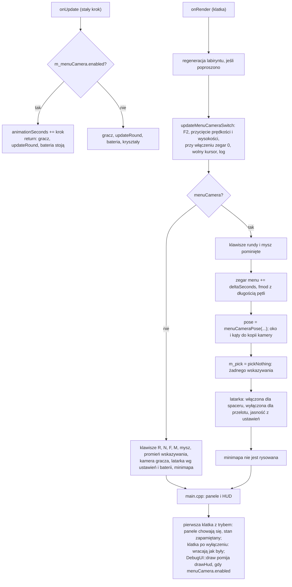

# Moduł game: kamera menu, spacer po labiryncie i przełączniki wiersza poleceń

Kamień milowy: M9, część 1 (2026-10-06). Temat wykładu: brak własnego (to dodatek do gry, poza listą 15 tematów). Dokument korzysta z kamery ([`../scene/camera.md`](../scene/camera.md): kąty yaw i pitch, `forward()`), z labiryntu i jego świata ([`maze-generator.md`](maze-generator.md), [`maze-rendering.md`](maze-rendering.md): `Maze`, `MazeWorld`, `cellCenter`, `cellAt`), z rundy ([`gameplay.md`](gameplay.md): `updateRound`, `animationSeconds`) i ze stałego kroku z [`../core/main-loop.md`](../core/main-loop.md).
Kod: [`src/game/MenuCamera.hpp`](../../../src/game/MenuCamera.hpp) i [`MenuCamera.cpp`](../../../src/game/MenuCamera.cpp) (ścieżka przez labirynt i pozycja kamery jako funkcja czasu), [`src/game/StartOptions.hpp`](../../../src/game/StartOptions.hpp) i [`StartOptions.cpp`](../../../src/game/StartOptions.cpp) (przełączniki wiersza poleceń), użycie w [`src/game/NightMazeApp.cpp`](../../../src/game/NightMazeApp.cpp) (`updateMenuCameraSwitch`, `onUpdate`, `onRender`), [`src/main.cpp`](../../../src/main.cpp), [`src/debug/DebugUI.cpp`](../../../src/debug/DebugUI.cpp) i [`src/debug/panels/CameraPanel.cpp`](../../../src/debug/panels/CameraPanel.cpp). Testy: [`tests/MenuCameraTests.cpp`](../../../tests/MenuCameraTests.cpp) (23 przypadki) i [`tests/StartOptionsTests.cpp`](../../../tests/StartOptionsTests.cpp) (7 przypadków).

**Stan na dziś:** klawisz F2 (albo pole `Menu camera (F2)` w panelu Camera, albo przełącznik `--menu-camera`) włącza tryb, w którym gra pokazuje samą siebie: kamera sama jedzie przez labirynt, runda stoi (poza zegarem animacji, więc kryształy dalej się kołyszą), HUD, minimapa i panele są schowane, a mysz i klawisze rundy nie działają. Są dwa ujęcia: **spacer po korytarzach** (od startu do każdego kryształu i do komórki przed bramą i z powrotem, jedna zamknięta pętla na wysokości oczu, z latarką) i **wysoki przelot** nad labiryntem (okrąg nad ścianami, latarka wyłączona). Przełączniki: `--menu-camera`, `--seed <n>`, `--menu-shot <walk|glide>` i `--menu-time <sekundy>`. Dokument opisuje wszystko to, co kod robi, i oddziela dwie rzeczy: **decyzje właściciela** (sekcja 1.2) od **wyborów wykonawczych** (reszta dokumentu).

**Uczciwie o tym, co sprawdzono.** Trzy rodzaje dowodów trzymam osobno (tak jak w [`../../guides/build-windows.md`](../../guides/build-windows.md), sekcja 24):

1. **Zgłoszone przez bramkę i autora kodu (2026-10-06), nie powtórzone przy pisaniu tego dokumentu:** `make check` przechodzi, **497 przypadków testowych i 219050 asercji** (przed tą częścią 467 i 158006). Przypadki policzyłem z plików: 23 w `MenuCameraTests.cpp` i 7 w `StartOptionsTests.cpp`, razem 30, czyli 467 + 30 = 497. Liczby asercji nie da się policzyć z plików (testy pętlą po ziarnach i klatkach), więc jest tylko zgłoszona.
2. **Widziane na zrzucie ekranu przez agenta (2026-10-06), nie przez właściciela:** autor uruchomił grę z `--menu-camera`, nagrał obraz `ffmpeg` i obejrzał wyciągnięte klatki. Kamera zostaje we wnętrzu korytarzy, na obrazie nie ma HUD, minimapy ani paneli, żadna ściana nie jest przecięta, ruch między kolejnymi klatkami jest płynny. Mniej więcej połowa spaceru to dobre widoki w głąb korytarza, a reszta to ściany z bliska w ciasnych zakrętach i w miejscach, gdzie kamera zawraca przy celu. Kamera mija kryształy w przelotowym korytarzu w odległości około 20 cm z boku i tuż nad nimi. **Nie sprawdzono na ekranie:** klawisza F2 (każde uruchomienie było z przełącznikiem), kontrolek panelu Camera, wysokiego przelotu w ruchu w pełnej pętli i wszystkiego, co jest na liście otwartej.
3. **Otwarta lista właściciela:** [`../../guides/build-windows.md`](../../guides/build-windows.md), sekcja 25.2 (Windows), i [`../../guides/build-macos.md`](../../guides/build-macos.md), podsekcja "M9, część 1 (kamera menu) na macOS" w sekcji 2 (w całości otwarta).

Liczby w sekcji 2 (przykład, czasy pętli) są **policzone ręcznie z kodu**, nie zmierzone w programie. Jedyna liczba, której nie umiem policzyć z kodu, to długość spaceru w labiryncie 10 na 10: autor zgłasza około 500 s, a sam program wypisuje ją w logu przy włączeniu trybu (sekcja 5.4).

## 1. Po co to jest

### 1.1 Do czego służy tryb

Gra ma dostać menu (M9, RmlUi, [`../../decisions/menu-in-rmlui.md`](../../decisions/menu-in-rmlui.md)), a menu potrzebuje obrazu za sobą. Ten moduł robi z samej gry film o niej: kamera jedzie po labiryncie sama, bez człowieka, bez HUD i paneli. Dwie rzeczy z tego wynikają i obie są ważne:

- **Narzędzie do nagrywania.** Właściciel zdecydował (2026-10-06, sekcja 1.2), że tłem menu będzie wcześniej wyrenderowana, zmontowana pętla wideo, a nie żywa scena. Ten tryb jest więc przede wszystkim **narzędziem, którym nagrywa się pętlę** (i później ewentualne klipy do intra gry albo launchera). Dlatego przełączniki wiersza poleceń mają wskazywać ujęcie, ziarno labiryntu i moment startu, żeby nagranie dało się powtórzyć co do klatki (sekcja 5.9).
- **Pokaz.** Klawisz F2 zostaje też jako sposób pokazania gry bez sterowania nią (na obronie, w prezentacji). To nie jest część rozgrywki: runda stoi.

### 1.2 Decyzje właściciela, a wybory wykonawcze

Decyzje właściciela projektu, to jest cała ich treść (szczegóły w notatkach):

1. Menu gry powstanie w **RmlUi** w M9 ([`../../decisions/menu-in-rmlui.md`](../../decisions/menu-in-rmlui.md)).
2. Tłem menu będzie **zmontowana, wyrenderowana wcześniej pętla wideo**, nie żywa scena. Powody właściciela: wygląda czyściej, a podoba mu się widok z góry, który pokazuje pętla (wysoki przelot nad labiryntem) ([`../../decisions/menu-background-prerendered-loop.md`](../../decisions/menu-background-prerendered-loop.md)). Właściciel podjął ją po obejrzeniu dwóch nagrań z prawdziwej gry.
3. Dwa dodatkowe przełączniki, `--menu-shot` i `--menu-time`, **zostają**, żeby można było nagrać klipy jeszcze raz albo nagrać nowe do intra i launchera.

**Wszystko inne w tym dokumencie jest wyborem wykonawczym**, czyli moim (autora kodu), a nie decyzją właściciela: że spacer jest jedną zamkniętą pętlą przez wszystkie kryształy ([`../../decisions/menu-camera-closed-walk.md`](../../decisions/menu-camera-closed-walk.md)), prędkość 0,7 m/s, wysokość 1,5 m, klawisz F2, zamrożenie rundy, latarka włączona w spacerze i wyłączona w przelocie. Analiza w notatkach (co to oznacza dla M9) też nie jest decyzją.

## 2. Teoria

### 2.1 Ścieżka jako łamana przez środki komórek

Labirynt to siatka komórek 2 m na 2 m. Droga z komórki do komórki przez otwarte przejście to odcinek między ich środkami. Ścieżka kamery jest więc **łamaną** (polyline): ciągiem punktów, które łączą odcinki. W kodzie punkty leżą co najwyżej 0,05 m od siebie (`MENU_CAMERA_SAMPLE_SPACING`), więc łamana z tak krótkich odcinków jest dla oka gładką krzywą, a wzdłuż niej da się po prostu liczyć odległość.

Kamera nie jedzie jednak środkiem korytarza. Jedzie **pasem** (lane) przesuniętym o `MENU_CAMERA_LANE_OFFSET` = 0,2 m w prawo od środka, patrząc w kierunku jazdy. Powód: droga tam i droga z powrotem tym samym korytarzem nie leżą wtedy na jednej linii, a obraz niewiele różni się od widoku ze środka (ściana po prawej jest o 0,65 m od kamery: powierzchnia ściany jest 0,85 m od środka, bo połowa komórki to 1 m, a połowa grubości kolizji ściany 0,3 m to 0,15 m).

### 2.2 Stała prędkość: parametryzacja długością łuku

Ruch ma być równomierny: kamera ma przejeżdżać tyle samo metrów na sekundę na prostej i w zakręcie. Gdyby pozycję wyznaczać numerem punktu (`punkt = czas * coś`), a punkty leżałyby gęściej w zakrętach niż na prostych, prędkość by się zmieniała. Stąd **parametryzacja długością łuku** (arc length): dla każdego punktu pamiętam, ile metrów łamanej leży od pierwszego punktu do niego (`distances`), a pozycję dla czasu `t` biorę z odległości

```text
przebyte = (t + przesunięcie) * prędkość
```

i szukam punktu o tej odległości przez wyszukiwanie binarne (`std::ranges::upper_bound` na rosnącej tablicy `distances`), a między dwoma punktami interpoluję liniowo (`glm::mix`). Dzięki temu `prędkość` w ustawieniach naprawdę oznacza metry na sekundę. Test `the corridor walk moves at the speed of the settings, everywhere` sprawdza to: odległość między pozycjami w dwóch klatkach jest równa `prędkość * czas klatki` z dokładnością 1 procenta, w całej pętli.

Odległość jest **cykliczna**: `fmod` z długością pętli, a ujemny wynik przesunięty o jedną pętlę. Po pętli kamera wraca w to samo miejsce, a odległość ujemna liczy się od końca.

### 2.3 Zaokrąglanie narożników

Pas to łamana z kątami prostymi (korytarze biegną wzdłuż dwóch osi siatki). Kamera jadąca po kącie prostym obróciłaby się skokowo, więc każdy narożnik jest zastąpiony **łukiem ćwierćkola**. Łuk zaczyna się tyle przed wierzchołkiem, ile wynosi jego promień, i kończy tyle za nim. Promień to `MENU_CAMERA_CORNER_RADIUS` = 0,5 m albo mniej, gdy sąsiedni narożnik jest za blisko: każdy łuk może zająć najwyżej **połowę** prostego odcinka między dwoma narożnikami (`min(0,5; długość_przed / 2; długość_po / 2)`), żeby dwa łuki się nie nakładały. Ćwierćokrąg ma długość `r * pi / 2`.

Punkty łuku powstają przez obracanie ramienia (od środka koła do początku łuku) o kąt rosnący od 0 do 90 stopni w prawo (znak `+1`) albo w lewo (`-1`). Na ziemi, z osią x na wschód i drugą osią (świata z) na południe, obrót w prawo o kąt `a` zamienia `(x, z)` na `(x cos a - z sin a, x sin a + z cos a)`: północ `(0, -1)` po ćwierć obrotu daje wschód `(1, 0)`.

### 2.4 Zamknięta pętla: spacer wokół drzewa

Spacer ma zacząć się w komórce startu, odwiedzić **każdy kryształ i komórkę przed bramą** i wrócić tam, skąd wyszedł, tak żeby pętla zamykała się bez skoku. Labirynt generowany tu jest drzewem (między dwiema komórkami jest dokładnie jedna droga). Najkrótsze drogi od startu do wszystkich celów też tworzą **drzewo** (podzbiór labiryntu). Obejście drzewa jest zamkniętą trasą, która **każde przejście drzewa przechodzi dwa razy, raz w każdą stronę**.

Takie obejście daje reguła "jedna ręka na ścianie". W każdej komórce spacerowicz sprawdza po kolei: skręt w prawo, prosto, skręt w lewo, zawróć (`TURN_ORDER = {1, 0, 3, 2}`, liczba ćwierćobrotów w prawo), i idzie pierwszą stroną, która jest przejściem drzewa. Dla drzewa taka trasa ma dokładnie `2 * liczba_przejść` kroków i kończy się w starcie, dlatego kod zna liczbę kroków z góry (`passageCount * 2`) i nie musi sprawdzać warunku końca.

Drzewo budowane jest tak: dla każdego celu idę od niego w stronę startu do sąsiada, który jest o jedno przejście bliżej (`sideTowardsStart`, odległości z `passageDistances`), aż dojdę do komórki już należącej do drzewa. Każda nowa komórka dokłada jedno przejście (do swojego rodzica). Labirynt zbudowany ręcznie, z dwiema drogami między komórkami (pierścień), ma otwarte przejścia, które nie należą do drzewa: trasa ich nie używa (`isTreePassage`), inaczej pętla by się nie zamknęła. Test `a maze with two ways between cells still gives a closed route` sprawdza ten przypadek.

Wynik to lista komórek. Ostatni krok (z powrotem do startu) nie jest dopisywany, bo start otwiera listę. Dlatego lista jest **cyklem**: po ostatniej komórce następna to pierwsza.

### 2.5 Dokąd patrzy kamera: wygładzanie kierunku

Patrzenie zawsze wzdłuż kierunku jazdy daje złe obrazy: w zakręcie kamera widzi ścianę. Kod patrzy więc na **najdalsze miejsce ścieżki przed sobą, które widać** (do 8 m, czyli czterech komórek, `SIGHT_REACH_METRES`). W każdym punkcie sprawdzam co 0,5 m ścieżki przed nim (`SIGHT_CANDIDATE_METRES`), czy linia od oka do tego miejsca przechodzi tylko przez otwarte boki komórek (`sightIsOpen`, kroki po 0,2 m), i biorę najdalsze takie miejsce. Szukanie przerywa się, gdy ścieżka skręciła o więcej niż 135 stopni (`MAX_SIGHT_TURN_DEGREES`), bo przy zawracaniu droga powrotna biegnie obok drogi tam i kamera zaczęłaby patrzeć przez ramię.

Kierunek takiego patrzenia **skacze**, gdy w zasięgu wzroku pojawia się nowy korytarz. Skok wygładzam **dwiema średnimi kroczącymi** po punktach ścieżki: pierwszą na 4,5 m (`LOOK_WINDOW_METRES`), drugą na 1,5 m (`LOOK_EASE_METRES`). Pierwsza średnia zaczyna i kończy obrót nagle, druga zaokrągla początek i koniec. Średnia sięga tyle samo do przodu co do tyłu, więc obrót zaczynałby się metry przed pojawieniem się korytarza, dlatego kamera bierze kierunek z miejsca **1,5 m za sobą** (`LOOK_LAG_METRES`): obrót zaczyna się mniej więcej wtedy, gdy korytarz wchodzi w kadr, jak głowa idącego człowieka.

Żeby średnie działały na kątach, kąty muszą być **ciągłe**, a nie zawinięte do przedziału od -180 do 180 (`atan2`). Funkcja `runOn` zamienia listę kątów w ciągłą: każdy kąt to poprzedni plus najkrótszy obrót (nigdy więcej niż pół obrotu). Cała pętla zmienia kąt o **całkowitą liczbę pełnych obrotów** (`turnDegrees`), bo po zamknięciu pętli kamera patrzy tam, gdzie na początku. Sąsiad za końcem listy jest brany z dodanym albo odjętym `turnDegrees` (`averagedAround`, liczba "okrążeń" z `floor`, bo dzielenie całkowite zaokrągla ujemne w złą stronę).

Na wierzch dochodzą trzy drobne rzeczy: podniesienie widoku o 4 stopnie (`LOOK_UP_DEGREES`, żeby w kadrze były wierzchy ścian i gwiazdy), nachylenie zgodne z nachyleniem terenu między punktem 2 m za kamerą a 2 m przed nią (`SLOPE_REACH_METRES`) i **kołysanie** (sway): głowa lekko dryfuje na boki (2,5 stopnia) i w górę i w dół (1 stopień, dwa razy szybciej, więc kreśli leżącą ósemkę). Kołysanie liczone jest od przebytej drogi, a nie od sekund, i liczba wahnięć jest **całkowita** w pętli (`round(długość / 9 m)`, co najmniej 1), więc w miejscu zamknięcia pętli nie ma skoku.

### 2.6 Determinizm: dlaczego ta sama pętla za każdym razem

Nic tu nie jest losowe i nic nie ma własnego zegara. Pozycja kamery jest **funkcją** trzech rzeczy: labiryntu (z ziarna, [`../../decisions/deterministic-random.md`](../../decisions/deterministic-random.md)), ustawień i liczby sekund. Ten sam labirynt i te same ustawienia dają zawsze tę samą ścieżkę i te same klatki. Test `the same world gives the same path and the same pose` porównuje dwa niezależnie zbudowane światy z tego samego ziarna: punkty, odległości, kąty i pozycja w sekundzie 12,3 są identyczne, a inne ziarno daje inną ścieżkę. Dzięki temu nagranie z `--seed 1` da się powtórzyć.

### 2.7 Przykład policzony ręcznie: korytarz z trzech komórek

Labirynt 3 na 1, komórki `(0,0)`, `(1,0)`, `(2,0)` połączone w jeden korytarz, start `(0,0)`, jedyny cel `(2,0)` (to jest labirynt z testu `in a corridor the route walks to the target and back`, zbudowany ręcznie, a nie świat wygenerowany z kryształami i bramą). Teren płaski.

**Trasa** (`menuCameraRoute`). Odległości od startu: 0, 1, 2. Drzewo: `(2,0)` ma rodzica po stronie zachodniej, `(1,0)` też, więc `passageCount = 2`, a kroków jest 4. Spacerowicz startuje zwrócony na północ:

| krok | komórka | próby (prawo, prosto, lewo, tył) | wynik |
|---|---|---|---|
| 0 | `(0,0)` | prawo od północy to wschód: sąsiad `(1,0)` jest na drzewie | idzie na wschód, dopisuje `(1,0)` |
| 1 | `(1,0)` | prawo od wschodu to południe: poza labiryntem. Prosto: `(2,0)` | idzie na wschód, dopisuje `(2,0)` |
| 2 | `(2,0)` | prawo, prosto, lewo: poza labiryntem. Tył: `(1,0)` | zawraca na zachód, dopisuje `(1,0)` |
| 3 | `(1,0)` | prawo od zachodu to północ: poza labiryntem. Prosto: `(0,0)` | idzie na zachód, wraca do startu (ostatni krok nie jest dopisywany, bo `step + 1` równa się liczbie kroków) |

Trasa to `(0,0), (1,0), (2,0), (1,0)`, dokładnie jak w teście.

**Rogi pasa** (`laneCorners`). Środek komórki `(x, z)` to `((x + 0,5) * 2; (z + 0,5) * 2)`, więc środki to `(1; 1)`, `(3; 1)`, `(5; 1)`. Komórka `(1,0)` jest przejściem prostym w obu przypadkach (dwa razy ten sam kierunek), więc nie daje rogu. Komórka `(0,0)`: kierunek wejścia to zachód (krok z `(1,0)` do `(0,0)`, bo trasa jest cyklem), a kierunek wyjścia wschód: to zawrócenie. Miejsce zawrócenia leży 0,6 m **przed** środkiem (`MENU_CAMERA_TURN_SHORT`), liczone w kierunku wejścia: `(1; 1) - 0,6 * (-1; 0) = (1,6; 1)`. Pas po prawej stronie wejścia (idąc na zachód prawa ręka to północ) daje róg `(1,6; 0,8)`, a pas po prawej stronie wyjścia (idąc na wschód prawa ręka to południe) róg `(1,6; 1,2)`. Tak samo w `(2,0)`: miejsce zawrócenia `(5; 1) - 0,6 * (1; 0) = (4,4; 1)`, rogi `(4,4; 1,2)` i `(4,4; 0,8)`.

Cztery rogi, w kolejności listy: `(1,6; 0,8)`, `(1,6; 1,2)`, `(4,4; 1,2)`, `(4,4; 0,8)`: prostokąt 2,8 m na 0,4 m. Kamera jedzie południową krawędzią na wschód i północną na zachód (zawsze po prawej stronie kierunku jazdy).

**Zaokrąglenie** (`cornerArc`). Najkrótszy bok prostokąta ma 0,4 m, więc promień to `min(0,5; 2,8 / 2; 0,4 / 2) = 0,2 m` w każdym rogu. Krótkie boki są więc w całości półokręgami (dwa łuki po 0,2 m zajmują całe 0,4 m), a na długich bokach zostaje prosty odcinek `2,8 - 0,2 - 0,2 = 2,4 m`.

**Długość i czas.** Łuk ćwierćkola `0,2 * pi / 2 = 0,3142 m`, cztery łuki dają 1,2566 m, dwa proste odcinki 4,8 m: razem około 6,06 m w teorii. Łamana z punktami co najwyżej 0,05 m jest odrobinę krótsza (łuk ma 7 odcinków, cięciwy dają 0,3135 m zamiast 0,3142 m), więc `path.length` to około 6,05 m. Przy prędkości 0,7 m/s pętla trwa około 8,65 s. Panel wypisze `One loop: 9 s` (`%.0f` zaokrągla), a log przy włączeniu `Menu camera on, one loop takes 8 s` (`static_cast<int>` obcina).

**Początek pętli.** Pierwszy punkt listy to początek prostego odcinka przed pierwszym rogiem, czyli koniec łuku ostatniego rogu: `(4,2; 0,8)`. W sekundzie 0 kamera stoi tam (patrzy na zachód, 0,2 m na północ od osi korytarza, bo prawa ręka idącego na zachód to północ), a nie w środku komórki startu. Prosty odcinek do początku pierwszego łuku `(1,8; 0,8)` ma 2,4 m, co trwa `2,4 / 0,7 = 3,43 s`.

**Zwrot.** Wszystkie cztery narożniki to skręty w **lewo** (południe, wschód, północ, zachód, patrząc na kierunki jazdy: z południa na wschód jest w lewo), więc pętla biegnie przeciwnie do ruchu wskazówek zegara, patrząc z góry, a `turnDegrees` jest równe -360 stopni. Pętla jednej komórki (`a maze of one cell gives a small circle inside of that cell`) biegnie w drugą stronę (kwadrat północny zachód, północny wschód, południowy wschód, południowy zachód), więc `turnDegrees` jest tam równe +360 (test sprawdza `doctest::Approx(360)`). Tę wartość w korytarzu z trzech komórek wyprowadziłem z kierunków jazdy, nie z uruchomienia.

**Kierunek jazdy w stopniach** (`yawOfStep`, `atan2(x, -z)`): zachód -90, południe 180, wschód 90, północ 0. W pierwszym zakręcie w lewo z zachodu na południe kierunek jazdy zmienia się o -90.

### 2.8 Wysoki przelot

Drugie ujęcie nie używa ścieżki. Kamera leci po **okręgu** wokół środka labiryntu i patrzy na punkt 1,5 m nad ziemią w jego środku (`GLIDE_TARGET_HEIGHT` = połowa wysokości ścian). Promień to 0,9 odległości od środka do narożnika (`GLIDE_RADIUS_SHARE`), nie mniej niż 6 m. Wysokość: ściany (3 m) plus 0,38 promienia (`GLIDE_HEIGHT_SHARE`). Kąt na okręgu to droga podzielona przez promień, a droga to `(sekundy + przesunięcie) * prędkość * 2,5` (`GLIDE_SPEED_SCALE`): z daleka ruch wygląda wolniej, więc przelot jest 2,5 razy szybszy przy tym samym ustawieniu prędkości.

Na labiryncie 10 na 10 (20 m na 20 m): odległość do narożnika `sqrt(20^2 + 20^2) / 2 = 14,14 m`, promień `0,9 * 14,14 = 12,73 m`, wysokość nad środkiem `3 + 0,38 * 12,73 = 7,84 m`, spojrzenie w dół o `atan((7,84 - 1,5) / 12,73) = 26,5` stopnia (przy równym terenie; kod liczy to z rzeczywistej wysokości terenu w środku). Pętla: `2 * pi * 12,73 / (0,7 * 2,5) = 45,7 s`: panel wypisze 46 s, log 45 s (to samo rozbieżne zaokrąglenie co wyżej).

### 2.9 Wiersz poleceń

`main(int argc, char** argv)` dostaje listę słów, z których pierwsze to nazwa programu. Funkcja `parseStartOptions` dostaje słowa **po nazwie** (`argv + 1`, `argc - 1` słów) i czyta je od lewej do prawej:

- `--menu-camera` nie ma wartości: włącza tryb;
- `--seed`, `--menu-shot` i `--menu-time` biorą **następne słowo** jako wartość;
- cokolwiek innego, brak wartości na końcu albo wartość, której przełącznik nie przyjmuje, to **błąd**: funkcja zwraca od razu pierwszy błąd w polu `error`, a reszty nie czyta.

Ziarno czyta `parseSeed` cyfra po cyfrze w 64 bitach i odrzuca wszystko, co nie jest samymi cyframi, jest puste albo przekracza 4294967295 (największe `std::uint32_t`): wartość większa od limitu jest wykryta przed zawinięciem. Liczbę sekund czyta `parseSeconds` przez `std::strtof` (a nie `std::from_chars`: biblioteka standardowa Apple clang nie czyta jeszcze `float` przez `from_chars`) i przyjmuje ją, tylko gdy wskaźnik końca doszedł do końca tekstu, coś zostało odczytane i wynik jest skończony (`isfinite`: `inf` i `nan` odpadają). Przesunięcie może być ujemne i ułamkowe.

`strtof` czyta liczbę według **ustawień regionalnych C**, a program nigdzie nie wywołuje `setlocale` (sprawdzone wyszukiwaniem w `src/`), więc separatorem dziesiętnym jest kropka: `--menu-time 12,5` jest odrzucone (po `12` zostaje `,5`).

### 2.10 Co znaczy "runda stoi" w pętli klatki

Gra ma dwie pętle w jednej: **stały krok** (`onUpdate`, 60 razy na sekundę, zero lub więcej razy na klatkę) liczy symulację, a **klatka** (`onRender`, raz na narysowanie) rysuje i czyta klawisze ([`../core/main-loop.md`](../core/main-loop.md)). W trybie menu:

- `onUpdate` kończy się **wcześnie**. Po zapamiętaniu poprzedniej pozycji gracza dodaje stały krok do `m_round.animationSeconds` i wraca. Nie woła `m_player.update` ani `updateRound`: gracz stoi, bateria nie spada, kryształy nie są zbierane, `elapsedSeconds` nie rośnie, a brama i ściany po dźwigniach **zatrzymują się w połowie opadania**, jeśli opadały w chwili włączenia trybu (postęp opadania liczy `updateRound`), i dokończą po wyłączeniu. Odkrywanie minimapy też stoi.
- Zegar animacji idzie dalej, więc kryształy się kołyszą, a ich światła pulsują (`crystalBobPosition` i `crystalPulse` biorą `animationSeconds`). Ta jedna linia jest powtórzona w `onUpdate`, bo `updateRound`, która normalnie ją liczy, jest pominięta.
- `onRender` liczy pozę kamery menu z **czasu klatki** (`time().deltaSeconds()`), a nie z kroków: poza jest funkcją czasu, więc można ją policzyć dla dokładnej chwili każdej klatki i nie trzeba jej mieszać (`alpha`) jak pozycji gracza.

## 3. Jak to działa w OpenGL

Moduł nie woła OpenGL i nie ma nowych obiektów OpenGL: to dane i matematyka, jak reszta biblioteki `game_logic`. Efekt jest taki, że klatka jest rysowana z **kopii kamery** (`scene::Camera frameCamera = m_camera;`), której yaw i pitch pochodzą z `MenuCameraPose`, a oko z `pose.eye`. Macierze widoku i rzutowania, kierunek latarki i płaszczyzny odcięcia podglądu bufora głębi pochodzą z tej kopii. Kopia zostaje po to, żeby kąty gracza (`m_camera`) przetrwały: po wyłączeniu trybu gracz patrzy tam, gdzie patrzył. Pole widzenia i płaszczyzny bliska i daleka są te same, bo kopia je odziedziczyła.

## 4. Shadery

Brak: tryb nie ma własnych shaderów i nie zmienia żadnego shadera. Zmienia tylko dane, które dostają: macierz widoku z kopii kamery, położenie i kierunek latarki (z kopii) oraz to, czy latarka jest włączona (sekcja 5.4). **Mgła nie jest zmieniana** także w wysokim przelocie.

## 5. Kod w projekcie

### 5.1 Pliki

| Plik | Co zawiera |
|---|---|
| `src/game/MenuCamera.hpp`, `.cpp` | `MenuShot`, `MenuCameraSettings`, `MenuCameraPath`, `MenuCameraPose`, `menuCameraRoute`, `menuCameraTargets`, `buildMenuCameraPath`, `menuCameraPathPoint`, `menuCameraLoopSeconds`, `menuCameraPose`. Czysta matematyka, w bibliotece `game_logic` |
| `src/game/StartOptions.hpp`, `.cpp` | `StartOptions`, `StartOptionsResult`, `parseStartOptions`, `START_OPTIONS_USAGE`. Też w `game_logic` |
| `src/game/NightMazeApp.*` | konstruktor z `StartOptions`, `updateMenuCameraSwitch`, wczesny powrót w `onUpdate`, gałąź `menuCamera` w `onRender`, trzy miejsca odbudowy ścieżki |
| `src/main.cpp` | czytanie przełączników przed otwarciem okna, chowanie i przywracanie paneli |
| `src/debug/DebugContext.hpp`, `DebugUI.*`, `panels/CameraPanel.*` | dwa nowe pola kontekstu, pomijanie HUD, `setVisible` i `isVisible`, grupa `Menu camera` w panelu Camera |
| `CMakeLists.txt` | dwa pliki `.cpp` i dwa `.hpp` w `game_logic`, dwa pliki testów |

### 5.2 Stałe

Wszystkie z `MenuCamera.hpp` (publiczne) i z anonimowej przestrzeni nazw `MenuCamera.cpp` (prywatne):

| Stała | Wartość | Po co |
|---|---|---|
| `DEFAULT_MENU_CAMERA_SPEED` | 0,7 m/s | wolny spacer, około jednej czwartej prędkości chodu gracza |
| `MIN_`/`MAX_MENU_CAMERA_SPEED` | 0 i 4 m/s | granice suwaka i przycięcie w `updateMenuCameraSwitch` |
| `DEFAULT_MENU_CAMERA_EYE_HEIGHT` | 1,5 m | nieco niżej niż oczy gracza (`Player::EYE_HEIGHT`), kryształy (około 1 m) wypadają wyżej w kadrze |
| `MIN_`/`MAX_MENU_CAMERA_EYE_HEIGHT` | 0,3 i 2,8 m | od trawy do tuż pod wierzchy ścian (3 m) |
| `MENU_CAMERA_LANE_OFFSET` | 0,2 m | pas w prawo od środka korytarza |
| `MENU_CAMERA_TURN_SHORT` | 0,6 m | zawracanie przed środkiem komórki celu |
| `MENU_CAMERA_CORNER_RADIUS` | 0,5 m | promień łuku narożnika |
| `MENU_CAMERA_SAMPLE_SPACING` | 0,05 m | odstęp punktów ścieżki |
| `SIGHT_REACH_METRES`, `SIGHT_CANDIDATE_METRES`, `SIGHT_STEP_METRES` | 8; 0,5; 0,2 m | zasięg patrzenia, co ile próbuję miejsca, co ile sprawdzam linię wzroku |
| `MAX_SIGHT_TURN_DEGREES` | 135 | granica skrętu ścieżki przy szukaniu miejsca do patrzenia |
| `LOOK_WINDOW_METRES`, `LOOK_EASE_METRES`, `LOOK_LAG_METRES` | 4,5; 1,5; 1,5 m | dwie średnie i opóźnienie widoku |
| `LOOK_UP_DEGREES`, `SLOPE_REACH_METRES` | 4; 2 m | podniesienie widoku, zasięg liczenia nachylenia |
| `MAX_WINDOW_SHARE` | 0,25 | okna nie dłuższe niż ćwierć pętli (dla pętli jednej i dwóch komórek) |
| `SWAY_METRES`, `SWAY_YAW_DEGREES`, `SWAY_PITCH_DEGREES`, `SWAY_PITCH_SWINGS` | 9 m; 2,5; 1; 2 | kołysanie |
| `GLIDE_RADIUS_SHARE`, `MIN_GLIDE_RADIUS`, `GLIDE_HEIGHT_SHARE`, `GLIDE_TARGET_HEIGHT`, `GLIDE_SPEED_SCALE` | 0,9; 6 m; 0,38; 1,5 m; 2,5 | wysoki przelot |
| `TIME_OFFSET_DRAG_SPEED` (w `CameraPanel.cpp`) | 0,25 s na piksel | przeciąganie `Time offset` |

### 5.3 Funkcje publiczne

- `menuCameraRoute(maze, start, targets)`: trasa jako lista komórek (sekcja 2.4). Rzuca `std::out_of_range`, gdy start jest poza labiryntem (tak rzuca `passageDistances`). Cel poza labiryntem albo za ścianą jest pomijany. Bez celów lista to sam start.
- `menuCameraTargets(world)`: komórka każdego kryształu plus, jeśli świat ma bramę, **komórka przed bramą**: sąsiad komórki wyjścia po pierwszej otwartej stronie (kolejność `ALL_DIRECTIONS`, strona, na której `placeExit` postawił bramę). Trasa nie wchodzi do komórki wyjścia, bo brama jest zamknięta. Labirynt jednej komórki nie ma bramy, więc nie ma celów.
- `buildMenuCameraPath(world)`: cel, trasa, rogi pasa (`laneCorners`), zaokrąglona pętla (`roundedLoop`), wysokość terenu pod każdym punktem (`world.terrain.heightAt`), długości, potem kierunki patrzenia (`computeView`). Labirynt jednej komórki daje małe koło o promieniu 0,2 m wokół środka (kwadrat zaokrąglony łukami o promieniu `min(0,5; 0,2; 0,2)`).
- `menuCameraPathPoint(path, distance)`: punkt na odległości (sekcja 2.2). Pusta ścieżka daje początek układu, ścieżka o zerowej długości pierwszy punkt.
- `menuCameraLoopSeconds(path, world, settings)`: czas pętli przy tej prędkości. 0 dla prędkości 0 (kamera stojąca nigdy nie wraca). Dla przelotu `2 pi r / (prędkość * 2,5)`, dla spaceru `długość / prędkość`.
- `menuCameraPose(path, world, settings, seconds)`: poza. Spacer: oko na ścieżce plus `eyeHeight` w górę, yaw z `pathYawAt(przebyte - opóźnienie)`, pitch z nachylenia plus 4 stopnie, na to kołysanie, potem `keepInRange` (yaw do `[0, 360)`, pitch do `+-MAX_PITCH_DEGREES` kamery). Przelot: okrąg i `lookAlong`. Pusta ścieżka daje pozę nowej kamery (oko w zerze, kąty 0).

### 5.4 Klatka: gdzie tryb się rozgałęzia



Szczegóły, linia po linii, w kolejności klatki (`NightMazeApp::onRender`):

1. **`updateMenuCameraSwitch`** (raz na klatkę). Klawisz F2 (`MENU_CAMERA_KEY = GLFW_KEY_F2`) przełącza `m_menuCamera.enabled`. Prędkość i wysokość oczu są przycinane do swoich granic (wartość można wpisać w suwak z klawiatury). Gdy stan różni się od zapamiętanego (`m_menuCameraWasEnabled`), a tryb jest teraz włączony: zegar menu idzie na 0, kursor jest **oddawany** (`setCursorCaptured(false)`: mysz nie obraca tej kamery, a menu potrzebuje kursora) i do logu trafia `Menu camera on, one loop takes N s`. Wyłączenie trybu **nie** przechwytuje kursora z powrotem: gracz klika w scenę jak zwykle.
2. **Klawisze rundy są ignorowane**: restart klawiszem R, noclip (N), latarka (F), minimapa (M) i obrót myszą mają warunek `!menuCamera`. Restart z panelu (`m_gameplay.restart`) **nie** jest zablokowany, ale nie zmienia labiryntu, więc ścieżka zostaje. Przycisk `Regenerate` (panel Maze) i zmiana skali wysokości terenu **przebudowują ścieżkę** (`regenerateMaze`, `rebuildTerrain`, a pierwszy raz konstruktor).
3. **Poza.** `m_menuCameraSeconds += time().deltaSeconds()`, potem, jeśli pętla ma dodatnią długość, `fmod` z nią: liczba zostaje mała, jak długo menu by nie było otwarte. Jeśli prędkość jest 0, zegar rośnie bez końca, ale poza się nie zmienia.
4. **Kopia kamery** (sekcja 3), macierze `view` i `projection` z niej.
5. **Wskazywanie**: `m_pick = pickNothing(m_round)`, `handleInteraction` nie jest wołane. Brak podświetlenia dźwigni i kartek, a kliknięcie nie dociera do rundy (także nie przechwytuje kursora).
6. **Latarka** (`frameLighting`): zamiast wartości z ustawień i baterii spacer ma `flashlightOn = true`, a przelot `false`, `flashlightIntensity` jest z ustawień (nie migocze i nie słabnie z baterią). Pozycja i kierunek latarki liczone są z kopii kamery.
7. **Minimapa** nie jest rysowana (`drawMinimap` pod warunkiem `!menuCamera`).

W `main.cpp` (`DebugNightMazeApp::onRender`) po wywołaniu klasy bazowej: jeśli stan trybu zmienił się od poprzedniej klatki, a tryb jest włączony, zapamiętuje, czy panele były widoczne (`m_panelsVisibleBeforeMenuCamera = m_debugUI.isVisible()`), i chowa je (`setVisible(false)`). Przy wyłączeniu przywraca zapamiętany stan. Klawisz tyldy (`GLFW_KEY_GRAVE_ACCENT`) jest obsługiwany **po** tym przełączeniu, więc w trakcie trybu nadal pokazuje i chowa panele (żeby można było zmieniać ustawienia kamery). Wyłączenie trybu przywraca stan sprzed trybu, także gdy tyldą zmieniono go w trakcie. `DebugUI::draw` nie wywołuje `drawHud`, gdy `context.menuCamera.enabled`: HUD należy do rundy, a tryb jej nie pokazuje.

Klawisz F2 jest czytany przez `Input::wasKeyPressed`, które zwraca `false` przy zablokowanej klawiaturze: gdy ImGui edytuje pole tekstowe, F2 nie działa (tak jak R, F i N).

### 5.5 `StartOptions`

`StartOptions` ma dwa pola: `seed` (domyślnie `DEFAULT_MAZE_SEED` = 1) i `menuCamera` (`MenuCameraSettings` z wartościami domyślnymi). `StartOptionsResult` dodaje `error`: pusty znaczy, że wszystko zrozumiano. `START_OPTIONS_USAGE` to jedna linia z listą przełączników: `Switches: --seed <number>, --menu-camera, --menu-shot <walk|glide>, --menu-time <seconds>`. Konstruktor `NightMazeApp(const StartOptions& options = {})` bierze z niego ziarno pierwszego labiryntu (`m_mazeSettings{.seed = options.seed}`: rozmiar i liczby dźwigni i kartek zostają domyślne) i ustawienia kamery menu. **Prędkości i wysokości oczu z wiersza poleceń ustawić się nie da**: te dwa pola są tylko w panelu Camera.

Przełączniki w dowolnej kolejności; powtórzony przełącznik nadpisuje wcześniejszy. `--seed` działa także bez trybu menu. `--menu-shot` i `--menu-time` **nie włączają** trybu (test `the shot can be named walk, and the largest seed is accepted` sprawdza, że nazwa ujęcia nie włącza kamery).

### 5.6 `main.cpp`

Przełączniki są czytane **przed** otwarciem okna. Błąd kończy program: `core::logError(start.error)`, potem `core::logError(game::START_OPTIONS_USAGE)` (dwie linie logu) i `EXIT_FAILURE`. Raportowany jest tylko pierwszy błąd. Dopiero po poprawnym wczytaniu powstaje `DebugNightMazeApp app(start.options)`.

### 5.7 Testy

Wszystkie bez okna. `MenuCameraTests.cpp` (23): ustawienia domyślne; trasa jest zamkniętą drogą przez otwarte przejścia i odwiedza każdy cel (4 ziarna: 1, 2, 7, 1234); cele to kryształy i komórka przed bramą, nie wyjście; każde przejście drzewa raz w każdą stronę; brak celów to sam start; start poza labiryntem rzuca; korytarz w tę i z powrotem; pierścień; ścieżka nie przechodzi przez ścianę; odstęp co najmniej 0,5 m od ścian, słupków i bramy; punkty leżą na terenie, blisko siebie, a długości się sumują; wyszukiwanie punktu po odległości (cyklicznie i wstecz); determinizm; stała prędkość; wysokość oczu; przesunięcie czasu; widok nigdy nie obraca się szybciej niż 50 stopni na sekundę; obie pętle się zamykają; obrót całkowitą liczbą obrotów; prędkość zero; labirynt jednej komórki; pusta ścieżka; wysoki przelot nad ścianami. `StartOptionsTests.cpp` (7): brak przełączników; każdy przełącznik w dowolnej kolejności; `walk` i największe ziarno; nieznany przełącznik z nazwą w komunikacie; brak wartości; wartości niezrozumiałe (`abc`, `-3`, `4294967296`, `12x`, puste, `soon`, `3s`, `inf`, `orbit`); lista przełączników zawiera wszystkie cztery.

Nie ma testu na: zmianę prędkości w trakcie (pułapka 3), klawisz F2, chowanie paneli i HUD (kod z OpenGL i ImGui) ani na całą pętlę labiryntu 10 na 10 co do długości.

### 5.8 Jak to sprawdzono

Patrz "Uczciwie o tym, co sprawdzono" na początku: bramka (zgłoszona), zrzuty agenta (nie właściciela), lista właściciela otwarta. Dwa nagrania do porównania (ciągłe ujęcie 30 s, 9,5 MB, i zmontowana pętla 24 s z czterech ujęć z przenikaniami, 10,6 MB w 720p30, a w jakości docelowej CRF 14 19,7 MB) powstały **poza repozytorium** jako materiał porównawczy pokazany właścicielowi w makiecie projektowej. To nie są pliki projektu i nie ma na nie odnośników.

### 5.9 Jak nagrać pętlę od nowa

To jest przepis, nie skrypt. **Dokładnych poleceń `ffmpeg` nie zapisano w repozytorium**: zostaną zapisane w `tools/`, gdy pętla będzie nagrywana naprawdę. Pierwsza pętla (zgłoszone przez autora, nie sprawdzone przy pisaniu) miała cztery ujęcia po 7 s z przenikaniami po 1 s, nagrane `ffmpeg` z okna gry w 1280 x 720 przy 30 klatkach na sekundę:

| Ujęcie | Przełączniki |
|---|---|
| wysoki przelot nad labiryntem | `--seed 1 --menu-shot glide --menu-camera` |
| korytarz z latarką | `--seed 6 --menu-shot walk --menu-camera` |
| dwa podejścia do kryształów | `--seed 1 --menu-shot walk --menu-time <sekundy> --menu-camera` (dwa różne przesunięcia czasu, wartości nie zapisano) |

Zasady powtarzalności: ten sam labirynt (`--seed`), to samo ujęcie (`--menu-shot`), ten sam początek (`--menu-time`) i ta sama prędkość (domyślna 0,7 m/s, bo przełącznika na nią nie ma) dają te same klatki. `--menu-time` to **przesunięcie zegara kamery** (kamera zaczyna od tylu sekund pętli), więc wybiera część labiryntu, którą nagranie pokaże. W pierwszej pętli **brakuje kałuż i bramy** (zgłoszone). Pętla się **zestarzeje**, gdy zmieni się grafika, i dlatego przełączniki zostają i trzeba ją będzie nagrać od nowa.

## 6. Panel ImGui

Panel Camera dostał grupę `Menu camera` pod trzema suwakami prędkości gracza:

| Kontrolka | Co robi | Zakres |
|---|---|---|
| `Menu camera (F2)` | pole wyboru: włącza tryb | tak jak F2 |
| `Shot` | lista: `Corridor walk`, `High glide` | `MENU_SHOT_COUNT` = 2 |
| `Speed` | metry na sekundę (`%.2f m/s`) | 0 do 4, `AlwaysClamp` |
| `Eye height` | wysokość oczu spaceru nad ziemią (`%.2f m`). Przelot ją ignoruje | 0,3 do 2,8, `AlwaysClamp` |
| `Time offset` | `DragFloat`, 0,25 s na piksel, `%.1f s`, **bez granic** (też ujemne: ujęcie jest pętlą) | dowolny |
| `One loop: N s` | tylko do odczytu, `%.0f` | z `menuCameraLoopSeconds` |

Panel dostał dwa nowe argumenty (`MenuCameraSettings&` i długość pętli), a `DebugContext` ma od tej części **49 pól** (47 przedtem, doszły `menuCamera` i `menuCameraLoopSeconds`). Przy włączonym trybie panele są schowane, więc ustawienia zmienia się po naciśnięciu tyldy. Kontrolek panelu nikt nie klikał (ani agent, ani właściciel).

Scenariusz pokazu: F2 w trakcie rundy, potem tylda, suwak `Speed` do 2 (kamera przyspiesza, ale patrz pułapka 3), zmiana `Shot` na `High glide` (latarka gaśnie, widok z góry), F2 jeszcze raz.

## 7. Pułapki

1. **F2 nie robi nic, gdy ImGui ma klawiaturę.** W polu tekstowym klawisz trafia do pola (zablokowana klawiatura). Zakończ edycję.
2. **`--menu-shot` i `--menu-time` same nie włączają trybu.** Trzeba dopisać `--menu-camera`. Nazwa ujęcia nie robi nic, dopóki tryb nie jest włączony (wartości są zapamiętane w ustawieniach).
3. **Zmiana prędkości w trakcie przeskakuje kamerę.** Pozycja to `(sekundy + przesunięcie) * prędkość`, a zegar nie jest przeliczany przy zmianie prędkości, więc przeciągnięcie suwaka `Speed` przesuwa kamerę na inną odległość ścieżki. Zmiana ujęcia przeskakuje tak samo. (Zauważone przy czytaniu kodu; nie sprawdzone w działającym programie.)
4. **Przecinek zamiast kropki.** `--menu-time 12,5` jest błędem, bo `strtof` używa ustawień C (sekcja 2.9).
5. **Zaokrąglenie czasu pętli.** Panel pokazuje `%.0f` (zaokrągla), a log `static_cast<int>` (obcina): 45,7 s to 46 w panelu i 45 w logu.
6. **Brama w połowie opadania.** Brama albo ściana, która opadała w chwili F2, stoi zatrzymana (sekcja 2.10) i dokończy opadanie po wyłączeniu trybu.
7. **Po wyłączeniu trybu kursor nie jest przechwycony.** Trzeba kliknąć w scenę.
8. **Restart i `Regenerate` z paneli działają w trakcie trybu.** Zablokowany jest tylko klawisz R. `Regenerate` zmienia labirynt i ścieżkę, a zegar menu nie jest zerowany (zostaje, zawinięty `fmod` do nowej długości pętli przy następnej klatce).
9. **Pętla jest krótka dla małych labiryntów.** W labiryncie 1 na 1 spacer to koło o promieniu 0,2 m: obraz kręci się w miejscu. Do próby pętli używaj małego labiryntu (panel Maze), do nagrania domyślnego.
10. **Przypadkowe przecięcie ściany.** Pas trzyma 0,65 m od ścian w prostym korytarzu, a zakręty ścięte do środka dochodzą bliżej słupka po wewnętrznej stronie. Test wymaga co najmniej 0,5 m (5 razy bliska płaszczyzna 0,1 m).

## 8. Ćwiczenia

1. **Czas pętli na kartce.** Dla trasy `(0,0), (1,0), (2,0), (1,0)` policz długość pasa i czas pętli przy 0,7 i 1,4 m/s. Odpowiedź: około 6,05 m, około 8,65 s i 4,3 s.
2. **Drugi cel.** Zmień cel w teście na `(2,0)` i `(0,0)`: jaka będzie trasa? Odpowiedź: ta sama co dla `(2,0)`, bo start jest już na drzewie.
3. **Promień łuku.** Rogi prostokąta 2,8 m na 0,4 m: jaki promień dostanie każdy łuk i dlaczego? Odpowiedź: 0,2 m, bo połowa krótszego boku jest mniejsza niż 0,5 m.
4. **Przelot na labiryncie 20 na 20.** Policz promień, wysokość i czas pętli przy 0,7 m/s. Odpowiedź: boki 40 m, do narożnika 28,28 m, promień 25,46 m, wysokość `3 + 0,38 * 25,46 = 12,67 m`, pętla `2 pi 25,46 / 1,75 = 91,4 s`.
5. **Pętla na ekranie.** Uruchom z `--menu-camera --seed 1`, zmień w panelu Maze rozmiar na 2 na 2 i `Regenerate`: ile trwa pętla (linia `One loop` w panelu)? Czy kamera przeskakuje przy zamknięciu pętli?
6. **Zła wartość.** Uruchom z `--menu-shot orbit` i `--seed -3`: co wypisuje program i jak kończy? Odpowiedź: dwie linie `[error]`, pierwsza z komunikatem o przełączniku, druga z listą, kod wyjścia niezerowy, okno się nie otwiera.
7. **Bez opóźnienia widoku (zmiana w kodzie, potem cofnij).** Ustaw `LOOK_LAG_METRES` na 0 i obejrzyj zakręt: kiedy zaczyna się obrót w stosunku do pojawienia się nowego korytarza?
8. **Zegar animacji.** Zakomentuj `m_round.animationSeconds += ...` w `onUpdate` i włącz F2: co się dzieje z kryształami? Odpowiedź: stoją w miejscu i nie pulsują.

## 9. Pytania kontrolne

1. **Dlaczego ścieżka jest parametryzowana długością łuku?**
   Żeby prędkość w metrach na sekundę była stała na prostej i w zakręcie. Numer punktu zależałby od gęstości punktów.
2. **Dlaczego spacer jest zamkniętą pętlą wokół drzewa?**
   Obejście drzewa przechodzi każde przejście dwa razy i kończy się w starcie, więc pętla zamyka się bez skoku, a każdy cel jest odwiedzony.
3. **Co robi reguła jednej ręki na ścianie?**
   W każdej komórce próbuje skręt w prawo, prosto, w lewo i zawróć, i idzie pierwszą stroną, która jest przejściem drzewa.
4. **Po co pas przesunięty o 0,2 m i zawracanie 0,6 m przed celem?**
   Droga tam i z powrotem nie leżą na jednej linii, a kryształ zostaje przed kamerą, gdy widok się obraca, i kamera nie jedzie na ścianę końca korytarza.
5. **Dlaczego kierunek patrzenia jest wygładzany dwiema średnimi?**
   Najdalsze widoczne miejsce zmienia się skokowo. Średnia 4,5 m rozkłada skok na drogę, średnia 1,5 m zaokrągla początek i koniec obrotu.
6. **Dlaczego `runOn` i dlaczego `turnDegrees` jest wielokrotnością 360?**
   `atan2` zawija kąt do przedziału od -180 do 180, a średnia z zawiniętych kątów jest zła. Po pętli kamera patrzy tak jak na początku, więc zmiana kąta to całe obroty.
7. **Dlaczego kołysanie ma całkowitą liczbę wahnięć w pętli?**
   Żeby w miejscu zamknięcia pętli faza była ta sama i nie było skoku.
8. **Co dokładnie stoi, gdy tryb jest włączony, a co idzie dalej?**
   Stoją gracz, bateria, zbieranie, czas rundy, opadanie bramy i ścian, odkrywanie. Idzie dalej tylko `animationSeconds`, więc kryształy się kołyszą.
9. **Dlaczego klatka używa kopii kamery?**
   Żeby kąty gracza przetrwały: po wyłączeniu trybu gracz patrzy tam, gdzie patrzył, a pole widzenia i płaszczyzny są te same.
10. **Jak panele wracają po wyłączeniu trybu?**
    `main.cpp` zapamiętuje stan widoczności przy włączeniu i przywraca go przy wyłączeniu.
11. **Dlaczego przełączniki są czytane przed otwarciem okna?**
    Błędny przełącznik ma zakończyć program linią w logu, a nie otworzyć grę, która go po cichu ignoruje.
12. **Czy właściciel zdecydował o wyglądzie menu za pomocą tego trybu?**
    Tłem menu będzie zmontowana pętla wideo, a ten tryb służy do jej nagrania. Pozostałe cechy trybu to wybory wykonawcze.

## 10. Źródła

- Notatki: [`../../decisions/menu-in-rmlui.md`](../../decisions/menu-in-rmlui.md), [`../../decisions/menu-background-prerendered-loop.md`](../../decisions/menu-background-prerendered-loop.md), [`../../decisions/menu-camera-closed-walk.md`](../../decisions/menu-camera-closed-walk.md), [`../../decisions/deterministic-random.md`](../../decisions/deterministic-random.md).
- Dokumenty: [`../scene/camera.md`](../scene/camera.md), [`../scene/camera-controls.md`](../scene/camera-controls.md), [`gameplay.md`](gameplay.md), [`maze-generator.md`](maze-generator.md), [`../debug-ui.md`](../debug-ui.md), [`../core/main-loop.md`](../core/main-loop.md), [`../core/input.md`](../core/input.md).
- Obejście drzewa i reguła jednej ręki: dowolny opis przeszukiwania w głąb (depth-first search) i "wall follower" w algorytmach labiryntowych.
- Parametryzacja krzywej długością łuku: dowolny podręcznik grafiki komputerowej (rozdział o krzywych).
- `std::strtof`: <https://en.cppreference.com/w/cpp/string/byte/strtof> (ustawienia regionalne C).
