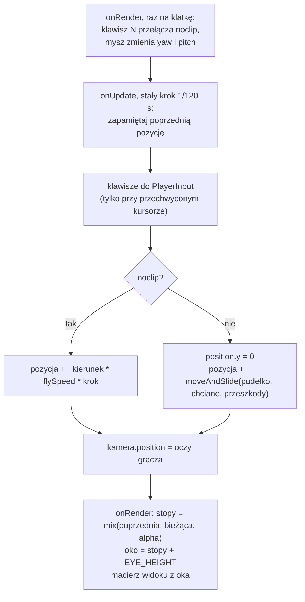

# Moduł game: gracz, chodzenie i tryb noclip

Kamień milowy: M2 + M3. Tematy wykładu: 14 (Wstęp do kolizji) i 3 (Przekształcenia przestrzeni: kamera pierwszoosobowa).
Kod: [`src/game/Player.hpp`](../../../src/game/Player.hpp), [`src/game/Player.cpp`](../../../src/game/Player.cpp), testy w [`tests/PlayerTests.cpp`](../../../tests/PlayerTests.cpp), użycie w [`src/game/NightMazeApp.hpp`](../../../src/game/NightMazeApp.hpp) i [`src/game/NightMazeApp.cpp`](../../../src/game/NightMazeApp.cpp) (`onUpdate`, `onRender`, `enterMaze`).

Część modułu `game`. Wstęp do modułu jest w [`README.md`](README.md). Ten dokument zakłada znajomość trzech innych: [`../scene/collision.md`](../scene/collision.md) (pudełko `Aabb` i funkcja `moveAndSlide`), [`../scene/camera.md`](../scene/camera.md) (kąty yaw i pitch, `forward()`, `right()`) oraz [`../core/main-loop.md`](../core/main-loop.md) (stały krok symulacji i `alpha`). Obrót myszą i panel Camera opisuje [`../scene/camera-controls.md`](../scene/camera-controls.md). Skąd biorą się przeszkody i pozycja startowa, opisuje [`maze-rendering.md`](maze-rendering.md).

## 1. Po co to jest

W kamieniu milowym M1 poruszała się sama kamera: latała tam, gdzie patrzy, i przechodziła przez wszystko. Labirynt wymaga czegoś innego. Ktoś ma **chodzić po podłodze** i **zatrzymywać się na ścianach**. Kamera jest punktem i dwoma kątami, więc nie ma czym się o ścianę oprzeć. Potrzebne jest ciało: pudełko o szerokości człowieka.

Tym ciałem jest struktura `game::Player`. Ma pozycję stóp, pudełko kolizji liczone z tej pozycji, wysokość oczu i trzy prędkości. Jedna funkcja, `Player::update`, przesuwa gracza o jeden stały krok symulacji. Kamera przestała być sterowana wprost: po każdym kroku staje tam, gdzie gracz ma oczy.

Gracz ma dwa tryby:

| Tryb | Ruch | Kolizje | Do czego służy |
|---|---|---|---|
| chodzenie (domyślny) | tylko w poziomie, stopy na podłodze (y = 0) | tak, przez `scene::moveAndSlide` | właściwa gra |
| noclip (klawisz N) | lot wzdłuż kierunku patrzenia, także w górę i w dół | nie | oglądanie labiryntu z góry, szukanie błędów, pokaz na obronie |

Noclip to dawny lot kamery z M1, tylko przeniesiony do gracza. Nazwa pochodzi z gier: "no clipping", czyli bez przycinania ruchu do geometrii.

Tak jak `scene::Camera` i `scene::Aabb`, gracz to zwykłe dane i matematyka: żadnego OpenGL, żadnej klawiatury, żadnego zegara. Dlatego należy do biblioteki `game_logic` i ma 13 przypadków testowych, które działają bez okna (sekcja 5.9).

**Stan na dziś, uczciwie.** Kod jest zbudowany na Windowsie (2026-10-05, MSVC 19.44, Debug i Release, bez ostrzeżeń) i wszystkie testy gracza przechodzą w obu konfiguracjach. Program startuje z graczem stojącym w labiryncie. Samego chodzenia prawdziwymi klawiszami, ślizgania po ścianie, klawisza N i obrotu myszą wewnątrz labiryntu **nikt jeszcze nie sprawdził ręcznie**: to otwarte pozycje listy kontrolnej w [`../../guides/build-windows.md`](../../guides/build-windows.md). Na macOS kod nie był budowany ani uruchamiany ([`../../guides/build-macos.md`](../../guides/build-macos.md)).

## 2. Teoria

### 2.1 Stopy, pudełko i oczy

Gracz ma jedną pozycję i wszystko inne jest z niej wyliczane. Tą pozycją są **stopy**: środek dolnej ściany pudełka.

```text
widok z boku (płaszczyzna XY), gracz stoi w x = 1

   y
   ^
 1,8 |  +-------+      góra pudełka (BODY_HEIGHT)
 1,7 |  |   o   |      oczy: tu staje kamera (EYE_HEIGHT)
     |  |       |
 0,9 |  |   +   |      środek pudełka: stąd liczy je Aabb::fromCenter
     |  |       |
   0 +--+---*---+----> x     * stopy: pole position
       0,7  1  1,3
        <--0,6-->            BODY_WIDTH
```

Dlaczego stopy, a nie środek pudełka albo oczy:

- podłoga ma wysokość 0, więc "gracz stoi na podłodze" to po prostu `position.y == 0`. Przy środku pudełka trzeba by pamiętać o 0,9, przy oczach o 1,7,
- środek komórki labiryntu (`game::cellCenter`) też leży na wysokości podłogi, więc pozycja startowa jest gotową pozycją stóp,
- model postaci, gdyby kiedyś doszedł, też ma początek układu u podstawy, tak jak modele ścian i słupków.

Pudełko jest **kwadratowe w rzucie z góry** (0,6 na 0,6 m). AABB nie obraca się razem z obiektem ([`../scene/collision.md`](../scene/collision.md), sekcja 2.1), więc pudełko o różnych wymiarach w x i z byłoby raz szersze, raz węższe w zależności od tego, wzdłuż której osi gracz idzie. Kwadrat zachowuje się tak samo w każdą stronę.

Oczy są 10 cm poniżej górnej ściany pudełka (1,7 wobec 1,8 m), tak jak u człowieka. Ściany mają 3 m, więc w trybie chodzenia nie da się zajrzeć ponad nie.

Wymiary w odniesieniu do labiryntu: komórka ma 2 m, pudełka ścian wchodzą w nią po 0,15 m z każdej strony, więc wolna szerokość korytarza to 1,7 m. Gracz zajmuje z niej 0,6 m, zostaje 1,1 m luzu.

### 2.2 Chodzenie jest poziome

Kierunek "do przodu" kamery to `forward()`: wektor jednostkowy liczony z yaw i pitch ([`../scene/camera.md`](../scene/camera.md), sekcja 2). Gdy patrzę w dół, ma on ujemną składową y. Gdybym przesuwał gracza wzdłuż niego, to:

- patrząc w podłogę, gracz próbowałby wejść pod podłogę,
- nawet gdyby składową y po prostu odrzucić, zostałby wektor poziomy **krótszy niż 1**. Przy spojrzeniu o 60 stopni w dół jego długość to `cos(60 stopni) = 0,5`, więc gracz szedłby o połowę wolniej. Patrzenie pod nogi spowalniałoby chód.

Są dwa sposoby naprawy. Pierwszy: wyzerować y i znormalizować wektor na nowo. Drugi, użyty w projekcie: policzyć kierunek tak, jakby gracz patrzył **poziomo**, czyli z tym samym yaw i z pitch równym 0. Wtedy `forward()` od razu nie ma składowej pionowej i ma długość 1:

```text
forward(yaw, pitch = 0) = (sin(yaw), 0, -cos(yaw))
```

| yaw | kierunek | forward |
|---|---|---|
| 0 | północ | (0, 0, -1) |
| 90 | wschód | (1, 0, 0) |
| 180 | południe | (0, 0, 1) |
| 270 | zachód | (-1, 0, 0) |

Drugi sposób nie ma przypadku szczególnego. Pierwszy ma: przy pitch bliskim 90 stopni odrzucenie y zostawia wektor prawie zerowy, a normalizacja prawie zerowego wektora wzmacnia błędy zaokrągleń.

Kierunek "w prawo", czyli `right()`, jest poziomy zawsze, niezależnie od pitch, więc nie wymaga żadnej poprawki.

W trybie noclip jest odwrotnie: pitch **ma** działać. Lecę tam, gdzie patrzę, więc trzymając W ze wzrokiem podniesionym o 30 stopni, wznoszę się, a połowa prędkości idzie w górę (`sin(30 stopni) = 0,5`).

### 2.3 Suma klawiszy i normalizacja

Każdy wciśnięty klawisz dodaje swój wektor do sumy, a klawisz przeciwny go odejmuje:

| Pole wejścia | Klawisz | Co dodaje | Tryb |
|---|---|---|---|
| `forward` | W | `+forward` | oba |
| `backward` | S | `-forward` | oba |
| `right` | D | `+right` | oba |
| `left` | A | `-right` | oba |
| `up` | spacja | `+WORLD_UP` | tylko noclip |
| `down` | lewy Shift | `-WORLD_UP` | tylko noclip |
| `sprint` | lewy Shift | nic: wybiera prędkość | tylko chodzenie |

Dwa klawisze przeciwne znoszą się do zera. Dwa prostopadłe dają ruch po skosie, ale suma dwóch prostopadłych wektorów jednostkowych ma długość `sqrt(2)`, czyli około 1,41: bez poprawki ruch po skosie byłby o 41 procent szybszy. Sumę trzeba **znormalizować** (podzielić przez jej długość). Jedyny wyjątek to suma zerowa: normalizacja wektora zerowego to dzielenie zera przez zero, wynikiem jest `NaN` w każdej składowej, a `NaN` dodany do pozycji zostaje w niej na zawsze. Wektor zerowy zostaje więc bez zmian.

Droga jednego kroku:

```text
przesunięcie = kierunek * prędkość * czas kroku
```

| Prędkość | Wartość | Droga jednego kroku (1/120 s) |
|---|---|---|
| chód (`WALK_SPEED`) | 3,0 m/s | 2,5 cm |
| sprint (`SPRINT_SPEED`) | 5,5 m/s | około 4,6 cm |
| lot (`FLY_SPEED`) | 6,0 m/s | 5 cm |

Lewy Shift ma dwa znaczenia, po jednym na tryb: sprint przy chodzeniu, w dół przy locie. Sprint w locie nie działa (jest na to test), a klawisze góra i dół nie działają przy chodzeniu: gracz nie skacze.

### 2.4 Kolizje: chciane przesunięcie a dozwolone

W trybie chodzenia przesunięcie z sekcji 2.3 to tylko **życzenie**. Trafia do `scene::moveAndSlide`, razem z pudełkiem gracza i listą pudełek labiryntu. Funkcja oddaje tę część przesunięcia, na którą ściany pozwalają, i dopiero ona jest dodawana do pozycji:

```text
chciane   = kierunek * prędkość * czas kroku
dozwolone = moveAndSlide(pudełko gracza, chciane, przeszkody)
pozycja   = pozycja + dozwolone
```

Trzy rzeczy, których pilnuje ten schemat ([`../scene/collision.md`](../scene/collision.md), sekcje 2.6 i 2.8):

1. **Ślizganie.** Ruch ukośny w ścianę traci tylko składową skierowaną w ścianę. Składowa równoległa zostaje, więc gracz sunie wzdłuż ściany. Idąc pod kątem 45 stopni, sunie z prędkością `3 * cos(45 stopni)`, czyli około 2,1 m/s: wolniej niż na wprost, bo połowa "wysiłku" idzie w ścianę.
2. **Krótkie kroki.** Przesunięcie powstaje ze stałego kroku 1/120 s, nigdy z czasu klatki. Najdłuższy krok przy prędkościach domyślnych to 5 cm, a pudełko ściany ma 30 cm grubości.
3. **Pudełko budowane od nowa.** Gracz nie przechowuje pudełka. W każdym kroku liczy je z pozycji, więc pudełko i pozycja nie mogą się rozjechać.

Lista przeszkód jest liczona **raz**, przy generowaniu labiryntu (`MazeWorld::colliders`, [`maze-rendering.md`](maze-rendering.md), sekcja 5), a nie w każdym kroku.

### 2.5 Bez grawitacji i bez skoku

Podłoga labiryntu jest płaska i nie ma w niej dziur, schodów ani ramp. Gracz nie może więc ani spaść, ani się wspiąć. Grawitacja, która co krok ciągnęłaby go w dół, i podłoga jako pudełko kolizji, które co krok by go zatrzymywało, dawałyby razem zawsze ten sam wynik: y = 0. Zamiast tej pary jest jedna linia, która przed każdym krokiem chodzenia ustawia `position.y` na wysokość podłogi.

Ta sama linia załatwia powrót z trybu noclip. Gracz, który wyłączył noclip 5 m nad labiryntem, w najbliższym kroku ma stopy z powrotem na podłodze. To **przeskok**, a nie spadanie: nie ma animacji lotu w dół.

Oś y w `moveAndSlide` nadal działa ([`../scene/collision.md`](../scene/collision.md), sekcja 5.5), tylko przy chodzeniu dostaje przesunięcie zerowe i kończy się na pierwszej linii.

### 2.6 Stały krok, kamera i interpolacja

Gracz jest **stanem symulacji**. Zmienia się wyłącznie w `onUpdate`, 120 razy na sekundę, niezależnie od liczby klatek ([`../core/main-loop.md`](../core/main-loop.md), sekcja 2). Klatka wypada zwykle między dwoma krokami, więc rysowanie z ostatniej policzonej pozycji dawałoby szarpanie. Rozwiązanie jest takie samo jak dla kamery w M1, tylko mieszane są teraz **stopy**:

```text
stopy = mix(pozycja sprzed ostatniego kroku, pozycja bieżąca, alpha)
oko   = stopy + (0, EYE_HEIGHT, 0)
```

Oczy są zawsze o stałą wysokość nad stopami, więc "zmieszaj stopy i dodaj wysokość" daje ten sam punkt co "zmieszaj oczy". Wystarczy pamiętać jedną poprzednią pozycję.

Kąty kamery (yaw i pitch) nie są interpolowane. Mysz zmienia je raz na klatkę, w tej samej klatce, w której są rysowane ([`../scene/camera-controls.md`](../scene/camera-controls.md), sekcja 2).



## 3. Jak to działa w OpenGL

Nie dotyczy: `Player.hpp` i `Player.cpp` nie dołączają GLAD i nie wołają żadnej funkcji `gl*`. Gracz nie jest rysowany (kamera jest w jego oczach, więc własnego ciała nie widać).

Związek z renderowaniem jest pośredni: z interpolowanej pozycji stóp powstaje punkt oka, a z niego macierz widoku (`m_camera.viewMatrix(eye)`), którą dostają wszystkie trzy programy shaderów w klatce. Jedyne, co OpenGL rysuje "o graczu", to zielone linie jego pudełka kolizji, gdy włączone jest rysowanie pudełek ([`../scene/collision.md`](../scene/collision.md), sekcje 5 i 6).

## 4. Shadery

Gracz nie ma shadera. Linie pudełka kolizji rysuje para `color.vert` i `color.frag`, opisana w [`../scene/collision.md`](../scene/collision.md), sekcja 4.

## 5. Kod w projekcie

### 5.1 Pliki

| Plik | Co zawiera |
|---|---|
| [`src/game/Player.hpp`](../../../src/game/Player.hpp) | struktury `PlayerInput` i `Player`: stałe wymiarów i prędkości, pola, deklaracje `box`, `eyePosition`, `update` |
| [`src/game/Player.cpp`](../../../src/game/Player.cpp) | dwie stałe pomocnicze i definicje trzech funkcji |
| [`tests/PlayerTests.cpp`](../../../tests/PlayerTests.cpp) | 13 przypadków testowych (sekcja 5.9) |
| [`src/game/NightMazeApp.hpp`](../../../src/game/NightMazeApp.hpp), [`.cpp`](../../../src/game/NightMazeApp.cpp) | właściciel gracza: pola `m_player` i `m_previousPlayerPosition`, akcesor `player()`, wypełnianie `PlayerInput` w `onUpdate`, klawisz N i interpolacja w `onRender`, ustawienie na starcie w `enterMaze` |

`Player.*` należą do biblioteki `game_logic` (razem z labiryntem), a nie do programu `night_maze`: dzięki temu program testowy może je dołączyć ([`README.md`](README.md)). Dołączane nagłówki to `scene/Collider.hpp`, GLM i `<span>` w nagłówku oraz `scene/Camera.hpp` w pliku `.cpp`. Nic z `core/`, `gfx/`, GLAD ani GLFW.

### 5.2 `PlayerInput`: klawisze jako zwykłe pola

```cpp
struct PlayerInput {
    bool forward = false;  ///< W
    bool backward = false; ///< S
    bool left = false;     ///< A
    bool right = false;    ///< D
    bool up = false;       ///< Space, used only in noclip mode
    bool down = false;     ///< Left Shift, used only in noclip mode
    bool sprint = false;   ///< Left Shift, used only in walking mode
};
```

Siedem pól typu `bool`, wszystkie domyślnie fałszywe. Struktura mówi, **czego gracz chce** w tym kroku, a nie, które klawisze są wciśnięte. Komentarze przy polach podają klawisze tylko jako informację: przypisanie klawiszy do pól robi `NightMazeApp` (sekcja 5.6).

Dwie korzyści z tej warstwy:

- `Player` nie zna klawiatury, więc nie dołącza GLFW ani `core::Input` i kompiluje się w bibliotece bez okna,
- test "trzyma klawisz", ustawiając pole: `game::PlayerInput{.forward = true}`. Bez tej struktury ruchu nie dałoby się przetestować, bo prawdziwych naciśnięć nie da się wstrzyknąć do GLFW z kodu.

Domyślnie utworzona struktura (`PlayerInput wanted;` albo `{}`) znaczy "nic nie jest wciśnięte".

### 5.3 Struktura `Player`: stałe i pola

```cpp
struct Player {
    /// Width and depth of the body in metres. The box cannot rotate, so it is square.
    static constexpr float BODY_WIDTH = 0.6F;

    /// Height of the body in metres.
    static constexpr float BODY_HEIGHT = 1.8F;

    /// Height of the eyes above the feet in metres. The camera stands here.
    static constexpr float EYE_HEIGHT = 1.7F;

    /// Walking speed in metres per second.
    static constexpr float WALK_SPEED = 3.0F;

    /// Walking speed with sprint held, in metres per second.
    static constexpr float SPRINT_SPEED = 5.5F;

    /// Flight speed in noclip mode, in metres per second.
    static constexpr float FLY_SPEED = 6.0F;

    /// Height of the floor: where the feet are in walking mode.
    static constexpr float FLOOR_Y = 0.0F;
```

| Stała | Wartość | Znaczenie |
|---|---|---|
| `BODY_WIDTH` | 0,6 m | szerokość i głębokość pudełka (sekcja 2.1) |
| `BODY_HEIGHT` | 1,8 m | wysokość pudełka |
| `EYE_HEIGHT` | 1,7 m | wysokość oczu nad stopami. Używa jej też `NightMazeApp::onRender` przy interpolacji |
| `WALK_SPEED` | 3,0 m/s | szybki marsz. Komórka labiryntu (2 m) w dwie trzecie sekundy |
| `SPRINT_SPEED` | 5,5 m/s | bieg |
| `FLY_SPEED` | 6,0 m/s | lot w trybie noclip |
| `FLOOR_Y` | 0 | wysokość podłogi |

Stałe są `static constexpr` wewnątrz struktury, więc pisze się je z nazwą typu (`game::Player::EYE_HEIGHT`) i można ich użyć jako wartości początkowych pól poniżej.

```cpp
    /// Position of the feet: the middle of the bottom face of the body, in world space.
    glm::vec3 position{0.0F};

    /// False: walking with collisions. True: free flight without collisions.
    bool noclip = false;

    /// Speeds in use, in metres per second. Fields and not only constants, so that the
    /// debug UI can change them live.
    float walkSpeed = WALK_SPEED;
    float sprintSpeed = SPRINT_SPEED;
    float flySpeed = FLY_SPEED;
```

| Pole | Znaczenie |
|---|---|
| `position` | stopy, w przestrzeni świata. `{0.0F}` zeruje wszystkie trzy składowe |
| `noclip` | tryb. Przełącza go klawisz N i pole wyboru w panelu Collision |
| `walkSpeed`, `sprintSpeed`, `flySpeed` | prędkości faktycznie używane. Są polami, bo zmieniają je suwaki panelu Camera. Stałe zostają jako wartości startowe i jako punkt odniesienia dla testów |

Wszystkie pola są publiczne, bez konstruktora: `Player` jest agregatem, jak `Camera` i `Transform`. Nie ma w nim żadnego zasobu, o który trzeba by dbać.

Czego w strukturze **nie ma**: kątów patrzenia. Yaw i pitch należą do kamery (`scene::Camera`), a `update` dostaje je jako parametry. Dzięki temu jest jedno miejsce, w którym kąty żyją, i mysz zmienia je tam bezpośrednio.

### 5.4 `box` i `eyePosition`

```cpp
// Half extents of the body, as scene::Aabb::fromCenter wants them.
constexpr glm::vec3 BODY_HALF_EXTENTS{Player::BODY_WIDTH / 2.0F, Player::BODY_HEIGHT / 2.0F,
                                      Player::BODY_WIDTH / 2.0F};
```

Połowy rozmiarów: `(0,3, 0,9, 0,3)`. Stała stoi w anonimowej przestrzeni nazw pliku `.cpp`, bo poza nim nikt jej nie potrzebuje.

```cpp
scene::Aabb Player::box() const {
    // position is at the feet, the centre of the box is half of the body height above it.
    const glm::vec3 center = position + glm::vec3{0.0F, BODY_HEIGHT / 2.0F, 0.0F};
    return scene::Aabb::fromCenter(center, BODY_HALF_EXTENTS);
}
```

| Linia | Znaczenie |
|---|---|
| `position + glm::vec3{0.0F, BODY_HEIGHT / 2.0F, 0.0F}` | środek pudełka: 0,9 m nad stopami |
| `scene::Aabb::fromCenter(center, BODY_HALF_EXTENTS)` | `min = środek - połowy`, `max = środek + połowy`. Dla stóp w `(1, 0, 5)` wychodzi `min = (0,7, 0, 4,7)` i `max = (1,3, 1,8, 5,3)`: dokładnie to sprawdza drugi przypadek testowy |

Funkcja jest `const` i niczego nie zapamiętuje. Pudełko powstaje na żądanie: w `update`, w panelu Collision i przy rysowaniu zielonych linii.

```cpp
glm::vec3 Player::eyePosition() const {
    return position + glm::vec3{0.0F, EYE_HEIGHT, 0.0F};
}
```

Oczy: 1,7 m nad stopami. `NightMazeApp` przypisuje ten punkt do `m_camera.position` po każdym kroku.

### 5.5 `Player::update` linia po linii

```cpp
void Player::update(const PlayerInput& input, float yawDegrees, float pitchDegrees,
                    float stepSeconds, std::span<const scene::Aabb> obstacles) {
```

| Parametr | Znaczenie |
|---|---|
| `input` | czego gracz chce w tym kroku (sekcja 5.2) |
| `yawDegrees`, `pitchDegrees` | kąty kamery w stopniach. Chodzenie używa tylko yaw |
| `stepSeconds` | długość kroku w sekundach. Gra podaje zawsze `Time::FIXED_DT` |
| `obstacles` | pudełka świata. `std::span` to widok na ciąg elementów: przyjmuje `std::vector<Aabb>` bez kopiowania i pustą listę `{}` |

**Kierunki.**

```cpp
    scene::Camera view;
    view.yawDegrees = yawDegrees;
    view.pitchDegrees = noclip ? pitchDegrees : LEVEL_PITCH_DEGREES;
    const glm::vec3 forward = view.forward();
    const glm::vec3 right = view.right();
```

| Linia | Znaczenie |
|---|---|
| `scene::Camera view;` | tymczasowa kamera użyta **jak kalkulator**. Jej pozycja nie jest czytana, liczą się tylko kąty. Dzięki temu kierunek ruchu pochodzi z tych samych wzorów co obraz na ekranie: nie ma drugiej kopii sinusów i kosinusów, która mogłaby się z pierwszą rozjechać |
| `view.yawDegrees = yawDegrees;` | yaw zawsze taki jak u prawdziwej kamery |
| `noclip ? pitchDegrees : LEVEL_PITCH_DEGREES` | w locie prawdziwy pitch, przy chodzeniu 0 (`LEVEL_PITCH_DEGREES` to stała `0.0F` z pliku `.cpp`). To jest cała różnica między "lecę tam, gdzie patrzę" a "idę poziomo" (sekcja 2.2) |
| `view.forward()`, `view.right()` | oba wektory liczone raz na krok. `right()` jest poziomy w obu trybach |

**Suma klawiszy.**

```cpp
    // Opposite keys cancel each other: the two vectors add up to zero.
    glm::vec3 direction{0.0F};
    if (input.forward) {
        direction += forward;
    }
    if (input.backward) {
        direction -= forward;
    }
    if (input.right) {
        direction += right;
    }
    if (input.left) {
        direction -= right;
    }
    // Straight up and down exist only in flight. A walking player does not jump.
    if (noclip && input.up) {
        direction += scene::Camera::WORLD_UP;
    }
    if (noclip && input.down) {
        direction -= scene::Camera::WORLD_UP;
    }
```

Sześć osobnych `if`, bez `else`: klawisze przeciwne mają się znosić w sumie, a nie wykluczać. `noclip && input.up` sprawia, że przy chodzeniu pola `up` i `down` są ignorowane, nawet jeśli są ustawione (a są: lewy Shift ustawia naraz `down` i `sprint`, sekcja 5.6). `scene::Camera::WORLD_UP` to `(0, 1, 0)`: lot w górę jest pionowy także wtedy, gdy patrzę w dół.

**Normalizacja.**

```cpp
    if (glm::length(direction) > 0.0F) {
        direction = glm::normalize(direction);
    }
```

Długość wraca do 1, o ile wektor nie jest zerowy (sekcja 2.3). `glm::length` to pierwiastek z sumy kwadratów składowych.

**Lot.**

```cpp
    if (noclip) {
        // Distance of one step: metres per second times seconds. Nothing is in the way.
        position += direction * (flySpeed * stepSeconds);
        return;
    }
```

W trybie noclip krok kończy się tutaj: przesunięcie jest dodawane wprost, lista przeszkód nie jest nawet czytana. Nawias sprawia, że najpierw mnożone są dwie liczby, a wektor jest mnożony raz.

**Chodzenie.**

```cpp
    // Walking. The feet belong on the floor: this matters in the first step after noclip
    // was switched off in mid-air. There is no gravity, because the floor is flat and the
    // player cannot leave it.
    position.y = FLOOR_Y;

    const float speed = input.sprint ? sprintSpeed : walkSpeed;
    const glm::vec3 wanted = direction * (speed * stepSeconds);

    // The walls take away the part of the movement that would go into them and leave the
    // part along them. The box is built anew from the position in every step.
    position += scene::moveAndSlide(box(), wanted, obstacles);
}
```

| Linia | Znaczenie |
|---|---|
| `position.y = FLOOR_Y;` | stopy na podłogę, **przed** policzeniem pudełka. W zwykłym kroku nic nie zmienia (y już jest zerem). W pierwszym kroku po wyłączeniu noclip w powietrzu ściąga gracza na podłogę (sekcja 2.5). Wykonuje się także wtedy, gdy żaden klawisz nie jest wciśnięty |
| `input.sprint ? sprintSpeed : walkSpeed` | wybór prędkości. Sprint nie ma własnego kierunku, zmienia tylko długość kroku |
| `direction * (speed * stepSeconds)` | chciane przesunięcie w metrach. Składowa y jest zerem, bo `forward` i `right` są poziome, a góra i dół nie zostały dodane |
| `box()` | pudełko w bieżącej pozycji, już ze stopami na podłodze |
| `scene::moveAndSlide(box(), wanted, obstacles)` | zwraca **dozwolone** przesunięcie, nie nową pozycję ([`../scene/collision.md`](../scene/collision.md), sekcja 5.5) |
| `position += ...` | gracz przesuwa się o tyle, na ile pozwoliły ściany |

Funkcja nie zwraca niczego i nie mówi, czy doszło do kolizji. Nikt tej informacji dziś nie potrzebuje. Gdyby była potrzebna (dźwięk uderzenia w ścianę), wystarczy porównać `wanted` z wynikiem `moveAndSlide`.

### 5.6 Kto woła `update`: `NightMazeApp::onUpdate`

```cpp
void NightMazeApp::onUpdate(double fixedDt) {
    // Remember where the player was before this step. It is done in every step, also
    // when the player does not move, so that onRender never blends with an old position.
    m_previousPlayerPosition = m_player.position;

    // The keys reach the player only while the cursor is captured: one click in the scene
    // switches on both mouse look and movement, Escape switches both off. Without the
    // capture the struct stays as it is created: nothing is held.
    PlayerInput wanted;
    if (input().isCursorCaptured()) {
        wanted.forward = input().isKeyDown(GLFW_KEY_W);
        wanted.backward = input().isKeyDown(GLFW_KEY_S);
        wanted.left = input().isKeyDown(GLFW_KEY_A);
        wanted.right = input().isKeyDown(GLFW_KEY_D);
        wanted.up = input().isKeyDown(GLFW_KEY_SPACE);
        // Left Shift has one meaning per mode: sprint when walking, down when flying.
        // The player uses the field that belongs to its mode and ignores the other.
        wanted.down = input().isKeyDown(GLFW_KEY_LEFT_SHIFT);
        wanted.sprint = input().isKeyDown(GLFW_KEY_LEFT_SHIFT);
    }
```

| Linia | Znaczenie |
|---|---|
| `m_previousPlayerPosition = m_player.position;` | **pierwsza linia każdego kroku**, także gdy gracz stoi. Po kroku para (poprzednia, bieżąca) opisuje dokładnie ten jeden krok |
| `PlayerInput wanted;` | wszystkie pola fałszywe |
| `if (input().isCursorCaptured())` | klawisze docierają do gracza tylko przy przechwyconym kursorze. Reguła z M1 została: kliknięcie w scenę włącza całe sterowanie, Escape całe wyłącza ([`../scene/camera-controls.md`](../scene/camera-controls.md), sekcja 5) |
| `input().isKeyDown(GLFW_KEY_W)` (i pozostałe) | stan ciągły: "jest wciśnięty". Bezpieczny w `onUpdate`, które wykonuje się od zera do wielu razy na klatkę ([`../core/input.md`](../core/input.md), sekcja 5) |
| `wanted.down` i `wanted.sprint` z tego samego klawisza | lewy Shift wypełnia oba pola. Gracz czyta to, które należy do jego trybu (sekcja 5.5) |

Różnica wobec M1: tam `onUpdate` wracał od razu, gdy kursor nie był przechwycony. Teraz krok wykonuje się zawsze, tylko z pustym wejściem:

```cpp
    // The step runs also with nothing held: it is what brings the feet back to the floor
    // after noclip was switched off in a panel.
    m_player.update(wanted, m_camera.yawDegrees, m_camera.pitchDegrees, static_cast<float>(fixedDt),
                    m_mazeWorld.colliders);
```

Powód jest w komentarzu: noclip można wyłączyć polem wyboru w panelu, czyli przy **wolnym** kursorze. Gdyby krok był wtedy pomijany, gracz wisiałby w powietrzu do następnego kliknięcia w scenę. `fixedDt` przychodzi jako `double`, gracz liczy na `float`, stąd rzutowanie. `m_mazeWorld.colliders` to `std::vector<scene::Aabb>`, który sam zamienia się na `std::span`.

```cpp
    // Walking never changes the height, with one exception: the step right after noclip
    // was switched off in mid-air, which puts the feet back on the floor. That is a jump
    // and not a movement, so it must not be blended: without this line one frame would
    // be drawn from a point part of the way down.
    if (!m_player.noclip) {
        m_previousPlayerPosition.y = m_player.position.y;
    }

    // The camera stands where the eyes of the player are. onRender does not draw from
    // this position directly (it blends two steps), but the debug UI shows it.
    m_camera.position = m_player.eyePosition();
}
```

| Linia | Znaczenie |
|---|---|
| `if (!m_player.noclip) { m_previousPlayerPosition.y = m_player.position.y; }` | przy chodzeniu wysokość nie jest interpolowana: poprzednie y dostaje wartość bieżącego. W zwykłym kroku oba i tak są zerem. W kroku, który ściągnął gracza z powietrza na podłogę, bez tej linii jedna klatka byłaby narysowana z punktu "w części drogi w dół", czyli z wnętrza ściany albo znad niej |
| `m_camera.position = m_player.eyePosition();` | kamera staje w oczach gracza. `onRender` z tego pola nie rysuje (liczy oko z interpolacji), ale panel Camera pokazuje je jako `Eye` |

### 5.7 Klawisz N i interpolacja: `NightMazeApp::onRender`

```cpp
    // The noclip key. wasKeyPressed is true for one frame, so it is read here, once per
    // frame, and not in onUpdate, which runs zero or more times per frame.
    if (input().wasKeyPressed(NOCLIP_KEY)) {
        m_player.noclip = !m_player.noclip;
    }
```

`NOCLIP_KEY` to `GLFW_KEY_N` (stała w `NightMazeApp.cpp`). `wasKeyPressed` zwraca prawdę tylko w klatce, w której klawisz został wciśnięty (zbocze). W `onUpdate` byłoby to błędem: w klatce z dwoma krokami tryb przełączyłby się dwa razy, czyli wcale, a w klatce bez kroku naciśnięcie by przepadło.

Warunek nie pyta o przechwycenie kursora, więc N działa także przy wolnym kursorze. Nie działa tylko wtedy, gdy klawiaturę ma ImGui (edytowane pole tekstowe albo aktywny widżet): `core::Input` odpowiada wtedy fałszem na każde pytanie o klawisz ([`../core/input.md`](../core/input.md), sekcja 5).

```cpp
    const glm::vec3 feet =
        glm::mix(m_previousPlayerPosition, m_player.position, static_cast<float>(alpha));
    const glm::vec3 eye = feet + glm::vec3{0.0F, Player::EYE_HEIGHT, 0.0F};

    // The two matrices that are the same for everything drawn in this frame.
    const glm::mat4 view = m_camera.viewMatrix(eye);
```

| Linia | Znaczenie |
|---|---|
| `glm::mix(a, b, t)` | `a * (1 - t) + b * t`: punkt w części `alpha` drogi od pozycji sprzed ostatniego kroku do bieżącej |
| `feet + glm::vec3{0.0F, Player::EYE_HEIGHT, 0.0F}` | oko nad zmieszanymi stopami (sekcja 2.6) |
| `m_camera.viewMatrix(eye)` | macierz widoku z oka podanego jako parametr. Pole `m_player.position` nie jest zmieniane: rysowanie tylko czyta stan symulacji |

Pole pamiętające poprzednią pozycję (`NightMazeApp.hpp`):

```cpp
    // The player is simulation state: onUpdate moves it in fixed steps.
    Player m_player;
    // Position of the player before the last fixed step. onRender draws from a point
    // between this one and m_player.position. It starts equal to the position of the
    // player, so the frames before the first step are drawn from where the player stands.
    // Declared after m_player, because members are initialized top to bottom.
    glm::vec3 m_previousPlayerPosition = m_player.position;
```

Pola są inicjalizowane w kolejności deklaracji, więc `m_previousPlayerPosition` musi stać pod `m_player`. Wartość startowa i tak jest zaraz nadpisywana przez `enterMaze` (sekcja 5.8).

Przypadki brzegowe interpolacji:

| Sytuacja | Co jest w parze (poprzednia, bieżąca) | Co widać |
|---|---|---|
| pierwsze klatki, przed pierwszym krokiem | dwie identyczne pozycje (`enterMaze`) | gracz stoi na starcie, `alpha` bez znaczenia |
| klatka bez żadnego kroku | ta sama para co w poprzedniej klatce, `alpha` większe | oko przesuwa się dalej wzdłuż tego samego odcinka |
| klatka z kilkoma krokami | para opisuje ostatni z nich | wcześniejsze kroki są już "za" tą klatką |
| gracz oparty o ścianę | `moveAndSlide` zwraca zero na osi ściany, obie pozycje mają tę samą współrzędną | brak drgań przy ścianie |
| noclip wyłączony w powietrzu | krok ustawia y = 0, a potem także poprzednie y = 0 | natychmiastowy przeskok na podłogę, bez klatki pośredniej w pionie |
| nowy labirynt | `enterMaze` ustawia obie pozycje naraz | przeskok na start, bez przelotu przez ściany |
| pozycja zmieniona suwakiem `Player feet` | panel pisze do `m_player.position` po narysowaniu sceny, najbliższy krok kopiuje ją do poprzedniej | przeskok. Gdy trafi się klatka bez kroku, ta jedna klatka jest rysowana z punktu między starą a nową pozycją |
| okno zminimalizowane | `onRender` wraca przed liczeniem oka, `onUpdate` działa dalej | po przywróceniu okna gracz jest tam, gdzie doszedł |

### 5.8 Start i nowy labirynt: `enterMaze`

```cpp
    // The player goes to the start. After a regeneration the old position may be inside
    // a wall of the new maze, or outside of it.
    m_player.position = m_mazeWorld.startPosition;
    // Both positions at once: otherwise the next frame would be drawn from a point
    // between the old place and the new one, a visible swoop through the walls.
    m_previousPlayerPosition = m_player.position;

    m_camera.position = m_player.eyePosition();
    m_camera.yawDegrees = m_mazeWorld.startYawDegrees;
    m_camera.pitchDegrees = LEVEL_PITCH_DEGREES;
```

`enterMaze` jest wołane z konstruktora i po każdej regeneracji labiryntu ([`maze-rendering.md`](maze-rendering.md), sekcja 5). Ustawia pięć rzeczy: pozycję gracza, poprzednią pozycję, pozycję kamery, yaw i pitch.

Dla labiryntu domyślnego (10 na 10 komórek, ziarno 1) daje to: stopy w `(1, 0, 1)`, czyli w środku komórki (0, 0), oko w `(1, 1,7, 1)`, pitch 0 i yaw w stronę pierwszego otwartego boku komórki startowej. Dla ziarna 1 jest to południe (180 stopni): tak podaje autor kodu po uruchomieniu programu, żaden test nie przypina tej wartości dla rozmiaru 10 na 10 (test sprawdza tylko, że yaw wskazuje bok bez ściany).

`enterMaze` **nie** dotyka trybu noclip ani prędkości. Kto wygeneruje nowy labirynt w trakcie lotu, nadal leci, tylko z punktu startowego.

### 5.9 Jak to zostało sprawdzone

Testy jednostkowe w bibliotece doctest ([`../../libraries/doctest.md`](../../libraries/doctest.md), sekcja 4). Funkcja pomocnicza `runSteps` woła `update` zadaną liczbę razy z krokiem `STEP_SECONDS = 1.0F / 120.0F`, czyli 120 kroków to jedna sekunda gry.

| Przypadek testowy | Co sprawdza | Wynik |
|---|---|---|
| `the player constants are the agreed sizes and speeds` | stałe i wartości startowe pól | 0,6, 1,8, 1,7, 3,0, 5,5. Nowy gracz chodzi (`noclip` fałszywe) i ma prędkości domyślne |
| `the box stands on the feet and the eyes are 1.7 m above them` | stopy w `(1, 0, 5)` | pudełko od `(0,7, 0, 4,7)` do `(1,3, 1,8, 5,3)`, oczy w `(1, 1,7, 5)` |
| `walking forward covers 3 metres in one second, along the yaw` | sekunda z W przy yaw 0, przy yaw 90 i przy pitch -60 | `(0, 0, -3)`, `(3, 0, 0)` i znowu `(0, 0, -3)`: patrzenie w podłogę nie spowalnia ani nie zmienia wysokości |
| `the side keys move at a right angle to the view, and opposite keys cancel` | D, A, S, W razem z S, brak klawiszy | wschód, zachód, południe, zero, zero |
| `walking diagonally is not faster than walking straight` | W i D przez sekundę | odległość od startu 3 m, po równo na północ i wschód |
| `sprinting covers 5.5 metres in one second` | W ze sprintem | `(0, 0, -5,5)` |
| `a walking player ignores the up and down keys` | spacja, potem Shift jako `down` | gracz stoi |
| `a wall stops the player` | zamknięta komórka, dwie sekundy na wschód | środek w x = 1,55 (ściana pudełka gracza na licu pudełka ściany), z = 1, y = 0 |
| `a player pressing into a wall slides along it and past the pillars` | korytarz 1 na 3 komórki, W i A przy yaw 180 (ukos w ścianę wschodnią) przez 4 sekundy | x = 1,55, z = 5,55: gracz minął słupki w z = 2 i z = 4 i doszedł do ściany południowej ostatniej komórki |
| `a player wandering through a closed maze never leaves it or enters a wall` | labirynt 6 na 6 (ziarno 5), 600 losowych zmian klawiszy i yaw po 40 kroków, losowanie z ziarna 17 | pudełko pomniejszone o dwie tolerancje nigdy nie nachodzi na przeszkodę, pozycja nigdy nie wychodzi poza obrys labiryntu, gracz oddala się od startu o ponad dwie komórki i kończy z y = 0 |
| `noclip flies through walls` | ta sama zamknięta komórka, noclip, sekunda na wschód | `(7, 0, 1)`: 6 m dalej, daleko za ścianą w x = 2 |
| `noclip moves up and down, and forward follows the pitch` | spacja, Shift, W z pitch 30, W ze sprintem | `(0, 6, 0)`, `(0, -6, 0)` (także pod podłogę), wysokość 3 m przy drodze 6 m, sprint bez wpływu |
| `switching noclip off brings the feet back to the floor` | gracz w `(1, 5, 1)`, jeden krok bez klawiszy | `(1, 0, 1)` |

Liczba 1,55 w dwóch wierszach to `CELL_SIZE - WALL_COLLISION_THICKNESS / 2 - BODY_WIDTH / 2`, czyli `2 - 0,15 - 0,3`: linia siatki, minus połowa pudełka ściany, minus połowa ciała.

Test wędrówki losuje wejście funkcją `game::randomBelow` z generatora `std::mt19937`, czyli tą samą, której używa generator labiryntu ([`maze-generator.md`](maze-generator.md), sekcja 2). Dzięki temu wędrówka jest identyczna przy każdym uruchomieniu i na każdym systemie.

Wyniki na Windowsie (MSVC 19.44, 2026-10-05): wszystkie 13 przypadków przechodzi w Debug i Release, w ramach 87 przypadków i 60858 asercji całego programu testowego. Na macOS testy nie były jeszcze budowane ani uruchamiane.

**Czego testy nie sprawdzają.** Wszystkiego, co jest w `NightMazeApp`: przypisania klawiszy do pól, reguły przechwyconego kursora, klawisza N, interpolacji i linii z `m_previousPlayerPosition.y`. Ten kod wymaga okna. Program uruchomiony na Windowsie startuje bez linii `[error]` i pokazuje widok ze środka labiryntu (sprawdzone na zrzucie ekranu), a widok z góry w trybie noclip zgadza się z planem w panelu Maze (stan osiągnięty tymczasowym kodem, który został usunięty, a nie klawiszem N). Chodzenie i ślizganie prawdziwymi klawiszami są otwartą pozycją listy kontrolnej.

## 6. Panel ImGui

Gracz nie ma własnego panelu. Jego pola pokazują i zmieniają dwa panele:

| Panel | Widżet (dokładna etykieta) | Co robi |
|---|---|---|
| Camera | `Mode: walking` albo `Mode: noclip (free flight)` | tylko do odczytu: bieżący tryb |
| Camera | `Player feet` | trzy liczby do przeciągania: `player.position`. Przy chodzeniu zmiana y trwa najwyżej jeden krok |
| Camera | `Eye: x, y, z` | tylko do odczytu: `camera.position`, czyli oczy gracza po ostatnim kroku |
| Camera | `Walk speed`, `Sprint speed`, `Fly speed` | suwaki od 0,5 do 20 m/s: pola `walkSpeed`, `sprintSpeed`, `flySpeed` |
| Collision | `Noclip (key N)` | pole wyboru: to samo pole `player.noclip`, które przełącza klawisz N |
| Collision | `Player box` z liniami `min:` i `max:` | tylko do odczytu: wynik `player.box()` |
| Collision | `Draw collision boxes` | rysuje pudełko gracza zielonymi liniami (i pudełka labiryntu żółtymi) |
| Maze | plan z góry | bursztynowa kropka w miejscu gracza i kreska w stronę, w którą patrzy kamera |

Kod panelu Camera linia po linii jest w [`../scene/camera-controls.md`](../scene/camera-controls.md), sekcja 6. Panel Collision opisuje [`../scene/collision.md`](../scene/collision.md), sekcja 6, a plan w panelu Maze [`maze-generator.md`](maze-generator.md), sekcja 6.

Zmiany w panelu Camera względem M1: pole `Player feet` zastąpiło pole pozycji kamery (kamera nie ma już własnej pozycji do edycji), doszła linia `Eye` i linia `Mode`, a jeden suwak prędkości został zastąpiony trzema.

**Scenariusz pokazu na obronie** (temat 14 od strony gracza). Kroki wymagające myszy i klawiatury nie były jeszcze wykonane ręcznie, więc kolumna "co powinno być widać" opisuje to, co wynika z kodu i z testów:

| Krok | Co robię | Co powinno być widać | Co to pokazuje |
|---|---|---|---|
| 1 | uruchamiam program, patrzę na panel Camera | `Mode: walking`, `Player feet` 1, 0, 1, `Eye` 1, 1,70, 1 | oko jest 1,7 m nad stopami |
| 2 | klikam w scenę, trzymam W | idę korytarzem, `Player feet` zmienia się w x albo z, y zostaje 0 | chodzenie jest poziome |
| 3 | patrzę w podłogę i dalej trzymam W | prędkość się nie zmienia | pitch nie wpływa na chód (sekcja 2.2) |
| 4 | idę ukosem w ścianę | sunę wzdłuż ściany, mijając słupki | ślizganie oś po osi, równe lica pudełek ścian i słupków |
| 5 | w panelu Collision włączam `Draw collision boxes` | żółte pudełka na ścianach i słupkach, zielone wokół mnie (widać je, gdy spojrzę w dół) | bryły otaczające |
| 6 | naciskam N, trzymam spację | `Mode: noclip (free flight)`, wznoszę się ponad ściany | noclip: brak kolizji, ruch w pionie |
| 7 | lecę przez ścianę | przechodzę na wylot | lista przeszkód nie jest czytana |
| 8 | naciskam N nad labiryntem | w następnej klatce stoję na podłodze pod tym miejscem | linia `position.y = FLOOR_Y` |
| 9 | ustawiam `Walk speed` na 20 | chód jest bardzo szybki, ściany nadal zatrzymują | `moveAndSlide` mierzy odstęp, a nie pozycję końcową |

Uwaga do kroku 8: jeśli pod graczem jest ściana, ląduje on **w ścianie**. `moveAndSlide` takiego pudełka nie trzyma, więc można z niej wyjść w dowolną stronę (pułapka 4).

## 7. Pułapki

1. **Ruch wzdłuż prawdziwego `forward()` przy chodzeniu.** Gracz zwalnia, gdy patrzy w dół albo w górę, bo pozioma część wektora ma długość `cos(pitch)`. Dlatego kierunek chodzenia jest liczony z pitch równym 0.
2. **Normalizacja wektora zerowego.** Bez warunku `glm::length(direction) > 0.0F` pierwszy krok bez klawiszy wpisałby do pozycji `NaN` i obraz by zniknął na dobre. Krok bez klawiszy wykonuje się teraz zawsze (także przy wolnym kursorze), więc ten warunek pracuje w każdej chwili, gdy gracz stoi.
3. **`wasKeyPressed` w `onUpdate`.** Klawisz N czytany w kroku symulacji przełączałby tryb zero, raz albo kilka razy na jedno naciśnięcie, zależnie od liczby kroków w klatce. Zbocza czyta się w `onRender`, stany ciągłe (`isKeyDown`) w `onUpdate`.
4. **Wyłączenie noclip w ścianie albo poza labiryntem.** Kod ściąga gracza tylko na wysokość podłogi. Nie sprawdza, czy miejsce jest wolne. W ścianie: da się wyjść, bo `moveAndSlide` nie trzyma pudełka, które zaczyna w przeszkodzie. Poza labiryntem: ściany zewnętrzne zatrzymują także od zewnątrz, więc wrócić można tylko ponownie włączając noclip albo generując labirynt od nowa.
5. **Sprint w locie i skok przy chodzeniu nie istnieją.** Lewy Shift w trybie noclip to "w dół", a nie "szybciej". Spacja przy chodzeniu nie robi nic. Oba zachowania są przypięte testami, więc ich zmiana wymaga zmiany testu.
6. **Ślizganie po ścianie jest wolniejsze niż chód.** To nie błąd: ściana zabiera składową ruchu skierowaną w nią. Pod kątem 45 stopni zostaje około 71 procent prędkości.
7. **Pudełko gracza nie obraca się z kamerą.** Jest kwadratowe i zawsze równoległe do osi świata. W przejściu węższym niż 0,6 m gracz by się nie zmieścił niezależnie od tego, jak się obróci. W labiryncie takich przejść nie ma (korytarz ma 1,7 m).
8. **Zielone pudełko wyprzedza kamerę.** Linie pudełka gracza są rysowane w pozycji symulacji (ostatni krok), a kamera w punkcie między dwoma krokami. W ruchu pudełko jest więc o ułamek kroku przed kamerą. Przy 3 m/s to najwyżej 2,5 cm.
9. **Edycja `Player feet` przy chodzeniu.** Współrzędne x i z zostają, y wraca do zera w najbliższym kroku. Wpisanie pozycji wewnątrz ściany jest dozwolone i ma ten sam skutek co pułapka 4.
10. **Regeneracja nie resetuje trybu.** `enterMaze` ustawia pozycję i kąty, ale `noclip` i prędkości zostają takie, jakie były. Po nowym labiryncie w trybie noclip gracz stoi na starcie i nadal przechodzi przez ściany.
11. **Bardzo duże prędkości z suwaka.** Suwak sięga 20 m/s, czyli około 17 cm na krok. `moveAndSlide` nadal nie przepuści gracza przez ścianę (mierzy odstęp na każdej osi), ale droga "po schodkach" różni się wtedy od prostej o więcej niż przy 2,5 cm ([`../scene/collision.md`](../scene/collision.md), sekcja 2.8).

## 8. Ćwiczenia

Ćwiczenia od 1 do 4 robi się na kartce. Pozostałe to zmiany w kodzie albo w testach: po każdej zbuduj projekt i uruchom testy (`cmake --build --preset debug`, potem `ctest --test-dir build/debug -C Debug --output-on-failure`), a na końcu wycofaj zmianę (`git checkout src tests`). Wyników ćwiczeń od 5 do 9 nie mierzyłem: kolumna "czego się spodziewać" wynika z czytania kodu i testów.

1. **Pudełko.** Gracz ma stopy w `(3, 0, 7)`. Podaj `min` i `max` pudełka oraz pozycję oczu. Odpowiedź: `(2,7, 0, 6,7)`, `(3,3, 1,8, 7,3)`, oczy w `(3, 1,7, 7)`.
2. **Kierunek.** Yaw wynosi 90 stopni, wciśnięte są W i D. Podaj znormalizowany kierunek ruchu przy chodzeniu. Odpowiedź: `forward = (1, 0, 0)`, `right = (0, 0, 1)`, suma `(1, 0, 1)`, po normalizacji około `(0,707, 0, 0,707)`: południowy wschód.
3. **Droga kroku.** Ile metrów pokonuje gracz w jednym kroku przy sprincie i ile kroków potrzeba na jedną komórkę labiryntu? Odpowiedź: `5,5 / 120`, czyli około 0,046 m. Komórka ma 2 m, więc około 44 kroki (0,36 s).
4. **Gdzie stanie.** Gracz stoi w środku komórki (0, 0) zamkniętej ze wszystkich stron i idzie na północ. Przy jakiej współrzędnej z się zatrzyma? Odpowiedź: 0,45. Ściana północna stoi na linii z = 0, jej pudełko sięga do 0,15, a środek gracza jest pół ciała (0,3) dalej.
5. **Chód wzdłuż prawdziwego kierunku.** W `Player::update` zamień `noclip ? pitchDegrees : LEVEL_PITCH_DEGREES` na samo `pitchDegrees`. Spodziewany wynik: przestaje przechodzić podprzypadek `looking at the floor or at the sky changes nothing`, bo przy pitch -60 pozioma część kroku ma długość `cos(60 stopni) = 0,5`, więc gracz pokonuje około 1,5 m zamiast 3. Składowa pionowa kroku nie jest przez nic zatrzymywana (podłoga nie jest przeszkodą na liście), a linia `position.y = FLOOR_Y` cofa ją dopiero na początku następnego kroku: po ostatnim kroku y jest więc lekko ujemne.
6. **Bez normalizacji.** Usuń blok z `glm::normalize`. Spodziewany wynik: nie przechodzi `walking diagonally is not faster than walking straight` (odległość około 4,24 zamiast 3).
7. **Bez linii podłogi.** Usuń `position.y = FLOOR_Y;`. Spodziewany wynik: nie przechodzi `switching noclip off brings the feet back to the floor`. Zastanów się, dlaczego test wędrówki nadal przechodzi.
8. **Skok.** Dopisz do `PlayerTests.cpp` przypadek, który opisuje, jak miałby działać skok (spacja przy chodzeniu podnosi gracza, a potem gracz wraca na podłogę). Nie implementuj go: wypisz, czego brakuje w strukturze `Player`, żeby test mógł przejść (prędkość pionowa jako stan, grawitacja, podłoga jako przeszkoda albo jako warunek).
9. **Sprint w locie.** Zmień kod tak, żeby `sprint` w trybie noclip podwajał `flySpeed`. Który przypadek testowy trzeba zmienić i dlaczego jest to decyzja, a nie poprawka?

## 9. Pytania kontrolne

1. **Dlaczego pozycją gracza są stopy, a nie środek pudełka albo oczy?**
   Podłoga i środki komórek leżą na wysokości 0, więc stopy na podłodze to `position.y == 0`, a pozycja startowa jest gotowym wynikiem `cellCenter`. Pudełko i oczy są z tej pozycji wyliczane (`box`, `eyePosition`).

2. **Dlaczego przy chodzeniu kierunek jest liczony z pitch równym 0?**
   Żeby `forward` nie miał składowej pionowej i miał długość 1. Prawdziwy `forward` przy spojrzeniu w dół ma poziomą część długości `cos(pitch)`, więc gracz by zwalniał.

3. **Po co tymczasowy obiekt `scene::Camera` w `Player::update`?**
   Jako kalkulator kierunków. Ruch korzysta z tych samych funkcji `forward()` i `right()` co obraz, więc kierunek chodzenia zawsze zgadza się z tym, co widać. Pozycja tej kamery nie jest używana.

4. **Dlaczego sumę kierunków trzeba znormalizować i kiedy nie wolno tego robić?**
   Dwa prostopadłe wektory jednostkowe dają sumę o długości około 1,41, więc ruch po skosie byłby szybszy. Nie wolno normalizować wektora zerowego (brak klawiszy albo klawisze przeciwne): wynikiem byłoby `NaN`.

5. **Jak gracz korzysta z `moveAndSlide`?**
   Liczy chciane przesunięcie (kierunek razy prędkość razy czas kroku), buduje pudełko z bieżącej pozycji i podaje oba razem z listą przeszkód. Funkcja zwraca dozwolone przesunięcie, które gracz dodaje do pozycji.

6. **Skąd bierze się ślizganie po ścianie?**
   Z `moveAndSlide`: osie są obsługiwane po kolei, więc ściana obcina tylko składową ruchu skierowaną w nią. W kodzie gracza nie ma żadnej linii o ślizganiu.

7. **Dlaczego nie ma grawitacji?**
   Podłoga jest płaska i bez dziur, więc grawitacja z podłogą zawsze dawałyby y = 0. Zastępuje je jedna linia, `position.y = FLOOR_Y`, wykonywana przed każdym krokiem chodzenia.

8. **Co się dzieje po wyłączeniu noclip w powietrzu?**
   Najbliższy krok ustawia y stóp na 0, a `onUpdate` ustawia na 0 także y poprzedniej pozycji, żeby interpolacja nie narysowała klatki "w połowie drogi w dół". Gracz przeskakuje na podłogę, nie spada.

9. **Dlaczego krok gracza wykonuje się także przy wolnym kursorze?**
   Bo noclip można wyłączyć w panelu, przy wolnym kursorze, i właśnie krok sprowadza wtedy stopy na podłogę. Wejście jest wtedy puste, więc gracz się nie przesuwa.

10. **Dlaczego klawisz N jest czytany w `onRender`, a W, A, S, D w `onUpdate`?**
    N to zdarzenie ("został naciśnięty"), prawdziwe przez jedną klatkę, więc trzeba je obsłużyć dokładnie raz na klatkę. W, A, S, D to stan ("jest wciśnięty"), a ich skutek zależy od czasu, który w symulacji płynie stałymi krokami.

11. **Co i dlaczego jest interpolowane przy rysowaniu?**
    Pozycja stóp, między stanem sprzed ostatniego kroku a stanem bieżącym, w proporcji `alpha`. Do wyniku dodawana jest wysokość oczu. Bez tego obraz szarpie, bo liczba kroków na klatkę nie jest stała. Kąty nie są interpolowane, bo zmieniają się raz na klatkę.

12. **Lewy Shift ustawia naraz `down` i `sprint`. Dlaczego to nie jest błąd?**
    Każde pole działa w innym trybie: `sprint` tylko przy chodzeniu, `down` tylko w locie (`noclip && input.down`). Gracz czyta to, które należy do jego trybu.

13. **Dlaczego `Player` jest w bibliotece `game_logic`, a nie w programie?**
    Nie potrzebuje okna ani OpenGL, więc da się go testować. Kod wewnątrz pliku wykonywalnego nie może być dołączony do programu testowego.

14. **Co resetuje nowy labirynt, a czego nie?**
    Pozycję gracza, poprzednią pozycję, pozycję kamery, yaw i pitch. Nie zmienia trybu noclip ani prędkości.

15. **Czy gracz może przejść przez ścianę przy bardzo dużej prędkości?**
    Nie. `moveAndSlide` na każdej osi mierzy odstęp do najbliższej przeszkody w korytarzu ruchu, więc długość kroku nie ma znaczenia. Długi krok psuje co innego: dokładność drogi przy narożnikach.

## 10. Źródła

- LearnOpenGL, rozdział "Camera": <https://learnopengl.com/Getting-started/Camera> (ruch wzdłuż kierunku patrzenia, normalizacja, kamera FPS trzymana na poziomie podłogi jako ćwiczenie).
- LearnOpenGL, rozdział "Collision detection": <https://learnopengl.com/In-Practice/2D-Game/Collisions/Collision-detection> (AABB).
- Glenn Fiedler, "Fix Your Timestep!": <https://gafferongames.com/post/fix_your_timestep/> (stały krok symulacji i interpolacja stanu przy rysowaniu).
- Christer Ericson, "Real-Time Collision Detection" (Morgan Kaufmann, 2005): rozdział 4.2 (AABB), 5.5 (obiekty w ruchu).
- GLM, `glm::mix`, `glm::normalize`, `glm::length`: <https://github.com/g-truc/glm/blob/master/manual.md>.
- cppreference, `std::span`: <https://en.cppreference.com/w/cpp/container/span>, inicjalizatory desygnowane: <https://en.cppreference.com/w/cpp/language/aggregate_initialization>.
- Dokumenty w tym repozytorium: [`../scene/collision.md`](../scene/collision.md) (`Aabb`, `moveAndSlide`, rysowanie pudełek), [`../scene/camera.md`](../scene/camera.md) (`forward`, `right`, macierz widoku), [`../scene/camera-controls.md`](../scene/camera-controls.md) (obrót myszą, panel Camera), [`../core/main-loop.md`](../core/main-loop.md) (stały krok, `alpha`), [`../core/input.md`](../core/input.md) (`isKeyDown`, `wasKeyPressed`, blokady), [`maze-rendering.md`](maze-rendering.md) (przeszkody, start, regeneracja), [`../../libraries/doctest.md`](../../libraries/doctest.md) (testy).
- PRD ([`../../PRD.pdf`](../../PRD.pdf)): sekcja 3 (tematy 3 i 14), sekcja 10 (tryb noclip w panelu).
