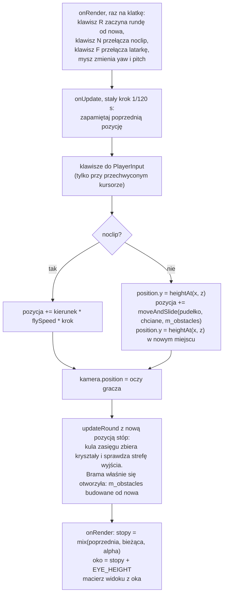

# Moduł game: gracz, chodzenie i tryb noclip

Kamień milowy: M2 + M3, w M5 doszły klawisz R (restart rundy), lista przeszkód rundy (`m_obstacles`, z bramą) i kula zasięgu gracza. Tematy wykładu: 14 (Wstęp do kolizji) i 3 (Przekształcenia przestrzeni: kamera pierwszoosobowa).
Kod: [`src/game/Player.hpp`](../../../src/game/Player.hpp), [`src/game/Player.cpp`](../../../src/game/Player.cpp), testy w [`tests/PlayerTests.cpp`](../../../tests/PlayerTests.cpp), użycie w [`src/game/NightMazeApp.hpp`](../../../src/game/NightMazeApp.hpp) i [`src/game/NightMazeApp.cpp`](../../../src/game/NightMazeApp.cpp) (`onUpdate`, `onRender`, `beginRound`).

Część modułu `game`. Wstęp do modułu jest w [`README.md`](README.md). Ten dokument zakłada znajomość trzech innych: [`../scene/collision.md`](../scene/collision.md) (pudełko `Aabb` i funkcja `moveAndSlide`), [`../scene/camera.md`](../scene/camera.md) (kąty yaw i pitch, `forward()`, `right()`) oraz [`../core/main-loop.md`](../core/main-loop.md) (stały krok symulacji i `alpha`). Obrót myszą i panel Camera opisuje [`../scene/camera-controls.md`](../scene/camera-controls.md). Skąd biorą się przeszkody i pozycja startowa, opisuje [`maze-rendering.md`](maze-rendering.md), a rundę, w której gracz zbiera kryształy i szuka wyjścia, [`gameplay.md`](gameplay.md).

## 1. Po co to jest

W kamieniu milowym M1 poruszała się sama kamera: latała tam, gdzie patrzy, i przechodziła przez wszystko. Labirynt wymaga czegoś innego. Ktoś ma **chodzić po ziemi** i **zatrzymywać się na ścianach**. Kamera jest punktem i dwoma kątami, więc nie ma czym się o ścianę oprzeć. Potrzebne jest ciało: pudełko o szerokości człowieka.

Tym ciałem jest struktura `game::Player`. Ma pozycję stóp, pudełko kolizji liczone z tej pozycji, wysokość oczu i trzy prędkości. Jedna funkcja, `Player::update`, przesuwa gracza o jeden stały krok symulacji. Kamera przestała być sterowana wprost: po każdym kroku staje tam, gdzie gracz ma oczy.

Gracz ma dwa tryby:

| Tryb | Ruch | Kolizje | Do czego służy |
|---|---|---|---|
| chodzenie (domyślny) | klawisze przesuwają tylko w poziomie, a stopy idą za wysokością terenu (`Terrain::heightAt`, od M6) | tak, przez `scene::moveAndSlide` | właściwa gra |
| noclip (klawisz N) | lot wzdłuż kierunku patrzenia, także w górę i w dół | nie | oglądanie labiryntu z góry, szukanie błędów, pokaz na obronie |

Noclip to dawny lot kamery z M1, tylko przeniesiony do gracza. Nazwa pochodzi z gier: "no clipping", czyli bez przycinania ruchu do geometrii.

Tak jak `scene::Camera` i `scene::Aabb`, gracz to zwykłe dane i matematyka: żadnego OpenGL, żadnej klawiatury, żadnego zegara. Dlatego należy do biblioteki `game_logic` i ma 13 przypadków testowych, które działają bez okna (sekcja 5.9).

Od M5 gracz ma jeszcze **drugi kształt**: kulę zasięgu (`game::playerReach`). Pudełko służy do ruchu i ścian, kula do zbierania kryształów i do wejścia w strefę wyjścia (sekcja 2.7). Sama struktura `Player` się w M5 nie zmieniła: kula jest liczona z pozycji stóp przez funkcję z `Round.hpp`, a reguły rundy opisuje [`gameplay.md`](gameplay.md).

**Stan na dziś, uczciwie.** M5 i M6 są na Windowsie kompletne w kodzie i nie są zamknięte (bez tagu wersji). Od M6 gracz chodzi po terenie z mapy wysokości: stała `FLOOR_Y` zniknęła, `Player::update` dostaje teren i co krok czyta z niego wysokość stóp ([`../renderer/terrain.md`](../renderer/terrain.md)). Testy uruchomiłem 2026-10-05 na gotowych programach Debug i Release: wszystkie testy gracza przechodzą w obu (w ramach 256 przypadków i 101232 asercji całego programu testowego). Build bez ostrzeżeń to zgłoszenie autora kodu z tego samego dnia. Program startuje z graczem stojącym w labiryncie. Samego chodzenia prawdziwymi klawiszami, ślizgania po ścianie, klawiszy N, F i R, przejścia przez otwartą bramę, chodzenia po nierównym gruncie i obrotu myszą wewnątrz labiryntu **nikt jeszcze nie sprawdził ręcznie**: to otwarte pozycje listy kontrolnej w [`../../guides/build-windows.md`](../../guides/build-windows.md). Na macOS nic z M5 ani z M6 nie było budowane ani uruchamiane ([`../../guides/build-macos.md`](../../guides/build-macos.md)).

## 2. Teoria

### 2.1 Stopy, pudełko i oczy

Gracz ma jedną pozycję i wszystko inne jest z niej wyliczane. Tą pozycją są **stopy**: środek dolnej ściany pudełka.

```text
widok z boku (płaszczyzna XY), gracz stoi w x = 1

   y
   ^
 1,8 |  +-------+      góra pudełka (BODY_HEIGHT)
 1,7 |  |   o   |      oczy: tu staje kamera (EYE_HEIGHT)
     |  |       |
 0,9 |  |   +   |      środek pudełka: stąd liczy je Aabb::fromCenter
     |  |       |
   0 +--+---*---+----> x     * stopy: pole position
       0,7  1  1,3
        <--0,6-->            BODY_WIDTH
```

Dlaczego stopy, a nie środek pudełka albo oczy:

- "gracz stoi na gruncie" to po prostu `position.y == heightAt(position.x, position.z)`: wysokość terenu wpisuje się do pozycji bez żadnej poprawki. Przy środku pudełka trzeba by pamiętać o 0,9, przy oczach o 1,7,
- pozycja startowa (`MazeWorld::startPosition`, środek komórki na wysokości gruntu) jest gotową pozycją stóp,
- model postaci, gdyby kiedyś doszedł, też ma początek układu u podstawy, tak jak modele ścian i słupków.

Pudełko jest **kwadratowe w rzucie z góry** (0,6 na 0,6 m). AABB nie obraca się razem z obiektem ([`../scene/collision.md`](../scene/collision.md), sekcja 2.1), więc pudełko o różnych wymiarach w x i z byłoby raz szersze, raz węższe w zależności od tego, wzdłuż której osi gracz idzie. Kwadrat zachowuje się tak samo w każdą stronę.

Oczy są 10 cm poniżej górnej ściany pudełka (1,7 wobec 1,8 m), tak jak u człowieka. Ściany mają 3 m, więc w trybie chodzenia nie da się zajrzeć ponad nie.

Wymiary w odniesieniu do labiryntu: komórka ma 2 m, pudełka ścian wchodzą w nią po 0,15 m z każdej strony, więc wolna szerokość korytarza to 1,7 m. Gracz zajmuje z niej 0,6 m, zostaje 1,1 m luzu.

### 2.2 Chodzenie jest poziome

Kierunek "do przodu" kamery to `forward()`: wektor jednostkowy liczony z yaw i pitch ([`../scene/camera.md`](../scene/camera.md), sekcja 2). Gdy patrzę w dół, ma on ujemną składową y. Gdybym przesuwał gracza wzdłuż niego, to:

- patrząc w ziemię, gracz próbowałby wejść pod grunt,
- nawet gdyby składową y po prostu odrzucić, zostałby wektor poziomy **krótszy niż 1**. Przy spojrzeniu o 60 stopni w dół jego długość to `cos(60 stopni) = 0,5`, więc gracz szedłby o połowę wolniej. Patrzenie pod nogi spowalniałoby chód.

Są dwa sposoby naprawy. Pierwszy: wyzerować y i znormalizować wektor na nowo. Drugi, użyty w projekcie: policzyć kierunek tak, jakby gracz patrzył **poziomo**, czyli z tym samym yaw i z pitch równym 0. Wtedy `forward()` od razu nie ma składowej pionowej i ma długość 1:

```text
forward(yaw, pitch = 0) = (sin(yaw), 0, -cos(yaw))
```

| yaw | kierunek | forward |
|---|---|---|
| 0 | północ | (0, 0, -1) |
| 90 | wschód | (1, 0, 0) |
| 180 | południe | (0, 0, 1) |
| 270 | zachód | (-1, 0, 0) |

Drugi sposób nie ma przypadku szczególnego. Pierwszy ma: przy pitch bliskim 90 stopni odrzucenie y zostawia wektor prawie zerowy, a normalizacja prawie zerowego wektora wzmacnia błędy zaokrągleń.

Kierunek "w prawo", czyli `right()`, jest poziomy zawsze, niezależnie od pitch, więc nie wymaga żadnej poprawki.

W trybie noclip jest odwrotnie: pitch **ma** działać. Lecę tam, gdzie patrzę, więc trzymając W ze wzrokiem podniesionym o 30 stopni, wznoszę się, a połowa prędkości idzie w górę (`sin(30 stopni) = 0,5`).

### 2.3 Suma klawiszy i normalizacja

Każdy wciśnięty klawisz dodaje swój wektor do sumy, a klawisz przeciwny go odejmuje:

| Pole wejścia | Klawisz | Co dodaje | Tryb |
|---|---|---|---|
| `forward` | W | `+forward` | oba |
| `backward` | S | `-forward` | oba |
| `right` | D | `+right` | oba |
| `left` | A | `-right` | oba |
| `up` | spacja | `+WORLD_UP` | tylko noclip |
| `down` | lewy Shift | `-WORLD_UP` | tylko noclip |
| `sprint` | lewy Shift | nic: wybiera prędkość | tylko chodzenie |

Dwa klawisze przeciwne znoszą się do zera. Dwa prostopadłe dają ruch po skosie, ale suma dwóch prostopadłych wektorów jednostkowych ma długość `sqrt(2)`, czyli około 1,41: bez poprawki ruch po skosie byłby o 41 procent szybszy. Sumę trzeba **znormalizować** (podzielić przez jej długość). Jedyny wyjątek to suma zerowa: normalizacja wektora zerowego to dzielenie zera przez zero, wynikiem jest `NaN` w każdej składowej, a `NaN` dodany do pozycji zostaje w niej na zawsze. Wektor zerowy zostaje więc bez zmian.

Droga jednego kroku:

```text
przesunięcie = kierunek * prędkość * czas kroku
```

| Prędkość | Wartość | Droga jednego kroku (1/120 s) |
|---|---|---|
| chód (`WALK_SPEED`) | 3,0 m/s | 2,5 cm |
| sprint (`SPRINT_SPEED`) | 5,5 m/s | około 4,6 cm |
| lot (`FLY_SPEED`) | 6,0 m/s | 5 cm |

Lewy Shift ma dwa znaczenia, po jednym na tryb: sprint przy chodzeniu, w dół przy locie. Sprint w locie nie działa (jest na to test), a klawisze góra i dół nie działają przy chodzeniu: gracz nie skacze.

### 2.4 Kolizje: chciane przesunięcie a dozwolone

W trybie chodzenia przesunięcie z sekcji 2.3 to tylko **życzenie**. Trafia do `scene::moveAndSlide`, razem z pudełkiem gracza i listą przeszkód rundy (pudełka labiryntu, a dopóki brama jest zamknięta, także jej pudełko). Funkcja oddaje tę część przesunięcia, na którą ściany pozwalają, i dopiero ona jest dodawana do pozycji:

```text
chciane   = kierunek * prędkość * czas kroku
dozwolone = moveAndSlide(pudełko gracza, chciane, przeszkody)
pozycja   = pozycja + dozwolone
```

Trzy rzeczy, których pilnuje ten schemat ([`../scene/collision.md`](../scene/collision.md), sekcje 2.6 i 2.8):

1. **Ślizganie.** Ruch ukośny w ścianę traci tylko składową skierowaną w ścianę. Składowa równoległa zostaje, więc gracz sunie wzdłuż ściany. Idąc pod kątem 45 stopni, sunie z prędkością `3 * cos(45 stopni)`, czyli około 2,1 m/s: wolniej niż na wprost, bo połowa "wysiłku" idzie w ścianę.
2. **Krótkie kroki.** Przesunięcie powstaje ze stałego kroku 1/120 s, nigdy z czasu klatki. Najdłuższy krok przy prędkościach domyślnych to 5 cm, a pudełko ściany ma 30 cm grubości.
3. **Pudełko budowane od nowa.** Gracz nie przechowuje pudełka. W każdym kroku liczy je z pozycji, więc pudełko i pozycja nie mogą się rozjechać.

Lista przeszkód nie jest liczona w każdym kroku. Pudełka ścian i słupków powstają **raz**, przy generowaniu labiryntu (`MazeWorld::colliders`, [`maze-rendering.md`](maze-rendering.md), sekcja 5). Od M5 gracz porusza się względem listy `m_obstacles`, którą składa `game::roundObstacles`: to kopia `MazeWorld::colliders` z pudełkiem bramy dopisanym na końcu, dopóki brama jest zamknięta. Aplikacja buduje ją na początku rundy, jeszcze raz w kroku, w którym brama się otworzyła (sekcja 5.6), a od M6 także po każdej przebudowie terenu (sekcja 5.8). Zamknięta brama zatrzymuje więc gracza dokładnie tak jak ściana, a otwarta wcale, bez żadnego `if` w kodzie gracza: `Player::update` dostaje po prostu inną listę.

### 2.5 Bez grawitacji i bez skoku

Do M5 podłoga była płaska i gracz miał zawsze `y = 0`: przed każdym krokiem chodzenia jedna linia ustawiała `position.y` na stałą `FLOOR_Y`. Od M6 grunt jest nierówny, ale zasada została ta sama, tylko stałą zastąpiło pytanie do terenu:

```text
position.y = terrain.heightAt(position.x, position.z)
```

Wysokość jest **czytana**, a nie wynikiem kolizji. Teren nie jest pudełkiem na liście przeszkód i nic gracza w dół nie ciągnie. W terenie nie ma dziur ani pionowych ścian (to powierzchnia `y = h(x, z)`: nad każdym punktem planu jest dokładnie jedna wysokość), więc gracz nie może ani spaść, ani utknąć na krawędzi. Grawitacja, która co krok ciągnęłaby go w dół, i teren jako przeszkoda, która co krok by go zatrzymywała, dawałyby razem zawsze ten sam wynik: stopy na powierzchni. Skoku nie ma.

`heightAt` zwraca wysokość dokładnie tego trójkąta, który jest w tym miejscu rysowany ([`../renderer/terrain.md`](../renderer/terrain.md)), więc stopy nie unoszą się nad gruntem i w nim nie toną.

Wysokość jest ustawiana w kroku chodzenia **dwa razy**:

| Kiedy | Po co |
|---|---|
| przed ruchem, w miejscu, w którym gracz stoi | pudełko gracza musi być na właściwej wysokości, zanim zostanie porównane ze ścianami. Ma to znaczenie w pierwszym kroku po wyłączeniu noclip w powietrzu: komentarz w kodzie mówi "the box must be among the walls before it is tested against them" |
| po ruchu, w miejscu, w którym krok się skończył | grunt jest nierówny, więc nowe miejsce ma własną wysokość |

**Prędkość po gruncie nie zależy od nachylenia.** Klawisze przesuwają gracza tylko w płaszczyźnie poziomej: kierunek chodzenia nie ma składowej pionowej, a wysokość jest dopisywana osobno. Sekunda marszu to zawsze 3 m w planie, pod górę i z góry. Przypina to test `a walking player keeps the feet on the ground, uphill and downhill`. Fizycznie nie jest to wierne (po stoku gracz pokonuje w rzeczywistości dłuższą drogę w tym samym czasie), ale pod labiryntem grunt jest łagodny i różnicy nie widać.

Ta sama linia załatwia powrót z trybu noclip. Gracz, który wyłączył noclip 5 m nad labiryntem, w najbliższym kroku ma stopy z powrotem na gruncie. To **przeskok**, a nie spadanie: nie ma animacji lotu w dół.

Oś y w `moveAndSlide` nadal działa ([`../scene/collision.md`](../scene/collision.md), sekcja 5.5), tylko przy chodzeniu dostaje przesunięcie zerowe i kończy się na pierwszej linii. Pudełka ścian nadal zatrzymują gracza wyłącznie w poziomie: droga gracza w `x` i `z` jest na nierównym gruncie identyczna jak na płaskim (test `the walls stop the player on uneven ground exactly as on flat ground`).

Ile to jest w labiryncie startowym przy skali wysokości 1: stopy na starcie `(1, 1)` są na 0,124 m, w punkcie `(9, 1)` na 0,278 m, a w `(17, 1)` na 0,352 m. Te trzy liczby zmierzył autor kodu w grze (teleportując gracza), a ja odtworzyłem je skryptem z pliku `heightmap.png` według wzoru terenu. Cały grunt pod tym labiryntem mieści się między 0,085 a 0,461 m.

### 2.6 Stały krok, kamera i interpolacja

Gracz jest **stanem symulacji**. Zmienia się wyłącznie w `onUpdate`, 120 razy na sekundę, niezależnie od liczby klatek ([`../core/main-loop.md`](../core/main-loop.md), sekcja 2). Klatka wypada zwykle między dwoma krokami, więc rysowanie z ostatniej policzonej pozycji dawałoby szarpanie. Rozwiązanie jest takie samo jak dla kamery w M1, tylko mieszane są teraz **stopy**:

```text
stopy = mix(pozycja sprzed ostatniego kroku, pozycja bieżąca, alpha)
oko   = stopy + (0, EYE_HEIGHT, 0)
```

Oczy są zawsze o stałą wysokość nad stopami, więc "zmieszaj stopy i dodaj wysokość" daje ten sam punkt co "zmieszaj oczy". Wystarczy pamiętać jedną poprzednią pozycję.

Od M6 mieszane są wszystkie **trzy** współrzędne. Do M5 wysokość przy chodzeniu była zawsze zerem i nie było czego mieszać. Teraz stopy zmieniają wysokość w każdym kroku, a interpolacja `y` robi z tych małych stopni gładką rampę: oczy suną nad gruntem zamiast podskakiwać 120 razy na sekundę. Działa to, bo zmiana wysokości między dwoma krokami jest mała. Test `the height of the feet changes a little in every step, never in a jump` sprawdza to dla sprintu po skosie przy największej skali wysokości: zmiana na krok nie przekracza granicy policzonej z największego nachylenia między sąsiednimi punktami siatki, a sama granica jest poniżej 0,2 m.

Jest jedna zmiana wysokości, której mieszać **nie wolno**: krok tuż po wyłączeniu noclip w powietrzu, który zrzuca stopy na grunt. To przeskok, a nie ruch. Aplikacja pamięta, czy gracz w poprzednim kroku leciał (`m_playerWasFlying`), i tylko w tym jednym kroku wyrównuje poprzednią wysokość do bieżącej (sekcja 5.6).

Kąty kamery (yaw i pitch) nie są interpolowane. Mysz zmienia je raz na klatkę, w tej samej klatce, w której są rysowane ([`../scene/camera-controls.md`](../scene/camera-controls.md), sekcja 2).



### 2.7 Drugi kształt gracza: kula zasięgu

Pudełko odpowiada na pytanie "czy gracz może tu wejść". Od M5 gra zadaje jeszcze drugie pytanie: "czy gracz **dosięga** kryształu albo strefy wyjścia". Do tego służy osobny kształt, kula:

```text
widok z boku, gracz stoi w x = 1

 1,8 |  +-------+
     |  |  ...  |
 1,2 |  | .   . |      kula zasięgu: środek 0,9 m nad stopami
 0,9 |  |.  +  .|      (PLAYER_REACH_HEIGHT), promień 0,3 m
 0,6 |  | .   . |      (PLAYER_REACH_RADIUS)
     |  |  ...  |
   0 +--+---*---+----> x
       0,7  1  1,3
```

| Stała (`Round.hpp`) | Wartość | Skąd ta liczba |
|---|---|---|
| `PLAYER_REACH_HEIGHT` | 0,9 m | połowa `BODY_HEIGHT`: środek kuli leży w środku pudełka |
| `PLAYER_REACH_RADIUS` | 0,3 m | połowa `BODY_WIDTH`: kula jest tak szeroka jak ciało |

Kula mieści się więc w pudełku i dotyka jego czterech bocznych ścian od środka. Dwie rzeczy, do których służy, obie w `game::updateRound`:

- **zbieranie**: kryształ jest zebrany, gdy kula gracza nachodzi na kulę wokół środka kryształu (`scene::overlaps` dla dwóch kul: odległość środków mniejsza niż suma promieni),
- **wyjście**: runda jest wygrana, gdy kula gracza nachodzi na pudełko strefy wyjścia przy otwartej bramie (`scene::overlaps` dla kuli i pudełka).

Dlaczego kula, a nie pudełko gracza. Zbieranie to pytanie o **odległość**, a odległość od punktu jest taka sama w każdą stronę właśnie dla kuli. Pudełko ma narożniki: wystają o `0,3 * sqrt(2)`, czyli około 0,42 m od osi gracza, więc gracz podchodzący po skosie sięgałby dalej niż idący prosto. Test dwóch kul to też najprostszy test kolizji, jaki istnieje: jedno porównanie.

Czego kula **nie robi**: nie bierze udziału w ruchu. `moveAndSlide` dostaje pudełko i nic o kuli nie wie. Kula niczego nie zatrzymuje i nic nie zatrzymuje jej. Działa też w trybie noclip (gracz przelatujący przez kryształ go zbiera), z jednym zabezpieczeniem po stronie reguł: strefa wyjścia wygrywa tylko przy otwartej bramie, więc przelot przez zamkniętą bramę nie kończy rundy.

Matematykę obu testów opisuje [`../scene/collision.md`](../scene/collision.md), a reguły zbierania, promień `pickupRadius` i wygraną [`gameplay.md`](gameplay.md), sekcja 2.

## 3. Jak to działa w OpenGL

Nie dotyczy: `Player.hpp` i `Player.cpp` nie dołączają GLAD i nie wołają żadnej funkcji `gl*`. Gracz nie jest rysowany (kamera jest w jego oczach, więc własnego ciała nie widać).

Związek z renderowaniem jest pośredni: z interpolowanej pozycji stóp powstaje punkt oka, a z niego macierz widoku (`m_camera.viewMatrix(eye)`), którą dostają wszystkie programy shaderów rysujące w tej klatce (najwyżej trzy z pięciu: program labiryntu, program linii i, od M6, program nieba, który z tej macierzy bierze sam obrót), a od M4 także latarka jako swoją pozycję. Jedyne, co OpenGL rysuje "o graczu", to zielone linie jego pudełka kolizji i od M5 trzy zielone okręgi jego kuli zasięgu, gdy włączone jest rysowanie kształtów kolizji ([`../scene/collision.md`](../scene/collision.md), sekcje 5 i 6).

## 4. Shadery

Gracz nie ma shadera. Linie pudełka kolizji i kuli zasięgu rysuje para `color.vert` i `color.frag`, opisana w [`../scene/collision.md`](../scene/collision.md), sekcja 4.

## 5. Kod w projekcie

### 5.1 Pliki

| Plik | Co zawiera |
|---|---|
| [`src/game/Player.hpp`](../../../src/game/Player.hpp) | struktury `PlayerInput` i `Player`: stałe wymiarów i prędkości, pola, deklaracje `box`, `eyePosition`, `update` |
| [`src/game/Player.cpp`](../../../src/game/Player.cpp) | dwie stałe pomocnicze i definicje trzech funkcji |
| [`tests/PlayerTests.cpp`](../../../tests/PlayerTests.cpp) | 13 przypadków testowych na płaskim gruncie (sekcja 5.9) |
| [`tests/TerrainTests.cpp`](../../../tests/TerrainTests.cpp) | trzy przypadki o graczu na nierównym gruncie (sekcja 5.9) |
| [`src/game/NightMazeApp.hpp`](../../../src/game/NightMazeApp.hpp), [`.cpp`](../../../src/game/NightMazeApp.cpp) | właściciel gracza: pola `m_player` i `m_previousPlayerPosition`, `m_obstacles`, akcesor `player()`, wypełnianie `PlayerInput` w `onUpdate`, klawisze R, N i F oraz interpolacja w `onRender`, ustawienie na starcie w `beginRound` |
| [`src/game/Round.hpp`](../../../src/game/Round.hpp), [`.cpp`](../../../src/game/Round.cpp) | to, co runda robi z pozycją gracza: `playerReach` ze stałymi `PLAYER_REACH_HEIGHT` i `PLAYER_REACH_RADIUS`, `roundObstacles`, `updateRound`. Opis w [`gameplay.md`](gameplay.md), sekcja 5 |

`Player.*` należą do biblioteki `game_logic` (razem z labiryntem), a nie do programu `night_maze`: dzięki temu program testowy może je dołączyć ([`README.md`](README.md)). Dołączane nagłówki to `scene/Collider.hpp`, GLM i `<span>` w nagłówku oraz `scene/Camera.hpp` w pliku `.cpp`. Nic z `core/`, `gfx/`, GLAD ani GLFW.

### 5.2 `PlayerInput`: klawisze jako zwykłe pola

```cpp
struct PlayerInput {
    bool forward = false;  ///< W
    bool backward = false; ///< S
    bool left = false;     ///< A
    bool right = false;    ///< D
    bool up = false;       ///< Space, used only in noclip mode
    bool down = false;     ///< Left Shift, used only in noclip mode
    bool sprint = false;   ///< Left Shift, used only in walking mode
};
```

Siedem pól typu `bool`, wszystkie domyślnie fałszywe. Struktura mówi, **czego gracz chce** w tym kroku, a nie, które klawisze są wciśnięte. Komentarze przy polach podają klawisze tylko jako informację: przypisanie klawiszy do pól robi `NightMazeApp` (sekcja 5.6).

Dwie korzyści z tej warstwy:

- `Player` nie zna klawiatury, więc nie dołącza GLFW ani `core::Input` i kompiluje się w bibliotece bez okna,
- test "trzyma klawisz", ustawiając pole: `game::PlayerInput{.forward = true}`. Bez tej struktury ruchu nie dałoby się przetestować, bo prawdziwych naciśnięć nie da się wstrzyknąć do GLFW z kodu.

Domyślnie utworzona struktura (`PlayerInput wanted;` albo `{}`) znaczy "nic nie jest wciśnięte".

### 5.3 Struktura `Player`: stałe i pola

```cpp
struct Player {
    /// Width and depth of the body in metres. The box cannot rotate, so it is square.
    static constexpr float BODY_WIDTH = 0.6F;

    /// Height of the body in metres.
    static constexpr float BODY_HEIGHT = 1.8F;

    /// Height of the eyes above the feet in metres. The camera stands here.
    static constexpr float EYE_HEIGHT = 1.7F;

    /// Walking speed in metres per second.
    static constexpr float WALK_SPEED = 3.0F;

    /// Walking speed with sprint held, in metres per second.
    static constexpr float SPRINT_SPEED = 5.5F;

    /// Flight speed in noclip mode, in metres per second.
    static constexpr float FLY_SPEED = 6.0F;
```

| Stała | Wartość | Znaczenie |
|---|---|---|
| `BODY_WIDTH` | 0,6 m | szerokość i głębokość pudełka (sekcja 2.1) |
| `BODY_HEIGHT` | 1,8 m | wysokość pudełka |
| `EYE_HEIGHT` | 1,7 m | wysokość oczu nad stopami. Używa jej też `NightMazeApp::onRender` przy interpolacji |
| `WALK_SPEED` | 3,0 m/s | szybki marsz. Komórka labiryntu (2 m) w dwie trzecie sekundy |
| `SPRINT_SPEED` | 5,5 m/s | bieg |
| `FLY_SPEED` | 6,0 m/s | lot w trybie noclip |

Do M5 była tu siódma stała, `FLOOR_Y = 0`: wysokość podłogi, na którą krok chodzenia stawiał stopy. M6 ją usunął, bo wysokość gruntu nie jest już jedną liczbą: daje ją `Terrain::heightAt`.

Stałe są `static constexpr` wewnątrz struktury, więc pisze się je z nazwą typu (`game::Player::EYE_HEIGHT`) i można ich użyć jako wartości początkowych pól poniżej.

```cpp
    /// Position of the feet: the middle of the bottom face of the body, in world space.
    glm::vec3 position{0.0F};

    /// False: walking with collisions. True: free flight without collisions.
    bool noclip = false;

    /// Speeds in use, in metres per second. Fields and not only constants, so that the
    /// debug UI can change them live.
    float walkSpeed = WALK_SPEED;
    float sprintSpeed = SPRINT_SPEED;
    float flySpeed = FLY_SPEED;
```

| Pole | Znaczenie |
|---|---|
| `position` | stopy, w przestrzeni świata. `{0.0F}` zeruje wszystkie trzy składowe |
| `noclip` | tryb. Przełącza go klawisz N i pole wyboru w panelu Collision |
| `walkSpeed`, `sprintSpeed`, `flySpeed` | prędkości faktycznie używane. Są polami, bo zmieniają je suwaki panelu Camera. Stałe zostają jako wartości startowe i jako punkt odniesienia dla testów |

Wszystkie pola są publiczne, bez konstruktora: `Player` jest agregatem, jak `Camera` i `Transform`. Nie ma w nim żadnego zasobu, o który trzeba by dbać.

Czego w strukturze **nie ma**: kątów patrzenia. Yaw i pitch należą do kamery (`scene::Camera`), a `update` dostaje je jako parametry. Dzięki temu jest jedno miejsce, w którym kąty żyją, i mysz zmienia je tam bezpośrednio.

### 5.4 `box` i `eyePosition`

```cpp
// Half extents of the body, as scene::Aabb::fromCenter wants them.
constexpr glm::vec3 BODY_HALF_EXTENTS{Player::BODY_WIDTH / 2.0F, Player::BODY_HEIGHT / 2.0F,
                                      Player::BODY_WIDTH / 2.0F};
```

Połowy rozmiarów: `(0,3, 0,9, 0,3)`. Stała stoi w anonimowej przestrzeni nazw pliku `.cpp`, bo poza nim nikt jej nie potrzebuje.

```cpp
scene::Aabb Player::box() const {
    // position is at the feet, the centre of the box is half of the body height above it.
    const glm::vec3 center = position + glm::vec3{0.0F, BODY_HEIGHT / 2.0F, 0.0F};
    return scene::Aabb::fromCenter(center, BODY_HALF_EXTENTS);
}
```

| Linia | Znaczenie |
|---|---|
| `position + glm::vec3{0.0F, BODY_HEIGHT / 2.0F, 0.0F}` | środek pudełka: 0,9 m nad stopami |
| `scene::Aabb::fromCenter(center, BODY_HALF_EXTENTS)` | `min = środek - połowy`, `max = środek + połowy`. Dla stóp w `(1, 0, 5)` wychodzi `min = (0,7, 0, 4,7)` i `max = (1,3, 1,8, 5,3)`: dokładnie to sprawdza drugi przypadek testowy |

Funkcja jest `const` i niczego nie zapamiętuje. Pudełko powstaje na żądanie: w `update`, w panelu Collision i przy rysowaniu zielonych linii.

```cpp
glm::vec3 Player::eyePosition() const {
    return position + glm::vec3{0.0F, EYE_HEIGHT, 0.0F};
}
```

Oczy: 1,7 m nad stopami. `NightMazeApp` przypisuje ten punkt do `m_camera.position` po każdym kroku.

### 5.5 `Player::update` linia po linii

```cpp
void Player::update(const PlayerInput& input, float yawDegrees, float pitchDegrees,
                    float stepSeconds, std::span<const scene::Aabb> obstacles,
                    const Terrain& terrain) {
```

| Parametr | Znaczenie |
|---|---|
| `input` | czego gracz chce w tym kroku (sekcja 5.2) |
| `yawDegrees`, `pitchDegrees` | kąty kamery w stopniach. Chodzenie używa tylko yaw |
| `stepSeconds` | długość kroku w sekundach. Gra podaje zawsze `Time::FIXED_DT` |
| `obstacles` | pudełka świata. `std::span` to widok na ciąg elementów: przyjmuje `std::vector<Aabb>` bez kopiowania i pustą listę `{}` |
| `terrain` (od M6) | grunt, z którego krok chodzenia czyta wysokość stóp. Referencja do stałej: gracz terenu nie zmienia. Nagłówek `Player.hpp` ma tylko deklarację wyprzedzającą `class Terrain;`, pełny `game/Terrain.hpp` dołącza dopiero `Player.cpp`. W trybie noclip teren, tak jak lista przeszkód, nie jest czytany |

**Kierunki.**

```cpp
    scene::Camera view;
    view.yawDegrees = yawDegrees;
    view.pitchDegrees = noclip ? pitchDegrees : LEVEL_PITCH_DEGREES;
    const glm::vec3 forward = view.forward();
    const glm::vec3 right = view.right();
```

| Linia | Znaczenie |
|---|---|
| `scene::Camera view;` | tymczasowa kamera użyta **jak kalkulator**. Jej pozycja nie jest czytana, liczą się tylko kąty. Dzięki temu kierunek ruchu pochodzi z tych samych wzorów co obraz na ekranie: nie ma drugiej kopii sinusów i kosinusów, która mogłaby się z pierwszą rozjechać |
| `view.yawDegrees = yawDegrees;` | yaw zawsze taki jak u prawdziwej kamery |
| `noclip ? pitchDegrees : LEVEL_PITCH_DEGREES` | w locie prawdziwy pitch, przy chodzeniu 0 (`LEVEL_PITCH_DEGREES` to stała `0.0F` z pliku `.cpp`). To jest cała różnica między "lecę tam, gdzie patrzę" a "idę poziomo" (sekcja 2.2) |
| `view.forward()`, `view.right()` | oba wektory liczone raz na krok. `right()` jest poziomy w obu trybach |

**Suma klawiszy.**

```cpp
    // Opposite keys cancel each other: the two vectors add up to zero.
    glm::vec3 direction{0.0F};
    if (input.forward) {
        direction += forward;
    }
    if (input.backward) {
        direction -= forward;
    }
    if (input.right) {
        direction += right;
    }
    if (input.left) {
        direction -= right;
    }
    // Straight up and down exist only in flight. A walking player does not jump.
    if (noclip && input.up) {
        direction += scene::Camera::WORLD_UP;
    }
    if (noclip && input.down) {
        direction -= scene::Camera::WORLD_UP;
    }
```

Sześć osobnych `if`, bez `else`: klawisze przeciwne mają się znosić w sumie, a nie wykluczać. `noclip && input.up` sprawia, że przy chodzeniu pola `up` i `down` są ignorowane, nawet jeśli są ustawione (a są: lewy Shift ustawia naraz `down` i `sprint`, sekcja 5.6). `scene::Camera::WORLD_UP` to `(0, 1, 0)`: lot w górę jest pionowy także wtedy, gdy patrzę w dół.

**Normalizacja.**

```cpp
    if (glm::length(direction) > 0.0F) {
        direction = glm::normalize(direction);
    }
```

Długość wraca do 1, o ile wektor nie jest zerowy (sekcja 2.3). `glm::length` to pierwiastek z sumy kwadratów składowych.

**Lot.**

```cpp
    if (noclip) {
        // Distance of one step: metres per second times seconds. Nothing is in the way.
        position += direction * (flySpeed * stepSeconds);
        return;
    }
```

W trybie noclip krok kończy się tutaj: przesunięcie jest dodawane wprost, lista przeszkód nie jest nawet czytana. Nawias sprawia, że najpierw mnożone są dwie liczby, a wektor jest mnożony raz.

**Chodzenie.**

```cpp
    // Walking. The feet belong on the ground: this matters in the first step after noclip
    // was switched off in mid-air, where the box must be among the walls before it is
    // tested against them. There is no gravity and no jump: the height is simply read
    // from the terrain.
    position.y = terrain.heightAt(position.x, position.z);

    // The keys move the player in the horizontal plane only: direction has no vertical
    // part here, so the speed over the ground is the same uphill and downhill.
    const float speed = input.sprint ? sprintSpeed : walkSpeed;
    const glm::vec3 wanted = direction * (speed * stepSeconds);

    // The walls take away the part of the movement that would go into them and leave the
    // part along them. The box is built anew from the position in every step.
    position += scene::moveAndSlide(box(), wanted, obstacles);

    // The ground is uneven, so the place the step ended at has a height of its own.
    position.y = terrain.heightAt(position.x, position.z);
}
```

| Linia | Znaczenie |
|---|---|
| pierwsze `position.y = terrain.heightAt(position.x, position.z);` | stopy na grunt, **przed** policzeniem pudełka. W zwykłym kroku nic nie zmienia (y jest już wysokością tego miejsca, ustawioną na końcu poprzedniego kroku). W pierwszym kroku po wyłączeniu noclip w powietrzu ściąga gracza na grunt, zanim jego pudełko zostanie porównane ze ścianami (sekcja 2.5). Wykonuje się także wtedy, gdy żaden klawisz nie jest wciśnięty. Do M5 stało tu `position.y = FLOOR_Y;` |
| `input.sprint ? sprintSpeed : walkSpeed` | wybór prędkości. Sprint nie ma własnego kierunku, zmienia tylko długość kroku |
| `direction * (speed * stepSeconds)` | chciane przesunięcie w metrach. Składowa y jest zerem, bo `forward` i `right` są poziome, a góra i dół nie zostały dodane. Stąd komentarz: prędkość po gruncie jest taka sama pod górę i z góry |
| `box()` | pudełko w bieżącej pozycji, już ze stopami na gruncie |
| `scene::moveAndSlide(box(), wanted, obstacles)` | zwraca **dozwolone** przesunięcie, nie nową pozycję ([`../scene/collision.md`](../scene/collision.md), sekcja 5.5) |
| `position += ...` | gracz przesuwa się o tyle, na ile pozwoliły ściany. Zmieniają się tylko `x` i `z` |
| drugie `position.y = terrain.heightAt(position.x, position.z);` (od M6) | wysokość gruntu w miejscu, w którym krok się skończył. Bez tej linii gracz szedłby na wysokości miejsca sprzed kroku: o jeden krok spóźniony względem gruntu |

Funkcja nie zwraca niczego i nie mówi, czy doszło do kolizji. Nikt tej informacji dziś nie potrzebuje. Gdyby była potrzebna (dźwięk uderzenia w ścianę), wystarczy porównać `wanted` z wynikiem `moveAndSlide`.

### 5.6 Kto woła `update`: `NightMazeApp::onUpdate`

```cpp
void NightMazeApp::onUpdate(double fixedDt) {
    // Remember where the player was before this step. It is done in every step, also
    // when the player does not move, so that onRender never blends with an old position.
    m_previousPlayerPosition = m_player.position;

    // The keys reach the player only while the cursor is captured: one click in the scene
    // switches on both mouse look and movement, Escape switches both off. Without the
    // capture the struct stays as it is created: nothing is held.
    PlayerInput wanted;
    if (input().isCursorCaptured()) {
        wanted.forward = input().isKeyDown(GLFW_KEY_W);
        wanted.backward = input().isKeyDown(GLFW_KEY_S);
        wanted.left = input().isKeyDown(GLFW_KEY_A);
        wanted.right = input().isKeyDown(GLFW_KEY_D);
        wanted.up = input().isKeyDown(GLFW_KEY_SPACE);
        // Left Shift has one meaning per mode: sprint when walking, down when flying.
        // The player uses the field that belongs to its mode and ignores the other.
        wanted.down = input().isKeyDown(GLFW_KEY_LEFT_SHIFT);
        wanted.sprint = input().isKeyDown(GLFW_KEY_LEFT_SHIFT);
    }
```

| Linia | Znaczenie |
|---|---|
| `m_previousPlayerPosition = m_player.position;` | **pierwsza linia każdego kroku**, także gdy gracz stoi. Po kroku para (poprzednia, bieżąca) opisuje dokładnie ten jeden krok |
| `PlayerInput wanted;` | wszystkie pola fałszywe |
| `if (input().isCursorCaptured())` | klawisze docierają do gracza tylko przy przechwyconym kursorze. Reguła z M1 została: kliknięcie w scenę włącza całe sterowanie, Escape całe wyłącza ([`../scene/camera-controls.md`](../scene/camera-controls.md), sekcja 5) |
| `input().isKeyDown(GLFW_KEY_W)` (i pozostałe) | stan ciągły: "jest wciśnięty". Bezpieczny w `onUpdate`, które wykonuje się od zera do wielu razy na klatkę ([`../core/input.md`](../core/input.md), sekcja 5) |
| `wanted.down` i `wanted.sprint` z tego samego klawisza | lewy Shift wypełnia oba pola. Gracz czyta to, które należy do jego trybu (sekcja 5.5) |

Różnica wobec M1: tam `onUpdate` wracał od razu, gdy kursor nie był przechwycony. Teraz krok wykonuje się zawsze, tylko z pustym wejściem:

```cpp
    // The step runs also with nothing held: it is what brings the feet back to the
    // ground after noclip was switched off in a panel.
    m_player.update(wanted, m_camera.yawDegrees, m_camera.pitchDegrees, static_cast<float>(fixedDt),
                    m_obstacles, m_mazeWorld.terrain);
```

Powód jest w komentarzu: noclip można wyłączyć polem wyboru w panelu, czyli przy **wolnym** kursorze. Gdyby krok był wtedy pomijany, gracz wisiałby w powietrzu do następnego kliknięcia w scenę. `fixedDt` przychodzi jako `double`, gracz liczy na `float`, stąd rzutowanie. `m_obstacles` to `std::vector<scene::Aabb>`, który sam zamienia się na `std::span`. Ostatni argument, `m_mazeWorld.terrain`, doszedł w M6: teren jest polem labiryntu w grze, więc gracz zawsze chodzi po tym gruncie, na którym stoją ściany.

Lista przeszkód zmieniła się w M5. Do M4 gracz dostawał wprost `m_mazeWorld.colliders`. Teraz dostaje pole aplikacji (`NightMazeApp.hpp`):

```cpp
    // What the player cannot walk through in this round: the boxes of the maze, plus the
    // box of the gate while it is closed (game::roundObstacles). A copy that is rebuilt
    // only when it changes: at the start of a round and when the gate opens.
    std::vector<scene::Aabb> m_obstacles;
```

`roundObstacles` (`Round.cpp`) kopiuje `world.colliders` i, gdy `gateBlocks(world, round)` jest prawdą, dopisuje na końcu `world.gateBox`. Lista jest **kopią**, a nie widokiem, bo składa się z dwóch źródeł. Kopiowanie kilkuset pudełek w każdym kroku byłoby marnotrawstwem, więc pole jest budowane tylko wtedy, gdy wynik może być inny: w `beginRound`, w chwili otwarcia bramy (koniec tej sekcji) i od M6 w `rebuildTerrain`, gdy pudełka zmieniły wysokość (sekcja 5.8). Komentarz pola wymienia tylko dwa pierwsze miejsca: jest o jedno do tyłu względem kodu.

```cpp
    // Walking changes the height all the time, because the ground is uneven, and that
    // change is blended in onRender like the movement itself: the eyes then glide over
    // the ground instead of moving up and down in steps. One change must not be
    // blended: the step right after noclip was switched off in mid-air, which drops the
    // feet to the ground. That is a jump and not a movement. Without these lines one
    // frame would be drawn from a point part of the way down.
    if (m_playerWasFlying && !m_player.noclip) {
        m_previousPlayerPosition.y = m_player.position.y;
    }
    m_playerWasFlying = m_player.noclip;

    // The camera stands where the eyes of the player are. onRender does not draw from
    // this position directly (it blends two steps), but the debug UI shows it.
    m_camera.position = m_player.eyePosition();
}
```

| Linia | Znaczenie |
|---|---|
| `if (m_playerWasFlying && !m_player.noclip) { m_previousPlayerPosition.y = m_player.position.y; }` | tylko w kroku, w którym gracz **przestał lecieć**: poprzednie y dostaje wartość bieżącego, więc zrzut stóp na grunt nie jest mieszany. Bez tej linii jedna klatka byłaby narysowana z punktu "w części drogi w dół", czyli z wnętrza ściany albo znad niej. Do M5 warunek brzmiał `if (!m_player.noclip)` i wyrównywał wysokość w każdym kroku chodzenia: na płaskiej podłodze nic to nie kosztowało. Na nierównym gruncie wyłączyłoby interpolację wysokości i oczy podskakiwałyby co krok, stąd węższy warunek |
| `m_playerWasFlying = m_player.noclip;` | zapamiętanie trybu na następny krok. Pole `bool m_playerWasFlying = false;` stoi w `NightMazeApp.hpp` pod `m_previousPlayerPosition` |
| `m_camera.position = m_player.eyePosition();` | kamera staje w oczach gracza. `onRender` z tego pola nie rysuje (liczy oko z interpolacji), ale panel Camera pokazuje je jako `Eye` |

Od M5 `onUpdate` ma jeszcze koniec, w którym pozycja gracza trafia do reguł rundy:

```cpp
    // The rules of the round, with the position the player has after this step: the
    // battery, the crystals within reach, the gate and the exit. The switch of the
    // flashlight goes in by reference, because an empty battery turns it off.
    const bool gateBlockedBefore = gateBlocks(m_mazeWorld, m_round);
    updateRound(m_round, m_mazeWorld, m_gameplay, m_player.position, m_lighting.flashlightOn,
                static_cast<float>(fixedDt));
    // The gate has just opened (the only change a step can make here): its box leaves
    // the obstacle list, and the way into the exit cell is free.
    if (gateBlocks(m_mazeWorld, m_round) != gateBlockedBefore) {
        m_obstacles = roundObstacles(m_mazeWorld, m_round);
    }
}
```

| Linia | Znaczenie |
|---|---|
| `const bool gateBlockedBefore = gateBlocks(m_mazeWorld, m_round);` | czy brama stała na drodze **przed** regułami tego kroku |
| `updateRound(..., m_player.position, m_lighting.flashlightOn, ...)` | reguły dostają pozycję stóp **po** ruchu tego kroku. Wewnątrz z tej pozycji powstaje kula zasięgu (`playerReach`), która zbiera kryształy i sprawdza strefę wyjścia. Włącznik latarki idzie przez referencję, bo pusta bateria go wyłącza. Całą funkcję omawia [`gameplay.md`](gameplay.md), sekcja 5 |
| `if (gateBlocks(...) != gateBlockedBefore)` | porównanie stanu sprzed i po. Jedyna zmiana, jaką krok może tu zrobić, to otwarcie bramy (otwarta brama nie zamyka się w rundzie) |
| `m_obstacles = roundObstacles(m_mazeWorld, m_round);` | lista przeszkód bez pudełka bramy. Od **następnego** kroku gracz może wejść do komórki wyjścia |

Kolejność w kroku jest więc stała: najpierw ruch względem starej listy, potem reguły, na końcu ewentualna nowa lista. Opóźnienie o jeden krok nie ma widocznego skutku: krok trwa 1/120 s, a gracz pokonuje w nim najwyżej kilka centymetrów. Zwykle gracz jest zresztą w chwili otwarcia daleko od bramy, bo otwiera ją zebranie kryształu. Nie jest to jednak gwarancja: kryształ może wypaść w komórce tuż przed bramą, a suwak `Crystals needed` w panelu Gameplay może otworzyć bramę, gdy gracz przy niej stoi. Pudełko znika wtedy od razu, a model zapada się jeszcze 1,5 s, więc przez tę chwilę da się przejść przez widoczne deski.

### 5.7 Klawisz N i interpolacja: `NightMazeApp::onRender`

Trzy klawisze gry są czytane w `onRender`, w tej kolejności: R, N, F. Najpierw R, od M5:

```cpp
    // A new round on the same maze, asked for with the restart key or by the debug UI.
    // It is started here for the same reason: between two fixed steps, never inside one.
    // wasKeyPressed is true for one frame, so the key is read once per frame.
    if (m_gameplay.restart || input().wasKeyPressed(RESTART_KEY)) {
        m_gameplay.restart = false;
        beginRound();
    }
```

| Linia | Znaczenie |
|---|---|
| `m_gameplay.restart` | prośba o restart zapisana przez przycisk `Restart round (key R)` w panelu Gameplay. Ten sam wzorzec co `MazeSettings::regenerate`: panel tylko ustawia flagę, aplikacja wykonuje ją na początku następnej klatki |
| `input().wasKeyPressed(RESTART_KEY)` | `RESTART_KEY` to `GLFW_KEY_R` (stała w `NightMazeApp.cpp`). Prawda tylko w klatce, w której klawisz został wciśnięty |
| `m_gameplay.restart = false;` | flaga jest zerowana od razu: jedno kliknięcie to jeden restart |
| `beginRound();` | runda od nowa **na tym samym labiryncie**: kryształy wracają, bateria jest pełna, brama zamknięta, a gracz staje na starcie (sekcja 5.8) |

"For the same reason" w komentarzu odnosi się do bloku nad nim, czyli do regeneracji labiryntu: restart też dzieje się na początku klatki, między dwoma stałymi krokami, więc żaden krok nie widzi rundy w połowie wymienionej. Blok stoi **po** regeneracji: gdy w jednej klatce przyjdą obie prośby, najpierw powstaje nowy labirynt (i tak z nową rundą), a potem runda zaczyna się jeszcze raz, co niczego nie zmienia.

Potem N:

```cpp
    // The noclip key. wasKeyPressed is true for one frame, so it is read here, once per
    // frame, and not in onUpdate, which runs zero or more times per frame.
    if (input().wasKeyPressed(NOCLIP_KEY)) {
        m_player.noclip = !m_player.noclip;
    }
```

`NOCLIP_KEY` to `GLFW_KEY_N` (stała w `NightMazeApp.cpp`). `wasKeyPressed` zwraca prawdę tylko w klatce, w której klawisz został wciśnięty (zbocze). W `onUpdate` byłoby to błędem: w klatce z dwoma krokami tryb przełączyłby się dwa razy, czyli wcale, a w klatce bez kroku naciśnięcie by przepadło.

Warunek nie pyta o przechwycenie kursora, więc N działa także przy wolnym kursorze. Nie działa tylko wtedy, gdy klawiaturę ma ImGui (edytowane pole tekstowe albo aktywny widżet): `core::Input` odpowiada wtedy fałszem na każde pytanie o klawisz ([`../core/input.md`](../core/input.md), sekcja 5).

Te same reguły dotyczą klawisza R: działa przy wolnym kursorze i nie działa, gdy klawiaturę ma ImGui.

**Klawisz F (od M4).** Tuż pod tym blokiem stoi w `onRender` bliźniaczy blok dla `FLASHLIGHT_KEY` (`GLFW_KEY_F`), który przełącza `m_lighting.flashlightOn`, czyli latarkę. Obowiązują te same trzy reguły: `wasKeyPressed` w `onRender`, działanie przy wolnym kursorze, brak działania, gdy klawiaturę ma ImGui. Od M5 dochodzi czwarta: przy pustej baterii klawisz nadal ustawia włącznik, ale najbliższy stały krok (`updateRound`) wyłącza go z powrotem, a `lightingForFrame` pilnuje, żeby żadna klatka nie została narysowana ze światłem pustej baterii. Kod i uzasadnienie: [`flashlight.md`](flashlight.md), sekcja 5, i [`gameplay.md`](gameplay.md), sekcja 5. Z interpolowanego oka, które `onRender` liczy dla macierzy widoku, powstaje też pozycja latarki: to drugi, obok macierzy widoku, użytkownik tej samej zmiennej `eye`.

**Wszystkie klawisze gry w jednym miejscu:**

| Klawisz | Co robi | Gdzie czytany | Jak | Wymaga przechwyconego kursora |
|---|---|---|---|---|
| W, A, S, D | ruch | `onUpdate` | `isKeyDown` (stan) | tak |
| lewy Shift | sprint przy chodzeniu, w dół w trybie noclip | `onUpdate` | `isKeyDown` | tak |
| spacja | w górę w trybie noclip | `onUpdate` | `isKeyDown` | tak |
| N | przełącza noclip | `onRender` | `wasKeyPressed` (zbocze) | nie |
| F | przełącza latarkę | `onRender` | `wasKeyPressed` | nie |
| R (od M5) | zaczyna rundę od nowa na tym samym labiryncie | `onRender` | `wasKeyPressed` | nie |
| Escape | oddaje przechwycony kursor, a przy wolnym kursorze zamyka okno | `core::Application`, przed krokami symulacji | `wasKeyPressed` | |
| akcent grawis (klawisz na lewo od 1, `GLFW_KEY_GRAVE_ACCENT`) | pokazuje i chowa panele debugowania. Pasek HUD zostaje | `src/main.cpp` | `wasKeyPressed` | |

Żaden z klawiszy N, F i R nie działa, gdy klawiaturę ma ImGui.

```cpp
    const glm::vec3 feet =
        glm::mix(m_previousPlayerPosition, m_player.position, static_cast<float>(alpha));
    const glm::vec3 eye = feet + glm::vec3{0.0F, Player::EYE_HEIGHT, 0.0F};

    // The two matrices that are the same for everything drawn in this frame.
    const glm::mat4 view = m_camera.viewMatrix(eye);
```

| Linia | Znaczenie |
|---|---|
| `glm::mix(a, b, t)` | `a * (1 - t) + b * t`: punkt w części `alpha` drogi od pozycji sprzed ostatniego kroku do bieżącej |
| `feet + glm::vec3{0.0F, Player::EYE_HEIGHT, 0.0F}` | oko nad zmieszanymi stopami (sekcja 2.6). Od M6 komentarz nad tym blokiem dodaje, że ruch jest gładki "in all three directions": wysokość stóp idzie za gruntem od kroku do kroku i jest mieszana tak jak x i z |
| `m_camera.viewMatrix(eye)` | macierz widoku z oka podanego jako parametr. Pole `m_player.position` nie jest zmieniane: rysowanie tylko czyta stan symulacji |

Pole pamiętające poprzednią pozycję (`NightMazeApp.hpp`):

```cpp
    // The player is simulation state: onUpdate moves it in fixed steps.
    Player m_player;
    // Position of the player before the last fixed step. onRender draws from a point
    // between this one and m_player.position. It starts equal to the position of the
    // player, so the frames before the first step are drawn from where the player stands.
    // Declared after m_player, because members are initialized top to bottom.
    glm::vec3 m_previousPlayerPosition = m_player.position;
```

Pola są inicjalizowane w kolejności deklaracji, więc `m_previousPlayerPosition` musi stać pod `m_player`. Wartość startowa i tak jest zaraz nadpisywana przez `beginRound` (sekcja 5.8).

Przypadki brzegowe interpolacji:

| Sytuacja | Co jest w parze (poprzednia, bieżąca) | Co widać |
|---|---|---|
| pierwsze klatki, przed pierwszym krokiem | dwie identyczne pozycje (`beginRound`) | gracz stoi na starcie, `alpha` bez znaczenia |
| klatka bez żadnego kroku | ta sama para co w poprzedniej klatce, `alpha` większe | oko przesuwa się dalej wzdłuż tego samego odcinka |
| klatka z kilkoma krokami | para opisuje ostatni z nich | wcześniejsze kroki są już "za" tą klatką |
| gracz oparty o ścianę | `moveAndSlide` zwraca zero na osi ściany, obie pozycje mają tę samą współrzędną | brak drgań przy ścianie |
| chodzenie po nierównym gruncie (od M6) | dwie pozycje o różnej wysokości | oko sunie po odcinku między nimi, bez schodków |
| noclip wyłączony w powietrzu | krok ustawia y na wysokość gruntu, a `onUpdate` także poprzednie y (`m_playerWasFlying`) | natychmiastowy przeskok na grunt, bez klatki pośredniej w pionie |
| zmiana skali wysokości terenu (od M6) | `rebuildTerrain` ustawia y obu pozycji chodzącego gracza na nowy grunt | gracz stoi na nowym gruncie od następnej klatki, bez klatki pośredniej |
| nowy labirynt | `beginRound` ustawia obie pozycje naraz | przeskok na start, bez przelotu przez ściany |
| restart rundy (klawisz R albo przycisk w panelu Gameplay) | to samo `beginRound`, ten sam labirynt | przeskok na start z dowolnego miejsca, bez klatki pośredniej |
| pozycja zmieniona suwakiem `Player feet` | panel pisze do `m_player.position` po narysowaniu sceny, najbliższy krok kopiuje ją do poprzedniej | przeskok. Gdy trafi się klatka bez kroku, ta jedna klatka jest rysowana z punktu między starą a nową pozycją |
| okno zminimalizowane | `onRender` wraca przed liczeniem oka, `onUpdate` działa dalej | po przywróceniu okna gracz jest tam, gdzie doszedł |

### 5.8 Start, nowy labirynt i restart: `beginRound`

```cpp
void NightMazeApp::beginRound() {
    // The state of the round: every crystal back, a full battery, the gate closed.
    m_round = startRound(m_mazeWorld, m_gameplay);
    m_obstacles = roundObstacles(m_mazeWorld, m_round);
    // A round starts with the light on, also after one that ended in the dark.
    m_lighting.flashlightOn = true;

    // The player goes to the start, feet on the ground there. After a regeneration the
    // old position may be inside a wall of the new maze, or outside of it.
    m_player.position = m_mazeWorld.startPosition;
    // Both positions at once: otherwise the next frame would be drawn from a point
    // between the old place and the new one, a visible swoop through the walls.
    m_previousPlayerPosition = m_player.position;

    m_camera.position = m_player.eyePosition();
    m_camera.yawDegrees = m_mazeWorld.startYawDegrees;
    m_camera.pitchDegrees = LEVEL_PITCH_DEGREES;
}
```

`beginRound` zastąpiła w M5 funkcję, która do M4 obsługiwała tylko wejście do labiryntu. Jest wołana z trzech miejsc: z konstruktora (pierwszy labirynt), z `regenerateMaze` po każdej regeneracji ([`maze-rendering.md`](maze-rendering.md), sekcja 5) i z `onRender` przy restarcie rundy (klawisz R albo flaga `GameplaySettings::restart`, sekcja 5.7).

| Linia | Znaczenie |
|---|---|
| `m_round = startRound(m_mazeWorld, m_gameplay);` | świeży stan rundy: wszystkie kryształy na miejscach, pełna bateria, zamknięta brama, zegary na zerze ([`gameplay.md`](gameplay.md), sekcja 5) |
| `m_obstacles = roundObstacles(m_mazeWorld, m_round);` | lista przeszkód dla gracza na tę rundę: pudełka labiryntu i pudełko zamkniętej bramy. Po restarcie w rundzie, w której brama była już otwarta, brama wraca tu na listę |
| `m_lighting.flashlightOn = true;` | runda zaczyna się z włączoną latarką, także po takiej, która skończyła się w ciemności |
| `m_player.position = m_mazeWorld.startPosition;` | stopy na środek komórki startowej. Od M6 `startPosition` ma już wysokość gruntu w tym miejscu (liczy ją `placeOnTerrain`), więc gracz stoi na gruncie od pierwszej klatki, zanim wykona się jakikolwiek krok |
| `m_previousPlayerPosition = m_player.position;` | **obie pozycje naraz**. Samo pierwsze przypisanie zostawiłoby w poprzedniej pozycji stare miejsce, a `onRender` narysowałby najbliższą klatkę z punktu między starym a nowym: widoczny przelot przez ściany |
| `m_camera.position = m_player.eyePosition();` | kamera w oczach gracza, zanim wykona się pierwszy krok |
| `m_camera.yawDegrees = m_mazeWorld.startYawDegrees;` | gracz patrzy w pierwszy otwarty bok komórki startowej, czyli w korytarz, a nie w ścianę ([`maze-rendering.md`](maze-rendering.md), sekcja 5.4) |
| `m_camera.pitchDegrees = LEVEL_PITCH_DEGREES;` | wzrok poziomo. `LEVEL_PITCH_DEGREES` to `0.0F` |

Od strony gracza funkcja ustawia więc pięć rzeczy: pozycję gracza, poprzednią pozycję, pozycję kamery, yaw i pitch. Restart klawiszem R robi z graczem dokładnie to samo co nowy labirynt: stawia go na starcie twarzą do pierwszego otwartego przejścia.

Dla labiryntu domyślnego (10 na 10 komórek, ziarno 1) przy skali wysokości 1 daje to: stopy w `(1; 0,124; 1)`, czyli w środku komórki (0, 0) na gruncie, oko 1,7 m wyżej w `(1; 1,824; 1)`, pitch 0 i yaw w stronę pierwszego otwartego boku komórki startowej. Dla ziarna 1 jest to południe (180 stopni): tak podaje autor kodu po uruchomieniu programu, żaden test nie przypina tej wartości dla rozmiaru 10 na 10 (test sprawdza tylko, że yaw wskazuje bok bez ściany).

`beginRound` **nie** dotyka trybu noclip ani prędkości. Kto wygeneruje nowy labirynt albo naciśnie R w trakcie lotu, nadal leci, tylko z punktu startowego.

**Gracz a przebudowa terenu (od M6).** Suwak `Height scale` w panelu Terrain zmienia grunt pod stojącym graczem. Robi to `NightMazeApp::rebuildTerrain`, wołana na początku klatki ([`maze-rendering.md`](maze-rendering.md), sekcja 5.7). Jej część dotycząca gracza:

```cpp
    // A walking player stands on the new ground at once, in both positions, so the next
    // frame is not drawn from a point between the old height and the new one. A flying
    // player is left where it is.
    if (!m_player.noclip) {
        m_player.position.y =
            m_mazeWorld.terrain.heightAt(m_player.position.x, m_player.position.z);
        m_previousPlayerPosition.y = m_player.position.y;
        m_camera.position = m_player.eyePosition();
    }
```

| Linia | Znaczenie |
|---|---|
| `if (!m_player.noclip)` | tylko gracz, który chodzi. Lecący zostaje tam, gdzie jest: nie stoi na gruncie, więc nie ma czego poprawiać |
| `m_player.position.y = m_mazeWorld.terrain.heightAt(...)` | stopy na nowy grunt w tym samym `x` i `z`. Najbliższy krok zrobiłby to samo, ale dopiero po narysowaniu klatki |
| `m_previousPlayerPosition.y = m_player.position.y;` | **obie pozycje**, z tego samego powodu co w `beginRound`: inaczej klatka byłaby narysowana z punktu między starą a nową wysokością |
| `m_camera.position = m_player.eyePosition();` | panel Camera od razu pokazuje nowe oko |

Przed tym blokiem funkcja składa od nowa `m_obstacles`, bo pudełka ścian zmieniły wysokość razem z gruntem.

### 5.9 Jak to zostało sprawdzone

Testy jednostkowe w bibliotece doctest ([`../../libraries/doctest.md`](../../libraries/doctest.md), sekcja 4). Funkcja pomocnicza `runSteps` woła `update` zadaną liczbę razy z krokiem `STEP_SECONDS = 1.0F / 120.0F`, czyli 120 kroków to jedna sekunda gry.

| Przypadek testowy | Co sprawdza | Wynik |
|---|---|---|
| `the player constants are the agreed sizes and speeds` | stałe i wartości startowe pól | 0,6, 1,8, 1,7, 3,0, 5,5. Nowy gracz chodzi (`noclip` fałszywe) i ma prędkości domyślne |
| `the box stands on the feet and the eyes are 1.7 m above them` | stopy w `(1, 0, 5)` | pudełko od `(0,7, 0, 4,7)` do `(1,3, 1,8, 5,3)`, oczy w `(1, 1,7, 5)` |
| `walking forward covers 3 metres in one second, along the yaw` | sekunda z W przy yaw 0, przy yaw 90 i przy pitch -60 | `(0, 0, -3)`, `(3, 0, 0)` i znowu `(0, 0, -3)`: patrzenie w ziemię nie spowalnia ani nie zmienia wysokości (podprzypadek `looking at the ground or at the sky changes nothing`) |
| `the side keys move at a right angle to the view, and opposite keys cancel` | D, A, S, W razem z S, brak klawiszy | wschód, zachód, południe, zero, zero |
| `walking diagonally is not faster than walking straight` | W i D przez sekundę | odległość od startu 3 m, po równo na północ i wschód |
| `sprinting covers 5.5 metres in one second` | W ze sprintem | `(0, 0, -5,5)` |
| `a walking player ignores the up and down keys` | spacja, potem Shift jako `down` | gracz stoi |
| `a wall stops the player` | zamknięta komórka, dwie sekundy na wschód | środek w x = 1,55 (ściana pudełka gracza na licu pudełka ściany), z = 1, y = 0 |
| `a player pressing into a wall slides along it and past the pillars` | korytarz 1 na 3 komórki, W i A przy yaw 180 (ukos w ścianę wschodnią) przez 4 sekundy | x = 1,55, z = 5,55: gracz minął słupki w z = 2 i z = 4 i doszedł do ściany południowej ostatniej komórki |
| `a player wandering through a closed maze never leaves it or enters a wall` | labirynt 6 na 6 (ziarno 5), 600 losowych zmian klawiszy i yaw po 40 kroków, losowanie z ziarna 17 | pudełko pomniejszone o dwie tolerancje nigdy nie nachodzi na przeszkodę, pozycja nigdy nie wychodzi poza obrys labiryntu, gracz oddala się od startu o ponad dwie komórki i kończy z y = 0 |
| `noclip flies through walls` | ta sama zamknięta komórka, noclip, sekunda na wschód | `(7, 0, 1)`: 6 m dalej, daleko za ścianą w x = 2 |
| `noclip moves up and down, and forward follows the pitch` | spacja, Shift, W z pitch 30, W ze sprintem | `(0, 6, 0)`, `(0, -6, 0)` (także pod grunt), wysokość 3 m przy drodze 6 m, sprint bez wpływu |
| `switching noclip off brings the feet back to the ground` | gracz w `(1, 5, 1)`, jeden krok bez klawiszy | `(1, 0, 1)` |

Wszystkie 13 przypadków chodzi po **płaskim** gruncie: plik ma stałą `const game::Terrain FLAT_GROUND;` (teren z konstruktora domyślnego, `y = 0` wszędzie) i podaje ją jako ostatni argument każdego `player.update`. Stąd zera w kolumnie wyników: to te same liczby co przed M6. Zmieniły się tylko nazwy jednego przypadku i dwóch podprzypadków (`floor` na `ground`).

Liczba 1,55 w dwóch wierszach to `CELL_SIZE - WALL_COLLISION_THICKNESS / 2 - BODY_WIDTH / 2`, czyli `2 - 0,15 - 0,3`: linia siatki, minus połowa pudełka ściany, minus połowa ciała.

Test wędrówki losuje wejście funkcją `game::randomBelow` z generatora `std::mt19937`, czyli tą samą, której używa generator labiryntu ([`maze-generator.md`](maze-generator.md), sekcja 2). Dzięki temu wędrówka jest identyczna przy każdym uruchomieniu i na każdym systemie.

Gracza na **nierównym** gruncie sprawdzają trzy przypadki w `tests/TerrainTests.cpp` (od M6):

| Przypadek testowy | Co sprawdza | Wynik |
|---|---|---|
| `a walking player keeps the feet on the ground, uphill and downhill` | teren 12 na 2 komórki, który rośnie w stronę +X, skala `MAX_HEIGHT_SCALE`, bez ścian. Krok bez klawiszy, potem 240 kroków na wschód i 240 z powrotem | pierwszy krok stawia stopy na `heightAt(4, 2)` bez ruchu w bok. Pod górę stopy są na powierzchni po **każdym** kroku, y rośnie, a x wynosi `4 + 2 * WALK_SPEED`: prędkość po gruncie nie zależy od nachylenia. Oczy i pudełko idą w górę ze stopami. Po powrocie x i y są takie jak na początku |
| `the height of the feet changes a little in every step, never in a jump` | labirynt 6 na 6 (ziarno 5) na nierównej mapie przy `MAX_HEIGHT_SCALE`, 600 kroków sprintu po skosie (W i D, yaw 135) ze ścianami | zmiana wysokości między kolejnymi krokami nigdy nie przekracza `2 * (największa różnica sąsiednich punktów siatki w labiryncie / odstęp siatki) * SPRINT_SPEED * krok`, a ta granica jest mniejsza niż 0,2 m. Na tym opiera się interpolacja wysokości (sekcja 2.6) |
| `the walls stop the player on uneven ground exactly as on flat ground` | ten sam labirynt 6 na 6 (ziarno 11) raz na płasko i raz na nierównej mapie przy `MAX_HEIGHT_SCALE`, te same 60 losowych zmian klawiszy i yaw po 60 kroków (losowanie z ziarna 5) | `x` i `z` obu graczy są **równe** po każdym z 3600 kroków, a gracz na nierównym gruncie ma po każdym kroku stopy na `heightAt`. Wędrówka oddala się od startu o ponad jedną komórkę |

Trzeci przypadek jest dowodem zdania z sekcji 2.5: teren przesuwa gracza tylko w górę i w dół.

Kula zasięgu i lista przeszkód rundy mają testy w `tests/RoundTests.cpp` (25 przypadków, omawia je [`gameplay.md`](gameplay.md), sekcja 5). Od strony gracza ważne są trzy:

| Przypadek testowy | Co sprawdza | Wynik |
|---|---|---|
| `the reach of the player is a sphere at the middle of the body` | `playerReach` dla stóp w `(3, 0, 5)` | środek `(3, 0,9, 5)`, promień 0,3 |
| `a crystal is collected from the middle of its cell, not from the next cell` | kula zasięgu wobec kuli kryształu | kryształ jest zbierany ze środka swojej komórki i nie jest zbierany z sąsiedniej |
| `the player cannot reach the exit zone from in front of the closed gate` | gracz dosunięty do pudełka zamkniętej bramy | jego kula nie nachodzi na strefę wyjścia: bez otwarcia bramy nie da się wygrać "przez bramę" |

Wyniki na Windowsie z 2026-10-05: wszystkie 13 przypadków gracza i trzy przypadki z `TerrainTests.cpp` przechodzą w Debug i Release, w ramach 256 przypadków i 101232 asercji całego programu testowego (po M5 było to 215 przypadków i 85098 asercji). Na macOS nic z M5 ani z M6 nie było budowane ani uruchamiane.

**Czego testy nie sprawdzają.** Wszystkiego, co jest w `NightMazeApp`: przypisania klawiszy do pól, reguły przechwyconego kursora, klawiszy N, F i R, `beginRound`, odbudowy `m_obstacles` po otwarciu bramy, interpolacji, linii z `m_previousPlayerPosition.y` i `m_playerWasFlying` ani części `rebuildTerrain` dotyczącej gracza. Ten kod wymaga okna. Gładkość ruchu oczu nad nierównym gruntem jest więc pokryta tylko testem jednostkowym małych zmian wysokości: na ekranie nikt jej jeszcze nie oglądał w ruchu. Program uruchomiony na Windowsie startuje bez linii `[error]` i pokazuje widok ze środka labiryntu (sprawdzone na zrzucie ekranu), a widok z góry w trybie noclip zgadza się z planem w panelu Maze (stan osiągnięty tymczasowym kodem, który został usunięty, a nie klawiszem N). Chodzenie i ślizganie prawdziwymi klawiszami są otwartą pozycją listy kontrolnej.

## 6. Panel ImGui

Gracz nie ma własnego panelu. Jego pola pokazują i zmieniają panele Camera i Collision, a pokazują go jeszcze plan w panelu Maze i, pośrednio, panel Gameplay:

| Panel | Widżet (dokładna etykieta) | Co robi |
|---|---|---|
| Camera | `Mode: walking` albo `Mode: noclip (free flight)` | tylko do odczytu: bieżący tryb |
| Camera | `Player feet` | trzy liczby do przeciągania: `player.position`. Przy chodzeniu zmiana y trwa najwyżej jeden krok: gra trzyma y na gruncie |
| Terrain (od M6) | `Height scale` | suwak od 0 do 2,5: zmienia grunt pod graczem. Chodzący gracz staje na nowym gruncie od razu (sekcja 5.8) |
| Camera | `Eye: x, y, z` | tylko do odczytu: `camera.position`, czyli oczy gracza po ostatnim kroku |
| Camera | `Walk speed`, `Sprint speed`, `Fly speed` | suwaki od 0,5 do 20 m/s: pola `walkSpeed`, `sprintSpeed`, `flySpeed` |
| Collision | `Noclip (key N)` | pole wyboru: to samo pole `player.noclip`, które przełącza klawisz N |
| Collision | `Player box` z liniami `min:` i `max:` | tylko do odczytu: wynik `player.box()` |
| Collision | `Draw collision shapes` | rysuje pudełko gracza i jego kulę zasięgu zielonymi liniami. Pod polem stoi legenda: `Yellow: walls, pillars. Green: player. Orange: gate. Cyan: crystal pickup. Magenta: exit zone.` |
| Gameplay | `Restart round (key R)` | przycisk: ustawia `GameplaySettings::restart`, czyli robi to samo co klawisz R. Gracz wraca na start (sekcja 5.8) |
| Gameplay | `Pickup radius` | suwak: promień kuli wokół kryształu, na którą musi najść kula zasięgu gracza. Promienia samej kuli gracza żaden panel nie zmienia: to stała `PLAYER_REACH_RADIUS` |
| Maze | plan z góry | bursztynowa kropka w miejscu gracza i kreska w stronę, w którą patrzy kamera |

Kod panelu Camera linia po linii jest w [`../scene/camera-controls.md`](../scene/camera-controls.md), sekcja 6. Panel Collision opisuje [`../scene/collision.md`](../scene/collision.md), sekcja 6, a plan w panelu Maze [`maze-generator.md`](maze-generator.md), sekcja 6. Panel Gameplay opisuje [`gameplay.md`](gameplay.md), sekcja 6. Od M4 panel Camera startuje **zwinięty do paska tytułu** u góry okna (miejsce w lewej kolumnie zajął panel Lights), a od M5 obok niego, też zwinięty, startuje panel Gameplay: oba leżą przy górnej krawędzi między lewą a prawą kolumną (`CAMERA_PLACEMENT` i `GAMEPLAY_PLACEMENT` w `PanelLayout.hpp`). Żeby zobaczyć kontrolki, trzeba kliknąć strzałkę na pasku. Rozwijania nikt jeszcze nie sprawdził ręcznie.

Zmiany w panelu Camera względem M1: pole `Player feet` zastąpiło pole pozycji kamery (kamera nie ma już własnej pozycji do edycji), doszła linia `Eye` i linia `Mode`, a jeden suwak prędkości został zastąpiony trzema.

**Scenariusz pokazu na obronie** (temat 14 od strony gracza). Kroki wymagające myszy i klawiatury nie były jeszcze wykonane ręcznie, więc kolumna "co powinno być widać" opisuje to, co wynika z kodu i z testów:

| Krok | Co robię | Co powinno być widać | Co to pokazuje |
|---|---|---|---|
| 1 | uruchamiam program, rozwijam panel Camera (od M4 startuje zwinięty do paska tytułu: klikam strzałkę na pasku) i patrzę na niego | `Mode: walking`, `Player feet` 1, około 0,12, 1, `Eye` 1, około 1,82, 1 | oko jest 1,7 m nad stopami, a stopy na gruncie, nie na zerze |
| 2 | klikam w scenę, trzymam W | idę korytarzem, `Player feet` zmienia się w x albo z, a y powoli idzie za gruntem (w labiryncie startowym między 0,085 a 0,461 m) | klawisze ruszają w poziomie, wysokość daje teren |
| 3 | patrzę w ziemię i dalej trzymam W | prędkość się nie zmienia | pitch nie wpływa na chód (sekcja 2.2) |
| 4 | idę ukosem w ścianę | sunę wzdłuż ściany, mijając słupki | ślizganie oś po osi, równe lica pudełek ścian i słupków |
| 5 | w panelu Collision włączam `Draw collision shapes` | żółte pudełka na ścianach i słupkach, zielone pudełko i trzy zielone okręgi kuli zasięgu wokół mnie (widać je, gdy spojrzę w dół), cyjanowe kule wokół kryształów | bryły otaczające: pudełko do ruchu, kula do zbierania |
| 6 | naciskam N, trzymam spację | `Mode: noclip (free flight)`, wznoszę się ponad ściany | noclip: brak kolizji, ruch w pionie |
| 7 | lecę przez ścianę | przechodzę na wylot | lista przeszkód nie jest czytana |
| 8 | naciskam N nad labiryntem | w następnej klatce stoję na gruncie pod tym miejscem | linia `position.y = terrain.heightAt(...)` i `m_playerWasFlying` |
| 9 | ustawiam `Walk speed` na 20 | chód jest bardzo szybki, ściany nadal zatrzymują | `moveAndSlide` mierzy odstęp, a nie pozycję końcową |
| 10 | podchodzę do kryształu z włączonymi liniami kolizji | kryształ znika w chwili, gdy zielone okręgi nachodzą na cyjanowe, zanim pudełko gracza go dotknie | zbiera kula, nie pudełko (sekcja 2.7) |
| 11 | odchodzę od startu i naciskam R | stoję z powrotem na starcie, patrzę w korytarz, kryształy wróciły | `beginRound`: obie pozycje naraz, yaw startowy |

Uwaga do kroku 8: jeśli pod graczem jest ściana, ląduje on **w ścianie**. `moveAndSlide` takiego pudełka nie trzyma, więc można z niej wyjść w dowolną stronę (pułapka 4).

## 7. Pułapki

1. **Ruch wzdłuż prawdziwego `forward()` przy chodzeniu.** Gracz zwalnia, gdy patrzy w dół albo w górę, bo pozioma część wektora ma długość `cos(pitch)`. Dlatego kierunek chodzenia jest liczony z pitch równym 0.
2. **Normalizacja wektora zerowego.** Bez warunku `glm::length(direction) > 0.0F` pierwszy krok bez klawiszy wpisałby do pozycji `NaN` i obraz by zniknął na dobre. Krok bez klawiszy wykonuje się teraz zawsze (także przy wolnym kursorze), więc ten warunek pracuje w każdej chwili, gdy gracz stoi.
3. **`wasKeyPressed` w `onUpdate`.** Klawisz N czytany w kroku symulacji przełączałby tryb zero, raz albo kilka razy na jedno naciśnięcie, zależnie od liczby kroków w klatce. Zbocza czyta się w `onRender`, stany ciągłe (`isKeyDown`) w `onUpdate`.
4. **Wyłączenie noclip w ścianie albo poza labiryntem.** Kod ściąga gracza tylko na wysokość gruntu. Nie sprawdza, czy miejsce jest wolne. W ścianie: da się wyjść, bo `moveAndSlide` nie trzyma pudełka, które zaczyna w przeszkodzie. Poza labiryntem: ściany zewnętrzne zatrzymują także od zewnątrz, więc wrócić można tylko ponownie włączając noclip albo generując labirynt od nowa. Od M6 poza labiryntem jest po czym chodzić: teren sięga 14 m za ściany zewnętrzne i przechodzi tam we wzgórza. Za krawędzią siatki terenu gracz też nie spada: `heightAt` zwraca dla punktu poza siatką wysokość najbliższego punktu jej brzegu.
5. **Sprint w locie i skok przy chodzeniu nie istnieją.** Lewy Shift w trybie noclip to "w dół", a nie "szybciej". Spacja przy chodzeniu nie robi nic. Oba zachowania są przypięte testami, więc ich zmiana wymaga zmiany testu.
6. **Ślizganie po ścianie jest wolniejsze niż chód.** To nie błąd: ściana zabiera składową ruchu skierowaną w nią. Pod kątem 45 stopni zostaje około 71 procent prędkości.
7. **Pudełko gracza nie obraca się z kamerą.** Jest kwadratowe i zawsze równoległe do osi świata. W przejściu węższym niż 0,6 m gracz by się nie zmieścił niezależnie od tego, jak się obróci. W labiryncie takich przejść nie ma (korytarz ma 1,7 m).
8. **Zielone pudełko wyprzedza kamerę.** Linie pudełka gracza są rysowane w pozycji symulacji (ostatni krok), a kamera w punkcie między dwoma krokami. W ruchu pudełko jest więc o ułamek kroku przed kamerą. Przy 3 m/s to najwyżej 2,5 cm.
9. **Edycja `Player feet` przy chodzeniu.** Współrzędne x i z zostają, y wraca na wysokość gruntu w najbliższym kroku. Wpisanie pozycji wewnątrz ściany jest dozwolone i ma ten sam skutek co pułapka 4.
10. **Regeneracja i restart nie resetują trybu.** `beginRound` ustawia pozycję i kąty, ale `noclip` i prędkości zostają takie, jakie były. Po nowym labiryncie albo po klawiszu R w trybie noclip gracz stoi na starcie i nadal przechodzi przez ściany.
11. **Bardzo duże prędkości z suwaka.** Suwak sięga 20 m/s, czyli około 17 cm na krok. `moveAndSlide` nadal nie przepuści gracza przez ścianę (mierzy odstęp na każdej osi), ale droga "po schodkach" różni się wtedy od prostej o więcej niż przy 2,5 cm ([`../scene/collision.md`](../scene/collision.md), sekcja 2.8).
12. **Kula zasięgu wzięta za kształt kolizji.** Zielone okręgi wokół gracza nie zatrzymują go na niczym: ruch liczy wyłącznie pudełko. Kula ma promień 0,3 m, czyli tyle, ile połowa szerokości pudełka, więc w rzucie z góry jest kołem wpisanym w kwadrat pudełka. Narożniki pudełka wystają poza nią.
13. **Ruch względem `m_mazeWorld.colliders`.** Tak było do M4. Dziś ta lista nie zawiera bramy: gracz poruszany względem niej przechodziłby przez zamkniętą bramę. `Player::update` ma dostawać `m_obstacles`.
14. **`m_obstacles` nieodbudowane po otwarciu bramy.** Lista jest kopią. Bez bloku na końcu `onUpdate` brama zapadłaby się w ziemię na ekranie, a jej pudełko dalej zatrzymywałoby gracza: niewidzialna ściana przed wyjściem.
15. **Klawisz R w `onUpdate`.** Ten sam błąd co w pułapce 3, z gorszym skutkiem: `beginRound` zawołane w środku serii kroków podmieniłoby rundę i pozycję gracza między dwoma krokami tej samej klatki.
16. **Restart z jedną pozycją.** `beginRound` musi ustawić `m_player.position` i `m_previousPlayerPosition` razem. Po restarcie z drugiego końca labiryntu sama pierwsza linia dałaby klatkę narysowaną z punktu gdzieś w połowie drogi, we wnętrzu ścian.

## 8. Ćwiczenia

Ćwiczenia od 1 do 4 robi się na kartce. Pozostałe to zmiany w kodzie albo w testach: po każdej zbuduj projekt i uruchom testy (`cmake --build --preset debug`, potem `ctest --test-dir build/debug -C Debug --output-on-failure`), a na końcu wycofaj zmianę (`git checkout src tests`). Ćwiczenie 10 też jest na kartce. Wyników ćwiczeń od 5 do 9 i ćwiczenia 11 nie mierzyłem: kolumna "czego się spodziewać" wynika z czytania kodu i testów.

1. **Pudełko.** Gracz ma stopy w `(3, 0, 7)`. Podaj `min` i `max` pudełka oraz pozycję oczu. Odpowiedź: `(2,7, 0, 6,7)`, `(3,3, 1,8, 7,3)`, oczy w `(3, 1,7, 7)`.
2. **Kierunek.** Yaw wynosi 90 stopni, wciśnięte są W i D. Podaj znormalizowany kierunek ruchu przy chodzeniu. Odpowiedź: `forward = (1, 0, 0)`, `right = (0, 0, 1)`, suma `(1, 0, 1)`, po normalizacji około `(0,707, 0, 0,707)`: południowy wschód.
3. **Droga kroku.** Ile metrów pokonuje gracz w jednym kroku przy sprincie i ile kroków potrzeba na jedną komórkę labiryntu? Odpowiedź: `5,5 / 120`, czyli około 0,046 m. Komórka ma 2 m, więc około 44 kroki (0,36 s).
4. **Gdzie stanie.** Gracz stoi w środku komórki (0, 0) zamkniętej ze wszystkich stron i idzie na północ. Przy jakiej współrzędnej z się zatrzyma? Odpowiedź: 0,45. Ściana północna stoi na linii z = 0, jej pudełko sięga do 0,15, a środek gracza jest pół ciała (0,3) dalej.
5. **Chód wzdłuż prawdziwego kierunku.** W `Player::update` zamień `noclip ? pitchDegrees : LEVEL_PITCH_DEGREES` na samo `pitchDegrees`. Spodziewany wynik: przestaje przechodzić podprzypadek `looking at the ground or at the sky changes nothing`, bo przy pitch -60 pozioma część kroku ma długość `cos(60 stopni) = 0,5`, więc gracz pokonuje około 1,5 m zamiast 3. Składowa pionowa kroku nie jest przez nic zatrzymywana (grunt nie jest przeszkodą na liście), ale od M6 druga linia `position.y = terrain.heightAt(...)` cofa ją jeszcze w tym samym kroku: y zostaje na gruncie, zmienia się tylko długość drogi w poziomie.
6. **Bez normalizacji.** Usuń blok z `glm::normalize`. Spodziewany wynik: nie przechodzi `walking diagonally is not faster than walking straight` (odległość około 4,24 zamiast 3).
7. **Bez linii gruntu.** Usuń drugą linię `position.y = terrain.heightAt(position.x, position.z);` (tę po `moveAndSlide`). Spodziewany wynik: nie przechodzi `a walking player keeps the feet on the ground, uphill and downhill` (stopy są o krok spóźnione względem gruntu), a przypadki z `PlayerTests.cpp` nadal przechodzą. Zastanów się dlaczego. Potem przywróć ją i usuń pierwszą: czy którykolwiek test to wykrywa i w jakiej sytuacji w grze byłoby to widać?
8. **Skok.** Dopisz do `PlayerTests.cpp` przypadek, który opisuje, jak miałby działać skok (spacja przy chodzeniu podnosi gracza, a potem gracz wraca na grunt). Nie implementuj go: wypisz, czego brakuje w strukturze `Player`, żeby test mógł przejść (prędkość pionowa jako stan, grawitacja, grunt jako przeszkoda albo jako warunek `y >= heightAt`).
9. **Sprint w locie.** Zmień kod tak, żeby `sprint` w trybie noclip podwajał `flySpeed`. Który przypadek testowy trzeba zmienić i dlaczego jest to decyzja, a nie poprawka?
10. **Zasięg po gruncie** (na kartce, dla płaskiego gruntu). Kula gracza ma środek 0,9 m nad gruntem i promień 0,3 m. Kula kryształu ma środek 1,15 m nad gruntem (podstawa kryształu na 0,9 m plus połowa jego wysokości 0,5 m) i promień 0,6 m (`pickupRadius`). Z jakiej największej odległości mierzonej w poziomie gracz zbiera kryształ? Odpowiedź: kule nachodzą na siebie, gdy odległość środków jest mniejsza niż `0,3 + 0,6 = 0,9`. Różnica wysokości to 0,25, więc w poziomie zostaje `sqrt(0,9^2 - 0,25^2)`, czyli około 0,86 m. Na nierównym gruncie różnica wysokości zależy jeszcze od tego, o ile grunt pod graczem jest niżej albo wyżej niż w środku komórki kryształu. Tę liczbę podaje komentarz w teście `a crystal is collected from the middle of its cell, not from the next cell`.
11. **Stara lista przeszkód.** W `NightMazeApp::onUpdate` podaj do `m_player.update` z powrotem `m_mazeWorld.colliders`. Spodziewany wynik: testy przechodzą (żaden nie uruchamia `NightMazeApp`), a w grze da się wejść do komórki wyjścia przez zamkniętą bramę. Czy to wystarczy, żeby wygrać rundę? Odpowiedź jest w sekcji 2.7.

## 9. Pytania kontrolne

1. **Dlaczego pozycją gracza są stopy, a nie środek pudełka albo oczy?**
   Wysokość terenu wpisuje się do stóp bez poprawki: stopy na gruncie to `position.y == heightAt(x, z)`, a pozycja startowa (`MazeWorld::startPosition`) jest gotową pozycją stóp. Pudełko i oczy są z tej pozycji wyliczane (`box`, `eyePosition`).

2. **Dlaczego przy chodzeniu kierunek jest liczony z pitch równym 0?**
   Żeby `forward` nie miał składowej pionowej i miał długość 1. Prawdziwy `forward` przy spojrzeniu w dół ma poziomą część długości `cos(pitch)`, więc gracz by zwalniał.

3. **Po co tymczasowy obiekt `scene::Camera` w `Player::update`?**
   Jako kalkulator kierunków. Ruch korzysta z tych samych funkcji `forward()` i `right()` co obraz, więc kierunek chodzenia zawsze zgadza się z tym, co widać. Pozycja tej kamery nie jest używana.

4. **Dlaczego sumę kierunków trzeba znormalizować i kiedy nie wolno tego robić?**
   Dwa prostopadłe wektory jednostkowe dają sumę o długości około 1,41, więc ruch po skosie byłby szybszy. Nie wolno normalizować wektora zerowego (brak klawiszy albo klawisze przeciwne): wynikiem byłoby `NaN`.

5. **Jak gracz korzysta z `moveAndSlide`?**
   Liczy chciane przesunięcie (kierunek razy prędkość razy czas kroku), buduje pudełko z bieżącej pozycji i podaje oba razem z listą przeszkód. Funkcja zwraca dozwolone przesunięcie, które gracz dodaje do pozycji.

6. **Skąd bierze się ślizganie po ścianie?**
   Z `moveAndSlide`: osie są obsługiwane po kolei, więc ściana obcina tylko składową ruchu skierowaną w nią. W kodzie gracza nie ma żadnej linii o ślizganiu.

7. **Dlaczego nie ma grawitacji?**
   Teren nie ma dziur ani pionowych ścian, więc grawitacja z gruntem jako przeszkodą zawsze dawałyby stopy na powierzchni. Zastępuje je odczyt `position.y = terrain.heightAt(position.x, position.z)`, wykonywany w każdym kroku chodzenia przed ruchem i po nim.

8. **Co się dzieje po wyłączeniu noclip w powietrzu?**
   Najbliższy krok ustawia y stóp na wysokość gruntu, a `onUpdate` (warunek `m_playerWasFlying && !m_player.noclip`) ustawia tak samo y poprzedniej pozycji, żeby interpolacja nie narysowała klatki "w połowie drogi w dół". Gracz przeskakuje na grunt, nie spada.

9. **Dlaczego krok gracza wykonuje się także przy wolnym kursorze?**
   Bo noclip można wyłączyć w panelu, przy wolnym kursorze, i właśnie krok sprowadza wtedy stopy na grunt. Wejście jest wtedy puste, więc gracz się nie przesuwa.

10. **Dlaczego klawisz N jest czytany w `onRender`, a W, A, S, D w `onUpdate`?**
    N to zdarzenie ("został naciśnięty"), prawdziwe przez jedną klatkę, więc trzeba je obsłużyć dokładnie raz na klatkę. W, A, S, D to stan ("jest wciśnięty"), a ich skutek zależy od czasu, który w symulacji płynie stałymi krokami. Tak samo jak N czytane są F (latarka) i R (restart rundy).

11. **Co i dlaczego jest interpolowane przy rysowaniu?**
    Pozycja stóp, między stanem sprzed ostatniego kroku a stanem bieżącym, w proporcji `alpha`: wszystkie trzy współrzędne, od M6 także wysokość, która idzie za gruntem. Do wyniku dodawana jest wysokość oczu. Bez tego obraz szarpie, bo liczba kroków na klatkę nie jest stała. Kąty nie są interpolowane, bo zmieniają się raz na klatkę.

12. **Lewy Shift ustawia naraz `down` i `sprint`. Dlaczego to nie jest błąd?**
    Każde pole działa w innym trybie: `sprint` tylko przy chodzeniu, `down` tylko w locie (`noclip && input.down`). Gracz czyta to, które należy do jego trybu.

13. **Dlaczego `Player` jest w bibliotece `game_logic`, a nie w programie?**
    Nie potrzebuje okna ani OpenGL, więc da się go testować. Kod wewnątrz pliku wykonywalnego nie może być dołączony do programu testowego.

14. **Co u gracza resetują nowy labirynt i restart rundy, a czego nie?**
    Pozycję gracza, poprzednią pozycję, pozycję kamery, yaw i pitch: robi to `beginRound`, wspólne dla obu. Nie zmienia trybu noclip ani prędkości.

15. **Czy gracz może przejść przez ścianę przy bardzo dużej prędkości?**
    Nie. `moveAndSlide` na każdej osi mierzy odstęp do najbliższej przeszkody w korytarzu ruchu, więc długość kroku nie ma znaczenia. Długi krok psuje co innego: dokładność drogi przy narożnikach.

16. **Względem czego porusza się gracz od M5?**
    Względem `m_obstacles`: kopii pudełek labiryntu z dopisanym pudełkiem bramy, dopóki brama jest zamknięta (`game::roundObstacles`). Aplikacja buduje tę listę na początku rundy i jeszcze raz w kroku, w którym brama się otworzyła.

17. **Po co graczowi kula, skoro ma pudełko?**
    Pudełko odpowiada za ruch i ściany. Kula (`playerReach`: środek 0,9 m nad stopami, promień 0,3 m) odpowiada na pytanie o zasięg: czy gracz dosięga kryształu i czy wszedł w strefę wyjścia. Zasięg to odległość, a tę mierzy się jednakowo w każdą stronę kulą, nie pudełkiem z narożnikami. Kula nie bierze udziału w ruchu.

18. **Co robi klawisz R i dlaczego jest czytany w `onRender`?**
    Zaczyna rundę od nowa na tym samym labiryncie (`beginRound`): gracz staje na starcie twarzą do pierwszego otwartego przejścia, a obie pozycje (bieżąca i poprzednia) są ustawiane naraz. Jest czytany w `onRender`, bo to zdarzenie jednej klatki (`wasKeyPressed`), a wymiana rundy ma się odbyć między stałymi krokami, nigdy w środku kroku.

## 10. Źródła

- LearnOpenGL, rozdział "Camera": <https://learnopengl.com/Getting-started/Camera> (ruch wzdłuż kierunku patrzenia, normalizacja, kamera FPS trzymana na poziomie gruntu jako ćwiczenie).
- LearnOpenGL, rozdział "Collision detection": <https://learnopengl.com/In-Practice/2D-Game/Collisions/Collision-detection> (AABB).
- Glenn Fiedler, "Fix Your Timestep!": <https://gafferongames.com/post/fix_your_timestep/> (stały krok symulacji i interpolacja stanu przy rysowaniu).
- Christer Ericson, "Real-Time Collision Detection" (Morgan Kaufmann, 2005): rozdział 4.2 (AABB), 5.5 (obiekty w ruchu).
- GLM, `glm::mix`, `glm::normalize`, `glm::length`: <https://github.com/g-truc/glm/blob/master/manual.md>.
- cppreference, `std::span`: <https://en.cppreference.com/w/cpp/container/span>, inicjalizatory desygnowane: <https://en.cppreference.com/w/cpp/language/aggregate_initialization>.
- Dokumenty w tym repozytorium: [`../scene/collision.md`](../scene/collision.md) (`Aabb`, `moveAndSlide`, kule, rysowanie pudełek i kul), [`../scene/camera.md`](../scene/camera.md) (`forward`, `right`, macierz widoku), [`../scene/camera-controls.md`](../scene/camera-controls.md) (obrót myszą, panel Camera), [`../core/main-loop.md`](../core/main-loop.md) (stały krok, `alpha`), [`../core/input.md`](../core/input.md) (`isKeyDown`, `wasKeyPressed`, blokady), [`maze-rendering.md`](maze-rendering.md) (przeszkody, start, regeneracja), [`gameplay.md`](gameplay.md) (runda: kryształy, brama, wyjście, `updateRound`, `roundObstacles`, panel Gameplay), [`../../libraries/doctest.md`](../../libraries/doctest.md) (testy).
- PRD ([`../../PRD.pdf`](../../PRD.pdf)): sekcja 3 (tematy 3 i 14), sekcja 10 (tryb noclip w panelu).
