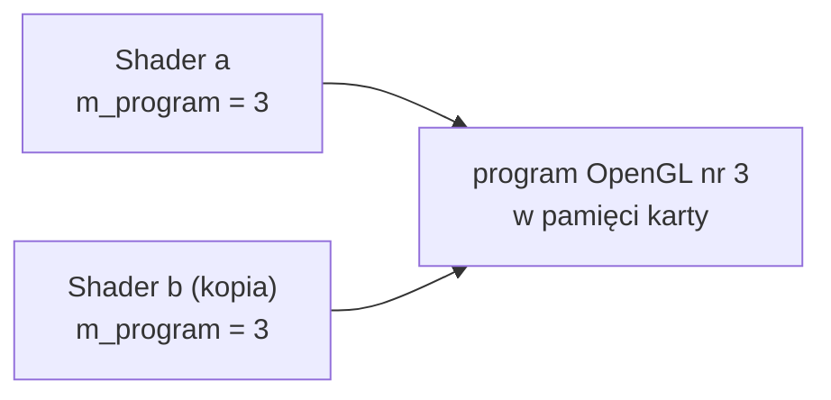
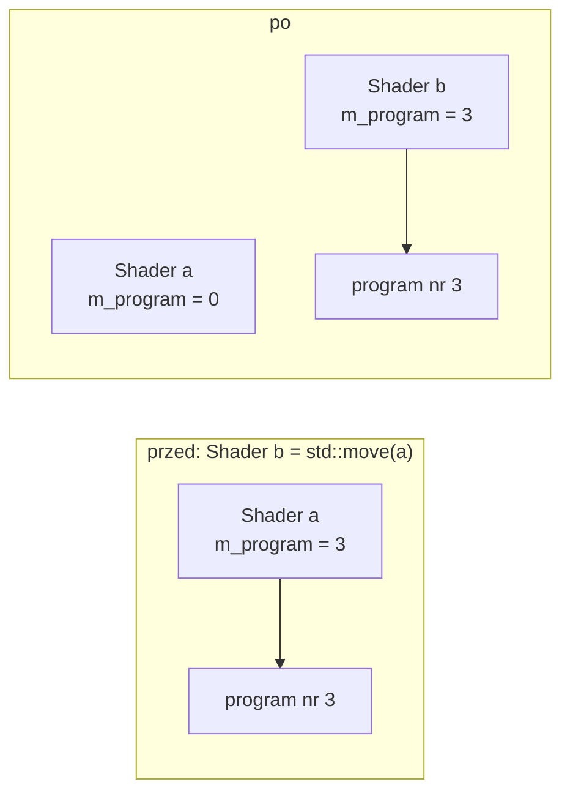
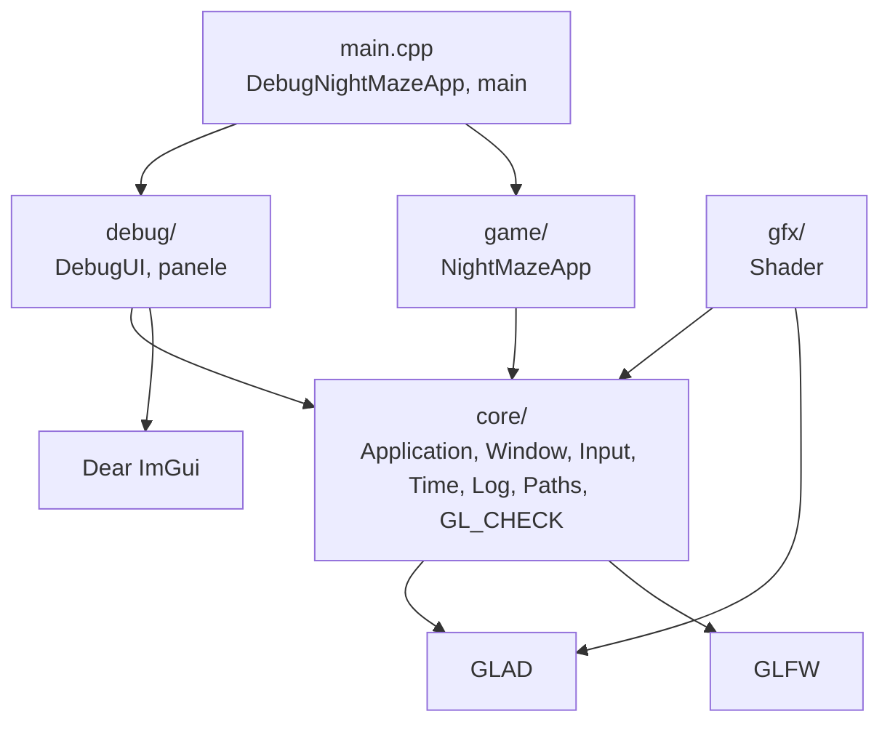

# Moduł gfx: obiekty OpenGL w klasach C++

Kamień milowy: M1. Temat wykładu: 2 (Programowalny potok).
Kod: [`src/gfx/`](../../../src/gfx/).

Moduł `core` daje okno, kontekst OpenGL i pętlę. Żeby coś narysować, potrzebne są jeszcze **obiekty OpenGL**: program shaderów, bufory z danymi wierzchołków, opis układu tych danych, później tekstury i bufory ramki. Każdy taki obiekt żyje w pamięci karty graficznej, a mój program zna go tylko jako liczbę (identyfikator) i musi go sam utworzyć oraz sam usunąć. Moduł `gfx` zamyka te obiekty w małych klasach C++: jedna klasa, jeden obiekt OpenGL, bez wiedzy o grze i bez wiedzy o tym, co jest rysowane. To cienkie opakowania (thin wrappers), a nie silnik renderujący: nie ukrywają OpenGL, tylko pilnują, żeby obiekt został utworzony, użyty i zwolniony poprawnie.

Na dziś moduł ma jedną klasę, `gfx::Shader`, i jeszcze **żadnego użytkownika** w programie. Ten plik jest wstępem do modułu: opisuje wspólną zasadę wszystkich klas `gfx` (RAII i tylko przenoszenie), miejsce modułu w warstwach i indeks dokumentów.

## 1. Dokumenty modułu

| Dokument | Co opisuje | Klasy i pliki |
|---|---|---|
| [`shaders.md`](shaders.md) | programowalny potok, shader wierzchołków i fragmentów, podstawy GLSL, kompilacja i linkowanie, odczyt błędów sterownika, wczytywanie na żywo z zachowaniem starego programu | `Shader` |

Dokument tematyczny ma te same dziesięć sekcji co dokumenty modułu `core`: Po co to jest, Teoria, Jak to działa w OpenGL, Shadery, Kod w projekcie, Panel ImGui, Pułapki, Ćwiczenia, Pytania kontrolne, Źródła.

Drugi dokument, `buffers-vao.md`, dojdzie razem z klasami `Buffer` i `VertexArray` w następnym kroku M1. Do tego czasu nie ma go w repozytorium.

Proponowana kolejność czytania: ten plik, potem [`shaders.md`](shaders.md). Wcześniej warto znać [`../core/gl-check.md`](../core/gl-check.md), bo każde wywołanie OpenGL w `gfx` jest opakowane w `GL_CHECK`.

## 2. Wspólna zasada: RAII i tylko przenoszenie

PRD formułuje ją tak: "RAII dla obiektów GL: każda klasa z gfx/ tworzy obiekt w konstruktorze, usuwa w destruktorze, jest move-only". Poniżej trzy części tej zasady po kolei.

### 2.1 RAII

Obiekt OpenGL jest **zasobem**: trzeba go zdobyć (`glCreateProgram`, `glGenBuffers`) i trzeba go oddać (`glDeleteProgram`, `glDeleteBuffers`). OpenGL nie zwalnia niczego sam, dopóki istnieje kontekst. Zapomniane `glDelete*` to wyciek pamięci karty, a `glDelete*` wywołane dwa razy albo za wcześnie to błąd trudny do znalezienia.

**RAII** (Resource Acquisition Is Initialization) wiąże czas życia zasobu z czasem życia obiektu C++: konstruktor zdobywa zasób, destruktor go oddaje. Destruktor wykonuje się automatycznie, gdy obiekt wychodzi z zasięgu albo gdy niszczony jest obiekt, którego jest polem, także wtedy, gdy funkcję opuszcza wyjątek. Dzięki temu w kodzie gry nie ma ani jednego ręcznego `glDelete*`. Ten sam wzorzec stosuje już `core::Window` dla okna GLFW ([`../core/window-context.md`](../core/window-context.md)) i `debug::DebugUI` dla ImGui.

W `gfx::Shader` wygląda to tak:

```cpp
Shader::~Shader() {
    // OpenGL silently ignores glDeleteProgram(0), so an object without a program
    // (a failed load, or one that was moved from) needs no special case.
    GL_CHECK(glDeleteProgram(m_program));
}
```

### 2.2 Dlaczego opakowania nie wolno kopiować

Pole klasy przechowuje tylko identyfikator: liczbę typu `GLuint`. Domyślne kopiowanie w C++ kopiuje pola, czyli skopiowałoby **liczbę**, a nie obiekt po stronie karty graficznej:



Oba obiekty C++ uważałyby się za właściciela tego samego programu. Gdy pierwszy z nich zostanie zniszczony, jego destruktor usunie program 3, a drugi zostanie z identyfikatorem obiektu, który już nie istnieje. Każde `use()` na nim skończy się błędem OpenGL, a jego destruktor zawoła `glDeleteProgram(3)` po raz drugi. Jeszcze gorzej, jeśli w międzyczasie OpenGL nadał numer 3 nowemu obiektowi: drugi destruktor usunie wtedy **cudzy**, działający program.

"Prawdziwa" kopia, czyli zbudowanie drugiego programu z tych samych plików, byłaby możliwa, ale kosztowna (kompilacja i linkowanie) i nikomu niepotrzebna. Dlatego kopiowanie jest po prostu wyłączone:

```cpp
Shader(const Shader&) = delete;
Shader& operator=(const Shader&) = delete;
```

`= delete` oznacza, że funkcja istnieje tylko po to, żeby jej użycie było błędem kompilacji. Linia `Shader b = a;` albo przekazanie `Shader` do funkcji przez wartość nie skompiluje się, więc opisany wyżej błąd nie może się zdarzyć przez przypadek. Tak samo zablokowane jest kopiowanie `core::Window` i `core::Application`.

### 2.3 Przenoszenie zamiast kopiowania

Zakaz kopiowania nie może oznaczać, że obiektu nie da się nigdzie przekazać: chcę móc zwrócić `Shader` z funkcji, trzymać kilka w `std::vector`, podmienić pole klasy nowym obiektem. Do tego służy **semantyka przenoszenia** (move semantics) z C++11: zamiast robić drugi egzemplarz, **przekazuję własność** z jednego obiektu C++ do drugiego. Program OpenGL jest cały czas jeden, zmienia się tylko to, który obiekt C++ za niego odpowiada.



Pojęcia, które trzeba umieć wyjaśnić:

| Pojęcie | Znaczenie |
|---|---|
| `Shader&&` | **referencja do r-wartości** (rvalue reference). Parametr tego typu przyjmuje obiekt tymczasowy (wynik funkcji) albo obiekt oznaczony przez `std::move`. Dla funkcji to informacja: "ten obiekt zaraz zniknie albo wołający się go zrzekł, można zabrać mu zawartość" |
| konstruktor przenoszący, `Shader(Shader&& other)` | tworzy nowy obiekt, zabierając zasób z `other` |
| przypisanie przenoszące, `operator=(Shader&& other)` | to samo dla obiektu, który już istnieje, więc najpierw zwalnia jego dotychczasowy zasób |
| `std::move(a)` | **niczego nie przenosi.** To rzutowanie na `Shader&&`, czyli zgoda wołającego na to, żeby `a` zostało opróżnione. Faktyczne przeniesienie wykonuje konstruktor albo operator przypisania, który tę referencję dostanie |
| obiekt po przeniesieniu (moved-from) | nadal istnieje i jego destruktor się wykona. Musi więc zostać w stanie, w którym destruktor jest nieszkodliwy. W `gfx` oznacza to identyfikator równy 0 |
| `noexcept` | obietnica, że funkcja nie rzuci wyjątku. `std::vector` przy powiększaniu przenosi elementy tylko wtedy, gdy ich konstruktor przenoszący jest `noexcept` |

Typ, który można przenosić, ale nie kopiować, nazywa się **move-only**. Najbardziej znany przykład z biblioteki standardowej to `std::unique_ptr`: jeden właściciel, własność można przekazać, nie można jej powielić. Klasy `gfx` zachowują się tak samo, tylko zamiast wskaźnika trzymają identyfikator OpenGL.

Reguła dla każdej klasy `gfx`, w tej kolejności:

1. konstruktor tworzy obiekt OpenGL, destruktor go usuwa,
2. konstruktor kopiujący i przypisanie kopiujące są `= delete`,
3. konstruktor przenoszący przejmuje identyfikator i **zeruje go w obiekcie źródłowym**,
4. przypisanie przenoszące najpierw sprawdza przypisanie do samego siebie, potem zwalnia własny obiekt OpenGL, potem przejmuje identyfikator i zeruje go w źródle.

Zero jest bezpieczne, bo OpenGL nigdy nie nadaje obiektowi identyfikatora 0, a `glDelete*` dla zera jest po cichu ignorowane. Kod obu funkcji przenoszących dla `Shader`, linia po linii, jest w [`shaders.md`](shaders.md), sekcja 5.9.

Kompilator nie wygeneruje tych funkcji poprawnie sam. Domyślny konstruktor przenoszący przenosi każde pole, a "przeniesienie" liczby to jej skopiowanie: identyfikator zostałby w obu obiektach. Dlatego w `gfx` obie funkcje są napisane ręcznie.

## 3. Miejsce w warstwach



Strzałka znaczy "zna i dołącza nagłówki". Zasady dla `gfx`:

1. `gfx/` zależy tylko od `core/`, GLAD i biblioteki standardowej. `Shader.cpp` dołącza `core/GlCheck.hpp` i `core/Log.hpp`. Nie dołącza GLFW: do tworzenia obiektów OpenGL wystarcza bieżący kontekst, a skąd on się wziął, `gfx` nie musi wiedzieć.
2. `core/` nie zna `gfx/`. Zależność idzie w jedną stronę: `core <- gfx`.
3. `gfx/` nie zna `game/`, `debug/` ani ImGui. Nic w nim nie jest specyficzne dla Night Maze, więc cała warstwa nadaje się do zadań laboratoryjnych.
4. Na diagramie do `gfx/` nie prowadzi jeszcze żadna strzałka: ani `game/`, ani `debug/` nie dołączają dziś żadnego nagłówka z `gfx/`. Pierwszym użytkownikiem będzie `game::NightMazeApp` (trójkąt), a potem panel debug z przyciskiem przeładowania shaderów.

`gfx` nie wie też nic o katalogu `assets/`. `Shader` dostaje gotowe ścieżki plików, a zbudowanie ich przez `core::assetPath` ([`../core/paths.md`](../core/paths.md)) jest sprawą wołającego.

W [`CMakeLists.txt`](../../../CMakeLists.txt) pliki `src/gfx/*` należą do tej samej biblioteki statycznej `engine` co `src/core/*`. Granicy między `core` a `gfx` nie pilnuje więc linker, tylko dyscyplina dyrektyw `#include`.

## 4. Indeks: plik kodu, dokument

| Plik kodu | Co zawiera | Dokument |
|---|---|---|
| [`src/gfx/Shader.hpp`](../../../src/gfx/Shader.hpp), [`.cpp`](../../../src/gfx/Shader.cpp) | RAII na obiekt programu OpenGL zbudowany z pliku shadera wierzchołków i pliku shadera fragmentów: `reload`, `isValid`, `use`, `lastError`. Nikt jej jeszcze nie używa | [`shaders.md`](shaders.md) |

## 5. Wymaganie wspólne: żywy kontekst OpenGL

Każda klasa `gfx` woła funkcje `gl*` w konstruktorze i w destruktorze, a każda funkcja `gl*` działa na kontekście bieżącym dla wątku ([`../core/window-context.md`](../core/window-context.md), sekcja 2). Z tego wynikają dwa ograniczenia czasu życia:

| Ograniczenie | Co się stanie przy złamaniu |
|---|---|
| obiekt `gfx` nie może powstać przed oknem | `glCreate*` bez kontekstu: w praktyce awaria programu, bo wskaźniki funkcji GLAD nie są jeszcze załadowane |
| obiekt `gfx` nie może przeżyć okna | destruktor woła `glDelete*` po zniszczeniu kontekstu |

Oba warunki spełnia się jednym sposobem: obiekt `gfx` jest **polem klasy pochodnej** od `core::Application`. Część bazowa (z oknem) jest konstruowana przed polami klasy pochodnej i niszczona po nich ([`../core/README.md`](../core/README.md), sekcja 7).

## 6. Pytania kontrolne

Pytania z odpowiedziami do konkretnych klas są w sekcji 9 dokumentów tematycznych. Trzy pytania dotyczące treści tego pliku:

1. **Co oznacza RAII i jak stosują je klasy `gfx`?**
   Czas życia zasobu jest związany z czasem życia obiektu C++: konstruktor tworzy obiekt OpenGL, destruktor woła `glDelete*`. Zwolnienie następuje automatycznie przy wyjściu z zasięgu albo przy niszczeniu właściciela, więc w kodzie gry nie ma ręcznego zwalniania.

2. **Dlaczego opakowanie identyfikatora OpenGL nie może być kopiowalne, a może być przenoszalne?**
   Kopia powieliłaby liczbę, a nie obiekt na karcie: dwa destruktory usuwałyby ten sam obiekt. Przeniesienie przekazuje własność: nowy obiekt przejmuje identyfikator, a stary dostaje 0, więc właściciel jest zawsze jeden.

3. **Co robi `std::move`?**
   Samo nic nie przenosi. Rzutuje obiekt na referencję do r-wartości, czyli pozwala wybrać konstruktor albo przypisanie przenoszące, które wykonają właściwą pracę.

## 7. Źródła

- LearnOpenGL, rozdział "Hello Triangle" (<https://learnopengl.com/Getting-started/Hello-Triangle>): obiekty OpenGL potrzebne do pierwszego trójkąta.
- Khronos OpenGL Wiki, "OpenGL Object" (<https://www.khronos.org/opengl/wiki/OpenGL_Object>): tworzenie, nazwy i usuwanie obiektów, znaczenie nazwy 0. "Common Mistakes" (<https://www.khronos.org/opengl/wiki/Common_Mistakes>), część "The Object Oriented Language Problem": dokładnie ten błąd z kopiowaniem opakowania i destruktorem.
- cppreference: RAII (<https://en.cppreference.com/w/cpp/language/raii>), konstruktor przenoszący (<https://en.cppreference.com/w/cpp/language/move_constructor>), `std::move` (<https://en.cppreference.com/w/cpp/utility/move>).
- PRD ([`../../PRD.pdf`](../../PRD.pdf)): zasada "RAII dla obiektów GL" i podział na warstwy.
- Szczegółowe źródła do każdego zagadnienia są w sekcji 10 dokumentów tematycznych.
