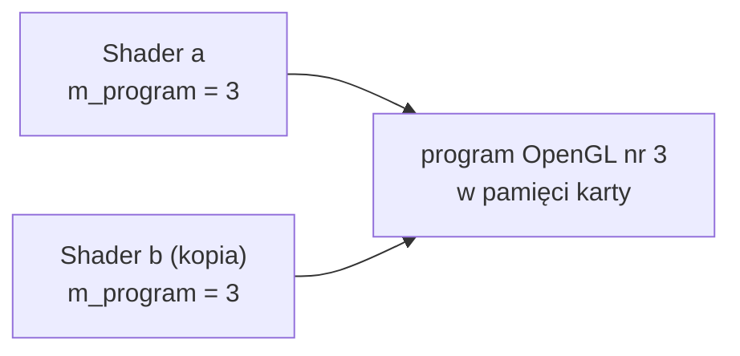
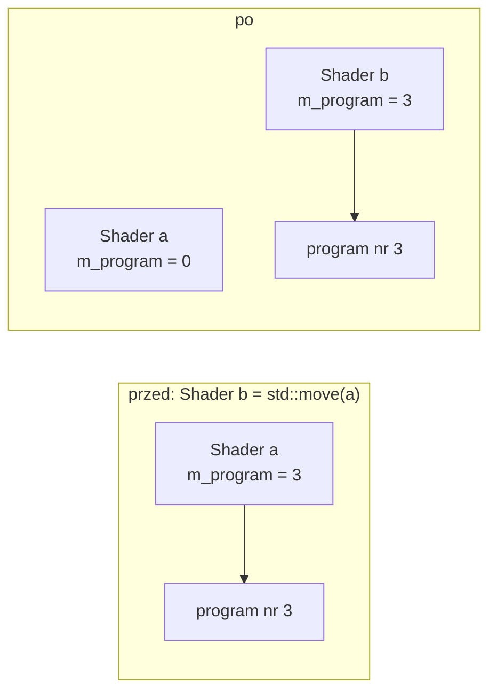
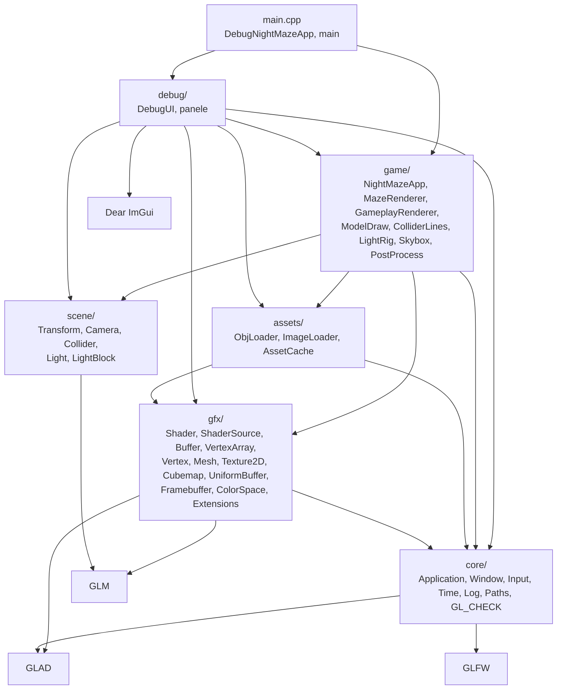
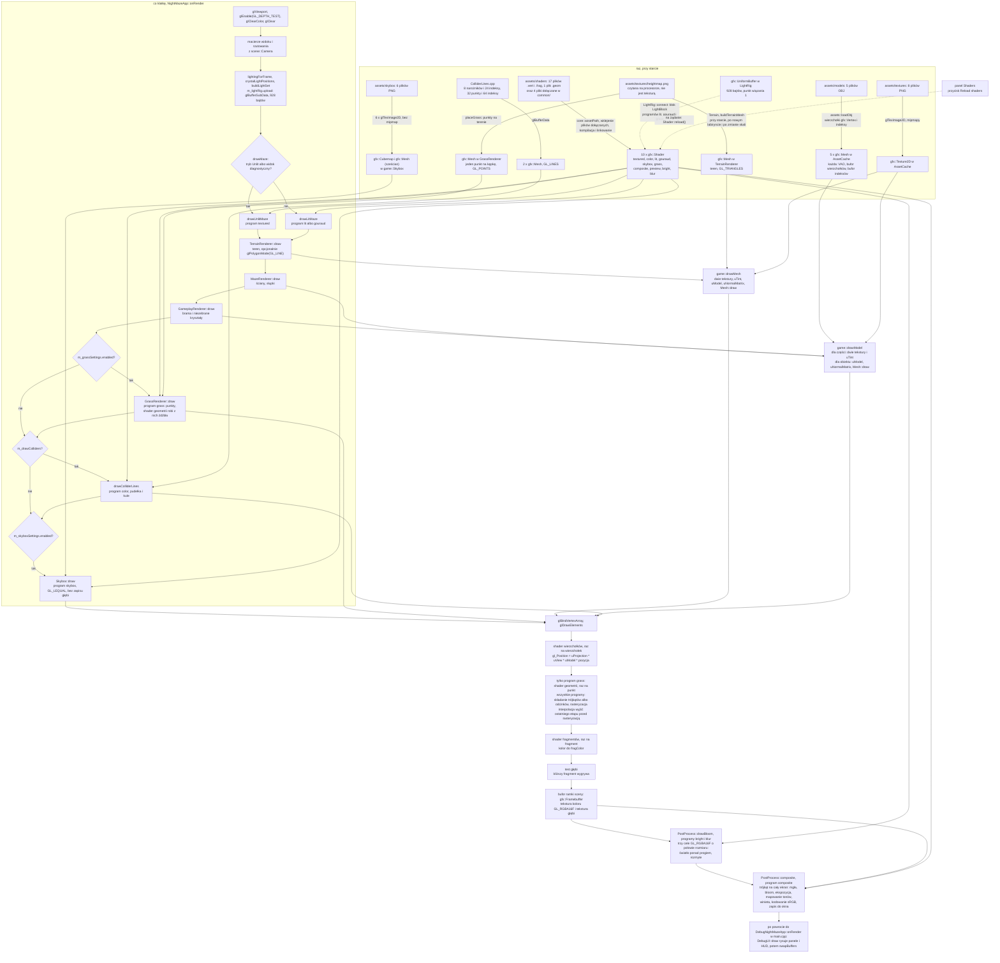

# Moduł gfx: obiekty OpenGL w klasach C++

Kamień milowy: M1, rozszerzony w M2 + M3 i w M4. W M5 moduł się nie zmienił, zmienili się jego użytkownicy. W pierwszej części M6 (skybox) doszła klasa `gfx::Cubemap`. W drugiej części M6 (teren i trawa) klasa `gfx::Shader` dostała opcjonalny etap geometrii, a `gfx::Mesh` trzeci rodzaj prymitywu, `GL_POINTS`. W pierwszej części M7 (bufor HDR i gamma) doszły klasa `gfx::Framebuffer`, typ `gfx::ColorSpace` z funkcjami przeliczającymi kolor i funkcja `gfx::hasExtension`, a konstruktory `Texture2D` i `Cubemap` dostały obowiązkowy argument `ColorSpace`. W czwartej części M7 (cienie księżyca) doszła klasa `gfx::ComparisonSampler`. Temat wykładu: 2 (Programowalny potok).
Kod: [`src/gfx/`](../../../src/gfx/), shadery w [`assets/shaders/`](../../../assets/shaders/), użycie w [`src/game/NightMazeApp.cpp`](../../../src/game/NightMazeApp.cpp), [`src/game/ModelDraw.cpp`](../../../src/game/ModelDraw.cpp) i [`src/game/ColliderLines.cpp`](../../../src/game/ColliderLines.cpp).

Moduł `core` daje okno, kontekst OpenGL i pętlę. Żeby coś narysować, potrzebne są jeszcze **obiekty OpenGL**: program shaderów, bufory z danymi wierzchołków, opis układu tych danych, później tekstury i bufory ramki. Każdy taki obiekt żyje w pamięci karty graficznej, a mój program zna go tylko jako liczbę (identyfikator) i musi go sam utworzyć oraz sam usunąć. Moduł `gfx` zamyka te obiekty w małych klasach C++: jedna klasa, jeden obiekt OpenGL, bez wiedzy o grze i bez wiedzy o tym, co jest rysowane. To cienkie opakowania (thin wrappers), a nie silnik renderujący: nie ukrywają OpenGL, tylko pilnują, żeby obiekt został utworzony, użyty i zwolniony poprawnie.

Moduł ma dziewięć klas (osiem do trzeciej części M7), cztery małe struktury z danymi (`Vertex`, `UniformBlockBinding`, `ShaderSource`, `FramebufferSpec`) i trzy pliki zwykłych funkcji (`ShaderSource.*`, `ColorSpace.*`, `Extensions.*`). Z M1 pochodzą `gfx::Shader`, `gfx::Buffer` i `gfx::VertexArray`. W kamieniu milowym M2 + M3 doszły: struktura `gfx::Vertex` (jeden wierzchołek modelu: pozycja, normalna, współrzędna tekstury, a od drugiej części M4 także styczna), klasa `gfx::Mesh` (VAO, bufor wierzchołków i bufor indeksów jednego modelu w jednym obiekcie, [`mesh.md`](mesh.md)), klasa `gfx::Texture2D` (tekstura 2D z mipmapami i jej obiekt samplera, [`textures.md`](textures.md)) oraz settery `Shader::setInt` i `Shader::setVec3`. W M4, razem z oświetleniem, doszły: klasa `gfx::UniformBuffer` (bufor na karcie, z którego kilka programów czyta ten sam blok uniformów, [`uniform-buffers.md`](uniform-buffers.md)), funkcja `Shader::bindUniformBlock`, settery `Shader::setMat3` i `Shader::setFloat` oraz plik `ShaderSource.*` z funkcjami `gfx::expandIncludes` i `gfx::nameSourceFiles`, które dodają do shaderów dyrektywę `#include` ([`shader-includes.md`](shader-includes.md)). `ShaderSource.*` to jedyna część modułu, która nie woła OpenGL: pracuje na samym tekście i dlatego ma testy jednostkowe. W drugiej części M4 doszły mapy normalnych ([`normal-mapping.md`](normal-mapping.md)): nie dodały do `gfx` żadnej klasy, tylko czwarte pole `Vertex` (styczną) z czwartym atrybutem w `Mesh` oraz plik GLSL `common/normal_map.glsl`. W pierwszej części M6 doszła siódma klasa, `gfx::Cubemap`: tekstura sześcienna (sześć kwadratowych obrazów czytanych kierunkiem) i jej obiekt samplera ([`cubemap.md`](cubemap.md)). Jej pierwszym użytkownikiem jest nocne niebo ([`../renderer/skybox.md`](../renderer/skybox.md)). Druga część M6 nie dodała żadnej klasy, tylko rozszerzyła dwie istniejące. Konstruktor `Shader` przyjmuje trzecią, opcjonalną ścieżkę: plik **shadera geometrii**, który działa między shaderem wierzchołków a shaderem fragmentów, raz na prymityw ([`shader-class.md`](shader-class.md), sekcja 5.7). Komentarze `Mesh` wymieniają trzeci prymityw, `GL_POINTS`: siatka punktów jest wejściem takiego shadera ([`mesh.md`](mesh.md), sekcja 2.6). Użytkownikiem obu jest trawa ([`../renderer/grass-geometry.md`](../renderer/grass-geometry.md)), a nowym użytkownikiem zwykłej siatki trójkątów teren z mapy wysokości ([`../renderer/terrain.md`](../renderer/terrain.md)), który zastąpił płytki podłogi. **Pierwsza część M7** dodała ósmą klasę, `gfx::Framebuffer`: obiekt framebuffera z teksturą koloru (`GL_RGBA8` albo `GL_RGBA16F`) i teksturą głębi, czyli cel rysowania inny niż okno ([`framebuffers.md`](framebuffers.md)). Jej użytkownikiem jest `game::PostProcess`: scena jest rysowana do bufora zmiennoprzecinkowego, a do okna trafia przez przebieg składający ([`../renderer/post-process.md`](../renderer/post-process.md)). Doszły też dwa pliki zwykłych funkcji. `ColorSpace.*` ma typ `gfx::ColorSpace { Srgb, Linear }` oraz funkcje `srgbToLinear` i `linearToSrgb`: sama matematyka bez OpenGL, więc ma testy jednostkowe ([`color-space.md`](color-space.md)). `Extensions.*` ma jedną funkcję, `gfx::hasExtension`, wydzieloną z `Texture2D.cpp` ([`textures.md`](textures.md), sekcja 5.4). Konstruktory `Texture2D` i `Cubemap` przyjmują od tej części obowiązkowy argument `ColorSpace`, który wybiera format wewnętrzny: sRGB dla obrazów koloru, liniowy dla danych takich jak mapy normalnych. Druga i trzecia część M7 (bloom, mgła i winieta) nie dodały do `gfx` nic poza setterem `Shader::setFloatArray`. **Czwarta część M7** (cienie księżyca) dodała dziewiątą klasę, `gfx::ComparisonSampler`: sam obiekt samplera, bez tekstury, z włączonym porównaniem głębi, filtrem liniowym i ramką o głębi 1 ([`comparison-sampler.md`](comparison-sampler.md)). Przez niego programy oświetlenia czytają mapę cieni jako `sampler2DShadow`. To pierwsza klasa modułu, której nie da się przenieść (sekcja 2.3). Ta sama część pierwszy raz wykonała gałąź `gfx::Framebuffer` bez tekstury koloru: mapa cieni jest framebufferem z samą głębią ([`framebuffers.md`](framebuffers.md), sekcje 3.3 i 5.15). Użytkownikiem obu jest `game::ShadowMap`, a całość cieni opisuje [`../renderer/shadows.md`](../renderer/shadows.md).

Wszystkie mają dziś użytkowników w programie. `game::NightMazeApp` ma czternaście programów shaderów (trzynaście do M8, części 1, kiedy doszedł `reflect`; jedenaście do szóstej części M7, dziesięć do trzeciej; dwa ostatnie, `minimap` i `minimap_overlay`, opisuje [`../renderer/minimap.md`](../renderer/minimap.md)): `textured` rysuje scenę bez oświetlenia i dwa widoki diagnostyczne, `color` linie pudełek i kul kolizji, `lit` scenę z oświetleniem liczonym dla każdego fragmentu, `gouraud` scenę z oświetleniem liczonym dla każdego wierzchołka, `skybox` (od pierwszej części M6) nocne niebo, a `grass` (od drugiej części M6) trawę: jako jedyny ma trzy pliki, z shaderem geometrii w środku. Cztery następne nie rysują sceny, tylko jeden trójkąt na cały cel. `composite` i `preview` (od pierwszej części M7): pierwszy przenosi obraz sceny z bufora HDR do okna, drugi robi obrazki załączników dla panelu Framebuffers. `bright` i `blur` (od drugiej części M7) to dwa kroki bloomu: pierwszy zostawia z obrazu sceny światło jaśniejsze od progu, drugi rozmywa je w jednym kierunku. Jedenasty, `shadow_depth` (od czwartej części M7), rysuje teren, labirynt, bramę i kryształy z kierunku księżyca do mapy cieni: sam zapis głębi, z pustym shaderem fragmentów. Pracuje jako pierwszy w klatce, przed sceną, gdy cienie są włączone. Z sześciu programów sceny w jednej klatce pracują najwyżej cztery: jeden z trójki `textured`, `lit`, `gouraud`, potem `grass`, gdy pole `Enabled` w panelu Grass jest zaznaczone, potem, gdy włączy go panel Collision, `color`, a na końcu, gdy pole `Skybox` w panelu Renderer jest zaznaczone, `skybox`. Po scenie zawsze pracuje `composite`, a przed nim `preview`, gdy panel Framebuffers jest rozwinięty, oraz `bright` i `blur`, gdy bloom jest włączony. Bufor uniformów ze światłami ma `game::LightRig` ([`../game/flashlight.md`](../game/flashlight.md)). Siatki i tekstury modeli tworzy `assets::AssetCache` ([`../assets/asset-cache.md`](../assets/asset-cache.md)). Rysują je `game::MazeRenderer` (labirynt, [`../game/maze-rendering.md`](../game/maze-rendering.md)) i od M5 `game::GameplayRenderer` (brama i kryształy, [`../game/gameplay.md`](../game/gameplay.md)), oba przez wspólną funkcję `game::drawModel`. Od drugiej części M6 podłoże rysuje `game::TerrainRenderer`: ma własną siatkę terenu, budowaną w kodzie i wymienianą przy każdej zmianie terenu, i rysuje ją funkcją `game::drawMesh` ([`../renderer/terrain.md`](../renderer/terrain.md)). Siatkę punktów, po jednym na kępkę trawy, ma `game::GrassRenderer` ([`../renderer/grass-geometry.md`](../renderer/grass-geometry.md)). Dwie siatki z odcinków ma `game::ColliderLines` ([`../scene/collision.md`](../scene/collision.md)). Siatkę sześcianu nieba i teksturę sześcienną `gfx::Cubemap` ma `game::Skybox` ([`../renderer/skybox.md`](../renderer/skybox.md)). Klasa `gfx::Buffer` ma jednego użytkownika, `gfx::Mesh`. Klasa `gfx::VertexArray` ma od M7 dwóch: `gfx::Mesh` i `game::PostProcess`, które trzyma pusty VAO bez atrybutów dla trójkąta na cały ekran (profil Core nie pozwala rysować bez związanego VAO), a od czwartej części M7 trzeciego: `game::ShadowMap` ma taki sam pusty VAO dla trójkąta podglądu mapy. Osiem obiektów `gfx::Framebuffer` (scena, od drugiej części M7 trzy cele bloomu, i cztery podglądy) ma `game::PostProcess`, a dwa kolejne (mapę cieni z samą głębią i jej podgląd) `game::ShadowMap`, razem z jedynym obiektem `gfx::ComparisonSampler`. Macierze pochodzą z warstwy `scene` ([`../scene/README.md`](../scene/README.md)) i trafiają do shaderów przez `Shader::setMat4`. Panel debug "Shaders" pozwala wczytać wszystkie shadery ponownie w działającym programie (przycisk "Reload shaders"). Ten plik jest wstępem do modułu: opisuje wspólną zasadę wszystkich klas `gfx` (RAII i tylko przenoszenie), miejsce modułu w warstwach, indeks dokumentów i drogę jednej klatki od tablicy liczb do pikseli (sekcja 6).

W M1 pierwszym użytkownikiem modułu była kostka o sześciu kolorowych ścianach: dane wpisane ręcznie w `NightMazeApp.cpp`, własny VAO i dwa bufory jako pola aplikacji oraz para shaderów `basic`. W M5 kostka i jej shadery zostały usunięte, a dokumenty tematu 2 pokazują te same pojęcia na kodzie, który rysuje grę.

## 1. Dokumenty modułu

| Dokument | Co opisuje | Klasy i pliki |
|---|---|---|
| [`shaders.md`](shaders.md) | programowalny potok, shader wierzchołków i fragmentów, podstawy GLSL, obiekt shadera a obiekt programu, kompilacja a linkowanie jako pojęcia, najprostsza para `color.vert` i `color.frag` linia po linii, wyjścia shadera wierzchołków i interpolacja na parze `textured.*`, skąd biorą się kolory (widoki `Normals as colour` i `UVs as colour`), miejsce shadera geometrii w potoku, sześć programów gry i ich użycie w klatce (`drawColliderLines`, `drawUnlitMaze`) | `color.vert`, `color.frag`, wejścia i wyjścia `textured.vert` i `textured.frag`, użycie w `NightMazeApp` |
| [`shader-class.md`](shader-class.md) | klasa `Shader` w kodzie: wywołania OpenGL w kolejności, odczyt błędów sterownika, wczytanie pliku, kompilacja, linkowanie, budowanie programu z listy etapów (od drugiej części M6 z opcjonalnym shaderem geometrii: trzeci argument konstruktora, `ShaderStage`, `hasGeometryStage`, `geometryPath`), konstruktor, destruktor, przenoszenie, testy klasy | `Shader` |
| [`uniforms.md`](uniforms.md) | zwykłe uniformy: atrybut a uniform, położenie i `glGetUniformLocation`, `glUniformMatrix4fv`, nazwy uniformów programów gry, położenie -1, `use()` przed `setMat4`, settery `setInt` (także dla samplerów), `setVec3`, `setMat3` (macierz normalnych `uNormalMatrix`), `setFloat` i `setFloatArray` (tablica uniformów, `glUniform1fv`, druga część M7), zwykły uniform a blok uniformów, nagłówek z nazwami uniformów, liczba ustawień na klatkę | `Shader::setMat4`, `Shader::setInt`, `Shader::setVec3`, `Shader::setMat3`, `Shader::setFloat`, `Shader::setFloatArray`, `src/game/ShaderUniforms.hpp` |
| [`uniform-buffers.md`](uniform-buffers.md) | tematy 6 i 7 od strony instalacji: blok uniformów a zwykły uniform, bufor uniformów, punkty wiązania i dwa wiązania celu `GL_UNIFORM_BUFFER`, reguły układu `std140` ze specyfikacji, pełna tabela przesunięć bloku `LightBlock` (928 bajtów), struktura lustrzana w C++ i jej asercje `static_assert`, `offsetof` pod clangiem na Windowsie, `packLightBlock`, klasa `UniformBuffer` linia po linii, `bindUniformBlock` i ponowne podpięcie po przeładowaniu shadera | `UniformBuffer`, `Shader::bindUniformBlock`, `UniformBlockBinding`, `src/scene/LightBlock.*`, blok w `common/lighting.glsl` |
| [`shader-includes.md`](shader-includes.md) | dyrektywa `#include` w plikach shaderów, której GLSL nie ma: preprocesor po stronie C++, dyrektywy `#line` i numer pliku źródłowego, nazwy plików w komunikatach błędów sterownika, ograniczenia, testy jednostkowe, wyświetlanie błędu w panelu Shaders, ten sam kod dla każdego etapu programu (także dla shadera geometrii) | `expandIncludes`, `nameSourceFiles`, `ShaderSource`, `tests/ShaderSourceTests.cpp` |
| [`shader-hot-reload.md`](shader-hot-reload.md) | wczytywanie na żywo z zachowaniem starego programu, przeładowanie w środku klatki ImGui, panel "Shaders" z jednym przyciskiem "Reload shaders" dla wszystkich sześciu programów i linią z dwiema albo trzema nazwami plików na program, pokaz na obronie, różnica na Windowsie | `Shader::reload`, `drawShadersPanel` |
| [`buffers-vao.md`](buffers-vao.md) | dane wierzchołków i atrybuty, bufor wierzchołków (VBO), układ przeplatany z krokiem i przesunięciem, tablica wierzchołków (VAO) i co dokładnie pamięta, dlaczego profil Core wymaga VAO, podpowiedzi użycia, `setFloatAttribute`, czas życia bufora i VAO | `Buffer`, `VertexArray` |
| [`indexed-drawing.md`](indexed-drawing.md) | indeksy i bufor indeksów (EBO), `glDrawArrays` a `glDrawElements`, współrzędne lokalne i kierunek nawijania, dwa przykłady prostokąta z dwóch trójkątów: bok cokołu ściany z pliku OBJ i kwadrat siatki terenu z kodu (do M5 przykładem była płytka podłogi), ściana: 24 pozycje w pliku i 60 wierzchołków w buforze, teren: 9409 wierzchołków i 55296 indeksów, indeksy wpisane ręcznie (krawędzie sześcianu: 8 narożników i 24 indeksy) i policzone w pętli (okrąg: 32 punkty i 64 indeksy), bufor indeksów tworzony przy związanym VAO, `glDrawElements` z `GL_TRIANGLES`, z `GL_LINES` i z `GL_POINTS`, pomiary na kostce z M1 jako historia | `wall_straight.obj`, `game::buildTerrainMesh`, dane w `ColliderLines.cpp`, `Mesh::draw`, `game::drawModel` |
| [`mesh.md`](mesh.md) | temat 4, strona karty graficznej: wierzchołek jako struktura (pozycja, normalna, uv, styczna: 11 liczb `float`, 44 bajty), krok i przesunięcia z `sizeof` i `offsetof`, dopełnienie i `static_assert`, numery atrybutów jako umowa z shaderem, klasa `Mesh`, rysowanie całości i zakresu indeksów, rodzaj prymitywu (trójkąty, odcinki, od drugiej części M6 punkty), pięciu właścicieli siatek (pięć modeli w `AssetCache`, dwie siatki z odcinków w `ColliderLines`, sześcian nieba w `Skybox`, teren w `TerrainRenderer`, punkty trawy w `GrassRenderer`), wymiana siatki przypisaniem przenoszącym | `Vertex`, `Mesh` |
| [`textures.md`](textures.md) | temat 5: współrzędne tekstury i teksele, powiększenie i pomniejszenie, filtry (najbliższy sąsiad, dwuliniowy, trójliniowy), mipmapy, filtrowanie anizotropowe jako rozszerzenie, zawijanie, jednostki teksturujące i samplery, obiekt samplera a parametry tekstury, format danych a format wewnętrzny, wyrównanie wierszy, klasa `Texture2D` linia po linii, shadery `textured.vert` i `textured.frag` linia po linii, dwie jednostki i dwa samplery (kolor i mapa normalnych), pomiary na Windowsie | `Texture2D`, `TextureFilter`, `textured.vert`, `textured.frag` |
| [`cubemap.md`](cubemap.md) | temat 8, strona obiektu OpenGL (pierwsza część M6): jeden obiekt i siedem celów (`GL_TEXTURE_CUBE_MAP` i sześć ścian), wiązanie osobne dla każdego rodzaju tekstury a obiekt samplera wspólny dla jednostki, jeden poziom i `GL_TEXTURE_MAX_LEVEL`, górny wiersz pierwszy, przycinanie do krawędzi na trzech osiach, klasa `Cubemap` linia po linii. Teoria tekstury sześciennej i niebo w grze są w [`../renderer/skybox.md`](../renderer/skybox.md) | `Cubemap`, użycie w `src/game/Skybox.*` |
| [`comparison-sampler.md`](comparison-sampler.md) | temat 11, strona obiektu OpenGL (czwarta część M7): obiekt samplera bez tekstury, porównanie przy odczycie (`GL_COMPARE_REF_TO_TEXTURE`, `GL_LEQUAL`) i `sampler2DShadow`, filtr liniowy jako sprzętowe PCF 2 x 2, `GL_CLAMP_TO_BORDER` z ramką o głębi 1, dlaczego porównanie jest w samplerze, a nie w teksturze, kolejność wiązania tekstury i samplera, klasa `ComparisonSampler` linia po linii. Teoria mapy cieni i cienie w grze są w [`../renderer/shadows.md`](../renderer/shadows.md) | `ComparisonSampler`, użycie w `src/game/ShadowMap.*` |
| [`framebuffers.md`](framebuffers.md) | temat 10, strona obiektu OpenGL (pierwsza część M7): obiekt framebuffera i domyślny framebuffer okna, załączniki (tekstura a renderbuffer, dlaczego głębia jest teksturą), formaty `GL_RGBA16F`, `GL_RGBA8` i `GL_DEPTH_COMPONENT24`, kompletność i `glCheckFramebufferStatus`, wiązanie razem z viewportem, zmiana rozmiaru i okno 0 x 0, rozmiar framebuffera a rozmiar okna, parametry tekstury załącznika i `glBindSampler(unit, 0)`, pętla zwrotna, framebuffer bez koloru | `Framebuffer`, `FramebufferSpec`, `ColorFormat`, `DepthFormat`, `colorFormatName`, `depthFormatName`, `framebufferStatusText`. Pliki `Framebuffer.*`, testy `tests/FramebufferTests.cpp` |
| [`color-space.md`](color-space.md) | gamma (pierwsza część M7): czym jest sRGB, dwuczęściowa funkcja i jej odwrotność z liczbami, co znaczy "liniowe", trzy etapy potoku (dekodowanie przy odczycie przez `GL_SRGB8`, rachunek na wartościach liniowych, kodowanie na końcu klatki), które tekstury są sRGB, a które liniowe, kolory wpisane ręcznie i miejsca ich przeliczenia, typowe błędy | `ColorSpace`, `srgbToLinear`, `linearToSrgb`. Pliki `ColorSpace.*`, `assets/shaders/common/color.glsl`, testy `tests/ColorSpaceTests.cpp` |
| [`normal-mapping.md`](normal-mapping.md) | temat 5, mapy normalnych (druga część M4): przestrzeń styczna, kodowanie kierunku w kolorze, konwencja kanału zielonego, wysokość na normalną, styczna z krawędzi trójkąta i różnic UV, Gram-Schmidt, skrętność, macierz TBN w shaderze, dlaczego Gouraud nie może z nich korzystać, linia `map_Bump` pliku MTL, tekstura zastępcza, pole `Normal mapping` w panelu Assets | `src/assets/Tangents.*`, `common/normal_map.glsl`, `tests/TangentTests.cpp`, czwarte pole `Vertex` |

Każdy dokument tematyczny ma te same dziesięć sekcji co dokumenty modułu `core`: Po co to jest, Teoria, Jak to działa w OpenGL, Shadery, Kod w projekcie, Panel ImGui, Pułapki, Ćwiczenia, Pytania kontrolne, Źródła.

Proponowana kolejność czytania: ten plik, potem [`shaders.md`](shaders.md), [`shader-class.md`](shader-class.md), [`uniforms.md`](uniforms.md) i [`shader-hot-reload.md`](shader-hot-reload.md), potem [`buffers-vao.md`](buffers-vao.md), potem [`indexed-drawing.md`](indexed-drawing.md). Dokument [`mesh.md`](mesh.md) czyta się na końcu, razem z tematem 4 ([`../assets/obj-loader.md`](../assets/obj-loader.md)). Po nim [`textures.md`](textures.md), razem z [`../assets/images.md`](../assets/images.md) (temat 5). Trzy dokumenty z M4 czyta się na końcu. Dwa razem z tematami 6 i 7: najpierw [`shader-includes.md`](shader-includes.md) (skąd w dwóch shaderach bierze się ten sam plik), potem [`uniform-buffers.md`](uniform-buffers.md) (jak światła trafiają do obu programów), a po nich [`../scene/lights.md`](../scene/lights.md) i [`../renderer/lighting-gouraud-phong.md`](../renderer/lighting-gouraud-phong.md). Trzeci, [`normal-mapping.md`](normal-mapping.md), czyta się po oświetleniu, bo mapa normalnych zmienia tylko normalną, z której liczone jest światło. Dokument [`cubemap.md`](cubemap.md) czyta się razem z tematem 8, zaraz po [`../renderer/skybox.md`](../renderer/skybox.md), i wymaga znajomości [`textures.md`](textures.md). Wcześniej warto znać [`../core/gl-check.md`](../core/gl-check.md), bo każde wywołanie OpenGL w `gfx` jest opakowane w `GL_CHECK`. Dwa dokumenty z pierwszej części M7 czyta się razem z tematem 10: najpierw [`color-space.md`](color-space.md) (dlaczego rachunek światła potrzebuje wartości liniowych), potem [`framebuffers.md`](framebuffers.md) (obiekt, do którego rysowana jest scena), a po nich [`../renderer/post-process.md`](../renderer/post-process.md). Dokument z czwartej części M7, [`comparison-sampler.md`](comparison-sampler.md), czyta się razem z tematem 11, zaraz po [`../renderer/shadows.md`](../renderer/shadows.md) (sekcje 2.6 do 2.8), i wymaga znajomości [`textures.md`](textures.md) oraz [`framebuffers.md`](framebuffers.md).

## 2. Wspólna zasada: RAII i tylko przenoszenie

PRD formułuje ją tak: "RAII dla obiektów GL: każda klasa z gfx/ tworzy obiekt w konstruktorze, usuwa w destruktorze, jest move-only". Poniżej trzy części tej zasady po kolei.

### 2.1 RAII

Obiekt OpenGL jest **zasobem**: trzeba go zdobyć (`glCreateProgram`, `glGenBuffers`) i trzeba go oddać (`glDeleteProgram`, `glDeleteBuffers`). OpenGL nie zwalnia niczego sam, dopóki istnieje kontekst. Zapomniane `glDelete*` to wyciek pamięci karty, a `glDelete*` wywołane dwa razy albo za wcześnie to błąd trudny do znalezienia.

**RAII** (Resource Acquisition Is Initialization) wiąże czas życia zasobu z czasem życia obiektu C++: konstruktor zdobywa zasób, destruktor go oddaje. Destruktor wykonuje się automatycznie, gdy obiekt wychodzi z zasięgu albo gdy niszczony jest obiekt, którego jest polem, także wtedy, gdy funkcję opuszcza wyjątek. Dzięki temu w kodzie gry nie ma ani jednego ręcznego `glDelete*`. Ten sam wzorzec stosuje już `core::Window` dla okna GLFW ([`../core/window-context.md`](../core/window-context.md)) i `debug::DebugUI` dla ImGui.

W `gfx::Shader` wygląda to tak:

```cpp
Shader::~Shader() {
    // OpenGL silently ignores glDeleteProgram(0), so an object without a program
    // (a failed load, or one that was moved from) needs no special case.
    GL_CHECK(glDeleteProgram(m_program));
}
```

### 2.2 Dlaczego opakowania nie wolno kopiować

Pole klasy przechowuje tylko identyfikator: liczbę typu `GLuint`. Domyślne kopiowanie w C++ kopiuje pola, czyli skopiowałoby **liczbę**, a nie obiekt po stronie karty graficznej:



Oba obiekty C++ uważałyby się za właściciela tego samego programu. Gdy pierwszy z nich zostanie zniszczony, jego destruktor usunie program 3, a drugi zostanie z identyfikatorem obiektu, który już nie istnieje. Każde `use()` na nim skończy się błędem OpenGL, a jego destruktor zawoła `glDeleteProgram(3)` po raz drugi. Jeszcze gorzej, jeśli w międzyczasie OpenGL nadał numer 3 nowemu obiektowi: drugi destruktor usunie wtedy **cudzy**, działający program.

"Prawdziwa" kopia, czyli zbudowanie drugiego programu z tych samych plików, byłaby możliwa, ale kosztowna (kompilacja i linkowanie) i nikomu niepotrzebna. Dlatego kopiowanie jest po prostu wyłączone:

```cpp
Shader(const Shader&) = delete;
Shader& operator=(const Shader&) = delete;
```

`= delete` oznacza, że funkcja istnieje tylko po to, żeby jej użycie było błędem kompilacji. Linia `Shader b = a;` albo przekazanie `Shader` do funkcji przez wartość nie skompiluje się, więc opisany wyżej błąd nie może się zdarzyć przez przypadek. Tak samo zablokowane jest kopiowanie `core::Window` i `core::Application`.

### 2.3 Przenoszenie zamiast kopiowania

Zakaz kopiowania nie może oznaczać, że obiektu nie da się nigdzie przekazać: chcę móc zwrócić `Shader` z funkcji, trzymać kilka w `std::vector`, podmienić pole klasy nowym obiektem. Do tego służy **semantyka przenoszenia** (move semantics) z C++11: zamiast robić drugi egzemplarz, **przekazuję własność** z jednego obiektu C++ do drugiego. Program OpenGL jest cały czas jeden, zmienia się tylko to, który obiekt C++ za niego odpowiada.



Pojęcia, które trzeba umieć wyjaśnić:

| Pojęcie | Znaczenie |
|---|---|
| `Shader&&` | **referencja do r-wartości** (rvalue reference). Parametr tego typu przyjmuje obiekt tymczasowy (wynik funkcji) albo obiekt oznaczony przez `std::move`. Dla funkcji to informacja: "ten obiekt zaraz zniknie albo wołający się go zrzekł, można zabrać mu zawartość" |
| konstruktor przenoszący, `Shader(Shader&& other)` | tworzy nowy obiekt, zabierając zasób z `other` |
| przypisanie przenoszące, `operator=(Shader&& other)` | to samo dla obiektu, który już istnieje, więc najpierw zwalnia jego dotychczasowy zasób |
| `std::move(a)` | **niczego nie przenosi.** To rzutowanie na `Shader&&`, czyli zgoda wołającego na to, żeby `a` zostało opróżnione. Faktyczne przeniesienie wykonuje konstruktor albo operator przypisania, który tę referencję dostanie |
| obiekt po przeniesieniu (moved-from) | nadal istnieje i jego destruktor się wykona. Musi więc zostać w stanie, w którym destruktor jest nieszkodliwy. W `gfx` oznacza to identyfikator równy 0 |
| `noexcept` | obietnica, że funkcja nie rzuci wyjątku. `std::vector` przy powiększaniu przenosi elementy tylko wtedy, gdy ich konstruktor przenoszący jest `noexcept` |

Typ, który można przenosić, ale nie kopiować, nazywa się **move-only**. Najbardziej znany przykład z biblioteki standardowej to `std::unique_ptr`: jeden właściciel, własność można przekazać, nie można jej powielić. Klasy `gfx` zachowują się tak samo, tylko zamiast wskaźnika trzymają identyfikator OpenGL.

Reguła dla klas `gfx` (z jednym wyjątkiem, opisanym pod listą), w tej kolejności:

1. konstruktor tworzy obiekt OpenGL, destruktor go usuwa,
2. konstruktor kopiujący i przypisanie kopiujące są `= delete`,
3. konstruktor przenoszący przejmuje identyfikator i **zeruje go w obiekcie źródłowym**,
4. przypisanie przenoszące najpierw sprawdza przypisanie do samego siebie, potem zwalnia własny obiekt OpenGL, potem przejmuje identyfikator i zeruje go w źródle.

Zero jest bezpieczne, bo OpenGL nigdy nie nadaje obiektowi identyfikatora 0, a `glDelete*` dla zera jest po cichu ignorowane. Kod obu funkcji przenoszących dla `Shader`, linia po linii, jest w [`shader-class.md`](shader-class.md), sekcja 5.9. `Buffer` i `VertexArray` stosują ten sam wzorzec ([`buffers-vao.md`](buffers-vao.md), sekcje 5.4 i 5.5), tak samo `UniformBuffer` ([`uniform-buffers.md`](uniform-buffers.md), sekcja 5.7).

Wyjątkiem jest `gfx::ComparisonSampler` z czwartej części M7: spełnia punkty 1 i 2, ale **nie ma** punktów 3 i 4. Klasa deklaruje destruktor i usunięte kopiowanie, a funkcji przenoszących nie deklaruje, więc kompilator ich nie tworzy: obiektu nie da się ani skopiować, ani przenieść. Jest to bezpieczne (dwa obiekty nigdy nie trzymają tego samego identyfikatora), tylko mniej wygodne, i wystarcza, bo jedyny obiekt tej klasy żyje jako pole `game::ShadowMap` od początku do końca programu ([`comparison-sampler.md`](comparison-sampler.md), sekcja 5.2). Zdanie z PRD "jest move-only" dotyczy więc ośmiu klas z dziewięciu.

Kompilator nie wygeneruje tych funkcji poprawnie sam. Domyślny konstruktor przenoszący przenosi każde pole, a "przeniesienie" liczby to jej skopiowanie: identyfikator zostałby w obu obiektach. Dlatego w `gfx` obie funkcje są napisane ręcznie.

## 3. Miejsce w warstwach



Strzałka znaczy "zna i dołącza nagłówki". Zasady dla `gfx`:

1. `gfx/` zależy tylko od `core/`, GLAD, GLM i biblioteki standardowej. GLM dołączają `Shader` i `Vertex`: `Shader.hpp` potrzebuje typów `glm::mat4` i `glm::vec3` dla setterów, `Shader.cpp` funkcji `glm::value_ptr`, a `Vertex.hpp` typów `glm::vec3` i `glm::vec2` dla pól wierzchołka. `Shader.cpp` dołącza `core/GlCheck.hpp`, `core/Log.hpp` i `core/Paths.hpp` (funkcja `core::pathText` do komunikatów błędów) oraz `gfx/ShaderSource.hpp`, `Texture2D.cpp`, `Cubemap.cpp` i `UniformBuffer.cpp` dołączają `core/GlCheck.hpp` i `core/Log.hpp`, a `Buffer.cpp`, `VertexArray.cpp` i `Mesh.cpp` samo `core/GlCheck.hpp`. `ShaderSource.hpp` i `ShaderSource.cpp` dołączają wyłącznie bibliotekę standardową: ani GLAD, ani `core/`. Nie dołącza GLFW: do tworzenia obiektów OpenGL wystarcza bieżący kontekst, a skąd on się wziął, `gfx` nie musi wiedzieć. Pliki z M7: `Framebuffer.cpp` dołącza `core/GlCheck.hpp` i `core/Log.hpp`, `Extensions.cpp` samo `core/GlCheck.hpp`, a `ColorSpace.hpp` tylko GLM (typ `glm::vec3`) i nie woła OpenGL. `Texture2D.hpp` i `Cubemap.hpp` dołączają `gfx/ColorSpace.hpp`, więc pośrednio także GLM. Plik z czwartej części M7, `ComparisonSampler.cpp`, dołącza samo `core/GlCheck.hpp`, a jego nagłówek tylko GLAD.
2. `core/` nie zna `gfx/`. Zależność idzie w jedną stronę: `core <- gfx`.
3. `gfx/` nie zna `assets/`, `game/`, `debug/` ani ImGui. Nic w nim nie jest specyficzne dla Night Maze, więc cała warstwa nadaje się do zadań laboratoryjnych. `Texture2D` i `Cubemap` przyjmują surowe bajty, `Mesh` tablicę wierzchołków, a `UniformBuffer` wskaźnik `const void*` i liczbę bajtów: skąd pochodzą i co znaczą, `gfx` nie wie.
4. `gfx/` ma trzech użytkowników. `assets/`: `ObjLoader.hpp` i `Tangents.hpp` dołączają `gfx/Vertex.hpp` (loader wypełnia tablicę wierzchołków i liczy styczne), a `AssetCache.hpp` dołącza `gfx/Mesh.hpp` i `gfx/Texture2D.hpp` (tworzy siatki i tekstury z wczytanych danych). `game/`: `NightMazeApp.hpp` dołącza `gfx/Shader.hpp`, `ColliderLines.hpp` dołącza `gfx/Mesh.hpp` (a `ColliderLines.cpp` do tego `gfx/Shader.hpp` i `gfx/Vertex.hpp`), `LightRig.hpp` dołącza `gfx/UniformBuffer.hpp`, `Skybox.hpp` dołącza `gfx/Cubemap.hpp` i `gfx/Mesh.hpp` (a `Skybox.cpp` do tego `gfx/Shader.hpp` i `gfx/Vertex.hpp`), a pliki `MazeRenderer.cpp`, `GameplayRenderer.cpp`, `ModelDraw.cpp` i `LightRig.cpp` dołączają `gfx/Shader.hpp`. Od drugiej części M6: `TerrainRenderer.hpp` i `GrassRenderer.hpp` dołączają `gfx/Mesh.hpp`, `TerrainRenderer.cpp` do tego `gfx/Shader.hpp` i `gfx/Texture2D.hpp`, `GrassRenderer.cpp` `gfx/Shader.hpp` i `gfx/Vertex.hpp`, a `ModelDraw.cpp` także `gfx/Mesh.hpp` i `gfx/Texture2D.hpp` (dla funkcji `drawMesh`). Osobny przypadek to `Terrain.hpp`, które dołącza `gfx/Vertex.hpp`: ten plik należy do biblioteki `game_logic`, czyli do kodu bez okna, a korzysta z samej struktury wierzchołka (dane bez OpenGL), żeby `buildTerrainMesh` mogło oddać gotową tablicę wierzchołków i żeby testy mogły ją sprawdzić. Nagłówków `gfx/Buffer.hpp` i `gfx/VertexArray.hpp` nie dołącza nikt poza `gfx/Mesh.hpp`. `debug/`: `ShadersPanel.cpp` dołącza `gfx/Shader.hpp`, bo panel "Shaders" czyta stan obiektów `Shader` i woła ich `reload()` ([`shader-hot-reload.md`](shader-hot-reload.md), sekcja 6), a `AssetsPanel.cpp` dołącza `gfx/Texture2D.hpp`. To dozwolony kierunek: `debug/` może zależeć od każdej warstwy. Czwartym użytkownikiem są testy: `tests/ShaderSourceTests.cpp` dołącza `gfx/ShaderSource.hpp`, a `tests/TerrainTests.cpp` czyta pola `gfx::Vertex` w siatce terenu. Od M7 dochodzą: w `assets/` `AssetCache.hpp` używa `gfx::ColorSpace` (przez `Texture2D.hpp`), w `game/` `PostProcess.hpp` dołącza `gfx/Framebuffer.hpp` i `gfx/VertexArray.hpp`, a `Lighting.cpp`, `ColliderLines.cpp`, `NightMazeApp.cpp` i, od trzeciej części M7, `PostProcess.cpp` (kolor mgły) dołączają `gfx/ColorSpace.hpp` (przeliczenie kolorów wpisanych ręcznie), w `debug/` `RawTextureSampler.cpp` dołącza `gfx/Extensions.hpp`, a `FramebuffersPanel.cpp` `gfx/Framebuffer.hpp`. Od czwartej części M7: w `game/` `ShadowMap.hpp` dołącza `gfx/ComparisonSampler.hpp`, `gfx/Framebuffer.hpp` i `gfx/VertexArray.hpp` (a `ShadowMap.cpp` do tego `gfx/Shader.hpp`), w `debug/` `ShadowsPanel.cpp` dołącza `gfx/Framebuffer.hpp`. Zdanie wyżej o nagłówku `gfx/VertexArray.hpp` opisuje stan sprzed M7: dziś dołączają go także `PostProcess.hpp` i `ShadowMap.hpp`.
5. `gfx/` nie zna `scene/`. Warstwa `scene/` (struktury `Transform` i `Camera`, [`../scene/README.md`](../scene/README.md)) stoi w łańcuchu nad `gfx/`. `Shader::setMat4` przyjmuje zwykłe `glm::mat4` i nie wie, skąd macierz pochodzi: oba moduły spotykają się dopiero w `game/`, gdzie kod rysujący bierze macierz z `Transform` albo `Camera` i podaje ją shaderowi. Tak samo jest ze światłami: bajty bloku układa `scene::packLightBlock`, wysyła je `gfx::UniformBuffer`, a łączy oba `game::LightRig`.

`gfx` nie wie też nic o katalogu `assets/`. `Shader` dostaje gotowe ścieżki plików, a zbudowanie ich przez `core::assetPath` ([`../core/paths.md`](../core/paths.md)) jest sprawą wołającego.

W [`CMakeLists.txt`](../../../CMakeLists.txt) pliki `src/gfx/*` należą do tej samej biblioteki statycznej `engine` co `src/core/*`, `src/scene/*` i `src/assets/*`. Granic między tymi warstwami nie pilnuje więc linker, tylko dyscyplina dyrektyw `#include`.

## 4. Indeks: plik kodu, dokument

| Plik kodu | Co zawiera | Dokument |
|---|---|---|
| [`src/gfx/Shader.hpp`](../../../src/gfx/Shader.hpp), [`.cpp`](../../../src/gfx/Shader.cpp) | RAII na obiekt programu OpenGL zbudowany z pliku shadera wierzchołków i pliku shadera fragmentów (razem z plikami, które dołączają przez `#include`): `reload`, `isValid`, `use`, `setMat4` (uniform typu `mat4`), `setInt` (uniform typu `int` albo sampler), `setVec3` (uniform typu `vec3`), `setMat3` (uniform typu `mat3`), `setFloat` (uniform typu `float`), `bindUniformBlock` (podpięcie bloku uniformów do punktu wiązania, powtarzane po każdym przeładowaniu), `lastError`, `vertexPath`, `fragmentPath`, struktura `UniformBlockBinding`. Użycie: jedenaście pól `NightMazeApp` (`m_texturedShader`, `m_colorShader`, `m_litShader`, `m_gouraudShader`, `m_skyboxShader`, `m_grassShader`, od M7 `m_compositeShader`, `m_previewShader`, `m_brightPassShader` i `m_blurShader`, a od czwartej części M7 `m_shadowDepthShader`), panel "Shaders". Settery wołają `NightMazeApp`, `MazeRenderer`, `GameplayRenderer`, `TerrainRenderer`, `GrassRenderer`, funkcje `game::drawModel`, `game::drawMesh` i `game::setModelSamplers`, `ColliderLines`, `Skybox`, od M7 `PostProcess`, a od czwartej części M7 funkcja `game::setShadowUniforms` i `ShadowMap::drawPreview`. `bindUniformBlock` woła `LightRig` | [`shader-class.md`](shader-class.md), settery w [`uniforms.md`](uniforms.md), `bindUniformBlock` w [`uniform-buffers.md`](uniform-buffers.md), sekcje 5.8 i 5.9, `reload` w [`shader-hot-reload.md`](shader-hot-reload.md) |
| [`src/gfx/ShaderSource.hpp`](../../../src/gfx/ShaderSource.hpp), [`.cpp`](../../../src/gfx/ShaderSource.cpp) | zwykłe funkcje na tekście, bez OpenGL: `expandIncludes` wstawia w miejsce linii `#include "plik"` treść pliku i otacza ją dyrektywami `#line`, `nameSourceFiles` zamienia w komunikacie sterownika numer pliku źródłowego na jego nazwę. Struktura `ShaderSource` (tekst i lista plików), typ `IncludeReader`. Użycie: `compileShader` w `Shader.cpp`. Ma testy jednostkowe w `tests/ShaderSourceTests.cpp` | [`shader-includes.md`](shader-includes.md) |
| [`src/gfx/Buffer.hpp`](../../../src/gfx/Buffer.hpp), [`.cpp`](../../../src/gfx/Buffer.cpp) | RAII na jeden bufor OpenGL wypełniany raz, w konstruktorze. Cel `GL_ARRAY_BUFFER` (wierzchołki) albo `GL_ELEMENT_ARRAY_BUFFER` (indeksy), `bind`. Użycie: pola `m_vertexBuffer` i `m_indexBuffer` w `gfx::Mesh`, jedynym użytkowniku klasy | [`buffers-vao.md`](buffers-vao.md) |
| [`src/gfx/UniformBuffer.hpp`](../../../src/gfx/UniformBuffer.hpp), [`.cpp`](../../../src/gfx/UniformBuffer.cpp) | RAII na jeden bufor OpenGL używany jako bufor uniformów: konstruktor przydziela pamięć i przypina bufor do punktu wiązania (`glBindBufferBase`), `update` zastępuje bajty (`glBufferSubData`), `bindingPoint`, `sizeInBytes`. Tylko przenoszenie. Użycie: pole `m_lightBuffer` w `game::LightRig` (928 bajtów świateł, punkt wiązania 1) | [`uniform-buffers.md`](uniform-buffers.md), sekcje 5.6 i 5.7 |
| [`src/gfx/VertexArray.hpp`](../../../src/gfx/VertexArray.hpp), [`.cpp`](../../../src/gfx/VertexArray.cpp) | RAII na jeden obiekt tablicy wierzchołków (VAO), wiązany już w konstruktorze: `bind`, `setFloatAttribute`. Użycie: pole `m_vertexArray` w `gfx::Mesh`, a od M7 także puste VAO trójkąta na cały ekran w `game::PostProcess` i, od czwartej części M7, w `game::ShadowMap` | [`buffers-vao.md`](buffers-vao.md) |
| [`src/gfx/Vertex.hpp`](../../../src/gfx/Vertex.hpp) | struktura `Vertex` (pozycja, normalna, uv, styczna: 11 liczb `float`, 44 bajty), stałe liczby składowych i numerów atrybutów, dwa `static_assert`. Sam nagłówek, bez GLAD. Użycie: loader OBJ w `src/assets/ObjLoader.*` i jego testy, liczenie stycznych w `src/assets/Tangents.*`, `Mesh`, dane sześcianu i okręgu w `ColliderLines.cpp`, osiem narożników sześcianu nieba w `Skybox.cpp` | [`mesh.md`](mesh.md), sekcje 2 i 5.2 |
| [`src/gfx/Mesh.hpp`](../../../src/gfx/Mesh.hpp), [`.cpp`](../../../src/gfx/Mesh.cpp) | klasa `Mesh`: posiada `VertexArray` i dwa `Buffer`, opisuje cztery atrybuty `Vertex`, rysuje całość (`draw()`) albo zakres indeksów (`draw(firstIndex, indexCount)`), prymityw jako parametr konstruktora. Tylko przenoszenie. Użycie: pole `mesh` struktury `assets::LoadedModel` (pięć modeli: ściana, słupek, dwa kryształy, brama. Trójkąty, rysowane częściami przez `game::drawModel`), pola `m_unitCube` i `m_unitCircle` w `game::ColliderLines` (sześcian z krawędzi i okrąg, `GL_LINES`), pole `m_cube` w `game::Skybox` (sześcian nieba: 8 wierzchołków, 36 indeksów, trójkąty), a od drugiej części M6 pole `m_mesh` w `game::TerrainRenderer` (teren: trójkąty, cała siatka jednym wywołaniem przez `game::drawMesh`) i pole `m_points` w `game::GrassRenderer` (kępki trawy, `GL_POINTS`) | [`mesh.md`](mesh.md), sekcje od 5.3 do 5.5 |
| [`src/gfx/Texture2D.hpp`](../../../src/gfx/Texture2D.hpp), [`.cpp`](../../../src/gfx/Texture2D.cpp) | typ `TextureFilter` i klasa `Texture2D`: tekstura 2D z mipmapami i obiekt samplera, `bind`, `setFilter`, `setAnisotropy`. Tylko przenoszenie. Użycie: `assets::AssetCache` (tekstury koloru, mapy normalnych i dwie tekstury zastępcze 1 x 1: biała i płaska mapa normalnych), `game::drawModel` (wiązanie na jednostkach 0 i 1), panel "Assets" | [`textures.md`](textures.md), sekcja 5 |
| [`src/gfx/Cubemap.hpp`](../../../src/gfx/Cubemap.hpp), [`.cpp`](../../../src/gfx/Cubemap.cpp) | klasa `Cubemap`: tekstura sześcienna z sześciu tablic bajtów (górny wiersz pierwszy) i obiekt samplera z filtrem liniowym i przycinaniem do krawędzi na trzech osiach, `bind`, `isValid`, `id`, `size`, konstruktor domyślny dla obiektu bez tekstury. Tylko przenoszenie. Użycie: pole `m_cubemap` w `game::Skybox` (niebo, jednostka 0) | [`cubemap.md`](cubemap.md), sekcja 5 |
| [`src/gfx/Framebuffer.hpp`](../../../src/gfx/Framebuffer.hpp), [`.cpp`](../../../src/gfx/Framebuffer.cpp) | klasa `Framebuffer`: obiekt framebuffera z najwyżej jedną teksturą koloru (`GL_RGBA8` albo `GL_RGBA16F`) i najwyżej jedną teksturą głębi (`GL_DEPTH_COMPONENT24`), sprawdzenie kompletności, `bind` z viewportem, `bindDefault`, `resize`, `bindColorTexture`, `bindDepthTexture`. Do tego `FramebufferSpec`, `ColorFormat`, `DepthFormat` i trzy funkcje bez OpenGL zamieniające stałe na tekst. Tylko przenoszenie. Użycie: `game::PostProcess` (scena, od drugiej części M7 trzy cele bloomu, i cztery podglądy) i, od czwartej części M7, `game::ShadowMap` (mapa cieni księżyca z samą głębią i jej podgląd). Od M7 | [`framebuffers.md`](framebuffers.md) |
| [`src/gfx/ComparisonSampler.hpp`](../../../src/gfx/ComparisonSampler.hpp), [`.cpp`](../../../src/gfx/ComparisonSampler.cpp) | klasa `ComparisonSampler`: obiekt samplera bez tekstury, z porównaniem głębi (`GL_COMPARE_REF_TO_TEXTURE`, `GL_LEQUAL`), ramką o głębi 1 (`GL_CLAMP_TO_BORDER`) i filtrem liniowym, `bind`, `setLinearFilter`, `linearFilter`. Bez kopiowania i bez przenoszenia. Użycie: pole `m_sampler` w `game::ShadowMap` (mapa cieni księżyca, jednostka 3). Od czwartej części M7 | [`comparison-sampler.md`](comparison-sampler.md) |
| [`src/gfx/ColorSpace.hpp`](../../../src/gfx/ColorSpace.hpp), [`.cpp`](../../../src/gfx/ColorSpace.cpp) | typ `ColorSpace { Srgb, Linear }` i zwykłe funkcje bez OpenGL: `srgbToLinear` i `linearToSrgb` dla liczby i dla `glm::vec3`, dokładna dwuczęściowa funkcja standardu sRGB. Użycie: argument konstruktorów `Texture2D` i `Cubemap` oraz `AssetCache::texture`, przeliczenie kolorów wpisanych ręcznie w `game::buildLightSet`, `NightMazeApp` i `ColliderLines`. Od M7 | [`color-space.md`](color-space.md) |
| [`src/gfx/Extensions.hpp`](../../../src/gfx/Extensions.hpp), [`.cpp`](../../../src/gfx/Extensions.cpp) | funkcja `hasExtension`: czy sterownik podaje rozszerzenie o danej nazwie (`GL_NUM_EXTENSIONS`, `glGetStringi`). Użycie: `Texture2D.cpp` (anizotropia) i `debug::RawTextureSampler` (`GL_EXT_texture_sRGB_decode`). Od M7, wydzielona z `Texture2D.cpp` | [`textures.md`](textures.md), sekcja 5.4 |
| [`assets/shaders/textured.vert`](../../../assets/shaders/textured.vert), [`textured.frag`](../../../assets/shaders/textured.frag) | para rysująca scenę (labirynt, bramę, kryształy) bez oświetlenia (tryb `Unlit`) i dwa widoki diagnostyczne: pozycja, normalna, uv i styczna na wejściu, tekstura razy kolor materiału na wyjściu, z poświatą `uEmissive` dla kryształów. `textured.frag` dołącza `common/normal_map.glsl` dla widoku normalnych | [`textures.md`](textures.md), sekcja 4. Wejścia i wyjścia etapów jako przykład interpolacji: [`shaders.md`](shaders.md), sekcje 4.2 i 4.3 |
| [`assets/shaders/color.vert`](../../../assets/shaders/color.vert), [`color.frag`](../../../assets/shaders/color.frag) | najprostsza para projektu: sama pozycja na wejściu, trzy macierze i jeden kolor z uniformu. Rysuje linie pudełek i kul kolizji | linia po linii w [`shaders.md`](shaders.md), sekcja 4.1, i w [`../scene/collision.md`](../scene/collision.md), sekcja 4 |
| [`assets/shaders/lit.vert`](../../../assets/shaders/lit.vert), [`lit.frag`](../../../assets/shaders/lit.frag) | para rysująca scenę z oświetleniem liczonym dla każdego fragmentu (tryby `Phong` i `BlinnPhong`), z mapowaniem normalnych i, od czwartej części M7, z cieniem księżyca. `lit.frag` dołącza `common/lighting.glsl`, `common/normal_map.glsl` i `common/shadows.glsl` | [`../renderer/lighting-gouraud-phong.md`](../renderer/lighting-gouraud-phong.md), sekcja 4 |
| [`assets/shaders/gouraud.vert`](../../../assets/shaders/gouraud.vert), [`gouraud.frag`](../../../assets/shaders/gouraud.frag) | para rysująca scenę z oświetleniem liczonym dla każdego wierzchołka (tryb `Gouraud`). `gouraud.vert` dołącza `common/lighting.glsl`, a `gouraud.frag` od czwartej części M7 `common/shadows.glsl`: światło zostaje liczone w wierzchołkach, a cień księżyca jest sprawdzany dla każdego fragmentu | [`../renderer/lighting-gouraud-phong.md`](../renderer/lighting-gouraud-phong.md), sekcja 4 |
| [`assets/shaders/skybox.vert`](../../../assets/shaders/skybox.vert), [`skybox.frag`](../../../assets/shaders/skybox.frag) | para rysująca nocne niebo: sama pozycja na wejściu, macierz widoku bez przesunięcia, głębia 1,0 przez `xyww`, odczyt `samplerCube` kierunkiem, mnożnik jasności, kierunek jako kolor w widokach diagnostycznych | [`../renderer/skybox.md`](../renderer/skybox.md), sekcja 4 |
| [`assets/shaders/common/lighting.glsl`](../../../assets/shaders/common/lighting.glsl) | plik dołączany, nie samodzielny shader: blok uniformów `LightBlock`, trzy zwykłe uniformy odblasku i funkcje liczące światło | funkcje w [`../scene/lights.md`](../scene/lights.md), sekcja 4, blok w [`uniform-buffers.md`](uniform-buffers.md), sekcja 4, mechanizm dołączania w [`shader-includes.md`](shader-includes.md) |
| [`assets/shaders/common/normal_map.glsl`](../../../assets/shaders/common/normal_map.glsl) | plik dołączany do `lit.frag` i `textured.frag`: sampler `uNormalMap`, przełącznik `uNormalMapEnabled` i funkcja `surfaceNormal` | [`normal-mapping.md`](normal-mapping.md), sekcja 4.1 |
| [`assets/shaders/common/color.glsl`](../../../assets/shaders/common/color.glsl) | plik dołączany (M7): funkcje `srgbToLinear` i `linearToSrgb` w GLSL z pięcioma stałymi standardu sRGB, a od drugiej części M7 także funkcja `luminance` ze stałą `REC709_LUMINANCE_WEIGHTS` (jasność koloru jedną liczbą, dla bloomu). Dołączają go `textured.frag`, `grass.frag`, `skybox.frag`, `post/composite.frag`, `post/preview.frag` i `post/bright.frag` | [`color-space.md`](color-space.md) |
| [`assets/shaders/common/depth.glsl`](../../../assets/shaders/common/depth.glsl) | plik dołączany (M7): funkcja `linearDepth`, z liczby w teksturze głębi na odległość w metrach. Dołącza go `post/preview.frag` | [`../renderer/post-process.md`](../renderer/post-process.md) |
| [`assets/shaders/common/shadows.glsl`](../../../assets/shaders/common/shadows.glsl) | plik dołączany (czwarta część M7): sampler `uMoonShadowMap` typu `sampler2DShadow`, sześć dalszych zwykłych uniformów mapy cieni księżyca i funkcje `slopeScaledBias`, `shadowMapVisibility` i `moonShadow`. Dołączają go `lit.frag`, `gouraud.frag` i `grass.frag` | [`../renderer/shadows.md`](../renderer/shadows.md), sekcja 4 |
| [`assets/shaders/shadow_depth.vert`](../../../assets/shaders/shadow_depth.vert), [`shadow_depth.frag`](../../../assets/shaders/shadow_depth.frag) | para przebiegu głębi mapy cieni (czwarta część M7): sama pozycja na wejściu, macierze `uModel`, `uView` i `uProjection` (dwie ostatnie są tu macierzami światła), pusty shader fragmentów. Bez samplerów i bez `#include` | [`../renderer/shadows.md`](../renderer/shadows.md), sekcja 4 |
| [`assets/shaders/post/composite.vert`](../../../assets/shaders/post/composite.vert), [`composite.frag`](../../../assets/shaders/post/composite.frag), [`preview.frag`](../../../assets/shaders/post/preview.frag), [`bright.frag`](../../../assets/shaders/post/bright.frag), [`blur.frag`](../../../assets/shaders/post/blur.frag) | cztery programy przebiegów po scenie (M7) ze wspólnym shaderem wierzchołków: trójkąt na cały ekran z `gl_VertexID`, bez danych wierzchołków. `composite` czyta obraz sceny, od trzeciej części M7 miesza z nim mgłę liczoną z tekstury głębi, dodaje bloom i zapisuje wynik do okna z ekspozycją, mapowaniem tonów, winietą (też od trzeciej części) i kodowaniem sRGB, `preview` robi obrazki załączników, `bright` i `blur` (druga część) to przebieg jasności i rozmycie Gaussa bloomu. `blur.frag` ma jedyną w grze tablicę zwykłych uniformów | [`../renderer/post-process.md`](../renderer/post-process.md) |
| [`src/game/ShaderUniforms.hpp`](../../../src/game/ShaderUniforms.hpp) | czterdzieści siedem stałych z nazwami zwykłych uniformów (jedenaście z nich, dla mgły i winiety, doszło w trzeciej części M7) oraz nazwa i punkt wiązania bloku `LightBlock`, w jednym miejscu. Czwarta część M7 dodała nie osobne stałe, tylko strukturę `ShadowUniformNames` z siedmioma nazwami uniformów jednej mapy cieni i jedną stałą tego typu, `MOON_SHADOW_UNIFORMS`, oraz numer jednostki `MOON_SHADOW_TEXTURE_UNIT = 3`. Programów było wtedy jedenaście, a jedenasty, `shadow_depth`, nie ma własnych nazw: używa trzech macierzy. Szósta część M7 dodała trzy stałe, `MINIMAP_MAP_TO_CLIP_UNIFORM`, `MINIMAP_OVERLAY_MAP_UNIFORM` i `MINIMAP_OVERLAY_OPACITY_UNIFORM`, a programów jest trzynaście. Należy do `game/`, nie do `gfx/` | [`uniforms.md`](uniforms.md), sekcja 5.5 |
| [`src/scene/LightBlock.hpp`](../../../src/scene/LightBlock.hpp), [`.cpp`](../../../src/scene/LightBlock.cpp) | bajty bloku `LightBlock` po stronie C++: struktury `PointLightData` i `LightBlockData`, asercje układu, funkcja `packLightBlock`. Należy do `scene/`, bo nie woła OpenGL, ale opisuje zawartość bufora `gfx::UniformBuffer` | [`uniform-buffers.md`](uniform-buffers.md), sekcje od 5.2 do 5.5 |
| [`src/game/NightMazeApp.hpp`](../../../src/game/NightMazeApp.hpp), [`.cpp`](../../../src/game/NightMazeApp.cpp) | właściciel jedenastu programów (dziesięciu do trzeciej części M7): wczytanie w konstruktorze (w tym podpięcie bloku świateł w programach `lit`, `gouraud` i `grass`), klatka w `onRender`, rysowanie w `drawMaze` (które wybiera `drawUnlitMaze` albo `drawLitMaze`), w `drawGrass`, w `drawColliderLines` i, na końcu klatki, przez `m_skybox.draw`, akcesory `texturedShader()`, `colorShader()`, `litShader()`, `gouraudShader()`, `skyboxShader()`, `grassShader()`, od M7 `compositeShader()`, `previewShader()`, `brightPassShader()` i `blurShader()`, a od czwartej części M7 `shadowDepthShader()` dla panelu debug. Od czwartej części M7 także `drawMoonShadowMap` i `drawShadowCasters`: przebieg głębi mapy cieni na początku klatki | [`shaders.md`](shaders.md), sekcja 5.1, i sekcja 6 tego pliku |
| [`src/game/ModelDraw.hpp`](../../../src/game/ModelDraw.hpp), [`.cpp`](../../../src/game/ModelDraw.cpp) | `game::setModelSamplers` i `game::drawModel`: wspólna pętla rysująca model częściami, dla każdej macierzy modelu. Wiąże dwie tekstury, ustawia `uTint`, `uModel` i `uNormalMatrix` i woła `Mesh::draw(firstIndex, indexCount)`. Należy do `game/` | [`../game/maze-rendering.md`](../game/maze-rendering.md), sekcja 5, wywołanie rysujące w [`indexed-drawing.md`](indexed-drawing.md), sekcja 5.6 |
| [`src/game/ColliderLines.hpp`](../../../src/game/ColliderLines.hpp), [`.cpp`](../../../src/game/ColliderLines.cpp) | jedyne dane wierzchołków i indeksów wpisane w kodzie C++: sześcian z krawędzi i okrąg, dwie siatki `gfx::Mesh` z prymitywem `GL_LINES`. Należy do `game/` | dane w [`indexed-drawing.md`](indexed-drawing.md), sekcje 5.3 i 5.4, rysowanie w [`../scene/collision.md`](../scene/collision.md), sekcja 5 |
| [`src/game/Skybox.hpp`](../../../src/game/Skybox.hpp), [`.cpp`](../../../src/game/Skybox.cpp) | `game::Skybox`: użytkownik `Cubemap`, `Mesh` i programu `skybox`. Wczytuje sześć obrazów, trzyma sześcian nieba i rysuje go na końcu klatki z testem głębi `GL_LEQUAL` i wyłączonym zapisem głębi. Należy do `game/` | [`../renderer/skybox.md`](../renderer/skybox.md), sekcja 5 |
| [`src/game/PostProcess.hpp`](../../../src/game/PostProcess.hpp), [`.cpp`](../../../src/game/PostProcess.cpp) | `game::PostProcess` (M7): użytkownik `Framebuffer`, `VertexArray` i programów `composite`, `preview`, `bright` i `blur`. Trzyma framebuffer sceny, trzy cele bloomu i cztery framebuffery podglądów, wiąże cel sceny (`beginScene`), rysuje podglądy, przebiegi bloomu (`drawBloom`, druga część) i przebieg składający, który od trzeciej części M7 czyta dla mgły także teksturę głębi sceny (`Framebuffer::bindDepthTexture`) | [`../renderer/post-process.md`](../renderer/post-process.md), [`framebuffers.md`](framebuffers.md) |
| [`src/game/ShadowMap.hpp`](../../../src/game/ShadowMap.hpp), [`.cpp`](../../../src/game/ShadowMap.cpp) | `game::ShadowMap` (czwarta część M7): użytkownik `Framebuffer` (mapa z samą głębią i podgląd z samym kolorem), `ComparisonSampler`, `VertexArray` i programów `shadow_depth` i `preview`. Zaczyna przebieg głębi (`beginDepthPass`), wiąże mapę i sampler z jednostką 3 (`bindForSampling`), rysuje podgląd. Obok funkcja `game::setShadowUniforms`. Należy do `game/` | [`../renderer/shadows.md`](../renderer/shadows.md), sekcja 5, [`comparison-sampler.md`](comparison-sampler.md), [`framebuffers.md`](framebuffers.md), sekcja 5.15 |
| [`src/debug/panels/ShadersPanel.hpp`](../../../src/debug/panels/ShadersPanel.hpp), [`.cpp`](../../../src/debug/panels/ShadersPanel.cpp) | `debug::drawShadersPanel`: panel "Shaders". Nie należy do `gfx/` ani do biblioteki `engine`, ale jest pokazem klasy `Shader` | [`shader-hot-reload.md`](shader-hot-reload.md), sekcja 6 |

## 5. Wymaganie wspólne: żywy kontekst OpenGL

Każda klasa `gfx` woła funkcje `gl*` w konstruktorze i w destruktorze, a każda funkcja `gl*` działa na kontekście bieżącym dla wątku ([`../core/window-context.md`](../core/window-context.md), sekcja 2). Z tego wynikają dwa ograniczenia czasu życia:

| Ograniczenie | Co się stanie przy złamaniu |
|---|---|
| obiekt `gfx` nie może powstać przed oknem | `glCreate*` bez kontekstu: w praktyce awaria programu, bo wskaźniki funkcji GLAD nie są jeszcze załadowane |
| obiekt `gfx` nie może przeżyć okna | destruktor woła `glDelete*` po zniszczeniu kontekstu |

Oba warunki spełnia się jednym sposobem: obiekt `gfx` jest **polem klasy pochodnej** od `core::Application`. Część bazowa (z oknem) jest konstruowana przed polami klasy pochodnej i niszczona po nich ([`../core/README.md`](../core/README.md), sekcja 7).

## 6. Jedna klatka: od tablicy liczb do pikseli

Ta sekcja prowadzi przez klatkę gry tak, jak rysuje ją dziś `NightMazeApp::onRender`. Klasy `gfx` i pliki shaderów są tu częściami jednego mechanizmu. Diagram pokazuje, co powstaje raz (przy starcie, w konstruktorze `NightMazeApp` i konstruktorach jego pól) i co dzieje się w każdej klatce. Programy shaderów powstają przy starcie, a potem od nowa po każdym naciśnięciu "Reload shaders" w panelu debug.



Kroki po kolei:

| Krok | Kto | Kiedy | Dokument |
|---|---|---|---|
| Pliki shaderów stają się trzynastoma programami OpenGL (jedenastoma do szóstej części M7, dziesięcioma do trzeciej): dwanaście z dwóch plików, jeden (`grass`) z trzech. Programy `composite`, `preview`, `bright`, `blur` i, od szóstej części, `minimap_overlay` dzielą plik `post/composite.vert` | `gfx::Shader`, czternaście pól `NightMazeApp` | przy starcie i po każdym naciśnięciu "Reload shaders" | [`shaders.md`](shaders.md), sekcje 4 i 5.1, [`shader-class.md`](shader-class.md), sekcja 5, [`shader-includes.md`](shader-includes.md), [`shader-hot-reload.md`](shader-hot-reload.md), sekcje 5.2 i 6 |
| Pliki OBJ stają się tablicami wierzchołków i indeksów | `assets::loadObj`, wołane przez `assets::AssetCache::model` | raz, gdy `MazeRenderer` i `GameplayRenderer` proszą w konstruktorach o modele | [`../assets/obj-loader.md`](../assets/obj-loader.md), [`../assets/asset-cache.md`](../assets/asset-cache.md) |
| Dla każdej siatki powstaje VAO i zostaje związany, potem bufor wierzchołków i bufor indeksów. Bufor indeksów zapisuje się przy tym w związanym VAO. Na końcu cztery opisy atrybutów | `gfx::Mesh`, czyli `gfx::VertexArray` i dwa `gfx::Buffer` | raz na siatkę, przy starcie: pięć modeli, dwie siatki z odcinków i sześcian nieba. Siatki terenu i trawy powstają tak samo, ale wiele razy (wiersz niżej) | [`buffers-vao.md`](buffers-vao.md), sekcje 5.3, 5.5 i 5.6, [`indexed-drawing.md`](indexed-drawing.md), sekcja 5.5, [`mesh.md`](mesh.md), sekcja 5.4 |
| Mapa wysokości staje się siatką terenu i punktami trawy. Obie siatki są tworzone od nowa, a stare usuwane, przy każdej zmianie: `m_mesh = gfx::Mesh(...)` | `game::Terrain`, `game::buildTerrainMesh`, `game::placeGrass` (procesor), potem `TerrainRenderer::upload` i `GrassRenderer::upload`, wołane z `NightMazeApp::uploadGround` i `plantGrass` | przy starcie, po każdym nowym labiryncie, po zmianie suwaka `Height scale`, a sama trawa także po zmianie suwaka `Density` | [`../renderer/terrain.md`](../renderer/terrain.md), [`../renderer/grass-geometry.md`](../renderer/grass-geometry.md), [`mesh.md`](mesh.md), sekcja 5.7 |
| Pliki PNG stają się teksturami z mipmapami | `gfx::Texture2D` w `assets::AssetCache` | raz, przy wczytaniu modelu, który ich używa, a para `ground.png` i `ground_normal.png` w konstruktorze `TerrainRenderer` | [`textures.md`](textures.md), sekcja 5, [`../assets/images.md`](../assets/images.md) |
| Sześć plików PNG nieba staje się jedną teksturą sześcienną, bez odwracania wierszy i bez mipmap. Obok powstaje siatka sześcianu | `assets::loadImage` z `RowOrder::TopFirst`, `gfx::Cubemap` i `gfx::Mesh` w `game::Skybox` | raz, przy starcie | [`cubemap.md`](cubemap.md), [`../renderer/skybox.md`](../renderer/skybox.md), sekcja 5.4 |
| Bufor uniformów na światła powstaje i zostaje przypięty do punktu wiązania 1, a blok `LightBlock` programów `lit`, `gouraud` i `grass` zostaje do niego podpięty | `gfx::UniformBuffer` w `game::LightRig`, `LightRig::connect` w ciele konstruktora | raz, przy starcie | [`uniform-buffers.md`](uniform-buffers.md) |
| Mapa cieni księżyca: pudełko światła liczone z granic terenu i kątów księżyca, potem teren, labirynt, brama i kryształy rysowane programem `shadow_depth` do framebuffera z samą głębią (2048 x 2048 albo 1024 x 1024). Po przebiegu tekstura głębi i sampler z porównaniem trafiają na jednostkę 3. Przy otwartym panelu Shadows dochodzi mały przebieg podglądu | `NightMazeApp::drawMoonShadowMap` i `drawShadowCasters`, `game::ShadowMap`, czyli `gfx::Framebuffer` i `gfx::ComparisonSampler` | co klatkę, jako pierwszy przebieg, gdy cienie są włączone (od czwartej części M7) | [`../renderer/shadows.md`](../renderer/shadows.md), sekcja 2.18, [`comparison-sampler.md`](comparison-sampler.md), [`framebuffers.md`](framebuffers.md), sekcja 5.15 |
| Cel rysowania: framebuffer sceny (`GL_RGBA16F` i głębia) zamiast okna, tworzony od nowa, gdy zmienił się rozmiar framebuffera okna. Viewport ustawia to samo wywołanie. Przy oknie 0 x 0 cała klatka jest pomijana | `PostProcess::beginScene`, czyli `gfx::Framebuffer::bind` | co klatkę, przed sceną (od M7. Do trzeciej części M7 przed wszystkim innym, od czwartej po przebiegu mapy cieni) | [`framebuffers.md`](framebuffers.md), [`../renderer/post-process.md`](../renderer/post-process.md) |
| Stan klatki: test głębi, czyszczenie koloru i głębi framebuffera sceny (kolor tła przeliczony z sRGB na liniowy). Do M6 także viewport: dziś ustawia go `Framebuffer::bind` | `NightMazeApp::onRender` | co klatkę | [`../core/window-context.md`](../core/window-context.md), sekcja 3.2, [`../scene/camera.md`](../scene/camera.md), sekcja 5 |
| Macierze widoku i rzutowania, liczone raz dla całej klatki | `scene::Camera`, w `onRender` | co klatkę | [`../scene/camera.md`](../scene/camera.md), sekcja 5 |
| Światła klatki: latarka przygaszona przez słabą baterię rundy, pulsujące światła nad kryształami, wysłanie 928 bajtów do bufora uniformów | `lightingForFrame`, `crystalLightPositions`, `buildLightSet`, `LightRig::upload` | co klatkę, przed rysowaniem | [`../game/flashlight.md`](../game/flashlight.md), [`../game/gameplay.md`](../game/gameplay.md), [`uniform-buffers.md`](uniform-buffers.md) |
| Wybór drogi: bez oświetlenia (program `textured`) albo z oświetleniem (program `lit` albo `gouraud`). Wybór programu, macierze kamery i uniformy trybu | `drawMaze`, które woła `drawUnlitMaze` albo `drawLitMaze` | co klatkę | [`shaders.md`](shaders.md), sekcja 5.1, [`../renderer/lighting-gouraud-phong.md`](../renderer/lighting-gouraud-phong.md) |
| Teren: samplery, `uEmissive` równe czerni, na życzenie `glPolygonMode(GL_FRONT_AND_BACK, GL_LINE)`, potem jedna siatka jednym wywołaniem i powrót do `GL_FILL` | `TerrainRenderer::draw`, `game::drawMesh` | co klatkę, jako pierwszy element sceny | [`../renderer/terrain.md`](../renderer/terrain.md) |
| Labirynt: samplery, `uEmissive` równe czerni, potem ściany i słupki | `MazeRenderer::draw` | co klatkę | [`../game/maze-rendering.md`](../game/maze-rendering.md), sekcja 5 |
| Brama (dopóki wystaje nad ziemię) i każdy niezebrany kryształ, tym samym programem co labirynt. Kryształy z `uEmissive` równym poświacie | `GameplayRenderer::draw` | co klatkę | [`../game/gameplay.md`](../game/gameplay.md), sekcje 4 i 5 |
| Dla każdej części modelu dwie tekstury i kolor materiału, dla każdego obiektu macierz modelu, macierz normalnych i wywołanie rysujące | `game::drawModel`, `Mesh::draw` | co klatkę, raz na obiekt | [`indexed-drawing.md`](indexed-drawing.md), sekcja 5.6, [`uniforms.md`](uniforms.md), sekcja 5 |
| Trawa: program `grass`, dziewięć uniformów (od czwartej części M7 do tego siedem uniformów mapy cieni z `game::setShadowUniforms`), jedno wywołanie `glDrawElements` z `GL_POINTS` dla wszystkich kępek. Shader geometrii zamienia każdy punkt na trzy paski trójkątów | `NightMazeApp::drawGrass`, `GrassRenderer::draw` | co klatkę, zaraz po scenie, gdy pole `Enabled` panelu Grass jest zaznaczone | [`../renderer/grass-geometry.md`](../renderer/grass-geometry.md) |
| Linie pudełek i kul kolizji programem `color` | `drawColliderLines`, `ColliderLines::draw` i `drawSpheres` | co klatkę, tylko gdy włączy je panel Collision | [`shaders.md`](shaders.md), sekcja 5.1, [`../scene/collision.md`](../scene/collision.md), sekcja 5 |
| Niebo: program `skybox`, tekstura sześcienna na jednostce 0, test głębi `GL_LEQUAL` i wyłączony zapis głębi na czas jednego wywołania rysującego | `Skybox::draw` | co klatkę, na końcu sceny, gdy pole `Skybox` jest zaznaczone | [`../renderer/skybox.md`](../renderer/skybox.md), sekcje 3.3 i 5.5 |
| Shader wierzchołków, w programie `grass` shader geometrii, rasteryzacja, shader fragmentów, test głębi | karta graficzna | przy każdym wywołaniu rysującym | [`shaders.md`](shaders.md), sekcje 2.1 i 4 |
| Podglądy załączników: dwa małe przebiegi programem `preview` do własnych framebufferów `GL_RGBA8` | `PostProcess::drawPreviews` | co klatkę, tylko gdy panel Framebuffers jest rozwinięty (od M7) | [`../renderer/post-process.md`](../renderer/post-process.md) |
| Bloom: przebieg jasności i rozmycie Gaussa w trzech celach o połowie rozmiaru sceny, każdy przebieg jako trójkąt na cały cel | `PostProcess::drawBloom`, trzy `gfx::Framebuffer`, programy `bright` i `blur`, `Shader::setFloatArray` | co klatkę, po scenie, gdy bloom jest włączony (od drugiej części M7) | [`../renderer/post-process.md`](../renderer/post-process.md) |
| Przebieg składający: celem jest znów okno, jeden trójkąt na cały ekran czyta teksturę koloru sceny, od trzeciej części M7 miesza z nią mgłę (teksturę głębi sceny czyta z trzeciej jednostki, tylko gdy mgła jest włączona), dodaje teksturę bloomu z drugiej jednostki i zapisuje wynik z ekspozycją, mapowaniem tonów, winietą i kodowaniem sRGB | `PostProcess::composite`, `gfx::Framebuffer::bindDefault`, program `composite` | co klatkę, po scenie (od M7) | [`../renderer/post-process.md`](../renderer/post-process.md), [`color-space.md`](color-space.md) |
| Panele debug i HUD, na wierzchu gotowej sceny, rysowane prosto do okna (już po kodowaniu sRGB, więc motyw ImGui zachowuje swoje kolory) | `debug::DebugUI::draw`, wołane z `DebugNightMazeApp::onRender` w `main.cpp` po powrocie z `NightMazeApp::onRender` | co klatkę. HUD także wtedy, gdy panele są ukryte | [`../core/README.md`](../core/README.md), [`../game/gameplay.md`](../game/gameplay.md), sekcja 6 |

`NightMazeApp` nie wie nic o panelach ani o HUD: jego `onRender` kończy się na przebiegu składającym, czyli na gotowym obrazie sceny w oknie (do M6 kończył się na samej scenie, rysowanej prosto do okna). Dopiero klasa pochodna w `main.cpp` dorysowuje interfejs, a `core::Application` zamienia bufory po powrocie z `onRender`.

**Co się zmieniło względem M1.** W M1 ta sekcja prowadziła przez jedną bryłę, kostkę, w której każdy obiekt OpenGL był osobnym polem aplikacji. Każdy tamten krok ma dziś odpowiednik:

| Kostka z M1 (usunięta w M5) | Dziś |
|---|---|
| tablice wierzchołków i indeksów wpisane w kodzie | wierzchołki i indeksy wczytane z plików OBJ przez `assets::loadObj` ([`../assets/obj-loader.md`](../assets/obj-loader.md)), a dla terenu i trawy policzone w kodzie z mapy wysokości i z ziarna labiryntu. Ręcznie wpisane dane zostały w `ColliderLines.cpp` i w `Skybox.cpp` |
| trzy pola aplikacji: VAO, bufor wierzchołków, bufor indeksów | jeden obiekt `gfx::Mesh` na siatkę, który ma te same trzy pola w środku ([`mesh.md`](mesh.md)) |
| atrybuty: pozycja i kolor, krok 24 | atrybuty: pozycja, normalna, uv, styczna (`gfx::Vertex`), krok 44 |
| program `basic`, kolor z wierzchołków | jeden z trzech programów, zależnie od trybu oświetlenia: `lit` (domyślnie), `gouraud` albo `textured`, i dwie tekstury `gfx::Texture2D`: kolor na jednostce 0 i mapa normalnych na jednostce 1 ([`textures.md`](textures.md), [`normal-mapping.md`](normal-mapping.md), [`../renderer/lighting-gouraud-phong.md`](../renderer/lighting-gouraud-phong.md)) |
| jedna macierz modelu, jedno `glDrawElements` | macierz modelu, macierz normalnych i `glDrawElements` dla terenu (raz) oraz dla każdej ściany i słupka (243 wywołania dla labiryntu domyślnego, [`../game/maze-rendering.md`](../game/maze-rendering.md). Do M5, z setką płytek podłogi zamiast terenu, było ich 342), a do tego dla bramy i każdego niezebranego kryształu |
| wszystkie dane w zwykłych uniformach | światła w bloku uniformów: jeden bufor `gfx::UniformBuffer`, wypełniany raz na klatkę przed rysowaniem i czytany przez programy `lit`, `gouraud` i `grass` ([`uniform-buffers.md`](uniform-buffers.md)) |

Pięć rzeczy, które muszą się zgadzać między tymi częściami, i których OpenGL za mnie nie sprawdzi:

1. numery atrybutów w C++ (`POSITION_ATTRIBUTE`, `NORMAL_ATTRIBUTE`, `UV_ATTRIBUTE`, `TANGENT_ATTRIBUTE` w `src/gfx/Vertex.hpp`) i `layout(location = N)` w sześciu shaderach wierzchołków sceny i, od czwartej części M7, w `shadow_depth.vert`, który czyta samą pozycję (`post/composite.vert` z M7 nie ma żadnego atrybutu: narożniki liczy z `gl_VertexID`. `skybox.vert` czyta tylko pozycję, a `grass.vert` pozycję i współrzędną tekstury, w której podróżuje liczba losowa kępki),
2. krok i przesunięcia podane w `setFloatAttribute` i faktyczny układ bajtów w buforze wierzchołków. W projekcie obie strony pochodzą z tej samej struktury (`sizeof(Vertex)`, `offsetof`), a brak dopełnienia sprawdza `static_assert` ([`mesh.md`](mesh.md), sekcja 2.3),
3. liczba indeksów w `glDrawElements` i liczba indeksów w buforze, typ indeksu w `glDrawElements` (`GL_UNSIGNED_INT`) i typ tablicy indeksów (`std::uint32_t`), prymityw i sposób ułożenia indeksów (trójkami, parami albo pojedynczo), a w programie z shaderem geometrii także prymityw i deklaracja `layout(points) in;` tego shadera,
4. wartości indeksów i liczba wierzchołków w buforze (każdy indeks mniejszy od liczby wierzchołków),
5. nazwy uniformów w C++ (stałe z `src/game/ShaderUniforms.hpp`: `MODEL_UNIFORM`, `VIEW_UNIFORM`, `PROJECTION_UNIFORM` i czterdzieści cztery dalsze, a od czwartej części M7 także siedem nazw w stałej `MOON_SHADOW_UNIFORMS`) i nazwy w liniach `uniform` plików shaderów.

Dla modeli dochodzą cztery następne: numer jednostki teksturującej w samplerze i w `Texture2D::bind` (dwa razy: dla tekstury koloru i dla mapy normalnych), liczby trybu podglądu w `game::ViewMode` i w `textured.frag` ([`textures.md`](textures.md), sekcja 4), a od M6 także w `skybox.frag` i w `grass.frag`, liczby wzoru odblasku w `game::SpecularModel` i w `common/lighting.glsl` ([`uniforms.md`](uniforms.md), sekcja 7) oraz układ bajtów bloku `LightBlock` w GLSL i w strukturze `scene::LightBlockData`. Ta ostatnia zgodność i zgodność z punktu 2 są jedynymi z całej listy, które coś sprawdza: kompilator C++ asercjami `static_assert`, a dla bloku świateł także działający program przez porównanie rozmiaru bloku ([`uniform-buffers.md`](uniform-buffers.md)).

W zwykłej klatce nie ma wysyłania danych wierzchołków, pikseli tekstur ani kompilacji: wszystko, co kosztowne, stało się przy starcie. Od drugiej części M6 są dwa wyjątki na żądanie: klatka, w której zmienił się suwak `Height scale` (nowa siatka terenu i nowe punkty trawy), i klatka, w której zmienił się suwak `Density` (same punkty trawy). Klatka to kilka wywołań ustawiających stan, jedna wysyłka 928 bajtów świateł do bufora uniformów (`glBufferSubData`, jedyny bufor zmieniany w klatce), a potem dla każdego obiektu macierz modelu (64 bajty), macierz normalnych (36 bajtów) i jedno wywołanie rysujące: 243 dla labiryntu domyślnego z terenem, jedno dla bramy i 13 dla kryształów na początku rundy, razem 257 ([`indexed-drawing.md`](indexed-drawing.md), sekcja 5.6). Trawa i niebo dokładają po jednym wywołaniu rysującym, bez macierzy modelu. Od czwartej części M7, przy włączonych cieniach, teren, labirynt, brama i kryształy są rysowane **dwa razy**: najpierw do mapy cieni programem `shadow_depth`, potem do sceny. Przebieg głębi używa tych samych trzech rendererów, więc dokłada te same 257 wywołań rysujących (policzone z kodu, nie zmierzone). Trawy i nieba w nim nie ma. Wyjątkiem jest klatka, w której naciśnięto "Reload shaders": wtedy shadery są kompilowane i linkowane od nowa, raz. Od pierwszej części M7 każda klatka kończy się jeszcze jednym wywołaniem `glDrawArrays` z trzema wierzchołkami (przebieg składający), a przy rozwiniętym panelu Framebuffers dochodzą dwa takie same dla podglądów. Klatka, w której zmienił się rozmiar okna, tworzy od nowa framebuffer sceny.

## 7. Pytania kontrolne

Pytania z odpowiedziami do konkretnych klas są w sekcji 9 dokumentów tematycznych. Trzy pytania dotyczące treści tego pliku:

1. **Co oznacza RAII i jak stosują je klasy `gfx`?**
   Czas życia zasobu jest związany z czasem życia obiektu C++: konstruktor tworzy obiekt OpenGL, destruktor woła `glDelete*`. Zwolnienie następuje automatycznie przy wyjściu z zasięgu albo przy niszczeniu właściciela, więc w kodzie gry nie ma ręcznego zwalniania.

2. **Dlaczego opakowanie identyfikatora OpenGL nie może być kopiowalne, a może być przenoszalne?**
   Kopia powieliłaby liczbę, a nie obiekt na karcie: dwa destruktory usuwałyby ten sam obiekt. Przeniesienie przekazuje własność: nowy obiekt przejmuje identyfikator, a stary dostaje 0, więc właściciel jest zawsze jeden.

3. **Co robi `std::move`?**
   Samo nic nie przenosi. Rzutuje obiekt na referencję do r-wartości, czyli pozwala wybrać konstruktor albo przypisanie przenoszące, które wykonają właściwą pracę.

## 8. Źródła

- LearnOpenGL, rozdział "Hello Triangle" (<https://learnopengl.com/Getting-started/Hello-Triangle>): obiekty OpenGL potrzebne do pierwszego trójkąta.
- Khronos OpenGL Wiki, "OpenGL Object" (<https://www.khronos.org/opengl/wiki/OpenGL_Object>): tworzenie, nazwy i usuwanie obiektów, znaczenie nazwy 0. "Common Mistakes" (<https://www.khronos.org/opengl/wiki/Common_Mistakes>), część "The Object Oriented Language Problem": dokładnie ten błąd z kopiowaniem opakowania i destruktorem.
- cppreference: RAII (<https://en.cppreference.com/w/cpp/language/raii>), konstruktor przenoszący (<https://en.cppreference.com/w/cpp/language/move_constructor>), `std::move` (<https://en.cppreference.com/w/cpp/utility/move>).
- PRD ([`../../PRD.pdf`](../../PRD.pdf)): zasada "RAII dla obiektów GL" i podział na warstwy.
- Szczegółowe źródła do każdego zagadnienia są w sekcji 10 dokumentów tematycznych.
- Dokumenty czwartej części M7: [`../renderer/shadows.md`](../renderer/shadows.md) (mapa cieni księżyca) i [`comparison-sampler.md`](comparison-sampler.md) (klasa samplera z porównaniem).
- Notatki o decyzjach z M7, które dotyczą tego modułu: [`../../decisions/gamma-linear-pipeline.md`](../../decisions/gamma-linear-pipeline.md), [`../../decisions/srgb-encode-in-shader.md`](../../decisions/srgb-encode-in-shader.md), [`../../decisions/depth-attachment-as-texture.md`](../../decisions/depth-attachment-as-texture.md).
