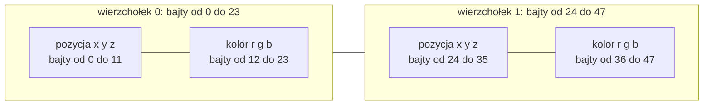
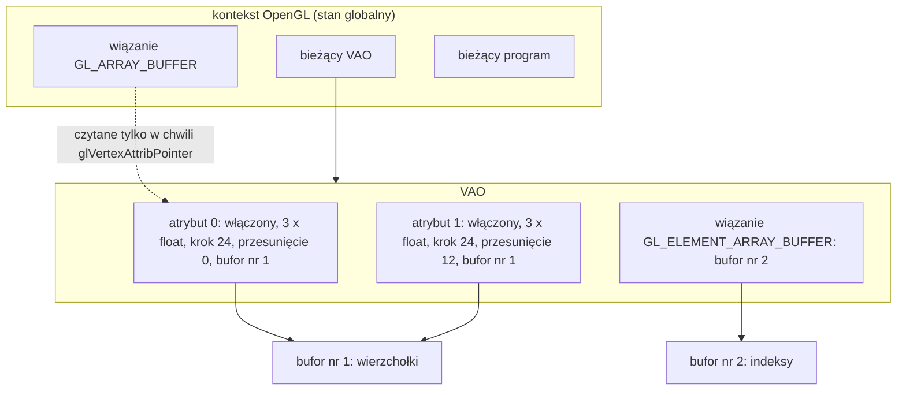
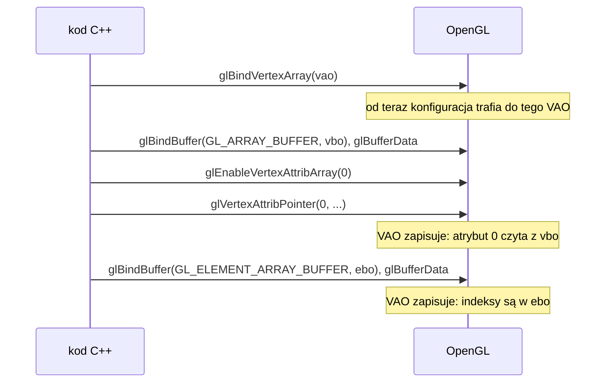
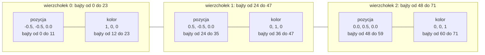

# Moduł gfx: bufory i tablica wierzchołków

Kamień milowy: M1. Temat wykładu: 2 (Programowalny potok).
Kod: [`src/gfx/Buffer.hpp`](../../../src/gfx/Buffer.hpp), [`src/gfx/Buffer.cpp`](../../../src/gfx/Buffer.cpp), [`src/gfx/VertexArray.hpp`](../../../src/gfx/VertexArray.hpp), [`src/gfx/VertexArray.cpp`](../../../src/gfx/VertexArray.cpp), użycie w [`src/game/NightMazeApp.hpp`](../../../src/game/NightMazeApp.hpp) i [`src/game/NightMazeApp.cpp`](../../../src/game/NightMazeApp.cpp).

Część modułu `gfx`. Wstęp do całego modułu, zasada RAII dla obiektów OpenGL i semantyka przenoszenia są w [`README.md`](README.md). Druga część tematu 2, czyli shadery i sam potok, jest w [`shaders.md`](shaders.md): ten dokument zakłada jej znajomość. Każde wywołanie OpenGL jest opakowane w `GL_CHECK` ([`../core/gl-check.md`](../core/gl-check.md)).

## 1. Po co to jest

Shader wierzchołków ([`shaders.md`](shaders.md), sekcja 2.2) dostaje na wejściu atrybuty jednego wierzchołka. Skądś muszą się one wziąć. Odpowiedzią są dwa rodzaje obiektów OpenGL:

- **bufor** (buffer object) to blok pamięci na karcie graficznej, do którego kopiuję tablicę liczb z programu: pozycje, kolory, później normalne i współrzędne tekstur,
- **tablica wierzchołków** (vertex array object, VAO) to opis, jak te liczby czytać: który atrybut ma ile składowych, w którym buforze leży, od którego bajtu się zaczyna i co ile bajtów się powtarza.

Bufor to dane bez znaczenia, VAO to znaczenie bez danych. Dopiero razem z programem shaderów dają komplet potrzebny do `glDrawArrays`.

Dwie klasy opakowują te obiekty:

| Klasa | Obiekt OpenGL | Co robi |
|---|---|---|
| `gfx::Buffer` | jeden bufor | konstruktor tworzy bufor i wypełnia go raz danymi, `bind()` wiąże go z jego celem, destruktor usuwa |
| `gfx::VertexArray` | jeden VAO | konstruktor tworzy pusty VAO, `setFloatAttribute` opisuje jeden atrybut, `bind()` ustawia VAO jako bieżący, destruktor usuwa |

Obie są cienkimi opakowaniami typu RAII, których nie da się kopiować, a da się przenosić, tak jak `gfx::Shader`. Celowo nie ma tu żadnej abstrakcji "układu wierzchołka": atrybuty opisuję pojedynczymi wywołaniami z jawnym krokiem i przesunięciem w bajtach, bo właśnie te liczby trzeba umieć wytłumaczyć.

Stan na dziś: `game::NightMazeApp` ma jeden `gfx::VertexArray` i jeden `gfx::Buffer` z danymi trzech wierzchołków i co klatkę rysuje nimi trójkąt przez `glDrawArrays` (sekcja 5.7). Bufora indeksów i `glDrawElements` program jeszcze nie używa: dojdą razem z kostką.

## 2. Teoria

### 2.1 Dane wierzchołków i atrybuty

**Wierzchołek** (vertex) w OpenGL to nie tylko punkt w przestrzeni. To zestaw wartości, które shader wierzchołków dostaje dla jednego rogu trójkąta. Każda z tych wartości to **atrybut wierzchołka** (vertex attribute):

| Atrybut | Typ w GLSL | Liczb `float` |
|---|---|---|
| pozycja | `vec3` | 3 |
| kolor | `vec3` | 3 |
| normalna (od tematu 6) | `vec3` | 3 |
| współrzędne tekstury (od tematu 5) | `vec2` | 2 |

Po stronie C++ dane wierzchołków to zwykła, płaska tablica liczb `float`. OpenGL nie wie, że pierwsze trzy to pozycja, a następne trzy to kolor: trzeba mu to opisać.

Atrybuty mają **numery** (indeksy, od 0). Numer jest jedynym łącznikiem między danymi a shaderem: opis w C++ mówi "atrybut 0 to trzy liczby od bajtu 0", a shader mówi `layout(location = 0) in vec3 aPosition;` (sekcja 4).

### 2.2 Bufor wierzchołków (VBO)

Karta graficzna nie czyta pamięci mojego programu. Dane trzeba do niej **skopiować**, a miejscem, do którego trafiają, jest obiekt bufora. Bufor z danymi wierzchołków nazywa się potocznie **VBO** (vertex buffer object). Sam bufor jest tylko ciągiem bajtów o znanej długości. O tym, do czego służy, decyduje **cel** (target), z którym jest związany:

| Cel | Potoczna nazwa bufora | Zawartość |
|---|---|---|
| `GL_ARRAY_BUFFER` | VBO | atrybuty wierzchołków |
| `GL_ELEMENT_ARRAY_BUFFER` | EBO albo IBO | indeksy wierzchołków |

OpenGL 4.1 działa w modelu **zwiąż, potem edytuj** (bind to edit): funkcje nie przyjmują identyfikatora bufora, tylko cel, i działają na buforze, który jest w tej chwili z tym celem związany. Żeby wypełnić bufor, trzeba go więc najpierw związać (`glBindBuffer`), a dopiero potem wysłać dane (`glBufferData`). Funkcje działające wprost na identyfikatorze (direct state access, `glNamedBufferData`) pojawiły się w OpenGL 4.5 i na macOS ich nie ma.

### 2.3 Układ przeplatany, krok i przesunięcie

Gdy wierzchołek ma kilka atrybutów, można je ułożyć w buforze na dwa sposoby: każdy atrybut w osobnym buforze albo wszystkie atrybuty jednego wierzchołka obok siebie, wierzchołek po wierzchołku. Drugi sposób to **układ przeplatany** (interleaved) i jest najczęstszy: dane jednego wierzchołka leżą razem w pamięci.

Bajty jednego wierzchołka z pozycją i kolorem (6 liczb `float`, każda po 4 bajty):



Dwie liczby opisują położenie atrybutu w takim buforze:

- **krok** (stride): odległość w bajtach między początkiem jednego wierzchołka a początkiem następnego. Jest **taki sam dla wszystkich atrybutów** tego bufora, bo opisuje rozmiar całego wierzchołka. Tu: 6 liczb po 4 bajty, czyli 24.
- **przesunięcie** (offset): od którego bajtu wewnątrz wierzchołka zaczyna się dany atrybut. Pozycja: 0. Kolor: 12, bo przed nim leżą trzy liczby pozycji.

| Atrybut | Numer | Składowych | Krok | Przesunięcie |
|---|---|---|---|---|
| pozycja | 0 | 3 | 24 | 0 |
| kolor | 1 | 3 | 24 | 12 |

Karta wylicza adres atrybutu dla wierzchołka numer `i` jako `przesunięcie + i * krok`. Kolor wierzchołka 1 zaczyna się więc w bajcie 12 + 1 * 24 = 36, zgodnie z diagramem.

Gdy wierzchołek ma tylko pozycję, krok to 12, a przesunięcie 0.

Układ z tej sekcji (pozycja i kolor, krok 24, przesunięcia 0 i 12) to dokładnie układ wierzchołka w projekcie. Stałe, które go opisują w kodzie, są w sekcji 5.7.

### 2.4 Tablica wierzchołków (VAO): co pamięta, a czego nie

Opis atrybutów trzeba gdzieś zapisać. Robi to obiekt tablicy wierzchołków, **VAO**. To najczęściej źle rozumiany obiekt OpenGL, więc dokładnie:

**VAO pamięta:**

| Stan | Jak się go ustawia |
|---|---|
| dla każdego numeru atrybutu: czy jest włączony | `glEnableVertexAttribArray(index)` |
| dla każdego atrybutu: format, czyli liczba składowych, typ, normalizacja, krok, przesunięcie | `glVertexAttribPointer(...)` |
| dla każdego atrybutu: **z którego bufora czyta** | `glVertexAttribPointer` zapisuje bufor, który w chwili wywołania jest związany z `GL_ARRAY_BUFFER` |
| wiązanie `GL_ELEMENT_ARRAY_BUFFER`, czyli bufor indeksów | `glBindBuffer(GL_ELEMENT_ARRAY_BUFFER, ...)`, gdy ten VAO jest bieżący |

**VAO nie pamięta:**

| Czego nie | Co z tego wynika |
|---|---|
| samego wiązania `GL_ARRAY_BUFFER` | to stan globalny kontekstu, a nie VAO. Liczy się tylko w chwili wywołania `glVertexAttribPointer`. Potem można związać z `GL_ARRAY_BUFFER` cokolwiek innego albo 0 i VAO nadal rysuje z zapisanego bufora |
| danych wierzchołków | VAO trzyma odwołania do buforów, nie ich zawartość |
| programu shaderów | `glUseProgram` jest osobnym stanem |

Te dwie tabele zawierają asymetrię, którą trzeba umieć wytłumaczyć: **wiązanie bufora indeksów należy do VAO, a wiązanie bufora wierzchołków nie**. Bufor wierzchołków jest zapisywany w VAO pośrednio, osobno dla każdego atrybutu, w chwili jego opisywania. Dzięki temu różne atrybuty mogą czytać z różnych buforów. Bufor indeksów jest jeden na VAO, więc jego wiązanie jest po prostu częścią stanu VAO.



Sens VAO jest praktyczny: całą konfigurację robię raz, przy tworzeniu geometrii, a przy rysowaniu wystarcza jedno `glBindVertexArray`.

### 2.5 Dlaczego profil Core wymaga VAO

W starym OpenGL i w profilu zgodności (compatibility) istnieje domyślny VAO o numerze 0, więc stan atrybutów można ustawiać bez tworzenia żadnego obiektu. Profil Core ten domyślny obiekt usunął: numer 0 oznacza "brak VAO", a rysowanie bez związanego VAO jest błędem. Zmierzone w teście (sekcja 5.9): `glDrawArrays` bez VAO daje `GL_INVALID_OPERATION` i niczego nie rysuje.

Wiele starszych poradników pomija VAO, bo były pisane dla profilu zgodności. Na macOS dostępny jest tylko profil Core ([`../core/window-context.md`](../core/window-context.md)), więc tam taki kod nie działa.

### 2.6 Indeksy i bufor indeksów (EBO)

Prostokąt to dwa trójkąty, czyli 6 wierzchołków, ale tylko 4 różne rogi. Dwa rogi leżą na wspólnej przekątnej i w tablicy wierzchołków musiałyby wystąpić dwa razy. **Indeksy** rozwiązują ten problem: tablica wierzchołków zawiera każdy róg raz, a osobna tablica liczb całkowitych mówi, z których rogów złożyć kolejne trójkąty.

| | Bez indeksów | Z indeksami |
|---|---|---|
| prostokąt, wierzchołek 24 bajty | 6 wierzchołków: 144 bajty | 4 wierzchołki i 6 indeksów po 4 bajty: 96 + 24 = 120 bajtów |
| sześcian z 8 rogami (sama pozycja i kolor) | 36 wierzchołków: 864 bajty | 8 wierzchołków i 36 indeksów: 192 + 144 = 336 bajtów |

Zysk rośnie z rozmiarem wierzchołka i z tym, jak często rogi są wspólne. W siatce modelu jeden wierzchołek należy zwykle do około sześciu trójkątów. Drugi zysk: shader wierzchołków może wykonać się raz dla wspólnego rogu, a nie raz na każde jego użycie.

Bufor z indeksami to **EBO** (element buffer object, spotyka się też nazwę IBO, index buffer object). Jest zwykłym buforem związanym z celem `GL_ELEMENT_ARRAY_BUFFER`. `gfx::Buffer` obsługuje oba cele tym samym kodem. W projekcie indeksy pojawią się razem z kostką i będą typu `unsigned int` (`GL_UNSIGNED_INT`).

### 2.7 `glDrawArrays` a `glDrawElements`

| | `glDrawArrays(mode, first, count)` | `glDrawElements(mode, count, type, offset)` |
|---|---|---|
| Skąd bierze wierzchołki | kolejno z buforów: `first`, `first + 1`, ... | w kolejności podanej przez indeksy z EBO bieżącego VAO |
| Co znaczy `count` | **liczba wierzchołków** | **liczba indeksów** |
| Potrzebuje EBO | nie | tak |

W obu funkcjach `mode` równe `GL_TRIANGLES` oznacza: każde trzy kolejne wierzchołki (albo indeksy) to jeden trójkąt. `count` nie jest liczbą trójkątów ani liczbą liczb `float`: dla jednego trójkąta to 3.

Obie funkcje rysują tym, co jest bieżące w chwili wywołania: bieżącym programem i bieżącym VAO.

### 2.8 Podpowiedź użycia: `GL_STATIC_DRAW`

Ostatni parametr `glBufferData` to **podpowiedź** (usage hint) dla sterownika: jak zamierzam bufora używać. Nazwa składa się z dwóch części.

| Pierwsza część | Znaczenie |
|---|---|
| `STATIC` | dane ustawiane raz, używane wiele razy |
| `DYNAMIC` | dane zmieniane wielokrotnie, używane wiele razy |
| `STREAM` | dane ustawiane raz i używane najwyżej kilka razy (na przykład nowe co klatkę) |

| Druga część | Znaczenie |
|---|---|
| `DRAW` | program zapisuje dane, karta ich używa do rysowania |
| `READ` | karta zapisuje dane, program je odczytuje |
| `COPY` | karta zapisuje dane i karta ich używa |

Daje to dziewięć stałych, od `GL_STATIC_DRAW` do `GL_STREAM_COPY`. To tylko podpowiedź: sterownik może na jej podstawie wybrać rodzaj pamięci, ale nie ogranicza ona tego, co wolno z buforem zrobić. `gfx::Buffer` zawsze używa `GL_STATIC_DRAW`, bo bufor jest wypełniany raz, w konstruktorze, i klasa nie ma funkcji zmieniającej dane.

### 2.9 Gdzie postawić trójkąt: NDC i kierunek nawijania

Dopóki nie ma macierzy, pozycje z bufora trafiają do `gl_Position` bez zmian i są od razu **znormalizowanymi współrzędnymi urządzenia** (NDC, [`shaders.md`](shaders.md), sekcja 2.2): środek okna to (0, 0), lewa krawędź x = -1, prawa x = 1, dół y = -1, góra y = 1. Trójkąt o wierzchołkach (-0,5, -0,5), (0,5, -0,5), (0, 0,5), czyli ten z `NightMazeApp.cpp`, leży więc na środku okna i zajmuje połowę jego szerokości i wysokości. Proporcje okna nie są uwzględnione: w oknie 1280 x 720 ten trójkąt jest rozciągnięty w poziomie.

**Kierunek nawijania** (winding order) to kolejność, w jakiej wierzchołki trójkąta obiegają go na ekranie. OpenGL domyślnie uznaje trójkąt za zwrócony przodem, gdy jego wierzchołki idą **przeciwnie do ruchu wskazówek zegara** (counter clockwise, CCW). Trzy wierzchołki trójkąta w projekcie (lewy dolny, prawy dolny, górny) są właśnie w tej kolejności. Dziś nie ma to widocznego skutku, bo odrzucanie tylnych ścian (face culling) jest domyślnie wyłączone i rysowane są obie strony. Warto jednak od początku trzymać się kolejności CCW: po włączeniu `glEnable(GL_CULL_FACE)` trójkąty nawinięte odwrotnie znikają.

## 3. Jak to działa w OpenGL

### 3.1 Wywołania w kolejności

Przygotowanie geometrii, raz:

| # | Wywołanie | Co robi |
|---|---|---|
| 1 | `glGenVertexArrays(1, &id)` | Rezerwuje identyfikator nowego VAO i wpisuje go do `id`. Obiekt powstaje naprawdę przy pierwszym związaniu |
| 2 | `glBindVertexArray(id)` | Ustawia VAO jako bieżący. Od tej chwili konfiguracja atrybutów i wiązanie EBO trafiają do niego |
| 3 | `glGenBuffers(1, &id)` | Rezerwuje identyfikator nowego bufora |
| 4 | `glBindBuffer(GL_ARRAY_BUFFER, id)` | Wiąże bufor z celem. Następne funkcje z tym celem działają na tym buforze |
| 5 | `glBufferData(GL_ARRAY_BUFFER, size, data, GL_STATIC_DRAW)` | Przydziela `size` bajtów pamięci na karcie i kopiuje do niej dane spod wskaźnika `data`. Poprzednia zawartość bufora przepada |
| 6 | `glEnableVertexAttribArray(index)` | Włącza atrybut o danym numerze w bieżącym VAO. Wyłączony atrybut nie czyta bufora, a shader dostaje wartość stałą |
| 7 | `glVertexAttribPointer(index, size, type, normalized, stride, pointer)` | Zapisuje w bieżącym VAO format atrybutu i bufor związany teraz z `GL_ARRAY_BUFFER`. `size` to liczba składowych (od 1 do 4), `pointer` to przesunięcie w bajtach przebrane za wskaźnik (sekcja 5.6) |
| 8 | `glBindBuffer(GL_ELEMENT_ARRAY_BUFFER, id)` i `glBufferData(GL_ELEMENT_ARRAY_BUFFER, ...)` | To samo co kroki 4 i 5 dla bufora indeksów. Wiązanie zostaje zapisane w bieżącym VAO. Tylko gdy rysuję z indeksami |

Rysowanie, co klatkę:

| # | Wywołanie | Co robi |
|---|---|---|
| 9 | `glUseProgram(program)` | Wybiera program shaderów ([`shaders.md`](shaders.md)) |
| 10 | `glBindVertexArray(id)` | Przywraca całą zapisaną konfigurację jednym wywołaniem |
| 11 | `glDrawArrays(GL_TRIANGLES, 0, count)` albo `glDrawElements(GL_TRIANGLES, count, GL_UNSIGNED_INT, nullptr)` | Rysuje. `nullptr` w drugiej funkcji to przesunięcie 0 w buforze indeksów |

Sprzątanie:

| # | Wywołanie | Co robi |
|---|---|---|
| 12 | `glDeleteBuffers(1, &id)` | Usuwa bufor. Identyfikator 0 jest po cichu ignorowany |
| 13 | `glDeleteVertexArrays(1, &id)` | Usuwa VAO. Identyfikator 0 jest po cichu ignorowany |

Kroki 1, 3, 12 i 13 przyjmują liczbę obiektów i wskaźnik do tablicy identyfikatorów, bo potrafią obsłużyć wiele obiektów naraz. Dla jednego obiektu tablicą jest adres pojedynczej zmiennej.

### 3.2 Kolejność, która ma znaczenie



Trzy zależności, z których każda jest źródłem pułapki z sekcji 7:

1. VAO musi być bieżący **przed** `glEnableVertexAttribArray`, `glVertexAttribPointer` i przed związaniem EBO.
2. Właściwy VBO musi być związany z `GL_ARRAY_BUFFER` **w chwili** `glVertexAttribPointer`.
3. Wiązania EBO nie wolno zdejmować (`glBindBuffer(GL_ELEMENT_ARRAY_BUFFER, 0)`), dopóki VAO jest bieżący, bo to też zostanie zapisane w VAO.

## 4. Shadery

Ta część modułu nie ma własnych shaderów, ale jest z nimi ściśle związana: **numer atrybutu** podany w C++ musi być tym samym numerem co `layout(location = N)` w shaderze wierzchołków.

Wejścia shadera wierzchołków projektu, [`assets/shaders/basic.vert`](../../../assets/shaders/basic.vert) (cały plik omawia [`shaders.md`](shaders.md), sekcja 4.1):

```glsl
layout(location = 0) in vec3 aPosition; // x, y, z
layout(location = 1) in vec3 aColor;    // red, green, blue, each from 0 to 1
```

Odpowiadające im stałe i wywołania w [`src/game/NightMazeApp.cpp`](../../../src/game/NightMazeApp.cpp):

```cpp
// Attribute numbers: the same as layout(location = N) in basic.vert.
constexpr GLuint POSITION_ATTRIBUTE = 0;
constexpr GLuint COLOR_ATTRIBUTE = 1;
```

```cpp
m_vertexArray.setFloatAttribute(POSITION_ATTRIBUTE, POSITION_COMPONENTS, VERTEX_STRIDE,
                                POSITION_OFFSET);
m_vertexArray.setFloatAttribute(COLOR_ATTRIBUTE, COLOR_COMPONENTS, VERTEX_STRIDE, COLOR_OFFSET);
```

| Po stronie C++ | Po stronie GLSL | Co musi się zgadzać |
|---|---|---|
| `POSITION_ATTRIBUTE` równe 0 | `layout(location = 0)` przy `aPosition` | numer |
| `COLOR_ATTRIBUTE` równe 1 | `layout(location = 1)` przy `aColor` | numer |
| `POSITION_COMPONENTS` i `COLOR_COMPONENTS` równe 3 | `vec3` | liczba składowych. Gdy bufor daje mniej składowych, niż ma typ w shaderze, brakujące są uzupełniane: `y` i `z` zerem, `w` jedynką |
| `GL_FLOAT` (wewnątrz `setFloatAttribute`) | `vec3` (typ zmiennoprzecinkowy) | rodzaj typu |

OpenGL nie sprawdza tej zgodności. Zły numer nie daje błędu kompilacji ani błędu `glGetError`: shader dostaje po prostu dane innego atrybutu albo wartość domyślną. Numery są w dwóch plikach (jednym C++ i jednym GLSL) i nic poza komentarzem ich nie wiąże, dlatego komentarz nad stałymi wskazuje plik shadera.

Gdyby w shaderze nie było `layout(location = ...)`, numery przydzieliłby linker i trzeba by o nie pytać funkcją `glGetAttribLocation` po zlinkowaniu programu. Jawne numery w shaderze są prostsze: VAO można skonfigurować, nie znając programu.

## 5. Kod w projekcie

### 5.1 Pliki

| Plik | Co zawiera |
|---|---|
| [`src/gfx/Buffer.hpp`](../../../src/gfx/Buffer.hpp) | klasa `gfx::Buffer`: konstruktor z celem, danymi i rozmiarem, destruktor, zablokowane kopiowanie, przenoszenie, `bind`. Dołącza `<glad/gl.h>` i `<cstddef>` |
| [`src/gfx/Buffer.cpp`](../../../src/gfx/Buffer.cpp) | implementacja |
| [`src/gfx/VertexArray.hpp`](../../../src/gfx/VertexArray.hpp) | klasa `gfx::VertexArray`: konstruktor domyślny, destruktor, zablokowane kopiowanie, przenoszenie, `bind`, `setFloatAttribute` |
| [`src/gfx/VertexArray.cpp`](../../../src/gfx/VertexArray.cpp) | implementacja |
| [`src/game/NightMazeApp.hpp`](../../../src/game/NightMazeApp.hpp), [`.cpp`](../../../src/game/NightMazeApp.cpp) | jedyny użytkownik obu klas: pola `m_vertexArray` i `m_vertexBuffer`, dane wierzchołków `VERTICES`, stałe układu, konfiguracja w konstruktorze, rysowanie w `onRender` (sekcja 5.7) |

Wszystkie cztery pliki są na liście źródeł biblioteki `engine` w [`CMakeLists.txt`](../../../CMakeLists.txt). Obie klasy zależą tylko od `core` (`GL_CHECK`), GLAD i biblioteki standardowej. Żadna nie ma funkcji pomocniczych ani stałych: całość to konstruktor, destruktor, dwie funkcje przenoszące i jedna albo dwie funkcje robocze.

Żadna z klas nie ma też funkcji zwracającej identyfikator ani funkcji "odwiąż" (`unbind`). Identyfikatora nikt jeszcze nie potrzebuje, a odwiązywanie nie jest konieczne: każdy kod, który czegoś potrzebuje, wiąże to sam przed użyciem.

### 5.2 `Buffer`: nagłówek

```cpp
class Buffer {
public:
    /// Creates a buffer, binds it to target and copies sizeInBytes bytes from data into it.
    /// target is GL_ARRAY_BUFFER (vertex data) or GL_ELEMENT_ARRAY_BUFFER (indices).
    /// OpenGL takes its own copy, so data may be freed right after the call.
    ///
    /// The buffer is left bound to target. For GL_ELEMENT_ARRAY_BUFFER this matters: that
    /// binding is not global, it is stored in the vertex array that is bound at the moment.
    /// So bind the VertexArray first and create the element buffer after it, otherwise the
    /// indices are attached to no vertex array (or to the wrong one).
    Buffer(GLenum target, const void* data, std::size_t sizeInBytes);
    ~Buffer();

    Buffer(const Buffer&) = delete;
    Buffer& operator=(const Buffer&) = delete;

    /// Takes over the buffer of other. other is left without a buffer.
    Buffer(Buffer&& other) noexcept;
    /// Deletes the buffer this object owns, then takes over the buffer of other.
    Buffer& operator=(Buffer&& other) noexcept;

    /// Binds the buffer to the target it was created for (glBindBuffer).
    void bind() const;

private:
    // Binding point given to the constructor, remembered so that bind() needs no argument.
    GLenum m_target;
    // Name (id) of the OpenGL buffer object. 0 is never a real buffer: it means "none".
    GLuint m_id = 0;
};
```

| Element | Dlaczego tak |
|---|---|
| `GLenum target` | jedna klasa dla obu rodzajów bufora. Kod jest identyczny, różni się tylko cel |
| `const void* data` | wskaźnik "na cokolwiek". Bufor to bajty: dla wierzchołków podam tablicę `float`, dla indeksów tablicę `unsigned int`. Każdy wskaźnik do danych zamienia się na `const void*` niejawnie. `const`, bo funkcja danych nie zmienia |
| `std::size_t sizeInBytes` | rozmiar w **bajtach**, nie liczba elementów. `std::size_t` to typ, który zwraca `sizeof`. Nazwa parametru przypomina o jednostce (sekcja 7, pułapka 5) |
| `m_target` | zapamiętany cel, żeby `bind()` nie miało parametru i nie dało się związać bufora ze złym celem |
| `m_id = 0` | 0 to "nie ma bufora", jak `m_program` w `Shader` |
| brak konstruktora domyślnego | nie da się utworzyć pustego `Buffer`. Bufor bez danych nie ma w tym projekcie zastosowania |

Klasa nie jest szablonem i nie przyjmuje `std::vector` ani `std::array`. Wołający podaje wskaźnik i rozmiar wprost, na przykład `vertices.data()` i `sizeof(vertices)` dla `std::array`. To jeden jawny zapis więcej w miejscu użycia, w zamian za klasę bez szablonów.

### 5.3 `Buffer`: konstruktor, destruktor, `bind`

```cpp
Buffer::Buffer(GLenum target, const void* data, std::size_t sizeInBytes) : m_target(target) {
    // glGenBuffers writes new ids into an array. Here the array is the one member.
    GL_CHECK(glGenBuffers(1, &m_id));
    // OpenGL 4.1 can only fill the buffer that is bound, so bind first.
    GL_CHECK(glBindBuffer(m_target, m_id));
    // Allocates sizeInBytes bytes on the graphics card and copies the data there.
    // The size parameter is a signed type (GLsizeiptr), hence the cast.
    // GL_STATIC_DRAW is a hint: the data is set once and used for drawing many times.
    GL_CHECK(glBufferData(m_target, static_cast<GLsizeiptr>(sizeInBytes), data, GL_STATIC_DRAW));
}
```

| Linia | Co robi |
|---|---|
| `: m_target(target)` | Lista inicjalizacyjna zapamiętuje cel. `m_id` ma już wartość 0 z deklaracji pola |
| `glGenBuffers(1, &m_id)` | "Daj mi 1 nowy identyfikator i wpisz go pod ten adres". Funkcja chce tablicy, a adres jednej zmiennej jest tablicą o jednym elemencie |
| `glBindBuffer(m_target, m_id)` | Model "zwiąż, potem edytuj" (sekcja 2.2). Dopiero przy pierwszym związaniu OpenGL tworzy właściwy obiekt bufora |
| `static_cast<GLsizeiptr>(sizeInBytes)` | `glBufferData` przyjmuje rozmiar jako `GLsizeiptr`, typ **ze znakiem** o szerokości wskaźnika. `std::size_t` jest bez znaku, więc bez rzutowania kompilator ostrzegałby o niejawnej zmianie znaku |
| `data` | OpenGL kopiuje bajty podczas tego wywołania. Tablica w programie może potem zniknąć |
| `GL_STATIC_DRAW` | Podpowiedź użycia (sekcja 2.8) |

Po konstruktorze bufor **zostaje związany** ze swoim celem. Dla `GL_ARRAY_BUFFER` to wygodne: zaraz potem woła się `setFloatAttribute`, które potrzebuje właśnie tego wiązania. Dla `GL_ELEMENT_ARRAY_BUFFER` to jest sedno sprawy: samo utworzenie bufora indeksów zapisuje go w bieżącym VAO. Dlatego komentarz w nagłówku każe najpierw związać `VertexArray`.

```cpp
Buffer::~Buffer() {
    // OpenGL silently ignores the id 0 in glDeleteBuffers, so an object that was moved
    // from needs no special case.
    GL_CHECK(glDeleteBuffers(1, &m_id));
}
```

```cpp
void Buffer::bind() const {
    GL_CHECK(glBindBuffer(m_target, m_id));
}
```

`bind()` jest `const`, bo nie zmienia obiektu C++, tylko stan kontekstu OpenGL, tak jak `Shader::use()`.

### 5.4 `Buffer`: przenoszenie

Ogólne wyjaśnienie przenoszenia jest w [`README.md`](README.md), sekcja 2, a ten sam wzorzec dla `Shader` w [`shaders.md`](shaders.md), sekcja 5.9.

```cpp
// Move constructor: the new object takes the buffer id, and other gives it up.
Buffer::Buffer(Buffer&& other) noexcept : m_target(other.m_target), m_id(other.m_id) {
    // Two objects must never hold the same id. With 0 the destructor of other
    // deletes nothing.
    other.m_id = 0;
}

// Move assignment: this object already owns a buffer, which has to go first.
Buffer& Buffer::operator=(Buffer&& other) noexcept {
    // buffer = std::move(buffer): nothing to do. Without this check the buffer would
    // be deleted here and then "taken over" from itself.
    if (this == &other) {
        return *this;
    }

    // Release the buffer owned so far (ignored by OpenGL when the id is 0).
    GL_CHECK(glDeleteBuffers(1, &m_id));

    m_target = other.m_target;
    m_id = other.m_id;
    other.m_id = 0;
    return *this;
}
```

Oba pola to liczby, więc są kopiowane, a nie przenoszone przez `std::move`. Przeniesieniem czyni to jedna linia: `other.m_id = 0;`. `m_target` w obiekcie źródłowym zostaje, bo niczemu nie szkodzi: destruktor patrzy tylko na `m_id`. Przypisanie ma te same trzy kroki co w `Shader`: sprawdzenie przypisania do siebie, zwolnienie własnego bufora, przejęcie.

Przeniesienie **nie zmienia niczego po stronie OpenGL**: identyfikator jest ten sam, więc VAO, który zapisał ten bufor, nadal na niego wskazuje.

### 5.5 `VertexArray`: nagłówek i proste funkcje

```cpp
class VertexArray {
public:
    /// Creates an empty vertex array: no attribute is enabled yet.
    VertexArray();
    ~VertexArray();

    VertexArray(const VertexArray&) = delete;
    VertexArray& operator=(const VertexArray&) = delete;

    /// Takes over the vertex array of other. other is left without one.
    VertexArray(VertexArray&& other) noexcept;
    /// Deletes the vertex array this object owns, then takes over the one of other.
    VertexArray& operator=(VertexArray&& other) noexcept;
```

```cpp
VertexArray::VertexArray() {
    // glGenVertexArrays writes new ids into an array. Here the array is the one member.
    GL_CHECK(glGenVertexArrays(1, &m_id));
}

VertexArray::~VertexArray() {
    // OpenGL silently ignores the id 0 in glDeleteVertexArrays, so an object that was
    // moved from needs no special case.
    GL_CHECK(glDeleteVertexArrays(1, &m_id));
}
```

```cpp
void VertexArray::bind() const {
    GL_CHECK(glBindVertexArray(m_id));
}
```

Konstruktor **nie wiąże** nowego VAO, tylko rezerwuje identyfikator. To różnica wobec `Buffer`, którego konstruktor musi związać bufor, żeby go wypełnić. Wołający musi więc sam zawołać `bind()` przed utworzeniem bufora indeksów. `setFloatAttribute` wiąże VAO samo.

`glBindVertexArray` ma jeden parametr, bez celu: bieżący VAO jest zawsze jeden.

Przenoszenie jest takie samo jak w `Buffer`, tylko z jednym polem:

```cpp
// Move constructor: the new object takes the vertex array id, and other gives it up.
VertexArray::VertexArray(VertexArray&& other) noexcept : m_id(other.m_id) {
    // Two objects must never hold the same id. With 0 the destructor of other
    // deletes nothing.
    other.m_id = 0;
}

// Move assignment: this object already owns a vertex array, which has to go first.
VertexArray& VertexArray::operator=(VertexArray&& other) noexcept {
    // vertexArray = std::move(vertexArray): nothing to do. Without this check the vertex
    // array would be deleted here and then "taken over" from itself.
    if (this == &other) {
        return *this;
    }

    // Release the vertex array owned so far (ignored by OpenGL when the id is 0).
    GL_CHECK(glDeleteVertexArrays(1, &m_id));

    m_id = other.m_id;
    other.m_id = 0;
    return *this;
}
```

### 5.6 `setFloatAttribute`

```cpp
void setFloatAttribute(GLuint index, GLint componentCount, GLsizei strideInBytes,
                       std::size_t offsetInBytes);
```

```cpp
void VertexArray::setFloatAttribute(GLuint index, GLint componentCount, GLsizei strideInBytes,
                                    std::size_t offsetInBytes) {
    // Attribute state belongs to the vertex array that is bound, so make sure it is this one.
    bind();
    GL_CHECK(glEnableVertexAttribArray(index));

    // The last parameter of glVertexAttribPointer has the type "pointer" for historical
    // reasons: in old OpenGL it could be the address of an array in the program's memory.
    // With a buffer bound to GL_ARRAY_BUFFER it is a byte offset into that buffer, so the
    // number is passed disguised as a pointer and nothing is ever read through it.
    // clang-tidy normally forbids turning a number into a pointer. Here the API demands
    // it, so the check is switched off for this one line.
    // NOLINTNEXTLINE(performance-no-int-to-ptr)
    const void* offsetAsPointer = reinterpret_cast<const void*>(offsetInBytes);

    // GL_FLOAT: each component is a 32 bit float. GL_FALSE: the values are used as they
    // are (normalization only applies to integer data).
    GL_CHECK(glVertexAttribPointer(index, componentCount, GL_FLOAT, GL_FALSE, strideInBytes,
                                   offsetAsPointer));
}
```

Parametry mają typy dokładnie takie, jakich chce OpenGL, żeby w środku nie było rzutowań poza jednym:

| Parametr | Typ | Znaczenie |
|---|---|---|
| `index` | `GLuint` | numer atrybutu, ten sam co `layout(location = index)` w shaderze |
| `componentCount` | `GLint` | liczba liczb `float` na wierzchołek, od 1 do 4. W OpenGL ten parametr nazywa się `size`, co myli z rozmiarem w bajtach, stąd inna nazwa |
| `strideInBytes` | `GLsizei` | krok (sekcja 2.3) |
| `offsetInBytes` | `std::size_t` | przesunięcie atrybutu wewnątrz wierzchołka (sekcja 2.3) |

| Linia | Co robi i dlaczego |
|---|---|
| `bind();` | Stan atrybutów trafia do **bieżącego** VAO. Funkcja składowa ma konfigurować swój obiekt, więc najpierw czyni go bieżącym. Bez tej linii wynik zależałby od tego, co wołający związał wcześniej |
| `glEnableVertexAttribArray(index)` | Atrybuty są domyślnie wyłączone. Opisany, ale niewłączony atrybut nie czyta bufora. Włączam od razu, bo opisanie atrybutu bez włączenia nie ma zastosowania |
| `reinterpret_cast<const void*>(offsetInBytes)` | Zamiana liczby na wskaźnik o tej samej wartości bitowej. Wyjaśnienie niżej |
| `GL_FLOAT` | Typ jednej składowej w buforze: 32 bitowa liczba zmiennoprzecinkowa, czyli `float` w C++ |
| `GL_FALSE` | Parametr `normalized`. Dotyczy tylko danych całkowitych (na przykład kolor w bajtach od 0 do 255 przeliczany na zakres od 0 do 1). Dla `GL_FLOAT` nie ma znaczenia |

**Dlaczego przesunięcie jest wskaźnikiem.** To historyczna osobliwość API. W OpenGL 1.1 nie było buforów na karcie: ostatni parametr `glVertexAttribPointer` (i jej poprzedniczek) był prawdziwym adresem tablicy w pamięci programu, stąd typ `const void*` i słowo "Pointer" w nazwie. Gdy doszły bufory, funkcji nie zmieniono, tylko nadano parametrowi drugie znaczenie: jeśli z `GL_ARRAY_BUFFER` związany jest bufor, wartość "wskaźnika" jest odczytywana jako **liczba bajtów od początku tego bufora**. W profilu Core pierwsze znaczenie już nie istnieje, zostało tylko drugie, ale typ parametru pozostał. Trzeba więc liczbę (na przykład 12) przekazać jako wskaźnik o wartości 12. Nikt nigdy nie odczytuje pamięci pod tym "adresem".

`reinterpret_cast` to rzutowanie, które każe kompilatorowi potraktować te same bity jako inny typ. Jest w projekcie używane rzadko i zawsze z komentarzem. Drugie miejsce to `glString` w `Window.cpp`.

**`NOLINTNEXTLINE`.** clang-tidy ma kontrolę `performance-no-int-to-ptr`, która zgłasza każdą zamianę liczby na wskaźnik (bo zwykle jest to błąd albo przeszkoda dla optymalizacji). Tutaj zamiana jest wymagana przez API i nie da się jej uniknąć. Komentarz `// NOLINTNEXTLINE(performance-no-int-to-ptr)` wyłącza tę jedną kontrolę dla jednej, następnej linii. To jedyne takie wyłączenie w `src/`.

**Który bufor.** Funkcja nie ma parametru "bufor". `glVertexAttribPointer` zapisuje w VAO ten bufor, który **w chwili wywołania** jest związany z `GL_ARRAY_BUFFER`. Wołający musi więc mieć związany właściwy `Buffer`: albo dopiero co go utworzył (konstruktor zostawia go związanego), albo zawołał `bind()`. Rozważałem przekazywanie `const Buffer&` jako parametru, żeby funkcja wiązała bufor sama. Zostałem przy obecnej postaci, bo jest wiernym odbiciem tego, jak działa OpenGL, a zależność od wiązania jest i tak rzeczą, którą trzeba rozumieć.

### 5.7 Użycie w `NightMazeApp`: trójkąt

Wszystko, co dotyczy geometrii, jest w [`NightMazeApp.hpp`](../../../src/game/NightMazeApp.hpp) i [`NightMazeApp.cpp`](../../../src/game/NightMazeApp.cpp).

**Stałe układu wierzchołka** (anonimowa przestrzeń nazw w `.cpp`):

```cpp
// One vertex is a position (x, y, z) followed by a color (red, green, blue), all floats.
constexpr GLint POSITION_COMPONENTS = 3;
constexpr GLint COLOR_COMPONENTS = 3;
constexpr GLint FLOATS_PER_VERTEX = POSITION_COMPONENTS + COLOR_COMPONENTS;

// Stride: bytes from the start of one vertex to the start of the next one.
constexpr GLsizei VERTEX_STRIDE = static_cast<GLsizei>(FLOATS_PER_VERTEX * sizeof(float));
// Offsets: where each attribute starts inside one vertex, in bytes.
constexpr std::size_t POSITION_OFFSET = 0;
constexpr std::size_t COLOR_OFFSET = POSITION_COMPONENTS * sizeof(float);

constexpr GLsizei VERTEX_COUNT = 3;
// Number of floats in the whole vertex data.
constexpr int VERTEX_FLOAT_COUNT = VERTEX_COUNT * FLOATS_PER_VERTEX;
```

| Stała | Wartość | Skąd |
|---|---|---|
| `POSITION_COMPONENTS`, `COLOR_COMPONENTS` | 3 i 3 | pozycja to x, y, z, kolor to czerwony, zielony, niebieski |
| `FLOATS_PER_VERTEX` | 6 | suma składowych wszystkich atrybutów |
| `VERTEX_STRIDE` | 24 | 6 liczb razy `sizeof(float)`, czyli 4 bajty. `sizeof` zwraca `std::size_t`, a parametr `setFloatAttribute` to `GLsizei` (liczba ze znakiem), stąd `static_cast` |
| `POSITION_OFFSET` | 0 | pozycja jest pierwsza w wierzchołku |
| `COLOR_OFFSET` | 12 | przed kolorem leżą 3 liczby pozycji po 4 bajty |
| `VERTEX_COUNT` | 3 | jeden trójkąt |
| `VERTEX_FLOAT_COUNT` | 18 | 3 wierzchołki po 6 liczb. To rozmiar tablicy `VERTICES`. Jest osobną stałą typu `int`, a nie mnożeniem wpisanym w nawiasy ostre `std::array`, bo tam wynik mnożenia dwóch liczb `int` byłby niejawnie zamieniany na `std::size_t`, co zgłasza clang-tidy (`bugprone-implicit-widening-of-multiplication-result`) |

Żadna z tych liczb nie jest wpisana wprost w wywołaniu: każda ma nazwę i jest wyliczona z poprzednich, więc dodanie atrybutu zmienia jedno miejsce. Typy stałych są takie same jak typy parametrów, do których trafiają (`GLint`, `GLsizei`, `std::size_t`), żeby w wywołaniach nie było rzutowań.

**Dane wierzchołków:**

```cpp
// Three vertices of one triangle, listed counter clockwise. There are no matrices yet, so
// the positions are normalized device coordinates: x and y from -1 to 1 cover the window.
constexpr std::array<float, VERTEX_FLOAT_COUNT> VERTICES = {
    // x, y, z,          red, green, blue
    -0.5F, -0.5F, 0.0F, 1.0F, 0.0F, 0.0F, // bottom left, red
    0.5F,  -0.5F, 0.0F, 0.0F, 1.0F, 0.0F, // bottom right, green
    0.0F,  0.5F,  0.0F, 0.0F, 0.0F, 1.0F, // top, blue
};
```

- Rozmiar tablicy to `VERTEX_FLOAT_COUNT`, czyli `VERTEX_COUNT * FLOATS_PER_VERTEX`, czyli 18. Jest wyliczony z tych samych stałych co rysowanie, więc liczba wierzchołków w danych i w `glDrawArrays` nie może się rozjechać: za dużo liczb w nawiasach to błąd kompilacji.
- Jeden wiersz to jeden wierzchołek: trzy liczby pozycji, trzy liczby koloru. To układ przeplatany z sekcji 2.3.
- `constexpr` i anonimowa przestrzeń nazw: tablica jest stałą czasu kompilacji, widoczną tylko w tym pliku. Nie jest zmienną globalną z mutowalnym stanem.
- Przyrostek `F` oznacza literał typu `float`. Bez niego `0.5` byłoby typu `double`.
- Kolejność wierzchołków (lewy dolny, prawy dolny, górny) jest przeciwna do ruchu wskazówek zegara (sekcja 2.9).

Bajty tego bufora, tak jak leżą na karcie (72 bajty, trzy wierzchołki po 24):



Atrybut 0 (pozycja) czyta bajty 0, 24, 48: przesunięcie 0, krok 24. Atrybut 1 (kolor) czyta bajty 12, 36, 60: przesunięcie 12, krok 24.

**Pola klasy** (`NightMazeApp.hpp`):

```cpp
// OpenGL objects. They are members of a class derived from core::Application, so they
// are created after the window and its OpenGL context, and destroyed before them.
//
// Order: the vertex array first, then the vertex buffer. Members are constructed top
// to bottom and the constructor body runs after all of them. At that point the buffer,
// created last, is still bound to GL_ARRAY_BUFFER, and that is how the attribute setup
// in the body tells the vertex array which buffer to read from.
gfx::Shader m_shader;
gfx::VertexArray m_vertexArray;
gfx::Buffer m_vertexBuffer;
```

**Konstruktor:**

```cpp
NightMazeApp::NightMazeApp()
    : core::Application(INITIAL_WIDTH, INITIAL_HEIGHT, "Night Maze"),
      m_shader(core::assetPath(VERTEX_SHADER_FILE), core::assetPath(FRAGMENT_SHADER_FILE)),
      // The size is in bytes: number of floats times the size of one float.
      m_vertexBuffer(GL_ARRAY_BUFFER, VERTICES.data(), VERTICES.size() * sizeof(float)) {
    // m_vertexBuffer has just been created, so it is still bound to GL_ARRAY_BUFFER.
    // Each call below records that buffer in m_vertexArray for one attribute.
    m_vertexArray.setFloatAttribute(POSITION_ATTRIBUTE, POSITION_COMPONENTS, VERTEX_STRIDE,
                                    POSITION_OFFSET);
    m_vertexArray.setFloatAttribute(COLOR_ATTRIBUTE, COLOR_COMPONENTS, VERTEX_STRIDE, COLOR_OFFSET);
}
```

Kolejność zdarzeń jest wyznaczona przez kolejność **deklaracji** pól, a nie przez kolejność na liście inicjalizacyjnej ([`../core/README.md`](../core/README.md), sekcja 7):

| # | Co się wykonuje | Wywołania OpenGL | Stan po tym kroku |
|---|---|---|---|
| 1 | `core::Application(...)`, część bazowa | brak własnych, powstaje okno i kontekst | można wołać `gl*` |
| 2 | `m_clearColor` | brak | |
| 3 | `m_shader(...)` | kompilacja i linkowanie ([`shaders.md`](shaders.md)) | program gotowy albo błąd w logu |
| 4 | `m_vertexArray`, konstruktor domyślny (nie ma go na liście, więc wykonuje się sam, w swojej kolejności) | `glGenVertexArrays` | VAO istnieje, nie jest związany |
| 5 | `m_vertexBuffer(GL_ARRAY_BUFFER, ...)` | `glGenBuffers`, `glBindBuffer`, `glBufferData` | 72 bajty na karcie, bufor związany z `GL_ARRAY_BUFFER` |
| 6 | ciało konstruktora: `setFloatAttribute` dla pozycji | `glBindVertexArray`, `glEnableVertexAttribArray(0)`, `glVertexAttribPointer(0, 3, GL_FLOAT, GL_FALSE, 24, 0)` | VAO związany, atrybut 0 czyta z bufora z kroku 5 |
| 7 | ciało konstruktora: `setFloatAttribute` dla koloru | `glBindVertexArray`, `glEnableVertexAttribArray(1)`, `glVertexAttribPointer(1, 3, GL_FLOAT, GL_FALSE, 24, 12)` | atrybut 1 czyta z tego samego bufora |

Szczegóły, o które można zostać zapytanym:

- `VERTICES.data()` zwraca `const float*` do pierwszego elementu. Zamienia się niejawnie na `const void*`, którego chce `Buffer`.
- `VERTICES.size() * sizeof(float)` to rozmiar w bajtach: 18 razy 4, czyli 72. `size()` zwraca liczbę elementów, nie bajtów (sekcja 7, pułapka 7).
- Krok 6 działa, bo między krokiem 5 a 6 nikt nie zmienił wiązania `GL_ARRAY_BUFFER`. To wiązanie jest stanem globalnym kontekstu, więc dla samego bufora wierzchołków nie ma znaczenia, czy VAO powstał przed buforem, czy po nim: liczy się tylko to, co jest związane **w chwili** `setFloatAttribute`. Kolejność "najpierw VAO" stanie się konieczna dopiero przy buforze indeksów, którego wiązanie należy do VAO (sekcja 2.4).
- Dane wierzchołków są wysyłane na kartę raz, przy starcie. W klatce nie ma żadnego `glBufferData`.

**Rysowanie** w `NightMazeApp::onRender`:

```cpp
if (m_shader.isValid()) {
    m_shader.use();
    m_vertexArray.bind();
    // Every three vertices, starting at vertex 0, form one triangle.
    GL_CHECK(glDrawArrays(GL_TRIANGLES, 0, VERTEX_COUNT));
}
```

| Linia | Co robi |
|---|---|
| `m_vertexArray.bind();` | Jedno wywołanie przywraca cały opis: dwa włączone atrybuty, ich format i bufor. Bufora nie wiążę osobno, bo VAO go pamięta |
| `glDrawArrays(GL_TRIANGLES, 0, VERTEX_COUNT)` | `GL_TRIANGLES`: każde trzy wierzchołki to trójkąt. `0`: zacznij od wierzchołka numer 0. `VERTEX_COUNT`: użyj trzech wierzchołków. To jedyne miejsce w klatce, w którym uruchamia się potok z [`shaders.md`](shaders.md), sekcja 2.1 |

`bind()` jest wołane co klatkę, choć VAO jest jeden: backend ImGui przy rysowaniu paneli wiąże własny VAO i własny program, a po sobie przywraca poprzedni stan. Nie polegam na tym i przed rysowaniem ustawiam wszystko, czego potrzebuję.

**Niszczenie.** Pola giną w kolejności odwrotnej do deklaracji: `m_vertexBuffer`, `m_vertexArray`, `m_shader`, a dopiero potem część bazowa z oknem. Wszystkie trzy destruktory mają więc żywy kontekst.

### 5.8 Czas życia: bufor a VAO, który go używa

VAO przechowuje odwołanie do bufora, a nie jego kopię. Co się dzieje, gdy `Buffer` zostanie zniszczony, a `VertexArray` nadal istnieje, zależy od tego, czy VAO jest w tej chwili bieżący. Zmierzone w teście (sekcja 5.9):

| Sytuacja | Skutek |
|---|---|
| bufor usunięty, gdy używający go VAO **nie jest** bieżący | VAO nadal rysuje poprawnie. OpenGL zwalnia nazwę bufora, ale dane trzyma, dopóki VAO się do nich odwołuje |
| bufor usunięty, gdy używający go VAO **jest** bieżący | OpenGL odłącza bufor od bieżącego VAO. Następne rysowanie daje `GL_INVALID_OPERATION` i niczego nie rysuje |

Nie warto na tych regułach polegać. Zasada dla projektu: `Buffer` żyje co najmniej tak długo jak `VertexArray`, który z niego czyta. Najprościej trzymać je jako pola tej samej klasy, tak jak `m_vertexArray` i `m_vertexBuffer` w `NightMazeApp`. Przy zamykaniu programu bufor ginie tam tuż przed VAO, co jest bez znaczenia, bo po nim nikt już nie rysuje.

### 5.9 Jak to zostało sprawdzone

**Test samych klas.** Zanim klasy dostały użytkownika, sprawdziłem je na Macu małym programem testowym poza repozytorium: ukryte okno GLFW z kontekstem 4.1 Core, biblioteka `engine` z buildu Debug, para shaderów z atrybutami pozycji i koloru oraz trójkąt o pozycjach z sekcji 2.9, cały w kolorze czerwonym na niebieskim tle. Wynik rysowania odczytywałem funkcją `glReadPixels`. Wyniki (sterownik Apple, `GL_VERSION` 4.1 Metal):

| Próba | Wynik |
|---|---|
| `glDrawArrays` bez związanego VAO | `GL_INVALID_OPERATION`, nic nie narysowane |
| `VertexArray`, `Buffer(GL_ARRAY_BUFFER, ...)`, dwa razy `setFloatAttribute` | `glGetError` czysty |
| rysowanie po odwiązaniu `GL_ARRAY_BUFFER` (wiązanie 0) i ponownym związaniu VAO | środek okna czerwony, róg niebieski: VAO pamięta bufor per atrybut |
| `Buffer(GL_ELEMENT_ARRAY_BUFFER, ...)` przy bieżącym VAO, potem `glGetIntegerv(GL_ELEMENT_ARRAY_BUFFER_BINDING)` | przy VAO 0: wartość 0. Po związaniu VAO: identyfikator bufora indeksów. Wiązanie należy do VAO |
| `glDrawElements(GL_TRIANGLES, 3, GL_UNSIGNED_INT, nullptr)` | środek okna czerwony |
| `Buffer(GL_ELEMENT_ARRAY_BUFFER, ...)` bez związanego VAO | sterownik Apple nie zgłosił błędu (sekcja 7, pułapka 1) |
| konstruktor przenoszący, przypisanie przenoszące i przypisanie do siebie dla obu klas, potem rysowanie | środek okna czerwony, `glGetError` czysty |
| `Buffer::bind()`, potem `glGetIntegerv(GL_ARRAY_BUFFER_BINDING)` | identyfikator tego bufora |
| usunięcie bufora, gdy jego VAO nie jest bieżący, i gdy jest bieżący | jak w tabeli z sekcji 5.8 |
| `glGetError` po zniszczeniu wszystkich obiektów | `GL_NO_ERROR` |

**Dane i shadery projektu.** Drugi test, też z ukrytym oknem, użył prawdziwych plików `assets/shaders/basic.vert` i `basic.frag`, tych samych 18 liczb co `VERTICES` i tych samych wartości kroku i przesunięć (24, 0, 12). Kolory odczytane przez `glReadPixels` (czerwony, zielony, niebieski, od 0 do 255):

| Punkt (NDC) | Kolor | Oczekiwany |
|---|---|---|
| tuż przy lewym dolnym rogu trójkąta | 238, 9, 8 | prawie czysty czerwony |
| tuż przy prawym dolnym rogu | 8, 239, 8 | prawie czysty zielony |
| tuż pod górnym rogiem | 6, 6, 243 | prawie czysty niebieski |
| środek ciężkości (0, -1/6) | 85, 86, 84 | po jednej trzeciej każdego koloru |
| poza trójkątem | 5, 8, 20 | kolor tła (0,02, 0,03, 0,08) |

**Program `night_maze`.** Uruchomiony na około 3 sekundy z katalogu repozytorium i z innego katalogu roboczego nie wypisał żadnej linii `[error]`, w tym żadnego błędu OpenGL od `GL_CHECK` wokół `glDrawArrays` ([`shaders.md`](shaders.md), sekcja 5.11). Samego obrazu w oknie programu te uruchomienia nie sprawdzały.

Na Windowsie klasy nie były jeszcze kompilowane ani uruchamiane.

## 6. Panel ImGui

`Buffer` i `VertexArray` nie mają elementu w panelu i nie jest on planowany: nie mają stanu, który warto oglądać albo zmieniać na żywo. Skutkiem ich błędnego użycia jest brak geometrii na ekranie albo linia `[error] GL_INVALID_OPERATION after glDrawArrays(...)` w konsoli od `GL_CHECK`.

## 7. Pułapki

1. **Bufor indeksów utworzony bez związanego VAO.** Wiązanie `GL_ELEMENT_ARRAY_BUFFER` należy do bieżącego VAO. Gdy żaden VAO nie jest związany, bufor powstaje i dostaje dane, ale **żaden VAO o nim nie wie**: późniejsze `glDrawElements` nie ma indeksów. Na Macu samo utworzenie nie daje żadnego błędu (sekcja 5.9), więc pomyłka wychodzi dopiero przy rysowaniu. Inne sterowniki mogą zgłosić `GL_INVALID_OPERATION` już przy wiązaniu. Podobnie groźny wariant: związany jest **inny** VAO i bufor indeksów po cichu trafia do niego.
2. **Odwiązanie EBO przy bieżącym VAO.** `glBindBuffer(GL_ELEMENT_ARRAY_BUFFER, 0)` "dla porządku" po konfiguracji, gdy VAO jest jeszcze związany, zapisuje w nim "brak bufora indeksów". Odwiązywać wolno dopiero po `glBindVertexArray(0)`, a najlepiej wcale. Z `GL_ARRAY_BUFFER` jest odwrotnie: jego odwiązanie po `glVertexAttribPointer` niczego nie psuje, bo VAO tego wiązania nie przechowuje.
3. **Zły bufor związany w chwili `setFloatAttribute`.** Atrybut czyta z bufora związanego z `GL_ARRAY_BUFFER` w chwili wywołania. Utworzenie drugiego `Buffer(GL_ARRAY_BUFFER, ...)` między utworzeniem pierwszego a `setFloatAttribute` zmienia to wiązanie i atrybut zostaje przypisany do drugiego bufora. Gdy z `GL_ARRAY_BUFFER` nie jest związane nic, a przesunięcie jest różne od zera, `glVertexAttribPointer` zgłasza `GL_INVALID_OPERATION`.
4. **Zły krok albo przesunięcie.** Nie dają żadnego błędu OpenGL. Shader dostaje liczby z niewłaściwych miejsc bufora: trójkąt jest zdeformowany, kolory są pozycjami, a przy zbyt dużym kroku karta czyta poza buforem (wynik nieokreślony). Typowe pomyłki: krok podany w liczbie `float` zamiast w bajtach (6 zamiast 24), krok równy rozmiarowi jednego atrybutu zamiast całego wierzchołka, przesunięcie w liczbie `float` zamiast w bajtach (3 zamiast 12).
5. **`sizeof` na wskaźniku zamiast na tablicy.** `sizeof(vertices)` daje rozmiar całej tablicy w bajtach tylko wtedy, gdy `vertices` jest tablicą (`float[9]` albo `std::array<float, 9>`). Gdy tablica została przekazana do funkcji jako `const float*`, `sizeof` zwraca rozmiar **wskaźnika** (8 bajtów) i do bufora trafiają dwie liczby `float`. Dla `std::vector` `sizeof` zwraca rozmiar samego obiektu wektora (zwykle 24 bajty), a nie danych: tam trzeba `vertices.size() * sizeof(float)`. Projekt liczy rozmiar zawsze tym drugim sposobem (`VERTICES.size() * sizeof(float)`), bo działa on dla każdego kontenera.
6. **`count` w `glDrawArrays`.** To liczba wierzchołków, nie trójkątów i nie liczb `float`. Dla trójkąta 3, nie 1 i nie 9. Za mała wartość rysuje część geometrii, za duża czyta poza buforem.
7. **Liczba elementów zamiast bajtów w konstruktorze `Buffer`.** `Buffer(GL_ARRAY_BUFFER, vertices.data(), vertices.size())` wysyła 9 bajtów zamiast 36. Parametr nazywa się `sizeInBytes` właśnie po to.
8. **Niewłączony atrybut.** Samo `glVertexAttribPointer` bez `glEnableVertexAttribArray` nie wystarcza: atrybut pozostaje wyłączony i shader dostaje wartość stałą (domyślnie zera z `w = 1`). `setFloatAttribute` robi oba kroki, więc ta pułapka dotyczy kodu pisanego z pominięciem klasy.
9. **Numer atrybutu niezgodny z shaderem.** `setFloatAttribute(1, ...)` przy `layout(location = 0)` w shaderze nie daje błędu. Shader czyta atrybut 0, który jest wyłączony, i wszystkie wierzchołki lądują w punkcie (0, 0, 0): trójkąt o zerowym polu, czyli nic.
10. **Usunięcie bufora, którego VAO jeszcze używa.** Skutek zależy od tego, czy VAO jest bieżący (sekcja 5.8). `Buffer` zadeklarowany jako zmienna lokalna w funkcji przygotowującej geometrię ginie na jej końcu, a VAO zostaje bez danych albo z danymi, których nazwa już nie istnieje. Bufor ma żyć tak długo jak VAO.
11. **Zniszczenie po kontekście albo utworzenie przed nim.** Destruktory wołają `glDeleteBuffers` i `glDeleteVertexArrays`, konstruktory `glGen*`. Wszystkie wymagają bieżącego kontekstu. Obiekty mają być polami klasy pochodnej od `core::Application` ([`README.md`](README.md), sekcja 5).
12. **Rysowanie bez VAO.** W profilu Core `glDrawArrays` bez związanego VAO daje `GL_INVALID_OPERATION` (sekcja 2.5). Kod z poradnika dla profilu zgodności, który konfiguruje atrybuty bez VAO, na Macu nie narysuje nic.
13. **`GL_FLOAT` a typ danych w C++.** `setFloatAttribute` zakłada, że w buforze leżą liczby `float` (4 bajty). Tablica `double` wysłana do bufora zostanie odczytana jako dwa razy więcej bezsensownych liczb `float`.
14. **Kopiowanie opakowania.** Jak w `Shader`: kopia miałaby ten sam identyfikator i dwa destruktory usuwałyby ten sam obiekt. `= delete` zamienia to w błąd kompilacji ([`README.md`](README.md), sekcja 2.2).
15. **Trójkąt nawinięty zgodnie z ruchem wskazówek zegara.** Dziś widoczny, bo odrzucanie tylnych ścian jest wyłączone. Zniknie po `glEnable(GL_CULL_FACE)` (sekcja 2.9).

## 8. Ćwiczenia

Zmiany w `NightMazeApp.cpp` wymagają zbudowania programu (`make run`). Po każdym ćwiczeniu wycofaj zmianę (`git checkout src/game`).

1. **Przesuń wierzchołek.** Zmień pozycję górnego wierzchołka na `0.0F, 0.9F, 0.0F`. Potem ustaw x prawego dolnego na `1.5F`. Co się stało z częścią trójkąta poza zakresem od -1 do 1 i który etap potoku za to odpowiada?
2. **Kolory.** Ustaw wszystkim trzem wierzchołkom ten sam kolor. Potem daj jednemu wierzchołkowi kolor `2.0F, 0.0F, 0.0F`. Co widać i dlaczego wartość powyżej 1 nie jest "jaśniejsza"?
3. **Drugi trójkąt.** Dopisz do `VERTICES` trzy kolejne wierzchołki (na przykład mały trójkąt w prawym górnym rogu). Zbuduj **bez** zmiany `VERTEX_COUNT` i przeczytaj błąd kompilacji. Potem zmień `VERTEX_COUNT` na 6. Które linie kodu nie wymagały żadnej zmiany i dlaczego?
4. **Za mały `count`.** Bez innych zmian podaj w `glDrawArrays` liczbę 2 zamiast `VERTEX_COUNT`. Co widać? Dlaczego nie ma błędu OpenGL?
5. **Zły krok.** Zmień `VERTEX_STRIDE` na `POSITION_COMPONENTS * sizeof(float)` (12 zamiast 24). Zanim uruchomisz, policz na kartce z diagramu bajtów w sekcji 5.7, jakie trzy pozycje i jakie trzy kolory odczyta karta (wierzchołek numer `i` zaczyna się w bajcie `przesunięcie + i * 12`). Uruchom i porównaj. Czy w konsoli jest błąd?
6. **Złe przesunięcie.** Przywróć krok i zmień `COLOR_OFFSET` na 0. Jakie kolory mają teraz rogi i skąd się wzięły? (Ujemna składowa koloru jest przycinana do 0.)
7. **Krok w złych jednostkach.** Ustaw `VERTEX_STRIDE` na 6 (liczba `float`, a nie bajtów). Opisz wynik. To jedna z najczęstszych pomyłek.
8. **Rozmiar w elementach.** W konstruktorze podaj jako rozmiar samo `VERTICES.size()` (18 zamiast 72 bajtów). Ile pełnych liczb `float` trafiło na kartę? Co widać?
9. **Inny prymityw.** Zamień `GL_TRIANGLES` na `GL_LINE_LOOP`, potem na `GL_POINTS` (przed rysowaniem dopisz tymczasowo `GL_CHECK(glPointSize(10.0F));`). Dane i shadery się nie zmieniły. Co zmienił pierwszy parametr `glDrawArrays`?
10. **Kierunek nawijania.** Dopisz tymczasowo w `onRender` przed rysowaniem `GL_CHECK(glEnable(GL_CULL_FACE));`. Trójkąt jest widoczny. Zamień miejscami dwa wiersze w `VERTICES`. Dlaczego zniknął? Usuń `glEnable` i sprawdź, że wraca.
11. **Wyłączony atrybut.** Usuń drugie wywołanie `setFloatAttribute` (kolor). Jaki kolor ma trójkąt i skąd ta wartość (sekcja 7, pułapka 8)?
12. **Kolejność pól.** Zamień w `NightMazeApp.hpp` kolejność deklaracji `m_vertexArray` i `m_vertexBuffer`. Program nadal działa. Wyjaśnij dlaczego, korzystając z tabeli "VAO nie pamięta" w sekcji 2.4. Dla jakiego bufora taka zamiana byłaby błędem?
13. **Krok i przesunięcie na kartce.** Wierzchołek ma pozycję (`vec3`), normalną (`vec3`) i współrzędne tekstury (`vec2`), w tej kolejności, w układzie przeplatanym. Podaj krok oraz przesunięcie każdego atrybutu w bajtach i zapisz stałe w stylu `COLOR_OFFSET`. W którym bajcie bufora zaczynają się współrzędne tekstury wierzchołka numer 2?
14. **Indeksy prostokąta na kartce.** Dla czterech rogów ponumerowanych 0 (lewy dolny), 1 (prawy dolny), 2 (prawy górny), 3 (lewy górny) zapisz sześć indeksów dwóch trójkątów tak, żeby oba były nawinięte przeciwnie do ruchu wskazówek zegara. Policz bajty z indeksami i bez, przy wierzchołku 24 bajtowym.
15. **Przeniesienie na kartce.** Dla `gfx::Buffer a(GL_ARRAY_BUFFER, data, size); gfx::Buffer b = std::move(a);` zapisz `m_id` i `m_target` obu obiektów po każdej linii (przyjmij identyfikator 1). Ile razy i z jaką wartością zostanie zawołane `glDeleteBuffers`? Czy VAO, który zapisał bufor 1 przed przeniesieniem, trzeba konfigurować ponownie?
16. **Przesunięcie jako wskaźnik.** Jaką wartość ma `offsetAsPointer` w drugim wywołaniu `setFloatAttribute` z konstruktora? Co by się stało, gdyby OpenGL naprawdę odczytał pamięć pod tym adresem, i dlaczego tego nie robi?

## 9. Pytania kontrolne

1. **Czym jest VBO, a czym VAO?**
   VBO to bufor, czyli blok pamięci na karcie z danymi wierzchołków. VAO to obiekt z opisem, jak te dane czytać: które atrybuty są włączone, ich format, z którego bufora każdy czyta, oraz który bufor zawiera indeksy. VBO to dane bez znaczenia, VAO to znaczenie bez danych.

2. **Co dokładnie zapisuje VAO, a czego nie?**
   Zapisuje dla każdego atrybutu: włączenie, liczbę składowych, typ, normalizację, krok, przesunięcie i bufor, z którego atrybut czyta. Zapisuje też wiązanie `GL_ELEMENT_ARRAY_BUFFER`. Nie zapisuje wiązania `GL_ARRAY_BUFFER` (to stan globalny, czytany tylko w chwili `glVertexAttribPointer`), danych ani programu shaderów.

3. **Dlaczego bufor indeksów trzeba tworzyć po związaniu VAO?**
   Bo wiązanie `GL_ELEMENT_ARRAY_BUFFER` jest częścią stanu bieżącego VAO. Konstruktor `Buffer` wiąże bufor, żeby go wypełnić, i to wiązanie zostaje zapisane w VAO, który jest wtedy bieżący. Bez VAO bufor indeksów nie zostaje przypisany do niczego.

4. **Co to jest krok i przesunięcie? Podaj wartości dla pozycji i koloru po trzy `float`.**
   Krok to odległość w bajtach między początkami kolejnych wierzchołków: 6 * 4 = 24, taki sam dla obu atrybutów. Przesunięcie to początek atrybutu wewnątrz wierzchołka: 0 dla pozycji, 12 dla koloru.

5. **Dlaczego ostatni parametr `glVertexAttribPointer` jest wskaźnikiem i co do niego trafia?**
   Z powodów historycznych: przed buforami był to adres tablicy w pamięci programu. Gdy z `GL_ARRAY_BUFFER` związany jest bufor, wartość jest odczytywana jako przesunięcie w bajtach od początku bufora. Przekazuję więc liczbę zamienioną przez `reinterpret_cast` na `const void*`. Niczego się przez ten wskaźnik nie odczytuje.

6. **Skąd `setFloatAttribute` wie, z którego bufora ma czytać atrybut?**
   Nie dostaje go jako parametru. `glVertexAttribPointer` zapisuje w VAO bufor związany z `GL_ARRAY_BUFFER` w chwili wywołania. Wołający musi mieć związany właściwy `Buffer`: konstruktor zostawia go związanego, a `bind()` wiąże ponownie.

7. **Dlaczego `setFloatAttribute` zaczyna od `bind()`?**
   `glEnableVertexAttribArray` i `glVertexAttribPointer` zmieniają stan bieżącego VAO. Funkcja składowa ma konfigurować swój obiekt niezależnie od tego, co było związane wcześniej.

8. **Dlaczego profil Core wymaga VAO?**
   W profilu Core nie ma domyślnego VAO: numer 0 oznacza brak obiektu. Stan atrybutów nie ma gdzie być zapisany, a rysowanie bez związanego VAO kończy się `GL_INVALID_OPERATION`.

9. **Co robi `glBufferData` i co oznacza `GL_STATIC_DRAW`?**
   Przydziela pamięć bufora związanego z danym celem i kopiuje do niej dane z programu. `GL_STATIC_DRAW` to podpowiedź dla sterownika: dane ustawiane raz, używane wiele razy do rysowania. `DYNAMIC` oznacza częste zmiany, `STREAM` dane używane najwyżej kilka razy. To tylko podpowiedź, nie ograniczenie.

10. **Dlaczego rozmiar w `glBufferData` jest rzutowany?**
    Funkcja przyjmuje `GLsizeiptr`, typ ze znakiem, a `sizeof` i mój parametr dają `std::size_t`, typ bez znaku. `static_cast` czyni zamianę jawną i usuwa ostrzeżenie kompilatora.

11. **Po co są indeksy i ile pamięci oszczędzają na prostokącie?**
    Żeby wspólny róg kilku trójkątów był w buforze raz. Prostokąt: 6 wierzchołków po 24 bajty to 144 bajty, a 4 wierzchołki i 6 indeksów po 4 bajty to 120 bajtów. Zysk rośnie z rozmiarem wierzchołka i liczbą wspólnych rogów.

12. **Czym różni się `glDrawArrays` od `glDrawElements` i co znaczy `count` w każdej z nich?**
    Pierwsza bierze wierzchołki kolejno z buforów i `count` to liczba wierzchołków. Druga bierze je w kolejności indeksów z EBO bieżącego VAO i `count` to liczba indeksów. Dla jednego trójkąta w obu przypadkach 3.

13. **Jak numer atrybutu w C++ łączy się z shaderem?**
    `index` w `setFloatAttribute` to ten sam numer co `layout(location = index)` przy zmiennej `in` shadera wierzchołków. OpenGL nie sprawdza zgodności liczby składowych ani numeru: pomyłka daje złe dane, a nie błąd.

14. **Co się stanie, gdy `Buffer` zginie, a `VertexArray`, który z niego czyta, żyje dalej?**
    Jeśli VAO nie jest wtedy bieżący, OpenGL trzyma dane bufora, dopóki VAO się do nich odwołuje, i rysowanie działa. Jeśli jest bieżący, bufor zostaje od niego odłączony i rysowanie daje `GL_INVALID_OPERATION`. Dlatego bufor ma żyć tak długo jak VAO.

15. **Dlaczego `Buffer` pamięta `m_target`?**
    Żeby `bind()` nie potrzebowało parametru i żeby bufora nie dało się związać z innym celem niż ten, dla którego powstał.

16. **Dlaczego w `VertexArray.cpp` jest komentarz `NOLINTNEXTLINE`?**
    clang-tidy zgłasza zamianę liczby na wskaźnik (`performance-no-int-to-ptr`). Tutaj wymaga jej API OpenGL, więc kontrola jest wyłączona dla tej jednej linii, z komentarzem wyjaśniającym powód.

17. **Co znaczą współrzędne (-0,5, -0,5), (0,5, -0,5), (0, 0,5) bez żadnej macierzy i w jakiej kolejności są nawinięte?**
    To od razu NDC: trójkąt na środku okna, zajmujący połowę szerokości i wysokości. Lewy dolny, prawy dolny, górny to kolejność przeciwna do ruchu wskazówek zegara, czyli domyślny przód w OpenGL.

18. **Prześledź, co dzieje się w konstruktorze `NightMazeApp` po stronie OpenGL.**
    Po oknie i shaderze powstaje VAO (`glGenVertexArrays`), potem bufor: `glGenBuffers`, `glBindBuffer(GL_ARRAY_BUFFER)`, `glBufferData` z 72 bajtami. W ciele konstruktora dwa razy `setFloatAttribute`: wiąże VAO, włącza atrybut i zapisuje format (3 x `GL_FLOAT`, krok 24, przesunięcie 0 albo 12) razem z buforem, który jest wciąż związany z `GL_ARRAY_BUFFER`.

19. **Skąd wartości `VERTEX_STRIDE` i `COLOR_OFFSET`?**
    Wierzchołek to 3 liczby pozycji i 3 liczby koloru, razem 6 liczb `float` po 4 bajty: krok 24. Kolor zaczyna się po trzech liczbach pozycji: przesunięcie 12. W kodzie obie wartości są wyliczone ze stałych `POSITION_COMPONENTS`, `COLOR_COMPONENTS` i `sizeof(float)`.

20. **Dlaczego w `onRender` nie ma `m_vertexBuffer.bind()`?**
    Bo VAO zapamiętał bufor dla każdego atrybutu w chwili `setFloatAttribute`. Do rysowania wystarcza związanie VAO. Wiązanie `GL_ARRAY_BUFFER` nie ma wpływu na `glDrawArrays`.

21. **Co by się stało, gdyby `VERTEX_COUNT` w `glDrawArrays` wynosiło 2, a co gdyby 6?**
    Przy 2 nie powstaje żaden pełny trójkąt i nic nie jest rysowane, bez błędu. Przy 6 karta czytałaby wierzchołki od 3 do 5 spoza 72 bajtów bufora: wynik nieokreślony.

## 10. Źródła

- LearnOpenGL, rozdział "Hello Triangle" (<https://learnopengl.com/Getting-started/Hello-Triangle>): VBO, VAO, `glVertexAttribPointer`, EBO, rysunki z krokiem i przesunięciem.
- LearnOpenGL, rozdział "Shaders" (<https://learnopengl.com/Getting-started/Shaders>), część "More attributes": układ przeplatany z pozycją i kolorem.
- docs.gl (<https://docs.gl>), strony dla OpenGL 4: `glGenBuffers`, `glBindBuffer`, `glBufferData` (tabela podpowiedzi użycia), `glDeleteBuffers`, `glGenVertexArrays`, `glBindVertexArray`, `glDeleteVertexArrays`, `glEnableVertexAttribArray`, `glVertexAttribPointer`, `glDrawArrays`, `glDrawElements`.
- Khronos OpenGL Wiki: "Vertex Specification" (<https://www.khronos.org/opengl/wiki/Vertex_Specification>, co przechowuje VAO, wiązanie bufora indeksów, przesunięcie jako wskaźnik), "Buffer Object" (<https://www.khronos.org/opengl/wiki/Buffer_Object>), "Face Culling" (<https://www.khronos.org/opengl/wiki/Face_Culling>), "OpenGL Object" (<https://www.khronos.org/opengl/wiki/OpenGL_Object>, usuwanie obiektu dołączonego do innego obiektu).
- Dokumenty w tym repozytorium: [`README.md`](README.md) (RAII i przenoszenie w `gfx`), [`shaders.md`](shaders.md), [`../core/gl-check.md`](../core/gl-check.md), [`../../guides/project-structure.md`](../../guides/project-structure.md) (sekcja 3.6 o clang-tidy).
- Janusz Ganczarski, "OpenGL. Podstawy programowania grafiki 3D" (rozdziały o tablicach wierzchołków i obiektach buforowych).
- "OpenGL. Księga eksperta" (rozdziały o buforach wierzchołków i tablicach wierzchołków).
