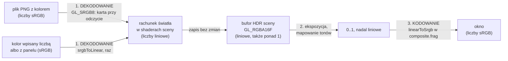

# Moduł gfx: przestrzeń kolorów, sRGB i korekcja gamma

Kamień milowy: M7, część pierwsza (bufor HDR i gamma). Temat wykładu: 10 (Rendering pozaekranowy), a pośrednio 5 (Tekstury) i 6 (Światło), bo zmienia się znaczenie liczb w teksturach i w kolorach świateł.
Kod: [`src/gfx/ColorSpace.hpp`](../../../src/gfx/ColorSpace.hpp), [`src/gfx/ColorSpace.cpp`](../../../src/gfx/ColorSpace.cpp), [`assets/shaders/common/color.glsl`](../../../assets/shaders/common/color.glsl), testy w [`tests/ColorSpaceTests.cpp`](../../../tests/ColorSpaceTests.cpp).

Część modułu `gfx`. Wstęp do całego modułu jest w [`README.md`](README.md). Ten dokument odpowiada na jedno pytanie: **co znaczą liczby koloru w każdym miejscu programu i gdzie zmieniają znaczenie**. Tekstury jako obiekty OpenGL opisuje [`textures.md`](textures.md), bufor, do którego trafia scena, [`framebuffers.md`](framebuffers.md), a ostatni przebieg klatki (ekspozycja, mapowanie tonów, kodowanie) [`../renderer/post-process.md`](../renderer/post-process.md). Decyzje zapisują notatki [`../../decisions/gamma-linear-pipeline.md`](../../decisions/gamma-linear-pipeline.md) i [`../../decisions/srgb-encode-in-shader.md`](../../decisions/srgb-encode-in-shader.md). Wcześniejsza notatka [`../../decisions/no-gamma-until-m7.md`](../../decisions/no-gamma-until-m7.md) jest od dziś zastąpiona: ten dokument opisuje to, co ona odkładała.

**Stan na dziś:** kod jest w całości napisany i używany przez grę. Dwie funkcje przeliczające mają dziewięć przypadków testowych (`tests/ColorSpaceTests.cpp`), a przeliczanie kolorów świateł jeden nowy przypadek w `tests/LightingTests.cpp`. Zgłoszone dla Windowsa (2026-10-05, nie uruchamiałem tego sam): bramka `make check` przechodzi (formatowanie, testy w Debug i Release, clang-tidy), zero ostrzeżeń, 269 przypadków testowych i 102103 asercje w obu konfiguracjach, a po drugiej części M7 276 i 102139, po trzeciej 294 i 102412, po czwartej (cienie księżyca) 310 i 103751 (w testach tego modułu bez zmian). Zgłoszone porównanie obrazu ze starym potokiem jest w sekcji 5.9. **Na macOS ten kod nie był ani budowany, ani uruchamiany.**

Uwaga o komentarzach w kodzie: `// See docs/...` na górze `ColorSpace.hpp`, `ColorSpace.cpp`, `common/color.glsl` i `ColorSpaceTests.cpp` wskazuje od czwartej części M7 ten dokument, `docs/modules/gfx/color-space.md`. Do trzeciej części wskazywał `docs/modules/renderer/post-process.md`, który ma krótką sekcję odsyłającą tutaj. Teoria gammy jest w tym pliku, bo dotyczy tekstur i kolorów w całym programie, a nie tylko ostatniego przebiegu.

## 1. Po co to jest

Do M6 gra traktowała każdą liczbę koloru tak samo: bajt z pliku PNG, kolor światła z panelu i wynik rachunku w shaderze szły prosto na ekran. To działa, dopóki program tylko **przepisuje** kolory. Od M4 program na kolorach **liczy** (mnoży teksturę przez światło, sumuje światła), a te działania są poprawne tylko na liczbach proporcjonalnych do ilości światła. Liczby w pliku PNG takie nie są.

M7 rozdziela więc dwa znaczenia liczby koloru i pilnuje, żeby w każdym miejscu było wiadomo, które obowiązuje:

| Nazwa | Co znaczy liczba | Gdzie występuje |
|---|---|---|
| **sRGB** (zakodowana) | pozycja na skali jasności dopasowanej do oka i do ekranu | pliki PNG z kolorem, kolory wybrane w panelu ImGui, kolory wpisane w kodzie "na oko", to, co dostaje ekran |
| **liniowa** | ilość światła: dwa razy większa liczba to dwa razy więcej światła | wszystko, na czym liczą shadery, zawartość bufora HDR sceny |

Moduł daje do tego trzy rzeczy:

| Co | Gdzie | Do czego |
|---|---|---|
| typ `gfx::ColorSpace { Srgb, Linear }` | `ColorSpace.hpp` | obowiązkowy argument `gfx::Texture2D`, `gfx::Cubemap` i `assets::AssetCache::texture`: wołający mówi, czym są bajty obrazu |
| funkcje `gfx::srgbToLinear` i `gfx::linearToSrgb` | `ColorSpace.cpp` | przeliczanie kolorów wpisanych liczbami po stronie C++ |
| te same dwie funkcje w GLSL | `common/color.glsl` | kodowanie klatki w ostatnim przebiegu, kolory wpisane w shaderach, widoki diagnostyczne |

## 2. Teoria

### 2.1 Czym jest sRGB

Bajt ma 256 wartości. Gdyby zapisywać nimi ilość światła wprost, połowa wartości (od 128 do 255) opisywałaby tylko górną połowę jasności, a cała ciemna część obrazu dostałaby za mało stopni. Oko działa odwrotnie: różnice między ciemnymi tonami widzi dobrze, a między bardzo jasnymi słabo. Dlatego obrazy zapisuje się krzywą, która rozciąga ciemne tony na więcej stopni, a jasne ściska.

**sRGB** (norma IEC 61966-2-1) jest konkretną taką krzywą i jednocześnie umową z ekranem: ekran oczekuje liczb sRGB i sam zamienia je na światło krzywą odwrotną. Program do malowania, aparat, Blender przy zapisie PNG i selektor koloru w ImGui posługują się liczbami sRGB.

Słowo **gamma** pochodzi od przybliżenia tej krzywej potęgą: światło jest w przybliżeniu równe liczbie sRGB podniesionej do potęgi 2,2, a wykładnik nazywa się gammą. **Korekcja gamma** to zamiana wyniku rachunku (liniowego) z powrotem na liczby sRGB, zanim trafi na ekran. sRGB nie jest jednak czystą potęgą (sekcja 2.9).

Najważniejsza liczba do zapamiętania: szary "w połowie" w pliku, bajt 128, niesie tylko około **jednej piątej** światła bieli (0,216), a nie połowę. Tę różnicę sprawdza test (sekcja 5.8).

### 2.2 Dekodowanie: z sRGB na liniowe

Funkcja ma dwa kawałki. `s` to liczba sRGB od 0 do 1, wynik to wartość liniowa od 0 do 1:

```text
liniowe = s / 12.92                          gdy s <= 0.04045
liniowe = ((s + 0.055) / 1.055) ^ 2.4        gdy s >  0.04045
```

| Liczba | Nazwa w `ColorSpace.cpp` | Rola |
|---|---|---|
| 12,92 | `LINEAR_SEGMENT_SLOPE` | nachylenie odcinka prostego przy czerni |
| 0,04045 | `ENCODED_THRESHOLD` | do tej wartości sRGB obowiązuje odcinek prosty |
| 0,055 | `CURVE_OFFSET` | przesunięcie krzywej potęgowej |
| 2,4 | `CURVE_EXPONENT` | wykładnik krzywej potęgowej |

**Po co odcinek prosty.** Czysta krzywa potęgowa w stronę kodowania (potęga mniejsza od 1) jest przy zerze nieskończenie stroma. Odwracanie jej tam daje duże błędy z małych zaokrągleń. Norma zastępuje więc sam początek krzywej prostą przez zero, a resztę krzywej przesuwa i skaluje (stąd 0,055 i 1,055) tak, żeby oba kawałki spotkały się bez skoku. Wykładnik 2,4 razem z przesunięciem daje kształt bliski czystej potędze 2,2.

**Przeliczenie krok po kroku dla `s = 0.5`** (część potęgowa):

1. `0.5 + 0.055 = 0.555`
2. `0.555 / 1.055 = 0.52607`
3. `0.52607 ^ 2.4 = 0.21404`

**Dla `s = 0.02`** (część prosta): `0.02 / 12.92 = 0.00155`.

**W punkcie styku** `s = 0.04045` oba wzory dają to samo: prosta `0.04045 / 12.92 = 0.0031308`, krzywa `((0.04045 + 0.055) / 1.055) ^ 2.4 = 0.0031308`. Dlatego nie ma znaczenia, którym wzorem policzy się sam punkt styku: C++ bierze tam prostą (warunek `<=`), GLSL krzywą (funkcja `step`), a wynik jest ten sam.

### 2.3 Kodowanie: z liniowego na sRGB

Funkcja odwrotna, te same liczby w drugą stronę. `l` to wartość liniowa od 0 do 1:

```text
sRGB = l * 12.92                             gdy l <= 0.0031308
sRGB = 1.055 * l ^ (1 / 2.4) - 0.055         gdy l >  0.0031308
```

Próg `0.0031308` (`LINEAR_THRESHOLD`) to ten sam punkt styku co wyżej, tylko zapisany jako wartość liniowa: `0.04045 / 12.92`.

**Przeliczenie krok po kroku dla `l = 0.5`:**

1. `1 / 2.4 = 0.41667`
2. `0.5 ^ 0.41667 = 0.74916`
3. `1.055 * 0.74916 = 0.79036`
4. `0.79036 - 0.055 = 0.73536`

Połowa światła bieli jest więc na ekranie liczbą 0,735, czyli bajtem 188, a nie 128. **Dla `l = 0.001`** (część prosta): `0.001 * 12.92 = 0.01292`.

Obie funkcje w kodzie najpierw **przycinają** argument do zakresu od 0 do 1 (`std::clamp` w C++, `clamp` w GLSL). Krzywa sRGB jest zdefiniowana tylko tam: ekran nie pokaże nic jaśniejszego niż biel. Wartości ponad 1 z bufora HDR sprowadza do tego zakresu mapowanie tonów, które stoi **przed** kodowaniem ([`../renderer/post-process.md`](../renderer/post-process.md)).

### 2.4 Liczby do zapamiętania

| sRGB (zakodowana) | bajt | liniowa | Uwaga |
|---|---|---|---|
| 0 | 0 | 0 | czerń jest ta sama w obu przestrzeniach |
| 0,02 | 5 | 0,00155 | odcinek prosty |
| 0,04045 | 10 | 0,00313 | punkt styku |
| 0,1 | 26 | 0,0100 | dziesiąta część skali to setna część światła |
| 0,2 | 51 | 0,0331 | |
| 0,5 | 128 | 0,214 | "połowa" w pliku to jedna piąta światła |
| 0,735 | 188 | 0,5 | połowa światła |
| 0,8 | 204 | 0,604 | |
| 0,9 | 230 | 0,787 | |
| 1 | 255 | 1 | biel jest ta sama w obu przestrzeniach |

Dwie skrajne wartości się nie zmieniają. To dlatego biała tekstura zastępcza i białe `Kd` materiałów nie wymagały żadnej zmiany liczb (sekcja 2.8).

### 2.5 Co znaczy "liniowy" i dlaczego rachunek światła tego wymaga

Wartość liniowa jest **proporcjonalna do ilości światła**. Dwie latarki świecące w to samo miejsce dają dwa razy więcej światła, czyli dwa razy większą liczbę liniową. Powierzchnia odbijająca połowę światła daje połowę liczby. Dodawanie i mnożenie w shaderach (`surface * diffuse + specular`, suma po światłach w `computeLighting`) opisują właśnie to.

Na liczbach sRGB te same działania dają co innego. Przykład z dwiema jednakowymi latarkami, z których każda sama oświetla ścianę do jasności liniowej 0,2:

| | Rachunek | Na ekranie (sRGB) |
|---|---|---|
| jedna latarka | 0,2 liniowo | 0,485 |
| dwie latarki, policzone liniowo | `0.2 + 0.2 = 0.4` | 0,665 |
| dwie latarki, policzone na liczbach sRGB | `0.485 + 0.485 = 0.97` | 0,97 |

Rachunek na liczbach sRGB daje prawie biel tam, gdzie powinno być wyraźnie jaśniej, ale daleko od bieli. Tak wyglądał obraz do M6: plamy światła przepalały się szybko, a półcienie były za ciemne. Skutki tamtego stanu wylicza zastąpiona notatka [`../../decisions/no-gamma-until-m7.md`](../../decisions/no-gamma-until-m7.md), sekcja 4.

### 2.6 Trzy etapy potoku

Poprawny potok ma trzy etapy i każdy kolor przechodzi je **dokładnie raz**:



| Etap | Co się dzieje | Kto to robi |
|---|---|---|
| 1. dekodowanie przy odczycie | bajt sRGB z tekstury koloru staje się wartością liniową | karta graficzna, bo tekstura ma format wewnętrzny `GL_SRGB8` albo `GL_SRGB8_ALPHA8` (`gfx::Texture2D`, `gfx::Cubemap`). Kolory wpisane liczbami dekoduje `srgbToLinear` w C++ albo w shaderze |
| 2. rachunek w przestrzeni liniowej | mnożenie przez światło, sumowanie świateł, świecenie własne kryształów, potem, w przebiegu składającym, mgła (od trzeciej części M7), dodanie poświaty bloomu (od drugiej), ekspozycja, mapowanie tonów i winieta (od trzeciej: mnoży wartość po krzywej, nadal liniową, tuż przed kodowaniem) | shadery sceny i `post/composite.frag`. Wynik sceny leży w buforze zmiennoprzecinkowym, więc nie jest po drodze ani obcinany, ani zaokrąglany do bajta |
| 3. kodowanie na końcu | wartość liniowa od 0 do 1 staje się liczbą sRGB dla ekranu | `linearToSrgb` w ostatniej linii `post/composite.frag`. Jedno miejsce w całej klatce |

Dlaczego etap 3 jest w shaderze, a nie w przełączniku `GL_FRAMEBUFFER_SRGB`, wyjaśnia notatka [`../../decisions/srgb-encode-in-shader.md`](../../decisions/srgb-encode-in-shader.md). W skrócie: panele ImGui są rysowane po scenie do tego samego okna i mają zostać przy swoich kolorach.

### 2.7 Które tekstury są sRGB, a które liniowe

Reguła: **sRGB jest obraz, który ktoś oglądał na ekranie i dobierał na oko. Liniowe są dane, które tylko wyglądają jak obraz.**

| Tekstura | `ColorSpace` | Format wewnętrzny | Kto wybiera | Dlaczego |
|---|---|---|---|---|
| `wall_stone.png`, `gate_wood.png`, `crystal.png` (`map_Kd` materiałów) | `Srgb` | `GL_SRGB8` | `AssetCache::model` | kolor powierzchni, namalowany dla ekranu |
| `ground.png` | `Srgb` | `GL_SRGB8` | `TerrainRenderer` | kolor ziemi |
| sześć ścian nieba `assets/skybox/*.png` | `Srgb` | `GL_SRGB8` | `loadSkyCubemap` w `Skybox.cpp` | niebo jest obrazem dobranym na oko (komentarz w `tools/blender/make_skybox.py`) |
| biała tekstura zastępcza 1 x 1 | `Srgb` | `GL_SRGB8` | konstruktor `AssetCache` | zastępuje obrazy koloru, więc ma ich rodzaj. Biel to 1 w obu przestrzeniach |
| `wall_stone_normal.png`, `gate_wood_normal.png`, `crystal_normal.png`, `ground_normal.png` | `Linear` | `GL_RGB8` | `AssetCache::model`, `TerrainRenderer` | bajty są **kierunkami**, nie kolorami |
| płaska mapa normalnych zastępcza 1 x 1 | `Linear` | `GL_RGB8` | konstruktor `AssetCache` | teksel `(128, 128, 255)` ma znaczyć kierunek `(0, 0, 1)` |
| `heightmap.png` | nie dotyczy | nie jest teksturą OpenGL | `loadHeightmap` w `NightMazeApp.cpp` | bajty są **wysokościami**. Obraz jest czytany na procesorze (`assets::loadImage`, potem `heightmapFromImage`) i nigdy nie trafia na kartę, więc nikt go nie dekoduje |
| tekstura koloru bufora sceny | nie dotyczy | `GL_RGBA16F` | `PostProcess::beginScene` | trzyma wynik rachunku, liniowy. Nie jest formatem sRGB, więc przy odczycie nic się nie dzieje |
| tekstury podglądów załączników i, od drugiej części M7, podglądów bloomu | nie dotyczy | `GL_RGBA8` | `fitTarget` w `PostProcess.cpp` (w pierwszej części M7: `fitPreview`) | `preview.frag` zapisuje do nich liczby już zakodowane, a ImGui pokazuje je bez przeliczenia |

**Co by się stało z mapą normalnych jako sRGB.** Mapa zapisuje składową kierunku od -1 do 1 jako bajt od 0 do 255, a shader odwraca to wzorem `bajt / 255 * 2 - 1` ([`normal-mapping.md`](normal-mapping.md)). Bajt 128 ma znaczyć 0, czyli "brak wychylenia". Zdekodowany jako sRGB dałby 0,216 zamiast 0,502, a po rozkodowaniu na kierunek `0.216 * 2 - 1 = -0.568`. Każda płaska powierzchnia dostałaby normalną mocno wychyloną w ujemne X i Y, a oświetlenie byłoby błędne wszędzie i w ten sam sposób. Ten sam argument dotyczy mapy wysokości: bajt 128 ma być połową wysokości, a nie jedną piątą.

**Klasa nie zgaduje.** `Texture2D` nie patrzy na nazwę pliku (na przyrostek `_normal`). Argument `colorSpace` jest obowiązkowy i nie ma wartości domyślnej, więc każde miejsce, które tworzy teksturę, musi napisać wprost, czym są jej bajty, a zapomnienie o tym nie skompiluje się. `AssetCache::texture` dodatkowo pilnuje, żeby jeden plik nie został poproszony raz jako sRGB i raz jako liniowy: drugie wywołanie wypisuje błąd `Texture is asked for as sRGB and as linear` i zwraca teksturę tak, jak została wczytana za pierwszym razem ([`../assets/asset-cache.md`](../assets/asset-cache.md)).

### 2.8 Kolory wpisane liczbami: gdzie każdy jest przeliczany

Nie każdy kolor pochodzi z tekstury. Część jest wpisana w kodzie albo ustawiana w panelu. Przyjęta reguła: **kolor wpisany liczbami jest liczbą sRGB**, bo ktoś go dobierał, patrząc na ekran, a selektor koloru ImGui pokazuje liczby sRGB. Każdy taki kolor jest przeliczany na liniowy **raz**, w jednym nazwanym miejscu, tuż przed wejściem do rachunku:

| Kolor | Gdzie jest zapisany (sRGB) | Gdzie jest przeliczany | Plik |
|---|---|---|---|
| światło otoczenia `ambient` | `game::LightingSettings` | `buildLightSet`: `gfx::srgbToLinear(settings.ambient)` | [`src/game/Lighting.cpp`](../../../src/game/Lighting.cpp) |
| kolor księżyca `moonColor` | `game::LightingSettings` | `buildLightSet` | jak wyżej |
| kolor latarki `flashlightColor` | `game::LightingSettings` | `buildLightSet` | jak wyżej |
| kolor świateł kryształów `pointColor` | `game::LightingSettings` | `buildLightSet`, raz dla wszystkich świateł punktowych (zmienna `pointColor` przed pętlą) | jak wyżej |
| świecenie własne kryształów (`uEmissive`) | ten sam `pointColor` | `NightMazeApp::crystalEmissive()`: `crystalGlow(gfx::srgbToLinear(m_lighting.pointColor), ...)` | [`src/game/NightMazeApp.cpp`](../../../src/game/NightMazeApp.cpp) |
| kolor tła `m_clearColor` | pole `NightMazeApp`, edytowane w panelu Renderer | `onRender`, tuż przed `glClearColor` | jak wyżej |
| kolory linii brył kolizji (pięć stałych `..._COLLIDER_COLOR` i `EXIT_ZONE_COLOR`) | stałe w `NightMazeApp.cpp` | `ColliderLines::draw` i `ColliderLines::drawSpheres`, przy ustawianiu `uColor` | [`src/game/ColliderLines.cpp`](../../../src/game/ColliderLines.cpp) |
| kolor mgły `FogSettings::color` (trzecia część M7) | `game::FogSettings` w `game::PostProcessSettings`, edytowany próbnikiem `Fog colour` w panelu Framebuffers | `PostProcess::composite`: `shader.setVec3(COMPOSITE_FOG_COLOR_UNIFORM, gfx::srgbToLinear(fog.color))`, raz na klatkę. Shader dostaje w `uFogColor` wartość już liniową | [`src/game/PostProcess.cpp`](../../../src/game/PostProcess.cpp) |
| gradient trawy `ROOT_COLOR`, `TIP_COLOR` | stałe w shaderze | `srgbToLinear(mix(ROOT_COLOR, TIP_COLOR, gBladeUv.y))` | [`assets/shaders/grass.frag`](../../../assets/shaders/grass.frag) |
| widoki diagnostyczne: normalna, UV, kierunek nieba | liczone w shaderze jako dane | `srgbToLinear(...)` przy zapisie do `fragColor` | [`textured.frag`](../../../assets/shaders/textured.frag), [`grass.frag`](../../../assets/shaders/grass.frag), [`skybox.frag`](../../../assets/shaders/skybox.frag) |

Uwagi do tabeli:

- **Kolor mgły w liczbach.** Wartość startowa to sRGB (0,14, 0,18, 0,26). `srgbToLinear` robi z niej wartość liniową około (0,017, 0,027, 0,055) i tę przebieg składający miesza z liniowym obrazem sceny (`mix`), przed dodaniem poświaty, ekspozycją i mapowaniem tonów. Po krzywej ACES i kodowaniu sama mgła wychodzi na ekran jako około (0,09, 0,14, 0,25): ciemniejsza niż próbka w próbniku, bo krzywa dociska ciemne tony. Mówi to komentarz pola w `Fog.hpp` i podpowiedź próbnika. Trzecia trójka jest policzona, nie zmierzona na ekranie ([`../renderer/post-process.md`](../renderer/post-process.md), sekcja 2.21).
- **`pointColor` ma dwa miejsca przeliczenia**, bo ma dwóch odbiorców: światło wokół kryształu (`buildLightSet`) i świecenie samej siatki (`crystalEmissive`). Oba wołają tę samą funkcję na tej samej liczbie, więc kryształ świeci w kolorze światła, które rzuca. Kto zmieni jedno, musi zmienić drugie.
- **Gradient trawy jest mieszany na liczbach sRGB, a dopiero wynik jest przeliczany.** Tak dobrano go na oko, zanim istniała gamma, i taka kolejność zachowuje jego wygląd. Odwrotna kolejność (przeliczyć oba końce, mieszać liniowo) dałaby jaśniejszy środek źdźbła. Komentarz w `grass.frag` porównuje to od czwartej części M7 ostrożniej niż wcześniej: wynik jest "like one texel of an sRGB texture", czyli jak **jeden teksel** tekstury sRGB. Filtrowana tekstura sRGB miesza teksele już po przeliczeniu, więc jej tony pośrednie wyszłyby trochę inne niż w tym gradiencie.
- **Widoki diagnostyczne pokazują dane, a nie światło.** Normalna `(0, 1, 0)` ma dotrzeć na ekran jako kolor `(0.5, 1.0, 0.5)`, dokładnie tymi liczbami. Ostatni przebieg zakoduje klatkę, więc shader stosuje przeliczenie odwrotne i oba się znoszą. Dla tych widoków `onRender` wyłącza też ekspozycję i mapowanie tonów ([`../renderer/post-process.md`](../renderer/post-process.md)).

Czego się **nie** przelicza i dlaczego:

| Co | Dlaczego bez przeliczenia |
|---|---|
| intensywności świateł (`moonIntensity`, `flashlightIntensity`, `pointIntensity`), `CRYSTAL_GLOW_STRENGTH`, `uSpecularStrength`, `uBrightness` nieba, ekspozycja | to mnożniki, nie kolory. Mnożą wartość już liniową |
| `Kd` materiału (uniform `uTint`) | wszystkie pięć materiałów gry ma `Kd 1.0 1.0 1.0`, a biel to 1 w obu przestrzeniach. `uTint` mnoży więc liniowy kolor tekstury bez przeliczenia. **To znane ograniczenie**: model z kolorowym `Kd` dostałby odcień ciemniejszy, niż widać w Blenderze (komentarz przy `drawModel` w `ModelDraw.hpp`) |
| kolory motywu ImGui i HUD | ImGui rysuje po ostatnim przebiegu, prosto do okna. Jego kolory nigdy nie wchodzą do bufora liniowego, więc trafiają na ekran takie, jakie zapisano w motywie |

### 2.9 Dokładna krzywa a potęga 2,2

W podręcznikach korekcja gamma to często jedna linia: `pow(kolor, 1.0 / 2.2)` na końcu shadera i `pow(kolor, 2.2)` przy odczycie. To przybliżenie normy: ten sam kształt, inne liczby w ciemnych tonach.

| sRGB | dokładna funkcja | `pow(s, 2.2)` | różnica |
|---|---|---|---|
| 0,2 | 0,0331 | 0,0290 | około jednej ósmej wartości |
| 0,5 | 0,2140 | 0,2176 | niecałe 2 procent |

Gra używa wszędzie funkcji dokładnej z jednego powodu: **karta graficzna dekoduje tekstury `GL_SRGB8` właśnie nią** (komentarz w `ColorSpace.hpp` powołuje się na specyfikację OpenGL 4.1, sekcja 3.8.17). Kolor wpisany liczbą i ten sam kolor odczytany z tekstury dają wtedy tę samą wartość liniową, a kodowanie na końcu jest dokładną odwrotnością dekodowania: bajt tekstury narysowany bez oświetlenia wraca na ekran jako ten sam bajt. Z potęgą 2,2 po jednej stronie i dokładną krzywą po drugiej ciemne tony przesunęłyby się o kilka poziomów. Różnicę przy 0,2 sprawdza test (sekcja 5.8).

### 2.10 Filtrowanie i mipmapy

Format sRGB zmienia jeszcze jedną rzecz, mniej oczywistą: **na czym działa filtr tekstury**. Filtr dwuliniowy uśrednia sąsiednie teksele, a mipmapy są uśrednieniem większych poziomów ([`textures.md`](textures.md), sekcje 2.3 i 2.4). Średnia z liczb sRGB i średnia z wartości liniowych to dwie różne liczby.

Przykład skrajny: teksel czarny obok białego, próbka dokładnie w połowie między nimi.

| Potok | Co jest uśredniane | Wynik na ekranie |
|---|---|---|
| stary (M6): `GL_RGB8`, bez gammy | liczby z pliku: `(0 + 1) / 2 = 0.5` | 0,5, czyli bajt 128 |
| nowy: `GL_SRGB8`, dekodowanie przed filtrem | wartości liniowe: `(0 + 1) / 2 = 0.5`, potem kodowanie | 0,735, czyli bajt 188 |

Nowy wynik jest fizycznie poprawny: obszar w połowie czarny i w połowie biały odbija połowę światła. Stary był za ciemny. Skutek uboczny jest taki, że obraz nowego potoku **nie może** być identyczny ze starym tam, gdzie filtr miesza teksele o różnej jasności (sekcja 5.9).

Uczciwie o gwarancjach: specyfikacja OpenGL pozwala sterownikowi zdekodować sRGB także **po** filtrowaniu, choć zaleca dekodowanie każdego teksela przed nim, i nie przepisuje, jak `glGenerateMipmap` ma liczyć mniejsze poziomy tekstury sRGB. Komentarze w `Texture2D.hpp` i `Texture2D.cpp` opisują jedno i drugie jako fakt. Zgłoszony pomiar na Windowsie (różnice tylko na spoinach cegieł, sekcja 5.9) zgadza się z filtrowaniem na wartościach liniowych, ale to obserwacja na jednej karcie, a nie gwarancja.

### 2.11 Alfa

Kanał alfa nigdy nie jest kodowany krzywą sRGB: to stopień krycia, a nie jasność. `GL_SRGB8_ALPHA8` dekoduje tylko czerwony, zielony i niebieski, a alfa dociera do shadera taka, jaka jest w pliku. Funkcje `srgbToLinear` i `linearToSrgb` w tym module przyjmują trzy kanały (`glm::vec3`, `vec3`), więc alfy nie dotykają. Gra rysuje dziś wszystko jako nieprzezroczyste: shadery zapisują alfę równą 1.

## 3. Jak to działa w OpenGL

Moduł `ColorSpace` sam nie woła ani jednej funkcji OpenGL (dlatego ma testy). Gamma w OpenGL to trzy miejsca, każde opisane w dokumencie swojej klasy:

| Miejsce | Wywołanie albo stan | Co robi | Dokument |
|---|---|---|---|
| tworzenie tekstury koloru | `glTexImage2D(..., GL_SRGB8, ...)` albo `GL_SRGB8_ALPHA8` zamiast `GL_RGB8`, `GL_RGBA8` | bajty na karcie są te same. Zmienia się to, co karta robi przy każdym odczycie w shaderze: zwraca wartość zdekodowaną do liniowej | [`textures.md`](textures.md), [`cubemap.md`](cubemap.md) |
| bufor sceny | tekstura `GL_RGBA16F` jako załącznik koloru | przyjmuje wartości liniowe bez przycinania i bez zaokrąglania do bajta. Nie jest formatem sRGB, więc przy zapisie i odczycie nic nie jest przeliczane | [`framebuffers.md`](framebuffers.md) |
| zapis do okna | `glDisable(GL_FRAMEBUFFER_SRGB)` w `PostProcess::composite` | potwierdza stan domyślny: OpenGL **nie** koduje przy zapisie. Koduje shader | [`../renderer/post-process.md`](../renderer/post-process.md) |

Trzy rzeczy warte zapamiętania o samym OpenGL:

- **Dane wejściowe się nie zmieniają.** Do `glTexImage2D` idą te same bajty i te same `format` i `type` (`GL_RGB` albo `GL_RGBA`, `GL_UNSIGNED_BYTE`). Różni się tylko trzeci argument, format wewnętrzny.
- **`GL_SRGB8` i `GL_SRGB8_ALPHA8` są w rdzeniu OpenGL od wersji 2.1**, więc w 4.1 Core nie wymagają rozszerzenia. `GL_RGBA16F` jest w rdzeniu od 3.0.
- **`GL_FRAMEBUFFER_SRGB` działa tylko na załącznikach w formacie sRGB.** Włączony, każe OpenGL kodować przy zapisie do takiego załącznika. Bufor sceny (`GL_RGBA16F`) sRGB nie jest, więc tam przełącznik nic by nie zmienił. Dla okna wszystko zależy od tego, czy system dał mu framebuffer sRGB. Gra o taki nie prosi (w źródłach nie ma `GLFW_SRGB_CAPABLE`) i trzyma przełącznik wyłączony, więc wynik nie zależy od tego, co dał system.

Jest jeszcze czwarte miejsce, poza rdzeniem: rozszerzenie `GL_EXT_texture_sRGB_decode`. Pozwala wyłączyć dekodowanie dla jednego obiektu samplera. Używa go tylko panel Assets, żeby podgląd tekstury sRGB wyglądał jak plik (klasa `debug::RawTextureSampler`, opisana w [`../debug-ui.md`](../debug-ui.md)). Gdzie sterownik rozszerzenia nie ma, podglądy w panelu są ciemniejsze niż pliki, a gra wygląda tak samo.

## 4. Shadery

Plik [`assets/shaders/common/color.glsl`](../../../assets/shaders/common/color.glsl) nie jest samodzielnym shaderem: nie ma linii `#version`, a loader wkleja jego tekst w miejsce linii `#include` ([`shader-includes.md`](shader-includes.md)). Do pierwszej części M7 zawierał pięć stałych i dwie funkcje, opisane niżej. Druga część M7 dopisała na końcu szóstą stałą i trzecią funkcję, które nie dotyczą kodowania: `REC709_LUMINANCE_WEIGHTS` i `luminance`, czyli jasność liniowego koloru jedną liczbą (sekcja 4.1).

```glsl
const float SRGB_LINEAR_SEGMENT_SLOPE = 12.92; // slope of the straight line
const float SRGB_ENCODED_THRESHOLD = 0.04045;  // encoded values up to here are on the line
const float SRGB_LINEAR_THRESHOLD = 0.0031308; // the same point as a linear value
const float SRGB_CURVE_OFFSET = 0.055;
const float SRGB_CURVE_EXPONENT = 2.4;
```

Te same pięć liczb co w `ColorSpace.cpp`, z przedrostkiem `SRGB_`, bo w GLSL nie ma przestrzeni nazw, a plik jest wklejany do cudzych shaderów. Liczby są zapisane dwa razy (raz w C++, raz w GLSL): shader nie może dołączyć nagłówka C++. Zgodności nie pilnuje żaden test, tylko wspólne nazwy i komentarz.

```glsl
vec3 srgbToLinear(vec3 encoded) {
    vec3 value = clamp(encoded, 0.0, 1.0);
    vec3 line = value / SRGB_LINEAR_SEGMENT_SLOPE;
    vec3 curve = pow((value + SRGB_CURVE_OFFSET) / (1.0 + SRGB_CURVE_OFFSET),
                     vec3(SRGB_CURVE_EXPONENT));
    // step(edge, x) is 0 where x < edge and 1 elsewhere, per channel: it picks the line
    // for the dark values and the curve for the rest without an if per channel.
    return mix(line, curve, step(SRGB_ENCODED_THRESHOLD, value));
}
```

| Linia | Znaczenie |
|---|---|
| `clamp(encoded, 0.0, 1.0)` | przycięcie do zakresu, w którym krzywa jest zdefiniowana. `clamp` z wektorem działa na każdy kanał osobno |
| `vec3 line = value / SRGB_LINEAR_SEGMENT_SLOPE;` | wynik odcinka prostego, policzony dla wszystkich trzech kanałów, także tych, które go nie użyją |
| `vec3 curve = pow(..., vec3(SRGB_CURVE_EXPONENT));` | wynik krzywej potęgowej, też dla wszystkich kanałów. `pow` z dwoma wektorami podnosi kanał do potęgi z tego samego kanału drugiego wektora, stąd `vec3(2.4)` |
| `step(SRGB_ENCODED_THRESHOLD, value)` | wektor z zer i jedynek: 0 w kanale, gdzie `value` jest poniżej progu, 1 w pozostałych |
| `mix(line, curve, ...)` | `mix(a, b, t)` to `a * (1 - t) + b * t`. Przy `t` równym 0 albo 1 jest to po prostu wybór: `line` albo `curve`, w każdym kanale osobno |

**Dlaczego `step` i `mix`, a nie `if`.** Kolor ma trzy kanały i każdy może leżeć po innej stronie progu (ciemnoczerwony z jasnym niebieskim). `if` w GLSL bierze jeden warunek logiczny, więc trzeba by trzech. Para `step` i `mix` robi wybór dla trzech kanałów naraz. Koszt: oba wzory są liczone zawsze. Dla jednego wywołania na fragment to nie ma znaczenia.

```glsl
vec3 linearToSrgb(vec3 linear) {
    vec3 value = clamp(linear, 0.0, 1.0);
    vec3 line = value * SRGB_LINEAR_SEGMENT_SLOPE;
    vec3 curve = (1.0 + SRGB_CURVE_OFFSET) * pow(value, vec3(1.0 / SRGB_CURVE_EXPONENT)) -
                 SRGB_CURVE_OFFSET;
    return mix(line, curve, step(SRGB_LINEAR_THRESHOLD, value));
}
```

Ta sama budowa w drugą stronę: mnożenie zamiast dzielenia, potęga `1 / 2.4`, próg liniowy zamiast zakodowanego. `clamp` na początku jest tu istotny: wartość ponad 1, która przeszła przez tryb `None` mapowania tonów, jest przycinana do bieli.

Kto dołącza ten plik:

| Shader | Linia `#include` | Której funkcji używa | Do czego |
|---|---|---|---|
| [`post/composite.frag`](../../../assets/shaders/post/composite.frag) | `#include "../common/color.glsl"` | `linearToSrgb` | kodowanie całej klatki, ostatnia linia `main` |
| [`post/preview.frag`](../../../assets/shaders/post/preview.frag) | `#include "../common/color.glsl"` | `linearToSrgb` | podgląd załącznika koloru dla ImGui |
| [`textured.frag`](../../../assets/shaders/textured.frag) | `#include "common/color.glsl"` | `srgbToLinear` | widoki normalnych i UV |
| [`grass.frag`](../../../assets/shaders/grass.frag) | `#include "common/color.glsl"` | `srgbToLinear` | gradient źdźbła i dwa widoki diagnostyczne |
| [`skybox.frag`](../../../assets/shaders/skybox.frag) | `#include "common/color.glsl"` | `srgbToLinear` | widok kierunku |
| [`post/bright.frag`](../../../assets/shaders/post/bright.frag) (druga część M7) | `#include "../common/color.glsl"` | `luminance` | jasność piksela w przebiegu jasności bloomu |

Ścieżka w `#include` jest liczona względem pliku, który ją zawiera, dlatego shadery z katalogu `post/` piszą `../common/`. `lit.frag`, `gouraud.frag` i `color.frag` pliku nie dołączają: dostają wszystko już liniowe (teksturę zdekodowaną przez kartę, kolory świateł i `uColor` przeliczone w C++). `post/blur.frag` też nie: rozmycie tylko mnoży i dodaje wartości liniowe.

### 4.1 `luminance`: jasność koloru liniowego (druga część M7)

```glsl
const vec3 REC709_LUMINANCE_WEIGHTS = vec3(0.2126, 0.7152, 0.0722);

float luminance(vec3 linear) {
    return dot(linear, REC709_LUMINANCE_WEIGHTS);
}
```

Funkcja zamienia kolor na jedną liczbę: `0,2126 * R + 0,7152 * G + 0,0722 * B`. Wagi pochodzą z normy Rec. 709, która ma te same barwy podstawowe co sRGB, i sumują się do 1, więc biel (1, 1, 1) ma jasność 1. Zielony liczy się najbardziej, bo oko jest na niego najczulsze.

Funkcja stoi w tym pliku, bo dotyczy tej samej granicy co reszta: **wolno ją wołać tylko dla wartości liniowych**. Komentarz przy stałej mówi to wielkimi literami ("They are for LINEAR colours"), a parametr nazywa się `linear`. Jasność policzona z liczb zakodowanych w sRGB byłaby inną liczbą: szarość zakodowana jako 0,8 ma liniowo 0,604, a liniowe 0,8 to w sRGB 0,906. To dokładnie ten sam rodzaj błędu co mnożenie światła przez kolor nieliniowy (sekcja 2.5).

Używa jej `post/bright.frag`, żeby porównać piksel sceny z progiem bloomu. Wzór, przeliczone przykłady i powód, dla którego próg jest jasnością, a nie wartością kanału, są w [`../renderer/post-process.md`](../renderer/post-process.md), sekcje 2.12 i 4.8. Odpowiednika w C++ funkcja nie ma i żaden test jej nie sprawdza.

## 5. Kod w projekcie

### 5.1 Pliki

| Plik | Co zawiera |
|---|---|
| [`src/gfx/ColorSpace.hpp`](../../../src/gfx/ColorSpace.hpp) | typ `gfx::ColorSpace`, deklaracje czterech funkcji. Dołącza tylko `<glm/glm.hpp>` |
| [`src/gfx/ColorSpace.cpp`](../../../src/gfx/ColorSpace.cpp) | pięć stałych normy i implementacja funkcji |
| [`assets/shaders/common/color.glsl`](../../../assets/shaders/common/color.glsl) | te same dwie funkcje w GLSL (sekcja 4) i, od drugiej części M7, `luminance` (sekcja 4.1) |
| [`tests/ColorSpaceTests.cpp`](../../../tests/ColorSpaceTests.cpp) | dziewięć przypadków testowych (sekcja 5.8) |
| [`src/gfx/Texture2D.hpp`](../../../src/gfx/Texture2D.hpp), [`src/gfx/Cubemap.hpp`](../../../src/gfx/Cubemap.hpp), [`src/assets/AssetCache.hpp`](../../../src/assets/AssetCache.hpp) | trzy miejsca, które przyjmują `ColorSpace` jako obowiązkowy argument |

Oba pliki `ColorSpace` są na liście źródeł biblioteki `engine` w [`CMakeLists.txt`](../../../CMakeLists.txt). Zależności: GLM (typ `glm::vec3`) i biblioteka standardowa (`<algorithm>` dla `std::clamp`, `<cmath>` dla `std::pow`). **Ani jednej funkcji OpenGL**, mimo że plik leży w `gfx/`: komentarz w nagłówku mówi to wprost (`Plain math without OpenGL, so tests can use it.`).

### 5.2 Nagłówek

```cpp
enum class ColorSpace {
    /// sRGB encoded: colour pictures (the albedo of walls, ground, gate and crystals, the
    /// sky). The graphics card decodes them to linear values when a shader reads them.
    Srgb,
    /// Already linear, or not a colour at all: normal maps hold directions. The numbers
    /// reach the shader exactly as they are stored.
    Linear,
};

float srgbToLinear(float encoded);
float linearToSrgb(float linear);
glm::vec3 srgbToLinear(const glm::vec3& encoded);
glm::vec3 linearToSrgb(const glm::vec3& linear);
```

(Komentarze nad funkcjami są tu pominięte. Ich treść jest omówiona w sekcjach 2.2, 2.3 i 2.9.)

| Element | Dlaczego tak |
|---|---|
| `enum class ColorSpace` z dwiema wartościami | nazwany typ zamiast `bool isSrgb`. Wywołanie `Texture2D(w, h, c, pixels, gfx::ColorSpace::Linear)` czyta się bez zaglądania do nagłówka, a `true` albo `false` w tym miejscu nic by nie mówiło |
| `Linear` znaczy też "to w ogóle nie jest kolor" | mapa normalnych nie jest "liniowym kolorem", jest danymi. Jedna wartość wystarcza, bo dla karty skutek jest ten sam: bajty docierają bez zmian |
| dwie wersje każdej funkcji: `float` i `glm::vec3` | wersja `float` jest tą, w której stoi wzór i którą łatwo testować liczbami. Wersja wektorowa woła ją trzy razy |
| `const glm::vec3&` | kolor to trzy liczby `float`. Referencja do stałej to konwencja projektu dla typów GLM |

### 5.3 Stałe

```cpp
constexpr float LINEAR_SEGMENT_SLOPE = 12.92F;
constexpr float ENCODED_THRESHOLD = 0.04045F;
constexpr float LINEAR_THRESHOLD = 0.0031308F;
constexpr float CURVE_OFFSET = 0.055F;
constexpr float CURVE_EXPONENT = 2.4F;
```

Stoją w anonimowej przestrzeni nazw pliku `.cpp`. Każda liczba normy ma nazwę, więc we wzorach niżej nie ma gołych liczb poza `1.0F`. Role liczb opisuje tabela w sekcji 2.2. `LINEAR_THRESHOLD` nie jest osobną liczbą normy, tylko `ENCODED_THRESHOLD / LINEAR_SEGMENT_SLOPE` zapisanym z góry.

### 5.4 `srgbToLinear` i `linearToSrgb` dla jednego kanału

```cpp
float srgbToLinear(float encoded) {
    const float value = std::clamp(encoded, 0.0F, 1.0F);
    if (value <= ENCODED_THRESHOLD) {
        return value / LINEAR_SEGMENT_SLOPE;
    }
    return std::pow((value + CURVE_OFFSET) / (1.0F + CURVE_OFFSET), CURVE_EXPONENT);
}
```

| Linia | Znaczenie |
|---|---|
| `std::clamp(encoded, 0.0F, 1.0F)` | wartość spoza zakresu jest najpierw przycinana. Bez tego `std::pow` z ujemną podstawą i niecałkowitym wykładnikiem zwróciłoby NaN |
| `if (value <= ENCODED_THRESHOLD)` | wybór kawałka. Tu zwykły `if`, bo kanał jest jeden |
| `value / LINEAR_SEGMENT_SLOPE` | odcinek prosty |
| `std::pow((value + CURVE_OFFSET) / (1.0F + CURVE_OFFSET), CURVE_EXPONENT)` | krzywa potęgowa, dokładnie wzór z sekcji 2.2 |

```cpp
float linearToSrgb(float linear) {
    const float value = std::clamp(linear, 0.0F, 1.0F);
    if (value <= LINEAR_THRESHOLD) {
        return value * LINEAR_SEGMENT_SLOPE;
    }
    return (1.0F + CURVE_OFFSET) * std::pow(value, 1.0F / CURVE_EXPONENT) - CURVE_OFFSET;
}
```

Lustrzane odbicie pierwszej funkcji: próg liniowy, mnożenie zamiast dzielenia, wykładnik `1 / 2.4`. Po stronie C++ `linearToSrgb` nie jest dziś wołane przez grę (kodowanie robi shader): służy testom, które sprawdzają, że jedna funkcja odwraca drugą.

### 5.5 Wersje dla trzech kanałów

```cpp
glm::vec3 srgbToLinear(const glm::vec3& encoded) {
    return {srgbToLinear(encoded.r), srgbToLinear(encoded.g), srgbToLinear(encoded.b)};
}
```

Każdy kanał osobno, tą samą funkcją. `encoded.r`, `.g`, `.b` to w GLM inne nazwy `.x`, `.y`, `.z`. `linearToSrgb` dla wektora wygląda tak samo. Krzywa sRGB działa na kanałach niezależnie: czerwony nie wpływa na zielony.

### 5.6 Gdzie w kodzie stoi argument `ColorSpace`

| Wywołanie | Wartość | Plik |
|---|---|---|
| `m_whiteTexture(..., WHITE_PIXEL.data(), gfx::ColorSpace::Srgb)` | `Srgb` | [`src/assets/AssetCache.cpp`](../../../src/assets/AssetCache.cpp), lista inicjalizacyjna konstruktora |
| `m_flatNormalTexture(..., FLAT_NORMAL_PIXEL.data(), gfx::ColorSpace::Linear)` | `Linear` | jak wyżej |
| `this->texture(part.texturePath, gfx::ColorSpace::Srgb)` | `Srgb` | `AssetCache::model`, obraz `map_Kd` |
| `this->texture(part.normalMapPath, gfx::ColorSpace::Linear)` | `Linear` | `AssetCache::model`, mapa normalnych |
| `textureOr(assets, GROUND_TEXTURE_FILE, gfx::ColorSpace::Srgb, assets.whiteTexture())` | `Srgb` | [`src/game/TerrainRenderer.cpp`](../../../src/game/TerrainRenderer.cpp) |
| `textureOr(assets, GROUND_NORMAL_MAP_FILE, gfx::ColorSpace::Linear, assets.flatNormalTexture())` | `Linear` | jak wyżej |
| `return {first.width, first.channels, pixels, gfx::ColorSpace::Srgb};` | `Srgb` | `loadSkyCubemap` w [`src/game/Skybox.cpp`](../../../src/game/Skybox.cpp) |

Wewnątrz klas argument zamienia się na format wewnętrzny. W `Texture2D.cpp` robi to funkcja `internalFormatFor(hasAlpha, colorSpace)`, w `Cubemap.cpp` trzy linie w konstruktorze. Wynik jest w obu ten sam:

| Kanały | `Srgb` | `Linear` |
|---|---|---|
| 3 | `GL_SRGB8` | `GL_RGB8` |
| 4 | `GL_SRGB8_ALPHA8` | `GL_RGBA8` |

`Texture2D` zapamiętuje argument w polu `m_colorSpace` i oddaje go przez `colorSpace()`. Korzystają z tego dwa miejsca: `AssetCache::texture` (wykrycie pliku poproszonego w dwóch przestrzeniach) i panel Assets (napis `sRGB` albo `linear` przy każdej teksturze i wybór sposobu podglądu). `Cubemap` argumentu nie zapamiętuje: po utworzeniu nikt o niego nie pyta.

### 5.7 Gdzie w kodzie stoi przeliczenie kolorów wpisanych

Pełna lista jest w tabeli w sekcji 2.8. Tu trzy miejsca po stronie C++ z kodem.

**Światła** ([`src/game/Lighting.cpp`](../../../src/game/Lighting.cpp), `buildLightSet`):

```cpp
    lights.ambient = gfx::srgbToLinear(settings.ambient);

    lights.directional = {
        .direction = moonDirection(settings),
        .color = gfx::srgbToLinear(settings.moonColor),
        .intensity = settings.moonIntensity,
    };
```

Kolor jest przeliczany, intensywność nie. Kierunek księżyca daje od czwartej części M7 funkcja `game::moonDirection` (wcześniej stało tu wprost `scene::directionFromAngles` z dwoma kątami): z tej samej funkcji bierze go mapa cieni, więc światło i cień nie mogą się rozjechać ([`../renderer/shadows.md`](../renderer/shadows.md), sekcja 2.2). `game::LightingSettings` trzyma liczby sRGB (takie, jakie pokazuje selektor koloru w panelu Lights), a `scene::LightSet`, który idzie do bufora uniformów, trzyma już wartości liniowe. Granica między dwoma znaczeniami jest więc granicą między dwiema strukturami. Resztę funkcji opisuje [`../game/flashlight.md`](../game/flashlight.md).

**Kolor tła** ([`src/game/NightMazeApp.cpp`](../../../src/game/NightMazeApp.cpp), `onRender`):

```cpp
    const glm::vec3 clearColor =
        gfx::srgbToLinear(glm::vec3{m_clearColor[0], m_clearColor[1], m_clearColor[2]});
    GL_CHECK(glClearColor(clearColor.r, clearColor.g, clearColor.b, 1.0F));
```

`glClear` wypełnia teraz teksturę koloru bufora sceny, która trzyma wartości liniowe, więc kolor tła musi być liniowy jak wszystko inne w tym buforze. Pole `m_clearColor` zostaje liczbą sRGB, bo edytuje je selektor koloru w panelu Renderer.

**Świecenie kryształów** (to samo `NightMazeApp.cpp`):

```cpp
glm::vec3 NightMazeApp::crystalEmissive() const {
    return crystalGlow(gfx::srgbToLinear(m_lighting.pointColor), m_round.animationSeconds);
}
```

`crystalGlow` dostaje kolor liniowy i zwraca liniowy, który może być jaśniejszy niż 1 (`CRYSTAL_GLOW_STRENGTH` wynosi dziś 4,0, w pierwszej części M7 wynosiło 2,5). Funkcja jest wołana z dwóch miejsc (`drawUnlitMaze` i `drawLitMaze`), więc przeliczenie stoi w jednej pomocniczej metodzie zamiast dwa razy. Liczby: `pointColor` sRGB `(0.2, 0.9, 0.8)` to liniowo `(0.033, 0.787, 0.604)`, a razy 4,0 daje `(0.132, 3.150, 2.415)` (razy 2,5 było to `(0.083, 1.969, 1.510)`): zielony i niebieski są wyraźnie ponad bielą. Reguły kryształów opisuje [`../game/gameplay.md`](../game/gameplay.md).

### 5.8 Testy

[`tests/ColorSpaceTests.cpp`](../../../tests/ColorSpaceTests.cpp), dziewięć przypadków, wszystkie bez OpenGL:

| Przypadek testowy | Co sprawdza | Czego uczy |
|---|---|---|
| `black and white are the same in both colour spaces` | 0 daje 0, 1 daje 1, w obie strony | końce skali się nie ruszają |
| `srgbToLinear gives the known values of the sRGB standard` | bajt 128 daje 0,21586, liczba 0,5 daje 0,21404, a `linearToSrgb(0.5)` daje 0,73536 | liczby z tabeli w sekcji 2.4 |
| `the darkest values lie on a straight line` | `srgbToLinear(0.02)` to `0.02 / 12.92`, `linearToSrgb(0.001)` to `0.001 * 12.92`, a tuż za progiem (0,04046) wynik rośnie o mniej niż 0,00001 | odcinek prosty i brak skoku na styku |
| `srgbToLinear is close to the power 2.2 but not equal to it` | dla 0,2 funkcja daje 0,03310, `pow(0.2, 2.2)` daje 0,02899, różnica jest między 0,004 a 0,005 | dlaczego nie wolno mieszać dwóch wzorów (sekcja 2.9) |
| `encoding undoes decoding for every byte of a picture` | dla wszystkich 256 bajtów `linearToSrgb(srgbToLinear(b / 255))` wraca bliżej niż ćwierć stopnia bajta | tekstura narysowana bez światła wraca na ekran jako te same bajty |
| `both conversions keep the order of brightness` | obie funkcje są ściśle rosnące na 256 wartościach | jaśniejszy zostaje jaśniejszym |
| `values outside 0 to 1 are clamped` | -0,5 daje 0, 2 daje 1, `linearToSrgb(4.0)` daje 1 | kolor jaśniejszy niż biel (HDR) nie pokaże się jaśniej niż biel |
| `a colour is converted channel by channel` | wektor `(0.2, 0.5, 0.8)` daje to samo co trzy wywołania skalarne, a droga tam i z powrotem wraca | wersja wektorowa to trzy wywołania skalarne |
| `a decoded dark colour is darker than its encoded numbers` | `srgbToLinear(0.1)` to 0,01002 | dlaczego światła trzeba było dobrać od nowa: wpisane 0,1 to setna część światła bieli |

[`tests/LightingTests.cpp`](../../../tests/LightingTests.cpp) dostał jeden nowy przypadek, `buildLightSet converts the colours from sRGB to linear and leaves the rest`: szary 0,5 w ustawieniach daje w światłach 0,21404, biel zostaje bielą, czerń czernią, a intensywność 0,5 zostaje 0,5. Cztery starsze przypadki porównują teraz kolory z `gfx::srgbToLinear(...)` zamiast z surową liczbą.

Czego testy **nie** obejmują: wersji GLSL obu funkcji (shadera nie da się uruchomić bez kontekstu), zgodności stałych między `ColorSpace.cpp` a `color.glsl`, i tego, co naprawdę robi karta z teksturą `GL_SRGB8`.

### 5.9 Porównanie ze starym potokiem: dlaczego nie co do piksela

Naturalny sprawdzian nowego potoku: tryb `Unlit` (sama tekstura, bez światła), mapowanie tonów `None`, ekspozycja 1. Tekstura jest dekodowana przy odczycie i kodowana na końcu, więc obraz powinien wyjść taki jak przed M7, gdy bajty szły prosto na ekran.

Zgłoszony wynik takiego porównania z poprzednim commitem (Windows, 2026-10-05, pomiar zrobiony **przed** ponownym dobraniem świateł i jasności nieba; nie powtarzałem go):

| Co porównano | Różnica | Skąd się bierze |
|---|---|---|
| ściany i podłoże w trybie `Unlit` | najwyżej 22 poziomy z 255, średnio 1,1. Tylko na spoinach cegieł | filtr tekstury miesza teraz wartości liniowe (sekcja 2.10): tam, gdzie jasna cegła sąsiaduje z ciemną spoiną, średnia liniowa jest jaśniejsza od średniej z bajtów |
| widoki normalnych i UV | najwyżej 1 poziom | dane przechodzą `srgbToLinear` w shaderze, zapis do 16-bitowej liczby zmiennoprzecinkowej, `linearToSrgb` i zaokrąglenie do bajta. Trzy zaokrąglenia zamiast jednego |
| podglądy tekstur w panelu Assets | identyczne co do piksela | `RawTextureSampler` wyłącza dekodowanie, więc ImGui czyta te same bajty co przed M7 |

Obraz **nie jest** więc identyczny i nie powinien być. W środku jednolitej powierzchni droga "dekoduj, koduj" oddaje ten sam bajt (test `encoding undoes decoding for every byte of a picture`). Różnica pojawia się tylko tam, gdzie między dekodowaniem a kodowaniem stoi uśrednianie różnych tekseli, a tam nowy wynik jest tym poprawnym. Skrajny przypadek z sekcji 2.10 (czerń obok bieli) dałby 60 poziomów różnicy. Zmierzone 22 poziomy to mniejszy kontrast cegły i spoiny.

Dwie rzeczy różnią się dziś dodatkowo **z założenia**, już po tamtym pomiarze: niebo (domyślna jasność 2,2 zamiast 1,0) i kryształy (`CRYSTAL_GLOW_STRENGTH` 2,5 zamiast 1,0, a od drugiej części M7 4,0), bo oba mają teraz przekraczać 1 w buforze HDR.

### 5.10 Nowe wartości domyślne

Wprowadzenie gammy zmienia jasność całej sceny, więc wartości startowe trzeba było dobrać od nowa. Zapowiadała to zastąpiona notatka o gammie. Liczby "liniowo" w tabeli są policzone dokładną funkcją i są tym, co naprawdę trafia do shaderów.

| Ustawienie | Przed M7 | Od M7 | Liniowo (to, co widzi shader) |
|---|---|---|---|
| `LightingSettings::ambient` | `(0.035, 0.045, 0.075)` | `(0.105, 0.135, 0.225)` | `(0.0108, 0.0163, 0.0414)` |
| `moonIntensity` (kolor `(0.55, 0.65, 1.0)` bez zmiany) | 0,3 | 0,12, a od czwartej części M7 0,2 (razem z cieniami księżyca) | kolor `(0.263, 0.380, 1.0)` razy 0,12, dziś razy 0,2 |
| `flashlightIntensity` (kolor `(1.0, 0.9, 0.72)` bez zmiany) | 1,6 | 1,3 | kolor `(1.0, 0.787, 0.477)` razy 1,3 |
| `pointIntensity` (kolor `(0.2, 0.9, 0.8)` bez zmiany) | 2,0 | 0,9 | kolor `(0.033, 0.787, 0.604)` razy 0,9 |
| `CRYSTAL_GLOW_STRENGTH` | 1,0 | 2,5 (od drugiej części M7: 4,0, razem z bloomem, [`../../decisions/crystal-glow-raised-for-bloom.md`](../../decisions/crystal-glow-raised-for-bloom.md)) | mnożnik koloru liniowego |
| `SkyboxSettings::brightness` (górna granica suwaka) | 1,0 (3) | 2,2 (6) | mnożnik koloru liniowego |
| kolor tła `m_clearColor` | `(0.01, 0.015, 0.04)` | `(0.022, 0.033, 0.088)` | `(0.0017, 0.0026, 0.0083)` |

Przed M7 liczby były używane w rachunku wprost, więc kolumny "przed" i "liniowo" nie są tą samą skalą i nie da się ich porównać jedna do jednej. Dobrze to widać na świetle otoczenia: liczba wpisana wzrosła trzy razy, a to, co dostaje shader, jest mniejsze niż dawniej, bo dawne 0,035 wchodziło do rachunku bez dekodowania. Komentarz przy `ambient` w `Lighting.hpp` opisywał tę zależność nieprecyzyjnie ("only about a hundredth of it is left"). Od czwartej części M7 mówi "only a tenth to a fifth of each number is left as linear light", co zgadza się z tabelą: z 0,105 zostaje 0,0108 (około dziesiątej części wpisanej liczby), z 0,135 zostaje 0,0163, a z 0,225 zostaje 0,0414 (prawie piąta część). Setną częścią jest pierwsza z tych liczb dopiero wobec bieli.

Księżyc dostał w czwartej części M7 więcej światła z konkretnego powodu, zapisanego w komentarzu przy `moonIntensity`: odkąd ściany rzucają cień, powierzchnia w świetle księżyca ma być wyraźnie jaśniejsza od powierzchni w cieniu ściany, która ma tylko światło otoczenia. Komentarz podaje "about five times on level ground", a policzone w wartościach liniowych wychodzi około 4,6 do 4,7 raza ([`../renderer/shadows.md`](../renderer/shadows.md)). Zgłoszone porównania obrazu sprzed tej części i po niej robiono z księżycem cofniętym do 0,12.

Wartości są dobrane razem z ekspozycją 1,0 i krzywą ACES ostatniego przebiegu (komentarz przy `LightingSettings`). Zmiana jednej z tych rzeczy zmienia wygląd wszystkich.

## 6. Panel ImGui

Moduł nie ma własnego panelu. Jego skutki widać w czterech:

| Panel | Kontrolka | Związek z przestrzenią kolorów |
|---|---|---|
| **Assets** | lista `Textures` | przy każdej teksturze stoi `sRGB` albo `linear`: wartość `Texture2D::colorSpace()`. Cztery obrazy koloru mają `sRGB`, cztery mapy normalnych `linear`. Podgląd tekstury sRGB jest czytany bez dekodowania, żeby wyglądał jak plik ([`../debug-ui.md`](../debug-ui.md)) |
| **Lights** | selektory koloru i suwaki intensywności | selektor pokazuje i zapisuje liczby sRGB. `buildLightSet` przelicza je co klatkę. Suwaki intensywności są mnożnikami wartości liniowej |
| **Renderer** | `Clear color`, `Sky brightness` | kolor tła jest liczbą sRGB, przeliczaną w `onRender`. Jasność nieba mnoży liniowy kolor z tekstury sześciennej |
| **Framebuffers** | `Tone mapping`, `Exposure`, podgląd `HDR colour` (w pierwszej części M7 podpisany `Colour (HDR, cut off at 1)`) | tryb `None (clamp)` z ekspozycją 1 pokazuje samo kodowanie, bez krzywej, pod warunkiem że trzy efekty przebiegu składającego są wyłączone: pole `Bloom` (od drugiej części M7) oraz pola `Fog` i `Vignette` w zakładce `Fog and vignette` (od trzeciej). Wszystkie trzy startują zaznaczone. Podgląd koloru to zawartość bufora liniowego po samym `linearToSrgb`, bez żadnego z tych efektów ([`../renderer/post-process.md`](../renderer/post-process.md)) |
| **Framebuffers**, zakładka `Fog and vignette` (trzecia część M7) | próbnik `Fog colour` | pokazuje i zapisuje liczby sRGB, jak selektory panelu Lights. `PostProcess::composite` przelicza je co klatkę (tabela w sekcji 2.8) |

Czego uczy obserwacja:

- **Kodowanie w izolacji.** W panelu Renderer wybierz `Unlit`, w Framebuffers `None (clamp)` i ekspozycję 1, odznacz `Bloom`, a w zakładce `Fog and vignette` odznacz `Fog` i `Vignette` (od trzeciej części M7 oba efekty startują włączone: bez tego kroku ściana 10 m dalej jest przy gruncie w 63 % kolorem mgły, a rogi ekranu mają 0,70 jasności). Ściana wygląda jak plik `wall_stone.png` otwarty w przeglądarce obrazów: dekodowanie i kodowanie się zniosły.
- **Selektor koloru mówi sRGB.** Ustaw kolor latarki na szary 0,5 i policz, ile światła daje: 0,214, nie połowę. Przesunięcie suwaka z 0,5 na 0,735 podwaja światło.

Nie ma przełącznika "gamma włącz, wyłącz": potok jest jeden. Żeby zobaczyć obraz bez kodowania, trzeba zmienić shader (ćwiczenie 1).

## 7. Pułapki

1. **Podwójne kodowanie.** Kodowanie w shaderze **i** włączone `GL_FRAMEBUFFER_SRGB` na oknie sRGB: obraz jest wyblakły, ciemne tony szare, kontrast znika. `PostProcess::composite` woła `glDisable(GL_FRAMEBUFFER_SRGB)` właśnie po to, żeby ten stan był zapisany w kodzie, a nie tylko domyślny.
2. **Kodowanie bez dekodowania (obraz wyprany).** Samo `linearToSrgb` na końcu, a tekstury nadal `GL_RGB8`: tekstura wchodzi do rachunku jako sRGB i jest kodowana drugi raz. Cała scena jaśnieje i blaknie. To "połowa poprawki", przed którą ostrzegała notatka o gammie. Objaw pojawi się też dla jednej tekstury, jeśli ktoś wczyta obraz koloru z `ColorSpace::Linear`.
3. **Dekodowanie bez kodowania (obraz za ciemny).** Odwrotny błąd: tekstury `GL_SRGB8`, a wynik idzie na ekran bez `linearToSrgb`. Wszystko jest dużo ciemniejsze i bardziej kontrastowe. Tak wyglądałby podgląd tekstur w panelu Assets bez `RawTextureSampler`.
4. **Mapa normalnych jako sRGB.** Bajt 128 przestaje znaczyć 0, wszystkie normalne wychylają się w tę samą stronę (sekcja 2.7), a światło pada pod złym kątem na każdą ścianę. Błąd jest podstępny, bo obraz nadal "jakoś" wygląda. Panel Assets pokazuje przy mapie normalnych `linear`: jeśli stoi tam `sRGB`, to jest ten błąd.
5. **Kolor przeliczony dwa razy albo wcale.** Kolor świateł jest przeliczany w `buildLightSet`. Kto doda `srgbToLinear` także w shaderze albo w `LightRig`, przyciemni światła drugi raz. Kto doda nowy kolor do ustawień i nie przeliczy go, dostanie światło za jasne i wyblakłe. Reguła: jedno nazwane miejsce na każdy kolor (tabela w sekcji 2.8).
6. **Przeliczanie mnożników.** Intensywność 0,5 ma dać połowę światła. `srgbToLinear(0.5)` dałoby 0,214. Mnożników się nie przelicza. Tego pilnuje test w `LightingTests.cpp`.
7. **`pow(x, 2.2)` zmieszane z dokładną krzywą.** Karta dekoduje tekstury dokładną funkcją. Kodowanie przybliżeniem przesuwa ciemne tony (różnica do jednej ósmej wartości przy 0,2) i tekstura bez światła nie wraca już jako te same bajty.
8. **Kodowanie przed mapowaniem tonów albo przed efektami.** Kodowanie jest zawsze ostatnie. Efekty, które liczą na świetle, muszą dostać wartości liniowe. Oba takie efekty są już w grze i stoją przed kodowaniem: bloom (od drugiej części M7) i mgła (od trzeciej), której kolor jest dlatego przeliczany z sRGB na liniowy, zanim trafi do shadera (tabela w sekcji 2.8). Winieta z trzeciej części też stoi przed kodowaniem: mnoży wartość liniową po mapowaniu tonów. Kolejność kroków zapisuje komentarz w `main` pliku `composite.frag`, dziś w siedmiu punktach: scena, mgła, bloom, ekspozycja, mapowanie tonów, winieta, kodowanie.
9. **Wartość ponad 1 w `linearToSrgb`.** Funkcja przycina argument, więc kolor HDR bez mapowania tonów staje się płaską bielą, bez komunikatu. To zachowanie trybu `None (clamp)`, a nie błąd funkcji.
10. **Kolorowe `Kd` materiału.** `uTint` nie jest przeliczane (sekcja 2.8). Dziś wszystkie `Kd` są białe i błędu nie widać. Model z `Kd 0.5 0.5 0.5` byłby rysowany z mnożnikiem 0,5 zamiast 0,214.
11. **Stałe w dwóch miejscach.** Pięć liczb normy jest zapisanych w `ColorSpace.cpp` i w `color.glsl`. Zmiana w jednym pliku bez drugiego rozjeżdża kolory wpisane (C++) i kodowanie (GLSL), a żaden test tego nie złapie.
12. **macOS.** Nic z tego nie było tam uruchamiane. Do sprawdzenia: czy okno na ekranie Retina nie dostaje framebuffera sRGB z własnej woli systemu i czy rozszerzenie `GL_EXT_texture_sRGB_decode` jest dostępne. Lista jest w [`../../guides/build-macos.md`](../../guides/build-macos.md).

## 8. Ćwiczenia

Zmiany w shaderach widać po `Reload shaders` w panelu Shaders, bez przebudowy. Po każdym ćwiczeniu wycofaj zmianę.

1. **Bez kodowania.** W `post/composite.frag` zamień ostatnią linię na `fragColor = vec4(color, 1.0);`. Jak zmieniła się scena? Która pułapka z sekcji 7 to jest? Porównaj z panelem Assets, gdzie podglądy zostały bez zmian. Dlaczego?
2. **Potęga zamiast normy.** W `common/color.glsl` zastąp treść `linearToSrgb` linią `return pow(clamp(linear, 0.0, 1.0), vec3(1.0 / 2.2));`. Ustaw `Unlit`, `None (clamp)` i ekspozycję 1. Gdzie widać różnicę: w jasnych cegłach czy w ciemnych spoinach? Sprawdź z tabelą w sekcji 2.9.
3. **Mapa normalnych jako sRGB.** W `AssetCache.cpp` zmień `gfx::ColorSpace::Linear` przy `part.normalMapPath` na `Srgb`. Zbuduj, uruchom, włącz widok normalnych w panelu Assets. Jaki kolor ma teraz płaska ściana i jaki powinna mieć? Co pokazuje napis przy teksturze w liście `Textures`?
4. **Na kartce.** Policz `srgbToLinear(0.75)` i `linearToSrgb(0.25)`. (Odpowiedź: 0,5225 i 0,5371.) Który bajt pliku PNG niesie ćwierć światła bieli? (Odpowiedź: `0.5371 * 255`, czyli 137.)
5. **Kolor przeliczony dwa razy.** W `lit.frag` owiń kolor tekstury w `srgbToLinear(...)` (trzeba dołączyć `common/color.glsl`). Co się stało ze ścianami i dlaczego? Która tekstura wyjdzie z tego bez zmiany? (Biała zastępcza.)
6. **Mieszanie gradientu.** W `grass.frag` zamień linię gradientu na `mix(srgbToLinear(ROOT_COLOR), srgbToLinear(TIP_COLOR), gBladeUv.y)`. Czy środek źdźbła jest jaśniejszy, czy ciemniejszy? Wyjaśnij to przykładem czerni i bieli z sekcji 2.10.

## 9. Pytania kontrolne

1. **Czym jest sRGB?**
   Normą zapisu koloru: krzywą, która rozkłada 256 wartości bajta tak, jak oko widzi jasność (gęściej w ciemnych tonach), i umową z ekranem, który oczekuje takich liczb. Pliki PNG z kolorem i selektory koloru posługują się liczbami sRGB.

2. **Co znaczy, że wartość jest liniowa?**
   Że jest proporcjonalna do ilości światła: dwa razy większa liczba to dwa razy więcej światła. Tylko na takich liczbach mnożenie przez światło i sumowanie świateł daje poprawny wynik.

3. **Ile światła niesie bajt 128?**
   Około jednej piątej światła bieli (0,216), nie połowę. Połowa światła to liczba sRGB 0,735, czyli bajt 188.

4. **Podaj wzór dekodowania sRGB.**
   Dla `s <= 0.04045`: `s / 12.92`. Powyżej: `((s + 0.055) / 1.055) ^ 2.4`. Kodowanie jest odwrotnością: `l * 12.92` do progu 0,0031308, powyżej `1.055 * l ^ (1 / 2.4) - 0.055`.

5. **Po co odcinek prosty przy czerni?**
   Czysta krzywa potęgowa jest przy zerze nieskończenie stroma w stronę kodowania, więc źle się odwraca. Prosta przez zero usuwa ten kłopot, a przesunięcie 0,055 sprawia, że oba kawałki spotykają się bez skoku.

6. **Jakie są trzy etapy potoku z gammą i kto wykonuje każdy?**
   Dekodowanie przy odczycie (karta, bo tekstury koloru mają `GL_SRGB8`, oraz `srgbToLinear` dla kolorów wpisanych), rachunek na wartościach liniowych (shadery sceny, wynik w buforze `GL_RGBA16F`), kodowanie na końcu (`linearToSrgb` w `post/composite.frag`).

7. **Czym tekstura `GL_SRGB8` różni się od `GL_RGB8`?**
   Bajty na karcie są te same. Różni się odczyt: z `GL_SRGB8` shader dostaje wartość zdekodowaną do liniowej. Alfa w `GL_SRGB8_ALPHA8` nie jest dekodowana.

8. **Które tekstury gry są sRGB, a które liniowe?**
   sRGB: obrazy koloru ścian, bramy, kryształów i ziemi, sześć ścian nieba, biała tekstura zastępcza. Liniowe: cztery mapy normalnych i płaska mapa zastępcza. Mapa wysokości nie jest teksturą OpenGL, czyta ją procesor.

9. **Dlaczego mapa normalnych nie może być sRGB?**
   Jej bajty są kierunkami. Bajt 128 ma znaczyć składową 0. Zdekodowany jako sRGB dałby 0,216, czyli po rozkodowaniu -0,57: każda normalna byłaby wychylona i oświetlenie błędne.

10. **Kto decyduje, czy tekstura jest sRGB?**
    Wołający, obowiązkowym argumentem `gfx::ColorSpace` konstruktora `Texture2D`, `Cubemap` i funkcji `AssetCache::texture`. Klasa nie zgaduje z nazwy pliku, a argument nie ma wartości domyślnej.

11. **Gdzie są przeliczane kolory świateł i dlaczego intensywności nie?**
    W `game::buildLightSet`, funkcją `gfx::srgbToLinear`, raz na klatkę. Kolory w ustawieniach są liczbami sRGB z selektora koloru. Intensywność jest mnożnikiem wartości liniowej, a nie kolorem.

12. **Dlaczego kolor tła jest przeliczany przed `glClearColor`?**
    Bo `glClear` wypełnia teraz teksturę bufora sceny, która trzyma wartości liniowe. Kolor tła przejdzie potem przez mapowanie tonów i kodowanie jak reszta klatki.

13. **Dlaczego widoki diagnostyczne wołają `srgbToLinear` w shaderze?**
    Pokazują dane (normalną, współrzędne UV) jako kolor i te liczby mają dotrzeć na ekran bez zmian. Ostatni przebieg zakoduje klatkę, więc shader stosuje przeliczenie odwrotne i oba się znoszą.

14. **Dlaczego dokładna krzywa, a nie `pow(x, 2.2)`?**
    Karta dekoduje tekstury `GL_SRGB8` dokładną funkcją normy. Ten sam wzór w C++ i w shaderze sprawia, że kolor wpisany i kolor z tekstury dają tę samą wartość liniową, a kodowanie dokładnie odwraca dekodowanie.

15. **Co to jest podwójne kodowanie i jak go uniknąć?**
    Zakodowanie klatki dwa razy: raz w shaderze i raz przez OpenGL (`GL_FRAMEBUFFER_SRGB` na oknie sRGB). Obraz blaknie. Gra koduje tylko w shaderze i trzyma przełącznik wyłączony.

16. **Dlaczego tryb `Unlit` po M7 nie jest identyczny z tym sprzed M7?**
    Filtr tekstury uśrednia teraz wartości liniowe, a nie bajty. Na granicy jasnych i ciemnych tekseli (spoiny cegieł) średnia liniowa po zakodowaniu jest jaśniejsza. Zgłoszona różnica to najwyżej 22 poziomy, średnio 1,1. W jednolitych miejscach bajty wracają bez zmiany.

17. **Dlaczego wartości świateł zmieniły się w M7?**
    Były dobrane do rachunku na liczbach nieliniowych i do obrazu bez mapowania tonów. Po wprowadzeniu gammy, bufora HDR i krzywej ACES ta sama liczba daje inną jasność, więc dobrano je od nowa razem z ekspozycją 1,0.

18. **Czego nie przelicza się, mimo że jest kolorem?**
    `Kd` materiału (uniform `uTint`): wszystkie materiały gry mają białe `Kd`, a biel to 1 w obu przestrzeniach. To świadome uproszczenie, błędne dla modelu z kolorowym `Kd`.

## 10. Źródła

- LearnOpenGL, "Gamma Correction" (<https://learnopengl.com/Advanced-Lighting/Gamma-Correction>): krzywa gamma, tekstury sRGB, kodowanie na końcu, typowe błędy.
- Norma IEC 61966-2-1 (sRGB). Wzory i liczby są też w artykule "sRGB" w Wikipedii (<https://en.wikipedia.org/wiki/SRGB>), sekcja o funkcji przejścia.
- Khronos OpenGL Wiki, "Image Format", część o sRGB (<https://www.khronos.org/opengl/wiki/Image_Format>), i "Framebuffer", część o `GL_FRAMEBUFFER_SRGB` (<https://www.khronos.org/opengl/wiki/Framebuffer>).
- Specyfikacja OpenGL 4.1 Core (<https://registry.khronos.org/OpenGL/specs/gl/glspec41.core.pdf>): przeliczanie koloru tekstur sRGB (komentarz w `ColorSpace.hpp` podaje sekcję 3.8.17; numeru nie sprawdzałem w dokumencie).
- Rozszerzenie `EXT_texture_sRGB_decode` (<https://registry.khronos.org/OpenGL/extensions/EXT/EXT_texture_sRGB_decode.txt>).
- Notatki o decyzjach: [`../../decisions/gamma-linear-pipeline.md`](../../decisions/gamma-linear-pipeline.md) (potok liniowy, dokładna krzywa, obowiązkowy argument, kolory wpisane jako sRGB), [`../../decisions/srgb-encode-in-shader.md`](../../decisions/srgb-encode-in-shader.md), [`../../decisions/no-gamma-until-m7.md`](../../decisions/no-gamma-until-m7.md) (zastąpiona, historia).
- Dokumenty w tym repozytorium: [`../renderer/post-process.md`](../renderer/post-process.md) (ekspozycja, mapowanie tonów, ostatni przebieg), [`../renderer/shadows.md`](../renderer/shadows.md) (cienie księżyca: dlaczego `moonIntensity` wzrosło do 0,2), [`framebuffers.md`](framebuffers.md) (bufor `GL_RGBA16F`), [`textures.md`](textures.md) i [`cubemap.md`](cubemap.md) (format wewnętrzny), [`normal-mapping.md`](normal-mapping.md), [`../assets/asset-cache.md`](../assets/asset-cache.md), [`../game/flashlight.md`](../game/flashlight.md) (`buildLightSet`), [`../debug-ui.md`](../debug-ui.md) (`RawTextureSampler`).
