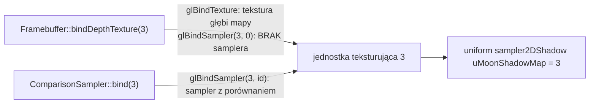

# Moduł gfx: sampler z porównaniem, klasa `ComparisonSampler`

Kamień milowy: M7, część czwarta (cienie księżyca), od piątej części (cień latarki, 2026-10-06) z drugim obiektem tej klasy. Temat wykładu: 11 (Shadow mapping), strona obiektu OpenGL. Temat jest w toku: cień rzucają księżyc i latarka, a testy ręczne i macOS są otwarte.
Kod: [`src/gfx/ComparisonSampler.hpp`](../../../src/gfx/ComparisonSampler.hpp), [`src/gfx/ComparisonSampler.cpp`](../../../src/gfx/ComparisonSampler.cpp). Jedyny użytkownik: [`src/game/ShadowMap.hpp`](../../../src/game/ShadowMap.hpp), [`.cpp`](../../../src/game/ShadowMap.cpp).

Część modułu `gfx`. Wstęp do całego modułu i zasada RAII dla obiektów OpenGL są w [`README.md`](README.md). Ten dokument jest krótki, bo stoi na dwóch innych. Czym jest obiekt samplera, jak zastępuje parametry tekstury i dlaczego należy do jednostki teksturującej, opisuje [`textures.md`](textures.md), sekcje 2.7 i 2.8: tego tu nie powtarzam. Teorię mapy cieni (dwa przebiegi, widok światła, bias, PCF) i wszystko, co robi z nią gra, opisuje [`../renderer/shadows.md`](../renderer/shadows.md): porównanie i `sampler2DShadow` w sekcji 2.6, obiekt samplera z porównaniem w 2.7, filtr sprzętowy 2 x 2 w 2.8, zachowanie poza mapą w 2.13. Tutaj jest tylko sama klasa: jeden obiekt OpenGL i pięć parametrów. Tekstura, którą ten sampler czyta, należy do `gfx::Framebuffer` ([`framebuffers.md`](framebuffers.md)). Każde wywołanie OpenGL jest opakowane w `GL_CHECK` ([`../core/gl-check.md`](../core/gl-check.md)).

**Stan na dziś:** klasa jest napisana i używana przez `game::ShadowMap`, które ma jeden jej obiekt jako pole `m_sampler`. Gra ma od piątej części M7 dwie mapy cieni (księżyca, pole `m_moonShadowMap`, i latarki, pole `m_flashlightShadowMap` w `NightMazeApp`), więc dwa takie samplery. Pierwszy jest wiązany z jednostką teksturującą 3 (`MOON_SHADOW_TEXTURE_UNIT`), drugi z jednostką 4 (`FLASHLIGHT_SHADOW_TEXTURE_UNIT`), w każdej klatce, w której cienie tego światła są włączone, a przebieg głębi się udał (latarka dodatkowo musi świecić). Klasa nie zmieniła się: nie wie, czy czyta mapę z rzutem prostokątnym, czy perspektywicznym. Klasa woła OpenGL w każdej funkcji poza jednym getterem, więc **nie ma testów jednostkowych** i żaden przypadek z `tests/ShadowTests.cpp` jej nie dotyczy (tamte testy sprawdzają matematykę bez OpenGL). Nie była też sprawdzana osobnym programem pomiarowym: jedynym sprawdzeniem jest gra. Zgłoszone dla Windowsa (2026-10-05): bramka `make check` przechodzi (format, buildy i testy Debug i Release, clang-tidy), 310 przypadków testowych i 103751 asercji, a build Debug nie zapisał błędów OpenGL przy mapie 2048 i 1024. Niesprawdzone: przełączanie filtra i rozdzielczości na żywo myszą w panelu Shadows. **Na macOS ten kod nie był ani budowany, ani uruchamiany.** Otwarte pozostają tam dwie rzeczy, które dotyczą wprost tej klasy: czy `sampler2DShadow` czytany przez obiekt samplera działa na OpenGL 4.1 firmy Apple i czy działa tam `GL_CLAMP_TO_BORDER` z ramką 1,0. Obie są w rdzeniu 4.1, więc powinny, ale nikt tego nie uruchomił. Komentarz `// See docs/...` na górze obu plików klasy wskazuje `docs/modules/renderer/shadows.md`, a nie ten dokument.

## 1. Po co to jest

Mapa cieni to tekstura głębi narysowana z kierunku światła. Shader oświetlenia nie chce z niej **liczby** (głębi), tylko **odpowiedzi**: czy mój fragment jest bliżej światła niż to, co zapisano w mapie, czyli czy jest oświetlony. OpenGL potrafi dać tę odpowiedź sam, w chwili odczytu tekstury, jeśli sposób odczytu ma włączone porównanie. Klasa `gfx::ComparisonSampler` zamyka obiekt samplera z takim sposobem odczytu.

| Funkcja | Co robi |
|---|---|
| konstruktor | tworzy obiekt samplera i ustawia mu porównanie (`GL_COMPARE_REF_TO_TEXTURE`, `GL_LEQUAL`), ramkę o głębi 1 poza teksturą (`GL_CLAMP_TO_BORDER` na S i T) i filtr liniowy |
| `bind(unit)` | wiąże sampler z jednostką teksturującą o podanym numerze. Aktywnej jednostki nie zmienia |
| `setLinearFilter(linear)` | wybiera filtr: liniowy (prawda) albo najbliższego sąsiada (fałsz) |
| `linearFilter()` | odczyt: który filtr jest ustawiony |
| destruktor | usuwa obiekt samplera |

Klasa **nie ma tekstury**. To pierwsza klasa `gfx`, która jest samym samplerem: `Texture2D` i `Cubemap` trzymają teksturę razem z jej samplerem, a tu tekstura (załącznik głębi framebuffera) i sposób jej odczytu mają osobnych właścicieli. Powód jest w sekcji 2.3.

Trzy klasy `gfx` z obiektem samplera obok siebie:

| | `Texture2D` | `Cubemap` | `ComparisonSampler` |
|---|---|---|---|
| co trzyma | teksturę 2D i jej sampler | teksturę sześcienną i jej sampler | sam sampler |
| filtr | trójliniowy na start, do zmiany | liniowy, stały | liniowy na start, do zmiany na najbliższego sąsiada |
| zawijanie | `GL_REPEAT` na S i T | `GL_CLAMP_TO_EDGE` na S, T i R | `GL_CLAMP_TO_BORDER` na S i T, ramka `(1, 1, 1, 1)` |
| porównanie | nie | nie | `GL_COMPARE_REF_TO_TEXTURE` z `GL_LEQUAL` |
| typ samplera w GLSL | `sampler2D` | `samplerCube` | `sampler2DShadow` |
| co zwraca `texture()` | `vec4`, kolor | `vec4`, kolor | `float`, od 0 do 1 |
| przenoszenie | tak | tak | nie (sekcja 5.2) |

## 2. Teoria

### 2.1 Porównanie przy odczycie

Zwykły odczyt tekstury głębi zwraca zapisaną głębię. Odczyt **z porównaniem** przyjmuje o jedną liczbę więcej, głębię odniesienia, i zwraca wynik porównania:

| Parametr samplera | Wartość w klasie | Znaczenie |
|---|---|---|
| `GL_TEXTURE_COMPARE_MODE` | `GL_COMPARE_REF_TO_TEXTURE` | włącza porównanie: trzecia współrzędna odczytu (głębia odniesienia) jest porównywana z głębią zapisaną w tekselu. Wartość domyślna to `GL_NONE`: bez porównania |
| `GL_TEXTURE_COMPARE_FUNC` | `GL_LEQUAL` | które porównanie: wynik to 1, gdy głębia odniesienia jest **mniejsza lub równa** zapisanej, i 0, gdy jest większa |

W mapie cieni zapisana głębia to odległość od światła do najbliższej powierzchni, a głębia odniesienia to odległość od światła do fragmentu, który właśnie cieniuję. Stąd znaczenie wyniku:

| Wynik | Warunek | Znaczenie |
|---|---|---|
| 1 | fragment jest tak blisko światła jak zapisana powierzchnia albo bliżej | oświetlony |
| 0 | fragment jest dalej od światła niż zapisana powierzchnia | coś stoi między nim a światłem: cień |

Po stronie GLSL taką teksturę czyta się przez `sampler2DShadow`, a funkcja `texture()` przyjmuje wtedy `vec3` zamiast `vec2` i zwraca jedną liczbę `float` (sekcja 4). Pełne wyjaśnienie, skąd bierze się głębia odniesienia i dlaczego "mniejsza lub równa" potrzebuje jeszcze biasu, jest w [`../renderer/shadows.md`](../renderer/shadows.md), sekcje 2.5, 2.6, 2.10 i 2.11.

Jedno ograniczenie, o którym trzeba pamiętać: dla tekstury głębi o formacie stałoprzecinkowym (tu `GL_DEPTH_COMPONENT24`) głębia odniesienia jest przed porównaniem obcinana do zakresu od 0 do 1. Punkt dalej niż daleka płaszczyzna światła miałby głębię powyżej 1, obciętą do 1, i porównanie z ramką przestałoby mówić prawdę. Tym przypadkiem zajmuje się shader, a nie sampler ([`../renderer/shadows.md`](../renderer/shadows.md), sekcja 2.13).

### 2.2 Filtr liniowy z porównaniem: sprzętowe PCF 2 x 2

Przy zwykłej teksturze filtr liniowy miesza cztery sąsiednie teksele. Mieszanie czterech **głębi** nie miałoby sensu: średnia głębi ściany i głębi ziemi za nią nie jest głębią żadnej z nich. Przy włączonym porównaniu karta robi więc coś innego: porównuje głębię odniesienia z każdym z czterech tekseli osobno i miesza cztery **odpowiedzi**, wagami filtra dwuliniowego. Wynik przestaje być zerem albo jedynką: na brzegu cienia wychodzi wartość pośrednia i krawędź mięknie. To jest filtrowanie percentage closer filtering (PCF) na kwadracie 2 x 2 tekseli, zrobione przez sprzęt, w cenie jednego odczytu.

| `setLinearFilter` | Filtr samplera | Co zwraca `texture()` |
|---|---|---|
| `true` (wartość początkowa) | `GL_LINEAR` w obie strony | cztery porównania zmieszane w jedną liczbę od 0 do 1 |
| `false` | `GL_NEAREST` w obie strony | jedno porównanie: dokładnie 0 albo 1, teksele mapy widać jako schodki |

Uczciwie: specyfikacja OpenGL 4.1 nie opisuje tego mieszania dokładnie. Mówi, że przy filtrze liniowym szczegóły zależą od implementacji, a wynik ma być liczbą od 0 do 1 proporcjonalną do tego, ile porównań wypadło pomyślnie. "Cztery porównania i mieszanie dwuliniowe" to to, co robią dzisiejsze karty, a nie gwarancja. Większe jądro PCF (3 x 3 do 7 x 7) gra liczy sama w shaderze, pętlą odczytów przez ten sam sampler ([`../renderer/shadows.md`](../renderer/shadows.md), sekcje 2.8 i 2.9).

Mapa cieni ma jeden poziom, bez mipmap, więc filtr pomniejszenia jest tym samym filtrem co powiększenia: `GL_LINEAR` albo `GL_NEAREST`, nigdy wariant z `MIPMAP` w nazwie.

### 2.3 Dlaczego obiekt samplera, a nie parametry tekstury

Porównanie można ustawić w dwóch miejscach: w samej teksturze (`glTexParameteri`) albo w obiekcie samplera (`glSamplerParameteri`). Klasa wybiera sampler **celowo**, bo ta sama tekstura głębi jest czytana na dwa sposoby:

| Kto czyta | Przez co | Typ w GLSL | Co dostaje |
|---|---|---|---|
| programy `lit`, `gouraud` i `grass` (`common/shadows.glsl`) | `ComparisonSampler` związany z jednostką 3 | `sampler2DShadow` | odpowiedź porównania, od 0 do 1 |
| podgląd mapy w panelu Shadows (`game::ShadowMap::drawPreview`, `post/preview.frag`, tryb 2) | bez obiektu samplera, jednostka 0 | `sampler2D` | zapisaną głębię, jako odcień szarości |

Reguła GLSL jest symetryczna i w obu kierunkach kończy się tak samo: czytanie tekstury głębi z **włączonym** porównaniem przez zwykły `sampler2D` daje wynik niezdefiniowany, i czytanie tekstury z **wyłączonym** porównaniem przez `sampler2DShadow` też. Gdyby porównanie było zapisane w teksturze, podgląd czytałby ją w sposób niezdefiniowany. Z porównaniem w obiekcie samplera oba odczyty są poprawne: tekstura zachowuje własne parametry (`GL_NEAREST`, `GL_CLAMP_TO_EDGE` i jeden poziom ustawia `gfx::Framebuffer`, a porównanie zostaje wyłączone, bo to wartość domyślna, której ta klasa nie zmienia, [`framebuffers.md`](framebuffers.md), sekcja 2.7), a sampler przykrywa je tylko wtedy i tylko na tej jednostce, z którą jest związany.

Drugi skutek tego podziału: `gfx::Framebuffer` nie musi nic wiedzieć o cieniach. Jej tekstura głębi jest taka sama dla sceny, którą czyta mgła, i dla mapy cieni.

### 2.4 Poza mapą: ramka o głębi 1

Mapa cieni księżyca obejmuje cały teren, ale odczyt może trafić współrzędnymi poza zakres od 0 do 1: przy samej krawędzi mapy sięga tam filtr liniowy i jądro PCF, a mapa innego światła (planowana mapa latarki) nie musi obejmować całej sceny. Sampler musi wtedy odpowiedzieć coś sensownego. Trzy tryby zawijania dają trzy różne odpowiedzi:

| Tryb | Co czyta poza zakresem | Skutek dla cienia |
|---|---|---|
| `GL_REPEAT` | mapę od drugiej strony | cienie ścian z jednego końca labiryntu pojawiłyby się powtórzone poza drugim końcem |
| `GL_CLAMP_TO_EDGE` | skrajny teksel mapy | cień, który dotyka krawędzi mapy, ciągnąłby się pasem w nieskończoność |
| `GL_CLAMP_TO_BORDER` z ramką 1 | stałą głębię 1, czyli daleką płaszczyznę światła | nic nie jest dalej niż 1, więc porównanie `GL_LEQUAL` zawsze daje 1: **poza mapą wszystko jest oświetlone** |

Klasa ustawia trzeci. Kolor ramki OpenGL przyjmuje jako cztery liczby (`GL_TEXTURE_BORDER_COLOR`), a dla tekstury głębi używa pierwszej z nich. Zawijanie jest ustawione na dwóch osiach, S i T: mapa jest teksturą 2D, a trzecia współrzędna odczytu nie jest tu osią tekstury, tylko głębią odniesienia.

Uzasadnienie od strony gry (dlaczego "oświetlone" jest właściwą odpowiedzią poza mapą i co z punktami za daleką płaszczyzną) jest w [`../renderer/shadows.md`](../renderer/shadows.md), sekcja 2.13.

### 2.5 Sampler należy do jednostki, więc kolejność ma znaczenie

`glBindSampler(unit, sampler)` wiąże sampler z **jednostką**, nie z teksturą ([`textures.md`](textures.md), sekcja 2.8, i [`cubemap.md`](cubemap.md), sekcja 2.3). Kto zwiąże coś z tą jednostką jako ostatni, ten decyduje o sposobie odczytu. To ma tu praktyczny skutek, bo teksturę i sampler wiążą dwie różne klasy:



`Framebuffer::bindDepthTexture` kończy się wywołaniem `glBindSampler(unit, NO_SAMPLER)`: odpina od jednostki każdy sampler, żeby tekstura była czytana własnymi parametrami. Dlatego `ShadowMap::bindForSampling` wiąże **najpierw teksturę, potem sampler**. W odwrotnej kolejności `bindDepthTexture` odpięłaby sampler z porównaniem zaraz po jego związaniu i `sampler2DShadow` czytałby teksturę bez porównania, czyli w sposób niezdefiniowany, bez żadnego błędu OpenGL.

Jednostka 3 jest wybrana tak, żeby nikt inny jej nie ruszał: modele używają jednostek 0 i 1, przebieg składający 0, 1 i 2. Sampler z porównaniem jest wiązany najwyżej raz na klatkę, przed rysowaniem sceny (tylko gdy cienie są włączone i mapa została narysowana), i leży tam, dopóki ktoś nie zwiąże z tą jednostką czegoś innego.

## 3. Jak to działa w OpenGL

Utworzenie, raz (konstruktor):

| # | Wywołanie | Co robi |
|---|---|---|
| 1 | `glGenSamplers(1, &id)` | rezerwuje identyfikator obiektu samplera |
| 2 | `glSamplerParameteri(id, GL_TEXTURE_COMPARE_MODE, GL_COMPARE_REF_TO_TEXTURE)` | włącza porównanie |
| 3 | `glSamplerParameteri(id, GL_TEXTURE_COMPARE_FUNC, GL_LEQUAL)` | wynik 1 dla głębi odniesienia mniejszej lub równej zapisanej |
| 4 | `glSamplerParameteri(id, GL_TEXTURE_WRAP_S, GL_CLAMP_TO_BORDER)`, to samo dla `GL_TEXTURE_WRAP_T` | poza teksturą czytana jest ramka |
| 5 | `glSamplerParameterfv(id, GL_TEXTURE_BORDER_COLOR, {1, 1, 1, 1})` | ramka: głębia 1 |
| 6 | `glSamplerParameteri(id, GL_TEXTURE_MIN_FILTER, GL_LINEAR)`, to samo dla `GL_TEXTURE_MAG_FILTER` | filtr liniowy (przez `setLinearFilter(true)`) |

Użycie, co klatkę:

| # | Wywołanie | Co robi |
|---|---|---|
| 7 | `glBindSampler(unit, id)` | wiąże sampler z jednostką. Numer jest zwykłą liczbą (tu 3), nie `GL_TEXTURE0 + unit` |

Zmiana filtra, na żądanie (`setLinearFilter`): dwa wywołania z wiersza 6 z `GL_LINEAR` albo `GL_NEAREST`.

Sprzątanie:

| # | Wywołanie | Co robi |
|---|---|---|
| 8 | `glDeleteSamplers(1, &id)` | usuwa sampler. Identyfikator 0 jest po cichu ignorowany |

Dwie rzeczy, które odróżniają obiekt samplera od tekstury:

- **Zmienia się go przez identyfikator.** `glSamplerParameteri` dostaje identyfikator jako pierwszy argument, więc niczego nie trzeba wcześniej wiązać. `glTexParameteri` działa na teksturze związanej z aktywną jednostką. Dlatego konstruktor tej klasy nie zostawia po sobie żadnego wiązania, a `setLinearFilter` wolno wołać w dowolnej chwili, także gdy sampler leży już na jednostce: zmiana działa od następnego rysowania.
- **Nie ma celu ani rodzaju.** Ten sam obiekt samplera można związać z jednostką, na której leży tekstura 2D albo sześcienna. Tu czyta teksturę 2D.

Wszystko jest w rdzeniu OpenGL 4.1: obiekty samplera od wersji 3.3, `GL_CLAMP_TO_BORDER` od 1.3, porównanie przy odczycie tekstury głębi od 1.4 (stała `GL_COMPARE_REF_TO_TEXTURE` ma tę nazwę od 3.0). Klasa nie potrzebuje żadnego rozszerzenia. Nie używa też niczego nowszego: `glCreateSamplers` z grupy direct state access (4.5) nie wolno użyć, a nie jest potrzebne, bo `glGenSamplers` z `glSamplerParameteri` i tak nie wymaga wiązania.

## 4. Shadery

Klasa nie ma własnych shaderów. Po stronie GLSL jej odpowiednikiem jest uniform typu `sampler2DShadow` w [`assets/shaders/common/shadows.glsl`](../../../assets/shaders/common/shadows.glsl), pliku dołączanym przez `lit.frag`, `gouraud.frag` i `grass.frag`:

```glsl
uniform sampler2DShadow uMoonShadowMap;
```

i odczyt w funkcji `shadowMapVisibility` tego samego pliku (tu `map` jest parametrem funkcji, do którego trafia `uMoonShadowMap`):

```glsl
        return texture(map, coordinates);
```

| Element | Znaczenie |
|---|---|
| `sampler2DShadow` | przechowuje **numer jednostki teksturującej**, jak `sampler2D`. Ustawia go `game::setShadowUniforms` przez `Shader::setInt` na 3, ten sam numer, który dostaje `bind` |
| `coordinates`, typ `vec3` | `x` i `y` to współrzędna tekstury, `z` to głębia odniesienia. Dla `sampler2D` byłoby to `vec2` |
| wynik, typ `float` | odpowiedź porównania: 1 oświetlony, 0 w cieniu, wartości pośrednie przy filtrze liniowym. Dla `sampler2D` byłby to `vec4` |

Ten sam plik woła też `textureSize(map, 0)`, żeby poznać rozmiar teksela dla pętli PCF: to pytanie o teksturę, sampler na odpowiedź nie wpływa. Shader jest omówiony linia po linii w [`../renderer/shadows.md`](../renderer/shadows.md), sekcja 4.

Z punktu widzenia tej klasy ważne są dwie reguły:

- **Typ samplera musi pasować do trybu porównania** (sekcja 2.3). `sampler2DShadow` wymaga włączonego porównania, `sampler2D` wyłączonego.
- **Dwa samplery różnych typów nie mogą wskazywać tej samej jednostki.** Jeśli program ma aktywny `sampler2D` i aktywny `sampler2DShadow` ustawione na ten sam numer, OpenGL odmawia rysowania (`GL_INVALID_OPERATION`). Po przeładowaniu shaderów każdy uniform wraca do 0, więc `uMoonShadowMap` trafiłby na jednostkę 0 razem z `uTexture`. Dlatego `setShadowUniforms` jest wołane co klatkę dla każdego programu, który dołącza `common/shadows.glsl`, także przy wyłączonych cieniach (komentarz w [`src/game/ShadowMap.hpp`](../../../src/game/ShadowMap.hpp)).

## 5. Kod w projekcie

### 5.1 Pliki

| Plik | Co zawiera |
|---|---|
| [`src/gfx/ComparisonSampler.hpp`](../../../src/gfx/ComparisonSampler.hpp) | klasa `gfx::ComparisonSampler`. Dołącza tylko `<glad/gl.h>` |
| [`src/gfx/ComparisonSampler.cpp`](../../../src/gfx/ComparisonSampler.cpp) | jedna stała i implementacja klasy |
| [`src/game/ShadowMap.hpp`](../../../src/game/ShadowMap.hpp), [`.cpp`](../../../src/game/ShadowMap.cpp) | jedyny użytkownik: pole `m_sampler`, wywołania `setLinearFilter` i `bind` w `bindForSampling` (sekcja 5.6) |

Oba pliki klasy są na liście źródeł biblioteki `engine` w [`CMakeLists.txt`](../../../CMakeLists.txt). Zależności: GLAD, `core/GlCheck.hpp` i `<array>` z biblioteki standardowej. Nic z `assets/`, nic z GLFW, żadnego logowania: klasa nie ma argumentów, które mogłyby być złe.

### 5.2 Nagłówek

```cpp
class ComparisonSampler {
public:
    /// Creates the sampler object with the three rules above.
    ComparisonSampler();
    ~ComparisonSampler();

    ComparisonSampler(const ComparisonSampler&) = delete;
    ComparisonSampler& operator=(const ComparisonSampler&) = delete;

    /// Binds the sampler object to texture unit number unit. The texture bound to that
    /// unit is read with its rules from now on, until another sampler object (or none)
    /// is bound there. The active texture unit is not changed.
    void bind(GLuint unit) const;

    /// Chooses between the linear filter (true: four comparisons, blended) and the
    /// nearest filter (false: one comparison). It can be called at any time, bound or
    /// not.
    void setLinearFilter(bool linear);

    /// The filter in use: true for linear.
    bool linearFilter() const { return m_linear; }

private:
    // Name (id) of the OpenGL sampler object.
    GLuint m_id = 0;
    bool m_linear = true;
};
```

(Długi komentarz nad klasą jest tu pominięty: "three rules above" to porównanie, filtr liniowy i ramka, czyli sekcje 2.1, 2.2 i 2.4. Czwarty akapit tego komentarza, o tym, dlaczego reguły są w samplerze, a nie w teksturze, to sekcja 2.3.)

| Element | Dlaczego tak |
|---|---|
| konstruktor bez argumentów | klasa ma jedno zastosowanie i jeden zestaw parametrów. Nie ma czego wybierać poza filtrem, a ten ma własną funkcję |
| `= delete` dla kopiowania | kopia trzymałaby ten sam identyfikator i usunęłaby go drugi raz (reguła wspólna dla klas `gfx`, [`README.md`](README.md), sekcja 2) |
| **brak** konstruktora przenoszącego i przypisania przenoszącego | inaczej niż w `Texture2D`, `Cubemap` i `Framebuffer`. Klasa deklaruje destruktor i usunięte kopiowanie, więc kompilator nie tworzy przenoszenia sam: obiektu **nie da się ani skopiować, ani przenieść**. Nie jest to potrzebne: `ShadowMap` trzyma sampler jako pole przez cały czas życia, a `NightMazeApp` trzyma `ShadowMap` jako pole. Skutek uboczny: `game::ShadowMap` też nie jest przenoszalne |
| brak `isValid()` i brak `id()` | nikt o nie nie pyta. Jeśli `glGenSamplers` zawiedzie, `m_id` zostaje zerem, a `glBindSampler(unit, 0)` znaczy "brak samplera" (sekcja 7, punkt 8) |
| `bind` jest `const` | zmienia stan kontekstu OpenGL, nie pola obiektu |
| `setLinearFilter` nie jest `const` | zapisuje `m_linear` |
| `m_linear = true` | filtr jest pamiętany po stronie C++, żeby `linearFilter()` nie musiało pytać OpenGL (`glGetSamplerParameteriv`) i żeby wołający mógł pominąć zbędną zmianę |

### 5.3 Stała

```cpp
// The depth outside the texture: 1 is the far plane of the light. OpenGL takes a border
// as a colour of four numbers and uses the first one for a depth texture.
constexpr std::array<GLfloat, 4> FAR_PLANE_BORDER = {1.0F, 1.0F, 1.0F, 1.0F};
```

Stoi w anonimowej przestrzeni nazw pliku `.cpp`. `std::array` zamiast gołej tablicy, bo `glSamplerParameterfv` chce wskaźnika na cztery liczby `GLfloat`, a `.data()` go daje. Liczy się pierwsza liczba, pozostałe trzy są jedynkami dla porządku.

### 5.4 Konstruktor i destruktor

```cpp
ComparisonSampler::ComparisonSampler() {
    GL_CHECK(glGenSamplers(1, &m_id));

    // A sampler object is changed through its id: nothing has to be bound first.
    //
    // The comparison: the third coordinate of the lookup is compared with the stored
    // depth, and the result is 1 where it is less than or equal to it.
    GL_CHECK(glSamplerParameteri(m_id, GL_TEXTURE_COMPARE_MODE, GL_COMPARE_REF_TO_TEXTURE));
    GL_CHECK(glSamplerParameteri(m_id, GL_TEXTURE_COMPARE_FUNC, GL_LEQUAL));

    // Outside the texture the border is read, in both directions.
    GL_CHECK(glSamplerParameteri(m_id, GL_TEXTURE_WRAP_S, GL_CLAMP_TO_BORDER));
    GL_CHECK(glSamplerParameteri(m_id, GL_TEXTURE_WRAP_T, GL_CLAMP_TO_BORDER));
    GL_CHECK(glSamplerParameterfv(m_id, GL_TEXTURE_BORDER_COLOR, FAR_PLANE_BORDER.data()));

    setLinearFilter(m_linear);
}

ComparisonSampler::~ComparisonSampler() {
    // OpenGL silently ignores the id 0.
    GL_CHECK(glDeleteSamplers(1, &m_id));
}
```

| Linia | Znaczenie |
|---|---|
| `glGenSamplers(1, &m_id)` | jeden identyfikator. Żadnego wiązania po nim: obiekt samplera powstaje naprawdę przy pierwszym użyciu identyfikatora, a `glSamplerParameteri` jest takim użyciem |
| `GL_TEXTURE_COMPARE_MODE`, `GL_TEXTURE_COMPARE_FUNC` | sekcja 2.1. `GL_LEQUAL` jest też wartością domyślną tego parametru, ale klasa ustawia ją wprost: od tej jednej stałej zależy, czy 1 znaczy "oświetlony", czy "w cieniu" |
| dwa razy `GL_CLAMP_TO_BORDER` i kolor ramki | sekcja 2.4. Funkcja z końcówką `fv` przyjmuje wskaźnik na liczby zmiennoprzecinkowe, `i` jedną liczbę całkowitą |
| `setLinearFilter(m_linear)` | filtr ustawia ta sama funkcja, której używa wołający, więc dwie linie z `GL_TEXTURE_MIN_FILTER` i `GL_TEXTURE_MAG_FILTER` są w kodzie raz. `m_linear` ma wartość początkową `true` |
| destruktor | jedna linia. Zera nie trzeba sprawdzać |

Konstruktor woła OpenGL, więc obiekt może powstać dopiero, gdy istnieje kontekst, i musi zginąć przed oknem. `ShadowMap` jest polem `NightMazeApp`, którego okno należy do klasy bazowej, więc oba warunki są spełnione ([`README.md`](README.md), sekcja 5).

### 5.5 `bind` i `setLinearFilter`

```cpp
void ComparisonSampler::bind(GLuint unit) const {
    // glBindSampler takes the plain number of the unit, not GL_TEXTURE0 + unit.
    GL_CHECK(glBindSampler(unit, m_id));
}

void ComparisonSampler::setLinearFilter(bool linear) {
    m_linear = linear;
    // A shadow map has one level, so the minification filter is one without mipmaps.
    const GLint filter = linear ? GL_LINEAR : GL_NEAREST;
    GL_CHECK(glSamplerParameteri(m_id, GL_TEXTURE_MIN_FILTER, filter));
    GL_CHECK(glSamplerParameteri(m_id, GL_TEXTURE_MAG_FILTER, filter));
}
```

`bind` to jedno wywołanie. W `Texture2D::bind` i `Cubemap::bind` są trzy (`glActiveTexture`, `glBindTexture`, `glBindSampler`), bo tamte klasy wiążą też teksturę. Tu tekstury nie ma, więc nie ma też `glActiveTexture`: `glBindSampler` nie zależy od aktywnej jednostki i jej nie zmienia. Numer jednostki jest zwykłą liczbą: `glBindSampler(GL_TEXTURE0 + 3, id)` byłoby błędem `GL_INVALID_VALUE`, który w buildzie Debug wypisze `GL_CHECK`.

`setLinearFilter` ustawia oba filtry na tę samą wartość. Typ `GLint`, bo taki jest trzeci parametr `glSamplerParameteri`.

### 5.6 Użytkownik: `game::ShadowMap::bindForSampling`

```cpp
void ShadowMap::bindForSampling(GLuint unit, bool linearFilter) {
    if (m_sampler.linearFilter() != linearFilter) {
        m_sampler.setLinearFilter(linearFilter);
    }
    // The texture first: bindDepthTexture unbinds whatever sampler object the unit
    // had, so the comparison sampler has to follow it.
    m_target.bindDepthTexture(unit);
    m_sampler.bind(unit);
    GL_CHECK(glActiveTexture(GL_TEXTURE0 + FIRST_TEXTURE_UNIT));
}
```

| Linia | Znaczenie |
|---|---|
| `if (m_sampler.linearFilter() != linearFilter)` | funkcja jest wołana co klatkę z wartością pola `Hardware 2 x 2 filter` panelu. Getter pozwala wołać OpenGL tylko wtedy, gdy pole naprawdę się zmieniło |
| `m_target.bindDepthTexture(unit)` | tekstura głębi mapy na jednostkę. Ta funkcja odpina sampler jednostki (sekcja 2.5) |
| `m_sampler.bind(unit)` | sampler z porównaniem, **po** teksturze |
| `glActiveTexture(GL_TEXTURE0 + FIRST_TEXTURE_UNIT)` | `bindDepthTexture` zostawiła aktywną jednostkę 3. Kod rysujący modele oczekuje aktywnej jednostki 0, więc funkcja ją przywraca |

Wołający to `NightMazeApp::drawMoonShadowMap`, raz na klatkę, po udanym przebiegu głębi (przy wyłączonych cieniach funkcja wraca wcześniej i niczego nie wiąże): `m_moonShadowMap.bindForSampling(MOON_SHADOW_TEXTURE_UNIT, m_moonShadow.hardwareFilter)`. Stała `MOON_SHADOW_TEXTURE_UNIT = 3` jest w [`src/game/ShaderUniforms.hpp`](../../../src/game/ShaderUniforms.hpp).

Drugi odczyt tej samej tekstury, podgląd, **nie** używa tej klasy: `ShadowMap::drawPreview` woła `m_target.bindDepthTexture(PREVIEW_SOURCE_UNIT)` dla jednostki 0 i nic więcej, więc tekstura jest czytana własnymi parametrami, bez porównania. Kolejność klatki i reszta `ShadowMap` są w [`../renderer/shadows.md`](../renderer/shadows.md), sekcje 2.17, 2.18 i 5.

### 5.7 Jak to zostało sprawdzone

- **Testów jednostkowych nie ma**: klasa potrzebuje kontekstu OpenGL. Program testowy ma dziś 329 przypadków i 104306 asercji (zgłoszone dla Windowsa, 2026-10-06; po czwartej części było 310 i 103751), a żaden nie tworzy tego obiektu.
- **Osobnego programu pomiarowego nie było.** Nikt nie odczytał parametrów samplera przez `glGetSamplerParameteriv` ani nie zmierzył, co naprawdę zwraca `texture()` przy filtrze liniowym na brzegu cienia.
- **Gra, Windows** (zgłoszone 2026-10-05): build Debug nie zapisał błędów OpenGL przy mapie 2048 i 1024, bramka `make check` przechodzi. To potwierdza, że wywołania mają poprawne argumenty, a nie to, że obraz jest poprawny w każdym miejscu.
- **Niesprawdzone:** przełączanie pola `Hardware 2 x 2 filter` i rozdzielczości myszą w działającej grze, przeładowanie shaderów (dziś jedenaście programów).
- **macOS:** nic. Otwarte pytania są w nagłówku tego dokumentu.

## 6. Panel ImGui

Klasa nie ma własnego panelu. Jej jedyny zmienny stan, filtr, steruje pole wyboru `Hardware 2 x 2 filter` w panelu **Shadows** (zakładka `Moon`): zapisuje `ShadowSettings::hardwareFilter`, a `bindForSampling` przenosi tę wartość do `setLinearFilter` w następnej klatce. Odznaczone pole przy wyłączonym PCF pokazuje gołe teksele mapy jako schodki na brzegu cienia. Pozostałe pola panelu (bias, PCF, siła cienia, rozdzielczość, podgląd) nie dotyczą samplera, tylko uniformów i framebuffera: opisuje je [`../renderer/shadows.md`](../renderer/shadows.md), sekcja 6.

Podgląd mapy w tym samym panelu jest dowodem na sekcję 2.3: ta sama tekstura, z której programy oświetlenia dostają odpowiedzi 0 albo 1, jest tam pokazana jako odcienie szarości, bo czytana bez tego samplera.

## 7. Pułapki

1. **Sampler przed teksturą.** `Framebuffer::bindDepthTexture` odpina sampler jednostki. Związanie samplera przed nią daje `sampler2DShadow` czytający teksturę bez porównania: wynik niezdefiniowany, bez błędu OpenGL (sekcja 2.5).
2. **`GL_TEXTURE0 + unit` w `glBindSampler`.** Funkcja chce zwykłego numeru. Stała `GL_TEXTURE0` ma wartość `0x84C0`, więc suma wychodzi daleko poza liczbę jednostek: `GL_INVALID_VALUE`.
3. **`sampler2D` na jednostce z tym samplerem.** Zwykły sampler GLSL czytający teksturę głębi z włączonym porównaniem daje wynik niezdefiniowany. Dlatego podgląd czyta mapę z innej jednostki i bez obiektu samplera.
4. **`sampler2DShadow` i `sampler2D` na tym samym numerze jednostki.** OpenGL odmawia rysowania. Grozi po przeładowaniu shaderów, gdy uniformy wracają do 0 (sekcja 4).
5. **Porównanie zapisane w teksturze.** Działałoby dla cieni i zepsułoby podgląd (sekcja 2.3).
6. **Odwrócona funkcja porównania.** `GL_GEQUAL` zamiast `GL_LEQUAL` zamienia znaczenie 0 i 1: oświetlone byłoby tylko to, co leży w cieniu.
7. **Ramka inna niż 1 albo `GL_CLAMP_TO_EDGE`.** Ramka 0 zacienia wszystko poza mapą, przycinanie do krawędzi rozciąga cienie z brzegu mapy (sekcja 2.4).
8. **Sampler o identyfikatorze 0.** Gdyby `glGenSamplers` zawiodło, `bind` wołałoby `glBindSampler(unit, 0)`, czyli "brak samplera", i dalej jak w punkcie 1. Klasa tego nie wykrywa i nie ma `isValid()`. W buildzie Debug błąd `glGenSamplers` wypisałby `GL_CHECK`.
9. **Sampler zostaje na jednostce.** Po `bind(3)` każda tekstura 2D czytana przez jednostkę 3 dostaje porównanie. W grze nic innego tej jednostki nie używa. Następna mapa cieni (latarki, w planie) ma dostać jednostkę 4 i własny sampler.
10. **Filtr z mipmapami.** Mapa cieni ma jeden poziom. Tekstura ma `GL_TEXTURE_MAX_LEVEL` równe 0 (ustawia to `Framebuffer`), więc byłaby kompletna także przy filtrze z mipmapami, ale taki filtr niczego by nie dał. `setLinearFilter` zna tylko `GL_LINEAR` i `GL_NEAREST`.
11. **Kopiowanie i przenoszenie.** Oba są niedostępne (sekcja 5.2). Próba włożenia `ShadowMap` do `std::vector` albo zwrócenia jej z funkcji przez przeniesienie się nie skompiluje.
12. **Czas życia.** Obiekt musi zginąć przed oknem, jak każda klasa `gfx`.
13. **Głębia odniesienia powyżej 1.** Jest obcinana do 1 przed porównaniem (sekcja 2.1). Sampler tego nie naprawi: sprawdza to shader.

## 8. Ćwiczenia

Zmiany sprawdza się w działającej grze, patrząc na cienie ścian na ziemi. Po każdym ćwiczeniu wycofaj zmianę (`git checkout src`).

1. **Schodki.** W panelu Shadows odznacz `PCF` i `Hardware 2 x 2 filter`. Podejdź do brzegu cienia ściany. Jak duży jest jeden schodek? Porównaj z rozmiarem teksela, który pokazuje panel (linia `One texel`). Zaznacz samo `Hardware 2 x 2 filter`: co się zmieniło i ile odczytów tekstury to kosztuje?
2. **Odwrócone porównanie.** W konstruktorze zamień `GL_LEQUAL` na `GL_GEQUAL`. Co jest teraz jasne, a co ciemne? Dlaczego ściany od strony księżyca nie są po prostu czarne? (Podpowiedź: cień odejmuje tylko udział księżyca. Światło otoczenia, latarka i kryształy zostają.)
3. **Ramka 0.** Zmień `FAR_PLANE_BORDER` na cztery zera. Czy coś widać w domyślnej scenie? Dlaczego tak mało? (Podpowiedź: pudełko światła obejmuje cały teren.)
4. **Zła kolejność.** W `ShadowMap::bindForSampling` zamień miejscami linie `bindDepthTexture` i `m_sampler.bind`. Co widać i co jest w konsoli buildu Debug? Dlaczego `GL_CHECK` niczego nie zgłasza?
5. **Bez samplera.** Zakomentuj wywołanie `glBindSampler` w `ComparisonSampler::bind`. Czy wynik jest taki sam jak w ćwiczeniu 4? Powinien: wyjaśnij dlaczego.
6. **`GL_REPEAT`.** Zamień oba `GL_CLAMP_TO_BORDER` na `GL_REPEAT`. W domyślnej scenie różnicy może nie być. Jak trzeba by zmienić pudełko światła, żeby ją zobaczyć?
7. **Na kartce.** Głębia odniesienia to 0,40. Cztery sąsiednie teksele mapy mają głębie 0,35, 0,35, 0,90 i 0,90, a punkt odczytu leży dokładnie między nimi. Co zwróci `texture()` z filtrem `GL_NEAREST`, a co z `GL_LINEAR`? (Odpowiedź: przy `GL_NEAREST` 0 albo 1, zależnie od tego, który teksel jest najbliższy. Przy `GL_LINEAR` dwa porównania dają 0, dwa dają 1, wagi są równe, więc 0,5.)

## 9. Pytania kontrolne

1. **Czym `ComparisonSampler` różni się od `Texture2D` i `Cubemap`?**
   Nie ma tekstury. Jest samym obiektem samplera: sposobem odczytu, który nakłada się na teksturę należącą do kogoś innego (do `gfx::Framebuffer`).

2. **Co robi `GL_TEXTURE_COMPARE_MODE` równe `GL_COMPARE_REF_TO_TEXTURE`?**
   Włącza porównanie przy odczycie: trzecia współrzędna odczytu jest porównywana z głębią zapisaną w tekselu, a shader dostaje wynik porównania zamiast głębi.

3. **Co znaczy wynik 1 przy `GL_LEQUAL`?**
   Głębia odniesienia jest mniejsza od zapisanej albo jej równa: fragment jest co najmniej tak blisko światła jak najbliższa zapisana powierzchnia, czyli jest oświetlony. 0 znaczy cień.

4. **Jakim typem GLSL czyta się taką teksturę i co zwraca `texture()`?**
   `sampler2DShadow`. `texture()` przyjmuje `vec3` (współrzędna tekstury i głębia odniesienia) i zwraca jedną liczbę `float` od 0 do 1.

5. **Co daje filtr liniowy przy włączonym porównaniu?**
   Karta porównuje cztery sąsiednie teksele osobno i miesza cztery odpowiedzi, a nie cztery głębie. To PCF 2 x 2 w cenie jednego odczytu. Specyfikacja zostawia szczegóły implementacji: tak robią dzisiejsze karty.

6. **Dlaczego porównanie jest w obiekcie samplera, a nie w parametrach tekstury?**
   Bo ta sama tekstura głębi jest czytana także jako zwykły obraz, bez obiektu samplera, przy rysowaniu podglądu (`ShadowMap::drawPreview`). Z porównaniem zapisanym w teksturze tamten odczyt przez `sampler2D` byłby niezdefiniowany.

7. **Dlaczego `GL_CLAMP_TO_BORDER` z ramką 1, a nie `GL_CLAMP_TO_EDGE` albo `GL_REPEAT`?**
   Ramka 1 to daleka płaszczyzna światła: nic nie jest dalej, więc poza mapą porównanie zawsze daje "oświetlony". `GL_CLAMP_TO_EDGE` rozciągałoby cienie z brzegu mapy, `GL_REPEAT` powtarzałoby mapę.

8. **Dlaczego `bindForSampling` wiąże najpierw teksturę, a potem sampler?**
   Sampler należy do jednostki, a `Framebuffer::bindDepthTexture` kończy się `glBindSampler(unit, 0)`, czyli odpina sampler jednostki. W odwrotnej kolejności sampler z porównaniem zostałby odpięty zaraz po związaniu.

9. **Jaki numer przyjmuje `glBindSampler`?**
   Zwykły numer jednostki (0, 1, 2, 3), a nie stałą `GL_TEXTURE0 + unit`, której chce `glActiveTexture`.

10. **Czy obiekt da się skopiować albo przenieść?**
    Nie. Kopiowanie jest `= delete`, a przenoszenia klasa nie deklaruje, więc kompilator go nie tworzy. Obiekt żyje jako pole `ShadowMap` od początku do końca.

11. **Kto i na której jednostce używa tej klasy?**
    `game::ShadowMap`, dla mapy cieni księżyca, na jednostce 3 (`MOON_SHADOW_TEXTURE_UNIT`). Czytają przez nią programy `lit`, `gouraud` i `grass`.

12. **Czy `setLinearFilter` wymaga, żeby sampler był związany?**
    Nie. Obiekt samplera zmienia się przez identyfikator (`glSamplerParameteri`), bez wiązania. Zmiana działa od następnego rysowania.

13. **Co w tej klasie nie jest sprawdzone?**
    Nie ma testu jednostkowego ani programu pomiarowego. Na Windowsie zgłoszono brak błędów OpenGL w buildzie Debug. Na macOS kod nie był uruchamiany: `sampler2DShadow` z obiektem samplera i `GL_CLAMP_TO_BORDER` na OpenGL 4.1 firmy Apple są otwartymi punktami.

## 10. Źródła

- LearnOpenGL, "Shadow Mapping" (<https://learnopengl.com/Advanced-Lighting/Shadows/Shadow-Mapping>): mapa cieni, `GL_CLAMP_TO_BORDER` z ramką 1, PCF. Tamten tekst porównuje głębie ręcznie w shaderze, przez `sampler2D`. Ten projekt używa porównania sprzętowego.
- Khronos OpenGL Wiki, "Sampler Object" (<https://www.khronos.org/opengl/wiki/Sampler_Object>): parametry samplera, w tym tryb porównania i kolor ramki. "Sampler (GLSL)" (<https://www.khronos.org/opengl/wiki/Sampler_(GLSL)>): samplery cieni, typ wyniku `texture()`, niezdefiniowany wynik przy niezgodności typu samplera z trybem porównania.
- docs.gl: `glSamplerParameter` (<https://docs.gl/gl4/glSamplerParameter>), `glBindSampler` (<https://docs.gl/gl4/glBindSampler>), `glGenSamplers`, `glDeleteSamplers`.
- Specyfikacja OpenGL 4.1 Core (<https://registry.khronos.org/OpenGL/specs/gl/glspec41.core.pdf>): część "Texture Comparison Modes" (porównanie, obcinanie głębi odniesienia, zastrzeżenie o filtrze liniowym), część "Sampler Objects".
- Dokumenty w tym repozytorium: [`../renderer/shadows.md`](../renderer/shadows.md) (teoria mapy cieni, shadery, `ShadowMap`, panel, testy), [`textures.md`](textures.md) (obiekt samplera, jednostki teksturujące, tryby zawijania), [`framebuffers.md`](framebuffers.md) (tekstura głębi, którą ten sampler czyta), [`cubemap.md`](cubemap.md) (druga klasa, dla której sampler jest warunkiem poprawności), [`README.md`](README.md) (RAII), [`../core/gl-check.md`](../core/gl-check.md).
