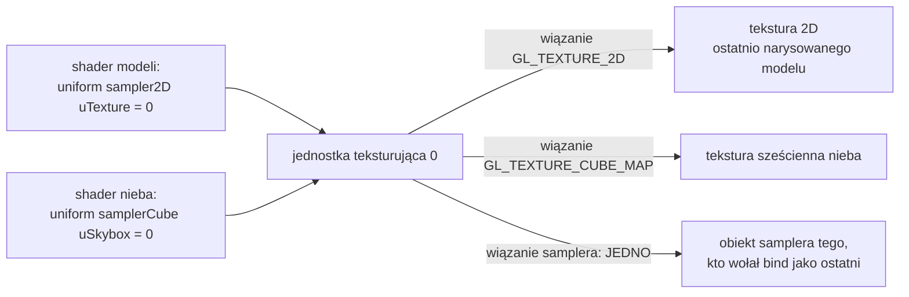

# Moduł gfx: tekstura sześcienna, klasa `Cubemap`

Kamień milowy: M6, część pierwsza (skybox). Temat wykładu: 8 (Tekstura sześcienna), strona obiektu OpenGL.
Kod: [`src/gfx/Cubemap.hpp`](../../../src/gfx/Cubemap.hpp), [`src/gfx/Cubemap.cpp`](../../../src/gfx/Cubemap.cpp). Jedyny użytkownik: [`src/game/Skybox.cpp`](../../../src/game/Skybox.cpp).

Część modułu `gfx`. Wstęp do całego modułu, zasada RAII dla obiektów OpenGL i semantyka przenoszenia są w [`README.md`](README.md). Ten dokument jest krótszy od [`textures.md`](textures.md), bo na nim stoi: zakłada znajomość tekstur 2D (teksele, filtry, zawijanie, jednostki teksturujące, obiekt samplera, format danych a format wewnętrzny, wyrównanie wierszy) i opisuje tylko to, czym tekstura sześcienna różni się od zwykłej. Teorię samej tekstury sześciennej (jak kierunek wybiera ścianę i teksel, dlaczego wiersze nie są odwracane, szwy na krawędziach) i wszystko, co robi z nią gra, opisuje [`../renderer/skybox.md`](../renderer/skybox.md). Każde wywołanie OpenGL jest opakowane w `GL_CHECK` ([`../core/gl-check.md`](../core/gl-check.md)).

**Stan na dziś:** klasa jest napisana i używana przez `game::Skybox`, które tworzy z niej jedną teksturę: nocne niebo z sześciu obrazów 1024 x 1024. Klasa wymaga kontekstu OpenGL, więc **nie ma testów jednostkowych**. Nie była też sprawdzana osobnym programem pomiarowym, tak jak `Texture2D`: jedynym sprawdzeniem jest gra, w której niebo było oglądane na zrzutach ekranu z Windowsa (zgłoszone 2026-10-05: księżyc na swoim miejscu, poziomy horyzont, brak szwów). Zgłoszone dla Windowsa po pierwszej części M6: build Debug i Release bez ostrzeżeń, 221 przypadków testowych i 85175 asercji (żaden nie dotyczy tej klasy). Druga część M6 (teren i trawa) klasy nie zmieniła. Po drugiej części M6 program testowy miał 256 przypadków i 101232 asercje w Debug i w Release (uruchomione 2026-10-05 z istniejących buildów). Pierwsza część M7 (bufor HDR i gamma) dodała konstruktorowi czwarty argument, `ColorSpace`: niebo jest od niej teksturą sRGB (`GL_SRGB8`), dekodowaną przez kartę do wartości liniowych przy odczycie ([`color-space.md`](color-space.md)). Zgłoszone dla Windowsa po tej zmianie (2026-10-05): bramka `make check` przechodzi, 269 przypadków testowych i 102103 asercje w Debug i w Release, a po drugiej części M7 276 i 102139, po trzeciej 294 i 102412, po czwartej (cienie księżyca) 310 i 103751, nadal bez przypadku dla tej klasy. Czwarta część M7 klasy nie zmieniła, ale dodała do modułu trzecią klasę z obiektem samplera, `gfx::ComparisonSampler` ([`comparison-sampler.md`](comparison-sampler.md)): to sam sampler, bez tekstury, dla mapy cieni księżyca na jednostce 3. **Na macOS ten kod nie był ani budowany, ani uruchamiany.** Komentarz `// See docs/...` na górze obu plików klasy wskazuje ten dokument (`docs/modules/gfx/cubemap.md`). Do drugiej części M6 wskazywał [`../renderer/skybox.md`](../renderer/skybox.md), gdzie jest teoria tekstury sześciennej i użycie klasy w grze.

## 1. Po co to jest

`gfx::Texture2D` trzyma jeden obraz czytany parą `(u, v)`. Niebo potrzebuje czegoś innego: obrazu, który otacza kamerę ze wszystkich stron i który czyta się **kierunkiem**. OpenGL ma na to osobny rodzaj tekstury, teksturę sześcienną (cube map): sześć kwadratowych obrazów w jednym obiekcie. Klasa `gfx::Cubemap` zamyka ten obiekt tak samo, jak `Texture2D` zamyka teksturę 2D.

| Funkcja | Co robi |
|---|---|
| konstruktor domyślny | obiekt bez tekstury: `isValid()` zwraca fałsz. Dla kodu, który nie zdołał wczytać obrazów, a musi coś zwrócić |
| konstruktor `Cubemap(size, channels, faces, colorSpace)` | tworzy teksturę sześcienną z sześciu tablic surowych bajtów (3 albo 4 kanały) w formacie sRGB albo liniowym, tworzy obiekt samplera z filtrem liniowym bez mipmap i przycinaniem do krawędzi na trzech osiach |
| `bind(unit)` | wiąże teksturę i jej sampler z jednostką teksturującą o podanym numerze |
| `isValid`, `id`, `size` | odczyt stanu |
| destruktor | usuwa oba obiekty OpenGL |

Klasa przyjmuje **surowe bajty**, a nie `assets::Image`, z tego samego powodu co `Texture2D`: warstwa `gfx` nie zna warstwy `assets`.

Czym różni się od `Texture2D`:

| | `Texture2D` | `Cubemap` |
|---|---|---|
| cel OpenGL | `GL_TEXTURE_2D` | `GL_TEXTURE_CUBE_MAP` (wiązanie) i sześć celów ścian (wysyłanie) |
| ile obrazów | jeden, dowolny prostokąt | sześć kwadratów tej samej wielkości |
| kolejność wierszy danych | **dolny** wiersz pierwszy | **górny** wiersz pierwszy |
| mipmapy | tak, `glGenerateMipmap` | nie, jeden poziom |
| filtr | trójliniowy na start, do zmiany (`setFilter`, `setAnisotropy`) | liniowy, stały |
| zawijanie | `GL_REPEAT` na S i T | `GL_CLAMP_TO_EDGE` na S, T i R |
| przestrzeń kolorów | argument `ColorSpace` konstruktora, zapamiętany (`colorSpace()`) | argument `ColorSpace` konstruktora, niezapamiętany |
| typ samplera w GLSL | `sampler2D` | `samplerCube` |
| współrzędna w `texture()` | `vec2` | `vec3`, kierunek |

## 2. Teoria

### 2.1 Jeden obiekt, siedem celów

Tekstura sześcienna jest **jednym** obiektem OpenGL z jednym identyfikatorem. Ma za to dwa rodzaje celów (targets), które łatwo pomylić:

| Cel | Do czego służy | Gdzie w kodzie |
|---|---|---|
| `GL_TEXTURE_CUBE_MAP` | cała tekstura: wiązanie (`glBindTexture`) i parametry (`glTexParameteri`) | konstruktor, `bind` |
| `GL_TEXTURE_CUBE_MAP_POSITIVE_X` i pięć następnych | jedna ściana: tylko wysyłanie pikseli (`glTexImage2D`) | pętla w konstruktorze |

Wiąże się więc zawsze całość, a ścianę nazywa się dopiero przy wysyłaniu. Sześć stałych ścian to kolejne liczby w kolejności +X, -X, +Y, -Y, +Z, -Z, dlatego ściany można wysłać w pętli, dodając numer do pierwszej stałej. Tabela ścian z plikami gry jest w [`../renderer/skybox.md`](../renderer/skybox.md), sekcja 2.2.

Rodzaj tekstury ustala **pierwsze związanie**: identyfikator związany raz z `GL_TEXTURE_CUBE_MAP` jest teksturą sześcienną na zawsze. Próba związania go potem z `GL_TEXTURE_2D` kończy się błędem `GL_INVALID_OPERATION`.

### 2.2 Wiązanie na jednostce: osobne dla każdego rodzaju tekstury

Jednostka teksturująca ([`textures.md`](textures.md), sekcja 2.7) nie ma jednego miejsca na teksturę, tylko po jednym na każdy rodzaj: `GL_TEXTURE_2D`, `GL_TEXTURE_CUBE_MAP` i kilka innych. Tekstura 2D i sześcienna mogą być związane z tą samą jednostką naraz i żadna nie wypiera drugiej. O tym, które wiązanie zostanie przeczytane, decyduje typ samplera w shaderze: `sampler2D` czyta wiązanie 2D, `samplerCube` wiązanie sześcienne.

Gra z tego korzysta: niebo jest na jednostce 0, tej samej, na której modele mają teksturę koloru.



### 2.3 Sampler należy do całej jednostki

Diagram pokazuje jedyną rzecz, która **nie** jest osobna: obiekt samplera. `glBindSampler(unit, sampler)` wiąże sampler z jednostką jako całością, a związany sampler zastępuje sposób odczytu każdej tekstury czytanej przez tę jednostkę, bez względu na jej rodzaj ([`textures.md`](textures.md), sekcja 2.8).

W `Texture2D` własny obiekt samplera był wyborem (i obejściem kłopotu z anizotropią). W `Cubemap` jest **warunkiem poprawności**. Każda `Texture2D` zostawia na jednostce swój sampler: filtr trójliniowy i `GL_REPEAT`. Gdyby `Cubemap` trzymała sposób odczytu w parametrach tekstury, byłyby one ignorowane tak długo, jak na jednostce leży cudzy sampler, i niebo byłoby czytane z `GL_REPEAT`, czyli z linią na każdej krawędzi sześcianu ([`../renderer/skybox.md`](../renderer/skybox.md), sekcja 2.5). Dlatego `Cubemap::bind` zawsze wiąże także swój sampler.

To samo działa w drugą stronę: po `Cubemap::bind(0)` na jednostce 0 leży sampler nieba (`GL_LINEAR`, `GL_CLAMP_TO_EDGE`), dopóki następne `Texture2D::bind(0)` nie podmieni go swoim. W grze każde wywołanie rysujące model woła `bind`, więc do pomyłki nie dochodzi.

Od czwartej części M7 ta sama reguła (sampler należy do jednostki, wygrywa ostatni) decyduje o kolejności dwóch wywołań przy mapie cieni: `Framebuffer::bindDepthTexture` odpina sampler jednostki, więc sampler z porównaniem jest wiązany po niej ([`comparison-sampler.md`](comparison-sampler.md), sekcja 2.5).

### 2.4 Jeden poziom i kompletność

Tekstura jest **kompletna**, gdy ma wszystko, czego wymaga jej filtr ([`textures.md`](textures.md), sekcja 3.3). Dla tekstury sześciennej dochodzi warunek własny: wszystkie sześć ścian musi istnieć, być kwadratami i mieć ten sam rozmiar i format. Tekstura niekompletna nie zgłasza błędu, tylko zwraca czerń.

Klasa nie buduje mipmap. Niebo jest oglądane mniej więcej w swojej rozdzielczości i nigdy z daleka, więc mniejsze poziomy nie zostałyby użyte, a zajęłyby dodatkową jedną trzecią pamięci. Brak mipmap trzeba jednak powiedzieć OpenGL wprost, i to w dwóch miejscach:

| Gdzie | Co | Po co |
|---|---|---|
| obiekt samplera | `GL_TEXTURE_MIN_FILTER = GL_LINEAR` | filtr, który nie sięga po mipmapy |
| **sama tekstura** | `GL_TEXTURE_MAX_LEVEL = 0` | informacja, że poziom 0 jest jedynym, jaki istnieje |

Drugi wiersz jest zabezpieczeniem. To, które poziomy istnieją, jest własnością tekstury, a nie samplera: obiekt samplera tego nie zastępuje. Z `GL_TEXTURE_MAX_LEVEL` równym 0 tekstura jest kompletna przy **każdym** filtrze, także takim, który prosi o mipmapy. Bez tej linii tekstura odczytana kiedyś bez własnego samplera miałaby domyślny filtr pomniejszenia nowej tekstury (`GL_NEAREST_MIPMAP_LINEAR`), byłaby niekompletna i niebo wyszłoby czarne, bez żadnego błędu.

### 2.5 Kolejność wierszy i format

- **Górny wiersz pierwszy.** `Texture2D` chce dolnego wiersza jako pierwszego, `Cubemap` górnego. Powód: na ścianie tekstury sześciennej współrzędna `t = 0` to góra obrazu ([`../renderer/skybox.md`](../renderer/skybox.md), sekcja 2.4). Klasa sama niczego nie odwraca i nie ma jak sprawdzić, co dostała: to umowa z wołającym, zapisana w komentarzu konstruktora. Po stronie loadera spełnia ją `assets::RowOrder::TopFirst` ([`../assets/images.md`](../assets/images.md), sekcja 2.7).
- **Format i przestrzeń kolorów.** Jak w `Texture2D`: dane `GL_RGB` albo `GL_RGBA` z `GL_UNSIGNED_BYTE`. Format wewnętrzny wybiera czwarty argument konstruktora ([`textures.md`](textures.md), sekcja 2.10):

  | `colorSpace` | 3 kanały | 4 kanały | Co robi karta przy odczycie |
  |---|---|---|---|
  | `ColorSpace::Srgb` | `GL_SRGB8` | `GL_SRGB8_ALPHA8` | dekoduje czerwień, zieleń i błękit z sRGB na wartości liniowe. Alfa zostaje bez zmian |
  | `ColorSpace::Linear` | `GL_RGB8` | `GL_RGBA8` | nic: liczby docierają do shadera tak, jak są zapisane |

  Niebo gry jest obrazem koloru namalowanym pod ekran, więc `loadSkyCubemap` podaje `ColorSpace::Srgb`. Bajty w pamięci karty są te same w obu przypadkach: różni się tylko to, co karta robi, gdy shader je czyta. Do M6 niebo miało format `GL_RGB8` i było używane tak, jak zapisano je w pliku. Tamten stan opisuje zastąpiona notatka [`../../decisions/no-gamma-until-m7.md`](../../decisions/no-gamma-until-m7.md), a dzisiejszy [`color-space.md`](color-space.md) i [`../../decisions/gamma-linear-pipeline.md`](../../decisions/gamma-linear-pipeline.md).
- **Wyrównanie wierszy.** `GL_UNPACK_ALIGNMENT` ustawione na 1 na czas wysyłania i przywrócone po nim, dokładnie jak w `Texture2D` ([`textures.md`](textures.md), sekcja 2.9).
- **Pamięć.** Niebo gry to `6 * 1024 * 1024 * 3 = 18 874 368` bajtów pikseli, czyli 18 MiB. Ile zajmuje naprawdę na karcie, zależy od tego, jak sterownik przechowuje `GL_SRGB8`: tego nie mierzyłem.

## 3. Jak to działa w OpenGL

Utworzenie, raz:

| # | Wywołanie | Co robi |
|---|---|---|
| 1 | `glGenTextures(1, &id)` | rezerwuje identyfikator |
| 2 | `glBindTexture(GL_TEXTURE_CUBE_MAP, id)` | wiąże teksturę z celem sześciennym aktywnej jednostki i ustala jej rodzaj na stałe |
| 3 | `glGetIntegerv(GL_UNPACK_ALIGNMENT, &previous)` | odczytuje bieżące wyrównanie wierszy |
| 4 | `glPixelStorei(GL_UNPACK_ALIGNMENT, 1)` | wiersze danych leżą ciasno |
| 5 | `glTexImage2D(GL_TEXTURE_CUBE_MAP_POSITIVE_X + face, 0, internalformat, size, size, 0, format, GL_UNSIGNED_BYTE, faces[face])`, dla `face` od 0 do 5 | przydziela poziom 0 jednej ściany i kopiuje do niego piksele. Szerokość i wysokość to ta sama liczba |
| 6 | `glPixelStorei(GL_UNPACK_ALIGNMENT, previous)` | przywraca wyrównanie |
| 7 | `glTexParameteri(GL_TEXTURE_CUBE_MAP, GL_TEXTURE_MAX_LEVEL, 0)` | poziom 0 jest jedynym poziomem |
| 8 | `glGenSamplers(1, &sampler)` | rezerwuje identyfikator obiektu samplera |
| 9 | `glSamplerParameteri(sampler, GL_TEXTURE_MIN_FILTER, GL_LINEAR)`, to samo dla `GL_TEXTURE_MAG_FILTER` | filtr liniowy |
| 10 | `glSamplerParameteri(sampler, GL_TEXTURE_WRAP_S, GL_CLAMP_TO_EDGE)`, to samo dla `GL_TEXTURE_WRAP_T` i `GL_TEXTURE_WRAP_R` | przycinanie na trzech osiach |

Użycie, co klatkę (`bind`):

| # | Wywołanie | Co robi |
|---|---|---|
| 11 | `glActiveTexture(GL_TEXTURE0 + unit)` | wybiera jednostkę |
| 12 | `glBindTexture(GL_TEXTURE_CUBE_MAP, id)` | wiąże teksturę z wiązaniem sześciennym tej jednostki |
| 13 | `glBindSampler(unit, sampler)` | wiąże sampler z jednostką. Numer jest tu zwykłą liczbą (0, 1, 2), nie `GL_TEXTURE0 + unit` |

Sprzątanie:

| # | Wywołanie | Co robi |
|---|---|---|
| 14 | `glDeleteSamplers(1, &sampler)` | usuwa sampler. Identyfikator 0 jest po cichu ignorowany |
| 15 | `glDeleteTextures(1, &id)` | usuwa teksturę ze wszystkimi ścianami. Identyfikator 0 jest po cichu ignorowany |

Wszystkie te funkcje są w rdzeniu OpenGL 4.1. Tekstury sześcienne są w rdzeniu od wersji 1.3, obiekty samplera od 3.3. Przełącznik `GL_TEXTURE_CUBE_MAP_SEAMLESS` (od 3.2) nie należy do klasy: jest stanem kontekstu i włącza go `game::Skybox::draw`.

Czego nie wolno użyć w 4.1: `glTexStorage2D` (4.2), które przydzieliłoby wszystkie ściany jednym wywołaniem, i funkcji z grupy direct state access (4.5), jak `glCreateTextures` i `glTextureSubImage3D`. Zostaje `glTexImage2D` sześć razy.

## 4. Shadery

Klasa nie ma własnych shaderów. Po stronie GLSL tekstura sześcienna to uniform typu `samplerCube` i funkcja `texture()` z kierunkiem:

```glsl
uniform samplerCube uSkybox;
```

```glsl
        vec3 sky = texture(uSkybox, vDirection).rgb;
```

Obie linie pochodzą z [`assets/shaders/skybox.frag`](../../../assets/shaders/skybox.frag), omówionego linia po linii w [`../renderer/skybox.md`](../renderer/skybox.md), sekcja 4.2. Z punktu widzenia tej klasy ważne są dwie rzeczy:

- `samplerCube` przechowuje **numer jednostki teksturującej**, jak `sampler2D`. Ustawia go `Shader::setInt` (`glUniform1i`), a ten sam numer dostaje `Cubemap::bind`.
- Typ samplera musi pasować do rodzaju tekstury. `sampler2D` ustawiony na tę samą jednostkę czytałby wiązanie `GL_TEXTURE_2D`, a nie tę teksturę.

## 5. Kod w projekcie

### 5.1 Pliki

| Plik | Co zawiera |
|---|---|
| [`src/gfx/Cubemap.hpp`](../../../src/gfx/Cubemap.hpp) | klasa `gfx::Cubemap`, stała `FACE_COUNT`, typ `FacePixels`. Dołącza `gfx/ColorSpace.hpp` (typ czwartego argumentu konstruktora), `<glad/gl.h>`, `<array>` i `<cstddef>` |
| [`src/gfx/Cubemap.cpp`](../../../src/gfx/Cubemap.cpp) | trzy stałe i implementacja klasy |
| [`src/game/Skybox.hpp`](../../../src/game/Skybox.hpp), [`.cpp`](../../../src/game/Skybox.cpp) | jedyny użytkownik: pole `m_cubemap`, funkcja `loadSkyCubemap`, wywołanie `bind` w `Skybox::draw` ([`../renderer/skybox.md`](../renderer/skybox.md), sekcje 5.4 i 5.5) |

Oba pliki klasy są na liście źródeł biblioteki `engine` w [`CMakeLists.txt`](../../../CMakeLists.txt). Zależności: GLAD, `core/GlCheck.hpp`, `core/Log.hpp` (jeden komunikat błędu) i biblioteka standardowa (`<algorithm>` dla `std::ranges::any_of`, `<string>` dla `std::to_string`). Przez `gfx/ColorSpace.hpp` nagłówek dołącza też GLM (funkcje przeliczające kolor przyjmują `glm::vec3`), ale klasa z niego nie korzysta. Nic z `assets/` ani GLFW.

### 5.2 Nagłówek

```cpp
class Cubemap {
public:
    /// A cube has six faces.
    static constexpr std::size_t FACE_COUNT = 6;

    /// The pixels of the six faces, in the order OpenGL numbers them:
    /// +X, -X, +Y, -Y, +Z, -Z (right, left, top, bottom, back, front for a camera that
    /// looks along -Z).
    using FacePixels = std::array<const unsigned char*, FACE_COUNT>;

    /// An object without a texture: isValid() returns false. For the code that could
    /// not load its pictures and still has to return a Cubemap.
    Cubemap() = default;

    Cubemap(int size, int channels, const FacePixels& faces, ColorSpace colorSpace);
    ~Cubemap();

    Cubemap(const Cubemap&) = delete;
    Cubemap& operator=(const Cubemap&) = delete;

    /// Takes over the texture of other. other is left without a texture (not valid).
    Cubemap(Cubemap&& other) noexcept;
    /// Deletes the texture this object owns, then takes over the texture of other.
    Cubemap& operator=(Cubemap&& other) noexcept;

    /// True when the object owns a texture.
    bool isValid() const { return m_id != 0; }

    void bind(GLuint unit) const;

    /// Name (id) of the OpenGL texture object. 0 when the cube map is not valid.
    GLuint id() const { return m_id; }

    /// Width and height of every face in pixels. 0 when the cube map is not valid.
    int size() const { return m_size; }

private:
    // Name (id) of the OpenGL texture object. 0 is never a real texture: it means "none".
    GLuint m_id = 0;
    // Name (id) of the OpenGL sampler object that holds the filter and the wrapping of
    // this cube map. 0 means "none".
    GLuint m_sampler = 0;
    int m_size = 0;
};
```

(Długie komentarze nad konstruktorem i nad `bind` są tu pominięte. Ich treść jest omówiona w sekcjach 5.4 i 5.6.)

| Element | Dlaczego tak |
|---|---|
| `static constexpr std::size_t FACE_COUNT = 6;` | nazwana stała zamiast gołej szóstki. Jest publiczna, bo `game::Skybox` używa jej jako rozmiaru własnych tablic (`FACE_FILES`, tablica obrazów) |
| `using FacePixels = std::array<const unsigned char*, FACE_COUNT>;` | sześć wskaźników w ustalonej kolejności. `std::array` zamiast sześciu parametrów: kompilator pilnuje liczby ścian, a kolejność jest opisana w jednym miejscu |
| `Cubemap() = default;` | `Texture2D` takiego konstruktora nie ma. Tu jest potrzebny, bo `loadSkyCubemap` zwraca `Cubemap` także wtedy, gdy plików nie dało się wczytać (`return {};`). Wszystkie trzy pola mają wartości początkowe 0, więc obiekt domyślny jest poprawnym "brakiem tekstury" |
| jeden parametr `size` | ściany są kwadratami tej samej wielkości, więc szerokość i wysokość to jedna liczba dla wszystkich sześciu |
| `ColorSpace colorSpace` bez wartości domyślnej | wołający **musi** powiedzieć, czym są bajty: kolorem (sRGB) czy danymi (liniowe). Klasa nie zgaduje i nie ma wyboru "na wszelki wypadek", który po cichu dawałby zły obraz |
| `= delete` dla kopiowania, ręcznie napisane przenoszenie | reguła wspólna dla klas `gfx` ([`README.md`](README.md), sekcja 2) |
| `m_id`, `m_sampler`, `m_size` | dwa identyfikatory i rozmiar. Klasa nie pamięta liczby kanałów ani przestrzeni kolorów: po utworzeniu nikt o nie nie pyta (`Texture2D` przestrzeń pamięta, bo pokazuje ją zakładkę Diagnostics / Assets) |

### 5.3 Stałe

```cpp
// The two channel counts the class accepts: red, green, blue, and the same with alpha.
constexpr int RGB_CHANNELS = 3;
constexpr int RGBA_CHANNELS = 4;

// Mipmap level 0 is the picture in its full size. A cube map of this class has no other.
constexpr GLint BASE_LEVEL = 0;

// Value of GL_UNPACK_ALIGNMENT that means "the rows follow each other without padding".
constexpr GLint TIGHT_ROW_ALIGNMENT = 1;
```

Stoją w anonimowej przestrzeni nazw pliku `.cpp`, więc są widoczne tylko w nim. `BASE_LEVEL` jest użyte dwa razy: jako numer poziomu w `glTexImage2D` i jako wartość `GL_TEXTURE_MAX_LEVEL`.

### 5.4 Konstruktor

**Krok 1: sprawdzenie argumentów.**

```cpp
Cubemap::Cubemap(int size, int channels, const FacePixels& faces, ColorSpace colorSpace) {
    const bool channelsSupported = channels == RGB_CHANNELS || channels == RGBA_CHANNELS;
    // any_of asks the question "is there a face without pixels" of all six entries.
    const bool faceMissing =
        std::ranges::any_of(faces, [](const unsigned char* pixels) { return pixels == nullptr; });
    if (size < 1 || !channelsSupported || faceMissing) {
        core::logError("Cubemap cannot be created: it needs a face size of at least 1, 3 or 4 "
                       "channels and pixel data for all six faces, but got a size of " +
                       std::to_string(size) + " with " + std::to_string(channels) + " channels");
        return;
    }
    m_size = size;
```

| Linia | Znaczenie |
|---|---|
| `channelsSupported` | tylko 3 albo 4 kanały. Obraz w odcieniach szarości (1 albo 2 kanały) jest odrzucany, jak w `Texture2D` |
| `std::ranges::any_of(faces, [](const unsigned char* pixels) { return pixels == nullptr; })` | algorytm biblioteki standardowej z funkcją lambda: zwraca prawdę, gdy warunek zachodzi dla **choć jednego** elementu. Tu: czy którejś ścianie brakuje pikseli |
| `return;` po błędzie | konstruktor kończy się bez wyjątku, a pola zostają zerami: `isValid()` zwraca fałsz, destruktor nie ma czego usuwać. Ten sam wzorzec błędu co w `Shader` i `Texture2D`: komunikat raz, obiekt pusty, program działa dalej |

Czego konstruktor **nie** może sprawdzić: ile bajtów naprawdę jest pod każdym wskaźnikiem. Komentarz w nagłówku mówi, że każdy musi wskazywać `size * size * channels` bajtów. Za mało bajtów oznacza czytanie poza tablicą wewnątrz `glTexImage2D`. W grze pilnuje tego `loadSkyCubemap`, które przed wywołaniem porównuje rozmiary sześciu obrazów.

**Krok 2: formaty i identyfikator.**

```cpp
    const bool hasAlpha = channels == RGBA_CHANNELS;
    const GLenum dataFormat = hasAlpha ? GL_RGBA : GL_RGB;
    GLint internalFormat = hasAlpha ? GL_RGBA8 : GL_RGB8;
    if (colorSpace == ColorSpace::Srgb) {
        internalFormat = hasAlpha ? GL_SRGB8_ALPHA8 : GL_SRGB8;
    }

    GL_CHECK(glGenTextures(1, &m_id));
    // The first binding decides the kind of the texture: this one is a cube map for good.
    // A cube map has a binding of its own on every texture unit, next to GL_TEXTURE_2D.
    GL_CHECK(glBindTexture(GL_TEXTURE_CUBE_MAP, m_id));
```

Format danych mówi, czym są bajty, format wewnętrzny, jak karta ma je przechowywać i co ma zrobić, gdy shader je czyta ([`textures.md`](textures.md), sekcje 2.9 i 2.10). `internalFormat` nie jest `const`: zaczyna jako format liniowy i jest podmieniany na format sRGB, gdy wołający podał `ColorSpace::Srgb` (tabela w sekcji 2.5). `Texture2D` robi ten sam wybór w osobnej funkcji `internalFormatFor`. `GLenum` dla pierwszego i `GLint` dla drugiego, bo takie typy mają parametry `glTexImage2D`. Wiązanie działa na jednostce, która akurat jest aktywna: konstruktor nie woła `glActiveTexture`, a tekstura zostaje związana po jego zakończeniu (komentarz w nagłówku mówi to wprost).

**Krok 3: sześć ścian.**

```cpp
    GLint previousAlignment = TIGHT_ROW_ALIGNMENT;
    GL_CHECK(glGetIntegerv(GL_UNPACK_ALIGNMENT, &previousAlignment));
    GL_CHECK(glPixelStorei(GL_UNPACK_ALIGNMENT, TIGHT_ROW_ALIGNMENT));

    for (std::size_t face = 0; face < FACE_COUNT; ++face) {
        const GLenum target = GL_TEXTURE_CUBE_MAP_POSITIVE_X + static_cast<GLenum>(face);
        GL_CHECK(glTexImage2D(target, BASE_LEVEL, internalFormat, size, size, 0, dataFormat,
                              GL_UNSIGNED_BYTE, faces[face]));
    }
    GL_CHECK(glPixelStorei(GL_UNPACK_ALIGNMENT, previousAlignment));
```

| Linia | Znaczenie |
|---|---|
| `GLint previousAlignment = TIGHT_ROW_ALIGNMENT;` | wartość początkowa na wypadek, gdyby odczyt się nie udał. Zaraz potem nadpisuje ją `glGetIntegerv` |
| `GL_TEXTURE_CUBE_MAP_POSITIVE_X + static_cast<GLenum>(face)` | **cała sztuczka z kolejnością ścian**: sześć stałych to kolejne liczby, więc dodanie numeru ściany daje jej cel. `face` ma typ `std::size_t`, stała typ `GLenum`, stąd rzutowanie |
| `glTexImage2D(target, BASE_LEVEL, internalFormat, size, size, 0, dataFormat, GL_UNSIGNED_BYTE, faces[face])` | te same dziewięć parametrów co dla tekstury 2D ([`textures.md`](textures.md), sekcja 3.1). Różnice: cel jest ścianą, a szerokość i wysokość to dwa razy `size` |
| przywrócenie wyrównania | `GL_UNPACK_ALIGNMENT` to stan całego kontekstu, więc klasa zostawia go takim, jaki zastała |

Niebo gry ma wiersz `1024 * 3 = 3072` bajty, podzielny przez 4, więc z domyślnym wyrównaniem też by zadziałało. Jak w `Texture2D`, klasa nie polega na tym przypadku.

**Krok 4: jeden poziom.**

```cpp
    GL_CHECK(glTexParameteri(GL_TEXTURE_CUBE_MAP, GL_TEXTURE_MAX_LEVEL, BASE_LEVEL));
```

Jedyny parametr zapisany w samej teksturze (sekcja 2.4). Cel to `GL_TEXTURE_CUBE_MAP`, a nie ściana: parametry należą do całości.

**Krok 5: obiekt samplera.**

```cpp
    GL_CHECK(glGenSamplers(1, &m_sampler));

    GL_CHECK(glSamplerParameteri(m_sampler, GL_TEXTURE_MIN_FILTER, GL_LINEAR));
    GL_CHECK(glSamplerParameteri(m_sampler, GL_TEXTURE_MAG_FILTER, GL_LINEAR));

    GL_CHECK(glSamplerParameteri(m_sampler, GL_TEXTURE_WRAP_S, GL_CLAMP_TO_EDGE));
    GL_CHECK(glSamplerParameteri(m_sampler, GL_TEXTURE_WRAP_T, GL_CLAMP_TO_EDGE));
    GL_CHECK(glSamplerParameteri(m_sampler, GL_TEXTURE_WRAP_R, GL_CLAMP_TO_EDGE));
}
```

| Linia | Znaczenie |
|---|---|
| `glGenSamplers` | własny sampler, tu jako warunek poprawności (sekcja 2.3) |
| `GL_TEXTURE_MIN_FILTER` i `GL_TEXTURE_MAG_FILTER` równe `GL_LINEAR` | filtr dwuliniowy w obie strony, bez mipmap |
| trzy linie `GL_TEXTURE_WRAP_*` | S i T to osie wewnątrz ściany, R to trzecia współrzędna kierunku. `Texture2D` ustawia tylko dwie |

Konstruktor nie wiąże samplera z żadną jednostką: robi to dopiero `bind`.

### 5.5 Destruktor i przenoszenie

```cpp
Cubemap::~Cubemap() {
    // OpenGL silently ignores the id 0 in both calls, so an object without a texture
    // (default constructed, wrong arguments, or moved from) needs no special case.
    GL_CHECK(glDeleteSamplers(1, &m_sampler));
    GL_CHECK(glDeleteTextures(1, &m_id));
}

// Move constructor: the new object takes both ids, and other gives them up.
Cubemap::Cubemap(Cubemap&& other) noexcept
    : m_id(other.m_id), m_sampler(other.m_sampler), m_size(other.m_size) {
    // Two objects must never hold the same id. With 0 the destructor of other
    // deletes nothing.
    other.m_id = 0;
    other.m_sampler = 0;
    other.m_size = 0;
}
```

Przypisanie przenoszące ma te same trzy kroki co w każdej klasie `gfx`: sprawdza przypisanie do samego siebie, usuwa własne obiekty, przejmuje identyfikatory i zeruje je w źródle. Komentarz destruktora wymienia trzy drogi, którymi obiekt może nie mieć tekstury: konstruktor domyślny, złe argumenty i przeniesienie. We wszystkich identyfikatory są zerami, a `glDelete*` dla zera nic nie robi.

Przenoszenie jest tu naprawdę używane, nie tylko dopuszczone: `loadSkyCubemap` zwraca `Cubemap` przez wartość, a pole `Skybox::m_cubemap` powstaje z tego wyniku.

### 5.6 `bind`

```cpp
void Cubemap::bind(GLuint unit) const {
    // The same three steps as Texture2D::bind, with the cube map binding of the unit.
    GL_CHECK(glActiveTexture(GL_TEXTURE0 + unit));
    GL_CHECK(glBindTexture(GL_TEXTURE_CUBE_MAP, m_id));
    // glBindSampler takes the plain number of the unit (0, 1, 2), not GL_TEXTURE0 + unit.
    GL_CHECK(glBindSampler(unit, m_sampler));
}
```

Trzy wywołania, jak w `Texture2D::bind`, z jedną różnicą: cel `GL_TEXTURE_CUBE_MAP`. Dwie funkcje obok siebie przyjmują numer jednostki w dwóch postaciach: `glActiveTexture` jako stałą `GL_TEXTURE0 + unit`, `glBindSampler` jako zwykłą liczbę. Zamiana kończy się błędem `GL_INVALID_ENUM` albo `GL_INVALID_VALUE`, który w buildzie Debug wypisze `GL_CHECK`.

Funkcja jest `const`: zmienia stan kontekstu OpenGL, a nie pola obiektu.

### 5.7 Jak to zostało sprawdzone

- **Testów jednostkowych nie ma**: klasa woła OpenGL w każdej funkcji.
- **Osobnego programu pomiarowego nie było.** `Texture2D` była sprawdzana ukrytym oknem i `glReadPixels` ([`textures.md`](textures.md), sekcja 5.9). Dla `Cubemap` takiej próby nikt nie zrobił: nie są zmierzone ani kompletność przy cudzym samplerze, ani zachowanie przy złych argumentach, ani `GL_UNPACK_ALIGNMENT` przed i po konstruktorze.
- **Gra.** Niebo na zrzutach ekranu z Windowsa (zgłoszone 2026-10-05) ma księżyc we właściwym miejscu, poziomy horyzont i nie ma szwów. To pośrednio potwierdza kolejność ścian, kolejność wierszy i zawijanie.
- **Dane.** To, że sześć plików pasuje do reguł tekstury sześciennej, sprawdzają testy w `tests/SkyboxTests.cpp` ([`../renderer/skybox.md`](../renderer/skybox.md), sekcja 5.8). One testują pliki, a nie tę klasę.
- **macOS:** nic.

## 6. Okno debugowania (dawniej panel ImGui)

Klasa nie ma własnego panelu ani stanu do zmieniania: filtr i zawijanie są stałe. Jej skutek widać w kategorii Render: pole wyboru `Skybox` i suwak `Sky brightness` ([`../renderer/skybox.md`](../renderer/skybox.md), sekcja 6). Zakładka Diagnostics / Assets tekstury nieba **nie** pokazuje: jego lista `Textures` pochodzi z `assets::AssetCache`, a niebo jest wczytywane poza pamięcią podręczną. Filtr i anizotropia z tego panelu nieba nie dotyczą.

## 7. Pułapki

1. **Cel ściany w `glBindTexture`.** Wiąże się `GL_TEXTURE_CUBE_MAP`. Cele ścian służą tylko do wysyłania pikseli: `glBindTexture(GL_TEXTURE_CUBE_MAP_POSITIVE_X, id)` to błąd `GL_INVALID_ENUM`.
2. **Mniej niż sześć ścian albo różne rozmiary.** Tekstura jest niekompletna i zwraca czerń, bez błędu. Konstruktor odrzuca brakujący wskaźnik, a rozmiary są jedną liczbą dla wszystkich ścian, więc tego błędu nie da się zrobić przez tę klasę.
3. **Dolny wiersz pierwszy.** Dane przygotowane jak dla `Texture2D` dają każdą ścianę do góry nogami. Klasa tego nie wykryje.
4. **Brak własnego samplera.** Sposób odczytu zapisany w parametrach tekstury byłby ignorowany, dopóki na jednostce leży sampler zostawiony przez `Texture2D`: niebo dostałoby `GL_REPEAT` (sekcja 2.3).
5. **Sampler nieba zostaje na jednostce.** Po `Cubemap::bind(0)` tekstura 2D odczytana przez jednostkę 0 bez własnego `bind` dostałaby `GL_CLAMP_TO_EDGE` i ściany labiryntu rozmazałyby się w pasy. W grze każde rysowanie modelu woła `Texture2D::bind`.
6. **Brak `GL_TEXTURE_WRAP_R`.** Dwie osie wystarczają teksturze 2D. Tekstura sześcienna ma trzy współrzędne.
7. **Filtr z mipmapami bez mipmap.** `GL_LINEAR_MIPMAP_LINEAR` na teksturze z jednym poziomem i bez `GL_TEXTURE_MAX_LEVEL` równego 0 dałby czerń. Klasa ustawia oba zabezpieczenia.
8. **Kopiowanie.** Jak każda klasa `gfx`: kopia powieliłaby dwa identyfikatory i dwa destruktory usuwałyby te same obiekty. Kopiowanie jest `= delete`.
9. **Czas życia.** Obiekt musi zginąć przed oknem. `Skybox` jest polem `NightMazeApp`, więc warunek jest spełniony ([`README.md`](README.md), sekcja 5).
10. **Tekstura zostaje związana po konstruktorze.** Konstruktor wiąże teksturę z celem sześciennym jednostki, która akurat była aktywna, i tak ją zostawia. Kod, który zakłada, że po utworzeniu obiektu wiązania są nietknięte, pomyli się.
11. **Zła przestrzeń kolorów.** Niebo wczytane jako `ColorSpace::Linear` nie jest dekodowane przy odczycie, a przebieg składający i tak koduje klatkę na sRGB: niebo wychodzi wyblakłe i za jasne (podwójne kodowanie, [`color-space.md`](color-space.md)). Odwrotnie, tekstura sześcienna z danymi, które nie są kolorem, wczytana jako `Srgb`, dostałaby przekłamane liczby. Kompilator pilnuje tylko tego, że argument został podany, a nie tego, czy jest właściwy.

## 8. Ćwiczenia

Zmiany w `Cubemap.cpp` sprawdza się w działającej grze, patrząc w niebo. Po każdym ćwiczeniu wycofaj zmianę (`git checkout src`).

1. **Zawijanie.** Zamień trzy `GL_CLAMP_TO_EDGE` na `GL_REPEAT` i w `Skybox.cpp` zakomentuj linię z `GL_TEXTURE_CUBE_MAP_SEAMLESS`. Poszukaj linii na krawędziach sześcianu, najlepiej przy horyzoncie w narożnikach (yaw 45, 135, 225, 315). Przywróć samo `glEnable`: czy linie zniknęły? Co to mówi o trybie zawijania przy włączonym filtrowaniu bez szwów?
2. **Najbliższy sąsiad.** Zamień oba `GL_LINEAR` na `GL_NEAREST`. Jak zmieniły się gwiazdy i brzeg tarczy księżyca?
3. **Bez własnego samplera.** Zakomentuj linię `glBindSampler` w `Cubemap::bind`. Którym samplerem jest teraz czytane niebo? Co się zmieniło na ekranie i dlaczego wynik może zależeć od tego, czy widać jakiś model?
4. **Pięć ścian.** W pętli konstruktora zmień warunek na `face < FACE_COUNT - 1`. Co widać w grze i co jest w konsoli? Dlaczego `GL_CHECK` niczego nie zgłasza?
5. **Kolejność ścian na kartce.** `GL_TEXTURE_CUBE_MAP_POSITIVE_X` ma wartość `0x8515`. Jaką wartość ma `GL_TEXTURE_CUBE_MAP_NEGATIVE_Z`? (Odpowiedź: `0x851A`, czyli pierwsza stała plus 5.)
6. **Pamięć.** Ile bajtów pikseli ma tekstura sześcienna o ścianie 2048 pikseli i 3 kanałach? Ile doszłoby z pełnym zestawem mipmap? (Odpowiedź: 75 497 472 bajty, czyli 72 MiB. Mipmapy dokładają około jednej trzeciej.)

## 9. Pytania kontrolne

1. **Ile obiektów OpenGL to tekstura sześcienna?**
   Jeden obiekt tekstury z jednym identyfikatorem. Ma sześć ścian, ale wiąże się go w całości, z celem `GL_TEXTURE_CUBE_MAP`.

2. **Do czego służą stałe `GL_TEXTURE_CUBE_MAP_POSITIVE_X` i następne?**
   Do nazwania ściany przy wysyłaniu pikseli przez `glTexImage2D`. Są kolejnymi liczbami w kolejności +X, -X, +Y, -Y, +Z, -Z, więc ściany wysyła pętla.

3. **Jakie warunki muszą spełniać ściany?**
   Wszystkie sześć musi istnieć, być kwadratami i mieć ten sam rozmiar i format. Inaczej tekstura jest niekompletna i zwraca czerń bez błędu.

4. **Czy tekstura 2D i sześcienna mogą być związane z tą samą jednostką?**
   Tak. Jednostka ma osobne wiązanie dla każdego rodzaju tekstury. Które zostanie przeczytane, zależy od typu samplera w shaderze: `sampler2D` albo `samplerCube`.

5. **Dlaczego `Cubemap` musi mieć własny obiekt samplera?**
   Bo obiekt samplera należy do całej jednostki i zastępuje sposób odczytu każdej tekstury, która jest przez nią czytana. Bez własnego samplera niebo byłoby czytane samplerem zostawionym przez `Texture2D`, z `GL_REPEAT`.

6. **Dlaczego zawijanie jest ustawione na trzech osiach?**
   Tekstura sześcienna jest adresowana trzema współrzędnymi: S, T i R. Tekstura 2D ma tylko S i T.

7. **Po co `GL_TEXTURE_MAX_LEVEL` równe 0?**
   Mówi OpenGL, że poziom 0 jest jedynym poziomem mipmap. Tekstura jest wtedy kompletna przy każdym filtrze. To własność tekstury, której obiekt samplera nie zastępuje.

8. **Dlaczego klasa nie buduje mipmap?**
   Niebo jest rysowane blisko własnej rozdzielczości i nigdy z daleka, więc mniejsze poziomy nie byłyby używane, a kosztowałyby dodatkową jedną trzecią pamięci.

9. **Który wiersz danych jest pierwszy i dlaczego inaczej niż w `Texture2D`?**
   Górny. Na ścianie tekstury sześciennej współrzędna `t = 0` to góra obrazu, a OpenGL bierze pierwszy wiersz danych jako `t = 0`.

10. **Po co konstruktor domyślny?**
    Żeby kod, który nie wczytał obrazów, mógł zwrócić obiekt bez tekstury. `isValid()` zwraca wtedy fałsz, a destruktor nic nie usuwa.

11. **Co zmienia argument `ColorSpace` konstruktora?**
    Tylko format wewnętrzny: `GL_SRGB8` albo `GL_SRGB8_ALPHA8` dla `Srgb`, `GL_RGB8` albo `GL_RGBA8` dla `Linear`. Bajty wysyłane na kartę są te same. Przy formacie sRGB karta dekoduje kolor do wartości liniowych, gdy shader go czyta. Niebo gry jest wczytywane jako `Srgb`.

12. **Co robi konstruktor przy złych argumentach?**
    Wypisuje jeden błąd przez `core::logError`, niczego nie tworzy i zostawia obiekt nieważny. Nie rzuca wyjątku.

13. **Czym `Cubemap::bind` różni się od `Texture2D::bind`?**
    Tylko celem w `glBindTexture`: `GL_TEXTURE_CUBE_MAP` zamiast `GL_TEXTURE_2D`. Pozostałe dwa wywołania (`glActiveTexture`, `glBindSampler`) są takie same.

## 10. Źródła

- LearnOpenGL, "Cubemaps" (<https://learnopengl.com/Advanced-OpenGL/Cubemaps>): tworzenie tekstury sześciennej, pętla po ścianach, `GL_TEXTURE_WRAP_R`.
- Khronos OpenGL Wiki, "Cubemap Texture" (<https://www.khronos.org/opengl/wiki/Cubemap_Texture>): cele, kompletność, orientacja ścian. "Sampler Object" (<https://www.khronos.org/opengl/wiki/Sampler_Object>): sampler związany z jednostką zastępuje parametry tekstury.
- docs.gl: `glTexImage2D` (<https://docs.gl/gl4/glTexImage2D>), `glBindTexture`, `glTexParameter` (`GL_TEXTURE_MAX_LEVEL`), `glSamplerParameter`, `glBindSampler`.
- Specyfikacja OpenGL 4.1 Core (<https://registry.khronos.org/OpenGL/specs/gl/glspec41.core.pdf>): tekstury sześcienne i kompletność tekstur.
- Dokumenty w tym repozytorium: [`../renderer/skybox.md`](../renderer/skybox.md) (teoria tekstury sześciennej, użycie w grze, shadery, testy plików), [`textures.md`](textures.md) (tekstury 2D, na których ten dokument stoi), [`comparison-sampler.md`](comparison-sampler.md) (trzecia klasa z obiektem samplera: sam sampler, z porównaniem, dla mapy cieni), [`color-space.md`](color-space.md) (sRGB i wartości liniowe, dlaczego niebo jest teksturą sRGB), [`README.md`](README.md) (RAII i przenoszenie), [`../assets/images.md`](../assets/images.md) (`RowOrder`), [`../core/gl-check.md`](../core/gl-check.md).
