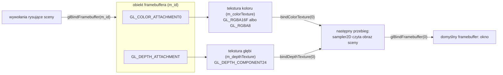

# Moduł gfx: framebuffer, klasa `Framebuffer`

Kamień milowy: M7, część pierwsza (bufor HDR, przebieg składający, gamma). Temat wykładu: 10 (Rendering pozaekranowy), strona obiektu OpenGL.
Kod: [`src/gfx/Framebuffer.hpp`](../../../src/gfx/Framebuffer.hpp), [`src/gfx/Framebuffer.cpp`](../../../src/gfx/Framebuffer.cpp), testy w [`tests/FramebufferTests.cpp`](../../../tests/FramebufferTests.cpp). Jedyny użytkownik, który tworzy obiekty tej klasy: [`src/game/PostProcess.cpp`](../../../src/game/PostProcess.cpp) (od drugiej części M7 osiem obiektów: scena, trzy cele bloomu i cztery podglądy). Czyta je także panel [`src/debug/panels/FramebuffersPanel.cpp`](../../../src/debug/panels/FramebuffersPanel.cpp).

Część modułu `gfx`. Wstęp do całego modułu, zasada RAII dla obiektów OpenGL i semantyka przenoszenia są w [`README.md`](README.md). Ten dokument stoi na [`textures.md`](textures.md): zakłada znajomość tekstur 2D (teksele, filtry, zawijanie, jednostki teksturujące, obiekt samplera, format danych a format wewnętrzny, kompletność tekstury) i opisuje to, co dochodzi, gdy do tekstury się **rysuje**, zamiast ją tylko czytać. Co gra robi z framebufferem (kolejność przebiegów klatki, trójkąt na cały ekran, mapowanie tonów, podglądy załączników), opisuje [`../renderer/post-process.md`](../renderer/post-process.md). Dlaczego bufor sceny trzyma kolory liniowe i gdzie są kodowane na sRGB, opisuje [`color-space.md`](color-space.md). Każde wywołanie OpenGL jest opakowane w `GL_CHECK` ([`../core/gl-check.md`](../core/gl-check.md)).

**Stan na dziś:** klasa jest napisana i używana przez `game::PostProcess`. W pierwszej części M7 tworzyło ono z niej trzy obiekty: framebuffer sceny (`GL_RGBA16F` i `GL_DEPTH_COMPONENT24`, wielkości framebuffera okna) oraz dwa małe framebuffery podglądów (`GL_RGBA8`, bez głębi, 180 pikseli wysokości). Druga część M7 (bloom) dodała pięć kolejnych, bez żadnej zmiany w samej klasie: trzy cele bloomu (`GL_RGBA16F`, bez głębi, połowa szerokości i połowa wysokości sceny) i dwa podglądy bloomu (`GL_RGBA8`). Razem osiem. Cele bloomu są pierwszymi framebufferami gry z kolorem HDR i **bez** głębi oraz pierwszymi o rozmiarze innym niż okno i innym niż stały podgląd (sekcja 5.14). Klasa wymaga kontekstu OpenGL, więc testy jednostkowe dotyczą tylko jej trzech funkcji bez OpenGL: nazw formatów i tekstu dla stanu kompletności (trzy przypadki w `tests/FramebufferTests.cpp`). Tworzenie, wiązanie i zmiana rozmiaru są sprawdzone tylko działającą grą. Zgłoszone dla Windowsa (2026-10-05, nie powtarzałem tych pomiarów przy pisaniu dokumentu): bramka `make check` przechodzi (format, testy Debug i Release, clang-tidy), zero ostrzeżeń, wtedy 269 przypadków testowych i 102103 asercje w obu konfiguracjach (po drugiej części M7 zgłoszone 276 i 102139, w testach tej klasy bez zmian). W buildzie Debug nie było błędów OpenGL przy włączonych podglądach, przy zmianie rozmiaru okna na 1400 x 800 oraz przy zminimalizowaniu okna (framebuffer 0 x 0) i przywróceniu go. **Czego nikt nie sprawdził:** ścieżki bez tekstury koloru (`ColorFormat::None`, sekcja 3.3) nie wykonał dotąd żaden kod, zmiana rozmiaru przez przeciąganie krawędzi okna myszą nie była sprawdzana ręcznie, a **na macOS ten kod nie był ani budowany, ani uruchamiany** (w tym na ekranie Retina, gdzie framebuffer okna jest większy od okna).

## 1. Po co to jest

Do M6 wszystko, co gra rysowała, trafiało prosto do okna. Temat 10 wykładu, rendering pozaekranowy, polega na tym, żeby narysować scenę **do tekstury**, a potem tę teksturę przeczytać w następnym przebiegu: zmienić jej jasność, rozmyć, nałożyć mgłę albo po prostu pokazać ją w panelu. Obiekt OpenGL, który na to pozwala, to obiekt framebuffera (framebuffer object, FBO). Klasa `gfx::Framebuffer` zamyka jeden taki obiekt razem z teksturami, do których rysuje.

| Funkcja | Co robi |
|---|---|
| konstruktor domyślny | obiekt bez framebuffera: `isValid()` zwraca fałsz. Dla pola, które powstaje później, gdy znany jest rozmiar okna |
| konstruktor `Framebuffer(spec)` | tworzy obiekt framebuffera, najwyżej jedną teksturę koloru i najwyżej jedną teksturę głębi, podpina je i pyta sterownik, czy da się do nich rysować |
| `bind()` | od teraz wszystko, co jest rysowane, trafia do tekstur tego obiektu. Ustawia też viewport na jego rozmiar |
| `bindDefault(width, height)` (statyczna) | celem jest znów okno, z viewportem o podanym rozmiarze |
| `resize(width, height)` | usuwa tekstury i tworzy je od nowa w nowym rozmiarze, z tymi samymi formatami |
| `bindColorTexture(unit)`, `bindDepthTexture(unit)` | wiążą teksturę koloru albo głębi z jednostką teksturującą, żeby następny przebieg mógł ją czytać |
| `colorTextureId`, `depthTextureId`, `width`, `height`, `colorFormat`, `depthFormat`, `isValid` | odczyt stanu |
| destruktor | usuwa obiekt framebuffera i obie tekstury |

Obok klasy stoją trzy zwykłe funkcje bez OpenGL: `colorFormatName`, `depthFormatName` i `framebufferStatusText`. Zamieniają stałe na tekst dla panelu i dla logu.

Co klasa obsługuje, a czego nie:

| Jest | Nie ma |
|---|---|
| jedna tekstura koloru: `GL_RGBA8` albo `GL_RGBA16F` | kilku tekstur koloru naraz (MRT, multiple render targets) |
| jedna tekstura głębi: `GL_DEPTH_COMPONENT24` | bufora szablonu (stencil) |
| oba załączniki jako **tekstury** | renderbufferów |
| jedna próbka na piksel | wielopróbkowania (MSAA) |
| jeden poziom mipmap | mipmap załączników |

Gra tworzy dziś framebuffer sceny w pełnej rozdzielczości framebuffera okna. PRD (sekcja 13) wspomina o post-processingu w połowie rozdzielczości jako o sposobie na wydajność na ekranie Retina: tego nie ma.

## 2. Teoria

### 2.1 Framebuffer: dokąd trafiają piksele

**Framebuffer** to miejsce, do którego potok OpenGL zapisuje wynik: zestaw buforów o tym samym rozmiarze, z których każdy trzyma jedną rzecz na piksel.

| Bufor | Co trzyma | Kto do niego pisze |
|---|---|---|
| koloru | kolor piksela (cztery liczby: R, G, B, A) | zmienna `out` shadera fragmentów, `glClear(GL_COLOR_BUFFER_BIT)` |
| głębi | odległość od kamery jako jedna liczba od 0 do 1 | test głębi po shaderze fragmentów, `glClear(GL_DEPTH_BUFFER_BIT)` |
| szablonu | liczba całkowita na piksel do maskowania | test szablonu (w projekcie nieużywany) |

Są dwa rodzaje framebufferów:

| | Domyślny framebuffer | Obiekt framebuffera (FBO) |
|---|---|---|
| numer | 0 | identyfikator z `glGenFramebuffers`, większy od 0 |
| kto go tworzy | system okien, razem z oknem (GLFW) | program |
| z czego się składa | z buforów, których program nie widzi jako obiektów | z **załączników**: tekstur albo renderbufferów, które program sam tworzy i podpina |
| rozmiar | rozmiar okna w pikselach, zmienia go system | rozmiar załączników, zmienia go program |
| czy da się go potem czytać shaderem | nie | tak, jeśli załącznik jest teksturą |
| co widzi użytkownik | to, co w nim jest po `glfwSwapBuffers` | nic, dopóki program nie przepisze wyniku do okna |

Sam obiekt framebuffera nie ma pamięci na piksele. Jest listą odnośników: "kolor numer 0 zapisuj do tej tekstury, głębię do tamtej". Pamięć należy do załączników.



### 2.2 Załączniki: tekstura albo renderbuffer

Do punktu podpięcia (attachment point) można podpiąć dwa rodzaje obiektów:

| | Tekstura | Renderbuffer |
|---|---|---|
| tworzenie | `glGenTextures`, `glTexImage2D` | `glGenRenderbuffers`, `glRenderbufferStorage` |
| podpięcie | `glFramebufferTexture2D` | `glFramebufferRenderbuffer` |
| czy shader może go potem czytać | **tak**, przez sampler | **nie**. Da się go tylko skopiować (`glBlitFramebuffer`) albo odczytać na procesor (`glReadPixels`) |
| do czego jest | wynik, którego potrzebuje następny przebieg | bufor potrzebny tylko w trakcie rysowania, na przykład głębia, której nikt potem nie czyta |

Typowy przykład z podręczników (LearnOpenGL, rozdział "Framebuffers") podpina kolor jako teksturę, a głębię i szablon jako renderbuffer, bo w tym przykładzie głębi nikt później nie czyta. W tym projekcie **oba załączniki są teksturami**. Powód jest w planie M7: mgła liczona z głębi sceny i mapy cieni są przebiegami, które czytają głębię shaderem, a podgląd głębi w panelu Framebuffers czyta ją już dziś. Renderbuffera nie dałoby się do tego użyć. Rozważane możliwości zapisuje notatka [`../../decisions/depth-attachment-as-texture.md`](../../decisions/depth-attachment-as-texture.md).

Punkty podpięcia używane przez klasę:

| Punkt | Co tu podpina klasa | Skutek |
|---|---|---|
| `GL_COLOR_ATTACHMENT0` | teksturę koloru | to, co shader fragmentów zapisuje do swojej pierwszej zmiennej `out`, trafia do tej tekstury |
| `GL_DEPTH_ATTACHMENT` | teksturę głębi | test głębi wszystkiego, co jest rysowane do tego framebuffera, używa tej tekstury |

OpenGL 4.1 gwarantuje co najmniej osiem punktów koloru (`GL_COLOR_ATTACHMENT0` do `7`). Klasa używa jednego.

### 2.3 Formaty wewnętrzne załączników

Format wewnętrzny mówi, jak karta przechowuje jeden piksel ([`textures.md`](textures.md), sekcja 2.9). Dla załącznika to także odpowiedź na pytanie, **jakie wartości przetrwają zapis**.

| Format | Bity na kanał | Zakres wartości | Bajtów na piksel | Kto go używa w grze |
|---|---|---|---|---|
| `GL_RGBA8` | 8, liczba całkowita bez znaku czytana jako ułamek | od 0 do 1, 256 poziomów. Wszystko powyżej 1 jest obcinane do 1 przy zapisie | 4 | cztery framebuffery podglądów: dwa sceny i, od drugiej części M7, dwa bloomu (obraz gotowy do pokazania) |
| `GL_RGBA16F` | 16, liczba zmiennoprzecinkowa połówkowej precyzji | około od -65504 do 65504, bez obcinania do 1 | 8 | framebuffer sceny i, od drugiej części M7, trzy cele bloomu |
| `GL_DEPTH_COMPONENT24` | 24, jedna liczba | od 0 (płaszczyzna bliska) do 1 (płaszczyzna daleka) | zależy od sterownika (zwykle 4, nie mierzyłem) | głębia framebuffera sceny |

**Liczba połówkowej precyzji (half float)** ma 1 bit znaku, 5 bitów wykładnika i 10 bitów mantysy. Dwie własności mają tu znaczenie:

1. **Nie ma sufitu w jedynce.** Kryształ, którego kolor wyszedł z rachunku jako 3,15 (do pierwszej części M7 było to 1,97), zostaje w buforze jako 3,15, a nie jako 1. Informacja "o ile jaśniej niż biel" przetrwa do przebiegu składającego, który dopiero decyduje, jak ją pokazać. To jest znaczenie skrótu **HDR** (high dynamic range, szeroki zakres jasności). Dlaczego to ważne i co dalej dzieje się z tymi wartościami, opisuje [`../renderer/post-process.md`](../renderer/post-process.md).
2. **Ciemne tony mają dużo więcej stopni.** Liczba zmiennoprzecinkowa ma stałą liczbę cyfr znaczących (tu około trzech dziesiętnych), więc im mniejsza wartość, tym drobniejszy krok. Bajt ma 256 równych kroków na cały zakres. W scenie nocnej większość liniowych wartości leży blisko zera (światło otoczenia po przeliczeniu na liniowe to około 0,01, patrz [`color-space.md`](color-space.md)), więc w `GL_RGBA8` zmieściłyby się w kilku najniższych poziomach i dały widoczne pasy.

**Pamięć.** Tekstura koloru sceny zajmuje `szerokość * wysokość * 8` bajtów:

| Framebuffer okna | Rachunek | Wynik |
|---|---|---|
| 1280 x 720 | `1280 * 720 * 8 = 7 372 800` bajtów | 7,03 MiB |
| 2560 x 1440 | `2560 * 1440 * 8 = 29 491 200` bajtów | 28,1 MiB |

Dla porównania `GL_RGBA8` to połowa tego. Ile naprawdę zajmuje tekstura głębi, zależy od tego, jak sterownik przechowuje 24 bity: tego nie mierzyłem.

**Dlaczego 24 bity głębi.** To zwykła precyzja bufora głębi okna, więc scena narysowana do własnego framebuffera zachowuje się w teście głębi tak samo jak wcześniej narysowana do okna. Głębia nie jest liniowa: większość z 16,7 miliona poziomów leży tuż przy kamerze. Wzór i przeliczenie z powrotem na metry są w [`../renderer/post-process.md`](../renderer/post-process.md).

**Oba formaty koloru są gwarantowane.** Specyfikacja OpenGL 4.1 wymienia `GL_RGBA8` i `GL_RGBA16F` wśród formatów, do których każdy sterownik musi umieć rysować (required renderbuffer and texture formats). Dlatego klasa nie ma ścieżki zapasowej na wypadek, gdyby `GL_RGBA16F` nie zadziałał: błąd kompletności zostałby wypisany, a framebuffer zostałby nieważny.

### 2.4 Kompletność framebuffera

Podpięcie załączników nie wystarcza. Framebuffer musi być **kompletny** (framebuffer complete), czyli spełniać reguły, które pozwalają sterownikowi do niego rysować. Najważniejsze:

- jest co najmniej jeden załącznik,
- każdy załącznik ma rozmiar większy od zera i format, do którego da się rysować w tym punkcie (do punktu koloru format koloru, do punktu głębi format głębi),
- bufory wskazane jako cel rysowania i źródło odczytu (`glDrawBuffer`, `glReadBuffer`) mają podpięty załącznik,
- wszystkie załączniki mają tę samą liczbę próbek,
- sterownik obsługuje tę kombinację formatów.

Ostatni punkt jest powodem, dla którego kompletności nie da się wywnioskować z kodu: **trzeba zapytać**. Robi to `glCheckFramebufferStatus(GL_FRAMEBUFFER)`, które zwraca `GL_FRAMEBUFFER_COMPLETE` albo jedną ze stałych opisujących powód. Funkcja `framebufferStatusText` zamienia je na zdania dla logu:

| Stała | Tekst w logu | Kiedy |
|---|---|---|
| `GL_FRAMEBUFFER_COMPLETE` | `complete` | wszystko w porządku |
| `GL_FRAMEBUFFER_UNDEFINED` | `the default framebuffer does not exist` | związany jest framebuffer 0, a kontekst nie ma okna |
| `GL_FRAMEBUFFER_INCOMPLETE_ATTACHMENT` | `an attachment is incomplete (a texture of size 0 or of a format that cannot be drawn into)` | załącznik ma rozmiar 0 albo zły format dla swojego punktu |
| `GL_FRAMEBUFFER_INCOMPLETE_MISSING_ATTACHMENT` | `nothing is attached` | żadnego załącznika |
| `GL_FRAMEBUFFER_INCOMPLETE_DRAW_BUFFER` | `the draw buffer names a colour attachment that does not exist` | cel rysowania wskazuje punkt koloru bez załącznika |
| `GL_FRAMEBUFFER_INCOMPLETE_READ_BUFFER` | `the read buffer names a colour attachment that does not exist` | to samo dla źródła odczytu |
| `GL_FRAMEBUFFER_UNSUPPORTED` | `the driver does not support this combination of formats` | sterownik odmawia tej kombinacji |
| `GL_FRAMEBUFFER_INCOMPLETE_MULTISAMPLE` | `the attachments differ in their number of samples` | różna liczba próbek w załącznikach |
| `GL_FRAMEBUFFER_INCOMPLETE_LAYER_TARGETS` | `the attachments differ in being layered` | część załączników jest warstwowa, część nie |
| każda inna liczba | `unknown status` | zabezpieczenie na przyszłe wersje |

Rysowanie do niekompletnego framebuffera nie rysuje niczego i zgłasza błąd `GL_INVALID_FRAMEBUFFER_OPERATION`. Klasa do tego nie dopuszcza: po nieudanym sprawdzeniu zwalnia wszystko i zostaje nieważna (`isValid()` zwraca fałsz), a wołający pomija przebieg.

Kompletność **framebuffera** to co innego niż kompletność **tekstury** ([`textures.md`](textures.md), sekcja 3.3). Pierwsza decyduje, czy da się do załącznika rysować. Druga, czy da się go potem przeczytać samplerem. Tekstura załącznika musi spełnić obie (sekcja 2.7).

### 2.5 Wiązanie i viewport

`glBindFramebuffer(target, id)` wybiera framebuffer. Cele są trzy:

| Cel | Co wiąże |
|---|---|
| `GL_DRAW_FRAMEBUFFER` | framebuffer, do którego trafiają wywołania rysujące i `glClear` |
| `GL_READ_FRAMEBUFFER` | framebuffer, z którego czytają `glReadPixels` i `glBlitFramebuffer` |
| `GL_FRAMEBUFFER` | oba naraz |

Klasa używa wyłącznie `GL_FRAMEBUFFER`. Związanie numeru 0 wraca do okna.

**Viewport nie należy do framebuffera.** `glViewport` ustawia prostokąt, na który OpenGL rozciąga znormalizowane współrzędne urządzenia (od -1 do 1), i jest stanem **kontekstu**. Zmiana framebuffera go nie zmienia. Jeżeli po rysowaniu do okna 1280 x 720 zwiążę framebuffer podglądu 320 x 180 i nie ustawię viewportu, OpenGL nadal rozciąga obraz na 1280 x 720 pikseli, a w teksturze 320 x 180 mieści się tylko jego lewy dolny róg. Dlatego obie funkcje wiążące klasy ustawiają viewport razem z framebufferem:

| Funkcja | Framebuffer | Viewport |
|---|---|---|
| `bind()` | `m_id` | `(0, 0, szerokość, wysokość)` z własnej specyfikacji |
| `bindDefault(width, height)` | 0 | `(0, 0, width, height)`: rozmiar podaje wołający, bo klasa nie zna okna |

Nie da się więc związać framebuffera tą klasą i zapomnieć o viewporcie.

### 2.6 Rozmiar framebuffera a rozmiar okna

Okno ma dwa rozmiary ([`../core/window-context.md`](../core/window-context.md)):

| Rozmiar | Jednostka | Funkcja GLFW | Do czego |
|---|---|---|---|
| rozmiar okna | współrzędne ekranu | `glfwGetWindowSize` | pozycja myszy, układ okien |
| rozmiar framebuffera | piksele | `glfwGetFramebufferSize` | `glViewport`, rozmiar tekstur, wszystko w OpenGL |

Na zwykłym monitorze oba są równe. Na ekranie Retina (macOS) framebuffer jest zwykle dwa razy większy w każdym kierunku: okno 1280 x 720 ma framebuffer 2560 x 1440. Framebuffer sceny musi mieć rozmiar **framebuffera** okna, inaczej obraz byłby rysowany w połowie rozdzielczości i rozciągany. W kodzie pilnuje tego jedno źródło rozmiaru: `window().framebufferSize()` w `NightMazeApp::onRender`, przekazywane do `PostProcess::beginScene` i do `PostProcess::composite`. Komentarze `bindDefault` i `beginScene` mówią to wprost. Na ekranie Retina ta ścieżka nie była uruchamiana (lista otwartych punktów w [`../../guides/build-macos.md`](../../guides/build-macos.md)).

### 2.7 Tekstura załącznika jako tekstura do czytania

Po narysowaniu sceny tekstura koloru jest zwykłą teksturą 2D i następny przebieg czyta ją przez `sampler2D`. Cztery ustawienia decydują, czy przeczyta ją dobrze. Klasa zapisuje je **w samej teksturze** (`glTexParameteri`), a nie w obiekcie samplera:

| Parametr | Wartość | Dlaczego |
|---|---|---|
| `GL_TEXTURE_MAX_LEVEL` | 0 | tekstura ma jeden poziom. Domyślny filtr pomniejszenia nowej tekstury (`GL_NEAREST_MIPMAP_LINEAR`) prosi o mipmapy, więc bez tej linii tekstura byłaby niekompletna i czytana jako czerń, bez żadnego błędu |
| `GL_TEXTURE_MIN_FILTER`, `GL_TEXTURE_MAG_FILTER` | `GL_LINEAR` dla koloru, `GL_NEAREST` dla głębi | przebieg, który czyta obraz w innym rozmiarze (podgląd 320 x 180 ze sceny 1280 x 720), dostaje dla koloru wartości zmieszane zamiast klocków. Głębi mieszać nie wolno: średnia głębi dwóch powierzchni nie jest głębią żadnej z nich |
| `GL_TEXTURE_WRAP_S`, `GL_TEXTURE_WRAP_T` | `GL_CLAMP_TO_EDGE` | przebieg, który czyta tuż przy krawędzi (rozmycie), nie może dostać pikseli z przeciwnej krawędzi, a to dałoby domyślne `GL_REPEAT` |

**Obiekt samplera na jednostce.** Parametry tekstury są ignorowane, dopóki z jednostką teksturującą jest związany obiekt samplera ([`textures.md`](textures.md), sekcja 2.8, [`cubemap.md`](cubemap.md), sekcja 2.3). A na jednostce 0 leży po rysowaniu sceny sampler zostawiony przez to, co było rysowane jako ostatnie: sampler nieba (`Cubemap`: filtr liniowy, przycinanie do krawędzi) albo, przy wyłączonym niebie, sampler ostatniej `Texture2D` (filtr z mipmapami, anizotropia, `GL_REPEAT`). Sposób odczytu obrazu sceny zależałby wtedy od tego, co akurat narysowano przed nim, i od ustawień filtra w panelu Assets. Dlatego `bindColorTexture` i `bindDepthTexture` oprócz związania tekstury **odwiązują sampler jednostki**: `glBindSampler(unit, 0)`. Zero znaczy "brak obiektu samplera, czytaj według parametrów tekstury".

Jest jeden czytelnik, który tych parametrów nie używa: ImGui. Backend OpenGL biblioteki przed narysowaniem każdego obrazu wiąże z jednostką 0 własny sampler (filtr liniowy, przycinanie do krawędzi), więc tekstura podglądu pokazana przez `ImGui::Image` jest czytana samplerem ImGui. Dla podglądów nie robi to różnicy: sampler ImGui też nie sięga po mipmapy.

**Głębia czytana jak kolor.** Tekstura głębi czytana przez zwykły `sampler2D` zwraca głębię w kanale czerwonym, jako liczbę od 0 do 1. Warunek: tryb porównania (`GL_TEXTURE_COMPARE_MODE`) jest wyłączony, a to jest wartość domyślna i klasa jej nie zmienia. Tryb porównania i `sampler2DShadow` należą do map cieni (plan M7, jeszcze nie w kodzie).

### 2.8 Pętla zwrotna: nie czytać tego, do czego się rysuje

Tekstura może być **naraz** załącznikiem związanego framebuffera i teksturą związaną z jednostką, którą czyta shader. Wynik takiego rysowania jest **niezdefiniowany** (feedback loop): shader czytałby piksele, które w tym samym wywołaniu nadpisuje. OpenGL nie zgłasza przy tym błędu.

Reguła: przebieg czyta tekstury jednego framebuffera, a rysuje do **innego**. W grze tak jest we wszystkich przebiegach po scenie:

| Przebieg | Czyta | Rysuje do |
|---|---|---|
| podglądy (`PostProcess::drawPreviews`) | teksturę koloru, potem teksturę głębi sceny | framebuffera podglądu koloru, potem framebuffera podglądu głębi |
| przebieg jasności bloomu (`PostProcess::drawBloom`, druga część M7) | teksturę koloru sceny | celu `m_brightPass` |
| rozmycie bloomu, przebieg poziomy | `m_brightPass` w pierwszej iteracji, potem `m_bloom` | celu `m_blurHorizontal` |
| rozmycie bloomu, przebieg pionowy | `m_blurHorizontal` | celu `m_bloom` |
| podglądy bloomu | `m_brightPass`, potem `m_bloom` | dwóch framebufferów podglądu |
| przebieg składający (`PostProcess::composite`) | teksturę koloru sceny i, od drugiej części M7, teksturę `m_bloom` | domyślnego framebuffera (okna) |

Rozmycie jest przypadkiem, w którym ta reguła **wymusza** kształt kodu: jeden cel nie wystarczy, bo wynik przebiegu trzeba gdzieś zapisać, zanim następny go przeczyta. Dwa cele zamieniają się rolami (ping-pong, [`../renderer/post-process.md`](../renderer/post-process.md), sekcja 2.14).

Tekstury sceny zostają związane z jednostką 0 także wtedy, gdy w następnej klatce framebuffer sceny jest znów celem. To samo związanie nie jest jeszcze pętlą: liczy się to, czy shader, który akurat rysuje, **czyta** tę jednostkę jako tę teksturę. Przy rysowaniu sceny każdy model wiąże własne tekstury (`Texture2D::bind`), a niebo swoją teksturę sześcienną. Od drugiej części M7 to samo dotyczy jednostki 1: po przebiegu składającym zostaje na niej tekstura `m_bloom`, do której następne `drawBloom` rysuje. Programy bloomu czytają tylko jednostkę 0, więc to też nie jest pętla.

### 2.9 Zmiana rozmiaru i rozmiar 0 x 0

Tekstura nie umie zmienić rozmiaru i zachować miejsca w framebufferze. Zmiana rozmiaru okna oznacza więc: usunąć tekstury i obiekt framebuffera, utworzyć je od nowa w nowym rozmiarze, podpiąć, sprawdzić kompletność. Zawartość przepada, co nie szkodzi: każda klatka i tak zaczyna od `glClear`.

Osobnym przypadkiem jest **okno zminimalizowane**. GLFW zgłasza wtedy rozmiar framebuffera 0 x 0. Tekstury o rozmiarze 0 nie da się podpiąć: framebuffer byłby niekompletny (`GL_FRAMEBUFFER_INCOMPLETE_ATTACHMENT`). Kod broni się na trzech poziomach:

| Gdzie | Co robi przy rozmiarze poniżej 1 |
|---|---|
| `NightMazeApp::onRender` | pomija całą klatkę, zanim cokolwiek zostanie związane. Powód dodatkowy: proporcja obrazu `0 / 0` to NaN i `glm::perspective` zatrzymałoby program asercją w buildzie Debug |
| `PostProcess::beginScene` | zwraca fałsz, niczego nie tworzy |
| `Framebuffer::resize` | nic nie robi: framebuffer **zachowuje stary rozmiar** i jest gotowy, gdy okno wróci |
| konstruktor `Framebuffer(spec)` | wypisuje błąd, niczego nie tworzy, obiekt jest nieważny |

Dzięki temu po przywróceniu okna nic nie trzeba odbudowywać, jeśli rozmiar jest ten sam co przed zminimalizowaniem.

## 3. Jak to działa w OpenGL

### 3.1 Wywołania w kolejności

Utworzenie (`create`, wołane z konstruktora i z `resize`):

| # | Wywołanie | Co robi |
|---|---|---|
| 1 | `glGenFramebuffers(1, &m_id)` | rezerwuje identyfikator obiektu framebuffera |
| 2 | `glBindFramebuffer(GL_FRAMEBUFFER, m_id)` | wiąże go do rysowania i do odczytu. Podpinanie działa na framebufferze, który jest związany |
| 3 | `glGenTextures(1, &texture)` | rezerwuje identyfikator tekstury koloru |
| 4 | `glBindTexture(GL_TEXTURE_2D, texture)` | wiąże ją z aktywną jednostką i ustala jej rodzaj |
| 5 | `glTexImage2D(GL_TEXTURE_2D, 0, GL_RGBA16F, width, height, 0, GL_RGBA, GL_FLOAT, nullptr)` | przydziela pamięć poziomu 0 i **niczego nie kopiuje** (`nullptr`). Dla `Rgba8`: `GL_RGBA8`, `GL_RGBA`, `GL_UNSIGNED_BYTE` |
| 6 | `glTexParameteri(GL_TEXTURE_2D, GL_TEXTURE_MAX_LEVEL, 0)` | jeden poziom |
| 7 | `glTexParameteri` dla `GL_TEXTURE_MIN_FILTER` i `GL_TEXTURE_MAG_FILTER`, wartość `GL_LINEAR` | filtr koloru |
| 8 | `glTexParameteri` dla `GL_TEXTURE_WRAP_S` i `GL_TEXTURE_WRAP_T`, wartość `GL_CLAMP_TO_EDGE` | przycinanie do krawędzi |
| 9 | `glFramebufferTexture2D(GL_FRAMEBUFFER, GL_COLOR_ATTACHMENT0, GL_TEXTURE_2D, texture, 0)` | podpina poziom 0 tekstury jako kolor numer 0 |
| 10 | kroki 3 do 8 dla tekstury głębi: `glTexImage2D(..., GL_DEPTH_COMPONENT24, ..., GL_DEPTH_COMPONENT, GL_FLOAT, nullptr)`, filtr `GL_NEAREST` | tekstura głębi |
| 11 | `glFramebufferTexture2D(GL_FRAMEBUFFER, GL_DEPTH_ATTACHMENT, GL_TEXTURE_2D, depthTexture, 0)` | podpina ją jako głębię |
| 12 | `glCheckFramebufferStatus(GL_FRAMEBUFFER)` | pyta sterownik o kompletność |
| 13 | `glBindFramebuffer(GL_FRAMEBUFFER, 0)` | wraca do okna, bez względu na wynik i na to, co było związane wcześniej |

Dla framebuffera bez głębi (podglądy) kroki 10 i 11 odpadają.

Użycie, co klatkę:

| # | Wywołanie | Funkcja klasy | Co robi |
|---|---|---|---|
| 14 | `glBindFramebuffer(GL_FRAMEBUFFER, m_id)` | `bind` | cel rysowania: tekstury tego obiektu |
| 15 | `glViewport(0, 0, width, height)` | `bind` | viewport na cały framebuffer |
| 16 | `glBindFramebuffer(GL_FRAMEBUFFER, 0)` | `bindDefault` | cel rysowania: okno |
| 17 | `glViewport(0, 0, width, height)` | `bindDefault` | viewport na framebuffer okna |
| 18 | `glActiveTexture(GL_TEXTURE0 + unit)` | `bindColorTexture`, `bindDepthTexture` | wybiera jednostkę |
| 19 | `glBindTexture(GL_TEXTURE_2D, m_colorTexture)` albo `m_depthTexture` | jak wyżej | wiąże teksturę załącznika do czytania |
| 20 | `glBindSampler(unit, 0)` | jak wyżej | odwiązuje obiekt samplera jednostki |

Sprzątanie (`release`, wołane z destruktora, z `resize`, z przypisania przenoszącego i po nieudanym sprawdzeniu kompletności):

| # | Wywołanie | Co robi |
|---|---|---|
| 21 | `glDeleteFramebuffers(1, &m_id)` | usuwa obiekt framebuffera. Identyfikator 0 jest po cichu ignorowany |
| 22 | `glDeleteTextures(1, &m_colorTexture)` | usuwa teksturę koloru. 0 jest ignorowane |
| 23 | `glDeleteTextures(1, &m_depthTexture)` | usuwa teksturę głębi. 0 jest ignorowane |

Czyszczenia (`glClear`) i rysowania klasa nie robi: po `bind()` robi to wołający, zwykłymi wywołaniami, które nie wiedzą, czy celem jest okno, czy tekstura.

### 3.2 Co wolno w 4.1

Wszystkie funkcje z tabel są w rdzeniu OpenGL 4.1: obiekty framebufferów są w rdzeniu od wersji 3.0, obiekty samplera od 3.3. Czego nie wolno użyć:

| Funkcja | Od wersji | Co jest zamiast niej |
|---|---|---|
| `glTexStorage2D` | 4.2 | `glTexImage2D` z `nullptr` (komentarz w kodzie mówi to wprost) |
| `glCreateFramebuffers`, `glNamedFramebufferTexture`, `glCheckNamedFramebufferStatus` (direct state access) | 4.5 | `glGenFramebuffers` i praca na związanym obiekcie |
| `glObjectLabel` (nazwy obiektów dla debuggera) | 4.3 | nic. Obiektów nie da się nazwać dla RenderDoc |

### 3.3 Framebuffer bez koloru: `glDrawBuffer(GL_NONE)`

Każdy obiekt framebuffera pamięta, do którego punktu koloru rysować i z którego czytać. Wartość początkowa to `GL_COLOR_ATTACHMENT0`. Framebuffer, który ma **tylko głębię** (mapa cieni), nie ma tam niczego, więc trzeba mu to powiedzieć:

```cpp
GL_CHECK(glDrawBuffer(GL_NONE));
GL_CHECK(glReadBuffer(GL_NONE));
```

Bez tych dwóch linii część sterowników zgłasza framebuffer jako niekompletny (`GL_FRAMEBUFFER_INCOMPLETE_DRAW_BUFFER` albo `..._READ_BUFFER`). Oba ustawienia są stanem obiektu framebuffera, a nie kontekstu, więc wystarczy ustawić je raz przy tworzeniu.

**Uczciwie:** ta gałąź kodu istnieje, ale **nie została dotąd wykonana ani razu**. Żaden kod nie tworzy framebuffera z `ColorFormat::None`: scena ma oba załączniki, podglądy i cele bloomu mają sam kolor. Gałąź jest przygotowana pod mapy cieni z dalszej części M7 i dopiero wtedy okaże się, czy działa na obu systemach.

### 3.4 Stan, który klasa zostawia po sobie

| Funkcja | Co zmienia w stanie kontekstu i tak zostawia |
|---|---|
| konstruktor, `resize` | związany jest **domyślny** framebuffer (bez względu na to, co było związane przedtem). Wiązanie `GL_TEXTURE_2D` aktywnej jednostki wskazuje ostatnio utworzoną teksturę załącznika. Viewport bez zmian |
| `bind` | związany framebuffer i viewport |
| `bindDefault` | związany framebuffer 0 i viewport |
| `bindColorTexture`, `bindDepthTexture` | aktywna jednostka, wiązanie `GL_TEXTURE_2D` tej jednostki, brak samplera na tej jednostce |
| destruktor, `release` | usunięcie związanego framebuffera przywraca wiązanie 0. Usunięta tekstura znika z wiązań jednostek |

Pierwszy wiersz jest pułapką, jeśli ktoś tworzy framebuffer w środku przebiegu: po konstruktorze celem jest okno. W grze `beginScene` woła `m_scene.bind()` zaraz po utworzeniu, a `drawPreviews` wiąże framebuffer podglądu dopiero po obu wywołaniach `fitTarget` (w pierwszej części M7: `fitPreview`). `drawBloom` robi tak samo: najpierw trzy wywołania `fitTarget` dla trzech celów, potem pierwsze `bind()`.

## 4. Shadery

Klasa nie ma własnych shaderów i żadnego nie zna. Po stronie GLSL framebuffer widać w dwóch miejscach:

| Strona | Co | Gdzie |
|---|---|---|
| zapis | pierwsza zmienna `out vec4` shadera fragmentów trafia do `GL_COLOR_ATTACHMENT0` związanego framebuffera. Shader nie wie, czy to okno, czy tekstura: te same shadery sceny rysowały do okna w M6 i rysują do tekstury `GL_RGBA16F` dziś | wszystkie shadery fragmentów sceny (`lit.frag`, `gouraud.frag`, `textured.frag`, `color.frag`, `grass.frag`, `skybox.frag`) |
| odczyt | załącznik jest czytany jak każda tekstura: `uniform sampler2D` ustawiony na numer jednostki, na której leży po `bindColorTexture` albo `bindDepthTexture` | `post/composite.frag` (`uScene`), `post/preview.frag` (`uSource`) |

```glsl
uniform sampler2D uScene;
// ...
vec3 color = texture(uScene, vUv).rgb;
```

Odczytana wartość ma taki zakres, jaki pozwala format: z `GL_RGBA16F` może być większa od 1. Tekstura głębi zwraca głębię w `.r`. Oba shadery przebiegów i wspólny shader wierzchołków `post/composite.vert` są omówione linia po linii w [`../renderer/post-process.md`](../renderer/post-process.md).

## 5. Kod w projekcie

### 5.1 Pliki

| Plik | Co zawiera |
|---|---|
| [`src/gfx/Framebuffer.hpp`](../../../src/gfx/Framebuffer.hpp) | wyliczenia `ColorFormat` i `DepthFormat`, struktura `FramebufferSpec`, deklaracje `colorFormatName`, `depthFormatName`, `framebufferStatusText`, klasa `gfx::Framebuffer`. Dołącza tylko `<glad/gl.h>` |
| [`src/gfx/Framebuffer.cpp`](../../../src/gfx/Framebuffer.cpp) | trzy stałe, struktura `TextureFormat`, funkcje pomocnicze `colorTextureFormat` i `createAttachmentTexture`, implementacja |
| [`tests/FramebufferTests.cpp`](../../../tests/FramebufferTests.cpp) | trzy przypadki testowe dla części bez OpenGL |
| [`src/game/PostProcess.hpp`](../../../src/game/PostProcess.hpp), [`.cpp`](../../../src/game/PostProcess.cpp) | użytkownik: pola `m_scene`, `m_colorPreview`, `m_depthPreview` i, od drugiej części M7, `m_brightPass`, `m_blurHorizontal`, `m_bloom`, `m_brightPassPreview`, `m_bloomPreview` ([`../renderer/post-process.md`](../renderer/post-process.md)) |
| [`src/debug/panels/FramebuffersPanel.cpp`](../../../src/debug/panels/FramebuffersPanel.cpp) | czyta `width`, `height`, `colorFormat`, `depthFormat` i `colorTextureId` |

Oba pliki klasy są na liście źródeł biblioteki `engine` w [`CMakeLists.txt`](../../../CMakeLists.txt), a plik testów na liście `night_maze_tests`. Zależności: GLAD, `core/GlCheck.hpp`, `core/Log.hpp` i `<string>` (dla `std::to_string`). Nic z `assets/`, GLM ani GLFW: klasa nie zna okna, więc rozmiar dostaje z zewnątrz.

Komentarz `// See docs/...` na górze obu plików klasy i pliku testów wskazuje ten dokument.

### 5.2 Formaty i specyfikacja

```cpp
enum class ColorFormat {
    /// No colour texture at all: a target that only records depth (a shadow map).
    None,
    /// GL_RGBA8: one byte per channel, values from 0 to 1. For pictures that are final,
    /// like a preview or a map.
    Rgba8,
    /// GL_RGBA16F: a 16 bit floating point number per channel. Values are not cut off at
    /// 1, so a bright light keeps how much brighter than white it is (HDR, high dynamic
    /// range), and dark tones keep far more steps than a byte has.
    Rgba16F,
};

enum class DepthFormat {
    /// No depth texture: a target for passes that draw one flat triangle over
    /// everything and need no depth test (post-processing).
    None,
    /// GL_DEPTH_COMPONENT24: 24 bits of depth, the usual precision of a window.
    Depth24,
};

struct FramebufferSpec {
    /// Size of both textures in pixels.
    int width = 0;
    int height = 0;
    ColorFormat color = ColorFormat::None;
    DepthFormat depth = DepthFormat::None;
};
```

| Element | Dlaczego tak |
|---|---|
| własne wyliczenia zamiast `GLenum` | wołający może podać tylko formaty, które klasa umie utworzyć. `Framebuffer({.color = GL_RGB565})` się nie skompiluje |
| `None` w obu wyliczeniach | "brak załącznika" jest wartością, a nie osobną flagą. Podglądy mają `DepthFormat::None`, przyszła mapa cieni będzie mieć `ColorFormat::None` |
| `FramebufferSpec` jako struktura | cztery parametry mają nazwy w miejscu wywołania (inicjalizacja z nazwami pól, C++20): `{.width = ..., .height = ..., .color = ..., .depth = ...}`. Dwóch liczb `int` obok siebie nie da się wtedy zamienić przez pomyłkę |
| wartości domyślne: 0, 0, `None`, `None` | pusta specyfikacja jest dokładnie tym, co konstruktor odrzuca. Obiekt nieważny ma taką specyfikację, więc `width()` i `height()` zwracają dla niego 0 |

Użycie w grze ([`src/game/PostProcess.cpp`](../../../src/game/PostProcess.cpp)):

```cpp
m_scene = gfx::Framebuffer({.width = size.width,
                            .height = size.height,
                            .color = gfx::ColorFormat::Rgba16F,
                            .depth = gfx::DepthFormat::Depth24});
```

### 5.3 Nagłówek klasy

```cpp
class Framebuffer {
public:
    Framebuffer() = default;
    explicit Framebuffer(const FramebufferSpec& spec);
    ~Framebuffer();

    Framebuffer(const Framebuffer&) = delete;
    Framebuffer& operator=(const Framebuffer&) = delete;

    Framebuffer(Framebuffer&& other) noexcept;
    Framebuffer& operator=(Framebuffer&& other) noexcept;

    bool isValid() const { return m_id != 0; }

    void bind() const;
    static void bindDefault(int width, int height);
    void resize(int width, int height);

    void bindColorTexture(GLuint unit) const;
    void bindDepthTexture(GLuint unit) const;

    GLuint colorTextureId() const { return m_colorTexture; }
    GLuint depthTextureId() const { return m_depthTexture; }

    int width() const { return m_spec.width; }
    int height() const { return m_spec.height; }
    ColorFormat colorFormat() const { return m_spec.color; }
    DepthFormat depthFormat() const { return m_spec.depth; }

private:
    void create();
    void release();

    GLuint m_id = 0;
    GLuint m_colorTexture = 0;
    GLuint m_depthTexture = 0;
    FramebufferSpec m_spec;
};
```

(Komentarze Doxygen są tu pominięte. Ich treść jest omówiona przy każdej funkcji niżej.)

| Element | Dlaczego tak |
|---|---|
| `Framebuffer() = default;` | `PostProcess` ma osiem pól tego typu (w pierwszej części M7 trzy), a rozmiar okna jest znany dopiero w pierwszej klatce. Obiekt domyślny ma trzy zera i pustą specyfikację: jest poprawnym "brakiem framebuffera" |
| `explicit` przy konstruktorze ze specyfikacji | bez tego `FramebufferSpec` zamieniałby się na `Framebuffer` po cichu, na przykład przy przekazaniu do funkcji, i tworzył obiekty OpenGL tam, gdzie nikt się ich nie spodziewa |
| `= delete` dla kopiowania, ręcznie napisane przenoszenie | reguła wspólna dla klas `gfx` ([`README.md`](README.md), sekcja 2). Kopia trzymałaby te same trzy identyfikatory i usunęła je drugi raz |
| `isValid()` patrzy na `m_id` | po nieudanym utworzeniu `release` zeruje wszystkie trzy identyfikatory, więc jeden wystarcza |
| `bind() const`, `bindColorTexture() const` | zmieniają stan kontekstu OpenGL, a nie pola obiektu |
| `static bindDefault` | okno nie jest obiektem tej klasy, więc funkcja nie ma na czym być wołana. Jest w klasie, żeby powrót do okna miał tę samą parę "framebuffer i viewport" co `bind` |
| `colorTextureId`, `depthTextureId` | dla kodu, który potrzebuje gołej liczby: panel przekazuje identyfikator tekstury do `ImGui::Image` |
| `create`, `release` prywatne | wspólne części konstruktora, destruktora, `resize` i przenoszenia. Z zewnątrz nie da się zostawić obiektu w połowie utworzonego |
| `m_spec` jako pole | `resize` potrzebuje formatów, `bind` rozmiaru, panel wszystkiego |

### 5.4 Stałe i funkcje pomocnicze

```cpp
// The default framebuffer: the one of the window.
constexpr GLuint DEFAULT_FRAMEBUFFER = 0;

// "No sampler object": the texture bound to the unit is read with its own parameters.
constexpr GLuint NO_SAMPLER = 0;

// The attached textures have one level, the full size. A framebuffer draws into one
// level of a texture, and this is the one.
constexpr GLint BASE_LEVEL = 0;
```

Trzy zera o trzech znaczeniach, każde z własną nazwą. `BASE_LEVEL` jest użyte trzy razy: jako numer poziomu w `glTexImage2D`, jako wartość `GL_TEXTURE_MAX_LEVEL` i jako poziom w `glFramebufferTexture2D`.

```cpp
struct TextureFormat {
    GLint internal;
    GLenum format;
    GLenum type;
};

TextureFormat colorTextureFormat(ColorFormat format) {
    if (format == ColorFormat::Rgba16F) {
        return {.internal = GL_RGBA16F, .format = GL_RGBA, .type = GL_FLOAT};
    }
    return {.internal = GL_RGBA8, .format = GL_RGBA, .type = GL_UNSIGNED_BYTE};
}
```

`glTexImage2D` potrzebuje trzech stałych opisujących format: wewnętrznego (jak karta przechowuje piksel) oraz pary formatu i typu danych (jak wyglądałyby bajty podane w ostatnim argumencie). Danych nie ma, ostatni argument to `nullptr`, ale para i tak musi być taka, jaką OpenGL przyjmuje dla danego formatu wewnętrznego: dla głębi musi to być `GL_DEPTH_COMPONENT`, inaczej wywołanie kończy się błędem `GL_INVALID_OPERATION`. `GLint` dla pierwszej i `GLenum` dla dwóch pozostałych, bo takie typy mają parametry `glTexImage2D`.

```cpp
GLuint createAttachmentTexture(const FramebufferSpec& spec, const TextureFormat& format,
                               GLint filter) {
    GLuint texture = 0;
    GL_CHECK(glGenTextures(1, &texture));
    GL_CHECK(glBindTexture(GL_TEXTURE_2D, texture));
    GL_CHECK(glTexImage2D(GL_TEXTURE_2D, BASE_LEVEL, format.internal, spec.width, spec.height, 0,
                          format.format, format.type, nullptr));

    GL_CHECK(glTexParameteri(GL_TEXTURE_2D, GL_TEXTURE_MAX_LEVEL, BASE_LEVEL));
    GL_CHECK(glTexParameteri(GL_TEXTURE_2D, GL_TEXTURE_MIN_FILTER, filter));
    GL_CHECK(glTexParameteri(GL_TEXTURE_2D, GL_TEXTURE_MAG_FILTER, filter));
    GL_CHECK(glTexParameteri(GL_TEXTURE_2D, GL_TEXTURE_WRAP_S, GL_CLAMP_TO_EDGE));
    GL_CHECK(glTexParameteri(GL_TEXTURE_2D, GL_TEXTURE_WRAP_T, GL_CLAMP_TO_EDGE));
    return texture;
}
```

(Komentarze z kodu są tu pominięte: mówią to samo co tabela.)

| Linia | Znaczenie |
|---|---|
| `glGenTextures`, `glBindTexture` | nowa tekstura 2D, związana z jednostką, która akurat jest aktywna. Funkcja nie woła `glActiveTexture` i zostawia teksturę związaną |
| `glTexImage2D(..., nullptr)` | przydziela pamięć `width * height` pikseli i nic do niej nie kopiuje. Zawartość jest nieokreślona, dopóki przebieg jej nie wyczyści i nie zapełni. Siódmy argument, `0`, to ramka (border), która w OpenGL Core musi być zerem |
| `GL_TEXTURE_MAX_LEVEL` równe `BASE_LEVEL` | jeden poziom (sekcja 2.7) |
| dwa razy `filter` | ten sam filtr przy pomniejszaniu i powiększaniu: `GL_LINEAR` dla koloru, `GL_NEAREST` dla głębi |
| dwa razy `GL_CLAMP_TO_EDGE` | bez zawijania |
| `glTexParameteri`, a nie `glSamplerParameteri` | parametry w teksturze, bo przebiegi czytają ją bez obiektu samplera (sekcja 2.7) |

Funkcje pomocnicze i stałe stoją w anonimowej przestrzeni nazw pliku `.cpp`, więc są widoczne tylko w nim.

### 5.5 Nazwy formatów i tekst stanu

```cpp
const char* colorFormatName(ColorFormat format) {
    switch (format) {
    case ColorFormat::Rgba8:
        return "GL_RGBA8";
    case ColorFormat::Rgba16F:
        return "GL_RGBA16F";
    case ColorFormat::None:
        break;
    }
    return "none";
}

const char* depthFormatName(DepthFormat format) {
    return format == DepthFormat::Depth24 ? "GL_DEPTH_COMPONENT24" : "none";
}
```

Zwracają wskaźnik do stałego napisu, który żyje przez cały program, więc wyniku nie trzeba zwalniać ani kopiować. W `switch` nie ma gałęzi `default`: gdy do wyliczenia dojdzie nowy format, kompilator ostrzeże o nieobsłużonej wartości (a build traktuje ostrzeżenia poważnie). `return "none"` stoi za `switch`, żeby funkcja zwracała coś na każdej ścieżce.

`framebufferStatusText(GLenum status)` to jeden `switch` z dziesięcioma gałęziami: tabela z sekcji 2.4 przepisana na kod. Przyjmuje `GLenum`, a nie własne wyliczenie, bo dostaje wprost wynik `glCheckFramebufferStatus`.

Wszystkie trzy funkcje **nie wołają OpenGL**. Używają stałych z nagłówka GLAD, ale stała to zwykła liczba, do której nie trzeba kontekstu. Dlatego mogą je wołać testy, a `Framebuffer.cpp` jest w bibliotece `engine`, którą program testowy linkuje.

### 5.6 Konstruktor

```cpp
Framebuffer::Framebuffer(const FramebufferSpec& spec) : m_spec(spec) {
    const bool hasAttachment = spec.color != ColorFormat::None || spec.depth != DepthFormat::None;
    if (spec.width < 1 || spec.height < 1 || !hasAttachment) {
        core::logError("Framebuffer cannot be created: it needs a size of at least 1 x 1 and "
                       "a colour or a depth attachment, but got " +
                       std::to_string(spec.width) + " x " + std::to_string(spec.height));
        m_spec = {};
        return;
    }
    create();
}
```

| Linia | Znaczenie |
|---|---|
| `: m_spec(spec)` | specyfikacja jest zapamiętana od razu, bo `create` czyta ją z pola |
| `hasAttachment` | framebuffer bez żadnego załącznika byłby niekompletny (`GL_FRAMEBUFFER_INCOMPLETE_MISSING_ATTACHMENT`). Klasa odrzuca go, zanim cokolwiek utworzy |
| `spec.width < 1 \|\| spec.height < 1` | rozmiar 0 (okno zminimalizowane) i ujemny |
| `m_spec = {};` | obiekt nieważny ma pustą specyfikację: `width()` zwraca 0, a nie rozmiar, którego nie udało się utworzyć |
| `return;` po błędzie | bez wyjątku. Ten sam wzorzec co w `Shader`, `Texture2D` i `Cubemap`: komunikat raz, obiekt pusty, program działa dalej |

Komunikat podaje rozmiar, ale nie formaty. Przy błędzie "brak załącznika" trzeba więc zajrzeć do kodu wołającego.

### 5.7 `create`

```cpp
void Framebuffer::create() {
    GL_CHECK(glGenFramebuffers(1, &m_id));
    GL_CHECK(glBindFramebuffer(GL_FRAMEBUFFER, m_id));

    if (m_spec.color != ColorFormat::None) {
        m_colorTexture =
            createAttachmentTexture(m_spec, colorTextureFormat(m_spec.color), GL_LINEAR);
        GL_CHECK(glFramebufferTexture2D(GL_FRAMEBUFFER, GL_COLOR_ATTACHMENT0, GL_TEXTURE_2D,
                                        m_colorTexture, BASE_LEVEL));
    } else {
        GL_CHECK(glDrawBuffer(GL_NONE));
        GL_CHECK(glReadBuffer(GL_NONE));
    }
```

| Linia | Znaczenie |
|---|---|
| `glGenFramebuffers(1, &m_id)` | zapisuje nowy identyfikator w polu. Jak przy teksturach: sam identyfikator to jeszcze nie obiekt, powstaje on przy pierwszym związaniu |
| `glBindFramebuffer(GL_FRAMEBUFFER, m_id)` | podpinanie i sprawdzanie działają na związanym framebufferze, tak jak `glTexImage2D` na związanej teksturze |
| `createAttachmentTexture(..., GL_LINEAR)` | tekstura koloru z filtrem liniowym |
| `glFramebufferTexture2D(GL_FRAMEBUFFER, GL_COLOR_ATTACHMENT0, GL_TEXTURE_2D, m_colorTexture, BASE_LEVEL)` | pięć argumentów: który framebuffer (związany), który punkt, jaki rodzaj tekstury, która tekstura, który jej poziom. Framebuffer rysuje do **jednego poziomu** tekstury |
| gałąź `else` | framebuffer bez koloru (sekcja 3.3). Niewykonana dotąd ani razu |

```cpp
    if (m_spec.depth != DepthFormat::None) {
        const TextureFormat depthFormat = {
            .internal = GL_DEPTH_COMPONENT24, .format = GL_DEPTH_COMPONENT, .type = GL_FLOAT};
        m_depthTexture = createAttachmentTexture(m_spec, depthFormat, GL_NEAREST);
        GL_CHECK(glFramebufferTexture2D(GL_FRAMEBUFFER, GL_DEPTH_ATTACHMENT, GL_TEXTURE_2D,
                                        m_depthTexture, BASE_LEVEL));
    }
```

Ta sama funkcja pomocnicza, inny format i filtr `GL_NEAREST`. Typ `GL_FLOAT` opisuje tylko dane, których i tak nie ma: w pamięci karty głębia ma 24 bity, tak jak mówi format wewnętrzny. Punkt podpięcia to `GL_DEPTH_ATTACHMENT`, a nie numerowany punkt koloru: framebuffer ma jedno miejsce na głębię.

```cpp
    GLenum status = GL_FRAMEBUFFER_COMPLETE;
    GL_CHECK(status = glCheckFramebufferStatus(GL_FRAMEBUFFER));
    GL_CHECK(glBindFramebuffer(GL_FRAMEBUFFER, DEFAULT_FRAMEBUFFER));

    if (status != GL_FRAMEBUFFER_COMPLETE) {
        core::logError("Framebuffer of " + std::to_string(m_spec.width) + " x " +
                       std::to_string(m_spec.height) + " (" + colorFormatName(m_spec.color) + ", " +
                       depthFormatName(m_spec.depth) +
                       ") is not complete: " + framebufferStatusText(status));
        release();
        m_spec = {};
    }
}
```

| Linia | Znaczenie |
|---|---|
| `GLenum status = GL_FRAMEBUFFER_COMPLETE;` | wartość początkowa, zaraz nadpisana. Przypisanie stoi **wewnątrz** `GL_CHECK`, bo makro opakowuje wyrażenie, a wynik funkcji trzeba gdzieś zapisać ([`../core/gl-check.md`](../core/gl-check.md)) |
| `glCheckFramebufferStatus(GL_FRAMEBUFFER)` | jedyny sposób, żeby wiedzieć, czy sterownik umie rysować do tej kombinacji (sekcja 2.4) |
| `glBindFramebuffer(GL_FRAMEBUFFER, DEFAULT_FRAMEBUFFER)` | funkcja zawsze wraca do okna: po sukcesie i po błędzie. Poprzedniego wiązania nie odczytuje i nie przywraca (sekcja 3.4) |
| komunikat błędu | rozmiar, oba formaty po nazwie i powód słowami, na przykład `Framebuffer of 1280 x 720 (GL_RGBA16F, GL_DEPTH_COMPONENT24) is not complete: ...` |
| `release(); m_spec = {};` | nic niekompletnego nie zostaje: identyfikatory wracają do zera, obiekt jest nieważny |

### 5.8 `release`, destruktor i przenoszenie

```cpp
void Framebuffer::release() {
    // OpenGL silently ignores the id 0 in all three calls, so an object without
    // a framebuffer or without one of the textures needs no special case.
    GL_CHECK(glDeleteFramebuffers(1, &m_id));
    GL_CHECK(glDeleteTextures(1, &m_colorTexture));
    GL_CHECK(glDeleteTextures(1, &m_depthTexture));
    m_id = 0;
    m_colorTexture = 0;
    m_depthTexture = 0;
}

Framebuffer::~Framebuffer() {
    release();
}
```

Trzy wywołania usuwające bez żadnego `if`: zero jest ignorowane, więc framebuffer bez głębi, obiekt domyślny i obiekt po przeniesieniu przechodzą tą samą drogą. Zerowanie pól po usunięciu jest potrzebne, bo `release` woła nie tylko destruktor: po `resize` i po przypisaniu przenoszącym obiekt żyje dalej.

```cpp
Framebuffer::Framebuffer(Framebuffer&& other) noexcept
    : m_id(other.m_id),
      m_colorTexture(other.m_colorTexture),
      m_depthTexture(other.m_depthTexture),
      m_spec(other.m_spec) {
    other.m_id = 0;
    other.m_colorTexture = 0;
    other.m_depthTexture = 0;
    other.m_spec = {};
}
```

Przypisanie przenoszące ma te same trzy kroki co w każdej klasie `gfx`: sprawdza przypisanie do samego siebie, zwalnia własne obiekty (`release`), przejmuje identyfikatory i specyfikację i zeruje je w źródle.

Przenoszenie jest tu naprawdę używane, i to co kilka sekund pracy z oknem: `PostProcess::beginScene` przy każdej zmianie rozmiaru robi `m_scene = gfx::Framebuffer({...})`. Po prawej stronie powstaje obiekt tymczasowy, przypisanie przenoszące usuwa stary framebuffer sceny i przejmuje nowy, a destruktor obiektu tymczasowego nie ma już czego usuwać.

### 5.9 `bind` i `bindDefault`

```cpp
void Framebuffer::bind() const {
    GL_CHECK(glBindFramebuffer(GL_FRAMEBUFFER, m_id));
    GL_CHECK(glViewport(0, 0, m_spec.width, m_spec.height));
}

void Framebuffer::bindDefault(int width, int height) {
    GL_CHECK(glBindFramebuffer(GL_FRAMEBUFFER, DEFAULT_FRAMEBUFFER));
    GL_CHECK(glViewport(0, 0, width, height));
}
```

Dwie linie w każdej, zawsze razem (sekcja 2.5). `bind` nie sprawdza `isValid()`: dla obiektu nieważnego `m_id` jest zerem, więc związałby okno z viewportem 0 x 0. Wołający pilnują tego sami: `beginScene` wraca z fałszem, zanim dojdzie do `bind`, a `drawPreviews` sprawdza ważność obu podglądów.

### 5.10 `resize`

```cpp
void Framebuffer::resize(int width, int height) {
    const bool sameSize = width == m_spec.width && height == m_spec.height;
    if (!isValid() || sameSize || width < 1 || height < 1) {
        return;
    }
    const FramebufferSpec spec = {
        .width = width, .height = height, .color = m_spec.color, .depth = m_spec.depth};
    release();
    m_spec = spec;
    create();
}
```

| Warunek wyjścia | Dlaczego |
|---|---|
| `!isValid()` | obiekt bez framebuffera nie ma formatów, z których dałoby się go odbudować |
| `sameSize` | wołane co klatkę (`fitTarget`, w pierwszej części M7 `fitPreview`) nie może niczego odbudowywać, gdy rozmiar się nie zmienił |
| `width < 1 \|\| height < 1` | okno zminimalizowane: stary framebuffer zostaje (sekcja 2.9) |

Potem cztery kroki: nowa specyfikacja ze starymi formatami, zwolnienie, zapamiętanie, utworzenie. Jeśli nowy framebuffer okaże się niekompletny, `create` zostawia obiekt nieważny: starego już nie ma.

Gra używa `resize` dla podglądów i, od drugiej części M7, dla trzech celów bloomu (funkcja `fitTarget` w `PostProcess.cpp`, w pierwszej części M7 nazywała się `fitPreview`). Framebuffer sceny jest przy zmianie rozmiaru tworzony jako **nowy obiekt**, bo ta sama linia obsługuje wtedy także pierwszą klatkę i framebuffer, którego nie udało się utworzyć w poprzednim rozmiarze (dla nieważnego obiektu `resize` nic nie robi). Opis jest w [`../renderer/post-process.md`](../renderer/post-process.md).

### 5.11 `bindColorTexture` i `bindDepthTexture`

```cpp
void Framebuffer::bindColorTexture(GLuint unit) const {
    GL_CHECK(glActiveTexture(GL_TEXTURE0 + unit));
    GL_CHECK(glBindTexture(GL_TEXTURE_2D, m_colorTexture));
    GL_CHECK(glBindSampler(unit, NO_SAMPLER));
}
```

`bindDepthTexture` różni się jednym identyfikatorem: `m_depthTexture`. Trzy kroki jak w `Texture2D::bind` ([`textures.md`](textures.md), sekcja 5.8), z jedną różnicą w trzecim: zamiast własnego samplera wiąże **zero** (sekcja 2.7). Dwie funkcje obok siebie przyjmują numer jednostki w dwóch postaciach: `glActiveTexture` jako stałą `GL_TEXTURE0 + unit`, `glBindSampler` jako zwykłą liczbę.

Po stronie shadera musi stać `sampler2D` ustawiony na ten sam numer (`shader.setInt(..., unit)`). W grze wszystkie przebiegi po scenie czytają swoje źródło z jednostki 0 (`SOURCE_TEXTURE_UNIT` w `PostProcess.cpp`). Jeden przebieg czyta dwie tekstury naraz: przebieg składający wiąże od drugiej części M7 poświatę na jednostce 1 (`BLOOM_TEXTURE_UNIT`), `m_bloom.bindColorTexture(1)`, a potem scenę na jednostce 0.

### 5.12 Testy

[`tests/FramebufferTests.cpp`](../../../tests/FramebufferTests.cpp), trzy przypadki:

| Przypadek | Co sprawdza |
|---|---|
| `the formats of a framebuffer have their OpenGL names` | `colorFormatName` dla trzech wartości (`"GL_RGBA16F"`, `"GL_RGBA8"`, `"none"`) i `depthFormatName` dla dwóch (`"GL_DEPTH_COMPONENT24"`, `"none"`) |
| `a framebuffer spec starts empty` | domyślna `FramebufferSpec` ma rozmiar 0 x 0 i oba formaty `None`: to, co konstruktor odrzuca |
| `every framebuffer status has a text of its own` | `framebufferStatusText` zwraca `"complete"` dla `GL_FRAMEBUFFER_COMPLETE` i `"unknown status"` dla zera. Dla ośmiu stałych niekompletności tekst jest niepusty, inny niż oba powyższe i **różny dla każdej pary**: log musi umieć je rozróżnić |

Czego testy **nie** obejmują, bo wymaga to okna i kontekstu: tworzenia obiektów, kompletności prawdziwego framebuffera, wiązania, viewportu, `resize`, przenoszenia, obu funkcji wiążących tekstury. Komentarz na górze pliku testów mówi to wprost.

### 5.13 Jak to zostało sprawdzone

- **Testy jednostkowe:** trzy przypadki z sekcji 5.12. Zgłoszone dla całego programu testowego na Windowsie (2026-10-05): po pierwszej części M7 269 przypadków i 102103 asercje w Debug i w Release, po drugiej 276 i 102139.
- **Gra w buildzie Debug** (zgłoszone, Windows): żadnego błędu OpenGL z `GL_CHECK` przy otwartym panelu Framebuffers (podglądy działają, więc działają też dwa framebuffery `GL_RGBA8` bez głębi), po zmianie rozmiaru okna na 1400 x 800 i po zminimalizowaniu i przywróceniu okna.
- **Wydajność** (zgłoszone, Windows, Release, bez synchronizacji pionowej, panele ukryte): około 2700 klatek na sekundę przed zmianą i 2500 po niej w 1280 x 720, około 2020 i 1960 w 2560 x 1440. To koszt całego nowego końca klatki, nie samej klasy.
- **Osobnego programu pomiarowego nie było.** Nie są zmierzone: stan kontekstu po konstruktorze, zachowanie przy każdej z ośmiu niekompletności, zawartość nowej tekstury przed pierwszym czyszczeniem.
- **Druga część M7** (zgłoszone, Windows): cele bloomu, czyli `GL_RGBA16F` bez głębi w połowie rozmiaru sceny, działają: poświata jest na zrzutach ekranu, a po zmianie okna na 1000 x 600 cele mają 500 x 300. Wydajność z bloomem i bez jest w [`../renderer/post-process.md`](../renderer/post-process.md), sekcja 5.9.
- **Niewykonane:** gałąź `ColorFormat::None` (sekcja 3.3).
- **Niesprawdzone ręcznie:** zmiana rozmiaru przez przeciąganie krawędzi okna. Lista dla właściciela projektu jest w [`../../guides/build-windows.md`](../../guides/build-windows.md).
- **macOS:** nic. Otwarte punkty (rozmiar framebuffera na Retinie, `GL_RGBA16F` jako cel rysowania) są w [`../../guides/build-macos.md`](../../guides/build-macos.md).

### 5.14 Cele bloomu: pięć nowych obiektów bez zmiany w klasie (druga część M7)

Bloom ([`../renderer/post-process.md`](../renderer/post-process.md), sekcje 2.11 do 2.15) jest drugim użytkownikiem tej klasy w tym samym pliku, `PostProcess.cpp`, i nie wymagał w niej ani jednej nowej linii. Wszystkie nowe obiekty tworzy jedna funkcja pomocnicza:

```cpp
void fitTarget(gfx::Framebuffer& target, int width, int height, gfx::ColorFormat format) {
    if (!target.isValid()) {
        // Colour only: one flat triangle needs no depth test.
        target = gfx::Framebuffer(
            {.width = width, .height = height, .color = format, .depth = gfx::DepthFormat::None});
    } else {
        target.resize(width, height);
    }
}
```

| Obiekt | Format koloru | Głębia | Rozmiar | Kto do niego rysuje | Kto go czyta |
|---|---|---|---|---|---|
| `m_brightPass` | `Rgba16F` | brak | połowa sceny w każdym kierunku | przebieg jasności | pierwszy przebieg poziomy rozmycia, podgląd |
| `m_blurHorizontal` | `Rgba16F` | brak | jak wyżej | każdy przebieg poziomy | każdy przebieg pionowy |
| `m_bloom` | `Rgba16F` | brak | jak wyżej | każdy przebieg pionowy | następny przebieg poziomy, przebieg składający (jednostka 1), podgląd |
| `m_brightPassPreview`, `m_bloomPreview` | `Rgba8` | brak | 180 pikseli wysokości, jak podglądy sceny | `drawBloom`, przy otwartym panelu | panel Framebuffers |

Co ta część pokazuje o klasie:

| Własność klasy | Jak korzysta z niej bloom |
|---|---|
| format koloru i głębia są niezależne (`FramebufferSpec`) | pierwsza kombinacja "kolor HDR, bez głębi". W pierwszej części M7 `Rgba16F` szło zawsze w parze z `Depth24` |
| `bind()` ustawia viewport na rozmiar framebuffera (sekcja 5.9) | to jest cały mechanizm zmniejszania: cel ma 640 x 360, viewport też, a trójkąt "na cały ekran" pokrywa viewport. Bez viewportu w `bind()` przebieg jasności narysowałby lewy dolny róg sceny (pułapka z sekcji 2.5) |
| tekstura koloru ma filtr `GL_LINEAR` i `GL_CLAMP_TO_EDGE` (sekcja 2.6) | filtr liniowy uśrednia cztery piksele sceny przy zmniejszaniu i wygładza poświatę przy rozciąganiu na ekran. Przycinanie do krawędzi sprawia, że rozmycie przy brzegu ekranu powtarza piksel brzegowy, zamiast zawijać obraz z przeciwnej strony |
| `bindColorTexture(unit)` przyjmuje numer jednostki (sekcja 5.11) | przebieg składający czyta dwa framebuffery naraz: scenę z jednostki 0 i `m_bloom` z jednostki 1 |
| `resize()` nic nie robi przy tym samym rozmiarze (sekcja 5.10) | `fitTarget` jest wołane co klatkę dla każdego celu, a tekstury powstają od nowa tylko po zmianie rozmiaru okna |
| przypisanie przenoszące (sekcja 5.8) | `target = gfx::Framebuffer({...})` przy pierwszym użyciu |

Rozmiar celu liczy `game::bloomTargetExtent` (dzielenie całkowite przez 2, nie mniej niż 1), więc nawet okno o szerokości jednego piksela nie prosi tej klasy o framebuffer 0 x 0, który konstruktor by odrzucił.

Jedna różnica wobec bufora sceny: `fitTarget` nie pamięta nieudanej próby. Gdyby sterownik odmówił celu `Rgba16F`, obiekt zostałby nieważny, a następna klatka spróbowałaby znowu i znowu wypisała błąd w logu. Bufor sceny ma na to pole `m_requestedSize` ([`../renderer/post-process.md`](../renderer/post-process.md), sekcja 5.4). Nikt takiej odmowy nie zgłosił.

## 6. Panel ImGui

Klasa nie ma własnego panelu ani stanu do zmieniania. Jej stan pokazuje panel **Framebuffers** (kod: [`src/debug/panels/FramebuffersPanel.cpp`](../../../src/debug/panels/FramebuffersPanel.cpp), opis całości w [`../renderer/post-process.md`](../renderer/post-process.md)):

| Element panelu | Skąd bierze dane | Czego uczy |
|---|---|---|
| linia `Scene framebuffer: 1280 x 720 px, GL_RGBA16F + GL_DEPTH_COMPONENT24` | `width()`, `height()`, `colorFormatName(colorFormat())`, `depthFormatName(depthFormat())` framebuffera sceny | rozmiar zmienia się razem z oknem: przeciągnij krawędź okna i patrz na liczby. Na ekranie Retina powinny być dwa razy większe od rozmiaru okna |
| linia `Bloom targets (3): 640 x 360 px, GL_RGBA16F` (druga część M7) | `width()`, `height()` i `colorFormatName(colorFormat())` celu `m_bloom`, przez `PostProcess::bloomTarget()` | framebuffer nie musi mieć rozmiaru okna ani głębi. Liczby są zawsze połową liczb z linii wyżej (dla nieparzystych zaokrągloną w dół) |
| obraz `HDR colour` (w pierwszej części M7 podpis brzmiał `Colour (HDR, cut off at 1)`) | `colorTextureId()` framebuffera podglądu koloru | załącznik koloru jest zwykłą teksturą, którą da się pokazać |
| obraz `Depth` (w pierwszej części: `Depth (as distance)`) | `colorTextureId()` framebuffera podglądu głębi | załącznik głębi też jest teksturą, którą shader umie przeczytać |
| obrazy `Bright pass` i `Bloom` (druga część M7) | `colorTextureId()` framebufferów `brightPassPreview()` i `bloomPreview()` | wynik jednego przebiegu jest wejściem następnego: łańcuch framebufferów widać jako łańcuch obrazów |

Wszystkie cztery obrazy są rysowane z narożnikami UV `(0, 1)` i `(1, 0)`: tekstura framebuffera ma wiersz `v = 0` na **dole**, jak wszystko, co rysuje OpenGL, a ImGui uważa pierwszy narożnik za lewy górny. Z wartościami domyślnymi obraz byłby do góry nogami (pułapka 5).

Gdy podglądu jeszcze nie ma (pierwsza klatka po otwarciu panelu), `isValid()` framebuffera podglądu zwraca fałsz i panel pisze `(no picture yet)`. Dla obrazów bloomu jest drugi napis, `(not drawn)`: gdy bloom jest wyłączony albo włączony jest widok diagnostyczny, `PostProcess::bloomDrawn()` zwraca fałsz i panel nie pokazuje starego obrazu, chociaż framebuffer podglądu jest ważny i nadal go trzyma.

## 7. Pułapki

1. **Czarny ekran po przejściu na framebuffer.** Najczęstsze przyczyny, w kolejności sprawdzania: nikt nie przepisał wyniku do okna (brak przebiegu składającego albo `bindDefault`), framebuffer jest niekompletny i wszystko, co do niego rysowano, przepadło (szukaj `is not complete` w konsoli), tekstura koloru jest czytana jako niekompletna (pułapki 3 i 4), test głębi odrzuca trójkąt przebiegu składającego (głębia okna nie jest już czyszczona, więc `composite` wyłącza test).
2. **Niekompletny załącznik.** Tekstura o rozmiarze 0 (okno zminimalizowane), tekstura koloru podpięta do punktu głębi albo odwrotnie, format, do którego nie da się rysować. `glCheckFramebufferStatus` zwraca `GL_FRAMEBUFFER_INCOMPLETE_ATTACHMENT`. Bez sprawdzenia stanu pierwszym objawem jest dopiero błąd `GL_INVALID_FRAMEBUFFER_OPERATION` przy rysowaniu.
3. **Domyślny filtr pomniejszenia chce mipmap.** Nowa tekstura ma `GL_TEXTURE_MIN_FILTER` równe `GL_NEAREST_MIPMAP_LINEAR`. Załącznik ma jeden poziom, więc bez ustawienia filtra albo `GL_TEXTURE_MAX_LEVEL` jest niekompletny i czytany jako czerń, bez błędu. Klasa ustawia oba.
4. **Cudzy sampler na jednostce.** Po rysowaniu sceny na jednostce 0 leży sampler nieba albo ostatniej `Texture2D` (mipmapy, `GL_REPEAT`). Załącznik związany samym `glBindTexture` byłby czytany tym samplerem, czyli za każdym razem trochę inaczej. `bindColorTexture` wiąże sampler 0. Skutek uboczny w drugą stronę: po tym wywołaniu jednostka nie ma samplera, dopóki następne `Texture2D::bind` nie zwiąże swojego.
5. **Obraz do góry nogami w ImGui.** `ImGui::Image` z domyślnymi `uv0 = (0, 0)` i `uv1 = (1, 1)` pokazuje teksturę framebuffera odwróconą w pionie. Trzeba podać `(0, 1)` i `(1, 0)`.
6. **Zapomniany viewport.** Framebuffer innego rozmiaru niż okno bez `glViewport` daje wycinek obrazu albo obraz w rogu. Viewport jest stanem kontekstu. Klasa ustawia go w `bind` i w `bindDefault`, ale kod, który woła `glBindFramebuffer` sam, musi o nim pamiętać.
7. **Pętla zwrotna.** Czytanie tekstury, która jest załącznikiem związanego framebuffera, daje wynik niezdefiniowany i żadnego błędu (sekcja 2.8). Objawy zależą od sterownika: szum, obraz z poprzedniej klatki, czerń.
8. **Rozmiar okna zamiast rozmiaru framebuffera.** Na ekranie Retina framebuffer utworzony z rozmiaru okna ma połowę rozdzielczości. Jedynym źródłem rozmiaru jest `window().framebufferSize()`.
9. **`glClear` przed `bind`.** Czyszczenie działa na framebufferze, który jest związany. Wywołane przed `bind()` czyści okno, a tekstury framebuffera zostają z zawartością poprzedniej klatki: w obrazie widać smugi.
10. **Po konstruktorze i po `resize` związane jest okno.** Kto tworzy framebuffer w środku przebiegu i rysuje dalej, rysuje do okna (sekcja 3.4).
11. **Jeden załącznik koloru.** Klasa nie umie MRT. Przebieg, który chciałby zapisać naraz kolor i na przykład maskę jasnych pikseli, potrzebuje drugiego obiektu `Framebuffer` i drugiego przebiegu.
12. **Framebuffer bez koloru bez `glDrawBuffer(GL_NONE)`.** Na części sterowników niekompletny. Klasa to obsługuje, ale ta gałąź nie była dotąd uruchamiana (sekcja 3.3).
13. **Głębia z filtrem liniowym.** Zmieszane głębie dwóch powierzchni dają na krawędziach obiektów odległość, której nie ma w scenie. Klasa ustawia `GL_NEAREST`.
14. **`GL_RGBA8` zamiast `GL_RGBA16F` dla sceny.** Program działa i nie zgłasza błędu, ale wszystko powyżej 1 jest obcinane już przy zapisie do tekstury, więc mapowanie tonów nie ma czego mapować, a ciemne tony dostają pasy.
15. **Kopiowanie i czas życia.** Jak każda klasa `gfx`: kopiowanie jest `= delete`, a obiekt musi zginąć przed oknem. `PostProcess` jest polem `NightMazeApp`, więc warunek jest spełniony ([`README.md`](README.md), sekcja 5).

## 8. Ćwiczenia

Zmiany sprawdza się w działającej grze z otwartym panelem Framebuffers (klawisz akcentu, potem rozwinąć panel). Po każdym ćwiczeniu wycofaj zmianę (`git checkout src`).

1. **Bez `GL_TEXTURE_MAX_LEVEL`.** W `createAttachmentTexture` zakomentuj linię z `GL_TEXTURE_MAX_LEVEL` i obie linie filtra. Co widać na ekranie? Czy konsola coś zgłasza? Dlaczego `glCheckFramebufferStatus` nadal zwraca kompletność? (Odpowiedź: do tekstury da się rysować, ale nie da się jej przeczytać: to kompletność tekstury, nie framebuffera.)
2. **Bufor ośmiobitowy.** W `PostProcess::beginScene` zamień `ColorFormat::Rgba16F` na `ColorFormat::Rgba8`. Porównaj kryształy przy mapowaniu tonów `ACES (fitted)` i `None (clamp)` oraz ciemne ściany daleko od światła. Co zniknęło i gdzie pojawiły się pasy?
3. **Bez viewportu.** W `Framebuffer::bind` zakomentuj `glViewport`. Co pokazują podglądy w panelu? Dlaczego główny obraz wygląda dobrze? (Odpowiedź: framebuffer sceny ma rozmiar okna, więc viewport okna do niego pasuje. Podglądy 320 x 180 dostają lewy dolny róg obrazu.)
4. **Odwrócony podgląd.** W `FramebuffersPanel.cpp` zamień narożniki UV w `ImGui::Image` na `{0.0F, 0.0F}` i `{1.0F, 1.0F}`. Co się stało i dlaczego tego samego nie trzeba robić w przebiegu składającym?
5. **Sampler na jednostce.** W `bindColorTexture` zakomentuj linię `glBindSampler`. Zanim uruchomisz grę, odpowiedz na kartce: którym samplerem będzie czytany obraz sceny przy włączonym niebie, a którym po odznaczeniu pola `Skybox` w panelu Renderer? Dlaczego obraz najpewniej się nie zmieni? (Odpowiedź: niebo jest rysowane jako ostatnie i zostawia sampler z filtrem liniowym i przycinaniem do krawędzi, czyli taki sam jak parametry załącznika. Bez nieba zostaje sampler `Texture2D` z `GL_REPEAT`, ale przebieg składający czyta obraz piksel w piksel i nie wychodzi poza zakres od 0 do 1. Kod działa wtedy przez przypadek, a nie z konstrukcji.)
6. **Pamięć na kartce.** Ile bajtów zajmuje tekstura `GL_RGBA16F` o rozmiarze 1920 x 1080? Ile ta sama w `GL_RGBA8`? (Odpowiedź: 16 588 800 bajtów, czyli 15,8 MiB, i połowa tego: 8 294 400 bajtów, 7,9 MiB.)
7. **Wymuszona niekompletność.** W `create` podepnij teksturę koloru do `GL_DEPTH_ATTACHMENT` zamiast `GL_COLOR_ATTACHMENT0`. Jaki komunikat wypisuje klasa i co pokazuje okno? Którą gałąź `framebufferStatusText` zobaczyłeś?

## 9. Pytania kontrolne

1. **Czym jest obiekt framebuffera?**
   Obiektem OpenGL, który mówi, dokąd trafia wynik rysowania: listą punktów podpięcia (kolor, głębia), do których program podpina własne tekstury albo renderbuffery. Sam nie ma pamięci na piksele.

2. **Czym jest domyślny framebuffer?**
   Framebufferem okna, o numerze 0. Tworzy go system okien, jego bufory nie są obiektami programu i nie da się ich czytać shaderem. To jego zawartość trafia na ekran po `glfwSwapBuffers`.

3. **Czym różni się tekstura od renderbuffera jako załącznik?**
   Teksturę może potem czytać shader przez sampler. Renderbuffera nie: nadaje się na bufor potrzebny tylko w trakcie rysowania. W projekcie oba załączniki są teksturami, bo głębię czytają następne przebiegi.

4. **Dlaczego głębia jest teksturą, a nie renderbufferem?**
   Bo podgląd głębi czyta ją już dziś, a mgła i mapy cieni z planu M7 będą ją czytać shaderem. Renderbuffera nie da się próbkować.

5. **Co daje format `GL_RGBA16F`?**
   Liczbę zmiennoprzecinkową połówkowej precyzji na kanał. Wartości nie są obcinane do 1, więc bufor pamięta, o ile coś jest jaśniejsze od bieli (HDR), a ciemne tony mają dużo więcej stopni niż w bajcie. Kosztuje 8 bajtów na piksel zamiast 4.

6. **Co to znaczy, że framebuffer jest kompletny, i jak to sprawdzić?**
   Że spełnia reguły pozwalające do niego rysować: ma załącznik, załączniki mają niezerowy rozmiar i właściwe formaty, a sterownik obsługuje tę kombinację. Sprawdza się to przez `glCheckFramebufferStatus`, które zwraca `GL_FRAMEBUFFER_COMPLETE` albo stałą z powodem.

7. **Co się dzieje przy rysowaniu do niekompletnego framebuffera?**
   Nic nie zostaje narysowane, a OpenGL zgłasza `GL_INVALID_FRAMEBUFFER_OPERATION`. Klasa do tego nie dopuszcza: zostaje nieważna i wołający pomija przebieg.

8. **Dlaczego `bind` ustawia viewport?**
   Viewport jest stanem kontekstu, a nie framebuffera, i nie zmienia się przy `glBindFramebuffer`. Framebuffer innego rozmiaru niż okno dostałby bez tego wycinek obrazu.

9. **Jak zmienia się rozmiar framebuffera?**
   Tekstura nie umie zmienić rozmiaru w miejscu, więc tekstury i obiekt framebuffera są usuwane i tworzone od nowa z tymi samymi formatami, po czym kompletność jest sprawdzana jeszcze raz.

10. **Co się dzieje, gdy okno jest zminimalizowane?**
    Framebuffer okna ma rozmiar 0 x 0. Tekstury o rozmiarze 0 nie da się podpiąć, więc `onRender` pomija klatkę, `beginScene` zwraca fałsz, a `resize` nic nie robi. Framebuffer sceny zachowuje stary rozmiar.

11. **Dlaczego rozmiar bierze się z `framebufferSize`, a nie z rozmiaru okna?**
    Rozmiar okna jest we współrzędnych ekranu, a tekstury i viewport w pikselach. Na ekranie Retina framebuffer jest dwa razy większy od okna w każdym kierunku.

12. **Po co `GL_TEXTURE_MAX_LEVEL` równe 0 na załączniku?**
    Załącznik ma jeden poziom. Domyślny filtr pomniejszenia prosi o mipmapy, więc bez tej linii tekstura byłaby niekompletna i czytana jako czerń.

13. **Dlaczego kolor ma filtr liniowy, a głębia najbliższego sąsiada?**
    Kolor czytany w innym rozmiarze powinien być zmieszany, żeby nie było klocków. Średnia głębi dwóch powierzchni nie jest głębią żadnej z nich, więc głębi się nie miesza.

14. **Po co `glBindSampler(unit, 0)` w `bindColorTexture`?**
    Obiekt samplera związany z jednostką zastępuje parametry tekstury. Po rysowaniu sceny leży tam sampler ostatniej `Texture2D`, z mipmapami i `GL_REPEAT`. Zero odwiązuje go, więc załącznik jest czytany według własnych parametrów.

15. **Czym jest pętla zwrotna i jak jej uniknąć?**
    Czytaniem tekstury, która jest załącznikiem framebuffera związanego jako cel. Wynik jest niezdefiniowany. Przebieg czyta tekstury jednego framebuffera, a rysuje do innego.

16. **Do czego służą `glDrawBuffer(GL_NONE)` i `glReadBuffer(GL_NONE)`?**
    Mówią framebufferowi bez tekstury koloru, że nie ma koloru do zapisu ani do odczytu. Bez nich część sterowników uznaje go za niekompletny. W projekcie ta gałąź jeszcze nie była wykonana.

17. **Dlaczego podgląd w ImGui ma narożniki UV `(0, 1)` i `(1, 0)`?**
    Tekstura framebuffera ma `v = 0` na dole, a ImGui traktuje pierwszy narożnik jako lewy górny. Bez zamiany obraz jest do góry nogami.

18. **Co testują testy jednostkowe tej klasy?**
    Tylko trzy funkcje bez OpenGL: nazwy formatów i tekst dla stanu kompletności, oraz to, że domyślna specyfikacja jest pusta. Tworzenie i wiązanie wymagają okna i są sprawdzane działającą grą.

19. **Czego klasa nie umie?**
    Kilku załączników koloru, renderbufferów, wielopróbkowania, bufora szablonu i mipmap załączników.

## 10. Źródła

- LearnOpenGL, "Framebuffers" (<https://learnopengl.com/Advanced-OpenGL/Framebuffers>): obiekt framebuffera, załączniki jako tekstury i renderbuffery, kompletność, rysowanie do tekstury. "HDR" (<https://learnopengl.com/Advanced-Lighting/HDR>): framebuffer zmiennoprzecinkowy.
- Khronos OpenGL Wiki, "Framebuffer Object" (<https://www.khronos.org/opengl/wiki/Framebuffer_Object>): punkty podpięcia, reguły kompletności, pętla zwrotna. "Default Framebuffer" (<https://www.khronos.org/opengl/wiki/Default_Framebuffer>). "Image Format" (<https://www.khronos.org/opengl/wiki/Image_Format>): formaty wymagane, formaty zmiennoprzecinkowe i formaty głębi.
- docs.gl: `glGenFramebuffers`, `glBindFramebuffer` (<https://docs.gl/gl4/glBindFramebuffer>), `glFramebufferTexture2D`, `glCheckFramebufferStatus` (<https://docs.gl/gl4/glCheckFramebufferStatus>), `glDrawBuffer`, `glReadBuffer`, `glViewport`, `glTexImage2D`, `glBindSampler`.
- Specyfikacja OpenGL 4.1 Core (<https://registry.khronos.org/OpenGL/specs/gl/glspec41.core.pdf>): rozdział o obiektach framebufferów (kompletność, wymagane formaty), pętle zwrotne między teksturą a framebufferem.
- Dokumenty w tym repozytorium: [`../renderer/post-process.md`](../renderer/post-process.md) (użycie klasy w klatce, shadery przebiegów, panel Framebuffers), [`color-space.md`](color-space.md) (kolory liniowe w buforze sceny i kodowanie sRGB), [`textures.md`](textures.md) (tekstury 2D, na których ten dokument stoi), [`cubemap.md`](cubemap.md) (sampler wspólny dla jednostki), [`README.md`](README.md) (RAII i przenoszenie), [`../core/window-context.md`](../core/window-context.md) (rozmiar okna a rozmiar framebuffera), [`../core/gl-check.md`](../core/gl-check.md).
- Notatka o decyzji: [`../../decisions/depth-attachment-as-texture.md`](../../decisions/depth-attachment-as-texture.md).
