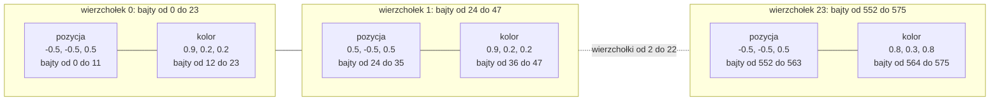

# Moduł gfx: rysowanie z indeksami i kostka

Kamień milowy: M1. Temat wykładu: 2 (Programowalny potok).
Kod: [`src/game/NightMazeApp.hpp`](../../../src/game/NightMazeApp.hpp), [`src/game/NightMazeApp.cpp`](../../../src/game/NightMazeApp.cpp), klasy w [`src/gfx/Buffer.hpp`](../../../src/gfx/Buffer.hpp) i [`src/gfx/VertexArray.hpp`](../../../src/gfx/VertexArray.hpp).

Część modułu `gfx`. Wstęp do całego modułu jest w [`README.md`](README.md). Ten dokument jest ciągiem dalszym [`buffers-vao.md`](buffers-vao.md) i zakłada jego znajomość: czym jest bufor, czym VAO, co to krok i przesunięcie oraz jak działają klasy `gfx::Buffer` i `gfx::VertexArray`. Shadery i sam potok opisuje [`shaders.md`](shaders.md). Każde wywołanie OpenGL jest opakowane w `GL_CHECK` ([`../core/gl-check.md`](../core/gl-check.md)).

## 1. Po co to jest

Bufor i tablica wierzchołków z [`buffers-vao.md`](buffers-vao.md) to narzędzia. Tutaj opisuję, co nimi rysuję: kostkę o sześciu kolorowych ścianach, pierwszą bryłę projektu. Potrzebne są do tego trzy rzeczy, których tamten dokument tylko dotyka:

- **indeksy**: osobna tablica liczb całkowitych, która mówi, z których wierzchołków złożyć kolejne trójkąty, oraz bufor indeksów, w którym ta tablica leży na karcie,
- **dane bryły**: pozycje w przestrzeni lokalnej, kolory i kolejność wierzchołków każdej ściany, czyli kierunek nawijania,
- **wywołanie rysujące** `glDrawElements` oraz kolejność pól w `NightMazeApp`, od której zależy, czy bufor indeksów trafi do właściwego VAO.

Cały kod tego dokumentu jest w `game::NightMazeApp`. Klasy `gfx` nie wiedzą, co jest rysowane: dostają wskaźnik, rozmiar w bajtach i liczby opisujące układ.

**Stan na dziś (M2 + M3).** Dane kostki, jej bufory, VAO i shadery `basic` nie zmieniły się od M1 i nadal są w `NightMazeApp.cpp`. Zmieniło się otoczenie. Kostka nie stoi już przed kamerą: zachowała pochylenie (25 stopni wokół osi x, 35 wokół osi y), ale unosi się 4,5 m nad środkiem narożnej komórki labiryntu naprzeciw startu, jako znacznik przyszłego wyjścia (`m_mazeWorld.exitPosition + glm::vec3{0.0F, CUBE_HEIGHT_ABOVE_FLOOR, 0.0F}`). Rysuje ją osobna funkcja `NightMazeApp::drawCube` (sekcja 5.6). Labirynt jest rysowany inaczej: modele z plików OBJ trafiają do klasy `gfx::Mesh` ([`mesh.md`](mesh.md)), która w środku ma te same trzy obiekty co kostka (VAO, bufor wierzchołków, bufor indeksów) i to samo `glDrawElements`. Kostka zostaje w kodzie jako najprostszy, ręcznie rozpisany przykład rysowania z indeksami.

## 2. Teoria

### 2.1 Indeksy i bufor indeksów (EBO)

Prostokąt to dwa trójkąty, czyli 6 wierzchołków, ale tylko 4 różne rogi. Dwa rogi leżą na wspólnej przekątnej i w tablicy wierzchołków musiałyby wystąpić dwa razy. **Indeksy** rozwiązują ten problem: tablica wierzchołków zawiera każdy róg raz, a osobna tablica liczb całkowitych mówi, z których rogów złożyć kolejne trójkąty.

| | Bez indeksów | Z indeksami |
|---|---|---|
| prostokąt, wierzchołek 24 bajty | 6 wierzchołków: 144 bajty | 4 wierzchołki i 6 indeksów po 4 bajty: 96 + 24 = 120 bajtów |
| sześcian z 8 rogami (sama pozycja i kolor) | 36 wierzchołków: 864 bajty | 8 wierzchołków i 36 indeksów: 192 + 144 = 336 bajtów |

Zysk rośnie z rozmiarem wierzchołka i z tym, jak często rogi są wspólne. W siatce modelu jeden wierzchołek należy zwykle do około sześciu trójkątów. Drugi zysk: shader wierzchołków może wykonać się raz dla wspólnego rogu, a nie raz na każde jego użycie.

Bufor z indeksami to **EBO** (element buffer object, spotyka się też nazwę IBO, index buffer object). Jest zwykłym buforem związanym z celem `GL_ELEMENT_ARRAY_BUFFER`. `gfx::Buffer` obsługuje oba cele tym samym kodem. W projekcie indeksy kostki są typu `GLuint`, czyli `unsigned int` (4 bajty, w OpenGL stała `GL_UNSIGNED_INT`).

**Dlaczego kostka w projekcie ma 24 wierzchołki, a nie 8.** Indeks wskazuje **cały wierzchołek**, czyli wszystkie jego atrybuty naraz: nie da się wziąć pozycji z jednego miejsca bufora, a koloru z innego. Róg sześcianu należy do trzech ścian. Gdy każda ściana ma mieć własny, jednolity kolor, ten sam punkt w przestrzeni potrzebuje trzech różnych kolorów, a więc jest trzema różnymi wierzchołkami. Stąd 6 ścian po 4 wierzchołki, razem 24. Przy 8 wspólnych wierzchołkach każdy róg miałby jeden kolor, a rasteryzacja rozmywałaby kolory między rogami na wszystkich trzech ścianach. To samo dotyczy normalnych i współrzędnych tekstury: róg ma inną normalną na każdej ścianie, więc także modele z oświetleniem i teksturami (od M2) mają wierzchołki osobno dla każdej ściany.

Indeksy nadal się opłacają, tylko mniej niż w drugim wierszu tabeli. Wspólne są dwa rogi na przekątnej każdej ściany:

| Kostka w projekcie | Wierzchołki | Indeksy | Razem |
|---|---|---|---|
| z indeksami (tak jest w kodzie) | 24 po 24 bajty: 576 bajtów | 36 po 4 bajty: 144 bajty | 720 bajtów |
| bez indeksów | 36 po 24 bajty: 864 bajty | brak | 864 bajty |

### 2.2 Współrzędne lokalne i kierunek nawijania

Pozycje w buforze są zapisane w **przestrzeni lokalnej** obiektu: kostka ma bok 1 i środek w punkcie (0, 0, 0), więc każda współrzędna to -0,5 albo 0,5. Dane nie mówią, gdzie kostka stoi ani skąd jest oglądana. O tym decydują trzy macierze, przez które shader wierzchołków mnoży każdą pozycję ([`../scene/transforms.md`](../scene/transforms.md) i [`../scene/camera.md`](../scene/camera.md)). Dzięki temu bufor wysyłam na kartę raz, a kostkę mogę obracać i przesuwać samą zmianą macierzy.

Gdyby macierzy nie było, pozycje z bufora trafiałyby do `gl_Position` bez zmian i byłyby od razu **znormalizowanymi współrzędnymi urządzenia** (NDC, [`shaders.md`](shaders.md), sekcja 2.2): środek okna to (0, 0), lewa krawędź x = -1, prawa x = 1, dół y = -1, góra y = 1. Kostka byłaby wtedy prostokątem zajmującym połowę szerokości i wysokości okna (ćwiczenie 1 w [`uniforms.md`](uniforms.md), "Bez macierzy").

**Kierunek nawijania** (winding order) to kolejność, w jakiej wierzchołki trójkąta obiegają go na ekranie. OpenGL domyślnie uznaje trójkąt za zwrócony przodem, gdy jego wierzchołki idą **przeciwnie do ruchu wskazówek zegara** (counter clockwise, CCW). Dla bryły zamkniętej reguła brzmi: każda ściana ma być nawinięta przeciwnie do ruchu wskazówek zegara, **gdy patrzę na nią z zewnątrz**. Wtedy ściany zwrócone do kamery są "przodem", a ściany po drugiej stronie bryły "tyłem".

Wszystkie ściany kostki w projekcie są tak nawinięte (sekcja 5.3). Dziś nie ma to widocznego skutku, bo odrzucanie tylnych ścian (face culling) jest wyłączone i rysowane są obie strony każdego trójkąta, a o tym, co zasłania co, decyduje test głębi. Odrzucanie zostaje wyłączone celowo: po wlocie kamerą do środka kostki mają być widoczne jej wewnętrzne ściany. Trzymam się jednak kolejności CCW od początku: po `glEnable(GL_CULL_FACE)` ściana nawinięta odwrotnie znika (ćwiczenie 6).

## 3. Jak to działa w OpenGL

Pełna lista wywołań, od `glGenVertexArrays` do `glDeleteVertexArrays`, jest w [`buffers-vao.md`](buffers-vao.md), sekcja 3.1: bufor indeksów to tam krok 8, a wywołanie rysujące to krok 11. Kolejność, w jakiej VAO zapisuje bufor indeksów, pokazuje sekcja 3.2 tamtego dokumentu. Tutaj zostaje porównanie dwóch wywołań rysujących.

### 3.1 `glDrawArrays` a `glDrawElements`

| | `glDrawArrays(mode, first, count)` | `glDrawElements(mode, count, type, offset)` |
|---|---|---|
| Skąd bierze wierzchołki | kolejno z buforów: `first`, `first + 1`, ... | w kolejności podanej przez indeksy z EBO bieżącego VAO |
| Co znaczy `count` | **liczba wierzchołków** | **liczba indeksów** |
| Potrzebuje EBO | nie | tak |

W obu funkcjach `mode` równe `GL_TRIANGLES` oznacza: każde trzy kolejne wierzchołki (albo indeksy) to jeden trójkąt. `count` nie jest liczbą trójkątów ani liczbą liczb `float`: dla jednego trójkąta to 3, a dla kostki z 12 trójkątów to 36.

Parametr `type` w `glDrawElements` to typ jednego indeksu w buforze: `GL_UNSIGNED_BYTE`, `GL_UNSIGNED_SHORT` albo `GL_UNSIGNED_INT`. Musi zgadzać się z typem tablicy w C++. Ostatni parametr to miejsce pierwszego indeksu w buforze, w bajtach, zapisane jako wskaźnik (sekcja 5.6). Projekt rysuje kostkę przez `glDrawElements`, a `glDrawArrays` nie jest już wołane nigdzie.

Obie funkcje rysują tym, co jest bieżące w chwili wywołania: bieżącym programem i bieżącym VAO.

## 4. Shadery

Ta część modułu nie ma własnych shaderów. Kostkę rysuje para `basic.vert` i `basic.frag` opisana w [`shaders.md`](shaders.md), sekcja 4. Zgodność numerów atrybutów z `layout(location = N)` omawia [`buffers-vao.md`](buffers-vao.md), sekcja 4, a trzy macierze, przez które shader wierzchołków mnoży pozycje kostki, [`uniforms.md`](uniforms.md), sekcja 4.

## 5. Kod w projekcie

### 5.1 Pliki

Wszystko, co dotyczy geometrii, jest w [`NightMazeApp.hpp`](../../../src/game/NightMazeApp.hpp) i [`NightMazeApp.cpp`](../../../src/game/NightMazeApp.cpp).

| Plik | Co zawiera |
|---|---|
| [`src/game/NightMazeApp.hpp`](../../../src/game/NightMazeApp.hpp) | pola `m_vertexArray`, `m_vertexBuffer` i `m_indexBuffer` z komentarzem o ich kolejności (sekcja 5.5) |
| [`src/game/NightMazeApp.cpp`](../../../src/game/NightMazeApp.cpp) | stałe układu i liczby elementów (sekcja 5.2), dane wierzchołków `VERTICES` (sekcja 5.3), indeksy `INDICES` (sekcja 5.4), konstruktor (sekcja 5.5), rysowanie w `drawCube` (sekcja 5.6) |
| [`src/gfx/Buffer.hpp`](../../../src/gfx/Buffer.hpp), [`src/gfx/VertexArray.hpp`](../../../src/gfx/VertexArray.hpp) | klasy, których te pola używają. Opis: [`buffers-vao.md`](buffers-vao.md), sekcja 5 |

### 5.2 Stałe układu wierzchołka i liczby elementów

Stałe stoją w anonimowej przestrzeni nazw w `.cpp`. Numery atrybutów (`POSITION_ATTRIBUTE`, `COLOR_ATTRIBUTE`), które stoją tuż nad nimi, omawia [`buffers-vao.md`](buffers-vao.md), sekcja 4.

```cpp
// One vertex is a position (x, y, z) followed by a color (red, green, blue), all floats.
constexpr GLint POSITION_COMPONENTS = 3;
constexpr GLint COLOR_COMPONENTS = 3;
constexpr GLint FLOATS_PER_VERTEX = POSITION_COMPONENTS + COLOR_COMPONENTS;

// Stride: bytes from the start of one vertex to the start of the next one.
constexpr GLsizei VERTEX_STRIDE = static_cast<GLsizei>(FLOATS_PER_VERTEX * sizeof(float));
// Offsets: where each attribute starts inside one vertex, in bytes.
constexpr std::size_t POSITION_OFFSET = 0;
constexpr std::size_t COLOR_OFFSET = POSITION_COMPONENTS * sizeof(float);

// A cube has 6 faces. Each face is a square with its own 4 vertices, drawn as 2 triangles.
constexpr int FACE_COUNT = 6;
constexpr int VERTICES_PER_FACE = 4;
constexpr int INDICES_PER_FACE = 6;

constexpr int VERTEX_COUNT = FACE_COUNT * VERTICES_PER_FACE;
// Number of floats in the whole vertex data.
constexpr int VERTEX_FLOAT_COUNT = VERTEX_COUNT * FLOATS_PER_VERTEX;
constexpr GLsizei INDEX_COUNT = FACE_COUNT * INDICES_PER_FACE;
```

| Stała | Wartość | Skąd |
|---|---|---|
| `POSITION_COMPONENTS`, `COLOR_COMPONENTS` | 3 i 3 | pozycja to x, y, z, kolor to czerwony, zielony, niebieski |
| `FLOATS_PER_VERTEX` | 6 | suma składowych wszystkich atrybutów |
| `VERTEX_STRIDE` | 24 | 6 liczb razy `sizeof(float)`, czyli 4 bajty. `sizeof` zwraca `std::size_t`, a parametr `setFloatAttribute` to `GLsizei` (liczba ze znakiem), stąd `static_cast` |
| `POSITION_OFFSET` | 0 | pozycja jest pierwsza w wierzchołku |
| `COLOR_OFFSET` | 12 | przed kolorem leżą 3 liczby pozycji po 4 bajty |
| `FACE_COUNT` | 6 | sześcian ma sześć ścian |
| `VERTICES_PER_FACE` | 4 | ściana to kwadrat z własnymi czterema wierzchołkami (sekcja 2.1) |
| `INDICES_PER_FACE` | 6 | kwadrat to dwa trójkąty po trzy indeksy |
| `VERTEX_COUNT` | 24 | 6 ścian po 4 wierzchołki |
| `VERTEX_FLOAT_COUNT` | 144 | 24 wierzchołki po 6 liczb. To rozmiar tablicy `VERTICES`. Jest osobną stałą typu `int`, a nie mnożeniem wpisanym w nawiasy ostre `std::array`, bo tam wynik mnożenia dwóch liczb `int` byłby niejawnie zamieniany na `std::size_t`, co zgłasza clang-tidy (`bugprone-implicit-widening-of-multiplication-result`) |
| `INDEX_COUNT` | 36 | 6 ścian po 6 indeksów, czyli 12 trójkątów. Typ `GLsizei`, bo trafia wprost do `glDrawElements` |

Żadna z tych liczb nie jest wpisana wprost w wywołaniu: każda ma nazwę i jest wyliczona z poprzednich, więc dodanie atrybutu zmienia jedno miejsce. Typy stałych są takie same jak typy parametrów, do których trafiają (`GLint`, `GLsizei`, `std::size_t`), żeby w wywołaniach nie było rzutowań.

### 5.3 Dane wierzchołków

```cpp
// A cube with a side of 1 (one metre), centred on the origin of its local space: every
// coordinate is -0.5 or 0.5. There are no matrices in the data, the positions are local.
//
// A cube has only 8 corners, but here it has 24 vertices: 4 for each face. A vertex is
// a position together with its color, and each face has its own flat color, so a corner
// shared by three faces is three different vertices. With 8 shared vertices the colors
// would be shared too and would blend across the faces. Normals and texture coordinates
// (M2) need vertices per face for the same reason.
//
// The 4 vertices of a face are listed counter clockwise as seen from outside the cube,
// starting at the bottom left corner: bottom left, bottom right, top right, top left.
constexpr std::array<float, VERTEX_FLOAT_COUNT> VERTICES = {
    // x, y, z,          red, green, blue
    -0.5F, -0.5F, 0.5F,  0.9F, 0.2F, 0.2F, // 0: front, z = +0.5, red, bottom left
    0.5F,  -0.5F, 0.5F,  0.9F, 0.2F, 0.2F, // 1: bottom right
    0.5F,  0.5F,  0.5F,  0.9F, 0.2F, 0.2F, // 2: top right
    -0.5F, 0.5F,  0.5F,  0.9F, 0.2F, 0.2F, // 3: top left
    0.5F,  -0.5F, -0.5F, 0.2F, 0.8F, 0.3F, // 4: back, z = -0.5, green, bottom left
    -0.5F, -0.5F, -0.5F, 0.2F, 0.8F, 0.3F, // 5: bottom right
    -0.5F, 0.5F,  -0.5F, 0.2F, 0.8F, 0.3F, // 6: top right
    0.5F,  0.5F,  -0.5F, 0.2F, 0.8F, 0.3F, // 7: top left
    -0.5F, -0.5F, -0.5F, 0.2F, 0.4F, 0.9F, // 8: left, x = -0.5, blue, bottom left
    -0.5F, -0.5F, 0.5F,  0.2F, 0.4F, 0.9F, // 9: bottom right
    -0.5F, 0.5F,  0.5F,  0.2F, 0.4F, 0.9F, // 10: top right
    -0.5F, 0.5F,  -0.5F, 0.2F, 0.4F, 0.9F, // 11: top left
    0.5F,  -0.5F, 0.5F,  0.9F, 0.8F, 0.2F, // 12: right, x = +0.5, yellow, bottom left
    0.5F,  -0.5F, -0.5F, 0.9F, 0.8F, 0.2F, // 13: bottom right
    0.5F,  0.5F,  -0.5F, 0.9F, 0.8F, 0.2F, // 14: top right
    0.5F,  0.5F,  0.5F,  0.9F, 0.8F, 0.2F, // 15: top left
    -0.5F, 0.5F,  0.5F,  0.2F, 0.8F, 0.8F, // 16: top, y = +0.5, cyan, bottom left
    0.5F,  0.5F,  0.5F,  0.2F, 0.8F, 0.8F, // 17: bottom right
    0.5F,  0.5F,  -0.5F, 0.2F, 0.8F, 0.8F, // 18: top right
    -0.5F, 0.5F,  -0.5F, 0.2F, 0.8F, 0.8F, // 19: top left
    -0.5F, -0.5F, -0.5F, 0.8F, 0.3F, 0.8F, // 20: bottom, y = -0.5, magenta, bottom left
    0.5F,  -0.5F, -0.5F, 0.8F, 0.3F, 0.8F, // 21: bottom right
    0.5F,  -0.5F, 0.5F,  0.8F, 0.3F, 0.8F, // 22: top right
    -0.5F, -0.5F, 0.5F,  0.8F, 0.3F, 0.8F, // 23: top left
};
```

- Rozmiar tablicy to `VERTEX_FLOAT_COUNT`, czyli 144. Za dużo liczb w nawiasach to błąd kompilacji.
- Jeden wiersz to jeden wierzchołek: trzy liczby pozycji, trzy liczby koloru. To układ przeplatany z [`buffers-vao.md`](buffers-vao.md), sekcja 2.3. Komentarz na końcu wiersza podaje numer wierzchołka, czyli wartość, którą wpisuje się w tablicy indeksów.
- Cztery kolejne wiersze to jedna ściana. Wszystkie cztery mają **ten sam kolor**, dlatego ściana jest jednolita, choć rasteryzacja nadal interpoluje kolor między wierzchołkami.
- Ten sam punkt występuje trzy razy z trzema kolorami. Przykład: róg (0,5, 0,5, 0,5) to wierzchołek 2 (ściana przednia, czerwony), 15 (prawa, żółty) i 17 (górna, turkusowy).
- Kolejność w obrębie ściany jest zawsze ta sama: lewy dolny, prawy dolny, prawy górny, lewy górny, patrząc na ścianę **z zewnątrz** kostki. To kolejność przeciwna do ruchu wskazówek zegara (sekcja 2.2).
- `constexpr` i anonimowa przestrzeń nazw: tablica jest stałą czasu kompilacji, widoczną tylko w tym pliku. Nie jest zmienną globalną z mutowalnym stanem.
- Przyrostek `F` oznacza literał typu `float`. Bez niego `0.5` byłoby typu `double`.

Jak sprawdzić ścianę na oko, na przykładzie ściany tylnej (wierzchołki od 4 do 7). Wszystkie mają z = -0,5, więc leżą na tylnej płaszczyźnie. Patrzę na nią z zewnątrz, czyli od tyłu kostki, w stronę +Z: wtedy "w prawo" na ekranie to **-X**. Lewy dolny róg ma więc x = 0,5, a prawy dolny x = -0,5. Dla ściany przedniej jest odwrotnie, bo na nią patrzę w stronę -Z.

| Ściana | Stała współrzędna | Kolor (czerwony, zielony, niebieski) | Wierzchołki | "W prawo", patrząc z zewnątrz |
|---|---|---|---|---|
| przednia | z = 0,5 | czerwony (0,9, 0,2, 0,2) | 0 do 3 | +X |
| tylna | z = -0,5 | zielony (0,2, 0,8, 0,3) | 4 do 7 | -X |
| lewa | x = -0,5 | niebieski (0,2, 0,4, 0,9) | 8 do 11 | +Z |
| prawa | x = 0,5 | żółty (0,9, 0,8, 0,2) | 12 do 15 | -Z |
| górna | y = 0,5 | turkusowy (0,2, 0,8, 0,8) | 16 do 19 | +X (a "w górę" to -Z) |
| dolna | y = -0,5 | purpurowy (0,8, 0,3, 0,8) | 20 do 23 | +X (a "w górę" to +Z) |

Bajty bufora wierzchołków, tak jak leżą na karcie (576 bajtów, 24 wierzchołki po 24):



Atrybut 0 (pozycja) czyta bajty 0, 24, 48 i tak dalej: przesunięcie 0, krok 24. Atrybut 1 (kolor) czyta bajty 12, 36, 60 i tak dalej: przesunięcie 12, krok 24. Wierzchołek numer `i` zaczyna się w bajcie `i * 24`, więc ostatni, numer 23, w bajcie 552.

### 5.4 Indeksy

```cpp
// Indices: which vertices form each triangle. A face with the vertices a, b, c, d (in the
// order above) is split along the diagonal a-c into the triangles a, b, c and c, d, a.
// Both keep the counter clockwise order of the face.
constexpr std::array<GLuint, INDEX_COUNT> INDICES = {
    0,  1,  2,  2,  3,  0,  // front
    4,  5,  6,  6,  7,  4,  // back
    8,  9,  10, 10, 11, 8,  // left
    12, 13, 14, 14, 15, 12, // right
    16, 17, 18, 18, 19, 16, // top
    20, 21, 22, 22, 23, 20, // bottom
};
```

- Typ elementu to `GLuint` (`unsigned int`, 4 bajty). Ten sam typ musi być podany przy rysowaniu jako `GL_UNSIGNED_INT`. Dla 24 wierzchołków wystarczyłby jeden bajt (`GLubyte`, wartości do 255), ale modele wczytywane od M2 będą miały znacznie więcej wierzchołków. Jeden typ indeksu w całym projekcie to jedno miejsce mniej na pomyłkę.
- Jeden wiersz to jedna ściana: dwa trójkąty. Dla wierzchołków ściany a, b, c, d (w kolejności z tablicy `VERTICES`) trójkąty to a, b, c oraz c, d, a. Wspólna jest przekątna od a do c.
- Oba trójkąty zachowują kierunek ściany. Zapis c, d, a to te same trzy wierzchołki co a, c, d, tylko zaczęte od innego: przesunięcie cykliczne nie zmienia kierunku nawijania.
- Bufor indeksów ma 36 razy 4 bajty, czyli 144 bajty.
- Wartości indeksów muszą być mniejsze od liczby wierzchołków (24). OpenGL tego nie sprawdza (pułapka 6).

```text
ściana widziana z zewnątrz          trójkąt 1: a, b, c        trójkąt 2: c, d, a

   d ---------- c                        c                    d ---------- c
   |            |                      / |                    |          /
   |            |                    /   |                    |        /
   |            |                  /     |                    |      /
   a ---------- b                a ----- b                    a
```

### 5.5 Pola klasy i konstruktor

**Pola klasy** (`NightMazeApp.hpp`):

```cpp
    // OpenGL objects. They are members of a class derived from core::Application, so they
    // are created after the window and its OpenGL context, and destroyed before them.
    //
    // Order: members are constructed top to bottom, and the constructor body runs after
    // all of them.
    //   1. The three shader programs. They bind no buffer, so their place does not matter.
    //   2. m_assets, m_mazeRenderer (it loads the models through m_assets, so it comes
    //      after it) and m_colliderLines. The last two create meshes, and creating a mesh
    //      binds its own vertex array and buffers. They stand BEFORE the cube on purpose:
    //      the cube relies on its buffer still being bound when the constructor body
    //      runs, and a mesh created after it would take that binding away.
    //   3. m_vertexArray: its constructor binds it, so the two buffers below are created
    //      while it is the bound vertex array.
    //   4. m_vertexBuffer: stays bound to GL_ARRAY_BUFFER, and that is how the attribute
    //      setup in the constructor body tells the vertex array which buffer to read from.
    //   5. m_indexBuffer: binding it to GL_ELEMENT_ARRAY_BUFFER records it in the bound
    //      vertex array. It uses a different binding point, so m_vertexBuffer stays bound.
    gfx::Shader m_shader;
    gfx::Shader m_texturedShader;
    gfx::Shader m_colorShader;
    assets::AssetCache m_assets;
    MazeRenderer m_mazeRenderer;
    ColliderLines m_colliderLines;
    gfx::VertexArray m_vertexArray;
    gfx::Buffer m_vertexBuffer;
    gfx::Buffer m_indexBuffer;
```

Trzy ostatnie pola to kostka. Punkty 3, 4 i 5 komentarza są z M1. Punkty 1 i 2 doszły w M2 + M3 i mówią, dlaczego wszystko nowe stoi **nad** kostką.

**Konstruktor:**

```cpp
NightMazeApp::NightMazeApp()
    : core::Application(INITIAL_WIDTH, INITIAL_HEIGHT, "Night Maze"),
      m_shader(core::assetPath(VERTEX_SHADER_FILE), core::assetPath(FRAGMENT_SHADER_FILE)),
      m_texturedShader(core::assetPath(TEXTURED_VERTEX_SHADER_FILE),
                       core::assetPath(TEXTURED_FRAGMENT_SHADER_FILE)),
      m_colorShader(core::assetPath(COLOR_VERTEX_SHADER_FILE),
                    core::assetPath(COLOR_FRAGMENT_SHADER_FILE)),
      m_mazeRenderer(m_assets),
      // The sizes are in bytes: number of elements times the size of one element.
      m_vertexBuffer(GL_ARRAY_BUFFER, VERTICES.data(), VERTICES.size() * sizeof(float)),
      m_indexBuffer(GL_ELEMENT_ARRAY_BUFFER, INDICES.data(), INDICES.size() * sizeof(GLuint)),
      m_mazeWorld(
          buildMazeWorld(m_mazeSettings.width, m_mazeSettings.height, m_mazeSettings.seed)) {
    // m_vertexBuffer is still bound to GL_ARRAY_BUFFER (m_indexBuffer uses another binding
    // point). Each call below records that buffer in m_vertexArray for one attribute.
    m_vertexArray.setFloatAttribute(POSITION_ATTRIBUTE, POSITION_COMPONENTS, VERTEX_STRIDE,
                                    POSITION_OFFSET);
    m_vertexArray.setFloatAttribute(COLOR_ATTRIBUTE, COLOR_COMPONENTS, VERTEX_STRIDE, COLOR_OFFSET);

    m_cubeTransform.rotationDegrees = {CUBE_ROTATION_X_DEGREES, CUBE_ROTATION_Y_DEGREES, 0.0F};

    // The first maze was built in the initializer list, because MazeWorld cannot be
    // created empty. What is left is the same as after every later regeneration.
    enterMaze();
}
```

Kolejność zdarzeń jest wyznaczona przez kolejność **deklaracji** pól, a nie przez kolejność na liście inicjalizacyjnej ([`../core/README.md`](../core/README.md)). Tabela pokazuje całość, ale szczegółowo tylko kroki kostki. Resztę opisują dokumenty wskazane w ostatniej kolumnie.

| # | Co się wykonuje | Wywołania OpenGL | Stan po tym kroku |
|---|---|---|---|
| 1 | `core::Application(...)`, część bazowa | brak własnych, powstaje okno i kontekst | można wołać `gl*` |
| 2 | `m_clearColor` | brak | |
| 3 | `m_shader`, `m_texturedShader`, `m_colorShader` | kompilacja i linkowanie trzech programów ([`shader-class.md`](shader-class.md), sekcja 5.8) | trzy programy gotowe albo błędy w logu. Żaden bufor ani VAO nie został związany |
| 4 | `m_assets`, konstruktor domyślny | tworzy białą teksturę 1 x 1 ([`../assets/asset-cache.md`](../assets/asset-cache.md)) | tekstura związana z aktywną jednostką. Wiązań buforów i VAO to nie dotyczy |
| 5 | `m_mazeRenderer(m_assets)` | wczytuje trzy modele: dla każdego powstaje `gfx::Mesh` (VAO i dwa bufory) i jego tekstury ([`../game/maze-rendering.md`](../game/maze-rendering.md)) | bieżący jest VAO ostatniego modelu, a z `GL_ARRAY_BUFFER` związany jest jego bufor wierzchołków |
| 6 | `m_colliderLines`, konstruktor domyślny | tworzy `gfx::Mesh` sześcianu z krawędzi ([`../scene/collision.md`](../scene/collision.md)) | bieżący jest VAO tego sześcianu |
| 7 | `m_vertexArray`, konstruktor domyślny (nie ma go na liście, więc wykonuje się sam, w swojej kolejności) | `glGenVertexArrays`, `glBindVertexArray` | VAO kostki istnieje i **jest bieżący**. Od tej chwili żadna siatka już nie powstaje |
| 8 | `m_vertexBuffer(GL_ARRAY_BUFFER, ...)` | `glGenBuffers`, `glBindBuffer(GL_ARRAY_BUFFER, ...)`, `glBufferData` | 576 bajtów na karcie, bufor związany z `GL_ARRAY_BUFFER`. VAO jeszcze o nim nie wie |
| 9 | `m_indexBuffer(GL_ELEMENT_ARRAY_BUFFER, ...)` | `glGenBuffers`, `glBindBuffer(GL_ELEMENT_ARRAY_BUFFER, ...)`, `glBufferData` | 144 bajty na karcie. Samo związanie **zapisało bufor indeksów w bieżącym VAO** z kroku 7. Wiązanie `GL_ARRAY_BUFFER` z kroku 8 jest nietknięte, bo to inny cel |
| 10 | `m_cubeTransform`, `m_mazeSettings`, `m_mazeWorld(buildMazeWorld(...))`, `m_player`, `m_previousPlayerPosition`, `m_camera`, `m_viewMode`, `m_drawColliders`, `m_mouseSensitivity` | brak, to zwykłe dane i matematyka | wartości domyślne i wygenerowany labirynt. `MazeWorld` nie tworzy żadnego obiektu OpenGL, więc nie zabiera kostce wiązania ([`../game/maze-rendering.md`](../game/maze-rendering.md), [`../game/player.md`](../game/player.md)) |
| 11 | ciało konstruktora: `setFloatAttribute` dla pozycji | `glBindVertexArray`, `glEnableVertexAttribArray(0)`, `glVertexAttribPointer(0, 3, GL_FLOAT, GL_FALSE, 24, 0)` | atrybut 0 czyta z bufora z kroku 8 |
| 12 | ciało konstruktora: `setFloatAttribute` dla koloru | `glBindVertexArray`, `glEnableVertexAttribArray(1)`, `glVertexAttribPointer(1, 3, GL_FLOAT, GL_FALSE, 24, 12)` | atrybut 1 czyta z tego samego bufora |
| 13 | ciało konstruktora: obrót kostki | brak | `m_cubeTransform.rotationDegrees` to (25, 35, 0) ([`../scene/transforms.md`](../scene/transforms.md), sekcja 5) |
| 14 | ciało konstruktora: `enterMaze()` | brak | kostka dostaje pozycję nad narożną komórką, gracz i kamera stają na starcie ([`../game/maze-rendering.md`](../game/maze-rendering.md)) |

Szczegóły, o które można zostać zapytanym:

- `VERTICES.data()` zwraca `const float*` do pierwszego elementu, a `INDICES.data()` zwraca `const GLuint*`. Oba zamieniają się niejawnie na `const void*`, którego chce `Buffer`.
- `VERTICES.size() * sizeof(float)` to rozmiar w bajtach: 144 razy 4, czyli 576. `INDICES.size() * sizeof(GLuint)` to 36 razy 4, czyli 144. `size()` zwraca liczbę elementów, nie bajtów ([`buffers-vao.md`](buffers-vao.md), sekcja 7, pułapka 4).
- **Krok 9 zależy od kroku 7.** Bufor indeksów trafia do VAO, który jest bieżący w chwili `glBindBuffer(GL_ELEMENT_ARRAY_BUFFER, ...)`. Dlatego `m_vertexArray` jest zadeklarowany przed oboma buforami, a jego konstruktor wiąże ([`buffers-vao.md`](buffers-vao.md), sekcja 5.5). Zamiana kolejności deklaracji `m_vertexArray` i `m_indexBuffer` kompiluje się, a kostka znika (ćwiczenie 7).
- **Kroki 11 i 12 zależą od kroku 8**, ale nie od kolejności VAO i bufora wierzchołków. Wiązanie `GL_ARRAY_BUFFER` jest stanem globalnym kontekstu i liczy się tylko to, co jest związane **w chwili** `setFloatAttribute`. Między krokiem 8 a 11 nikt go nie zmienił: krok 9 użył innego celu, a krok 10 nie woła OpenGL.
- **Dlaczego kroki od 4 do 6 stoją przed krokiem 7.** Każda siatka wiąże własny bufor z `GL_ARRAY_BUFFER`. Gdyby siatka powstała między krokiem 8 a 11, `setFloatAttribute` kostki zapisałoby w jej VAO bufor wierzchołków tej siatki zamiast własnego. Nie byłoby żadnego błędu, tylko kostka rysowana z cudzych danych ([`buffers-vao.md`](buffers-vao.md), pułapka 12, i ćwiczenie 10).
- `m_assets`, `m_colliderLines` i `m_vertexArray` nie ma na liście inicjalizacyjnej: mają konstruktory domyślne, które wykonują się same, w kolejności deklaracji.
- Dane wierzchołków i indeksy są wysyłane na kartę raz, przy starcie. W klatce nie ma żadnego `glBufferData`.

### 5.6 Rysowanie: `glDrawElements`

**Rysowanie** w `NightMazeApp::drawCube`, wołanym z `onRender` po narysowaniu labiryntu. Wcześniejsza część klatki (viewport, test głębi, czyszczenie, macierze widoku i rzutowania) jest opisana w [`../scene/camera.md`](../scene/camera.md) (sekcja 5), a początek samej funkcji (sprawdzenie programu, `use()` i wysłanie trzech macierzy) w [`shaders.md`](shaders.md) (sekcja 5.1) i [`uniforms.md`](uniforms.md) (sekcja 5.2). Na końcu funkcji stoją dwie linie tego modułu:

```cpp
    m_vertexArray.bind();
    // Draws INDEX_COUNT indices from the element buffer recorded in the vertex array,
    // every three of them form one triangle. GL_UNSIGNED_INT is the type of one index
    // (GLuint). The last parameter has the type "pointer" for historical reasons, like in
    // glVertexAttribPointer: with an element buffer bound it is the byte offset of the
    // first index inside that buffer, and nullptr means offset 0, the start of the buffer.
    GL_CHECK(glDrawElements(GL_TRIANGLES, INDEX_COUNT, GL_UNSIGNED_INT, nullptr));
```

| Element | Co robi |
|---|---|
| `m_vertexArray.bind();` | Jedno wywołanie przywraca cały opis: dwa włączone atrybuty, ich format, bufor wierzchołków **i bufor indeksów**. Żadnego z buforów nie wiążę osobno, bo VAO je pamięta |
| `GL_TRIANGLES` | każde trzy kolejne indeksy to jeden trójkąt |
| `INDEX_COUNT` | liczba **indeksów**, 36. Nie liczba trójkątów (12) i nie liczba wierzchołków (24) |
| `GL_UNSIGNED_INT` | typ jednego indeksu w buforze. Musi odpowiadać typowi tablicy `INDICES` (`GLuint`) |
| `nullptr` | przesunięcie pierwszego indeksu w buforze indeksów, w bajtach, równe 0. Wyjaśnienie niżej |

**Dlaczego ostatni parametr to `nullptr`.** To ta sama historyczna osobliwość co w `glVertexAttribPointer` ([`buffers-vao.md`](buffers-vao.md), sekcja 5.6). W starym OpenGL ostatni parametr `glDrawElements` był adresem tablicy indeksów w pamięci programu, stąd typ `const void*`. Gdy bieżący VAO ma zapisany bufor indeksów, wartość "wskaźnika" jest odczytywana jako **liczba bajtów od początku tego bufora**, od której zaczyna się pierwszy indeks. `nullptr` to wskaźnik o wartości 0, czyli "zacznij od początku bufora". Żeby narysować tylko ścianę tylną, trzeba by podać 6 indeksów i przesunięcie 24 bajtów (6 indeksów ściany przedniej po 4 bajty). Tutaj rzutowanie nie jest potrzebne, bo `nullptr` jest wskaźnikiem od razu. Rysowanie od przesunięcia innego niż zero robi w projekcie `Mesh::draw(firstIndex, indexCount)`: tak rysowana jest jedna część modelu ([`mesh.md`](mesh.md), sekcja 5.5).

W M1 to wywołanie było jedynym miejscem w klatce, w którym uruchamiał się potok z [`shaders.md`](shaders.md) (sekcja 2.1). Dziś jest jednym z wielu: labirynt domyślny to 342 wywołania `glDrawElements` wykonane wcześniej przez `Mesh::draw`, a kostka to wywołanie 343. Dla kostki potok robi to samo co zawsze: shader wierzchołków dla wierzchołków wskazanych przez indeksy, składanie 12 trójkątów, rasteryzacja, shader fragmentów, test głębi.

`bind()` jest wołane co klatkę i jest konieczne: tuż przed kostką rysowany jest labirynt, a każde `Mesh::draw` wiąże VAO swojej siatki. Backend ImGui przy rysowaniu paneli też wiąże własny VAO i własny program. Przed rysowaniem ustawiam więc wszystko, czego potrzebuję.

**Niszczenie.** Pola giną w kolejności odwrotnej do deklaracji. Najpierw zwykłe dane (od `m_mouseSensitivity` do `m_cubeTransform`), potem obiekty z zasobami OpenGL: `m_indexBuffer`, `m_vertexBuffer`, `m_vertexArray` (kostka), `m_colliderLines`, `m_mazeRenderer` (sam niczego nie posiada), `m_assets` (siatki modeli i tekstury), `m_colorShader`, `m_texturedShader`, `m_shader`, a dopiero potem część bazowa z oknem. Wszystkie destruktory wołające OpenGL mają więc żywy kontekst.

### 5.7 Jak to zostało sprawdzone

Same klasy `Buffer` i `VertexArray` oraz pierwszy trójkąt sprawdziłem osobno ([`buffers-vao.md`](buffers-vao.md), sekcja 5.8). Tutaj jest test gotowej kostki.

**Kostka: prawdziwy kod rysujący (stan z M1).** Wszystkie liczby w tej tabeli pochodzą z M1, gdy kostka stała w początku układu, 3 m przed kamerą, a `onRender` rysowało tylko ją. Dane, indeksy i shadery kostki są dziś te same, ale jej położenie na ekranie już nie, więc pozycji pikseli z tej tabeli nie da się dziś odtworzyć bez przestawienia kamery. Testu w nowym układzie sceny nie powtórzyłem. Test z ukrytym oknem dziedziczył po `game::NightMazeApp`, wołał prawdziwe `onRender` i czytał obraz przez `glReadPixels`. Kompilował się razem z prawdziwym `NightMazeApp.cpp` i linkował bibliotekę `engine` z buildu Debug, więc dane, indeksy, shadery i macierze były dokładnie te z repozytorium. Framebuffer 2560 x 1440 (okno 1280 x 720 na ekranie Retina). Kolory jako (czerwony, zielony, niebieski) od 0 do 255:

| Próba | Wynik |
|---|---|
| piksel w środku okna | (229, 51, 51): czerwony ściany przedniej |
| piksel w rogu okna | (5, 8, 20): kolor tła |
| wszystkie kolory w klatce | tło i dokładnie trzy kolory ścian: czerwony (229, 51, 51) na 152 819 pikselach, niebieski (51, 102, 229) na 99 544, turkusowy (51, 204, 204) na 39 257. Widać ścianę przednią, lewą i górną |
| prostokąt zajęty przez kostkę | x od 977 do 1638, y od 391 do 1004 |
| ta sama klatka z włączonym `glEnable(GL_CULL_FACE)` | obraz identyczny piksel w piksel: wszystkie widoczne ściany są nawinięte przeciwnie do ruchu wskazówek zegara, patrząc z zewnątrz |
| `glCullFace(GL_FRONT)`: rysowane tylko ściany zwrócone tyłem | trzy pozostałe kolory: zielony (51, 204, 77), żółty (229, 204, 51), purpurowy (204, 77, 204), w tym samym prostokącie |
| test głębi unieszkodliwiony (`glDepthFunc(GL_ALWAYS)`) | pięć kolorów naraz, środek okna zielony: ściany rysowane później zamalowują wcześniejsze. Czerwona ściana przednia, rysowana jako pierwsza, znika całkiem |
| okno zmienione na 600 x 900 | kostka ma te same proporcje (szerokość do wysokości 1,08 w obu rozmiarach) i tę samą część wysokości okna (0,43) |
| framebuffer o wysokości 0 (okno ustawione na 1280 x 0) | `onRender` wraca przed rysowaniem, `glGetError` czysty |
| `glGetError` po każdej próbie | `GL_NO_ERROR` |
| kopia nagłówka z polem `m_indexBuffer` zadeklarowanym **nad** `m_vertexArray` | pusta klatka (samo tło) i w każdej klatce linia `[error] GL_INVALID_OPERATION after glDrawElements(GL_TRIANGLES, INDEX_COUNT, GL_UNSIGNED_INT, nullptr)`: VAO nie ma bufora indeksów |

**Program `night_maze` w M1.** Uruchomiony na około 3 sekundy z katalogu repozytorium wypisał dwie linie `[info]` i żadnej linii `[error]`, w tym żadnego błędu OpenGL od `GL_CHECK` wokół `glDrawElements`. Samego obrazu w oknie programu to uruchomienie nie sprawdzało.

Na Windowsie (2026-10-05, MSVC 19.44, karta NVIDIA) program w wersji z M1 też wypisał dwie linie `[info]` i żadnej linii `[error]`, w buildzie Debug i Release. Obraz sprawdziłem tam na zrzucie ekranu: kostka na środku okna, ściana czerwona z przodu, niebieska z lewej, turkusowa u góry, żadna ściana nie prześwituje przez inną ([`../../guides/build-windows.md`](../../guides/build-windows.md)).

**Program `night_maze` w M2 + M3.** Na Windowsie (ten sam dzień i sprzęt) program z labiryntem startuje bez linii `[error]` i bez linii `GL_`, w buildzie Debug i Release, więc `glDrawElements` kostki nadal nie zgłasza błędu. Kostki w nowym miejscu, nad narożną komórką, nikt jeszcze nie obejrzał osobno: nie ma jej na liście rzeczy sprawdzonych na zrzutach ekranu. Na macOS ta wersja programu nie była budowana.

## 6. Panel ImGui

Dane kostki i bufor indeksów nie mają elementu w panelu, z tego samego powodu co klasy `Buffer` i `VertexArray` ([`buffers-vao.md`](buffers-vao.md), sekcja 6). Kostkę ogląda się z każdej strony kamerą, a panel "Camera" opisuje [`../scene/camera-controls.md`](../scene/camera-controls.md), sekcja 6.

## 7. Pułapki

1. **Bufor indeksów utworzony bez związanego VAO.** Wiązanie `GL_ELEMENT_ARRAY_BUFFER` należy do bieżącego VAO. Gdy żaden VAO nie jest związany, bufor powstaje i dostaje dane, ale **żaden VAO o nim nie wie**: późniejsze `glDrawElements` nie ma indeksów. Na Macu samo utworzenie nie daje żadnego błędu ([`buffers-vao.md`](buffers-vao.md), sekcja 5.8), więc pomyłka wychodzi dopiero przy rysowaniu. Inne sterowniki mogą zgłosić `GL_INVALID_OPERATION` już przy wiązaniu. Podobnie groźny wariant: związany jest **inny** VAO i bufor indeksów po cichu trafia do niego. W projekcie chroni przed tym konstruktor `VertexArray`, który wiąże nowy VAO, oraz kolejność pól: VAO tuż przed swoimi buforami (sekcja 5.5).
2. **Odwiązanie EBO przy bieżącym VAO.** `glBindBuffer(GL_ELEMENT_ARRAY_BUFFER, 0)` "dla porządku" po konfiguracji, gdy VAO jest jeszcze związany, zapisuje w nim "brak bufora indeksów". Odwiązywać wolno dopiero po `glBindVertexArray(0)`, a najlepiej wcale. Z `GL_ARRAY_BUFFER` jest odwrotnie: jego odwiązanie po `glVertexAttribPointer` niczego nie psuje, bo VAO tego wiązania nie przechowuje.
3. **`count` w wywołaniu rysującym.** W `glDrawArrays` to liczba wierzchołków, w `glDrawElements` liczba indeksów. Nigdy liczba trójkątów ani liczb `float`. Dla kostki 36, nie 12 i nie 24. Za mała wartość rysuje część geometrii (30 zamiast 36: kostka bez dolnej ściany), za duża czyta poza buforem indeksów.
4. **Ściana nawinięta zgodnie z ruchem wskazówek zegara.** Dziś widoczna, bo odrzucanie tylnych ścian jest wyłączone. Zniknie po `glEnable(GL_CULL_FACE)` (sekcja 2.2). Typowa pomyłka przy pisaniu danych ręcznie: ściana tylna, lewa albo dolna przepisana "tak jak przednia", bez odwrócenia kierunku patrzenia.
5. **Typ indeksu niezgodny z danymi.** Tablica `GLuint` (4 bajty na indeks) narysowana z `GL_UNSIGNED_SHORT` jest czytana po 2 bajty: co drugi "indeks" to zero, bryła zamienia się w wachlarz trójkątów zbiegających się w wierzchołku 0. Żadnego błędu OpenGL.
6. **Indeks spoza bufora wierzchołków.** Wartość 24 albo większa przy 24 wierzchołkach każe karcie czytać poza 576 bajtami. OpenGL tego nie sprawdza: wynik jest nieokreślony, zwykle trójkąt ciągnący się do przypadkowego punktu.
7. **Osiem wspólnych wierzchołków zamiast 24.** Indeks wybiera wierzchołek razem z kolorem. Kostka z 8 wierzchołkami ma 8 kolorów, po jednym na róg, i każda ściana jest płynnym przejściem między czterema z nich. Jednolite ściany wymagają osobnych wierzchołków dla każdej ściany (sekcja 2.1).
8. **Bufor indeksów zadeklarowany przed VAO.** Pola klasy powstają w kolejności deklaracji. `gfx::Buffer m_indexBuffer;` nad `gfx::VertexArray m_vertexArray;` tworzy bufor indeksów, zanim istnieje VAO, do którego miał trafić. Kod się kompiluje, a `glDrawElements` nie ma indeksów: zmierzone na Macu, pusta klatka i `GL_INVALID_OPERATION` po każdym `glDrawElements` (sekcja 5.7).
9. **Siatka utworzona między buforami kostki a opisem atrybutów.** Od M2 + M3 w tej samej klasie powstają siatki `gfx::Mesh`, a każda z nich wiąże własny VAO i własne bufory. Gdyby powstały po buforach kostki, a przed ciałem konstruktora, atrybuty kostki wskazałyby na bufor wierzchołków ostatniej siatki. Chroni przed tym kolejność deklaracji pól (sekcja 5.5, i [`buffers-vao.md`](buffers-vao.md), pułapka 12).
10. **Brak testu głębi przy bryle.** To nie błąd buforów, ale wygląda jak błąd danych: bez `glEnable(GL_DEPTH_TEST)` ściany rysowane później zamalowują wcześniejsze i kostka wygląda jak wywrócona na lewą stronę ([`../scene/camera.md`](../scene/camera.md), sekcja 3 i pułapka 9).

Pułapki dotyczące kroku, przesunięcia, rozmiaru bufora, atrybutów i czasu życia obiektów są w [`buffers-vao.md`](buffers-vao.md), sekcja 7.

## 8. Ćwiczenia

Zmiany w `NightMazeApp.cpp` wymagają zbudowania programu (`make run`). Po każdym ćwiczeniu wycofaj zmianę (`git checkout src/game`). Kostka unosi się nad narożną komórką labiryntu naprzeciw startu: żeby ją obejrzeć z bliska, kliknij w scenę, włącz tryb noclip klawiszem N i podleć do niej ([`../game/player.md`](../game/player.md)). Opisy wyników w ćwiczeniach powstały w M1 i w nowym układzie sceny nikt ich jeszcze nie powtórzył.

1. **Przesuń wierzchołek.** Zmień pozycję wierzchołka 2 (ściana przednia, prawy górny) na `0.5F, 0.9F, 0.5F`. Która ściana zmieniła kształt, a które zostały bez zmian, choć mają róg w tym samym miejscu? Wyjaśnij to liczbą wierzchołków w rogu (sekcja 5.3).
2. **Kolory i interpolacja.** Daj wierzchołkowi 0 kolor `1.0F, 1.0F, 1.0F` (biały). Jak wygląda ściana przednia i skąd przejście kolorów? Wzdłuż której linii widać załamanie przejścia i co ma z tym wspólnego tablica `INDICES`?
3. **Kostka bez ściany.** Zmień `INDICES_PER_FACE` na 3. Zbuduj i przeczytaj błąd kompilacji. Zamiast tego przywróć 6 i w `glDrawElements` podaj `INDEX_COUNT - 6`. Której ściany brakuje i dlaczego właśnie tej? Co widać przez dziurę?
4. **Jedna ściana.** Podaj w `glDrawElements` liczbę 6. Która ściana została? Jak narysować samą ścianę tylną, nie zmieniając tablic (wskazówka: ostatni parametr to przesunięcie w bajtach, a rzutowanie liczby na wskaźnik pokazuje [`buffers-vao.md`](buffers-vao.md), sekcja 5.6)?
5. **Inny prymityw.** Zamień `GL_TRIANGLES` na `GL_LINE_LOOP`, potem na `GL_POINTS` (przed rysowaniem dopisz tymczasowo `GL_CHECK(glPointSize(10.0F));`). Dane, indeksy i shadery się nie zmieniły. Co zmienił pierwszy parametr `glDrawElements`? Ile punktów widać i dlaczego mniej niż 36?
6. **Kierunek nawijania i odrzucanie ścian.** Dopisz tymczasowo w `drawCube` przed rysowaniem `GL_CHECK(glEnable(GL_CULL_FACE));` (stan zostaje włączony także dla labiryntu w następnych klatkach: sprawdź przy okazji, czy modele ścian mają poprawny kierunek nawijania). Kostka wygląda tak samo: dlaczego? Zamień w `INDICES` w wierszu ściany przedniej `0, 1, 2` na `0, 2, 1`. Co zniknęło? Dopisz jeszcze `GL_CHECK(glCullFace(GL_FRONT));` i opisz, które ściany widać teraz.
7. **Kolejność pól.** Zamień w `NightMazeApp.hpp` kolejność deklaracji `m_vertexArray` i `m_vertexBuffer`. Program nadal działa. Wyjaśnij dlaczego, korzystając z tabeli "VAO nie pamięta" w [`buffers-vao.md`](buffers-vao.md), sekcja 2.4. Potem przenieś deklarację `m_indexBuffer` **nad** `m_vertexArray`. Co widać i co wypisuje konsola? Który krok tabeli z sekcji 5.5 przestał działać? Uwaga: w M1 w tej sytuacji żaden VAO nie był związany. Dziś związany jest VAO ostatniej utworzonej siatki (sześcianu z `ColliderLines`), więc bufor indeksów kostki trafi do niego. Przewidź, co stanie się z liniami pudełek kolizji, i sprawdź.
10. **Siatka w złym miejscu.** Przenieś w `NightMazeApp.hpp` deklarację `m_colliderLines` **pod** `m_indexBuffer`, nic więcej. Zbuduj i uruchom. Jak wygląda kostka i dlaczego? Z którego bufora czytają teraz jej atrybuty, jaki krok ma tamten bufor, a jaki krok podaje `setFloatAttribute` kostki?
8. **Typ indeksu.** Zamień w `glDrawElements` `GL_UNSIGNED_INT` na `GL_UNSIGNED_SHORT`. Wypisz na kartce pierwsze 12 "indeksów", które odczyta karta (procesor jest little endian: liczba 1 typu `GLuint` to bajty 01 00 00 00). Porównaj z ekranem.
9. **Bajty kostki na kartce.** W którym bajcie bufora wierzchołków zaczyna się kolor wierzchołka 17? W którym bajcie bufora indeksów zaczyna się pierwszy indeks ściany górnej? Ile bajtów zajęłaby kostka z 8 wierzchołkami i 36 indeksami typu `GLubyte`? Odpowiedzi: 420 (17 razy 24 plus 12), 96 (24 indeksy razy 4), 228 (192 plus 36).

Ćwiczenia o kroku, przesunięciu, rozmiarze bufora i przenoszeniu są w [`buffers-vao.md`](buffers-vao.md), sekcja 8.

## 9. Pytania kontrolne

1. **Dlaczego bufor indeksów trzeba tworzyć po związaniu VAO?**
   Bo wiązanie `GL_ELEMENT_ARRAY_BUFFER` jest częścią stanu bieżącego VAO. Konstruktor `Buffer` wiąże bufor, żeby go wypełnić, i to wiązanie zostaje zapisane w VAO, który jest wtedy bieżący. Bez VAO bufor indeksów nie zostaje przypisany do niczego. Dlatego konstruktor `VertexArray` od razu wiąże nowy VAO, a pole `m_vertexArray` stoi w `NightMazeApp` przed polem `m_indexBuffer`. Tak samo ułożone są pola w `gfx::Mesh`.

2. **Po co są indeksy i ile pamięci oszczędzają na prostokącie?**
   Żeby wspólny róg kilku trójkątów był w buforze raz. Prostokąt: 6 wierzchołków po 24 bajty to 144 bajty, a 4 wierzchołki i 6 indeksów po 4 bajty to 120 bajtów. Zysk rośnie z rozmiarem wierzchołka i liczbą wspólnych rogów.

3. **Czym różni się `glDrawArrays` od `glDrawElements` i co znaczy `count` w każdej z nich?**
   Pierwsza bierze wierzchołki kolejno z buforów i `count` to liczba wierzchołków. Druga bierze je w kolejności indeksów z EBO bieżącego VAO i `count` to liczba indeksów. Dla jednego trójkąta w obu przypadkach 3. Projekt rysuje kostkę przez `glDrawElements` z liczbą 36.

4. **W jakiej przestrzeni są pozycje w `VERTICES` i jak nawinięte są ściany?**
   W przestrzeni lokalnej kostki: bok 1, środek w (0, 0, 0), każda współrzędna to -0,5 albo 0,5. Na ekran przenoszą je macierze model, view i projection w shaderze wierzchołków. Każda ściana jest nawinięta przeciwnie do ruchu wskazówek zegara, gdy patrzę na nią z zewnątrz, czyli zgodnie z domyślnym "przodem" w OpenGL.

5. **Prześledź, co dzieje się w konstruktorze `NightMazeApp` po stronie OpenGL.**
   Po oknie powstają trzy programy shaderów, biała tekstura zastępcza, siatki trzech modeli labiryntu z ich teksturami i siatka sześcianu dla linii kolizji. Dopiero potem kostka. Powstaje jej VAO: `glGenVertexArrays` i `glBindVertexArray`. Potem bufor wierzchołków: `glGenBuffers`, `glBindBuffer(GL_ARRAY_BUFFER)`, `glBufferData` z 576 bajtami. Potem bufor indeksów: `glGenBuffers`, `glBindBuffer(GL_ELEMENT_ARRAY_BUFFER)`, które zapisuje go w bieżącym VAO, i `glBufferData` ze 144 bajtami. W ciele konstruktora dwa razy `setFloatAttribute`: wiąże VAO, włącza atrybut i zapisuje format (3 x `GL_FLOAT`, krok 24, przesunięcie 0 albo 12) razem z buforem, który jest wciąż związany z `GL_ARRAY_BUFFER`.

6. **Skąd wartości `VERTEX_STRIDE` i `COLOR_OFFSET`?**
   Wierzchołek to 3 liczby pozycji i 3 liczby koloru, razem 6 liczb `float` po 4 bajty: krok 24. Kolor zaczyna się po trzech liczbach pozycji: przesunięcie 12. W kodzie obie wartości są wyliczone ze stałych `POSITION_COMPONENTS`, `COLOR_COMPONENTS` i `sizeof(float)`.

7. **Dlaczego w `drawCube` nie ma `m_vertexBuffer.bind()` ani `m_indexBuffer.bind()`?**
   Bo VAO zapamiętał bufor wierzchołków dla każdego atrybutu w chwili `setFloatAttribute`, a bufor indeksów w chwili jego utworzenia. Do rysowania wystarcza związanie VAO. Wiązanie `GL_ARRAY_BUFFER` nie ma wpływu na wywołanie rysujące.

8. **Co by się stało, gdyby w `glDrawElements` zamiast `INDEX_COUNT` podać 30, a co gdyby 72?**
   Przy 30 rysowanych jest pierwszych 10 trójkątów: kostka bez ściany dolnej, bez błędu. Przy 72 karta czytałaby indeksy spoza 144 bajtów bufora: wynik nieokreślony.

9. **Dlaczego kostka ma 24 wierzchołki, skoro sześcian ma 8 rogów?**
   Indeks wybiera cały wierzchołek, czyli pozycję razem z kolorem. Róg należy do trzech ścian o trzech różnych kolorach, więc jest trzema różnymi wierzchołkami: 6 ścian po 4. Przy 8 wierzchołkach kolory byłyby wspólne i rozmywałyby się między rogami. Normalne i współrzędne tekstury wymagają tego samego.

10. **Co znaczą argumenty `glDrawElements(GL_TRIANGLES, INDEX_COUNT, GL_UNSIGNED_INT, nullptr)`?**
    Każde trzy indeksy to trójkąt. 36 indeksów, czyli 12 trójkątów. Jeden indeks w buforze ma typ `unsigned int`, zgodny z tablicą `INDICES`. Ostatni argument to przesunięcie pierwszego indeksu w buforze indeksów w bajtach, zapisane jako wskaźnik z powodów historycznych: `nullptr` znaczy 0, czyli początek bufora.

11. **Ile bajtów zajmuje kostka na karcie i skąd te liczby?**
    Bufor wierzchołków: 24 wierzchołki po 24 bajty, czyli 576. Bufor indeksów: 36 indeksów po 4 bajty, czyli 144. Razem 720. Bez indeksów byłoby 36 wierzchołków po 24 bajty, czyli 864.

12. **Jak podzielona jest ściana na trójkąty i dlaczego oba mają ten sam kierunek?**
    Wierzchołki ściany a, b, c, d dają trójkąty a, b, c oraz c, d, a, ze wspólną przekątną od a do c. Oba obiegają ścianę w tę samą stronę co cała czwórka. Zapis c, d, a to przesunięcie cykliczne a, c, d, a ono nie zmienia kierunku nawijania.

13. **Dlaczego pola `m_assets`, `m_mazeRenderer` i `m_colliderLines` stoją w `NightMazeApp.hpp` przed polami kostki?**
    Bo przez nie powstają siatki, a utworzenie siatki wiąże jej własny VAO i bufory. Kostka opisuje swoje atrybuty dopiero w ciele konstruktora i liczy na to, że z `GL_ARRAY_BUFFER` nadal związany jest jej bufor wierzchołków. Siatka utworzona po buforach kostki zabrałaby to wiązanie. Pola powstają w kolejności deklaracji, więc siatki zadeklarowane wyżej są już gotowe, zanim powstanie kostka.

14. **Gdzie jest dziś kostka i co ją rysuje?**
    Unosi się 4,5 m nad środkiem narożnej komórki labiryntu naprzeciw startu, z tym samym pochyleniem co w M1. Pozycję ustawia `enterMaze`, a rysuje ją `NightMazeApp::drawCube` programem `basic`, po labiryncie.

Pytania o bufory, VAO i klasy `Buffer` oraz `VertexArray` są w [`buffers-vao.md`](buffers-vao.md), sekcja 9.

## 10. Źródła

- LearnOpenGL, rozdział "Hello Triangle" (<https://learnopengl.com/Getting-started/Hello-Triangle>): EBO.
- docs.gl (<https://docs.gl>), strony dla OpenGL 4: `glDrawArrays`, `glDrawElements`.
- Khronos OpenGL Wiki: "Vertex Specification" (<https://www.khronos.org/opengl/wiki/Vertex_Specification>, wiązanie bufora indeksów), "Face Culling" (<https://www.khronos.org/opengl/wiki/Face_Culling>).
- Dokumenty w tym repozytorium: [`README.md`](README.md) (droga jednej klatki), [`buffers-vao.md`](buffers-vao.md) (bufory, VAO i obie klasy), [`shaders.md`](shaders.md), [`uniforms.md`](uniforms.md), [`../core/gl-check.md`](../core/gl-check.md), [`../core/README.md`](../core/README.md) (sekcja 7 o kolejności pól).
- Janusz Ganczarski, "OpenGL. Podstawy programowania grafiki 3D" (rozdziały o tablicach wierzchołków i obiektach buforowych).
- "OpenGL. Księga eksperta" (rozdziały o buforach wierzchołków i tablicach wierzchołków).
