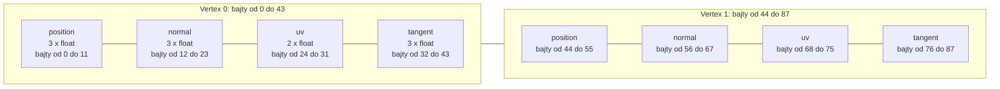

# Moduł gfx: wierzchołek i siatka (`Vertex`, `Mesh`)

Kamień milowy: M2 + M3, zaktualizowany w M4 (doszła styczna, czwarte pole wierzchołka) i w M5 (inni użytkownicy). W M6 doszli trzej nowi użytkownicy (niebo, teren, trawa) i trzeci rodzaj prymitywu, `GL_POINTS`. Czwarta część M7 (cienie księżyca) klasy nie zmieniła: te same siatki są rysowane drugi raz na klatkę, do mapy cieni. Temat wykładu: 4 (Wczytywanie OBJ), część po stronie karty graficznej. Korzysta z tematu 2 (bufory, VAO, `glDrawElements`).
Kod: [`src/gfx/Vertex.hpp`](../../../src/gfx/Vertex.hpp), [`src/gfx/Mesh.hpp`](../../../src/gfx/Mesh.hpp), [`src/gfx/Mesh.cpp`](../../../src/gfx/Mesh.cpp). Użytkownicy: [`src/assets/AssetCache.cpp`](../../../src/assets/AssetCache.cpp) (tworzy siatki modeli), [`src/game/ModelDraw.cpp`](../../../src/game/ModelDraw.cpp) (rysuje je), [`src/game/ColliderLines.cpp`](../../../src/game/ColliderLines.cpp) (dwie siatki z odcinków).

Część modułu `gfx`. Wstęp do całego modułu jest w [`README.md`](README.md). Ten dokument zakłada znajomość [`buffers-vao.md`](buffers-vao.md) (bufor, VAO, krok i przesunięcie, klasy `Buffer` i `VertexArray`) oraz [`indexed-drawing.md`](indexed-drawing.md) (pomysł indeksów, dane indeksów prostokąta ściany, kwadratu terenu, sześcianu i okręgu, wywołania rysujące). Podział jest taki: tam jest idea i dane, tutaj struktura wierzchołka i klasa. Skąd biorą się dane siatki, opisuje [`../assets/obj-loader.md`](../assets/obj-loader.md).

**Stan (druga część M6).** Struktura `gfx::Vertex` i klasa `gfx::Mesh` są w bibliotece `engine`. `Mesh` jest dziś **jedyną** drogą, którą geometria trafia na kartę: poza nią nikt w `src/` nie tworzy bufora wierzchołków i nikt nie woła `glDrawElements`. (Dwa VAO poza siatkami, w `game::PostProcess` od M7 i w `game::ShadowMap` od czwartej części M7, są puste: służą trójkątowi na cały cel, który nie ma danych wierzchołków, [`buffers-vao.md`](buffers-vao.md).) Od drugiej części M4 wierzchołek ma cztery pola: doszła **styczna** (tangent), której potrzebują mapy normalnych ([`normal-mapping.md`](normal-mapping.md)). Siatki mają pięciu właścicieli (sekcja 5.7). `assets::AssetCache` tworzy po jednej siatce z trójkątów dla każdego wczytanego modelu, a modeli jest pięć: ściana, słupek, dwa kryształy i brama (szósty, płytkę podłogi, usunęła druga część M6: podłoże rysuje dziś teren). Rysuje je funkcja `game::drawModel`, częściami, przez `draw(firstIndex, indexCount)`. `game::ColliderLines` ma dwie siatki z odcinków (`GL_LINES`): sześcian z 8 narożników i 24 indeksów, którym rysuje pudełka kolizji, i okrąg z 32 punktów i 64 indeksów, którym rysuje kule. `game::Skybox` ma sześcian nieba (od pierwszej części M6). Druga część M6 dodała dwie siatki innego rodzaju niż wszystkie wcześniejsze: `game::TerrainRenderer` trzyma **teren**, jedną dużą siatkę trójkątów zbudowaną w kodzie z mapy wysokości i wymienianą na nową, gdy teren się zmienia, a `game::GrassRenderer` siatkę **punktów** (`GL_POINTS`), po jednym na kępkę trawy, z których shader geometrii robi źdźbła. Razem dziesięć siatek. Czwarta część M7 nie dodała żadnej: mapa cieni księżyca powstaje z siatek, które już są (teren, ściana, słupek, kryształy, brama), rysowanych jeszcze raz programem `shadow_depth`, który z czterech atrybutów wierzchołka czyta samą pozycję ([`../renderer/shadows.md`](../renderer/shadows.md)). Komentarze w `Mesh.hpp` wymieniają odtąd trzy prymitywy, a kod klasy się nie zmienił: `GL_POINTS` to po prostu kolejna wartość parametru `primitive`. `Mesh` nadal **nie ma testu jednostkowego**, bo wymaga kontekstu OpenGL. Co wiadomo o jej działaniu, mówi sekcja 5.6.

Dwie rzeczy z wcześniejszych kamieni milowych zniknęły w M5. Kostka z M1, która miała własne VAO i bufory jako pola `NightMazeApp` i nie korzystała z `Mesh`, została usunięta. `game::LightRig` nie ma już siatki znacznika światła (małego sześcianu z trójkątów): źródłem światła punktowego, które widać, jest teraz model kryształu.

## 1. Po co to jest

Żeby narysować jedną bryłę, trzeba wykonać zawsze te same kroki: utworzyć VAO, wysłać tablicę wierzchołków do bufora, wysłać indeksy do drugiego bufora, opisać każdy atrybut wywołaniem `setFloatAttribute` z krokiem i przesunięciem, a przy rysowaniu związać VAO i zawołać `glDrawElements` ([`buffers-vao.md`](buffers-vao.md), sekcja 3.1). W M1 robiła to ręcznie kostka wpisana w `NightMazeApp`: tablica liczb `float`, stałe kroku i przesunięć, trzy pola i jedno wywołanie rysujące. Dla jednej bryły to dobry sposób, bo widać każdy krok. Model wczytany z pliku wymaga tych samych kroków, tylko dane przychodzą z loadera, a modeli jest kilka (odcinek ściany, słupek, kryształy, brama, a do M5 także płytka podłogi). Powtarzanie tych samych dziesięciu linii dla każdego modelu to dziesięć miejsc na pomyłkę.

Dlatego dochodzą dwie rzeczy:

- **`gfx::Vertex`**: jeden wierzchołek jako struktura z nazwanymi polami (pozycja, normalna, współrzędna tekstury, styczna) zamiast jedenastu anonimowych liczb `float`. To jest **wspólny format** między loaderem a kartą: loader wypełnia tablicę takich struktur, a `Mesh` wysyła ją na kartę bajt w bajt.
- **`gfx::Mesh`**: jedna klasa, która posiada VAO, bufor wierzchołków i bufor indeksów jednego modelu, sama opisuje cztery atrybuty i sama rysuje: całość albo wskazany zakres indeksów.

`Mesh` nie wie nic o plikach, materiałach, teksturach ani shaderach. Dostaje dwie tablice i rodzaj prymitywu.

## 2. Teoria

### 2.1 Wierzchołek to nie tylko pozycja

Wierzchołek (vertex) to komplet danych, które shader wierzchołków dostaje dla jednego punktu siatki. W najprostszych przykładach (i w kostce z M1) są to pozycja i kolor. Model z teksturą, oświetleniem i mapą normalnych potrzebuje czterech rzeczy:

| Pole | Typ | Liczb `float` | Do czego służy |
|---|---|---|---|
| pozycja (`position`) | `glm::vec3` | 3 | punkt w przestrzeni lokalnej modelu, w metrach |
| normalna (`normal`) | `glm::vec3` | 3 | kierunek, w który zwrócona jest powierzchnia. Od M4 czyta ją oświetlenie (tematy 6 i 7): programy `lit` i `gouraud` liczą z niej, ile światła pada na powierzchnię ([`../scene/lights.md`](../scene/lights.md)) |
| współrzędna tekstury (`uv`) | `glm::vec2` | 2 | miejsce na obrazie tekstury, które przypada na ten punkt (temat 5) |
| styczna (`tangent`) | `glm::vec3` | 3 | kierunek na powierzchni, w którym rośnie współrzędna `u`, w przestrzeni lokalnej modelu. Razem z normalną wyznacza przestrzeń styczną, w której zapisana jest mapa normalnych ([`normal-mapping.md`](normal-mapping.md), sekcje 2.3 i 2.7) |

Razem 11 liczb `float`, czyli 44 bajty. Pierwsze trzy pola pochodzą z pliku modelu. Stycznej w pliku OBJ nie ma: liczy ją `assets::computeTangents` na końcu `parseObj`, gdy wierzchołki już istnieją ([`normal-mapping.md`](normal-mapping.md), sekcje 5.5 i 5.6), więc nie zmienia ona liczby wierzchołków. Dwa wierzchołki są **tym samym wierzchołkiem** tylko wtedy, gdy mają równe pozycję, normalną i współrzędną tekstury. Dlatego róg prostopadłościanu, który należy do trzech ścian, jest w buforze trzy razy: pozycja ta sama, normalne różne ([`indexed-drawing.md`](indexed-drawing.md), sekcja 2.1, tłumaczy to na ścianie, która ma w pliku 24 pozycje, a w buforze 60 wierzchołków).

### 2.2 Układ przeplatany jako struktura

W układzie przeplatanym (interleaved, [`buffers-vao.md`](buffers-vao.md), sekcja 2.3) wszystkie dane jednego wierzchołka leżą obok siebie, a potem zaczyna się następny wierzchołek. Tablica struktur w C++ ma dokładnie taki układ w pamięci: `std::vector<Vertex>` to ciągły blok, w którym po 44 bajtach pierwszego wierzchołka leżą 44 bajty drugiego.



OpenGL nie wie, że w buforze leżą struktury C++. Trzeba mu podać dwie liczby dla każdego atrybutu:

| Pojęcie | Wartość dla `Vertex` | Skąd w kodzie |
|---|---|---|
| **krok** (stride): bajty od początku jednego wierzchołka do początku następnego | 44 | `sizeof(Vertex)` |
| **przesunięcie** (offset) pozycji: bajty od początku wierzchołka do pola | 0 | `offsetof(Vertex, position)` |
| przesunięcie normalnej | 12 | `offsetof(Vertex, normal)` |
| przesunięcie współrzędnej tekstury | 24 | `offsetof(Vertex, uv)` |
| przesunięcie stycznej | 32 | `offsetof(Vertex, tangent)` |

Te liczby można wpisać ręcznie jako stałe (tak robiła kostka z M1: sześć liczb razy `sizeof(float)`). Tutaj liczy je kompilator z definicji struktury: `sizeof` zwraca rozmiar typu w bajtach, a makro `offsetof(Typ, pole)` z nagłówka `<cstddef>` zwraca odległość pola od początku obiektu. Dodanie pola do struktury zmienia obie wartości samo, bez poprawiania stałych. Tak było ze styczną: krok zmienił się z 32 na 44, a w `Mesh.cpp` doszło tylko czwarte wywołanie `setFloatAttribute` (i poprawiona liczba w komentarzu).

### 2.3 Wyrównanie i dopełnienie: dlaczego `Vertex` nie ma niespodzianek

Kompilator może wstawić między pola struktury albo na jej końcu puste bajty, **dopełnienie** (padding), żeby każde pole leżało pod adresem podzielnym przez swoje **wyrównanie** (alignment). Przykład struktury z dopełnieniem:

```cpp
struct Example {
    char flag;    // 1 bajt, potem 3 bajty dopełnienia
    float value;  // 4 bajty, musi zaczynać się od adresu podzielnego przez 4
};                // sizeof(Example) == 8, a nie 5
```

Gdyby `Vertex` miał dopełnienie, opis "11 liczb `float` jedna za drugą" byłby nieprawdziwy. Nie ma go z prostego powodu: wszystkie pola składają się wyłącznie z liczb `float`. `glm::vec3` to trzy liczby `float`, `glm::vec2` to dwie, a `float` ma wyrównanie 4 bajty. Każde pole kończy się więc pod adresem podzielnym przez 4 i następne może zacząć się od razu.

To rozumowanie zależy od biblioteki GLM (jej typy mają opcje, które zmieniają wyrównanie, na przykład `GLM_FORCE_DEFAULT_ALIGNED_GENTYPES`; projekt żadnej nie ustawia). Dlatego zamiast wierzyć na słowo, `Vertex.hpp` każe kompilatorowi to sprawdzić:

```cpp
static_assert(sizeof(Vertex) ==
                  (POSITION_COMPONENTS + NORMAL_COMPONENTS + UV_COMPONENTS + TANGENT_COMPONENTS) *
                      sizeof(float),
              "Vertex must be 11 tightly packed floats");
```

`static_assert` to warunek sprawdzany **w czasie kompilacji**. Suma w nawiasie to `3 + 3 + 2 + 3`, czyli 11, razy 4 bajty. Gdyby `sizeof(Vertex)` nie było równe 44, program by się nie zbudował i wypisał podany tekst. Nie kosztuje nic w działającym programie.

Drugi `static_assert` dotyczy `offsetof`:

```cpp
static_assert(std::is_standard_layout_v<Vertex>, "offsetof needs a standard-layout type");
```

Standard C++ gwarantuje działanie `offsetof` tylko dla typów o **układzie standardowym** (standard layout): bez funkcji wirtualnych, bez wirtualnych klas bazowych, ze wszystkimi polami o tym samym poziomie dostępu. Taki typ ma w pamięci układ jak struktura języka C: pola w kolejności deklaracji, pierwsze pod adresem obiektu. `Vertex` spełnia te warunki, a asercja pilnuje, żeby tak zostało.

### 2.4 Numery atrybutów jako umowa z shaderem

Atrybut ma numer, ten sam po stronie C++ i po stronie GLSL ([`buffers-vao.md`](buffers-vao.md), sekcja 4). Dla siatek numery są ustalone raz, w `Vertex.hpp`:

| Stała | Wartość | W shaderze wierzchołków |
|---|---|---|
| `gfx::POSITION_ATTRIBUTE` | 0 | `layout(location = 0) in vec3 ...` |
| `gfx::NORMAL_ATTRIBUTE` | 1 | `layout(location = 1) in vec3 ...` |
| `gfx::UV_ATTRIBUTE` | 2 | `layout(location = 2) in vec2 ...` |
| `gfx::TANGENT_ATTRIBUTE` | 3 | `layout(location = 3) in vec3 ...` |

Każdy shader, który ma rysować `Mesh`, musi trzymać się tych numerów. Shader, który nie czyta któregoś atrybutu (na przykład `color.vert`, który nie potrzebuje normalnej, uv ani stycznej, albo `gouraud.vert`, który nie czyta stycznej), po prostu go nie deklaruje: włączony atrybut, którego program nie używa, niczemu nie szkodzi.

### 2.5 Rysowanie zakresu indeksów

`glDrawElements` nie musi rysować całego bufora indeksów. Jego drugi parametr to liczba indeksów, a ostatni to miejsce pierwszego z nich. Model z kilkoma materiałami korzysta z tego tak: wszystkie trójkąty leżą w jednym buforze indeksów, pogrupowane materiałami, a każdy materiał to **zakres**: numer pierwszego indeksu i liczba indeksów.

```text
bufor indeksów modelu z dwoma materiałami (9 indeksów, 3 trójkąty)

numer indeksu:   0  1  2  3  4  5 | 6  7  8
materiał:        kamień           | drewno
zakres:          first 0, count 6 | first 6, count 3
bajt w buforze:  0                | 24
```

Rysowanie takiego modelu to pętla: ustaw teksturę materiału, narysuj jego zakres. Zakresy podaje loader ([`../assets/obj-loader.md`](../assets/obj-loader.md), struktura `ObjPart`).

Ostatni parametr `glDrawElements` jest liczony **w bajtach**, a nie w indeksach. Indeks ma 4 bajty (`std::uint32_t`), więc indeks numer 6 zaczyna się w bajcie 24. Pomylenie tych dwóch jednostek to pułapka 3.

### 2.6 Rodzaj prymitywu

Pierwszy parametr `glDrawElements` mówi, jak grupować indeksy:

| Prymityw | Grupowanie | Indeksów na element |
|---|---|---|
| `GL_TRIANGLES` | każde trzy kolejne indeksy to trójkąt | 3 |
| `GL_LINES` | każde dwa kolejne indeksy to odcinek | 2 |
| `GL_POINTS` (od drugiej części M6) | każdy indeks to jeden punkt | 1 |

Dane i klasa są te same, zmienia się tylko interpretacja. `Mesh` przyjmuje prymityw w konstruktorze (domyślnie `GL_TRIANGLES`), bo rysowanie pudełek i kul kolizji używa tej samej klasy z `GL_LINES`: 8 wierzchołków sześcianu i 24 indeksy dwunastu krawędzi oraz 32 punkty okręgu i 64 indeksy trzydziestu dwóch odcinków (sekcja 5.7).

**Punkty.** Trzeci prymityw doszedł razem z trawą. Komentarz konstruktora w `Mesh.hpp` mówi o nim: "GL_POINTS (every index is one point: the input of a geometry shader that builds its own triangles)". Siatka punktów sama z siebie dałaby na ekranie pojedyncze piksele. W grze służy jako **wejście shadera geometrii**: każdy punkt to jedna kępka trawy, a `grass.geom` zamienia go na trzy źdźbła z trójkątów ([`../renderer/grass-geometry.md`](../renderer/grass-geometry.md)). Rodzaj prymitywu podany w `glDrawElements` musi się zgadzać z deklaracją wejścia shadera geometrii (`layout(points) in;`): narysowanie tym programem siatki z `GL_TRIANGLES` kończy się błędem `GL_INVALID_OPERATION`. Przy `GL_POINTS` indeksy niczego nie oszczędzają (żaden punkt nie jest wspólny dla dwóch elementów), ale `Mesh` rysuje zawsze przez `glDrawElements`, więc `GrassRenderer` wypełnia bufor indeksów kolejnymi liczbami 0, 1, 2 i tak dalej. To cena jednej klasy dla wszystkich siatek: 4 bajty na kępkę.

## 3. Jak to działa w OpenGL

`Mesh` nie woła OpenGL sam, poza jednym miejscem: `glDrawElements`. Resztę robią klasy `VertexArray` i `Buffer`, które posiada. Pełna lista wywołań dla siatki z `N` wierzchołków i `M` indeksów:

| # | Kto | Wywołanie OpenGL | Skutek |
|---|---|---|---|
| 1 | konstruktor `VertexArray` | `glGenVertexArrays`, `glBindVertexArray` | nowy VAO jest bieżący |
| 2 | konstruktor `Buffer` (wierzchołki) | `glGenBuffers`, `glBindBuffer(GL_ARRAY_BUFFER, ...)`, `glBufferData` z `N * 44` bajtami | dane wierzchołków na karcie |
| 3 | konstruktor `Buffer` (indeksy) | `glGenBuffers`, `glBindBuffer(GL_ELEMENT_ARRAY_BUFFER, ...)`, `glBufferData` z `M * 4` bajtami | dane indeksów na karcie, bufor zapisany w bieżącym VAO |
| 4 | `setFloatAttribute` (pozycja) | `glBindVertexArray`, `glEnableVertexAttribArray(0)`, `glVertexAttribPointer(0, 3, GL_FLOAT, GL_FALSE, 44, 0)` | atrybut 0 |
| 5 | `setFloatAttribute` (normalna) | to samo z `(1, 3, GL_FLOAT, GL_FALSE, 44, 12)` | atrybut 1 |
| 6 | `setFloatAttribute` (uv) | to samo z `(2, 2, GL_FLOAT, GL_FALSE, 44, 24)` | atrybut 2 |
| 7 | `setFloatAttribute` (styczna) | to samo z `(3, 3, GL_FLOAT, GL_FALSE, 44, 32)` | atrybut 3 |
| 8 | `Mesh::draw`, co klatkę | `glBindVertexArray`, `glDrawElements(prymityw, liczba, GL_UNSIGNED_INT, przesunięcie)` | rysowanie |
| 9 | destruktory pól | `glDeleteBuffers` dwa razy, `glDeleteVertexArrays` | zwolnienie |

Kroki od 1 do 7 to lista z [`buffers-vao.md`](buffers-vao.md), sekcja 3.1, wykonana dla czterech atrybutów i kroku 44. To samo robił w M1 konstruktor `NightMazeApp` dla kostki, z dwoma atrybutami i krokiem 24. Kolejność ma zawsze te same powody ([`indexed-drawing.md`](indexed-drawing.md), sekcja 5.5): VAO musi być bieżący, zanim powstanie bufor indeksów (krok 3 zależy od kroku 1), a bufor wierzchołków musi być związany z `GL_ARRAY_BUFFER` w chwili opisywania atrybutów (kroki od 4 do 7 zależą od kroku 2).

Sygnatura `glDrawElements(mode, count, type, indices)`:

| Parametr | Co podaje `Mesh` |
|---|---|
| `mode` | pole `m_primitive`: `GL_TRIANGLES`, `GL_LINES` albo `GL_POINTS` |
| `count` | liczba indeksów do narysowania (nie trójkątów) |
| `type` | `GL_UNSIGNED_INT`: jeden indeks to 4 bajty bez znaku |
| `indices` | przesunięcie pierwszego indeksu w buforze indeksów, **w bajtach**, zapisane jako wskaźnik |

## 4. Shadery

`Mesh` nie ma własnego shadera i żadnego nie zna. Układ `Vertex` czytają wszystkie cztery pary shaderów projektu:

| Shader wierzchołków | Które atrybuty deklaruje | Co rysuje |
|---|---|---|
| `textured.vert` | wszystkie cztery: `aPosition` (0), `aNormal` (1), `aUv` (2), `aTangent` (3) | modele (labirynt, brama, kryształy) bez oświetlenia i w widokach diagnostycznych ([`textures.md`](textures.md), sekcja 4). Styczna służy tu tylko widokowi normalnych |
| `lit.vert` | wszystkie cztery, pod tymi samymi nazwami i numerami | modele z oświetleniem liczonym dla każdego fragmentu ([`../renderer/lighting-gouraud-phong.md`](../renderer/lighting-gouraud-phong.md), sekcja 4) |
| `gouraud.vert` | trzy: `aPosition`, `aNormal`, `aUv`. Stycznej (3) nie czyta, bo nie ma w nim mapowania normalnych ([`normal-mapping.md`](normal-mapping.md), sekcja 2.11) | modele z oświetleniem liczonym dla każdego wierzchołka (ten sam dokument) |
| `color.vert` | tylko `aPosition` (0) | linie pudełek i kul kolizji ([`../scene/collision.md`](../scene/collision.md), sekcja 4, i [`shaders.md`](shaders.md), sekcja 4.1) |

`color.vert` pokazuje zasadę z sekcji 2.4: siatka ma włączone cztery atrybuty, a shader czyta jeden. Trzy pozostałe są po prostu ignorowane.

Odwrotna pomyłka nie daje żadnego błędu. Shader, który pod numerem 1 spodziewa się czegoś innego niż normalnej, dostanie normalną. Tak było z parą `basic` z M1, usuniętą w M5: deklarowała pod numerem 1 **kolor**, więc `Mesh` narysowany tym programem pokazałby normalne jako kolory. Numer atrybutu to umowa, której nikt poza piszącym nie pilnuje.

## 5. Kod w projekcie

### 5.1 Pliki

| Plik | Co zawiera |
|---|---|
| [`src/gfx/Vertex.hpp`](../../../src/gfx/Vertex.hpp) | struktura `gfx::Vertex`, stałe `POSITION_COMPONENTS`, `NORMAL_COMPONENTS`, `UV_COMPONENTS`, `TANGENT_COMPONENTS`, stałe `POSITION_ATTRIBUTE`, `NORMAL_ATTRIBUTE`, `UV_ATTRIBUTE`, `TANGENT_ATTRIBUTE`, dwa `static_assert`. Sam nagłówek, bez pliku `.cpp` |
| [`src/gfx/Mesh.hpp`](../../../src/gfx/Mesh.hpp) | klasa `gfx::Mesh`: konstruktor, zablokowane kopiowanie, domyślne przenoszenie, dwie funkcje `draw`, `indexCount`, pola |
| [`src/gfx/Mesh.cpp`](../../../src/gfx/Mesh.cpp) | stałe `INDEX_TYPE` i `VERTEX_STRIDE`, `static_assert` typu indeksu, konstruktor, obie funkcje `draw` |

Wszystkie trzy pliki są na liście źródeł biblioteki `engine` w [`CMakeLists.txt`](../../../CMakeLists.txt). `Vertex.hpp` dołącza tylko `<glm/glm.hpp>`, `<cstdint>` i `<type_traits>`: **nie dołącza GLAD**, więc mogą go używać loader i testy, które nie mają nic wspólnego z OpenGL. `Mesh.hpp` dołącza `gfx/Buffer.hpp`, `gfx/Vertex.hpp`, `gfx/VertexArray.hpp`, `<glad/gl.h>`, `<cstdint>` i `<span>`, a `Mesh.cpp` do tego `core/GlCheck.hpp`, `<cstddef>` (makro `offsetof`) i `<type_traits>`.

### 5.2 `Vertex.hpp`

```cpp
struct Vertex {
    /// Position in the local space of the model, in metres.
    glm::vec3 position{0.0F};

    /// Direction the surface faces at this vertex. Expected to have length 1. It is all
    /// zeros when the source had no normal.
    glm::vec3 normal{0.0F};

    /// Texture coordinate (u, v). v = 0 is the bottom row of the image. It is all zeros
    /// when the source had no texture coordinate.
    glm::vec2 uv{0.0F};

    /// Direction along the surface in which the texture coordinate u grows, in the local
    /// space of the model. Expected to have length 1 and to be perpendicular to normal.
    /// Together with the normal it fixes the tangent space a normal map is written in
    /// (docs/modules/gfx/normal-mapping.md). It is all zeros until someone computes it:
    /// an OBJ file has no tangents, assets::computeTangents fills them in.
    glm::vec3 tangent{0.0F};
};
```

- `struct` z publicznymi polami bez prefiksu `m_`: to zwykłe dane, tak jak struktury warstwy `scene` ([`../scene/README.md`](../scene/README.md), sekcja 3), a nie obiekt OpenGL. Kopiuje się jak liczby.
- `{0.0F}` to wartość początkowa pola: konstruktor `glm::vec3` z jedną liczbą wypełnia nią wszystkie składowe. Wierzchołek utworzony przez `Vertex vertex;` ma więc same zera, a nie przypadkowe wartości. Loader z tego korzysta: gdy plik nie podaje normalnej albo współrzędnej tekstury, pole zostaje zerowe. Styczna jest zerowa, dopóki ktoś jej nie policzy: w modelach z plików robi to loader, a w siatkach budowanych w kodzie (sześcian i okrąg w `ColliderLines`) zostaje zerowa, bo program `color` jej nie czyta.
- Kolejność pól jest kolejnością w pamięci: pozycja, normalna, uv, styczna. Od niej zależą przesunięcia 0, 12, 24 i 32. Styczna doszła na końcu, więc przesunięcia trzech starszych pól się nie zmieniły.
- **Styczna** (tangent) to kierunek na powierzchni, w którym rośnie `u`. Ma mieć długość 1 i być prostopadła do normalnej: oba warunki zapewnia `assets::computeTangents` ([`normal-mapping.md`](normal-mapping.md), sekcja 2.8). Samo oświetlenie stycznej nie potrzebuje, wystarcza mu normalna. Potrzebuje jej mapowanie normalnych, żeby kierunek odczytany z mapy przenieść z przestrzeni stycznej do przestrzeni świata.
- Wierzchołek **nie ma znaku skrętności** (handedness), który w wielu programach jest czwartą składową stycznej. Żaden trójkąt pięciu modeli gry nie ma lustrzanej tekstury (dla trzech modeli z M5 policzyłem to z plików OBJ tym samym wzorem, którego używa `assets::countMirroredTriangles`: wynik to zero), a dla siatki terenu to samo sprawdza test w `tests/TerrainTests.cpp` ("every triangle of the mesh faces up, and its texture is not mirrored"), więc bitangenta `cross(N, T)` jest wszędzie poprawna ([`normal-mapping.md`](normal-mapping.md), sekcja 2.9, i notatka [`../../decisions/tangents-on-load.md`](../../decisions/tangents-on-load.md)).

```cpp
/// Number of floats in each field, the "size" parameter of glVertexAttribPointer.
constexpr int POSITION_COMPONENTS = 3;
constexpr int NORMAL_COMPONENTS = 3;
constexpr int UV_COMPONENTS = 2;
constexpr int TANGENT_COMPONENTS = 3;

/// Attribute numbers of the fields. A vertex shader that reads a gfx::Mesh must declare
/// its inputs with the same numbers: layout(location = 0) in vec3 for the position,
/// location 1 for the normal, location 2 for the texture coordinate and location 3 for
/// the tangent. A shader may leave out the ones it does not read.
constexpr std::uint32_t POSITION_ATTRIBUTE = 0;
constexpr std::uint32_t NORMAL_ATTRIBUTE = 1;
constexpr std::uint32_t UV_ATTRIBUTE = 2;
constexpr std::uint32_t TANGENT_ATTRIBUTE = 3;
```

- Typy `int` i `std::uint32_t`, a nie `GLint` i `GLuint`, bo nagłówek nie dołącza GLAD. Na obu platformach projektu `GLint` to `int`, a `GLuint` to `unsigned int`, czyli ten sam typ co `std::uint32_t` (sprawdza to `static_assert` w `Mesh.cpp`, sekcja 5.4), więc wartości trafiają do `setFloatAttribute` bez rzutowania.
- Stałe `..._COMPONENTS` używa też loader OBJ: tyle liczb czyta z linii `v`, `vn` i `vt`. `TANGENT_COMPONENTS` używa tylko `Mesh`: stycznej w pliku nie ma.
- Dwa `static_assert` z końca pliku omawia sekcja 2.3.

### 5.3 `Mesh`: nagłówek

```cpp
class Mesh {
public:
    Mesh(std::span<const Vertex> vertices, std::span<const std::uint32_t> indices,
         GLenum primitive = GL_TRIANGLES);

    Mesh(const Mesh&) = delete;
    Mesh& operator=(const Mesh&) = delete;

    Mesh(Mesh&& other) noexcept = default;
    Mesh& operator=(Mesh&& other) noexcept = default;

    void draw() const;
    void draw(std::uint32_t firstIndex, std::uint32_t indexCount) const;

    std::uint32_t indexCount() const { return m_indexCount; }

private:
    VertexArray m_vertexArray;
    Buffer m_vertexBuffer;
    Buffer m_indexBuffer;

    std::uint32_t m_indexCount;
    GLenum m_primitive;
};
```

(Komentarze z pliku są tu pominięte, żeby było widać całą klasę naraz.)

| Element | Wyjaśnienie |
|---|---|
| `std::span<const Vertex>` | **widok** na ciągły blok elementów: wskaźnik i liczba elementów, bez posiadania pamięci. Przyjmuje `std::vector<Vertex>`, `std::array` i zwykłą tablicę bez kopiowania. `const` w nawiasach znaczy, że przez widok nie da się zmienić danych |
| `std::span<const std::uint32_t>` | indeksy. `std::uint32_t` to liczba bez znaku o dokładnie 32 bitach |
| `GLenum primitive = GL_TRIANGLES` | parametr z wartością domyślną: `Mesh(v, i)` rysuje trójkąty, `Mesh(v, i, GL_LINES)` odcinki, `Mesh(v, i, GL_POINTS)` punkty (sekcja 2.6) |
| `= delete` przy kopiowaniu | kopia miałaby te same identyfikatory OpenGL i usunęłaby je drugi raz ([`README.md`](README.md), sekcja 2.2). Kompilator i tak nie umiałby jej wygenerować, bo pola nie dają się kopiować. Zapis jawny mówi to czytelnikowi |
| `noexcept = default` przy przenoszeniu | kompilator generuje przenoszenie **pole po polu**. Każde pole umie się przenieść samo: `VertexArray` i `Buffer` mają własne konstruktory i przypisania przenoszące, które zerują identyfikator w obiekcie źródłowym ([`buffers-vao.md`](buffers-vao.md), sekcja 5.4). `Mesh` nie trzyma żadnego identyfikatora bezpośrednio, więc nie ma czego pisać ręcznie |
| brak destruktora | z tego samego powodu: destruktory pól zwalniają wszystko. Pola giną w kolejności odwrotnej do deklaracji: bufor indeksów, bufor wierzchołków, VAO |
| dwie funkcje `draw` | przeciążenie (overload): ta sama nazwa, różne parametry |
| `indexCount()` | liczba indeksów całej siatki. Przydaje się temu, kto rysuje zakresy, i panelowi debug |
| kolejność pól | VAO, bufor wierzchołków, bufor indeksów. Konstruktor VAO wiąże go, więc bufor indeksów tworzony później zapisuje się we właściwym VAO ([`indexed-drawing.md`](indexed-drawing.md), sekcja 5.5) |

Po przeniesieniu obiekt źródłowy ma trzy identyfikatory równe 0. Jego destruktor jest bezpieczny (OpenGL ignoruje usuwanie zera), ale rysować nim nie wolno: `m_indexCount` nie jest zerowany, a VAO o numerze 0 nie istnieje. Komentarz w nagłówku mówi to wprost: "must not be drawn".

### 5.4 Konstruktor

Najpierw stałe z anonimowej przestrzeni nazw w `Mesh.cpp`:

```cpp
static_assert(std::is_same_v<GLuint, std::uint32_t>, "GL_UNSIGNED_INT must match uint32_t");

// Type of one index in the index buffer, as glDrawElements wants it.
constexpr GLenum INDEX_TYPE = GL_UNSIGNED_INT;

// Stride: bytes from the start of one vertex to the start of the next one (44).
constexpr GLsizei VERTEX_STRIDE = static_cast<GLsizei>(sizeof(Vertex));
```

- Indeksy są w C++ typu `std::uint32_t`, a karcie mówię, że to `GL_UNSIGNED_INT`, czyli `GLuint`. `static_assert` sprawdza, że to ten sam typ. Gdyby na jakiejś platformie nie był, program by się nie skompilował, zamiast rysować śmieci.
- `sizeof` zwraca `std::size_t` (bez znaku), a parametr kroku to `GLsizei` (ze znakiem), stąd `static_cast`.

```cpp
Mesh::Mesh(std::span<const Vertex> vertices, std::span<const std::uint32_t> indices,
           GLenum primitive)
    // size_bytes() is the number of elements times the size of one element.
    : m_vertexBuffer(GL_ARRAY_BUFFER, vertices.data(), vertices.size_bytes()),
      m_indexBuffer(GL_ELEMENT_ARRAY_BUFFER, indices.data(), indices.size_bytes()),
      m_indexCount(static_cast<std::uint32_t>(indices.size())),
      m_primitive(primitive) {
    m_vertexArray.setFloatAttribute(POSITION_ATTRIBUTE, POSITION_COMPONENTS, VERTEX_STRIDE,
                                    offsetof(Vertex, position));
    m_vertexArray.setFloatAttribute(NORMAL_ATTRIBUTE, NORMAL_COMPONENTS, VERTEX_STRIDE,
                                    offsetof(Vertex, normal));
    m_vertexArray.setFloatAttribute(UV_ATTRIBUTE, UV_COMPONENTS, VERTEX_STRIDE,
                                    offsetof(Vertex, uv));
    m_vertexArray.setFloatAttribute(TANGENT_ATTRIBUTE, TANGENT_COMPONENTS, VERTEX_STRIDE,
                                    offsetof(Vertex, tangent));
}
```

(W pliku nad wywołaniami `setFloatAttribute` stoi jeszcze komentarz, tu pominięty.)

| Linia | Co robi |
|---|---|
| brak `m_vertexArray` na liście | pole jest zadeklarowane jako pierwsze, więc jego konstruktor domyślny wykonuje się jako pierwszy, niezależnie od listy: tworzy VAO i go wiąże |
| `m_vertexBuffer(GL_ARRAY_BUFFER, vertices.data(), vertices.size_bytes())` | `data()` to wskaźnik na pierwszy wierzchołek, `size_bytes()` to liczba elementów razy rozmiar elementu, czyli `N * 44`. Tablica struktur jest wysyłana jako surowe bajty. Właśnie dlatego układ `Vertex` musi być dokładnie taki, jak opisują atrybuty |
| `m_indexBuffer(GL_ELEMENT_ARRAY_BUFFER, ...)` | `M * 4` bajtów. Związanie z `GL_ELEMENT_ARRAY_BUFFER` zapisuje bufor w bieżącym VAO |
| `m_indexCount(static_cast<std::uint32_t>(indices.size()))` | `size()` zwraca `std::size_t` (64 bity), pole ma 32 bity, stąd jawne rzutowanie |
| cztery razy `setFloatAttribute` | numer atrybutu, liczba składowych, krok 44 i przesunięcie pola (0, 12, 24, 32). Bufor wierzchołków jest nadal związany z `GL_ARRAY_BUFFER`, bo bufor indeksów używa innego celu |

OpenGL kopiuje dane w `glBufferData`, więc po powrocie z konstruktora obie tablice wolno zwolnić. Model wczytany z pliku można zamienić na `Mesh` i od razu wyrzucić dane z pamięci procesora (albo je zostawić, na przykład dla kolizji).

Po konstruktorze nowy VAO zostaje związany. Kto potem tworzy bufor indeksów bez własnego VAO, dopisze go do tej siatki: to znana pułapka buforów indeksów ([`indexed-drawing.md`](indexed-drawing.md), pułapka 1), przed którą chroni reguła "VAO tuż przed swoimi buforami".

### 5.5 `draw`

```cpp
void Mesh::draw() const {
    draw(0, m_indexCount);
}

void Mesh::draw(std::uint32_t firstIndex, std::uint32_t indexCount) const {
    if (firstIndex > m_indexCount || indexCount > m_indexCount - firstIndex) {
        return;
    }

    m_vertexArray.bind();

    const std::size_t offsetInBytes = static_cast<std::size_t>(firstIndex) * sizeof(std::uint32_t);
    // NOLINTNEXTLINE(performance-no-int-to-ptr)
    const void* offsetAsPointer = reinterpret_cast<const void*>(offsetInBytes);

    GL_CHECK(
        glDrawElements(m_primitive, static_cast<GLsizei>(indexCount), INDEX_TYPE, offsetAsPointer));
}
```

(Komentarze z pliku są tu pominięte.)

- **`draw()` bez parametrów** rysuje wszystko: zakres od indeksu 0 o długości `m_indexCount`. Jest jedno miejsce z wywołaniem OpenGL, a nie dwa.
- **Sprawdzenie zakresu.** Zakres wystający poza bufor indeksów kazałby karcie czytać cudzą pamięć, a OpenGL tego nie sprawdza. Taki zakres nie jest rysowany wcale. Warunek jest zapisany bez sumy `firstIndex + indexCount`: suma dwóch liczb 32-bitowych bez znaku mogłaby się **przekręcić** (wrap around) i wyjść mała, a wtedy błędny zakres przeszedłby sprawdzenie. Najpierw sprawdzam, czy początek leży w buforze, potem czy długość mieści się w tym, co zostało (`m_indexCount - firstIndex`, które po pierwszym sprawdzeniu nie może być ujemne).
- **`m_vertexArray.bind()`** przywraca cały opis: cztery atrybuty, bufor wierzchołków i bufor indeksów. Buforów nie wiążę osobno.
- **Przesunięcie w bajtach.** `firstIndex` to numer indeksu, a OpenGL chce bajtów: mnożę przez `sizeof(std::uint32_t)`, czyli 4. Rzutowanie na `std::size_t` przed mnożeniem sprawia, że mnożenie odbywa się na 64 bitach.
- **Liczba jako wskaźnik.** Ostatni parametr `glDrawElements` ma typ `const void*` z powodów historycznych, tak samo jak w `glVertexAttribPointer` ([`buffers-vao.md`](buffers-vao.md), sekcja 5.6): z buforem indeksów w VAO jest to liczba bajtów, nie adres. `reinterpret_cast` zamienia liczbę na wskaźnik, przez który nikt nigdy nie czyta. Komentarz `NOLINTNEXTLINE` wyłącza dla tej jednej linii regułę clang-tidy, która takiej zamiany zabrania.
- **`static_cast<GLsizei>(indexCount)`**: parametr `count` jest typu ze znakiem.

Funkcje są `const`: rysowanie nie zmienia obiektu C++. Zmienia stan OpenGL (bieżący VAO), ale to nie jest pole klasy.

### 5.6 Jak to zostało sprawdzone

Uczciwie: **mało**.

| Co | Jak sprawdzone |
|---|---|
| `Vertex.hpp` | kompiluje się, oba `static_assert` przechodzą pod MSVC 19.44 (Windows, 2026-10-05), także po dodaniu stycznej (44 bajty). Struktura jest używana przez loader OBJ i jego 20 przypadków testowych ([`../assets/obj-loader.md`](../assets/obj-loader.md), sekcja 5.9) oraz przez 9 przypadków w `tests/TangentTests.cpp` ([`normal-mapping.md`](normal-mapping.md), sekcja 5.10) |
| `Mesh.hpp`, `Mesh.cpp` | kompilują się bez ostrzeżeń pod MSVC `/W4 /permissive-`, `static_assert` typu indeksu przechodzi |
| działanie `Mesh` z trójkątami | sprawdzone **na obrazie**, nie testem. W M4 na Windowsie (2026-10-05, NVIDIA GeForce RTX 4070 Ti SUPER) gra rysowała nią ściany, słupki i podłogę labiryntu: na zrzutach ekranu ściany widziane z góry zgadzają się z planem w panelu Maze, tekstury są we właściwej orientacji, a program nie wypisuje żadnej linii `[error]` ani `GL_`, czyli `GL_CHECK` po `glDrawElements` jest czysty. Czwarty atrybut jest sprawdzony tak samo, na obrazie: z mapowaniem normalnych fugi na ścianach wzdłuż X, na ścianach wzdłuż Z, na słupku i na podłodze wyglądają jak rowki ([`normal-mapping.md`](normal-mapping.md), sekcja 5.11), co wymaga poprawnej stycznej w shaderze. Rysowanie zakresem działa na modelach, które mają po jednej części: zakres obejmuje wtedy całą siatkę. Modelu z kilkoma częściami w grze nie ma (także wśród trzech modeli z M5), więc rysowanie zakresu zaczynającego się od indeksu innego niż 0 **nie było sprawdzone** |
| działanie `Mesh` z punktami (`GL_POINTS`) i wymiana siatki przypisaniem przenoszącym | **zgłoszone**, nie powtórzone przeze mnie: w drugiej części M6 na Windowsie (2026-10-05) trawa i teren są na zrzutach ekranu autora zmiany, czyli siatka punktów przeszła przez shader geometrii, a siatka terenu została narysowana. Zmiana skali wysokości suwakiem (która wymienia siatkę terenu na nową) nie była sprawdzana ręcznie. Na macOS nic z tego nie było uruchamiane |
| działanie `Mesh` z odcinkami (`GL_LINES`) | sprawdzone na obrazie w M2 + M3: na zrzucie ekranu z widoku z góry żółte pudełka leżą na ścianach i słupkach |
| M5: siatki kryształów i bramy, siatka okręgu | klasa `Mesh` nie zmieniła się w M5, doszły tylko nowe siatki. Zgłoszone dla Windowsa 2026-10-05: build Debug i Release bez ostrzeżeń, 215 przypadków testowych i 85098 asercji przechodzi (żaden nie dotyka `Mesh`), obraz sprawdzony zrzutami ekranu. Ręcznie nikt jeszcze gry z M5 nie przeszedł |
| test jednostkowy | nie ma. Klasa wymaga kontekstu OpenGL, którego program testowy nie ma |
| macOS | niesprawdzone: ani kompilacja, ani asercje, ani obraz. Nic z M5 nie było tam budowane. Pozycja na liście w [`../../guides/build-macos.md`](../../guides/build-macos.md) |

### 5.7 Kto używa `Mesh`

Siatki mają pięciu właścicieli. Dwóch pierwszych jest z M2 + M3, trzeci z pierwszej części M6, dwóch ostatnich z drugiej:

| Właściciel | Ile siatek | Prymityw | Kto rysuje |
|---|---|---|---|
| `assets::AssetCache` (pole `mesh` struktury `LoadedModel`) | 5: `wall_straight`, `wall_pillar`, `crystal_a`, `crystal_b`, `gate` (do M5 także `floor_tile`, usunięty w drugiej części M6) | `GL_TRIANGLES` | `game::drawModel`, wołane przez `game::MazeRenderer` i `game::GameplayRenderer` |
| `game::ColliderLines` (pola `m_unitCube` i `m_unitCircle`) | 2: sześcian z krawędzi i okrąg | `GL_LINES` | `ColliderLines::draw` i `ColliderLines::drawSpheres` |
| `game::Skybox` (pole `m_cube`) | 1: sześcian nieba, 8 narożników i 36 indeksów | `GL_TRIANGLES` | `Skybox::draw` ([`../renderer/skybox.md`](../renderer/skybox.md), sekcja 5) |
| `game::TerrainRenderer` (pole `m_mesh`) | 1: teren. Dla labiryntu domyślnego 97 x 97 = 9409 wierzchołków i 18432 trójkąty, czyli 55296 indeksów | `GL_TRIANGLES` | `game::drawMesh`, wołane przez `TerrainRenderer::draw` |
| `game::GrassRenderer` (pole `m_points`) | 1: punkty kępek trawy, 1843 przy domyślnej gęstości w labiryncie domyślnym | `GL_POINTS` | `GrassRenderer::draw` |

**Modele.** `assets::AssetCache::model` tworzy siatkę z wyniku loadera OBJ i chowa ją w strukturze `LoadedModel` ([`../assets/asset-cache.md`](../assets/asset-cache.md), sekcja 5). Linia z [`AssetCache.cpp`](../../../src/assets/AssetCache.cpp):

```cpp
        .mesh = gfx::Mesh(source.vertices, source.indices),
```

`source.vertices` to `std::vector<gfx::Vertex>`, a `source.indices` to `std::vector<std::uint32_t>`: oba zamieniają się na `std::span` same. Trzeciego argumentu nie ma, więc prymitywem jest domyślne `GL_TRIANGLES`. Wyrażenie tworzy obiekt tymczasowy, który trafia do pola `mesh` przez przeniesienie: to jedno z miejsc, dla których `Mesh` musi być przenoszalny. Dane w `source` giną na końcu funkcji, a karta ma już własną kopię.

O modele proszą pamięć podręczną dwie klasy, w swoich konstruktorach: `game::MazeRenderer` o trzy modele labiryntu, a `game::GameplayRenderer` (od M5) o dwa modele kryształów i model bramy. Żadna z nich siatek nie posiada: trzymają wskaźniki do `LoadedModel`.

Rysuje funkcja `game::drawModel` ([`ModelDraw.cpp`](../../../src/game/ModelDraw.cpp)), jedną część modelu naraz:

```cpp
            model->mesh.draw(part.firstIndex, part.indexCount);
```

`part` to `assets::ModelPart`: zakres indeksów jednego materiału, przepisany z `ObjPart` loadera (sekcja 2.5). Tekstury i kolor części są ustawiane przed tą linią, a macierz modelu tuż nad nią ([`../game/maze-rendering.md`](../game/maze-rendering.md), sekcja 5). Do M4 ta pętla była funkcją składową `MazeRenderer`. W M5 stała się wolną funkcją, bo tym samym kodem rysują teraz dwie klasy: `MazeRenderer::draw` woła ją dla płytek, ścian i słupków, a `GameplayRenderer::draw` dla bramy i każdego niezebranego kryształu ([`../game/gameplay.md`](../game/gameplay.md), sekcja 5). Wszystkie pięć modeli ma po jednej części, więc każde takie wywołanie rysuje całą siatkę.

**Linie pudełek i kul kolizji.** `game::ColliderLines` ma dwa pola, `gfx::Mesh m_unitCube` i `gfx::Mesh m_unitCircle`, i tworzy je na liście inicjalizacyjnej konstruktora ([`ColliderLines.cpp`](../../../src/game/ColliderLines.cpp)):

```cpp
ColliderLines::ColliderLines()
    : m_unitCube(UNIT_CUBE_CORNERS, UNIT_CUBE_EDGES, GL_LINES),
      m_unitCircle(unitCirclePoints(), unitCircleLines(), GL_LINES) {}
```

| Argument | Co to jest |
|---|---|
| `UNIT_CUBE_CORNERS` | `std::array` ośmiu `gfx::Vertex`: narożniki sześcianu od `(0, 0, 0)` do `(1, 1, 1)`. Wypełniona jest tylko pozycja, normalna, uv i styczna zostają zerami, bo `color.vert` ich nie czyta |
| `UNIT_CUBE_EDGES` | `std::array` 24 liczb `std::uint32_t`: 12 krawędzi po 2 indeksy |
| `unitCirclePoints()` | funkcja, która zwraca `std::array` 32 wierzchołków: punkty okręgu o promieniu 1 w płaszczyźnie XY. Zwrócona tablica jest obiektem tymczasowym: żyje do końca inicjalizacji pola, a `Mesh` zdąży skopiować dane na kartę |
| `unitCircleLines()` | funkcja, która zwraca `std::array` 64 liczb `std::uint32_t`: 32 odcinki po 2 indeksy |
| `GL_LINES` | każde dwa kolejne indeksy to jeden odcinek. Do M5 były to jedyne dwa miejsca w projekcie, które podają trzeci argument konstruktora. Od drugiej części M6 podaje go też `GrassRenderer`, z wartością `GL_POINTS` (niżej) |

Same tablice i obie funkcje, liczba po liczbie, omawia [`indexed-drawing.md`](indexed-drawing.md), sekcje 5.3 i 5.4.

Rysowanie pudełek to `m_unitCube.draw();` dla każdego pudełka, po ustawieniu macierzy modelu, która rozciąga sześcian do rozmiarów pudełka i przesuwa go na miejsce. Rysowanie kuli to trzy razy `m_unitCircle.draw();`, z macierzą modelu, która skaluje okrąg do promienia kuli, przesuwa go do jej środka i obraca go kolejno w trzy płaszczyzny ([`../scene/collision.md`](../scene/collision.md), sekcja 5). Dwie siatki na karcie obsługują więc wszystkie pudełka i wszystkie kule.

Oba rodzaje użycia pokazują, po co `Mesh` nie wie nic o shaderach i materiałach: ta sama klasa rysuje modele z teksturą programami `textured`, `lit` i `gouraud`, a gołe odcinki programem `color`. Od M6 dochodzą sześcian nieba (program `skybox`), teren (te same trzy programy co modele) i punkty trawy (program `grass`).

**Teren: siatka budowana w kodzie i wymieniana.** Wszystkie wcześniejsze siatki powstają raz, przy starcie, i żyją do końca programu. Siatka terenu zależy od rozmiaru labiryntu i od skali wysokości, więc musi dać się zbudować od nowa. `Mesh` nie ma funkcji, która podmienia dane w istniejących buforach. `TerrainRenderer` robi to inaczej ([`TerrainRenderer.cpp`](../../../src/game/TerrainRenderer.cpp)):

```cpp
TerrainRenderer::TerrainRenderer(assets::AssetCache& assets)
    // An empty mesh: no vertex and no index. Drawing it draws nothing.
    : m_mesh(std::span<const gfx::Vertex>{}, std::span<const std::uint32_t>{}),
```

```cpp
void TerrainRenderer::upload(const TerrainMeshData& mesh) {
    // A gfx::Mesh is filled once, when it is created. So a new mesh is made, and the
    // move assignment deletes the buffers of the old one.
    m_mesh = gfx::Mesh(mesh.vertices, mesh.indices);
}
```

| Fragment | Co robi i dlaczego |
|---|---|
| `m_mesh(std::span<const gfx::Vertex>{}, std::span<const std::uint32_t>{})` | `Mesh` nie ma konstruktora domyślnego, a pole musi czymś być, zanim powstanie pierwszy teren. Dwa puste widoki dają siatkę z VAO i dwoma buforami bez danych: `indexCount()` to 0, więc `draw()` woła `glDrawElements` z liczbą 0 i nic nie rysuje |
| `gfx::Mesh(mesh.vertices, mesh.indices)` | nowy, tymczasowy obiekt: nowe VAO, nowe dwa bufory, dane wysłane na kartę w całości. `std::vector` zamienia się na `std::span` sam |
| `m_mesh = ...` | **przypisanie przenoszące** (sekcja 5.3: `= default`). Przenosi po kolei pola, czyli `VertexArray` i dwa `Buffer`, a przypisanie przenoszące każdego z nich najpierw usuwa obiekt OpenGL, który dotąd posiadało ([`buffers-vao.md`](buffers-vao.md), sekcja 5). Stara siatka znika więc z karty w tej samej linii, w której przychodzi nowa, bez żadnego ręcznego `glDelete*` |

To pierwsze miejsce w projekcie, w którym przenoszenie `Mesh` jest używane **po** konstrukcji, a nie tylko przy wkładaniu do struktury. `upload` woła `NightMazeApp::uploadGround`: przy starcie, po każdym nowym labiryncie i po każdej zmianie suwaka `Height scale` w panelu Terrain, czyli podczas ciągnięcia suwaka nawet co klatkę. Każde wywołanie tworzy i usuwa trzy obiekty OpenGL i wysyła 9409 wierzchołków po 44 bajty (około 414 kB) oraz 55296 indeksów po 4 bajty (około 221 kB). Podpowiedź `GL_STATIC_DRAW`, z którą `Mesh` tworzy bufory, pasuje tu tylko w przybliżeniu: dane jednego obiektu bufora rzeczywiście nie zmieniają się nigdy, zmienia się sam obiekt. Kosztu tej wymiany nikt nie mierzył. Wierzchołki i indeksy liczy na procesorze `game::buildTerrainMesh`, opisane w [`../renderer/terrain.md`](../renderer/terrain.md).

**Trawa: siatka punktów.** `GrassRenderer` ([`GrassRenderer.cpp`](../../../src/game/GrassRenderer.cpp)) trzyma siatkę tak samo (pusta w konstruktorze, wymieniana w `upload`), ale z trzecim argumentem:

```cpp
    for (const GrassTuft& tuft : tufts) {
        // With GL_POINTS every index is one point, so the indices simply count up.
        indices.push_back(static_cast<std::uint32_t>(vertices.size()));
        vertices.push_back({.position = tuft.position, .uv = {tuft.random, 0.0F}});
    }

    // A gfx::Mesh is filled once, when it is created. So a new mesh is made, and the
    // move assignment deletes the buffers of the old one.
    m_points = gfx::Mesh(vertices, indices, GL_POINTS);
```

| Fragment | Co robi i dlaczego |
|---|---|
| `indices.push_back(... vertices.size())` | indeks nowego wierzchołka to liczba wierzchołków przed jego dodaniem: 0, 1, 2 i tak dalej. Dlatego ta linia stoi **przed** `vertices.push_back` |
| `.position = tuft.position` | korzeń kępki, od razu w przestrzeni świata |
| `.uv = {tuft.random, 0.0F}` | **pole wierzchołka użyte do czegoś innego niż nazwa mówi.** Punkt nie ma tekstury, więc współrzędna `u` niesie liczbę losową kępki (od 0 do 1), z której shader wyprowadza obrót, wysokość i fazę kołysania. Druga składowa jest zerem. Dzięki temu trawa nie potrzebuje własnej struktury wierzchołka ani własnego układu atrybutów: `Mesh` opisuje cztery atrybuty `Vertex` jak zawsze |
| pola `normal` i `tangent` pominięte | inicjalizacja z nazwami pól zostawia je przy wartościach domyślnych struktury, czyli zerach. `grass.vert` deklaruje tylko atrybuty o numerach 0 (pozycja) i 2 (uv), więc dwóch pozostałych nikt nie czyta. Każdy punkt zajmuje mimo to pełne 44 bajty: 1843 kępki to około 81 kB, z czego używane jest 16 bajtów na punkt |
| `GL_POINTS` | każdy indeks to jeden punkt. Bez tego argumentu indeksy byłyby czytane trójkami jako trójkąty |

Obie nowe siatki pokazują to samo co modele i odcinki: `Mesh` nie wie, co rysuje. Te same 44 bajty na wierzchołek opisują róg ściany, punkt terenu i kępkę trawy, a znaczenie pól ustala shader, który je czyta.

**Czego już nie ma.** Model płytki podłogi (`floor_tile.obj`, 4 wierzchołki i 6 indeksów, rysowany 100 razy na klatkę w labiryncie domyślnym) został usunięty w drugiej części M6: zastąpiła go siatka terenu. Do M4 kolejnym właścicielem siatki było `game::LightRig`: mały sześcian z 8 narożników i 36 indeksów (12 trójkątów), rysowany programem `color` jako znacznik światła punktowego. W M5 został usunięty razem z funkcją, która go rysowała. `LightRig` ma dziś tylko bufor uniformów ([`uniform-buffers.md`](uniform-buffers.md)), a światło punktowe pokazuje model kryształu.

## 6. Panel ImGui

`Mesh` i `Vertex` nie mają własnego panelu. Siatki widać w dwóch panelach pośrednio. Panel **Assets** pokazuje listę wczytanych modeli z liczbą wierzchołków i trójkątów oraz części każdego modelu z liczbą trójkątów ([`../assets/asset-cache.md`](../assets/asset-cache.md), sekcja 6). Liczby te pochodzą ze struktury `LoadedModel`, a nie z `Mesh`: sama siatka pamięta tylko liczbę indeksów. Panel **Collision** (pole `Draw collision shapes`) włącza rysowanie pudełek i kul, czyli obu siatek z odcinków ([`../scene/collision.md`](../scene/collision.md), sekcja 6).

## 7. Pułapki

1. **Pole dodane do `Vertex` bez atrybutu.** Nowe pole zmienia `sizeof(Vertex)`, czyli krok, i pierwszy `static_assert` przestaje przechodzić: trzeba poprawić sumę składowych, dopisać stałą atrybutu i kolejne wywołanie `setFloatAttribute`. Tak doszła styczna: stała `TANGENT_COMPONENTS` w sumie, stała `TANGENT_ATTRIBUTE` i czwarte wywołanie. To dobrze, że kompilacja się zatrzymuje: bez asercji bufor miałby nowy układ, a opis stary.
2. **Pole innego typu niż `float` w `Vertex`.** Jedno pole `char` albo `double` wprowadza dopełnienie albo inne wyrównanie i rachunek "11 liczb `float`" przestaje się zgadzać. `setFloatAttribute` opisuje wyłącznie atrybuty z liczb `float`.
3. **Przesunięcie w indeksach zamiast w bajtach.** Ostatni parametr `glDrawElements` to bajty. Podanie tam numeru indeksu (6 zamiast 24) każe karcie zacząć czytanie w środku indeksu numer 1: rysuje się coś przypadkowego, bez błędu OpenGL. `Mesh::draw` przyjmuje numer indeksu i sam mnoży przez 4.
4. **Liczba trójkątów zamiast liczby indeksów.** Oba parametry zakresu są w indeksach. Część z 10 trójkątami to `indexCount` równe 30.
5. **Zamiana kolejności pól.** `m_indexBuffer` zadeklarowany nad `m_vertexArray` kompiluje się, a bufor indeksów trafia do VAO, który był bieżący wcześniej (albo do żadnego). Skutek i pomiar z M1 opisuje [`indexed-drawing.md`](indexed-drawing.md), pułapka 8.
6. **Indeks spoza tablicy wierzchołków.** `Mesh` sprawdza tylko zakres **w buforze indeksów**. Wartości indeksów nie sprawdza: indeks 60 przy 60 wierzchołkach każe karcie czytać poza buforem wierzchołków. Loader OBJ pilnuje tego po swojej stronie (odrzuca plik z indeksem spoza listy).
7. **Shader z innymi numerami atrybutów.** Shader, który spod numeru 1 czyta coś innego niż normalną (na przykład kolor, jak para `basic` z M1), dostanie od `Mesh` normalną. Nie ma błędu, są złe kolory (sekcja 4).
8. **`Mesh` utworzony przed oknem albo żyjący dłużej niż okno.** Jak każda klasa `gfx` wymaga żywego kontekstu OpenGL przez całe życie ([`README.md`](README.md), sekcja 5).
9. **Rysowanie obiektem, z którego przeniesiono.** Po `Mesh b = std::move(a);` obiekt `a` nie ma VAO. `a.draw()` wiąże VAO numer 0 i woła `glDrawElements`, co w profilu Core kończy się błędem `GL_INVALID_OPERATION`.
10. **Puste tablice.** `Mesh` z zerową liczbą indeksów jest poprawny: `draw()` woła `glDrawElements` z liczbą 0 i nic nie rysuje.
11. **Utworzenie siatki zmienia wiązania.** Konstruktor zostawia związany nowy VAO, a z `GL_ARRAY_BUFFER` nowy bufor wierzchołków. Kod, który po utworzeniu własnych buforów liczy na to, że nadal są związane, nie może między tymi krokami tworzyć siatek. Dziś takiego kodu w projekcie nie ma. Do M4 była nim kostka z M1 i dlatego pola `NightMazeApp`, przez które powstają siatki, stały przed jej polami ([`buffers-vao.md`](buffers-vao.md), pułapka 12).
12. **Prymityw niezgodny z indeksami.** Klasa nie sprawdza, czy liczba indeksów pasuje do prymitywu. Indeksy trójkątów narysowane jako `GL_LINES` dają przypadkowe odcinki, a indeksy odcinków narysowane jako `GL_TRIANGLES` przypadkowe trójkąty (ćwiczenie 5). To samo dotyczy `GL_POINTS`: indeksy trójkątów narysowane jako punkty dają po jednym pikselu w każdym rogu.
13. **Szerokość linii.** `ColliderLines` zostawia domyślną szerokość 1 piksela. Profil Core nie musi obsługiwać szerszych linii przez `glLineWidth`, a komentarz w `ColliderLines.cpp` mówi, że macOS ich nie obsługuje. Tego na Macu nie sprawdzałem.

## 8. Ćwiczenia

Ćwiczenia od 1 do 4 robi się na kartce albo samą kompilacją. Ćwiczenia od 5 do 7 zmieniają kod, który tworzy albo rysuje `Mesh`: po każdym zbuduj i uruchom grę, a na końcu wycofaj zmianę (`git checkout src`).

1. **Bajty na kartce.** Siatka ma 60 wierzchołków i 90 indeksów (tyle ma `wall_straight.obj` po wczytaniu). Ile bajtów zajmuje bufor wierzchołków, ile bufor indeksów? W którym bajcie zaczyna się pole `uv` wierzchołka numer 7? A pole `tangent` tego samego wierzchołka? Odpowiedzi: 2640, 360, 332 (7 razy 44 plus 24) i 340 (7 razy 44 plus 32).
2. **Zakres na kartce.** Model ma części: kamień (`firstIndex` 0, `indexCount` 60) i drewno (`firstIndex` 60, `indexCount` 30). Jakie argumenty dostanie `glDrawElements` przy rysowaniu drewna? Odpowiedź: liczba 30, przesunięcie 240 bajtów.
3. **Asercja w działaniu.** Dopisz tymczasowo do `Vertex` pole `float extra = 0.0F;` i zbuduj projekt. Przeczytaj komunikat kompilatora. Potem zamień je na `char flag = 0;`. Ile wynosi teraz `sizeof(Vertex)` i dlaczego nie 45? Wycofaj zmianę.
4. **Układ standardowy.** Dopisz tymczasowo do `Vertex` funkcję `virtual void f() {}`. Obie asercje zgłaszają błąd: dlaczego zmienił się rozmiar i dlaczego `offsetof` przestaje być bezpieczne?
5. **Odcinki zamiast trójkątów.** W `AssetCache.cpp` dopisz trzeci argument: `gfx::Mesh(source.vertices, source.indices, GL_LINES)`. Co widać i dlaczego to nie jest siatka krawędzi modelu? (Wskazówka: indeksy są pogrupowane trójkami, a `GL_LINES` czyta je parami.)
6. **Pół modelu.** W `game::drawModel` (`src/game/ModelDraw.cpp`) zamień `part.indexCount` na `part.indexCount / 2`. Zmiana dotyczy wszystkich pięciu modeli, ale nie terenu, który rysuje `drawMesh` przez `mesh.draw()` bez zakresu. Których ścian modeli brakuje? Liczba indeksów ściany (90) dzieli się na pół bez reszty z dzielenia przez 3. Co by się stało z ostatnim, niepełnym trójkątem, gdyby się nie dzieliła?
7. **Trójkąty z krawędzi.** W `ColliderLines.cpp` usuń argument `GL_LINES` z konstruktora `m_unitCube`. Włącz rysowanie w panelu Collision (`Draw collision shapes`). Co widać zamiast krawędzi i ile trójkątów powstaje z 24 indeksów? Zrób to samo dla `m_unitCircle`: 64 indeksy nie dzielą się przez 3. Ile pełnych trójkątów powstaje i co dzieje się z ostatnim indeksem?

## 9. Pytania kontrolne

1. **Co zawiera `gfx::Vertex` i ile bajtów zajmuje?**
   Pozycję (`glm::vec3`), normalną (`glm::vec3`), współrzędną tekstury (`glm::vec2`) i styczną (`glm::vec3`): 11 liczb `float`, 44 bajty. Kolejność pól to kolejność w pamięci. Styczna nie pochodzi z pliku: liczy ją loader po wczytaniu trójkątów.

2. **Skąd `Mesh` zna krok i przesunięcia atrybutów?**
   Krok to `sizeof(Vertex)`, czyli 44. Przesunięcia to `offsetof(Vertex, position)`, `offsetof(Vertex, normal)`, `offsetof(Vertex, uv)` i `offsetof(Vertex, tangent)`: 0, 12, 24 i 32. Liczy je kompilator z definicji struktury, więc nie mogą się rozjechać z danymi.

3. **Co to jest dopełnienie i dlaczego `Vertex` go nie ma?**
   Puste bajty, które kompilator wstawia, żeby pola leżały pod adresami podzielnymi przez ich wyrównanie. `Vertex` składa się wyłącznie z liczb `float` o wyrównaniu 4, więc każde pole może zacząć się zaraz po poprzednim. Pilnuje tego `static_assert`, który porównuje `sizeof(Vertex)` z sumą składowych czterech pól razy `sizeof(float)`, czyli z 11 razy 4.

4. **Po co drugi `static_assert`, z `std::is_standard_layout_v`?**
   Bo `offsetof` jest gwarantowane tylko dla typów o układzie standardowym. Asercja zatrzyma kompilację, gdyby ktoś dodał do `Vertex` na przykład funkcję wirtualną.

5. **Dlaczego `Vertex.hpp` nie dołącza GLAD?**
   Żeby strukturę mogły wypełniać loadery z warstwy `assets` i czytać testy, które działają bez okna i bez OpenGL. Dlatego numery atrybutów są typu `std::uint32_t`, a nie `GLuint`.

6. **Dlaczego `Mesh` nie ma destruktora ani ręcznie napisanego przenoszenia?**
   Bo nie trzyma żadnego identyfikatora OpenGL bezpośrednio. Posiada `VertexArray` i dwa `Buffer`, a każdy z nich sam zwalnia swój obiekt i sam umie się przenieść. Kompilator generuje przenoszenie pole po polu (`= default`), a kopiowanie jest zablokowane.

7. **W jakiej kolejności powstają obiekty OpenGL w konstruktorze `Mesh` i dlaczego w tej?**
   VAO (i od razu jest wiązany), bufor wierzchołków, bufor indeksów, potem cztery opisy atrybutów. Bufor indeksów zapisuje się w VAO bieżącym w chwili wiązania, więc VAO musi być pierwszy. Atrybut zapamiętuje bufor związany z `GL_ARRAY_BUFFER` w chwili `glVertexAttribPointer`, więc bufor wierzchołków musi powstać przed opisem atrybutów. O kolejności decyduje kolejność deklaracji pól.

8. **Jak narysować tylko część siatki i w jakich jednostkach podaje się zakres?**
   `draw(firstIndex, indexCount)`: numer pierwszego indeksu i liczba indeksów. `Mesh` zamienia numer na bajty (razy 4) i podaje je jako ostatni parametr `glDrawElements`, a liczbę jako drugi.

9. **Dlaczego ostatni parametr `glDrawElements` jest wskaźnikiem, skoro to liczba?**
   Z powodów historycznych: w starym OpenGL był adresem tablicy indeksów w pamięci programu. Gdy VAO ma bufor indeksów, wartość jest czytana jako przesunięcie w bajtach od początku tego bufora. Stąd `reinterpret_cast` liczby na `const void*`.

10. **Co robi `draw` z zakresem wystającym poza bufor i dlaczego warunek nie używa sumy?**
    Nie rysuje nic. Suma `firstIndex + indexCount` na liczbach 32-bitowych bez znaku mogłaby się przekręcić i dać małą wartość, więc warunek sprawdza osobno początek i to, czy długość mieści się w reszcie bufora.

11. **Po co parametr `primitive`?**
    Mówi `glDrawElements`, jak grupować indeksy: trójkami (`GL_TRIANGLES`), parami (`GL_LINES`) albo pojedynczo (`GL_POINTS`). Ta sama klasa rysuje modele (ściany, słupki, bramę, kryształy), teren i sześcian nieba, odcinki (krawędzie pudełek oraz okręgi kul kolizji) i punkty kępek trawy, z których shader geometrii buduje źdźbła.

12. **Czy `Mesh` jest przetestowany?**
    Nie testem jednostkowym: wymaga kontekstu OpenGL, a program testowy nie tworzy okna. Jest sprawdzony na obrazie na Windowsie: w M4 gra rysowała nim labirynt i pudełka kolizji bez błędów OpenGL, a dla M5 obraz (z bramą i kryształami) został sprawdzony zrzutami ekranu. Rysowanie zakresu, który nie zaczyna się od indeksu 0, nie było sprawdzone, bo modele gry mają po jednej części.

13. **Kto w programie tworzy obiekty `Mesh` i ile ich jest?**
    `assets::AssetCache` tworzy po jednym dla każdego wczytanego modelu: pięć (ściana, słupek, dwa kryształy, brama). `game::ColliderLines` ma dwa: sześcian z krawędzi i okrąg. `game::Skybox` ma sześcian nieba, `game::TerrainRenderer` teren, a `game::GrassRenderer` punkty trawy. Razem dziesięć siatek na karcie, niezależnie od rozmiaru labiryntu i liczby kryształów: każda ściana i każdy kryształ to ta sama siatka z inną macierzą modelu. Od rozmiaru labiryntu zależy tylko **zawartość** dwóch ostatnich siatek, wymienianych przy każdym nowym labiryncie. `game::LightRig` miało do M4 siatkę znacznika światła, w M5 już jej nie ma.

14. **Dlaczego jedna siatka sześcianu wystarcza do narysowania wszystkich pudełek kolizji?**
    Bo pudełko o krawędziach równoległych do osi to sześcian jednostkowy po skalowaniu i przesunięciu. Rozmiar i miejsce pudełka są w macierzy modelu, a geometria na karcie jest wspólna. Tak samo jedna siatka okręgu wystarcza na wszystkie kule: promień, środek i obrót w jedną z trzech płaszczyzn są w macierzy modelu.

## 10. Źródła

- LearnOpenGL, rozdział "Mesh" (<https://learnopengl.com/Model-Loading/Mesh>): struktura wierzchołka, `offsetof`, klasa siatki. Tamta klasa trzyma też tekstury, moja nie.
- docs.gl (<https://docs.gl>), strony dla OpenGL 4: `glDrawElements`, `glVertexAttribPointer`.
- Khronos OpenGL Wiki, "Vertex Specification" (<https://www.khronos.org/opengl/wiki/Vertex_Specification>): układ przeplatany, krok i przesunięcie.
- cppreference: `offsetof` (<https://en.cppreference.com/w/cpp/types/offsetof>), `std::is_standard_layout` (<https://en.cppreference.com/w/cpp/types/is_standard_layout>), `std::span` (<https://en.cppreference.com/w/cpp/container/span>), `static_assert` (<https://en.cppreference.com/w/cpp/language/static_assert>).
- Dokumenty w tym repozytorium: [`buffers-vao.md`](buffers-vao.md), [`indexed-drawing.md`](indexed-drawing.md), [`README.md`](README.md), [`../assets/obj-loader.md`](../assets/obj-loader.md), [`../assets/README.md`](../assets/README.md), [`../assets/asset-cache.md`](../assets/asset-cache.md) (kto tworzy siatki modeli), [`../game/maze-rendering.md`](../game/maze-rendering.md) (kto je rysuje), [`../game/gameplay.md`](../game/gameplay.md) (brama i kryształy), [`../scene/collision.md`](../scene/collision.md) (siatki z odcinków), [`textures.md`](textures.md) (shadery `textured.*`), [`normal-mapping.md`](normal-mapping.md) (do czego służy styczna i kto ją liczy).
