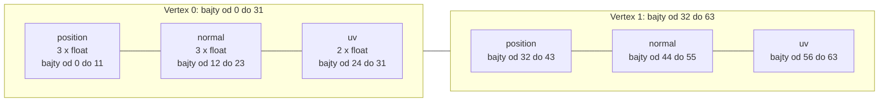

# Moduł gfx: wierzchołek i siatka (`Vertex`, `Mesh`)

Kamień milowy: M2 + M3. Temat wykładu: 4 (Wczytywanie OBJ), część po stronie karty graficznej. Korzysta z tematu 2 (bufory, VAO, `glDrawElements`).
Kod: [`src/gfx/Vertex.hpp`](../../../src/gfx/Vertex.hpp), [`src/gfx/Mesh.hpp`](../../../src/gfx/Mesh.hpp), [`src/gfx/Mesh.cpp`](../../../src/gfx/Mesh.cpp). Użytkownicy: [`src/assets/AssetCache.cpp`](../../../src/assets/AssetCache.cpp), [`src/game/MazeRenderer.cpp`](../../../src/game/MazeRenderer.cpp), [`src/game/ColliderLines.cpp`](../../../src/game/ColliderLines.cpp), [`src/game/LightRig.cpp`](../../../src/game/LightRig.cpp).

Część modułu `gfx`. Wstęp do całego modułu jest w [`README.md`](README.md). Ten dokument zakłada znajomość [`buffers-vao.md`](buffers-vao.md) (bufor, VAO, krok i przesunięcie, klasy `Buffer` i `VertexArray`) oraz [`indexed-drawing.md`](indexed-drawing.md) (indeksy, `glDrawElements`, kolejność pól). Skąd biorą się dane siatki, opisuje [`../assets/obj-loader.md`](../assets/obj-loader.md).

**Stan.** Struktura `gfx::Vertex` i klasa `gfx::Mesh` są w bibliotece `engine` i mają w programie trzech użytkowników (sekcja 5.7). `assets::AssetCache` tworzy po jednej siatce z trójkątów dla każdego modelu labiryntu, a `game::MazeRenderer` rysuje je częściami, przez `draw(firstIndex, indexCount)`. `game::ColliderLines` ma jedną siatkę z odcinków (`GL_LINES`): sześcian z 8 narożników i 24 indeksów, którym rysuje pudełka kolizji. Od M4 `game::LightRig` ma jedną siatkę z trójkątów: mały sześcian z 8 narożników i 36 indeksów, znacznik światła punktowego. Kostka z M1 została przy własnych polach `m_vertexArray`, `m_vertexBuffer` i `m_indexBuffer` w `NightMazeApp`. `Mesh` nadal **nie ma testu jednostkowego**, bo wymaga kontekstu OpenGL. Co wiadomo o jej działaniu, mówi sekcja 5.6.

## 1. Po co to jest

Kostka z tematu 2 jest opisana w `NightMazeApp` ręcznie: tablica liczb `float`, stałe kroku i przesunięć, trzy pola, dwa wywołania `setFloatAttribute` i jedno `glDrawElements`. Dla jednej bryły to dobry sposób, bo widać każdy krok. Model wczytany z pliku wymaga tych samych kroków, tylko dane przychodzą z loadera, a modeli będzie kilka (odcinek ściany, słup, płyta podłogi). Powtarzanie tych samych dziesięciu linii dla każdego modelu to dziesięć miejsc na pomyłkę.

Dlatego dochodzą dwie rzeczy:

- **`gfx::Vertex`**: jeden wierzchołek jako struktura z nazwanymi polami (pozycja, normalna, współrzędna tekstury) zamiast sześciu albo ośmiu anonimowych liczb `float`. To jest **wspólny format** między loaderem a kartą: loader wypełnia tablicę takich struktur, a `Mesh` wysyła ją na kartę bajt w bajt.
- **`gfx::Mesh`**: jedna klasa, która posiada VAO, bufor wierzchołków i bufor indeksów jednego modelu, sama opisuje trzy atrybuty i sama rysuje: całość albo wskazany zakres indeksów.

`Mesh` nie wie nic o plikach, materiałach, teksturach ani shaderach. Dostaje dwie tablice i rodzaj prymitywu.

## 2. Teoria

### 2.1 Wierzchołek to nie tylko pozycja

Wierzchołek (vertex) to komplet danych, które shader wierzchołków dostaje dla jednego punktu siatki. W kostce z tematu 2 były to pozycja i kolor. Model z teksturą i oświetleniem potrzebuje trzech rzeczy:

| Pole | Typ | Liczb `float` | Do czego służy |
|---|---|---|---|
| pozycja (`position`) | `glm::vec3` | 3 | punkt w przestrzeni lokalnej modelu, w metrach |
| normalna (`normal`) | `glm::vec3` | 3 | kierunek, w który zwrócona jest powierzchnia. Od M4 czyta ją oświetlenie (tematy 6 i 7): programy `lit` i `gouraud` liczą z niej, ile światła pada na powierzchnię ([`../scene/lights.md`](../scene/lights.md)) |
| współrzędna tekstury (`uv`) | `glm::vec2` | 2 | miejsce na obrazie tekstury, które przypada na ten punkt (temat 5) |

Razem 8 liczb `float`, czyli 32 bajty. Dwa wierzchołki są **tym samym wierzchołkiem** tylko wtedy, gdy mają równe wszystkie trzy pola. Dlatego róg prostopadłościanu, który należy do trzech ścian, jest w buforze trzy razy: pozycja ta sama, normalne różne ([`indexed-drawing.md`](indexed-drawing.md), sekcja 2.1, tłumaczy to na kolorach kostki).

### 2.2 Układ przeplatany jako struktura

W układzie przeplatanym (interleaved, [`buffers-vao.md`](buffers-vao.md), sekcja 2.3) wszystkie dane jednego wierzchołka leżą obok siebie, a potem zaczyna się następny wierzchołek. Tablica struktur w C++ ma dokładnie taki układ w pamięci: `std::vector<Vertex>` to ciągły blok, w którym po 32 bajtach pierwszego wierzchołka leżą 32 bajty drugiego.



OpenGL nie wie, że w buforze leżą struktury C++. Trzeba mu podać dwie liczby dla każdego atrybutu:

| Pojęcie | Wartość dla `Vertex` | Skąd w kodzie |
|---|---|---|
| **krok** (stride): bajty od początku jednego wierzchołka do początku następnego | 32 | `sizeof(Vertex)` |
| **przesunięcie** (offset) pozycji: bajty od początku wierzchołka do pola | 0 | `offsetof(Vertex, position)` |
| przesunięcie normalnej | 12 | `offsetof(Vertex, normal)` |
| przesunięcie współrzędnej tekstury | 24 | `offsetof(Vertex, uv)` |

W kostce te liczby były wyliczane ręcznie ze stałych (`FLOATS_PER_VERTEX * sizeof(float)`). Tutaj liczy je kompilator z definicji struktury: `sizeof` zwraca rozmiar typu w bajtach, a makro `offsetof(Typ, pole)` z nagłówka `<cstddef>` zwraca odległość pola od początku obiektu. Dodanie pola do struktury zmienia obie wartości samo, bez poprawiania stałych.

### 2.3 Wyrównanie i dopełnienie: dlaczego `Vertex` nie ma niespodzianek

Kompilator może wstawić między pola struktury albo na jej końcu puste bajty, **dopełnienie** (padding), żeby każde pole leżało pod adresem podzielnym przez swoje **wyrównanie** (alignment). Przykład struktury z dopełnieniem:

```cpp
struct Example {
    char flag;    // 1 bajt, potem 3 bajty dopełnienia
    float value;  // 4 bajty, musi zaczynać się od adresu podzielnego przez 4
};                // sizeof(Example) == 8, a nie 5
```

Gdyby `Vertex` miał dopełnienie, opis "8 liczb `float` jedna za drugą" byłby nieprawdziwy. Nie ma go z prostego powodu: wszystkie pola składają się wyłącznie z liczb `float`. `glm::vec3` to trzy liczby `float`, `glm::vec2` to dwie, a `float` ma wyrównanie 4 bajty. Każde pole kończy się więc pod adresem podzielnym przez 4 i następne może zacząć się od razu.

To rozumowanie zależy od biblioteki GLM (jej typy mają opcje, które zmieniają wyrównanie, na przykład `GLM_FORCE_DEFAULT_ALIGNED_GENTYPES`; projekt żadnej nie ustawia). Dlatego zamiast wierzyć na słowo, `Vertex.hpp` każe kompilatorowi to sprawdzić:

```cpp
static_assert(sizeof(Vertex) ==
                  (POSITION_COMPONENTS + NORMAL_COMPONENTS + UV_COMPONENTS) * sizeof(float),
              "Vertex must be 8 tightly packed floats");
```

`static_assert` to warunek sprawdzany **w czasie kompilacji**. Gdyby `sizeof(Vertex)` nie było równe 32, program by się nie zbudował i wypisał podany tekst. Nie kosztuje nic w działającym programie.

Drugi `static_assert` dotyczy `offsetof`:

```cpp
static_assert(std::is_standard_layout_v<Vertex>, "offsetof needs a standard-layout type");
```

Standard C++ gwarantuje działanie `offsetof` tylko dla typów o **układzie standardowym** (standard layout): bez funkcji wirtualnych, bez wirtualnych klas bazowych, ze wszystkimi polami o tym samym poziomie dostępu. Taki typ ma w pamięci układ jak struktura języka C: pola w kolejności deklaracji, pierwsze pod adresem obiektu. `Vertex` spełnia te warunki, a asercja pilnuje, żeby tak zostało.

### 2.4 Numery atrybutów jako umowa z shaderem

Atrybut ma numer, ten sam po stronie C++ i po stronie GLSL ([`buffers-vao.md`](buffers-vao.md), sekcja 4). Dla siatek numery są ustalone raz, w `Vertex.hpp`:

| Stała | Wartość | W shaderze wierzchołków |
|---|---|---|
| `gfx::POSITION_ATTRIBUTE` | 0 | `layout(location = 0) in vec3 ...` |
| `gfx::NORMAL_ATTRIBUTE` | 1 | `layout(location = 1) in vec3 ...` |
| `gfx::UV_ATTRIBUTE` | 2 | `layout(location = 2) in vec2 ...` |

Każdy shader, który ma rysować `Mesh`, musi trzymać się tych numerów. Shader, który nie czyta któregoś atrybutu (na przykład `color.vert`, który nie potrzebuje normalnej ani uv), po prostu go nie deklaruje: włączony atrybut, którego program nie używa, niczemu nie szkodzi.

### 2.5 Rysowanie zakresu indeksów

`glDrawElements` nie musi rysować całego bufora indeksów. Jego drugi parametr to liczba indeksów, a ostatni to miejsce pierwszego z nich. Model z kilkoma materiałami korzysta z tego tak: wszystkie trójkąty leżą w jednym buforze indeksów, pogrupowane materiałami, a każdy materiał to **zakres**: numer pierwszego indeksu i liczba indeksów.

```text
bufor indeksów modelu z dwoma materiałami (9 indeksów, 3 trójkąty)

numer indeksu:   0  1  2  3  4  5 | 6  7  8
materiał:        kamień           | drewno
zakres:          first 0, count 6 | first 6, count 3
bajt w buforze:  0                | 24
```

Rysowanie takiego modelu to pętla: ustaw teksturę materiału, narysuj jego zakres. Zakresy podaje loader ([`../assets/obj-loader.md`](../assets/obj-loader.md), struktura `ObjPart`).

Ostatni parametr `glDrawElements` jest liczony **w bajtach**, a nie w indeksach. Indeks ma 4 bajty (`std::uint32_t`), więc indeks numer 6 zaczyna się w bajcie 24. Pomylenie tych dwóch jednostek to pułapka 3.

### 2.6 Rodzaj prymitywu

Pierwszy parametr `glDrawElements` mówi, jak grupować indeksy:

| Prymityw | Grupowanie | Indeksów na element |
|---|---|---|
| `GL_TRIANGLES` | każde trzy kolejne indeksy to trójkąt | 3 |
| `GL_LINES` | każde dwa kolejne indeksy to odcinek | 2 |

Dane i klasa są te same, zmienia się tylko interpretacja. `Mesh` przyjmuje prymityw w konstruktorze (domyślnie `GL_TRIANGLES`), bo rysowanie pudełek kolizji używa tej samej klasy z `GL_LINES`: 8 wierzchołków sześcianu i 24 indeksy dwunastu krawędzi (sekcja 5.7).

## 3. Jak to działa w OpenGL

`Mesh` nie woła OpenGL sam, poza jednym miejscem: `glDrawElements`. Resztę robią klasy `VertexArray` i `Buffer`, które posiada. Pełna lista wywołań dla siatki z `N` wierzchołków i `M` indeksów:

| # | Kto | Wywołanie OpenGL | Skutek |
|---|---|---|---|
| 1 | konstruktor `VertexArray` | `glGenVertexArrays`, `glBindVertexArray` | nowy VAO jest bieżący |
| 2 | konstruktor `Buffer` (wierzchołki) | `glGenBuffers`, `glBindBuffer(GL_ARRAY_BUFFER, ...)`, `glBufferData` z `N * 32` bajtami | dane wierzchołków na karcie |
| 3 | konstruktor `Buffer` (indeksy) | `glGenBuffers`, `glBindBuffer(GL_ELEMENT_ARRAY_BUFFER, ...)`, `glBufferData` z `M * 4` bajtami | dane indeksów na karcie, bufor zapisany w bieżącym VAO |
| 4 | `setFloatAttribute` (pozycja) | `glBindVertexArray`, `glEnableVertexAttribArray(0)`, `glVertexAttribPointer(0, 3, GL_FLOAT, GL_FALSE, 32, 0)` | atrybut 0 |
| 5 | `setFloatAttribute` (normalna) | to samo z `(1, 3, GL_FLOAT, GL_FALSE, 32, 12)` | atrybut 1 |
| 6 | `setFloatAttribute` (uv) | to samo z `(2, 2, GL_FLOAT, GL_FALSE, 32, 24)` | atrybut 2 |
| 7 | `Mesh::draw`, co klatkę | `glBindVertexArray`, `glDrawElements(prymityw, liczba, GL_UNSIGNED_INT, przesunięcie)` | rysowanie |
| 8 | destruktory pól | `glDeleteBuffers` dwa razy, `glDeleteVertexArrays` | zwolnienie |

Kroki od 1 do 6 to dokładnie to, co robi konstruktor `NightMazeApp` dla kostki ([`indexed-drawing.md`](indexed-drawing.md), sekcja 5.5), tylko z trzema atrybutami zamiast dwóch i krokiem 32 zamiast 24. Kolejność ma te same powody: VAO musi być bieżący, zanim powstanie bufor indeksów (krok 3 zależy od kroku 1), a bufor wierzchołków musi być związany z `GL_ARRAY_BUFFER` w chwili opisywania atrybutów (kroki od 4 do 6 zależą od kroku 2).

Sygnatura `glDrawElements(mode, count, type, indices)`:

| Parametr | Co podaje `Mesh` |
|---|---|
| `mode` | pole `m_primitive`: `GL_TRIANGLES` albo `GL_LINES` |
| `count` | liczba indeksów do narysowania (nie trójkątów) |
| `type` | `GL_UNSIGNED_INT`: jeden indeks to 4 bajty bez znaku |
| `indices` | przesunięcie pierwszego indeksu w buforze indeksów, **w bajtach**, zapisane jako wskaźnik |

## 4. Shadery

`Mesh` nie ma własnego shadera i żadnego nie zna. Układ `Vertex` czytają cztery pary shaderów projektu:

| Shader wierzchołków | Które atrybuty deklaruje | Co rysuje |
|---|---|---|
| `textured.vert` | wszystkie trzy: `aPosition` (0), `aNormal` (1), `aUv` (2) | modele labiryntu ([`textures.md`](textures.md), sekcja 4.1) |
| `lit.vert` | wszystkie trzy, pod tymi samymi nazwami i numerami | modele labiryntu z oświetleniem liczonym dla każdego fragmentu ([`../renderer/lighting-gouraud-phong.md`](../renderer/lighting-gouraud-phong.md), sekcja 4) |
| `gouraud.vert` | wszystkie trzy | modele labiryntu z oświetleniem liczonym dla każdego wierzchołka (ten sam dokument) |
| `color.vert` | tylko `aPosition` (0) | linie pudełek kolizji ([`../scene/collision.md`](../scene/collision.md), sekcja 4) i znaczniki świateł |

`color.vert` pokazuje zasadę z sekcji 2.4: siatka ma włączone trzy atrybuty, a shader czyta jeden. Dwa pozostałe są po prostu ignorowane. Piąta para, `basic.vert` i `basic.frag`, **nie nadaje się** do rysowania `Mesh`: deklaruje pozycję pod numerem 0 i **kolor** pod numerem 1, a `Vertex` ma pod numerem 1 normalną. Narysowanie `Mesh` shaderem `basic` pokazałoby normalne jako kolory, bez żadnego błędu.

## 5. Kod w projekcie

### 5.1 Pliki

| Plik | Co zawiera |
|---|---|
| [`src/gfx/Vertex.hpp`](../../../src/gfx/Vertex.hpp) | struktura `gfx::Vertex`, stałe `POSITION_COMPONENTS`, `NORMAL_COMPONENTS`, `UV_COMPONENTS`, stałe `POSITION_ATTRIBUTE`, `NORMAL_ATTRIBUTE`, `UV_ATTRIBUTE`, dwa `static_assert`. Sam nagłówek, bez pliku `.cpp` |
| [`src/gfx/Mesh.hpp`](../../../src/gfx/Mesh.hpp) | klasa `gfx::Mesh`: konstruktor, zablokowane kopiowanie, domyślne przenoszenie, dwie funkcje `draw`, `indexCount`, pola |
| [`src/gfx/Mesh.cpp`](../../../src/gfx/Mesh.cpp) | stałe `INDEX_TYPE` i `VERTEX_STRIDE`, `static_assert` typu indeksu, konstruktor, obie funkcje `draw` |

Wszystkie trzy pliki są na liście źródeł biblioteki `engine` w [`CMakeLists.txt`](../../../CMakeLists.txt). `Vertex.hpp` dołącza tylko `<glm/glm.hpp>`, `<cstdint>` i `<type_traits>`: **nie dołącza GLAD**, więc mogą go używać loader i testy, które nie mają nic wspólnego z OpenGL. `Mesh.hpp` dołącza `gfx/Buffer.hpp`, `gfx/Vertex.hpp`, `gfx/VertexArray.hpp`, `<glad/gl.h>`, `<cstdint>` i `<span>`, a `Mesh.cpp` do tego `core/GlCheck.hpp`, `<cstddef>` (makro `offsetof`) i `<type_traits>`.

### 5.2 `Vertex.hpp`

```cpp
struct Vertex {
    /// Position in the local space of the model, in metres.
    glm::vec3 position{0.0F};

    /// Direction the surface faces at this vertex. Expected to have length 1. It is all
    /// zeros when the source had no normal.
    glm::vec3 normal{0.0F};

    /// Texture coordinate (u, v). v = 0 is the bottom row of the image. It is all zeros
    /// when the source had no texture coordinate.
    glm::vec2 uv{0.0F};
};
```

- `struct` z publicznymi polami bez prefiksu `m_`: to zwykłe dane, tak jak struktury warstwy `scene` ([`../scene/README.md`](../scene/README.md), sekcja 3), a nie obiekt OpenGL. Kopiuje się jak liczby.
- `{0.0F}` to wartość początkowa pola: konstruktor `glm::vec3` z jedną liczbą wypełnia nią wszystkie składowe. Wierzchołek utworzony przez `Vertex vertex;` ma więc same zera, a nie przypadkowe wartości. Loader z tego korzysta: gdy plik nie podaje normalnej albo współrzędnej tekstury, pole zostaje zerowe.
- Kolejność pól jest kolejnością w pamięci: pozycja, normalna, uv. Od niej zależą przesunięcia 0, 12 i 24.
- Struktura **nie ma stycznej** (tangent). Mapy normalnych, które jej potrzebują, nie weszły do pierwszej części M4 (oświetlenie) i dojdą w jej następnej części. Samo oświetlenie stycznej nie potrzebuje: wystarcza mu normalna.

```cpp
/// Number of floats in each field, the "size" parameter of glVertexAttribPointer.
constexpr int POSITION_COMPONENTS = 3;
constexpr int NORMAL_COMPONENTS = 3;
constexpr int UV_COMPONENTS = 2;

constexpr std::uint32_t POSITION_ATTRIBUTE = 0;
constexpr std::uint32_t NORMAL_ATTRIBUTE = 1;
constexpr std::uint32_t UV_ATTRIBUTE = 2;
```

- Typy `int` i `std::uint32_t`, a nie `GLint` i `GLuint`, bo nagłówek nie dołącza GLAD. Na obu platformach projektu `GLint` to `int`, a `GLuint` to `unsigned int`, czyli ten sam typ co `std::uint32_t` (sprawdza to `static_assert` w `Mesh.cpp`, sekcja 5.4), więc wartości trafiają do `setFloatAttribute` bez rzutowania.
- Stałe `..._COMPONENTS` używa też loader OBJ: tyle liczb czyta z linii `v`, `vn` i `vt`.
- Dwa `static_assert` z końca pliku omawia sekcja 2.3.

### 5.3 `Mesh`: nagłówek

```cpp
class Mesh {
public:
    Mesh(std::span<const Vertex> vertices, std::span<const std::uint32_t> indices,
         GLenum primitive = GL_TRIANGLES);

    Mesh(const Mesh&) = delete;
    Mesh& operator=(const Mesh&) = delete;

    Mesh(Mesh&& other) noexcept = default;
    Mesh& operator=(Mesh&& other) noexcept = default;

    void draw() const;
    void draw(std::uint32_t firstIndex, std::uint32_t indexCount) const;

    std::uint32_t indexCount() const { return m_indexCount; }

private:
    VertexArray m_vertexArray;
    Buffer m_vertexBuffer;
    Buffer m_indexBuffer;

    std::uint32_t m_indexCount;
    GLenum m_primitive;
};
```

(Komentarze z pliku są tu pominięte, żeby było widać całą klasę naraz.)

| Element | Wyjaśnienie |
|---|---|
| `std::span<const Vertex>` | **widok** na ciągły blok elementów: wskaźnik i liczba elementów, bez posiadania pamięci. Przyjmuje `std::vector<Vertex>`, `std::array` i zwykłą tablicę bez kopiowania. `const` w nawiasach znaczy, że przez widok nie da się zmienić danych |
| `std::span<const std::uint32_t>` | indeksy. `std::uint32_t` to liczba bez znaku o dokładnie 32 bitach |
| `GLenum primitive = GL_TRIANGLES` | parametr z wartością domyślną: `Mesh(v, i)` rysuje trójkąty, `Mesh(v, i, GL_LINES)` odcinki (sekcja 2.6) |
| `= delete` przy kopiowaniu | kopia miałaby te same identyfikatory OpenGL i usunęłaby je drugi raz ([`README.md`](README.md), sekcja 2.2). Kompilator i tak nie umiałby jej wygenerować, bo pola nie dają się kopiować. Zapis jawny mówi to czytelnikowi |
| `noexcept = default` przy przenoszeniu | kompilator generuje przenoszenie **pole po polu**. Każde pole umie się przenieść samo: `VertexArray` i `Buffer` mają własne konstruktory i przypisania przenoszące, które zerują identyfikator w obiekcie źródłowym ([`buffers-vao.md`](buffers-vao.md), sekcja 5.4). `Mesh` nie trzyma żadnego identyfikatora bezpośrednio, więc nie ma czego pisać ręcznie |
| brak destruktora | z tego samego powodu: destruktory pól zwalniają wszystko. Pola giną w kolejności odwrotnej do deklaracji: bufor indeksów, bufor wierzchołków, VAO |
| dwie funkcje `draw` | przeciążenie (overload): ta sama nazwa, różne parametry |
| `indexCount()` | liczba indeksów całej siatki. Przydaje się temu, kto rysuje zakresy, i panelowi debug |
| kolejność pól | VAO, bufor wierzchołków, bufor indeksów. Ta sama reguła co w `NightMazeApp.hpp`: konstruktor VAO wiąże go, więc bufor indeksów tworzony później zapisuje się we właściwym VAO |

Po przeniesieniu obiekt źródłowy ma trzy identyfikatory równe 0. Jego destruktor jest bezpieczny (OpenGL ignoruje usuwanie zera), ale rysować nim nie wolno: `m_indexCount` nie jest zerowany, a VAO o numerze 0 nie istnieje. Komentarz w nagłówku mówi to wprost: "must not be drawn".

### 5.4 Konstruktor

Najpierw stałe z anonimowej przestrzeni nazw w `Mesh.cpp`:

```cpp
static_assert(std::is_same_v<GLuint, std::uint32_t>, "GL_UNSIGNED_INT must match uint32_t");

// Type of one index in the index buffer, as glDrawElements wants it.
constexpr GLenum INDEX_TYPE = GL_UNSIGNED_INT;

// Stride: bytes from the start of one vertex to the start of the next one (32).
constexpr GLsizei VERTEX_STRIDE = static_cast<GLsizei>(sizeof(Vertex));
```

- Indeksy są w C++ typu `std::uint32_t`, a karcie mówię, że to `GL_UNSIGNED_INT`, czyli `GLuint`. `static_assert` sprawdza, że to ten sam typ. Gdyby na jakiejś platformie nie był, program by się nie skompilował, zamiast rysować śmieci.
- `sizeof` zwraca `std::size_t` (bez znaku), a parametr kroku to `GLsizei` (ze znakiem), stąd `static_cast`.

```cpp
Mesh::Mesh(std::span<const Vertex> vertices, std::span<const std::uint32_t> indices,
           GLenum primitive)
    // size_bytes() is the number of elements times the size of one element.
    : m_vertexBuffer(GL_ARRAY_BUFFER, vertices.data(), vertices.size_bytes()),
      m_indexBuffer(GL_ELEMENT_ARRAY_BUFFER, indices.data(), indices.size_bytes()),
      m_indexCount(static_cast<std::uint32_t>(indices.size())),
      m_primitive(primitive) {
    m_vertexArray.setFloatAttribute(POSITION_ATTRIBUTE, POSITION_COMPONENTS, VERTEX_STRIDE,
                                    offsetof(Vertex, position));
    m_vertexArray.setFloatAttribute(NORMAL_ATTRIBUTE, NORMAL_COMPONENTS, VERTEX_STRIDE,
                                    offsetof(Vertex, normal));
    m_vertexArray.setFloatAttribute(UV_ATTRIBUTE, UV_COMPONENTS, VERTEX_STRIDE,
                                    offsetof(Vertex, uv));
}
```

(W pliku nad wywołaniami `setFloatAttribute` stoi jeszcze komentarz, tu pominięty.)

| Linia | Co robi |
|---|---|
| brak `m_vertexArray` na liście | pole jest zadeklarowane jako pierwsze, więc jego konstruktor domyślny wykonuje się jako pierwszy, niezależnie od listy: tworzy VAO i go wiąże |
| `m_vertexBuffer(GL_ARRAY_BUFFER, vertices.data(), vertices.size_bytes())` | `data()` to wskaźnik na pierwszy wierzchołek, `size_bytes()` to liczba elementów razy rozmiar elementu, czyli `N * 32`. Tablica struktur jest wysyłana jako surowe bajty. Właśnie dlatego układ `Vertex` musi być dokładnie taki, jak opisują atrybuty |
| `m_indexBuffer(GL_ELEMENT_ARRAY_BUFFER, ...)` | `M * 4` bajtów. Związanie z `GL_ELEMENT_ARRAY_BUFFER` zapisuje bufor w bieżącym VAO |
| `m_indexCount(static_cast<std::uint32_t>(indices.size()))` | `size()` zwraca `std::size_t` (64 bity), pole ma 32 bity, stąd jawne rzutowanie |
| trzy razy `setFloatAttribute` | numer atrybutu, liczba składowych, krok 32 i przesunięcie pola. Bufor wierzchołków jest nadal związany z `GL_ARRAY_BUFFER`, bo bufor indeksów używa innego celu |

OpenGL kopiuje dane w `glBufferData`, więc po powrocie z konstruktora obie tablice wolno zwolnić. Model wczytany z pliku można zamienić na `Mesh` i od razu wyrzucić dane z pamięci procesora (albo je zostawić, na przykład dla kolizji).

Po konstruktorze nowy VAO zostaje związany. Kto potem tworzy bufor indeksów bez własnego VAO, dopisze go do tej siatki: to znana pułapka buforów indeksów ([`indexed-drawing.md`](indexed-drawing.md), pułapka 1), przed którą chroni reguła "VAO tuż przed swoimi buforami".

### 5.5 `draw`

```cpp
void Mesh::draw() const {
    draw(0, m_indexCount);
}

void Mesh::draw(std::uint32_t firstIndex, std::uint32_t indexCount) const {
    if (firstIndex > m_indexCount || indexCount > m_indexCount - firstIndex) {
        return;
    }

    m_vertexArray.bind();

    const std::size_t offsetInBytes = static_cast<std::size_t>(firstIndex) * sizeof(std::uint32_t);
    // NOLINTNEXTLINE(performance-no-int-to-ptr)
    const void* offsetAsPointer = reinterpret_cast<const void*>(offsetInBytes);

    GL_CHECK(
        glDrawElements(m_primitive, static_cast<GLsizei>(indexCount), INDEX_TYPE, offsetAsPointer));
}
```

(Komentarze z pliku są tu pominięte.)

- **`draw()` bez parametrów** rysuje wszystko: zakres od indeksu 0 o długości `m_indexCount`. Jest jedno miejsce z wywołaniem OpenGL, a nie dwa.
- **Sprawdzenie zakresu.** Zakres wystający poza bufor indeksów kazałby karcie czytać cudzą pamięć, a OpenGL tego nie sprawdza. Taki zakres nie jest rysowany wcale. Warunek jest zapisany bez sumy `firstIndex + indexCount`: suma dwóch liczb 32-bitowych bez znaku mogłaby się **przekręcić** (wrap around) i wyjść mała, a wtedy błędny zakres przeszedłby sprawdzenie. Najpierw sprawdzam, czy początek leży w buforze, potem czy długość mieści się w tym, co zostało (`m_indexCount - firstIndex`, które po pierwszym sprawdzeniu nie może być ujemne).
- **`m_vertexArray.bind()`** przywraca cały opis: trzy atrybuty, bufor wierzchołków i bufor indeksów. Buforów nie wiążę osobno.
- **Przesunięcie w bajtach.** `firstIndex` to numer indeksu, a OpenGL chce bajtów: mnożę przez `sizeof(std::uint32_t)`, czyli 4. Rzutowanie na `std::size_t` przed mnożeniem sprawia, że mnożenie odbywa się na 64 bitach.
- **Liczba jako wskaźnik.** Ostatni parametr `glDrawElements` ma typ `const void*` z powodów historycznych, tak samo jak w `glVertexAttribPointer` ([`buffers-vao.md`](buffers-vao.md), sekcja 5.6): z buforem indeksów w VAO jest to liczba bajtów, nie adres. `reinterpret_cast` zamienia liczbę na wskaźnik, przez który nikt nigdy nie czyta. Komentarz `NOLINTNEXTLINE` wyłącza dla tej jednej linii regułę clang-tidy, która takiej zamiany zabrania.
- **`static_cast<GLsizei>(indexCount)`**: parametr `count` jest typu ze znakiem.

Funkcje są `const`: rysowanie nie zmienia obiektu C++. Zmienia stan OpenGL (bieżący VAO), ale to nie jest pole klasy.

### 5.6 Jak to zostało sprawdzone

Uczciwie: **mało**.

| Co | Jak sprawdzone |
|---|---|
| `Vertex.hpp` | kompiluje się, oba `static_assert` przechodzą pod MSVC 19.44 (Windows, 2026-10-05). Struktura jest używana przez loader OBJ i jego 18 przypadków testowych ([`../assets/obj-loader.md`](../assets/obj-loader.md), sekcja 5.9) |
| `Mesh.hpp`, `Mesh.cpp` | kompilują się bez ostrzeżeń pod MSVC `/W4 /permissive-`, `static_assert` typu indeksu przechodzi |
| działanie `Mesh` z trójkątami | sprawdzone **na obrazie**, nie testem. Na Windowsie (2026-10-05, NVIDIA GeForce RTX 4070 Ti SUPER) gra rysuje nią ściany, słupki i podłogę labiryntu: na zrzutach ekranu ściany widziane z góry zgadzają się z planem w panelu Maze, tekstury są we właściwej orientacji, a program nie wypisuje żadnej linii `[error]` ani `GL_`, czyli `GL_CHECK` po `glDrawElements` jest czysty. Rysowanie zakresem działa na modelach, które mają po jednej części: zakres obejmuje wtedy całą siatkę. Modelu z kilkoma częściami w grze nie ma, więc rysowanie zakresu zaczynającego się od indeksu innego niż 0 **nie było sprawdzone** |
| działanie `Mesh` z odcinkami (`GL_LINES`) | sprawdzone na obrazie: na zrzucie ekranu z widoku z góry żółte pudełka leżą na ścianach i słupkach |
| test jednostkowy | nie ma. Klasa wymaga kontekstu OpenGL, którego program testowy nie ma |
| macOS | niesprawdzone: ani kompilacja, ani asercje, ani obraz. Pozycja na liście w [`../../guides/build-macos.md`](../../guides/build-macos.md) |

### 5.7 Kto używa `Mesh`

**Modele labiryntu.** `assets::AssetCache::model` tworzy siatkę z wyniku loadera OBJ i chowa ją w strukturze `LoadedModel` ([`../assets/asset-cache.md`](../assets/asset-cache.md), sekcja 5). Linia z [`AssetCache.cpp`](../../../src/assets/AssetCache.cpp):

```cpp
        .mesh = gfx::Mesh(source.vertices, source.indices),
```

`source.vertices` to `std::vector<gfx::Vertex>`, a `source.indices` to `std::vector<std::uint32_t>`: oba zamieniają się na `std::span` same. Trzeciego argumentu nie ma, więc prymitywem jest domyślne `GL_TRIANGLES`. Wyrażenie tworzy obiekt tymczasowy, który trafia do pola `mesh` przez przeniesienie: to jedno z miejsc, dla których `Mesh` musi być przenoszalny. Dane w `source` giną na końcu funkcji, a karta ma już własną kopię.

Rysuje `game::MazeRenderer::drawInstances` ([`MazeRenderer.cpp`](../../../src/game/MazeRenderer.cpp)), jedną część modelu naraz:

```cpp
            model->mesh.draw(part.firstIndex, part.indexCount);
```

`part` to `assets::ModelPart`: zakres indeksów jednego materiału, przepisany z `ObjPart` loadera (sekcja 2.5). Tekstura i kolor części są ustawiane przed tą linią, a macierz modelu tuż nad nią ([`../game/maze-rendering.md`](../game/maze-rendering.md), sekcja 5). Trzy modele gry mają po jednej części, więc każde takie wywołanie rysuje całą siatkę.

**Linie pudełek kolizji.** `game::ColliderLines` ma jedno pole `gfx::Mesh m_unitCube` i tworzy je na liście inicjalizacyjnej konstruktora ([`ColliderLines.cpp`](../../../src/game/ColliderLines.cpp)):

```cpp
ColliderLines::ColliderLines() : m_unitCube(UNIT_CUBE_CORNERS, UNIT_CUBE_EDGES, GL_LINES) {}
```

| Argument | Co to jest |
|---|---|
| `UNIT_CUBE_CORNERS` | `std::array` ośmiu `gfx::Vertex`: narożniki sześcianu od `(0, 0, 0)` do `(1, 1, 1)`. Wypełniona jest tylko pozycja, normalna i uv zostają zerami, bo `color.vert` ich nie czyta |
| `UNIT_CUBE_EDGES` | `std::array` 24 liczb `std::uint32_t`: 12 krawędzi po 2 indeksy |
| `GL_LINES` | każde dwa kolejne indeksy to jeden odcinek. To jedyne miejsce w projekcie, które podaje trzeci argument konstruktora |

Rysowanie to `m_unitCube.draw();` dla każdego pudełka, po ustawieniu macierzy modelu, która rozciąga sześcian do rozmiarów pudełka i przesuwa go na miejsce ([`../scene/collision.md`](../scene/collision.md), sekcja 5). Jedna siatka na karcie obsługuje więc wszystkie pudełka.

**Znaczniki świateł.** `game::LightRig` ma pole `gfx::Mesh m_markerCube` i tworzy je na liście inicjalizacyjnej konstruktora ([`LightRig.cpp`](../../../src/game/LightRig.cpp)):

```cpp
LightRig::LightRig()
    : m_lightBuffer(sizeof(scene::LightBlockData), LIGHT_BLOCK_BINDING_POINT),
      m_markerCube(MARKER_CORNERS, MARKER_INDICES) {}
```

`MARKER_CORNERS` to `std::array` ośmiu `gfx::Vertex` (narożniki sześcianu o boku 1 ze środkiem w początku układu, wypełniona tylko pozycja), a `MARKER_INDICES` to 36 liczb `std::uint32_t`: 12 trójkątów. Trzeciego argumentu nie ma, więc prymitywem jest `GL_TRIANGLES`. Osiem wspólnych narożników wystarcza, bo znacznik jest rysowany jednym kolorem i nie potrzebuje osobnych normalnych dla każdej ściany. Rysowanie to `m_markerCube.draw();` dla każdego światła punktowego, programem `color`, po ustawieniu macierzy modelu ze skalą 0,14 ([`../game/flashlight.md`](../game/flashlight.md)).

Trzy użycia pokazują, po co `Mesh` nie wie nic o shaderach i materiałach: ta sama klasa rysuje modele z teksturą programami `textured`, `lit` i `gouraud`, a gołe odcinki i jednokolorowe sześciany programem `color`.

## 6. Panel ImGui

`Mesh` i `Vertex` nie mają własnego panelu. Siatki widać w dwóch panelach pośrednio. Panel **Assets** pokazuje listę wczytanych modeli z liczbą wierzchołków i trójkątów oraz części każdego modelu z liczbą trójkątów ([`../assets/asset-cache.md`](../assets/asset-cache.md), sekcja 6). Liczby te pochodzą ze struktury `LoadedModel`, a nie z `Mesh`: sama siatka pamięta tylko liczbę indeksów. Panel **Collision** włącza rysowanie pudełek, czyli siatki z odcinków ([`../scene/collision.md`](../scene/collision.md), sekcja 6).

## 7. Pułapki

1. **Pole dodane do `Vertex` bez atrybutu.** Nowe pole (na przykład styczna) zmienia `sizeof(Vertex)`, czyli krok, i pierwszy `static_assert` przestaje przechodzić: trzeba poprawić sumę składowych, dopisać stałą atrybutu i czwarte wywołanie `setFloatAttribute`. To dobrze, że kompilacja się zatrzymuje: bez asercji bufor miałby nowy układ, a opis stary.
2. **Pole innego typu niż `float` w `Vertex`.** Jedno pole `char` albo `double` wprowadza dopełnienie albo inne wyrównanie i rachunek "8 liczb `float`" przestaje się zgadzać. `setFloatAttribute` opisuje wyłącznie atrybuty z liczb `float`.
3. **Przesunięcie w indeksach zamiast w bajtach.** Ostatni parametr `glDrawElements` to bajty. Podanie tam numeru indeksu (6 zamiast 24) każe karcie zacząć czytanie w środku indeksu numer 1: rysuje się coś przypadkowego, bez błędu OpenGL. `Mesh::draw` przyjmuje numer indeksu i sam mnoży przez 4.
4. **Liczba trójkątów zamiast liczby indeksów.** Oba parametry zakresu są w indeksach. Część z 10 trójkątami to `indexCount` równe 30.
5. **Zamiana kolejności pól.** `m_indexBuffer` zadeklarowany nad `m_vertexArray` kompiluje się, a bufor indeksów trafia do VAO, który był bieżący wcześniej (albo do żadnego). To ta sama pułapka co w `NightMazeApp` ([`indexed-drawing.md`](indexed-drawing.md), pułapka 8).
6. **Indeks spoza tablicy wierzchołków.** `Mesh` sprawdza tylko zakres **w buforze indeksów**. Wartości indeksów nie sprawdza: indeks 60 przy 60 wierzchołkach każe karcie czytać poza buforem wierzchołków. Loader OBJ pilnuje tego po swojej stronie (odrzuca plik z indeksem spoza listy).
7. **Shader z innymi numerami atrybutów.** `basic.vert` czyta kolor spod numeru 1, a `Mesh` podaje tam normalną. Nie ma błędu, są złe kolory (sekcja 4).
8. **`Mesh` utworzony przed oknem albo żyjący dłużej niż okno.** Jak każda klasa `gfx` wymaga żywego kontekstu OpenGL przez całe życie ([`README.md`](README.md), sekcja 5).
9. **Rysowanie obiektem, z którego przeniesiono.** Po `Mesh b = std::move(a);` obiekt `a` nie ma VAO. `a.draw()` wiąże VAO numer 0 i woła `glDrawElements`, co w profilu Core kończy się błędem `GL_INVALID_OPERATION`.
10. **Puste tablice.** `Mesh` z zerową liczbą indeksów jest poprawny: `draw()` woła `glDrawElements` z liczbą 0 i nic nie rysuje.
11. **Utworzenie siatki zmienia wiązania.** Konstruktor zostawia związany nowy VAO, a z `GL_ARRAY_BUFFER` nowy bufor wierzchołków. Kod, który po utworzeniu własnych buforów liczy na to, że nadal są związane, nie może między tymi krokami tworzyć siatek. Dlatego w `NightMazeApp.hpp` pola, przez które powstają siatki, stoją przed polami kostki ([`buffers-vao.md`](buffers-vao.md), pułapka 12).
12. **Prymityw niezgodny z indeksami.** Klasa nie sprawdza, czy liczba indeksów pasuje do prymitywu. Indeksy trójkątów narysowane jako `GL_LINES` dają przypadkowe odcinki, a indeksy odcinków narysowane jako `GL_TRIANGLES` przypadkowe trójkąty (ćwiczenie 5).
13. **Szerokość linii.** `ColliderLines` zostawia domyślną szerokość 1 piksela. Profil Core nie musi obsługiwać szerszych linii przez `glLineWidth`, a komentarz w `ColliderLines.cpp` mówi, że macOS ich nie obsługuje. Tego na Macu nie sprawdzałem.

## 8. Ćwiczenia

Ćwiczenia od 1 do 4 robi się na kartce albo samą kompilacją. Ćwiczenia od 5 do 7 zmieniają kod, który rysuje `Mesh`: po każdym zbuduj i uruchom grę, a na końcu wycofaj zmianę (`git checkout src`).

1. **Bajty na kartce.** Siatka ma 60 wierzchołków i 90 indeksów (tyle ma `wall_straight.obj`). Ile bajtów zajmuje bufor wierzchołków, ile bufor indeksów? W którym bajcie zaczyna się pole `uv` wierzchołka numer 7? Odpowiedzi: 1920, 360, 248 (7 razy 32 plus 24).
2. **Zakres na kartce.** Model ma części: kamień (`firstIndex` 0, `indexCount` 60) i drewno (`firstIndex` 60, `indexCount` 30). Jakie argumenty dostanie `glDrawElements` przy rysowaniu drewna? Odpowiedź: liczba 30, przesunięcie 240 bajtów.
3. **Asercja w działaniu.** Dopisz tymczasowo do `Vertex` pole `float extra = 0.0F;` i zbuduj projekt. Przeczytaj komunikat kompilatora. Potem zamień je na `char flag = 0;`. Ile wynosi teraz `sizeof(Vertex)` i dlaczego nie 33? Wycofaj zmianę.
4. **Układ standardowy.** Dopisz tymczasowo do `Vertex` funkcję `virtual void f() {}`. Obie asercje zgłaszają błąd: dlaczego zmienił się rozmiar i dlaczego `offsetof` przestaje być bezpieczne?
5. **Odcinki zamiast trójkątów.** W `AssetCache.cpp` dopisz trzeci argument: `gfx::Mesh(source.vertices, source.indices, GL_LINES)`. Co widać i dlaczego to nie jest siatka krawędzi modelu? (Wskazówka: indeksy są pogrupowane trójkami, a `GL_LINES` czyta je parami.)
6. **Pół modelu.** W `MazeRenderer::drawInstances` zamień `part.indexCount` na `part.indexCount / 2`. Których ścian modeli brakuje? Liczba indeksów ściany (90) dzieli się na pół bez reszty z dzielenia przez 3. Co by się stało z ostatnim, niepełnym trójkątem, gdyby się nie dzieliła?
7. **Trójkąty z krawędzi.** W `ColliderLines.cpp` usuń argument `GL_LINES`. Włącz rysowanie pudełek w panelu Collision. Co widać zamiast krawędzi i ile trójkątów powstaje z 24 indeksów?

## 9. Pytania kontrolne

1. **Co zawiera `gfx::Vertex` i ile bajtów zajmuje?**
   Pozycję (`glm::vec3`), normalną (`glm::vec3`) i współrzędną tekstury (`glm::vec2`): 8 liczb `float`, 32 bajty. Kolejność pól to kolejność w pamięci.

2. **Skąd `Mesh` zna krok i przesunięcia atrybutów?**
   Krok to `sizeof(Vertex)`, czyli 32. Przesunięcia to `offsetof(Vertex, position)`, `offsetof(Vertex, normal)` i `offsetof(Vertex, uv)`: 0, 12 i 24. Liczy je kompilator z definicji struktury, więc nie mogą się rozjechać z danymi.

3. **Co to jest dopełnienie i dlaczego `Vertex` go nie ma?**
   Puste bajty, które kompilator wstawia, żeby pola leżały pod adresami podzielnymi przez ich wyrównanie. `Vertex` składa się wyłącznie z liczb `float` o wyrównaniu 4, więc każde pole może zacząć się zaraz po poprzednim. Pilnuje tego `static_assert(sizeof(Vertex) == 8 * sizeof(float))`.

4. **Po co drugi `static_assert`, z `std::is_standard_layout_v`?**
   Bo `offsetof` jest gwarantowane tylko dla typów o układzie standardowym. Asercja zatrzyma kompilację, gdyby ktoś dodał do `Vertex` na przykład funkcję wirtualną.

5. **Dlaczego `Vertex.hpp` nie dołącza GLAD?**
   Żeby strukturę mogły wypełniać loadery z warstwy `assets` i czytać testy, które działają bez okna i bez OpenGL. Dlatego numery atrybutów są typu `std::uint32_t`, a nie `GLuint`.

6. **Dlaczego `Mesh` nie ma destruktora ani ręcznie napisanego przenoszenia?**
   Bo nie trzyma żadnego identyfikatora OpenGL bezpośrednio. Posiada `VertexArray` i dwa `Buffer`, a każdy z nich sam zwalnia swój obiekt i sam umie się przenieść. Kompilator generuje przenoszenie pole po polu (`= default`), a kopiowanie jest zablokowane.

7. **W jakiej kolejności powstają obiekty OpenGL w konstruktorze `Mesh` i dlaczego w tej?**
   VAO (i od razu jest wiązany), bufor wierzchołków, bufor indeksów, potem trzy opisy atrybutów. Bufor indeksów zapisuje się w VAO bieżącym w chwili wiązania, więc VAO musi być pierwszy. Atrybut zapamiętuje bufor związany z `GL_ARRAY_BUFFER` w chwili `glVertexAttribPointer`, więc bufor wierzchołków musi powstać przed opisem atrybutów. O kolejności decyduje kolejność deklaracji pól.

8. **Jak narysować tylko część siatki i w jakich jednostkach podaje się zakres?**
   `draw(firstIndex, indexCount)`: numer pierwszego indeksu i liczba indeksów. `Mesh` zamienia numer na bajty (razy 4) i podaje je jako ostatni parametr `glDrawElements`, a liczbę jako drugi.

9. **Dlaczego ostatni parametr `glDrawElements` jest wskaźnikiem, skoro to liczba?**
   Z powodów historycznych: w starym OpenGL był adresem tablicy indeksów w pamięci programu. Gdy VAO ma bufor indeksów, wartość jest czytana jako przesunięcie w bajtach od początku tego bufora. Stąd `reinterpret_cast` liczby na `const void*`.

10. **Co robi `draw` z zakresem wystającym poza bufor i dlaczego warunek nie używa sumy?**
    Nie rysuje nic. Suma `firstIndex + indexCount` na liczbach 32-bitowych bez znaku mogłaby się przekręcić i dać małą wartość, więc warunek sprawdza osobno początek i to, czy długość mieści się w reszcie bufora.

11. **Po co parametr `primitive`?**
    Mówi `glDrawElements`, jak grupować indeksy: trójkami (`GL_TRIANGLES`) albo parami (`GL_LINES`). Ta sama klasa rysuje modele labiryntu i krawędzie pudełek kolizji.

12. **Czy `Mesh` jest przetestowany?**
    Nie testem jednostkowym: wymaga kontekstu OpenGL, a program testowy nie tworzy okna. Jest sprawdzony na obrazie na Windowsie: gra rysuje nim labirynt i pudełka kolizji bez błędów OpenGL. Rysowanie zakresu, który nie zaczyna się od indeksu 0, nie było sprawdzone, bo modele gry mają po jednej części.

13. **Kto w programie tworzy obiekty `Mesh` i ile ich jest?**
    `assets::AssetCache` tworzy po jednym dla każdego wczytanego modelu: trzy dla labiryntu (płytka podłogi, ściana, słupek). `game::ColliderLines` ma jeden, sześcian z krawędzi. `game::LightRig` ma jeden, mały sześcian z trójkątów jako znacznik światła. Razem pięć siatek na karcie, niezależnie od rozmiaru labiryntu: każdy obiekt sceny to ta sama siatka z inną macierzą modelu.

14. **Dlaczego jedna siatka sześcianu wystarcza do narysowania wszystkich pudełek kolizji?**
    Bo pudełko o krawędziach równoległych do osi to sześcian jednostkowy po skalowaniu i przesunięciu. Rozmiar i miejsce pudełka są w macierzy modelu, a geometria na karcie jest wspólna.

## 10. Źródła

- LearnOpenGL, rozdział "Mesh" (<https://learnopengl.com/Model-Loading/Mesh>): struktura wierzchołka, `offsetof`, klasa siatki. Tamta klasa trzyma też tekstury, moja nie.
- docs.gl (<https://docs.gl>), strony dla OpenGL 4: `glDrawElements`, `glVertexAttribPointer`.
- Khronos OpenGL Wiki, "Vertex Specification" (<https://www.khronos.org/opengl/wiki/Vertex_Specification>): układ przeplatany, krok i przesunięcie.
- cppreference: `offsetof` (<https://en.cppreference.com/w/cpp/types/offsetof>), `std::is_standard_layout` (<https://en.cppreference.com/w/cpp/types/is_standard_layout>), `std::span` (<https://en.cppreference.com/w/cpp/container/span>), `static_assert` (<https://en.cppreference.com/w/cpp/language/static_assert>).
- Dokumenty w tym repozytorium: [`buffers-vao.md`](buffers-vao.md), [`indexed-drawing.md`](indexed-drawing.md), [`README.md`](README.md), [`../assets/obj-loader.md`](../assets/obj-loader.md), [`../assets/README.md`](../assets/README.md), [`../assets/asset-cache.md`](../assets/asset-cache.md) (kto tworzy siatki modeli), [`../game/maze-rendering.md`](../game/maze-rendering.md) (kto je rysuje), [`../scene/collision.md`](../scene/collision.md) (siatka z odcinków), [`textures.md`](textures.md) (shadery `textured.*`).
