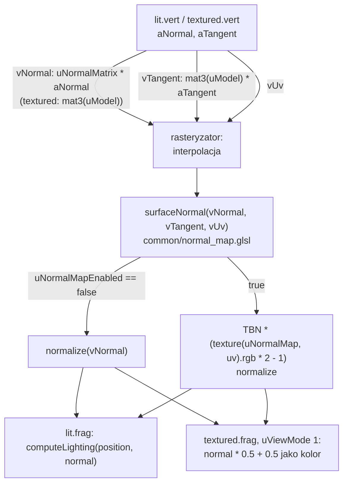
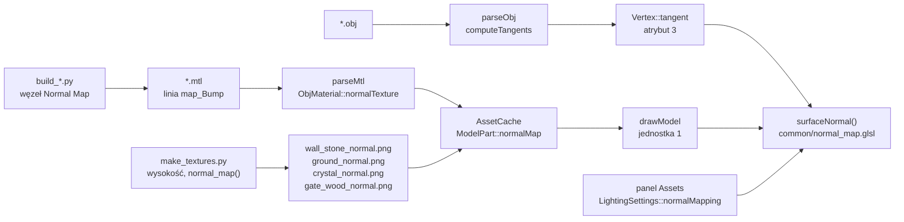

# Moduł gfx: mapy normalnych

Kamień milowy: M4 (część "mapy normalnych", która domyka kod M4), zaktualizowany w M5 (mapy normalnych kryształów i bramy, kod wiążący w `ModelDraw.cpp`). Temat wykładu: 5 (Tekstury), z efektem widocznym dopiero przy oświetleniu z tematów 6 i 7.
Kod: plik dołączany do shaderów [`assets/shaders/common/normal_map.glsl`](../../../assets/shaders/common/normal_map.glsl), shadery [`lit.vert`](../../../assets/shaders/lit.vert), [`lit.frag`](../../../assets/shaders/lit.frag), [`textured.vert`](../../../assets/shaders/textured.vert), [`textured.frag`](../../../assets/shaders/textured.frag), styczne w [`src/assets/Tangents.hpp`](../../../src/assets/Tangents.hpp) i [`src/assets/Tangents.cpp`](../../../src/assets/Tangents.cpp), wierzchołek w [`src/gfx/Vertex.hpp`](../../../src/gfx/Vertex.hpp), skrypt tekstur [`tools/blender/make_textures.py`](../../../tools/blender/make_textures.py), testy [`tests/TangentTests.cpp`](../../../tests/TangentTests.cpp).

Część modułu `gfx`, chociaż technika przechodzi przez kilka warstw: skrypt Blendera, loader OBJ, pamięć podręczną assetów, układ wierzchołka, shadery i panel. Ten dokument jest jej **jednym miejscem**: tłumaczy teorię, plik `common/normal_map.glsl` i pliki `Tangents.*` linia po linii, a przy pozostałych plikach mówi, co się zmieniło, i odsyła do dokumentu, który omawia je w całości. Zakłada znajomość tekstur ([`textures.md`](textures.md)), wierzchołka i siatki ([`mesh.md`](mesh.md)), świateł ([`../scene/lights.md`](../scene/lights.md)) i różnicy między światłem na wierzchołek a na fragment ([`../renderer/lighting-gouraud-phong.md`](../renderer/lighting-gouraud-phong.md)).

| Dokument | Co omawia z tej techniki |
|---|---|
| ten | teoria, `common/normal_map.glsl`, `Tangents.*`, droga normalnej od skryptu do piksela, scenariusz pokazu |
| [`../../guides/blender.md`](../../guides/blender.md) | skrypt `make_textures.py` w całości, materiał Blendera z węzłem Normal Map, eksport |
| [`../assets/obj-loader.md`](../assets/obj-loader.md) | linia `map_Bump` i parser MTL linia po linii, wywołanie `computeTangents` na końcu `parseObj` |
| [`mesh.md`](mesh.md) | struktura `Vertex` z czwartym polem, cztery atrybuty w `Mesh` |
| [`../assets/asset-cache.md`](../assets/asset-cache.md) | `ModelPart::normalMap`, płaska tekstura zastępcza, panel Assets |
| [`../game/maze-rendering.md`](../game/maze-rendering.md) | wiązanie dwóch tekstur w `game::drawModel` (do M4: `MazeRenderer::drawInstances`) |
| [`../game/gameplay.md`](../game/gameplay.md) | kryształy i brama, które od M5 też mają mapy normalnych |
| [`../game/flashlight.md`](../game/flashlight.md) | `LightingSettings::normalMapping` i `usesNormalMap` |

**Stan na dziś (2026-10-05).** Kod z M4 jest kompletny i był zmierzony na Windowsie (MSVC 19.44, RTX 4070 Ti SUPER, sterownik NVIDII 610.74): build Debug i Release bez ostrzeżeń, wtedy 163 przypadki testowe i 62220 asercji w obu konfiguracjach, start gry bez linii `[error]` i `GL_`, a obraz sprawdzony na zrzutach ekranu (sekcja 5.11). M5 nie zmienił ani shaderów tej techniki, ani plików `Tangents.*`, ani loadera. Zmienił trzy rzeczy wokół: kod, który wiąże obie tekstury, przeszedł z `MazeRenderer::drawInstances` do wolnej funkcji `game::drawModel` w `src/game/ModelDraw.cpp`, doszły trzy modele z mapami normalnych (dwa kryształy i brama, sekcja 5.3) i zniknęły kostki świateł. Stan z M5 zgłoszony dla Windowsa tego samego dnia: build Debug i Release bez ostrzeżeń, 215 przypadków testowych i 85098 asercji w obu konfiguracjach. M5 jest kompletny w kodzie, ale nie zamknięty. **Druga część M6 (teren i trawa) zmieniła podłoże.** Płytki podłogi z modelem `floor_tile.obj` i parą `floor_stone.png`, `floor_stone_normal.png` zostały usunięte. Podłoże jest dziś terenem: jedną siatką zbudowaną w kodzie z mapy wysokości, z teksturą `ground.png` i mapą normalnych `ground_normal.png` ([`../renderer/terrain.md`](../renderer/terrain.md), [`../../decisions/floor-tiles-retired.md`](../../decisions/floor-tiles-retired.md)). Shadery tej techniki i pliki `Tangents.*` się nie zmieniły: teren dostaje styczne tą samą funkcją `assets::computeTangents` co modele, tylko wołaną z `game::buildTerrainMesh` zamiast z loadera, a jego dwie tekstury wiąże nowa funkcja `game::drawMesh`. Trawa map normalnych nie używa. Wszystkie pomiary w tym dokumencie, w których mowa o podłodze, zrobiono w M4 na płytkach i zostają jako zapis tamtego stanu: nowego podłoża z mapą normalnych nie mierzyłem. Stan po tej zmianie (Windows, 2026-10-05): 256 przypadków testowych i 101232 asercje w Debug i Release, uruchomione wtedy z istniejących buildów. M6 jest kompletny w kodzie na Windowsie, ale nie zamknięty. **Pierwsza część M7 (bufor HDR i gamma) dotknęła map normalnych w jednym miejscu: przestrzeni kolorów.** Tekstury koloru są od niej teksturami sRGB (`GL_SRGB8`), a mapy normalnych są wczytywane jawnie jako dane liniowe: `AssetCache::model` i `TerrainRenderer` podają dla nich `gfx::ColorSpace::Linear`, płaska mapa zastępcza też jest liniowa, a panel Assets pokazuje przy każdej mapie słowo `linear` (sekcja 3, pułapka 3). Shadery tej techniki, `Tangents.*` i loader się nie zmieniły. Rachunek światła, do którego trafia normalna z mapy, działa teraz na wartościach liniowych ([`color-space.md`](color-space.md)), więc relief wygląda inaczej niż na zrzutach z M4: tamte pomiary zostają jako zapis stanu sprzed gammy. Zgłoszone dla Windowsa po tej zmianie (2026-10-05): bramka `make check` przechodzi, 269 przypadków testowych i 102103 asercje w Debug i Release, a po drugiej części M7 276 i 102139. **Nikt jeszcze nie kliknął ręcznie** pola `Normal mapping` w panelu Assets i nikt nie obejrzał ręcznie domyślnego układu paneli z tym polem. **Na macOS nic z tego nie było budowane ani uruchamiane**: lista i ryzyka są w [`../../guides/build-macos.md`](../../guides/build-macos.md). Shadery, `gfx::Mesh` i `assets::AssetCache` wymagają kontekstu OpenGL i nie mają testów jednostkowych. Testy mają: matematyka stycznych, parser MTL, zawartość plików map normalnych i funkcja `usesNormalMap`.

## 1. Po co to jest

Ściana labiryntu to prostopadłościan: jej przednia strona ma dwa trójkąty i jedną normalną. Tekstura rysuje na niej bloki kamienia i fugi, ale dla światła ta ściana jest idealnie płaską taflą. Widać to najlepiej pod latarką: plama światła przesuwa się po rysunku kamieni jak po **tapecie**. Fugi są ciemniejsze, bo tak je namalowano, a nie dlatego, że światło do nich nie dociera. Gdy latarka świeci z boku, nic się w fugach nie zmienia.

Prawdziwy mur reaguje na kierunek światła: krawędź bloku zwrócona do lampy jest jasna, przeciwna ciemna, a po przejściu lampy na drugą stronę zamieniają się rolami. Żeby to uzyskać geometrią, każda fuga musiałaby mieć własne trójkąty: tysiące na jedną ścianę. **Mapa normalnych** (normal map) daje ten efekt bez zmiany geometrii. To druga tekstura, w której każdy teksel przechowuje nie kolor, tylko **kierunek normalnej** w tym miejscu powierzchni. Shader fragmentów czyta ją i liczy światło z tą normalną zamiast z normalnej trójkąta. Kształt ściany zostaje płaski, zmienia się tylko światło na niej.

Co do tego potrzeba i gdzie to jest w projekcie:

| Rzecz | Gdzie |
|---|---|
| obraz z normalnymi, zgodny co do teksela z obrazem koloru | `assets/textures/wall_stone_normal.png`, od M5 także `crystal_normal.png` i `gate_wood_normal.png`, a od drugiej części M6 `ground_normal.png` (w miejscu usuniętej `floor_stone_normal.png`), generowane przez `make_textures.py` |
| informacja w materiale, która tekstura jest mapą normalnych | linia `map_Bump` w plikach `.mtl`, pole `ObjMaterial::normalTexture` |
| kierunek "w prawo na teksturze" w każdym wierzchołku, czyli **styczna** (tangent) | pole `Vertex::tangent`, liczone przez `assets::computeTangents` |
| druga tekstura związana z drugą jednostką teksturującą | `game::drawModel` w `src/game/ModelDraw.cpp`, sampler `uNormalMap` |
| przeliczenie normalnej z tekstury na przestrzeń świata | funkcja `surfaceNormal` w `common/normal_map.glsl` |
| przełącznik, żeby efekt dało się pokazać | pole `Normal mapping` w panelu Assets, `LightingSettings::normalMapping` |

## 2. Teoria

### 2.1 Płaska ściana pod latarką: dlaczego wygląda jak tapeta

Wzór Lamberta ([`../scene/lights.md`](../scene/lights.md), sekcja 2.3) mówi, że jasność zależy od cosinusa kąta między normalną `N` a kierunkiem do światła `L`. Na płaskiej ścianie `N` jest w każdym punkcie ta sama. Zmienia się tylko `L` (latarka jest blisko) i odległość, więc jasność zmienia się **łagodnie**: jedna gładka plama. Tekstura koloru mnoży tę plamę przez swój rysunek i na tym koniec. Żaden szczegół tekstury nie może wpłynąć na światło, bo światło go nie zna.

Żeby fuga wyglądała jak rowek, światło musi w niej widzieć **inną normalną** niż na płaskiej części bloku: skos odchylony w jedną albo w drugą stronę. Dwa sposoby:

| Sposób | Koszt | Wynik |
|---|---|---|
| prawdziwa geometria: fuga zrobiona z trójkątów | tysiące trójkątów na ścianę, każdy liczony w shaderze wierzchołków | poprawna sylwetka i poprawne światło |
| mapa normalnych: normalna na teksel | jeden odczyt tekstury więcej na fragment | poprawne światło, płaska sylwetka |

Mapa normalnych oszukuje tylko światło. Krawędź ściany oglądana pod ostrym kątem zostaje prostą linią, a fugi nie zasłaniają jedna drugiej. Przy płytkim reliefie muru (około 1 cm) tego nie widać.

### 2.2 Normalna na teksel zamiast normalnej na trójkąt

Zwykła tekstura odpowiada na pytanie "jaki kolor ma powierzchnia w punkcie `(u, v)`". Mapa normalnych odpowiada na pytanie "w którą stronę powierzchnia jest zwrócona w punkcie `(u, v)`". Obie są obrazami RGB tego samego rozmiaru i obie czyta ta sama funkcja `texture()`. Różni je tylko to, co shader robi z trzema odczytanymi liczbami: kolor mnoży światło, a normalna **wchodzi do wzoru na światło**.

Z tego wynika od razu ograniczenie: normalna z tekstury jest dostępna tam, gdzie czytana jest tekstura, czyli w shaderze **fragmentów**. Technika wymaga więc oświetlenia liczonego na fragment (sekcja 2.11).

### 2.3 Przestrzeń styczna i dlaczego normalne są zapisane względem powierzchni

W jakim układzie współrzędnych zapisać kierunek w tekselu? Możliwości są dwie.

| Zapis | Co znaczy `(0, 0, 1)` | Wada albo zaleta |
|---|---|---|
| przestrzeń modelu (object space) | "w stronę +Z modelu" | jedna tekstura pasuje tylko do jednej ściany w jednym położeniu. Tylna strona ściany potrzebowałaby innej mapy niż przednia, podłoga jeszcze innej |
| **przestrzeń styczna** (tangent space) | "prosto z powierzchni, tak jak normalna trójkąta" | ta sama tekstura działa na każdej powierzchni, w każdym położeniu i obrocie, i można ją kafelkować |

Projekt używa przestrzeni stycznej, jak prawie wszystkie mapy normalnych. To układ **przyklejony do powierzchni** w danym punkcie. Jego trzy osie:

| Oś | Nazwa | Kierunek na powierzchni | Kierunek na obrazie |
|---|---|---|---|
| `+X` | **styczna** (tangent), `T` | tam, gdzie rośnie `u` | w prawo |
| `+Y` | **bitangenta** (bitangent), `B` | tam, gdzie rośnie `v` | w górę |
| `+Z` | **normalna** (normal), `N` | prostopadle, na zewnątrz powierzchni | w stronę patrzącego |

```text
          B  (v rośnie, góra obrazu)
          ^
          |
          |      N wychodzi z kartki w stronę czytelnika
          +-------> T  (u rośnie, prawa strona obrazu)
```

Teksel `(0, 0, 1)` mówi "tu powierzchnia jest zwrócona tak samo jak trójkąt". Teksel `(0,6, 0, 0,8)` mówi "tu jest odchylona w stronę rosnącego `u`". Ta sama mapa nałożona na ścianę zwróconą na północ, na południe i na poziomą powierzchnię da za każdym razem poprawny relief, o ile shader zna `T`, `B` i `N` tej powierzchni w przestrzeni świata. `N` jest w modelu. `T` trzeba policzyć (sekcja 2.7). `B` wynika z dwóch pozostałych (sekcja 2.9).

To dlatego mapa ściany `wall_stone_normal.png` obsługuje wszystkie strony odcinka ściany, słupek i ściany obrócone o 90 stopni: jedna tekstura, wiele orientacji.

### 2.4 Kodowanie i niebieski wygląd mapy normalnych

Składowe wektora o długości 1 mieszczą się między -1 a 1. Kanał obrazu 8-bitowego przechowuje liczby od 0 do 255, które shader widzi jako od 0 do 1. Przeliczenie jest liniowe, w obie strony:

```text
zapis  (skrypt):  kolor   = normalna * 0,5 + 0,5      od -1..1 do 0..1
odczyt (shader):  normalna = kolor * 2 - 1            od 0..1 do -1..1
```

| Kierunek w przestrzeni stycznej | Kolor 0..1 | Bajty | Wygląd |
|---|---|---|---|
| `(0, 0, 1)`: płasko | `(0,5, 0,5, 1,0)` | `(128, 128, 255)` | jasny niebieskofioletowy |
| `(0,6, 0, 0,8)`: odchylona w prawo | `(0,8, 0,5, 0,9)` | `(204, 128, 230)` | różowawy |
| `(-0,6, 0, 0,8)`: odchylona w lewo | `(0,2, 0,5, 0,9)` | `(51, 128, 230)` | niebieskozielony |
| `(0, 0,6, 0,8)`: odchylona w górę | `(0,5, 0,8, 0,9)` | `(128, 204, 230)` | zielonkawy |

Stąd **niebieski wygląd** każdej mapy normalnych w przestrzeni stycznej: większość powierzchni jest prawie płaska, więc większość tekseli jest blisko `(128, 128, 255)`. Kolory inne niż niebieski pojawiają się tylko na skosach. Składowa `z` jest zawsze dodatnia (powierzchnia nie może być zwrócona do środka ściany), więc kanał niebieski jest zawsze powyżej 128. Test w `tests/ImageLoaderTests.cpp` sprawdza obie rzeczy na prawdziwych plikach: średnia całego obrazu jest blisko `(128, 128, 255)`, a najniższy niebieski bajt jest większy od 128.

**Dlaczego 128, a nie 127.** `0 * 0,5 + 0,5 = 0,5`, a `0,5 * 255 = 127,5`. Skrypt zaokrągla do najbliższej liczby całkowitej i wychodzi 128. Po odczycie `128 / 255 * 2 - 1` daje około 0,004, a nie dokładnie 0: ośmiu bitów nie da się podzielić dokładnie na pół. Błąd jest 250 razy mniejszy od najmniejszego skosu, jaki widać, a `normalize` w shaderze i tak przywraca długość 1.

### 2.5 Konwencja kanału zielonego

Kanał czerwony nie budzi sporów: `+X` to prawa strona obrazu. Z kanałem zielonym są **dwie konwencje**:

| Konwencja | `+Y` (zielony powyżej 128) znaczy | Kto jej używa |
|---|---|---|
| **OpenGL** ("Y+", "green up") | skos zwrócony ku **górze** obrazu | OpenGL, Blender, ten projekt |
| DirectX ("Y-", "green down") | skos zwrócony ku **dołowi** obrazu | Direct3D, część narzędzi i gotowych tekstur |

Różnica bierze się z tego, gdzie każdy z systemów ma początek układu tekstury: OpenGL w lewym dolnym rogu (`v` rośnie w górę), Direct3D w lewym górnym. Mapa w złej konwencji nie wygląda na zepsutą: pionowe fugi są poprawne (kanał czerwony), a **poziome wychodzą odwrócone**, jako wypukłe wałki zamiast rowków. Oko widzi to jako "światło pada od dołu".

Jak ten projekt trzyma konwencję OpenGL na całej drodze:

| Ogniwo | Co robi | Gdzie opisane |
|---|---|---|
| skrypt | w tablicy wiersz 0 to **dół** obrazu, więc `+y` tablicy to `+v`. Normalna to `(-nachylenie_x, -nachylenie_y, 1)`, bez żadnej zmiany znaku | sekcja 5.2 |
| Blender przy zapisie PNG | zapisuje wiersze od góry, jak każdy plik PNG | [`../../guides/blender.md`](../../guides/blender.md) |
| `assets::loadImage` | **odwraca wiersze**, więc pierwszy wiersz w pamięci to znowu dół obrazu | [`../assets/images.md`](../assets/images.md), sekcja 2.3 |
| `glTexImage2D` | pierwszy wiersz danych to `v = 0` | [`textures.md`](textures.md), sekcja 2.1 |
| współrzędne UV modeli | `v` rośnie w górę ściany (wysokość) | [`../../guides/blender.md`](../../guides/blender.md), sekcja 6 |
| shader | `B = cross(N, T)` wskazuje tam, gdzie rośnie `v` | sekcja 4.1 |

Każde ogniwo zachowuje zasadę "`v` i zielony rosną w górę", więc nigdzie nie trzeba pisać `1.0 - v` ani `-y`.

**Jak to zostało sprawdzone.** Dwiema drogami:

1. Testem na pliku (`tests/ImageLoaderTests.cpp`, przypadek "the wall normal map follows the OpenGL convention: a joint is a groove"). Skos **pod** poziomą fugą to górna krawędź bloku: jest zwrócony w górę, więc jego zielony ma być powyżej 128. Skos **nad** fugą to dolna krawędź następnego bloku: zielony poniżej 128. Test mierzy średnią zielonego w wierszu 58 (pod fugą między wierszami 63 i 64) i w wierszu 5 (nad fugą na dole obrazu) i wymaga odpowiednio ponad 150 i poniżej 106. To samo dla czerwonego przy fudze pionowej. Mapa w konwencji DirectX albo z wałkiem zamiast rowka miałaby te wartości zamienione.
2. Na zrzutach ekranu z Windowsa (2026-10-05): fugi czytają się jako rowki na ścianach wzdłuż osi X, na ścianach wzdłuż osi Z (obróconych o 90 stopni), na słupku i na podłodze, a przesunięcie światła z lewej strony na prawą zamienia, które skosy są jasne.

### 2.6 Z wysokości do normalnej

Skąd wziąć normalne dla każdego teksela? Najprościej zacząć od **pola wysokości** (height field): tablicy, która mówi, jak daleko każdy punkt powierzchni wystaje z płaszczyzny ściany. Wysokość łatwo opisać: 0 w fudze, 2,5 na licu bloku, łagodne przejście między nimi.

Powierzchnia `z = h(x, y)` ma w każdym punkcie dwa wektory styczne: jeden krok w `x` daje `(1, 0, dh/dx)`, jeden krok w `y` daje `(0, 1, dh/dy)`. Normalna jest prostopadła do obu, czyli jest ich iloczynem wektorowym:

```text
(1, 0, dh/dx) x (0, 1, dh/dy) = (-dh/dx, -dh/dy, 1)
```

Po normalizacji to jest normalna do zapisania w tekselu. Minusy mają prostą interpretację: **tam, gdzie wysokość rośnie w prawo, powierzchnia jest odchylona w lewo**. Zbocze górki zwrócone jest od szczytu.

Pochodnej `dh/dx` nie ma w tablicy, jest tylko różnica między sąsiadami. Projekt używa **różnic centralnych** (central differences): nachylenie w tekselu to różnica wysokości jego prawego i lewego sąsiada, podzielona przez ich odległość, czyli 2 teksele.

```text
nachylenie_x[i] = (h[i + 1] - h[i - 1]) / 2
```

Różnica centralna jest symetryczna, więc nie przesuwa reliefu o pół teksela w żadną stronę, co robiłaby różnica "w przód" `h[i + 1] - h[i]`.

**Zawijanie.** Tekstura jest próbkowana z `GL_REPEAT`, więc lewy sąsiad teksela z kolumny 0 to teksel z kolumny 511. Skrypt bierze sąsiadów funkcją `np.roll`, która przenosi to, co wypada za jeden brzeg, na brzeg przeciwny. Dzięki temu normalne na brzegu obrazu są policzone z tymi samymi sąsiadami, których karta użyje przy filtrowaniu, i na styku dwóch powtórzeń tekstury nie ma szwu.

**Jednostka wysokości.** Wysokość jest mierzona w tekselach: różnica wysokości 1 między sąsiednimi tekselami to skos 45 stopni. Tekstura ma 512 tekseli na 2 m, czyli 256 tekseli na metr, więc głębokość fugi 2,5 to `2,5 / 256 m`, około 1 cm.

**Przykład na liczbach.** Wiersz 58 mapy ściany, w środku bloku (ten sam, który mierzy test). Blok ma 64 wiersze, więc wiersz 58 leży 5 tekseli od górnej krawędzi bloku. Profil skosu to `3t² - 2t³` dla `t = (odległość - 2) / 5`. Pomijam pochylenie bloku, wybrzuszenia i ziarno:

| Wiersz | Odległość od krawędzi | `t` | Profil | Wysokość (`* 2,5`) |
|---|---|---|---|---|
| 57 | 6 | 0,8 | 0,896 | 2,24 |
| 59 | 4 | 0,4 | 0,352 | 0,88 |

`nachylenie_y = (0,88 - 2,24) / 2 = -0,68`: w górę obrazu powierzchnia opada do fugi. Normalna przed normalizacją to `(0, 0,68, 1)`, po normalizacji około `(0, 0,56, 0,83)`. Zielony: `0,56 * 0,5 + 0,5 = 0,78`, czyli bajt około 199. Powyżej 150, jak wymaga test, i powyżej 128, czyli skos jest zwrócony w górę: rowek.

### 2.7 Styczna z krawędzi trójkąta i różnic UV

Shader potrzebuje `T`: kierunku w przestrzeni modelu, w którym na powierzchni rośnie `u`. Plik OBJ go nie zawiera (ma pozycje, UV i normalne), więc trzeba go policzyć z tego, co jest: z pozycji i UV trzech rogów trójkąta.

Trójkąt ma rogi `P0`, `P1`, `P2` ze współrzędnymi tekstury `(u0, v0)`, `(u1, v1)`, `(u2, v2)`. Dwie krawędzie i odpowiadające im różnice UV:

```text
E1 = P1 - P0        (du1, dv1) = (u1 - u0, v1 - v0)
E2 = P2 - P0        (du2, dv2) = (u2 - u0, v2 - v0)
```

Tekstura leży na trójkącie bez zagięć, więc przejście po krawędzi `E1` to `du1` kroków w kierunku `T` i `dv1` kroków w kierunku `B`. To samo dla `E2`:

```text
E1 = du1 * T + dv1 * B
E2 = du2 * T + dv2 * B
```

Dwa równania wektorowe, dwie niewiadome `T` i `B`. Rozwiązanie (na przykład przez odjęcie stronami po przemnożeniu pierwszego przez `dv2`, a drugiego przez `dv1`):

```text
det = du1 * dv2 - du2 * dv1

T = (dv2 * E1 - dv1 * E2) / det
B = (du1 * E2 - du2 * E1) / det
```

`det` to wyznacznik macierzy różnic UV, równy podwojonemu polu trójkąta w przestrzeni UV (ze znakiem). Gdy jest zerem, trzy punkty UV leżą na jednej prostej albo w jednym punkcie: tekstura jest na tym trójkącie zgnieciona do linii i "kierunek rosnącego `u`" nie istnieje. Taki trójkąt trzeba pominąć, bo dzielenie przez zero dałoby `NaN`.

Tak policzone `T` i `B` **nie mają długości 1**. Ich długość mówi, ile metrów powierzchni przypada na jedną jednostkę UV. Wyprowadzenie pochodzi od Erica Lengyela (sekcja 10).

**Przykład na prawdziwej ścianie.** Trójkąt przedniej strony odcinka ściany z pliku [`assets/models/wall_straight.obj`](../../../assets/models/wall_straight.obj), linia `f 10/8/3 13/16/3 9/6/3` (normalna numer 3 to `+Z`):

| Róg | Pozycja | UV |
|---|---|---|
| `P0` (`v` 10, `vt` 8) | `(1, 0,25, 0,1)` | `(0,5, 0,125)` |
| `P1` (`v` 13, `vt` 16) | `(-1, 2,85, 0,1)` | `(-0,5, 1,425)` |
| `P2` (`v` 9, `vt` 6) | `(-1, 0,25, 0,1)` | `(-0,5, 0,125)` |

```text
E1 = (-2, 2,6, 0)     (du1, dv1) = (-1, 1,3)
E2 = (-2, 0,   0)     (du2, dv2) = (-1, 0)

det = (-1) * 0 - (-1) * 1,3 = 1,3

T = (0 * E1 - 1,3 * E2) / 1,3 = (2,6, 0, 0) / 1,3 = (2, 0, 0)
B = ((-1) * E2 - (-1) * E1) / 1,3 = ((2, 0, 0) + (-2, 2,6, 0)) / 1,3 = (0, 2, 0)
```

`T = (2, 0, 0)`: `u` rośnie wzdłuż `+X`, a jedna jednostka `u` to 2 m ściany. To się zgadza z gęstością tekstury modeli kamiennych (jedno powtórzenie na 2 m). `B = (0, 2, 0)`: `v` rośnie w górę. Po normalizacji `T = (1, 0, 0)`, a `cross(N, T) = (0, 0, 1) x (1, 0, 0) = (0, 1, 0)`, czyli dokładnie kierunek `B`. Tę wartość sprawdza test `loadObj: wall_straight.obj`: styczna `+X` na stronie zwróconej ku `+Z`.

### 2.8 Uśrednianie na wierzchołkach i Gram-Schmidt

Styczna z sekcji 2.7 należy do **trójkąta**, a atrybuty należą do **wierzchołków**. Wierzchołek używany przez kilka trójkątów dostaje więc średnią ich stycznych. W projekcie każdy trójkąt liczy się w tej średniej tak samo: jego styczna jest najpierw sprowadzana do długości 1, żeby trójkąt z rozciągniętą teksturą (długą styczną) nie ważył więcej niż sąsiedzi. Suma wektorów ma ten sam kierunek co ich średnia, więc dzielenie przez liczbę trójkątów jest zbędne.

Średnia kilku stycznych nie musi być prostopadła do normalnej wierzchołka. Na gładko cieniowanym modelu normalna wierzchołka jest uśredniona z sąsiednich ścian i styczna żadnego z trójkątów nie jest do niej dokładnie prostopadła. Poprawia to **ortogonalizacja Grama-Schmidta** (Gram-Schmidt orthogonalization): od stycznej odejmuje się jej część równoległą do normalnej.

```text
T' = normalize(T - N * dot(N, T))
```

`dot(N, T)` mówi, jak daleko `T` sięga wzdłuż `N` (dla `N` o długości 1). Po odjęciu tej części zostaje wektor leżący w płaszczyźnie powierzchni. Przykład z testu `computeTangents: the tangent is made perpendicular to the normal (Gram-Schmidt)`: `T = (1, 0, 0)`, `N = (0,6, 0, 0,8)`.

```text
dot(N, T) = 0,6
T - N * 0,6 = (1, 0, 0) - (0,36, 0, 0,48) = (0,64, 0, -0,48)
długość = 0,8,  T' = (0,8, 0, -0,6)
dot(N, T') = 0,48 - 0,48 = 0
```

**Dlaczego na procesorze, raz, przy wczytaniu.** Wiele samouczków robi ten krok w shaderze wierzchołków, dla każdego wierzchołka w każdej klatce. Wynik zależy tylko od danych modelu, więc projekt liczy go raz, w `computeTangents`. Shader dostaje gotową parę: `T` o długości 1, prostopadłą do `N`. Koszt tej decyzji jest uczciwie opisany w notatce [`../../decisions/tangents-on-load.md`](../../decisions/tangents-on-load.md): shader **nie poprawia** prostopadłości po interpolacji między wierzchołkami. W modelach gry to nic nie zmienia, bo każda ściana ma własne wierzchołki z tą samą normalną i tą samą styczną (cieniowanie płaskie, `s 0` w pliku OBJ), więc interpolacja miesza identyczne wektory. Linię `s 0` mają wszystkie sześć plików OBJ, także kryształy i brama z M5: ścianki kryształu są skośne, ale każda jest płaska. Na modelu gładko cieniowanym interpolowane `T` i `N` odchylałyby się od kąta prostego o ułamek stopnia i krok Grama-Schmidta należałoby powtórzyć w shaderze fragmentów.

### 2.9 Skrętność i lustrzane UV

`B` nie jest przechowywane. Shader odtwarza je jako `cross(N, T)`. Czy to zawsze kierunek rosnącego `v`? Tylko wtedy, gdy tekstura leży na trójkącie **nieodbita**: patrząc na powierzchnię od strony normalnej, kierunek rosnącego `v` powstaje z kierunku rosnącego `u` przez obrót o 90 stopni przeciwnie do ruchu wskazówek zegara, tak jak na obrazie (`u` w prawo, `v` w górę). Mówi się wtedy, że baza `T`, `B`, `N` jest **prawoskrętna** (right-handed).

Modele często mają **lustrzane UV** (mirrored UVs): lewa połowa twarzy używa tego samego kawałka tekstury co prawa, tylko odbitego. Na takim trójkącie `u` rośnie w przeciwną stronę, prawdziwe `B` wskazuje przeciwnie do `cross(N, T)`, a baza jest **lewoskrętna**. Shader, który liczy `B` iloczynem wektorowym, pokaże tam relief **do góry nogami**: rowki staną się wałkami. Standardowe rozwiązanie to znak skrętności (handedness) na wierzchołek, zwykle czwarta składowa stycznej `w` równa `+1` albo `-1`, i `B = cross(N, T) * w`.

**Dlaczego w tym projekcie znaku nie ma.** Żaden trójkąt modeli gry nie ma lustrzanej bazy. Dla trzech modeli kamiennych i dla bramy wynika to z tego, jak skrypt nakłada UV (`box_project_uvs`): na przeciwległych stronach ściany `u` ma przeciwny znak. To wygląda jak odbicie, ale jest jego przeciwieństwem. Tylna strona jest oglądana z przeciwnej strony, więc gdyby `u` biegło tam w tym samym kierunku świata co z przodu, to dla patrzącego biegłoby w lewo i tekstura byłaby lustrzanym odbiciem. Zmiana znaku to naprawia: na każdej stronie `u` rośnie w prawo **dla kogoś, kto patrzy na tę stronę z zewnątrz**.

| Strona ściany | `N` | `T` (gdzie rośnie `u`) | `cross(N, T)` |
|---|---|---|---|
| przód | `(0, 0, 1)` | `(1, 0, 0)` | `(0, 1, 0)`: w górę |
| tył | `(0, 0, -1)` | `(-1, 0, 0)` | `(0, 1, 0)`: w górę |
| koniec `+X` | `(1, 0, 0)` | `(0, 0, -1)` | `(0, 1, 0)`: w górę |
| koniec `-X` | `(-1, 0, 0)` | `(0, 0, 1)` | `(0, 1, 0)`: w górę |
| podłoże (płaskie miejsce terenu, do M5 płytka podłogi) | `(0, 1, 0)` | `(1, 0, 0)` | `(0, 0, -1)`: tam, gdzie rośnie `v` podłoża. Teren ma `u = x / 4` i `v = -z / 4`, więc `u` rośnie w stronę +X, a `v` w stronę -Z, tak samo jak na dawnej płytce |

Kryształy z M5 mają skośne ścianki, do których rzut pudełkowy nie pasuje, więc dostają UV inną funkcją, `face_project_uvs` z `tools/blender/blender_common.py`. Każda ścianka jest rzutowana na własną płaszczyznę: `up` to kierunek wysokości na tyle, na ile ścianka pozwala, a `right` to prawa strona dla kogoś, kto patrzy na ściankę z zewnątrz. `right`, `up` i normalna tworzą układ prawoskrętny, więc tekstura z założenia nie jest odbiciem.

Projekt tego nie zakłada, tylko **liczy i sprawdza**. `countMirroredTriangles` zlicza trójkąty, na których `cross(N, T)` wskazuje przeciwnie do `B` z sekcji 2.7. Wynik trafia do `ObjModel::mirroredTriangleCount`, `loadObj` wypisuje ostrzeżenie, gdy jest większy od zera, a testy trzech modeli kamiennych wymagają zera. Dla trzech modeli z M5 (`crystal_a.obj`, `crystal_b.obj`, `gate.obj`) takiego testu nie ma: `tests/ObjLoaderTests.cpp` wczytuje tylko modele kamienne. Policzyłem je więc osobno, tym samym wzorem na plikach OBJ (krótki skrypt poza repozytorium, 2026-10-05): 24, 66 i 70 trójkątów, w każdym z trzech plików 0 lustrzanych i 0 ze zdegenerowanymi UV. To liczenie z plików, a nie wynik testu ani logu gry. Model z lustrzanymi UV wczyta się więc, ale z linią ostrzeżenia w logu, i będzie to sygnał, że trzeba dodać znak do wierzchołka.

### 2.10 Macierz TBN

Trzy wektory `T`, `B`, `N` w przestrzeni świata, wpisane jako **kolumny** macierzy 3 na 3, tworzą macierz **TBN**. Mnożenie przez nią przelicza kierunek z przestrzeni stycznej do przestrzeni świata:

```text
              | Tx  Bx  Nx |   | x |
TBN * m   =   | Ty  By  Ny | * | y |  =  x * T + y * B + z * N
              | Tz  Bz  Nz |   | z |
```

To zwykła zmiana bazy: `x`, `y`, `z` z teksela mówią, ile wziąć każdej z trzech osi. Sprawdzenie na dwóch przypadkach:

| Teksel po odkodowaniu | Wynik | Znaczenie |
|---|---|---|
| `(0, 0, 1)` | `N` | płaski teksel nie zmienia normalnej modelu |
| `(0,6, 0, 0,8)` | `0,6 * T + 0,8 * N` | normalna odchylona w stronę rosnącego `u` |

Drugi przypadek tłumaczy, dlaczego ta sama mapa działa na ścianie obróconej o 90 stopni: obraca się `T` i `N`, a razem z nimi wynik.

Druga możliwość to przeliczenie w odwrotną stronę: światła i oko do przestrzeni stycznej w shaderze wierzchołków (macierzą odwrotną, czyli transponowaną `TBN`), a w shaderze fragmentów używanie normalnej z teksela bez mnożenia. Oszczędza to jedno mnożenie macierzy na fragment. Projekt tego nie robi: ma do 16 świateł punktowych w bloku uniformów, wszystkie w przestrzeni świata, i jedną funkcję `computeLighting`, która oczekuje normalnej w przestrzeni świata. Przeliczenie jednej normalnej jest prostsze niż przeliczenie 18 świateł, a wzory oświetlenia zostają nietknięte.

**Co przekształca styczną, a co normalną.** To pytanie pada na obronie, bo odpowiedzi są różne:

| Wektor | Macierz | Dlaczego |
|---|---|---|
| normalna `N` | `uNormalMatrix`, czyli odwrotna transponowana części 3 na 3 macierzy modelu | normalna ma zostać **prostopadła** do powierzchni także przy nierównej skali ([`../scene/lights.md`](../scene/lights.md), sekcja 2.7) |
| styczna `T` | `mat3(uModel)`, czyli część 3 na 3 macierzy modelu | styczna **leży w** powierzchni, jak krawędź trójkąta, więc obraca się i rozciąga razem z modelem, tak jak pozycje |

Z tymi dwiema macierzami para zostaje prostopadła przy dowolnej macierzy modelu `M`: `(M T) . (M^-T N) = T^T M^T M^-T N = T . N = 0`. W labiryncie każda macierz modelu to przesunięcie i najwyżej obrót o 90 stopni wokół osi Y, a dla samego obrotu obie macierze są równe. Kryształ z M5 obraca się wokół osi Y o kąt rosnący z czasem (`GameplayRenderer::draw`), nadal bez skali: `T` i `N` obracają się razem, więc relief obraca się z kryształem, a światło na nim zmienia się z klatki na klatkę.

### 2.11 Dlaczego Gouraud nie może użyć mapy normalnych

Cieniowanie Gourauda liczy światło w shaderze **wierzchołków** i interpoluje gotowy kolor ([`../renderer/lighting-gouraud-phong.md`](../renderer/lighting-gouraud-phong.md)). Mapa normalnych przechowuje jedną normalną na **teksel**. Przednia strona ściany ma 4 wierzchołki, a mapa ściany ma 262144 teksele na każdy kwadrat 2 m na 2 m. Światło policzone w 4 punktach nie ma jak uwzględnić tego, co jest między nimi: teksel leżący w środku ściany nie bierze udziału w żadnym obliczeniu.

Można by odczytać mapę w shaderze wierzchołków, ale dałoby to normalną z jednego teksela na róg ściany, czyli przypadkowe odchylenie całej ściany, a nie relief. Dlatego program `gouraud` nie ma ani samplera `uNormalMap`, ani wejścia `aTangent`, a funkcja `usesNormalMap` zwraca dla trybu Gouraud `false`. To kolejna rzecz na liście tego, czego światło na wierzchołek nie pokaże, obok ostrego odbłysku i stożka latarki na dużym trójkącie.

### 2.12 Znane ograniczenia

Rzeczy, które wiem o obecnym stanie i których nie ukrywam:

1. **Fugi są przyciemnione dwa razy.** Obraz koloru (`wall_stone.png`, a do M5 także `floor_stone.png` płytek podłogi) powstał, zanim gra miała oświetlenie, i ma wmalowane ciemniejsze fugi oraz ciemniejszy brzeg każdego kamienia. Z mapą normalnych skosy fug dostają jeszcze cień od światła. Obraz koloru został celowo bez zmian (jego pliki są bajt w bajt takie same jak przed tą częścią).
2. **Siatka w ziarnie przy bardzo płaskim kącie światła.** Gdy światło prawie ślizga się po ścianie, w drobnym ziarnie widać słaby regularny wzór. Prawdopodobna przyczyna: ziarno powstaje z szumu rozmytego filtrem pudełkowym osobno wzdłuż każdej osi obrazu (funkcja `blur`), a taki filtr zostawia ślad kierunków osi. Przyczyny nie badałem dokładniej.
3. **Migotanie w oddali oceniono tylko na nieruchomych klatkach.** Mapa normalnych pomniejszana przez mipmapy potrafi iskrzyć przy ruchu kamery. Na zrzutach ekranu odległe ściany wyglądają spokojnie, ale nikt nie oceniał tego w ruchu.
4. **Siła mapy jest stała.** Opcja `-bm` z linii `map_Bump` jest czytana, sprawdzana i ignorowana: gra używa mapy zawsze z pełną siłą. Nie ma suwaka siły.
5. **Brak znaku skrętności.** Model z lustrzanymi UV dostanie ostrzeżenie w logu i odwrócony relief na odbitych trójkątach (sekcja 2.9).
6. **Brak ponownej ortogonalizacji w shaderze** (sekcja 2.8): bez znaczenia dla modeli z płaskim cieniowaniem, do poprawienia przy pierwszym modelu gładkim.
7. **Sylwetka zostaje płaska** i fugi nie rzucają cieni (sekcja 2.1). Cieni w grze nie ma w ogóle do M7.
8. **Mapy z M5 mają inną gęstość i drobne wady.** Kryształy używają jednego powtórzenia tekstury na 0,5 m zamiast 2 m (`METRES_PER_UV_UNIT` w `build_crystal.py`: przy 2 m ścianka szeroka na 0,1 m pokazałaby kilka rozmytych pikseli), skośne krawędzie żelaznych okuć bramy mają teksturę rozciągniętą w pionie około 1,2 raza (z UV w `gate.obj` wychodzi do 2,4 m na jednostkę `v` zamiast 2), a `crystal_normal.png` ma według autora modeli kilka załamań szerokości jednego piksela, zostawionych jako wada kosmetyczna. Testy zawartości map (średnia, konwencja zielonego kanału, sekcja 2.5) obejmują tylko dwie mapy kamienne.

## 3. Jak to działa w OpenGL

Technika nie używa żadnej nowej funkcji OpenGL. Używa trzech znanych mechanizmów po raz drugi.

**Czwarty atrybut wierzchołka.** `gfx::Mesh` opisuje teraz cztery atrybuty tym samym wywołaniem co poprzednie trzy ([`mesh.md`](mesh.md), [`buffers-vao.md`](buffers-vao.md)):

| Atrybut | Numer | Składowych | Przesunięcie w bajtach | Pole `Vertex` |
|---|---|---|---|---|
| pozycja | 0 | 3 | 0 | `position` |
| normalna | 1 | 3 | 12 | `normal` |
| UV | 2 | 2 | 24 | `uv` |
| **styczna** | **3** | **3** | **32** | `tangent` |

Wierzchołek ma 11 liczb `float`, czyli 44 bajty, i to jest krok (stride) wszystkich czterech atrybutów. Shader, który stycznej nie czyta (`gouraud.vert`, `color.vert`), po prostu nie deklaruje wejścia o numerze 3.

**Dwie jednostki teksturujące, dwa samplery.** Shader fragmentów czyta dla jednego fragmentu dwie tekstury naraz, więc muszą być związane z **różnymi** jednostkami ([`textures.md`](textures.md), sekcja 2.7):

| Jednostka | Tekstura | Sampler w shaderze | Wartość samplera |
|---|---|---|---|
| 0 | obraz koloru części modelu | `uniform sampler2D uTexture;` | 0 |
| 1 | mapa normalnych części modelu | `uniform sampler2D uNormalMap;` | 1 |

Wywołania dla jednej części modelu, w kolejności z `game::setModelSamplers` (krok 1) i `game::drawModel` (kroki od 2 do 4) w `src/game/ModelDraw.cpp`:

| # | Wywołanie | Co robi |
|---|---|---|
| 1 | `glUniform1i(location(uTexture), 0)` i `glUniform1i(location(uNormalMap), 1)` | w każdej klatce, na początku `TerrainRenderer::draw` (od drugiej części M6), `MazeRenderer::draw` i `GameplayRenderer::draw`: każdy sampler dostaje numer swojej jednostki |
| 2 | `glActiveTexture(GL_TEXTURE1)`, `glBindTexture(GL_TEXTURE_2D, mapa)`, `glBindSampler(1, ...)` | mapa normalnych na jednostkę 1 (`Texture2D::bind(1)`) |
| 3 | `glActiveTexture(GL_TEXTURE0)`, `glBindTexture(GL_TEXTURE_2D, kolor)`, `glBindSampler(0, ...)` | obraz koloru na jednostkę 0 (`Texture2D::bind(0)`). Po tym kroku aktywna jest jednostka 0 |
| 4 | `glDrawElements(...)` dla każdego obiektu | shader czyta obie tekstury |

Kolejność kroków 2 i 3 jest celowa. `glBindTexture` działa na jednostce **aktywnej**, a `bind` ją zmienia. Wiązanie obrazu koloru na końcu zostawia aktywną jednostkę 0. Na aktywnej jednostce działa też kod, który wiąże teksturę bez wybierania jednostki: konstruktor `Texture2D` przy tworzeniu nowej tekstury (jedyne takie miejsce w `src/`). Gdyby aktywna została jednostka 1, tekstura utworzona później wyparłaby mapę normalnych z jednostki 1 do następnego `bind`. **Dziś nic od tego nie zależy**: wszystkie tekstury powstają przed pierwszą klatką, a `drawModel` i tak wiąże obie tekstury od nowa dla każdej części modelu. Kolejność jest więc porządkiem w stanie kontekstu (aktywna zostaje jednostka 0, jak przed tą zmianą), a nie warunkiem poprawności. Komentarz w kodzie mówi o tym ogólnie: "as the rest of the program expects".

**Format i filtr mapy normalnych.** Mapa jest dla `assets::AssetCache` teksturą jak każda inna, z jedną różnicą: ten sam loader, mipmapy, ten sam obiekt samplera z filtrem i anizotropią ustawianymi w panelu Assets, ale przestrzeń kolorów `gfx::ColorSpace::Linear`, czyli format `GL_RGB8`, podczas gdy obrazy koloru mają od M7 `ColorSpace::Srgb` i format `GL_SRGB8` ([`textures.md`](textures.md), sekcja 2.10). Dwie konsekwencje:

- Format bez sRGB jest tu **poprawny i konieczny**. Mapa przechowuje kierunki, nie kolory, i karta nie może ich przeliczać krzywą sRGB. Do M6 wszystkie tekstury miały `GL_RGB8` i różnicy nie było widać w kodzie. Od M7 wybór jest jawny: `AssetCache::texture` przyjmuje przestrzeń kolorów jako drugi argument, `AssetCache::model` podaje `Linear` dla pliku z `map_Bump` i `Srgb` dla pliku z `map_Kd`, a `TerrainRenderer` robi to samo dla pary `ground_normal.png` i `ground.png`. Prośba o ten sam plik w obu przestrzeniach wypisuje błąd `Texture is asked for as sRGB and as linear` ([`../assets/asset-cache.md`](../assets/asset-cache.md)) (pułapka 3).
- Filtr dwuliniowy i mipmapy **uśredniają** sąsiednie wektory, a średnia dwóch różnych wektorów o długości 1 jest krótsza niż 1. Stąd `normalize` na końcu `surfaceNormal` (pułapki 4 i 5).

## 4. Shadery



### 4.1 `common/normal_map.glsl` linia po linii

Plik nie jest samodzielnym shaderem i nie ma linii `#version`. Loader wstawia jego tekst w miejsce linii `#include "common/normal_map.glsl"` ([`shader-includes.md`](shader-includes.md)). Dołączają go `lit.frag` i `textured.frag`. To drugi plik dołączany w projekcie, obok `common/lighting.glsl`.

```glsl
// The normal map of the part being drawn. Like uTexture it holds the number of a texture
// unit, a different one: the colour picture is on unit 0, the normal map on unit 1. A part
// without a normal map of its own gets a 1 x 1 "flat" map from C++, so the shader never
// has to ask whether there is one.
uniform sampler2D uNormalMap;
// Whether the normal map is used at all: the checkbox "Normal mapping" of the Assets
// panel. A uniform nobody has set is false, so a freshly loaded program starts without
// normal mapping.
uniform bool uNormalMapEnabled;
```

| Linia | Znaczenie |
|---|---|
| `uniform sampler2D uNormalMap;` | drugi sampler programu. Przechowuje numer jednostki teksturującej, tak jak `uTexture`, tylko inny: 1. Ustawia go `game::setModelSamplers` przez `Shader::setInt` |
| `uniform bool uNormalMapEnabled;` | przełącznik. Typ `bool` w GLSL ustawia się z C++ tą samą funkcją co `int`: `glUniform1i`, 0 to `false`, każda inna wartość to `true`. Robi to `setInt(NORMAL_MAP_ENABLED_UNIFORM, ...)` w `NightMazeApp` |

Uniform, którego nikt nie ustawił, ma po linkowaniu wartość 0. Dla `uNormalMapEnabled` to `false`, więc świeżo przeładowany program startuje bez map normalnych, dopóki C++ nie wyśle wartości (wysyła ją w każdej klatce). Dla `uNormalMap` wartość 0 znaczyłaby "jednostka 0", czyli obraz koloru czytany jako mapa normalnych: dlatego także numer jednostki jest wysyłany w każdej klatce.

```glsl
vec3 surfaceNormal(vec3 normal, vec3 tangent, vec2 uv) {
    // Blending between the vertices shortens a normal, so it is brought back to length 1.
    vec3 n = normalize(normal);
    if (!uNormalMapEnabled) {
        return n;
    }
```

| Linia | Znaczenie |
|---|---|
| `vec3 surfaceNormal(vec3 normal, vec3 tangent, vec2 uv)` | wejścia to trzy wartości z shadera wierzchołków po interpolacji: normalna i styczna w przestrzeni świata oraz UV. Wynik: normalna, którą należy cieniować ten fragment, w przestrzeni świata, o długości 1 |
| `vec3 n = normalize(normal);` | interpolacja między wierzchołkami skraca wektor. Robione zawsze, bo potrzebne w obu gałęziach |
| `if (!uNormalMapEnabled) { return n; }` | bez map normalnych funkcja zwraca dokładnie to, co `lit.frag` liczył przed tą zmianą: `normalize(vNormal)`. Wyłączony przełącznik daje więc poprzedni obraz |

```glsl
    // A normal map is written in tangent space, the space of the picture itself:
    //   x: to the right in the picture (u grows), the tangent T
    //   y: up in the picture (v grows), the bitangent B
    //   z: out of the surface, the normal N
    // T comes from the model and is perpendicular to N (assets::computeTangents does
    // that once, when the model is loaded). B is perpendicular to both. cross(N, T) and
    // not cross(T, N): with N towards the viewer and T to the right, it points up. The
    // other order would point down and turn every joint into a ridge.
    vec3 t = normalize(tangent);
    vec3 b = cross(n, t);
```

| Linia | Znaczenie |
|---|---|
| `vec3 t = normalize(tangent);` | styczna też jest skracana przez interpolację. Prostopadłości do `n` shader **nie** poprawia: zapewnia ją `computeTangents` (sekcja 2.8) |
| `vec3 b = cross(n, t);` | bitangenta. Iloczyn wektorowy dwóch prostopadłych wektorów o długości 1 ma długość 1, więc `normalize` nie jest potrzebne. **Kolejność argumentów ma znaczenie**: reguła prawej dłoni dla `N` w stronę patrzącego i `T` w prawo daje wektor w górę, czyli kierunek rosnącego `v`. `cross(t, n)` dałoby kierunek w dół i odwróciło wszystkie poziome fugi |

```glsl
    // The three vectors as the columns of a matrix. Multiplying by it turns a direction
    // from tangent space into world space: x * T + y * B + z * N.
    mat3 tangentToWorld = mat3(t, b, n);
```

Konstruktor `mat3` z trzech wektorów układa je jako **kolumny** (GLSL przechowuje macierze kolumnami). To macierz TBN z sekcji 2.10.

```glsl
    // The texture stores each component as a colour from 0 to 1. Times two, minus one
    // brings it back to -1..1. A flat texel (128, 128, 255) becomes about (0, 0, 1): the
    // normal of the model, unchanged.
    vec3 mapped = texture(uNormalMap, uv).rgb * 2.0 - 1.0;

    // normalize: the filter of the texture blends neighbouring texels, and the mipmaps
    // blend whole areas, and a blend of unit vectors is shorter than 1.
    return normalize(tangentToWorld * mapped);
}
```

| Linia | Znaczenie |
|---|---|
| `texture(uNormalMap, uv).rgb` | ten sam odczyt co dla koloru, z tymi samymi `uv`: relief leży dokładnie tam, gdzie obraz koloru pokazuje fugę (na kryształach żyłkę, na bramie szparę między deskami). Filtr, mipmapy i zawijanie pochodzą z obiektu samplera tej tekstury |
| `* 2.0 - 1.0` | odkodowanie z sekcji 2.4: z zakresu 0..1 do -1..1, dla wszystkich trzech składowych naraz |
| `tangentToWorld * mapped` | zmiana bazy: `x * T + y * B + z * N` |
| `normalize(...)` | filtr i mipmapy skróciły wektor z tekstury, a ośmiobitowy zapis dodał drobny błąd. Bez tej linii światło na skosach i w oddali byłoby ciemniejsze (pułapka 4) |

### 4.2 Styczna w shaderach wierzchołków

`lit.vert` dostał jedno wejście, jedno wyjście i jedną linię obliczeń:

```glsl
layout(location = 3) in vec3 aTangent;  // direction on the surface in which u grows, length 1
```

```glsl
out vec3 vTangent;       // tangent in world space
```

```glsl
    vNormal = uNormalMatrix * aNormal;
    // The tangent lies IN the surface, like an edge of a triangle, so it turns and
    // stretches with the model: mat3(uModel), the model matrix without its translation.
    // The normal matrix is for directions that must stay perpendicular to the surface.
    // With these two matrices the pair stays perpendicular under any model matrix.
    vTangent = mat3(uModel) * aTangent;
```

Numer 3 w `layout(location = 3)` to stała `TANGENT_ATTRIBUTE` z `src/gfx/Vertex.hpp`. Dwie różne macierze dla dwóch wektorów tłumaczy sekcja 2.10. Styczna jest kierunkiem, więc tak jak przy normalnej brana jest tylko część 3 na 3 macierzy modelu: przesunięcie obiektu nie zmienia kierunków.

`textured.vert` dostał to samo wejście i wyjście, a normalną nadal liczy przez `mat3(uModel)`:

```glsl
    // The tangent is a direction that lies in the surface, so mat3(uModel) is the right
    // matrix for it under any scale. It is only used by the debug view of the normals.
    vTangent = mat3(uModel) * aTangent;
```

Program `textured` używa stycznej tylko w widoku diagnostycznym normalnych. Jego normalna (`mat3(uModel) * aNormal`) jest równa normalnej programu `lit` (`uNormalMatrix * aNormal`) tak długo, jak macierze modelu są obrotami bez skali, co jest prawdą w labiryncie, dla bramy i dla kryształów. Widok pokazuje więc tę samą normalną, której używa oświetlenie, **pod tym warunkiem**. Przy obiekcie z nierówną skalą oba programy rozeszłyby się w normalnej modelu ([`textures.md`](textures.md), sekcja 4.1).

### 4.3 `lit.frag` i `textured.frag`: jedno wywołanie

`lit.frag` dołącza drugi plik i dostaje styczną:

```glsl
// The normal map and the function surfaceNormal. The same file is included by
// textured.frag, for its debug view of the normals.
#include "common/normal_map.glsl"
```

```glsl
in vec3 vTangent;       // tangent in world space, no longer exactly of length 1
```

Cała zmiana w `main` to jedna linia: zamiast `normalize(vNormal)` wywołanie `surfaceNormal`.

```glsl
    // The normal of this fragment: the one of the model, or with normal mapping the one
    // read from the normal map. This is the only place where normal mapping enters the
    // lighting: the formulas of computeLighting do not know where their normal comes
    // from. It needs a normal per fragment, which is why the Gouraud program (light per
    // vertex) has no normal mapping.
    vec3 normal = surfaceNormal(vNormal, vTangent, vUv);
    Lighting lighting = computeLighting(vWorldPosition, normal);
```

To najważniejsze zdanie o architekturze tej techniki: **mapy normalnych wchodzą do oświetlenia w jednym miejscu**. Plik `common/lighting.glsl` nie zmienił żadnej linii wzorów. Lambert, odbłysk Phonga i Blinna-Phonga, tłumienie i stożek dostają normalną jako argument i nie wiedzą, skąd pochodzi. Dlatego relief działa od razu ze wszystkimi światłami: księżycem, latarką i światłami punktowymi, w rozproszeniu i w odbłysku. Uniform `uEmissive` z M5 (świecenie własne kryształów) tej zasady nie narusza: `lit.frag` dodaje go do światła rozproszonego już po `computeLighting`, więc od normalnej nie zależy. Na krysztale relief widać w świetle, które na niego pada, a świecenie rozjaśnia go równo.

`textured.frag` woła tę samą funkcję w gałęzi widoku normalnych (`uViewMode == 1`):

```glsl
        vec3 normal = surfaceNormal(vNormal, vTangent, vUv);
        fragColor = vec4(normal * 0.5 + 0.5, 1.0);
```

Widok "Normals as colour" pokazuje więc normalną **faktycznie używaną** do cieniowania (z zastrzeżeniem z sekcji 4.2 o macierzy normalnej modelu): z mapy, gdy mapy normalnych działają, i z modelu, gdy nie działają. Zwykły obraz programu `textured` (tryb `Unlit`, `uViewMode == 0`) funkcji nie woła i nie zależy od przełącznika. Uwaga na zbieżność zapisu: `normal * 0.5 + 0.5` w tej linii to to samo kodowanie co w mapie normalnych, ale wektora w przestrzeni **świata**, więc płaska ściana zwrócona ku `+Z` jest w tym widoku niebieskawa z innego powodu niż teksel `(128, 128, 255)`.

### 4.4 `gouraud.vert`: świadomy brak

Program `gouraud` nie dostał żadnej linii kodu, tylko komentarz, który mówi dlaczego:

```glsl
// Inputs: three of the four attributes of gfx::Vertex. The tangent (location 3) is not
// read: it is only needed for normal mapping, and there is none here. A normal map holds
// one normal per texel, so it can only change light that is computed per fragment. This
// program computes the light at the vertices, 4 per wall face, and a texel between them
// has no way to take part. That is one more thing Gouraud shading cannot show.
```

`game::setModelSamplers` wysyła `uNormalMap`, a `game::drawModel` wiąże mapę z jednostką 1 także wtedy, gdy rysuje program `gouraud`. Komentarz w `ModelDraw.hpp` mówi to wprost: "The gouraud program has no uNormalMap: a uniform a program does not have is ignored." Program nie ma takiego uniformu, więc wywołanie jest po cichu ignorowane (położenie -1, [`uniforms.md`](uniforms.md)), a tekstura na jednostce 1 nie jest przez nikogo czytana. Kod rysujący nie musi wiedzieć, którym programem rysuje.

## 5. Kod w projekcie

### 5.1 Pliki



| Plik | Co w nim jest dla tej techniki | Omówiony w całości |
|---|---|---|
| `tools/blender/make_textures.py` | pole wysokości i funkcja `normal_map` | sekcja 5.2, całość w [`../../guides/blender.md`](../../guides/blender.md) |
| `tools/blender/blender_common.py` | materiał z węzłem Normal Map | [`../../guides/blender.md`](../../guides/blender.md) |
| `assets/textures/*_normal.png` | cztery mapy normalnych 512 x 512, RGB: dwie kamienne z M4 oraz `crystal_normal.png` i `gate_wood_normal.png` z M5 | sekcja 5.2 |
| `assets/models/*.mtl` | linia `map_Bump` | sekcja 5.3 |
| `src/assets/ObjLoader.*` | parser linii, `normalTexture`, wywołanie `computeTangents` | [`../assets/obj-loader.md`](../assets/obj-loader.md) |
| `src/gfx/Vertex.hpp`, `src/gfx/Mesh.*` | pole `tangent`, czwarty atrybut | [`mesh.md`](mesh.md) |
| `src/assets/Tangents.*` | `triangleTangents`, `computeTangents`, `countMirroredTriangles` | **tutaj**, sekcje 5.5 do 5.7 |
| `src/assets/AssetCache.*` | `ModelPart::normalMap`, `flatNormalTexture()` | [`../assets/asset-cache.md`](../assets/asset-cache.md) |
| `assets/shaders/common/normal_map.glsl` | `surfaceNormal` | **tutaj**, sekcja 4.1 |
| `assets/shaders/lit.*`, `textured.*`, `gouraud.vert` | styczna, wywołanie funkcji, komentarz | sekcje 4.2 do 4.4 |
| `src/game/ModelDraw.*`, `NightMazeApp.cpp`, `ShaderUniforms.hpp` | jednostka 1, dwa uniformy. `ModelDraw.*` wołają `MazeRenderer` i `GameplayRenderer` | sekcja 5.9, [`../game/maze-rendering.md`](../game/maze-rendering.md) |
| `src/game/Lighting.*` | `normalMapping`, `usesNormalMap` | sekcja 5.9, [`../game/flashlight.md`](../game/flashlight.md) |
| `src/debug/panels/AssetsPanel.*` | pole wyboru i lista | sekcja 6 |
| `tests/TangentTests.cpp` i dopisane przypadki w trzech innych plikach | sekcja 5.10 | |

### 5.2 Skrypt tekstur: skąd bierze się wysokość

Mapa normalnych musi pasować do obrazu koloru co do teksela, inaczej relief rozjechałby się z rysunkiem fug. Dlatego skrypt liczy **jeden wzór** (`stone_pattern`: te same kamienie, te same fugi, ten sam szum) i robi z niego dwie rzeczy: kolor (`stone_color`) i wysokość (`stone_height`). Całość skryptu omawia [`../../guides/blender.md`](../../guides/blender.md). Tu tylko to, z czego powstaje normalna.

Wysokość ma cztery składniki, złożone w ostatniej linii `stone_height`:

```python
    return profile * (joint_depth + lean + bumps) + grain
```

| Składnik | Co to jest | Wartość dla ściany |
|---|---|---|
| `profile` | 0 w fudze, gładkie wzniesienie przez `bevel_width` tekseli, 1 na licu kamienia. Krzywa `3t² - 2t³` (smoothstep) zaczyna się i kończy płasko, więc skos nie ma ostrego załamania | `joint_width=6`, `bevel_width=5` |
| `joint_depth` | o ile lico kamienia wystaje przed fugę | 2,5 teksela, około 1 cm |
| `lean` | każdy kamień jest lekko pochylony, każdy inaczej (dwa losowe nachylenia na kamień) | do 1,5 teksela od krawędzi do krawędzi |
| `bumps` | duże miękkie wybrzuszenia: szum plam obrazu koloru, rozmyty **drugi raz** | `bump_depth=6.0` przed drugim rozmyciem |
| `grain` | drobne ziarno, także w fugach, też rozmyte drugi raz | `grain_depth=0.5` |

Lico z pochyleniem i wybrzuszeniami jest **mnożone** przez profil: wszystko gaśnie ku fudze, więc dwa sąsiednie kamienie spotykają się na tej samej wysokości (0) i powierzchnia nie ma uskoku.

**Dlaczego szum jest rozmywany drugi raz.** Tłumaczy to komentarz w kodzie:

```python
    # The two kinds of noise of the colour picture, blurred once more. A normal map shows
    # the SLOPE of the height, and the slope of noise that was blurred once is jagged:
    # from one pixel to the next the average loses one random value and gains another.
    # On the wall that looked like woven cloth. After the second blur the slope is smooth.
    # The noise is centred on 0, so it raises and lowers the surface by the same amount.
    bumps = bump_depth * (blur(pattern["patches"], BUMP_BLUR_RADIUS) - 0.5)
    grain = grain_depth * (blur(pattern["grain"], GRAIN_BLUR_RADIUS) - 0.5)
```

Obraz koloru pokazuje **wartość** szumu, a mapa normalnych jego **nachylenie**, czyli różnicę między sąsiadami. Szum rozmyty raz wygląda gładko jako jasność, ale jego różnice skaczą z teksela na teksel. Na ścianie wyglądało to jak tkanina. Drugie rozmycie wygładza także nachylenie. Odjęcie 0,5 centruje szum wokół zera, więc średnia normalna całego obrazu zostaje płaska (to sprawdza test średniej).

Funkcja, która zamienia wysokość na obraz, w całości:

```python
def normal_map(height):
    """Turns a height field into a SIZE x SIZE x 3 array of colors from 0 to 1.

    The normal of the surface z = height(x, y) is (-dheight/dx, -dheight/dy, 1), brought
    to length 1: where the height grows towards +x, the surface leans back towards -x.
    """
    # Slope along x and along y: the difference between the two neighbours of a pixel,
    # divided by their distance (2 pixels). np.roll takes the neighbour of a border pixel
    # from the opposite border, which keeps the map tileable. Axis 1 is x. Axis 0 is y,
    # and row 0 is the bottom row, so +y is up in the picture: the green channel follows
    # the OpenGL convention (+Y up) without any sign flip.
    slope_x = (np.roll(height, -1, axis=1) - np.roll(height, 1, axis=1)) / 2.0
    slope_y = (np.roll(height, -1, axis=0) - np.roll(height, 1, axis=0)) / 2.0

    normal = np.stack([-slope_x, -slope_y, np.ones((SIZE, SIZE))], axis=-1)
    normal = normal / np.linalg.norm(normal, axis=-1, keepdims=True)

    # From -1..1 to 0..1. A flat surface (0, 0, 1) becomes (0.5, 0.5, 1.0), which save_png
    # rounds to the bytes (128, 128, 255).
    return normal * 0.5 + 0.5
```

| Linia | Znaczenie |
|---|---|
| `np.roll(height, -1, axis=1)` | tablica przesunięta o jeden w lewo: na pozycji `i` stoi wartość z `i + 1`, czyli **prawy** sąsiad. To, co wypada za brzeg, wraca z drugiej strony (zawijanie) |
| `np.roll(height, 1, axis=1)` | lewy sąsiad |
| `(... - ...) / 2.0` | różnica centralna z sekcji 2.6 |
| `axis=0` | oś wierszy. Wiersz 0 tablicy to **dół** obrazu (Blender przechowuje obrazy od dolnego wiersza), więc rosnący numer wiersza to rosnące `v`. Dlatego zielony nie wymaga zmiany znaku (sekcja 2.5) |
| `np.stack([-slope_x, -slope_y, np.ones(...)], axis=-1)` | wektor `(-dh/dx, -dh/dy, 1)` dla każdego teksela |
| `normal / np.linalg.norm(...)` | normalizacja każdego wektora osobno |
| `normal * 0.5 + 0.5` | kodowanie z sekcji 2.4 |

Wynik w M4: dwa pliki 512 x 512, RGB, 8 bitów na kanał. Zmierzone wtedy na Windowsie (2026-10-05, przed M5): dwa kolejne uruchomienia skryptu tekstur i skryptów modeli dały identyczne skróty wszystkich dziesięciu plików wyjściowych, które wtedy istniały (4 PNG, 3 OBJ, 3 MTL), a obrazy koloru i pliki `.obj` były bajt w bajt takie same jak przed tamtą częścią. Na macOS skrypt nie był uruchamiany.

**Mapy z M5.** Ta sama funkcja `normal_map` robi dziś cztery mapy: skrypt woła ją jeszcze dla wysokości bramy (`wood_height`: szpary między deskami, płytkie rowki wzdłuż słojów, okucia i nity) i kryształu (`crystal_height`). Zasada jest ta sama co dla kamienia: jeden wzór (`wood_pattern`, `crystal_pattern`) daje i kolor, i wysokość, więc relief leży tam, gdzie rysunek. Wysokość kryształu składa ostatnia linia `crystal_height`, `return profile * (vein_depth + lean + bumps)`: komórki podobne do faset, każda lekko pochylona inaczej, gasnące ku żyłkom (`vein_depth=1.0`, `tilt=0.06`, `bump_depth=4.0`, `bevel_width=6`). Obie nowe mapy też mają 512 x 512 i trzy kanały (odczytane z nagłówków PNG). Powtarzalności skryptów po M5 nie mierzyłem i nie mam o niej zgłoszenia. Skrypt w całości omawia [`../../guides/blender.md`](../../guides/blender.md).

### 5.3 Linia MTL i parser

Każdy z trzech plików `.mtl` z M4 dostał jedną linię, dokładnie w postaci, w jakiej zapisuje ją Blender 5.2.1. Trzy pliki z M5 mają ją w tej samej postaci: `crystal_a.mtl` i `crystal_b.mtl` wskazują `../textures/crystal_normal.png` (oba modele dzielą jedną parę tekstur), a `gate.mtl` wskazuje `../textures/gate_wood_normal.png`. Z [`assets/models/wall_straight.mtl`](../../../assets/models/wall_straight.mtl):

```text
map_Kd ../textures/wall_stone.png
map_Bump -bm 1.000000 ../textures/wall_stone_normal.png
```

Format MTL powstał dla map wypukłości (bump maps: szarych obrazów wysokości), a eksportery używają tej samej linii dla map normalnych. `-bm 1.000000` to mnożnik siły (bump multiplier): wartość pola Strength węzła Normal Map w Blenderze.

| Co parser przyjmuje | Co z tym robi |
|---|---|
| słowa kluczowe `map_Bump`, `map_bump`, `bump`, `norm` | wszystkie cztery znaczą to samo (`isNormalMapKeyword`) |
| opcjonalne `-bm <liczba>` przed nazwą pliku | liczba jest **sprawdzana** (brak liczby to błąd `-bm needs a number`) i **ignorowana**: gra nie ma ustawienia siły mapy |
| reszta linii | ścieżka pliku, może zawierać spacje. Brak nazwy to błąd `needs a file name` |
| ścieżka względna | `loadObj` rozwiązuje ją względem katalogu pliku MTL, tak samo jak `map_Kd` |

Wynik trafia do pola `ObjMaterial::normalTexture`. Kod parsera (`readNormalMap`) linia po linii jest w [`../assets/obj-loader.md`](../assets/obj-loader.md).

### 5.4 Wierzchołek: czwarte pole

```cpp
    /// Direction along the surface in which the texture coordinate u grows, in the local
    /// space of the model. Expected to have length 1 and to be perpendicular to normal.
    /// Together with the normal it fixes the tangent space a normal map is written in
    /// (docs/modules/gfx/normal-mapping.md). It is all zeros until someone computes it:
    /// an OBJ file has no tangents, assets::computeTangents fills them in.
    glm::vec3 tangent{0.0F};
```

`gfx::Vertex` ma teraz 11 liczb `float` i 44 bajty (było 8 i 32). Pole stoi na końcu struktury, więc przesunięcia trzech wcześniejszych pól się nie zmieniły. Siatki, których nikt nie przepuszcza przez `computeTangents` (sześcian i okrąg linii kolizji w `ColliderLines`, a do M4 także kostki świateł, usunięte w M5), mają styczną zerową i rysuje je program `color`, który atrybutu 3 nie czyta. Strukturę, asercje rozmiaru i klasę `Mesh` omawia [`mesh.md`](mesh.md).

Styczne są liczone na końcu `parseObj`, gdy znane są już wszystkie trójkąty:

```cpp
    // An OBJ file has no tangents, so they are computed now that all triangles are known.
    // The count of mirrored triangles tells the caller whether the tangents are enough
    // for a normal map (see ObjModel::mirroredTriangleCount).
    computeTangents(parser.model.vertices, parser.model.indices);
    parser.model.mirroredTriangleCount =
        countMirroredTriangles(parser.model.vertices, parser.model.indices);
```

Styczne nie dodają wierzchołków: są liczone po tym, jak wierzchołki już istnieją. Odcinek ściany i słupek mają nadal po 60 wierzchołków i 90 indeksów (płytka podłogi, usunięta w drugiej części M6, miała 4 i 6). Kryształy i brama idą przez to samo `parseObj`, więc dostają styczne tym samym kodem, bez żadnej linii napisanej specjalnie dla nich. Teren nie przechodzi przez loader, ale ostatnia linia `game::buildTerrainMesh` to `assets::computeTangents(mesh.vertices, mesh.indices);`: ta sama funkcja, te same dane wejściowe (wierzchołki z pozycją, normalną i UV oraz indeksy), ten sam wynik. Styczna terenu wychodzi bliska `+X`, bo `u` rośnie wzdłuż osi X, a Gram-Schmidt odchyla ją tylko o tyle, o ile normalna wierzchołka odchodzi od pionu.

### 5.5 `triangleTangents`: styczna jednego trójkąta

Pliki `Tangents.*` leżą w `src/assets/`, bo są częścią wczytywania modelu, i są samą matematyką bez OpenGL, więc mają testy.

```cpp
bool triangleTangents(const glm::vec3& position0, const glm::vec3& position1,
                      const glm::vec3& position2, const glm::vec2& uv0, const glm::vec2& uv1,
                      const glm::vec2& uv2, glm::vec3& tangent, glm::vec3& bitangent) {
    const glm::vec3 edge1 = position1 - position0;
    const glm::vec3 edge2 = position2 - position0;
    // x is the difference in u, y the difference in v.
    const glm::vec2 deltaUv1 = uv1 - uv0;
    const glm::vec2 deltaUv2 = uv2 - uv0;

    const float determinant = deltaUv1.x * deltaUv2.y - deltaUv2.x * deltaUv1.y;
    if (std::abs(determinant) < MIN_UV_DETERMINANT) {
        return false;
    }

    tangent = (deltaUv2.y * edge1 - deltaUv1.y * edge2) / determinant;
    bitangent = (deltaUv1.x * edge2 - deltaUv2.x * edge1) / determinant;
    return true;
}
```

| Linia | Znaczenie |
|---|---|
| `edge1`, `edge2` | `E1` i `E2` z sekcji 2.7 |
| `deltaUv1`, `deltaUv2` | `(du1, dv1)` i `(du2, dv2)`: składowa `x` wektora to różnica `u`, składowa `y` to różnica `v` |
| `determinant` | `det = du1 * dv2 - du2 * dv1` |
| `if (std::abs(determinant) < MIN_UV_DETERMINANT) return false;` | zdegenerowane UV. `MIN_UV_DETERMINANT` to `1.0e-12F`. Najmniejsze trójkąty modeli kamiennych mają wyznacznik około 0,01 (wąski pasek na górze ściany: `0,14 * 0,075`), daleko powyżej progu. Policzone tym samym wzorem z plików OBJ modeli z M5: najmniejszy wyznacznik to około 0,0087 w `crystal_b.obj` i około 0,00048 w `gate.obj` (wąskie skosy okuć), nadal wiele rzędów wielkości nad progiem. Wyjścia zostają nietknięte, co sprawdza test |
| `tangent = ...`, `bitangent = ...` | dokładnie wzory z sekcji 2.7. Żadnej normalizacji: długość niesie informację o gęstości tekstury (2 dla modeli kamiennych, 0,5 dla kryształów) |

Funkcja zwraca też bitangentę, chociaż shader jej nie dostaje. Potrzebuje jej `countMirroredTriangles` do porównania z `cross(N, T)`.

### 5.6 `computeTangents`: suma, Gram-Schmidt, wartość zastępcza

```cpp
void computeTangents(std::span<gfx::Vertex> vertices, std::span<const std::uint32_t> indices) {
    // The sum of the tangents of all triangles that use a vertex, one entry per vertex.
    std::vector<glm::vec3> sums(vertices.size(), glm::vec3{0.0F});

    for (std::size_t first = 0; first < indices.size(); first += INDICES_PER_TRIANGLE) {
        if (!isTriangle(indices, first, vertices.size())) {
            continue;
        }
        const std::uint32_t index0 = indices[first];
        const std::uint32_t index1 = indices[first + 1];
        const std::uint32_t index2 = indices[first + 2];

        glm::vec3 tangent{0.0F};
        glm::vec3 bitangent{0.0F};
        if (!triangleTangents(vertices[index0].position, vertices[index1].position,
                              vertices[index2].position, vertices[index0].uv, vertices[index1].uv,
                              vertices[index2].uv, tangent, bitangent)) {
            continue;
        }

        // Length 1 before adding, so that a triangle with a stretched texture (a long
        // tangent) does not count more than its neighbours. Only the direction matters.
        const glm::vec3 direction = normalizedOrZero(tangent);
        sums[index0] += direction;
        sums[index1] += direction;
        sums[index2] += direction;
    }

    // The direction of a sum of vectors is the direction of their average, so the sum is
    // not divided by the number of triangles: orthonormalTangent sets the length anyway.
    for (std::size_t i = 0; i < vertices.size(); ++i) {
        vertices[i].tangent = orthonormalTangent(vertices[i].normal, sums[i]);
    }
}
```

| Fragment | Znaczenie |
|---|---|
| `std::span<gfx::Vertex> vertices` | widok na tablicę wierzchołków, **bez `const`**: funkcja wpisuje wynik w pole `tangent` |
| `sums` | osobna tablica sum, po jednej na wierzchołek. Pole `tangent` nie służy za akumulator, więc wynik nie zależy od tego, co w nim było |
| `isTriangle(...)` | pomija niepełną trójkę na końcu listy indeksów i trójkąt z indeksem spoza tablicy. Bez tego zły indeks byłby odczytem poza pamięcią |
| `if (!triangleTangents(...)) continue;` | trójkąt ze zdegenerowanymi UV nic nie dodaje |
| `normalizedOrZero(tangent)` | długość 1 przed dodaniem (sekcja 2.8). Wektor krótszy niż `MIN_LENGTH` (`1.0e-6F`) staje się zerem, zamiast dzielić przez prawie zero |
| `sums[index0] += direction;` i dwie następne | każdy z trzech rogów dostaje styczną trójkąta |
| druga pętla | każdy wierzchołek dostaje sumę po ortogonalizacji. Bez dzielenia przez liczbę trójkątów |

Ortogonalizacja i wartość zastępcza:

```cpp
glm::vec3 orthonormalTangent(const glm::vec3& normal, const glm::vec3& tangent) {
    // The formula needs a normal of length 1. A vertex without a normal (all zeros)
    // stays at zero here, and then nothing is taken away from the tangent.
    const glm::vec3 unitNormal = normalizedOrZero(normal);

    glm::vec3 inSurface = tangent - unitNormal * glm::dot(unitNormal, tangent);
    if (glm::length(inSurface) < MIN_LENGTH) {
        // No usable tangent. Any direction in the surface is better than zeros or NaN:
        // start from an axis that is surely not parallel to the normal.
        const glm::vec3 axis = leastAlignedAxis(unitNormal);
        inSurface = axis - unitNormal * glm::dot(unitNormal, axis);
    }
    return glm::normalize(inSurface);
}
```

| Linia | Znaczenie |
|---|---|
| `inSurface = tangent - unitNormal * glm::dot(unitNormal, tangent);` | wzór Grama-Schmidta z sekcji 2.8 |
| `if (glm::length(inSurface) < MIN_LENGTH)` | nic nie zostało. Trzy powody: wierzchołek nie należy do żadnego użytecznego trójkąta (suma zerowa), styczna jest równoległa do normalnej, albo styczne sąsiednich trójkątów zniosły się wzajemnie |
| `leastAlignedAxis(unitNormal)` | oś współrzędnych, wzdłuż której normalna ma **najmniejszą** składową. Taka oś na pewno nie jest równoległa do normalnej, więc po odjęciu części wzdłuż normalnej zostaje wektor niezerowy |
| `glm::normalize(inSurface)` | długość 1. Bezpieczne: obie gałęzie gwarantują długość wyraźnie większą od zera |

Wynik **nigdy nie zawiera `NaN`**. To jest celowe: jedno `NaN` w atrybucie daje czarne albo migające piksele na całym trójkącie. Wierzchołek z wartością zastępczą jest nadal oświetlany przez mapę normalnych, tylko z reliefem obróconym o nieznany kąt. W modelach gry żaden wierzchołek tej gałęzi nie potrzebuje: wszystkie trójkąty sześciu plików OBJ mają niezdegenerowane UV (dla trzech modeli z M5 policzone z plików, sekcja 2.9). Testy sprawdzają ją na danych zdegenerowanych: te same UV w każdym rogu, normalna równoległa do stycznej, trójkąt bez pola, wierzchołek bez normalnej i bez trójkąta.

### 5.7 `countMirroredTriangles`: sprawdzenie skrętności

```cpp
        // The side the triangle faces, as the shader sees it: from the normals of its
        // corners. cross(N, T) is the bitangent the shader builds. When the real
        // bitangent points to the other side of the tangent (a negative dot product),
        // the texture is mirrored on this triangle.
        const glm::vec3 normal = vertex0.normal + vertex1.normal + vertex2.normal;
        if (glm::dot(glm::cross(normal, tangent), bitangent) < 0.0F) {
            ++mirrored;
        }
```

Pętla jest taka sama jak w `computeTangents`: te same pominięcia złych indeksów i zdegenerowanych UV. Dla każdego trójkąta funkcja liczy `T` i `B` wzorami z sekcji 2.7 i porównuje `B` z tym, co zbudowałby shader. Normalna to suma normalnych trzech rogów: funkcja pyta o stronę, w którą trójkąt jest zwrócony **według shadera**, a nie według kierunku nawijania. Ujemny iloczyn skalarny znaczy, że prawdziwe `B` i `cross(N, T)` wskazują w przeciwne strony.

Wynik zapisuje `parseObj`, a `loadObj` zamienia go na ostrzeżenie:

```cpp
    if (model.mirroredTriangleCount > 0) {
        core::logWarn(core::pathText(path) + ": " + std::to_string(model.mirroredTriangleCount) +
                      " triangle(s) have a mirrored texture, a normal map is upside down there");
    }
```

Model z lustrzanymi UV wczytuje się mimo to. Dla trzech modeli kamiennych licznik wynosi 0, co sprawdzają testy `loadObj`. Dla kryształów i bramy testu nie ma: zero wychodzi z liczenia na plikach (sekcja 2.9).

### 5.8 Płaska tekstura zastępcza

Co z częścią modelu, której materiał nie ma linii `map_Bump`, albo której plik mapy się nie wczytał? Shader mógłby mieć drugi przełącznik "ta część nie ma mapy". Zamiast tego `AssetCache` ma teksturę 1 na 1 z jednym tekselem:

```cpp
// The flat normal map: the direction (0, 0, 1) of tangent space, written the way
// a normal map stores a direction, byte = (component * 0.5 + 0.5) * 255. 0 becomes 127.5,
// which is rounded to 128, and 1 becomes 255.
constexpr unsigned char HALF_BRIGHTNESS = 128;
constexpr std::array<unsigned char, FALLBACK_TEXTURE_CHANNELS> FLAT_NORMAL_PIXEL = {
    HALF_BRIGHTNESS, HALF_BRIGHTNESS, FULL_BRIGHTNESS};
```

Od M7 konstruktor `AssetCache` tworzy ją z `gfx::ColorSpace::Linear` (`m_flatNormalTexture(..., FLAT_NORMAL_PIXEL.data(), gfx::ColorSpace::Linear)`), w odróżnieniu od białej tekstury zastępczej, która jest `Srgb`. Komentarz w nagłówku mówi dlaczego: zdekodowane jako sRGB, 128 przestałoby znaczyć 0.

Teksel `(128, 128, 255)` to kierunek `(0, 0, 1)` przestrzeni stycznej, a macierz TBN zamienia go na normalną modelu. Część bez własnej mapy jest więc cieniowana normalnymi siatki, **tym samym kodem shadera**, bez drugiej ścieżki. To ten sam pomysł co biała tekstura zastępcza dla koloru (mnożenie przez 1 nic nie zmienia). `ModelPart::normalMap` nigdy nie jest pusty, więc `game::drawModel` wiąże go bez sprawdzania. Brakujący plik mapy daje według kodu jedną linię `[error]` w logu (z loadera obrazów, ścieżka jest potem zapamiętana jako nieudana) i płaską część. Tego przypadku nikt nie wywołał ręcznie: jest na liście otwartych punktów. Szczegóły w [`../assets/asset-cache.md`](../assets/asset-cache.md).

### 5.9 Renderer i przełącznik

Do M4 ten kod był w `MazeRenderer` (funkcje `draw` i `drawInstances`). W M5 doszła druga klasa rysująca modele, `GameplayRenderer` (kryształy i brama), więc wspólna część przeszła do dwóch wolnych funkcji w [`src/game/ModelDraw.cpp`](../../../src/game/ModelDraw.cpp): `game::setModelSamplers` i `game::drawModel`. Obie klasy zgadzają się dzięki temu co do jednostek i uniformów.

Dwie jednostki w `src/game/ModelDraw.cpp`:

```cpp
constexpr GLuint TEXTURE_UNIT = 0;
constexpr GLuint NORMAL_MAP_UNIT = 1;
```

Samplery są ustawiane w każdej klatce (`setModelSamplers`, wołana na początku `TerrainRenderer::draw`, `MazeRenderer::draw` i `GameplayRenderer::draw`), a tekstury wiązane raz na część modelu (`drawModel`, a dla terenu raz w `drawMesh`, które wiąże `ground_normal.png` i `ground.png` w tej samej kolejności):

```cpp
void setModelSamplers(const gfx::Shader& shader) {
    shader.setInt(TEXTURE_UNIFORM, static_cast<int>(TEXTURE_UNIT));
    shader.setInt(NORMAL_MAP_UNIFORM, static_cast<int>(NORMAL_MAP_UNIT));
}
```

```cpp
        // The normal map first: bind() makes its unit the active one, and binding the
        // colour picture last leaves unit 0 active, as the rest of the program expects.
        // Never null: a part without a normal map has the flat one of the cache.
        part.normalMap->bind(NORMAL_MAP_UNIT);
        part.texture->bind(TEXTURE_UNIT);
```

Kolejność wiązań tłumaczy sekcja 3. Po przeładowaniu shaderów wszystkie uniformy wracają do zera i oba samplery czytałyby jednostkę 0, dlatego numery są wysyłane co klatkę, a nie raz przy starcie. Kryształy i brama są rysowane tym samym programem co labirynt, zaraz po nim (`m_gameplayRenderer.draw` w `drawUnlitMaze` i `drawLitMaze`), więc przełącznik `uNormalMapEnabled` ustawiony dla labiryntu obowiązuje także dla nich.

Przełącznik to jedno pole i jedna funkcja w `src/game/Lighting.*`:

```cpp
bool usesNormalMap(const LightingSettings& settings) {
    return settings.normalMapping && settings.mode != LightingMode::Gouraud;
}
```

`LightingSettings::normalMapping` ma wartość startową `true`. `usesNormalMap` odpowiada na pytanie "czy przy tych ustawieniach normalne pochodzą z map":

| Tryb oświetlenia | `normalMapping == true` | `normalMapping == false` |
|---|---|---|
| `Unlit` | `true` (oświetlenia nie ma, ale widok normalnych pokazuje normalne z map) | `false` |
| `Gouraud` | `false` | `false` |
| `Phong` | `true` | `false` |
| `Blinn-Phong` | `true` | `false` |

Wynik trafia do shadera w dwóch miejscach `NightMazeApp`. W `drawLitMaze`, dla programu `lit` albo `gouraud`:

```cpp
    // Normal mapping, the switch of the lit program (1 on, 0 off). The Gouraud program
    // has no such uniform, and usesNormalMap is false for it anyway.
    shader.setInt(NORMAL_MAP_ENABLED_UNIFORM, usesNormalMap(m_lighting) ? 1 : 0);
```

W `drawUnlitMaze`, dla programu `textured`:

```cpp
    // Only the view of the normals reads it: that view shows the normals the lighting
    // would use, so with normal mapping the ones from the normal maps.
    m_texturedShader.setInt(NORMAL_MAP_ENABLED_UNIFORM, usesNormalMap(m_lighting) ? 1 : 0);
```

Skutek, o którym trzeba pamiętać na pokazie: **widok "Normals as colour" przy trybie oświetlenia `Gouraud` pokazuje normalne siatki, bez reliefu**, nawet gdy pole `Normal mapping` jest zaznaczone. Widok pokazuje normalne, którymi cieniowałby wybrany tryb, a Gouraud map nie używa. Nazwy uniformów są stałymi w `src/game/ShaderUniforms.hpp` (`NORMAL_MAP_UNIFORM`, `NORMAL_MAP_ENABLED_UNIFORM`, [`uniforms.md`](uniforms.md)).

### 5.10 Testy

| Plik | Przypadki | Co sprawdzają |
|---|---|---|
| `tests/TangentTests.cpp` (nowy w M4) | 9 | `triangleTangents`: tekstura prosto, obrócona o ćwierć obrotu, powtórzona dwa razy na metr (styczna dwa razy krótsza), trójkąt w dowolnym miejscu przestrzeni, kolejność rogów bez znaczenia, zdegenerowane UV odrzucone z nietkniętymi wyjściami. `computeTangents`: kwadrat z teksturą prosto, długość 1 niezależnie od gęstości tekstury, Gram-Schmidt na liczbach, średnia na wspólnym wierzchołku, brak `NaN` na danych zdegenerowanych, złe indeksy pominięte. `countMirroredTriangles`: tekstura prosto i obrócona nie są lustrzane, `u` odwrócone i normalne odwrócone są, zdegenerowane UV nie są liczone |
| `tests/ObjLoaderTests.cpp` | 2 nowe i rozszerzone istniejące | linia `map_Bump` we wszystkich postaciach i z każdym błędem. Styczne po `parseObj`. Na modelach kamiennych (w M4 trzech: `wall_straight.obj`, `wall_pillar.obj` i `floor_tile.obj`. Przypadek dla płytki został usunięty razem z nią w drugiej części M6, zostały dwa): plik mapy istnieje, styczne mają długość 1 i są prostopadłe do normalnych, `cross(N, T)` wskazuje w górę na każdej pionowej ścianie, żaden trójkąt nie jest lustrzany, styczna `+X` z przodu ściany i `-X` z tyłu |
| `tests/ImageLoaderTests.cpp` | 2 nowe | dwie mapy kamienne mają 512 x 512 i 3 kanały, średnia jest blisko `(128, 128, 255)`, konwencja OpenGL (sekcja 2.5), niebieski zawsze powyżej 128 |
| `tests/LightingTests.cpp` | 1 nowy | `normalMapping` domyślnie włączone, `usesNormalMap` dla czterech trybów w obu stanach pola |

Kolumna "Przypadki" opisuje to, co doszło w M4. Razem doszło wtedy 14 przypadków i było ich 163, a asercji 62220. Z plików osobno (opcja `--source-file`, Debug, Windows, 2026-10-05, stan M4): `TangentTests.cpp` 9 przypadków i 177 asercji, `ObjLoaderTests.cpp` 20 i 1576, `ImageLoaderTests.cpp` 9 i 57, `LightingTests.cpp` 17 i 133. Kod GLSL, wiązanie tekstur i panel **nie mają testów**: sprawdza je tylko obraz.

**Po M5.** Cały projekt ma 215 przypadków i 85098 asercji. W plikach tej techniki liczba przypadków się nie zmieniła: `TangentTests.cpp` 9, `ObjLoaderTests.cpp` 20, `ImageLoaderTests.cpp` 9. `LightingTests.cpp` ma ich teraz 10, bo testy świateł w ślepych zaułkach odeszły razem z tym kodem, a test `usesNormalMap` został. M5 zmienił w tych plikach trzy linie: komentarz w `TangentTests.cpp` ("The corners of the collision lines are like this.", bez kostek świateł) i nazwę pliku w teście "a file that is not an image is reported" w `ImageLoaderTests.cpp`, który podaje loaderowi obrazów plik `color.vert` zamiast usuniętego `basic.vert`. **Żaden test nie obejmuje nowych modeli ani nowych map**: `ObjLoaderTests.cpp` wczytuje trzy modele kamienne, a `ImageLoaderTests.cpp` dwie mapy kamienne. Liczby asercji na plik po M5 nie znam.

### 5.11 Co zostało zmierzone na Windowsie

Wszystko w dwóch tabelach poniżej to stan M4, przed M5: 2026-10-05, MSVC 19.44, RTX 4070 Ti SUPER, sterownik NVIDII 610.74.

| Co | Wynik |
|---|---|
| build Debug i Release | bez ostrzeżeń |
| testy (stan M4) | 163 przypadki i 62220 asercji, w Debug i w Release |
| clang-format, clang-tidy | bez uwag |
| start gry | bez linii `[error]` i bez linii `GL_` |
| kierunek reliefu | fugi czytają się jako rowki na ścianach wzdłuż X, na ścianach wzdłuż Z, na słupku i na podłodze |
| reakcja na kierunek światła | przesunięcie światła z lewej na prawą zamienia, które skosy są jasne |
| tryby `Gouraud` i `Unlit` | zrzuty ekranu identyczne co do piksela z polem włączonym i wyłączonym |
| powtarzalność skryptów | dwa uruchomienia, identyczne skróty wszystkich dziesięciu plików, które wtedy istniały |
| liczba wierzchołków i indeksów | bez zmian: ściana i słupek 60 i 90, ówczesna płytka podłogi 4 i 6 |

Średnia jasność zrzutu ekranu z mapami normalnych i bez nich (skala od 0 do 255):

| Kadr | Z mapami | Bez map |
|---|---|---|
| ściana wzdłuż X | 43,29 | 44,00 |
| ściana wzdłuż Z | 35,85 | 36,16 |
| słupek | 35,26 | 35,55 |
| podłoga (wtedy płytki z teksturą `floor_stone.png`, usunięte w drugiej części M6) | 22,69 | 22,86 |

Różnice poniżej 2 procent mówią, że mapa **przesuwa** światło między skosami, a nie przyciemnia ani nie rozjaśnia sceny jako całości. Tego należy oczekiwać od mapy, której średnia normalna jest płaska.

**Stan z M5 (zgłoszony dla Windowsa 2026-10-05).** Build Debug i Release bez ostrzeżeń, 215 przypadków testowych i 85098 asercji w obu konfiguracjach, obraz sprawdzany na zrzutach ekranu robionych przez tymczasowe wstawki w kodzie, potem usunięte. O mapach normalnych kryształów i bramy nie mam osobnego pomiaru: ani kierunku reliefu na nich, ani tabeli jasności. To, co o nich wiem, pochodzi z plików (linie `map_Bump`, rozmiary PNG, liczenie lustrzanych trójkątów z sekcji 2.9) i z kodu (ten sam loader, ten sam shader, ta sama funkcja `drawModel`). Tabel wyżej po M5 nie powtarzałem.

**Czego nikt nie sprawdził.** Pola `Normal mapping` nikt nie kliknął ręcznie. Nikt jeszcze nie grał ręcznie w M5. Domyślnego układu paneli z tym polem nikt nie obejrzał ręcznie. Migotanie w oddali oceniono tylko na nieruchomych klatkach. Na macOS nic nie było budowane ani uruchamiane. Listy do odhaczenia: [`../../guides/build-windows.md`](../../guides/build-windows.md) i [`../../guides/build-macos.md`](../../guides/build-macos.md).

## 6. Panel ImGui

### 6.1 Pole `Normal mapping`

Przełącznik jest w panelu **Assets**, zaraz pod listą `View mode`, bo te dwie kontrolki razem decydują, które normalne widać. Kod z `src/debug/panels/AssetsPanel.cpp`:

```cpp
    // Checkbox flips the bool through the pointer. The game reads it in every frame, so
    // the scene changes at once: the same walls with and without their relief. It stands
    // next to the view mode, because the two together decide which normals are shown.
    ImGui::Checkbox("Normal mapping", &normalMapping);
    ImGui::TextWrapped("Shows under Phong and Blinn-Phong lighting (Renderer panel) and in "
                       "the view \"Normals as colour\". Gouraud lights per vertex and cannot "
                       "use a normal map.");
```

`normalMapping` to referencja do `LightingSettings::normalMapping`, przekazana przez `DebugUI::draw` jako trzeci argument `drawAssetsPanel`. Panel zmienia jedną zmienną typu `bool`. Niczego nie przeładowuje i niczego nie wiąże: w następnej klatce `usesNormalMap` zwraca inną wartość i shader dostaje inne `uNormalMapEnabled`. Notatka pod polem mówi użytkownikowi, gdzie efekt widać. Jedno uściślenie do notatki: w widoku normalnych relief widać w trybach `Unlit`, `Phong` i `Blinn-Phong`, a w trybie `Gouraud` nie (sekcja 5.9).

### 6.2 Listy modeli i tekstur

- W liście **Models** każda część modelu ma pod sobą linię `normal map: wall_stone_normal.png` albo `normal map: none (flat)`, gdy używa płaskiej tekstury zastępczej. Modeli jest dziś sześć i każdy ma jedną część z własną mapą.
- W liście **Textures** jest dziś osiem tekstur z podglądem: cztery obrazy koloru i cztery mapy normalnych (kamień ściany, podłoże, kryształ, drewno bramy. Do M5 w miejscu podłoża był kamień płytek podłogi). Do M4 były cztery. Mapy są w tej samej liście, bo dla pamięci podręcznej to tekstury jak inne. Ich podgląd jest jasnoniebieski, z kolorowymi kreskami na skosach (sekcja 2.4).
- Lista `Filter` i suwak anizotropii działają także na mapy normalnych: to te same obiekty samplera.

Kod panelu omawia [`../assets/asset-cache.md`](../assets/asset-cache.md).

### 6.3 Scenariusz pokazu na obronie

**Kroków nikt jeszcze nie wykonał ręcznie.** Opisują to, co wynika z kodu. Na zrzutach ekranu z Windowsa z M4 widać stany z kroków 1, 2, 3 i 6 (bez klikania: pola nikt nie przełączał myszą). Scenariusz pokazuje technikę na ścianach, bo tylko dla nich mam pomiary. Od M5 latarka ma baterię ([`../game/gameplay.md`](../game/gameplay.md)): na dłuższy pokaz odznaczam `Battery drains` w panelu Gameplay, żeby światło nie zgasło w połowie.

1. **Stan startowy.** Start gry, tryb `Blinn-Phong`, mapy włączone. Podchodzę do ściany i świecę latarką. Mówię: fugi są rowkami, krawędzie bloków łapią światło.
2. **Przełącznik.** W panelu Assets odznaczam `Normal mapping`. Ta sama ściana staje się płaska: plama latarki przesuwa się po rysunku kamieni jak po tapecie. Zaznaczam z powrotem. Mówię: geometria się nie zmieniła, zmieniła się tylko normalna we wzorze na światło.
3. **Światło z boku.** Staję blisko ściany i patrzę wzdłuż niej, tak żeby latarka świeciła pod płaskim kątem. Relief jest najmocniejszy. Robię krok w bok tak, żeby światło padało z drugiej strony: jasne i ciemne skosy zamieniają się miejscami. Mówię: to jest dowód, że to nie jest namalowany cień.
4. **Widok normalnych.** W `View mode` wybieram `Normals as colour`. Ściany mają swój podstawowy kolor (kierunek ściany) z rysunkiem fug w innych odcieniach. Odznaczam `Normal mapping`: zostaje jednolity kolor na każdej ścianie. Mówię: lewa wersja to normalna na teksel, prawa to normalna na trójkąt.
5. **Ta sama mapa, różne orientacje.** W widoku normalnych pokazuję ścianę wzdłuż X, ścianę wzdłuż Z i wierzch słupka. Kolor podstawowy jest inny (inna normalna modelu), rysunek fug ten sam. Podłoże ma dziś własną mapę (`ground_normal.png`: kamyki i mech zamiast fug), więc do tego porównania się nie nadaje. Mówię o przestrzeni stycznej i macierzy TBN.
6. **Gouraud dla kontrastu.** Wracam do `Textured`. W panelu Renderer przełączam `Lighting` na `Gouraud`: relief znika, niezależnie od pola `Normal mapping`. Mówię: światło jest liczone w 4 wierzchołkach ściany, a mapa ma normalną na teksel. Wracam na `Phong`.
7. **Widok normalnych w trybie Gouraud.** Przy `Gouraud` wybieram jeszcze `Normals as colour`: ściany są jednolite, mimo zaznaczonego pola. Mówię: widok pokazuje normalne, których użyłby wybrany tryb.
8. **Tekstury.** Przewijam panel Assets do listy Textures: osiem pozycji, cztery niebieskie. Mówię o kodowaniu `n * 0,5 + 0,5` i o tym, dlaczego mapa jest niebieska. W liście Models pokazuję linię `normal map:` pod częścią modelu.
9. **Testy.** `ctest --test-dir build/debug -C Debug --output-on-failure`: styczne, parser linii `map_Bump` i konwencja zielonego kanału są sprawdzone liczbami.

## 7. Pułapki

1. **Odwrócony relief przez złą konwencję zielonego kanału.** Mapa w konwencji DirectX (albo własny skrypt z wierszem 0 na górze) daje poprawne fugi pionowe i odwrócone poziome. Nie ma żadnego błędu, obraz wygląda "prawie dobrze", jak oświetlony od dołu. Naprawa po stronie danych: odwrócić kanał zielony (`g = 255 - g`). Projekt pilnuje tego testem (sekcja 2.5).
2. **Odwrócony relief przez lustrzaną bazę.** Na trójkącie z lustrzanymi UV `cross(N, T)` wskazuje przeciwnie do prawdziwej bitangenty. Objaw jest taki sam jak w pułapce 1, ale tylko na części modelu. `loadObj` wypisuje wtedy ostrzeżenie `triangle(s) have a mirrored texture`. To samo daje zamiana kolejności w shaderze na `cross(t, n)`, tylko na całej scenie.
3. **Mapa normalnych wczytana jako sRGB.** Format `GL_SRGB8` każe karcie przeliczyć każdy teksel krzywą sRGB przy odczycie. Dla koloru to poprawne, dla kierunku niszczące: bajt 128 po zdekodowaniu to 0,216 zamiast 0,502, więc po `* 2.0 - 1.0` składowa wychodzi -0,57 zamiast 0 i wszystkie normalne odchylają się w jedną stronę. Do M6 problemu nie było, bo wszystkie tekstury miały `GL_RGB8`. Od pierwszej części M7 obrazy koloru są sRGB i pomyłka jest możliwa: wystarczy podać `gfx::ColorSpace::Srgb` przy wczytaniu mapy. Kod podaje `ColorSpace::Linear` w trzech miejscach (`AssetCache::model` dla `map_Bump`, `TerrainRenderer` dla `ground_normal.png`, konstruktor `AssetCache` dla płaskiej mapy zastępczej), a panel Assets pokazuje wynik słowem `linear` przy każdej mapie. Ten sam powód stoi za ustawieniem `Non-Color` w materiale Blendera.
4. **Brak `normalize` po odczycie.** Filtr dwuliniowy miesza sąsiednie teksele, a średnia dwóch różnych wektorów jednostkowych jest krótsza niż 1. Krótsza normalna daje mniejszy `dot(N, L)`, czyli ciemniejsze światło dokładnie tam, gdzie normalne się zmieniają: na skosach. Relief wygląda na przybrudzony.
5. **Mipmapy skracają normalne jeszcze bardziej.** Mały poziom mipmapy to średnia z dużego obszaru. Uśrednione normalne z obu skosów fugi dają wektor prawie płaski: w oddali relief znika, co jest poprawne. Ale przed `normalize` ten wektor jest krótki, a po `normalize` drobne różnice między sąsiednimi pikselami zostają wzmocnione. Z ostrym odbłyskiem daje to iskrzenie przy ruchu kamery. Projekt ocenił to tylko na nieruchomych klatkach (sekcja 2.12).
6. **Światło liczone w złej przestrzeni.** Normalna prosto z teksela jest w przestrzeni stycznej. Użyta bez macierzy TBN z wektorami światła w przestrzeni świata daje światło, które na każdej ścianie pada "z przodu", niezależnie od tego, gdzie jest lampa. Objaw: wszystkie ściany wyglądają tak samo, a relief nie reaguje na ruch latarki.
7. **Brak `* 2.0 - 1.0`.** Bez odkodowania wszystkie składowe są dodatnie, więc każda normalna jest odchylona w prawy górny róg. Cała scena jest oświetlona, jakby ściany były przekrzywione.
8. **Oba samplery na tej samej jednostce.** Gdy `uNormalMap` zostanie na wartości 0 (zapomniany `setInt` albo stan tuż po przeładowaniu), shader czyta obraz **koloru** jako normalne. Szare kamienie dają przypadkowe, mocno odchylone normalne: ściana wygląda jak pognieciona folia. Dlatego numery jednostek są wysyłane w każdej klatce.
9. **Kolejność wiązania i aktywna jednostka.** `Texture2D::bind` zmienia aktywną jednostkę. Kod, który potem woła `glBindTexture` bez `glActiveTexture`, trafia w jednostkę związaną jako ostatnia. Stąd kolejność: mapa normalnych najpierw, obraz koloru na końcu (sekcja 3). W dzisiejszym programie żaden kod na tym nie polega, więc zamiana kolejności niczego by nie zepsuła: pułapka dotyczy kodu, który dopiero dojdzie.
10. **Styczna przez macierz normalnych.** `uNormalMatrix * aTangent` wygląda symetrycznie i przy samych obrotach działa. Przy nierównej skali jest błędne: macierz normalnych jest dla wektorów prostopadłych do powierzchni, a styczna w niej leży (sekcja 2.10).
11. **Zdegenerowane UV i `NaN`.** Trójkąt z trzema takimi samymi UV ma wyznacznik zero. Dzielenie daje `NaN`, a jedno `NaN` w atrybucie psuje cały trójkąt. `triangleTangents` taki trójkąt odrzuca, a `computeTangents` wstawia wartość zastępczą.
12. **Styczna zerowa w siatce, której nikt nie policzył.** Siatka zbudowana w kodzie (sześcian i okrąg linii kolizji w `ColliderLines`) ma `tangent = (0, 0, 0)`. Gdyby rysował ją program `lit` z włączonymi mapami, shader normalizowałby wektor zerowy, a wynik tego jest niezdefiniowany (zwykle `NaN`). Dziś te siatki rysuje program `color`, który stycznej nie czyta. Test `computeTangents` z danymi zdegenerowanymi ma podprzypadek dokładnie dla takiego wierzchołka ("a vertex without a normal and without a triangle").
13. **Zmiana układu `Vertex` bez zmiany `Mesh`.** Nowe pole to nowy atrybut: `static_assert` rozmiaru wymusza poprawienie sumy składowych, ale czwarte `setFloatAttribute` trzeba dopisać samemu. Bez niego `aTangent` czytałby domyślną wartość atrybutu `(0, 0, 0)`.
14. **Oczekiwanie reliefu w trybie Gouraud albo zwykłym Unlit.** To nie błąd: w pierwszym światło jest na wierzchołek, w drugim nie ma światła. Zrzuty ekranu obu trybów są identyczne z polem włączonym i wyłączonym.
15. **Podwójnie ciemne fugi.** Obraz koloru ma wmalowane cienie i mapa normalnych dokłada swoje (sekcja 2.12). To nie błąd shadera.
16. **macOS, niesprawdzone.** Kompilator GLSL Apple może inaczej potraktować drugi plik dołączany, uniform typu `bool` ustawiany przez `glUniform1i` albo sampler, którego w danym trybie nikt nie czyta. Skrypt Blendera uruchomiony na Macu może dać pliki różniące się o pojedyncze bajty. Nic z tego nie było uruchamiane: lista jest w [`../../guides/build-macos.md`](../../guides/build-macos.md).
17. **Jedna gęstość tekstury to założenie, nie reguła.** Długość stycznej przed normalizacją to 2 dla modeli kamiennych i 0,5 dla kryształów. `computeTangents` normalizuje styczną, więc shader różnicy nie widzi, ale relief tej samej głębokości w tekselach jest na krysztale cztery razy drobniejszy w metrach. Kto nałoży mapę ściany na kryształ, dostanie cały dwumetrowy rysunek muru ściśnięty na pół metra.

## 8. Ćwiczenia

Ćwiczenia od 1 do 6 i 14 są na kartce, od 7 do 13 i 15 w działającej grze. Po zmianie pliku shadera na Windowsie trzeba odświeżyć kopię katalogu `assets` (`cmake --build --preset debug --target copy_assets`) i nacisnąć `Reload shaders` ([`shader-hot-reload.md`](shader-hot-reload.md)). Po ćwiczeniu wycofaj zmianę (`git checkout src assets`).

1. **Kodowanie na kartce.** Teksel ma bajty `(51, 128, 230)`. Jaki to kierunek w przestrzeni stycznej i w którą stronę odchylona jest powierzchnia? (Odpowiedź: około `(-0,6, 0, 0,8)`, w lewo.)
2. **Z wysokości do normalnej.** Trzy sąsiednie teksele w wierszu mają wysokości 0, 1 i 3. Policz nachylenie w środkowym różnicą centralną i normalną przed normalizacją. (Odpowiedź: nachylenie 1,5, normalna `(-1,5, 0, 1)`.)
3. **Styczna tylnej strony.** Trójkąt `f 15/17/4 12/6/4 11/8/4` z `wall_straight.obj`: pozycje `(-1, 2,85, -0,1)`, `(1, 0,25, -0,1)`, `(-1, 0,25, -0,1)`, UV `(0,5, 1,425)`, `(-0,5, 0,125)`, `(0,5, 0,125)`. Policz `T` i `B`. (Odpowiedź: `T = (-2, 0, 0)`, `B = (0, 2, 0)`.) Policz `cross(N, T)` dla `N = (0, 0, -1)` i sprawdź, czy wskazuje jak `B`.
4. **Gram-Schmidt.** `N = (0, 1, 0)`, `T = (1, 1, 0)`. Policz `T'`. (Odpowiedź: `(1, 0, 0)`.)
5. **TBN na ścianie obróconej.** Ściana wzdłuż Z ma po obrocie `N = (1, 0, 0)` i `T = (0, 0, -1)`. Policz `B` i normalną świata dla teksela `(0,6, 0, 0,8)`. (Odpowiedź: `B = (0, 1, 0)`, normalna `(0,8, 0, -0,6)`.)
6. **Lustrzane UV.** Dla kwadratu z testu, z `u` zamienionym na `-u`, policz `T` i `cross(N, T)`. Dlaczego relief byłby odwrócony tylko w pionie?
7. **Zła kolejność iloczynu.** W `common/normal_map.glsl` zamień `cross(n, t)` na `cross(t, n)`. Które fugi się odwróciły, poziome czy pionowe, i dlaczego tylko te?
8. **Konwencja DirectX.** Zamiast ćwiczenia 7 dopisz po linii z `mapped` linię `mapped.y = -mapped.y;`. Porównaj obraz z ćwiczeniem 7. Dlaczego jest taki sam?
9. **Bez odkodowania.** Usuń `* 2.0 - 1.0`. Jak wygląda ściana i w którą stronę "przechyliło się" światło?
10. **Bez `normalize`.** Zamień ostatnią linię funkcji na `return tangentToWorld * mapped;`. Obejrzyj daleką ścianę i podłoże przy filtrze `Trilinear`, potem `Nearest`. Gdzie różnica jest największa?
11. **Obie tekstury na jednostce 0.** W `ModelDraw.cpp` zmień `NORMAL_MAP_UNIT` na 0. Co shader czyta jako normalne i jak to wygląda?
12. **Styczna jako kolor.** W `textured.frag`, w gałęzi widoku normalnych, pokaż `normalize(vTangent) * 0.5 + 0.5` zamiast normalnej. Jaki kolor ma przód ściany, a jaki tył? Porównaj z tabelą w sekcji 2.9.
13. **Brakująca mapa.** Zmień tymczasowo nazwę pliku `wall_stone_normal.png` w katalogu `assets` obok programu i uruchom grę. Ile linii `[error]` jest w logu, co pokazuje lista Models przy ścianie i słupku i jak wyglądają ściany pod latarką? Potem zrób to samo z `ground_normal.png`: teren nie ma wpisu w liście Models, więc gdzie widać skutek i którą teksturę zastępczą bierze `TerrainRenderer` (funkcja `textureOr` w `TerrainRenderer.cpp`)?
14. **Gęstość tekstury kryształu.** Ścianka kryształu ma po `triangleTangents` styczną o długości 0,5, a ściana labiryntu o długości 2. Ile tekseli mapy 512 x 512 przypada na metr powierzchni w obu przypadkach? Ile centymetrów ma na krysztale relief o głębokości 1 teksela? (Odpowiedź: 1024 i 256 tekseli na metr, około 0,1 cm.)
15. **Kryształ w widoku normalnych.** Włącz `Normals as colour` i podejdź do kryształu. Dlaczego kolor podstawowy ścianki zmienia się w czasie, a na ścianie labiryntu nie? Która macierz obraca `T`, a która `N` (sekcja 2.10)? (Tego ćwiczenia nikt jeszcze nie wykonał: odpowiedź wynika z kodu `GameplayRenderer::draw`.)

## 9. Pytania kontrolne

1. **Co przechowuje mapa normalnych?**
   Dla każdego teksela kierunek, w którym powierzchnia jest zwrócona w tym miejscu, zapisany jako trzy liczby w kanałach RGB.

2. **Dlaczego płaska ściana z samą teksturą koloru wygląda pod latarką jak tapeta?**
   Bo ma jedną normalną na całej powierzchni. Światło zależy od kąta między normalną a kierunkiem do światła, więc zmienia się łagodnie i nie widzi szczegółów tekstury.

3. **Czy mapa normalnych zmienia geometrię?**
   Nie. Zmienia tylko normalną użytą we wzorze na światło. Sylwetka ściany zostaje prosta, a fugi niczego nie zasłaniają.

4. **Co to jest przestrzeń styczna?**
   Układ przyklejony do powierzchni: oś X to styczna (tam, gdzie rośnie `u`), oś Y to bitangenta (tam, gdzie rośnie `v`), oś Z to normalna.

5. **Dlaczego normalne zapisuje się w przestrzeni stycznej, a nie w przestrzeni modelu?**
   Żeby jedna tekstura działała na każdej powierzchni niezależnie od jej orientacji i żeby dało się ją kafelkować. Mapa w przestrzeni modelu pasuje tylko do jednej ściany w jednym położeniu.

6. **Jak kierunek jest zamieniany na kolor i z powrotem?**
   Zapis: `kolor = normalna * 0,5 + 0,5`. Odczyt: `normalna = kolor * 2 - 1`.

7. **Dlaczego mapa normalnych jest niebieska?**
   Większość powierzchni jest prawie płaska, a płaski kierunek `(0, 0, 1)` to kolor `(128, 128, 255)`.

8. **Czym różni się konwencja OpenGL od DirectX i jak wygląda błąd?**
   Znakiem kanału zielonego: w OpenGL zielony powyżej połowy znaczy skos ku górze obrazu, w DirectX ku dołowi. Mapa w złej konwencji ma odwrócone fugi poziome, a pionowe poprawne.

9. **Skąd pewność, że mapy projektu są w konwencji OpenGL?**
   Skrypt liczy nachylenie w tablicy, w której wiersz 0 to dół obrazu, a loader obrazów odwraca wiersze, więc `v` i zielony rosną w górę na całej drodze. Sprawdza to test na pliku (zielony pod fugą powyżej 150, nad fugą poniżej 106) i zrzuty ekranu.

10. **Jak z pola wysokości powstaje normalna?**
    Normalna to `(-dh/dx, -dh/dy, 1)` po normalizacji. Pochodne liczy się różnicami centralnymi: różnica dwóch sąsiadów podzielona przez 2.

11. **Po co zawijanie przy liczeniu różnic?**
    Tekstura jest powtarzana, więc sąsiadem teksela z brzegu jest teksel z brzegu przeciwnego. Bez zawijania na styku powtórzeń byłby szew.

12. **Dlaczego szum jest rozmywany drugi raz, zanim stanie się wysokością?**
    Mapa pokazuje nachylenie, a nachylenie szumu rozmytego raz skacze z teksela na teksel. Na ścianie wyglądało to jak tkanina.

13. **Z czego liczy się styczną trójkąta?**
    Z dwóch krawędzi i różnic UV na tych krawędziach: `T = (dv2 * E1 - dv1 * E2) / det`, gdzie `det = du1 * dv2 - du2 * dv1`.

14. **Co znaczy `det` równe zero?**
    Trzy punkty UV leżą na jednej prostej albo w jednym punkcie. Kierunek rosnącego `u` nie istnieje, a dzielenie dałoby `NaN`. Taki trójkąt jest pomijany.

15. **Co mówi długość stycznej przed normalizacją?**
    Ile metrów powierzchni przypada na jednostkę `u`. Dla ścian gry to 2, dla kryształów 0,5.

16. **Po co ortogonalizacja Grama-Schmidta?**
    Uśredniona styczna nie musi być prostopadła do normalnej wierzchołka. Odjęcie części równoległej do normalnej, `T - N * dot(N, T)`, i normalizacja dają czystą parę.

17. **Dlaczego ten krok jest na procesorze, a nie w shaderze?**
    Wynik zależy tylko od danych modelu, więc wystarczy policzyć go raz przy wczytaniu. Cena: shader nie poprawia prostopadłości po interpolacji, co dla modeli z płaskim cieniowaniem nie ma znaczenia.

18. **Skąd shader bierze bitangentę?**
    Liczy ją: `cross(n, t)`. Nie jest przechowywana w wierzchołku.

19. **Kiedy `cross(N, T)` daje złą bitangentę?**
    Na trójkącie z lustrzanymi UV. Wtedy potrzebny jest znak skrętności na wierzchołek.

20. **Dlaczego modele gry nie potrzebują znaku skrętności?**
    Skrypt odwraca `u` na przeciwległych stronach tak, że tekstura jest czytelna z zewnątrz na każdej stronie, a ścianki kryształów rzutuje każdą na własną płaszczyznę w układzie prawoskrętnym. Żaden trójkąt nie jest lustrzany, co liczy `countMirroredTriangles`. Testy sprawdzają to dla trzech modeli kamiennych. Dla kryształów i bramy zero policzyłem z plików OBJ, a w grze sygnałem byłoby ostrzeżenie w logu.

21. **Co to jest macierz TBN i co robi?**
    Macierz 3 na 3 z kolumnami `T`, `B`, `N` w przestrzeni świata. Mnożenie przez nią przelicza kierunek z przestrzeni stycznej do przestrzeni świata: `x * T + y * B + z * N`.

22. **Jaką macierzą przekształca się normalną, a jaką styczną?**
    Normalną macierzą normalnych (odwrotna transponowana), bo ma zostać prostopadła do powierzchni. Styczną częścią 3 na 3 macierzy modelu, bo leży w powierzchni jak krawędź trójkąta.

23. **W którym miejscu mapy normalnych wchodzą do oświetlenia?**
    W jednej linii `lit.frag`: `vec3 normal = surfaceNormal(vNormal, vTangent, vUv);`. Wzory w `common/lighting.glsl` się nie zmieniły.

24. **Dlaczego potrzebne są dwie jednostki teksturujące?**
    Shader czyta dla jednego fragmentu obraz koloru i mapę normalnych. Każdy sampler wskazuje jedną jednostkę, a jednostka jedną teksturę 2D.

25. **Dlaczego mapa normalnych jest wiązana przed obrazem koloru?**
    `bind` zmienia aktywną jednostkę. Wiązanie obrazu koloru na końcu (w `game::drawModel`) zostawia aktywną jednostkę 0, na której działa kod wiążący teksturę bez wybierania jednostki (konstruktor `Texture2D`). To porządek w stanie kontekstu, a nie warunek poprawności: dziś wszystkie tekstury powstają przed pierwszą klatką.

26. **Dlaczego tryb Gouraud nie używa map normalnych?**
    Liczy światło w wierzchołkach, 4 na stronę ściany, a mapa ma normalną na teksel. Teksel między wierzchołkami nie ma jak wziąć udziału w obliczeniu.

27. **Co pokazuje widok "Normals as colour" i kiedy widać w nim relief?**
    Normalną faktycznie używaną do cieniowania. Relief widać, gdy pole `Normal mapping` jest zaznaczone i tryb oświetlenia nie jest `Gouraud`.

28. **Co się dzieje z częścią modelu bez mapy normalnych?**
    Dostaje teksturę 1 na 1 z tekselem `(128, 128, 255)`. Ten sam kod shadera zwraca wtedy normalną siatki.

29. **Dlaczego po odczycie mapy jest `normalize`?**
    Filtr i mipmapy uśredniają sąsiednie wektory, a średnia wektorów jednostkowych jest krótsza niż 1.

30. **Dlaczego mapy normalnych nie wolno wczytać jako sRGB?**
    Przechowuje kierunki, nie kolory. Przeliczenie krzywą sRGB przesunęłoby wartość 128, która znaczy zero (0,502 stałoby się 0,216), i odchyliło wszystkie normalne. Dlatego mapy normalnych są wczytywane z `gfx::ColorSpace::Linear` (format `GL_RGB8`), a obrazy koloru z `ColorSpace::Srgb` (`GL_SRGB8`).

31. **Co robi parser z opcją `-bm`?**
    Sprawdza, czy stoi po niej liczba, i ją ignoruje. Gra używa mapy zawsze z pełną siłą.

32. **Co w tym kodzie jest sprawdzone testami, a co nie?**
    Testami: styczne, zliczanie lustrzanych trójkątów, parser linii `map_Bump`, zawartość i konwencja plików dwóch map kamiennych, funkcja `usesNormalMap`. Nie: kod GLSL, wiązanie tekstur, panel oraz modele i mapy z M5 (kryształy, brama). Obraz ścian jest sprawdzony na zrzutach ekranu z Windowsa z M4, pola wyboru nikt nie klikał, a na macOS nic nie było uruchamiane.

33. **Czy kryształy i brama mają mapy normalnych i styczne, i skąd?**
    Tak. Ich pliki MTL mają linię `map_Bump` (`crystal_normal.png`, `gate_wood_normal.png`), mapy robi ta sama funkcja `normal_map` skryptu, a styczne liczy to samo `computeTangents` na końcu `parseObj`. Rysuje je ta sama funkcja `game::drawModel` tymi samymi programami, więc w kodzie C++ i GLSL nie ma dla nich żadnej osobnej ścieżki. Różni je gęstość tekstury kryształów: 0,5 m na powtórzenie zamiast 2 m.

34. **Gdzie jest dziś kod, który wiąże mapę normalnych z jednostką 1?**
    W `game::drawModel` w `src/game/ModelDraw.cpp`: `part.normalMap->bind(NORMAL_MAP_UNIT)`, a zaraz potem `part.texture->bind(TEXTURE_UNIT)`. Numer jednostki dostaje sampler w `game::setModelSamplers`. Obie funkcje wołają `MazeRenderer::draw` i `GameplayRenderer::draw`. Do M4 był to kod klasy `MazeRenderer`.

## 10. Źródła

- LearnOpenGL, "Normal Mapping" (<https://learnopengl.com/Advanced-Lighting/Normal-Mapping>): przestrzeń styczna, wyprowadzenie stycznej z krawędzi i różnic UV, macierz TBN, ortogonalizacja Grama-Schmidta. Rozdział pokazuje też wariant z przeliczaniem świateł do przestrzeni stycznej, którego projekt nie używa (sekcja 2.10).
- Eric Lengyel, "Computing Tangent Space Basis Vectors for an Arbitrary Mesh", Terathon Software 3D Graphics Library, 2001 (<http://www.terathon.com/code/tangent.html>), oraz ten sam autor, "Mathematics for 3D Game Programming and Computer Graphics", rozdział o mapach wypukłości: układ dwóch równań dla `T` i `B`, uśrednianie na wierzchołkach, Gram-Schmidt i znak skrętności w czwartej składowej stycznej.
- docs.gl (<https://docs.gl>): `glActiveTexture` (<https://docs.gl/gl4/glActiveTexture>), `glBindTexture`, `glVertexAttribPointer` (<https://docs.gl/gl4/glVertexAttribPointer>), `glUniform` (<https://docs.gl/gl4/glUniform>, ustawianie uniformu `bool` i samplera przez `glUniform1i`), funkcje GLSL `cross` (<https://docs.gl/sl4/cross>), `normalize`, `texture`.
- Specyfikacja GLSL 4.10 (<https://registry.khronos.org/OpenGL/specs/gl/GLSLangSpec.4.10.pdf>): konstruktor `mat3` z trzech wektorów jako kolumn, typ `bool` w uniformach, wartości początkowe uniformów.
- Opis formatu Wavefront MTL (kopia Paula Bourke'a: <http://paulbourke.net/dataformats/mtl/>): linia `bump` z opcją `-bm mult`. Pisownia `map_Bump` pochodzi od eksporterów (tak zapisuje ją Blender), a `norm` z nieoficjalnego rozszerzenia formatu o materiały PBR.
- Dokumentacja Blendera, węzeł Normal Map (<https://docs.blender.org/manual/en/latest/render/shader_nodes/vector/normal_map.html>): przestrzeń styczna, ustawienie Non-Color dla obrazu.
- Dokumenty w tym repozytorium: [`textures.md`](textures.md), [`color-space.md`](color-space.md) (sRGB i wartości liniowe, które tekstury są którymi), [`mesh.md`](mesh.md), [`uniforms.md`](uniforms.md), [`shader-includes.md`](shader-includes.md), [`../scene/lights.md`](../scene/lights.md), [`../renderer/lighting-gouraud-phong.md`](../renderer/lighting-gouraud-phong.md), [`../assets/obj-loader.md`](../assets/obj-loader.md), [`../assets/asset-cache.md`](../assets/asset-cache.md), [`../assets/images.md`](../assets/images.md), [`../game/maze-rendering.md`](../game/maze-rendering.md), [`../game/gameplay.md`](../game/gameplay.md), [`../game/flashlight.md`](../game/flashlight.md), [`../../guides/blender.md`](../../guides/blender.md), notatki [`../../decisions/tangents-on-load.md`](../../decisions/tangents-on-load.md) i [`../../decisions/no-gamma-until-m7.md`](../../decisions/no-gamma-until-m7.md).
- Janusz Ganczarski, "OpenGL. Podstawy programowania grafiki 3D" (rozdziały o teksturowaniu i oświetleniu).
