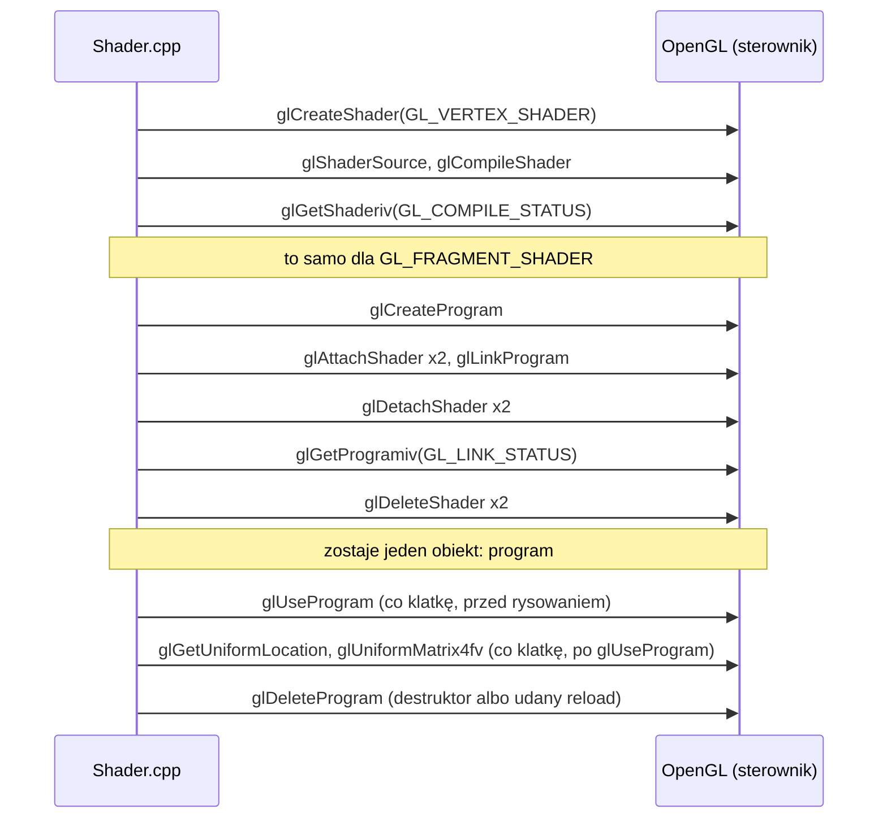
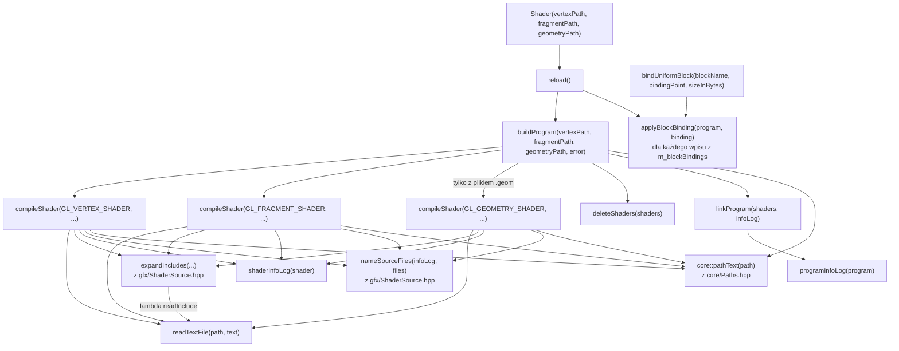

# Moduł gfx: klasa Shader

Kamień milowy: M1, rozszerzona w M4 (dołączanie plików, nazwy plików w błędach, settery `setMat3` i `setFloat`, wiązanie bloków uniformów). W M5 klasa się nie zmieniła, zmieniła się lista programów, które buduje. W drugiej części M6 doszedł opcjonalny trzeci etap programu: shader geometrii. W drugiej części M7 doszedł szósty setter, `setFloatArray` (tablica uniformów typu `float`). W czwartej części M7 (cienie księżyca) klasa się nie zmieniła: doszedł jedenasty program, który buduje, `shadow_depth`. Temat wykładu: 2 (Programowalny potok), a etap geometrii służy tematowi 9.
Kod: [`src/gfx/Shader.hpp`](../../../src/gfx/Shader.hpp), [`src/gfx/Shader.cpp`](../../../src/gfx/Shader.cpp), preprocesor w [`src/gfx/ShaderSource.hpp`](../../../src/gfx/ShaderSource.hpp), użycie w [`src/game/NightMazeApp.cpp`](../../../src/game/NightMazeApp.cpp).

Część modułu `gfx`. Wstęp do całego modułu, zasada RAII dla obiektów OpenGL i semantyka przenoszenia są w [`README.md`](README.md). Ten dokument jest dalszym ciągiem [`shaders.md`](shaders.md): tam jest potok i język GLSL, tutaj kod klasy, która buduje z nich program OpenGL. Część funkcji klasy ma własne dokumenty: settery `setMat4`, `setInt`, `setVec3`, `setMat3` i `setFloat` są w [`uniforms.md`](uniforms.md), `bindUniformBlock` i funkcja pomocnicza `applyBlockBinding` w [`uniform-buffers.md`](uniform-buffers.md), dyrektywa `#include` i nazwy plików w błędach w [`shader-includes.md`](shader-includes.md), a `reload` i panel "Shaders" w [`shader-hot-reload.md`](shader-hot-reload.md). Ten dokument korzysta z makra `GL_CHECK` ([`../core/gl-check.md`](../core/gl-check.md)), z logowania ([`../core/window-context.md`](../core/window-context.md), sekcja 5.5) i ze ścieżek do assetów ([`../core/paths.md`](../core/paths.md)).

**Stan na dziś (M5).** Pliki `Shader.*` i `ShaderSource.*` są takie same jak po M4. M5 usunęło parę `basic.vert` i `basic.frag` razem z kostką z M1, więc klasa budowała po M5 cztery programy: `textured`, `color`, `lit` i `gouraud`. Od pierwszej części M6 budowała **pięć**: doszedł `skybox` ([`../renderer/skybox.md`](../renderer/skybox.md)). Druga część M6 (teren i trawa) zmieniła samą klasę: konstruktor przyjmuje trzecią, opcjonalną ścieżkę do pliku shadera geometrii, a `buildProgram` kompiluje listę etapów zamiast sztywnej pary. Po drugiej części M6 klasa budowała **sześć** programów: szósty, `grass`, jest jedynym z trzema plikami (`grass.vert`, `grass.geom`, `grass.frag`, [`../renderer/grass-geometry.md`](../renderer/grass-geometry.md)). Pierwsza część M7 nie zmieniła klasy, ale dodała dwa obiekty, `composite` i `preview`: było ich osiem. Druga część M7 (bloom) dodała dwa kolejne, `bright` i `blur`, i jedną funkcję klasy, `setFloatArray`, która ustawia tablicę uniformów typu `float` jednym wywołaniem `glUniform1fv` ([`uniforms.md`](uniforms.md), sekcja 5.8). Po drugiej części M7 klasa budowała dziesięć programów, a trzecia część (mgła i winieta) nie zmieniła ani klasy, ani tej listy. Czwarta część M7 (cienie księżyca) też nie zmieniła klasy, ale dodała jedenasty obiekt, `shadow_depth` (pliki `shadow_depth.vert` i `shadow_depth.frag`, [`../renderer/shadows.md`](../renderer/shadows.md), sekcja 4): dziś klasa buduje **jedenaście** programów. Cztery programy z pierwszych dwóch części M7 mają wspólny plik shadera wierzchołków (`post/composite.vert`) i różne shadery fragmentów ([`../renderer/post-process.md`](../renderer/post-process.md)). Zgłoszone dla Windowsa (2026-10-05): po pierwszej części M7 bramka `make check` przechodziła z 269 przypadkami testowymi i 102103 asercjami w Debug i Release, po drugiej z 276 i 102139, po trzeciej z 294 i 102412, po czwartej z 310 i 103751, bez ostrzeżeń i bez błędu OpenGL w buildzie Debug (w czwartej części przy mapie cieni 2048 i 1024). Przeładowania jedenastu programów przyciskiem (ani wcześniej dziesięciu) nikt nie sprawdził. Pomiary samej klasy pochodzą z M4 (Windows, 2026-10-05, MSVC 19.44, RTX 4070 Ti SUPER, sterownik NVIDIA 610.74): build Debug i Release bez ostrzeżeń, clang-format i clang-tidy bez uwag, start gry bez linii `[error]` i bez linii `GL_`, do tego nowa postać błędu kompilacji z nazwą pliku w miejscu numeru (sekcja 5.10). Dla M5 zgłoszone jest na Windowsie (2026-10-05): build Debug i Release bez ostrzeżeń oraz 215 przypadków testowych i 85098 asercji w obu konfiguracjach. Klasa wymaga kontekstu OpenGL i nie ma testów jednostkowych. Testy ma jej część wydzielona do `ShaderSource.*`: 22 przypadki ([`shader-includes.md`](shader-includes.md), sekcja 5.11). Dla stanu po drugiej części M6 (Windows, 2026-10-05): build Debug i Release bez ostrzeżeń, 256 przypadków testowych i 101232 asercje w obu konfiguracjach, a zgłoszony pomiar etapu geometrii jest w sekcji 5.10. Przycisku `Reload shaders` nikt jeszcze nie nacisnął ręcznie, a na macOS nic z M4, M5, M6 ani M7 nie było budowane ani uruchamiane.

## 1. Po co to jest

W profilu Core nie da się narysować niczego bez programu shaderów ([`shaders.md`](shaders.md), sekcja 1). Ktoś musi więc wczytać tekst shadera z pliku, skompilować go, zlinkować dwa shadery w jeden program i powiedzieć, co poszło źle, gdy coś poszło źle.

Klasa `gfx::Shader` robi dokładnie to. Jest cienkim opakowaniem na **jeden obiekt programu OpenGL** zbudowany z dwóch plików: shadera wierzchołków i shadera fragmentów, a od drugiej części M6 opcjonalnie z trzeciego, shadera geometrii, który działa między nimi. Ma pięć cech, z których każda odpowiada na konkretny problem:

| Cecha | Problem, który rozwiązuje |
|---|---|
| Shadery są plikami na dysku, nie napisami w kodzie C++ | Zmiana shadera nie wymaga kompilacji programu, a edytor koloruje składnię GLSL (zasada z PRD: "Shadery jako pliki") |
| `reload()` buduje nowy program i podmienia stary tylko przy sukcesie | Wczytywanie na żywo (hot reload): literówka w shaderze nie zamienia obrazu w czarny ekran, bo stary program działa dalej |
| Błąd jest logowany z nazwą pliku i pełnym tekstem sterownika, a do tego zapamiętany w `lastError()`. Od M4 numer pliku na początku linii sterownika jest zamieniany na nazwę pliku | Błędów kompilacji GLSL nie widzi `glGetError` ani `GL_CHECK`. Bez własnego odczytu nie byłoby żadnej informacji. A odkąd shader może dołączać inne pliki, sam numer linii nie mówi już, w którym pliku jest pomyłka |
| Plik shadera może dołączać inne pliki linią `#include "..."` (od M4) | Kod wspólny dla kilku shaderów (oświetlenie) jest w jednym pliku, choć GLSL nie ma `#include` ([`shader-includes.md`](shader-includes.md)) |
| RAII i tylko przenoszenie (move-only) | Program OpenGL jest zwalniany dokładnie raz, automatycznie, bez ręcznego `glDeleteProgram` w kodzie gry |

## 2. Teoria

Klasa nie wprowadza własnej teorii. Pojęcia, na których stoi, są w dwóch miejscach: obiekt shadera a obiekt programu oraz kompilacja a linkowanie w [`shaders.md`](shaders.md) (sekcje 2.5 i 2.6), a RAII i semantyka przenoszenia w [`README.md`](README.md) (sekcja 2).

## 3. Jak to działa w OpenGL

### 3.1 Wywołania w kolejności

Zbudowanie jednego programu z dwóch plików to następujący ciąg wywołań. Kroki od 1 do 6 wykonują się dwa razy: raz dla shadera wierzchołków, raz dla shadera fragmentów. Program z etapem geometrii (w grze jeden: `grass`) wykonuje je trzy razy, a typem w kroku 1 jest wtedy także `GL_GEOMETRY_SHADER`.

| # | Wywołanie | Co robi |
|---|---|---|
| 1 | `glCreateShader(GL_VERTEX_SHADER)`, `glCreateShader(GL_FRAGMENT_SHADER)` albo, dla etapu geometrii, `glCreateShader(GL_GEOMETRY_SHADER)` | Tworzy pusty obiekt shadera danego typu i zwraca jego identyfikator. 0 oznacza niepowodzenie |
| 2 | `glShaderSource(shader, count, strings, lengths)` | Kopiuje tekst źródłowy do obiektu. `strings` to tablica `count` napisów C, które OpenGL skleja w jeden. `lengths` równe `nullptr` znaczy: każdy napis kończy się zerem |
| 3 | `glCompileShader(shader)` | Kompiluje tekst. Nic nie zwraca i **nie ustawia flagi błędu** przy błędzie w GLSL |
| 4 | `glGetShaderiv(shader, GL_COMPILE_STATUS, &status)` | Wpisuje do `status` wartość `GL_TRUE` albo `GL_FALSE`: wynik ostatniej kompilacji |
| 5 | `glGetShaderiv(shader, GL_INFO_LOG_LENGTH, &length)` | Wpisuje długość dziennika (info log) w znakach, **razem** z kończącym zerem. 0 oznacza brak dziennika |
| 6 | `glGetShaderInfoLog(shader, maxLength, &written, buffer)` | Kopiuje dziennik do bufora, najwyżej `maxLength` znaków. Do `written` wpisuje liczbę skopiowanych znaków **bez** kończącego zera |
| 7 | `glCreateProgram()` | Tworzy pusty obiekt programu i zwraca jego identyfikator. 0 oznacza niepowodzenie |
| 8 | `glAttachShader(program, shader)` | Dołącza obiekt shadera do programu. Wołane raz na etap: dwa razy, a w programie z shaderem geometrii trzy |
| 9 | `glLinkProgram(program)` | Łączy dołączone shadery w kod wykonywalny dla karty. Tak jak kompilacja, przy błędzie nie ustawia flagi |
| 10 | `glDetachShader(program, shader)` | Odłącza obiekt shadera od programu. Zlinkowany program ma już własny kod i nie potrzebuje obiektów shaderów |
| 11 | `glGetProgramiv(program, GL_LINK_STATUS, &status)` | Wynik linkowania: `GL_TRUE` albo `GL_FALSE` |
| 12 | `glGetProgramiv(program, GL_INFO_LOG_LENGTH, &length)` i `glGetProgramInfoLog(program, maxLength, &written, buffer)` | Dziennik linkowania. Działają jak kroki 5 i 6, ale dla obiektu programu |
| 13 | `glDeleteShader(shader)` | Usuwa obiekt shadera. Jeśli jest jeszcze dołączony do programu, OpenGL tylko oznacza go do usunięcia i zwalnia dopiero po odłączeniu |
| 14 | `glUseProgram(program)` | Ustawia program jako bieżący: używają go wszystkie następne wywołania rysujące, aż do kolejnego `glUseProgram` |
| 15 | `glDeleteProgram(program)` | Usuwa program. Dla wartości 0 nie robi nic i nie zgłasza błędu. Jeśli program jest akurat bieżący, zostaje oznaczony do usunięcia i znika, gdy przestanie być bieżący |

Ustawienie uniformu (`glGetUniformLocation` i `glUniformMatrix4fv`), wykonywane co klatkę po kroku 14, opisuje [`uniforms.md`](uniforms.md) (sekcja 3). Od M4 między krokiem 13 a podmianą programu `reload()` wykonuje dla programów z blokiem uniformów jeszcze trzy wywołania: `glGetUniformBlockIndex`, `glUniformBlockBinding` i `glGetActiveUniformBlockiv`. Opisuje je [`uniform-buffers.md`](uniform-buffers.md).

Tekst podawany w kroku 2 nie jest już dosłowną treścią pliku: przed `glShaderSource` linie `#include` są zastępowane treścią wskazanych plików, a wokół nich stają dyrektywy `#line` ([`shader-includes.md`](shader-includes.md), sekcja 2). To praca na tekście, bez żadnego wywołania OpenGL, więc w tabeli jej nie ma.

Wszystkie te funkcje są w rdzeniu OpenGL od wersji 2.0, więc są dostępne w 4.1 Core i w nagłówku GLAD projektu. Stała `GL_GEOMETRY_SHADER` jest w rdzeniu od wersji 3.2, czyli w 4.1 Core także: etap geometrii nie wymaga żadnego rozszerzenia.

### 3.2 Diagram obiektów



### 3.3 Błędy GLSL nie są błędami OpenGL

To najważniejsza rzecz w tej sekcji. `glGetError` (a więc i `GL_CHECK`) zgłasza **błędne użycie API**: złą stałą, zły identyfikator, wywołanie w złym stanie. Shader z błędem składni nie jest błędnym użyciem API: `glCompileShader` zostało wywołane poprawnie, na poprawnym obiekcie, i poprawnie wykonało swoją pracę, której wynikiem jest "ten tekst się nie kompiluje". Żadna flaga nie zostaje ustawiona.

| Sytuacja | `glGetError` | Gdzie jest informacja |
|---|---|---|
| `glCompileShader(12345)` (nie ma takiego obiektu) | `GL_INVALID_VALUE` | `GL_CHECK` wypisze linię w konsoli |
| Shader z brakującym średnikiem | `GL_NO_ERROR` | tylko w `GL_COMPILE_STATUS` i w dzienniku shadera |
| Shader fragmentów czyta zmienną, której shader wierzchołków nie zapisuje | `GL_NO_ERROR` | tylko w `GL_LINK_STATUS` i w dzienniku programu |

Kto nie odczyta statusu, dostaje program, który "działa" i niczego nie rysuje. Dopiero użycie niezlinkowanego programu w `glUseProgram` kończy się błędem `GL_INVALID_OPERATION`, ale ten błąd nie mówi już, co było nie tak w shaderze.

## 4. Shadery

Klasa nie ma własnych shaderów i nie zna ich treści: dostaje dwie ścieżki (albo trzy) i buduje program z dowolnego kompletu plików. W projekcie jest dziś dziesięć programów z dwóch plików (`textured`, `color`, `lit`, `gouraud`, `skybox`, cztery programy przebiegów po scenie z M7, które dzielą shader wierzchołków `post/composite.vert`, i `shadow_depth` z czwartej części M7), jedna trójka (`grass`: wierzchołki, geometria, fragmenty) i pięć plików dołączanych w `common/`: `lighting.glsl`, `normal_map.glsl`, z M7 `color.glsl` i `depth.glsl`, a od czwartej części M7 `shadows.glsl`. Para `basic.vert` i `basic.frag` rysowała kostkę z M1 i została usunięta w M5 razem z nią. Przykłady w tym dokumencie pokazuję na najprostszej z dzisiejszych par, `color.vert` i `color.frag` (shader fragmentów ma 15 linii i nie dołącza niczego), a tam, gdzie potrzebne jest dołączanie, na `lit.frag`. Tabela wszystkich programów jest w [`shaders.md`](shaders.md) (sekcja 1).

Jedyne, co klasa rozumie z treści shadera, to dwie dyrektywy: `#include "plik"`, którą sama wykonuje, i `#version`, której położenie sprawdza przy dołączaniu ([`shader-includes.md`](shader-includes.md), sekcja 5.6).

## 5. Kod w projekcie

### 5.1 Pliki

| Plik | Co zawiera |
|---|---|
| [`src/gfx/Shader.hpp`](../../../src/gfx/Shader.hpp) | struktura `gfx::UniformBlockBinding` i klasa `gfx::Shader`: konstruktor, destruktor, zablokowane kopiowanie, przenoszenie, `reload`, `isValid`, `use`, `setMat4`, `setInt`, `setVec3`, `setMat3`, `setFloat`, od drugiej części M7 `setFloatArray`, `bindUniformBlock`, `lastError`, `vertexPath`, `fragmentPath`, a od drugiej części M6 `hasGeometryStage` i `geometryPath`. Dołącza `<glad/gl.h>` (typ `GLuint`), `<glm/glm.hpp>` (typy `glm::mat4`, `glm::mat3` i `glm::vec3`), `<cstddef>` (typ `std::size_t`), `<filesystem>`, `<span>` (od drugiej części M7, typ `std::span` parametru `setFloatArray`), `<string>` i `<vector>` |
| [`src/gfx/Shader.cpp`](../../../src/gfx/Shader.cpp) | implementacja oraz osiem funkcji pomocniczych i jedna struktura w anonimowej przestrzeni nazw: `readTextFile`, `shaderInfoLog`, `programInfoLog`, `compileShader`, `linkProgram`, struktura `ShaderStage`, `deleteShaders`, `buildProgram`, `applyBlockBinding` |
| [`src/gfx/ShaderSource.hpp`](../../../src/gfx/ShaderSource.hpp), [`.cpp`](../../../src/gfx/ShaderSource.cpp) | `gfx::expandIncludes` i `gfx::nameSourceFiles`: preprocesor `#include` i nazwy plików w dzienniku sterownika. Sam tekst, bez OpenGL. Woła je tylko `compileShader` ([`shader-includes.md`](shader-includes.md)) |
| [`assets/shaders/color.vert`](../../../assets/shaders/color.vert), [`color.frag`](../../../assets/shaders/color.frag) | najprostsza z par shaderów projektu i ta, na której pokazane są przykłady w tym dokumencie ([`../scene/collision.md`](../scene/collision.md), sekcja 4). Pozostałe, `textured.*`, `lit.*`, `gouraud.*` i `skybox.*`, buduje ta sama klasa ([`textures.md`](textures.md), sekcja 4, [`../renderer/lighting-gouraud-phong.md`](../renderer/lighting-gouraud-phong.md) i [`../renderer/skybox.md`](../renderer/skybox.md)) |
| [`assets/shaders/grass.vert`](../../../assets/shaders/grass.vert), [`grass.geom`](../../../assets/shaders/grass.geom), [`grass.frag`](../../../assets/shaders/grass.frag) | jedyny program z trzema etapami: plik `.geom` to shader geometrii, podany konstruktorowi jako trzeci argument. Treść tych plików opisuje [`../renderer/grass-geometry.md`](../renderer/grass-geometry.md) |
| [`assets/shaders/common/lighting.glsl`](../../../assets/shaders/common/lighting.glsl) | pierwszy z pięciu plików dołączanych (do M6 były dwa): nie ma własnego obiektu `Shader`, trafia do programów `lit`, `gouraud` i `grass` przez linię `#include` w `lit.frag`, `gouraud.vert` i `grass.frag`. Drugi, [`common/normal_map.glsl`](../../../assets/shaders/common/normal_map.glsl), dołączają `lit.frag` i `textured.frag` ([`normal-mapping.md`](normal-mapping.md), sekcja 4.1). Najnowszy, [`common/shadows.glsl`](../../../assets/shaders/common/shadows.glsl) z czwartej części M7, dołączają `lit.frag`, `gouraud.frag` i `grass.frag` ([`../renderer/shadows.md`](../renderer/shadows.md), sekcja 4) |
| [`src/game/NightMazeApp.hpp`](../../../src/game/NightMazeApp.hpp), [`.cpp`](../../../src/game/NightMazeApp.cpp) | właściciel jedenastu obiektów: pola `m_texturedShader`, `m_colorShader`, `m_litShader`, `m_gouraudShader`, `m_skyboxShader`, `m_grassShader` oraz, od M7, `m_compositeShader`, `m_previewShader`, `m_brightPassShader` i `m_blurShader` (z akcesorami `compositeShader()`, `previewShader()`, `brightPassShader()` i `blurShader()`, używane przez `game::PostProcess`) i, od czwartej części M7, `m_shadowDepthShader` (używane w `drawShadowCasters`, z akcesorem `shadowDepthShader()` dla panelu Shaders), wczytanie w liście inicjalizacyjnej konstruktora, `isValid()`, `use()` i settery w funkcjach `drawUnlitMaze`, `drawLitMaze` i `drawColliderLines` (program nieba ustawia `game::Skybox::draw`, a program trawy `game::GrassRenderer::draw`), chronione akcesory `texturedShader()`, `colorShader()`, `litShader()`, `gouraudShader()`, `skyboxShader()` i `grassShader()` ([`shaders.md`](shaders.md), sekcja 5.1) |
| [`src/debug/panels/ShadersPanel.hpp`](../../../src/debug/panels/ShadersPanel.hpp), [`.cpp`](../../../src/debug/panels/ShadersPanel.cpp) | funkcja `debug::drawShadersPanel`: panel "Shaders" z przyciskiem "Reload shaders" ([`shader-hot-reload.md`](shader-hot-reload.md), sekcja 6). Należy do programu `night_maze`, nie do biblioteki `engine` |

Pliki klasy i pliki `ShaderSource.*` są na liście źródeł biblioteki `engine` w [`CMakeLists.txt`](../../../CMakeLists.txt). Klasa zależy tylko od `core` (`GL_CHECK`, `logError`, `pathText`), GLAD, GLM (typy macierzy i wektora w setterach) i biblioteki standardowej. Nie wie nic o panelu ani o ImGui.



Wszystkie funkcje pomocnicze zgłaszają niepowodzenie tak samo, bez wyjątków: zwracają `false` albo identyfikator 0, a opis błędu wpisują do parametru `std::string&`.

### 5.2 Nagłówek klasy

```cpp
class Shader {
public:
    /// Remembers the file paths and tries to load the program. It does not throw: when
    /// loading fails the error is logged, isValid() returns false and lastError() holds
    /// the message.
    ///
    /// geometryPath is the file of the geometry shader. An empty path (the default)
    /// means that the program has no geometry stage.
    Shader(std::filesystem::path vertexPath, std::filesystem::path fragmentPath,
           std::filesystem::path geometryPath = {});
    ~Shader();

    Shader(const Shader&) = delete;
    Shader& operator=(const Shader&) = delete;

    /// Takes over the program of other. other is left without a program (not valid).
    Shader(Shader&& other) noexcept;
    /// Deletes the program this object owns, then takes over the program of other.
    Shader& operator=(Shader&& other) noexcept;
```

```cpp
private:
    std::filesystem::path m_vertexPath;
    std::filesystem::path m_fragmentPath;
    // Empty when the program has no geometry stage.
    std::filesystem::path m_geometryPath;
    // Name (id) of the OpenGL program object. 0 is never a real program: it means "none".
    GLuint m_program = 0;
    std::string m_lastError;
    // The requests made with bindUniformBlock, repeated on every newly built program.
    std::vector<UniformBlockBinding> m_blockBindings;
};
```

Nad klasą, w tym samym nagłówku, stoi od M4 mała struktura, której elementy trzyma ostatnie pole:

```cpp
/// Which binding point a uniform block of a program reads from. A Shader keeps one of
/// these for every block it was told about (Shader::bindUniformBlock).
struct UniformBlockBinding {
    /// Name of the block as written in the shader: "uniform LightBlock { ... }".
    std::string blockName;
    /// The uniform buffer binding point the block reads from (see gfx::UniformBuffer).
    GLuint bindingPoint = 0;
    /// Size of the block in bytes as the C++ code fills it. Compared with the size the
    /// driver reports, to catch a C++ struct and a GLSL block that do not match.
    std::size_t sizeInBytes = 0;
};
```

| Element | Dlaczego tak |
|---|---|
| ścieżki jako `std::filesystem::path` | `Shader` nie wie nic o katalogu `assets/`. Pełną ścieżkę buduje wołający przez `core::assetPath` ([`../core/paths.md`](../core/paths.md)). Dzięki temu klasa nadaje się też do zadań laboratoryjnych, w których pliki leżą gdzie indziej |
| ścieżki są zapamiętane w polach | `reload()` nie ma parametrów: obiekt sam wie, z których plików powstał. Panel debug odczytuje je przez `vertexPath()` i `fragmentPath()`. Katalog każdej z nich jest też miejscem, od którego liczone są nazwy w liniach `#include` tego pliku: `compileShader` jest wołane osobno dla każdego z dwóch plików i bierze katalog z własnej ścieżki (sekcja 5.5). Dziś wszystkie pliki każdego programu leżą w `assets/shaders`, więc to ten sam katalog |
| `geometryPath = {}` i pole `m_geometryPath` (od drugiej części M6) | trzeci etap jest **opcjonalny**, więc jego ścieżka ma wartość domyślną: pustą ścieżkę. Pusta ścieżka znaczy "tego etapu nie ma" i pełni rolę flagi, tak jak 0 w `m_program`: nie ma osobnego pola `bool`. Pięć programów gry woła konstruktor z dwoma argumentami, jak przed zmianą, i buduje się dokładnie tak samo. Parametr stoi na **trzecim** miejscu, chociaż shader geometrii działa jako drugi: argument z wartością domyślną musi stać na końcu listy. Mówi o tym komentarz przy `m_grassShader` w `NightMazeApp.cpp`: "The geometry shader is the third argument, although it runs second: it is the optional one." |
| `m_program = 0` | 0 to "nie ma programu". Jedno pole pełni rolę identyfikatora i flagi poprawności, bez osobnego `bool` |
| `m_lastError` | ten sam tekst, który trafił do konsoli, zostaje w obiekcie, żeby panel debug mógł go pokazać |
| `m_blockBindings` (od M4) | lista próśb "blok o tej nazwie ma czytać z tego punktu wiązania". Obiekt programu OpenGL przechowuje to połączenie sam, ale tylko do następnego `reload()`, które tworzy nowy obiekt programu. Klasa musi więc pamiętać prośby po swojej stronie, żeby je powtórzyć (sekcja 5.8). To jedyny stan klasy, który opisuje **konfigurację** programu, a nie jego pochodzenie albo wynik wczytania |
| `UniformBlockBinding` jako struktura z trzema polami | jedna prośba to trzy wartości, które zawsze idą razem: nazwa bloku, numer punktu i rozmiar w bajtach do porównania z tym, co zgłasza sterownik. Znaczenie pól i sprawdzenie rozmiaru opisuje [`uniform-buffers.md`](uniform-buffers.md) |
| `= delete` przy kopiowaniu | kopia miałaby ten sam identyfikator programu i oba destruktory wołałyby `glDeleteProgram` dla tego samego obiektu ([`README.md`](README.md), sekcja 2.2) |
| `noexcept` przy przenoszeniu | obietnica, że te funkcje nie rzucają wyjątków. Kontenery biblioteki standardowej (na przykład `std::vector` przy powiększaniu) przenoszą elementy tylko wtedy, gdy przeniesienie jest `noexcept`. Przy typie, którego nie da się kopiować, to konieczność |

Siedem krótkich funkcji jest zdefiniowanych w nagłówku albo ma jedną linię w `.cpp`:

```cpp
bool isValid() const { return m_program != 0; }
```

```cpp
const std::string& lastError() const { return m_lastError; }
```

```cpp
/// File the vertex shader is read from, as given to the constructor.
const std::filesystem::path& vertexPath() const { return m_vertexPath; }

/// File the fragment shader is read from, as given to the constructor.
const std::filesystem::path& fragmentPath() const { return m_fragmentPath; }
```

Od drugiej części M6 obok nich stoją dwie funkcje etapu geometrii:

```cpp
/// True when the program has a geometry stage: a geometry file was given to the
/// constructor.
bool hasGeometryStage() const { return !m_geometryPath.empty(); }

/// File the geometry shader is read from, as given to the constructor. Empty when the
/// program has no geometry stage.
const std::filesystem::path& geometryPath() const { return m_geometryPath; }
```

`hasGeometryStage()` nie pyta OpenGL: odpowiada z samej ścieżki. Mówi więc, czy program **ma mieć** etap geometrii, także wtedy, gdy plik się nie skompilował i programu nie ma. Woła ją panel Shaders, żeby dopisać trzecią nazwę pliku do linii programu ([`shader-hot-reload.md`](shader-hot-reload.md), sekcja 6.1). Sam `buildProgram` czyta `m_geometryPath` bezpośrednio.

Akcesory ścieżek zwracają `const&` do pola: nic nie jest kopiowane, a wołający nie może ścieżki zmienić. Zwracają `std::filesystem::path`, a nie gotowy napis, bo to wołający wie, czego potrzebuje: panel bierze z nich same nazwy plików (`filename()`) do linii programu i całe ścieżki do podpowiedzi ([`shader-hot-reload.md`](shader-hot-reload.md), sekcja 6.1).

```cpp
void Shader::use() const {
    GL_CHECK(glUseProgram(m_program));
}
```

`use()` nie sprawdza `isValid()`. Dla obiektu bez programu wykona `glUseProgram(0)`, czyli "żaden program", a rysowanie w takim stanie nie daje określonego wyniku. Sprawdzenie należy do wołającego. `use()` jest `const`, bo nie zmienia obiektu C++, zmienia stan kontekstu OpenGL.

Pozostałe funkcje publiczne mają własne dokumenty:

| Funkcja | Co robi | Gdzie opisana |
|---|---|---|
| `setMat4`, `setInt`, `setVec3` | ustawiają uniform typu `mat4`, `int` (także sampler) i `vec3` | [`uniforms.md`](uniforms.md), sekcje 5.1 i 5.4 |
| `setFloatArray` (od drugiej części M7) | ustawia tablicę uniformów `uniform float nazwa[N]` z `std::span<const float>` jednym wywołaniem `glUniform1fv`. Jedyny użytkownik: wagi rozmycia bloomu, `uWeights` w `post/blur.frag` | [`uniforms.md`](uniforms.md), sekcja 5.8 |
| `setMat3`, `setFloat` (od M4) | ustawiają uniform typu `mat3` (macierz normalnych, `glUniformMatrix3fv`) i `float` (`glUniform1f`). Ten sam wzór co `setMat4`: wyszukanie położenia przy każdym wywołaniu, bez pamięci podręcznej, położenie -1 ignorowane | [`uniforms.md`](uniforms.md), część o setterach |
| `bindUniformBlock` (od M4) | łączy blok uniformów programu z punktem wiązania i zapamiętuje tę prośbę w `m_blockBindings` | [`uniform-buffers.md`](uniform-buffers.md), razem z funkcją pomocniczą `applyBlockBinding` |
| `reload` | buduje program z plików i podmienia stary tylko przy sukcesie | [`shader-hot-reload.md`](shader-hot-reload.md), sekcja 5.2, a zmiana z M4 także tutaj, w sekcji 5.8 |

Wszystkie settery są `const`, tak jak `use()`: zmieniają stan programu OpenGL, a nie obiektu C++. `bindUniformBlock` **nie jest** `const`, bo dopisuje element do `m_blockBindings`.

### 5.3 Wczytanie pliku: `readTextFile` i `core::pathText`

```cpp
// Reads a whole text file into text. Returns false when the file cannot be opened.
bool readTextFile(const std::filesystem::path& path, std::string& text) {
    // The stream closes the file in its destructor.
    std::ifstream file(path);
    if (!file.is_open()) {
        return false;
    }

    // rdbuf() is the buffer the stream reads the file through. Sending it to another
    // stream with << copies everything up to the end of the file.
    std::ostringstream contents;
    contents << file.rdbuf();
    text = contents.str();
    return true;
}
```

| Linia | Co robi |
|---|---|
| `std::ifstream file(path);` | Otwiera plik do czytania w trybie tekstowym. Konstruktor przyjmuje `std::filesystem::path` wprost, bez zamiany na napis, więc na Windowsie ścieżka ze znakami spoza strony kodowej działa. Plik zamknie destruktor strumienia (RAII) |
| `if (!file.is_open())` | Nie ma pliku, nie ma uprawnień albo ścieżka jest zła. Strumienie domyślnie nie rzucają wyjątków, więc trzeba zapytać |
| `std::ostringstream contents;` | Strumień, który pisze do napisu w pamięci |
| `contents << file.rdbuf();` | `rdbuf()` zwraca wskaźnik do bufora strumienia pliku. Operator `<<` dla takiego wskaźnika przepisuje wszystko, co da się z niego przeczytać, do końca pliku. To standardowy sposób na "wczytaj cały plik" bez pętli i bez znajomości rozmiaru |
| `text = contents.str();` | `str()` zwraca zebrany tekst jako `std::string` |

Wynik wraca przez parametr `std::string& text`, a wartość zwracana `bool` mówi tylko "udało się albo nie". To celowo prosty kształt: bez `std::optional` i bez wyjątków.

Tryb tekstowy ma na Windowsie jedną konsekwencję: końce linii `\r\n` są przy czytaniu zamieniane na `\n`. Kompilatorowi GLSL jest to obojętne.

Ścieżkę na tekst do komunikatu błędu zamienia `core::pathText` z [`src/core/Paths.hpp`](../../../src/core/Paths.hpp), opisane linia po linii w [`../core/paths.md`](../core/paths.md) (sekcja 5.7):

```cpp
std::string pathText(const std::filesystem::path& path);
```

Funkcja była najpierw prywatną funkcją pomocniczą w `Shader.cpp`. Przeniosłem ją do `core`, gdy tej samej zamiany zaczął potrzebować panel "Shaders" (nazwy plików w etykietach): `debug/` nie ma dostępu do anonimowej przestrzeni nazw w `Shader.cpp`, a kopia tych samych trzech linii w panelu byłaby powtórzeniem. Dla `Shader` ważne są dwie jej własności. Po pierwsze **nie rzuca wyjątku** dla ścieżki, której nie da się zapisać w stronie kodowej Windowsa (inaczej niż `path.string()`), a konstruktor `Shader` obiecuje, że nie rzuca, więc komunikat o błędzie nie może sam być źródłem wyjątku. Po drugie zwraca UTF-8, czyli to, czego oczekuje ImGui, więc `lastError()` da się wyświetlić w panelu bez dalszych zamian.

### 5.4 Dziennik sterownika: `shaderInfoLog` i `programInfoLog`

```cpp
// Text the driver wrote while compiling a shader: errors and warnings with line numbers.
std::string shaderInfoLog(GLuint shader) {
    // Length of the log in characters, including the terminating zero. 0 means no log.
    GLint length = 0;
    GL_CHECK(glGetShaderiv(shader, GL_INFO_LOG_LENGTH, &length));
    if (length <= 0) {
        return {};
    }

    std::string log(static_cast<std::size_t>(length), '\0');
    // written receives the number of characters copied, without the terminating zero.
    GLsizei written = 0;
    GL_CHECK(glGetShaderInfoLog(shader, length, &written, log.data()));
    log.resize(static_cast<std::size_t>(written));
    return log;
}
```

| Linia | Co robi |
|---|---|
| `GLint length = 0;` i `glGetShaderiv(..., GL_INFO_LOG_LENGTH, &length)` | Pytam o długość dziennika. OpenGL zwraca wyniki przez wskaźnik, więc zmienna musi istnieć wcześniej. Wartość początkowa 0 zostaje, gdyby wywołanie się nie powiodło |
| `if (length <= 0) { return {}; }` | Brak dziennika: zwracam pusty napis. `return {};` tworzy domyślny (pusty) `std::string` |
| `std::string log(static_cast<std::size_t>(length), '\0');` | Bufor o dokładnie potrzebnej długości, wypełniony zerami. `length` jest typu `GLint` (ze znakiem), a konstruktor chce `std::size_t` (bez znaku), stąd jawne rzutowanie. Wcześniejszy warunek gwarantuje, że liczba jest dodatnia |
| `glGetShaderInfoLog(shader, length, &written, log.data())` | Kopiuje dziennik do bufora. `log.data()` daje `char*` do pamięci napisu |
| `log.resize(static_cast<std::size_t>(written));` | `length` liczyło kończące zero, `written` go nie liczy. Skracam napis, żeby zero nie zostało na końcu tekstu |

To ten sam wzorzec "zapytaj o rozmiar, przydziel bufor, wypełnij, przytnij" co przy `_NSGetExecutablePath` w [`../core/paths.md`](../core/paths.md) (sekcja 5.5).

`programInfoLog` jest kopią tej funkcji z dwiema różnicami: woła `glGetProgramiv` i `glGetProgramInfoLog`, bo obiekt programu ma własną parę funkcji.

```cpp
// Text the driver wrote while linking a program. Same steps as shaderInfoLog, but
// a program object has its own pair of functions.
std::string programInfoLog(GLuint program) {
    GLint length = 0;
    GL_CHECK(glGetProgramiv(program, GL_INFO_LOG_LENGTH, &length));
    if (length <= 0) {
        return {};
    }

    std::string log(static_cast<std::size_t>(length), '\0');
    GLsizei written = 0;
    GL_CHECK(glGetProgramInfoLog(program, length, &written, log.data()));
    log.resize(static_cast<std::size_t>(written));
    return log;
}
```

Dwie prawie identyczne funkcje są tu świadomym wyborem. Wspólna wersja wymagałaby przekazywania wskaźników do funkcji OpenGL albo szablonu, a to byłoby trudniejsze do wytłumaczenia niż dwanaście powtórzonych linii.

### 5.5 Kompilacja jednego shadera: `compileShader`

W M4 funkcja dostała środkową część: między wczytaniem pliku a `glCreateShader` rozwija linie `#include`, a przy błędzie kompilacji zamienia w dzienniku numery plików na nazwy.

```cpp
// Reads one shader file, puts the files it includes into it and compiles the result.
// type is GL_VERTEX_SHADER or GL_FRAGMENT_SHADER. Returns the id of the shader object,
// or 0 on failure with the message in error.
GLuint compileShader(GLenum type, const std::filesystem::path& path, std::string& error) {
    std::string fileText;
    if (!readTextFile(path, fileText)) {
        error = "Shader file cannot be opened: " + core::pathText(path);
        return 0;
    }

    // The name in an #include line is relative to the directory of the shader file:
    // "common/lighting.glsl" in assets/shaders/lit.frag is the file
    // assets/shaders/common/lighting.glsl. The lambda is called once for every #include
    // line, on every load, so a reload reads the included files again too.
    const std::filesystem::path includeDirectory = path.parent_path();
    const IncludeReader readInclude = [&includeDirectory](const std::string& name,
                                                          std::string& text) {
        return readTextFile(includeDirectory / name, text);
    };

    ShaderSource source;
    std::string includeError;
    if (!expandIncludes(core::pathText(path.filename()), fileText, readInclude, source,
                        includeError)) {
        error = "Shader include failed: " + core::pathText(path) + "\n" + includeError;
        return 0;
    }

    GLuint shader = 0;
    GL_CHECK(shader = glCreateShader(type));

    // glShaderSource takes an array of C strings. Here the array has one element.
    // nullptr as the array of lengths means that every string ends with a zero.
    const char* sourceText = source.text.c_str();
    GL_CHECK(glShaderSource(shader, 1, &sourceText, nullptr));
    GL_CHECK(glCompileShader(shader));

    // A compile error does not set an OpenGL error flag, so GL_CHECK cannot see it.
    // The result has to be asked for.
    GLint status = GL_FALSE;
    GL_CHECK(glGetShaderiv(shader, GL_COMPILE_STATUS, &status));
    if (status != GL_TRUE) {
        // The driver names a file by its number in source.files. nameSourceFiles writes
        // the name instead, so an error inside an included file is reported against it.
        error = "Shader compilation failed: " + core::pathText(path) + "\n" +
                nameSourceFiles(shaderInfoLog(shader), source.files);
        GL_CHECK(glDeleteShader(shader));
        return 0;
    }
    return shader;
}
```

| Fragment | Co robi i dlaczego |
|---|---|
| `std::string fileText;` i `if (!readTextFile(path, fileText))` | Pierwszy z czterech rodzajów błędu: samego pliku shadera nie da się otworzyć. Żaden obiekt OpenGL jeszcze nie powstał, więc nie ma czego sprzątać. Zmienna nazywa się `fileText`, bo to dosłowna treść pliku, jeszcze z liniami `#include` |
| `const std::filesystem::path includeDirectory = path.parent_path();` | Katalog pliku shadera, liczony **raz**. Dla `<katalog programu>/assets/shaders/lit.frag` jest to `<katalog programu>/assets/shaders`. Od niego liczone są nazwy we wszystkich liniach `#include`, także tych w plikach dołączanych |
| `const IncludeReader readInclude = [&includeDirectory](const std::string& name, std::string& text) { ... };` | Lambda, czyli funkcja bez nazwy zapisana w miejscu użycia. `[&includeDirectory]` przechwytuje jedną zmienną lokalną przez referencję. `IncludeReader` to `std::function` o sygnaturze, której chce `expandIncludes`. Dzięki temu preprocesor nie otwiera plików sam i da się go testować bez dysku |
| `return readTextFile(includeDirectory / name, text);` | Plik dołączany czyta ta sama funkcja co plik shadera. `operator/` skleja katalog z nazwą z cudzysłowów |
| `ShaderSource source;` | Wynik rozwinięcia: `source.text` (tekst dla sterownika) i `source.files` (lista plików, w której indeks jest numerem pliku używanym w dyrektywach `#line`) |
| `expandIncludes(core::pathText(path.filename()), fileText, readInclude, source, includeError)` | Pierwszy argument to **sama nazwa pliku** (`lit.frag`), nie pełna ścieżka: trafi do `source.files[0]` i do błędów. Dla shadera bez dołączeń funkcja oddaje tekst bez zmian (poza końcami linii) i listę z jednym plikiem |
| `error = "Shader include failed: " + core::pathText(path) + "\n" + includeError;` | Drugi rodzaj błędu, nowy w M4: preprocesor odmówił (brak pliku dołączanego, cykl, zły zapis, `#include` przed `#version`, `#version` w pliku dołączanym). Pierwsza linia komunikatu to przedrostek i pełna ścieżka shadera, druga to tekst preprocesora w kształcie `plik:linia: opis`. Nadal nie powstał żaden obiekt OpenGL |
| `GLuint shader = 0;` potem `GL_CHECK(shader = glCreateShader(type));` | Wywołanie zwracające wartość w `GL_CHECK`: przypisanie jest w środku makra, a zmienna jest zadeklarowana przed nim ([`../core/gl-check.md`](../core/gl-check.md), sekcja 5.2) |
| `const char* sourceText = source.text.c_str();` | Do sterownika idzie tekst **po rozwinięciu**. `glShaderSource` chce **tablicy** wskaźników (`const GLchar* const*`). Mam jeden napis, więc robię zmienną ze wskaźnikiem i podaję jej adres: `&sourceText` to tablica o jednym elemencie. Nie da się napisać `&source.text.c_str()`, bo nie można wziąć adresu wartości tymczasowej |
| `glShaderSource(shader, 1, &sourceText, nullptr)` | `1` to liczba napisów, także gdy shader składa się z kilku plików: są już sklejone w jeden tekst. `nullptr` zamiast tablicy długości: napis kończy się zerem, co `c_str()` gwarantuje. OpenGL **kopiuje** tekst, więc `source` może zniknąć po tym wywołaniu |
| `GLint status = GL_FALSE;` | Wartość początkowa to "nie udało się". Gdyby `glGetShaderiv` samo zawiodło (na przykład `shader` równe 0), zmienna zostanie nietknięta i kod pójdzie ścieżką błędu |
| `if (status != GL_TRUE)` | Trzeci rodzaj błędu: kompilacja w sterowniku |
| `nameSourceFiles(shaderInfoLog(shader), source.files)` | Dziennik sterownika przechodzi przez funkcję, która na początku każdej linii w znanym formacie zamienia numer pliku na jego nazwę: `0(15)` na `color.frag(15)`, `1(63)` na `common/lighting.glsl(63)`. Reszta każdej linii zostaje tak, jak napisał ją sterownik. Gdy plików jest więcej niż jeden, na końcu dochodzi linia `Source files: 0 = ..., 1 = ...` |
| `GL_CHECK(glDeleteShader(shader)); return 0;` | Nieudany obiekt shadera usuwam od razu. Kolejność ma znaczenie: dziennik trzeba odczytać **przed** usunięciem obiektu, i tak jest, bo `shaderInfoLog(shader)` wykonuje się w linii wyżej |

Wartość zwracana 0 jest naturalnym sygnałem błędu, bo OpenGL nigdy nie nadaje obiektowi identyfikatora 0.

Czwarty rodzaj błędu, linkowanie, powstaje piętro wyżej (sekcje 5.6 i 5.7). Trzy komunikaty tej funkcji różnią się przedrostkiem, i po nim widać, kto odmówił:

| Przedrostek | Kto odmówił | Co stoi w następnej linii |
|---|---|---|
| `Shader file cannot be opened: <ścieżka>` | system plików | nic |
| `Shader include failed: <ścieżka>` | mój preprocesor | `lit.frag:9: included file cannot be opened: "common/lighting.glsl"` albo inny z pięciu komunikatów ([`shader-includes.md`](shader-includes.md), sekcja 5.6) |
| `Shader compilation failed: <ścieżka>` | kompilator GLSL w sterowniku | dziennik sterownika z nazwami plików |

Kod preprocesora (`expandIncludes`, `nameSourceFiles` i ich funkcje pomocnicze) jest opisany linia po linii w [`shader-includes.md`](shader-includes.md) (sekcje od 5.2 do 5.9).

### 5.6 Linkowanie: `linkProgram`

```cpp
// Links the compiled shaders (one per stage) into a new program. Returns the id of the
// program object, or 0 on failure with the driver's text in infoLog.
GLuint linkProgram(std::span<const GLuint> shaders, std::string& infoLog) {
    GLuint program = 0;
    GL_CHECK(program = glCreateProgram());
    for (const GLuint shader : shaders) {
        GL_CHECK(glAttachShader(program, shader));
    }
    GL_CHECK(glLinkProgram(program));

    // A linked program keeps its own executable code, so it no longer needs the shader
    // objects. Detaching them lets glDeleteShader really free them.
    for (const GLuint shader : shaders) {
        GL_CHECK(glDetachShader(program, shader));
    }

    // Like compiling, a failed link sets no OpenGL error flag.
    GLint status = GL_FALSE;
    GL_CHECK(glGetProgramiv(program, GL_LINK_STATUS, &status));
    if (status != GL_TRUE) {
        infoLog = programInfoLog(program);
        GL_CHECK(glDeleteProgram(program));
        return 0;
    }
    return program;
}
```

| Fragment | Co robi i dlaczego |
|---|---|
| `std::span<const GLuint> shaders` (od drugiej części M6) | Do tej zmiany funkcja miała dwa parametry, `vertexShader` i `fragmentShader`. Dziś dostaje **widok na listę** identyfikatorów: dwa dla zwykłego programu, trzy dla programu z shaderem geometrii. `std::span` to wskaźnik i długość: nie kopiuje wektora, a funkcji nie obchodzi, ile etapów jest i które to etapy |
| `glAttachShader` w pętli | Program dowiaduje się, z których obiektów shaderów ma powstać. Kolejność dołączania nie ma znaczenia: o tym, który obiekt jest którym etapem, decyduje typ podany w `glCreateShader`, a nie miejsce na liście |
| `glLinkProgram(program)` | Sprawdza zgodność etapów i tworzy kod dla karty. W programie z trzema etapami zgodność jest sprawdzana na dwóch stykach: wyjścia shadera wierzchołków muszą pasować do wejść shadera geometrii, a wyjścia shadera geometrii do wejść shadera fragmentów |
| `glDetachShader` w drugiej pętli, zaraz po linkowaniu | Odłączam niezależnie od wyniku linkowania. Zlinkowany program ma własną kopię kodu. Dopóki obiekt shadera jest dołączony do programu, `glDeleteShader` tylko oznacza go do usunięcia. Po odłączeniu zostanie zwolniony naprawdę |
| `GL_LINK_STATUS` | Czwarty rodzaj błędu: linkowanie. Tak jak przy kompilacji, bez flagi `glGetError` |
| `infoLog = programInfoLog(program);` przed `glDeleteProgram` | Najpierw dziennik, potem usunięcie nieudanego programu |

Funkcja zwraca przez `infoLog` **sam tekst sterownika**, bez nazw plików: dostaje tylko identyfikatory i ścieżek nie zna. Pełny komunikat składa funkcja piętro wyżej.

### 5.7 Całość: `buildProgram`

Do drugiej części M6 ta funkcja miała dwa wywołania `compileShader` wpisane jedno pod drugim i ręczne sprzątanie po każdym z nich. Trzeci etap podwoiłby liczbę gałęzi, więc funkcja pracuje dziś na **liście etapów**. Nad nią stoją dwie małe rzeczy pomocnicze:

```cpp
// One stage of a program: what kind of shader it is and the file it is read from.
struct ShaderStage {
    GLenum type;
    const std::filesystem::path* path;
};

// Deletes every shader object of the list.
void deleteShaders(std::span<const GLuint> shaders) {
    for (const GLuint shader : shaders) {
        GL_CHECK(glDeleteShader(shader));
    }
}
```

| Element | Co robi i dlaczego |
|---|---|
| `GLenum type` | rodzaj shadera: `GL_VERTEX_SHADER`, `GL_GEOMETRY_SHADER` albo `GL_FRAGMENT_SHADER`. To argument dla `glCreateShader` |
| `const std::filesystem::path* path` | **wskaźnik** na ścieżkę, nie kopia: ścieżki są polami obiektu `Shader` i żyją dłużej niż ta lista, więc kopiowanie ich do każdego elementu byłoby zbędne |
| `deleteShaders` | jedno miejsce, w którym usuwana jest cała lista obiektów shaderów. Wołane z dwóch miejsc w `buildProgram`: po nieudanej kompilacji któregoś etapu i po linkowaniu |

```cpp
// Builds a complete program from its files: compile every stage, then link. An empty
// geometryPath means a program of two stages. Returns the id of the new program, or 0 on
// failure with the message in error. Whatever happens, no shader object is left behind.
GLuint buildProgram(const std::filesystem::path& vertexPath,
                    const std::filesystem::path& fragmentPath,
                    const std::filesystem::path& geometryPath, std::string& error) {
    // The stages in the order the graphics card runs them: every vertex, then (when
    // there is a geometry shader) every primitive, then every fragment.
    std::vector<ShaderStage> stages;
    stages.push_back({.type = GL_VERTEX_SHADER, .path = &vertexPath});
    if (!geometryPath.empty()) {
        stages.push_back({.type = GL_GEOMETRY_SHADER, .path = &geometryPath});
    }
    stages.push_back({.type = GL_FRAGMENT_SHADER, .path = &fragmentPath});

    // Every stage goes through the same loader: the same #include lines, the same file
    // names in its compile errors. The names of all files are collected for the message
    // of a failed link, which belongs to no single file.
    std::vector<GLuint> shaders;
    std::string fileNames;
    for (const ShaderStage& stage : stages) {
        const GLuint shader = compileShader(stage.type, *stage.path, error);
        if (shader == 0) {
            // The stages compiled so far are of no use without this one.
            deleteShaders(shaders);
            return 0;
        }
        shaders.push_back(shader);

        if (!fileNames.empty()) {
            fileNames += " + ";
        }
        fileNames += core::pathText(*stage.path);
    }

    std::string infoLog;
    const GLuint program = linkProgram(shaders, infoLog);

    // The shader objects were only an intermediate step, linked or not.
    deleteShaders(shaders);

    if (program == 0) {
        error = "Shader linking failed: " + fileNames + "\n" + infoLog;
    }
    return program;
}
```

| Fragment | Co robi i dlaczego |
|---|---|
| trzy `push_back` do `stages`, środkowy pod warunkiem `!geometryPath.empty()` | lista etapów w kolejności, w jakiej wykonuje je karta: wierzchołki, potem (jeśli jest) geometria, potem fragmenty. Dla pięciu programów gry lista ma dwa elementy i funkcja robi dokładnie to, co przed zmianą. Tylko dla `grass` ma trzy. `.type = ..., .path = ...` to inicjalizacja z nazwami pól (C++20) |
| `for (const ShaderStage& stage : stages)` | każdy etap przechodzi przez **to samo** `compileShader`: to samo rozwijanie `#include`, te same nazwy plików w błędach kompilacji. Shader geometrii nie ma osobnej ścieżki w kodzie, różni się tylko wartością `type` |
| `if (shader == 0) { deleteShaders(shaders); return 0; }` | nieudany etap kończy budowanie. `compileShader` posprzątał po sobie (sekcja 5.5), więc do usunięcia zostają obiekty etapów skompilowanych **wcześniej**: żaden przy pierwszym etapie, jeden przy drugim, dwa przy trzecim. `error` jest już wypełniony przez `compileShader` |
| `shaders.push_back(shader);` | lista identyfikatorów w tej samej kolejności co etapy. Idzie potem w całości do `linkProgram` i do `deleteShaders` |
| `fileNames += " + "` i `fileNames += core::pathText(*stage.path)` | przy okazji pętla składa napis ze ścieżkami wszystkich plików, połączonymi przez `" + "`. Separator jest dopisywany przed każdą nazwą poza pierwszą (`if (!fileNames.empty())`). Napis jest potrzebny tylko przy błędzie linkowania |
| `deleteShaders(shaders);` po `linkProgram` | obiekty shaderów były krokiem pośrednim, niezależnie od wyniku linkowania. `linkProgram` już je odłączył, więc `glDeleteShader` zwalnia je naprawdę |
| `"Shader linking failed: " + fileNames + "\n" + infoLog` | komunikat błędu linkowania: wszystkie pliki programu w jednej linii, pod nią dziennik sterownika |

Funkcja ma dla programu z dwóch plików cztery wyjścia, a dla programu z shaderem geometrii pięć. Przy każdym trzeba umieć powiedzieć, jakie obiekty OpenGL istnieją:

| Wyjście | Obiekty shaderów | Obiekt programu | `error` |
|---|---|---|---|
| nie udał się shader wierzchołków | żaden (`compileShader` posprzątał po sobie, lista `shaders` jest pusta) | nie powstał | plik, dołączanie albo kompilacja, ścieżka shadera wierzchołków |
| nie udał się shader geometrii (tylko program z plikiem `.geom`) | shader wierzchołków usunięty tutaj przez `deleteShaders`, shader geometrii przez `compileShader` | nie powstał | plik, dołączanie albo kompilacja, ścieżka shadera geometrii |
| nie udał się shader fragmentów | wcześniejsze etapy (jeden albo dwa) usunięte tutaj przez `deleteShaders`, shader fragmentów przez `compileShader` | nie powstał | plik, dołączanie albo kompilacja, ścieżka shadera fragmentów |
| nie udało się linkowanie | wszystkie usunięte tutaj | usunięty przez `linkProgram` | wszystkie ścieżki i dziennik programu |
| sukces | wszystkie usunięte tutaj | zwrócony wołającemu | pusty |

Żadne wyjście nie zostawia po sobie obiektu, którego nikt nie pamięta. To jest właśnie warunek z opisu `reload()`: "przy niepowodzeniu nowe obiekty są usuwane".

Przy błędzie w jednym etapie następne nie są w ogóle wczytywane. W konsoli pojawi się więc błąd tylko jednego pliku naraz. Po jego poprawieniu i ponownym `reload()` wyjdzie ewentualny błąd następnego. Kolejność jest kolejnością listy: błąd w `grass.vert` zasłoni błąd w `grass.geom`, a ten błąd w `grass.frag`.

Komunikat o błędzie linkowania wymienia **wszystkie pliki programu**, bo błąd linkowania z natury dotyczy styku etapów: jeden shader czegoś oczekuje, a drugi tego nie dostarcza. Dla pary pierwsza linia ma postać `Shader linking failed: .../lit.vert + .../lit.frag`, a dla trawy `Shader linking failed: .../grass.vert + .../grass.geom + .../grass.frag` (w miejscu kropek stoi pełna ścieżka katalogu): pliki stoją w kolejności etapów, tak samo jak w linii panelu Shaders.

Dziennik linkowania trafia do komunikatu **bez** `nameSourceFiles`: `infoLog` jest doklejany tak, jak napisał go sterownik, bez zamiany numerów na nazwy i bez linii `Source files:`. Lista plików każdego shadera żyje tylko wewnątrz `compileShader` i w tym miejscu już jej nie ma. Nie dałoby się jej też użyć jednoznacznie, bo każdy z shaderów ma własną numerację: 0 to `lit.vert` w jednym i `lit.frag` w drugim.

### 5.8 Konstruktor i destruktor

```cpp
// The paths arrive by value and are moved into the members, so a caller that passes
// a temporary (the result of core::assetPath) pays for no copy.
Shader::Shader(std::filesystem::path vertexPath, std::filesystem::path fragmentPath,
               std::filesystem::path geometryPath)
    : m_vertexPath(std::move(vertexPath)),
      m_fragmentPath(std::move(fragmentPath)),
      m_geometryPath(std::move(geometryPath)) {
    // The first load is the same work as a reload, starting from "no program".
    reload();
}
```

- Trzeci parametr, `geometryPath`, doszedł w drugiej części M6. Wartość domyślna (`= {}`, pusta ścieżka) stoi tylko w deklaracji w nagłówku, a nie tutaj: C++ pozwala podać ją raz. Jedyne wywołanie z trzema argumentami jest w liście inicjalizacyjnej `NightMazeApp`: `m_grassShader(core::assetPath(GRASS_VERTEX_SHADER_FILE), core::assetPath(GRASS_FRAGMENT_SHADER_FILE), core::assetPath(GRASS_GEOMETRY_SHADER_FILE))`. Kolejność argumentów to wierzchołki, fragmenty, geometria, czyli inna niż kolejność etapów (sekcja 5.2).

- Parametry są przekazane **przez wartość**, a potem przeniesione do pól przez `std::move`. Wołający zwykle poda wynik `core::assetPath(...)`, czyli obiekt tymczasowy: taki obiekt jest przenoszony do parametru, a z parametru do pola, więc ścieżka nie jest kopiowana ani razu. Przy `const std::filesystem::path&` kopia do pola byłaby nieunikniona. `std::move` samo niczego nie przenosi: to rzutowanie, które mówi "ten obiekt można opróżnić" ([`README.md`](README.md), sekcja 2.3).
- Konstruktor woła `reload()` i **ignoruje jego wynik**. Nie rzuca wyjątku przy błędzie shadera: obiekt powstaje zawsze, a czy ma program, mówi `isValid()`. Powód: literówka w pliku GLSL nie powinna zamykać całego programu, skoro da się ją poprawić i wczytać shader ponownie bez restartu. To inna decyzja niż w `core::Window`, którego konstruktor rzuca, bo bez okna nie ma czego ratować.

Co dokładnie robi `reload()` (buduje nowy program obok starego i podmienia go tylko przy sukcesie) i w jakich stanach może być obiekt po wczytaniu, opisuje [`shader-hot-reload.md`](shader-hot-reload.md) (sekcja 5.2). Dla konstruktora ważne jest jedno: pierwsze wczytanie to ta sama praca co przeładowanie, tylko zaczynająca od "braku programu".

**`reload` po M4: wiązania bloków na nowym programie.** Cała funkcja:

```cpp
bool Shader::reload() {
    // Build the new program completely before touching the one in use.
    std::string error;
    const GLuint program = buildProgram(m_vertexPath, m_fragmentPath, m_geometryPath, error);
    if (program == 0) {
        // m_program is not changed: the previous program, if there is one, keeps working.
        m_lastError = error;
        core::logError(m_lastError);
        return false;
    }

    // A binding point of a uniform block is stored in the program object, and this one
    // is new: every block is back at binding point 0. Set them again.
    for (const UniformBlockBinding& binding : m_blockBindings) {
        applyBlockBinding(program, binding);
    }

    // Only now replace the old program (glDeleteProgram(0) is ignored on the first load).
    GL_CHECK(glDeleteProgram(m_program));
    m_program = program;
    m_lastError.clear();
    return true;
}
```

Nowe wobec M1 są trzy linie pętli w środku i, od drugiej części M6, trzeci argument `buildProgram`: `m_geometryPath`. `reload()` nie sprawdza, czy program ma etap geometrii. Podaje ścieżkę taką, jaka jest, a `buildProgram` sam pomija etap, gdy jest pusta. Przeładowanie czyta więc z dysku dwa pliki albo trzy, zależnie od programu.

| Linia | Co robi i dlaczego |
|---|---|
| `for (const UniformBlockBinding& binding : m_blockBindings)` | przechodzi po wszystkich zapamiętanych prośbach. Zmienna pętli jest referencją do stałej: element ma w środku `std::string`, więc kopia na każdy obrót byłaby zbędnym przydziałem pamięci |
| `applyBlockBinding(program, binding);` | pierwszy argument to **zmienna lokalna `program`**, czyli nowy, właśnie zbudowany obiekt, a nie `m_program`. Funkcja pyta nowy program o indeks bloku o tej nazwie, ustawia mu punkt wiązania i porównuje rozmiar bloku ze strony sterownika z rozmiarem po stronie C++ ([`uniform-buffers.md`](uniform-buffers.md)) |
| miejsce pętli: po `if (program == 0)`, przed `glDeleteProgram(m_program)` | pętla wykonuje się tylko dla programu, który się zbudował, i kończy, zanim nowy program stanie się programem obiektu. Od pierwszej klatki po podmianie nowy program ma już komplet wiązań. Przy nieudanym wczytaniu nic z tego nie zachodzi: stary program i jego wiązania zostają nietknięte |
| brak `use()` | `glUniformBlockBinding` dostaje identyfikator programu jako argument, więc program nie musi być bieżący. To różnica wobec zwykłych uniformów, gdzie `glUniform*` pisze do programu bieżącego |

Kolejność z konstruktorem ma jeden skutek, który trzeba umieć wytłumaczyć. Konstruktor woła `reload()`, gdy `m_blockBindings` jest jeszcze **puste**: przy pierwszym wczytaniu pętla nie robi nic. Prośby przychodzą dopiero później, z `bindUniformBlock`, wołanego w ciele konstruktora `NightMazeApp` przez `LightRig::connect`. Ta funkcja dopisuje wpis do listy i, jeśli program już istnieje, od razu stosuje go na bieżącym programie:

```cpp
void Shader::bindUniformBlock(std::string blockName, GLuint bindingPoint, std::size_t sizeInBytes) {
    m_blockBindings.push_back({.blockName = std::move(blockName),
                               .bindingPoint = bindingPoint,
                               .sizeInBytes = sizeInBytes});
    // The program that exists now gets the binding at once. Without a program (a failed
    // first load) the request waits for the next successful reload.
    if (isValid()) {
        applyBlockBinding(m_program, m_blockBindings.back());
    }
}
```

Są więc dwie drogi do `applyBlockBinding` i razem pokrywają wszystkie przypadki: program istniejący w chwili prośby dostaje wiązanie od razu, a każdy program zbudowany później dostaje je w `reload()`. Także ten, którego pierwsze wczytanie się nie udało (literówka w `lit.frag` przy starcie): wpis czeka na liście, a po poprawieniu pliku i naciśnięciu `Reload shaders` trafia na pierwszy poprawny program. Lista tylko rośnie: klasa nie ma funkcji, która usuwa wpis, i nie sprawdza powtórzeń, więc dwie prośby o ten sam blok dałyby dwa wpisy i dwa wywołania przy każdym przeładowaniu. W projekcie jedną prośbę, raz, dostaje każdy z trzech programów, które czytają światła: `lit`, `gouraud` i, od drugiej części M6, `grass`.

```cpp
Shader::~Shader() {
    // OpenGL silently ignores glDeleteProgram(0), so an object without a program
    // (a failed load, or one that was moved from) needs no special case.
    GL_CHECK(glDeleteProgram(m_program));
}
```

Destruktor ma jedną linię, bez `if (m_program != 0)`. Specyfikacja OpenGL mówi, że `glDeleteProgram` dla wartości 0 jest po cichu ignorowane (bez błędu), i na tym polegam w trzech miejscach: tutaj, w `reload()` i w przypisaniu przenoszącym.

### 5.9 Przenoszenie

Ogólne wyjaśnienie, czym jest przeniesienie i dlaczego opakowania obiektów OpenGL nie wolno kopiować, jest w [`README.md`](README.md), sekcja 2. Tutaj sam kod.

```cpp
// Move constructor: the new object takes the program id, and other gives it up.
Shader::Shader(Shader&& other) noexcept
    : m_vertexPath(std::move(other.m_vertexPath)),
      m_fragmentPath(std::move(other.m_fragmentPath)),
      m_geometryPath(std::move(other.m_geometryPath)),
      m_program(other.m_program),
      m_lastError(std::move(other.m_lastError)),
      m_blockBindings(std::move(other.m_blockBindings)) {
    // Two objects must never hold the same id. With 0 the destructor of other
    // deletes nothing.
    other.m_program = 0;
}
```

| Fragment | Co robi i dlaczego |
|---|---|
| `Shader&& other` | Referencja do r-wartości (rvalue reference): parametr przyjmuje obiekt tymczasowy albo taki, który wołający oznaczył przez `std::move`. To sygnał "z tego obiektu wolno zabrać zawartość" |
| `std::move(other.m_vertexPath)` i pozostałe | Ścieżki i napis błędu są przenoszone ich własnymi konstruktorami przenoszącymi: nowy obiekt przejmuje ich pamięć bez kopiowania znaków |
| `m_geometryPath(std::move(other.m_geometryPath))` (od drugiej części M6) | Ścieżka shadera geometrii idzie razem z pozostałymi. Gdyby tej linii zabrakło, nowy właściciel programu trawy miałby pustą ścieżkę: `hasGeometryStage()` zwracałoby `false`, a jego pierwsze `reload()` próbowałoby zbudować program z samych `grass.vert` i `grass.frag`. Taki program nie powinien się zlinkować (shader fragmentów czyta `gWorldPosition` i `gBladeUv`, których shader wierzchołków nie wypisuje), więc na ekranie zostałby stary. Linia stoi na trzecim miejscu listy, bo tak pole jest zadeklarowane |
| `m_program(other.m_program)` | Identyfikator to zwykła liczba, więc jest po prostu kopiowany. `std::move` dla liczby nic by nie zmieniło |
| `m_blockBindings(std::move(other.m_blockBindings))` (od M4) | Lista próśb o wiązania idzie **razem z programem**. Wiązania są zapisane w obiekcie programu, który właśnie zmienia właściciela, więc nowy właściciel musi też znać listę: inaczej jego pierwsze `reload()` zbudowałoby program bez wiązań. Przeniesienie wektora przejmuje jego pamięć i zostawia `other` z pustą listą. Linia stoi na końcu listy inicjalizacyjnej, bo pole jest zadeklarowane jako ostatnie, a pola są inicjalizowane w kolejności deklaracji |
| `other.m_program = 0;` | **Najważniejsza linia.** Po skopiowaniu liczby oba obiekty mają ten sam identyfikator. Zerując go w `other`, sprawiam, że właściciel jest jeden, a destruktor `other` wykona `glDeleteProgram(0)`, czyli nic |

Bez ostatniej linii konstruktor przenoszący byłby kopiującym w przebraniu, z dokładnie tym błędem, przed którym chroni `= delete`: dwa destruktory, jeden program.

```cpp
// Move assignment: this object already owns a program, which has to go first.
Shader& Shader::operator=(Shader&& other) noexcept {
    // shader = std::move(shader): nothing to do. Without this check the program would
    // be deleted here and then "taken over" from itself.
    if (this == &other) {
        return *this;
    }

    // Release the program owned so far (ignored by OpenGL when it is 0).
    GL_CHECK(glDeleteProgram(m_program));

    m_vertexPath = std::move(other.m_vertexPath);
    m_fragmentPath = std::move(other.m_fragmentPath);
    m_geometryPath = std::move(other.m_geometryPath);
    m_program = other.m_program;
    m_lastError = std::move(other.m_lastError);
    m_blockBindings = std::move(other.m_blockBindings);
    other.m_program = 0;
    return *this;
}
```

Przypisanie różni się od konstruktora jednym: obiekt po lewej stronie **już istnieje i może mieć własny program**. Trzy kroki:

1. **Przypisanie do samego siebie.** `this == &other` porównuje adresy. Bez tego warunku `shader = std::move(shader)` usunęłoby program, a potem "przejęło" identyfikator już nieistniejącego obiektu i na koniec wyzerowało go: obiekt zostałby bez programu.
2. **Zwolnienie własnego programu.** Bez tej linii stary identyfikator zostałby nadpisany i nikt nie zawołałby już dla niego `glDeleteProgram`: wyciek obiektu OpenGL.
3. **Przejęcie** pól `other` i wyzerowanie jego identyfikatora, tak jak w konstruktorze. Od M4 także `m_blockBindings = std::move(other.m_blockBindings);`: stara lista obiektu po lewej znika razem z jego starym programem (dotyczyła programu, który przed chwilą został usunięty), a w jej miejsce wchodzi lista obiektu po prawej, która opisuje przejmowany program.

Od drugiej części M6 przypisanie przenosi także `m_geometryPath`, z tego samego powodu co konstruktor przenoszący.

Po obu operacjach przenoszenia obowiązuje ta sama zasada: identyfikator programu, komplet jego ścieżek i lista jego wiązań zawsze zmieniają właściciela razem. Gdyby lista została w starym obiekcie, błąd nie pokazałby się od razu (przejęty program ma wiązania ustawione wcześniej), tylko po pierwszym przeładowaniu nowego właściciela. W projekcie obiekty `Shader` są polami `NightMazeApp` i nie są przenoszone, więc ta ścieżka wynika z kodu i nie była sprawdzana.

`return *this;` zwraca referencję do obiektu po lewej, jak każdy operator przypisania, żeby dało się pisać `a = b = c`.

### 5.10 Jak to zostało sprawdzone

**Test samej klasy.** Zanim klasa dostała użytkownika, sprawdziłem ją na Macu małym programem testowym poza repozytorium: ukryte okno GLFW z kontekstem 4.1 Core, biblioteka `engine` z buildu Debug i kilka plików shaderów w katalogu tymczasowym. Wyniki (sterownik Apple, `GL_VERSION` 4.1 Metal):

| Próba | Wynik |
|---|---|
| najprostsza poprawna para (jeden atrybut pozycji, stały kolor) | `isValid()` prawda, `lastError()` pusty |
| nieistniejący plik | `isValid()` fałsz, `Shader file cannot be opened: <ścieżka>` |
| brak średnika w shaderze wierzchołków | `Shader compilation failed: <ścieżka>`, potem `ERROR: 0:5: '}' : syntax error: syntax error` |
| brak linii `#version` | `ERROR: 0:1: '' :  #version required and missing.` |
| `#version 330 core` | kompiluje się |
| `#version 420 core` i `#version 460 core` | `ERROR: 0:1: '' :  version '420' is not supported` (odpowiednio `'460'`) |
| shader fragmentów z `in vec3 vColor`, którego shader wierzchołków nie zapisuje | `Shader linking failed: <ścieżka> + <ścieżka>`, potem `ERROR: Input of fragment shader 'vColor' not written by vertex shader` |
| `reload()` po zepsuciu pliku | zwraca `false`, `isValid()` nadal prawda, `glGetIntegerv(GL_CURRENT_PROGRAM)` po `use()` daje ten sam identyfikator co przed próbą |
| `reload()` po naprawieniu pliku | zwraca `true`, `lastError()` pusty, nowy identyfikator |
| konstruktor przenoszący, przypisanie przenoszące, przypisanie do samego siebie | obiekt docelowy poprawny, obiekt źródłowy z `isValid()` fałsz, po przypisaniu do siebie obiekt nadal poprawny |
| `glGetError` na końcu testu | `GL_NO_ERROR` |

Zwraca uwagę trzeci wiersz: brakujący średnik był w linii 4, a sterownik wskazał linię 5, bo błąd zauważył dopiero przy następnym znaku (`}`). Numer linii w dzienniku to miejsce, w którym kompilator się zgubił, a nie zawsze miejsce pomyłki.

**Program `night_maze` (wersja z trójkątem, M1).** Po dodaniu pierwszej geometrii, jednego trójkąta, uruchomiłem program na Macu trzy razy, każdorazowo na około 3 sekundy, i przeczytałem jego wyjście (`<repo>` to katalog repozytorium):

| Próba | Wyjście programu | Wynik |
|---|---|---|
| start z katalogu repozytorium | dwie linie `[info]` z `GL_VERSION` i `GL_RENDERER`, żadnej linii `[error]` | program działa |
| start z katalogu `/tmp` (inny katalog roboczy) | to samo | shadery znalezione, bo ścieżka idzie przez `core::assetPath` |
| usunięty średnik w linii 14 pliku `basic.frag` (shader kostki z M1, w M5 usunięty) | jak niżej | błąd wypisany **raz**, program działa dalej (nie zamknął się przez 3 sekundy) |

```text
[info] GL_VERSION:  4.1 Metal - 90.5
[info] GL_RENDERER: Apple M3
[error] Shader compilation failed: <repo>/build/debug/assets/shaders/basic.frag
ERROR: 0:15: '}' : syntax error: syntax error
```

Ścieżka w komunikacie prowadzi przez `build/debug/assets`, czyli przez dowiązanie obok programu, a nie wprost do katalogu repozytorium: to jest ścieżka, którą zbudowało `core::assetPath`. Sterownik wskazuje linię 15, choć średnika brakuje w linii 14 (uwaga pod tabelą wyżej).

Te uruchomienia sprawdzały wyjście tekstowe, a nie obraz w oknie. Obraz sprawdzał wtedy osobny test z ukrytym oknem i `glReadPixels` ([`buffers-vao.md`](buffers-vao.md), sekcja 5.8).

Dwie dalsze serie prób są opisane przy swoich tematach: test panelu Shaders i przeładowania kliknięciem w [`shader-hot-reload.md`](shader-hot-reload.md) (sekcja 5.3), a test z M1 (kostka, trzy macierze i literówka w nazwie uniformu) w [`uniforms.md`](uniforms.md) (sekcja 5.3).

**Windows (2026-10-05), wersja z M1 z samą kostką.** `Shader.cpp` i `ShadersPanel.cpp` kompilują się w MSVC 19.44 pod `/W4 /permissive-` bez ostrzeżeń (Debug i Release). Program `night_maze` uruchomiony na karcie NVIDIA wypisał dwie linie `[info]`, żadnej linii `[error]` i narysował kostkę, a z usuniętym średnikiem w pliku `basic.frag` (dziś już go nie ma) wypisał błąd **raz** i działał dalej z samym tłem i panelami:

```text
[info] GL_VERSION:  4.1.0 NVIDIA 610.74
[info] GL_RENDERER: NVIDIA GeForce RTX 4070 Ti SUPER/PCIe/SSE2
[error] Shader compilation failed: <repo>\build\debug\Debug\assets\shaders/basic.frag
0(15) : error C0000: syntax error, unexpected '}', expecting ',' or ';' at token "}"
```

Linia sterownika ma inny format niż na Macu ([`shaders.md`](shaders.md), sekcja 2.6), ale wskazuje linię 15, tak jak sterownik Apple w próbie wyżej. Ścieżka ma mieszane ukośniki: wsteczne w części z katalogu programu i zwykły przed nazwą pliku, bo nazwa `shaders/basic.frag` była w kodzie zapisana z `/`, tak jak dzisiejsze nazwy plików shaderów ([`../core/paths.md`](../core/paths.md), sekcja 5.8). Pozostałych prób z tabel wyżej (test klasy z ukrytym oknem, brak pliku, błąd linkowania) na Windowsie nie powtarzałem, a przycisku `Reload shaders` nikt tam jeszcze nie nacisnął ([`../../guides/build-windows.md`](../../guides/build-windows.md), sekcja 11).

**Windows (2026-10-05), wersja z M2 + M3.** Klasa się wtedy nie zmieniła, ale dostała trzy obiekty. Program z trzema parami shaderów budował się w MSVC 19.44 bez ostrzeżeń (Debug i Release) i startował bez linii `[error]` i bez linii `GL_`, czyli pliki `textured.*` i `color.*` kompilują się i linkują na sterowniku NVIDIA. Próby z zepsutym plikiem nie powtarzałem wtedy dla nowych shaderów.

**Wszystkie wyjścia powyżej pochodzą sprzed M4.** Linie sterownika zaczynają się w nich od numeru napisu źródłowego: `ERROR: 0:15:` na Macu i `0(15)` na Windowsie. Dzisiejszy kod zamienia ten numer na nazwę pliku. Samej próby nie da się już powtórzyć, bo pliku `basic.frag` nie ma, ale dla każdego istniejącego shadera bez dołączeń, na przykład `color.frag`, linia sterownika zaczynałaby się od nazwy pliku: w kształcie `color.frag:15:` po słowie `ERROR:` na Macu (wynika z kodu i z testu jednostkowego, na macOS nieuruchomione) i w kształcie `color.frag(15)` na Windowsie (format z nawiasem jest na Windowsie zmierzony w M4, niżej, na pliku `basic.frag`).

**Windows (2026-10-05), wersja z M4.** Klasa miała wtedy pięć obiektów (piątym był program `basic` kostki), rozwija dołączenia i odtwarza wiązania bloków. Zmierzone (MSVC 19.44, RTX 4070 Ti SUPER, sterownik NVIDIA 610.74): build Debug i Release bez ostrzeżeń, clang-format i clang-tidy bez uwag, start gry bez linii `[error]` i bez linii `GL_`. Start bez błędów znaczy tu trzy rzeczy: pliki `lit.*` i `gouraud.*` kompilują się i linkują, tekst z dyrektywami `#line` jest dla sterownika poprawny, a rozmiar bloku `LightBlock` zgłoszony przez sterownik zgadza się z rozmiarem po stronie C++ (inaczej `applyBlockBinding` wypisałoby linię `[error]`). Zmierzone są też dwie postaci błędu kompilacji:

| Sytuacja | Surowa linia sterownika | Co wypisuje program |
|---|---|---|
| błąd w `common/lighting.glsl`, dołączonym do `lit.frag` | `1(63) : error C0000: syntax error, unexpected ';', expecting "::" at token ";"` | `common/lighting.glsl(63) : error C0000: syntax error, unexpected ';', expecting "::" at token ";"` |
| błąd w shaderze bez dołączeń (`basic.frag`, plik usunięty w M5) | zaczyna się od `0(4)` | zaczyna się od `basic.frag(4)` |

Na zrzucie ekranu sprawdzone jest, że przy błędzie w `common/lighting.glsl` panel Shaders pokazuje komunikat z nazwą tego pliku, a labirynt rysuje poprzedni program. Nie były sprawdzane: błąd linkowania i brak pliku w wersji z M4, komunikat `Shader include failed` w działającym programie (jego treść sprawdzają testy jednostkowe preprocesora), powrót wiązania bloku po przeładowaniu kliknięciem i przenoszenie obiektu z niepustą listą `m_blockBindings`. Przycisku `Reload shaders` z pięcioma programami nikt wtedy nie nacisnął ręcznie. Na macOS osiem plików shaderów dodanych po M1 i oba pliki z katalogu `common` nie były kompilowane przez sterownik Apple: nic z M4 nie było tam budowane ani uruchamiane.

**Windows (2026-10-05), wersja z M5.** Kod klasy jest ten sam co w M4. Zmieniło się jej otoczenie: obiektów jest cztery (para `basic.*` zniknęła razem z kostką), a pliki `lit.frag`, `gouraud.frag` i `textured.frag` dostały uniform `uEmissive` ([`uniforms.md`](uniforms.md), sekcja 4). Zgłoszone dla Windowsa: build Debug i Release bez ostrzeżeń, 215 przypadków testowych i 85098 asercji w obu konfiguracjach, obraz sprawdzony na zrzutach ekranu. Zrzut z labiryntem, kryształami i bramą znaczy, że program, który go narysował, skompilował się i zlinkował. Żadnej próby z tej sekcji (zepsuty plik, brak pliku, błąd linkowania, przeładowanie) nie powtarzano w M5, przycisku `Reload shaders` nikt nie nacisnął ręcznie, a na macOS nic z M5 nie było budowane ani uruchamiane.

**Windows (2026-10-05), druga część M6: etap geometrii.** Klasa ma sześć obiektów, a jeden z nich, `grass`, trzy pliki. Programy testowe z istniejących buildów Debug i Release uruchomiłem dziś sam: 256 przypadków testowych i 101232 asercje, wszystkie zaliczone (żaden nie dotyczy tej klasy, bo wymaga ona kontekstu OpenGL). Reszta to **pomiary zgłoszone** przez autora zmiany, których nie powtarzałem: czyste buildy Debug i Release bez ostrzeżeń, clang-format bez uwag, trawa widoczna na zrzutach ekranu (czyli program z trzech plików skompilował się i zlinkował na sterowniku NVIDIA), a celowo zepsuty plik `grass.geom` daje komunikat z nazwą pliku i numerem linii w kształcie `grass.geom(84)`, przy czym gra działa dalej. Nie były sprawdzane: błąd linkowania programu z trzema etapami (komunikat z trzema ścieżkami wynika z kodu), brak pliku `.geom`, przycisk `Reload shaders` przy sześciu programach i przeniesienie obiektu z niepustą `m_geometryPath`. **Na macOS shader geometrii nie był kompilowany**: etap geometrii należy do OpenGL 4.1 Core, który sterownik Apple obsługuje, ale dopóki nikt tego tam nie uruchomił, jest to założenie, a nie pomiar ([`../../guides/build-macos.md`](../../guides/build-macos.md)).

Gdzie obiekty klasy są tworzone i używane w klatce, opisuje [`shaders.md`](shaders.md) (sekcja 5.1).

## 6. Panel ImGui

Klasa `gfx::Shader` ma własny panel debug, **Shaders**: przycisk wołający `reload()` dla wszystkich jedenastu programów i jedna linia na program, z nazwami plików z `vertexPath()`, `geometryPath()` (tylko gdy `hasGeometryStage()`) i `fragmentPath()`, połączonymi przez ` + ` w kolejności etapów, i wynikiem ostatniego wczytania. Dla trawy linia brzmi `grass.vert + grass.geom + grass.frag: OK`. `OK`, gdy `lastError()` jest pusty. W przeciwnym razie czerwone `FAILED` z dopiskiem zależnym od `isValid()` (`the previous program stays in use` albo `there is no program to draw with`) i tekst z `lastError()` pod spodem. Kod panelu i droga referencji do shadera są w [`shader-hot-reload.md`](shader-hot-reload.md) (sekcja 6), a to, jak panel pokazuje błąd z pliku dołączanego, w [`shader-includes.md`](shader-includes.md) (sekcja 6).

Wiązania bloków uniformów nie mają w panelu własnej linii. Niezgodność rozmiaru bloku trafia tylko do konsoli, jako linia `[error] Uniform block ...`, i nie zmienia `lastError()`.

## 7. Pułapki

1. **Błędy kompilacji i linkowania są niewidoczne dla `glGetError`.** `GL_CHECK(glCompileShader(shader))` nigdy nie zgłosi błędu składni GLSL. Jedynym źródłem informacji jest `GL_COMPILE_STATUS`, `GL_LINK_STATUS` i dziennik (sekcja 3.3). Program, który ich nie czyta, po prostu niczego nie rysuje.
2. **Destruktor bez kontekstu.** `~Shader` woła `glDeleteProgram`, a każda funkcja `gl*` wymaga bieżącego kontekstu. Obiekt `Shader` żyjący dłużej niż okno (zmienna globalna, zmienna lokalna w `main` zadeklarowana przed aplikacją) wywoła OpenGL po zniszczeniu kontekstu. Poprawne miejsce to pole klasy pochodnej od `core::Application` ([`../core/README.md`](../core/README.md), sekcja 7). Z tego samego powodu obiektu nie można utworzyć **przed** powstaniem okna.
3. **Kopiowanie opakowania.** Gdyby kopiowanie nie było zablokowane, `Shader b = a;` dałoby dwa obiekty z tym samym identyfikatorem i drugi destruktor usuwałby już usunięty program (albo, co gorsza, nowy obiekt, który dostał ten sam numer). Dzięki `= delete` taka linia się nie kompiluje. Typowa sytuacja, w której to wychodzi: przekazanie `Shader` do funkcji przez wartość. Przekazuję przez `const Shader&`.
4. **Użycie obiektu po przeniesieniu.** Po `Shader b = std::move(a);` obiekt `a` ma `isValid() == false`. `a.use()` ustawi wtedy program 0.
5. **`use()` bez sprawdzenia `isValid()`.** Dla obiektu bez programu `use()` ustawia program 0 i rysowanie nie daje określonego wyniku (zwykle nic nie widać). Po nieudanym wczytaniu w konstruktorze trzeba albo pominąć rysowanie, albo poprawić plik i zawołać `reload()`.
6. **Dziennik czytany po usunięciu obiektu.** `glGetShaderInfoLog` dla usuniętego shadera zwraca błąd OpenGL zamiast tekstu. W `compileShader` i `linkProgram` dziennik jest odczytywany przed `glDeleteShader` i `glDeleteProgram`.
7. **Numer linii w błędzie wskazuje za daleko.** Brak średnika w linii 4 sterownik zgłasza w linii 5 (sekcja 5.10). Trzeba patrzeć też linię wyżej.
8. **Shader pod złym typem.** `glCreateShader(GL_VERTEX_SHADER)` z tekstem shadera fragmentów zwykle kończy się mylącym błędem kompilacji albo linkowania. O typie decyduje kolejność argumentów konstruktora `Shader` (najpierw wierzchołków, potem fragmentów, na końcu opcjonalnie geometrii), a nie rozszerzenie pliku. Przy trzech argumentach łatwo o pomyłkę, bo kolejność argumentów nie jest kolejnością etapów: `Shader(vert, geom, frag)` skompilowałoby plik geometrii jako shader fragmentów.
9. **Nazwa pliku w pierwszej linii to nie zawsze plik z błędem.** `Shader compilation failed: ...lit.frag` mówi, **który shader** sterownik odrzucił. Gdzie jest pomyłka, mówi dopiero następna linia: `common/lighting.glsl(63)` wskazuje plik dołączany. Kto poprawia `lit.frag` po przeczytaniu samej pierwszej linii, szuka w złym pliku.
10. **Błąd linkowania ma surowy dziennik.** Przy `Shader linking failed` numery plików nie są zamieniane na nazwy i nie ma linii `Source files:` (sekcja 5.7). Dzienniki linkowania zwykle nie zawierają numerów linii, więc rzadko to przeszkadza.
11. **Ostrzeżeń kompilatora GLSL nie widać.** `compileShader` czyta dziennik tylko przy `status != GL_TRUE`. Shader, który się skompilował z ostrzeżeniem, nie zostawia śladu ani w konsoli, ani w panelu.
12. **Przeniesienie bez listy wiązań.** Konstruktor przenoszący albo przypisanie, które przeniosłyby `m_program`, a pominęły `m_blockBindings`, działałyby poprawnie aż do pierwszego `reload()` nowego właściciela. Każde nowe pole klasy trzeba dopisać w **trzech** miejscach: w deklaracji, w konstruktorze przenoszącym i w przypisaniu przenoszącym. Kompilator o brakującej linii nie przypomni.
13. **Wiązanie bloku ustawione poza klasą ginie po przeładowaniu.** `reload()` powtarza tylko prośby z `m_blockBindings`, czyli te, które przeszły przez `bindUniformBlock` (sekcja 5.8).
14. **Pusta ścieżka to nie błąd.** `Shader(vert, frag, {})` i `Shader(vert, frag)` znaczą to samo: program bez etapu geometrii. Pusta ścieżka podana przez pomyłkę nie da więc komunikatu `Shader file cannot be opened`, tylko program z dwóch etapów. Brak pliku jest zgłaszany tylko dla ścieżki **niepustej**.

Pułapki dotyczące języka GLSL są w [`shaders.md`](shaders.md) (sekcja 7), uniformów w [`uniforms.md`](uniforms.md) (sekcja 7), dołączania plików w [`shader-includes.md`](shader-includes.md) (sekcja 7), a przeładowania i panelu Shaders w [`shader-hot-reload.md`](shader-hot-reload.md) (sekcja 7).

## 8. Ćwiczenia

Zasady pracy z przyciskiem `Reload shaders` są opisane w [`shaders.md`](shaders.md) (sekcja 8). Ćwiczenia 1 i 4 wymagają uruchomienia programu od nowa, a 3, 5, 6 i 7 robi się na kartce.

1. **Literówka przy starcie.** Zamknij program, usuń średnik po `fragColor = vec4(uColor, 1.0)` w `color.frag` i uruchom program od nowa (na Windowsie najpierw odśwież kopię: `cmake --build --preset debug --target copy_assets`). Przeczytaj linię `[error]`: która część pochodzi z `Shader.cpp`, która ze sterownika, a który fragment linii sterownika podmienił mój kod? Którą linię wskazuje sterownik i dlaczego nie tę ze średnikiem? Po starcie w scenie nie brakuje niczego: dlaczego? Włącz `Draw collision shapes` w panelu Collision: czego brakuje teraz? Jaki dopisek stoi po `FAILED` w linii `color.vert + color.frag` panelu Shaders i czym różni się od dopisku po nieudanym przeładowaniu? Czy labirynt i panele działają? Wskaż w `NightMazeApp::drawColliderLines` linię, dzięki której program się nie wysypał. Powtórz to samo z `lit.frag` (średnik w ostatniej linii funkcji `main`): czego brakuje teraz i co widać zamiast sceny? A z `textured.frag`: dlaczego po starcie nie brakuje niczego, choć w konsoli jest błąd, i po jakiej zmianie w panelach brak się pokaże? Na koniec, nie zamykając programu, przywróć średnik i naciśnij `Reload shaders`: co się zmieniło w oknie i w panelu? (Tych wariantów nikt jeszcze nie uruchomił na dzisiejszych plikach: odpowiedzi wynikają z kodu.)
2. **Błąd linkowania.** W `gouraud.frag` zmień nazwę `vUv` na `vUV` w obu liniach, w których występuje. Naciśnij `Reload shaders`. Czym różni się komunikat od poprzedniego i dlaczego wymienia oba pliki? Który tryb oświetlenia trzeba wybrać, żeby zobaczyć, że rysuje nadal poprzedni program?
3. **Ścieżki przez `buildProgram`.** Dla każdego z czterech wyjść funkcji `buildProgram` dla programu z dwóch plików (sekcja 5.7) wypisz po kolei wszystkie wywołania `glCreate*` i `glDelete*`, które się wykonają, i sprawdź, że każdemu `glCreate*` odpowiada `glDelete*` albo zwrócenie identyfikatora. Które wyjście wystąpiło w ćwiczeniu 1, a które w ćwiczeniu 2?
4. **Brak pliku.** W `NightMazeApp.cpp` zmień wartość stałej `COLOR_VERTEX_SHADER_FILE` na nieistniejącą nazwę, zbuduj i uruchom. Jaka linia pojawia się w konsoli i ile razy? Wycofaj zmianę.
5. **Przeniesienie na kartce.** Dla kodu `Shader a(p1, p2); Shader b = std::move(a);` zapisz wartość `m_program` w obu obiektach po każdej linii (przyjmij, że program dostał identyfikator 3). Ile razy i z jakim argumentem zostanie zawołane `glDeleteProgram`, gdy oba obiekty wyjdą z zasięgu? Powtórz, zakładając, że w konstruktorze przenoszącym brakuje linii `other.m_program = 0;`.
6. **Przypisanie do siebie.** Prześledź na kartce `a = std::move(a);` dla obiektu z programem 3, najpierw z warunkiem `if (this == &other)`, potem bez niego. W jakim stanie zostaje obiekt w drugim przypadku?
7. **Lista wiązań na kartce.** Obiekt `lit` powstaje (program 5), dostaje `bindUniformBlock("LightBlock", 1, 928)`, a potem dwa razy udane `reload()` (programy 6 i 7). Zapisz po każdym kroku: zawartość `m_blockBindings`, wartość `m_program` i dla którego identyfikatora programu wykonało się `applyBlockBinding`. Powtórz dla przypadku, w którym pierwsze wczytanie w konstruktorze się nie udało.
8. **Trzy przedrostki.** Wywołaj po kolei każdy z trzech komunikatów `compileShader` dla programu `lit`: zmień nazwę `lit.frag` (na Windowsie w kopii obok programu), potem zmień nazwę w linii `#include`, potem usuń średnik w `common/lighting.glsl`. Po każdej zmianie naciśnij `Reload shaders` i zapisz pierwszą linię komunikatu. W którym z trzech przypadków powstał obiekt shadera OpenGL?
9. **Trzeci etap na kartce.** Dla programu `grass` wypisz zawartość wektora `stages` i wektora `shaders` po każdym obrocie pętli w `buildProgram`, przyjmując identyfikatory 11, 12 i 13. Potem załóż, że nie skompilował się `grass.frag`: które identyfikatory dostaje `deleteShaders`, kto usunął obiekt shadera fragmentów i co jest w `fileNames` w chwili wyjścia? Na koniec odpowiedz bez uruchamiania: co zbuduje `Shader(vert, frag)` wywołane dla plików trawy bez trzeciego argumentu i na którym kroku to się nie uda?

## 9. Pytania kontrolne

1. **Dlaczego `GL_CHECK` nie wystarczy do wykrycia błędu w shaderze?**
   `glGetError` zgłasza błędne użycie API. Shader z błędem składni to poprawnie wywołane `glCompileShader` z wynikiem "nie kompiluje się", więc żadna flaga nie jest ustawiana. Wynik trzeba odczytać przez `glGetShaderiv(GL_COMPILE_STATUS)` i `glGetProgramiv(GL_LINK_STATUS)`, a tekst błędu przez `glGetShaderInfoLog` i `glGetProgramInfoLog`.

2. **Dlaczego `glShaderSource` dostaje `&sourceText`, a nie `source.c_str()`?**
   Funkcja przyjmuje tablicę napisów C (wskaźnik na wskaźnik) i ich liczbę. Mam jeden napis, więc zapisuję wskaźnik w zmiennej i podaję jej adres jako tablicę jednoelementową. `nullptr` jako tablica długości oznacza napisy zakończone zerem.

3. **Jak odczytywany jest dziennik i po co `resize` na końcu?**
   `GL_INFO_LOG_LENGTH` podaje długość razem z kończącym zerem. Tworzę `std::string` tej długości, `glGetShaderInfoLog` wypełnia go i wpisuje do `written` liczbę znaków bez zera, a `resize(written)` obcina zero z końca napisu.

4. **Dlaczego konstruktor `Shader` nie rzuca wyjątku przy błędzie w shaderze?**
   Bo błąd w pliku GLSL da się naprawić bez restartu: poprawić plik i zawołać `reload()`. Obiekt powstaje zawsze, `isValid()` mówi, czy ma program, a `lastError()` dlaczego nie. Zamknięcie programu z powodu literówki w shaderze przekreślałoby sens wczytywania na żywo.

5. **Co zawiera komunikat błędu i ile z dziennika sterownika zmienia mój kod?**
   Rodzaj błędu, ścieżkę pliku (przy linkowaniu obie ścieżki) i dziennik sterownika z numerem linii. Format dziennika jest inny u każdego producenta (Apple: `ERROR: 0:12: ...`, NVIDIA: `0(12) : error ...`), więc kod nie próbuje go rozbierać. Zmienia jedną rzecz: w linii, która zaczyna się od numeru pliku w jednym z dwóch znanych kształtów (`numer(linia)` albo `numer:linia`), zastępuje ten numer nazwą pliku. Linię w każdym innym kształcie oddaje bez zmian, a przy więcej niż jednym pliku dopisuje na końcu legendę `Source files: ...`. Dziennika linkowania nie zmienia wcale.

6. **Dlaczego `Shader` nie da się kopiować?**
   Kopia miałaby ten sam identyfikator programu. Oba destruktory zawołałyby `glDeleteProgram` dla tego samego obiektu: drugi usuwałby coś, czego już nie ma, albo nowy obiekt, który dostał ten sam numer. Obiekt OpenGL ma jednego właściciela, więc opakowanie można tylko przenosić.

7. **Co robi konstruktor przenoszący i która linia jest w nim najważniejsza?**
   Przenosi ścieżki, napis błędu i listę wiązań bloków, kopiuje identyfikator programu i zeruje go w obiekcie źródłowym: `other.m_program = 0;`. Dzięki temu właściciel jest jeden, a destruktor obiektu źródłowego woła `glDeleteProgram(0)`, które OpenGL ignoruje.

8. **Czym przypisanie przenoszące różni się od konstruktora przenoszącego?**
   Obiekt docelowy już istnieje i może mieć program, więc najpierw trzeba go zwolnić (`glDeleteProgram(m_program)`), inaczej byłby wyciek. Trzeba też obsłużyć przypisanie do samego siebie (`this == &other`), bo bez tego obiekt usunąłby własny program i został z zerem.

9. **Dlaczego destruktor nie ma warunku `if (m_program != 0)`?**
   Specyfikacja OpenGL gwarantuje, że `glDeleteProgram(0)` jest po cichu ignorowane. Obiekt bez programu (nieudane wczytanie, obiekt po przeniesieniu) nie wymaga więc osobnej gałęzi.

10. **Co się stanie, gdy obiekt `Shader` przeżyje okno?**
    Destruktor zawoła `glDeleteProgram` bez bieżącego kontekstu OpenGL, co jest błędem (w praktyce awaria albo zignorowane wywołanie i wyciek). Dlatego `Shader` ma być polem klasy pochodnej od `core::Application`: pola giną przed klasą bazową, która posiada okno.

11. **Dlaczego `core::pathText` używa `u8string()`, a nie `string()`?**
    Na Windowsie `string()` zamienia ścieżkę na lokalną stronę kodową i rzuca wyjątek, gdy znaku nie da się w niej zapisać. Konstruktor `Shader` ma nie rzucać, więc tekst do komunikatu powstaje z UTF-8, który mieści każdą ścieżkę. Dodatkowo UTF-8 jest tym, czego oczekuje ImGui.

12. **Jakie cztery rodzaje błędu może zgłosić wczytanie programu i po czym je odróżnić?**
    Po pierwszej linii komunikatu. `Shader file cannot be opened:` (nie ma pliku shadera), `Shader include failed:` (preprocesor: brak pliku dołączanego, cykl, zły zapis, zła kolejność z `#version`), `Shader compilation failed:` (sterownik odrzucił tekst jednego shadera) i `Shader linking failed:` (dwa shadery do siebie nie pasują, komunikat wymienia obie ścieżki). Przy dwóch pierwszych nie powstaje żaden obiekt OpenGL.

13. **Co `compileShader` robi z tekstem pliku, zanim poda go sterownikowi?**
    Woła `expandIncludes`, które zastępuje każdą linię `#include "plik"` treścią tego pliku i otacza ją dyrektywami `#line`, tak żeby numery linii w błędach pozostały numerami z oryginalnych plików. Pliki dołączane czyta lambda `readInclude`, względem katalogu pliku shadera. Do `glShaderSource` idzie jeden napis: `source.text`.

14. **Po co klasie pole `m_blockBindings` i gdzie jest używane?**
    Punkt wiązania bloku uniformów jest zapisany w obiekcie programu, a `reload()` tworzy nowy obiekt, w którym każdy blok jest na punkcie 0. Pole pamięta prośby z `bindUniformBlock`. `reload()` powtarza je na nowym programie przed podmianą, a konstruktor przenoszący i przypisanie przenoszące przekazują listę razem z programem.

15. **Dlaczego w `reload()` pętla z `applyBlockBinding` dostaje `program`, a nie `m_program`?**
    `program` to nowy, właśnie zbudowany obiekt. `m_program` to w tej chwili jeszcze stary program, który ma swoje wiązania i zaraz zostanie usunięty. Wiązania trzeba ustawić na nowym, zanim zacznie być używany.

16. **Jak klasa buduje program z shaderem geometrii i co się zmieniło dla programów bez niego?**
    Konstruktor ma trzeci, opcjonalny parametr `geometryPath` z wartością domyślną w postaci pustej ścieżki, zapamiętany w `m_geometryPath`. `buildProgram` układa listę etapów (`ShaderStage`: typ i wskaźnik na ścieżkę): wierzchołki, geometria tylko przy niepustej ścieżce, fragmenty. Każdy etap kompiluje to samo `compileShader`, z typem `GL_GEOMETRY_SHADER` dla pliku `.geom`. `linkProgram` dostaje listę identyfikatorów jako `std::span` i dołącza wszystkie w pętli. Dla programu bez pliku geometrii lista ma dwa elementy i wynik jest taki sam jak przed zmianą.

17. **Dlaczego ścieżka shadera geometrii jest trzecim argumentem konstruktora, skoro etap działa jako drugi?**
    Bo jest opcjonalna, a argument z wartością domyślną musi stać na końcu listy parametrów. Dzięki temu pięć istniejących wywołań z dwiema ścieżkami nie wymagało zmiany. Kolejność etapów ustala `buildProgram`, a tak naprawdę typ podany w `glCreateShader`.

18. **Co wymienia komunikat `Shader linking failed` dla programu trawy?**
    Wszystkie trzy ścieżki w kolejności etapów, połączone przez ` + ` (`grass.vert`, `grass.geom`, `grass.frag`), a pod nimi surowy dziennik sterownika. Napis składa pętla kompilacji w `buildProgram` (zmienna `fileNames`), bo błąd linkowania nie należy do żadnego pojedynczego pliku.

## 10. Źródła

- LearnOpenGL, rozdziały "Hello Triangle" (<https://learnopengl.com/Getting-started/Hello-Triangle>) i "Shaders" (<https://learnopengl.com/Getting-started/Shaders>): kompilacja, linkowanie, odczyt dziennika, własna klasa shadera.
- docs.gl (<https://docs.gl>), strony dla OpenGL 4: `glCreateShader`, `glShaderSource`, `glCompileShader`, `glGetShader` (`glGetShaderiv`), `glGetShaderInfoLog`, `glCreateProgram`, `glAttachShader`, `glDetachShader`, `glLinkProgram`, `glGetProgram` (`glGetProgramiv`), `glGetProgramInfoLog`, `glUseProgram`, `glDeleteShader`, `glDeleteProgram` (w tym zdanie o ignorowaniu wartości 0 i o programie będącym w użyciu).
- Khronos OpenGL Wiki: "Shader Compilation" (<https://www.khronos.org/opengl/wiki/Shader_Compilation>), "GLSL Object" (<https://www.khronos.org/opengl/wiki/GLSL_Object>).
- cppreference: semantyka przenoszenia (<https://en.cppreference.com/w/cpp/language/move_constructor>, <https://en.cppreference.com/w/cpp/language/move_assignment>), `std::filesystem::path::u8string`, `std::basic_ifstream`.
- docs.gl, strony dla OpenGL 4: `glGetUniformBlockIndex`, `glUniformBlockBinding` (punkt wiązania jako stan obiektu programu).
- Dokumenty w tym repozytorium: [`README.md`](README.md) (RAII i przenoszenie w `gfx`), [`shaders.md`](shaders.md), [`uniforms.md`](uniforms.md), [`uniform-buffers.md`](uniform-buffers.md) (bloki uniformów, `bindUniformBlock`, `applyBlockBinding`), [`shader-includes.md`](shader-includes.md) (preprocesor `#include`, dyrektywa `#line`, nazwy plików w błędach), [`shader-hot-reload.md`](shader-hot-reload.md), [`../core/gl-check.md`](../core/gl-check.md), [`../core/paths.md`](../core/paths.md).
- Janusz Ganczarski, "OpenGL. Podstawy programowania grafiki 3D" (rozdziały o shaderach i języku GLSL).
- "OpenGL. Księga eksperta" (rozdziały o potoku programowalnym i shaderach).
- PRD ([`../../PRD.pdf`](../../PRD.pdf)): zasada "RAII dla obiektów GL".
