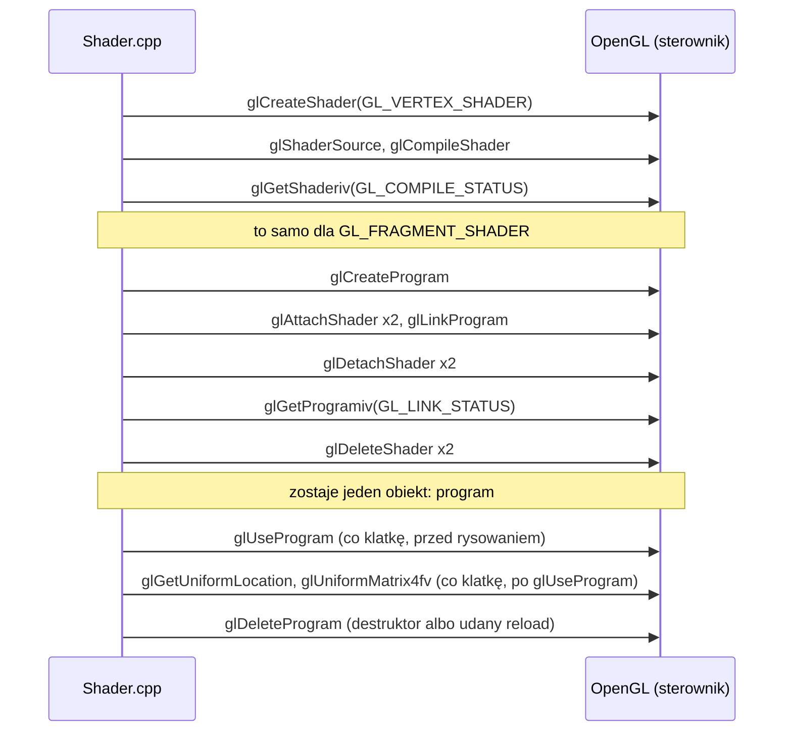
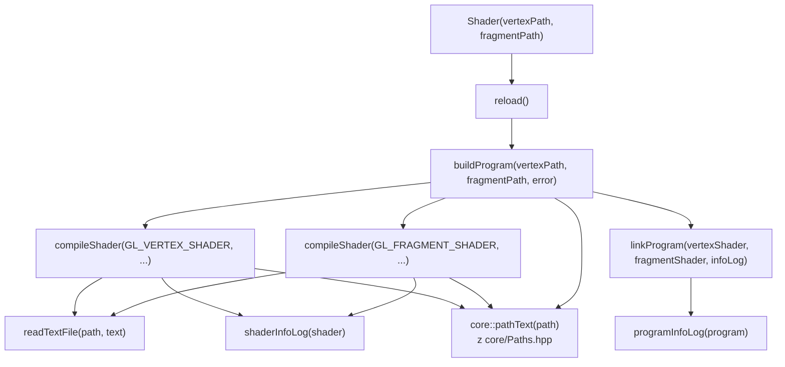

# Moduł gfx: klasa Shader

Kamień milowy: M1. Temat wykładu: 2 (Programowalny potok).
Kod: [`src/gfx/Shader.hpp`](../../../src/gfx/Shader.hpp), [`src/gfx/Shader.cpp`](../../../src/gfx/Shader.cpp), użycie w [`src/game/NightMazeApp.cpp`](../../../src/game/NightMazeApp.cpp).

Część modułu `gfx`. Wstęp do całego modułu, zasada RAII dla obiektów OpenGL i semantyka przenoszenia są w [`README.md`](README.md). Ten dokument jest dalszym ciągiem [`shaders.md`](shaders.md): tam jest potok, język GLSL i dwa shadery projektu, tutaj kod klasy, która buduje z nich program OpenGL. Dwie funkcje klasy mają własne dokumenty: `setMat4` jest w [`uniforms.md`](uniforms.md), a `reload` i panel "Shaders" w [`shader-hot-reload.md`](shader-hot-reload.md). Ten dokument korzysta z makra `GL_CHECK` ([`../core/gl-check.md`](../core/gl-check.md)), z logowania ([`../core/window-context.md`](../core/window-context.md), sekcja 5.5) i ze ścieżek do assetów ([`../core/paths.md`](../core/paths.md)).

## 1. Po co to jest

W profilu Core nie da się narysować niczego bez programu shaderów ([`shaders.md`](shaders.md), sekcja 1). Ktoś musi więc wczytać tekst shadera z pliku, skompilować go, zlinkować dwa shadery w jeden program i powiedzieć, co poszło źle, gdy coś poszło źle.

Klasa `gfx::Shader` robi dokładnie to. Jest cienkim opakowaniem na **jeden obiekt programu OpenGL** zbudowany z dwóch plików: shadera wierzchołków i shadera fragmentów. Ma cztery cechy, z których każda odpowiada na konkretny problem:

| Cecha | Problem, który rozwiązuje |
|---|---|
| Shadery są plikami na dysku, nie napisami w kodzie C++ | Zmiana shadera nie wymaga kompilacji programu, a edytor koloruje składnię GLSL (zasada z PRD: "Shadery jako pliki") |
| `reload()` buduje nowy program i podmienia stary tylko przy sukcesie | Wczytywanie na żywo (hot reload): literówka w shaderze nie zamienia obrazu w czarny ekran, bo stary program działa dalej |
| Błąd jest logowany z nazwą pliku i pełnym tekstem sterownika, a do tego zapamiętany w `lastError()` | Błędów kompilacji GLSL nie widzi `glGetError` ani `GL_CHECK`. Bez własnego odczytu nie byłoby żadnej informacji |
| RAII i tylko przenoszenie (move-only) | Program OpenGL jest zwalniany dokładnie raz, automatycznie, bez ręcznego `glDeleteProgram` w kodzie gry |

## 2. Teoria

Klasa nie wprowadza własnej teorii. Pojęcia, na których stoi, są w dwóch miejscach: obiekt shadera a obiekt programu oraz kompilacja a linkowanie w [`shaders.md`](shaders.md) (sekcje 2.5 i 2.6), a RAII i semantyka przenoszenia w [`README.md`](README.md) (sekcja 2).

## 3. Jak to działa w OpenGL

### 3.1 Wywołania w kolejności

Zbudowanie jednego programu z dwóch plików to następujący ciąg wywołań. Kroki od 1 do 6 wykonują się dwa razy: raz dla shadera wierzchołków, raz dla shadera fragmentów.

| # | Wywołanie | Co robi |
|---|---|---|
| 1 | `glCreateShader(GL_VERTEX_SHADER)` albo `glCreateShader(GL_FRAGMENT_SHADER)` | Tworzy pusty obiekt shadera danego typu i zwraca jego identyfikator. 0 oznacza niepowodzenie |
| 2 | `glShaderSource(shader, count, strings, lengths)` | Kopiuje tekst źródłowy do obiektu. `strings` to tablica `count` napisów C, które OpenGL skleja w jeden. `lengths` równe `nullptr` znaczy: każdy napis kończy się zerem |
| 3 | `glCompileShader(shader)` | Kompiluje tekst. Nic nie zwraca i **nie ustawia flagi błędu** przy błędzie w GLSL |
| 4 | `glGetShaderiv(shader, GL_COMPILE_STATUS, &status)` | Wpisuje do `status` wartość `GL_TRUE` albo `GL_FALSE`: wynik ostatniej kompilacji |
| 5 | `glGetShaderiv(shader, GL_INFO_LOG_LENGTH, &length)` | Wpisuje długość dziennika (info log) w znakach, **razem** z kończącym zerem. 0 oznacza brak dziennika |
| 6 | `glGetShaderInfoLog(shader, maxLength, &written, buffer)` | Kopiuje dziennik do bufora, najwyżej `maxLength` znaków. Do `written` wpisuje liczbę skopiowanych znaków **bez** kończącego zera |
| 7 | `glCreateProgram()` | Tworzy pusty obiekt programu i zwraca jego identyfikator. 0 oznacza niepowodzenie |
| 8 | `glAttachShader(program, shader)` | Dołącza obiekt shadera do programu. Wołane dwa razy, po jednym na etap |
| 9 | `glLinkProgram(program)` | Łączy dołączone shadery w kod wykonywalny dla karty. Tak jak kompilacja, przy błędzie nie ustawia flagi |
| 10 | `glDetachShader(program, shader)` | Odłącza obiekt shadera od programu. Zlinkowany program ma już własny kod i nie potrzebuje obiektów shaderów |
| 11 | `glGetProgramiv(program, GL_LINK_STATUS, &status)` | Wynik linkowania: `GL_TRUE` albo `GL_FALSE` |
| 12 | `glGetProgramiv(program, GL_INFO_LOG_LENGTH, &length)` i `glGetProgramInfoLog(program, maxLength, &written, buffer)` | Dziennik linkowania. Działają jak kroki 5 i 6, ale dla obiektu programu |
| 13 | `glDeleteShader(shader)` | Usuwa obiekt shadera. Jeśli jest jeszcze dołączony do programu, OpenGL tylko oznacza go do usunięcia i zwalnia dopiero po odłączeniu |
| 14 | `glUseProgram(program)` | Ustawia program jako bieżący: używają go wszystkie następne wywołania rysujące, aż do kolejnego `glUseProgram` |
| 15 | `glDeleteProgram(program)` | Usuwa program. Dla wartości 0 nie robi nic i nie zgłasza błędu. Jeśli program jest akurat bieżący, zostaje oznaczony do usunięcia i znika, gdy przestanie być bieżący |

Ustawienie uniformu (`glGetUniformLocation` i `glUniformMatrix4fv`), wykonywane co klatkę po kroku 14, opisuje [`uniforms.md`](uniforms.md) (sekcja 3).

Wszystkie te funkcje są w rdzeniu OpenGL od wersji 2.0, więc są dostępne w 4.1 Core i w nagłówku GLAD projektu.

### 3.2 Diagram obiektów



### 3.3 Błędy GLSL nie są błędami OpenGL

To najważniejsza rzecz w tej sekcji. `glGetError` (a więc i `GL_CHECK`) zgłasza **błędne użycie API**: złą stałą, zły identyfikator, wywołanie w złym stanie. Shader z błędem składni nie jest błędnym użyciem API: `glCompileShader` zostało wywołane poprawnie, na poprawnym obiekcie, i poprawnie wykonało swoją pracę, której wynikiem jest "ten tekst się nie kompiluje". Żadna flaga nie zostaje ustawiona.

| Sytuacja | `glGetError` | Gdzie jest informacja |
|---|---|---|
| `glCompileShader(12345)` (nie ma takiego obiektu) | `GL_INVALID_VALUE` | `GL_CHECK` wypisze linię w konsoli |
| Shader z brakującym średnikiem | `GL_NO_ERROR` | tylko w `GL_COMPILE_STATUS` i w dzienniku shadera |
| Shader fragmentów czyta zmienną, której shader wierzchołków nie zapisuje | `GL_NO_ERROR` | tylko w `GL_LINK_STATUS` i w dzienniku programu |

Kto nie odczyta statusu, dostaje program, który "działa" i niczego nie rysuje. Dopiero użycie niezlinkowanego programu w `glUseProgram` kończy się błędem `GL_INVALID_OPERATION`, ale ten błąd nie mówi już, co było nie tak w shaderze.

## 4. Shadery

Klasa nie ma własnych shaderów i nie zna ich treści: dostaje dwie ścieżki i buduje program z dowolnej pary plików. W projekcie jest to para `basic.vert` i `basic.frag`, opisana linia po linii w [`shaders.md`](shaders.md) (sekcja 4).

## 5. Kod w projekcie

### 5.1 Pliki

| Plik | Co zawiera |
|---|---|
| [`src/gfx/Shader.hpp`](../../../src/gfx/Shader.hpp) | klasa `gfx::Shader`: konstruktor, destruktor, zablokowane kopiowanie, przenoszenie, `reload`, `isValid`, `use`, `setMat4`, `lastError`, `vertexPath`, `fragmentPath`. Dołącza `<glad/gl.h>` (typ `GLuint`), `<glm/glm.hpp>` (typ `glm::mat4`), `<filesystem>` i `<string>` |
| [`src/gfx/Shader.cpp`](../../../src/gfx/Shader.cpp) | implementacja i sześć funkcji pomocniczych w anonimowej przestrzeni nazw: `readTextFile`, `shaderInfoLog`, `programInfoLog`, `compileShader`, `linkProgram`, `buildProgram` |
| [`assets/shaders/basic.vert`](../../../assets/shaders/basic.vert), [`basic.frag`](../../../assets/shaders/basic.frag) | jedyna para shaderów projektu ([`shaders.md`](shaders.md), sekcja 4) |
| [`src/game/NightMazeApp.hpp`](../../../src/game/NightMazeApp.hpp), [`.cpp`](../../../src/game/NightMazeApp.cpp) | właściciel obiektu: pole `m_shader`, wczytanie w konstruktorze, `isValid()`, `use()` i trzy razy `setMat4()` w `onRender`, chroniony akcesor `shader()` ([`shaders.md`](shaders.md), sekcja 5.1) |
| [`src/debug/panels/ShadersPanel.hpp`](../../../src/debug/panels/ShadersPanel.hpp), [`.cpp`](../../../src/debug/panels/ShadersPanel.cpp) | funkcja `debug::drawShadersPanel`: panel "Shaders" z przyciskiem "Reload shaders" ([`shader-hot-reload.md`](shader-hot-reload.md), sekcja 6). Należy do programu `night_maze`, nie do biblioteki `engine` |

Oba pliki klasy są na liście źródeł biblioteki `engine` w [`CMakeLists.txt`](../../../CMakeLists.txt). Klasa zależy tylko od `core` (`GL_CHECK`, `logError`, `pathText`), GLAD, GLM (typ macierzy w `setMat4`) i biblioteki standardowej. Nie wie nic o panelu ani o ImGui.



Wszystkie funkcje pomocnicze zgłaszają niepowodzenie tak samo, bez wyjątków: zwracają `false` albo identyfikator 0, a opis błędu wpisują do parametru `std::string&`.

### 5.2 Nagłówek klasy

```cpp
class Shader {
public:
    /// Remembers both file paths and tries to load the program. It does not throw: when
    /// loading fails the error is logged, isValid() returns false and lastError() holds
    /// the message.
    Shader(std::filesystem::path vertexPath, std::filesystem::path fragmentPath);
    ~Shader();

    Shader(const Shader&) = delete;
    Shader& operator=(const Shader&) = delete;

    /// Takes over the program of other. other is left without a program (not valid).
    Shader(Shader&& other) noexcept;
    /// Deletes the program this object owns, then takes over the program of other.
    Shader& operator=(Shader&& other) noexcept;
```

```cpp
private:
    std::filesystem::path m_vertexPath;
    std::filesystem::path m_fragmentPath;
    // Name (id) of the OpenGL program object. 0 is never a real program: it means "none".
    GLuint m_program = 0;
    std::string m_lastError;
};
```

| Element | Dlaczego tak |
|---|---|
| ścieżki jako `std::filesystem::path` | `Shader` nie wie nic o katalogu `assets/`. Pełną ścieżkę buduje wołający przez `core::assetPath` ([`../core/paths.md`](../core/paths.md)). Dzięki temu klasa nadaje się też do zadań laboratoryjnych, w których pliki leżą gdzie indziej |
| ścieżki są zapamiętane w polach | `reload()` nie ma parametrów: obiekt sam wie, z których plików powstał. Panel debug odczytuje je przez `vertexPath()` i `fragmentPath()` |
| `m_program = 0` | 0 to "nie ma programu". Jedno pole pełni rolę identyfikatora i flagi poprawności, bez osobnego `bool` |
| `m_lastError` | ten sam tekst, który trafił do konsoli, zostaje w obiekcie, żeby panel debug mógł go pokazać |
| `= delete` przy kopiowaniu | kopia miałaby ten sam identyfikator programu i oba destruktory wołałyby `glDeleteProgram` dla tego samego obiektu ([`README.md`](README.md), sekcja 2.2) |
| `noexcept` przy przenoszeniu | obietnica, że te funkcje nie rzucają wyjątków. Kontenery biblioteki standardowej (na przykład `std::vector` przy powiększaniu) przenoszą elementy tylko wtedy, gdy przeniesienie jest `noexcept`. Przy typie, którego nie da się kopiować, to konieczność |

Pięć krótkich funkcji jest zdefiniowanych w nagłówku albo ma jedną linię w `.cpp`:

```cpp
bool isValid() const { return m_program != 0; }
```

```cpp
const std::string& lastError() const { return m_lastError; }
```

```cpp
/// File the vertex shader is read from, as given to the constructor.
const std::filesystem::path& vertexPath() const { return m_vertexPath; }

/// File the fragment shader is read from, as given to the constructor.
const std::filesystem::path& fragmentPath() const { return m_fragmentPath; }
```

Oba akcesory ścieżek zwracają `const&` do pola: nic nie jest kopiowane, a wołający nie może ścieżki zmienić. Zwracają `std::filesystem::path`, a nie gotowy napis, bo to wołający wie, czego potrzebuje: panel bierze z nich samą nazwę pliku (`filename()`) do etykiety i całą ścieżkę do podpowiedzi ([`shader-hot-reload.md`](shader-hot-reload.md), sekcja 6.1).

```cpp
void Shader::use() const {
    GL_CHECK(glUseProgram(m_program));
}
```

`use()` nie sprawdza `isValid()`. Dla obiektu bez programu wykona `glUseProgram(0)`, czyli "żaden program", a rysowanie w takim stanie nie daje określonego wyniku. Sprawdzenie należy do wołającego. `use()` jest `const`, bo nie zmienia obiektu C++, zmienia stan kontekstu OpenGL.

Szósta funkcja, `setMat4`, ustawia uniform. Opisuje ją [`uniforms.md`](uniforms.md) (sekcja 5.1). Siódmą, `reload()`, która buduje program z plików, opisuje [`shader-hot-reload.md`](shader-hot-reload.md) (sekcja 5.2).

### 5.3 Wczytanie pliku: `readTextFile` i `core::pathText`

```cpp
// Reads a whole text file into text. Returns false when the file cannot be opened.
bool readTextFile(const std::filesystem::path& path, std::string& text) {
    // The stream closes the file in its destructor.
    std::ifstream file(path);
    if (!file.is_open()) {
        return false;
    }

    // rdbuf() is the buffer the stream reads the file through. Sending it to another
    // stream with << copies everything up to the end of the file.
    std::ostringstream contents;
    contents << file.rdbuf();
    text = contents.str();
    return true;
}
```

| Linia | Co robi |
|---|---|
| `std::ifstream file(path);` | Otwiera plik do czytania w trybie tekstowym. Konstruktor przyjmuje `std::filesystem::path` wprost, bez zamiany na napis, więc na Windowsie ścieżka ze znakami spoza strony kodowej działa. Plik zamknie destruktor strumienia (RAII) |
| `if (!file.is_open())` | Nie ma pliku, nie ma uprawnień albo ścieżka jest zła. Strumienie domyślnie nie rzucają wyjątków, więc trzeba zapytać |
| `std::ostringstream contents;` | Strumień, który pisze do napisu w pamięci |
| `contents << file.rdbuf();` | `rdbuf()` zwraca wskaźnik do bufora strumienia pliku. Operator `<<` dla takiego wskaźnika przepisuje wszystko, co da się z niego przeczytać, do końca pliku. To standardowy sposób na "wczytaj cały plik" bez pętli i bez znajomości rozmiaru |
| `text = contents.str();` | `str()` zwraca zebrany tekst jako `std::string` |

Wynik wraca przez parametr `std::string& text`, a wartość zwracana `bool` mówi tylko "udało się albo nie". To celowo prosty kształt: bez `std::optional` i bez wyjątków.

Tryb tekstowy ma na Windowsie jedną konsekwencję: końce linii `\r\n` są przy czytaniu zamieniane na `\n`. Kompilatorowi GLSL jest to obojętne.

Ścieżkę na tekst do komunikatu błędu zamienia `core::pathText` z [`src/core/Paths.hpp`](../../../src/core/Paths.hpp), opisane linia po linii w [`../core/paths.md`](../core/paths.md) (sekcja 5.7):

```cpp
std::string pathText(const std::filesystem::path& path);
```

Funkcja była najpierw prywatną funkcją pomocniczą w `Shader.cpp`. Przeniosłem ją do `core`, gdy tej samej zamiany zaczął potrzebować panel "Shaders" (nazwy plików w etykietach): `debug/` nie ma dostępu do anonimowej przestrzeni nazw w `Shader.cpp`, a kopia tych samych trzech linii w panelu byłaby powtórzeniem. Dla `Shader` ważne są dwie jej własności. Po pierwsze **nie rzuca wyjątku** dla ścieżki, której nie da się zapisać w stronie kodowej Windowsa (inaczej niż `path.string()`), a konstruktor `Shader` obiecuje, że nie rzuca, więc komunikat o błędzie nie może sam być źródłem wyjątku. Po drugie zwraca UTF-8, czyli to, czego oczekuje ImGui, więc `lastError()` da się wyświetlić w panelu bez dalszych zamian.

### 5.4 Dziennik sterownika: `shaderInfoLog` i `programInfoLog`

```cpp
// Text the driver wrote while compiling a shader: errors and warnings with line numbers.
std::string shaderInfoLog(GLuint shader) {
    // Length of the log in characters, including the terminating zero. 0 means no log.
    GLint length = 0;
    GL_CHECK(glGetShaderiv(shader, GL_INFO_LOG_LENGTH, &length));
    if (length <= 0) {
        return {};
    }

    std::string log(static_cast<std::size_t>(length), '\0');
    // written receives the number of characters copied, without the terminating zero.
    GLsizei written = 0;
    GL_CHECK(glGetShaderInfoLog(shader, length, &written, log.data()));
    log.resize(static_cast<std::size_t>(written));
    return log;
}
```

| Linia | Co robi |
|---|---|
| `GLint length = 0;` i `glGetShaderiv(..., GL_INFO_LOG_LENGTH, &length)` | Pytam o długość dziennika. OpenGL zwraca wyniki przez wskaźnik, więc zmienna musi istnieć wcześniej. Wartość początkowa 0 zostaje, gdyby wywołanie się nie powiodło |
| `if (length <= 0) { return {}; }` | Brak dziennika: zwracam pusty napis. `return {};` tworzy domyślny (pusty) `std::string` |
| `std::string log(static_cast<std::size_t>(length), '\0');` | Bufor o dokładnie potrzebnej długości, wypełniony zerami. `length` jest typu `GLint` (ze znakiem), a konstruktor chce `std::size_t` (bez znaku), stąd jawne rzutowanie. Wcześniejszy warunek gwarantuje, że liczba jest dodatnia |
| `glGetShaderInfoLog(shader, length, &written, log.data())` | Kopiuje dziennik do bufora. `log.data()` daje `char*` do pamięci napisu |
| `log.resize(static_cast<std::size_t>(written));` | `length` liczyło kończące zero, `written` go nie liczy. Skracam napis, żeby zero nie zostało na końcu tekstu |

To ten sam wzorzec "zapytaj o rozmiar, przydziel bufor, wypełnij, przytnij" co przy `_NSGetExecutablePath` w [`../core/paths.md`](../core/paths.md) (sekcja 5.5).

`programInfoLog` jest kopią tej funkcji z dwiema różnicami: woła `glGetProgramiv` i `glGetProgramInfoLog`, bo obiekt programu ma własną parę funkcji.

```cpp
// Text the driver wrote while linking a program. Same steps as shaderInfoLog, but
// a program object has its own pair of functions.
std::string programInfoLog(GLuint program) {
    GLint length = 0;
    GL_CHECK(glGetProgramiv(program, GL_INFO_LOG_LENGTH, &length));
    if (length <= 0) {
        return {};
    }

    std::string log(static_cast<std::size_t>(length), '\0');
    GLsizei written = 0;
    GL_CHECK(glGetProgramInfoLog(program, length, &written, log.data()));
    log.resize(static_cast<std::size_t>(written));
    return log;
}
```

Dwie prawie identyczne funkcje są tu świadomym wyborem. Wspólna wersja wymagałaby przekazywania wskaźników do funkcji OpenGL albo szablonu, a to byłoby trudniejsze do wytłumaczenia niż dwanaście powtórzonych linii.

### 5.5 Kompilacja jednego shadera: `compileShader`

```cpp
// Reads one shader file and compiles it. type is GL_VERTEX_SHADER or GL_FRAGMENT_SHADER.
// Returns the id of the shader object, or 0 on failure with the message in error.
GLuint compileShader(GLenum type, const std::filesystem::path& path, std::string& error) {
    std::string source;
    if (!readTextFile(path, source)) {
        error = "Shader file cannot be opened: " + core::pathText(path);
        return 0;
    }

    GLuint shader = 0;
    GL_CHECK(shader = glCreateShader(type));

    // glShaderSource takes an array of C strings. Here the array has one element.
    // nullptr as the array of lengths means that every string ends with a zero.
    const char* sourceText = source.c_str();
    GL_CHECK(glShaderSource(shader, 1, &sourceText, nullptr));
    GL_CHECK(glCompileShader(shader));

    // A compile error does not set an OpenGL error flag, so GL_CHECK cannot see it.
    // The result has to be asked for.
    GLint status = GL_FALSE;
    GL_CHECK(glGetShaderiv(shader, GL_COMPILE_STATUS, &status));
    if (status != GL_TRUE) {
        error = "Shader compilation failed: " + core::pathText(path) + "\n" + shaderInfoLog(shader);
        GL_CHECK(glDeleteShader(shader));
        return 0;
    }
    return shader;
}
```

| Fragment | Co robi i dlaczego |
|---|---|
| `if (!readTextFile(path, source))` | Pierwszy z trzech rodzajów błędu: pliku nie da się otworzyć. Żaden obiekt OpenGL jeszcze nie powstał, więc nie ma czego sprzątać |
| `GLuint shader = 0;` potem `GL_CHECK(shader = glCreateShader(type));` | Wywołanie zwracające wartość w `GL_CHECK`: przypisanie jest w środku makra, a zmienna jest zadeklarowana przed nim ([`../core/gl-check.md`](../core/gl-check.md), sekcja 5.2) |
| `const char* sourceText = source.c_str();` | `glShaderSource` chce **tablicy** wskaźników (`const GLchar* const*`). Mam jeden napis, więc robię zmienną ze wskaźnikiem i podaję jej adres: `&sourceText` to tablica o jednym elemencie. Nie da się napisać `&source.c_str()`, bo nie można wziąć adresu wartości tymczasowej |
| `glShaderSource(shader, 1, &sourceText, nullptr)` | `1` to liczba napisów. `nullptr` zamiast tablicy długości: napis kończy się zerem, co `c_str()` gwarantuje. OpenGL **kopiuje** tekst, więc `source` może zniknąć po tym wywołaniu |
| `GLint status = GL_FALSE;` | Wartość początkowa to "nie udało się". Gdyby `glGetShaderiv` samo zawiodło (na przykład `shader` równe 0), zmienna zostanie nietknięta i kod pójdzie ścieżką błędu |
| `if (status != GL_TRUE)` | Drugi rodzaj błędu: kompilacja. Komunikat to nazwa pliku, znak nowej linii i dziennik sterownika bez żadnych zmian |
| `GL_CHECK(glDeleteShader(shader)); return 0;` | Nieudany obiekt shadera usuwam od razu. Kolejność ma znaczenie: dziennik trzeba odczytać **przed** usunięciem obiektu |

Wartość zwracana 0 jest naturalnym sygnałem błędu, bo OpenGL nigdy nie nadaje obiektowi identyfikatora 0.

### 5.6 Linkowanie: `linkProgram`

```cpp
// Links two compiled shaders into a new program. Returns the id of the program object,
// or 0 on failure with the driver's text in infoLog.
GLuint linkProgram(GLuint vertexShader, GLuint fragmentShader, std::string& infoLog) {
    GLuint program = 0;
    GL_CHECK(program = glCreateProgram());
    GL_CHECK(glAttachShader(program, vertexShader));
    GL_CHECK(glAttachShader(program, fragmentShader));
    GL_CHECK(glLinkProgram(program));

    // A linked program keeps its own executable code, so it no longer needs the shader
    // objects. Detaching them lets glDeleteShader really free them.
    GL_CHECK(glDetachShader(program, vertexShader));
    GL_CHECK(glDetachShader(program, fragmentShader));

    // Like compiling, a failed link sets no OpenGL error flag.
    GLint status = GL_FALSE;
    GL_CHECK(glGetProgramiv(program, GL_LINK_STATUS, &status));
    if (status != GL_TRUE) {
        infoLog = programInfoLog(program);
        GL_CHECK(glDeleteProgram(program));
        return 0;
    }
    return program;
}
```

| Fragment | Co robi i dlaczego |
|---|---|
| `glAttachShader` dwa razy | Program dowiaduje się, z których obiektów shaderów ma powstać. Kolejność dołączania nie ma znaczenia |
| `glLinkProgram(program)` | Sprawdza zgodność etapów i tworzy kod dla karty |
| `glDetachShader` dwa razy, zaraz po linkowaniu | Odłączam niezależnie od wyniku linkowania. Zlinkowany program ma własną kopię kodu. Dopóki obiekt shadera jest dołączony do programu, `glDeleteShader` tylko oznacza go do usunięcia. Po odłączeniu zostanie zwolniony naprawdę |
| `GL_LINK_STATUS` | Trzeci rodzaj błędu: linkowanie. Tak jak przy kompilacji, bez flagi `glGetError` |
| `infoLog = programInfoLog(program);` przed `glDeleteProgram` | Najpierw dziennik, potem usunięcie nieudanego programu |

Funkcja zwraca przez `infoLog` **sam tekst sterownika**, bez nazw plików: dostaje tylko identyfikatory i ścieżek nie zna. Pełny komunikat składa funkcja piętro wyżej.

### 5.7 Całość: `buildProgram`

```cpp
// Builds a complete program from two files: compile, compile, link. Returns the id of
// the new program, or 0 on failure with the message in error. Whatever happens, no shader
// object is left behind.
GLuint buildProgram(const std::filesystem::path& vertexPath,
                    const std::filesystem::path& fragmentPath, std::string& error) {
    const GLuint vertexShader = compileShader(GL_VERTEX_SHADER, vertexPath, error);
    if (vertexShader == 0) {
        return 0;
    }

    const GLuint fragmentShader = compileShader(GL_FRAGMENT_SHADER, fragmentPath, error);
    if (fragmentShader == 0) {
        GL_CHECK(glDeleteShader(vertexShader));
        return 0;
    }

    std::string infoLog;
    const GLuint program = linkProgram(vertexShader, fragmentShader, infoLog);

    // The shader objects were only an intermediate step, linked or not.
    GL_CHECK(glDeleteShader(vertexShader));
    GL_CHECK(glDeleteShader(fragmentShader));

    if (program == 0) {
        error = "Shader linking failed: " + core::pathText(vertexPath) + " + " +
                core::pathText(fragmentPath) + "\n" + infoLog;
    }
    return program;
}
```

Funkcja ma cztery wyjścia i przy każdym trzeba umieć powiedzieć, jakie obiekty OpenGL istnieją:

| Wyjście | Obiekty shaderów | Obiekt programu | `error` |
|---|---|---|---|
| nie udał się shader wierzchołków | żaden (`compileShader` posprzątał po sobie) | nie powstał | plik albo kompilacja, ścieżka shadera wierzchołków |
| nie udał się shader fragmentów | shader wierzchołków usunięty tutaj, shader fragmentów przez `compileShader` | nie powstał | plik albo kompilacja, ścieżka shadera fragmentów |
| nie udało się linkowanie | oba usunięte tutaj | usunięty przez `linkProgram` | obie ścieżki i dziennik programu |
| sukces | oba usunięte tutaj | zwrócony wołającemu | pusty |

Żadne wyjście nie zostawia po sobie obiektu, którego nikt nie pamięta. To jest właśnie warunek z opisu `reload()`: "przy niepowodzeniu nowe obiekty są usuwane".

Przy błędzie w shaderze wierzchołków shader fragmentów nie jest w ogóle wczytywany. W konsoli pojawi się więc błąd tylko jednego pliku naraz. Po jego poprawieniu i ponownym `reload()` wyjdzie ewentualny błąd drugiego.

Komunikat o błędzie linkowania wymienia **oba pliki**, bo błąd linkowania z natury dotyczy pary: jeden shader czegoś oczekuje, a drugi tego nie dostarcza.

### 5.8 Konstruktor i destruktor

```cpp
// The paths arrive by value and are moved into the members, so a caller that passes
// a temporary (the result of core::assetPath) pays for no copy.
Shader::Shader(std::filesystem::path vertexPath, std::filesystem::path fragmentPath)
    : m_vertexPath(std::move(vertexPath)), m_fragmentPath(std::move(fragmentPath)) {
    // The first load is the same work as a reload, starting from "no program".
    reload();
}
```

- Parametry są przekazane **przez wartość**, a potem przeniesione do pól przez `std::move`. Wołający zwykle poda wynik `core::assetPath(...)`, czyli obiekt tymczasowy: taki obiekt jest przenoszony do parametru, a z parametru do pola, więc ścieżka nie jest kopiowana ani razu. Przy `const std::filesystem::path&` kopia do pola byłaby nieunikniona. `std::move` samo niczego nie przenosi: to rzutowanie, które mówi "ten obiekt można opróżnić" ([`README.md`](README.md), sekcja 2.3).
- Konstruktor woła `reload()` i **ignoruje jego wynik**. Nie rzuca wyjątku przy błędzie shadera: obiekt powstaje zawsze, a czy ma program, mówi `isValid()`. Powód: literówka w pliku GLSL nie powinna zamykać całego programu, skoro da się ją poprawić i wczytać shader ponownie bez restartu. To inna decyzja niż w `core::Window`, którego konstruktor rzuca, bo bez okna nie ma czego ratować.

Co dokładnie robi `reload()` (buduje nowy program obok starego i podmienia go tylko przy sukcesie) i w jakich stanach może być obiekt po wczytaniu, opisuje [`shader-hot-reload.md`](shader-hot-reload.md) (sekcja 5.2). Dla konstruktora ważne jest jedno: pierwsze wczytanie to ta sama praca co przeładowanie, tylko zaczynająca od "braku programu".

```cpp
Shader::~Shader() {
    // OpenGL silently ignores glDeleteProgram(0), so an object without a program
    // (a failed load, or one that was moved from) needs no special case.
    GL_CHECK(glDeleteProgram(m_program));
}
```

Destruktor ma jedną linię, bez `if (m_program != 0)`. Specyfikacja OpenGL mówi, że `glDeleteProgram` dla wartości 0 jest po cichu ignorowane (bez błędu), i na tym polegam w trzech miejscach: tutaj, w `reload()` i w przypisaniu przenoszącym.

### 5.9 Przenoszenie

Ogólne wyjaśnienie, czym jest przeniesienie i dlaczego opakowania obiektów OpenGL nie wolno kopiować, jest w [`README.md`](README.md), sekcja 2. Tutaj sam kod.

```cpp
// Move constructor: the new object takes the program id, and other gives it up.
Shader::Shader(Shader&& other) noexcept
    : m_vertexPath(std::move(other.m_vertexPath)),
      m_fragmentPath(std::move(other.m_fragmentPath)),
      m_program(other.m_program),
      m_lastError(std::move(other.m_lastError)) {
    // Two objects must never hold the same id. With 0 the destructor of other
    // deletes nothing.
    other.m_program = 0;
}
```

| Fragment | Co robi i dlaczego |
|---|---|
| `Shader&& other` | Referencja do r-wartości (rvalue reference): parametr przyjmuje obiekt tymczasowy albo taki, który wołający oznaczył przez `std::move`. To sygnał "z tego obiektu wolno zabrać zawartość" |
| `std::move(other.m_vertexPath)` i pozostałe | Ścieżki i napis błędu są przenoszone ich własnymi konstruktorami przenoszącymi: nowy obiekt przejmuje ich pamięć bez kopiowania znaków |
| `m_program(other.m_program)` | Identyfikator to zwykła liczba, więc jest po prostu kopiowany. `std::move` dla liczby nic by nie zmieniło |
| `other.m_program = 0;` | **Najważniejsza linia.** Po skopiowaniu liczby oba obiekty mają ten sam identyfikator. Zerując go w `other`, sprawiam, że właściciel jest jeden, a destruktor `other` wykona `glDeleteProgram(0)`, czyli nic |

Bez ostatniej linii konstruktor przenoszący byłby kopiującym w przebraniu, z dokładnie tym błędem, przed którym chroni `= delete`: dwa destruktory, jeden program.

```cpp
// Move assignment: this object already owns a program, which has to go first.
Shader& Shader::operator=(Shader&& other) noexcept {
    // shader = std::move(shader): nothing to do. Without this check the program would
    // be deleted here and then "taken over" from itself.
    if (this == &other) {
        return *this;
    }

    // Release the program owned so far (ignored by OpenGL when it is 0).
    GL_CHECK(glDeleteProgram(m_program));

    m_vertexPath = std::move(other.m_vertexPath);
    m_fragmentPath = std::move(other.m_fragmentPath);
    m_program = other.m_program;
    m_lastError = std::move(other.m_lastError);
    other.m_program = 0;
    return *this;
}
```

Przypisanie różni się od konstruktora jednym: obiekt po lewej stronie **już istnieje i może mieć własny program**. Trzy kroki:

1. **Przypisanie do samego siebie.** `this == &other` porównuje adresy. Bez tego warunku `shader = std::move(shader)` usunęłoby program, a potem "przejęło" identyfikator już nieistniejącego obiektu i na koniec wyzerowało go: obiekt zostałby bez programu.
2. **Zwolnienie własnego programu.** Bez tej linii stary identyfikator zostałby nadpisany i nikt nie zawołałby już dla niego `glDeleteProgram`: wyciek obiektu OpenGL.
3. **Przejęcie** pól `other` i wyzerowanie jego identyfikatora, tak jak w konstruktorze.

`return *this;` zwraca referencję do obiektu po lewej, jak każdy operator przypisania, żeby dało się pisać `a = b = c`.

### 5.10 Jak to zostało sprawdzone

**Test samej klasy.** Zanim klasa dostała użytkownika, sprawdziłem ją na Macu małym programem testowym poza repozytorium: ukryte okno GLFW z kontekstem 4.1 Core, biblioteka `engine` z buildu Debug i kilka plików shaderów w katalogu tymczasowym. Wyniki (sterownik Apple, `GL_VERSION` 4.1 Metal):

| Próba | Wynik |
|---|---|
| najprostsza poprawna para (jeden atrybut pozycji, stały kolor) | `isValid()` prawda, `lastError()` pusty |
| nieistniejący plik | `isValid()` fałsz, `Shader file cannot be opened: <ścieżka>` |
| brak średnika w shaderze wierzchołków | `Shader compilation failed: <ścieżka>`, potem `ERROR: 0:5: '}' : syntax error: syntax error` |
| brak linii `#version` | `ERROR: 0:1: '' :  #version required and missing.` |
| `#version 330 core` | kompiluje się |
| `#version 420 core` i `#version 460 core` | `ERROR: 0:1: '' :  version '420' is not supported` (odpowiednio `'460'`) |
| shader fragmentów z `in vec3 vColor`, którego shader wierzchołków nie zapisuje | `Shader linking failed: <ścieżka> + <ścieżka>`, potem `ERROR: Input of fragment shader 'vColor' not written by vertex shader` |
| `reload()` po zepsuciu pliku | zwraca `false`, `isValid()` nadal prawda, `glGetIntegerv(GL_CURRENT_PROGRAM)` po `use()` daje ten sam identyfikator co przed próbą |
| `reload()` po naprawieniu pliku | zwraca `true`, `lastError()` pusty, nowy identyfikator |
| konstruktor przenoszący, przypisanie przenoszące, przypisanie do samego siebie | obiekt docelowy poprawny, obiekt źródłowy z `isValid()` fałsz, po przypisaniu do siebie obiekt nadal poprawny |
| `glGetError` na końcu testu | `GL_NO_ERROR` |

Zwraca uwagę trzeci wiersz: brakujący średnik był w linii 4, a sterownik wskazał linię 5, bo błąd zauważył dopiero przy następnym znaku (`}`). Numer linii w dzienniku to miejsce, w którym kompilator się zgubił, a nie zawsze miejsce pomyłki.

**Program `night_maze` (wersja z trójkątem).** Po dodaniu pierwszej geometrii, jednego trójkąta, uruchomiłem program na Macu trzy razy, każdorazowo na około 3 sekundy, i przeczytałem jego wyjście (`<repo>` to katalog repozytorium):

| Próba | Wyjście programu | Wynik |
|---|---|---|
| start z katalogu repozytorium | dwie linie `[info]` z `GL_VERSION` i `GL_RENDERER`, żadnej linii `[error]` | program działa |
| start z katalogu `/tmp` (inny katalog roboczy) | to samo | shadery znalezione, bo ścieżka idzie przez `core::assetPath` |
| usunięty średnik w linii 14 pliku `basic.frag` | jak niżej | błąd wypisany **raz**, program działa dalej (nie zamknął się przez 3 sekundy) |

```text
[info] GL_VERSION:  4.1 Metal - 90.5
[info] GL_RENDERER: Apple M3
[error] Shader compilation failed: <repo>/build/debug/assets/shaders/basic.frag
ERROR: 0:15: '}' : syntax error: syntax error
```

Ścieżka w komunikacie prowadzi przez `build/debug/assets`, czyli przez dowiązanie obok programu, a nie wprost do katalogu repozytorium: to jest ścieżka, którą zbudowało `core::assetPath`. Sterownik wskazuje linię 15, choć średnika brakuje w linii 14 (uwaga pod tabelą wyżej).

Te uruchomienia sprawdzały wyjście tekstowe, a nie obraz w oknie. Obraz sprawdzał wtedy osobny test z ukrytym oknem i `glReadPixels` ([`buffers-vao.md`](buffers-vao.md), sekcja 5.8).

Dwie dalsze serie prób są opisane przy swoich tematach: test panelu Shaders i przeładowania kliknięciem w [`shader-hot-reload.md`](shader-hot-reload.md) (sekcja 5.3), a test kostki, trzech macierzy i literówki w nazwie uniformu w [`uniforms.md`](uniforms.md) (sekcja 5.3).

Na Windowsie klasa i panel nie były jeszcze kompilowane ani uruchamiane.

Gdzie obiekt klasy jest tworzony i używany w klatce, opisuje [`shaders.md`](shaders.md) (sekcja 5.1).

## 6. Panel ImGui

Klasa `gfx::Shader` ma własny panel debug, **Shaders**: nazwy obu plików z `vertexPath()` i `fragmentPath()`, stan programu z `isValid()`, przycisk wołający `reload()` i tekst z `lastError()`. Kod panelu i droga referencji do shadera są w [`shader-hot-reload.md`](shader-hot-reload.md) (sekcja 6).

## 7. Pułapki

1. **Błędy kompilacji i linkowania są niewidoczne dla `glGetError`.** `GL_CHECK(glCompileShader(shader))` nigdy nie zgłosi błędu składni GLSL. Jedynym źródłem informacji jest `GL_COMPILE_STATUS`, `GL_LINK_STATUS` i dziennik (sekcja 3.3). Program, który ich nie czyta, po prostu niczego nie rysuje.
2. **Destruktor bez kontekstu.** `~Shader` woła `glDeleteProgram`, a każda funkcja `gl*` wymaga bieżącego kontekstu. Obiekt `Shader` żyjący dłużej niż okno (zmienna globalna, zmienna lokalna w `main` zadeklarowana przed aplikacją) wywoła OpenGL po zniszczeniu kontekstu. Poprawne miejsce to pole klasy pochodnej od `core::Application` ([`../core/README.md`](../core/README.md), sekcja 7). Z tego samego powodu obiektu nie można utworzyć **przed** powstaniem okna.
3. **Kopiowanie opakowania.** Gdyby kopiowanie nie było zablokowane, `Shader b = a;` dałoby dwa obiekty z tym samym identyfikatorem i drugi destruktor usuwałby już usunięty program (albo, co gorsza, nowy obiekt, który dostał ten sam numer). Dzięki `= delete` taka linia się nie kompiluje. Typowa sytuacja, w której to wychodzi: przekazanie `Shader` do funkcji przez wartość. Przekazuję przez `const Shader&`.
4. **Użycie obiektu po przeniesieniu.** Po `Shader b = std::move(a);` obiekt `a` ma `isValid() == false`. `a.use()` ustawi wtedy program 0.
5. **`use()` bez sprawdzenia `isValid()`.** Dla obiektu bez programu `use()` ustawia program 0 i rysowanie nie daje określonego wyniku (zwykle nic nie widać). Po nieudanym wczytaniu w konstruktorze trzeba albo pominąć rysowanie, albo poprawić plik i zawołać `reload()`.
6. **Dziennik czytany po usunięciu obiektu.** `glGetShaderInfoLog` dla usuniętego shadera zwraca błąd OpenGL zamiast tekstu. W `compileShader` i `linkProgram` dziennik jest odczytywany przed `glDeleteShader` i `glDeleteProgram`.
7. **Numer linii w błędzie wskazuje za daleko.** Brak średnika w linii 4 sterownik zgłasza w linii 5 (sekcja 5.10). Trzeba patrzeć też linię wyżej.
8. **Shader pod złym typem.** `glCreateShader(GL_VERTEX_SHADER)` z tekstem shadera fragmentów zwykle kończy się mylącym błędem kompilacji albo linkowania. O typie decyduje kolejność argumentów konstruktora `Shader` (najpierw wierzchołków, potem fragmentów), a nie rozszerzenie pliku.

Pułapki dotyczące języka GLSL są w [`shaders.md`](shaders.md) (sekcja 7), uniformów w [`uniforms.md`](uniforms.md) (sekcja 7), a przeładowania i panelu Shaders w [`shader-hot-reload.md`](shader-hot-reload.md) (sekcja 7).

## 8. Ćwiczenia

Zasady pracy z przyciskiem `Reload shaders` są opisane w [`shaders.md`](shaders.md) (sekcja 8). Ćwiczenia 1 i 4 wymagają uruchomienia programu od nowa, a 3, 5 i 6 robi się na kartce.

1. **Literówka przy starcie.** Zamknij program, usuń średnik po `fragColor = vec4(vColor, 1.0)` w `basic.frag` i uruchom program od nowa. Przeczytaj linię `[error]`: która część pochodzi z `Shader.cpp`, a która ze sterownika? Którą linię wskazuje sterownik i dlaczego nie tę ze średnikiem? Co widać w oknie, co pokazuje linia `Program` w panelu Shaders i czy panele działają? Wskaż w `NightMazeApp::onRender` linię, dzięki której program się nie wysypał. Na koniec, nie zamykając programu, przywróć średnik i naciśnij `Reload shaders`: co się zmieniło w oknie i w panelu?
2. **Błąd linkowania.** W `basic.frag` zmień nazwę `vColor` na `vColour` w obu liniach, w których występuje. Naciśnij `Reload shaders`. Czym różni się komunikat od poprzedniego i dlaczego wymienia oba pliki?
3. **Ścieżki przez `buildProgram`.** Dla każdego z czterech wyjść funkcji `buildProgram` (sekcja 5.7) wypisz po kolei wszystkie wywołania `glCreate*` i `glDelete*`, które się wykonają, i sprawdź, że każdemu `glCreate*` odpowiada `glDelete*` albo zwrócenie identyfikatora. Które wyjście wystąpiło w ćwiczeniu 1, a które w ćwiczeniu 2?
4. **Brak pliku.** W `NightMazeApp.cpp` zmień `VERTEX_SHADER_FILE` na nieistniejącą nazwę, zbuduj i uruchom. Jaka linia pojawia się w konsoli i ile razy? Wycofaj zmianę.
5. **Przeniesienie na kartce.** Dla kodu `Shader a(p1, p2); Shader b = std::move(a);` zapisz wartość `m_program` w obu obiektach po każdej linii (przyjmij, że program dostał identyfikator 3). Ile razy i z jakim argumentem zostanie zawołane `glDeleteProgram`, gdy oba obiekty wyjdą z zasięgu? Powtórz, zakładając, że w konstruktorze przenoszącym brakuje linii `other.m_program = 0;`.
6. **Przypisanie do siebie.** Prześledź na kartce `a = std::move(a);` dla obiektu z programem 3, najpierw z warunkiem `if (this == &other)`, potem bez niego. W jakim stanie zostaje obiekt w drugim przypadku?

## 9. Pytania kontrolne

1. **Dlaczego `GL_CHECK` nie wystarczy do wykrycia błędu w shaderze?**
   `glGetError` zgłasza błędne użycie API. Shader z błędem składni to poprawnie wywołane `glCompileShader` z wynikiem "nie kompiluje się", więc żadna flaga nie jest ustawiana. Wynik trzeba odczytać przez `glGetShaderiv(GL_COMPILE_STATUS)` i `glGetProgramiv(GL_LINK_STATUS)`, a tekst błędu przez `glGetShaderInfoLog` i `glGetProgramInfoLog`.

2. **Dlaczego `glShaderSource` dostaje `&sourceText`, a nie `source.c_str()`?**
   Funkcja przyjmuje tablicę napisów C (wskaźnik na wskaźnik) i ich liczbę. Mam jeden napis, więc zapisuję wskaźnik w zmiennej i podaję jej adres jako tablicę jednoelementową. `nullptr` jako tablica długości oznacza napisy zakończone zerem.

3. **Jak odczytywany jest dziennik i po co `resize` na końcu?**
   `GL_INFO_LOG_LENGTH` podaje długość razem z kończącym zerem. Tworzę `std::string` tej długości, `glGetShaderInfoLog` wypełnia go i wpisuje do `written` liczbę znaków bez zera, a `resize(written)` obcina zero z końca napisu.

4. **Dlaczego konstruktor `Shader` nie rzuca wyjątku przy błędzie w shaderze?**
   Bo błąd w pliku GLSL da się naprawić bez restartu: poprawić plik i zawołać `reload()`. Obiekt powstaje zawsze, `isValid()` mówi, czy ma program, a `lastError()` dlaczego nie. Zamknięcie programu z powodu literówki w shaderze przekreślałoby sens wczytywania na żywo.

5. **Co zawiera komunikat błędu i dlaczego dziennik sterownika nie jest przetwarzany?**
   Rodzaj błędu, ścieżkę pliku (przy linkowaniu obie ścieżki) i dziennik sterownika z numerem linii. Format dziennika jest inny u każdego producenta (Apple: `ERROR: 0:12: ...`, NVIDIA: `0(12) : error ...`), więc próba jego rozbioru działałaby tylko na jednej karcie.

6. **Dlaczego `Shader` nie da się kopiować?**
   Kopia miałaby ten sam identyfikator programu. Oba destruktory zawołałyby `glDeleteProgram` dla tego samego obiektu: drugi usuwałby coś, czego już nie ma, albo nowy obiekt, który dostał ten sam numer. Obiekt OpenGL ma jednego właściciela, więc opakowanie można tylko przenosić.

7. **Co robi konstruktor przenoszący i która linia jest w nim najważniejsza?**
   Przenosi ścieżki i napis błędu, kopiuje identyfikator programu i zeruje go w obiekcie źródłowym: `other.m_program = 0;`. Dzięki temu właściciel jest jeden, a destruktor obiektu źródłowego woła `glDeleteProgram(0)`, które OpenGL ignoruje.

8. **Czym przypisanie przenoszące różni się od konstruktora przenoszącego?**
   Obiekt docelowy już istnieje i może mieć program, więc najpierw trzeba go zwolnić (`glDeleteProgram(m_program)`), inaczej byłby wyciek. Trzeba też obsłużyć przypisanie do samego siebie (`this == &other`), bo bez tego obiekt usunąłby własny program i został z zerem.

9. **Dlaczego destruktor nie ma warunku `if (m_program != 0)`?**
   Specyfikacja OpenGL gwarantuje, że `glDeleteProgram(0)` jest po cichu ignorowane. Obiekt bez programu (nieudane wczytanie, obiekt po przeniesieniu) nie wymaga więc osobnej gałęzi.

10. **Co się stanie, gdy obiekt `Shader` przeżyje okno?**
    Destruktor zawoła `glDeleteProgram` bez bieżącego kontekstu OpenGL, co jest błędem (w praktyce awaria albo zignorowane wywołanie i wyciek). Dlatego `Shader` ma być polem klasy pochodnej od `core::Application`: pola giną przed klasą bazową, która posiada okno.

11. **Dlaczego `core::pathText` używa `u8string()`, a nie `string()`?**
    Na Windowsie `string()` zamienia ścieżkę na lokalną stronę kodową i rzuca wyjątek, gdy znaku nie da się w niej zapisać. Konstruktor `Shader` ma nie rzucać, więc tekst do komunikatu powstaje z UTF-8, który mieści każdą ścieżkę. Dodatkowo UTF-8 jest tym, czego oczekuje ImGui.

## 10. Źródła

- LearnOpenGL, rozdziały "Hello Triangle" (<https://learnopengl.com/Getting-started/Hello-Triangle>) i "Shaders" (<https://learnopengl.com/Getting-started/Shaders>): kompilacja, linkowanie, odczyt dziennika, własna klasa shadera.
- docs.gl (<https://docs.gl>), strony dla OpenGL 4: `glCreateShader`, `glShaderSource`, `glCompileShader`, `glGetShader` (`glGetShaderiv`), `glGetShaderInfoLog`, `glCreateProgram`, `glAttachShader`, `glDetachShader`, `glLinkProgram`, `glGetProgram` (`glGetProgramiv`), `glGetProgramInfoLog`, `glUseProgram`, `glDeleteShader`, `glDeleteProgram` (w tym zdanie o ignorowaniu wartości 0 i o programie będącym w użyciu).
- Khronos OpenGL Wiki: "Shader Compilation" (<https://www.khronos.org/opengl/wiki/Shader_Compilation>), "GLSL Object" (<https://www.khronos.org/opengl/wiki/GLSL_Object>).
- cppreference: semantyka przenoszenia (<https://en.cppreference.com/w/cpp/language/move_constructor>, <https://en.cppreference.com/w/cpp/language/move_assignment>), `std::filesystem::path::u8string`, `std::basic_ifstream`.
- Dokumenty w tym repozytorium: [`README.md`](README.md) (RAII i przenoszenie w `gfx`), [`shaders.md`](shaders.md), [`uniforms.md`](uniforms.md), [`shader-hot-reload.md`](shader-hot-reload.md), [`../core/gl-check.md`](../core/gl-check.md), [`../core/paths.md`](../core/paths.md).
- Janusz Ganczarski, "OpenGL. Podstawy programowania grafiki 3D" (rozdziały o shaderach i języku GLSL).
- "OpenGL. Księga eksperta" (rozdziały o potoku programowalnym i shaderach).
- PRD ([`../../PRD.pdf`](../../PRD.pdf)): zasada "RAII dla obiektów GL".
