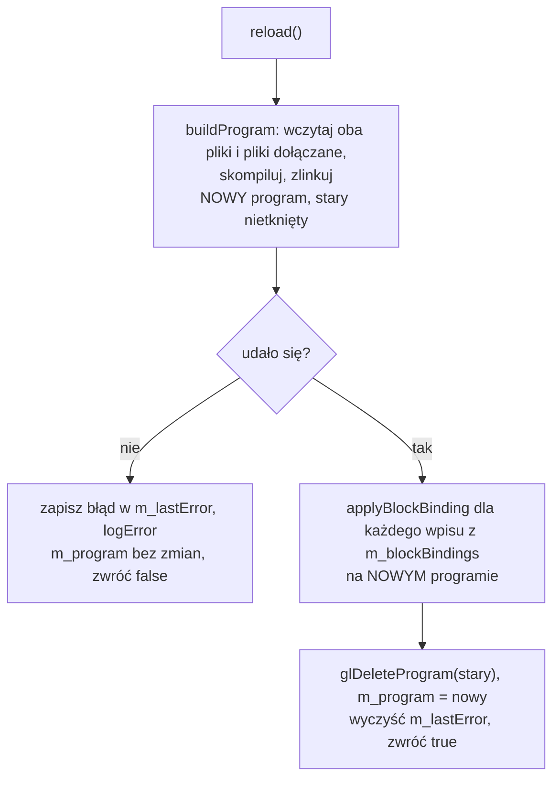
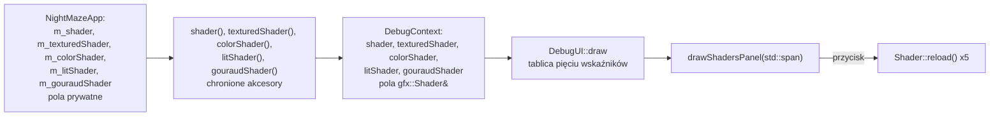
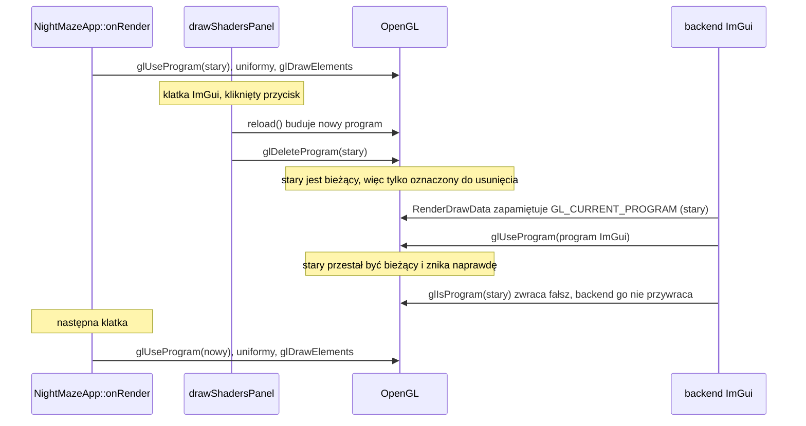

# Moduł gfx: wczytywanie shaderów na żywo

Kamień milowy: M1, panel rozszerzony do trzech programów w M2 + M3 i do pięciu w M4. Temat wykładu: 2 (Programowalny potok).
Kod: funkcja `reload` w [`src/gfx/Shader.hpp`](../../../src/gfx/Shader.hpp) i [`src/gfx/Shader.cpp`](../../../src/gfx/Shader.cpp), panel w [`src/debug/panels/ShadersPanel.hpp`](../../../src/debug/panels/ShadersPanel.hpp) i [`src/debug/panels/ShadersPanel.cpp`](../../../src/debug/panels/ShadersPanel.cpp), shadery w [`assets/shaders/`](../../../assets/shaders/) (pięć par: `basic`, `textured`, `color`, `lit`, `gouraud`, i jeden plik dołączany, `common/lighting.glsl`), użycie w [`src/game/NightMazeApp.hpp`](../../../src/game/NightMazeApp.hpp) i [`src/main.cpp`](../../../src/main.cpp).

Część modułu `gfx`. Wstęp do całego modułu jest w [`README.md`](README.md). Ten dokument jest dalszym ciągiem [`shaders.md`](shaders.md) (potok, GLSL, shadery `basic.*`) i [`shader-class.md`](shader-class.md) (kompilacja, linkowanie i reszta klasy `gfx::Shader`). Tutaj jest podmiana programu w działającej aplikacji i panel "Shaders". Trzecia część tematu, uniformy, jest w [`uniforms.md`](uniforms.md). Dołączanie plików dyrektywą `#include` i nazwy plików w błędach opisuje [`shader-includes.md`](shader-includes.md), a bloki uniformów, których wiązanie `reload` odtwarza, [`uniform-buffers.md`](uniform-buffers.md). Jak nakładka z panelami jest wpięta w program, opisuje [`../debug-ui.md`](../debug-ui.md), a skąd program bierze pliki z `assets/`, [`../core/paths.md`](../core/paths.md).

**Stan na dziś (M4).** Zmierzone na Windowsie (2026-10-05, MSVC 19.44, RTX 4070 Ti SUPER, sterownik NVIDIA 610.74): build Debug i Release bez ostrzeżeń, gra startuje bez linii `[error]` i bez linii `GL_`, czyli wszystkie pięć programów wczytuje się przy starcie. Na zrzucie ekranu sprawdzony jest jeden stan panelu po nieudanym wczytaniu: błąd wewnątrz `common/lighting.glsl` pokazany z nazwą tego pliku, podczas gdy labirynt rysuje nadal poprzedni program. **Przycisku `Reload shaders` z pięcioma programami nikt nie nacisnął ręcznie**, więc scenariusz z sekcji 6.4 jest opisem tego, co wynika z kodu. Na macOS nic z M4 nie było budowane ani uruchamiane.

## 1. Po co to jest

Shader pisze się metodą prób: zmieniam jedną linię i patrzę na obraz. Gdyby każda próba wymagała zamknięcia programu i uruchomienia go od nowa, nauka GLSL trwałaby kilka razy dłużej. Shadery projektu są plikami na dysku, czytanymi w czasie działania (zasada z PRD: "Shadery jako pliki"), więc program może wczytać je ponownie bez kompilacji C++ i bez zamykania okna.

Odpowiadają za to dwa elementy:

| Element | Co daje |
|---|---|
| `Shader::reload()` | buduje nowy program z tych samych dwóch plików (i z plików, które one dołączają) i podmienia stary tylko przy sukcesie. Literówka w shaderze nie zamienia obrazu w czarny ekran, bo stary program działa dalej |
| panel **Shaders** z przyciskiem "Reload shaders" | woła `reload()` na żądanie dla **wszystkich pięciu** programów gry i pokazuje wynik każdego w jednej linii: nazwy obu plików i `OK` albo, na czerwono, `FAILED` z tekstem błędu pod spodem |

Program nie obserwuje dysku: przeładowanie następuje wtedy, gdy nacisnę przycisk. To jest też pokaz tematu 2 na obronie (sekcja 6.4).

## 2. Teoria

**Wczytywanie na żywo** (hot reload) to podmiana shadera w działającym programie: zmieniam plik `.frag` w edytorze, zapisuję, każę programowi wczytać shadery ponownie i od następnej klatki widzę efekt, bez zamykania okna i bez kompilacji C++. Przy nauce shaderów to największe przyspieszenie pracy, jakie można mieć.

Żeby to było bezpieczne, podmiana musi być **wszystko albo nic**. Shader w trakcie edycji bardzo często się nie kompiluje. Gdybym najpierw usunął stary program, a potem próbował zbudować nowy, każda literówka kończyłaby się czarnym ekranem. Dlatego kolejność jest odwrotna: najpierw buduję nowy program obok starego, a stary usuwam dopiero wtedy, gdy nowy na pewno działa.



## 3. Jak to działa w OpenGL

Przeładowanie nie ma własnych funkcji OpenGL. `reload()` wykonuje ten sam ciąg wywołań co pierwsze wczytanie, od `glCreateShader` do `glDeleteShader` ([`shader-class.md`](shader-class.md), sekcja 3.1, kroki od 1 do 13), a potem usuwa stary program przez `glDeleteProgram`. O tym, że podmiana jest bezpieczna, decydują cztery własności:

| Wywołanie | Własność, na której polega przeładowanie |
|---|---|
| `glDeleteProgram(0)` | jest ignorowane bez błędu, więc pierwsze wczytanie (bez starego programu) nie wymaga osobnej gałęzi |
| `glDeleteProgram(program)` dla programu bieżącego | nie usuwa go od razu, tylko oznacza do usunięcia. Program znika, gdy przestanie być bieżący (pułapka 1) |
| `glUseProgram(program)` | wybiera program dla następnych wywołań rysujących. Gra woła je co klatkę, więc nowy identyfikator zaczyna działać od następnej klatki |
| `glIsProgram(program)` | mówi, czy identyfikator jest nazwą istniejącego programu. Mój kod tej funkcji nie woła, używa jej backend ImGui (sekcja 6.3) |
| `glUniformBlockBinding(program, blockIndex, bindingPoint)` | punkt wiązania bloku uniformów jest stanem **obiektu programu**, a nowy program zaczyna z każdym blokiem na punkcie 0. Dlatego `reload()` ustawia go od nowa (sekcja 5.2) |

Błąd kompilacji albo linkowania nowego programu nie jest błędem OpenGL: `glGetError` go nie zgłosi, a jedyną informacją jest status i dziennik sterownika ([`shader-class.md`](shader-class.md), sekcja 3.3).

## 4. Shadery

Ten temat nie ma własnych shaderów. Przeładowywane jest wszystkie pięć par projektu:

| Para | Co rysuje | Pole w `NightMazeApp` | Dokument |
|---|---|---|---|
| `basic.vert`, `basic.frag` | kostkę nad narożną komórką labiryntu | `m_shader` | [`shaders.md`](shaders.md), sekcja 4 |
| `textured.vert`, `textured.frag` | labirynt bez oświetlenia: w trybie `Unlit` i w obu widokach diagnostycznych (normalne, UV) | `m_texturedShader` | [`textures.md`](textures.md), sekcja 4 |
| `color.vert`, `color.frag` | linie pudełek kolizji i znaczniki świateł punktowych | `m_colorShader` | [`../scene/collision.md`](../scene/collision.md), sekcja 4 |
| `lit.vert`, `lit.frag` | labirynt z oświetleniem liczonym dla każdego fragmentu (tryby Phong i Blinn-Phong) | `m_litShader` | [`../renderer/lighting-gouraud-phong.md`](../renderer/lighting-gouraud-phong.md) |
| `gouraud.vert`, `gouraud.frag` | labirynt z oświetleniem liczonym dla każdego wierzchołka (tryb Gouraud) | `m_gouraudShader` | [`../renderer/lighting-gouraud-phong.md`](../renderer/lighting-gouraud-phong.md) |

Jedenastym plikiem jest [`assets/shaders/common/lighting.glsl`](../../../assets/shaders/common/lighting.glsl). Nie jest shaderem i nie ma własnego programu: dołączają go `lit.frag` i `gouraud.vert` ([`shader-includes.md`](shader-includes.md), sekcja 4). Przy przeładowaniu jest czytany od nowa przez oba programy (sekcja 5.2).

Gra startuje w trybie Blinn-Phong, więc labirynt rysuje program `lit`. Dlatego pokaz na obronie (sekcja 6.4) zmienia jedną linię w `lit.frag`: labirynt wypełnia cały ekran, kostkę widać dopiero z góry, a zmiana w `textured.frag` nie byłaby w tym trybie widoczna wcale (pułapka 10).

## 5. Kod w projekcie

### 5.1 Pliki

| Plik | Co zawiera |
|---|---|
| [`src/gfx/Shader.hpp`](../../../src/gfx/Shader.hpp), [`.cpp`](../../../src/gfx/Shader.cpp) | funkcja `reload` klasy `gfx::Shader` (sekcja 5.2) oraz `isValid` i `lastError`, którymi panel czyta jej wynik. Reszta klasy: [`shader-class.md`](shader-class.md), sekcja 5 |
| [`src/debug/panels/ShadersPanel.hpp`](../../../src/debug/panels/ShadersPanel.hpp), [`.cpp`](../../../src/debug/panels/ShadersPanel.cpp) | funkcja `debug::drawShadersPanel`: panel "Shaders" z przyciskiem "Reload shaders" (sekcja 6.1). Należy do programu `night_maze`, nie do biblioteki `engine` |
| [`src/game/NightMazeApp.hpp`](../../../src/game/NightMazeApp.hpp) | chronione akcesory `shader()`, `texturedShader()`, `colorShader()`, `litShader()` i `gouraudShader()`, przez które pięć obiektów trafia do panelu (sekcja 6.2) |
| [`src/debug/DebugContext.hpp`](../../../src/debug/DebugContext.hpp), [`src/main.cpp`](../../../src/main.cpp) | pola `shader`, `texturedShader`, `colorShader`, `litShader` i `gouraudShader` struktury `DebugContext` i linie, które je wypełniają (sekcja 6.2) |
| [`src/debug/DebugUI.cpp`](../../../src/debug/DebugUI.cpp) | tablica pięciu wskaźników przekazywana do panelu (sekcja 6.2) |

`reload()` wołają dwa miejsca: konstruktor `Shader` przy pierwszym wczytaniu ([`shader-class.md`](shader-class.md), sekcja 5.8) i panel "Shaders" po naciśnięciu przycisku.

### 5.2 `Shader::reload`: nowy program obok starego

Funkcja pomocnicza `buildProgram`, która wczytuje oba pliki, kompiluje je i linkuje, jest opisana w [`shader-class.md`](shader-class.md) (sekcja 5.7). Zwraca identyfikator nowego programu albo 0 z komunikatem w `error` i przy żadnym wyjściu nie zostawia po sobie obiektów OpenGL. `reload()` dokłada do niej decyzję, co zrobić ze starym programem:

```cpp
bool Shader::reload() {
    // Build the new program completely before touching the one in use.
    std::string error;
    const GLuint program = buildProgram(m_vertexPath, m_fragmentPath, error);
    if (program == 0) {
        // m_program is not changed: the previous program, if there is one, keeps working.
        m_lastError = error;
        core::logError(m_lastError);
        return false;
    }

    // A binding point of a uniform block is stored in the program object, and this one
    // is new: every block is back at binding point 0. Set them again.
    for (const UniformBlockBinding& binding : m_blockBindings) {
        applyBlockBinding(program, binding);
    }

    // Only now replace the old program (glDeleteProgram(0) is ignored on the first load).
    GL_CHECK(glDeleteProgram(m_program));
    m_program = program;
    m_lastError.clear();
    return true;
}
```

| Fragment | Co robi i dlaczego |
|---|---|
| `const GLuint program = buildProgram(...)` | Nowy program powstaje w zmiennej **lokalnej**. `m_program` do tej chwili nie zostało dotknięte |
| `if (program == 0)` | Niepowodzenie na którymkolwiek etapie: brak pliku, błąd dołączania, błąd kompilacji, błąd linkowania. Wszystkie nowe obiekty zostały już usunięte przez funkcje pomocnicze |
| `m_lastError = error;` i `core::logError(m_lastError);` | Ten sam tekst idzie w dwa miejsca: do pola (dla panelu debug) i do konsoli jako linia `[error] ...` |
| `return false;` bez zmiany `m_program` | **Stary program działa dalej.** Po nieudanym `reload()` obiekt jest w tym samym stanie co przedtem, tylko z ustawionym `lastError()`. Lista `m_blockBindings` też się nie zmienia, a stary program zachowuje swoje wiązania |
| `for (const UniformBlockBinding& binding : m_blockBindings)` z `applyBlockBinding(program, binding)` | Doszło w M4. Wiązania bloków uniformów są ustawiane na **nowym** programie (zmienna lokalna `program`), zanim stanie się on programem obiektu. Dla programu bez wpisów na liście (`basic`, `textured`, `color`) pętla nie wykonuje się ani razu |
| `GL_CHECK(glDeleteProgram(m_program));` | Dopiero po sukcesie usuwam stary program. Przy pierwszym wczytaniu `m_program` to 0 i OpenGL takie wywołanie ignoruje |
| `m_lastError.clear();` | Po udanym wczytaniu nie ma błędu do pokazania |

**Wiązanie bloku uniformów po przeładowaniu.** Programy `lit` i `gouraud` czytają światła z bloku uniformów `LightBlock`, podłączonego do punktu wiązania 1 wywołaniem `Shader::bindUniformBlock`. To połączenie jest zapisane w obiekcie programu, a `reload()` tworzy **nowy** obiekt programu, w którym każdy blok jest z powrotem na punkcie 0. Gdyby na tym poprzestać, po pierwszym naciśnięciu `Reload shaders` oba programy czytałyby światła z punktu, do którego nie jest podłączony żaden bufor, bez żadnego błędu w konsoli. Dlatego `Shader` zapamiętuje każdą prośbę w wektorze `m_blockBindings` i powtarza ją w pętli na nowym programie, a kod gry woła `LightRig::connect` tylko raz, w konstruktorze `NightMazeApp`. To inna sytuacja niż ze zwykłymi uniformami, które też wracają do zera, ale są wysyłane co klatkę ([`uniforms.md`](uniforms.md), sekcja 5.2): punktu wiązania nikt co klatkę nie ustawia. Czym jest blok, punkt wiązania i co dokładnie robi `applyBlockBinding`, opisuje [`uniform-buffers.md`](uniform-buffers.md), a zmianę w klasie linia po linii [`shader-class.md`](shader-class.md) (sekcja 5.8).

**Pliki dołączane są czytane przy każdym przeładowaniu.** `buildProgram` woła `compileShader` dla obu plików, a ta funkcja przy każdym wywołaniu czyta plik shadera i każdy plik wskazany linią `#include` od nowa: nic nie jest zapamiętywane między wczytaniami ([`shader-includes.md`](shader-includes.md), sekcja 5.8). `common/lighting.glsl` dołączają dwa programy, więc jedno naciśnięcie przycisku czyta ten plik dwa razy: raz przy kompilacji `lit.frag`, raz przy kompilacji `gouraud.vert`. Zmiana w nim trafia do obu programów jednym kliknięciem, a błąd w nim zatrzymuje oba naraz (sekcja 6.4, krok 7).

Możliwe stany obiektu:

| Sytuacja | `isValid()` | `lastError()` |
|---|---|---|
| konstruktor, pliki poprawne | `true` | pusty |
| konstruktor, błąd w pliku | `false` | komunikat |
| udany `reload()` | `true` | pusty |
| nieudany `reload()` po wcześniejszym sukcesie | `true` (stary program) | komunikat |
| obiekt, z którego przeniesiono | `false` | nieokreślony (zwykle pusty) |

Czwarty wiersz jest wart zapamiętania: `isValid()` i pusty `lastError()` to **dwa różne pytania**. Pierwsze mówi "czy jest czym rysować", drugie "czy ostatnie wczytanie się udało".

### 5.3 Jak to zostało sprawdzone

Samą funkcję `reload()` sprawdził test klasy opisany w [`shader-class.md`](shader-class.md) (sekcja 5.10): po zepsuciu pliku zwraca `false`, a bieżący program ma ten sam identyfikator co przed próbą. Po naprawieniu pliku zwraca `true`, a program dostaje nowy identyfikator.

**Panel Shaders (wersja z trójkątem i jednym programem).** Przycisku nie da się kliknąć z automatu w prawdziwym programie, więc ścieżkę kodu panelu sprawdziłem na Macu osobnym programem testowym poza repozytorium, gdy program rysował jeszcze trójkąt bez macierzy, a panel obsługiwał jeden program. Od tamtej pory zmieniły się obie strony. W `Shader::reload` doszła w M4 pętla z `applyBlockBinding` (sekcja 5.2), a `compileShader` rozwija dołączenia i wstawia nazwy plików do błędów. **Kod panelu też się zmienił** (sekcja 6.1): dziś przyjmuje listę programów, przeładowuje je w pętli i pokazuje każdy w jednej linii. Tych wersji ten test nie obejmuje. Ukryte okno GLFW, ImGui zainicjalizowane tymi samymi wywołaniami co w `DebugUI`, prawdziwe `drawShadersPanel` z `ShadersPanel.cpp`, a w każdej klatce ta sama kolejność co w ówczesnym programie: `use()`, `bind()`, `glDrawArrays`, potem klatka ImGui z panelem i `RenderDrawData`. Kliknięcie było wstrzyknięte do ImGui jako zdarzenia myszy (`ImGuiIO::AddMousePosEvent`, `AddMouseButtonEvent`), a pliki shaderów były kopią w katalogu tymczasowym.

| Próba | Wynik |
|---|---|
| zapisanie zmienionego `basic.frag` bez kliknięcia | ten sam identyfikator programu, obraz bez zmian |
| kolor zmieniony na `vec4(1.0, 0.5, 0.0, 1.0)`, kliknięcie | nowy identyfikator programu po `use()`, `glIsProgram(stary)` fałsz, `lastError()` pusty, piksel wewnątrz trójkąta z `glReadPixels`: (255, 128, 0) zamiast (64, 128, 64) |
| usunięty średnik w tej linii, kliknięcie | ten sam identyfikator programu co przed kliknięciem, `isValid()` prawda, `lastError()` z tekstem jak niżej, piksel nadal pomarańczowy, panel rysuje więcej tekstu (1200 wierzchołków zamiast 356) |
| plik przywrócony, kliknięcie | nowy identyfikator, poprzedni usunięty, `lastError()` pusty, kolory interpolowane wróciły, panel rysuje tyle tekstu co na początku |
| `glGetError` po scenie i po `RenderDrawData`, w każdej klatce testu | `GL_NO_ERROR` |

```text
[error] Shader compilation failed: <katalog testu>/shaders/basic.frag
ERROR: 0:15: '}' : syntax error: syntax error
```

To wyjście pochodzi z M1, sprzed zamiany numerów na nazwy plików. Dzisiejszy kod zamieniłby `0` po `ERROR: ` na nazwę pliku (`ERROR: basic.frag:15: ...`): tak wynika z `gfx::nameSourceFiles` i z testu jednostkowego dla tego formatu, ale na macOS nikt tego nie uruchomił ([`shader-includes.md`](shader-includes.md), sekcja 5.9).

Test nie obejmuje `DebugUI::draw` ani `main.cpp` (te sprawdza kompilacja i uruchomienie programu: start bez linii `[error]`), nie sprawdza wyglądu panelu (kolor tekstu błędu, zawijanie, podpowiedź z pełną ścieżką) i nie zastępuje kliknięcia prawdziwą myszą w prawdziwym oknie. To zostaje do sprawdzenia ręcznego (sekcja 6.4).

**Panel z trzema programami (M2 + M3).** Na Windowsie (MSVC 19.44, 2026-10-05) ówczesny kod panelu kompilował się bez ostrzeżeń w konfiguracjach Debug i Release, a gra startowała bez linii `[error]`, czyli wszystkie trzy programy wczytywały się przy starcie. Przycisku `Reload shaders` w tej wersji nikt nie nacisnął, ani na Windowsie, ani na macOS.

**Panel z pięcioma programami (M4).** Na Windowsie (2026-10-05, MSVC 19.44, RTX 4070 Ti SUPER, sterownik NVIDIA 610.74) dzisiejszy kod panelu i klasy buduje się w Debug i w Release bez ostrzeżeń, clang-format i clang-tidy nie mają uwag, a gra startuje bez linii `[error]` i bez linii `GL_`: pięć programów wczytuje się przy starcie, a dwa z nich z dołączonym plikiem. Część bez okna ma testy jednostkowe: 22 przypadki dla rozwijania dołączeń i nazw plików w błędach ([`shader-includes.md`](shader-includes.md), sekcja 5.11), w programie testowym, który ma dziś 149 przypadków i 61240 asercji i przechodzi w obu konfiguracjach. Sprawdzone na zrzutach ekranu: błąd wewnątrz `common/lighting.glsl` jest pokazany w panelu z nazwą tego pliku, a labirynt rysuje w tym czasie poprzedni program. Zmierzona linia sterownika po zamianie numeru na nazwę:

```text
common/lighting.glsl(63) : error C0000: syntax error, unexpected ';', expecting "::" at token ";"
```

**Czego nikt nie zrobił:** przycisku `Reload shaders` z pięcioma programami nikt nie nacisnął ręcznie, więc kroki z sekcji 6.4 (zmiana koloru, literówka, naprawa, podpowiedź ze ścieżkami) są otwartą pozycją listy kontrolnej M4 w [`../../guides/build-windows.md`](../../guides/build-windows.md). To, że wiązanie bloku `LightBlock` wraca po przeładowaniu, wynika z kodu `reload()` i nie zostało sprawdzone kliknięciem. Na macOS ta wersja nie była kompilowana ani uruchamiana.

## 6. Panel ImGui

Panel **Shaders** (kod: [`ShadersPanel.cpp`](../../../src/debug/panels/ShadersPanel.cpp)) jest pokazem tematu 2 na obronie: przycisk "Reload shaders" wczytuje shadery ponownie w działającym programie. Panel ma **jeden przycisk dla wszystkich programów**, pod nim kreskę i **jedną linię na każdy program** z listy. Lista ma dziś pięć pozycji, w tej kolejności: `basic` (pole `m_shader`), `textured` (`m_texturedShader`), `color` (`m_colorShader`), `lit` (`m_litShader`) i `gouraud` (`m_gouraudShader`). Jak nakładka z panelami jest wpięta w program, opisuje [`../debug-ui.md`](../debug-ui.md).

| Element | Rodzaj | Skąd wartość | Czego uczy |
|---|---|---|---|
| `Reload shaders` | przycisk, jeden na cały panel | woła `reload()` dla każdego programu z listy | Wczytywanie na żywo (sekcja 2): pliki są czytane, kompilowane i linkowane od nowa, bez zamykania okna i bez kompilacji C++ |
| `basic.vert + basic.frag: OK` (i tak samo cztery pozostałe pary) | odczyt, jedna linia na program | `vertexPath()` i `fragmentPath()`, zamienione na tekst przez `core::pathText`, oraz pusty `lastError()` | Program powstaje z dwóch plików, po jednym na etap. Po najechaniu kursorem na linię pojawia się podpowiedź (tooltip) z **obiema pełnymi ścieżkami**, jedna pod drugą: widać w niej, że program czyta pliki z katalogu `assets` obok pliku wykonywalnego |
| `lit.vert + lit.frag: FAILED, the previous program stays in use`, na czerwono | odczyt, w miejscu linii `OK` | niepusty `lastError()` i `isValid()` równe `true` | Ostatnie wczytanie się nie udało, ale jest czym rysować: działa program sprzed nieudanego przeładowania. To stan, dla którego `reload()` zostało tak napisane |
| `... FAILED, there is no program to draw with`, na czerwono | odczyt, w miejscu linii `OK` | niepusty `lastError()` i `isValid()` równe `false` | Nie udało się już pierwsze wczytanie (przy starcie) i żadne późniejsze: tej części sceny nie ma na ekranie |
| czerwony tekst pod linią `FAILED` | odczyt | `lastError()` | Błąd kompilacji GLSL nie jest błędem OpenGL ([`shader-class.md`](shader-class.md), sekcja 3.3): jedyną informacją jest tekst, który klasa zapamiętała. Dla błędu w pliku dołączanym wymienia ten plik z nazwy ([`shader-includes.md`](shader-includes.md), sekcja 6). Ten sam tekst jest w konsoli jako linia `[error]` |

Linia programu odpowiada na dwa różne pytania naraz (tabela stanów w sekcji 5.2): słowo `OK` albo `FAILED` mówi, czy ostatnie wczytanie się udało, a dopisek po `FAILED` mówi, czy jest czym rysować. `FAILED` przy obrazie, który wygląda normalnie, to nie sprzeczność: nowe pliki się nie kompilują, a obraz rysuje poprzedni program.

Do M2 + M3 każdy program miał w panelu blok czterech linii (osobno oba pliki, stan programu i wynik ostatniego wczytania). W M4 blok został zwinięty do jednej linii, a osobne etykiety zniknęły: pięć bloków po cztery linie to dwadzieścia linii w panelu, który ma dziś 272 jednostki wysokości.

### 6.1 Kod panelu

Plik [`ShadersPanel.cpp`](../../../src/debug/panels/ShadersPanel.cpp) nie ma własnych stałych. Dwie, których używa, są wspólne dla paneli i leżą w nagłówkach modułu `debug`:

| Stała | Plik | Znaczenie |
|---|---|---|
| `SHADERS_PLACEMENT` | [`PanelLayout.hpp`](../../../src/debug/PanelLayout.hpp) | miejsce i rozmiar panelu przy pierwszym uruchomieniu ([`../debug-ui.md`](../debug-ui.md), sekcja 5.7) |
| `ERROR_TEXT_COLOR` | [`Theme.hpp`](../../../src/debug/Theme.hpp) | kolor tekstu błędu: łagodna czerwień `colorFromBytes(255, 150, 138)`, ta sama co w panelu Assets ([`../debug-ui.md`](../debug-ui.md), sekcja 5.8) |

Funkcja pomocnicza w anonimowej przestrzeni nazw pliku, która rysuje jeden program:

```cpp
// One program: a line with its two files and how its last load went, and under it the
// error message of a failed load.
void drawShaderStatus(const gfx::Shader& shader) {
    // The line shows only the file names. The full paths appear as a tooltip when the
    // mouse rests on the line. ImGui expects UTF-8, which core::pathText returns.
    const std::string vertexFile = core::pathText(shader.vertexPath().filename());
    const std::string fragmentFile = core::pathText(shader.fragmentPath().filename());
    const std::string vertexFullPath = core::pathText(shader.vertexPath());
    const std::string fragmentFullPath = core::pathText(shader.fragmentPath());

    if (shader.lastError().empty()) {
        ImGui::Text("%s + %s: OK", vertexFile.c_str(), fragmentFile.c_str());
        ImGui::SetItemTooltip("%s\n%s", vertexFullPath.c_str(), fragmentFullPath.c_str());
        return;
    }

    // A failed load. Valid means that there is still a linked program to draw with: the
    // one from before the failed reload. Without one (the very first load failed)
    // nothing is drawn with this program. The red of the text is a colour of the theme
    // (Theme.hpp), shared with the Assets panel.
    ImGui::PushStyleColor(ImGuiCol_Text, ERROR_TEXT_COLOR);
    ImGui::TextWrapped("%s + %s: FAILED, %s", vertexFile.c_str(), fragmentFile.c_str(),
                       shader.isValid() ? "the previous program stays in use"
                                        : "there is no program to draw with");
    ImGui::SetItemTooltip("%s\n%s", vertexFullPath.c_str(), fragmentFullPath.c_str());
    // The message contains text written by the driver, so it goes in as an argument of
    // "%s" and never as the format string itself. For an error inside an included file
    // it names that file (gfx::nameSourceFiles).
    ImGui::TextWrapped("%s", shader.lastError().c_str());
    ImGui::PopStyleColor();
}
```

I sama funkcja panelu:

```cpp
void drawShadersPanel(std::span<gfx::Shader* const> shaders) {
    // First run only: the bottom edge of the window, right of the Collision panel (the
    // constant is in PanelLayout.hpp). Later ImGui remembers the panel in imgui.ini.
    placePanelOnFirstUse(SHADERS_PLACEMENT);
    if (ImGui::Begin("Shaders")) {
        // Button returns true only in the frame in which it was clicked. One button
        // reloads every program: after editing a file there is no need to know which
        // program it belongs to, and a file that several programs include
        // (common/lighting.glsl) is read again by each of them. The results of reload()
        // are not needed here: the lines
        // below read them from lastError(). A program whose reload fails keeps working
        // with its previous version, and the others are reloaded all the same.
        if (ImGui::Button("Reload shaders")) {
            for (gfx::Shader* shader : shaders) {
                shader->reload();
            }
        }

        ImGui::Separator();
        for (const gfx::Shader* shader : shaders) {
            drawShaderStatus(*shader);
        }
    }
    ImGui::End();
}
```

**Sygnatura i pętle:**

| Fragment | Co robi i dlaczego |
|---|---|
| `std::span<gfx::Shader* const> shaders` | `std::span` (C++20) to widok na ciąg elementów leżących obok siebie: wskaźnik i liczba elementów, bez kopiowania. Elementem jest `gfx::Shader* const`, czyli **stały wskaźnik na niestały obiekt**: panel nie może podmienić wskaźników na liście, ale może wołać `reload()`, które zmienia obiekt. `const gfx::Shader*` znaczyłoby coś odwrotnego i `reload()` by się nie skompilowało |
| lista wskaźników, a nie referencji | referencja nie może być elementem tablicy ani `std::span`, więc lista trzyma adresy. Umowa z nagłówka: żaden wskaźnik nie jest pusty. Funkcja tego nie sprawdza (pułapka 8) |
| `placePanelOnFirstUse(SHADERS_PLACEMENT)` | położenie i rozmiar panelu przy pierwszym uruchomieniu: dolna krawędź okna, na prawo od panelu Collision. Funkcja ustawia je z warunkiem `ImGuiCond_FirstUseEver`, czyli wywołanie liczy się tylko wtedy, gdy w `imgui.ini` nie ma jeszcze wpisu dla tego panelu. Potem o położeniu decyduje użytkownik ([`../debug-ui.md`](../debug-ui.md), sekcja 5.7) |
| `if (ImGui::Button("Reload shaders"))` | tryb natychmiastowy: `Button` rysuje przycisk i zwraca `true` tylko w tej klatce, w której został kliknięty. Nie ma callbacka ani zdarzenia ([`../../libraries/imgui.md`](../../libraries/imgui.md)) |
| `for (gfx::Shader* shader : shaders) { shader->reload(); }` | przeładowanie **wszystkich** programów po kolei. Wynik `reload()` (`bool`) jest ignorowany: te same informacje są w `lastError()` i `isValid()`, które pętla niżej czyta już po przeładowaniu, jeszcze w tej samej klatce. Nieudane przeładowanie jednego programu nie przerywa pętli. Plik dołączany przez kilka programów jest czytany przez każdy z nich osobno (sekcja 5.2) |
| `ImGui::Separator();` | pozioma kreska, **jedna**: między przyciskiem a listą programów. Stoi przed pętlą, a nie w niej, więc linie programów nie są od siebie oddzielone |
| `for (const gfx::Shader* shader : shaders)` | druga pętla tylko czyta, więc jej zmienna wskazuje na obiekt stały, a `drawShaderStatus` przyjmuje `const gfx::Shader&` |
| `drawShaderStatus(*shader);` | `*shader` zamienia wskaźnik z powrotem na referencję |

Panel pierwotnie (M1) pokazywał jeden program i przyjmował `gfx::Shader& shader`. Przy trzech programach zamiast trzech parametrów dostał listę, i to się w M4 opłaciło: dwa nowe programy to dwa elementy więcej w tablicy budowanej w `DebugUI::draw` (sekcja 6.2). Sygnatura i obie pętle zostały bez zmian. Zmienił się w M4 tylko sposób pokazania jednego programu (`drawShaderStatus`) i miejsce kreski.

**Jeden program (`drawShaderStatus`):**

| Fragment | Co robi i dlaczego |
|---|---|
| `const gfx::Shader& shader` | funkcja tylko czyta, więc dostaje referencję do stałej. Z samej sygnatury widać, że niczego nie przeładowuje |
| `shader.vertexPath().filename()` | `filename()` zwraca ostatni element ścieżki jako nowy obiekt `path`: z `<repo>/build/debug/assets/shaders/lit.vert` zostaje `lit.vert` |
| `core::pathText(...)` | Zamiana `path` na tekst w UTF-8 ([`../core/paths.md`](../core/paths.md), sekcja 5.7). Panel nie woła `path::string()`, które na Windowsie potrafi rzucić wyjątek |
| cztery zmienne `const std::string` na początku | dwie nazwy plików do linii i dwie pełne ścieżki do podpowiedzi. Są liczone raz, przed rozgałęzieniem, bo potrzebują ich obie gałęzie. `%s` chce napisu C, stąd `.c_str()` przy każdym użyciu |
| `if (shader.lastError().empty())` | rozgałęzienie po wyniku **ostatniego wczytania**, a nie po `isValid()`. Pusty napis znaczy: ostatnie wczytanie się udało |
| `ImGui::Text("%s + %s: OK", ...)` | jedna linia zwykłym kolorem: obie nazwy i `OK`. `Text` nie zawija tekstu |
| `ImGui::SetItemTooltip("%s\n%s", vertexFullPath.c_str(), fragmentFullPath.c_str())` | Dotyczy **poprzedniego** widżetu, czyli linii programu. Podpowiedź pojawia się, gdy kursor chwilę nad nią stoi, i ma dwie linie: pełną ścieżkę shadera wierzchołków i pełną ścieżkę shadera fragmentów |
| `return;` | wczesne wyjście: dla udanego wczytania nie ma nic więcej do narysowania. Reszta funkcji to gałąź błędu, bez `else` i bez dodatkowego wcięcia |
| `PushStyleColor(ImGuiCol_Text, ERROR_TEXT_COLOR)` i `PopStyleColor()` | Zmiana koloru tekstu dla widżetów między tymi dwiema liniami: czerwona jest i linia programu, i komunikat. Każde `Push` musi mieć swoje `Pop`, inaczej kolor zostałby na resztę klatki, a ImGui zgłasza niedopasowanie jako błąd. Wczesny `return` wyżej stoi **przed** `Push`, więc nie zostawia koloru bez pary. Kolor jest nazwaną stałą motywu z `Theme.hpp`, a nie czterema liczbami w środku wywołania: ta sama czerwień jest w panelu Assets, a jej kontrast z tłem panelu jest policzony ([`../debug-ui.md`](../debug-ui.md), sekcja 5.8) |
| `ImGui::TextWrapped("%s + %s: FAILED, %s", ...)` | linia programu w gałęzi błędu. `TextWrapped`, bo linia z dopiskiem jest długa i ma się zawijać do szerokości panelu, a nie wychodzić poza jego krawędź |
| `shader.isValid() ? "the previous program stays in use" : "there is no program to draw with"` | Operator warunkowy wybiera jeden z dwóch literałów. Oba są stałymi napisami C, więc pasują do trzeciego `%s`. Tu, i tylko tu, panel pyta o `isValid()`: czy mimo błędu jest czym rysować |
| drugie `SetItemTooltip` | ta sama podpowiedź co w gałęzi `OK`, przypięta do linii `FAILED` |
| `ImGui::TextWrapped("%s", shader.lastError().c_str())` | Komunikat ma kilka linii i długą ścieżkę, więc jest zawijany do szerokości panelu. `"%s"` jest tu konieczne (niżej) |

**Dlaczego `"%s"`, a nie sam napis.** `ImGui::Text` i `ImGui::TextWrapped` działają jak `printf`: pierwszy argument to **napis formatujący**, w którym znak `%` rozpoczyna znacznik. Tekst błędu pochodzi od sterownika karty i może zawierać znak `%` (na przykład w nazwie albo w komunikacie). Podany jako napis formatujący kazałby funkcji czytać argumenty, których nie ma, co jest niezdefiniowanym zachowaniem. Podany jako argument dla `"%s"` jest tylko kopiowany. Kompilator też tego pilnuje: `ImGui::TextWrapped(shader.lastError().c_str())` daje w clang ostrzeżenie `format string is not a string literal (potentially insecure)`. Ta sama zasada obowiązuje nazwy plików w linii programu: idą jako argumenty, a napisem formatującym jest stały literał.

**Rozmiar panelu.** `SHADERS_PLACEMENT` daje panelowi 292 na 272 jednostki (szerokość to `SHADERS_WIDTH`, wyliczona z szerokości okna 1280 i sąsiednich paneli, wysokość to `BOTTOM_ROW_HEIGHT`, wspólna z panelem Collision). Zawartość bez błędów to przycisk, kreska i pięć linii tekstu. Wysokości zawartości w tej wersji nie mierzyłem: liczba 334 z poprzedniej wersji tego dokumentu dotyczyła trzech bloków po cztery linie i już nie obowiązuje. Tekst błędu dokłada kilka zawiniętych linii na każdy program, który się nie wczytał, więc po nieudanym przeładowaniu panel może dostać pasek przewijania.

Panel trzyma się zasad wszystkich paneli ([`../debug-ui.md`](../debug-ui.md)): jest wolną funkcją bez stanu, nie ma zmiennych globalnych ani `static`, i sam nie woła żadnej funkcji `gl*`. Wywołania OpenGL wykonuje `Shader::reload`, panel tylko o nie prosi.

### 6.2 Jak shadery trafiają do panelu

`debug/` nie sięga po pola gry samo. Referencje idą tą samą drogą co kolor tła ([`../debug-ui.md`](../debug-ui.md)), a na ostatnim odcinku zamieniają się w listę wskaźników:



Akcesory w [`NightMazeApp.hpp`](../../../src/game/NightMazeApp.hpp):

```cpp
    /// Shader program of the cube, exposed so the debug UI can reload it live.
    gfx::Shader& shader() { return m_shader; }

    /// Shader program of the maze (textured models), exposed for the same reason.
    gfx::Shader& texturedShader() { return m_texturedShader; }

    /// Shader program of the collision box lines and of the light markers, exposed for
    /// the same reason.
    gfx::Shader& colorShader() { return m_colorShader; }

    /// Shader program of the lit maze with lighting per fragment (Phong and Blinn-Phong),
    /// exposed for the same reason.
    gfx::Shader& litShader() { return m_litShader; }

    /// Shader program of the lit maze with lighting per vertex (Gouraud), exposed for
    /// the same reason.
    gfx::Shader& gouraudShader() { return m_gouraudShader; }
```

Pola w [`DebugContext.hpp`](../../../src/debug/DebugContext.hpp). Nie stoją obok siebie, tylko w kolejności, w jakiej dochodziły: między pierwszym a dwoma następnymi są pola kamery i czułości myszy, a dwa nowe stoją prawie na końcu struktury, za polami gracza, labiryntu, assetów i kolizji.

```cpp
    /// Shader program of the marker cube, editable: the Shaders panel reloads it.
    gfx::Shader& shader;
```

```cpp
    /// Shader program of the maze (textured models), editable: reloaded like shader.
    gfx::Shader& texturedShader;
    /// Shader program of the collision box lines, editable: reloaded like shader.
    gfx::Shader& colorShader;
```

```cpp
    /// Shader program of the lit maze, lighting per fragment, editable: reloaded like shader.
    gfx::Shader& litShader;
    /// Shader program of the lit maze, lighting per vertex, editable: reloaded like shader.
    gfx::Shader& gouraudShader;
```

Linie w `DebugNightMazeApp::onRender` w [`main.cpp`](../../../src/main.cpp), w tej samej kolejności co pola:

```cpp
            .shader = shader(),
```

```cpp
            .texturedShader = texturedShader(),
            .colorShader = colorShader(),
```

```cpp
            .litShader = litShader(),
            .gouraudShader = gouraudShader(),
```

Kolejność linii w `main.cpp` musi być kolejnością pól w strukturze: inicjalizacja z nazwanymi polami (designated initializers) w C++20 nie pozwala ich przestawiać.

I wywołanie w `DebugUI::draw` w [`DebugUI.cpp`](../../../src/debug/DebugUI.cpp):

```cpp
        // The Shaders panel takes a list, so that a new program is one more entry here
        // and no change in the panel. The array holds pointers, because a reference
        // cannot be an element of an array.
        constexpr int SHADER_COUNT = 5;
        const std::array<gfx::Shader*, SHADER_COUNT> shaders = {
            &context.shader, &context.texturedShader, &context.colorShader, &context.litShader,
            &context.gouraudShader};
        drawShadersPanel(shaders);
```

| Fragment | Co robi i dlaczego |
|---|---|
| `constexpr int SHADER_COUNT = 5;` | rozmiar tablicy jako nazwana stała. `std::array` potrzebuje rozmiaru znanego w czasie kompilacji |
| `const std::array<gfx::Shader*, SHADER_COUNT> shaders` | tablica na stosie, tworzona co klatkę. Pięć wskaźników to 40 bajtów, więc koszt jest pomijalny. `const` przy tablicy sprawia, że jej elementy są stałymi wskaźnikami: stąd typ `gfx::Shader* const` w sygnaturze panelu |
| `&context.shader` | adres obiektu, do którego odnosi się referencja. Operator `&` zastosowany do referencji daje adres oryginału, czyli pola `m_shader` w `NightMazeApp` |
| `drawShadersPanel(shaders);` | `std::array` zamienia się na `std::span` sama: widok dostaje wskaźnik na pierwszy element i liczbę 5. Tablica żyje do końca bloku, w którym powstała, czyli dłużej niż wywołanie panelu |

Kolejność elementów tablicy to kolejność linii w panelu: `basic`, `textured`, `color`, `lit`, `gouraud`.

Gra nadal nie dołącza niczego z `debug/`: udostępnia chronione akcesory i nie wie, kto z nich skorzysta. `DebugContext.hpp` i `ShadersPanel.hpp` nie dołączają `gfx/Shader.hpp`, wystarcza im deklaracja wyprzedzająca `class Shader;`, bo używają typu tylko przez referencję albo wskaźnik. `ShadersPanel.hpp` dołącza za to `<span>`. Pełny nagłówek `gfx/Shader.hpp` dołącza `ShadersPanel.cpp`, które woła funkcje klasy.

### 6.3 Przeładowanie w środku klatki ImGui

Przycisk jest widżetem, więc `reload()` wykonuje się **wewnątrz** klatki ImGui: po `ImGui::NewFrame()`, a przed `ImGui::Render()` i `ImGui_ImplOpenGL3_RenderDrawData(...)`. To wywołania OpenGL w miejscu, w którym reszta kodu paneli żadnych nie robi. Sprawdziłem w źródle backendu (`imgui_impl_opengl3.cpp`, ImGui 1.92.9b), że nie przeszkadza to ani ImGui, ani grze:



Diagram pokazuje jeden program: ten, który był bieżący w chwili kliknięcia. Gra wybiera w klatce po kolei: program labiryntu (`textured`, `lit` albo `gouraud`, zależnie od trybu oświetlenia i widoku), `color` dla znaczników świateł (gdy tryb nie jest `Unlit`), `basic` dla kostki i, gdy rysowanie pudełek kolizji jest włączone, jeszcze raz `color`. To najwyżej cztery wywołania `use()` i najwyżej trzy różne programy w jednej klatce. Bieżący zostaje ostatni z nich: `basic` albo `color`. Cztery pozostałe programy nie są w chwili kliknięcia bieżące (co najmniej dwa z nich w tej klatce w ogóle nie były używane), więc ich `glDeleteProgram` usuwa je od razu, bez etapu "oznaczony do usunięcia". To wniosek z kolejności wywołań w `NightMazeApp::onRender` i z własności `glDeleteProgram` (sekcja 3), nie pomiar.

1. **Między `NewFrame` a `Render` ImGui nie woła OpenGL.** Widżety tylko dopisują geometrię do list w pamięci. `ImGui_ImplOpenGL3_NewFrame()` wykonało się wcześniej, a rysowanie następuje dopiero w `RenderDrawData`. `reload()` nie trafia więc w środek żadnej operacji backendu.
2. **`reload()` nie zmienia stanu, na którym polega backend.** Tworzy obiekty shaderów i program, kompiluje, linkuje i usuwa ([`shader-class.md`](shader-class.md), sekcja 3.1). Nie woła `glUseProgram`, nie wiąże buforów, tekstur ani VAO. Wywołania z `applyBlockBinding` (`glGetUniformBlockIndex`, `glUniformBlockBinding`, `glGetActiveUniformBlockiv`) dostają identyfikator programu jako argument i zmieniają albo czytają stan tego programu, a nie wiązania kontekstu. Pięć wywołań `reload()` pod rząd niczego tu nie zmienia.
3. **Backend ustawia własny stan od zera.** `RenderDrawData` zapamiętuje bieżący stan, potem samo woła `glUseProgram` dla swojego programu, wiąże swoje VAO i bufory. Nie zakłada, że ktoś zostawił mu poprawny program.
4. **Backend jest przygotowany na usunięty program.** Po udanym przeładowaniu stary program jest jeszcze bieżący (gra ustawiła go w tej klatce), więc `glDeleteProgram` tylko oznacza go do usunięcia (sekcja 7, pułapka 1). Backend zapamiętuje go jako "poprzedni program", przełącza się na własny i w tej chwili stary program znika naprawdę. Na końcu backend przywraca poprzedni program tylko wtedy, gdy ten jeszcze istnieje. W źródle jest to linia `if (last_program == 0 || glIsProgram(last_program)) glUseProgram(last_program);` z komentarzem, że bez tego sprawdzenia przywrócenie programu oczekującego na usunięcie dałoby błąd OpenGL.
5. **Który program jest bieżący po klatce.** Zależy to od tego, czy program gry przetrwał klatkę. W źródle backendu `RenderDrawData` zapamiętuje `GL_CURRENT_PROGRAM`, w `ImGui_ImplOpenGL3_SetupRenderState` woła `glUseProgram` dla własnego programu (zawsze, także gdy nie ma żadnego panelu do narysowania), a na końcu wykonuje linię z punktu 4. Wynikają z tego trzy przypadki:

   | Klatka | Co robi backend na końcu | Bieżący program po klatce |
   |---|---|---|
   | zwykła (bez przeładowania albo z nieudanym) | zapamiętany program gry istnieje, więc `glIsProgram` zwraca prawdę i backend go **przywraca** | program gry, ten sam co przed rysowaniem paneli |
   | z udanym przeładowaniem | zapamiętany stary program został usunięty w chwili przełączenia na program ImGui, `glIsProgram` zwraca fałsz, backend **niczego nie przywraca** | program ImGui |
   | okno o zerowym rozmiarze (zminimalizowane) | `RenderDrawData` wraca na samym początku, zanim cokolwiek zapamięta albo ustawi | bez zmian: backend w takiej klatce nie dotyka stanu OpenGL |

   Żaden z tych przypadków nie szkodzi grze, bo gra nie polega na tym, co zostało po poprzedniej klatce. W następnej klatce każda z pięciu funkcji rysujących (`drawUnlitMaze`, `drawLitMaze`, `drawLightMarkers`, `drawCube`, `drawColliderLines`) woła `use()` swojego programu przed ustawieniem uniformów i przed rysowaniem, a `use()` i settery czytają aktualne `m_program`, czyli już nowy identyfikator. Nowe programy zaczynają z wyzerowanymi uniformami, ale wszystkie uniformy są wysyłane co klatkę ([`uniforms.md`](uniforms.md), sekcja 5.2), więc dostają je przed pierwszym rysowaniem. Punkt wiązania bloku świateł, którego nikt co klatkę nie wysyła, ustawiło już samo `reload()` (sekcja 5.2). Nikt poza klasą `Shader` nie przechowuje identyfikatora programu.

Przy nieudanym przeładowaniu nic z tego nie zachodzi: `m_program` się nie zmienia, żaden używany program nie jest usuwany, a backend przywraca ten sam program co zwykle.

Punkty 4 i 5 potwierdził test z sekcji 5.3, dla jednego programu: po kliknięciu `glIsProgram` dla starego identyfikatora zwraca fałsz, a `glGetError` po żadnej klatce nie zgłasza błędu. Dla trzech ani dla pięciu programów przeładowywanych jednym kliknięciem tego testu nie powtórzyłem.

### 6.4 Pokaz na obronie krok po kroku

Wersja dla macOS, gdzie `build/debug/assets` jest dowiązaniem do katalogu w repozytorium. Różnica na Windowsie jest w sekcji 6.5. **Tego scenariusza w wersji z pięcioma programami nikt nie wykonał ręcznie**, ani na macOS, ani na Windowsie: opisane skutki wynikają z kodu panelu, z `Shader::reload`, z `compileShader` i z shadera `lit.frag`. Jeden stan jest potwierdzony zrzutem ekranu z Windowsa (2026-10-05): błąd w `common/lighting.glsl` pokazany z nazwą pliku przy labiryncie rysowanym nadal poprzednim programem (krok 7). Wersję z M1 (jeden program, zmiana w `basic.frag`) sprawdził test z sekcji 5.3.

Pokaz zakłada stan po starcie: tryb oświetlenia Blinn-Phong, czyli labirynt rysuje program `lit`. W trybie `Unlit` i w widokach diagnostycznych rysuje go `textured`, a w trybie Gouraud program `gouraud`, i zmiana w `lit.frag` nie byłaby wtedy widoczna (pułapka 10).

1. Uruchom program (`make run`). W panelu Shaders jest przycisk, kreska i pięć linii: `basic.vert + basic.frag: OK`, `textured.vert + textured.frag: OK`, `color.vert + color.frag: OK`, `lit.vert + lit.frag: OK`, `gouraud.vert + gouraud.frag: OK`. Najedź kursorem na linię `lit.vert + lit.frag: OK`, żeby pokazać podpowiedź z dwiema pełnymi ścieżkami.
2. Nie zamykając programu, otwórz w edytorze [`assets/shaders/lit.frag`](../../../assets/shaders/lit.frag) i zamień linię `fragColor = vec4(surface * lighting.diffuse + lighting.specular, 1.0);` na `fragColor = vec4((surface * lighting.diffuse + lighting.specular) * vec3(1.0, 0.5, 0.2), 1.0);`. Zapisz plik. **Obraz się nie zmienia**: program nie obserwuje dysku.
3. Naciśnij `Reload shaders`. Ściany, słupki i podłoga dostają pomarańczowy odcień: kanał zielony wyniku jest mnożony przez 0,5, a niebieski przez 0,2. Wszystkie pięć linii pokazuje `OK`. Kod C++ nie był kompilowany, okno nie było zamykane, a światła działają dalej, choć program `lit` jest nowym obiektem (wiązanie bloku `LightBlock` odtworzyło `reload()`, sekcja 5.2).
4. Wprowadź literówkę: usuń średnik na końcu zmienionej linii. Zapisz i naciśnij `Reload shaders`.
5. Linia programu `lit` zmienia się na czerwone `lit.vert + lit.frag: FAILED, the previous program stays in use`, a pod nią pojawia się czerwony tekst: `Shader compilation failed: <ścieżka>/lit.frag`, linia sterownika, która zaczyna się od nazwy pliku `lit.frag` zamiast od numeru, i na końcu `Source files: 0 = lit.frag, 1 = common/lighting.glsl` (legenda jest zawsze, gdy shader ma więcej niż jeden plik, także gdy błąd jest w pliku głównym). Ten sam tekst jest w konsoli jako linia `[error]`. **Labirynt jest nadal pomarańczowy**: rysuje go poprzedni program. Cztery pozostałe linie pokazują `OK`, bo ich pliki są poprawne i zostały przeładowane mimo błędu w piątym.
6. Przywróć plik (`git checkout assets/shaders/lit.frag`) i naciśnij `Reload shaders`. Wraca `lit.vert + lit.frag: OK` i labirynt w zwykłych kolorach.
7. Teraz zepsuj plik wspólny: w [`assets/shaders/common/lighting.glsl`](../../../assets/shaders/common/lighting.glsl) wprowadź błąd składni, na przykład w linii 63 (`return max(dot(normal, toLight), 0.0);`), zapisz i naciśnij `Reload shaders`. **Dwie** linie robią się czerwone: `lit.vert + lit.frag: FAILED, the previous program stays in use` i `gouraud.vert + gouraud.frag: FAILED, the previous program stays in use`. Pod każdą stoi własny komunikat. Pierwsza linia komunikatu wymienia plik, który dołączał (`...lit.frag` w jednym, `...gouraud.vert` w drugim), a linia sterownika w obu wskazuje `common/lighting.glsl` i numer linii **w tym pliku**. Oba programy zachowują poprzednie wersje: labirynt wygląda jak przed kliknięciem, a po przełączeniu trybu na Gouraud też jest rysowany. Trzy pozostałe linie pokazują `OK`.
8. Przywróć plik (`git checkout assets/shaders`), naciśnij `Reload shaders`. Pięć linii `OK`.

Zmierzona postać linii sterownika dla błędu składni wprowadzonego celowo w `common/lighting.glsl` (Windows, sterownik NVIDIA 610.74; którą dokładnie linię wtedy zmieniono, nie mam zapisane):

```text
common/lighting.glsl(63) : error C0000: syntax error, unexpected ';', expecting "::" at token ";"
```

Co przy tym mówię: krok 2 pokazuje, że shader jest plikiem czytanym w czasie działania (zasada "Shadery jako pliki"). Krok 3 to cały potok budowania programu z [`shader-class.md`](shader-class.md) (sekcja 3.1) wykonany na żądanie, pięć razy pod rząd. Labirynt nie znika ani na jedną klatkę, choć nowe programy mają wyzerowane uniformy: wszystkie uniformy, łącznie z numerem jednostki teksturującej dla samplera, są wysyłane co klatkę ([`uniforms.md`](uniforms.md), sekcja 5.2), a punkt wiązania bloku świateł ustawia samo `reload()`. Krok 5 pokazuje trzy rzeczy naraz: że błąd GLSL trzeba odczytać samemu z dziennika sterownika ([`shader-class.md`](shader-class.md), sekcja 3.3), że `reload()` jest operacją "wszystko albo nic" (sekcja 2) i że programy są od siebie niezależne. Krok 7 pokazuje dołączanie plików: jeden plik źródłowy, dwa programy, a komunikat mówi, w którym pliku i w której linii jest pomyłka, choć sterownik zna tylko numery ([`shader-includes.md`](shader-includes.md), sekcja 5.10). Przy brakującym średniku sterownik zwykle podaje numer **następnej** linii: tłumaczy to pułapka 7 w [`shader-class.md`](shader-class.md).

### 6.5 Różnica na Windowsie

Na Windowsie katalog `assets` obok programu jest **kopią**, a nie dowiązaniem ([`../core/paths.md`](../core/paths.md), sekcja 5.8). Przycisk czyta kopię, więc po zapisaniu pliku w `assets\shaders\` trzeba najpierw ją odświeżyć:

1. zapisz plik shadera w repozytorium,
2. w drugim terminalu wykonaj `cmake --build --preset debug --target copy_assets`,
3. naciśnij `Reload shaders`.

Krok 2 buduje tylko target `copy_assets`, który kopiuje katalog `assets` (razem z podkatalogiem `shaders\common`) i nie dotyka programu. Zmierzone na Windowsie: przy działającym programie to polecenie kończy się kodem wyjścia 0 i odświeża kopię. Pełne `cmake --build --preset debug` w tej sytuacji **nie działa**: z generatorem Visual Studio kończy się błędem `LINK : fatal error LNK1168`, bo Windows blokuje plik `.exe` działającego programu, a MSBuild próbuje go zlinkować od nowa, także gdy żaden plik C++ się nie zmienił. Wcześniejsza wersja tego dokumentu przewidywała, że pełny build przejdzie. Pełny build też odświeża kopię, ale tylko przy zamkniętym programie.

Bez kroku 2 panel pokaże `OK` we wszystkich liniach, a obraz się nie zmieni, bo program wczytał poprawnie stary plik. Podpowiedź z pełnymi ścieżkami w panelu pokazuje, które pliki są czytane. Szczegóły, pomiary i wariant dla Visual Studio: [`../../guides/build-windows.md`](../../guides/build-windows.md), sekcja 7.

Stan na Windowsie (2026-10-05): panel jest skompilowany przez MSVC 19.44 bez ostrzeżeń, a gra startuje bez linii `[error]`. Samego przycisku z pięcioma programami nikt tam nie nacisnął ręcznie: scenariusz z sekcji 6.4 i podpowiedź ze ścieżkami są otwartymi punktami listy kontrolnej M4 w [`../../guides/build-windows.md`](../../guides/build-windows.md). Zmierzona jest postać linii sterownika NVIDIA dla błędu w pliku dołączanym (sekcja 6.4) oraz to, że shader bez dołączeń pokazuje `basic.frag(4)` zamiast `0(4)`. Z M1 znam też surową linię przy brakującym średniku w `basic.frag` na starcie programu: `0(15) : error C0000: syntax error, unexpected '}', expecting ',' or ';' at token "}"`. Dzisiejszy kod wypisałby ją z `basic.frag(15)` na początku.

## 7. Pułapki

1. **Usunięcie programu, który jest w użyciu.** `glDeleteProgram` dla bieżącego programu nie usuwa go od razu, tylko oznacza do usunięcia. Program znika, gdy przestanie być bieżący. Po udanym `reload()` stary program jest więc jeszcze "bieżący" do najbliższego `glUseProgram` z innym programem. W programie `night_maze` jest nim rysowanie paneli przez backend ImGui jeszcze w tej samej klatce, a w następnej `use()` ustawia nowy program (sekcja 6.3). Z pięciu programów gry dotyczy to tylko tego, który był wybrany jako ostatni. W pętli gry `use()` jest wołane co klatkę, więc niczego nie trzeba robić. Błędem byłoby zapamiętać identyfikator programu poza klasą i używać go po `reload()`.
2. **Stary obraz po zmianie pliku.** Zapisanie pliku shadera samo niczego nie zmienia w działającym programie: `Shader` nie obserwuje dysku. Trzeba zawołać `reload()`, czyli nacisnąć `Reload shaders` w panelu Shaders (albo uruchomić program ponownie).
3. **Windows: program czyta kopię shaderów.** Na macOS katalog `assets` obok programu jest dowiązaniem do katalogu w repozytorium, więc program widzi plik zaraz po zapisaniu. Na Windowsie jest to **kopia**, robiona przez target `copy_assets`: po zmianie pliku w `assets\shaders\` (także pliku dołączanego w `assets\shaders\common\`) trzeba najpierw ją odświeżyć (`cmake --build --preset debug --target copy_assets`), a dopiero potem nacisnąć `Reload shaders` ([`../../guides/build-windows.md`](../../guides/build-windows.md), sekcja 7). Pełne `cmake --build --preset debug` przy działającym programie kończy się tam błędem linkera `LNK1168` (sekcja 6.5). Objaw pominięcia kopiowania: panel pokazuje `OK` w każdej linii, a obraz się nie zmienia.
4. **Tekst sterownika jako napis formatujący.** `ImGui::TextWrapped(shader.lastError().c_str())` traktuje komunikat jak format `printf`: znak `%` w tekście sterownika kazałby funkcji czytać nieistniejące argumenty. Poprawnie: `ImGui::TextWrapped("%s", shader.lastError().c_str())` albo `ImGui::TextUnformatted` (sekcja 6.1).
5. **`FAILED`, a obraz wygląda normalnie.** To nie jest błąd panelu. Słowo `FAILED` pochodzi z `lastError()` i mówi, że ostatnie wczytanie się nie udało. Dopisek `the previous program stays in use` pochodzi z `isValid()` i mówi, że jest czym rysować. Po nieudanym przeładowaniu oba są prawdziwe naraz: rysuje poprzedni program (sekcja 5.2). Niebezpieczne jest co innego: łatwo uznać zmianę w shaderze za działającą, bo obraz jest poprawny, a to obraz sprzed zmiany. Po każdym kliknięciu trzeba spojrzeć na panel.
6. **`OK`, a obraz bez zmian.** Program wczytał poprawnie plik, tylko nie ten, który przed chwilą zmieniłem, albo wczytał właściwy, ale tym programem nic teraz nie jest rysowane (pułapka 10). Na Windowsie to najczęściej nieodświeżona kopia `assets` (pułapka 3), także wtedy, gdy pełny build przy działającym programie zakończył się błędem i kopiowanie się nie wykonało. Na obu systemach: zmiana zapisana w innym pliku niż te z podpowiedzi w panelu albo niezapisany plik w edytorze.
7. **Błąd tylko jednego pliku naraz w jednym programie.** Gdy zepsute są oba pliki jednej pary, panel pokazuje błąd shadera wierzchołków, bo `buildProgram` kończy pracę na pierwszym niepowodzeniu ([`shader-class.md`](shader-class.md), sekcja 5.7). Błąd shadera fragmentów pojawi się po naprawieniu pierwszego i kolejnym kliknięciu. Programy są od siebie niezależne: zepsuty plik `lit.frag` nie przeszkadza w przeładowaniu czterech pozostałych, a każda linia panelu pokazuje własny wynik.
8. **Pusty wskaźnik na liście programów.** `drawShadersPanel` woła `shader->reload()` i `*shader` bez sprawdzenia. Komentarz w nagłówku mówi, że żaden wskaźnik nie może być pusty, i `DebugUI::draw` buduje listę z adresów pięciu referencji, które puste być nie mogą. Kto doda program do listy inaczej, musi tego pilnować sam.
9. **Jedno kliknięcie przeładowuje wszystko.** Nie da się przeładować jednego programu. Po kliknięciu wszystkie pięć dostaje nowe identyfikatory, także te, których pliki się nie zmieniły. To celowe uproszczenie: nie muszę wiedzieć, do którego programu należy plik, który właśnie edytowałem. Przy pliku dołączanym ma to dodatkowy sens: `common/lighting.glsl` należy do dwóch programów naraz.
10. **Edycja shadera, którego akurat nie widać.** Labirynt rysuje w danej chwili **jeden** z trzech programów. `textured` tylko w trybie oświetlenia `Unlit` albo w widoku diagnostycznym (normalne, UV), `gouraud` tylko w trybie Gouraud, a `lit` w trybach Phong i Blinn-Phong, przy zwykłym widoku. Po starcie jest to `lit`, więc zmiana w `textured.frag` albo w `gouraud.frag` nie zmieni obrazu, dopóki nie przełączę trybu w panelu Renderer. Zmiana w `color.frag` jest widoczna na znacznikach świateł (poza trybem `Unlit`) i na liniach pudełek kolizji, gdy są włączone, a zmiany w `basic.frag` nie widać z wnętrza labiryntu, bo kostka jest nad ścianami w przeciwległym narożniku. `OK` przy braku zmiany na ekranie nie zawsze oznacza nieodświeżoną kopię (pułapka 6).
11. **Jeden błąd, dwie czerwone linie.** Błąd w `common/lighting.glsl` psuje wczytanie i programu `lit`, i programu `gouraud`, bo oba dołączają ten plik. Dwa komunikaty w panelu nie oznaczają dwóch pomyłek: trzeba przeczytać linię sterownika, która w obu wskazuje ten sam plik i tę samą linię ([`shader-includes.md`](shader-includes.md), sekcja 6). W konsoli są wtedy dwie linie `[error]` na jedno kliknięcie.
12. **Punkt wiązania bloku uniformów ustawiony obok klasy.** Kto zawołałby `glUniformBlockBinding` sam, na identyfikatorze programu, straciłby to ustawienie przy pierwszym udanym `reload()`: nowy program zaczyna od punktu 0, a `Shader` powtarza tylko te prośby, które przeszły przez `bindUniformBlock` i leżą w `m_blockBindings` (sekcja 5.2). Objawem byłby labirynt, który po przeładowaniu jest oświetlony danymi z punktu bez bufora (wynik takiego odczytu jest nieokreślony, w praktyce spodziewam się ciemnej sceny), bez żadnej linii `[error]`. Tego nie próbowałem.

Pułapki dotyczące kompilacji, linkowania i samej klasy `Shader` są w [`shader-class.md`](shader-class.md) (sekcja 7), dotyczące uniformów po przeładowaniu w [`uniforms.md`](uniforms.md) (sekcja 7), a dotyczące dołączania plików w [`shader-includes.md`](shader-includes.md) (sekcja 7).

## 8. Ćwiczenia

Zasady pracy są takie same jak w [`shaders.md`](shaders.md) (sekcja 8): program działa przez cały czas, a po każdym ćwiczeniu przywróć pliki (`git checkout assets/shaders`) i naciśnij `Reload shaders` jeszcze raz. Na Windowsie przed naciśnięciem przycisku wykonaj `cmake --build --preset debug --target copy_assets` (sekcja 6.5). Ćwiczenia zakładają tryb oświetlenia ustawiony po starcie (Blinn-Phong), w którym labirynt rysuje program `lit`.

1. **Literówka w działającym programie.** Przy działającym programie usuń średnik po `fragColor = vec4(surface * lighting.diffuse + lighting.specular, 1.0)` w `lit.frag` i naciśnij `Reload shaders`. Porównaj z ćwiczeniem 1 z [`shader-class.md`](shader-class.md) (literówka przy starcie): jaki dopisek stoi po `FAILED` w linii tego programu, co pokazują cztery pozostałe linie, co widać w oknie, ile linii `[error]` jest w konsoli po trzech kliknięciach? Wskaż w `Shader::reload` linię, przez którą labirynt nie zniknął.
2. **Brak pliku w działającym programie.** Przy działającym programie zmień nazwę pliku `assets/shaders/color.frag` na `color2.frag` i naciśnij `Reload shaders` (na Windowsie zmień nazwę w kopii obok programu, bo `copy_assets` plików nie usuwa). Jaki komunikat pokazuje panel i w której linii? Czym różni się od błędu kompilacji? Czy znaczniki świateł są nadal rysowane? Przywróć nazwę i naciśnij przycisk ponownie.
3. **Napis formatujący.** W `ShadersPanel.cpp` zamień tymczasowo `ImGui::TextWrapped("%s", shader.lastError().c_str());` na `ImGui::TextWrapped(shader.lastError().c_str());` i zbuduj. Przeczytaj ostrzeżenie kompilatora (clang je daje, czy daje je MSVC, sprawdź sam). Wyjaśnij, co by się stało, gdyby komunikat sterownika zawierał `%d`. Wycofaj zmianę.
4. **Droga referencji.** Bez zaglądania do sekcji 6.2 wypisz pliki, przez które referencja do `m_litShader` przechodzi od pola w `NightMazeApp` do wywołania `shader->reload()` w panelu. Dla każdego pliku podaj, czy dołącza `gfx/Shader.hpp`, czy wystarcza mu deklaracja wyprzedzająca, i dlaczego. W którym miejscu referencja zamienia się na wskaźnik i dlaczego?
5. **Kolejność w klatce.** W `ShadersPanel.cpp` pętla z `drawShaderStatus` stoi **pod** przyciskiem. Co pokazałby panel w klatce kliknięcia, gdyby stała nad nim? Czy użytkownik zauważyłby różnicę i dlaczego?
6. **Dwa nowe programy na kartce.** W M4 doszły programy `lit` i `gouraud`. Wypisz wszystkie miejsca w kodzie, które trzeba było zmienić, żeby panel je pokazywał i przeładowywał. Czy zmienił się `ShadersPanel.cpp` i czy ta zmiana była do tego konieczna? (Odpowiedź: pola i akcesory w `NightMazeApp`, pola w `DebugContext`, linie w `main.cpp`, elementy tablicy i stała `SHADER_COUNT` w `DebugUI::draw`. Panel zmienił się z innego powodu: pięć programów miało się zmieścić, więc każdy dostał jedną linię. Sygnatura i pętle zostały te same.)
7. **Wspólny plik.** Wprowadź błąd składni w `common/lighting.glsl` i naciśnij `Reload shaders`. Ile linii panelu jest czerwonych i które? Która nazwa pliku stoi w pierwszej linii każdego komunikatu, a która w linii sterownika? Przełącz tryb oświetlenia na Gouraud: czy labirynt jest rysowany i którym programem? Napraw plik i przeładuj.
8. **Blok świateł po przeładowaniu.** W `Shader::reload` zakomentuj tymczasowo pętlę z `applyBlockBinding`, zbuduj, uruchom i naciśnij `Reload shaders` bez zmieniania żadnego pliku. Co stało się ze światłami i dlaczego dopiero po kliknięciu, a nie od startu? Czy w konsoli jest jakaś linia `[error]`? Wycofaj zmianę.

## 9. Pytania kontrolne

1. **Co robi `reload()` przy błędzie i dlaczego w takiej kolejności?**
   Buduje nowy program w zmiennej lokalnej. Przy błędzie zapisuje komunikat w `m_lastError`, loguje go i zwraca `false`, nie dotykając `m_program`, więc stary program działa dalej. Stary program jest usuwany dopiero po udanym zbudowaniu nowego. Dzięki temu literówka w shaderze nie daje czarnego ekranu.

2. **Kiedy wczytywany jest shader i co trzeba zrobić po zmianie pliku `.frag`?**
   Przy starcie, w konstruktorze `NightMazeApp` (konstruktor każdego z pięciu obiektów `Shader` woła `reload()`), i po każdym naciśnięciu `Reload shaders` w panelu Shaders. Po zmianie pliku zapisuję go i naciskam przycisk. Kompilacja C++ nie jest potrzebna, bo shader jest plikiem czytanym w czasie działania. Na Windowsie przed naciśnięciem trzeba odświeżyć kopię katalogu `assets` poleceniem `cmake --build --preset debug --target copy_assets`.

3. **Co pokazuje panel Shaders i skąd bierze każdą wartość?**
   Na górze jeden przycisk, który woła `reload()` dla każdego programu z listy. Pod nim kreska i jedna linia na każdy z pięciu programów: nazwy obu plików (`vertexPath()`, `fragmentPath()`, zamienione na tekst przez `core::pathText`) i `OK`, gdy `lastError()` jest pusty. Gdy nie jest pusty, linia jest czerwona i kończy się `FAILED` z dopiskiem zależnym od `isValid()` (`the previous program stays in use` albo `there is no program to draw with`), a pod nią stoi tekst `lastError()`. Podpowiedź przy linii pokazuje obie pełne ścieżki. Panel nie ma własnego stanu: wszystko czyta co klatkę z obiektów `Shader`.

4. **Jak panel z `debug/` dostaje shadery, które są prywatnymi polami gry?**
   `NightMazeApp` udostępnia chronione akcesory `shader()`, `texturedShader()`, `colorShader()`, `litShader()` i `gouraudShader()`. `DebugNightMazeApp` w `main.cpp` wpisuje ich wyniki do pól struktury `DebugContext`, a `DebugUI::draw` składa z adresów tych pól tablicę pięciu wskaźników i przekazuje ją do `drawShadersPanel` jako `std::span`. `ShadersPanel` nie dołącza niczego z `game/`.

5. **Po nieudanym przeładowaniu panel pokazuje `FAILED, the previous program stays in use`, a labirynt wygląda normalnie. Czy to sprzeczność?**
   Nie. `lastError()` odpowiada na pytanie, czy ostatnie wczytanie się udało: nie udało się, stąd `FAILED`. `isValid()` odpowiada na pytanie, czy jest program, którym można rysować, i jest nim poprzedni program, stąd dopisek. `reload()` celowo nie dotyka `m_program` przy błędzie. Drugi dopisek, `there is no program to draw with`, pojawia się tylko wtedy, gdy nie udało się już pierwsze wczytanie.

6. **`reload()` wykonuje się w środku klatki ImGui. Dlaczego to bezpieczne?**
   Między `NewFrame` a `Render` ImGui nie woła OpenGL, a `reload()` nie zmienia powiązań (program, VAO, bufory, tekstury). Backend w `RenderDrawData` sam ustawia swój program i stan. Stary program, usunięty jako bieżący, jest tylko oznaczony do usunięcia. Backend przy przywracaniu stanu sprawdza `glIsProgram` i nie przywraca programu, którego już nie ma. Gra w następnej klatce woła `use()` z nowym identyfikatorem.

7. **Dlaczego panel przyjmuje `std::span<gfx::Shader* const>`, a nie pięć referencji?**
   Żeby liczba programów nie była zapisana w panelu: kolejny program to jeden element więcej w tablicy budowanej w `DebugUI::draw`. Elementami są wskaźniki, bo referencja nie może być elementem tablicy. `const` po gwiazdce oznacza, że panel nie zmieni samych wskaźników. Obiekty `Shader` nie są stałe, bo `reload()` je zmienia.

8. **Jeden z pięciu programów nie kompiluje się po zmianie. Co dzieje się z pozostałymi?**
   Są przeładowywane normalnie. Pętla woła `reload()` dla każdego programu niezależnie od wyniku poprzedniego, a program z błędem zostaje przy poprzedniej wersji. Każda linia panelu pokazuje własny wynik.

9. **Dlaczego tekst błędu jest przekazywany jako argument `"%s"`?**
   Funkcje tekstowe ImGui traktują pierwszy argument jak format `printf`. Tekst pochodzi od sterownika i może zawierać `%`, co kazałoby funkcji czytać argumenty, których nie ma. Jako argument `"%s"` tekst jest tylko kopiowany.

10. **Jak wygląda przeładowanie shadera na Windowsie i dlaczego inaczej niż na macOS?**
    Program czyta tam kopię katalogu `assets` obok pliku `.exe`, a nie pliki z repozytorium. Po zapisaniu pliku trzeba więc wykonać `cmake --build --preset debug --target copy_assets`, które odświeża kopię, i dopiero wtedy nacisnąć `Reload shaders`. Pełnego buildu przy działającym programie użyć się nie da: Windows blokuje plik `.exe`, a generator Visual Studio próbuje go zlinkować i kończy błędem `LNK1168`. Target `copy_assets` nie zależy od programu, więc go nie dotyka. Na macOS obok programu jest dowiązanie do katalogu w repozytorium, więc wystarcza sam przycisk.

11. **Zmieniłem `common/lighting.glsl`. Które programy to zobaczą po kliknięciu i dlaczego?**
    `lit` i `gouraud`, bo `lit.frag` i `gouraud.vert` dołączają ten plik. `compileShader` czyta pliki dołączane przy każdym wywołaniu, niczego nie zapamiętuje, więc plik jest czytany dwa razy na jedno kliknięcie, raz dla każdego programu. Błąd w nim zatrzymuje wczytanie obu, a oba zostają przy poprzednich wersjach.

12. **Dlaczego `reload()` ustawia wiązania bloków uniformów, skoro zwykłych uniformów nie ustawia?**
    Oba rodzaje stanu należą do obiektu programu i w nowym programie wracają do wartości początkowych. Zwykłe uniformy gra wysyła co klatkę, więc nowy program dostaje je przed pierwszym rysowaniem. Punkt wiązania bloku jest ustawiany raz, przy starcie, przez `bindUniformBlock`. Dlatego `Shader` zapamiętuje te prośby w `m_blockBindings` i powtarza je na nowym programie przed podmianą.

13. **Po starcie zmieniłem `textured.frag`, nacisnąłem przycisk, panel pokazuje `OK`, a obraz jest taki sam. Dlaczego?**
    Po starcie tryb oświetlenia to Blinn-Phong i labirynt rysuje program `lit`. Program `textured` został przeładowany poprawnie, ale nic nim nie jest rysowane, dopóki tryb nie jest `Unlit` albo nie jest włączony widok diagnostyczny. Na Windowsie drugą możliwą przyczyną jest nieodświeżona kopia `assets`.

## 10. Źródła

- LearnOpenGL, rozdział "Shaders" (<https://learnopengl.com/Getting-started/Shaders>): własna klasa shadera wczytująca pliki z dysku.
- docs.gl (<https://docs.gl>), strony dla OpenGL 4: `glDeleteProgram` (zdanie o ignorowaniu wartości 0 i o programie będącym w użyciu), `glUseProgram`, `glIsProgram`, `glUniformBlockBinding` (punkt wiązania jako stan programu).
- cppreference, `std::span`: <https://en.cppreference.com/w/cpp/container/span>.
- Dear ImGui, plik `backends/imgui_impl_opengl3.cpp` (funkcja `ImGui_ImplOpenGL3_RenderDrawData`: zapamiętanie i przywrócenie stanu, sprawdzenie `glIsProgram`) oraz `imgui.h` (`Button`, `Text`, `TextWrapped`, `PushStyleColor`, `SetItemTooltip`, `Separator`).
- Dokumenty w tym repozytorium: [`shaders.md`](shaders.md) (potok, GLSL), [`shader-class.md`](shader-class.md) (budowanie programu, odczyt błędów), [`shader-includes.md`](shader-includes.md) (dołączanie plików, nazwy plików w błędach), [`uniforms.md`](uniforms.md) (uniformy po przeładowaniu), [`uniform-buffers.md`](uniform-buffers.md) (bloki uniformów i punkty wiązania), [`textures.md`](textures.md) (shadery `textured.*`), [`../renderer/lighting-gouraud-phong.md`](../renderer/lighting-gouraud-phong.md) (shadery `lit.*` i `gouraud.*`, zmieniane w pokazie), [`../debug-ui.md`](../debug-ui.md) (jak panele są wpięte w program), [`../core/paths.md`](../core/paths.md) (dowiązanie i kopia katalogu `assets`), [`../../libraries/imgui.md`](../../libraries/imgui.md), [`../../guides/build-windows.md`](../../guides/build-windows.md) (odświeżanie kopii shaderów).
- PRD ([`../../PRD.pdf`](../../PRD.pdf)): zasada "Shadery jako pliki".
