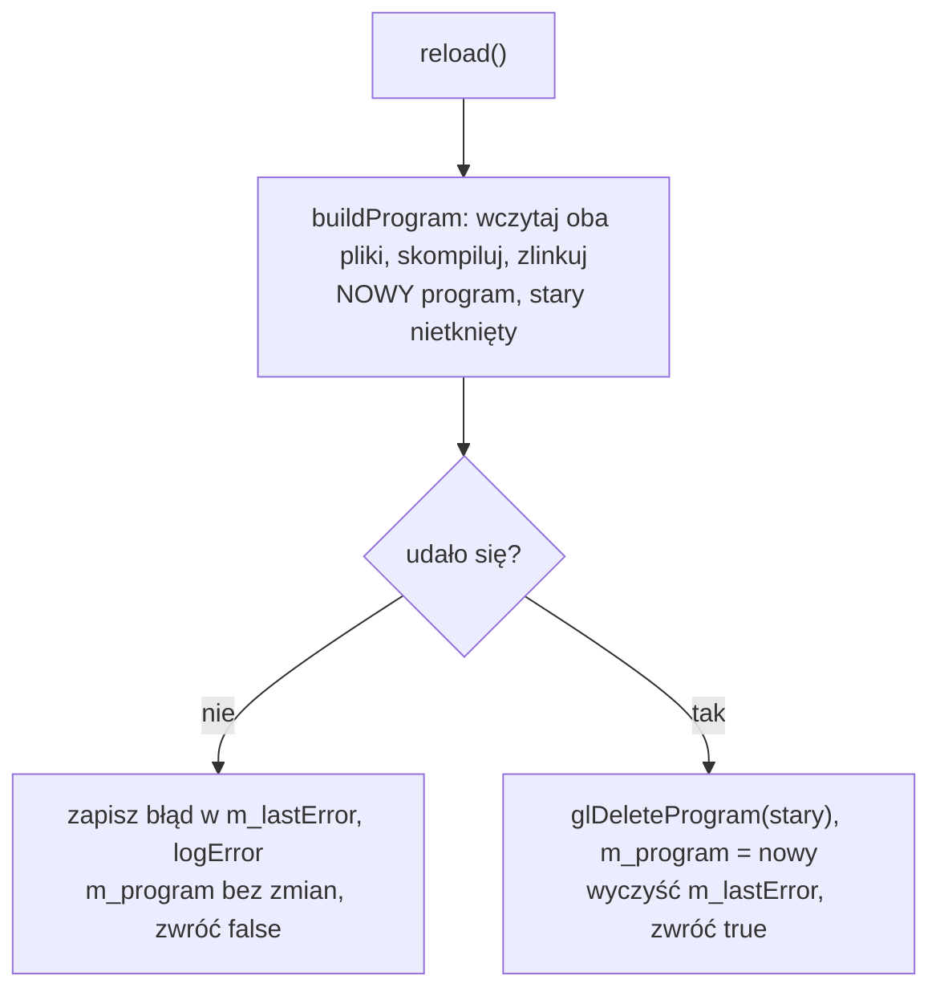
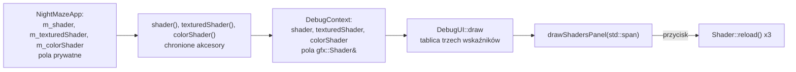
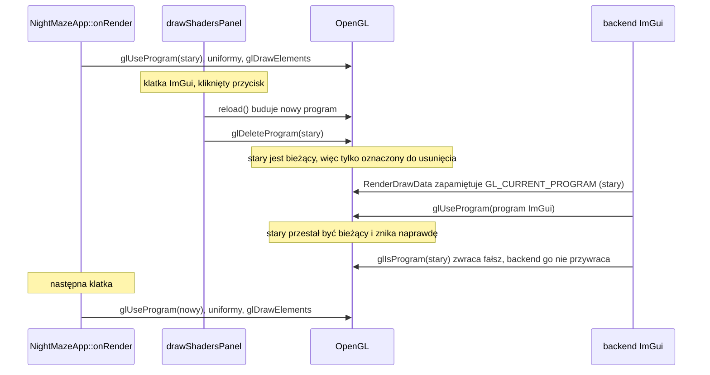

# Moduł gfx: wczytywanie shaderów na żywo

Kamień milowy: M1, panel rozszerzony do trzech programów w M2 + M3. Temat wykładu: 2 (Programowalny potok).
Kod: funkcja `reload` w [`src/gfx/Shader.hpp`](../../../src/gfx/Shader.hpp) i [`src/gfx/Shader.cpp`](../../../src/gfx/Shader.cpp), panel w [`src/debug/panels/ShadersPanel.hpp`](../../../src/debug/panels/ShadersPanel.hpp) i [`src/debug/panels/ShadersPanel.cpp`](../../../src/debug/panels/ShadersPanel.cpp), shadery w [`assets/shaders/`](../../../assets/shaders/) (trzy pary: `basic`, `textured`, `color`), użycie w [`src/game/NightMazeApp.hpp`](../../../src/game/NightMazeApp.hpp) i [`src/main.cpp`](../../../src/main.cpp).

Część modułu `gfx`. Wstęp do całego modułu jest w [`README.md`](README.md). Ten dokument jest dalszym ciągiem [`shaders.md`](shaders.md) (potok, GLSL, shadery `basic.*`) i [`shader-class.md`](shader-class.md) (kompilacja, linkowanie i reszta klasy `gfx::Shader`). Tutaj jest podmiana programu w działającej aplikacji i panel "Shaders". Trzecia część tematu, uniformy, jest w [`uniforms.md`](uniforms.md). Jak nakładka z panelami jest wpięta w program, opisuje [`../debug-ui.md`](../debug-ui.md), a skąd program bierze pliki z `assets/`, [`../core/paths.md`](../core/paths.md).

## 1. Po co to jest

Shader pisze się metodą prób: zmieniam jedną linię i patrzę na obraz. Gdyby każda próba wymagała zamknięcia programu i uruchomienia go od nowa, nauka GLSL trwałaby kilka razy dłużej. Shadery projektu są plikami na dysku, czytanymi w czasie działania (zasada z PRD: "Shadery jako pliki"), więc program może wczytać je ponownie bez kompilacji C++ i bez zamykania okna.

Odpowiadają za to dwa elementy:

| Element | Co daje |
|---|---|
| `Shader::reload()` | buduje nowy program z tych samych dwóch plików i podmienia stary tylko przy sukcesie. Literówka w shaderze nie zamienia obrazu w czarny ekran, bo stary program działa dalej |
| panel **Shaders** z przyciskiem "Reload shaders" | woła `reload()` na żądanie dla **wszystkich trzech** programów gry i pokazuje wynik każdego: nazwy plików, stan programu i tekst ostatniego błędu sterownika |

Program nie obserwuje dysku: przeładowanie następuje wtedy, gdy nacisnę przycisk. To jest też pokaz tematu 2 na obronie (sekcja 6.4).

## 2. Teoria

**Wczytywanie na żywo** (hot reload) to podmiana shadera w działającym programie: zmieniam plik `.frag` w edytorze, zapisuję, każę programowi wczytać shadery ponownie i od następnej klatki widzę efekt, bez zamykania okna i bez kompilacji C++. Przy nauce shaderów to największe przyspieszenie pracy, jakie można mieć.

Żeby to było bezpieczne, podmiana musi być **wszystko albo nic**. Shader w trakcie edycji bardzo często się nie kompiluje. Gdybym najpierw usunął stary program, a potem próbował zbudować nowy, każda literówka kończyłaby się czarnym ekranem. Dlatego kolejność jest odwrotna: najpierw buduję nowy program obok starego, a stary usuwam dopiero wtedy, gdy nowy na pewno działa.



## 3. Jak to działa w OpenGL

Przeładowanie nie ma własnych funkcji OpenGL. `reload()` wykonuje ten sam ciąg wywołań co pierwsze wczytanie, od `glCreateShader` do `glDeleteShader` ([`shader-class.md`](shader-class.md), sekcja 3.1, kroki od 1 do 13), a potem usuwa stary program przez `glDeleteProgram`. O tym, że podmiana jest bezpieczna, decydują cztery własności:

| Wywołanie | Własność, na której polega przeładowanie |
|---|---|
| `glDeleteProgram(0)` | jest ignorowane bez błędu, więc pierwsze wczytanie (bez starego programu) nie wymaga osobnej gałęzi |
| `glDeleteProgram(program)` dla programu bieżącego | nie usuwa go od razu, tylko oznacza do usunięcia. Program znika, gdy przestanie być bieżący (pułapka 1) |
| `glUseProgram(program)` | wybiera program dla następnych wywołań rysujących. Gra woła je co klatkę, więc nowy identyfikator zaczyna działać od następnej klatki |
| `glIsProgram(program)` | mówi, czy identyfikator jest nazwą istniejącego programu. Mój kod tej funkcji nie woła, używa jej backend ImGui (sekcja 6.3) |

Błąd kompilacji albo linkowania nowego programu nie jest błędem OpenGL: `glGetError` go nie zgłosi, a jedyną informacją jest status i dziennik sterownika ([`shader-class.md`](shader-class.md), sekcja 3.3).

## 4. Shadery

Ten temat nie ma własnych shaderów. Przeładowywane są wszystkie trzy pary projektu:

| Para | Co rysuje | Pole w `NightMazeApp` | Dokument |
|---|---|---|---|
| `basic.vert`, `basic.frag` | kostkę nad narożną komórką labiryntu | `m_shader` | [`shaders.md`](shaders.md), sekcja 4 |
| `textured.vert`, `textured.frag` | labirynt: ściany, słupki, podłogę | `m_texturedShader` | [`textures.md`](textures.md), sekcja 4 |
| `color.vert`, `color.frag` | linie pudełek kolizji | `m_colorShader` | [`../scene/collision.md`](../scene/collision.md), sekcja 4 |

Pokaz na obronie (sekcja 6.4) zmienia jedną linię w `textured.frag`, bo labirynt wypełnia cały ekran, a kostkę widać dopiero z góry.

## 5. Kod w projekcie

### 5.1 Pliki

| Plik | Co zawiera |
|---|---|
| [`src/gfx/Shader.hpp`](../../../src/gfx/Shader.hpp), [`.cpp`](../../../src/gfx/Shader.cpp) | funkcja `reload` klasy `gfx::Shader` (sekcja 5.2) oraz `isValid` i `lastError`, którymi panel czyta jej wynik. Reszta klasy: [`shader-class.md`](shader-class.md), sekcja 5 |
| [`src/debug/panels/ShadersPanel.hpp`](../../../src/debug/panels/ShadersPanel.hpp), [`.cpp`](../../../src/debug/panels/ShadersPanel.cpp) | funkcja `debug::drawShadersPanel`: panel "Shaders" z przyciskiem "Reload shaders" (sekcja 6.1). Należy do programu `night_maze`, nie do biblioteki `engine` |
| [`src/game/NightMazeApp.hpp`](../../../src/game/NightMazeApp.hpp) | chronione akcesory `shader()`, `texturedShader()` i `colorShader()`, przez które trzy obiekty trafiają do panelu (sekcja 6.2) |
| [`src/debug/DebugContext.hpp`](../../../src/debug/DebugContext.hpp), [`src/main.cpp`](../../../src/main.cpp) | pola `shader`, `texturedShader` i `colorShader` struktury `DebugContext` i linie, które je wypełniają (sekcja 6.2) |
| [`src/debug/DebugUI.cpp`](../../../src/debug/DebugUI.cpp) | tablica trzech wskaźników przekazywana do panelu (sekcja 6.2) |

`reload()` wołają dwa miejsca: konstruktor `Shader` przy pierwszym wczytaniu ([`shader-class.md`](shader-class.md), sekcja 5.8) i panel "Shaders" po naciśnięciu przycisku.

### 5.2 `Shader::reload`: nowy program obok starego

Funkcja pomocnicza `buildProgram`, która wczytuje oba pliki, kompiluje je i linkuje, jest opisana w [`shader-class.md`](shader-class.md) (sekcja 5.7). Zwraca identyfikator nowego programu albo 0 z komunikatem w `error` i przy żadnym wyjściu nie zostawia po sobie obiektów OpenGL. `reload()` dokłada do niej decyzję, co zrobić ze starym programem:

```cpp
bool Shader::reload() {
    // Build the new program completely before touching the one in use.
    std::string error;
    const GLuint program = buildProgram(m_vertexPath, m_fragmentPath, error);
    if (program == 0) {
        // m_program is not changed: the previous program, if there is one, keeps working.
        m_lastError = error;
        core::logError(m_lastError);
        return false;
    }

    // Only now replace the old program (glDeleteProgram(0) is ignored on the first load).
    GL_CHECK(glDeleteProgram(m_program));
    m_program = program;
    m_lastError.clear();
    return true;
}
```

| Fragment | Co robi i dlaczego |
|---|---|
| `const GLuint program = buildProgram(...)` | Nowy program powstaje w zmiennej **lokalnej**. `m_program` do tej chwili nie zostało dotknięte |
| `if (program == 0)` | Niepowodzenie na którymkolwiek etapie. Wszystkie nowe obiekty zostały już usunięte przez funkcje pomocnicze |
| `m_lastError = error;` i `core::logError(m_lastError);` | Ten sam tekst idzie w dwa miejsca: do pola (dla panelu debug) i do konsoli jako linia `[error] ...` |
| `return false;` bez zmiany `m_program` | **Stary program działa dalej.** Po nieudanym `reload()` obiekt jest w tym samym stanie co przedtem, tylko z ustawionym `lastError()` |
| `GL_CHECK(glDeleteProgram(m_program));` | Dopiero po sukcesie usuwam stary program. Przy pierwszym wczytaniu `m_program` to 0 i OpenGL takie wywołanie ignoruje |
| `m_lastError.clear();` | Po udanym wczytaniu nie ma błędu do pokazania |

Możliwe stany obiektu:

| Sytuacja | `isValid()` | `lastError()` |
|---|---|---|
| konstruktor, pliki poprawne | `true` | pusty |
| konstruktor, błąd w pliku | `false` | komunikat |
| udany `reload()` | `true` | pusty |
| nieudany `reload()` po wcześniejszym sukcesie | `true` (stary program) | komunikat |
| obiekt, z którego przeniesiono | `false` | nieokreślony (zwykle pusty) |

Czwarty wiersz jest wart zapamiętania: `isValid()` i pusty `lastError()` to **dwa różne pytania**. Pierwsze mówi "czy jest czym rysować", drugie "czy ostatnie wczytanie się udało".

### 5.3 Jak to zostało sprawdzone

Samą funkcję `reload()` sprawdził test klasy opisany w [`shader-class.md`](shader-class.md) (sekcja 5.10): po zepsuciu pliku zwraca `false`, a bieżący program ma ten sam identyfikator co przed próbą. Po naprawieniu pliku zwraca `true`, a program dostaje nowy identyfikator.

**Panel Shaders (wersja z trójkątem i jednym programem).** Przycisku nie da się kliknąć z automatu w prawdziwym programie, więc ścieżkę kodu panelu sprawdziłem na Macu osobnym programem testowym poza repozytorium, gdy program rysował jeszcze trójkąt bez macierzy, a panel obsługiwał jeden program. `Shader::reload` od tamtej pory się nie zmieniło. **Kod panelu się zmienił** (sekcja 6.1): dziś przyjmuje listę programów i przeładowuje je w pętli, a tej wersji ten test nie obejmuje. Ukryte okno GLFW, ImGui zainicjalizowane tymi samymi wywołaniami co w `DebugUI`, prawdziwe `drawShadersPanel` z `ShadersPanel.cpp`, a w każdej klatce ta sama kolejność co w ówczesnym programie: `use()`, `bind()`, `glDrawArrays`, potem klatka ImGui z panelem i `RenderDrawData`. Kliknięcie było wstrzyknięte do ImGui jako zdarzenia myszy (`ImGuiIO::AddMousePosEvent`, `AddMouseButtonEvent`), a pliki shaderów były kopią w katalogu tymczasowym.

| Próba | Wynik |
|---|---|
| zapisanie zmienionego `basic.frag` bez kliknięcia | ten sam identyfikator programu, obraz bez zmian |
| kolor zmieniony na `vec4(1.0, 0.5, 0.0, 1.0)`, kliknięcie | nowy identyfikator programu po `use()`, `glIsProgram(stary)` fałsz, `lastError()` pusty, piksel wewnątrz trójkąta z `glReadPixels`: (255, 128, 0) zamiast (64, 128, 64) |
| usunięty średnik w tej linii, kliknięcie | ten sam identyfikator programu co przed kliknięciem, `isValid()` prawda, `lastError()` z tekstem jak niżej, piksel nadal pomarańczowy, panel rysuje więcej tekstu (1200 wierzchołków zamiast 356) |
| plik przywrócony, kliknięcie | nowy identyfikator, poprzedni usunięty, `lastError()` pusty, kolory interpolowane wróciły, panel rysuje tyle tekstu co na początku |
| `glGetError` po scenie i po `RenderDrawData`, w każdej klatce testu | `GL_NO_ERROR` |

```text
[error] Shader compilation failed: <katalog testu>/shaders/basic.frag
ERROR: 0:15: '}' : syntax error: syntax error
```

Test nie obejmuje `DebugUI::draw` ani `main.cpp` (te sprawdza kompilacja i uruchomienie programu: start bez linii `[error]`), nie sprawdza wyglądu panelu (kolor tekstu błędu, zawijanie, podpowiedź z pełną ścieżką) i nie zastępuje kliknięcia prawdziwą myszą w prawdziwym oknie. To zostaje do sprawdzenia ręcznego (sekcja 6.4).

**Panel z trzema programami (M2 + M3).** Na Windowsie (MSVC 19.44, 2026-10-05) nowy kod panelu kompiluje się bez ostrzeżeń w konfiguracjach Debug i Release, a gra startuje bez linii `[error]`, czyli wszystkie trzy programy wczytują się przy starcie. **Przycisku `Reload shaders` z trzema programami nikt jeszcze nie nacisnął**, ani na Windowsie, ani na macOS. To otwarta pozycja listy kontrolnej w [`../../guides/build-windows.md`](../../guides/build-windows.md). Na macOS ta wersja panelu nie była nawet kompilowana.

## 6. Panel ImGui

Panel **Shaders** (kod: [`ShadersPanel.cpp`](../../../src/debug/panels/ShadersPanel.cpp)) jest pokazem tematu 2 na obronie: przycisk "Reload shaders" wczytuje shadery ponownie w działającym programie. Panel ma **jeden przycisk dla wszystkich programów** i pod nim osobny blok dla każdego programu z listy. Lista ma dziś trzy pozycje, w tej kolejności: `basic` (pole `m_shader`), `textured` (`m_texturedShader`) i `color` (`m_colorShader`). Jak nakładka z panelami jest wpięta w program, opisuje [`../debug-ui.md`](../debug-ui.md).

| Element | Rodzaj | Skąd wartość | Czego uczy |
|---|---|---|---|
| `Reload shaders` | przycisk, jeden na cały panel | woła `reload()` dla każdego programu z listy | Wczytywanie na żywo (sekcja 2): pliki są czytane, kompilowane i linkowane od nowa, bez zamykania okna i bez kompilacji C++ |
| `Vertex: basic.vert`, `Fragment: basic.frag` (i tak samo `textured.*`, `color.*`) | odczyt, w każdym bloku | `vertexPath()` i `fragmentPath()`, zamienione na tekst przez `core::pathText` | Program powstaje z dwóch plików, po jednym na etap. Po najechaniu kursorem na linię pojawia się podpowiedź (tooltip) z pełną ścieżką: widać w niej, że program czyta pliki z katalogu `assets` obok pliku wykonywalnego |
| `Program: valid` albo `Program: not valid` | odczyt, w każdym bloku | `isValid()` | Czy jest zlinkowany program, którym można rysować. Po nieudanym przeładowaniu zostaje `valid`, bo działa poprzedni program |
| `Last load: OK` albo `Last load: failed` i czerwony tekst pod spodem | odczyt, w każdym bloku | `lastError()` | Błąd kompilacji GLSL nie jest błędem OpenGL ([`shader-class.md`](shader-class.md), sekcja 3.3): jedyną informacją jest tekst sterownika, który klasa zapamiętała. Ten sam tekst jest w konsoli jako linia `[error]` |

Dwie ostatnie linie bloku odpowiadają na dwa różne pytania (tabela stanów w sekcji 5.2). `Program: valid` razem z czerwonym błędem to nie sprzeczność, tylko dokładnie ten stan, dla którego `reload()` zostało tak napisane: nowe pliki się nie kompilują, a obraz rysuje poprzedni program.

### 6.1 Kod panelu

Stałe w anonimowej przestrzeni nazw [`ShadersPanel.cpp`](../../../src/debug/panels/ShadersPanel.cpp):

```cpp
// Where the panel appears and how big it is the first time the program runs (later ImGui
// remembers it in imgui.ini): the bottom of the left edge of a 1280 x 720 window.
constexpr ImVec2 FIRST_POSITION{10.0F, 520.0F};
constexpr ImVec2 FIRST_SIZE{300.0F, 190.0F};

// Text color of a failed load (red, green, blue, alpha): a light red that stands out from
// the white text of the rest of the panel.
constexpr ImVec4 ERROR_TEXT_COLOR{1.0F, 0.4F, 0.4F, 1.0F};
```

Funkcja pomocnicza w tej samej przestrzeni nazw, która rysuje blok jednego programu:

```cpp
// The lines of one program: its two files, whether it can be drawn with and how its last
// load went.
void drawShaderStatus(const gfx::Shader& shader) {
    // The label shows only the file name. The full path appears as a tooltip when the
    // mouse rests on the line. ImGui expects UTF-8, which core::pathText returns.
    const std::string vertexFile = core::pathText(shader.vertexPath().filename());
    const std::string vertexFullPath = core::pathText(shader.vertexPath());
    ImGui::Text("Vertex: %s", vertexFile.c_str());
    ImGui::SetItemTooltip("%s", vertexFullPath.c_str());

    const std::string fragmentFile = core::pathText(shader.fragmentPath().filename());
    const std::string fragmentFullPath = core::pathText(shader.fragmentPath());
    ImGui::Text("Fragment: %s", fragmentFile.c_str());
    ImGui::SetItemTooltip("%s", fragmentFullPath.c_str());

    // Valid means that there is a linked program to draw with. After a failed reload
    // it is still the previous program.
    ImGui::Text("Program: %s", shader.isValid() ? "valid" : "not valid");

    if (shader.lastError().empty()) {
        ImGui::TextUnformatted("Last load: OK");
    } else {
        ImGui::TextUnformatted("Last load: failed");
        // The message contains text written by the driver, so it goes in as an
        // argument of "%s" and never as the format string itself.
        ImGui::PushStyleColor(ImGuiCol_Text, ERROR_TEXT_COLOR);
        ImGui::TextWrapped("%s", shader.lastError().c_str());
        ImGui::PopStyleColor();
    }
}
```

I sama funkcja panelu:

```cpp
void drawShadersPanel(std::span<gfx::Shader* const> shaders) {
    ImGui::SetNextWindowPos(FIRST_POSITION, ImGuiCond_FirstUseEver);
    ImGui::SetNextWindowSize(FIRST_SIZE, ImGuiCond_FirstUseEver);
    if (ImGui::Begin("Shaders")) {
        // Button returns true only in the frame in which it was clicked. One button
        // reloads every program: after editing a file there is no need to know which
        // program it belongs to. The results of reload() are not needed here: the lines
        // below read them from lastError(). A program whose reload fails keeps working
        // with its previous version, and the others are reloaded all the same.
        if (ImGui::Button("Reload shaders")) {
            for (gfx::Shader* shader : shaders) {
                shader->reload();
            }
        }

        for (const gfx::Shader* shader : shaders) {
            ImGui::Separator();
            drawShaderStatus(*shader);
        }
    }
    ImGui::End();
}
```

**Sygnatura i pętle:**

| Fragment | Co robi i dlaczego |
|---|---|
| `std::span<gfx::Shader* const> shaders` | `std::span` (C++20) to widok na ciąg elementów leżących obok siebie: wskaźnik i liczba elementów, bez kopiowania. Elementem jest `gfx::Shader* const`, czyli **stały wskaźnik na niestały obiekt**: panel nie może podmienić wskaźników na liście, ale może wołać `reload()`, które zmienia obiekt. `const gfx::Shader*` znaczyłoby coś odwrotnego i `reload()` by się nie skompilowało |
| lista wskaźników, a nie referencji | referencja nie może być elementem tablicy ani `std::span`, więc lista trzyma adresy. Umowa z nagłówka: żaden wskaźnik nie jest pusty. Funkcja tego nie sprawdza (pułapka 8) |
| `ImGui::SetNextWindowPos(FIRST_POSITION, ImGuiCond_FirstUseEver)` i `SetNextWindowSize(...)` | położenie i rozmiar panelu przy pierwszym uruchomieniu: lewy dolny róg okna 1280 x 720, pod panelem Camera. `ImGuiCond_FirstUseEver` znaczy, że wywołanie liczy się tylko wtedy, gdy w `imgui.ini` nie ma jeszcze wpisu dla tego panelu. Potem o położeniu decyduje użytkownik ([`../debug-ui.md`](../debug-ui.md)) |
| `if (ImGui::Button("Reload shaders"))` | tryb natychmiastowy: `Button` rysuje przycisk i zwraca `true` tylko w tej klatce, w której został kliknięty. Nie ma callbacka ani zdarzenia ([`../../libraries/imgui.md`](../../libraries/imgui.md)) |
| `for (gfx::Shader* shader : shaders) { shader->reload(); }` | przeładowanie **wszystkich** programów po kolei. Wynik `reload()` (`bool`) jest ignorowany: te same informacje są w `lastError()` i `isValid()`, które pętla niżej czyta już po przeładowaniu, jeszcze w tej samej klatce. Nieudane przeładowanie jednego programu nie przerywa pętli |
| `for (const gfx::Shader* shader : shaders)` | druga pętla tylko czyta, więc jej zmienna wskazuje na obiekt stały, a `drawShaderStatus` przyjmuje `const gfx::Shader&` |
| `ImGui::Separator();` | pozioma kreska przed każdym blokiem, także przed pierwszym: oddziela go od przycisku |
| `drawShaderStatus(*shader);` | `*shader` zamienia wskaźnik z powrotem na referencję |

Panel pierwotnie (M1) pokazywał jeden program i przyjmował `gfx::Shader& shader`. Przy trzech programach zamiast trzech parametrów dostał listę: kolejny program to jeden element więcej w tablicy budowanej w `DebugUI::draw` (sekcja 6.2) i żadna zmiana w panelu.

**Blok jednego programu (`drawShaderStatus`):**

| Fragment | Co robi i dlaczego |
|---|---|
| `const gfx::Shader& shader` | funkcja tylko czyta, więc dostaje referencję do stałej. Z samej sygnatury widać, że niczego nie przeładowuje |
| `shader.vertexPath().filename()` | `filename()` zwraca ostatni element ścieżki jako nowy obiekt `path`: z `<repo>/build/debug/assets/shaders/textured.vert` zostaje `textured.vert` |
| `core::pathText(...)` | Zamiana `path` na tekst w UTF-8 ([`../core/paths.md`](../core/paths.md), sekcja 5.7). Panel nie woła `path::string()`, które na Windowsie potrafi rzucić wyjątek |
| `const std::string vertexFile = ...` | Wynik `pathText` zapisuję w nazwanej zmiennej, żeby linia z `ImGui::Text` była krótka i czytelna. `%s` chce napisu C, stąd `.c_str()` |
| `ImGui::SetItemTooltip("%s", ...)` | Dotyczy **poprzedniego** widżetu, czyli linii z nazwą pliku. Podpowiedź pojawia się, gdy kursor chwilę nad nią stoi |
| `shader.isValid() ? "valid" : "not valid"` | Operator warunkowy wybiera jeden z dwóch literałów. Oba są stałymi napisami C, więc pasują do `%s` |
| `ImGui::TextUnformatted("Last load: OK")` | Stały tekst bez znaczników `%`. `TextUnformatted` wypisuje napis dokładnie tak, jak go dostał |
| `PushStyleColor(ImGuiCol_Text, ERROR_TEXT_COLOR)` i `PopStyleColor()` | Zmiana koloru tekstu dla widżetów między tymi dwiema liniami. Każde `Push` musi mieć swoje `Pop`, inaczej kolor zostałby na resztę klatki, a ImGui zgłasza niedopasowanie jako błąd. Kolor jest nazwaną stałą, a nie czterema liczbami w środku wywołania |
| `ImGui::TextWrapped("%s", shader.lastError().c_str())` | Komunikat ma kilka linii i długą ścieżkę, więc jest zawijany do szerokości panelu. `"%s"` jest tu konieczne (niżej) |

**Dlaczego `"%s"`, a nie sam napis.** `ImGui::Text` i `ImGui::TextWrapped` działają jak `printf`: pierwszy argument to **napis formatujący**, w którym znak `%` rozpoczyna znacznik. Tekst błędu pochodzi od sterownika karty i może zawierać znak `%` (na przykład w nazwie albo w komunikacie). Podany jako napis formatujący kazałby funkcji czytać argumenty, których nie ma, co jest niezdefiniowanym zachowaniem. Podany jako argument dla `"%s"` jest tylko kopiowany. Kompilator też tego pilnuje: `ImGui::TextWrapped(shader.lastError().c_str())` daje w clang ostrzeżenie `format string is not a string literal (potentially insecure)`.

**Rozmiar panelu.** Jeden blok to cztery linie tekstu i kreska. Trzy bloki z przyciskiem nie mieszczą się w 190 pikselach wysokości z `FIRST_SIZE`, więc przy pierwszym uruchomieniu część panelu jest poniżej jego dolnej krawędzi: trzeba go przewinąć albo powiększyć. To wniosek z liczby linii, nie obserwacja z ekranu.

Panel trzyma się zasad wszystkich paneli ([`../debug-ui.md`](../debug-ui.md)): jest wolną funkcją bez stanu, nie ma zmiennych globalnych ani `static`, i sam nie woła żadnej funkcji `gl*`. Wywołania OpenGL wykonuje `Shader::reload`, panel tylko o nie prosi.

### 6.2 Jak shadery trafiają do panelu

`debug/` nie sięga po pola gry samo. Referencje idą tą samą drogą co kolor tła ([`../debug-ui.md`](../debug-ui.md)), a na ostatnim odcinku zamieniają się w listę wskaźników:



Akcesory w [`NightMazeApp.hpp`](../../../src/game/NightMazeApp.hpp):

```cpp
    /// Shader program of the cube, exposed so the debug UI can reload it live.
    gfx::Shader& shader() { return m_shader; }

    /// Shader program of the maze (textured models), exposed for the same reason.
    gfx::Shader& texturedShader() { return m_texturedShader; }

    /// Shader program of the collision box lines, exposed for the same reason.
    gfx::Shader& colorShader() { return m_colorShader; }
```

Pola w [`DebugContext.hpp`](../../../src/debug/DebugContext.hpp). Nie stoją obok siebie: między pierwszym a dwoma pozostałymi są pola kamery i czułości myszy.

```cpp
    /// Shader program of the marker cube, editable: the Shaders panel reloads it.
    gfx::Shader& shader;
```

```cpp
    /// Shader program of the maze (textured models), editable: reloaded like shader.
    gfx::Shader& texturedShader;
    /// Shader program of the collision box lines, editable: reloaded like shader.
    gfx::Shader& colorShader;
```

Linie w `DebugNightMazeApp::onRender` w [`main.cpp`](../../../src/main.cpp):

```cpp
            .shader = shader(),
```

```cpp
            .texturedShader = texturedShader(),
            .colorShader = colorShader(),
```

I wywołanie w `DebugUI::draw` w [`DebugUI.cpp`](../../../src/debug/DebugUI.cpp):

```cpp
        // The Shaders panel takes a list, so that a new program is one more entry here
        // and no change in the panel. The array holds pointers, because a reference
        // cannot be an element of an array.
        constexpr int SHADER_COUNT = 3;
        const std::array<gfx::Shader*, SHADER_COUNT> shaders = {
            &context.shader, &context.texturedShader, &context.colorShader};
        drawShadersPanel(shaders);
```

| Fragment | Co robi i dlaczego |
|---|---|
| `constexpr int SHADER_COUNT = 3;` | rozmiar tablicy jako nazwana stała. `std::array` potrzebuje rozmiaru znanego w czasie kompilacji |
| `const std::array<gfx::Shader*, SHADER_COUNT> shaders` | tablica na stosie, tworzona co klatkę. Trzy wskaźniki to 24 bajty, więc koszt jest pomijalny. `const` przy tablicy sprawia, że jej elementy są stałymi wskaźnikami: stąd typ `gfx::Shader* const` w sygnaturze panelu |
| `&context.shader` | adres obiektu, do którego odnosi się referencja. Operator `&` zastosowany do referencji daje adres oryginału, czyli pola `m_shader` w `NightMazeApp` |
| `drawShadersPanel(shaders);` | `std::array` zamienia się na `std::span` sama: widok dostaje wskaźnik na pierwszy element i liczbę 3. Tablica żyje do końca `draw`, czyli dłużej niż wywołanie panelu |

Kolejność elementów tablicy to kolejność bloków w panelu: `basic`, `textured`, `color`.

Gra nadal nie dołącza niczego z `debug/`: udostępnia chronione akcesory i nie wie, kto z nich skorzysta. `DebugContext.hpp` i `ShadersPanel.hpp` nie dołączają `gfx/Shader.hpp`, wystarcza im deklaracja wyprzedzająca `class Shader;`, bo używają typu tylko przez referencję albo wskaźnik. `ShadersPanel.hpp` dołącza za to `<span>`. Pełny nagłówek `gfx/Shader.hpp` dołącza `ShadersPanel.cpp`, które woła funkcje klasy.

### 6.3 Przeładowanie w środku klatki ImGui

Przycisk jest widżetem, więc `reload()` wykonuje się **wewnątrz** klatki ImGui: po `ImGui::NewFrame()`, a przed `ImGui::Render()` i `ImGui_ImplOpenGL3_RenderDrawData(...)`. To wywołania OpenGL w miejscu, w którym reszta kodu paneli żadnych nie robi. Sprawdziłem w źródle backendu (`imgui_impl_opengl3.cpp`, ImGui 1.92.9b), że nie przeszkadza to ani ImGui, ani grze:



Diagram pokazuje jeden program: ten, który był bieżący w chwili kliknięcia. Gra wybiera w klatce po kolei program `textured` (labirynt), `basic` (kostka) i, gdy rysowanie pudełek kolizji jest włączone, `color`. Bieżący zostaje więc ostatni z nich: `basic` albo `color`. Dwa pozostałe programy nie są w chwili kliknięcia bieżące, więc ich `glDeleteProgram` usuwa je od razu, bez etapu "oznaczony do usunięcia". To wniosek z kolejności wywołań w `NightMazeApp::onRender` i z własności `glDeleteProgram` (sekcja 3), nie pomiar.

1. **Między `NewFrame` a `Render` ImGui nie woła OpenGL.** Widżety tylko dopisują geometrię do list w pamięci. `ImGui_ImplOpenGL3_NewFrame()` wykonało się wcześniej, a rysowanie następuje dopiero w `RenderDrawData`. `reload()` nie trafia więc w środek żadnej operacji backendu.
2. **`reload()` nie zmienia stanu, na którym polega backend.** Tworzy obiekty shaderów i program, kompiluje, linkuje i usuwa ([`shader-class.md`](shader-class.md), sekcja 3.1). Nie woła `glUseProgram`, nie wiąże buforów, tekstur ani VAO. Trzy wywołania pod rząd niczego tu nie zmieniają.
3. **Backend ustawia własny stan od zera.** `RenderDrawData` zapamiętuje bieżący stan, potem samo woła `glUseProgram` dla swojego programu, wiąże swoje VAO i bufory. Nie zakłada, że ktoś zostawił mu poprawny program.
4. **Backend jest przygotowany na usunięty program.** Po udanym przeładowaniu stary program jest jeszcze bieżący (gra ustawiła go w tej klatce), więc `glDeleteProgram` tylko oznacza go do usunięcia (sekcja 7, pułapka 1). Backend zapamiętuje go jako "poprzedni program", przełącza się na własny i w tej chwili stary program znika naprawdę. Na końcu backend przywraca poprzedni program tylko wtedy, gdy ten jeszcze istnieje. W źródle jest to linia `if (last_program == 0 || glIsProgram(last_program)) glUseProgram(last_program);` z komentarzem, że bez tego sprawdzenia przywrócenie programu oczekującego na usunięcie dałoby błąd OpenGL.
5. **Który program jest bieżący po klatce.** Zależy to od tego, czy program gry przetrwał klatkę. W źródle backendu `RenderDrawData` zapamiętuje `GL_CURRENT_PROGRAM`, w `ImGui_ImplOpenGL3_SetupRenderState` woła `glUseProgram` dla własnego programu (zawsze, także gdy nie ma żadnego panelu do narysowania), a na końcu wykonuje linię z punktu 4. Wynikają z tego trzy przypadki:

   | Klatka | Co robi backend na końcu | Bieżący program po klatce |
   |---|---|---|
   | zwykła (bez przeładowania albo z nieudanym) | zapamiętany program gry istnieje, więc `glIsProgram` zwraca prawdę i backend go **przywraca** | program gry, ten sam co przed rysowaniem paneli |
   | z udanym przeładowaniem | zapamiętany stary program został usunięty w chwili przełączenia na program ImGui, `glIsProgram` zwraca fałsz, backend **niczego nie przywraca** | program ImGui |
   | okno o zerowym rozmiarze (zminimalizowane) | `RenderDrawData` wraca na samym początku, zanim cokolwiek zapamięta albo ustawi | bez zmian: backend w takiej klatce nie dotyka stanu OpenGL |

   Żaden z tych przypadków nie szkodzi grze, bo gra nie polega na tym, co zostało po poprzedniej klatce. W następnej klatce każda z trzech funkcji rysujących (`drawMaze`, `drawCube`, `drawColliderLines`) woła `use()` swojego programu przed ustawieniem uniformów i przed rysowaniem, a `use()` i settery czytają aktualne `m_program`, czyli już nowy identyfikator. Nowe programy zaczynają z wyzerowanymi uniformami, ale wszystkie uniformy są wysyłane co klatkę ([`uniforms.md`](uniforms.md), sekcja 5.2), więc dostają je przed pierwszym rysowaniem. Nikt poza klasą `Shader` nie przechowuje identyfikatora programu.

Przy nieudanym przeładowaniu nic z tego nie zachodzi: `m_program` się nie zmienia, żaden używany program nie jest usuwany, a backend przywraca ten sam program co zwykle.

Punkty 4 i 5 potwierdził test z sekcji 5.3, dla jednego programu: po kliknięciu `glIsProgram` dla starego identyfikatora zwraca fałsz, a `glGetError` po żadnej klatce nie zgłasza błędu. Dla trzech programów przeładowywanych jednym kliknięciem tego testu nie powtórzyłem.

### 6.4 Pokaz na obronie krok po kroku

Wersja dla macOS, gdzie `build/debug/assets` jest dowiązaniem do katalogu w repozytorium. Różnica na Windowsie jest w sekcji 6.5. **Tego scenariusza w wersji z trzema programami nikt jeszcze nie wykonał ręcznie**, ani na macOS, ani na Windowsie: opisane skutki wynikają z kodu panelu, z `Shader::reload` i z shadera `textured.frag`. Wersję z M1 (jeden program, zmiana w `basic.frag`) sprawdził test z sekcji 5.3.

1. Uruchom program (`make run`). W panelu Shaders są trzy bloki: `Vertex: basic.vert` i `Fragment: basic.frag`, potem `textured.vert` i `textured.frag`, potem `color.vert` i `color.frag`. W każdym `Program: valid` i `Last load: OK`. Najedź kursorem na linię `Fragment: textured.frag`, żeby pokazać pełną ścieżkę.
2. Nie zamykając programu, otwórz w edytorze [`assets/shaders/textured.frag`](../../../assets/shaders/textured.frag) i zamień linię `fragColor = vec4(texel * uTint, 1.0);` na `fragColor = vec4(texel * uTint * vec3(1.0, 0.5, 0.2), 1.0);`. Zapisz plik. **Obraz się nie zmienia**: program nie obserwuje dysku.
3. Naciśnij `Reload shaders`. Ściany, słupki i podłoga dostają pomarańczowy odcień: kanał zielony tekstury jest mnożony przez 0,5, a niebieski przez 0,2. We wszystkich trzech blokach zostaje `Last load: OK`. Kod C++ nie był kompilowany, okno nie było zamykane.
4. Wprowadź literówkę: usuń średnik na końcu zmienionej linii. Zapisz i naciśnij `Reload shaders`.
5. W bloku programu `textured` pojawia się `Last load: failed` i czerwony tekst: `Shader compilation failed: <ścieżka>/textured.frag`, a pod nim linia sterownika. Ten sam tekst jest w konsoli jako linia `[error]`. Linia `Program` tego bloku nadal pokazuje `valid`, a **labirynt jest nadal pomarańczowy**: rysuje go poprzedni program. Dwa pozostałe bloki pokazują `Last load: OK`, bo ich pliki są poprawne i zostały przeładowane mimo błędu w trzecim.
6. Przywróć plik do pierwotnej postaci (`git checkout assets/shaders`), naciśnij `Reload shaders`. Wraca `Last load: OK` i labirynt w kolorach tekstur.

Co przy tym mówię: krok 2 pokazuje, że shader jest plikiem czytanym w czasie działania (zasada "Shadery jako pliki"). Krok 3 to cały potok budowania programu z [`shader-class.md`](shader-class.md) (sekcja 3.1) wykonany na żądanie, trzy razy pod rząd. Labirynt nie znika ani na jedną klatkę, choć nowe programy mają wyzerowane uniformy: wszystkie uniformy, łącznie z numerem jednostki teksturującej dla samplera, są wysyłane co klatkę ([`uniforms.md`](uniforms.md), sekcja 5.2). Krok 5 pokazuje trzy rzeczy naraz: że błąd GLSL trzeba odczytać samemu z dziennika sterownika ([`shader-class.md`](shader-class.md), sekcja 3.3), że `reload()` jest operacją "wszystko albo nic" (sekcja 2) i że programy są od siebie niezależne. W M1 sterownik podał przy brakującym średniku numer **następnej** linii: tłumaczy to pułapka 7 w [`shader-class.md`](shader-class.md).

### 6.5 Różnica na Windowsie

Na Windowsie katalog `assets` obok programu jest **kopią**, a nie dowiązaniem ([`../core/paths.md`](../core/paths.md), sekcja 5.8). Przycisk czyta kopię, więc po zapisaniu pliku w `assets\shaders\` trzeba najpierw ją odświeżyć:

1. zapisz plik shadera w repozytorium,
2. w drugim terminalu wykonaj `cmake --build --preset debug --target copy_assets`,
3. naciśnij `Reload shaders`.

Krok 2 buduje tylko target `copy_assets`, który kopiuje katalog `assets` i nie dotyka programu. Zmierzone na Windowsie: przy działającym programie to polecenie kończy się kodem wyjścia 0 i odświeża kopię. Pełne `cmake --build --preset debug` w tej sytuacji **nie działa**: z generatorem Visual Studio kończy się błędem `LINK : fatal error LNK1168`, bo Windows blokuje plik `.exe` działającego programu, a MSBuild próbuje go zlinkować od nowa, także gdy żaden plik C++ się nie zmienił. Wcześniejsza wersja tego dokumentu przewidywała, że pełny build przejdzie. Pełny build też odświeża kopię, ale tylko przy zamkniętym programie.

Bez kroku 2 panel pokaże `Last load: OK`, a obraz się nie zmieni, bo program wczytał poprawnie stary plik. Podpowiedź z pełną ścieżką w panelu pokazuje, który plik jest czytany. Szczegóły, pomiary i wariant dla Visual Studio: [`../../guides/build-windows.md`](../../guides/build-windows.md), sekcja 7.

Stan na Windowsie (2026-10-05): panel jest skompilowany przez MSVC bez ostrzeżeń, a gra startuje bez linii `[error]`. Samego przycisku nikt tam jeszcze nie nacisnął: scenariusz z sekcji 6.4 (przeładowanie udane, nieudane z czerwonym tekstem, naprawa) i podpowiedź ze ścieżką są otwartymi punktami listy kontrolnej w [`../../guides/build-windows.md`](../../guides/build-windows.md). Postać linii sterownika NVIDIA przy błędzie składni znam z M1, z błędu w `basic.frag` na starcie programu: `0(15) : error C0000: syntax error, unexpected '}', expecting ',' or ';' at token "}"`. Dla `textured.frag` numer linii będzie inny.

## 7. Pułapki

1. **Usunięcie programu, który jest w użyciu.** `glDeleteProgram` dla bieżącego programu nie usuwa go od razu, tylko oznacza do usunięcia. Program znika, gdy przestanie być bieżący. Po udanym `reload()` stary program jest więc jeszcze "bieżący" do najbliższego `glUseProgram` z innym programem. W programie `night_maze` jest nim rysowanie paneli przez backend ImGui jeszcze w tej samej klatce, a w następnej `use()` ustawia nowy program (sekcja 6.3). Z trzech programów gry dotyczy to tylko tego, który był wybrany jako ostatni. W pętli gry `use()` jest wołane co klatkę, więc niczego nie trzeba robić. Błędem byłoby zapamiętać identyfikator programu poza klasą i używać go po `reload()`.
2. **Stary obraz po zmianie pliku.** Zapisanie pliku shadera samo niczego nie zmienia w działającym programie: `Shader` nie obserwuje dysku. Trzeba zawołać `reload()`, czyli nacisnąć `Reload shaders` w panelu Shaders (albo uruchomić program ponownie).
3. **Windows: program czyta kopię shaderów.** Na macOS katalog `assets` obok programu jest dowiązaniem do katalogu w repozytorium, więc program widzi plik zaraz po zapisaniu. Na Windowsie jest to **kopia**, robiona przez target `copy_assets`: po zmianie pliku w `assets\shaders\` trzeba najpierw ją odświeżyć (`cmake --build --preset debug --target copy_assets`), a dopiero potem nacisnąć `Reload shaders` ([`../../guides/build-windows.md`](../../guides/build-windows.md), sekcja 7). Pełne `cmake --build --preset debug` przy działającym programie kończy się tam błędem linkera `LNK1168` (sekcja 6.5). Objaw pominięcia kopiowania: panel pokazuje `Last load: OK`, a obraz się nie zmienia.
4. **Tekst sterownika jako napis formatujący.** `ImGui::TextWrapped(shader.lastError().c_str())` traktuje komunikat jak format `printf`: znak `%` w tekście sterownika kazałby funkcji czytać nieistniejące argumenty. Poprawnie: `ImGui::TextWrapped("%s", shader.lastError().c_str())` albo `ImGui::TextUnformatted` (sekcja 6.1).
5. **`Program: valid` i czerwony błąd jednocześnie.** To nie jest błąd panelu. `isValid()` mówi, czy jest czym rysować, a `lastError()`, czy ostatnie wczytanie się udało. Po nieudanym przeładowaniu oba są prawdziwe naraz: rysuje poprzedni program (sekcja 5.2).
6. **`Last load: OK`, a obraz bez zmian.** Program wczytał poprawnie plik, tylko nie ten, który przed chwilą zmieniłem. Na Windowsie to nieodświeżona kopia `assets` (pułapka 3), także wtedy, gdy pełny build przy działającym programie zakończył się błędem i kopiowanie się nie wykonało. Na obu systemach: zmiana zapisana w innym pliku niż ten z podpowiedzi w panelu albo niezapisany plik w edytorze.
7. **Błąd tylko jednego pliku naraz w jednym programie.** Gdy zepsute są oba pliki jednej pary, panel pokazuje błąd shadera wierzchołków, bo `buildProgram` kończy pracę na pierwszym niepowodzeniu ([`shader-class.md`](shader-class.md), sekcja 5.7). Błąd shadera fragmentów pojawi się po naprawieniu pierwszego i kolejnym kliknięciu. Programy są od siebie niezależne: zepsuty plik `textured.frag` nie przeszkadza w przeładowaniu `basic` i `color`, a każdy blok panelu pokazuje własny wynik.
8. **Pusty wskaźnik na liście programów.** `drawShadersPanel` woła `shader->reload()` i `*shader` bez sprawdzenia. Komentarz w nagłówku mówi, że żaden wskaźnik nie może być pusty, i `DebugUI::draw` buduje listę z adresów trzech referencji, które puste być nie mogą. Kto doda program do listy inaczej, musi tego pilnować sam.
9. **Jedno kliknięcie przeładowuje wszystko.** Nie da się przeładować jednego programu. Po kliknięciu wszystkie trzy dostają nowe identyfikatory, także te, których pliki się nie zmieniły. To celowe uproszczenie: nie muszę wiedzieć, do którego programu należy plik, który właśnie edytowałem.
10. **Edycja shadera, którego akurat nie widać.** Zmiana w `color.frag` nie zmieni obrazu, dopóki rysowanie pudełek kolizji jest wyłączone, a zmiany w `basic.frag` nie widać z wnętrza labiryntu, bo kostka jest nad ścianami w przeciwległym narożniku. `Last load: OK` przy braku zmiany na ekranie nie zawsze oznacza nieodświeżoną kopię (pułapka 6).

Pułapki dotyczące kompilacji, linkowania i samej klasy `Shader` są w [`shader-class.md`](shader-class.md) (sekcja 7), a dotyczące uniformów po przeładowaniu w [`uniforms.md`](uniforms.md) (sekcja 7).

## 8. Ćwiczenia

Zasady pracy są takie same jak w [`shaders.md`](shaders.md) (sekcja 8): program działa przez cały czas, a po każdym ćwiczeniu przywróć pliki (`git checkout assets/shaders`) i naciśnij `Reload shaders` jeszcze raz. Na Windowsie przed naciśnięciem przycisku wykonaj `cmake --build --preset debug --target copy_assets` (sekcja 6.5).

1. **Literówka w działającym programie.** Przy działającym programie usuń średnik po `fragColor = vec4(texel * uTint, 1.0)` w `textured.frag` i naciśnij `Reload shaders`. Porównaj z ćwiczeniem 1 z [`shader-class.md`](shader-class.md) (literówka przy starcie): co pokazuje linia `Program` w bloku tego programu, co pokazują dwa pozostałe bloki, co widać w oknie, ile linii `[error]` jest w konsoli po trzech kliknięciach? Wskaż w `Shader::reload` linię, przez którą labirynt nie zniknął.
2. **Brak pliku w działającym programie.** Przy działającym programie zmień nazwę pliku `assets/shaders/color.frag` na `color2.frag` i naciśnij `Reload shaders` (na Windowsie zmień nazwę w kopii obok programu, bo `copy_assets` plików nie usuwa). Jaki komunikat pokazuje panel i w którym bloku? Czym różni się od błędu kompilacji? Włącz rysowanie pudełek kolizji: czy linie są rysowane? Przywróć nazwę i naciśnij przycisk ponownie.
3. **Napis formatujący.** W `ShadersPanel.cpp` zamień tymczasowo `ImGui::TextWrapped("%s", shader.lastError().c_str());` na `ImGui::TextWrapped(shader.lastError().c_str());` i zbuduj. Przeczytaj ostrzeżenie kompilatora (clang je daje, czy daje je MSVC, sprawdź sam). Wyjaśnij, co by się stało, gdyby komunikat sterownika zawierał `%d`. Wycofaj zmianę.
4. **Droga referencji.** Bez zaglądania do sekcji 6.2 wypisz pliki, przez które referencja do `m_texturedShader` przechodzi od pola w `NightMazeApp` do wywołania `shader->reload()` w panelu. Dla każdego pliku podaj, czy dołącza `gfx/Shader.hpp`, czy wystarcza mu deklaracja wyprzedzająca, i dlaczego. W którym miejscu referencja zamienia się na wskaźnik i dlaczego?
5. **Kolejność w klatce.** W `ShadersPanel.cpp` pętla z `drawShaderStatus` stoi **pod** przyciskiem. Co pokazałby panel w klatce kliknięcia, gdyby stała nad nim? Czy użytkownik zauważyłby różnicę i dlaczego?
6. **Czwarty program na kartce.** Wypisz wszystkie miejsca w kodzie, które trzeba zmienić, żeby panel pokazywał czwarty program (na przykład shader oświetlenia). Czy trzeba zmienić `ShadersPanel.cpp`? (Odpowiedź: pole i akcesor w `NightMazeApp`, pole w `DebugContext`, linia w `main.cpp`, element tablicy i stała `SHADER_COUNT` w `DebugUI::draw`. Panelu nie.)

## 9. Pytania kontrolne

1. **Co robi `reload()` przy błędzie i dlaczego w takiej kolejności?**
   Buduje nowy program w zmiennej lokalnej. Przy błędzie zapisuje komunikat w `m_lastError`, loguje go i zwraca `false`, nie dotykając `m_program`, więc stary program działa dalej. Stary program jest usuwany dopiero po udanym zbudowaniu nowego. Dzięki temu literówka w shaderze nie daje czarnego ekranu.

2. **Kiedy wczytywany jest shader i co trzeba zrobić po zmianie pliku `.frag`?**
   Przy starcie, w konstruktorze `NightMazeApp` (konstruktor każdego z trzech obiektów `Shader` woła `reload()`), i po każdym naciśnięciu `Reload shaders` w panelu Shaders. Po zmianie pliku zapisuję go i naciskam przycisk. Kompilacja C++ nie jest potrzebna, bo shader jest plikiem czytanym w czasie działania. Na Windowsie przed naciśnięciem trzeba odświeżyć kopię katalogu `assets` poleceniem `cmake --build --preset debug --target copy_assets`.

3. **Co pokazuje panel Shaders i skąd bierze każdą wartość?**
   Na górze jeden przycisk, który woła `reload()` dla każdego programu z listy. Pod nim blok dla każdego z trzech programów: nazwy obu plików (`vertexPath()`, `fragmentPath()`, zamienione na tekst przez `core::pathText`, pełna ścieżka w podpowiedzi), stan programu (`isValid()`) i wynik ostatniego wczytania: `OK`, gdy `lastError()` jest pusty, albo jego tekst na czerwono. Panel nie ma własnego stanu: wszystko czyta co klatkę z obiektów `Shader`.

4. **Jak panel z `debug/` dostaje shadery, które są prywatnymi polami gry?**
   `NightMazeApp` udostępnia chronione akcesory `shader()`, `texturedShader()` i `colorShader()`. `DebugNightMazeApp` w `main.cpp` wpisuje ich wyniki do pól struktury `DebugContext`, a `DebugUI::draw` składa z adresów tych pól tablicę trzech wskaźników i przekazuje ją do `drawShadersPanel` jako `std::span`. `ShadersPanel` nie dołącza niczego z `game/`.

5. **Po nieudanym przeładowaniu panel pokazuje `Program: valid` i czerwony błąd. Czy to sprzeczność?**
   Nie. `isValid()` odpowiada na pytanie, czy jest program, którym można rysować, i jest nim poprzedni program. `lastError()` odpowiada na pytanie, czy ostatnie wczytanie się udało. `reload()` celowo nie dotyka `m_program` przy błędzie.

6. **`reload()` wykonuje się w środku klatki ImGui. Dlaczego to bezpieczne?**
   Między `NewFrame` a `Render` ImGui nie woła OpenGL, a `reload()` nie zmienia powiązań (program, VAO, bufory, tekstury). Backend w `RenderDrawData` sam ustawia swój program i stan. Stary program, usunięty jako bieżący, jest tylko oznaczony do usunięcia. Backend przy przywracaniu stanu sprawdza `glIsProgram` i nie przywraca programu, którego już nie ma. Gra w następnej klatce woła `use()` z nowym identyfikatorem.

7. **Dlaczego panel przyjmuje `std::span<gfx::Shader* const>`, a nie trzy referencje?**
   Żeby liczba programów nie była zapisana w panelu: kolejny program to jeden element więcej w tablicy budowanej w `DebugUI::draw`. Elementami są wskaźniki, bo referencja nie może być elementem tablicy. `const` po gwiazdce oznacza, że panel nie zmieni samych wskaźników. Obiekty `Shader` nie są stałe, bo `reload()` je zmienia.

8. **Jeden z trzech programów nie kompiluje się po zmianie. Co dzieje się z pozostałymi?**
   Są przeładowywane normalnie. Pętla woła `reload()` dla każdego programu niezależnie od wyniku poprzedniego, a program z błędem zostaje przy poprzedniej wersji. Każdy blok panelu pokazuje własny wynik.

9. **Dlaczego tekst błędu jest przekazywany jako argument `"%s"`?**
   Funkcje tekstowe ImGui traktują pierwszy argument jak format `printf`. Tekst pochodzi od sterownika i może zawierać `%`, co kazałoby funkcji czytać argumenty, których nie ma. Jako argument `"%s"` tekst jest tylko kopiowany.

10. **Jak wygląda przeładowanie shadera na Windowsie i dlaczego inaczej niż na macOS?**
    Program czyta tam kopię katalogu `assets` obok pliku `.exe`, a nie pliki z repozytorium. Po zapisaniu pliku trzeba więc wykonać `cmake --build --preset debug --target copy_assets`, które odświeża kopię, i dopiero wtedy nacisnąć `Reload shaders`. Pełnego buildu przy działającym programie użyć się nie da: Windows blokuje plik `.exe`, a generator Visual Studio próbuje go zlinkować i kończy błędem `LNK1168`. Target `copy_assets` nie zależy od programu, więc go nie dotyka. Na macOS obok programu jest dowiązanie do katalogu w repozytorium, więc wystarcza sam przycisk.

## 10. Źródła

- LearnOpenGL, rozdział "Shaders" (<https://learnopengl.com/Getting-started/Shaders>): własna klasa shadera wczytująca pliki z dysku.
- docs.gl (<https://docs.gl>), strony dla OpenGL 4: `glDeleteProgram` (zdanie o ignorowaniu wartości 0 i o programie będącym w użyciu), `glUseProgram`, `glIsProgram`.
- cppreference, `std::span`: <https://en.cppreference.com/w/cpp/container/span>.
- Dear ImGui, plik `backends/imgui_impl_opengl3.cpp` (funkcja `ImGui_ImplOpenGL3_RenderDrawData`: zapamiętanie i przywrócenie stanu, sprawdzenie `glIsProgram`) oraz `imgui.h` (`Button`, `TextUnformatted`, `TextWrapped`, `PushStyleColor`, `SetItemTooltip`).
- Dokumenty w tym repozytorium: [`shaders.md`](shaders.md) (potok, GLSL), [`shader-class.md`](shader-class.md) (budowanie programu, odczyt błędów), [`uniforms.md`](uniforms.md) (uniformy po przeładowaniu), [`textures.md`](textures.md) (shadery `textured.*`, zmieniane w pokazie), [`../debug-ui.md`](../debug-ui.md) (jak panele są wpięte w program), [`../core/paths.md`](../core/paths.md) (dowiązanie i kopia katalogu `assets`), [`../../libraries/imgui.md`](../../libraries/imgui.md), [`../../guides/build-windows.md`](../../guides/build-windows.md) (odświeżanie kopii shaderów).
- PRD ([`../../PRD.pdf`](../../PRD.pdf)): zasada "Shadery jako pliki".
