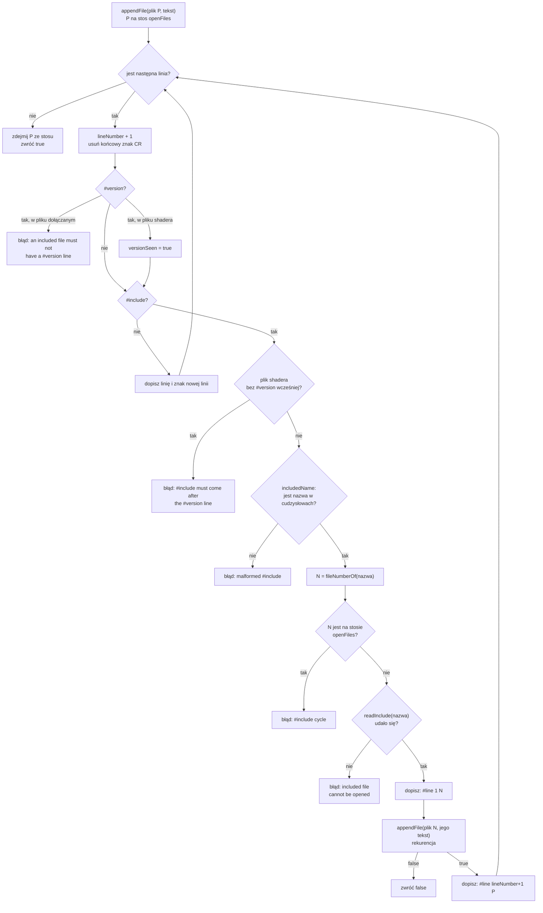

# Moduł gfx: dyrektywa #include w shaderach

Kamień milowy: M4. Od drugiej części M6 z tego samego kodu korzysta trzeci etap programu, shader geometrii, i czwarty plik z dołączeniem, `grass.frag`. W M7 doszły dwa pliki dołączane, `common/color.glsl` i `common/depth.glsl`, a w czwartej części M7 piąty, `common/shadows.glsl`: od niej `lit.frag` i `grass.frag` mają po trzy dołączenia, a `gouraud.frag` pierwsze. Kod preprocesora się przy tym nie zmienił. Temat wykładu: 2 (Programowalny potok), jako narzędzie dla tematów 6 (Oświetlenie) i 7 (Cieniowanie Gourauda i Phonga), a od M6 także 9 (Shader geometrii).
Kod: [`src/gfx/ShaderSource.hpp`](../../../src/gfx/ShaderSource.hpp), [`src/gfx/ShaderSource.cpp`](../../../src/gfx/ShaderSource.cpp), użycie w funkcji `compileShader` w [`src/gfx/Shader.cpp`](../../../src/gfx/Shader.cpp), testy w [`tests/ShaderSourceTests.cpp`](../../../tests/ShaderSourceTests.cpp), pliki dołączane [`assets/shaders/common/lighting.glsl`](../../../assets/shaders/common/lighting.glsl) i [`assets/shaders/common/normal_map.glsl`](../../../assets/shaders/common/normal_map.glsl) oraz cztery pliki, które je dołączają: [`assets/shaders/lit.frag`](../../../assets/shaders/lit.frag) (oba), [`assets/shaders/gouraud.vert`](../../../assets/shaders/gouraud.vert) (tylko `lighting.glsl`), [`assets/shaders/textured.frag`](../../../assets/shaders/textured.frag) (tylko `normal_map.glsl`) i, od drugiej części M6, [`assets/shaders/grass.frag`](../../../assets/shaders/grass.frag) (wtedy tylko `lighting.glsl`). To stan z M6: pełna dzisiejsza lista plików dołączanych (pięć) i plików, które je dołączają (dziewięć), razem z [`assets/shaders/common/shadows.glsl`](../../../assets/shaders/common/shadows.glsl) z czwartej części M7, jest w tabeli w sekcji 1. Wyświetlanie błędu: [`src/debug/panels/ShadersPanel.cpp`](../../../src/debug/panels/ShadersPanel.cpp).

Część modułu `gfx`. Wstęp do całego modułu jest w [`README.md`](README.md). Ten dokument zakłada znajomość [`shaders.md`](shaders.md) (GLSL, kompilacja a linkowanie) i [`shader-class.md`](shader-class.md) (klasa `gfx::Shader`, funkcja `compileShader`, odczyt dziennika sterownika). Przeładowanie na żywo i panel Shaders opisuje [`shader-hot-reload.md`](shader-hot-reload.md). Co jest w dołączanym pliku, czyli blok świateł i funkcja `computeLighting`, opisuje [`../scene/lights.md`](../scene/lights.md), a dwa programy, dla których powstał, [`../renderer/lighting-gouraud-phong.md`](../renderer/lighting-gouraud-phong.md). Trzeci, program trawy, opisuje [`../renderer/grass-geometry.md`](../renderer/grass-geometry.md). Drugi plik dołączany, `common/normal_map.glsl` (sampler mapy normalnych i funkcja `surfaceNormal`), opisuje [`normal-mapping.md`](normal-mapping.md), sekcja 4.1.

**Stan na dziś.** Kod jest kompletny i ma testy jednostkowe: 22 przypadki w `tests/ShaderSourceTests.cpp` (sekcja 5.11). Co zostało zmierzone na Windowsie w M4 (2026-10-05, MSVC 19.44, RTX 4070 Ti SUPER, sterownik NVIDIA 610.74): build Debug i Release bez ostrzeżeń, wszystkie ówczesne testy zielone w obu konfiguracjach, clang-format i clang-tidy bez uwag, start gry bez linii `[error]` i bez linii `GL_`, czyli `lit.frag` (z dwoma dołączonymi plikami), `gouraud.vert` i `textured.frag` (z jednym) kompilują się na sterowniku NVIDIA. Zmierzony jest też jeden błąd: po zepsuciu `common/lighting.glsl` surowa linia sterownika `1(63) : error C0000: ...` zamienia się w `common/lighting.glsl(63) : error C0000: ...`, a na zrzucie ekranu panel Shaders pokazuje błąd z nazwą pliku, podczas gdy labirynt rysuje nadal poprzedni program. Shader bez dołączeń pokazywał wtedy `basic.frag(4)` zamiast `0(4)`: plik `basic.frag` został usunięty w M5, a ta sama zamiana dotyczy dziś każdego pliku bez dołączeń, na przykład `color.frag` (test 22). **Stan po M5 (kod kompletny na Windowsie, kamień niezamknięty):** kod preprocesora się nie zmienił, programów jest cztery zamiast pięciu, a `lit.frag` i `textured.frag` urosły o uniform `uEmissive` za liniami `#include`. Według raportu z Windowsa (2026-10-05) build Debug i Release jest bez ostrzeżeń, a 215 przypadków testowych i 85098 asercji przechodzi w obu konfiguracjach. Pomiaru błędu sterownika z dzisiejszymi plikami nie powtarzałem. **Czego nikt nie zrobił:** przycisku `Reload shaders` nikt nie nacisnął ręcznie, ani z pięcioma programami w M4, ani z czterema w M5, ani z sześcioma w M6, ani z jedenastoma dziś. **Stan po drugiej części M6 (kod kompletny na Windowsie, kamień niezamknięty):** kod preprocesora (`ShaderSource.*`) i jego 22 testy się nie zmieniły. Zmieniło się to, kto go woła: `buildProgram` kompiluje listę etapów, więc przez `compileShader` przechodzi także plik shadera geometrii, a `grass.frag` jest czwartym plikiem z linią `#include` (sekcja 4). Programy testowe z istniejących buildów uruchomiłem dziś sam: 256 przypadków i 101232 asercje w Debug i w Release. Zgłoszone przez autora zmiany, bez powtórzenia: celowo zepsuty `grass.geom` daje błąd w kształcie `grass.geom(84)`, czyli zamiana numeru na nazwę działa na sterowniku NVIDIA także dla pliku `.geom`. Format dwukropkowy (`ERROR: 1:15:`, sterownik Apple) jest obsłużony w kodzie i sprawdzony tylko testami jednostkowymi. **Stan po czwartej części M7 (cienie księżyca, kod kompletny na Windowsie, kamień niezamknięty):** kod preprocesora i jego 22 testy nadal się nie zmieniły. Doszedł piąty plik dołączany, `common/shadows.glsl` (mapa cieni księżyca, [`../renderer/shadows.md`](../renderer/shadows.md), sekcja 4), dołączany przez `lit.frag`, `gouraud.frag` i `grass.frag`. `lit.frag` i `grass.frag` mają odtąd po **trzy** dołączenia, czyli cztery napisy źródłowe o numerach od 0 do 3: tyle nie miał dotąd żaden shader projektu. Zmienił się też sam `common/lighting.glsl` (180 linii zamiast 158), więc liczby w przykładach z sekcji 2.2 i 5.10 są policzone od nowa dla dzisiejszych plików. Zgłoszone dla Windowsa (2026-10-05): bramka `make check` przechodzi, 310 przypadków testowych i 103751 asercji, build Debug bez błędów OpenGL, czyli shadery z trzema dołączeniami kompilują się na sterowniku NVIDIA. Błędu kompilacji w pliku o numerze 3 nikt nie oglądał. **Na macOS nic z tego nie było budowane ani uruchamiane**: zachowanie dyrektywy `#line` i kompilatora Apple jest tam niezweryfikowane.

## 1. Po co to jest

W M4 doszły dwa programy oświetlenia. `lit` liczy światło w shaderze fragmentów (dla każdego fragmentu), a `gouraud` w shaderze wierzchołków (dla każdego wierzchołka). Oba liczą je **tym samym wzorem**: ten sam blok świateł, to samo prawo Lamberta, ten sam odblask, to samo tłumienie. Różni je tylko miejsce, w którym wzór jest wołany. To około 150 linii GLSL, które musiałyby stać w dwóch plikach.

Dwie kopie mają znaną wadę: poprawka w jednej, zapomniana w drugiej, i porównanie "Gouraud a Phong" na obronie przestaje być uczciwe, bo programy różnią się czymś więcej niż miejscem liczenia. W C++ taki kod trafia do nagłówka i jest dołączany przez `#include`. **GLSL nie ma dyrektywy `#include`** (sekcja 2.1), więc dołączanie robi mój kod, zanim tekst trafi do sterownika.

| Element | Co daje |
|---|---|
| `gfx::expandIncludes` | zamienia każdą linię `#include "plik"` na treść tego pliku, także w plikach dołączanych (dołączenia zagnieżdżone), i wykrywa pięć rodzajów błędów z nazwą pliku i numerem linii |
| dyrektywy `#line` wstawiane wokół dołączonego pliku | numery linii w błędach sterownika zostają numerami linii **oryginalnych plików**, a nie sklejonego tekstu |
| `gfx::nameSourceFiles` | w dzienniku sterownika zamienia numer pliku na jego nazwę: `1(63)` staje się `common/lighting.glsl(63)` |

Pierwszy wspólny plik to [`assets/shaders/common/lighting.glsl`](../../../assets/shaders/common/lighting.glsl). Dołączają go `lit.frag` i `gouraud.vert`, od drugiej części M6 także `grass.frag`, a od M8, części 1 `reflect.frag` (cztery programy): trawa jest oświetlana tymi samymi światłami i tym samym wzorem co ściany, bez kopii kodu. Od drugiej części M4 jest drugi, [`assets/shaders/common/normal_map.glsl`](../../../assets/shaders/common/normal_map.glsl): dołączają go `lit.frag` (do oświetlenia), `textured.frag` (do widoku normalnych) i, od M8, części 1, `reflect.frag`, żeby widok pokazywał dokładnie tę normalną, której używa światło. W M7 doszły trzy następne: `common/color.glsl` (sRGB i jasność, [`color-space.md`](color-space.md)) i `common/depth.glsl` (głębia na metry) w pierwszej części, a w czwartej [`assets/shaders/common/shadows.glsl`](../../../assets/shaders/common/shadows.glsl) (mapa cieni księżyca, [`../renderer/shadows.md`](../renderer/shadows.md)). Stan na dziś, odczytany z linii `#include` w plikach:

| Plik shadera | Co dołącza, w tej kolejności | Numery napisów źródłowych |
|---|---|---|
| `lit.frag` | `common/lighting.glsl`, `common/normal_map.glsl`, od czwartej części M7 `common/shadows.glsl` | 0 = `lit.frag`, 1 = `common/lighting.glsl`, 2 = `common/normal_map.glsl`, 3 = `common/shadows.glsl` |
| `gouraud.vert` | `common/lighting.glsl` | 0 = `gouraud.vert`, 1 = `common/lighting.glsl` |
| `gouraud.frag` (od czwartej części M7) | `common/shadows.glsl` | 0 = `gouraud.frag`, 1 = `common/shadows.glsl` |
| `textured.frag` | `common/normal_map.glsl`, od M7 `common/color.glsl` | 0 = `textured.frag`, 1 = `common/normal_map.glsl`, 2 = `common/color.glsl` |
| `grass.frag` (od drugiej części M6) | `common/lighting.glsl`, od M7 `common/color.glsl`, od czwartej części M7 `common/shadows.glsl` | 0 = `grass.frag`, 1 = `common/lighting.glsl`, 2 = `common/color.glsl`, 3 = `common/shadows.glsl` |
| `reflect.frag` (od M8, części 1) | `common/lighting.glsl`, `common/normal_map.glsl`, `common/shadows.glsl` | 0 = `reflect.frag`, 1 = `common/lighting.glsl`, 2 = `common/normal_map.glsl`, 3 = `common/shadows.glsl` |
| `skybox.frag` (od M7) | `common/color.glsl` | 0 = `skybox.frag`, 1 = `common/color.glsl` |
| `post/composite.frag` i `post/bright.frag` (od M7) | `../common/color.glsl` | 0 = plik shadera, 1 = `../common/color.glsl` |
| `post/preview.frag` (od M7) | `../common/color.glsl`, `../common/depth.glsl` | 0 = `preview.frag`, 1 = `../common/color.glsl`, 2 = `../common/depth.glsl` |

Numery w trzeciej kolumnie wynikają z kodu (`files[1]` to pierwszy dołączony plik, sekcja 5.2): ten sam plik `normal_map.glsl` ma numer 2 w jednym programie i 1 w drugim, a `shadows.glsl` numer 3 w `lit.frag`, `grass.frag` i `reflect.frag`, ale 1 w `gouraud.frag`. `lit.frag` był pierwszym shaderem projektu z dwoma dołączeniami, a od czwartej części M7 jest, razem z `grass.frag` (a od M8, części 1 także `reflect.frag`), pierwszym z trzema. Pozostałe piętnaście plików shaderów (`lit.vert`, `textured.vert`, `color.vert`, `color.frag`, `skybox.vert`, `grass.vert`, `grass.geom`, `post/composite.vert`, `post/blur.frag`, `shadow_depth.vert`, `shadow_depth.frag`, `reflect.vert`, `post/minimap.vert`, `post/minimap.frag` i `post/minimap_overlay.frag`) niczego nie dołącza, ale przechodzi przez ten sam kod: dla nich `expandIncludes` oddaje tekst bez zmian, a `nameSourceFiles` wstawia do błędu nazwę jedynego pliku.

**Każdy etap idzie tą samą drogą.** Preprocesor nie wie, jakiego rodzaju shader rozwija: pracuje na tekście. O rodzaju decyduje dopiero argument `type` funkcji `compileShader`, a `buildProgram` woła ją w pętli dla każdego etapu programu: `GL_VERTEX_SHADER`, dla trawy `GL_GEOMETRY_SHADER`, i `GL_FRAGMENT_SHADER` ([`shader-class.md`](shader-class.md), sekcja 5.7). Mówi to komentarz w tej pętli: "Every stage goes through the same loader: the same #include lines, the same file names in its compile errors." Z tego wynikają dwie rzeczy. Plik `.geom` **mógłby** zawierać linię `#include` i zostałaby rozwinięta tak samo jak w `lit.frag` (dziś `grass.geom` żadnej nie ma, więc to wniosek z kodu, a nie pomiar). A błąd kompilacji w pliku `.geom` dostaje nazwę pliku w miejscu numeru: zgłoszony pomiar z Windowsa to `grass.geom(84)` zamiast `0(84)`.

## 2. Teoria

### 2.1 Dlaczego GLSL nie ma `#include`

Kompilator GLSL siedzi w sterowniku karty i nie zna plików. Funkcja `glShaderSource` dostaje **tekst w pamięci**: tablicę napisów C. Sterownik nie wie, z jakiego pliku tekst pochodzi, ani czy w ogóle z pliku, więc nie miałby gdzie szukać `common/lighting.glsl`. Dlatego lista dyrektyw preprocesora w specyfikacji GLSL 4.10 (sekcja 3.3, "Preprocessor") zawiera `#define`, `#undef`, `#if`, `#ifdef`, `#ifndef`, `#else`, `#elif`, `#endif`, `#error`, `#pragma`, `#extension`, `#version` i `#line`, a `#include` na niej nie ma. Specyfikacja mówi też, co się dzieje z dyrektywą spoza listy: "Any directive not listed above will cause a diagnostic message and make the implementation treat the shader as ill-formed". Linia `#include`, która dotarłaby do sterownika, jest więc błędem kompilacji.

Istnieje rozszerzenie `GL_ARB_shading_language_include`, w którym program rejestruje nazwane napisy w sterowniku. Nie należy do rdzenia żadnej wersji OpenGL, więc nie mogę na nim polegać na obu systemach. Nie sprawdzałem, czy któryś z moich sterowników je zgłasza: projekt go nie używa.

Zostaje rozwiązanie po stronie programu: wczytać plik, znaleźć w nim linie `#include`, wkleić w ich miejsce treść wskazanych plików i dopiero taki tekst podać do `glShaderSource`. To jest **preprocesor** (preprocessor) w najprostszej postaci: program, który przerabia tekst źródłowy przed właściwą kompilacją. Preprocesor C++ robi z `#include` dokładnie to samo.

### 2.2 Problem numerów linii

Samo wklejenie ma skutek uboczny. `lit.frag` ma dziś 94 linie, `common/lighting.glsl` 201, `common/normal_map.glsl` 53, a `common/shadows.glsl` 191 (stan po M8, części 1, policzone z plików; po czwartej części M7 było to 80, 180, 53 i 120). Po wklejeniu sterownik widzi jeden tekst i liczy linie po swojemu: błąd w linii 76 pliku `lighting.glsl` zgłosiłby jako błąd w linii 84 (8 linii `lit.frag` przed dołączeniem plus 76), a błąd w linii 18 pliku `lit.frag` jako błąd w linii 460 (8 linii, 201 linii pierwszego pliku, 2 linie komentarza, 53 linie drugiego pliku, 2 linie komentarza, 191 linii trzeciego pliku i 3 linie do osiemnastej). Żaden z tych numerów nie istnieje w żadnym pliku, który mam otwarty w edytorze.

### 2.3 Numer napisu źródłowego i dyrektywa `#line`

Specyfikacja GLSL 4.10 (sekcja 3.2, "Source Strings") wymaga, żeby komunikat diagnostyczny wskazywał dwie liczby: "Diagnostic messages returned from compiling a shader must identify both the line number within a string and which source string the message applies to. Source strings are counted sequentially with the first string being string 0. Line numbers are one more than the number of new-lines that have been processed."

- **Numer napisu źródłowego** (source string number): który z napisów podanych do `glShaderSource`. Podaję jeden napis, więc bez dalszych zabiegów jest to zawsze 0.
- **Numer linii**: o jeden większy niż liczba przeczytanych znaków nowej linii w tym napisie. Pierwsza linia ma numer 1.

Stąd `0(15)` w formacie NVIDII i `0:15` w formacie Apple ([`shaders.md`](shaders.md), sekcja 2.6).

Obie liczby da się **nadpisać z tekstu shadera** dyrektywą `#line`. Specyfikacja GLSL 4.10, sekcja 3.3:

```text
#line line
#line line source-string-number
```

"After processing this directive (including its new-line), the implementation will behave as if it is compiling at line number line and source string number source-string-number."

Czyli: linia **następna po** `#line L N` jest liczona jako linia `L` napisu numer `N`. Numer napisu nie musi odpowiadać żadnemu prawdziwemu elementowi tablicy z `glShaderSource`: to etykieta, którą wybieram sam. Mój kod nadaje każdemu plikowi własny numer (plik shadera ma 0, pierwszy dołączony 1 i tak dalej) i zapamiętuje, który numer oznacza który plik.

**Uwaga o wersjach.** Znaczenie liczby `L` zmieniło się w historii języka. Sprawdziłem to w specyfikacjach z rejestru Khronosa (zdanie stoi w każdej w sekcji 3.3):

| Specyfikacja | Zdanie o `#line` | Linia po `#line L` ma numer |
|---|---|---|
| GLSL 1.10, 1.20, 1.30, 1.40 i 1.50 | "... as if it is compiling at line number line+1 and source string number ..." | `L + 1` |
| GLSL 3.30 | "... as if it is compiling at line number line and source string number ..." | `L` |
| GLSL 4.10 | to samo zdanie co w 3.30 | `L` |

Między 1.50 a 3.30 nie ma żadnej wersji języka, więc zmiana nastąpiła w 3.30. Wszystkie shadery projektu zaczynają się od `#version 410 core`, więc obowiązuje reguła z ostatniego wiersza i mój kod jest napisany pod nią (sekcja 7, pułapka 6).

Co z tego potwierdza pomiar, a czego nie. Zmierzona linia sterownika NVIDIA 610.74 dla błędu w `lighting.glsl` zaczyna się od `1(63)` (sekcja 5.10). Numer napisu 1 mógł się wziąć tylko z dyrektywy `#line 1 1`, a 63 jest numerem z wnętrza pliku `lighting.glsl`, nie ze sklejonego tekstu, w którym ta okolica leży dziewięć linii dalej. Dyrektywy więc działają. Pomiar **nie rozstrzyga** natomiast różnicy o jeden między `L` a `L + 1`: nie mam zapisane, którą dokładnie linię zmieniono, a sterownik i tak często wskazuje linię sąsiednią do pomyłki. Zgodność sterownika z regułą 3.30 co do jednej linii przyjmuję za specyfikacją. Sterownika Apple nie sprawdzałem wcale.

### 2.4 Dwie dyrektywy na jedno dołączenie

Dla linii `#include` stojącej w linii `K` pliku o numerze `P`, która dołącza plik o numerze `N`, preprocesor wypisuje:

```text
#line 1 N           następna linia to linia 1 pliku N
(treść pliku N)
#line K+1 P         następna linia to linia K+1 pliku P, pierwsza po #include
```

Pierwsza dyrektywa przełącza licznik na dołączany plik, druga wraca do pliku, który dołączał. Sama linia `#include` znika z tekstu: zastępują ją dwie dyrektywy i treść pliku.

### 2.5 Co z tym robi sterownik, a co mój kod


Sterownik zna tylko liczby. Nazwy plików istnieją wyłącznie po mojej stronie, w liście `ShaderSource::files`, i wracają do komunikatu dopiero w ostatnim kroku.

## 3. Jak to działa w OpenGL

Preprocesor nie woła żadnej funkcji `gl*`. Dotyka OpenGL w dwóch miejscach, oba są w `compileShader` ([`shader-class.md`](shader-class.md), sekcja 5.5):

| Wywołanie | Rola przy dołączaniu |
|---|---|
| `glShaderSource(shader, 1, &sourceText, nullptr)` | dostaje **jeden** napis: tekst po rozwinięciu wszystkich dołączeń. Liczba napisów nadal wynosi 1. Numery 1, 2 i dalsze, które sterownik wypisuje w błędach, nie są indeksami tej tablicy, tylko etykietami z dyrektyw `#line` |
| `glCompileShader(shader)` | kompiluje sklejony tekst. Dyrektywy `#line` są dla niego zwykłą częścią języka |
| `glGetShaderInfoLog(shader, ...)` | oddaje dziennik z parami "numer napisu, numer linii". Format tekstu zależy od producenta sterownika (sekcja 5.9) |

`glShaderSource` umie przyjąć kilka napisów naraz i wtedy numeruje je samo. Nie korzystam z tego, bo nie rozwiązuje problemu: dołączenie stoi w środku pliku, więc plik shadera trzeba by pociąć na część przed i część po, a te dostałyby dwa różne numery, choć są jednym plikiem. Do tego numer linii w części "po" liczyłby się od 1. Dyrektywy `#line` byłyby potrzebne tak czy inaczej, więc prościej podać jeden napis.

## 4. Shadery

Ten temat nie ma własnego shadera: jest narzędziem, z którego korzystają shadery oświetlenia. Poniżej tylko te linie, które dotyczą dołączania. Resztę obu plików opisuje [`../renderer/lighting-gouraud-phong.md`](../renderer/lighting-gouraud-phong.md), a treść `lighting.glsl` linia po linii [`../scene/lights.md`](../scene/lights.md).

Początek [`assets/shaders/lit.frag`](../../../assets/shaders/lit.frag), linie od 1 do 15 (ostatnie trzy doszły w czwartej części M7):

```glsl
#version 410 core
// Fragment shader of lit models, lighting per fragment (Phong shading): the light is
// computed for every fragment from its own position and normal. The highlight formula
// (Phong or Blinn-Phong) is chosen by the uniform uSpecularModel.
// See docs/modules/renderer/lighting-gouraud-phong.md

// The light block and the function computeLighting. The same file is included by
// gouraud.vert and grass.frag.
#include "common/lighting.glsl"
// The normal map and the function surfaceNormal. The same file is included by
// textured.frag, for its debug view of the normals.
#include "common/normal_map.glsl"
// The shadow map of the moon and the function moonShadow. The same file is included by
// gouraud.frag and grass.frag.
#include "common/shadows.glsl"
```

Początek [`assets/shaders/gouraud.vert`](../../../assets/shaders/gouraud.vert), linie od 1 do 8:

```glsl
#version 410 core
// Vertex shader of lit models, lighting per vertex (Gouraud shading): the light is
// computed here, once for every vertex, and the fragment shader only blends the result.
// See docs/modules/renderer/lighting-gouraud-phong.md

// The light block and the function computeLighting: the very same file lit.frag
// includes. Only the place where the function is called differs.
#include "common/lighting.glsl"
```

Nagłówek [`assets/shaders/common/lighting.glsl`](../../../assets/shaders/common/lighting.glsl), linie od 1 do 10:

```glsl
// Lighting shared by lit.frag and grass.frag (per fragment) and gouraud.vert (per
// vertex): the light block and the functions that turn the lights into the brightness of
// one surface point.
// This file is not a shader of its own. It has no #version line: the shader loader puts
// its text in place of the line  #include "common/lighting.glsl"  (gfx/ShaderSource.hpp).
// See docs/modules/scene/lights.md

// Length of the array of point lights. The same number as scene::MAX_POINT_LIGHTS in
// src/scene/Light.hpp.
const int MAX_POINT_LIGHTS = 16;
```

| Co widać | Dlaczego tak |
|---|---|
| trzy linie `#include` w `lit.frag`, jedna pod drugą (dwie do trzeciej części M7) | pliki są wklejane w tej kolejności. Tutaj kolejność nie ma znaczenia dla kompilacji, bo żaden z trzech plików nie używa niczego z pozostałych: `normal_map.glsl` deklaruje własny sampler, własny przełącznik i jedną funkcję, a `shadows.glsl` własne samplery i uniformy obu świateł (piętnaście uniformów, od piątej części M7 także latarki) i cztery funkcje. Łączy je dopiero `main` w `lit.frag`, które woła `moonFacing` z pierwszego pliku i `moonShadow` z trzeciego (oraz `flashlightShadow`). Kolejność ma znaczenie dla numerów: pierwszy dołączony plik dostaje numer 1, drugi 2, trzeci 3 |
| `#version 410 core` jest pierwszą linią obu shaderów i stoi **przed** `#include` | specyfikacja wymaga `#version` przed wszystkim poza komentarzami i białymi znakami. Preprocesor tego pilnuje: `#include` przed `#version` w pliku shadera jest błędem (sekcja 5.6) |
| nazwa w cudzysłowach: `"common/lighting.glsl"` | ścieżka względem katalogu pliku shadera, czyli `assets/shaders` (sekcja 5.8). Zapis z nawiasami ostrymi, `<plik>`, nie jest obsługiwany |
| `lighting.glsl` **nie ma** linii `#version` | po wklejeniu stałaby w środku tekstu, a nie na początku. Preprocesor zgłasza `#version` w pliku dołączanym jako błąd (sekcja 5.6) |
| `lighting.glsl` nie ma funkcji `main` | to nie jest shader, tylko fragment tekstu. Rozszerzenie `.glsl` (a nie `.vert` albo `.frag`) mówi czytelnikowi, że pliku nie da się skompilować samodzielnie. Dla programu rozszerzenie nie ma znaczenia |
| ten sam plik w shaderze wierzchołków i w shaderze fragmentów | treść musi być poprawna w obu etapach: deklaruje blok uniformów, zwykłe uniformy, struktury i funkcje, a nie używa niczego, co istnieje tylko w jednym etapie (na przykład `gl_FragCoord`) |

`lit.vert` niczego nie dołącza: światło liczy tylko jeden etap każdego programu. `gouraud.frag` do trzeciej części M7 też niczego nie dołączał. Od czwartej dołącza `common/shadows.glsl` (linia 8), bo cień księżyca jest w programie `gouraud` sprawdzany dla każdego fragmentu, chociaż światło zostaje liczone w wierzchołkach ([`../renderer/shadows.md`](../renderer/shadows.md), sekcja 2.15). Trzecim plikiem z dołączeniem był w M4 `textured.frag`: linia `#include "common/normal_map.glsl"` stoi w nim w linii 10 ([`textures.md`](textures.md), sekcja 4.2). Plik `common/normal_map.glsl` ma tę samą budowę co `lighting.glsl` (bez `#version`, bez `main`, komentarz z nazwą dokumentu) i jest dołączany tylko do shaderów fragmentów, bo używa samplera i liczy normalną dla fragmentu ([`normal-mapping.md`](normal-mapping.md), sekcja 4.1). `common/shadows.glsl` też ma tę budowę i też trafia tylko do shaderów fragmentów: czyta mapę cieni dla każdego fragmentu.

## 5. Kod w projekcie

### 5.1 Pliki

| Plik | Co zawiera |
|---|---|
| [`src/gfx/ShaderSource.hpp`](../../../src/gfx/ShaderSource.hpp) | typ `IncludeReader`, struktura `ShaderSource`, deklaracje `expandIncludes` i `nameSourceFiles`. Dołącza `<functional>`, `<span>`, `<string>`, `<vector>` i nic z OpenGL |
| [`src/gfx/ShaderSource.cpp`](../../../src/gfx/ShaderSource.cpp) | sześć stałych, sześć funkcji pomocniczych (`isDigit`, `withoutLeadingBlanks`, `isDirective`, `includedName`, `place`, `fileNumberOf`), struktura `Expansion`, rekurencyjna `appendFile`, `nameSourceFile` i dwie funkcje publiczne |
| [`src/gfx/Shader.cpp`](../../../src/gfx/Shader.cpp) | jedyny użytkownik w programie: `compileShader` (sekcja 5.8) |
| [`tests/ShaderSourceTests.cpp`](../../../tests/ShaderSourceTests.cpp) | 22 przypadki testowe (sekcja 5.11) |

Wszystko w tych dwóch plikach to **praca na tekście**. Komentarz w nagłówku mówi to wprost: "no file is opened and no OpenGL function is called, so tests can run them". Otwieranie plików jest wyniesione do funkcji, którą podaje wołający (`IncludeReader`), a kompilacja zostaje w `Shader.cpp`. Dzięki temu preprocesor da się sprawdzić testami jednostkowymi bez okna, bez kontekstu OpenGL i bez plików na dysku.

Stałe w anonimowej przestrzeni nazw `ShaderSource.cpp`:

```cpp
// Names of the two preprocessor directives the loader looks at.
constexpr std::string_view INCLUDE_DIRECTIVE = "include";
constexpr std::string_view VERSION_DIRECTIVE = "version";

// The characters that may stand between the parts of a directive.
constexpr std::string_view BLANKS = " \t";

// Prefixes some drivers write in front of the source string number.
constexpr std::string_view ERROR_PREFIX = "ERROR: ";
constexpr std::string_view WARNING_PREFIX = "WARNING: ";

// A source string number with more digits than this is not one of ours. The limit also
// keeps the conversion to a number far away from an overflow.
constexpr std::size_t MAX_NUMBER_DIGITS = 6;
```

`std::string_view` (C++17) to widok na napis: wskaźnik i długość, bez kopiowania znaków. Nadaje się na stałą `constexpr` i na parametr funkcji, która tylko czyta tekst. `BLANKS` to spacja i tabulator, dokładnie te dwa znaki, które specyfikacja GLSL dopuszcza przed znakiem `#` i po nim ("can be preceded in its line only by spaces or horizontal tabs").

### 5.2 Nagłówek: `IncludeReader` i `ShaderSource`

```cpp
/// Supplies the text of an included file. name is the text between the quotes of the
/// #include line, for example "common/lighting.glsl". The function writes the contents
/// into text and returns true, or returns false when there is no such file.
using IncludeReader = std::function<bool(const std::string& name, std::string& text)>;

/// One shader after all #include lines were replaced by the files they name.
struct ShaderSource {
    /// The complete text for glShaderSource.
    std::string text;

    /// The files the text was put together from. The position in this list is the
    /// "source string number" the #line directives in text use: files[0] is the shader
    /// file itself, files[1] the first included file, and so on. The driver prints that
    /// number in front of the line number of an error.
    std::vector<std::string> files;
};
```

| Element | Co robi i dlaczego |
|---|---|
| `using IncludeReader = std::function<bool(const std::string&, std::string&)>` | `std::function` przechowuje "cokolwiek, co da się wywołać z takimi argumentami": zwykłą funkcję albo lambdę z przechwyconymi zmiennymi. Preprocesor nie wie, skąd bierze się tekst. W programie czytnik otwiera plik (sekcja 5.8), w testach zagląda do `std::map` w pamięci (sekcja 5.11) |
| kształt `bool` plus parametr wyjściowy | ten sam co w `readTextFile` w `Shader.cpp`: `false` znaczy "nie ma takiego pliku", wynik wraca przez referencję. Bez wyjątków i bez `std::optional` |
| `ShaderSource::text` | gotowy tekst dla `glShaderSource`, z dyrektywami `#line` w środku |
| `ShaderSource::files` | **indeks w tym wektorze jest numerem napisu źródłowego**. To jedyne miejsce, w którym zapisane jest, co oznacza liczba z dziennika sterownika. `files[0]` to zawsze sam plik shadera, bo 0 jest numerem, którego sterownik używa dla tekstu bez żadnej dyrektywy `#line` |

Deklaracje dwóch funkcji publicznych:

```cpp
bool expandIncludes(const std::string& rootName, const std::string& rootText,
                    const IncludeReader& readInclude, ShaderSource& source, std::string& error);
```

```cpp
std::string nameSourceFiles(const std::string& infoLog, std::span<const std::string> files);
```

`expandIncludes` zgłasza niepowodzenie tak jak reszta `gfx`: zwraca `false`, a opis wpisuje do `error`. `nameSourceFiles` nie może się nie udać: linię, której nie rozumie, oddaje bez zmian. `std::span<const std::string>` to widok na ciąg napisów: wskaźnik i liczba elementów, bez kopiowania. Program i testy podają `std::vector<std::string>`, a tak samo dałoby się podać zwykłą tablicę albo `std::array`.

### 5.3 Rozpoznanie dyrektywy: `withoutLeadingBlanks` i `isDirective`

```cpp
// line without the blanks at its start.
std::string_view withoutLeadingBlanks(std::string_view line) {
    const std::size_t first = line.find_first_not_of(BLANKS);
    return first == std::string_view::npos ? std::string_view{} : line.substr(first);
}
```

`find_first_not_of(BLANKS)` zwraca pozycję pierwszego znaku, który nie jest spacją ani tabulatorem, albo `npos`, gdy linia składa się z samych odstępów (albo jest pusta). W drugim przypadku wynikiem jest pusty widok. `substr` na `string_view` niczego nie kopiuje: przesuwa początek widoku.

```cpp
// When line is a preprocessor directive with the given name ("#include ...", also with
// blanks around the #), returns true and writes what follows the name into rest.
bool isDirective(std::string_view line, std::string_view name, std::string_view& rest) {
    std::string_view text = withoutLeadingBlanks(line);
    if (text.empty() || text.front() != '#') {
        return false;
    }
    text = withoutLeadingBlanks(text.substr(1));
    if (!text.starts_with(name)) {
        return false;
    }
    text = text.substr(name.size());
    // The name must end here: "#includes" or "#version2" are other words.
    if (!text.empty() && BLANKS.find(text.front()) == std::string_view::npos &&
        text.front() != '"') {
        return false;
    }
    rest = text;
    return true;
}
```

| Linia | Co robi i dlaczego |
|---|---|
| `std::string_view text = withoutLeadingBlanks(line);` | odstępy przed `#` są dozwolone: `  #include ...` to nadal dyrektywa |
| `if (text.empty() \|\| text.front() != '#')` | pierwszy znak po odstępach musi być `#`. Stąd linia `// #include "x"` **nie jest** dyrektywą: zaczyna się od `/`. Sprawdzenie `empty()` stoi pierwsze, bo `front()` na pustym widoku jest niezdefiniowane |
| `text = withoutLeadingBlanks(text.substr(1));` | pomija `#` i odstępy po nim: `#  include` też jest dyrektywą, tak jak w C |
| `if (!text.starts_with(name))` | dalej musi stać nazwa dyrektywy: `include` albo `version`. `starts_with` jest z C++20 |
| `text = text.substr(name.size());` | zostaje to, co po nazwie |
| warunek z `BLANKS.find(...)` i `'"'` | nazwa musi się w tym miejscu **kończyć**. Po niej wolno: nic (koniec linii), odstęp albo cudzysłów (`#include"plik"` bez odstępu). Każdy inny znak znaczy, że to inne słowo: `#includes`, `#version2`. Wtedy funkcja zwraca `false` i linia idzie do sterownika bez zmian |
| `rest = text; return true;` | reszta linii wraca przez parametr. Dla `#include "a.glsl"` jest to ` "a.glsl"` (ze spacją na początku), dla `#version 410 core` jest to ` 410 core` |

Funkcja jest wołana dwa razy na każdą linię: raz z nazwą `version`, raz z nazwą `include`.

### 5.4 Nazwa pliku i początek komunikatu: `includedName` i `place`

```cpp
// Reads the file name out of the rest of an #include line: the text between the two
// quotes. Returns false when there are no two quotes or nothing is between them.
bool includedName(std::string_view rest, std::string& name) {
    const std::string_view text = withoutLeadingBlanks(rest);
    if (text.empty() || text.front() != '"') {
        return false;
    }
    const std::size_t closingQuote = text.find('"', 1);
    if (closingQuote == std::string_view::npos || closingQuote == 1) {
        return false;
    }
    name = std::string(text.substr(1, closingQuote - 1));
    return true;
}
```

| Linia | Co robi i dlaczego |
|---|---|
| `if (text.empty() \|\| text.front() != '"')` | po odstępach musi stać otwierający cudzysłów. Odrzuca `#include` bez niczego, `#include common/light.glsl` i `#include <a.glsl>` |
| `text.find('"', 1)` | szuka zamykającego cudzysłowu, zaczynając od pozycji 1, czyli za otwierającym |
| `closingQuote == npos` | brak zamykającego cudzysłowu: `#include "unclosed` |
| `closingQuote == 1` | zamykający stoi zaraz za otwierającym: `#include ""`, pusta nazwa |
| `text.substr(1, closingQuote - 1)` | znaki między cudzysłowami: od pozycji 1, w liczbie `closingQuote - 1`. Dla `"a.glsl"` zamykający cudzysłów jest na pozycji 7, więc wychodzi 6 znaków: `a.glsl` |
| `name = std::string(...)` | tu powstaje kopia: nazwa ma przeżyć linię, z której pochodzi |

Tego, co stoi **za** zamykającym cudzysłowem, funkcja nie czyta. `#include "a.glsl" cokolwiek` jest przyjmowane tak samo jak bez dopisku.

```cpp
// "lit.frag:12: " : the start of every error message of the preprocessor.
std::string place(const std::string& fileName, int lineNumber) {
    return fileName + ":" + std::to_string(lineNumber) + ": ";
}
```

Każdy z pięciu komunikatów preprocesora zaczyna się od `plik:linia: `, w tym samym kształcie co komunikaty kompilatorów C++. Jedna funkcja zamiast pięciu kopii tego sklejania.

### 5.5 Stan jednego rozwinięcia: `Expansion` i `fileNumberOf`

```cpp
// Everything one call of expandIncludes works with, so that the recursive function
// below does not need six parameters.
struct Expansion {
    const IncludeReader& readInclude;
    ShaderSource& source;
    std::string& error;
    // Numbers of the files that are being read right now: the shader file, the file it
    // includes, the file that one includes, and so on. A file that is in this list and
    // is included again would include itself for ever.
    std::vector<std::size_t> openFiles;
};
```

| Pole | Znaczenie |
|---|---|
| `readInclude` | czytnik od wołającego, przez referencję do stałej |
| `source` | wynik, do którego dopisywany jest tekst i lista plików |
| `error` | miejsce na komunikat błędu |
| `openFiles` | **stos plików czytanych w tej chwili**: numer pliku shadera, numer pliku, który ten dołącza, i tak w głąb. To nie jest lista wszystkich plików widzianych do tej pory (ta jest w `source.files`), tylko droga od korzenia do miejsca, w którym preprocesor właśnie stoi |

Trzy pierwsze pola są referencjami do argumentów `expandIncludes`, czwarte struktura posiada sama. Rekurencyjna `appendFile` dostaje jedną referencję `Expansion&` zamiast czterech osobnych parametrów.

```cpp
// The number of a file in ShaderSource::files. A new name is added at the end.
std::size_t fileNumberOf(ShaderSource& source, const std::string& name) {
    const auto found = std::ranges::find(source.files, name);
    if (found != source.files.end()) {
        return static_cast<std::size_t>(found - source.files.begin());
    }
    source.files.push_back(name);
    return source.files.size() - 1;
}
```

| Linia | Co robi i dlaczego |
|---|---|
| `std::ranges::find(source.files, name)` | szuka nazwy na liście. Porównuje **napisy znak po znaku**: `a.glsl` i `./a.glsl` to dla tej funkcji dwa różne pliki (sekcja 7, pułapka 3) |
| `found - source.files.begin()` | różnica iteratorów to odległość od początku, czyli indeks. Ma typ ze znakiem, stąd rzutowanie na `std::size_t` |
| `push_back(name)` i `size() - 1` | nowa nazwa dostaje kolejny numer: indeks ostatniego elementu |

Skutek: plik dołączony dwa razy ma **jeden numer**. Numery rosną w kolejności pierwszego napotkania nazwy.

### 5.6 Serce preprocesora: `appendFile`

Funkcja dopisuje do wyniku treść jednego pliku, linia po linii, a dla linii `#include` woła samą siebie.



Kod, w czterech kawałkach. Początek:

```cpp
bool appendFile(Expansion& expansion, std::size_t fileNumber, const std::string& text) {
    // A copy of the name: the list of files may grow (and move) while this file is read.
    const std::string fileName = expansion.source.files[fileNumber];
    const bool isShaderFile = expansion.openFiles.empty();
    expansion.openFiles.push_back(fileNumber);

    bool versionSeen = false;
    int lineNumber = 0;
    std::istringstream lines(text);
    std::string line;
    while (std::getline(lines, line)) {
        ++lineNumber;
        // A file with Windows line ends that was read in binary mode keeps a carriage
        // return in front of every line feed.
        if (!line.empty() && line.back() == '\r') {
            line.pop_back();
        }
```

| Linia | Co robi i dlaczego |
|---|---|
| `const std::string fileName = expansion.source.files[fileNumber];` | **kopia** nazwy, nie referencja. W trakcie czytania tego pliku `fileNumberOf` może dopisać nazwę do wektora `files`, a `push_back` przy braku miejsca przenosi wszystkie elementy w nowe miejsce pamięci. Referencja do elementu wskazywałaby wtedy na zwolnioną pamięć |
| `const bool isShaderFile = expansion.openFiles.empty();` | pusty stos znaczy: to pierwsze wywołanie, czyli sam plik shadera. Sprawdzenie stoi **przed** `push_back`, linia niżej byłoby już zawsze fałszywe |
| `expansion.openFiles.push_back(fileNumber);` | plik wchodzi na stos "czytanych teraz" |
| `bool versionSeen = false;` | czy w tym pliku była już linia `#version`. Zmienna lokalna, więc każde wywołanie rekurencyjne ma własną |
| `int lineNumber = 0;` i `++lineNumber;` | numer linii liczony od 1, tak jak w edytorze i jak w specyfikacji GLSL |
| `std::istringstream lines(text);` i `std::getline(lines, line)` | strumień czytający z napisu. `getline` oddaje kolejne linie bez znaku `\n` i zwraca fałsz, gdy tekst się skończył. Ostatnia linia bez `\n` na końcu też jest oddawana |
| usunięcie `\r` | plik z końcami linii Windows (`\r\n`) po podziale na `\n` zostawia `\r` na końcu każdej linii. W programie `readTextFile` otwiera plik w trybie tekstowym, który na Windowsie sam zamienia `\r\n` na `\n`, ale na macOS tego nie robi, a w testach tekst przychodzi z pamięci. Bez tej linii `\r` trafiłoby do nazwy pliku albo zostało w tekście |

Linia `#version`:

```cpp
        std::string_view rest;
        if (isDirective(line, VERSION_DIRECTIVE, rest)) {
            // GLSL wants #version before everything else, so it can only stand in the
            // shader file itself. In an included file it would land in the middle.
            if (!isShaderFile) {
                expansion.error =
                    place(fileName, lineNumber) + "an included file must not have a #version line";
                return false;
            }
            versionSeen = true;
        }
```

`#version` w pliku dołączanym jest błędem preprocesora, zanim tekst zobaczy sterownik. W pliku shadera linia tylko ustawia `versionSeen` i idzie dalej: nie jest dyrektywą `include`, więc trafi do następnej gałęzi i zostanie przepisana bez zmian.

Zwykła linia:

```cpp
        if (!isDirective(line, INCLUDE_DIRECTIVE, rest)) {
            // An ordinary line goes through unchanged. Every line gets a line end, also
            // the last line of a file that has none: the #line directive that follows an
            // included file must start on a line of its own.
            expansion.source.text += line;
            expansion.source.text += '\n';
            continue;
        }
```

Każda linia dostaje `\n`, także ostatnia linia pliku, który kończy się bez znaku nowej linii. Gdyby tego nie było, dołączony plik zakończony tekstem `float a;` skleiłby się z następną dyrektywą w `float a;#line 3 0`, a `#` w środku linii nie jest dyrektywą. Skutek uboczny: końce linii `\r\n` zamieniają się w wyniku na `\n`.

Linia `#include`, sprawdzenia:

```cpp
        if (isShaderFile && !versionSeen) {
            expansion.error = place(fileName, lineNumber) +
                              "#include must come after the #version line, which has to stay "
                              "the first line of the shader";
            return false;
        }

        std::string includedFile;
        if (!includedName(rest, includedFile)) {
            expansion.error =
                place(fileName, lineNumber) + "malformed #include, expected #include \"file name\"";
            return false;
        }

        const std::size_t includedNumber = fileNumberOf(expansion.source, includedFile);
        if (std::ranges::find(expansion.openFiles, includedNumber) != expansion.openFiles.end()) {
            expansion.error = place(fileName, lineNumber) + "#include cycle: \"" + includedFile +
                              "\" is already being included, a file cannot include itself";
            return false;
        }

        std::string includedText;
        if (!expansion.readInclude(includedFile, includedText)) {
            expansion.error = place(fileName, lineNumber) + "included file cannot be opened: \"" +
                              includedFile + "\"";
            return false;
        }
```

| Sprawdzenie | Co wykrywa | Komunikat (po `plik:linia: `) |
|---|---|---|
| `isShaderFile && !versionSeen` | `#include` w pliku shadera, zanim pojawiła się linia `#version`. Wklejony tekst stanąłby przed `#version`, a specyfikacja tego zabrania. Warunek dotyczy tylko pliku shadera: plik dołączany nie ma `#version` wcale | `#include must come after the #version line, which has to stay the first line of the shader` |
| `!includedName(rest, includedFile)` | linia bez poprawnej nazwy w cudzysłowach | `malformed #include, expected #include "file name"` |
| numer jest na stosie `openFiles` | **cykl**: plik, który jest właśnie czytany, miałby zostać dołączony jeszcze raz. Bez tego sprawdzenia rekurencja nie miałaby końca | `#include cycle: "nazwa" is already being included, a file cannot include itself` |
| `!expansion.readInclude(...)` | czytnik nie zna takiego pliku | `included file cannot be opened: "nazwa"` |

Dwa szczegóły kolejności. `fileNumberOf` jest wołane **przed** próbą wczytania, więc nazwa pliku, którego nie ma, też trafia na listę `files`. Nie ma to skutku, bo rozwinięcie i tak kończy się błędem. Sprawdzenie cyklu stoi przed wczytaniem pliku, więc cykl nie kosztuje ani jednego otwarcia pliku więcej.

Dlaczego stos, a nie lista wszystkich widzianych plików: plik dołączony **dwa razy po kolei** nie jest cyklem. Po zakończeniu pierwszego dołączenia jego numer schodzi ze stosu, więc drugie dołączenie przechodzi. Cyklem jest tylko dołączenie pliku, który jest jeszcze "otwarty", czyli leży na drodze od korzenia do bieżącego miejsca.

Linia `#include`, wklejenie:

```cpp
        // "#line L N": the line after this directive counts as line L of source string
        // number N (GLSL 3.30 and newer). The included file starts at its line 1.
        expansion.source.text += "#line 1 " + std::to_string(includedNumber) + "\n";
        if (!appendFile(expansion, includedNumber, includedText)) {
            return false;
        }
        // Back in this file: the next line is the one after the #include line.
        expansion.source.text +=
            "#line " + std::to_string(lineNumber + 1) + " " + std::to_string(fileNumber) + "\n";
    }

    expansion.openFiles.pop_back();
    return true;
}
```

| Linia | Co robi i dlaczego |
|---|---|
| `"#line 1 " + std::to_string(includedNumber) + "\n"` | pierwsza dyrektywa z sekcji 2.4: następna linia tekstu to linia 1 dołączanego pliku |
| `appendFile(expansion, includedNumber, includedText)` | **rekurencja**: ta sama funkcja dopisuje treść dołączanego pliku, razem z jego własnymi dołączeniami. Głębokość zagnieżdżenia ogranicza tylko stos wywołań |
| `if (!...) { return false; }` | błąd w głębi przerywa wszystko. Komunikat jest już w `expansion.error` i wskazuje plik, w którym błąd wystąpił, a nie plik shadera |
| `"#line " + std::to_string(lineNumber + 1) + " " + std::to_string(fileNumber) + "\n"` | druga dyrektywa: następna linia to linia po `#include` w pliku, który dołączał. `lineNumber` to numer linii z `#include`, stąd `+ 1`. Dyrektywa jest wypisywana zawsze, także gdy `#include` było ostatnią linią pliku |
| `expansion.openFiles.pop_back();` | plik przeczytany do końca schodzi ze stosu. Przy wyjściu z błędem (`return false` wyżej) stos nie jest sprzątany, bo nikt go już nie użyje |

### 5.7 Funkcja publiczna: `expandIncludes`

```cpp
bool expandIncludes(const std::string& rootName, const std::string& rootText,
                    const IncludeReader& readInclude, ShaderSource& source, std::string& error) {
    source.text.clear();
    source.files.clear();
    // The shader file itself is source string number 0, the number the driver uses for
    // a text without any #line directive.
    source.files.push_back(rootName);

    Expansion expansion{
        .readInclude = readInclude,
        .source = source,
        .error = error,
        .openFiles = {},
    };
    return appendFile(expansion, 0, rootText);
}
```

| Linia | Co robi i dlaczego |
|---|---|
| `source.text.clear();` i `source.files.clear();` | wynik zaczyna od zera, także gdy wołający podał strukturę z poprzedniego użycia |
| `source.files.push_back(rootName);` | plik shadera dostaje numer 0. To nie jest wybór dowolny: tekst przed pierwszą dyrektywą `#line` sterownik i tak liczy jako napis 0, więc lista musi się z tym zgadzać |
| `Expansion expansion{ .readInclude = ..., ... }` | inicjalizacja z nazwanymi polami (designated initializers, C++20): przy każdej wartości widać, do którego pola trafia |
| `return appendFile(expansion, 0, rootText);` | całą pracę robi funkcja rekurencyjna, zaczynając od pliku numer 0 z pustym stosem |

`rootName` służy do dwóch rzeczy: jest `files[0]` (trafi do błędów sterownika) i stoi na początku komunikatów preprocesora dla błędów w pliku shadera. Ponieważ leży na liście od początku, plik dołączany, który dołącza sam plik shadera **pod dokładnie tą nazwą**, jest wykrywany jako cykl.

### 5.8 Użycie: `compileShader` w `Shader.cpp`

```cpp
GLuint compileShader(GLenum type, const std::filesystem::path& path, std::string& error) {
    std::string fileText;
    if (!readTextFile(path, fileText)) {
        error = "Shader file cannot be opened: " + core::pathText(path);
        return 0;
    }

    // The name in an #include line is relative to the directory of the shader file:
    // "common/lighting.glsl" in assets/shaders/lit.frag is the file
    // assets/shaders/common/lighting.glsl. The lambda is called once for every #include
    // line, on every load, so a reload reads the included files again too.
    const std::filesystem::path includeDirectory = path.parent_path();
    const IncludeReader readInclude = [&includeDirectory](const std::string& name,
                                                          std::string& text) {
        return readTextFile(includeDirectory / name, text);
    };

    ShaderSource source;
    std::string includeError;
    if (!expandIncludes(core::pathText(path.filename()), fileText, readInclude, source,
                        includeError)) {
        error = "Shader include failed: " + core::pathText(path) + "\n" + includeError;
        return 0;
    }
```

| Linia | Co robi i dlaczego |
|---|---|
| `const std::filesystem::path includeDirectory = path.parent_path();` | katalog **pliku shadera**: dla `<katalog programu>/assets/shaders/lit.frag` jest to `<katalog programu>/assets/shaders`. Liczony raz, przed rozwinięciem |
| `[&includeDirectory](const std::string& name, std::string& text) { ... }` | lambda: funkcja bez nazwy zapisana w miejscu użycia. `[&includeDirectory]` to lista przechwyceń: lambda trzyma referencję do tej jednej zmiennej lokalnej. Jest to bezpieczne, bo lambda nie żyje dłużej niż `compileShader` |
| `return readTextFile(includeDirectory / name, text);` | `operator/` skleja katalog z nazwą z linii `#include` ([`../core/paths.md`](../core/paths.md), sekcja 2.5). Czytanie robi ta sama funkcja, która czyta plik shadera |
| `const IncludeReader readInclude = ...` | lambda zamienia się na `std::function` o typie, którego chce `expandIncludes` |
| `core::pathText(path.filename())` | jako `rootName` idzie **sama nazwa pliku**, na przykład `lit.frag`, a nie pełna ścieżka. Dlatego w błędach stoi `lit.frag(22)`, a nie kilkadziesiąt znaków ścieżki przed każdym numerem linii |
| `"Shader include failed: " + core::pathText(path) + "\n" + includeError` | błąd preprocesora dostaje własny przedrostek i pełną ścieżkę pliku shadera w pierwszej linii, a komunikat z `plik:linia:` w drugiej. Żaden obiekt OpenGL jeszcze nie powstał, więc nie ma czego sprzątać |

**Jeden katalog dla wszystkich poziomów.** `includeDirectory` pochodzi z pliku shadera i nie zmienia się w głąb. Nazwa w linii `#include` wewnątrz pliku dołączanego jest więc liczona **od `assets/shaders`**, a nie od katalogu pliku, w którym ta linia stoi. Gdyby `common/lighting.glsl` miało dołączyć plik `common/noise.glsl`, linia musiałaby brzmieć `#include "common/noise.glsl"`. Zapis `#include "noise.glsl"` szukałby pliku `assets/shaders/noise.glsl`. To inna zasada niż w preprocesorze C, który zaczyna szukać od katalogu pliku dołączającego (sekcja 7, pułapka 4). Dziś żaden plik projektu nie ma dołączenia zagnieżdżonego, więc zasada wynika z samego kodu `compileShader`: nie ma jej ani w użyciu, ani w testach (testy czytają "pliki" z mapy i katalogu nie znają).

**Dołączane pliki są czytane przy każdym wczytaniu.** Lambda jest wołana raz na każdą linię `#include`, a `compileShader` jest wołane przy każdym `Shader::reload`. Nic nie jest zapamiętywane: po zmianie `lighting.glsl` i naciśnięciu `Reload shaders` plik jest czytany od nowa, osobno przez program `lit` i przez program `gouraud` ([`shader-hot-reload.md`](shader-hot-reload.md), sekcja 5.2).

Druga połowa funkcji, po rozwinięciu:

```cpp
    GLuint shader = 0;
    GL_CHECK(shader = glCreateShader(type));

    // glShaderSource takes an array of C strings. Here the array has one element.
    // nullptr as the array of lengths means that every string ends with a zero.
    const char* sourceText = source.text.c_str();
    GL_CHECK(glShaderSource(shader, 1, &sourceText, nullptr));
    GL_CHECK(glCompileShader(shader));

    // A compile error does not set an OpenGL error flag, so GL_CHECK cannot see it.
    // The result has to be asked for.
    GLint status = GL_FALSE;
    GL_CHECK(glGetShaderiv(shader, GL_COMPILE_STATUS, &status));
    if (status != GL_TRUE) {
        // The driver names a file by its number in source.files. nameSourceFiles writes
        // the name instead, so an error inside an included file is reported against it.
        error = "Shader compilation failed: " + core::pathText(path) + "\n" +
                nameSourceFiles(shaderInfoLog(shader), source.files);
        GL_CHECK(glDeleteShader(shader));
        return 0;
    }
    return shader;
}
```

Dla tego dokumentu ważne są dwie linie: do sterownika idzie `source.text` (tekst po rozwinięciu, a nie `fileText`), a dziennik przechodzi przez `nameSourceFiles` z listą `source.files`. Reszta jest opisana w [`shader-class.md`](shader-class.md) (sekcja 5.5).

Jeden plik shadera może więc dać trzy rodzaje komunikatu, każdy z własnym przedrostkiem:

| Przedrostek | Kiedy | Druga linia |
|---|---|---|
| `Shader file cannot be opened: <ścieżka>` | nie ma samego pliku shadera | brak |
| `Shader include failed: <ścieżka>` | błąd preprocesora: jeden z pięciu z sekcji 5.6 | `plik:linia: opis`, od `place` |
| `Shader compilation failed: <ścieżka>` | tekst po rozwinięciu nie kompiluje się w sterowniku | dziennik sterownika z nazwami plików, a przy więcej niż jednym pliku na końcu linia `Source files: ...` |

Brak pliku dołączanego to drugi wiersz, a nie pierwszy:

```text
Shader include failed: <katalog programu>/assets/shaders/lit.frag
lit.frag:9: included file cannot be opened: "common/lighting.glsl"
```

Ten tekst wynika z kodu (`compileShader`, `place` i komunikat z `appendFile`): takiej próby w działającym programie nie robiłem. Treść drugiej linii dla nazwy `main.frag` sprawdza test jednostkowy.

### 5.9 Nazwy w dzienniku: `nameSourceFile` i `nameSourceFiles`

Sterowniki zapisują parę "numer napisu, numer linii" na różne sposoby. Kod rozpoznaje dwa formaty, z nawiasem i z dwukropkiem, a ten drugi w dwóch postaciach, z przedrostkiem i bez:

| Kształt | Przykład surowej linii | Kto tak pisze | Stan |
|---|---|---|---|
| `numer(linia)` na początku linii | `1(63) : error C0000: ...` | NVIDIA | **zmierzone** na sterowniku 610.74 |
| `numer:linia` po przedrostku `ERROR: ` albo `WARNING: ` | `ERROR: 1:15: Use of undeclared identifier 'x'` | Apple | tylko test jednostkowy: postać `ERROR: 0:15: ...` znam ze sterownika Apple z M1 ([`shader-class.md`](shader-class.md), sekcja 5.10), ale tego kodu na macOS nikt nie uruchomił |
| `numer:linia` na początku linii, bez przedrostka | `1:15(3): error: syntax error` | Mesa i Intel według komentarza w teście | tylko test jednostkowy. Takiego sterownika nie mam, kształtu linii nie zmierzyłem |

```cpp
// Replaces the source string number at the start of one line of an info log by the name
// of the file, when the line has one of the two known formats.
void nameSourceFile(std::string& line, std::span<const std::string> files) {
    // Where the number starts: at the start of the line (NVIDIA, Mesa, Intel), or after
    // "ERROR: " or "WARNING: " (Apple).
    std::size_t start = 0;
    if (line.starts_with(ERROR_PREFIX)) {
        start = ERROR_PREFIX.size();
    } else if (line.starts_with(WARNING_PREFIX)) {
        start = WARNING_PREFIX.size();
    }

    // The digits of the number: from start up to (not including) end.
    std::size_t end = start;
    while (end < line.size() && isDigit(line[end])) {
        ++end;
    }
    const std::size_t digitCount = end - start;
    if (digitCount == 0 || digitCount > MAX_NUMBER_DIGITS || end + 1 >= line.size()) {
        return;
    }

    // What follows the number tells the format: "(15)" on NVIDIA, ":15" elsewhere. Only
    // a number that is followed by a line number is taken for a source string number.
    const bool lineNumberFollows = isDigit(line[end + 1]);
    const bool nvidiaFormat = start == 0 && line[end] == '(' && lineNumberFollows;
    const bool colonFormat = line[end] == ':' && lineNumberFollows;
    if (!nvidiaFormat && !colonFormat) {
        return;
    }

    const std::size_t number = std::stoul(line.substr(start, digitCount));
    if (number >= files.size()) {
        return;
    }
    line.replace(start, digitCount, files[number]);
}
```

| Linia | Co robi i dlaczego |
|---|---|
| `std::size_t start = 0;` i dwa `starts_with` | gdzie zaczyna się numer: na początku linii albo za przedrostkiem `ERROR: ` lub `WARNING: ` (siedem i dziewięć znaków, ze spacją na końcu) |
| pętla z `isDigit` | `end` przesuwa się po cyfrach. Po pętli numer zajmuje znaki od `start` do `end`, bez `end` |
| `digitCount == 0` | linia nie zaczyna się od cyfry: zwykły tekst, pusta linia. Bez zmian |
| `digitCount > MAX_NUMBER_DIGITS` | więcej niż 6 cyfr to nie jest numer pliku (shader nie ma miliona plików). Granica chroni też `std::stoul` przed liczbą, która nie mieści się w typie: taka konwersja rzuciłaby wyjątek |
| `end + 1 >= line.size()` | za numerem muszą być jeszcze co najmniej dwa znaki: separator i pierwsza cyfra numeru linii. Bez tego warunku `line[end + 1]` sięgałoby poza napis |
| `lineNumberFollows` | znak **po separatorze** musi być cyfrą. To odróżnia `1(15)` od `1(a)` i `0:3` od tekstu, w którym po dwukropku stoi słowo |
| `nvidiaFormat = start == 0 && line[end] == '(' && ...` | nawias jest uznawany tylko wtedy, gdy numer stoi na samym początku linii. Kształt `ERROR: 1(15)` nie jest rozpoznawany, bo żaden znany mi sterownik tak nie pisze |
| `colonFormat = line[end] == ':' && ...` | dwukropek jest uznawany i po przedrostku, i bez niego |
| `std::stoul(line.substr(start, digitCount))` | cyfry na liczbę. Wiadomo już, że to od 1 do 6 cyfr, więc konwersja nie może się nie udać |
| `if (number >= files.size()) { return; }` | numer spoza listy (na przykład `7(15)` przy dwóch plikach) nie jest mój. Linia zostaje nietknięta, a indeksowanie poza wektorem nie następuje |
| `line.replace(start, digitCount, files[number]);` | cyfry numeru są zastępowane nazwą pliku. Wszystko inne w linii, łącznie z numerem linii i tekstem sterownika, zostaje bez zmian |

Zasada jest ostrożna: funkcja zmienia linię tylko wtedy, gdy **wszystkie** warunki są spełnione, a w każdym innym przypadku oddaje ją dokładnie tak, jak napisał sterownik. Dlatego obsługa kilku formatów jest bezpieczna: nieznany format nie jest psuty, tylko zostaje z liczbą.

```cpp
std::string nameSourceFiles(const std::string& infoLog, std::span<const std::string> files) {
    std::string result;
    std::istringstream lines(infoLog);
    std::string line;
    while (std::getline(lines, line)) {
        nameSourceFile(line, files);
        result += line;
        result += '\n';
    }

    // With a single file every number is 0 and means that file: nothing to explain.
    if (files.size() > 1) {
        result += "Source files:";
        for (std::size_t number = 0; number < files.size(); ++number) {
            result += number == 0 ? " " : ", ";
            result += std::to_string(number) + " = " + files[number];
        }
        result += '\n';
    }
    return result;
}
```

| Linia | Co robi i dlaczego |
|---|---|
| pętla `getline` | dziennik ma zwykle kilka linii (kilka błędów, ostrzeżenia). Każda jest poprawiana osobno |
| `result += line; result += '\n';` | każda linia wyniku kończy się `\n`, także gdy dziennik nie miał go na końcu |
| `if (files.size() > 1)` | **legenda** tylko przy więcej niż jednym pliku. Shader bez dołączeń ma jeden plik o numerze 0 i nie ma czego objaśniać |
| pętla z `number == 0 ? " " : ", "` | przed pierwszą pozycją spacja, przed każdą następną przecinek ze spacją. Wynik: `Source files: 0 = lit.frag, 1 = common/lighting.glsl` |

Legenda jest zabezpieczeniem na nieznany format: gdyby sterownik napisał numer pliku w sposób, którego `nameSourceFile` nie rozpozna, linia zostanie z liczbą, a ostatnia linia komunikatu powie, co ta liczba znaczy.

### 5.10 Przykład: `lit.frag` po rozwinięciu

Liczby pochodzą z plików w repozytorium w stanie po M8, części 1 (do trzeciej części M7 `lit.frag` miał dwa dołączenia, a przykład był krótszy; po czwartej części M7 plik miał 80 linii, a trzy pliki dołączane 180, 53 i 120 linii): `lit.frag` ma 94 linie, a linie `#include` stoją w liniach 9, 12 i 15. `common/lighting.glsl` ma 201 linii, `common/normal_map.glsl` 53, `common/shadows.glsl` 191. `ShaderSource::files` po rozwinięciu to `{"lit.frag", "common/lighting.glsl", "common/normal_map.glsl", "common/shadows.glsl"}`. Tekst, który dostaje `glShaderSource` (środki plików skrócone wielokropkiem, numery po lewej to **fizyczne** linie sklejonego tekstu i nie należą do niego). Tabela jest policzona z kodu `appendFile` i z plików, nie odczytana z działającego programu:

```text
  1  #version 410 core
  2  // Fragment shader of lit models, lighting per fragment (Phong shading): the light is
...
  7  // The light block and the function computeLighting. The same file is included by
  8  // gouraud.vert and grass.frag.
  9  #line 1 1
 10  // Lighting shared by lit.frag and grass.frag (per fragment) and gouraud.vert (per
...
 19  const int MAX_POINT_LIGHTS = 16;
...
 85      return max(dot(normal, toLight), 0.0);
...
210  }
211  #line 10 0
212  // The normal map and the function surfaceNormal. The same file is included by
213  // textured.frag, for its debug view of the normals.
214  #line 1 2
215  // Normal mapping shared by lit.frag and textured.frag: the sampler of the normal map, its
...
267  }
268  #line 13 0
269  // The shadow maps of the moon and of the flashlight and the functions moonShadow and
270  // flashlightShadow. The same file is included by gouraud.frag and grass.frag.
271  #line 1 3
272  // Shadow mapping shared by lit.frag, gouraud.frag and grass.frag: the shadow maps of the
...
462  }
463  #line 16 0
464
465  // Inputs from the vertex shader, already blended for this fragment.
466  in vec2 vUv;            // texture coordinate
...
542  }
```

| Fizyczna linia | Co to jest | Jak liczy ją sterownik po dyrektywach |
|---|---|---|
| od 1 do 8 | linie od 1 do 8 pliku `lit.frag` | napis 0, linie od 1 do 8 |
| 9 | `#line 1 1`, w miejscu linii `#include` | dyrektywa |
| od 10 do 210 | 201 linii pliku `lighting.glsl` | napis 1, linie od 1 do 201 |
| 85 | linia 76 pliku `lighting.glsl` (9 + 76) | napis 1, linia 76 |
| 211 | `#line 10 0`, powrót do `lit.frag` | dyrektywa |
| 212 i 213 | linie 10 i 11 pliku `lit.frag` (komentarz nad drugim dołączeniem) | napis 0, linie 10 i 11 |
| 214 | `#line 1 2`, w miejscu drugiej linii `#include` | dyrektywa |
| od 215 do 267 | 53 linie pliku `normal_map.glsl` | napis 2, linie od 1 do 53 |
| 268 | `#line 13 0` | dyrektywa |
| 269 i 270 | linie 13 i 14 pliku `lit.frag` (komentarz nad trzecim dołączeniem) | napis 0, linie 13 i 14 |
| 271 | `#line 1 3`, w miejscu trzeciej linii `#include` | dyrektywa |
| od 272 do 462 | 191 linii pliku `shadows.glsl` | napis 3, linie od 1 do 191 |
| 463 | `#line 16 0` | dyrektywa |
| od 464 do 542 | linie od 16 do 94 pliku `lit.frag` (79 linii) | napis 0, linie od 16 do 94 |

Razem 542 linie: 94 linie `lit.frag` bez trzech linii `#include`, plus 201, plus 53, plus 191, plus sześć dyrektyw. Fizyczne numery różnią się od numerów z sekcji 2.2 (84 i 460), bo tam liczone było samo wklejenie, a tutaj w tekście stoi jeszcze sześć dyrektyw: linia 76 pliku `lighting.glsl` jest fizyczną linią 85, a linia 18 pliku `lit.frag` (`in vec2 vUv;`) fizyczną linią 466. Żadnej z tych liczb sterownik nie wypisuje: dzięki dyrektywom podaje 76 i 18. Po czwartej części M7 ten sam rachunek dawał 436 linii (80 + 180 + 53 + 120 + sześć dyrektyw), a do trzeciej części M7, z dwoma dołączeniami i krótszymi plikami, 269 linii i cztery dyrektywy.

W `gouraud.vert` (72 linie) `#include` stoi w linii 8, więc dyrektywy to `#line 1 1` i `#line 9 0`, a lista plików to `{"gouraud.vert", "common/lighting.glsl"}`. `gouraud.frag` (65 linii) ma od czwartej części M7 to samo z innym plikiem: `#include` w linii 8, te same dwie dyrektywy i lista `{"gouraud.frag", "common/shadows.glsl"}`. W `grass.frag` (86 linii) linie `#include` stoją w liniach 8, 10 i 14: sześć dyrektyw (`#line 1 1`, `#line 9 0`, `#line 1 2`, `#line 11 0`, `#line 1 3`, `#line 15 0`) i lista `{"grass.frag", "common/lighting.glsl", "common/color.glsl", "common/shadows.glsl"}`. W `textured.frag` (76 linii) stoją w liniach 10 i 12: dyrektywy to `#line 1 1`, `#line 11 0`, `#line 1 2` i `#line 13 0`, a lista plików to `{"textured.frag", "common/normal_map.glsl", "common/color.glsl"}`. Numery są nadawane osobno dla każdego shadera: `lighting.glsl` ma we wszystkich czterech swoich shaderach (`lit.frag`, `gouraud.vert`, `grass.frag`, `reflect.frag`) numer 1, bo w każdym jest pierwszym dołączonym, `normal_map.glsl` ma numer 2 w `lit.frag` i w `reflect.frag` oraz numer 1 w `textured.frag`, a `shadows.glsl` numer 3 w `lit.frag`, `grass.frag` i `reflect.frag`, ale 1 w `gouraud.frag`. Te liczby też są policzone z plików, nie odczytane z działającego programu.

**Zmierzony błąd.** Na Windowsie (2026-10-05, sterownik NVIDIA 610.74) w pliku `common/lighting.glsl` został celowo wprowadzony błąd składni. Surowa linia sterownika i linia po `nameSourceFiles`:

```text
1(63) : error C0000: syntax error, unexpected ';', expecting "::" at token ";"
```

```text
common/lighting.glsl(63) : error C0000: syntax error, unexpected ';', expecting "::" at token ";"
```

Numer 1 wziął się z `#line 1 1`, a 63 jest numerem linii liczonym wewnątrz pliku `lighting.glsl`, a nie w sklejonym tekście (linia 63 tego pliku jest tam fizyczną linią 72). To potwierdza dwie rzeczy: sterownik NVIDIA wykonuje dyrektywy `#line` z numerem napisu, a zamiana numeru na nazwę działa dla formatu z nawiasem. Nie potwierdza co do jednej linii reguły "linia po `#line L` ma numer `L`": nie mam zapisane, którą linię zmieniono (sekcja 2.3). Cały komunikat, złożony według `compileShader` i `nameSourceFiles`, ma dla programu `lit` taką postać (druga linia jest zmierzona, pierwsza i trzecia wynikają z kodu):

```text
Shader compilation failed: <katalog programu>\assets\shaders/lit.frag
common/lighting.glsl(63) : error C0000: syntax error, unexpected ';', expecting "::" at token ";"
Source files: 0 = lit.frag, 1 = common/lighting.glsl
```

Pomiar pochodzi z pierwszej części M4, gdy `lit.frag` dołączał jeden plik, a `common/lighting.glsl` miał 158 linii. Do trzeciej części M7 ten plik się nie zmieniał. W czwartej urósł do 180 linii (dłuższy nagłówek, dwa nowe pola struktury `Lighting`, funkcja `moonFacing`), a potem do dzisiejszych 201 (M7, część 5 i M8, część 1), więc linia kodu, która w chwili pomiaru miała numer 63, miała po czwartej części numer 72, a dziś ma numer 76, i ten sam błąd byłby zgłoszony jako `common/lighting.glsl(76)`. Dzisiejszy `lit.frag` dołącza trzy pliki, więc jego legenda ma według kodu cztery pozycje: `Source files: 0 = lit.frag, 1 = common/lighting.glsl, 2 = common/normal_map.glsl, 3 = common/shadows.glsl`. Numer 1 się nie zmienia, bo `lighting.glsl` jest nadal pierwszym dołączeniem. Tego błędu z dzisiejszymi plikami nie powtarzałem, a błędu wstawionego do `common/normal_map.glsl` nikt jeszcze nie oglądał: komunikat zaczynałby się od `common/normal_map.glsl(...)` w programie `lit` (numer 2) i w programie `textured` (numer 1). To samo dotyczy `common/shadows.glsl`: błąd w nim zaczynałby się od `common/shadows.glsl(...)` w trzech programach naraz, `lit`, `gouraud` i `grass`.

Ten sam zepsuty plik dołącza `gouraud.vert`, więc program `gouraud` dostaje własny komunikat z pierwszą linią `Shader compilation failed: ...gouraud.vert` i legendą `Source files: 0 = gouraud.vert, 1 = common/lighting.glsl`. Od drugiej części M6 dołącza go też `grass.frag`, więc trzeci komunikat dostaje program `grass`, z legendą, która dziś ma cztery pozycje: `Source files: 0 = grass.frag, 1 = common/lighting.glsl, 2 = common/color.glsl, 3 = common/shadows.glsl` (do M6 miała dwie). To wnioski z kodu.

Shader bez dołączeń też zyskał: nazwa jedynego pliku zastępuje numer 0, a legendy nie ma, bo plik jest jeden. W M4 zmierzyłem to na pliku `basic.frag`, którego błąd zaczynał się od `basic.frag(4)` zamiast `0(4)`. Ten plik został usunięty w M5 razem z kostką. Dla dzisiejszych plików bez dołączeń (na przykład `color.frag`) to samo wynika z kodu i z testu 22, bez nowego pomiaru na sterowniku.

### 5.11 Testy

Plik [`tests/ShaderSourceTests.cpp`](../../../tests/ShaderSourceTests.cpp) ma 22 przypadki testowe. Należy do programu `night_maze_tests` ([`../../libraries/doctest.md`](../../libraries/doctest.md)). Według raportu z Windowsa (2026-10-05) cały program testowy, 215 przypadków i 85098 asercji po M5, przechodzi w Debug i w Release. W M5 zmienił się w tym pliku tylko przypadek 22: nazwa pliku w teście to teraz `color.frag` zamiast usuniętego `basic.frag`.

Testy nie dotykają dysku. "Pliki" to mapa w pamięci, a czytnik szuka w niej nazwy:

```cpp
// The "files" of a test: name and contents. The reader given to expandIncludes looks
// the name up here instead of opening a file.
using Files = std::map<std::string, std::string>;

gfx::IncludeReader readerOf(const Files& files) {
    return [&files](const std::string& name, std::string& text) {
        const auto found = files.find(name);
        if (found == files.end()) {
            return false;
        }
        text = found->second;
        return true;
    };
}
```

```cpp
// The result of one call, so that a test can look at all three outputs.
struct Expanded {
    bool ok = false;
    gfx::ShaderSource source;
    std::string error;
};

Expanded expand(const std::string& rootText, const Files& files) {
    Expanded result;
    result.ok =
        gfx::expandIncludes("main.frag", rootText, readerOf(files), result.source, result.error);
    return result;
}
```

To jest powód, dla którego `IncludeReader` jest parametrem: ta sama funkcja `expandIncludes`, która w programie czyta z dysku, w teście czyta z mapy. Plik shadera nazywa się w każdym teście `main.frag`.

Przypadki od 1 do 17 sprawdzają `expandIncludes`, od 18 do 22 `nameSourceFiles`. W kolumnie wyniku `\n` oznacza znak nowej linii.

| # | Nazwa przypadku | Co sprawdza | Oczekiwany wynik |
|---|---|---|---|
| 1 | `a shader without #include goes through unchanged` | tekst bez dołączeń | sukces, tekst identyczny z wejściem, `files` ma jeden element `main.frag`, `error` pusty |
| 2 | `a last line without a line end gets one` | plik shadera bez `\n` na końcu | sukces, tekst kończy się dopisanym `\n` |
| 3 | `an #include line is replaced by the file between two #line directives` | `#include "common/light.glsl"` w linii 3 pliku z pięcioma liniami | w miejscu linii 3: `#line 1 1`, dwie linie pliku, `#line 4 0`. `files` to `main.frag` i `common/light.glsl` |
| 4 | `#version stays the first line of the result` | `#version`, potem `#include` | wynik zaczyna się od `#version 410 core\n` |
| 5 | `an included file may include another file` | `main.frag` dołącza `outer.glsl`, a ten w swojej linii 2 dołącza `inner.glsl` | kolejno: `#line 1 1`, `float before;`, `#line 1 2`, `float inner;`, `#line 3 1`, `float after;`, `#line 3 0`, reszta. `files[1]` to `outer.glsl`, `files[2]` to `inner.glsl` |
| 6 | `an included file without a line end at its end does not swallow #line` | plik dołączany o treści `float a;` bez `\n` | `#line 3 0` stoi w osobnej linii, po `float a;\n` |
| 7 | `the same file included twice keeps one number` | dwa razy `#include "a.glsl"`, w liniach 2 i 3 | sukces, `files` ma dwa elementy, treść wstawiona **dwa razy**: `#line 1 1`, treść, `#line 3 0`, `#line 1 1`, treść, `#line 4 0` |
| 8 | `blanks around the # and Windows line ends are accepted` | linia `  #  include   "a.glsl"  ` i końce linii `\r\n` w obu plikach | sukces, wynik bez żadnego `\r`, z poprawnymi dyrektywami `#line 1 1` i `#line 3 0` |
| 9 | `an #include in a line comment is left alone` | `// #include "missing.glsl"`, pliku nie ma | sukces, linia przepisana bez zmian, czytnik nie jest pytany o plik |
| 10 | `a missing included file is an error with the file and the line` | `#include "missing.glsl"` w linii 3 | niepowodzenie, `error` równe `main.frag:3: included file cannot be opened: "missing.glsl"` |
| 11 | `a missing file inside an included file is reported against that file` | brakujący plik dołączany z linii 2 pliku `outer.glsl` | niepowodzenie, `error` równe `outer.glsl:2: included file cannot be opened: "missing.glsl"` |
| 12 | `a file that includes itself is an error` | `loop.glsl` dołącza `loop.glsl` | niepowodzenie, `error` równe `loop.glsl:1: #include cycle: "loop.glsl" is already being included, a file cannot include itself` |
| 13 | `two files that include each other are an error` | `a.glsl` dołącza `b.glsl`, a ten w linii 3 dołącza `a.glsl` | niepowodzenie, `error` zaczyna się od `b.glsl:3: #include cycle: "a.glsl"` |
| 14 | `an included file that includes the shader file is a cycle too` | `a.glsl` dołącza `main.frag` | niepowodzenie, `error` zaczyna się od `a.glsl:1: #include cycle: "main.frag"` |
| 15 | `a malformed #include is an error` | cztery złe zapisy: bez cudzysłowów, bez zamykającego cudzysłowu, pusta nazwa `""`, samo `#include`. Piąty: `#include <a.glsl>` | wszystkie pięć kończą się niepowodzeniem. Dla piątego `error` równe `main.frag:2: malformed #include, expected #include "file name"` |
| 16 | `#include before #version is an error` | `#include` w linii 1, `#version` w linii 2 | niepowodzenie, `error` zaczyna się od `main.frag:1: #include must come after the #version line` |
| 17 | `#version in an included file is an error` | plik dołączany z `#version` w linii 2 | niepowodzenie, `error` równe `a.glsl:2: an included file must not have a #version line` |
| 18 | `nameSourceFiles puts the file name into an NVIDIA error line` | `1(15) : error C1503: ...` i ostrzeżenie `0(7) : warning C7050: ...`, dwa pliki | pierwsza: `common/lighting.glsl(15) : error C1503: ...` i legenda `Source files: 0 = lit.frag, 1 = common/lighting.glsl`. Druga zaczyna się od `lit.frag(7) : warning C7050` |
| 19 | `nameSourceFiles puts the file name into an Apple error line` | `ERROR: 1:15: ...`, `WARNING: 0:3: unused` i postać bez przedrostka `1:15(3): error: syntax error` | `ERROR: common/lighting.glsl:15: ...` z legendą, `WARNING: lit.frag:3: unused`, `common/lighting.glsl:15(3): error: syntax error` |
| 20 | `nameSourceFiles handles every line of a log` | dziennik z dwiema liniami: `1(15)` i `0(22)` | obie zamienione, każda na swój plik, jedna legenda na końcu |
| 21 | `nameSourceFiles leaves lines it does not recognise alone` | siedem wejść: nieznany format `error at <1, 15>`, numer spoza listy `7(15)`, liczba bez numeru linii `1 error generated`, `1(a) : odd`, zwykły tekst z pustą linią, samo `1` bez końca linii, pusty dziennik | każda linia bez zmian, po niej legenda. `1` dostaje `\n`. Pusty dziennik daje samą legendę |
| 22 | `nameSourceFiles adds no list of files for a shader without includes` | `0(4) : error C0000: x`, jeden plik `color.frag` | `color.frag(4) : error C0000: x\n`, **bez** legendy |

Czego testy nie obejmują: lambdy z `compileShader` (prawdziwe pliki, katalog `includeDirectory`), sklejania komunikatu z przedrostkiem `Shader include failed:` ani tego, co sterownik robi z dyrektywami `#line`. Pierwsze dwa wymagają kontekstu OpenGL albo plików na dysku, trzecie sterownika. Dla sterownika NVIDIA zastępuje je pomiar z sekcji 5.10 i start gry bez linii `[error]`.

## 6. Panel ImGui

Preprocesor nie ma własnego panelu. Jego skutek widać w panelu **Shaders**, w czerwonym tekście pod linią programu, którego wczytanie się nie udało. Kod panelu jest opisany w [`shader-hot-reload.md`](shader-hot-reload.md) (sekcja 6.1). Tutaj tylko gałąź błędu z funkcji `drawShaderStatus` w [`ShadersPanel.cpp`](../../../src/debug/panels/ShadersPanel.cpp):

```cpp
    ImGui::PushStyleColor(ImGuiCol_Text, ERROR_TEXT_COLOR);
    ImGui::TextWrapped("%s + %s: FAILED, %s", vertexFile.c_str(), fragmentFile.c_str(),
                       shader.isValid() ? "the previous program stays in use"
                                        : "there is no program to draw with");
    ImGui::SetItemTooltip("%s\n%s", vertexFullPath.c_str(), fragmentFullPath.c_str());
    // The message contains text written by the driver, so it goes in as an argument of
    // "%s" and never as the format string itself. For an error inside an included file
    // it names that file (gfx::nameSourceFiles).
    ImGui::TextWrapped("%s", shader.lastError().c_str());
    ImGui::PopStyleColor();
```

Panel nie wie nic o dołączeniach. Wypisuje `lastError()`, a ten napis jest już gotowy: `compileShader` złożyło go z przedrostka, ścieżki i wyniku `nameSourceFiles` albo komunikatu `expandIncludes`. Po zepsuciu `common/lighting.glsl` i przeładowaniu panel pokazuje więc dwa czerwone bloki, dla `lit` i dla `gouraud`:

```text
lit.vert + lit.frag: FAILED, the previous program stays in use
Shader compilation failed: <katalog programu>\assets\shaders/lit.frag
common/lighting.glsl(63) : error C0000: syntax error, unexpected ';', expecting "::" at token ";"
Source files: 0 = lit.frag, 1 = common/lighting.glsl
```

| Linia w panelu | Skąd | Co mówi |
|---|---|---|
| `lit.vert + lit.frag: FAILED, the previous program stays in use` | `drawShaderStatus` | **który program** się nie wczytał (para plików, z której powstaje) i że obraz rysuje nadal jego poprzednia wersja |
| `Shader compilation failed: ...lit.frag` | `compileShader` | **który z dwóch shaderów** programu sterownik odrzucił |
| `common/lighting.glsl(63) : error ...` | sterownik, numer zamieniony przez `nameSourceFiles` | **w którym pliku i w której linii** jest błąd. Bez zamiany stałoby tu `1(63)` |
| `Source files: 0 = lit.frag, 1 = common/lighting.glsl` | `nameSourceFiles` | co znaczyłyby liczby, gdyby któraś linia została niezamieniona. Tak wyglądała legenda w chwili pomiaru. Dziś `lit.frag` dołącza też `common/normal_map.glsl` i, od czwartej części M7, `common/shadows.glsl`, więc legenda ma trzecią i czwartą pozycję, `2 = common/normal_map.glsl, 3 = common/shadows.glsl` (z kodu, niezmierzone) |

Trzy pierwsze linie odpowiadają na trzy różne pytania i mogą wskazywać trzy różne pliki. Nazwa w linii pierwszej i drugiej mówi, **kto dołączał**, a dopiero trzecia, **gdzie jest pomyłka**. Poprawiać trzeba plik z trzeciej linii.

Stan sprawdzenia: taki stan panelu (błąd z nazwą `common/lighting.glsl`, labirynt nadal rysowany poprzednim programem) widziałem na zrzucie ekranu z Windowsa (2026-10-05). Zrzut pochodzi z M4. Przycisku `Reload shaders` nikt nie nacisnął ręcznie, ani wtedy, ani po M5 z czterema programami, ani po pierwszej części M6 z pięcioma, więc cały scenariusz pokazu ([`shader-hot-reload.md`](shader-hot-reload.md), sekcja 6.4) jest otwartą pozycją listy kontrolnej M4 w [`../../guides/build-windows.md`](../../guides/build-windows.md).

## 7. Pułapki

1. **`#include` w komentarzu blokowym jest wykonywane.** Preprocesor patrzy na każdą linię osobno i nie śledzi komentarzy `/* ... */`. Linia `#include "x.glsl"` wewnątrz takiego komentarza jest wykonywana: plik jest czytany (a jego brak jest błędem), a jego treść trafia do środka komentarza. Do środka komentarza trafiają też obie dyrektywy `#line`, więc sterownik ich nie widzi i numery linii w błędach **za** komentarzem są za duże o liczbę wklejonych linii plus jeden. Jeśli wklejony plik sam zawiera `*/`, komentarz kończy się w połowie. Komentarz liniowy działa poprawnie: `// #include "x.glsl"` nie zaczyna się od `#`, więc nie jest dyrektywą (test 9). Żeby wyłączyć dołączenie, używam `//`. Ta pułapka wynika z kodu, nie próbowałem jej na sterowniku.
2. **Nie ma "dołącz raz".** Plik dołączony dwa razy jest wstawiany dwa razy (test 7), także gdy trafia do shadera dwiema drogami: A dołącza B i C, a oba dołączają D. Dla `lighting.glsl` skończyłoby się to błędami sterownika o powtórnej definicji stałej, struktury i funkcji. Plik zachowuje przy tym jeden numer, więc błąd wskaże właściwą nazwę i linię. Strażnika dołączeń (include guard) da się napisać w samym GLSL, bo `#ifndef`, `#define` i `#endif` są na liście dyrektyw języka, a wklejony tekst i tak przechodzi przez preprocesor sterownika. Projekt go nie potrzebuje: każdy shader dołącza jeden plik raz.
3. **Nazwy są porównywane jako napisy.** `a.glsl`, `./a.glsl` i `common/../a.glsl` wskazują ten sam plik na dysku, ale dla `fileNumberOf` to trzy różne nazwy: każda dostaje własny numer i własną pozycję w legendzie. Wykrywanie cyklu działa na numerach, więc cykl zapisany dwiema pisowniami jest wykrywany **o jeden poziom za późno**. Przykład: `a.glsl` zawiera `#include "./a.glsl"`. Nazwa `./a.glsl` jest nowa, więc plik jest czytany drugi raz i wklejany. Dopiero w tej drugiej kopii linia `#include "./a.glsl"` trafia na numer, który jest na stosie, i pada błąd `./a.glsl:1: #include cycle: "./a.glsl" ...`. Rozwinięcie kończy się błędem, a nie nieskończoną rekurencją, ale komunikat podaje nazwę w drugiej pisowni. Zasada: jedna pisownia nazwy w całym projekcie, zawsze od `assets/shaders`, bez `./` i bez `..`.
4. **Nazwa w pliku dołączanym jest liczona od katalogu shadera, nie od katalogu tego pliku.** `includeDirectory` w `compileShader` pochodzi z pliku shadera (sekcja 5.8). Linia `#include "noise.glsl"` w pliku `common/lighting.glsl` szukałaby `assets/shaders/noise.glsl`, a nie `assets/shaders/common/noise.glsl`. Kto zna preprocesor C, spodziewa się odwrotnie.
5. **`#version` tylko w pliku shadera i przed każdym `#include`.** Plik dołączany z własną linią `#version` jest błędem preprocesora (test 17), a `#include` przed `#version` w pliku shadera też (test 16). Preprocesor nie sprawdza natomiast, czy `#version` jest **pierwszą** linią pliku: tego pilnuje sterownik. Sprawdzenie jest zrobione tym samym `isDirective`, więc ma tę samą ślepotę co w pułapce 1: `#version` w komentarzu blokowym pliku dołączanego też zostanie zgłoszone jako błąd.
6. **Reguła `#line` zależy od wersji języka.** Kod wypisuje `#line 1 N` i liczy na to, że następna linia ma numer 1. Tak mówi specyfikacja od GLSL 3.30. W GLSL 1.50 i starszych następna linia miałaby numer 2 (sekcja 2.3), więc w shaderze z `#version 150` wszystkie numery linii za pierwszym dołączeniem byłyby o jeden za duże. Projekt używa wyłącznie `#version 410 core`. Pomiar na sterowniku NVIDIA pokazuje, że dyrektywy działają, ale nie rozstrzyga różnicy o jedną linię (sekcja 2.3). Jak sterownik Apple traktuje `#line`, nie sprawdzałem.
7. **Numer dłuższy niż 6 cyfr nie jest zamieniany.** `MAX_NUMBER_DIGITS` odcina liczby, które nie mogą być numerem pliku, i chroni konwersję przed przepełnieniem. W praktyce nie do osiągnięcia: shader musiałby dołączyć milion plików.
8. **Błąd linkowania nie przechodzi przez `nameSourceFiles`.** `buildProgram` składa komunikat `Shader linking failed: ...` z surowego dziennika programu ([`shader-class.md`](shader-class.md), sekcja 5.7). Nie ma w nim zamiany numerów ani legendy. Nie ma też do czego ich przyłożyć: błąd linkowania dotyczy pary shaderów, a każdy z nich ma własną listę plików, w której ten sam numer może oznaczać co innego (numer 0 to `lit.vert` w jednym i `lit.frag` w drugim).
9. **Ostrzeżenia sterownika nie są pokazywane.** `compileShader` czyta dziennik tylko wtedy, gdy kompilacja się nie udała. Ostrzeżenie przy udanej kompilacji nie trafia ani do konsoli, ani do panelu. Zamiana numeru w linii `WARNING:` (test 19) działa więc dziś tylko dla ostrzeżeń, które sterownik wypisał obok błędu.
10. **Zamiana może trafić w linię, która nie jest błędem.** Każda linia dziennika zaczynająca się od małej liczby, po której stoi `(` albo `:` i cyfra, jest traktowana jak para "plik, linia". Sterownik, który napisałby na początku linii coś innego w tym kształcie, dostałby w tym miejscu nazwę pliku. Chroni przed tym warunek `number >= files.size()`: przy dwóch plikach zamieniane są tylko liczby 0 i 1.
11. **Zapisy, których preprocesor nie rozpoznaje jako `#include`.** `#include<a.glsl>` bez odstępu nie jest dla `isDirective` dyrektywą (po nazwie stoi `<`), więc linia idzie do sterownika bez zmian i to on zgłasza błąd, w swoim formacie. Z odstępem (`#include <a.glsl>`) błąd zgłasza preprocesor (test 15). Tekst po zamykającym cudzysłowie jest ignorowany bez ostrzeżenia.
12. **Windows: dołączany plik też jest w kopii.** Program czyta na Windowsie kopię katalogu `assets` obok pliku `.exe`. Po zmianie `common/lighting.glsl` trzeba ją odświeżyć (`cmake --build --preset debug --target copy_assets`) tak samo jak po zmianie każdego innego shadera ([`shader-hot-reload.md`](shader-hot-reload.md), sekcja 6.5).

## 8. Ćwiczenia

Ćwiczenia od 1 do 4 robi się na kartce i w testach, bez uruchamiania gry. Testy uruchamia się tak, jak opisuje [`../../libraries/doctest.md`](../../libraries/doctest.md) (sekcja 4). Po każdym ćwiczeniu wycofaj zmiany (`git checkout assets/shaders tests`).

1. **Rozwinięcie na kartce.** Dla `gouraud.vert` wypisz: listę `files`, obie dyrektywy `#line` z liczbami, liczbę linii sklejonego tekstu i fizyczny numer linii, w której stoi `void main() {` (w pliku to linia 34). Jaki numer podałby sterownik dla błędu w tej linii z dyrektywami, a jaki bez nich?
2. **Zagnieżdżenie na kartce.** `main.frag` ma 6 linii i w linii 4 dołącza `a.glsl`. `a.glsl` ma 5 linii i w linii 2 dołącza `b.glsl`, które ma 3 linie. Wypisz wszystkie dyrektywy `#line` w kolejności, w jakiej stoją w wyniku, i stan stosu `openFiles` w chwili wypisywania każdej z nich. Sprawdź się na teście 5.
3. **Nowy test.** Dopisz przypadek testowy dla pułapki 3: `a.glsl` o treści `#include "./a.glsl"`, w mapie plików pod oboma kluczami `a.glsl` i `./a.glsl`. Zanim uruchomisz, zapisz na kartce oczekiwany tekst błędu. Czy się zgadza?
4. **Komentarz blokowy.** Dopisz test: plik shadera z liniami `#version 410 core`, `/*`, `#include "a.glsl"`, `*/`, `float b;` i plik `a.glsl` z jedną linią. Jaki tekst wychodzi? Jaki numer linii dostałby błąd w `float b;` od sterownika i jaki jest prawdziwy?
5. **Błąd w pliku dołączanym.** Przy działającym programie usuń średnik na końcu linii 76 (`return max(dot(normal, toLight), 0.0);`, po czwartej części M7 linia 72, do trzeciej części M7 linia 63) w `common/lighting.glsl` (na Windowsie odśwież kopię) i naciśnij `Reload shaders`. Które programy pokazują `FAILED`? Która nazwa stoi w każdej z czterech pierwszych linii czerwonego tekstu (`lit`, `gouraud`, `grass`, `reflect`) i dlaczego są różne? Co rysuje labirynt? Przywróć plik i przeładuj.
6. **Brak pliku dołączanego.** Zmień w `lit.frag` nazwę w `#include` na `"common/nie_ma.glsl"` i przeładuj. Jaki przedrostek ma komunikat i czym różni się od komunikatu z ćwiczenia 5? Czy sterownik w ogóle zobaczył ten shader? Wskaż w `compileShader` linię, która to rozstrzyga.
7. **Strażnik dołączeń.** Dołącz `lighting.glsl` w `lit.frag` dwa razy i przeczytaj błąd sterownika. Potem owiń treść `lighting.glsl` w `#ifndef LIGHTING_GLSL`, `#define LIGHTING_GLSL`, `#endif` i przeładuj. Dlaczego to działa, skoro mój preprocesor wkleja plik dwa razy? Kto wykonuje te trzy dyrektywy?

## 9. Pytania kontrolne

1. **Dlaczego GLSL nie ma `#include`?**
   Kompilator GLSL jest w sterowniku i dostaje przez `glShaderSource` tekst w pamięci, a nie plik. Nie zna systemu plików ani katalogu, z którego tekst pochodzi. Lista dyrektyw w specyfikacji (sekcja 3.3) nie zawiera `#include`, a dyrektywa spoza listy czyni shader niepoprawnym.

2. **Po co projektowi dołączanie plików?**
   Programy `lit` i `gouraud` liczą światło tym samym kodem, w dwóch różnych etapach potoku. Kod jest w jednym pliku, `common/lighting.glsl`, dołączanym przez `lit.frag` i `gouraud.vert` (a od innych części także przez `grass.frag` i `reflect.frag`). Dzięki temu oba programy różnią się tylko miejscem wywołania funkcji `computeLighting`. Od drugiej części M6 ten sam plik dołącza trzeci program, `grass` (w `grass.frag`): trawa bierze z niego blok świateł i tę samą funkcję, z której używa tylko części rozproszonej. Od czwartej części M7 tak samo dzielony jest kod cienia: `common/shadows.glsl` dołączają `lit.frag`, `gouraud.frag` i `grass.frag`, więc wszystkie trzy programy sprawdzają cień księżyca tą samą funkcją `moonShadow`.

3. **Co to jest numer napisu źródłowego?**
   Numer napisu w tablicy podanej do `glShaderSource`, liczony od 0. Sterownik wypisuje go w błędach obok numeru linii. Podaję jeden napis, więc bez dyrektyw `#line` jest to zawsze 0. Dyrektywa `#line L N` ustawia go na dowolną liczbę `N`, której ja używam jako numeru pliku.

4. **Co dokładnie znaczy `#line 10 0` w GLSL 4.10?**
   Że linia następna po tej dyrektywie jest liczona jako linia 10 napisu numer 0. W GLSL 1.50 i starszych byłaby to linia 11: reguła zmieniła się w wersji 3.30.

5. **Jakie dwie dyrektywy stoją wokół dołączonego pliku i skąd biorą się ich liczby?**
   Przed plikiem `#line 1 N`, gdzie `N` to numer dołączanego pliku na liście `files`. Po pliku `#line K+1 P`, gdzie `K` to numer linii z `#include`, a `P` numer pliku dołączającego. W `lit.frag` są to `#line 1 1` i `#line 10 0`.

6. **Jak preprocesor wykrywa cykl i dlaczego używa do tego stosu?**
   `openFiles` trzyma numery plików czytanych w tej chwili, od pliku shadera w głąb. Dołączenie pliku, którego numer jest na stosie, jest cyklem. Lista wszystkich widzianych plików by się nie nadała, bo plik dołączony dwa razy po kolei nie jest cyklem: po pierwszym dołączeniu schodzi ze stosu.

7. **Dlaczego `appendFile` kopiuje nazwę pliku zamiast trzymać referencję?**
   `fileNumberOf` dopisuje nazwy do wektora `files` w trakcie czytania pliku. `push_back` może przenieść elementy wektora w inne miejsce pamięci i referencja do elementu przestałaby być ważna.

8. **Od jakiego katalogu liczona jest nazwa w `#include`?**
   Od katalogu pliku shadera, czyli `assets/shaders`. `compileShader` wylicza go raz (`path.parent_path()`) i ta sama lambda czyta pliki na każdym poziomie zagnieżdżenia. Nazwa w pliku dołączanym też jest więc liczona od `assets/shaders`, a nie od jego własnego katalogu.

9. **Czym różnią się komunikaty `Shader include failed` i `Shader compilation failed`?**
   Pierwszy pochodzi od mojego preprocesora, zanim powstał jakikolwiek obiekt OpenGL: brak pliku dołączanego, cykl, zły zapis, `#include` przed `#version`, `#version` w pliku dołączanym. Drugi pochodzi od sterownika: tekst po rozwinięciu się nie kompiluje, a w dzienniku numery plików są zamienione na nazwy.

10. **Jak `nameSourceFile` rozpoznaje, że linia zaczyna się od numeru pliku?**
    Pomija przedrostek `ERROR: ` albo `WARNING: `, czyta od 1 do 6 cyfr, a potem wymaga `(` (tylko na początku linii) albo `:` i zaraz za nim cyfry. Liczba musi też być indeksem na liście plików. Gdy którykolwiek warunek nie jest spełniony, linia zostaje bez zmian.

11. **Po co linia `Source files: ...` i kiedy jej nie ma?**
    Objaśnia numery na wypadek, gdyby sterownik napisał je w formacie, którego kod nie rozpoznaje. Nie ma jej, gdy shader składa się z jednego pliku: wtedy każdy numer to 0 i oznacza ten plik.

12. **Co jest zmierzone, a co tylko przetestowane jednostkowo?**
    Zmierzone na sterowniku NVIDIA 610.74: kompilacja `lit.frag` (wtedy dwa dołączone pliki), `gouraud.vert` i `textured.frag` (wtedy po jednym), zamiana `1(63)` na `common/lighting.glsl(63)` i `0(4)` na `basic.frag(4)` (pomiary z M4. Plik `basic.frag` usunięto w M5, a z dzisiejszymi plikami pomiarów nie powtarzałem. Dla czwartej części M7 zgłoszone jest tylko tyle, że gra z shaderami o trzech dołączeniach działa na Windowsie bez błędów OpenGL). Tylko w testach jednostkowych: format z dwukropkiem (Apple, Mesa, Intel), wszystkie błędy preprocesora, dołączenia zagnieżdżone. Na macOS kod nie był uruchamiany.

13. **Dlaczego błąd linkowania nie ma nazw plików zamiast numerów?**
    `buildProgram` bierze dziennik programu bez `nameSourceFiles`. Każdy z dwóch shaderów ma własną listę plików, więc numer z dziennika linkowania nie wskazywałby jednoznacznie pliku.

14. **Dlaczego preprocesor nie otwiera plików sam?**
    Żeby dało się go testować bez dysku i bez OpenGL. Czytanie pliku jest funkcją podaną z zewnątrz (`IncludeReader`): w programie lambda z `readTextFile`, w testach lambda szukająca w `std::map`.

## 10. Źródła

- The OpenGL Shading Language, wersja 4.10 (specyfikacja, rejestr Khronosa: <https://registry.khronos.org/OpenGL/specs/gl/GLSLangSpec.4.10.pdf>): sekcja 3.2 "Source Strings" (numer napisu i numer linii w komunikatach), sekcja 3.3 "Preprocessor" (lista dyrektyw, `#version` przed wszystkim innym, `#line`, `__LINE__`, `__FILE__`). Cytaty w sekcjach 2.1 i 2.3 pochodzą z tego dokumentu.
- The OpenGL Shading Language, wersje od 1.10 do 1.50 i 3.30 (ten sam rejestr, pliki `GLSLangSpec.1.10.pdf`, `1.20`, `1.30`, `1.40`, <https://registry.khronos.org/OpenGL/specs/gl/GLSLangSpec.1.50.pdf>, <https://registry.khronos.org/OpenGL/specs/gl/GLSLangSpec.3.30.pdf>), sekcja 3.3: zdanie o `#line` z `line+1` we wszystkich wersjach do 1.50 i z `line` w 3.30.
- docs.gl (<https://docs.gl>), strony dla OpenGL 4: `glShaderSource` (tablica napisów i ich liczba), `glGetShaderInfoLog`.
- Khronos OpenGL Wiki: "Shader Compilation" (<https://www.khronos.org/opengl/wiki/Shader_Compilation>), "Core Language (GLSL)" (<https://www.khronos.org/opengl/wiki/Core_Language_(GLSL)>, część o dyrektywach preprocesora).
- LearnOpenGL, rozdział "Shaders" (<https://learnopengl.com/Getting-started/Shaders>): wczytywanie shaderów z plików i odczyt błędów kompilacji.
- cppreference: `std::function`, `std::string_view`, `std::getline`, `std::ranges::find`, `std::span`.
- Dokumenty w tym repozytorium: [`shaders.md`](shaders.md) (formaty błędów sterowników), [`shader-class.md`](shader-class.md) (`compileShader`, `buildProgram`), [`shader-hot-reload.md`](shader-hot-reload.md) (przeładowanie i panel Shaders), [`../scene/lights.md`](../scene/lights.md) (treść `common/lighting.glsl`), [`../renderer/shadows.md`](../renderer/shadows.md) (treść `common/shadows.glsl`), [`../renderer/lighting-gouraud-phong.md`](../renderer/lighting-gouraud-phong.md) (`lit.*` i `gouraud.*`), [`../core/paths.md`](../core/paths.md) (ścieżki i katalog `assets`), [`../../libraries/doctest.md`](../../libraries/doctest.md) (uruchamianie testów).
