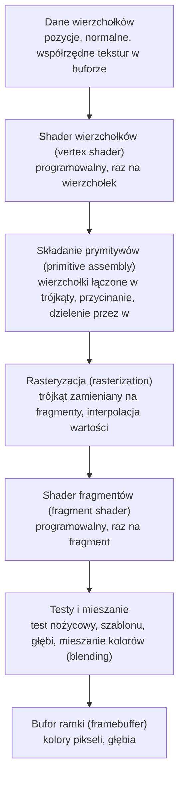
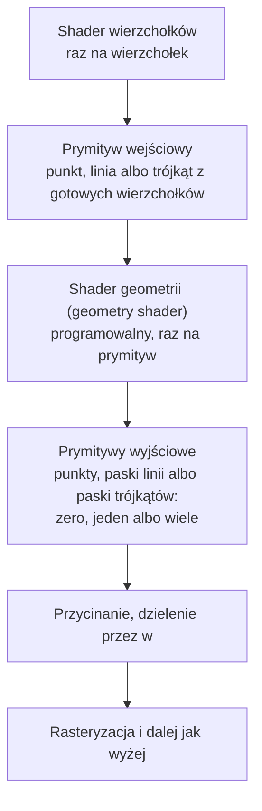

# Moduł gfx: shadery i programowalny potok

Kamień milowy: M1 (dwie pary shaderów doszły w M2 + M3, dwie następne i plik dołączany w M4, w M5 pierwsza para z M1 została usunięta, w M6 doszły program nieba i program trawy, pierwszy z shaderem geometrii, w M7 cztery programy przebiegów po scenie, a w czwartej części M7 program głębi mapy cieni i trzeci plik dołączany przez shadery sceny, `common/shadows.glsl`). Temat wykładu: 2 (Programowalny potok).
Kod: shadery [`assets/shaders/color.vert`](../../../assets/shaders/color.vert) i [`assets/shaders/color.frag`](../../../assets/shaders/color.frag), wejścia i wyjścia w [`assets/shaders/textured.vert`](../../../assets/shaders/textured.vert) i [`assets/shaders/textured.frag`](../../../assets/shaders/textured.frag), użycie w [`src/game/NightMazeApp.cpp`](../../../src/game/NightMazeApp.cpp), klasa w [`src/gfx/Shader.hpp`](../../../src/gfx/Shader.hpp).

Część modułu `gfx`. Wstęp do całego modułu jest w [`README.md`](README.md). Shadery są opisane w pięciu dokumentach. Ten opisuje programowalny potok, język GLSL, najprostszą parę shaderów projektu (`color.vert` i `color.frag`) linia po linii, przekazywanie wartości między etapami na parze `textured` i miejsca, w których programy są używane w klatce. Pełny opis pary `textured.*` (odczyt tekstury, tryby podglądu, uniformy) jest w [`textures.md`](textures.md) (sekcja 4), para `color.*` od strony rysowania pudełek kolizji w [`../scene/collision.md`](../scene/collision.md) (sekcja 4), a `lit.*` i `gouraud.*` w [`../renderer/lighting-gouraud-phong.md`](../renderer/lighting-gouraud-phong.md). Trzeci, opcjonalny etap programu, shader geometrii, ma tu tylko swoje miejsce w potoku (sekcja 2.1): pełny opis, razem z trójką `grass.*` linia po linii, jest w [`../renderer/grass-geometry.md`](../renderer/grass-geometry.md). Wspólny plik oświetlenia `common/lighting.glsl` opisuje [`../scene/lights.md`](../scene/lights.md), a drugi plik dołączany, `common/normal_map.glsl` (mapy normalnych), [`normal-mapping.md`](normal-mapping.md). [`shader-class.md`](shader-class.md) opisuje klasę `gfx::Shader`: wywołania OpenGL, kompilację, linkowanie i odczyt błędów w kodzie. [`uniforms.md`](uniforms.md) opisuje uniformy i funkcję `Shader::setMat4`, [`shader-includes.md`](shader-includes.md) dyrektywę `#include`, której GLSL nie ma, i nazwy plików w błędach, a [`shader-hot-reload.md`](shader-hot-reload.md) wczytywanie na żywo, funkcję `Shader::reload` i panel "Shaders". Druga część tematu 2, czyli skąd shader wierzchołków bierze dane (bufory i tablica wierzchołków), jest w [`buffers-vao.md`](buffers-vao.md).

## 1. Po co to jest

Od OpenGL 3.2 w profilu Core nie da się narysować niczego bez shaderów: stary potok o stałej funkcjonalności (fixed function pipeline) został usunięty, a to, co dzieje się z każdym wierzchołkiem i każdym pikselem, opisują małe programy w języku GLSL, wykonywane przez kartę graficzną. Zanim narysuję pierwszy trójkąt, muszę więc umieć: wczytać tekst shadera z pliku, skompilować go, zlinkować dwa shadery w jeden program i dowiedzieć się, co poszło źle, gdy coś poszło źle.

Robi to klasa `gfx::Shader`, opisana linia po linii w [`shader-class.md`](shader-class.md). Ten dokument opisuje to, co klasa obsługuje: potok, język GLSL i shadery, na których najłatwiej go zobaczyć.

Stan na dziś: `game::NightMazeApp` ma **czternaście** obiektów `gfx::Shader`, czyli czternaście programów (od M8, części 1, także `reflect`; dwa ostatnie, `minimap` i `minimap_overlay`, doszły w szóstej części M7 i opisuje je [`../renderer/minimap.md`](../renderer/minimap.md); opis pozostałych jedenastu poniżej jest z czwartej części): `textured`, `color`, `lit`, `gouraud`, `skybox`, `grass`, `composite`, `preview`, `bright`, `blur` i `shadow_depth` (do trzeciej części M7 było ich dziesięć). Jedenasty, `shadow_depth` (pliki `shadow_depth.vert` i `shadow_depth.frag`), doszedł w czwartej części M7: rysuje teren, labirynt, bramę i kryształy z kierunku księżyca do mapy cieni. Zapisuje samą głębię, więc jego shader wierzchołków czyta tylko pozycję, a shader fragmentów ma pustą funkcję `main`. Opisuje go [`../renderer/shadows.md`](../renderer/shadows.md), sekcja 4. Cztery programy przed nim, `composite`, `preview`, `bright` i `blur`, doszły w M7 i nie rysują sceny: rysują jeden trójkąt na cały cel i dzielą shader wierzchołków `post/composite.vert`. `composite` przenosi obraz sceny z bufora HDR do okna (bloom, ekspozycja, mapowanie tonów, kodowanie sRGB), a `preview` robi obrazki załączników framebuffera dla panelu Framebuffers (oba z pierwszej części). `bright` i `blur` (z drugiej części) to dwa kroki bloomu: przebieg jasności i jeden kierunek rozmycia Gaussa. Opisuje je [`../renderer/post-process.md`](../renderer/post-process.md). Piąty, `skybox` (pliki `skybox.vert` i `skybox.frag`), doszedł w pierwszej części M6, rysuje nocne niebo i jest opisany osobno, w [`../renderer/skybox.md`](../renderer/skybox.md), sekcja 4. Szósty, `grass` (pliki `grass.vert`, `grass.geom` i `grass.frag`), doszedł w drugiej części M6, rysuje kępki trawy i jako jedyny ma trzy etapy: opisuje go [`../renderer/grass-geometry.md`](../renderer/grass-geometry.md). Ten dokument omawia cztery pierwsze, które rysują scenę i linie:

| Pole | Pliki | Co rysuje | Kiedy | Opis shaderów |
|---|---|---|---|---|
| `m_texturedShader` | `textured.vert`, `textured.frag` (dołącza `common/normal_map.glsl`) | scenę bez oświetlenia: teren, ściany, słupki, bramę i kryształy z samymi teksturami (kryształy z własną poświatą), oraz oba widoki diagnostyczne (normalne i UV jako kolor) | tryb oświetlenia `Unlit` albo widok inny niż `Textured` | [`textures.md`](textures.md), sekcja 4. Wejścia i wyjścia etapów: ten dokument, sekcje 4.2 i 4.3 |
| `m_colorShader` | `color.vert`, `color.frag` | linie pudełek i kul kolizji, jednym kolorem | gdy włączy je panel Collision | ten dokument, sekcja 4.1, i [`../scene/collision.md`](../scene/collision.md), sekcja 4 |
| `m_litShader` | `lit.vert`, `lit.frag` (dołącza `common/lighting.glsl`, `common/normal_map.glsl` i, od czwartej części M7, `common/shadows.glsl`) | scenę z oświetleniem liczonym dla każdego fragmentu, od czwartej części M7 z cieniem księżyca | tryby Phong i Blinn-Phong przy widoku `Textured`. **Tak startuje gra** (Blinn-Phong) | [`../renderer/lighting-gouraud-phong.md`](../renderer/lighting-gouraud-phong.md) |
| `m_gouraudShader` | `gouraud.vert` (dołącza `common/lighting.glsl`), `gouraud.frag` (od czwartej części M7 dołącza `common/shadows.glsl`) | scenę z oświetleniem liczonym dla każdego wierzchołka. Cień księżyca jest od czwartej części M7 sprawdzany dla każdego fragmentu | tryb Gouraud przy widoku `Textured` | [`../renderer/lighting-gouraud-phong.md`](../renderer/lighting-gouraud-phong.md) |

Scenę rysuje w danej klatce **jeden** z trzech programów (`textured`, `lit` albo `gouraud`), a linie kolizji, gdy są włączone, program `color`. Razem z programem trawy (gdy pole `Enabled` w panelu Grass jest zaznaczone) i programem nieba, który rysuje na końcu klatki, gdy pole `Skybox` jest zaznaczone, w jednej klatce pracują więc przy rysowaniu sceny najwyżej cztery różne programy, wybierane najwyżej czterema wywołaniami `use()` (sekcja 5.1). Do tego dochodzą programy przebiegów poza sceną: przed nią, od czwartej części M7, `shadow_depth` (gdy cienie są włączone), a po niej programy z M7. "Scena" znaczy od drugiej części M6: teren (jedna siatka z mapy wysokości, która zastąpiła płytki podłogi, [`../renderer/terrain.md`](../renderer/terrain.md)), ściany, słupki, brama i kryształy. Pliki `common/lighting.glsl`, `common/normal_map.glsl` i `common/shadows.glsl` (ten trzeci od czwartej części M7) nie są shaderami i nie mają własnych programów: ich treść trafia do shaderów przez linię `#include`, którą wykonuje kod wczytujący, a nie sterownik ([`shader-includes.md`](shader-includes.md)).

Wszystkie trzynaście programów jest wczytywanych przy starcie i ponownie po każdym naciśnięciu przycisku "Reload shaders" w panelu **Shaders** ([`shader-hot-reload.md`](shader-hot-reload.md), sekcja 6): zmieniam plik `.frag`, naciskam przycisk i widzę efekt bez zamykania okna. Klasa ma sześć funkcji ustawiających uniformy, `setMat4`, `setInt`, `setVec3`, `setMat3`, `setFloat` i `setFloatArray` ([`uniforms.md`](uniforms.md)), i funkcję `bindUniformBlock`, która podłącza blok uniformów ze światłami ([`uniform-buffers.md`](uniform-buffers.md)).

**Historia.** W M1 projekt miał jedną parę, `basic.vert` i `basic.frag`: pozycja i kolor wierzchołka na wejściu, trzy macierze, kolor interpolowany między wierzchołkami. Rysowała kostkę o sześciu kolorowych ścianach i ten dokument omawiał ją linia po linii. W M5 kostka i para `basic` zostały usunięte. Jej rolę w tym dokumencie przejęły dwie pary, które rysują grę: `color` jako najprostszy komplet (jeden atrybut, trzy macierze, jeden kolor) i `textured` jako przykład wartości, które shader wierzchołków przekazuje dalej. Długi komentarz o łańcuchu przestrzeni, który stał w `basic.vert`, jest dziś w `textured.vert`.

**Stan sprawdzenia.** W M4 zmierzone na Windowsie (2026-10-05, MSVC 19.44, RTX 4070 Ti SUPER, sterownik NVIDIA 610.74): build Debug i Release bez ostrzeżeń, gra startowała bez linii `[error]` i bez linii `GL_`, czyli wszystkie ówczesne pliki shaderów (w tym osiem dzisiejszych) i oba pliki dołączane kompilowały się na sterowniku NVIDIA. W M5 w shaderach doszedł uniform `uEmissive` ([`../game/gameplay.md`](../game/gameplay.md), sekcja 4). Dla M5 zgłoszone na Windowsie 2026-10-05: build Debug i Release bez ostrzeżeń, 215 przypadków testowych i 85098 asercji przechodzi, obraz sprawdzony zrzutami ekranu. Dla drugiej części M6 (Windows, 2026-10-05): 256 przypadków testowych i 101232 asercje w Debug i w Release (uruchomione dziś z istniejących buildów), a według zgłoszenia autora zmiany build jest bez ostrzeżeń i wszystkie trzynaście plików shaderów, w tym `grass.geom`, kompiluje się na sterowniku NVIDIA (trawa jest na zrzutach ekranu). Na macOS nic z M4, M5 ani M6 nie było budowane ani uruchamiane, a ręcznie gry z M5 ani z M6 nikt jeszcze nie przeszedł. Dla czwartej części M7 (zgłoszone dla Windowsa, 2026-10-05): bramka `make check` przechodzi, 310 przypadków testowych i 103751 asercji, a build Debug nie zapisał błędów OpenGL przy mapie cieni 2048 i 1024, czyli dwa nowe pliki `shadow_depth.*` i `common/shadows.glsl` z `sampler2DShadow` kompilują się na sterowniku NVIDIA. Shaderów jest dziś dwadzieścia plików i pięć plików dołączanych. Przeładowania jedenastu programów przyciskiem nikt nie sprawdził, a na macOS nic z M7 nie było budowane ani uruchamiane.

## 2. Teoria

### 2.1 Potok renderowania

**Potok renderowania** (rendering pipeline) to stała sekwencja etapów, przez którą przechodzą dane od tablicy liczb w pamięci do kolorów pikseli na ekranie. Dla OpenGL 4.1 i dwóch shaderów, których używa dziesięć z jedenastu programów gry, wygląda tak (wersja z shaderem geometrii jest pod tabelą):



| Etap | Kto go wykonuje | Co wchodzi | Co wychodzi |
|---|---|---|---|
| Dane wierzchołków | mój kod C++ | tablica liczb wysłana do bufora na karcie | atrybuty jednego wierzchołka (na przykład pozycja) |
| Shader wierzchołków | **mój program GLSL** | atrybuty jednego wierzchołka i uniformy | pozycja w przestrzeni przycięcia (`gl_Position`) i dowolne własne wartości dla dalszych etapów |
| Składanie prymitywów | OpenGL, bez mojego kodu | pozycje kolejnych wierzchołków | trójkąty (albo linie, punkty), przycięte do widocznego obszaru i przeliczone na współrzędne okna |
| Rasteryzacja | OpenGL, bez mojego kodu | jeden trójkąt | po jednym **fragmencie** na każdy piksel, który trójkąt zakrywa, z wartościami interpolowanymi między wierzchołkami |
| Shader fragmentów | **mój program GLSL** | interpolowane wartości jednego fragmentu i uniformy | kolor fragmentu |
| Testy i mieszanie | OpenGL, sterowane stanem (`glEnable`, `glDepthFunc`, `glBlendFunc`) | kolor i głębia fragmentu | decyzja, czy fragment trafia do bufora, i jak miesza się z tym, co już tam jest |
| Bufor ramki | OpenGL | zaakceptowane fragmenty | obraz, który `glfwSwapBuffers` pokazuje na ekranie |

**Programowalne** są dwa etapy z tej listy: shader wierzchołków i shader fragmentów. Pozostałe są stałe: mogę je tylko konfigurować przez stan OpenGL, ale nie mogę podmienić ich kodu. Stąd nazwa tematu: programowalny potok.

W pełnym potoku OpenGL 4.1 między shaderem wierzchołków a rasteryzacją są jeszcze dwa etapy opcjonalne: teselacja (tessellation) i shader geometrii (geometry shader). Teselacji projekt nie używa i `gfx::Shader` jej nie obsługuje. **Shader geometrii** obsługuje od drugiej części M6: program może mieć trzeci plik ([`shader-class.md`](shader-class.md), sekcja 5.7), i ma go jeden program gry, `grass`.

**Gdzie stoi shader geometrii.** Po shaderze wierzchołków, przed przycinaniem i rasteryzacją:



Trzy rzeczy odróżniają go od dwóch pozostałych shaderów:

| Cecha | Shader wierzchołków | Shader geometrii | Shader fragmentów |
|---|---|---|---|
| ile razy działa | raz na wierzchołek | raz na **prymityw**, który opuścił shader wierzchołków | raz na fragment |
| co widzi | jeden wierzchołek | wszystkie wierzchołki swojego prymitywu naraz (tablica `gl_in[]`): 1 dla punktu, 2 dla linii, 3 dla trójkąta | jeden fragment |
| ile wypisuje | dokładnie jeden wierzchołek | dowolną liczbę wierzchołków, od zera do zadeklarowanego `max_vertices`: może prymityw usunąć, przepuścić albo zamienić na wiele innych | jeden kolor |

To jedyny etap, który **zmienia liczbę i rodzaj prymitywów**. W grze wchodzi do niego punkt (jedna kępka trawy, rysowana jako `GL_POINTS`), a wychodzą trzy paski trójkątów po pięć wierzchołków: trzy źdźbła. Bufor wierzchołków ma więc jeden wierzchołek na kępkę, a źdźbła istnieją tylko na karcie i powstają od nowa w każdej klatce, dzięki czemu mogą kołysać się na wietrze bez wysyłania danych. Gdy program ma shader geometrii, to on, a nie shader wierzchołków, jest ostatnim etapem, który pisze `gl_Position` w przestrzeni przycięcia: `grass.vert` zostawia pozycję w przestrzeni świata, a macierze widoku i rzutowania stosuje dopiero `grass.geom`. Wartości `out` shadera geometrii są tym, co rasteryzacja interpoluje dla shadera fragmentów. Składnię (`layout(points) in;`, `layout(triangle_strip, max_vertices = N) out;`, `EmitVertex()`, `EndPrimitive()`), koszt i wszystkie trzy pliki trawy linia po linii opisuje [`../renderer/grass-geometry.md`](../renderer/grass-geometry.md).

**Fragment a piksel.** Fragment to "kandydat na piksel": dane dla jednego piksela pochodzące z jednego trójkąta. Na ten sam piksel może przypaść wiele fragmentów (z trójkątów leżących jeden za drugim), a o tym, który wygra, decyduje test głębi. Dlatego shader nazywa się shaderem fragmentów, a nie pikseli.

### 2.2 Co musi zrobić shader wierzchołków

Shader wierzchołków wykonuje się raz dla każdego wierzchołka i ma jeden obowiązek: zapisać do wbudowanej zmiennej `gl_Position` pozycję wierzchołka w **przestrzeni przycięcia** (clip space). To wektor czterech liczb `(x, y, z, w)`.

Po shaderze OpenGL sam wykonuje dwa kroki:

1. **Przycinanie** (clipping): zostaje to, co spełnia `-w <= x <= w`, `-w <= y <= w`, `-w <= z <= w`.
2. **Dzielenie perspektywiczne** (perspective divide): `x`, `y`, `z` są dzielone przez `w`. Wynik to **znormalizowane współrzędne urządzenia** (normalized device coordinates, NDC), w których widoczny obszar to sześcian od -1 do 1 na każdej osi: x w prawo, y w górę.

Potem `glViewport` zamienia NDC na piksele bufora ([`../core/window-context.md`](../core/window-context.md), sekcja 3.2).

Najprostszy shader wpisuje `w = 1`. Wtedy dzielenie niczego nie zmienia i współrzędne podane w shaderze są od razu współrzędnymi NDC: punkt `(0, 0)` to środek okna, `(-1, -1)` lewy dolny róg, `(1, 1)` prawy górny. Shadery projektu mnożą pozycję przez trzy macierze, a ostatnia z nich, macierz rzutowania perspektywicznego, wpisuje do `w` odległość wierzchołka od kamery. Dzielenie przez takie `w` pomniejsza to, co daleko ([`../scene/camera.md`](../scene/camera.md), sekcja 2.3, rzutowanie perspektywiczne).

Poza `gl_Position` shader wierzchołków może przekazać dalej własne wartości (współrzędne tekstury, normalną, kolor) przez zmienne `out`.

### 2.3 Co robi shader fragmentów

Shader fragmentów wykonuje się raz dla każdego fragmentu, czyli znacznie częściej niż shader wierzchołków: trójkąt ma trzy wierzchołki, ale może zakrywać setki tysięcy pikseli. Jego wynikiem jest kolor: zmienna `out vec4` z czterema składowymi (czerwona, zielona, niebieska, alfa), każda w zakresie od 0 do 1.

Na wejściu dostaje wartości, które shader wierzchołków zapisał w swoich zmiennych `out`, ale **zinterpolowane**: rasteryzacja wylicza dla każdego fragmentu wartość pośrednią między trzema wierzchołkami trójkąta, proporcjonalnie do położenia fragmentu. Trójkąt z czerwonym, zielonym i niebieskim wierzchołkiem dostaje dzięki temu płynne przejście kolorów bez żadnego mojego kodu. W projekcie widać to na żywo w dwóch widokach diagnostycznych (sekcja 4.3).

### 2.4 GLSL w pigułce

GLSL (OpenGL Shading Language) jest podobny do C, z typami wektorowymi i macierzowymi wbudowanymi w język.

| Element | Przykład | Znaczenie |
|---|---|---|
| Wersja | `#version 410 core` | Musi być **pierwszą linią** pliku. 410 to GLSL 4.10, czyli wersja odpowiadająca OpenGL 4.1. `core` wybiera profil Core |
| Wejście | `in vec3 aPosition;` | Zmienna wejściowa etapu. W shaderze wierzchołków to atrybut wierzchołka, w shaderze fragmentów interpolowana wartość z poprzedniego etapu |
| Wyjście | `out vec4 fragColor;` | Zmienna wyjściowa etapu. `out` z shadera wierzchołków łączy się z `in` o tej samej nazwie i typie w shaderze fragmentów |
| Położenie | `layout(location = 0) in vec3 aPosition;` | Numer atrybutu wierzchołka. Ten sam numer podaje kod C++, gdy opisuje układ danych w buforze. Bez `layout` numer przydziela linker i trzeba by o niego pytać |
| Uniform | `uniform mat4 uModel;` | Wartość ustawiana z C++ raz na rysowanie, taka sama dla wszystkich wierzchołków i fragmentów. Na przykład macierz, kolor światła, czas |
| Typy skalarne | `float`, `int`, `uint`, `bool` | Jak w C. Literał `1.0` jest typu `float` |
| Wektory | `vec2`, `vec3`, `vec4` | Wektory liczb `float`. Składowe: `.x .y .z .w` albo `.r .g .b .a`. Można je wybierać po kilka naraz: `color.rgb`, `position.xy` |
| Macierze | `mat3`, `mat4` | Macierze 3x3 i 4x4. Mnożenie `mat4 * vec4` jest wbudowane |
| Tekstury | `sampler2D`, `samplerCube` | Uchwyt do tekstury, zawsze jako uniform |
| Konstruktor | `vec4(aPosition, 1.0)` | Buduje wektor z mniejszych części: tu `vec3` i jedna liczba dają `vec4` |
| Funkcja główna | `void main() { ... }` | Punkt wejścia każdego shadera. Nic nie zwraca: wynik zapisuje do `gl_Position` albo do zmiennych `out` |

Nazwy i zachowanie typów są takie same jak w GLM po stronie C++ ([`../../libraries/glm.md`](../../libraries/glm.md)): `glm::vec3` to odpowiednik `vec3`, `glm::mat4` odpowiednik `mat4`.

Przedrostki w nazwach to tylko konwencja, a nie wymóg języka: `a` dla atrybutu (`aPosition`), `u` dla uniformu (`uModel`), `v` dla wartości przekazywanej z shadera wierzchołków do fragmentów (`vUv`, `vNormal`).

### 2.5 Obiekt shadera a obiekt programu

OpenGL ma dwa różne rodzaje obiektów i łatwo je pomylić, bo potocznie oba nazywa się "shaderem":

| | Obiekt shadera (shader object) | Obiekt programu (program object) |
|---|---|---|
| Co reprezentuje | jeden etap: kod wierzchołków **albo** fragmentów | komplet etapów gotowy do rysowania |
| Tworzenie | `glCreateShader(typ)` | `glCreateProgram()` |
| Co się z nim robi | dostaje tekst źródłowy i jest **kompilowany** | dostaje dołączone obiekty shaderów i jest **linkowany** |
| Do czego służy potem | do niczego, to produkt pośredni | `glUseProgram` wybiera go do rysowania |
| Usuwanie | `glDeleteShader` | `glDeleteProgram` |

To ten sam podział co w C++: pliki `.cpp` kompiluje się osobno do plików obiektowych, a linker skleja je w program. Po zlinkowaniu pliki obiektowe nie są już potrzebne do uruchomienia programu. Tak samo obiekty shaderów nie są potrzebne po `glLinkProgram`, więc od razu je usuwam. Klasa `gfx::Shader` wbrew nazwie przechowuje więc identyfikator **programu**, a obiekty shaderów żyją tylko wewnątrz jednej funkcji pomocniczej.

Oba rodzaje obiektów są identyfikowane liczbą typu `GLuint`, nazywaną w dokumentacji OpenGL nazwą (name). Wartość 0 nigdy nie jest poprawnym obiektem: `glCreateShader` i `glCreateProgram` zwracają 0 przy niepowodzeniu, a `glUseProgram(0)` znaczy "żaden program".

### 2.6 Kompilacja a linkowanie

| Krok | Co sprawdza | Typowy błąd |
|---|---|---|
| Kompilacja (`glCompileShader`) | jeden shader w izolacji: składnię, typy, istnienie użytych zmiennych i funkcji | brak średnika, nieznana nazwa, `vec3` przypisany do `vec4`, zła albo brakująca linia `#version` |
| Linkowanie (`glLinkProgram`) | czy etapy pasują do siebie: każda zmienna `in` shadera fragmentów musi mieć zmienną `out` o tej samej nazwie i typie w shaderze wierzchołków, a każdy etap musi mieć `main` | shader fragmentów czyta `in vec2 vUv`, którego shader wierzchołków nie zapisuje |

Kompilator GLSL jest częścią **sterownika karty graficznej**, a nie mojego programu. Dlatego ten sam shader może dać różne komunikaty (a czasem różny wynik) na różnych kartach, a format tekstu błędu zależy od producenta:

| Sterownik | Surowa linia błędu, tak jak pisze ją sterownik |
|---|---|
| Apple (macOS) | `ERROR: 0:5: '}' : syntax error: syntax error` |
| NVIDIA (Windows) | `0(15) : error C0000: syntax error, unexpected '}', expecting ',' or ';' at token "}"` |

W formacie Apple `0:5` to numer napisu źródłowego (source string number) i numer linii. W formacie NVIDII te same dwie liczby stoją jako `0(15)`: numer napisu, a w nawiasie numer linii. Obie linie są zmierzone, w M1. Pierwsza pochodzi z testu klasy na Macu ([`shader-class.md`](shader-class.md), sekcja 5.10), druga z programu `night_maze` uruchomionego na Windowsie z usuniętym średnikiem w ówczesnym shaderze fragmentów (sterownik NVIDIA 610.74, [`../../guides/build-windows.md`](../../guides/build-windows.md), sekcja 11). Numery linii się różnią, bo to dwa różne pliki testowe.

**Co wypisuje dziś mój program.** Numer napisu był w M1 zawsze zerem, bo sterownik dostawał jeden napis bez żadnych dodatków. Od M4 shader może dołączać inne pliki, a każdy plik dostaje własny numer (0 to sam plik shadera, 1 pierwszy dołączony). Sama liczba nic nie mówi czytającemu, więc klasa `Shader` zamienia ją na nazwę pliku, zanim zapisze komunikat. To jedyna zmiana, jaką wprowadza w tekście sterownika: reszta linii, razem z numerem linii i opisem błędu, zostaje nietknięta, a linia w formacie, którego kod nie rozpoznaje, zostaje nietknięta w całości.

| Sytuacja | Surowa linia sterownika | Linia w konsoli i w panelu Shaders | Skąd wiadomo |
|---|---|---|---|
| błąd w shaderze bez dołączeń, format NVIDII | `0(4) : error C0000: x` | `color.frag(4) : error C0000: x` | test jednostkowy w `tests/ShaderSourceTests.cpp` |
| błąd w pliku dołączonym do `lit.frag`, format NVIDII | `1(63) : error C0000: syntax error, unexpected ';', expecting "::" at token ";"` | `common/lighting.glsl(63) : error C0000: syntax error, unexpected ';', expecting "::" at token ";"` | zmierzone w M4 na Windowsie (2026-10-05, sterownik NVIDIA 610.74) |
| błąd w pliku dołączonym, format Apple | `ERROR: 1:15: Use of undeclared identifier 'x'` | `ERROR: common/lighting.glsl:15: Use of undeclared identifier 'x'` | test jednostkowy. Na macOS tej wersji nikt nie uruchomił |

Gdy shader składa się z więcej niż jednego pliku, komunikat kończy się linią-legendą `Source files: 0 = lit.frag, 1 = common/lighting.glsl`. Jak działa zamiana i skąd sterownik bierze numer 1, opisuje [`shader-includes.md`](shader-includes.md) (sekcje 2.3 i 5.9).

Zarówno wynik kompilacji, jak i linkowania trzeba **odczytać samemu**: OpenGL nie zgłasza ich przez `glGetError` ([`shader-class.md`](shader-class.md), sekcja 3.3).

Dwa zagadnienia teorii mają własne dokumenty. Wczytywanie na żywo (hot reload), czyli podmiana programu w działającej aplikacji, jest w [`shader-hot-reload.md`](shader-hot-reload.md) (sekcja 2). Uniformy, czyli wartości ustawiane z C++ raz na rysowanie, są w [`uniforms.md`](uniforms.md) (sekcja 2).

## 3. Jak to działa w OpenGL

Zbudowanie programu z dwóch plików i użycie go to po stronie OpenGL trzy kroki, które odpowiadają pojęciom z sekcji 2.5 i 2.6:

| Krok | Wywołania | Wynik |
|---|---|---|
| kompilacja, osobno dla każdego etapu | `glCreateShader`, `glShaderSource`, `glCompileShader` | dwa obiekty shaderów |
| linkowanie | `glCreateProgram`, `glAttachShader`, `glLinkProgram` | jeden obiekt programu, obiekty shaderów można usunąć |
| użycie, co klatkę | `glUseProgram`, potem ustawienie uniformów i wywołanie rysujące | potok z sekcji 2.1 wykonany dla podanych wierzchołków |

Pełna tabela wywołań z parametrami, diagram obiektów i odczyt błędów kompilacji, których `glGetError` nie zgłasza, są w [`shader-class.md`](shader-class.md) (sekcje 3.1, 3.2 i 3.3). Ustawianie uniformów opisuje [`uniforms.md`](uniforms.md) (sekcja 3).

## 4. Shadery

Ten dokument zajmuje się czterema parami shaderów z tabeli w sekcji 1, w katalogu [`assets/shaders/`](../../../assets/shaders/), i plikami dołączanymi z podkatalogu `common/`, z których te pary korzystają (`lighting.glsl`, `normal_map.glsl`, a od czwartej części M7 `shadows.glsl`). Cały katalog miał po czwartej części M7 jedenaście programów (po M8, części 1: czternaście) i pięć plików dołączanych (dochodzą `color.glsl` i `depth.glsl` z M7). Wszystkie cztery shadery wierzchołków stawiają wierzchołek w scenie tymi samymi trzema macierzami, i tak samo robi piąty, `shadow_depth.vert`, tylko z macierzami światła zamiast kamery. Ta sekcja pokazuje dwie pary:

- `color` (sekcja 4.1) to najprostszy komplet: jeden atrybut (pozycja), trzy macierze, jeden kolor z uniformu. Oba pliki są tu omówione w całości.
- `textured` (sekcja 4.2) dodaje to, czego w `color` nie ma: wartości, które shader wierzchołków zapisuje w zmiennych `out`, rasteryzacja interpoluje, a shader fragmentów czyta w zmiennych `in`. Tutaj omawiam tylko te wejścia i wyjścia. Odczyt tekstury, tryby podglądu i uniformy są w [`textures.md`](textures.md), sekcja 4.

Pary `lit` i `gouraud` dokładają do tekstury oświetlenie, pierwsza w shaderze fragmentów, druga w shaderze wierzchołków ([`../renderer/lighting-gouraud-phong.md`](../renderer/lighting-gouraud-phong.md)). Kod oświetlenia obu tych par jest wspólny i leży w `common/lighting.glsl` ([`../scene/lights.md`](../scene/lights.md)), dołączanym linią `#include "common/lighting.glsl"` ([`shader-includes.md`](shader-includes.md), sekcja 4).

### 4.1 Para `color`: najprostszy komplet

Cały plik [`assets/shaders/color.vert`](../../../assets/shaders/color.vert):

```glsl
#version 410 core
// Vertex shader for shapes drawn in one flat colour: the lines of the collision boxes
// and spheres.
// See docs/modules/scene/collision.md

// Input: only the position. The mesh also carries a normal (location 1), a texture
// coordinate (location 2) and a tangent (location 3), but a shader may leave attributes
// it does not need unread.
layout(location = 0) in vec3 aPosition; // x, y, z in the local space of the shape

// Uniforms: set from C++ (gfx::Shader::setMat4).
uniform mat4 uModel;      // local space to world space
uniform mat4 uView;       // world space to view space
uniform mat4 uProjection; // view space to clip space

void main() {
    // The same chain as in textured.vert: local, world, view, clip space.
    gl_Position = uProjection * uView * uModel * vec4(aPosition, 1.0);
}
```

| Linia | Co robi |
|---|---|
| `#version 410 core` | GLSL 4.10, profil Core. Musi być pierwszą linią pliku, dlatego komentarz z opisem stoi dopiero pod nią |
| `layout(location = 0) in vec3 aPosition;` | Atrybut wierzchołka numer 0: trzy liczby `float`, pozycja w przestrzeni lokalnej kształtu. Numer 0 to stała `gfx::POSITION_ATTRIBUTE` w `src/gfx/Vertex.hpp`. Siatka ma jeszcze trzy atrybuty (normalną, uv, styczną), ale ten shader ich nie deklaruje, więc ich nie czyta ([`buffers-vao.md`](buffers-vao.md), sekcja 4) |
| `uniform mat4 uModel;` | Macierz modelu: z przestrzeni lokalnej do przestrzeni świata. Ustawiana z C++ przez `setMat4(MODEL_UNIFORM, ...)`. Dla pudełka kolizji to skala do rozmiaru pudełka i przesunięcie do jego rogu, dla okręgu skala do promienia, obrót i przesunięcie do środka kuli |
| `uniform mat4 uView;` | Macierz widoku: ze świata do przestrzeni kamery. Wartość z `scene::Camera::viewMatrix()` |
| `uniform mat4 uProjection;` | Macierz rzutowania: z przestrzeni kamery do przestrzeni przycięcia. Wartość z `scene::Camera::projectionMatrix()` |
| `void main() {` | Funkcja wykonywana raz dla każdego wierzchołka wskazanego przez indeksy. Sześcian z krawędzi ma 8 wierzchołków, okrąg 32 |
| `gl_Position = uProjection * uView * uModel * vec4(aPosition, 1.0);` | Pozycja w przestrzeni przycięcia. Z `vec3` robię `vec4`, dopisując `w = 1` (bo to punkt), i mnożę kolejno przez trzy macierze. Wyrażenie czyta się **od prawej do lewej**: najpierw `uModel`, potem `uView`, na końcu `uProjection` |

W tym shaderze nie ma ani jednej zmiennej `out`. Jedyne, co przekazuje dalej, to wbudowane `gl_Position`.

Komentarz w `main` odsyła do `textured.vert`, gdzie ten sam łańcuch jest rozpisany krok po kroku (do M4 stał w `basic.vert`):

```glsl
    // gl_Position is the built-in output every vertex shader must write: the position in
    // clip space. The expression is read from right to left, the matrix nearest to the
    // vector is applied first:
    //   vec4(aPosition, 1.0)  the vertex in local space, w = 1 because it is a point
    //   uModel * ...          the vertex in world space
    //   uView * ...           the vertex in view space, as seen from the camera
    //   uProjection * ...     the vertex in clip space
    // After this shader the graphics card divides x, y and z by w (the distance from the
    // camera), which is what makes distant things small.
    gl_Position = uProjection * uView * uModel * vec4(aPosition, 1.0);
```

Dlaczego mnożenie czyta się od prawej i czym są te trzy przestrzenie, opisują [`../scene/transforms.md`](../scene/transforms.md) (sekcje 2.1 i 2.5: przestrzenie współrzędnych, zapis kolumnowy i czytanie od prawej) i [`../scene/camera.md`](../scene/camera.md) (sekcja 5: droga wierzchołka przez trzy macierze). Nazwy uniformów w shaderze muszą być identyczne z napisami w C++ (stałe `MODEL_UNIFORM`, `VIEW_UNIFORM`, `PROJECTION_UNIFORM` w `src/game/ShaderUniforms.hpp`, [`uniforms.md`](uniforms.md), sekcja 5.5). Dlaczego shader dostaje trzy osobne macierze, a nie jeden gotowy iloczyn, wyjaśnia [`uniforms.md`](uniforms.md) (sekcja 4).

Cały plik [`assets/shaders/color.frag`](../../../assets/shaders/color.frag):

```glsl
#version 410 core
// Fragment shader for shapes drawn in one flat colour: the lines of the collision boxes
// and spheres.
// See docs/modules/scene/collision.md

// The colour of the whole shape (red, green, blue), set from C++ (gfx::Shader::setVec3).
uniform vec3 uColor;

// Output: the color written to the framebuffer (red, green, blue, alpha).
out vec4 fragColor;

void main() {
    // Every fragment gets the same colour. Alpha 1 means fully opaque.
    fragColor = vec4(uColor, 1.0);
}
```

| Linia | Co robi |
|---|---|
| `uniform vec3 uColor;` | Kolor całego kształtu, ustawiany z C++ przez `setVec3(COLOR_UNIFORM, ...)`. Uniform ma tę samą wartość dla każdego fragmentu jednego wywołania rysującego, więc każda linia jest jednolita |
| `out vec4 fragColor;` | Wyjście shadera: kolor fragmentu. Nazwa jest dowolna. Shader fragmentów z jednym wyjściem zapisuje je do pierwszego bufora koloru |
| `fragColor = vec4(uColor, 1.0);` | Kolor z trzech składowych i alfa równa 1, czyli pełne krycie |

W tym shaderze nie ma ani jednej zmiennej `in`. Oba etapy łączy więc tylko to, co łączy je zawsze: pozycje z `gl_Position`, z których rasteryzacja wylicza, które piksele zakrywa odcinek. Linker nie ma tu żadnej pary `out` i `in` do dopasowania. To najmniejszy program, jaki da się zlinkować i zobaczyć na ekranie: pozycja wchodzi, stały kolor wychodzi.

### 4.2 Para `textured`: wyjścia, które interpoluje rasteryzacja

Wejścia i wyjścia shadera wierzchołków [`assets/shaders/textured.vert`](../../../assets/shaders/textured.vert):

```glsl
layout(location = 0) in vec3 aPosition; // x, y, z in the local space of the model
layout(location = 1) in vec3 aNormal;   // direction the surface faces, length 1
layout(location = 2) in vec2 aUv;       // texture coordinate (u, v), v = 0 is the bottom
layout(location = 3) in vec3 aTangent;  // direction on the surface in which u grows, length 1
```

```glsl
// Outputs to the fragment shader. The rasterizer blends them between the three vertices
// of a triangle. The fragment shader declares inputs with the same names and types.
out vec2 vUv;      // texture coordinate
out vec3 vNormal;  // normal in world space
out vec3 vTangent; // tangent in world space
```

W `main`, po tej samej linii `gl_Position` co w `color.vert`, stoją trzy przypisania (komentarze z pliku są tu pominięte):

```glsl
    vUv = aUv;
    vNormal = mat3(uModel) * aNormal;
    vTangent = mat3(uModel) * aTangent;
```

A w shaderze fragmentów [`assets/shaders/textured.frag`](../../../assets/shaders/textured.frag):

```glsl
// Inputs from the vertex shader: same names and types as its outputs, already
// interpolated for this fragment.
in vec2 vUv;      // texture coordinate
in vec3 vNormal;  // normal in world space, no longer exactly of length 1
in vec3 vTangent; // tangent in world space, no longer exactly of length 1
```

| Linia | Co robi |
|---|---|
| cztery linie `layout(location = N) in` | cztery atrybuty `gfx::Vertex`, pod numerami ze stałych w `src/gfx/Vertex.hpp` ([`mesh.md`](mesh.md), sekcja 2.4) |
| `out vec2 vUv;` | wyjście do następnego etapu. Shader wierzchołków zapisuje tu współrzędną tekstury swojego wierzchołka, a rasteryzacja interpoluje ją między trzema wierzchołkami trójkąta |
| `out vec3 vNormal;`, `out vec3 vTangent;` | to samo dla normalnej i stycznej, już w przestrzeni świata |
| `vUv = aUv;` | współrzędna tekstury przechodzi bez zmian: należy do powierzchni, a nie do miejsca, w którym stoi obiekt |
| `vNormal = mat3(uModel) * aNormal;` | normalna to kierunek, a nie punkt: ma się obracać razem z obiektem, ale nie przesuwać. `mat3(uModel)` to lewy górny blok 3 x 3 macierzy modelu, czyli obrót i skala bez przesunięcia ([`textures.md`](textures.md), sekcja 4.1) |
| `in vec2 vUv;` | wejście: ta sama nazwa i ten sam typ co `out vec2 vUv` w shaderze wierzchołków. **Po tej nazwie linker łączy oba etapy.** Wartość jest już zinterpolowana dla tego fragmentu |
| komentarz "no longer exactly of length 1" | skutek interpolacji, który trzeba znać: wartość pośrednia między dwoma wektorami o długości 1, które wskazują w różne strony, jest krótsza niż 1. Dlatego shader fragmentów normalizuje normalną, zanim jej użyje (funkcja `surfaceNormal` w `common/normal_map.glsl`) |

Trzy rzeczy do zapamiętania o parze `out` i `in`:

1. **Łączy je nazwa i typ.** `out vec2 vUv` i `in vec2 vUv`. Literówka w jednej z nazw nie jest błędem kompilacji żadnego z plików, tylko błędem linkowania (sekcja 2.6).
2. **Shader wierzchołków zapisuje wartość raz na wierzchołek, a shader fragmentów czyta ją raz na fragment.** Pomiędzy stoi rasteryzacja, która z trzech wartości na rogach trójkąta robi osobną wartość dla każdego piksela.
3. **W żadnym z dwóch shaderów nie ma ani jednej linii, która tę wartość pośrednią liczy.** Robi to etap stały potoku.

Pary `lit` i `gouraud` używają tego samego mechanizmu do innych danych. `lit.vert` przekazuje dodatkowo `vWorldPosition`, pozycję w przestrzeni świata, z której shader fragmentów liczy kierunek do światła dla każdego piksela. `gouraud.vert` liczy światło sam i przekazuje gotowy wynik w `vDiffuseLight` i `vSpecularLight`: to, że między wierzchołkami jest on interpolowany, a nie liczony, jest całą różnicą między cieniowaniem Gourauda a Phonga ([`../renderer/lighting-gouraud-phong.md`](../renderer/lighting-gouraud-phong.md)). Od czwartej części M7 `gouraud.vert` ma cztery wyjścia więcej, wszystkie dla cienia księżyca: `vMoonDiffuseLight` i `vMoonSpecularLight` (udział księżyca w dwóch wartościach światła), `vWorldPosition` (pozycja, którą shader fragmentów sprawdza w mapie cieni) i `vMoonFacing` (jak bardzo powierzchnia jest zwrócona do księżyca, dla biasu). Światło zostaje policzone w wierzchołkach, ale pytanie "czy ten punkt leży w cieniu" zadaje dopiero `gouraud.frag`, dla każdego fragmentu, bo krawędź cienia biegnie przez ścianę w dowolnym miejscu, a ściana ma cztery wierzchołki ([`../renderer/shadows.md`](../renderer/shadows.md), sekcja 2.15).

### 4.3 Skąd biorą się kolory na ekranie

Kolor fragmentu ma w projekcie trzy źródła, od najprostszego:

| Źródło | Przykład | Jak zmienia się w obrębie jednego trójkąta albo odcinka |
|---|---|---|
| uniform | `color.frag`: `fragColor = vec4(uColor, 1.0)` | wcale: ta sama wartość dla każdego fragmentu wywołania rysującego |
| interpolowana wartość pokazana wprost | `textured.frag` w widokach `Normals as colour` i `UVs as colour` | płynnie, tak jak rasteryzacja interpoluje wartość między wierzchołkami |
| tekstura czytana w interpolowanym miejscu | `textured.frag`, `lit.frag`, `gouraud.frag`: `texture(uTexture, vUv)` | tak, jak wygląda obraz tekstury: interpolowane jest **miejsce** odczytu, a kolor pochodzi z obrazu |

Dwa widoki diagnostyczne są żywym obrazem interpolacji. Przełącza je lista `View mode` w panelu **Assets** ([`textures.md`](textures.md), sekcja 6), a rysuje je program `textured` niezależnie od trybu oświetlenia.

**`UVs as colour`.** Shader fragmentów wypisuje interpolowaną współrzędną tekstury jako kolor:

```glsl
        fragColor = vec4(fract(vUv), 0.0, 1.0);
```

`u` idzie do kanału czerwonego, `v` do zielonego. Weźmy teren, który od drugiej części M6 jest podłożem gry (do M5 przykładem była tu płytka podłogi, model `floor_tile.obj`, usunięty razem z płytkami). Teren jest siatką punktów co 0,5 m, a współrzędną tekstury każdego wierzchołka liczy `game::buildTerrainMesh` z jego pozycji w świecie: `u = x / 4`, `v = -z / 4` (stała `GROUND_TEXTURE_SPAN = 4.0F`, czyli jedno powtórzenie tekstury na 4 m). Dwa sąsiednie wierzchołki wzdłuż osi X mają więc `u` różne o 0,125: na przykład 0,25 dla x = 1 m i 0,375 dla x = 1,5 m. Shader wierzchołków zapisuje `vUv` tylko w tych punktach. Wszystkie wartości pomiędzy, po jednej na każdy piksel, wylicza rasteryzacja: w połowie drogi fragment dostaje `u = 0,3125`. Funkcja `fract` zostawia część ułamkową, więc czerwień rośnie płynnie od 0 do 1 na odcinku 4 m, a tam, gdzie x jest wielokrotnością 4 m (`u` jest liczbą całkowitą), skacze z powrotem do 0. Płynne przejście to interpolacja, a skok to `fract`: w tym miejscu tekstura zaczyna się od nowa. Zieleń robi to samo wzdłuż osi Z, w przeciwną stronę. Ten opis wynika z kodu `buildTerrainMesh` i z kodu shadera. Samego widoku na terenie nie oglądałem.

**`Normals as colour`.** Shader wypisuje normalną, przeliczoną z zakresu od -1 do 1 na zakres koloru od 0 do 1:

```glsl
        vec3 normal = surfaceNormal(vNormal, vTangent, vUv);
        fragColor = vec4(normal * 0.5 + 0.5, 1.0);
```

Przy wyłączonym polu `Normal mapping` funkcja `surfaceNormal` zwraca znormalizowaną normalną modelu. Wszystkie wierzchołki płaskiej ściany mają **tę samą** normalną (dlatego róg prostopadłościanu jest w buforze kilka razy, [`indexed-drawing.md`](indexed-drawing.md), sekcja 2.1). Dla każdego piksela wewnątrz trójkąta rasteryzacja wylicza `vNormal` jako średnią ważoną trzech wierzchołków, z wagami zależnymi od położenia. Średnia z trzech równych wartości to ta sama wartość, więc cała ściana ma jeden kolor: ściana zwrócona w stronę +Z, o normalnej (0, 0, 1), wychodzi jako (0,5, 0,5, 1), czyli jasny błękit, a każda pozioma powierzchnia o normalnej (0, 1, 0), na przykład wierzch muru, jako (0,5, 1, 0,5), czyli jasna zieleń. Interpolacja nadal działa, tylko nie ma czego mieszać. Teren jest przypadkiem pośrednim: każdy jego wierzchołek ma własną normalną, policzoną z nachylenia podłoża (`Terrain::gridNormal`), ale w labiryncie nachylenia są małe, więc normalne są bliskie (0, 1, 0), a teren jest prawie jednolicie jasnozielony, z łagodnymi przejściami odcienia między wierzchołkami. To ta sama obserwacja, którą w M1 dawała kostka: każda jej ściana miała cztery wierzchołki o tym samym kolorze i dlatego była jednolita. Z włączonym polem `Normal mapping` (i trybem oświetlenia innym niż Gouraud) normalna pochodzi z mapy normalnych czytanej w miejscu `vUv`, więc kolor zmienia się z piksela na piksel ([`normal-mapping.md`](normal-mapping.md)).

Oba widoki razem pokazują dwa przypadki tej samej reguły: wartość różna w wierzchołkach daje gradient (`vUv`), wartość równa w wierzchołkach daje płaski kolor (`vNormal` na płaskiej ścianie).

Rozszerzenia plików (`.vert`, `.frag`) nie mają dla OpenGL żadnego znaczenia: o typie shadera decyduje stała podana do `glCreateShader`, a nie nazwa pliku. Rozszerzenia są dla ludzi i dla edytora, który według nich włącza kolorowanie składni GLSL ([`../../guides/project-structure.md`](../../guides/project-structure.md), sekcja 3.10).

Jak pliki z `assets/` trafiają obok programu, opisuje [`../core/paths.md`](../core/paths.md) (sekcja 5.8) i [`../../guides/project-structure.md`](../../guides/project-structure.md) (sekcja 3.1, blok 7).

## 5. Kod w projekcie

Kod, który buduje program z plików, czyli klasa `gfx::Shader`, jest opisany w [`shader-class.md`](shader-class.md) (sekcja 5). Tutaj jest druga strona: gdzie gotowy program jest używany w klatce.

### 5.1 Użycie w `NightMazeApp`

Właścicielem wszystkich trzynastu programów jest `game::NightMazeApp`. Poniżej są miejsca, w których pojawiają się programy `color` i `textured`. Nazwy uniformów są w osobnym nagłówku, opisanym w [`uniforms.md`](uniforms.md) (sekcja 5.5). Całą klasę (kolejność pól, konstruktor, klatkę) omawia [`../core/README.md`](../core/README.md).

**Pola** w [`NightMazeApp.hpp`](../../../src/game/NightMazeApp.hpp):

```cpp
    gfx::Shader m_texturedShader;
    gfx::Shader m_colorShader;
    gfx::Shader m_litShader;
    gfx::Shader m_gouraudShader;
    gfx::Shader m_skyboxShader;
    gfx::Shader m_grassShader;
    gfx::Shader m_compositeShader;
    gfx::Shader m_previewShader;
    gfx::Shader m_brightPassShader;
    gfx::Shader m_blurShader;
    // Draws depth only, from the view of a light: the program of the shadow pass.
    gfx::Shader m_shadowDepthShader;
```

Jako pola klasy pochodnej od `core::Application` obiekty powstają po oknie i kontekście OpenGL, a giną przed nimi ([`../core/README.md`](../core/README.md)). Trzynaście programów stoi na początku listy pól posiadających obiekty OpenGL (sześć pierwszych to stan z M6, cztery następne doszły w M7, ostatnie w czwartej części M7). Ich miejsce względem pozostałych pól nie ma znaczenia: utworzenie programu nie wiąże żadnego bufora ani VAO. Komentarz nad polami wymienia jedyną zależność kolejności: renderery labiryntu, rundy i terenu proszą `m_assets` o modele i tekstury w swoich konstruktorach, więc stoją po nim.

Dziesięć obiektów powstaje w liście inicjalizacyjnej z dwóch ścieżek. Szósty, `m_grassShader`, dostaje trzy, a ścieżka shadera geometrii jest ostatnia, chociaż ten etap działa jako drugi ([`shader-class.md`](shader-class.md), sekcja 5.2):

```cpp
      // The geometry shader is the third argument, although it runs second: it is the
      // optional one.
      m_grassShader(core::assetPath(GRASS_VERTEX_SHADER_FILE),
                    core::assetPath(GRASS_FRAGMENT_SHADER_FILE),
                    core::assetPath(GRASS_GEOMETRY_SHADER_FILE)),
```

**Nazwy plików** w anonimowej przestrzeni nazw [`NightMazeApp.cpp`](../../../src/game/NightMazeApp.cpp):

```cpp
// Shader files, relative to the assets directory. The scene without lighting is drawn
// with the first pair, the lines of the collision boxes and spheres with the second, the
// scene with lighting per fragment with the third, with lighting per vertex with the
// fourth and the sky with the fifth. The grass has three files: between its vertex and
// its fragment shader runs a geometry shader. The four programs after it do not draw
// the scene: they draw one triangle over the whole target and share its vertex shader. The
// composite program brings the HDR picture of the scene to the window, the preview
// program makes the pictures of the framebuffer attachments for the debug UI, and the
// bright pass and blur programs are the two steps of the bloom. The shadow depth
// program draws the scene from a light into a shadow map: positions only, no colours.
constexpr const char* TEXTURED_VERTEX_SHADER_FILE = "shaders/textured.vert";
constexpr const char* TEXTURED_FRAGMENT_SHADER_FILE = "shaders/textured.frag";
constexpr const char* COLOR_VERTEX_SHADER_FILE = "shaders/color.vert";
constexpr const char* COLOR_FRAGMENT_SHADER_FILE = "shaders/color.frag";
constexpr const char* LIT_VERTEX_SHADER_FILE = "shaders/lit.vert";
constexpr const char* LIT_FRAGMENT_SHADER_FILE = "shaders/lit.frag";
constexpr const char* GOURAUD_VERTEX_SHADER_FILE = "shaders/gouraud.vert";
constexpr const char* GOURAUD_FRAGMENT_SHADER_FILE = "shaders/gouraud.frag";
```

Osiem nazw, cztery pary: to początek listy. Dalej stoją w pliku nazwy plików nieba, trawy, wspólnego shadera wierzchołków i czterech shaderów fragmentów przebiegów po scenie, a od czwartej części M7 także `SHADOW_DEPTH_VERTEX_SHADER_FILE` i `SHADOW_DEPTH_FRAGMENT_SHADER_FILE`. Plików z katalogu `common/` na tej liście nie ma: kod C++ nie zna ich nazw, wymieniają je tylko linie `#include` w shaderach.

**Wczytanie** na liście inicjalizacyjnej konstruktora:

```cpp
      m_texturedShader(core::assetPath(TEXTURED_VERTEX_SHADER_FILE),
                       core::assetPath(TEXTURED_FRAGMENT_SHADER_FILE)),
      m_colorShader(core::assetPath(COLOR_VERTEX_SHADER_FILE),
                    core::assetPath(COLOR_FRAGMENT_SHADER_FILE)),
      m_litShader(core::assetPath(LIT_VERTEX_SHADER_FILE),
                  core::assetPath(LIT_FRAGMENT_SHADER_FILE)),
      m_gouraudShader(core::assetPath(GOURAUD_VERTEX_SHADER_FILE),
                      core::assetPath(GOURAUD_FRAGMENT_SHADER_FILE)),
```

`core::assetPath` zamienia nazwę względną na pełną ścieżkę w katalogu `assets/` obok pliku wykonywalnego ([`../core/paths.md`](../core/paths.md)), więc shadery znajdują się niezależnie od katalogu roboczego. Wynik `assetPath` jest obiektem tymczasowym, który trafia do parametru konstruktora `Shader` przez przeniesienie ([`shader-class.md`](shader-class.md), sekcja 5.8). Konstruktor `Shader` nie rzuca przy błędzie w shaderze. Wyjątek może natomiast rzucić samo `core::assetPath`, gdy system nie potrafi podać położenia programu: wtedy konstruktor aplikacji zostaje przerwany, a wyjątek łapie `catch` w `main` i program kończy się linią `[error] Fatal: ...`.

**Wspólna część klatki** na końcu `NightMazeApp::onRender`. `onRender` liczy to, co wspólne, i woła funkcje rysujące. Między macierzami a rysowaniem stoi zbudowanie i wysłanie świateł klatki (`lightingForFrame`, `crystalLightPositions`, `buildLightSet` i `m_lightRig.upload`), opisane w [`../game/flashlight.md`](../game/flashlight.md), [`../game/gameplay.md`](../game/gameplay.md) i [`uniform-buffers.md`](uniform-buffers.md):

> Uwaga (2026-10-06, M9 część 1): fragment `onRender` poniżej pochodzi sprzed kamery menu i jest skrócony. Dziś `onRender` woła na początku `updateMenuCameraSwitch()`, a macierze, kierunek latarki i podglądy bufora głębi bierze z kopii kamery `frameCamera` (kamera gracza albo poza kamery menu), a oko `eye` bywa podmienione na oko kamery menu. Klawisze R, N, F i M, obrót myszą i wskazywanie mają warunek `!menuCamera`, `frameLighting` nie jest `const` (w trybie menu latarka jest ustawiana osobno), a minimapa nie jest rysowana. Opis: [`menu-camera.md`](../game/menu-camera.md), sekcja 5.4.

```cpp
    // The two matrices that are the same for everything drawn in this frame.
    const glm::mat4 view = m_camera.viewMatrix(eye);
    const glm::mat4 projection = m_camera.projectionMatrix(aspectRatio);
```

```cpp
    drawMaze(view, projection);
    if (m_drawColliders) {
        drawColliderLines(view, projection);
    }
```

| Linia | Co robi i dlaczego |
|---|---|
| `const glm::mat4 view = ...` i `projection` | macierz widoku i rzutowania są takie same dla wszystkiego, co rysuje ta klatka, więc są liczone raz, a nie w każdej funkcji. Skąd biorą się `eye` i `aspectRatio`: [`../scene/camera.md`](../scene/camera.md), sekcja 5, i [`../game/player.md`](../game/player.md) |
| `drawMaze(view, projection);` | cała scena z modeli (labirynt, brama, kryształy) **jednym z trzech** programów. Funkcja tylko wybiera (niżej) |
| `if (m_drawColliders) { drawColliderLines(view, projection); }` | linie pudełek i kul kolizji programem `color`, tylko gdy włączy je panel Collision ([`../scene/collision.md`](../scene/collision.md), sekcja 6) |

Na tym `NightMazeApp::onRender` się kończy. Panele debug i HUD rysuje potem `DebugNightMazeApp::onRender` w `main.cpp`, przez `debug::DebugUI::draw`.

Wybór programu sceny:

```cpp
void NightMazeApp::drawMaze(const glm::mat4& view, const glm::mat4& projection) const {
    // The two debug views (normals and texture coordinates as colours) only exist in the
    // textured program, and they show data, not light. So they are drawn without
    // lighting whatever the lighting mode is. The view of the normals still follows the
    // lighting in one thing: it shows the normals the chosen mode shades with.
    if (m_lighting.mode == LightingMode::Unlit || m_viewMode != ViewMode::Textured) {
        drawUnlitMaze(view, projection);
    } else {
        drawLitMaze(view, projection);
    }
}
```

| Warunek | Funkcja | Program |
|---|---|---|
| tryb `Unlit` **albo** widok inny niż `Textured` | `drawUnlitMaze` | `textured` |
| pozostałe przypadki, tryb Gouraud | `drawLitMaze` | `gouraud` |
| pozostałe przypadki, tryb Phong albo Blinn-Phong | `drawLitMaze` | `lit`. Oba tryby różnią się tylko wartością uniformu `uSpecularModel` |

Ostatnie zdanie komentarza dotyczy map normalnych: widok normalnych nie ma oświetlenia, ale pokazuje normalne, którymi cieniowałby wybrany tryb. Pod `Phong`, `Blinn-Phong` i `Unlit` są to (przy zaznaczonym polu `Normal mapping`) normalne z map, pod `Gouraud` normalne modelu ([`textures.md`](textures.md), sekcja 4, i [`normal-mapping.md`](normal-mapping.md)).

`drawLitMaze` i przełącznik trybu opisuje [`../renderer/lighting-gouraud-phong.md`](../renderer/lighting-gouraud-phong.md). W jednej klatce `use()` jest więc wołane najwyżej cztery razy: raz dla sceny, raz dla trawy (od drugiej części M6, w `GrassRenderer::draw`, wołanym z `NightMazeApp::drawGrass` zaraz po `drawMaze`), raz dla linii i raz dla nieba (od pierwszej części M6, w `Skybox::draw`). To liczba dla przebiegu sceny. Przed nim, od czwartej części M7, `NightMazeApp::drawShadowCasters` woła `use()` programu `shadow_depth` (gdy cienie są włączone), a `drawGrass` woła `m_grassShader.use()` jeszcze raz przed `GrassRenderer::draw`, żeby ustawić uniformy mapy cieni: drugie wywołanie dla tego samego programu niczego nie zmienia. Po scenie swoje `use()` mają przebiegi z M7.

Kolejność rysowania nie wpływa na to, co zasłania co: rozstrzyga o tym test głębi, włączany wcześniej w `onRender` ([`../scene/camera.md`](../scene/camera.md), sekcja 5). Linie są rysowane na końcu, ale też z testem głębi, więc linia za ścianą jest przez nią zasłonięta.

**Program `textured` w klatce:** `NightMazeApp::drawUnlitMaze`.

```cpp
void NightMazeApp::drawUnlitMaze(const glm::mat4& view, const glm::mat4& projection) const {
    // Without a shader program there is nothing to draw with. The load error was logged
    // once, when the shader was created, and the rest of the frame is still drawn.
    if (!m_texturedShader.isValid()) {
        return;
    }

    // The uniforms belong to the program in use, so use() comes before the setters.
    m_texturedShader.use();
    m_texturedShader.setMat4(VIEW_UNIFORM, view);
    m_texturedShader.setMat4(PROJECTION_UNIFORM, projection);
    // The enum values are the numbers textured.frag compares uViewMode with.
    m_texturedShader.setInt(VIEW_MODE_UNIFORM, static_cast<int>(m_viewMode));
    // Only the view of the normals reads it: that view shows the normals the lighting
    // would use, so with normal mapping the ones from the normal maps.
    m_texturedShader.setInt(NORMAL_MAP_ENABLED_UNIFORM, usesNormalMap(m_lighting) ? 1 : 0);

    // The ground first, then what stands on it. The order does not change the picture
    // (the depth test sorts it out), it only follows the way the scene is built.
    m_terrainRenderer.draw(m_texturedShader, m_terrainSettings.wireframe);
    m_mazeRenderer.draw(m_texturedShader, m_mazeWorld);
    // The crystals and the gate, with the same program: they show up in the debug
    // views like the walls do.
    drawGateAndCrystals(m_texturedShader); // od M8, części 1: brama, a kryształy tylko gdy ich nie rysuje przebieg odbić
}
```

| Linia | Co robi i dlaczego |
|---|---|
| `const glm::mat4& view, const glm::mat4& projection` | dwie macierze policzone w `onRender`, przekazane przez referencję do stałej: 64 bajty każdej nie są kopiowane |
| `const` na końcu sygnatury | funkcja nie zmienia pól gry. Zmienia stan OpenGL, ale to nie jest stan obiektu C++ |
| `if (!m_texturedShader.isValid()) { return; }` | gdy program `textured` się nie wczytał, pomijana jest scena rysowana tym programem. Linie kolizji i interfejs są rysowane dalej, bo mają własne programy. Błąd został wypisany **raz**, przez `reload()` wołane z konstruktora, a nie co klatkę |
| `m_texturedShader.use();` | `glUseProgram`: wybiera program dla następnych wywołań. Stoi **przed** setterami, bo `glUniform*` pisze do programu bieżącego. Bez tej linii bieżący byłby program zostawiony przez poprzednią klatkę: `color` po liniach kolizji albo własny program backendu ImGui po panelach ([`shader-hot-reload.md`](shader-hot-reload.md), sekcja 6.3) |
| `setMat4(VIEW_UNIFORM, view)` i `setMat4(PROJECTION_UNIFORM, projection)` | macierze kamery trafiają do `uView` i `uProjection` programu `textured`. Program `color` dostaje te same macierze osobno, bo uniform należy do programu |
| `setInt(VIEW_MODE_UNIFORM, ...)` | który z trzech obrazów pokazuje `textured.frag`: 0 to tekstura, 1 to normalna jako kolor, 2 to UV jako kolor (sekcja 4.3) |
| `setInt(NORMAL_MAP_ENABLED_UNIFORM, ...)` | przełącznik map normalnych dla widoku normalnych |
| `m_terrainRenderer.draw(m_texturedShader, m_terrainSettings.wireframe);` | teren, jedna siatka i jedno wywołanie rysujące (od drugiej części M6, w miejscu stu płytek podłogi). Drugi argument przełącza rysowanie samych krawędzi trójkątów ([`../renderer/terrain.md`](../renderer/terrain.md)) |
| `m_mazeRenderer.draw(m_texturedShader, m_mazeWorld);` | ściany i słupki. Program idzie jako parametr: `MazeRenderer` rysuje tym samym kodem każdym z trzech programów sceny ([`../game/maze-rendering.md`](../game/maze-rendering.md), sekcja 5) |
| `drawGateAndCrystals(...)` (do M8, części 1: `m_gameplayRenderer.draw(...)`) | brama i niezebrane kryształy (od M8, części 1 kryształy tylko gdy nie rysuje ich przebieg odbić programem `reflect`), tym samym programem, więc widać je także w widokach diagnostycznych ([`../game/gameplay.md`](../game/gameplay.md), sekcja 5) |

Macierz modelu (`uModel`) nie jest ustawiana tutaj: ustawia ją dla każdego obiektu funkcja `game::drawModel`, tuż przed `Mesh::draw` ([`indexed-drawing.md`](indexed-drawing.md), sekcja 5.6). Pełną listę uniformów pary `textured` i tego, kto je ustawia, ma [`textures.md`](textures.md), sekcja 4.

**Program `color` w klatce:** `NightMazeApp::drawColliderLines`. Początek funkcji:

```cpp
void NightMazeApp::drawColliderLines(const glm::mat4& view, const glm::mat4& projection) const {
    if (!m_colorShader.isValid()) {
        return;
    }

    m_colorShader.use();
    m_colorShader.setMat4(VIEW_UNIFORM, view);
    m_colorShader.setMat4(PROJECTION_UNIFORM, projection);

    // The depth test stays on: a line behind a wall is hidden by it, which shows where
    // each box really is. The box of the player is drawn at the simulation position (the
    // last fixed step), the camera at a blend of two steps, so while moving the box runs
    // ahead of the camera by a fraction of one step.
    m_colliderLines.draw(m_colorShader, m_mazeWorld.colliders, MAZE_COLLIDER_COLOR);
```

Dalej funkcja woła `m_colliderLines.draw` i `m_colliderLines.drawSpheres` jeszcze kilka razy, każdym razem z innym kolorem: pudełko gracza i kula jego zasięgu na zielono, pudełko bramy na pomarańczowo (dopóki brama blokuje przejście), strefa wyjścia na purpurowo, kule zbierania kryształów na turkusowo ([`../scene/collision.md`](../scene/collision.md), sekcja 5).

Trzy uniformy z `color.vert` i jeden z `color.frag` ustawiają trzy miejsca:

| Uniform | Kto ustawia | Jak często | Wartość |
|---|---|---|---|
| `uView`, `uProjection` | `NightMazeApp::drawColliderLines` | raz na klatkę | macierze kamery, te same co dla sceny |
| `uColor` | `ColliderLines::draw` i `ColliderLines::drawSpheres`, przez `shader.setVec3(COLOR_UNIFORM, color)` | raz na grupę kształtów | kolor grupy, na przykład `MAZE_COLLIDER_COLOR` (żółty) dla pudełek labiryntu |
| `uModel` | te same dwie funkcje, przez `shader.setMat4(MODEL_UNIFORM, transform.matrix())` | raz na pudełko, trzy razy na kulę | skala i przesunięcie sześcianu jednostkowego albo skala, obrót i przesunięcie okręgu jednostkowego |

To cały obieg danych najprostszego programu: jeden atrybut z bufora, trzy macierze i jeden kolor z C++. Po ustawieniu `uModel` stoi `m_unitCube.draw()` albo `m_unitCircle.draw()`, czyli `glDrawElements` z prymitywem `GL_LINES` ([`indexed-drawing.md`](indexed-drawing.md), sekcja 5.6).

Dlaczego macierze są wysyłane co klatkę, choć labirynt się nie rusza, wyjaśnia [`uniforms.md`](uniforms.md) (sekcja 5.2).

**Akcesory** w [`NightMazeApp.hpp`](../../../src/game/NightMazeApp.hpp), obok `clearColor()`:

```cpp
    /// Shader program of the scene without lighting and of its debug views (textured
    /// models), exposed so the debug UI can reload it live.
    gfx::Shader& texturedShader() { return m_texturedShader; }

    /// Shader program of the lines of the collision boxes and spheres, exposed for the
    /// same reason.
    gfx::Shader& colorShader() { return m_colorShader; }

    /// Shader program of the lit scene with lighting per fragment (Phong and
    /// Blinn-Phong), exposed for the same reason.
    gfx::Shader& litShader() { return m_litShader; }

    /// Shader program of the lit scene with lighting per vertex (Gouraud), exposed for
    /// the same reason.
    gfx::Shader& gouraudShader() { return m_gouraudShader; }
```

Zwracają referencję bez `const`, bo wołający ma móc zawołać `reload()`. Są chronione (`protected`), więc sięgnie po nie tylko klasa pochodna: `DebugNightMazeApp` w `main.cpp`, które przekazuje referencje do panelu przez `DebugContext` ([`shader-hot-reload.md`](shader-hot-reload.md), sekcja 6.2). Gra nie dołącza przy tym niczego z `debug/`.

`reload()` jest więc wołane w dwóch miejscach: w konstruktorze `Shader` (pierwsze wczytanie) i w panelu "Shaders" po naciśnięciu przycisku. Sama gra go nie woła.

**Stan sprawdzenia.** W M4 na Windowsie (2026-10-05, MSVC 19.44, RTX 4070 Ti SUPER, sterownik NVIDIA 610.74) program budował się w Debug i w Release bez ostrzeżeń i startował bez linii `[error]` i bez linii `GL_`. Na zrzutach ekranu sprawdzone były wtedy między innymi widok po starcie i cztery tryby oświetlenia, czyli obraz z programów `textured`, `gouraud` i `lit`. Dla M5 zgłoszone na Windowsie 2026-10-05: build Debug i Release bez ostrzeżeń i obraz sprawdzony zrzutami ekranu. Przełącznika trybu, widoków diagnostycznych, linii kolizji i przycisku `Reload shaders` nikt w M5 nie klikał ręcznie. Dla drugiej części M6 stan jest w sekcji 1. Na macOS żaden z trzynastu plików shaderów (osiem z tabeli w sekcji 1, dwa nieba i trzy trawy) ani żaden z dwóch plików dołączanych nie był kompilowany przez sterownik Apple, który jest bardziej rygorystyczny wobec GLSL: to pozycja listy kontrolnej w [`../../guides/build-macos.md`](../../guides/build-macos.md).

## 6. Panel ImGui

Shadery mają własny panel debug, **Shaders**: przycisk "Reload shaders", który przeładowuje wszystkie czternaście programów, i dla każdego programu jedną linię z nazwami jego plików i wynikiem ostatniego wczytania (`color.vert + color.frag: OK`, dla trawy `grass.vert + grass.geom + grass.frag: OK`, albo czerwone `... FAILED, ...` z tekstem błędu pod spodem). Panel jest pokazem wczytywania na żywo, więc jego kod i scenariusz pokazu na obronie są w [`shader-hot-reload.md`](shader-hot-reload.md) (sekcja 6). Który program rysuje scenę, przełączają dwa inne panele: lista `Lighting` w panelu Renderer wybiera tryb oświetlenia ([`../renderer/lighting-gouraud-phong.md`](../renderer/lighting-gouraud-phong.md)), a lista `View mode` w panelu Assets tryb podglądu shadera `textured.frag`: `Textured`, `Normals as colour` albo `UVs as colour` ([`textures.md`](textures.md), sekcja 6). Program `color` włącza pole `Draw collision shapes` w panelu Collision ([`../scene/collision.md`](../scene/collision.md), sekcja 6).

## 7. Pułapki

1. **Brak `#version` albo `#version` nie w pierwszej linii.** Bez tej dyrektywy kompilator przyjmuje GLSL 1.10, w którym nie ma `layout`, `in` ani `out` w dzisiejszym znaczeniu. Sterownik Apple zgłasza wprost `#version required and missing`. Przed `#version` mogą stać tylko komentarze i białe znaki, żaden kod.
2. **Wersja GLSL z poradnika.** LearnOpenGL używa `#version 330 core`: na Macu to się kompiluje (kontekst 4.1 przyjmuje też starsze wersje Core), ale nie ma wtedy funkcji GLSL 4.x, więc w projekcie piszę `#version 410 core`. Poradniki dla Windowsa używają często `#version 420`, `430`, `450` albo `460`: te na macOS **nie kompilują się wcale** (`version '460' is not supported`), bo macOS kończy się na OpenGL 4.1. Na PC z nowszym sterownikiem taki shader zadziała, więc błąd wychodzi dopiero po przeniesieniu kodu na Maca.
3. **Niezgodne nazwy `out` i `in`.** `out vec2 vUv` w `textured.vert` i `in vec2 vUv` w `textured.frag` są łączone po nazwie. Literówka w jednej z nich nie jest błędem kompilacji żadnego z plików, tylko błędem **linkowania**.
4. **Program wybrany przez kogoś innego.** W klatce działają po kolei do dwóch programów gry, a po nich program backendu ImGui. Kod, który ustawia uniform albo rysuje bez własnego `use()`, trafia do programu, który wybrała poprzednia funkcja rysująca. Dlatego `drawUnlitMaze`, `drawLitMaze` i `drawColliderLines` zaczynają każda od `use()` swojego programu (sekcja 5.1). `MazeRenderer`, `GameplayRenderer` i `ColliderLines` same `use()` nie wołają: dostają program jako parametr i zakładają, że jest już wybrany, co mówią komentarze w ich nagłówkach.
5. **Jeden zepsuty program nie zatrzymuje pozostałych.** Każda funkcja rysująca sprawdza `isValid()` tylko swojego programu. Gdy `color.frag` się nie kompiluje, brakuje linii kolizji, a scena jest rysowana normalnie. Brak jednego elementu bez żadnej nowej linii w konsoli (błąd był wypisany raz, przy starcie) łatwo przeoczyć. Jeszcze łatwiej przeoczyć zepsuty program, którego akurat nic nie używa: błąd w `textured.frag`, w `gouraud.frag` albo w `color.frag` przy starcie nie zmienia obrazu wcale, bo po starcie scenę rysuje `lit`, a linie są wyłączone. Brak wyjdzie dopiero po przełączeniu trybu oświetlenia albo włączeniu linii. Stan każdego programu pokazuje panel Shaders.
6. **`#include` w shaderze to nie jest GLSL.** Linię `#include "common/lighting.glsl"` w `lit.frag` wykonuje kod wczytujący projektu, zanim tekst trafi do sterownika. Ten sam plik wklejony do innego programu albo do narzędzia, które podaje tekst wprost do `glShaderSource`, da błąd kompilacji: specyfikacja GLSL takiej dyrektywy nie zna ([`shader-includes.md`](shader-includes.md), sekcja 2.1).
7. **Nazwa pliku w błędzie nie pochodzi od sterownika.** Sterownik pisze `1(63)`, a `common/lighting.glsl(63)` wstawia mój kod (sekcja 2.6). Kto szuka komunikatu w sieci albo porównuje go z cudzym, powinien pamiętać, że surowa linia zaczyna się od liczby.
8. **Interpolowany wektor nie ma już długości 1.** Normalna zapisana w wierzchołkach ma długość 1, ale wartość pośrednia między dwiema różnymi normalnymi jest krótsza. Shader fragmentów, który liczy z niej światło albo kolor bez `normalize`, dostaje za ciemny wynik w środku trójkąta. W projekcie normalizuje ją `surfaceNormal` (sekcja 4.2).

Pułapki dotyczące klasy `Shader` i odczytu błędów są w [`shader-class.md`](shader-class.md) (sekcja 7), uniformów w [`uniforms.md`](uniforms.md) (sekcja 7), a przeładowania i panelu Shaders w [`shader-hot-reload.md`](shader-hot-reload.md) (sekcja 7).

## 8. Ćwiczenia

Ćwiczenia dotyczą par `color` i `textured`. Parę `color` widać po zaznaczeniu pola `Draw collision shapes` w panelu Collision: żółte pudełka na ścianach i słupkach, zielone pudełko i okręgi gracza, turkusowe okręgi wokół kryształów. Parę `textured` widać po wybraniu `Unlit` na liście `Lighting` w panelu Renderer albo jednego z widoków diagnostycznych na liście `View mode` w panelu Assets. Żeby obejrzeć scenę z góry, kliknij w nią, włącz tryb noclip klawiszem N i wzleć spacją nad ściany ([`../game/player.md`](../game/player.md)). Tych ćwiczeń na dzisiejszym kodzie nikt jeszcze nie wykonał, więc nie podaję, co widać na ekranie: przewidź wynik, a potem go sprawdź.

Program może działać przez cały czas: po każdej zmianie pliku `.vert` albo `.frag` zapisz plik i naciśnij `Reload shaders` w panelu Shaders. Kompilacja C++ nie jest potrzebna. Na macOS przycisk od razu widzi zmianę, bo `build/debug/assets` jest dowiązaniem do katalogu w repozytorium. Na Windowsie przed naciśnięciem przycisku trzeba wykonać `cmake --build --preset debug --target copy_assets`, które odświeża kopię shaderów obok programu ([`shader-hot-reload.md`](shader-hot-reload.md), sekcja 6.5). Ćwiczenia 1 i 4 w [`shader-class.md`](shader-class.md) dotyczą błędu **przy starcie**, więc tam program trzeba uruchomić od nowa. Po każdym ćwiczeniu przywróć plik (`git checkout assets/shaders`) i naciśnij przycisk jeszcze raz.

1. **Potok na kartce.** Narysuj z pamięci diagram z sekcji 2.1. Zaznacz etapy programowalne i dorysuj miejsce shadera geometrii. Teren labiryntu domyślnego ma 97 x 97 = 9409 wierzchołków i 18432 trójkąty, czyli 55296 indeksów. Ile razy na klatkę wykonuje się dla samego terenu `main` shadera wierzchołków: co najmniej i co najwyżej (karta może, ale nie musi, policzyć wspólny wierzchołek raz)? Od czego zależy, ile razy wykonuje się dla niego `main` shadera fragmentów, i dlaczego może to być więcej niż liczba pikseli podłoża widocznych na ekranie (pomyśl o ścianach rysowanych później i o teście głębi)? Na koniec trawa: przy 1843 kępkach ile razy wykonuje się `main` w `grass.vert`, ile razy w `grass.geom` i ile wierzchołków wypisuje ten ostatni (15 na kępkę)?
2. **Stały kolor.** W `color.frag` zamień `vec4(uColor, 1.0)` na `vec4(1.0, 0.5, 0.2, 1.0)`. Naciśnij `Reload shaders`. Jak wyglądają teraz linie pudełek labiryntu, gracza i kryształów? Czy shader nadal się linkuje, mimo że `uColor` nie jest już używane? Co dzieje się z wywołaniem `setVec3(COLOR_UNIFORM, ...)` w C++ ([`uniforms.md`](uniforms.md), sekcja 2.3)?
3. **Zamienione numery atrybutów.** W `textured.vert` zamień `location = 1` z `location = 2` (normalna dostaje numer 2, współrzędna tekstury numer 1). Przełącz oświetlenie na `Unlit` i naciśnij `Reload shaders`. Shader czyta teraz pierwsze dwie liczby normalnej jako współrzędną tekstury. Jaką współrzędną tekstury dostają wierzchołki terenu (normalne bliskie (0, 1, 0))? Jak wygląda więc całe podłoże i dlaczego każda płaska ściana ma jeden kolor? Dlaczego nie ma żadnego błędu w konsoli?
4. **Pozycja jako kolor: własne `out` i `in`.** Dopisz w `color.vert` przed `main` linię `out vec3 vColor;`, a w `main` linię `vColor = aPosition;`. W `color.frag` dopisz przed `main` linię `in vec3 vColor;` i zamień `uColor` w `main` na `vColor`. Naciśnij `Reload shaders`. Linie przestały być jednolite: dlaczego właśnie teraz widać interpolację? Jaki kolor ma narożnik (0, 0, 0) sześcianu jednostkowego, a jaki narożnik (1, 1, 1)? Jak wygląda krawędź między nimi? Dlaczego część każdego okręgu jest czarna (jego punkty mają współrzędne od -1 do 1)? To jest mechanizm, którym para `basic` z M1 kolorowała kostkę.
5. **Literówka w nazwie.** W ćwiczeniu 4 zmień nazwę tylko w `color.frag` na `vColour` (w obu miejscach). Naciśnij `Reload shaders`. Który krok się nie udał, kompilacja czy linkowanie? Co pokazuje panel Shaders i dlaczego linie są nadal rysowane ([`shader-hot-reload.md`](shader-hot-reload.md), sekcja 2)?
6. **Wersja GLSL.** Zmień pierwszą linię `color.vert` na `#version 460 core`, potem usuń ją całkiem. Zapisz oba komunikaty z panelu Shaders (albo brak komunikatu). Który z nich pojawiłby się także na PC z nowym sterownikiem?
7. **Interpolacja na oko.** Wybierz widok `UVs as colour`. Znajdź na podłożu miejsce, w którym czerwień skacze z pełnej na zero. Co ile metrów powtarza się ten skok i dlaczego (sekcja 4.3)? Potem wybierz `Normals as colour` i odznacz `Normal mapping`: dlaczego podłoże w labiryncie ma prawie jeden kolor, a ściany wzdłuż osi X inny niż ściany wzdłuż osi Z? Jak zmienia się kolor podłoża na wzgórzach poza labiryntem (tryb noclip, klawisz N)?

Ćwiczenia z klasą `Shader` i komunikatami błędów są w [`shader-class.md`](shader-class.md) (sekcja 8), z uniformami w [`uniforms.md`](uniforms.md) (sekcja 8), a z przeładowaniem i panelem Shaders w [`shader-hot-reload.md`](shader-hot-reload.md) (sekcja 8).

## 9. Pytania kontrolne

1. **Z jakich etapów składa się potok renderowania i które są programowalne?**
   Dane wierzchołków, shader wierzchołków, składanie prymitywów (z przycinaniem i dzieleniem przez w), rasteryzacja, shader fragmentów, testy i mieszanie, bufor ramki. Programowalne są shader wierzchołków i shader fragmentów, a z etapów opcjonalnych shader geometrii, który działa między nimi raz na prymityw (w grze ma go jeden program, `grass`). Teselacji projekt nie używa. Reszta jest stała i tylko konfigurowana stanem OpenGL.

2. **Co musi zapisać shader wierzchołków i w jakiej przestrzeni?**
   Zmienną `gl_Position`: pozycję wierzchołka w przestrzeni przycięcia, jako `vec4`. OpenGL sam przycina i dzieli `x`, `y`, `z` przez `w`, co daje NDC, czyli sześcian od -1 do 1. Przy `w = 1` współrzędne z shadera są od razu NDC.

3. **Czym fragment różni się od piksela?**
   Fragment to dane dla jednego piksela pochodzące z jednego prymitywu. Na jeden piksel może przypaść wiele fragmentów, a testy (głębi, szablonu) i mieszanie decydują, co trafi do bufora.

4. **Co oznaczają `in`, `out`, `uniform` i `layout(location = 0)`?**
   `in` to wejście etapu (atrybut wierzchołka albo interpolowana wartość), `out` to wyjście (dla shadera fragmentów kolor). `uniform` to wartość ustawiana z C++, wspólna dla całego rysowania. `layout(location = 0)` nadaje atrybutowi numer, którym posługuje się kod C++ przy opisie danych w buforze.

5. **Czym różni się obiekt shadera od obiektu programu?**
   Obiekt shadera to jeden skompilowany etap, produkt pośredni. Obiekt programu to zlinkowany komplet etapów, którego używa `glUseProgram`. Po linkowaniu obiekty shaderów odłączam i usuwam, a `gfx::Shader` przechowuje identyfikator programu.

6. **Jaki błąd wykrywa kompilacja, a jaki linkowanie?**
   Kompilacja sprawdza jeden shader: składnię, typy, nazwy. Linkowanie sprawdza, czy etapy do siebie pasują: czy każde `in` shadera fragmentów ma `out` o tej samej nazwie i typie w shaderze wierzchołków i czy jest `main`.

7. **Shader z `#version 460` działa na PC, a na Macu nie. Dlaczego?**
   macOS obsługuje OpenGL najwyżej 4.1, czyli GLSL 4.10. Wyższe wersje sterownik Apple odrzuca już na linii `#version`. Projekt używa `#version 410 core` na obu systemach.

8. **Co się dzieje w klatce, gdy shader się nie wczytał?**
   Funkcja rysująca, która używa tego programu, sprawdza `isValid()` i wraca (`return`) przed `use()`, ustawieniem uniformów i rysowaniem. Dla `m_colorShader` jest to `drawColliderLines`: brakuje linii kolizji, a scena i panele są rysowane normalnie, bo funkcje rysujące scenę sprawdzają osobno swoje programy. Błąd został wypisany raz, przy wczytaniu, a nie co klatkę.

9. **Czym para `color` różni się od pary `textured`, gdy patrzę tylko na `in` i `out`?**
   `color.vert` nie ma żadnego `out`, a `color.frag` żadnego `in`: etapy łączy tylko `gl_Position`, a kolor fragmentu pochodzi z uniformu, więc jest taki sam w całym kształcie. `textured.vert` zapisuje `vUv`, `vNormal` i `vTangent`, a `textured.frag` czyta je pod tymi samymi nazwami, zinterpolowane przez rasteryzację dla każdego fragmentu.

10. **Dlaczego w widoku `Normals as colour` (bez map normalnych) płaska ściana ma jeden kolor, skoro rasteryzacja interpoluje `vNormal`?**
    Shader wierzchołków zapisuje `vNormal` dla trzech wierzchołków trójkąta, a rasteryzacja interpoluje tę wartość dla każdego fragmentu. Wszystkie wierzchołki płaskiej ściany mają w danych tę samą normalną, więc wartość pośrednia jest tą samą normalną i tym samym kolorem. Dlatego róg prostopadłościanu jest w buforze osobnym wierzchołkiem dla każdej ściany. W widoku `UVs as colour` wartości w wierzchołkach są różne i widać gradient.

11. **Ile programów shaderów ma gra i dlaczego nie jeden?**
    Sześć: `textured` (scena bez oświetlenia i widoki diagnostyczne, kolor z tekstury), `color` (linie pudełek i kul kolizji, kolor z uniformu), `lit` (scena z oświetleniem liczonym dla każdego fragmentu), `gouraud` (scena z oświetleniem liczonym dla każdego wierzchołka), `skybox` (niebo z tekstury sześciennej) i `grass` (trawa: punkty zamieniane na źdźbła w shaderze geometrii). Cztery pierwsze różnią się wejściami i miejscem pracy: `color` czyta samą pozycję, pozostałe także normalną i współrzędne tekstury, a `lit` i `gouraud` liczą to samo światło w dwóch różnych etapach potoku. Jeden program musiałby obsłużyć dwa źródła koloru i wybór etapu, w którym liczy światło, a tego ostatniego nie da się przełączyć uniformem.

12. **W jakiej kolejności programy są używane w klatce i co je rozdziela?**
    `drawMaze` (program `textured`, `lit` albo `gouraud`, zależnie od trybu oświetlenia i widoku) rysuje teren, labirynt, bramę i kryształy, potem `drawGrass` (program `grass`, gdy trawa jest włączona), potem, gdy rysowanie kształtów kolizji jest włączone, `drawColliderLines` (program `color`), a na końcu sceny `Skybox::draw` (program `skybox`). Każda funkcja zaczyna od `use()` swojego programu i ustawia mu macierze widoku i rzutowania od nowa, bo uniform należy do programu. Po powrocie z `NightMazeApp::onRender` panele i HUD rysuje ImGui własnym programem.

13. **Skąd w błędzie shadera bierze się nazwa pliku, skoro sterownik zna tylko numery?**
    Sterownik wypisuje numer napisu źródłowego i numer linii, na przykład `1(63)`. Kod wczytujący nadaje każdemu plikowi numer dyrektywą `#line` (0 to plik shadera, 1 pierwszy dołączony), zapamiętuje listę plików i po nieudanej kompilacji zamienia numer na początku linii na nazwę: `common/lighting.glsl(63)`. Reszty linii nie zmienia.

14. **Który program rysuje scenę zaraz po starcie gry?**
    `lit`, bo domyślny tryb oświetlenia to Blinn-Phong, a domyślny widok to `Textured`. `textured` rysuje scenę tylko w trybie `Unlit` albo w widoku diagnostycznym, a `gouraud` tylko w trybie Gouraud. Program `color` nie rysuje po starcie nic, bo linie kolizji są domyślnie wyłączone.

15. **Co zastąpiło parę `basic` z M1?**
    Nic nie rysuje już koloru zapisanego w wierzchołkach: para `basic` i kostka zostały usunięte w M5. Jako najprostszy przykład shaderów służy para `color` (pozycja, trzy macierze, kolor z uniformu), a jako przykład `out`, `in` i interpolacji para `textured` z widokami `UVs as colour` i `Normals as colour`.

Pytania o klasę `Shader` są w [`shader-class.md`](shader-class.md) (sekcja 9), o uniformy i `setMat4` w [`uniforms.md`](uniforms.md) (sekcja 9), a o `reload()` i panel Shaders w [`shader-hot-reload.md`](shader-hot-reload.md) (sekcja 9).

## 10. Źródła

- LearnOpenGL, rozdział "Hello Triangle" (<https://learnopengl.com/Getting-started/Hello-Triangle>): potok graficzny, shader wierzchołków i fragmentów, kompilacja, linkowanie, odczyt dziennika.
- LearnOpenGL, rozdział "Shaders" (<https://learnopengl.com/Getting-started/Shaders>): GLSL, typy, `in` i `out`, uniformy, własna klasa shadera wczytująca pliki.
- Khronos OpenGL Wiki: "Rendering Pipeline Overview" (<https://www.khronos.org/opengl/wiki/Rendering_Pipeline_Overview>).
- Dokumenty w tym repozytorium: [`README.md`](README.md), [`shader-class.md`](shader-class.md), [`uniforms.md`](uniforms.md), [`uniform-buffers.md`](uniform-buffers.md) (blok uniformów ze światłami), [`shader-includes.md`](shader-includes.md) (dyrektywa `#include` i nazwy plików w błędach), [`shader-hot-reload.md`](shader-hot-reload.md), [`textures.md`](textures.md) (shadery `textured.*` w całości), [`../scene/collision.md`](../scene/collision.md) (do czego służą shadery `color.*`), [`../renderer/lighting-gouraud-phong.md`](../renderer/lighting-gouraud-phong.md) (shadery `lit.*` i `gouraud.*`), [`../scene/lights.md`](../scene/lights.md) (plik `common/lighting.glsl`), [`../renderer/shadows.md`](../renderer/shadows.md) (program `shadow_depth` i plik `common/shadows.glsl`), [`../../libraries/glad.md`](../../libraries/glad.md) (dlaczego tylko 4.1), [`../../libraries/glm.md`](../../libraries/glm.md).
- Janusz Ganczarski, "OpenGL. Podstawy programowania grafiki 3D" (rozdziały o shaderach i języku GLSL).
- "OpenGL. Księga eksperta" (rozdziały o potoku programowalnym i shaderach).
- PRD ([`../../PRD.pdf`](../../PRD.pdf)): temat 2 w mapowaniu na wykłady oraz zasady "RAII dla obiektów GL" i "Shadery jako pliki".
