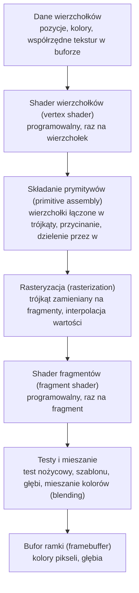

# Moduł gfx: shadery i programowalny potok

Kamień milowy: M1 (dwie kolejne pary shaderów doszły w M2 + M3, dwie następne i plik dołączany w M4). Temat wykładu: 2 (Programowalny potok).
Kod: shadery [`assets/shaders/basic.vert`](../../../assets/shaders/basic.vert) i [`assets/shaders/basic.frag`](../../../assets/shaders/basic.frag), użycie w [`src/game/NightMazeApp.cpp`](../../../src/game/NightMazeApp.cpp), klasa w [`src/gfx/Shader.hpp`](../../../src/gfx/Shader.hpp).

Część modułu `gfx`. Wstęp do całego modułu jest w [`README.md`](README.md). Shadery są opisane w pięciu dokumentach. Ten opisuje programowalny potok, język GLSL, pierwszą parę shaderów projektu (`basic.vert` i `basic.frag`) i miejsce, w którym program jest używany w klatce. Cztery pozostałe pary mają opis w dokumentach swoich tematów: `textured.*` w [`textures.md`](textures.md) (sekcja 4), `color.*` w [`../scene/collision.md`](../scene/collision.md) (sekcja 4), a `lit.*` i `gouraud.*` w [`../renderer/lighting-gouraud-phong.md`](../renderer/lighting-gouraud-phong.md). Wspólny plik oświetlenia `common/lighting.glsl` opisuje [`../scene/lights.md`](../scene/lights.md). [`shader-class.md`](shader-class.md) opisuje klasę `gfx::Shader`: wywołania OpenGL, kompilację, linkowanie i odczyt błędów w kodzie. [`uniforms.md`](uniforms.md) opisuje uniformy i funkcję `Shader::setMat4`, [`shader-includes.md`](shader-includes.md) dyrektywę `#include`, której GLSL nie ma, i nazwy plików w błędach, a [`shader-hot-reload.md`](shader-hot-reload.md) wczytywanie na żywo, funkcję `Shader::reload` i panel "Shaders". Druga część tematu 2, czyli skąd shader wierzchołków bierze dane (bufory i tablica wierzchołków), jest w [`buffers-vao.md`](buffers-vao.md).

## 1. Po co to jest

Od OpenGL 3.2 w profilu Core nie da się narysować niczego bez shaderów: stary potok o stałej funkcjonalności (fixed function pipeline) został usunięty, a to, co dzieje się z każdym wierzchołkiem i każdym pikselem, opisują małe programy w języku GLSL, wykonywane przez kartę graficzną. Zanim narysuję pierwszy trójkąt, muszę więc umieć: wczytać tekst shadera z pliku, skompilować go, zlinkować dwa shadery w jeden program i dowiedzieć się, co poszło źle, gdy coś poszło źle.

Robi to klasa `gfx::Shader`, opisana linia po linii w [`shader-class.md`](shader-class.md). Ten dokument opisuje to, co klasa obsługuje: potok, język GLSL i dwa shadery pary `basic`.

Stan na dziś: `game::NightMazeApp` ma **pięć** obiektów `gfx::Shader`, czyli pięć programów:

| Pole | Pliki | Co rysuje | Kiedy | Opis shaderów |
|---|---|---|---|---|
| `m_shader` | `basic.vert`, `basic.frag` | kostkę o sześciu kolorowych ścianach, która unosi się nad narożną komórką labiryntu (miejscem przyszłego wyjścia) | zawsze | ten dokument, sekcja 4 |
| `m_texturedShader` | `textured.vert`, `textured.frag` | labirynt bez oświetlenia: ściany, słupki i płytki podłogi z samymi teksturami, oraz oba widoki diagnostyczne (normalne i UV jako kolor) | tryb oświetlenia `Unlit` albo widok inny niż `Textured` | [`textures.md`](textures.md), sekcja 4 |
| `m_colorShader` | `color.vert`, `color.frag` | linie pudełek kolizji i znaczniki świateł punktowych (małe kostki), jednym kolorem | znaczniki: tryb inny niż `Unlit`. Linie: gdy włączy je panel Collision | [`../scene/collision.md`](../scene/collision.md), sekcja 4 |
| `m_litShader` | `lit.vert`, `lit.frag` (dołącza `common/lighting.glsl`) | labirynt z oświetleniem liczonym dla każdego fragmentu | tryby Phong i Blinn-Phong przy widoku `Textured`. **Tak startuje gra** (Blinn-Phong) | [`../renderer/lighting-gouraud-phong.md`](../renderer/lighting-gouraud-phong.md) |
| `m_gouraudShader` | `gouraud.vert` (dołącza `common/lighting.glsl`), `gouraud.frag` | labirynt z oświetleniem liczonym dla każdego wierzchołka | tryb Gouraud przy widoku `Textured` | [`../renderer/lighting-gouraud-phong.md`](../renderer/lighting-gouraud-phong.md) |

Labirynt rysuje w danej klatce **jeden** z trzech programów (`textured`, `lit` albo `gouraud`), więc w jednej klatce pracują najwyżej trzy różne programy, wybierane najwyżej czterema wywołaniami `use()` (sekcja 5.1). Plik `common/lighting.glsl` nie jest shaderem i nie ma własnego programu: jego treść trafia do `lit.frag` i do `gouraud.vert` przez linię `#include`, którą wykonuje kod wczytujący, a nie sterownik ([`shader-includes.md`](shader-includes.md)). Co jest w tym pliku, opisuje [`../scene/lights.md`](../scene/lights.md).

Para `basic` nie zmieniła się od M1. Wszystkie pięć programów jest wczytywanych przy starcie i ponownie po każdym naciśnięciu przycisku "Reload shaders" w panelu **Shaders** ([`shader-hot-reload.md`](shader-hot-reload.md), sekcja 6): zmieniam plik `.frag`, naciskam przycisk i widzę efekt bez zamykania okna. Klasa ma pięć funkcji ustawiających uniformy, `setMat4`, `setInt`, `setVec3`, `setMat3` i `setFloat` ([`uniforms.md`](uniforms.md)), i funkcję `bindUniformBlock`, która podłącza blok uniformów ze światłami ([`uniform-buffers.md`](uniform-buffers.md)).

Zmierzone na Windowsie (2026-10-05, MSVC 19.44, RTX 4070 Ti SUPER, sterownik NVIDIA 610.74): build Debug i Release bez ostrzeżeń, gra startuje bez linii `[error]` i bez linii `GL_`, czyli wszystkie dziesięć plików shaderów i plik dołączany kompilują się na sterowniku NVIDIA. Na macOS nic z M4 nie było budowane ani uruchamiane.

## 2. Teoria

### 2.1 Potok renderowania

**Potok renderowania** (rendering pipeline) to stała sekwencja etapów, przez którą przechodzą dane od tablicy liczb w pamięci do kolorów pikseli na ekranie. Dla OpenGL 4.1 i dwóch shaderów, których używam, wygląda tak:



| Etap | Kto go wykonuje | Co wchodzi | Co wychodzi |
|---|---|---|---|
| Dane wierzchołków | mój kod C++ | tablica liczb wysłana do bufora na karcie | atrybuty jednego wierzchołka (na przykład pozycja) |
| Shader wierzchołków | **mój program GLSL** | atrybuty jednego wierzchołka i uniformy | pozycja w przestrzeni przycięcia (`gl_Position`) i dowolne własne wartości dla dalszych etapów |
| Składanie prymitywów | OpenGL, bez mojego kodu | pozycje kolejnych wierzchołków | trójkąty (albo linie, punkty), przycięte do widocznego obszaru i przeliczone na współrzędne okna |
| Rasteryzacja | OpenGL, bez mojego kodu | jeden trójkąt | po jednym **fragmencie** na każdy piksel, który trójkąt zakrywa, z wartościami interpolowanymi między wierzchołkami |
| Shader fragmentów | **mój program GLSL** | interpolowane wartości jednego fragmentu i uniformy | kolor fragmentu |
| Testy i mieszanie | OpenGL, sterowane stanem (`glEnable`, `glDepthFunc`, `glBlendFunc`) | kolor i głębia fragmentu | decyzja, czy fragment trafia do bufora, i jak miesza się z tym, co już tam jest |
| Bufor ramki | OpenGL | zaakceptowane fragmenty | obraz, który `glfwSwapBuffers` pokazuje na ekranie |

**Programowalne** są dwa etapy z tej listy: shader wierzchołków i shader fragmentów. Pozostałe są stałe: mogę je tylko konfigurować przez stan OpenGL, ale nie mogę podmienić ich kodu. Stąd nazwa tematu: programowalny potok.

W pełnym potoku OpenGL 4.1 między shaderem wierzchołków a składaniem prymitywów są jeszcze dwa etapy opcjonalne: teselacja (tessellation) i shader geometrii (geometry shader). Na diagramie ich nie ma, bo `gfx::Shader` ich jeszcze nie obsługuje. Shader geometrii pojawi się przy temacie 9 (trawa).

**Fragment a piksel.** Fragment to "kandydat na piksel": dane dla jednego piksela pochodzące z jednego trójkąta. Na ten sam piksel może przypaść wiele fragmentów (z trójkątów leżących jeden za drugim), a o tym, który wygra, decyduje test głębi. Dlatego shader nazywa się shaderem fragmentów, a nie pikseli.

### 2.2 Co musi zrobić shader wierzchołków

Shader wierzchołków wykonuje się raz dla każdego wierzchołka i ma jeden obowiązek: zapisać do wbudowanej zmiennej `gl_Position` pozycję wierzchołka w **przestrzeni przycięcia** (clip space). To wektor czterech liczb `(x, y, z, w)`.

Po shaderze OpenGL sam wykonuje dwa kroki:

1. **Przycinanie** (clipping): zostaje to, co spełnia `-w <= x <= w`, `-w <= y <= w`, `-w <= z <= w`.
2. **Dzielenie perspektywiczne** (perspective divide): `x`, `y`, `z` są dzielone przez `w`. Wynik to **znormalizowane współrzędne urządzenia** (normalized device coordinates, NDC), w których widoczny obszar to sześcian od -1 do 1 na każdej osi: x w prawo, y w górę.

Potem `glViewport` zamienia NDC na piksele bufora ([`../core/window-context.md`](../core/window-context.md), sekcja 3.2).

Najprostszy shader wpisuje `w = 1`. Wtedy dzielenie niczego nie zmienia i współrzędne podane w shaderze są od razu współrzędnymi NDC: punkt `(0, 0)` to środek okna, `(-1, -1)` lewy dolny róg, `(1, 1)` prawy górny. Shader projektu mnoży pozycję przez trzy macierze, a ostatnia z nich, macierz rzutowania perspektywicznego, wpisuje do `w` odległość wierzchołka od kamery. Dzielenie przez takie `w` pomniejsza to, co daleko ([`../scene/camera.md`](../scene/camera.md), sekcja 2.3, rzutowanie perspektywiczne).

Poza `gl_Position` shader wierzchołków może przekazać dalej własne wartości (kolor, współrzędne tekstury) przez zmienne `out`.

### 2.3 Co robi shader fragmentów

Shader fragmentów wykonuje się raz dla każdego fragmentu, czyli znacznie częściej niż shader wierzchołków: trójkąt ma trzy wierzchołki, ale może zakrywać setki tysięcy pikseli. Jego wynikiem jest kolor: zmienna `out vec4` z czterema składowymi (czerwona, zielona, niebieska, alfa), każda w zakresie od 0 do 1.

Na wejściu dostaje wartości, które shader wierzchołków zapisał w swoich zmiennych `out`, ale **zinterpolowane**: rasteryzacja wylicza dla każdego fragmentu wartość pośrednią między trzema wierzchołkami trójkąta, proporcjonalnie do położenia fragmentu. Trójkąt z czerwonym, zielonym i niebieskim wierzchołkiem dostaje dzięki temu płynne przejście kolorów bez żadnego mojego kodu.

### 2.4 GLSL w pigułce

GLSL (OpenGL Shading Language) jest podobny do C, z typami wektorowymi i macierzowymi wbudowanymi w język.

| Element | Przykład | Znaczenie |
|---|---|---|
| Wersja | `#version 410 core` | Musi być **pierwszą linią** pliku. 410 to GLSL 4.10, czyli wersja odpowiadająca OpenGL 4.1. `core` wybiera profil Core |
| Wejście | `in vec3 aPosition;` | Zmienna wejściowa etapu. W shaderze wierzchołków to atrybut wierzchołka, w shaderze fragmentów interpolowana wartość z poprzedniego etapu |
| Wyjście | `out vec4 fragColor;` | Zmienna wyjściowa etapu. `out` z shadera wierzchołków łączy się z `in` o tej samej nazwie i typie w shaderze fragmentów |
| Położenie | `layout(location = 0) in vec3 aPosition;` | Numer atrybutu wierzchołka. Ten sam numer podaje kod C++, gdy opisuje układ danych w buforze. Bez `layout` numer przydziela linker i trzeba by o niego pytać |
| Uniform | `uniform mat4 uModel;` | Wartość ustawiana z C++ raz na rysowanie, taka sama dla wszystkich wierzchołków i fragmentów. Na przykład macierz, kolor światła, czas |
| Typy skalarne | `float`, `int`, `uint`, `bool` | Jak w C. Literał `1.0` jest typu `float` |
| Wektory | `vec2`, `vec3`, `vec4` | Wektory liczb `float`. Składowe: `.x .y .z .w` albo `.r .g .b .a`. Można je wybierać po kilka naraz: `color.rgb`, `position.xy` |
| Macierze | `mat3`, `mat4` | Macierze 3x3 i 4x4. Mnożenie `mat4 * vec4` jest wbudowane |
| Tekstury | `sampler2D`, `samplerCube` | Uchwyt do tekstury, zawsze jako uniform |
| Konstruktor | `vec4(aPosition, 1.0)` | Buduje wektor z mniejszych części: tu `vec3` i jedna liczba dają `vec4` |
| Funkcja główna | `void main() { ... }` | Punkt wejścia każdego shadera. Nic nie zwraca: wynik zapisuje do `gl_Position` albo do zmiennych `out` |

Nazwy i zachowanie typów są takie same jak w GLM po stronie C++ ([`../../libraries/glm.md`](../../libraries/glm.md)): `glm::vec3` to odpowiednik `vec3`, `glm::mat4` odpowiednik `mat4`.

Przedrostki w nazwach to tylko konwencja, a nie wymóg języka: `a` dla atrybutu (`aPosition`), `u` dla uniformu (`uModel`), `v` dla wartości przekazywanej z shadera wierzchołków do fragmentów (`vColor`).

### 2.5 Obiekt shadera a obiekt programu

OpenGL ma dwa różne rodzaje obiektów i łatwo je pomylić, bo potocznie oba nazywa się "shaderem":

| | Obiekt shadera (shader object) | Obiekt programu (program object) |
|---|---|---|
| Co reprezentuje | jeden etap: kod wierzchołków **albo** fragmentów | komplet etapów gotowy do rysowania |
| Tworzenie | `glCreateShader(typ)` | `glCreateProgram()` |
| Co się z nim robi | dostaje tekst źródłowy i jest **kompilowany** | dostaje dołączone obiekty shaderów i jest **linkowany** |
| Do czego służy potem | do niczego, to produkt pośredni | `glUseProgram` wybiera go do rysowania |
| Usuwanie | `glDeleteShader` | `glDeleteProgram` |

To ten sam podział co w C++: pliki `.cpp` kompiluje się osobno do plików obiektowych, a linker skleja je w program. Po zlinkowaniu pliki obiektowe nie są już potrzebne do uruchomienia programu. Tak samo obiekty shaderów nie są potrzebne po `glLinkProgram`, więc od razu je usuwam. Klasa `gfx::Shader` wbrew nazwie przechowuje więc identyfikator **programu**, a obiekty shaderów żyją tylko wewnątrz jednej funkcji pomocniczej.

Oba rodzaje obiektów są identyfikowane liczbą typu `GLuint`, nazywaną w dokumentacji OpenGL nazwą (name). Wartość 0 nigdy nie jest poprawnym obiektem: `glCreateShader` i `glCreateProgram` zwracają 0 przy niepowodzeniu, a `glUseProgram(0)` znaczy "żaden program".

### 2.6 Kompilacja a linkowanie

| Krok | Co sprawdza | Typowy błąd |
|---|---|---|
| Kompilacja (`glCompileShader`) | jeden shader w izolacji: składnię, typy, istnienie użytych zmiennych i funkcji | brak średnika, nieznana nazwa, `vec3` przypisany do `vec4`, zła albo brakująca linia `#version` |
| Linkowanie (`glLinkProgram`) | czy etapy pasują do siebie: każda zmienna `in` shadera fragmentów musi mieć zmienną `out` o tej samej nazwie i typie w shaderze wierzchołków, a każdy etap musi mieć `main` | shader fragmentów czyta `in vec3 vColor`, którego shader wierzchołków nie zapisuje |

Kompilator GLSL jest częścią **sterownika karty graficznej**, a nie mojego programu. Dlatego ten sam shader może dać różne komunikaty (a czasem różny wynik) na różnych kartach, a format tekstu błędu zależy od producenta:

| Sterownik | Surowa linia błędu, tak jak pisze ją sterownik |
|---|---|
| Apple (macOS) | `ERROR: 0:5: '}' : syntax error: syntax error` |
| NVIDIA (Windows) | `0(15) : error C0000: syntax error, unexpected '}', expecting ',' or ';' at token "}"` |

W formacie Apple `0:5` to numer napisu źródłowego (source string number) i numer linii. W formacie NVIDII te same dwie liczby stoją jako `0(15)`: numer napisu, a w nawiasie numer linii. Obie linie są zmierzone, w M1. Pierwsza pochodzi z testu klasy na Macu ([`shader-class.md`](shader-class.md), sekcja 5.10), druga z programu `night_maze` uruchomionego na Windowsie z usuniętym średnikiem w `basic.frag` (sterownik NVIDIA 610.74, [`../../guides/build-windows.md`](../../guides/build-windows.md), sekcja 11). Numery linii się różnią, bo to dwa różne pliki testowe.

**Co wypisuje dziś mój program.** Numer napisu był w M1 zawsze zerem, bo sterownik dostawał jeden napis bez żadnych dodatków. Od M4 shader może dołączać inne pliki, a każdy plik dostaje własny numer (0 to sam plik shadera, 1 pierwszy dołączony). Sama liczba nic nie mówi czytającemu, więc klasa `Shader` zamienia ją na nazwę pliku, zanim zapisze komunikat. To jedyna zmiana, jaką wprowadza w tekście sterownika: reszta linii, razem z numerem linii i opisem błędu, zostaje nietknięta, a linia w formacie, którego kod nie rozpoznaje, zostaje nietknięta w całości.

| Sytuacja | Surowa linia sterownika NVIDIA | Linia w konsoli i w panelu Shaders |
|---|---|---|
| błąd w shaderze bez dołączeń | zaczyna się od `0(4)` | zaczyna się od `basic.frag(4)` |
| błąd w pliku dołączonym do `lit.frag` | `1(63) : error C0000: syntax error, unexpected ';', expecting "::" at token ";"` | `common/lighting.glsl(63) : error C0000: syntax error, unexpected ';', expecting "::" at token ";"` |

Oba wiersze są zmierzone na Windowsie (2026-10-05, sterownik NVIDIA 610.74). Gdy shader składa się z więcej niż jednego pliku, komunikat kończy się linią-legendą `Source files: 0 = lit.frag, 1 = common/lighting.glsl`. Format Apple (`ERROR: 0:5:` zamieniane na `ERROR: basic.frag:5:`) jest obsłużony w kodzie i sprawdzony tylko testami jednostkowymi: na macOS tej wersji nikt nie uruchomił. Jak działa zamiana i skąd sterownik bierze numer 1, opisuje [`shader-includes.md`](shader-includes.md) (sekcje 2.3 i 5.9).

Zarówno wynik kompilacji, jak i linkowania trzeba **odczytać samemu**: OpenGL nie zgłasza ich przez `glGetError` ([`shader-class.md`](shader-class.md), sekcja 3.3).

Dwa zagadnienia teorii mają własne dokumenty. Wczytywanie na żywo (hot reload), czyli podmiana programu w działającej aplikacji, jest w [`shader-hot-reload.md`](shader-hot-reload.md) (sekcja 2). Uniformy, czyli wartości ustawiane z C++ raz na rysowanie, są w [`uniforms.md`](uniforms.md) (sekcja 2).

## 3. Jak to działa w OpenGL

Zbudowanie programu z dwóch plików i użycie go to po stronie OpenGL trzy kroki, które odpowiadają pojęciom z sekcji 2.5 i 2.6:

| Krok | Wywołania | Wynik |
|---|---|---|
| kompilacja, osobno dla każdego etapu | `glCreateShader`, `glShaderSource`, `glCompileShader` | dwa obiekty shaderów |
| linkowanie | `glCreateProgram`, `glAttachShader`, `glLinkProgram` | jeden obiekt programu, obiekty shaderów można usunąć |
| użycie, co klatkę | `glUseProgram`, potem ustawienie uniformów i wywołanie rysujące | potok z sekcji 2.1 wykonany dla podanych wierzchołków |

Pełna tabela wywołań z parametrami, diagram obiektów i odczyt błędów kompilacji, których `glGetError` nie zgłasza, są w [`shader-class.md`](shader-class.md) (sekcje 3.1, 3.2 i 3.3). Ustawianie uniformów opisuje [`uniforms.md`](uniforms.md) (sekcja 3).

## 4. Shadery

Projekt ma pięć par shaderów w katalogu [`assets/shaders/`](../../../assets/shaders/) i jeden plik dołączany w podkatalogu `common/`. Ta sekcja opisuje pierwszą parę, `basic`. Nazwa jest celowo neutralna: to najprostsza para, która umie postawić obiekt w scenie (trzy macierze) i pokolorować go kolorem z wierzchołków. Cztery nowsze pary stawiają wierzchołek tymi samymi trzema macierzami: `textured` dodaje normalną, współrzędne tekstury i odczyt tekstury ([`textures.md`](textures.md), sekcja 4), `color` zostawia samą pozycję i jeden kolor z uniformu ([`../scene/collision.md`](../scene/collision.md), sekcja 4), a `lit` i `gouraud` dokładają do tekstury oświetlenie, pierwsza w shaderze fragmentów, druga w shaderze wierzchołków ([`../renderer/lighting-gouraud-phong.md`](../renderer/lighting-gouraud-phong.md)). Kod oświetlenia obu tych par jest wspólny i leży w `common/lighting.glsl` ([`../scene/lights.md`](../scene/lights.md)), dołączanym linią `#include "common/lighting.glsl"` ([`shader-includes.md`](shader-includes.md), sekcja 4).

### 4.1 `basic.vert`: shader wierzchołków

Cały plik [`assets/shaders/basic.vert`](../../../assets/shaders/basic.vert):

```glsl
#version 410 core
// Vertex shader: runs once for every vertex and decides where it lands on the screen.
// See docs/modules/gfx/shaders.md

// Inputs: the attributes of one vertex, read from the vertex buffer. The location numbers
// are the attribute indices that the C++ code uses when it describes the vertex layout.
layout(location = 0) in vec3 aPosition; // x, y, z in the local space of the object
layout(location = 1) in vec3 aColor;    // red, green, blue, each from 0 to 1

// Uniforms: set from C++ (gfx::Shader::setMat4), the same for every vertex of one draw call.
// See docs/modules/scene/transforms.md
uniform mat4 uModel;      // local space to world space: where the object stands
uniform mat4 uView;       // world space to view space: where the camera is and looks
uniform mat4 uProjection; // view space to clip space: perspective

// Output to the fragment shader. The rasterizer blends it between the three vertices of
// a triangle, so every fragment receives its own in-between color.
out vec3 vColor;

void main() {
    // gl_Position is the built-in output every vertex shader must write: the position in
    // clip space. The expression is read from right to left, the matrix nearest to the
    // vector is applied first:
    //   vec4(aPosition, 1.0)  the vertex in local space, w = 1 because it is a point
    //   uModel * ...          the vertex in world space
    //   uView * ...           the vertex in view space, as seen from the camera
    //   uProjection * ...     the vertex in clip space
    // After this shader the graphics card divides x, y and z by w (the distance from the
    // camera), which is what makes distant things small.
    gl_Position = uProjection * uView * uModel * vec4(aPosition, 1.0);

    // Pass the color through unchanged.
    vColor = aColor;
}
```

| Linia | Co robi |
|---|---|
| `#version 410 core` | GLSL 4.10, profil Core. Musi być pierwszą linią pliku, dlatego komentarz z opisem stoi dopiero pod nią |
| `layout(location = 0) in vec3 aPosition;` | Atrybut wierzchołka numer 0: trzy liczby `float`, pozycja w przestrzeni lokalnej obiektu. Numer 0 to stała `POSITION_ATTRIBUTE` w `NightMazeApp.cpp` |
| `layout(location = 1) in vec3 aColor;` | Atrybut numer 1: trzy liczby `float`, kolor. Numer 1 to stała `COLOR_ATTRIBUTE` |
| `uniform mat4 uModel;` | Macierz modelu: z przestrzeni lokalnej do przestrzeni świata. Ustawiana z C++ przez `setMat4("uModel", ...)`, wartość z `scene::Transform::matrix()` |
| `uniform mat4 uView;` | Macierz widoku: ze świata do przestrzeni kamery. Wartość z `scene::Camera::viewMatrix()` |
| `uniform mat4 uProjection;` | Macierz rzutowania: z przestrzeni kamery do przestrzeni przycięcia. Wartość z `scene::Camera::projectionMatrix()` |
| `out vec3 vColor;` | Wyjście do następnego etapu. Shader wierzchołków zapisuje tu kolor swojego wierzchołka, a rasteryzacja interpoluje go między trzema wierzchołkami trójkąta |
| `void main() {` | Funkcja wykonywana raz dla każdego wierzchołka wskazanego przez indeksy. Kostka ma 24 wierzchołki |
| `gl_Position = uProjection * uView * uModel * vec4(aPosition, 1.0);` | Pozycja w przestrzeni przycięcia. Z `vec3` robię `vec4`, dopisując `w = 1` (bo to punkt), i mnożę kolejno przez trzy macierze. Wyrażenie czyta się **od prawej do lewej**: najpierw `uModel`, potem `uView`, na końcu `uProjection` |
| `vColor = aColor;` | Kolor przechodzi bez zmian |

Dlaczego mnożenie czyta się od prawej, czym są te trzy przestrzenie i co dokładnie dzieje się z jednym wierzchołkiem kostki na liczbach, opisują [`../scene/transforms.md`](../scene/transforms.md) (sekcje 2.1 i 2.5: przestrzenie współrzędnych, zapis kolumnowy i czytanie od prawej) i [`../scene/camera.md`](../scene/camera.md) (sekcja 5.8: droga jednego wierzchołka przez trzy macierze na liczbach). Nazwy uniformów w shaderze muszą być identyczne z napisami w C++ (stałe `MODEL_UNIFORM`, `VIEW_UNIFORM`, `PROJECTION_UNIFORM` w `NightMazeApp.cpp`, [`uniforms.md`](uniforms.md), sekcja 5.2). Dlaczego shader dostaje trzy osobne macierze, a nie jeden gotowy iloczyn, wyjaśnia [`uniforms.md`](uniforms.md) (sekcja 4).

### 4.2 `basic.frag`: shader fragmentów

Cały plik [`assets/shaders/basic.frag`](../../../assets/shaders/basic.frag):

```glsl
#version 410 core
// Fragment shader: runs once for every fragment (pixel candidate) and decides its color.
// See docs/modules/gfx/shaders.md

// Input from the vertex shader: same name and type as its "out vec3 vColor". The value is
// already interpolated for this fragment.
in vec3 vColor;

// Output: the color written to the framebuffer (red, green, blue, alpha).
out vec4 fragColor;

void main() {
    // Alpha 1 means fully opaque.
    fragColor = vec4(vColor, 1.0);
}
```

| Linia | Co robi |
|---|---|
| `in vec3 vColor;` | Wejście: ta sama nazwa i ten sam typ co `out vec3 vColor` w shaderze wierzchołków. Po tej nazwie linker łączy oba etapy. Wartość jest już zinterpolowana dla tego fragmentu |
| `out vec4 fragColor;` | Wyjście shadera: kolor fragmentu. Nazwa jest dowolna. Shader fragmentów z jednym wyjściem zapisuje je do pierwszego bufora koloru |
| `fragColor = vec4(vColor, 1.0);` | Kolor z trzech składowych i alfa równa 1, czyli pełne krycie |

### 4.3 Skąd biorą się kolory na ekranie

Dane wierzchołków w `NightMazeApp.cpp` dają każdej ścianie kostki cztery wierzchołki o **tym samym** kolorze: przednia jest czerwona, tylna zielona, lewa niebieska, prawa żółta, górna turkusowa, dolna purpurowa ([`indexed-drawing.md`](indexed-drawing.md), sekcja 5.3). Shader wierzchołków przepisuje kolor do `vColor`. Dla każdego piksela wewnątrz trójkąta rasteryzacja wylicza `vColor` jako średnią ważoną trzech wierzchołków, z wagami zależnymi od odległości. Średnia z trzech równych wartości to ta sama wartość, więc ściana jest jednolita. Interpolacja nadal działa, tylko nie ma czego mieszać: wystarczy dać jednemu wierzchołkowi inny kolor, żeby zobaczyć płynne przejście (ćwiczenie 2 w [`indexed-drawing.md`](indexed-drawing.md), "Kolory i interpolacja"). W żadnym z dwóch shaderów nie ma ani jednej linii, która to przejście liczy: robi je etap stały potoku.

Rozszerzenia plików (`.vert`, `.frag`) nie mają dla OpenGL żadnego znaczenia: o typie shadera decyduje stała podana do `glCreateShader`, a nie nazwa pliku. Rozszerzenia są dla ludzi i dla edytora, który według nich włącza kolorowanie składni GLSL ([`../../guides/project-structure.md`](../../guides/project-structure.md), sekcja 3.10).

Jak pliki z `assets/` trafiają obok programu, opisuje [`../core/paths.md`](../core/paths.md) (sekcja 5.8) i [`../../guides/project-structure.md`](../../guides/project-structure.md) (sekcja 3.1, blok 7).

## 5. Kod w projekcie

Kod, który buduje program z plików, czyli klasa `gfx::Shader`, jest opisany w [`shader-class.md`](shader-class.md) (sekcja 5). Tutaj jest druga strona: gdzie gotowy program jest używany w klatce.

### 5.1 Użycie w `NightMazeApp`

Właścicielem wszystkich pięciu programów jest `game::NightMazeApp`. Poniżej są miejsca, w których pojawia się program `basic`, i to, co zmieniło się wokół niego w M2 + M3 i w M4. Nazwy uniformów są w osobnym nagłówku, opisanym w [`uniforms.md`](uniforms.md) (sekcja 5.5). Całą klasę (kolejność pól, konstruktor, klatkę) omawia [`../core/README.md`](../core/README.md).

**Pola** w [`NightMazeApp.hpp`](../../../src/game/NightMazeApp.hpp):

```cpp
    gfx::Shader m_shader;
    gfx::Shader m_texturedShader;
    gfx::Shader m_colorShader;
    gfx::Shader m_litShader;
    gfx::Shader m_gouraudShader;
```

Jako pola klasy pochodnej od `core::Application` obiekty powstają po oknie i kontekście OpenGL, a giną przed nimi ([`../core/README.md`](../core/README.md)). Pięć programów stoi na początku listy pól posiadających obiekty OpenGL. Komentarz w nagłówku mówi dlaczego ich miejsce nie ma znaczenia: utworzenie programu nie wiąże żadnego bufora ani VAO, więc nie psuje wiązań, na których polega kostka ([`buffers-vao.md`](buffers-vao.md), pułapka 12).

**Nazwy plików** w anonimowej przestrzeni nazw [`NightMazeApp.cpp`](../../../src/game/NightMazeApp.cpp):

```cpp
// Shader files, relative to the assets directory. The cube is drawn with the first pair,
// the maze without lighting with the second, the lines of the collision boxes and the
// light markers with the third, the maze with lighting per fragment with the fourth and
// with lighting per vertex with the fifth.
constexpr const char* VERTEX_SHADER_FILE = "shaders/basic.vert";
constexpr const char* FRAGMENT_SHADER_FILE = "shaders/basic.frag";
constexpr const char* TEXTURED_VERTEX_SHADER_FILE = "shaders/textured.vert";
constexpr const char* TEXTURED_FRAGMENT_SHADER_FILE = "shaders/textured.frag";
constexpr const char* COLOR_VERTEX_SHADER_FILE = "shaders/color.vert";
constexpr const char* COLOR_FRAGMENT_SHADER_FILE = "shaders/color.frag";
constexpr const char* LIT_VERTEX_SHADER_FILE = "shaders/lit.vert";
constexpr const char* LIT_FRAGMENT_SHADER_FILE = "shaders/lit.frag";
constexpr const char* GOURAUD_VERTEX_SHADER_FILE = "shaders/gouraud.vert";
constexpr const char* GOURAUD_FRAGMENT_SHADER_FILE = "shaders/gouraud.frag";
```

Dziesięć nazw, pięć par. Pliku `common/lighting.glsl` na tej liście nie ma: kod C++ nie zna jego nazwy, wymieniają ją tylko linie `#include` w `lit.frag` i `gouraud.vert`.

**Wczytanie** na liście inicjalizacyjnej konstruktora:

```cpp
      m_shader(core::assetPath(VERTEX_SHADER_FILE), core::assetPath(FRAGMENT_SHADER_FILE)),
      m_texturedShader(core::assetPath(TEXTURED_VERTEX_SHADER_FILE),
                       core::assetPath(TEXTURED_FRAGMENT_SHADER_FILE)),
      m_colorShader(core::assetPath(COLOR_VERTEX_SHADER_FILE),
                    core::assetPath(COLOR_FRAGMENT_SHADER_FILE)),
      m_litShader(core::assetPath(LIT_VERTEX_SHADER_FILE),
                  core::assetPath(LIT_FRAGMENT_SHADER_FILE)),
      m_gouraudShader(core::assetPath(GOURAUD_VERTEX_SHADER_FILE),
                      core::assetPath(GOURAUD_FRAGMENT_SHADER_FILE)),
```

`core::assetPath` zamienia nazwę względną na pełną ścieżkę w katalogu `assets/` obok pliku wykonywalnego ([`../core/paths.md`](../core/paths.md)), więc shadery znajdują się niezależnie od katalogu roboczego. Wynik `assetPath` jest obiektem tymczasowym, który trafia do parametru konstruktora `Shader` przez przeniesienie ([`shader-class.md`](shader-class.md), sekcja 5.8). Konstruktor `Shader` nie rzuca przy błędzie w shaderze. Wyjątek może natomiast rzucić samo `core::assetPath`, gdy system nie potrafi podać położenia programu: wtedy konstruktor aplikacji zostaje przerwany, a wyjątek łapie `catch` w `main` i program kończy się linią `[error] Fatal: ...`.

**Wspólna część klatki** na końcu `NightMazeApp::onRender`. W M1 cała klatka, razem z rysowaniem kostki, była w `onRender`. Teraz `onRender` liczy to, co wspólne, i woła funkcje rysujące. Między macierzami a rysowaniem stoi od M4 zbudowanie i wysłanie świateł klatki (`buildLightSet` i `m_lightRig.upload`), opisane w [`../game/flashlight.md`](../game/flashlight.md) i [`uniform-buffers.md`](uniform-buffers.md):

```cpp
    // The two matrices that are the same for everything drawn in this frame.
    const glm::mat4 view = m_camera.viewMatrix(eye);
    const glm::mat4 projection = m_camera.projectionMatrix(aspectRatio);
```

```cpp
    drawMaze(view, projection);
    // Without lighting there are no lights to mark.
    if (m_lighting.mode != LightingMode::Unlit) {
        drawLightMarkers(view, projection);
    }
    drawCube(view, projection);
    if (m_drawColliders) {
        drawColliderLines(view, projection);
    }
```

| Linia | Co robi i dlaczego |
|---|---|
| `const glm::mat4 view = ...` i `projection` | macierz widoku i rzutowania są takie same dla wszystkiego, co rysuje ta klatka, więc są liczone raz, a nie w każdej funkcji. Skąd biorą się `eye` i `aspectRatio`: [`../scene/camera.md`](../scene/camera.md), sekcja 5, i [`../game/player.md`](../game/player.md) |
| `drawMaze(view, projection);` | labirynt **jednym z trzech** programów. Funkcja tylko wybiera (niżej) |
| `if (m_lighting.mode != LightingMode::Unlit) { drawLightMarkers(view, projection); }` | znaczniki świateł punktowych programem `color`. Bez oświetlenia nie ma czego oznaczać. Warunek patrzy tylko na tryb oświetlenia, więc w widokach diagnostycznych znaczniki są rysowane, choć labirynt rysuje wtedy `textured` |
| `drawCube(view, projection);` | kostka programem `basic` (niżej) |
| `if (m_drawColliders) { drawColliderLines(view, projection); }` | linie pudełek kolizji programem `color`, tylko gdy włączy je panel Collision ([`../scene/collision.md`](../scene/collision.md), sekcja 6) |

Wybór programu labiryntu:

```cpp
void NightMazeApp::drawMaze(const glm::mat4& view, const glm::mat4& projection) const {
    // The two debug views (normals and texture coordinates as colours) only exist in the
    // textured program, and they show data, not light. So they are drawn without
    // lighting whatever the lighting mode is.
    if (m_lighting.mode == LightingMode::Unlit || m_viewMode != ViewMode::Textured) {
        drawUnlitMaze(view, projection);
    } else {
        drawLitMaze(view, projection);
    }
}
```

| Warunek | Funkcja | Program |
|---|---|---|
| tryb `Unlit` **albo** widok inny niż `Textured` | `drawUnlitMaze` | `textured` ([`textures.md`](textures.md), sekcja 4.3) |
| pozostałe przypadki, tryb Gouraud | `drawLitMaze` | `gouraud` |
| pozostałe przypadki, tryb Phong albo Blinn-Phong | `drawLitMaze` | `lit`. Oba tryby różnią się tylko wartością uniformu `uSpecularModel` |

`drawLitMaze` i przełącznik trybu opisuje [`../renderer/lighting-gouraud-phong.md`](../renderer/lighting-gouraud-phong.md). W jednej klatce `use()` jest więc wołane najwyżej cztery razy (labirynt, znaczniki, kostka, linie), a różnych programów jest najwyżej trzy, bo znaczniki i linie dzielą program `color`.

Kolejność rysowania nie wpływa na to, co zasłania co: rozstrzyga o tym test głębi, włączany wcześniej w `onRender` ([`../scene/camera.md`](../scene/camera.md), sekcja 5). Linie są rysowane na końcu, ale też z testem głębi, więc linia za ścianą jest przez nią zasłonięta.

**Rysowanie kostki** w `NightMazeApp::drawCube`:

```cpp
void NightMazeApp::drawCube(const glm::mat4& view, const glm::mat4& projection) const {
    if (!m_shader.isValid()) {
        return;
    }

    // The uniforms belong to the program in use, so use() comes before setMat4.
    m_shader.use();
    m_shader.setMat4(MODEL_UNIFORM, m_cubeTransform.matrix());
    m_shader.setMat4(VIEW_UNIFORM, view);
    m_shader.setMat4(PROJECTION_UNIFORM, projection);

    m_vertexArray.bind();
    // Draws INDEX_COUNT indices from the element buffer recorded in the vertex array,
    // every three of them form one triangle. GL_UNSIGNED_INT is the type of one index
    // (GLuint). The last parameter has the type "pointer" for historical reasons, like in
    // glVertexAttribPointer: with an element buffer bound it is the byte offset of the
    // first index inside that buffer, and nullptr means offset 0, the start of the buffer.
    GL_CHECK(glDrawElements(GL_TRIANGLES, INDEX_COUNT, GL_UNSIGNED_INT, nullptr));
}
```

| Linia | Co robi i dlaczego |
|---|---|
| `const glm::mat4& view, const glm::mat4& projection` | dwie macierze policzone w `onRender`, przekazane przez referencję do stałej: 64 bajty każdej nie są kopiowane |
| `const` na końcu sygnatury | funkcja nie zmienia pól gry. Zmienia stan OpenGL, ale to nie jest stan obiektu C++ |
| `if (!m_shader.isValid()) { return; }` | Gdy program `basic` się nie wczytał, pomijana jest **tylko kostka**. Labirynt został już narysowany przez `drawMaze` (funkcje `drawUnlitMaze` i `drawLitMaze` sprawdzają każda swój program), a panele debug rysuje `DebugNightMazeApp::onRender` po powrocie z `NightMazeApp::onRender`. Błąd został wypisany **raz**, przez `reload()` wołane z konstruktora, a nie co klatkę |
| `m_shader.use();` | `glUseProgram`: wybiera program dla następnych wywołań. Stoi **przed** `setMat4`, bo `glUniform*` pisze do programu bieżącego. Bez tej linii bieżący byłby program wybrany chwilę wcześniej: `color` po znacznikach świateł, a w trybie `Unlit` program `textured` po labiryncie. Backend ImGui przy rysowaniu paneli też ustawia własny program ([`shader-hot-reload.md`](shader-hot-reload.md), sekcja 6.3) |
| `m_shader.setMat4(MODEL_UNIFORM, m_cubeTransform.matrix());` | macierz modelu kostki trafia do `uModel`. Kostka zachowała pochylenie z M1 (25 stopni wokół osi x i 35 wokół osi y), a jej pozycję ustawia `enterMaze`: `m_mazeWorld.exitPosition + glm::vec3{0.0F, CUBE_HEIGHT_ABOVE_FLOOR, 0.0F}`, czyli 4,5 m nad środkiem narożnej komórki ([`../scene/transforms.md`](../scene/transforms.md), sekcja 5) |
| `m_shader.setMat4(VIEW_UNIFORM, view);` | macierz widoku trafia do `uView` programu `basic`. Program labiryntu i program `color` dostały tę samą macierz osobno |
| `m_shader.setMat4(PROJECTION_UNIFORM, projection);` | macierz rzutowania trafia do `uProjection` |
| `m_vertexArray.bind();` | Wybiera opis danych wierzchołków i bufor indeksów kostki ([`buffers-vao.md`](buffers-vao.md), sekcja 2.4). Konieczne: poprzednia funkcja rysująca zostawiła związane VAO ostatniej narysowanej siatki (labiryntu albo kostki znacznika) |
| `glDrawElements(GL_TRIANGLES, INDEX_COUNT, GL_UNSIGNED_INT, nullptr)` | Uruchamia potok z sekcji 2.1 dla 36 indeksów, czyli 12 trójkątów ([`indexed-drawing.md`](indexed-drawing.md), sekcja 5.6) |

Dlaczego macierze są wysyłane co klatkę, choć kostka się nie rusza, wyjaśnia [`uniforms.md`](uniforms.md) (sekcja 5.2).

**Akcesory** w [`NightMazeApp.hpp`](../../../src/game/NightMazeApp.hpp), obok `clearColor()`:

```cpp
    /// Shader program of the cube, exposed so the debug UI can reload it live.
    gfx::Shader& shader() { return m_shader; }

    /// Shader program of the maze (textured models), exposed for the same reason.
    gfx::Shader& texturedShader() { return m_texturedShader; }

    /// Shader program of the collision box lines and of the light markers, exposed for
    /// the same reason.
    gfx::Shader& colorShader() { return m_colorShader; }

    /// Shader program of the lit maze with lighting per fragment (Phong and Blinn-Phong),
    /// exposed for the same reason.
    gfx::Shader& litShader() { return m_litShader; }

    /// Shader program of the lit maze with lighting per vertex (Gouraud), exposed for
    /// the same reason.
    gfx::Shader& gouraudShader() { return m_gouraudShader; }
```

Zwracają referencję bez `const`, bo wołający ma móc zawołać `reload()`. Są chronione (`protected`), więc sięgnie po nie tylko klasa pochodna: `DebugNightMazeApp` w `main.cpp`, które przekazuje referencje do panelu przez `DebugContext` ([`shader-hot-reload.md`](shader-hot-reload.md), sekcja 6.2). Gra nie dołącza przy tym niczego z `debug/`.

`reload()` jest więc wołane w dwóch miejscach: w konstruktorze `Shader` (pierwsze wczytanie) i w panelu "Shaders" po naciśnięciu przycisku. Sama gra go nie woła.

**Stan sprawdzenia.** Na Windowsie (2026-10-05, MSVC 19.44, RTX 4070 Ti SUPER, sterownik NVIDIA 610.74) program z pięcioma parami shaderów buduje się w Debug i w Release bez ostrzeżeń i startuje bez linii `[error]` i bez linii `GL_`. Na zrzutach ekranu sprawdzone są między innymi widok po starcie i cztery tryby oświetlenia, czyli obraz z programów `textured`, `gouraud` i `lit`. Przełącznika trybu i przycisku `Reload shaders` nikt nie klikał ręcznie. Na macOS osiem plików shaderów dodanych po M1 i plik `common/lighting.glsl` nie były kompilowane przez sterownik Apple, który jest bardziej rygorystyczny wobec GLSL: to pozycja listy kontrolnej w [`../../guides/build-macos.md`](../../guides/build-macos.md).

## 6. Panel ImGui

Shadery mają własny panel debug, **Shaders**: przycisk "Reload shaders", który przeładowuje wszystkie pięć programów, i dla każdego programu jedną linię z nazwami obu plików i wynikiem ostatniego wczytania (`basic.vert + basic.frag: OK` albo czerwone `... FAILED, ...` z tekstem błędu pod spodem). Panel jest pokazem wczytywania na żywo, więc jego kod i scenariusz pokazu na obronie są w [`shader-hot-reload.md`](shader-hot-reload.md) (sekcja 6). Który program rysuje labirynt, przełączają dwa inne panele: lista `Lighting` w panelu Renderer wybiera tryb oświetlenia ([`../renderer/lighting-gouraud-phong.md`](../renderer/lighting-gouraud-phong.md)), a tryb podglądu shadera `textured.frag` (obraz, normalne albo UV jako kolor) przełącza panel Assets ([`textures.md`](textures.md), sekcja 6).

## 7. Pułapki

1. **Brak `#version` albo `#version` nie w pierwszej linii.** Bez tej dyrektywy kompilator przyjmuje GLSL 1.10, w którym nie ma `layout`, `in` ani `out` w dzisiejszym znaczeniu. Sterownik Apple zgłasza wprost `#version required and missing`. Przed `#version` mogą stać tylko komentarze i białe znaki, żaden kod.
2. **Wersja GLSL z poradnika.** LearnOpenGL używa `#version 330 core`: na Macu to się kompiluje (kontekst 4.1 przyjmuje też starsze wersje Core), ale nie ma wtedy funkcji GLSL 4.x, więc w projekcie piszę `#version 410 core`. Poradniki dla Windowsa używają często `#version 420`, `430`, `450` albo `460`: te na macOS **nie kompilują się wcale** (`version '460' is not supported`), bo macOS kończy się na OpenGL 4.1. Na PC z nowszym sterownikiem taki shader zadziała, więc błąd wychodzi dopiero po przeniesieniu kodu na Maca.
3. **Niezgodne nazwy `out` i `in`.** `out vec3 vColor` w `basic.vert` i `in vec3 vColor` w `basic.frag` są łączone po nazwie. Literówka w jednej z nich nie jest błędem kompilacji żadnego z plików, tylko błędem **linkowania**.
4. **Program wybrany przez kogoś innego.** W klatce działa po kolei do trzech programów. Kod, który ustawia uniform albo rysuje bez własnego `use()`, trafia do programu, który wybrała poprzednia funkcja rysująca. Dlatego `drawUnlitMaze`, `drawLitMaze`, `drawLightMarkers`, `drawCube` i `drawColliderLines` zaczynają każda od `use()` swojego programu (sekcja 5.1).
5. **Jeden zepsuty program nie zatrzymuje pozostałych.** Każda funkcja rysująca sprawdza `isValid()` tylko swojego programu. Gdy `basic.frag` się nie kompiluje, brakuje kostki, a labirynt jest rysowany normalnie. Brak jednego elementu sceny bez żadnej nowej linii w konsoli (błąd był wypisany raz, przy starcie) łatwo przeoczyć. Jeszcze łatwiej przeoczyć zepsuty program, którego akurat nic nie używa: błąd w `textured.frag` albo w `gouraud.frag` przy starcie nie zmienia obrazu wcale, bo po starcie labirynt rysuje `lit`. Brak labiryntu wyjdzie dopiero po przełączeniu trybu oświetlenia.
6. **`#include` w shaderze to nie jest GLSL.** Linię `#include "common/lighting.glsl"` w `lit.frag` wykonuje kod wczytujący projektu, zanim tekst trafi do sterownika. Ten sam plik wklejony do innego programu albo do narzędzia, które podaje tekst wprost do `glShaderSource`, da błąd kompilacji: specyfikacja GLSL takiej dyrektywy nie zna ([`shader-includes.md`](shader-includes.md), sekcja 2.1).
7. **Nazwa pliku w błędzie nie pochodzi od sterownika.** Sterownik pisze `1(63)`, a `common/lighting.glsl(63)` wstawia mój kod (sekcja 2.6). Kto szuka komunikatu w sieci albo porównuje go z cudzym, powinien pamiętać, że surowa linia zaczyna się od liczby.

Pułapki dotyczące klasy `Shader` i odczytu błędów są w [`shader-class.md`](shader-class.md) (sekcja 7), uniformów w [`uniforms.md`](uniforms.md) (sekcja 7), a przeładowania i panelu Shaders w [`shader-hot-reload.md`](shader-hot-reload.md) (sekcja 7).

## 8. Ćwiczenia

Ćwiczenia dotyczą pary `basic`, czyli kostki. Kostka nie stoi już przed kamerą: unosi się nad narożną komórką labiryntu naprzeciw startu, 4,5 m nad podłogą. Żeby ją obejrzeć, kliknij w scenę, włącz tryb noclip klawiszem N i wzleć spacją nad ściany ([`../game/player.md`](../game/player.md)). Tych ćwiczeń w nowym układzie sceny nikt jeszcze nie powtórzył, a liczby pikseli w ćwiczeniu 1 pochodzą z M1, gdy kostka stała 3 m przed kamerą.

Program może działać przez cały czas: po każdej zmianie pliku `.vert` albo `.frag` zapisz plik i naciśnij `Reload shaders` w panelu Shaders. Kompilacja C++ nie jest potrzebna. Na macOS przycisk od razu widzi zmianę, bo `build/debug/assets` jest dowiązaniem do katalogu w repozytorium. Na Windowsie przed naciśnięciem przycisku trzeba wykonać `cmake --build --preset debug --target copy_assets`, które odświeża kopię shaderów obok programu ([`shader-hot-reload.md`](shader-hot-reload.md), sekcja 6.5). Ćwiczenia 1 i 4 w [`shader-class.md`](shader-class.md) dotyczą błędu **przy starcie**, więc tam program trzeba uruchomić od nowa. Po każdym ćwiczeniu przywróć plik (`git checkout assets/shaders`) i naciśnij przycisk jeszcze raz.

1. **Potok na kartce.** Narysuj z pamięci diagram z sekcji 2.1. Zaznacz etapy programowalne. W M1 trzy widoczne ściany kostki zakrywały w oknie 1280 x 720 około 73 tysięcy punktów (na ekranie Retina cztery razy więcej pikseli: zmierzone 291 620). Kostka ma 24 wierzchołki i 36 indeksów. Ile razy na klatkę wykonuje się `main` z `basic.vert`? Ile razy co najmniej wykonuje się `main` z `basic.frag` i dlaczego może więcej (pomyśl o ścianach tylnych i teście głębi)?
2. **Stały kolor.** W `basic.frag` zamień `vec4(vColor, 1.0)` na `vec4(1.0, 0.5, 0.2, 1.0)`. Naciśnij `Reload shaders`. Jak wygląda kostka i dlaczego nie widać już krawędzi między ścianami? Czy shader nadal się linkuje, mimo że `vColor` nie jest już używane?
3. **Zamienione numery atrybutów.** W `basic.vert` zamień `location = 0` z `location = 1` (pozycja dostaje 1, kolor 0). Naciśnij `Reload shaders`. Shader czyta teraz kolory jako pozycje, a pozycje jako kolory. Kostka znika (zmierzone w M1). Wyjaśnij to, patrząc na dane: gdzie lądują cztery wierzchołki jednej ściany, skoro mają ten sam kolor? Dlaczego nie ma żadnego błędu w konsoli?
4. **Pozycja jako kolor.** W `basic.vert` zamień `vColor = aColor;` na `vColor = aPosition + 0.5;`. Ściany przestały być jednolite: dlaczego właśnie teraz widać interpolację? Jaki kolor ma róg (0,5, 0,5, 0,5), a jaki róg (-0,5, -0,5, -0,5)? Co by było bez `+ 0.5`?
5. **Wersja GLSL.** Zmień pierwszą linię `basic.vert` na `#version 460 core`, potem usuń ją całkiem. Zapisz oba komunikaty. Który z nich pojawiłby się także na PC z nowym sterownikiem?

Ćwiczenia z klasą `Shader` i komunikatami błędów są w [`shader-class.md`](shader-class.md) (sekcja 8), z uniformami w [`uniforms.md`](uniforms.md) (sekcja 8), a z przeładowaniem i panelem Shaders w [`shader-hot-reload.md`](shader-hot-reload.md) (sekcja 8).

## 9. Pytania kontrolne

1. **Z jakich etapów składa się potok renderowania i które są programowalne?**
   Dane wierzchołków, shader wierzchołków, składanie prymitywów (z przycinaniem i dzieleniem przez w), rasteryzacja, shader fragmentów, testy i mieszanie, bufor ramki. Programowalne są shader wierzchołków i shader fragmentów (oraz opcjonalne etapy teselacji i geometrii, których jeszcze nie używam). Reszta jest stała i tylko konfigurowana stanem OpenGL.

2. **Co musi zapisać shader wierzchołków i w jakiej przestrzeni?**
   Zmienną `gl_Position`: pozycję wierzchołka w przestrzeni przycięcia, jako `vec4`. OpenGL sam przycina i dzieli `x`, `y`, `z` przez `w`, co daje NDC, czyli sześcian od -1 do 1. Przy `w = 1` współrzędne z shadera są od razu NDC.

3. **Czym fragment różni się od piksela?**
   Fragment to dane dla jednego piksela pochodzące z jednego prymitywu. Na jeden piksel może przypaść wiele fragmentów, a testy (głębi, szablonu) i mieszanie decydują, co trafi do bufora.

4. **Co oznaczają `in`, `out`, `uniform` i `layout(location = 0)`?**
   `in` to wejście etapu (atrybut wierzchołka albo interpolowana wartość), `out` to wyjście (dla shadera fragmentów kolor). `uniform` to wartość ustawiana z C++, wspólna dla całego rysowania. `layout(location = 0)` nadaje atrybutowi numer, którym posługuje się kod C++ przy opisie danych w buforze.

5. **Czym różni się obiekt shadera od obiektu programu?**
   Obiekt shadera to jeden skompilowany etap, produkt pośredni. Obiekt programu to zlinkowany komplet etapów, którego używa `glUseProgram`. Po linkowaniu obiekty shaderów odłączam i usuwam, a `gfx::Shader` przechowuje identyfikator programu.

6. **Jaki błąd wykrywa kompilacja, a jaki linkowanie?**
   Kompilacja sprawdza jeden shader: składnię, typy, nazwy. Linkowanie sprawdza, czy etapy do siebie pasują: czy każde `in` shadera fragmentów ma `out` o tej samej nazwie i typie w shaderze wierzchołków i czy jest `main`.

7. **Shader z `#version 460` działa na PC, a na Macu nie. Dlaczego?**
   macOS obsługuje OpenGL najwyżej 4.1, czyli GLSL 4.10. Wyższe wersje sterownik Apple odrzuca już na linii `#version`. Projekt używa `#version 410 core` na obu systemach.

8. **Co się dzieje w klatce, gdy shader się nie wczytał?**
   Funkcja rysująca, która używa tego programu, sprawdza `isValid()` i wraca (`return`) przed `use()`, ustawieniem uniformów i rysowaniem. Dla `m_shader` jest to `drawCube`: brakuje kostki, a labirynt i panele są rysowane normalnie, bo funkcje rysujące labirynt sprawdzają osobno swoje programy. Błąd został wypisany raz, przy wczytaniu, a nie co klatkę.

9. **Dlaczego każda ściana kostki ma jednolity kolor, skoro rasteryzacja interpoluje `vColor`?**
   Shader wierzchołków zapisuje `vColor` dla trzech wierzchołków trójkąta, a rasteryzacja interpoluje tę wartość dla każdego fragmentu. Wszystkie cztery wierzchołki jednej ściany mają w danych ten sam kolor, więc wartość pośrednia jest tym samym kolorem. Dlatego kostka ma 24 wierzchołki, po 4 na ścianę, a nie 8 wspólnych.

10. **Ile programów shaderów ma gra i dlaczego nie jeden?**
    Pięć: `basic` (kostka, kolor z wierzchołków), `textured` (labirynt bez oświetlenia i widoki diagnostyczne, kolor z tekstury), `color` (linie pudełek kolizji i znaczniki świateł, kolor z uniformu), `lit` (labirynt z oświetleniem liczonym dla każdego fragmentu) i `gouraud` (labirynt z oświetleniem liczonym dla każdego wierzchołka). Różnią się wejściami i miejscem pracy: `basic` czyta kolor z atrybutu numer 1, `textured`, `lit` i `gouraud` czytają spod tego numeru normalną i dodatkowo współrzędne tekstury, `color` czyta samą pozycję, a `lit` i `gouraud` liczą to samo światło w dwóch różnych etapach potoku. Jeden program musiałby obsłużyć trzy układy wierzchołka, trzy źródła koloru i wybór etapu, w którym liczy światło, a tego ostatniego nie da się przełączyć uniformem.

11. **W jakiej kolejności programy są używane w klatce i co je rozdziela?**
    `drawMaze` (program `textured`, `lit` albo `gouraud`, zależnie od trybu oświetlenia i widoku), `drawLightMarkers` (`color`, gdy tryb nie jest `Unlit`), `drawCube` (`basic`), a na końcu, gdy rysowanie pudełek jest włączone, `drawColliderLines` (znowu `color`). Każda funkcja zaczyna od `use()` swojego programu i ustawia mu macierze widoku i rzutowania od nowa, bo uniform należy do programu.

12. **Skąd w błędzie shadera bierze się nazwa pliku, skoro sterownik zna tylko numery?**
    Sterownik wypisuje numer napisu źródłowego i numer linii, na przykład `1(63)`. Kod wczytujący nadaje każdemu plikowi numer dyrektywą `#line` (0 to plik shadera, 1 pierwszy dołączony), zapamiętuje listę plików i po nieudanej kompilacji zamienia numer na początku linii na nazwę: `common/lighting.glsl(63)`. Reszty linii nie zmienia.

13. **Który program rysuje labirynt zaraz po starcie gry?**
    `lit`, bo domyślny tryb oświetlenia to Blinn-Phong, a domyślny widok to `Textured`. `textured` rysuje labirynt tylko w trybie `Unlit` albo w widoku diagnostycznym, a `gouraud` tylko w trybie Gouraud.

Pytania o klasę `Shader` są w [`shader-class.md`](shader-class.md) (sekcja 9), o uniformy i `setMat4` w [`uniforms.md`](uniforms.md) (sekcja 9), a o `reload()` i panel Shaders w [`shader-hot-reload.md`](shader-hot-reload.md) (sekcja 9).

## 10. Źródła

- LearnOpenGL, rozdział "Hello Triangle" (<https://learnopengl.com/Getting-started/Hello-Triangle>): potok graficzny, shader wierzchołków i fragmentów, kompilacja, linkowanie, odczyt dziennika.
- LearnOpenGL, rozdział "Shaders" (<https://learnopengl.com/Getting-started/Shaders>): GLSL, typy, `in` i `out`, uniformy, własna klasa shadera wczytująca pliki.
- Khronos OpenGL Wiki: "Rendering Pipeline Overview" (<https://www.khronos.org/opengl/wiki/Rendering_Pipeline_Overview>).
- Dokumenty w tym repozytorium: [`README.md`](README.md), [`shader-class.md`](shader-class.md), [`uniforms.md`](uniforms.md), [`uniform-buffers.md`](uniform-buffers.md) (blok uniformów ze światłami), [`shader-includes.md`](shader-includes.md) (dyrektywa `#include` i nazwy plików w błędach), [`shader-hot-reload.md`](shader-hot-reload.md), [`textures.md`](textures.md) (shadery `textured.*`), [`../scene/collision.md`](../scene/collision.md) (shadery `color.*`), [`../renderer/lighting-gouraud-phong.md`](../renderer/lighting-gouraud-phong.md) (shadery `lit.*` i `gouraud.*`), [`../scene/lights.md`](../scene/lights.md) (plik `common/lighting.glsl`), [`../../libraries/glad.md`](../../libraries/glad.md) (dlaczego tylko 4.1), [`../../libraries/glm.md`](../../libraries/glm.md).
- Janusz Ganczarski, "OpenGL. Podstawy programowania grafiki 3D" (rozdziały o shaderach i języku GLSL).
- "OpenGL. Księga eksperta" (rozdziały o potoku programowalnym i shaderach).
- PRD ([`../../PRD.pdf`](../../PRD.pdf)): temat 2 w mapowaniu na wykłady oraz zasady "RAII dla obiektów GL" i "Shadery jako pliki".
