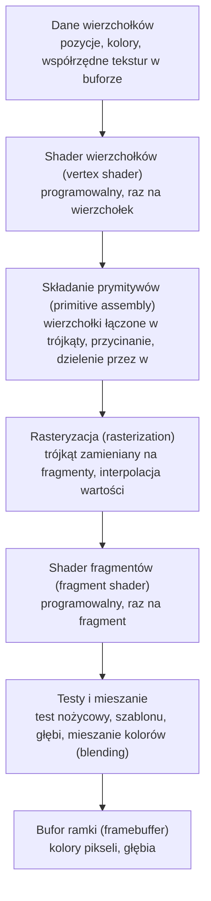
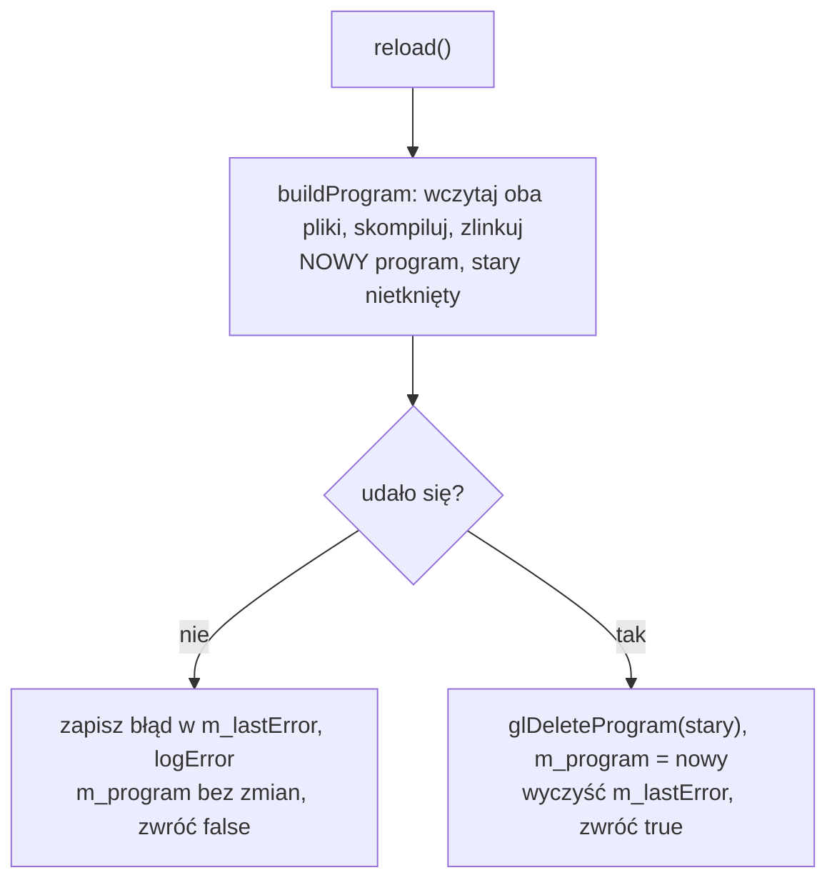
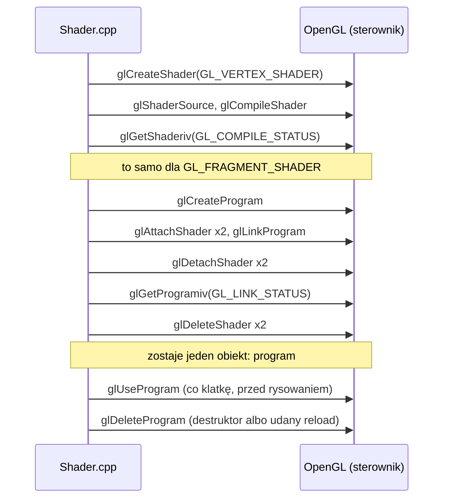
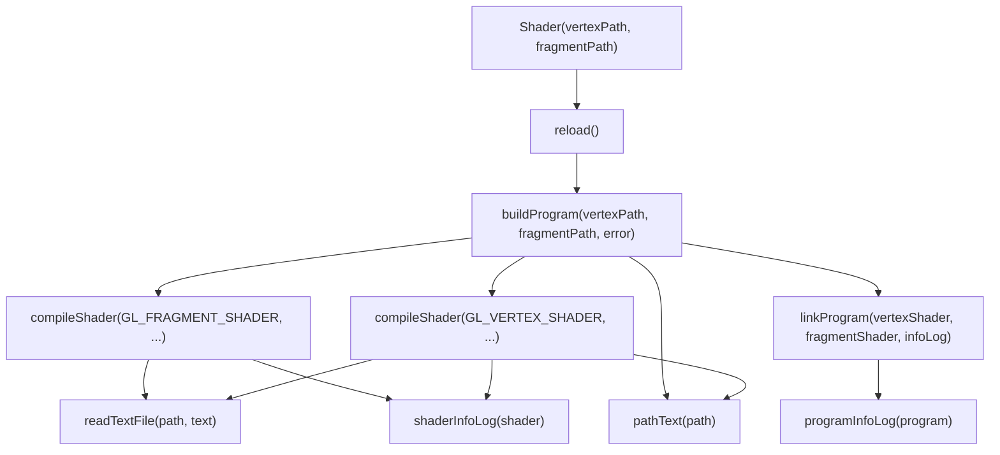

# Moduł gfx: shadery i programowalny potok

Kamień milowy: M1. Temat wykładu: 2 (Programowalny potok).
Kod: [`src/gfx/Shader.hpp`](../../../src/gfx/Shader.hpp), [`src/gfx/Shader.cpp`](../../../src/gfx/Shader.cpp), shadery [`assets/shaders/basic.vert`](../../../assets/shaders/basic.vert) i [`assets/shaders/basic.frag`](../../../assets/shaders/basic.frag), użycie w [`src/game/NightMazeApp.cpp`](../../../src/game/NightMazeApp.cpp).

Część modułu `gfx`. Wstęp do całego modułu, zasada RAII dla obiektów OpenGL i semantyka przenoszenia są w [`README.md`](README.md). Druga część tematu 2, czyli skąd shader wierzchołków bierze dane (bufory i tablica wierzchołków), jest w [`buffers-vao.md`](buffers-vao.md). Ten dokument korzysta z makra `GL_CHECK` ([`../core/gl-check.md`](../core/gl-check.md)), z logowania ([`../core/window-context.md`](../core/window-context.md), sekcja 5.5) i ze ścieżek do assetów ([`../core/paths.md`](../core/paths.md)).

## 1. Po co to jest

Od OpenGL 3.2 w profilu Core nie da się narysować niczego bez shaderów: stary potok o stałej funkcjonalności (fixed function pipeline) został usunięty, a to, co dzieje się z każdym wierzchołkiem i każdym pikselem, opisują małe programy w języku GLSL, wykonywane przez kartę graficzną. Zanim narysuję pierwszy trójkąt, muszę więc umieć: wczytać tekst shadera z pliku, skompilować go, zlinkować dwa shadery w jeden program i dowiedzieć się, co poszło źle, gdy coś poszło źle.

Klasa `gfx::Shader` robi dokładnie to. Jest cienkim opakowaniem na **jeden obiekt programu OpenGL** zbudowany z dwóch plików: shadera wierzchołków i shadera fragmentów. Ma cztery cechy, z których każda odpowiada na konkretny problem:

| Cecha | Problem, który rozwiązuje |
|---|---|
| Shadery są plikami na dysku, nie napisami w kodzie C++ | Zmiana shadera nie wymaga kompilacji programu, a edytor koloruje składnię GLSL (zasada z PRD: "Shadery jako pliki") |
| `reload()` buduje nowy program i podmienia stary tylko przy sukcesie | Wczytywanie na żywo (hot reload): literówka w shaderze nie zamienia obrazu w czarny ekran, bo stary program działa dalej |
| Błąd jest logowany z nazwą pliku i pełnym tekstem sterownika, a do tego zapamiętany w `lastError()` | Błędów kompilacji GLSL nie widzi `glGetError` ani `GL_CHECK`. Bez własnego odczytu nie byłoby żadnej informacji |
| RAII i tylko przenoszenie (move-only) | Program OpenGL jest zwalniany dokładnie raz, automatycznie, bez ręcznego `glDeleteProgram` w kodzie gry |

Stan na dziś: `game::NightMazeApp` ma jeden obiekt `gfx::Shader`, zbudowany z plików `assets/shaders/basic.vert` i `assets/shaders/basic.frag`, i rysuje nim jeden kolorowy trójkąt. Shader jest wczytywany **tylko raz, przy starcie programu**: `reload()` istnieje i działa, ale nic go jeszcze nie woła, bo nie ma przycisku w panelu debug (to następny krok M1). Klasa nie ma też jeszcze funkcji ustawiających uniformy: dojdą razem z pierwszym shaderem, który uniformu potrzebuje (kostka z macierzą MVP).

## 2. Teoria

### 2.1 Potok renderowania

**Potok renderowania** (rendering pipeline) to stała sekwencja etapów, przez którą przechodzą dane od tablicy liczb w pamięci do kolorów pikseli na ekranie. Dla OpenGL 4.1 i dwóch shaderów, których używam, wygląda tak:



| Etap | Kto go wykonuje | Co wchodzi | Co wychodzi |
|---|---|---|---|
| Dane wierzchołków | mój kod C++ | tablica liczb wysłana do bufora na karcie | atrybuty jednego wierzchołka (na przykład pozycja) |
| Shader wierzchołków | **mój program GLSL** | atrybuty jednego wierzchołka i uniformy | pozycja w przestrzeni przycięcia (`gl_Position`) i dowolne własne wartości dla dalszych etapów |
| Składanie prymitywów | OpenGL, bez mojego kodu | pozycje kolejnych wierzchołków | trójkąty (albo linie, punkty), przycięte do widocznego obszaru i przeliczone na współrzędne okna |
| Rasteryzacja | OpenGL, bez mojego kodu | jeden trójkąt | po jednym **fragmencie** na każdy piksel, który trójkąt zakrywa, z wartościami interpolowanymi między wierzchołkami |
| Shader fragmentów | **mój program GLSL** | interpolowane wartości jednego fragmentu i uniformy | kolor fragmentu |
| Testy i mieszanie | OpenGL, sterowane stanem (`glEnable`, `glDepthFunc`, `glBlendFunc`) | kolor i głębia fragmentu | decyzja, czy fragment trafia do bufora, i jak miesza się z tym, co już tam jest |
| Bufor ramki | OpenGL | zaakceptowane fragmenty | obraz, który `glfwSwapBuffers` pokazuje na ekranie |

**Programowalne** są dwa etapy z tej listy: shader wierzchołków i shader fragmentów. Pozostałe są stałe: mogę je tylko konfigurować przez stan OpenGL, ale nie mogę podmienić ich kodu. Stąd nazwa tematu: programowalny potok.

W pełnym potoku OpenGL 4.1 między shaderem wierzchołków a składaniem prymitywów są jeszcze dwa etapy opcjonalne: teselacja (tessellation) i shader geometrii (geometry shader). Na diagramie ich nie ma, bo `gfx::Shader` ich jeszcze nie obsługuje. Shader geometrii pojawi się przy temacie 9 (trawa).

**Fragment a piksel.** Fragment to "kandydat na piksel": dane dla jednego piksela pochodzące z jednego trójkąta. Na ten sam piksel może przypaść wiele fragmentów (z trójkątów leżących jeden za drugim), a o tym, który wygra, decyduje test głębi. Dlatego shader nazywa się shaderem fragmentów, a nie pikseli.

### 2.2 Co musi zrobić shader wierzchołków

Shader wierzchołków wykonuje się raz dla każdego wierzchołka i ma jeden obowiązek: zapisać do wbudowanej zmiennej `gl_Position` pozycję wierzchołka w **przestrzeni przycięcia** (clip space). To wektor czterech liczb `(x, y, z, w)`.

Po shaderze OpenGL sam wykonuje dwa kroki:

1. **Przycinanie** (clipping): zostaje to, co spełnia `-w <= x <= w`, `-w <= y <= w`, `-w <= z <= w`.
2. **Dzielenie perspektywiczne** (perspective divide): `x`, `y`, `z` są dzielone przez `w`. Wynik to **znormalizowane współrzędne urządzenia** (normalized device coordinates, NDC), w których widoczny obszar to sześcian od -1 do 1 na każdej osi: x w prawo, y w górę.

Potem `glViewport` zamienia NDC na piksele bufora ([`../core/window-context.md`](../core/window-context.md), sekcja 3.2).

Dla pierwszego trójkąta wystarczy `w = 1`. Wtedy dzielenie niczego nie zmienia i współrzędne podane w shaderze są od razu współrzędnymi NDC: punkt `(0, 0)` to środek okna, `(-1, -1)` lewy dolny róg, `(1, 1)` prawy górny. Inne `w` pojawi się razem z macierzą rzutowania perspektywicznego ([`../../libraries/glm.md`](../../libraries/glm.md)).

Poza `gl_Position` shader wierzchołków może przekazać dalej własne wartości (kolor, współrzędne tekstury) przez zmienne `out`.

### 2.3 Co robi shader fragmentów

Shader fragmentów wykonuje się raz dla każdego fragmentu, czyli znacznie częściej niż shader wierzchołków: trójkąt ma trzy wierzchołki, ale może zakrywać setki tysięcy pikseli. Jego wynikiem jest kolor: zmienna `out vec4` z czterema składowymi (czerwona, zielona, niebieska, alfa), każda w zakresie od 0 do 1.

Na wejściu dostaje wartości, które shader wierzchołków zapisał w swoich zmiennych `out`, ale **zinterpolowane**: rasteryzacja wylicza dla każdego fragmentu wartość pośrednią między trzema wierzchołkami trójkąta, proporcjonalnie do położenia fragmentu. Trójkąt z czerwonym, zielonym i niebieskim wierzchołkiem dostaje dzięki temu płynne przejście kolorów bez żadnego mojego kodu.

### 2.4 GLSL w pigułce

GLSL (OpenGL Shading Language) jest podobny do C, z typami wektorowymi i macierzowymi wbudowanymi w język.

| Element | Przykład | Znaczenie |
|---|---|---|
| Wersja | `#version 410 core` | Musi być **pierwszą linią** pliku. 410 to GLSL 4.10, czyli wersja odpowiadająca OpenGL 4.1. `core` wybiera profil Core |
| Wejście | `in vec3 aPosition;` | Zmienna wejściowa etapu. W shaderze wierzchołków to atrybut wierzchołka, w shaderze fragmentów interpolowana wartość z poprzedniego etapu |
| Wyjście | `out vec4 fragColor;` | Zmienna wyjściowa etapu. `out` z shadera wierzchołków łączy się z `in` o tej samej nazwie i typie w shaderze fragmentów |
| Położenie | `layout(location = 0) in vec3 aPosition;` | Numer atrybutu wierzchołka. Ten sam numer podaje kod C++, gdy opisuje układ danych w buforze. Bez `layout` numer przydziela linker i trzeba by o niego pytać |
| Uniform | `uniform mat4 uModel;` | Wartość ustawiana z C++ raz na rysowanie, taka sama dla wszystkich wierzchołków i fragmentów. Na przykład macierz, kolor światła, czas |
| Typy skalarne | `float`, `int`, `uint`, `bool` | Jak w C. Literał `1.0` jest typu `float` |
| Wektory | `vec2`, `vec3`, `vec4` | Wektory liczb `float`. Składowe: `.x .y .z .w` albo `.r .g .b .a`. Można je wybierać po kilka naraz: `color.rgb`, `position.xy` |
| Macierze | `mat3`, `mat4` | Macierze 3x3 i 4x4. Mnożenie `mat4 * vec4` jest wbudowane |
| Tekstury | `sampler2D`, `samplerCube` | Uchwyt do tekstury, zawsze jako uniform |
| Konstruktor | `vec4(aPosition, 1.0)` | Buduje wektor z mniejszych części: tu `vec3` i jedna liczba dają `vec4` |
| Funkcja główna | `void main() { ... }` | Punkt wejścia każdego shadera. Nic nie zwraca: wynik zapisuje do `gl_Position` albo do zmiennych `out` |

Nazwy i zachowanie typów są takie same jak w GLM po stronie C++ ([`../../libraries/glm.md`](../../libraries/glm.md)): `glm::vec3` to odpowiednik `vec3`, `glm::mat4` odpowiednik `mat4`.

Przedrostki w nazwach to tylko konwencja, a nie wymóg języka: `a` dla atrybutu (`aPosition`), `u` dla uniformu (`uModel`), `v` dla wartości przekazywanej z shadera wierzchołków do fragmentów (`vColor`).

### 2.5 Obiekt shadera a obiekt programu

OpenGL ma dwa różne rodzaje obiektów i łatwo je pomylić, bo potocznie oba nazywa się "shaderem":

| | Obiekt shadera (shader object) | Obiekt programu (program object) |
|---|---|---|
| Co reprezentuje | jeden etap: kod wierzchołków **albo** fragmentów | komplet etapów gotowy do rysowania |
| Tworzenie | `glCreateShader(typ)` | `glCreateProgram()` |
| Co się z nim robi | dostaje tekst źródłowy i jest **kompilowany** | dostaje dołączone obiekty shaderów i jest **linkowany** |
| Do czego służy potem | do niczego, to produkt pośredni | `glUseProgram` wybiera go do rysowania |
| Usuwanie | `glDeleteShader` | `glDeleteProgram` |

To ten sam podział co w C++: pliki `.cpp` kompiluje się osobno do plików obiektowych, a linker skleja je w program. Po zlinkowaniu pliki obiektowe nie są już potrzebne do uruchomienia programu. Tak samo obiekty shaderów nie są potrzebne po `glLinkProgram`, więc od razu je usuwam. Klasa `gfx::Shader` wbrew nazwie przechowuje więc identyfikator **programu**, a obiekty shaderów żyją tylko wewnątrz jednej funkcji pomocniczej.

Oba rodzaje obiektów są identyfikowane liczbą typu `GLuint`, nazywaną w dokumentacji OpenGL nazwą (name). Wartość 0 nigdy nie jest poprawnym obiektem: `glCreateShader` i `glCreateProgram` zwracają 0 przy niepowodzeniu, a `glUseProgram(0)` znaczy "żaden program".

### 2.6 Kompilacja a linkowanie

| Krok | Co sprawdza | Typowy błąd |
|---|---|---|
| Kompilacja (`glCompileShader`) | jeden shader w izolacji: składnię, typy, istnienie użytych zmiennych i funkcji | brak średnika, nieznana nazwa, `vec3` przypisany do `vec4`, zła albo brakująca linia `#version` |
| Linkowanie (`glLinkProgram`) | czy etapy pasują do siebie: każda zmienna `in` shadera fragmentów musi mieć zmienną `out` o tej samej nazwie i typie w shaderze wierzchołków, a każdy etap musi mieć `main` | shader fragmentów czyta `in vec3 vColor`, którego shader wierzchołków nie zapisuje |

Kompilator GLSL jest częścią **sterownika karty graficznej**, a nie mojego programu. Dlatego ten sam shader może dać różne komunikaty (a czasem różny wynik) na różnych kartach, a format tekstu błędu zależy od producenta:

| Sterownik | Przykładowa linia błędu |
|---|---|
| Apple (macOS) | `ERROR: 0:5: '}' : syntax error: syntax error` |
| NVIDIA | `0(5) : error C0000: syntax error, unexpected '}'` |

W formacie Apple `0:5` to numer napisu źródłowego (zawsze 0, bo podaję jeden napis) i numer linii. Pierwsza linia tabeli pochodzi z testu klasy na Macu (sekcja 5.11), druga jest przykładem formatu NVIDII. Ponieważ formatów jest wiele, klasa `Shader` nie próbuje tekstu sterownika czytać ani poprawiać: przekazuje go w całości.

Zarówno wynik kompilacji, jak i linkowania trzeba **odczytać samemu**: OpenGL nie zgłasza ich przez `glGetError` (sekcja 3.3).

### 2.7 Wczytywanie na żywo

**Wczytywanie na żywo** (hot reload) to podmiana shadera w działającym programie: zmieniam plik `.frag` w edytorze, zapisuję, każę programowi wczytać shadery ponownie i od następnej klatki widzę efekt, bez zamykania okna i bez kompilacji C++. Przy nauce shaderów to największe przyspieszenie pracy, jakie można mieć.

Żeby to było bezpieczne, podmiana musi być **wszystko albo nic**. Shader w trakcie edycji bardzo często się nie kompiluje. Gdybym najpierw usunął stary program, a potem próbował zbudować nowy, każda literówka kończyłaby się czarnym ekranem. Dlatego kolejność jest odwrotna: najpierw buduję nowy program obok starego, a stary usuwam dopiero wtedy, gdy nowy na pewno działa.



## 3. Jak to działa w OpenGL

### 3.1 Wywołania w kolejności

Zbudowanie jednego programu z dwóch plików to następujący ciąg wywołań. Kroki od 1 do 6 wykonują się dwa razy: raz dla shadera wierzchołków, raz dla shadera fragmentów.

| # | Wywołanie | Co robi |
|---|---|---|
| 1 | `glCreateShader(GL_VERTEX_SHADER)` albo `glCreateShader(GL_FRAGMENT_SHADER)` | Tworzy pusty obiekt shadera danego typu i zwraca jego identyfikator. 0 oznacza niepowodzenie |
| 2 | `glShaderSource(shader, count, strings, lengths)` | Kopiuje tekst źródłowy do obiektu. `strings` to tablica `count` napisów C, które OpenGL skleja w jeden. `lengths` równe `nullptr` znaczy: każdy napis kończy się zerem |
| 3 | `glCompileShader(shader)` | Kompiluje tekst. Nic nie zwraca i **nie ustawia flagi błędu** przy błędzie w GLSL |
| 4 | `glGetShaderiv(shader, GL_COMPILE_STATUS, &status)` | Wpisuje do `status` wartość `GL_TRUE` albo `GL_FALSE`: wynik ostatniej kompilacji |
| 5 | `glGetShaderiv(shader, GL_INFO_LOG_LENGTH, &length)` | Wpisuje długość dziennika (info log) w znakach, **razem** z kończącym zerem. 0 oznacza brak dziennika |
| 6 | `glGetShaderInfoLog(shader, maxLength, &written, buffer)` | Kopiuje dziennik do bufora, najwyżej `maxLength` znaków. Do `written` wpisuje liczbę skopiowanych znaków **bez** kończącego zera |
| 7 | `glCreateProgram()` | Tworzy pusty obiekt programu i zwraca jego identyfikator. 0 oznacza niepowodzenie |
| 8 | `glAttachShader(program, shader)` | Dołącza obiekt shadera do programu. Wołane dwa razy, po jednym na etap |
| 9 | `glLinkProgram(program)` | Łączy dołączone shadery w kod wykonywalny dla karty. Tak jak kompilacja, przy błędzie nie ustawia flagi |
| 10 | `glDetachShader(program, shader)` | Odłącza obiekt shadera od programu. Zlinkowany program ma już własny kod i nie potrzebuje obiektów shaderów |
| 11 | `glGetProgramiv(program, GL_LINK_STATUS, &status)` | Wynik linkowania: `GL_TRUE` albo `GL_FALSE` |
| 12 | `glGetProgramiv(program, GL_INFO_LOG_LENGTH, &length)` i `glGetProgramInfoLog(program, maxLength, &written, buffer)` | Dziennik linkowania. Działają jak kroki 5 i 6, ale dla obiektu programu |
| 13 | `glDeleteShader(shader)` | Usuwa obiekt shadera. Jeśli jest jeszcze dołączony do programu, OpenGL tylko oznacza go do usunięcia i zwalnia dopiero po odłączeniu |
| 14 | `glUseProgram(program)` | Ustawia program jako bieżący: używają go wszystkie następne wywołania rysujące, aż do kolejnego `glUseProgram` |
| 15 | `glDeleteProgram(program)` | Usuwa program. Dla wartości 0 nie robi nic i nie zgłasza błędu. Jeśli program jest akurat bieżący, zostaje oznaczony do usunięcia i znika, gdy przestanie być bieżący |

Wszystkie te funkcje są w rdzeniu OpenGL od wersji 2.0, więc są dostępne w 4.1 Core i w nagłówku GLAD projektu.

### 3.2 Diagram obiektów



### 3.3 Błędy GLSL nie są błędami OpenGL

To najważniejsza rzecz w tej sekcji. `glGetError` (a więc i `GL_CHECK`) zgłasza **błędne użycie API**: złą stałą, zły identyfikator, wywołanie w złym stanie. Shader z błędem składni nie jest błędnym użyciem API: `glCompileShader` zostało wywołane poprawnie, na poprawnym obiekcie, i poprawnie wykonało swoją pracę, której wynikiem jest "ten tekst się nie kompiluje". Żadna flaga nie zostaje ustawiona.

| Sytuacja | `glGetError` | Gdzie jest informacja |
|---|---|---|
| `glCompileShader(12345)` (nie ma takiego obiektu) | `GL_INVALID_VALUE` | `GL_CHECK` wypisze linię w konsoli |
| Shader z brakującym średnikiem | `GL_NO_ERROR` | tylko w `GL_COMPILE_STATUS` i w dzienniku shadera |
| Shader fragmentów czyta zmienną, której shader wierzchołków nie zapisuje | `GL_NO_ERROR` | tylko w `GL_LINK_STATUS` i w dzienniku programu |

Kto nie odczyta statusu, dostaje program, który "działa" i niczego nie rysuje. Dopiero użycie niezlinkowanego programu w `glUseProgram` kończy się błędem `GL_INVALID_OPERATION`, ale ten błąd nie mówi już, co było nie tak w shaderze.

## 4. Shadery

Projekt ma na dziś jedną parę shaderów w katalogu [`assets/shaders/`](../../../assets/shaders/). Nazwa `basic` jest celowo neutralna: te same pliki dostaną później macierz przekształcenia i posłużą do rysowania kostki.

### 4.1 `basic.vert`: shader wierzchołków

Cały plik [`assets/shaders/basic.vert`](../../../assets/shaders/basic.vert):

```glsl
#version 410 core
// Vertex shader: runs once for every vertex and decides where it lands on the screen.
// See docs/modules/gfx/shaders.md

// Inputs: the attributes of one vertex, read from the vertex buffer. The location numbers
// are the attribute indices that the C++ code uses when it describes the vertex layout.
layout(location = 0) in vec3 aPosition; // x, y, z
layout(location = 1) in vec3 aColor;    // red, green, blue, each from 0 to 1

// Output to the fragment shader. The rasterizer blends it between the three vertices of
// a triangle, so every fragment receives its own in-between color.
out vec3 vColor;

void main() {
    // gl_Position is the built-in output every vertex shader must write: the position in
    // clip space. There are no matrices yet, so the position from the buffer is used as
    // it is. With w = 1 it is already in normalized device coordinates: x and y from -1
    // to 1 cover the whole window.
    gl_Position = vec4(aPosition, 1.0);

    // Pass the color through unchanged.
    vColor = aColor;
}
```

| Linia | Co robi |
|---|---|
| `#version 410 core` | GLSL 4.10, profil Core. Musi być pierwszą linią pliku, dlatego komentarz z opisem stoi dopiero pod nią |
| `layout(location = 0) in vec3 aPosition;` | Atrybut wierzchołka numer 0: trzy liczby `float`, pozycja. Numer 0 to stała `POSITION_ATTRIBUTE` w `NightMazeApp.cpp` |
| `layout(location = 1) in vec3 aColor;` | Atrybut numer 1: trzy liczby `float`, kolor. Numer 1 to stała `COLOR_ATTRIBUTE` |
| `out vec3 vColor;` | Wyjście do następnego etapu. Shader wierzchołków zapisuje tu kolor swojego wierzchołka, a rasteryzacja interpoluje go między trzema wierzchołkami trójkąta |
| `void main() {` | Funkcja wykonywana raz dla każdego wierzchołka, czyli dla trójkąta trzy razy na klatkę |
| `gl_Position = vec4(aPosition, 1.0);` | Pozycja w przestrzeni przycięcia. Z `vec3` robię `vec4`, dopisując `w = 1`, więc pozycja z bufora jest od razu pozycją w NDC (sekcja 2.2). Tu pojawi się mnożenie przez macierz, gdy dojdzie kostka |
| `vColor = aColor;` | Kolor przechodzi bez zmian |

### 4.2 `basic.frag`: shader fragmentów

Cały plik [`assets/shaders/basic.frag`](../../../assets/shaders/basic.frag):

```glsl
#version 410 core
// Fragment shader: runs once for every fragment (pixel candidate) and decides its color.
// See docs/modules/gfx/shaders.md

// Input from the vertex shader: same name and type as its "out vec3 vColor". The value is
// already interpolated for this fragment.
in vec3 vColor;

// Output: the color written to the framebuffer (red, green, blue, alpha).
out vec4 fragColor;

void main() {
    // Alpha 1 means fully opaque.
    fragColor = vec4(vColor, 1.0);
}
```

| Linia | Co robi |
|---|---|
| `in vec3 vColor;` | Wejście: ta sama nazwa i ten sam typ co `out vec3 vColor` w shaderze wierzchołków. Po tej nazwie linker łączy oba etapy. Wartość jest już zinterpolowana dla tego fragmentu |
| `out vec4 fragColor;` | Wyjście shadera: kolor fragmentu. Nazwa jest dowolna. Shader fragmentów z jednym wyjściem zapisuje je do pierwszego bufora koloru |
| `fragColor = vec4(vColor, 1.0);` | Kolor z trzech składowych i alfa równa 1, czyli pełne krycie |

### 4.3 Skąd biorą się kolory na ekranie

Dane wierzchołków w `NightMazeApp.cpp` dają lewemu dolnemu wierzchołkowi kolor czerwony, prawemu dolnemu zielony, a górnemu niebieski ([`buffers-vao.md`](buffers-vao.md), sekcja 5.7). Shader wierzchołków przepisuje te kolory do `vColor`. Dla każdego piksela wewnątrz trójkąta rasteryzacja wylicza `vColor` jako średnią ważoną trzech wierzchołków, z wagami zależnymi od odległości. Dlatego przy rogach trójkąt jest prawie czysto czerwony, zielony i niebieski, a w środku ciężkości wszystkie trzy składowe są równe (szary). W żadnym z dwóch shaderów nie ma ani jednej linii, która to przejście liczy: robi je etap stały potoku.

Rozszerzenia plików (`.vert`, `.frag`) nie mają dla OpenGL żadnego znaczenia: o typie shadera decyduje stała podana do `glCreateShader`, a nie nazwa pliku. Rozszerzenia są dla ludzi i dla edytora, który według nich włącza kolorowanie składni GLSL ([`../../guides/project-structure.md`](../../guides/project-structure.md), sekcja 3.10).

Jak pliki z `assets/` trafiają obok programu, opisuje [`../core/paths.md`](../core/paths.md) (sekcja 5.8) i [`../../guides/project-structure.md`](../../guides/project-structure.md) (sekcja 3.1, blok 7).

## 5. Kod w projekcie

### 5.1 Pliki

| Plik | Co zawiera |
|---|---|
| [`src/gfx/Shader.hpp`](../../../src/gfx/Shader.hpp) | klasa `gfx::Shader`: konstruktor, destruktor, zablokowane kopiowanie, przenoszenie, `reload`, `isValid`, `use`, `lastError`. Dołącza `<glad/gl.h>` (typ `GLuint`), `<filesystem>` i `<string>` |
| [`src/gfx/Shader.cpp`](../../../src/gfx/Shader.cpp) | implementacja i siedem funkcji pomocniczych w anonimowej przestrzeni nazw: `pathText`, `readTextFile`, `shaderInfoLog`, `programInfoLog`, `compileShader`, `linkProgram`, `buildProgram` |
| [`assets/shaders/basic.vert`](../../../assets/shaders/basic.vert), [`basic.frag`](../../../assets/shaders/basic.frag) | jedyna para shaderów projektu (sekcja 4) |
| [`src/game/NightMazeApp.hpp`](../../../src/game/NightMazeApp.hpp), [`.cpp`](../../../src/game/NightMazeApp.cpp) | jedyny użytkownik klasy: pole `m_shader`, wczytanie w konstruktorze, `isValid()` i `use()` w `onRender` (sekcja 5.10) |

Oba pliki są na liście źródeł biblioteki `engine` w [`CMakeLists.txt`](../../../CMakeLists.txt). Klasa zależy tylko od `core` (`GL_CHECK`, `logError`), GLAD i biblioteki standardowej.



Wszystkie funkcje pomocnicze zgłaszają niepowodzenie tak samo, bez wyjątków: zwracają `false` albo identyfikator 0, a opis błędu wpisują do parametru `std::string&`.

### 5.2 Nagłówek klasy

```cpp
class Shader {
public:
    /// Remembers both file paths and tries to load the program. It does not throw: when
    /// loading fails the error is logged, isValid() returns false and lastError() holds
    /// the message.
    Shader(std::filesystem::path vertexPath, std::filesystem::path fragmentPath);
    ~Shader();

    Shader(const Shader&) = delete;
    Shader& operator=(const Shader&) = delete;

    /// Takes over the program of other. other is left without a program (not valid).
    Shader(Shader&& other) noexcept;
    /// Deletes the program this object owns, then takes over the program of other.
    Shader& operator=(Shader&& other) noexcept;
```

```cpp
private:
    std::filesystem::path m_vertexPath;
    std::filesystem::path m_fragmentPath;
    // Name (id) of the OpenGL program object. 0 is never a real program: it means "none".
    GLuint m_program = 0;
    std::string m_lastError;
};
```

| Element | Dlaczego tak |
|---|---|
| ścieżki jako `std::filesystem::path` | `Shader` nie wie nic o katalogu `assets/`. Pełną ścieżkę buduje wołający przez `core::assetPath` ([`../core/paths.md`](../core/paths.md)). Dzięki temu klasa nadaje się też do zadań laboratoryjnych, w których pliki leżą gdzie indziej |
| ścieżki są zapamiętane w polach | `reload()` nie ma parametrów: obiekt sam wie, z których plików powstał |
| `m_program = 0` | 0 to "nie ma programu". Jedno pole pełni rolę identyfikatora i flagi poprawności, bez osobnego `bool` |
| `m_lastError` | ten sam tekst, który trafił do konsoli, zostaje w obiekcie, żeby panel debug mógł go pokazać |
| `= delete` przy kopiowaniu | kopia miałaby ten sam identyfikator programu i oba destruktory wołałyby `glDeleteProgram` dla tego samego obiektu ([`README.md`](README.md), sekcja 2.2) |
| `noexcept` przy przenoszeniu | obietnica, że te funkcje nie rzucają wyjątków. Kontenery biblioteki standardowej (na przykład `std::vector` przy powiększaniu) przenoszą elementy tylko wtedy, gdy przeniesienie jest `noexcept`. Przy typie, którego nie da się kopiować, to konieczność |

Trzy krótkie funkcje są zdefiniowane w nagłówku albo mają jedną linię w `.cpp`:

```cpp
bool isValid() const { return m_program != 0; }
```

```cpp
const std::string& lastError() const { return m_lastError; }
```

```cpp
void Shader::use() const {
    GL_CHECK(glUseProgram(m_program));
}
```

`use()` nie sprawdza `isValid()`. Dla obiektu bez programu wykona `glUseProgram(0)`, czyli "żaden program", a rysowanie w takim stanie nie daje określonego wyniku. Sprawdzenie należy do wołającego. `use()` jest `const`, bo nie zmienia obiektu C++, zmienia stan kontekstu OpenGL.

### 5.3 Wczytanie pliku: `readTextFile` i `pathText`

```cpp
// Reads a whole text file into text. Returns false when the file cannot be opened.
bool readTextFile(const std::filesystem::path& path, std::string& text) {
    // The stream closes the file in its destructor.
    std::ifstream file(path);
    if (!file.is_open()) {
        return false;
    }

    // rdbuf() is the buffer the stream reads the file through. Sending it to another
    // stream with << copies everything up to the end of the file.
    std::ostringstream contents;
    contents << file.rdbuf();
    text = contents.str();
    return true;
}
```

| Linia | Co robi |
|---|---|
| `std::ifstream file(path);` | Otwiera plik do czytania w trybie tekstowym. Konstruktor przyjmuje `std::filesystem::path` wprost, bez zamiany na napis, więc na Windowsie ścieżka ze znakami spoza strony kodowej działa. Plik zamknie destruktor strumienia (RAII) |
| `if (!file.is_open())` | Nie ma pliku, nie ma uprawnień albo ścieżka jest zła. Strumienie domyślnie nie rzucają wyjątków, więc trzeba zapytać |
| `std::ostringstream contents;` | Strumień, który pisze do napisu w pamięci |
| `contents << file.rdbuf();` | `rdbuf()` zwraca wskaźnik do bufora strumienia pliku. Operator `<<` dla takiego wskaźnika przepisuje wszystko, co da się z niego przeczytać, do końca pliku. To standardowy sposób na "wczytaj cały plik" bez pętli i bez znajomości rozmiaru |
| `text = contents.str();` | `str()` zwraca zebrany tekst jako `std::string` |

Wynik wraca przez parametr `std::string& text`, a wartość zwracana `bool` mówi tylko "udało się albo nie". To celowo prosty kształt: bez `std::optional` i bez wyjątków.

Tryb tekstowy ma na Windowsie jedną konsekwencję: końce linii `\r\n` są przy czytaniu zamieniane na `\n`. Kompilatorowi GLSL jest to obojętne.

```cpp
// A path as UTF-8 text for error messages. u8string() gives UTF-8 on every system, and
// its characters (char8_t) are copied one by one into a std::string. path::string() is
// not used: on Windows it converts to the local code page and throws when a letter of
// the path does not exist there.
std::string pathText(const std::filesystem::path& path) {
    const std::u8string utf8 = path.u8string();
    std::string text(utf8.begin(), utf8.end());
    return text;
}
```

Ta funkcja zamienia ścieżkę na tekst do komunikatu błędu. Najprostsze `path.string()` ma na Windowsie wadę opisaną w [`../core/paths.md`](../core/paths.md) (sekcja 7, pułapka 7): zamienia znaki szerokie na lokalną stronę kodową i **rzuca wyjątek**, gdy jakiegoś znaku w niej nie ma. Konstruktor `Shader` obiecuje, że nie rzuca, więc komunikat o błędzie nie może sam być źródłem wyjątku. `u8string()` zwraca UTF-8, w którym da się zapisać każdą ścieżkę. W C++20 jego typem jest `std::u8string` (napis ze znaków `char8_t`), a nie `std::string`, stąd druga linia: konstruktor `std::string` z parą iteratorów (początek i koniec napisu `utf8`) kopiuje znaki jeden po drugim, zamieniając każdy `char8_t` na `char` o tej samej wartości bajtu. Drugi zysk: ImGui oczekuje tekstu w UTF-8, więc `lastError()` da się wyświetlić w panelu bez dalszych zamian.

### 5.4 Dziennik sterownika: `shaderInfoLog` i `programInfoLog`

```cpp
// Text the driver wrote while compiling a shader: errors and warnings with line numbers.
std::string shaderInfoLog(GLuint shader) {
    // Length of the log in characters, including the terminating zero. 0 means no log.
    GLint length = 0;
    GL_CHECK(glGetShaderiv(shader, GL_INFO_LOG_LENGTH, &length));
    if (length <= 0) {
        return {};
    }

    std::string log(static_cast<std::size_t>(length), '\0');
    // written receives the number of characters copied, without the terminating zero.
    GLsizei written = 0;
    GL_CHECK(glGetShaderInfoLog(shader, length, &written, log.data()));
    log.resize(static_cast<std::size_t>(written));
    return log;
}
```

| Linia | Co robi |
|---|---|
| `GLint length = 0;` i `glGetShaderiv(..., GL_INFO_LOG_LENGTH, &length)` | Pytam o długość dziennika. OpenGL zwraca wyniki przez wskaźnik, więc zmienna musi istnieć wcześniej. Wartość początkowa 0 zostaje, gdyby wywołanie się nie powiodło |
| `if (length <= 0) { return {}; }` | Brak dziennika: zwracam pusty napis. `return {};` tworzy domyślny (pusty) `std::string` |
| `std::string log(static_cast<std::size_t>(length), '\0');` | Bufor o dokładnie potrzebnej długości, wypełniony zerami. `length` jest typu `GLint` (ze znakiem), a konstruktor chce `std::size_t` (bez znaku), stąd jawne rzutowanie. Wcześniejszy warunek gwarantuje, że liczba jest dodatnia |
| `glGetShaderInfoLog(shader, length, &written, log.data())` | Kopiuje dziennik do bufora. `log.data()` daje `char*` do pamięci napisu |
| `log.resize(static_cast<std::size_t>(written));` | `length` liczyło kończące zero, `written` go nie liczy. Skracam napis, żeby zero nie zostało na końcu tekstu |

To ten sam wzorzec "zapytaj o rozmiar, przydziel bufor, wypełnij, przytnij" co przy `_NSGetExecutablePath` w [`../core/paths.md`](../core/paths.md) (sekcja 5.5).

`programInfoLog` jest kopią tej funkcji z dwiema różnicami: woła `glGetProgramiv` i `glGetProgramInfoLog`, bo obiekt programu ma własną parę funkcji.

```cpp
// Text the driver wrote while linking a program. Same steps as shaderInfoLog, but
// a program object has its own pair of functions.
std::string programInfoLog(GLuint program) {
    GLint length = 0;
    GL_CHECK(glGetProgramiv(program, GL_INFO_LOG_LENGTH, &length));
    if (length <= 0) {
        return {};
    }

    std::string log(static_cast<std::size_t>(length), '\0');
    GLsizei written = 0;
    GL_CHECK(glGetProgramInfoLog(program, length, &written, log.data()));
    log.resize(static_cast<std::size_t>(written));
    return log;
}
```

Dwie prawie identyczne funkcje są tu świadomym wyborem. Wspólna wersja wymagałaby przekazywania wskaźników do funkcji OpenGL albo szablonu, a to byłoby trudniejsze do wytłumaczenia niż dwanaście powtórzonych linii.

### 5.5 Kompilacja jednego shadera: `compileShader`

```cpp
// Reads one shader file and compiles it. type is GL_VERTEX_SHADER or GL_FRAGMENT_SHADER.
// Returns the id of the shader object, or 0 on failure with the message in error.
GLuint compileShader(GLenum type, const std::filesystem::path& path, std::string& error) {
    std::string source;
    if (!readTextFile(path, source)) {
        error = "Shader file cannot be opened: " + pathText(path);
        return 0;
    }

    GLuint shader = 0;
    GL_CHECK(shader = glCreateShader(type));

    // glShaderSource takes an array of C strings. Here the array has one element.
    // nullptr as the array of lengths means that every string ends with a zero.
    const char* sourceText = source.c_str();
    GL_CHECK(glShaderSource(shader, 1, &sourceText, nullptr));
    GL_CHECK(glCompileShader(shader));

    // A compile error does not set an OpenGL error flag, so GL_CHECK cannot see it.
    // The result has to be asked for.
    GLint status = GL_FALSE;
    GL_CHECK(glGetShaderiv(shader, GL_COMPILE_STATUS, &status));
    if (status != GL_TRUE) {
        error = "Shader compilation failed: " + pathText(path) + "\n" + shaderInfoLog(shader);
        GL_CHECK(glDeleteShader(shader));
        return 0;
    }
    return shader;
}
```

| Fragment | Co robi i dlaczego |
|---|---|
| `if (!readTextFile(path, source))` | Pierwszy z trzech rodzajów błędu: pliku nie da się otworzyć. Żaden obiekt OpenGL jeszcze nie powstał, więc nie ma czego sprzątać |
| `GLuint shader = 0;` potem `GL_CHECK(shader = glCreateShader(type));` | Wywołanie zwracające wartość w `GL_CHECK`: przypisanie jest w środku makra, a zmienna jest zadeklarowana przed nim ([`../core/gl-check.md`](../core/gl-check.md), sekcja 5.2) |
| `const char* sourceText = source.c_str();` | `glShaderSource` chce **tablicy** wskaźników (`const GLchar* const*`). Mam jeden napis, więc robię zmienną ze wskaźnikiem i podaję jej adres: `&sourceText` to tablica o jednym elemencie. Nie da się napisać `&source.c_str()`, bo nie można wziąć adresu wartości tymczasowej |
| `glShaderSource(shader, 1, &sourceText, nullptr)` | `1` to liczba napisów. `nullptr` zamiast tablicy długości: napis kończy się zerem, co `c_str()` gwarantuje. OpenGL **kopiuje** tekst, więc `source` może zniknąć po tym wywołaniu |
| `GLint status = GL_FALSE;` | Wartość początkowa to "nie udało się". Gdyby `glGetShaderiv` samo zawiodło (na przykład `shader` równe 0), zmienna zostanie nietknięta i kod pójdzie ścieżką błędu |
| `if (status != GL_TRUE)` | Drugi rodzaj błędu: kompilacja. Komunikat to nazwa pliku, znak nowej linii i dziennik sterownika bez żadnych zmian |
| `GL_CHECK(glDeleteShader(shader)); return 0;` | Nieudany obiekt shadera usuwam od razu. Kolejność ma znaczenie: dziennik trzeba odczytać **przed** usunięciem obiektu |

Wartość zwracana 0 jest naturalnym sygnałem błędu, bo OpenGL nigdy nie nadaje obiektowi identyfikatora 0.

### 5.6 Linkowanie: `linkProgram`

```cpp
// Links two compiled shaders into a new program. Returns the id of the program object,
// or 0 on failure with the driver's text in infoLog.
GLuint linkProgram(GLuint vertexShader, GLuint fragmentShader, std::string& infoLog) {
    GLuint program = 0;
    GL_CHECK(program = glCreateProgram());
    GL_CHECK(glAttachShader(program, vertexShader));
    GL_CHECK(glAttachShader(program, fragmentShader));
    GL_CHECK(glLinkProgram(program));

    // A linked program keeps its own executable code, so it no longer needs the shader
    // objects. Detaching them lets glDeleteShader really free them.
    GL_CHECK(glDetachShader(program, vertexShader));
    GL_CHECK(glDetachShader(program, fragmentShader));

    // Like compiling, a failed link sets no OpenGL error flag.
    GLint status = GL_FALSE;
    GL_CHECK(glGetProgramiv(program, GL_LINK_STATUS, &status));
    if (status != GL_TRUE) {
        infoLog = programInfoLog(program);
        GL_CHECK(glDeleteProgram(program));
        return 0;
    }
    return program;
}
```

| Fragment | Co robi i dlaczego |
|---|---|
| `glAttachShader` dwa razy | Program dowiaduje się, z których obiektów shaderów ma powstać. Kolejność dołączania nie ma znaczenia |
| `glLinkProgram(program)` | Sprawdza zgodność etapów i tworzy kod dla karty |
| `glDetachShader` dwa razy, zaraz po linkowaniu | Odłączam niezależnie od wyniku linkowania. Zlinkowany program ma własną kopię kodu. Dopóki obiekt shadera jest dołączony do programu, `glDeleteShader` tylko oznacza go do usunięcia. Po odłączeniu zostanie zwolniony naprawdę |
| `GL_LINK_STATUS` | Trzeci rodzaj błędu: linkowanie. Tak jak przy kompilacji, bez flagi `glGetError` |
| `infoLog = programInfoLog(program);` przed `glDeleteProgram` | Najpierw dziennik, potem usunięcie nieudanego programu |

Funkcja zwraca przez `infoLog` **sam tekst sterownika**, bez nazw plików: dostaje tylko identyfikatory i ścieżek nie zna. Pełny komunikat składa funkcja piętro wyżej.

### 5.7 Całość: `buildProgram`

```cpp
// Builds a complete program from two files: compile, compile, link. Returns the id of
// the new program, or 0 on failure with the message in error. Whatever happens, no shader
// object is left behind.
GLuint buildProgram(const std::filesystem::path& vertexPath,
                    const std::filesystem::path& fragmentPath, std::string& error) {
    const GLuint vertexShader = compileShader(GL_VERTEX_SHADER, vertexPath, error);
    if (vertexShader == 0) {
        return 0;
    }

    const GLuint fragmentShader = compileShader(GL_FRAGMENT_SHADER, fragmentPath, error);
    if (fragmentShader == 0) {
        GL_CHECK(glDeleteShader(vertexShader));
        return 0;
    }

    std::string infoLog;
    const GLuint program = linkProgram(vertexShader, fragmentShader, infoLog);

    // The shader objects were only an intermediate step, linked or not.
    GL_CHECK(glDeleteShader(vertexShader));
    GL_CHECK(glDeleteShader(fragmentShader));

    if (program == 0) {
        error = "Shader linking failed: " + pathText(vertexPath) + " + " + pathText(fragmentPath) +
                "\n" + infoLog;
    }
    return program;
}
```

Funkcja ma cztery wyjścia i przy każdym trzeba umieć powiedzieć, jakie obiekty OpenGL istnieją:

| Wyjście | Obiekty shaderów | Obiekt programu | `error` |
|---|---|---|---|
| nie udał się shader wierzchołków | żaden (`compileShader` posprzątał po sobie) | nie powstał | plik albo kompilacja, ścieżka shadera wierzchołków |
| nie udał się shader fragmentów | shader wierzchołków usunięty tutaj, shader fragmentów przez `compileShader` | nie powstał | plik albo kompilacja, ścieżka shadera fragmentów |
| nie udało się linkowanie | oba usunięte tutaj | usunięty przez `linkProgram` | obie ścieżki i dziennik programu |
| sukces | oba usunięte tutaj | zwrócony wołającemu | pusty |

Żadne wyjście nie zostawia po sobie obiektu, którego nikt nie pamięta. To jest właśnie warunek z opisu `reload()`: "przy niepowodzeniu nowe obiekty są usuwane".

Przy błędzie w shaderze wierzchołków shader fragmentów nie jest w ogóle wczytywany. W konsoli pojawi się więc błąd tylko jednego pliku naraz. Po jego poprawieniu i ponownym `reload()` wyjdzie ewentualny błąd drugiego.

Komunikat o błędzie linkowania wymienia **oba pliki**, bo błąd linkowania z natury dotyczy pary: jeden shader czegoś oczekuje, a drugi tego nie dostarcza.

### 5.8 Konstruktor, `reload` i destruktor

```cpp
// The paths arrive by value and are moved into the members, so a caller that passes
// a temporary (the result of core::assetPath) pays for no copy.
Shader::Shader(std::filesystem::path vertexPath, std::filesystem::path fragmentPath)
    : m_vertexPath(std::move(vertexPath)), m_fragmentPath(std::move(fragmentPath)) {
    // The first load is the same work as a reload, starting from "no program".
    reload();
}
```

- Parametry są przekazane **przez wartość**, a potem przeniesione do pól przez `std::move`. Wołający zwykle poda wynik `core::assetPath(...)`, czyli obiekt tymczasowy: taki obiekt jest przenoszony do parametru, a z parametru do pola, więc ścieżka nie jest kopiowana ani razu. Przy `const std::filesystem::path&` kopia do pola byłaby nieunikniona. `std::move` samo niczego nie przenosi: to rzutowanie, które mówi "ten obiekt można opróżnić" ([`README.md`](README.md), sekcja 2.3).
- Konstruktor woła `reload()` i **ignoruje jego wynik**. Nie rzuca wyjątku przy błędzie shadera: obiekt powstaje zawsze, a czy ma program, mówi `isValid()`. Powód: literówka w pliku GLSL nie powinna zamykać całego programu, skoro da się ją poprawić i wczytać shader ponownie bez restartu. To inna decyzja niż w `core::Window`, którego konstruktor rzuca, bo bez okna nie ma czego ratować.

```cpp
bool Shader::reload() {
    // Build the new program completely before touching the one in use.
    std::string error;
    const GLuint program = buildProgram(m_vertexPath, m_fragmentPath, error);
    if (program == 0) {
        // m_program is not changed: the previous program, if there is one, keeps working.
        m_lastError = error;
        core::logError(m_lastError);
        return false;
    }

    // Only now replace the old program (glDeleteProgram(0) is ignored on the first load).
    GL_CHECK(glDeleteProgram(m_program));
    m_program = program;
    m_lastError.clear();
    return true;
}
```

| Fragment | Co robi i dlaczego |
|---|---|
| `const GLuint program = buildProgram(...)` | Nowy program powstaje w zmiennej **lokalnej**. `m_program` do tej chwili nie zostało dotknięte |
| `if (program == 0)` | Niepowodzenie na którymkolwiek etapie. Wszystkie nowe obiekty zostały już usunięte przez funkcje pomocnicze |
| `m_lastError = error;` i `core::logError(m_lastError);` | Ten sam tekst idzie w dwa miejsca: do pola (dla panelu debug) i do konsoli jako linia `[error] ...` |
| `return false;` bez zmiany `m_program` | **Stary program działa dalej.** Po nieudanym `reload()` obiekt jest w tym samym stanie co przedtem, tylko z ustawionym `lastError()` |
| `GL_CHECK(glDeleteProgram(m_program));` | Dopiero po sukcesie usuwam stary program. Przy pierwszym wczytaniu `m_program` to 0 i OpenGL takie wywołanie ignoruje |
| `m_lastError.clear();` | Po udanym wczytaniu nie ma błędu do pokazania |

Możliwe stany obiektu:

| Sytuacja | `isValid()` | `lastError()` |
|---|---|---|
| konstruktor, pliki poprawne | `true` | pusty |
| konstruktor, błąd w pliku | `false` | komunikat |
| udany `reload()` | `true` | pusty |
| nieudany `reload()` po wcześniejszym sukcesie | `true` (stary program) | komunikat |
| obiekt, z którego przeniesiono | `false` | nieokreślony (zwykle pusty) |

Czwarty wiersz jest wart zapamiętania: `isValid()` i pusty `lastError()` to **dwa różne pytania**. Pierwsze mówi "czy jest czym rysować", drugie "czy ostatnie wczytanie się udało".

```cpp
Shader::~Shader() {
    // OpenGL silently ignores glDeleteProgram(0), so an object without a program
    // (a failed load, or one that was moved from) needs no special case.
    GL_CHECK(glDeleteProgram(m_program));
}
```

Destruktor ma jedną linię, bez `if (m_program != 0)`. Specyfikacja OpenGL mówi, że `glDeleteProgram` dla wartości 0 jest po cichu ignorowane (bez błędu), i na tym polegam w trzech miejscach: tutaj, w `reload()` i w przypisaniu przenoszącym.

### 5.9 Przenoszenie

Ogólne wyjaśnienie, czym jest przeniesienie i dlaczego opakowania obiektów OpenGL nie wolno kopiować, jest w [`README.md`](README.md), sekcja 2. Tutaj sam kod.

```cpp
// Move constructor: the new object takes the program id, and other gives it up.
Shader::Shader(Shader&& other) noexcept
    : m_vertexPath(std::move(other.m_vertexPath)),
      m_fragmentPath(std::move(other.m_fragmentPath)),
      m_program(other.m_program),
      m_lastError(std::move(other.m_lastError)) {
    // Two objects must never hold the same id. With 0 the destructor of other
    // deletes nothing.
    other.m_program = 0;
}
```

| Fragment | Co robi i dlaczego |
|---|---|
| `Shader&& other` | Referencja do r-wartości (rvalue reference): parametr przyjmuje obiekt tymczasowy albo taki, który wołający oznaczył przez `std::move`. To sygnał "z tego obiektu wolno zabrać zawartość" |
| `std::move(other.m_vertexPath)` i pozostałe | Ścieżki i napis błędu są przenoszone ich własnymi konstruktorami przenoszącymi: nowy obiekt przejmuje ich pamięć bez kopiowania znaków |
| `m_program(other.m_program)` | Identyfikator to zwykła liczba, więc jest po prostu kopiowany. `std::move` dla liczby nic by nie zmieniło |
| `other.m_program = 0;` | **Najważniejsza linia.** Po skopiowaniu liczby oba obiekty mają ten sam identyfikator. Zerując go w `other`, sprawiam, że właściciel jest jeden, a destruktor `other` wykona `glDeleteProgram(0)`, czyli nic |

Bez ostatniej linii konstruktor przenoszący byłby kopiującym w przebraniu, z dokładnie tym błędem, przed którym chroni `= delete`: dwa destruktory, jeden program.

```cpp
// Move assignment: this object already owns a program, which has to go first.
Shader& Shader::operator=(Shader&& other) noexcept {
    // shader = std::move(shader): nothing to do. Without this check the program would
    // be deleted here and then "taken over" from itself.
    if (this == &other) {
        return *this;
    }

    // Release the program owned so far (ignored by OpenGL when it is 0).
    GL_CHECK(glDeleteProgram(m_program));

    m_vertexPath = std::move(other.m_vertexPath);
    m_fragmentPath = std::move(other.m_fragmentPath);
    m_program = other.m_program;
    m_lastError = std::move(other.m_lastError);
    other.m_program = 0;
    return *this;
}
```

Przypisanie różni się od konstruktora jednym: obiekt po lewej stronie **już istnieje i może mieć własny program**. Trzy kroki:

1. **Przypisanie do samego siebie.** `this == &other` porównuje adresy. Bez tego warunku `shader = std::move(shader)` usunęłoby program, a potem "przejęło" identyfikator już nieistniejącego obiektu i na koniec wyzerowało go: obiekt zostałby bez programu.
2. **Zwolnienie własnego programu.** Bez tej linii stary identyfikator zostałby nadpisany i nikt nie zawołałby już dla niego `glDeleteProgram`: wyciek obiektu OpenGL.
3. **Przejęcie** pól `other` i wyzerowanie jego identyfikatora, tak jak w konstruktorze.

`return *this;` zwraca referencję do obiektu po lewej, jak każdy operator przypisania, żeby dało się pisać `a = b = c`.

### 5.10 Gdzie klasa jest używana

Jedynym użytkownikiem jest `game::NightMazeApp`. Cztery miejsca.

**Pole** w [`NightMazeApp.hpp`](../../../src/game/NightMazeApp.hpp):

```cpp
gfx::Shader m_shader;
```

Jako pole klasy pochodnej od `core::Application` obiekt powstaje po oknie i kontekście OpenGL, a ginie przed nimi ([`../core/README.md`](../core/README.md), sekcja 7).

**Nazwy plików** w anonimowej przestrzeni nazw [`NightMazeApp.cpp`](../../../src/game/NightMazeApp.cpp):

```cpp
// Shader files, relative to the assets directory.
constexpr const char* VERTEX_SHADER_FILE = "shaders/basic.vert";
constexpr const char* FRAGMENT_SHADER_FILE = "shaders/basic.frag";
```

**Wczytanie** na liście inicjalizacyjnej konstruktora:

```cpp
m_shader(core::assetPath(VERTEX_SHADER_FILE), core::assetPath(FRAGMENT_SHADER_FILE)),
```

`core::assetPath` zamienia nazwę względną na pełną ścieżkę w katalogu `assets/` obok pliku wykonywalnego ([`../core/paths.md`](../core/paths.md)), więc shadery znajdują się niezależnie od katalogu roboczego. Wynik `assetPath` jest obiektem tymczasowym, który trafia do parametru konstruktora `Shader` przez przeniesienie (sekcja 5.8). Konstruktor `Shader` nie rzuca przy błędzie w shaderze. Wyjątek może natomiast rzucić samo `core::assetPath`, gdy system nie potrafi podać położenia programu: wtedy konstruktor aplikacji zostaje przerwany, a wyjątek łapie `catch` w `main` i program kończy się linią `[error] Fatal: ...`.

**Rysowanie** w `NightMazeApp::onRender`, po `glClear`:

```cpp
// Without a shader program there is nothing to draw with. The load error was logged
// once, when the shader was created, so the frame stays at the clear color.
if (m_shader.isValid()) {
    m_shader.use();
    m_vertexArray.bind();
    // Every three vertices, starting at vertex 0, form one triangle.
    GL_CHECK(glDrawArrays(GL_TRIANGLES, 0, VERTEX_COUNT));
}
```

| Linia | Co robi i dlaczego |
|---|---|
| `if (m_shader.isValid())` | Gdy shader się nie wczytał, rysowanie jest pomijane w całości. Klatka to wtedy samo tło, a panele debug działają normalnie. Błąd został wypisany **raz**, przez `reload()` wołane z konstruktora, a nie co klatkę |
| `m_shader.use();` | `glUseProgram`: wybiera program dla następnego wywołania rysującego. Wołane co klatkę, bo backend ImGui ustawia przy rysowaniu paneli własny program |
| `m_vertexArray.bind();` | Wybiera opis danych wierzchołków ([`buffers-vao.md`](buffers-vao.md)) |
| `glDrawArrays(GL_TRIANGLES, 0, VERTEX_COUNT)` | Uruchamia potok z sekcji 2.1 dla trzech wierzchołków |

`reload()` nie jest dziś wołane nigdzie poza konstruktorem `Shader`. Zmiana pliku shadera wymaga więc ponownego uruchomienia programu (ale nie kompilacji C++).

### 5.11 Jak to zostało sprawdzone

**Test samej klasy.** Zanim klasa dostała użytkownika, sprawdziłem ją na Macu małym programem testowym poza repozytorium: ukryte okno GLFW z kontekstem 4.1 Core, biblioteka `engine` z buildu Debug i kilka plików shaderów w katalogu tymczasowym. Wyniki (sterownik Apple, `GL_VERSION` 4.1 Metal):

| Próba | Wynik |
|---|---|
| najprostsza poprawna para (jeden atrybut pozycji, stały kolor) | `isValid()` prawda, `lastError()` pusty |
| nieistniejący plik | `isValid()` fałsz, `Shader file cannot be opened: <ścieżka>` |
| brak średnika w shaderze wierzchołków | `Shader compilation failed: <ścieżka>`, potem `ERROR: 0:5: '}' : syntax error: syntax error` |
| brak linii `#version` | `ERROR: 0:1: '' :  #version required and missing.` |
| `#version 330 core` | kompiluje się |
| `#version 420 core` i `#version 460 core` | `ERROR: 0:1: '' :  version '420' is not supported` (odpowiednio `'460'`) |
| shader fragmentów z `in vec3 vColor`, którego shader wierzchołków nie zapisuje | `Shader linking failed: <ścieżka> + <ścieżka>`, potem `ERROR: Input of fragment shader 'vColor' not written by vertex shader` |
| `reload()` po zepsuciu pliku | zwraca `false`, `isValid()` nadal prawda, `glGetIntegerv(GL_CURRENT_PROGRAM)` po `use()` daje ten sam identyfikator co przed próbą |
| `reload()` po naprawieniu pliku | zwraca `true`, `lastError()` pusty, nowy identyfikator |
| konstruktor przenoszący, przypisanie przenoszące, przypisanie do samego siebie | obiekt docelowy poprawny, obiekt źródłowy z `isValid()` fałsz, po przypisaniu do siebie obiekt nadal poprawny |
| `glGetError` na końcu testu | `GL_NO_ERROR` |

Zwraca uwagę trzeci wiersz: brakujący średnik był w linii 4, a sterownik wskazał linię 5, bo błąd zauważył dopiero przy następnym znaku (`}`). Numer linii w dzienniku to miejsce, w którym kompilator się zgubił, a nie zawsze miejsce pomyłki.

**Program `night_maze`.** Po dodaniu trójkąta uruchomiłem program na Macu trzy razy, każdorazowo na około 3 sekundy, i przeczytałem jego wyjście (`<repo>` to katalog repozytorium):

| Próba | Wyjście programu | Wynik |
|---|---|---|
| start z katalogu repozytorium | dwie linie `[info]` z `GL_VERSION` i `GL_RENDERER`, żadnej linii `[error]` | program działa |
| start z katalogu `/tmp` (inny katalog roboczy) | to samo | shadery znalezione, bo ścieżka idzie przez `core::assetPath` |
| usunięty średnik w linii 14 pliku `basic.frag` | jak niżej | błąd wypisany **raz**, program działa dalej (nie zamknął się przez 3 sekundy) |

```text
[info] GL_VERSION:  4.1 Metal - 90.5
[info] GL_RENDERER: Apple M3
[error] Shader compilation failed: <repo>/build/debug/assets/shaders/basic.frag
ERROR: 0:15: '}' : syntax error: syntax error
```

Ścieżka w komunikacie prowadzi przez `build/debug/assets`, czyli przez dowiązanie obok programu, a nie wprost do katalogu repozytorium: to jest ścieżka, którą zbudowało `core::assetPath`. Sterownik wskazuje linię 15, choć średnika brakuje w linii 14 (uwaga pod tabelą wyżej).

Te uruchomienia sprawdzały wyjście tekstowe, a nie obraz w oknie. To, że te same pliki shaderów z tymi samymi danymi wierzchołków dają czerwony, zielony i niebieski róg, potwierdził osobny test z ukrytym oknem i `glReadPixels` ([`buffers-vao.md`](buffers-vao.md), sekcja 5.9).

Na Windowsie klasa nie była jeszcze kompilowana ani uruchamiana.

## 6. Panel ImGui

`Shader` nie ma jeszcze elementu w panelu. Dziś jedynym wyjściem klasy jest konsola: linia `[error] Shader compilation failed: ...` z dziennikiem sterownika. Skutek działania shadera widać za to w oknie: trójkąt za panelem Renderer.

Panel "Shaders" z przyciskiem "Reload shaders" i polem pokazującym `lastError()` jest następnym krokiem M1 (PRD wymienia przycisk "Reload shaders" jako pokaz tematu 2). Do tego czasu shader jest wczytywany tylko przy starcie programu, więc po zmianie pliku trzeba program uruchomić ponownie. Publiczne API klasy jest pod panel przygotowane: `reload()` zwraca `bool`, a `lastError()` trzyma gotowy tekst w UTF-8.

## 7. Pułapki

1. **Błędy kompilacji i linkowania są niewidoczne dla `glGetError`.** `GL_CHECK(glCompileShader(shader))` nigdy nie zgłosi błędu składni GLSL. Jedynym źródłem informacji jest `GL_COMPILE_STATUS`, `GL_LINK_STATUS` i dziennik (sekcja 3.3). Program, który ich nie czyta, po prostu niczego nie rysuje.
2. **Brak `#version` albo `#version` nie w pierwszej linii.** Bez tej dyrektywy kompilator przyjmuje GLSL 1.10, w którym nie ma `layout`, `in` ani `out` w dzisiejszym znaczeniu. Sterownik Apple zgłasza wprost `#version required and missing`. Przed `#version` mogą stać tylko komentarze i białe znaki, żaden kod.
3. **Wersja GLSL z poradnika.** LearnOpenGL używa `#version 330 core`: na Macu to się kompiluje (kontekst 4.1 przyjmuje też starsze wersje Core), ale nie ma wtedy funkcji GLSL 4.x, więc w projekcie piszę `#version 410 core`. Poradniki dla Windowsa używają często `#version 420`, `430`, `450` albo `460`: te na macOS **nie kompilują się wcale** (`version '460' is not supported`), bo macOS kończy się na OpenGL 4.1. Na PC z nowszym sterownikiem taki shader zadziała, więc błąd wychodzi dopiero po przeniesieniu kodu na Maca.
4. **Usunięcie programu, który jest w użyciu.** `glDeleteProgram` dla bieżącego programu nie usuwa go od razu, tylko oznacza do usunięcia. Program znika, gdy przestanie być bieżący. Po udanym `reload()` stary program jest więc jeszcze "bieżący" do najbliższego `use()`, które ustawi nowy. W pętli gry `use()` jest wołane co klatkę, więc niczego nie trzeba robić. Błędem byłoby zapamiętać identyfikator programu poza klasą i używać go po `reload()`.
5. **Destruktor bez kontekstu.** `~Shader` woła `glDeleteProgram`, a każda funkcja `gl*` wymaga bieżącego kontekstu. Obiekt `Shader` żyjący dłużej niż okno (zmienna globalna, zmienna lokalna w `main` zadeklarowana przed aplikacją) wywoła OpenGL po zniszczeniu kontekstu. Poprawne miejsce to pole klasy pochodnej od `core::Application` ([`../core/README.md`](../core/README.md), sekcja 7). Z tego samego powodu obiektu nie można utworzyć **przed** powstaniem okna.
6. **Kopiowanie opakowania.** Gdyby kopiowanie nie było zablokowane, `Shader b = a;` dałoby dwa obiekty z tym samym identyfikatorem i drugi destruktor usuwałby już usunięty program (albo, co gorsza, nowy obiekt, który dostał ten sam numer). Dzięki `= delete` taka linia się nie kompiluje. Typowa sytuacja, w której to wychodzi: przekazanie `Shader` do funkcji przez wartość. Przekazuję przez `const Shader&`.
7. **Użycie obiektu po przeniesieniu.** Po `Shader b = std::move(a);` obiekt `a` ma `isValid() == false`. `a.use()` ustawi wtedy program 0.
8. **Uniform usunięty przez optymalizację daje położenie -1.** Kompilator GLSL usuwa uniformy, które nie wpływają na wynik shadera (zadeklarowane, ale nieużyte, albo użyte tylko w obliczeniu, którego wynik jest potem ignorowany). `glGetUniformLocation` zwraca dla takiej nazwy -1, tak samo jak dla literówki w nazwie. Ustawianie uniformu o położeniu -1 jest po cichu ignorowane, więc nie ma błędu, tylko wartość "nie dochodzi". W teście z sekcji 5.11 nieużyty `uniform vec3 uTint` dostał położenie -1, a użyty `uUsed` położenie 0. Klasa `Shader` nie ma jeszcze funkcji do uniformów, ale ta pułapka wróci razem z nimi.
9. **`use()` bez sprawdzenia `isValid()`.** Dla obiektu bez programu `use()` ustawia program 0 i rysowanie nie daje określonego wyniku (zwykle nic nie widać). Po nieudanym wczytaniu w konstruktorze trzeba albo pominąć rysowanie, albo poprawić plik i zawołać `reload()`.
10. **Dziennik czytany po usunięciu obiektu.** `glGetShaderInfoLog` dla usuniętego shadera zwraca błąd OpenGL zamiast tekstu. W `compileShader` i `linkProgram` dziennik jest odczytywany przed `glDeleteShader` i `glDeleteProgram`.
11. **Numer linii w błędzie wskazuje za daleko.** Brak średnika w linii 4 sterownik zgłasza w linii 5 (sekcja 5.11). Trzeba patrzeć też linię wyżej.
12. **Shader pod złym typem.** `glCreateShader(GL_VERTEX_SHADER)` z tekstem shadera fragmentów zwykle kończy się mylącym błędem kompilacji albo linkowania. O typie decyduje kolejność argumentów konstruktora `Shader` (najpierw wierzchołków, potem fragmentów), a nie rozszerzenie pliku.
13. **Stary obraz po zmianie pliku.** Zapisanie pliku shadera samo niczego nie zmienia w działającym programie: `Shader` nie obserwuje dysku. Trzeba zawołać `reload()`, a dopóki nie ma przycisku w panelu, uruchomić program ponownie.
14. **Windows: program czyta kopię shaderów.** Na macOS katalog `assets` obok programu jest dowiązaniem do katalogu w repozytorium, więc program widzi plik zaraz po zapisaniu. Na Windowsie jest to **kopia**, robiona od nowa przy każdym budowaniu: po zmianie pliku w `assets\shaders\` trzeba najpierw zbudować (`cmake --build --preset debug`), a dopiero potem wczytać shader ponownie ([`../../guides/build-windows.md`](../../guides/build-windows.md), sekcja 7).
15. **Niezgodne nazwy `out` i `in`.** `out vec3 vColor` w `basic.vert` i `in vec3 vColor` w `basic.frag` są łączone po nazwie. Literówka w jednej z nich nie jest błędem kompilacji żadnego z plików, tylko błędem **linkowania**.

## 8. Ćwiczenia

Shader jest wczytywany przy starcie, więc po każdej zmianie pliku `.vert` albo `.frag` trzeba uruchomić program ponownie. Kompilacja C++ nie jest potrzebna: na macOS wystarczy `./build/debug/night_maze`, bo `build/debug/assets` jest dowiązaniem do katalogu w repozytorium. Na Windowsie przed uruchomieniem trzeba wykonać `cmake --build --preset debug`, które odświeża kopię shaderów obok programu. Po każdym ćwiczeniu przywróć plik (`git checkout assets/shaders`).

1. **Potok na kartce.** Narysuj z pamięci diagram z sekcji 2.1. Zaznacz etapy programowalne. Trójkąt projektu zakrywa w oknie 1280 x 720 około 115 tysięcy punktów (na ekranie Retina cztery razy więcej pikseli). Ile razy na klatkę wykonuje się `main` z `basic.vert`, a ile razy `main` z `basic.frag`?
2. **Stały kolor.** W `basic.frag` zamień `vec4(vColor, 1.0)` na `vec4(1.0, 0.5, 0.2, 1.0)`. Uruchom program. Jaki jest trójkąt? Czy shader nadal się linkuje, mimo że `vColor` nie jest już używane?
3. **Literówka.** Usuń średnik po `fragColor = vec4(vColor, 1.0)` w `basic.frag` i uruchom program. Przeczytaj linię `[error]`: która część pochodzi z `Shader.cpp`, a która ze sterownika? Którą linię wskazuje sterownik i dlaczego nie tę ze średnikiem? Co widać w oknie i czy panel Renderer działa? Wskaż w `NightMazeApp::onRender` linię, dzięki której program się nie wysypał.
4. **Błąd linkowania.** W `basic.frag` zmień nazwę `vColor` na `vColour` w obu liniach, w których występuje. Uruchom program. Czym różni się komunikat od poprzedniego i dlaczego wymienia oba pliki?
5. **Zamienione numery atrybutów.** W `basic.vert` zamień `location = 0` z `location = 1` (pozycja dostaje 1, kolor 0). Uruchom program. Shader czyta teraz kolory jako pozycje, a pozycje jako kolory. Policz na kartce, gdzie wypadną trzy wierzchołki, i porównaj z ekranem. Dlaczego nie ma żadnego błędu w konsoli?
6. **Pozycja jako kolor.** W `basic.vert` zamień `vColor = aColor;` na `vColor = aPosition + 0.5;`. Jaki kolor ma każdy róg i dlaczego? Co by było bez `+ 0.5`?
7. **Składowa `w`.** W `basic.vert` zamień `vec4(aPosition, 1.0)` na `vec4(aPosition, 2.0)`. Co stało się z rozmiarem trójkąta? Wyjaśnij to dzieleniem perspektywicznym z sekcji 2.2. Sprawdź też wartość `0.5`.
8. **Przesunięcie i odbicie.** Zmień `gl_Position` tak, żeby trójkąt był przesunięty o 0,5 w prawo, a potem tak, żeby stał na głowie. Nie zmieniaj kodu C++.
9. **Wersja GLSL.** Zmień pierwszą linię `basic.vert` na `#version 460 core`, potem usuń ją całkiem. Zapisz oba komunikaty. Który z nich pojawiłby się także na PC z nowym sterownikiem?
10. **Ścieżki przez `buildProgram`.** Dla każdego z czterech wyjść funkcji `buildProgram` (sekcja 5.7) wypisz po kolei wszystkie wywołania `glCreate*` i `glDelete*`, które się wykonają, i sprawdź, że każdemu `glCreate*` odpowiada `glDelete*` albo zwrócenie identyfikatora. Które wyjście wystąpiło w ćwiczeniu 3, a które w ćwiczeniu 4?
11. **Brak pliku.** W `NightMazeApp.cpp` zmień `VERTEX_SHADER_FILE` na nieistniejącą nazwę, zbuduj i uruchom. Jaka linia pojawia się w konsoli i ile razy? Wycofaj zmianę.
12. **Przeniesienie na kartce.** Dla kodu `Shader a(p1, p2); Shader b = std::move(a);` zapisz wartość `m_program` w obu obiektach po każdej linii (przyjmij, że program dostał identyfikator 3). Ile razy i z jakim argumentem zostanie zawołane `glDeleteProgram`, gdy oba obiekty wyjdą z zasięgu? Powtórz, zakładając, że w konstruktorze przenoszącym brakuje linii `other.m_program = 0;`.
13. **Przypisanie do siebie.** Prześledź na kartce `a = std::move(a);` dla obiektu z programem 3, najpierw z warunkiem `if (this == &other)`, potem bez niego. W jakim stanie zostaje obiekt w drugim przypadku?

## 9. Pytania kontrolne

1. **Z jakich etapów składa się potok renderowania i które są programowalne?**
   Dane wierzchołków, shader wierzchołków, składanie prymitywów (z przycinaniem i dzieleniem przez w), rasteryzacja, shader fragmentów, testy i mieszanie, bufor ramki. Programowalne są shader wierzchołków i shader fragmentów (oraz opcjonalne etapy teselacji i geometrii, których jeszcze nie używam). Reszta jest stała i tylko konfigurowana stanem OpenGL.

2. **Co musi zapisać shader wierzchołków i w jakiej przestrzeni?**
   Zmienną `gl_Position`: pozycję wierzchołka w przestrzeni przycięcia, jako `vec4`. OpenGL sam przycina i dzieli `x`, `y`, `z` przez `w`, co daje NDC, czyli sześcian od -1 do 1. Przy `w = 1` współrzędne z shadera są od razu NDC.

3. **Czym fragment różni się od piksela?**
   Fragment to dane dla jednego piksela pochodzące z jednego prymitywu. Na jeden piksel może przypaść wiele fragmentów, a testy (głębi, szablonu) i mieszanie decydują, co trafi do bufora.

4. **Co oznaczają `in`, `out`, `uniform` i `layout(location = 0)`?**
   `in` to wejście etapu (atrybut wierzchołka albo interpolowana wartość), `out` to wyjście (dla shadera fragmentów kolor). `uniform` to wartość ustawiana z C++, wspólna dla całego rysowania. `layout(location = 0)` nadaje atrybutowi numer, którym posługuje się kod C++ przy opisie danych w buforze.

5. **Czym różni się obiekt shadera od obiektu programu?**
   Obiekt shadera to jeden skompilowany etap, produkt pośredni. Obiekt programu to zlinkowany komplet etapów, którego używa `glUseProgram`. Po linkowaniu obiekty shaderów odłączam i usuwam, a `gfx::Shader` przechowuje identyfikator programu.

6. **Jaki błąd wykrywa kompilacja, a jaki linkowanie?**
   Kompilacja sprawdza jeden shader: składnię, typy, nazwy. Linkowanie sprawdza, czy etapy do siebie pasują: czy każde `in` shadera fragmentów ma `out` o tej samej nazwie i typie w shaderze wierzchołków i czy jest `main`.

7. **Dlaczego `GL_CHECK` nie wystarczy do wykrycia błędu w shaderze?**
   `glGetError` zgłasza błędne użycie API. Shader z błędem składni to poprawnie wywołane `glCompileShader` z wynikiem "nie kompiluje się", więc żadna flaga nie jest ustawiana. Wynik trzeba odczytać przez `glGetShaderiv(GL_COMPILE_STATUS)` i `glGetProgramiv(GL_LINK_STATUS)`, a tekst błędu przez `glGetShaderInfoLog` i `glGetProgramInfoLog`.

8. **Dlaczego `glShaderSource` dostaje `&sourceText`, a nie `source.c_str()`?**
   Funkcja przyjmuje tablicę napisów C (wskaźnik na wskaźnik) i ich liczbę. Mam jeden napis, więc zapisuję wskaźnik w zmiennej i podaję jej adres jako tablicę jednoelementową. `nullptr` jako tablica długości oznacza napisy zakończone zerem.

9. **Jak odczytywany jest dziennik i po co `resize` na końcu?**
   `GL_INFO_LOG_LENGTH` podaje długość razem z kończącym zerem. Tworzę `std::string` tej długości, `glGetShaderInfoLog` wypełnia go i wpisuje do `written` liczbę znaków bez zera, a `resize(written)` obcina zero z końca napisu.

10. **Co robi `reload()` przy błędzie i dlaczego w takiej kolejności?**
    Buduje nowy program w zmiennej lokalnej. Przy błędzie zapisuje komunikat w `m_lastError`, loguje go i zwraca `false`, nie dotykając `m_program`, więc stary program działa dalej. Stary program jest usuwany dopiero po udanym zbudowaniu nowego. Dzięki temu literówka w shaderze nie daje czarnego ekranu.

11. **Dlaczego konstruktor `Shader` nie rzuca wyjątku przy błędzie w shaderze?**
    Bo błąd w pliku GLSL da się naprawić bez restartu: poprawić plik i zawołać `reload()`. Obiekt powstaje zawsze, `isValid()` mówi, czy ma program, a `lastError()` dlaczego nie. Zamknięcie programu z powodu literówki w shaderze przekreślałoby sens wczytywania na żywo.

12. **Co zawiera komunikat błędu i dlaczego dziennik sterownika nie jest przetwarzany?**
    Rodzaj błędu, ścieżkę pliku (przy linkowaniu obie ścieżki) i dziennik sterownika z numerem linii. Format dziennika jest inny u każdego producenta (Apple: `ERROR: 0:12: ...`, NVIDIA: `0(12) : error ...`), więc próba jego rozbioru działałaby tylko na jednej karcie.

13. **Dlaczego `Shader` nie da się kopiować?**
    Kopia miałaby ten sam identyfikator programu. Oba destruktory zawołałyby `glDeleteProgram` dla tego samego obiektu: drugi usuwałby coś, czego już nie ma, albo nowy obiekt, który dostał ten sam numer. Obiekt OpenGL ma jednego właściciela, więc opakowanie można tylko przenosić.

14. **Co robi konstruktor przenoszący i która linia jest w nim najważniejsza?**
    Przenosi ścieżki i napis błędu, kopiuje identyfikator programu i zeruje go w obiekcie źródłowym: `other.m_program = 0;`. Dzięki temu właściciel jest jeden, a destruktor obiektu źródłowego woła `glDeleteProgram(0)`, które OpenGL ignoruje.

15. **Czym przypisanie przenoszące różni się od konstruktora przenoszącego?**
    Obiekt docelowy już istnieje i może mieć program, więc najpierw trzeba go zwolnić (`glDeleteProgram(m_program)`), inaczej byłby wyciek. Trzeba też obsłużyć przypisanie do samego siebie (`this == &other`), bo bez tego obiekt usunąłby własny program i został z zerem.

16. **Dlaczego destruktor nie ma warunku `if (m_program != 0)`?**
    Specyfikacja OpenGL gwarantuje, że `glDeleteProgram(0)` jest po cichu ignorowane. Obiekt bez programu (nieudane wczytanie, obiekt po przeniesieniu) nie wymaga więc osobnej gałęzi.

17. **Co się stanie, gdy obiekt `Shader` przeżyje okno?**
    Destruktor zawoła `glDeleteProgram` bez bieżącego kontekstu OpenGL, co jest błędem (w praktyce awaria albo zignorowane wywołanie i wyciek). Dlatego `Shader` ma być polem klasy pochodnej od `core::Application`: pola giną przed klasą bazową, która posiada okno.

18. **Dlaczego `pathText` używa `u8string()`, a nie `string()`?**
    Na Windowsie `string()` zamienia ścieżkę na lokalną stronę kodową i rzuca wyjątek, gdy znaku nie da się w niej zapisać. Konstruktor `Shader` ma nie rzucać, więc tekst do komunikatu powstaje z UTF-8, który mieści każdą ścieżkę. Dodatkowo UTF-8 jest tym, czego oczekuje ImGui.

19. **Shader z `#version 460` działa na PC, a na Macu nie. Dlaczego?**
    macOS obsługuje OpenGL najwyżej 4.1, czyli GLSL 4.10. Wyższe wersje sterownik Apple odrzuca już na linii `#version`. Projekt używa `#version 410 core` na obu systemach.

20. **`glGetUniformLocation` zwraca -1, choć nazwa jest poprawna. Co się stało?**
    Kompilator usunął uniform, bo nie wpływa na wynik shadera (jest nieużyty albo jego użycie zostało zoptymalizowane). Dla OpenGL taki uniform nie istnieje. Ustawianie położenia -1 jest ignorowane bez błędu.

21. **Kiedy dziś wczytywany jest shader i co trzeba zrobić po zmianie pliku `.frag`?**
    Raz, w konstruktorze `NightMazeApp` (konstruktor `Shader` woła `reload()`). Przycisku przeładowania jeszcze nie ma, więc po zmianie pliku uruchamiam program ponownie. Kompilacja C++ nie jest potrzebna, bo shader jest plikiem czytanym w czasie działania.

22. **Co się dzieje w klatce, gdy shader się nie wczytał?**
    `m_shader.isValid()` zwraca fałsz i `onRender` pomija `use()`, `bind()` i `glDrawArrays`. Klatka to samo tło i panele. Błąd został wypisany raz, przy wczytaniu, a nie co klatkę.

23. **Skąd w trójkącie płynne przejście kolorów, skoro shader fragmentów tylko przepisuje `vColor`?**
    Shader wierzchołków zapisuje `vColor` dla trzech wierzchołków, a rasteryzacja interpoluje tę wartość dla każdego fragmentu. Shader fragmentów dostaje już wartość pośrednią.

## 10. Źródła

- LearnOpenGL, rozdział "Hello Triangle" (<https://learnopengl.com/Getting-started/Hello-Triangle>): potok graficzny, shader wierzchołków i fragmentów, kompilacja, linkowanie, odczyt dziennika.
- LearnOpenGL, rozdział "Shaders" (<https://learnopengl.com/Getting-started/Shaders>): GLSL, typy, `in` i `out`, uniformy, własna klasa shadera wczytująca pliki.
- docs.gl (<https://docs.gl>), strony dla OpenGL 4: `glCreateShader`, `glShaderSource`, `glCompileShader`, `glGetShader` (`glGetShaderiv`), `glGetShaderInfoLog`, `glCreateProgram`, `glAttachShader`, `glDetachShader`, `glLinkProgram`, `glGetProgram` (`glGetProgramiv`), `glGetProgramInfoLog`, `glUseProgram`, `glDeleteShader`, `glDeleteProgram` (w tym zdanie o ignorowaniu wartości 0 i o programie będącym w użyciu).
- Khronos OpenGL Wiki: "Rendering Pipeline Overview" (<https://www.khronos.org/opengl/wiki/Rendering_Pipeline_Overview>), "Shader Compilation" (<https://www.khronos.org/opengl/wiki/Shader_Compilation>), "GLSL Object" (<https://www.khronos.org/opengl/wiki/GLSL_Object>), "Uniform (GLSL)" (<https://www.khronos.org/opengl/wiki/Uniform_(GLSL)>, o uniformach nieaktywnych).
- cppreference: semantyka przenoszenia (<https://en.cppreference.com/w/cpp/language/move_constructor>, <https://en.cppreference.com/w/cpp/language/move_assignment>), `std::filesystem::path::u8string`, `std::basic_ifstream`.
- Dokumenty w tym repozytorium: [`README.md`](README.md) (RAII i przenoszenie w `gfx`), [`../core/gl-check.md`](../core/gl-check.md), [`../core/paths.md`](../core/paths.md), [`../../libraries/glad.md`](../../libraries/glad.md) (dlaczego tylko 4.1), [`../../libraries/glm.md`](../../libraries/glm.md).
- Janusz Ganczarski, "OpenGL. Podstawy programowania grafiki 3D" (rozdziały o shaderach i języku GLSL).
- "OpenGL. Księga eksperta" (rozdziały o potoku programowalnym i shaderach).
- PRD ([`../../PRD.pdf`](../../PRD.pdf)): temat 2 w mapowaniu na wykłady oraz zasady "RAII dla obiektów GL" i "Shadery jako pliki".
