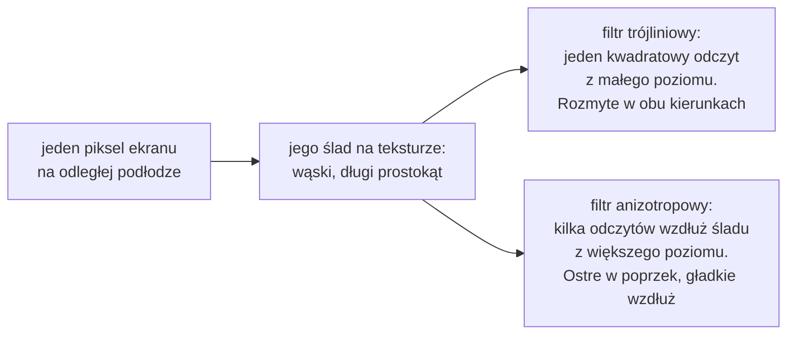
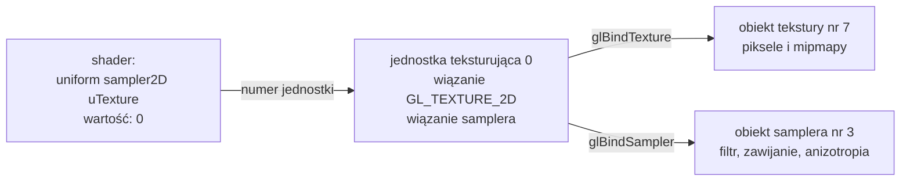

# Moduł gfx: tekstury

Kamień milowy: M2 + M3. Temat wykładu: 5 (Tekstury).
Kod: [`src/gfx/Texture2D.hpp`](../../../src/gfx/Texture2D.hpp), [`src/gfx/Texture2D.cpp`](../../../src/gfx/Texture2D.cpp), shadery [`assets/shaders/textured.vert`](../../../assets/shaders/textured.vert) i [`assets/shaders/textured.frag`](../../../assets/shaders/textured.frag), settery `setInt` i `setVec3` w [`src/gfx/Shader.hpp`](../../../src/gfx/Shader.hpp) i [`src/gfx/Shader.cpp`](../../../src/gfx/Shader.cpp).

Część modułu `gfx`. Wstęp do całego modułu, zasada RAII dla obiektów OpenGL i semantyka przenoszenia są w [`README.md`](README.md). Ten dokument zakłada znajomość shaderów ([`shaders.md`](shaders.md)), uniformów ([`uniforms.md`](uniforms.md)) i atrybutów wierzchołka ([`buffers-vao.md`](buffers-vao.md)). Skąd biorą się bajty obrazu, opisuje [`../assets/images.md`](../assets/images.md), a skąd pliki PNG i współrzędne UV modeli, [`../../guides/blender.md`](../../guides/blender.md), sekcje 6 i 7. Każde wywołanie OpenGL jest opakowane w `GL_CHECK` ([`../core/gl-check.md`](../core/gl-check.md)).

**Stan na dziś:** gra rysuje labirynt z teksturami. Ściany, słupki i płytki podłogi są rysowane programem z pary `textured.vert` i `textured.frag` (sekcja 4). Tekstury tworzy i przechowuje `assets::AssetCache` ([`../assets/asset-cache.md`](../assets/asset-cache.md)), a wiąże je i ustawia sampler `game::MazeRenderer` ([`../game/maze-rendering.md`](../game/maze-rendering.md)). Filtr, anizotropię i tryb podglądu przełącza panel Assets (sekcja 6). Klasa `Texture2D` wymaga kontekstu OpenGL, więc **nie ma testów jednostkowych**. Sprawdziłem ją na Windowsie osobnym programem z ukrytym oknem, poza repozytorium (sekcja 5.9), a obraz w grze na zrzutach ekranu (sekcja 5.10). Widżetów panelu nikt jeszcze nie klikał ręcznie. **Na macOS ten kod nie był jeszcze budowany ani uruchamiany.**

W tym kamieniu milowym **nie ma oświetlenia** (dochodzi w M4), więc scena jest równo jasna: kolor piksela to kolor tekstury pomnożony przez kolor materiału.

Dwie rzeczy z tematu 5 są celowo odłożone: **mapy normalnych** (normal maps) dojdą w M4 razem z oświetleniem, bo bez światła nie mają czego zmieniać, a **przestrzeń sRGB i korekcja gamma** nie są jeszcze obsługiwane (sekcja 2.10).

## 1. Po co to jest

Kostka z M1 ma kolor zapisany w wierzchołkach: sześć ścian, sześć kolorów. Ściana z kamienia tak się nie da zrobić: wzór fug i kamieni to tysiące szczegółów, a ściana ma kilka trójkątów. **Tekstura** (texture) to obraz przechowywany na karcie graficznej, z którego shader fragmentów odczytuje kolor osobno dla każdego piksela ekranu. Geometria zostaje prosta, a szczegół pochodzi z obrazu.

Żeby to zadziałało, potrzebne są cztery rzeczy:

| Rzecz | Gdzie | Stan |
|---|---|---|
| obraz na karcie graficznej i sposób jego odczytu | klasa `gfx::Texture2D` | jest |
| współrzędne tekstury w wierzchołkach | atrybut `uv` w `gfx::Vertex`, pliki OBJ ([`mesh.md`](mesh.md), [`../assets/obj-loader.md`](../assets/obj-loader.md)) | osobny dokument |
| uniform typu `sampler2D` i funkcja `texture()` w shaderze | `assets/shaders/textured.frag` | jest (sekcja 4) |
| numer jednostki teksturującej wysłany do samplera | `Shader::setInt`, wołany w `MazeRenderer::draw` | jest (sekcja 4.3) |

Klasa `gfx::Texture2D`:

| Funkcja | Co robi |
|---|---|
| konstruktor | tworzy teksturę 2D z surowych bajtów (3 albo 4 kanały), buduje mipmapy, tworzy obiekt samplera z filtrowaniem trójliniowym i zawijaniem `GL_REPEAT` |
| `bind(unit)` | wiąże teksturę i jej sampler z jednostką teksturującą o podanym numerze |
| `setFilter`, `setAnisotropy` | zmieniają sposób próbkowania w działającym programie |
| `filter`, `anisotropy`, `maxAnisotropy`, `id`, `width`, `height`, `isValid` | odczyt stanu, między innymi dla panelu Assets |
| destruktor | usuwa oba obiekty OpenGL |

Klasa przyjmuje **surowe bajty**, a nie `assets::Image`. Warstwa `gfx` nie zna warstwy `assets`: tekstura może powstać z pliku, ale też z tablicy wyliczonej w kodzie.

## 2. Teoria

### 2.1 Współrzędne tekstury i teksele

Piksel tekstury nazywa się **teksel** (texel, od texture element), żeby nie mylić go z pikselem ekranu. Tekstura 512 x 512 ma 262144 teksele.

Miejsce na teksturze wskazują **współrzędne tekstury** (texture coordinates): dwie liczby zmiennoprzecinkowe. Nie zależą od rozmiaru obrazu: cała tekstura mieści się w kwadracie od 0 do 1.

| Nazwa osi | Gdzie używana |
|---|---|
| `u`, `v` | programy do modelowania, format OBJ, potoczna nazwa "UV" |
| `s`, `t` | nazwy w OpenGL (`GL_TEXTURE_WRAP_S`) i składowe w GLSL (`coord.s`, `coord.t`) |

To te same osie pod dwiema nazwami. `u` (albo `s`) biegnie w poziomie, `v` (albo `t`) w pionie.

```text
 v
 1 +-----------------+
   |                 |
   |     tekstura    |
   |                 |
 0 +-----------------+
   0                 1  u
```

**Początek układu jest w lewym dolnym rogu.** `(0, 0)` to lewy dolny róg tekstury, `(1, 1)` prawy górny, a `v` rośnie **w górę**. OpenGL przyjmuje przy tym, że pierwszy wiersz danych przekazanych do `glTexImage2D` to wiersz `v = 0`, czyli dół. Pliki obrazów zaczynają się od górnego wiersza, więc loader odwraca kolejność wierszy przed wysłaniem ([`../assets/images.md`](../assets/images.md), sekcja 2.3).

Współrzędne tekstury są **atrybutem wierzchołka**, tak jak pozycja ([`buffers-vao.md`](buffers-vao.md), sekcja 2.1). Shader wierzchołków przekazuje je dalej, rasteryzator **interpoluje** je między wierzchołkami trójkąta ([`shaders.md`](shaders.md), sekcja 2), a shader fragmentów dostaje dla swojego piksela gotową parę `(u, v)` i pyta o kolor tekstury w tym miejscu.

### 2.2 Próbkowanie: powiększenie i pomniejszenie

Odczytanie koloru tekstury w punkcie `(u, v)` to **próbkowanie** (sampling). Kłopot polega na tym, że teksele prawie nigdy nie trafiają dokładnie w piksele ekranu:

| Sytuacja | Nazwa | Kiedy |
|---|---|---|
| jeden teksel zajmuje wiele pikseli ekranu | **powiększenie** (magnification) | ściana jest blisko kamery |
| jeden piksel ekranu obejmuje wiele tekseli | **pomniejszenie** (minification) | ściana jest daleko albo widziana pod ostrym kątem |

Dla obu sytuacji ustawia się osobny **filtr** (filter): `GL_TEXTURE_MAG_FILTER` i `GL_TEXTURE_MIN_FILTER`. Karta sama rozpoznaje, która sytuacja zachodzi dla danego piksela.

### 2.3 Filtr najbliższego sąsiada i dwuliniowy

| Filtr | Stała | Jak liczy kolor | Wygląd |
|---|---|---|---|
| **najbliższy sąsiad** (nearest) | `GL_NEAREST` | bierze jeden teksel, którego środek leży najbliżej punktu `(u, v)` | ostre kwadraty przy powiększeniu (styl pikselowy), migotanie przy pomniejszeniu |
| **dwuliniowy** (bilinear) | `GL_LINEAR` | bierze 4 najbliższe teksele i liczy średnią ważoną odległością | gładkie przejścia przy powiększeniu (lekko rozmyte), nadal migotanie przy pomniejszeniu |

"Dwuliniowy" znaczy: interpolacja liniowa w dwóch kierunkach. Najpierw mieszane są dwie pary tekseli w poziomie, potem oba wyniki w pionie.

Oba filtry mają ten sam problem przy **pomniejszeniu**. Jeśli jeden piksel ekranu obejmuje sto tekseli, a filtr czyta jeden albo cztery z nich, to kolor piksela zależy od tego, w które teksele akurat trafił. Przy ruchu kamery o ułamek stopnia trafia w inne i piksel zmienia kolor: odległe powierzchnie **migoczą** i pokrywają się wzorami, których w teksturze nie ma. To zjawisko nazywa się **aliasing**.

### 2.4 Mipmapy i filtr trójliniowy

Poprawnym kolorem piksela, który obejmuje sto tekseli, jest ich **średnia**. Liczenie jej przy każdym odczycie byłoby za wolne, więc liczy się ją **z góry**. **Mipmapy** (mipmaps) to ciąg coraz mniejszych kopii tekstury, każda o połowie szerokości i wysokości poprzedniej, aż do 1 x 1. Każdy teksel mniejszej kopii jest średnią czterech tekseli większej.

Kopie nazywają się **poziomami** (levels). Poziom 0 to obraz w pełnym rozmiarze. Dla tekstury 512 x 512:

| Poziom | Rozmiar | Tekseli |
|---|---|---|
| 0 | 512 x 512 | 262144 |
| 1 | 256 x 256 | 65536 |
| 2 | 128 x 128 | 16384 |
| ... | ... | ... |
| 8 | 2 x 2 | 4 |
| 9 | 1 x 1 | 1 |

Razem 10 poziomów (zmierzone: poziom 9 ma rozmiar 1 x 1, poziom 10 nie istnieje). Dlatego tekstury mają rozmiar będący potęgą dwójki: 512 dzieli się na pół aż do 1 bez reszty.

**Ile to kosztuje pamięci.** Każdy poziom ma cztery razy mniej tekseli niż poprzedni. Suma `1 + 1/4 + 1/16 + ...` dąży do `4/3`, więc cały łańcuch zajmuje o **jedną trzecią więcej** niż sam poziom 0. Dla naszej tekstury: 786432 bajty poziomu 0 i 1048575 bajtów razem.

**Jak karta wybiera poziom.** Dla każdego piksela karta wie, o ile zmieniają się współrzędne tekstury między nim a sąsiednimi pikselami (shadery fragmentów działają w blokach 2 x 2 właśnie po to). Z tego liczy, ile tekseli poziomu 0 przypada na jeden piksel ekranu wzdłuż dłuższego kierunku, i bierze logarytm o podstawie 2:

| Tekseli na piksel | Poziom |
|---|---|
| 1 | 0 |
| 2 | 1 |
| 4 | 2 |
| 8 | 3 |
| 170 | około 7,4 |

Wynik zwykle nie jest liczbą całkowitą. Co wtedy, zależy od filtra pomniejszenia. Stałe filtrów z mipmapami mają nazwę z dwóch części: pierwsza mówi, jak czytać **wewnątrz** poziomu, druga, jak wybrać **poziom**.

| Stała | Wewnątrz poziomu | Między poziomami | Nazwa potoczna |
|---|---|---|---|
| `GL_NEAREST_MIPMAP_NEAREST` | najbliższy teksel | najbliższy poziom | |
| `GL_LINEAR_MIPMAP_NEAREST` | dwuliniowo | najbliższy poziom | dwuliniowy z mipmapami |
| `GL_NEAREST_MIPMAP_LINEAR` | najbliższy teksel | mieszanie dwóch poziomów | wartość domyślna nowej tekstury |
| `GL_LINEAR_MIPMAP_LINEAR` | dwuliniowo | mieszanie dwóch poziomów | **trójliniowy** (trilinear) |

Filtr **trójliniowy** czyta dwuliniowo dwa sąsiednie poziomy (razem 8 tekseli) i miesza oba wyniki zależnie od części ułamkowej. Trzecia "liniowość" to mieszanie między poziomami. Bez niej, przy `..._MIPMAP_NEAREST`, na podłodze widać wyraźne linie w miejscach, gdzie kończy się jeden poziom, a zaczyna następny.

Trzy ustawienia, które projekt udostępnia jako `gfx::TextureFilter`:

| `TextureFilter` | Filtr pomniejszenia | Filtr powiększenia | Mipmapy używane |
|---|---|---|---|
| `Nearest` | `GL_NEAREST` | `GL_NEAREST` | nie |
| `Bilinear` | `GL_LINEAR` | `GL_LINEAR` | nie |
| `Trilinear` | `GL_LINEAR_MIPMAP_LINEAR` | `GL_LINEAR` | tak |

**Mipmapy dotyczą tylko pomniejszenia.** Przy powiększeniu jedynym sensownym poziomem jest największy, czyli 0. Dlatego filtr powiększenia może mieć tylko wartość `GL_NEAREST` albo `GL_LINEAR`. Stała z `MIPMAP` w nazwie podana jako filtr powiększenia to błąd `GL_INVALID_ENUM` (zmierzone, sekcja 5.9).

### 2.5 Filtrowanie anizotropowe

Mipmapy mają jedną wadę. Poziom jest wybierany według **dłuższego** kierunku, a zmniejszona kopia jest zmniejszona w **obu** kierunkach jednakowo. To jest w porządku, gdy powierzchnia jest zwrócona przodem do kamery. Podłoga widziana pod ostrym kątem (grazing angle) jest jednak mocno ściśnięta na ekranie w jednym kierunku (w głąb), a w drugim (w bok) prawie wcale. Karta wybiera mały poziom, żeby nie migotało w głąb, i tym samym rozmywa teksturę także w bok, gdzie rozmywać nie było trzeba. Efekt: podłoga i długie ściany stają się rozmazaną plamą już kilka metrów od kamery.



**Filtrowanie anizotropowe** (anisotropic filtering) rozwiązuje to tak: zamiast jednego odczytu z małego poziomu karta robi **kilka odczytów z większego poziomu**, rozłożonych wzdłuż dłuższego kierunku śladu piksela, i je uśrednia. "Anizotropowy" znaczy: różny w różnych kierunkach. Zwykłe filtry są izotropowe, czyli traktują oba kierunki tak samo.

**Poziom anizotropii** to największa liczba takich odczytów na piksel: 1 (wyłączone), 2, 4, 8, 16. Większy poziom daje ostrzejszy obraz pod ostrym kątem i kosztuje więcej odczytów tekstury. Karta sama używa tylu odczytów, ilu potrzebuje dany piksel, więc powierzchnie zwrócone przodem nic nie tracą.

**Dlaczego to rozszerzenie.** Filtrowanie anizotropowe nie należy do rdzenia OpenGL 4.1. Przez wiele lat było rozszerzeniem `GL_EXT_texture_filter_anisotropic`, które sterowniki powszechnie oferują, a do rdzenia weszło dopiero w OpenGL 4.6. Z tego wynikają trzy rzeczy:

- funkcji nowych nie ma: rozszerzenie dodaje tylko dwie **stałe**, przekazywane do zwykłych funkcji rdzenia,
- nagłówek GLAD projektu został wygenerowany bez rozszerzeń ([`../../libraries/glad.md`](../../libraries/glad.md), sekcja 4.3), więc tych stałych nie zawiera. Definiuję je sam (sekcja 5.3),
- przed użyciem trzeba **sprawdzić w działającym programie**, czy sterownik rozszerzenie oferuje, i umieć działać bez niego.

### 2.6 Zawijanie: co poza zakresem od 0 do 1

Współrzędne tekstury nie muszą mieścić się między 0 a 1. Co karta zwraca poza tym zakresem, określa **tryb zawijania** (wrapping mode), osobno dla każdej osi (`GL_TEXTURE_WRAP_S` i `GL_TEXTURE_WRAP_T`):

| Stała | Co się dzieje | Zastosowanie |
|---|---|---|
| `GL_REPEAT` | liczy się tylko część ułamkowa: 1,25 to to samo co 0,25, a -0,5 to to samo co 0,5. Obraz powtarza się jak kafelki | ściany, podłogi, wszystko, co się powtarza. Wartość domyślna |
| `GL_MIRRORED_REPEAT` | jak wyżej, ale co drugie powtórzenie jest odbiciem lustrzanym | ukrywa szew tekstury, która się nie kafelkuje |
| `GL_CLAMP_TO_EDGE` | współrzędna jest przycinana do zakresu: poza nim powtarza się skrajny teksel | pojedyncze obrazy, interfejs, skybox |
| `GL_CLAMP_TO_BORDER` | poza zakresem zwracany jest ustalony kolor obramowania | mapy cieni |

Projekt używa `GL_REPEAT` i jest to wymaganie modeli, a nie przypadek. Współrzędne UV ścian celowo wychodzą poza zakres: odcinek ściany ma `u` od -0,5 do 0,5 i `v` od 0 do 1,5, bo jedno powtórzenie tekstury ma zajmować 2 m niezależnie od wielkości ściany ([`../../guides/blender.md`](../../guides/blender.md), sekcja 6). Z `GL_CLAMP_TO_EDGE` część ściany powyżej 2 m byłaby rozsmarowanym ostatnim wierszem tekstury. Tekstury są też przygotowane tak, żeby lewy brzeg pasował do prawego, a dolny do górnego.

### 2.7 Jednostki teksturujące i sampler w GLSL

Shader może czytać kilka tekstur naraz (kolor, mapa normalnych, mapa cieni). Dlatego kontekst nie ma jednego "miejsca na bieżącą teksturę", tylko ponumerowany zestaw takich miejsc: **jednostki teksturujące** (texture units). Każda jednostka ma własne wiązanie `GL_TEXTURE_2D`. Zmierzone na komputerze projektu: 32 jednostki dla shadera fragmentów i 192 łącznie. Specyfikacja 4.1 gwarantuje co najmniej 16 dla shadera fragmentów.

W shaderze teksturę reprezentuje uniform specjalnego typu, **sampler** (`sampler2D` dla tekstury 2D). Najważniejsze zdanie tego tematu:

> **Uniform typu sampler nie przechowuje identyfikatora tekstury. Przechowuje numer jednostki teksturującej.**

Połączenie ma więc dwa ogniwa, a jednostka jest pośrednikiem:



| Ogniwo | Kto je ustawia | Wywołanie OpenGL |
|---|---|---|
| sampler w shaderze wskazuje jednostkę | `Shader::setInt("uTexture", 0)` | `glUniform1i(location, 0)` |
| jednostka wskazuje teksturę | `Texture2D::bind(0)` | `glActiveTexture(GL_TEXTURE0)`, `glBindTexture(GL_TEXTURE_2D, id)` |

Liczba musi być ta sama w obu miejscach. Identyfikator tekstury (tu 7) nie pojawia się w shaderze nigdzie.

`glBindTexture` nie przyjmuje numeru jednostki. Działa na jednostce **aktywnej**, którą wybiera `glActiveTexture`. To ten sam model "wybierz, potem działaj" co przy buforach ([`buffers-vao.md`](buffers-vao.md), sekcja 2.2), tylko o jeden poziom głębszy: najpierw jednostka, potem cel.

**Dlaczego numer ustawiam z C++.** GLSL od wersji 4.20 pozwala wpisać jednostkę wprost w shaderze: `layout(binding = 0) uniform sampler2D uTexture;`. Projekt używa `#version 410 core`, bo to najnowsza wersja na macOS, a tam ten zapis nie istnieje. Zostaje `glUniform1i`. Sampler ma po linkowaniu wartość 0, jak każdy uniform, więc program z jedną teksturą na jednostce 0 działa nawet bez `setInt`. Mimo to wysyłam numer jawnie: przy drugiej teksturze przestałoby to działać, a przyczyny nie byłoby widać. W grze robi to `MazeRenderer::draw` w każdej klatce (sekcja 4.3).

### 2.8 Parametry tekstury a obiekt samplera

Filtr, zawijanie i anizotropia opisują **sposób odczytu**, a nie zawartość obrazu. OpenGL ma na nie dwa miejsca:

| Miejsce | Funkcje | Od której wersji | Uwagi |
|---|---|---|---|
| **parametry obiektu tekstury** | `glTexParameteri`, `glTexParameterf` | od zawsze | klasyczna droga, z wykładu i z LearnOpenGL. Działa na teksturze związanej z aktywną jednostką |
| **obiekt samplera** (sampler object) | `glGenSamplers`, `glSamplerParameteri`, `glSamplerParameterf`, `glBindSampler` | rdzeń od OpenGL 3.3 | osobny obiekt z tymi samymi parametrami. Zmienia się go po identyfikatorze, bez wiązania |

Reguła, która je łączy: **gdy z jednostką związany jest obiekt samplera, karta bierze sposób odczytu (filtry, zawijanie, anizotropię) z niego, a te same parametry zapisane w teksturze związanej z tą jednostką ignoruje.** Gdy samplera nie ma (wiązanie 0), obowiązują parametry tekstury. Sampler zastępuje tylko sposób odczytu: to, co opisuje samą teksturę (na przykład zakres używanych poziomów mipmap, `GL_TEXTURE_BASE_LEVEL` i `GL_TEXTURE_MAX_LEVEL`), zostaje własnością tekstury.

Nie należy mylić dwóch rzeczy o podobnej nazwie:

| Nazwa | Co to jest |
|---|---|
| `sampler2D` w GLSL | typ uniformu w shaderze. Trzyma numer jednostki teksturującej (sekcja 2.7) |
| obiekt samplera w OpenGL | obiekt na karcie z filtrem, zawijaniem i anizotropią. Wiąże się go z jednostką |

**Projekt trzyma sposób odczytu w obiekcie samplera**, a nie w parametrach tekstury. To odstępstwo od wersji z wykładu, więc powód musi być konkretny, i jest. Na komputerze z Windowsem, na którym projekt powstaje (sterownik NVIDIA 610.74), poziom anizotropii ustawiony przez `glTexParameterf` **nie działa**: wywołanie nie zgłasza błędu, odczyt parametru zwraca 1, a obraz się nie zmienia. Ten sam poziom ustawiony na obiekcie samplera odczytuje się poprawnie i zmienia obraz (pomiary w sekcji 5.9). Przyczyny nie ustaliłem: może to być zachowanie sterownika albo ustawienie w jego panelu sterowania. Nie mam na nią wpływu także na komputerze, na którym będzie obrona, więc klasa używa drogi, która zadziałała.

Obiekt samplera ma przy okazji dwie zalety:

- zmienia się go po identyfikatorze (`glSamplerParameteri(sampler, ...)`), więc `setFilter` i `setAnisotropy` niczego nie wiążą i nie psują wiązań ustawionych przez kogoś innego,
- stałe są te same co przy `glTexParameteri` (`GL_TEXTURE_MIN_FILTER`, `GL_LINEAR`, `GL_REPEAT`), więc kod czyta się tak samo jak ten z wykładu. Inna jest nazwa funkcji i pierwszy argument: identyfikator samplera zamiast celu `GL_TEXTURE_2D`.

Jeden obiekt samplera mógłby obsłużyć wiele tekstur. Tu każda `Texture2D` ma własny, żeby filtr dało się przełączać dla każdej tekstury osobno i żeby klasa była samowystarczalna.

### 2.9 Format danych, format wewnętrzny, wyrównanie wierszy

`glTexImage2D` dostaje o danych dwa osobne opisy, które łatwo pomylić:

| Opis | Parametry | Pytanie, na które odpowiada | U nas |
|---|---|---|---|
| **format danych** | `format` i `type` | czym są bajty, które podaję? | `GL_RGB` albo `GL_RGBA`, `GL_UNSIGNED_BYTE` |
| **format wewnętrzny** (internal format) | `internalformat` | jak karta ma teksturę przechowywać? | `GL_RGB8` albo `GL_RGBA8` |

`GL_RGB` z `GL_UNSIGNED_BYTE` znaczy: trzy kanały po jednym bajcie na piksel, w kolejności czerwony, zielony, niebieski. `GL_RGB8` znaczy: trzy kanały po 8 bitów w pamięci karty. Tu oba opisy mówią to samo, ale nie muszą: można podać dane `GL_RGBA` i kazać je przechowywać jako `GL_RGB8` (alfa przepada) albo jako format skompresowany. Karta sama przelicza jedno na drugie.

**Wyrównanie wierszy** (unpack alignment). OpenGL zakłada domyślnie, że każdy wiersz danych zaczyna się pod adresem podzielnym przez 4, i pomija bajty dopełnienia między wierszami. To ustawienie `GL_UNPACK_ALIGNMENT` o wartości domyślnej 4. Nasze dane nie mają dopełnienia: wiersz obrazu RGB to `szerokość * 3` bajtów.

| Szerokość | Bajtów w wierszu RGB | Podzielne przez 4? | Co zakłada OpenGL przy wyrównaniu 4 |
|---|---|---|---|
| 512 | 1536 | tak | wiersz co 1536 bajtów: przypadkiem dobrze |
| 2 | 6 | nie | wiersz co 8 bajtów: każdy następny wiersz przesunięty o 2 bajty |
| 300 | 900 | tak | dobrze |
| 250 | 750 | nie | wiersz co 752 bajty |

Przy złym wyrównaniu obraz wychodzi **pochylony** i z przekłamanymi kolorami, a karta czyta kilka bajtów poza końcem tablicy. Nasze tekstury 512 x 512 trafiają akurat w dobry przypadek, co jest najgorszym rodzajem błędu: działa, dopóki ktoś nie doda tekstury o innej szerokości. Dlatego konstruktor zawsze ustawia wyrównanie na 1 ("wiersze leżą ciasno, jeden za drugim"), co jest poprawne dla każdej szerokości. Obrazy RGBA mają wiersz `szerokość * 4`, zawsze podzielny przez 4, więc ich problem nie dotyczy.

`GL_UNPACK_ALIGNMENT` to stan **całego kontekstu**, a nie tekstury. Dotyczy każdego następnego wysłania pikseli, także cudzego. Konstruktor odczytuje więc poprzednią wartość i przywraca ją po wysłaniu.

### 2.10 Czego jeszcze nie ma: sRGB i mapy normalnych

**sRGB.** Kolory w pliku PNG są zapisane w przestrzeni sRGB: liczba w pliku nie jest proporcjonalna do jasności światła, tylko dopasowana do tego, jak widzi oko i jak świeci monitor. Dopóki tekstura jest tylko kopiowana na ekran, niczego to nie psuje: bajty z pliku trafiają na monitor bez zmian. Zaczyna mieć znaczenie przy **oświetleniu**, bo mnożenie i dodawanie światła jest poprawne tylko na wartościach liniowych. Poprawne rozwiązanie to format wewnętrzny `GL_SRGB8` (karta przelicza teksel na wartość liniową przy odczycie) i `GL_FRAMEBUFFER_SRGB` przy zapisie. Projekt tego **jeszcze nie robi**: tekstura jest przechowywana jako `GL_RGB8` i shader dostaje wartości z pliku. Decyzja zapadnie razem z oświetleniem (M4).

**Mapy normalnych.** Tekstura może przechowywać nie kolor, tylko kierunek normalnej dla każdego teksela, co daje wrażenie wypukłości bez dodatkowych trójkątów. PRD przypisuje je do tematu 5, ale efekt widać dopiero przy oświetleniu, więc są celowo przeniesione do M4. Klasa `Texture2D` nadaje się do nich bez zmian (to też obraz RGB), a brakuje reszty: wektorów stycznych w wierzchołkach i kodu w shaderze.

## 3. Jak to działa w OpenGL

### 3.1 Wywołania w kolejności

Utworzenie tekstury, raz:

| # | Wywołanie | Co robi |
|---|---|---|
| 1 | `glGenTextures(1, &id)` | rezerwuje identyfikator nowej tekstury |
| 2 | `glBindTexture(GL_TEXTURE_2D, id)` | wiąże teksturę z celem `GL_TEXTURE_2D` **aktywnej jednostki**. Pierwsze związanie ustala na stałe rodzaj tekstury (2D). Następne funkcje z tym celem działają na niej |
| 3 | `glGetIntegerv(GL_UNPACK_ALIGNMENT, &previous)` | odczytuje bieżące wyrównanie wierszy, żeby je potem przywrócić |
| 4 | `glPixelStorei(GL_UNPACK_ALIGNMENT, 1)` | wiersze danych leżą ciasno, bez dopełnienia (sekcja 2.9) |
| 5 | `glTexImage2D(GL_TEXTURE_2D, 0, internalformat, width, height, 0, format, type, pixels)` | przydziela poziom 0 na karcie i kopiuje do niego piksele. Parametry w tabeli niżej |
| 6 | `glPixelStorei(GL_UNPACK_ALIGNMENT, previous)` | przywraca poprzednie wyrównanie |
| 7 | `glGenerateMipmap(GL_TEXTURE_2D)` | buduje wszystkie mniejsze poziomy z poziomu 0 |
| 8 | `glGenSamplers(1, &sampler)` | rezerwuje identyfikator obiektu samplera |
| 9 | `glSamplerParameteri(sampler, GL_TEXTURE_WRAP_S, GL_REPEAT)` i to samo dla `GL_TEXTURE_WRAP_T` | zawijanie w obu osiach |
| 10 | `glSamplerParameteri(sampler, GL_TEXTURE_MIN_FILTER, ...)` i `GL_TEXTURE_MAG_FILTER` | filtry pomniejszenia i powiększenia |
| 11 | `glGetIntegerv(GL_NUM_EXTENSIONS, &count)`, potem `glGetStringi(GL_EXTENSIONS, i)` w pętli | lista rozszerzeń sterownika, nazwa po nazwie |
| 12 | `glGetFloatv(0x84FF, &maximum)` | największy poziom anizotropii sterownika. Tylko gdy rozszerzenie jest na liście |

Parametry `glTexImage2D`:

| Parametr | Wartość u nas | Znaczenie |
|---|---|---|
| `target` | `GL_TEXTURE_2D` | cel, z którym związana jest tekstura |
| `level` | 0 | poziom mipmapy, który wypełniam. 0 to pełny rozmiar |
| `internalformat` | `GL_RGB8` albo `GL_RGBA8` | jak karta ma przechowywać teksturę. Typ parametru to `GLint` |
| `width`, `height` | rozmiar obrazu | w tekselach |
| `border` | 0 | pozostałość starego OpenGL. Musi być 0 |
| `format` | `GL_RGB` albo `GL_RGBA` | jakie kanały są w podanych danych |
| `type` | `GL_UNSIGNED_BYTE` | typ jednego kanału w danych: bajt od 0 do 255 |
| `pixels` | wskaźnik na bajty | dane, dolny wiersz pierwszy. OpenGL kopiuje je podczas wywołania |

Użycie, co klatkę:

| # | Wywołanie | Co robi |
|---|---|---|
| 13 | `glUseProgram(program)` | wybiera program ([`shader-class.md`](shader-class.md), sekcja 3.1) |
| 14 | `glGetUniformLocation(program, "uTexture")`, `glUniform1i(location, unit)` | wpisuje numer jednostki do samplera w shaderze. Koniecznie `glUniform1i` |
| 15 | `glActiveTexture(GL_TEXTURE0 + unit)` | wybiera jednostkę, na której zadziała następne `glBindTexture` |
| 16 | `glBindTexture(GL_TEXTURE_2D, id)` | wiąże teksturę z tą jednostką |
| 17 | `glBindSampler(unit, sampler)` | wiąże obiekt samplera z jednostką. Numer jednostki jest tu **zwykłą liczbą** (0, 1, 2), nie stałą `GL_TEXTURE0 + unit` |
| 18 | `glDrawElements(...)` | rysuje. Shader fragmentów czyta teksturę przez sampler |

Zmiana próbkowania, w dowolnej chwili:

| # | Wywołanie | Co robi |
|---|---|---|
| 19 | `glSamplerParameteri(sampler, GL_TEXTURE_MIN_FILTER, ...)` i `GL_TEXTURE_MAG_FILTER` | zmienia filtr. Niczego nie trzeba wiązać |
| 20 | `glSamplerParameterf(sampler, 0x84FE, level)` | zmienia poziom anizotropii. Parametr zmiennoprzecinkowy, stąd wersja z `f` |

Sprzątanie:

| # | Wywołanie | Co robi |
|---|---|---|
| 21 | `glDeleteSamplers(1, &sampler)` | usuwa obiekt samplera. Identyfikator 0 jest po cichu ignorowany |
| 22 | `glDeleteTextures(1, &id)` | usuwa teksturę ze wszystkimi poziomami. Identyfikator 0 jest po cichu ignorowany |

Wszystkie te funkcje są w rdzeniu OpenGL 4.1 i w nagłówku GLAD projektu. Najmłodsze z nich to obiekty samplera (rdzeń od 3.3) i `glGenerateMipmap` oraz `glGetStringi` (rdzeń od 3.0).

### 3.2 Czego nie wolno użyć w 4.1

| Funkcja | Od której wersji | Co robi | Co zamiast niej |
|---|---|---|---|
| `glTexStorage2D` | 4.2 | przydziela od razu wszystkie poziomy o niezmiennym rozmiarze | `glTexImage2D` i `glGenerateMipmap` |
| `glCreateTextures`, `glTextureParameteri`, `glBindTextureUnit` | 4.5 (direct state access) | działają na identyfikatorze, bez wiązania | `glGenTextures`, `glBindTexture`, `glActiveTexture` |
| `layout(binding = N)` w GLSL | GLSL 4.20 | numer jednostki zapisany w shaderze | `glUniform1i` (`Shader::setInt`) |
| `glGetString(GL_EXTENSIONS)` | usunięte z profilu Core | jedna długa lista rozszerzeń | `glGetStringi(GL_EXTENSIONS, i)` |

Nagłówek GLAD projektu deklaruje tylko 4.1 Core, więc użycie którejkolwiek funkcji z pierwszych dwóch wierszy to błąd kompilacji, a nie niespodzianka na Macu.

### 3.3 Kompletność tekstury

Tekstura jest **kompletna** (complete), gdy ma wszystko, czego wymaga jej filtr. Jeśli filtr pomniejszenia używa mipmap, muszą istnieć wszystkie poziomy aż do 1 x 1. Filtr pomniejszenia **nowej tekstury** to domyślnie `GL_NEAREST_MIPMAP_LINEAR` (zmierzone), czyli filtr z mipmapami. Tekstura utworzona samym `glTexImage2D`, bez `glGenerateMipmap` i bez zmiany filtra, jest więc niekompletna.

Niekompletna tekstura **nie zgłasza błędu**. Każdy odczyt z niej zwraca czarny kolor `(0, 0, 0, 1)`. Zmierzone w sekcji 5.9: obraz jest czarny, a `glGetError` czysty. To najczęstszy powód "czarnej tekstury" w pierwszym programie z teksturami.

## 4. Shadery

Labirynt rysuje para [`assets/shaders/textured.vert`](../../../assets/shaders/textured.vert) i [`assets/shaders/textured.frag`](../../../assets/shaders/textured.frag). To pierwsze shadery projektu, które czytają teksturę. Para `basic.vert` i `basic.frag` ([`shaders.md`](shaders.md), sekcja 4) została bez zmian i nadal rysuje kostkę kolorem z wierzchołków. Trzecia para, `color.vert` i `color.frag`, rysuje linie pudełek kolizji jednym kolorem i opisuje ją [`../scene/collision.md`](../scene/collision.md), sekcja 4.

W tych shaderach **nie ma oświetlenia**: żadnego wektora światła, żadnego iloczynu skalarnego z normalną. Normalna jest przekazywana do shadera fragmentów tylko po to, żeby dało się ją pokazać jako kolor (tryb podglądu 1). Oświetlenie i mapy normalnych to M4.

### 4.1 `textured.vert`: shader wierzchołków

```glsl
#version 410 core
// Vertex shader of textured models: places the vertex on the screen and passes its
// texture coordinate and its normal on to the fragment shader.
// See docs/modules/gfx/textures.md

// Inputs: the three attributes of gfx::Vertex. The location numbers are the constants
// POSITION_ATTRIBUTE, NORMAL_ATTRIBUTE and UV_ATTRIBUTE of src/gfx/Vertex.hpp.
layout(location = 0) in vec3 aPosition; // x, y, z in the local space of the model
layout(location = 1) in vec3 aNormal;   // direction the surface faces, length 1
layout(location = 2) in vec2 aUv;       // texture coordinate (u, v), v = 0 is the bottom

// Uniforms: set from C++ (gfx::Shader::setMat4). uModel changes with every object,
// uView and uProjection are the same for the whole frame.
uniform mat4 uModel;      // local space to world space: where the object stands
uniform mat4 uView;       // world space to view space: where the camera is and looks
uniform mat4 uProjection; // view space to clip space: perspective

// Outputs to the fragment shader. The rasterizer blends them between the three vertices
// of a triangle. The fragment shader declares inputs with the same names and types.
out vec2 vUv;     // texture coordinate
out vec3 vNormal; // normal in world space

void main() {
    // The same chain as in basic.vert, read from right to left: local space, world
    // space, view space, clip space.
    gl_Position = uProjection * uView * uModel * vec4(aPosition, 1.0);

    // The texture coordinate goes through unchanged: it belongs to the surface, not to
    // the place where the object stands.
    vUv = aUv;

    // A normal is a direction, not a point, so it must turn with the object but must not
    // be moved by the translation. mat3(uModel) is the upper left 3 x 3 part of the
    // matrix: rotation and scale without the translation. That is correct as long as
    // the scale is the same on all three axes, which holds for every object of the
    // maze (scale 1). Unequal scale would need the inverse transpose of that matrix.
    vNormal = mat3(uModel) * aNormal;
}
```

| Linia | Znaczenie |
|---|---|
| `#version 410 core` | GLSL 4.10, profil Core: najnowsza wersja dostępna na macOS ([`shaders.md`](shaders.md), sekcja 2.4) |
| `layout(location = 0) in vec3 aPosition;` | atrybut numer 0: pozycja w przestrzeni lokalnej modelu. Numer to stała `POSITION_ATTRIBUTE` z [`src/gfx/Vertex.hpp`](../../../src/gfx/Vertex.hpp) |
| `layout(location = 1) in vec3 aNormal;` | atrybut numer 1 (`NORMAL_ATTRIBUTE`): normalna wierzchołka. Uwaga: w `basic.vert` numer 1 to **kolor**. Numery są umową między konkretnym shaderem a konkretnym VAO ([`mesh.md`](mesh.md), sekcja 2.4), a nie własnością numeru |
| `layout(location = 2) in vec2 aUv;` | atrybut numer 2 (`UV_ATTRIBUTE`): współrzędne tekstury, dwie liczby. `v = 0` to dół obrazu (sekcja 2.1) |
| `uniform mat4 uModel;`, `uView`, `uProjection` | te same trzy macierze i te same nazwy co w `basic.vert` ([`../scene/transforms.md`](../scene/transforms.md), sekcja 4). `uModel` zmienia się dla każdego obiektu, dwie pozostałe są ustawiane raz na klatkę |
| `out vec2 vUv;` | wyjście do shadera fragmentów. Rasteryzator interpoluje je między trzema wierzchołkami trójkąta, więc każdy fragment dostaje własne `(u, v)` |
| `out vec3 vNormal;` | normalna w przestrzeni świata, też interpolowana |
| `gl_Position = uProjection * uView * uModel * vec4(aPosition, 1.0);` | ten sam łańcuch co w `basic.vert`, czytany od prawej: przestrzeń lokalna, świata, widoku, przycinania. `1.0` w czwartej składowej oznacza punkt, więc przesunięcie z macierzy działa |
| `vUv = aUv;` | współrzędne tekstury przechodzą bez zmian. Należą do powierzchni modelu, a nie do miejsca, w którym model stoi: przestawiona ściana ma ten sam wzór |
| `vNormal = mat3(uModel) * aNormal;` | normalna obrócona razem z obiektem, ale nieprzesunięta (wyjaśnienie niżej) |

**Dlaczego `mat3(uModel)`, a nie całe `uModel`.** Normalna jest **kierunkiem**, nie punktem. Kierunek ma się obracać razem z obiektem, ale przesunięcie obiektu nie może go zmieniać: ściana przestawiona o 10 m dalej jest zwrócona w tę samą stronę. `mat3(uModel)` wycina z macierzy 4 x 4 lewy górny blok 3 x 3, czyli obrót i skalę, a gubi czwartą kolumnę z przesunięciem. To samo dałoby `(uModel * vec4(aNormal, 0.0)).xyz`: zero w czwartej składowej też wyłącza przesunięcie ([`../scene/transforms.md`](../scene/transforms.md), sekcja 2).

**Kiedy to jest poprawne.** Tylko wtedy, gdy skala jest taka sama na wszystkich trzech osiach. Skala nierówna (na przykład obiekt rozciągnięty dwa razy w osi x) przekrzywia normalne: przestają być prostopadłe do powierzchni. Poprawna macierz dla normalnych to wtedy odwrócona i transponowana macierz 3 x 3: `transpose(inverse(mat3(uModel)))`. W labiryncie każda macierz modelu to samo przesunięcie albo przesunięcie z obrotem o 90 stopni wokół osi Y, ze skalą 1 ([`../game/maze-rendering.md`](../game/maze-rendering.md), sekcja 5), więc prostsza postać wystarcza. Sam obrót nie zmienia długości wektora, więc normalna wychodzi z shadera wierzchołków z długością 1.

### 4.2 `textured.frag`: shader fragmentów

```glsl
#version 410 core
// Fragment shader of textured models: the colour of a fragment is the texture at its
// texture coordinate, multiplied by a tint. Two debug views show the normal or the
// texture coordinate as a colour instead. There is no lighting here.
// See docs/modules/gfx/textures.md

// Inputs from the vertex shader: same names and types as its outputs, already
// interpolated for this fragment.
in vec2 vUv;     // texture coordinate
in vec3 vNormal; // normal in world space, no longer exactly of length 1

// The texture to read. A sampler does not hold a texture: it holds the NUMBER OF A
// TEXTURE UNIT, set from C++ with gfx::Shader::setInt. The texture bound to that unit
// (gfx::Texture2D::bind) is the one that is read.
uniform sampler2D uTexture;

// Colour the texture is multiplied by: the diffuse colour of the material. White
// (1, 1, 1) leaves the texture unchanged.
uniform vec3 uTint;

// What to show. The numbers are the values of game::ViewMode in C++.
//   0: the texture multiplied by the tint (the normal picture)
//   1: the normal as a colour
//   2: the texture coordinate as a colour
uniform int uViewMode;

// Output: the color written to the framebuffer (red, green, blue, alpha).
out vec4 fragColor;

void main() {
    if (uViewMode == 1) {
        // Interpolation between vertices can shorten a normal, so its length is brought
        // back to 1. Each component is then between -1 and 1, and a colour needs 0 to 1:
        // half of it plus one half. A surface facing +X comes out reddish, +Y (up)
        // greenish, +Z bluish, and the opposite directions dark in that channel.
        vec3 normal = normalize(vNormal);
        fragColor = vec4(normal * 0.5 + 0.5, 1.0);
    } else if (uViewMode == 2) {
        // u goes to red and v to green. The coordinates of the models run past 1 (the
        // texture repeats), so only the fractional part is shown: the colour starts
        // again from black wherever the texture starts again.
        fragColor = vec4(fract(vUv), 0.0, 1.0);
    } else {
        // texture() reads the texture at vUv with the filter, the mipmaps and the
        // wrapping set in OpenGL. It returns red, green, blue, alpha. Only the colour is
        // used: the models are opaque, so alpha is written as 1.
        vec3 texel = texture(uTexture, vUv).rgb;
        fragColor = vec4(texel * uTint, 1.0);
    }
}
```

**Wejścia, uniformy, wyjście:**

| Linia | Znaczenie |
|---|---|
| `in vec2 vUv;` i `in vec3 vNormal;` | para do wyjść shadera wierzchołków: te same nazwy i typy. Zgodność sprawdza linkowanie programu ([`shaders.md`](shaders.md), sekcja 2.6). Wartości są już zinterpolowane dla tego fragmentu |
| `uniform sampler2D uTexture;` | sampler tekstury 2D. Jego wartością jest **numer jednostki teksturującej** (sekcja 2.7), ustawiany przez `Shader::setInt`. Samplera nie da się utworzyć ani zmienić w shaderze, można go tylko przekazać do funkcji próbkującej |
| `uniform vec3 uTint;` | kolor, przez który mnożona jest tekstura: kolor rozproszony materiału (linia `Kd` pliku MTL, [`../assets/obj-loader.md`](../assets/obj-loader.md), sekcja 2.3). Biały `(1, 1, 1)` nie zmienia tekstury |
| `uniform int uViewMode;` | co pokazać: 0, 1 albo 2. Liczby są wartościami typu `game::ViewMode` z [`src/game/MazeRenderer.hpp`](../../../src/game/MazeRenderer.hpp): `Textured = 0`, `Normals = 1`, `Uvs = 2`. Shader nie zna typu wyliczeniowego z C++, więc obie strony muszą pilnować tych samych liczb (pułapka 19) |
| `out vec4 fragColor;` | kolor zapisywany do framebuffera: czerwony, zielony, niebieski, alfa |

**Gałąź `else` (`uViewMode` równe 0, zwykły obraz).** Do tej gałęzi trafia też każda wartość inna niż 1 i 2.

| Linia | Znaczenie |
|---|---|
| `texture(uTexture, vUv)` | funkcja wbudowana GLSL: odczytuje teksturę w punkcie `vUv`, stosując filtr, mipmapy, anizotropię i zawijanie ustawione w OpenGL (w projekcie: na obiekcie samplera, sekcja 2.8). Zwraca `vec4` (R, G, B, A), każda składowa od 0 do 1 |
| `.rgb` | wybór trzech pierwszych składowych ([`shaders.md`](shaders.md), sekcja 2.4). Kanał alfa jest pomijany: modele labiryntu są nieprzezroczyste |
| `vec3 texel = ...;` | kolor teksela po filtrowaniu |
| `texel * uTint` | mnożenie dwóch `vec3` w GLSL działa **składowa po składowej**: czerwony razy czerwony, zielony razy zielony, niebieski razy niebieski. To nie jest iloczyn skalarny ani wektorowy |
| `fragColor = vec4(texel * uTint, 1.0);` | alfa równa 1: piksel w pełni kryjący |

Mnożenie przez `uTint` ma dwa zastosowania. Pierwsze: materiał może przyciemnić albo zabarwić teksturę. Wszystkie trzy materiały gry mają `Kd 1.000000 1.000000 1.000000`, więc dziś tekstury wychodzą bez zmian. Drugie: część modelu **bez** tekstury dostaje białą teksturę zastępczą 1 x 1, a wtedy `texel` to `(1, 1, 1)` i wynikiem jest sam kolor materiału. Jeden shader obsługuje więc oba przypadki bez dodatkowej gałęzi ([`../assets/asset-cache.md`](../assets/asset-cache.md), sekcja 2).

**Gałąź `uViewMode == 1` (normalne jako kolor):**

| Linia | Znaczenie |
|---|---|
| `vec3 normal = normalize(vNormal);` | przywraca długość 1. Interpolacja liniowa między dwiema normalnymi o długości 1 daje wektor **krótszy**, jeśli normalne różnią się kierunkiem (cięciwa jest krótsza od łuku). Modele labiryntu mają cieniowanie płaskie ([`../../guides/blender.md`](../../guides/blender.md)), więc trzy wierzchołki trójkąta mają tę samą normalną i skrócenia tu nie ma, ale shader nie może na tym polegać |
| `normal * 0.5 + 0.5` | składowa normalnej jest w zakresie od -1 do 1, a składowa koloru od 0 do 1. Połowa wartości plus połowa przenosi jeden zakres w drugi: -1 daje 0, 0 daje 0,5, 1 daje 1. Liczba `0.5` jest dodawana do każdej składowej wektora |
| `fragColor = vec4(..., 1.0);` | kierunek zapisany jako kolor |

Co wychodzi dla powierzchni labiryntu. To arytmetyka ze wzoru, a kierunki są według konwencji z [`../scene/README.md`](../scene/README.md), sekcja 5:

| Powierzchnia | Normalna | Kolor `normal * 0.5 + 0.5` |
|---|---|---|
| podłoga i powierzchnie zwrócone w górę | `(0, 1, 0)` | `(0,5, 1, 0,5)`: jasnozielony |
| powierzchnia zwrócona na wschód (+X) | `(1, 0, 0)` | `(1, 0,5, 0,5)`: jasnoczerwony |
| powierzchnia zwrócona na zachód (-X) | `(-1, 0, 0)` | `(0, 0,5, 0,5)`: ciemny morski |
| powierzchnia zwrócona na południe (+Z) | `(0, 0, 1)` | `(0,5, 0,5, 1)`: jasnoniebieski |
| powierzchnia zwrócona na północ (-Z) | `(0, 0, -1)` | `(0,5, 0,5, 0)`: oliwkowy |

To jest **podgląd diagnostyczny, a nie oświetlenie**. Służy do sprawdzenia dwóch rzeczy: że loader wczytał normalne i że `mat3(uModel)` obraca je razem ze ścianami biegnącymi wzdłuż osi Z. Gdyby normalne się nie obracały, duże powierzchnie wszystkich ścian miałyby tylko dwa kolory (te dla +Z i -Z) zamiast czterech.

**Gałąź `uViewMode == 2` (współrzędne tekstury jako kolor):**

| Linia | Znaczenie |
|---|---|
| `fract(vUv)` | część ułamkowa każdej składowej: `fract(1.25)` to `0.25`. Współrzędne modeli wychodzą poza 1, bo tekstura się powtarza (sekcja 2.6). Bez `fract` wszystko powyżej 1 zostałoby przy zapisie do framebuffera obcięte do pełnej jasności i nie byłoby widać, gdzie zaczyna się kolejne powtórzenie |
| `vec4(fract(vUv), 0.0, 1.0)` | konstruktor `vec4` z `vec2` i dwóch liczb: `u` trafia do kanału czerwonego, `v` do zielonego, niebieski to 0, alfa to 1 |

W jednym powtórzeniu tekstury kolor idzie od czarnego w lewym dolnym rogu `(0, 0)`, przez czerwony przy prawym dolnym `(1, 0)` i zielony przy lewym górnym `(0, 1)`, do żółtego przy prawym górnym `(1, 1)`. Na granicy powtórzeń kolor skacze z powrotem do czerni. Ten podgląd pokazuje, czy współrzędne są odwrócone albo odbite lustrzanie: przy odwróconej osi `v` zielony rósłby w dół.

Trzy uwagi do funkcji `texture`:

- Bajt 255 z pliku staje się w shaderze liczbą 1,0, a bajt 0 liczbą 0,0. To zamiana wykonywana przez kartę dla formatów takich jak `GL_RGB8` (formaty znormalizowane).
- Tekstura RGB nie ma kanału alfa. `texture()` zwraca wtedy `a = 1,0`.
- W GLSL 4.10 funkcja nazywa się `texture`. Stare poradniki używają `texture2D`, której w profilu Core już nie ma.

**Dlaczego `if` w shaderze, a nie trzy programy.** Trzy tryby różnią się jedną gałęzią. Osobne pary plików powielałyby cały shader wierzchołków i wymagały wyboru programu w C++. Warunek stoi na uniformie, więc ma tę samą wartość dla wszystkich fragmentów klatki. Kosztu tego warunku nie mierzyłem.

### 4.3 Strona C++: kto ustawia uniformy

Uniformy ustawiają trzy miejsca. Nazwy są stałymi z [`src/game/ShaderUniforms.hpp`](../../../src/game/ShaderUniforms.hpp) ([`uniforms.md`](uniforms.md), sekcja 5.5).

Raz na klatkę, w `NightMazeApp::drawMaze`:

```cpp
    m_texturedShader.use();
    m_texturedShader.setMat4(VIEW_UNIFORM, view);
    m_texturedShader.setMat4(PROJECTION_UNIFORM, projection);
    // The enum values are the numbers textured.frag compares uViewMode with.
    m_texturedShader.setInt(VIEW_MODE_UNIFORM, static_cast<int>(m_viewMode));
```

Raz na klatkę, na początku `MazeRenderer::draw`:

```cpp
    // The sampler reads the unit the textures are bound to below. It is set in every
    // frame and not once at start-up: after a shader reload all uniforms are back at 0.
    shader.setInt(TEXTURE_UNIFORM, static_cast<int>(TEXTURE_UNIT));
```

Dla każdej części modelu i każdego obiektu, w `MazeRenderer::drawInstances`:

```cpp
    for (const assets::ModelPart& part : model->parts) {
        part.texture->bind(TEXTURE_UNIT);
        shader.setVec3(TINT_UNIFORM, part.color);

        for (const glm::mat4& modelMatrix : modelMatrices) {
            shader.setMat4(MODEL_UNIFORM, modelMatrix);
            model->mesh.draw(part.firstIndex, part.indexCount);
        }
    }
```

| Uniform shadera | Kto ustawia | Jak często | Wartość |
|---|---|---|---|
| `uView`, `uProjection` | `NightMazeApp::drawMaze` | raz na klatkę | macierze kamery ([`../scene/camera.md`](../scene/camera.md), sekcja 5) |
| `uViewMode` | `NightMazeApp::drawMaze` | raz na klatkę | `static_cast<int>(m_viewMode)`: 0, 1 albo 2 |
| `uTexture` | `MazeRenderer::draw` | raz na klatkę | `TEXTURE_UNIT`, czyli 0 |
| `uTint` | `MazeRenderer::drawInstances` | raz na część modelu | `part.color` (kolor `Kd`) |
| `uModel` | `MazeRenderer::drawInstances` | raz na obiekt | macierz modelu obiektu |

Obie liczby łańcucha z sekcji 2.7 pochodzą z jednej stałej `TEXTURE_UNIT = 0` w `MazeRenderer.cpp`: trafia do samplera przez `setInt` i do `Texture2D::bind`. **Wszystkie tekstury labiryntu idą przez jednostkę 0**: przed rysowaniem kolejnej części wiązana jest tam jej tekstura, a poprzednia przestaje być widoczna dla shadera. Jednostka 1 i dalsze nie są używane, bo shader czyta jedną teksturę naraz. Pętle `drawInstances` omawia [`../game/maze-rendering.md`](../game/maze-rendering.md), sekcja 5.

## 5. Kod w projekcie

### 5.1 Pliki

| Plik | Co zawiera |
|---|---|
| [`src/gfx/Texture2D.hpp`](../../../src/gfx/Texture2D.hpp) | typ wyliczeniowy `gfx::TextureFilter`, klasa `gfx::Texture2D`. Dołącza tylko `<glad/gl.h>` |
| [`src/gfx/Texture2D.cpp`](../../../src/gfx/Texture2D.cpp) | stałe, trzy funkcje pomocnicze (`hasAnisotropicFiltering`, `queryMaxAnisotropy`, `applyFilter`), implementacja klasy |
| [`src/gfx/Shader.hpp`](../../../src/gfx/Shader.hpp), [`.cpp`](../../../src/gfx/Shader.cpp) | `setInt` (dla samplerów) i `setVec3`. Opis w [`uniforms.md`](uniforms.md), sekcja 5.4 |
| [`assets/shaders/textured.vert`](../../../assets/shaders/textured.vert), [`textured.frag`](../../../assets/shaders/textured.frag) | shadery modeli z teksturą (sekcja 4) |
| [`src/assets/AssetCache.hpp`](../../../src/assets/AssetCache.hpp), [`.cpp`](../../../src/assets/AssetCache.cpp) | użytkownik klasy: tworzy `Texture2D` z każdego pliku obrazu raz, tworzy białą teksturę zastępczą 1 x 1, ustawia filtr i anizotropię wszystkim teksturom naraz ([`../assets/asset-cache.md`](../assets/asset-cache.md)) |
| [`src/game/MazeRenderer.cpp`](../../../src/game/MazeRenderer.cpp) | użytkownik klasy: woła `bind` i ustawia sampler (sekcja 4.3) |
| [`src/debug/panels/AssetsPanel.cpp`](../../../src/debug/panels/AssetsPanel.cpp) | panel Assets: filtr, anizotropia, tryb podglądu, miniatury (sekcja 6) |

Oba pliki `Texture2D` są na liście źródeł biblioteki `engine` w [`CMakeLists.txt`](../../../CMakeLists.txt). Zależności: GLAD, `core/GlCheck.hpp`, `core/Log.hpp` (jeden komunikat błędu) i biblioteka standardowa (`<algorithm>` dla `std::clamp`, `<cstring>` dla `std::strcmp`, `<string>` dla `std::to_string`). Nic z `assets/`, GLM ani GLFW.

### 5.2 Nagłówek

```cpp
/// How a texture is sampled when one of its texels does not cover exactly one pixel.
enum class TextureFilter {
    /// The one nearest texel, no mipmaps: sharp squares up close, shimmering far away.
    Nearest,
    /// Weighted average of the 4 nearest texels, no mipmaps: smooth up close, still
    /// shimmering far away.
    Bilinear,
    /// Bilinear inside the two nearest mipmap levels, then a blend of the two results.
    Trilinear,
};
```

`enum class` to typ wyliczeniowy z własną przestrzenią nazw: pisze się `TextureFilter::Nearest`, a wartość nie zamienia się niejawnie na liczbę. Trzy nazwy zastępują pary stałych OpenGL (sekcja 2.4), żeby wołający nie mógł ustawić kombinacji bez sensu, na przykład filtra z mipmapami jako filtra powiększenia.

Publiczna część klasy:

```cpp
    Texture2D(int width, int height, int channels, const unsigned char* pixels);
    ~Texture2D();

    Texture2D(const Texture2D&) = delete;
    Texture2D& operator=(const Texture2D&) = delete;

    Texture2D(Texture2D&& other) noexcept;
    Texture2D& operator=(Texture2D&& other) noexcept;

    bool isValid() const { return m_id != 0; }
    void bind(GLuint unit) const;
    void setFilter(TextureFilter filter);
    void setAnisotropy(float level);

    TextureFilter filter() const { return m_filter; }
    float anisotropy() const { return m_anisotropy; }
    float maxAnisotropy() const { return m_maxAnisotropy; }
    GLuint id() const { return m_id; }
    int width() const { return m_width; }
    int height() const { return m_height; }
```

(komentarze Doxygen pominięte, są w pliku).

| Element | Dlaczego tak |
|---|---|
| `int width, int height, int channels, const unsigned char* pixels` | surowe dane zamiast `assets::Image`, żeby `gfx` nie zależało od `assets`. Typy są takie, jakie daje loader i jakich chce `glTexImage2D` |
| `channels` równe 3 albo 4 | RGB albo RGBA. Inne wartości są odrzucane (sekcja 5.6) |
| `= delete` i funkcje przenoszące | ta sama zasada co w `Buffer` i `Shader` ([`README.md`](README.md), sekcja 2) |
| `isValid()` | konstruktor nie rzuca wyjątków. Po złych argumentach obiekt istnieje, ale nie ma tekstury, tak jak `Shader` po błędzie kompilacji |
| `bind(GLuint unit)` | numer jednostki jako zwykła liczba od 0, ta sama, którą dostaje `Shader::setInt` |
| `setFilter`, `setAnisotropy` nie są `const` | zmieniają pola obiektu C++ (`m_filter`, `m_anisotropy`). `bind` jest `const`, bo zmienia tylko stan kontekstu |
| `id()`, `width()`, `height()` | dla przyszłego panelu z podglądem tekstury. `Buffer` i `VertexArray` akcesora identyfikatora nie mają, bo nikt go nie potrzebuje |

Pola:

```cpp
    // Name (id) of the OpenGL texture object. 0 is never a real texture: it means "none".
    GLuint m_id = 0;
    // Name (id) of the OpenGL sampler object that holds the filter, the wrapping and the
    // anisotropy of this texture. 0 means "none".
    GLuint m_sampler = 0;
    int m_width = 0;
    int m_height = 0;
    TextureFilter m_filter = TextureFilter::Trilinear;
    float m_anisotropy = 1.0F;
    // Asked from the driver once, in the constructor. 1 means "not supported".
    float m_maxAnisotropy = 1.0F;
```

Klasa posiada **dwa** obiekty OpenGL: teksturę i sampler. `m_filter` i `m_anisotropy` są kopią stanu, który jest też na karcie: dzięki nim akcesory nie muszą pytać sterownika. Liczby kanałów klasa nie pamięta, bo po utworzeniu nikt o nią nie pyta.

### 5.3 Stałe i rozszerzenie

```cpp
// The two channel counts the class accepts: red, green, blue, and the same with alpha.
constexpr int RGB_CHANNELS = 3;
constexpr int RGBA_CHANNELS = 4;

// Mipmap level 0 is the picture in its full size. The smaller levels are made from it.
constexpr GLint BASE_LEVEL = 0;

// Value of GL_UNPACK_ALIGNMENT that means "the rows follow each other without padding".
constexpr GLint TIGHT_ROW_ALIGNMENT = 1;
```

Nazwane stałe zamiast liczb 3, 4, 0 i 1 w kodzie: w wywołaniu `glTexImage2D` są dwa zera o różnym znaczeniu (poziom i obramowanie), a nazwa odróżnia pierwsze z nich.

```cpp
constexpr GLenum TEXTURE_MAX_ANISOTROPY = 0x84FE;     // GL_TEXTURE_MAX_ANISOTROPY_EXT
constexpr GLenum MAX_TEXTURE_MAX_ANISOTROPY = 0x84FF; // GL_MAX_TEXTURE_MAX_ANISOTROPY_EXT
constexpr const char* ANISOTROPY_EXTENSION_EXT = "GL_EXT_texture_filter_anisotropic";
constexpr const char* ANISOTROPY_EXTENSION_ARB = "GL_ARB_texture_filter_anisotropic";

// Anisotropy level 1 means "one sample", which is the same as no anisotropic filtering.
constexpr float NO_ANISOTROPY = 1.0F;
```

| Stała | Znaczenie |
|---|---|
| `TEXTURE_MAX_ANISOTROPY` (0x84FE) | nazwa **parametru**: poziom anizotropii tekstury albo samplera. Przekazywana do `glSamplerParameterf` |
| `MAX_TEXTURE_MAX_ANISOTROPY` (0x84FF) | nazwa **pytania**: jaki największy poziom przyjmuje sterownik. Przekazywana do `glGetFloatv` |
| dwie nazwy rozszerzenia | `EXT` to pierwotne rozszerzenie, `ARB` to nazwa, pod którą to samo weszło do rdzenia 4.6. Liczby są te same. Sprawdzam obie, bo sterownik może podawać tylko jedną |

**Dlaczego definiuję je sam.** Stałe OpenGL to zwykłe liczby przypisane w specyfikacji. Nagłówek GLAD projektu ma tylko stałe rdzenia 4.1, a te dwie należą do rozszerzenia, więc go w nim nie ma. Mógłbym wygenerować GLAD ponownie z tym jednym rozszerzeniem, ale dla dwóch liczb nie warto zmieniać wygenerowanego kodu. Liczby pochodzą ze specyfikacji rozszerzenia (sekcja 10) i mają w komentarzu oryginalne nazwy. Nazwy bez przedrostka `GL_` są celowe: to stałe projektu, a przedrostek jest zarezerwowany dla nagłówka OpenGL.

Zdefiniowanie stałej **nie znaczy**, że sterownik ją rozumie. Stała użyta bez rozszerzenia dałaby `GL_INVALID_ENUM`. Dlatego najpierw sprawdzenie.

### 5.4 Wykrywanie rozszerzenia: `hasAnisotropicFiltering` i `queryMaxAnisotropy`

```cpp
bool hasAnisotropicFiltering() {
    // In a Core profile the extensions are not one long string any more: the driver
    // reports how many there are and hands out their names one by one.
    GLint extensionCount = 0;
    GL_CHECK(glGetIntegerv(GL_NUM_EXTENSIONS, &extensionCount));

    for (GLint index = 0; index < extensionCount; ++index) {
        const GLubyte* bytes = nullptr;
        GL_CHECK(bytes = glGetStringi(GL_EXTENSIONS, static_cast<GLuint>(index)));
        if (bytes == nullptr) {
            continue;
        }
        // OpenGL returns text as unsigned bytes (GLubyte), the C string functions want
        // char. Both are one byte per character, so the cast only changes the type.
        const char* name = reinterpret_cast<const char*>(bytes);
        if (std::strcmp(name, ANISOTROPY_EXTENSION_EXT) == 0 ||
            std::strcmp(name, ANISOTROPY_EXTENSION_ARB) == 0) {
            return true;
        }
    }
    return false;
}
```

| Linia | Co robi i dlaczego |
|---|---|
| `glGetIntegerv(GL_NUM_EXTENSIONS, &extensionCount)` | pyta, ile rozszerzeń oferuje sterownik. Zmierzone na komputerze projektu: 404 |
| `glGetStringi(GL_EXTENSIONS, index)` | zwraca nazwę rozszerzenia o danym numerze. Litera `i` na końcu to "indexed". Stara postać, `glGetString(GL_EXTENSIONS)` z jedną długą listą, została usunięta z profilu Core |
| `static_cast<GLuint>(index)` | funkcja chce numeru bez znaku, a licznik pętli ma znak, bo `glGetIntegerv` zapisuje `GLint` |
| `if (bytes == nullptr) continue;` | zabezpieczenie: `strcmp` z pustym wskaźnikiem zakończyłoby program |
| `reinterpret_cast<const char*>(bytes)` | OpenGL zwraca tekst jako `const GLubyte*` (bajty bez znaku), a `std::strcmp` chce `const char*`. Rzutowanie zmienia tylko typ wskaźnika. To samo rzutowanie robi `glString` w `Window.cpp` |
| `std::strcmp(a, b) == 0` | porównuje dwa napisy C znak po znaku. Zwraca 0, gdy są równe. Samo `name == ANISOTROPY_EXTENSION_EXT` porównałoby **adresy**, nie tekst |

Sprawdzam całą nazwę, a nie początek: szukanie fragmentu w jednej długiej liście (tak robił stary kod) mogło trafić na inne rozszerzenie o dłuższej nazwie.

```cpp
float queryMaxAnisotropy() {
    if (!hasAnisotropicFiltering()) {
        return NO_ANISOTROPY;
    }
    GLfloat maximum = NO_ANISOTROPY;
    GL_CHECK(glGetFloatv(MAX_TEXTURE_MAX_ANISOTROPY, &maximum));
    return maximum;
}
```

Gdy rozszerzenia nie ma, funkcja zwraca 1, czyli "jeden odczyt, bez anizotropii". Reszta klasy nie potrzebuje wtedy osobnej flagi "nieobsługiwane": największy poziom równy 1 znaczy to samo. Zmierzone na komputerze projektu: 16.

Wynik trafia do pola `m_maxAnisotropy` w konstruktorze. Pytanie zadaję raz na teksturę, a nie przy każdym `setAnisotropy`, bo przejście kilkuset nazw co klatkę (panel z suwakiem) byłoby marnotrawstwem. Nie ma też zmiennej globalnej ani `static` z wynikiem: zasada projektu to brak stanu globalnego, a pytanie zadane kilka razy przy starcie nic nie kosztuje.

### 5.5 `applyFilter`

```cpp
void applyFilter(GLuint sampler, TextureFilter filter) {
    GLint minification = GL_LINEAR_MIPMAP_LINEAR;
    GLint magnification = GL_LINEAR;
    switch (filter) {
    case TextureFilter::Nearest:
        minification = GL_NEAREST;
        magnification = GL_NEAREST;
        break;
    case TextureFilter::Bilinear:
        minification = GL_LINEAR;
        magnification = GL_LINEAR;
        break;
    case TextureFilter::Trilinear:
        // GL_LINEAR_MIPMAP_LINEAR: linear inside a level, linear between two levels.
        minification = GL_LINEAR_MIPMAP_LINEAR;
        magnification = GL_LINEAR;
        break;
    }
    // A sampler object is changed through its id: nothing has to be bound first.
    GL_CHECK(glSamplerParameteri(sampler, GL_TEXTURE_MIN_FILTER, minification));
    GL_CHECK(glSamplerParameteri(sampler, GL_TEXTURE_MAG_FILTER, magnification));
}
```

(komentarz na początku funkcji pominięty). Funkcja zamienia jedną wartość `TextureFilter` na parę stałych z tabeli w sekcji 2.4 i wysyła obie do obiektu samplera. `switch` wymienia wszystkie trzy wartości, bez gałęzi `default`: gdyby do typu doszła czwarta, kompilator ostrzeże, że `switch` jej nie obsługuje. Zmienne mają wartości początkowe, żeby nigdy nie zostały niezainicjowane. Typ `GLint`, bo takiego parametru chce `glSamplerParameteri`.

Funkcję wołają dwa miejsca: konstruktor i `setFilter`.

### 5.6 Konstruktor

**Sprawdzenie argumentów.**

```cpp
    const bool channelsSupported = channels == RGB_CHANNELS || channels == RGBA_CHANNELS;
    if (width < 1 || height < 1 || !channelsSupported || pixels == nullptr) {
        core::logError("Texture2D cannot be created: it needs a size of at least 1 x 1, 3 or 4 "
                       "channels and pixel data, but got " +
                       std::to_string(width) + " x " + std::to_string(height) + " with " +
                       std::to_string(channels) + " channels");
        return;
    }
    m_width = width;
    m_height = height;
```

Dane przychodzą zwykle z pliku, więc zły obraz (na przykład PNG w odcieniach szarości, 1 kanał) nie może zatrzymać gry. Konstruktor wypisuje błąd i wraca, zanim zawoła jakąkolwiek funkcję OpenGL. Pola zostają z wartościami początkowymi: identyfikatory 0, rozmiar 0. `isValid()` zwraca wtedy `false`, a destruktor niczego nie usuwa. `std::to_string` zamienia liczbę na tekst.

**Formaty.**

```cpp
    const bool hasAlpha = channels == RGBA_CHANNELS;
    const GLenum dataFormat = hasAlpha ? GL_RGBA : GL_RGB;
    const GLint internalFormat = hasAlpha ? GL_RGBA8 : GL_RGB8;
```

Dwa osobne opisy z sekcji 2.9. Mają różne typy (`GLenum` i `GLint`), bo takie są typy parametrów `glTexImage2D`.

**Utworzenie i związanie.**

```cpp
    // glGenTextures writes new ids into an array. Here the array is the one member.
    GL_CHECK(glGenTextures(1, &m_id));
    // OpenGL 4.1 can only fill and configure the texture that is bound, so bind first.
    // The first binding also decides the kind of the texture: this one is 2D for good.
    GL_CHECK(glBindTexture(GL_TEXTURE_2D, m_id));
```

Ten sam wzorzec co w `Buffer`: zarezerwuj identyfikator, zwiąż, dopiero potem wypełniaj. Konstruktor **nie woła** `glActiveTexture`: wiąże teksturę z tą jednostką, która akurat jest aktywna, i tak ją zostawia. Wołający i tak wiąże wszystko przez `bind(unit)` przed rysowaniem.

**Wyrównanie i wysłanie pikseli.**

```cpp
    GLint previousAlignment = TIGHT_ROW_ALIGNMENT;
    GL_CHECK(glGetIntegerv(GL_UNPACK_ALIGNMENT, &previousAlignment));
    GL_CHECK(glPixelStorei(GL_UNPACK_ALIGNMENT, TIGHT_ROW_ALIGNMENT));

    GL_CHECK(glTexImage2D(GL_TEXTURE_2D, BASE_LEVEL, internalFormat, width, height, 0, dataFormat,
                          GL_UNSIGNED_BYTE, pixels));
    GL_CHECK(glPixelStorei(GL_UNPACK_ALIGNMENT, previousAlignment));
```

(komentarze pominięte, są w pliku). Trzy kroki: zapamiętaj wyrównanie, ustaw 1, wyślij, przywróć. Powód ustawienia 1 jest w sekcji 2.9. Powód przywracania: ustawienie należy do kontekstu, a tekstury wysyła też Dear ImGui (czcionka paneli). Jego backend w wersji używanej przez projekt sam zapamiętuje i przywraca wyrównanie przy własnych wysyłkach (to odczyt z pliku `imgui_impl_opengl3.cpp`, nie pomiar), więc konflikt nie powinien wystąpić w żadną stronę, ale kod, który sprząta po sobie stan globalny, nie musi na to liczyć. Zmierzone: po konstruktorze `GL_UNPACK_ALIGNMENT` ma znowu wartość 4.

Parametry `glTexImage2D` omawia tabela w sekcji 3.1. OpenGL kopiuje piksele podczas wywołania, więc tablica w programie może potem zniknąć.

**Mipmapy.**

```cpp
    GL_CHECK(glGenerateMipmap(GL_TEXTURE_2D));
```

Jedno wywołanie buduje wszystkie poziomy od 1 w dół. Mipmapy powstają **zawsze**, także gdy ktoś potem wybierze filtr `Nearest`, który ich nie czyta. Koszt to jedna trzecia pamięci więcej. Zysk: filtr można przełączać w działającym programie i tekstura nigdy nie jest niekompletna (sekcja 3.3).

**Obiekt samplera.**

```cpp
    GL_CHECK(glGenSamplers(1, &m_sampler));

    // Coordinates outside 0..1 repeat the picture. S and T are the names OpenGL uses for
    // the two texture axes (u and v). The walls rely on it: their coordinates run past 1.
    GL_CHECK(glSamplerParameteri(m_sampler, GL_TEXTURE_WRAP_S, GL_REPEAT));
    GL_CHECK(glSamplerParameteri(m_sampler, GL_TEXTURE_WRAP_T, GL_REPEAT));
    applyFilter(m_sampler, m_filter);

    m_maxAnisotropy = queryMaxAnisotropy();
```

Dlaczego sampler, a nie parametry tekstury: sekcja 2.8. `GL_REPEAT` jest wartością domyślną, ale ustawiam go jawnie, bo modele od niego zależą (sekcja 2.6). `m_filter` ma w tej chwili wartość początkową z deklaracji pola, `Trilinear`. Poziomu anizotropii konstruktor nie ustawia: nowy sampler ma poziom 1, czyli wyłączony, i taką samą wartość ma `m_anisotropy`.

Parametrów samej tekstury (`glTexParameteri`) konstruktor nie dotyka. Zostają domyślne: filtr pomniejszenia `GL_NEAREST_MIPMAP_LINEAR`, powiększenia `GL_LINEAR`, zawijanie `GL_REPEAT` (zmierzone). Obowiązują tylko wtedy, gdy ktoś zwiąże teksturę po identyfikatorze, bez obiektu samplera (sekcja 6).

### 5.7 Destruktor i przenoszenie

```cpp
Texture2D::~Texture2D() {
    // OpenGL silently ignores the id 0 in both calls, so an object without a texture
    // (wrong arguments, or one that was moved from) needs no special case.
    GL_CHECK(glDeleteSamplers(1, &m_sampler));
    GL_CHECK(glDeleteTextures(1, &m_id));
}
```

Przenoszenie działa jak w `Buffer` ([`buffers-vao.md`](buffers-vao.md), sekcja 5.4), z tą różnicą, że identyfikatory są dwa. Konstruktor przenoszący kopiuje wszystkie pola i zeruje **oba** identyfikatory w obiekcie źródłowym:

```cpp
    other.m_id = 0;
    other.m_sampler = 0;
```

Przypisanie przenoszące ma te same trzy kroki co zawsze: sprawdzenie przypisania do siebie, usunięcie własnych obiektów (`glDeleteSamplers`, `glDeleteTextures`), przejęcie pól i wyzerowanie obu identyfikatorów w źródle. Wyzerowanie tylko jednego byłoby błędem: drugi obiekt zostałby usunięty dwa razy, raz przez każdy destruktor. Zmierzone: po przeniesieniu stary obiekt ma `isValid() == false` i `id() == 0`, nowy rysuje poprawnie, a po zniszczeniu wszystkich obiektów `glIsTexture` i `glIsSampler` zwracają fałsz i `glGetError` jest czysty.

### 5.8 `bind`, `setFilter`, `setAnisotropy`

```cpp
void Texture2D::bind(GLuint unit) const {
    // A context has many texture units, each with its own GL_TEXTURE_2D binding.
    // glBindTexture always works on the active unit, so the unit is chosen first. The
    // units are numbered by consecutive constants: GL_TEXTURE0 + 1 is GL_TEXTURE1.
    GL_CHECK(glActiveTexture(GL_TEXTURE0 + unit));
    GL_CHECK(glBindTexture(GL_TEXTURE_2D, m_id));
    // The sampler object goes to the same unit. glBindSampler takes the plain number of
    // the unit (0, 1, 2), not GL_TEXTURE0 + unit, and does not care which unit is active.
    GL_CHECK(glBindSampler(unit, m_sampler));
}
```

| Linia | Co robi |
|---|---|
| `glActiveTexture(GL_TEXTURE0 + unit)` | wybiera jednostkę. Stałe `GL_TEXTURE0`, `GL_TEXTURE1` i następne są kolejnymi liczbami, więc numer dodaje się do pierwszej |
| `glBindTexture(GL_TEXTURE_2D, m_id)` | wiąże teksturę z wybraną jednostką |
| `glBindSampler(unit, m_sampler)` | wiąże obiekt samplera z tą samą jednostką. **Inny sposób numerowania**: zwykła liczba, bez `GL_TEXTURE0`. Zmierzone: `glBindSampler(GL_TEXTURE0 + 3, ...)` daje `GL_INVALID_VALUE` |

Po `bind(unit)` jednostka `unit` zostaje **aktywna** i ma związane obie rzeczy. Sampler zostaje na jednostce, dopóki nie zastąpi go `bind` innej `Texture2D` (pułapka 7).

```cpp
void Texture2D::setFilter(TextureFilter filter) {
    if (!isValid()) {
        return;
    }
    m_filter = filter;
    applyFilter(m_sampler, m_filter);
}
```

Dla obiektu bez tekstury funkcja nic nie robi: nie ma samplera, do którego mogłaby pisać. Poza tym to zapamiętanie wartości i dwa wywołania `glSamplerParameteri`. Nie trzeba niczego wiązać i nie trzeba wysyłać pikseli ponownie: mipmapy już są.

```cpp
void Texture2D::setAnisotropy(float level) {
    // Without the extension the constant below means nothing to the driver and would
    // raise GL_INVALID_ENUM. m_maxAnisotropy is 1 in that case (and for a texture that is
    // not valid), and m_anisotropy stays 1.
    if (m_maxAnisotropy <= NO_ANISOTROPY) {
        return;
    }
    m_anisotropy = std::clamp(level, NO_ANISOTROPY, m_maxAnisotropy);
    // A float parameter, hence glSamplerParameterf and not glSamplerParameteri.
    GL_CHECK(glSamplerParameterf(m_sampler, TEXTURE_MAX_ANISOTROPY, m_anisotropy));
}
```

| Linia | Co robi i dlaczego |
|---|---|
| `if (m_maxAnisotropy <= NO_ANISOTROPY) return;` | to jest "łagodna degradacja": bez rozszerzenia funkcja po cichu nic nie robi i `anisotropy()` zostaje 1. Ten sam warunek obejmuje obiekt bez tekstury, bo jego `m_maxAnisotropy` nigdy nie zostało odczytane |
| `std::clamp(level, NO_ANISOTROPY, m_maxAnisotropy)` | ogranicza wartość do zakresu od 1 do maksimum sterownika. Wartość poniżej 1 dałaby `GL_INVALID_VALUE`. Zmierzone: `setAnisotropy(1000)` ustawia 16, `setAnisotropy(0)` ustawia 1 |
| `glSamplerParameterf` | poziom jest liczbą zmiennoprzecinkową, stąd litera `f`. Sterownik zaokrągla ją po swojemu |

Poziom anizotropii i filtr są niezależne. Anizotropia ma sens razem z filtrem `Trilinear`, bo korzysta z mipmap, ale klasa tego nie wymusza.

### 5.9 Jak to zostało sprawdzone

Klasa potrzebuje kontekstu OpenGL, więc testy jednostkowe jej nie obejmują ([`../../libraries/doctest.md`](../../libraries/doctest.md), sekcja 1). Sprawdziłem ją na Windowsie małym programem poza repozytorium: ukryte okno GLFW 64 x 96 z kontekstem 4.1 Core, biblioteka `engine` z buildu Debug, para shaderów próbnych z tymi samymi elementami co shadery z sekcji 4 (atrybut UV, `sampler2D`, `texture()`, uniform `uTint` typu `vec3`), ale bez macierzy, prostokąt na cały ekran z UV od 0 do 1 i odczyt wyniku przez `glReadPixels`. Konfiguracja: karta NVIDIA GeForce RTX 4070 Ti SUPER, sterownik 610.74, `GL_VERSION` równe `4.1.0 NVIDIA 610.74`, 2026-10-05.

**Tworzenie i stan.** Tekstura z pliku `wall_stone.png` wczytanego przez `assets::loadImage`:

| Próba | Wynik |
|---|---|
| konstruktor | `glGetError` czysty, `isValid()` prawda, rozmiar 512 x 512, filtr `Trilinear`, anizotropia 1, `maxAnisotropy()` 16 |
| `GL_UNPACK_ALIGNMENT` przed i po konstruktorze | 4 i 4 |
| rozmiary poziomów (`glGetTexLevelParameteriv`) | poziom 0: 512 x 512, poziom 1: 256 x 256, poziom 8: 2 x 2, poziom 9: 1 x 1, poziom 10: 0 x 0. Format wewnętrzny `GL_RGB8` |
| lista rozszerzeń | 404 nazwy, są obie: `GL_EXT_texture_filter_anisotropic` i `GL_ARB_texture_filter_anisotropic` |
| `setFilter` dla trzech wartości, potem odczyt z samplera (`glGetSamplerParameteriv`) | `Nearest`: `GL_NEAREST` i `GL_NEAREST`. `Bilinear`: `GL_LINEAR` i `GL_LINEAR`. `Trilinear`: `GL_LINEAR_MIPMAP_LINEAR` i `GL_LINEAR`. Zawijanie zawsze `GL_REPEAT` w obu osiach |
| `setAnisotropy(8)`, `(1000)`, `(0)`, potem odczyt z samplera | 8, 16, 1. Pole i sterownik zgodne |
| `bind(3)` | aktywna jednostka 3, związana ta tekstura i jej sampler |
| `glBindSampler(GL_TEXTURE0 + 3, ...)` | `GL_INVALID_VALUE` |
| konstruktor przenoszący i przypisanie przenoszące | jak w sekcji 5.7, `glGetError` czysty |
| złe argumenty: rozmiar 0, 1 kanał, pusty wskaźnik | trzy linie `[error] Texture2D cannot be created: ...`, `isValid()` fałsz, `id()` 0, `maxAnisotropy()` 1, `setFilter`, `setAnisotropy` i `bind` bez błędu OpenGL |

**Orientacja i wyrównanie.** Tekstura 2 x 3 RGB z tych samych 18 bajtów, które daje loader dla obrazka testowego (dolny wiersz pierwszy, [`../assets/images.md`](../assets/images.md), sekcja 5.7), filtr `Nearest`:

| Próba | Wynik |
|---|---|
| odczyt poziomu 0 z karty (`glGetTexImage`) | 18 bajtów identycznych z wysłanymi |
| to samo wysłane ręcznie z `GL_UNPACK_ALIGNMENT` równym 4 | pierwszy wiersz dobry, drugi i trzeci przesunięte: `255 255 255 0 255 0` zamiast `0 0 255 255 255 0` |
| narysowany prostokąt, `setInt("uTexture", 2)` i `bind(2)` | lewy dolny róg ekranu `(10, 20, 30)`, prawy dolny `(40, 50, 60)`, lewy górny `(255, 0, 0)`, prawy górny `(0, 255, 0)`. Pierwszy piksel danych jest w lewym dolnym rogu, a obraz wygląda jak w pliku: czerwony w lewym górnym |
| `setVec3("uTint", (1, 0, 0))` | prawy górny róg (zielony w teksturze) staje się czarny: czerwony odcień zeruje zielony kanał |
| sampler ustawiony na jednostkę 5, na której nic nie ma | czarny obraz, `glGetError` czysty |
| `setInt` i `setVec3` z nazwą, której shader nie ma | bez błędu, bez skutku |
| `glUniform1f` i `glUniform1ui` na uniformie `sampler2D` | `GL_INVALID_OPERATION` w obu przypadkach |

**Kompletność.** Tekstura utworzona ręcznie, samym `glTexImage2D`, bez mipmap:

| Próba | Wynik |
|---|---|
| domyślne parametry nowej tekstury | filtr pomniejszenia `GL_NEAREST_MIPMAP_LINEAR`, powiększenia `GL_LINEAR`, zawijanie `GL_REPEAT` |
| rysowanie bez obiektu samplera | czarny obraz, `glGetError` czysty |
| rysowanie po ustawieniu obu filtrów na `GL_NEAREST` | poprawne kolory |
| rysowanie, gdy na jednostce został obiekt samplera innej `Texture2D` (filtr `Nearest`) | poprawne kolory, choć tekstura sama jest niekompletna: obowiązują parametry samplera |
| `GL_LINEAR_MIPMAP_LINEAR` jako filtr powiększenia | `GL_INVALID_ENUM` |

**Filtry i anizotropia na obrazie.** Tekstura 256 x 256 w pionowe pasy czarne i białe o szerokości 32 tekseli. Prostokąt ma UV dobrane tak, żeby w poziomie na piksel przypadał jeden teksel, a w pionie około 170: to sztuczny odpowiednik podłogi widzianej pod bardzo ostrym kątem. Odczytywane są dwa piksele ze środka ekranu, jeden w czarnym pasie i jeden w białym:

| Ustawienie | Piksel w czarnym pasie | Piksel w białym pasie |
|---|---|---|
| `Trilinear`, anizotropia 1 | 127 | 127 |
| `Trilinear`, anizotropia 2 | 127 | 127 |
| `Trilinear`, anizotropia 4 | 48 | 207 |
| `Trilinear`, anizotropia 16 | 0 | 255 |
| `Nearest` | 0 | 255 |
| `Bilinear` | 0 | 255 |
| poziom 16 ustawiony przez `glTexParameterf` na teksturze, bez obiektu samplera | 127 | 127 |

Odczyt: filtr trójliniowy wybiera poziom według dłuższego kierunku (około 7), na którym pasy są już uśrednione do szarości, więc gubi wzór także w poziomie, gdzie rozmywać nie trzeba. Anizotropia 16 odzyskuje pasy w całości. `Nearest` i `Bilinear` czytają poziom 0 i też dają czyste pasy, ale tylko dlatego, że ten wzór nie zmienia się w kierunku, w którym tekstura jest ściśnięta: na prawdziwej teksturze kamienia w tym miejscu byłoby migotanie.

Ostatni wiersz to pomiar, z którego wynika wybór obiektu samplera (sekcja 2.8). `glTexParameterf(GL_TEXTURE_2D, 0x84FE, 16)` nie zgłosiło błędu, `glGetTexParameterfv` zwróciło potem 1, a obraz został szary. Ten sam odczyt (1 zamiast ustawionej wartości) dostałem w kontekście 4.1 Core z flagą forward compatible, bez niej i w kontekście domyślnym (4.6). Poziom ustawiony przez `glSamplerParameterf` odczytuje się poprawnie i zmienia obraz.

**Kompilacja.** `Texture2D.cpp` i `Shader.cpp` kompilują się w MSVC 19.44 pod `/W4 /permissive-` bez ostrzeżeń, generatorem Ninja i generatorem Visual Studio.

**Czego nie sprawdziłem.** Niczego na macOS (sterownik Apple, GLSL 4.10 Metal): ani kompilacji pod clang, ani tego, czy rozszerzenie jest na liście, ani tabeli z anizotropią. Nie sprawdziłem tekstury RGBA z prawdziwego pliku ani tekstur o rozmiarze innym niż potęga dwójki (poza 2 x 3 i białą teksturą 1 x 1 w grze). Lista do wykonania na Macu jest w [`../../guides/build-macos.md`](../../guides/build-macos.md).

### 5.10 Tekstury w grze: co zostało sprawdzone

Sekcja 5.9 sprawdza klasę osobno. Tu jest to, co wiadomo o teksturach w działającej grze, na Windowsie (MSVC 19.44, NVIDIA GeForce RTX 4070 Ti SUPER, sterownik 610.74, 2026-10-05).

**Zmierzone.** Build Debug i Release bez ostrzeżeń. Gra startuje bez żadnej linii `[error]` i bez linii `GL_`, czyli cztery nowe pliki shaderów kompilują się i linkują na tym sterowniku, a przy starcie żadne wywołanie nie zgłasza błędu OpenGL.

**Sprawdzone na zrzutach ekranu:**

| Co | Wynik |
|---|---|
| widok startowy wewnątrz labiryntu | tekstury na ścianach, słupkach i podłodze są we właściwej orientacji: nie do góry nogami i bez odbicia lustrzanego |
| tryb podglądu "normalne jako kolor" | obraz zgodny z gałęzią `uViewMode == 1` |
| tryb podglądu "UV jako kolor" | obraz zgodny z gałęzią `uViewMode == 2` |
| porównanie filtrów na ścianie widzianej pod ostrym kątem | cztery ustawienia obejrzane obok siebie: `Nearest`, `Bilinear`, `Trilinear` i `Trilinear` z anizotropią 16 |
| miniatury tekstur w panelu Assets | we właściwej orientacji |
| brak pliku tekstury | część modelu jest rysowana białą teksturą zastępczą, w konsoli jest jedna linia `[error]` |

**Czego nikt jeszcze nie zrobił ręcznie.** Stany z tabeli (inny tryb podglądu, inny filtr, anizotropia 16) były ustawiane tymczasowymi wstawkami w kodzie, które zostały usunięte, a nie kliknięciem w panel. Lista wyboru `View mode`, lista `Filter` i suwak `Anisotropy` nie były więc jeszcze używane myszą. To otwarte pozycje listy kontrolnej w [`../../guides/build-windows.md`](../../guides/build-windows.md). Na macOS nie sprawdzono niczego: ani kompilacji shaderów przez sterownik Apple, ani obrazu.

## 6. Panel ImGui

Tekstury mają panel **Assets**. PRD nie ma panelu o takiej nazwie: w sekcji 3 wymienia tylko pokazy w ImGui, dla tematu 4 "Lista załadowanych modeli", a dla tematu 5 "Podgląd tekstur, toggle normal map". Panel Assets z kodu niesie oba pokazy naraz: listę modeli i podgląd tekstur. Kod: [`src/debug/panels/AssetsPanel.cpp`](../../../src/debug/panels/AssetsPanel.cpp). Panel linia po linii i scenariusz pokazu na obronie są w [`../assets/asset-cache.md`](../assets/asset-cache.md), sekcja 6. Tu jest tylko to, co dotyczy tematu 5:

| Widżet (etykieta w panelu) | Co zmienia | Co widać |
|---|---|---|
| lista `View mode`: `Textured`, `Normals as colour`, `UVs as colour` | uniform `uViewMode` shadera `textured.frag` (sekcja 4.2) | zwykły obraz, normalne jako kolor albo współrzędne tekstury jako kolor |
| lista `Filter`: `Nearest`, `Bilinear`, `Trilinear` | filtr **wszystkich** tekstur naraz, przez `AssetCache::setFilter`, które woła `Texture2D::setFilter` dla każdej | z bliska: kwadratowe teksele albo wygładzenie. Z daleka: migotanie albo spokojny obraz (sekcje 2.3 i 2.4) |
| suwak `Anisotropy`, od 1 do `maxAnisotropy()` | poziom anizotropii wszystkich tekstur, przez `AssetCache::setAnisotropy` | ostrość podłogi i ścian widzianych pod ostrym kątem (sekcja 2.5). Gdy sterownik nie ma rozszerzenia, suwak jest wyszarzony i pod nim stoi wyjaśnienie |
| lista pod nagłówkiem `Textures` | nic, tylko pokazuje | nazwa pliku, rozmiar w pikselach i miniatura 128 x 128 każdej wczytanej tekstury |

Przełącznika map normalnych z PRD nie ma: mapy normalnych dochodzą w M4.

**Miniatura nie pokazuje filtra.** `ImGui::Image` dostaje sam identyfikator tekstury (`Texture2D::id()`). Backend OpenGL biblioteki ImGui (wersja 1.92.9b, plik `imgui_impl_opengl3.cpp`) na czas rysowania paneli wiąże z jednostką 0 **własny obiekt samplera** z filtrem liniowym i zawijaniem `GL_CLAMP_TO_EDGE`, a po sobie przywraca poprzedni. To odczyt z kodu biblioteki, nie pomiar. Miniatura jest więc zawsze wygładzona liniowo, niezależnie od filtra wybranego w panelu. Skutek zmiany filtra i anizotropii widać na ścianach w scenie, a nie na miniaturze. Panel mówi to wprost tekstem pod suwakiem.

**Orientacja miniatury.** Dane tekstury mają dolny wiersz jako pierwszy, a `ImGui::Image` umieszcza współrzędną `uv0` (domyślnie `(0, 0)`) w **lewym górnym** rogu obrazka i `uv1` (domyślnie `(1, 1)`) w prawym dolnym. Z wartościami domyślnymi miniatura wyszłaby do góry nogami. Panel podaje więc `uv0 = (0, 1)` i `uv1 = (1, 0)`. Na zrzucie ekranu z Windowsa miniatury są we właściwej orientacji (sekcja 5.10).

**Stan sprawdzenia.** Widżetów nikt jeszcze nie klikał ręcznie (sekcja 5.10). Na macOS panel nie był uruchamiany.

## 7. Pułapki

1. **Czarna tekstura: filtr z mipmapami, a mipmap nie ma.** Nowa tekstura ma domyślnie filtr pomniejszenia `GL_NEAREST_MIPMAP_LINEAR`. Bez `glGenerateMipmap` jest niekompletna i każdy odczyt daje czerń, bez żadnego błędu (zmierzone). `Texture2D` zawsze buduje mipmapy, więc dotyczy to kodu pisanego z pominięciem klasy.
2. **Obraz do góry nogami.** OpenGL uznaje pierwszy wiersz danych za dolny, pliki obrazów zaczynają od górnego. Klasa wymaga dolnego wiersza jako pierwszego i sama niczego nie odwraca: robi to `assets::loadImage`. Kto poda dane z innego źródła, musi zadbać o kolejność sam.
3. **Pochylony obraz: wyrównanie wierszy.** Dane RGB o szerokości, dla której `szerokość * 3` nie dzieli się przez 4, wysłane przy domyślnym `GL_UNPACK_ALIGNMENT` równym 4, wychodzą skośnie i z przekłamanymi kolorami (zmierzone na 2 x 3). Tekstury 512 x 512 tego nie pokazują, bo 1536 dzieli się przez 4. Klasa ustawia wyrównanie 1.
4. **Sampler w shaderze dostaje identyfikator tekstury zamiast numeru jednostki.** `setInt("uTexture", texture.id())` to najczęstsza pomyłka. Przy pierwszej teksturze identyfikator to często 1, a jednostka 0, więc obraz jest czarny (zmierzone: sampler na jednostce bez tekstury daje czerń bez błędu). Do samplera idzie ta sama liczba, którą dostało `bind`.
5. **`setInt` przed `use()`.** Jak każdy uniform, sampler jest zapisywany w programie bieżącym ([`uniforms.md`](uniforms.md), pułapka 2). Po `reload()` shadera wraca do wartości 0. Dlatego `MazeRenderer::draw` ustawia `uTexture` w każdej klatce, a nie raz przy starcie (sekcja 4.3).
6. **Sampler ustawiony przez `glUniform1f`.** Zmierzone: `GL_INVALID_OPERATION`. Uniform typu sampler przyjmuje tylko `glUniform1i`. Dlatego klasa `Shader` ma osobne `setInt`.
7. **Obiekt samplera zostaje na jednostce.** Po `bind(2)` sampler tej tekstury jest związany z jednostką 2, dopóki inna `Texture2D` nie zrobi tam własnego `bind`. Tekstura związana z tą jednostką ręcznie (`glBindTexture` po identyfikatorze) będzie czytana z **cudzym** filtrem i zawijaniem, a jej własne parametry będą zignorowane (zmierzone). W projekcie wszystkie tekstury gry idą przez `Texture2D::bind`. Jedynym kodem, który wiąże teksturę gry po samym identyfikatorze, jest ImGui przy rysowaniu miniatur, i ono wiąże własny sampler (sekcja 6).
8. **`glBindSampler(GL_TEXTURE0 + unit, ...)`.** `glActiveTexture` chce stałej `GL_TEXTURE0 + unit`, a `glBindSampler` zwykłego numeru. Pomylenie daje `GL_INVALID_VALUE` (zmierzone).
9. **Filtr z mipmapami jako filtr powiększenia.** `GL_TEXTURE_MAG_FILTER` przyjmuje tylko `GL_NEAREST` i `GL_LINEAR`. Inna wartość to `GL_INVALID_ENUM` (zmierzone). `TextureFilter` nie pozwala tego wyrazić.
10. **`GL_CLAMP_TO_EDGE` na ścianach.** UV modeli wychodzą poza zakres od 0 do 1. Bez `GL_REPEAT` górna część ściany byłaby rozciągniętym ostatnim wierszem tekstury.
11. **Stała rozszerzenia bez sprawdzenia rozszerzenia.** `0x84FE` użyte na sterowniku bez filtrowania anizotropowego daje `GL_INVALID_ENUM`. Klasa pyta o listę rozszerzeń i przy braku po cichu nic nie robi.
12. **Poziom anizotropii ustawiony na teksturze.** Na komputerze projektu `glTexParameterf` z poziomem anizotropii nie ma skutku (sekcja 5.9). Kod skopiowany z poradnika, który ustawia anizotropię w ten sposób, może tu po cichu nie działać. Klasa ustawia ją na obiekcie samplera.
13. **Funkcje nowsze niż 4.1.** `glTexStorage2D` (4.2), `glCreateTextures` i `glBindTextureUnit` (4.5), `layout(binding = N)` w GLSL (4.20) są w większości nowych poradników. Na macOS nie istnieją. Nagłówek GLAD projektu ich nie deklaruje, więc w C++ kończy się to błędem kompilacji, ale błąd w GLSL wyjdzie dopiero przy kompilacji shadera na Macu.
14. **Różnice na macOS, niesprawdzone.** Sterownik Apple może podawać inną listę rozszerzeń, inny największy poziom anizotropii i inaczej traktować parametry tekstury. Na ekranach Retina framebuffer ma dwa razy więcej pikseli niż okno ([`../core/window-context.md`](../core/window-context.md)), więc ta sama ściana zajmuje więcej pikseli i karta wybiera większy poziom mipmapy niż na zwykłym monitorze. Żadnej z tych rzeczy nie zmierzyłem.
15. **Tekstura utworzona przed oknem albo zniszczona po nim.** Jak każda klasa `gfx`: konstruktor i destruktor wołają OpenGL i potrzebują bieżącego kontekstu ([`README.md`](README.md), sekcja 5).
16. **Kopiowanie opakowania.** Jak w `Buffer`: kopia miałaby te same dwa identyfikatory. `= delete` zamienia to w błąd kompilacji.
17. **Zły wskaźnik albo za krótka tablica.** `glTexImage2D` czyta `szerokość * wysokość * kanały` bajtów spod wskaźnika i nie zna długości tablicy. Zbyt krótka tablica to czytanie cudzej pamięci, bez błędu OpenGL.
18. **Kolory bez korekcji gamma.** Tekstura jest przechowywana jako `GL_RGB8`, a nie `GL_SRGB8` (sekcja 2.10). Dopóki nie ma oświetlenia, obraz jest poprawny. Po dodaniu światła trzeba będzie to rozstrzygnąć.
19. **Liczby trybu podglądu w trzech miejscach.** `textured.frag` porównuje `uViewMode` z liczbami 1 i 2, a C++ wysyła `static_cast<int>(m_viewMode)`. Zmiana kolejności wartości w `game::ViewMode` bez zmiany shadera (albo odwrotnie) nie daje żadnego błędu: panel pokazuje jedną nazwę, a ekran inny tryb. Trzecim miejscem jest napis `VIEW_MODE_ITEMS` w panelu Assets, którego kolejność też musi zgadzać się z typem wyliczeniowym.
20. **Nieustawiony `uTint` daje czarny labirynt.** Uniform typu `vec3` ma po linkowaniu wartość `(0, 0, 0)`. Mnożenie tekstury przez zero to czerń, bez żadnego błędu. Literówka w nazwie `"uTint"` wyglądałaby tak samo, bo położenie -1 jest po cichu ignorowane ([`uniforms.md`](uniforms.md), sekcja 2.3). Stąd nazwy w jednym nagłówku `ShaderUniforms.hpp`.
21. **`mat3(uModel)` przy nierównej skali.** Normalne wychodzą przekrzywione, gdy obiekt jest rozciągnięty tylko w jednej osi (sekcja 4.1). Dziś żaden obiekt rysowany tym shaderem nie ma skali innej niż 1. Kto doda taki obiekt, musi zmienić shader na `transpose(inverse(mat3(uModel)))`. Dopóki nie ma oświetlenia, błąd byłoby widać tylko w trybie podglądu normalnych.
22. **Podgląd normalnych to nie światło.** Kolory w trybie 1 nie zależą od żadnego źródła światła ani od kamery. Na obronie nie wolno tego nazwać cieniowaniem.
23. **Ten sam numer atrybutu, inne znaczenie.** `location = 1` to kolor w `basic.vert` i normalna w `textured.vert`. Siatka `gfx::Mesh` narysowana programem `basic` pokazałaby normalne jako kolory, a VAO kostki nie ma w ogóle atrybutu numer 2, którego oczekuje `textured.vert`. OpenGL nie zgłasza żadnej z tych pomyłek.

## 8. Ćwiczenia

Ćwiczenia od 1 do 6 są na kartce albo na samym kodzie klasy. Ćwiczenia od 7 do 12 robi się w działającej grze: filtr, anizotropię i tryb podglądu przełącza panel Assets (sekcja 6). Ćwiczenie 13 jest znowu na kartce. Po ćwiczeniu, które zmienia kod albo shader, wycofaj zmianę (`git checkout src assets`). Na Windowsie po zmianie pliku shadera trzeba odświeżyć kopię katalogu `assets` obok programu: `cmake --build --preset debug --target copy_assets` ([`shader-hot-reload.md`](shader-hot-reload.md), sekcja 6.5).

1. **Poziomy na kartce.** Tekstura ma 1024 x 256 tekseli. Wypisz rozmiary wszystkich poziomów mipmap. Ile ich jest? (Wskazówka: wymiar, który doszedł do 1, zostaje 1.)
2. **Pamięć na kartce.** Tekstura 2048 x 2048 RGBA, 8 bitów na kanał. Ile bajtów zajmuje poziom 0, a ile cały łańcuch mipmap w przybliżeniu?
3. **Wybór poziomu.** Ściana ma teksturę 512 x 512 powtórzoną raz na 2 m. Na ekranie jedno powtórzenie zajmuje 64 piksele szerokości. Ile tekseli przypada na piksel i który poziom wybierze karta? A gdy zajmuje 90 pikseli?
4. **Wyrównanie.** Dla obrazów RGB o szerokościach 1, 2, 3, 4, 5 i 100 policz długość wiersza w bajtach i odstęp między początkami wierszy, jaki założy OpenGL przy `GL_UNPACK_ALIGNMENT` równym 4. Dla których szerokości obraz wyjdzie dobrze mimo złego ustawienia?
5. **Zawijanie na kartce.** Tekstura to cztery pola w szachownicę (2 x 2 teksele). Prostokąt ma UV od `(-1, -1)` do `(2, 2)`. Narysuj wynik dla `GL_REPEAT`, `GL_MIRRORED_REPEAT` i `GL_CLAMP_TO_EDGE`.
6. **Łańcuch na kartce.** Tekstura ma identyfikator 7 i jest związana z jednostką 2. Sampler w shaderze nazywa się `uAlbedo`. Zapisz dwa wywołania klas projektu, które je połączą, i trzy wywołania OpenGL, które za nimi stoją. Co zobaczysz, gdy do samplera trafi liczba 7?
7. **Filtry na żywo.** Podejdź do ściany tak blisko, żeby widzieć pojedyncze teksele, i przełącz filtr między `Nearest` i `Bilinear`. Potem spójrz wzdłuż długiego korytarza i przełącz między `Bilinear` i `Trilinear`, poruszając lekko kamerą. Opisz różnicę w obu sytuacjach.
8. **Anizotropia na żywo.** Ustaw `Trilinear`, patrz na podłogę pod ostrym kątem i przesuwaj poziom anizotropii od 1 do maksimum. W której odległości od kamery widać największą zmianę? Dlaczego ściana, na którą patrzysz na wprost, się nie zmienia?
9. **Bez mipmap.** Usuń linię `glGenerateMipmap` z konstruktora i w `bind` usuń linię `glBindSampler`. Co widać i co pokazuje konsola? Przywróć `glBindSampler`: czy obraz wraca dla wszystkich trzech filtrów? Wycofaj zmiany.
10. **Zawijanie na żywo.** Zmień w konstruktorze oba `GL_REPEAT` na `GL_CLAMP_TO_EDGE`. Które części ścian się zmieniły i dlaczego akurat te (porównaj z zakresem UV w [`../../guides/blender.md`](../../guides/blender.md), sekcja 6)? Wycofaj zmianę.
11. **Odcień w shaderze.** W `textured.frag` zamień `texel * uTint` na `texel * vec3(1.0, 0.5, 0.5)` i przeładuj shadery przyciskiem `Reload shaders`. Co się stało z kolorem ścian i dlaczego mnożenie, a nie dodawanie, zostawia ciemne miejsca tekstury ciemnymi? Wycofaj zmianę.
12. **Podgląd UV bez `fract`.** W gałęzi `uViewMode == 2` zamień `fract(vUv)` na `vUv`, przeładuj shadery i włącz tryb `UVs as colour`. Które części ścian straciły gradient i dlaczego (jaki kolor ma fragment o `u = 1,7`)? Wycofaj zmianę.
13. **Normalna na kartce.** Ściana biegnąca wzdłuż osi Z powstaje z modelu obróconego o 90 stopni wokół osi Y. Model ma ścianę boczną o normalnej `(0, 0, 1)`. Jaką normalną ma ta ściana w przestrzeni świata i jaki kolor pokaże tryb `Normals as colour`? (Wskazówka: macierz obrotu wokół osi Y z [`../scene/transforms.md`](../scene/transforms.md), sekcja 2. Odpowiedź: `(1, 0, 0)`, kolor `(1, 0,5, 0,5)`.)

## 9. Pytania kontrolne

1. **Czym są współrzędne tekstury i gdzie jest ich początek?**
   To para liczb `(u, v)`, w OpenGL nazywana `(s, t)`, wskazująca miejsce na teksturze niezależnie od jej rozmiaru. Cała tekstura mieści się w zakresie od 0 do 1. `(0, 0)` to lewy dolny róg, `v` rośnie w górę. Są atrybutem wierzchołka i są interpolowane na trójkącie.

2. **Czym różni się powiększenie od pomniejszenia?**
   Przy powiększeniu jeden teksel zajmuje wiele pikseli ekranu (powierzchnia blisko), przy pomniejszeniu jeden piksel obejmuje wiele tekseli (powierzchnia daleko albo pod kątem). Każda sytuacja ma własny filtr: `GL_TEXTURE_MAG_FILTER` i `GL_TEXTURE_MIN_FILTER`.

3. **Jak działa filtr najbliższego sąsiada, dwuliniowy i trójliniowy?**
   Najbliższy sąsiad bierze jeden teksel. Dwuliniowy bierze cztery najbliższe i liczy średnią ważoną. Trójliniowy robi odczyt dwuliniowy na dwóch sąsiednich poziomach mipmap i miesza oba wyniki.

4. **Po co są mipmapy i ile kosztują?**
   Przy pomniejszeniu poprawnym kolorem piksela jest średnia wielu tekseli. Mipmapy to te średnie policzone z góry: ciąg kopii, każda o połowie wymiarów poprzedniej, do 1 x 1. Usuwają migotanie odległych powierzchni. Kosztują jedną trzecią pamięci więcej.

5. **Jak karta wybiera poziom mipmapy?**
   Liczy, ile tekseli poziomu 0 przypada na jeden piksel ekranu wzdłuż dłuższego kierunku, i bierze logarytm o podstawie 2. Jeden teksel na piksel to poziom 0, dwa to poziom 1, cztery to poziom 2.

6. **Jaki problem rozwiązuje filtrowanie anizotropowe?**
   Powierzchnia widziana pod ostrym kątem jest ściśnięta na ekranie tylko w jednym kierunku. Mipmapa jest zmniejszona w obu, więc tekstura rozmywa się także tam, gdzie nie trzeba. Filtr anizotropowy robi kilka odczytów z większego poziomu, rozłożonych wzdłuż dłuższego kierunku. Poziom anizotropii to największa liczba takich odczytów.

7. **Dlaczego stałe anizotropii są zdefiniowane w `Texture2D.cpp`, a nie wzięte z nagłówka OpenGL?**
   W OpenGL 4.1 to rozszerzenie `GL_EXT_texture_filter_anisotropic`, a nie rdzeń (rdzeniem jest od 4.6). GLAD projektu jest wygenerowany bez rozszerzeń. Rozszerzenie dodaje tylko dwie stałe, 0x84FE i 0x84FF, więc definiuję je sam i używam dopiero po znalezieniu nazwy rozszerzenia na liście sterownika.

8. **Jak program sprawdza, czy rozszerzenie jest dostępne?**
   Pyta o liczbę rozszerzeń (`GL_NUM_EXTENSIONS`) i w pętli pobiera nazwy przez `glGetStringi(GL_EXTENSIONS, i)`, porównując każdą funkcją `strcmp`. W profilu Core nie ma już jednej długiej listy z `glGetString`.

9. **Co przechowuje uniform typu `sampler2D`?**
   Numer jednostki teksturującej, nie identyfikator tekstury. Ustawia się go przez `glUniform1i` (`Shader::setInt`). Teksturę wiąże się z tą samą jednostką przez `glActiveTexture` i `glBindTexture` (`Texture2D::bind`).

10. **Dlaczego numer jednostki jest wysyłany z C++, a nie zapisany w shaderze?**
    Zapis `layout(binding = N)` istnieje od GLSL 4.20. Projekt używa GLSL 4.10, bo to najnowsza wersja na macOS.

11. **Czym różni się format wewnętrzny od formatu danych w `glTexImage2D`?**
    Format danych (`format` i `type`, u nas `GL_RGB` i `GL_UNSIGNED_BYTE`) opisuje bajty, które podaję. Format wewnętrzny (`GL_RGB8`) mówi, jak karta ma teksturę przechowywać. Nie muszą być takie same.

12. **Po co `glPixelStorei(GL_UNPACK_ALIGNMENT, 1)`?**
    Domyślnie OpenGL zakłada, że każdy wiersz danych zaczyna się pod adresem podzielnym przez 4. Wiersz RGB ma `szerokość * 3` bajtów, co dzieli się przez 4 tylko dla niektórych szerokości. Wyrównanie 1 mówi, że wiersze leżą ciasno, i jest poprawne zawsze.

13. **Dlaczego `glTexImage2D`, a nie `glTexStorage2D`?**
    `glTexStorage2D` jest w OpenGL od wersji 4.2, a macOS kończy na 4.1.

14. **Dlaczego klasa używa obiektu samplera zamiast `glTexParameteri`?**
    Oba sposoby są poprawne w 4.1, a obiekt samplera związany z jednostką wygrywa z parametrami tekstury. Na komputerze projektu poziom anizotropii ustawiony przez `glTexParameterf` nie działał, a ustawiony na obiekcie samplera działał. Dodatkowo sampler zmienia się po identyfikatorze, bez wiązania.

15. **Co to znaczy, że tekstura jest niekompletna, i jak to wygląda?**
    Filtr pomniejszenia wymaga mipmap, a ich nie ma. Odczyt zwraca czerń i nie ma żadnego błędu. Domyślny filtr nowej tekstury używa mipmap, więc wystarczy zapomnieć o `glGenerateMipmap`.

16. **Dlaczego `GL_REPEAT`?**
    UV ścian wychodzą celowo poza zakres od 0 do 1, żeby jedno powtórzenie tekstury zajmowało zawsze 2 m. Z przycinaniem do krawędzi część ściany byłaby rozmazanym ostatnim wierszem.

17. **Czego z tematu tekstur projekt jeszcze nie robi?**
    Nie ma map normalnych (M4, razem z oświetleniem) ani obsługi sRGB i gammy. Nie ma też oświetlenia, więc scena jest równo jasna.

18. **Co robi linia `vec3 texel = texture(uTexture, vUv).rgb;`?**
    Odczytuje teksturę z jednostki, której numer jest w samplerze `uTexture`, w punkcie `vUv`, z filtrem, mipmapami i zawijaniem ustawionymi na obiekcie samplera. Z czterech zwróconych składowych bierze trzy pierwsze: kolor bez alfy.

19. **Po co mnożenie przez `uTint`?**
    To kolor rozproszenia materiału (`Kd`). Mnożenie składowa po składowej przyciemnia albo zabarwia teksturę, a biały jej nie zmienia. Dzięki niemu część modelu bez tekstury, rysowana białą teksturą 1 x 1, wychodzi w samym kolorze materiału i shader nie potrzebuje osobnej gałęzi.

20. **Dlaczego normalna jest mnożona przez `mat3(uModel)`, a nie przez `uModel`, i kiedy to nie wystarcza?**
    Normalna jest kierunkiem: ma się obracać z obiektem, ale przesunięcie nie może jej zmieniać. `mat3` wycina obrót i skalę bez przesunięcia. Przy skali różnej na osiach normalne przestają być prostopadłe do powierzchni i trzeba użyć odwróconej i transponowanej macierzy 3 x 3. W labiryncie skala wynosi 1.

21. **Dlaczego w trybie podglądu normalnych jest `normalize` i `* 0.5 + 0.5`?**
    Interpolacja między wierzchołkami może skrócić wektor, więc `normalize` przywraca długość 1. Składowe kierunku są od -1 do 1, a koloru od 0 do 1: połowa plus połowa przenosi jeden zakres w drugi.

22. **Skąd shader wie, który tryb pokazać, i co wiąże liczby 0, 1, 2 z C++?**
    Z uniformu `int uViewMode`, ustawianego raz na klatkę przez `setInt` wartością `static_cast<int>(m_viewMode)`. Liczby są wartościami typu `game::ViewMode`. Zgodności nikt nie sprawdza automatycznie: to umowa zapisana w komentarzach po obu stronach.

23. **Ile jednostek teksturujących używa gra i dlaczego wystarcza jedna?**
    Jedną, numer 0. Shader czyta jedną teksturę naraz, a przed każdą częścią modelu `MazeRenderer` wiąże z tą jednostką jej teksturę. Sampler `uTexture` ma przez całą klatkę wartość 0.

24. **Dlaczego miniatura w panelu Assets nie zmienia się po zmianie filtra?**
    Bo rysuje ją ImGui, które wiąże z jednostką własny obiekt samplera (liniowy, `GL_CLAMP_TO_EDGE`), a obiekt samplera związany z jednostką decyduje o sposobie odczytu. Filtr wybrany w panelu jest zapisany w samplerze tekstury, który trafia na jednostkę tylko przez `Texture2D::bind`.

## 10. Źródła

- LearnOpenGL, rozdział "Textures" (<https://learnopengl.com/Getting-started/Textures>): współrzędne tekstury, zawijanie, filtry, mipmapy, jednostki teksturujące, `sampler2D`. Używa `glTexParameteri`: te same stałe co w `glSamplerParameteri` projektu.
- docs.gl (<https://docs.gl>), strony dla OpenGL 4: `glTexImage2D` (<https://docs.gl/gl4/glTexImage2D>), `glGenerateMipmap`, `glTexParameter` (lista parametrów i wartości domyślnych), `glSamplerParameter` (<https://docs.gl/gl4/glSamplerParameter>), `glBindSampler` (<https://docs.gl/gl4/glBindSampler>), `glGenSamplers`, `glActiveTexture`, `glBindTexture`, `glPixelStore` (<https://docs.gl/gl4/glPixelStore>), `glGetString` (w tym `glGetStringi`), `glUniform`.
- Specyfikacja rozszerzenia `GL_EXT_texture_filter_anisotropic` (<https://registry.khronos.org/OpenGL/extensions/EXT/EXT_texture_filter_anisotropic.txt>): wartości stałych 0x84FE i 0x84FF, zakres poziomu. Wersja z rdzenia 4.6: `GL_ARB_texture_filter_anisotropic` (<https://registry.khronos.org/OpenGL/extensions/ARB/ARB_texture_filter_anisotropic.txt>).
- Khronos OpenGL Wiki: "Texture" (<https://www.khronos.org/opengl/wiki/Texture>, w tym kompletność tekstury), "Sampler Object" (<https://www.khronos.org/opengl/wiki/Sampler_Object>, pierwszeństwo samplera przed parametrami tekstury), "Sampler (GLSL)" (<https://www.khronos.org/opengl/wiki/Sampler_(GLSL)>), "Pixel Transfer" (<https://www.khronos.org/opengl/wiki/Pixel_Transfer>, wyrównanie wierszy), "Common Mistakes" (<https://www.khronos.org/opengl/wiki/Common_Mistakes>, części o mipmapach i wyrównaniu).
- Dokumenty w tym repozytorium: [`README.md`](README.md) (RAII i przenoszenie w `gfx`), [`uniforms.md`](uniforms.md) (`setInt`, `setVec3`), [`buffers-vao.md`](buffers-vao.md) (atrybuty wierzchołka), [`mesh.md`](mesh.md) (wierzchołek z UV), [`../assets/asset-cache.md`](../assets/asset-cache.md) (kto tworzy tekstury i panel Assets), [`../game/maze-rendering.md`](../game/maze-rendering.md) (kto je wiąże przy rysowaniu), [`../assets/images.md`](../assets/images.md) (skąd są piksele i dlaczego dolny wiersz jest pierwszy), [`../../guides/blender.md`](../../guides/blender.md) (tekstury i UV modeli), [`../../libraries/glad.md`](../../libraries/glad.md) (dlaczego bez rozszerzeń), [`../core/gl-check.md`](../core/gl-check.md).
- Janusz Ganczarski, "OpenGL. Podstawy programowania grafiki 3D" (rozdziały o teksturach).
- "OpenGL. Księga eksperta" (rozdziały o teksturowaniu i filtrowaniu).
