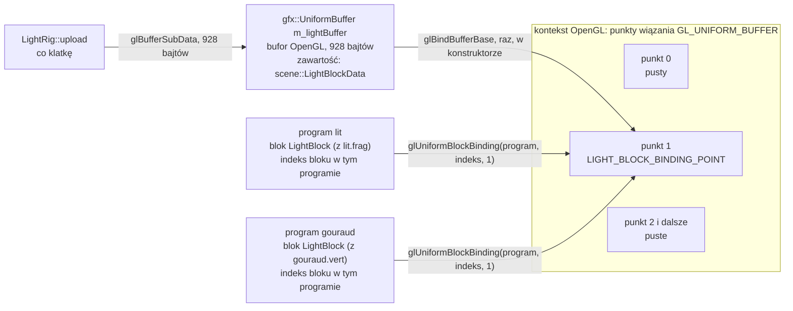

# Moduł gfx: bloki uniformów i bufor uniformów

Kamień milowy: M4 (część pierwsza: oświetlenie). Tematy wykładu: 6 (Oświetlenie) i 7 (Cieniowanie Gourauda i Phonga), od strony "instalacji": ten dokument nie liczy światła, tylko opisuje, jak dane świateł trafiają z C++ do shaderów.
Kod: [`src/gfx/UniformBuffer.hpp`](../../../src/gfx/UniformBuffer.hpp), [`src/gfx/UniformBuffer.cpp`](../../../src/gfx/UniformBuffer.cpp), funkcja `bindUniformBlock` i struktura `UniformBlockBinding` w [`src/gfx/Shader.hpp`](../../../src/gfx/Shader.hpp) i [`src/gfx/Shader.cpp`](../../../src/gfx/Shader.cpp), układ bajtów bloku w [`src/scene/LightBlock.hpp`](../../../src/scene/LightBlock.hpp) i [`src/scene/LightBlock.cpp`](../../../src/scene/LightBlock.cpp), deklaracja bloku w [`assets/shaders/common/lighting.glsl`](../../../assets/shaders/common/lighting.glsl), nazwa bloku i numer punktu wiązania w [`src/game/ShaderUniforms.hpp`](../../../src/game/ShaderUniforms.hpp), użytkownik w [`src/game/LightRig.hpp`](../../../src/game/LightRig.hpp), [`src/game/LightRig.cpp`](../../../src/game/LightRig.cpp) i [`src/game/NightMazeApp.cpp`](../../../src/game/NightMazeApp.cpp), ustawienia narzędzi w [`.clang-tidy`](../../../.clang-tidy) i [`.clangd`](../../../.clangd), testy w [`tests/LightTests.cpp`](../../../tests/LightTests.cpp).

Część modułu `gfx`. Wstęp do całego modułu, zasada RAII dla obiektów OpenGL i semantyka przenoszenia są w [`README.md`](README.md). Ten dokument zakłada znajomość zwykłych uniformów ([`uniforms.md`](uniforms.md)), buforów ([`buffers-vao.md`](buffers-vao.md)), przeładowania shaderów ([`shader-hot-reload.md`](shader-hot-reload.md)) oraz `sizeof`, `offsetof` i dopełnienia ([`mesh.md`](mesh.md), sekcje 2.2 i 2.3). Co znaczą same światła i jak shader liczy z nich jasność, opisuje [`../scene/lights.md`](../scene/lights.md). Dwa programy, które blok czytają, opisuje [`../renderer/lighting-gouraud-phong.md`](../renderer/lighting-gouraud-phong.md). Skąd biorą się wartości świateł w każdej klatce i jak działa klasa `game::LightRig`, opisuje [`../game/flashlight.md`](../game/flashlight.md). Dyrektywę `#include`, przez którą deklaracja bloku trafia do dwóch shaderów, opisuje [`shader-includes.md`](shader-includes.md). Każde wywołanie OpenGL jest opakowane w `GL_CHECK` ([`../core/gl-check.md`](../core/gl-check.md)).

**Stan na dziś.** Gra ma jeden blok uniformów, `LightBlock`, o rozmiarze 928 bajtów. Czytają go trzy programy: `lit` (blok jest w `lit.frag`), `gouraud` (blok jest w `gouraud.vert`) i, od drugiej części M6, `grass` (blok jest w `grass.frag`: trawę oświetlają te same światła co ściany, [`../renderer/grass-geometry.md`](../renderer/grass-geometry.md)). Dane wysyła raz na klatkę `game::LightRig::upload`, przez jeden obiekt `gfx::UniformBuffer` przypięty do punktu wiązania numer 1.

Co zostało zmierzone na Windowsie w M4 (2026-10-05, MSVC 19.44, NVIDIA GeForce RTX 4070 Ti SUPER, sterownik 610.74): build Debug i Release bez ostrzeżeń, wszystkie ówczesne testy zielone w obu, clang-format i clang-tidy bez uwag, start gry bez linii `[error]` i bez linii `GL_`. Na zrzutach ekranu z M4 sprawdzone są cztery tryby oświetlenia z trzech punktów widzenia, latarka wyłączona, ślepy zaułek ze swoim światłem (w M4 światła punktowe wisiały w ślepych zaułkach) i ściany oświetlone przez księżyc obok nieoświetlonych. Z tego wynikają dwa wnioski o kodzie z tego dokumentu (to wnioski z kodu i pomiaru, a nie osobny pomiar): sterownik NVIDIA podał dla bloku w obu programach rozmiar 928 bajtów, bo inaczej `applyBlockBinding` wypisałoby linię `[error]` (sekcja 5.9), a dane ze struktury C++ trafiają tam, gdzie shader ich szuka, bo obraz jest oświetlony zgodnie z ustawieniami.

Co zmieniło M5 (kod kompletny na Windowsie, kamień niezamknięty). Klasy `gfx::UniformBuffer`, funkcji `Shader::bindUniformBlock`, struktury `LightBlockData` i deklaracji bloku w `common/lighting.glsl` M5 nie dotknęło: blok ma nadal 928 bajtów i te same pola. Zmieniło się to, co do bloku trafia i kto go wysyła. Światła punktowe wiszą teraz nad kryształami, których gracz jeszcze nie zebrał (`game::crystalLightPositions`), i pulsują, a słaba bateria przyciemnia latarkę: obie zmiany robi `game::lightingForFrame` na kopii ustawień, zanim powstaną bajty (sekcja 5.10). Klasa `LightRig` straciła znaczniki świateł i ma już tylko bufor oraz funkcje `connect` i `upload`. Programów jest cztery zamiast pięciu, blok czytają nadal dwa. Według raportu z Windowsa (2026-10-05) build Debug i Release jest bez ostrzeżeń, a 215 przypadków testowych i 85098 asercji przechodzi w obu konfiguracjach. Obraz M5 był oglądany na zrzutach ekranu, ale osobnych wniosków o bloku z nich nie wyciągam.

Czego nikt nie sprawdził: `gfx::UniformBuffer` i `Shader::bindUniformBlock` wymagają kontekstu OpenGL, więc **nie mają testów jednostkowych**. Nikt nie nacisnął ręcznie `Reload shaders`, ani przy pięciu programach w M4, ani przy czterech w M5, ani przy sześciu dziś, więc ponowne podpięcie bloku po **udanym** przeładowaniu wynika z kodu, a nie z obserwacji. **Na macOS ten kod nie był ani budowany, ani uruchamiany**: każde zdanie o macOS w tym dokumencie jest niesprawdzone.

## 1. Po co to jest

Oświetlenie potrzebuje w shaderze wielu liczb naraz: pozycji kamery, światła otoczenia, kierunku i koloru księżyca, pięciu wektorów latarki, licznika świateł punktowych i do 16 świateł punktowych po trzy wektory każde. Razem 58 nazwanych wartości (1 + 1 + 2 + 5 + 1 + 48). Dwa programy (`lit` i `gouraud`) potrzebują dokładnie tych samych.

Zwykłymi uniformami ([`uniforms.md`](uniforms.md)) dałoby się to zrobić, ale drogo i krucho:

| Zwykłe uniformy | Blok uniformów w buforze |
|---|---|
| wartość należy do programu, więc każdy program trzeba ustawić osobno | bufor należy do kontekstu, więc wszystkie podpięte programy czytają te same bajty |
| 58 wywołań `glGetUniformLocation` i 58 wywołań `glUniform*` na program i klatkę | jedno `glBufferSubData` z 928 bajtami na klatkę, niezależnie od liczby programów |
| 58 napisów z nazwami, każdy to miejsce na literówkę, której OpenGL nie zgłosi | jedna nazwa bloku, a układ pól pilnuje kompilator C++ (`static_assert`) |
| tablica struktur wymaga nazw w rodzaju `"uPoints[3].color"` składanych w pętli | tablica to po prostu kolejne bajty |

Do tego potrzebne są cztery rzeczy i każda ma w projekcie swoje miejsce:

| Rzecz | Gdzie | Sekcja |
|---|---|---|
| deklaracja bloku w GLSL z ustalonym układem bajtów (`std140`) | `assets/shaders/common/lighting.glsl` | 4 |
| struktura C++ o identycznym układzie i funkcja, która ją wypełnia | `scene::LightBlockData`, `scene::packLightBlock` | 5.2 do 5.5 |
| bufor na karcie graficznej, przypięty do numerowanego punktu wiązania | `gfx::UniformBuffer` | 5.6 i 5.7 |
| informacja w każdym programie, z którego punktu wiązania czyta jego blok | `gfx::Shader::bindUniformBlock` | 5.8 i 5.9 |

Podział na warstwy jest ten sam co wszędzie. `scene/LightBlock.*` to same dane i matematyka, bez OpenGL, więc ma testy jednostkowe. `gfx/UniformBuffer.*` przesuwa bajty i nie wie, co znaczą. Spotykają się w `game::LightRig`.

## 2. Teoria

### 2.1 Trzy pojęcia: zwykły uniform, blok uniformów, bufor uniformów

| Pojęcie | Co to jest | Gdzie żyje wartość |
|---|---|---|
| **zwykły uniform** (plain uniform) | zmienna `uniform` zadeklarowana poza blokiem, na przykład `uniform mat4 uModel;`. Specyfikacja mówi, że należy do **domyślnego bloku uniformów** (default uniform block) programu | w obiekcie programu. Ma położenie (location) i ustawia się ją przez `glUniform*` |
| **blok uniformów** (uniform block) | grupa zmiennych `uniform` zebrana w GLSL pod jedną nazwą: `uniform LightBlock { ... };`. To rodzaj bloku interfejsu (interface block) | nie w programie. Program pamięta tylko, **z którego punktu wiązania** blok czyta |
| **bufor uniformów** (uniform buffer object, UBO) | zwykły obiekt bufora OpenGL, taki sam jak bufor wierzchołków, tylko używany jako pamięć pod blok uniformów | w pamięci karty, jako ciąg bajtów. Zmienia się go przez `glBufferData` i `glBufferSubData` |

Najważniejsza różnica, zapisana w specyfikacji OpenGL 4.1 (sekcja 2.11.7): **zmienne w nazwanym bloku nie mają położenia i nie da się ich zmienić funkcjami `glUniform*`**. `glGetUniformLocation(program, "uAmbient")` zwraca -1, choć `uAmbient` istnieje i jest używany. Jedyną drogą do nich jest zawartość bufora.

W shaderze pól bloku używa się jak zwykłych zmiennych globalnych. Blok `LightBlock` nie ma nazwy instancji (po klamrze zamykającej stoi od razu średnik), więc shader pisze po prostu `uAmbient.rgb`, a nie `lights.uAmbient.rgb`.

### 2.2 Dlaczego blok właśnie tutaj

W projekcie obowiązuje prosta reguła podziału:

| Rodzaj danych | Jak często się zmienia | Kto czyta | Mechanizm |
|---|---|---|---|
| światła sceny i pozycja kamery | raz na klatkę | wszystkie trzy programy z oświetleniem: `lit`, `gouraud`, `grass` | blok `LightBlock` w buforze |
| macierze `uView`, `uProjection` | raz na klatkę | każdy z sześciu programów | zwykłe uniformy, ustawiane w każdym programie osobno |
| `uModel`, `uNormalMatrix`, `uTint` | dla każdego obiektu albo części modelu | program, który akurat rysuje | zwykłe uniformy |
| materiał (`uSpecularModel`, `uSpecularStrength`, `uShininess`) | raz na klatkę | program, który akurat rysuje labirynt | zwykłe uniformy |

Blok opłaca się tam, gdzie danych jest dużo, są wspólne dla kilku programów i zmieniają się rzadko. Macierze widoku i rzutowania też by tu pasowały i w większym silniku trafiłyby do drugiego bloku. Zostały zwykłymi uniformami, bo są nimi od M1 w trzech starszych programach, a dwa wywołania na program to mały koszt. Blok dostały tylko światła, dla których różnica jest duża: 58 wartości i tablica struktur.

Drugi powód to **jedno miejsce prawdy**. Pojemność tablicy świateł punktowych (16), kolejność pól i ich znaczenie są zapisane raz w GLSL i raz w C++, obok siebie sprawdzane asercjami. Przy zwykłych uniformach te same informacje byłyby rozsmarowane po dziesiątkach napisów z nazwami.

### 2.3 Punkty wiązania: ponumerowane gniazda kontekstu

Program nie przechowuje identyfikatora bufora. Kontekst OpenGL ma ponumerowany zestaw gniazd, **punktów wiązania bufora uniformów** (uniform buffer binding points). Bufor wkłada się do gniazda o danym numerze, a programowi mówi się, z którego numeru ma czytać dany blok. To dokładnie ten sam pomysł co jednostki teksturujące ([`textures.md`](textures.md), sekcja 2.7):

| | Tekstura | Blok uniformów |
|---|---|---|
| ponumerowane gniazdo w kontekście | jednostka teksturująca | punkt wiązania bufora uniformów |
| co się wkłada do gniazda | teksturę: `glActiveTexture`, `glBindTexture` | bufor: `glBindBufferBase(GL_UNIFORM_BUFFER, numer, bufor)` |
| co w programie wskazuje gniazdo | uniform typu `sampler2D`, wartość ustawiana przez `glUniform1i` | wiązanie bloku, ustawiane przez `glUniformBlockBinding` |
| w klasach projektu | `Texture2D::bind(unit)` i `Shader::setInt(nazwa, unit)` | konstruktor `UniformBuffer(rozmiar, bindingPoint)` i `Shader::bindUniformBlock(nazwa, bindingPoint, rozmiar)` |
| wartość w nowym programie | 0 | 0 |
| czy da się zapisać numer w GLSL 4.10 | nie (`layout(binding = N)` jest od GLSL 4.20) | nie, z tego samego powodu |



Strzałka z bufora do punktu to stan **kontekstu**. Strzałki z programów do punktu to stan **każdego programu z osobna**. Bufor i programy nic o sobie nie wiedzą: łączy je tylko liczba 1. W projekcie ta liczba jest jedną stałą, `LIGHT_BLOCK_BINDING_POINT` w `ShaderUniforms.hpp`, i obie strony biorą ją stamtąd (sekcja 5.10).

Liczbę punktów wiązania podaje sterownik (`glGetIntegerv(GL_MAX_UNIFORM_BUFFER_BINDINGS, ...)`). Nie mierzyłem jej. Projekt używa jednego punktu.

### 2.4 Dwa wiązania celu `GL_UNIFORM_BUFFER`

Cel `GL_UNIFORM_BUFFER` ma dwa rodzaje wiązania i łatwo je pomylić:

| Wiązanie | Funkcja | Do czego służy |
|---|---|---|
| **ogólne** (general binding point), jedno na cel | `glBindBuffer(GL_UNIFORM_BUFFER, bufor)` | wskazuje, na którym buforze działają `glBufferData` i `glBufferSubData` z tym celem. To samo "wybierz, potem działaj" co przy `GL_ARRAY_BUFFER` ([`buffers-vao.md`](buffers-vao.md), sekcja 2.2). Shadery tego wiązania **nie czytają** |
| **indeksowane** (indexed binding points), cała tablica gniazd | `glBindBufferBase(GL_UNIFORM_BUFFER, numer, bufor)` albo `glBindBufferRange` | to są punkty wiązania z sekcji 2.3. Z nich czytają bloki uniformów |

Dwa szczegóły ze specyfikacji 4.1 (sekcja 2.9.1), o które łatwo zostać zapytanym:

- `glBindBufferBase` wiąże bufor **z oboma naraz**: z podanym gniazdem tablicy i z wiązaniem ogólnym. `glBindBuffer` wiąże tylko z ogólnym. Samo `glBindBuffer(GL_UNIFORM_BUFFER, ...)` nigdy nie wystarczy, żeby shader zobaczył dane.
- `glBindBufferBase` to to samo co `glBindBufferRange` z przesunięciem 0 i rozmiarem równym rozmiarowi bufora. Dlatego w konstruktorze `UniformBuffer` pamięć jest przydzielana (`glBufferData`) **przed** `glBindBufferBase` (sekcja 5.7).

### 2.5 Układ `std140`: reguły

Bufor to ciąg bajtów. Żeby C++ mógł go wypełnić, obie strony muszą się zgadzać, w którym bajcie zaczyna się każde pole. GLSL ma na to kwalifikator układu (layout qualifier) bloku. GLSL 4.10 zna trzy układy pamięci (specyfikacja GLSL 4.10, sekcja 4.3.8.3):

| Układ | Kto ustala przesunięcia | Skutek |
|---|---|---|
| `shared` (domyślny) | sterownik | przesunięcia trzeba odpytać po linkowaniu (`glGetActiveUniformsiv` z `GL_UNIFORM_OFFSET`). Mogą być inne na każdej karcie |
| `packed` | sterownik, który może też usuwać nieużywane pola | jak wyżej, a do tego bloku nie da się dzielić między programami |
| **`std140`** | **specyfikacja** | przesunięcia wynikają z samej deklaracji bloku, takie same na każdym sterowniku. Żadne pole nie jest usuwane |

Projekt używa `std140`, bo tylko wtedy da się napisać strukturę C++ raz i sprawdzić ją w czasie kompilacji.

Reguły `std140` są w specyfikacji OpenGL 4.1 Core (sekcja 2.11.7, część "Standard Uniform Block Layout", strony 88 i 89). Każde pole ma **wyrównanie bazowe** (base alignment). Pola leżą w kolejności deklaracji. Przesunięcie pola to pierwszy bajt za poprzednim polem, zaokrąglony w górę do wielokrotności wyrównania bazowego. Blok jako całość jest traktowany jak struktura o przesunięciu 0. `N` oznacza rozmiar jednej składowej w bajtach: 4 dla `float`, `int`, `uint` i `bool`, 8 dla `double`.

| # | Rodzaj pola | Wyrównanie bazowe | Dla składowych 4-bajtowych |
|---|---|---|---|
| 1 | skalar | `N` | `float`, `int`, `uint`, `bool`: rozmiar 4, wyrównanie 4 |
| 2 | wektor dwu- albo czteroskładnikowy | `2N` albo `4N` | `vec2`: rozmiar 8, wyrównanie 8. `vec4`: rozmiar 16, wyrównanie 16 |
| 3 | wektor trójskładnikowy | `4N` | `vec3`: rozmiar **12**, wyrównanie **16** |
| 4 | tablica skalarów albo wektorów | wyrównanie jednego elementu według reguł 1 do 3, **zaokrąglone w górę do wyrównania `vec4`**. Krok tablicy (array stride) jest taki sam. Po tablicy może być dopełnienie | `float a[4]`: krok 16, razem 64 bajty, a nie 16. `vec3 a[2]`: krok 16 |
| 5 | macierz kolumnowa o `C` kolumnach i `R` wierszach | jak tablica `C` wektorów o `R` składowych, według reguły 4 | `mat4`: 4 x 16 = 64 bajty. `mat3`: 3 kolumny po 16 = **48 bajtów**, a nie 36 |
| 6 | tablica `S` macierzy kolumnowych | jak tablica `S * C` wektorów kolumn | |
| 7 i 8 | macierz wierszowa (`row_major`) i tablica takich macierzy | jak 5 i 6, z wierszami w miejscu kolumn | projekt ich nie używa |
| 9 | struktura | największe wyrównanie bazowe spośród jej pól, zaokrąglone w górę do wyrównania `vec4`. Pola w środku układa się tymi samymi regułami. Na końcu struktury może być dopełnienie: pole po strukturze zaczyna się od wielokrotności jej wyrównania | struktura z samych `vec4`: wyrównanie 16 |
| 10 | tablica `S` struktur | elementy jeden za drugim, każdy według reguły 9 | |

Typ `bool` w buforze to cztery bajty: specyfikacja (ta sama sekcja) mówi, że pole typu `bool` jest odczytywane jako jedna wartość typu `uint`, a każda wartość różna od zera znaczy prawdę.

**Gdzie C++ układa inaczej.** Kompilator C++ wyrównuje pola do wyrównania ich typu, a `glm::vec3` to trzy liczby `float` o wyrównaniu 4. Stąd różnice:

| Deklaracja | Układ w `std140` | Układ struktury C++ z typami GLM |
|---|---|---|
| `vec3 a; float b;` | `a` w 0, `b` w 12. Razem 16 | `a` w 0, `b` w 12. Razem 16. **Zgodne**, przez przypadek: skalar mieści się w dziurze po `vec3` |
| `vec3 a; vec3 b;` | `a` w 0, `b` w **16** | `a` w 0, `b` w **12**. Niezgodne |
| `float a; vec3 b;` | `a` w 0, `b` w **16** | `a` w 0, `b` w **4**. Niezgodne |
| `vec3 a[2];` | elementy w 0 i **16** | elementy w 0 i **12**. Niezgodne |
| `bool on;` | 4 bajty | `sizeof(bool)` zależy od kompilatora, w MSVC i clang to 1 bajt. Niezgodne |
| `mat3 m;` | 48 bajtów | `glm::mat3` to 36 bajtów. Niezgodne |

Niezgodność nie daje żadnego błędu. Shader czyta po prostu inne bajty niż te, które C++ wypełnił: światło ma kolor z pozycji, a pozycję z koloru.

Dla porównania: **zwykły** uniform `mat3` nie ma z tym nic wspólnego. `Shader::setMat3` wysyła dziewięć ciasno ułożonych liczb przez `glUniformMatrix3fv` ([`uniforms.md`](uniforms.md), sekcja 5.4), a o układzie w pamięci programu decyduje sterownik. Reguły `std140` dotyczą wyłącznie zawartości bufora.

### 2.6 Dlaczego blok ma same `vec4` i jeden `int`

Z tabeli wynika prosta recepta na brak niespodzianek: **używać tylko `vec4`**. `vec4` ma rozmiar 16 i wyrównanie 16, a `glm::vec4` to cztery liczby `float`, czyli też 16 bajtów. Ciąg pól `vec4` leży więc w obu językach tak samo: 16 bajtów po 16 bajtach, bez dziur.

Pozycja, kierunek i kolor potrzebują trzech liczb z czterech. Czwarta nie marnuje się: niesie małą wartość dodatkową (natężenie światła w `w` koloru, przełącznik latarki w `z` pola `uSpotCone`) albo zero.

Jedynym wyjątkiem jest `int uPointCount`. Licznik jest liczbą całkowitą i shader porównuje go z licznikiem pętli, więc zostaje `int`. Kosztuje to jedną dziurę: 12 bajtów między nim a tablicą, pokazaną wprost w strukturze C++ (sekcja 5.2).

W bloku nie ma `bool`, `vec3`, `mat3` ani tablicy liczb `float`, czyli żadnego z typów z tabeli niezgodności.

### 2.7 Pełna tabela przesunięć bloku `LightBlock`

Liczby w kolumnie "Przesunięcie" to dokładnie te, które sprawdzają asercje `static_assert` w `LightBlock.hpp` (sekcja 5.3). Kolumna "Reguła" mówi, skąd liczba wynika.

| Pole w GLSL | Pole w C++ (`LightBlockData`) | Przesunięcie | Rozmiar | Znaczenie składowych | Reguła |
|---|---|---|---|---|---|
| `vec4 uCameraPosition` | `glm::vec4 cameraPosition` | 0 | 16 | `x, y, z`: oko kamery w przestrzeni świata. `w`: nieużywane, 0 | 2 |
| `vec4 uAmbient` | `glm::vec4 ambient` | 16 | 16 | `x, y, z`: światło otoczenia (czerwony, zielony, niebieski). `w`: nieużywane, 0 | 2 |
| `vec4 uDirectionalDirection` | `glm::vec4 directionalDirection` | 32 | 16 | `x, y, z`: kierunek, w którym **biegnie** światło księżyca, długość 1. `w`: nieużywane, 0 | 2 |
| `vec4 uDirectionalColor` | `glm::vec4 directionalColor` | 48 | 16 | `x, y, z`: kolor. `w`: natężenie | 2 |
| `vec4 uSpotPosition` | `glm::vec4 spotPosition` | 64 | 16 | `x, y, z`: pozycja latarki w przestrzeni świata. `w`: nieużywane, 0 | 2 |
| `vec4 uSpotDirection` | `glm::vec4 spotDirection` | 80 | 16 | `x, y, z`: oś stożka, długość 1. `w`: nieużywane, 0 | 2 |
| `vec4 uSpotColor` | `glm::vec4 spotColor` | 96 | 16 | `x, y, z`: kolor. `w`: natężenie | 2 |
| `vec4 uSpotAttenuation` | `glm::vec4 spotAttenuation` | 112 | 16 | `x`: składnik stały tłumienia, `y`: liniowy, `z`: kwadratowy. `w`: nieużywane, 0 | 2 |
| `vec4 uSpotCone` | `glm::vec4 spotCone` | 128 | 16 | `x`: kosinus kąta wewnętrznego, `y`: kosinus kąta zewnętrznego, `z`: 1 gdy latarka świeci, 0 gdy nie. `w`: nieużywane, 0 | 2 |
| `int uPointCount` | `std::int32_t pointCount` | 144 | 4 | ile elementów `uPoints` jest w użyciu, od 0 do 16 | 1 |
| (nie ma w shaderze) | `std::array<std::int32_t, 3> padding` | 148 | 12 | dopełnienie: trzy zera | wynika z 9 i 10 |
| `PointLight uPoints[16]` | `std::array<PointLightData, 16> points` | 160 | 768 | 16 elementów po 48 bajtów | 9 i 10 |

Jeden element tablicy, struktura `PointLight` (w C++ `PointLightData`), 48 bajtów. Element numer `i` zaczyna się w bajcie `160 + 48 * i`:

| Pole w GLSL | Pole w C++ | Przesunięcie w elemencie | Rozmiar | Znaczenie składowych |
|---|---|---|---|---|
| `vec4 position` | `glm::vec4 position` | 0 | 16 | `x, y, z`: pozycja w przestrzeni świata. `w`: nieużywane, 0 |
| `vec4 color` | `glm::vec4 color` | 16 | 16 | `x, y, z`: kolor. `w`: natężenie |
| `vec4 attenuation` | `glm::vec4 attenuation` | 32 | 16 | `x`: składnik stały, `y`: liniowy, `z`: kwadratowy. `w`: nieużywane, 0 |

Rachunek na liczbach:

- dziewięć pól `vec4` zajmuje bajty od 0 do 143,
- `uPointCount` ma wyrównanie 4, a 144 dzieli się przez 4, więc stoi w 144 i zajmuje bajty od 144 do 147,
- następne pole to tablica struktur. Struktura z samych `vec4` ma wyrównanie 16 (reguła 9). Pierwszy wolny bajt to 148, a najbliższa wielokrotność 16 to **160**. Bajty od 148 do 159 to dziura: **12 bajtów**,
- element ma trzy `vec4`, czyli 48 bajtów. 48 dzieli się przez 16, więc elementy leżą jeden za drugim bez dopełnienia,
- 16 elementów po 48 bajtów to 768. Ostatni element zaczyna się w bajcie 880,
- razem `160 + 768 = 928` bajtów, czyli 58 razy 16.

Specyfikacja gwarantuje, że blok może mieć co najmniej 16384 bajty (`GL_MAX_UNIFORM_BLOCK_SIZE`, tabela stanu w specyfikacji 4.1). 928 mieści się z dużym zapasem.

## 3. Jak to działa w OpenGL

### 3.1 Wywołania w kolejności

Utworzenie bufora, raz (konstruktor `gfx::UniformBuffer`):

| # | Wywołanie | Co robi |
|---|---|---|
| 1 | `glGenBuffers(1, &id)` | rezerwuje identyfikator nowego bufora. To ta sama funkcja co dla bufora wierzchołków: obiekt bufora nie ma "rodzaju" |
| 2 | `glBindBuffer(GL_UNIFORM_BUFFER, id)` | wiązanie ogólne: następne `glBufferData` z tym celem działa na tym buforze |
| 3 | `glBufferData(GL_UNIFORM_BUFFER, 928, nullptr, GL_DYNAMIC_DRAW)` | przydziela 928 bajtów. `nullptr` znaczy "nie kopiuj nic". Według specyfikacji zawartość jest wtedy **nieokreślona** (sekcja 5.7) |
| 4 | `glBindBufferBase(GL_UNIFORM_BUFFER, 1, id)` | wkłada cały bufor do punktu wiązania numer 1 (i przy okazji ponawia wiązanie ogólne) |

Podpięcie bloku w programie, raz na każdy zbudowany program (`applyBlockBinding`, wołane z `Shader::bindUniformBlock` i z `Shader::reload`):

| # | Wywołanie | Co robi |
|---|---|---|
| 5 | `glGetUniformBlockIndex(program, "LightBlock")` | zwraca **indeks bloku** w tym programie: numer aktywnego bloku, liczony od 0. Gdy program nie ma aktywnego bloku o tej nazwie, zwraca `GL_INVALID_INDEX`. Nie zgłasza przy tym błędu OpenGL |
| 6 | `glUniformBlockBinding(program, indeks, 1)` | zapisuje **w obiekcie programu**, że ten blok czyta z punktu wiązania 1. Program nie musi być bieżący. `GL_INVALID_VALUE`, gdy indeks nie jest indeksem aktywnego bloku albo numer punktu jest za duży |
| 7 | `glGetActiveUniformBlockiv(program, indeks, GL_UNIFORM_BLOCK_DATA_SIZE, &size)` | pyta sterownik, ile bajtów potrzebuje ten blok. Przy `std140` liczba wynika z deklaracji bloku |

Wysłanie danych, co klatkę (`UniformBuffer::update`):

| # | Wywołanie | Co robi |
|---|---|---|
| 8 | `glBindBuffer(GL_UNIFORM_BUFFER, id)` | wiązanie ogólne, żeby następne wywołanie trafiło w ten bufor |
| 9 | `glBufferSubData(GL_UNIFORM_BUFFER, 0, 928, data)` | zastępuje 928 bajtów od przesunięcia 0. Nie przydziela pamięci od nowa. `GL_INVALID_VALUE`, gdy przesunięcie plus rozmiar wychodzi poza bufor |
| 10 | `glUseProgram`, `glDrawElements` | rysowanie. Shader czyta pola bloku z bufora w punkcie 1 |

Sprzątanie:

| # | Wywołanie | Co robi |
|---|---|---|
| 11 | `glDeleteBuffers(1, &id)` | usuwa bufor. Wszystkie jego wiązania w bieżącym kontekście, także w punkcie wiązania, wracają do zera. Identyfikator 0 jest po cichu ignorowany |

Wszystkie te funkcje są w rdzeniu OpenGL najpóźniej od wersji 3.1 (wtedy weszły bufory uniformów), więc są w 4.1 Core i w nagłówku GLAD projektu.

### 3.2 Co dzieje się przy linkowaniu

Specyfikacja 4.1 (sekcja 2.11.7): **gdy program jest linkowany albo linkowany ponownie, punkt wiązania każdego jego aktywnego bloku wraca do zera.** Wiązanie bloku jest stanem obiektu programu, jak wartości zwykłych uniformów, i tak samo jak one nie przeżywa nowego programu. Stąd cała sekcja 5.9.

### 3.3 Co dzieje się, gdy pod blokiem nie ma bufora

Ta sama sekcja specyfikacji: w chwili wykonywania shadera punkt wiązania każdego aktywnego bloku musi zawierać bufor o rozmiarze co najmniej `GL_UNIFORM_BLOCK_DATA_SIZE`. W przeciwnym razie **wynik działania shadera jest nieokreślony, łącznie z możliwością przerwania albo zakończenia pracy OpenGL**. Nie ma tu ani gwarantowanego błędu `glGetError`, ani gwarantowanych zer. To samo dotyczy bufora za małego. Wniosek dla projektu jest w pułapce 3.

### 3.4 Czego nie wolno użyć w 4.1

| Zapis | Od której wersji | Co robi | Co zamiast niego |
|---|---|---|---|
| `layout(std140, binding = 1) uniform LightBlock` | GLSL 4.20 | numer punktu wiązania zapisany w shaderze | `glGetUniformBlockIndex` i `glUniformBlockBinding` (`Shader::bindUniformBlock`) |
| `glCreateBuffers`, `glNamedBufferData`, `glNamedBufferSubData` | 4.5 (direct state access) | działają na identyfikatorze, bez wiązania | `glGenBuffers`, `glBindBuffer`, `glBufferData`, `glBufferSubData` |
| `glBufferStorage` | 4.4 | bufor o niezmiennym rozmiarze | `glBufferData` |
| `layout(std430)` | 4.30, i tylko dla bloków pamięci shadera | ciaśniejszy układ | `std140` |

W specyfikacji GLSL 4.10 słowo `binding` nie występuje w ogóle: sekcja 4.3.8.3 wymienia dla bloku uniformów tylko kwalifikatory `shared`, `packed`, `std140`, `row_major` i `column_major`. GLSL 4.10 to najnowsza wersja na macOS, więc numer musi przyjść z C++.

## 4. Shadery

Blok jest zadeklarowany raz, w pliku [`assets/shaders/common/lighting.glsl`](../../../assets/shaders/common/lighting.glsl). To nie jest samodzielny shader: jego tekst trafia do `lit.frag`, `gouraud.vert` i (od drugiej części M6) `grass.frag` przez linię `#include "common/lighting.glsl"` ([`shader-includes.md`](shader-includes.md)). Dzięki temu wszystkie trzy programy mają deklarację identyczną co do znaku. Resztę tego pliku (funkcje liczące światło, uniformy materiału) omawia linia po linii [`../scene/lights.md`](../scene/lights.md). Tutaj jest tylko to, co wyznacza układ bajtów:

```glsl
// Length of the array of point lights. The same number as scene::MAX_POINT_LIGHTS in
// src/scene/Light.hpp.
const int MAX_POINT_LIGHTS = 16;

// One point light. vec4 everywhere, so that every member is 16 bytes and the C++ struct
// scene::PointLightData has the same layout without any hidden gaps.
struct PointLight {
    vec4 position;    // xyz: position in world space
    vec4 color;       // rgb: colour, a: intensity
    vec4 attenuation; // x: constant, y: linear, z: quadratic term
};

// All lights of the scene, in one uniform block. A block is not set uniform by uniform:
// it reads its bytes from a uniform buffer that the C++ code fills once per frame
// (gfx::UniformBuffer), and every program that declares the block sees the same data.
// std140 fixes the byte offset of every member, so the C++ struct scene::LightBlockData
// can mirror it. The members must stay in this order.
// GLSL 4.20 could name the binding point here, layout(std140, binding = 1). GLSL 4.10
// cannot, so the C++ code connects the block (gfx::Shader::bindUniformBlock).
layout(std140) uniform LightBlock {
    vec4 uCameraPosition;       // xyz: the eye in world space
    vec4 uAmbient;              // rgb: light that reaches every surface
    vec4 uDirectionalDirection; // xyz: the way the moon light travels, length 1
    vec4 uDirectionalColor;     // rgb: colour, a: intensity
    vec4 uSpotPosition;         // xyz: the flashlight in world space
    vec4 uSpotDirection;        // xyz: the axis of its cone, length 1
    vec4 uSpotColor;            // rgb: colour, a: intensity
    vec4 uSpotAttenuation;      // x: constant, y: linear, z: quadratic term
    vec4 uSpotCone;             // x: cos(inner angle), y: cos(outer angle), z: 1 on, 0 off
    int uPointCount;            // how many elements of uPoints are in use
    PointLight uPoints[MAX_POINT_LIGHTS];
};
```

| Linia | Znaczenie |
|---|---|
| `const int MAX_POINT_LIGHTS = 16;` | stała czasu kompilacji shadera: długość tablicy. Ta sama liczba co `scene::MAX_POINT_LIGHTS` w C++. Nikt nie sprawdza zgodności wprost, ale rozmiar bloku od niej zależy, więc niezgodność wykrywa porównanie rozmiarów (sekcja 5.9, pułapka 6) |
| `struct PointLight { ... };` | zwykła struktura GLSL: trzy `vec4`. Sama niczego nie deklaruje, jest typem elementu tablicy |
| `layout(std140)` | kwalifikator układu: przesunięcia pól według reguł z sekcji 2.5 |
| `uniform LightBlock {` | początek bloku uniformów. `LightBlock` to **nazwa bloku**: po niej szuka go `glGetUniformBlockIndex`. W C++ to stała `LIGHT_BLOCK_NAME` |
| dziewięć pól `vec4` | każde 16 bajtów, przesunięcia od 0 do 128 co 16 |
| `int uPointCount;` | przesunięcie 144, cztery bajty |
| `PointLight uPoints[MAX_POINT_LIGHTS];` | tablica 16 struktur od przesunięcia 160 |
| `};` | koniec bloku **bez nazwy instancji**. Pola są widoczne w shaderze jak zmienne globalne: `uAmbient`, `uPoints[i].color`. Żadna inna zmienna globalna shadera nie może mieć takiej samej nazwy |

W komentarzach shadera składowe koloru są nazwane `rgb` i `a`, a w C++ `x, y, z` i `w`. To te same cztery liczby: w GLSL `v.rgb` i `v.xyz` to dwa zapisy tych samych składowych ([`shaders.md`](shaders.md), sekcja 2.4).

**Blok w trzech programach.** Program `lit` ma blok w shaderze fragmentów, program `gouraud` w shaderze wierzchołków, a program `grass` (od drugiej części M6) znów w shaderze fragmentów, przy czym jest to program z trzema etapami. Dla mechanizmu z sekcji 2.3 nie ma to znaczenia: blok należy do programu jako całości i ma w nim jeden indeks. Indeksy w różnych programach nie muszą być równe, dlatego pyta się o nie osobno w każdym. Program trawy czyta z bloku to samo co pozostałe (funkcja `computeLighting` jest wspólna), a używa z wyniku tylko światła rozproszonego.

**Układ `std140` nie zależy od tego, których pól shader używa.** Kompilator GLSL usuwa nieużywane zwykłe uniformy ([`uniforms.md`](uniforms.md), sekcja 2.1). Przesunięcia pól bloku `std140` wynikają z samej deklaracji, więc nieużywane pole nie przesuwa pozostałych. Specyfikacja GLSL 4.10 (sekcja 4.3.8.3) pozwala kompilatorowi optymalizować zawartość bloku według użycia tylko w układzie `packed`. Sam blok jest aktywny, gdy zawiera aktywne uniformy (specyfikacja OpenGL 4.1, sekcja 2.11.7): blok, którego shader w ogóle nie czyta, może nie mieć indeksu.

## 5. Kod w projekcie

### 5.1 Pliki

| Plik | Co zawiera | Biblioteka |
|---|---|---|
| [`src/scene/LightBlock.hpp`](../../../src/scene/LightBlock.hpp) | struktury `PointLightData` i `LightBlockData`, 21 asercji `static_assert`, deklaracja `packLightBlock`. Dołącza `scene/Light.hpp`, GLM i nagłówki standardowe. **Nie dołącza GLAD** | `engine` |
| [`src/scene/LightBlock.cpp`](../../../src/scene/LightBlock.cpp) | stałe, funkcje pomocnicze `unitDirection` i `attenuationTerms`, funkcja `packLightBlock` | `engine` |
| [`src/gfx/UniformBuffer.hpp`](../../../src/gfx/UniformBuffer.hpp), [`.cpp`](../../../src/gfx/UniformBuffer.cpp) | klasa `gfx::UniformBuffer`. Dołącza GLAD, `core/GlCheck.hpp` i `core/Log.hpp` | `engine` |
| [`src/gfx/Shader.hpp`](../../../src/gfx/Shader.hpp), [`.cpp`](../../../src/gfx/Shader.cpp) | struktura `UniformBlockBinding`, funkcja `Shader::bindUniformBlock`, pole `m_blockBindings`, funkcja pomocnicza `applyBlockBinding`, pętla w `reload` | `engine` |
| [`src/game/ShaderUniforms.hpp`](../../../src/game/ShaderUniforms.hpp) | `LIGHT_BLOCK_NAME` i `LIGHT_BLOCK_BINDING_POINT` | program `night_maze` |
| [`src/game/LightRig.hpp`](../../../src/game/LightRig.hpp), [`.cpp`](../../../src/game/LightRig.cpp) | użytkownik: posiada bufor, podpina programy, wysyła światła | program `night_maze` |
| [`tests/LightTests.cpp`](../../../tests/LightTests.cpp) | testy `packLightBlock` i rozmiarów | program `night_maze_tests` |

`scene/LightBlock.*` leży w warstwie `scene`, a nie w `gfx`, bo nie woła OpenGL: struktura opisuje bajty, ale wypełnia ją zwykła matematyka. Dzięki temu `packLightBlock` ma testy jednostkowe, a `gfx::UniformBuffer` pozostaje klasą, która nie wie nic o światłach.

### 5.2 Struktury `PointLightData` i `LightBlockData`

```cpp
/// One element of the array uPoints of the block: 3 vec4, 48 bytes. 48 is a multiple of
/// 16, so the elements follow each other without padding.
struct PointLightData {
    glm::vec4 position;    ///< x, y, z: position in world space. w: not used.
    glm::vec4 color;       ///< x, y, z: red, green, blue. w: intensity.
    glm::vec4 attenuation; ///< x: constant, y: linear, z: quadratic term. w: not used.
};
```

| Linia | Znaczenie |
|---|---|
| `struct PointLightData` | lustro struktury GLSL `PointLight`. Inna nazwa niż `scene::PointLight` z `Light.hpp` jest celowa: tamta struktura to światło "dla ludzi" (pozycja `vec3`, kolor `vec3`, natężenie, tłumienie jako osobna struktura), ta to te same dane ułożone w bajty dla karty |
| `glm::vec4 position;` | cztery liczby `float`, 16 bajtów. Odpowiada `vec4 position` w GLSL. Czwarta liczba nic nie znaczy i jest zerem |
| `glm::vec4 color;` | kolor w `x, y, z`, natężenie w `w`. Shader mnoży jedno przez drugie: `uPoints[i].color.rgb * uPoints[i].color.a` |
| `glm::vec4 attenuation;` | trzy składniki wzoru na tłumienie w kolejności, w jakiej czyta je shader (`terms.x`, `terms.y`, `terms.z`) |
| brak wartości początkowych pól | struktura jest agregatem (same publiczne pola, bez konstruktorów), a jej pola nie mają inicjalizatorów domyślnych, więc `LightBlockData block{};` zeruje każde z nich (sekcja 5.5) |

```cpp
/// The whole block, member for member in the order of the GLSL declaration. The comments
/// give the name in the shader and the offset in bytes.
struct LightBlockData {
    glm::vec4 cameraPosition;       ///< uCameraPosition, 0. x, y, z: the eye in world space.
    glm::vec4 ambient;              ///< uAmbient, 16. x, y, z: red, green, blue.
    glm::vec4 directionalDirection; ///< uDirectionalDirection, 32. x, y, z: the way the light
                                    ///< travels, length 1.
    glm::vec4 directionalColor;     ///< uDirectionalColor, 48. x, y, z: colour. w: intensity.
    glm::vec4 spotPosition;         ///< uSpotPosition, 64. x, y, z: position in world space.
    glm::vec4 spotDirection;        ///< uSpotDirection, 80. x, y, z: axis of the cone, length 1.
    glm::vec4 spotColor;            ///< uSpotColor, 96. x, y, z: colour. w: intensity.
    glm::vec4 spotAttenuation;      ///< uSpotAttenuation, 112. x, y, z: the three terms.
    glm::vec4 spotCone;             ///< uSpotCone, 128. x: cosine of the inner angle, y: of the
                                    ///< outer angle, z: 1 when the light is on, 0 when off.
    std::int32_t pointCount;        ///< uPointCount, 144. An int is 4 bytes.
    /// Not in the shader. The array below starts at a multiple of 16, so std140 skips the
    /// 12 bytes after uPointCount. These three ints stand in that hole, which makes the
    /// hole visible here and keeps it filled with zeros.
    std::array<std::int32_t, 3> padding;
    std::array<PointLightData, MAX_POINT_LIGHTS> points; ///< uPoints, 160. 16 times 48 bytes.
};
```

| Linia | Znaczenie |
|---|---|
| dziewięć pól `glm::vec4` | w tej samej kolejności co w GLSL. Kolejność pól w strukturze C++ jest kolejnością w pamięci, więc zamiana dwóch linii tutaj bez zamiany w shaderze zamienia znaczenie danych, a rozmiar zostaje ten sam (pułapka 7) |
| `std::int32_t pointCount;` | typ o **dokładnie** 32 bitach z `<cstdint>`. Zwykły `int` ma 32 bity na obu systemach projektu, ale gwarancji w standardzie nie ma, a `int` w GLSL ma zawsze 32 bity. Typ ze stałą szerokością mówi to wprost |
| `std::array<std::int32_t, 3> padding;` | **12 bajtów dopełnienia zapisane jawnie**. `std140` każe tablicy struktur zacząć się od wielokrotności 16, czyli od 160. Kompilator C++ tego nie wie: `PointLightData` ma wyrównanie 4 (jak `float`), więc bez tego pola tablica `points` zaczęłaby się w bajcie 148 i każde światło punktowe byłoby przesunięte o 12 bajtów. Pole wypełnia dziurę, a asercja `offsetof(LightBlockData, points) == 160` pilnuje, żeby tak zostało |
| dlaczego trzy `int`, a nie `char[12]` | wyrównanie 4 jest takie samo jak sąsiadów, a trzy zera typu `int` są łatwe do sprawdzenia w teście |
| `std::array<PointLightData, MAX_POINT_LIGHTS> points;` | 16 elementów po 48 bajtów. `std::array` to opakowanie zwykłej tablicy C: elementy leżą jeden za drugim i nic więcej w nim nie ma. `MAX_POINT_LIGHTS` to stała `scene::MAX_POINT_LIGHTS` z `Light.hpp`, równa 16 |

### 5.3 Asercje `static_assert`

`static_assert(warunek)` to warunek sprawdzany przez kompilator ([`mesh.md`](mesh.md), sekcja 2.3). Fałszywy warunek to błąd kompilacji, więc zły układ nigdy nie trafia do działającego programu. W działającym programie nie kosztuje nic.

```cpp
// offsetof is only defined for "standard layout" types (no virtual functions, all
// members with the same access), which both structs are.
static_assert(std::is_standard_layout_v<PointLightData>);
static_assert(std::is_standard_layout_v<LightBlockData>);

// A glm::vec4 must be four floats and nothing else.
static_assert(sizeof(glm::vec4) == 16);

static_assert(sizeof(PointLightData) == 48);
static_assert(offsetof(PointLightData, position) == 0);
static_assert(offsetof(PointLightData, color) == 16);
static_assert(offsetof(PointLightData, attenuation) == 32);

static_assert(offsetof(LightBlockData, cameraPosition) == 0);
static_assert(offsetof(LightBlockData, ambient) == 16);
static_assert(offsetof(LightBlockData, directionalDirection) == 32);
static_assert(offsetof(LightBlockData, directionalColor) == 48);
static_assert(offsetof(LightBlockData, spotPosition) == 64);
static_assert(offsetof(LightBlockData, spotDirection) == 80);
static_assert(offsetof(LightBlockData, spotColor) == 96);
static_assert(offsetof(LightBlockData, spotAttenuation) == 112);
static_assert(offsetof(LightBlockData, spotCone) == 128);
static_assert(offsetof(LightBlockData, pointCount) == 144);
static_assert(offsetof(LightBlockData, padding) == 148);
static_assert(offsetof(LightBlockData, points) == 160);
// 160 bytes before the array plus 16 lights of 48 bytes.
static_assert(sizeof(LightBlockData) == 160 + MAX_POINT_LIGHTS * 48);
static_assert(sizeof(LightBlockData) == 928);
```

| Asercja | Co sprawdza i po co |
|---|---|
| `std::is_standard_layout_v<PointLightData>` i to samo dla `LightBlockData` | czy typ ma **układ standardowy** (standard layout): bez funkcji wirtualnych, bez wirtualnych klas bazowych, wszystkie pola o tym samym poziomie dostępu. Tylko dla takich typów standard C++ gwarantuje działanie `offsetof` i układ "pola w kolejności deklaracji, pierwsze pod adresem obiektu". `std::is_standard_layout_v<T>` to stała `bool` z nagłówka `<type_traits>`. Asercja zatrzyma kompilację, gdyby ktoś dodał do struktury na przykład funkcję wirtualną |
| `sizeof(glm::vec4) == 16` | czy `glm::vec4` to cztery liczby `float` i nic więcej. GLM ma opcje, które zmieniają wyrównanie typów (projekt żadnej nie ustawia). Cała reszta rachunku stoi na tej liczbie |
| `sizeof(PointLightData) == 48` | czy element tablicy ma rozmiar, który daje `std140`: trzy razy 16. Większa liczba znaczyłaby dopełnienie wstawione przez kompilator |
| trzy asercje `offsetof(PointLightData, ...)` | przesunięcia pól elementu: 0, 16, 32. `offsetof(Typ, pole)` to makro z `<cstddef>`: odległość pola od początku obiektu w bajtach |
| dziewięć asercji od `cameraPosition` do `spotCone` | przesunięcia od 0 do 128 co 16. Każda liczba jest też w komentarzu przy polu i w tabeli z sekcji 2.7 |
| `offsetof(LightBlockData, pointCount) == 144` | licznik stoi zaraz za dziewiątym wektorem |
| `offsetof(LightBlockData, padding) == 148` | dopełnienie zaczyna się zaraz za licznikiem |
| `offsetof(LightBlockData, points) == 160` | **najważniejsza asercja pliku**: tablica zaczyna się tam, gdzie każe `std140`. Usunięcie pola `padding` albo zmiana jego długości zatrzymuje kompilację w tym miejscu |
| `sizeof(LightBlockData) == 160 + MAX_POINT_LIGHTS * 48` | rozmiar wyrażony przez stałą: pokazuje, skąd bierze się liczba, i łapie dopełnienie na końcu struktury |
| `sizeof(LightBlockData) == 928` | ta sama liczba wpisana wprost. To jest liczba, którą dostaje `glBufferData` i którą sterownik ma podać jako rozmiar bloku. Zmiana `MAX_POINT_LIGHTS` zatrzymuje kompilację tutaj i zmusza do świadomej zmiany także w shaderze (pułapka 6) |

**Czego asercje nie sprawdzają.** Kompilator C++ nie widzi pliku GLSL. Asercje pilnują, żeby struktura C++ miała układ, który **ja** wyliczyłem z reguł `std140`. Jeśli ktoś zmieni deklarację w `lighting.glsl`, asercje dalej przechodzą. Drugą połowę kontroli robi działający program: porównuje rozmiar podany przez sterownik z `sizeof(LightBlockData)` (sekcja 5.9). Ta kontrola łapie tylko zmiany, które zmieniają rozmiar.

### 5.4 `offsetof` w `static_assert` a clang: `-D_CRT_USE_BUILTIN_OFFSETOF`

Asercje z `offsetof` kompilują się w MSVC bez żadnych dodatków. Kłopot jest z narzędziami, które czytają ten sam kod kompilatorem clang na Windowsie: clang-tidy (analiza statyczna) i clangd (podpowiedzi w edytorze). Oba korzystają z nagłówków biblioteki C Microsoftu, a tam `offsetof` jest zdefiniowane tak (plik `stddef.h` z Windows SDK 10.0.26100.0, odczytany na komputerze projektu):

```cpp
#if defined _MSC_VER && !defined _CRT_USE_BUILTIN_OFFSETOF
    #ifdef __cplusplus
        #define offsetof(s,m) ((::size_t)&reinterpret_cast<char const volatile&>((((s*)0)->m)))
    #else
        #define offsetof(s,m) ((size_t)&(((s*)0)->m))
    #endif
#else
    #define offsetof(s,m) __builtin_offsetof(s,m)
#endif
```

| Fragment | Znaczenie |
|---|---|
| pierwsza definicja (C++) | stara sztuczka: udaj, że pod adresem 0 leży obiekt typu `s`, weź adres jego pola `m` i zamień go na liczbę. Adres pola obiektu spod adresu 0 to właśnie przesunięcie. Wymaga rzutowania wskaźnika (`reinterpret_cast`) |
| `__builtin_offsetof(s,m)` | funkcja wbudowana kompilatora: kompilator zna układ typu i po prostu podaje liczbę |
| `!defined _CRT_USE_BUILTIN_OFFSETOF` | przełącznik samej biblioteki: gdy to makro jest zdefiniowane, wybierana jest wersja wbudowana |

`static_assert` wymaga **wyrażenia stałego** (constant expression), czyli takiego, które kompilator umie policzyć sam. Standard C++ nie pozwala, żeby wyrażenie stałe zawierało `reinterpret_cast`. MSVC mimo to przyjmuje swoją definicję wewnątrz `static_assert`. Clang trzyma się standardu i ją odrzuca: zgłasza, że warunek asercji nie jest wyrażeniem stałym. Clang na Windowsie definiuje `_MSC_VER` dla zgodności, więc trafia w pierwszą gałąź.

Rozwiązanie to zdefiniować `_CRT_USE_BUILTIN_OFFSETOF` tylko dla tych dwóch narzędzi. W [`.clang-tidy`](../../../.clang-tidy):

```yaml
# Only matters on Windows, where clang-tidy reads the headers of the Microsoft C library.
# Their offsetof macro is written with a pointer cast, which MSVC accepts inside
# static_assert and clang does not. This switch of that library makes offsetof the
# built-in of the compiler instead. scene/LightBlock.hpp needs it: it checks the layout of
# the light block with static_assert(offsetof(...) == ...). The macro cannot be set in
# CMakeLists.txt: MSVC refuses to define it (warning C4117, a reserved name).
ExtraArgs: ['-D_CRT_USE_BUILTIN_OFFSETOF']
```

W [`.clangd`](../../../.clangd):

```yaml
CompileFlags:
  CompilationDatabase: build/debug
  # The same switch as ExtraArgs in .clang-tidy, explained there: on Windows it lets
  # clang accept static_assert(offsetof(...) == ...).
  Add: [-D_CRT_USE_BUILTIN_OFFSETOF]
```

| Element | Znaczenie |
|---|---|
| `ExtraArgs` w `.clang-tidy` | lista argumentów dopisywanych do polecenia kompilacji każdego sprawdzanego pliku |
| `CompileFlags: Add` w `.clangd` | to samo dla clangd: flagi dopisywane do tych z `compile_commands.json` |
| `-D_CRT_USE_BUILTIN_OFFSETOF` | `-D` definiuje makro, tak jak `#define` na początku pliku |
| dlaczego nie w `CMakeLists.txt` | według komentarza w `.clang-tidy`: MSVC odmawia zdefiniowania tej nazwy z linii poleceń i zgłasza ostrzeżenie C4117 (nazwa zastrzeżona), a projekt buduje się bez ostrzeżeń. MSVC tego makra zresztą nie potrzebuje. Tego ostrzeżenia sam nie odtwarzałem |
| skutek uboczny | kod budowany przez MSVC i kod analizowany przez clang-tidy używają dwóch różnych definicji `offsetof`. Obie dają te same liczby, bo opisują ten sam układ typu |

Zmierzone na Windowsie: z tym ustawieniem clang-tidy przechodzi bez uwag, a MSVC buduje bez ostrzeżeń. **Na macOS niesprawdzone.** Tam nie ma nagłówków Microsoftu, a `offsetof` z nagłówków Apple to od razu funkcja wbudowana, więc asercje powinny się kompilować, a dodatkowe makro powinno być po prostu nieużywane. To oczekiwanie, nie pomiar.

Poza `LightBlock.hpp` projekt używa `offsetof` w `Mesh.cpp` (przesunięcia atrybutów) i w `tests/LightTests.cpp` (wewnątrz `CHECK`). Żadne z tych miejsc nie jest wyrażeniem stałym wymaganym przez `static_assert`, więc problem ich nie dotyczył.

### 5.5 `packLightBlock`: od `LightSet` do bajtów

Deklaracja w `LightBlock.hpp`:

```cpp
/// Fills the block from a LightSet and the position the scene is seen from (the eye of
/// the camera in world space: the shiny highlight depends on where the viewer is).
///
/// Directions are brought to length 1 here, so the shader does not have to. Cone angles
/// become cosines (coneCosines). pointCount is limited to 0 to MAX_POINT_LIGHTS. Every
/// float that the shader does not read, and every point light past pointCount, is zero.
LightBlockData packLightBlock(const LightSet& lights, const glm::vec3& cameraPosition);
```

Funkcja jest czysta: dostaje dane, zwraca strukturę przez wartość, nie woła OpenGL i nie ma stanu. `scene::LightSet` (światła sceny w postaci wygodnej dla kodu gry) opisuje [`../scene/lights.md`](../scene/lights.md).

**Stałe i funkcje pomocnicze** (`LightBlock.cpp`, anonimowa przestrzeń nazw):

```cpp
// A direction shorter than this cannot be brought to length 1: dividing by a length of
// (almost) 0 gives numbers that are not numbers (NaN), and one NaN in the block turns
// every lit pixel black.
constexpr float MIN_DIRECTION_LENGTH = 0.0001F;

// What a direction of length 0 is replaced by: straight down.
constexpr glm::vec3 FALLBACK_DIRECTION{0.0F, -1.0F, 0.0F};

// Value of the "on" switch of the spot light in the block. The block has no bool on
// purpose: a C++ bool is 1 byte, a std140 bool is 4.
constexpr float SWITCH_ON = 1.0F;
constexpr float SWITCH_OFF = 0.0F;

// direction with length 1.
glm::vec3 unitDirection(const glm::vec3& direction) {
    if (glm::length(direction) < MIN_DIRECTION_LENGTH) {
        return FALLBACK_DIRECTION;
    }
    return glm::normalize(direction);
}

// The three terms in the order the shader reads them: x, y, z.
glm::vec4 attenuationTerms(const Attenuation& attenuation) {
    return {attenuation.constant, attenuation.linear, attenuation.quadratic, 0.0F};
}
```

| Linia | Co robi i dlaczego |
|---|---|
| `MIN_DIRECTION_LENGTH = 0.0001F` | próg "ten wektor jest praktycznie zerowy" |
| `FALLBACK_DIRECTION{0.0F, -1.0F, 0.0F}` | kierunek zastępczy: prosto w dół |
| `SWITCH_ON`, `SWITCH_OFF` | przełącznik latarki jako liczba `float`: 1 albo 0. Dlaczego nie `bool`: niżej |
| `glm::length(direction) < MIN_DIRECTION_LENGTH` | `glm::normalize` dzieli wektor przez jego długość. Dla wektora zerowego to dzielenie zera przez zero, czyli NaN (not a number). NaN w bloku psuje każdy piksel, który go użyje: każde działanie z NaN daje NaN. Funkcja sprawdza długość **przed** dzieleniem |
| `return FALLBACK_DIRECTION;` | zamiast NaN shader dostaje poprawny, jednostkowy kierunek. Kierunek księżyca powstaje z dwóch kątów, a latarki z `Camera::forward()`, więc dziś długość zero nie powinna się zdarzyć. Zabezpieczenie jest dla danych z zewnątrz (struktura ma publiczne pola) |
| `return glm::normalize(direction);` | zwykły przypadek: wektor o tym samym kierunku i długości 1. Shader zakłada długość 1 i nie normalizuje kierunków z bloku |
| `attenuationTerms` | pakuje trzy pola `scene::Attenuation` do jednego `vec4` w kolejności `x, y, z`, z zerem w `w`. Zwraca listę w klamrach, z której kompilator buduje `glm::vec4` |

**Ciało funkcji:**

```cpp
LightBlockData packLightBlock(const LightSet& lights, const glm::vec3& cameraPosition) {
    // The empty braces set every byte of the struct to zero first, also the padding and
    // the point lights that are not in use.
    LightBlockData block{};

    // glm::vec4{vec3, w}: the three floats of the vec3 followed by the fourth one.
    block.cameraPosition = glm::vec4{cameraPosition, 0.0F};
    block.ambient = glm::vec4{lights.ambient, 0.0F};

    block.directionalDirection = glm::vec4{unitDirection(lights.directional.direction), 0.0F};
    block.directionalColor = glm::vec4{lights.directional.color, lights.directional.intensity};

    const SpotLight& spot = lights.spot;
    const ConeCosines cone = coneCosines(spot.innerConeDegrees, spot.outerConeDegrees);
    block.spotPosition = glm::vec4{spot.position, 0.0F};
    block.spotDirection = glm::vec4{unitDirection(spot.direction), 0.0F};
    block.spotColor = glm::vec4{spot.color, spot.intensity};
    block.spotAttenuation = attenuationTerms(spot.attenuation);
    block.spotCone = {cone.inner, cone.outer, lights.spotEnabled ? SWITCH_ON : SWITCH_OFF, 0.0F};

    // The count comes from outside, the array has a fixed length: never read past it.
    const int pointCount = std::clamp(lights.pointCount, 0, MAX_POINT_LIGHTS);
    block.pointCount = pointCount;
    for (int i = 0; i < pointCount; ++i) {
        const auto index = static_cast<std::size_t>(i);
        const PointLight& point = lights.points[index];
        block.points[index] = {
            .position = glm::vec4{point.position, 0.0F},
            .color = glm::vec4{point.color, point.intensity},
            .attenuation = attenuationTerms(point.attenuation),
        };
    }
    return block;
}
```

| Linia | Co robi i dlaczego |
|---|---|
| `LightBlockData block{};` | **inicjalizacja agregatu pustą listą** (aggregate initialization): każde pole, dla którego lista nie podaje wartości, jest inicjalizowane wartością (value initialization), czyli dla liczb zerem. Puste klamry zerują więc wszystkie pola: dziewięć wektorów, licznik, dopełnienie i wszystkie 16 świateł punktowych. Dopełnienie jest zerowane **tylko dlatego, że jest jawnym polem** `padding`: bajtów dopełnienia wstawionych po cichu przez kompilator standard zerować nie każe. To drugi powód, dla którego dziura w bloku ma w strukturze własne pole. Bez klamer (`LightBlockData block;`) pola miałyby przypadkowe wartości, a do bufora trafiłyby śmieci ze stosu. Dzięki temu to, czego funkcja niżej nie przypisze (nieużywane światła, czwarte składowe), jest zerem |
| `glm::vec4{cameraPosition, 0.0F}` | konstruktor `vec4` z `vec3` i jednej liczby: trzy składowe wektora i czwarta osobno. Pozycja kamery jest w bloku, bo odblask zależy od tego, skąd się patrzy |
| `block.ambient = glm::vec4{lights.ambient, 0.0F};` | światło otoczenia, czwarta składowa nieużywana |
| `unitDirection(lights.directional.direction)` | kierunek księżyca doprowadzony do długości 1 **tutaj**, raz na klatkę, zamiast w shaderze dla każdego fragmentu |
| `glm::vec4{lights.directional.color, lights.directional.intensity}` | kolor i natężenie w jednym wektorze: natężenie jedzie w `w` |
| `const SpotLight& spot = lights.spot;` | skrót: referencja, żeby nie pisać `lights.spot.` sześć razy. Niczego nie kopiuje |
| `coneCosines(spot.innerConeDegrees, spot.outerConeDegrees)` | zamiana dwóch kątów w stopniach na ich kosinusy. Shader porównuje kosinus kąta między osią stożka a promieniem z tymi dwiema liczbami, więc kosinusy liczy się raz w C++, a nie w każdym fragmencie. Funkcja pilnuje też, żeby kosinus wewnętrzny był większy od zewnętrznego o co najmniej `MIN_CONE_COSINE_GAP`: shader dzieli przez ich różnicę ([`../scene/lights.md`](../scene/lights.md)) |
| `block.spotPosition`, `block.spotDirection`, `block.spotColor` | jak dla księżyca: pozycja, oś stożka o długości 1, kolor z natężeniem w `w` |
| `block.spotAttenuation = attenuationTerms(spot.attenuation);` | trzy składniki tłumienia latarki |
| `block.spotCone = {cone.inner, cone.outer, ..., 0.0F};` | `x`: kosinus kąta wewnętrznego, `y`: zewnętrznego, `z`: przełącznik |
| `lights.spotEnabled ? SWITCH_ON : SWITCH_OFF` | **`bool` z C++ zamieniony na `float`**. W `LightSet` włącznik jest typu `bool`, bo tak jest naturalnie w kodzie gry. Do bloku trafia jako 1,0 albo 0,0 |
| `std::clamp(lights.pointCount, 0, MAX_POINT_LIGHTS)` | ogranicza licznik do zakresu od 0 do 16. `pointCount` jest publicznym polem typu `int` i może w nim stać cokolwiek: 21 albo -3. Pętla niżej indeksuje tablicę o 16 elementach, a shader tablicę o 16 elementach, więc liczba spoza zakresu byłaby czytaniem poza tablicą po obu stronach |
| `block.pointCount = pointCount;` | do shadera trafia liczba już ograniczona |
| `for (int i = 0; i < pointCount; ++i)` | tylko światła w użyciu. Pozostałe elementy zostają zerami z pierwszej linii, nawet jeśli w `lights.points` coś w nich stoi (sprawdza to test) |
| `static_cast<std::size_t>(i)` | `std::array::operator[]` przyjmuje `std::size_t` (liczbę bez znaku). Jawne rzutowanie zamiast niejawnej zamiany `int` na typ bez znaku, przed którą ostrzega kompilator |
| `block.points[index] = { .position = ..., .color = ..., .attenuation = ... };` | **inicjalizatory desygnowane** (designated initializers) z C++20: każde pole nazwane wprost. Kompilator pilnuje kolejności (musi być taka jak w deklaracji struktury), a czytelnik widzi, co trafia do którego pola |
| `return block;` | zwrot przez wartość. Kompilator zwykle buduje wtedy obiekt od razu w miejscu przeznaczenia (copy elision), więc 928 bajtów nie jest kopiowane drugi raz. Nie sprawdzałem tego w kodzie wynikowym |

**Dlaczego przełącznik to `float`, a nie `bool`.** Powody są dwa i każdy wystarcza. Pierwszy: rozmiar. `bool` w `std140` zajmuje 4 bajty i jest czytany jako `uint` (sekcja 2.5), a `bool` w C++ zajmuje w MSVC i clang 1 bajt, więc w strukturze lustrzanej trzeba by go zastąpić typem 4-bajtowym i pilnować kolejnej dziury. Drugi: w `uSpotCone` i tak zostały dwie wolne liczby, więc przełącznik nie kosztuje ani jednego bajtu i nie psuje reguły "same `vec4`". Shader sprawdza go warunkiem `uSpotCone.z > 0.5`, a nie `== 1.0`: porównywanie liczb zmiennoprzecinkowych znakiem równości jest złym nawykiem, a próg w połowie drogi między 0 a 1 działa dla obu wartości z zapasem.

### 5.6 `gfx::UniformBuffer`: nagłówek

Publiczna część klasy (komentarz nad klasą i komentarze Doxygen są w pliku):

```cpp
class UniformBuffer {
public:
    /// Creates a buffer of sizeInBytes bytes and attaches it to the uniform buffer
    /// binding point number bindingPoint (glBindBufferBase). The contents are undefined
    /// until the first update(): glBufferData without data only reserves the memory.
    /// Binding points are numbered slots of the OpenGL context, like texture units: the
    /// buffer is put into a slot here, and a shader program is told to read its block
    /// from that slot.
    UniformBuffer(std::size_t sizeInBytes, GLuint bindingPoint);
    ~UniformBuffer();

    UniformBuffer(const UniformBuffer&) = delete;
    UniformBuffer& operator=(const UniformBuffer&) = delete;

    /// Takes over the buffer of other. other is left without a buffer.
    UniformBuffer(UniformBuffer&& other) noexcept;
    /// Deletes the buffer this object owns, then takes over the buffer of other.
    UniformBuffer& operator=(UniformBuffer&& other) noexcept;

    /// Copies sizeInBytes bytes from data to the start of the buffer (glBufferSubData).
    /// The buffer keeps its size: more bytes than sizeInBytes() are not copied at all,
    /// and an error is logged.
    void update(const void* data, std::size_t sizeInBytes) const;

    /// The binding point the buffer is attached to.
    GLuint bindingPoint() const { return m_bindingPoint; }

    /// Size of the buffer in bytes, as given to the constructor.
    std::size_t sizeInBytes() const { return m_sizeInBytes; }

private:
    std::size_t m_sizeInBytes;
    GLuint m_bindingPoint;
    // Name (id) of the OpenGL buffer object. 0 is never a real buffer: it means "none".
    GLuint m_id = 0;
};
```

| Element | Dlaczego tak |
|---|---|
| osobna klasa, a nie `gfx::Buffer` z trzecim celem | `gfx::Buffer` jest wypełniany raz, w konstruktorze, i nie ma funkcji zmieniającej dane ([`buffers-vao.md`](buffers-vao.md), sekcja 5.3). Bufor uniformów jest pusty przy utworzeniu, zmienia się co klatkę i ma punkt wiązania. To inny cykl życia, więc inna klasa |
| `std::size_t sizeInBytes` | rozmiar w bajtach, typ wyniku `sizeof` |
| `GLuint bindingPoint` | numer gniazda z sekcji 2.3 |
| `= delete` dla kopiowania, ręczne przenoszenie | zasada wszystkich klas `gfx` ([`README.md`](README.md), sekcja 2) |
| `update(const void* data, std::size_t sizeInBytes) const` | `const void*`: klasa nie wie, co jest w danych, przyjmuje wskaźnik na cokolwiek. `const` na końcu: funkcja nie zmienia pól obiektu C++, zmienia pamięć na karcie, tak jak `Shader::setMat4` |
| `bindingPoint()` i `sizeInBytes()` | akcesory, którymi `LightRig::connect` przekazuje te same dwie liczby do `Shader::bindUniformBlock`. Liczba jest podana raz, w konstruktorze, a druga strona bierze ją stąd |
| `m_id = 0` | 0 nigdy nie jest prawdziwym buforem |

Klasa nie ma funkcji `bind()`: bufora uniformów nie trzeba wiązać przed rysowaniem. Siedzi w swoim punkcie wiązania od konstruktora do destruktora.

### 5.7 `gfx::UniformBuffer`: implementacja

**Konstruktor.**

```cpp
UniformBuffer::UniformBuffer(std::size_t sizeInBytes, GLuint bindingPoint)
    : m_sizeInBytes(sizeInBytes), m_bindingPoint(bindingPoint) {
    GL_CHECK(glGenBuffers(1, &m_id));
    // GL_UNIFORM_BUFFER is the target a uniform buffer is filled through, like
    // GL_ARRAY_BUFFER for vertex data. OpenGL 4.1 can only fill the buffer that is bound.
    GL_CHECK(glBindBuffer(GL_UNIFORM_BUFFER, m_id));
    // Allocates the memory. nullptr as the data means "nothing to copy yet": the
    // contents arrive with update(). GL_DYNAMIC_DRAW is a hint: the data changes often
    // (here once per frame) and is used for drawing.
    GL_CHECK(glBufferData(GL_UNIFORM_BUFFER, static_cast<GLsizeiptr>(m_sizeInBytes), nullptr,
                          GL_DYNAMIC_DRAW));
    // GL_UNIFORM_BUFFER has two kinds of binding. glBindBuffer above set the general
    // one, which only says which buffer the next glBufferData call works on.
    // glBindBufferBase puts the whole buffer into one of the numbered binding points,
    // and those are what the shader programs read their uniform blocks from. It sets
    // the general binding to the same buffer as well.
    GL_CHECK(glBindBufferBase(GL_UNIFORM_BUFFER, m_bindingPoint, m_id));
}
```

| # | Linia | Co robi i dlaczego |
|---|---|---|
| 1 | lista inicjalizacyjna | zapamiętuje rozmiar i numer punktu. `m_id` ma wartość początkową 0 z deklaracji pola |
| 2 | `glGenBuffers(1, &m_id)` | rezerwuje identyfikator. Funkcja pisze do tablicy: tu tablicą jest jedno pole |
| 3 | `glBindBuffer(GL_UNIFORM_BUFFER, m_id)` | wiązanie ogólne. W OpenGL 4.1 bufor wypełnia się tylko przez cel, z którym jest związany |
| 4 | `glBufferData(GL_UNIFORM_BUFFER, rozmiar, nullptr, GL_DYNAMIC_DRAW)` | przydziela pamięć. `static_cast<GLsizeiptr>`: funkcja chce rozmiaru jako liczby ze znakiem o szerokości wskaźnika, a `std::size_t` jest bez znaku. `nullptr`: nie ma jeszcze czego kopiować. `GL_DYNAMIC_DRAW`: podpowiedź użycia (usage hint) "dane zmieniają się często i służą do rysowania". Bufor wierzchołków ma `GL_STATIC_DRAW` ([`buffers-vao.md`](buffers-vao.md), sekcja 2.6). To podpowiedź dla sterownika, a nie zakaz |
| 5 | `glBindBufferBase(GL_UNIFORM_BUFFER, m_bindingPoint, m_id)` | wkłada bufor do punktu wiązania. Musi stać **po** kroku 4: obejmuje bufor w rozmiarze, jaki ten ma (sekcja 2.4) |

Trzy uwagi:

- **Zawartość nowego bufora jest nieokreślona.** Mówi to komentarz w nagłówku ("The contents are undefined until the first update()") i specyfikacja 4.1 (sekcja 2.9.2): gdy `data` jest puste, `glBufferData` tylko rezerwuje pamięć. W grze nie ma to skutków, bo `LightRig::upload` wysyła pełne 928 bajtów na początku każdej klatki, przed pierwszym rysowaniem. Kto użyje klasy inaczej, nie może liczyć na zera.
- **`glBindBufferBase` ustawia oba wiązania.** Komentarz przy tym wywołaniu mówi to wprost: oprócz numerowanego punktu ustawia także wiązanie ogólne na ten sam bufor (sekcja 2.4).
- Konstruktor zostawia bufor związany z wiązaniem ogólnym `GL_UNIFORM_BUFFER`. Nikomu to nie przeszkadza: to inny cel niż `GL_ARRAY_BUFFER`, więc nie zabiera wiązania kostce ([`indexed-drawing.md`](indexed-drawing.md), sekcja 5.5), a VAO tego celu nie zapamiętuje.

**Destruktor i przenoszenie.**

```cpp
UniformBuffer::~UniformBuffer() {
    // OpenGL silently ignores the id 0 in glDeleteBuffers, so an object that was moved
    // from needs no special case. Deleting a buffer also takes it out of its binding point.
    GL_CHECK(glDeleteBuffers(1, &m_id));
}

// Move constructor: the new object takes the buffer id, and other gives it up.
UniformBuffer::UniformBuffer(UniformBuffer&& other) noexcept
    : m_sizeInBytes(other.m_sizeInBytes), m_bindingPoint(other.m_bindingPoint), m_id(other.m_id) {
    // Two objects must never hold the same id. With 0 the destructor of other
    // deletes nothing.
    other.m_id = 0;
}

// Move assignment: this object already owns a buffer, which has to go first.
UniformBuffer& UniformBuffer::operator=(UniformBuffer&& other) noexcept {
    // buffer = std::move(buffer): nothing to do. Without this check the buffer would
    // be deleted here and then "taken over" from itself.
    if (this == &other) {
        return *this;
    }

    // Release the buffer owned so far (ignored by OpenGL when the id is 0).
    GL_CHECK(glDeleteBuffers(1, &m_id));

    m_sizeInBytes = other.m_sizeInBytes;
    m_bindingPoint = other.m_bindingPoint;
    m_id = other.m_id;
    other.m_id = 0;
    return *this;
}
```

To ten sam wzorzec co w `gfx::Buffer` ([`buffers-vao.md`](buffers-vao.md), sekcja 5.4) i w każdej klasie `gfx` ([`README.md`](README.md), sekcja 2.3):

| Funkcja | Kroki |
|---|---|
| destruktor | jedno `glDeleteBuffers`. Dla identyfikatora 0 (obiekt po przeniesieniu) OpenGL nic nie robi. Usunięcie bufora opróżnia też jego punkt wiązania (specyfikacja 4.1, sekcja 2.9.1: wszystkie wiązania usuwanego bufora w bieżącym kontekście wracają do zera) |
| konstruktor przenoszący | kopiuje trzy liczby i zeruje identyfikator w źródle. Bufor na karcie się nie zmienia i zostaje w swoim punkcie wiązania: zmienia się tylko to, który obiekt C++ za niego odpowiada |
| przypisanie przenoszące | sprawdzenie przypisania do siebie, usunięcie własnego bufora, przejęcie trzech liczb, wyzerowanie identyfikatora w źródle |

W grze `UniformBuffer` nie jest nigdy przenoszony: jest polem `LightRig`, a `LightRig` polem `NightMazeApp`. Funkcje przenoszące istnieją, bo wymaga ich reguła modułu, i nie były uruchamiane w żadnym teście.

**`update`.**

```cpp
void UniformBuffer::update(const void* data, std::size_t sizeInBytes) const {
    // glBufferSubData does not grow a buffer: writing past its end is an OpenGL error
    // (GL_INVALID_VALUE). The mistake is reported here, in words.
    if (sizeInBytes > m_sizeInBytes) {
        core::logError("UniformBuffer::update: the data is larger than the buffer");
        return;
    }

    GL_CHECK(glBindBuffer(GL_UNIFORM_BUFFER, m_id));
    // Replaces sizeInBytes bytes starting at offset 0. Unlike glBufferData it keeps the
    // memory that was allocated in the constructor, which is cheaper every frame.
    GL_CHECK(glBufferSubData(GL_UNIFORM_BUFFER, 0, static_cast<GLsizeiptr>(sizeInBytes), data));
}
```

| Linia | Co robi i dlaczego |
|---|---|
| `if (sizeInBytes > m_sizeInBytes)` | **strażnik rozmiaru**. `glBufferSubData` nie powiększa bufora: zapis poza jego koniec to błąd `GL_INVALID_VALUE` i nic nie zostaje zapisane. `GL_CHECK` też by to wypisał, ale jako nazwę błędu OpenGL przy wywołaniu. Tu komunikat mówi słowami, co się stało |
| `core::logError(...)`, `return;` | linia `[error]` w konsoli i wyjście **przed** jakimkolwiek wywołaniem OpenGL. Bufor zostaje z poprzednią zawartością. Funkcja jest wołana co klatkę, więc taki błąd wypisywałby się co klatkę: to celowe, bo oznacza pomyłkę w kodzie, a nie w danych |
| mniej bajtów niż rozmiar bufora | dozwolone: zastępowany jest tylko początek, reszta zostaje. Gra zawsze wysyła całość |
| `glBindBuffer(GL_UNIFORM_BUFFER, m_id)` | wiązanie ogólne. W projekcie jest jeden bufor uniformów, więc po konstruktorze jest on i tak związany, ale funkcja na to nie liczy: z drugim buforem uniformów przestałoby to być prawdą |
| `glBufferSubData(GL_UNIFORM_BUFFER, 0, rozmiar, data)` | zastępuje `rozmiar` bajtów od przesunięcia 0. `glBufferData` zrobiłoby to samo, ale przydzielając pamięć od nowa przy każdym wywołaniu. Kosztu żadnej z tych funkcji nie mierzyłem |

### 5.8 `UniformBlockBinding` i `Shader::bindUniformBlock`

Struktura w `Shader.hpp`:

```cpp
/// Which binding point a uniform block of a program reads from. A Shader keeps one of
/// these for every block it was told about (Shader::bindUniformBlock).
struct UniformBlockBinding {
    /// Name of the block as written in the shader: "uniform LightBlock { ... }".
    std::string blockName;
    /// The uniform buffer binding point the block reads from (see gfx::UniformBuffer).
    GLuint bindingPoint = 0;
    /// Size of the block in bytes as the C++ code fills it. Compared with the size the
    /// driver reports, to catch a C++ struct and a GLSL block that do not match.
    std::size_t sizeInBytes = 0;
};
```

To **zapamiętana prośba**, a nie stan OpenGL: nazwa bloku, numer punktu i rozmiar po stronie C++. `std::string`, a nie `const char*`, bo prośba ma przeżyć wywołanie, które ją złożyło.

Deklaracja funkcji i pole klasy:

```cpp
    void bindUniformBlock(std::string blockName, GLuint bindingPoint, std::size_t sizeInBytes);
```

```cpp
    // The requests made with bindUniformBlock, repeated on every newly built program.
    std::vector<UniformBlockBinding> m_blockBindings;
```

Implementacja w `Shader.cpp`:

```cpp
void Shader::bindUniformBlock(std::string blockName, GLuint bindingPoint, std::size_t sizeInBytes) {
    m_blockBindings.push_back({.blockName = std::move(blockName),
                               .bindingPoint = bindingPoint,
                               .sizeInBytes = sizeInBytes});
    // The program that exists now gets the binding at once. Without a program (a failed
    // first load) the request waits for the next successful reload.
    if (isValid()) {
        applyBlockBinding(m_program, m_blockBindings.back());
    }
}
```

| Linia | Co robi i dlaczego |
|---|---|
| `std::string blockName` przez wartość | wołający podaje literał (`LIGHT_BLOCK_NAME`), z którego powstaje napis, a `std::move` przenosi go do wektora bez drugiej kopii |
| funkcja **nie jest** `const` | zmienia pole `m_blockBindings`. Settery uniformów są `const`, bo zmieniają tylko stan po stronie OpenGL. Dlatego `LightRig::connect` przyjmuje `gfx::Shader&`, a nie `const gfx::Shader&` |
| `m_blockBindings.push_back({...})` | **najpierw zapamiętaj**. Prośba trafia na listę niezależnie od tego, czy program teraz istnieje |
| `if (isValid())` | **potem wykonaj**, jeśli jest na czym. Gdy pierwsze wczytanie shadera się nie udało (`m_program == 0`), nie ma programu do podpięcia: prośba czeka na liście i zostanie wykonana przy pierwszym udanym `reload()` |
| `applyBlockBinding(m_program, m_blockBindings.back())` | `back()` to element dopisany linię wyżej |
| brak `use()` | `glUniformBlockBinding` przyjmuje identyfikator programu jako argument. Program nie musi być bieżący, inaczej niż przy `glUniform*` ([`uniforms.md`](uniforms.md), sekcja 2.2) |

Funkcja pomocnicza w anonimowej przestrzeni nazw `Shader.cpp`:

```cpp
// Connects one uniform block of program to its binding point and checks its size.
void applyBlockBinding(GLuint program, const UniformBlockBinding& binding) {
    // The index is the number of the block inside this program, like the location of
    // a plain uniform. GL_INVALID_INDEX means the program has no active block with this
    // name: nothing to connect. The check is needed, because glUniformBlockBinding
    // raises GL_INVALID_VALUE for that index.
    GLuint blockIndex = GL_INVALID_INDEX;
    GL_CHECK(blockIndex = glGetUniformBlockIndex(program, binding.blockName.c_str()));
    if (blockIndex == GL_INVALID_INDEX) {
        return;
    }
    GL_CHECK(glUniformBlockBinding(program, blockIndex, binding.bindingPoint));

    // How many bytes the driver laid the block out in. With std140 the layout is fixed
    // by the standard, so this must be the size of the C++ struct the buffer is filled
    // from. A difference means the two were changed apart (for example the number of
    // point lights), and every member after the first difference would be read wrong.
    GLint driverSize = 0;
    GL_CHECK(
        glGetActiveUniformBlockiv(program, blockIndex, GL_UNIFORM_BLOCK_DATA_SIZE, &driverSize));
    if (static_cast<std::size_t>(driverSize) != binding.sizeInBytes) {
        core::logError("Uniform block " + binding.blockName + " is " + std::to_string(driverSize) +
                       " bytes in the shader, but " + std::to_string(binding.sizeInBytes) +
                       " bytes in the C++ code");
    }
}
```

| Linia | Co robi i dlaczego |
|---|---|
| `GLuint program` jako parametr | funkcja działa na **podanym** programie, a nie na `m_program`. `reload` woła ją dla nowego programu, zanim ten zastąpi stary (sekcja 5.9) |
| `GLuint blockIndex = GL_INVALID_INDEX;` | indeks jest liczbą bez znaku, więc "nie ma" nie może być -1 jak przy położeniu uniformu. Stała `GL_INVALID_INDEX` to największa wartość `GLuint` (`0xFFFFFFFF`) |
| `glGetUniformBlockIndex(program, binding.blockName.c_str())` | pyta o indeks bloku po nazwie. `c_str()` daje napis C zakończony zerem, bo taki przyjmuje OpenGL. Wywołanie zwraca wartość, więc przypisanie stoi wewnątrz `GL_CHECK` |
| `if (blockIndex == GL_INVALID_INDEX) return;` | program nie ma aktywnego bloku o tej nazwie: literówka, shader bez `#include` albo blok, którego żadnego pola shader nie czyta. Funkcja wraca **po cichu**, bez komunikatu. To ta sama decyzja co przy położeniu -1 w `setMat4`, z tym samym kosztem (pułapka 5). Sprawdzenie jest konieczne: `glUniformBlockBinding` z tym indeksem dałoby `GL_INVALID_VALUE` |
| `glUniformBlockBinding(program, blockIndex, binding.bindingPoint)` | zapisuje w programie numer punktu wiązania dla tego bloku. Od tej chwili blok czyta z bufora, który siedzi w tym punkcie |
| `GLint driverSize = 0;` | `glGetActiveUniformBlockiv` pisze wynik jako `GLint` |
| `glGetActiveUniformBlockiv(program, blockIndex, GL_UNIFORM_BLOCK_DATA_SIZE, &driverSize)` | "ile bajtów sterownik przewidział na ten blok". Litery `iv` na końcu: wynik to liczby całkowite zapisywane pod wskaźnik |
| `static_cast<std::size_t>(driverSize) != binding.sizeInBytes` | porównanie z rozmiarem struktury C++. Rzutowanie, bo jedna liczba ma znak, a druga nie |
| `core::logError("Uniform block ... is N bytes in the shader, but M bytes in the C++ code")` | **niezgodność jest tylko logowana**. Wiązanie już zostało ustawione, program działa dalej i rysuje z danych czytanych ze złych miejsc. Linia `[error]` jest jedynym sygnałem. Powód: konstruktor `Shader` i `reload` nie rzucają wyjątków i nie przerywają gry z powodu shadera |

Co ta kontrola łapie, a czego nie:

| Zmiana zrobiona tylko po jednej stronie | Rozmiary | Wykryta? |
|---|---|---|
| inna wartość `MAX_POINT_LIGHTS` w GLSL niż w C++ | różne | tak, linia `[error]` przy starcie i po każdym przeładowaniu |
| pole dodane albo usunięte | różne | tak |
| dwa pola `vec4` zamienione miejscami | równe | **nie** |
| `vec4` zamieniony w GLSL na `vec3` w środku ciągu wektorów | równe (następne pole i tak zaczyna się od wielokrotności 16) | **nie**, i w tym przypadku nic się nie psuje |

### 5.9 Dlaczego wiązanie jest zapamiętywane i powtarzane w `reload`

Fragment `Shader::reload` (cała funkcja jest w [`shader-hot-reload.md`](shader-hot-reload.md)):

```cpp
    // A binding point of a uniform block is stored in the program object, and this one
    // is new: every block is back at binding point 0. Set them again.
    for (const UniformBlockBinding& binding : m_blockBindings) {
        applyBlockBinding(program, binding);
    }

    // Only now replace the old program (glDeleteProgram(0) is ignored on the first load).
    GL_CHECK(glDeleteProgram(m_program));
    m_program = program;
```

Rozumowanie w trzech krokach:

1. Wiązanie bloku jest **stanem obiektu programu** (sekcja 3.2), tak jak wartości zwykłych uniformów.
2. `reload()` nie zmienia starego programu. Buduje **nowy obiekt programu** (`glCreateProgram`, kompilacja, linkowanie) i dopiero gdy ten się udał, usuwa stary. Nowy program ma każdy blok z powrotem w punkcie 0.
3. W punkcie 0 nie ma żadnego bufora. Bez ponownego podpięcia pierwsze naciśnięcie `Reload shaders` odcięłoby program od świateł (co dokładnie by się stało, mówi pułapka 3).

Zwykłe uniformy mają ten sam problem i projekt rozwiązuje go wysyłaniem wszystkiego co klatkę ([`uniforms.md`](uniforms.md), sekcja 5.2). Dla wiązania bloku wybrałem inne rozwiązanie: klasa `Shader` **sama pamięta**, o co ją poproszono, i powtarza to na każdym nowym programie. Powody:

| Wariant | Dlaczego nie |
|---|---|
| wołać `bindUniformBlock` co klatkę z kodu gry | trzy wywołania sterownika na program i klatkę (indeks po nazwie, wiązanie, pytanie o rozmiar) dla wartości, która zmienia się tylko przy przeładowaniu |
| wołać je z panelu Shaders po przeładowaniu | panel debugowy musiałby wiedzieć, które programy mają bloki i gdzie jest bufor. Przeładowanie bez panelu (na przykład przyszłe śledzenie zmian plików) znów by o tym zapomniało |
| zapamiętać w `Shader` | **wybrane**. Kod gry mówi to raz, w konstruktorze `NightMazeApp`, a kto woła `reload()`, nie musi o blokach wiedzieć nic |

Dwa szczegóły pętli:

- Działa na zmiennej lokalnej `program`, czyli na nowym programie, **zanim** zastąpi on stary. Gdy `reload` zaczyna rysować nowym programem, blok jest już podpięty.
- Stoi po sprawdzeniu `if (program == 0)`. Nieudane przeładowanie wraca wcześniej i niczego nie dotyka: stary program rysuje dalej ze swoim starym, nadal ważnym wiązaniem. To jest stan ze zrzutu ekranu z błędem w `common/lighting.glsl`: komunikat w panelu, a labirynt dalej oświetlony.

Pierwsze wczytanie w konstruktorze `Shader` też idzie przez `reload()`, ale lista próśb jest wtedy pusta. Stąd drugi tor: `bindUniformBlock` wykonuje prośbę od razu, jeśli program już istnieje (sekcja 5.8). Lista próśb jest przenoszona razem z obiektem: konstruktor przenoszący i przypisanie przenoszące `Shader` mają `m_blockBindings(std::move(other.m_blockBindings))`.

**Dlaczego nie `layout(binding = 1)` w shaderze.** Wtedy numer byłby częścią tekstu shadera, każde linkowanie ustawiałoby go samo i cała ta sekcja byłaby zbędna. Ten zapis jest dla bloków dostępny od GLSL 4.20. Projekt używa `#version 410 core`, bo to najnowsza wersja na macOS (sekcja 3.4). To ten sam powód, dla którego numer jednostki teksturującej trafia do samplera przez `setInt` ([`textures.md`](textures.md), sekcja 2.7).

### 5.10 Kto to wszystko woła: `LightRig` i `NightMazeApp`

Klasa `game::LightRig` łączy trzy elementy: strukturę z `scene`, bufor z `gfx` i stałe z `ShaderUniforms.hpp`. Opisuje ją też [`../game/flashlight.md`](../game/flashlight.md). Od M5 klasa nie ma niczego poza tym, co jest tutaj: znaczniki świateł (małe kostki rysowane w miejscu każdego światła punktowego) zostały usunięte, bo widocznym źródłem każdego światła punktowego jest teraz kryształ, który rysuje `game::GameplayRenderer`. Zostały trzy funkcje i wszystkie dotyczą bloku.

Stałe w [`src/game/ShaderUniforms.hpp`](../../../src/game/ShaderUniforms.hpp):

```cpp
constexpr const char* LIGHT_BLOCK_NAME = "LightBlock";
constexpr GLuint LIGHT_BLOCK_BINDING_POINT = 1;
```

Konstruktor, `connect` i `upload` w [`src/game/LightRig.cpp`](../../../src/game/LightRig.cpp):

```cpp
LightRig::LightRig() : m_lightBuffer(sizeof(scene::LightBlockData), LIGHT_BLOCK_BINDING_POINT) {}

void LightRig::connect(gfx::Shader& shader) const {
    shader.bindUniformBlock(LIGHT_BLOCK_NAME, m_lightBuffer.bindingPoint(),
                            m_lightBuffer.sizeInBytes());
}

void LightRig::upload(const scene::LightSet& lights, const glm::vec3& cameraPosition) const {
    // The struct has exactly the bytes the block of the shader expects (the asserts in
    // scene/LightBlock.hpp), so it is copied as it is.
    const scene::LightBlockData block = scene::packLightBlock(lights, cameraPosition);
    m_lightBuffer.update(&block, sizeof(block));
}
```

| Linia | Co robi |
|---|---|
| `m_lightBuffer(sizeof(scene::LightBlockData), LIGHT_BLOCK_BINDING_POINT)` | bufor o rozmiarze struktury (928 bajtów) w punkcie wiązania 1. Rozmiar nie jest wpisany liczbą: bierze się z typu |
| `shader.bindUniformBlock(LIGHT_BLOCK_NAME, m_lightBuffer.bindingPoint(), m_lightBuffer.sizeInBytes())` | numer punktu i rozmiar pochodzą **z bufora**, a nie drugi raz ze stałych. Bufor i program nie mogą się więc rozjechać |
| `scene::packLightBlock(lights, cameraPosition)` | bajty bloku na stosie, w zmiennej lokalnej |
| `m_lightBuffer.update(&block, sizeof(block))` | adres struktury jako `const void*` i jej rozmiar. Struktura jest kopiowana "tak jak leży": wolno, bo asercje gwarantują jej układ |

W konstruktorze `NightMazeApp` ([`src/game/NightMazeApp.cpp`](../../../src/game/NightMazeApp.cpp)):

```cpp
    // The two lit programs and the grass program read the lights from the uniform buffer
    // of m_lightRig. Each program is told once: the shader repeats it by itself after
    // a reload.
    m_lightRig.connect(m_litShader);
    m_lightRig.connect(m_gouraudShader);
    m_lightRig.connect(m_grassShader);
```

Te trzy linie stoją w **ciele** konstruktora, więc wykonują się po wszystkich polach: programy już są zbudowane, bufor już istnieje. Trzecia doszła w drugiej części M6 razem z programem trawy. Pozostałe trzy programy (`textured`, `color` i `skybox`) nie mają bloku i nie są podpinane. Gdyby były, `applyBlockBinding` wróciłoby na `GL_INVALID_INDEX` bez skutku.

W `NightMazeApp::onRender`, po policzeniu macierzy, a przed rysowaniem:

```cpp
    const LightingSettings frameLighting = lightingForFrame(m_lighting, m_round, m_gameplay);
    const std::vector<glm::vec3> crystalLights = crystalLightPositions(m_round);
    const scene::LightSet lights =
        buildLightSet(frameLighting, eye, m_camera.forward(), crystalLights);
    m_lightRig.upload(lights, eye);
```

| Linia | Co robi |
|---|---|
| `lightingForFrame(m_lighting, m_round, m_gameplay)` | kopia ustawień oświetlenia na tę jedną klatkę. Runda zmienia w niej dwie rzeczy: latarka jest wyłączona przy pustej baterii i przyciemniona (migocze) przy słabej, a natężenie świateł punktowych jest pomnożone przez puls kryształów. Samo `m_lighting`, które edytuje panel Lights, zostaje nietknięte |
| `crystalLightPositions(m_round)` | pozycje świateł punktowych tej chwili: nad każdym kryształem, którego gracz jeszcze nie zebrał, razem z jego kołysaniem. Zebrany kryształ nie ma światła, więc lista skraca się w trakcie rundy. W M4 była to stała lista pozycji w ślepych zaułkach, liczona raz przy budowie labiryntu |
| `buildLightSet(frameLighting, eye, m_camera.forward(), crystalLights)` | zestaw świateł klatki (`scene::LightSet`) z kopii ustawień i z listy pozycji |
| `m_lightRig.upload(lights, eye)` | pakowanie do 928 bajtów i wysyłka |

Dla bloku nic się przez to nie zmieniło: to nadal jedna struktura i jedna wysyłka na klatkę. Inne są tylko wartości. W M4 przy nieruchomej kamerze bajty były co klatkę takie same, a dziś natężenie i pozycje świateł punktowych zmieniają się z klatki na klatkę, a ich lista skraca się z każdym zebranym kryształem. Labirynt startowy (10 x 10, ziarno 1) ma 13 kryształów, więc na początku rundy lista ma 13 pozycji z 16 miejsc tablicy `uPoints` (w M4 było to 11 świateł w ślepych zaułkach). Zasady rundy, puls i baterię opisuje [`../game/gameplay.md`](../game/gameplay.md).

Wysyłka odbywa się **w każdej klatce i w każdym trybie**, także w trybie `Unlit`, w którym żaden program bloku nie czyta. To 928 zbędnych bajtów na klatkę w jednym trybie w zamian za brak warunku i za bufor, który po przełączeniu trybu jest od razu aktualny.

### 5.11 Wywołania OpenGL związane z blokiem: kiedy i ile

| Kiedy | Kto | Wywołania OpenGL | Ile razy |
|---|---|---|---|
| start, konstruktor `LightRig` | `UniformBuffer::UniformBuffer` | `glGenBuffers`, `glBindBuffer(GL_UNIFORM_BUFFER)`, `glBufferData` (928 bajtów, bez danych), `glBindBufferBase(GL_UNIFORM_BUFFER, 1, id)` | raz |
| start, ciało konstruktora `NightMazeApp` | `Shader::bindUniformBlock` przez `LightRig::connect` | `glGetUniformBlockIndex`, `glUniformBlockBinding`, `glGetActiveUniformBlockiv` | raz dla `lit`, raz dla `gouraud`, raz dla `grass` |
| udane `Shader::reload` programu z prośbą na liście | pętla w `reload` | te same trzy | raz na przeładowany program |
| **każda klatka**, `onRender` | `UniformBuffer::update` przez `LightRig::upload` | `glBindBuffer(GL_UNIFORM_BUFFER, id)`, `glBufferSubData(GL_UNIFORM_BUFFER, 0, 928, ...)` | raz, niezależnie od trybu i liczby programów |
| każda klatka, rysowanie | | **żadne**. Nie ma `glBindBufferBase` ani `glUniformBlockBinding` w klatce: oba stany są trwałe | 0 |
| koniec programu | `UniformBuffer::~UniformBuffer` | `glDeleteBuffers` | raz |

Dla porównania zwykłe uniformy tego samego programu kosztują w klatce kilkaset par wywołań ([`uniforms.md`](uniforms.md), sekcja 5.6). Światła to dwa wywołania.

### 5.12 Testy

`packLightBlock` i układ struktury sprawdza siedem przypadków z [`tests/LightTests.cpp`](../../../tests/LightTests.cpp). Pełną tabelę tego pliku (20 przypadków, razem z tłumieniem i stożkiem) ma [`../scene/lights.md`](../scene/lights.md). Jak uruchamiać testy: [`../../libraries/doctest.md`](../../libraries/doctest.md).

| Przypadek testowy | Co sprawdza |
|---|---|
| `packLightBlock copies the camera, the ambient light and the moon` | pozycja kamery i światło otoczenia z zerem w `w`. Kierunek `(0, -4, 3)` o długości 5 trafia do bloku jako `(0, -0,8, 0,6)`: normalizacja. Natężenie 0,8 jest w `w` koloru |
| `packLightBlock packs the spot light with cosines and its switch` | pozycja, kierunek `(2, 0, 0)` znormalizowany do `(1, 0, 0)`, kolor z natężeniem 2,5 w `w`, trzy składniki tłumienia. `spotCone` dla kątów 0 i 60 stopni to `(1, 0,5, 1, 0)`. Po `spotEnabled = false` składowa `z` jest równa 0 |
| `packLightBlock keeps the cone cosines apart` | dla dwóch równych kątów (25 i 25) `spotCone.x - spotCone.y` jest większe od 0: shader nie podzieli przez zero |
| `packLightBlock replaces a direction of length zero` | zerowy kierunek księżyca i latarki staje się `(0, -1, 0)`, a nie NaN |
| `packLightBlock packs the point lights in use and leaves the rest zero` | dwa światła w użyciu trafiają do `points[0]` i `points[1]` (tłumienie dla promienia 3 to `(1, 2/3, 17/9, 0)`). Trzecie, wypełnione, ale nieliczone, zostaje zerem. Trzy liczby pola `padding` są zerami |
| `packLightBlock limits the number of point lights to the array` | `pointCount` równe 21 daje w bloku 16, a równe -3 daje 0 |
| `the light block has the size and the offsets of the std140 block` | powtórzenie czterech liczb z asercji (48, 144, 160, 928) w programie testowym, żeby były widoczne na liście testów, oraz podzielność rozmiaru przez 16 |

Uwaga do ostatniego przypadku. Komentarz w teście mówi, że rozmiar bloku `std140` jest wielokrotnością 16. Specyfikacja 4.1 nie mówi tego jednym zdaniem: wynika to z połączenia dwóch miejsc (blok jest układany jak struktura o przesunięciu 0, a reguła 9 pozwala na dopełnienie na końcu struktury do jej wyrównania). Dla tego bloku liczba wychodzi podzielna także bez tej reguły (ostatnim polem jest tablica struktur o rozmiarze 768 zaczynająca się w 160), a o prawdziwym rozmiarze rozstrzyga sterownik w kontroli z sekcji 5.8.

**Czego testy nie obejmują.** `gfx::UniformBuffer`, `Shader::bindUniformBlock` i `applyBlockBinding` wołają OpenGL, a program testowy nie ma okna ani kontekstu. Żaden test nie sprawdza więc, czy bajty ze struktury naprawdę trafiają do pól shadera. To wiadomo tylko z obrazu gry i z braku linii `[error]` o rozmiarze bloku.

### 5.13 Jak to zostało sprawdzone

| Co | Jak | Wynik |
|---|---|---|
| układ struktury C++ | `static_assert` w czasie kompilacji, MSVC 19.44, Debug i Release | build przechodzi bez ostrzeżeń |
| ten sam kod pod clangiem z nagłówkami Microsoftu | clang-tidy z `-D_CRT_USE_BUILTIN_OFFSETOF` | bez uwag |
| `packLightBlock` | siedem przypadków testowych z sekcji 5.12, w ramach całego programu testowego, Debug i Release | przechodziły w M4, a po M5 według raportu z Windowsa przechodzi cały program testowy: 215 przypadków i 85098 asercji |
| rozmiar bloku według sterownika | brak linii `[error] Uniform block LightBlock is ...` przy starcie gry (sterownik NVIDIA 610.74) | wniosek: sterownik podał 928 dla obu programów, które gra miała w M4. Dla programu `grass` ten sam wniosek wynika ze zgłoszenia z drugiej części M6 (gra startuje i trawa jest oświetlona na zrzutach ekranu), bez osobnego zapisu logu |
| dane docierają do shadera | zrzuty ekranu z M4: cztery tryby oświetlenia, latarka wyłączona, światło w ślepym zaułku (tam wisiały wtedy światła punktowe), ściany oświetlone i nieoświetlone przez księżyc | obraz zgodny z ustawieniami świateł |
| stary program po nieudanym przeładowaniu zachowuje wiązanie | zrzut ekranu z błędem wstawionym do `common/lighting.glsl` | komunikat z nazwą pliku, a poprzedni program rysuje dalej |
| ponowne podpięcie po **udanym** przeładowaniu | | **niesprawdzone**: nikt nie nacisnął `Reload shaders`, ani w M4, ani po M5. Wynika z kodu (sekcja 5.9) |
| reguły `std140`, zachowanie przy braku bufora, wiązanie wracające do zera przy linkowaniu, `glBindBufferBase` | lektura specyfikacji OpenGL 4.1 Core i GLSL 4.10 (pliki PDF z rejestru Khronos) | cytowane w sekcjach 2 i 3 |
| stan po M5 | raport z Windowsa (2026-10-05): build Debug i Release bez ostrzeżeń, 215 przypadków testowych i 85098 asercji, zrzuty ekranu | kod bloku i bufora bez zmian. Pulsu świateł, gasnącego światła zebranego kryształu i migotania latarki nikt jeszcze nie sprawdzał ręcznie w działającej grze |
| macOS | | **nic**: ani kompilacja asercji pod Apple clang, ani rozmiar bloku podawany przez sterownik Apple, ani obraz |

## 6. Panel ImGui

Blok uniformów i bufor nie mają własnego panelu: żaden panel nie pokazuje zawartości bufora, numeru punktu wiązania ani rozmiaru bloku. Ich działanie widać pośrednio w dwóch miejscach.

**Panel Lights.** Każdy widżet tego panelu zmienia pole struktury `game::LightingSettings`. W następnej klatce `lightingForFrame` robi jej kopię z poprawkami rundy (bateria latarki, puls kryształów), `buildLightSet` robi z kopii `LightSet`, `packLightBlock` bajty, a `UniformBuffer::update` wysyła je na kartę. Zmiana koloru księżyca w panelu to zatem zmiana bajtów od 48 do 59 bufora (natężenie leży w bajtach od 60 do 63), a wyłączenie latarki to zmiana bajtów od 136 do 139 (składowa `z` pola `uSpotCone`). Od M5 tak samo działa pusta bateria: `lightingForFrame` wyłącza latarkę w kopii ustawień, bez udziału panelu. Oba programy oświetlające widzą ją w tej samej klatce, bez żadnego wywołania skierowanego do nich. Panel i scenariusz pokazu opisuje [`../scene/lights.md`](../scene/lights.md), sekcja 6. Widżetów tego panelu nikt jeszcze nie klikał ręcznie.

**Panel Shaders, przycisk `Reload shaders`.** Przeładowanie buduje nowe obiekty programów. Jeśli po naciśnięciu labirynt jest nadal oświetlony tak samo, to znaczy, że pętla w `reload` podpięła blok nowego programu do punktu 1 (sekcja 5.9). Gdyby jej nie było, programy `lit` i `gouraud` straciłyby światła po pierwszym naciśnięciu. To jest dobry punkt pokazu na obronie, ale z zastrzeżeniem: **tego naciśnięcia nikt jeszcze nie wykonał**, więc opis pochodzi z kodu. Panel opisuje [`shader-hot-reload.md`](shader-hot-reload.md), sekcja 6.

Przełączanie listy `Lighting` w panelu Renderer między `Gouraud` a `Phong` zmienia program rysujący labirynt z `gouraud` na `lit`. Światła się przy tym nie zmieniają, bo oba programy czytają ten sam bufor, a trawa, rysowana cały czas trzecim programem, jest oświetlona tak samo jak ściany obok niej: to pokaz zdania "blok jest wspólny dla programów" ([`../renderer/lighting-gouraud-phong.md`](../renderer/lighting-gouraud-phong.md)).

## 7. Pułapki

1. **`vec3` w bloku `std140`.** `vec3` zajmuje 12 bajtów, ale ma wyrównanie 16. Pole po nim zaczyna się od następnej wielokrotności swojego wyrównania: następny `vec3` albo `vec4` w 16, a nie w 12. `glm::vec3` w strukturze C++ ma wyrównanie 4, więc następny wektor stoi w 12. Dwa `vec3` pod rząd, `float` przed `vec3` i tablica `vec3` rozjeżdżają się bez żadnego błędu (tabela w sekcji 2.5). Projekt nie ma w bloku ani jednego `vec3`.
2. **`bool` w bloku.** `bool` w `std140` to 4 bajty czytane jako `uint`. `bool` w C++ to w MSVC i clang 1 bajt. Pole `bool` w strukturze lustrzanej przesuwa wszystko po sobie albo zostawia trzy bajty śmieci, które shader odczyta jako "prawda". Projekt wysyła przełącznik jako `float` w wolnej składowej `vec4` (sekcja 5.5).
3. **Blok nigdy niepodpięty.** Każdy blok nowego programu czyta z punktu wiązania 0. Program, dla którego nikt nie zawołał `bindUniformBlock` (albo zawołał z literówką w nazwie), szuka świateł w punkcie 0, a tam nie ma bufora. Specyfikacja OpenGL 4.1 (sekcja 2.11.7) mówi, że wynik jest wtedy **nieokreślony i może skończyć się przerwaniem albo zakończeniem pracy OpenGL**. Nie ma gwarancji ani błędu, ani zer, ani czarnego ekranu. Komentarz nad `LIGHT_BLOCK_NAME` w `ShaderUniforms.hpp` mówi to samo: taki program czyta z punktu 0, gdzie nie ma bufora, wartości są nieokreślone, a pomyłka pokazuje się jako błędne oświetlenie. Jak to wygląda na sterowniku projektu, nikt nie zmierzył. Co wybór punktu 1 zamiast 0 daje naprawdę: niepodpięty program **na pewno nie trafi przypadkiem** w prawdziwy bufor świateł. Gdyby bufor siedział w punkcie 0, zapomniane `connect` działałoby przez przypadek, a błąd wyszedłby dopiero przy drugim bloku.
4. **Wiązanie znika po przeładowaniu.** `reload()` tworzy nowy obiekt programu, a każdy blok nowego programu jest znów w punkcie 0 (sekcja 3.2). Kod, który woła `glUniformBlockBinding` raz przy starcie na "gołym" identyfikatorze, traci światła po pierwszym `Reload shaders` i ląduje w pułapce 3. W projekcie chroni przed tym lista `m_blockBindings` i pętla w `reload` (sekcja 5.9). Kto doda nowy sposób budowania programu z pominięciem `reload`, musi tę pętlę powtórzyć.
5. **Literówka w nazwie bloku jest cicha.** `glGetUniformBlockIndex` zwraca `GL_INVALID_INDEX`, `applyBlockBinding` wraca bez komunikatu i bez sprawdzenia rozmiaru. Skutek to pułapka 3. Nazwa jest dlatego jedną stałą, `LIGHT_BLOCK_NAME`.
6. **`MAX_POINT_LIGHTS` zmienione tylko w jednym miejscu.** Liczba 16 stoi w trzech miejscach, które muszą się zgadzać: `scene::MAX_POINT_LIGHTS` w [`src/scene/Light.hpp`](../../../src/scene/Light.hpp), `const int MAX_POINT_LIGHTS` w [`assets/shaders/common/lighting.glsl`](../../../assets/shaders/common/lighting.glsl) i asercje w `LightBlock.hpp` (`sizeof(LightBlockData) == 928`). Zmiana tylko w C++ zatrzymuje kompilację na asercji z liczbą 928: to celowy bezpiecznik. Zmiana tylko w GLSL kompiluje się wszędzie i wychodzi dopiero w działającym programie jako linia `[error] Uniform block LightBlock is ... bytes in the shader, but 928 bytes in the C++ code`, po czym program rysuje dalej z za małym buforem (czyli pułapka 3). Czwartym miejscem są testy: `tests/LightTests.cpp` ma wpisane 16 i 928.
7. **Pola zamienione miejscami po jednej stronie.** Rozmiar zostaje 928, asercje przechodzą (sprawdzają C++ przeciw liczbom, a nie przeciw GLSL), sterownik podaje 928. Żadna kontrola tego nie łapie. Kolor latarki staje się jej kierunkiem. Kolejność pól w obu plikach trzeba zmieniać razem.
8. **`glBufferSubData` poza koniec bufora.** Bufor ma rozmiar ustalony w konstruktorze. Zapis, w którym przesunięcie plus rozmiar wychodzi poza bufor, to `GL_INVALID_VALUE` i nic nie zostaje zapisane. `UniformBuffer::update` sprawdza rozmiar wcześniej i wypisuje własny komunikat. W grze rozmiar bufora i rozmiar wysyłanych danych pochodzą z tego samego `sizeof(scene::LightBlockData)`, więc rozjechać się nie mogą.
9. **Samo `glBindBuffer(GL_UNIFORM_BUFFER, ...)` nie wystarcza.** To wiązanie ogólne, z którego shadery nie czytają. Bufor musi trafić do numerowanego punktu przez `glBindBufferBase` albo `glBindBufferRange` (sekcja 2.4).
10. **`glBindBufferBase` przed `glBufferData`.** Specyfikacja 4.1 (sekcja 2.9.1) definiuje `glBindBufferBase` jako `glBindBufferRange` z przesunięciem 0 i rozmiarem równym rozmiarowi bufora, a `glBindBufferRange` z rozmiarem nie większym od zera to `GL_INVALID_VALUE`. Bufor bez przydzielonej pamięci ma rozmiar 0. To odczyt ze specyfikacji, a nie pomiar: nie sprawdzałem, co robi sterownik. Konstruktor robi to w bezpiecznej kolejności: najpierw pamięć, potem punkt.
11. **Pole bloku ustawiane jak zwykły uniform.** `shader.setVec3("uAmbient", ...)` nic nie robi i nie zgłasza błędu: pola nazwanego bloku nie mają położenia, więc `glGetUniformLocation` zwraca -1, a położenie -1 jest ignorowane ([`uniforms.md`](uniforms.md), sekcja 2.3). Jedyną drogą jest bufor.
12. **NaN w buforze.** Jedna liczba NaN w kierunku światła zamienia wynik każdego fragmentu, który jej użyje, w NaN, a na ekranie zwykle w czerń. `unitDirection` chroni dwa kierunki. Pozostałe pola (kolory, natężenia, tłumienie) są kopiowane bez sprawdzenia.
13. **Bufor nieokreślony przed pierwszą wysyłką.** `glBufferData` z pustym wskaźnikiem nie zeruje pamięci (sekcja 5.7). Rysowanie programem z blokiem przed pierwszym `update` czytałoby przypadkowe bajty. W grze `upload` stoi w `onRender` przed każdym rysowaniem.
14. **Bufor utworzony przed oknem albo zniszczony po nim.** Jak każda klasa `gfx`: konstruktor i destruktor wołają OpenGL ([`README.md`](README.md), sekcja 5). `LightRig` jest polem `NightMazeApp`, więc powstaje po oknie i ginie przed nim.
15. **Dwie prośby o ten sam blok.** `bindUniformBlock` zawsze dopisuje do listy. Dwa wywołania dla tego samego bloku z różnymi punktami zostawiają dwie prośby i po każdym przeładowaniu wygrywa ostatnia. W grze każdy program jest podpinany raz, w konstruktorze.
16. **macOS, niesprawdzone.** Trzy rzeczy mogą wyjść inaczej i żadnej nie zmierzyłem: czy sterownik Apple podaje dla bloku rozmiar 928 (przy `std140` powinien, bo liczba wynika ze specyfikacji), czy `static_assert(offsetof(...) == ...)` kompiluje się pod Apple clang (powinno, bo tam `offsetof` jest funkcją wbudowaną) i czy pętla `for` z `break` zależnym od `uPointCount` kompiluje się w ich kompilatorze GLSL. Listę do wykonania na Macu ma [`../../guides/build-macos.md`](../../guides/build-macos.md).
17. **Funkcje i zapisy nowsze niż 4.1.** `layout(binding = N)`, `glNamedBufferSubData`, `glBufferStorage` i `std430` są w większości nowych poradników o buforach uniformów (sekcja 3.4). GLAD projektu nie deklaruje funkcji spoza 4.1, więc w C++ kończy się to błędem kompilacji. Błąd w GLSL wyjdzie dopiero przy kompilacji shadera.

## 8. Ćwiczenia

Ćwiczenia od 1 do 5 są na kartce. Pozostałe zmieniają kod albo shader: po każdym wycofaj zmianę (`git checkout src assets tests`). Na Windowsie po zmianie pliku shadera trzeba odświeżyć kopię katalogu `assets` obok programu ([`shader-hot-reload.md`](shader-hot-reload.md), sekcja 6.5). Odpowiedzi do ćwiczeń, które zmieniają działający program, podaję z kodu i ze specyfikacji: nikt ich jeszcze nie wykonał na żywo.

1. **Przesunięcia na kartce.** Blok `layout(std140) uniform A { float a; vec3 b; float c; vec2 d; };`. Podaj przesunięcie każdego pola. (Odpowiedź: `a` w 0, `b` w 16, `c` w 28, bo skalar o wyrównaniu 4 mieści się zaraz po 12 bajtach `vec3`, `d` w 32, bo `vec2` ma wyrównanie 8.)
2. **Tablica liczb.** Ile bajtów zajmuje w `std140` pole `float weights[5];`, a ile `std::array<float, 5>` w C++? (Odpowiedź: 80, bo krok tablicy jest zaokrąglany do 16. W C++ 20.)
3. **Bajt z bufora.** W którym bajcie bufora zaczyna się kolor światła punktowego numer 5? A natężenie światła numer 15? (Odpowiedź: `160 + 5 * 48 + 16 = 416`. Natężenie to składowa `w` koloru: `160 + 15 * 48 + 16 + 12 = 908`.)
4. **Nowa pojemność.** Ile bajtów miałby blok dla 32 świateł punktowych? Które trzy miejsca w repozytorium trzeba zmienić i które dwa pliki testów i asercji przestaną przechodzić? (Odpowiedź: `160 + 32 * 48 = 1696`. `Light.hpp`, `lighting.glsl`, asercja z liczbą 928 w `LightBlock.hpp`. Do tego liczby 16 i 928 w `tests/LightTests.cpp`.)
5. **Macierz w bloku.** Chcesz dodać do bloku macierz normalnych `mat3`. Ile bajtów zajmie i jakim typem C++ ją odwzorujesz? (Odpowiedź: 48 bajtów, trzy kolumny po 16. `glm::mat3` ma 36 bajtów i się nie nadaje. Najprościej użyć `mat4` po obu stronach albo trzech pól `vec4`.)
6. **Bez dopełnienia.** Usuń pole `padding` ze struktury `LightBlockData` i zbuduj. Co zatrzymuje kompilację jako pierwsze? Potem usuń także asercję `offsetof(LightBlockData, padding) == 148` i pętlę po `block.padding` w `tests/LightTests.cpp` i zbuduj jeszcze raz. Które asercje nie przechodzą teraz i jakie liczby wychodzą? (Odpowiedź: najpierw zwykły błąd kompilacji, bo asercja i test odwołują się do pola, którego nie ma. Po ich usunięciu nie przechodzi `offsetof(LightBlockData, points) == 160`, bo tablica zaczyna się w 148, oraz obie asercje rozmiaru: 916 zamiast 928.)
7. **Niezgodność rozmiaru.** Zmień w `lighting.glsl` `MAX_POINT_LIGHTS` na 8, nic w C++. Uruchom grę. Co wypisuje konsola i dlaczego kompilator C++ nie zaprotestował? (Odpowiedź: dla każdego z trzech programów z blokiem, czyli `lit`, `gouraud` i `grass`, linia `[error] Uniform block LightBlock is 544 bytes in the shader, but 928 bytes in the C++ code`, bo `160 + 8 * 48 = 544`. Kompilator C++ nie czyta plików GLSL. Bufor jest większy, niż blok potrzebuje, więc pierwsze 8 świateł działa, a pozostałych shader nie widzi.)
8. **Bez `connect`.** Usuń z konstruktora `NightMazeApp` linię `m_lightRig.connect(m_gouraudShader);`, zbuduj i przełącz tryb na `Gouraud`. Zanim uruchomisz: co mówi o tej sytuacji specyfikacja? Potem opisz, co robi twój sterownik. Dlaczego tryb `Phong` działa nadal? (Odpowiedź: blok programu `gouraud` czyta z punktu 0, gdzie nie ma bufora: wynik nieokreślony. Program `lit` ma własne wiązanie, niezależne od programu `gouraud`.)
9. **Punkt 0.** Zmień `LIGHT_BLOCK_BINDING_POINT` na 0 i powtórz ćwiczenie 8. Dlaczego tym razem tryb `Gouraud` działa i dlaczego to gorsza sytuacja niż w ćwiczeniu 8? (Odpowiedź: nowy program ma blok w punkcie 0, a tam siedzi teraz bufor. Brak `connect` jest ukryty i wyjdzie dopiero przy drugim bloku albo innym numerze.)
10. **Zamiana pól.** Zamień w `lighting.glsl` kolejność linii `uSpotColor` i `uSpotAttenuation`. Czy pojawia się błąd kompilacji C++, błąd kompilacji shadera albo linia `[error]` o rozmiarze? Co się stanie z latarką? (Odpowiedź: żaden z trzech. Kolor latarki to teraz `(1, 2/16, 17/256)` z natężeniem 0, czyli latarka gaśnie, a jej tłumienie liczone jest z kolorem w miejscu składników.)
11. **Wysyłka za dużych danych.** W `LightRig::upload` podaj jako rozmiar `sizeof(block) + 16`. Co wypisuje konsola i jak często? Co widać na ekranie? (Odpowiedź: linia `[error] UniformBuffer::update: the data is larger than the buffer` w każdej klatce. Linii o rozmiarze bloku nie ma, bo `connect` nadal podaje rozmiar bufora. Bufor nigdy nie dostaje danych, więc shadery czytają pamięć o nieokreślonej zawartości.)
12. **Zwykły setter na polu bloku.** Dopisz w `drawLitMaze` linię `shader.setVec3("uAmbient", glm::vec3{1.0F});`. Co się zmienia na ekranie i w konsoli? (Odpowiedź: nic. Pole bloku nie ma położenia, `glGetUniformLocation` zwraca -1.)

## 9. Pytania kontrolne

1. **Czym różni się blok uniformów od zwykłego uniformu?**
   Zwykły uniform należy do programu, ma położenie i ustawia się go przez `glUniform*` w każdym programie osobno. Pola bloku nie mają położenia: ich wartości leżą w buforze na karcie, a program pamięta tylko numer punktu wiązania, z którego blok czyta. Jeden bufor może obsłużyć wiele programów.

2. **Dlaczego światła są w bloku, a macierze nie?**
   Świateł jest dużo (58 wartości z tablicą struktur), są wspólne dla trzech programów (`lit`, `gouraud`, `grass`) i zmieniają się raz na klatkę: jedna wysyłka 928 bajtów zamiast setek wywołań. Macierze `uView` i `uProjection` to dwa wywołania na program i zostały zwykłymi uniformami, jak od M1.

3. **Co to jest punkt wiązania i do czego jest podobny?**
   Ponumerowane gniazdo kontekstu dla bufora uniformów. Bufor wkłada się do gniazda przez `glBindBufferBase`, a blokowi programu podaje się numer gniazda przez `glUniformBlockBinding`. To ten sam układ co jednostka teksturująca między teksturą a samplerem.

4. **Czym różni się `glBindBuffer(GL_UNIFORM_BUFFER, id)` od `glBindBufferBase(GL_UNIFORM_BUFFER, n, id)`?**
   Pierwsze ustawia wiązanie ogólne: wskazuje bufor dla `glBufferData` i `glBufferSubData`. Shadery z niego nie czytają. Drugie wkłada bufor do punktu wiązania numer `n`, z którego czytają bloki, i przy okazji ustawia też wiązanie ogólne.

5. **Co gwarantuje `std140`?**
   Że przesunięcie każdego pola bloku wynika z samej deklaracji według reguł specyfikacji, takie samo na każdym sterowniku, i że żadne pole nie jest usuwane. Dzięki temu strukturę C++ można napisać raz i sprawdzić przy kompilacji.

6. **Jakie wyrównanie i rozmiar mają w `std140` `float`, `vec2`, `vec3`, `vec4` i `mat3`?**
   `float`: 4 i 4. `vec2`: 8 i 8. `vec3`: wyrównanie 16, rozmiar 12. `vec4`: 16 i 16. `mat3`: trzy kolumny, każda jak element tablicy o kroku 16, razem 48 bajtów.

7. **Dlaczego blok projektu ma same `vec4`?**
   Bo `vec4` w `std140` i `glm::vec4` w C++ mają ten sam rozmiar i nie zostawiają dziur. `vec3` ma w `std140` wyrównanie 16, a w C++ 4, więc łatwo o niezgodność. Czwarta składowa niesie natężenie, przełącznik albo zero.

8. **Skąd 12 bajtów dopełnienia pod przesunięciem 148?**
   `int uPointCount` zajmuje bajty od 144 do 147. Następne pole to tablica struktur o wyrównaniu 16, więc zaczyna się w 160. Kompilator C++ sam by tej dziury nie zrobił, bo `PointLightData` ma wyrównanie 4. Robi ją pole `std::array<std::int32_t, 3> padding`.

9. **Skąd liczba 928?**
   Dziewięć `vec4` to 144 bajty, licznik 4, dopełnienie 12: razem 160. Do tego 16 świateł po 48 bajtów, czyli 768. `160 + 768 = 928`.

10. **Co sprawdza `static_assert(std::is_standard_layout_v<LightBlockData>)`?**
    Że typ ma układ standardowy: pola w kolejności deklaracji, bez funkcji wirtualnych. Tylko dla takich typów `offsetof` jest zdefiniowane i tylko taki typ wolno skopiować do bufora bajt w bajt.

11. **Czego asercje w `LightBlock.hpp` nie mogą sprawdzić i co to nadrabia?**
    Nie widzą pliku GLSL: sprawdzają strukturę C++ przeciw liczbom wyliczonym ręcznie z reguł. Zgodność z shaderem sprawdza działający program, porównując `GL_UNIFORM_BLOCK_DATA_SIZE` od sterownika z `sizeof` struktury. Zamiany pól o tym samym rozmiarze nie łapie nic.

12. **Po co `-D_CRT_USE_BUILTIN_OFFSETOF` w `.clang-tidy` i `.clangd`?**
    Nagłówki biblioteki C Microsoftu definiują `offsetof` rzutowaniem wskaźnika. MSVC przyjmuje to w `static_assert`, clang nie, bo `reinterpret_cast` nie może stać w wyrażeniu stałym. Makro przełącza nagłówek na `__builtin_offsetof`. Do CMake wpisać go nie można: MSVC ostrzega o zastrzeżonej nazwie (C4117).

13. **Co robi `LightBlockData block{};` i co by było bez klamer?**
    To inicjalizacja agregatu pustą listą: każde pole dostaje zero, także nieużywane światła, czwarte składowe i pole `padding` (zerowane dlatego, że jest jawnym polem). Bez klamer pola miałyby przypadkowe wartości ze stosu i trafiłyby do bufora.

14. **Dlaczego `packLightBlock` normalizuje kierunki i co robi z wektorem zerowym?**
    Shader zakłada długość 1 i sam nie normalizuje, więc robi się to raz na klatkę w C++. Normalizacja wektora zerowego to dzielenie przez zero i NaN, więc funkcja sprawdza długość i zwraca wtedy kierunek zastępczy `(0, -1, 0)`.

15. **Dlaczego włącznik latarki jest liczbą `float`, a nie `bool`?**
    `bool` w `std140` ma 4 bajty, a w C++ zwykle 1, więc struktura lustrzana by się rozjechała. Wolna składowa `z` pola `uSpotCone` nie kosztuje nic. Shader sprawdza `uSpotCone.z > 0.5`.

16. **Po co `std::clamp(lights.pointCount, 0, MAX_POINT_LIGHTS)`?**
    Licznik jest publicznym polem i może mieć dowolną wartość. Tablica w C++ i w shaderze ma 16 elementów, więc liczba spoza zakresu znaczyłaby czytanie poza tablicą.

17. **Jakie wywołania OpenGL wykonuje konstruktor `UniformBuffer` i dlaczego w tej kolejności?**
    `glGenBuffers`, `glBindBuffer(GL_UNIFORM_BUFFER)`, `glBufferData` z pustym wskaźnikiem i `GL_DYNAMIC_DRAW`, `glBindBufferBase`. Pamięć trzeba przydzielić przez związany cel, a punkt wiązania obejmuje bufor w rozmiarze, jaki ten ma, więc `glBindBufferBase` stoi na końcu.

18. **Dlaczego `update` używa `glBufferSubData`, a nie `glBufferData`, i po co sprawdza rozmiar?**
    `glBufferSubData` zastępuje bajty w istniejącej pamięci, a `glBufferData` przydzielałoby ją od nowa co klatkę. `glBufferSubData` nie powiększa bufora: zapis poza koniec to `GL_INVALID_VALUE`. Strażnik zgłasza to słowami i wraca przed wywołaniem OpenGL.

19. **Co robi `applyBlockBinding`, krok po kroku?**
    Pyta o indeks bloku po nazwie (`glGetUniformBlockIndex`). Przy `GL_INVALID_INDEX` wraca. Zapisuje w programie numer punktu wiązania (`glUniformBlockBinding`). Pyta o rozmiar bloku według sterownika (`glGetActiveUniformBlockiv` z `GL_UNIFORM_BLOCK_DATA_SIZE`) i loguje błąd, gdy różni się od rozmiaru struktury C++.

20. **Dlaczego `Shader` zapamiętuje prośby o podpięcie bloku?**
    Wiązanie bloku jest stanem obiektu programu, a `reload()` tworzy nowy obiekt programu, w którym każdy blok jest znów w punkcie 0. `Shader` trzyma listę próśb i powtarza je na nowym programie, zanim ten zastąpi stary.

21. **Dlaczego numer punktu wiązania nie jest zapisany w shaderze?**
    `layout(binding = N)` dla bloku istnieje od GLSL 4.20. Projekt używa GLSL 4.10, najnowszej wersji na macOS.

22. **Co się stanie, gdy blok programu nie jest podpięty do żadnego bufora?**
    Blok czyta z punktu 0, gdzie nie ma bufora. Według specyfikacji 4.1 wynik działania shadera jest nieokreślony i może nawet przerwać pracę OpenGL. Nie ma gwarantowanego błędu ani gwarantowanych zer.

23. **Dlaczego światła używają punktu 1, a nie 0?**
    Żeby program, którego zapomniano podpiąć, nie trafił przypadkiem w bufor świateł. Z punktem 0 zapomniane `connect` działałoby przez przypadek.

24. **Ile wywołań OpenGL kosztują światła w jednej klatce?**
    Dwa: `glBindBuffer(GL_UNIFORM_BUFFER)` i `glBufferSubData` z 928 bajtami, raz na klatkę, także w trybie `Unlit`. Punkt wiązania i wiązania bloków są trwałe i nie są ustawiane w klatce.

25. **Co z tego dokumentu jest zmierzone, a co nie?**
    Zmierzone na Windowsie: kompilacja asercji, testy `packLightBlock`, start bez linii `[error]` (z czego wynika rozmiar 928 według sterownika NVIDIA), oświetlony obraz na zrzutach ekranu. Niesprawdzone: udane przeładowanie (przycisku nikt nie nacisnął ani w M4, ani po M5), cała strona macOS, zachowanie sterownika przy niepodpiętym bloku.

## 10. Źródła

- LearnOpenGL, rozdział "Advanced GLSL" (<https://learnopengl.com/Advanced-OpenGL/Advanced-GLSL>), części "Interface blocks", "Uniform buffer objects", "Uniform block layout" i "Using uniform buffers": blok uniformów, `std140` na przykładzie, punkty wiązania, `glGetUniformBlockIndex`, `glUniformBlockBinding`, `glBindBufferBase`, `glBufferSubData`.
- Specyfikacja OpenGL 4.1 Core Profile z 25 lipca 2010 (<https://registry.khronos.org/OpenGL/specs/gl/glspec41.core.pdf>). Sekcja 2.11.7 "Uniform Variables": domyślny blok a bloki nazwane, brak położenia dla pól bloku, typ `bool` czytany jako `uint`, część "Standard Uniform Block Layout" z dziesięcioma regułami `std140` (strony 88 i 89), część "Uniform Buffer Object Bindings" (wynik nieokreślony bez wystarczająco dużego bufora, powrót wiązania do zera przy linkowaniu). Sekcja 2.9.1: `BindBufferBase` i dwa rodzaje wiązania. Sekcja 2.9.2: `BufferData` z pustym wskaźnikiem i `BufferSubData`. Plik przeczytałem bezpośrednio: narzędzie do dokumentacji bibliotek (Ref) nie zwróciło dla tego tematu żadnego wyniku.
- Specyfikacja GLSL 4.10 (<https://registry.khronos.org/OpenGL/specs/gl/GLSLangSpec.4.10.pdf>), sekcje 4.3.7 "Interface Blocks" i 4.3.8.3 "Uniform Block Layout Qualifiers": kwalifikatory `shared`, `packed`, `std140`, brak kwalifikatora `binding`.
- Rozszerzenie `ARB_uniform_buffer_object` (<https://registry.khronos.org/OpenGL/extensions/ARB/ARB_uniform_buffer_object.txt>): pierwotny tekst tych samych reguł.
- docs.gl, OpenGL 4: `glBindBufferBase` (<https://docs.gl/gl4/glBindBufferBase>), `glBindBuffer` (<https://docs.gl/gl4/glBindBuffer>), `glBufferData` (<https://docs.gl/gl4/glBufferData>), `glBufferSubData` (<https://docs.gl/gl4/glBufferSubData>), `glGetUniformBlockIndex` (<https://docs.gl/gl4/glGetUniformBlockIndex>), `glUniformBlockBinding` (<https://docs.gl/gl4/glUniformBlockBinding>), `glGetActiveUniformBlock` (<https://docs.gl/gl4/glGetActiveUniformBlock>), `glGenBuffers` (<https://docs.gl/gl4/glGenBuffers>), `glDeleteBuffers` (<https://docs.gl/gl4/glDeleteBuffers>).
- Khronos OpenGL Wiki: "Interface Block (GLSL)" (<https://www.khronos.org/opengl/wiki/Interface_Block_(GLSL)>, układy pamięci, `std140`, wiązanie bloku), "Uniform Buffer Object" (<https://www.khronos.org/opengl/wiki/Uniform_Buffer_Object>).
- cppreference: `offsetof` (<https://en.cppreference.com/w/cpp/types/offsetof>), `std::is_standard_layout` (<https://en.cppreference.com/w/cpp/types/is_standard_layout>), inicjalizacja agregatów i inicjalizatory desygnowane (<https://en.cppreference.com/w/cpp/language/aggregate_initialization>).
- Nagłówek `stddef.h` biblioteki C Microsoftu z Windows SDK 10.0.26100.0: obie definicje `offsetof` i makro `_CRT_USE_BUILTIN_OFFSETOF` (odczytane z pliku na komputerze projektu).
- Dokumenty w tym repozytorium: [`README.md`](README.md) (RAII i przenoszenie w `gfx`), [`uniforms.md`](uniforms.md) (zwykłe uniformy), [`buffers-vao.md`](buffers-vao.md) (bufory i cele wiązania), [`textures.md`](textures.md) (jednostki teksturujące, do porównania), [`shader-hot-reload.md`](shader-hot-reload.md) (`reload`), [`shader-includes.md`](shader-includes.md) (`#include`), [`mesh.md`](mesh.md) (`sizeof`, `offsetof`, dopełnienie), [`../scene/lights.md`](../scene/lights.md) (światła i reszta `lighting.glsl`), [`../renderer/lighting-gouraud-phong.md`](../renderer/lighting-gouraud-phong.md) (programy `lit` i `gouraud`), [`../game/flashlight.md`](../game/flashlight.md) (`LightRig`, `buildLightSet`), [`../core/gl-check.md`](../core/gl-check.md).
