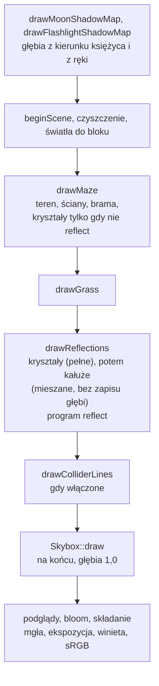

# Moduł renderer: environment mapping, odbicia i załamania nieba na kryształach i w kałużach

Kamień milowy: M8, część 1 (environment mapping). Selekcja obiektów (temat 15) i dźwignie z kartkami, czyli "M8, podstawy bez okna", nie należą do tego dokumentu. Temat wykładu: 12 (Environment mapping), **w trakcie**: obraz obejrzał dotąd tylko agent (zrzuty ekranu z 2026-10-06), a testy ręczne właściciela i macOS są otwarte (sekcja 5.12).
Kod: formuły i ustawienia bez OpenGL [`src/game/EnvironmentMapping.hpp`](../../../src/game/EnvironmentMapping.hpp) i [`EnvironmentMapping.cpp`](../../../src/game/EnvironmentMapping.cpp), kałuże jako dane [`src/game/Puddles.hpp`](../../../src/game/Puddles.hpp) i [`Puddles.cpp`](../../../src/game/Puddles.cpp), rysowanie kałuż [`src/game/PuddleRenderer.hpp`](../../../src/game/PuddleRenderer.hpp) i [`PuddleRenderer.cpp`](../../../src/game/PuddleRenderer.cpp), shadery [`assets/shaders/reflect.vert`](../../../assets/shaders/reflect.vert) i [`reflect.frag`](../../../assets/shaders/reflect.frag), przebieg odbić w [`src/game/NightMazeApp.cpp`](../../../src/game/NightMazeApp.cpp) (`drawReflections`, `crystalsReflect`, `drawGateAndCrystals`, `layPuddles`), połówki `drawGate` i `drawCrystals` w [`src/game/GameplayRenderer.cpp`](../../../src/game/GameplayRenderer.cpp), nazwy uniformów i jednostka tekstury w [`src/game/ShaderUniforms.hpp`](../../../src/game/ShaderUniforms.hpp), dostęp do tekstury nieba w [`src/game/Skybox.hpp`](../../../src/game/Skybox.hpp) (`cubemap()`), panel [`src/debug/categories/WorldCategory.cpp`](../../../src/debug/categories/WorldCategory.cpp), testy w [`tests/EnvironmentMappingTests.cpp`](../../../tests/EnvironmentMappingTests.cpp) i [`tests/PuddleTests.cpp`](../../../tests/PuddleTests.cpp).

Dlaczego ten dokument stoi w katalogu `renderer`, chociaż klasy nazywają się `game::PuddleRenderer` i leżą w `src/game/`, wyjaśnia [`README.md`](README.md) (to samo co przy niebie: [`../../decisions/skybox-in-game-layer.md`](../../decisions/skybox-in-game-layer.md), i przy cieniach: [`../../decisions/post-process-in-game-layer.md`](../../decisions/post-process-in-game-layer.md)). Dokument zakłada znajomość tekstury sześciennej i nieba ([`skybox.md`](skybox.md), [`../gfx/cubemap.md`](../gfx/cubemap.md)), światła w shaderze fragmentów ([`lighting-gouraud-phong.md`](lighting-gouraud-phong.md)), macierzy normalnych ([`../scene/transforms.md`](../scene/transforms.md)), kryształów i ich świecenia ([`../game/gameplay.md`](../game/gameplay.md)) oraz bloomu ([`post-process.md`](post-process.md)). Cieni, które dostają kałuże, dotyczy [`shadows.md`](shadows.md).

**Stan na dziś (2026-10-06):** kryształy i kałuże pokazują niebo. Kryształ odbija i załamuje teksturę sześcienną nieba, a suwak między odbiciem a załamaniem jest w panelu. Kałuże leżą w części korytarzy i odbijają to samo niebo, tym mocniej, im bardziej płasko na nie patrzę. Do kodu doszedł czternasty program shaderów, `reflect` (po jedenastu starych oraz `minimap` i `minimap_overlay`), i trzynasty panel, **Environment**. Kryształy są rysowane **osobnym przebiegiem** po trawie i przed niebem (sekcja 3.3), a kałuże tym samym przebiegiem, **po kryształach, z mieszaniem kolorów** (sekcje 2.11 i 2.12, 3.3). Kałuża jest cienką warstwą wody, która **idzie za gruntem** (każdy wierzchołek 8 mm nad `Terrain::heightAt`), ma miękki brzeg i przepuszcza grunt w środku. Po pierwszym obejrzeniu obrazu (sekcja 5.12) kałuża została przerobiona: w poprzedniej wersji była płaską tarczą na najniższym gruncie, o 16 narożnikach, nieprzezroczystą i ciemną ([`../../decisions/puddle-on-lowest-ground.md`](../../decisions/puddle-on-lowest-ground.md), zastąpiona przez [`../../decisions/puddles-follow-the-ground.md`](../../decisions/puddles-follow-the-ground.md)).

**Decyzja właściciela projektu (2026-10-06), w całości:** environment mapping jest pokazany na kryształach i w kałużach. Kryształy odbijają i załamują teksturę sześcienną nocnego nieba, a suwak daje wybór między jednym a drugim. Płaskie kałuże w niektórych komórkach korytarzy odbijają to samo niebo. **Wszystko inne to wybory wykonawcze**, każdy z powodem z komentarzy w kodzie: osobny program zamiast gałęzi w `lit.frag` ([`../../decisions/reflect-own-program-and-pass.md`](../../decisions/reflect-own-program-and-pass.md)), wartości widoczne zamiast fizycznych ([`../../decisions/visible-effect-over-physical-values.md`](../../decisions/visible-effect-over-physical-values.md)), a także liczby w sekcjach 2.10 i 5. **Kształt kałuży zmieniły dwie decyzje właściciela z 2026-10-06, podjęte po obejrzeniu zrzutów:** kałuże idą za gruntem ([`../../decisions/puddles-follow-the-ground.md`](../../decisions/puddles-follow-the-ground.md), poprzednia reguła "najniższy grunt" jest w notatce [`../../decisions/puddle-on-lowest-ground.md`](../../decisions/puddle-on-lowest-ground.md), **zastąpionej**) i woda ma być lepiej widoczna: jaśniejszy odcień, mocniejsze odbicie, miękki brzeg, więcej narożników (uzupełnienie w [`../../decisions/visible-effect-over-physical-values.md`](../../decisions/visible-effect-over-physical-values.md)). Przezroczystość środka kałuży (grunt widać przez wodę) jest **wyborem autora poprawek**, nie decyzją właściciela, i wychodzi poza jego listę.

**Czego ten dokument nie twierdzi.** Trzy rodzaje dowodów trzymam osobno.

1. **Zgłoszone przez bramkę** (Windows, 2026-10-06, scalone drzewo z poprawkami kałuż): `make check` przechodzi, **467 przypadków testowych i 158006 asercji** (przed poprawkami 466 i 152264). Przybył jeden przypadek w `tests/PuddleTests.cpp` (21 zamiast 20, policzone z pliku), a liczby asercji zmieniły się także w przerobionych testach kałuż, więc różnicy 5742 asercji nie przypisuję jednemu przypadkowi. Start programu Debug na około 8 sekund: 31 linii logu, pusty standardowy strumień błędów, żadnej linii błędu. Wcześniej, przy samej tej części (bez kałuż po poprawkach): 445 przypadków i 150296 asercji dla scalonego drzewa po minimapie (414 plus 31: 11 przypadków w `tests/EnvironmentMappingTests.cpp` i 20 w `tests/PuddleTests.cpp`).
2. **Widziane na zrzucie ekranu przez agenta (2026-10-06), nie przez właściciela.** Agent uruchomił grę (Release, commit `9a33f18`, 1280 x 720, RTX 4070 Ti SUPER, sterownik zgłaszający OpenGL 4.1.0 NVIDIA 610.74) i obejrzał zrzuty kryształów i kałuż, a po poprawkach drugi agent obejrzał nową kałużę. Co dokładnie widziano, a czego nie: sekcja 5.12. Ustawienia były zmieniane **tymczasowym hakiem testowym**, który pisał te same pola co panele, więc punkty typu "odznacz X w panelu" są potwierdzone co do efektu, nie co do widżetu.
3. **Otwarta lista właściciela:** testy ręczne ([`../../guides/build-windows.md`](../../guides/build-windows.md), sekcja 23) nie są wykonane, macOS nie był budowany, tagu nie ma. Żadnego zdania "wygląda dobrze" nie opieram na ocenie właściciela, bo jej nie ma.

Liczby o wyglądzie w tym dokumencie, które nie są w punkcie 2 (tabela Fresnela, jasność nieba na kryształach, przezroczystość w tabeli sekcji 2.12) są **policzone ze wzorów albo przepisane z komentarzy kodu i testów**.

## 1. Po co to jest

Do M7 kryształ był kolorową bryłą, która świeci. Niebo było tłem za ścianami. Nic w grze nie **pokazywało** nieba poza samym tłem, więc kryształ nie wyglądał jak coś gładkiego, a podłoga nie wyglądała jak mokra.

**Environment mapping** (mapowanie otoczenia) pozwala powierzchni pokazać otoczenie bez liczenia, co naprawdę leży w jej stronę. Zamiast śledzić promienie przez scenę (za drogie na każdy piksel w grze), karta czyta **gotowy obraz otoczenia**: tekstura sześcienna nieba już istnieje, bo rysuje ją skybox. Potrzebne są do tego cztery rzeczy:

| Rzecz | Gdzie | Sekcja |
|---|---|---|
| kierunek promienia odbitego i załamanego dla każdego fragmentu | funkcje `reflect` i `refract` w `reflect.frag`, ich kopie w C++ (`reflectDirection`, `refractDirection`) | 2.2 do 2.4 |
| odczyt tekstury sześciennej tym kierunkiem, w przestrzeni świata | `texture(uEnvironmentMap, direction)` | 2.5, 2.6 |
| kolor powierzchni: część oświetlona i część nieba, świecenie na wierzchu | `mix` i dodanie `uEmissive` | 2.7, 2.9 |
| miejsca, w których jest co pokazać: kryształy i kałuże | `game::Puddles`, `game::PuddleRenderer` | 2.10 do 2.12 |

To jest temat 12 wykładu, "Environment mapping". Technika **ma znane ograniczenie**: pokazuje tylko niebo (sekcja 2.1). Kryształ nie odbija ścian, kałuża nie odbija kryształu stojącego obok. To jest cena za brak śledzenia promieni i jest zapisane w komentarzach kodu.

## 2. Teoria

### 2.1 Co robi environment mapping i czego nie umie

**Pomysł.** Błyszcząca powierzchnia pokazuje to, co leży w kierunku, w którym odbija się spojrzenie. Dla każdego fragmentu powierzchni karta liczy kierunek promienia, który wychodzi z oka, odbija się od powierzchni (albo załamuje na jej wejściu) i leci dalej. Potem **czyta teksturę sześcienną w tym kierunku**: kolor, który tam jest, to kolor "otoczenia" widziany w tym fragmencie.

**Co z tego wynika.** Tekstura sześcienna jest obrazem z jednego punktu, środka sześcianu. Odczyt kierunkiem nie zna odległości. Stąd trzy skutki, które są granicami techniki i które obowiązują w tej grze:

| Skutek | Co to znaczy w grze |
|---|---|
| Otoczeniem jest **tylko niebo** | tekstura sześcienna ma niebo i nic więcej (gwiazdy, Drogę Mleczną, księżyc). Ściana stojąca w kierunku odbicia **nie jest w teksturze**, więc nie jest odbita. Kryształ pokazuje niebo także tam, gdzie z jego strony stoi ściana. Kałuża pod ścianą pokazuje niebo, nie ścianę |
| Brak paralaksy | ten sam kierunek daje ten sam kolor niezależnie od miejsca. Gdy gracz idzie, odbicie w kałuży nie przesuwa się względem kałuży tak, jak przesuwałoby się prawdziwe odbicie bliskiego obiektu. Niebo jest "nieskończenie daleko", więc dla samego nieba to jest akurat poprawne |
| Gracz, kryształy i ściany nie są odbijane | postać gracza, inne kryształy i ściany nie istnieją dla odczytu. Tak samo nie ma odbicia latarki ani plamy jej światła |

Metoda działa dobrze dla czegoś, co odbija **daleko od siebie** (niebo, horyzont), i źle dla odbić bliskich obiektów. To dobór świadomy: gra ma tylko niebo do pokazania. Odbicia bliskich obiektów wymagałyby renderowania sceny do osobnej tekstury (dodatkowy przebieg), a tego w M8 nie ma.

### 2.2 Odbicie: wzór `R = I - 2 dot(N, I) N`

Dane: `I` to kierunek promienia, który **leci w stronę powierzchni** (od oka do fragmentu), `N` to normalna powierzchni, obie o długości 1. Szukane: kierunek `R` po odbiciu.

Rozłóżmy `I` na dwie części: równoległą do powierzchni i prostopadłą do niej. Część prostopadła to rzut na normalną, `dot(N, I) * N`. Część równoległa to reszta, `I - dot(N, I) * N`. Zwierciadło **zostawia część równoległą i odwraca prostopadłą**:

```text
R = (I - dot(N, I) N)  -  dot(N, I) N  =  I - 2 dot(N, I) N
```

```text
              N
              ^
              |
   I          |          R
    \         |         /
     \        |        /
      \       |       /
       v      |      v
  ------------+------------   powierzchnia
        punkt odbicia
```

`I` schodzi w dół ku powierzchni, `R` odchodzi w górę, pod tym samym kątem do normalnej co `I`. Wzór jest jednym zdaniem: odejmij dwukrotnie ten kawałek `I`, który idzie pod prąd normalnej. Odjęcie go raz zostawiłoby promień ślizgający się po powierzchni, odjęcie dwa razy odsyła go z powrotem pod tym samym kątem. Wynik ma tę samą długość co `I`. GLSL ma tę samą funkcję pod nazwą `reflect(I, N)`, a `reflectDirection` w C++ jest jej kopią.

Liczby ze sprawdzanego testu `a ray that hits a level mirror keeps its level part and turns its vertical part`: dla poziomego lustra (`N = (0, 1, 0)`) promień schodzący pod kątem 45 stopni ku +X, `I = (0,707, -0,707, 0)`, wychodzi jako `R = (0,707, 0,707, 0)`. Poziomy kawałek się nie zmienia, odwraca się tylko `y`. Promień prosto w dół, `(0, -1, 0)`, wraca prosto w górę. Promień wzdłuż powierzchni, `(1, 0, 0)`, nie zmienia się wcale (`dot = 0`).

Dla kałuży (zawsze `N = (0, 1, 0)`) wniosek jest prosty i przydatny przy pokazie: to, co widzę w kałuży, to niebo w kierunku mojego spojrzenia **z odwróconym `y`**. Patrząc w dół pod kątem 50 stopni widzę niebo 50 stopni nad horyzontem w tym samym kierunku poziomym (sekcja 8, ćwiczenie 4).

### 2.3 Załamanie: prawo Snella i wzór na `refract`

Gdy promień wchodzi z jednego ośrodka do drugiego (z powietrza do szkła), zmienia kierunek. **Prawo Snella**:

```text
n1 * sin(kąt przed) = n2 * sin(kąt po)
```

Kąty są mierzone od normalnej. `n1` i `n2` to **współczynniki załamania** ośrodków (jak wolno światło biegnie w nich w porównaniu z próżnią): powietrze 1,0, woda 1,33, szkło 1,5 (stałe `AIR_REFRACTIVE_INDEX`, `WATER_REFRACTIVE_INDEX`, `GLASS_REFRACTIVE_INDEX`). Kryształ kwarcu ma około 1,54, więc szkło jest dobrym przybliżeniem (komentarz przy `AIR_TO_GLASS_RATIO`).

**Stosunek `eta`.** GLSL funkcja `refract(I, N, eta)` przyjmuje trzeci argument `eta = n1 / n2`: współczynnik ośrodka, **z którego** promień wychodzi, podzielony przez współczynnik ośrodka, **do którego** wchodzi. Powietrze do szkła to `1 / 1,5 = 0,667` (stała `AIR_TO_GLASS_RATIO`, wartość startowa suwaka). Liczba mniejsza od 1 znaczy "wchodzę do gęstszego ośrodka": promień **zbliża się do normalnej**.

**Wyprowadzenie wzoru.** Niech `c = dot(N, I)` (liczba ujemna, bo promień idzie pod prąd normalnej). Część równoległa do powierzchni: `I - c N`. Prawo Snella mówi, że sinus (czyli długość części równoległej) mnoży się przez `eta`, więc nowa część równoległa to `eta * (I - c N)`. Część prostopadła po załamaniu ma długość równą cosinusowi nowego kąta i dalej idzie pod prąd normalnej: `-sqrt(k) N`, gdzie `k` to cosinus kwadrat nowego kąta. Z jedynki trygonometrycznej:

```text
k = 1 - eta^2 * (1 - c^2)
T = eta * (I - c N) - sqrt(k) N  =  eta * I - (eta * c + sqrt(k)) * N
```

To jest dokładnie treść `refractDirection` w C++ i `refract` w GLSL (komentarze w `EnvironmentMapping.hpp` i `reflect.frag` mają ten sam wzór). Wynik ma długość 1, gdy `I` i `N` mają długość 1.

**Liczby z testu** `a refracted ray obeys Snell's law` (powietrze do szkła, `eta = 0,667`, promień pada na poziomą powierzchnię pod kątem od normalnej):

| Kąt przed | `sin(kąt przed)` | razy `eta` | Kąt po |
|---|---|---|---|
| 10 stopni | 0,174 | 0,116 | 6,6 stopnia |
| 30 stopni | 0,500 | 0,333 | 19,5 stopnia |
| 45 stopni | 0,707 | 0,471 | 28,1 stopnia |
| 60 stopni | 0,866 | 0,577 | 35,3 stopnia |
| 85 stopni | 0,996 | 0,664 | 41,6 stopnia |

Kolumna "kąt po" jest policzona ze wzoru, test sprawdza sinus (`sineFromVertical(refracted) == eta * sin(kąt)`). Najpłytszy promień (prawie wzdłuż powierzchni) załamuje się najwyżej do `asin(0,667) = 41,8` stopnia: tyle wynosi **największe odchylenie** stożka, w którym promienie wchodzą do szkła. Dwie szczególne sprawy z testu `a ratio of 1 does not bend the ray, and a ray along the normal is never bent`: `eta = 1` nie zmienia kierunku wcale, a promień idący dokładnie wzdłuż normalnej (kąt 0) nie zmienia go przy żadnym `eta`.

**Skąd w grze "załamanie" kryształu.** Kryształ rysowany jest jedną powierzchnią, więc kod liczy **jedno załamanie**: promień wchodzący do kryształu. Prawdziwy promień załamałby się jeszcze raz przy wyjściu z tyłu kryształu, a ta druga powierzchnia jest nieznana. Komentarz w `reflect.frag` mówi wprost: pozostaje obrazem, który czyta się jak szkło. To kolejne uproszczenie, nie błąd.

### 2.4 Kąt krytyczny i całkowite wewnętrzne odbicie

Gdy `eta` jest **większe od 1** (promień wychodzi z gęstszego ośrodka do rzadszego, szkło do powietrza), wzór daje `k < 0` dla płytkich kątów: nowy sinus wyszedłby większy od 1, a takiego kąta nie ma. Promień **w ogóle nie wychodzi**: całe światło się odbija z powrotem (**całkowite wewnętrzne odbicie**, total internal reflection). Granica to **kąt krytyczny**:

```text
sin(kąt krytyczny) = 1 / eta
```

Liczby z testu `total internal reflection: no refracted ray past the critical angle` (szkło do powietrza, `eta = 1,5`): kąt krytyczny `asin(1 / 1,5) = 41,81` stopnia. Test bierze promień o 1 stopień **przed** granicą (wychodzi załamany, odchylony **od** normalnej, jego sinus jest większy niż przed) i o 1 stopień **za** granicą (brak promienia). Dla wody do powietrza (`eta = 1,33`) granica to 48,75 stopnia (policzone, test jej nie sprawdza).

**Co `refract` zwraca w tym przypadku.** Wektor zerowy `(0, 0, 0)` (jest to w specyfikacji GLSL i test sprawdza to samo dla `glm::refract`). Zero **nie jest kierunkiem**, a odczyt tekstury sześciennej wektorem zerowym daje kolor nieokreślony. Dlatego jest funkcja `refractOrReflect`: bierze `refract`, a gdy wynik to dokładnie wektor zerowy, oddaje `reflect`. Całe światło i tak się odbija, więc odbity promień jest tu **fizycznie dobrą odpowiedzią**, nie łataniem. Porównanie z zerem jest dokładne: poprawny załamany promień ma długość 1, więc tylko odpowiedź "brak promienia" jest zerem (komentarz w `EnvironmentMapping.cpp`). Test `refractOrReflect falls back to the mirrored ray and never returns no direction` sprawdza całą siatkę suwaka (od 0,4 co 0,1 do 1,5) razy kąty co 5 stopni: wynik zawsze ma długość 1.

**Kiedy to się zdarza w grze.** Powietrze do kryształu ma `eta < 1`, więc `k = 1 - eta^2 sin^2 >= 1 - eta^2 > 0`: **całkowite odbicie nie występuje** przy `eta` poniżej 1 (test `Air into a crystal ... is never a total internal reflection` sprawdza to dla wartości startowej). Pojawia się dopiero, gdy suwak `Refraction ratio` ustawię **powyżej 1** (zakres kończy się na 1,5, stała `MAX_REFRACTION_RATIO`). Zakres sięga tam wyłącznie po to, żeby to zjawisko dało się pokazać (komentarz przy stałej): kryształ oglądany z zewnątrz nigdy nie wychodzi z gęstszego ośrodka.

### 2.5 Odczyt tekstury sześciennej kierunkiem w przestrzeni świata

`texture(uEnvironmentMap, direction)` to ten sam odczyt, który robi `skybox.frag` (sekcje 2.1 do 2.3 w [`skybox.md`](skybox.md)): kierunek wybiera ścianę i teksel. Długość kierunku nie ma znaczenia.

**Dlaczego przestrzeń świata.** Tekstura sześcienna nieba jest **przyczepiona do świata**: kierunek `(0, 1, 0)` to zawsze "prosto w górę", a księżyc jest w kierunku `(-0,272, 0,766, 0,583)` ([`skybox.md`](skybox.md), sekcja 2.9), niezależnie od tego, gdzie patrzy kamera. Aby odczyt dał ten sam obraz, który widać za ścianami, kierunek odbicia musi być wyrażony w tej samej przestrzeni. Dlatego `reflect.vert` liczy pozycję i normalną w przestrzeni **świata** (`vWorldPosition`, `vNormal`), a promień padający to `normalize(vWorldPosition - uCameraPosition.xyz)`, oko wzięte z bloku świateł (też w przestrzeni świata). Gdyby kierunek policzyć w przestrzeni widoku, niebo w odbiciu obracałoby się razem z kamerą i księżyc w kałuży wędrowałby po ekranie. To jest ta sama pułapka co `mat3(uView) * aPosition` w niebie ([`skybox.md`](skybox.md), sekcja 7, punkt 8).

### 2.6 Dlaczego odczyt jest mnożony przez jasność nieba

Tekstura sześcienna jest teksturą sRGB, więc odczyt daje już wartość liniową ([`skybox.md`](skybox.md), sekcja 5.9, [`../gfx/color-space.md`](../gfx/color-space.md)). Ale niebo na ekranie nie jest samym odczytem: `skybox.frag` mnoży go przez `uBrightness` (suwak `Sky brightness`, startowo 2,2), bo pliki są ciemne, a bufor sceny jest HDR. Odbicie musi mieć **tę samą jasność co niebo za ścianami**. Inaczej gwiazda w kałuży byłaby 2,2 razy ciemniejsza niż ta sama gwiazda na niebie, a księżyc w kałuży nie byłby tą samą tarczą. Dlatego `environmentColor` zwraca `texture(...).rgb * uSkyBrightness`, a C++ ustawia `uSkyBrightness` na `m_skyboxSettings.brightness`: **ta sama liczba, ten sam suwak**.

Dla porównania liczby policzone z dokumentu nieba ([`skybox.md`](skybox.md), sekcja 5.6): zenit razy 2,2 to około `(0,0017, 0,0027, 0,0077)`, tarcza księżyca (piksel `(200, 207, 224)`) po zamianie na wartość liniową i pomnożeniu przez 2,2 to około `(1,3, 1,4, 1,6)`. Niebo na kryształach jest więc w większości **bardzo ciemne** wobec świecenia (sekcja 2.7), a jasna jest tylko tarcza księżyca i najjaśniejsze gwiazdy. To rachunek, nie obserwacja.

**Gdy nieba nie ma.** Pole `Skybox` w kategorii Render można odznaczyć, a pliki nieba mogą się nie wczytać. Wtedy tłem klatki jest kolor czyszczenia i **taki kolor pokazuje lustro w każdym kierunku**. Odpowiada za to `uSkyVisible` (0 albo 1) i `uBackground` (kolor czyszczenia w wartości liniowej: ten sam `srgbToLinear`, którym `onRender` czyści ekran). Bez tego kryształ i kałuża pokazywałyby niebo, którego na ekranie nie ma.

### 2.7 Kolor kryształu: wzór i dlaczego świecenie jest poza `mix`

Kryształ ma dwa składniki koloru: **światło** (część oświetlona: tekstura razy rozproszenie plus odbłysk) i **własne świecenie** (`uEmissive`). W `reflect.frag`:

```text
surface  = texture(uTexture, vUv).rgb * uTint
litColor = surface * diffuse + specular
kolor    = mix(litColor, environment, strength) + surface * uEmissive
```

`environment` to niebo wybrane przez suwak "załamanie albo odbicie" (sekcja 2.8), a `strength` to udział nieba w kolorze (suwak `Sky share`, startowo 0,5). `mix(a, b, t) = a * (1 - t) + b * t`: przy 0 zostaje powierzchnia oświetlona, przy 1 zostaje samo niebo.

**Dlaczego świecenie jest dodawane po `mix`, a nie mieszane.** Bloom (poświata, [`post-process.md`](post-process.md)) znajduje kryształy po tym, że są jaśniejsze od progu. Gdyby świecenie było w `litColor`, to `mix` ze `strength = 0,5` obcięłby je o połowę, a niebo na kryształach (ciemne, sekcja 2.6) nic by nie dołożyło. Poświata by osłabła albo zniknęła. Notatka [`../../decisions/crystal-glow-raised-for-bloom.md`](../../decisions/crystal-glow-raised-for-bloom.md) pokazuje, jak mało zapasu nad progiem 0,8 ma świecenie w najciemniejszej chwili pulsu. Dlatego `+ surface * uEmissive` stoi **na zewnątrz** `mix`: kryształ świeci dalej tyle samo, ile świecił bez efektu (w komentarzu: "with a strength of 0 this line gives exactly the colour of lit.frag"), a bloom go nadal znajduje.

**Ile to jest w liczbach (policzone; agent widział na zrzucie tylko słaby odcień nieba przy pełnym świeceniu, zgodny z punktem 1 niżej).** Z notatki o bloomie: świecenie przed pomnożeniem przez teksturę ma jasność około 2,45 przy pulsie 1 i około 1,72 przy pulsie 0,7. Niebo na kryształach (sekcja 2.6) to w większości kilka tysięcznych, a jasna tarcza księżyca 1,3 do 1,6. Przy wartościach startowych (`Sky share` 0,5) kolor to **połowa koloru oświetlonego plus połowa nieba plus całe świecenie**. Dwie rzeczy z tego wynikają:

1. Niebo jest na kryształach **słabą domieszką** przy świeceniu 1: komentarz przy `crystalGlowShare` mówi to samo ("a faint tint"). Aby zobaczyć odbicie i załamanie wyraźnie, jest suwak `Glow` (sekcja 6), który zmniejsza świecenie **tylko w tym przebiegu**. Zabiera przy tym poświatę bloomu razem ze świeceniem, ale **nie zmienia światła punktowego nad kryształem**, które oświetla otoczenie.
2. `mix` przy `Sky share` 0,5 **zmniejsza o połowę część oświetloną** kryształu (światło otoczenia, księżyca, latarki, własnych świateł na nim). Kryształ jest więc ciemniejszy w części oświetlonej niż bez efektu. Czy to się komuś rzuca w oczy, nikt nie oceniał (agent tego nie wymienił): jest na liście sprawdzeń.

### 2.8 Jeden interfejs: tylko załamanie wchodzące

Kryształ ma suwak `Refract / reflect` od 0 (sama załamana część) do 1 (sama odbita): `environment = mix(sky(refracted), sky(reflected), uReflectShare)`. Obie wartości są czytane z tej samej tekstury sześciennej innymi kierunkami, jeden z `refractOrReflect`, drugi z `reflect`. **Załamanie jest policzone jeden raz**, na wejściu do kryształu (sekcja 2.3). To świadome uproszczenie: kryształ jest rysowany jedną siatką bez drugiej powierzchni, a po załamaniu kolor czyta się od razu z nieba. Skutek: "szkło" w grze zmienia kierunek raz, a nie dwa razy. Kryształ nie ma więc "grubości", której promień musiałby przejść.

Dla **kałuż** `uReflectShare` jest zawsze 1 (stała `MIRROR_ONLY` w `NightMazeApp.cpp`): kałuża tylko odbija. Załamanie wody (`1 / 1,33 = 0,75`) jest w tooltipie suwaka, ale kałuża go nie używa.

### 2.9 Fresnel i przybliżenie Schlicka

Prawdziwa powierzchnia nie odbija tyle samo przy każdym kącie. Patrząc **prosto w dół** na wodę widzę dno (odbija się około 2 procent światła). Patrząc **płasko**, pod kątem muśnięcia, woda staje się lustrem. To jest **efekt Fresnela**. Dokładne wzory są kłopotliwe, więc grafika używa **przybliżenia Schlicka**:

```text
F = F0 + (1 - F0) * (1 - cosine)^5
```

`cosine` to cosinus kąta między normalną a kierunkiem **do oka** (1: patrzę prosto na powierzchnię, 0: patrzę wzdłuż niej), `F0` to udział odbitego światła przy spojrzeniu prosto w dół. Przy `cosine = 1` wzór daje `F0`, przy `cosine = 0` daje 1. Wykładnik 5 to stała `SCHLICK_EXPONENT` (w C++ i w GLSL, komentarz każe je trzymać zgodnie). `cosine` jest obcinany do 0..1 (powierzchnia widziana od tyłu nie daje wartości spoza zakresu). W shaderze: `fresnelSchlick(dot(normal, -incident), uEnvironmentStrength)`, czyli `F0` to suwak.

**Skąd `F0 = 0,02` dla wody.** Z teorii: `((n2 - n1) / (n2 + n1))^2 = (0,33 / 2,33)^2 = 0,020`. Ten rachunek **nie jest w kodzie**: kod ma tylko liczbę 0,02 w komentarzu i w teście.

**Tabela dla kałuży.** Model z testu `why the default reflectivity of a puddle is far above the one of real water`: płaski grunt, oczy `1,7 m` nad nim (`Player::EYE_HEIGHT`), kałuża w odległości poziomej `d`. Cosinus kąta to `1,7 / sqrt(1,7^2 + d^2)`.

| `d` (poziomo) | `cosine` | kąt od normalnej | `F` dla `F0 = 0,02` (woda naprawdę) | `F` dla `F0 = 0,5` (wartość startowa) | pokrycie gruntu przez wodę w środku kałuży (sekcja 2.12) |
|---|---|---|---|---|---|
| 0 (pod stopami) | 1,000 | 0 stopni | 0,020 | 0,500 | 0,850 |
| 1 m | 0,862 | 30,5 stopnia | 0,020 | 0,500 | 0,850 |
| 2 m (następna komórka) | 0,648 | 49,6 stopnia | 0,025 | 0,503 | 0,851 |
| 4 m | 0,391 | 67,0 stopni | 0,102 | 0,542 | 0,863 |
| 8 m | 0,208 | 78,0 stopni | 0,326 | 0,656 | 0,897 |
| 16 m | 0,106 | 83,9 stopnia | 0,581 | 0,786 | 0,936 |

Policzyłem tabelę ze wzoru (ostatnia kolumna ze wzoru `0,7 + 0,3 F` z sekcji 2.11). Do poprawek po obejrzeniu obrazu wartością startową było `F0 = 0,35` (kolumna wtedy: 0,350, 0,350, 0,354, 0,404, 0,553, 0,722). Test sprawdza cztery nierówności: dla wody `F < 0,03` w 2 m i `F < 0,11` w 4 m, dla wartości startowej **wziętej z `EnvironmentSettings{}`** `F > 0,35` w 2 m i `F > 0,5` w 8 m. Progi są stałymi liczbami, więc test przechodzi także po zmianie wartości startowej z 0,35 na 0,5. Wniosek ten sam co w teście: **prawdziwa woda ledwo coś pokazuje** (kałuża w następnej komórce odbija 2,5 procent ciemnego nieba), więc wartością startową jest `F0 = 0,5`. To wybór widocznego efektu zamiast wartości fizycznych ([`../../decisions/visible-effect-over-physical-values.md`](../../decisions/visible-effect-over-physical-values.md), z uzupełnieniem z 2026-10-06 o nową wartość).

**Dla kryształów Fresnel jest wyłączony** (`uFresnelEnabled = 0` w `drawReflections`): ten sam udział nieba przy każdym kącie. To również część tej samej decyzji: kryształ ma pokazywać to, co ustawi suwak, nie to, co wynika z kąta.

### 2.10 Kałuże: rozmieszczenie z ziarna

Kałuże są **dekoracją**: nie przeszkadzają w ruchu, żadna reguła rundy o nich nie wie. Dane (które komórki, jaki rozmiar) są zwykłą logiką bez OpenGL ([`Puddles.hpp`](../../../src/game/Puddles.hpp)), więc mają testy.

**Ile.** `puddleCountFor(wolne komórki, udział)`: `lround(wolne * udział)`, ograniczone do liczby wolnych komórek, 0 dla udziału 0 albo ujemnego. Wolne komórki to wszystkie **oprócz startu, wyjścia i komórek z kryształem** (start: gracz stałby w kałuży od pierwszej chwili, wyjście: brama zapada się w ziemię, kryształ: to miejsce już ma na co patrzeć). W labiryncie startowym 10 na 10: `100 - 1 - 1 - 13 = 85` wolnych komórek (13 kryształów: jeden na `CELLS_PER_CRYSTAL = 8` komórek), więc udział `DEFAULT_PUDDLE_SHARE = 0,15` daje `lround(12,75) = 13` kałuż (test `the default maze has 13 puddles at the default share`). Suwak sięga `MAX_PUDDLE_SHARE = 0,5`: `lround(42,5) = 43` kałuże (policzone, nie testowane dla tej liczby). Test sprawdza także `puddleCountFor(85, 1,0) = 85` i `puddleCountFor(85, 3,0) = 85`, choć suwak do 1 nie sięga.

**Które komórki.** Generator `std::mt19937` z ziarnem `seed + PUDDLE_SEED_OFFSET`, gdzie `PUDDLE_SEED_OFFSET = 4000037`. Przesunięcie sprawia, że kałuże nie powtarzają liczb, którymi wycięto labirynt, wylosowano kryształy, trawę, dźwignie i kartki (komentarz przy stałej: "any number other than those offsets would do"). Wolne komórki są ułożone wierszami, **potasowane** własnym tasowaniem Fishera-Yatesa na `randomBelow` (z tego samego powodu co w `Crystals.cpp`: `std::shuffle` różni się między bibliotekami standardowymi, [`../../decisions/deterministic-random.md`](../../decisions/deterministic-random.md)) i kałuże dostają **pierwsze `count` komórek** z tej listy.

**Dlaczego większy udział zachowuje istniejące kałuże.** Tasowanie dzieje się **zawsze pierwsze i tak samo** (nie zależy od udziału). Dopiero po nim, dla pierwszej, drugiej, trzeciej komórki z listy, losowane są trzy liczby: przesunięcie w X, przesunięcie w Z, promień. Udział decyduje tylko o tym, **ile** komórek z początku listy dostaje kałużę. Suwak przesunięty w górę dodaje kałuże na końcu listy i nie rusza tych, które były (test `a larger share keeps every puddle of a smaller share and adds more`). Zmiana suwaka nie przetasowuje więc całej mapy.

**Rozmiar i miejsce.** Promień od `PUDDLE_MIN_RADIUS = 0,25` do `PUDDLE_MAX_RADIUS = 0,45 m`, środek przesunięty od środka komórki najwyżej o `PUDDLE_MAX_OFFSET = 0,3 m` na każdej osi. Wartość losowa z `randomBetween` to jeden z 33 równych kroków (`RANDOM_STEPS = 32`): liczba całkowita z `randomBelow` zamieniona na float, czyli ta sama na każdym systemie (`std::uniform_real_distribution` tego nie obiecuje).

**Dlaczego kałuża nie dotyka ściany.** Kałuża sięga najwyżej `0,3 + 0,45 = 0,75 m` od środka komórki. Pudełko kolizji ściany zaczyna się 0,85 m od środka (połowa komórki 2 m minus połowa grubości 0,3 m), a stopa ściany albo słupka 0,8 m (`FOOTPRINT_MARGIN = 0,05`). Test `the puddle constants keep a puddle inside its cell, clear of the walls` sprawdza `reach == 0,75 < wallFoot == 0,8`, a test `no puddle reaches a wall, a pillar or the gate` robi to samo na prawdziwym świecie, dla każdej kałuży, z promieniem i marginesem.

**Powtarzalność.** Ten sam labirynt, ziarno, start, wyjście, kryształy i udział dają te same kałuże na każdym kompilatorze. Test złoty `golden maze: 4 x 4 cells from seed 1 has exactly these puddles` przypina sześć komórek i pierwszą kałużę w całości (przesunięcie `-0,24375` i `0,05625`, promień `0,275`). **Teren nie jest pytany** przy wyborze: nowa skala wysokości nie przesuwa kałuży do innej komórki, tylko podnosi lub opuszcza jej wodę (test `another height scale moves the puddles up or down and nowhere else`).

**Trawa.** Pas trawy przy ścianie leży w odległości od `GRASS_WALL_GAP = 0,06` do `0,06 + 0,22 = 0,28 m` od pudełka ściany, czyli 0,57 do 0,79 m od środka komórki. Kałuża sięga 0,75 m. **Kępka może więc stać w kałuży przy jej brzegu.** Kod tego nie wyklucza: to punkt do obejrzenia (sekcja 5.12). Dźwignie i kartki wiszą na ścianach na wysokości 1,2 i 1,5 m, więc nie dotykają kałuż na ziemi.

### 2.11 Siatka kałuży, miękki brzeg i mieszanie

**Siatka: pajęczyna zamiast tarczy.** Kałuża to jeden wierzchołek w środku i `PUDDLE_RINGS` = 6 pierścieni, każdy z `PUDDLE_CORNERS` = 32 wierzchołkami. Razem `PUDDLE_VERTEX_COUNT = 1 + 6 * 32 = 193` wierzchołki i `PUDDLE_TRIANGLE_COUNT = 32 * (2 * 6 - 1) = 352` trójkąty (1056 indeksów). Najbardziej wewnętrzny pierścień łączy się ze środkiem jednym trójkątem na narożnik (32), każdy następny z pierścieniem wewnątrz dwoma (pięć pierścieni razy 64 to 320, `32 + 320 = 352`). Trzydzieści dwa narożniki to 99,4 procent koła (komentarz stałej), więc brzeg jest okrągły. Pierścienie leżą na równych częściach promienia, więc dwa sąsiednie wierzchołki wzdłuż promienia są od siebie najwyżej `0,45 / 6 = 7,5 cm`, a wzdłuż obwodu najwyżej około 8,8 cm (policzone). Teren ma siatkę 0,5 m (`TERRAIN_SPACING`), więc kałuża jest od niego kilkakrotnie gęstsza: to po to, żeby warstwa wody mogła iść za gruntem (sekcja 2.12). Poprzednia wersja była wachlarzem 16 trójkątów, 17 wierzchołków i 48 indeksów, płaskim, o promieniu 1, skalowanym macierzą modelu na kałużę.

**Jedna siatka na wszystkie kałuże, w przestrzeni świata.** `buildPuddleMesh(terrain, puddles)` buduje **każdą kałużę osobno** (każda leży na innym gruncie, więc żadne dwie nie mają tego samego kształtu) i składa je w jedną siatkę: wierzchołki kałuża po kałuży, w każdej środek pierwszy, potem pierścienie od wewnętrznego do brzegu, każdy zaczynający się od narożnika po stronie +X. Pozycje są od razu w przestrzeni świata, więc macierz modelu to jedynka (stała `IDENTITY` w `PuddleRenderer.cpp`), a macierz normalnych też. Siatka jest budowana od nowa przy każdym `PuddleRenderer::upload`: dla nowego labiryntu, nowej skali wysokości i nowego udziału kałuż.

**Normalne i nawijanie.** Każda normalna to `(0, 1, 0)`, dalej poziome lustro (sekcja 2.2), i nie idzie za gruntem (uzasadnienie w sekcji 2.12). Narożnik 0 leży na osi +X, a następne idą ku +Z, co jest zgodne z ruchem wskazówek zegara z góry, więc trójkąty są zapisane tak, żeby ich przednia strona patrzyła w górę, jak w terenie: `(środek, następny narożnik, ten narożnik)` dla wewnętrznego pierścienia i dwa trójkąty `(wewnątrz, następny na zewnątrz, ten na zewnątrz)` i `(wewnątrz, następny wewnątrz, następny na zewnątrz)` dla każdego następnego. Test `every triangle of a puddle faces up and together they cover the puddle once` sprawdza znak iloczynu wektorowego i pole: poziomy rzut siatki pokrywa ponad 99 procent koła i nie więcej niż koło. Odrzucanie tylnych ścian w grze **nie jest włączone** (żaden plik w `src/` nie woła `glEnable(GL_CULL_FACE)`, kod trawy tylko zapamiętuje i przywraca stan), więc nawijanie nie decyduje dziś o tym, czy kałuża jest widoczna.

**Współrzędne tekstury.** Biegną od 0 do 1 przez kałużę, środek to `(0,5; 0,5)`, a odległość od środka mówi, jak daleko na zewnątrz leży punkt: 0 w środku, 0,5 na brzegu (`v` rośnie ku -Z, jak w terenie). Tekstura kałuży jest **zwykłą białą teksturą** z pamięci podręcznej assetów (`whiteTexture`), a mapa normalnych płaska (`flatNormalTexture`): kałuża nie ma własnego obrazu ani reliefu. Współrzędne służą do **miękkiego brzegu** (niżej) i do widoku diagnostycznego `UVs as colour`.

**Miękki brzeg.** Zewnętrzne `PUDDLE_RIM_FADE` = 45 procent promienia znika. Robi to `reflect.frag`, **na fragment**, ze współrzędnej tekstury:

```glsl
float outwards = length(vUv - PUDDLE_UV_CENTER) / PUDDLE_UV_RADIUS;  // 0 w środku, 1 na brzegu
float gone = smoothstep(1.0 - uRimFade, 1.0, outwards);
alpha = mix(uOpacity, 1.0, strength) * (1.0 - gone);
```

`smoothstep` idzie od 0 do 1 między swoimi dwoma pierwszymi argumentami, wolno na obu końcach, więc woda jest cała do 55 procent promienia, w 77,5 procentach ma połowę krycia (środek pasa, policzone) i na brzegu jej nie ma, bez widocznej linii początku i końca zaniku. Ponieważ zanik jest liczony ze współrzędnej tekstury, a nie z wierzchołków, jest prawdziwym okręgiem **niezależnie od liczby narożników**: 32-kąt nie jest widoczny, bo jego brzeg jest niewidoczny. Uniform `uRimFade` równy 0 wyłącza zanik: kryształy (ten sam program) i wartość po `Reload shaders` mają powierzchnię pełną, a `uOpacity` nie jest wtedy czytane.

**Kolor i przezroczystość.** Kolor wody w miejscu, gdzie nie pokazuje nieba, to `PUDDLE_COLOR` = `(0,32; 0,40; 0,50)`, wartość sRGB dobrana na oko jak piksel tekstury i przeliczana na liniową przez `gfx::srgbToLinear` (uniform `uTint` jest liniowy). Pierwsza wersja miała `(0,07; 0,09; 0,11)` i w wiązce latarki dawała czarną dziurę na jasnym gruncie (komentarz stałej). Kałuża jest **cienką warstwą**, przez którą grunt prześwieca: krycie wody w środku to `mix(uOpacity, 1, strength)` z `PUDDLE_OPACITY` = 0,7, gdzie `strength` jest tą samą liczbą, która miesza niebo z kolorem oświetlonym (dla kałuży przy włączonym Fresnelu to F z sekcji 2.9). Im bardziej lustro, tym bardziej woda zakrywa grunt: pod stopami grunt prześwieca bardziej, daleko przed sobą mniej. **Liczby (policzone ze wzoru `0,7 + 0,3 F`, nikt ich nie mierzył na ekranie):** przy `strength` 0 krycie wynosi 0,7, a przy wartościach startowych (`Reflectivity` 0,5, Fresnel włączony) od 0,85 prosto w dół do 0,94 w 16 m (ostatnia kolumna tabeli w sekcji 2.9), czyli grunt prześwieca w około 15 procentach pod stopami. Wartość 0,7 jest więc kryciem **bez odbicia**, a nie kryciem pod stopami przy ustawieniach startowych. Przezroczystość środka jest wyborem autora poprawek (ma zapobiegać wyglądowi "czarnej dziury"), poza listą decyzji właściciela ([`../../decisions/visible-effect-over-physical-values.md`](../../decisions/visible-effect-over-physical-values.md), uzupełnienie).

**Mieszanie i stan OpenGL.** `PuddleRenderer::draw` włącza mieszanie na czas jednego wywołania rysowania:

- `glBlendFuncSeparate(GL_SRC_ALPHA, GL_ONE_MINUS_SRC_ALPHA, GL_ZERO, GL_ONE)`: kolor wyniku to `woda * alfa + grunt * (1 - alfa)`, a drugi komplet czynników zostawia alfę bufora sceny bez zmian (obraz sceny ma alfę 1 wszędzie).
- `glDepthMask(GL_FALSE)`: test głębi zostaje włączony (ściana albo źdźbło przed wodą ją zasłania), ale woda **nie zapisuje głębi**. Prawie niewidoczny fragment przy brzegu zająłby inaczej piksel w buforze głębi, a grunt kilka milimetrów niżej zapisał już głębię, którą ma czytać mgła w przebiegu składającym.
- Po rysowaniu: `glDepthMask(GL_TRUE)` (bezwarunkowo: zapis głębi jest włączony w całej scenie), mieszanie wyłączone **tylko wtedy, gdy przed wywołaniem było wyłączone** (`glIsEnabled`, jak w `MinimapRenderer`), a uniform `uRimFade` z powrotem na 0, bo kryształy, rysowane tym samym programem w następnej klatce przed kałużami, mają zostać pełne. Funkcja mieszania zostaje ustawiona: minimapa i interfejs debug ustawiają własną przed rysowaniem.
- **Nie ma `glPolygonOffset`**: wierzchołki są już `PUDDLE_LIFT` nad gruntem (sekcja 2.12).
- Program `textured` widoków diagnostycznych nie ma uniformów `uRimFade` i `uOpacity` (ustawienie ich nic tam nie robi) i zapisuje alfę 1, więc w widokach diagnostycznych kałuża jest **pełna, bez miękkiego brzegu**: w widoku `UVs as colour` to pełna 32-kątna tarcza, w widoku `Normals as colour` kałuża jest niewidoczna, bo jej normalna jest pozioma, a płaski grunt ma ten sam kolor.

### 2.12 Wysokość wody: kałuża idzie za gruntem

Teren jest nierówny (mapa wysokości, [`../../decisions/gentle-terrain-under-maze.md`](../../decisions/gentle-terrain-under-maze.md)), a pierwsza wersja kładła na nim płaską tarczę. **Decyzja właściciela z 2026-10-06 (po obejrzeniu zrzutów): kałuże idą za gruntem** ([`../../decisions/puddles-follow-the-ground.md`](../../decisions/puddles-follow-the-ground.md)). Reguła z `buildPuddleMesh`:

```text
y wierzchołka = Terrain::heightAt(x, z) + PUDDLE_LIFT      (PUDDLE_LIFT = 0,008 m)
```

**Każdy wierzchołek** siatki z sekcji 2.11 leży 8 mm nad **tymi samymi trójkątami, którymi rysowany jest teren** (`heightAt` czyta ten sam teren). Środek kałuży (`Puddle::center`, liczony w `puddlesOnGround`) ma tę samą wysokość. Żaden fragment kałuży nie jest więc ukryty przez wyższy grunt (jak w wersji z tarczą) i żaden nie wisi w powietrzu nad niższym.

**Normalne nie idą za gruntem.** Każda jest `(0, 1, 0)`. Powierzchnia stojącej wody jest pozioma, jakkolwiek leży grunt pod nią, a normalna decyduje o tym, dokąd leci odbity promień. Z normalnymi gruntu każda kałuża odbijałaby inny kawałek nieba i była oświetlana jak ziemia. Z poziomą normalną czyta się ją jako wodę o grubości kilku milimetrów. Skutek uboczny: w widoku `Normals as colour` kałuża nie jest widoczna (sekcja 2.11).

**Dlaczego 8 mm, a nie 0.** Z komentarza przy `PUDDLE_LIFT`: bufor głębi nie odróżnia dwóch powierzchni w tym samym miejscu (migotałyby przez siebie), a warstwa wody jest równoległa do gruntu **tylko w wierzchołkach**: między nimi jest płaska, a grunt pod nią może mieć załamanie (krawędź między dwoma trójkątami terenu), które bywa grzbietem i unosi grunt ku wodzie. Test `the ground of the game never pokes through the water of a puddle` mierzy to na prawdziwej mapie wysokości: każdy trójkąt siatki jest próbkowany na gęstej siatce punktów (osiem kroków na krawędź, punkty około centymetr od siebie), a wynik to najmniejsza różnica między wysokością wody (zmieszaną z trzech rogów, jak robi to karta) a wysokością gruntu. Zmierzone przez autora poprawek (komentarz w teście, 2026-10-06; nie mierzyłem ponownie):

| Co | Skala 1,0 | Skala 2,5 |
|---|---|---|
| 13 kałuż domyślnego labiryntu, najmniejszy odstęp | 7,56 mm (grunt zbliża się o 0,44 mm) | 6,89 mm (o 1,11 mm) |
| największa kałuża (0,45 m) w dziewięciu miejscach w każdej komórce (środek, cztery rogi i cztery środki boków kwadratu przesunięcia 0,3 m), najmniejszy odstęp | 7,35 mm (o 0,65 mm) | 6,37 mm (o 1,63 mm) |

Test wymaga **więcej niż 6 mm** (trzy czwarte z 8) w czterech przypadkach i dokładnie `PUDDLE_LIFT` na płaskim terenie. Komentarz w nagłówku zaokrągla te liczby w górę do 0,5 i 1,2 mm oraz 0,7 i 1,7 mm. Z komentarza: bufor głębi 24 bity z płaszczyznami kamery 0,1 m i 100 m odróżnia powierzchnie odległe o 6 mm do około 30 m, a mgła ukrywa grunt wcześniej; z wysokości oczu 8 mm nie jest widoczne jako szczelina. Granice testu: sprawdza **pionową** odległość w próbkowanych punktach, nie każdy punkt trójkąta, i dotyczy tej jednej mapy wysokości.

**Co zastąpiono.** Wcześniej woda stała na **najniższym gruncie z siedemnastu punktów** plus 2 cm. Pierwszy obraz pokazał koszt (commit `9a33f18`, zrzuty agenta): cztery z trzynastu kałuż pokazywały tylko 54 do 69 procent tarczy, zakończone prostą cięciwą (trzy kolejne były lekko obcięte, sześć całych). Ta reguła, jej liczby (różnica gruntu pod tarczą do 7 cm przy skali 1,0 i 17,5 cm przy 2,5) i jej test już nie obowiązują; zostały w notatce [`../../decisions/puddle-on-lowest-ground.md`](../../decisions/puddle-on-lowest-ground.md) jako historia.

**Czego ta reguła nie załatwia.** Warstwa 8 mm jest płaska między wierzchołkami (do 7,5 cm), a nie gładka, więc na grzbiecie terenu mogą być widoczne fasetki. Tego nikt nie oglądał z bliska.

### 2.13 Jak wyglądają kryształy w każdym trybie i widoku

Rysowaniem rządzą dwie funkcje: `crystalsReflect()` (czy kryształy tej klatki rysuje przebieg odbić) i `drawReflections` (co ten przebieg robi). `crystalsReflect()` jest prawdą, gdy efekt jest włączony, **widok to `Textured`** i program `reflect` jest ważny. Poniżej to, co wynika z kodu. Które wiersze agent widział na zrzutach, mówi sekcja 5.12: dla kryształów Blinn-Phonga, Phonga, Gouraud, Unlit, oba widoki diagnostyczne, niebo wyłączone i efekt wyłączony, dla kałuż po poprawkach Blinn-Phonga, Phonga, Gouraud, Unlit, oba widoki diagnostyczne, niebo wyłączone i kałuże wyłączone. **Właściciel nie oglądał żadnego z nich**, a program `reflect`, który się nie kompiluje, nie został wywołany.

| Tryb oświetlenia / widok | Kryształ | Kałuża |
|---|---|---|
| **Blinn-Phong** (start), `Textured` | `reflect`: światło na fragment, odbłysk Blinna-Phonga, mapa normalnych kryształu, jeśli włączona | `reflect`: światło na fragment, odbłysk wody (siła 1, wykładnik 128), bez mapy normalnych |
| **Phong**, `Textured` | jak wyżej, odbłysk Phonga | jak wyżej |
| **Gouraud**, `Textured` | `reflect`, **ale światło liczone na fragment z odbłyskiem Phonga**, bez mapy normalnych (`usesNormalMap` jest tu fałszem). Ściany w tym trybie dalej mają światło na wierzchołek, kryształ i kałuża już nie | to samo |
| **Unlit**, `Textured` | `reflect` z `uLit = 0`: powierzchnia pokazana z pełną jasnością (rozproszenie 1, odbłysk 0), **niebo nadal domieszane**, świecenie na wierzchu | to samo |
| `Normals as colour` albo `UVs as colour` | **nie przebieg odbić**: kryształ jest rysowany programem `textured` razem ze ścianami, jako dane (kolor normalnej albo współrzędnej) | siatka kałuży rysowana programem `textured` jako dane, **pełna i bez miękkiego brzegu** (ten program zapisuje alfę 1), jeśli efekt i pole `Puddles` są włączone. W widoku `UVs as colour` to pełna 32-kątna tarcza, w `Normals as colour` kałuża jest niewidoczna (sekcja 2.11) |
| efekt wyłączony (pole `Environment mapping`) | rysowany programem ścian, **tak jak przed M8** | **nie rysowane** w żadnym widoku |
| pole `Puddles` wyłączone | bez zmian | nie rysowane |
| niebo wyłączone (pole `Skybox`) albo pliki nieba nie wczytane | `uSkyVisible = 0`: kolor czyszczenia w każdym kierunku (dla `Skybox` odznaczonego, ale z wczytanymi plikami, tekstura i tak jest związana) | to samo |
| program `reflect` się nie skompilował | kryształy wracają do programu ścian | w widokach `Textured` **nie rysowane**, ale w dwóch widokach diagnostycznych **rysowane programem `textured`** (gałąź widoków diagnostycznych jest przed sprawdzeniem `isValid`) |

To, co z tej tabeli ma znaczenie dla pokazu tematu 7 (Gouraud przeciw Phong): **przy włączonym efekcie przełącznik trybu nie zmienia wyglądu kryształów i kałuż tak, jak zmienia ścian**. Kryształ w trybie Gouraud nie ma już kanciastego odbłysku. To skutek osobnego programu ([`../../decisions/reflect-own-program-and-pass.md`](../../decisions/reflect-own-program-and-pass.md)). Aby pokazać Gouraud na kryształach, wyłączam `Environment mapping`.

**Przebieg w widokach diagnostycznych.** Gałąź ta korzysta z uniformów, które program `textured` dostał przy rysowaniu ścian w tej samej klatce (macierze i tryb widoku): uniform zostaje na programie, gdy rysują inne. Tak mówi komentarz w `drawReflections`.

### 2.14 Cień i mgła na kałużach

**Cień.** Shader `reflect.frag` liczy światło jak `lit.frag` i odejmuje od niego udział księżyca (`moonShadow`) i latarki (`flashlightShadow`) razem z odbłyskiem. Kałuża w cieniu ściany ma więc ciemniejszą część oświetloną i **zgaszony odbłysk**. Ale **odbite niebo nie ciemnieje w cieniu**: to osobny składnik, który idzie przez `mix` z udziałem `strength`, bez mnożenia przez cień. Prawdziwe lustro też nie ciemnieje, gdy nie pada na nie światło księżyca. Kałuże **nie rzucają cienia**: nie ma ich w `drawShadowCasters` (grunt pod nimi jest w mapie, kałuża leży 8 mm nad nim, więc jest oświetlona). Kryształy nadal rzucają cień jak przedtem, ten przebieg się nie zmienił.

**Mgła.** Mgła i winieta są liczone w przebiegu składającym, po scenie ([`post-process.md`](post-process.md)), z głębi, więc **każdy piksel kałuży jest zamglony według własnego położenia**: niskiego i dalekiego. Odległe kałuże, w których Fresnel odbija najwięcej (tabela w sekcji 2.9), są jednocześnie najbardziej zamglone. Kałuża **nie zapisuje głębi** (sekcja 2.11), więc mgła czyta głębię gruntu pod nią, 8 mm niżej: różnica jest za mała, żeby ją było widać w mgle. To wynika z kolejności przebiegów i nikt tego nie oglądał.

### 2.15 Znane ograniczenia

- **Tylko niebo** (sekcja 2.1): ściany, kryształy i gracz nie są odbijane.
- **Jedno załamanie** kryształu (sekcja 2.8): kryształ nie ma tylnej powierzchni.
- **Kolor kryształu nad niebem** (sekcja 2.7): przy świeceniu 1 niebo jest słabą domieszką, a `Sky share` 0,5 zmniejsza część oświetloną.
- **Kałuża jest trudna do zobaczenia** poza wiązką latarki: po poprawkach autor poprawek widział na zrzutach wilgotną plamę z 2 m i 4 m przy włączonej latarce, a przy wyłączonej i w cieniu księżyca tylko błysk gwiazdy; z 8 m kałuży nie dało się odróżnić (sekcja 5.12). To otwarty punkt wyglądu, nie błąd.
- **Kałuża jest płaska między wierzchołkami** (do 7,5 cm), a nie gładka (sekcja 2.12), i ma poziomą normalną na każdym zboczu.
- **Kałuża nie zapisuje głębi** i jest mieszana: rzeczy rysowane po niej widzą głębię gruntu, nie wody (sekcja 2.11).
- **Kałuże nie rzucają cienia** i nie mają mapy normalnych: poziome, gładkie lustro bez zmarszczek.
- **Wartości widoczne zamiast fizycznych**: `F0` kałuży 0,5 (przed poprawkami 0,35), a nie 0,02, i woda prześwitująca na grunt.
- **Gouraud, Unlit i widoki diagnostyczne** różnią się od ścian (sekcja 2.13).

## 3. Jak to działa w OpenGL

### 3.1 Tekstura nieba na własnej jednostce

Program `reflect` ma pięć samplerów: `uTexture` (jednostka 0), `uNormalMap` (1), dwie mapy cieni (3 i 4) i `uEnvironmentMap` typu `samplerCube`. OpenGL **odmawia rysowania**, gdy dwa samplery **różnych rodzajów** (`sampler2D`, `sampler2DShadow`, `samplerCube`) jednego programu wskazują tę samą jednostkę. Cube map dostaje więc **jednostkę 5**, następną wolną po mapach cieni (stała `ENVIRONMENT_TEXTURE_UNIT`). Sampler dostaje swoją jednostkę **w każdym przypadku**, także gdy nieba nie ma: pozostawiony na 0 dzieliłby jednostkę z teksturą koloru, a to jest właśnie zabroniona kombinacja (komentarz w `drawReflections`).

`m_skybox.cubemap()` oddaje do odczytu tę samą teksturę, którą rysuje niebo (jeden dodany akcesor w `Skybox.hpp`: sześć obrazów nie jest wczytywanych drugi raz). `Cubemap::bind(5)` wiąże teksturę i jej obiekt samplera do jednostki 5 ([`../gfx/cubemap.md`](../gfx/cubemap.md)).

### 3.2 Stan, który przebieg ustawia i zwraca

- `glEnable(GL_TEXTURE_CUBE_MAP_SEAMLESS)`: przebieg odbić czyta teksturę **przed** narysowaniem nieba, więc włącza to samo co `Skybox::draw`. Filtr liniowy miesza wtedy teksele dwóch ścian na krawędzi sześcianu ([`skybox.md`](skybox.md), sekcja 2.5). Włączone zostaje.
- `glActiveTexture(GL_TEXTURE0)` na końcu: wiązanie cube mapy uczyniło aktywną jednostkę 5. Rysowanie kryształów i kałuż przywraca jednostkę 0 (przez wiązanie tekstur modelu), ale gdy nie ma ani kryształu, ani kałuży, nic nie zostało narysowane i jednostka została 5, a reszta klatki zakłada 0. Dlatego powrót jest jawny.
- Test głębi zostaje **włączony** dla wszystkiego. Zapis głębi zostaje włączony dla **kryształów**, które są nieprzezroczyste i zapisują głębię jak ściany. **Kałuże głębi nie zapisują** i są mieszane (sekcja 2.11): `PuddleRenderer::draw` wyłącza zapis i mieszanie na czas rysowania i przywraca je po nim. Kryształy i kałuże stoją **przed niebem**, bo niebo przechodzi test głębi tylko tam, gdzie nic nie zapisało głębi, a ziemia pod kałużą już ją zapisała.

### 3.3 Klatka: miejsce przebiegu odbić



Przebieg odbić jest po trawie i przed niebem. **Kałuże są jedyną rzeczą w klatce, która jest rysowana z mieszaniem przed niebem.** Muszą stać po gruncie i trawie, bo mieszają się z tym, co już jest w buforze sceny (`woda * alfa + grunt * (1 - alfa)`), i po kryształach tylko dlatego, że kryształy rysuje ten sam program. Niebo rysowane na końcu nie przeszkadza: kałuża leży na gruncie, który zapisał już głębię, więc tam nieba nie ma. Kryształy są rysowane **dokładnie raz na klatkę**: albo w `drawMaze` programem ścian (`drawGateAndCrystals` rysuje bramę zawsze, a kryształy tylko gdy `!crystalsReflect()`), albo w `drawReflections` programem `reflect`. Rysowanie jednej bramy i kryształów rozdzielają dwie nowe połówki `GameplayRenderer::drawGate` i `drawCrystals`, a stara `draw` woła obie (używa jej przebieg cieni, który rysuje kryształy programem głębi).

**Dwa przebiegi cieni nie zmieniły się**: `drawShadowCasters` nadal rysuje teren, ściany, bramę i kryształy programem `shadow_depth`. Kałuży w nim nie ma.

W `drawReflections` ustawienia idą w tej kolejności: program, macierze, światło (jak w `drawLitMaze`: `uLit`, model odbłysku, siła, wykładnik, mapa normalnych, uniformy cieni), niebo (jednostka, widoczność, jasność, kolor tła, związanie tekstury), **kryształy** (udział nieba, Fresnel wyłączony, udział odbicia z suwaka, `eta` z suwaka, świecenie razy `Glow`), potem **kałuże**: mapa normalnych wyłączona, siła odbłysku 1,0 i wykładnik 128 (`PUDDLE_SPECULAR_STRENGTH`, `PUDDLE_SHININESS`: woda jest gładka, jej odbłysk jest ostry i tak jasny jak światło, które go robi), udział nieba z `Reflectivity`, Fresnel z pola, udział odbicia 1. Same uniformy miękkiego brzegu (`uRimFade`, `uOpacity`), mieszanie i zapis głębi ustawia `PuddleRenderer::draw`, nie `drawReflections`. `eta` zostaje taka, jaką ustawiły kryształy: przy udziale odbicia 1 załamany promień nie jest pokazywany (ale jest liczony).

## 4. Shadery

### 4.1 `reflect.vert`

Robi to samo co `lit.vert`: przekazuje do shadera fragmentów współrzędne tekstury, normalną, styczną i pozycję w przestrzeni świata. Potrzebuje dokładnie tego, czego potrzebuje oświetlenie na fragment, a **dodatkowo** kierunek odbicia też jest w przestrzeni świata (sekcja 2.5).

```glsl
vec4 worldPosition = uModel * vec4(aPosition, 1.0);
vWorldPosition = worldPosition.xyz;
vNormal = uNormalMatrix * aNormal;
vTangent = mat3(uModel) * aTangent;
vUv = aUv;
gl_Position = uProjection * uView * worldPosition;
```

| Linia | Znaczenie |
|---|---|
| `uModel * vec4(aPosition, 1.0)` | z przestrzeni modelu do przestrzeni świata. Ta pozycja jest zarówno do światła, jak i do kierunku promienia padającego |
| `vNormal = uNormalMatrix * aNormal` | normalna w przestrzeni świata przez **macierz normalnych**: transpozycję odwrotności górnego lewego `3 x 3` macierzy modelu, liczoną w C++ (`scene::normalMatrix`). Tak się przekształca normalne, żeby po nierównej skali zostały prostopadłe do powierzchni ([`../scene/transforms.md`](../scene/transforms.md)). Komentarz w pliku mówi dziś: kryształ jest obracany i powiększany przez swoją macierz modelu, a kałuże są już w przestrzeni świata (ich macierz modelu to jedynka, a macierz normalnych też), z normalną prosto w górę w każdym wierzchołku. Dla kałuż macierz normalnych niczego więc nie zmienia: ta linia jest potrzebna kryształom |
| `vTangent = mat3(uModel) * aTangent` | styczna **leży w** powierzchni, więc obraca się i rozciąga razem z modelem: zwykła `mat3(uModel)` |
| `gl_Position = uProjection * uView * worldPosition` | przestrzeń świata, widoku, obcięcia |

### 4.2 `reflect.frag`: dołączone pliki i uniformy

Plik dołącza `common/lighting.glsl` (blok świateł, `computeLighting`), `common/normal_map.glsl` (`surfaceNormal`) i `common/shadows.glsl` (mapy cieni), **te same pliki co `lit.frag`**, więc kryształ jest oświetlony dokładnie tak jak przedtem. Nowe uniformy:

| Uniform | Znaczenie | Ustawia |
|---|---|---|
| `uLit` | 1: oświetlenie sceny, 0: pełna jasność (tryb `Unlit`) | `REFLECT_LIT_UNIFORM` |
| `uEnvironmentMap` | `samplerCube`, trzyma **numer jednostki** (5) | `ENVIRONMENT_MAP_UNIFORM` |
| `uSkyBrightness` | jasność nieba (ta sama co suwak `Sky brightness`) | `ENVIRONMENT_SKY_BRIGHTNESS_UNIFORM` |
| `uSkyVisible`, `uBackground` | czy niebo jest, i kolor czyszczenia w wartości liniowej | `ENVIRONMENT_SKY_VISIBLE_UNIFORM`, `ENVIRONMENT_BACKGROUND_UNIFORM` |
| `uEnvironmentStrength` | `Sky share` kryształu albo `F0` kałuży (przy Fresnelu) albo stały udział (bez) | `ENVIRONMENT_STRENGTH_UNIFORM` |
| `uFresnelEnabled` | czy udział rośnie przy płaskim kącie | `ENVIRONMENT_FRESNEL_ENABLED_UNIFORM` |
| `uReflectShare` | 0: samo załamanie, 1: samo odbicie | `ENVIRONMENT_REFLECT_SHARE_UNIFORM` |
| `uRefractionRatio` | `eta` | `ENVIRONMENT_REFRACTION_RATIO_UNIFORM` |
| `uRimFade` | część promienia, na której woda kałuży zanika ku brzegowi. **0** (kryształy, wartość po przeładowaniu shadera) wyłącza zanik: powierzchnia pełna, alfa 1 | `REFLECT_RIM_FADE_UNIFORM`, ustawia `PuddleRenderer::draw` (`PUDDLE_RIM_FADE` = 0,45), po kałużach wraca do 0 |
| `uOpacity` | jak mocno woda zakrywa grunt w środku kałuży, od 0 do 1. Czytany tylko przy `uRimFade` większym od 0 | `REFLECT_OPACITY_UNIFORM`, ustawia `PuddleRenderer::draw` (`PUDDLE_OPACITY` = 0,7) |

Do tego `uTexture`, `uTint` i `uEmissive` jak w `lit.frag` (kałuża ma białą teksturę i kolor wody `(0,32; 0,40; 0,50)`, `uEmissive` czarne).

### 4.3 `reflect.frag`: funkcje

```glsl
vec3 refractOrReflect(vec3 incident, vec3 normal, float ratio) {
    vec3 refracted = refract(incident, normal, ratio);
    if (refracted == vec3(0.0)) {
        return reflect(incident, normal);
    }
    return refracted;
}

float fresnelSchlick(float cosine, float straightOn) {
    float facing = clamp(cosine, 0.0, 1.0);
    return straightOn + (1.0 - straightOn) * pow(1.0 - facing, SCHLICK_EXPONENT);
}

vec3 environmentColor(vec3 direction) {
    if (!uSkyVisible) {
        return uBackground;
    }
    return texture(uEnvironmentMap, direction).rgb * uSkyBrightness;
}
```

| Funkcja | Znaczenie |
|---|---|
| `refractOrReflect` | sekcja 2.4. To ta sama funkcja co w C++ pod tą samą nazwą (komentarz każe je trzymać zgodnie) |
| `fresnelSchlick` | sekcja 2.9. Stała `SCHLICK_EXPONENT = 5.0` jest w pliku **drugi raz** (jest w C++): zgodności nie pilnuje nic poza komentarzem |
| `environmentColor` | sekcje 2.5 i 2.6. "Otoczenie" to niebo i nic więcej: ściana w tym kierunku nie jest w teksturze |

### 4.4 `reflect.frag`: `main`

```glsl
vec3 normal = surfaceNormal(vNormal, vTangent, vUv);
// ... światło jak w lit.frag (diffuse, specular po odjęciu cieni) ...
vec3 surface = texture(uTexture, vUv).rgb * uTint;
vec3 litColor = surface * diffuse + specular;

vec3 incident = normalize(vWorldPosition - uCameraPosition.xyz);
vec3 reflected = reflect(incident, normal);
vec3 refracted = refractOrReflect(incident, normal, uRefractionRatio);
vec3 environment =
    mix(environmentColor(refracted), environmentColor(reflected), uReflectShare);

float strength = uEnvironmentStrength;
if (uFresnelEnabled) {
    strength = fresnelSchlick(dot(normal, -incident), uEnvironmentStrength);
}
vec3 color = mix(litColor, environment, strength) + surface * uEmissive;

float alpha = 1.0;
if (uRimFade > 0.0) {
    float outwards = length(vUv - PUDDLE_UV_CENTER) / PUDDLE_UV_RADIUS;
    float gone = smoothstep(1.0 - uRimFade, 1.0, outwards);
    alpha = mix(uOpacity, 1.0, strength) * (1.0 - gone);
}
fragColor = vec4(color, alpha);
```

| Linia | Znaczenie |
|---|---|
| `surfaceNormal(vNormal, vTangent, vUv)` | normalna z mapy normalnych, gdy jest włączona (kryształ), albo zwykła. **Odbicie i załamanie używają tej samej normalnej co światło**: mapa normalnych kryształu zaburza więc i odbicie. Kałuża ma płaską mapę normalnych (i w C++ wyłączone mapowanie) |
| blok `if (uLit)` | w trybie `Unlit` `diffuse = 1`, `specular = 0`. W lit: `max(lighting.diffuse - lighting.moonDiffuse * shadow - lighting.flashlightDiffuse * flashlightShade, 0.0)` i to samo dla odbłysku. Tak samo jak `lit.frag`: z cienia schodzi tylko światło księżyca i latarki |
| `incident = normalize(vWorldPosition - uCameraPosition.xyz)` | od oka do fragmentu, w świecie. `uCameraPosition` jest w bloku świateł (`m_lightRig.upload(lights, eye)`) |
| `reflect(incident, normal)` | `R = I - 2 dot(N, I) N` |
| `refractOrReflect(...)` | `T`, a w całkowitym wewnętrznym odbiciu `R` |
| `mix(sky(T), sky(R), uReflectShare)` | suwak `Refract / reflect` |
| `dot(normal, -incident)` | cosinus kąta między normalną a kierunkiem do oka. Przy odwróconej normalnej (powierzchnia widziana od tyłu) wychodzi ujemny, obcięcie w `fresnelSchlick` daje 0, a wzór pełne lustro (1) |
| `mix(litColor, environment, strength) + surface * uEmissive` | wzór z sekcji 2.7. Świecenie jest **po** `mix` |
| `alpha = 1.0` i gałąź `uRimFade > 0.0` | alfa koloru: ile tego koloru przykrywa to, co jest w buforze. Liczy się tylko, gdy OpenGL **miesza**, a `game::PuddleRenderer` włącza mieszanie wyłącznie dla kałuż. Kryształ jest pełny: 1 |
| `outwards`, `gone` | jak daleko na zewnątrz kałuży leży fragment (0 w środku, 1 na brzegu) i ile wody tam już nie ma (`smoothstep`), sekcja 2.11. Liczone na fragment ze współrzędnej tekstury |
| `mix(uOpacity, 1.0, strength) * (1.0 - gone)` | krycie: im mocniejsze lustro (Fresnel), tym woda mocniej zakrywa grunt, i do tego zanik ku brzegowi |

Wersja kodu w pliku ma przy każdym z tych wierszy komentarz po angielsku. Zostawiam je w pliku.

## 5. Kod w projekcie

### 5.1 Pliki

| Plik | Zawartość | Biblioteka |
|---|---|---|
| [`src/game/EnvironmentMapping.hpp`](../../../src/game/EnvironmentMapping.hpp), [`.cpp`](../../../src/game/EnvironmentMapping.cpp) | współczynniki załamania, zakres suwaka `eta`, wykładnik Schlicka, ustawienia (`EnvironmentSettings`), funkcje `reflectDirection`, `refractDirection`, `refractOrReflect`, `fresnelSchlick` | `game_logic`, ma testy |
| [`src/game/Puddles.hpp`](../../../src/game/Puddles.hpp), [`.cpp`](../../../src/game/Puddles.cpp) | stałe kałuż (`PUDDLE_MIN_RADIUS`, `PUDDLE_MAX_RADIUS`, `PUDDLE_MAX_OFFSET`, `PUDDLE_LIFT`, `PUDDLE_CORNERS`, `PUDDLE_RINGS`, `PUDDLE_VERTEX_COUNT`, `PUDDLE_TRIANGLE_COUNT`, `PUDDLE_RIM_FADE`), `PuddleSpawn`, `Puddle`, `puddleCountFor`, `placePuddles`, `puddleRimCorner`, `puddlesOnGround`, `PuddleMeshData`, `buildPuddleMesh(terrain, puddles)`. Po poprawkach z 2026-10-06 nie ma już `puddleWaterLevel`, `PUDDLE_DEPTH` ani `puddleModelMatrix` | `game_logic`, ma testy |
| [`src/game/PuddleRenderer.hpp`](../../../src/game/PuddleRenderer.hpp), [`.cpp`](../../../src/game/PuddleRenderer.cpp) | klasa `PuddleRenderer`: jedna siatka wszystkich kałuż (`std::optional<gfx::Mesh>`), `upload(terrain, puddles)`, `draw` (mieszanie, wyłączony zapis głębi, dwa uniformy miękkiego brzegu, przywrócenie stanu), `puddleCount` | program `night_maze`, bez testu jednostkowego (potrzebuje kontekstu OpenGL) |
| [`assets/shaders/reflect.vert`](../../../assets/shaders/reflect.vert), [`reflect.frag`](../../../assets/shaders/reflect.frag) | czternasty program shaderów (po jedenastu starych i dwóch programach minimapy) | pliki w `assets/` |
| [`src/debug/categories/WorldCategory.hpp`](../../../src/debug/categories/WorldCategory.hpp), [`.cpp`](../../../src/debug/categories/WorldCategory.cpp) | zakładka World / Reflections, trzynasty | program `night_maze` |
| [`tests/EnvironmentMappingTests.cpp`](../../../tests/EnvironmentMappingTests.cpp), [`tests/PuddleTests.cpp`](../../../tests/PuddleTests.cpp) | 11 i 21 przypadków testowych (20 przed poprawkami kałuż) | `night_maze_tests` |

**Zmienione przez poprawki z 2026-10-06** (17 plików w `src/`, `assets/shaders/` i `tests/`; commit `ee093c2`): `Puddles.hpp/.cpp` (siatka jako pajęczyna idąca za gruntem), `PuddleRenderer.hpp/.cpp` (jedna siatka, mieszanie, `upload` z terenem), `reflect.frag` (miękki brzeg i alfa) i `reflect.vert` (komentarz), `EnvironmentMapping.hpp` (`puddleReflectivity` 0,5), `ShaderUniforms.hpp` (`REFLECT_RIM_FADE_UNIFORM`, `REFLECT_OPACITY_UNIFORM` i trzy nazwy ramki minimapy), `NightMazeApp.cpp` (`layPuddles` podaje teren), `EnvironmentPanel.cpp` (dwie kolumny i tooltipy), `Hud.hpp/.cpp` i `DebugUI.cpp` (`drawHud` dostaje `panelsVisible`), `minimap_overlay.frag`, `Minimap.hpp` i `MinimapRenderer.cpp` (ramka minimapy), `tests/PuddleTests.cpp`.

Zmienione pliki w pierwotnej części (różnice względem poprzedniego commitu): `NightMazeApp.hpp/.cpp` (program `m_reflectShader`, `m_puddleRenderer`, `m_environment`, funkcje `layPuddles`, `crystalsReflect`, `drawGateAndCrystals`, `drawReflections`, trzy akcesory dla panelu), `GameplayRenderer.hpp/.cpp` (połówki `drawGate` i `drawCrystals`), `MazeWorld.hpp/.cpp` (stała `START_CELL` przeniesiona z pliku `.cpp` do nagłówka, bo używa jej `puddlesOnGround` i test), `ShaderUniforms.hpp` (dziewięć nowych nazw uniformów i `ENVIRONMENT_TEXTURE_UNIT`), `Skybox.hpp` (akcesor `cubemap()`), `DebugContext.hpp` (trzy nowe pola), `DebugUI.cpp` (`SHADER_COUNT` z 11 na 12, wywołanie panelu), `PanelLayout.hpp` (`ENVIRONMENT_HEIGHT`, `ENVIRONMENT_PLACEMENT`, `FOLDED_ROW_COUNT` z 4 na 5), `main.cpp` (trzy pola w `DebugContext`), `CMakeLists.txt` (pięć wpisów w `game_logic`, dwa w programie, dwa w testach). Liczby po scaleniu z minimapą: 14 programów w zakładce Diagnostics / Frame and shaders (`SHADER_COUNT`), 13 paneli, 5 rzędów zwiniętych pasków, 45 pól `DebugContext` (42 po minimapie i trzy z tej części), `START_CELL` w `MazeWorld.hpp`.

### 5.2 Ustawienia: `EnvironmentSettings`

Zwykła struktura: panel pisze pola, gra czyta je w następnej klatce.

| Pole | Wartość startowa | Znaczenie | Kontrolka w panelu |
|---|---|---|---|
| `enabled` | `true` | czy cokolwiek pokazuje niebo. Wyłączone: kryształy jak ściany, kałuż nie ma | pole `Environment mapping` |
| `crystalStrength` | 0,5 | udział nieba w kolorze kryształu | `Sky share`, od 0 do 1 |
| `crystalReflectShare` | 0,5 | 0: samo załamanie, 1: samo odbicie | `Refract / reflect`, od 0 do 1 |
| `crystalRefractionRatio` | `AIR_TO_GLASS_RATIO` = 1 / 1,5 = 0,667 | `eta` | `Refraction ratio`, od `MIN_REFRACTION_RATIO` 0,4 do `MAX_REFRACTION_RATIO` 1,5 |
| `crystalGlowShare` | 1,0 | ile własnego świecenia kryształ zachowuje w tym przebiegu. Test wymaga dokładnie 1,0 | `Glow`, od 0 do 1 |
| `puddles` | `true` | czy kałuże są rysowane | pole `Puddles` |
| `puddleShare` | `DEFAULT_PUDDLE_SHARE` = 0,15 | część wolnych komórek z kałużą | `Share of cells`, od 0 do `MAX_PUDDLE_SHARE` 0,5 |
| `puddleReflectivity` | 0,5 (przed poprawkami 0,35) |
| `puddleFresnel` | `true` | czy odbicie rośnie przy płaskim kącie | pole `Fresnel` |
| `replacePuddles` | `false` | flaga prośby o ponowne rozmieszczenie | brak: ustawia ją `Share of cells` |

**Flaga `replacePuddles`** działa jak `GrassSettings::replant`: zmiana udziału wymaga wyboru komórek od nowa, więc panel tylko **prosi** (ustawia flagę), a `onRender` na początku następnej klatki ją zeruje i woła `layPuddles()`. `layPuddles` obcina udział do zakresu od 0 do `MAX_PUDDLE_SHARE`, woła `puddlesOnGround(m_mazeWorld, udział)` i przekazuje wynik razem z terenem świata do `PuddleRenderer::upload(terrain, puddles)`, który buduje siatkę (`buildPuddleMesh`) i wysyła ją do karty. Kałuże **nie są przechowywane** w aplikacji: są rozmieszczone, oddane rysownikowi i zapomniane, jak kępki trawy. To samo `layPuddles` woła `uploadGround()`, więc nowy labirynt i nowy teren (zmiana skali wysokości) dają nowe wysokości wody, a siatka jest budowana od nowa. Test `the defaults of the environment mapping` pilnuje, że wartości startowe mieszczą się w zakresach suwaków.

### 5.3 Formuły: dwie z czterech funkcji

```cpp
glm::vec3 reflectDirection(const glm::vec3& incident, const glm::vec3& normal) {
    return incident - 2.0F * glm::dot(normal, incident) * normal;
}

glm::vec3 refractDirection(const glm::vec3& incident, const glm::vec3& normal, float ratio) {
    const float cosine = glm::dot(normal, incident);
    const float k = 1.0F - ratio * ratio * (1.0F - cosine * cosine);
    if (k < 0.0F) {
        return glm::vec3{0.0F};
    }
    return ratio * incident - (ratio * cosine + std::sqrt(k)) * normal;
}
```

| Linia | Znaczenie |
|---|---|
| `incident - 2 * dot(normal, incident) * normal` | sekcja 2.2 |
| `k = 1 - ratio^2 * (1 - cosine^2)` | sekcja 2.3: `1 - cosine^2` to kwadrat sinusa kąta przed, razy `ratio^2` daje kwadrat sinusa po, a `k` to kwadrat cosinusa po |
| `k < 0` daje wektor zerowy | całkowite wewnętrzne odbicie (sekcja 2.4), identycznie jak GLSL |
| `refractOrReflect`, `fresnelSchlick` | sekcje 2.4 i 2.9. Kopie funkcji z `reflect.frag` pod tymi samymi nazwami |

**Po co kopie w C++, skoro rysuje shader.** Test nie ma kontekstu OpenGL, więc nie może uruchomić shadera. Funkcje w C++ są **sprawdzalnym odpowiednikiem** wzorów. `glm::reflect` i `glm::refract` implementują funkcje GLSL według specyfikacji, więc test porównuje wzory w C++ z tym, czego używa karta (`checkVector(reflected, glm::reflect(...))`, to samo dla `refract`). Nie sprawdza to **shadera**: dwie kopie `refractOrReflect` i `fresnelSchlick` (w C++ i w GLSL) są trzymane zgodnie komentarzami, nie niczym wymuszonym. Obraz sprawdza się uruchomieniem gry (komentarz na górze testu).

### 5.4 Rozmieszczenie: `placePuddles`

```cpp
std::vector<MazeCell> freeCells;
for (int z = 0; z < maze.height(); ++z) {
    for (int x = 0; x < maze.width(); ++x) {
        const MazeCell cell{.x = x, .z = z};
        if (cell == start || cell == exit || hasCrystal(crystals, cell)) {
            continue;
        }
        freeCells.push_back(cell);
    }
}
std::mt19937 generator(seed + PUDDLE_SEED_OFFSET);
shuffleCells(freeCells, generator);
const auto count =
    static_cast<std::size_t>(puddleCountFor(static_cast<int>(freeCells.size()), share));
for (std::size_t i = 0; i < count; ++i) {
    const float offsetX = randomBetween(generator, -PUDDLE_MAX_OFFSET, PUDDLE_MAX_OFFSET);
    const float offsetZ = randomBetween(generator, -PUDDLE_MAX_OFFSET, PUDDLE_MAX_OFFSET);
    const float radius = randomBetween(generator, PUDDLE_MIN_RADIUS, PUDDLE_MAX_RADIUS);
    puddles.push_back({.cell = freeCells[i], .offset = {offsetX, offsetZ}, .radius = radius});
}
```

| Fragment | Znaczenie |
|---|---|
| pętle po `z` i `x`, `continue` | wolne komórki wierszami: wszystkie oprócz startu, wyjścia i komórek z kryształem. **Kolejność przed tasowaniem jest częścią wyniku** |
| `std::mt19937 generator(seed + PUDDLE_SEED_OFFSET)` | własne przesunięcie ziarna, 4000037 (sekcja 2.10) |
| `shuffleCells` | tasowanie Fishera-Yatesa od końca na `randomBelow`, jak w `Crystals.cpp` |
| `count` | `puddleCountFor` z liczby wolnych komórek i udziału |
| trzy `randomBetween` na kałużę, **zawsze w tej kolejności** | przesunięcie w X, w Z, promień. Stała kolejność zużywa generator tak samo przy każdym udziale, więc pierwsze kałuże są takie same przy każdym `count` |
| wyjątek `std::out_of_range` (na początku funkcji) | gdy start albo wyjście nie jest komórką labiryntu (test `a start or an exit outside the maze is an error for the puddles too`) |

`puddlesOnGround(world, share)` bierze `world.maze`, `world.seed`, `START_CELL`, `world.exitCell` i `world.crystals`, dla każdej kałuży liczy środek (środek komórki przez `cellCenter` plus przesunięcie) i wysokość `terrain.heightAt` plus `PUDDLE_LIFT`. Wołać je trzeba po przebudowie terenu (to robi `uploadGround`).

### 5.5 Siatka kałuż: `buildPuddleMesh`

`buildPuddleMesh(terrain, puddles)` dla każdej kałuży dodaje wierzchołki i indeksy do jednej wspólnej siatki (`PuddleMeshData`). Sedno to funkcja dodająca wierzchołek:

```cpp
const auto addVertex = [&mesh, &terrain](float x, float z, const glm::vec2& along) {
    mesh.vertices.push_back({.position = {x, terrain.heightAt(x, z) + PUDDLE_LIFT, z},
                             .normal = UP,
                             .uv = UV_CENTER + UV_RADIUS * glm::vec2{along.x, -along.y},
                             .tangent = TANGENT});
};
```

| Fragment | Znaczenie |
|---|---|
| `terrain.heightAt(x, z) + PUDDLE_LIFT` | wysokość każdego wierzchołka: grunt pod nim plus 8 mm (sekcja 2.12). To jest cała reguła wysokości |
| `.normal = UP` | `(0, 1, 0)` w każdym wierzchołku: poziome lustro niezależnie od gruntu |
| `.uv = UV_CENTER + UV_RADIUS * (along.x, -along.y)` | `along` to miejsce w kałuży widzianej z góry, od `(-1, -1)` do `(1, 1)`, ze środkiem w `(0, 0)`. Współrzędna wychodzi od 0 do 1, środek w `(0,5; 0,5)`, `v` rośnie ku -Z |
| `.tangent = TANGENT` | `(1, 0, 0)`: kierunek, w którym rośnie `u`. Kałuża nie ma obrazu ani mapy normalnych, więc to tylko poprawna dana wierzchołka |
| środek, potem `ring = 1..PUDDLE_RINGS`, w każdym `PUDDLE_CORNERS` wierzchołków | pierścień numer `ring` leży na `ring / PUDDLE_RINGS` promienia, więc pierścienie są równo oddalone, a ostatni to brzeg. Pozycja: środek kałuży plus `promień * (ring / 6) * puddleRimCorner(corner)` |
| `base` | indeksy liczą się od pierwszego wierzchołka całej siatki, więc każda kałuża dodaje liczbę wierzchołków, które już są |
| `ringVertex(ring, corner)`, `corner % PUDDLE_CORNERS` | numer wierzchołka narożnika w pierścieniu. Po ostatnim narożniku wraca pierwszy |
| trójkąt `{środek, ringVertex(0, corner + 1), ringVertex(0, corner)}` | wewnętrzny pierścień: następny narożnik przed tym, żeby trójkąt był przeciwny do ruchu wskazówek z góry (sekcja 2.11) |
| `{inner, outerNext, outer, inner, innerNext, outerNext}` | każdy następny pierścień: czworokąt między pierścieniem a tym wewnątrz podzielony na dwa trójkąty, zwrócone tak samo |

`puddleRimCorner(corner)` to punkt okręgu jednostkowego `(cos kąta, sin kąta)` z `kąt = 2 pi * corner / PUDDLE_CORNERS`, narożnik 0 na osi +X, a numery poza ostatnim zawijają się (`puddleRimCorner(32)` to znowu `(1, 0)`). Usunięte w poprawkach z 2026-10-06: `puddleWaterLevel` (najniższy grunt z siedemnastu punktów), `PUDDLE_DEPTH` (2 cm) i `puddleModelMatrix` (skalowanie siatki o promieniu 1 do kałuży). Siatka budowana jest dla każdej kałuży osobno, bo każda leży na innym gruncie: to jest powód, dla którego nie da się już użyć jednej siatki i macierzy modelu na kałużę.

### 5.6 Rysowanie: `PuddleRenderer`

```cpp
void PuddleRenderer::draw(const gfx::Shader& shader) const {
    if (!m_mesh.has_value()) {
        return;
    }
    setModelSamplers(shader);
    shader.setVec3(EMISSIVE_UNIFORM, glm::vec3{0.0F});
    shader.setFloat(REFLECT_RIM_FADE_UNIFORM, PUDDLE_RIM_FADE);
    shader.setFloat(REFLECT_OPACITY_UNIFORM, PUDDLE_OPACITY);

    GLboolean blendingWasOn = GL_FALSE;
    GL_CHECK(blendingWasOn = glIsEnabled(GL_BLEND));
    GL_CHECK(glEnable(GL_BLEND));
    GL_CHECK(glBlendFuncSeparate(GL_SRC_ALPHA, GL_ONE_MINUS_SRC_ALPHA, GL_ZERO, GL_ONE));
    GL_CHECK(glDepthMask(GL_FALSE));

    drawMesh(shader, *m_mesh, *m_texture, *m_normalMap, gfx::srgbToLinear(PUDDLE_COLOR), IDENTITY);

    GL_CHECK(glDepthMask(GL_TRUE));
    if (blendingWasOn == GL_FALSE) {
        GL_CHECK(glDisable(GL_BLEND));
    }
    shader.setFloat(REFLECT_RIM_FADE_UNIFORM, NO_RIM_FADE);
}
```

| Linia | Znaczenie |
|---|---|
| `m_mesh` (`std::optional<gfx::Mesh>`) | jedna siatka wszystkich kałuż. Pusta, dopóki nie wywołano `upload` z jakąkolwiek kałużą (siatka bez wierzchołków nie może powstać), więc `draw` wraca od razu |
| konstruktor | bierze z pamięci podręcznej assetów białą teksturę i płaską mapę normalnych. Siatki nie wysyła: robi to `upload(terrain, puddles)`, który najpierw zeruje starą siatkę (udział 0 nie ma kałuż), potem buduje nową i wysyła ją do karty |
| `setModelSamplers` | numery jednostek 0 i 1 dla koloru i mapy normalnych |
| `uEmissive` czarne | woda nie świeci. Kryształy rysowane **tym samym programem tuż przed** ustawiły to na swoje świecenie, więc kałuża musi je wyzerować |
| dwa uniformy miękkiego brzegu | `PUDDLE_RIM_FADE` 0,45 i `PUDDLE_OPACITY` 0,7. W programie `textured` widoków diagnostycznych tych uniformów nie ma i ustawienie ich nic nie robi |
| `glIsEnabled`, `glEnable`, `glBlendFuncSeparate` | mieszanie na czas jednego wywołania, stan zapamiętany i przywrócony (sekcja 2.11) |
| `glDepthMask(GL_FALSE)` i potem `GL_TRUE` | woda nie zapisuje głębi. Przywracane jest bezwarunkowo `GL_TRUE`, nie stan zastany |
| `PUDDLE_COLOR` = `(0,32; 0,40; 0,50)` | kolor wody, wartość sRGB dobrana na oko, przeliczana na liniową przez `gfx::srgbToLinear` (uniform `uTint` jest liniowy) |
| `IDENTITY` w `drawMesh` | wierzchołki są w przestrzeni świata, macierz modelu niczego nie zmienia |
| `setFloat(REFLECT_RIM_FADE_UNIFORM, NO_RIM_FADE)` na końcu | kryształy w następnej klatce są rysowane tym samym programem przed kałużami i mają być pełne |
| brak `glPolygonOffset` | wierzchołki są już 8 mm nad gruntem (sekcja 2.12) |

### 5.7 Przebieg: `drawReflections` i `crystalsReflect`

Treść jest w sekcji 3.3, a rozbicie po trybach w sekcji 2.13. Dla porządku: warunek `crystalsReflect()` to `m_environment.enabled && m_viewMode == ViewMode::Textured && m_reflectShader.isValid()`. Wywołuje go `drawGateAndCrystals`, którą `drawUnlitMaze` i `drawLitMaze` wołają w miejsce dawnego `m_gameplayRenderer.draw(...)`. Przy wyłączonym efekcie wszystko zostaje więc tak, jak było przed M8.

### 5.8 Uniformy i jednostki w `ShaderUniforms.hpp`

Dziewięć nowych nazw uniformów w pierwotnej części (po poprawkach z 2026-10-06 doszły jeszcze `REFLECT_RIM_FADE_UNIFORM` i `REFLECT_OPACITY_UNIFORM` oraz trzy nazwy ramki minimapy: `MINIMAP_OVERLAY_SIZE_UNIFORM`, `MINIMAP_OVERLAY_BORDER_WIDTH_UNIFORM`, `MINIMAP_OVERLAY_BORDER_COLOR_UNIFORM`) (`REFLECT_LIT_UNIFORM`, `ENVIRONMENT_MAP_UNIFORM`, `ENVIRONMENT_SKY_BRIGHTNESS_UNIFORM`, `ENVIRONMENT_SKY_VISIBLE_UNIFORM`, `ENVIRONMENT_BACKGROUND_UNIFORM`, `ENVIRONMENT_STRENGTH_UNIFORM`, `ENVIRONMENT_FRESNEL_ENABLED_UNIFORM`, `ENVIRONMENT_REFLECT_SHARE_UNIFORM`, `ENVIRONMENT_REFRACTION_RATIO_UNIFORM`) i stała `ENVIRONMENT_TEXTURE_UNIT = 5`. Ten sam program korzysta też ze starych: macierze, światło (`SPECULAR_MODEL_UNIFORM`, `SPECULAR_STRENGTH_UNIFORM`, `SHININESS_UNIFORM`, `NORMAL_MAP_ENABLED_UNIFORM`) i cieni (`setShadowUniformsOf`). Blok świateł jest teraz podłączony do **czterech** programów: `lit`, `gouraud`, `grass` i `reflect` (`m_lightRig.connect(m_reflectShader)` w konstruktorze).

### 5.9 Testy: `EnvironmentMappingTests.cpp` (11 przypadków)

Policzyłem `TEST_CASE` w pliku: **11**.

| Przypadek | Co sprawdza |
|---|---|
| `the defaults of the environment mapping` | wartości startowe mieszczą się w zakresach suwaków, `eta` startowe to 2/3, `crystalGlowShare` równe dokładnie 1, `puddleShare` to `DEFAULT_PUDDLE_SHARE`, flaga `replacePuddles` fałszywa |
| `a ray that hits a level mirror keeps its level part and turns its vertical part` | trzy odbicia z sekcji 2.2 |
| `the mirrored ray leaves at the angle it came in with, and is as long` | długość 1, cosinus z przeciwnym znakiem, zgodność z `glm::reflect`, dwukrotne odbicie daje promień wyjściowy |
| `a refracted ray obeys Snell's law` | pięć kątów z tabeli w sekcji 2.3: długość 1, schodzi dalej w dół, `sin(po) = eta * sin(przed)`, bliżej normalnej, zgodność z `glm::refract` |
| `a ratio of 1 does not bend the ray, and a ray along the normal is never bent` | dwa szczególne przypadki |
| `the refraction ratios of the materials` | `AIR_TO_GLASS_RATIO = 1 / 1,5`, kolejność współczynników, zakres suwaka obejmuje 1 z obu stron |
| `total internal reflection: no refracted ray past the critical angle` | kąt krytyczny 41,81 stopnia, o jeden stopień przed i za |
| `refractOrReflect falls back to the mirrored ray and never returns no direction` | zapasowe odbicie, siatka suwaka razy kąty, brak całkowitego odbicia dla `eta < 1` |
| `the Fresnel factor is the straight-on share from above and 1 along the surface` | `F(1) = F0`, `F(0) = 1`, `F(0,5) = F0 + (1 - F0) / 32`, obcięcie cosinusa, lustro doskonałe |
| `the Fresnel factor grows as the look gets flatter` | monotoniczność od 1 do 0 przy `F0 = 0,35` |
| `why the default reflectivity of a puddle is far above the one of real water` | cztery nierówności z tabeli w sekcji 2.9 (woda: `< 0,03` w 2 m i `< 0,11` w 4 m, wartość startowa: `> 0,35` w 2 m i `> 0,5` w 8 m) |

### 5.10 Testy: `PuddleTests.cpp` (21 przypadków)

Policzyłem `TEST_CASE` w pliku: **21** (przed poprawkami kałuż 20). Jeden z nich wczytuje prawdziwą mapę wysokości z `assets/textures/heightmap.png`, pozostałe używają domyślnego płaskiego terenu albo chropowatej mapy 8 na 8 z wzoru.

| Przypadek | Co sprawdza |
|---|---|
| `the puddle constants keep a puddle inside its cell, clear of the walls` | `reach = 0,75`, `wallFoot = 0,8`, `reach < wallFoot`; od poprawek też `PUDDLE_LIFT > 0`, `PUDDLE_RINGS >= 1`, `PUDDLE_VERTEX_COUNT == 193`, `PUDDLE_TRIANGLE_COUNT == 352` i `PUDDLE_RIM_FADE` w przedziale od 0 (bez) do 1 |
| `a maze gets a puddle in the given share of its free cells` | `puddleCountFor`: 85 razy 0,15 daje 13, zaokrąglenie 2,4 do 2 i 2,6 do 3, udział 0 i ujemny, górne ograniczenie, brak komórek |
| `the default maze has 13 puddles at the default share` | 85 wolnych komórek, 13 kałuż |
| `golden maze: 4 x 4 cells from seed 1 has exactly these puddles` | sześć komórek i pierwsza kałuża w całości |
| `puddles are in different cells, never at the start, at the exit or under a crystal` | pięć ziaren, udział 1 |
| `the same maze and seed always give the same puddles, another seed gives others` | powtarzalność i zmiana ziarna |
| `a larger share keeps every puddle of a smaller share and adds more` | sekcja 2.10 |
| `every puddle has a size and a place in its cell within the limits, not all the same` | limity i rozrzut promieni (ponad 0,15 m przy ponad stu kałużach) |
| `a share of 0 gives no puddles, and a maze without free cells gets none` | zero kałuż |
| `a start or an exit outside the maze is an error for the puddles too` | wyjątek `std::out_of_range` |
| `the corners of the rim lie evenly on a circle of radius 1, the first on +X` | `puddleRimCorner` |
| `on flat ground the middle of a puddle lies PUDDLE_LIFT above it` | płaski teren (przed poprawkami: woda `PUDDLE_DEPTH` nad nim) |
| `on uneven ground the middle of a puddle lies PUDDLE_LIFT above the ground there` | środek = grunt pod nim plus `PUDDLE_LIFT` na chropowatym terenie, a sam teren jest naprawdę nierówny (przed poprawkami: reguła najniższego gruntu) |
| `the puddles of a world lie where the seed put them, in every cell they belong to` | środek = środek komórki plus przesunięcie, promień z rozmieszczenia |
| `another height scale moves the puddles up or down and nowhere else` | `x`, `z` i promień bez zmian, `y` się zmienia |
| `no puddle reaches a wall, a pillar or the gate` | wszystkie kałuże świata 9 na 7 daleko od pudełek kolizji i od bramy |
| `the mesh of a puddle has a middle and rings of corners around it` | 193 wierzchołki i 352 trójkąty, środek, odległość każdego wierzchołka od środka równa `ring / 6` promienia (a we współrzędnej tekstury `ring / 6 * 0,5`), pierwszy narożnik pierścienia na osi +X, normalne w górę, styczna jednostkowa i prostopadła do normalnej, współrzędne tekstury w obrazie |
| `every triangle of a puddle faces up and together they cover the puddle once` | nawijanie (znak iloczynu wektorowego) i pole poziomego rzutu: mniejsze od koła, ponad 99 procent koła |
| `every vertex of a puddle lies exactly PUDDLE_LIFT above the ground under it` | na stromym, chropowatym terenie (skala 2,0): każdy wierzchołek `heightAt + PUDDLE_LIFT`, wierzchołki na wielu wysokościach (rozpiętość ponad 0,1 m) i brzeg jednej kałuży przechylony o ponad 2 cm: woda nie jest pozioma |
| `the mesh holds all puddles one after another, and none for no puddles` | pusta lista daje pustą siatkę, dwie kałuże dają dwa razy tyle wierzchołków i indeksów, a indeksy drugiej odnoszą się tylko do jej wierzchołków |
| `the ground of the game never pokes through the water of a puddle` | sekcja 2.12: na prawdziwej mapie wysokości, przy skali 1,0 i 2,5, dla 13 kałuż i dla największej kałuży w dziewięciu miejscach każdej komórki: najmniejszy odstęp powyżej 6 mm; na płaskim terenie dokładnie 8 mm |

Przypadek `the ground of the game never pokes through...` zastąpił test, który mierzył różnicę gruntu pod tarczą w środkach komórek (sekcja 2.12, "Co zastąpiono"). Pozostałe sprawdzają poprawność reguł, nie wygląd.

### 5.11 Co ten dokument zakłada o innych miejscach

Liczby scalonego drzewa (po minimapie): 14 programów (`reflect` jest czternasty na liście: po jedenastu starych idą `minimap`, `minimap_overlay` i `reflect`), 13 paneli, `FOLDED_ROW_COUNT` 5, 45 pól `DebugContext`, `START_CELL` w `MazeWorld.hpp`, 445 przypadków testowych w chwili tej części (dziś, po części 2 M8 i poprawkach kałuż, 467 i 158006 asercji, sekcja 5.12). Dokumenty, które opisują te liczby, są uzgodnione z nimi razem z tym dokumentem; dokumenty opisujące stan po wcześniejszych częściach (z datą) zostają jako historia.

### 5.12 Jak to zostało sprawdzone i co jest otwarte

Trzy rodzaje dowodów, osobno.

**1. Zgłoszone przez bramkę i start (Windows, 2026-10-06).**

- Dla samej tej części (przed poprawkami kałuż): `make check` przechodzi, 445 przypadków testowych i 150296 asercji dla scalonego drzewa po minimapie (414 przed tą częścią plus 11 w `EnvironmentMappingTests.cpp` i 20 w `PuddleTests.cpp`, razem 31). Przed scaleniem, w drzewie z samą tą częścią, było 406 przypadków i 150091 asercji (375 + 31). Start Debug na około 8 sekund z pustym wyjściem błędów, tylko ścieżka domyślna.
- Dla scalonego drzewa **z poprawkami kałuż**: `make check` przechodzi, **467 przypadków testowych i 158006 asercji** (przed poprawkami 466 i 152264). Przybył jeden przypadek w `tests/PuddleTests.cpp` (21 zamiast 20, policzone z pliku), a liczby asercji zmieniły się także w przerobionych testach kałuż. Start Debug przez 8 sekund wypisał 31 linii logu, pusty standardowy strumień błędów i żadnej linii błędu. W chwili pisania poprawki są w commicie `ee093c2`.

**2. Widziane na zrzucie ekranu przez agenta (2026-10-06), nie przez właściciela.**

*Pierwsze obejrzenie obrazu* (przed poprawkami kałuż: wersja Release z commitu `9a33f18`, 1280 x 720, RTX 4070 Ti SUPER, sterownik zgłaszający OpenGL 4.1.0 NVIDIA 610.74). Ustawienia były zmieniane **tymczasowym hakiem testowym**, który pisał te same pola co panele, więc punkty typu "odznacz X" są potwierdzone co do **efektu**, nie co do widżetu. Prawdziwe, syntetyczne wejście posłużyło do obrotu myszą, W, Shift, M, F, klawisza tyldy i kliknięć w panele. Widziane:

- zakładka World / Reflections w piątym rzędzie pasków, HUD pod nim; wartości startowe i linia `Puddles: 13`
- efekt wyłączony wygląda jak przed tą częścią
- `Glow` 0 przy `Sky share` 1: na krysztale widać gwiazdy; `Refract / reflect` 0, 0,5 i 1 dają różne obrazy; `Refraction ratio` 1,0 i 1,5 bez zepsutego obrazu
- przy pełnym świeceniu na krysztale widać słaby odcień nieba
- niebo wyłączone: kryształ jest prawie czarny
- tarcza księżyca i gwiazdy w kałuży przy `Yaw` 205 i `Pitch` -50
- Phong, Gouraud, Unlit i oba widoki diagnostyczne: kryształy nie są czarne
- brzeg kałuży nie migocze między dwiema klatkami
- obraz jako całość jest zdrowy (nic czarnego, prześwietlonego ani migoczącego: dwie klatki w odstępie 100 ms różnią się tylko zegarem HUD, falowaniem trawy i pulsem kryształów), a mgła patrząc z góry ukrywa labirynt tak, jak mówi sekcja 19 listy

Znalezione **błędy na ekranie** w tamtej wersji (przyczyna zmian z sekcji 2.11 i 2.12):

- **cztery z trzynastu kałuż pokazywały tylko 54 do 69 procent tarczy**, zakończone prostą cięciwą; trzy kolejne były lekko obcięte, sześć całych (płaska tarcza na najniższym gruncie, sekcja 2.12)
- kałuże czytały się jako **prawie czarne dziury** w wiązce latarki i **nie były widoczne z wysokości chodzenia** w 4 m i 8 m
- panel Environment **ukrywał** `Fresnel` i `Puddles: 13` (nie mieściły się w panelu)
- **nie oceniono** różnicy między `Fresnel` włączonym i wyłączonym

*Obejrzenie po poprawkach* (autor poprawek, build jego worktree **przed scaleniem** z kodem dźwigni i kartek; koordynator obejrzał też zestawienie trzynastu kałuż z góry przed i po):

- wszystkie 13 kałuż z góry **całe, okrągłe i miękkie** przy skali wysokości 1,0, a przy 2,5 całe i nic nie wystaje spod nich
- z wysokości chodzenia przy włączonej latarce: w 2 m szaroniebieska mokra plama z kamykami widocznymi przez wodę, w 4 m mała niebieskawa plama z błyskiem gwiazdy, w 8 m kałuża nie do odróżnienia
- przy wyłączonej latarce, w cieniu księżyca: tylko błysk gwiazdy w 2 m i 4 m
- w świetle księżyca: tarcza księżyca i gwiazdy w kałuży o miękkim brzegu
- Blinn-Phong, Phong, Gouraud i Unlit pokazują miękką plamę; w widoku `Normals as colour` kałuża jest niewidoczna (pozioma normalna, ten sam kolor co płaski grunt), w `UVs as colour` to pełna 32-kątna tarcza, bo program `textured` zapisuje alfę 1
- udział 0, kałuże wyłączone i niebo wyłączone: bez awarii
- zakładka World / Reflections pokazuje wszystkie swoje linie

**Nie widziane na ekranie lub nie ocenione:** kałuże bez latarki w zacienionych korytarzach i dalej niż około 4 m z latarką pozostają **trudne do zobaczenia**; widoki chodzenia w świetle księżyca w 2, 4 i 8 m; `Share of cells` 0,5; nowe tooltipy; ścieżka mieszania w buildzie Debug w ruchu; liczba klatek po zmianie; różnica Fresnela. Wcześniejsza obserwacja o nieobejrzanym bloomie przy `Glow` 1, o tym, czy część oświetlona kryształu przy `Sky share` 0,5 nie jest za ciemna, i o kępce trawy w kałuży nie jest zamknięta żadnym z powyższych punktów.

**Nie sprawdzono w ogóle (żadne obejrzenie):** suwaki przeciągane i wpisywane w panelach, tooltipy, `Reload shaders`, zmiana rozmiaru okna, maksymalizacja, 1440p, minimalizacja, przeciąganie `Yaw` i `Pitch` księżyca, `Beam range` 6 i 60, `Converge at`, migotanie przy niskiej baterii, skala wysokości 2,5 na kałużach przed poprawką.

**Odczyty liczby klatek (jedna sesja, Release, 1280 x 720, panele ukryte, widok korytarza; synchronizacja pionowa nie była aktywna na tej maszynie, choć `Window.cpp` o nią prosi; liczby nieco zaniżone przez hak testowy).** To są **odczyty, nie pomiary**: wszystko włączone około 1250; cienie latarki wyłączone około 1370 do 1410; minimapa wyłączona około 1250 do 1270; environment mapping wyłączony około 1240 do 1270; cienie księżyca wyłączone około 1490 (jeden odczyt); oba cienie, minimapa i environment wyłączone około 1920 (jeden odczyt); build Debug około 578. Odpowiadają na pytanie o koszt tego efektu tylko z grubsza: wyłączenie environment mapping mieści się w rozrzucie odczytu. Dla porównania z poprawkami kałuż liczby klatek nie mierzono.

**3. Otwarta lista właściciela i macOS.** Test ręczny ([`../../guides/build-windows.md`](../../guides/build-windows.md), sekcja 23) nie jest wykonany, tag nie istnieje. **macOS:** nic. Kompilator GLSL Apple nie widział `reflect.vert` ani `reflect.frag`. Mieszanie w przebiegu kałuż (`glBlendFuncSeparate`, wyłączony zapis głębi) jest nową rzeczą do sprawdzenia na sterowniku Apple. Pełna lista otwarta: [`../../guides/build-macos.md`](../../guides/build-macos.md).

Liczby w tabelach tego dokumentu poza liczbami z punktów 1 i 2 są **odczytane z kodu i policzone ze wzorów**; wartości odstępu gruntu od wody (sekcja 2.12) są z komentarza testu, nie mierzone ponownie.

## 6. Okno debugowania (dawniej panel ImGui)

**Stan na 2026-10-06.** Panel Environment zastąpiło okno debugowania ([`../debug-ui.md`](../debug-ui.md)). Kontrolki są w kategorii **World**, w zakładce **Reflections** ([`src/debug/categories/WorldCategory.cpp`](../../../src/debug/categories/WorldCategory.cpp)), w dwóch kartach: **Crystals** (`Environment mapping`, `Sky share`, `Refract / reflect`, `Refraction ratio`, `Glow`) i **Puddles** (`Puddles`, `Share of cells`, `Reflectivity`, `Fresnel` i odczyt `Puddles`). Dwukolumnowa tabela panelu (`GROUP_COLUMNS`) zniknęła: kolumny ma strona okna, a problem ukrytych linii `Fresnel` i `Puddles` nie istnieje, bo strona się przewija. `drawEnvironmentPanel`, `ENVIRONMENT_PLACEMENT`, `ENVIRONMENT_HEIGHT` i piąty rząd pasków nie istnieją; reszta tej sekcji opisuje panel sprzed zmiany i jest zachowana jako historia.

Dawny panel Environment był trzynasty. Przy pierwszym uruchomieniu stał **zwinięty** w piątym rzędzie pasków tytułowych przy górnej krawędzi okna, pod panelem Shadows i tej samej szerokości (`FRAMEBUFFERS_WIDTH`, `ENVIRONMENT_PLACEMENT`). Po rozwinięciu miał wysokość `ENVIRONMENT_HEIGHT` = 296 i sięgał prawie dolnego rzędu, zasłaniając scenę między kolumnami, ale żaden inny panel (komentarz w `PanelLayout.hpp`). `FOLDED_ROW_COUNT` urosło z 4 do 5, więc pasek HUD stał o jeden rząd niżej, **gdy panele były widoczne**. Od poprawek z 2026-10-06 przy schowanych panelach (klawisz tyldy) HUD stał przy górnej krawędzi okna: `drawHud` dostawał `panelsVisible` i przy `false` pomijał wysokość rzędów pasków. Jeszcze tego samego dnia HUD przeniesiono na stałe do górnej krawędzi, a `panelsVisible` i `FOLDED_ROW_COUNT` usunięto ([`../../decisions/hud-always-at-the-top-edge.md`](../../decisions/hud-always-at-the-top-edge.md)) ([`../debug-ui.md`](../debug-ui.md)).

**Układ widżetów.** Przed poprawkami wszystkie widżety stały jeden pod drugim i panel był wyższy niż jego wysokość: linie `Fresnel` i `Puddles: 13` były poza widocznym obszarem (agent widział to na zrzucie, sekcja 5.12). Od poprawek grupy `Crystals` i `Puddles` stoją w **dwóch kolumnach równej szerokości** (`ImGui::BeginTable`, `GROUP_COLUMNS` = 2): kryształy po lewej, kałuże po prawej, a linia `Puddles: N` jest pod `Fresnel` w prawej kolumnie. `ENVIRONMENT_HEIGHT` i reszta `PanelLayout.hpp` bez zmian. Po poprawkach agent widział wszystkie linie panelu (sekcja 5.12). Komentarz w pliku mówi, że w oknie referencyjnym żadne dwa prostokąty się nie nakładają, z siedmioma zwiniętymi panelami liczonymi jako ich paski tytułowe. Sprawdzenia tego w działającym oknie nikt nie zgłosił, a układ zapisany w starym `imgui.ini` ma pierwszeństwo przed wartościami domyślnymi.

`DebugContext` ma trzy nowe pola (jest ich 45, było 42 po minimapie): `reflectShader` (`gfx::Shader&`, program do przeładowania w zakładce Diagnostics / Frame and shaders), `environment` (`game::EnvironmentSettings&`, do edycji) i `puddleCount` (`std::size_t`, kopia liczby kałuż, tylko do odczytu). Lista programów w `DebugUI::draw` ma 14 pozycji (`SHADER_COUNT`: jedenaście starych, `minimap`, `minimap_overlay` i na końcu `reflect`), więc zakładka Diagnostics / Frame and shaders pokazuje czternastą linię dla programu `reflect`.

| Kontrolka | Zakres i start | Co zmienia | Co powinno być widać (z kodu; co z tego widział agent na zrzutach, mówi sekcja 5.12, właściciel nie sprawdzał) |
|---|---|---|---|
| pole `Environment mapping` | zaznaczone | `enabled` | wyłączone: kryształy jak ściany, bez kałuż. Tooltip: "Off: the crystals are drawn like the walls, no puddles" |
| `Sky share` | od 0 do 1, start 0,50 | `crystalStrength` | 0: kryształ jak przed M8. 1: sama barwa nieba zamiast części oświetlonej, świecenie na wierzchu |
| `Refract / reflect` | od 0 do 1, start 0,50 | `crystalReflectShare` | 0: niebo widziane przez kryształ, 1: niebo odbite na kryształ |
| `Refraction ratio` | od 0,40 do 1,50, start 0,67 | `crystalRefractionRatio` | tooltip: powietrze do szkła 0,67, woda 0,75, diament 0,41, 1 nie zgina promienia, powyżej 1 płaskie promienie są odbijane (całkowite wewnętrzne odbicie) |
| `Glow` | od 0 do 1, start 1,00 | `crystalGlowShare` | zmniejszone: niebo na kryształach widać wyraźnie, a halo bloomu gaśnie ze świeceniem |
| pole `Puddles` | zaznaczone | `puddles` | kałuże znikają, w widokach diagnostycznych też. Tooltip (nowy): "A puddle is a thin film of water that follows the ground, with a level mirror on it and a rim that fades out." |
| `Share of cells` | od 0 do 0,50, start 0,15 | `puddleShare` i `replacePuddles` | zmiana rozmieszcza kałuże od nowa w następnej klatce. W labiryncie startowym 0,15 daje 13, a 0,50 daje 43 (to drugie policzone) |
| `Reflectivity` | od 0 do 1, start 0,50 (do poprawek 0,35) | `puddleReflectivity` | `F0` (przy Fresnelu) albo stały udział (bez), a przez wzór `0,7 + 0,3 F` także krycie wody (sekcja 2.11). Tooltip uzupełniony: reszta to woda i grunt, który przez nią prześwituje |
| pole `Fresnel` | zaznaczone | `puddleFresnel` | wyłączone: ta sama odbijalność i to samo krycie wody pod każdym kątem. Tooltip uzupełniony o krycie |
| linia `Puddles: N` | tylko odczyt | `puddleCount` | liczba **rozmieszczonych** kałuż, nie narysowanych: nie zmienia się po odznaczeniu pola `Puddles` ani pola `Environment mapping` |

Suwaki mają `ImGuiSliderFlags_AlwaysClamp`: ręcznie wpisana wartość (Ctrl+klik) też zostanie obcięta do zakresu.

### 6.1 Scenariusz pokazu na obronie

**Kroków nikt jeszcze nie wykonał ręcznie.** Lista do odhaczenia jest w [`../../guides/build-windows.md`](../../guides/build-windows.md).

1. **Przełącznik.** Podchodzę do kryształu, odznaczam i zaznaczam `Environment mapping`. Mówię: bez efektu kryształ jest rysowany programem ścian, z efektem programem `reflect`, a kałuże znikają.
2. **Niebo na kryształach.** Ustawiam `Glow` na 0 i `Sky share` na 1: kryształ ma pokazać samo niebo. Mówię, że przy `Glow` 1 niebo jest słabą domieszką, bo świecenie jest wielokrotnie jaśniejsze niż noc (rachunek z sekcji 2.7).
3. **Odbicie albo załamanie.** `Refract / reflect` od 0 do 1. Mówię: dwa kierunki, czytane z tej samej tekstury sześciennej.
4. **Załamanie i całkowite odbicie.** `Refraction ratio` na 1: brak zgięcia. Na 1,5: płaskie promienie wracają jako odbicie. Mówię: kąt krytyczny 41,8 stopnia, `refract` zwraca zero, `refractOrReflect` bierze odbicie.
5. **Księżyc w kałuży.** Kategoria Player: `Yaw` 205, `Pitch` -50 (znak i zakres `Pitch` sprawdzam w kategorii Player, bo dokument nieba podaje tylko +50), kałuża około 1,4 m przed graczem w poziomie (`1,7 / tan 50 stopni`). Lustro odwraca `y`, więc księżyc z kierunku `(-0,272, 0,766, 0,583)` powinien być widoczny w kałuży przy `F` około 0,5: kąt od normalnej to 40 stopni, `cosine` 0,766, a `(1 - cosine)^5` to około 0,0007 (policzone).
6. **Fresnel.** Odznaczam `Fresnel`: odległe kałuże słabną. Zaznaczam: rosną. Mówię o tabeli z sekcji 2.9.
7. **Prawdziwa woda.** `Reflectivity` na 0,02 przy zaznaczonym `Fresnel`: kałuża w następnej komórce prawie niewidoczna, dopiero daleka pokazuje niebo. Mówię: dlatego startowe `F0` to 0,5.
8. **Udział kałuż.** `Share of cells` od 0 do 0,5: kałuże dochodzą, żadna z poprzednich nie znika. Mówię o tasowaniu raz.
9. **Kałuża na zboczu.** Skala wysokości w zakładce World / Terrain and grass na 2,5: kałuże idą w górę i w dół razem z gruntem, żadna nie jest obcięta ani nie wisi: każdy wierzchołek leży 8 mm nad gruntem. Mówię o pajęczynie z sześciu pierścieni i o tym, że normalna zostaje pozioma (sekcja 2.12).
10. **Tryb Gouraud.** Lista `Lighting`: `Gouraud`. Ściany dostają światło na wierzchołek, kryształy nie (sekcja 2.13).
11. **Miękki brzeg.** Noclip (klawisz N), patrzę w dół: brzeg kałuży zanika bez linii, a środek przepuszcza grunt. Przełączam widok na `UVs as colour`: ta sama kałuża jest pełną 32-kątną tarczą, bo program `textured` zapisuje alfę 1. Mówię o alfie i o mieszaniu.
12. **Na żywo.** W `reflect.frag` zmieniam wzór koloru (na przykład `mix(litColor, environment, strength)` na samo `environment`), `copy_assets` i `Reload shaders`. Wycofuję zmianę.

## 7. Pułapki

1. **Kierunek w złej przestrzeni.** Odbicie liczone w przestrzeni widoku obracałoby niebo razem z kamerą. Kierunek musi być w świecie, bo niebo jest przyczepione do świata (sekcja 2.5).
2. **Zerowy kierunek.** `refract` w całkowitym wewnętrznym odbiciu zwraca `(0, 0, 0)`, a odczyt cube mapy takim wektorem jest nieokreślony. Bez `refractOrReflect` pojawiłyby się złe kolory przy `eta` powyżej 1.
3. **`eta` odwrotne.** Trzeci argument `refract` to `n1 / n2` (z którego do którego), a nie `n2 / n1`. Odwrócony daje 1,5 zamiast 0,667 i całkowite wewnętrzne odbicie od razu na wejściu do kryształu.
4. **Zły znak `I`.** `reflect` i `refract` oczekują `I` **w stronę powierzchni** (od oka do fragmentu), a nie do oka.
5. **Nieznormalizowane wejścia.** Normalna z rasteryzatora nie ma długości 1 (jest mieszana między wierzchołkami). `surfaceNormal` normalizuje ją na początku, a `incident` jest normalizowane w `main`. Wzory `reflect` i `refract` zakładają jednostkowe `I` i `N`.
6. **Jednostka tekstury.** `uEnvironmentMap` zostawione na 0 (domyślne) dzieli jednostkę z teksturą koloru: OpenGL odmawia rysowania. Sampler musi dostać 5 zawsze, także bez nieba (sekcja 3.1).
7. **Aktywna jednostka po przebiegu.** Gdy przebieg odbić niczego nie narysował, aktywna jednostka zostaje 5, a reszta klatki zakłada 0. Jawne `glActiveTexture(GL_TEXTURE0)` na końcu to leczy.
8. **Świecenie wewnątrz `mix`.** Gdyby `+ surface * uEmissive` stało w `litColor`, połowa świecenia kryształu zniknęłaby przy `Sky share` 0,5, a bloom straciłby źródło (sekcja 2.7).
9. **Płaska tarcza na nierównym gruncie** (pułapka wersji sprzed poprawek). Na jednej wysokości jest obcinana tam, gdzie grunt wystaje, albo wisi tam, gdzie jest niżej. Kałuża idzie dziś za gruntem (sekcja 2.12).
10. **Zapomniane zerowanie `uEmissive`.** Kałuże rysowane po kryształach tym samym programem dziedziczyłyby ich świecenie (komentarz w `PuddleRenderer::draw`).
11. **Dwa razy narysowany kryształ.** Kryształ rysowany i w `drawMaze`, i w `drawReflections` byłby podwójnie. Pilnuje tego `crystalsReflect()`: każdy kryształ dokładnie raz.
12. **Dwie kopie funkcji.** `refractOrReflect`, `fresnelSchlick` i `SCHLICK_EXPONENT` są w C++ i w GLSL. Test sprawdza tylko C++. Zmiana jednej kopii nie jest wykrywana.
13. **Mapa wysokości w teście.** Jeden przypadek z `PuddleTests.cpp` wczytuje `heightmap.png` z katalogu assetów (stała `NIGHT_MAZE_ASSETS_DIR`): bez pliku test nie przejdzie.
14. **Warstwa za cienka.** Woda tuż nad gruntem migotałaby przez niego (bufor głębi), a między wierzchołkami grunt zbliża się do wody o 1,6 mm przy skali 2,5 (sekcja 2.12). Zmiana `PUDDLE_LIFT`, liczby pierścieni albo mapy wysokości musi przejść test odstępu.
15. **Efekt bez programu `reflect`.** Gdy program się nie kompiluje, kryształy wracają do programu ścian, a kałuże nie są rysowane w widoku `Textured`, ale **są** rysowane w widokach diagnostycznych. Zachowanie z kodu, nikt go nie wywołał.
16. **Gouraud i kryształy.** Przy włączonym efekcie przełączenie na Gouraud nie zmienia światła kryształu (sekcja 2.13). To nie jest błąd tego trybu.
17. **`Puddles: N` to liczba rozmieszczonych**, nie narysowanych (sekcja 6).
18. **Stary `imgui.ini`.** Układ zapisany przed tą częścią nie zna zakładki World / Reflections. Usuń `imgui.ini` przed sprawdzaniem.
19. **macOS, niesprawdzone.** Kompilator GLSL Apple nie widział nowych shaderów, a program używa teraz pięciu jednostek tekstur naraz, z trzema różnymi rodzajami samplerów. Mieszanie w przebiegu kałuż jest nowym punktem do sprawdzenia na sterowniku Apple.
20. **Stan mieszania po kałużach.** `glDepthMask(GL_TRUE)` i wyłączenie mieszania muszą wrócić na koniec `draw`, bo inaczej reszta klatki (minimapa, interfejs) dziedziczyłaby wyłączony zapis głębi albo mieszanie. Funkcja mieszania zostaje, bo każdy kolejny użytkownik ustawia własną.
21. **`uRimFade` po kałużach.** Kryształy są rysowane tym samym programem przed kałużami w następnej klatce. Bez zerowania `uRimFade` na końcu `PuddleRenderer::draw` zanikałyby na brzegu jak kałuże.
22. **Normalna gruntu zamiast poziomej.** Kałuża z normalnymi terenu odbijałaby inny kawałek nieba w każdym miejscu i byłaby oświetlana jak ziemia. Poziome normalne robią z niej wodę (sekcja 2.12).
23. **Kałuża zapisująca głębię.** Prawie niewidoczny fragment przy brzegu zająłby piksel w buforze głębi, a mgła czytałaby głębię wody zamiast gruntu. Dlatego `glDepthMask(GL_FALSE)`.

## 8. Ćwiczenia

Ćwiczenia od 1 do 5 są na kartce, pozostałe w działającej grze albo w kodzie. Po zmianie pliku shadera na Windowsie: `cmake --build --preset debug --target copy_assets`, potem `Reload shaders`. Po ćwiczeniu wycofaj zmianę (`git checkout src assets`).

1. **Odbicie na kartce.** Dla `N = (0, 1, 0)` i `I = (0,6, -0,8, 0)` policz `R`. Co się zmieniło? (Odpowiedź: `dot(N, I) = -0,8`, `R = I - 2 * (-0,8) * N = (0,6, 0,8, 0)`. Zmieniło się tylko `y`.)
2. **Załamanie na kartce.** Powietrze do szkła, kąt padania 30 stopni. Pod jakim kątem biegnie promień w szkle? (Odpowiedź: `sin = 0,5 * 0,667 = 0,333`, kąt 19,5 stopnia.)
3. **Kąt krytyczny.** Dla `eta = 1,33` (woda do powietrza) policz kąt krytyczny i napisz, co się dzieje przy 50 stopniach. (Odpowiedź: `asin(1 / 1,33) = 48,75` stopnia. Przy 50 stopniach `k < 0`, całkowite wewnętrzne odbicie.)
4. **Księżyc w kałuży.** Księżyc jest w kierunku `(-0,272, 0,766, 0,583)`. Pod jakim kątem w dół i w którą stronę muszę patrzeć, żeby widzieć go w poziomym lustrze? W jakiej poziomej odległości leży punkt kałuży przy oczach na wysokości 1,7 m? (Odpowiedź: `I = (-0,272, -0,766, 0,583)`: 50 stopni w dół w tym samym kierunku poziomym, w którym księżyc jest na niebie. Odległość `1,7 / tan 50 stopni = 1,43 m`.)
5. **Fresnel na kartce.** Policz `F` dla `F0 = 0,35` przy `cosine = 0,5`. (Odpowiedź: `0,35 + 0,65 * 0,5^5 = 0,35 + 0,65 / 32 = 0,370`.)
6. **Całkowite odbicie na żywo.** Ustaw `Refraction ratio` na 1,5 i `Refract / reflect` na 0. Znajdź na krysztale miejsca, gdzie widać odbicie zamiast załamania. Gdzie leżą? (Wskazówka: płaskie promienie, czyli brzegi bryły widziane z boku.)
7. **Samo niebo.** `Glow` 0, `Sky share` 1. Obróć się wokół kryształu i odejdź od niego. Co się dzieje z księżycem na krysztale? Dlaczego? (Wskazówka: sekcja 2.1, brak paralaksy.)
8. **Zła przestrzeń.** W `reflect.vert` przekaż do `vWorldPosition` pozycję w przestrzeni widoku (i popraw `incident`). Obracaj kamerę. Co się dzieje z odbiciem?
9. **Wysokość warstwy.** W `Puddles.hpp` zmień `PUDDLE_LIFT` z 0,008 na 0,0005, zbuduj i uruchom testy. Który test pada? (Nie uruchamiałem tego. Z kodu: `the ground of the game never pokes through the water of a puddle` wymaga odstępu większego niż trzy czwarte `PUDDLE_LIFT`, a grunt zbliża się do wody o ponad 1 mm, więc przy 0,5 mm warstwy test powinien paść. Testy sprawdzające `heightAt + PUDDLE_LIFT` przejdą.) Jak wygląda brzeg kałuży w ruchu, gdy warstwa jest cienka?
10. **Mniej pierścieni.** Zmień `PUDDLE_RINGS` z 6 na 1. Które testy padną? (Nie uruchamiałem. Z kodu: test stałych sprawdza 193 wierzchołki i 352 trójkąty, więc padnie od razu. Po jego poluzowaniu zapytaj, co stanie się z odstępem od gruntu: wierzchołki w pierścieniu leżą wtedy 45 cm od środka, a grunt między nimi może wystawać.)
11. **Wartości fizyczne.** Ustaw `Reflectivity` na 0,02 i przejdź korytarzem. W jakiej odległości kałuża zaczyna coś odbijać? Porównaj z tabelą z sekcji 2.9.
12. **Zerowy kierunek.** W `reflect.frag` zamień wywołanie `refractOrReflect(...)` na zwykłe `refract(...)` i ustaw `Refraction ratio` na 1,5. Co widać na krysztale? (Odczyt kierunkiem zerowym daje wynik nieokreślony, może zależeć od sterownika.)

## 9. Pytania kontrolne

1. **Czym jest environment mapping?**
   To pokazanie otoczenia na błyszczącej powierzchni bez śledzenia promieni: dla każdego fragmentu liczy się kierunek promienia odbitego (albo załamanego) i czyta gotową teksturę sześcienną w tym kierunku.

2. **Co w tej grze pokazuje i czego nie pokazuje?**
   Pokazuje tylko niebo, czyli teksturę sześcienną skyboxa. Ściany, kryształy i gracz nie są w teksturze, więc nigdy nie są odbite.

3. **Dlaczego nie ma paralaksy?**
   Odczyt tekstury sześciennej zależy tylko od kierunku, nie od miejsca. Ten sam kierunek daje ten sam kolor, gdziekolwiek stoję.

4. **Jak brzmi wzór na odbicie i skąd się bierze?**
   `R = I - 2 dot(N, I) N`. Rozkładam `I` na część równoległą i prostopadłą do powierzchni i odwracam prostopadłą: odejmuję ją dwa razy.

5. **Jak długi jest promień po odbiciu?**
   Tak samo jak przed (1, gdy `I` ma długość 1). Odbicie nie zmienia długości.

6. **Co mówi prawo Snella?**
   `n1 sin(kąt przed) = n2 sin(kąt po)`, kąty od normalnej. Przy przejściu do gęstszego ośrodka promień zbliża się do normalnej.

7. **Co to jest `eta` w `refract`?**
   `n1 / n2`: współczynnik załamania ośrodka, z którego promień wychodzi, podzielony przez współczynnik ośrodka, do którego wchodzi. Powietrze do szkła: `1 / 1,5 = 0,667`.

8. **Co znaczy `k` we wzorze na `refract`?**
   Kwadrat cosinusa kąta po załamaniu: `k = 1 - eta^2 (1 - dot(N, I)^2)`. Gdy `k < 0`, takiego kąta nie ma.

9. **Czym jest kąt krytyczny i jaki jest dla szkła?**
   Największy kąt, przy którym promień wychodzący z gęstszego ośrodka jeszcze wychodzi: `asin(1 / eta)`. Dla szkła do powietrza (`eta = 1,5`) 41,81 stopnia. Dalej całe światło się odbija.

10. **Co zwraca `refract` w całkowitym wewnętrznym odbiciu i jak kod to obsługuje?**
    Wektor zerowy, który nie jest kierunkiem. `refractOrReflect` porównuje wynik z zerem i wtedy oddaje `reflect`, bo całe światło i tak się odbija.

11. **Czy całkowite odbicie zdarza się dla kryształu w wartościach startowych?**
    Nie. Powietrze do szkła ma `eta < 1`, więc `k > 0` dla każdego kąta. Pojawia się dopiero przy suwaku `Refraction ratio` powyżej 1.

12. **Dlaczego kierunek odbicia jest w przestrzeni świata?**
    Bo tekstura nieba jest przyczepiona do świata. W przestrzeni widoku niebo obracałoby się razem z kamerą.

13. **Dlaczego odczyt nieba mnożę przez jasność nieba?**
    Żeby odbicie miało tę samą jasność co niebo za ścianami. Liczba (domyślnie 2,2) idzie do uniformu `uSkyBrightness` z tego samego suwaka `Sky brightness`.

14. **Co pokazuje lustro, gdy niebo jest wyłączone?**
    Kolor czyszczenia w każdym kierunku (`uSkyVisible = 0`, `uBackground`), bo to jest wtedy tło klatki.

15. **Jaki jest wzór na kolor kryształu i dlaczego świecenie stoi poza `mix`?**
    `mix(litColor, environment, strength) + surface * uEmissive`. Świecenie poza `mix` zostaje całe, więc bloom nadal znajduje kryształ, a przy sile 0 wzór daje dokładnie kolor z `lit.frag`.

16. **Ile razy kod liczy załamanie kryształu?**
    Jeden raz, przy wejściu. Drugie załamanie na tylnej powierzchni wymagałoby jej znajomości, a siatka kryształu jest jedna.

17. **Co to jest efekt Fresnela i przybliżenie Schlicka?**
    Odbijalność rośnie przy płaskim kącie. Schlick: `F = F0 + (1 - F0)(1 - cosine)^5`, gdzie `F0` to wartość przy spojrzeniu prosto na powierzchnię.

18. **Dlaczego wartość startowa `F0` kałuży to 0,5, a nie 0,02?**
    Prawdziwa woda przy 2 m dałaby 0,025 ciemnego nieba, czyli prawie nic. Wybrałem widoczny efekt zamiast wartości fizycznych (wybór wykonawczy). Po obejrzeniu zrzutów właściciel chciał wody lepiej widocznej, więc startowe `F0` wzrosło z 0,35 do 0,5. Test pokazuje liczby.

19. **Które komórki dostają kałużę?**
    Wolne komórki (nie start, nie wyjście, nie z kryształem), potasowane z ziarna `seed + 4000037`. Kałużę dostaje pierwszych `lround(wolne * udział)` z listy.

20. **Dlaczego większy udział zachowuje istniejące kałuże?**
    Tasowanie jest zawsze pierwsze i takie samo. Udział wybiera tylko, ile pierwszych komórek tej samej listy dostaje kałużę.

21. **Ile kałuż ma labirynt startowy i skąd ta liczba?**
    13: 85 wolnych komórek (100 minus start, wyjście i 13 kryształów) razy 0,15 to 12,75, zaokrąglone.

22. **Jak kałuża nie dotyka ściany?**
    Sięga najwyżej 0,3 + 0,45 = 0,75 m od środka komórki, a stopa ściany zaczyna się 0,8 m od środka. Test sprawdza to na prawdziwym świecie.

23. **Na jakiej wysokości stoi woda i dlaczego tak?**
    Każdy wierzchołek kałuży leży 8 mm nad gruntem pod nim (`heightAt + PUDDLE_LIFT`): kałuża idzie za gruntem. Wersja z płaską tarczą na najniższym gruncie plus 2 cm została zastąpiona po tym, jak na zrzutach cztery z trzynastu kałuż pokazywały tylko 54 do 69 procent tarczy.

24. **Co kosztuje ta reguła?**
    Płaska między wierzchołkami (do 7,5 cm), więc grunt może się do niej zbliżyć. Zmierzone w teście: najmniejszy odstęp 6,37 mm do 7,56 mm przy 8 mm warstwy, a test wymaga ponad 6 mm.

25. **Dlaczego kryształ i kałuża mają osobny program `reflect`, a nie gałąź w `lit.frag`?**
    Żeby `lit.frag`, `gouraud.frag` i `textured.frag` zostały bez zmian i bez dodatkowych uniformów. Koszt: przy włączonym efekcie tryb Gouraud nie zmienia światła kryształów (notatka `reflect-own-program-and-pass.md`).

26. **Co robi cień z kałużą i z jej odbiciem?**
    Zabiera udział księżyca i latarki z części oświetlonej i z odbłysku. Odbite niebo nie ciemnieje. Kałuża sama cienia nie rzuca.

27. **Dlaczego kryształy i kałuże są rysowane przed niebem?**
    Niebo na końcu przechodzi test głębi tylko tam, gdzie nic nie zapisało głębi. Kryształy zapisują ją same, a kałuża leży na gruncie, który już ją zapisał (sama głębi nie zapisuje).

28. **Dlaczego cube map ma jednostkę 5?**
    Samplery różnych rodzajów w jednym programie nie mogą wskazywać tej samej jednostki. Zero i jeden zajmują tekstury 2D, trzy i cztery mapy cieni.

29. **Z czego składa się siatka kałuży i dlaczego tyle?**
    Z wierzchołka w środku i sześciu pierścieni po 32 wierzchołki: 193 wierzchołki i 352 trójkąty. Trzydzieści dwa narożniki dają okrągły brzeg (99,4 procent koła), a pierścienie sprawiają, że wierzchołki leżą najwyżej 7,5 cm od siebie wzdłuż promienia, więc woda może iść za gruntem o siatce 0,5 m.

30. **Dlaczego normalne kałuży nie idą za gruntem?**
    Bo powierzchnia stojącej wody jest pozioma. Normalna decyduje o kierunku odbitego promienia, więc z normalnymi gruntu każda kałuża odbijałaby inny kawałek nieba i była oświetlana jak ziemia.

31. **Jak powstaje miękki brzeg i dlaczego nie z wierzchołków?**
    Shader liczy z współrzędnej tekstury, jak daleko na zewnątrz kałuży leży fragment, i mnoży krycie przez `1 - smoothstep(0,55; 1; odległość)`. Dzięki temu zanik jest prawdziwym okręgiem niezależnie od liczby narożników.

32. **Dlaczego kałuża jest rysowana z mieszaniem, a bez zapisu głębi?**
    Mieszanie (`woda * alfa + grunt * (1 - alfa)`) pozwala gruntowi prześwitywać i daje brzeg bez krawędzi. Zapis głębi wyłączono, bo prawie niewidoczny fragment przy brzegu zająłby piksel w buforze głębi, a grunt kilka milimetrów niżej ma już głębię, którą ma czytać mgła.

33. **Ile wynosi krycie wody pod stopami przy ustawieniach startowych?**
    `mix(0,7; 1; F)` przy `F` = `Reflectivity` = 0,5 prosto w dół, czyli 0,85. Liczba 0,7 to krycie bez odbicia.

## 10. Źródła

- LearnOpenGL, "Cubemaps" (<https://learnopengl.com/Advanced-OpenGL/Cubemaps>), część o odbiciu i załamaniu ("Environment mapping"): `reflect`, `refract`, współczynniki załamania, odczyt tekstury sześciennej kierunkiem w przestrzeni świata.
- Specyfikacja OpenGL Shading Language 4.10 (<https://registry.khronos.org/OpenGL/specs/gl/GLSLangSpec.4.10.pdf>): funkcje `reflect` i `refract` (wzory, wektor zerowy przy `k < 0`), `texture` dla `samplerCube`.
- LearnOpenGL, "Blending" (<https://learnopengl.com/Advanced-OpenGL/Blending>): mieszanie kolorów i czynniki `GL_SRC_ALPHA` oraz `GL_ONE_MINUS_SRC_ALPHA`; docs.gl: `glBlendFuncSeparate` (<https://docs.gl/gl4/glBlendFuncSeparate>), `glDepthMask` (<https://docs.gl/gl4/glDepthMask>), `smoothstep` (<https://docs.gl/sl4/smoothstep>).
- docs.gl: `reflect` (<https://docs.gl/sl4/reflect>), `refract` (<https://docs.gl/sl4/refract>), `texture` (<https://docs.gl/sl4/texture>), `glActiveTexture`.
- Christophe Schlick, "An Inexpensive BRDF Model for Physically-based Rendering" (Computer Graphics Forum, 1994): przybliżenie Fresnela.
- Wikipedia, "Snell's law" i "Total internal reflection" (<https://en.wikipedia.org/wiki/Snell%27s_law>): prawo i kąt krytyczny. Współczynniki załamania (powietrze 1,0, woda 1,33, szkło 1,5) to wartości podręcznikowe.
- Janusz Ganczarski, "OpenGL. Podstawy programowania grafiki 3D" (rozdział o teksturach sześciennych).
- Dokumenty w tym repozytorium: [`skybox.md`](skybox.md) (tekstura sześcienna, jasność nieba, księżyc), [`../gfx/cubemap.md`](../gfx/cubemap.md) (klasa `Cubemap`, `bind`), [`lighting-gouraud-phong.md`](lighting-gouraud-phong.md) (światło na fragment, tryby), [`shadows.md`](shadows.md) (cienie odejmowane od światła), [`post-process.md`](post-process.md) (bloom, mgła, kolejność przebiegów), [`terrain.md`](terrain.md) (`heightAt`, skala wysokości), [`grass-geometry.md`](grass-geometry.md) (pas trawy przy ścianie), [`../scene/transforms.md`](../scene/transforms.md) (macierz normalnych), [`../scene/lights.md`](../scene/lights.md) (blok świateł, oko), [`../game/gameplay.md`](../game/gameplay.md) (kryształy i ich świecenie), [`../game/maze-generator.md`](../game/maze-generator.md) (labirynt, komórki), [`../debug-ui.md`](../debug-ui.md) (`DebugContext`, układ paneli), [`README.md`](README.md) (dlaczego ten katalog).
- Notatki o decyzjach: [`../../decisions/reflect-own-program-and-pass.md`](../../decisions/reflect-own-program-and-pass.md), [`../../decisions/puddles-follow-the-ground.md`](../../decisions/puddles-follow-the-ground.md), [`../../decisions/puddle-on-lowest-ground.md`](../../decisions/puddle-on-lowest-ground.md) (zastąpiona, historia), [`../../decisions/visible-effect-over-physical-values.md`](../../decisions/visible-effect-over-physical-values.md), [`../../decisions/deterministic-random.md`](../../decisions/deterministic-random.md), [`../../decisions/crystal-glow-raised-for-bloom.md`](../../decisions/crystal-glow-raised-for-bloom.md), [`../../decisions/skybox-in-game-layer.md`](../../decisions/skybox-in-game-layer.md), [`../../decisions/gouraud-shadow-test-per-fragment.md`](../../decisions/gouraud-shadow-test-per-fragment.md).
