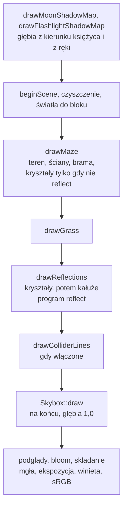

# Moduł renderer: environment mapping, odbicia i załamania nieba na kryształach i w kałużach

Kamień milowy: M8, część 1 (environment mapping). Selekcja obiektów (temat 15) i dźwignie z kartkami, czyli "M8, podstawy bez okna", nie należą do tego dokumentu. Temat wykładu: 12 (Environment mapping), **w trakcie**: nikt nie obejrzał obrazu, testy ręczne i macOS są otwarte (sekcja 5.12).
Kod: formuły i ustawienia bez OpenGL [`src/game/EnvironmentMapping.hpp`](../../../src/game/EnvironmentMapping.hpp) i [`EnvironmentMapping.cpp`](../../../src/game/EnvironmentMapping.cpp), kałuże jako dane [`src/game/Puddles.hpp`](../../../src/game/Puddles.hpp) i [`Puddles.cpp`](../../../src/game/Puddles.cpp), rysowanie kałuż [`src/game/PuddleRenderer.hpp`](../../../src/game/PuddleRenderer.hpp) i [`PuddleRenderer.cpp`](../../../src/game/PuddleRenderer.cpp), shadery [`assets/shaders/reflect.vert`](../../../assets/shaders/reflect.vert) i [`reflect.frag`](../../../assets/shaders/reflect.frag), przebieg odbić w [`src/game/NightMazeApp.cpp`](../../../src/game/NightMazeApp.cpp) (`drawReflections`, `crystalsReflect`, `drawGateAndCrystals`, `layPuddles`), połówki `drawGate` i `drawCrystals` w [`src/game/GameplayRenderer.cpp`](../../../src/game/GameplayRenderer.cpp), nazwy uniformów i jednostka tekstury w [`src/game/ShaderUniforms.hpp`](../../../src/game/ShaderUniforms.hpp), dostęp do tekstury nieba w [`src/game/Skybox.hpp`](../../../src/game/Skybox.hpp) (`cubemap()`), panel [`src/debug/panels/EnvironmentPanel.cpp`](../../../src/debug/panels/EnvironmentPanel.cpp), testy w [`tests/EnvironmentMappingTests.cpp`](../../../tests/EnvironmentMappingTests.cpp) i [`tests/PuddleTests.cpp`](../../../tests/PuddleTests.cpp).

Dlaczego ten dokument stoi w katalogu `renderer`, chociaż klasy nazywają się `game::PuddleRenderer` i leżą w `src/game/`, wyjaśnia [`README.md`](README.md) (to samo co przy niebie: [`../../decisions/skybox-in-game-layer.md`](../../decisions/skybox-in-game-layer.md), i przy cieniach: [`../../decisions/post-process-in-game-layer.md`](../../decisions/post-process-in-game-layer.md)). Dokument zakłada znajomość tekstury sześciennej i nieba ([`skybox.md`](skybox.md), [`../gfx/cubemap.md`](../gfx/cubemap.md)), światła w shaderze fragmentów ([`lighting-gouraud-phong.md`](lighting-gouraud-phong.md)), macierzy normalnych ([`../scene/transforms.md`](../scene/transforms.md)), kryształów i ich świecenia ([`../game/gameplay.md`](../game/gameplay.md)) oraz bloomu ([`post-process.md`](post-process.md)). Cieni, które dostają kałuże, dotyczy [`shadows.md`](shadows.md).

**Stan na dziś (2026-10-06):** kryształy i kałuże pokazują niebo. Kryształ odbija i załamuje teksturę sześcienną nieba, a suwak między odbiciem a załamaniem jest w panelu. Płaskie kałuże leżą w części korytarzy i odbijają to samo niebo, tym mocniej, im bardziej płasko na nie patrzę. Do kodu doszedł czternasty program shaderów, `reflect` (po jedenastu starych oraz `minimap` i `minimap_overlay`), i trzynasty panel, **Environment**. Kryształy i kałuże są rysowane **osobnym przebiegiem** po trawie i przed niebem (sekcja 3.3), a kałuże leżą na terenie na najniższym gruncie pod swoją tarczą (sekcja 2.12).

**Decyzja właściciela projektu (2026-10-06), w całości:** environment mapping jest pokazany na kryształach i w kałużach. Kryształy odbijają i załamują teksturę sześcienną nocnego nieba, a suwak daje wybór między jednym a drugim. Płaskie kałuże w niektórych komórkach korytarzy odbijają to samo niebo. **Wszystko inne to wybory wykonawcze**, każdy z powodem z komentarzy w kodzie: osobny program zamiast gałęzi w `lit.frag` ([`../../decisions/reflect-own-program-and-pass.md`](../../decisions/reflect-own-program-and-pass.md)), woda na najniższym gruncie ([`../../decisions/puddle-on-lowest-ground.md`](../../decisions/puddle-on-lowest-ground.md)), wartości widoczne zamiast fizycznych ([`../../decisions/visible-effect-over-physical-values.md`](../../decisions/visible-effect-over-physical-values.md)), a także liczby w sekcjach 2.10 i 5.

**Czego ten dokument nie twierdzi.** **Nikt nie obejrzał obrazu tej części.** Zgłoszone dla Windowsa (2026-10-06) dla scalonego drzewa (po szóstej części M7, minimapie): bramka `make check` przechodzi, **445 przypadków testowych** (414 przed tą częścią plus 31) i **150296 asercji** (138711 plus 11585 asercji tej części, potwierdzone bramką scalonego drzewa 2026-10-06). Przed scaleniem, w drzewie z samą tą częścią, zgłoszono 406 przypadków i 150091 asercji (przed tą częścią 375 i 138506). Przypadki policzyłem z plików: 11 w `tests/EnvironmentMappingTests.cpp` i 20 w `tests/PuddleTests.cpp`, razem 31. Podziału 11585 nowych asercji między dwa pliki nie liczyłem. Program w buildzie Debug uruchomiono na około 8 sekund i standardowe wyjście błędów było puste, ale wykonała się **tylko ścieżka domyślna**: oświetlenie Blinna-Phonga (to jest wartość startowa `LightingSettings::mode`), widok `Textured`, niebo włączone, efekt włączony. **Nie wykonały się nigdy:** tryby `Unlit`, `Gouraud` i `Phong`, dwa widoki diagnostyczne, niebo wyłączone, efekt wyłączony, kałuże wyłączone i przycisk `Reload shaders`. Liczby o wyglądzie w tym dokumencie (jasność nieba na kryształach, tabela Fresnela, wysokości wody) są **policzone ze wzorów albo przepisane z komentarzy kodu i testów**. Nigdzie nie piszę, że odbicia wyglądają dobrze: tego nikt nie sprawdził. Lista rzeczy do sprawdzenia ręką jest w sekcji 5.12 i w [`../../guides/build-windows.md`](../../guides/build-windows.md).

## 1. Po co to jest

Do M7 kryształ był kolorową bryłą, która świeci. Niebo było tłem za ścianami. Nic w grze nie **pokazywało** nieba poza samym tłem, więc kryształ nie wyglądał jak coś gładkiego, a podłoga nie wyglądała jak mokra.

**Environment mapping** (mapowanie otoczenia) pozwala powierzchni pokazać otoczenie bez liczenia, co naprawdę leży w jej stronę. Zamiast śledzić promienie przez scenę (za drogie na każdy piksel w grze), karta czyta **gotowy obraz otoczenia**: tekstura sześcienna nieba już istnieje, bo rysuje ją skybox. Potrzebne są do tego cztery rzeczy:

| Rzecz | Gdzie | Sekcja |
|---|---|---|
| kierunek promienia odbitego i załamanego dla każdego fragmentu | funkcje `reflect` i `refract` w `reflect.frag`, ich kopie w C++ (`reflectDirection`, `refractDirection`) | 2.2 do 2.4 |
| odczyt tekstury sześciennej tym kierunkiem, w przestrzeni świata | `texture(uEnvironmentMap, direction)` | 2.5, 2.6 |
| kolor powierzchni: część oświetlona i część nieba, świecenie na wierzchu | `mix` i dodanie `uEmissive` | 2.7, 2.9 |
| miejsca, w których jest co pokazać: kryształy i kałuże | `game::Puddles`, `game::PuddleRenderer` | 2.10 do 2.12 |

To jest temat 12 wykładu, "Environment mapping". Technika **ma znane ograniczenie**: pokazuje tylko niebo (sekcja 2.1). Kryształ nie odbija ścian, kałuża nie odbija kryształu stojącego obok. To jest cena za brak śledzenia promieni i jest zapisane w komentarzach kodu.

## 2. Teoria

### 2.1 Co robi environment mapping i czego nie umie

**Pomysł.** Błyszcząca powierzchnia pokazuje to, co leży w kierunku, w którym odbija się spojrzenie. Dla każdego fragmentu powierzchni karta liczy kierunek promienia, który wychodzi z oka, odbija się od powierzchni (albo załamuje na jej wejściu) i leci dalej. Potem **czyta teksturę sześcienną w tym kierunku**: kolor, który tam jest, to kolor "otoczenia" widziany w tym fragmencie.

**Co z tego wynika.** Tekstura sześcienna jest obrazem z jednego punktu, środka sześcianu. Odczyt kierunkiem nie zna odległości. Stąd trzy skutki, które są granicami techniki i które obowiązują w tej grze:

| Skutek | Co to znaczy w grze |
|---|---|
| Otoczeniem jest **tylko niebo** | tekstura sześcienna ma niebo i nic więcej (gwiazdy, Drogę Mleczną, księżyc). Ściana stojąca w kierunku odbicia **nie jest w teksturze**, więc nie jest odbita. Kryształ pokazuje niebo także tam, gdzie z jego strony stoi ściana. Kałuża pod ścianą pokazuje niebo, nie ścianę |
| Brak paralaksy | ten sam kierunek daje ten sam kolor niezależnie od miejsca. Gdy gracz idzie, odbicie w kałuży nie przesuwa się względem kałuży tak, jak przesuwałoby się prawdziwe odbicie bliskiego obiektu. Niebo jest "nieskończenie daleko", więc dla samego nieba to jest akurat poprawne |
| Gracz, kryształy i ściany nie są odbijane | postać gracza, inne kryształy i ściany nie istnieją dla odczytu. Tak samo nie ma odbicia latarki ani plamy jej światła |

Metoda działa dobrze dla czegoś, co odbija **daleko od siebie** (niebo, horyzont), i źle dla odbić bliskich obiektów. To dobór świadomy: gra ma tylko niebo do pokazania. Odbicia bliskich obiektów wymagałyby renderowania sceny do osobnej tekstury (dodatkowy przebieg), a tego w M8 nie ma.

### 2.2 Odbicie: wzór `R = I - 2 dot(N, I) N`

Dane: `I` to kierunek promienia, który **leci w stronę powierzchni** (od oka do fragmentu), `N` to normalna powierzchni, obie o długości 1. Szukane: kierunek `R` po odbiciu.

Rozłóżmy `I` na dwie części: równoległą do powierzchni i prostopadłą do niej. Część prostopadła to rzut na normalną, `dot(N, I) * N`. Część równoległa to reszta, `I - dot(N, I) * N`. Zwierciadło **zostawia część równoległą i odwraca prostopadłą**:

```text
R = (I - dot(N, I) N)  -  dot(N, I) N  =  I - 2 dot(N, I) N
```

```text
              N
              ^
              |
   I          |          R
    \         |         /
     \        |        /
      \       |       /
       v      |      v
  ------------+------------   powierzchnia
        punkt odbicia
```

`I` schodzi w dół ku powierzchni, `R` odchodzi w górę, pod tym samym kątem do normalnej co `I`. Wzór jest jednym zdaniem: odejmij dwukrotnie ten kawałek `I`, który idzie pod prąd normalnej. Odjęcie go raz zostawiłoby promień ślizgający się po powierzchni, odjęcie dwa razy odsyła go z powrotem pod tym samym kątem. Wynik ma tę samą długość co `I`. GLSL ma tę samą funkcję pod nazwą `reflect(I, N)`, a `reflectDirection` w C++ jest jej kopią.

Liczby ze sprawdzanego testu `a ray that hits a level mirror keeps its level part and turns its vertical part`: dla poziomego lustra (`N = (0, 1, 0)`) promień schodzący pod kątem 45 stopni ku +X, `I = (0,707, -0,707, 0)`, wychodzi jako `R = (0,707, 0,707, 0)`. Poziomy kawałek się nie zmienia, odwraca się tylko `y`. Promień prosto w dół, `(0, -1, 0)`, wraca prosto w górę. Promień wzdłuż powierzchni, `(1, 0, 0)`, nie zmienia się wcale (`dot = 0`).

Dla kałuży (zawsze `N = (0, 1, 0)`) wniosek jest prosty i przydatny przy pokazie: to, co widzę w kałuży, to niebo w kierunku mojego spojrzenia **z odwróconym `y`**. Patrząc w dół pod kątem 50 stopni widzę niebo 50 stopni nad horyzontem w tym samym kierunku poziomym (sekcja 8, ćwiczenie 4).

### 2.3 Załamanie: prawo Snella i wzór na `refract`

Gdy promień wchodzi z jednego ośrodka do drugiego (z powietrza do szkła), zmienia kierunek. **Prawo Snella**:

```text
n1 * sin(kąt przed) = n2 * sin(kąt po)
```

Kąty są mierzone od normalnej. `n1` i `n2` to **współczynniki załamania** ośrodków (jak wolno światło biegnie w nich w porównaniu z próżnią): powietrze 1,0, woda 1,33, szkło 1,5 (stałe `AIR_REFRACTIVE_INDEX`, `WATER_REFRACTIVE_INDEX`, `GLASS_REFRACTIVE_INDEX`). Kryształ kwarcu ma około 1,54, więc szkło jest dobrym przybliżeniem (komentarz przy `AIR_TO_GLASS_RATIO`).

**Stosunek `eta`.** GLSL funkcja `refract(I, N, eta)` przyjmuje trzeci argument `eta = n1 / n2`: współczynnik ośrodka, **z którego** promień wychodzi, podzielony przez współczynnik ośrodka, **do którego** wchodzi. Powietrze do szkła to `1 / 1,5 = 0,667` (stała `AIR_TO_GLASS_RATIO`, wartość startowa suwaka). Liczba mniejsza od 1 znaczy "wchodzę do gęstszego ośrodka": promień **zbliża się do normalnej**.

**Wyprowadzenie wzoru.** Niech `c = dot(N, I)` (liczba ujemna, bo promień idzie pod prąd normalnej). Część równoległa do powierzchni: `I - c N`. Prawo Snella mówi, że sinus (czyli długość części równoległej) mnoży się przez `eta`, więc nowa część równoległa to `eta * (I - c N)`. Część prostopadła po załamaniu ma długość równą cosinusowi nowego kąta i dalej idzie pod prąd normalnej: `-sqrt(k) N`, gdzie `k` to cosinus kwadrat nowego kąta. Z jedynki trygonometrycznej:

```text
k = 1 - eta^2 * (1 - c^2)
T = eta * (I - c N) - sqrt(k) N  =  eta * I - (eta * c + sqrt(k)) * N
```

To jest dokładnie treść `refractDirection` w C++ i `refract` w GLSL (komentarze w `EnvironmentMapping.hpp` i `reflect.frag` mają ten sam wzór). Wynik ma długość 1, gdy `I` i `N` mają długość 1.

**Liczby z testu** `a refracted ray obeys Snell's law` (powietrze do szkła, `eta = 0,667`, promień pada na poziomą powierzchnię pod kątem od normalnej):

| Kąt przed | `sin(kąt przed)` | razy `eta` | Kąt po |
|---|---|---|---|
| 10 stopni | 0,174 | 0,116 | 6,6 stopnia |
| 30 stopni | 0,500 | 0,333 | 19,5 stopnia |
| 45 stopni | 0,707 | 0,471 | 28,1 stopnia |
| 60 stopni | 0,866 | 0,577 | 35,3 stopnia |
| 85 stopni | 0,996 | 0,664 | 41,6 stopnia |

Kolumna "kąt po" jest policzona ze wzoru, test sprawdza sinus (`sineFromVertical(refracted) == eta * sin(kąt)`). Najpłytszy promień (prawie wzdłuż powierzchni) załamuje się najwyżej do `asin(0,667) = 41,8` stopnia: tyle wynosi **największe odchylenie** stożka, w którym promienie wchodzą do szkła. Dwie szczególne sprawy z testu `a ratio of 1 does not bend the ray, and a ray along the normal is never bent`: `eta = 1` nie zmienia kierunku wcale, a promień idący dokładnie wzdłuż normalnej (kąt 0) nie zmienia go przy żadnym `eta`.

**Skąd w grze "załamanie" kryształu.** Kryształ rysowany jest jedną powierzchnią, więc kod liczy **jedno załamanie**: promień wchodzący do kryształu. Prawdziwy promień załamałby się jeszcze raz przy wyjściu z tyłu kryształu, a ta druga powierzchnia jest nieznana. Komentarz w `reflect.frag` mówi wprost: pozostaje obrazem, który czyta się jak szkło. To kolejne uproszczenie, nie błąd.

### 2.4 Kąt krytyczny i całkowite wewnętrzne odbicie

Gdy `eta` jest **większe od 1** (promień wychodzi z gęstszego ośrodka do rzadszego, szkło do powietrza), wzór daje `k < 0` dla płytkich kątów: nowy sinus wyszedłby większy od 1, a takiego kąta nie ma. Promień **w ogóle nie wychodzi**: całe światło się odbija z powrotem (**całkowite wewnętrzne odbicie**, total internal reflection). Granica to **kąt krytyczny**:

```text
sin(kąt krytyczny) = 1 / eta
```

Liczby z testu `total internal reflection: no refracted ray past the critical angle` (szkło do powietrza, `eta = 1,5`): kąt krytyczny `asin(1 / 1,5) = 41,81` stopnia. Test bierze promień o 1 stopień **przed** granicą (wychodzi załamany, odchylony **od** normalnej, jego sinus jest większy niż przed) i o 1 stopień **za** granicą (brak promienia). Dla wody do powietrza (`eta = 1,33`) granica to 48,75 stopnia (policzone, test jej nie sprawdza).

**Co `refract` zwraca w tym przypadku.** Wektor zerowy `(0, 0, 0)` (jest to w specyfikacji GLSL i test sprawdza to samo dla `glm::refract`). Zero **nie jest kierunkiem**, a odczyt tekstury sześciennej wektorem zerowym daje kolor nieokreślony. Dlatego jest funkcja `refractOrReflect`: bierze `refract`, a gdy wynik to dokładnie wektor zerowy, oddaje `reflect`. Całe światło i tak się odbija, więc odbity promień jest tu **fizycznie dobrą odpowiedzią**, nie łataniem. Porównanie z zerem jest dokładne: poprawny załamany promień ma długość 1, więc tylko odpowiedź "brak promienia" jest zerem (komentarz w `EnvironmentMapping.cpp`). Test `refractOrReflect falls back to the mirrored ray and never returns no direction` sprawdza całą siatkę suwaka (od 0,4 co 0,1 do 1,5) razy kąty co 5 stopni: wynik zawsze ma długość 1.

**Kiedy to się zdarza w grze.** Powietrze do kryształu ma `eta < 1`, więc `k = 1 - eta^2 sin^2 >= 1 - eta^2 > 0`: **całkowite odbicie nie występuje** przy `eta` poniżej 1 (test `Air into a crystal ... is never a total internal reflection` sprawdza to dla wartości startowej). Pojawia się dopiero, gdy suwak `Refraction ratio` ustawię **powyżej 1** (zakres kończy się na 1,5, stała `MAX_REFRACTION_RATIO`). Zakres sięga tam wyłącznie po to, żeby to zjawisko dało się pokazać (komentarz przy stałej): kryształ oglądany z zewnątrz nigdy nie wychodzi z gęstszego ośrodka.

### 2.5 Odczyt tekstury sześciennej kierunkiem w przestrzeni świata

`texture(uEnvironmentMap, direction)` to ten sam odczyt, który robi `skybox.frag` (sekcje 2.1 do 2.3 w [`skybox.md`](skybox.md)): kierunek wybiera ścianę i teksel. Długość kierunku nie ma znaczenia.

**Dlaczego przestrzeń świata.** Tekstura sześcienna nieba jest **przyczepiona do świata**: kierunek `(0, 1, 0)` to zawsze "prosto w górę", a księżyc jest w kierunku `(-0,272, 0,766, 0,583)` ([`skybox.md`](skybox.md), sekcja 2.9), niezależnie od tego, gdzie patrzy kamera. Aby odczyt dał ten sam obraz, który widać za ścianami, kierunek odbicia musi być wyrażony w tej samej przestrzeni. Dlatego `reflect.vert` liczy pozycję i normalną w przestrzeni **świata** (`vWorldPosition`, `vNormal`), a promień padający to `normalize(vWorldPosition - uCameraPosition.xyz)`, oko wzięte z bloku świateł (też w przestrzeni świata). Gdyby kierunek policzyć w przestrzeni widoku, niebo w odbiciu obracałoby się razem z kamerą i księżyc w kałuży wędrowałby po ekranie. To jest ta sama pułapka co `mat3(uView) * aPosition` w niebie ([`skybox.md`](skybox.md), sekcja 7, punkt 8).

### 2.6 Dlaczego odczyt jest mnożony przez jasność nieba

Tekstura sześcienna jest teksturą sRGB, więc odczyt daje już wartość liniową ([`skybox.md`](skybox.md), sekcja 5.9, [`../gfx/color-space.md`](../gfx/color-space.md)). Ale niebo na ekranie nie jest samym odczytem: `skybox.frag` mnoży go przez `uBrightness` (suwak `Sky brightness`, startowo 2,2), bo pliki są ciemne, a bufor sceny jest HDR. Odbicie musi mieć **tę samą jasność co niebo za ścianami**. Inaczej gwiazda w kałuży byłaby 2,2 razy ciemniejsza niż ta sama gwiazda na niebie, a księżyc w kałuży nie byłby tą samą tarczą. Dlatego `environmentColor` zwraca `texture(...).rgb * uSkyBrightness`, a C++ ustawia `uSkyBrightness` na `m_skyboxSettings.brightness`: **ta sama liczba, ten sam suwak**.

Dla porównania liczby policzone z dokumentu nieba ([`skybox.md`](skybox.md), sekcja 5.6): zenit razy 2,2 to około `(0,0017, 0,0027, 0,0077)`, tarcza księżyca (piksel `(200, 207, 224)`) po zamianie na wartość liniową i pomnożeniu przez 2,2 to około `(1,3, 1,4, 1,6)`. Niebo na kryształach jest więc w większości **bardzo ciemne** wobec świecenia (sekcja 2.7), a jasna jest tylko tarcza księżyca i najjaśniejsze gwiazdy. To rachunek, nie obserwacja.

**Gdy nieba nie ma.** Pole `Skybox` w panelu Renderer można odznaczyć, a pliki nieba mogą się nie wczytać. Wtedy tłem klatki jest kolor czyszczenia i **taki kolor pokazuje lustro w każdym kierunku**. Odpowiada za to `uSkyVisible` (0 albo 1) i `uBackground` (kolor czyszczenia w wartości liniowej: ten sam `srgbToLinear`, którym `onRender` czyści ekran). Bez tego kryształ i kałuża pokazywałyby niebo, którego na ekranie nie ma.

### 2.7 Kolor kryształu: wzór i dlaczego świecenie jest poza `mix`

Kryształ ma dwa składniki koloru: **światło** (część oświetlona: tekstura razy rozproszenie plus odbłysk) i **własne świecenie** (`uEmissive`). W `reflect.frag`:

```text
surface  = texture(uTexture, vUv).rgb * uTint
litColor = surface * diffuse + specular
kolor    = mix(litColor, environment, strength) + surface * uEmissive
```

`environment` to niebo wybrane przez suwak "załamanie albo odbicie" (sekcja 2.8), a `strength` to udział nieba w kolorze (suwak `Sky share`, startowo 0,5). `mix(a, b, t) = a * (1 - t) + b * t`: przy 0 zostaje powierzchnia oświetlona, przy 1 zostaje samo niebo.

**Dlaczego świecenie jest dodawane po `mix`, a nie mieszane.** Bloom (poświata, [`post-process.md`](post-process.md)) znajduje kryształy po tym, że są jaśniejsze od progu. Gdyby świecenie było w `litColor`, to `mix` ze `strength = 0,5` obcięłby je o połowę, a niebo na kryształach (ciemne, sekcja 2.6) nic by nie dołożyło. Poświata by osłabła albo zniknęła. Notatka [`../../decisions/crystal-glow-raised-for-bloom.md`](../../decisions/crystal-glow-raised-for-bloom.md) pokazuje, jak mało zapasu nad progiem 0,8 ma świecenie w najciemniejszej chwili pulsu. Dlatego `+ surface * uEmissive` stoi **na zewnątrz** `mix`: kryształ świeci dalej tyle samo, ile świecił bez efektu (w komentarzu: "with a strength of 0 this line gives exactly the colour of lit.frag"), a bloom go nadal znajduje.

**Ile to jest w liczbach (policzone, nikt nie oglądał).** Z notatki o bloomie: świecenie przed pomnożeniem przez teksturę ma jasność około 2,45 przy pulsie 1 i około 1,72 przy pulsie 0,7. Niebo na kryształach (sekcja 2.6) to w większości kilka tysięcznych, a jasna tarcza księżyca 1,3 do 1,6. Przy wartościach startowych (`Sky share` 0,5) kolor to **połowa koloru oświetlonego plus połowa nieba plus całe świecenie**. Dwie rzeczy z tego wynikają:

1. Niebo jest na kryształach **słabą domieszką** przy świeceniu 1: komentarz przy `crystalGlowShare` mówi to samo ("a faint tint"). Aby zobaczyć odbicie i załamanie wyraźnie, jest suwak `Glow` (sekcja 6), który zmniejsza świecenie **tylko w tym przebiegu**. Zabiera przy tym poświatę bloomu razem ze świeceniem, ale **nie zmienia światła punktowego nad kryształem**, które oświetla otoczenie.
2. `mix` przy `Sky share` 0,5 **zmniejsza o połowę część oświetloną** kryształu (światło otoczenia, księżyca, latarki, własnych świateł na nim). Kryształ jest więc ciemniejszy w części oświetlonej niż bez efektu. Nikt nie sprawdził, czy to się komuś rzuca w oczy: jest na liście sprawdzeń.

### 2.8 Jeden interfejs: tylko załamanie wchodzące

Kryształ ma suwak `Refract / reflect` od 0 (sama załamana część) do 1 (sama odbita): `environment = mix(sky(refracted), sky(reflected), uReflectShare)`. Obie wartości są czytane z tej samej tekstury sześciennej innymi kierunkami, jeden z `refractOrReflect`, drugi z `reflect`. **Załamanie jest policzone jeden raz**, na wejściu do kryształu (sekcja 2.3). To świadome uproszczenie: kryształ jest rysowany jedną siatką bez drugiej powierzchni, a po załamaniu kolor czyta się od razu z nieba. Skutek: "szkło" w grze zmienia kierunek raz, a nie dwa razy. Kryształ nie ma więc "grubości", której promień musiałby przejść.

Dla **kałuż** `uReflectShare` jest zawsze 1 (stała `MIRROR_ONLY` w `NightMazeApp.cpp`): kałuża tylko odbija. Załamanie wody (`1 / 1,33 = 0,75`) jest w tooltipie suwaka, ale kałuża go nie używa.

### 2.9 Fresnel i przybliżenie Schlicka

Prawdziwa powierzchnia nie odbija tyle samo przy każdym kącie. Patrząc **prosto w dół** na wodę widzę dno (odbija się około 2 procent światła). Patrząc **płasko**, pod kątem muśnięcia, woda staje się lustrem. To jest **efekt Fresnela**. Dokładne wzory są kłopotliwe, więc grafika używa **przybliżenia Schlicka**:

```text
F = F0 + (1 - F0) * (1 - cosine)^5
```

`cosine` to cosinus kąta między normalną a kierunkiem **do oka** (1: patrzę prosto na powierzchnię, 0: patrzę wzdłuż niej), `F0` to udział odbitego światła przy spojrzeniu prosto w dół. Przy `cosine = 1` wzór daje `F0`, przy `cosine = 0` daje 1. Wykładnik 5 to stała `SCHLICK_EXPONENT` (w C++ i w GLSL, komentarz każe je trzymać zgodnie). `cosine` jest obcinany do 0..1 (powierzchnia widziana od tyłu nie daje wartości spoza zakresu). W shaderze: `fresnelSchlick(dot(normal, -incident), uEnvironmentStrength)`, czyli `F0` to suwak.

**Skąd `F0 = 0,02` dla wody.** Z teorii: `((n2 - n1) / (n2 + n1))^2 = (0,33 / 2,33)^2 = 0,020`. Ten rachunek **nie jest w kodzie**: kod ma tylko liczbę 0,02 w komentarzu i w teście.

**Tabela dla kałuży.** Model z testu `why the default reflectivity of a puddle is far above the one of real water`: płaski grunt, oczy `1,7 m` nad nim (`Player::EYE_HEIGHT`), kałuża w odległości poziomej `d`. Cosinus kąta to `1,7 / sqrt(1,7^2 + d^2)`.

| `d` (poziomo) | `cosine` | kąt od normalnej | `F` dla `F0 = 0,02` (woda naprawdę) | `F` dla `F0 = 0,35` (wartość startowa) |
|---|---|---|---|---|
| 0 (pod stopami) | 1,000 | 0 stopni | 0,020 | 0,350 |
| 1 m | 0,862 | 30,5 stopnia | 0,020 | 0,350 |
| 2 m (następna komórka) | 0,648 | 49,6 stopnia | 0,025 | 0,354 |
| 4 m | 0,391 | 67,0 stopni | 0,102 | 0,404 |
| 8 m | 0,208 | 78,0 stopni | 0,326 | 0,553 |
| 16 m | 0,106 | 83,9 stopnia | 0,581 | 0,722 |

Policzyłem tabelę ze wzoru. Test sprawdza cztery nierówności z niej: dla wody `F < 0,03` w 2 m i `F < 0,11` w 4 m, dla wartości startowej `F > 0,35` w 2 m i `F > 0,5` w 8 m. Wniosek ten sam co w teście: **prawdziwa woda ledwo coś pokazuje** (kałuża w następnej komórce odbija 2,5 procent ciemnego nieba), więc wartością startową jest `F0 = 0,35`. To wybór widocznego efektu zamiast wartości fizycznych ([`../../decisions/visible-effect-over-physical-values.md`](../../decisions/visible-effect-over-physical-values.md)).

**Dla kryształów Fresnel jest wyłączony** (`uFresnelEnabled = 0` w `drawReflections`): ten sam udział nieba przy każdym kącie. To również część tej samej decyzji: kryształ ma pokazywać to, co ustawi suwak, nie to, co wynika z kąta.

### 2.10 Kałuże: rozmieszczenie z ziarna

Kałuże są **dekoracją**: nie przeszkadzają w ruchu, żadna reguła rundy o nich nie wie. Dane (które komórki, jaki rozmiar) są zwykłą logiką bez OpenGL ([`Puddles.hpp`](../../../src/game/Puddles.hpp)), więc mają testy.

**Ile.** `puddleCountFor(wolne komórki, udział)`: `lround(wolne * udział)`, ograniczone do liczby wolnych komórek, 0 dla udziału 0 albo ujemnego. Wolne komórki to wszystkie **oprócz startu, wyjścia i komórek z kryształem** (start: gracz stałby w kałuży od pierwszej chwili, wyjście: brama zapada się w ziemię, kryształ: to miejsce już ma na co patrzeć). W labiryncie startowym 10 na 10: `100 - 1 - 1 - 13 = 85` wolnych komórek (13 kryształów: jeden na `CELLS_PER_CRYSTAL = 8` komórek), więc udział `DEFAULT_PUDDLE_SHARE = 0,15` daje `lround(12,75) = 13` kałuż (test `the default maze has 13 puddles at the default share`). Suwak sięga `MAX_PUDDLE_SHARE = 0,5`: `lround(42,5) = 43` kałuże (policzone, nie testowane dla tej liczby). Test sprawdza także `puddleCountFor(85, 1,0) = 85` i `puddleCountFor(85, 3,0) = 85`, choć suwak do 1 nie sięga.

**Które komórki.** Generator `std::mt19937` z ziarnem `seed + PUDDLE_SEED_OFFSET`, gdzie `PUDDLE_SEED_OFFSET = 4000037`. Przesunięcie sprawia, że kałuże nie powtarzają liczb, którymi wycięto labirynt, wylosowano kryształy, trawę, dźwignie i kartki (komentarz przy stałej: "any number other than those offsets would do"). Wolne komórki są ułożone wierszami, **potasowane** własnym tasowaniem Fishera-Yatesa na `randomBelow` (z tego samego powodu co w `Crystals.cpp`: `std::shuffle` różni się między bibliotekami standardowymi, [`../../decisions/deterministic-random.md`](../../decisions/deterministic-random.md)) i kałuże dostają **pierwsze `count` komórek** z tej listy.

**Dlaczego większy udział zachowuje istniejące kałuże.** Tasowanie dzieje się **zawsze pierwsze i tak samo** (nie zależy od udziału). Dopiero po nim, dla pierwszej, drugiej, trzeciej komórki z listy, losowane są trzy liczby: przesunięcie w X, przesunięcie w Z, promień. Udział decyduje tylko o tym, **ile** komórek z początku listy dostaje kałużę. Suwak przesunięty w górę dodaje kałuże na końcu listy i nie rusza tych, które były (test `a larger share keeps every puddle of a smaller share and adds more`). Zmiana suwaka nie przetasowuje więc całej mapy.

**Rozmiar i miejsce.** Promień od `PUDDLE_MIN_RADIUS = 0,25` do `PUDDLE_MAX_RADIUS = 0,45 m`, środek przesunięty od środka komórki najwyżej o `PUDDLE_MAX_OFFSET = 0,3 m` na każdej osi. Wartość losowa z `randomBetween` to jeden z 33 równych kroków (`RANDOM_STEPS = 32`): liczba całkowita z `randomBelow` zamieniona na float, czyli ta sama na każdym systemie (`std::uniform_real_distribution` tego nie obiecuje).

**Dlaczego kałuża nie dotyka ściany.** Kałuża sięga najwyżej `0,3 + 0,45 = 0,75 m` od środka komórki. Pudełko kolizji ściany zaczyna się 0,85 m od środka (połowa komórki 2 m minus połowa grubości 0,3 m), a stopa ściany albo słupka 0,8 m (`FOOTPRINT_MARGIN = 0,05`). Test `the puddle constants keep a puddle inside its cell, clear of the walls` sprawdza `reach == 0,75 < wallFoot == 0,8`, a test `no puddle reaches a wall, a pillar or the gate` robi to samo na prawdziwym świecie, dla każdej kałuży, z promieniem i marginesem.

**Powtarzalność.** Ten sam labirynt, ziarno, start, wyjście, kryształy i udział dają te same kałuże na każdym kompilatorze. Test złoty `golden maze: 4 x 4 cells from seed 1 has exactly these puddles` przypina sześć komórek i pierwszą kałużę w całości (przesunięcie `-0,24375` i `0,05625`, promień `0,275`). **Teren nie jest pytany** przy wyborze: nowa skala wysokości nie przesuwa kałuży do innej komórki, tylko podnosi lub opuszcza jej wodę (test `another height scale moves the puddles up or down and nowhere else`).

**Trawa.** Pas trawy przy ścianie leży w odległości od `GRASS_WALL_GAP = 0,06` do `0,06 + 0,22 = 0,28 m` od pudełka ściany, czyli 0,57 do 0,79 m od środka komórki. Kałuża sięga 0,75 m. **Kępka może więc stać w kałuży przy jej brzegu.** Kod tego nie wyklucza: to punkt do obejrzenia (sekcja 5.12). Dźwignie i kartki wiszą na ścianach na wysokości 1,2 i 1,5 m, więc nie dotykają kałuż na ziemi.

### 2.11 Tarcza kałuży

Kałuża to **płaska tarcza**: wachlarz `PUDDLE_CORNERS = 16` trójkątów wokół środka, 17 wierzchołków (środek i 16 narożników), 48 indeksów. Brzeg jest 16-kątem, który z wysokości oczu wygląda okrągło (komentarz przy stałej). Siatka ma promień 1 i leży w płaszczyźnie `y = 0`: **jedna siatka dla wszystkich kałuż**, a macierz modelu (`puddleModelMatrix`) skaluje ją do promienia kałuży po X i Z (`scale = (r, 1, r)`) i przesuwa na miejsce. `y` zostaje 1: tarcza jest płaska, więc skala po `y` niczego by nie zmieniła, a macierz ma zostać odwracalna dla `scene::normalMatrix`.

Wszystkie normalne wskazują prosto w górę, `(0, 1, 0)`, co robi z tarczy **poziome lustro** (sekcja 2.2). Narożnik 0 leży na osi +X, a następne idą ku +Z, co jest zgodne z ruchem wskazówek zegara z góry, więc trójkąt jest zapisany jako `(środek, następny narożnik, ten narożnik)`, żeby jego przednia strona patrzyła w górę (test `every triangle of the disc starts in the middle and faces up` sprawdza znak iloczynu wektorowego i pole: 16-kąt pokrywa ponad 97 procent koła). Odrzucanie tylnych ścian w grze **nie jest włączone** (żaden plik w `src/` nie woła `glEnable(GL_CULL_FACE)`, kod trawy tylko zapamiętuje i przywraca stan), więc nawijanie nie decyduje dziś o tym, czy tarcza jest widoczna.

Współrzędne tekstury biegną od 0 do 1 przez tarczę (środek to środek obrazu). Tekstura kałuży jest **zwykłą białą teksturą** z pamięci podręcznej assetów (`whiteTexture`), a mapa normalnych płaska (`flatNormalTexture`): kałuża nie ma własnego obrazu ani reliefu. Współrzędne są tylko po to, by widok diagnostyczny `UVs as colour` miał co pokazać.

### 2.12 Poziom wody: najniższy grunt pod tarczą plus głębokość

Teren jest nierówny, a woda poziomą powierzchnią. Tarcza nie może więc iść za gruntem. Gdzie ją postawić? Reguła z `puddleWaterLevel`:

```text
poziom wody = najniższy grunt pod tarczą + PUDDLE_DEPTH (0,02 m)
```

"Pod tarczą" to **siedemnaście punktów**: środek i szesnaście narożników brzegu (wartości z `Terrain::heightAt`). Wybór **najniższego**, a nie najwyższego punktu, ma powód ([`../../decisions/puddle-on-lowest-ground.md`](../../decisions/puddle-on-lowest-ground.md)): tarcza postawiona na najwyższym gruncie wisiałaby w powietrzu po drugiej stronie. Postawiona na najniższym **nigdzie wzdłuż próbkowanych punktów nie stoi wyżej niż 2 cm nad gruntem**, a tam, gdzie grunt wystaje ponad wodę, **test głębi chowa tarczę** i grunt jest narysowany przed nią. Brzeg wody idzie więc za gruntem: na równym gruncie widać całą tarczę, na zboczu tylko jej niższą część, jak wodę, która spłynęła w dół. (Test mówi precyzyjnie "at every point that was looked up": siedemnaście punktów to nie cały brzeg, a teren jest kawałkami liniowy, więc między dwoma narożnikami grunt może być nieco niższy niż woda. Komentarz w nagłówku mówi "anywhere along its rim", co jest mocniejszym zdaniem niż to, co sprawdzono.)

**Liczby z testu** `the ground of the game under a puddle: why the water stands on the lowest ground` (prawdziwa mapa wysokości, środek **każdej** komórki labiryntu startowego, **największy** promień 0,45 m, różnica między najwyższym a najniższym z siedemnastu punktów):

| Skala wysokości | Największa różnica pod tarczą | Co sprawdza test |
|---|---|---|
| 1,0 (`DEFAULT_HEIGHT_SCALE`) | około 7 cm | większa od 0,06 i mniejsza od 0,08 |
| 2,5 (`MAX_HEIGHT_SCALE`) | około 17,5 cm | większa od 0,16 i mniejsza od 0,19 |

To są **maksima w środkach komórek**, nie na miejscach, w których naprawdę leżą kałuże (one są przesunięte i mają inne promienie). Liczby **mediany**, zgłoszone przez autora: przy skali 1,0 mediana 2,4 cm i maksimum 7,0 cm na tarczy o promieniu 0,45 m, przy skali 2,5 mediana 6,1 cm i maksimum 17,5 cm. **Mediany zgłosił autor, ja ich nie mierzyłem ponownie, a test ich nie zawiera.** Test sprawdza jeszcze, że przy obu skalach każda kałuża domyślnego labiryntu stoi `PUDDLE_DEPTH` nad najniższym z siedemnastu punktów.

**Koszt tej reguły.** Tarcza na zboczu jest **częściowo zakryta**: wszędzie tam, gdzie grunt wystaje więcej niż 2 cm ponad najniższy punkt, leży nad wodą. Różnica pod tarczą rzędu 2,4 cm (mediana zgłoszona przy skali 1,0) jest tego samego rzędu co głębokość wody 2 cm, a 6,1 cm (skala 2,5) jest od niej trzy razy większa. Kałuża na zboczu pokazuje więc mniej, niż sugeruje jej promień. **Jaka część tarczy jest ukryta, nie policzyłem i nikt tego nie zmierzył.** Alternatywy (siatka dopasowana do gruntu, wyrównanie gruntu) są w notatce. Nikt nie obejrzał, jak to wygląda.

### 2.13 Jak wyglądają kryształy w każdym trybie i widoku

Rysowaniem rządzą dwie funkcje: `crystalsReflect()` (czy kryształy tej klatki rysuje przebieg odbić) i `drawReflections` (co ten przebieg robi). `crystalsReflect()` jest prawdą, gdy efekt jest włączony, **widok to `Textured`** i program `reflect` jest ważny. Poniżej to, co wynika z kodu. **Wykonała się tylko pierwsza komórka tabeli (Blinn-Phong, `Textured`, niebo i efekt włączone).**

| Tryb oświetlenia / widok | Kryształ | Kałuża |
|---|---|---|
| **Blinn-Phong** (start), `Textured` | `reflect`: światło na fragment, odbłysk Blinna-Phonga, mapa normalnych kryształu, jeśli włączona | `reflect`: światło na fragment, odbłysk wody (siła 1, wykładnik 128), bez mapy normalnych |
| **Phong**, `Textured` | jak wyżej, odbłysk Phonga | jak wyżej |
| **Gouraud**, `Textured` | `reflect`, **ale światło liczone na fragment z odbłyskiem Phonga**, bez mapy normalnych (`usesNormalMap` jest tu fałszem). Ściany w tym trybie dalej mają światło na wierzchołek, kryształ i kałuża już nie | to samo |
| **Unlit**, `Textured` | `reflect` z `uLit = 0`: powierzchnia pokazana z pełną jasnością (rozproszenie 1, odbłysk 0), **niebo nadal domieszane**, świecenie na wierzchu | to samo |
| `Normals as colour` albo `UVs as colour` | **nie przebieg odbić**: kryształ jest rysowany programem `textured` razem ze ścianami, jako dane (kolor normalnej albo współrzędnej) | tarcza rysowana programem `textured` jako dane, jeśli efekt i pole `Puddles` są włączone |
| efekt wyłączony (pole `Environment mapping`) | rysowany programem ścian, **tak jak przed M8** | **nie rysowane** w żadnym widoku |
| pole `Puddles` wyłączone | bez zmian | nie rysowane |
| niebo wyłączone (pole `Skybox`) albo pliki nieba nie wczytane | `uSkyVisible = 0`: kolor czyszczenia w każdym kierunku (dla `Skybox` odznaczonego, ale z wczytanymi plikami, tekstura i tak jest związana) | to samo |
| program `reflect` się nie skompilował | kryształy wracają do programu ścian | w widokach `Textured` **nie rysowane**, ale w dwóch widokach diagnostycznych **rysowane programem `textured`** (gałąź widoków diagnostycznych jest przed sprawdzeniem `isValid`) |

To, co z tej tabeli ma znaczenie dla pokazu tematu 7 (Gouraud przeciw Phong): **przy włączonym efekcie przełącznik trybu nie zmienia wyglądu kryształów i kałuż tak, jak zmienia ścian**. Kryształ w trybie Gouraud nie ma już kanciastego odbłysku. To skutek osobnego programu ([`../../decisions/reflect-own-program-and-pass.md`](../../decisions/reflect-own-program-and-pass.md)). Aby pokazać Gouraud na kryształach, wyłączam `Environment mapping`.

**Przebieg w widokach diagnostycznych.** Gałąź ta korzysta z uniformów, które program `textured` dostał przy rysowaniu ścian w tej samej klatce (macierze i tryb widoku): uniform zostaje na programie, gdy rysują inne. Tak mówi komentarz w `drawReflections`.

### 2.14 Cień i mgła na kałużach

**Cień.** Shader `reflect.frag` liczy światło jak `lit.frag` i odejmuje od niego udział księżyca (`moonShadow`) i latarki (`flashlightShadow`) razem z odbłyskiem. Kałuża w cieniu ściany ma więc ciemniejszą część oświetloną i **zgaszony odbłysk**. Ale **odbite niebo nie ciemnieje w cieniu**: to osobny składnik, który idzie przez `mix` z udziałem `strength`, bez mnożenia przez cień. Prawdziwe lustro też nie ciemnieje, gdy nie pada na nie światło księżyca. Kałuże **nie rzucają cienia**: nie ma ich w `drawShadowCasters` (grunt pod nimi jest w mapie, kałuża leży 2 cm nad nim, więc jest oświetlona). Kryształy nadal rzucają cień jak przedtem, ten przebieg się nie zmienił.

**Mgła.** Mgła i winieta są liczone w przebiegu składającym, po scenie ([`post-process.md`](post-process.md)), z głębi, więc **każdy piksel kałuży jest zamglony według własnego położenia**: niskiego i dalekiego. Odległe kałuże, w których Fresnel odbija najwięcej (tabela w sekcji 2.9), są jednocześnie najbardziej zamglone. To wynika z kolejności przebiegów i nikt tego nie oglądał.

### 2.15 Znane ograniczenia

- **Tylko niebo** (sekcja 2.1): ściany, kryształy i gracz nie są odbijane.
- **Jedno załamanie** kryształu (sekcja 2.8): kryształ nie ma tylnej powierzchni.
- **Kolor kryształu nad niebem** (sekcja 2.7): przy świeceniu 1 niebo jest słabą domieszką, a `Sky share` 0,5 zmniejsza część oświetloną.
- **Kałuża na zboczu jest częściowo ukryta** (sekcja 2.12).
- **Kałuże nie rzucają cienia** i nie mają mapy normalnych: poziome, gładkie lustro bez zmarszczek.
- **Wartości widoczne zamiast fizycznych**: `F0` kałuży 0,35, a nie 0,02.
- **Gouraud, Unlit i widoki diagnostyczne** różnią się od ścian (sekcja 2.13).

## 3. Jak to działa w OpenGL

### 3.1 Tekstura nieba na własnej jednostce

Program `reflect` ma pięć samplerów: `uTexture` (jednostka 0), `uNormalMap` (1), dwie mapy cieni (3 i 4) i `uEnvironmentMap` typu `samplerCube`. OpenGL **odmawia rysowania**, gdy dwa samplery **różnych rodzajów** (`sampler2D`, `sampler2DShadow`, `samplerCube`) jednego programu wskazują tę samą jednostkę. Cube map dostaje więc **jednostkę 5**, następną wolną po mapach cieni (stała `ENVIRONMENT_TEXTURE_UNIT`). Sampler dostaje swoją jednostkę **w każdym przypadku**, także gdy nieba nie ma: pozostawiony na 0 dzieliłby jednostkę z teksturą koloru, a to jest właśnie zabroniona kombinacja (komentarz w `drawReflections`).

`m_skybox.cubemap()` oddaje do odczytu tę samą teksturę, którą rysuje niebo (jeden dodany akcesor w `Skybox.hpp`: sześć obrazów nie jest wczytywanych drugi raz). `Cubemap::bind(5)` wiąże teksturę i jej obiekt samplera do jednostki 5 ([`../gfx/cubemap.md`](../gfx/cubemap.md)).

### 3.2 Stan, który przebieg ustawia i zwraca

- `glEnable(GL_TEXTURE_CUBE_MAP_SEAMLESS)`: przebieg odbić czyta teksturę **przed** narysowaniem nieba, więc włącza to samo co `Skybox::draw`. Filtr liniowy miesza wtedy teksele dwóch ścian na krawędzi sześcianu ([`skybox.md`](skybox.md), sekcja 2.5). Włączone zostaje.
- `glActiveTexture(GL_TEXTURE0)` na końcu: wiązanie cube mapy uczyniło aktywną jednostkę 5. Rysowanie kryształów i kałuż przywraca jednostkę 0 (przez wiązanie tekstur modelu), ale gdy nie ma ani kryształu, ani kałuży, nic nie zostało narysowane i jednostka została 5, a reszta klatki zakłada 0. Dlatego powrót jest jawny.
- Test głębi i zapis głębi zostają **włączone**: kryształy i kałuże są nieprzezroczyste i zapisują głębię jak ściany. Dlatego stoją **przed niebem**.

### 3.3 Klatka: miejsce przebiegu odbić



Przebieg odbić jest po trawie i przed niebem. Kryształy są rysowane **dokładnie raz na klatkę**: albo w `drawMaze` programem ścian (`drawGateAndCrystals` rysuje bramę zawsze, a kryształy tylko gdy `!crystalsReflect()`), albo w `drawReflections` programem `reflect`. Rysowanie jednej bramy i kryształów rozdzielają dwie nowe połówki `GameplayRenderer::drawGate` i `drawCrystals`, a stara `draw` woła obie (używa jej przebieg cieni, który rysuje kryształy programem głębi).

**Dwa przebiegi cieni nie zmieniły się**: `drawShadowCasters` nadal rysuje teren, ściany, bramę i kryształy programem `shadow_depth`. Kałuży w nim nie ma.

W `drawReflections` ustawienia idą w tej kolejności: program, macierze, światło (jak w `drawLitMaze`: `uLit`, model odbłysku, siła, wykładnik, mapa normalnych, uniformy cieni), niebo (jednostka, widoczność, jasność, kolor tła, związanie tekstury), **kryształy** (udział nieba, Fresnel wyłączony, udział odbicia z suwaka, `eta` z suwaka, świecenie razy `Glow`), potem **kałuże**: mapa normalnych wyłączona, siła odbłysku 1,0 i wykładnik 128 (`PUDDLE_SPECULAR_STRENGTH`, `PUDDLE_SHININESS`: woda jest gładka, jej odbłysk jest ostry i tak jasny jak światło, które go robi), udział nieba z `Reflectivity`, Fresnel z pola, udział odbicia 1. `eta` zostaje taka, jaką ustawiły kryształy: przy udziale odbicia 1 załamany promień nie jest pokazywany (ale jest liczony).

## 4. Shadery

### 4.1 `reflect.vert`

Robi to samo co `lit.vert`: przekazuje do shadera fragmentów współrzędne tekstury, normalną, styczną i pozycję w przestrzeni świata. Potrzebuje dokładnie tego, czego potrzebuje oświetlenie na fragment, a **dodatkowo** kierunek odbicia też jest w przestrzeni świata (sekcja 2.5).

```glsl
vec4 worldPosition = uModel * vec4(aPosition, 1.0);
vWorldPosition = worldPosition.xyz;
vNormal = uNormalMatrix * aNormal;
vTangent = mat3(uModel) * aTangent;
vUv = aUv;
gl_Position = uProjection * uView * worldPosition;
```

| Linia | Znaczenie |
|---|---|
| `uModel * vec4(aPosition, 1.0)` | z przestrzeni modelu do przestrzeni świata. Ta pozycja jest zarówno do światła, jak i do kierunku promienia padającego |
| `vNormal = uNormalMatrix * aNormal` | normalna w przestrzeni świata przez **macierz normalnych**: transpozycję odwrotności górnego lewego `3 x 3` macierzy modelu, liczoną w C++ (`scene::normalMatrix`). Tak się przekształca normalne, żeby po nierównej skali zostały prostopadłe do powierzchni ([`../scene/transforms.md`](../scene/transforms.md)). Komentarz w pliku uzasadnia to tarczą kałuży "wydłużoną tylko po X i Z". Dla tej siatki `mat3(uModel)` dałoby ten sam wynik (jedyna normalna to `(0, 1, 0)`, a skala po `y` wynosi 1): reguła jest ogólna, a uzasadnienie dotyczące kałuży jest mocniejsze, niż potrzeba. Zgłaszam to w raporcie jako uwagę, nie błąd |
| `vTangent = mat3(uModel) * aTangent` | styczna **leży w** powierzchni, więc obraca się i rozciąga razem z modelem: zwykła `mat3(uModel)` |
| `gl_Position = uProjection * uView * worldPosition` | przestrzeń świata, widoku, obcięcia |

### 4.2 `reflect.frag`: dołączone pliki i uniformy

Plik dołącza `common/lighting.glsl` (blok świateł, `computeLighting`), `common/normal_map.glsl` (`surfaceNormal`) i `common/shadows.glsl` (mapy cieni), **te same pliki co `lit.frag`**, więc kryształ jest oświetlony dokładnie tak jak przedtem. Nowe uniformy:

| Uniform | Znaczenie | Ustawia |
|---|---|---|
| `uLit` | 1: oświetlenie sceny, 0: pełna jasność (tryb `Unlit`) | `REFLECT_LIT_UNIFORM` |
| `uEnvironmentMap` | `samplerCube`, trzyma **numer jednostki** (5) | `ENVIRONMENT_MAP_UNIFORM` |
| `uSkyBrightness` | jasność nieba (ta sama co suwak `Sky brightness`) | `ENVIRONMENT_SKY_BRIGHTNESS_UNIFORM` |
| `uSkyVisible`, `uBackground` | czy niebo jest, i kolor czyszczenia w wartości liniowej | `ENVIRONMENT_SKY_VISIBLE_UNIFORM`, `ENVIRONMENT_BACKGROUND_UNIFORM` |
| `uEnvironmentStrength` | `Sky share` kryształu albo `F0` kałuży (przy Fresnelu) albo stały udział (bez) | `ENVIRONMENT_STRENGTH_UNIFORM` |
| `uFresnelEnabled` | czy udział rośnie przy płaskim kącie | `ENVIRONMENT_FRESNEL_ENABLED_UNIFORM` |
| `uReflectShare` | 0: samo załamanie, 1: samo odbicie | `ENVIRONMENT_REFLECT_SHARE_UNIFORM` |
| `uRefractionRatio` | `eta` | `ENVIRONMENT_REFRACTION_RATIO_UNIFORM` |

Do tego `uTexture`, `uTint` i `uEmissive` jak w `lit.frag` (kałuża ma białą teksturę i kolor ciemnej wody, `uEmissive` czarne).

### 4.3 `reflect.frag`: funkcje

```glsl
vec3 refractOrReflect(vec3 incident, vec3 normal, float ratio) {
    vec3 refracted = refract(incident, normal, ratio);
    if (refracted == vec3(0.0)) {
        return reflect(incident, normal);
    }
    return refracted;
}

float fresnelSchlick(float cosine, float straightOn) {
    float facing = clamp(cosine, 0.0, 1.0);
    return straightOn + (1.0 - straightOn) * pow(1.0 - facing, SCHLICK_EXPONENT);
}

vec3 environmentColor(vec3 direction) {
    if (!uSkyVisible) {
        return uBackground;
    }
    return texture(uEnvironmentMap, direction).rgb * uSkyBrightness;
}
```

| Funkcja | Znaczenie |
|---|---|
| `refractOrReflect` | sekcja 2.4. To ta sama funkcja co w C++ pod tą samą nazwą (komentarz każe je trzymać zgodnie) |
| `fresnelSchlick` | sekcja 2.9. Stała `SCHLICK_EXPONENT = 5.0` jest w pliku **drugi raz** (jest w C++): zgodności nie pilnuje nic poza komentarzem |
| `environmentColor` | sekcje 2.5 i 2.6. "Otoczenie" to niebo i nic więcej: ściana w tym kierunku nie jest w teksturze |

### 4.4 `reflect.frag`: `main`

```glsl
vec3 normal = surfaceNormal(vNormal, vTangent, vUv);
// ... światło jak w lit.frag (diffuse, specular po odjęciu cieni) ...
vec3 surface = texture(uTexture, vUv).rgb * uTint;
vec3 litColor = surface * diffuse + specular;

vec3 incident = normalize(vWorldPosition - uCameraPosition.xyz);
vec3 reflected = reflect(incident, normal);
vec3 refracted = refractOrReflect(incident, normal, uRefractionRatio);
vec3 environment =
    mix(environmentColor(refracted), environmentColor(reflected), uReflectShare);

float strength = uEnvironmentStrength;
if (uFresnelEnabled) {
    strength = fresnelSchlick(dot(normal, -incident), uEnvironmentStrength);
}
fragColor = vec4(mix(litColor, environment, strength) + surface * uEmissive, 1.0);
```

| Linia | Znaczenie |
|---|---|
| `surfaceNormal(vNormal, vTangent, vUv)` | normalna z mapy normalnych, gdy jest włączona (kryształ), albo zwykła. **Odbicie i załamanie używają tej samej normalnej co światło**: mapa normalnych kryształu zaburza więc i odbicie. Kałuża ma płaską mapę normalnych (i w C++ wyłączone mapowanie) |
| blok `if (uLit)` | w trybie `Unlit` `diffuse = 1`, `specular = 0`. W lit: `max(lighting.diffuse - lighting.moonDiffuse * shadow - lighting.flashlightDiffuse * flashlightShade, 0.0)` i to samo dla odbłysku. Tak samo jak `lit.frag`: z cienia schodzi tylko światło księżyca i latarki |
| `incident = normalize(vWorldPosition - uCameraPosition.xyz)` | od oka do fragmentu, w świecie. `uCameraPosition` jest w bloku świateł (`m_lightRig.upload(lights, eye)`) |
| `reflect(incident, normal)` | `R = I - 2 dot(N, I) N` |
| `refractOrReflect(...)` | `T`, a w całkowitym wewnętrznym odbiciu `R` |
| `mix(sky(T), sky(R), uReflectShare)` | suwak `Refract / reflect` |
| `dot(normal, -incident)` | cosinus kąta między normalną a kierunkiem do oka. Przy odwróconej normalnej (powierzchnia widziana od tyłu) wychodzi ujemny, obcięcie w `fresnelSchlick` daje 0, a wzór pełne lustro (1) |
| `mix(litColor, environment, strength) + surface * uEmissive` | wzór z sekcji 2.7. Świecenie jest **po** `mix` |

Wersja kodu w pliku ma przy każdym z tych wierszy komentarz po angielsku. Zostawiam je w pliku.

## 5. Kod w projekcie

### 5.1 Pliki

| Plik | Zawartość | Biblioteka |
|---|---|---|
| [`src/game/EnvironmentMapping.hpp`](../../../src/game/EnvironmentMapping.hpp), [`.cpp`](../../../src/game/EnvironmentMapping.cpp) | współczynniki załamania, zakres suwaka `eta`, wykładnik Schlicka, ustawienia (`EnvironmentSettings`), funkcje `reflectDirection`, `refractDirection`, `refractOrReflect`, `fresnelSchlick` | `game_logic`, ma testy |
| [`src/game/Puddles.hpp`](../../../src/game/Puddles.hpp), [`.cpp`](../../../src/game/Puddles.cpp) | stałe kałuż, `PuddleSpawn`, `Puddle`, `puddleCountFor`, `placePuddles`, `puddleRimCorner`, `puddleWaterLevel`, `puddlesOnGround`, `PuddleMeshData`, `buildPuddleMesh`, `puddleModelMatrix` | `game_logic`, ma testy |
| [`src/game/PuddleRenderer.hpp`](../../../src/game/PuddleRenderer.hpp), [`.cpp`](../../../src/game/PuddleRenderer.cpp) | klasa `PuddleRenderer`: siatka tarczy, macierz modelu na kałużę, `upload`, `draw`, `puddleCount` | program `night_maze`, bez testu jednostkowego (potrzebuje kontekstu OpenGL) |
| [`assets/shaders/reflect.vert`](../../../assets/shaders/reflect.vert), [`reflect.frag`](../../../assets/shaders/reflect.frag) | czternasty program shaderów (po jedenastu starych i dwóch programach minimapy) | pliki w `assets/` |
| [`src/debug/panels/EnvironmentPanel.hpp`](../../../src/debug/panels/EnvironmentPanel.hpp), [`.cpp`](../../../src/debug/panels/EnvironmentPanel.cpp) | panel "Environment", trzynasty | program `night_maze` |
| [`tests/EnvironmentMappingTests.cpp`](../../../tests/EnvironmentMappingTests.cpp), [`tests/PuddleTests.cpp`](../../../tests/PuddleTests.cpp) | 11 i 20 przypadków testowych | `night_maze_tests` |

Zmienione pliki (różnice względem poprzedniego commitu): `NightMazeApp.hpp/.cpp` (program `m_reflectShader`, `m_puddleRenderer`, `m_environment`, funkcje `layPuddles`, `crystalsReflect`, `drawGateAndCrystals`, `drawReflections`, trzy akcesory dla panelu), `GameplayRenderer.hpp/.cpp` (połówki `drawGate` i `drawCrystals`), `MazeWorld.hpp/.cpp` (stała `START_CELL` przeniesiona z pliku `.cpp` do nagłówka, bo używa jej `puddlesOnGround` i test), `ShaderUniforms.hpp` (dziewięć nowych nazw uniformów i `ENVIRONMENT_TEXTURE_UNIT`), `Skybox.hpp` (akcesor `cubemap()`), `DebugContext.hpp` (trzy nowe pola), `DebugUI.cpp` (`SHADER_COUNT` z 11 na 12, wywołanie panelu), `PanelLayout.hpp` (`ENVIRONMENT_HEIGHT`, `ENVIRONMENT_PLACEMENT`, `FOLDED_ROW_COUNT` z 4 na 5), `main.cpp` (trzy pola w `DebugContext`), `CMakeLists.txt` (pięć wpisów w `game_logic`, dwa w programie, dwa w testach). Liczby po scaleniu z minimapą: 14 programów w panelu Shaders (`SHADER_COUNT`), 13 paneli, 5 rzędów zwiniętych pasków, 45 pól `DebugContext` (42 po minimapie i trzy z tej części), `START_CELL` w `MazeWorld.hpp`.

### 5.2 Ustawienia: `EnvironmentSettings`

Zwykła struktura: panel pisze pola, gra czyta je w następnej klatce.

| Pole | Wartość startowa | Znaczenie | Kontrolka w panelu |
|---|---|---|---|
| `enabled` | `true` | czy cokolwiek pokazuje niebo. Wyłączone: kryształy jak ściany, kałuż nie ma | pole `Environment mapping` |
| `crystalStrength` | 0,5 | udział nieba w kolorze kryształu | `Sky share`, od 0 do 1 |
| `crystalReflectShare` | 0,5 | 0: samo załamanie, 1: samo odbicie | `Refract / reflect`, od 0 do 1 |
| `crystalRefractionRatio` | `AIR_TO_GLASS_RATIO` = 1 / 1,5 = 0,667 | `eta` | `Refraction ratio`, od `MIN_REFRACTION_RATIO` 0,4 do `MAX_REFRACTION_RATIO` 1,5 |
| `crystalGlowShare` | 1,0 | ile własnego świecenia kryształ zachowuje w tym przebiegu. Test wymaga dokładnie 1,0 | `Glow`, od 0 do 1 |
| `puddles` | `true` | czy kałuże są rysowane | pole `Puddles` |
| `puddleShare` | `DEFAULT_PUDDLE_SHARE` = 0,15 | część wolnych komórek z kałużą | `Share of cells`, od 0 do `MAX_PUDDLE_SHARE` 0,5 |
| `puddleReflectivity` | 0,35 | `F0` kałuży (prawdziwa woda 0,02) | `Reflectivity`, od 0 do 1 |
| `puddleFresnel` | `true` | czy odbicie rośnie przy płaskim kącie | pole `Fresnel` |
| `replacePuddles` | `false` | flaga prośby o ponowne rozmieszczenie | brak: ustawia ją `Share of cells` |

**Flaga `replacePuddles`** działa jak `GrassSettings::replant`: zmiana udziału wymaga wyboru komórek od nowa, więc panel tylko **prosi** (ustawia flagę), a `onRender` na początku następnej klatki ją zeruje i woła `layPuddles()`. `layPuddles` obcina udział do zakresu od 0 do `MAX_PUDDLE_SHARE`, woła `puddlesOnGround(m_mazeWorld, udział)` i przekazuje wynik do `PuddleRenderer::upload`. Kałuże **nie są przechowywane** w aplikacji: są rozmieszczone, oddane rysownikowi i zapomniane, jak kępki trawy. To samo `layPuddles` woła `uploadGround()`, więc nowy labirynt i nowy teren (zmiana skali wysokości) dają nowe poziomy wody. Test `the defaults of the environment mapping` pilnuje, że wartości startowe mieszczą się w zakresach suwaków.

### 5.3 Formuły: dwie z czterech funkcji

```cpp
glm::vec3 reflectDirection(const glm::vec3& incident, const glm::vec3& normal) {
    return incident - 2.0F * glm::dot(normal, incident) * normal;
}

glm::vec3 refractDirection(const glm::vec3& incident, const glm::vec3& normal, float ratio) {
    const float cosine = glm::dot(normal, incident);
    const float k = 1.0F - ratio * ratio * (1.0F - cosine * cosine);
    if (k < 0.0F) {
        return glm::vec3{0.0F};
    }
    return ratio * incident - (ratio * cosine + std::sqrt(k)) * normal;
}
```

| Linia | Znaczenie |
|---|---|
| `incident - 2 * dot(normal, incident) * normal` | sekcja 2.2 |
| `k = 1 - ratio^2 * (1 - cosine^2)` | sekcja 2.3: `1 - cosine^2` to kwadrat sinusa kąta przed, razy `ratio^2` daje kwadrat sinusa po, a `k` to kwadrat cosinusa po |
| `k < 0` daje wektor zerowy | całkowite wewnętrzne odbicie (sekcja 2.4), identycznie jak GLSL |
| `refractOrReflect`, `fresnelSchlick` | sekcje 2.4 i 2.9. Kopie funkcji z `reflect.frag` pod tymi samymi nazwami |

**Po co kopie w C++, skoro rysuje shader.** Test nie ma kontekstu OpenGL, więc nie może uruchomić shadera. Funkcje w C++ są **sprawdzalnym odpowiednikiem** wzorów. `glm::reflect` i `glm::refract` implementują funkcje GLSL według specyfikacji, więc test porównuje wzory w C++ z tym, czego używa karta (`checkVector(reflected, glm::reflect(...))`, to samo dla `refract`). Nie sprawdza to **shadera**: dwie kopie `refractOrReflect` i `fresnelSchlick` (w C++ i w GLSL) są trzymane zgodnie komentarzami, nie niczym wymuszonym. Obraz sprawdza się uruchomieniem gry (komentarz na górze testu).

### 5.4 Rozmieszczenie: `placePuddles`

```cpp
std::vector<MazeCell> freeCells;
for (int z = 0; z < maze.height(); ++z) {
    for (int x = 0; x < maze.width(); ++x) {
        const MazeCell cell{.x = x, .z = z};
        if (cell == start || cell == exit || hasCrystal(crystals, cell)) {
            continue;
        }
        freeCells.push_back(cell);
    }
}
std::mt19937 generator(seed + PUDDLE_SEED_OFFSET);
shuffleCells(freeCells, generator);
const auto count =
    static_cast<std::size_t>(puddleCountFor(static_cast<int>(freeCells.size()), share));
for (std::size_t i = 0; i < count; ++i) {
    const float offsetX = randomBetween(generator, -PUDDLE_MAX_OFFSET, PUDDLE_MAX_OFFSET);
    const float offsetZ = randomBetween(generator, -PUDDLE_MAX_OFFSET, PUDDLE_MAX_OFFSET);
    const float radius = randomBetween(generator, PUDDLE_MIN_RADIUS, PUDDLE_MAX_RADIUS);
    puddles.push_back({.cell = freeCells[i], .offset = {offsetX, offsetZ}, .radius = radius});
}
```

| Fragment | Znaczenie |
|---|---|
| pętle po `z` i `x`, `continue` | wolne komórki wierszami: wszystkie oprócz startu, wyjścia i komórek z kryształem. **Kolejność przed tasowaniem jest częścią wyniku** |
| `std::mt19937 generator(seed + PUDDLE_SEED_OFFSET)` | własne przesunięcie ziarna, 4000037 (sekcja 2.10) |
| `shuffleCells` | tasowanie Fishera-Yatesa od końca na `randomBelow`, jak w `Crystals.cpp` |
| `count` | `puddleCountFor` z liczby wolnych komórek i udziału |
| trzy `randomBetween` na kałużę, **zawsze w tej kolejności** | przesunięcie w X, w Z, promień. Stała kolejność zużywa generator tak samo przy każdym udziale, więc pierwsze kałuże są takie same przy każdym `count` |
| wyjątek `std::out_of_range` (na początku funkcji) | gdy start albo wyjście nie jest komórką labiryntu (test `a start or an exit outside the maze is an error for the puddles too`) |

`puddlesOnGround(world, share)` bierze `world.maze`, `world.seed`, `START_CELL`, `world.exitCell` i `world.crystals`, dla każdej kałuży liczy środek (środek komórki przez `cellCenter` plus przesunięcie) i wysokość przez `puddleWaterLevel`. Wołać je trzeba po przebudowie terenu (to robi `uploadGround`).

### 5.5 Poziom wody i siatka

`puddleWaterLevel(terrain, x, z, radius)` bierze `terrain.heightAt` w środku i w szesnastu narożnikach brzegu (`radius * puddleRimCorner(corner)`), minimum plus `PUDDLE_DEPTH`. `puddleRimCorner(corner)` to punkt okręgu jednostkowego `(cos kąta, sin kąta)` z `kąt = 2 pi * corner / 16`, narożnik 0 na osi +X, a numery poza ostatnim zawijają się (`puddleRimCorner(16)` to znowu `(1, 0)`). `buildPuddleMesh` buduje 17 wierzchołków i 48 indeksów (sekcja 2.11), `puddleModelMatrix` robi macierz z `scene::Transform` o skali `(r, 1, r)`.

### 5.6 Rysowanie: `PuddleRenderer`

```cpp
void PuddleRenderer::draw(const gfx::Shader& shader) const {
    setModelSamplers(shader);
    shader.setVec3(EMISSIVE_UNIFORM, glm::vec3{0.0F});
    const glm::vec3 tint = gfx::srgbToLinear(PUDDLE_COLOR);
    for (const glm::mat4& matrix : m_matrices) {
        drawMesh(shader, m_disc, *m_texture, *m_normalMap, tint, matrix);
    }
}
```

| Linia | Znaczenie |
|---|---|
| konstruktor | wysyła siatkę tarczy do karty i bierze z pamięci podręcznej assetów białą teksturę i płaską mapę normalnych. Do wywołania `upload` nic nie jest rysowane (zero macierzy) |
| `setModelSamplers` | numery jednostek 0 i 1 dla koloru i mapy normalnych |
| `uEmissive` czarne | woda nie świeci. Kryształy rysowane **tym samym programem tuż przed** ustawiły to na swoje świecenie, więc kałuża musi je wyzerować |
| `PUDDLE_COLOR` = `(0,07, 0,09, 0,11)` | kolor ciemnej wody, wartość sRGB dobrana na oko jak piksel tekstury, przeliczana na liniową przez `gfx::srgbToLinear` (uniform `uTint` jest liniowy) |
| `drawMesh` w pętli | ta sama siatka dla każdej kałuży, jak jeden model ściany dla wszystkich ścian |
| brak `glPolygonOffset` | tarcza leży 2 cm nad najniższym gruntem, a tam, gdzie grunt jest wyżej, test głębi ją chowa (sekcja 2.12) |

### 5.7 Przebieg: `drawReflections` i `crystalsReflect`

Treść jest w sekcji 3.3, a rozbicie po trybach w sekcji 2.13. Dla porządku: warunek `crystalsReflect()` to `m_environment.enabled && m_viewMode == ViewMode::Textured && m_reflectShader.isValid()`. Wywołuje go `drawGateAndCrystals`, którą `drawUnlitMaze` i `drawLitMaze` wołają w miejsce dawnego `m_gameplayRenderer.draw(...)`. Przy wyłączonym efekcie wszystko zostaje więc tak, jak było przed M8.

### 5.8 Uniformy i jednostki w `ShaderUniforms.hpp`

Dziewięć nowych nazw uniformów (`REFLECT_LIT_UNIFORM`, `ENVIRONMENT_MAP_UNIFORM`, `ENVIRONMENT_SKY_BRIGHTNESS_UNIFORM`, `ENVIRONMENT_SKY_VISIBLE_UNIFORM`, `ENVIRONMENT_BACKGROUND_UNIFORM`, `ENVIRONMENT_STRENGTH_UNIFORM`, `ENVIRONMENT_FRESNEL_ENABLED_UNIFORM`, `ENVIRONMENT_REFLECT_SHARE_UNIFORM`, `ENVIRONMENT_REFRACTION_RATIO_UNIFORM`) i stała `ENVIRONMENT_TEXTURE_UNIT = 5`. Ten sam program korzysta też ze starych: macierze, światło (`SPECULAR_MODEL_UNIFORM`, `SPECULAR_STRENGTH_UNIFORM`, `SHININESS_UNIFORM`, `NORMAL_MAP_ENABLED_UNIFORM`) i cieni (`setShadowUniformsOf`). Blok świateł jest teraz podłączony do **czterech** programów: `lit`, `gouraud`, `grass` i `reflect` (`m_lightRig.connect(m_reflectShader)` w konstruktorze).

### 5.9 Testy: `EnvironmentMappingTests.cpp` (11 przypadków)

Policzyłem `TEST_CASE` w pliku: **11**.

| Przypadek | Co sprawdza |
|---|---|
| `the defaults of the environment mapping` | wartości startowe mieszczą się w zakresach suwaków, `eta` startowe to 2/3, `crystalGlowShare` równe dokładnie 1, `puddleShare` to `DEFAULT_PUDDLE_SHARE`, flaga `replacePuddles` fałszywa |
| `a ray that hits a level mirror keeps its level part and turns its vertical part` | trzy odbicia z sekcji 2.2 |
| `the mirrored ray leaves at the angle it came in with, and is as long` | długość 1, cosinus z przeciwnym znakiem, zgodność z `glm::reflect`, dwukrotne odbicie daje promień wyjściowy |
| `a refracted ray obeys Snell's law` | pięć kątów z tabeli w sekcji 2.3: długość 1, schodzi dalej w dół, `sin(po) = eta * sin(przed)`, bliżej normalnej, zgodność z `glm::refract` |
| `a ratio of 1 does not bend the ray, and a ray along the normal is never bent` | dwa szczególne przypadki |
| `the refraction ratios of the materials` | `AIR_TO_GLASS_RATIO = 1 / 1,5`, kolejność współczynników, zakres suwaka obejmuje 1 z obu stron |
| `total internal reflection: no refracted ray past the critical angle` | kąt krytyczny 41,81 stopnia, o jeden stopień przed i za |
| `refractOrReflect falls back to the mirrored ray and never returns no direction` | zapasowe odbicie, siatka suwaka razy kąty, brak całkowitego odbicia dla `eta < 1` |
| `the Fresnel factor is the straight-on share from above and 1 along the surface` | `F(1) = F0`, `F(0) = 1`, `F(0,5) = F0 + (1 - F0) / 32`, obcięcie cosinusa, lustro doskonałe |
| `the Fresnel factor grows as the look gets flatter` | monotoniczność od 1 do 0 przy `F0 = 0,35` |
| `why the default reflectivity of a puddle is far above the one of real water` | cztery nierówności z tabeli w sekcji 2.9 (woda: `< 0,03` w 2 m i `< 0,11` w 4 m, wartość startowa: `> 0,35` w 2 m i `> 0,5` w 8 m) |

### 5.10 Testy: `PuddleTests.cpp` (20 przypadków)

Policzyłem `TEST_CASE` w pliku: **20**. Jeden z nich wczytuje prawdziwą mapę wysokości z `assets/textures/heightmap.png`, pozostałe używają domyślnego płaskiego terenu albo chropowatej mapy 8 na 8 z wzoru.

| Przypadek | Co sprawdza |
|---|---|
| `the puddle constants keep a puddle inside its cell, clear of the walls` | `reach = 0,75`, `wallFoot = 0,8`, `reach < wallFoot` |
| `a maze gets a puddle in the given share of its free cells` | `puddleCountFor`: 85 razy 0,15 daje 13, zaokrąglenie 2,4 do 2 i 2,6 do 3, udział 0 i ujemny, górne ograniczenie, brak komórek |
| `the default maze has 13 puddles at the default share` | 85 wolnych komórek, 13 kałuż |
| `golden maze: 4 x 4 cells from seed 1 has exactly these puddles` | sześć komórek i pierwsza kałuża w całości |
| `puddles are in different cells, never at the start, at the exit or under a crystal` | pięć ziaren, udział 1 |
| `the same maze and seed always give the same puddles, another seed gives others` | powtarzalność i zmiana ziarna |
| `a larger share keeps every puddle of a smaller share and adds more` | sekcja 2.10 |
| `every puddle has a size and a place in its cell within the limits, not all the same` | limity i rozrzut promieni (ponad 0,15 m przy ponad stu kałużach) |
| `a share of 0 gives no puddles, and a maze without free cells gets none` | zero kałuż |
| `a start or an exit outside the maze is an error for the puddles too` | wyjątek `std::out_of_range` |
| `the corners of the rim lie evenly on a circle of radius 1, the first on +X` | `puddleRimCorner` |
| `on flat ground the water stands PUDDLE_DEPTH above it` | płaski teren |
| `on uneven ground the water stands PUDDLE_DEPTH above the lowest ground under it` | reguła z 2.12 na chropowatym terenie, także "w żadnym z próbkowanych narożników nie wyżej niż głębokość" |
| `the puddles of a world lie where the seed put them, in every cell they belong to` | środek = środek komórki plus przesunięcie, promień z rozmieszczenia |
| `another height scale moves the puddles up or down and nowhere else` | `x`, `z` i promień bez zmian, `y` się zmienia |
| `no puddle reaches a wall, a pillar or the gate` | wszystkie kałuże świata 9 na 7 daleko od pudełek kolizji i od bramy |
| `the disc has a middle and a rim of radius 1, flat, with every normal straight up` | siatka |
| `every triangle of the disc starts in the middle and faces up` | nawijanie i pole |
| `the model matrix makes the disc as wide as the puddle and moves it to its place` | macierz modelu |
| `the ground of the game under a puddle: why the water stands on the lowest ground` | liczby z sekcji 2.12 na prawdziwej mapie |

Ten ostatni przypadek liczy różnicę w **środkach komórek z największym promieniem**, nie w prawdziwych kałużach. Pozostałe sprawdzają poprawność reguł.

### 5.11 Co ten dokument zakłada o innych miejscach

Liczby scalonego drzewa (po minimapie): 14 programów (`reflect` jest czternasty na liście: po jedenastu starych idą `minimap`, `minimap_overlay` i `reflect`), 13 paneli, `FOLDED_ROW_COUNT` 5, 45 pól `DebugContext`, `START_CELL` w `MazeWorld.hpp`, 445 przypadków testowych. Dokumenty, które opisują te liczby, są uzgodnione z nimi razem z tym dokumentem; dokumenty opisujące stan po wcześniejszych częściach (z datą) zostają jako historia.

### 5.12 Jak to zostało sprawdzone i co jest otwarte

- **Bramka** (zgłoszone dla Windowsa, 2026-10-06): dla scalonego drzewa `make check` przechodzi, 445 przypadków testowych i 150296 asercji (liczba asercji oczekiwana, bramka w toku w chwili pisania). Przypadki policzyłem: 414 przed tą częścią plus 11 w `EnvironmentMappingTests.cpp` i 20 w `PuddleTests.cpp`, razem 31 (`414 + 31 = 445`). Przed scaleniem w drzewie z samą tą częścią było 406 przypadków i 150091 asercji (375 + 31).
- **Start** (zgłoszone): program Debug uruchomiony na około 8 sekund, standardowe wyjście błędów puste. Wykonała się **tylko ścieżka domyślna**: Blinn-Phong, `Textured`, niebo włączone, efekt włączony.
- **Nie wykonane nigdy:** tryby `Unlit`, `Gouraud` i `Phong`; `Normals as colour` i `UVs as colour`; niebo wyłączone; efekt wyłączony; pole `Puddles` wyłączone; przycisk `Reload shaders` (dziś przy czternastu programach); każdy z nowych suwaków i pól panelu; zmiana skali wysokości przy włączonych kałużach; nowy labirynt z kałużami.
- **Nikt nie obejrzał obrazu.** Nie wiadomo, czy odbicie na kryształach jest widoczne, czy kałuże wyglądają jak woda, czy księżyc odbija się w kałuży tam, gdzie wynika ze wzoru (ćwiczenie 4), czy część oświetlona kryształu przy `Sky share` 0,5 nie jest za ciemna, czy poświata bloomu przy `Glow` 1 zostaje, czy kałuża na zboczu nie jest prawie cała ukryta, czy kępka trawy nie stoi w kałuży, czy odległe kałuże we mgle nie giną razem z odbiciem.
- **Nie mierzone:** czas klatki z efektem i bez oraz koszt osobnego przebiegu dla kryształów (kryształy są rysowane raz, ale innym programem).
- **Odczytane z kodu, nie z ekranu:** wszystkie liczby w tabelach tego dokumentu poza liczbami bramki (zgłoszone) i medianami wysokości wody (zgłoszone przez autora, nie mierzone ponownie).
- **macOS:** nic. Kompilator GLSL Apple nie widział `reflect.vert` ani `reflect.frag`. Pełna lista otwarta: [`../../guides/build-macos.md`](../../guides/build-macos.md).

Lista do odhaczenia: [`../../guides/build-windows.md`](../../guides/build-windows.md), sekcja 23, "Lista kontrolna M8, część 1: environment mapping".

## 6. Panel ImGui

Panel **Environment** jest trzynasty. Przy pierwszym uruchomieniu stoi **zwinięty** w piątym rzędzie pasków tytułowych przy górnej krawędzi okna, pod panelem Shadows i tej samej szerokości (`FRAMEBUFFERS_WIDTH`, `ENVIRONMENT_PLACEMENT`). Po rozwinięciu ma wysokość `ENVIRONMENT_HEIGHT` = 296 i sięga prawie dolnego rzędu, zasłaniając scenę między kolumnami, ale żaden inny panel (komentarz w `PanelLayout.hpp`). `FOLDED_ROW_COUNT` urosło z 4 do 5, więc pasek HUD stoi o jeden rząd niżej. Komentarz w pliku mówi, że w oknie referencyjnym żadne dwa prostokąty się nie nakładają, z siedmioma zwiniętymi panelami liczonymi jako ich paski tytułowe. Sprawdzenia tego w działającym oknie nikt nie zgłosił, a układ zapisany w starym `imgui.ini` ma pierwszeństwo przed wartościami domyślnymi.

`DebugContext` ma trzy nowe pola (jest ich 45, było 42 po minimapie): `reflectShader` (`gfx::Shader&`, program do przeładowania w panelu Shaders), `environment` (`game::EnvironmentSettings&`, do edycji) i `puddleCount` (`std::size_t`, kopia liczby kałuż, tylko do odczytu). Lista programów w `DebugUI::draw` ma 14 pozycji (`SHADER_COUNT`: jedenaście starych, `minimap`, `minimap_overlay` i na końcu `reflect`), więc panel Shaders pokazuje czternastą linię dla programu `reflect`.

| Kontrolka | Zakres i start | Co zmienia | Co powinno być widać (z kodu, nikt nie sprawdził) |
|---|---|---|---|
| pole `Environment mapping` | zaznaczone | `enabled` | wyłączone: kryształy jak ściany, bez kałuż. Tooltip: "Off: the crystals are drawn like the walls, no puddles" |
| `Sky share` | od 0 do 1, start 0,50 | `crystalStrength` | 0: kryształ jak przed M8. 1: sama barwa nieba zamiast części oświetlonej, świecenie na wierzchu |
| `Refract / reflect` | od 0 do 1, start 0,50 | `crystalReflectShare` | 0: niebo widziane przez kryształ, 1: niebo odbite na kryształ |
| `Refraction ratio` | od 0,40 do 1,50, start 0,67 | `crystalRefractionRatio` | tooltip: powietrze do szkła 0,67, woda 0,75, diament 0,41, 1 nie zgina promienia, powyżej 1 płaskie promienie są odbijane (całkowite wewnętrzne odbicie) |
| `Glow` | od 0 do 1, start 1,00 | `crystalGlowShare` | zmniejszone: niebo na kryształach widać wyraźnie, a halo bloomu gaśnie ze świeceniem |
| pole `Puddles` | zaznaczone | `puddles` | kałuże znikają, w widokach diagnostycznych też |
| `Share of cells` | od 0 do 0,50, start 0,15 | `puddleShare` i `replacePuddles` | zmiana rozmieszcza kałuże od nowa w następnej klatce. W labiryncie startowym 0,15 daje 13, a 0,50 daje 43 (to drugie policzone) |
| `Reflectivity` | od 0 do 1, start 0,35 | `puddleReflectivity` | `F0` (przy Fresnelu) albo stały udział (bez) |
| pole `Fresnel` | zaznaczone | `puddleFresnel` | wyłączone: ta sama odbijalność pod każdym kątem |
| linia `Puddles: N` | tylko odczyt | `puddleCount` | liczba **rozmieszczonych** kałuż, nie narysowanych: nie zmienia się po odznaczeniu pola `Puddles` ani pola `Environment mapping` |

Suwaki mają `ImGuiSliderFlags_AlwaysClamp`: ręcznie wpisana wartość (Ctrl+klik) też zostanie obcięta do zakresu.

### 6.1 Scenariusz pokazu na obronie

**Kroków nikt jeszcze nie wykonał ręcznie.** Lista do odhaczenia jest w [`../../guides/build-windows.md`](../../guides/build-windows.md).

1. **Przełącznik.** Podchodzę do kryształu, odznaczam i zaznaczam `Environment mapping`. Mówię: bez efektu kryształ jest rysowany programem ścian, z efektem programem `reflect`, a kałuże znikają.
2. **Niebo na kryształach.** Ustawiam `Glow` na 0 i `Sky share` na 1: kryształ ma pokazać samo niebo. Mówię, że przy `Glow` 1 niebo jest słabą domieszką, bo świecenie jest wielokrotnie jaśniejsze niż noc (rachunek z sekcji 2.7).
3. **Odbicie albo załamanie.** `Refract / reflect` od 0 do 1. Mówię: dwa kierunki, czytane z tej samej tekstury sześciennej.
4. **Załamanie i całkowite odbicie.** `Refraction ratio` na 1: brak zgięcia. Na 1,5: płaskie promienie wracają jako odbicie. Mówię: kąt krytyczny 41,8 stopnia, `refract` zwraca zero, `refractOrReflect` bierze odbicie.
5. **Księżyc w kałuży.** Panel Camera: `Yaw` 205, `Pitch` -50 (znak i zakres `Pitch` sprawdzam w panelu Camera, bo dokument nieba podaje tylko +50), kałuża około 1,4 m przed graczem w poziomie (`1,7 / tan 50 stopni`). Lustro odwraca `y`, więc księżyc z kierunku `(-0,272, 0,766, 0,583)` powinien być widoczny w kałuży przy `F` około 0,35: kąt od normalnej to 40 stopni, `cosine` 0,766, a `(1 - cosine)^5` to około 0,0007 (policzone).
6. **Fresnel.** Odznaczam `Fresnel`: odległe kałuże słabną. Zaznaczam: rosną. Mówię o tabeli z sekcji 2.9.
7. **Prawdziwa woda.** `Reflectivity` na 0,02 przy zaznaczonym `Fresnel`: kałuża w następnej komórce prawie niewidoczna, dopiero daleka pokazuje niebo. Mówię: dlatego startowe `F0` to 0,35.
8. **Udział kałuż.** `Share of cells` od 0 do 0,5: kałuże dochodzą, żadna z poprzednich nie znika. Mówię o tasowaniu raz.
9. **Kałuża na zboczu.** Skala wysokości w panelu Terrain na 2,5: kałuże przesuwają się w górę i w dół razem z gruntem, a tarcze na zboczach są częściowo ukryte. Mówię o najniższym gruncie.
10. **Tryb Gouraud.** Lista `Lighting`: `Gouraud`. Ściany dostają światło na wierzchołek, kryształy nie (sekcja 2.13).
11. **Na żywo.** W `reflect.frag` zmieniam wzór koloru (na przykład `mix(litColor, environment, strength)` na samo `environment`), `copy_assets` i `Reload shaders`. Wycofuję zmianę.

## 7. Pułapki

1. **Kierunek w złej przestrzeni.** Odbicie liczone w przestrzeni widoku obracałoby niebo razem z kamerą. Kierunek musi być w świecie, bo niebo jest przyczepione do świata (sekcja 2.5).
2. **Zerowy kierunek.** `refract` w całkowitym wewnętrznym odbiciu zwraca `(0, 0, 0)`, a odczyt cube mapy takim wektorem jest nieokreślony. Bez `refractOrReflect` pojawiłyby się złe kolory przy `eta` powyżej 1.
3. **`eta` odwrotne.** Trzeci argument `refract` to `n1 / n2` (z którego do którego), a nie `n2 / n1`. Odwrócony daje 1,5 zamiast 0,667 i całkowite wewnętrzne odbicie od razu na wejściu do kryształu.
4. **Zły znak `I`.** `reflect` i `refract` oczekują `I` **w stronę powierzchni** (od oka do fragmentu), a nie do oka.
5. **Nieznormalizowane wejścia.** Normalna z rasteryzatora nie ma długości 1 (jest mieszana między wierzchołkami). `surfaceNormal` normalizuje ją na początku, a `incident` jest normalizowane w `main`. Wzory `reflect` i `refract` zakładają jednostkowe `I` i `N`.
6. **Jednostka tekstury.** `uEnvironmentMap` zostawione na 0 (domyślne) dzieli jednostkę z teksturą koloru: OpenGL odmawia rysowania. Sampler musi dostać 5 zawsze, także bez nieba (sekcja 3.1).
7. **Aktywna jednostka po przebiegu.** Gdy przebieg odbić niczego nie narysował, aktywna jednostka zostaje 5, a reszta klatki zakłada 0. Jawne `glActiveTexture(GL_TEXTURE0)` na końcu to leczy.
8. **Świecenie wewnątrz `mix`.** Gdyby `+ surface * uEmissive` stało w `litColor`, połowa świecenia kryształu zniknęłaby przy `Sky share` 0,5, a bloom straciłby źródło (sekcja 2.7).
9. **Tarcza na wysokości środka.** Środek na gruncie, a brzeg w powietrzu z jednej strony. Najniższy punkt tego unika, ale tylko w siedemnastu próbkowanych punktach (sekcja 2.12).
10. **Zapomniane zerowanie `uEmissive`.** Kałuże rysowane po kryształach tym samym programem dziedziczyłyby ich świecenie (komentarz w `PuddleRenderer::draw`).
11. **Dwa razy narysowany kryształ.** Kryształ rysowany i w `drawMaze`, i w `drawReflections` byłby podwójnie. Pilnuje tego `crystalsReflect()`: każdy kryształ dokładnie raz.
12. **Dwie kopie funkcji.** `refractOrReflect`, `fresnelSchlick` i `SCHLICK_EXPONENT` są w C++ i w GLSL. Test sprawdza tylko C++. Zmiana jednej kopii nie jest wykrywana.
13. **Mapa wysokości w teście.** Jeden przypadek z `PuddleTests.cpp` wczytuje `heightmap.png` z katalogu assetów (stała `NIGHT_MAZE_ASSETS_DIR`): bez pliku test nie przejdzie.
14. **Skala wysokości 2,5.** Różnica gruntu pod tarczą do 17,5 cm przy wodzie 2 cm nad najniższym punktem: duża część tarczy jest ukryta (sekcja 2.12). Wygląda to jak "kałuża zniknęła", a to test głębi ją chowa.
15. **Efekt bez programu `reflect`.** Gdy program się nie kompiluje, kryształy wracają do programu ścian, a kałuże nie są rysowane w widoku `Textured`, ale **są** rysowane w widokach diagnostycznych. Zachowanie z kodu, nikt go nie wywołał.
16. **Gouraud i kryształy.** Przy włączonym efekcie przełączenie na Gouraud nie zmienia światła kryształu (sekcja 2.13). To nie jest błąd tego trybu.
17. **`Puddles: N` to liczba rozmieszczonych**, nie narysowanych (sekcja 6).
18. **Stary `imgui.ini`.** Układ zapisany przed tą częścią nie zna panelu Environment. Usuń `imgui.ini` przed sprawdzaniem.
19. **macOS, niesprawdzone.** Kompilator GLSL Apple nie widział nowych shaderów, a program używa teraz pięciu jednostek tekstur naraz, z trzema różnymi rodzajami samplerów.

## 8. Ćwiczenia

Ćwiczenia od 1 do 5 są na kartce, pozostałe w działającej grze albo w kodzie. Po zmianie pliku shadera na Windowsie: `cmake --build --preset debug --target copy_assets`, potem `Reload shaders`. Po ćwiczeniu wycofaj zmianę (`git checkout src assets`).

1. **Odbicie na kartce.** Dla `N = (0, 1, 0)` i `I = (0,6, -0,8, 0)` policz `R`. Co się zmieniło? (Odpowiedź: `dot(N, I) = -0,8`, `R = I - 2 * (-0,8) * N = (0,6, 0,8, 0)`. Zmieniło się tylko `y`.)
2. **Załamanie na kartce.** Powietrze do szkła, kąt padania 30 stopni. Pod jakim kątem biegnie promień w szkle? (Odpowiedź: `sin = 0,5 * 0,667 = 0,333`, kąt 19,5 stopnia.)
3. **Kąt krytyczny.** Dla `eta = 1,33` (woda do powietrza) policz kąt krytyczny i napisz, co się dzieje przy 50 stopniach. (Odpowiedź: `asin(1 / 1,33) = 48,75` stopnia. Przy 50 stopniach `k < 0`, całkowite wewnętrzne odbicie.)
4. **Księżyc w kałuży.** Księżyc jest w kierunku `(-0,272, 0,766, 0,583)`. Pod jakim kątem w dół i w którą stronę muszę patrzeć, żeby widzieć go w poziomym lustrze? W jakiej poziomej odległości leży punkt kałuży przy oczach na wysokości 1,7 m? (Odpowiedź: `I = (-0,272, -0,766, 0,583)`: 50 stopni w dół w tym samym kierunku poziomym, w którym księżyc jest na niebie. Odległość `1,7 / tan 50 stopni = 1,43 m`.)
5. **Fresnel na kartce.** Policz `F` dla `F0 = 0,35` przy `cosine = 0,5`. (Odpowiedź: `0,35 + 0,65 * 0,5^5 = 0,35 + 0,65 / 32 = 0,370`.)
6. **Całkowite odbicie na żywo.** Ustaw `Refraction ratio` na 1,5 i `Refract / reflect` na 0. Znajdź na krysztale miejsca, gdzie widać odbicie zamiast załamania. Gdzie leżą? (Wskazówka: płaskie promienie, czyli brzegi bryły widziane z boku.)
7. **Samo niebo.** `Glow` 0, `Sky share` 1. Obróć się wokół kryształu i odejdź od niego. Co się dzieje z księżycem na krysztale? Dlaczego? (Wskazówka: sekcja 2.1, brak paralaksy.)
8. **Zła przestrzeń.** W `reflect.vert` przekaż do `vWorldPosition` pozycję w przestrzeni widoku (i popraw `incident`). Obracaj kamerę. Co się dzieje z odbiciem?
9. **Głębokość wody.** W `Puddles.hpp` zmień `PUDDLE_DEPTH` z 0,02 na 0,15, zbuduj i uruchom testy. Czy któryś test pada? (Nie uruchamiałem tego. Z kodu: testy porównują wodę ze stałą `PUDDLE_DEPTH`, więc najpewniej żaden nie padnie. Wniosek: testy pilnują reguły, nie tego, czy kałuża wygląda dobrze.) Jak wyglądają kałuże na wzgórzach?
10. **Najwyższy grunt.** W `puddleWaterLevel` zamień `std::min` na `std::max`. Który test to wykryje i jak wyglądałaby kałuża na zboczu? (Wskazówka: sekcja 2.12.)
11. **Wartości fizyczne.** Ustaw `Reflectivity` na 0,02 i przejdź korytarzem. W jakiej odległości kałuża zaczyna coś odbijać? Porównaj z tabelą z sekcji 2.9.
12. **Zerowy kierunek.** W `reflect.frag` zamień wywołanie `refractOrReflect(...)` na zwykłe `refract(...)` i ustaw `Refraction ratio` na 1,5. Co widać na krysztale? (Odczyt kierunkiem zerowym daje wynik nieokreślony, może zależeć od sterownika.)

## 9. Pytania kontrolne

1. **Czym jest environment mapping?**
   To pokazanie otoczenia na błyszczącej powierzchni bez śledzenia promieni: dla każdego fragmentu liczy się kierunek promienia odbitego (albo załamanego) i czyta gotową teksturę sześcienną w tym kierunku.

2. **Co w tej grze pokazuje i czego nie pokazuje?**
   Pokazuje tylko niebo, czyli teksturę sześcienną skyboxa. Ściany, kryształy i gracz nie są w teksturze, więc nigdy nie są odbite.

3. **Dlaczego nie ma paralaksy?**
   Odczyt tekstury sześciennej zależy tylko od kierunku, nie od miejsca. Ten sam kierunek daje ten sam kolor, gdziekolwiek stoję.

4. **Jak brzmi wzór na odbicie i skąd się bierze?**
   `R = I - 2 dot(N, I) N`. Rozkładam `I` na część równoległą i prostopadłą do powierzchni i odwracam prostopadłą: odejmuję ją dwa razy.

5. **Jak długi jest promień po odbiciu?**
   Tak samo jak przed (1, gdy `I` ma długość 1). Odbicie nie zmienia długości.

6. **Co mówi prawo Snella?**
   `n1 sin(kąt przed) = n2 sin(kąt po)`, kąty od normalnej. Przy przejściu do gęstszego ośrodka promień zbliża się do normalnej.

7. **Co to jest `eta` w `refract`?**
   `n1 / n2`: współczynnik załamania ośrodka, z którego promień wychodzi, podzielony przez współczynnik ośrodka, do którego wchodzi. Powietrze do szkła: `1 / 1,5 = 0,667`.

8. **Co znaczy `k` we wzorze na `refract`?**
   Kwadrat cosinusa kąta po załamaniu: `k = 1 - eta^2 (1 - dot(N, I)^2)`. Gdy `k < 0`, takiego kąta nie ma.

9. **Czym jest kąt krytyczny i jaki jest dla szkła?**
   Największy kąt, przy którym promień wychodzący z gęstszego ośrodka jeszcze wychodzi: `asin(1 / eta)`. Dla szkła do powietrza (`eta = 1,5`) 41,81 stopnia. Dalej całe światło się odbija.

10. **Co zwraca `refract` w całkowitym wewnętrznym odbiciu i jak kod to obsługuje?**
    Wektor zerowy, który nie jest kierunkiem. `refractOrReflect` porównuje wynik z zerem i wtedy oddaje `reflect`, bo całe światło i tak się odbija.

11. **Czy całkowite odbicie zdarza się dla kryształu w wartościach startowych?**
    Nie. Powietrze do szkła ma `eta < 1`, więc `k > 0` dla każdego kąta. Pojawia się dopiero przy suwaku `Refraction ratio` powyżej 1.

12. **Dlaczego kierunek odbicia jest w przestrzeni świata?**
    Bo tekstura nieba jest przyczepiona do świata. W przestrzeni widoku niebo obracałoby się razem z kamerą.

13. **Dlaczego odczyt nieba mnożę przez jasność nieba?**
    Żeby odbicie miało tę samą jasność co niebo za ścianami. Liczba (domyślnie 2,2) idzie do uniformu `uSkyBrightness` z tego samego suwaka `Sky brightness`.

14. **Co pokazuje lustro, gdy niebo jest wyłączone?**
    Kolor czyszczenia w każdym kierunku (`uSkyVisible = 0`, `uBackground`), bo to jest wtedy tło klatki.

15. **Jaki jest wzór na kolor kryształu i dlaczego świecenie stoi poza `mix`?**
    `mix(litColor, environment, strength) + surface * uEmissive`. Świecenie poza `mix` zostaje całe, więc bloom nadal znajduje kryształ, a przy sile 0 wzór daje dokładnie kolor z `lit.frag`.

16. **Ile razy kod liczy załamanie kryształu?**
    Jeden raz, przy wejściu. Drugie załamanie na tylnej powierzchni wymagałoby jej znajomości, a siatka kryształu jest jedna.

17. **Co to jest efekt Fresnela i przybliżenie Schlicka?**
    Odbijalność rośnie przy płaskim kącie. Schlick: `F = F0 + (1 - F0)(1 - cosine)^5`, gdzie `F0` to wartość przy spojrzeniu prosto na powierzchnię.

18. **Dlaczego wartość startowa `F0` kałuży to 0,35, a nie 0,02?**
    Prawdziwa woda przy 2 m dałaby 0,025 ciemnego nieba, czyli prawie nic. Wybrałem widoczny efekt zamiast wartości fizycznych (wybór wykonawczy). Test pokazuje liczby.

19. **Które komórki dostają kałużę?**
    Wolne komórki (nie start, nie wyjście, nie z kryształem), potasowane z ziarna `seed + 4000037`. Kałużę dostaje pierwszych `lround(wolne * udział)` z listy.

20. **Dlaczego większy udział zachowuje istniejące kałuże?**
    Tasowanie jest zawsze pierwsze i takie samo. Udział wybiera tylko, ile pierwszych komórek tej samej listy dostaje kałużę.

21. **Ile kałuż ma labirynt startowy i skąd ta liczba?**
    13: 85 wolnych komórek (100 minus start, wyjście i 13 kryształów) razy 0,15 to 12,75, zaokrąglone.

22. **Jak kałuża nie dotyka ściany?**
    Sięga najwyżej 0,3 + 0,45 = 0,75 m od środka komórki, a stopa ściany zaczyna się 0,8 m od środka. Test sprawdza to na prawdziwym świecie.

23. **Na jakiej wysokości stoi woda i dlaczego tak?**
    Na najniższym gruncie pod tarczą plus 2 cm. Na najwyższym tarcza wisiałaby w powietrzu, a tam, gdzie grunt wystaje, test głębi ją chowa.

24. **Co kosztuje ta reguła?**
    Kałuża na zboczu jest częściowo ukryta. Zgłoszone przez autora: różnica gruntu pod największą tarczą ma medianę 2,4 cm i maksimum 7,0 cm przy skali 1,0, a 6,1 cm i 17,5 cm przy 2,5.

25. **Dlaczego kryształ i kałuża mają osobny program `reflect`, a nie gałąź w `lit.frag`?**
    Żeby `lit.frag`, `gouraud.frag` i `textured.frag` zostały bez zmian i bez dodatkowych uniformów. Koszt: przy włączonym efekcie tryb Gouraud nie zmienia światła kryształów (notatka `reflect-own-program-and-pass.md`).

26. **Co robi cień z kałużą i z jej odbiciem?**
    Zabiera udział księżyca i latarki z części oświetlonej i z odbłysku. Odbite niebo nie ciemnieje. Kałuża sama cienia nie rzuca.

27. **Dlaczego kryształy i kałuże są rysowane przed niebem?**
    Są nieprzezroczyste i zapisują głębię, a niebo na końcu przechodzi test głębi tylko tam, gdzie nic nie narysowano.

28. **Dlaczego cube map ma jednostkę 5?**
    Samplery różnych rodzajów w jednym programie nie mogą wskazywać tej samej jednostki. Zero i jeden zajmują tekstury 2D, trzy i cztery mapy cieni.

## 10. Źródła

- LearnOpenGL, "Cubemaps" (<https://learnopengl.com/Advanced-OpenGL/Cubemaps>), część o odbiciu i załamaniu ("Environment mapping"): `reflect`, `refract`, współczynniki załamania, odczyt tekstury sześciennej kierunkiem w przestrzeni świata.
- Specyfikacja OpenGL Shading Language 4.10 (<https://registry.khronos.org/OpenGL/specs/gl/GLSLangSpec.4.10.pdf>): funkcje `reflect` i `refract` (wzory, wektor zerowy przy `k < 0`), `texture` dla `samplerCube`.
- docs.gl: `reflect` (<https://docs.gl/sl4/reflect>), `refract` (<https://docs.gl/sl4/refract>), `texture` (<https://docs.gl/sl4/texture>), `glActiveTexture`.
- Christophe Schlick, "An Inexpensive BRDF Model for Physically-based Rendering" (Computer Graphics Forum, 1994): przybliżenie Fresnela.
- Wikipedia, "Snell's law" i "Total internal reflection" (<https://en.wikipedia.org/wiki/Snell%27s_law>): prawo i kąt krytyczny. Współczynniki załamania (powietrze 1,0, woda 1,33, szkło 1,5) to wartości podręcznikowe.
- Janusz Ganczarski, "OpenGL. Podstawy programowania grafiki 3D" (rozdział o teksturach sześciennych).
- Dokumenty w tym repozytorium: [`skybox.md`](skybox.md) (tekstura sześcienna, jasność nieba, księżyc), [`../gfx/cubemap.md`](../gfx/cubemap.md) (klasa `Cubemap`, `bind`), [`lighting-gouraud-phong.md`](lighting-gouraud-phong.md) (światło na fragment, tryby), [`shadows.md`](shadows.md) (cienie odejmowane od światła), [`post-process.md`](post-process.md) (bloom, mgła, kolejność przebiegów), [`terrain.md`](terrain.md) (`heightAt`, skala wysokości), [`grass-geometry.md`](grass-geometry.md) (pas trawy przy ścianie), [`../scene/transforms.md`](../scene/transforms.md) (macierz normalnych), [`../scene/lights.md`](../scene/lights.md) (blok świateł, oko), [`../game/gameplay.md`](../game/gameplay.md) (kryształy i ich świecenie), [`../game/maze-generator.md`](../game/maze-generator.md) (labirynt, komórki), [`../debug-ui.md`](../debug-ui.md) (`DebugContext`, układ paneli), [`README.md`](README.md) (dlaczego ten katalog).
- Notatki o decyzjach: [`../../decisions/reflect-own-program-and-pass.md`](../../decisions/reflect-own-program-and-pass.md), [`../../decisions/puddle-on-lowest-ground.md`](../../decisions/puddle-on-lowest-ground.md), [`../../decisions/visible-effect-over-physical-values.md`](../../decisions/visible-effect-over-physical-values.md), [`../../decisions/deterministic-random.md`](../../decisions/deterministic-random.md), [`../../decisions/crystal-glow-raised-for-bloom.md`](../../decisions/crystal-glow-raised-for-bloom.md), [`../../decisions/skybox-in-game-layer.md`](../../decisions/skybox-in-game-layer.md), [`../../decisions/gouraud-shadow-test-per-fragment.md`](../../decisions/gouraud-shadow-test-per-fragment.md).
